[11月02日 06:48]    新闻大吐槽   @TuCaoFakeNews      :speech_balloon:评:0 :+1:赞:2 :globe_with_meridians:转:1  

[11月02日 06:48]    新闻大吐槽   @TuCaoFakeNews     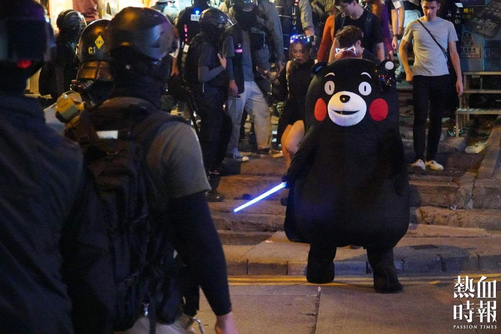 :speech_balloon:评:0 :+1:赞:1 :globe_with_meridians:转:1  

[11月02日 06:47]    新闻大吐槽   @TuCaoFakeNews     https://twitter.com/tucaofakenews/status/1190397688908369920 …  :speech_balloon:评:0 :+1:赞:2 :globe_with_meridians:转:1  

[11月02日 06:38]    新闻大吐槽   @TuCaoFakeNews    保镖开道，维尼熊扭着妖娆的身段，不停的抛出飞吻

要说鬼节，还是日本人会玩  :speech_balloon:评:2 :+1:赞:34 :globe_with_meridians:转:14  

[11月02日 06:14]    新闻大吐槽   @TuCaoFakeNews    给华人进行这个测试时，要头戴测谎仪才行 https://twitter.com/hiaaronwoods/status/1189856191368708097 …  :speech_balloon:评:1 :+1:赞:7 :globe_with_meridians:转:0  

[11月02日 05:52]    新闻大吐槽   @TuCaoFakeNews     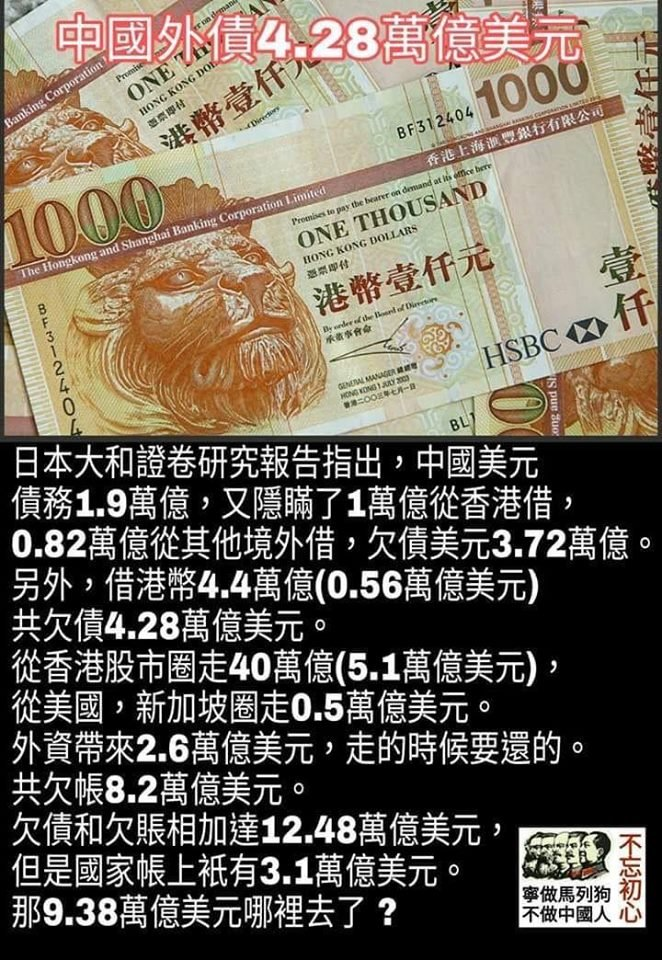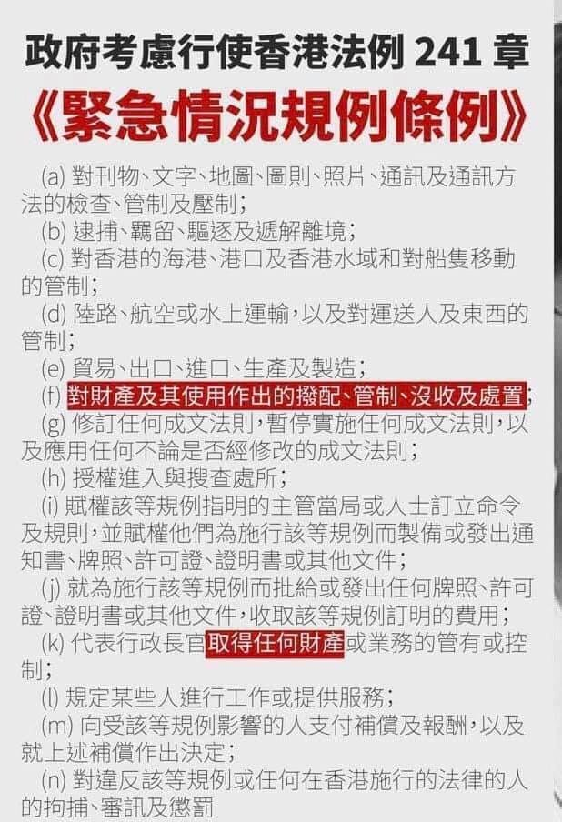 :speech_balloon:评:1 :+1:赞:2 :globe_with_meridians:转:3  

[11月02日 05:35]    新闻大吐槽   @TuCaoFakeNews    赞香港中文大学段校长

在这个时代，
你说什么最昂贵?
黄金
翡翠
钻石
官位...?

也许有道理，
然而不全对。

你看见那良知了吗?
这东西不需要太多，
在这末世哪怕只有一点点，
都会让
天地动容，
神佛流泪。 https://twitter.com/TuCaoFakeNews/status/1190200012044525568 …  :speech_balloon:评:0 :+1:赞:13 :globe_with_meridians:转:5  

[11月02日 05:11]    新闻大吐槽   @TuCaoFakeNews      :speech_balloon:评:0 :+1:赞:6 :globe_with_meridians:转:3  

[11月02日 05:00]    纽约时报中文网   @nytchinese    #一周热门 华盛顿vs.华尔街：中国投资引发美国政商界对立 http://nyti.ms/2Woe9Km   :speech_balloon:评:2 :+1:赞:1 :globe_with_meridians:转:0  

[11月02日 04:59]    老司机   @h5lpykl7tp6jjop    刚唱了我是共产党的一个兵就接着唱爱在加拿大，你妈的两张嘴皮翻得太快了！  :speech_balloon:评:1 :+1:赞:4 :globe_with_meridians:转:1  

[11月02日 04:27]    老司机   @h5lpykl7tp6jjop    说中国人不守秩序，他们跪在地上维权排得整整齐齐，说他们守秩序，他们冲红灯抢猪肉绝对不会排队，说他们不讲规则，他们人人连潜规则都搞得懂，说他们守规则，他们不卖门票连老虎都不怕，翻马路栏杆被夹死也愿意！说他们胆子小，做毒食品毐酒毒菜没怕过，说他们胆子大，整死他们不敢喊打倒共产党！  :speech_balloon:评:3 :+1:赞:82 :globe_with_meridians:转:36  

[11月02日 04:27]    新闻大吐槽   @TuCaoFakeNews    说中国人不守秩序，他们跪在地上维权排得整整齐齐，说他们守秩序，他们冲红灯抢猪肉绝对不会排队，说他们不讲规则，他们人人连潜规则都搞得懂，说他们守规则，他们不卖门票连老虎都不怕，翻马路栏杆被夹死也愿意！说他们胆子小，做毒食品毐酒毒菜没怕过，说他们胆子大，整死他们不敢喊打倒共产党！  :speech_balloon:评:3 :+1:赞:82 :globe_with_meridians:转:36  

[11月02日 04:12]    新闻大吐槽   @TuCaoFakeNews      :speech_balloon:评:0 :+1:赞:6 :globe_with_meridians:转:4  

[11月02日 04:12]    新闻大吐槽   @TuCaoFakeNews     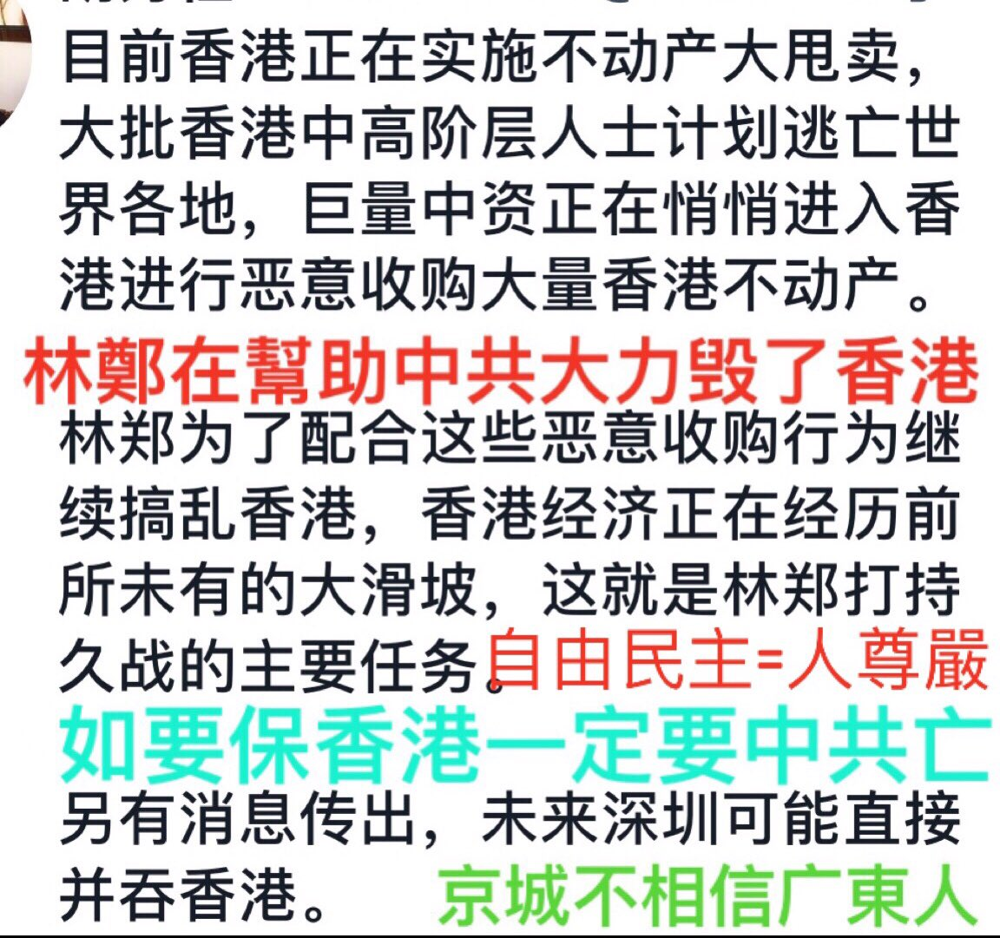 :speech_balloon:评:1 :+1:赞:4 :globe_with_meridians:转:1  

[11月02日 03:39]    新闻大吐槽   @TuCaoFakeNews    太坏了。给人吃致命的食物。恶魔计划让全世界憎恨这个族群。好人也跟着他们倒霉。王八蛋  :speech_balloon:评:0 :+1:赞:2 :globe_with_meridians:转:1  

[11月02日 02:04]    老司机   @h5lpykl7tp6jjop    转自微信：这是安徽律师吕先三的孩子，吕先三律师因为代理案件，今天被合肥中院以诈骗罪判处有期徒刑12年，吕及家人喊冤不止。这样的图片，令人悲伤。  :speech_balloon:评:1 :+1:赞:51 :globe_with_meridians:转:26  

[11月02日 00:59]    新闻大吐槽   @TuCaoFakeNews    一个警察突然发狂，冲入抗议人群，将一个静静坐在地上的社工头部打伤，鲜血流了一地。

在人群的怒斥和部分理性警察的干预下，局势得到了控制。

大陆的年轻警察容易情绪失控，但香港警察说不定可以帮他们从塑三观，至少令其知道警民并非一元对立，反向洗脑，共党始料未及  :speech_balloon:评:14 :+1:赞:125 :globe_with_meridians:转:96  

[11月02日 00:36]    老司机   @h5lpykl7tp6jjop    Is heart broken with this little girl, when we will stop the lives like that
Source from FB
#HKPoliceState #HKPoliceBrutality #HKPoliceTerrorism #HKHumanRightsandDemocracyAct  :speech_balloon:评:31 :+1:赞:386 :globe_with_meridians:转:361  

[11月02日 00:30]    BBC News 中文   @bbcchinese    中国近年来一直在大力建设太阳能农场，但离完全放弃煤炭依然还有漫漫长路。  :speech_balloon:评:13 :+1:赞:35 :globe_with_meridians:转:10  

[11月01日 22:25]    BBC News 中文   @bbcchinese    那天，七万人走上街头，向当权者说不。要求民主、反对暴力的示威，成为他们追求自由道路上的里程碑。之后，越来越多的人鼓起勇气加入抗议示威。大潮势不可挡...... https://bbc.in/2N9SClD   :speech_balloon:评:93 :+1:赞:323 :globe_with_meridians:转:117  

[11月01日 21:30]    纽约时报中文网   @nytchinese    “我们的责任是保证纯粹的学习环境，”一名“学生信息员”说，“保证教授们遵守规定。”
“人人自危了，“一名因批评习近平喜欢的口号而被学生举报、随后被开除的教授说。“怎么会进步呢，“他问，“发明创造怎么会出现呢？” http://nyti.ms/2PzncGG   :speech_balloon:评:7 :+1:赞:44 :globe_with_meridians:转:17  

[11月01日 21:26]    新闻大吐槽   @TuCaoFakeNews    10月31日社工陳虹秀遭防暴警察零距離狂噴胡椒噴霧，她當時正在幫助另一名被打得血流如注的社工。第二天，他們召開記者招待會，呼籲有良知的警方站出來保護市民，讓情緒失控的警察放假。  :speech_balloon:评:6 :+1:赞:137 :globe_with_meridians:转:104  

[11月01日 21:00]    纽约时报中文网   @nytchinese    元朗袭击事件发生五天后，数万名抗议者聚集到该地区。防暴警察为驱散人群发射了多枚催泪瓦斯。
几个月后，这个工人阶层居住的社区在夕阳下一片平静。 http://nyti.ms/2C1oQJu   :speech_balloon:评:5 :+1:赞:5 :globe_with_meridians:转:4  

[11月01日 20:24]    BBC News 中文   @bbcchinese    “滥杀无辜” 、“被消失” 这些通常让人联想起恐怖活动的用词，如今被人权组织用来形容在阿富汗的亲政府武装，而这些武装被指是由美国中央情报局（CIA）训练、提供武器和资金。 https://bbc.in/34nSPXQ   :speech_balloon:评:11 :+1:赞:28 :globe_with_meridians:转:10  

[11月01日 20:00]    纽约时报中文网   @nytchinese    几个月来，民主党人一直抵制这样的投票，但面对一致反对的共和党人，他们这次强行通过了决议，只有两名民主党人背弃政党立场投了反对票。
这一投票结果预示了即将到来的斗争：随着民主党人在公众面前陈明其弹劾的理由，两党都将进入一个未知的领域，美国的政治格局也将被重塑。 http://nyti.ms/3213pT7   :speech_balloon:评:1 :+1:赞:10 :globe_with_meridians:转:5  

[11月01日 19:31]    墙国铁拳现世报😷   @Socialistfist    掐指一算，已经是两周了。希望兔兔可以被善待  :speech_balloon:评:11 :+1:赞:84 :globe_with_meridians:转:10  

[11月01日 19:16]    财经真相   @caijingxiang    美国驻华大使微信公众号，今天发布的蓬佩奥国务卿在哈德逊研究所的讲话，改文链接被微信以网页包含违法或违规内容，被多人投诉为由封杀，彭斯在弗雷德里克·马勒克纪念讲座发表讲话也无法打开，其他文章链接正常，均可打开阅读！  :speech_balloon:评:27 :+1:赞:279 :globe_with_meridians:转:131  

[11月01日 19:00]    BBC News 中文   @bbcchinese    “勾引术”教练在网上销售课程，教导其他男性如何尽快地引诱女性上床。这已是一项百万英镑的产业。 https://bbc.in/2N6GYIb   :speech_balloon:评:10 :+1:赞:48 :globe_with_meridians:转:27  

[11月01日 19:00]    纽约时报中文网   @nytchinese    #图集【在美国，220万美元能买到什么房？】手握220万美元，你能买到乔治亚洲罗马一座建于19世纪晚期的木匠哥特式房屋，或马萨诸塞州牛顿的世纪中期现代主义住宅，也可以选择纽约州上奈克市的新乔治亚风格房屋。
点击查看图集： http://nyti.ms/339X49q   :speech_balloon:评:3 :+1:赞:24 :globe_with_meridians:转:4  

[11月01日 18:55]    新闻大吐槽   @TuCaoFakeNews    終國共慘黨的邏輯舉動  :speech_balloon:评:0 :+1:赞:1 :globe_with_meridians:转:1  

[11月01日 18:46]    财经真相   @caijingxiang    再补充一个问题，外资可以自由汇出，是仅限于美国企业，还是所有外资？如果只是美资，有效期是仅限于最近签署第一阶段协议的时候、还是永远自由出入？  :speech_balloon:评:9 :+1:赞:84 :globe_with_meridians:转:6  

[11月01日 18:42]    财经真相   @caijingxiang    你就想问问是司法部权利大？还是外汇管理局大？谁说的话最管用？  :speech_balloon:评:4 :+1:赞:83 :globe_with_meridians:转:9  

[11月01日 18:40]    财经真相   @caijingxiang    司法部就《中华人民共和国外商投资法实施条例》公开征求意见：外国投资者在中国境内的出资、利润、资本收益、资产处置所得、知识产权许可使用费、依法获得的补偿或者赔偿、清算所得等，可以依法以人民币或者外汇自由汇入、汇出，任何单位和个人不得违法对币种、数额以及汇入、汇出的频次等进行限制。  :speech_balloon:评:40 :+1:赞:141 :globe_with_meridians:转:35  

[11月01日 18:00]    BBC News 中文   @bbcchinese    针对网上教人制作汽油弹和鼓吹攻击警察的言论，香港法院颁令禁止网上煽动暴力言论，建制派说这有阻吓性作用，但民主派担心这是香港禁网的先兆。 https://bbc.in/2N3gXJJ   :speech_balloon:评:47 :+1:赞:91 :globe_with_meridians:转:25  

[11月01日 17:52]    纽约时报中文网   @nytchinese    中国大学正在部署学生对教师进行监督，越来越多的“学生信息员”密切关注着教授的思想观点。他们既是学生又是间谍，其任务是帮助铲除对习近平和共产党有不忠迹象的教师。
这场大规模行动的目的是消除异议，把大学变成党的根据地。至今已有十几名教授遭举报后被开除或处罚。 http://nyti.ms/2PzncGG   :speech_balloon:评:80 :+1:赞:386 :globe_with_meridians:转:242  

[11月01日 17:39]    墙国铁拳现世报😷   @Socialistfist    可惜北京的青天习老爷不玩微博

#社会主义铁拳  :speech_balloon:评:22 :+1:赞:199 :globe_with_meridians:转:42  

[11月01日 17:00]    纽约时报中文网   @nytchinese    周四晚上，警察和抗议者之间形成了紧张的对峙。官员们很快宣布这次集会非法，并采取了几乎史无前例的步骤，下令立即疏散该地区。
晚些时候，该地区被封锁，可以看到一名装扮成白雪公主的狂欢者在催泪瓦斯中咳嗽，游客们还在自拍。当晚，抗议者和警察在城市各处发生了多起冲突。 http://nyti.ms/36lKF4c   :speech_balloon:评:1 :+1:赞:14 :globe_with_meridians:转:8  

[11月01日 16:30]    纽约时报中文网   @nytchinese    周四，美国众议院投票支持了由民主党人主导的特朗普弹劾调查，这一行动为调查开启了一个关键的公开阶段，也凸显了调查背后的政治两极分化。
此次投票以232票赞成、196票反对通过了决议，为鲜有先例的弹劾程序设定了规则。在2020年大选前，此程序势必将是整个国家关注的焦点。 http://nyti.ms/3213pT7   :speech_balloon:评:8 :+1:赞:36 :globe_with_meridians:转:13  

[11月01日 16:00]    纽约时报中文网   @nytchinese    四中全会召开之际，中国正努力应对与特朗普政府之间的贸易战，以及经济增长的显著放缓。
公报未提及这些问题，但其中一条表明，习近平和他的同事感到风险挑战已经增加。公报称，领导层经受了“国内外风险挑战明显增多的复杂局面”。 http://nyti.ms/34ufNwT   :speech_balloon:评:5 :+1:赞:14 :globe_with_meridians:转:5  

[11月01日 15:50]    老司机   @h5lpykl7tp6jjop    #Hongkong10月31日
記住CCP在香港的暴行這哪裡是在執法這就是公開耍流氓的證據
#HongKongPolice 一名黑察正在對一名柔弱的女性進行性騷擾，另一位黑警把她的雙腿張開！
他們抓住了她並把她的襯衫一直拉到露出她的胸罩！
@FLOTUS
@VP
@SecPompeo
@MariaBartiromo
@trish_regan
@robert_spalding  :speech_balloon:评:39 :+1:赞:365 :globe_with_meridians:转:364  

[11月01日 15:37]    纽约时报中文网   @nytchinese    持续近五个月的抗议活动沉重打击香港经济，贸易战和全球经济放缓也加剧了经济萎缩。
本周抗议活动仍在继续，示威者在万圣节挑战当局的禁蒙面法，再次引发警民冲突。 http://nyti.ms/36lKF4c   :speech_balloon:评:8 :+1:赞:60 :globe_with_meridians:转:27  

[11月01日 15:10]    新闻大吐槽   @TuCaoFakeNews    "华为"威胁用户不让讲瑕疵!?"华为"臭流氓啦!  :speech_balloon:评:0 :+1:赞:1 :globe_with_meridians:转:2  

[11月01日 15:00]    纽约时报中文网   @nytchinese    数十万人在湾仔等香港一些主要商业区游行，表达他们对引渡法案修例的愤怒。6月9日的示威活动事实上是今年抗议活动的开始，也是香港历史上规模最大的示威活动之一。
大多数时候，这片社区是购物和夜生活的中心。 http://nyti.ms/2C1oQJu  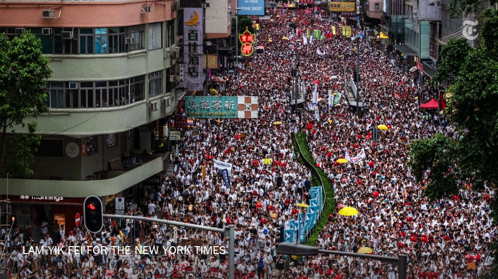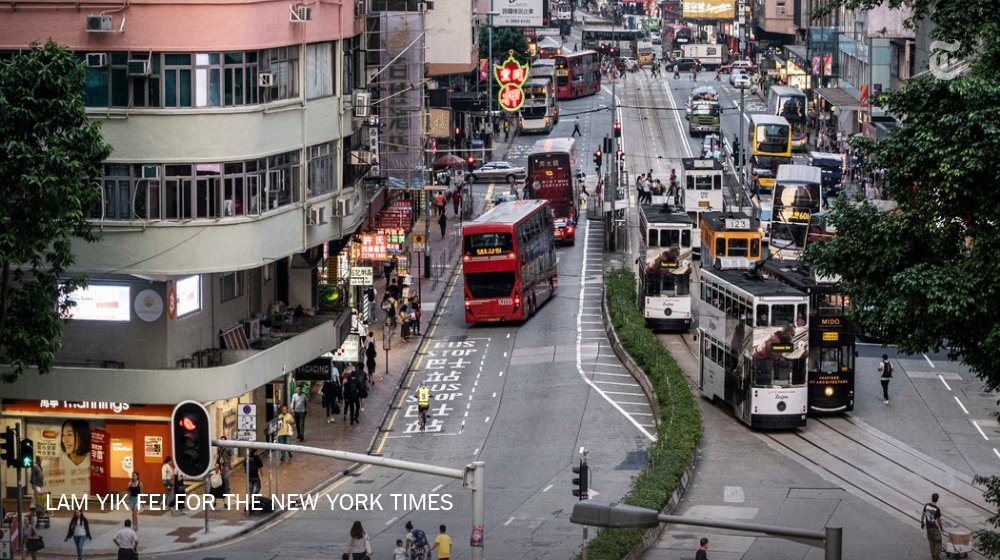 :speech_balloon:评:22 :+1:赞:26 :globe_with_meridians:转:9  

[11月01日 14:31]    BBC News 中文   @bbcchinese    巴基斯坦一列火车发生严重火灾，造成73人死亡，反映出巴国的交通基础设施存在的种种问题。
 https://bbc.in/2q954sN   :speech_balloon:评:8 :+1:赞:16 :globe_with_meridians:转:7  

[11月01日 14:30]    纽约时报中文网   @nytchinese    停飞中国制造的无人机的决定，即便是暂时的，也加剧了人们对中国科技越来越多的担忧，以及将其用于敏感的政府项目的潜在风险。
人们多年来一直担心，中国无人机可能会秘密窃取数据，并将数据直接或通过中国制造商传递回中国情报机构。 http://nyti.ms/2qXspOk   :speech_balloon:评:19 :+1:赞:49 :globe_with_meridians:转:13  

[11月01日 14:00]    BBC News 中文   @bbcchinese    随着气候变暖，考古学家发现珍贵的史前文物正在从高山冰原中融化分解，他们在与时间赛跑，抢救这些“冰冻的文物”。 https://bbc.in/36jILB6   :speech_balloon:评:5 :+1:赞:42 :globe_with_meridians:转:15  

[11月01日 13:59]    纽约时报中文网   @nytchinese    中共领导层周四宣布，在持续数月的抗议活动破坏了香港的稳定之后，中国将推出新的措施以“维护国家安全”。
官方公报称，中国将在港澳建立健全“维护国家安全的法律制度和执行机制”，但未透露细节。公报还提及了“国内外风险挑战明显增多的复杂局面”，强调进一步扩大中共的领导。 http://nyti.ms/34ufNwT   :speech_balloon:评:15 :+1:赞:46 :globe_with_meridians:转:31  

[11月01日 13:00]    纽约时报中文网   @nytchinese    #每日一词 时报专栏作者弗里德曼提到美国有一个“愿意堕落到香蕉共和国(banana republic)治理水准的总统”。“香蕉共和国”是一种政治及经济体系的贬称，特指那些腐败问题严重、遭外国势力介入的国家，该词的由来是因为这种国家通常依赖香蕉等经济作物。
更多简报内容： http://nyti.ms/320ajZ3   :speech_balloon:评:1 :+1:赞:8 :globe_with_meridians:转:4  

[11月01日 12:30]    纽约时报中文网   @nytchinese    香港抗议活动几乎每周都以熟悉的节奏上演：游行、警民冲突；然后行动结束，社区回归日常。
摄影师林亦非回到他曾经记录近几个月来的大规模集会和街头冲突的地方，从完全相同的观察点捕捉瞬间。他的对比照展示了这个香港居民现在定期经历的强烈反差。 http://nyti.ms/2C1oQJu   :speech_balloon:评:42 :+1:赞:184 :globe_with_meridians:转:88  

[11月01日 12:13]    新闻大吐槽   @TuCaoFakeNews    这不就是CCP和粉红们的逻辑吗？只能褒不能贬。你提出缺点批评我，你就是在污蔑我想整死我，你就是汉奸走狗卖国贼。  :speech_balloon:评:0 :+1:赞:7 :globe_with_meridians:转:2  

[11月01日 12:07]    新闻大吐槽   @TuCaoFakeNews    华为就是中国执政党的缩影，一旦有不一样的声音就是威胁警告各种打压。只能人人歌颂它，不能一人质疑他  :speech_balloon:评:1 :+1:赞:6 :globe_with_meridians:转:2  

[11月01日 12:06]    GFHG SDKM   @zyx_yny    Reporters need to ask @hkpoliceforce what NTS T2-3, Pln Cdr mean or correspond to. https://twitter.com/Liz86719814/status/1190100361119354880 …  :speech_balloon:评:198 :+1:赞:1654 :globe_with_meridians:转:1139  

[11月01日 12:04]    GFHG SDKM   @zyx_yny    Shotgun pointed at protester head  :speech_balloon:评:36 :+1:赞:596 :globe_with_meridians:转:683  

[11月01日 12:00]    BBC News 中文   @bbcchinese    艾米感觉老公似乎对她的一切都了如指掌，包括她和朋友的私下聊天内容，还有她的一切行踪，等到艾米最终发现真相时，心头一阵惊悚，几乎无法呼吸…… https://bbc.in/2BVmATQ   :speech_balloon:评:11 :+1:赞:24 :globe_with_meridians:转:11  

[11月01日 12:00]    纽约时报中文网   @nytchinese    • 巴基斯坦火车起火，导致70余人死亡。官员称，一列火车内的烹饪炉发生爆炸引发火情，三节满载乘客的车厢被大火吞噬。
• 朝鲜再次试射两枚短程导弹。这是自上月与美国在斯德哥尔摩的谈判陷入僵局以来，朝鲜首次进行导弹试射。
更多简报内容： http://nyti.ms/320ajZ3   :speech_balloon:评:1 :+1:赞:6 :globe_with_meridians:转:5  

[11月01日 11:57]    GFHG SDKM   @zyx_yny    The Halloween gift hk govr. give us.
What’s next step?Block our right to use internet?Block all the social networks?
Hong Kong > Block Kong 
How many negative name of Hong Kong can we build which inspire by hk govr.
#4Corners #SOSHK #hkprotest #FightForFreedom #StandwithHongKong  :speech_balloon:评:1 :+1:赞:23 :globe_with_meridians:转:13  

[11月01日 11:30]    纽约时报中文网   @nytchinese    美国内政部周三宣布，除了正在被用于紧急情况的无人机外，将停飞其机队中所有中国制造、或含有中国制造零部件的无人机。
中国外交部批评，这一对中国公司的限制源于“冷战思维”，并呼吁华盛顿“为中国企业在美正常经营活动提供公平、公正和非歧视的环境”。 http://nyti.ms/2qXspOk   :speech_balloon:评:62 :+1:赞:502 :globe_with_meridians:转:184  

[11月01日 11:00]    BBC News 中文   @bbcchinese    人类在进化过程中曾丢失了许多“多余”器官。人类所丢失的某些东西，正是那些能让我们成为“超人”的东西。 https://bbc.in/2JEi5Bn   :speech_balloon:评:12 :+1:赞:84 :globe_with_meridians:转:29  

[11月01日 11:00]    纽约时报中文网   @nytchinese    伊斯兰国确认其头目死亡，并指定继任者。本周早些时候，特朗普宣布，巴格达迪在美军突袭行动中引爆炸弹背心自杀死亡。
但外界对伊斯兰国的新领导人几乎一无所知，包括他的真实身份。该组织还警告美国，不要太高兴。
更多简报内容： http://nyti.ms/320ajZ3   :speech_balloon:评:2 :+1:赞:6 :globe_with_meridians:转:2  

[11月01日 10:30]    纽约时报中文网   @nytchinese    #影评《寄生虫》兼有恐怖片、讽刺片和悲剧色彩，表现了韩国乃至世界各地阶级斗争的深刻教训。
现年50岁、拥有七部作品的导演奉俊昊将娱乐与社会意识结合在一起，从而激活电影虽已褪色但仍在坚持的民主承诺。 http://nyti.ms/2q4xXX5   :speech_balloon:评:3 :+1:赞:14 :globe_with_meridians:转:4  

[11月01日 10:11]    新闻大吐槽   @TuCaoFakeNews    前几个月华为手机爆炸有人发微博投诉结果被人围攻删帖炸号，华为成了“伟光正“，这点很危险，出了事故只怨自己倒霉。 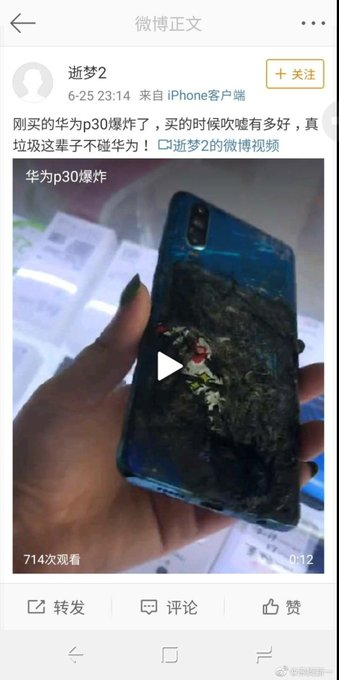 :speech_balloon:评:1 :+1:赞:64 :globe_with_meridians:转:15  

[11月01日 10:11]    纽约时报中文网   @nytchinese    China Says It Will Roll Out ‘National Security’ Steps for HK. A Divided House Endorses Impeachment Inquiry. HK Falls Into Recession; Protesters Defy Mask Ban on Halloween. How to say "banana republic" in Chinese? Find out @nytchinese https://cn.nytimes.com/morning-brief/20191101/communist-party-plenary-us-chinese-made-drones/ …  :speech_balloon:评:3 :+1:赞:20 :globe_with_meridians:转:7  

[11月01日 10:06]    BBC News 中文   @bbcchinese    报告重申香港示威者的暴力行为不能接受，但同时强调各方必须进行“有意义”的对话。 https://bbc.in/34f7y7q   :speech_balloon:评:158 :+1:赞:168 :globe_with_meridians:转:55  

[11月01日 09:50]    财经真相   @caijingxiang    根据CEPA要求，中共央行正式宣布为在香港办理个人人民币存款、兑换、银行卡和汇款业务的银行提供清算安排，随后中银香港被指定为人民币在香港的结算行，其他香港银行的人民币业务必须找中银香港做最后的结算，同时接受中银香港的协议，但是该协议成为中共对香港金融的长臂管辖，自此香港金融彻底沦落  :speech_balloon:评:4 :+1:赞:192 :globe_with_meridians:转:75  

[11月01日 09:42]    财经真相   @caijingxiang    【快讯】央行称将于11月7日（下周四）在香港发行200亿元人民币三个月央票，及100亿元人民币一年期央票。 人民币在香港扩张最初始于1993年央行颁布的人民币出入境条例，最终全面形成是基于2003年6月大陆与香港签署的《内地与香港关于建立更紧密经贸关系的安排》（CEPA）  :speech_balloon:评:2 :+1:赞:137 :globe_with_meridians:转:52  

[11月01日 09:31]    BBC News 中文   @bbcchinese    随着中国雄心勃勃的“一带一路”计划向南亚延伸，尼泊尔-中国跨喜玛拉雅铁路提上日程，尼泊尔现在成了中印扩大地区影响的必争之地。
 https://bbc.in/2WxKPBe  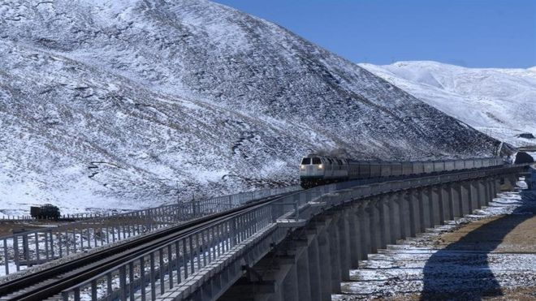 :speech_balloon:评:12 :+1:赞:20 :globe_with_meridians:转:11  

[11月01日 09:07]    新闻大吐槽   @TuCaoFakeNews    华为在输出产品的同时，也在输出强国的价值观。  :speech_balloon:评:0 :+1:赞:4 :globe_with_meridians:转:2  

[11月01日 08:35]    老司机   @h5lpykl7tp6jjop    全国楼市降价潮：最高直降10000元/㎡，广州两天降6千/㎡！武汉直降8千/㎡！合肥最高降4536元/㎡！  :speech_balloon:评:2 :+1:赞:43 :globe_with_meridians:转:19  

[11月01日 08:21]    老司机   @h5lpykl7tp6jjop    在中国人中每个人骄傲自大都会遭到批评鄙视，一但提起群体就必须骄傲自大反之则会遭到批评鄙视！这是什么逻辑？这就是中国逻辑！每一个没有尊严的人合在一起就成了尊严心极强的群体，这种现象全世界只有中国会出现，可中国人一点不觉奇怪，反而认为很正常，所以中国人说你不正常，那恭喜你，你是正常人  :speech_balloon:评:4 :+1:赞:122 :globe_with_meridians:转:31  

[11月01日 08:03]    GFHG SDKM   @zyx_yny    不好意思，小熊維尼（プーさん）让一下下
涩谷的万圣节
Shibuya gets out of control on Halloween.

すみません、くまのプーさん通ります！！
ハロウィンの渋谷はやばい。。
   :speech_balloon:评:50 :+1:赞:1330 :globe_with_meridians:转:750  

[11月01日 08:00]    GFHG SDKM   @zyx_yny    Hong Kong latest:
- Police scuffle with protesters and party-goers on Halloween
- Beijing signals tougher security measures are coming
- Court injunction bans internet posts that incite or encourage violence https://bloom.bg/2Py1jaK   :speech_balloon:评:251 :+1:赞:2270 :globe_with_meridians:转:2009  

[11月01日 07:52]    GFHG SDKM   @zyx_yny    一位男士不畏警察的强光照射，坐在警署外指骂有枪有炮，就是没有良心、良知。他还向警察怒吼，香港人不怕死，警察可以用真枪射杀他。  :speech_balloon:评:10 :+1:赞:103 :globe_with_meridians:转:46  

[11月01日 07:50]    GFHG SDKM   @zyx_yny    The brutality by the police towards protestors in #HongKong is deplorable.

Communist China and President Xi have turned Hong Kong into a police state. The US continues to #StandwithHongKong & will aid their fight for human rights in any way we can! https://twitter.com/hkchrislau/status/1189887609553604609 …  :speech_balloon:评:605 :+1:赞:4482 :globe_with_meridians:转:3496  

[11月01日 07:30]    BBC News 中文   @bbcchinese    许多现代女性面临家庭和事业之间的选择，更别提那些不孕症女性所面临的生育治疗和工作之间的压力和平衡。
 https://bbc.in/33gHGba  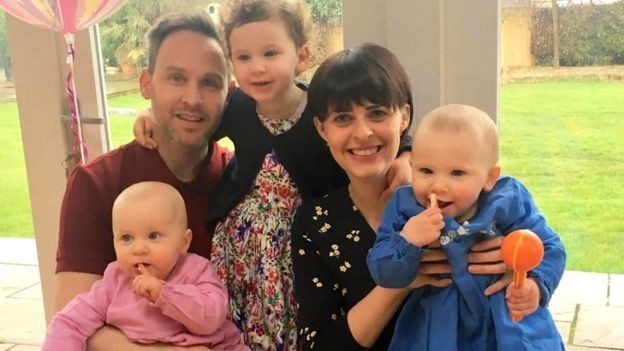 :speech_balloon:评:1 :+1:赞:10 :globe_with_meridians:转:7  

[11月01日 07:15]    BBC News 中文   @bbcchinese    有香港网民发起在万圣节晚上游行，向政府表达不满。大批市民在中环兰桂坊酒吧街一带聚集，其后警察发射催泪弹驱散。  :speech_balloon:评:81 :+1:赞:241 :globe_with_meridians:转:120  

[11月01日 04:21]    新闻大吐槽   @TuCaoFakeNews    马来小哥因上个视频说实话，戳到华为痛点，被华为找上门警告！平日乐观的小哥，今天心情坏到极点，直骂华为是流氓！

针对新机不能用谷歌套件，华为私下提供了破解方法，可一旦破解，就不能收发短信！

华为自己的锅，为何威胁恐吓消费者？又玩强国文化输出！？看来芯片库存还没用完吧？才敢这么得瑟  :speech_balloon:评:234 :+1:赞:2751 :globe_with_meridians:转:1472  

[11月01日 01:11]    GFHG SDKM   @zyx_yny    They are neither cleaning that place nor doing anything meaningful at all. https://twitter.com/fktws/status/1189892960524984320 …  :speech_balloon:评:0 :+1:赞:0 :globe_with_meridians:转:0  

[11月01日 00:38]    财经真相   @caijingxiang    美元货币体系终结者——数字货币  :speech_balloon:评:44 :+1:赞:134 :globe_with_meridians:转:30  

[11月01日 00:30]    GFHG SDKM   @zyx_yny    Hong Kong police arrested a foreign lady who was celebrating Halloween in ​​Lan Kwai Fong. The police pushed down the lady. She shouted for help from BBC, CNN and kept yelling "I need my wallet”. She asked to call the US consulate. 
Source: Editorial Board, CityU SU
@SolomonYue  :speech_balloon:评:28 :+1:赞:891 :globe_with_meridians:转:863  

[11月01日 00:24]    财经真相   @caijingxiang    美元根本无法脱钩比特币，因为它从未就“挂钩过”，都是场外交易，所以才可以为非法交易提供洗钱！ https://twitter.com/seanchen_new/status/1189940816560582659 …  :speech_balloon:评:9 :+1:赞:51 :globe_with_meridians:转:8  

[11月01日 00:18]    财经真相   @caijingxiang    那些说夸张的人，究竟懂不懂世界贸易体系？如果夸张，习近平会亲自开会学习区域块链？  :speech_balloon:评:21 :+1:赞:55 :globe_with_meridians:转:10  

[11月01日 00:17]    财经真相   @caijingxiang    美国人看样子要重新构建一种新的货币结算体系了！  :speech_balloon:评:8 :+1:赞:64 :globe_with_meridians:转:9  

[11月01日 00:15]    财经真相   @caijingxiang    中共发行的数字货币究竟目的是什么？答案是毁灭全世界，摧毁美元世界霸权，进而摧毁世界贸易体系，再摧毁世界经济，最终将世界变成人间炼狱！  :speech_balloon:评:92 :+1:赞:438 :globe_with_meridians:转:199  

[10月31日 23:44]    GFHG SDKM   @zyx_yny    #HKPolice makes an arrest and tells reporters they're too close and that they should be filming people throwing stuff instead.  None of the reporters saw anyone throw anything and call him out on his BS.  Why are we not surprised?

#StandWithHongKong #HongKongProtests  :speech_balloon:评:26 :+1:赞:427 :globe_with_meridians:转:413  

[10月31日 23:23]    财经真相   @caijingxiang    美国民主党关于对特朗普进行弹劾调查的下一步行动在美国众议院扫清了程序性障碍! https://twitter.com/caijingxiang/status/1189503583399448576 …  :speech_balloon:评:8 :+1:赞:40 :globe_with_meridians:转:6  

[10月31日 23:08]    GFHG SDKM   @zyx_yny    An elderly woman bled heavily after got shot at her leg by a tear gas canister fired by #HKPoliceTerrorists  :speech_balloon:评:154 :+1:赞:2800 :globe_with_meridians:转:3075  

[10月31日 23:05]    GFHG SDKM   @zyx_yny    In #MongKok, a #police officer pepper sprayed a passerby right at his face, the police claimed that "he has given warnings"
Credit - 35cbc.clarius@ig
#HongKongRioters #PoliceBrutality #PoliceState #StandWithHongKong #FreeHongKong  :speech_balloon:评:16 :+1:赞:260 :globe_with_meridians:转:254  

[10月31日 23:03]    老司机   @h5lpykl7tp6jjop    An elderly got shot by teargas with blood all over the floor....

【旺角即時】一名婆婆被催淚彈射中腳部並大量流血。  :speech_balloon:评:73 :+1:赞:1111 :globe_with_meridians:转:1330  

[10月31日 22:43]    老司机   @h5lpykl7tp6jjop    這不叫黑警？
那你給他們一個更合適的稱呼！

#StandwithHK  :speech_balloon:评:78 :+1:赞:325 :globe_with_meridians:转:310  

[10月31日 22:30]    BBC News 中文   @bbcchinese    农民少，平均年龄67岁！耕地少，仅有一点还都种大米了。怎样确保国人吃饱吃好吃放心？日本想出哪些高明招数？ https://bbc.in/2NsNnMF   :speech_balloon:评:11 :+1:赞:58 :globe_with_meridians:转:21  

[10月31日 22:26]    GFHG SDKM   @zyx_yny    Just got tear gassed. Happy Halloween from Hong Kong.  :speech_balloon:评:2626 :+1:赞:7902 :globe_with_meridians:转:5153  

[10月31日 22:00]    BBC News 中文   @bbcchinese    四中全会是神秘的闭门会议，公报出来了，选定接班人、高层人事变动、香港局势……其中到底说了什么、没说什么？传达出怎样的信号？ https://bbc.in/34mrSDV   :speech_balloon:评:66 :+1:赞:132 :globe_with_meridians:转:48  

[10月31日 21:57]    GFHG SDKM   @zyx_yny    Now cosplaying is de facto banned in #HongKong. #HKPoliceTerrorists will beat you up even though you just cosplay as the #mistressofevil  on #halloween2019  :speech_balloon:评:172 :+1:赞:2575 :globe_with_meridians:转:2445  

[10月31日 21:45]    GFHG SDKM   @zyx_yny    今夜の #渋谷 で、香港を応援する中国人が過激な中国人に襲われました
#halloween2019 #StandwiththePooh #StandWithHongKong #HongKongProtests #香港 #香港デモ #ハロウィン #shibuya #習近平 #仮面　#プーさん #ディズニー #暴力  :speech_balloon:评:73 :+1:赞:1297 :globe_with_meridians:转:1045  

[10月31日 21:25]    BBC News 中文   @bbcchinese    【香港示威直播：萬聖節反對「禁蒙面法」遊行】BBC中文現場直播香港蘭桂坊的情況。 https://bbc.in/2PvbHjI   :speech_balloon:评:7 :+1:赞:24 :globe_with_meridians:转:14  

[10月31日 21:12]    GFHG SDKM   @zyx_yny    #Police Officers desecrate the memorial hall set up for the deceased and victims of #policebrutality next to #PrinceEdward Station
Source -  https://t.me/guardiansofhongkong/9465 …
#PoliceState #StandWithHongKong #FreeHongKong #HongKongRioters  :speech_balloon:评:117 :+1:赞:1367 :globe_with_meridians:转:1473  

[10月31日 21:11]    GFHG SDKM   @zyx_yny    China has now 3-5 million Muslims in CONCENTRATION CAMPS. Subjecting them to TORTURE. Women are being GANG RAPED. Children are being SEPARATED from their parents. HARVESTING THEIR ORGANS!

China wants you to be silent. 

PLEASE DON'T BE SILENT

RETWEET   :speech_balloon:评:347 :+1:赞:24202 :globe_with_meridians:转:37827  

[10月31日 21:06]    BBC News 中文   @bbcchinese    今天是万圣夜，许多香港市民戴上面罩或化妆，在中环及太子站附近聚集。大批防暴警察在场戒备，并在太子发射催泪弹驱散集会者。 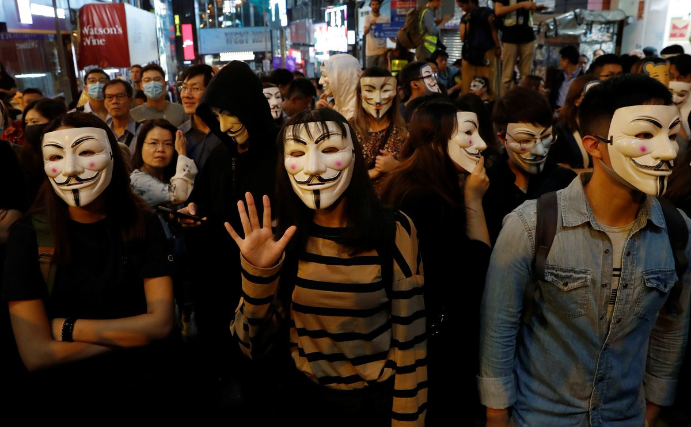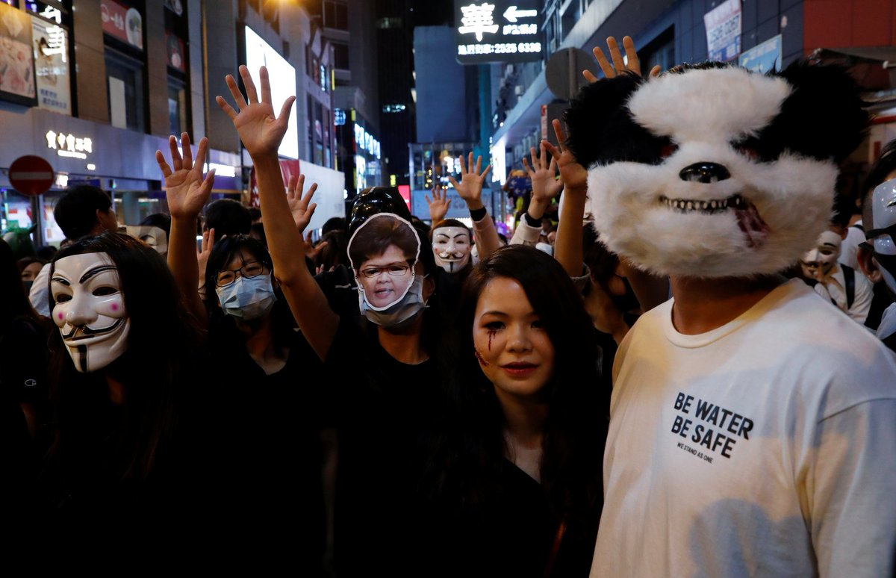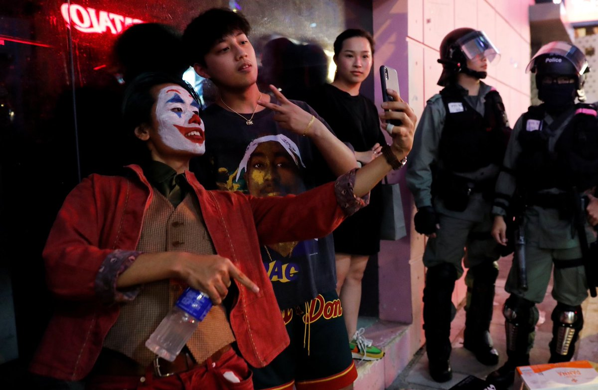 :speech_balloon:评:23 :+1:赞:97 :globe_with_meridians:转:44  

[10月31日 20:30]    BBC News 中文   @bbcchinese    中国官员称，数字货币发行后，两个手机碰一碰，即使没有网络，也可以把一个人数字钱包里的数字货币，转给另一个人。 https://bbc.in/36p6GiO   :speech_balloon:评:53 :+1:赞:83 :globe_with_meridians:转:43  

[10月31日 20:00]    BBC News 中文   @bbcchinese    脸书最近宣布不会禁止政治广告，与推特的态度截然相反。 https://bbc.in/326Twnf   :speech_balloon:评:28 :+1:赞:136 :globe_with_meridians:转:46  

[10月31日 19:55]    财经真相   @caijingxiang    重磅：美国国务卿蓬佩奥本周三在保守派智库纽约哈德逊研究所发表演讲时表示，中共政权正在谋求主导世界的权力，因此必须要予以正面反抗。
蓬佩奥在演讲中说，美国一直非常珍视与中国人民之间的友谊，但是中共政府与中国人民并非一回事。"这算是美国政府在职高官，第一次明确中共政府与中国两回事！ https://twitter.com/dw_chinese/status/1189872143036604416 …  :speech_balloon:评:18 :+1:赞:556 :globe_with_meridians:转:208  

[10月31日 19:50]    财经真相   @caijingxiang    又是彭博新闻，中共四中全会刚结束，新闻通稿刚发出，贸易谈判滑消息就出来了，时间点掐的很讲政治，恰到好处！ https://twitter.com/economics/status/1189870935290961923 …  :speech_balloon:评:6 :+1:赞:103 :globe_with_meridians:转:29  

[10月31日 19:20]    老司机   @h5lpykl7tp6jjop    当兵的退伍回乡走投无路只有上访，红后代移民加拿大爱国歌曲大演唱，加拿大中共解放军退伍军人协会成立，演唱歌曲说明身在曹营心在汉呢，还是怀念特权，只恨不能随身移呢？  :speech_balloon:评:17 :+1:赞:40 :globe_with_meridians:转:22  

[10月31日 18:51]    财经真相   @caijingxiang    四中全会总体一句话：不改、坚决不改！  :speech_balloon:评:107 :+1:赞:1157 :globe_with_meridians:转:458  

[10月31日 18:21]    老司机   @h5lpykl7tp6jjop    认识的人越来越多，但是我越来越喜欢狗！  :speech_balloon:评:2 :+1:赞:11 :globe_with_meridians:转:5  

[10月31日 17:56]    墙国铁拳现世报😷   @Socialistfist    就当是给祖国母亲的生日礼物了~

#社会主义铁拳  :speech_balloon:评:29 :+1:赞:333 :globe_with_meridians:转:66  

[10月31日 17:55]    老司机   @h5lpykl7tp6jjop    杀毒软件里有理财
听歌软件里有购物
聊天软件里有视频
支付软件里有社交
天气软件里有新闻
地图软件里有外卖
搜索引擎里卖假药
浏览器里有小游戏
这就是国内互联网现状，每个毒瘤软件都想要整个互联网，把用户当成猪，争相圈到自家猪圈里给用户喂屎。
我尽可能拒绝使用国内软件和服务，因为我不想吃屎  :speech_balloon:评:47 :+1:赞:1127 :globe_with_meridians:转:419  

[10月31日 17:30]    BBC News 中文   @bbcchinese    香港第三季GDP预先估计数字，较去年同期下跌2.9%，是2009年以来，首次录得季度按年跌幅。学者认为，中美贸易战对香港经济影响更大，但示威活动加快了衰退的步伐。 https://bbc.in/34k6aAq   :speech_balloon:评:43 :+1:赞:92 :globe_with_meridians:转:25  

[10月31日 17:10]    财经真相   @caijingxiang    China said to be unwilling to budge on big structural changes！  :speech_balloon:评:4 :+1:赞:68 :globe_with_meridians:转:23  

[10月31日 17:09]    财经真相   @caijingxiang    快讯：中共称不可能进行结构性改革，消息一出黄金上涨，人民币短线下跌  :speech_balloon:评:48 :+1:赞:520 :globe_with_meridians:转:124  

[10月31日 15:41]    老司机   @h5lpykl7tp6jjop    终于暴露中共才是华为背后的大老板！
任正非：华为交班已完成多年 我只是中间的“傀儡” 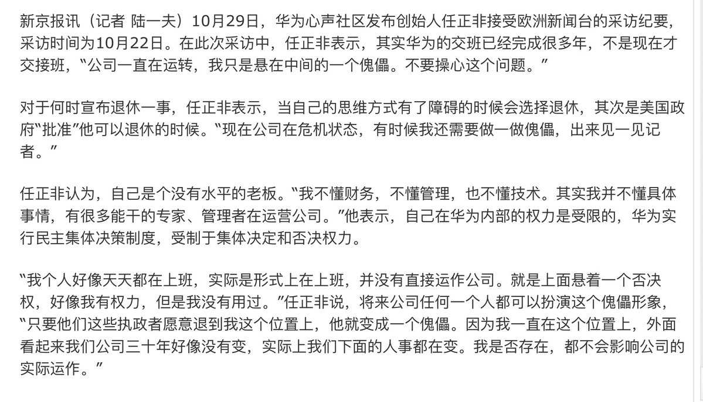 :speech_balloon:评:3 :+1:赞:39 :globe_with_meridians:转:25  

[10月31日 13:48]    财经真相   @caijingxiang    潘石屹soho卖给了黑石集团和GIC，考虑到黑石的背景，这次报价应该会很低！  :speech_balloon:评:19 :+1:赞:244 :globe_with_meridians:转:62  

[10月31日 13:12]    GFHG SDKM   @zyx_yny    @EnzoMazak @SpeakerPelosi @SenAlexander
Here's Cantonese lesson 
#hkpolice 
"清算 us?With water?Silly vxxxxa!"
清算(punish) spilt into two are "wash" and "count",which 清 literally is related to water.
 
Without punishment on them ANOTHER "Tuen Mun's Halloween" surely comes.  :speech_balloon:评:4 :+1:赞:73 :globe_with_meridians:转:55  

[10月31日 12:48]    财经真相   @caijingxiang    商务部新闻发言人声明：中美双方经贸团队一直保持密切沟通，目前磋商工作进展顺利。双方将按原计划继续推进磋商等各项工作。双方牵头人将于本周五再次通话。 中美贸易谈判现在是天天都有好消息，人民币也天天涨，静静的等待结果，看看究竟可以忽悠到什么时候！  :speech_balloon:评:19 :+1:赞:201 :globe_with_meridians:转:40  

[10月31日 12:02]    GFHG SDKM   @zyx_yny    A group of Uyghur activists and allies protested at the Capital One Arena during the Wizards vs Rocket Game today 

One Chinese man comes and says “Your mom’s dead”

Video from Hazel Sahin

#NBA #StopChina #FreeHongKong #FreeEastTurkestan #GoogleUyghur  :speech_balloon:评:116 :+1:赞:1637 :globe_with_meridians:转:1109  

[10月31日 10:24]    财经真相   @caijingxiang    据国务院新闻办公室10月31日消息，国务院新闻办公室定于2019年11月1日（星期五）上午10时举行中国共产党十九届四中全会新闻发布会，请中央宣传部、中央政策研究室、中央财经委员会办公室、全国人大常委会法工委、全国政协办公厅、司法部负责同志介绍有关情况，并答记者问。  :speech_balloon:评:8 :+1:赞:92 :globe_with_meridians:转:27  

[10月31日 08:58]    GFHG SDKM   @zyx_yny    From HK01: CCTV footages of #PrinceEdward station on August 31
One of the footage shows police officers chasing citizens at 10:56pm. Another one involves footage of 2 CCTV at platform 4, they only state "Video Loss" or "No Video"
 https://www.hk01.com/%E7%A4%BE%E6%9C%83%E6%96%B0%E8%81%9E/392301/8-31%E5%A4%AA%E5%AD%90%E7%AB%99%E8%A1%9D%E7%AA%81-%E6%B8%AF%E9%90%B5cctv%E7%89%87%E6%AE%B5%E9%A6%96%E6%9B%9D%E5%85%89-%E9%80%9F%E9%BE%8D%E5%B0%8F%E9%9A%8A%E6%8F%AE%E6%A3%8D%E8%BF%BD%E6%8D%95%E4%B9%98%E5%AE%A2 …  :speech_balloon:评:52 :+1:赞:937 :globe_with_meridians:转:918  

[10月31日 06:13]    墙国铁拳现世报😷   @Socialistfist    香港导演争当护旗手！
结果当他翻拍鹿鼎记时，剧本翻来覆去修改多次，中共还是不予批准！

护旗手就是要给党折磨的
@Socialistfist  :speech_balloon:评:65 :+1:赞:531 :globe_with_meridians:转:133  

[10月31日 05:38]    老司机   @h5lpykl7tp6jjop    一对情侣在街上跳了支舞，黑警没反应过来，直到人都走了半天，才意识到可能是被羞辱了，于是决定到饭店去捉捕人，呼啸着来到饭店，却遭女店长拒绝，于是黑警立即动粗，摔倒女店长，大摇大摆进店抓人！
剥夺跳舞自由！无证擅闯入私人领地！
引自推友@Tonyworld15  :speech_balloon:评:13 :+1:赞:351 :globe_with_meridians:转:316  

[10月31日 03:52]    老司机   @h5lpykl7tp6jjop    看过一张图片，老中医一边吊着盐水，一边摸脉给病人看病，非常和谐，病人迷信相信老中医，他们没有怀疑为什么老中医自己病了看西医，这就是爱国废民没有逻辑的思维！ 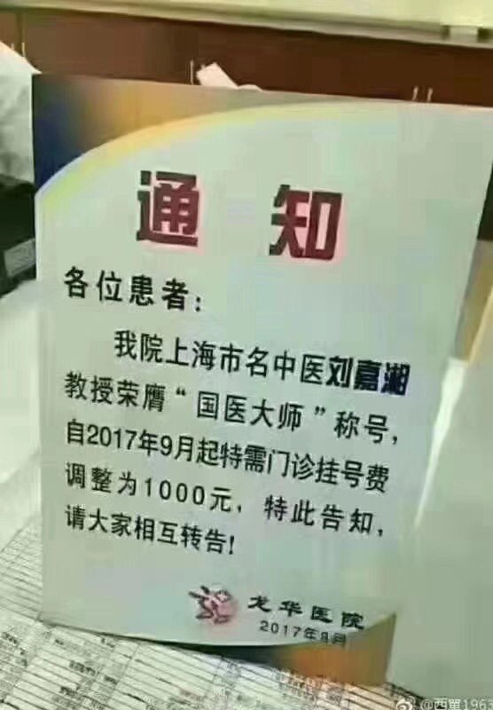 :speech_balloon:评:1 :+1:赞:45 :globe_with_meridians:转:16  

[10月31日 03:39]    老司机   @h5lpykl7tp6jjop    涨了就是涨了，涨幅收窄？这样的把戏想骗老百姓不懂？ 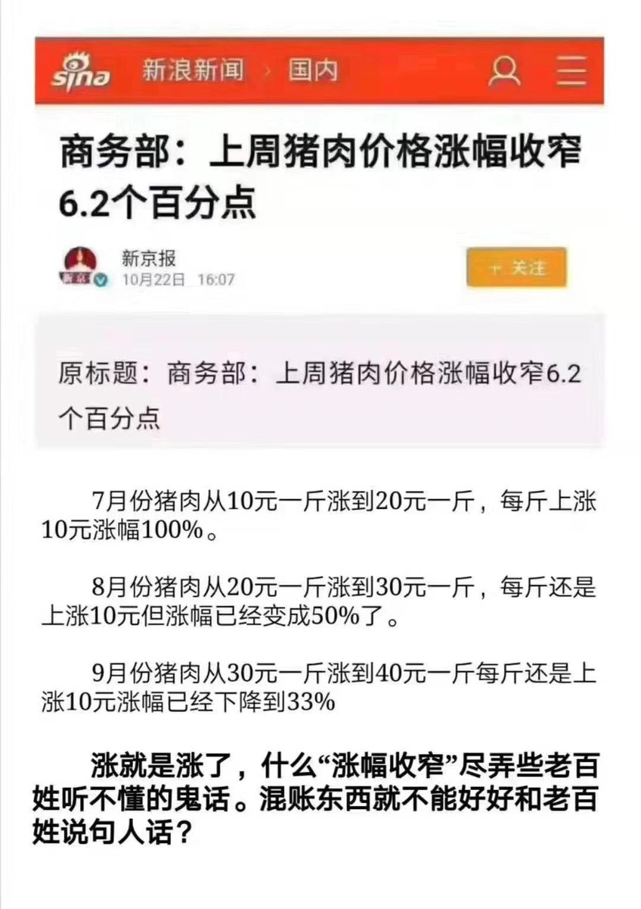 :speech_balloon:评:2 :+1:赞:26 :globe_with_meridians:转:12  

[10月31日 03:11]    老司机   @h5lpykl7tp6jjop    正式通过！参议院通过台北法案 强化台湾外交
台湾一天天好起来，中共一天天烂下去！ 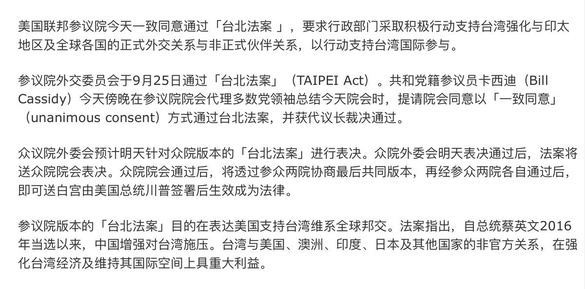 :speech_balloon:评:3 :+1:赞:55 :globe_with_meridians:转:18  

[10月31日 02:54]    老司机   @h5lpykl7tp6jjop    美国政府下令：要彻底清退华为和中兴
美国政府启动程序彻底清退美国境内的华为等中国通信设备。美国政府下令要求安装了中国通信设备的美国通信企业全面更换设备，预计达10亿美元更换费用将由美国政府用税金提供支援。美国还可能要求包括韩国在内的同盟国采取类似措施。中国官方谴责美国此种做法是霸凌  :speech_balloon:评:1 :+1:赞:169 :globe_with_meridians:转:39  

[10月31日 02:40]    老司机   @h5lpykl7tp6jjop    潘石屹也要跑？清仓国内资产 80亿美元卖办公楼 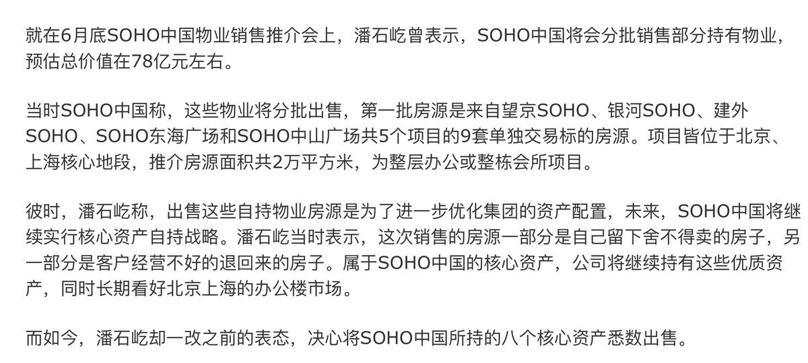 :speech_balloon:评:3 :+1:赞:40 :globe_with_meridians:转:20  

[10月31日 02:32]    老司机   @h5lpykl7tp6jjop    要注意的是注水的量，它隐藏在各项债务中，如果只看到当前的购买价值，就觉得不太适合，但是一旦发生信用崩溃，挤兑出现，大家就会看到有钱买不到东西，就像苏联崩溃时卢布2万兑一美元的情况。  :speech_balloon:评:0 :+1:赞:2 :globe_with_meridians:转:0  

[10月30日 20:19]    墙国铁拳现世报😷   @Socialistfist    大家投票踊跃，下周就从点赞数从多到少挑四个选吧
有什么建议 意见可以回复此推  :speech_balloon:评:3 :+1:赞:30 :globe_with_meridians:转:1  

[10月30日 20:17]    墙国铁拳现世报😷   @Socialistfist    后续  :speech_balloon:评:2 :+1:赞:25 :globe_with_meridians:转:1  

[10月30日 20:12]    墙国铁拳现世报😷   @Socialistfist    推友最喜爱“上周最佳铁拳” 评选活动
更多选项看后续  :speech_balloon:评:2 :+1:赞:74 :globe_with_meridians:转:16  

[10月30日 19:24]    墙国铁拳现世报😷   @Socialistfist    全文  :speech_balloon:评:2 :+1:赞:64 :globe_with_meridians:转:12  

[10月30日 19:24]    墙国铁拳现世报😷   @Socialistfist    收了几次精赵智商税就开始闹，成何体统？
原文已删，全文看后续

#社会主义铁拳  :speech_balloon:评:9 :+1:赞:242 :globe_with_meridians:转:69  

[10月29日 19:22]    墙国铁拳现世报😷   @Socialistfist    “哎呦.....太君别开枪.....”

#社会主义铁拳
#社会主义特别行政区铁拳  :speech_balloon:评:35 :+1:赞:439 :globe_with_meridians:转:135  

[10月28日 19:42]    墙国铁拳现世报😷   @Socialistfist    药房老板现时仍未回港，店员胡先生今日戴上口罩回店内用漂白水清洁，四名便衣警员到药房表示「唔好意思」，期望药房体谅，他坦言唯有接受道歉。
胡先生续指，估计损失约 1,000 元。他提到，昨晚蘗房已拉半闸，警方未有举起黑旗便施放催泪弹，形容警方是「乱咁射」，但需老板回港后才决定是否追究。  :speech_balloon:评:3 :+1:赞:61 :globe_with_meridians:转:10  

[10月28日 19:39]    墙国铁拳现世报😷   @Socialistfist    尖沙咀发起集会，演变成多处警民冲突，其中晚上警方施放的一枚催泪弹射入位于弥敦道的「明寅药房」，警方今早约4 名便衣警员到店舖道歉，向员工表示「唔好意思」。警员逗留约 2 分钟后离开，并无解释催泪弹射入药房的原因。  :speech_balloon:评:2 :+1:赞:60 :globe_with_meridians:转:7  

[10月28日 19:39]    墙国铁拳现世报😷   @Socialistfist    陈柏雄, 药房东主，在FB上撑警及赞同六四镇压嘅言论，包括他在10月5日发表「当年出坦克车，原来是最正确决定！」、10月8日称抗争者为「暴徒、垃圾废青、曱甴」，又称听到「兄弟、手足」令佢「作呕」。  :speech_balloon:评:2 :+1:赞:63 :globe_with_meridians:转:7  

[10月28日 19:38]    墙国铁拳现世报😷   @Socialistfist    铁拳是最好的决定

感谢香港推友，更多详情请看本推后续推文
#社会主义铁拳
#社会主义特别行政区铁拳  https://twitter.com/BeLightinHK/status/1188465234391883776 …  :speech_balloon:评:9 :+1:赞:146 :globe_with_meridians:转:44  

[10月28日 08:17]    凡賽堤/FORSETI   @FecharCCP    魔鬼在人間

極權殺人恐怖組織正在用各種兇殘手段殺害我們的同胞....................................................................................................

10月27日被極權殺人恐怖組織非法濫捕的香港年輕人已經超過200+ 人！  :speech_balloon:评:2 :+1:赞:25 :globe_with_meridians:转:19  

[10月28日 07:49]    凡賽堤/FORSETI   @FecharCCP    魔鬼在人間

極權殺人恐怖組織正在用各種兇殘手段殺害我們的同胞....................................................................................................

26日又有一10歲出頭的小孩被棄屍大海！  :speech_balloon:评:0 :+1:赞:16 :globe_with_meridians:转:14  

[10月28日 00:35]    凡賽堤/FORSETI   @FecharCCP    人類最恐怖的極權殺人恐怖組織！
警察蒙面公開殺人，毆打，暴打，非法濫捕，暗殺市民！

CCP的極權殺人恐怖組織比本拉登還恐怖一萬倍！

這是一個老人  :speech_balloon:评:1 :+1:赞:3 :globe_with_meridians:转:7  

[10月28日 00:20]    凡賽堤/FORSETI   @FecharCCP    人類最恐怖的極權殺人恐怖組織！
警察蒙面公開殺人，毆打，暴打，非法濫捕，暗殺市民！

CCP的極權殺人恐怖組織比本拉登還恐怖一萬倍！  :speech_balloon:评:4 :+1:赞:212 :globe_with_meridians:转:173  

[10月28日 00:11]    凡賽堤/FORSETI   @FecharCCP    人類最恐怖的極權殺人恐怖組織！
警察蒙面公開殺人，毆打，暴打，非法濫捕，暗殺市民！

CCP的極權殺人恐怖組織比本拉登還恐怖一萬倍！  :speech_balloon:评:6 :+1:赞:131 :globe_with_meridians:转:83  

[10月27日 23:59]    凡賽堤/FORSETI   @FecharCCP    人類最恐怖的極權殺人恐怖組織！
警察蒙面公開殺人，毆打，暴打，非法濫捕，暗殺市民！

已經被雙手反綁的學生，極權殺人恐怖組織還要把人往死裡整！全人類唯一一個最恐怖的極權殺人恐怖組織！  :speech_balloon:评:0 :+1:赞:8 :globe_with_meridians:转:9  

[10月27日 23:56]    凡賽堤/FORSETI   @FecharCCP    人類最恐怖的極權殺人恐怖組織！
警察蒙面公開殺人，毆打，暴打，非法濫捕，暗殺市民，  :speech_balloon:评:0 :+1:赞:12 :globe_with_meridians:转:13  

[10月27日 23:53]    凡賽堤/FORSETI   @FecharCCP    人類最恐怖的極權殺人恐怖組織！
警察蒙面公開殺人，毆打，暴打，非法濫捕，暗殺市民，  :speech_balloon:评:0 :+1:赞:9 :globe_with_meridians:转:4  

[10月27日 23:45]    凡賽堤/FORSETI   @FecharCCP    魔鬼的殺人罪行！

陳彥霖母女均被極權殺人恐怖組織殺害！  :speech_balloon:评:3 :+1:赞:36 :globe_with_meridians:转:31  

[10月27日 19:55]    墙国铁拳现世报😷   @Socialistfist    感谢众多推友投稿，感谢维尼之声的大力支持  :speech_balloon:评:1 :+1:赞:81 :globe_with_meridians:转:0  

[10月27日 19:54]    墙国铁拳现世报😷   @Socialistfist    不忘初心，牢记帮规
------镰刀斧头帮总舵主
#社会主义铁拳  :speech_balloon:评:18 :+1:赞:248 :globe_with_meridians:转:73  

[10月26日 19:08]    墙国铁拳现世报😷   @Socialistfist    生活在这个太平盛世
（除了村里恶霸从14年偷排污染超过30倍废物并在17年到维稳中心打人并且发出死亡威胁以外）
 感恩！

#社会主义铁拳
长文警告  :speech_balloon:评:39 :+1:赞:328 :globe_with_meridians:转:92  

[10月25日 20:21]    墙国铁拳现世报😷   @Socialistfist    感谢提供的推友，原帖已经删除  :speech_balloon:评:0 :+1:赞:93 :globe_with_meridians:转:2  

[10月25日 20:18]    墙国铁拳现世报😷   @Socialistfist    哦， 原来不是正规军

#社会主义铁拳  :speech_balloon:评:34 :+1:赞:307 :globe_with_meridians:转:77  

[10月25日 19:49]    墙国铁拳现世报😷   @Socialistfist    补图  :speech_balloon:评:1 :+1:赞:65 :globe_with_meridians:转:9  

[10月25日 00:26]    凡賽堤/FORSETI   @FecharCCP    緊急找尋  :speech_balloon:评:0 :+1:赞:6 :globe_with_meridians:转:5  

[10月24日 23:58]    凡賽堤/FORSETI   @FecharCCP    何韻詩！香港女兒，華人的典範，華人21世紀的巾幗英雄，華人最完美的最值得華人崇拜的國際巨星！！！  :speech_balloon:评:66 :+1:赞:415 :globe_with_meridians:转:130  

[10月24日 23:44]    凡賽堤/FORSETI   @FecharCCP    華人歷史上將永久記住這一刻，
2019年6月9日以來當香港人超過200萬人向政府提出訴求，
用最文明，最和平，最友好的方式遊行，而政府卻用最暴力，最兇殘，最卑鄙的手段僱傭黑社會組織和在職警察，以及大陸警察，武警，部隊喬裝成黑衣人在香港全社會進行大規模暗殺，暴打市民，破環公共設施等嫁禍給港人  :speech_balloon:评:20 :+1:赞:183 :globe_with_meridians:转:115  

[10月24日 10:28]    凡賽堤/FORSETI   @FecharCCP    【連登尋人】張友恆，現居九龍城，8月31日有參加遊行，9月3日突然退出所有Whatsapp群組，已經失蹤1個多月，公司薪金也沒有領取。  :speech_balloon:评:11 :+1:赞:277 :globe_with_meridians:转:293  

[10月24日 09:04]    凡賽堤/FORSETI   @FecharCCP    香港6.9以來出現人類文明社會史上的世界第一，
最文明的和平遊行世界第一
（井然有序，城市衛生等）
人口規模最大的遊行世界第一 
（203萬人遊行，總人口700-730萬）
遊行過程出現自發自願醫療救護人員世界首創！
香港人，給全世界的華人創下了歷史最偉大的榜樣！
香港人，給全世界華人未來帶來的希望  :speech_balloon:评:4 :+1:赞:74 :globe_with_meridians:转:51  

[10月24日 08:35]    凡賽堤/FORSETI   @FecharCCP    緊急找尋其家人和律師  :speech_balloon:评:0 :+1:赞:9 :globe_with_meridians:转:8  

[10月20日 06:29]    凡賽堤/FORSETI   @FecharCCP    【#共产罪恶】香港中文大学女生吴傲雪（Sonia）在哭诉被拘留期间，遭到港警性暴力之后，连日来收到多封恐吓信及短消息，威胁她若再出面发声，将绑架及轮奸她，信中甚至写明“施暴计划”。
10/18周五吴傲雪在记者会上，公布她收到的恐吓及骚扰信，这些信中，有不少是用简体字书写，被怀疑来自中国大陆。  :speech_balloon:评:29 :+1:赞:404 :globe_with_meridians:转:278  

[10月20日 06:04]    凡賽堤/FORSETI   @FecharCCP    魔鬼在人間39

極權殺人恐怖組織正在用各種兇殘手段殺害我們的同胞....................................................................................................

魔鬼的罪行！被刺殺，身處多刀，肚腸都跑出來！  :speech_balloon:评:1 :+1:赞:6 :globe_with_meridians:转:7  

[10月20日 06:02]    凡賽堤/FORSETI   @FecharCCP    魔鬼在人間39

極權殺人恐怖組織正在用各種兇殘手段殺害我們的同胞....................................................................................................

魔鬼的罪行！已被殺  :speech_balloon:评:0 :+1:赞:3 :globe_with_meridians:转:3  

[10月19日 10:36]    凡賽堤/FORSETI   @FecharCCP    極權殺人恐怖組織的兇殘超乎人類想像  :speech_balloon:评:0 :+1:赞:2 :globe_with_meridians:转:0  

[10月19日 10:34]    凡賽堤/FORSETI   @FecharCCP    魔鬼在人間39

極權殺人恐怖組織正在用各種兇殘手段殺害我們的同胞....................................................................................................

魔鬼的罪行！黑警群毆直接致命打頭的兇殘  :speech_balloon:评:3 :+1:赞:62 :globe_with_meridians:转:43  

[10月09日 00:47]    GFHG SDKM   @zyx_yny    "Son, when you grow up
You will be the savior of the broken
The beaten, and the damned?"
Please watch this powerful mv #HongKongProtester #hkprotests 
香港反送中護法戰爭(Hong Kong Defensive War 2019)：Welcome To The Black Parade  https://youtu.be/0yXTHODE24Q  via @YouTube  :speech_balloon:评:3 :+1:赞:17 :globe_with_meridians:转:4  

[10月05日 09:33]    凡賽堤/FORSETI   @FecharCCP    呼籲請求共同挖掘所有有關香港發生的事，越全面越好，不同角度，越多越好，包括被暗地抓捕的人員，特別是CCP 派出的各種偽裝身份，包括變身變裝行兇的一點一滴都要挖掘出來，把CCP 的邪惡下三濫手段的真相毫無保留的曝光在全世界面前！世界公知公義才能真正挽救和保護香港人！希望懂視頻編輯配上中英文 https://twitter.com/hjjohnson17/status/1178969916499746816 …  :speech_balloon:评:13 :+1:赞:20 :globe_with_meridians:转:10  

[03月13日 08:10]    老司机   @h5lpykl7tp6jjop    批评是批评家天生的使命！他们只感知对错，信奉真理，指出真相不吐不快，不在意权势和群众的喜好，从批评里不可能获得任何好处，但批评家愚直不改。在中国几乎所有人都讨厌批评家，喜欢阴谋家，因为他们只说好听的！可是就因为中国的批评家太少，中国几乎看不到未来和希望！  :speech_balloon:评:84 :+1:赞:194 :globe_with_meridians:转:41  

