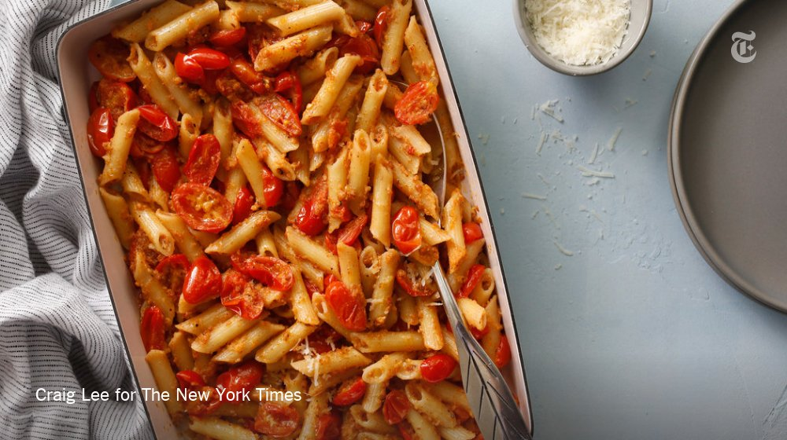
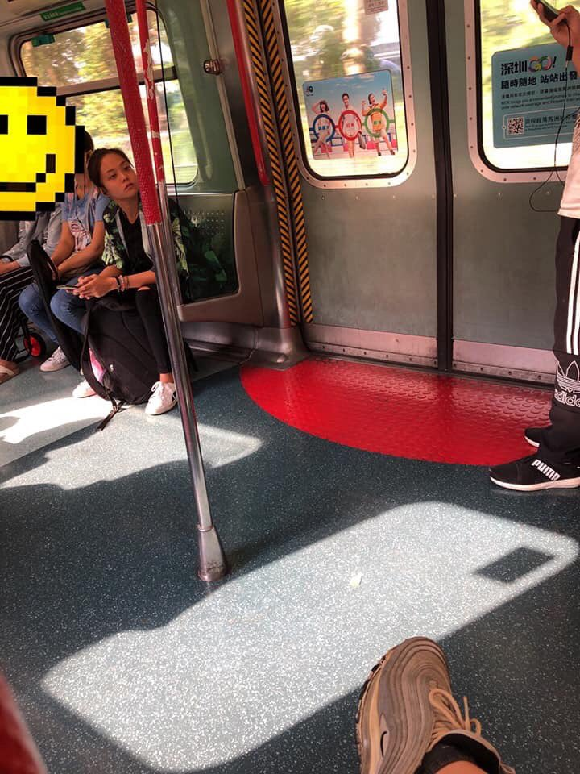
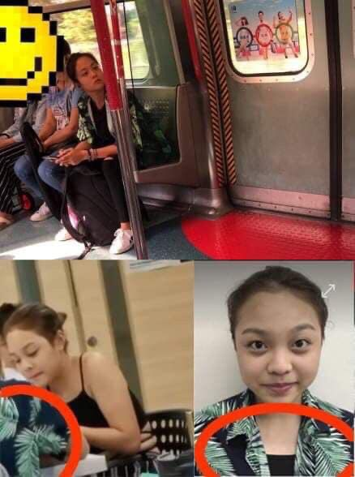

[10月23日 21:13]    财经真相   @caijingxiang    比特币第二轮崩盘中，上一波最低跌到3000美元，这一波怎么着也要跌到5000美元！  :speech_balloon:评:7 :+1:赞:15 :globe_with_meridians:转:4  

[10月23日 21:01]    BBC News 中文   @bbcchinese    睡觉前一个小时远离手机荧幕，你做得到吗？ https://bbc.in/2PbiSxe   :speech_balloon:评:12 :+1:赞:26 :globe_with_meridians:转:4  

[10月23日 21:00]    纽约时报中文网   @nytchinese    美国驻乌克兰最高外交官的证词显示，特朗普总统搁置了对乌克兰至关重要的安全援助，并拒绝与该国领导人在白宫会晤，直到他同意对美国前副总统拜登及其他政治对手进行调查。这里是泰勒证词的几个关键要点。 https://nyti.ms/2JfNLNa   :speech_balloon:评:2 :+1:赞:7 :globe_with_meridians:转:1  

[10月23日 20:59]    新闻大吐槽   @TuCaoFakeNews    你确定她是基督教？我听着是共产教底层韭菜馅儿包子  :speech_balloon:评:0 :+1:赞:5 :globe_with_meridians:转:1  

[10月23日 20:43]    新闻大吐槽   @TuCaoFakeNews    这段话暴露了几个关键信息：香港不是中国的，香港是独立的国家，根本不需要被赶出去，应该被赶出中国的是中共；中共各地安插特务的行为是非常普遍的，大妈说漏了嘴；基督教徒很多是中共特务假扮的，中共也喜欢在各个地方安插伪装的特务，比如这个大妈，一点不像一个基督徒，倒是像一个中共邪教徒。  :speech_balloon:评:1 :+1:赞:11 :globe_with_meridians:转:2  

[10月23日 20:41]    BBC News 中文   @bbcchinese    偷渡客梦断英伦悲剧重演？距伦敦不到一小时车程的一个工业园，一辆白色货柜车里赫然横着39具尸体。 https://bbc.in/32Fknb3   :speech_balloon:评:8 :+1:赞:21 :globe_with_meridians:转:12  

[10月23日 20:23]    新闻大吐槽   @TuCaoFakeNews    这个大妈己买好去地狱的车票。  :speech_balloon:评:1 :+1:赞:10 :globe_with_meridians:转:1  

[10月23日 20:22]    新闻大吐槽   @TuCaoFakeNews    由於偏聽偏見所誤，她代表了許多中國人被共產黨專政下的狀態，是共產邪靈被解體的那天要被拉去培葬的，多可憐啊，連基督都不管她了......  :speech_balloon:评:0 :+1:赞:4 :globe_with_meridians:转:1  

[10月23日 20:12]    新闻大吐槽   @TuCaoFakeNews    她这种基督大妈，就那种拿香进教堂拜的主。她就是做孽做多了，觉得菩萨保佑不过来，还想让耶稣多保她一份。  :speech_balloon:评:1 :+1:赞:6 :globe_with_meridians:转:1  

[10月23日 20:08]    新闻大吐槽   @TuCaoFakeNews    中国基督教大妈反共挺港视频，在网络上疯传

如有雷同，传输巧合  :speech_balloon:评:15 :+1:赞:37 :globe_with_meridians:转:8  

[10月23日 20:01]    BBC News 中文   @bbcchinese    【新能源走进铁路 英国“氢气火车”样板下线测试】1825年，世上首条采用蒸汽机车牵引的铁路在英国通车。此后，铁路大致发展成电力驱动与柴油驱动两大主流。“氢气火车”无需依靠高压电缆供电，但也不燃烧柴油，实现零排放。 https://bbc.in/33PgBvI   :speech_balloon:评:6 :+1:赞:9 :globe_with_meridians:转:2  

[10月23日 20:00]    纽约时报中文网   @nytchinese    周三，涉嫌谋杀台湾籍女友的陈同佳出狱，并表示将向台湾自首。然而，与香港的政治危机一样，陈同佳案距离了结还很遥远。
目前，港台就具体条件争论不休，分歧根源在于主权问题。台湾抱怨香港缺少合作，港府则敦促对方勿将“简单的问题复杂化”。 https://nyti.ms/2JeTz9D   :speech_balloon:评:8 :+1:赞:5 :globe_with_meridians:转:2  

[10月23日 19:39]    新闻大吐槽   @TuCaoFakeNews    转播方为了短期利益忽视民众权利  :speech_balloon:评:1 :+1:赞:2 :globe_with_meridians:转:1  

[10月23日 19:30]    纽约时报中文网   @nytchinese    2018年9月，特朗普政府中的一名官员以匿名形式发表在时报发表观点文章。该官员在文中表示，作为特朗普政府中的一名抵抗者，他将竭尽全力阻止特朗普那些糟糕的议程，维护民主体制，直到特朗普下台。这名官员将于将于下月出版一本新书。这里是他当时发表的文章： https://nyti.ms/33T8aQ3   :speech_balloon:评:12 :+1:赞:17 :globe_with_meridians:转:7  

[10月23日 19:25]    GFHG SDKM   @zyx_yny    唔止ban鳩你Twitter account
香港人直情想ban咗你成個人 ban鳩你成個人生啊  :speech_balloon:评:0 :+1:赞:0 :globe_with_meridians:转:0  

[10月23日 19:14]    GFHG SDKM   @zyx_yny    Dear : 

Only a photo can't tell how beautiful #HongKong is.

Thanks for the magician like producer to demonstrate such impressive views of our home

Full video:  https://youtu.be/gYO1uk7vIcc  by TimeLab Pro

#香港の写真を何の説明もなく上げてみる #HongKongProtest  :speech_balloon:评:3 :+1:赞:77 :globe_with_meridians:转:37  

[10月23日 19:05]    新闻大吐槽   @TuCaoFakeNews    在有言论自由，新闻自由，没有防火墙，每个人用一部手机就能把信息传遍全世界的香港，中共派人假扮示威者，搞破坏，抹黑示威者的低劣手段暴露无疑。因为他们再也不能像在内地一样随便删帖封号了。这下他们该怎么洗呢？  :speech_balloon:评:2 :+1:赞:27 :globe_with_meridians:转:7  

[10月23日 19:03]    BBC News 中文   @bbcchinese    从黎巴嫩到香港，从智利到西班牙，全世界都有人在进行街头抗议，他们的共通之处是什么？ https://bbc.in/35VuSca   :speech_balloon:评:33 :+1:赞:44 :globe_with_meridians:转:19  

[10月23日 19:00]    纽约时报中文网   @nytchinese    #观点 本周，巴西总统将会见习近平，作为抗击全球变暖的领导者，中国应当利用其影响力制止这场生态悲剧。
中国大豆和牛肉的需求促使巴西农民放火烧荒、砍伐森林，这是亚马孙生态系统被破坏的因素之一。中国是时候承担责任、制止这场悲剧了。 https://nyti.ms/32EWRej   :speech_balloon:评:161 :+1:赞:79 :globe_with_meridians:转:22  

[10月23日 18:27]    新闻大吐槽   @TuCaoFakeNews     https://twitter.com/TuCaoFakeNews/status/1186888298607697922 …  :speech_balloon:评:0 :+1:赞:12 :globe_with_meridians:转:2  

[10月23日 18:11]    新闻大吐槽   @TuCaoFakeNews      :speech_balloon:评:1 :+1:赞:6 :globe_with_meridians:转:3  

[10月23日 18:01]    BBC News 中文   @bbcchinese    当“少花钱多办事”的美国遇上“多花钱办大事”的中国，联合国这两大会费贡献国，究竟谁的套路更奏效？ https://bbc.in/2pI19mw   :speech_balloon:评:22 :+1:赞:27 :globe_with_meridians:转:6  

[10月23日 18:00]    纽约时报中文网   @nytchinese    就目前而言，就日本天皇登基仪式的花费问题，尽管存在一些批评声，但仍比较温和，这部分是因为皇室在日本仍受人爱戴。但从长期来看，日本皇室面临着一个更大的生存威胁：皇室的继承人不多了。
在现任天皇之后，继承人只剩下他53岁的弟弟文仁亲王和文仁亲王13岁的儿子悠仁亲王。 https://nyti.ms/2pNe868   :speech_balloon:评:7 :+1:赞:16 :globe_with_meridians:转:5  

[10月23日 17:53]    新闻大吐槽   @TuCaoFakeNews    少年强则国强，哪个国家的未来有希望一目了然  :speech_balloon:评:0 :+1:赞:8 :globe_with_meridians:转:1  

[10月23日 17:34]    BBC News 中文   @bbcchinese    泰国国王宣布剥夺贵妃诗妮娜·披拉萨甘娅妮（Sineenat Wongvajirapakdi）王室封号一事，引发全球关注。诗妮娜在7月才被授予王室配偶头衔，但王室公告指其“对国王行为不当和不忠”。 https://bbc.in/35VY6aQ   :speech_balloon:评:11 :+1:赞:26 :globe_with_meridians:转:8  

[10月23日 17:24]    纽约时报中文网   @nytchinese    美国驻乌克兰最高外交官威廉·泰勒的证词显示，特朗普扣留对乌援助与其调查政治对手的要求有“直接联系”，民主党人称这为迄今为止对总统最具破坏力的弹劾证词。 https://nyti.ms/2JfNLNa   :speech_balloon:评:6 :+1:赞:12 :globe_with_meridians:转:3  

[10月23日 17:22]    老司机   @h5lpykl7tp6jjop    这是搞什么鬼！  :speech_balloon:评:0 :+1:赞:3 :globe_with_meridians:转:0  

[10月23日 17:00]    纽约时报中文网   @nytchinese    研究人员说，中国黑客的攻击在过去三年来变得更加先进，主要针对的是中国的少数民族和他们在其他国家的侨民。
“中国人首先用他们最好的工具对付自己的人民，因为他们最害怕的就是自己的人民，”前美国政府官员詹姆斯·A·刘易斯说。“然后他们才会把这些工具用于外国目标。” https://nyti.ms/31GzgIV   :speech_balloon:评:25 :+1:赞:44 :globe_with_meridians:转:16  

[10月23日 16:43]    新闻大吐槽   @TuCaoFakeNews    小朋友的智慧，让现场的观众和全世界的球迷都看到了他对香港人的支持  :speech_balloon:评:1 :+1:赞:57 :globe_with_meridians:转:6  

[10月23日 16:43]    新闻大吐槽   @TuCaoFakeNews    小朋友的智慧，让现场的观众和全世界的球迷都看到了他对香港人的支持  :speech_balloon:评:1 :+1:赞:57 :globe_with_meridians:转:6  

[10月23日 16:43]    新闻大吐槽   @TuCaoFakeNews    这么小就开始花式玩政治梗了  :speech_balloon:评:1 :+1:赞:8 :globe_with_meridians:转:1  

[10月23日 16:40]    新闻大吐槽   @TuCaoFakeNews    NBA现场，小朋友镜头前上演「图穷匕见」

NBA暂停时，有直播观众跳舞的特写环节，小朋友在洛杉矶快船队的球衣后边，藏了一件挺香港的Tshirt！先跳舞把镜头吸引过来，然后立刻切换球衣！策略高明！

可以看到转播方还是怂了，看到涉及中共不喜欢的议题，立刻把镜头挪开  :speech_balloon:评:10 :+1:赞:277 :globe_with_meridians:转:108  

[10月23日 16:40]    新闻大吐槽   @TuCaoFakeNews    NBA现场，小朋友镜头前上演「图穷匕见」

NBA暂停时，有直播观众跳舞的特写环节，小朋友在洛杉矶快船队的球衣后边，藏了一件挺香港的Tshirt！先跳舞把镜头吸引过来，然后立刻切换球衣！策略高明！

可以看到转播方还是怂了，看到涉及中共不喜欢的议题，立刻把镜头挪开  :speech_balloon:评:10 :+1:赞:277 :globe_with_meridians:转:108  

[10月23日 16:30]    纽约时报中文网   @nytchinese    #图集 【智利爆发大规模暴力抗议活动】智利历来被视为拉丁美洲最繁荣和稳定的国家之一，目前却处于动荡状态。上周五，该国首都圣地亚哥因地铁加价引发民众示威。几天之内，全国各地都发生了暴力抗议活动。 https://nyti.ms/35Ztp4I   :speech_balloon:评:6 :+1:赞:16 :globe_with_meridians:转:7  

[10月23日 16:15]    新闻大吐槽   @TuCaoFakeNews    既然共产主义是一场灾难，那么有什么办法能够从根源上避免它？
不通过任何禁令，而是要怎么让共产主义没有市场。
请各位右人回答一下  :speech_balloon:评:70 :+1:赞:92 :globe_with_meridians:转:5  

[10月23日 16:01]    BBC News 中文   @bbcchinese    一条人民币1000多元的Lolita洋裙，转手就可以卖近5000元。中国年轻人都爱炒卖些什么？ https://bbc.in/2PcGEc8   :speech_balloon:评:16 :+1:赞:69 :globe_with_meridians:转:26  

[10月23日 16:00]    纽约时报中文网   @nytchinese    “你的理想退休金额是多少？”你能带着500万美元退休吗？2000万美元呢？
对于普通人来说，这似乎符合理想退休金额的标准，但对于许多亿万富翁来说，这个金额并不存在。“对于很多人来说，他们就是停不下来。他们从资本主义中获得了卓越的意义。没了钱他们还能有什么？” https://nyti.ms/32ygJj0   :speech_balloon:评:8 :+1:赞:18 :globe_with_meridians:转:6  

[10月23日 15:39]    老司机   @h5lpykl7tp6jjop      :speech_balloon:评:0 :+1:赞:6 :globe_with_meridians:转:4  

[10月23日 15:30]    纽约时报中文网   @nytchinese    #每日一词 根据韦氏词典，posthumous意为“死后的、身后的”，常用来形容父亲去世后出生的，如posthumous child（遗腹子）；或作者去世后发表的，如posthumous work（死后发表的作品）。 https://nyti.ms/31B86Tp   :speech_balloon:评:1 :+1:赞:6 :globe_with_meridians:转:3  

[10月23日 15:13]    老司机   @h5lpykl7tp6jjop    稅率第一、稅种第一、稅收第一，油價世界第一高，过路费世界第一多，又沒有实行免費医疗、免費教育、国家養老，你他媽告诉我们財政沒錢？

第一次听說全國財政吃緊
是很正常的現象。（转）  :speech_balloon:评:21 :+1:赞:161 :globe_with_meridians:转:116  

[10月23日 15:11]    财经真相   @caijingxiang    【推荐一个恶搞MV—你是我的习大大】我們不再怕美帝，每年都漲ＧＤＰ，中國有個偉大主席 
手機照片全是你，硬盤放的都是你，讓我們每天向你學習 
中華女兒非你不嫁因為你帥氣，外國勢力把你抹黑你都不生氣 
日本鬼子來了他們不敢放個屁，誰人罵你我就馬上操！他！媽！B https://www.youtube.com/watch?v=PCimU5x25ic …  :speech_balloon:评:12 :+1:赞:213 :globe_with_meridians:转:63  

[10月23日 15:01]    BBC News 中文   @bbcchinese    引发香港数月“反送中”抗议的台湾杀人案嫌犯陈同佳，向被害女友及香港民众鞠躬道歉，港府预计将在议会正式撤回修例。 https://bbc.in/33ThAen   :speech_balloon:评:39 :+1:赞:62 :globe_with_meridians:转:25  

[10月23日 15:00]    纽约时报中文网   @nytchinese    周二，来自183个国家和地区的达官显贵参加了日本天皇登基仪式，其中包括查尔斯王子、昂山素季、香港特首林郑月娥，以及美国交通部长赵小兰等人。虽然大典排场不小，但政府决定推迟在东京街头举行的庆祝游行，以表示对台风海贝思罹难者的尊重。这个台风已造成至少80人死亡。 https://nyti.ms/2pNe868   :speech_balloon:评:5 :+1:赞:32 :globe_with_meridians:转:6  

[10月23日 14:30]    纽约时报中文网   @nytchinese    #每日一词 Posthumous意为“死后的、身后的”。前中共改革派领导人赵紫阳的骨灰上周在北京下葬。此前赵紫阳去世后，并没有按中共传统埋葬在北京八宝山革命公墓。他的家人就如何安葬与中共有关部门长期僵持不下，如今，这位前中共领导人拖延十余年的“身后事”终于有所了结。 https://nyti.ms/31B86Tp   :speech_balloon:评:8 :+1:赞:65 :globe_with_meridians:转:13  

[10月23日 14:15]    老司机   @h5lpykl7tp6jjop    无论你有多么热爱祖国，祖国都会用粉拳擂到你心口痛！好消息来了，小粉红们热情的歌吧！  :speech_balloon:评:27 :+1:赞:112 :globe_with_meridians:转:37  

[10月23日 14:05]    老司机   @h5lpykl7tp6jjop    和塔里班交流学习灭佛经验，猪习要当三教合一的棈神领袖！四川最长石刻卧佛遭毁 百余佛像消失！  :speech_balloon:评:4 :+1:赞:13 :globe_with_meridians:转:7  

[10月23日 14:00]    纽约时报中文网   @nytchinese    #观点 丈夫和我选择了结束我们孩子的生命。很多人猜想这是个难以置信的决定。
我将实言相告：尚在我肚子中的孩子被诊断出了严重的脑部异常，这个决定对我们显而易见。我们不会给孩子一个充满痛苦与折磨的人生。相反，我们会把她的痛苦当作自己的来承担。 https://nyti.ms/33QFuqT   :speech_balloon:评:4 :+1:赞:26 :globe_with_meridians:转:5  

[10月23日 13:30]    纽约时报中文网   @nytchinese    安全公司发现，五年前，中国黑客在“雨伞革命”中攻击了香港抗议者的手机。当时，中国的黑客只能侵入“已越狱”或以某种方式修改过的手机。而近期，针对维族人的攻击手段则出现了极大进步，黑客攻击进入了经过更新的iPhone，且没有引起机主的注意。 https://nyti.ms/31GzgIV   :speech_balloon:评:66 :+1:赞:209 :globe_with_meridians:转:126  

[10月23日 13:06]    GFHG SDKM   @zyx_yny    Our beautiful team who made the miracle happen. Thank you the organizers, contributors, volunteers... every single one  We Love HK. We Fight Together. 
#StandWithHongKong #TheNorth #NBATwitter  #nba  #Raptors #Toronto #nbaopeningnight #SupportHongKong #HongKongProtests  :speech_balloon:评:496 :+1:赞:3136 :globe_with_meridians:转:1880  

[10月23日 13:00]    纽约时报中文网   @nytchinese    今日食谱：烤樱桃番茄通心粉，只需5种食材的极简美味。
更多简报内容： https://nyti.ms/2BBjd4o   :speech_balloon:评:0 :+1:赞:7 :globe_with_meridians:转:2  

[10月23日 12:30]    纽约时报中文网   @nytchinese    在这个1%的人类掌握着大多数财富的世界，亿万富翁们用更长的工作时间、更少的社交时间告诉我们：再多钱也永远不够。 https://nyti.ms/32ygJj0   :speech_balloon:评:5 :+1:赞:40 :globe_with_meridians:转:21  

[10月23日 12:26]    GFHG SDKM   @zyx_yny    the best clip to start the NBA season is this kid baiting the broadcast into flashing a "Fight for freedom stand with Hong Kong" sign on TV and then the cameraman pans away  :speech_balloon:评:889 :+1:赞:67572 :globe_with_meridians:转:19287  

[10月23日 12:23]    新闻大吐槽   @TuCaoFakeNews    有人在中國演員網找到假彥霖，之後該演員信息被刪除。  :speech_balloon:评:14 :+1:赞:218 :globe_with_meridians:转:154  

[10月23日 12:00]    纽约时报中文网   @nytchinese    谷歌新手机Pixel 4评测：时报“科技工坊”专栏作者 @bxchen将Pixel 4和今年早些时候发布的iPhone 11进行对比评测，他的结论是：谷歌想要击败苹果，还有更多功课需要做。
更多简报内容： https://nyti.ms/2BBjd4o   :speech_balloon:评:1 :+1:赞:4 :globe_with_meridians:转:0  

[10月23日 11:30]    纽约时报中文网   @nytchinese    在宣布继位仪式过去六个月后，周二，日本新天皇德仁参加了另一个登基仪式。这一次，他穿着橙色丝绸长袍，登上了宝座。
为什么这两个仪式之间有这么长的时间间隔？天皇宝座、大典服饰有何玄机？时报记者为你详解登基仪式的诸多细节。 https://nyti.ms/2pNe868   :speech_balloon:评:3 :+1:赞:49 :globe_with_meridians:转:11  

[10月23日 11:00]    BBC News 中文   @bbcchinese    加拿大大选结果出炉，现任总理特鲁多获得连任。四张图帶你看懂加国大选： https://bbc.in/2JakXWo   :speech_balloon:评:9 :+1:赞:65 :globe_with_meridians:转:12  

[10月23日 11:00]    纽约时报中文网   @nytchinese    • 去年在《纽约时报》匿名发表观点文章的特朗普政府官员将于下月出版一本书。
• 软银接手WeWork：软银已在WeWork上投资了约105亿美元，现在，它将不得不再次向该公司注资数十亿美元。
更多简报内容： https://nyti.ms/2BBjd4o   :speech_balloon:评:1 :+1:赞:2 :globe_with_meridians:转:2  

[10月23日 10:00]    BBC News 中文   @bbcchinese    英国首相约翰逊的脱欧法案终于在议会表决中成功过关。但是脱欧时间表被否决。约翰逊寻求提前举行大选？
 https://bbc.in/33LAJ1U   :speech_balloon:评:2 :+1:赞:16 :globe_with_meridians:转:4  

[10月23日 10:00]    纽约时报中文网   @nytchinese    脱欧最新进展：英国议会周二举行了两次投票表决，先是通过了首相约翰逊的脱欧法案，接着否决了他提出的脱欧时间表，即在10月31日的最后期限之前迅速进行必要的立法。现在，欧盟必须决定是否准许英国再次延期。
更多简报内容： https://nyti.ms/2BBjd4o   :speech_balloon:评:2 :+1:赞:4 :globe_with_meridians:转:4  

[10月23日 08:44]    GFHG SDKM   @zyx_yny    在中国没有一个人是安全的，共产党的治理体制就是一部黑暗残酷的绞肉机。  :speech_balloon:评:5 :+1:赞:73 :globe_with_meridians:转:21  

[10月23日 08:30]    BBC News 中文   @bbcchinese    香港政府凌晨发稿，拒绝台湾政府要求派员赴港押解陈同佳，并指台方跨境执法，不尊重香港司法管辖权。
 https://bbc.in/2Phg6q6   :speech_balloon:评:74 :+1:赞:76 :globe_with_meridians:转:31  

[10月23日 08:23]    财经真相   @caijingxiang    北京成为外汇消耗最多地区是可以理解，因为中国外汇花费最多的就是政府，尤其是货物贸易采购达到-1730.72亿美元，但是最让人难以理解的是上海，服务贸易逆差比货物逆差还多，是不是可以理解为上海才是中国资本外逃最大的地区！最后还有一个规律，那就是每当中美贸易缓和时，银行结售汇就会转为正！  :speech_balloon:评:5 :+1:赞:128 :globe_with_meridians:转:42  

[10月23日 08:17]    财经真相   @caijingxiang    2019年1-8月银行结售汇-447.48亿美元，经常项目-438.69 
亿，其中货物贸易1111.66亿，服务贸易-1,331.77亿，收益和经常转移-218.58亿；就地区来看，北京是中国外汇逆差最大的地区达到-2098亿，上海以-1083.27位居第二位；外汇顺差最大来源地分别是浙江967.46、江苏850.77、广东
563.11、福建163.84 。  :speech_balloon:评:14 :+1:赞:243 :globe_with_meridians:转:123  

[10月23日 08:07]    新闻大吐槽   @TuCaoFakeNews    明居正：台湾人需要明确的反共意识，看清谁是最大敌人

蓝营最大敌不是绿
绿营最大敌不是蓝
只有共同的最大敌——红...
明年选举
谁不反共谁就会落选

美国对中国无恶意，但对中共有
中国不是美国的敌人，但中共是美国的敌人
中共仍是台湾的敌人，还是自由世界的敌人...  :speech_balloon:评:16 :+1:赞:354 :globe_with_meridians:转:181  

[10月23日 07:30]    BBC News 中文   @bbcchinese    人们常常羡慕王侯将相、达官贵人的生活，却不知在华丽富足的外表下，这个圈子的人们也可能会经历其艰难时刻。
 https://bbc.in/2o52pPY   :speech_balloon:评:21 :+1:赞:37 :globe_with_meridians:转:5  

[10月23日 07:03]    财经真相   @caijingxiang    美国众议院投票推动立法，要求空壳公司披露所有者信息并更新反洗钱规定。  :speech_balloon:评:6 :+1:赞:264 :globe_with_meridians:转:63  

[10月23日 06:30]    BBC News 中文   @bbcchinese    英国研究人员发现，每年在空气污染指数较高的日子里，医院接收的突发心脏病、中风以及急性哮喘病人的数量就会上升。
 https://bbc.in/2Pa7ull   :speech_balloon:评:2 :+1:赞:19 :globe_with_meridians:转:9  

[10月23日 03:03]    BBC News 中文   @bbcchinese    英国首相约翰逊的脱欧法案终于在议会表决中成功过关。但是脱欧时间表被否决。约翰逊寻求提前举行大选？
 https://bbc.in/2MBWefE   :speech_balloon:评:1 :+1:赞:15 :globe_with_meridians:转:8  

[10月23日 02:42]    新闻大吐槽   @TuCaoFakeNews    这个是恶搞吧？ https://twitter.com/mrdoorvpn/status/1186535022494244865 …  :speech_balloon:评:17 :+1:赞:70 :globe_with_meridians:转:21  

[10月23日 01:49]    老司机   @h5lpykl7tp6jjop    @侯安扬HF 
三个以下情妇叫生活腐化，三个以上情妇叫生活糜烂。  :speech_balloon:评:4 :+1:赞:65 :globe_with_meridians:转:48  

[10月23日 01:48]    BBC News 中文   @bbcchinese    香港政府当地时间23日凌晨发稿，拒绝台湾政府去函要求派员赴港押解陈同佳，并指台方跨境执法，不尊重香港司法管辖权。台湾陆委会发言人邱垂正对此表示，若陈嫌逃亡、串证等，港府须负全责。
 https://bbc.in/2MDMO3q   :speech_balloon:评:71 :+1:赞:126 :globe_with_meridians:转:66  

[10月23日 00:57]    GFHG SDKM   @zyx_yny    「主人，我好辛苦，好驚呀．．．」
＂Master,  I feel uncomfortable and scared.＂

#香港 #HongKong #HongKongprotests #HKPoliceBrutality #Animal #Dog #AnimalAbuse #AnimalRights #HKPoliceTerrorism #SaveTheDogs #StandWithHongKong #policedog  :speech_balloon:评:64 :+1:赞:1154 :globe_with_meridians:转:1033  

[10月22日 23:45]    BBC News 中文   @bbcchinese    截至BBC中文发稿，香港政府暂时未有回应。台陆委会副主委兼发言人邱垂正周二晚间呼吁港府负起责任。 https://bbc.in/2o7ECyV   :speech_balloon:评:12 :+1:赞:55 :globe_with_meridians:转:9  

[10月22日 20:13]    墙国铁拳现世报😷   @Socialistfist    網上有帖文指毛漢參與7月20日的守護香港集會，他澄清，幾個月前有人邀請他出席集會，他於台上是說希望香港恢復和平及希望政府了解年輕人多點。他強調自己不是「撐警」，稱現時才知道自己當時出席的場合是「撐警」集會，並說之後有其他「撐警」集會他都沒參加。
我相信他不是撐警～  :speech_balloon:评:4 :+1:赞:30 :globe_with_meridians:转:9  

[10月22日 20:02]    BBC News 中文   @bbcchinese    【如厕新境界！原来你一直的坐姿都是错的】你知道吗？你一直以来如厕的坐姿都可能是错的，让我们告诉你原因。 https://bbc.in/2N3Hp4x   :speech_balloon:评:7 :+1:赞:24 :globe_with_meridians:转:14  

[10月22日 19:01]    BBC News 中文   @bbcchinese    泰国王室上演现实版“宫斗剧”，泰国国王册封新贵妃不足三个月，剥夺其全部封号。 https://bbc.in/2p2jACl   :speech_balloon:评:20 :+1:赞:93 :globe_with_meridians:转:31  

[10月22日 18:31]    BBC News 中文   @bbcchinese    加泰罗尼亚人也高喊：“我们要像香港那样做一次。” https://bbc.in/2pGyT3x   :speech_balloon:评:150 :+1:赞:665 :globe_with_meridians:转:163  

[10月22日 18:00]    BBC News 中文   @bbcchinese    摩洛哥的司机怎么跟警察斗法？ https://bbc.in/2N4rz9M   :speech_balloon:评:0 :+1:赞:11 :globe_with_meridians:转:4  

[10月22日 17:59]    墙国铁拳现世报😷   @Socialistfist    补图  :speech_balloon:评:2 :+1:赞:97 :globe_with_meridians:转:11  

[10月22日 17:58]    墙国铁拳现世报😷   @Socialistfist    墙内一阵子狂喷  :speech_balloon:评:6 :+1:赞:46 :globe_with_meridians:转:9  

[10月22日 17:51]    墙国铁拳现世报😷   @Socialistfist    14年的战螂
15年的粉红
16年的愤青
17年的反贼
「我们终于还是成为了我们当初讨厌的人」

#社会主义铁拳  :speech_balloon:评:32 :+1:赞:332 :globe_with_meridians:转:105  

[10月22日 17:34]    财经真相   @caijingxiang    中国商务部：美商务部日前发布公告，称将自10月31日起对中国3000亿美元加征关税清单产品启动排除程序。如果排除申请得到批准，自2019年9月1日起已经加征的关税可以追溯返还。该消息公布后离岸人民币汇率几无波动！  :speech_balloon:评:28 :+1:赞:224 :globe_with_meridians:转:63  

[10月22日 16:41]    老司机   @h5lpykl7tp6jjop    【关注香港】10月21日 晚21:00左右，示威者张嘉琪（音）被黑警粗暴对待，被扯出内衣不算。突然，众目睽睽之下，男性黑警伸手抚摸女孩臀部？那么关小黑屋后会发生什么！！！请广传救人。  :speech_balloon:评:2 :+1:赞:19 :globe_with_meridians:转:16  

[10月22日 15:36]    GFHG SDKM   @zyx_yny    尊重係中國人應有既素質，而香港人更需要一個識尊重人、尊重宗教既特首。
從小圈子選舉揀左林鄭咁無素質既人做特首就知制度有問題，解決方法只有真普選。

光復香港 時代革命
五大訴求 決一不可  :speech_balloon:评:2 :+1:赞:99 :globe_with_meridians:转:14  

[10月22日 14:35]    老司机   @h5lpykl7tp6jjop    好惊人！要吓尿全部地球人！  :speech_balloon:评:4 :+1:赞:16 :globe_with_meridians:转:6  

[10月22日 13:11]    老司机   @h5lpykl7tp6jjop    黎明何時來到？！  :speech_balloon:评:47 :+1:赞:326 :globe_with_meridians:转:261  

[10月22日 10:17]    财经真相   @caijingxiang    最新猪肉行情：猪肉价格再次迎来大涨，想做腊肉无望！  :speech_balloon:评:51 :+1:赞:286 :globe_with_meridians:转:100  

[10月22日 06:48]    老司机   @h5lpykl7tp6jjop    什么规则在中国人眼里都是小菜一碟，北京女在美与警察超速飙车被撞停，反而不服想反告警察，一句我没听见警笛说得好轻松！  :speech_balloon:评:19 :+1:赞:64 :globe_with_meridians:转:26  

[10月22日 04:35]    GFHG SDKM   @zyx_yny    Thank you so much to wonderful #HKers in London! We are going to fill the Public Gallery in the House of Lords  
So really sorry to latecomers but *we can’t fit any more people*. If we try we’ll be taken to the Tower of London! @hk_watch @Stand_with_HK @nathanlawkc https://twitter.com/lukedepulford/status/1185846937259560961 …  :speech_balloon:评:72 :+1:赞:803 :globe_with_meridians:转:371  

[10月22日 00:07]    老司机   @h5lpykl7tp6jjop      :speech_balloon:评:0 :+1:赞:3 :globe_with_meridians:转:4  

[10月21日 23:32]    老司机   @h5lpykl7tp6jjop    【1021元朗】
警察粗口‘D'市民，一女子回罵：你老婆被人’D'，一玻璃心警察隨即發癲。

看來說到他的痛處！  :speech_balloon:评:134 :+1:赞:1309 :globe_with_meridians:转:739  

[10月21日 22:06]    墙国铁拳现世报😷   @Socialistfist    @remonwangxt 辣椒老师是否可以作为新漫画创意  :speech_balloon:评:1 :+1:赞:30 :globe_with_meridians:转:0  

[10月21日 21:20]    老司机   @h5lpykl7tp6jjop    谁在玩栽贓嫁禍？发推前请先GOOGLE一下，有视频有真相。  :speech_balloon:评:4 :+1:赞:20 :globe_with_meridians:转:12  

[10月21日 21:17]    墙国铁拳现世报😷   @Socialistfist    补图  :speech_balloon:评:4 :+1:赞:72 :globe_with_meridians:转:13  

[10月21日 21:16]    老司机   @h5lpykl7tp6jjop    战记：邓两只猫与习一只鼠。黑白猫的生命力与习一人独尊的死亡力。白猫黑猫抓住老鼠就是好猫，这句话是中国四十年富强的基石。一句俗话成中共走向普世的基础理论。习几年折腾完中共家底，只能靠镇压维持国体。现在中国人无疑怀念邓两只猫，可门外就是满国的军警脸监鼠辈横行。希望中国走向绝望中国。 https://twitter.com/5xyxh/status/1186104350403366912 …  :speech_balloon:评:1 :+1:赞:47 :globe_with_meridians:转:26  

[10月21日 20:37]    墙国铁拳现世报😷   @Socialistfist    前香港印度协会主席曾经出现在支持香港警察的最前线。近日被高压水枪喷过后，出现在谴责香港警察的最前线
高压水枪的蓝色物质具有刺激性成分，会使人睁不开眼，咳嗽不止，并容易被警察辨识抓捕。

#社会主义铁拳
#社会主义特别行政区铁拳  :speech_balloon:评:41 :+1:赞:380 :globe_with_meridians:转:139  

[10月21日 18:16]    墙国铁拳现世报😷   @Socialistfist    有热心推友创立的电报群，同步更新的推特内容，喜欢用电报的可以关注
感谢这位推友的无私帮助 http://t.me/socialistfist   :speech_balloon:评:1 :+1:赞:44 :globe_with_meridians:转:7  

[10月21日 17:31]    老司机   @h5lpykl7tp6jjop    银行的工作人员面面相觑，不知如何作答。

这时，一个刚实习不久的小姑娘幽幽地说:”大爷，你把钱存我们银行这么长时间，银行工作人员给你看着钱，他们不用吃饭吗？难道饿得两眼发白给你看钱吗？隔三差五吃你一碗牛肉面也很正常的啊!”  :speech_balloon:评:5 :+1:赞:97 :globe_with_meridians:转:10  

[10月21日 17:29]    老司机   @h5lpykl7tp6jjop    一位大爷在银行发火说：

“十年前，牛肉面4元一碗，我在银行存了10000元，相当于存了2500碗牛肉面。现在，牛肉面都涨到10元了，我存的10000元连本带利你们才给我13500元，相当于只剩下了1350碗牛肉面！我就想知道另外的1150碗牛肉面去哪儿了？”  :speech_balloon:评:23 :+1:赞:277 :globe_with_meridians:转:79  

[10月21日 17:24]    墙国铁拳现世报😷   @Socialistfist    补充  :speech_balloon:评:4 :+1:赞:54 :globe_with_meridians:转:11  

[10月21日 17:23]    墙国铁拳现世报😷   @Socialistfist    自称在被房地产开发商骗取80万并且维权无果，患上抑郁症后。9月29后突然高频的在微博上关注香港局势。
发帖还债还是抑郁病发？

#社会主义铁拳  :speech_balloon:评:36 :+1:赞:188 :globe_with_meridians:转:69  

[10月21日 15:59]    老司机   @h5lpykl7tp6jjop    无论你走到哪里，因为你说真话，而让党和国家形象受损，那么很容易就会有意外发生！这是现实生活存在的一个恐怖的现象！  :speech_balloon:评:0 :+1:赞:25 :globe_with_meridians:转:12  

[10月21日 14:57]    财经真相   @caijingxiang    国家电影局电影公映许可证，新电影《催眠•裁决》审核通过，好莱坞电影也要有这玩意儿吗？推友当中有知道的吗？  :speech_balloon:评:12 :+1:赞:72 :globe_with_meridians:转:22  

[10月21日 12:08]    财经真相   @caijingxiang    遵义市约谈早餐店涨价！  :speech_balloon:评:27 :+1:赞:178 :globe_with_meridians:转:66  

[10月21日 11:48]    财经真相   @caijingxiang    库德洛VS纳瓦罗 ！ https://twitter.com/chinesewsj/status/1186113880042418183 …  :speech_balloon:评:3 :+1:赞:29 :globe_with_meridians:转:8  

[10月21日 10:34]    财经真相   @caijingxiang    好莱坞如果开始反中共，其影响力是巨大的，时至今日中国大陆的小年轻不关心政治是常态，但是却很愿意为看电影翻墙！ https://twitter.com/USA_China_Talk/status/1186104831083208704 …  :speech_balloon:评:24 :+1:赞:614 :globe_with_meridians:转:139  

[10月21日 09:57]    GFHG SDKM   @zyx_yny    中国內地網民支持攻擊清真寺
認為警方不應道歉
建議香港實施新疆「再教育營」

Chinese mainlander support the water canon attack on kowloon mosque by #HKPolice  :speech_balloon:评:380 :+1:赞:3557 :globe_with_meridians:转:3493  

[10月21日 09:28]    财经真相   @caijingxiang    以前经济快速发展时禁止农民用宅基地抵押贷款，导致农民没有原始资本被迫沦为“农民工”，现在产能严重过剩，央行印钞缺少抵押物时，他们终于放开政策，问题是现在农民贷款可以干啥赚钱？  :speech_balloon:评:24 :+1:赞:145 :globe_with_meridians:转:31  

[10月21日 09:06]    财经真相   @caijingxiang    当前中国广大农村地区，正在进行轰轰烈烈的宅基地测量申报活动，村委说这次测量目的是为了农民用宅基地作为抵押贷款，但是民间盛传一户一宅，多余的宅子会被政府收回，导致农民现在疯狂买砖盖房，分家上户口，种种乱象背后都是源于农民无恒产的恐惧，当然不排除中共借此寻找新的抵押物进行扩表印钞！ https://twitter.com/ReutersCN/status/1186082720386076672 …  :speech_balloon:评:20 :+1:赞:338 :globe_with_meridians:转:146  

[10月21日 09:04]    老司机   @h5lpykl7tp6jjop    黄鼠狼跟鸡说，把你下的蛋每个月给我几个，我帮你存着，等你老了不能下蛋了，我再还给你 ......
就这样，整个村里的鸡都按照约定把蛋给了黄鼠狼，
黄鼠狼就每天胡吃海喝 ......
鸡老了，想问黄鼠狼取回蛋的时候 ......
黄鼠狼又喝了一顿老母鸡汤。  :speech_balloon:评:18 :+1:赞:664 :globe_with_meridians:转:283  

[10月21日 08:45]    财经真相   @caijingxiang    市场原本预计英镑会在周一距离波动，谁知又是一次“西线无战事”，横盘走势估计会让很多国内定闹钟五点起床的交易员跌眼镜！  :speech_balloon:评:2 :+1:赞:37 :globe_with_meridians:转:3  

[10月21日 08:36]    财经真相   @caijingxiang    国资委：前三季度，中央企业收入累计实现营业收入22.1万亿元，同比增长5.3%；累计实现净利润10567亿元，同比增长7.4%；有效投资稳步增长，完成固定资产投资1.6万亿元，同比增长6.8%；研发投入快速增长，同比增长25%；资产负债率稳中有降，9月末中央企业平均资产负债率为65.7%，同比下降0.2个百分点。  :speech_balloon:评:10 :+1:赞:52 :globe_with_meridians:转:11  

[10月21日 03:20]    GFHG SDKM   @zyx_yny    Unrest continues unabated in Hong Kong as tens of thousands march on Rail Terminus
 https://ti.me/2BrzWH9   :speech_balloon:评:291 :+1:赞:3446 :globe_with_meridians:转:2433  

[10月21日 00:28]    老司机   @h5lpykl7tp6jjop    人有三个局限性 :

时间的局限性，故夏虫不可语冰；

空间的局限性，故井蛙不可语海；

认知的局限性，故凡夫不可语道。  :speech_balloon:评:22 :+1:赞:688 :globe_with_meridians:转:252  

[10月20日 23:21]    GFHG SDKM   @zyx_yny    A pigeon was affected by tear gas. The Hong Kong protesters used water to let it feel more comfort. #HongKongProtesters #HongKong #Love #animal  :speech_balloon:评:698 :+1:赞:16225 :globe_with_meridians:转:11174  

[10月20日 21:56]    GFHG SDKM   @zyx_yny    Police in #HongKong deliberately sprayed blue irritant liquid on Kowloon Mosque.

#China #HongKongProtests  :speech_balloon:评:161 :+1:赞:1454 :globe_with_meridians:转:1541  

[10月20日 17:56]    GFHG SDKM   @zyx_yny    Follow up: 
In times of trouble we see unity and love. https://twitter.com/pentanov/status/1185855642889641984?s=19 …  :speech_balloon:评:11 :+1:赞:628 :globe_with_meridians:转:468  

[10月20日 16:45]    GFHG SDKM   @zyx_yny    Where can we get some of these t-shirts in the UK (as worn below by @nathanlawkc)? I know many friends of #HongKong who want one ahead of Thursday’s debate. Parliament will be v busy this week! https://twitter.com/nathanlawkc/status/1185410763315470336 …  :speech_balloon:评:8 :+1:赞:185 :globe_with_meridians:转:84  

[10月20日 16:42]    GFHG SDKM   @zyx_yny    I hope to apologize to Muslims.
I am sorry that this sad situation has occurred in Hong Kong.
I am angry and sad about the actions of the Hong Kong police.
Can we help Muslims?
We really feel sorry.  :speech_balloon:评:283 :+1:赞:3996 :globe_with_meridians:转:3398  

[10月20日 16:38]    GFHG SDKM   @zyx_yny    #HKPF aim water cannon jets directly at a Muslim mosque during a protest today. Crowd consists of mostly journalists & several protestors. Absolutely unnecessary.

#HKGov has no respect for ppl from any religion, culture or background.

#5Nov4HK
#antichinazi
#StandWithHongKong  :speech_balloon:评:590 :+1:赞:7197 :globe_with_meridians:转:8702  

[10月20日 16:26]    GFHG SDKM   @zyx_yny    #HKPolice assaults mosque with water cannon! It's INSANE!!! #StandWithHK #HKPoliceTerrorism #hkpolicebrutality #HKPoliceState  :speech_balloon:评:307 :+1:赞:5377 :globe_with_meridians:转:6203  

[10月20日 16:25]    GFHG SDKM   @zyx_yny    HK POLICE has no respect on the religious.  Shooting blue dyed water to the Islam sanctum. 
#PoliceBrutalitiy
#Islam
#HKPoliceTerrorism  :speech_balloon:评:237 :+1:赞:1763 :globe_with_meridians:转:1457  

[10月20日 09:51]    财经真相   @caijingxiang    如果说谷歌、推特等媒体为了钱可能昧良心与中共勾兑的话，那么脸书就不是要不要脸的问题，而是他是不是“赵家人”的问题，因为成为该委会顾问就意味是中共“自家人”，这也是我从不敢用facebook的原因，香港学生现在竟然还用脸书发布运动信息，真是天真到家了！  :speech_balloon:评:21 :+1:赞:300 :globe_with_meridians:转:87  

[10月20日 09:33]    财经真相   @caijingxiang    扎女婿是清华管理学院顾问委员成员，该委员会成员包含了中共金融系统内几乎所有核心人物，由此可见扎女婿与中共的密切合作关系，他说了几句抖音海外扩张的话，就说扎女婿觉醒了，未免有点太天真！  :speech_balloon:评:8 :+1:赞:368 :globe_with_meridians:转:123  

[10月20日 07:59]    新闻大吐槽   @TuCaoFakeNews    油管up主PewDiePie是油管第一网红，有一亿粉丝，前几天他节目中，谈到了香港抗争和小熊维尼，被中共封杀。可他并不怂，又出来回怼！

作为第一网红，他不但会左右粉丝对中共的看法，还会带动众多中V、小V加入话题讨论，引发连锁效应！

中共是不是很后悔，早知道不惹他了！  :speech_balloon:评:117 :+1:赞:2936 :globe_with_meridians:转:1142  

[10月20日 06:29]    凡賽堤/FORSETI   @FecharCCP    【#共产罪恶】香港中文大学女生吴傲雪（Sonia）在哭诉被拘留期间，遭到港警性暴力之后，连日来收到多封恐吓信及短消息，威胁她若再出面发声，将绑架及轮奸她，信中甚至写明“施暴计划”。
10/18周五吴傲雪在记者会上，公布她收到的恐吓及骚扰信，这些信中，有不少是用简体字书写，被怀疑来自中国大陆。  :speech_balloon:评:29 :+1:赞:405 :globe_with_meridians:转:279  

[10月20日 06:04]    凡賽堤/FORSETI   @FecharCCP    魔鬼在人間39

極權殺人恐怖組織正在用各種兇殘手段殺害我們的同胞....................................................................................................

魔鬼的罪行！被刺殺，身處多刀，肚腸都跑出來！  :speech_balloon:评:1 :+1:赞:6 :globe_with_meridians:转:7  

[10月20日 06:02]    凡賽堤/FORSETI   @FecharCCP    魔鬼在人間39

極權殺人恐怖組織正在用各種兇殘手段殺害我們的同胞....................................................................................................

魔鬼的罪行！已被殺  :speech_balloon:评:0 :+1:赞:3 :globe_with_meridians:转:3  

[10月19日 11:10]    GFHG SDKM   @zyx_yny    Don’t forget 721. Gangster attacked protesters and citizens, police stepped aside. 

#721yuenlong
#StandWithHongKong
#HongKongProstests  :speech_balloon:评:30 :+1:赞:309 :globe_with_meridians:转:251  

[10月19日 10:36]    凡賽堤/FORSETI   @FecharCCP    極權殺人恐怖組織的兇殘超乎人類想像  :speech_balloon:评:0 :+1:赞:2 :globe_with_meridians:转:0  

[10月19日 10:34]    凡賽堤/FORSETI   @FecharCCP    魔鬼在人間39

極權殺人恐怖組織正在用各種兇殘手段殺害我們的同胞....................................................................................................

魔鬼的罪行！黑警群毆直接致命打頭的兇殘  :speech_balloon:评:3 :+1:赞:62 :globe_with_meridians:转:43  

[10月19日 10:31]    凡賽堤/FORSETI   @FecharCCP    魔鬼在人間39

極權殺人恐怖組織正在用各種兇殘手段殺害我們的同胞....................................................................................................

魔鬼的罪行！地鐵車廂暴打無辜港民  :speech_balloon:评:0 :+1:赞:27 :globe_with_meridians:转:25  

[10月19日 10:19]    财经真相   @caijingxiang    从涨价去库存，到六稳，再到三保，尽管尽量掩饰经济下滑，但是从这些官方用词里，也能感受到中国经济瑟瑟寒风！  :speech_balloon:评:23 :+1:赞:390 :globe_with_meridians:转:80  

[10月19日 08:43]    财经真相   @caijingxiang    这是真账号吗？怎么有点小孩斗嘴的感觉？这架势就是撕破脸的节奏啊！ https://twitter.com/usa_china_talk/status/1185160722440830976 …  :speech_balloon:评:20 :+1:赞:127 :globe_with_meridians:转:25  

[10月19日 08:03]    墙国铁拳现世报😷   @Socialistfist    她要是手抖@一个云南网警，是不是就进去了？  :speech_balloon:评:13 :+1:赞:76 :globe_with_meridians:转:11  

[10月19日 07:48]    墙国铁拳现世报😷   @Socialistfist    补图  :speech_balloon:评:4 :+1:赞:104 :globe_with_meridians:转:17  

[10月19日 07:47]    墙国铁拳现世报😷   @Socialistfist    赞美铁拳
#社会主义铁拳  :speech_balloon:评:76 :+1:赞:538 :globe_with_meridians:转:137  

[10月18日 23:16]    GFHG SDKM   @zyx_yny    Someone ask what can I do and How can I do to #StandWithHongKong , here are some suggestions.

Boycott services and products from China to undermine CCP influence in your home town.
Call you friend to join and take part in this activity.

#StandWithHongKong
#BoycottChina  :speech_balloon:评:129 :+1:赞:1318 :globe_with_meridians:转:895  

[10月18日 21:53]    凡賽堤/FORSETI   @FecharCCP    15歲香港少年 :「我不會因懼怕自己將來所受的刑罰而停下，我會用我的年輕作為阻止極權吞噬香港的本錢，再多的刑責也不能令我畏怯退縮。香港愛了我15年，就用我未來的15年換來抗爭的養分，我想在30歲完成刑滿出獄時，還會感受到這仍是我最愛的香港！我，誓不低頭。」 https://m.ntdtv.com/b5/2019/10/18/a102688460.html?fbclid=IwAR3lmWVhl4YLi2Vq-9FANGtFkUe3PCPZ-ip_W0weDP_fzGHDx-v6hrvmKuo …  :speech_balloon:评:16 :+1:赞:327 :globe_with_meridians:转:145  

[10月18日 21:35]    凡賽堤/FORSETI   @FecharCCP    唔该幫手forward出去,家人同朋友都搵唔到呢位手足，已失蹤四日.如果有消息請聯络90796504  :speech_balloon:评:1 :+1:赞:26 :globe_with_meridians:转:36  

[10月18日 20:52]    财经真相   @caijingxiang    本周六全世界金融市场都会紧盯英国议会，由于英国女王和约翰逊的坚持，届时无论是何种结果，英国都会在10月31日彻底脱欧。这是一次关乎英国国运的重大事件，我相信英国不会就此彻底沦落为一个三流国家，我轻仓持有一些英镑多单，为了确保安全，已经抽调所有子仓和备用资金至主力仓，天佑英国！  :speech_balloon:评:18 :+1:赞:177 :globe_with_meridians:转:18  

[10月18日 02:32]    墙国铁拳现世报😷   @Socialistfist    “乐天滚粗中..........哎..警察同志您轻点”

#社会主义铁拳  :speech_balloon:评:50 :+1:赞:428 :globe_with_meridians:转:154  

[10月17日 21:00]    凡賽堤/FORSETI   @FecharCCP    極權殺人恐怖組織已經開始展開對海外的自媒體誘捕計劃！！！
以合作發展，收購，投資為誘餌，實則釣魚，騙取你的個人資料，實行威逼利誘！為他們傳播假信息，假圖片和視頻！ 接下來將會有巨量的假信息，假圖片和視頻出現在網絡！

目的！故意製造黑警被打死，打傷等來掩蓋真相！污衊文明正義的港人！ https://twitter.com/FecharCCP/status/1184815328418783234 …  :speech_balloon:评:0 :+1:赞:8 :globe_with_meridians:转:4  

[10月17日 20:56]    凡賽堤/FORSETI   @FecharCCP    香港街面的黑警90%都是大陸來的黑警，真正的香港警察的警服，警徽，裝備已經都被上繳！！！

現職警長梁兆祥編號33678，曾獲長期服務奬章，種種跡象，有理由相信日前被年輕人弄傷頸部的「中國籍男子」X並非梁兆祥本人 。  :speech_balloon:评:1 :+1:赞:38 :globe_with_meridians:转:33  

[10月17日 20:46]    凡賽堤/FORSETI   @FecharCCP    極權殺人恐怖組織已經開始展開對海外的自媒體誘捕計劃！！！

以合作發展，收購，投資為誘餌，實則釣魚，騙取你的個人資料，實行威逼利誘！

和極權殺人恐怖組織合作最終的下場就是死無葬身之地！！！ 他們永遠與良知，正義為敵！ https://twitter.com/FecharCCP/status/1184799556246085632 …  :speech_balloon:评:1 :+1:赞:2 :globe_with_meridians:转:2  

[10月17日 20:15]    凡賽堤/FORSETI   @FecharCCP    畫面內容
记者：为何不抗争，就失去一切？
黎智英：失去自由就失去一切。
记者：还有美妙的城市和繁荣。
黎智英：那适合某些“国人”，有躯壳无灵魂，只想赚钱和“好”的生活，不管政治、自由、人权、法治，只要吃，“享受”人生。
记者：为何这些不足够？
黎智英：我们是人，不是狗。  :speech_balloon:评:3 :+1:赞:65 :globe_with_meridians:转:22  

[10月17日 20:03]    凡賽堤/FORSETI   @FecharCCP    極權殺人恐怖組織正在用各種兇殘手段殺害我們的同胞....................................................................................................

注！ 極權殺人恐怖組織用邪惡手段試圖殺害岑子傑！  :speech_balloon:评:0 :+1:赞:5 :globe_with_meridians:转:2  

[10月17日 19:53]    凡賽堤/FORSETI   @FecharCCP    出現的CCTV裡，在電梯，和各個場面的假陳彥霖演員。
扮陳彥霖故意錄製網絡傳播！

目的！串改時間點，混謠試聽，毀滅殺人證據！
 
極權殺人恐怖組織的恐怖只有你想不到，沒有它們做不到的！

要消除我們內心恐懼就要消滅極權！
 
消滅極權，人人有責！！！  :speech_balloon:评:2 :+1:赞:47 :globe_with_meridians:转:32  

[10月17日 19:23]    凡賽堤/FORSETI   @FecharCCP    極權殺人恐怖組織把大陸的武警，公安偽裝成香港警察在香港濫殺，濫爆，濫捕！未來將會出現千千萬萬的岑子傑！
香港是不屈之城，正義之城！  :speech_balloon:评:17 :+1:赞:96 :globe_with_meridians:转:47  

[10月17日 19:04]    凡賽堤/FORSETI   @FecharCCP    一個極權流氓政府花納稅人的錢來圈養300萬殭屍死士在網路世界張牙舞爪恐嚇納稅人，威脅全人類！
他們都是活死人，他們的任務就是到處瘋咬！所以建議看到這場面，不必理會，因為他們只是魔鬼圈養的殭屍死士，說白了，就是活死人！！！！！5M  消滅極權，人人有責！  :speech_balloon:评:0 :+1:赞:8 :globe_with_meridians:转:3  

[10月17日 18:08]    墙国铁拳现世报😷   @Socialistfist     http://t.me/VoiceofPooh   :speech_balloon:评:0 :+1:赞:36 :globe_with_meridians:转:5  

[10月17日 18:06]    墙国铁拳现世报😷   @Socialistfist    本推由好友 维尼之声编辑部投稿
@VoiceofPooh
欢迎关注每日优质键政咨询  :speech_balloon:评:1 :+1:赞:58 :globe_with_meridians:转:0  

[10月17日 18:00]    墙国铁拳现世报😷   @Socialistfist    好玩的铁拳02 申请加你为好友！

#社会主义铁拳  :speech_balloon:评:36 :+1:赞:356 :globe_with_meridians:转:72  

[10月17日 17:23]    墙国铁拳现世报😷   @Socialistfist    后续 和 总结
1.大仙女在国内算是中产，满足现状
2  关心社会问题（云南，邻居强拆,李心草）
3. 强拆的是菜市场摊位且是邻居。 评论群里洗地说是违章建筑可以看看截图  :speech_balloon:评:28 :+1:赞:81 :globe_with_meridians:转:7  

[10月17日 11:09]    凡賽堤/FORSETI   @FecharCCP    同意回复！一個政府花納稅人的錢來圈養300萬殭屍死士在網路世界張牙舞爪恐嚇納稅人，威脅全人類！確實了不起！
他們都是活死人，他們的任務就是到處瘋咬！所以建議看到這場面，不必理會，因為他們只是魔鬼圈養的殭屍死士，說白了，就是活死人！！！！！5M  :speech_balloon:评:1 :+1:赞:6 :globe_with_meridians:转:1  

[10月17日 00:03]    墙国铁拳现世报😷   @Socialistfist    推友提供的与当事人私信  :speech_balloon:评:25 :+1:赞:153 :globe_with_meridians:转:23  

[10月16日 18:30]    凡賽堤/FORSETI   @FecharCCP    極權殺人恐怖組織正在用各種兇殘手段殺害我們的同胞..........

拯救港人，拯救華族，勢在必行！！！！！！！！

極權不滅全人類人人遭殃！！！ https://twitter.com/FecharCCP/status/1183188604132188161 …  :speech_balloon:评:0 :+1:赞:19 :globe_with_meridians:转:13  

[10月16日 18:25]    凡賽堤/FORSETI   @FecharCCP    何韻詩！黎智英！香港人的英雄，華人的驕傲！華人良知與正義的代表！幾個月來永不放棄，傳播香港事實真相，全世界遊說！有力促進美國國會全面通過（香港人權與民主法案）貢獻人物名單之一！
支持香港蘋果日報，壹新聞，大紀元！  :speech_balloon:评:51 :+1:赞:491 :globe_with_meridians:转:171  

[10月16日 18:16]    墙国铁拳现世报😷   @Socialistfist    你们这些护旗手动机不纯，小编很愤慨  :speech_balloon:评:36 :+1:赞:606 :globe_with_meridians:转:87  

[10月15日 22:31]    凡賽堤/FORSETI   @FecharCCP    我們都是陳彥琳。一個15歲的小妹妹。極權卻對她如此殘忍。
願妳早日沉冤得雪
We are all Chan Yin Lam, a aged 15 kid in HK, who was slaughtered by the tyranny.  :speech_balloon:评:5 :+1:赞:160 :globe_with_meridians:转:114  

[10月09日 00:47]    GFHG SDKM   @zyx_yny    "Son, when you grow up
You will be the savior of the broken
The beaten, and the damned?"
Please watch this powerful mv #HongKongProtester #hkprotests 
香港反送中護法戰爭(Hong Kong Defensive War 2019)：Welcome To The Black Parade  https://youtu.be/0yXTHODE24Q  via @YouTube  :speech_balloon:评:3 :+1:赞:14 :globe_with_meridians:转:4  

[10月05日 10:23]    老司机   @h5lpykl7tp6jjop    大家请在大陆传播！  :speech_balloon:评:158 :+1:赞:3960 :globe_with_meridians:转:2248  

[10月05日 09:33]    凡賽堤/FORSETI   @FecharCCP    呼籲請求共同挖掘所有有關香港發生的事，越全面越好，不同角度，越多越好，包括被暗地抓捕的人員，特別是CCP 派出的各種偽裝身份，包括變身變裝行兇的一點一滴都要挖掘出來，把CCP 的邪惡下三濫手段的真相毫無保留的曝光在全世界面前！世界公知公義才能真正挽救和保護香港人！希望懂視頻編輯配上中英文 https://twitter.com/hjjohnson17/status/1178969916499746816 …  :speech_balloon:评:11 :+1:赞:18 :globe_with_meridians:转:10  

[03月13日 08:10]    老司机   @h5lpykl7tp6jjop    批评是批评家天生的使命！他们只感知对错，信奉真理，指出真相不吐不快，不在意权势和群众的喜好，从批评里不可能获得任何好处，但批评家愚直不改。在中国几乎所有人都讨厌批评家，喜欢阴谋家，因为他们只说好听的！可是就因为中国的批评家太少，中国几乎看不到未来和希望！  :speech_balloon:评:83 :+1:赞:180 :globe_with_meridians:转:40  

[01月10日 13:30]    纽约时报中文网   @nytchinese    每年一月，《纽约时报》​​会选出52个年度旅游目的地。将举办冬奥会的中国崇礼、炫目奢华的香港、日本濑户内各岛皆入选。
新的一年，你计划好要去哪里旅行了吗？ http://nyti.ms/2Tz9N06   :speech_balloon:评:305 :+1:赞:380 :globe_with_meridians:转:198  

