[12月14日 03:21]    老司机   @h5lpykl7tp6jjop     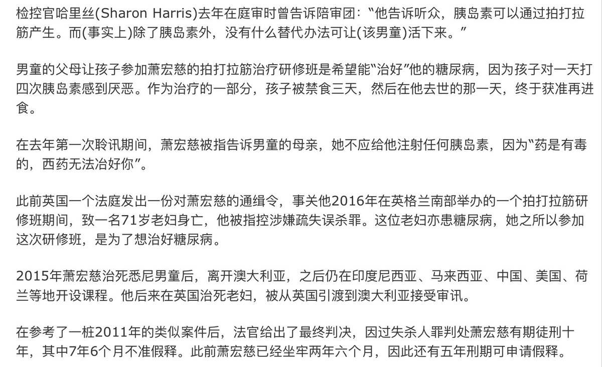 :speech_balloon:评:0 :+1:赞:2 :globe_with_meridians:转:1  

[12月14日 03:18]    老司机   @h5lpykl7tp6jjop    中国人民迷信的传统医学又惹祸了！
中国拍打拉筋"神医"萧宏慈在悉尼"治死"男童获刑10年
本案受害者在参加课程的第四天后，男孩的情况出现恶化，经常呕吐，血糖升高，但萧表示这是将有害物质排出体外，第六日晚，男孩抽筋发作并昏躺在旅馆的床上，随后失去了呼吸。  :speech_balloon:评:2 :+1:赞:12 :globe_with_meridians:转:3  

[12月14日 03:01]    老司机   @h5lpykl7tp6jjop    美国加州沙滩近期出现成千上万隻「阴茎鱼」，这个景象令人害羞，这个生物的正式名称是「单环刺螠」，俗称海肠，长达25公分，在沙子下的沙穴中活动以小碎屑为食。因此很少被人看见，不过最近风暴带来的强浪把覆盖住牠们的沙子给捲走，让牠们现出原形，可以活到25岁。 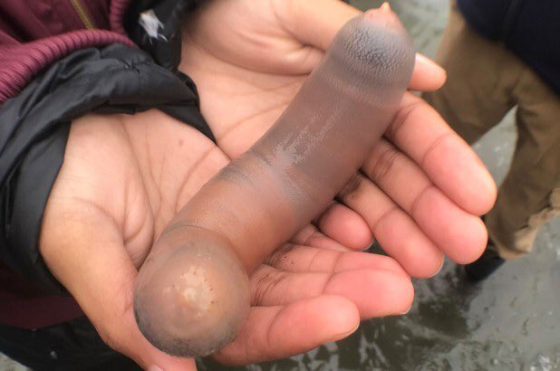 :speech_balloon:评:5 :+1:赞:25 :globe_with_meridians:转:12  

[12月14日 01:01]    财经真相   @caijingxiang    第一阶段协议背后的数字博弈：15号即将生效的1600亿美元25%的关税，算下来就是400亿美元税收；将9月份1200亿美元15%的关税降7.5%，就是等于少征收90亿美元关税，两者总计是490亿美元。刚好就是中国采购500亿美元农产品！  :speech_balloon:评:31 :+1:赞:225 :globe_with_meridians:转:73  

[12月14日 00:28]    财经真相   @caijingxiang    1.关税原来说是取消3600亿的一半，现在只是1200亿的一半，没有假消息公布的好；2.利好出尽，获利了结；3.对比双方公告内容存在差异很多，引发市场担忧情绪！ https://twitter.com/QingLucky/status/1205524315807969281 …  :speech_balloon:评:10 :+1:赞:85 :globe_with_meridians:转:28  

[12月14日 00:21]    财经真相   @caijingxiang    中美第一阶段协议公告差异：1.美方公布包含强制执行机制，中方没有！2.中方公告说同意分阶段降低关税，美方公告里没有！3.美方公告中方承诺会购买大量农产品，中方公告中没有，且新闻发布会上故意混淆说，美方也会购买中国农产品！4.下一阶段，中方强调需要进行校对、翻译、商量时间（拖），美方没有！ 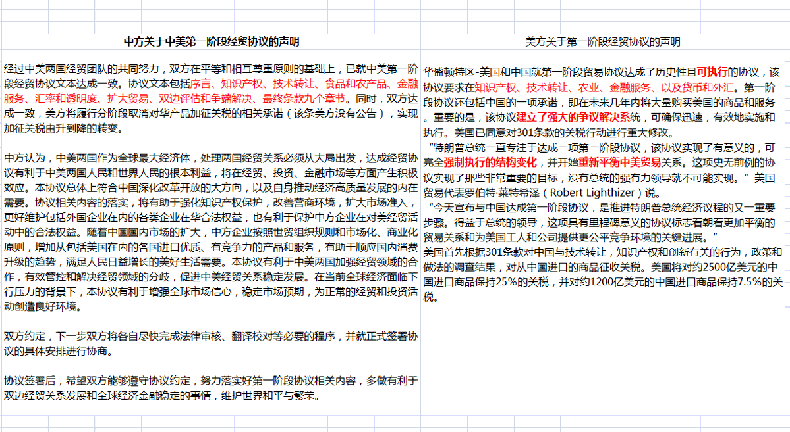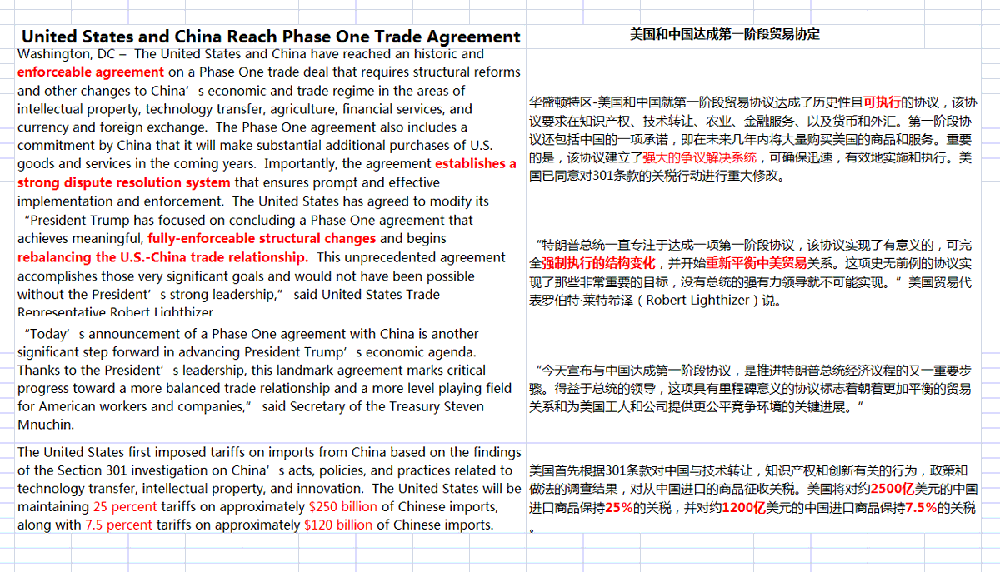 :speech_balloon:评:47 :+1:赞:522 :globe_with_meridians:转:265  

[12月14日 00:10]    BBC News 中文   @bbcchinese    在中国召开发布会的同时，美国总统特朗普也发推文证实两国达成了第一阶段贸易协议。 https://www.bbc.com/zhongwen/simp/chinese-news-50787171 …  :speech_balloon:评:22 :+1:赞:64 :globe_with_meridians:转:32  

[12月13日 23:50]    财经真相   @caijingxiang    人民币浮盈的平仓，浮亏的继续持有，暂时不在新建人民币空仓！  :speech_balloon:评:6 :+1:赞:38 :globe_with_meridians:转:5  

[12月13日 23:47]    财经真相   @caijingxiang    发布会结束了，市场一头雾水，没有方向，除了知道达成了传说中的“deal”外，现在的问题，比发布会前还多，人民币停留在7附近，没有波动！第二阶段协议是立即开始，还是中共的看第一阶段的情况？执行机制是什么？如果中共不执行第一阶段的协议会受到那些处罚？发布会故意让彭博提问在打谁的脸？  :speech_balloon:评:32 :+1:赞:157 :globe_with_meridians:转:47  

[12月13日 23:28]    BBC News 中文   @bbcchinese    中国在当地时间周五深夜突然召开记者会，宣布中美已就外界高度关注的两国经贸第一阶段协议达成一致。
 https://bbc.in/2EbkxMy  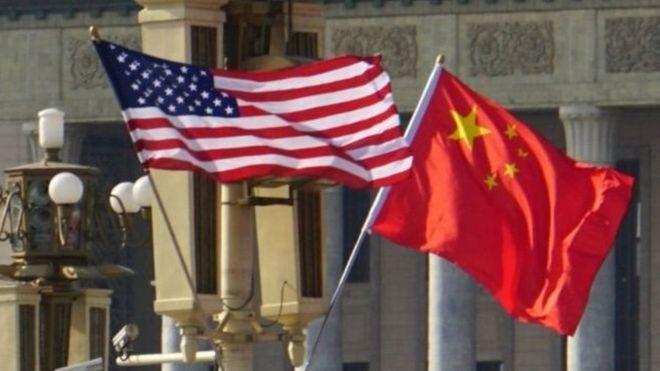 :speech_balloon:评:26 :+1:赞:73 :globe_with_meridians:转:34  

[12月13日 22:30]    BBC News 中文   @bbcchinese    全套英式早餐的吸引力究竟在哪里呢？有人说，全套英式早餐中大量的胆固醇和热量对付再糟糕的宿醉也不在话下，吃完后直接扛到晚餐也不成问题。 
 https://bbc.in/2PFWZVn  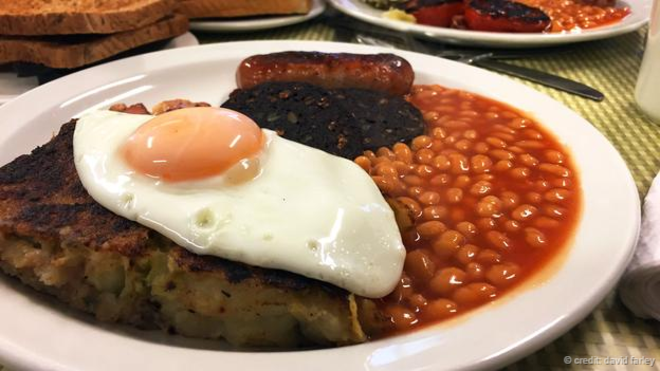 :speech_balloon:评:12 :+1:赞:39 :globe_with_meridians:转:7  

[12月13日 22:26]    财经真相   @caijingxiang    昨天很多交易员被假新闻搞得“崩溃”，尤其是信仰中共国运的交易员，不仅是亏钱的割肉痛，更多的是对中共得到喘息的“信仰动摇的痛心”，最难熬的一天渡过了，活着真好，亏钱几万美元，依然很高兴，接下来还会赚回来，最重要的是中共的“国运”已定！华夏幸甚！中国幸甚！  :speech_balloon:评:56 :+1:赞:421 :globe_with_meridians:转:51  

[12月13日 22:13]    财经真相   @caijingxiang    华尔街日报、彭博这一波大忽悠，把做空交易者给提前割了韭菜，现在到了真正割韭菜的时候了！ https://twitter.com/realDonaldTrump/status/1205489214546235393 …  :speech_balloon:评:35 :+1:赞:253 :globe_with_meridians:转:57  

[12月13日 22:11]    财经真相   @caijingxiang    没有刘鹤！ https://twitter.com/caolei1/status/1205487048259325952 …  :speech_balloon:评:15 :+1:赞:62 :globe_with_meridians:转:18  

[12月13日 21:59]    BBC News 中文   @bbcchinese    喝茶已经成为英国文化中不可或缺的一部分，但事实上，英国人酷爱喝茶其实是受到一位葡萄牙女性的影响。
 https://bbc.in/2PgQpG0  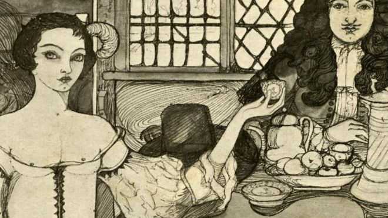 :speech_balloon:评:9 :+1:赞:27 :globe_with_meridians:转:11  

[12月13日 21:25]    BBC News 中文   @bbcchinese    英国媒体宣称，鲍里斯·约翰逊（Boris Johnson）冒险一搏的竞选策略得到了“令人惊叹的”巨大回报，而这主要归功于绝大部分公众接受了他的竞选口号：完成脱欧这件事。
 https://bbc.in/2rLywWG   :speech_balloon:评:5 :+1:赞:24 :globe_with_meridians:转:10  

[12月13日 20:45]    BBC News 中文   @bbcchinese    英国大选后崭新的局面 https://bbc.in/2LSzxmV   :speech_balloon:评:3 :+1:赞:19 :globe_with_meridians:转:6  

[12月13日 20:03]    BBC News 中文   @bbcchinese    “花朵告诉我们生命很短暂，我们要快乐地生活。”婚礼花艺师卡尔帕纳如是说。  :speech_balloon:评:0 :+1:赞:34 :globe_with_meridians:转:9  

[12月13日 20:00]    纽约时报中文网   @nytchinese    在过去十年间，千禧一代的父母们不得不更绞尽脑汁，才能找到寓意美好、独特又让人感到新鲜的名字。
于是他们打开词典，找到某种花朵Violet、一种美德Justice，甚至皇室名称Queen，又或者求助于神话、传说和宗教。还有一些人干脆自己发明新名字。 http://nyti.ms/2EfUST8   :speech_balloon:评:3 :+1:赞:8 :globe_with_meridians:转:7  

[12月13日 19:54]    墙国铁拳现世报😷   @Socialistfist    啧啧啧

#战螂在推特 2 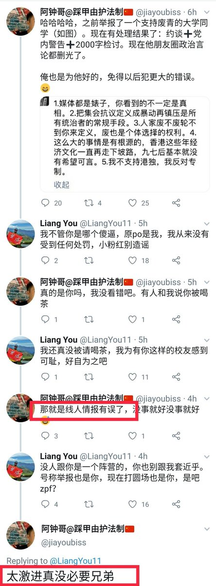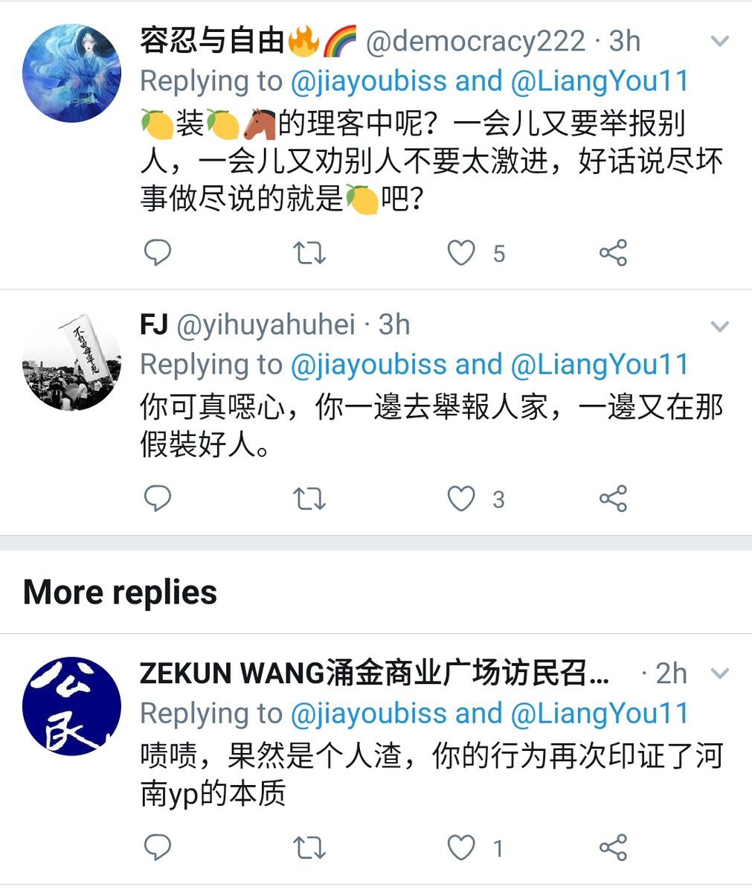 :speech_balloon:评:17 :+1:赞:83 :globe_with_meridians:转:13  

[12月13日 19:45]    财经真相   @caijingxiang    2015年特朗普再次新著《伤残美国：如何再次伟大》在此书中他陈述了自己对非法移民问题的立场，主张进行严格控制来缓和美国福利开支压力；同时反对伊拉克战争；对于这些主张他直言坦率，吸引媒体关注，而不是以往的政客表演！实事上早在2013年特朗普花费100万美元对进军白宫进行可行性研究！  :speech_balloon:评:2 :+1:赞:84 :globe_with_meridians:转:11  

[12月13日 19:36]    财经真相   @caijingxiang    为了让美国再次伟大，特朗普的开出的药方是：令欧佩克失去石油定价权；逼迫中国从事真正的公平贸易，以便给美国带来就业；设法减少债务又不损害正常福利；消除奥巴马医改和经济政策！今天他做到几条呢？  :speech_balloon:评:9 :+1:赞:129 :globe_with_meridians:转:22  

[12月13日 19:32]    财经真相   @caijingxiang    2011年在奥巴马在白宫记者协会年度晚宴上奚落特朗普后，特朗普于当年出版了一本新书《此时应强硬：让美国再成为第一》，在书中他直言奥巴马是美国的“灾难”，对奥巴马到世界各地为美国所作所为四处道歉感到不满，他写道：现在的美国工作机会紧缺，财富紧缺，毫无尊严，看上去就是一个失败国家！  :speech_balloon:评:19 :+1:赞:263 :globe_with_meridians:转:61  

[12月13日 19:21]    纽约时报中文网   @nytchinese    有趣的是，仅仅一星期后，当我告诉姥姥我计划参加支持核能源的游行，希望和她聊聊有关环保的政治话题时，她马上就拒绝我。
“哎呀，你千万不能参与政治。浪费时间。你应该专心学习。参加游行太危险了。”她对自己参加政治活动感到很骄傲，但轮到我她就不高兴。 http://nyti.ms/2RxkZfX   :speech_balloon:评:3 :+1:赞:13 :globe_with_meridians:转:3  

[12月13日 19:00]    纽约时报中文网   @nytchinese    《我的镜头》描述了中国广阔大地上各式各样的中国人的生活——从乡村放牧的马匹到雾霾笼罩的城市里戴着口罩的男人；从礼拜的穆斯林到昏暗的庆祝活动。
差异展现在热闹的片尾，一位拿着吉他的歌手在热闹的餐厅里表演，却始终未得到食客的注意力。 http://nyti.ms/34fNly3   :speech_balloon:评:66 :+1:赞:18 :globe_with_meridians:转:6  

[12月13日 18:28]    纽约时报中文网   @nytchinese    #新新世界 Liu Jingyao指控了中国最有权势的精英人物之一，结果被许多人称为荡妇、妓女、骗子和拜金女等。
这种羞辱规模之大、程度之强，体现了中国社会对待敢于直言性侵的女性的态度。 by @liyuan6 http://nyti.ms/2sm2yk0   :speech_balloon:评:208 :+1:赞:371 :globe_with_meridians:转:184  

[12月13日 18:17]    老司机   @h5lpykl7tp6jjop    鸦片战争的真相 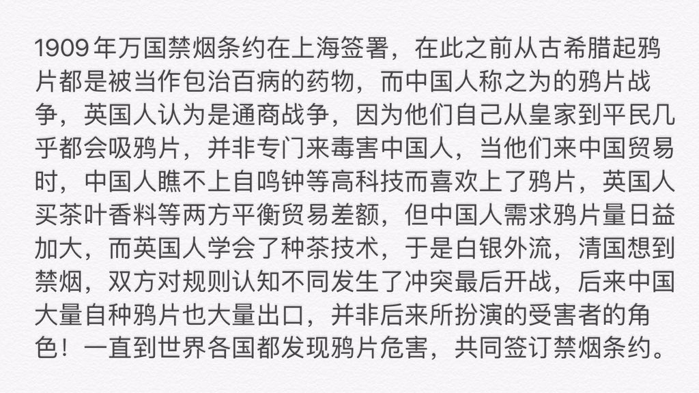 :speech_balloon:评:0 :+1:赞:27 :globe_with_meridians:转:14  

[12月13日 18:00]    BBC News 中文   @bbcchinese    选举结果有助英国打破三年来的脱欧僵局，但在国际大环境下，英国与中国未来的关系却蒙上不确定性。 https://bbc.in/34cS1Vj   :speech_balloon:评:31 :+1:赞:56 :globe_with_meridians:转:21  

[12月13日 17:40]    纽约时报中文网   @nytchinese    中国资深电影人王小帅用超过十年时间以胶片和录像结合的方式拍摄了《我的镜头》。
这部纪录片展现了在城市和乡村、工业和农业、光鲜和脏乱环境里的生活。它用一种令人感到意犹未尽的方式，把镜头的合成效果留给了观者。与其说是一份国情报告，这更是一部实验电影。 http://nyti.ms/34fNly3   :speech_balloon:评:14 :+1:赞:125 :globe_with_meridians:转:56  

[12月13日 17:00]    BBC News 中文   @bbcchinese    英国大选：保守党大胜，无协议脱欧可能性大减，英镑汇率狂飙！ https://bbc.in/2tgBxyZ   :speech_balloon:评:10 :+1:赞:43 :globe_with_meridians:转:15  

[12月13日 16:59]    纽约时报中文网   @nytchinese    为什么叫Malaysia的女孩变多了？《星球大战》和HBO剧集《罗马》对取名又有什么样的影响？是什么让一些名字在过去十年成为闪亮的明星，而其他数的则无人问津？
为了搞清楚2010年代父母给孩子起名的趋势，时报分析了美国最受欢迎的婴儿名字榜单。 http://nyti.ms/2EfUST8   :speech_balloon:评:12 :+1:赞:16 :globe_with_meridians:转:8  

[12月13日 16:29]    纽约时报中文网   @nytchinese    周四早晨，特朗普总统发布推文称，“与中国的重大协议就快达成了。他们想要，我们也想要！”
但他尚未就交易的进展或计划在周日征收的关税发表正式声明。双方此前都曾表示他们马上就要达成协议，但谈判破裂。 http://nyti.ms/2rGVuOP   :speech_balloon:评:6 :+1:赞:9 :globe_with_meridians:转:8  

[12月13日 16:12]    老司机   @h5lpykl7tp6jjop    一场猪瘟引发的蝴蝶效应，还不知道什么时候才会结束！  :speech_balloon:评:2 :+1:赞:55 :globe_with_meridians:转:2  

[12月13日 16:02]    BBC News 中文   @bbcchinese    孔夫子曾说过，一个人活到五十岁会知天命；不过，一组美国科学家则研究发现，孔子的话不太准确。 https://bbc.in/35hNqm7   :speech_balloon:评:135 :+1:赞:139 :globe_with_meridians:转:48  

[12月13日 16:00]    纽约时报中文网   @nytchinese    四名熟悉谈判情况的知情人士称，美国已与中国达成了第一阶段贸易协议的最终条款。
知情人透露，协议将包括撤回部分关税中国增加购买美国农产品、加强保护美国知识产权等。此外，特朗普预计将宣布取消或延迟原定于周日生效的新关税。 http://nyti.ms/2rGVuOP   :speech_balloon:评:51 :+1:赞:83 :globe_with_meridians:转:29  

[12月13日 15:47]    老司机   @h5lpykl7tp6jjop    都是猪肉涨价惹的祸！马戏团在沧州表演出事，老虎吃马，乱作一团。肉涨价了，马戏团就克扣了老虎的伙食，导致老虎要吃马 ；还好没吃人！  :speech_balloon:评:77 :+1:赞:578 :globe_with_meridians:转:329  

[12月13日 15:43]    BBC News 中文   @bbcchinese    “通过这次选举……我们可以终结所有二次公投的严峻威胁。”

现任英国首相、保守党领袖鲍里斯·约翰逊在大选获胜后发表讲话，他承诺“完成脱欧”。  :speech_balloon:评:7 :+1:赞:87 :globe_with_meridians:转:27  

[12月13日 15:40]    纽约时报中文网   @nytchinese    北大女生自杀事件近日在网络世界引发热议，在这段“不寒而栗的爱情“中，女方疑似受到男友的“煤气灯操纵“。
时报此前曾对gaslighting一词做过详细解释。“煤气灯操纵“是一种心理操纵。这种手段利用否定、误导和谎言，试图破坏受害者情绪的稳定，使其最终产生自我质疑。 http://nyti.ms/2v7PTQg   :speech_balloon:评:16 :+1:赞:160 :globe_with_meridians:转:92  

[12月13日 15:37]    新闻大吐槽   @TuCaoFakeNews    试用一句诗总结下面新闻：

吉家酒肉臭，路有硬气骨 https://twitter.com/TuCaoFakeNews/status/1205333155521019904 …  :speech_balloon:评:4 :+1:赞:42 :globe_with_meridians:转:15  

[12月13日 15:24]    新闻大吐槽   @TuCaoFakeNews    吉家酒肉臭，路有硬气骨  :speech_balloon:评:2 :+1:赞:68 :globe_with_meridians:转:1  

[12月13日 15:03]    纽约时报中文网   @nytchinese    #图集 【塑造了俄罗斯的第一次车臣战争】第一次车臣战争已过去了二十五年，但这场战争的幽灵仍在俄罗斯上空游荡。触目惊心的历史图片向我们展现了这次战争的残酷，战败的耻辱也暴露了俄罗斯的弱点，驱使该国此后走上了强势路线。点击查看图集： http://nyti.ms/38zlNHm   :speech_balloon:评:18 :+1:赞:57 :globe_with_meridians:转:13  

[12月13日 14:05]    新闻大吐槽   @TuCaoFakeNews    断交部曾叫嚣，对美国的制裁该来的早晚会来！可只是雷声大雨点小的对几个美国民间机构下手了事…

这下美国一些官员不开心了，来制裁我啊，怎么不把我加入黑名单呢？你们倒是动手呀！

与会一位议员曾和台湾有联络，被中共电话训诫，现在他不再受窝囊气，选择当众怼共！  :speech_balloon:评:4 :+1:赞:127 :globe_with_meridians:转:63  

[12月13日 14:05]    新闻大吐槽   @TuCaoFakeNews    断交部曾叫嚣，对美国的制裁该来的早晚会来！可只是雷声大雨点小的对几个美国民间机构下手了事…

这下美国一些官员不开心了，来制裁我啊，怎么不把我加入黑名单呢？你们倒是动手呀！

与会一位议员曾和台湾有联络，被中共电话训诫，现在他不再受窝囊气，选择当众怼共！  :speech_balloon:评:4 :+1:赞:127 :globe_with_meridians:转:63  

[12月13日 14:01]    BBC News 中文   @bbcchinese    美国总统推特发文称与中国贸易谈判的“一期协议”接近完成。推文一出，道琼斯指数应声上扬。 https://bbc.in/2Ec2upx   :speech_balloon:评:26 :+1:赞:44 :globe_with_meridians:转:16  

[12月13日 13:48]    老司机   @h5lpykl7tp6jjop    用雨伞自制的遥控风筝  :speech_balloon:评:2 :+1:赞:21 :globe_with_meridians:转:0  

[12月13日 13:38]    老司机   @h5lpykl7tp6jjop    我设计自制的遥控老鹰风筝  :speech_balloon:评:0 :+1:赞:8 :globe_with_meridians:转:0  

[12月13日 13:33]    老司机   @h5lpykl7tp6jjop      :speech_balloon:评:2 :+1:赞:5 :globe_with_meridians:转:0  

[12月13日 13:30]    纽约时报中文网   @nytchinese    我记得姥姥很多年前考公民入籍考试，花了很多时间背面试会问的问题，但没有人明确地告诉她民主需要积极参与。
所以当她告诉我，“我在市政府发言，反对山景城开大麻店”，我真没有想到。不过我能感受到她的骄傲。“在我们18位老人当中，只有我一个人发言，还上电视了。” http://nyti.ms/2RxkZfX   :speech_balloon:评:2 :+1:赞:14 :globe_with_meridians:转:5  

[12月13日 13:29]    老司机   @h5lpykl7tp6jjop      :speech_balloon:评:3 :+1:赞:2 :globe_with_meridians:转:0  

[12月13日 13:25]    老司机   @h5lpykl7tp6jjop      :speech_balloon:评:2 :+1:赞:4 :globe_with_meridians:转:0  

[12月13日 13:19]    老司机   @h5lpykl7tp6jjop    我的澳洲退休生活，玩航模是每天的必修课。  :speech_balloon:评:3 :+1:赞:44 :globe_with_meridians:转:0  

[12月13日 13:00]    纽约时报中文网   @nytchinese    #每日一词 Prodigy，神童、天才。本周，9岁的洛朗·西蒙斯中断在荷兰埃因霍温理工大学的学业，准备前往美国攻读博士学位。
一直以来，外界都将西蒙斯奉为“神童”。该词源于拉丁语词prodigium，意为“预兆、先兆”。
更多简报内容： http://nyti.ms/2LPfupb 
欢迎点此加入订阅：http://bit.ly/2EFQSOC   :speech_balloon:评:0 :+1:赞:5 :globe_with_meridians:转:2  

[12月13日 12:52]    老司机   @h5lpykl7tp6jjop     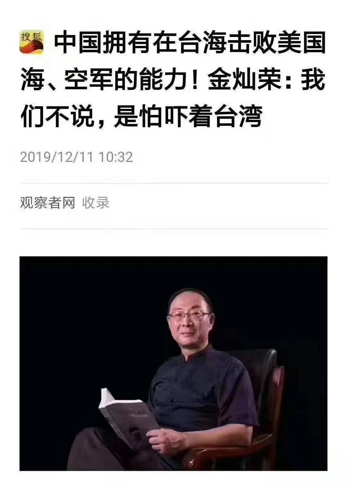 :speech_balloon:评:3 :+1:赞:8 :globe_with_meridians:转:3  

[12月13日 12:40]    纽约时报中文网   @nytchinese    21世纪的头20年并未产生一条清晰的趋势线。但在导致特朗普上台、英国脱欧的民族主义排外浪潮之下，自由民主会终止的预言看来也是错误的。
社交媒体让年轻一代更主动地掌握自己的命运，激励他们的不是乌托邦式的愿景，而是拯救地球和两性在地球上更平等生活的务实追求。 http://nyti.ms/38Bjm6X   :speech_balloon:评:11 :+1:赞:17 :globe_with_meridians:转:6  

[12月13日 12:20]    纽约时报中文网   @nytchinese    新西兰将开始搜寻火山喷发灾难中的遇难者遗体。冒着怀特岛火山再次喷发的风险，该国八名士兵计划于周五凌晨前往喷发现场。
警方现已确认六具遗体的位置，但尚未发现另外两具。该国还从美国订购了超过1000平方英尺的人类皮肤，以帮助救治烧伤者。
更多简报内容： http://nyti.ms/2LPfupb   :speech_balloon:评:1 :+1:赞:5 :globe_with_meridians:转:5  

[12月13日 12:00]    老司机   @h5lpykl7tp6jjop    中国人在哪儿都是不肯吃亏的，和他们打交道，必须让他赚才行，他们对谁都这样，养儿是防老用，烧香拜佛是为许愿的，灵验了才还愿，交朋友也是今天帮你明天得帮他，否则这朋友就没得做，谈婚论嫁更是聘金为先，赔了夫人又折兵就是千古笑话！有人说他们没信仰，不对，这就是中国人的信仰！所以贸易战必胜  :speech_balloon:评:4 :+1:赞:96 :globe_with_meridians:转:29  

[12月13日 11:50]    纽约时报中文网   @nytchinese    #转折点 西方民主国家已经让位于中国和独裁者，腐败和不平等现象进一步恶化。
2019年的抗议者已经意识到了危险，一场关于自由的关键斗争正在进行。他们能扭转潮流吗？
本文来自“转折点”栏目，这一特别版块探讨了今年一些可能对未来产生影响的关键时刻。 http://nyti.ms/38Bjm6X   :speech_balloon:评:75 :+1:赞:227 :globe_with_meridians:转:97  

[12月13日 11:46]    新闻大吐槽   @TuCaoFakeNews    港人很喜欢吃日式牛丼饭，但他们就是忍住不去吃吉野家！
因为吉野家解雇了为反送中发声的员工，主动替港共迫害香港人！

直到这家叫做SUKIYA的同类日料店开张，香港人排起长队准备大快朵颐。

不知道吉野家看到这大长队作何感想？
“矮马，没人吃，今天的牛肉又要臭了”  :speech_balloon:评:129 :+1:赞:1990 :globe_with_meridians:转:754  

[12月13日 11:46]    新闻大吐槽   @TuCaoFakeNews    港人很喜欢吃日式牛丼饭，但他们就是忍住不去吃吉野家！
因为吉野家解雇了为反送中发声的员工，主动替港共迫害香港人！

直到这家叫做SUKIYA的同类日料店开张，香港人排起长队准备大快朵颐。

不知道吉野家看到这大长队作何感想？
“矮马，没人吃，今天的牛肉又要臭了”  :speech_balloon:评:129 :+1:赞:1990 :globe_with_meridians:转:754  

[12月13日 11:34]    纽约时报中文网   @nytchinese    英国大选投票结束，民调显示保守党大胜。正式的投票结果需要数小时统计完成，但据出口民调显示，保守党预计将获得下议院368个席位，工党则为191个。
保守党的获胜将巩固现任首相鲍里斯·约翰逊的脱欧主张，对该国产生重大影响。 
更多简报内容： http://nyti.ms/2LPfupb   :speech_balloon:评:13 :+1:赞:13 :globe_with_meridians:转:3  

[12月13日 11:02]    BBC News 中文   @bbcchinese    目前差不多1000人因为香港示威浪潮被起诉，当中一半被控参加"暴动"，引起要求检讨香港刑法和司法程序的声音。 https://bbc.in/2PChFxB   :speech_balloon:评:73 :+1:赞:189 :globe_with_meridians:转:100  

[12月13日 10:30]    BBC News 中文   @bbcchinese    目前投票站出口民调显示，保守党领袖约翰逊有望继续担任英国首相。他的一生有成功有风波，有危机也有绯闻。但历史将评价的，后人将记住的恐怕是，他有没有“搞定脱欧”。 https://bbc.in/34h33cr   :speech_balloon:评:13 :+1:赞:59 :globe_with_meridians:转:14  

[12月13日 10:17]    财经真相   @caijingxiang    人民币又出现封底购汇，如果明天白宫公布达成协议，人民币会出现获利了结，跌到7附近，如果15号关税继续加征，人民币要上演千里大跌幅,到时结果出来后再追空不迟！  :speech_balloon:评:39 :+1:赞:271 :globe_with_meridians:转:60  

[12月13日 10:07]    纽约时报中文网   @nytchinese    早安！今日重点新闻包括：
中美接近达成贸易协议；保守党预计将赢得英国大选；借贷狂潮重压中国金融系统；美众院司法委员会将就特朗普弹劾条款投票；新西兰开始搜索火山爆发遇难者遗体；印度对新公民法引发的抗议采取镇压行动……NYT简报带你速览今日要闻。
 http://nyti.ms/2E9nLAi   :speech_balloon:评:5 :+1:赞:29 :globe_with_meridians:转:7  

[12月13日 10:03]    BBC News 中文   @bbcchinese    英国大选脱欧仍是关注点。最新投票站出口民调显示，力主脱欧的保守党将赢得议会多数。 https://bbc.in/2qMiLOR   :speech_balloon:评:5 :+1:赞:14 :globe_with_meridians:转:3  

[12月13日 09:56]    老司机   @h5lpykl7tp6jjop    为什么有第二次鸦片战争？就是因为清国对签约不执行，本来同意的广州通商口岸七年后都不让英人进入，以现在的话来说就是历史文件不具现实意义！当面说行过后不认是中国人的传统习惯，现在和美国的贸易战谈判和鸦片战争谈判颇为相似，谈了又撕，撕了又谈，最后必然不执行，过后不认的习惯不会改，只有打  :speech_balloon:评:7 :+1:赞:149 :globe_with_meridians:转:58  

[12月13日 09:20]    纽约时报中文网   @nytchinese    两年前，官员们已经开始着手解决这个问题。他们取缔了影子银行产业，削减了地方政府相当一部分财政援助。但此举给需要资金帮助的公司带来了更大压力。
如今，面对一长串现金短缺以致无法偿还债务的中国企业名单，政府面临着一项艰巨任务：弄清它将允许哪些公司倒闭。 http://nyti.ms/34ezOHd   :speech_balloon:评:4 :+1:赞:15 :globe_with_meridians:转:6  

[12月13日 08:40]    纽约时报中文网   @nytchinese    批评人士一直质疑，那些没有卓越成就的获奖者是否配得起这个奖项——比如，2012年的获奖者欧盟，以及2009的获奖者，刚上任几个月的奥巴马总统。
我们盘点了这些年来著名的争议性诺贝尔和平奖被提名人和获奖者，包括希特勒和斯大林，以及亨利·基辛格和黎德寿。 http://nyti.ms/2tbcopg   :speech_balloon:评:1 :+1:赞:14 :globe_with_meridians:转:7  

[12月13日 08:14]    财经真相   @caijingxiang    市场“买预期、卖事实”，目前人民币涨幅甚至计价了，削减现有关税，而不是仅仅是15号的关税。消息鱼龙混杂，路透社、彭博所有消息全部引用“匿名消息人士”，如果取消15号关税有可能，但是取消现有关税，这事怎么看都不靠谱，目前中共退让仅仅是再次承诺购买500亿农产品，这个结果怎么看都是中共的胜利！  :speech_balloon:评:51 :+1:赞:256 :globe_with_meridians:转:49  

[12月13日 08:01]    纽约时报中文网   @nytchinese    #年度图集 华盛顿最有权势的人物之一、众议院议长南希·佩洛西在为特朗普总统的国情咨文讲话鼓掌时笑了笑——她的表情成了网络米姆。
尽管华盛顿的权力之争基本上避开了镜头，我们的摄影师仍设法拍到了一些微妙而生动的照片，展现了一个常常被政治操纵和演技掩盖的过程。 http://nyti.ms/2PDzfBq   :speech_balloon:评:5 :+1:赞:23 :globe_with_meridians:转:9  

[12月13日 06:56]    老司机   @h5lpykl7tp6jjop    真的好象又回到了年轻的时候！  :speech_balloon:评:2 :+1:赞:30 :globe_with_meridians:转:1  

[12月13日 04:57]    老司机   @h5lpykl7tp6jjop    自从上推特反共以来，退休生活一下有了目标，头也不晕了，眼也不花了，手指头也灵活了，打字特快， 脑子也好使，牙好胃口也好，吃嘛嘛香，身体倍儿捧！

反共真它妈的爽呵！  :speech_balloon:评:34 :+1:赞:432 :globe_with_meridians:转:38  

[12月13日 00:39]    财经真相   @caijingxiang    厦门地铁塌了！  :speech_balloon:评:45 :+1:赞:364 :globe_with_meridians:转:170  

[12月13日 00:34]    财经真相   @caijingxiang    有个细节必须要闹明白，本轮行情真正的大驱动着是华尔街日报关于3600亿存量关税减50%，川普空洞的“非常接近”的论调只是一个引子，没有华尔街日报的“fake news”补刀，人民币根本无力涨破7！说到底还是一场戏耍！  :speech_balloon:评:29 :+1:赞:165 :globe_with_meridians:转:23  

[12月12日 23:49]    财经真相   @caijingxiang    人民币涨到7后，已经没有了劲头，“破7前是顶，破7后是底”，这一人民币汇率原则依然没有改变，并且已经得到几次验证，只要不爆仓，继续持有人民币空仓。这次除了川普接近达成协议这种空洞的表态外，真正的杀伤力是华尔街日报的削减50%关税报道，这真是一个大坑，周日一切都会尘埃落定！  :speech_balloon:评:28 :+1:赞:249 :globe_with_meridians:转:46  

[12月12日 23:31]    BBC News 中文   @bbcchinese    她是模特，邂逅这位富有的军火商，加入他的后宫团，成为“寻欢作乐小老婆”之一。是爱情？是友情？听她自己说……
 https://bbc.in/2EbxtSH  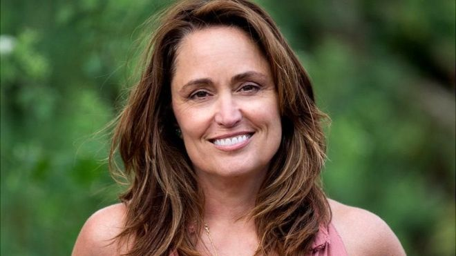 :speech_balloon:评:8 :+1:赞:17 :globe_with_meridians:转:2  

[12月12日 23:16]    财经真相   @caijingxiang    黄金技术上刚刚突破1485美元，很多人都会加仓，川普这么一条推文，不知道有多少人被埋啊！割肉三万！  :speech_balloon:评:62 :+1:赞:223 :globe_with_meridians:转:31  

[12月12日 23:07]    新闻大吐槽   @TuCaoFakeNews    就好比俩强盗对话：都怪你当年没杀死他，现在我们暴露了，怎么办？！  :speech_balloon:评:1 :+1:赞:11 :globe_with_meridians:转:1  

[12月12日 22:53]    新闻大吐槽   @TuCaoFakeNews    香港抗争熊熊不熄，与港澳办谎报军情有直接关系，自觉不妙的张晓明开始甩锅，他在党媒发文，称当年23条未遂，是导致如今局面的原因，并说23条是港府的紧迫任务。
梁家杰：你今天通过了23条，明天香港的民主运动就会平息？

评：都怪前任当年不够狠，不够左，怨我咯？  :speech_balloon:评:15 :+1:赞:162 :globe_with_meridians:转:73  

[12月12日 22:53]    新闻大吐槽   @TuCaoFakeNews    香港抗争熊熊不熄，与港澳办谎报军情有直接关系，自觉不妙的张晓明开始甩锅，他在党媒发文，称当年23条未遂，是导致如今局面的原因，并说23条是港府的紧迫任务。
梁家杰：你今天通过了23条，明天香港的民主运动就会平息？

评：都怪前任当年不够狠，不够左，怨我咯？  :speech_balloon:评:15 :+1:赞:162 :globe_with_meridians:转:73  

[12月12日 22:43]    财经真相   @caijingxiang    川大爷一句话，人民币浮亏中，还好涨的不多！ https://twitter.com/realDonaldTrump/status/1205134155853574145 …  :speech_balloon:评:49 :+1:赞:129 :globe_with_meridians:转:31  

[12月12日 22:39]    财经真相   @caijingxiang    崇祯皇帝上台前，只是一个亲王，很多朝廷内幕和秘闻并不了解，缺乏对东林党为代表文官集团贪腐的认知，被群臣忽悠的错恨阉党；他铲除魏忠贤，大明王朝就失去了对东林党贪污最后制约的力量，当内阁把高税收转移到灾荒严重的西北时，李自成、张献忠们的崛起就创造了条件。诸臣误我！是他最后的大悟！  :speech_balloon:评:33 :+1:赞:409 :globe_with_meridians:转:75  

[12月12日 22:30]    BBC News 中文   @bbcchinese    我们知道饥饿为何令人发脾气，但女人真的比男人更容易受其影响吗？
 https://bbc.in/2LKYYqf   :speech_balloon:评:5 :+1:赞:9 :globe_with_meridians:转:3  

[12月12日 22:30]    BBC News 中文   @bbcchinese    台湾政府力推美食旅游吸引外国游客，但西方人却另有视角，当局希望让外国人饱嘴福似乎有点“一厢情愿”。
 https://bbc.in/35fQ7of  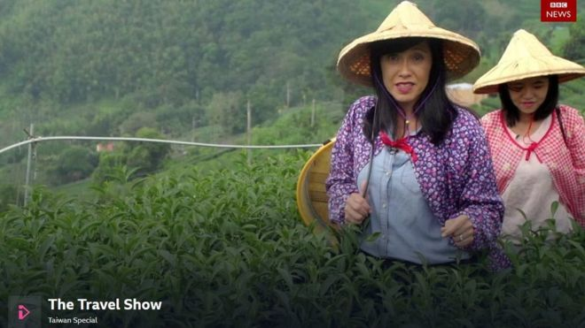 :speech_balloon:评:12 :+1:赞:17 :globe_with_meridians:转:3  

[12月12日 21:59]    BBC News 中文   @bbcchinese    “腐国”英伦并非只有黑暗料理。美味煎饼还进了文学殿堂。英文中，女人平胸、车胎爆气，都可以用"平如煎饼"来形容。
 https://bbc.in/34axwZD   :speech_balloon:评:14 :+1:赞:17 :globe_with_meridians:转:7  

[12月12日 21:43]    墙国铁拳现世报😷   @Socialistfist    感谢近几日投稿的推友！  :speech_balloon:评:0 :+1:赞:56 :globe_with_meridians:转:1  

[12月12日 21:42]    墙国铁拳现世报😷   @Socialistfist    红色精神流传一次一百万

#社会主义铁拳 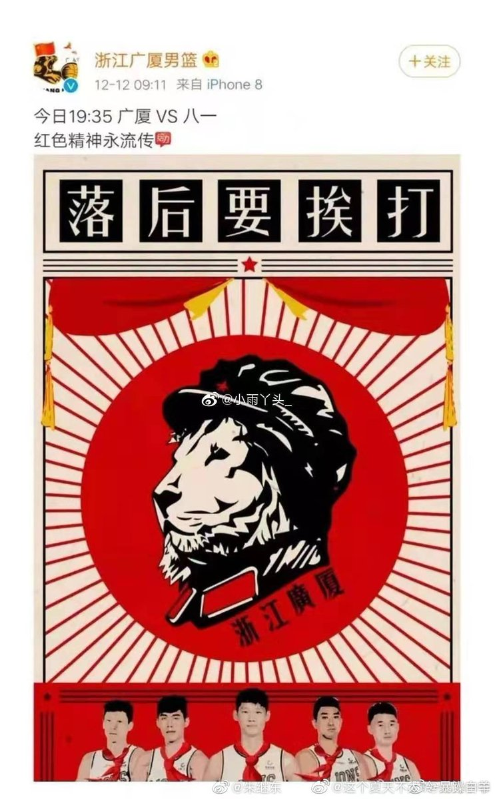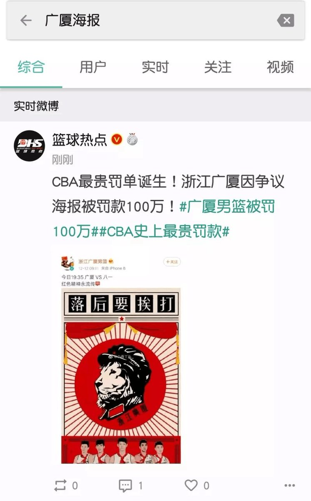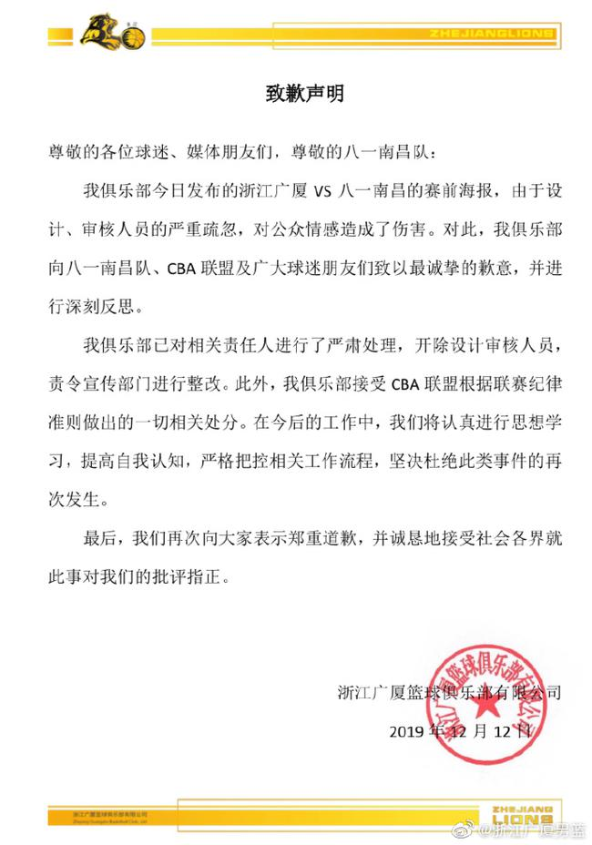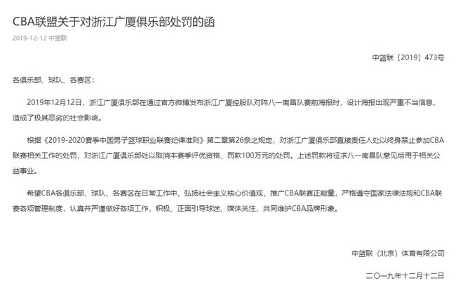 :speech_balloon:评:40 :+1:赞:441 :globe_with_meridians:转:121  

[12月12日 21:25]    BBC News 中文   @bbcchinese    一天，20岁的奈特把车开到缅因州乡下的森林中。随后，他弃车徒步走进森林，身上只带一些最基本的生存用品。从此就再也没有出来，直到被人发现。
 https://bbc.in/34e9rAX   :speech_balloon:评:10 :+1:赞:81 :globe_with_meridians:转:30  

[12月12日 20:11]    墙国铁拳现世报😷   @Socialistfist    补充 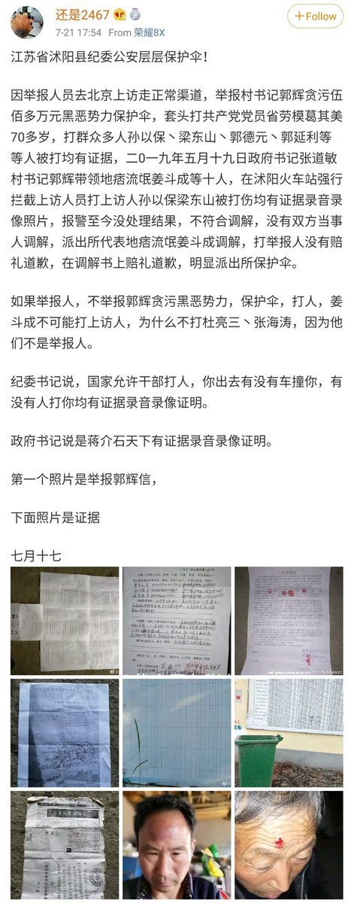 :speech_balloon:评:0 :+1:赞:50 :globe_with_meridians:转:10  

[12月12日 20:06]    墙国铁拳现世报😷   @Socialistfist    基层腐败，中央英明 -----某战螂

#社会主义铁拳 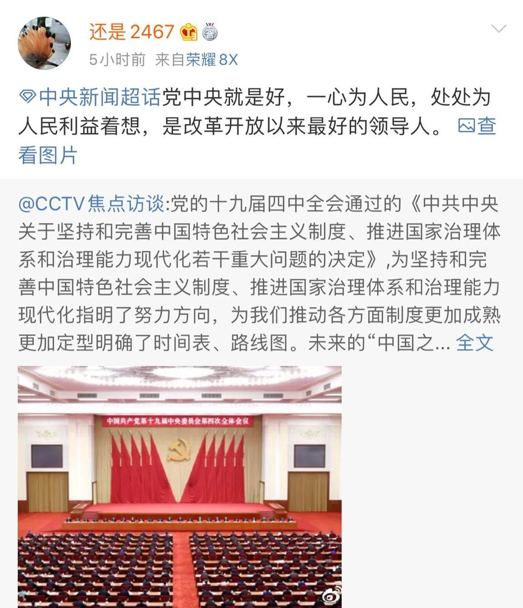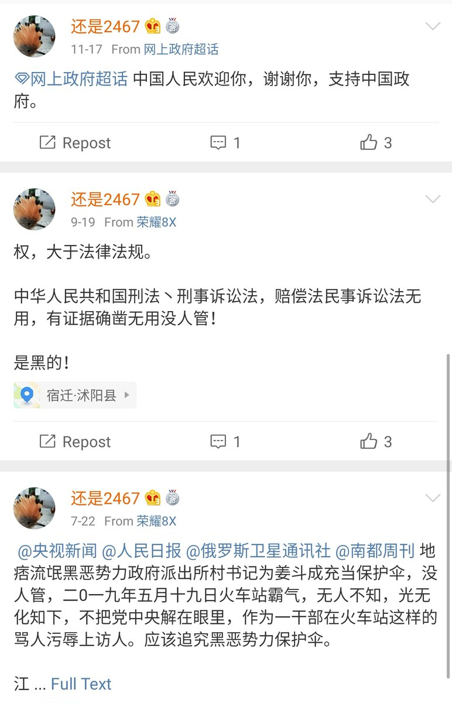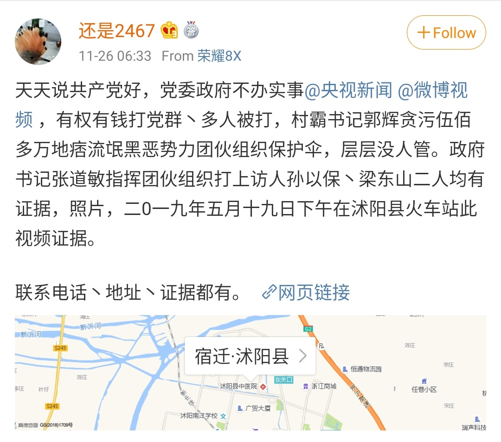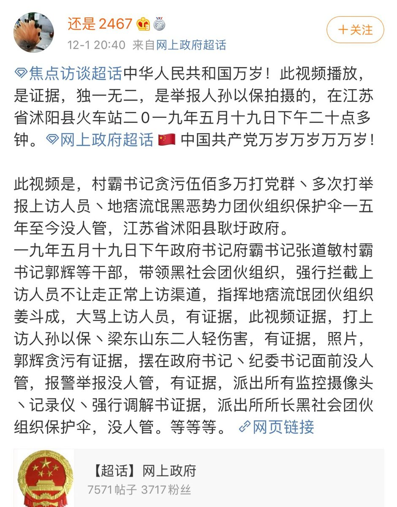 :speech_balloon:评:27 :+1:赞:324 :globe_with_meridians:转:72  

[12月12日 18:48]    凡賽堤/FORSETI   @FecharCCP    王健
捷克总统之所以会来93阅兵
叶简明，吴小晖
陈小鲁 https://twitter.com/dragrnovlayins/status/1204808401181540352 …  :speech_balloon:评:0 :+1:赞:2 :globe_with_meridians:转:1  

[12月12日 18:48]    凡賽堤/FORSETI   @FecharCCP    加上我一個-我們要持續不斷地吶喊 https://twitter.com/faith8964/status/1205075628875141120 …  :speech_balloon:评:0 :+1:赞:138 :globe_with_meridians:转:82  

[12月12日 18:46]    凡賽堤/FORSETI   @FecharCCP    Recall 6.12 #HKPoliceBrutality towards a girl. 

6 mths were over. #HKPoliceBrutality becomes more severe. Hong Kong is under humanitarian crisis. Tyranny hasn’t stepped down. Justice hasn’t come. NO freedom. NO human rights. 

Dear world, pls help HK. #StandWithHongKong #SOSHK  :speech_balloon:评:3 :+1:赞:34 :globe_with_meridians:转:34  

[12月12日 18:35]    凡賽堤/FORSETI   @FecharCCP    4、陳彥霖母親何女士
09年11月11號，早上7點天水圍天恆邨有女子墮樓，現場屍身完整，沒發現大量血跡，屍體很快變得蠟黃，屍體臉部特徵經過鑑定，可以判斷是陳彥霖母親，我曾經查過屍體變化的資料，屍體會這麼快變色，有很大的可能陳母已經死去多日，藏在凍庫，之後再被丟下樓，偽造「跳樓自殺」。 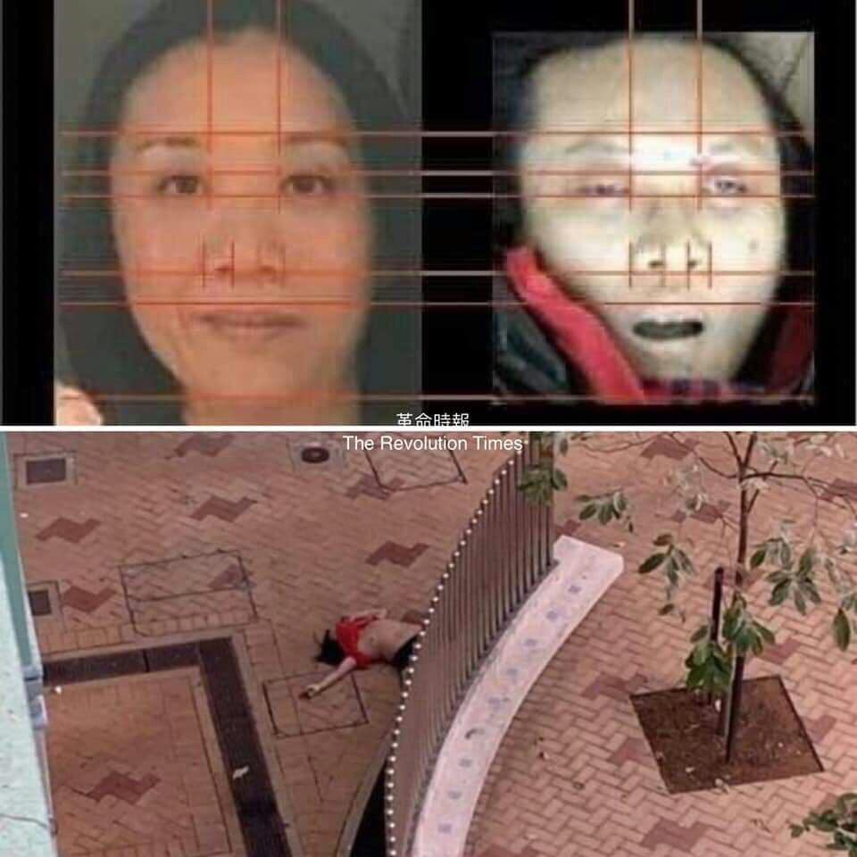 :speech_balloon:评:5 :+1:赞:47 :globe_with_meridians:转:33  

[12月12日 17:51]    老司机   @h5lpykl7tp6jjop    有这些专家帮忙，何愁天朝不亡！  :speech_balloon:评:13 :+1:赞:51 :globe_with_meridians:转:19  

[12月12日 17:21]    财经真相   @caijingxiang    没谈拢，只能“继续沟通”，如果谈成早就公布了，现在的问题是15号，特朗普是否继续加关税，还是拖延！目前市场已经对“拖延”计价，正式公布了，人民币也涨幅有限，但是如果继续加税，人民币就会再度大跌，我准备加仓人民币空仓，因为这是一个风险低收益高的赌注！ https://twitter.com/ReutersCN/status/1205038631603318784 …  :speech_balloon:评:65 :+1:赞:422 :globe_with_meridians:转:75  

[12月12日 16:31]    凡賽堤/FORSETI   @FecharCCP    同胞们当我看到这样的场景……听到这位可爱的香港女童稚嫩的声音时……我脑海里一下子涌现的是这半年的时间里，伟大港人血肉模糊的青春身影，我听到的是无数港人无法遏止的心中怒火 愤怒 挣扎和绝望的嘶喊……人类无法想象香港人如此坚强不屈，如此伟大光荣。
每一个细节都无法言状
太你们了  :speech_balloon:评:24 :+1:赞:277 :globe_with_meridians:转:131  

[12月12日 15:06]    老司机   @h5lpykl7tp6jjop    偷渡，伪证，作假只要为了革命，都可以吗？ 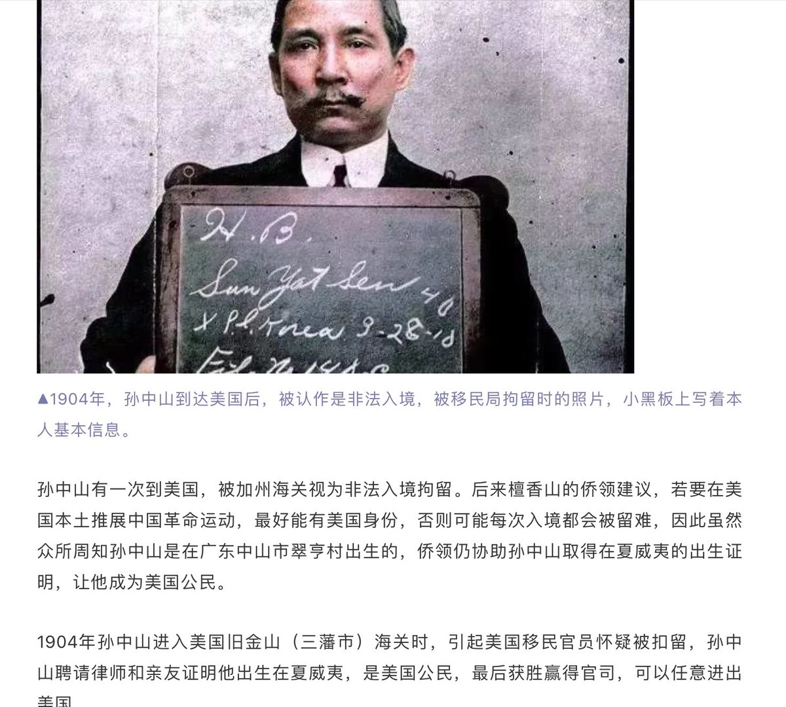 :speech_balloon:评:5 :+1:赞:46 :globe_with_meridians:转:16  

[12月12日 15:01]    老司机   @h5lpykl7tp6jjop    假如中共掌握了大脑植入芯片技术，十四亿人会怎样？
你的大脑数据将会被传输至手机，与手机软件进行无缝的对接！你的思想和大脑数据将会被一一提取，人们将再无秘密可言！中央数据库可以随时篡改你的大脑数据！你将彻底沦为一个不受自己操控的——生化人！
终于达到了党的要求，一切行动听指挥！细思恐极  :speech_balloon:评:8 :+1:赞:73 :globe_with_meridians:转:15  

[12月12日 14:55]    新闻大吐槽   @TuCaoFakeNews    喂喂喂，那只喵，你在做什么，不要弄掉了一尊！
………………………

可是看到你这么可爱，一尊碎了也没关系  :speech_balloon:评:6 :+1:赞:73 :globe_with_meridians:转:9  

[12月12日 14:53]    新闻大吐槽   @TuCaoFakeNews    不知道是根据”香港民主与人权法案”中的哪条？感觉很给力！
关键就厉害在说干就干，绝不拖泥带水 https://twitter.com/nrdituydxmtzta9/status/1204915985204924417 …  :speech_balloon:评:5 :+1:赞:56 :globe_with_meridians:转:25  

[12月12日 11:33]    凡賽堤/FORSETI   @FecharCCP    报应来了 ，何柱国是美国华人中的巨富，从小生活在美，现仍有三百多亿美元财富，进出美国都坐他的私人飞机。近几年多待在香港打理他在港中两地业务。十一月底他回美国时被约谈三小时，然后原机遣返香港再不能回美。对方列出了数月来他在港的＂撑警＂言行属反自由民主反人类罪。
此事在港中引起极大震憾 https://twitter.com/fei66202064/status/1204825084315283462 …  :speech_balloon:评:17 :+1:赞:455 :globe_with_meridians:转:219  

[12月12日 11:24]    凡賽堤/FORSETI   @FecharCCP    傷勢跟進（手足投稿）：

早前有手足披露過因加料胡椒所傷的恐怖傷勢（連結： https://www.facebook.com/1076113639215003/posts/1314721285354236?d=n&sfns=mo …）感謝各方踴躍提供意見，最後亦有醫生跟進。

傷口方面，因受化學腐蝕，至今兩個月都埋唔到口就係埋唔到，唯有手術切除腐肉再聯返針，正考慮是否做手術。

再次感謝網民既關心。  :speech_balloon:评:34 :+1:赞:134 :globe_with_meridians:转:158  

[12月12日 10:32]    凡賽堤/FORSETI   @FecharCCP    台灣黑道是中共在台第五縱隊 醜聞曝光 - 大紀元 http://www.epochtimes.com/b5/17/10/1/n9689082.htm …  :speech_balloon:评:0 :+1:赞:110 :globe_with_meridians:转:46  

[12月12日 09:45]    新闻大吐槽   @TuCaoFakeNews    巧了，李洪元的罪如果没能洗清，也是十年左右的刑期，看来华为给自己员工的量刑是十年打底儿  :speech_balloon:评:1 :+1:赞:32 :globe_with_meridians:转:2  

[12月12日 00:21]    凡賽堤/FORSETI   @FecharCCP    这是文贵先生2017-717在明镜爆料。

评:白手套们，别拿自己当回事了，看见没，只不过盗国集团家的狗(家奴都算不上)。你们可悲啊! https://twitter.com/dragrnovlayins/status/1204785647753416710 …  :speech_balloon:评:3 :+1:赞:25 :globe_with_meridians:转:11  

[12月11日 22:50]    凡賽堤/FORSETI   @FecharCCP    周梓樂同學天堂安息，我哋為你報仇 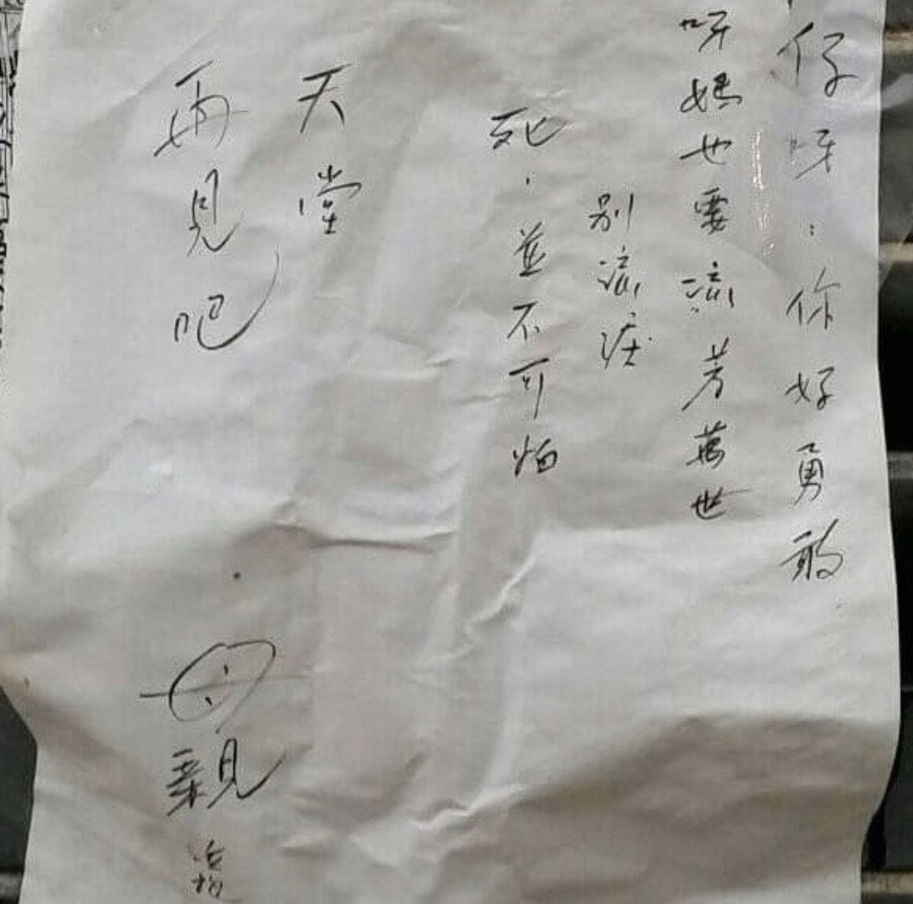 :speech_balloon:评:6 :+1:赞:168 :globe_with_meridians:转:63  

[12月11日 22:30]    凡賽堤/FORSETI   @FecharCCP    一手誌

天澤反送中之路(6.9-10.31)

12.11 天澤連儂牆，記載了反送中歷程（6月9日至10月31日），未知11月及其後的文宣是尚在製作，或已被破壞。
#LennonWall #HongKong #HongKongProtests  :speech_balloon:评:3 :+1:赞:128 :globe_with_meridians:转:102  

[12月11日 20:16]    新闻大吐槽   @TuCaoFakeNews    据原华为工程师透露：华为鼓励员工互相举报！

有经理被举报后，被以贪污罪判10年，而李元洪却因举报经理被251，举报人和被举报人随机进监狱~ 

只有任正非稳坐泰山，做勉励状对高管说：“我还是信任你的，你看，这么多举报你的信都被我扣下了”！

和共党一样的恐惧管理  :speech_balloon:评:31 :+1:赞:578 :globe_with_meridians:转:302  

[12月11日 20:16]    新闻大吐槽   @TuCaoFakeNews    据原华为工程师透露：华为鼓励员工互相举报！

有经理被举报后，被以贪污罪判10年，而李元洪却因举报经理被251，举报人和被举报人随机进监狱~ 

只有任正非稳坐泰山，做勉励状对高管说：“我还是信任你的，你看，这么多举报你的信都被我扣下了”！

和共党一样的恐惧管理  :speech_balloon:评:31 :+1:赞:578 :globe_with_meridians:转:302  

[12月11日 19:44]    新闻大吐槽   @TuCaoFakeNews    据报导, 中国对美国出口已经连续第12个月下降，跌幅达23%，因此, 尽管川大爷签了香港人权法案, 中共仍然死乞白咧希望能达成贸易协议。

可是这脸皮也太厚了！此前无数对美帝的狠话硬话，都在事实的打击中抛之脑后~  :speech_balloon:评:6 :+1:赞:134 :globe_with_meridians:转:49  

[12月11日 19:44]    新闻大吐槽   @TuCaoFakeNews    据报导, 中国对美国出口已经连续第12个月下降，跌幅达23%，因此, 尽管川大爷签了香港人权法案, 中共仍然死乞白咧希望能达成贸易协议。

可是这脸皮也太厚了！此前无数对美帝的狠话硬话，都在事实的打击中抛之脑后~  :speech_balloon:评:6 :+1:赞:134 :globe_with_meridians:转:49  

[12月11日 19:31]    新闻大吐槽   @TuCaoFakeNews    不过是一只叮在裸体皇帝屁股上吸脓的“发炎蝇”，竟然想挑战安徒生童话！我希望你有点自知之明！  :speech_balloon:评:90 :+1:赞:471 :globe_with_meridians:转:155  

[12月11日 19:21]    新闻大吐槽   @TuCaoFakeNews    今天，港共在9月初才聘用的5名监警会国际专家发出声明，宣布辞职，他们认为监警会的权力、能力和独立调查力存在明显的缺陷，无法再干下去！

这又是港共和中共学的套路：花大价钱收买国际花瓶，没想到有良心的人不爱财，人家撂挑子不干了！  :speech_balloon:评:10 :+1:赞:577 :globe_with_meridians:转:242  

[12月11日 19:14]    新闻大吐槽   @TuCaoFakeNews    香港民主党前主席刘慧卿认为：习中央误判香港形势是受中联办误导！ 

宣传机构将上街抗争的年青人说成是买不起房的「废青」，也都是有意为之！

嗯！看来管文宣的和管情报的在合伙涮一尊  :speech_balloon:评:64 :+1:赞:407 :globe_with_meridians:转:152  

[12月11日 12:13]    凡賽堤/FORSETI   @FecharCCP    12/10 即使是一粒尘埃，也能有尊严地在宇宙中存在。#王歧山， 如果你要让为你服务了几十年的王健死，也要让他有尊严地死去！你这么没有人性地残暴杀害王健，你将被人类诅咒！王健的尸体，就是你的黑白无常！你将在成千上万人的唾骂中，带着羞愧和恐惧，奔上你的地狱之路！  https://twitter.com/wlkd6iuxizqbvm7/status/1204588034123014144 … 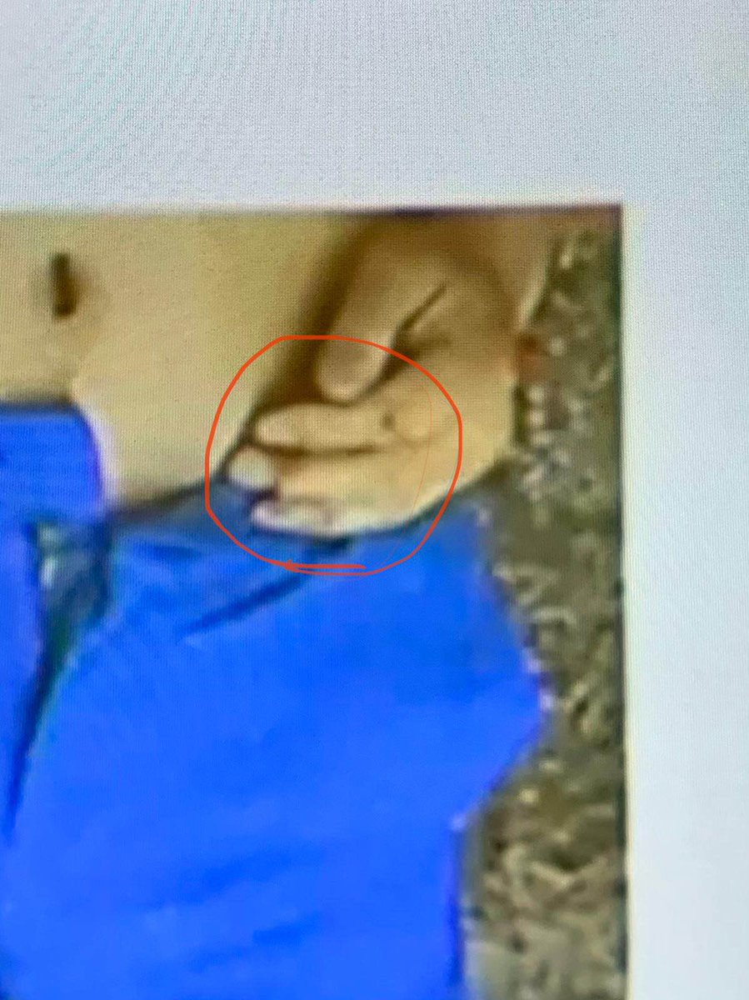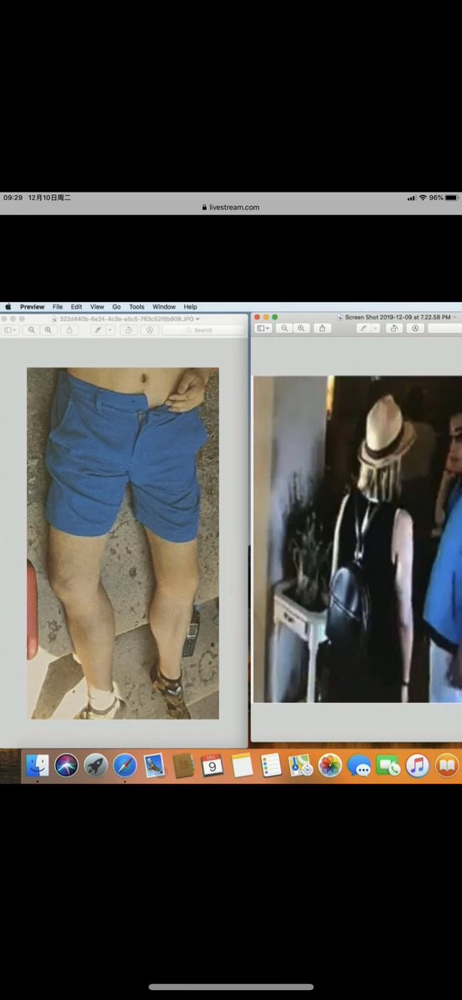 :speech_balloon:评:4 :+1:赞:82 :globe_with_meridians:转:38  

[12月11日 07:48]    凡賽堤/FORSETI   @FecharCCP    香港警察總督察鄭智傑（Jacky Cheng）使用非法武力，強行切斷了示威者的手腕（彎曲的手腕呈180度彎曲），損壞了示威者的手永久性殘疾。請制裁他和家人 https://twitter.com/IamMsFF/status/1204294655346540549 …  :speech_balloon:评:14 :+1:赞:217 :globe_with_meridians:转:197  

[12月11日 07:22]    凡賽堤/FORSETI   @FecharCCP    According to the source, there’re at least 700 ppl missing throughout #HongKong movement, some were found and have alrdy became corpses. 

These missing posts are updating everyday in social media, we may not able to find this young freedom fighters forever
#HumanitarianCrisis  https://twitter.com/ho_steffie/status/1204482455329075200 … 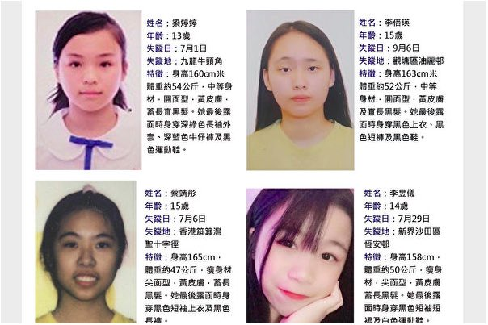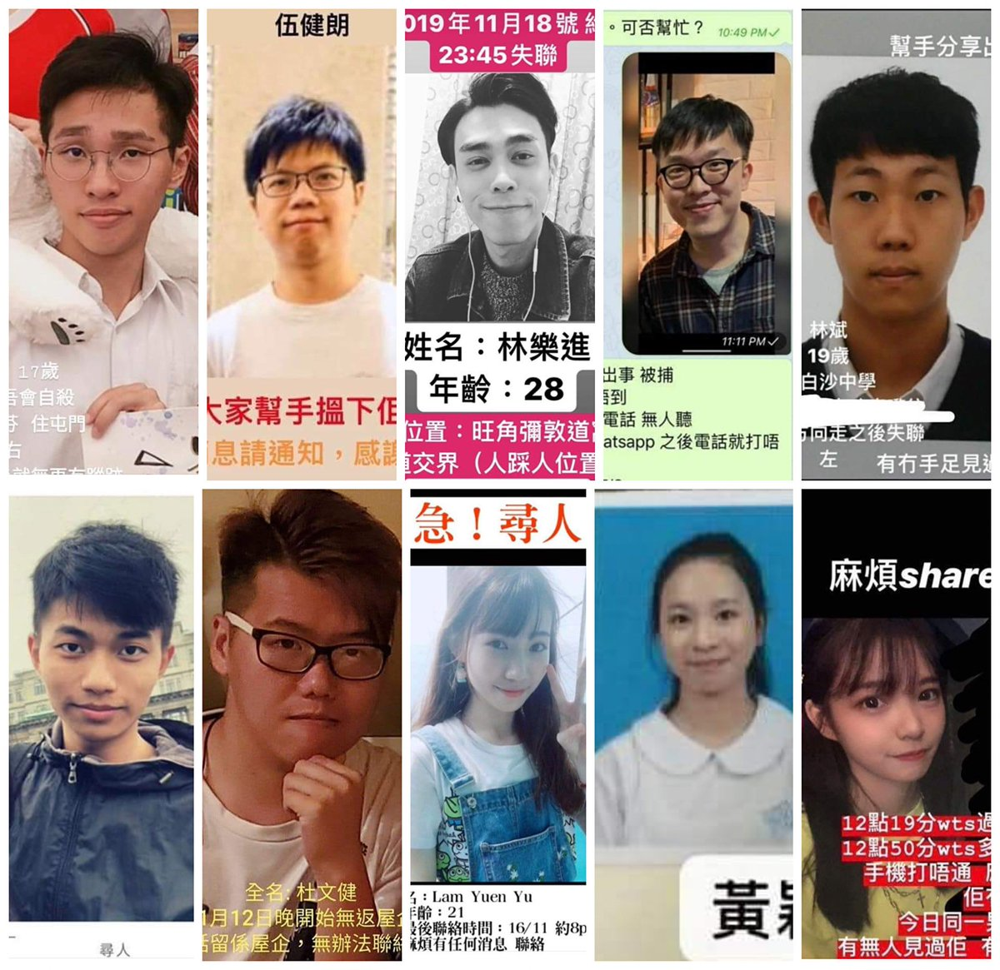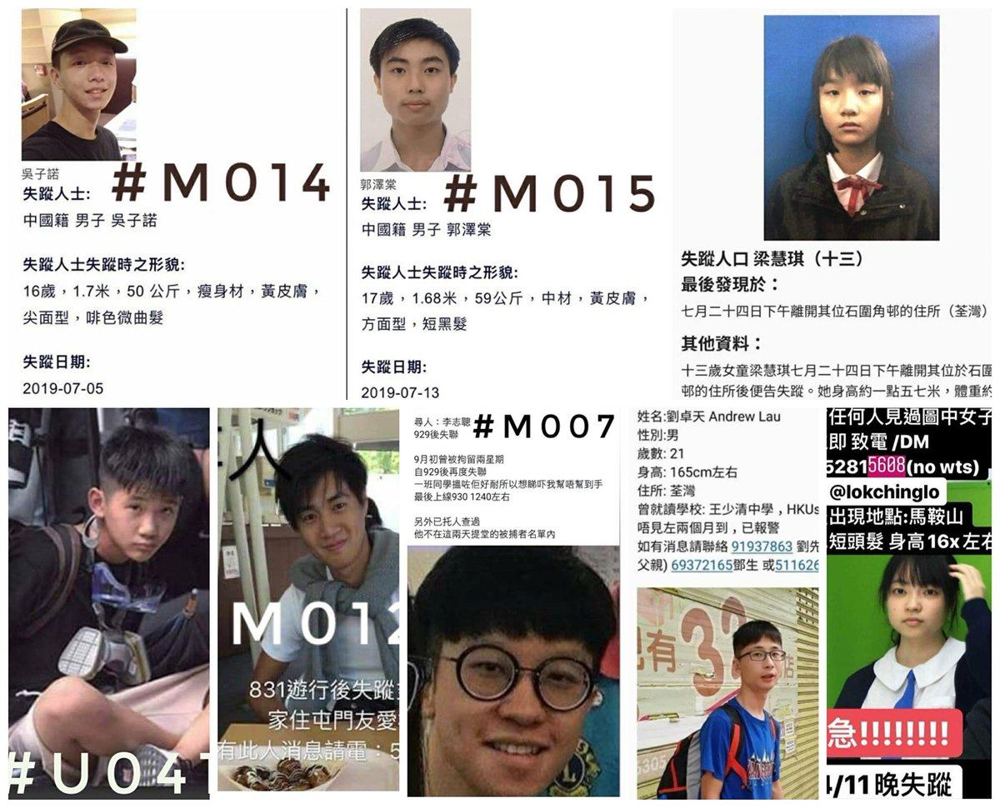 :speech_balloon:评:42 :+1:赞:476 :globe_with_meridians:转:574  

[12月11日 03:26]    凡賽堤/FORSETI   @FecharCCP    Where are the 700 missing #HongKongers? The ones who were found are already dead bodies. The unfound are unknown...

Who still cares about them....?

#StandWithHongKong
#MissingPerson
#HongKongProstest 
#  :speech_balloon:评:18 :+1:赞:326 :globe_with_meridians:转:376  

[12月10日 22:10]    墙国铁拳现世报😷   @Socialistfist    “警察说要对我用喷雾剂了”

#社会主义铁拳 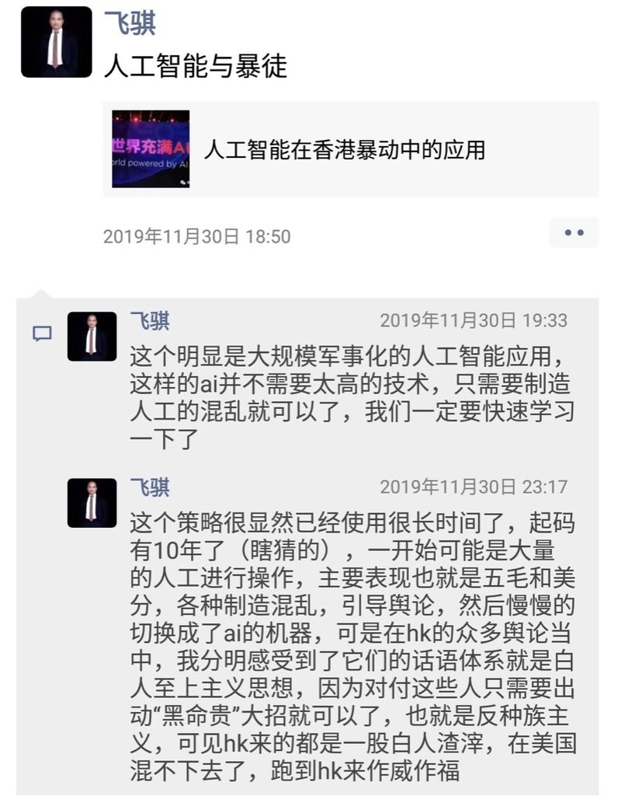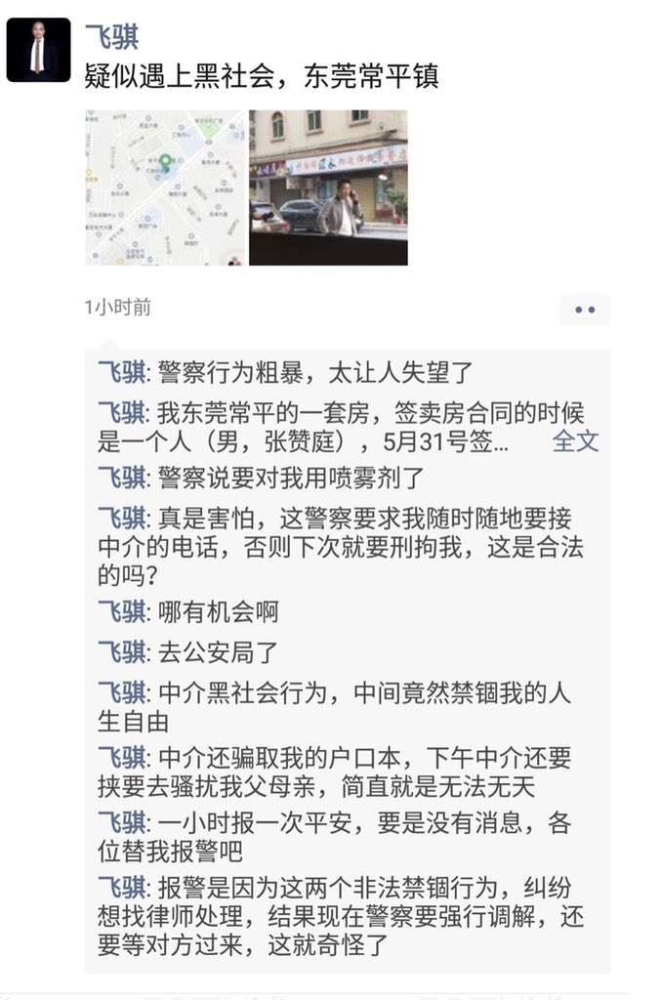 :speech_balloon:评:45 :+1:赞:754 :globe_with_meridians:转:176  

[12月10日 02:24]    墙国铁拳现世报😷   @Socialistfist    不了解铁拳的老朋友兔兔是谁的请看这里 https://twitter.com/Socialistfist/status/1175057744858161159?s=19 …  :speech_balloon:评:8 :+1:赞:87 :globe_with_meridians:转:17  

[12月10日 02:15]    墙国铁拳现世报😷   @Socialistfist    另外点名批评的还有新加坡人李连杰和我们的老朋友兔兔 @zzyyzoe 最喜爱的  加拿大人吴亦凡 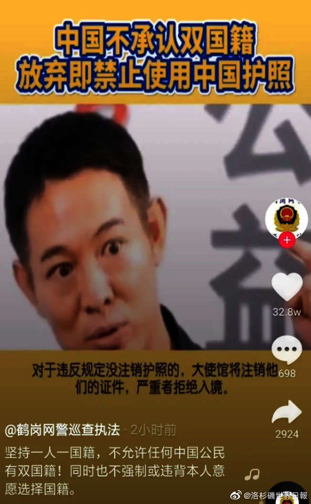 :speech_balloon:评:9 :+1:赞:136 :globe_with_meridians:转:17  

[12月10日 02:13]    墙国铁拳现世报😷   @Socialistfist    美籍刘亦菲一直以来就因为其国籍问题在墙国招致非议。在今年8月14日微博撑港警后让不少粉红对她国籍的质疑消停不少。没过多久，鹤岗网警就在12月5日发短片手撕刘亦菲
为了同时拥有人民币和美国护照，真乃里外不是人
#社会主义铁拳 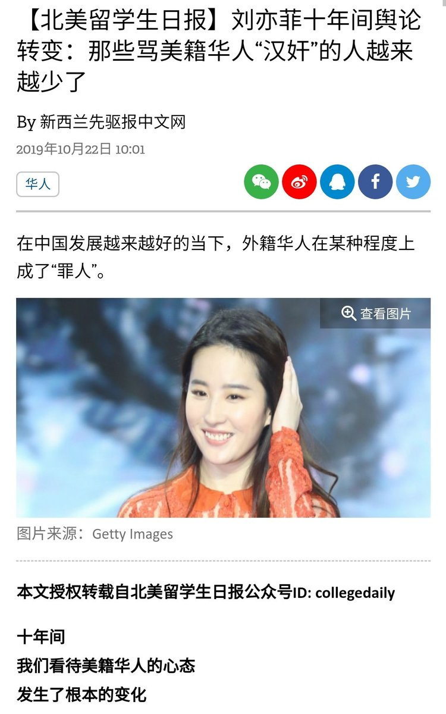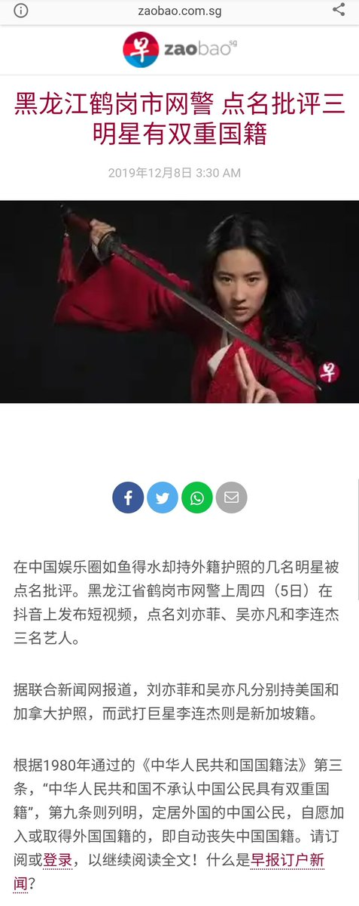 :speech_balloon:评:29 :+1:赞:407 :globe_with_meridians:转:116  

[12月09日 09:57]    墙国铁拳现世报😷   @Socialistfist    孙夕庆博士已申请“开庭次数最多的刑事案件”的吉尼斯纪录，并已被受理。
小编为孙博士在遇到如此不公后还能保留如此幽默感点赞 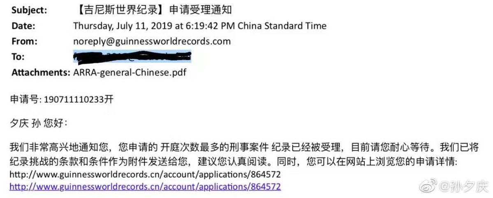 :speech_balloon:评:6 :+1:赞:415 :globe_with_meridians:转:86  

[12月09日 09:47]    墙国铁拳现世报😷   @Socialistfist    2014年，两位清华留美博士，都选择回国创业报效国家。
一位是在2015年被羁押就已经长达17个月并再无下文的“千人计划”专家 李港
另一位是被羁押1277天并经历114次庭审的孙夕庆。
#社会主义铁拳 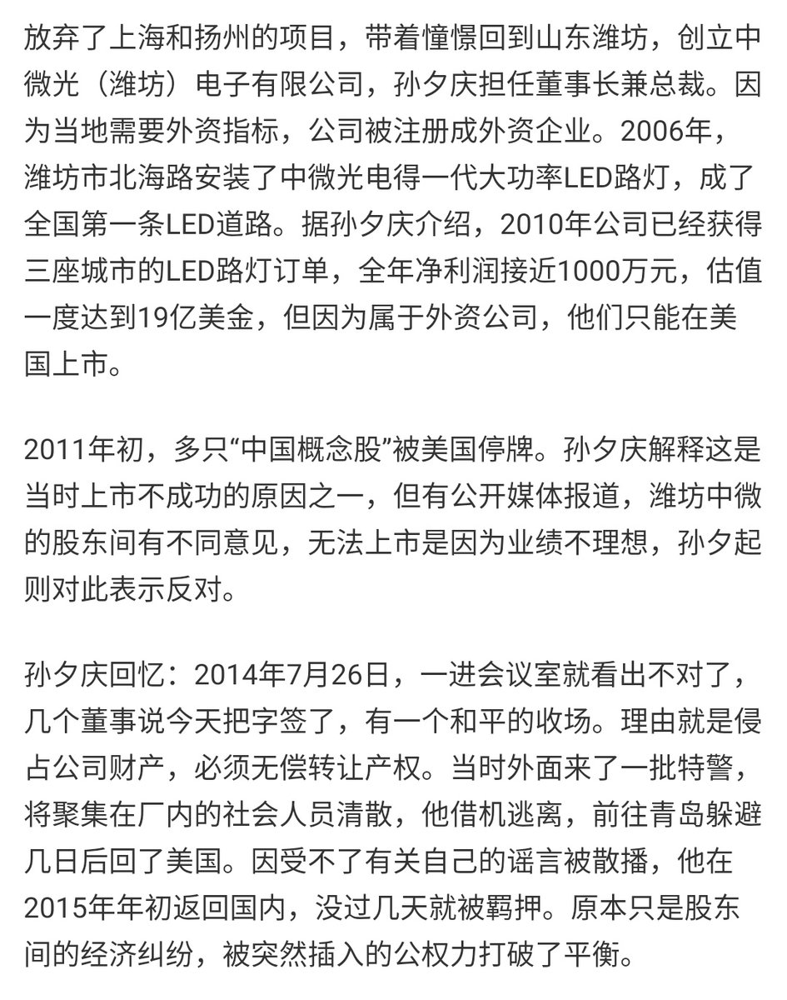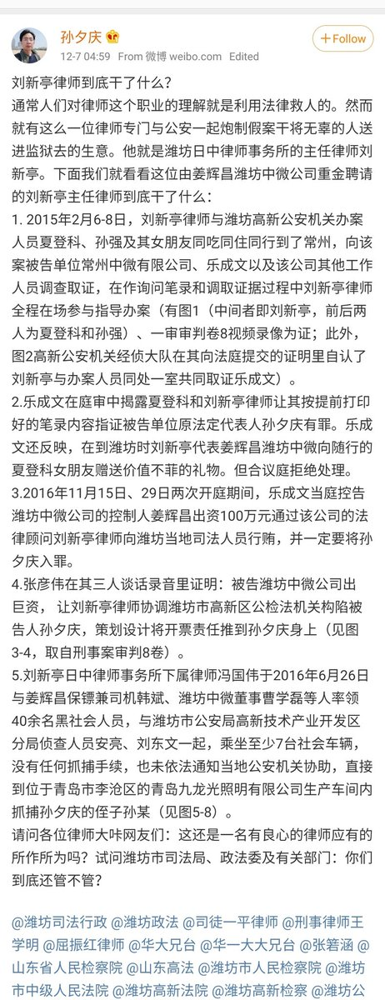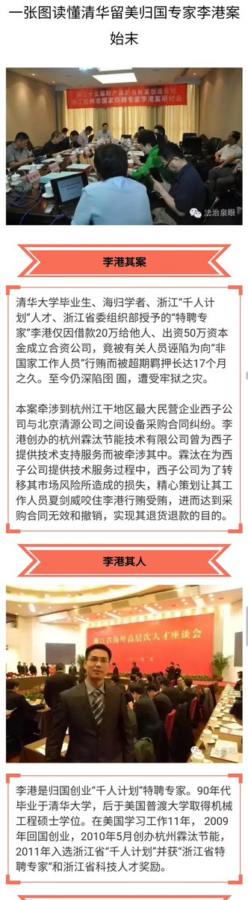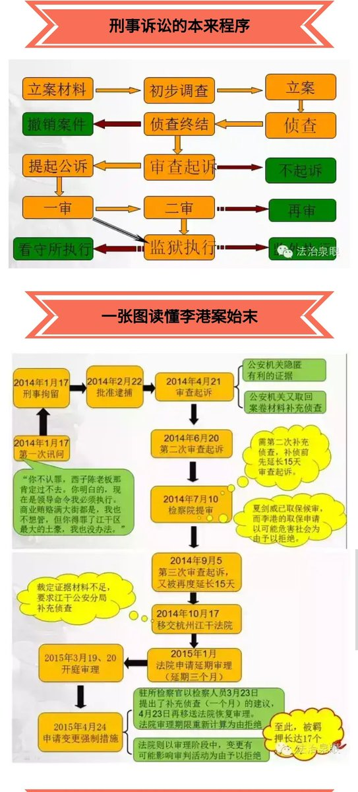 :speech_balloon:评:73 :+1:赞:846 :globe_with_meridians:转:357  

[12月09日 03:56]    凡賽堤/FORSETI   @FecharCCP    12.08國際人權日！  

百萬人以上的香港人展現出人類文明史上最和平，最文明，最理性，最有創意的方式向全世界發出最強的聲音！

香港人用行動向全世界，全人類證明了香港人是最民主的中華族群！

願榮光歸香港！祝福香港人！天佑香港人！

注，感謝大紀元的最前線視頻！  :speech_balloon:评:24 :+1:赞:734 :globe_with_meridians:转:367  

[12月09日 03:22]    凡賽堤/FORSETI   @FecharCCP    12.08國際人權日！  

人類文明史上最震撼的民主訴求盡在香港！

百萬人以上的香港人用最和平，最文明，最有創意的方式向全世界發出最強的聲音！

五大訴求，缺一不可！ 

願榮光歸香港！  :speech_balloon:评:1 :+1:赞:18 :globe_with_meridians:转:7  

[12月09日 03:16]    凡賽堤/FORSETI   @FecharCCP    12.08國際人權日！  

百萬人以上的香港人用最和平，最文明，最有創意的方式向全世界發出最強的聲音！

五大訴求，缺一不可！ 

願榮光歸香港！  :speech_balloon:评:4 :+1:赞:43 :globe_with_meridians:转:23  

[12月09日 03:13]    凡賽堤/FORSETI   @FecharCCP    12.08國際人權日！  願榮光歸香港！

百萬人以上的香港人用最和平，最文明，最有創意的方式向全世界發出最強的聲音！  :speech_balloon:评:1 :+1:赞:29 :globe_with_meridians:转:15  

[12月09日 01:21]    墙国铁拳现世报😷   @Socialistfist    高级黑还是低级红？  :speech_balloon:评:12 :+1:赞:58 :globe_with_meridians:转:5  

[12月09日 01:20]    墙国铁拳现世报😷   @Socialistfist    民主铁拳现世报是高级黑还是低级红？
请您参与投票！ 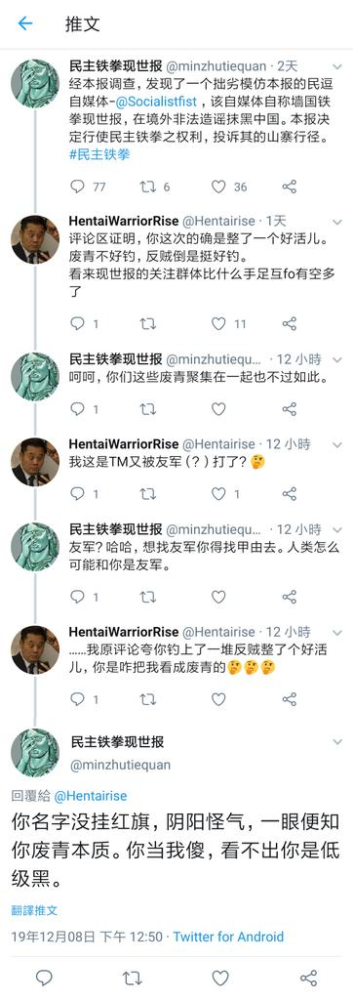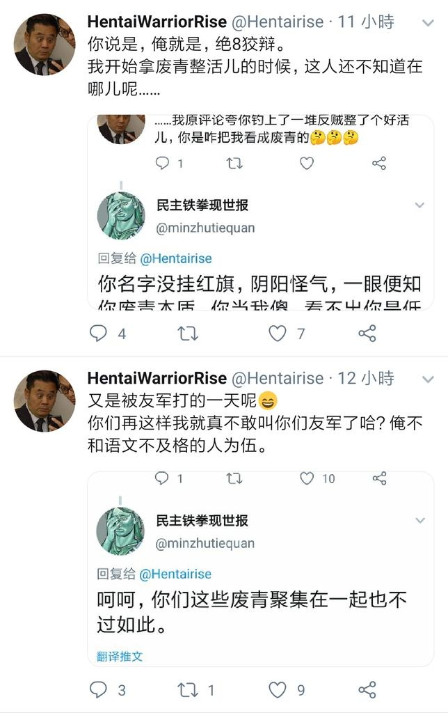 :speech_balloon:评:43 :+1:赞:229 :globe_with_meridians:转:26  

[12月07日 02:58]    墙国铁拳现世报😷   @Socialistfist    如果您对本推内容有什么想说的并且希望被匿名看到，可以私信小编！
这两位推友如果互相欣赏彼此观点，小编可以介绍认识  :speech_balloon:评:4 :+1:赞:40 :globe_with_meridians:转:1  

[12月07日 02:55]    墙国铁拳现世报😷   @Socialistfist    推友们大家好，首先必须承认最近铁拳推没有之前的数量和质量，向各位关注本推的推友致歉。
再次感谢大家的投稿，如果您的投稿符合本推的投稿标准，小编会陆续给您安排发布
受之前 #现世报读者来信 启发而创立的新系列，这次刊登两位年纪相仿中港的推友对墙内现象的感言，小编认为这样的交流很有意义。 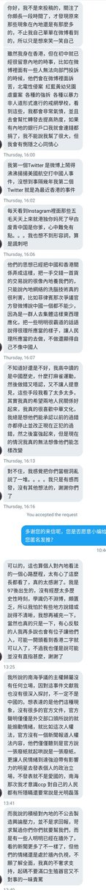 :speech_balloon:评:27 :+1:赞:271 :globe_with_meridians:转:39  

[12月06日 23:15]    墙国铁拳现世报😷   @Socialistfist    有感而发  :speech_balloon:评:4 :+1:赞:209 :globe_with_meridians:转:11  

[12月06日 21:21]    墙国铁拳现世报😷   @Socialistfist    滋磁！ https://twitter.com/minzhutiequan/status/1202745105754419200 …  :speech_balloon:评:36 :+1:赞:223 :globe_with_meridians:转:21  

[12月05日 22:24]    墙国铁拳现世报😷   @Socialistfist    推特魔幻剧场 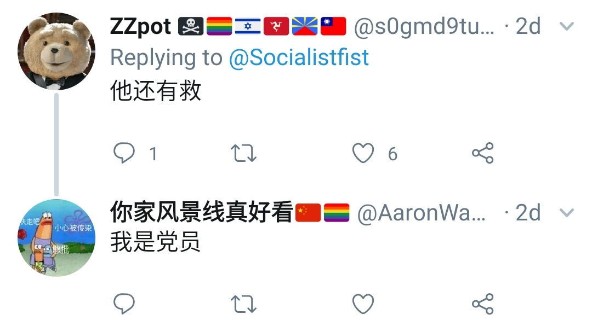 :speech_balloon:评:15 :+1:赞:131 :globe_with_meridians:转:11  

[12月05日 22:16]    墙国铁拳现世报😷   @Socialistfist    来认识一下党内的“王立” 家族
左起王立强，王立军，王立民，王立新
欢迎补充 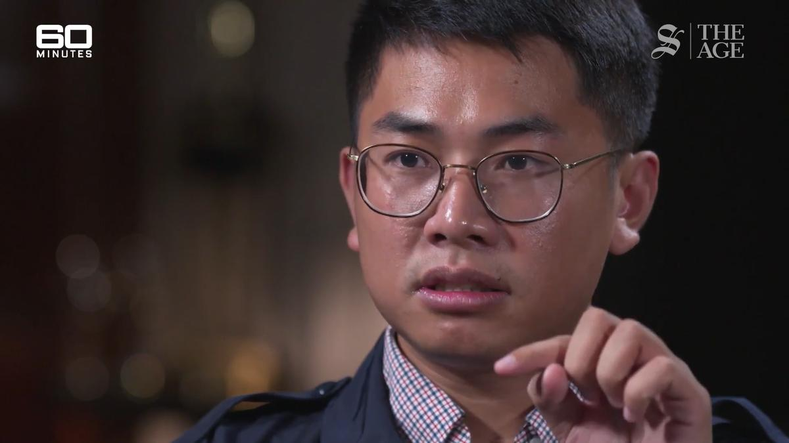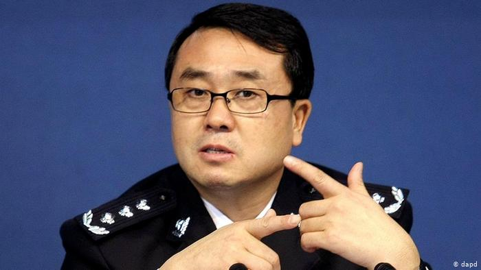 :speech_balloon:评:17 :+1:赞:202 :globe_with_meridians:转:42  

[12月05日 06:26]    墙国铁拳现世报😷   @Socialistfist    为了实地考察并认真调研总书记任内打击腐败取得的骄人成绩，王立民书记主动要求到狱中体验贪腐分子的日常
什么是学者的钻研精神，小编哭了，你呢？

#社会主义铁拳 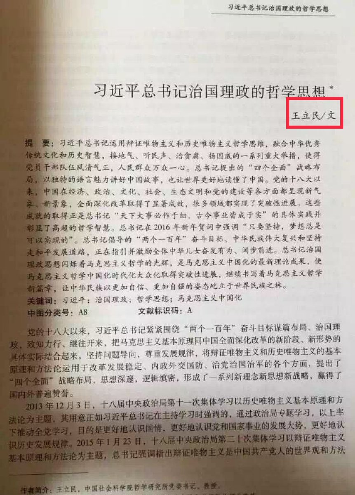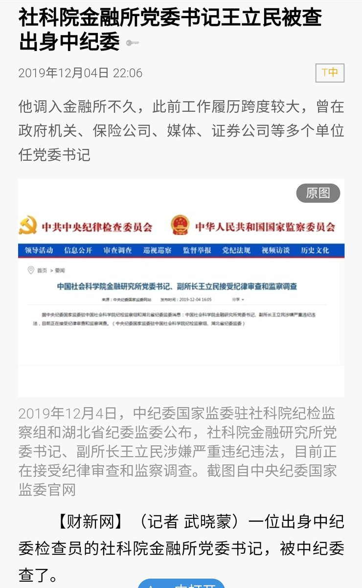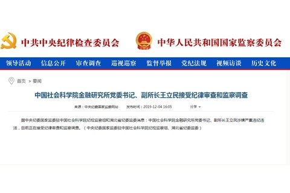 :speech_balloon:评:21 :+1:赞:367 :globe_with_meridians:转:86  

[12月04日 20:37]    GFHG SDKM   @zyx_yny    喂喂，香港嘅bb睇落嚟

澳洲設立committee，探討是否有必要頒佈Magnitsky. 可以開始寫信lobby袋鼠囯喔。They accept submissions now

好擔心。區選舉和HKHRDA頒佈后，大家有哋散漫有哋唔focus喎。還有人開始屌來屌去...

bb, come back! 依家有嘢做囖

利申：信還沒寫，不過澳洲list做完一半了 https://twitter.com/NSWHongkongers/status/1202151090399006720 …  :speech_balloon:评:9 :+1:赞:322 :globe_with_meridians:转:203  

[11月26日 01:01]    GFHG SDKM   @zyx_yny    Heading back to London. 

Thank you #HK for letting us share in your unforgettable victory.

香港人, 加油   :speech_balloon:评:2680 :+1:赞:21510 :globe_with_meridians:转:10205  

[11月24日 12:46]    GFHG SDKM   @zyx_yny    Very good to take some time@our from election observation to tell #JuniusHo in person that I was responsible for the revocation of his honorary doctorate from @AngliaRuskin #Sorrynotsorry  :speech_balloon:评:6943 :+1:赞:46252 :globe_with_meridians:转:27886  

[11月24日 08:10]    凡賽堤/FORSETI   @FecharCCP    呼籲請求共同挖掘所有有關香港發生的事，越全面越好，不同角度，越多越好，包括被暗地抓捕的人員，特別是CCP 派出的各種偽裝身份，包括變身變裝行兇的一點一滴都要挖掘出來，把CCP 的邪惡下三濫手段的真相毫無保留的曝光在全世界面前！世界公知公義才能真正挽救和保護香港人！希望懂視頻編輯配上中英文 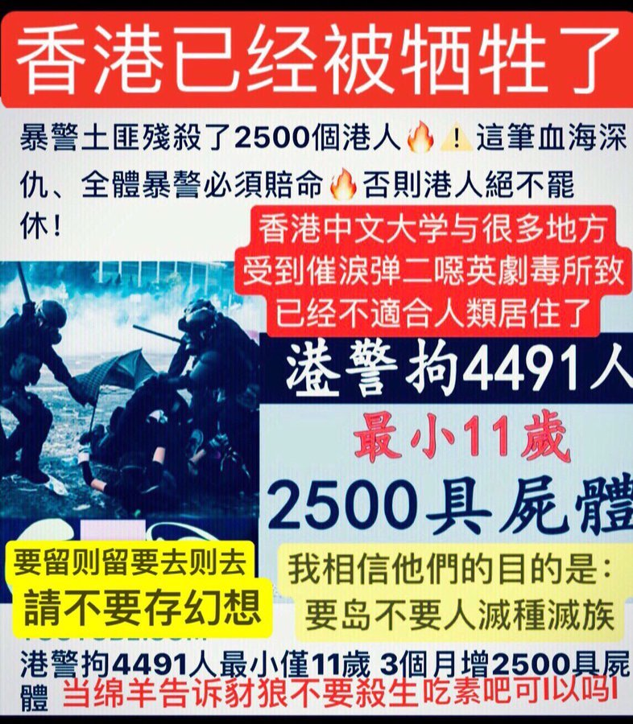 :speech_balloon:评:3 :+1:赞:21 :globe_with_meridians:转:18  

[11月21日 13:58]    GFHG SDKM   @zyx_yny    On #PolyU being the end game, this OL says it is 100% not the end game.  She says what we saw happened to the students at Poly, the way they were brutally treated by #HKPolice, there's no way HKers will forget.  We will keep on fighting!

#StandWithHongKong #HongKongProtests  :speech_balloon:评:104 :+1:赞:2403 :globe_with_meridians:转:1559  

[11月21日 11:50]    GFHG SDKM   @zyx_yny    We were in front of the Diet Members’ Office Building.

We will keep fighting with you, HKers
We will keep spreading what's happening in HK

You are not alone  :speech_balloon:评:371 :+1:赞:3560 :globe_with_meridians:转:2141  

[11月21日 00:57]    GFHG SDKM   @zyx_yny    Yesterday’s passage of the #HongKong Human Rights & Democracy Act was a good day in the struggle to resist totalitarian #China & its bid for domination. But it was not the last day. We have a long road ahead to protect our jobs, our workers & our security.  :speech_balloon:评:1651 :+1:赞:16320 :globe_with_meridians:转:10811  

[11月20日 21:56]    GFHG SDKM   @zyx_yny    The first day that schools resumed, #hkpolice deliberately targeted high school students to stop and search for no reason. As many #hongkongers suggest, being young becomes a crime as #China and #HKGov are totally out of reach of the whole city.  :speech_balloon:评:262 :+1:赞:5617 :globe_with_meridians:转:6226  

[11月19日 15:33]    GFHG SDKM   @zyx_yny    The tyranny forced us live as middle age warrior 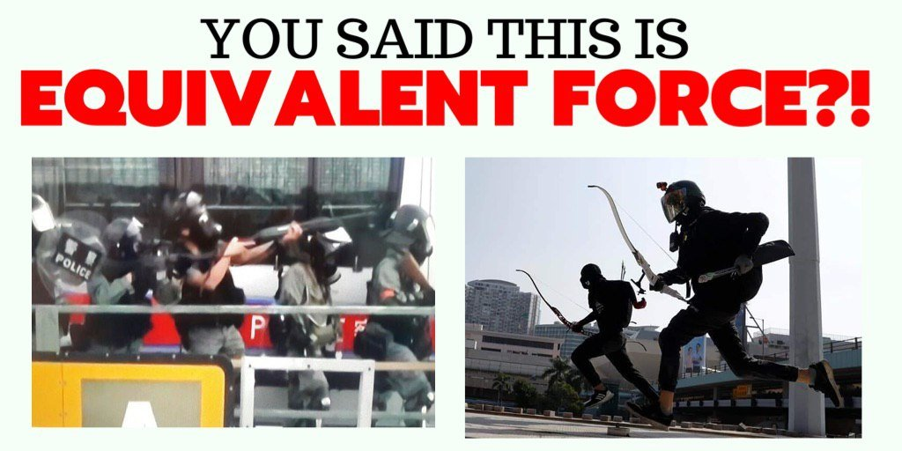 :speech_balloon:评:1 :+1:赞:48 :globe_with_meridians:转:19  

[11月19日 14:41]    GFHG SDKM   @zyx_yny    This scene is no longer only appearing in movies. It’s happening in our reality.

Escaping from death. 

She’s not a #stuntman, she’s just a normal citizen, normal student.

#StandWithHongKong
#Dramaislife
#Lifeisdrama
#PolyUHongKong 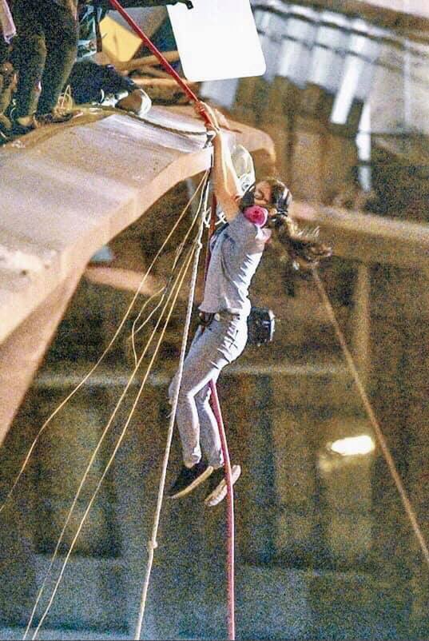 :speech_balloon:评:87 :+1:赞:1514 :globe_with_meridians:转:1475  

[11月18日 10:41]    GFHG SDKM   @zyx_yny    With students in Hong-Kong who are blocking the streets to bring economic pressure on China to ensure democratic freedoms in HK! #StandWithHongKong @Andychanhotin @FreedomHKG @Stand_with_HK @hk_watch @HKWORLDCITY #HongKongProtests @joshuawongcf #Freedom  :speech_balloon:评:28 :+1:赞:703 :globe_with_meridians:转:556  

[11月18日 09:32]    GFHG SDKM   @zyx_yny    Stop using #PolyU Wifi for god’s sake.
#HongKongProtests https://twitter.com/hengyanlo/status/1196156883679055872 …  :speech_balloon:评:4 :+1:赞:107 :globe_with_meridians:转:119  

[11月18日 08:54]    GFHG SDKM   @zyx_yny    08:30 students tried to leave #PolyU but #HongKong #Police continued to tear gas them, forcing them to return inside. This is in contradiction to what Poly U President JC Teng said, that cops have agreed to let students leave peacefully. 
@cityusucbc
#PoliceBrutality  :speech_balloon:评:55 :+1:赞:833 :globe_with_meridians:转:1060  

[11月18日 08:50]    GFHG SDKM   @zyx_yny    #PolyU protesters eventually retreat after driving the police back in the face of whizzing rubber bullets and gas pellets. They’re mostly inside the campus again. Police showing no mercy #HK #HongKongProtests #StandWithHongKong  :speech_balloon:评:266 :+1:赞:4920 :globe_with_meridians:转:5428  

[11月18日 08:45]    GFHG SDKM   @zyx_yny    The #HKPolice threatening to shoot press, first-aid as they were attempting to cross the road. This is on the perimeter of #PolyU and some civilians who came here to support the protesters still inside have been injured and/or arrested at the TST east fountain across this road.  :speech_balloon:评:25 :+1:赞:610 :globe_with_meridians:转:829  

[11月18日 08:38]    GFHG SDKM   @zyx_yny    Protestors are trying to escape from Hong Kong Polytechnic University, but HK Police fire tear gas to force them back IN. HK Police have given up any pretense that they try to de-escalate and disperse. Instead, it is evident that their intention is to attack, arrest, and punish. https://twitter.com/JessiePang0125/status/1196224442491396097 …  :speech_balloon:评:34 :+1:赞:985 :globe_with_meridians:转:1151  

[11月18日 08:06]    GFHG SDKM   @zyx_yny    this is the same shameful #PolyU head who refused to shake hands with students wearing a mask during graduation ceremony. Still the same shameful head who escaped the clashes and shrinked his duty for the whole of the clash that lasts for days. https://twitter.com/nytmay/status/1196202338102341633 …  :speech_balloon:评:58 :+1:赞:782 :globe_with_meridians:转:654  

[11月18日 06:02]    GFHG SDKM   @zyx_yny    Around 30 minutes ago at 05:30AM, #HKPolice have entered #PolyU campus. At least 3 protestors subdued, 1 seen with blood all over face during arrest

#PolyU #PolyUMassacre #PolyUSOS
#SOSHK #HongKong #StandwithHK
Vid via Telegram  :speech_balloon:评:47 :+1:赞:1609 :globe_with_meridians:转:2293  

[11月18日 05:16]    GFHG SDKM   @zyx_yny    

They are still fighting! 

#SOSPolyU
#HKPoliceState  :speech_balloon:评:181 :+1:赞:3591 :globe_with_meridians:转:3302  

[11月18日 01:32]    GFHG SDKM   @zyx_yny    “It is fxxking mad!” People with their cars in Tsim Sha Tsui hoping to support #PolyU students (but were stuck due to roadblocks) received tear gas treatment from #HongKong police. Lots of swearing. Video circulated online. #HongKongProtests  :speech_balloon:评:81 :+1:赞:1415 :globe_with_meridians:转:1598  

[11月17日 23:42]    GFHG SDKM   @zyx_yny    Members of Guarding Our Kids, formed by mothers and fathers, decided to stay with #PolyU students who were trapped in the campus: We won't leave our 'kids' behind. We will safeguard this place. We want everyone here can go home. #HongKongProtesters  :speech_balloon:评:632 :+1:赞:10606 :globe_with_meridians:转:10014  

[11月14日 18:36]    财经真相   @caijingxiang    中共基建没有钱，很多网友简单的认为开动印钞机就行，这其实是大错特错，中共央行印的每一分钱，都必须有对应的相应的价值才行，否则就是无锚印钞，汇率崩盘！过去20年央行印钞都是以债务为基础的。比如，房奴的房贷，当房奴申请贷款时，本质是向央行抵押了自己未来30年的劳动力。 https://twitter.com/aspeltuo8/status/1194923278646816768 …  :speech_balloon:评:80 :+1:赞:890 :globe_with_meridians:转:314  

[10月20日 19:36]    凡賽堤/FORSETI   @FecharCCP    【挖掘机团队出品！】
【狗屎系列：广州国安特务，龚老太太之前世今生～】
龚老太太，大号龚小夏，生于
1956年的北京！籍贯湖南～您没看错，是1956年！那么到现在2019年，龚老太太芳龄应该是63岁！岁数比那个自称“女孩子”的57岁港台婊凌有屎也大不了几岁嘛！  :speech_balloon:评:157 :+1:赞:998 :globe_with_meridians:转:521  

[10月09日 00:47]    GFHG SDKM   @zyx_yny    "Son, when you grow up
You will be the savior of the broken
The beaten, and the damned?"
Please watch this powerful mv #HongKongProtester #hkprotests 
香港反送中護法戰爭(Hong Kong Defensive War 2019)：Welcome To The Black Parade  https://youtu.be/0yXTHODE24Q  via @YouTube  :speech_balloon:评:4 :+1:赞:21 :globe_with_meridians:转:8  

[03月13日 08:10]    老司机   @h5lpykl7tp6jjop    批评是批评家天生的使命！他们只感知对错，信奉真理，指出真相不吐不快，不在意权势和群众的喜好，从批评里不可能获得任何好处，但批评家愚直不改。在中国几乎所有人都讨厌批评家，喜欢阴谋家，因为他们只说好听的！可是就因为中国的批评家太少，中国几乎看不到未来和希望！  :speech_balloon:评:104 :+1:赞:255 :globe_with_meridians:转:52  

