[11月28日 16:00]    纽约时报中文网   @nytchinese    有人呼吁抵制播放该节目的国有电视台浙江卫视。还有人认为，政府应该对包括《追我吧》在内的真人秀节目进行更严格的监管，还指出了真人秀节目中发生的其他伤亡案例。
“你们没有心，”一名微博用户对《追我吧》节目的制作组说。 http://nyti.ms/2sh76rF   :speech_balloon:评:2 :+1:赞:4 :globe_with_meridians:转:0  

[11月28日 15:30]    纽约时报中文网   @nytchinese    参议院通过该法案后，中国外交部予以谴责，称其“干涉中国内政”，“违反国际法和国际关系基本准则”。
香港政府表示，该法案“既无必要，亦毫无理据”，将损害美国和香港之间的关系。 http://nyti.ms/35KxAQZ   :speech_balloon:评:7 :+1:赞:9 :globe_with_meridians:转:6  

[11月28日 15:21]    财经真相   @caijingxiang    胡锡进：美国“香港人权与民主法案”有两大内容：一是威胁取消美国对香港的特殊关税待遇，二是威胁制裁香港官员和建制派人士。  :speech_balloon:评:21 :+1:赞:56 :globe_with_meridians:转:15  

[11月28日 15:12]    纽约时报中文网   @nytchinese    用做中式烤鸭的方法做一只感恩节火鸡 http://nyti.ms/346roCb   :speech_balloon:评:3 :+1:赞:4 :globe_with_meridians:转:0  

[11月28日 15:12]    纽约时报中文网   @nytchinese    简报：特朗普签署香港人权法案；高以翔猝死引发反思 http://nyti.ms/2qG77oR https://twitter.com/ccni/status/1199873368964685825 …  :speech_balloon:评:5 :+1:赞:4 :globe_with_meridians:转:2  

[11月28日 15:01]    BBC News 中文   @bbcchinese    美国总统特朗普不理会中国反对，签署《香港人权与民主法案》和《保护香港法案》。香港示威者为何希望美国通过人权民主法案？ https://bbc.in/35FB2w3   :speech_balloon:评:34 :+1:赞:73 :globe_with_meridians:转:18  

[11月28日 14:35]    老司机   @h5lpykl7tp6jjop    去浙江横店玩，突然听到后面有一群人高喊：“结束一党专政，反对腐败，实行人民普选！把人民的权利交给人民！”
我心里一惊，心想谁吃了豹子胆？回头定睛一瞧：卧槽，原来是拍电影，演的是在中共地下党领导下，学生们举着标语争民主争自由的一场戏。
把老子吓了一跳！  :speech_balloon:评:4 :+1:赞:91 :globe_with_meridians:转:36  

[11月28日 14:06]    老司机   @h5lpykl7tp6jjop    从垄断到霸道之后干脆开始抢劫！中国电力变成强盗！ 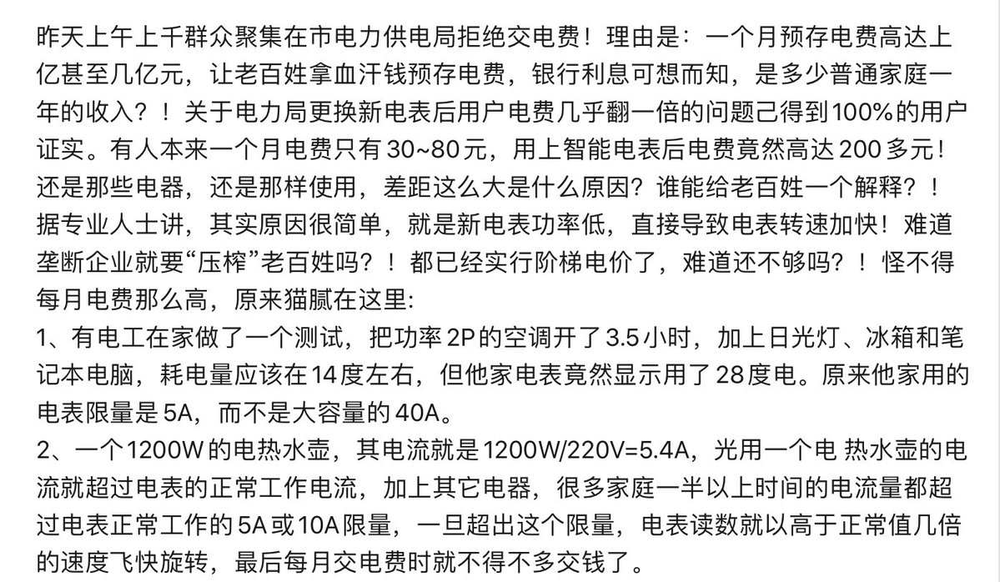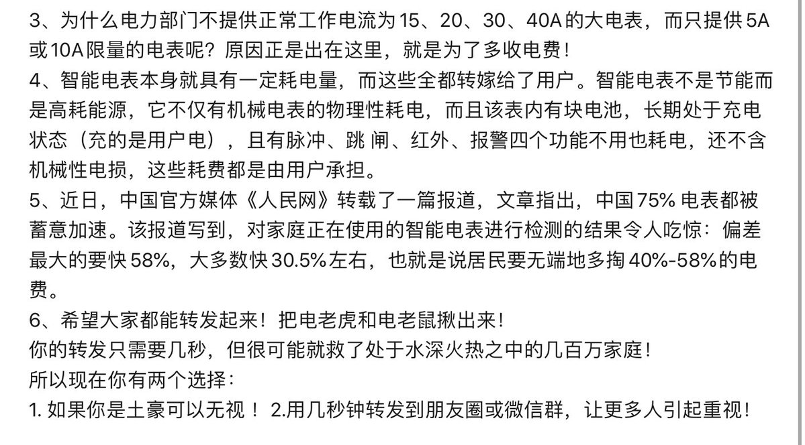 :speech_balloon:评:2 :+1:赞:17 :globe_with_meridians:转:13  

[11月28日 13:55]    老司机   @h5lpykl7tp6jjop    中国很大一部分人从小接受洗脑，只接受官方信息，懒于思考，犹如井蛙，在如今互联网海量的信息面前无所适从，不知道该相信什么是真的，只知道相信官方标准答案就安全，在加上权力的恐吓活得像愚昧的奴隶，香港人则大不同，从小到大以及老人都敢上街，表达诉求，面对暴力镇压不屈不挠争自由真英勇！佩服  :speech_balloon:评:0 :+1:赞:40 :globe_with_meridians:转:11  

[11月28日 13:30]    纽约时报中文网   @nytchinese    #时报专栏 @tomfriedman：我仍相信，最开放的体系会是赢家——这些体系最早获得所有变化的信号，它们可吸引智商最高的冒险者与创新者，他们因全球最大规模的人才、创意和资本流动而变得富有。那曾经是我们。
我们需要自问，在这场与中国的科技/贸易战争中，我们究竟要走向何方。 http://nyti.ms/2rr5rzA   :speech_balloon:评:2 :+1:赞:6 :globe_with_meridians:转:2  

[11月28日 13:08]    新闻大吐槽   @TuCaoFakeNews    图一来自川普推特，P图只为打造一名川普智慧加洛奇身躯的超级战士。
图二来自DC的Instagram最新蝙蝠侠电影海报，遭小粉红怀疑影射香港抗争，被迫删除。

敌人是谁？显而易见，各路战士不如组队灭之 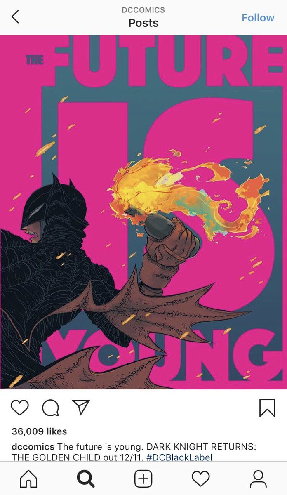 :speech_balloon:评:7 :+1:赞:50 :globe_with_meridians:转:11  

[11月28日 13:00]    BBC News 中文   @bbcchinese    分析普遍认为，北京政府不会因为选举结果，改变对泛民主派的态度，甚至反而会加强对“反对势力”的管控。 https://bbc.in/2rAAQja   :speech_balloon:评:28 :+1:赞:80 :globe_with_meridians:转:23  

[11月28日 13:00]    纽约时报中文网   @nytchinese    #每日一词 Kyiv，基辅。上周，时报对乌克兰首都基辅采用了转写自乌克兰语Київ的新拼法Kyiv。此前的拼法Kiev来自俄罗斯语Киев。
为确保读者阅读流畅，在更新地名拼写方面，时报很少走在前列。2004年，时报才停止使用孟买的旧译Bombay，使用印度官方采用的Mumbai。更多简报内容： http://nyti.ms/2qG77oR   :speech_balloon:评:1 :+1:赞:9 :globe_with_meridians:转:1  

[11月28日 11:43]    BBC News 中文   @bbcchinese    美国总统特朗普不理会中国反对，周三签署《香港人权与民主法案》和《保护香港法案》。 https://bbc.in/34sZIb0   :speech_balloon:评:69 :+1:赞:337 :globe_with_meridians:转:90  

[11月28日 11:30]    纽约时报中文网   @nytchinese    周三，艺人高以翔在宁波录制真人秀节目《追我吧》时突然死亡，这档以挑战选手体能极限闻名的节目在中国引起了人们的高度关注。节目方称他在奔跑时由于心脏问题晕倒。
他的去世在中国互联网上引发了一波愤怒浪潮，数百万人批评娱乐业以牺牲安全为代价，过于关注收视率。 http://nyti.ms/2sh76rF   :speech_balloon:评:30 :+1:赞:68 :globe_with_meridians:转:24  

[11月28日 11:00]    BBC News 中文   @bbcchinese    如果你到法国，尤其是巴黎，一定要像当地人一样，在城市中来一场漫无目的地闲逛，并尝试以哲学精神来观察周遭的一切。
 https://bbc.in/37LPncq  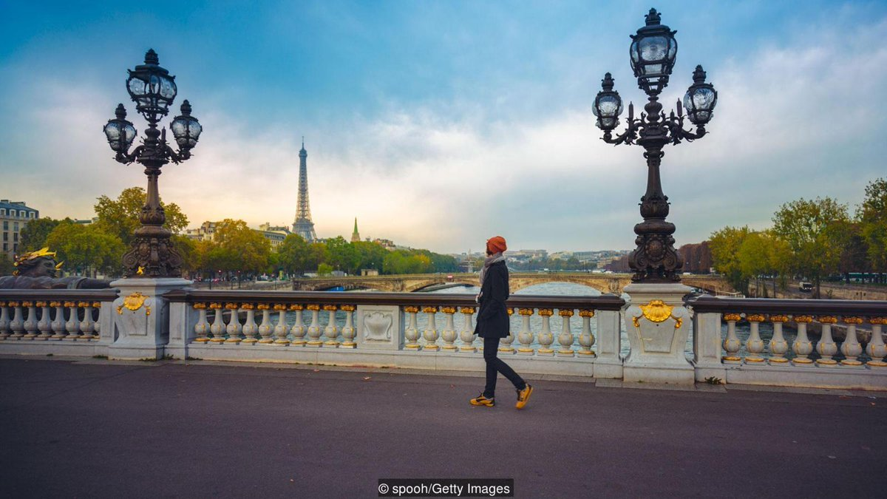 :speech_balloon:评:17 :+1:赞:38 :globe_with_meridians:转:7  

[11月28日 11:00]    纽约时报中文网   @nytchinese    波音737 Max何时复飞？鉴于在监管机构取消禁飞之前，波音必须完成一系列测试，停飞持续到2020年的可能性越来越大。
围绕这款飞机未来的不确定性给波音蒙上了一层阴影，自3月以来，该公司的市值已缩水15%。
更多简报内容： http://nyti.ms/2qG77oR   :speech_balloon:评:0 :+1:赞:6 :globe_with_meridians:转:3  

[11月28日 10:39]    财经真相   @caijingxiang    法案签署后，目前中国股市、人民币汇率处于“西线无战时”，黄金市场没有波动，川普签署法案的事市场早有预期，因此几乎没有波动，但是对中美贸易谈判产生何种影响，市场还没做好准备，接下来就看中共如何实质性反击！  :speech_balloon:评:28 :+1:赞:216 :globe_with_meridians:转:34  

[11月28日 10:30]    纽约时报中文网   @nytchinese    “我签署这些法案是出于对习主席、中国和香港人民的尊重，“特朗普在一份声明中说。
“制定它们是希望中国和香港的领导人及代表能够友好地解决分歧，为所有人带来长期和平与繁荣。” http://nyti.ms/35KxAQZ   :speech_balloon:评:26 :+1:赞:67 :globe_with_meridians:转:20  

[11月28日 10:26]    老司机   @h5lpykl7tp6jjop    以消灭剥削口号起家的共产党，打倒了黄世仁，自己放起了高利贷！过去只有一个白毛女，如今上访的成千上万！ 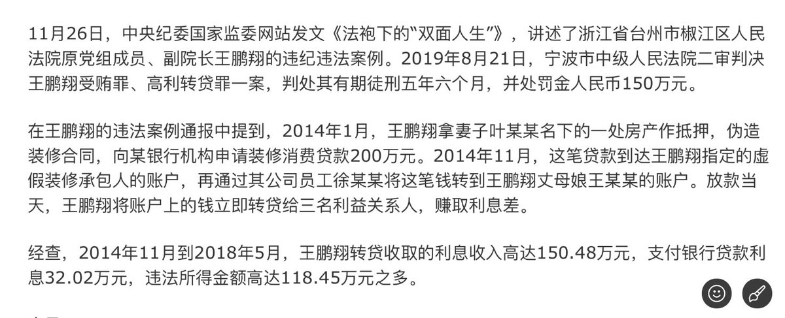 :speech_balloon:评:1 :+1:赞:19 :globe_with_meridians:转:5  

[11月28日 10:14]    老司机   @h5lpykl7tp6jjop    一个超字，今人疑惑，超多少？十个？百个？千个？

今日，香港保安局局长李家超表示，6月9日至11月21日，警方在大型公众活动中共拘捕超5800人，其中923人已被立案控告。另外，有超过2600人受伤送医，其中超过470人为警务人员。  :speech_balloon:评:1 :+1:赞:8 :globe_with_meridians:转:1  

[11月28日 09:57]    纽约时报中文网   @nytchinese    早安！今日重点新闻包括：
特朗普签署香港人权法案；高以翔猝死引发反思；暴风雪扰乱美国感恩节假日交通；波音737 Max停飞或持续到2020年；《纽约时报》2019年度十大好书；“美乌电话门“丑闻追踪；伊拉克反政府抗议者点火烧毁伊朗领事馆……NYT简报带你速览今日要闻。 http://nyti.ms/2qG77oR   :speech_balloon:评:8 :+1:赞:42 :globe_with_meridians:转:14  

[11月28日 09:52]    老司机   @h5lpykl7tp6jjop    著名诗人流沙河逝世，享年88岁，留下最后绝命词： 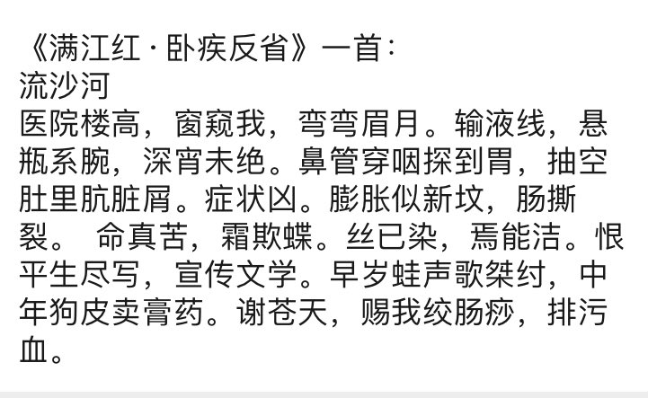 :speech_balloon:评:3 :+1:赞:20 :globe_with_meridians:转:6  

[11月28日 09:40]    纽约时报中文网   @nytchinese    特朗普签署《香港人权和民主法案》，表达了对民主活动人士的支持。在中美就结束贸易战进行谈判之际，此举极有可能激怒中国。获得了国会的压倒性通过。
白宫此前曾拒绝透露总统是否会签署该法案，该法案在政府的敏感时期获得了国会的压倒性通过。 http://nyti.ms/35KxAQZ   :speech_balloon:评:56 :+1:赞:399 :globe_with_meridians:转:121  

[11月28日 09:31]    BBC News 中文   @bbcchinese    德国高级官员关于华为的评论招致美国外交官和白宫官员的谴责。华为问题令德国费踌躇，政府内部对华政策辩论也让默克尔倍受压力。 https://bbc.in/2rvchUI   :speech_balloon:评:22 :+1:赞:39 :globe_with_meridians:转:10  

[11月28日 09:30]    纽约时报中文网   @nytchinese    #观点 感恩的核心目的之一，就是帮助我们与他人建立牢固的联系。心理学家阿尔戈的研究表明，当我们对他人的体贴心存感激时，就会认为他们或许值得进一步了解。
感恩促使我们迈出与陌生人建立关系的第一步。一旦我们更了解他人，持续的感激之情会加强我们与他们的联系。 http://nyti.ms/2OpkzGA   :speech_balloon:评:10 :+1:赞:16 :globe_with_meridians:转:4  

[11月28日 09:21]    财经真相   @caijingxiang    一位神秘买家在黄金期货市场以175万美元购买了一笔看涨合约，押注黄金在2021年6月涨到4000美元，这样的疯狂赌注，按照目前正常市场情况下，除非美联储实行负利率，但是这对美联储而言显然不太可能；除非世界出现重大“风险事件”，引发黄金超级避险情绪，如果该合约真的押注正确其收益将是爆炸性的！  :speech_balloon:评:74 :+1:赞:413 :globe_with_meridians:转:112  

[11月28日 09:09]    新闻大吐槽   @TuCaoFakeNews    今早，黑警进理工大学了，说要清理路障和搜寻剩余的抗争者；
还用你们搜，前天学校救援组就已经搜过了!
无论如何，理大保卫战画上了句点，但悬着的心还不能完全落下，据说昨天有年轻人在路上被逮捕~  :speech_balloon:评:11 :+1:赞:138 :globe_with_meridians:转:73  

[11月28日 09:09]    新闻大吐槽   @TuCaoFakeNews    今早，黑警进理工大学了，说要清理路障和搜寻剩余的抗争者；
还用你们搜，前天学校救援组就已经搜过了!
无论如何，理大保卫战画上了句点，但悬着的心还不能完全落下，据说昨天有年轻人在路上被逮捕~  :speech_balloon:评:11 :+1:赞:138 :globe_with_meridians:转:73  

[11月28日 08:56]    财经真相   @caijingxiang    第一张多米诺骨牌终于倒下来了，接下来它产生的效应会不断扩大，直到红色帝国大厦里轰然倒塌！未来几十年的世界格局就此打破！ https://twitter.com/voachinese/status/1199826749246312448 …  :speech_balloon:评:34 :+1:赞:549 :globe_with_meridians:转:130  

[11月28日 08:49]    新闻大吐槽   @TuCaoFakeNews    与白人学生发生言语冲突后，小粉红连夜把”连侬炮“给刷成了血淋淋的”红炮“，可过了一天，支持香港抗争的一方，再次把铁炮刷黑，写上抗争标语！如同上演拉锯战！

等再过两百年，未来人可以切开斑驳的铁炮，一定可以看到数圈黑红相间的年轮，象征着那个年代，自由与独裁，真相与愚昧之间的激烈冲突！  https://twitter.com/TuCaoFakeNews/status/1199612056695033856 … 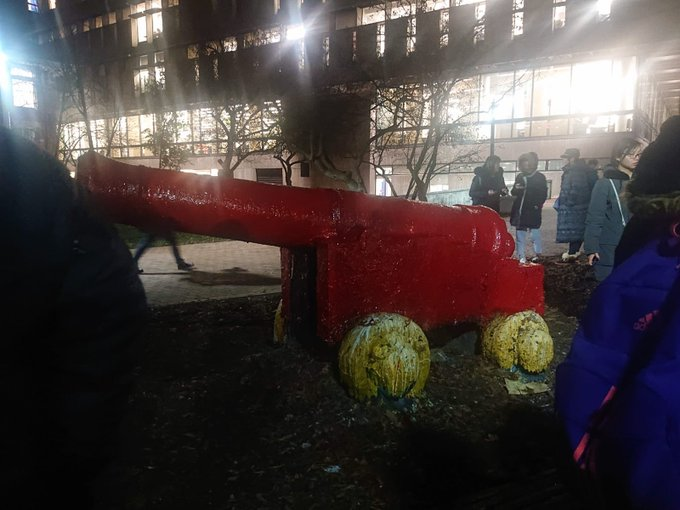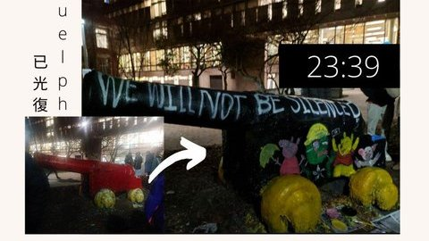 :speech_balloon:评:10 :+1:赞:119 :globe_with_meridians:转:53  

[11月28日 08:49]    新闻大吐槽   @TuCaoFakeNews    与白人学生发生言语冲突后，小粉红连夜把”连侬炮“给刷成了血淋淋的”红炮“，可过了一天，支持香港抗争的一方，再次把铁炮刷黑，写上抗争标语！如同上演拉锯战！

等再过两百年，未来人可以切开斑驳的铁炮，一定可以看到数圈黑红相间的年轮，象征着那个年代，自由与独裁，真相与愚昧之间的激烈冲突！  https://twitter.com/TuCaoFakeNews/status/1199612056695033856 …  :speech_balloon:评:10 :+1:赞:119 :globe_with_meridians:转:53  

[11月28日 08:30]    BBC News 中文   @bbcchinese    加密数码币圈疑云：当众人憧憬着比特币被“一币”取代而自己一夜翻身致富的时候，他们的“女神”不见了，他们的钱也不见了。
 https://bbc.in/2DponBf   :speech_balloon:评:4 :+1:赞:30 :globe_with_meridians:转:18  

[11月28日 08:19]    凡賽堤/FORSETI   @FecharCCP    幾個月來據不完全統計，CCP極權發動的黑警非法濫捕香港學生孩子以萬人計算，用各種兇殘手段屠殺的幾千人！

讓我們極度關注，傳播香港真相，盡可能的向全世界媒體以各種語言傳播，讓全世界的人看清CCP極權殺人恐怖組織納粹真相，才能真正的減少這些被非法秘密抓捕的香港學生孩子被殺害！天佑香港人！  :speech_balloon:评:37 :+1:赞:113 :globe_with_meridians:转:81  

[11月28日 08:06]    凡賽堤/FORSETI   @FecharCCP    幾個月以來，香港700萬人共同見證了CCP反人類的慘無人道的殘暴罪行！！！

這是千千萬萬的像這麼小的小朋友都親眼見證了CCP反人類的慘無人道的殘暴罪行！！！

天滅CCP！！！天滅極權！！！  :speech_balloon:评:0 :+1:赞:16 :globe_with_meridians:转:7  

[11月28日 07:57]    新闻大吐槽   @TuCaoFakeNews    年纪大的港警都是香港人吧……让勇武面对香港老人?中共太阴险了吧！  :speech_balloon:评:0 :+1:赞:5 :globe_with_meridians:转:3  

[11月28日 07:48]    凡賽堤/FORSETI   @FecharCCP    美國總統川普宣布他已签署
《香港人权与民主法案》

《香港人权与民主法案》已經成功列入美國的法律！
期望美國能執行《香港人权与民主法案》對香港的黑警和淋症夜蛾進行制裁！  :speech_balloon:评:5 :+1:赞:36 :globe_with_meridians:转:19  

[11月28日 07:30]    BBC News 中文   @bbcchinese    英国科学家研究发现，人类对大自然的开疆拓土的过度活动可能危及即使常见的物种。 https://bbc.in/2slGF49   :speech_balloon:评:10 :+1:赞:39 :globe_with_meridians:转:14  

[11月28日 04:45]    老司机   @h5lpykl7tp6jjop    坍塌征照！中国地方政府债务超21万亿 经济数据引股市纷跌

中新网11月27日电据财政部网站消息，27日财政部公布2019年10月地方政府债券发行和债务余额情况。数据显示，2019年10月，全国发行地方政府债券964.6亿元。截至2019年10月末，全国地方政府债务余额213800亿元，控制在全国人大批准的限额之内。  :speech_balloon:评:1 :+1:赞:17 :globe_with_meridians:转:3  

[11月28日 04:40]    老司机   @h5lpykl7tp6jjop    香港“反送中”运动至今超过5个月，警民对立严重。在“止暴制乱”主旋律下，港警受到中国官媒和网民吹捧，曾举枪瞄准示威者的刘泽基更是爆红，不仅开通微博，10月更受邀出席中共建政70周年典礼，在阅兵转播中被拍摄的次数，甚至多过香港特首林郑月娥。历经北京阅兵的洗礼之后，刘泽基宛如获得“尚方宝剑”  :speech_balloon:评:2 :+1:赞:14 :globe_with_meridians:转:0  

[11月28日 04:38]    老司机   @h5lpykl7tp6jjop    光头警长获北京加持成自走砲。曾在反送中示威中举枪瞄准示威者、被称为“光头警长”的刘泽基25日在微博上将砲口对准港府，表示香港区议会选举有160万张废票，要求重新点票。
实际情况是，香港这次区议会选举总投票人数为294万3842人，而候选人总得票为293万1745，废票共有1万2097张，比率约为0.4%。  :speech_balloon:评:9 :+1:赞:47 :globe_with_meridians:转:11  

[11月28日 04:38]    新闻大吐槽   @TuCaoFakeNews    果然是台湾省委书记的料子，记得2010年2会，夺笔书记李鸿忠也是这么威胁记者的，当时，记者追问李关于邓玉娇案的看法，李不回答，只是反复追问女记者的工作单位，并表示要向其领导施压，然后一把夺下记者的录音笔，扬长而去！ https://twitter.com/lrblua8assskdx4/status/1199633830769913856 …  :speech_balloon:评:31 :+1:赞:189 :globe_with_meridians:转:80  

[11月28日 04:38]    新闻大吐槽   @TuCaoFakeNews    果然是台湾省委书记的料子，记得2010年2会，夺笔书记李鸿忠也是这么威胁记者的，当时，记者追问李关于邓玉娇案的看法，李不回答，只是反复追问女记者的工作单位，并表示要向其领导施压，然后一把夺下记者的录音笔，扬长而去！ https://twitter.com/lrblua8assskdx4/status/1199633830769913856 …  :speech_balloon:评:31 :+1:赞:189 :globe_with_meridians:转:80  

[11月28日 04:30]    老司机   @h5lpykl7tp6jjop    香港区选民主派胜利大陆网民留言精选…

抱歉，该内容暂时无法查看。

央视中联办港澳办说一国两制是成功的！说的没错，两制是成功了，一国是彻底失败的。

反中情绪上升

香港已经台湾化了，反中就是香港的主流民意，别自欺欺人了。

香港的选举结果，证明了多数人尽管不喜欢暴力，但更讨厌大陆！  :speech_balloon:评:2 :+1:赞:20 :globe_with_meridians:转:3  

[11月28日 04:20]    老司机   @h5lpykl7tp6jjop    爱国必须说谎，真相并不重要！
大陆爱国网民愤怒了！毒教材！根据网上曝光材料，香港学生的英文阅读题在描述中美两国河流时，先是赞美美国河流有多干净，与之对比的是“中国的河流”有多不堪。并在材料后的填空题中，引导学生用“干净、开心”词语描述美国河流，将“垃圾、黑脏臭”等形容词安在中国河流上。  :speech_balloon:评:0 :+1:赞:7 :globe_with_meridians:转:1  

[11月28日 04:09]    老司机   @h5lpykl7tp6jjop    两、三年前，夫妻俩斥资上亿台币，在台湾购买两户冠德远见豪宅，却没有登记在自己名下，夫妻两人解释说，因为不是用于自住，只是租给他人收取房租。台湾办案人员将调阅房屋所有权状厘清，并清查资金流向。同时，向心这次来台曾与五、六位台湾商界人士见面，检调已经掌握名单，将逐一查访。  :speech_balloon:评:1 :+1:赞:9 :globe_with_meridians:转:2  

[11月28日 01:20]    财经真相   @caijingxiang    三季度美国GDP增速二读为2.1%，高于预期和初值1.9%，二季度为2%。但商业投资仍是经济薄弱环节，企业盈利核心指标持续弱化。与年初相比，美国经济增速明显放缓，包括美联储在内的经济学家认为四季度增长率“大幅减弱”，美联储12月或保持“按兵不动”的利率政策。  :speech_balloon:评:9 :+1:赞:86 :globe_with_meridians:转:13  

[11月28日 00:29]    墙国铁拳现世报😷   @Socialistfist    那两个字不会写
阿钟哥请你jiayou学中文
#战螂在推特  :speech_balloon:评:24 :+1:赞:209 :globe_with_meridians:转:31  

[11月28日 00:17]    老司机   @h5lpykl7tp6jjop    Riot police just arrested 5 small kids at Ma On Shan 
Source: TG  :speech_balloon:评:126 :+1:赞:1485 :globe_with_meridians:转:1665  

[11月27日 23:41]    墙国铁拳现世报😷   @Socialistfist    一个美国人向俄国人解释为什么说美国是一个真正言论自由的国家。
美国人说：“我可以走到白宫前，高喊让里根下地狱！”
俄国人很不以为然：“你这算什么，我也可以走到红场上高喊，让里根下地狱”！ https://twitter.com/jiayoubiss/status/1199703307943600128 …  :speech_balloon:评:22 :+1:赞:530 :globe_with_meridians:转:87  

[11月27日 22:46]    墙国铁拳现世报😷   @Socialistfist    哪里不自由？

#社会主义铁拳  :speech_balloon:评:34 :+1:赞:540 :globe_with_meridians:转:119  

[11月27日 22:08]    新闻大吐槽   @TuCaoFakeNews    刘欣到香港街头取景，释放中共想息事宁人的信号;
她拍了几个别有用心镜头：被破坏的地铁站，路面，交通灯，和被遮挡的天灭中共标语，想把“乱”的责任扣在抗争者头上，展示给国际;

可她对港共造成的死亡，强奸，酷刑只字不提。
五大诉求未达成，香港能从赤色噩梦中苏醒过来吗？  :speech_balloon:评:268 :+1:赞:1011 :globe_with_meridians:转:376  

[11月27日 22:08]    新闻大吐槽   @TuCaoFakeNews    刘欣到香港街头取景，释放中共想息事宁人的信号;
她拍了几个别有用心镜头：被破坏的地铁站，路面，交通灯，和被遮挡的天灭中共标语，想把“乱”的责任扣在抗争者头上，展示给国际;

可她对港共造成的死亡，强奸，酷刑只字不提。
五大诉求未达成，香港能从赤色噩梦中苏醒过来吗？  :speech_balloon:评:268 :+1:赞:1011 :globe_with_meridians:转:376  

[11月27日 21:01]    BBC News 中文   @bbcchinese    一名美国年轻人在中国短视频平台抖音海外版上传一段教人夹睫毛的影片，但却突然聊到中国在新疆设立“集中营”，视频在社交媒体上广泛流传。 https://bbc.in/2XQMAKh   :speech_balloon:评:122 :+1:赞:710 :globe_with_meridians:转:213  

[11月27日 21:00]    纽约时报中文网   @nytchinese    《纽约时报》2019年度十大好书 http://nyti.ms/2qOkHXa   :speech_balloon:评:72 :+1:赞:42 :globe_with_meridians:转:20  

[11月27日 20:05]    BBC News 中文   @bbcchinese    【香港示威中的巴基斯坦裔：“我在这里出生长大，香港也是我的家”】香港自六月起经历政治动荡，南亚裔香港人在示威浪潮中一度成为关注焦点，一系列争议性事件也意外帮助香港少数族裔与主流社会之间增进了解。 https://bbc.in/33q8YeK   :speech_balloon:评:16 :+1:赞:61 :globe_with_meridians:转:17  

[11月27日 19:46]    BBC News 中文   @bbcchinese    有多少人在父母去世时由于各种各样的原因没能守在身旁。又有多少父母在离世前已经不省人事，无法跟子女作最后的道别。 https://bbc.in/2KY5t8G   :speech_balloon:评:9 :+1:赞:120 :globe_with_meridians:转:43  

[11月27日 19:01]    BBC News 中文   @bbcchinese    加拿大籍台湾艺人高以翔在浙江宁波录制一档真人秀节目时猝死，在中国大陆和台湾引发震动。 https://bbc.in/2rqZsuD   :speech_balloon:评:92 :+1:赞:215 :globe_with_meridians:转:50  

[11月27日 19:00]    纽约时报中文网   @nytchinese    #时报专栏 受中美领导人误判的影响，两个经济体出现了混乱、没有准备的脱钩，其他领域也出现了更深层的撕裂。
我们该如何处理美中日益复杂的关系？究竟哪种体系会是赢家？ http://nyti.ms/2rr5rzA   :speech_balloon:评:40 :+1:赞:43 :globe_with_meridians:转:17  

[11月27日 18:01]    BBC News 中文   @bbcchinese    这只被澳大利亚女子从火场抢救出来的小动物，最终仍伤重被安乐死  https://bbc.in/37B7L7H   :speech_balloon:评:17 :+1:赞:61 :globe_with_meridians:转:11  

[11月27日 18:00]    纽约时报中文网   @nytchinese    #观点 美味的食物、家人和朋友、放松的心境，感恩节的快乐其实来得相对容易。我们就应该在11月的第四个星期四聚在一起，彼此慰藉，好好放松。
但在一年中其他364天——那些你可能会感到孤独、工作压力大、受惑去欺骗或小家子气的日子里，培养感恩之心会让你的生活带来很大不同。 http://nyti.ms/2OpkzGA   :speech_balloon:评:6 :+1:赞:25 :globe_with_meridians:转:6  

[11月27日 17:30]    老司机   @h5lpykl7tp6jjop    澳洲悉尼入春便遭遇持续森林大火，现在又迎来了世纪大雷暴，树木倒地砸废汽车，这场长达五分钟的暴风雨留下了毁灭的痕迹，它切断了76,000户房屋的电力，关闭了道路和火车线路，掀飞房屋屋顶，刮倒了参天大树，压碎了树下汽车，电力公司Ausgrid更是收到了1500多起“生命威胁”事件投诉。
有人拍下恐怖照片 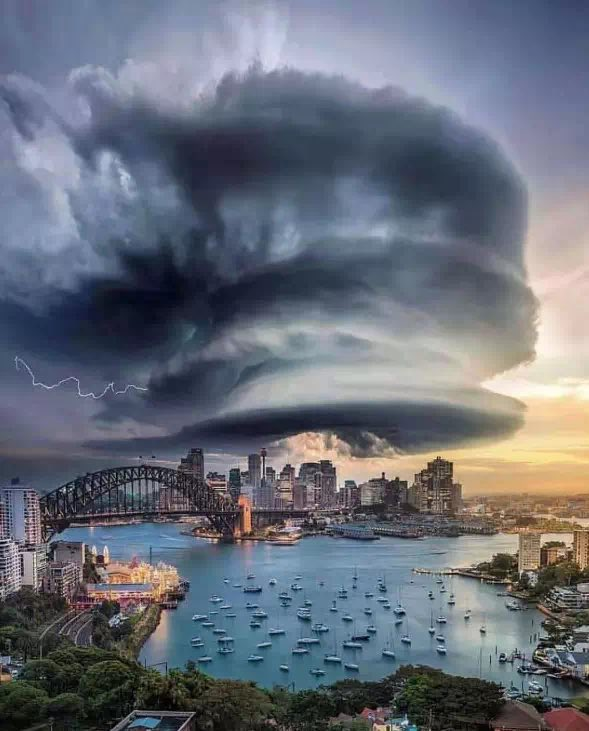 :speech_balloon:评:7 :+1:赞:48 :globe_with_meridians:转:15  

[11月27日 17:30]    纽约时报中文网   @nytchinese    区议会是地方咨询机构，没有立法权，但一边倒的结果被视为民众对持续抗议运动的支持。
几名新当选的区议会成员利用示威者的要求，将其纳入竞选纲领，似乎急于推动自己的角色超出通常的职责范围，比如社区噪音投诉和卫生问题。 http://nyti.ms/2XJRpVK   :speech_balloon:评:8 :+1:赞:20 :globe_with_meridians:转:2  

[11月27日 17:01]    BBC News 中文   @bbcchinese    香港区议会选举以民主派大胜结束。中国官方在大陆的媒体只发出简讯，告知公众选举结束，并未交代哪方获胜及失败。不过，连续两日，官方将矛头对准美国。 https://bbc.in/2QV1VYF   :speech_balloon:评:139 :+1:赞:527 :globe_with_meridians:转:174  

[11月27日 17:00]    纽约时报中文网   @nytchinese    周二，庞皮欧暗示香港在与中国达成的“一国两制”协议下保持的独立程度正在减弱，这似乎激怒了北京。
“我们对中国共产党继续信守承诺的支持依然坚定不移，”庞皮欧说。“我想你已经从过去这周的香港人身上看到了这一点。这也是他们所要求的。” http://nyti.ms/2OoUxTS   :speech_balloon:评:5 :+1:赞:14 :globe_with_meridians:转:5  

[11月27日 16:52]    新闻大吐槽   @TuCaoFakeNews    加拿大圭尔夫大学，支持香港的白人同学设置了「连侬炮」，等小粉红前来打擂！

夜晚果然有几个粉红上钩，被白人同学和他的小伙伴驳斥的晕头转向！

小粉红英文不过关，说不过人家，竟然不甘的飚起中文，命令老外「讲中文」  :speech_balloon:评:140 :+1:赞:1401 :globe_with_meridians:转:589  

[11月27日 16:52]    新闻大吐槽   @TuCaoFakeNews    加拿大圭尔夫大学，支持香港的白人同学设置了「连侬炮」，等小粉红前来打擂！

夜晚果然有几个粉红上钩，被白人同学和他的小伙伴驳斥的晕头转向！

小粉红英文不过关，说不过人家，竟然不甘的飚起中文，命令老外「讲中文」  :speech_balloon:评:140 :+1:赞:1401 :globe_with_meridians:转:589  

[11月27日 16:37]    纽约时报中文网   @nytchinese    《纽约时报》书评编辑选出了今年最优秀的十本小说和非虚构类图书。
特德·姜的短篇小说集《呼气》、详述全球家庭暴力问题的《无可见挫伤》以及《切尔诺贝利的午夜》均榜上有名。 http://nyti.ms/2qOkHXa   :speech_balloon:评:0 :+1:赞:49 :globe_with_meridians:转:28  

[11月27日 16:32]    财经真相   @caijingxiang    胡锡进：用抹黑中共来打击中国，此术休想得逞！蓬佩奥把中共与中国区分开来的战术开始奏效！  :speech_balloon:评:77 :+1:赞:554 :globe_with_meridians:转:159  

[11月27日 16:09]    新闻大吐槽   @TuCaoFakeNews    最难过的剧情恐怕类似电影《第六感》
悼念女儿的母亲，竟没发现自己其实也是一个鬼魂。只是由于留恋女儿才没有离开。

让人不禁联想到业已失踪多时的陈彦霖妈妈 https://twitter.com/TuCaoFakeNews/status/1199585767363792896 …  :speech_balloon:评:3 :+1:赞:37 :globe_with_meridians:转:7  

[11月27日 16:01]    BBC News 中文   @bbcchinese    在中国、马来西亚等亚洲其它大多数国家，休闲性大麻仍被作为毒品。东方文化对毒品的严厉的社会态度，影响着各国政府有关政策制定。 https://bbc.in/2QV7Hd4   :speech_balloon:评:158 :+1:赞:82 :globe_with_meridians:转:26  

[11月27日 16:00]    纽约时报中文网   @nytchinese    17岁的穆斯林高中生阿齐兹表示，她的TikTok视频试图淡化她在美国成长期间经历到的种族主义和歧视。在一则视频中，她提到了一则她说她和其他穆斯林经常听到的诽谤：她们会嫁给本·拉登。
“我认为TikTok不应禁止那些没有伤害到任何人或展现任何人受到伤害的内容，“阿齐兹说。 http://nyti.ms/2DgQ7bp   :speech_balloon:评:16 :+1:赞:47 :globe_with_meridians:转:12  

[11月27日 15:30]    纽约时报中文网   @nytchinese    #图集【无尽的干旱与洪水，印度的未来在哪里？】干旱、洪水、再一次干旱、再一次洪水......几十年来，政府短视的政策使数以百万计的印度人生活在恶劣的气候环境中。这些图片记录下了印度面临的困境。
点击查看图集： http://nyti.ms/2OK6KS2  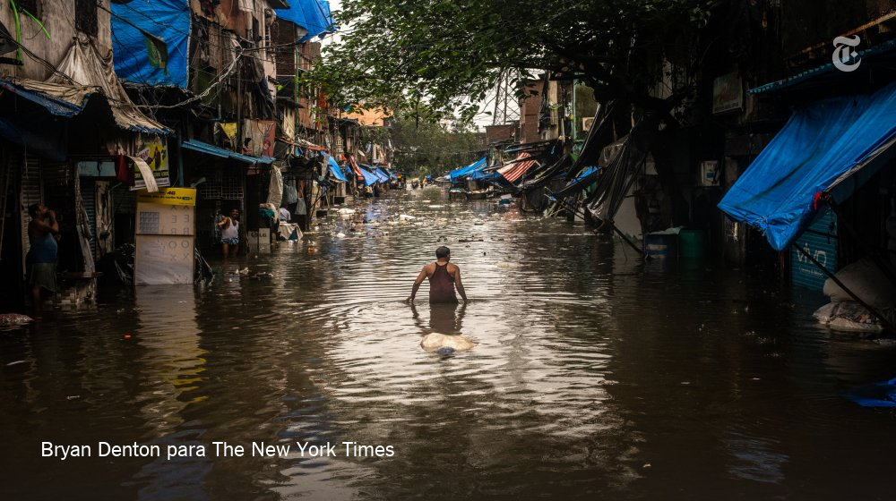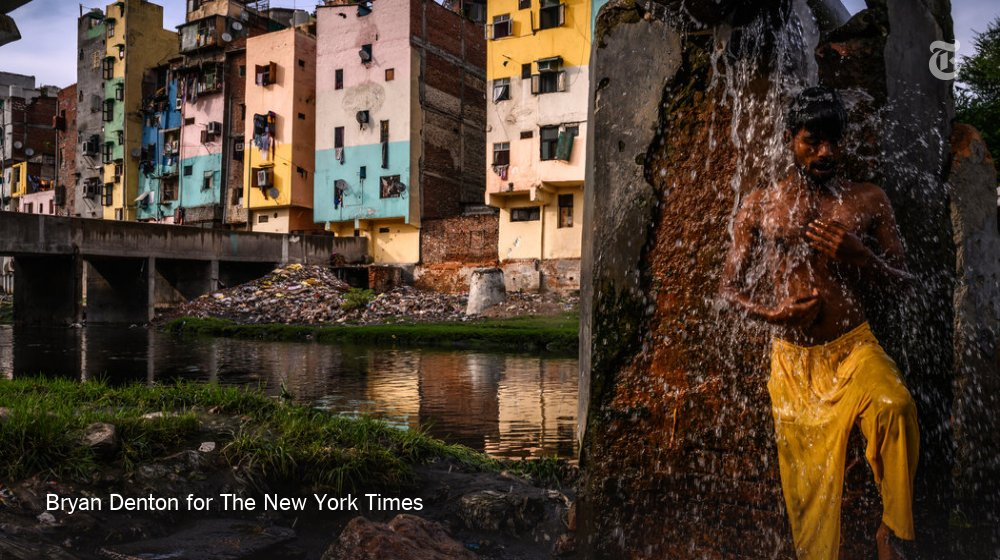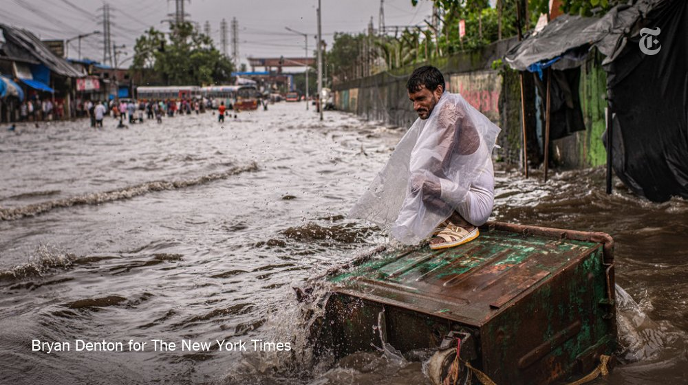 :speech_balloon:评:7 :+1:赞:12 :globe_with_meridians:转:3  

[11月27日 15:08]    新闻大吐槽   @TuCaoFakeNews    最心酸的四格漫画——香港母亲轻敲房门，自顾自的进屋，在床边，轻轻对女儿诉说心里话：妈妈去投票了，而且投了你说的那个年轻的候选人，建制派惨败，这样你会不会安慰一点呢？

可是屋子里空荡荡的，只有床头女儿的遗像和她最爱的维尼熊玩具摆在那里
悔恨的泪水已经流干  :speech_balloon:评:65 :+1:赞:974 :globe_with_meridians:转:409  

[11月27日 15:08]    新闻大吐槽   @TuCaoFakeNews    最心酸的四格漫画——香港母亲轻敲房门，自顾自的进屋，在床边，轻轻对女儿诉说心里话：妈妈去投票了，而且投了你说的那个年轻的候选人，建制派惨败，这样你会不会安慰一点呢？

可是屋子里空荡荡的，只有床头女儿的遗像和她最爱的维尼熊玩具摆在那里
悔恨的泪水已经流干  :speech_balloon:评:65 :+1:赞:974 :globe_with_meridians:转:409  

[11月27日 15:01]    BBC News 中文   @bbcchinese    津巴布韦近日公布国家预算报告，但其中的外国援助金额却让该国和“全天候的朋友”中国意外发生一场外交争议。 https://bbc.in/2OOsY5l   :speech_balloon:评:23 :+1:赞:88 :globe_with_meridians:转:29  

[11月27日 14:53]    新闻大吐槽   @TuCaoFakeNews    这个人明显不是标准香港口音  :speech_balloon:评:3 :+1:赞:215 :globe_with_meridians:转:0  

[11月27日 14:52]    新闻大吐槽   @TuCaoFakeNews    11月26日有人拍到，一个七老八十，走路艰难的白头老警察费力的走向警车！

港府真是无人可用了，黄忠虽老还可以拉断两张弓，这位老爷子恐怕弄不好得需要两个人抬担架……

这又何必呢？弄不好警车还得换成救护车  :speech_balloon:评:13 :+1:赞:66 :globe_with_meridians:转:28  

[11月27日 14:52]    新闻大吐槽   @TuCaoFakeNews    11月26日有人拍到，一个七老八十，走路艰难的白头老警察费力的走向警车！

港府真是无人可用了，黄忠虽老还可以拉断两张弓，这位老爷子恐怕弄不好得需要两个人抬担架……

这又何必呢？弄不好警车还得换成救护车  :speech_balloon:评:13 :+1:赞:66 :globe_with_meridians:转:28  

[11月27日 14:45]    新闻大吐槽   @TuCaoFakeNews    上海人在地铁上喊出了“香港人加油！解放香港！”

旁边的上海人仿佛愣住了，没有小粉红式的谩骂，也没有爱国主义的攻击，看来当真相传开时，真正的民众反应就是——惊呆！

这样的上海大叔给我来一万打  :speech_balloon:评:371 :+1:赞:4588 :globe_with_meridians:转:1574  

[11月27日 14:45]    新闻大吐槽   @TuCaoFakeNews    上海人在地铁上喊出了“香港人加油！解放香港！”

旁边的上海人仿佛愣住了，没有小粉红式的谩骂，也没有爱国主义的攻击，看来当真相传开时，真正的民众反应就是——惊呆！

这样的上海大叔给我来一万打  :speech_balloon:评:371 :+1:赞:4588 :globe_with_meridians:转:1574  

[11月27日 13:39]    新闻大吐槽   @TuCaoFakeNews    外交部发言人，对林郑月娥近期的表现很不满

如有雷同纯属巧合  :speech_balloon:评:8 :+1:赞:66 :globe_with_meridians:转:15  

[11月27日 13:13]    财经真相   @caijingxiang    下联：吸血拌雪花，既雪拌血又或血拌雪！求横批： https://twitter.com/qiubaibot/status/1199394907196030977 …  :speech_balloon:评:45 :+1:赞:101 :globe_with_meridians:转:20  

[11月27日 13:00]    BBC News 中文   @bbcchinese    西边不亮，东边亮。 https://bbc.in/2OpavgX   :speech_balloon:评:67 :+1:赞:96 :globe_with_meridians:转:18  

[11月27日 12:01]    BBC News 中文   @bbcchinese    返台的两名学生在台北向BBC中文描述离开香港时“宛如逃难”，并认为警方进入校园是教科书中的历史出现在眼前，颠覆了他的想像。 https://bbc.in/37EouqB   :speech_balloon:评:144 :+1:赞:598 :globe_with_meridians:转:270  

[11月27日 11:50]    老司机   @h5lpykl7tp6jjop    美籍华裔男子当庭认罪谋减刑 承认为中国做间谍 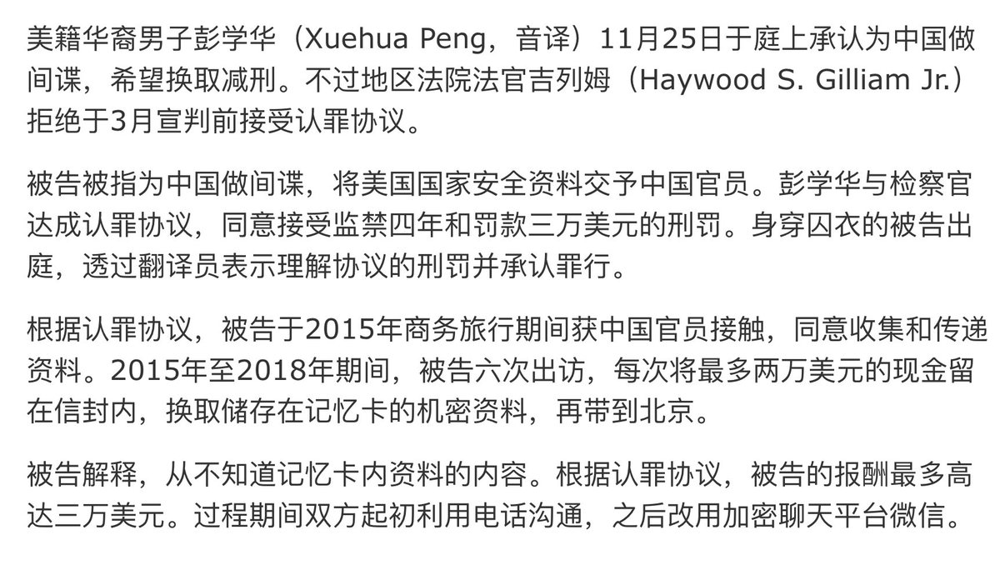 :speech_balloon:评:2 :+1:赞:11 :globe_with_meridians:转:5  

[11月27日 11:40]    老司机   @h5lpykl7tp6jjop    在泰国曼谷取得联合国难民身份的《六四天网》（中国维权网站）义工邢鑑，周一（25日）在曼谷一间民宅内，被十多名泰国警方和中国公安人员带走，目前羁押在曼谷移民监狱。手法有如「桂民海事件的翻版」。 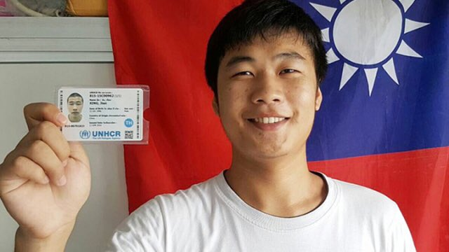 :speech_balloon:评:5 :+1:赞:96 :globe_with_meridians:转:54  

[11月27日 11:38]    老司机   @h5lpykl7tp6jjop    11月24日區選泛民獲得85%的席位，一組漫畫在網絡上瘋傳。描繪一位女兒在抗爭中失去生命的母親，走進女兒的房間，以泛民勝選的消息慰籍逝去的女兒。令無數人感動流淚。  :speech_balloon:评:29 :+1:赞:588 :globe_with_meridians:转:222  

[11月27日 11:15]    财经真相   @caijingxiang    广东省第十二届委员会第八次全体会议于11月25日至26日在广州召开。本次会议审议通过《关于支持深圳建设中国特色社会主义先行示范区的若干重大措施》 深圳要成为“样板”了！  :speech_balloon:评:74 :+1:赞:239 :globe_with_meridians:转:87  

[11月27日 10:06]    老司机   @h5lpykl7tp6jjop    戏精平的盛世中国，国民生产总值世界第二！  :speech_balloon:评:1 :+1:赞:29 :globe_with_meridians:转:16  

[11月27日 09:31]    BBC News 中文   @bbcchinese    面对“历史性”的大选，英国选民的态度可以用两组字母概括：ABB与ABC, "任何人除了鲍里斯“与”任何人除了科尔宾“。 https://bbc.in/37C4uEZ   :speech_balloon:评:12 :+1:赞:36 :globe_with_meridians:转:15  

[11月27日 08:32]    BBC News 中文   @bbcchinese    伊朗大肆逮捕反对油价上涨示威抗议领导人，封锁互联网以中断示威者互通信息。 https://bbc.in/34pXqcv   :speech_balloon:评:30 :+1:赞:161 :globe_with_meridians:转:60  

[11月27日 07:31]    BBC News 中文   @bbcchinese    她是拙劣的特工，还是偏执的游客？今年初擅闯美国总统特朗普私人住所海湖庄园的中国籍女子张玉婧，被判8个月监禁。 https://bbc.in/2OotyHS   :speech_balloon:评:54 :+1:赞:130 :globe_with_meridians:转:27  

[11月27日 00:38]    财经真相   @caijingxiang    人民币疯涨，貌似没有任何消息面，就是纯粹在拉，而且黄金也涨，根本不是以往的贸易利好消息！  :speech_balloon:评:43 :+1:赞:364 :globe_with_meridians:转:53  

[11月26日 23:10]    墙国铁拳现世报😷   @Socialistfist    发#社会主义铁拳 太难了，业余还要打假  :speech_balloon:评:12 :+1:赞:113 :globe_with_meridians:转:6  

[11月26日 21:49]    老司机   @h5lpykl7tp6jjop    这一段视频更让人吃惊，中共对言论自由，对异议人士的打压简直到了丧心病狂的地步，在大陆清醒活着的人，稍有不慎就会招来警察被喝茶。@xiejunbiao  :speech_balloon:评:16 :+1:赞:153 :globe_with_meridians:转:115  

[11月26日 18:15]    财经真相   @caijingxiang    央视新闻：习近平主持召开中央全面深化改革委员会第十一次会议强调：落实党的十九届四中全会重要举措，继续全面深化改革实现有机衔接融会贯通。看到落实四中全会，及知道这个所谓的全面深化改革究竟是如何“改革”  :speech_balloon:评:35 :+1:赞:150 :globe_with_meridians:转:28  

[11月26日 18:04]    老司机   @h5lpykl7tp6jjop    香港警察將學生押上火車，不知送往何處？
貨運火車，玻璃全部封住，很可疑。

大家關注！  :speech_balloon:评:28 :+1:赞:232 :globe_with_meridians:转:238  

[11月26日 17:36]    财经真相   @caijingxiang    美国政府当前正在启动，在美国上市的中国企业，财务独立调查，该法案正在推进中，阿里巴巴回归港股，在某种意义上也是一种预防措施，尤其是港交所目前还在自家人控制的情况下。而港交所收购伦敦交易所似乎也有某种千丝万缕的连续！  :speech_balloon:评:2 :+1:赞:75 :globe_with_meridians:转:19  

[11月26日 17:29]    财经真相   @caijingxiang    阿里巴巴美股第四季度股权持有情况值得留意，在香港今天局势下，阿里继续选择上市，绝非其港股ipo招股书上主要用于驱动用户增长及提升参与度、助力企业实现数字化转型，提升运营效率、持续创新三个战略方向。  :speech_balloon:评:1 :+1:赞:50 :globe_with_meridians:转:8  

[11月26日 17:26]    财经真相   @caijingxiang    阿里巴巴-SW在香港上市首日涨6.59%，报价187.6港元，-SW"这一后缀。“-W”代表的含义是“同股不同权”，“-S”的含义则代表是第二次上市。 核心关键点：阿里巴巴在香港上市股份与纽交所上市的美国存托股将可互相转换。在美每一份美国存托股代表八股普通股，而此次港股阿里全球发行5亿普通股！ 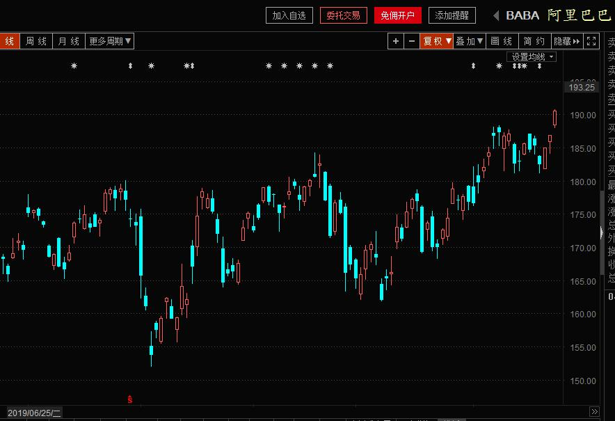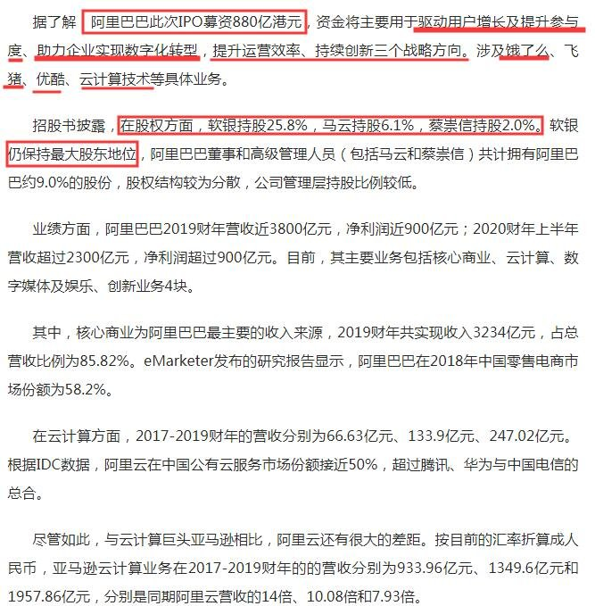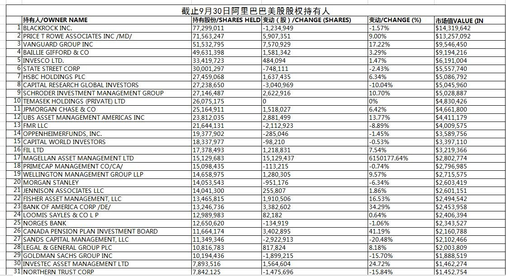 :speech_balloon:评:9 :+1:赞:112 :globe_with_meridians:转:36  

[11月26日 15:36]    财经真相   @caijingxiang    11月20日，京东旗下网银在线因违规将外汇转移境外，受到2943万元巨额罚单。跟据《中共外汇管理条例》第三十九条，有违反规定将境内外汇转移境外，或者以欺骗手段将境内资本转移境外等逃汇行为的，由外汇管理机关责令限期调回外汇，处逃汇金额30%以下的罚款；情节严重的，处逃汇金额30%以上的罚款  :speech_balloon:评:26 :+1:赞:371 :globe_with_meridians:转:189  

[11月26日 10:59]    财经真相   @caijingxiang    美国两院通过法案是在11月20日(美国时间)，按照程序美国总统要在接下来10天内签证通过（10天不包含周末），按照这样推断最后截止日期将是在12月5日，香港时间12月6日凌晨！ 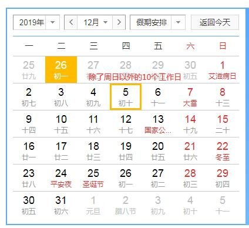 :speech_balloon:评:34 :+1:赞:329 :globe_with_meridians:转:93  

[11月26日 10:02]    财经真相   @caijingxiang    2019年11月25日，中国工商银行、中央国债登记结算有限公司、新加坡交易所在新加坡共同向全球发布“中债－工行人民币债券指数”，并于新加坡交易所挂牌。同时，三方签署合作备忘录，共同推广该指数的应用。  :speech_balloon:评:14 :+1:赞:50 :globe_with_meridians:转:19  

[11月26日 09:50]    财经真相   @caijingxiang    11月26日上午，中方牵头人刘鹤与美国贸易代表莱特希泽、财政部长姆努钦通话。双方就解决彼此核心关切问题进行了讨论，就解决好相关问题取得共识，同意就第一阶段协议磋商的剩余事项保持沟通。商务部部长钟山、中国人民银行行长易纲、国家发改委副主任宁吉喆等参加通话。消息公布CNH条件反射式小幅上涨  :speech_balloon:评:19 :+1:赞:127 :globe_with_meridians:转:23  

[11月26日 06:33]    财经真相   @caijingxiang    恐慌型指数VIX已经跌至贸易战以来最低点，市场目前对第一阶段贸易充满乐观情绪，似乎已经达成了协议，而且随着美联储重回扩表，美股还在不断创新高，目前市场困惑的目前市场搞不清楚两个因素那个更是推动力！  :speech_balloon:评:9 :+1:赞:77 :globe_with_meridians:转:10  

[11月26日 02:49]    墙国铁拳现世报😷   @Socialistfist    潘福仁退休前在2007年与网友 网论司法公正
 http://law.eastday.com/dongfangfz/node7/u1a5371.html …  :speech_balloon:评:0 :+1:赞:44 :globe_with_meridians:转:6  

[11月26日 02:47]    墙国铁拳现世报😷   @Socialistfist    江西中级人民法院法官 
判被告 前
上海中级人民法院法官
9年半有期徒刑

#社会主义铁拳  :speech_balloon:评:16 :+1:赞:261 :globe_with_meridians:转:67  

[11月26日 01:01]    GFHG SDKM   @zyx_yny    Heading back to London. 

Thank you #HK for letting us share in your unforgettable victory.

香港人, 加油   :speech_balloon:评:2618 :+1:赞:20957 :globe_with_meridians:转:9878  

[11月25日 22:02]    财经真相   @caijingxiang    现在是信息化时代，全球金融市场连在一起，香港人权法案即将在白宫通过，香港区大选结果也已经出炉，中共最后的赌注要来了，深圳银行停贷绝不是表面现象那么简单，港人要小心，这次是玩真的！  :speech_balloon:评:10 :+1:赞:199 :globe_with_meridians:转:43  

[11月25日 21:57]    财经真相   @caijingxiang    深圳多家分行暂停发放按揭贷款，或将于明年元旦恢复！元旦恢复是说要过了年底结算期，而这个时候也是中国用钱高峰！可见银行系统资金紧张程度，而建行总行关闭深圳放贷，有两层含义，一是刚才是的年底结算，另一个就是香港，香港有动静，深圳房价必然受到波及，停止按揭是一种提前止损！ 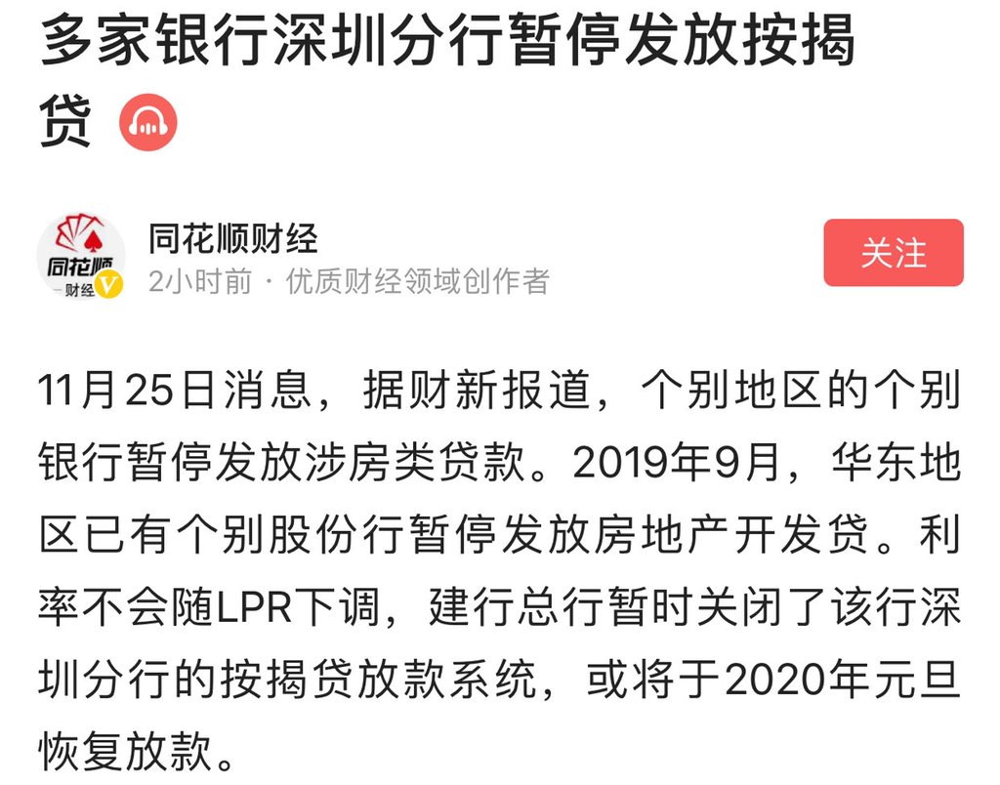 :speech_balloon:评:24 :+1:赞:405 :globe_with_meridians:转:158  

[11月25日 14:20]    墙国铁拳现世报😷   @Socialistfist    搬运一个来自微博的欢乐源泉，给墙内开票开了通宵，按时间倒序，他分别表演了：

1. 目瞪口呆
2. 伤心欲绝
3. 自欺欺人
4. 微博全部被删  :speech_balloon:评:265 :+1:赞:3933 :globe_with_meridians:转:1413  

[11月24日 12:46]    GFHG SDKM   @zyx_yny    Very good to take some time@our from election observation to tell #JuniusHo in person that I was responsible for the revocation of his honorary doctorate from @AngliaRuskin #Sorrynotsorry  :speech_balloon:评:6929 :+1:赞:46127 :globe_with_meridians:转:27769  

[11月24日 08:10]    凡賽堤/FORSETI   @FecharCCP    呼籲請求共同挖掘所有有關香港發生的事，越全面越好，不同角度，越多越好，包括被暗地抓捕的人員，特別是CCP 派出的各種偽裝身份，包括變身變裝行兇的一點一滴都要挖掘出來，把CCP 的邪惡下三濫手段的真相毫無保留的曝光在全世界面前！世界公知公義才能真正挽救和保護香港人！希望懂視頻編輯配上中英文  :speech_balloon:评:2 :+1:赞:18 :globe_with_meridians:转:18  

[11月24日 08:07]    凡賽堤/FORSETI   @FecharCCP    人類史上最殘暴的CCP極權殺人恐怖組織正在用各種兇殘手段屠殺我們的同胞...................

CCP極權殺人恐怖組織超級納粹！超級殘暴！超級流氓！

人類到了全面消滅CCP極權殺人恐怖組織的時代！  :speech_balloon:评:5 :+1:赞:45 :globe_with_meridians:转:51  

[11月24日 08:04]    凡賽堤/FORSETI   @FecharCCP    人類史上最殘暴的CCP極權殺人恐怖組織正在用各種兇殘手段屠殺我們的同胞...................

CCP極權殺人恐怖組織超級納粹！  :speech_balloon:评:1 :+1:赞:41 :globe_with_meridians:转:34  

[11月24日 07:57]    凡賽堤/FORSETI   @FecharCCP    人類史上最殘暴的CCP極權殺人恐怖組織正在用各種兇殘手段屠殺我們的同胞...................

CCP極權殺人恐怖組織超級納粹！  :speech_balloon:评:6 :+1:赞:184 :globe_with_meridians:转:161  

[11月24日 07:37]    凡賽堤/FORSETI   @FecharCCP    人類史上最殘暴的CCP極權殺人恐怖組織正在用各種兇殘手段屠殺我們的同胞...................  :speech_balloon:评:1 :+1:赞:13 :globe_with_meridians:转:15  

[11月24日 07:28]    凡賽堤/FORSETI   @FecharCCP    CCP極權殺人恐怖組織正在用各種兇殘手段屠殺我們的同胞...................

視頻是CCP極權殺人恐怖組織在人流密集區投放巨量的不合格（不具國際標準）的化學毒氣催淚瓦斯彈 毒害我們的同胞！  :speech_balloon:评:0 :+1:赞:8 :globe_with_meridians:转:4  

[11月23日 21:27]    墙国铁拳现世报😷   @Socialistfist    #社会主义铁拳 https://twitter.com/big_ear_cat/status/1197861132364603401 …  :speech_balloon:评:9 :+1:赞:222 :globe_with_meridians:转:48  

[11月23日 12:26]    墙国铁拳现世报😷   @Socialistfist    辛辛苦苦咬文嚼字将近一年，揭露邪恶，为正义发声，可推特连解释都不解释，直接就给我封号了！而且close了我的申诉，只是冷冷一句，“你多次违反推特rules”，我觉得自己像是在面对另一个中宣部，连自我审查都不过关，不过我也看清一点：推特并不是按照良知/非良知，来实行奖惩的

我现在注册了新号，  :speech_balloon:评:168 :+1:赞:611 :globe_with_meridians:转:270  

[11月23日 11:14]    凡賽堤/FORSETI   @FecharCCP    CCP極權殺人恐怖組織是全人類的公敵！
呼籲全世界正道主義合力消滅CCP！
呼籲全世界人民看清楚CCP反人類的慘無人道的殘暴罪行！！！

消滅CCP是全世界全人類的當前最緊急任務！！！

視頻是CCP瘋狂屠殺香港學生畫面之一  :speech_balloon:评:3 :+1:赞:10 :globe_with_meridians:转:15  

[11月23日 11:08]    凡賽堤/FORSETI   @FecharCCP    凡是罔顧香港事實在推特和youtube上支持CCP和香港黑警的五毛必死全家，有朝一日必死於CCP的殺人恐怖組織之下，起底五毛祖宗十八代世代不得為人！  :speech_balloon:评:3 :+1:赞:6 :globe_with_meridians:转:2  

[11月23日 11:02]    凡賽堤/FORSETI   @FecharCCP    CCP極權殺人恐怖組織是全人類的公敵！
呼籲全世界正道主義合力消滅CCP！
呼籲全世界人民看清楚CCP反人類的慘無人道的殘暴罪行！！！

消滅CCP是全世界全人類的當前最緊急任務！！！

視頻是深夜被CCP黑警暗殺的少女！  :speech_balloon:评:1 :+1:赞:6 :globe_with_meridians:转:12  

[11月23日 10:59]    凡賽堤/FORSETI   @FecharCCP    CCP極權殺人恐怖組織是全人類的公敵！
呼籲全世界正道主義合力消滅CCP！
呼籲全世界人民看清楚CCP反人類的慘無人道的殘暴罪行！！！

消滅CCP是全世界全人類的當前最緊急任務！！！

視頻是被CCP瘋狂屠殺射中頭部身亡的香港學生  :speech_balloon:评:2 :+1:赞:4 :globe_with_meridians:转:9  

[11月23日 10:55]    凡賽堤/FORSETI   @FecharCCP    CCP極權殺人恐怖組織是全人類的公敵！
呼籲全世界正道主義合力消滅CCP！
呼籲全世界人民看清楚CCP反人類的慘無人道的殘暴罪行！！！

消滅CCP是全世界全人類的當前最緊急任務！！！

視頻是CCP瘋狂屠殺香港學生畫面之一  :speech_balloon:评:2 :+1:赞:15 :globe_with_meridians:转:13  

[11月23日 10:52]    凡賽堤/FORSETI   @FecharCCP    CCP極權殺人恐怖組織是全人類的公敵！
呼籲全世界正道主義合力消滅CCP！
呼籲全世界人民看清楚CCP反人類的慘無人道的殘暴罪行！！！

消滅CCP是全世界全人類的當前最緊急任務！！！

據報導已被發現2537宗屍體，失踪近萬人！  :speech_balloon:评:0 :+1:赞:4 :globe_with_meridians:转:0  

[11月23日 10:46]    凡賽堤/FORSETI   @FecharCCP    CCP極權殺人恐怖組織正在用各種兇殘手段屠殺我們的同胞...................
CCP極權殺人恐怖組織是全人類的公敵！
呼籲全世界正道主義合力消滅CCP！
呼籲全世界人民看清楚CCP反人類的慘無人道的殘暴罪行！！！

消滅CCP是全世界全人類的當前最緊急任務！！！

視頻是被非法抓捕的學生李俊希"(同音)！  :speech_balloon:评:0 :+1:赞:9 :globe_with_meridians:转:4  

[11月23日 10:43]    凡賽堤/FORSETI   @FecharCCP    CCP極權殺人恐怖組織正在用各種兇殘手段屠殺我們的同胞...................
CCP極權殺人恐怖組織是全人類的公敵！
呼籲全世界正道主義合力消滅CCP！
呼籲全世界人民看清楚CCP反人類的慘無人道的殘暴罪行！！！

消滅CCP是全世界全人類的當前最緊急任務！！！

視頻是近距離射殺香港理工大學學生的罪行  :speech_balloon:评:7 :+1:赞:46 :globe_with_meridians:转:19  

[11月23日 10:36]    凡賽堤/FORSETI   @FecharCCP    CCP極權殺人恐怖組織正在用各種兇殘手段屠殺我們的同胞...................
CCP極權殺人恐怖組織是全人類的公敵！
呼籲全世界正道主義合力消滅CCP！
呼籲全世界人民看清楚CCP反人類的慘無人道的殘暴罪行！！！

消滅CCP是全世界全人類的當前最緊急任務！！！

視頻是CCP屠殺深夜香港理工大學的罪行之一  :speech_balloon:评:0 :+1:赞:4 :globe_with_meridians:转:1  

[11月23日 10:34]    凡賽堤/FORSETI   @FecharCCP    CCP極權殺人恐怖組織正在用各種兇殘手段屠殺我們的同胞...................
CCP極權殺人恐怖組織是全人類的公敵！
呼籲全世界正道主義合力消滅CCP！
呼籲全世界人民看清楚CCP反人類的慘無人道的殘暴罪行！！！

消滅CCP是全世界全人類的當前最緊急任務！！！

視頻是CCP屠殺深夜香港理工大學的罪行之一  :speech_balloon:评:20 :+1:赞:55 :globe_with_meridians:转:51  

[11月23日 10:29]    凡賽堤/FORSETI   @FecharCCP    CCP極權殺人恐怖組織正在用各種兇殘手段屠殺我們的同胞.............
CCP極權殺人恐怖組織是全人類的公敵！
呼籲全世界正道主義合力消滅CCP！
呼籲全世界人民看清楚CCP反人類的慘無人道的殘暴罪行！！！

消滅CCP是全世界全人類的當前最緊急任務！！！

視頻是被非法濫捕的數千名香港理工大學無辜學生  :speech_balloon:评:0 :+1:赞:5 :globe_with_meridians:转:5  

[11月23日 00:30]    墙国铁拳现世报😷   @Socialistfist    另外一个造假的人造铁拳是这则，同样张冠李戴。

 https://boxun.com/news/gb/china/2018/06/201806100004.shtml …  :speech_balloon:评:6 :+1:赞:94 :globe_with_meridians:转:6  

[11月23日 00:27]    墙国铁拳现世报😷   @Socialistfist    有推友询问是否能证明假图
有趣的是这张假图的配图恰好是微博用户“被威胁强拆的鹤岗小市民” 一个本推曾经在10月19日发布过的铁拳现世报内容。如果你搜索“小市民”，你会看见他每日在微博刷屏式维权也未曾导致他的微博被和谐。然而这些人造铁拳却是无迹可循。  :speech_balloon:评:3 :+1:赞:69 :globe_with_meridians:转:6  

[11月22日 19:06]    墙国铁拳现世报😷   @Socialistfist    这些人造铁拳固然有很高“观赏性”，但小编不赞同用这些截图去混淆视听。  :speech_balloon:评:15 :+1:赞:374 :globe_with_meridians:转:26  

[11月22日 18:59]    墙国铁拳现世报😷   @Socialistfist    近几日收到了大量推友投稿私信，都是关于图二图三内容，特发此推说明，就不一一私信回复解释了，请见谅。
图一是几个月前就发推讨论过的造假铁拳图。这些疑似假图的截图 
主要特征是“隔日”铁拳的戏剧效果和无迹可查的微博搜索信息。
投稿中有众多港台两地推友对微博不甚了解, 容易上当，请大家转发告知  :speech_balloon:评:33 :+1:赞:349 :globe_with_meridians:转:99  

[11月22日 17:31]    墙国铁拳现世报😷   @Socialistfist    #社会主义铁拳 https://twitter.com/RogerHPNg/status/1197778808503328768 …  :speech_balloon:评:5 :+1:赞:133 :globe_with_meridians:转:13  

[11月21日 13:58]    GFHG SDKM   @zyx_yny    On #PolyU being the end game, this OL says it is 100% not the end game.  She says what we saw happened to the students at Poly, the way they were brutally treated by #HKPolice, there's no way HKers will forget.  We will keep on fighting!

#StandWithHongKong #HongKongProtests  :speech_balloon:评:104 :+1:赞:2416 :globe_with_meridians:转:1564  

[11月21日 11:50]    GFHG SDKM   @zyx_yny    We were in front of the Diet Members’ Office Building.

We will keep fighting with you, HKers
We will keep spreading what's happening in HK

You are not alone  :speech_balloon:评:371 :+1:赞:3590 :globe_with_meridians:转:2140  

[11月21日 00:57]    GFHG SDKM   @zyx_yny    Yesterday’s passage of the #HongKong Human Rights & Democracy Act was a good day in the struggle to resist totalitarian #China & its bid for domination. But it was not the last day. We have a long road ahead to protect our jobs, our workers & our security.  :speech_balloon:评:1643 :+1:赞:16396 :globe_with_meridians:转:10802  

[11月21日 00:12]    墙国铁拳现世报😷   @Socialistfist      :speech_balloon:评:5 :+1:赞:212 :globe_with_meridians:转:28  

[11月21日 00:07]    墙国铁拳现世报😷   @Socialistfist    评论区的孙笑川们开始了一贯的颠倒黑白，全过程视频在此 https://twitter.com/hkwuliff/status/1193726052184387584?s=09 …  :speech_balloon:评:10 :+1:赞:163 :globe_with_meridians:转:31  

[11月20日 23:56]    墙国铁拳现世报😷   @Socialistfist    双十一当天，因为目睹正在跟拍的香港警察往女儿所在楼发射催泪弹，哭的撕心裂肺的hk01记者（亲中媒体）之事，被传到墙内变成了“ 反华媒体记者女儿被催泪弹”，微博评论区中粉红战螂瞬间高潮。
不知该记者和其同事看到了该有如何反应
#社会主义铁拳
#社会主义特别行政区铁拳  :speech_balloon:评:94 :+1:赞:941 :globe_with_meridians:转:378  

[11月20日 21:56]    GFHG SDKM   @zyx_yny    The first day that schools resumed, #hkpolice deliberately targeted high school students to stop and search for no reason. As many #hongkongers suggest, being young becomes a crime as #China and #HKGov are totally out of reach of the whole city.  :speech_balloon:评:262 :+1:赞:5627 :globe_with_meridians:转:6193  

[11月19日 19:20]    墙国铁拳现世报😷   @Socialistfist    腾讯铁拳，重锤出击  :speech_balloon:评:35 :+1:赞:306 :globe_with_meridians:转:75  

[11月19日 15:33]    GFHG SDKM   @zyx_yny    The tyranny forced us live as middle age warrior  :speech_balloon:评:1 :+1:赞:50 :globe_with_meridians:转:19  

[11月19日 14:41]    GFHG SDKM   @zyx_yny    This scene is no longer only appearing in movies. It’s happening in our reality.

Escaping from death. 

She’s not a #stuntman, she’s just a normal citizen, normal student.

#StandWithHongKong
#Dramaislife
#Lifeisdrama
#PolyUHongKong  :speech_balloon:评:87 :+1:赞:1538 :globe_with_meridians:转:1478  

[11月18日 23:48]    墙国铁拳现世报😷   @Socialistfist    腾讯也是扔了一个战术式社会主义核弹吗  :speech_balloon:评:83 :+1:赞:636 :globe_with_meridians:转:131  

[11月18日 14:12]    墙国铁拳现世报😷   @Socialistfist    三十年後又黃昏，再見刀兵校外陳。惜乎有民十三億，盡是為虎作倀人  :speech_balloon:评:7 :+1:赞:246 :globe_with_meridians:转:85  

[11月18日 10:41]    GFHG SDKM   @zyx_yny    With students in Hong-Kong who are blocking the streets to bring economic pressure on China to ensure democratic freedoms in HK! #StandWithHongKong @Andychanhotin @FreedomHKG @Stand_with_HK @hk_watch @HKWORLDCITY #HongKongProtests @joshuawongcf #Freedom  :speech_balloon:评:28 :+1:赞:711 :globe_with_meridians:转:557  

[11月18日 09:32]    GFHG SDKM   @zyx_yny    Stop using #PolyU Wifi for god’s sake.
#HongKongProtests https://twitter.com/hengyanlo/status/1196156883679055872 …  :speech_balloon:评:4 :+1:赞:107 :globe_with_meridians:转:120  

[11月18日 08:54]    GFHG SDKM   @zyx_yny    08:30 students tried to leave #PolyU but #HongKong #Police continued to tear gas them, forcing them to return inside. This is in contradiction to what Poly U President JC Teng said, that cops have agreed to let students leave peacefully. 
@cityusucbc
#PoliceBrutality  :speech_balloon:评:55 :+1:赞:844 :globe_with_meridians:转:1065  

[11月18日 08:50]    GFHG SDKM   @zyx_yny    #PolyU protesters eventually retreat after driving the police back in the face of whizzing rubber bullets and gas pellets. They’re mostly inside the campus again. Police showing no mercy #HK #HongKongProtests #StandWithHongKong  :speech_balloon:评:266 :+1:赞:4931 :globe_with_meridians:转:5422  

[11月18日 08:45]    GFHG SDKM   @zyx_yny    The #HKPolice threatening to shoot press, first-aid as they were attempting to cross the road. This is on the perimeter of #PolyU and some civilians who came here to support the protesters still inside have been injured and/or arrested at the TST east fountain across this road.  :speech_balloon:评:25 :+1:赞:609 :globe_with_meridians:转:827  

[11月18日 08:38]    GFHG SDKM   @zyx_yny    Protestors are trying to escape from Hong Kong Polytechnic University, but HK Police fire tear gas to force them back IN. HK Police have given up any pretense that they try to de-escalate and disperse. Instead, it is evident that their intention is to attack, arrest, and punish. https://twitter.com/JessiePang0125/status/1196224442491396097 …  :speech_balloon:评:34 :+1:赞:992 :globe_with_meridians:转:1149  

[11月18日 08:06]    GFHG SDKM   @zyx_yny    this is the same shameful #PolyU head who refused to shake hands with students wearing a mask during graduation ceremony. Still the same shameful head who escaped the clashes and shrinked his duty for the whole of the clash that lasts for days. https://twitter.com/nytmay/status/1196202338102341633 …  :speech_balloon:评:58 :+1:赞:785 :globe_with_meridians:转:654  

[11月18日 06:02]    GFHG SDKM   @zyx_yny    Around 30 minutes ago at 05:30AM, #HKPolice have entered #PolyU campus. At least 3 protestors subdued, 1 seen with blood all over face during arrest

#PolyU #PolyUMassacre #PolyUSOS
#SOSHK #HongKong #StandwithHK
Vid via Telegram  :speech_balloon:评:47 :+1:赞:1622 :globe_with_meridians:转:2280  

[11月18日 05:16]    GFHG SDKM   @zyx_yny    

They are still fighting! 

#SOSPolyU
#HKPoliceState  :speech_balloon:评:181 :+1:赞:3600 :globe_with_meridians:转:3282  

[11月18日 02:48]    GFHG SDKM   @zyx_yny    [PolyU frontliner's last words?]

"If very unfortunately I die in Kowloon today, even though history may just remember me as a number, I hope HKers will remember all of our deeds, stay angry & rational & turn our revenge chants into reality."

#SOSHK

OP: https://lihkg.com/thread/1731186/page/1 …  :speech_balloon:评:110 :+1:赞:2137 :globe_with_meridians:转:2023  

[11月18日 01:32]    GFHG SDKM   @zyx_yny    “It is fxxking mad!” People with their cars in Tsim Sha Tsui hoping to support #PolyU students (but were stuck due to roadblocks) received tear gas treatment from #HongKong police. Lots of swearing. Video circulated online. #HongKongProtests  :speech_balloon:评:81 :+1:赞:1418 :globe_with_meridians:转:1593  

[11月17日 23:42]    GFHG SDKM   @zyx_yny    Members of Guarding Our Kids, formed by mothers and fathers, decided to stay with #PolyU students who were trapped in the campus: We won't leave our 'kids' behind. We will safeguard this place. We want everyone here can go home. #HongKongProtesters  :speech_balloon:评:632 :+1:赞:10623 :globe_with_meridians:转:9979  

[11月14日 18:36]    财经真相   @caijingxiang    中共基建没有钱，很多网友简单的认为开动印钞机就行，这其实是大错特错，中共央行印的每一分钱，都必须有对应的相应的价值才行，否则就是无锚印钞，汇率崩盘！过去20年央行印钞都是以债务为基础的。比如，房奴的房贷，当房奴申请贷款时，本质是向央行抵押了自己未来30年的劳动力。 https://twitter.com/aspeltuo8/status/1194923278646816768 …  :speech_balloon:评:70 :+1:赞:802 :globe_with_meridians:转:282  

[10月09日 00:47]    GFHG SDKM   @zyx_yny    "Son, when you grow up
You will be the savior of the broken
The beaten, and the damned?"
Please watch this powerful mv #HongKongProtester #hkprotests 
香港反送中護法戰爭(Hong Kong Defensive War 2019)：Welcome To The Black Parade  https://youtu.be/0yXTHODE24Q  via @YouTube  :speech_balloon:评:4 :+1:赞:20 :globe_with_meridians:转:8  

[03月13日 08:10]    老司机   @h5lpykl7tp6jjop    批评是批评家天生的使命！他们只感知对错，信奉真理，指出真相不吐不快，不在意权势和群众的喜好，从批评里不可能获得任何好处，但批评家愚直不改。在中国几乎所有人都讨厌批评家，喜欢阴谋家，因为他们只说好听的！可是就因为中国的批评家太少，中国几乎看不到未来和希望！  :speech_balloon:评:97 :+1:赞:222 :globe_with_meridians:转:45  

