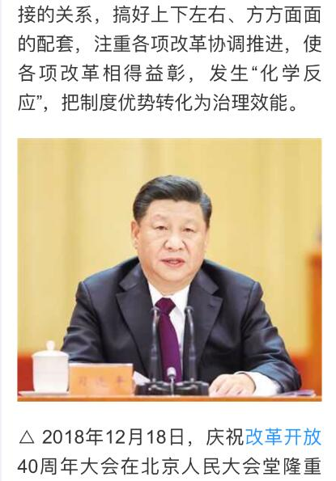
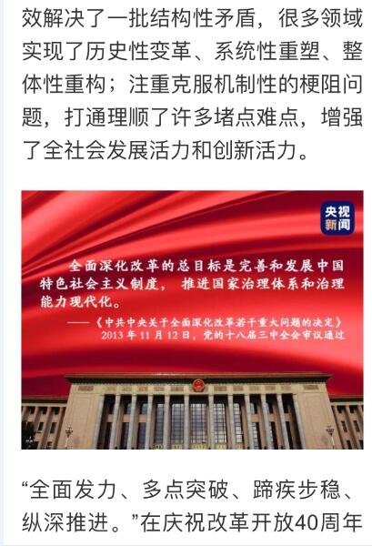
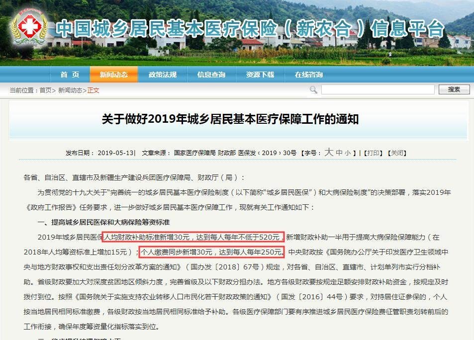
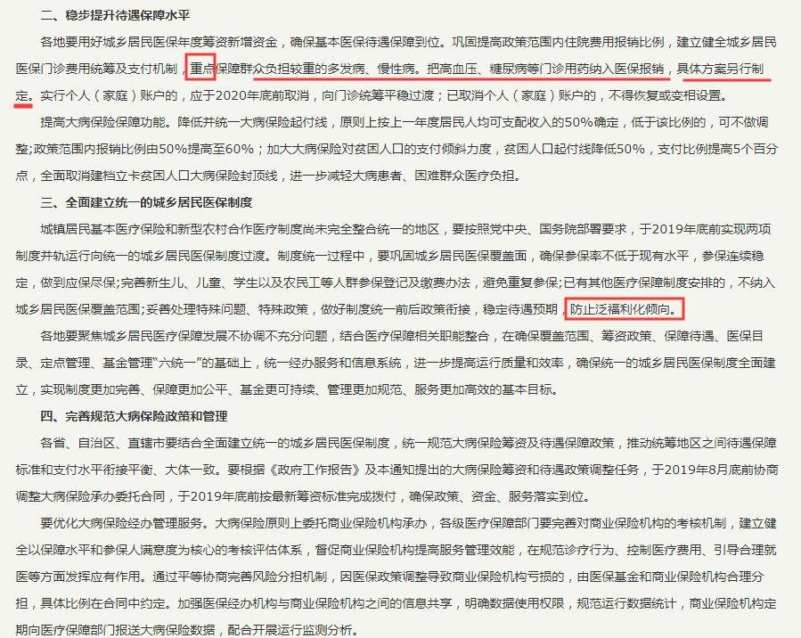
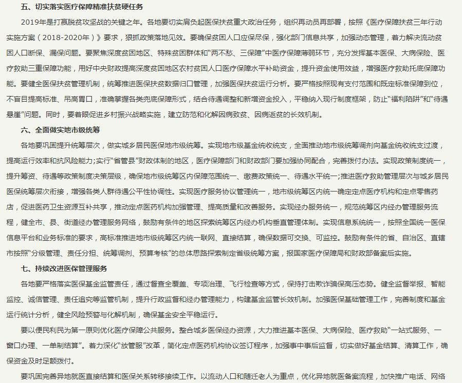
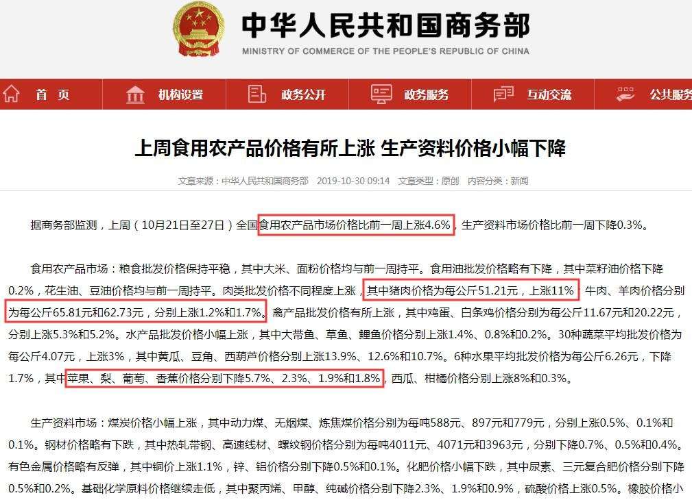
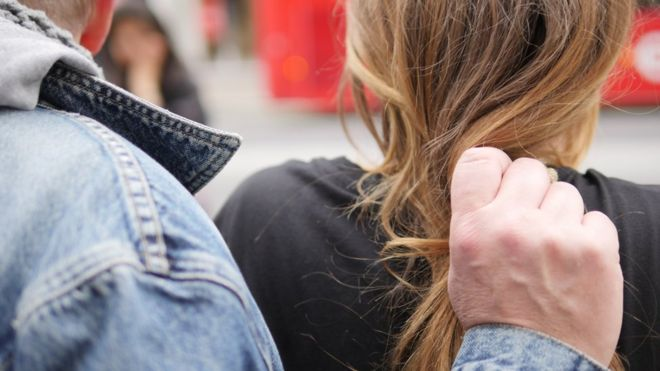
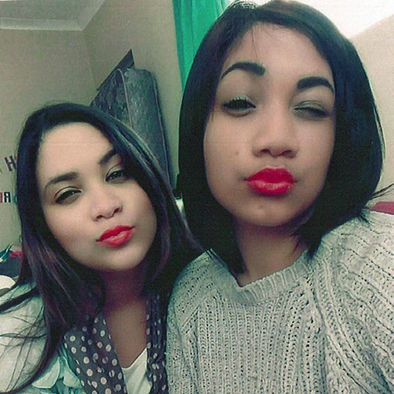

[10月31日 09:51]    财经真相   @caijingxiang    CFETS人民币汇率指数和SDR货币篮子人民币汇率指数都创下了四年来新低。现在决策层在汇率操作上“骑虎难下”，如果让人民币跟随欧元等篮子货币上涨，则会对本来就已经不断出血的出口“雪上加霜”。如果不跟就会激发市场对人民币未来继续下跌的预期，一旦美元指数走强重新走强，市场做空人民币压力很逆转。  :speech_balloon:评:0 :+1:赞:0 :globe_with_meridians:转:0  

[10月31日 09:50]    纽约时报中文网   @nytchinese    #影评 如今，现实世界和由此产生的新闻标题都不怎么有趣，而当演员们在那些写得最好的《摩登情爱》故事中拿出最佳发挥时，这些在大城市里发生的亲切、有点厌世的关系故事让人很难抗拒。 http://nyti.ms/2MZ6eQD   :speech_balloon:评:0 :+1:赞:0 :globe_with_meridians:转:0  

[10月31日 09:33]    新闻大吐槽   @TuCaoFakeNews    自作自受，不值得同情。  :speech_balloon:评:0 :+1:赞:1 :globe_with_meridians:转:1  

[10月31日 09:33]    新闻大吐槽   @TuCaoFakeNews    第二题，怎么看中共自称是抗日的中流砥柱？  :speech_balloon:评:1 :+1:赞:2 :globe_with_meridians:转:1  

[10月31日 09:31]    新闻大吐槽   @TuCaoFakeNews    旧TVB陈小春版的已经很好了，黄晓明和其他版本烂到怀疑洗钱。  :speech_balloon:评:1 :+1:赞:2 :globe_with_meridians:转:2  

[10月31日 09:30]    BBC News 中文   @bbcchinese    未来世界，如果人工智能变得如此强大，可能会威胁人类生存。但他们是有意识地要摧毁人类，还是因为太胜任了呢？
 https://bbc.in/2BZA6pI   :speech_balloon:评:0 :+1:赞:3 :globe_with_meridians:转:2  

[10月31日 09:27]    新闻大吐槽   @TuCaoFakeNews    曾幾何時，我都鐘意過春嬌同志明 https://twitter.com/tucaofakenews/status/1189666564427014144 …  :speech_balloon:评:7 :+1:赞:11 :globe_with_meridians:转:5  

[10月31日 09:20]    纽约时报中文网   @nytchinese    新的数据显示，已经有1.1亿人生活在涨潮线以下的地方。气候中心的首席执行官施特劳斯将其归因于海堤等防护措施。
施特劳斯说，城市必须在这类防御措施上投入大量资金，而且必须尽快。但即使投资到位，防御性措施能起到的作用有限。 http://nyti.ms/2JBzv1E   :speech_balloon:评:0 :+1:赞:5 :globe_with_meridians:转:3  

[10月31日 09:13]    新闻大吐槽   @TuCaoFakeNews    拍什么劳什子的鹿鼎记啊？翻拍八个样板戏吧！  :speech_balloon:评:1 :+1:赞:3 :globe_with_meridians:转:1  

[10月31日 09:13]    新闻大吐槽   @TuCaoFakeNews    這根本是謀殺.  :speech_balloon:评:0 :+1:赞:1 :globe_with_meridians:转:1  

[10月31日 09:07]    新闻大吐槽   @TuCaoFakeNews    1984是一本外國小說，諷刺極權政府下的荒謬制度，
但裡面誇張駭人的內容，現在都一一實現在中國了。  :speech_balloon:评:0 :+1:赞:3 :globe_with_meridians:转:2  

[10月31日 08:54]    新闻大吐槽   @TuCaoFakeNews    求仁得仁 https://twitter.com/tucaofakenews/status/1189666564427014144 …  :speech_balloon:评:0 :+1:赞:1 :globe_with_meridians:转:1  

[10月31日 08:51]    新闻大吐槽   @TuCaoFakeNews    《水滸傳》肯定過不了。  :speech_balloon:评:0 :+1:赞:1 :globe_with_meridians:转:1  

[10月31日 08:37]    新闻大吐槽   @TuCaoFakeNews    啥，7个老婆，是不是影射7常委？  :speech_balloon:评:0 :+1:赞:9 :globe_with_meridians:转:2  

[10月31日 08:33]    新闻大吐槽   @TuCaoFakeNews    鹿鼎記內寫的能被中共接受？
改到只剩下書名的三個字，或許就可以吧~~  :speech_balloon:评:1 :+1:赞:3 :globe_with_meridians:转:1  

[10月31日 08:30]    新闻大吐槽   @TuCaoFakeNews    與狼共舞、為虎作倀都不會有好下場！
高崗、劉少奇、林彪、彭德懷、薄熙來、郭伯雄、徐才厚、令計劃、房峰輝、張陽、谷俊山......無數的例子表明，共產黨就是就是既坑人也坑己！ https://twitter.com/tucaofakenews/status/1189666564427014144 …  :speech_balloon:评:0 :+1:赞:5 :globe_with_meridians:转:2  

[10月31日 08:30]    BBC News 中文   @bbcchinese    有些人为了方便记忆，干脆使用一码通，即所有帐户都使用同一个密码。这样做的危险是一旦一个密码被盗，所有账户都面临危险。
 https://bbc.in/2N21Ujo   :speech_balloon:评:3 :+1:赞:11 :globe_with_meridians:转:5  

[10月31日 08:25]    新闻大吐槽   @TuCaoFakeNews    我看了直播，當晚的黑警像瘋了一樣，到處抓人！店主夫婦有權拒絕警方在沒有搜查令的情況下進入他們的私人地方，結果被暴力對待！ https://twitter.com/tucaofakenews/status/1189657825410052096 …  :speech_balloon:评:1 :+1:赞:4 :globe_with_meridians:转:4  

[10月31日 08:22]    财经真相   @caijingxiang    美联储在利率声明中，删除了“采取相当程度维持扩张”的措词，包括鲍威尔强调美国经济“基本前景仍然是有利的 ”，“只要经济前景与我们保持一致，货币政策就是合适”，但是保留了经济发生变化时，改变想法的空间。正是这种保留想法，让市场重新计价12月份继续降息的预期，导致美元大跌，市场这次真的有点过  :speech_balloon:评:3 :+1:赞:34 :globe_with_meridians:转:4  

[10月31日 08:00]    纽约时报中文网   @nytchinese    五名员工说，随着公司的扩张，张家想聘用有经验的高管，同时又不信任外人，这让他们很是烦恼。
他们说，近年来，Forever 21急切地聘请专家对公司的部分业务进行全面检查，后来却无视专家在新技术和市场营销等各个方面提出的建议。 http://nyti.ms/2MVDjg2   :speech_balloon:评:0 :+1:赞:4 :globe_with_meridians:转:3  

[10月31日 07:49]    新闻大吐槽   @TuCaoFakeNews    建议他翻拍《水浒传》和《聊斋》，看看能不能给他过。小样儿滴，弄不死他！  :speech_balloon:评:1 :+1:赞:4 :globe_with_meridians:转:1  

[10月31日 07:43]    新闻大吐槽   @TuCaoFakeNews    Beijing to use facial recognition systems in subways. https://twitter.com/TuCaoFakeNews/status/1189633677233287168 …  :speech_balloon:评:1 :+1:赞:6 :globe_with_meridians:转:1  

[10月31日 07:41]    新闻大吐槽   @TuCaoFakeNews    活該 https://twitter.com/tucaofakenews/status/1189666564427014144 …  :speech_balloon:评:0 :+1:赞:8 :globe_with_meridians:转:2  

[10月31日 07:40]    新闻大吐槽   @TuCaoFakeNews    鼓掌！赞成！这样管理国家才对，赞成！这就么弄，肯定有出息。这样的国家才是墙大的国家，这样的民族才是伪大的民族，这样的社会才是核邪的社会，这样的人民才是奸、苦、粪、斗的人民。  :speech_balloon:评:0 :+1:赞:7 :globe_with_meridians:转:1  

[10月31日 07:30]    BBC News 中文   @bbcchinese    有没有想过，你的万圣节造型，其实也可以是一门生意。
 https://bbc.in/2Nq3BpZ   :speech_balloon:评:2 :+1:赞:14 :globe_with_meridians:转:3  

[10月31日 07:29]    新闻大吐槽   @TuCaoFakeNews    实现乘客分类安检 https://twitter.com/TuCaoFakeNews/status/1189633677233287168 …  :speech_balloon:评:0 :+1:赞:6 :globe_with_meridians:转:1  

[10月31日 06:13]    墙国铁拳现世报😷   @Socialistfist    香港导演争当护旗手！
结果当他翻拍鹿鼎记时，剧本翻来覆去修改多次，中共还是不予批准！

护旗手就是要给党折磨的
@Socialistfist  :speech_balloon:评:20 :+1:赞:125 :globe_with_meridians:转:38  

[10月31日 06:13]    新闻大吐槽   @TuCaoFakeNews    香港导演争当护旗手！
结果当他翻拍鹿鼎记时，剧本翻来覆去修改多次，中共还是不予批准！

护旗手就是要给党折磨的
@Socialistfist  :speech_balloon:评:20 :+1:赞:125 :globe_with_meridians:转:38  

[10月31日 05:38]    新闻大吐槽   @TuCaoFakeNews    一对情侣在街上跳了支舞，黑警没反应过来，直到人都走了半天，才意识到可能是被羞辱了，于是决定到饭店去捉捕人，呼啸着来到饭店，却遭女店长拒绝，于是黑警立即动粗，摔倒女店长，大摇大摆进店抓人！
剥夺跳舞自由！无证擅闯入私人领地！
引自推友@Tonyworld15  :speech_balloon:评:5 :+1:赞:148 :globe_with_meridians:转:139  

[10月31日 03:52]    老司机   @h5lpykl7tp6jjop    看过一张图片，老中医一边吊着盐水，一边摸脉给病人看病，非常和谐，病人迷信相信老中医，他们没有怀疑为什么老中医自己病了看西医，这就是爱国废民没有逻辑的思维！  :speech_balloon:评:0 :+1:赞:25 :globe_with_meridians:转:7  

[10月31日 03:39]    老司机   @h5lpykl7tp6jjop    涨了就是涨了，涨幅收窄？这样的把戏想骗老百姓不懂？  :speech_balloon:评:2 :+1:赞:18 :globe_with_meridians:转:9  

[10月31日 03:11]    老司机   @h5lpykl7tp6jjop    正式通过！参议院通过台北法案 强化台湾外交
台湾一天天好起来，中共一天天烂下去！  :speech_balloon:评:0 :+1:赞:41 :globe_with_meridians:转:12  

[10月31日 02:54]    老司机   @h5lpykl7tp6jjop    美国政府下令：要彻底清退华为和中兴
美国政府启动程序彻底清退美国境内的华为等中国通信设备。美国政府下令要求安装了中国通信设备的美国通信企业全面更换设备，预计达10亿美元更换费用将由美国政府用税金提供支援。美国还可能要求包括韩国在内的同盟国采取类似措施。中国官方谴责美国此种做法是霸凌  :speech_balloon:评:1 :+1:赞:71 :globe_with_meridians:转:20  

[10月31日 02:40]    老司机   @h5lpykl7tp6jjop    潘石屹也要跑？清仓国内资产 80亿美元卖办公楼  :speech_balloon:评:2 :+1:赞:29 :globe_with_meridians:转:17  

[10月31日 02:32]    老司机   @h5lpykl7tp6jjop    要注意的是注水的量，它隐藏在各项债务中，如果只看到当前的购买价值，就觉得不太适合，但是一旦发生信用崩溃，挤兑出现，大家就会看到有钱买不到东西，就像苏联崩溃时卢布2万兑一美元的情况。  :speech_balloon:评:0 :+1:赞:2 :globe_with_meridians:转:0  

[10月31日 00:55]    财经真相   @caijingxiang    经济参考报头版：经济体制改革将继续全面推进，并引用“业内人士”的话说，在财税、金融和国企领域更多改革措施将推出，并引用中财院赵福昌话说，经济治理的核心和目标就是发挥市场在资源配置中的决定性作用 这种论调完全和习不是一个思路，党内“拥邓派”还再制造舆论！  :speech_balloon:评:13 :+1:赞:66 :globe_with_meridians:转:4  

[10月31日 00:00]    老司机   @h5lpykl7tp6jjop    #香港10月30日 23：20 #屯門 盈豐園有一男一女在一間食肆外跳舞引來防暴警不滿，該對男女走入一間食肆，女負責人拒絕警員入內蒙面警即時情緒失控，粗暴拉跌女負責人並闖入店內截查跳舞男女.蒙面警的失控濫權濫暴行為惹來街坊不滿，警員即指街坊非法集結舉藍旗警告  :speech_balloon:评:4 :+1:赞:43 :globe_with_meridians:转:39  

[10月30日 23:33]    财经真相   @caijingxiang    大陆所有官方、公司、外资网站都把台湾列入中共国的一个省，这就说明中共不灭台湾人幻想的真正安全就永远不存在，与其做缩头乌龟还不如反击，直接在台湾网上把大陆也列为“民国领土”，以彼之道还施彼身，有何不妥？  :speech_balloon:评:46 :+1:赞:295 :globe_with_meridians:转:42  

[10月30日 23:17]    财经真相   @caijingxiang    还有就是大陆人申请时，直接就是“广州联邦省、上海联邦省、香港等联邦概念”，等于是用“中华民国”概念联邦化，领域超过台湾进而扩大化，如此一来世界格局真的天翻复地了，如果台湾领导人真的做到，那对中华民族而言真是大功一件，需要极强的历史使命感才行！  :speech_balloon:评:44 :+1:赞:197 :globe_with_meridians:转:23  

[10月30日 23:09]    财经真相   @caijingxiang    我只是说允许大陆人申请护照，但是不放人去台湾，因为法理上大陆就是民国，大陆人完全可以留在大陆，这样大陆涌起“申请民国护照热潮”，这在人心是想当不错的“攻心术”，完全起到杀共诛心，台湾这需要一个网址，连张纸都不要浪费，就完全可以实现“反攻大陆”。  :speech_balloon:评:23 :+1:赞:236 :globe_with_meridians:转:36  

[10月30日 22:42]    BBC News 中文   @bbcchinese    这一次，西方为主的23个国家和54个亚非拉国家在新疆人权问题上立场对立，各执一词。然而，真相究竟怎样？ https://bbc.in/2WqVVaU   :speech_balloon:评:95 :+1:赞:111 :globe_with_meridians:转:45  

[10月30日 22:00]    纽约时报中文网   @nytchinese    宋氏姐妹的传奇故事没有神奇的结局。她们都早早地做出了人生的选择，等到停下来思考自己的人生轨迹时，世界已经变了，而她们再也不能从年轻时的信念上回头。
庆龄在生命的最后几年里冷冷地说，“我做出了自己的选择，我不后悔。”这话听起来像是在说服自己，也像是在说服别人。 http://nyti.ms/2Nr96Ez   :speech_balloon:评:3 :+1:赞:25 :globe_with_meridians:转:7  

[10月30日 21:34]    纽约时报中文网   @nytchinese    #讣告 中国文革后涌现的先锋派人物、常以其争议性作品将世界描绘成达尔文式权力斗争的观念艺术家黄永砅本月去世，享年65岁。
黄永砅是一位具有强大视觉想象力的观念主义者；他也是中国传统文人艺术家的当代翻版。他广泛涉猎欧洲和非欧洲哲学，把学识和智慧注入了自己的艺术。 http://nyti.ms/2pgzJ7t   :speech_balloon:评:1 :+1:赞:18 :globe_with_meridians:转:4  

[10月30日 21:14]    财经真相   @caijingxiang    如果台湾真的公开承认香港属于中华民国，并对所有被迫害的香港市民提供政治庇护，包括大陆公民都可以随时申请台湾护照，那么中共会改如何应对？  :speech_balloon:评:181 :+1:赞:684 :globe_with_meridians:转:135  

[10月30日 21:13]    BBC News 中文   @bbcchinese    脱欧节骨眼上的大选，输赢且慢论，一场恶斗估计在所难免。你希望知道的一切都在这里。 https://bbc.in/2NsxuWD   :speech_balloon:评:7 :+1:赞:21 :globe_with_meridians:转:9  

[10月30日 21:00]    纽约时报中文网   @nytchinese    #观点 严格把控外企员工的个人言论，以此予夺生杀，不管怎么说都过于鲁莽了一点。一个人的想法是很难控制的，这种策略进行到最后，往往会绕到一条死路上。
现在中国社会需要的是经济的增长，而不是民族主义的陷阱。过于在意甚至封杀个人意见，会适得其反，反而会扩散这个意见。 http://nyti.ms/2MUHicK   :speech_balloon:评:15 :+1:赞:17 :globe_with_meridians:转:6  

[10月30日 20:19]    墙国铁拳现世报😷   @Socialistfist    大家投票踊跃，下周就从点赞数从多到少挑四个选吧
有什么建议 意见可以回复此推  :speech_balloon:评:3 :+1:赞:22 :globe_with_meridians:转:1  

[10月30日 20:17]    墙国铁拳现世报😷   @Socialistfist    后续  :speech_balloon:评:2 :+1:赞:19 :globe_with_meridians:转:1  

[10月30日 20:12]    墙国铁拳现世报😷   @Socialistfist    推友最喜爱“上周最佳铁拳” 评选活动
更多选项看后续  :speech_balloon:评:2 :+1:赞:56 :globe_with_meridians:转:11  

[10月30日 20:01]    BBC News 中文   @bbcchinese    【MAGA帽——特朗普的畅销产品对美国的特殊意义】美国已经进入竞选周期，特朗普也快将启动其选举工程，争取连任，而其阵营声称印有其招牌口号“让美国再次强大”（Make American Great Again; MAGA）的红色鸭舌帽已经卖出将近100万顶。 https://bbc.in/2N074fP   :speech_balloon:评:7 :+1:赞:15 :globe_with_meridians:转:4  

[10月30日 20:00]    纽约时报中文网   @nytchinese    @VVFriedman ：禁黑令如果生效，最终将改变许多人日常服装的构成，但它只会导致反对派改换另一种制服。 
毕竟，潘通色库有3000多种色调可供选择。说持不同政见者还有其他选择，已经是往轻了说。用紫色抗议？ http://nyti.ms/2MXWt4X   :speech_balloon:评:18 :+1:赞:13 :globe_with_meridians:转:6  

[10月30日 19:46]    BBC News 中文   @bbcchinese    “台北法案”获美参议会通过，有专家说若此案最后过关对台美外交意义重大。大家怎么看？ https://www.bbc.com/zhongwen/simp/chinese-news-50233841 …  :speech_balloon:评:60 :+1:赞:102 :globe_with_meridians:转:42  

[10月30日 19:38]    财经真相   @caijingxiang    反之，如果美联储对12月份再次降息“打太极”，有可能会被市场牵着鼻子走，最后被迫启动全面宽松货币政策，这是美联储最不愿意看到的结果。无论何种结果都将引发市场巨震，美联储这次将无法继续“打太极”。特此提示，本次利率决议将会改变市场整个基本面的未来预期，所带来的市场波动很大，切记控制仓位。  :speech_balloon:评:5 :+1:赞:56 :globe_with_meridians:转:8  

[10月30日 19:33]    财经真相   @caijingxiang    除了弹劾政治突发事件外，再过几个小时，美国东部时间下午两点，美联储将正式公布10月份利率决议，目前市场已经消化了美联储降息25个基点的预期。真正的看点将是鲍威尔如何—宣布暂停降息，如果美联储暗示本轮降息结束的话，这无疑是鹰派降息，会引发股市、黄金大跌，美元飙升；  :speech_balloon:评:5 :+1:赞:65 :globe_with_meridians:转:9  

[10月30日 19:25]    财经真相   @caijingxiang    美国最流行的博彩网站之一PredictIt预测，特朗普遭到弹劾的几率飙升至创纪录的79%；9月中旬以前一直维持在25%左右；9月18日起，遭弹劾几率开始飙升；10月29日，美国众议院民主党提交一份决议，如果今天获得通过则会正式启动弹劾程序。届时不排除市场会启动短暂的避险情绪，交易员今天必须留意该事件！  :speech_balloon:评:15 :+1:赞:122 :globe_with_meridians:转:31  

[10月30日 19:24]    墙国铁拳现世报😷   @Socialistfist    全文  :speech_balloon:评:1 :+1:赞:52 :globe_with_meridians:转:8  

[10月30日 19:24]    墙国铁拳现世报😷   @Socialistfist    收了几次精赵智商税就开始闹，成何体统？
原文已删，全文看后续

#社会主义铁拳  :speech_balloon:评:8 :+1:赞:165 :globe_with_meridians:转:49  

[10月30日 19:01]    BBC News 中文   @bbcchinese    自我欣赏、陶醉到什么程度算自恋？自恋到什么程度变成病? “自恋病”真的存在吗？ https://bbc.in/36rnrtE   :speech_balloon:评:8 :+1:赞:16 :globe_with_meridians:转:7  

[10月30日 18:53]    纽约时报中文网   @nytchinese    Forever 21在今年9月提交破产申请。全盛時期，这家零售商的年销售额超过40亿美元，在全球数百家门店雇佣逾4.3万名员工。如今它将退出40个国家，关闭大量门店。
前雇员和行业专家指出，创始人张东文的家族的封闭管理风格是其破产的重要原因，特别是在房地产交易和营销策略方面。 http://nyti.ms/2MVDjg2   :speech_balloon:评:10 :+1:赞:67 :globe_with_meridians:转:17  

[10月30日 18:34]    财经真相   @caijingxiang    央视新闻：我们的制度优势成为治理能力优势！ 中国制度优势就割中国老百姓的韭菜速度快，韭菜还不吭声的优势！  :speech_balloon:评:24 :+1:赞:241 :globe_with_meridians:转:71  

[10月30日 18:31]    BBC News 中文   @bbcchinese    去年今日，华语武侠文学泰斗金庸逝世。他是华语世界独步天下的文化现象，他一个人就几乎代表了一个文学类别。 https://bbc.in/2q2lFhS   :speech_balloon:评:15 :+1:赞:97 :globe_with_meridians:转:31  

[10月30日 18:07]    纽约时报中文网   @nytchinese    香港政府可能禁止从中国大陆进口黑色服装。但即使黑衣最终变得稀缺，把注意力放在颜色上的中国政府也是错过了重点。
事实是，界定服装抗议性质的不是颜色，而是一群人在共同事业的号召下穿着同样色调的衣服走到一起。它凸显了一个共同的身份，从视觉上表达了一个庞大的势力。 http://nyti.ms/2MXWt4X   :speech_balloon:评:89 :+1:赞:304 :globe_with_meridians:转:100  

[10月30日 18:01]    BBC News 中文   @bbcchinese    城门失火，殃及池鱼，中美贸易战为什么会波及《哈利·波特》的英国书商？ https://bbc.in/2WppzgN   :speech_balloon:评:4 :+1:赞:14 :globe_with_meridians:转:4  

[10月30日 17:32]    纽约时报中文网   @nytchinese    一项新研究显示，到2050年，海平面上升对人类的影响将是之前预计的三倍，这可能会几乎抹掉世界上一些重要的沿海城市。
研究人员发现，之前的数据过于乐观。新的研究表明，到本世纪中叶，约有1.5亿人将生活在海平面以下的陆地上。越南南部可能会完全消失。 http://nyti.ms/2JBzv1E   :speech_balloon:评:35 :+1:赞:101 :globe_with_meridians:转:49  

[10月30日 17:01]    BBC News 中文   @bbcchinese    黎巴嫩、伊拉克和该地区其他地区的年轻人经常被挫败感所吞噬，而这些挫败感容易被激怒。 https://bbc.in/332LsoE   :speech_balloon:评:5 :+1:赞:23 :globe_with_meridians:转:10  

[10月30日 17:00]    纽约时报中文网   @nytchinese    #观点 如今，NBA的事态虽稍有缓和，但损伤却早已落下。许多企业心里已经有了不安的种子。
不得不说，中方经济制裁这张牌恐怕打得也有点太快了，这样虽然可能迅速地见效于全民团结，但长效极差，因为让外国企业变得更加警觉。 http://nyti.ms/2MUHicK   :speech_balloon:评:11 :+1:赞:14 :globe_with_meridians:转:6  

[10月30日 16:01]    BBC News 中文   @bbcchinese    新移民孩子必须早当家，随父母背井离乡来到陌生国度，还要无条件充当父母的翻译和耳目。他们的感受又是如何？ https://bbc.in/2pfy421   :speech_balloon:评:9 :+1:赞:41 :globe_with_meridians:转:16  

[10月30日 16:00]    纽约时报中文网   @nytchinese    #观点 我们的摄影描绘了我们在朝鲜经历的令人困惑的“虚构现实”之感。
我们的灵感来自朝鲜艺术中无处不在的一个特点：在绘画、雕塑和宣传海报中，天空被描绘成简单的渐变色，就像一出极度饱和的日落或日出，将现实转化为理想，隐喻着平壤本身的“乌托邦”。 http://nyti.ms/2PoRwUB   :speech_balloon:评:1 :+1:赞:7 :globe_with_meridians:转:1  

[10月30日 15:08]    纽约时报中文网   @nytchinese    杨安泽长大时，是家乡仅有的几个亚裔之一，忍受着种族虐待和欺凌，如今你仍可看到他以务实、几乎是轻蔑的方式谈论身份认同的防御机制。
当这样的亚裔进入精英工作场所，再次被白人包围，他们往往会利用这样的机制发挥成效。他们不“打种族牌”，知道如何让别人确信他们属于这里。 http://nyti.ms/2MSFMbc   :speech_balloon:评:8 :+1:赞:26 :globe_with_meridians:转:3  

[10月30日 15:04]    纽约时报中文网   @nytchinese    拒绝身份政治的“局外人”杨安泽  http://nyti.ms/2MSFMbc https://twitter.com/ccni/status/1189356743719038976 …  :speech_balloon:评:6 :+1:赞:4 :globe_with_meridians:转:1  

[10月30日 15:01]    BBC News 中文   @bbcchinese    有当地人说，没有中国人，这里很快会杂草丛生。但大量涌入的新移民也让当地人感到忧虑。 https://bbc.in/2JyGrMW   :speech_balloon:评:40 :+1:赞:74 :globe_with_meridians:转:31  

[10月30日 15:00]    纽约时报中文网   @nytchinese    撒哈拉是作家三毛的"梦中情人"。当她第一次来到这个黄沙呜咽的地方，她写道，“无际的黄沙上有寂寞的大风呜咽的吹过……落日将沙漠染成鲜血的红色，凄美恐怖。”
这是三毛人生将要经历的诸多冒险之一，她的流浪故事和异国传奇爱情故事也将自此流传。 http://nyti.ms/2WjzBjA   :speech_balloon:评:2 :+1:赞:11 :globe_with_meridians:转:3  

[10月30日 14:30]    纽约时报中文网   @nytchinese    #影评 故事取材于《纽约时报》同名专栏的剧集《摩登情爱》(Modern Love)于本月在亚马逊首播。这部剧集也许可以提供一种舒适的慰藉，其目标是短暂的愁绪，而非艺术性的生活宣言。
第一集中展现的扎实叙事技巧和优秀演员阵容，有助于弥补这部良莠不齐但时显魅力的单元剧的弱项。 http://nyti.ms/2MZ6eQD   :speech_balloon:评:3 :+1:赞:7 :globe_with_meridians:转:2  

[10月30日 14:21]    老司机   @h5lpykl7tp6jjop    究竟是富了，还是穷了？  :speech_balloon:评:15 :+1:赞:92 :globe_with_meridians:转:52  

[10月30日 14:00]    纽约时报中文网   @nytchinese    想要受人喜欢的最简单方法就是走出门去，练习做一个受人喜爱的人。你可以从在家里开始，试着不再自我怀疑，而是转而投入做一个对话中的积极参与者，与他人更积极的互动。
每一次与人交流都是一次去锻炼，去学习，和去尝试新的社交策略的机会。 http://nyti.ms/2pTyR8L   :speech_balloon:评:1 :+1:赞:10 :globe_with_meridians:转:5  

[10月30日 13:00]    纽约时报中文网   @nytchinese    很久以前，有三个姐妹，一个爱钱，一个爱权，一个爱国。她们走上不同道路的故事就像政治不正确的寓言，让人们知道，若想建立一个合作的、能运转的家庭，什么是不该做的。
张戎的传记再现了她们的故事，其中混合了理想主义、诡计和贪婪，不同的信念和抉择最终改变了她们的人生。 http://nyti.ms/2Nr96Ez   :speech_balloon:评:40 :+1:赞:281 :globe_with_meridians:转:107  

[10月30日 12:39]    财经真相   @caijingxiang    对于涨价，中共官方文件给出的说法是，财政补助增加了30元，所以农民自己也要多增加30元，但是这里有个逻辑欺诈，中共财政补贴只有真正得了大病时才会实行，而大部分没有得病农民是强制必须缴纳的，到头来中共还是赚的！最重要的“每年一结算，不累计”，中共医疗支出本质是减少的，只能让农民积累来填坑  :speech_balloon:评:14 :+1:赞:170 :globe_with_meridians:转:45  

[10月30日 12:33]    财经真相   @caijingxiang    有人私信我说今年的新农合作医疗有两个问题：①今年每个农民合作医疗涨到250元/每人 ②以往合作医疗都是可以积累的，今年改成必须本年度使用，过了就会作废。这导致很多农民不愿意缴纳，因为小病不报销，而得大病概率很低，一年一清很不划算。恩，合作医疗从今年开始成了农民的第二税收了！  :speech_balloon:评:25 :+1:赞:233 :globe_with_meridians:转:93  

[10月30日 12:30]    纽约时报中文网   @nytchinese    #观点 很多中国年轻人虽然口头上反对西方社会民主自由的价值观，但若是要真正询问他们一番，便可以听出他们对于活出自我和个人权利的拥护。保护个人权利，其实就是民主的基石，而当代年轻人也早已接受了这一概念。
这点，即便他们对西方世界抱有偏见，也是不可磨灭的。 http://nyti.ms/2MUHicK   :speech_balloon:评:26 :+1:赞:21 :globe_with_meridians:转:7  

[10月30日 12:14]    财经真相   @caijingxiang    商务部：上周食用农产品价格有所上涨，其中猪肉价格为每公斤51.21元，上涨11%；牛肉、羊肉价格分别为每公斤65.81元和62.73元，分别上涨1.2%和1.7%。苹果、梨、葡萄、香蕉价格分别下降5.7%、2.3%、1.9%和1.8% 摁住了水果，浮起了猪肉，国内肉夹馍年初6元一个，现在涨到了8块，涨幅33.33%  :speech_balloon:评:38 :+1:赞:173 :globe_with_meridians:转:87  

[10月30日 12:00]    纽约时报中文网   @nytchinese    #每日一词 Human scum，人渣。特朗普日前在Twitter上将共和党的批评人士称为“人渣”，又将弹劾调查描述为“私刑”，引发质疑。
更多简报内容： http://nyti.ms/2Wp6wD9   :speech_balloon:评:1 :+1:赞:3 :globe_with_meridians:转:2  

[10月30日 11:47]    老司机   @h5lpykl7tp6jjop    事发：2019年10月23号云南曲靖市20岁女孩小寒，在某宾馆二楼被两名男子强行拉上楼！期间被掌掴！在房间内小寒被侮辱！小寒从4楼跳下！

有没有被性侵！  :speech_balloon:评:23 :+1:赞:252 :globe_with_meridians:转:257  

[10月30日 11:01]    BBC News 中文   @bbcchinese    新婚丈夫迫不及待进入她身体后，脸色突然变了，说：“没有血渍”。第二天，他提议找医生来确认她的处女之身。 https://bbc.in/2Wroghy   :speech_balloon:评:51 :+1:赞:136 :globe_with_meridians:转:49  

[10月30日 10:59]    老司机   @h5lpykl7tp6jjop    中国搞区块链、数字货币，真实目的是企图去美元中心化，但是不可能成功，因为中国最终还是需要用美元来购买石油和大宗物资，数字货币必须与美元或黄金挂钩，否则一文不值。也许唯一的结果是，不需要增印人民币了，也不需要印各种凭票供应的票据了，用数字货币，来延缓和掩盖中国经济的重大危机。  :speech_balloon:评:26 :+1:赞:193 :globe_with_meridians:转:78  

[10月30日 10:23]    BBC News 中文   @bbcchinese    金里奇当然认为美国会在这场冲突中胜出，但要付出很大代价。但是他又设想，如果中国在俄罗斯空军力量的帮助下进攻台湾，结果又如何呢？ https://bbc.in/31ZfHvk   :speech_balloon:评:56 :+1:赞:36 :globe_with_meridians:转:9  

[10月30日 10:00]    BBC News 中文   @bbcchinese    12月12日举行大选注定将成为英国公众对于欧盟成员国身份的一次全民公决。这也可能将是选民们在愿意放弃脱欧和愿意不惜一切代价脱离欧盟的党派之间做出选择的最后机会。
 https://bbc.in/2MWSsOl   :speech_balloon:评:6 :+1:赞:7 :globe_with_meridians:转:3  

[10月30日 08:55]    老司机   @h5lpykl7tp6jjop    【爆炸新闻】厉害国完了，温州银行倒闭！数百民众围在银行前维权！  :speech_balloon:评:92 :+1:赞:1139 :globe_with_meridians:转:608  

[10月30日 08:37]    老司机   @h5lpykl7tp6jjop    之前推过 倒西瓜，倒菠萝，倒桃子，倒西红柿，倒枣子，倒桔子，倒葡萄，倒李子，现在轮到 倒青椒。
太不正常，共产党的国到底怎么了？  :speech_balloon:评:74 :+1:赞:505 :globe_with_meridians:转:283  

[10月30日 08:31]    BBC News 中文   @bbcchinese    国际慈善组织基督教救世军近日发布报告称，中国是2019年该组织在英国救助奴工的第3大原籍来源国。
 https://bbc.in/2Prb7n3   :speech_balloon:评:70 :+1:赞:48 :globe_with_meridians:转:26  

[10月30日 07:30]    BBC News 中文   @bbcchinese    南非17岁少女一个偶然机会发现自己有两个妈妈，一个真妈，一个假妈，于是引出一段五味杂陈的故事。
 https://bbc.in/2BPRSvs   :speech_balloon:评:3 :+1:赞:12 :globe_with_meridians:转:6  

[10月30日 07:24]    老司机   @h5lpykl7tp6jjop    什么是中国特色？就是别人没有的你都有：商君书、诛九族、连坐制、等级制、裹小脚、三十六计、奴婢制、一妻多妾制、中央集权制、强拆、活摘、嫖宿、双轨制、潜规则、局域网、一国两制、计划生育、非法讨薪、恶意上访、单双号限行车辆等...... 
没有半点文明的影子，不知道中国人的民族自豪感从何而来？  :speech_balloon:评:60 :+1:赞:859 :globe_with_meridians:转:323  

[10月30日 04:39]    BBC News 中文   @bbcchinese    在脱欧问题上经过数月的乱局，英国议会下院以压倒性票数通过首相约翰逊提出12月12日提前举行大选的动议。
 https://bbc.in/2PAFpnc   :speech_balloon:评:8 :+1:赞:26 :globe_with_meridians:转:17  

[10月30日 04:32]    BBC News 中文   @bbcchinese    这个悲剧发生在27年前的万圣节。 https://bbc.in/2MUsFpS   :speech_balloon:评:6 :+1:赞:16 :globe_with_meridians:转:10  

[10月30日 02:45]    老司机   @h5lpykl7tp6jjop    十四亿个脑袋居然由一个猪头脑袋坐中央，控制全体的思想，指挥行动的对错，这是动物世界吗？不！已经是昆虫界，是蚂蚁窝！蚁民不会思想，只明白对错，一有违反，兵蚁立刻拼命撕咬，说错话，表错态，转错贴，轻则拘留，重则判刑，还要连累亲属，就这种形态，是一个崛起的历史悠久的古槐安大国，很厉害哦  :speech_balloon:评:10 :+1:赞:180 :globe_with_meridians:转:48  

[10月29日 22:31]    财经真相   @caijingxiang    根据资料显示，2016年到2018年，河南伊川农商行不良贷款分别为7117万元、40516万元和100470万元，三年间翻了两番。其核心一级资本充足率也从2016年的16.08%，掉到了2018年的9.88%。三个月前中诚信国际还将该行信用评级下调。 官媒说挤兑是谣言引发的，但是该行的财报不会撒谎！  :speech_balloon:评:10 :+1:赞:245 :globe_with_meridians:转:106  

[10月29日 22:22]    财经真相   @caijingxiang    今天洛阳不眠，伊川睡不着觉，农商行等县级银行出事是必然的，我记得做过一期油管视频介绍！  :speech_balloon:评:21 :+1:赞:305 :globe_with_meridians:转:143  

[10月29日 22:20]    老司机   @h5lpykl7tp6jjop    美國佐治亞州的監獄開設了一個有爭議的項目。那就是請那些家長把他們教育不了的"熊孩子"們送到這裡，來個"一日游"。
看樣子，效果不錯。  :speech_balloon:评:15 :+1:赞:349 :globe_with_meridians:转:182  

[10月29日 22:11]    财经真相   @caijingxiang    今天河南洛阳伊川农商银行各营业网点，被储户挤兑，此前有消息称，该行行长跑路，农商行要倒闭。现在当地县委、县政府已经乱，官媒开始辟谣！  :speech_balloon:评:40 :+1:赞:723 :globe_with_meridians:转:264  

[10月29日 20:25]    财经真相   @caijingxiang    去年11月美国中期大选共和党输掉了众议院，现在后果开始显现出来，特朗普接下来一年都将面对民主党通过众议院进行的弹劾调查，包括白宫各级班子成员也被迫接受众议院的各种听证会，这将严重制约特朗普团队的工作！ https://twitter.com/dw_chinese/status/1189152956211441665 …  :speech_balloon:评:8 :+1:赞:105 :globe_with_meridians:转:30  

[10月29日 19:41]    老司机   @h5lpykl7tp6jjop    不用专家预测，我来个大胆的推断，明后年所有开健身房的老板都要关门！做减肥生意的都要破产！以后中国人民都跟朝鲜人民一样苗条，看到猪习同志都会激动得热泪盈眶！你要不信，肉价会让你嘴巴张大合不拢后只有吞口水！  :speech_balloon:评:1 :+1:赞:29 :globe_with_meridians:转:14  

[10月29日 19:22]    墙国铁拳现世报😷   @Socialistfist    “哎呦.....太君别开枪.....”

#社会主义铁拳
#社会主义特别行政区铁拳  :speech_balloon:评:30 :+1:赞:414 :globe_with_meridians:转:131  

[10月29日 18:44]    老司机   @h5lpykl7tp6jjop    西方人有一种固执想法:
损害权利的事
如果发生在别人身上
那么它就有可能发生在自己身上
必须阻止

厉害国也有一种固定思维:
损害权利的事
只要发生在别人身上
就与我无关
说明我比别人高明
随他去

久而久之
西方人越来越爱憎分明
厉害国越来越虚伪自私
……  :speech_balloon:评:39 :+1:赞:1070 :globe_with_meridians:转:350  

[10月29日 17:38]    老司机   @h5lpykl7tp6jjop    废民一看到高楼大厦和天安门升国旗就激动不已，爱国情怀高涨，可是在权势者眼中全是低端人口，恨不得全部马上驱逐出城市，这就象穷人看有钱人光鲜亮丽，有钱人看穷人肮脏龌龊，偏偏这些废民还拼命想着往赵家人身边靠，高呼爱国口号，赵家人爱国是法拉利跑车舞红旗，你们除了口水什么都没有，你也配？  :speech_balloon:评:1 :+1:赞:78 :globe_with_meridians:转:16  

[10月29日 13:23]    老司机   @h5lpykl7tp6jjop    以前有“收聽敵台罪”的，VOA和RFA都夠這個標準  https://twitter.com/lnx1983/status/1189037641456467970 …  :speech_balloon:评:39 :+1:赞:544 :globe_with_meridians:转:154  

[10月29日 11:51]    老司机   @h5lpykl7tp6jjop    真的又開始吃土了。

大明搖搖欲墜時，很多人就是吃這種土吃死了。後來李自成就出來了，再後來崇禎就上樹了。現在又來了。。

雖然是一個活動，但在如今的大背景下，怎麼看都有【一吃成讖】的感覺。。

搞什麼活動不好，偏要搞這種活動？  :speech_balloon:评:35 :+1:赞:175 :globe_with_meridians:转:60  

[10月29日 10:12]    财经真相   @caijingxiang    人民法院网站消息，截至10月27日，宣告破产的房企已经增加到408家。
这种趋势进入9月之后更加明显，房企“补血”力度加大。
根据克尔瑞地产研究发布的报告，9月份，有95家房企的融资总额为1124.48亿元，环比上升45.3%，同比上升17.2%。  :speech_balloon:评:8 :+1:赞:281 :globe_with_meridians:转:101  

[10月29日 10:03]    财经真相   @caijingxiang    昨天美国贸易办公室发布公告称，考虑延长针对中国340亿美元商品的关税豁免，改豁免原定12月28日结束！  :speech_balloon:评:12 :+1:赞:49 :globe_with_meridians:转:21  

[10月29日 08:08]    新闻大吐槽   @TuCaoFakeNews    10月份，华为Mate 30 Pro在马来西亚上市；价格3899令吉（约合6584rmb）~

一个马来西亚小哥，手贱买了一个，发现谷歌套件一个也不能用！肯定郁闷死了！那么贵  :speech_balloon:评:307 :+1:赞:2209 :globe_with_meridians:转:1039  

[10月28日 19:42]    墙国铁拳现世报😷   @Socialistfist    药房老板现时仍未回港，店员胡先生今日戴上口罩回店内用漂白水清洁，四名便衣警员到药房表示「唔好意思」，期望药房体谅，他坦言唯有接受道歉。
胡先生续指，估计损失约 1,000 元。他提到，昨晚蘗房已拉半闸，警方未有举起黑旗便施放催泪弹，形容警方是「乱咁射」，但需老板回港后才决定是否追究。  :speech_balloon:评:3 :+1:赞:57 :globe_with_meridians:转:10  

[10月28日 19:39]    墙国铁拳现世报😷   @Socialistfist    尖沙咀发起集会，演变成多处警民冲突，其中晚上警方施放的一枚催泪弹射入位于弥敦道的「明寅药房」，警方今早约4 名便衣警员到店舖道歉，向员工表示「唔好意思」。警员逗留约 2 分钟后离开，并无解释催泪弹射入药房的原因。  :speech_balloon:评:2 :+1:赞:57 :globe_with_meridians:转:7  

[10月28日 19:39]    墙国铁拳现世报😷   @Socialistfist    陈柏雄, 药房东主，在FB上撑警及赞同六四镇压嘅言论，包括他在10月5日发表「当年出坦克车，原来是最正确决定！」、10月8日称抗争者为「暴徒、垃圾废青、曱甴」，又称听到「兄弟、手足」令佢「作呕」。  :speech_balloon:评:2 :+1:赞:60 :globe_with_meridians:转:7  

[10月28日 19:38]    墙国铁拳现世报😷   @Socialistfist    铁拳是最好的决定

感谢香港推友，更多详情请看本推后续推文
#社会主义铁拳
#社会主义特别行政区铁拳  https://twitter.com/BeLightinHK/status/1188465234391883776 …  :speech_balloon:评:9 :+1:赞:140 :globe_with_meridians:转:44  

[10月28日 08:17]    凡賽堤/FORSETI   @FecharCCP    魔鬼在人間

極權殺人恐怖組織正在用各種兇殘手段殺害我們的同胞....................................................................................................

10月27日被極權殺人恐怖組織非法濫捕的香港年輕人已經超過200+ 人！  :speech_balloon:评:2 :+1:赞:25 :globe_with_meridians:转:19  

[10月28日 07:49]    凡賽堤/FORSETI   @FecharCCP    魔鬼在人間

極權殺人恐怖組織正在用各種兇殘手段殺害我們的同胞....................................................................................................

26日又有一10歲出頭的小孩被棄屍大海！  :speech_balloon:评:0 :+1:赞:16 :globe_with_meridians:转:14  

[10月28日 00:35]    凡賽堤/FORSETI   @FecharCCP    人類最恐怖的極權殺人恐怖組織！
警察蒙面公開殺人，毆打，暴打，非法濫捕，暗殺市民！

CCP的極權殺人恐怖組織比本拉登還恐怖一萬倍！

這是一個老人  :speech_balloon:评:1 :+1:赞:3 :globe_with_meridians:转:7  

[10月28日 00:20]    凡賽堤/FORSETI   @FecharCCP    人類最恐怖的極權殺人恐怖組織！
警察蒙面公開殺人，毆打，暴打，非法濫捕，暗殺市民！

CCP的極權殺人恐怖組織比本拉登還恐怖一萬倍！  :speech_balloon:评:4 :+1:赞:212 :globe_with_meridians:转:173  

[10月28日 00:11]    凡賽堤/FORSETI   @FecharCCP    人類最恐怖的極權殺人恐怖組織！
警察蒙面公開殺人，毆打，暴打，非法濫捕，暗殺市民！

CCP的極權殺人恐怖組織比本拉登還恐怖一萬倍！  :speech_balloon:评:5 :+1:赞:131 :globe_with_meridians:转:83  

[10月27日 23:59]    凡賽堤/FORSETI   @FecharCCP    人類最恐怖的極權殺人恐怖組織！
警察蒙面公開殺人，毆打，暴打，非法濫捕，暗殺市民！

已經被雙手反綁的學生，極權殺人恐怖組織還要把人往死裡整！全人類唯一一個最恐怖的極權殺人恐怖組織！  :speech_balloon:评:0 :+1:赞:7 :globe_with_meridians:转:9  

[10月27日 23:56]    凡賽堤/FORSETI   @FecharCCP    人類最恐怖的極權殺人恐怖組織！
警察蒙面公開殺人，毆打，暴打，非法濫捕，暗殺市民，  :speech_balloon:评:0 :+1:赞:12 :globe_with_meridians:转:13  

[10月27日 23:53]    凡賽堤/FORSETI   @FecharCCP    人類最恐怖的極權殺人恐怖組織！
警察蒙面公開殺人，毆打，暴打，非法濫捕，暗殺市民，  :speech_balloon:评:0 :+1:赞:9 :globe_with_meridians:转:4  

[10月27日 23:45]    凡賽堤/FORSETI   @FecharCCP    魔鬼的殺人罪行！

陳彥霖母女均被極權殺人恐怖組織殺害！  :speech_balloon:评:3 :+1:赞:36 :globe_with_meridians:转:31  

[10月27日 19:55]    墙国铁拳现世报😷   @Socialistfist    感谢众多推友投稿，感谢维尼之声的大力支持  :speech_balloon:评:1 :+1:赞:77 :globe_with_meridians:转:0  

[10月27日 19:54]    墙国铁拳现世报😷   @Socialistfist    不忘初心，牢记帮规
------镰刀斧头帮总舵主
#社会主义铁拳  :speech_balloon:评:19 :+1:赞:241 :globe_with_meridians:转:71  

[10月26日 19:08]    墙国铁拳现世报😷   @Socialistfist    生活在这个太平盛世
（除了村里恶霸从14年偷排污染超过30倍废物并在17年到维稳中心打人并且发出死亡威胁以外）
 感恩！

#社会主义铁拳
长文警告  :speech_balloon:评:39 :+1:赞:326 :globe_with_meridians:转:93  

[10月26日 01:00]    GFHG SDKM   @zyx_yny    A Hong Kong protestor was severely injured by pepper spray with unknown chemicals.
Source: Workercom@facebook

#HongKongProtesters #policestate #HKPolice  :speech_balloon:评:3 :+1:赞:17 :globe_with_meridians:转:17  

[10月26日 00:17]    GFHG SDKM   @zyx_yny    I will not forget#StandWithHongKong #StandWithHK https://twitter.com/we_hkers/status/1187406398834933760 …  :speech_balloon:评:2 :+1:赞:24 :globe_with_meridians:转:19  

[10月25日 20:55]    GFHG SDKM   @zyx_yny    Oops..... 
#HongKongProtests #HongKong #HongKongers #StandWithHK #hkpolicebrutality #HKPoliceTerrorism #hkpolicestate #BloodyCarrie  :speech_balloon:评:0 :+1:赞:9 :globe_with_meridians:转:5  

[10月25日 20:21]    墙国铁拳现世报😷   @Socialistfist    感谢提供的推友，原帖已经删除  :speech_balloon:评:0 :+1:赞:91 :globe_with_meridians:转:2  

[10月25日 20:18]    墙国铁拳现世报😷   @Socialistfist    哦， 原来不是正规军

#社会主义铁拳  :speech_balloon:评:34 :+1:赞:309 :globe_with_meridians:转:76  

[10月25日 19:49]    墙国铁拳现世报😷   @Socialistfist    补图  :speech_balloon:评:1 :+1:赞:64 :globe_with_meridians:转:9  

[10月25日 19:48]    墙国铁拳现世报😷   @Socialistfist    只是姓赵和赵家人，有本质区别

#社会主义铁拳  :speech_balloon:评:32 :+1:赞:272 :globe_with_meridians:转:81  

[10月25日 17:01]    GFHG SDKM   @zyx_yny    等睇警方開記者會飲「藍水」

警隊曾稱水跑車嘅顔色水為食用色素，對人體冇害，係可飲用食水
依家化驗就揭發，所謂嘅顏色水裡面係含有黏合劑或混有害催淚溶液
 #香港原創 #香港插圖 #香港插畫 #畫 #落書き #マンガ #イラスト #日本留学 #夢叶 #插畫 #漫畫 #四人頭 #手繪#文宣收集處 #文宣組  :speech_balloon:评:10 :+1:赞:199 :globe_with_meridians:转:118  

[10月25日 16:14]    墙国铁拳现世报😷   @Socialistfist    翻face比翻book还快  :speech_balloon:评:3 :+1:赞:52 :globe_with_meridians:转:9  

[10月25日 11:54]    GFHG SDKM   @zyx_yny    So this just happened at the Shanghai food expo, food booths were setup for people to try, and uh, well, take a look...

A person from Europe said "I've been exhibiting in nearly 100 countries and have never seen anything like this, not even in Africa"  :speech_balloon:评:343 :+1:赞:2098 :globe_with_meridians:转:1273  

[10月25日 10:33]    GFHG SDKM   @zyx_yny    My interview with @matanevenoff, the legend who baited the cameraman with his #StandWithHongKong T-shirt during Dance Cam at the #Lakers/#Clippers game opening night in the #NBA

Thanks for showing HK your support Matan!
#HongKong #HongKongProtests  :speech_balloon:评:191 :+1:赞:3170 :globe_with_meridians:转:1582  

[10月25日 10:26]    GFHG SDKM   @zyx_yny    兄弟爬山 https://twitter.com/THKAG_CAN/status/1187536917828648960 …  :speech_balloon:评:0 :+1:赞:1 :globe_with_meridians:转:0  

[10月25日 08:30]    GFHG SDKM   @zyx_yny    Kowloon Bay.  Citizens who would normally take MTR to work today are protesting by walking to work.  You can see the entire street from beginning to end is filled with people

Fighting for a good cause and getting exercise = win!

#HongKong #HongKongProtests  :speech_balloon:评:72 :+1:赞:2406 :globe_with_meridians:转:1408  

[10月25日 07:29]    GFHG SDKM   @zyx_yny    Singing is illegal in Hong kong now？！
this young man outside was forced to stop singing the HK anthem “Glory to Hong Kong”by HK police！
video from @ilovehkgers
#FreeHongKong #StandWithHongKong  :speech_balloon:评:151 :+1:赞:2163 :globe_with_meridians:转:1485  

[10月25日 07:03]    GFHG SDKM   @zyx_yny    3rd video in my eng sub series.  Chinese nationalist showing unconditional love for his country at a flower shop in Prince Edward.  Gotta admit, of all the arguments from the pro-China camp, his is the most convincing! 
#HongKong #HongKongProtests

Orig vid from @ajmm19923493  :speech_balloon:评:33 :+1:赞:232 :globe_with_meridians:转:179  

[10月25日 04:10]    GFHG SDKM   @zyx_yny    Couldn't have said it better than @VP Pence today: "American corporations should stand up for American values here at home and around the world." 

Today and every day, I am proud to #StandWithHongKong  :speech_balloon:评:907 :+1:赞:8425 :globe_with_meridians:转:4763  

[10月25日 01:20]    GFHG SDKM   @zyx_yny    US Vice President @VP Mike Pence to #HongKongProtesters :

"To the millions in Hong Kong who have been peacefully demonstrating to protect your rights these past months, we stand with you. We are inspired by you."

Thank you @VP!

#FightForFreedom #StandWithHongKong  :speech_balloon:评:49 :+1:赞:1115 :globe_with_meridians:转:632  

[10月25日 01:08]    GFHG SDKM   @zyx_yny      :speech_balloon:评:686 :+1:赞:5003 :globe_with_meridians:转:2679  

[10月25日 00:26]    凡賽堤/FORSETI   @FecharCCP    緊急找尋  :speech_balloon:评:0 :+1:赞:6 :globe_with_meridians:转:5  

[10月24日 23:58]    凡賽堤/FORSETI   @FecharCCP    何韻詩！香港女兒，華人的典範，華人21世紀的巾幗英雄，華人最完美的最值得華人崇拜的國際巨星！！！  :speech_balloon:评:66 :+1:赞:415 :globe_with_meridians:转:130  

[10月24日 23:44]    凡賽堤/FORSETI   @FecharCCP    華人歷史上將永久記住這一刻，
2019年6月9日以來當香港人超過200萬人向政府提出訴求，
用最文明，最和平，最友好的方式遊行，而政府卻用最暴力，最兇殘，最卑鄙的手段僱傭黑社會組織和在職警察，以及大陸警察，武警，部隊喬裝成黑衣人在香港全社會進行大規模暗殺，暴打市民，破環公共設施等嫁禍給港人  :speech_balloon:评:20 :+1:赞:182 :globe_with_meridians:转:114  

[10月24日 23:39]    GFHG SDKM   @zyx_yny    International guidelines for use of water cannons have not been followed by #Hongkong police:
• Do not fire at close range
• Do not fire directly at ppl's bodies
• Allow sufficient time for ppl to disperse before firing
• Do not fire when no crowds are present
ALL VIOLATED https://twitter.com/wwkk27744741/status/1187384284530794496 …  :speech_balloon:评:12 :+1:赞:158 :globe_with_meridians:转:135  

[10月24日 21:26]    GFHG SDKM   @zyx_yny    佢地用我地國歌改加泰文唱
雖然我一個字都聽唔明但我好感動 眼濕濕

我有少少慚愧 人地支持我地支持到比人打 我地對今晚既集會仲咁大顧慮

#StandWithHK #FightForFreedom #FreedomFighter #FiveDemandsNotOneLess #Catalonia  :speech_balloon:评:30 :+1:赞:825 :globe_with_meridians:转:368  

[10月24日 21:14]    GFHG SDKM   @zyx_yny    Outside a #Catalonia's rally, some #China's nationalists were waving their flags.

They then JUMP KICKED a Catalan passerby holding slogan of "Liberate #HongKong. The revolution of our times." & tore it off. 

One of them attacked the journalist streaming the whole thing.

Rude.  :speech_balloon:评:63 :+1:赞:586 :globe_with_meridians:转:577  

[10月24日 18:59]    墙国铁拳现世报😷   @Socialistfist    Facebook CEO 可能是目前为止吃到铁拳中身价最高的了。他学习中文，看习近平著作，到天安门跑步。
花了5年时间他和他的团队才弄明白中国“从来不让我们进入”。
#社会主义铁拳  :speech_balloon:评:83 :+1:赞:1234 :globe_with_meridians:转:425  

[10月24日 18:37]    GFHG SDKM   @zyx_yny    

I really like this #Shout4HK as we need to keep fighting

We have 5 demands and only one is fulfilled this week. The battle is still long!

#光復香港時代革命 #GFHGSDKM
#香港人加油 #HGYGY  :speech_balloon:评:130 :+1:赞:3164 :globe_with_meridians:转:1674  

[10月24日 14:57]    GFHG SDKM   @zyx_yny    【大陆留学生破坏加拿大某大学连侬墙】
【中共霸凌香港的缩影】
在加拿大一所大学里，一名大陆留学生破坏连侬墙，并对香港留学生动粗。在加拿大享有言论自由时，该名大陆留学生认为自己亦有“打人的权利”。
#小粉红
#连侬墙  :speech_balloon:评:481 :+1:赞:1539 :globe_with_meridians:转:948  

[10月24日 12:34]    GFHG SDKM   @zyx_yny    i've spoken to the hero kid in the video, his name is Matan and he's now on twitter @matanevenoff!

Matan says he and his family are Clippers season ticket holders, he's been on the Jumbotron many times and he wanted to do something to support HK. he doesn't expect to get back on  :speech_balloon:评:195 :+1:赞:4353 :globe_with_meridians:转:989  

[10月24日 10:28]    凡賽堤/FORSETI   @FecharCCP    【連登尋人】張友恆，現居九龍城，8月31日有參加遊行，9月3日突然退出所有Whatsapp群組，已經失蹤1個多月，公司薪金也沒有領取。  :speech_balloon:评:11 :+1:赞:277 :globe_with_meridians:转:296  

[10月24日 09:04]    凡賽堤/FORSETI   @FecharCCP    香港6.9以來出現人類文明社會史上的世界第一，
最文明的和平遊行世界第一
（井然有序，城市衛生等）
人口規模最大的遊行世界第一 
（203萬人遊行，總人口700-730萬）
遊行過程出現自發自願醫療救護人員世界首創！
香港人，給全世界的華人創下了歷史最偉大的榜樣！
香港人，給全世界華人未來帶來的希望  :speech_balloon:评:4 :+1:赞:74 :globe_with_meridians:转:51  

[10月24日 08:35]    凡賽堤/FORSETI   @FecharCCP    緊急找尋其家人和律師  :speech_balloon:评:0 :+1:赞:9 :globe_with_meridians:转:8  

[10月24日 03:35]    GFHG SDKM   @zyx_yny    My costume for Halloween /Blizzcon came today!  :speech_balloon:评:63 :+1:赞:499 :globe_with_meridians:转:157  

[10月20日 06:29]    凡賽堤/FORSETI   @FecharCCP    【#共产罪恶】香港中文大学女生吴傲雪（Sonia）在哭诉被拘留期间，遭到港警性暴力之后，连日来收到多封恐吓信及短消息，威胁她若再出面发声，将绑架及轮奸她，信中甚至写明“施暴计划”。
10/18周五吴傲雪在记者会上，公布她收到的恐吓及骚扰信，这些信中，有不少是用简体字书写，被怀疑来自中国大陆。  :speech_balloon:评:29 :+1:赞:403 :globe_with_meridians:转:277  

[10月20日 06:04]    凡賽堤/FORSETI   @FecharCCP    魔鬼在人間39

極權殺人恐怖組織正在用各種兇殘手段殺害我們的同胞....................................................................................................

魔鬼的罪行！被刺殺，身處多刀，肚腸都跑出來！  :speech_balloon:评:1 :+1:赞:6 :globe_with_meridians:转:7  

[10月20日 06:02]    凡賽堤/FORSETI   @FecharCCP    魔鬼在人間39

極權殺人恐怖組織正在用各種兇殘手段殺害我們的同胞....................................................................................................

魔鬼的罪行！已被殺  :speech_balloon:评:0 :+1:赞:3 :globe_with_meridians:转:3  

[10月19日 10:36]    凡賽堤/FORSETI   @FecharCCP    極權殺人恐怖組織的兇殘超乎人類想像  :speech_balloon:评:0 :+1:赞:2 :globe_with_meridians:转:0  

[10月19日 10:34]    凡賽堤/FORSETI   @FecharCCP    魔鬼在人間39

極權殺人恐怖組織正在用各種兇殘手段殺害我們的同胞....................................................................................................

魔鬼的罪行！黑警群毆直接致命打頭的兇殘  :speech_balloon:评:3 :+1:赞:62 :globe_with_meridians:转:43  

[10月09日 00:47]    GFHG SDKM   @zyx_yny    "Son, when you grow up
You will be the savior of the broken
The beaten, and the damned?"
Please watch this powerful mv #HongKongProtester #hkprotests 
香港反送中護法戰爭(Hong Kong Defensive War 2019)：Welcome To The Black Parade  https://youtu.be/0yXTHODE24Q  via @YouTube  :speech_balloon:评:3 :+1:赞:17 :globe_with_meridians:转:4  

[10月05日 09:33]    凡賽堤/FORSETI   @FecharCCP    呼籲請求共同挖掘所有有關香港發生的事，越全面越好，不同角度，越多越好，包括被暗地抓捕的人員，特別是CCP 派出的各種偽裝身份，包括變身變裝行兇的一點一滴都要挖掘出來，把CCP 的邪惡下三濫手段的真相毫無保留的曝光在全世界面前！世界公知公義才能真正挽救和保護香港人！希望懂視頻編輯配上中英文 https://twitter.com/hjjohnson17/status/1178969916499746816 …  :speech_balloon:评:13 :+1:赞:20 :globe_with_meridians:转:10  

[03月13日 08:10]    老司机   @h5lpykl7tp6jjop    批评是批评家天生的使命！他们只感知对错，信奉真理，指出真相不吐不快，不在意权势和群众的喜好，从批评里不可能获得任何好处，但批评家愚直不改。在中国几乎所有人都讨厌批评家，喜欢阴谋家，因为他们只说好听的！可是就因为中国的批评家太少，中国几乎看不到未来和希望！  :speech_balloon:评:84 :+1:赞:192 :globe_with_meridians:转:40  

[01月10日 13:30]    纽约时报中文网   @nytchinese    每年一月，《纽约时报》​​会选出52个年度旅游目的地。将举办冬奥会的中国崇礼、炫目奢华的香港、日本濑户内各岛皆入选。
新的一年，你计划好要去哪里旅行了吗？ http://nyti.ms/2Tz9N06   :speech_balloon:评:311 :+1:赞:388 :globe_with_meridians:转:198  

