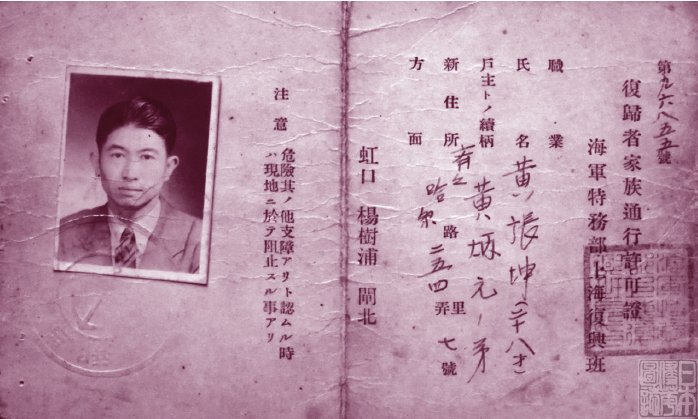
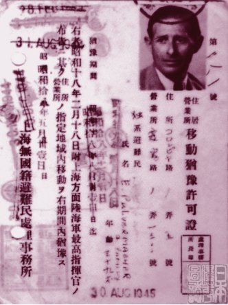
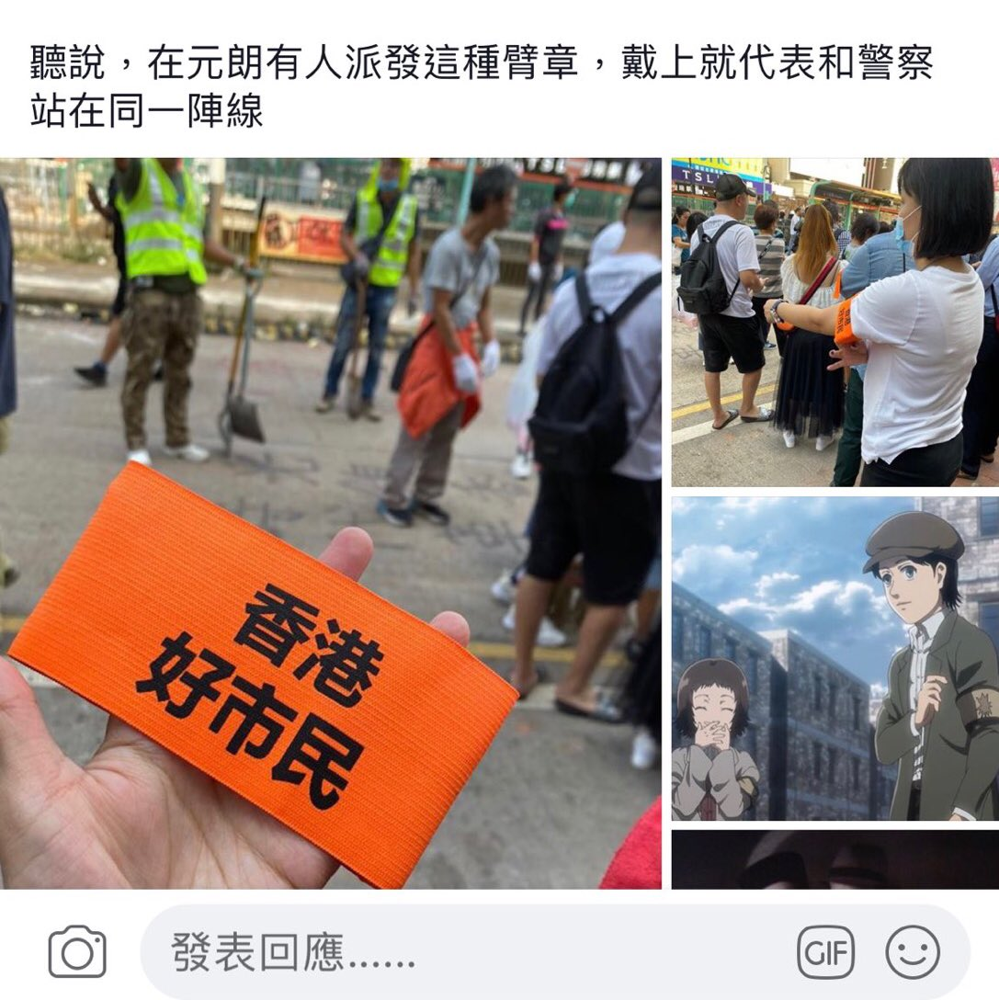
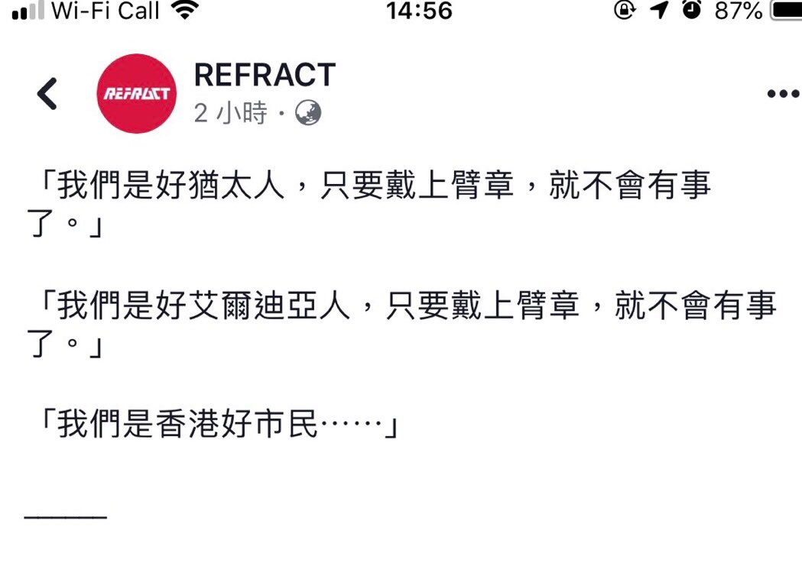

[11月13日 15:55]    财经真相   @caijingxiang    慢慢的他们开始把我当成大神，很多人甚至专门找我询问关于贸易战的事，以及对于行情的预判，在赚钱的引导下，他们开始慢慢接受了真相，也有人主动学习翻墙的办法，我为此专门花钱搭建了一些翻墙节点免费供他们使用，每当他们告诉我说自己的价值观简直被颠倒过来时，心中总有一种自豪感！  :speech_balloon:评:2 :+1:赞:7 :globe_with_meridians:转:0  

[11月13日 15:49]    财经真相   @caijingxiang    可能是由于我是金融行业的缘故吧，过去两年中美贸易争端引发的汇率、股市剧烈波动，由于国内新闻屏蔽了贸易战的消息，每当发生巨大波动时，很多人都来问我原因，我就借机把整个事情的前因后果都讲了一下，并且预判人民币会破7，中美不会达成全面协议，后来这些预判都得到验证，很多人都赚了钱！  :speech_balloon:评:2 :+1:赞:23 :globe_with_meridians:转:2  

[11月13日 15:44]    财经真相   @caijingxiang    我最初传播真相时就被很多国内朋友认为太极端，大多数时候他们都会善意的说，这些事你自己知道就好，不要跟别人说，更多的时候干脆跟你说，知道这些有什么用？你又能改变什么呢？咱就是草民一个别天天张口就说国家大事，会让人笑话！  :speech_balloon:评:7 :+1:赞:24 :globe_with_meridians:转:4  

[11月13日 15:40]    财经真相   @caijingxiang    很多人抱怨周边朋友被洗脑太深，根本不相信香港发生的事，也不相信中共快要倒台，这思想之毒确实很深，但不代表大陆人无可救药，千万不要为此轻易和这些朋友闹到绝交的地步。在墙内传播真相要学会利益引诱，不要直接填充式的进行观点灌输，因为那样会让人觉的你是愤青一个！  :speech_balloon:评:26 :+1:赞:66 :globe_with_meridians:转:14  

[11月13日 15:30]    新闻大吐槽   @TuCaoFakeNews    犹太人臂章？  :speech_balloon:评:0 :+1:赞:2 :globe_with_meridians:转:1  

[11月13日 15:20]    新闻大吐槽   @TuCaoFakeNews    建議學生每人戴一個，他們才是香港好市民。  :speech_balloon:评:0 :+1:赞:1 :globe_with_meridians:转:1  

[11月13日 15:18]    新闻大吐槽   @TuCaoFakeNews    子彈很可怕，但這些子彈的成分更可怕，香港政府新購入的中國製催淚彈，內含山埃等有害物，對各區的空氣做成很大影響，普通巿民事後走過該區，都會做成皮膚發紅，呼吸困難，這班學生昨晚吸了多少有害物入身體內，真的難以想像  :speech_balloon:评:0 :+1:赞:14 :globe_with_meridians:转:5  

[11月13日 15:15]    新闻大吐槽   @TuCaoFakeNews    「朝陽群眾」？  :speech_balloon:评:0 :+1:赞:1 :globe_with_meridians:转:1  

[11月13日 15:15]    新闻大吐槽   @TuCaoFakeNews      :speech_balloon:评:1 :+1:赞:3 :globe_with_meridians:转:3  

[11月13日 15:15]    新闻大吐槽   @TuCaoFakeNews      :speech_balloon:评:0 :+1:赞:3 :globe_with_meridians:转:3  

[11月13日 15:15]    新闻大吐槽   @TuCaoFakeNews    好吧，这个是“你们可以打我了”证  :speech_balloon:评:0 :+1:赞:2 :globe_with_meridians:转:1  

[11月13日 15:15]    新闻大吐槽   @TuCaoFakeNews    乾脆戴上中國好同胞效果好些？  :speech_balloon:评:0 :+1:赞:1 :globe_with_meridians:转:1  

[11月13日 15:14]    新闻大吐槽   @TuCaoFakeNews      :speech_balloon:评:0 :+1:赞:11 :globe_with_meridians:转:4  

[11月13日 15:13]    新闻大吐槽   @TuCaoFakeNews    這說明了藍絲都害怕警察打人  :speech_balloon:评:0 :+1:赞:5 :globe_with_meridians:转:1  

[11月13日 15:12]    新闻大吐槽   @TuCaoFakeNews    和皇军发的良民证一个性质  :speech_balloon:评:1 :+1:赞:10 :globe_with_meridians:转:1  

[11月13日 15:11]    新闻大吐槽   @TuCaoFakeNews    这不就“良民证”么？  :speech_balloon:评:2 :+1:赞:6 :globe_with_meridians:转:1  

[11月13日 15:11]    新闻大吐槽   @TuCaoFakeNews      :speech_balloon:评:0 :+1:赞:6 :globe_with_meridians:转:1  

[11月13日 15:09]    新闻大吐槽   @TuCaoFakeNews    果然专制的奴才都是一样的智商

引自@MaMa98981999  :speech_balloon:评:27 :+1:赞:53 :globe_with_meridians:转:20  

[11月13日 15:09]    纽约时报中文网   @nytchinese    #摩登情爱 选择流浪街头是一种慢性自杀。也许DJ的母亲知道她要自我毁灭，所以才想确保她的孩子不会受到伤害。
她把他留在了一个安全的地方，跟她为他选择的家长住在一起，哪怕把他交给别人令她心碎，但她知道如果他离自己太近，同样也会受到伤害。 http://nyti.ms/2picNEM   :speech_balloon:评:2 :+1:赞:10 :globe_with_meridians:转:2  

[11月13日 15:00]    BBC News 中文   @bbcchinese    她说，“如果你想活下去，就握一下我的手。”这时，生命垂危的他已经陷入幻觉、自以为变成了一条蛇。他想活，但蛇没有手...... https://bbc.in/372A5zi   :speech_balloon:评:2 :+1:赞:26 :globe_with_meridians:转:6  

[11月13日 14:54]    新闻大吐槽   @TuCaoFakeNews    為我們的大學生的頑強意志奮力保住大學這個橋頭堡而驕傲而鼓掌，我爱每一位的你們，請保重你們有用及珍貴的身軀為美好的明天而戰  :speech_balloon:评:0 :+1:赞:7 :globe_with_meridians:转:1  

[11月13日 14:45]    新闻大吐槽   @TuCaoFakeNews    眼泪止不住流下来了…他们捍卫的也是大陆人的未来…中大保卫战 保卫的就是香港的网络自由 乃至言论自由。香港的网络中心在中大。  :speech_balloon:评:0 :+1:赞:11 :globe_with_meridians:转:3  

[11月13日 14:26]    新闻大吐槽   @TuCaoFakeNews    Taiwan president @iingwen calls on intl community to support HK and says similar scenes of armed forces attacking campuses also happened during the years of military rule there  :speech_balloon:评:10 :+1:赞:192 :globe_with_meridians:转:162  

[11月13日 14:22]    新闻大吐槽   @TuCaoFakeNews    香港真是一面照妖鏡，看看這些政府一個比一個昏庸！裝作看不見聽不見的政客該下台了！  :speech_balloon:评:1 :+1:赞:10 :globe_with_meridians:转:2  

[11月13日 14:21]    新闻大吐槽   @TuCaoFakeNews    其实，我想说，甄子丹，你可以把面罩摘掉了！

开个玩笑  :speech_balloon:评:6 :+1:赞:11 :globe_with_meridians:转:0  

[11月13日 14:00]    纽约时报中文网   @nytchinese    尤盛东：“我们如果不改变，我们这个国家会落伍。这几年赶上去是亏的实行了邓小平的教育面向世界、面向未来、面向现代化这个教育方针。”
’如果回到文化（大）革命时候，老师被当成资产阶级反动知识分子，让学生去揪老师、抓老师、批斗老师，那我们这个教育就毁掉了。“ http://nyti.ms/2CGn3tm   :speech_balloon:评:11 :+1:赞:24 :globe_with_meridians:转:9  

[11月13日 13:30]    纽约时报中文网   @nytchinese    周二，特朗普表示美国“接近”与中国达成一项临时协议，但他也称，如果北京不同意美国的贸易条件，将“大幅提高关税”。
他还为自己的关税政策进行辩护，淡化贸易战对美国的影响，称自己带来了经济“繁荣”。 http://nyti.ms/2q7MRfs   :speech_balloon:评:17 :+1:赞:9 :globe_with_meridians:转:2  

[11月13日 13:24]    新闻大吐槽   @TuCaoFakeNews    今天是第五次医护人员的集会，碍于身份，这位医生不便透露更多伤者细节，但他说：相比于警察，抗争者所受的伤肯定更重、更多。

虽然救人时不会区别对待，但他说：在鸡蛋和高墙之间，我选择站在鸡蛋一边！  :speech_balloon:评:10 :+1:赞:250 :globe_with_meridians:转:121  

[11月13日 13:00]    纽约时报中文网   @nytchinese    #每日一词 Retail therapy 对于阿里巴巴“双11”破纪录的销售额，时报写道，这并不是对当前形势如何影响中国中产阶级“购物解忧”(retail therapy)胃口的完美衡量。Retail therapy指为排解忧愁、使自己感到快乐的购物行为，类似中文语境里的“包”治百病。
更多简报内容： http://nyti.ms/2O4I4Dq   :speech_balloon:评:7 :+1:赞:4 :globe_with_meridians:转:2  

[11月13日 12:30]    纽约时报中文网   @nytchinese    继周一警察向示威者开枪、一名责骂示威者的人遭纵火之后，香港周二再度陷入混乱。
抗议者在校园内纵火、丢掷汽油弹，而防暴警察则试图用催泪瓦斯和水炮将他们击退。
这里是周二抗议活动的一些照片： http://nyti.ms/2pd93nT   :speech_balloon:评:106 :+1:赞:49 :globe_with_meridians:转:21  

[11月13日 12:00]    纽约时报中文网   @nytchinese    • 美国前总统卡特接受降脑压手术。95岁高龄的卡特近几个月来数次跌倒。据他所在的非营利组织说，手术没有并发症，卡特将留院观察。
• 北极圈寒流南下冲击美国，多地气温骤降。中部和东部大部分地区受影响，预计周三白天和夜间气温将达历史最低水平。
更多简报内容： http://nyti.ms/2O4I4Dq   :speech_balloon:评:1 :+1:赞:3 :globe_with_meridians:转:2  

[11月13日 11:58]    BBC News 中文   @bbcchinese    在叙利亚创办俗称“白头盔”（White Helmets）的公民防卫组织，因而得到英女王嘉奖的英国前陆军军官詹姆斯·勒梅热勒（James Le Mesurier）被发现死于土耳其。 https://bbc.in/2CEy8eM   :speech_balloon:评:39 :+1:赞:63 :globe_with_meridians:转:37  

[11月13日 11:30]    纽约时报中文网   @nytchinese    在本该是安心教书的古稀之年，71岁的经济学教授尤盛东却在美国多地奔波往返，寻找能为他提供三尺讲台的美国大学。
尤盛东因为批评中共领导的宣传口号与官方贸易政策等言论，而遭学生举报，随后被开除。他的经历提供了中共在大专院校推行洗脑教育的一手资料。 http://nyti.ms/2CGn3tm   :speech_balloon:评:57 :+1:赞:283 :globe_with_meridians:转:139  

[11月13日 11:29]    财经真相   @caijingxiang    广州财政。  :speech_balloon:评:29 :+1:赞:184 :globe_with_meridians:转:86  

[11月13日 11:00]    纽约时报中文网   @nytchinese    北京确认接诊肺鼠疫病例：两名患者来自内蒙古锡林郭勒盟。据报道，接诊的朝阳医院急诊科座椅全部换新；目击者称，急诊大楼门口曾戒严。
朝阳医院负责人表示，患者已转至他院，并称“一切尽在掌控中”。朝阳区政府深夜发文证实相关消息。
更多简报内容： http://nyti.ms/2O4I4Dq   :speech_balloon:评:4 :+1:赞:9 :globe_with_meridians:转:5  

[11月13日 10:30]    纽约时报中文网   @nytchinese    据官方媒体报道，一名男子在云南一所幼儿园内喷腐蚀性化学物质，造成51名学生和三名教师受伤。
袭击发生一小时后，警方拘留了一名23岁的孔姓男子。当局表示，他喷这种名为烧碱的化学物质是为“报复社会“。 http://nyti.ms/2Kigt0B   :speech_balloon:评:10 :+1:赞:40 :globe_with_meridians:转:18  

[11月13日 10:25]    纽约时报中文网   @nytchinese    简报：香港骚乱延至校园；北京确认接诊鼠疫病例  http://nyti.ms/2O4I4Dq https://twitter.com/ccni/status/1194437413818515456 …  :speech_balloon:评:3 :+1:赞:9 :globe_with_meridians:转:4  

[11月13日 10:20]    纽约时报中文网   @nytchinese    云南一所幼儿园遭腐蚀性液体袭击，51名儿童受伤  http://nyti.ms/2Kigt0B https://twitter.com/nytimesworld/status/1194397485441134593 …  :speech_balloon:评:4 :+1:赞:9 :globe_with_meridians:转:13  

[11月13日 10:03]    纽约时报中文网   @nytchinese    早安！今日重点新闻包括：
香港骚乱延至校园；北京确认接诊鼠疫病例；云南一所幼儿园遭腐蚀性液体袭击；特朗普重申对华关税威胁；被学生举报的中国大学教授后来怎么了；美国前总统卡特接受降脑压手术；菲律宾山区炸弹爆炸，造成六名士兵死亡……NYT简报带你速览今日要闻。 http://nyti.ms/2O4I4Dq   :speech_balloon:评:24 :+1:赞:47 :globe_with_meridians:转:14  

[11月13日 08:02]    BBC News 中文   @bbcchinese    40多年前，对前总统尼克松的弹劾调查，人们最终大舒一口气，“机制是有效的”。今天，对现总统特朗普的弹劾调查，则可能导致对美国宪法尊严的前所未有的挑战。 https://bbc.in/2QcxahC   :speech_balloon:评:27 :+1:赞:92 :globe_with_meridians:转:29  

[11月13日 07:41]    BBC News 中文   @bbcchinese    两国领导人在如此短暂的时间内密集互访的事实，无疑是这两个国家关系密切的体现。 https://bbc.in/2X9DibP   :speech_balloon:评:29 :+1:赞:40 :globe_with_meridians:转:14  

[11月13日 07:30]    纽约时报中文网   @nytchinese    #摩登情爱 安德鲁是个老教授，他英俊、有魅力，总让我想起我过世的父亲，令我着迷。
但那次约会使我明白，他终究不是我的父亲，我不是他的小姑娘，他的公寓也不是我家。 http://nyti.ms/2CD43ft   :speech_balloon:评:2 :+1:赞:10 :globe_with_meridians:转:3  

[11月13日 07:11]    BBC News 中文   @bbcchinese    BBC在美国的记者大卫·格罗斯曼报道说，近年来美国对中国态度明显向负面转变，即使在2016年民主党的希拉里，或其他共和党候选人当选担任总统，也会有今天的对华强硬政策。 https://bbc.in/2XeyKB5   :speech_balloon:评:21 :+1:赞:44 :globe_with_meridians:转:13  

[11月13日 04:49]    老司机   @h5lpykl7tp6jjop    捧着书偷睡的学生和辛勤看书至疲倦睡着了的学生看起来一样，只有想弄清真相的人才会知道真相！  :speech_balloon:评:0 :+1:赞:21 :globe_with_meridians:转:10  

[11月13日 00:52]    纽约时报中文网   @nytchinese    Long night in Hong Long. 12-11-2019.  :speech_balloon:评:64 :+1:赞:1749 :globe_with_meridians:转:1244  

[11月12日 21:25]    财经真相   @caijingxiang    看到这里，很多网友也许就会认为，参议员的议员太坏，不及众议院好，如果你这样认为就大错特错。因为参议员的议员知识文化水平普遍较高，看待问题也更加理性，这与众议院经常出现“白左”的理想化议员形成鲜明对比。如果没有参议院的制衡，美国恐怕会上演“美国版的打土豪分田地”，其后果将是灾难性的！  :speech_balloon:评:15 :+1:赞:159 :globe_with_meridians:转:28  

[11月12日 21:16]    财经真相   @caijingxiang    众议院议员在投票时，更多的是以道义为出发点，直接表达对香港人的支持；参议员的议员背后是大财团和政治家族，他们在中国和香港有着大量的资产和利益，因此参议院在香港问题不如众议院积极就比较容易理解，毕竟屁股决定脑袋，对这些议员来说，在钱大部分撤回来之前，最好不要和中共彻底撕破脸！  :speech_balloon:评:9 :+1:赞:154 :globe_with_meridians:转:40  

[11月12日 21:10]    财经真相   @caijingxiang    美国众议院是以人口为基准确定席位，其议员大多数来自普通公民，因此更贴近民意；而参议院议员人数较少，一般更代表美国精英集团的意志；两院互相制衡，协调美国普通阶层与精英阶层的利益诉求，这是美国政治稳定的核心。在香港法案上，众议院0票反对率先通过，这代表美国民意对香港的支持！  :speech_balloon:评:7 :+1:赞:333 :globe_with_meridians:转:94  

[11月12日 21:08]    BBC News 中文   @bbcchinese    国民党候选人韩国瑜和他新选定的竞选搭档张善政方方面面都有差异，“韩张配”是否相得益彰？ https://bbc.in/32F6V67   :speech_balloon:评:10 :+1:赞:13 :globe_with_meridians:转:6  

[11月12日 20:32]    老司机   @h5lpykl7tp6jjop    知道所有真相，了解，思考過， 自己怎麼想最清楚。
最怕的是，永遠不看真相的人  :speech_balloon:评:1 :+1:赞:9 :globe_with_meridians:转:8  

[11月12日 20:03]    老司机   @h5lpykl7tp6jjop      :speech_balloon:评:10 :+1:赞:133 :globe_with_meridians:转:40  

[11月12日 20:00]    纽约时报中文网   @nytchinese    前白宫顾问史蒂芬·班农称美国与中国共产党的关系是一场经济和信息“战争”。谷歌创始人之一埃里克·施密特表示，美国的利益与中国纠缠在一起，中国是我们在全球技术主导地位竞争中的头号对手。
两国关系的下一阶段，可能为本世纪余下的时间奠定基调。 http://nyti.ms/34WsGjt   :speech_balloon:评:12 :+1:赞:51 :globe_with_meridians:转:24  

[11月12日 19:30]    纽约时报中文网   @nytchinese    该贷款的目的是通过提升教师队伍和课程设置，支持该地区的5所职业学校。部分资金流向了“伙伴学校”，这些学校间接接受世银的资助，不受其监督。
“考虑到伙伴学校分布范围广、难以监控的风险，该项目的范围和规模正在缩减，”世银声明称。“涉及新疆伙伴学校的项目部分将被关闭。” http://nyti.ms/33OmHx3   :speech_balloon:评:0 :+1:赞:12 :globe_with_meridians:转:8  

[11月12日 19:22]    墙国铁拳现世报😷   @Socialistfist    从2018年9月到现在频繁微博维权，神奇的是，小编就是没看出来他举报的贪污腐败是什么内容  :speech_balloon:评:4 :+1:赞:111 :globe_with_meridians:转:7  

[11月12日 19:20]    墙国铁拳现世报😷   @Socialistfist    宝贝别哭

#社会主义铁拳  :speech_balloon:评:35 :+1:赞:300 :globe_with_meridians:转:69  

[11月12日 19:00]    BBC News 中文   @bbcchinese    南非17岁少女一个偶然机会发现自己有两个妈妈，一个真妈，一个假妈，于是引出一段五味杂陈的故事。 https://bbc.in/2X4oAmw   :speech_balloon:评:0 :+1:赞:19 :globe_with_meridians:转:5  

[11月12日 19:00]    纽约时报中文网   @nytchinese    阿里巴巴喜欢炫耀的“双11”庞大数字，并不是对目前形势如何影响中国中产阶级“购物解忧”胃口的完美衡量。
阿里巴巴报告的是所谓“商品交易总额”，这个数字代表的是其平台上的订单总额。但是，并没有衡量这个数字的标准化方法，而且阿里巴巴的“双11”数据也没有经过外部审计。 http://nyti.ms/2pRJmd3   :speech_balloon:评:26 :+1:赞:18 :globe_with_meridians:转:3  

[11月12日 18:30]    纽约时报中文网   @nytchinese    行政长官林郑月娥周二批评抗议者破坏交通，并表示校方应敦促学生停止参与非法活动。她在当日早间对记者说：“试图‘瘫痪’香港的示威抗议者极度自私。”
港铁周二早上称，有人将汽油弹扔到一条通向中国大陆边境的主要铁路线上，在通勤高峰时段造成了延误。大批通勤者沿着铁路行走。 http://nyti.ms/2rANbUp   :speech_balloon:评:7 :+1:赞:4 :globe_with_meridians:转:1  

[11月12日 18:00]    纽约时报中文网   @nytchinese    在时报交易录大会上，九位中国政策专家讨论了美中关系面临的主要挑战。
与中国和平接触的政策正走向终结，面对“中国优势”，美国该如何重新定义两国关系？ http://nyti.ms/34WsGjt   :speech_balloon:评:6 :+1:赞:27 :globe_with_meridians:转:11  

[11月12日 17:30]    纽约时报中文网   @nytchinese    从分发瓶装水和红豆汤的普通人，到在秘密诊所工作的医护人员，一支庞大的志愿者队伍在远离前线的地方帮助示威者。
公众支持对当局来说成了一个棘手的挑战。当局一直希望通过离间日益激进的煽动者和同情者来平息抗议。 http://nyti.ms/32Cy1ee   :speech_balloon:评:105 :+1:赞:534 :globe_with_meridians:转:274  

[11月12日 16:00]    BBC News 中文   @bbcchinese    “双十一”（11月11日）这天，阿里巴巴旗下电商平台交易额达到2684亿元，再次刷新纪录。 https://bbc.in/33EWIrG   :speech_balloon:评:64 :+1:赞:60 :globe_with_meridians:转:16  

[11月12日 15:01]    BBC News 中文   @bbcchinese    中国在人脸识别技术的世界领先地位，你知道多少？科技带来的隐私、人权案件有哪些先例？ https://bbc.in/2KbRtYM   :speech_balloon:评:54 :+1:赞:82 :globe_with_meridians:转:44  

[11月12日 14:46]    老司机   @h5lpykl7tp6jjop    今天，当勇武派出现在市中心商业区的时候，受到了英雄一般的热烈欢迎。
而此前，林郑月娥称：「抗争者是人民的敌人」  :speech_balloon:评:168 :+1:赞:2760 :globe_with_meridians:转:1354  

[11月12日 14:46]    新闻大吐槽   @TuCaoFakeNews    今天，当勇武派出现在市中心商业区的时候，受到了英雄一般的热烈欢迎。
而此前，林郑月娥称：「抗争者是人民的敌人」  :speech_balloon:评:168 :+1:赞:2760 :globe_with_meridians:转:1354  

[11月12日 14:44]    财经真相   @caijingxiang    支持胡主编把宣传口径拉到海外的，这真是一个高招啊！你想啊，中国有14亿爱国群众，很容易赢得舆论上的胜利！强烈建议胡主编向上级反映，开放推特，接触防火墙！  :speech_balloon:评:17 :+1:赞:131 :globe_with_meridians:转:33  

[11月12日 13:36]    老司机   @h5lpykl7tp6jjop    黑警再次突破底线，坏事做绝，竟然殴打孕妇。
没人性！恐怖输出  :speech_balloon:评:86 :+1:赞:612 :globe_with_meridians:转:487  

[11月12日 12:09]    财经真相   @caijingxiang    淘宝双十一数据布在三次回归曲线上，拟合度均超过99.94%，几乎为1，今年2684亿，与2689亿的预测数据只差5亿，这说明淘宝在造假！  :speech_balloon:评:144 :+1:赞:662 :globe_with_meridians:转:245  

[11月12日 12:01]    BBC News 中文   @bbcchinese    印度最高法院作出判决表示，印度北部极具宗教争议的阿约提亚圣地应该交给那些希望在那里修建寺庙的印度教徒。 https://bbc.in/2CuaTUB   :speech_balloon:评:4 :+1:赞:7 :globe_with_meridians:转:6  

[11月12日 11:01]    BBC News 中文   @bbcchinese    有在台湾念书的大陆学生证实收到要求2020年1月11日前离开台湾的讯息，而当日台湾将举行总统大选，有台湾学者称中国此举可能是不希望太多大陆学生在台湾感受民主气氛。不过中国地方台办否认有发出类似讯息。 https://bbc.in/2Kb6A4H   :speech_balloon:评:238 :+1:赞:325 :globe_with_meridians:转:125  

[11月12日 10:36]    老司机   @h5lpykl7tp6jjop    什么最重要？信息自由排第一！  :speech_balloon:评:5 :+1:赞:120 :globe_with_meridians:转:43  

[11月12日 10:20]    财经真相   @caijingxiang    对于被捕的学生处理方式有三种，第一种确定登记所有学生信息，并以家人安全进行威胁，如果学生屈服就释放并进行定期监控；第二种就是没有一丝屈服，视死如归的直接弄死抛尸；第三种多次被捕，毒打后直接监禁，同时加快深圳附近集中营的建设。这也是香港抗议规模逐渐减少的原因！  :speech_balloon:评:17 :+1:赞:195 :globe_with_meridians:转:80  

[11月12日 10:10]    财经真相   @caijingxiang    班农透露共和党正忙于应对川普的弹劾案，到明年2月份参议院都很难通过香港法案，也就是说香港人还要继续被打被杀至少三个月，以目前中共每天逮捕两百人计算，三个月就是近两万人，中共确信这些时间足够把香港积极抗争的学生全部逮捕，最终恢复香港所谓的稳定秩序！这就是中共对香港的策略吧！  :speech_balloon:评:51 :+1:赞:386 :globe_with_meridians:转:149  

[11月12日 10:01]    BBC News 中文   @bbcchinese    手机屏幕会让你老得更快？快告诉一位手机不离手的朋友！  :speech_balloon:评:10 :+1:赞:109 :globe_with_meridians:转:85  

[11月12日 08:48]    BBC News 中文   @bbcchinese    敬业集团要在这宗收购中得到什么？ https://bbc.in/36ZM54X   :speech_balloon:评:8 :+1:赞:14 :globe_with_meridians:转:7  

[11月12日 08:26]    BBC News 中文   @bbcchinese    2019年，她入选了BBC巾帼百名杰出女性名单。 https://bbc.in/2pTGD2O   :speech_balloon:评:6 :+1:赞:15 :globe_with_meridians:转:7  

[11月12日 08:01]    BBC News 中文   @bbcchinese    1989年发生了震惊世界的“柏林墙倒塌”事件，迄今已整整30周年。为何柏林墙会倒塌？当年到底发生了什么？  :speech_balloon:评:55 :+1:赞:594 :globe_with_meridians:转:278  

[11月12日 07:26]    BBC News 中文   @bbcchinese    为何这两国不久前似乎还都正在国家发展的道路上向前，好像忽然就陷入国家危机、领导人被迫下野的境地呢？ https://bbc.in/2CAY0YG   :speech_balloon:评:38 :+1:赞:52 :globe_with_meridians:转:15  

[11月12日 07:22]    凡賽堤/FORSETI   @FecharCCP    11日早在西湾河开枪射伤示威者的港警关家荣身份被起底，其担任家教会主席的德望学校师生、家长及校友发起联署要求解除其在该校的职务。其两个女儿在该校就读。另有消息指，关家荣受过“大陆警察部门”特殊培训。下面这个小视频，足以解释这场血案的真相：这是流氓国家自上而下有计划的谋杀。  :speech_balloon:评:20 :+1:赞:259 :globe_with_meridians:转:170  

[11月12日 07:14]    凡賽堤/FORSETI   @FecharCCP    救救悲慘的香港 #HKSOS

香港黑警拔槍亂殺港民！已多人中槍和死亡！

天滅極權！  :speech_balloon:评:1 :+1:赞:10 :globe_with_meridians:转:8  

[11月12日 07:11]    凡賽堤/FORSETI   @FecharCCP    11.11 香港殺人魔家庭資料！
全世界通緝這殺人魔全家！  :speech_balloon:评:47 :+1:赞:13 :globe_with_meridians:转:10  

[11月12日 07:07]    凡賽堤/FORSETI   @FecharCCP    救救悲慘的香港 #HKSOS

香港黑警拔槍亂殺港民！已多人中槍和死亡！  :speech_balloon:评:0 :+1:赞:8 :globe_with_meridians:转:6  

[11月12日 06:57]    凡賽堤/FORSETI   @FecharCCP    天滅流氓政權！！！CCP極權殺人恐怖組織正在用各種兇殘手段屠殺我們的同胞...................

看看這些大陸的黑警（公安，武警，士兵裝扮成香港警察）是如何沒有人性的屠殺香港學生！！！

天滅流氓政權！！！天滅CCP！！！  :speech_balloon:评:1 :+1:赞:20 :globe_with_meridians:转:21  

[11月12日 06:42]    凡賽堤/FORSETI   @FecharCCP    天滅流氓政權！！！CCP極權殺人恐怖組織正在用各種兇殘手段殺害我們的同胞...................

看看這些大陸的黑警（公安，武警，士兵裝扮成香港警察）是如何沒有人性的屠殺香港學生！！！

那個小年輕不知道是休克還是已經死亡！

天滅流氓政權！！！天滅CCP！！！  :speech_balloon:评:34 :+1:赞:18 :globe_with_meridians:转:15  

[11月12日 06:25]    凡賽堤/FORSETI   @FecharCCP    坐水凳（英語：waterboarding）是水刑的一種，做法是將受害人固定其雙手雙腳，在頭部放上布後持續澆水。如此會讓受害人產生溺水的錯覺而心生恐懼。雖然坐水凳不在身上留下可辨識的傷痕，但受害人在過程中會因為嗆到水甚至吸入性肺炎而受傷害。另外有些人因此導致心理方面的傷害，是酷刑的一種。  :speech_balloon:评:0 :+1:赞:36 :globe_with_meridians:转:33  

[11月12日 04:31]    老司机   @h5lpykl7tp6jjop    共产主义是一个最大的政治笑话，有人说，马克思也许设计了一个巨大的烟囱，它的信徒把图纸拿倒了，挖造成了一座座深井，把这些国家和人民都活埋在下面见不到阳光和空气，最可悲的是当这些人来真实的世界，它们反而觉得真实的世界不正常，它们居然怀念那个黑暗的深井！  :speech_balloon:评:5 :+1:赞:109 :globe_with_meridians:转:28  

[11月11日 23:01]    墙国铁拳现世报😷   @Socialistfist    所有推文内容来自于公开的网络社交媒体。
年轻人还是需要学习一个
毕竟too young  https://twitter.com/muxiawenyuzi/status/1193888039799574528 …  :speech_balloon:评:11 :+1:赞:160 :globe_with_meridians:转:14  

[11月11日 20:31]    BBC News 中文   @bbcchinese    香港发生示威五个月以来第三起警察实弹枪伤抗议者事件，警方指示威者当时尝试抢夺警员的佩枪，另有市民被示威者纵火严重烧伤 。 https://bbc.in/2pbuVA8   :speech_balloon:评:169 :+1:赞:139 :globe_with_meridians:转:67  

[11月11日 20:30]    BBC News 中文   @bbcchinese    围绕女性性器官存在和流传着许多误解。美国妇产科医生珍·冈特（Dr.Jen Gunter)在北美行医25年。她的新书《阴道圣经》（The Virginal Bible）为女性提供许多实用性建议，在这里我们为你总结5条。 https://bbc.in/2pPw0Ot   :speech_balloon:评:5 :+1:赞:78 :globe_with_meridians:转:35  

[11月11日 20:05]    BBC News 中文   @bbcchinese    【香港示威：张炳良称中港关系恶化 因议员侮辱中国人身份】#香港 运输及房屋局前局长 #张炳良 接受BBC HARDtalk专访。他用其 #建制派 立场阐述了对香港反政府示威的观察，以及对现届香港政府的看法。 https://bbc.in/2K2hEkA   :speech_balloon:评:18 :+1:赞:11 :globe_with_meridians:转:5  

[11月11日 17:21]    墙国铁拳现世报😷   @Socialistfist      :speech_balloon:评:19 :+1:赞:92 :globe_with_meridians:转:9  

[11月11日 17:19]    墙国铁拳现世报😷   @Socialistfist    在吗？我微博被封了，可以聊聊吗？

#社会主义铁拳
#战螂在推特  :speech_balloon:评:30 :+1:赞:284 :globe_with_meridians:转:57  

[11月11日 17:01]    BBC News 中文   @bbcchinese    中国商家借“双11”、“光棍节”发财之际，影星艾玛·沃特森宣告：我单身，我自豪。这叫“自我为伴”。 https://bbc.in/36SaFVi   :speech_balloon:评:119 :+1:赞:122 :globe_with_meridians:转:26  

[11月11日 16:40]    老司机   @h5lpykl7tp6jjop    Mitch McConnell (@senatemajldr) are you too corrupted by Foremost Shipping money to pass the #HKHRDA? If so you are too corrupt for the Senate. Get out and let a leader lead. https://twitter.com/hoccgoomusic/status/1193749769291620352 …  :speech_balloon:评:31 :+1:赞:441 :globe_with_meridians:转:364  

[11月11日 15:19]    老司机   @h5lpykl7tp6jjop    中国几千年来一直不能改变的就是：总是用一个谎言代替另一个谎言，用一种愚昧代替另一种愚昧，用一种暴力代替另一种暴力，用一种诡辩代替另一种诡辩，永远在下流的泥沼自我陶醉！  :speech_balloon:评:6 :+1:赞:58 :globe_with_meridians:转:18  

[11月11日 14:12]    财经真相   @caijingxiang    记得有个官员说过一句很经典的话“没有坏账，哪来那么多富人”，就是直接点出了中国银行游戏的本质。穷人要想贷款只能是“消费性质的”，这就是“房贷、车贷”，其他原始资本积累性质的贷款，是坚决被禁止的。而富人、官员、权贵则不然，他们贷款或者打着政府名义免抵押物要求，或者凭借权利直接贷款！  :speech_balloon:评:7 :+1:赞:325 :globe_with_meridians:转:95  

[11月11日 14:02]    财经真相   @caijingxiang    银行的新增存款不但停止增加，甚至开始减少，这个时候如果再赶上“春节”用钱高峰，银行就没有钱去应对储户提现要求，最终引发挤兑，银行破产！  :speech_balloon:评:10 :+1:赞:130 :globe_with_meridians:转:34  

[11月11日 14:00]    财经真相   @caijingxiang    票据贷如果只借一次也就罢了，关键是很多权贵，不但票据（欠条）到期后不还钱，反而再开一张票据，又拿走了一笔贷款，如此反复操作下去，银行的窟窿越来越大。以往经济好的时候，银行的存款也是不断的增加，比如从10块增加的20块，银行还可以勉强维持下去，直到中美贸易打的鸡飞狗跳，经济实质性的下滑  :speech_balloon:评:1 :+1:赞:78 :globe_with_meridians:转:24  

[11月11日 13:55]    财经真相   @caijingxiang    因此中国的银行存款大部分是被国企和政府拿走，另一个就是房贷，这些几乎占据了中国银行贷款的8成以上，而这些要么是很难还款，要么就是根本不想换，由此造成银行资金连长期紧张，除了上面这些方面外，某些地方政府或者权贵企业干脆任何抵押物都不提供，直接给张欠条，就把钱贷走了，这就票据贷！  :speech_balloon:评:3 :+1:赞:88 :globe_with_meridians:转:28  

[11月11日 13:50]    财经真相   @caijingxiang    房贷、车贷等割老百姓韭菜性质的贷款，却管比较宽松，一般只要能够提供稳定工作证明就可以“放贷”，不要提供抵押物，但是其他性质的贷款则必须提供足量的抵押物，这也是中国中小企业贷款难、融资贵的核心根源。不过贷款对于国企而言却不是个事，因为国企本质是有政府背书，而且出事后银行一般免于追责！  :speech_balloon:评:3 :+1:赞:83 :globe_with_meridians:转:23  

[11月11日 13:44]    财经真相   @caijingxiang    银行最大借贷是6块，与总存款10块有一个比率，被称为存贷比，这在国际银行界都有严格规定；出借的6块中，确定不能还的钱，就是通常所说的坏账，坏账与总资本也有一个比率，被称坏账率，坏账率根据巴塞尔协议也有严格限制，不得超过规定！在中国从银行贷款都严格的抵押物要求，因此普通百姓一般都拿不到  :speech_balloon:评:1 :+1:赞:74 :globe_with_meridians:转:23  

[11月11日 13:36]    财经真相   @caijingxiang    平时银行手里的2块足够应对社会的取现，但是如果碰到春节，现金需求量大时，比如春节需求4块，银行2块就不够用，这时银行一般可以其他银行或者保险公司等金融机构借款，这被称为“同业拆借”，如果同业的钱也不够用，就只能找央行要回那笔“存款保证金”，央行一般会根据大数据分析缺口来定额度这就是降准  :speech_balloon:评:2 :+1:赞:108 :globe_with_meridians:转:27  

[11月11日 13:28]    财经真相   @caijingxiang    “钱荒”首先要弄清楚是哪个地方缺钱，临近春节最缺钱的就是银行。银行才是真正的“货币蓄水池”，银行本质就是钱的中介，一边吸收存款，另一边加点利息把收来的存款贷出去。正常情况下银行吸收了10块，只能贷出6块，2块交个央行保管，这比钱被称为存款保证金，剩下2元，作为手头现金流应对日常所需！  :speech_balloon:评:16 :+1:赞:411 :globe_with_meridians:转:172  

[11月11日 08:21]    老司机   @h5lpykl7tp6jjop    交通黑警连开三枪（真枪），其中一名抗争者中枪倒地！
太卑鄙了！！！！！！
当街杀人  :speech_balloon:评:105 :+1:赞:656 :globe_with_meridians:转:521  

[11月10日 22:23]    墙国铁拳现世报😷   @Socialistfist    5. 因投稿较多且具体事件有时效性，也许会延迟发布您的投稿，希望能够理解。对于一些重复投稿的或者不符合主题的投稿，也许不会被采用。
6. 最佳投稿途径是发送私信，@ 本推会被其他通知挤掉
7. 如果您有好的内容，欢迎使用 #社会主义铁拳 和 #社會主義鐵拳，简繁双体的tag。符合内容的推文会给予转推  :speech_balloon:评:0 :+1:赞:51 :globe_with_meridians:转:6  

[11月10日 22:18]    墙国铁拳现世报😷   @Socialistfist    1. 为避免潜在视奸号盗取IP，不接受含有网站链接的投稿
2. 社会主义铁拳相关主题内容应当是，个体或集体有赞美言论后被社会主义政权铁拳的事例。自然灾害或非社会主义政权皆不算是#社会主义铁拳
3. 本推主题明确统一，不接受除了铁拳现世报以外的爆料或投稿
4. 推荐使用多张截图和文字相配合的投稿方式  :speech_balloon:评:1 :+1:赞:77 :globe_with_meridians:转:9  

[11月10日 22:14]    墙国铁拳现世报😷   @Socialistfist    感谢所有新关注的推友和所有开推以来一路的老朋友。
本推的成长离不开所有积极投稿的热心推友，再次表示特别感谢。为了明确投稿规范，特别发此推做出说明。  :speech_balloon:评:5 :+1:赞:106 :globe_with_meridians:转:11  

[11月10日 21:07]    老司机   @h5lpykl7tp6jjop    剛刚：这阵仗像极了大陆解放军攻打香港，看起来特别地荒唐可笑！竟然用这阵仗对付手无寸铁的民众、自已的骨肉同胞？你们也真不要逼脸！  :speech_balloon:评:289 :+1:赞:1257 :globe_with_meridians:转:814  

[11月10日 17:22]    老司机   @h5lpykl7tp6jjop    8年获得科研经费补贴15亿元。最终还是破产了！
国企为主的政策主导下，自主研发口号让领导开心，大笔一挥，
山东常林集团，一家拥有“国家重点实验室”和“山东省重点实验室”的企业，多次名列"中国机械工业百强"榜单，可现实残酷骗局终于现相：  :speech_balloon:评:9 :+1:赞:115 :globe_with_meridians:转:72  

[11月10日 14:47]    老司机   @h5lpykl7tp6jjop    转发网络笑话：做一个有思想的废青！

大清早被银行的催债电话吵醒，顿时对着电话怒骂：都跟你说了多少遍了，那个贷款合同已经是历史文件了，不具有现实意义了！并且我自己挣的钱，还不还，不由你这个外人说三道四！骂完后我很解气的挂掉了电话，回到床上继续做起了中国梦。  :speech_balloon:评:6 :+1:赞:450 :globe_with_meridians:转:129  

[11月10日 14:36]    老司机   @h5lpykl7tp6jjop    中国如何渗透台湾大选 调查发现某管道恐为入口
大陆穷百姓艰难求生，中共把钱用来打水飘！  :speech_balloon:评:0 :+1:赞:11 :globe_with_meridians:转:4  

[11月10日 05:28]    老司机   @h5lpykl7tp6jjop    中共不同于苏共，它比苏共除了狂妄自大以外还卑鄙无耻得多很多，每当危及生存之时它都可以断尾求生， 历界总书记大多数没有好下场，别看今天香港警匪在中共黑手下威风，可以预见香港打手的未来，一旦国际国内形势对中共不利，中共为了求存你们就是中共的代价，蜥蜴的尾巴，拉清单清算的日子等着你们！  :speech_balloon:评:0 :+1:赞:55 :globe_with_meridians:转:15  

[11月10日 05:07]    老司机   @h5lpykl7tp6jjop      :speech_balloon:评:0 :+1:赞:3 :globe_with_meridians:转:2  

[11月10日 05:07]    老司机   @h5lpykl7tp6jjop      :speech_balloon:评:1 :+1:赞:3 :globe_with_meridians:转:3  

[11月10日 05:06]    老司机   @h5lpykl7tp6jjop    柏林墙倒掉三十年，今天的香港是当年的柏林！  :speech_balloon:评:1 :+1:赞:10 :globe_with_meridians:转:3  

[11月09日 21:10]    老司机   @h5lpykl7tp6jjop    2019年11月9日，上海宝山区蕰川路物流园区爆炸  :speech_balloon:评:13 :+1:赞:160 :globe_with_meridians:转:89  

[11月09日 20:44]    墙国铁拳现世报😷   @Socialistfist    删了重发是因为小编是强迫症，之前推有一个重复字。  :speech_balloon:评:3 :+1:赞:141 :globe_with_meridians:转:3  

[11月09日 20:43]    墙国铁拳现世报😷   @Socialistfist    孩子，这次你让祖国爸爸失望了

#社会主义铁拳  :speech_balloon:评:88 :+1:赞:748 :globe_with_meridians:转:225  

[11月08日 21:45]    墙国铁拳现世报😷   @Socialistfist    补充  :speech_balloon:评:26 :+1:赞:136 :globe_with_meridians:转:14  

[11月08日 21:36]    墙国铁拳现世报😷   @Socialistfist    考虑拿日元明年去日本花呀？  :speech_balloon:评:18 :+1:赞:111 :globe_with_meridians:转:12  

[11月08日 21:29]    墙国铁拳现世报😷   @Socialistfist    没聊上三句，就被B了。
想和粉红战螂谈心太难了  :speech_balloon:评:14 :+1:赞:113 :globe_with_meridians:转:6  

[11月08日 21:12]    墙国铁拳现世报😷   @Socialistfist      :speech_balloon:评:4 :+1:赞:59 :globe_with_meridians:转:6  

[11月08日 21:07]    墙国铁拳现世报😷   @Socialistfist    噗嗤，您可能搞错了。小编从来都是坚定支持中国特色社会主义的（铁拳）  https://twitter.com/kanade_ash/status/1192783549474099200 …  :speech_balloon:评:21 :+1:赞:118 :globe_with_meridians:转:15  

[11月08日 20:17]    墙国铁拳现世报😷   @Socialistfist    感谢 @OLLieGuo 的投稿和其他推友的推送和补充  :speech_balloon:评:1 :+1:赞:78 :globe_with_meridians:转:1  

[11月08日 20:16]    墙国铁拳现世报😷   @Socialistfist    被战术核导弹式铁拳砸到的韭菜开始发生了变异
#社会主义铁拳
#战螂在推特  :speech_balloon:评:108 :+1:赞:633 :globe_with_meridians:转:186  

[11月08日 11:02]    老司机   @h5lpykl7tp6jjop    張志新被割喉、李九蓮与林昭被虐死、遇羅克們被槍決，這些公开的殘酷迫害经過开放改革的＂反思＂，他們做惡不是有所收斂，而是采用更隱蔽的方式，殺人手段更毒辣。如劉曉波盰癌死、曹順利不明不白死等。
中共及其打手林鄭不用對話，而用殺人暴行強力而血腥地對待港人，說明它與人民不共戴天，是死敵！ https://twitter.com/anna12112124/status/1192632878611488768 …  :speech_balloon:评:9 :+1:赞:276 :globe_with_meridians:转:137  

[11月08日 00:58]    墙国铁拳现世报😷   @Socialistfist    彻底翻了 https://twitter.com/tdtw/status/1192485721698897920 …  :speech_balloon:评:24 :+1:赞:548 :globe_with_meridians:转:105  

[11月07日 20:16]    墙国铁拳现世报😷   @Socialistfist    官媒已经意识到翻船，已经控评  :speech_balloon:评:7 :+1:赞:215 :globe_with_meridians:转:16  

[11月07日 18:46]    墙国铁拳现世报😷   @Socialistfist    往期的铁拳都是精确制导战斧
这次的铁拳像是战术型核导弹 https://twitter.com/zhanglucy88/status/1192387643977265152 …  :speech_balloon:评:68 :+1:赞:533 :globe_with_meridians:转:173  

[11月05日 04:28]    凡賽堤/FORSETI   @FecharCCP    急救香港  #HKSOS！！！

天滅流氓政權！！！極權殺人恐怖組織正在用各種兇殘手段殺害我們的同胞..................................................

流氓政權的極權殺人恐怖組織蓄意謀殺香港年輕人！（13）

被暴力制服的年輕人已經休克，還殘暴折斷手！

兇殘，殘暴手段令人髮指到已經超越納粹！  :speech_balloon:评:0 :+1:赞:3 :globe_with_meridians:转:11  

[11月05日 04:25]    凡賽堤/FORSETI   @FecharCCP    急救香港  #HKSOS！！！

天滅流氓政權！！！極權殺人恐怖組織正在用各種兇殘手段殺害我們的同胞..................................................

流氓政權的極權殺人恐怖組織蓄意謀殺香港年輕人！（12）
兇殘，殘暴手段令人髮指到已經超越納粹！
天滅流氓政權！！！  :speech_balloon:评:1 :+1:赞:8 :globe_with_meridians:转:9  

[11月05日 04:24]    凡賽堤/FORSETI   @FecharCCP    急救香港  #HKSOS！！！

天滅流氓政權！！！極權殺人恐怖組織正在用各種兇殘手段殺害我們的同胞..................................................

流氓政權的極權殺人恐怖組織蓄意謀殺香港年輕人！（11）
兇殘，殘暴手段令人髮指到已經超越納粹！
天滅流氓政權！！！  :speech_balloon:评:0 :+1:赞:51 :globe_with_meridians:转:47  

[11月05日 04:23]    凡賽堤/FORSETI   @FecharCCP    急救香港  #HKSOS！！！

天滅流氓政權！！！極權殺人恐怖組織正在用各種兇殘手段殺害我們的同胞..................................................

流氓政權的極權殺人恐怖組織蓄意謀殺香港年輕人！（10）
兇殘，殘暴手段令人髮指到已經超越納粹！
天滅流氓政權！！！  :speech_balloon:评:0 :+1:赞:4 :globe_with_meridians:转:5  

[11月05日 04:19]    凡賽堤/FORSETI   @FecharCCP    急救香港  #HKSOS！！！

天滅流氓政權！！！極權殺人恐怖組織正在用各種兇殘手段殺害我們的同胞..................................................

流氓政權的極權殺人恐怖組織蓄意謀殺香港年輕人！（9）
兇殘，殘暴手段令人髮指到已經超越納粹！
天滅流氓政權！！！  :speech_balloon:评:1 :+1:赞:6 :globe_with_meridians:转:7  

[11月05日 04:16]    凡賽堤/FORSETI   @FecharCCP    急救香港  #HKSOS！！！

天滅流氓政權！！！極權殺人恐怖組織正在用各種兇殘手段殺害我們的同胞..................................................

流氓政權的極權殺人恐怖組織蓄意謀殺香港年輕人！（8）
兇殘，殘暴手段令人髮指到已經超越納粹！
天滅流氓政權！！！  :speech_balloon:评:1 :+1:赞:44 :globe_with_meridians:转:57  

[11月05日 04:13]    凡賽堤/FORSETI   @FecharCCP    急救香港SOS！！！

天滅流氓政權！！！極權殺人恐怖組織正在用各種兇殘手段殺害我們的同胞..................................................

流氓政權的極權殺人恐怖組織蓄意謀殺香港年輕人！（7）
兇殘，殘暴手段令人髮指到已經超越納粹！
天滅流氓政權！！！  :speech_balloon:评:3 :+1:赞:13 :globe_with_meridians:转:21  

[11月05日 04:10]    凡賽堤/FORSETI   @FecharCCP    急救香港SOS！！！

天滅流氓政權！！！極權殺人恐怖組織正在用各種兇殘手段殺害我們的同胞..................................................

流氓政權的極權殺人恐怖組織蓄意謀殺香港年輕人！（6）
兇殘，殘暴手段令人髮指到已經超越納粹！
天滅流氓政權！！！  :speech_balloon:评:1 :+1:赞:40 :globe_with_meridians:转:41  

[11月05日 04:07]    凡賽堤/FORSETI   @FecharCCP    急救香港SOS！！！

天滅流氓政權！！！極權殺人恐怖組織正在用各種兇殘手段殺害我們的同胞..................................................

流氓政權的極權殺人恐怖組織蓄意謀殺香港年輕人！（5）
兇殘，殘暴手段令人髮指到已經超越納粹！
天滅流氓政權！！！  :speech_balloon:评:0 :+1:赞:2 :globe_with_meridians:转:0  

[11月05日 04:06]    凡賽堤/FORSETI   @FecharCCP    急救香港SOS！！！

天滅流氓政權！！！極權殺人恐怖組織正在用各種兇殘手段殺害我們的同胞..................................................

流氓政權的極權殺人恐怖組織蓄意謀殺香港年輕人！（3）
兇殘，殘暴手段令人髮指到已經超越納粹！
天滅流氓政權！！！  :speech_balloon:评:1 :+1:赞:10 :globe_with_meridians:转:15  

[11月05日 04:05]    凡賽堤/FORSETI   @FecharCCP    急救香港SOS！！！

天滅流氓政權！！！極權殺人恐怖組織正在用各種兇殘手段殺害我們的同胞..................................................

流氓政權的極權殺人恐怖組織蓄意謀殺香港不同意見的議員！（2）

兇殘，殘暴手段令人髮指到已經超越納粹！
天滅流氓政權！！！  :speech_balloon:评:0 :+1:赞:3 :globe_with_meridians:转:3  

[11月05日 04:04]    凡賽堤/FORSETI   @FecharCCP    急救香港SOS！！！

天滅流氓政權！！！極權殺人恐怖組織正在用各種兇殘手段殺害我們的同胞..................................................

流氓政權的極權殺人恐怖組織蓄意謀殺香港年輕人！（1）
兇殘，殘暴手段令人髮指到已經超越納粹！
天滅流氓政權！！！  :speech_balloon:评:1 :+1:赞:8 :globe_with_meridians:转:7  

[11月03日 08:23]    凡賽堤/FORSETI   @FecharCCP    他們不配稱警察，他們是納粹的狗！魔鬼般的瘋狗！

極權殺人恐怖組織正在用各種兇殘手段殺害我們的同胞..................................................

滅絕人性對待老人  :speech_balloon:评:4 :+1:赞:45 :globe_with_meridians:转:44  

[11月01日 00:15]    财经真相   @caijingxiang    中共发行的数字货币究竟目的是什么？答案是毁灭全世界，摧毁美元世界霸权，进而摧毁世界贸易体系，再摧毁世界经济，最终将世界变成人间炼狱！  :speech_balloon:评:125 :+1:赞:539 :globe_with_meridians:转:246  

[10月05日 09:33]    凡賽堤/FORSETI   @FecharCCP    呼籲請求共同挖掘所有有關香港發生的事，越全面越好，不同角度，越多越好，包括被暗地抓捕的人員，特別是CCP 派出的各種偽裝身份，包括變身變裝行兇的一點一滴都要挖掘出來，把CCP 的邪惡下三濫手段的真相毫無保留的曝光在全世界面前！世界公知公義才能真正挽救和保護香港人！希望懂視頻編輯配上中英文 https://twitter.com/hjjohnson17/status/1178969916499746816 …  :speech_balloon:评:17 :+1:赞:20 :globe_with_meridians:转:13  

[03月13日 08:10]    老司机   @h5lpykl7tp6jjop    批评是批评家天生的使命！他们只感知对错，信奉真理，指出真相不吐不快，不在意权势和群众的喜好，从批评里不可能获得任何好处，但批评家愚直不改。在中国几乎所有人都讨厌批评家，喜欢阴谋家，因为他们只说好听的！可是就因为中国的批评家太少，中国几乎看不到未来和希望！  :speech_balloon:评:86 :+1:赞:206 :globe_with_meridians:转:41  

