[11月16日 12:55]    新闻大吐槽   @TuCaoFakeNews    這個瀏覽器就是讓更多對政府有不滿的傻鳥往裡鑽，然後當局在一網打盡  :speech_balloon:评:0 :+1:赞:1 :globe_with_meridians:转:1  

[11月16日 12:53]    新闻大吐槽   @TuCaoFakeNews    應廣傳，
不要犧牲他的付出。
香港是自由世界陣營的前線，
讓世界看看自由受到強權暴力脅迫的風景。  :speech_balloon:评:0 :+1:赞:1 :globe_with_meridians:转:1  

[11月16日 12:48]    新闻大吐槽   @TuCaoFakeNews    需要后续视频证实，不过我也愿意相信她是在恶搞，毕竟香港人比墙国人有血性多了，不太可能跪  :speech_balloon:评:0 :+1:赞:1 :globe_with_meridians:转:1  

[11月16日 12:46]    新闻大吐槽   @TuCaoFakeNews    覺得她故意惡搞黑警  :speech_balloon:评:2 :+1:赞:2 :globe_with_meridians:转:1  

[11月16日 12:43]    新闻大吐槽   @TuCaoFakeNews    #HKPolice https://twitter.com/tucaofakenews/status/1195462202368462851 …  :speech_balloon:评:0 :+1:赞:2 :globe_with_meridians:转:2  

[11月16日 12:43]    新闻大吐槽   @TuCaoFakeNews    皇军起码不使阴招，不攻击大学！  :speech_balloon:评:0 :+1:赞:2 :globe_with_meridians:转:1  

[11月16日 12:37]    新闻大吐槽   @TuCaoFakeNews      :speech_balloon:评:0 :+1:赞:5 :globe_with_meridians:转:1  

[11月16日 12:33]    新闻大吐槽   @TuCaoFakeNews    Please help these young students to hide and keep them alive! #StandwithHK https://twitter.com/TuCaoFakeNews/status/1195367702346391553 …  :speech_balloon:评:0 :+1:赞:5 :globe_with_meridians:转:1  

[11月16日 12:15]    新闻大吐槽   @TuCaoFakeNews    以后建一个香港反送中博物馆anti-elab museum， 这会是重要的文物唉，千万保护好啊  :speech_balloon:评:0 :+1:赞:5 :globe_with_meridians:转:1  

[11月16日 12:08]    新闻大吐槽   @TuCaoFakeNews    香港最新职业——品烟师

脑补场景
一艺术家打扮的中年男士，在街上到处追逐黑警足迹，每当有催泪弹释放，别人都四散而逃，唯独他冲上前去，深吸毒烟，然后轻摇催泪弹壳，对黑警悠悠的说道：82年的，成都产，过期催泪弹，看，都不挂壳，这味道也够醇厚！你们还有多少存货？我都包了 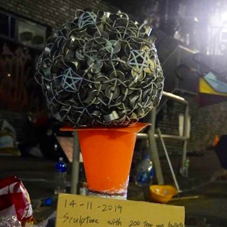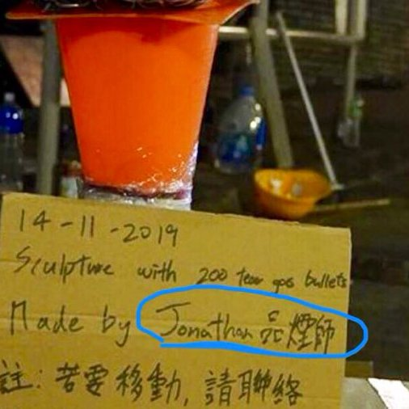 :speech_balloon:评:3 :+1:赞:28 :globe_with_meridians:转:11  

[11月16日 12:00]    纽约时报中文网   @nytchinese    #摩登情爱 我听人说过，选择流浪街头是一种慢性自杀。认识DJ的母亲七年，我敢说这是对的。她所做的每一件事似乎都在招致危险。
我已经记不清她有多少朋友和男友死于吸毒过量、酒精中毒，以及冻死。 http://nyti.ms/2picNEM   :speech_balloon:评:0 :+1:赞:4 :globe_with_meridians:转:0  

[11月16日 11:57]    新闻大吐槽   @TuCaoFakeNews    之前不是说福建商会凑了2亿，张晓明黑了1亿多  :speech_balloon:评:0 :+1:赞:1 :globe_with_meridians:转:1  

[11月16日 11:53]    新闻大吐槽   @TuCaoFakeNews    我表示完全理解她。從另一方面來說：這也凸顯這些魔警給普通人帶來的的極大恐懼！！  :speech_balloon:评:0 :+1:赞:4 :globe_with_meridians:转:1  

[11月16日 11:51]    新闻大吐槽   @TuCaoFakeNews    是吗？我以为是狗窝，啸天犬的狗窝  :speech_balloon:评:1 :+1:赞:1 :globe_with_meridians:转:1  

[11月16日 11:46]    新闻大吐槽   @TuCaoFakeNews    好问题，所以可以上 http://wenzhao.ca ?  :speech_balloon:评:1 :+1:赞:1 :globe_with_meridians:转:1  

[11月16日 11:41]    新闻大吐槽   @TuCaoFakeNews     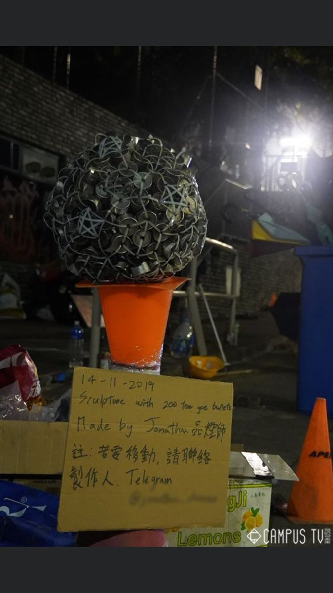 :speech_balloon:评:1 :+1:赞:2 :globe_with_meridians:转:2  

[11月16日 11:00]    纽约时报中文网   @nytchinese    #一周热门 柏林墙倒塌30年：改变世界的一场意外 http://nyti.ms/2CDzw0R   :speech_balloon:评:1 :+1:赞:12 :globe_with_meridians:转:5  

[11月16日 10:50]    新闻大吐槽   @TuCaoFakeNews    不要侮辱皇军，皇军都不与黑警为伍  :speech_balloon:评:3 :+1:赞:9 :globe_with_meridians:转:3  

[11月16日 10:48]    GFHG SDKM   @zyx_yny    A dead body with missing head
Are #HKPolice gonna state it has no suspicion again??? @SolomonYue https://twitter.com/sasa57045788/status/1195513681292877824 …  :speech_balloon:评:0 :+1:赞:0 :globe_with_meridians:转:1  

[11月16日 10:48]    GFHG SDKM   @zyx_yny    #想投返檔燒雞亦

「#和你宵」詳情 
日期：2020年1月17-24日（暫定）
時間：12:00-22:00
地點：稍後公佈
攤位招募對象：懷舊物品、食品、皮革、香港品牌、 集體回憶、文具、玩具等。
分「濕貨攤位」、「乾貨攤位」和「快餐攤位」

網頁：  https://www.facebook.com/rentashop.hk/  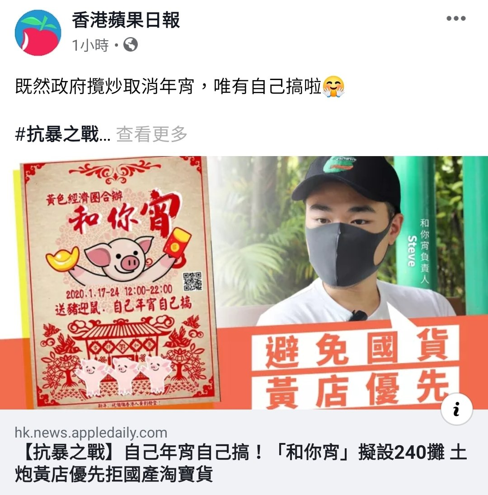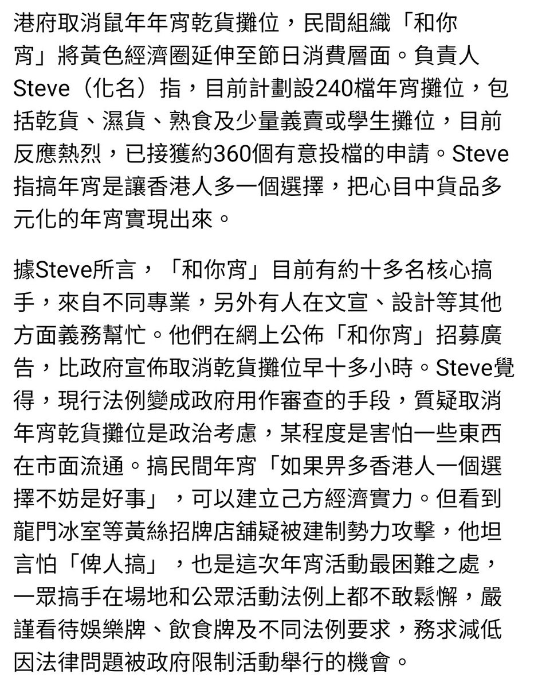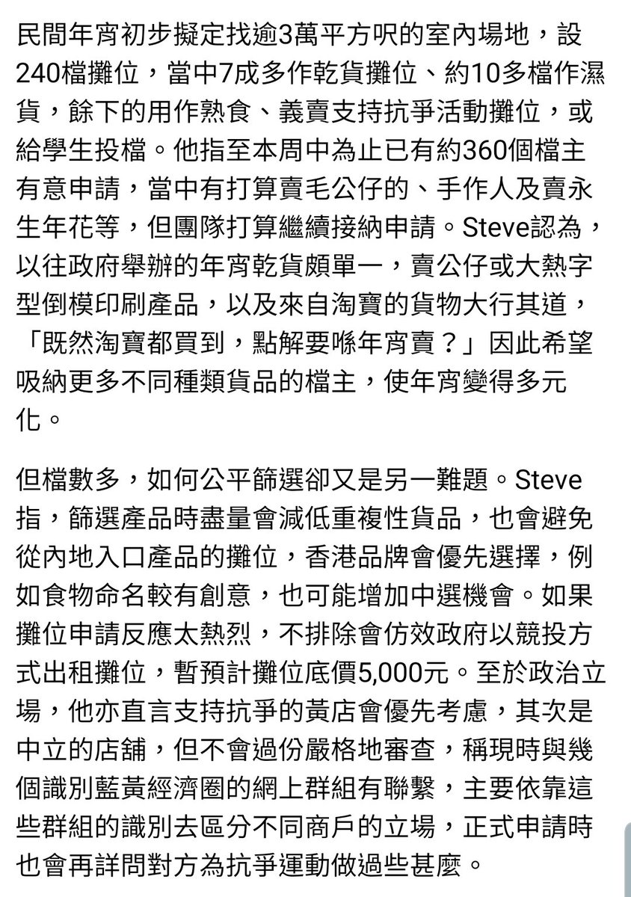 :speech_balloon:评:0 :+1:赞:17 :globe_with_meridians:转:10  

[11月16日 10:25]    财经真相   @caijingxiang    中国人民银行：按照“因城施策”的基本原则，落实房地产长效管理机制，不将房地产作为短期刺激经济的手段。如果真心控制房价，十年前就做了，现在不是想怎样控制房价，而是已经无力放更多的货币，继续推高房价；如果还能再大涨一波，也就不会有现在的财政赤字、中小银行遭到挤兑的困境了！  :speech_balloon:评:3 :+1:赞:39 :globe_with_meridians:转:12  

[11月16日 10:19]    财经真相   @caijingxiang    中国人民银行：正确看待央行资产负债表规模变化；当前，中国仍实施常态货币政策，法定准备金率是使用的主要政策工具之一。虽然中国人民银行资产规模增长放缓甚至可能下降，但降准放松了流动性约束，增大了货币创造能力，与国外央行量化宽松结束后一度进行的“缩表”有本质区别。找不到足够的抵押物！  :speech_balloon:评:5 :+1:赞:42 :globe_with_meridians:转:12  

[11月16日 10:16]    BBC News 中文   @bbcchinese    美国众议院对总统特朗普的弹劾调查继续推进。前美国驻乌克兰大使约瓦诺维奇作证时，特朗普实时发表推文，两人展开隔空辩论。 https://bbc.in/2Xgij7q   :speech_balloon:评:12 :+1:赞:8 :globe_with_meridians:转:4  

[11月16日 10:12]    财经真相   @caijingxiang    发改委副秘书长高杲16日透露，根据全国PPP监测服务平台数据，截至11月初，各地正在推进的PPP项目近7000个，总投资约9万亿元人民币。其中城市基础设施、农林水利、社会事业、交通运输、生态环保五大领域占全部项目个数和总投资规模比重均接近90%。  :speech_balloon:评:1 :+1:赞:32 :globe_with_meridians:转:12  

[11月16日 10:05]    财经真相   @caijingxiang    这次规模应该会超过以往，国内的小心！  :speech_balloon:评:19 :+1:赞:134 :globe_with_meridians:转:59  

[11月16日 10:00]    新闻大吐槽   @TuCaoFakeNews     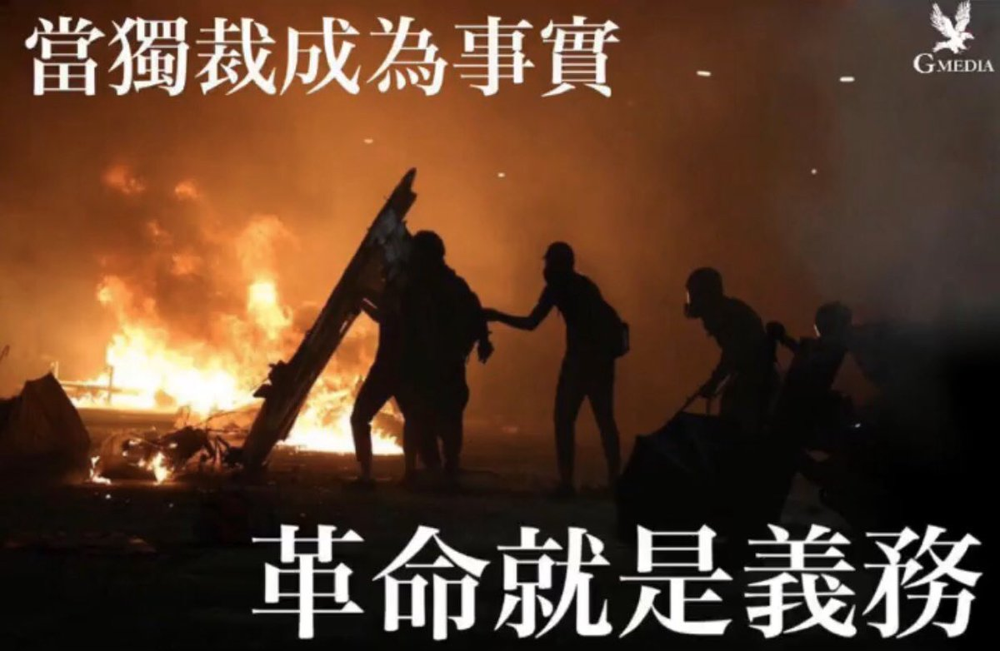 :speech_balloon:评:1 :+1:赞:10 :globe_with_meridians:转:2  

[11月16日 10:00]    纽约时报中文网   @nytchinese    你的身体紧邻世界上最壮观的港口之一，即使你的大脑已经滑入“迷离时空”。
你在不到一天的时间里走过了半个地球。你周五离开了一个地方，周日成功抵达另一个地方。很难理解这个概念，我们多么漫不经心地跳过时间和空间，多么随意地失去一整天。 http://nyti.ms/2rOIxCt   :speech_balloon:评:56 :+1:赞:14 :globe_with_meridians:转:4  

[11月16日 09:34]    GFHG SDKM   @zyx_yny    #HK Content Alert! Horrible! A femal body found with no head, seemingly thrown from high building. Plz pass the ACT, no more delay. 6hrs hotline has expired already, why not just pass it and watching Hk ppl being murdered each second!? @marcorubio @HawleyMO @SenTedCruz @VP https://twitter.com/Sasa57045788/status/1195513681292877824 …  :speech_balloon:评:6 :+1:赞:3 :globe_with_meridians:转:3  

[11月16日 09:02]    BBC News 中文   @bbcchinese    【一周热点回顾】香港中文大学校内多处黑烟四起，示威者与防暴警察在校内二号桥对峙。有示威者向警方投掷砖头、汽油弹等物体。警方发射催泪弹、橡胶子弹，并用水炮车发射蓝色催泪剂驱散人群。校长段崇智和前校长沈祖尧先后到场调停，均遭遇催泪弹。 https://bbc.in/378XTld   :speech_balloon:评:56 :+1:赞:134 :globe_with_meridians:转:53  

[11月16日 09:00]    纽约时报中文网   @nytchinese    #一周热门 北京确诊两例肺鼠疫病例，民众担忧疫情蔓延 http://nyti.ms/32E8DVb   :speech_balloon:评:14 :+1:赞:10 :globe_with_meridians:转:10  

[11月16日 08:00]    纽约时报中文网   @nytchinese    随着抗议活动的每一次升级，双方的分歧似乎越来越大，和平结局的可能性也越来越小。
“没人想让自己的双手沾满鲜血，”香港行政会议成员叶刘淑仪说。“但由于没有采取果断行动，香港正在被摧毁。” http://nyti.ms/33NyHi1   :speech_balloon:评:16 :+1:赞:16 :globe_with_meridians:转:4  

[11月16日 07:33]    GFHG SDKM   @zyx_yny    Last night #HKpolice shot a reporter with foam bullet in MK!  Here's him talking about it afterwards.  At 1:46, student reporter from #HKUST shows what he recorded

#StandWithHongKong #HongKongProtests  :speech_balloon:评:24 :+1:赞:511 :globe_with_meridians:转:562  

[11月16日 07:00]    纽约时报中文网   @nytchinese    #一周热门 特朗普称不会全面取消对华加征关税 http://nyti.ms/36X2Uxp   :speech_balloon:评:22 :+1:赞:24 :globe_with_meridians:转:6  

[11月16日 04:25]    GFHG SDKM   @zyx_yny    Breaking]16/11
The Riot Police shooted the Journalist at the back! Aft The journalist just found a big hole at the bagpack
@SolomonYue @SenRubioPress #hongkongpolicebrutality #HKPoliceState #StandWithHongKong  https://twitter.com/ChrisLo86071482/status/1195431563728580609/video/1 … https://twitter.com/ChrisLo86071482/status/1195433108855607296/video/1 …  :speech_balloon:评:58 :+1:赞:832 :globe_with_meridians:转:947  

[11月16日 01:55]    GFHG SDKM   @zyx_yny    1st day of #FreedomHK photo exhibition in Seoul: #StandWithHK--Unseen truth of the #antiELAB movement on #HongKong media

We’d like to express our gratitude to actor Kim Eui-sung to be our honourable guest of today's exhibition & for his encouraging short vid for #Hongkongers.  :speech_balloon:评:115 :+1:赞:3196 :globe_with_meridians:转:2475  

[11月16日 01:38]    新闻大吐槽   @TuCaoFakeNews    看到這個情境，我在現場就會叫：快二步，快二步，跟上冇落單！ https://twitter.com/tucaofakenews/status/1195367702346391553 …  :speech_balloon:评:6 :+1:赞:41 :globe_with_meridians:转:10  

[11月16日 00:54]    新闻大吐槽   @TuCaoFakeNews     https://twitter.com/spark04190422/status/1195356374147964940 …  :speech_balloon:评:4 :+1:赞:55 :globe_with_meridians:转:10  

[11月16日 00:25]    GFHG SDKM   @zyx_yny    Struggle Canteen (抗爭飯堂) was set up as students barricade themselves in university campus
14 Nov 2019
HK Polytechnic University, #HongKongProtesters 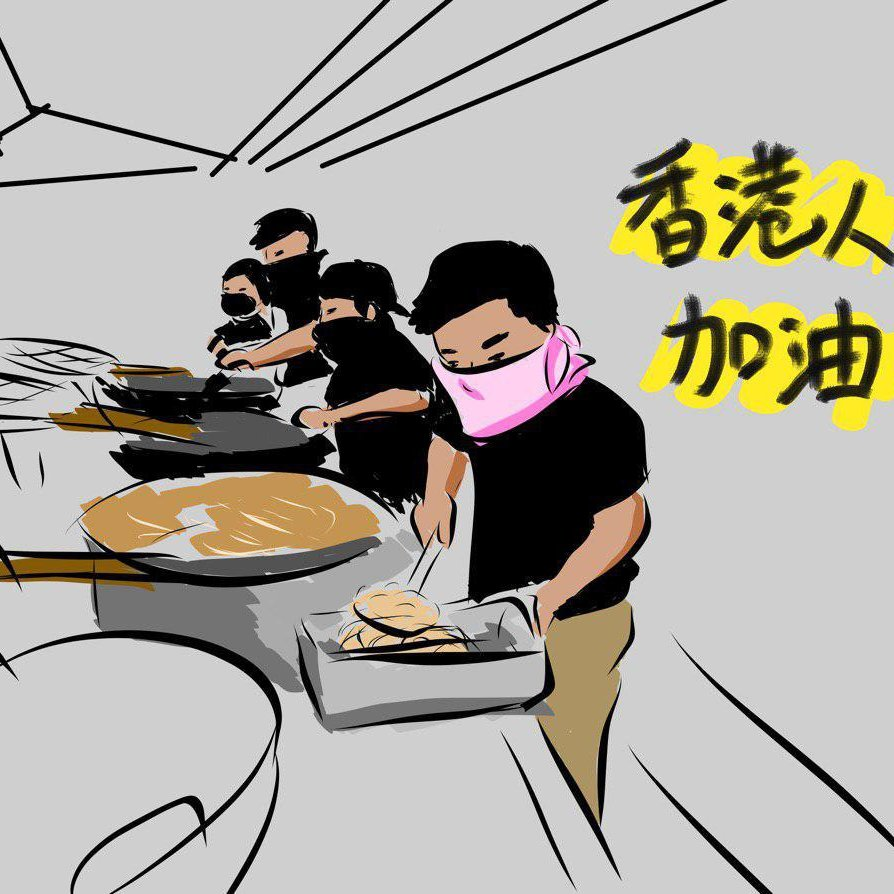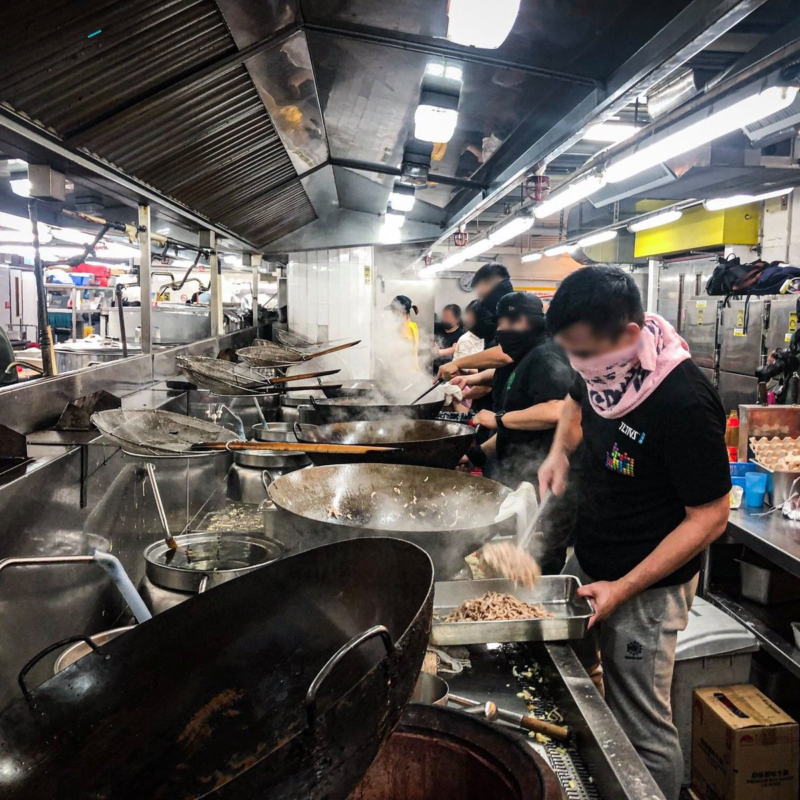 :speech_balloon:评:6 :+1:赞:125 :globe_with_meridians:转:65  

[11月15日 23:53]    新闻大吐槽   @TuCaoFakeNews    乘风破浪会有时，直挂玄旗济香港！  :speech_balloon:评:7 :+1:赞:130 :globe_with_meridians:转:42  

[11月15日 21:47]    GFHG SDKM   @zyx_yny    They are real men https://twitter.com/revmahoney/status/1195263017778331649 …  :speech_balloon:评:0 :+1:赞:1 :globe_with_meridians:转:1  

[11月15日 21:46]    GFHG SDKM   @zyx_yny     https://twitter.com/revmahoney/status/1195152329219149824 …  :speech_balloon:评:0 :+1:赞:0 :globe_with_meridians:转:0  

[11月15日 21:44]    GFHG SDKM   @zyx_yny    Chinese are used to be so disrespectful to other places and their nationals... #chinazi #BoycottChina https://twitter.com/koreanforeigner/status/1194657684655493120 …  :speech_balloon:评:0 :+1:赞:1 :globe_with_meridians:转:1  

[11月15日 21:22]    GFHG SDKM   @zyx_yny    Im an oldie  but this is for You Hongkongers...   :speech_balloon:评:402 :+1:赞:2498 :globe_with_meridians:转:1187  

[11月15日 20:31]    BBC News 中文   @bbcchinese    意大利著名水上城市威尼斯遭遇半世纪以来最大水灾。全城80%被淹，损失严重。如何保护世界遗产和古迹是人类面临的最大挑战之一。 https://bbc.in/340pMdv   :speech_balloon:评:27 :+1:赞:61 :globe_with_meridians:转:29  

[11月15日 20:30]    BBC News 中文   @bbcchinese    有网民将其比喻为即时战略游戏中的攻击手段，认为学生的技术已经“进化”，进入“帝王时代”（游戏的术语）。但示威者的一些手法也引发争议和批评。 https://www.bbc.com/zhongwen/simp/chinese-news-50429383 …  :speech_balloon:评:83 :+1:赞:91 :globe_with_meridians:转:31  

[11月15日 20:30]    纽约时报中文网   @nytchinese    考拉本已濒危，澳大利亚近期灾难性的大火让它们陷入危机。数十只考拉从阴燃的树木和余灰中获救，但它们的爪子和皮毛被烧伤。
作为澳大利亚的国家标志，考拉的困境也引发了环保人士和科学家对澳大利亚生态系统和生物多样性的担忧。 http://nyti.ms/357ejJg   :speech_balloon:评:7 :+1:赞:8 :globe_with_meridians:转:7  

[11月15日 20:19]    GFHG SDKM   @zyx_yny    #Breaking 

A federal judge ruled Thursday that Hoda Muthana, an American-born woman who traveled to #Syria to join the Islamic State (#ISIS) group is not a U.S. citizen. https://saraacarter.com/us-born-woman-who-joined-isis-stripped-of-american-citizenship/ …  :speech_balloon:评:1147 :+1:赞:18336 :globe_with_meridians:转:5199  

[11月15日 19:16]    GFHG SDKM   @zyx_yny    Police "reminded" the journalist not only firming the people who was caught but also the crowd standing behind the journalist.

"You also need take care of him or he may be disappeared."

Leaving the crowd shocked. https://twitter.com/Caribbean_salt/status/1195272036026765317 …  :speech_balloon:评:2 :+1:赞:10 :globe_with_meridians:转:17  

[11月15日 19:04]    BBC News 中文   @bbcchinese    中国游泳名将孙杨周五在他的“抗药检”事件听证会上表示，是药检团队中的一名“护士”用手机拍摄他，令他怀疑团队的职业资格，因此与药检人员发生争执。

2018年9月，孙杨被指破坏尿液和血液样本，拒绝药检人员取走。BBC中文此前报道： https://bbc.in/32Oq4Cz   :speech_balloon:评:65 :+1:赞:49 :globe_with_meridians:转:32  

[11月15日 19:00]    纽约时报中文网   @nytchinese    在飞机上度过19小时16分钟会让人发疯吗？
澳洲航空公司计划推出有史以来最长的商业航线，从纽约直飞悉尼。一场跨越多个时区、飞行近20个小时、生物钟被破坏、颠簸着睡睡醒醒的空中旅行会让人兴奋还是崩溃？ http://nyti.ms/2rOIxCt   :speech_balloon:评:85 :+1:赞:85 :globe_with_meridians:转:29  

[11月15日 18:30]    纽约时报中文网   @nytchinese    #时报专栏 和手机一样，在大多数场景下，我发现iPad比我曾经用过的任何传统个人电脑更快、更便携、更容易使用和维护。iPad有限的屏幕空间和对全屏应用程序的强调也比传统的个人电脑更能让人专心。iPad和手机一样，可以让我用面部识别登陆银行；而Mac在今天甚至连触摸屏都没有。 http://nyti.ms/2CItf4f   :speech_balloon:评:12 :+1:赞:7 :globe_with_meridians:转:2  

[11月15日 18:08]    BBC News 中文   @bbcchinese    横扫中国的非洲猪瘟疫情正导致中国的猪肉严重短缺，但这家濒临绝境的广西养猪场为何留下最后一只猪？  :speech_balloon:评:53 :+1:赞:225 :globe_with_meridians:转:93  

[11月15日 17:33]    纽约时报中文网   @nytchinese    走路看手机很危险，但我们往往无法控制自己。专家认为，边走路边发短信可能是一种嗜瘾行为。
我们咨询了神经学家和心理学家，反思为何玩手机会上瘾、了解相关风险、讨论如何控制个人科技产品而不是被它所控制。 http://nyti.ms/2Xf8bMh   :speech_balloon:评:18 :+1:赞:29 :globe_with_meridians:转:7  

[11月15日 17:29]    BBC News 中文   @bbcchinese    香港抗议活动冲击企业营收，虽然巴宝莉（Burberry）在香港的门市未被打砸，但这家公司已将这些门市的价值减记1400万英镑；国泰航空的入境旅客流量则在8月和9月下降38%，10月下降35%。 https://www.bbc.com/zhongwen/simp/business-50430153 …  :speech_balloon:评:42 :+1:赞:56 :globe_with_meridians:转:29  

[11月15日 17:00]    纽约时报中文网   @nytchinese    月球尘埃也许不会灼伤你，但也不要掉以轻心。像地球上的沙子一样，月球尘埃实际上是由细小的玻璃碎片构成的，但尖锐的边缘没有因侵蚀而磨损。因此，它可能相当危险。
但只要你避免触碰岩石或金属，事后洗手，不介意一些暂时的肿胀，你很可能可以触摸月球并且活下来。 http://nyti.ms/2rJc7ZV   :speech_balloon:评:4 :+1:赞:3 :globe_with_meridians:转:1  

[11月15日 16:42]    老司机   @h5lpykl7tp6jjop    这个世界上所有的流氓碰上中共都只有甘拜下风，因为即使残暴也不及它冷血，即使冷血也不及它卑鄙，即使卑鄙也不及它阴险，即使阴险也不及它无耻，即使无耻也不及它无赖，即使无赖也不及它下流，即使下流也不及它无底限！这是人类最最最肮脏龌龊的集团，它们集中了动物界所有的恶行，它不灭亡，没有安宁  :speech_balloon:评:13 :+1:赞:306 :globe_with_meridians:转:93  

[11月15日 16:28]    财经真相   @caijingxiang    随着贸易战的深入，华强北也受到了巨大冲击，特朗普不断上调的关税尚不足以构成致命伤害，真正的要命之处是美国终结的国际邮费优惠，对于一个手机壳来说，其单价还不如国际邮费贵，一但邮费优惠终结，其价格优势也将不复存在！  :speech_balloon:评:7 :+1:赞:119 :globe_with_meridians:转:16  

[11月15日 16:11]    财经真相   @caijingxiang    深圳之所以成为中国的创业之都，大部分归功于华强北，年轻的大学生不需要关系、资金，只需要一个网店，然后在华强北上千家工厂店里询价、穿梭，尽可能的找到最低批发价，以及最便宜的发快递方式，你就可以实现创业了。当然这里面也充满着心酸，正是中国权贵不屑于多繁琐低回报，才给了屌丝逆袭狭缝！  :speech_balloon:评:4 :+1:赞:128 :globe_with_meridians:转:21  

[11月15日 16:00]    财经真相   @caijingxiang    在过去20年里， 华强北是中国底层屌丝最容易创业逆袭的地方，在这里只要你足够勤奋，吃苦耐劳，善于在细微之处发现商机，你就可以实现人生逆袭，完全摆脱不上班就饿死的宿命！在炎炎夏日里一个人连夜就把八吨充电宝发往全国各地的类似故事每天都在上演！  :speech_balloon:评:4 :+1:赞:72 :globe_with_meridians:转:8  

[11月15日 15:59]    老司机   @h5lpykl7tp6jjop    阿Q的国是无敌的！即使被打败也是为世界和平做出了贡献，从无耻到无敌就转换得这么圆润饱满有光泽！每一粒青春爱国疙瘩豆都显得这么红光发亮，光彩照人！让人们不得不接受这无言的结局！  :speech_balloon:评:3 :+1:赞:33 :globe_with_meridians:转:16  

[11月15日 15:51]    财经真相   @caijingxiang    华强北与香港一河之隔，这里东亚最大的手机配件集散地，它的货物远销世界，很多东南亚、香港、印度等地的商人都在此批发货物。每天都有大量香港店主乘坐地铁来此进货，可以说香港所有3c产品，都来自华强北以及依附它的几千家小工厂！持续的抗争运动已经开始波及到这里的产业链！  :speech_balloon:评:14 :+1:赞:158 :globe_with_meridians:转:41  

[11月15日 15:50]    纽约时报中文网   @nytchinese    愈演愈烈的暴力抗议极大地改变了香港这个金融中心的生活，抗议者和警察之间的紧张冲突也从街头转向了大学校园。
以下关于抗议活动的一些消息： http://nyti.ms/33SVvwY   :speech_balloon:评:61 :+1:赞:21 :globe_with_meridians:转:7  

[11月15日 15:21]    纽约时报中文网   @nytchinese    包括本周四在加利福尼亚州索格斯高中发生的袭击在内，今年全美高中或大学校园里已发生了11起枪击事件，造成至少六人死亡。此外，还有数十起实质性袭击威胁。
时报整理出今年发生的校园枪击案一览： https://nyti.ms/32PJIhJ   :speech_balloon:评:19 :+1:赞:19 :globe_with_meridians:转:1  

[11月15日 14:14]    财经真相   @caijingxiang    李大霄近五年的各种底！“现在已经是婴儿底，你们可以打我的脸了”！  :speech_balloon:评:23 :+1:赞:120 :globe_with_meridians:转:41  

[11月15日 14:06]    财经真相   @caijingxiang    14日，俄罗斯金融媒体RBC报道，金砖国家正在建立金砖国家之间的单一支付系统，也就是创建“金砖国家”的加密货币！  :speech_balloon:评:24 :+1:赞:195 :globe_with_meridians:转:62  

[11月15日 13:28]    老司机   @h5lpykl7tp6jjop    Holy shit!  King's Road is completely packed to the brim with protesters.  At this rate they're going to have to occupy that tram.  And what's with all the dress shirts?  It's casual Friday!

#StandWithHongKong #HongKongProtests  :speech_balloon:评:71 :+1:赞:2660 :globe_with_meridians:转:1817  

[11月15日 13:28]    GFHG SDKM   @zyx_yny    Water skiing #LiberateHongKong #RevolutionNow  :speech_balloon:评:183 :+1:赞:4423 :globe_with_meridians:转:3037  

[11月15日 13:00]    纽约时报中文网   @nytchinese    周四，带着弓箭的抗议者加固了他们在大学校园里修建的类似围墙的防御工事，以抵御和香港警方的冲突。一名70岁的老者头部受伤、不治身亡，当局表示他可能是被扔出的砖头击中的。
习近平也对香港的抗议活动发表了迄今最严厉的公开评论，称中国支持香港警方“严正执法”。 http://nyti.ms/33SVvwY   :speech_balloon:评:76 :+1:赞:74 :globe_with_meridians:转:28  

[11月15日 12:34]    老司机   @h5lpykl7tp6jjop    从古至今中国的统治者都把心思用在折腾老百姓身上，穷折腾几千年还是一穷二白，所谓的驭民之术并不能使其强大。而西方搞工商业，发展贸易，工业革命，科技发展最终改变了人类命运！只有中国人对奴役同类有极大兴趣，它们永远不理解平等公平的真实意义，该跪谁，谁跪我是它们唯一衡量人际关系的标准！  :speech_balloon:评:4 :+1:赞:80 :globe_with_meridians:转:25  

[11月15日 12:30]    纽约时报中文网   @nytchinese    随着骚乱升级，香港已发生巨变。抗议风暴颠覆了其作为世界级交通、金融都会高效有序的形象，经济陷入衰退，政府失去民心，邻里之间也出现了对立，学术环境和社会氛围也蒙上阴影。
一些伤口在短期内恐怕难以愈合。 http://nyti.ms/33NyHi1   :speech_balloon:评:103 :+1:赞:241 :globe_with_meridians:转:88  

[11月15日 12:28]    BBC News 中文   @bbcchinese    其中一个可能是，中国的钢铁并非在全世界都受欢迎？ https://www.bbc.com/zhongwen/simp/business-50416457 …  :speech_balloon:评:114 :+1:赞:67 :globe_with_meridians:转:17  

[11月15日 12:00]    纽约时报中文网   @nytchinese    #每日一词 Bait-and-switch 软银向初创企业巨额注资引发连锁效应。这些企业用激励措施来吸引承包商，但在没得到预期回报后又踢走他们。时报记者认为这就像一种“bait-and-switch”。这个词的意思是指以廉价商品、促销等招徕顾客，再引诱他们为高价商品买单的策略。更多简报内容： http://nyti.ms/2Kme599   :speech_balloon:评:2 :+1:赞:0 :globe_with_meridians:转:0  

[11月15日 11:57]    BBC News 中文   @bbcchinese    宋楚瑜在参选宣言中比喻自己是金庸小说中武术最高的隐士“独孤求败”，表明此次参选不在于求胜，但希望够带动民心及社会改变。 https://www.bbc.com/zhongwen/simp/chinese-news-50417297 …  :speech_balloon:评:53 :+1:赞:31 :globe_with_meridians:转:5  

[11月15日 11:35]    纽约时报中文网   @nytchinese    今年6月开始的“反送中”和平抗议已演变成持续的混乱。
抗议者想要什么？为什么示威演变成了暴力？最后会如何收场？本文做出整理： http://nyti.ms/354YBhH   :speech_balloon:评:20 :+1:赞:21 :globe_with_meridians:转:3  

[11月15日 11:00]    纽约时报中文网   @nytchinese    • 新数据显示，贸易战压力下，中国经济增长不容乐观；尽管工业产值和零售额都有所增长，但远低于预期。日本是仅次于中美的第三大经济体，但其消费放缓，出口直线下降，同样面临日益迫近的经济问题。
• 朝鲜表示美国寻求进一步对话，但称其为“争取时间的诡计”。更多简报内容： http://nyti.ms/2Kme599   :speech_balloon:评:3 :+1:赞:5 :globe_with_meridians:转:0  

[11月15日 10:30]    纽约时报中文网   @nytchinese    数年里，中国成功地运用其日益增长的经济实力，追回了一些据说是从圆明园掠夺的文物。国有的中国保利集团从外国所有者手中买下或收回了几个青铜兽首，让它们回到中国。
周三，中国国家文物局宣布，又发现了一个青铜兽首，并将它与其他回归文物放一起，在中国国家博物馆展出。 http://nyti.ms/352eLIB   :speech_balloon:评:10 :+1:赞:7 :globe_with_meridians:转:1  

[11月15日 10:13]    纽约时报中文网   @nytchinese    简报：习近平回应香港局势；拯救澳大利亚考拉  http://nyti.ms/2Kme599 https://twitter.com/ccni/status/1195156753933119488 …  :speech_balloon:评:6 :+1:赞:8 :globe_with_meridians:转:3  

[11月15日 09:56]    财经真相   @caijingxiang    高息储蓄产品不属于中共三种不赔的范围！  :speech_balloon:评:10 :+1:赞:60 :globe_with_meridians:转:24  

[11月15日 09:43]    财经真相   @caijingxiang    库德洛称美国正制定减税计划,将在特朗普的第二个总统任期实施.该消息对美股短期内构成巨大支撑，美股不断创新高！  :speech_balloon:评:7 :+1:赞:112 :globe_with_meridians:转:40  

[11月15日 09:02]    财经真相   @caijingxiang    周五亚盘刚开始，美國國家經濟顧問庫德洛最新表示，“我們正接近與中國達成一項貿易協定”。庫德洛並指出，與中國的會談一直非常有建設性。消息公布后美股再度创新高、日元、黄金短线下跌，离岸人民币转涨！又是周五固定利好，这个“传说”中的第一阶段协议已经被说了N次，最扯淡的是每次市场都计价！  :speech_balloon:评:31 :+1:赞:258 :globe_with_meridians:转:57  

[11月15日 08:24]    墙国铁拳现世报😷   @Socialistfist    小编认为本月最佳铁拳，滋磁不滋磁啊？  :speech_balloon:评:37 :+1:赞:689 :globe_with_meridians:转:43  

[11月15日 08:21]    墙国铁拳现世报😷   @Socialistfist    面对大陆的善意，台大教授自信的进去了---亲中学者 施正屏
#社会主义铁拳  :speech_balloon:评:167 :+1:赞:1657 :globe_with_meridians:转:740  

[11月15日 07:59]    BBC News 中文   @bbcchinese    德国德累斯顿称其存在极右势力的严重问题，宣布进入“纳粹紧急状态”，折射欧洲对极端主义思潮的担忧。 https://bbc.in/33O5cwt   :speech_balloon:评:48 :+1:赞:57 :globe_with_meridians:转:21  

[11月15日 07:31]    BBC News 中文   @bbcchinese    美国可能无法阻挡中国经济崛起，只有中国自己失误才能阻挡这个进程。习近平治下中国有可能走上勃列日涅夫的老路。 https://bbc.in/374sHnh   :speech_balloon:评:307 :+1:赞:538 :globe_with_meridians:转:179  

[11月15日 07:00]    BBC News 中文   @bbcchinese    美中人工智能大比拼将会出现怎样的结局，或许只有AI才能预测...... https://bbc.in/2rNkALP   :speech_balloon:评:3 :+1:赞:19 :globe_with_meridians:转:8  

[11月15日 04:21]    老司机   @h5lpykl7tp6jjop    香港发展今天的地步实际上就是中共不遵守承诺，破坏两制修例引起民众反对，独裁霸道的它们在大陆横行七十年从不让步造成今天后果，文明的政府善于听取民意，民众一有反对意见立即让步，结果社会稳定人民幸福。暴政很威风不退让，代替却巨大，不学会让步就只有你死我活一条路！中共一直在这条死路上狂奔  :speech_balloon:评:2 :+1:赞:63 :globe_with_meridians:转:14  

[11月15日 03:27]    老司机   @h5lpykl7tp6jjop    中共法西斯在香港进行战爭！它们用大陆军警冒充港警，滥捕青年，实弹射杀学生，公然进攻中文大学，大量派遣暗探特务，制造混乱，嫁祸于人，把所有无耻手段都统统使出来了！香港到了开埠以来最黑暗的时候，沉痛之后只有愤慨！也许这是你们最后的疯狂阶段，你们灭亡时刻就要来临，全世界的人们都在看着！  :speech_balloon:评:2 :+1:赞:77 :globe_with_meridians:转:26  

[11月15日 02:02]    老司机   @h5lpykl7tp6jjop    2019年11月12日 香港中文大学“攻防战” 实录（一）

同一天，还有其他几所香港大学，也被中共军警围攻！

中产主义 邪恶魔爪 已伸进 香港校园 ！

#SOS
#国际社会救救香港的孩子  :speech_balloon:评:8 :+1:赞:102 :globe_with_meridians:转:59  

[11月15日 01:50]    新闻大吐槽   @TuCaoFakeNews    香港理工大学中央食堂已经在学生手中正常运转，完美供应所有抗争者饮食！

很多孩子从没下过厨，甚至没洗过碗，抗争让他们一夕长大！  :speech_balloon:评:405 :+1:赞:3044 :globe_with_meridians:转:1051  

[11月15日 01:30]    老司机   @h5lpykl7tp6jjop    【中大保衞戰】
2號橋之役，苦戰15小時，血肉之軀抵擋逾2000發子彈。

致敬——HK勇士！  :speech_balloon:评:32 :+1:赞:470 :globe_with_meridians:转:278  

[11月15日 01:03]    墙国铁拳现世报😷   @Socialistfist    那必须和兄弟你平分啊，猪肉价格这么高  https://twitter.com/Dofuralanmingo/status/1194993538292826114 …  :speech_balloon:评:16 :+1:赞:196 :globe_with_meridians:转:11  

[11月15日 00:56]    GFHG SDKM   @zyx_yny    今天是11/15

顺便、721元朗西铁站，白衣人集体持械袭击民众，警察却在报警后半小时才姗姗来迟，

 Chinese will keep on saying it until you believe me.

7 月　2   1    日  :speech_balloon:评:5 :+1:赞:76 :globe_with_meridians:转:81  

[11月14日 23:40]    BBC News 中文   @bbcchinese    黎巴嫩使用WhatsApp的社交媒体用户每月要交税？！黎巴嫩使用WhatsApp的社交媒体用户每月要交税？！ https://bbc.in/2KiJrgI   :speech_balloon:评:6 :+1:赞:32 :globe_with_meridians:转:13  

[11月14日 20:43]    老司机   @h5lpykl7tp6jjop    车是警车，人却是“暴徒”，“暴徒”们还熟门熟路，不需要警察押送，自己登车，自己关门！还能有比香港警察更无耻的吗？香港之乱香港之暴，源于警方的堕落！再次说明：绝对的权力绝对的腐败！支持港警的都是青光眼，只看到表面的混乱，看不到混乱后面的黑手是政府掌握了绝对权力  :speech_balloon:评:130 :+1:赞:1512 :globe_with_meridians:转:940  

[11月14日 19:18]    财经真相   @caijingxiang    这种财富游戏，体现在央行层面，就是无法继续扩表，有价值的印钞已经没有了，现在甚至连农村宅基地和农田都允许抵押贷款，央行如果想继续扩大印钞，除了以高利息忽悠洋韭菜进来外，还有一条办法就是以行政命令，直接掠夺还未欠债的中产阶级，当这波掠夺完后，就只剩下无锚印钞一条路了！也是炼狱之路！  :speech_balloon:评:18 :+1:赞:236 :globe_with_meridians:转:58  

[11月14日 19:10]    财经真相   @caijingxiang    现在中共统治的危机根源是，央行想继续印钞，但是却找不到足够多的“承债人”，14亿底层屁民，通过过去20年加入WTO在血汗工厂赚的那几个铜板，已经被高房价掠夺的差不多了，政府财政收支也到了难以为继的地步；能够赚钱的基建项目也建的差不多了，剩下的都是亏钱的亏钱买卖，如果继续搞，财政根本罩不住  :speech_balloon:评:6 :+1:赞:226 :globe_with_meridians:转:47  

[11月14日 19:09]    墙国铁拳现世报😷   @Socialistfist    北京废青，危言耸听

#社会主义铁拳  :speech_balloon:评:58 :+1:赞:607 :globe_with_meridians:转:160  

[11月14日 19:02]    财经真相   @caijingxiang    中共权贵对中国人统治本质就是财富掠夺，这一最本质的游戏规则始终没有改变。只是统治方法变的更加高明，掠财方式更加隐蔽。以前是挂着刺刀直接强制征收，现在则是以金融变现殖民掠夺。这也是高干二代们大部分都玩金融根源。  :speech_balloon:评:3 :+1:赞:155 :globe_with_meridians:转:34  

[11月14日 18:57]    财经真相   @caijingxiang    还有参与大规模基建投标的私人企业，大多数是和中共权贵密切相关的人，他们在承接项目时虚高报价，这里面的差价本质也是偷14亿国民的财富。再如修路，一条高速路的修建，其资金来源自然是商业银行，商行加点利息后最后找央行借钱，最后的还款方式就是是该高速路的收费，也就是通过该路的车主最后买单！  :speech_balloon:评:2 :+1:赞:131 :globe_with_meridians:转:22  

[11月14日 18:51]    财经真相   @caijingxiang    中共热衷于基建，因为基建贷款抵押的是政府财政税收，而税收最终买单人是全体国民，到最后是全体14亿国民为基建贷款买单。每一轮基建高潮，都会对应央行大规模放水，本质上是中共偷偷把14亿人的劳动力抵押给了央行。在基建过程中，中共各级官员可以吃回扣，贪污偷工减料，这一过程就是偷盗国民的劳动力  :speech_balloon:评:4 :+1:赞:185 :globe_with_meridians:转:36  

[11月14日 18:44]    财经真相   @caijingxiang    正是这30年的劳动力才赋予了央行印出的房贷价值，这些代表劳动力的钞票投放到市场后才能够被金融体系接受。央行印钞的过程可以说就是寻找债主的过程，只有有人愿意以自己的劳动力或者财产抵押替央行平白无故印钞的钞票买单，这笔新增印钞才会被世人接受；  :speech_balloon:评:10 :+1:赞:135 :globe_with_meridians:转:24  

[11月14日 18:36]    财经真相   @caijingxiang    中共基建没有钱，很多网友简单的认为开动印钞机就行，这其实是大错特错，中共央行印的每一分钱，都必须有对应的相应的价值才行，否则就是无锚印钞，汇率崩盘！过去20年央行印钞都是以债务为基础的。比如，房奴的房贷，当房奴申请贷款时，本质是向央行抵押了自己未来30年的劳动力。 https://twitter.com/aspeltuo8/status/1194923278646816768 …  :speech_balloon:评:50 :+1:赞:707 :globe_with_meridians:转:262  

[11月14日 18:31]    BBC News 中文   @bbcchinese    全球人口约75亿，而脸书在半年内删除的假账户就有32亿。为什么会有这么多假账户？ https://bbc.in/2XeTYii   :speech_balloon:评:88 :+1:赞:271 :globe_with_meridians:转:63  

[11月14日 17:52]    GFHG SDKM   @zyx_yny    Hong Kong reporter Chan Yu-hong  has been diagnosed with chloracne, raising public health concerns about the widespread use of tear gas by the police—The condition is “rare skin eruption of blackheads, cysts and nodules, directly linked to dioxin exposure” https://www.hongkongfp.com/2019/11/14/hong-kong-reporter-diagnosed-chloracne-tear-gas-exposure-prompting-public-health-concerns/ …  :speech_balloon:评:618 :+1:赞:10782 :globe_with_meridians:转:10824  

[11月14日 17:01]    BBC News 中文   @bbcchinese    香港社会动荡加剧之际，阿里巴巴启动在港交所上市的计划，最多可能筹得134亿美元，将成为香港九年来最大规模IPO集资，或将提振因贸易战和社会动荡而低迷的香港股市。 https://bbc.in/2CE1s51   :speech_balloon:评:43 :+1:赞:82 :globe_with_meridians:转:34  

[11月14日 15:30]    GFHG SDKM   @zyx_yny    (Thread)
A brief introduction of Dioxin:
1. Highly toxic
2. Resistant to Degradation
3. Hazardous to Development
4. Carcinogenic
5. By-products of made-in-China tear gas canisters

Tear gas in #HongKong is a far cry from "mass control device", but a "massacre device". 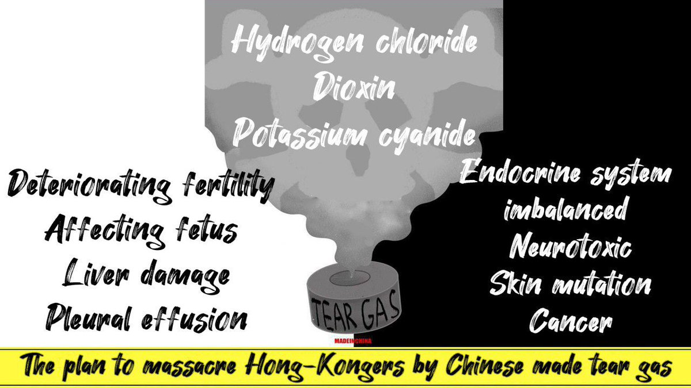 :speech_balloon:评:25 :+1:赞:615 :globe_with_meridians:转:692  

[11月14日 15:01]    BBC News 中文   @bbcchinese    韩国济州岛的海女下海捕捞新鲜海产，并以独特的方法料理美味海鲜，这是一间真正由海女经营的“平大里海胆面屋”。 https://bbc.in/34VAdyQ   :speech_balloon:评:3 :+1:赞:34 :globe_with_meridians:转:13  

[11月14日 14:24]    GFHG SDKM   @zyx_yny    A 19 years old #hkprotester was arrested for possession of offensive weapons. After she was arrested, one #hkpolice called her “whore”,”smelly cunt”, and slapped her. Another #hkpolice threatened her, saying” I will rape you on the spot!” 
#hongkong #HongKongPoliceAbuseUseofForce 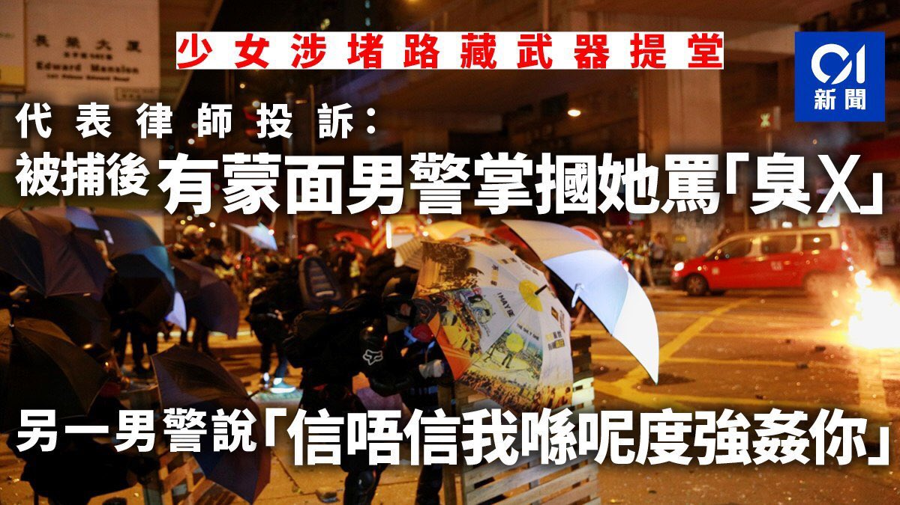 :speech_balloon:评:60 :+1:赞:738 :globe_with_meridians:转:912  

[11月14日 14:07]    老司机   @h5lpykl7tp6jjop    喝点马尿就把自己当领导了，还要特殊服务，大胆！  :speech_balloon:评:1 :+1:赞:5 :globe_with_meridians:转:2  

[11月14日 14:01]    BBC News 中文   @bbcchinese    曾经因为战争而被遗弃，黑人女孩打破刻板印象，成为芭蕾舞蹈演员。她是怎样做到的？  :speech_balloon:评:15 :+1:赞:122 :globe_with_meridians:转:25  

[11月14日 13:25]    老司机   @h5lpykl7tp6jjop    善于钻空子的年轻中国人，毁了自己人生！  :speech_balloon:评:1 :+1:赞:14 :globe_with_meridians:转:5  

[11月14日 13:01]    BBC News 中文   @bbcchinese    针对美国总统特朗普的弹劾调查公开听证会星期三（11月13日）揭开帷幕，弹劾程序将会怎样走？ https://bbc.in/2qSdYei   :speech_balloon:评:8 :+1:赞:25 :globe_with_meridians:转:6  

[11月14日 12:01]    BBC News 中文   @bbcchinese    中美之间的博弈不仅在于贸易领域——经济、国防、文化和科技，无一不是战场。美国到底想从中国那里得到什么？美国要的最终结局是什么？ https://bbc.in/2qTXra4   :speech_balloon:评:48 :+1:赞:43 :globe_with_meridians:转:19  

[11月14日 11:01]    BBC News 中文   @bbcchinese    有人权团体批评，新疆的维吾尔族人正受到迫害，他们被强迫从事劳动。许多品牌都被认为从新疆地区间接采购棉花产品。 https://bbc.in/375WEmH   :speech_balloon:评:589 :+1:赞:253 :globe_with_meridians:转:107  

[11月14日 09:19]    老司机   @h5lpykl7tp6jjop    心痛不已！又走一個。這是海鮮貨櫃車？ 港人真的要改变抗争策略了，如组织武装力量、成立秘密组织等！擒贼先擒王  :speech_balloon:评:48 :+1:赞:437 :globe_with_meridians:转:316  

[11月14日 05:06]    老司机   @h5lpykl7tp6jjop    這的確不是港普，是普通話  :speech_balloon:评:153 :+1:赞:1370 :globe_with_meridians:转:1083  

[11月14日 01:30]    墙国铁拳现世报😷   @Socialistfist    支持言论自由不受侵害 https://twitter.com/keepcnsecurity/status/1194633823964631046 …  :speech_balloon:评:6 :+1:赞:117 :globe_with_meridians:转:33  

[11月14日 01:27]    老司机   @h5lpykl7tp6jjop    手足
你安息啦
我地會幫你行落去

唔殺曬每一個黑社會同黑警
我地唔會停  :speech_balloon:评:142 :+1:赞:856 :globe_with_meridians:转:538  

[11月14日 00:20]    老司机   @h5lpykl7tp6jjop    黑警鬼子正在拆砖抛砖
扔到哪儿呢？
视频1  :speech_balloon:评:3 :+1:赞:34 :globe_with_meridians:转:43  

[11月13日 22:21]    老司机   @h5lpykl7tp6jjop    廣傳!
原來「碎砖陣」是水炮车克星！

水炮车被困碎砖阵，曾嘗试用水炮清理，地上碎砖，但不成功！

整队人为保护水炮车，全部停下！  :speech_balloon:评:61 :+1:赞:1112 :globe_with_meridians:转:689  

[11月13日 18:38]    墙国铁拳现世报😷   @Socialistfist    一天二更，快夸我。
最近推友投稿质量很高，再次感谢！  :speech_balloon:评:15 :+1:赞:213 :globe_with_meridians:转:4  

[11月13日 18:38]    墙国铁拳现世报😷   @Socialistfist    祝这位推友早日康复

#战螂在推特  :speech_balloon:评:23 :+1:赞:262 :globe_with_meridians:转:53  

[11月13日 18:15]    老司机   @h5lpykl7tp6jjop    卧床狙击手

#社会主义铁拳  :speech_balloon:评:112 :+1:赞:712 :globe_with_meridians:转:179  

[11月13日 18:15]    墙国铁拳现世报😷   @Socialistfist    卧床狙击手

#社会主义铁拳  :speech_balloon:评:112 :+1:赞:712 :globe_with_meridians:转:179  

[11月13日 17:57]    老司机   @h5lpykl7tp6jjop    很多到了西方国家的中国人和这头已经自由的驴一模一样！  :speech_balloon:评:98 :+1:赞:1508 :globe_with_meridians:转:607  

[11月13日 12:40]    老司机   @h5lpykl7tp6jjop    港警仍围在中大，企图进入校园，但一直被校方拒绝。很多记者排成人墙，堵在进入中大的路上。
港警为何对重大这么执着？搜索一下中大，发现，中大竟然是香港的互联网交换中心所在地！港警进攻中大真正目的是控制香港的互联网！一旦得逞，港人通讯将被控制，对抗争极为不利！  :speech_balloon:评:10 :+1:赞:74 :globe_with_meridians:转:40  

[11月13日 12:30]    纽约时报中文网   @nytchinese    继周一警察向示威者开枪、一名责骂示威者的人遭纵火之后，香港周二再度陷入混乱。
抗议者在校园内纵火、丢掷汽油弹，而防暴警察则试图用催泪瓦斯和水炮将他们击退。
这里是周二抗议活动的一些照片： http://nyti.ms/2pd93nT   :speech_balloon:评:405 :+1:赞:214 :globe_with_meridians:转:101  

[11月12日 19:22]    墙国铁拳现世报😷   @Socialistfist    从2018年9月到现在频繁微博维权，神奇的是，小编就是没看出来他举报的贪污腐败是什么内容  :speech_balloon:评:4 :+1:赞:146 :globe_with_meridians:转:11  

[11月12日 19:20]    墙国铁拳现世报😷   @Socialistfist    宝贝别哭

#社会主义铁拳  :speech_balloon:评:34 :+1:赞:353 :globe_with_meridians:转:80  

[11月12日 07:22]    凡賽堤/FORSETI   @FecharCCP    11日早在西湾河开枪射伤示威者的港警关家荣身份被起底，其担任家教会主席的德望学校师生、家长及校友发起联署要求解除其在该校的职务。其两个女儿在该校就读。另有消息指，关家荣受过“大陆警察部门”特殊培训。下面这个小视频，足以解释这场血案的真相：这是流氓国家自上而下有计划的谋杀。  :speech_balloon:评:20 :+1:赞:264 :globe_with_meridians:转:174  

[11月12日 07:14]    凡賽堤/FORSETI   @FecharCCP    救救悲慘的香港 #HKSOS

香港黑警拔槍亂殺港民！已多人中槍和死亡！

天滅極權！  :speech_balloon:评:2 :+1:赞:10 :globe_with_meridians:转:8  

[11月12日 07:11]    凡賽堤/FORSETI   @FecharCCP    11.11 香港殺人魔家庭資料！
全世界通緝這殺人魔全家！  :speech_balloon:评:49 :+1:赞:13 :globe_with_meridians:转:10  

[11月12日 07:07]    凡賽堤/FORSETI   @FecharCCP    救救悲慘的香港 #HKSOS

香港黑警拔槍亂殺港民！已多人中槍和死亡！  :speech_balloon:评:0 :+1:赞:9 :globe_with_meridians:转:6  

[11月12日 06:57]    凡賽堤/FORSETI   @FecharCCP    天滅流氓政權！！！CCP極權殺人恐怖組織正在用各種兇殘手段屠殺我們的同胞...................

看看這些大陸的黑警（公安，武警，士兵裝扮成香港警察）是如何沒有人性的屠殺香港學生！！！

天滅流氓政權！！！天滅CCP！！！  :speech_balloon:评:1 :+1:赞:21 :globe_with_meridians:转:21  

[11月12日 06:42]    凡賽堤/FORSETI   @FecharCCP    天滅流氓政權！！！CCP極權殺人恐怖組織正在用各種兇殘手段殺害我們的同胞...................

看看這些大陸的黑警（公安，武警，士兵裝扮成香港警察）是如何沒有人性的屠殺香港學生！！！

那個小年輕不知道是休克還是已經死亡！

天滅流氓政權！！！天滅CCP！！！  :speech_balloon:评:34 :+1:赞:19 :globe_with_meridians:转:16  

[11月12日 06:25]    凡賽堤/FORSETI   @FecharCCP    坐水凳（英語：waterboarding）是水刑的一種，做法是將受害人固定其雙手雙腳，在頭部放上布後持續澆水。如此會讓受害人產生溺水的錯覺而心生恐懼。雖然坐水凳不在身上留下可辨識的傷痕，但受害人在過程中會因為嗆到水甚至吸入性肺炎而受傷害。另外有些人因此導致心理方面的傷害，是酷刑的一種。  :speech_balloon:评:1 :+1:赞:36 :globe_with_meridians:转:33  

[11月11日 23:01]    墙国铁拳现世报😷   @Socialistfist    所有推文内容来自于公开的网络社交媒体。
年轻人还是需要学习一个
毕竟too young  https://twitter.com/muxiawenyuzi/status/1193888039799574528 …  :speech_balloon:评:11 :+1:赞:164 :globe_with_meridians:转:14  

[11月11日 17:21]    墙国铁拳现世报😷   @Socialistfist      :speech_balloon:评:18 :+1:赞:99 :globe_with_meridians:转:9  

[11月11日 17:19]    墙国铁拳现世报😷   @Socialistfist    在吗？我微博被封了，可以聊聊吗？

#社会主义铁拳
#战螂在推特  :speech_balloon:评:29 :+1:赞:301 :globe_with_meridians:转:59  

[11月10日 22:23]    墙国铁拳现世报😷   @Socialistfist    5. 因投稿较多且具体事件有时效性，也许会延迟发布您的投稿，希望能够理解。对于一些重复投稿的或者不符合主题的投稿，也许不会被采用。
6. 最佳投稿途径是发送私信，@ 本推会被其他通知挤掉
7. 如果您有好的内容，欢迎使用 #社会主义铁拳 和 #社會主義鐵拳，简繁双体的tag。符合内容的推文会给予转推  :speech_balloon:评:0 :+1:赞:59 :globe_with_meridians:转:7  

[11月10日 22:18]    墙国铁拳现世报😷   @Socialistfist    1. 为避免潜在视奸号盗取IP，不接受含有网站链接的投稿
2. 社会主义铁拳相关主题内容应当是，个体或集体有赞美言论后被社会主义政权铁拳的事例。自然灾害或非社会主义政权皆不算是#社会主义铁拳
3. 本推主题明确统一，不接受除了铁拳现世报以外的爆料或投稿
4. 推荐使用多张截图和文字相配合的投稿方式  :speech_balloon:评:1 :+1:赞:92 :globe_with_meridians:转:11  

[11月10日 22:14]    墙国铁拳现世报😷   @Socialistfist    感谢所有新关注的推友和所有开推以来一路的老朋友。
本推的成长离不开所有积极投稿的热心推友，再次表示特别感谢。为了明确投稿规范，特别发此推做出说明。  :speech_balloon:评:5 :+1:赞:115 :globe_with_meridians:转:13  

[11月10日 16:50]    老司机   @h5lpykl7tp6jjop    最新消息爆出：黑警强奸15岁女生，致其堕胎~
市民们愤怒无比，大喊强奸犯！
很多中老年人也加入了声讨黑警的人群~

情势越是危急，香港人就越团结，太感动了！真值得大陆人好好学习  :speech_balloon:评:150 :+1:赞:2433 :globe_with_meridians:转:1288  

[11月09日 20:44]    墙国铁拳现世报😷   @Socialistfist    删了重发是因为小编是强迫症，之前推有一个重复字。  :speech_balloon:评:3 :+1:赞:149 :globe_with_meridians:转:3  

[11月09日 20:43]    墙国铁拳现世报😷   @Socialistfist    孩子，这次你让祖国爸爸失望了

#社会主义铁拳  :speech_balloon:评:90 :+1:赞:773 :globe_with_meridians:转:234  

[11月08日 21:45]    墙国铁拳现世报😷   @Socialistfist    补充  :speech_balloon:评:27 :+1:赞:145 :globe_with_meridians:转:16  

[11月08日 21:36]    墙国铁拳现世报😷   @Socialistfist    考虑拿日元明年去日本花呀？  :speech_balloon:评:18 :+1:赞:121 :globe_with_meridians:转:12  

[11月05日 04:28]    凡賽堤/FORSETI   @FecharCCP    急救香港  #HKSOS！！！

天滅流氓政權！！！極權殺人恐怖組織正在用各種兇殘手段殺害我們的同胞..................................................

流氓政權的極權殺人恐怖組織蓄意謀殺香港年輕人！（13）

被暴力制服的年輕人已經休克，還殘暴折斷手！

兇殘，殘暴手段令人髮指到已經超越納粹！  :speech_balloon:评:0 :+1:赞:3 :globe_with_meridians:转:10  

[11月05日 04:25]    凡賽堤/FORSETI   @FecharCCP    急救香港  #HKSOS！！！

天滅流氓政權！！！極權殺人恐怖組織正在用各種兇殘手段殺害我們的同胞..................................................

流氓政權的極權殺人恐怖組織蓄意謀殺香港年輕人！（12）
兇殘，殘暴手段令人髮指到已經超越納粹！
天滅流氓政權！！！  :speech_balloon:评:1 :+1:赞:8 :globe_with_meridians:转:9  

[11月05日 04:24]    凡賽堤/FORSETI   @FecharCCP    急救香港  #HKSOS！！！

天滅流氓政權！！！極權殺人恐怖組織正在用各種兇殘手段殺害我們的同胞..................................................

流氓政權的極權殺人恐怖組織蓄意謀殺香港年輕人！（11）
兇殘，殘暴手段令人髮指到已經超越納粹！
天滅流氓政權！！！  :speech_balloon:评:0 :+1:赞:50 :globe_with_meridians:转:47  

[11月05日 04:23]    凡賽堤/FORSETI   @FecharCCP    急救香港  #HKSOS！！！

天滅流氓政權！！！極權殺人恐怖組織正在用各種兇殘手段殺害我們的同胞..................................................

流氓政權的極權殺人恐怖組織蓄意謀殺香港年輕人！（10）
兇殘，殘暴手段令人髮指到已經超越納粹！
天滅流氓政權！！！  :speech_balloon:评:0 :+1:赞:3 :globe_with_meridians:转:5  

[11月05日 04:19]    凡賽堤/FORSETI   @FecharCCP    急救香港  #HKSOS！！！

天滅流氓政權！！！極權殺人恐怖組織正在用各種兇殘手段殺害我們的同胞..................................................

流氓政權的極權殺人恐怖組織蓄意謀殺香港年輕人！（9）
兇殘，殘暴手段令人髮指到已經超越納粹！
天滅流氓政權！！！  :speech_balloon:评:1 :+1:赞:5 :globe_with_meridians:转:7  

[11月05日 04:16]    凡賽堤/FORSETI   @FecharCCP    急救香港  #HKSOS！！！

天滅流氓政權！！！極權殺人恐怖組織正在用各種兇殘手段殺害我們的同胞..................................................

流氓政權的極權殺人恐怖組織蓄意謀殺香港年輕人！（8）
兇殘，殘暴手段令人髮指到已經超越納粹！
天滅流氓政權！！！  :speech_balloon:评:1 :+1:赞:44 :globe_with_meridians:转:56  

[11月05日 04:13]    凡賽堤/FORSETI   @FecharCCP    急救香港SOS！！！

天滅流氓政權！！！極權殺人恐怖組織正在用各種兇殘手段殺害我們的同胞..................................................

流氓政權的極權殺人恐怖組織蓄意謀殺香港年輕人！（7）
兇殘，殘暴手段令人髮指到已經超越納粹！
天滅流氓政權！！！  :speech_balloon:评:3 :+1:赞:13 :globe_with_meridians:转:21  

[11月05日 04:10]    凡賽堤/FORSETI   @FecharCCP    急救香港SOS！！！

天滅流氓政權！！！極權殺人恐怖組織正在用各種兇殘手段殺害我們的同胞..................................................

流氓政權的極權殺人恐怖組織蓄意謀殺香港年輕人！（6）
兇殘，殘暴手段令人髮指到已經超越納粹！
天滅流氓政權！！！  :speech_balloon:评:1 :+1:赞:39 :globe_with_meridians:转:41  

[11月05日 04:07]    凡賽堤/FORSETI   @FecharCCP    急救香港SOS！！！

天滅流氓政權！！！極權殺人恐怖組織正在用各種兇殘手段殺害我們的同胞..................................................

流氓政權的極權殺人恐怖組織蓄意謀殺香港年輕人！（5）
兇殘，殘暴手段令人髮指到已經超越納粹！
天滅流氓政權！！！  :speech_balloon:评:0 :+1:赞:2 :globe_with_meridians:转:0  

[11月05日 04:06]    凡賽堤/FORSETI   @FecharCCP    急救香港SOS！！！

天滅流氓政權！！！極權殺人恐怖組織正在用各種兇殘手段殺害我們的同胞..................................................

流氓政權的極權殺人恐怖組織蓄意謀殺香港年輕人！（3）
兇殘，殘暴手段令人髮指到已經超越納粹！
天滅流氓政權！！！  :speech_balloon:评:1 :+1:赞:10 :globe_with_meridians:转:15  

[11月05日 04:05]    凡賽堤/FORSETI   @FecharCCP    急救香港SOS！！！

天滅流氓政權！！！極權殺人恐怖組織正在用各種兇殘手段殺害我們的同胞..................................................

流氓政權的極權殺人恐怖組織蓄意謀殺香港不同意見的議員！（2）

兇殘，殘暴手段令人髮指到已經超越納粹！
天滅流氓政權！！！  :speech_balloon:评:0 :+1:赞:3 :globe_with_meridians:转:3  

[11月05日 04:04]    凡賽堤/FORSETI   @FecharCCP    急救香港SOS！！！

天滅流氓政權！！！極權殺人恐怖組織正在用各種兇殘手段殺害我們的同胞..................................................

流氓政權的極權殺人恐怖組織蓄意謀殺香港年輕人！（1）
兇殘，殘暴手段令人髮指到已經超越納粹！
天滅流氓政權！！！  :speech_balloon:评:1 :+1:赞:8 :globe_with_meridians:转:7  

[11月03日 08:23]    凡賽堤/FORSETI   @FecharCCP    他們不配稱警察，他們是納粹的狗！魔鬼般的瘋狗！

極權殺人恐怖組織正在用各種兇殘手段殺害我們的同胞..................................................

滅絕人性對待老人  :speech_balloon:评:4 :+1:赞:45 :globe_with_meridians:转:43  

[10月09日 00:47]    GFHG SDKM   @zyx_yny    "Son, when you grow up
You will be the savior of the broken
The beaten, and the damned?"
Please watch this powerful mv #HongKongProtester #hkprotests 
香港反送中護法戰爭(Hong Kong Defensive War 2019)：Welcome To The Black Parade  https://youtu.be/0yXTHODE24Q  via @YouTube  :speech_balloon:评:3 :+1:赞:21 :globe_with_meridians:转:8  

[10月05日 09:33]    凡賽堤/FORSETI   @FecharCCP    呼籲請求共同挖掘所有有關香港發生的事，越全面越好，不同角度，越多越好，包括被暗地抓捕的人員，特別是CCP 派出的各種偽裝身份，包括變身變裝行兇的一點一滴都要挖掘出來，把CCP 的邪惡下三濫手段的真相毫無保留的曝光在全世界面前！世界公知公義才能真正挽救和保護香港人！希望懂視頻編輯配上中英文 https://twitter.com/hjjohnson17/status/1178969916499746816 …  :speech_balloon:评:19 :+1:赞:20 :globe_with_meridians:转:12  

[09月05日 23:17]    GFHG SDKM   @zyx_yny    Yes, we will never forget.  :speech_balloon:评:99 :+1:赞:823 :globe_with_meridians:转:939  

[09月02日 02:00]    GFHG SDKM   @zyx_yny    831 in Hong Kong.
#hkpolicebrutality
#hkpoliceisterrorist
#whiteterror
#antiELABhk  :speech_balloon:评:339 :+1:赞:2186 :globe_with_meridians:转:2811  

[03月13日 08:10]    老司机   @h5lpykl7tp6jjop    批评是批评家天生的使命！他们只感知对错，信奉真理，指出真相不吐不快，不在意权势和群众的喜好，从批评里不可能获得任何好处，但批评家愚直不改。在中国几乎所有人都讨厌批评家，喜欢阴谋家，因为他们只说好听的！可是就因为中国的批评家太少，中国几乎看不到未来和希望！  :speech_balloon:评:86 :+1:赞:211 :globe_with_meridians:转:43  

