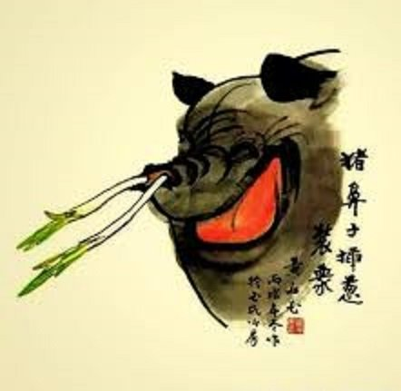
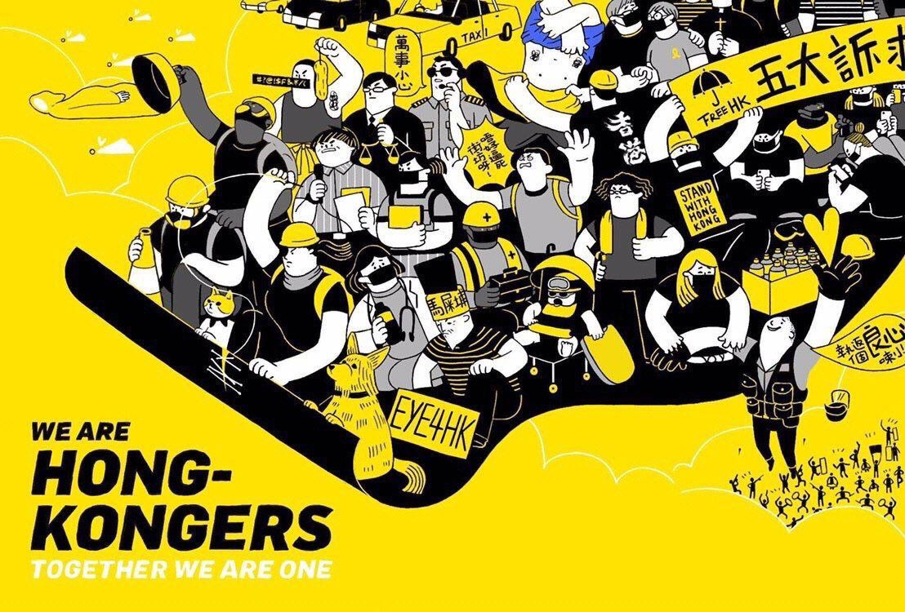
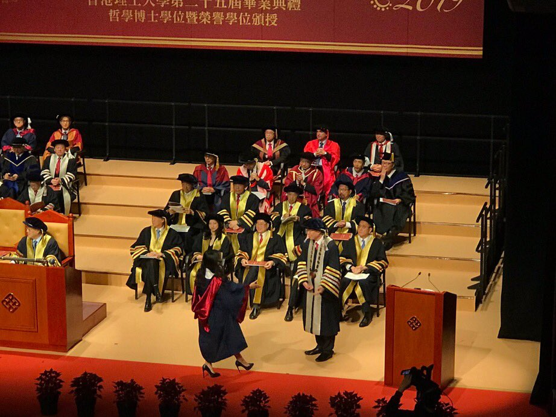
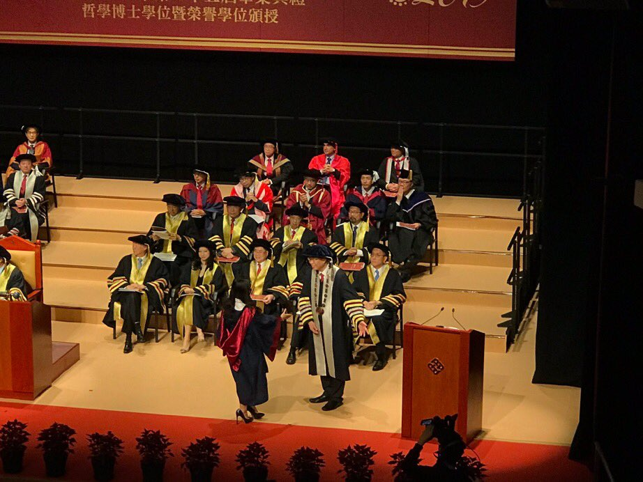
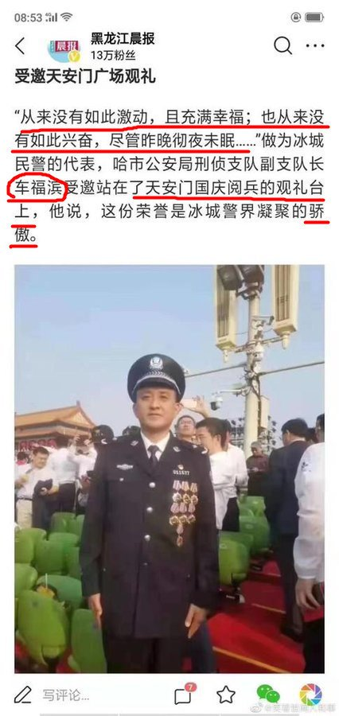
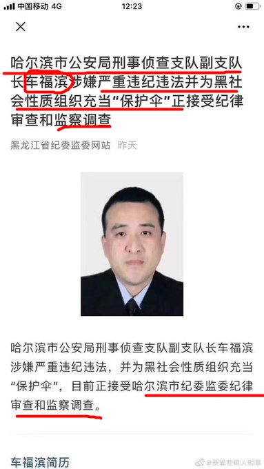

[10月27日 18:00]    新闻大吐槽   @TuCaoFakeNews    巧了，薄都督进去前也是这么说的  :speech_balloon:评:0 :+1:赞:3 :globe_with_meridians:转:2  

[10月27日 17:23]    新闻大吐槽   @TuCaoFakeNews    尖沙咀文化中心太空館外  :speech_balloon:评:0 :+1:赞:1 :globe_with_meridians:转:1  

[10月27日 17:14]    新闻大吐槽   @TuCaoFakeNews    上一个在镜头前讲“一派胡言”的薄先生在秦城等您喝茶呢 https://twitter.com/TuCaoFakeNews/status/1188251701284704258 …  :speech_balloon:评:0 :+1:赞:5 :globe_with_meridians:转:2  

[10月27日 17:12]    新闻大吐槽   @TuCaoFakeNews    尽实话实说 https://twitter.com/TuCaoFakeNews/status/1188288499729874945 …  :speech_balloon:评:1 :+1:赞:6 :globe_with_meridians:转:1  

[10月27日 17:00]    纽约时报中文网   @nytchinese    #一周热门 当“深层政府”向特朗普展开“复仇”行动 http://nyti.ms/362aQg9   :speech_balloon:评:1 :+1:赞:8 :globe_with_meridians:转:1  

[10月27日 16:23]    新闻大吐槽   @TuCaoFakeNews    王公公做外交部长，简直既自取其辱，又给我大陆人民丢脸。 https://twitter.com/TuCaoFakeNews/status/1188251701284704258 …  :speech_balloon:评:1 :+1:赞:9 :globe_with_meridians:转:2  

[10月27日 16:22]    新闻大吐槽   @TuCaoFakeNews      :speech_balloon:评:0 :+1:赞:9 :globe_with_meridians:转:2  

[10月27日 16:09]    BBC News 中文   @bbcchinese    狮航波音空难最终调查报告：九项失误，任何一个都可避免惨祸 https://bbc.in/2N9IXdi   :speech_balloon:评:7 :+1:赞:13 :globe_with_meridians:转:4  

[10月27日 16:07]    BBC News 中文   @bbcchinese    在泰国，女性不允许受戒成为僧人，越来越多的泰国女性到海外受戒，并回国成为女性寺院的僧人。 https://www.bbc.com/zhongwen/simp/chinese-news-50137511 …  :speech_balloon:评:10 :+1:赞:17 :globe_with_meridians:转:4  

[10月27日 16:06]    新闻大吐槽   @TuCaoFakeNews    党员  :speech_balloon:评:0 :+1:赞:2 :globe_with_meridians:转:2  

[10月27日 16:02]    新闻大吐槽   @TuCaoFakeNews    那些都是我們不能磨滅的傷痛，我們永遠都不會忘記這些香港人，你拆再多的祭台，也拆不走我們的悲痛  :speech_balloon:评:1 :+1:赞:15 :globe_with_meridians:转:5  

[10月27日 15:48]    新闻大吐槽   @TuCaoFakeNews    据说isis头目巴格达迪被美军干掉了！

砍人头者，终被人砍头！

报应不爽！ https://twitter.com/cnn/status/1188318673846591490 …  :speech_balloon:评:4 :+1:赞:25 :globe_with_meridians:转:3  

[10月27日 15:46]    新闻大吐槽   @TuCaoFakeNews    哼！王毅，妳才一派胡言。 https://twitter.com/tucaofakenews/status/1188251701284704258 …  :speech_balloon:评:1 :+1:赞:1 :globe_with_meridians:转:1  

[10月27日 15:42]    新闻大吐槽   @TuCaoFakeNews    某花园的集会现场，印有「光复香港，时代革命」的梯恤衫供不应求！  :speech_balloon:评:6 :+1:赞:110 :globe_with_meridians:转:47  

[10月27日 15:34]    老司机   @h5lpykl7tp6jjop    中共一直宣扬对敌斗争仇恨教育，从幼儿园就学扛枪消灭敌人，终于结出恶果，少年犯罪低龄化，15岁男孩砖头谋杀老师！鲜血飞溅！10秒狠砸9下！ 13岁男孩残杀性侵10岁女孩！事后若无其事轻松抖腿面对镜头，这些少年杀人魔因为年龄不够不负刑事责任，每天满大街城管警察暴力殴打民众做示范，这个社会能好吗  :speech_balloon:评:1 :+1:赞:24 :globe_with_meridians:转:8  

[10月27日 15:17]    新闻大吐槽   @TuCaoFakeNews    實時

尖沙嘴梳士巴利公園反警察暴力集會！

已經得到神獸獅鳥發出不反對通知書！  :speech_balloon:评:3 :+1:赞:151 :globe_with_meridians:转:70  

[10月27日 15:13]    新闻大吐槽   @TuCaoFakeNews    这一声喝，成就了有史以来战狼外交部长的美名啊  :speech_balloon:评:0 :+1:赞:2 :globe_with_meridians:转:1  

[10月27日 15:11]    新闻大吐槽   @TuCaoFakeNews    垃圾 https://twitter.com/TuCaoFakeNews/status/1188343758389006337 …  :speech_balloon:评:0 :+1:赞:7 :globe_with_meridians:转:3  

[10月27日 15:07]    新闻大吐槽   @TuCaoFakeNews    垃圾校長 https://twitter.com/tucaofakenews/status/1188343758389006337 …  :speech_balloon:评:0 :+1:赞:12 :globe_with_meridians:转:4  

[10月27日 15:02]    BBC News 中文   @bbcchinese    【一周热点回顾】“他们也不知道，原来大陆人也有支持这场运动的，不是所有人都是『小粉红』。” https://bbc.in/2ogkTgx   :speech_balloon:评:52 :+1:赞:98 :globe_with_meridians:转:15  

[10月27日 15:00]    纽约时报中文网   @nytchinese    #一周热门 为什么亿万富翁还要继续工作？ http://nyti.ms/32ygJj0   :speech_balloon:评:9 :+1:赞:16 :globe_with_meridians:转:9  

[10月27日 14:56]    新闻大吐槽   @TuCaoFakeNews    一派胡言 https://twitter.com/tucaofakenews/status/1188251701284704258 …  :speech_balloon:评:6 :+1:赞:26 :globe_with_meridians:转:5  

[10月27日 14:52]    新闻大吐槽   @TuCaoFakeNews    薄總演技勝一籌！  :speech_balloon:评:0 :+1:赞:1 :globe_with_meridians:转:1  

[10月27日 14:36]    新闻大吐槽   @TuCaoFakeNews    香港理工大学博士学位颁发现场，两名同学带口罩上台，让大陆出身的校长滕锦光非常火大「抑或非常恐惧」，拒绝与两位学生握手，也没讲话，匆匆离开礼堂！

可见这位校长之所以能在这个香港学府窃居高位，是因为什么！  :speech_balloon:评:12 :+1:赞:75 :globe_with_meridians:转:44  

[10月27日 13:47]    BBC News 中文   @bbcchinese    【突发】IS组织头目巴格达迪可能在叙利亚被美军击毙 https://bbc.in/2qNWL5Y   :speech_balloon:评:18 :+1:赞:126 :globe_with_meridians:转:37  

[10月27日 13:02]    BBC News 中文   @bbcchinese    【一周热点回顾】香港政府当地时间23日凌晨发稿，拒绝台湾政府去函要求派员赴港押解陈同佳，并指台方跨境执法，不尊重香港司法管辖权。台湾陆委会发言人邱垂正对此表示，若陈嫌逃亡、串证等，港府须负全责。 https://bbc.in/344KXe2   :speech_balloon:评:18 :+1:赞:59 :globe_with_meridians:转:15  

[10月27日 13:00]    纽约时报中文网   @nytchinese    #一周热门 日本德仁天皇正式登基，典礼看点回顾 http://nyti.ms/2pNe868   :speech_balloon:评:3 :+1:赞:16 :globe_with_meridians:转:2  

[10月27日 12:54]    财经真相   @caijingxiang    币圈的人来解释一下！所谓的去中心化！ https://twitter.com/zhanglucy88/status/1188308918759329794 …  :speech_balloon:评:33 :+1:赞:43 :globe_with_meridians:转:9  

[10月27日 11:00]    BBC News 中文   @bbcchinese    【一周热点回顾】加泰罗尼亚人也高喊：“我们要像香港那样做一次。” https://bbc.in/2qJsMfr   :speech_balloon:评:42 :+1:赞:151 :globe_with_meridians:转:49  

[10月27日 11:00]    纽约时报中文网   @nytchinese    #一周热门 如何限制中国获得美国技术？特朗普政府陷入分歧 http://nyti.ms/32IGXiY   :speech_balloon:评:14 :+1:赞:20 :globe_with_meridians:转:7  

[10月27日 10:47]    财经真相   @caijingxiang    新华社：《中华人民共和国密码法》已由中华人民共和国第十三届全国人民代表大会常务委员会第十四次会议于2019年10月26日通过，现予公布，自2020年1月1日起施行。  :speech_balloon:评:27 :+1:赞:76 :globe_with_meridians:转:32  

[10月27日 10:13]    BBC News 中文   @bbcchinese    【哥伦比亚的高危玩意 重力自行车是什么？】这项运动在哥伦比亚麦德林市非常流行，动力自行车到底是什么玩法？ https://bbc.in/2JkB1Fd   :speech_balloon:评:3 :+1:赞:12 :globe_with_meridians:转:3  

[10月27日 09:33]    BBC News 中文   @bbcchinese    今天，从伦敦到洛杉矶，全球的西班牙餐厅都供应海鲜饭，但是在西班牙，只有一家餐馆是120多年的正宗老字号。 https://bbc.in/2PluFZW   :speech_balloon:评:9 :+1:赞:76 :globe_with_meridians:转:25  

[10月27日 09:33]    新闻大吐槽   @TuCaoFakeNews    衣带渐宽终不悔，向我本人泼脏水。
洛阳亲友如相问，感到非常的气愤。
燕然未勒归无计，开着红色法拉利。
停车坐爱枫林晚，没有任何的资产。
日出江花红胜火，搞个律师事务所。
两朝开济老臣心，都是全额奖学金。  :speech_balloon:评:2 :+1:赞:15 :globe_with_meridians:转:1  

[10月27日 09:00]    纽约时报中文网   @nytchinese    #一周热门 #观点 中国能为亚马孙的生态悲剧做些什么？ http://nyti.ms/32EWRej   :speech_balloon:评:149 :+1:赞:25 :globe_with_meridians:转:3  

[10月27日 08:55]    财经真相   @caijingxiang    花那么多口水说虚拟货币，不是为了和币圈人抬杠，而是把这个所谓“专业”的技术撕开看看里面究竟是什么玩意儿。我最担心的就是中共以央行为后盾搞的虚拟币，如果它像支付宝一样给点红包优惠，引诱中国普通老百姓使用，他们完全可以做到的，这才是最恐怖的，一但中共倒台他们把数据存储一毁，就是地狱！  :speech_balloon:评:29 :+1:赞:142 :globe_with_meridians:转:40  

[10月27日 08:47]    财经真相   @caijingxiang    扎克伯格搞加密货币初心也是这样，他跑到国会忽悠的一大理由就是要和中国竞争，冠冕堂皇理由背后就是再复制一次中本聪的成功！中共央行搞虚拟币本意是无法封杀虚拟币金融骗局，干脆以国家之力自己搞个更大骗局，而且是第一个政府背书的骗局，这也是中共最无赖最不要脸点之处！  :speech_balloon:评:11 :+1:赞:142 :globe_with_meridians:转:32  

[10月27日 08:43]    新闻大吐槽   @TuCaoFakeNews    国宾变囚徒，命运过山车，一个月内发生：
他十月初受邀参加70年国庆（殇）观礼，激动的睡不着觉！
可十月底，他再一次难以入睡，因为他已被打成了黑社会的保护伞！一个月间从巅峰跌到谷底，不知道是啥心情？？

上了一趟天安门就学坏了？还是十一观礼嘉宾多是如此？
无论如何，香港黑警要引以为戒!  :speech_balloon:评:26 :+1:赞:161 :globe_with_meridians:转:77  

[10月27日 08:40]    财经真相   @caijingxiang    看一堆币圈人留言说我不懂装专家，这个有那么神秘吗？本质就是圈钱，如果说中本聪搞比特币初心还有点理想主义（打破政府货币垄断），那么后面再搞各种币就剩下圈钱一个目的，一针见血的评价：每个搞虚拟币的人，都有成为第二个中本聪的梦！就么简单，少装神弄鬼，别扯什么专业理想！  :speech_balloon:评:30 :+1:赞:258 :globe_with_meridians:转:51  

[10月27日 07:37]    BBC News 中文   @bbcchinese    艾米发现老公似乎对她的一切都了如指掌，包括她和朋友的私下聊天内容，艾米顿时感到一阵惊悚，几乎无法呼吸…… https://bbc.in/2PjOvEP   :speech_balloon:评:6 :+1:赞:127 :globe_with_meridians:转:55  

[10月27日 07:00]    纽约时报中文网   @nytchinese    #一周热门 #ModernLove 第四次约会时，我割破了一根血管 http://nyti.ms/2BINVII   :speech_balloon:评:0 :+1:赞:5 :globe_with_meridians:转:0  

[10月27日 06:07]    BBC News 中文   @bbcchinese    三大领域九大技巧 https://bbc.in/2BNtQkO   :speech_balloon:评:2 :+1:赞:45 :globe_with_meridians:转:29  

[10月27日 04:11]    老司机   @h5lpykl7tp6jjop    好文转发《两种完全不同的价值观》

 https://mp.weixin.qq.com/s/Fr1Bs65lyLIlzHozY0Q6jA …  :speech_balloon:评:4 :+1:赞:5 :globe_with_meridians:转:0  

[10月27日 03:51]    老司机   @h5lpykl7tp6jjop    这种超级想象力用在技术创新上还可以有用，用来舔裆太臭了！  :speech_balloon:评:8 :+1:赞:42 :globe_with_meridians:转:10  

[10月27日 01:12]    BBC News 中文   @bbcchinese    【最新消息】英国埃塞克斯警方称，涉及集装箱惨案的25岁卡车司机莫里斯·罗宾逊（Maurice Robinson）已被控过失杀人、贩卖人口和洗钱罪。 https://twitter.com/BBCBreaking/status/1188126599683727360 …  :speech_balloon:评:16 :+1:赞:43 :globe_with_meridians:转:16  

[10月27日 00:36]    BBC News 中文   @bbcchinese    此次台中赛事的另一个亮点，是中国大陆棒球代表队的出现。 https://bbc.in/3407Qio   :speech_balloon:评:11 :+1:赞:31 :globe_with_meridians:转:7  

[10月26日 22:55]    财经真相   @caijingxiang    比特币买价与卖价，再同一时间围绕着市场报价，差价最大两千美元！  :speech_balloon:评:32 :+1:赞:49 :globe_with_meridians:转:11  

[10月26日 22:42]    老司机   @h5lpykl7tp6jjop    In #YuenLong, riot #police subdued a man who was smoking. One of them jumped on him after he was subdued. Minimum force?
Credit - Live of Apple Daily
#HongKongPolice = #HongKongRioters
#PoliceBrutality #PoliceState #StandWithHongKong #FreeHongKong  :speech_balloon:评:162 :+1:赞:1828 :globe_with_meridians:转:1866  

[10月26日 22:21]    BBC News 中文   @bbcchinese    巴西总统博尔索纳罗在访华期间一改过往的飘忽态度，期盼扩大与中国的经贸往来，并宣布给予中国游客“免签”待遇。 https://bbc.in/2PlvBxy   :speech_balloon:评:67 :+1:赞:127 :globe_with_meridians:转:43  

[10月26日 22:04]    老司机   @h5lpykl7tp6jjop    10月1号阅兵做为受邀功臣坐在天安门观礼台，这特么的才几天功夫就成黑社会保护伞了  :speech_balloon:评:55 :+1:赞:946 :globe_with_meridians:转:456  

[10月26日 21:31]    BBC News 中文   @bbcchinese    【台北同志大游行：通过同性婚姻后的第一次游行】10月26日，台湾举行同志大游行。今年的游行比以往的意义更重大，因为这次是台湾通过同性婚姻合法化后的首次游行。 https://bbc.in/36akzAY   :speech_balloon:评:11 :+1:赞:33 :globe_with_meridians:转:13  

[10月26日 21:00]    纽约时报中文网   @nytchinese    #一周热门 美国外交元老谈香港：中美双方都自以为是 http://nyti.ms/2pOZJ9C   :speech_balloon:评:8 :+1:赞:12 :globe_with_meridians:转:3  

[10月26日 19:08]    墙国铁拳现世报😷   @Socialistfist    生活在这个太平盛世
（除了村里恶霸从14年偷排污染超过30倍废物并在17年到维稳中心打人并且发出死亡威胁以外）
 感恩！

#社会主义铁拳
长文警告  :speech_balloon:评:34 :+1:赞:291 :globe_with_meridians:转:80  

[10月26日 19:00]    纽约时报中文网   @nytchinese    #一周热门 香港抗议导火索案件嫌疑人出狱，港台争论难休 http://nyti.ms/2JeTz9D   :speech_balloon:评:70 :+1:赞:16 :globe_with_meridians:转:3  

[10月26日 18:06]    财经真相   @caijingxiang    比特币接入暗网那一刻时，就已经不是理想主义者、极客、码农们能够控制的，是有庞大的力量介入了进去，比特币追随者只鼓吹比特币如何便利，却从不谈在暗网上的人口贩卖，甚至直播比特币打赏杀人，那一幕至今让我做噩梦！  :speech_balloon:评:71 :+1:赞:467 :globe_with_meridians:转:132  

[10月26日 18:01]    BBC News 中文   @bbcchinese    一名出柜的台湾同志军人，向BBC中文透露性倾向如何影响军旅生活。他早已习惯被笑“娘”。他说：“国高中时就常被骂娘炮，会很难过。但我知道越表现出难过的样子，他们越觉得你好欺负，所以为了不服输，我就会在体能上锻炼自己。” https://bbc.in/2peNO59   :speech_balloon:评:33 :+1:赞:152 :globe_with_meridians:转:33  

[10月26日 17:46]    财经真相   @caijingxiang    该网站只面向匿名软件Tor的使用者，这就是著名的暗网（dark web），随后比特币交易量完全失控。中本聪也在这个时候彻底消失，再也没有人见他出现在网上。但是世人都猜测他手里拥有大量比特币，有人估算是总数的5%，这在今天完全可以算是富可敌国的天量财富！  :speech_balloon:评:6 :+1:赞:64 :globe_with_meridians:转:10  

[10月26日 17:40]    财经真相   @caijingxiang    2010年12月维基解密事件爆发，当时全世界支付机构迫于美国政府压力都拒绝为维基解密捐款，唯有比特币可以，比特币借此名扬世界。两个月后一些理想主义者决定测试比特币规避政府控制的能力，并创建了一个“丝绸之路”的网站，主要是类似亚马逊在线交易，出售一些不住政府控制范围内的非法商品！  :speech_balloon:评:2 :+1:赞:54 :globe_with_meridians:转:11  

[10月26日 17:32]    财经真相   @caijingxiang    2010年4月发生了一起著名事件，一个叫拉撕洛·汉耶滋的程序员用一万个比特币购买了两份披萨饼，这是比特币第一次真正意义上的有用价值购买商品。2010年7月，颇受欢迎的科技新闻聚合网站斜线点，在头版推出了这个有趣的故事，随后斜点应用程序下载飙升7倍，这是比特币第一次真正的成为公众新闻！  :speech_balloon:评:2 :+1:赞:24 :globe_with_meridians:转:5  

[10月26日 17:25]    财经真相   @caijingxiang    随后又有两个程序员加入进来，他们是加文·安德森和马蒂·玛丽米并帮中本聪建立了一个网站，还改进了比特币代码，这就是比特币的诞生。2009年秋他们还为这群人建立了一个论坛。但是这是比特币依旧没法支付和购买商品，只是几个专业小网站可以购买象征价值的贴纸和程序员常用物品！  :speech_balloon:评:2 :+1:赞:20 :globe_with_meridians:转:5  

[10月26日 17:17]    财经真相   @caijingxiang    后来他把想法发到了一个研究数字加密的公共邮箱，以及一个叫做点对点基金会的网站上。在这里有一个叫哈尔·芬尼的程序员，觉得这个想法很有价值，就和中本聪一起进行编码，2009年年初他收到了中本聪的第一个比特币，但那时几乎不值钱！  :speech_balloon:评:3 :+1:赞:23 :globe_with_meridians:转:3  

[10月26日 17:11]    财经真相   @caijingxiang    2008年8月密码学家亚当·巴克收到了一个叫中本聪发来的邮件，提出虚拟货币这个新概念，但是他并未理会，因为这种想法早在1992年就有人跟他提起过，但他都没有采纳，更别说一个陌生人，这是人们第一次听说中本聪这个人！尽管被拒但是他还是为这种新型货币编写三分之一的开源代码！  :speech_balloon:评:10 :+1:赞:116 :globe_with_meridians:转:24  

[10月26日 17:01]    BBC News 中文   @bbcchinese    台北今天举行同志游行，是同婚合法后的第一次！不过在快乐庆祝的背后，仍有些同志伴侣不能结婚。 https://bbc.in/2BTd43P   :speech_balloon:评:14 :+1:赞:44 :globe_with_meridians:转:14  

[10月26日 17:01]    BBC News 中文   @bbcchinese    外界普遍认为彭斯今年的讲法较温和，但仍然引起中国官方媒体批评。 https://bbc.in/35XAbI2   :speech_balloon:评:31 :+1:赞:56 :globe_with_meridians:转:13  

[10月26日 17:00]    纽约时报中文网   @nytchinese    #一周热门 美外交官称特朗普以对乌克兰援助换取政治调查 http://nyti.ms/2JfNLNa   :speech_balloon:评:3 :+1:赞:10 :globe_with_meridians:转:5  

[10月26日 16:34]    财经真相   @caijingxiang    石头利用好了至少还可以盖墙铺路，这些玩意儿一单失去洗钱价值，连垃圾都不是，当然全世界洗钱需求永远都在，账面价值暂时不会变成零！没有洗钱需求的人不要碰！ https://twitter.com/cche_pp/status/1188008175779213313 …  :speech_balloon:评:15 :+1:赞:77 :globe_with_meridians:转:12  

[10月26日 16:31]    BBC News 中文   @bbcchinese    刚刚过去的一周，BBC中文以下新闻内容受到读者的关注。如果你错过了它们，BBC中文带你一一回顾。 https://bbc.in/2pQwQtX   :speech_balloon:评:3 :+1:赞:19 :globe_with_meridians:转:6  

[10月26日 16:12]    财经真相   @caijingxiang    中国是当今世界腐败资金最大的国家，因此中国任何风吹草动都会导致“洗钱”需求激增，进而导致比特币价格大涨，比特币价格最高峰应该是新政府成立后对中共权贵追赃之时！  :speech_balloon:评:22 :+1:赞:224 :globe_with_meridians:转:43  

[10月26日 16:08]    老司机   @h5lpykl7tp6jjop    请张专家不忙着说30年以后，先说说现在想什么办法把猪肉控制在30元以内现实一点！  :speech_balloon:评:9 :+1:赞:35 :globe_with_meridians:转:7  

[10月26日 16:02]    财经真相   @caijingxiang    虚拟币以后只会越来越多，直到最后洗钱的资金和炒作的资金都“变现”大部分后，价格开始下降直至和全世界洗钱资金相对应，最后一定回归它的本质“世界洗钱指数”，每当世界大规模洗钱时涨，套玩现后跌！这对于有需要洗钱的人来说它才有价值，不需要洗钱的人来说就是“诈骗”，拿钱买笔币不过是帮人洗钱罢了！  :speech_balloon:评:9 :+1:赞:117 :globe_with_meridians:转:26  

[10月26日 15:54]    财经真相   @caijingxiang    后来这个圈子名气越来越大，越来越多的犯罪金钱加入进来洗白，价格也是一路高涨，最后各国央行终于坐不住了开始封杀，封了一段时间就发现不对劲，因为你不要有人要，根本封不住。绞尽脑汁后突然明白我们也可以自己搞一个这样的圈子，于是各种各样的币突然出现，只是现在已经不是洗钱了而是圈钱！  :speech_balloon:评:6 :+1:赞:88 :globe_with_meridians:转:13  

[10月26日 15:47]    老司机   @h5lpykl7tp6jjop    好相声  :speech_balloon:评:2 :+1:赞:67 :globe_with_meridians:转:43  

[10月26日 15:46]    财经真相   @caijingxiang    比特币最初只是一帮技术宅搞的圈子打赌游戏，但是由于它可以匿名支付，金钱转账不留痕迹，是绝佳的洗钱工具，后来被某些财团知道了，这正是他们梦寐以求的，于是就把这个小圈子变成全世界的洗钱大圈子，并赋予了它所谓的去中心化对抗政府滥印钞使命，至此本来是洗钱罪恶工具突然具有了正义性！  :speech_balloon:评:12 :+1:赞:98 :globe_with_meridians:转:22  

[10月26日 15:19]    财经真相   @caijingxiang    比特币突破一万，很多人留言打脸，这个我没啥不好说的，比特币我就是不懂，我就是不碰，因为这就是一个骗局，尤其是习进平开会后大涨，更让我恐惧！ https://twitter.com/caijingxiang/status/1186994130171260928 …  :speech_balloon:评:79 :+1:赞:307 :globe_with_meridians:转:85  

[10月26日 15:01]    BBC News 中文   @bbcchinese    【一周热点回顾】加拿大大选结果出炉，现任总理特鲁多获得连任。四张图帶你看懂加国大选： https://bbc.in/31I2siE   :speech_balloon:评:2 :+1:赞:16 :globe_with_meridians:转:4  

[10月26日 15:00]    纽约时报中文网   @nytchinese    #一周热门 #观点 别再要求女人更自信，让男人谦卑一点 http://nyti.ms/31I5nb9   :speech_balloon:评:0 :+1:赞:22 :globe_with_meridians:转:5  

[10月26日 14:50]    BBC News 中文   @bbcchinese    10月26日台北举行同志大游行（Taiwan LGBT Pride）是台湾同性婚姻通过后的首次同志游行，吸引全台各地及各国的同志团体、社会运动者参与。BBC News 中文记者李宗宪现场报导。 https://bbc.in/349wb5L   :speech_balloon:评:10 :+1:赞:40 :globe_with_meridians:转:20  

[10月26日 13:52]    老司机   @h5lpykl7tp6jjop    為什麼警察不讓那個歌手在街頭賣唱，因為他唱榮歸香港，警察害怕引起周圍觀眾的共鳴和附和。這個歌手真有骨氣，把警察蓋在他麥克風上的警帽扔到地上，無言的向警察抗議這是我的私有財產。當警察想把他拉走的時候，周圍的人一下就轟叫起來唱歌也拉嗎？很感動港人的傲骨和正義！堅持你們的良知，你們必勝  :speech_balloon:评:182 :+1:赞:3168 :globe_with_meridians:转:1523  

[10月26日 13:25]    老司机   @h5lpykl7tp6jjop    大陆人民歌唱猪肉上涨，高兴得手舞足蹈！GDP自然也上涨了，多好的事呀！继续！  :speech_balloon:评:7 :+1:赞:180 :globe_with_meridians:转:90  

[10月26日 13:00]    纽约时报中文网   @nytchinese    #一周热门 #观点 为什么共产党统治能在中国成功 http://nyti.ms/33PsaTH   :speech_balloon:评:227 :+1:赞:346 :globe_with_meridians:转:171  

[10月26日 11:06]    财经真相   @caijingxiang    美国减税效应逐步衰退在下半年愈发明显，需要利好的贸易消息维持股市的虚假繁荣，华尔街答应川普让市场只计价贸易利好，忽略衰退的经济数据；中共方面更需要贸易利好消息，维持脆弱的金融庞氏骗局，尤其是人民币汇率、摇晃晃的楼市，以及再骗一点美国以外的外资进入中国，去接美国撤离的资产！  :speech_balloon:评:2 :+1:赞:91 :globe_with_meridians:转:14  

[10月26日 11:00]    纽约时报中文网   @nytchinese    #一周热门 “一个国家，两种民族主义”：香港身份认同的巨变 http://nyti.ms/2J8gzqZ   :speech_balloon:评:20 :+1:赞:67 :globe_with_meridians:转:24  

[10月26日 10:07]    老司机   @h5lpykl7tp6jjop    中国不讲逻辑，而只讲辩证，从而造成中国人没有原则，没有底线，没有是非对错。千百年来，活下去，即使像猪狗一样的活下去是最高的，也是唯一的追求。如果当年日本人完全统治了中国，那么将来中国的历史书上也会有一个日朝，冈村宁次也会是中国的民族英雄，天皇也会是我们的祖先 ......  :speech_balloon:评:42 :+1:赞:511 :globe_with_meridians:转:244  

[10月26日 10:03]    老司机   @h5lpykl7tp6jjop    问的真好！ 
一个奶粉都造不好的国家会有崛起?
一个文字都会敏感的国家会有复兴? 
一个网络都能禁止的国家会有未来? 
一个说话都能判刑的国家会有法律? 
一个权利都被代表的国家会有公平? 
一个一生都遭搜刮的国家会有保障? 
一个全部都已污染的国家会有明天? 
一个举国都是跪拜的国家会有未来?  :speech_balloon:评:112 :+1:赞:1128 :globe_with_meridians:转:565  

[10月26日 09:00]    纽约时报中文网   @nytchinese    #一周热门 #观点 中国的爱国主义如何塑造了一代人 http://nyti.ms/2J1rAdt   :speech_balloon:评:103 :+1:赞:57 :globe_with_meridians:转:25  

[10月26日 07:00]    纽约时报中文网   @nytchinese    #一周热门 中国加密货币计划的强大盟友：“老大哥” http://nyti.ms/31sb0tK   :speech_balloon:评:16 :+1:赞:29 :globe_with_meridians:转:17  

[10月26日 05:24]    老司机   @h5lpykl7tp6jjop    人民群众玩微博的遭遇：实名就实名吧，只要不删帖就行。然后变成了，删帖就删帖吧，只要不禁言就行。后来变成了，禁言就禁言吧，只要不销号就行。接着变成了，销号就销号吧，只要不抓人就行。如今变成了，抓人就抓人吧，只要不灭口就行。即将变成了，灭口就灭口吧，只要不灭门就行...
还有更低的要求吗  :speech_balloon:评:147 :+1:赞:2883 :globe_with_meridians:转:1020  

[10月26日 05:13]    老司机   @h5lpykl7tp6jjop    中共把哲学分成唯心主义和唯物主义，定义唯物主义正确，其它错误，把自己的观点定义为正确的唯物历史观，没有史实！简单化就是立场，所以抗战是共产党打胜的，美国是侵略者不管有没有侵吞过别人的领土，俄国人侵占再多领土也是朋友，杀人是镇压反革命，香港人游行是暴徒是港独，所以能和它们讲道理吗？  :speech_balloon:评:0 :+1:赞:14 :globe_with_meridians:转:2  

[10月26日 01:00]    GFHG SDKM   @zyx_yny    A Hong Kong protestor was severely injured by pepper spray with unknown chemicals.
Source: Workercom@facebook

#HongKongProtesters #policestate #HKPolice  :speech_balloon:评:3 :+1:赞:17 :globe_with_meridians:转:16  

[10月26日 00:25]    老司机   @h5lpykl7tp6jjop    香港警察使用的是胡椒噴霧還是化學武器？

1.這個並不是藍色水，而是懷疑香港popo加了不明化學物質，狀似胡椒噴霧的不明化學物所造成的傷口，當場救護員亦話從未見過這種情況，不知是什麼物質。

2.看傷口表面好像沒有什麼，其實表面結殼好厚，在裡面還不停腐蝕，所以傷口其實好深。
#化學武器
#黑警  :speech_balloon:评:98 :+1:赞:633 :globe_with_meridians:转:590  

[10月26日 00:17]    GFHG SDKM   @zyx_yny    I will not forget#StandWithHongKong #StandWithHK https://twitter.com/we_hkers/status/1187406398834933760 …  :speech_balloon:评:1 :+1:赞:23 :globe_with_meridians:转:17  

[10月25日 21:30]    纽约时报中文网   @nytchinese    这项协议震惊了协议所涉的岛屿——图拉吉岛上的居民，有些人担心中国正在寻找机会在这里建立一个军事据点。
该协议的批评者对司法部长的决定表示欢迎，但警告说，中国森田和其他中国利益集团更可能将此视为暂时的挫折，而不是取消他们的计划。 http://nyti.ms/32NOSLM   :speech_balloon:评:6 :+1:赞:22 :globe_with_meridians:转:7  

[10月25日 21:00]    纽约时报中文网   @nytchinese    因凡蒂诺小心翼翼地避免谈论中国的记录，而是对智利最近的抗议活动和黎巴嫩难民的困境表示担忧，后者有许多为躲避叙利亚内战逃到那里的人。
“FIFA的使命不是解决世界上的问题，”他说。“FIFA的使命是在全世界组织和发展足球。” http://nyti.ms/33X4VqI   :speech_balloon:评:16 :+1:赞:5 :globe_with_meridians:转:1  

[10月25日 20:55]    GFHG SDKM   @zyx_yny    Oops..... 
#HongKongProtests #HongKong #HongKongers #StandWithHK #hkpolicebrutality #HKPoliceTerrorism #hkpolicestate #BloodyCarrie  :speech_balloon:评:0 :+1:赞:8 :globe_with_meridians:转:4  

[10月25日 20:30]    纽约时报中文网   @nytchinese    这起惊天大案牵涉多个国家，但目前问题远多于答案。该车是在环绕大伦敦的主高速路上发现的，但它的注册地在保加利亚，从都柏林搭乘渡船而来，驾驶员是一名北爱尔兰男子，卡车拖载的集装箱由比利时来到英国。
调查此案的警方在周四的声明中称，“目前我们无法很快得到所有答案“。 http://nyti.ms/2ocFvWW   :speech_balloon:评:4 :+1:赞:13 :globe_with_meridians:转:3  

[10月25日 20:21]    墙国铁拳现世报😷   @Socialistfist    感谢提供的推友，原帖已经删除  :speech_balloon:评:0 :+1:赞:81 :globe_with_meridians:转:2  

[10月25日 20:18]    墙国铁拳现世报😷   @Socialistfist    哦， 原来不是正规军

#社会主义铁拳  :speech_balloon:评:32 :+1:赞:275 :globe_with_meridians:转:67  

[10月25日 19:49]    墙国铁拳现世报😷   @Socialistfist    补图  :speech_balloon:评:1 :+1:赞:53 :globe_with_meridians:转:6  

[10月25日 19:48]    墙国铁拳现世报😷   @Socialistfist    只是姓赵和赵家人，有本质区别

#社会主义铁拳  :speech_balloon:评:29 :+1:赞:250 :globe_with_meridians:转:74  

[10月25日 19:00]    纽约时报中文网   @nytchinese    近年来，国际足联因连续两届将世界杯主办权授予专制国家（2018年的俄罗斯和2022年的卡塔尔）而受到批评。该组织因此加强了对申办赛事国家的人权审查。
但在周四，国际足联主席因凡蒂诺宣布，2021年世俱杯的举办地将是中国——体育、金钱、政治和人权的一个令人不安的交汇点。 http://nyti.ms/33X4VqI   :speech_balloon:评:60 :+1:赞:96 :globe_with_meridians:转:30  

[10月25日 18:30]    纽约时报中文网   @nytchinese    所罗门群岛裁定中国森田集团租借某南太平洋岛屿的协议非法。所罗门群岛司法部长称，该协议缺乏重要细节，且侵犯政府权力，应当终止。
这意味着中国向南太平洋进军的行动遭遇重挫，或至少是延缓。批评者称，中国在该地区的其他投资也应受到审查。 http://nyti.ms/32NOSLM   :speech_balloon:评:16 :+1:赞:188 :globe_with_meridians:转:79  

[10月25日 18:11]    老司机   @h5lpykl7tp6jjop    天朝城管要钱不顾人命！显示出大天朝执政新高度！ 开创罚没水平新篇章，历史将记录这个伟大的时刻，它体现了我们党和国家如何致富的细致入微的精釆细节，取之于民，永远不竭！  :speech_balloon:评:13 :+1:赞:53 :globe_with_meridians:转:40  

[10月25日 18:00]    纽约时报中文网   @nytchinese    “北京正企图利用企业的贪婪影响美国公众舆论，胁迫美国企业，”彭斯说。
“太多的美国跨国公司屈从于中国金钱和市场的诱惑，不仅压制对中共的批评，甚至压制对美国价值观的肯定性表达。” http://nyti.ms/2MKoYD0   :speech_balloon:评:10 :+1:赞:34 :globe_with_meridians:转:4  

[10月25日 17:01]    GFHG SDKM   @zyx_yny    等睇警方開記者會飲「藍水」

警隊曾稱水跑車嘅顔色水為食用色素，對人體冇害，係可飲用食水
依家化驗就揭發，所謂嘅顏色水裡面係含有黏合劑或混有害催淚溶液
 #香港原創 #香港插圖 #香港插畫 #畫 #落書き #マンガ #イラスト #日本留学 #夢叶 #插畫 #漫畫 #四人頭 #手繪#文宣收集處 #文宣組  :speech_balloon:评:10 :+1:赞:194 :globe_with_meridians:转:115  

[10月25日 16:58]    老司机   @h5lpykl7tp6jjop    看文明国家对待生命尊重的态度，再看看同胞对待手足的态度，你们还爱这样的国家，是不是脑残？  :speech_balloon:评:2 :+1:赞:22 :globe_with_meridians:转:15  

[10月25日 16:14]    墙国铁拳现世报😷   @Socialistfist    翻face比翻book还快  :speech_balloon:评:3 :+1:赞:44 :globe_with_meridians:转:9  

[10月25日 16:13]    老司机   @h5lpykl7tp6jjop    好文转发  :speech_balloon:评:2 :+1:赞:17 :globe_with_meridians:转:11  

[10月25日 15:11]    老司机   @h5lpykl7tp6jjop    世界上最装B的三件事：

1、啃老族在豪华KTV里含泪演唱: “烛光里的妈妈，你的眼里为何噙着泪花……”
2、移民的人哽咽着演唱: "我和我的祖国，一刻也不能分割……"
3、官员深情地说: 我们的工作是为人民服务。  :speech_balloon:评:25 :+1:赞:1195 :globe_with_meridians:转:394  

[10月25日 11:54]    GFHG SDKM   @zyx_yny    So this just happened at the Shanghai food expo, food booths were setup for people to try, and uh, well, take a look...

A person from Europe said "I've been exhibiting in nearly 100 countries and have never seen anything like this, not even in Africa"  :speech_balloon:评:341 :+1:赞:2071 :globe_with_meridians:转:1258  

[10月25日 10:33]    GFHG SDKM   @zyx_yny    My interview with @matanevenoff, the legend who baited the cameraman with his #StandWithHongKong T-shirt during Dance Cam at the #Lakers/#Clippers game opening night in the #NBA

Thanks for showing HK your support Matan!
#HongKong #HongKongProtests  :speech_balloon:评:187 :+1:赞:3078 :globe_with_meridians:转:1518  

[10月25日 10:26]    GFHG SDKM   @zyx_yny    兄弟爬山 https://twitter.com/thkag_can/status/1187536917828648960 …  :speech_balloon:评:0 :+1:赞:1 :globe_with_meridians:转:0  

[10月25日 09:48]    老司机   @h5lpykl7tp6jjop    昨夜中環齊唱《榮光歸香港》，氣氛不錯！
有幾名馬戲團演員穿著整齊，前來伴舞。  :speech_balloon:评:42 :+1:赞:1194 :globe_with_meridians:转:462  

[10月25日 08:30]    GFHG SDKM   @zyx_yny    Kowloon Bay.  Citizens who would normally take MTR to work today are protesting by walking to work.  You can see the entire street from beginning to end is filled with people

Fighting for a good cause and getting exercise = win!

#HongKong #HongKongProtests  :speech_balloon:评:71 :+1:赞:2366 :globe_with_meridians:转:1373  

[10月25日 07:29]    GFHG SDKM   @zyx_yny    Singing is illegal in Hong kong now？！
this young man outside was forced to stop singing the HK anthem “Glory to Hong Kong”by HK police！
video from @ilovehkgers
#FreeHongKong #StandWithHongKong  :speech_balloon:评:149 :+1:赞:2116 :globe_with_meridians:转:1448  

[10月25日 07:28]    老司机   @h5lpykl7tp6jjop    A busker was performing #GloryToHongKong in Central last night. He was then surrounded and threatened by few police. 

Since when is there a ban for singing in #HongKong? #Hongkongers, resist! Or else this would happen real soon.

#WhiteTerror #PoliceState #HongKongProtests  :speech_balloon:评:290 :+1:赞:4666 :globe_with_meridians:转:3734  

[10月25日 07:03]    GFHG SDKM   @zyx_yny    3rd video in my eng sub series.  Chinese nationalist showing unconditional love for his country at a flower shop in Prince Edward.  Gotta admit, of all the arguments from the pro-China camp, his is the most convincing! 
#HongKong #HongKongProtests

Orig vid from @ajmm19923493  :speech_balloon:评:33 :+1:赞:232 :globe_with_meridians:转:176  

[10月25日 04:10]    GFHG SDKM   @zyx_yny    Couldn't have said it better than @VP Pence today: "American corporations should stand up for American values here at home and around the world." 

Today and every day, I am proud to #StandWithHongKong  :speech_balloon:评:875 :+1:赞:8064 :globe_with_meridians:转:4517  

[10月25日 03:11]    新闻大吐槽   @TuCaoFakeNews    给抗争者提供免费餐的良心餐厅「龙门冰室」昨天被黑社会砸了，市民念这家餐厅的好，在店门口排起了长队，希望用自己的行动来支持有正义感的餐厅！

亲共的美心月饼被砸后，从未听说，有人自发为这家爱国店铺做点什么，看来所谓的爱国更多是谋私利而不顾公义，蓝丝是个伪命题  :speech_balloon:评:130 :+1:赞:3254 :globe_with_meridians:转:1257  

[10月25日 01:20]    GFHG SDKM   @zyx_yny    US Vice President @VP Mike Pence to #HongKongProtesters :

"To the millions in Hong Kong who have been peacefully demonstrating to protect your rights these past months, we stand with you. We are inspired by you."

Thank you @VP!

#FightForFreedom #StandWithHongKong  :speech_balloon:评:49 :+1:赞:1101 :globe_with_meridians:转:624  

[10月25日 01:08]    GFHG SDKM   @zyx_yny      :speech_balloon:评:671 :+1:赞:4864 :globe_with_meridians:转:2606  

[10月25日 00:26]    凡賽堤/FORSETI   @FecharCCP    緊急找尋  :speech_balloon:评:0 :+1:赞:7 :globe_with_meridians:转:6  

[10月24日 23:58]    凡賽堤/FORSETI   @FecharCCP    何韻詩！香港女兒，華人的典範，華人21世紀的巾幗英雄，華人最完美的最值得華人崇拜的國際巨星！！！  :speech_balloon:评:66 :+1:赞:416 :globe_with_meridians:转:130  

[10月24日 23:44]    凡賽堤/FORSETI   @FecharCCP    華人歷史上將永久記住這一刻，
2019年6月9日以來當香港人超過200萬人向政府提出訴求，
用最文明，最和平，最友好的方式遊行，而政府卻用最暴力，最兇殘，最卑鄙的手段僱傭黑社會組織和在職警察，以及大陸警察，武警，部隊喬裝成黑衣人在香港全社會進行大規模暗殺，暴打市民，破環公共設施等嫁禍給港人  :speech_balloon:评:15 :+1:赞:183 :globe_with_meridians:转:113  

[10月24日 23:39]    GFHG SDKM   @zyx_yny    International guidelines for use of water cannons have not been followed by #Hongkong police:
• Do not fire at close range
• Do not fire directly at ppl's bodies
• Allow sufficient time for ppl to disperse before firing
• Do not fire when no crowds are present
ALL VIOLATED https://twitter.com/wwkk27744741/status/1187384284530794496 …  :speech_balloon:评:12 :+1:赞:157 :globe_with_meridians:转:134  

[10月24日 21:26]    GFHG SDKM   @zyx_yny    佢地用我地國歌改加泰文唱
雖然我一個字都聽唔明但我好感動 眼濕濕

我有少少慚愧 人地支持我地支持到比人打 我地對今晚既集會仲咁大顧慮

#StandWithHK #FightForFreedom #FreedomFighter #FiveDemandsNotOneLess #Catalonia  :speech_balloon:评:30 :+1:赞:814 :globe_with_meridians:转:366  

[10月24日 21:14]    GFHG SDKM   @zyx_yny    Outside a #Catalonia's rally, some #China's nationalists were waving their flags.

They then JUMP KICKED a Catalan passerby holding slogan of "Liberate #HongKong. The revolution of our times." & tore it off. 

One of them attacked the journalist streaming the whole thing.

Rude.  :speech_balloon:评:63 :+1:赞:588 :globe_with_meridians:转:572  

[10月24日 18:59]    墙国铁拳现世报😷   @Socialistfist    Facebook CEO 可能是目前为止吃到铁拳中身价最高的了。他学习中文，看习近平著作，到天安门跑步。
花了5年时间他和他的团队才弄明白中国“从来不让我们进入”。
#社会主义铁拳  :speech_balloon:评:81 :+1:赞:1194 :globe_with_meridians:转:413  

[10月24日 18:37]    GFHG SDKM   @zyx_yny    

I really like this #Shout4HK as we need to keep fighting

We have 5 demands and only one is fulfilled this week. The battle is still long!

#光復香港時代革命 #GFHGSDKM
#香港人加油 #HGYGY  :speech_balloon:评:130 :+1:赞:3097 :globe_with_meridians:转:1623  

[10月24日 17:32]    墙国铁拳现世报😷   @Socialistfist    补图  :speech_balloon:评:13 :+1:赞:83 :globe_with_meridians:转:16  

[10月24日 17:31]    墙国铁拳现世报😷   @Socialistfist    发酵快半年的汉能讨薪事件波及到了开国大典总负责人外孙。
前脚祝福祖国母亲生日快乐，
后脚希望祖国母亲主持公道。

#社会主义铁拳  :speech_balloon:评:40 :+1:赞:324 :globe_with_meridians:转:119  

[10月24日 14:57]    GFHG SDKM   @zyx_yny    【大陆留学生破坏加拿大某大学连侬墙】
【中共霸凌香港的缩影】
在加拿大一所大学里，一名大陆留学生破坏连侬墙，并对香港留学生动粗。在加拿大享有言论自由时，该名大陆留学生认为自己亦有“打人的权利”。
#小粉红
#连侬墙  :speech_balloon:评:465 :+1:赞:1500 :globe_with_meridians:转:924  

[10月24日 12:34]    GFHG SDKM   @zyx_yny    i've spoken to the hero kid in the video, his name is Matan and he's now on twitter @matanevenoff!

Matan says he and his family are Clippers season ticket holders, he's been on the Jumbotron many times and he wanted to do something to support HK. he doesn't expect to get back on  :speech_balloon:评:194 :+1:赞:4272 :globe_with_meridians:转:961  

[10月24日 10:28]    凡賽堤/FORSETI   @FecharCCP    【連登尋人】張友恆，現居九龍城，8月31日有參加遊行，9月3日突然退出所有Whatsapp群組，已經失蹤1個多月，公司薪金也沒有領取。  :speech_balloon:评:11 :+1:赞:282 :globe_with_meridians:转:298  

[10月24日 09:04]    凡賽堤/FORSETI   @FecharCCP    香港6.9以來出現人類文明社會史上的世界第一，
最文明的和平遊行世界第一
（井然有序，城市衛生等）
人口規模最大的遊行世界第一 
（203萬人遊行，總人口700-730萬）
遊行過程出現自發自願醫療救護人員世界首創！
香港人，給全世界的華人創下了歷史最偉大的榜樣！
香港人，給全世界華人未來帶來的希望  :speech_balloon:评:5 :+1:赞:75 :globe_with_meridians:转:52  

[10月24日 08:35]    凡賽堤/FORSETI   @FecharCCP    緊急找尋其家人和律師  :speech_balloon:评:0 :+1:赞:10 :globe_with_meridians:转:9  

[10月24日 03:35]    GFHG SDKM   @zyx_yny    My costume for Halloween /Blizzcon came today!  :speech_balloon:评:62 :+1:赞:494 :globe_with_meridians:转:155  

[10月22日 20:13]    墙国铁拳现世报😷   @Socialistfist    網上有帖文指毛漢參與7月20日的守護香港集會，他澄清，幾個月前有人邀請他出席集會，他於台上是說希望香港恢復和平及希望政府了解年輕人多點。他強調自己不是「撐警」，稱現時才知道自己當時出席的場合是「撐警」集會，並說之後有其他「撐警」集會他都沒參加。
我相信他不是撐警～  :speech_balloon:评:5 :+1:赞:48 :globe_with_meridians:转:11  

[10月22日 17:59]    墙国铁拳现世报😷   @Socialistfist    补图  :speech_balloon:评:4 :+1:赞:115 :globe_with_meridians:转:14  

[10月22日 17:58]    墙国铁拳现世报😷   @Socialistfist    墙内一阵子狂喷  :speech_balloon:评:5 :+1:赞:68 :globe_with_meridians:转:12  

[10月22日 17:51]    墙国铁拳现世报😷   @Socialistfist    14年的战螂
15年的粉红
16年的愤青
17年的反贼
「我们终于还是成为了我们当初讨厌的人」

#社会主义铁拳  :speech_balloon:评:33 :+1:赞:366 :globe_with_meridians:转:116  

[10月21日 22:06]    墙国铁拳现世报😷   @Socialistfist    @remonwangxt 辣椒老师是否可以作为新漫画创意  :speech_balloon:评:1 :+1:赞:36 :globe_with_meridians:转:1  

[10月21日 21:17]    墙国铁拳现世报😷   @Socialistfist    补图  :speech_balloon:评:4 :+1:赞:79 :globe_with_meridians:转:14  

[10月21日 20:37]    墙国铁拳现世报😷   @Socialistfist    前香港印度协会主席曾经出现在支持香港警察的最前线。近日被高压水枪喷过后，出现在谴责香港警察的最前线
高压水枪的蓝色物质具有刺激性成分，会使人睁不开眼，咳嗽不止，并容易被警察辨识抓捕。

#社会主义铁拳
#社会主义特别行政区铁拳  :speech_balloon:评:42 :+1:赞:416 :globe_with_meridians:转:154  

[10月21日 18:16]    墙国铁拳现世报😷   @Socialistfist    有热心推友创立的电报群，同步更新的推特内容，喜欢用电报的可以关注
感谢这位推友的无私帮助 http://t.me/socialistfist   :speech_balloon:评:1 :+1:赞:46 :globe_with_meridians:转:8  

[10月21日 17:24]    墙国铁拳现世报😷   @Socialistfist    补充  :speech_balloon:评:4 :+1:赞:58 :globe_with_meridians:转:10  

[10月21日 17:23]    墙国铁拳现世报😷   @Socialistfist    自称在被房地产开发商骗取80万并且维权无果，患上抑郁症后。9月29后突然高频的在微博上关注香港局势。
发帖还债还是抑郁病发？

#社会主义铁拳  :speech_balloon:评:37 :+1:赞:196 :globe_with_meridians:转:71  

[10月20日 06:29]    凡賽堤/FORSETI   @FecharCCP    【#共产罪恶】香港中文大学女生吴傲雪（Sonia）在哭诉被拘留期间，遭到港警性暴力之后，连日来收到多封恐吓信及短消息，威胁她若再出面发声，将绑架及轮奸她，信中甚至写明“施暴计划”。
10/18周五吴傲雪在记者会上，公布她收到的恐吓及骚扰信，这些信中，有不少是用简体字书写，被怀疑来自中国大陆。  :speech_balloon:评:29 :+1:赞:405 :globe_with_meridians:转:281  

[10月20日 06:04]    凡賽堤/FORSETI   @FecharCCP    魔鬼在人間39

極權殺人恐怖組織正在用各種兇殘手段殺害我們的同胞....................................................................................................

魔鬼的罪行！被刺殺，身處多刀，肚腸都跑出來！  :speech_balloon:评:1 :+1:赞:7 :globe_with_meridians:转:8  

[10月20日 06:02]    凡賽堤/FORSETI   @FecharCCP    魔鬼在人間39

極權殺人恐怖組織正在用各種兇殘手段殺害我們的同胞....................................................................................................

魔鬼的罪行！已被殺  :speech_balloon:评:0 :+1:赞:4 :globe_with_meridians:转:4  

[10月19日 10:36]    凡賽堤/FORSETI   @FecharCCP    極權殺人恐怖組織的兇殘超乎人類想像  :speech_balloon:评:0 :+1:赞:2 :globe_with_meridians:转:0  

[10月19日 10:34]    凡賽堤/FORSETI   @FecharCCP    魔鬼在人間39

極權殺人恐怖組織正在用各種兇殘手段殺害我們的同胞....................................................................................................

魔鬼的罪行！黑警群毆直接致命打頭的兇殘  :speech_balloon:评:3 :+1:赞:63 :globe_with_meridians:转:44  

[10月19日 10:31]    凡賽堤/FORSETI   @FecharCCP    魔鬼在人間39

極權殺人恐怖組織正在用各種兇殘手段殺害我們的同胞....................................................................................................

魔鬼的罪行！地鐵車廂暴打無辜港民  :speech_balloon:评:0 :+1:赞:27 :globe_with_meridians:转:25  

[10月19日 08:03]    墙国铁拳现世报😷   @Socialistfist    她要是手抖@一个云南网警，是不是就进去了？  :speech_balloon:评:13 :+1:赞:77 :globe_with_meridians:转:11  

[10月18日 21:53]    凡賽堤/FORSETI   @FecharCCP    15歲香港少年 :「我不會因懼怕自己將來所受的刑罰而停下，我會用我的年輕作為阻止極權吞噬香港的本錢，再多的刑責也不能令我畏怯退縮。香港愛了我15年，就用我未來的15年換來抗爭的養分，我想在30歲完成刑滿出獄時，還會感受到這仍是我最愛的香港！我，誓不低頭。」 https://m.ntdtv.com/b5/2019/10/18/a102688460.html?fbclid=IwAR3lmWVhl4YLi2Vq-9FANGtFkUe3PCPZ-ip_W0weDP_fzGHDx-v6hrvmKuo …  :speech_balloon:评:16 :+1:赞:325 :globe_with_meridians:转:143  

[10月18日 21:35]    凡賽堤/FORSETI   @FecharCCP    唔该幫手forward出去,家人同朋友都搵唔到呢位手足，已失蹤四日.如果有消息請聯络90796504  :speech_balloon:评:1 :+1:赞:26 :globe_with_meridians:转:36  

[10月17日 21:00]    凡賽堤/FORSETI   @FecharCCP    極權殺人恐怖組織已經開始展開對海外的自媒體誘捕計劃！！！
以合作發展，收購，投資為誘餌，實則釣魚，騙取你的個人資料，實行威逼利誘！為他們傳播假信息，假圖片和視頻！ 接下來將會有巨量的假信息，假圖片和視頻出現在網絡！

目的！故意製造黑警被打死，打傷等來掩蓋真相！污衊文明正義的港人！ https://twitter.com/FecharCCP/status/1184815328418783234 …  :speech_balloon:评:0 :+1:赞:8 :globe_with_meridians:转:4  

[10月17日 20:56]    凡賽堤/FORSETI   @FecharCCP    香港街面的黑警90%都是大陸來的黑警，真正的香港警察的警服，警徽，裝備已經都被上繳！！！

現職警長梁兆祥編號33678，曾獲長期服務奬章，種種跡象，有理由相信日前被年輕人弄傷頸部的「中國籍男子」X並非梁兆祥本人 。  :speech_balloon:评:1 :+1:赞:38 :globe_with_meridians:转:33  

[10月17日 20:46]    凡賽堤/FORSETI   @FecharCCP    極權殺人恐怖組織已經開始展開對海外的自媒體誘捕計劃！！！

以合作發展，收購，投資為誘餌，實則釣魚，騙取你的個人資料，實行威逼利誘！

和極權殺人恐怖組織合作最終的下場就是死無葬身之地！！！ 他們永遠與良知，正義為敵！ https://twitter.com/FecharCCP/status/1184799556246085632 …  :speech_balloon:评:1 :+1:赞:2 :globe_with_meridians:转:2  

[10月17日 20:15]    凡賽堤/FORSETI   @FecharCCP    畫面內容
记者：为何不抗争，就失去一切？
黎智英：失去自由就失去一切。
记者：还有美妙的城市和繁荣。
黎智英：那适合某些“国人”，有躯壳无灵魂，只想赚钱和“好”的生活，不管政治、自由、人权、法治，只要吃，“享受”人生。
记者：为何这些不足够？
黎智英：我们是人，不是狗。  :speech_balloon:评:3 :+1:赞:66 :globe_with_meridians:转:22  

[10月17日 20:03]    凡賽堤/FORSETI   @FecharCCP    極權殺人恐怖組織正在用各種兇殘手段殺害我們的同胞....................................................................................................

注！ 極權殺人恐怖組織用邪惡手段試圖殺害岑子傑！  :speech_balloon:评:0 :+1:赞:6 :globe_with_meridians:转:3  

[10月17日 19:53]    凡賽堤/FORSETI   @FecharCCP    出現的CCTV裡，在電梯，和各個場面的假陳彥霖演員。
扮陳彥霖故意錄製網絡傳播！

目的！串改時間點，混謠試聽，毀滅殺人證據！
 
極權殺人恐怖組織的恐怖只有你想不到，沒有它們做不到的！

要消除我們內心恐懼就要消滅極權！
 
消滅極權，人人有責！！！  :speech_balloon:评:2 :+1:赞:48 :globe_with_meridians:转:33  

[10月09日 00:47]    GFHG SDKM   @zyx_yny    "Son, when you grow up
You will be the savior of the broken
The beaten, and the damned?"
Please watch this powerful mv #HongKongProtester #hkprotests 
香港反送中護法戰爭(Hong Kong Defensive War 2019)：Welcome To The Black Parade  https://youtu.be/0yXTHODE24Q  via @YouTube  :speech_balloon:评:3 :+1:赞:16 :globe_with_meridians:转:4  

[10月05日 09:33]    凡賽堤/FORSETI   @FecharCCP    呼籲請求共同挖掘所有有關香港發生的事，越全面越好，不同角度，越多越好，包括被暗地抓捕的人員，特別是CCP 派出的各種偽裝身份，包括變身變裝行兇的一點一滴都要挖掘出來，把CCP 的邪惡下三濫手段的真相毫無保留的曝光在全世界面前！世界公知公義才能真正挽救和保護香港人！希望懂視頻編輯配上中英文 https://twitter.com/hjjohnson17/status/1178969916499746816 …  :speech_balloon:评:11 :+1:赞:20 :globe_with_meridians:转:10  

[03月13日 08:10]    老司机   @h5lpykl7tp6jjop    批评是批评家天生的使命！他们只感知对错，信奉真理，指出真相不吐不快，不在意权势和群众的喜好，从批评里不可能获得任何好处，但批评家愚直不改。在中国几乎所有人都讨厌批评家，喜欢阴谋家，因为他们只说好听的！可是就因为中国的批评家太少，中国几乎看不到未来和希望！  :speech_balloon:评:83 :+1:赞:188 :globe_with_meridians:转:40  

[01月10日 13:30]    纽约时报中文网   @nytchinese    每年一月，《纽约时报》​​会选出52个年度旅游目的地。将举办冬奥会的中国崇礼、炫目奢华的香港、日本濑户内各岛皆入选。
新的一年，你计划好要去哪里旅行了吗？ http://nyti.ms/2Tz9N06   :speech_balloon:评:309 :+1:赞:384 :globe_with_meridians:转:198  

