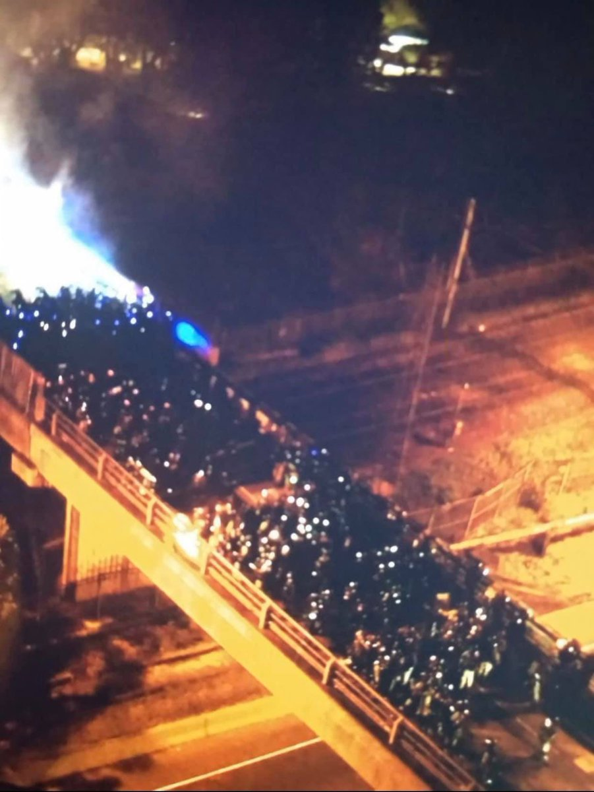
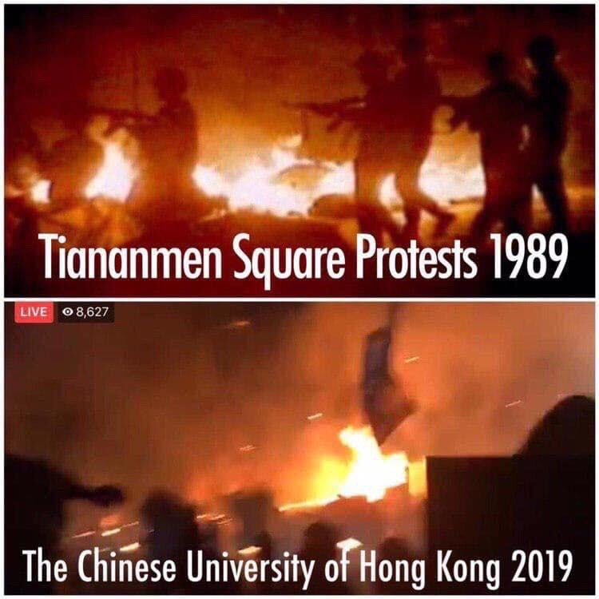
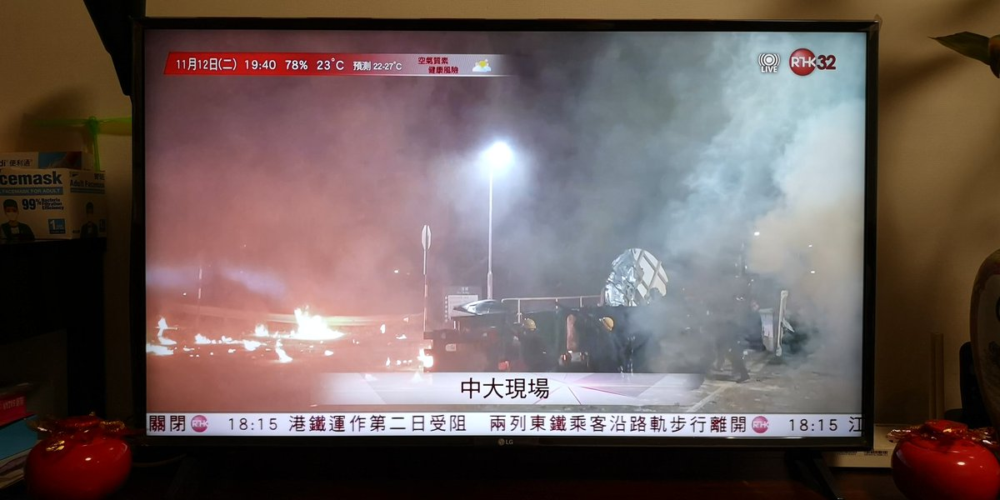
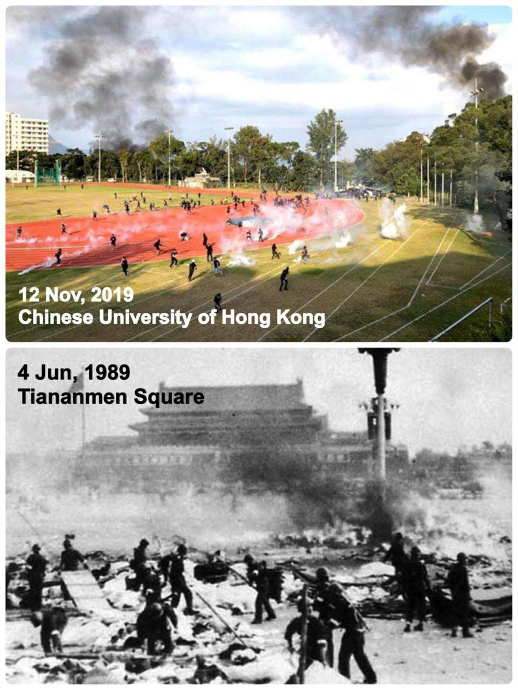
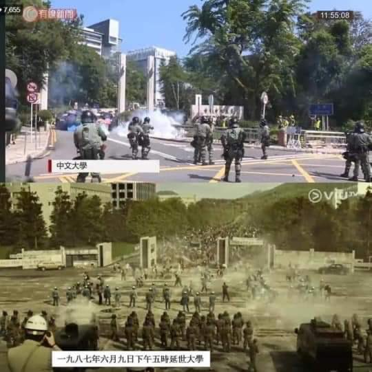
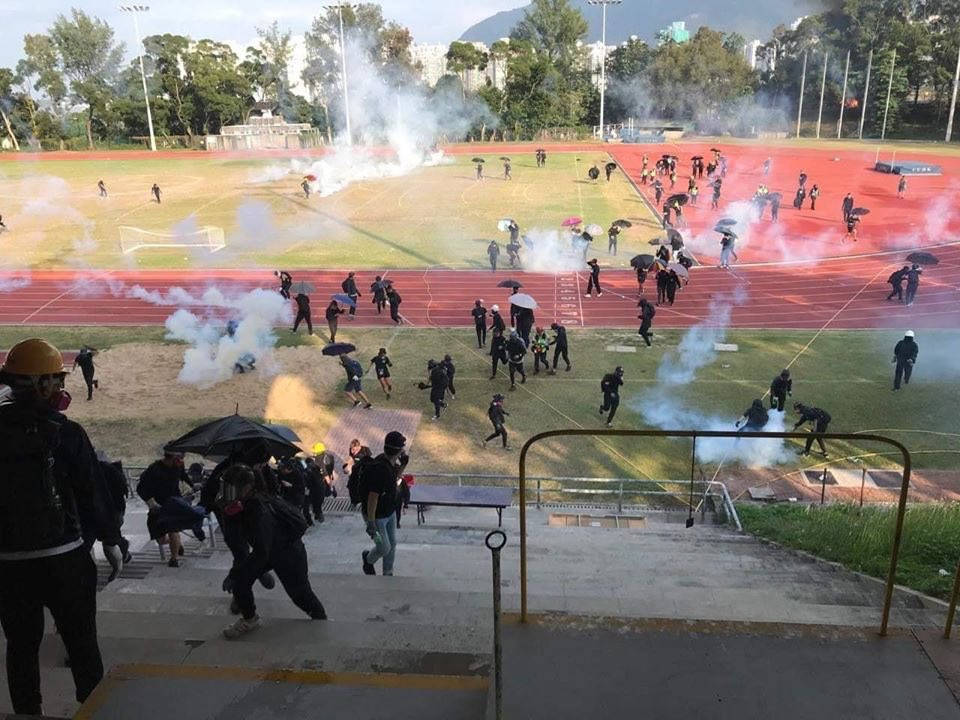
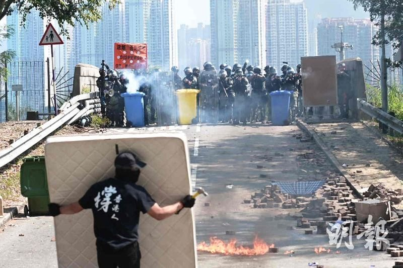
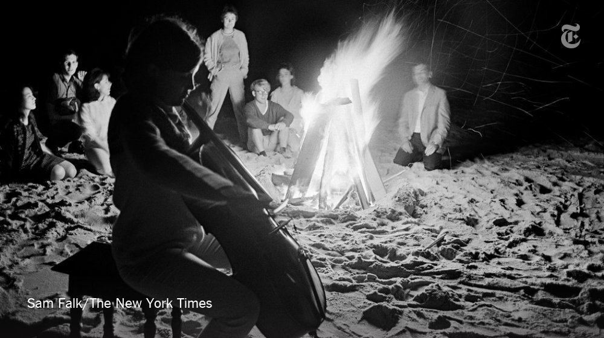
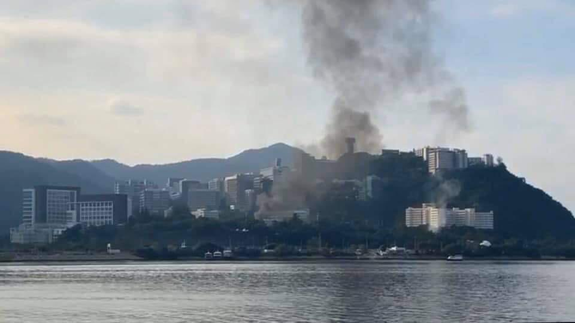
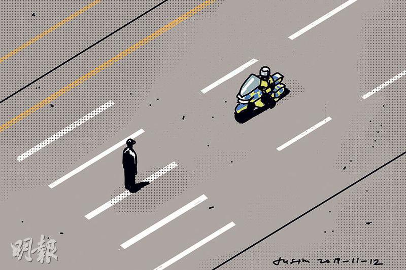

[11月12日 21:50]    GFHG SDKM   @zyx_yny    What If the free world do not do anything to stop this tragedy. 
IT IS HAPPENING RIGHT NOW @SolomonYue https://twitter.com/hknordichearts/status/1194247281261924352 …  :speech_balloon:评:0 :+1:赞:0 :globe_with_meridians:转:0  

[11月12日 21:47]    GFHG SDKM   @zyx_yny    Without doubt. It is 8964 AGAIN https://twitter.com/wbyeats1865/status/1194244174154891264 …  :speech_balloon:评:0 :+1:赞:0 :globe_with_meridians:转:1  

[11月12日 21:45]    GFHG SDKM   @zyx_yny    Riot police attacking the Chinese University of Hong Kong. #PoliceBrutalityHK #HongKong  :speech_balloon:评:0 :+1:赞:7 :globe_with_meridians:转:8  

[11月12日 21:35]    GFHG SDKM   @zyx_yny    SOS! HKPF is massacring in the Chinese University of Hong Kong! They are killing students! Students are trapped with no food and medical help! HKPF blocked all the roads! Please send army to save us!
#Tiananmen2019 @realDonaldTrump @HawleyMO @SenTedCruz @marcorubio @SolomonYue  :speech_balloon:评:194 :+1:赞:1117 :globe_with_meridians:转:1480  

[11月12日 21:25]    财经真相   @caijingxiang    看到这里，很多网友也许就会认为，参议员的议员太坏，不及众议院好，如果你这样认为就大错特错。因为参议员的议员知识文化水平普遍较高，看待问题也更加理性，这与众议院经常出现“白左”的理想化议员形成鲜明对比。如果没有参议院的制衡，美国恐怕会上演“美国版的打土豪分田地”，其后果将是灾难性的！  :speech_balloon:评:9 :+1:赞:43 :globe_with_meridians:转:11  

[11月12日 21:16]    财经真相   @caijingxiang    众议院议员在投票时，更多的是以道义为出发点，直接表达对香港人的支持；参议员的议员背后是大财团和政治家族，他们在中国和香港有着大量的资产和利益，因此参议院在香港问题不如众议院积极就比较容易理解，毕竟屁股决定脑袋，对这些议员来说，在钱大部分撤回来之前，最好不要和中共彻底撕破脸！  :speech_balloon:评:4 :+1:赞:60 :globe_with_meridians:转:21  

[11月12日 21:10]    财经真相   @caijingxiang    美国众议院是以人口为基准确定席位，其议员大多数来自普通公民，因此更贴近民意；而参议院议员人数较少，一般更代表美国精英集团的意志；两院互相制衡，协调美国普通阶层与精英阶层的利益诉求，这是美国政治稳定的核心。在香港法案上，众议院0票反对率先通过，这代表美国民意对香港的支持！  :speech_balloon:评:4 :+1:赞:92 :globe_with_meridians:转:29  

[11月12日 21:08]    BBC News 中文   @bbcchinese    国民党候选人韩国瑜和他新选定的竞选搭档张善政方方面面都有差异，“韩张配”是否相得益彰？ https://bbc.in/32F6V67   :speech_balloon:评:6 :+1:赞:6 :globe_with_meridians:转:2  

[11月12日 20:50]    GFHG SDKM   @zyx_yny    #TiananmenSquareMassacre #Tiananmen #hongkong  :speech_balloon:评:0 :+1:赞:18 :globe_with_meridians:转:4  

[11月12日 20:38]    GFHG SDKM   @zyx_yny    昨日から香港警察が中文大学（The Chinese University of Hong Kong）に攻め掛かってたが、今日は大学校内の大学生が違法集会の疑いで彼を大学校内で追い散らそうとしていた。もちろん銃を持って。
学生が学校内にいて何が悪い。
#HKPoliceTerrorists #HongKongProtests #StandWithHongKong  :speech_balloon:评:0 :+1:赞:10 :globe_with_meridians:转:19  

[11月12日 20:31]    新闻大吐槽   @TuCaoFakeNews    The CCP police have rushed to the university to arrest students. They want to kill more young people who are pursuing freedom. Leaders of the civilized world, please stand up and save these children, they are the future of freedom. https://twitter.com/TuCaoFakeNews/status/1194216529467822080 …  :speech_balloon:评:1 :+1:赞:28 :globe_with_meridians:转:19  

[11月12日 20:23]    GFHG SDKM   @zyx_yny    我好記得當年 8964 時，好多人睇住電視屌鳩中共話佢地殺學生。但今日，魔警三度攻入中文大學果班人就屌鳩香港大學生！點解？同樣係大學生點解對北京清華果啲你會心痛？香港呢班唔係人？中大呀，睇清楚 DSE 要攞到幾多分先入到去讀啦！
#年青就是罪 #年青而又係大學生就更加係死罪 #槍聲響過不停  :speech_balloon:评:5 :+1:赞:153 :globe_with_meridians:转:160  

[11月12日 20:20]    GFHG SDKM   @zyx_yny    說是攻勢，最多出燃燒彈，人家可是武裝到牙齒。。。。 https://twitter.com/nickname002002/status/1194225024455954432 …  :speech_balloon:评:3 :+1:赞:45 :globe_with_meridians:转:19  

[11月12日 20:12]    GFHG SDKM   @zyx_yny    #Hongkong 11月12日晚上
請您現在關注香港中文大學，非常危險
@MariaBartiromo
@trish_regan
@Jkylebass
@LouDobbs  https://twitter.com/MariaBartiromo/status/1194225228458713088 …  :speech_balloon:评:8 :+1:赞:89 :globe_with_meridians:转:91  

[11月12日 20:05]    GFHG SDKM   @zyx_yny    War zone battle in Chinese University of Hong Kong now.  :speech_balloon:评:541 :+1:赞:3746 :globe_with_meridians:转:4501  

[11月12日 20:02]    新闻大吐槽   @TuCaoFakeNews    这几个月共产党的本性在香港发挥到极致，繁华的东方明珠成了人间地狱。所谓的一国两制，所有的承诺，只不过是虚伪的谎言罢了。  :speech_balloon:评:3 :+1:赞:20 :globe_with_meridians:转:8  

[11月12日 20:01]    BBC News 中文   @bbcchinese    BBC中文整理中、港、台及各方反应及背后立场，有国际组织认为港府把政治问题转化成社会秩序问题。  :speech_balloon:评:54 :+1:赞:51 :globe_with_meridians:转:11  

[11月12日 20:00]    纽约时报中文网   @nytchinese    前白宫顾问史蒂芬·班农称美国与中国共产党的关系是一场经济和信息“战争”。谷歌创始人之一埃里克·施密特表示，美国的利益与中国纠缠在一起，中国是我们在全球技术主导地位竞争中的头号对手。
两国关系的下一阶段，可能为本世纪余下的时间奠定基调。 http://nyti.ms/34WsGjt   :speech_balloon:评:6 :+1:赞:27 :globe_with_meridians:转:10  

[11月12日 19:51]    新闻大吐槽   @TuCaoFakeNews     https://twitter.com/tucaofakenews/status/1194216529467822080 …  :speech_balloon:评:1 :+1:赞:6 :globe_with_meridians:转:5  

[11月12日 19:49]    新闻大吐槽   @TuCaoFakeNews    毛蝗当年用马列铁棍把中华大地的读书人的脊梁骨一根根打断，脊梁骨太硬打不断的，就直接砸向脑袋，剩下那种千秋万代的郭沫若……，现在习蝗也开始拿马列铁棍砸香港的读书人，砸完香港，砸台湾! https://twitter.com/TuCaoFakeNews/status/1194216529467822080 …  :speech_balloon:评:1 :+1:赞:9 :globe_with_meridians:转:6  

[11月12日 19:47]    新闻大吐槽   @TuCaoFakeNews    最近很多关于香港的视频，我已经不忍再打开看，黑警打人抓人强暴杀人，把正义议员也都抓走了，谁会在97年7月1日那天会想到今天这个惨状，国际社会也不管，没人救他们，香港啊，香港，难怪97回归那天，香港一直在下大雨，苍天有知，为港人痛哭! https://twitter.com/TuCaoFakeNews/status/1194213038733135872 …  :speech_balloon:评:4 :+1:赞:51 :globe_with_meridians:转:13  

[11月12日 19:45]    新闻大吐槽   @TuCaoFakeNews    我心極痛，懇請各階層人士繼續支持中大及現時所需各物資。極權冷血政府連薪薪學子也不放过，他們可是社會未来的棟樑啊！  :speech_balloon:评:0 :+1:赞:12 :globe_with_meridians:转:3  

[11月12日 19:44]    新闻大吐槽   @TuCaoFakeNews    震撼教育既重要性  :speech_balloon:评:0 :+1:赞:3 :globe_with_meridians:转:1  

[11月12日 19:41]    新闻大吐槽   @TuCaoFakeNews    原来习思想还不抵一个盾牌管用呢！ https://twitter.com/tucaofakenews/status/1194086405552721921 …  :speech_balloon:评:0 :+1:赞:3 :globe_with_meridians:转:1  

[11月12日 19:41]    新闻大吐槽   @TuCaoFakeNews      :speech_balloon:评:0 :+1:赞:9 :globe_with_meridians:转:8  

[11月12日 19:39]    新闻大吐槽   @TuCaoFakeNews    悲呼！壮呼！看这场景谁不泪水盈盈双眼模糊！这些最勇敢最可爱的孩子们是香港的骄傲，更是整个民族的骄傲！在这最黑暗恐怖时代，他们是唯一的光束，燃烧自已，照亮前路！ https://twitter.com/TuCaoFakeNews/status/1194144500781731840 …  :speech_balloon:评:0 :+1:赞:15 :globe_with_meridians:转:3  

[11月12日 19:39]    新闻大吐槽   @TuCaoFakeNews    欢迎变色！总比一个没有要好。相信更多人会支持我们  :speech_balloon:评:0 :+1:赞:7 :globe_with_meridians:转:1  

[11月12日 19:38]    新闻大吐槽   @TuCaoFakeNews    #HKPolice https://twitter.com/tucaofakenews/status/1194210929413513218 …  :speech_balloon:评:0 :+1:赞:5 :globe_with_meridians:转:2  

[11月12日 19:30]    GFHG SDKM   @zyx_yny    中大2號橋幾發催淚彈...警察叫段校長管理唔到學生就唔好行近2號橋...
咩道理...  :speech_balloon:评:1 :+1:赞:0 :globe_with_meridians:转:1  

[11月12日 19:30]    纽约时报中文网   @nytchinese    该贷款的目的是通过提升教师队伍和课程设置，支持该地区的5所职业学校。部分资金流向了“伙伴学校”，这些学校间接接受世银的资助，不受其监督。
“考虑到伙伴学校分布范围广、难以监控的风险，该项目的范围和规模正在缩减，”世银声明称。“涉及新疆伙伴学校的项目部分将被关闭。” http://nyti.ms/33OmHx3   :speech_balloon:评:0 :+1:赞:8 :globe_with_meridians:转:5  

[11月12日 19:29]    新闻大吐槽   @TuCaoFakeNews    香港政府暴警！連孕婦都不放過 ！好恐怖喔 ！哪有人這樣對待婦女的？？？  :speech_balloon:评:1 :+1:赞:4 :globe_with_meridians:转:2  

[11月12日 19:29]    GFHG SDKM   @zyx_yny    #HKPoliceTerrorism #HKprotests terrible terrorist attack to our college students.  :speech_balloon:评:0 :+1:赞:2 :globe_with_meridians:转:3  

[11月12日 19:29]    新闻大吐槽   @TuCaoFakeNews    但凡是个女人，看见孕妇被人打，还会支持警察？  :speech_balloon:评:0 :+1:赞:20 :globe_with_meridians:转:3  

[11月12日 19:27]    新闻大吐槽   @TuCaoFakeNews    孩子们坚持住！但也切记一定要注意安全！加油，香港！加油，香港人！ https://twitter.com/TuCaoFakeNews/status/1194144500781731840 …  :speech_balloon:评:1 :+1:赞:5 :globe_with_meridians:转:1  

[11月12日 19:26]    GFHG SDKM   @zyx_yny    警察は香港中文大学に突入し、多くの生徒を逮捕し､そして多くの催涙弾とゴム弾を撃ちました。ある学生記者の目に、催涙弾が直撃しました。彼は「僕の目は見えなくなるの?」と泣いていました。

この戻れない悲劇的な状況を作ったのは、公権力を持っているのに政治問題を解決しない香港政府です。  :speech_balloon:评:344 :+1:赞:9174 :globe_with_meridians:转:7312  

[11月12日 19:26]    新闻大吐槽   @TuCaoFakeNews    這是剛才一個感人場景，中環友為衝上前線的年輕勇武派歡呼！事發中環畢打街和德輔道中交界，也是亞洲地價最昂貴的十字路口。 https://twitter.com/tucaofakenews/status/1194144500781731840 …  :speech_balloon:评:1 :+1:赞:34 :globe_with_meridians:转:12  

[11月12日 19:22]    新闻大吐槽   @TuCaoFakeNews    这种事想忘也不能忘，中共的反人类罪，每一笔都会被清算 https://twitter.com/tucaofakenews/status/1194213038733135872 …  :speech_balloon:评:2 :+1:赞:7 :globe_with_meridians:转:2  

[11月12日 19:22]    墙国铁拳现世报😷   @Socialistfist    从2018年9月到现在频繁微博维权，神奇的是，小编就是没看出来他举报的贪污腐败是什么内容  :speech_balloon:评:1 :+1:赞:52 :globe_with_meridians:转:5  

[11月12日 19:21]    新闻大吐槽   @TuCaoFakeNews    得道多助，越来越多的人会认清党犬的真面目。 https://twitter.com/TuCaoFakeNews/status/1194210929413513218 …  :speech_balloon:评:0 :+1:赞:7 :globe_with_meridians:转:3  

[11月12日 19:20]    墙国铁拳现世报😷   @Socialistfist    宝贝别哭

#社会主义铁拳  :speech_balloon:评:19 :+1:赞:137 :globe_with_meridians:转:30  

[11月12日 19:20]    新闻大吐槽   @TuCaoFakeNews    共匪土匪！ https://twitter.com/TuCaoFakeNews/status/1194126690101813248 …  :speech_balloon:评:1 :+1:赞:5 :globe_with_meridians:转:2  

[11月12日 19:00]    BBC News 中文   @bbcchinese    南非17岁少女一个偶然机会发现自己有两个妈妈，一个真妈，一个假妈，于是引出一段五味杂陈的故事。 https://bbc.in/2X4oAmw   :speech_balloon:评:0 :+1:赞:16 :globe_with_meridians:转:4  

[11月12日 19:00]    纽约时报中文网   @nytchinese    阿里巴巴喜欢炫耀的“双11”庞大数字，并不是对目前形势如何影响中国中产阶级“购物解忧”胃口的完美衡量。
阿里巴巴报告的是所谓“商品交易总额”，这个数字代表的是其平台上的订单总额。但是，并没有衡量这个数字的标准化方法，而且阿里巴巴的“双11”数据也没有经过外部审计。 http://nyti.ms/2pRJmd3   :speech_balloon:评:14 :+1:赞:13 :globe_with_meridians:转:1  

[11月12日 18:30]    纽约时报中文网   @nytchinese    行政长官林郑月娥周二批评抗议者破坏交通，并表示校方应敦促学生停止参与非法活动。她在当日早间对记者说：“试图‘瘫痪’香港的示威抗议者极度自私。”
港铁周二早上称，有人将汽油弹扔到一条通向中国大陆边境的主要铁路线上，在通勤高峰时段造成了延误。大批通勤者沿着铁路行走。 http://nyti.ms/2rANbUp   :speech_balloon:评:5 :+1:赞:4 :globe_with_meridians:转:1  

[11月12日 18:00]    纽约时报中文网   @nytchinese    在时报交易录大会上，九位中国政策专家讨论了美中关系面临的主要挑战。
与中国和平接触的政策正走向终结，面对“中国优势”，美国该如何重新定义两国关系？ http://nyti.ms/34WsGjt   :speech_balloon:评:7 :+1:赞:20 :globe_with_meridians:转:9  

[11月12日 17:40]    GFHG SDKM   @zyx_yny    【20191112】#香港中文大学 校内へ突撃した #香港警察 は、数え切れないほどの催涙弾を大学内の運動場に向けて発射した。学生は学校を守ってくれてるデモ隊に「逃げろ！逃げろ！」と泣きながら叫んでいた。  :speech_balloon:评:9 :+1:赞:678 :globe_with_meridians:转:886  

[11月12日 17:30]    纽约时报中文网   @nytchinese    从分发瓶装水和红豆汤的普通人，到在秘密诊所工作的医护人员，一支庞大的志愿者队伍在远离前线的地方帮助示威者。
公众支持对当局来说成了一个棘手的挑战。当局一直希望通过离间日益激进的煽动者和同情者来平息抗议。 http://nyti.ms/32Cy1ee   :speech_balloon:评:55 :+1:赞:233 :globe_with_meridians:转:137  

[11月12日 17:00]    纽约时报中文网   @nytchinese    #图集【时报摄影师萨姆·福克：照片背后的故事】“完整、迅速地讲故事”，萨姆·福克如此形容他作为一名摄影师的使命。
在1925年至1969年为《纽约时报》工作期间，他为该报捕捉下无数生动的片刻，提供了丰富的视觉影像。
点击查看图集： http://nyti.ms/2NHsRtb   :speech_balloon:评:0 :+1:赞:10 :globe_with_meridians:转:2  

[11月12日 16:49]    GFHG SDKM   @zyx_yny    #HongKong protests out of control: 

Police fired teargas into the university campus

Mainstream media will never show you this video. You are the media now.  :speech_balloon:评:168 :+1:赞:1739 :globe_with_meridians:转:1830  

[11月12日 16:49]    GFHG SDKM   @zyx_yny    Chinese University of #HongKong looks like a war zone today... #China  :speech_balloon:评:283 :+1:赞:2784 :globe_with_meridians:转:2853  

[11月12日 16:31]    GFHG SDKM   @zyx_yny    Smoke coming out of #CUHK, the Chinese University of #HongKong, as riot police fired tear gas, clashed with students & made rounds of arrests today inside campus.

Video taken by the father of a friend who was strolling in Ma On Shan (and playing a sad song in background). #HK  :speech_balloon:评:58 :+1:赞:1247 :globe_with_meridians:转:1467  

[11月12日 16:30]    纽约时报中文网   @nytchinese    是1989年11月9日的晚上。当东德牧师、持不同政见者克拉舍尔的汽车畅通无阻地开进一直以来都被禁止进入的安全区时，他摇下车窗，问一名边防警卫：“是我在做梦还是这是真的？”
“你在做梦，”警卫回答。 http://nyti.ms/2CDzw0R   :speech_balloon:评:2 :+1:赞:13 :globe_with_meridians:转:3  

[11月12日 16:09]    GFHG SDKM   @zyx_yny    The Chinese University of Hong Kong is literally a war zone now.

If the #HongKongPolice had successfully occupied the campus, I guess at least hundreds, if not thousands, will be arrested.

It will be a huge blow to the #antiELABhk movement. https://twitter.com/sumlokkei/status/1194156273903620096 …  :speech_balloon:评:49 :+1:赞:618 :globe_with_meridians:转:696  

[11月12日 16:00]    BBC News 中文   @bbcchinese    “双十一”（11月11日）这天，阿里巴巴旗下电商平台交易额达到2684亿元，再次刷新纪录。 https://bbc.in/33EWIrG   :speech_balloon:评:42 :+1:赞:43 :globe_with_meridians:转:12  

[11月12日 15:52]    纽约时报中文网   @nytchinese    由于对警察开枪射击示威者感到愤怒，香港抗议者周二封锁道路、迫使列车延误，该市连续第二天出现交通中断的状况。
早上，抗议者在香港城市大学附近扔砖头，并在学生宿舍附近筑起路障，警方与抗议者对峙，并施放了催泪瓦斯。
时报整理了关于抗议活动的最新消息： http://nyti.ms/2rANbUp   :speech_balloon:评:52 :+1:赞:71 :globe_with_meridians:转:27  

[11月12日 15:01]    BBC News 中文   @bbcchinese    中国在人脸识别技术的世界领先地位，你知道多少？科技带来的隐私、人权案件有哪些先例？ https://bbc.in/2KbRtYM   :speech_balloon:评:40 :+1:赞:67 :globe_with_meridians:转:30  

[11月12日 14:46]    老司机   @h5lpykl7tp6jjop    今天，当勇武派出现在市中心商业区的时候，受到了英雄一般的热烈欢迎。
而此前，林郑月娥称：「抗争者是人民的敌人」  :speech_balloon:评:98 :+1:赞:1562 :globe_with_meridians:转:755  

[11月12日 14:46]    新闻大吐槽   @TuCaoFakeNews    今天，当勇武派出现在市中心商业区的时候，受到了英雄一般的热烈欢迎。
而此前，林郑月娥称：「抗争者是人民的敌人」  :speech_balloon:评:98 :+1:赞:1565 :globe_with_meridians:转:755  

[11月12日 14:46]    新闻大吐槽   @TuCaoFakeNews    今天，当勇武派出现在市中心商业区的时候，受到了英雄一般的热烈欢迎。
而此前，林郑月娥称：「抗争者是人民的敌人」  :speech_balloon:评:98 :+1:赞:1565 :globe_with_meridians:转:755  

[11月12日 14:44]    财经真相   @caijingxiang    支持胡主编把宣传口径拉到海外的，这真是一个高招啊！你想啊，中国有14亿爱国群众，很容易赢得舆论上的胜利！强烈建议胡主编向上级反映，开放推特，接触防火墙！  :speech_balloon:评:15 :+1:赞:107 :globe_with_meridians:转:30  

[11月12日 14:40]    纽约时报中文网   @nytchinese    陷入困境的香港特首林郑月娥周一谴责动乱，称不断升级的暴力不会迫使政府屈从于抗议者的要求。她称那些放火烧人者“是与市民为敌”。
上周，香港科技大学学生周梓乐在示威活动中从停车场摔落身亡之后，紧张局势数日来一直在持续增长。 http://nyti.ms/33A0wua   :speech_balloon:评:4 :+1:赞:13 :globe_with_meridians:转:3  

[11月12日 14:20]    纽约时报中文网   @nytchinese    《纽约时报》今日头版 https://twitter.com/photojournalism/status/1194080716121882626 …  :speech_balloon:评:5 :+1:赞:46 :globe_with_meridians:转:23  

[11月12日 14:00]    纽约时报中文网   @nytchinese    #每日一词 White elephant，白象。近期，时报记者前往河南汝州寻找“白象项目”(white-elephant projects)，报道地方政府举债建造的面子工程。但她们在当地被警方短暂扣留、遭到官员跟踪与围困。White elephant指大而无当、造价昂贵、不实用的东西。
更多简报内容： http://nyti.ms/2pTC0Wv   :speech_balloon:评:0 :+1:赞:13 :globe_with_meridians:转:5  

[11月12日 13:36]    老司机   @h5lpykl7tp6jjop    黑警再次突破底线，坏事做绝，竟然殴打孕妇。
没人性！恐怖输出  :speech_balloon:评:72 :+1:赞:441 :globe_with_meridians:转:362  

[11月12日 13:30]    纽约时报中文网   @nytchinese    世界银行周一表示，将缩减在中国新疆地区的开发工作。此前有猜测称，世银在2015年为一个教育项目提供的5000万美元贷款被用于资助穆斯林拘禁营。
世银表示，它已对项目进行了广泛的审核，无法证实这些指控。不过，世银坦诚面临着严格监控情况的挑战，并表示正在对项目作出更改。 http://nyti.ms/33OmHx3   :speech_balloon:评:13 :+1:赞:49 :globe_with_meridians:转:24  

[11月12日 12:59]    纽约时报中文网   @nytchinese    据阿里巴巴自己的统计，今年的“双11”，在其网络平台卖出了2684亿人民币的货品，超出了去年的2135亿人民币，创下纪录。
泰勒·斯威夫特等国际明星也现身直播晚会。这表明在涉及巨额资金的情况下，世界仍希望来到中国。 http://nyti.ms/2pRJmd3   :speech_balloon:评:63 :+1:赞:51 :globe_with_meridians:转:13  

[11月12日 12:09]    财经真相   @caijingxiang    淘宝双十一数据布在三次回归曲线上，拟合度均超过99.94%，几乎为1，今年2684亿，与2689亿的预测数据只差5亿，这说明淘宝在造假！  :speech_balloon:评:129 :+1:赞:506 :globe_with_meridians:转:195  

[11月12日 12:01]    BBC News 中文   @bbcchinese    印度最高法院作出判决表示，印度北部极具宗教争议的阿约提亚圣地应该交给那些希望在那里修建寺庙的印度教徒。 https://bbc.in/2CuaTUB   :speech_balloon:评:4 :+1:赞:7 :globe_with_meridians:转:5  

[11月12日 12:00]    纽约时报中文网   @nytchinese    • 被控种族清洗，缅甸面临国际诉讼。周一，冈比亚向海牙国际法院提起诉讼，指控缅甸实施和纵容迫害罗辛亚人的行为。
• 叙利亚救援组织背后关键人物在土耳其死亡。勒梅苏里耶是一名英国人，曾为致力于在叙利亚内战中营救平民的“白盔队”提供资金、装备和培训。更多简报内容： http://nyti.ms/2pTC0Wv   :speech_balloon:评:5 :+1:赞:11 :globe_with_meridians:转:7  

[11月12日 11:40]    GFHG SDKM   @zyx_yny    #HongKong’s Tiananmen Square Massacre in slow motion 
#StandWithHongKong  :speech_balloon:评:8 :+1:赞:227 :globe_with_meridians:转:186  

[11月12日 11:30]    纽约时报中文网   @nytchinese    一名示威者遭到警察近距离枪击；一名男子在斥责抗议者不爱国后，被泼洒易燃液体并被点燃。夜幕降临时，两人仍在医院与死神搏斗。
周一，香港经历野蛮暴力日。抗议者们对于在他们看来怎么做都不受惩罚的警察怒不可遏，而批评抗议的人则对破坏性越来越大的示威活动义愤填膺。 http://nyti.ms/33A0wua   :speech_balloon:评:94 :+1:赞:77 :globe_with_meridians:转:40  

[11月12日 11:01]    BBC News 中文   @bbcchinese    有在台湾念书的大陆学生证实收到要求2020年1月11日前离开台湾的讯息，而当日台湾将举行总统大选，有台湾学者称中国此举可能是不希望太多大陆学生在台湾感受民主气氛。不过中国地方台办否认有发出类似讯息。 https://bbc.in/2Kb6A4H   :speech_balloon:评:178 :+1:赞:228 :globe_with_meridians:转:85  

[11月12日 11:00]    纽约时报中文网   @nytchinese    玻利维亚前总统接受墨西哥庇护。埃沃·莫拉莱斯此前被质疑选举舞弊，在街头抗议和军方压力下辞职。但他表示，自己是在一场“政变”中被迫下台的。
玻利维亚当前已陷入权力真空，在莫拉莱斯之后，几名潜在继任者也接连辞职。
更多简报内容： http://nyti.ms/2pTC0Wv   :speech_balloon:评:5 :+1:赞:3 :globe_with_meridians:转:2  

[11月12日 10:54]    纽约时报中文网   @nytchinese    简报：香港经历野蛮暴力日；“双11”交易额再破纪录 http://nyti.ms/2pTC0Wv https://twitter.com/ccni/status/1194074755814572033 …  :speech_balloon:评:3 :+1:赞:4 :globe_with_meridians:转:3  

[11月12日 10:53]    纽约时报中文网   @nytchinese    你可能曾看着与自己的财务状况大致相当的邻居或朋友，心里想，“他们是怎么做到的？”
这种感觉中有嫉妒的成分，但也夹杂着好奇。而且常常伴随着大量的自责。别再觉得自己很失败，因为很可能他们有不为人知的财富或债务。 http://nyti.ms/36Tbq0b   :speech_balloon:评:5 :+1:赞:19 :globe_with_meridians:转:12  

[11月12日 10:36]    老司机   @h5lpykl7tp6jjop    什么最重要？信息自由排第一！  :speech_balloon:评:4 :+1:赞:88 :globe_with_meridians:转:29  

[11月12日 10:20]    财经真相   @caijingxiang    对于被捕的学生处理方式有三种，第一种确定登记所有学生信息，并以家人安全进行威胁，如果学生屈服就释放并进行定期监控；第二种就是没有一丝屈服，视死如归的直接弄死抛尸；第三种多次被捕，毒打后直接监禁，同时加快深圳附近集中营的建设。这也是香港抗议规模逐渐减少的原因！  :speech_balloon:评:15 :+1:赞:166 :globe_with_meridians:转:70  

[11月12日 10:10]    财经真相   @caijingxiang    班农透露共和党正忙于应对川普的弹劾案，到明年2月份参议院都很难通过香港法案，也就是说香港人还要继续被打被杀至少三个月，以目前中共每天逮捕两百人计算，三个月就是近两万人，中共确信这些时间足够把香港积极抗争的学生全部逮捕，最终恢复香港所谓的稳定秩序！这就是中共对香港的策略吧！  :speech_balloon:评:39 :+1:赞:302 :globe_with_meridians:转:120  

[11月12日 10:01]    BBC News 中文   @bbcchinese    手机屏幕会让你老得更快？快告诉一位手机不离手的朋友！  :speech_balloon:评:9 :+1:赞:99 :globe_with_meridians:转:76  

[11月12日 09:53]    纽约时报中文网   @nytchinese    早安！今日重点新闻包括：
香港经历野蛮暴力日；“双11”交易额再破纪录；世界银行缩减对新疆贷款项目规模；澳大利亚遭遇“灾难性”山火；玻利维亚陷权力真空，前总统接受墨西哥庇护；叙利亚救援组织背后关键人物在土耳其死亡……NYT简报带你速览今日要闻。 http://nyti.ms/2pTC0Wv   :speech_balloon:评:25 :+1:赞:40 :globe_with_meridians:转:18  

[11月12日 08:48]    BBC News 中文   @bbcchinese    敬业集团要在这宗收购中得到什么？ https://bbc.in/36ZM54X   :speech_balloon:评:9 :+1:赞:14 :globe_with_meridians:转:5  

[11月12日 08:26]    BBC News 中文   @bbcchinese    2019年，她入选了BBC巾帼百名杰出女性名单。 https://bbc.in/2pTGD2O   :speech_balloon:评:6 :+1:赞:14 :globe_with_meridians:转:6  

[11月12日 08:01]    BBC News 中文   @bbcchinese    1989年发生了震惊世界的“柏林墙倒塌”事件，迄今已整整30周年。为何柏林墙会倒塌？当年到底发生了什么？  :speech_balloon:评:51 :+1:赞:511 :globe_with_meridians:转:238  

[11月12日 07:26]    BBC News 中文   @bbcchinese    为何这两国不久前似乎还都正在国家发展的道路上向前，好像忽然就陷入国家危机、领导人被迫下野的境地呢？ https://bbc.in/2CAY0YG   :speech_balloon:评:36 :+1:赞:46 :globe_with_meridians:转:13  

[11月12日 07:22]    凡賽堤/FORSETI   @FecharCCP    11日早在西湾河开枪射伤示威者的港警关家荣身份被起底，其担任家教会主席的德望学校师生、家长及校友发起联署要求解除其在该校的职务。其两个女儿在该校就读。另有消息指，关家荣受过“大陆警察部门”特殊培训。下面这个小视频，足以解释这场血案的真相：这是流氓国家自上而下有计划的谋杀。  :speech_balloon:评:16 :+1:赞:200 :globe_with_meridians:转:133  

[11月12日 07:14]    凡賽堤/FORSETI   @FecharCCP    救救悲慘的香港 #HKSOS

香港黑警拔槍亂殺港民！已多人中槍和死亡！

天滅極權！  :speech_balloon:评:0 :+1:赞:10 :globe_with_meridians:转:8  

[11月12日 07:11]    凡賽堤/FORSETI   @FecharCCP    11.11 香港殺人魔家庭資料！
全世界通緝這殺人魔全家！  :speech_balloon:评:46 :+1:赞:13 :globe_with_meridians:转:10  

[11月12日 07:07]    凡賽堤/FORSETI   @FecharCCP    救救悲慘的香港 #HKSOS

香港黑警拔槍亂殺港民！已多人中槍和死亡！  :speech_balloon:评:0 :+1:赞:8 :globe_with_meridians:转:6  

[11月12日 06:57]    凡賽堤/FORSETI   @FecharCCP    天滅流氓政權！！！CCP極權殺人恐怖組織正在用各種兇殘手段屠殺我們的同胞...................

看看這些大陸的黑警（公安，武警，士兵裝扮成香港警察）是如何沒有人性的屠殺香港學生！！！

天滅流氓政權！！！天滅CCP！！！  :speech_balloon:评:1 :+1:赞:20 :globe_with_meridians:转:20  

[11月12日 06:42]    凡賽堤/FORSETI   @FecharCCP    天滅流氓政權！！！CCP極權殺人恐怖組織正在用各種兇殘手段殺害我們的同胞...................

看看這些大陸的黑警（公安，武警，士兵裝扮成香港警察）是如何沒有人性的屠殺香港學生！！！

那個小年輕不知道是休克還是已經死亡！

天滅流氓政權！！！天滅CCP！！！  :speech_balloon:评:34 :+1:赞:15 :globe_with_meridians:转:12  

[11月12日 06:25]    凡賽堤/FORSETI   @FecharCCP    坐水凳（英語：waterboarding）是水刑的一種，做法是將受害人固定其雙手雙腳，在頭部放上布後持續澆水。如此會讓受害人產生溺水的錯覺而心生恐懼。雖然坐水凳不在身上留下可辨識的傷痕，但受害人在過程中會因為嗆到水甚至吸入性肺炎而受傷害。另外有些人因此導致心理方面的傷害，是酷刑的一種。  :speech_balloon:评:0 :+1:赞:32 :globe_with_meridians:转:31  

[11月12日 05:58]    GFHG SDKM   @zyx_yny    等等，这是怕他女儿闻催泪弹才接走？？？所以别人家的小孩就该受着？？？ https://twitter.com/LrBlUA8AsssKdx4/status/1193931580261072896 …  :speech_balloon:评:1 :+1:赞:100 :globe_with_meridians:转:29  

[11月12日 04:31]    老司机   @h5lpykl7tp6jjop    共产主义是一个最大的政治笑话，有人说，马克思也许设计了一个巨大的烟囱，它的信徒把图纸拿倒了，挖造成了一座座深井，把这些国家和人民都活埋在下面见不到阳光和空气，最可悲的是当这些人来真实的世界，它们反而觉得真实的世界不正常，它们居然怀念那个黑暗的深井！  :speech_balloon:评:4 :+1:赞:79 :globe_with_meridians:转:24  

[11月11日 23:01]    墙国铁拳现世报😷   @Socialistfist    所有推文内容来自于公开的网络社交媒体。
年轻人还是需要学习一个
毕竟too young  https://twitter.com/muxiawenyuzi/status/1193888039799574528 …  :speech_balloon:评:11 :+1:赞:157 :globe_with_meridians:转:13  

[11月11日 20:31]    BBC News 中文   @bbcchinese    香港发生示威五个月以来第三起警察实弹枪伤抗议者事件，警方指示威者当时尝试抢夺警员的佩枪，另有市民被示威者纵火严重烧伤 。 https://bbc.in/2pbuVA8   :speech_balloon:评:159 :+1:赞:136 :globe_with_meridians:转:64  

[11月11日 20:30]    BBC News 中文   @bbcchinese    围绕女性性器官存在和流传着许多误解。美国妇产科医生珍·冈特（Dr.Jen Gunter)在北美行医25年。她的新书《阴道圣经》（The Virginal Bible）为女性提供许多实用性建议，在这里我们为你总结5条。 https://bbc.in/2pPw0Ot   :speech_balloon:评:5 :+1:赞:77 :globe_with_meridians:转:33  

[11月11日 20:05]    BBC News 中文   @bbcchinese    【香港示威：张炳良称中港关系恶化 因议员侮辱中国人身份】#香港 运输及房屋局前局长 #张炳良 接受BBC HARDtalk专访。他用其 #建制派 立场阐述了对香港反政府示威的观察，以及对现届香港政府的看法。 https://bbc.in/2K2hEkA   :speech_balloon:评:17 :+1:赞:11 :globe_with_meridians:转:4  

[11月11日 17:21]    墙国铁拳现世报😷   @Socialistfist      :speech_balloon:评:19 :+1:赞:89 :globe_with_meridians:转:8  

[11月11日 17:19]    墙国铁拳现世报😷   @Socialistfist    在吗？我微博被封了，可以聊聊吗？

#社会主义铁拳
#战螂在推特  :speech_balloon:评:28 :+1:赞:274 :globe_with_meridians:转:53  

[11月11日 17:01]    BBC News 中文   @bbcchinese    中国商家借“双11”、“光棍节”发财之际，影星艾玛·沃特森宣告：我单身，我自豪。这叫“自我为伴”。 https://bbc.in/36SaFVi   :speech_balloon:评:118 :+1:赞:121 :globe_with_meridians:转:24  

[11月11日 16:40]    老司机   @h5lpykl7tp6jjop    Mitch McConnell (@senatemajldr) are you too corrupted by Foremost Shipping money to pass the #HKHRDA? If so you are too corrupt for the Senate. Get out and let a leader lead. https://twitter.com/hoccgoomusic/status/1193749769291620352 …  :speech_balloon:评:30 :+1:赞:438 :globe_with_meridians:转:363  

[11月11日 15:19]    老司机   @h5lpykl7tp6jjop    中国几千年来一直不能改变的就是：总是用一个谎言代替另一个谎言，用一种愚昧代替另一种愚昧，用一种暴力代替另一种暴力，用一种诡辩代替另一种诡辩，永远在下流的泥沼自我陶醉！  :speech_balloon:评:6 :+1:赞:58 :globe_with_meridians:转:17  

[11月11日 15:01]    BBC News 中文   @bbcchinese    “量子波动速读”这一超乎常规的高价培训方式近期在中国大陆走红，但迅速被教育监管机构喊停。伪科学如何得以招摇过市？ https://bbc.in/36SfZaW   :speech_balloon:评:47 :+1:赞:77 :globe_with_meridians:转:33  

[11月11日 14:12]    财经真相   @caijingxiang    记得有个官员说过一句很经典的话“没有坏账，哪来那么多富人”，就是直接点出了中国银行游戏的本质。穷人要想贷款只能是“消费性质的”，这就是“房贷、车贷”，其他原始资本积累性质的贷款，是坚决被禁止的。而富人、官员、权贵则不然，他们贷款或者打着政府名义免抵押物要求，或者凭借权利直接贷款！  :speech_balloon:评:7 :+1:赞:318 :globe_with_meridians:转:93  

[11月11日 14:02]    财经真相   @caijingxiang    银行的新增存款不但停止增加，甚至开始减少，这个时候如果再赶上“春节”用钱高峰，银行就没有钱去应对储户提现要求，最终引发挤兑，银行破产！  :speech_balloon:评:10 :+1:赞:127 :globe_with_meridians:转:33  

[11月11日 14:00]    财经真相   @caijingxiang    票据贷如果只借一次也就罢了，关键是很多权贵，不但票据（欠条）到期后不还钱，反而再开一张票据，又拿走了一笔贷款，如此反复操作下去，银行的窟窿越来越大。以往经济好的时候，银行的存款也是不断的增加，比如从10块增加的20块，银行还可以勉强维持下去，直到中美贸易打的鸡飞狗跳，经济实质性的下滑  :speech_balloon:评:1 :+1:赞:75 :globe_with_meridians:转:24  

[11月11日 13:55]    财经真相   @caijingxiang    因此中国的银行存款大部分是被国企和政府拿走，另一个就是房贷，这些几乎占据了中国银行贷款的8成以上，而这些要么是很难还款，要么就是根本不想换，由此造成银行资金连长期紧张，除了上面这些方面外，某些地方政府或者权贵企业干脆任何抵押物都不提供，直接给张欠条，就把钱贷走了，这就票据贷！  :speech_balloon:评:3 :+1:赞:85 :globe_with_meridians:转:28  

[11月11日 13:54]    BBC News 中文   @bbcchinese    【香港西湾河开枪：警察以实弹近距离击中黑衣人】这是香港反《逃犯条例》修订案示威爆发以来，第三起警察真枪实弹打伤示威者的事件。BBC中文以影片还原了事发经过。 https://bbc.in/2rpJ6lI   :speech_balloon:评:385 :+1:赞:302 :globe_with_meridians:转:158  

[11月11日 13:50]    财经真相   @caijingxiang    房贷、车贷等割老百姓韭菜性质的贷款，却管比较宽松，一般只要能够提供稳定工作证明就可以“放贷”，不要提供抵押物，但是其他性质的贷款则必须提供足量的抵押物，这也是中国中小企业贷款难、融资贵的核心根源。不过贷款对于国企而言却不是个事，因为国企本质是有政府背书，而且出事后银行一般免于追责！  :speech_balloon:评:3 :+1:赞:80 :globe_with_meridians:转:23  

[11月11日 13:44]    财经真相   @caijingxiang    银行最大借贷是6块，与总存款10块有一个比率，被称为存贷比，这在国际银行界都有严格规定；出借的6块中，确定不能还的钱，就是通常所说的坏账，坏账与总资本也有一个比率，被称坏账率，坏账率根据巴塞尔协议也有严格限制，不得超过规定！在中国从银行贷款都严格的抵押物要求，因此普通百姓一般都拿不到  :speech_balloon:评:1 :+1:赞:71 :globe_with_meridians:转:23  

[11月11日 13:36]    财经真相   @caijingxiang    平时银行手里的2块足够应对社会的取现，但是如果碰到春节，现金需求量大时，比如春节需求4块，银行2块就不够用，这时银行一般可以其他银行或者保险公司等金融机构借款，这被称为“同业拆借”，如果同业的钱也不够用，就只能找央行要回那笔“存款保证金”，央行一般会根据大数据分析缺口来定额度这就是降准  :speech_balloon:评:2 :+1:赞:104 :globe_with_meridians:转:27  

[11月11日 13:28]    财经真相   @caijingxiang    “钱荒”首先要弄清楚是哪个地方缺钱，临近春节最缺钱的就是银行。银行才是真正的“货币蓄水池”，银行本质就是钱的中介，一边吸收存款，另一边加点利息把收来的存款贷出去。正常情况下银行吸收了10块，只能贷出6块，2块交个央行保管，这比钱被称为存款保证金，剩下2元，作为手头现金流应对日常所需！  :speech_balloon:评:16 :+1:赞:403 :globe_with_meridians:转:167  

[11月11日 13:20]    BBC News 中文   @bbcchinese    这是自香港反对《逃犯条例》修订案示威今年6月爆发以来，第三次警察真枪实弹打伤示威者的事件。 https://bbc.in/36TQNRq   :speech_balloon:评:396 :+1:赞:393 :globe_with_meridians:转:216  

[11月11日 08:44]    BBC News 中文   @bbcchinese    几张图告诉你中国和美国的“金融切割”没那么简单。 https://www.bbc.com/zhongwen/simp/world-49965106 …  :speech_balloon:评:7 :+1:赞:55 :globe_with_meridians:转:30  

[11月11日 08:21]    老司机   @h5lpykl7tp6jjop    交通黑警连开三枪（真枪），其中一名抗争者中枪倒地！
太卑鄙了！！！！！！
当街杀人  :speech_balloon:评:105 :+1:赞:653 :globe_with_meridians:转:525  

[11月10日 22:23]    墙国铁拳现世报😷   @Socialistfist    5. 因投稿较多且具体事件有时效性，也许会延迟发布您的投稿，希望能够理解。对于一些重复投稿的或者不符合主题的投稿，也许不会被采用。
6. 最佳投稿途径是发送私信，@ 本推会被其他通知挤掉
7. 如果您有好的内容，欢迎使用 #社会主义铁拳 和 #社會主義鐵拳，简繁双体的tag。符合内容的推文会给予转推  :speech_balloon:评:0 :+1:赞:49 :globe_with_meridians:转:6  

[11月10日 22:18]    墙国铁拳现世报😷   @Socialistfist    1. 为避免潜在视奸号盗取IP，不接受含有网站链接的投稿
2. 社会主义铁拳相关主题内容应当是，个体或集体有赞美言论后被社会主义政权铁拳的事例。自然灾害或非社会主义政权皆不算是#社会主义铁拳
3. 本推主题明确统一，不接受除了铁拳现世报以外的爆料或投稿
4. 推荐使用多张截图和文字相配合的投稿方式  :speech_balloon:评:1 :+1:赞:75 :globe_with_meridians:转:9  

[11月10日 22:14]    墙国铁拳现世报😷   @Socialistfist    感谢所有新关注的推友和所有开推以来一路的老朋友。
本推的成长离不开所有积极投稿的热心推友，再次表示特别感谢。为了明确投稿规范，特别发此推做出说明。  :speech_balloon:评:5 :+1:赞:103 :globe_with_meridians:转:11  

[11月10日 21:07]    老司机   @h5lpykl7tp6jjop    剛刚：这阵仗像极了大陆解放军攻打香港，看起来特别地荒唐可笑！竟然用这阵仗对付手无寸铁的民众、自已的骨肉同胞？你们也真不要逼脸！  :speech_balloon:评:282 :+1:赞:1243 :globe_with_meridians:转:814  

[11月10日 17:22]    老司机   @h5lpykl7tp6jjop    8年获得科研经费补贴15亿元。最终还是破产了！
国企为主的政策主导下，自主研发口号让领导开心，大笔一挥，
山东常林集团，一家拥有“国家重点实验室”和“山东省重点实验室”的企业，多次名列"中国机械工业百强"榜单，可现实残酷骗局终于现相：  :speech_balloon:评:9 :+1:赞:112 :globe_with_meridians:转:71  

[11月10日 15:55]    财经真相   @caijingxiang    有人说我做的前三季度财政不全，没有算上土地出让金，因为那个才是地方政府收入的大头，好吧，补充一下，1-9月全国政府性基金预算收入53163亿元，其中中央收入3086亿元，地方收入50077亿元。支出方面，全国是61768亿元，中央支出1838亿元，地方支出59930亿元。基金赤字全国为-8675亿，地方为-9853亿！  :speech_balloon:评:8 :+1:赞:250 :globe_with_meridians:转:82  

[11月10日 14:47]    老司机   @h5lpykl7tp6jjop    转发网络笑话：做一个有思想的废青！

大清早被银行的催债电话吵醒，顿时对着电话怒骂：都跟你说了多少遍了，那个贷款合同已经是历史文件了，不具有现实意义了！并且我自己挣的钱，还不还，不由你这个外人说三道四！骂完后我很解气的挂掉了电话，回到床上继续做起了中国梦。  :speech_balloon:评:6 :+1:赞:449 :globe_with_meridians:转:128  

[11月10日 14:36]    老司机   @h5lpykl7tp6jjop    中国如何渗透台湾大选 调查发现某管道恐为入口
大陆穷百姓艰难求生，中共把钱用来打水飘！  :speech_balloon:评:0 :+1:赞:11 :globe_with_meridians:转:4  

[11月10日 08:57]    财经真相   @caijingxiang    以往临近年底地方政府财政有盈余的都会进行突击花钱，这在客观因素上带动了部分消费，但是今年这种场景估计也就只有上海才会出现了。赤字最大的河南省到年底时还要补各种拖欠，扩大的7000亿的地方是大概率事件，听说目前河南的交警查违章很勤奋，在此提醒各位有车族，快过年了，防火、防盗、防交警！  :speech_balloon:评:11 :+1:赞:219 :globe_with_meridians:转:53  

[11月10日 08:34]    财经真相   @caijingxiang    整理了一下前三季度中国各地方一般财政收入数据，各位可以和半年度数据进行对比一下。另外还有几个地方数据没有找到支出数据，欢迎各位补充！  :speech_balloon:评:29 :+1:赞:296 :globe_with_meridians:转:146  

[11月10日 05:28]    老司机   @h5lpykl7tp6jjop    中共不同于苏共，它比苏共除了狂妄自大以外还卑鄙无耻得多很多，每当危及生存之时它都可以断尾求生， 历界总书记大多数没有好下场，别看今天香港警匪在中共黑手下威风，可以预见香港打手的未来，一旦国际国内形势对中共不利，中共为了求存你们就是中共的代价，蜥蜴的尾巴，拉清单清算的日子等着你们！  :speech_balloon:评:0 :+1:赞:55 :globe_with_meridians:转:15  

[11月10日 05:07]    老司机   @h5lpykl7tp6jjop      :speech_balloon:评:0 :+1:赞:3 :globe_with_meridians:转:2  

[11月10日 05:07]    老司机   @h5lpykl7tp6jjop      :speech_balloon:评:1 :+1:赞:3 :globe_with_meridians:转:3  

[11月10日 05:06]    老司机   @h5lpykl7tp6jjop    柏林墙倒掉三十年，今天的香港是当年的柏林！  :speech_balloon:评:1 :+1:赞:10 :globe_with_meridians:转:3  

[11月09日 21:10]    老司机   @h5lpykl7tp6jjop    2019年11月9日，上海宝山区蕰川路物流园区爆炸  :speech_balloon:评:13 :+1:赞:161 :globe_with_meridians:转:90  

[11月09日 20:44]    墙国铁拳现世报😷   @Socialistfist    删了重发是因为小编是强迫症，之前推有一个重复字。  :speech_balloon:评:3 :+1:赞:136 :globe_with_meridians:转:3  

[11月09日 20:43]    墙国铁拳现世报😷   @Socialistfist    孩子，这次你让祖国爸爸失望了

#社会主义铁拳  :speech_balloon:评:87 :+1:赞:738 :globe_with_meridians:转:221  

[11月09日 10:56]    财经真相   @caijingxiang    马鞍山托底楼市，发文规定楼盘跌幅不能超过10%！  :speech_balloon:评:38 :+1:赞:348 :globe_with_meridians:转:162  

[11月09日 10:49]    财经真相   @caijingxiang    浮亏大约6万多美元，这种涨幅从一开始就有预防，爆仓线压在6.8，减仓后到6.6 https://twitter.com/Blackstonefund/status/1192989400117862400 …  :speech_balloon:评:46 :+1:赞:105 :globe_with_meridians:转:10  

[11月09日 10:47]    老司机   @h5lpykl7tp6jjop    上亿人听过他的演讲 陈秋实：被枪毙也无悔
美国之音采访文字时录，

 https://www.wenxuecity.com/news/2019/11/08/8836866.html …  :speech_balloon:评:1 :+1:赞:2 :globe_with_meridians:转:0  

[11月09日 10:29]    老司机   @h5lpykl7tp6jjop    惊！传崔永元遭半软禁超半年 无可奈何
偷税七亿的人没事，曝光的人倒晦了，依法治国？  :speech_balloon:评:3 :+1:赞:59 :globe_with_meridians:转:29  

[11月08日 21:45]    墙国铁拳现世报😷   @Socialistfist    补充  :speech_balloon:评:26 :+1:赞:134 :globe_with_meridians:转:14  

[11月08日 21:36]    墙国铁拳现世报😷   @Socialistfist    考虑拿日元明年去日本花呀？  :speech_balloon:评:18 :+1:赞:110 :globe_with_meridians:转:12  

[11月08日 21:32]    老司机   @h5lpykl7tp6jjop    RT「這個世界到底多瘋狂」

這張照片裡警察打開了他的車門，瞄準記者擊發並且射出了子彈。

他對著鏡頭射擊，完全不在意記者並不是示威者，記者也對警察的人身安全無慮，香港警察只是嗜血，只是憑自己的喜好任意殺人。
（續）  :speech_balloon:评:10 :+1:赞:315 :globe_with_meridians:转:191  

[11月08日 21:29]    墙国铁拳现世报😷   @Socialistfist    没聊上三句，就被B了。
想和粉红战螂谈心太难了  :speech_balloon:评:13 :+1:赞:112 :globe_with_meridians:转:6  

[11月08日 21:12]    墙国铁拳现世报😷   @Socialistfist      :speech_balloon:评:4 :+1:赞:58 :globe_with_meridians:转:6  

[11月08日 21:07]    墙国铁拳现世报😷   @Socialistfist    噗嗤，您可能搞错了。小编从来都是坚定支持中国特色社会主义的（铁拳）  https://twitter.com/kanade_ash/status/1192783549474099200 …  :speech_balloon:评:21 :+1:赞:116 :globe_with_meridians:转:15  

[11月08日 20:17]    墙国铁拳现世报😷   @Socialistfist    感谢 @OLLieGuo 的投稿和其他推友的推送和补充  :speech_balloon:评:1 :+1:赞:77 :globe_with_meridians:转:1  

[11月08日 20:16]    墙国铁拳现世报😷   @Socialistfist    被战术核导弹式铁拳砸到的韭菜开始发生了变异
#社会主义铁拳
#战螂在推特  :speech_balloon:评:108 :+1:赞:631 :globe_with_meridians:转:187  

[11月08日 11:02]    老司机   @h5lpykl7tp6jjop    張志新被割喉、李九蓮与林昭被虐死、遇羅克們被槍決，這些公开的殘酷迫害经過开放改革的＂反思＂，他們做惡不是有所收斂，而是采用更隱蔽的方式，殺人手段更毒辣。如劉曉波盰癌死、曹順利不明不白死等。
中共及其打手林鄭不用對話，而用殺人暴行強力而血腥地對待港人，說明它與人民不共戴天，是死敵！ https://twitter.com/anna12112124/status/1192632878611488768 …  :speech_balloon:评:9 :+1:赞:277 :globe_with_meridians:转:137  

[11月08日 00:58]    墙国铁拳现世报😷   @Socialistfist    彻底翻了 https://twitter.com/tdtw/status/1192485721698897920 …  :speech_balloon:评:24 :+1:赞:549 :globe_with_meridians:转:106  

[11月07日 20:16]    墙国铁拳现世报😷   @Socialistfist    官媒已经意识到翻船，已经控评  :speech_balloon:评:7 :+1:赞:217 :globe_with_meridians:转:16  

[11月07日 18:46]    墙国铁拳现世报😷   @Socialistfist    往期的铁拳都是精确制导战斧
这次的铁拳像是战术型核导弹 https://twitter.com/zhanglucy88/status/1192387643977265152 …  :speech_balloon:评:67 :+1:赞:532 :globe_with_meridians:转:173  

[11月05日 04:28]    凡賽堤/FORSETI   @FecharCCP    急救香港  #HKSOS！！！

天滅流氓政權！！！極權殺人恐怖組織正在用各種兇殘手段殺害我們的同胞..................................................

流氓政權的極權殺人恐怖組織蓄意謀殺香港年輕人！（13）

被暴力制服的年輕人已經休克，還殘暴折斷手！

兇殘，殘暴手段令人髮指到已經超越納粹！  :speech_balloon:评:0 :+1:赞:3 :globe_with_meridians:转:11  

[11月05日 04:25]    凡賽堤/FORSETI   @FecharCCP    急救香港  #HKSOS！！！

天滅流氓政權！！！極權殺人恐怖組織正在用各種兇殘手段殺害我們的同胞..................................................

流氓政權的極權殺人恐怖組織蓄意謀殺香港年輕人！（12）
兇殘，殘暴手段令人髮指到已經超越納粹！
天滅流氓政權！！！  :speech_balloon:评:1 :+1:赞:8 :globe_with_meridians:转:9  

[11月05日 04:24]    凡賽堤/FORSETI   @FecharCCP    急救香港  #HKSOS！！！

天滅流氓政權！！！極權殺人恐怖組織正在用各種兇殘手段殺害我們的同胞..................................................

流氓政權的極權殺人恐怖組織蓄意謀殺香港年輕人！（11）
兇殘，殘暴手段令人髮指到已經超越納粹！
天滅流氓政權！！！  :speech_balloon:评:0 :+1:赞:51 :globe_with_meridians:转:47  

[11月05日 04:23]    凡賽堤/FORSETI   @FecharCCP    急救香港  #HKSOS！！！

天滅流氓政權！！！極權殺人恐怖組織正在用各種兇殘手段殺害我們的同胞..................................................

流氓政權的極權殺人恐怖組織蓄意謀殺香港年輕人！（10）
兇殘，殘暴手段令人髮指到已經超越納粹！
天滅流氓政權！！！  :speech_balloon:评:0 :+1:赞:4 :globe_with_meridians:转:5  

[11月05日 04:19]    凡賽堤/FORSETI   @FecharCCP    急救香港  #HKSOS！！！

天滅流氓政權！！！極權殺人恐怖組織正在用各種兇殘手段殺害我們的同胞..................................................

流氓政權的極權殺人恐怖組織蓄意謀殺香港年輕人！（9）
兇殘，殘暴手段令人髮指到已經超越納粹！
天滅流氓政權！！！  :speech_balloon:评:1 :+1:赞:6 :globe_with_meridians:转:7  

[11月05日 04:16]    凡賽堤/FORSETI   @FecharCCP    急救香港  #HKSOS！！！

天滅流氓政權！！！極權殺人恐怖組織正在用各種兇殘手段殺害我們的同胞..................................................

流氓政權的極權殺人恐怖組織蓄意謀殺香港年輕人！（8）
兇殘，殘暴手段令人髮指到已經超越納粹！
天滅流氓政權！！！  :speech_balloon:评:1 :+1:赞:44 :globe_with_meridians:转:57  

[11月05日 04:13]    凡賽堤/FORSETI   @FecharCCP    急救香港SOS！！！

天滅流氓政權！！！極權殺人恐怖組織正在用各種兇殘手段殺害我們的同胞..................................................

流氓政權的極權殺人恐怖組織蓄意謀殺香港年輕人！（7）
兇殘，殘暴手段令人髮指到已經超越納粹！
天滅流氓政權！！！  :speech_balloon:评:3 :+1:赞:14 :globe_with_meridians:转:21  

[11月05日 04:10]    凡賽堤/FORSETI   @FecharCCP    急救香港SOS！！！

天滅流氓政權！！！極權殺人恐怖組織正在用各種兇殘手段殺害我們的同胞..................................................

流氓政權的極權殺人恐怖組織蓄意謀殺香港年輕人！（6）
兇殘，殘暴手段令人髮指到已經超越納粹！
天滅流氓政權！！！  :speech_balloon:评:1 :+1:赞:40 :globe_with_meridians:转:41  

[11月05日 04:07]    凡賽堤/FORSETI   @FecharCCP    急救香港SOS！！！

天滅流氓政權！！！極權殺人恐怖組織正在用各種兇殘手段殺害我們的同胞..................................................

流氓政權的極權殺人恐怖組織蓄意謀殺香港年輕人！（5）
兇殘，殘暴手段令人髮指到已經超越納粹！
天滅流氓政權！！！  :speech_balloon:评:0 :+1:赞:2 :globe_with_meridians:转:0  

[11月05日 04:06]    凡賽堤/FORSETI   @FecharCCP    急救香港SOS！！！

天滅流氓政權！！！極權殺人恐怖組織正在用各種兇殘手段殺害我們的同胞..................................................

流氓政權的極權殺人恐怖組織蓄意謀殺香港年輕人！（3）
兇殘，殘暴手段令人髮指到已經超越納粹！
天滅流氓政權！！！  :speech_balloon:评:1 :+1:赞:10 :globe_with_meridians:转:15  

[11月05日 04:05]    凡賽堤/FORSETI   @FecharCCP    急救香港SOS！！！

天滅流氓政權！！！極權殺人恐怖組織正在用各種兇殘手段殺害我們的同胞..................................................

流氓政權的極權殺人恐怖組織蓄意謀殺香港不同意見的議員！（2）

兇殘，殘暴手段令人髮指到已經超越納粹！
天滅流氓政權！！！  :speech_balloon:评:0 :+1:赞:3 :globe_with_meridians:转:3  

[11月05日 04:04]    凡賽堤/FORSETI   @FecharCCP    急救香港SOS！！！

天滅流氓政權！！！極權殺人恐怖組織正在用各種兇殘手段殺害我們的同胞..................................................

流氓政權的極權殺人恐怖組織蓄意謀殺香港年輕人！（1）
兇殘，殘暴手段令人髮指到已經超越納粹！
天滅流氓政權！！！  :speech_balloon:评:1 :+1:赞:8 :globe_with_meridians:转:7  

[11月03日 08:23]    凡賽堤/FORSETI   @FecharCCP    他們不配稱警察，他們是納粹的狗！魔鬼般的瘋狗！

極權殺人恐怖組織正在用各種兇殘手段殺害我們的同胞..................................................

滅絕人性對待老人  :speech_balloon:评:4 :+1:赞:45 :globe_with_meridians:转:44  

[11月01日 00:15]    财经真相   @caijingxiang    中共发行的数字货币究竟目的是什么？答案是毁灭全世界，摧毁美元世界霸权，进而摧毁世界贸易体系，再摧毁世界经济，最终将世界变成人间炼狱！  :speech_balloon:评:124 :+1:赞:538 :globe_with_meridians:转:247  

[10月09日 00:47]    GFHG SDKM   @zyx_yny    "Son, when you grow up
You will be the savior of the broken
The beaten, and the damned?"
Please watch this powerful mv #HongKongProtester #hkprotests 
香港反送中護法戰爭(Hong Kong Defensive War 2019)：Welcome To The Black Parade  https://youtu.be/0yXTHODE24Q  via @YouTube  :speech_balloon:评:3 :+1:赞:20 :globe_with_meridians:转:5  

[10月05日 09:33]    凡賽堤/FORSETI   @FecharCCP    呼籲請求共同挖掘所有有關香港發生的事，越全面越好，不同角度，越多越好，包括被暗地抓捕的人員，特別是CCP 派出的各種偽裝身份，包括變身變裝行兇的一點一滴都要挖掘出來，把CCP 的邪惡下三濫手段的真相毫無保留的曝光在全世界面前！世界公知公義才能真正挽救和保護香港人！希望懂視頻編輯配上中英文 https://twitter.com/hjjohnson17/status/1178969916499746816 …  :speech_balloon:评:17 :+1:赞:20 :globe_with_meridians:转:12  

[03月13日 08:10]    老司机   @h5lpykl7tp6jjop    批评是批评家天生的使命！他们只感知对错，信奉真理，指出真相不吐不快，不在意权势和群众的喜好，从批评里不可能获得任何好处，但批评家愚直不改。在中国几乎所有人都讨厌批评家，喜欢阴谋家，因为他们只说好听的！可是就因为中国的批评家太少，中国几乎看不到未来和希望！  :speech_balloon:评:86 :+1:赞:204 :globe_with_meridians:转:41  

