[11月03日 17:17]    BBC News 中文   @bbcchinese    无车之城：到底有什么好处，又有哪些争议 https://bbc.in/2JLNu4R   :speech_balloon:评:4 :+1:赞:14 :globe_with_meridians:转:2  

[11月03日 17:00]    纽约时报中文网   @nytchinese    #一周热门 英国卡车尸体案背后，贫困越南偷渡者的悲歌 http://nyti.ms/34cpAao   :speech_balloon:评:16 :+1:赞:17 :globe_with_meridians:转:1  

[11月03日 16:51]    新闻大吐槽   @TuCaoFakeNews    CCP is a murderer as we knew. Nothing happened on Tiananmen. NO ONE DEAD. 
#china70yearsofshame #antichinazi  https://twitter.com/TuCaoFakeNews/status/1190756208140881920 … 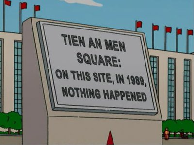 :speech_balloon:评:0 :+1:赞:7 :globe_with_meridians:转:8  

[11月03日 16:51]    新闻大吐槽   @TuCaoFakeNews    這個必須點個讚  :speech_balloon:评:0 :+1:赞:2 :globe_with_meridians:转:1  

[11月03日 16:49]    新闻大吐槽   @TuCaoFakeNews    这不是催泪弹，是催命弹  :speech_balloon:评:0 :+1:赞:6 :globe_with_meridians:转:1  

[11月03日 16:46]    新闻大吐槽   @TuCaoFakeNews    他是在测试他自己到底有多令人恶心  :speech_balloon:评:0 :+1:赞:5 :globe_with_meridians:转:1  

[11月03日 16:36]    BBC News 中文   @bbcchinese    中共十九届四中全会闭幕，北京如何处理香港问题出现新动向。你怎么看？相关新闻： https://bbc.in/2PGEvWs  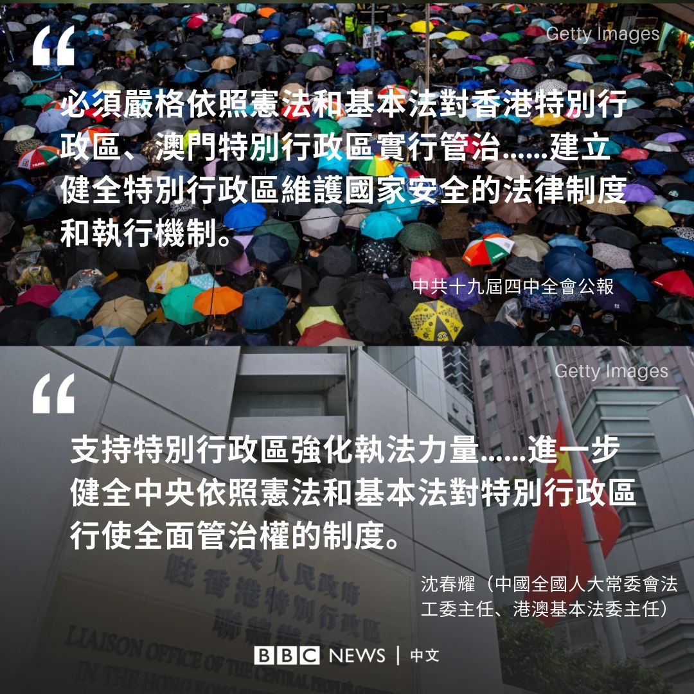 :speech_balloon:评:18 :+1:赞:8 :globe_with_meridians:转:1  

[11月03日 16:25]    新闻大吐槽   @TuCaoFakeNews    Why exactly did this couple get arrested? What crime have they done? They didn't even wear mask. Why??? https://twitter.com/TuCaoFakeNews/status/1190737502547562496 …  :speech_balloon:评:0 :+1:赞:11 :globe_with_meridians:转:5  

[11月03日 16:04]    BBC News 中文   @bbcchinese    随着中国雄心勃勃的“一带一路”计划向南亚延伸，尼泊尔现在似乎成了中印两国扩大地区影响的必争之地。 https://bbc.in/2JJ64Lc   :speech_balloon:评:10 :+1:赞:20 :globe_with_meridians:转:5  

[11月03日 15:45]    新闻大吐槽   @TuCaoFakeNews    啥他妈新闻单位，根本是最大的特务机关  :speech_balloon:评:0 :+1:赞:7 :globe_with_meridians:转:2  

[11月03日 15:45]    新闻大吐槽   @TuCaoFakeNews    就算這次事件中的女生其實安然無恙，但最近類似的可疑事件已經被目睹過不少，再加上不斷流傳的藍屎群組截圖（有人渣煽動及試圖組織團隊去侵犯女性），實在很難不讓人懷疑。以如今香港被警察和他們的支持者造成的治安問題，希望女生能小心謹慎，出門盡量結伴同行，最起碼別獨自一人前往或途徑偏僻地方  :speech_balloon:评:1 :+1:赞:4 :globe_with_meridians:转:2  

[11月03日 15:45]    新闻大吐槽   @TuCaoFakeNews    殺手武器 https://twitter.com/tucaofakenews/status/1190756208140881920 …  :speech_balloon:评:0 :+1:赞:6 :globe_with_meridians:转:2  

[11月03日 15:44]    新闻大吐槽   @TuCaoFakeNews    新·没良心弹 https://twitter.com/TuCaoFakeNews/status/1190756208140881920 …  :speech_balloon:评:1 :+1:赞:9 :globe_with_meridians:转:1  

[11月03日 15:43]    新闻大吐槽   @TuCaoFakeNews    元朗白衣人不来捧场？  :speech_balloon:评:0 :+1:赞:7 :globe_with_meridians:转:2  

[11月03日 15:41]    新闻大吐槽   @TuCaoFakeNews    党：何君尧啊，何君尧，你为什么不去街上拉选票，却跑到这里鬼混！没有选票，我日后怎么提拔你？  :speech_balloon:评:2 :+1:赞:7 :globe_with_meridians:转:2  

[11月03日 15:40]    新闻大吐槽   @TuCaoFakeNews    治理體系和治你體系的的區別  :speech_balloon:评:0 :+1:赞:5 :globe_with_meridians:转:2  

[11月03日 15:39]    新闻大吐槽   @TuCaoFakeNews    红色恐怖的手段是极多且难以想象的  :speech_balloon:评:0 :+1:赞:2 :globe_with_meridians:转:1  

[11月03日 15:38]    新闻大吐槽   @TuCaoFakeNews    他們的荼毒遠甚於ISIS  :speech_balloon:评:0 :+1:赞:3 :globe_with_meridians:转:1  

[11月03日 15:24]    新闻大吐槽   @TuCaoFakeNews    西方对共产主义国家再这样纵容，不立法禁止这些东西，那后果只能西方来承担，西方禁止纳粹却不禁止共产党以及其意识形态，真是可笑  :speech_balloon:评:2 :+1:赞:12 :globe_with_meridians:转:2  

[11月03日 15:12]    新闻大吐槽   @TuCaoFakeNews    中共最恐懼的是它的防火牆被攻破。  :speech_balloon:评:3 :+1:赞:10 :globe_with_meridians:转:1  

[11月03日 15:10]    新闻大吐槽   @TuCaoFakeNews    被中共洗腦了70年的大陸人，還能看清現實的人不多……  :speech_balloon:评:3 :+1:赞:15 :globe_with_meridians:转:1  

[11月03日 15:06]    新闻大吐槽   @TuCaoFakeNews    再次證明了支納粹根本不把百姓的命當作一回事。先不談繼續保持made in china粗製濫造的優良傳統：不冒煙但會猛烈噴火的催淚彈，本來僅作為鎮壓騷亂用的武器有必要設計得如此狠毒嗎。不過想必操持統治者心態的韭菜們會為這超越國際標準，甚至能被稱為致命武器的殺傷力讚嘆不已，繼而為國家的軍工技術歌  :speech_balloon:评:3 :+1:赞:9 :globe_with_meridians:转:1  

[11月03日 15:00]    纽约时报中文网   @nytchinese    #一周热门 美国内政部下令停飞中国造无人机 http://nyti.ms/2qXspOk   :speech_balloon:评:16 :+1:赞:23 :globe_with_meridians:转:4  

[11月03日 14:54]    老司机   @h5lpykl7tp6jjop    如果中共及其红后代在海外肆意猖狂下去，排华事件 未必不会再次发生！
发生在1965年的印尼排华事件，就是由中共输出革命失败所引起，造成印尼华人大量被杀，前后死亡300万，这个话题至今为止一直是印尼的禁忌话题，即使到今天仍然极度敏感。 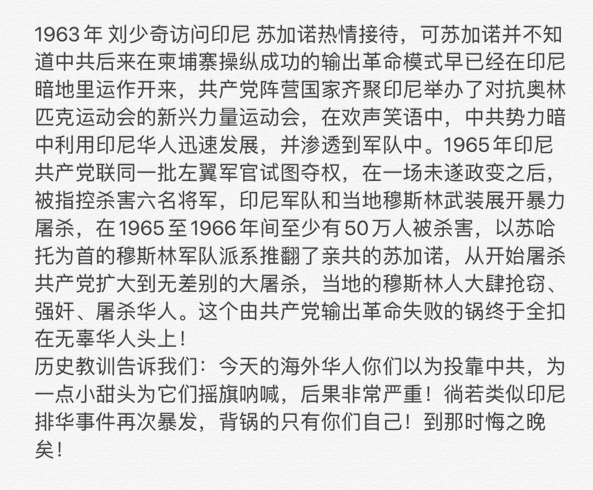 :speech_balloon:评:1 :+1:赞:53 :globe_with_meridians:转:36  

[11月03日 14:21]    BBC News 中文   @bbcchinese    在日本最偏远的温泉体验“赤裸关系” https://bbc.in/2NcUc69   :speech_balloon:评:2 :+1:赞:21 :globe_with_meridians:转:8  

[11月03日 14:00]    BBC News 中文   @bbcchinese    近几个月来，中国和美国一直在争夺全球科技行业的领导地位，中国科技巨头华为成为了两国科技角力的旋涡中心。 https://bbc.in/36nMNbT   :speech_balloon:评:25 :+1:赞:31 :globe_with_meridians:转:10  

[11月03日 13:00]    BBC News 中文   @bbcchinese    BBC阿拉伯语在科威特进行的一项调查发现，有人在黑市上买卖家佣，而这项买卖可以通过谷歌应用商店、苹果商店提供的应用程序，以及在脸书旗下的Instagram上由算法推动的话题标签来实现。 https://bbc.in/2qfs74W   :speech_balloon:评:5 :+1:赞:33 :globe_with_meridians:转:11  

[11月03日 13:00]    纽约时报中文网   @nytchinese    #一周热门 #观点 惩罚NBA，恐怕对中国不利 http://nyti.ms/2MUHicK   :speech_balloon:评:20 :+1:赞:22 :globe_with_meridians:转:5  

[11月03日 12:19]    GFHG SDKM   @zyx_yny    congrats https://twitter.com/wbyeats1865/status/1190554802381451264 …  :speech_balloon:评:0 :+1:赞:1 :globe_with_meridians:转:0  

[11月03日 12:12]    BBC News 中文   @bbcchinese    【新华社香港分社遭破坏】《环球时报》社评称：“新华社带有象徵性意义，暴徒们破坏新华社既是对香港法治的挑衅，也是对中央和内地的挑衅。”
相关新闻： https://bbc.in/2JHKc2M  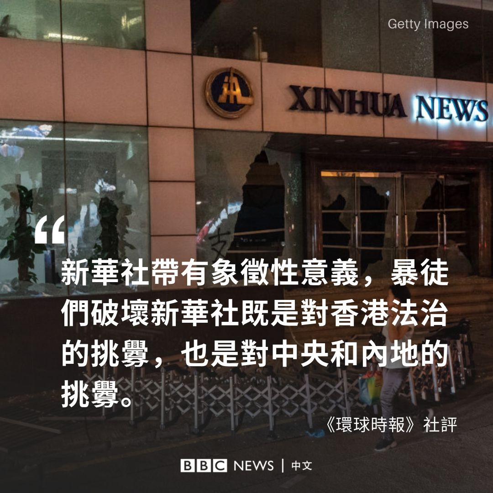 :speech_balloon:评:70 :+1:赞:61 :globe_with_meridians:转:15  

[11月03日 12:00]    BBC News 中文   @bbcchinese    【在妓院出生，11岁开始接待客人 孟加拉妓女的惨痛人生】世界上，很多人身不由己。 https://bbc.in/2PFfk6P   :speech_balloon:评:9 :+1:赞:24 :globe_with_meridians:转:14  

[11月03日 11:16]    新闻大吐槽   @TuCaoFakeNews    陕西高院立案复查25年前奸杀幼女案！
被关押24年，口供是民警自编自写的，十天十夜不让睡觉，实在受不了了把字签了！  :speech_balloon:评:20 :+1:赞:238 :globe_with_meridians:转:165  

[11月03日 11:00]    BBC News 中文   @bbcchinese    现在的辅助科技工具，距离我们不用做饭、不做家务的日子还相距甚远，未来也许会出现机器人看护，但面临什么难题呢？ https://bbc.in/2C4KvAp   :speech_balloon:评:5 :+1:赞:16 :globe_with_meridians:转:11  

[11月03日 10:45]    老司机   @h5lpykl7tp6jjop    它們指鹿為馬、它們顛倒黑白、它們混淆視聽、它們底線盡毀、它們厚顏無恥、它們愚人洗腦.......
美國物價低廉穩定利國利民，卻在它們的嘴裡說成「如坐針氈」的慘狀，難道象牆國家一斤豬肉賣幾十元才好？！ 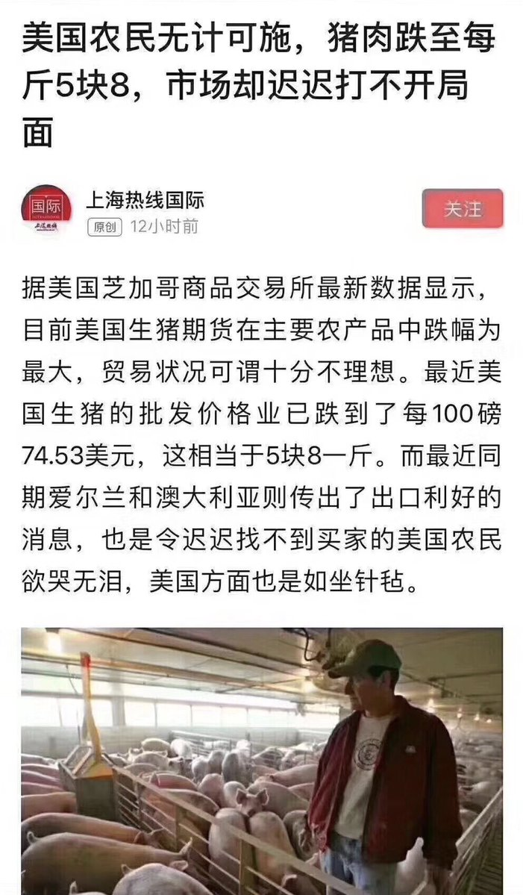 :speech_balloon:评:20 :+1:赞:121 :globe_with_meridians:转:56  

[11月03日 10:36]    老司机   @h5lpykl7tp6jjop    这孩子，怎么不能领会贸易战的重要意义呢？这家大人把视频发到网上要考虑影响呀，如果转发上了500，可以直接拘留的啊！要以国家大局为重，不要只考虑个人小家，再过几天就进入全面小康社会了！继续坚持！没有肉是暂时的，前途是光明的，共产主义就在明天！  :speech_balloon:评:3 :+1:赞:63 :globe_with_meridians:转:24  

[11月03日 10:31]    BBC News 中文   @bbcchinese    印度专家认为，印度允许拉达克西藏化可能被中国利用，符合中国利益，因为在那里不仅仅是印度同中国的军事对峙，而且是一场不对称的文明和文化的较量。 https://bbc.in/2NvoGiG  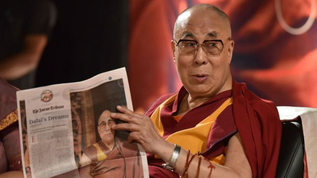 :speech_balloon:评:14 :+1:赞:21 :globe_with_meridians:转:7  

[11月03日 10:19]    老司机   @h5lpykl7tp6jjop    香港警队完全丧失英国管理下百年来的荣誉！除自身的败类外一大批中共军警混入其中，一个个色中饿鬼，人面豺狼进入香港花花世界，看到年轻女性兽性大发，身穿制服形同野兽，辣手摧花不堪入目，香港今天竟变成原始社会！共产党兽行逆天，古今中外无耻之极，言语不能形容之肮脏！镜头无法录全之下流！呸！  :speech_balloon:评:1 :+1:赞:38 :globe_with_meridians:转:12  

[11月03日 10:00]    BBC News 中文   @bbcchinese    越南外交部发言人说：“越南强烈谴责拐卖人口活动，这是极为严重的罪行，必须严惩。越南呼吁地区乃至世界上各国加强合作，预防和打击拐卖人口，从而避免类似悲剧再次发生”。 https://bbc.in/36pkv0s   :speech_balloon:评:66 :+1:赞:87 :globe_with_meridians:转:23  

[11月03日 09:58]    老司机   @h5lpykl7tp6jjop    强烈要求该同志升任中国银监会担任一把手！  :speech_balloon:评:3 :+1:赞:8 :globe_with_meridians:转:2  

[11月03日 09:00]    BBC News 中文   @bbcchinese    特朗普又被调查了……以下是五个关于美国总统弹劾调查的关键问题。 https://bbc.in/2C4IUKI   :speech_balloon:评:14 :+1:赞:30 :globe_with_meridians:转:13  

[11月03日 09:00]    纽约时报中文网   @nytchinese    #一周热门 #讣告 描绘权力斗争的世界：先锋派艺术家黄永砅逝世 http://nyti.ms/2pgzJ7t   :speech_balloon:评:3 :+1:赞:6 :globe_with_meridians:转:0  

[11月03日 08:46]    老司机   @h5lpykl7tp6jjop    一个把多快好省写进宪法里的国家，一个贪多图快要好又要省的族群，有什么能阻止他们急功近利的发财欲望？不管黑猫白猫的理论，造就了今天假货横行，骗技高超 ，偷窃不耻，笑贫不笑娼的无良社会，只求升官发财，不计手段下流，胜者为王，不顾天良，披人皮只作为抢窃的面具，这样的国家和民族还有救吗？  :speech_balloon:评:6 :+1:赞:76 :globe_with_meridians:转:25  

[11月03日 08:23]    凡賽堤/FORSETI   @FecharCCP    他們不配稱警察，他們是納粹的狗！魔鬼般的瘋狗！

極權殺人恐怖組織正在用各種兇殘手段殺害我們的同胞..................................................

滅絕人性對待老人  :speech_balloon:评:4 :+1:赞:37 :globe_with_meridians:转:32  

[11月03日 08:16]    凡賽堤/FORSETI   @FecharCCP    他們不配稱警察，他們是納粹的狗！魔鬼般的瘋狗！

極權殺人恐怖組織正在用各種兇殘手段殺害我們的同胞..................................................

無辜港民被納粹的狗打破頭！  :speech_balloon:评:1 :+1:赞:4 :globe_with_meridians:转:3  

[11月03日 08:12]    凡賽堤/FORSETI   @FecharCCP    他們不配稱警察，他們是納粹的狗！魔鬼般的瘋狗！

極權殺人恐怖組織正在用各種兇殘手段殺害我們的同胞..................................................

我們唯一能救她們的就是瘋狂轉發，讓全世界都知道！才有可能不會極權殺人恐怖組織暗殺，被墜樓，被自殺，被棄屍！  :speech_balloon:评:0 :+1:赞:5 :globe_with_meridians:转:4  

[11月03日 08:05]    凡賽堤/FORSETI   @FecharCCP    他們不配稱警察，他們是納粹的狗！魔鬼般的瘋狗！

極權殺人恐怖組織正在用各種兇殘手段殺害我們的同胞..................................................

我們唯一能救她們的就是瘋狂轉發，讓全世界都知道！才有可能不會極權殺人恐怖組織暗殺，被墜樓，被自殺，被棄屍！  :speech_balloon:评:2 :+1:赞:10 :globe_with_meridians:转:6  

[11月03日 08:00]    BBC News 中文   @bbcchinese    这名尼日利亚的19岁少年几乎每天表演魔术，你能看出任何破绽吗？ https://bbc.in/33kp76l   :speech_balloon:评:2 :+1:赞:8 :globe_with_meridians:转:2  

[11月03日 08:00]    BBC News 中文   @bbcchinese    香港在昨日（2日）展开连续第22个周末的示威。 https://bbc.in/2NrVvwM   :speech_balloon:评:21 :+1:赞:56 :globe_with_meridians:转:19  

[11月03日 07:58]    凡賽堤/FORSETI   @FecharCCP    極權殺人恐怖組織正在用各種兇殘手段殺害我們的同胞..................................................

我們唯一能救她們的就是瘋狂轉發，讓全世界都知道！才有可能不會極權殺人恐怖組織暗殺，被墜樓，被自殺，被棄屍！  :speech_balloon:评:0 :+1:赞:2 :globe_with_meridians:转:2  

[11月03日 07:45]    凡賽堤/FORSETI   @FecharCCP    極權殺人恐怖組織正在用各種兇殘手段殺害我們的同胞..................................................

我們唯一能救她們的就是瘋狂轉發，讓全世界都知道！才有可能不會極權殺人恐怖組織暗殺，被墜樓，被自殺，被棄屍！  :speech_balloon:评:7 :+1:赞:342 :globe_with_meridians:转:372  

[11月03日 07:44]    凡賽堤/FORSETI   @FecharCCP    極權殺人恐怖組織正在用各種兇殘手段殺害我們的同胞..................................................

我們唯一能救她們的就是瘋狂轉發，讓全世界都知道！才有可能不會極權殺人恐怖組織暗殺，被墜樓，被自殺，被棄屍！  :speech_balloon:评:10 :+1:赞:223 :globe_with_meridians:转:287  

[11月03日 07:36]    凡賽堤/FORSETI   @FecharCCP    極權殺人恐怖組織正在用各種兇殘手段殺害我們的同胞..................................................

大陸軍警蒙面扮港民  :speech_balloon:评:2 :+1:赞:80 :globe_with_meridians:转:92  

[11月03日 07:32]    凡賽堤/FORSETI   @FecharCCP    極權殺人恐怖組織正在用各種兇殘手段殺害我們的同胞..................................................

我們唯一能救她們的就是瘋狂轉發，讓全世界都知道！才有可能不會極權殺人恐怖組織暗殺，被墜樓，被自殺，被棄屍！  :speech_balloon:评:0 :+1:赞:3 :globe_with_meridians:转:4  

[11月03日 07:24]    凡賽堤/FORSETI   @FecharCCP    魔鬼在人間

極權殺人恐怖組織正在用各種兇殘手段殺害我們的同胞..................................................

極權殺人恐怖組織在香港兇殘粗暴非法濫捕港民同胞！  :speech_balloon:评:14 :+1:赞:5 :globe_with_meridians:转:4  

[11月03日 07:09]    凡賽堤/FORSETI   @FecharCCP    魔鬼在人間

極權殺人恐怖組織正在用各種兇殘手段殺害我們的同胞..................................................

我們唯一能救她們的就是瘋狂轉發，讓全世界都知道！才有可能不會極權殺人恐怖組織暗殺，被墜樓，被自殺，被棄屍！  :speech_balloon:评:1 :+1:赞:42 :globe_with_meridians:转:50  

[11月03日 07:04]    GFHG SDKM   @zyx_yny    I came to #BlizzCon19 to make a point! My point has been proven! I ran up on the Q&A panel (World of Warcraft) and Yelled, “FREE HONG KONG!” Now remember, to keep fighting for basic human rights! #hongkong #blizzcon #BoycottBlizzard  :speech_balloon:评:395 :+1:赞:3325 :globe_with_meridians:转:1670  

[11月03日 07:00]    纽约时报中文网   @nytchinese    #一周热门 全球海平面持续上升，可能淹没主要沿海城市 http://nyti.ms/2JBzv1E   :speech_balloon:评:20 :+1:赞:55 :globe_with_meridians:转:27  

[11月03日 06:53]    BBC News 中文   @bbcchinese    虽然世界贸易组织(WTO) 这一裁决涉及的36亿美元，与中美贸易战所涉及的数千亿美元相比显得数额很小，然而世贸组织这一裁决却颇有象征意义。 https://bbc.in/2JGThZs   :speech_balloon:评:30 :+1:赞:115 :globe_with_meridians:转:36  

[11月03日 04:29]    新闻大吐槽   @TuCaoFakeNews    抗爭了五個月，終於找對方向了，不再是「光復香港，時代革命」，升級為「驅逐共黨  光復香港」，這是偉大的進步，香港人加油！ 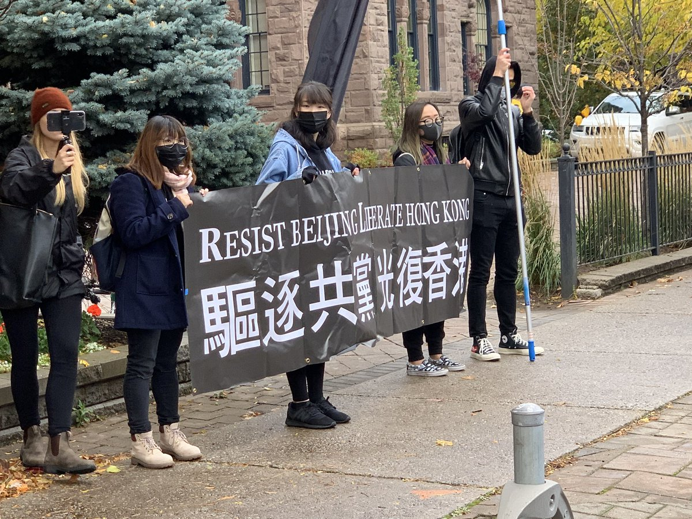 :speech_balloon:评:40 :+1:赞:633 :globe_with_meridians:转:264  

[11月03日 04:15]    BBC News 中文   @bbcchinese    今年5月，汤姆‧图根哈特在议会提问中说，允许中国电讯公司华为建造驱动英国5G的网络等于养虎遗患（原话是“为龙搭巢”）。 https://bbc.in/2oBxgnw  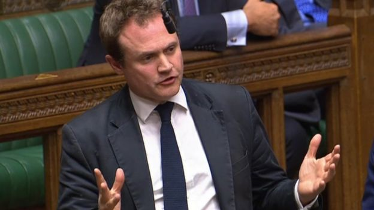 :speech_balloon:评:19 :+1:赞:66 :globe_with_meridians:转:20  

[11月03日 01:51]    GFHG SDKM   @zyx_yny    #HKPoliceTerrorists smashed a passerby’s head to the bush, beat fiercely on his head with batons and finally cuffed him to the patrol car, just because he did not stand straight. Another case of abuse of power. #PoliceBrutalityHK #PoliceState  :speech_balloon:评:120 :+1:赞:1910 :globe_with_meridians:转:2165  

[11月03日 00:57]    GFHG SDKM   @zyx_yny    我係消防員我想講 我地消防24小時工作 分abc隊，每日收工都要交更比下一隊 如果部車爛左點交更 理論好正常 最小都要知道邊個射，抄低資料都要丫。濕鳩消防處除左識搞自己人會幫我地咩，入火場係我地，如果高層唔攬 我地下面點做野 個師兄我朋友黎 希望大家可以幫下佢 #圍爐 #我做消防係為左救火架 https://twitter.com/demosisto/status/1190605923300937729 …  :speech_balloon:评:635 :+1:赞:4940 :globe_with_meridians:转:3776  

[11月03日 00:20]    BBC News 中文   @bbcchinese    一些香港示威者周六到位于湾仔的新华社香港分社纵火及破坏玻璃窗。相关报道： https://www.bbc.com/zhongwen/simp/chinese-news-50272482 … 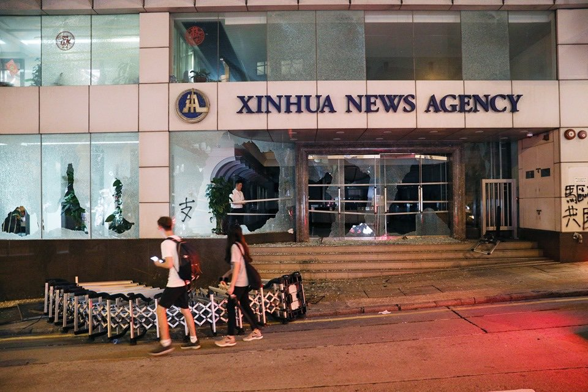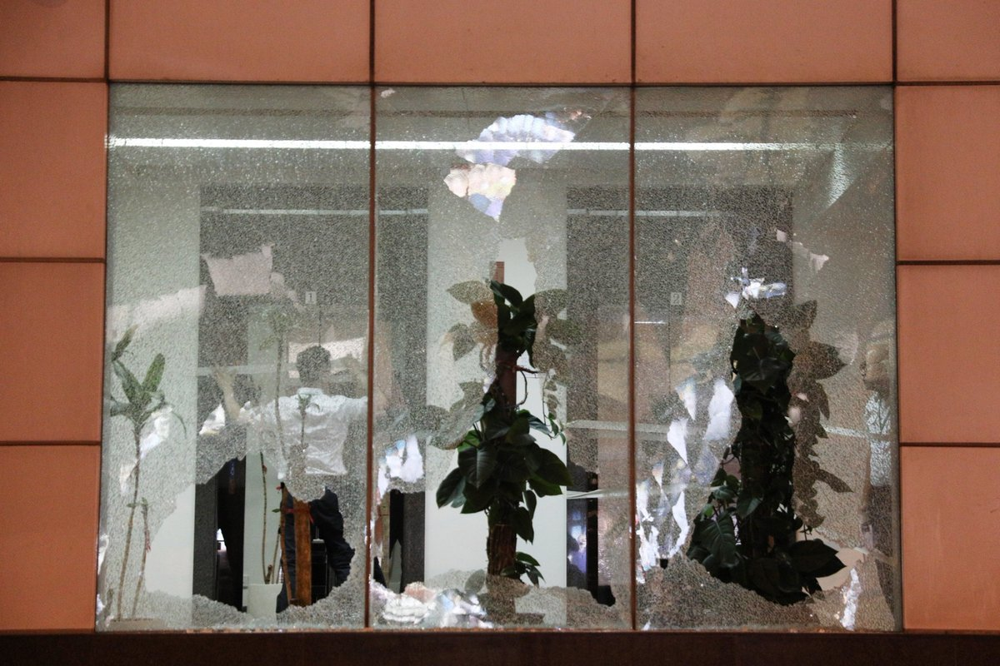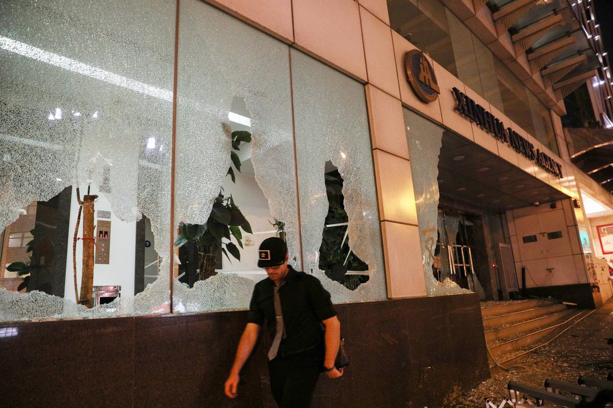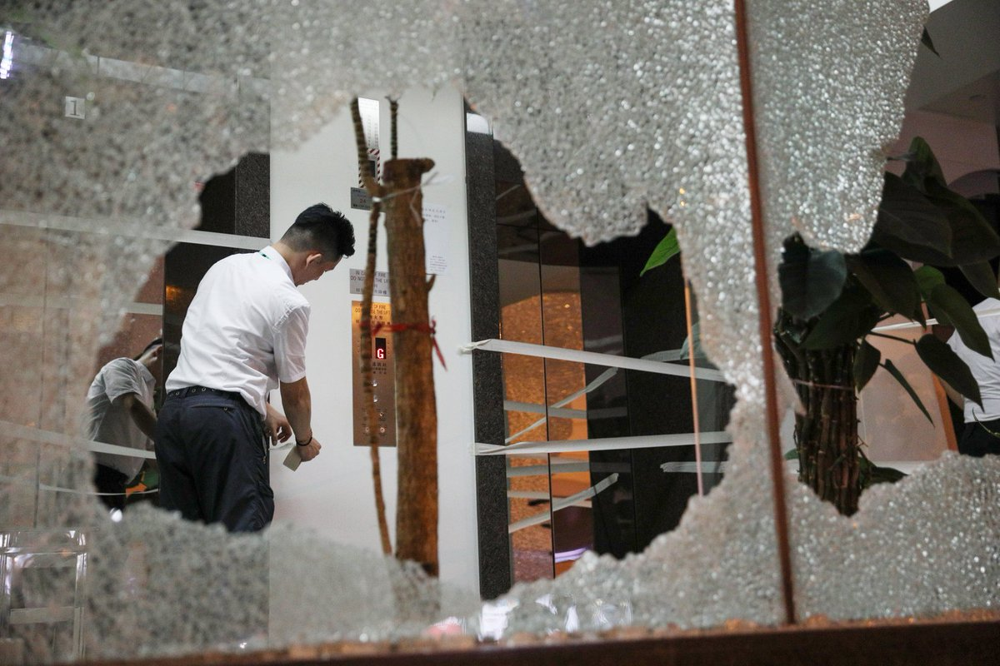 :speech_balloon:评:74 :+1:赞:107 :globe_with_meridians:转:28  

[11月02日 23:38]    老司机   @h5lpykl7tp6jjop    人民唯一能保護自己的兩樣東西：選票和槍。失去了這些就等於隨時會失去生命！  :speech_balloon:评:33 :+1:赞:478 :globe_with_meridians:转:271  

[11月02日 23:00]    纽约时报中文网   @nytchinese    #一周热门 #影评 《寄生虫》：生活在奉俊昊的反乌托邦世界中 http://nyti.ms/2q4xXX5   :speech_balloon:评:0 :+1:赞:17 :globe_with_meridians:转:1  

[11月02日 22:35]    墙国铁拳现世报😷   @Socialistfist    小编谨代表墙国铁拳现世报读者欢迎您来推特。
看来上次强拆不但把你村邻居房子拆了，还把你的防火墙也给拆了嘛 https://twitter.com/Xiuxianlu/status/1190623728545062912 …  :speech_balloon:评:8 :+1:赞:129 :globe_with_meridians:转:16  

[11月02日 22:07]    BBC News 中文   @bbcchinese    【香港示威：警察驱赶维园集会 示威者游走多区】港岛区多处出现警民冲突，示威者投掷汽油弹和纵火，警察则发射催泪弹。 https://bbc.in/2oB0T8u   :speech_balloon:评:17 :+1:赞:26 :globe_with_meridians:转:10  

[11月02日 21:02]    GFHG SDKM   @zyx_yny    Someone sent this to me in my inbox and I can’t stop screaming and crying! What the fuckkkkkkkkkk!! Tell me this is not true  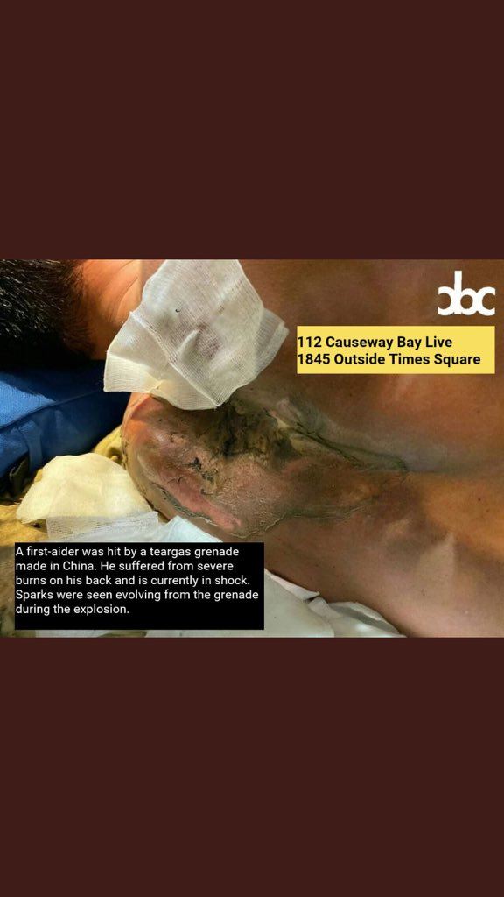 :speech_balloon:评:35 :+1:赞:174 :globe_with_meridians:转:161  

[11月02日 21:00]    纽约时报中文网   @nytchinese    #一周热门 #时报专栏 特朗普和扎克伯格们会把美国玩坏的 http://nyti.ms/2JDsNbc   :speech_balloon:评:14 :+1:赞:15 :globe_with_meridians:转:2  

[11月02日 20:25]    GFHG SDKM   @zyx_yny    #HKPoliceTerrorists can do anything to anybody without consequences in Hong Kong. A firefighter criticised those police terrorists shot the fire truck, then got treated impolitely by the police terrorists.  :speech_balloon:评:498 :+1:赞:6348 :globe_with_meridians:转:6454  

[11月02日 20:23]    GFHG SDKM   @zyx_yny    今日も香港では、大規模な抗議活動がありました。
今日、一人の救急隊員の背中に手投げ式催涙弾が直撃し、背部広範囲に火傷を負いました。現在は意識不明の重体。
情報によると、中国製手投げ式催涙弾は非常に高温になるとのことで、救助隊員の背中に直撃した際には火花が散ったそうです。 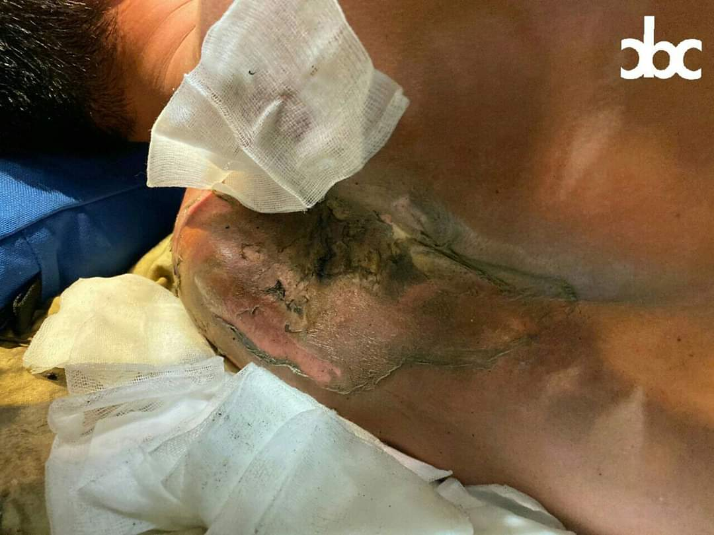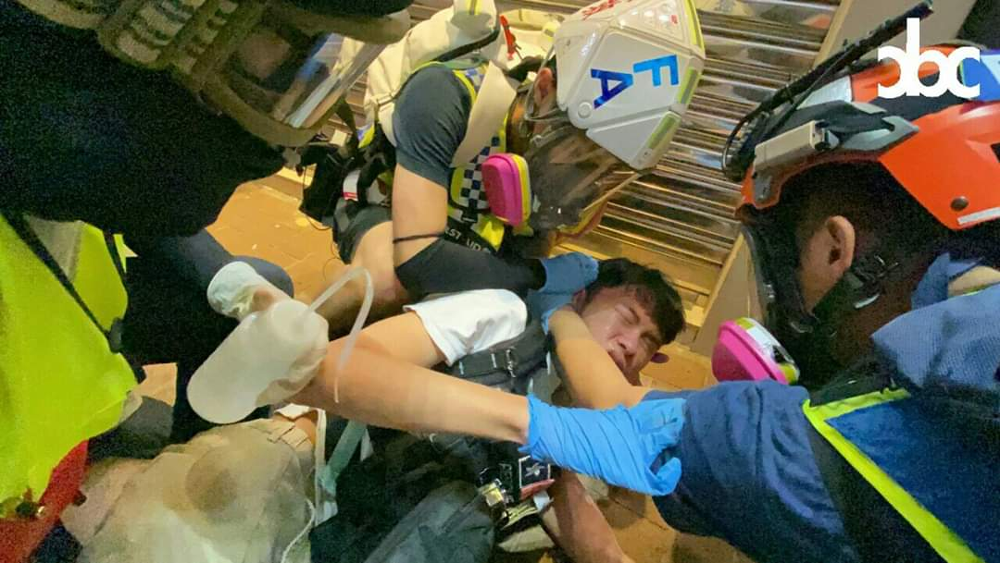 :speech_balloon:评:461 :+1:赞:14489 :globe_with_meridians:转:10461  

[11月02日 19:09]    财经真相   @caijingxiang    盛世明星赛富商，乱世戏子逃饥荒！一心只盼有戏拍，不闻香港成战场！  :speech_balloon:评:6 :+1:赞:262 :globe_with_meridians:转:26  

[11月02日 19:03]    财经真相   @caijingxiang    国内很多明星都在抱怨没戏拍可拍，这个其实也可以理解，很多演员都是吃青春饭的，天天在家闲着很容易“过气”，尤其那些还未捞够的新人最焦虑。以前很多烂戏卖出天价，其背后是资本有“洗钱”需求，现在政治从严，经济处于实质性衰退的背景下，地主家日子也不好过，自然也就没人在戏子身上再挥金如土了！  :speech_balloon:评:22 :+1:赞:421 :globe_with_meridians:转:85  

[11月02日 19:00]    纽约时报中文网   @nytchinese    #一周热门 #影评 《摩登情爱》：良莠不齐但时显魅力 http://nyti.ms/2MZ6eQD   :speech_balloon:评:6 :+1:赞:9 :globe_with_meridians:转:1  

[11月02日 18:46]    BBC News 中文   @bbcchinese    香港警方根据《公安条例》，即场停止两个事前获得警方不反对通知书的集会。 https://bbc.in/2N82xYC   :speech_balloon:评:30 :+1:赞:71 :globe_with_meridians:转:39  

[11月02日 18:26]    墙国铁拳现世报😷   @Socialistfist    如此猖狂, 举报头像来一波？  :speech_balloon:评:3 :+1:赞:78 :globe_with_meridians:转:6  

[11月02日 18:12]    墙国铁拳现世报😷   @Socialistfist    P1 头像煽动颠覆
P2 韭菜谈奴性 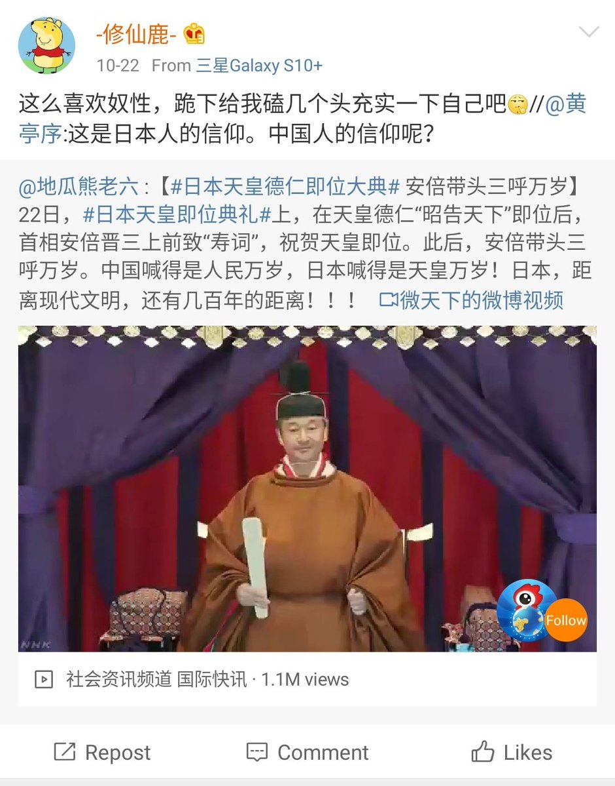 :speech_balloon:评:9 :+1:赞:105 :globe_with_meridians:转:14  

[11月02日 18:06]    墙国铁拳现世报😷   @Socialistfist    别人家被强拆，可以接受
别人家被强拆，自己被拔了网线，是万万不能接受的

#社会主义铁拳 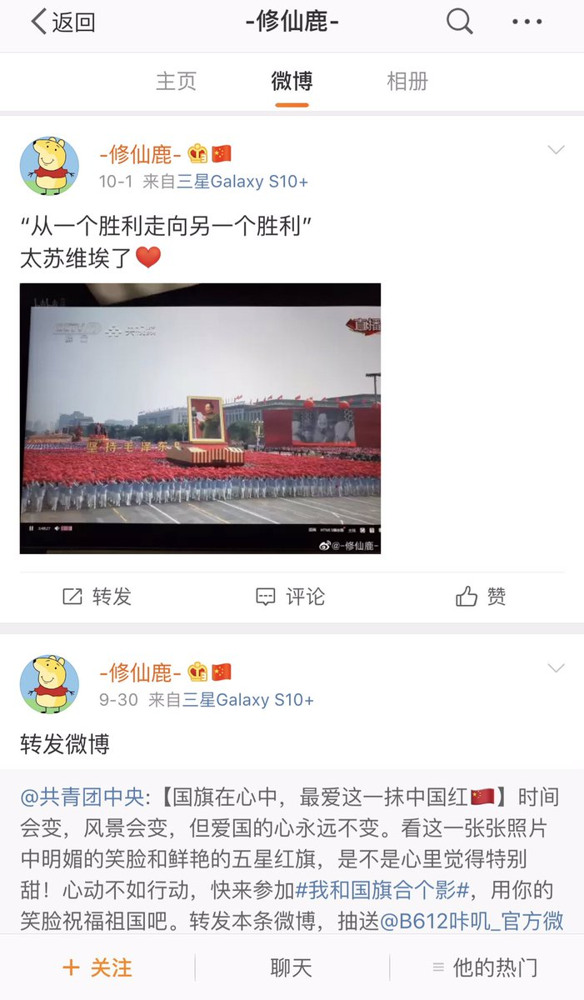 :speech_balloon:评:35 :+1:赞:303 :globe_with_meridians:转:86  

[11月02日 17:56]    老司机   @h5lpykl7tp6jjop    大陆人民生活水平不断提高！一片回锅肉要40元，台湾同胞你们吃得起吗？
近日，一份《连山回锅肉创始人代木儿菜谱》引发网友热议，菜谱中，精品晾竿回锅肉（10片）标价为400元。“什么肉这么贵？”“400元一份的回锅肉，要吃出西餐的感觉。”不少网友对这份菜品的价格产生质疑。店家回应肉价都涨到58一斤。  :speech_balloon:评:1 :+1:赞:12 :globe_with_meridians:转:7  

[11月02日 17:51]    BBC News 中文   @bbcchinese    香港展开第22周的示威，警察在铜锣湾闹市向示威者发射多枚催泪弹。  :speech_balloon:评:51 :+1:赞:172 :globe_with_meridians:转:93  

[11月02日 17:00]    纽约时报中文网   @nytchinese    #一周热门 卷入中美冲突，顶尖古典乐团取消中国巡演 http://nyti.ms/2BWquvF   :speech_balloon:评:20 :+1:赞:27 :globe_with_meridians:转:3  

[11月02日 16:35]    财经真相   @caijingxiang    福耀玻璃董事长曹德旺在经济参考报《其实我想说》栏目中表示，年轻精英们一路风险不断，钱应该更多用在自己身上。而他的钱就像赘肉，要给它一块一块地切掉，他有能力也不怕痛。 老曹这觉悟很高啊，党国会就此放过他吗？  :speech_balloon:评:18 :+1:赞:176 :globe_with_meridians:转:31  

[11月02日 16:11]    GFHG SDKM   @zyx_yny    Hk police >>>>>>>>>>> law >>>>>>> hk gov (ccp puppet) >>>>> judicial system >>>> Legislative
#HKPoliceState 
you can see no hker in the photo.
And, HK police is not ccp army. 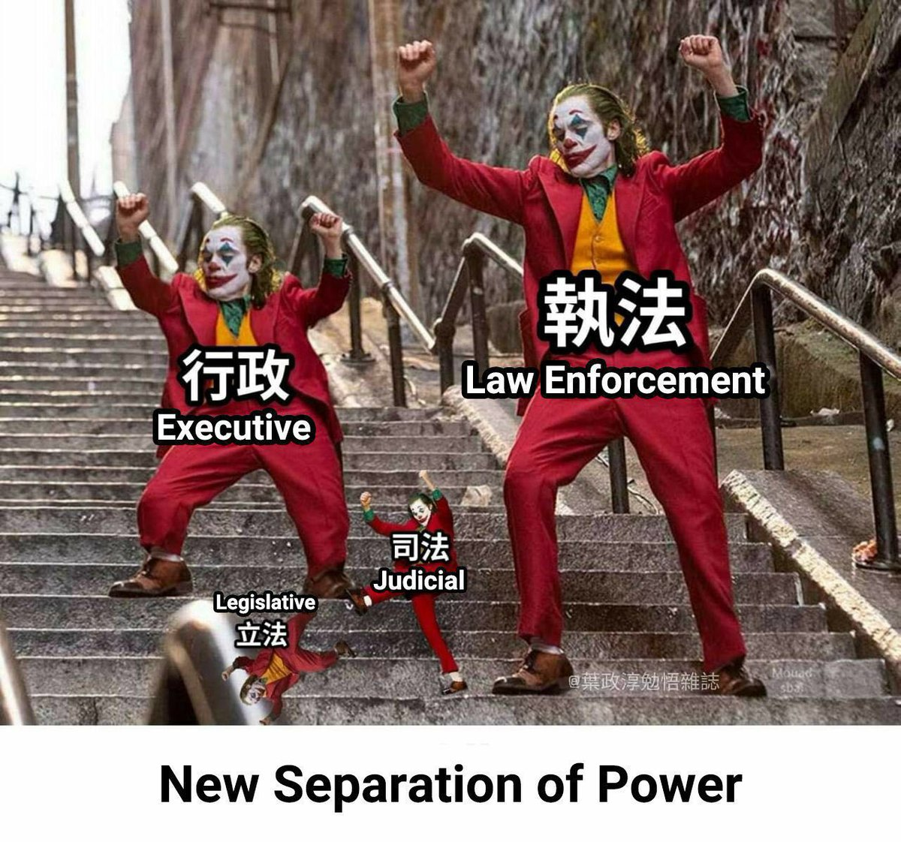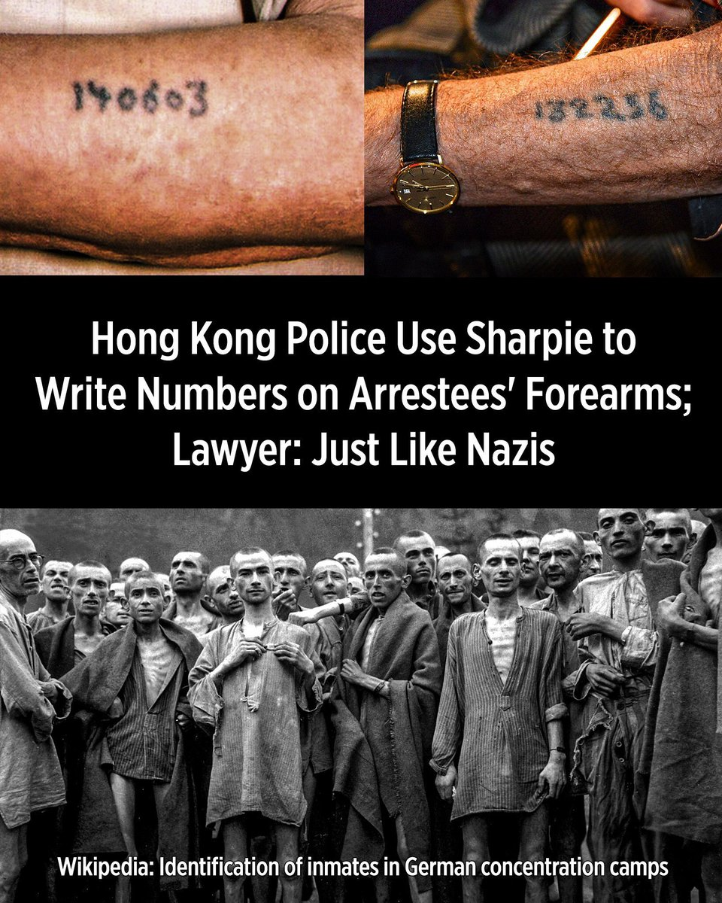 :speech_balloon:评:0 :+1:赞:13 :globe_with_meridians:转:9  

[11月02日 16:11]    GFHG SDKM   @zyx_yny    DC must see @hkpoliceforce uses permanent marker pens 2 tattoo #s on the arms offreedom fighters in custody. It's invited the comparison of SS tattooed #s on WWII concentration camp Jews. Isthe next Xinjiang? Arecops nextCCP stormtroopers? Buildconcentration camps next? https://twitter.com/oncloud9haha/status/1190534002219741184 …  :speech_balloon:评:685 :+1:赞:6376 :globe_with_meridians:转:6006  

[11月02日 15:55]    GFHG SDKM   @zyx_yny    Man driving by in a Porsche was pulled out of his car and arrested by a dozen riot police, only for playing “Glory to Hong Kong” in his car.

Kid was asking the woman shooting the video : “Why was he arrested only for playing a song?”

#HKPoliceState
#StandWithHongKong  :speech_balloon:评:682 :+1:赞:10430 :globe_with_meridians:转:9859  

[11月02日 15:52]    财经真相   @caijingxiang    疯狂的讽刺，今日就成了现实！ https://twitter.com/mrdoorvpn/status/1190506974418325505 …  :speech_balloon:评:17 :+1:赞:406 :globe_with_meridians:转:157  

[11月02日 15:00]    纽约时报中文网   @nytchinese    #一周热门 #NYTOverlooked “流浪作家”三毛：撒哈拉、爱情和死亡 http://nyti.ms/2WjzBjA   :speech_balloon:评:8 :+1:赞:29 :globe_with_meridians:转:10  

[11月02日 14:53]    老司机   @h5lpykl7tp6jjop    Checking...屯門建新村  :speech_balloon:评:18 :+1:赞:92 :globe_with_meridians:转:119  

[11月02日 13:00]    纽约时报中文网   @nytchinese    #一周热门 #书评 参与塑造现代中国的宋氏三姐妹 http://nyti.ms/2Nr96Ez   :speech_balloon:评:2 :+1:赞:20 :globe_with_meridians:转:10  

[11月02日 12:00]    纽约时报中文网   @nytchinese    如何利用风水旺财转运、如何在36小时内玩转清迈……每周，我们为读者推荐《纽约时报》一些轻松有趣、兼具实用性和指导性的文章，与你共同探索一种更优质、更聪明、更充实的生活方式。
以下是本周的智慧生活精选： http://nyti.ms/36xS1lo   :speech_balloon:评:3 :+1:赞:16 :globe_with_meridians:转:5  

[11月02日 11:00]    纽约时报中文网   @nytchinese    #一周热门 #观点 平壤的复古科幻建筑 http://nyti.ms/2PoRwUB   :speech_balloon:评:5 :+1:赞:11 :globe_with_meridians:转:4  

[11月02日 09:00]    纽约时报中文网   @nytchinese    #一周热门 拒绝身份政治的“局外人”杨安泽 http://nyti.ms/2MSFMbc   :speech_balloon:评:3 :+1:赞:8 :globe_with_meridians:转:0  

[11月02日 07:00]    纽约时报中文网   @nytchinese    #一周热门 香港街头暴力升级，抗议者试探中国底线 http://nyti.ms/2BKxRX0   :speech_balloon:评:46 :+1:赞:39 :globe_with_meridians:转:11  

[11月02日 06:38]    新闻大吐槽   @TuCaoFakeNews    保镖开道，维尼熊扭着妖娆的身段，不停的抛出飞吻

要说鬼节，还是日本人会玩  :speech_balloon:评:106 :+1:赞:3299 :globe_with_meridians:转:1169  

[11月02日 05:00]    纽约时报中文网   @nytchinese    #一周热门 华盛顿vs.华尔街：中国投资引发美国政商界对立 http://nyti.ms/2Woe9Km   :speech_balloon:评:5 :+1:赞:3 :globe_with_meridians:转:1  

[11月02日 04:59]    老司机   @h5lpykl7tp6jjop    刚唱了我是共产党的一个兵就接着唱爱在加拿大，你妈的两张嘴皮翻得太快了！  :speech_balloon:评:3 :+1:赞:13 :globe_with_meridians:转:1  

[11月02日 04:27]    老司机   @h5lpykl7tp6jjop    说中国人不守秩序，他们跪在地上维权排得整整齐齐，说他们守秩序，他们冲红灯抢猪肉绝对不会排队，说他们不讲规则，他们人人连潜规则都搞得懂，说他们守规则，他们不卖门票连老虎都不怕，翻马路栏杆被夹死也愿意！说他们胆子小，做毒食品毐酒毒菜没怕过，说他们胆子大，整死他们不敢喊打倒共产党！  :speech_balloon:评:48 :+1:赞:1058 :globe_with_meridians:转:333  

[11月02日 02:36]    老司机   @h5lpykl7tp6jjop    〖11.1香港美少女又被抓〗一個弱靚女，你們用得著一堆解放軍圍著嗎？你們啥意思，流氓地痞？！這麼小的孩子，她是暴徒嗎？忍不住要罵人了，你們是他媽的娘養的嗎，畜生！  :speech_balloon:评:155 :+1:赞:1388 :globe_with_meridians:转:850  

[11月02日 02:04]    老司机   @h5lpykl7tp6jjop    转自微信：这是安徽律师吕先三的孩子，吕先三律师因为代理案件，今天被合肥中院以诈骗罪判处有期徒刑12年，吕及家人喊冤不止。这样的图片，令人悲伤。  :speech_balloon:评:12 :+1:赞:186 :globe_with_meridians:转:98  

[11月02日 00:36]    老司机   @h5lpykl7tp6jjop    Is heart broken with this little girl, when we will stop the lives like that
Source from FB
#HKPoliceState #HKPoliceBrutality #HKPoliceTerrorism #HKHumanRightsandDemocracyAct  :speech_balloon:评:164 :+1:赞:1609 :globe_with_meridians:转:1557  

[11月01日 21:30]    纽约时报中文网   @nytchinese    “我们的责任是保证纯粹的学习环境，”一名“学生信息员”说，“保证教授们遵守规定。”
“人人自危了，“一名因批评习近平喜欢的口号而被学生举报、随后被开除的教授说。“怎么会进步呢，“他问，“发明创造怎么会出现呢？” http://nyti.ms/2PzncGG   :speech_balloon:评:13 :+1:赞:68 :globe_with_meridians:转:22  

[11月01日 21:06]    老司机   @h5lpykl7tp6jjop    究竟誰殺死了她! 警方: 死因無可疑? 袁靜儀?  :speech_balloon:评:310 :+1:赞:2339 :globe_with_meridians:转:2202  

[11月01日 21:00]    纽约时报中文网   @nytchinese    元朗袭击事件发生五天后，数万名抗议者聚集到该地区。防暴警察为驱散人群发射了多枚催泪瓦斯。
几个月后，这个工人阶层居住的社区在夕阳下一片平静。 http://nyti.ms/2C1oQJu  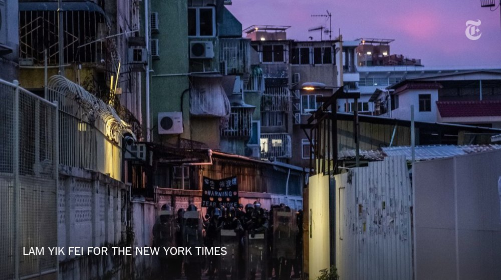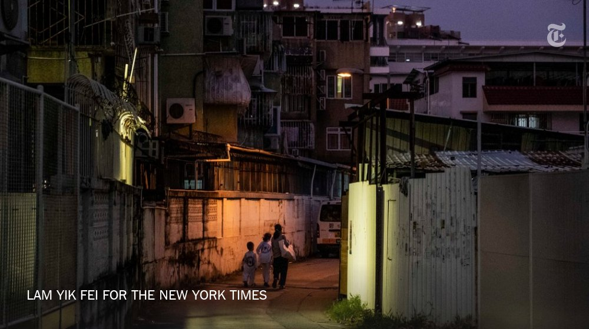 :speech_balloon:评:5 :+1:赞:8 :globe_with_meridians:转:4  

[11月01日 20:00]    纽约时报中文网   @nytchinese    几个月来，民主党人一直抵制这样的投票，但面对一致反对的共和党人，他们这次强行通过了决议，只有两名民主党人背弃政党立场投了反对票。
这一投票结果预示了即将到来的斗争：随着民主党人在公众面前陈明其弹劾的理由，两党都将进入一个未知的领域，美国的政治格局也将被重塑。 http://nyti.ms/3213pT7   :speech_balloon:评:3 :+1:赞:15 :globe_with_meridians:转:6  

[11月01日 19:31]    墙国铁拳现世报😷   @Socialistfist    掐指一算，已经是两周了。希望兔兔可以被善待  :speech_balloon:评:13 :+1:赞:102 :globe_with_meridians:转:12  

[11月01日 19:16]    财经真相   @caijingxiang    美国驻华大使微信公众号，今天发布的蓬佩奥国务卿在哈德逊研究所的讲话，改文链接被微信以网页包含违法或违规内容，被多人投诉为由封杀，彭斯在弗雷德里克·马勒克纪念讲座发表讲话也无法打开，其他文章链接正常，均可打开阅读！ 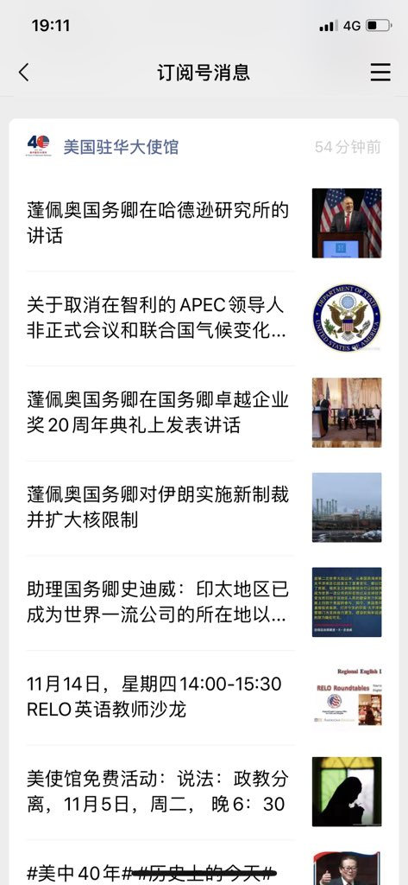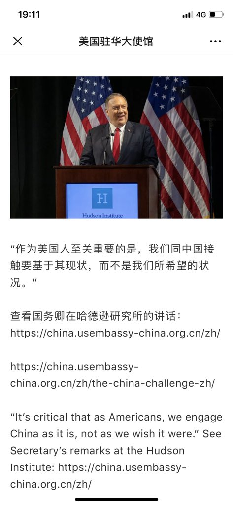 :speech_balloon:评:35 :+1:赞:378 :globe_with_meridians:转:188  

[11月01日 19:00]    纽约时报中文网   @nytchinese    #图集【在美国，220万美元能买到什么房？】手握220万美元，你能买到乔治亚洲罗马一座建于19世纪晚期的木匠哥特式房屋，或马萨诸塞州牛顿的世纪中期现代主义住宅，也可以选择纽约州上奈克市的新乔治亚风格房屋。
点击查看图集： http://nyti.ms/339X49q  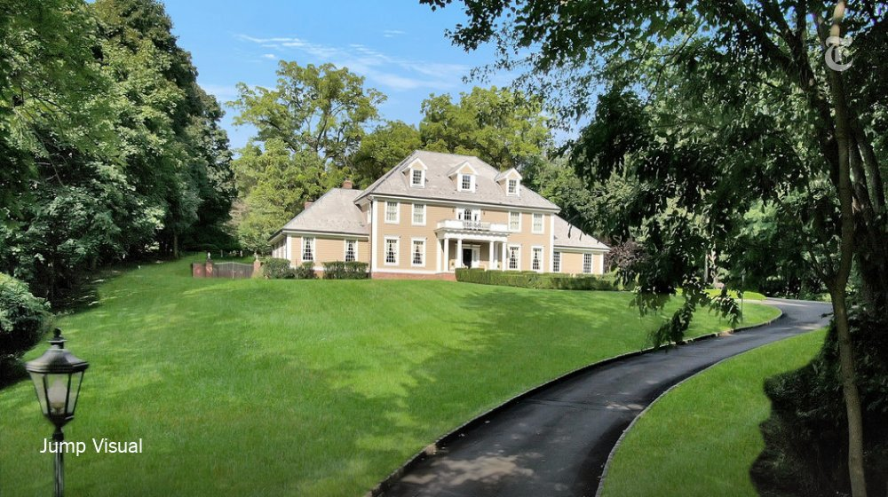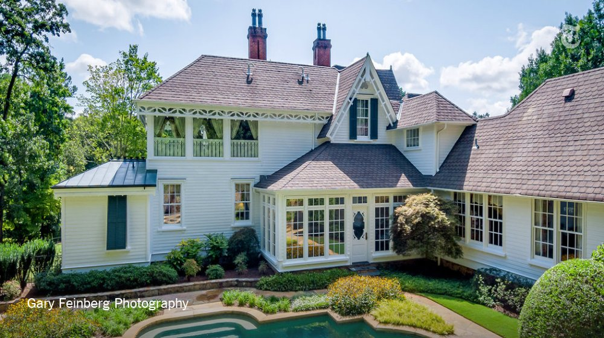 :speech_balloon:评:5 :+1:赞:26 :globe_with_meridians:转:6  

[11月01日 18:46]    财经真相   @caijingxiang    再补充一个问题，外资可以自由汇出，是仅限于美国企业，还是所有外资？如果只是美资，有效期是仅限于最近签署第一阶段协议的时候、还是永远自由出入？  :speech_balloon:评:10 :+1:赞:107 :globe_with_meridians:转:7  

[11月01日 18:42]    财经真相   @caijingxiang    你就想问问是司法部权利大？还是外汇管理局大？谁说的话最管用？  :speech_balloon:评:4 :+1:赞:107 :globe_with_meridians:转:11  

[11月01日 18:40]    财经真相   @caijingxiang    司法部就《中华人民共和国外商投资法实施条例》公开征求意见：外国投资者在中国境内的出资、利润、资本收益、资产处置所得、知识产权许可使用费、依法获得的补偿或者赔偿、清算所得等，可以依法以人民币或者外汇自由汇入、汇出，任何单位和个人不得违法对币种、数额以及汇入、汇出的频次等进行限制。  :speech_balloon:评:45 :+1:赞:193 :globe_with_meridians:转:55  

[11月01日 17:39]    墙国铁拳现世报😷   @Socialistfist    可惜北京的青天习老爷不玩微博

#社会主义铁拳 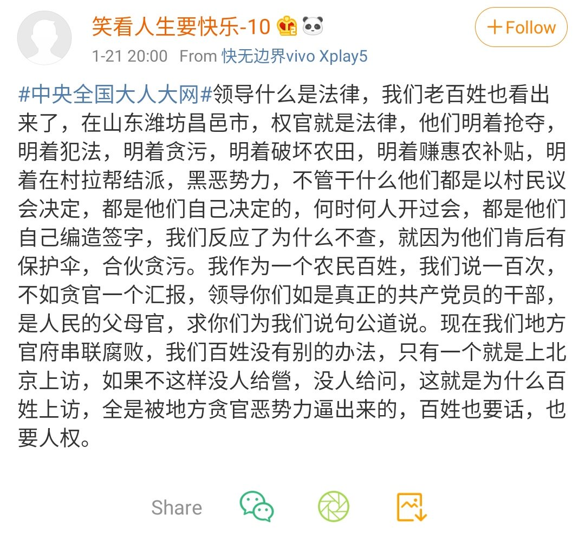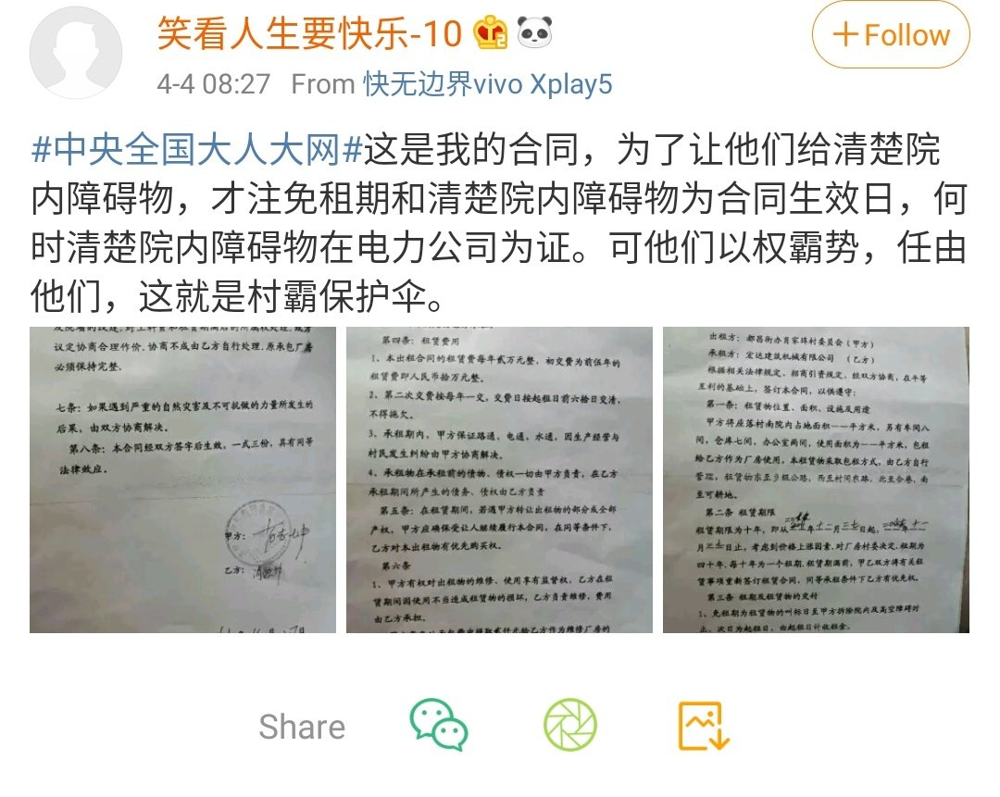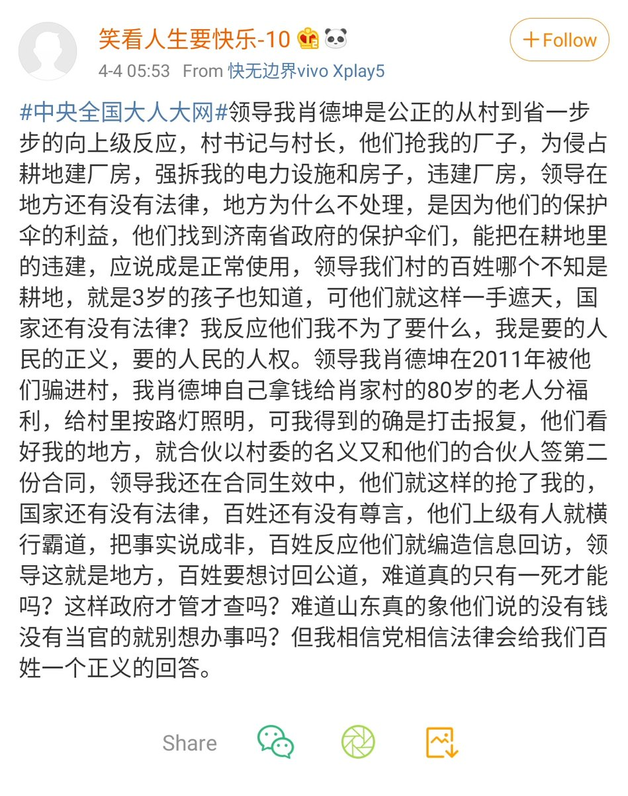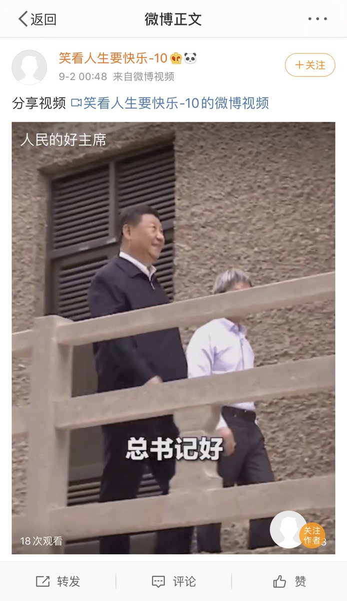 :speech_balloon:评:24 :+1:赞:247 :globe_with_meridians:转:56  

[11月01日 16:21]    老司机   @h5lpykl7tp6jjop    令人難過  :speech_balloon:评:116 :+1:赞:1331 :globe_with_meridians:转:1253  

[11月01日 16:00]    纽约时报中文网   @nytchinese    四中全会召开之际，中国正努力应对与特朗普政府之间的贸易战，以及经济增长的显著放缓。
公报未提及这些问题，但其中一条表明，习近平和他的同事感到风险挑战已经增加。公报称，领导层经受了“国内外风险挑战明显增多的复杂局面”。 http://nyti.ms/34ufNwT   :speech_balloon:评:12 :+1:赞:15 :globe_with_meridians:转:5  

[11月01日 15:50]    老司机   @h5lpykl7tp6jjop    #Hongkong10月31日
記住CCP在香港的暴行這哪裡是在執法這就是公開耍流氓的證據
#HongKongPolice 一名黑察正在對一名柔弱的女性進行性騷擾，另一位黑警把她的雙腿張開！
他們抓住了她並把她的襯衫一直拉到露出她的胸罩！
@FLOTUS
@VP
@SecPompeo
@MariaBartiromo
@trish_regan
@robert_spalding  :speech_balloon:评:52 :+1:赞:443 :globe_with_meridians:转:428  

[11月01日 11:57]    GFHG SDKM   @zyx_yny    The Halloween gift hk govr. give us.
What’s next step?Block our right to use internet?Block all the social networks?
Hong Kong > Block Kong 
How many negative name of Hong Kong can we build which inspire by hk govr.
#4Corners #SOSHK #hkprotest #FightForFreedom #StandwithHongKong  :speech_balloon:评:1 :+1:赞:22 :globe_with_meridians:转:13  

[11月01日 09:50]    财经真相   @caijingxiang    根据CEPA要求，中共央行正式宣布为在香港办理个人人民币存款、兑换、银行卡和汇款业务的银行提供清算安排，随后中银香港被指定为人民币在香港的结算行，其他香港银行的人民币业务必须找中银香港做最后的结算，同时接受中银香港的协议，但是该协议成为中共对香港金融的长臂管辖，自此香港金融彻底沦落  :speech_balloon:评:4 :+1:赞:196 :globe_with_meridians:转:75  

[11月01日 09:42]    财经真相   @caijingxiang    【快讯】央行称将于11月7日（下周四）在香港发行200亿元人民币三个月央票，及100亿元人民币一年期央票。 人民币在香港扩张最初始于1993年央行颁布的人民币出入境条例，最终全面形成是基于2003年6月大陆与香港签署的《内地与香港关于建立更紧密经贸关系的安排》（CEPA）  :speech_balloon:评:2 :+1:赞:140 :globe_with_meridians:转:52  

[11月01日 08:35]    老司机   @h5lpykl7tp6jjop    全国楼市降价潮：最高直降10000元/㎡，广州两天降6千/㎡！武汉直降8千/㎡！合肥最高降4536元/㎡！ 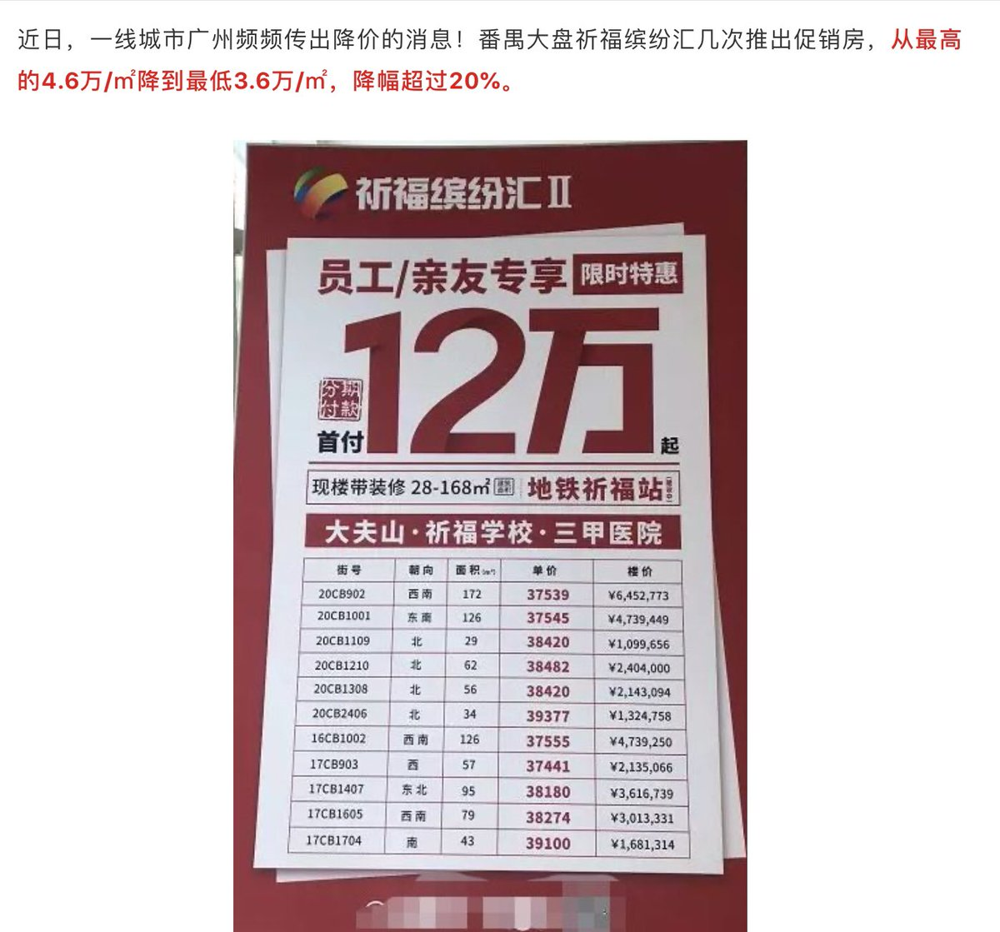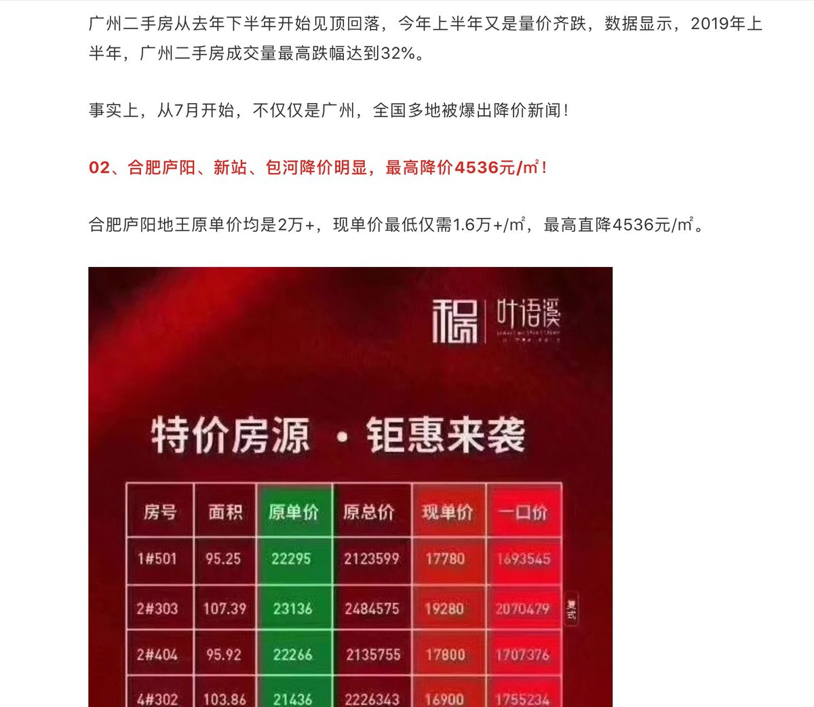 :speech_balloon:评:2 :+1:赞:46 :globe_with_meridians:转:20  

[11月01日 08:21]    老司机   @h5lpykl7tp6jjop    在中国人中每个人骄傲自大都会遭到批评鄙视，一但提起群体就必须骄傲自大反之则会遭到批评鄙视！这是什么逻辑？这就是中国逻辑！每一个没有尊严的人合在一起就成了尊严心极强的群体，这种现象全世界只有中国会出现，可中国人一点不觉奇怪，反而认为很正常，所以中国人说你不正常，那恭喜你，你是正常人  :speech_balloon:评:5 :+1:赞:178 :globe_with_meridians:转:47  

[11月01日 08:03]    GFHG SDKM   @zyx_yny    不好意思，小熊維尼（プーさん）让一下下
涩谷的万圣节
Shibuya gets out of control on Halloween.

すみません、くまのプーさん通ります！！
ハロウィンの渋谷はやばい。。
   :speech_balloon:评:60 :+1:赞:1642 :globe_with_meridians:转:932  

[11月01日 08:00]    GFHG SDKM   @zyx_yny    Hong Kong latest:
- Police scuffle with protesters and party-goers on Halloween
- Beijing signals tougher security measures are coming
- Court injunction bans internet posts that incite or encourage violence https://bloom.bg/2Py1jaK   :speech_balloon:评:253 :+1:赞:2380 :globe_with_meridians:转:2099  

[11月01日 07:52]    GFHG SDKM   @zyx_yny    一位男士不畏警察的强光照射，坐在警署外指骂有枪有炮，就是没有良心、良知。他还向警察怒吼，香港人不怕死，警察可以用真枪射杀他。  :speech_balloon:评:13 :+1:赞:110 :globe_with_meridians:转:53  

[11月01日 07:50]    GFHG SDKM   @zyx_yny    The brutality by the police towards protestors in #HongKong is deplorable.

Communist China and President Xi have turned Hong Kong into a police state. The US continues to #StandwithHongKong & will aid their fight for human rights in any way we can! https://twitter.com/hkchrislau/status/1189887609553604609 …  :speech_balloon:评:644 :+1:赞:4972 :globe_with_meridians:转:3918  

[11月01日 00:38]    财经真相   @caijingxiang    美元货币体系终结者——数字货币  :speech_balloon:评:45 :+1:赞:139 :globe_with_meridians:转:36  

[11月01日 00:24]    财经真相   @caijingxiang    美元根本无法脱钩比特币，因为它从未就“挂钩过”，都是场外交易，所以才可以为非法交易提供洗钱！ https://twitter.com/seanchen_new/status/1189940816560582659 …  :speech_balloon:评:9 :+1:赞:52 :globe_with_meridians:转:9  

[11月01日 00:18]    财经真相   @caijingxiang    那些说夸张的人，究竟懂不懂世界贸易体系？如果夸张，习近平会亲自开会学习区域块链？  :speech_balloon:评:21 :+1:赞:60 :globe_with_meridians:转:10  

[11月01日 00:17]    财经真相   @caijingxiang    美国人看样子要重新构建一种新的货币结算体系了！  :speech_balloon:评:9 :+1:赞:69 :globe_with_meridians:转:9  

[11月01日 00:15]    财经真相   @caijingxiang    中共发行的数字货币究竟目的是什么？答案是毁灭全世界，摧毁美元世界霸权，进而摧毁世界贸易体系，再摧毁世界经济，最终将世界变成人间炼狱！ 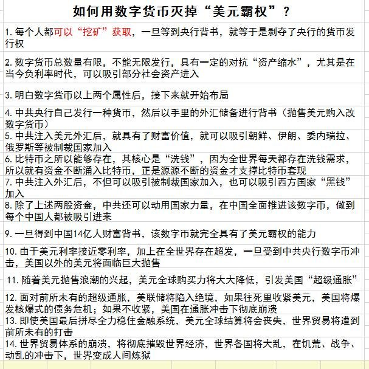 :speech_balloon:评:104 :+1:赞:477 :globe_with_meridians:转:222  

[10月31日 23:23]    财经真相   @caijingxiang    美国民主党关于对特朗普进行弹劾调查的下一步行动在美国众议院扫清了程序性障碍! https://twitter.com/caijingxiang/status/1189503583399448576 …  :speech_balloon:评:8 :+1:赞:40 :globe_with_meridians:转:6  

[10月31日 23:08]    GFHG SDKM   @zyx_yny    An elderly woman bled heavily after got shot at her leg by a tear gas canister fired by #HKPoliceTerrorists  :speech_balloon:评:159 :+1:赞:2920 :globe_with_meridians:转:3243  

[10月31日 23:05]    GFHG SDKM   @zyx_yny    In #MongKok, a #police officer pepper sprayed a passerby right at his face, the police claimed that "he has given warnings"
Credit - 35cbc.clarius@ig
#HongKongRioters #PoliceBrutality #PoliceState #StandWithHongKong #FreeHongKong  :speech_balloon:评:16 :+1:赞:264 :globe_with_meridians:转:257  

[10月31日 22:26]    GFHG SDKM   @zyx_yny    Just got tear gassed. Happy Halloween from Hong Kong. 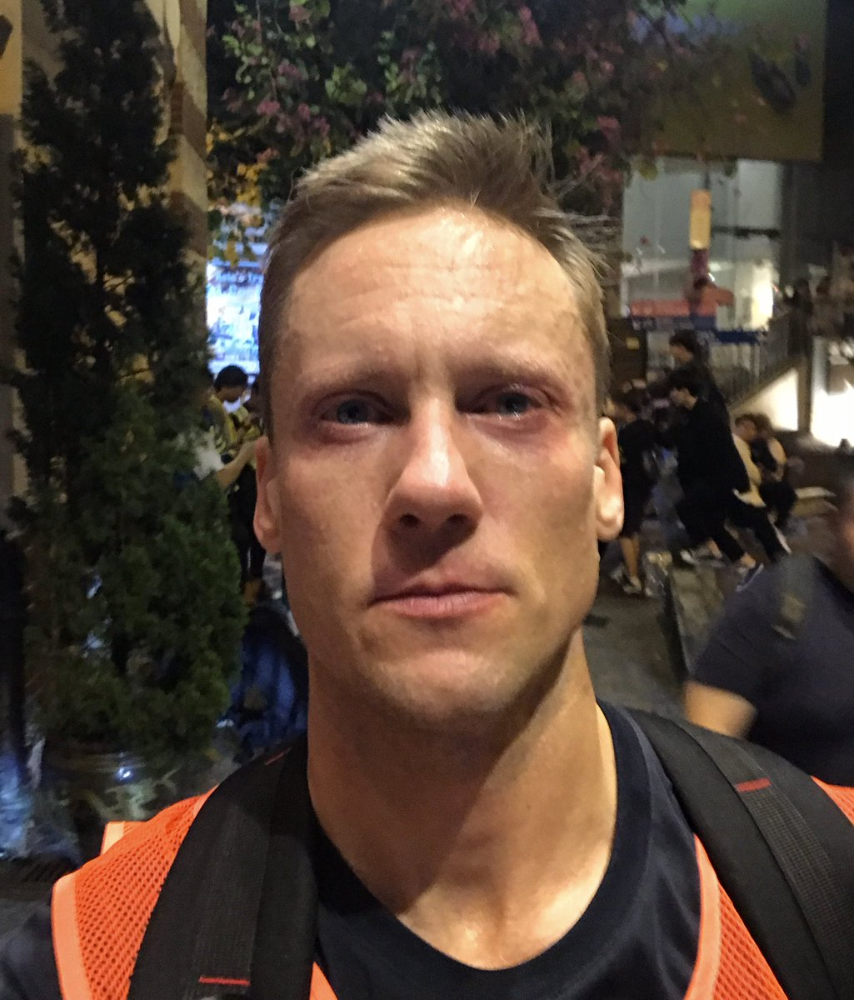 :speech_balloon:评:2745 :+1:赞:8553 :globe_with_meridians:转:5608  

[10月31日 21:45]    GFHG SDKM   @zyx_yny    今夜の #渋谷 で、香港を応援する中国人が過激な中国人に襲われました
#halloween2019 #StandwiththePooh #StandWithHongKong #HongKongProtests #香港 #香港デモ #ハロウィン #shibuya #習近平 #仮面　#プーさん #ディズニー #暴力  :speech_balloon:评:76 :+1:赞:1413 :globe_with_meridians:转:1134  

[10月31日 21:11]    GFHG SDKM   @zyx_yny    China has now 3-5 million Muslims in CONCENTRATION CAMPS. Subjecting them to TORTURE. Women are being GANG RAPED. Children are being SEPARATED from their parents. HARVESTING THEIR ORGANS!

China wants you to be silent. 

PLEASE DON'T BE SILENT

RETWEET   :speech_balloon:评:386 :+1:赞:29112 :globe_with_meridians:转:46641  

[10月31日 19:55]    财经真相   @caijingxiang    重磅：美国国务卿蓬佩奥本周三在保守派智库纽约哈德逊研究所发表演讲时表示，中共政权正在谋求主导世界的权力，因此必须要予以正面反抗。
蓬佩奥在演讲中说，美国一直非常珍视与中国人民之间的友谊，但是中共政府与中国人民并非一回事。"这算是美国政府在职高官，第一次明确中共政府与中国两回事！ https://twitter.com/dw_chinese/status/1189872143036604416 …  :speech_balloon:评:18 :+1:赞:559 :globe_with_meridians:转:211  

[10月31日 19:50]    财经真相   @caijingxiang    又是彭博新闻，中共四中全会刚结束，新闻通稿刚发出，贸易谈判滑消息就出来了，时间点掐的很讲政治，恰到好处！ https://twitter.com/economics/status/1189870935290961923 …  :speech_balloon:评:6 :+1:赞:104 :globe_with_meridians:转:29  

[10月31日 18:51]    财经真相   @caijingxiang    四中全会总体一句话：不改、坚决不改！ 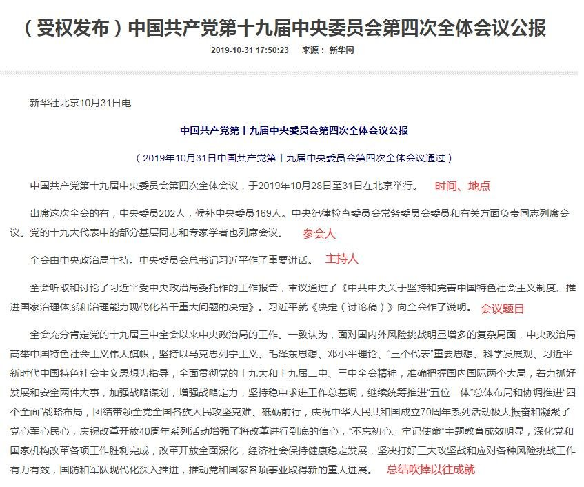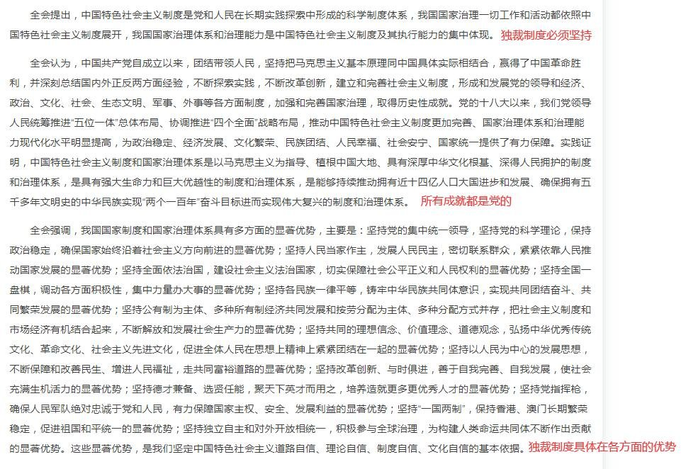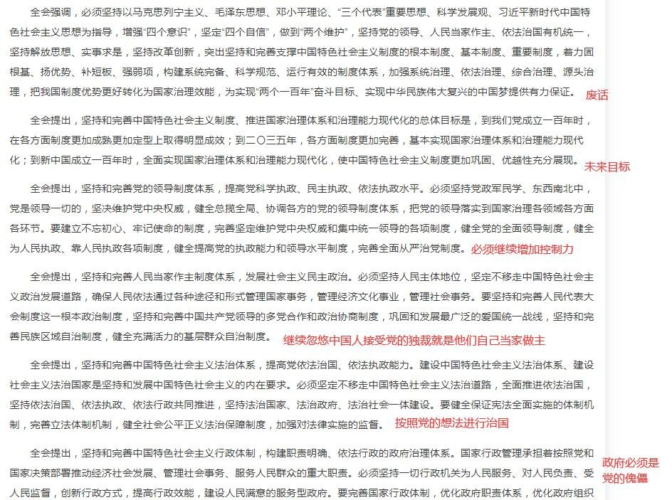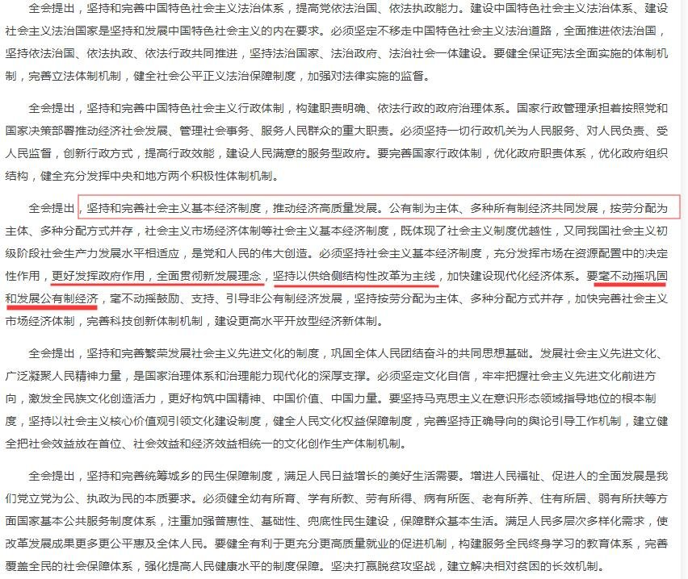 :speech_balloon:评:111 :+1:赞:1195 :globe_with_meridians:转:467  

[10月31日 17:56]    墙国铁拳现世报😷   @Socialistfist    就当是给祖国母亲的生日礼物了~

#社会主义铁拳 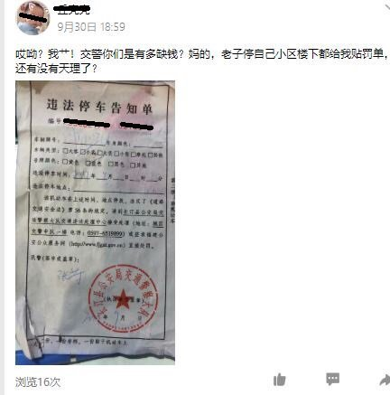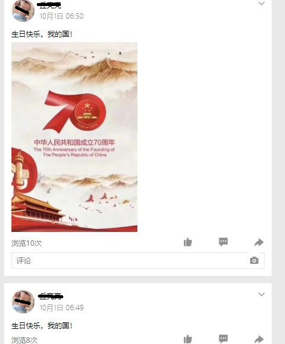 :speech_balloon:评:29 :+1:赞:346 :globe_with_meridians:转:67  

[10月31日 17:55]    老司机   @h5lpykl7tp6jjop    杀毒软件里有理财
听歌软件里有购物
聊天软件里有视频
支付软件里有社交
天气软件里有新闻
地图软件里有外卖
搜索引擎里卖假药
浏览器里有小游戏
这就是国内互联网现状，每个毒瘤软件都想要整个互联网，把用户当成猪，争相圈到自家猪圈里给用户喂屎。
我尽可能拒绝使用国内软件和服务，因为我不想吃屎  :speech_balloon:评:51 :+1:赞:1347 :globe_with_meridians:转:489  

[10月31日 17:10]    财经真相   @caijingxiang    China said to be unwilling to budge on big structural changes！  :speech_balloon:评:4 :+1:赞:71 :globe_with_meridians:转:23  

[10月31日 06:13]    墙国铁拳现世报😷   @Socialistfist    香港导演争当护旗手！
结果当他翻拍鹿鼎记时，剧本翻来覆去修改多次，中共还是不予批准！

护旗手就是要给党折磨的
@Socialistfist  :speech_balloon:评:66 :+1:赞:544 :globe_with_meridians:转:134  

[10月30日 20:19]    墙国铁拳现世报😷   @Socialistfist    大家投票踊跃，下周就从点赞数从多到少挑四个选吧
有什么建议 意见可以回复此推  :speech_balloon:评:3 :+1:赞:31 :globe_with_meridians:转:1  

[10月30日 20:17]    墙国铁拳现世报😷   @Socialistfist    后续  :speech_balloon:评:2 :+1:赞:26 :globe_with_meridians:转:1  

[10月30日 20:12]    墙国铁拳现世报😷   @Socialistfist    推友最喜爱“上周最佳铁拳” 评选活动
更多选项看后续  :speech_balloon:评:2 :+1:赞:75 :globe_with_meridians:转:16  

[10月30日 19:24]    墙国铁拳现世报😷   @Socialistfist    全文 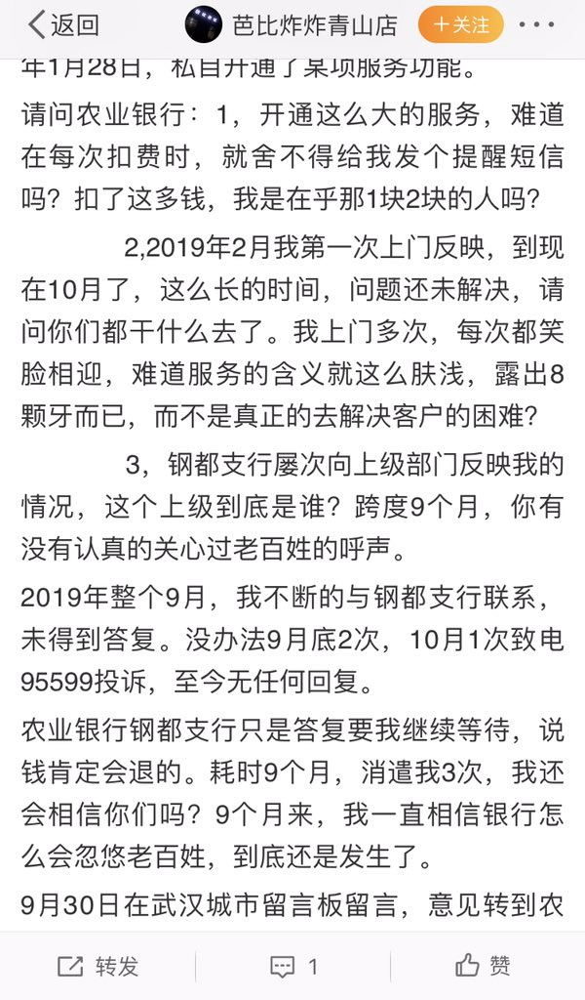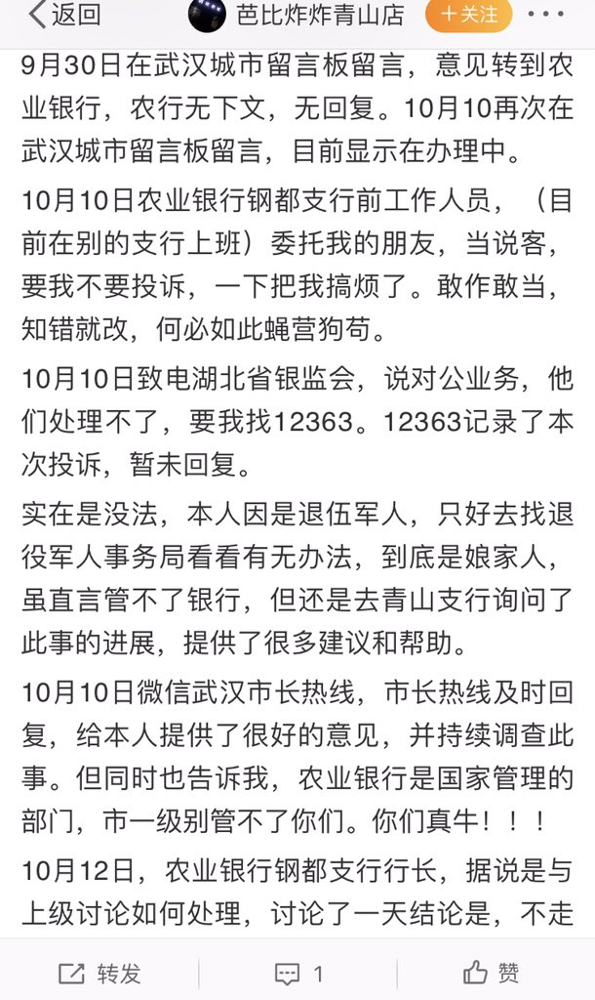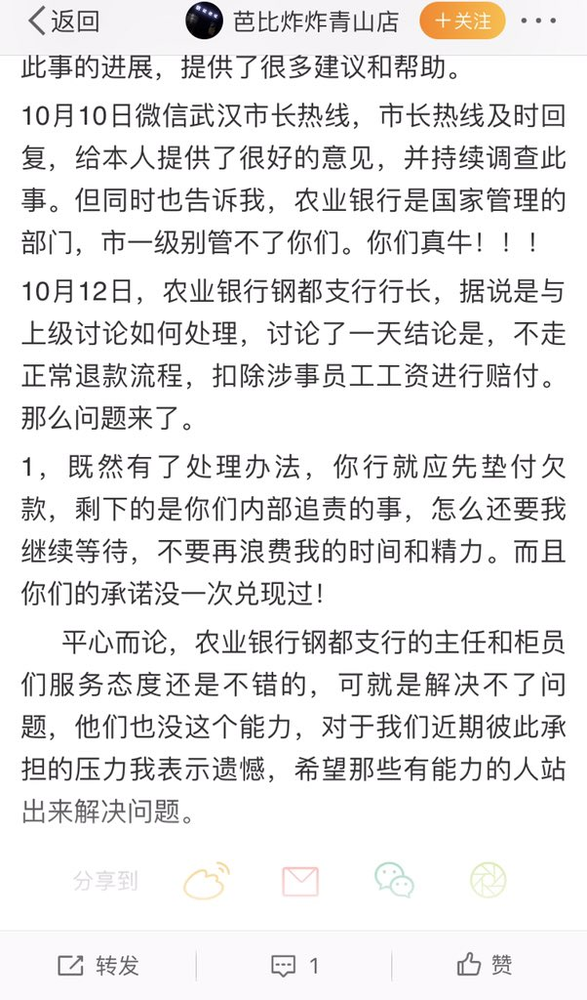 :speech_balloon:评:2 :+1:赞:66 :globe_with_meridians:转:12  

[10月30日 19:24]    墙国铁拳现世报😷   @Socialistfist    收了几次精赵智商税就开始闹，成何体统？
原文已删，全文看后续

#社会主义铁拳 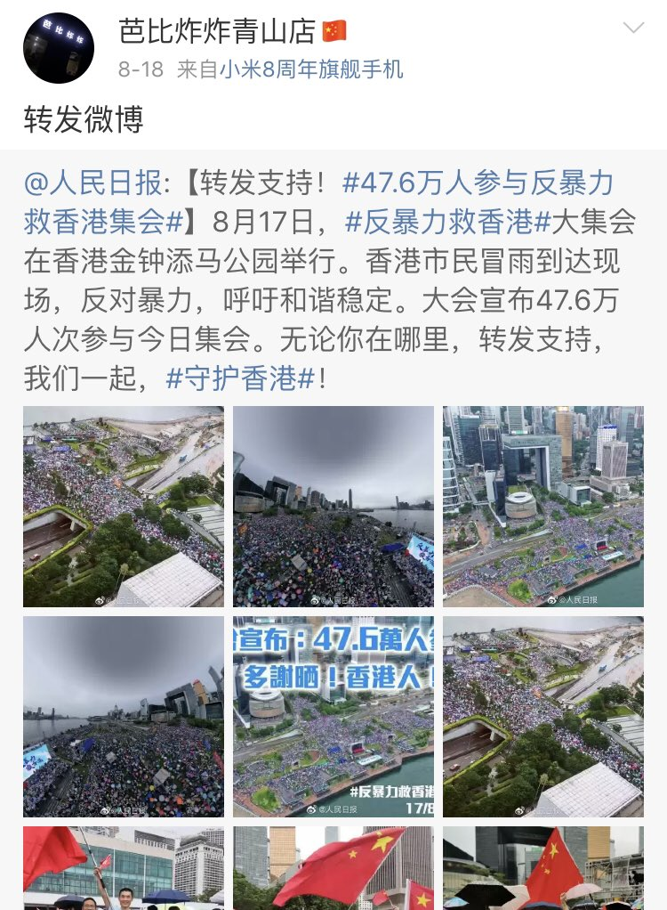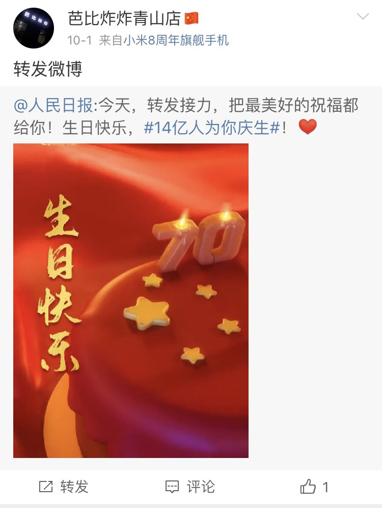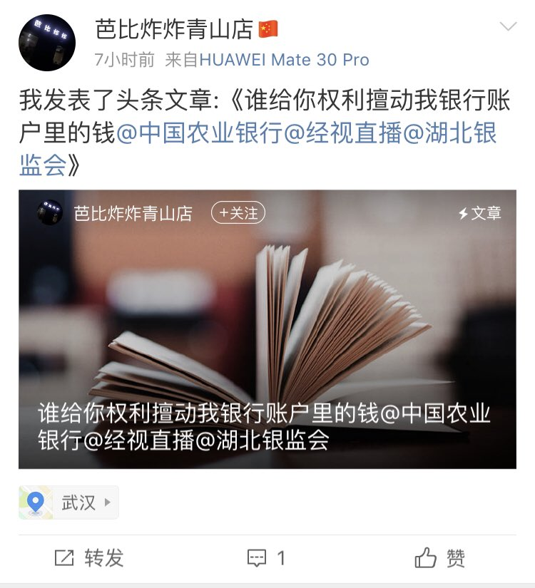 :speech_balloon:评:9 :+1:赞:250 :globe_with_meridians:转:70  

[10月29日 19:22]    墙国铁拳现世报😷   @Socialistfist    “哎呦.....太君别开枪.....”

#社会主义铁拳
#社会主义特别行政区铁拳  :speech_balloon:评:35 :+1:赞:439 :globe_with_meridians:转:135  

[10月28日 19:42]    墙国铁拳现世报😷   @Socialistfist    药房老板现时仍未回港，店员胡先生今日戴上口罩回店内用漂白水清洁，四名便衣警员到药房表示「唔好意思」，期望药房体谅，他坦言唯有接受道歉。
胡先生续指，估计损失约 1,000 元。他提到，昨晚蘗房已拉半闸，警方未有举起黑旗便施放催泪弹，形容警方是「乱咁射」，但需老板回港后才决定是否追究。  :speech_balloon:评:3 :+1:赞:62 :globe_with_meridians:转:10  

[10月28日 19:39]    墙国铁拳现世报😷   @Socialistfist    尖沙咀发起集会，演变成多处警民冲突，其中晚上警方施放的一枚催泪弹射入位于弥敦道的「明寅药房」，警方今早约4 名便衣警员到店舖道歉，向员工表示「唔好意思」。警员逗留约 2 分钟后离开，并无解释催泪弹射入药房的原因。  :speech_balloon:评:2 :+1:赞:60 :globe_with_meridians:转:7  

[10月28日 19:39]    墙国铁拳现世报😷   @Socialistfist    陈柏雄, 药房东主，在FB上撑警及赞同六四镇压嘅言论，包括他在10月5日发表「当年出坦克车，原来是最正确决定！」、10月8日称抗争者为「暴徒、垃圾废青、曱甴」，又称听到「兄弟、手足」令佢「作呕」。  :speech_balloon:评:2 :+1:赞:64 :globe_with_meridians:转:7  

[10月28日 19:38]    墙国铁拳现世报😷   @Socialistfist    铁拳是最好的决定

感谢香港推友，更多详情请看本推后续推文
#社会主义铁拳
#社会主义特别行政区铁拳  https://twitter.com/BeLightinHK/status/1188465234391883776 …  :speech_balloon:评:9 :+1:赞:147 :globe_with_meridians:转:44  

[10月28日 08:17]    凡賽堤/FORSETI   @FecharCCP    魔鬼在人間

極權殺人恐怖組織正在用各種兇殘手段殺害我們的同胞....................................................................................................

10月27日被極權殺人恐怖組織非法濫捕的香港年輕人已經超過200+ 人！  :speech_balloon:评:2 :+1:赞:25 :globe_with_meridians:转:19  

[10月28日 07:49]    凡賽堤/FORSETI   @FecharCCP    魔鬼在人間

極權殺人恐怖組織正在用各種兇殘手段殺害我們的同胞....................................................................................................

26日又有一10歲出頭的小孩被棄屍大海！  :speech_balloon:评:0 :+1:赞:16 :globe_with_meridians:转:14  

[10月28日 00:35]    凡賽堤/FORSETI   @FecharCCP    人類最恐怖的極權殺人恐怖組織！
警察蒙面公開殺人，毆打，暴打，非法濫捕，暗殺市民！

CCP的極權殺人恐怖組織比本拉登還恐怖一萬倍！

這是一個老人  :speech_balloon:评:1 :+1:赞:3 :globe_with_meridians:转:7  

[10月28日 00:20]    凡賽堤/FORSETI   @FecharCCP    人類最恐怖的極權殺人恐怖組織！
警察蒙面公開殺人，毆打，暴打，非法濫捕，暗殺市民！

CCP的極權殺人恐怖組織比本拉登還恐怖一萬倍！  :speech_balloon:评:4 :+1:赞:213 :globe_with_meridians:转:173  

[10月28日 00:11]    凡賽堤/FORSETI   @FecharCCP    人類最恐怖的極權殺人恐怖組織！
警察蒙面公開殺人，毆打，暴打，非法濫捕，暗殺市民！

CCP的極權殺人恐怖組織比本拉登還恐怖一萬倍！  :speech_balloon:评:6 :+1:赞:132 :globe_with_meridians:转:83  

[10月27日 23:59]    凡賽堤/FORSETI   @FecharCCP    人類最恐怖的極權殺人恐怖組織！
警察蒙面公開殺人，毆打，暴打，非法濫捕，暗殺市民！

已經被雙手反綁的學生，極權殺人恐怖組織還要把人往死裡整！全人類唯一一個最恐怖的極權殺人恐怖組織！  :speech_balloon:评:0 :+1:赞:8 :globe_with_meridians:转:9  

[10月27日 23:56]    凡賽堤/FORSETI   @FecharCCP    人類最恐怖的極權殺人恐怖組織！
警察蒙面公開殺人，毆打，暴打，非法濫捕，暗殺市民，  :speech_balloon:评:0 :+1:赞:12 :globe_with_meridians:转:13  

[10月27日 23:53]    凡賽堤/FORSETI   @FecharCCP    人類最恐怖的極權殺人恐怖組織！
警察蒙面公開殺人，毆打，暴打，非法濫捕，暗殺市民，  :speech_balloon:评:0 :+1:赞:9 :globe_with_meridians:转:4  

[10月27日 23:45]    凡賽堤/FORSETI   @FecharCCP    魔鬼的殺人罪行！

陳彥霖母女均被極權殺人恐怖組織殺害！  :speech_balloon:评:3 :+1:赞:36 :globe_with_meridians:转:31  

[10月27日 19:55]    墙国铁拳现世报😷   @Socialistfist    感谢众多推友投稿，感谢维尼之声的大力支持  :speech_balloon:评:1 :+1:赞:80 :globe_with_meridians:转:0  

[10月27日 19:54]    墙国铁拳现世报😷   @Socialistfist    不忘初心，牢记帮规
------镰刀斧头帮总舵主
#社会主义铁拳  :speech_balloon:评:18 :+1:赞:248 :globe_with_meridians:转:73  

[10月09日 00:47]    GFHG SDKM   @zyx_yny    "Son, when you grow up
You will be the savior of the broken
The beaten, and the damned?"
Please watch this powerful mv #HongKongProtester #hkprotests 
香港反送中護法戰爭(Hong Kong Defensive War 2019)：Welcome To The Black Parade  https://youtu.be/0yXTHODE24Q  via @YouTube  :speech_balloon:评:3 :+1:赞:17 :globe_with_meridians:转:4  

[10月05日 09:33]    凡賽堤/FORSETI   @FecharCCP    呼籲請求共同挖掘所有有關香港發生的事，越全面越好，不同角度，越多越好，包括被暗地抓捕的人員，特別是CCP 派出的各種偽裝身份，包括變身變裝行兇的一點一滴都要挖掘出來，把CCP 的邪惡下三濫手段的真相毫無保留的曝光在全世界面前！世界公知公義才能真正挽救和保護香港人！希望懂視頻編輯配上中英文 https://twitter.com/hjjohnson17/status/1178969916499746816 …  :speech_balloon:评:13 :+1:赞:20 :globe_with_meridians:转:10  

[03月13日 08:10]    老司机   @h5lpykl7tp6jjop    批评是批评家天生的使命！他们只感知对错，信奉真理，指出真相不吐不快，不在意权势和群众的喜好，从批评里不可能获得任何好处，但批评家愚直不改。在中国几乎所有人都讨厌批评家，喜欢阴谋家，因为他们只说好听的！可是就因为中国的批评家太少，中国几乎看不到未来和希望！  :speech_balloon:评:86 :+1:赞:195 :globe_with_meridians:转:41  

