[10月14日 18:47]    墙国铁拳现世报😷   @Socialistfist    不好这个护旗手要反

#社会主义铁拳  :speech_balloon:评:13 :+1:赞:35 :globe_with_meridians:转:8  

[10月14日 18:39]    新闻大吐槽   @TuCaoFakeNews    这是个大新闻啊，说明大陆学生在自由社会下，并不糊涂，至少有60%的人，已经甩掉了随身携带的井！ https://twitter.com/ttingxiao/status/1183582144645304320 …  :speech_balloon:评:1 :+1:赞:16 :globe_with_meridians:转:8  

[10月14日 18:35]    新闻大吐槽   @TuCaoFakeNews    港星阮民安支持抗争，大陆生意被关停，重义轻利值得敬佩！
香港要是能有更多明星走出来就好了  :speech_balloon:评:2 :+1:赞:32 :globe_with_meridians:转:11  

[10月14日 18:03]    新闻大吐槽   @TuCaoFakeNews    香港人加油⋯⋯天佑香港！ https://twitter.com/tucaofakenews/status/1183324013390491649 …  :speech_balloon:评:0 :+1:赞:3 :globe_with_meridians:转:1  

[10月14日 18:00]    新闻大吐槽   @TuCaoFakeNews    @zhanyoutongmeng
@hNeBHUlLJhBbwFH
@Today__China
@RXDSv1EwYcmq0cU
@chenmezhisheng
@TG6UlUmEtXFNRNH
@TuCaoFakeNews
@VOAChinese
@Mrdoorvpn
@goldenp11462989
@CCP_is_devil 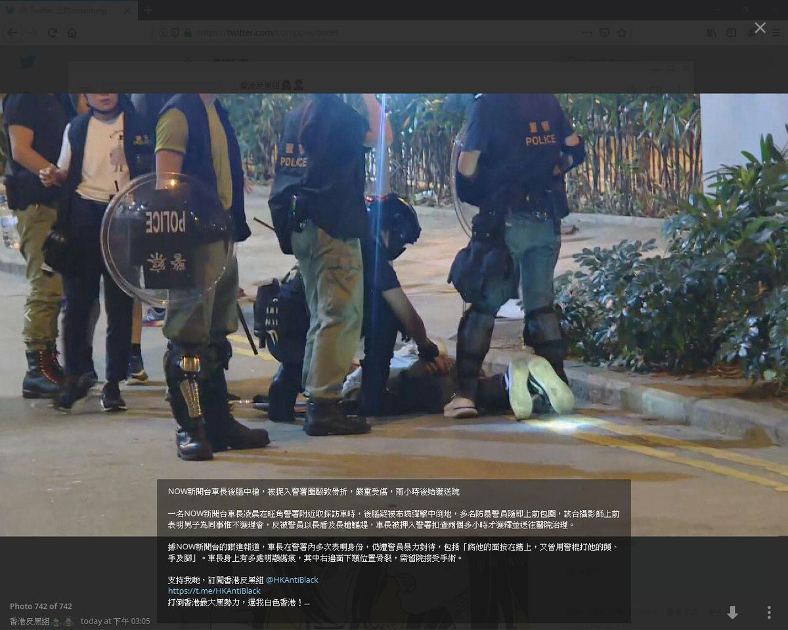 :speech_balloon:评:0 :+1:赞:3 :globe_with_meridians:转:4  

[10月14日 18:00]    BBC News 中文   @bbcchinese    11月前，中国的记者将参加一场考试，以测试他们对党的政策及主席习近平的忠诚度。 https://bbc.in/2IJkPwX   :speech_balloon:评:59 :+1:赞:115 :globe_with_meridians:转:66  

[10月14日 17:55]    新闻大吐槽   @TuCaoFakeNews    @zhanyoutongmeng
@hNeBHUlLJhBbwFH
@Today__China
@RXDSv1EwYcmq0cU
@chenmezhisheng
@TG6UlUmEtXFNRNH
@TuCaoFakeNews
@VOAChinese
@Mrdoorvpn
@goldenp11462989
@CCP_is_devil 
警察假扮黑衣人濫暴打人
成班人無委任證可以隨便捉人打人，簡直無法無天 https://twitter.com/Abrelialia/status/1183325537747423235 …  :speech_balloon:评:0 :+1:赞:16 :globe_with_meridians:转:10  

[10月14日 17:30]    GFHG SDKM   @zyx_yny    They just took whatever they want for citizens https://twitter.com/sowingdata/status/1183559249428799488 …  :speech_balloon:评:0 :+1:赞:0 :globe_with_meridians:转:0  

[10月14日 17:27]    财经真相   @caijingxiang    呵呵，这才刚过一天就要变卦了？消息一经公布，离岸人民币、a50急搓，黄金短线冲高！ https://twitter.com/zerohedge/status/1183674272402890752 …  :speech_balloon:评:25 :+1:赞:127 :globe_with_meridians:转:45  

[10月14日 17:06]    新闻大吐槽   @TuCaoFakeNews    黑警鬼鬼祟崇在已落關店舖伏 蒙面的義土  :speech_balloon:评:1 :+1:赞:9 :globe_with_meridians:转:7  

[10月14日 17:00]    BBC News 中文   @bbcchinese    在中国和欧美一些城市，租衣已成为一种风潮，一些人甚至开通了“包月服务”。你对穿租来的衣服依然心存芥蒂吗？ https://bbc.in/2MB9r7h   :speech_balloon:评:10 :+1:赞:13 :globe_with_meridians:转:5  

[10月14日 16:59]    新闻大吐槽   @TuCaoFakeNews    年輕人正在跑，這位白衫暴徒竟出腳踢同打年輕人，年輕人倒下再被暴警拉咗，大家認住呢個人
仆街 #暴徒 #粉嶺 #五毛廢老 #愛黨小粉紅  :speech_balloon:评:6 :+1:赞:39 :globe_with_meridians:转:36  

[10月14日 16:57]    新闻大吐槽   @TuCaoFakeNews    这个号真有意思 https://twitter.com/TuCaoFakeNews/status/1183334485514846208 …  :speech_balloon:评:3 :+1:赞:3 :globe_with_meridians:转:2  

[10月14日 16:49]    新闻大吐槽   @TuCaoFakeNews    kwokpc
@Anonymouspc2020
·
1時
@zhanyoutongmeng
@hNeBHUlLJhBbwFH
@Today__China
@RXDSv1EwYcmq0cU
@chenmezhisheng
@TG6UlUmEtXFNRNH
@TuCaoFakeNews
@VOAChinese
@Mrdoorvpn
@goldenp11462989
@CCP_is_devil
 
黑警察坐頭壓頸椎，非常惡毒對侍被捕者
地點：將軍澳 Holiday Inn 對出 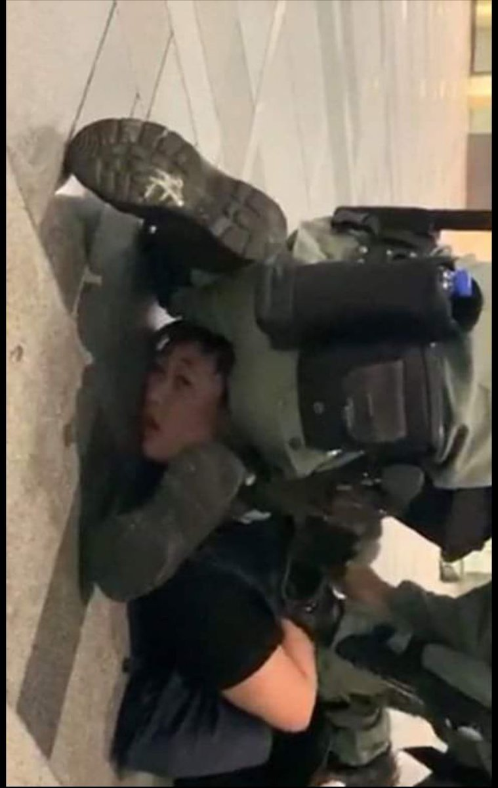 :speech_balloon:评:2 :+1:赞:24 :globe_with_meridians:转:21  

[10月14日 16:30]    纽约时报中文网   @nytchinese    许多人担心经济衰退会削弱民众对抗议运动的支持。
“大家准备持久战，但其实已经开始受到伤害，而且持续的时间越长，气氛就越让人沮丧，“香港美国商会会长早素娜说。 http://nyti.ms/2OIJKEv   :speech_balloon:评:59 :+1:赞:19 :globe_with_meridians:转:5  

[10月14日 16:12]    新闻大吐槽   @TuCaoFakeNews    银根紧缩造成的不稳定性 https://twitter.com/h1300062810/status/1183637315945713664 …  :speech_balloon:评:17 :+1:赞:66 :globe_with_meridians:转:18  

[10月14日 16:02]    新闻大吐槽   @TuCaoFakeNews    黑警製作，假片段扮示威者破壞直通車，綜合大家觀察:

1. 10月5日禁蒙面法公佈日夜晚 黨鐵封左, 除職員同黑警冇人入到去
2. 直通車唔會停粉嶺
3. 車頭往紅磡方向, 唔係停哩邊月台
4. 得一個媒體影到
5. 可以係車箱入面影返岀黎
6. 車等成分幾鐘都唔開, 等住被打
未完 接下  :speech_balloon:评:11 :+1:赞:76 :globe_with_meridians:转:69  

[10月14日 16:00]    BBC News 中文   @bbcchinese    西班牙神经学会癫痫研究小组协调人洛佩兹告诉BBC：“这是一种非常罕见的癫痫，在所有癫痫类型中仅占0.2%。” https://bbc.in/31guPUK   :speech_balloon:评:3 :+1:赞:23 :globe_with_meridians:转:7  

[10月14日 15:18]    纽约时报中文网   @nytchinese    “十一“黄金周期间，香港迪士尼乐园各游乐设施的等候队伍破天荒得短。通常挤满购物者的购物中心关闭了数天。城里最贵的餐馆提供了大幅折扣，但依然食客寥寥。
香港经济的主要驱动力旅游业严重受创，虽然另两大支柱国际金融和房地产目前基本未受影响，但担忧和恐慌已在蔓延。 http://nyti.ms/2OIJKEv   :speech_balloon:评:44 :+1:赞:92 :globe_with_meridians:转:23  

[10月14日 15:00]    BBC News 中文   @bbcchinese    南韩和日本的关系已经下跌到1965年建交以来的谷底。 https://bbc.in/35yKC4w   :speech_balloon:评:15 :+1:赞:33 :globe_with_meridians:转:10  

[10月14日 14:44]    新闻大吐槽   @TuCaoFakeNews    印度「另類歡迎」習近平 黨媒不敢報?

10月11號，習近平訪問印度金奈，將在此與印度總理莫迪會面，當地一所學校的兩千名學生，當天全部戴上逼真的習近平面具，組成奇特的場面，隆重歡迎他。

中共的喉舌媒體隻字未提，央視也沒有出現相關畫面，就連大外宣媒體，也都只刊登了全景照片，不使用近鏡頭。  :speech_balloon:评:2 :+1:赞:12 :globe_with_meridians:转:7  

[10月14日 14:42]    新闻大吐槽   @TuCaoFakeNews    【字幕對白】這位戴面罩青年好嘢 途經尖沙咀兩度被警截查據理力爭：我只有一個人警察說大話故意拘留我 錯誤引用《反蒙面法》  :speech_balloon:评:4 :+1:赞:92 :globe_with_meridians:转:57  

[10月14日 14:27]    财经真相   @caijingxiang    尤其是高盛赚的手抽筋，当时中方对接人就是王73，其他几家银行也是！这才是真正的卖国贼，从未见过一个国内外专家提出过质疑！ https://twitter.com/ccp5464/status/1183282408415584258 …  :speech_balloon:评:11 :+1:赞:125 :globe_with_meridians:转:46  

[10月14日 14:22]    老司机   @h5lpykl7tp6jjop    Today 13:15 at Tai Po, #HongKong. A photo that shows #HongKongPolice, a cop’s Van, a truck, and what seems like a body. Last night, a lot of people were arrested in Tai Po. I am fear more “unsuspicious suicides” are on their way. #hkpolicebrutality #BloodyCarrie #FreeHongKong 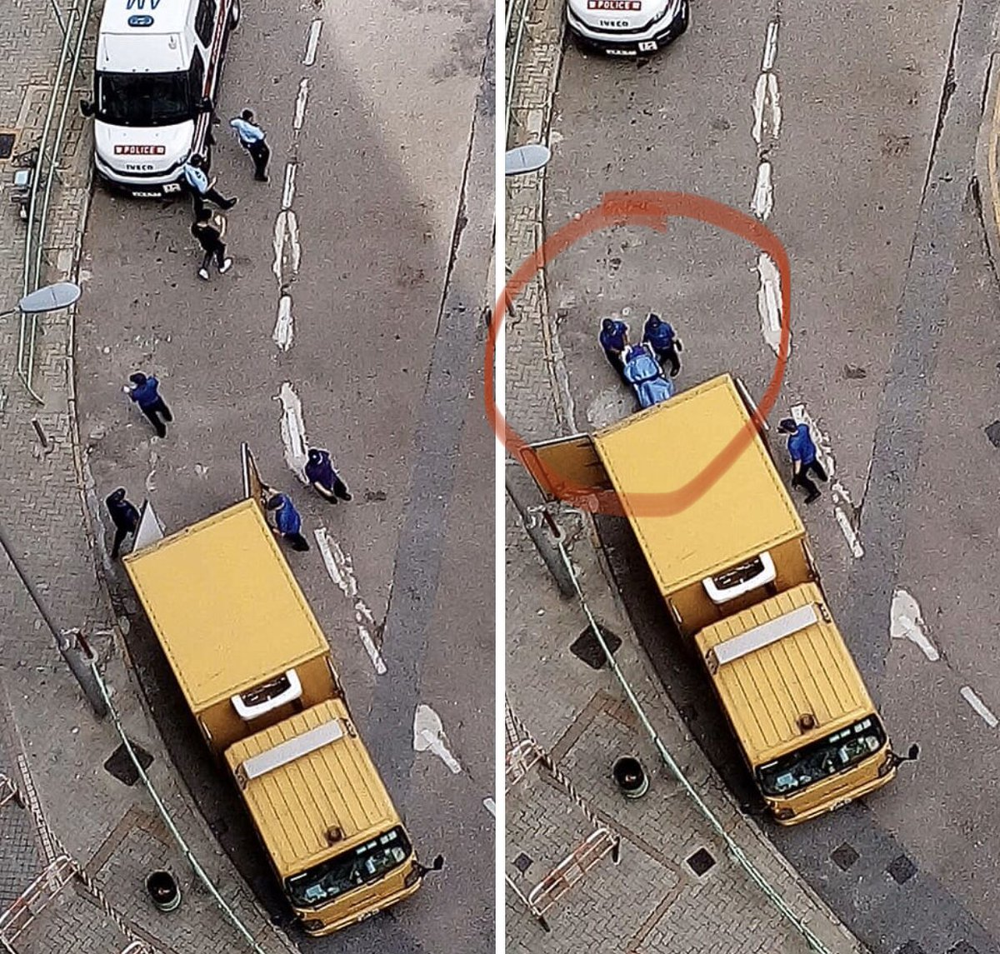 :speech_balloon:评:29 :+1:赞:217 :globe_with_meridians:转:290  

[10月14日 14:00]    BBC News 中文   @bbcchinese    持有太平洋岛国瓦努阿图的护照可自由进入欧洲国家，受到很多中国人青睐。为中国人办护照，已成为该国最大收入来源。 https://bbc.in/2q7Gfxb   :speech_balloon:评:20 :+1:赞:216 :globe_with_meridians:转:138  

[10月14日 14:00]    纽约时报中文网   @nytchinese    图中这些波普风格的林郑月娥贴画，是为了让行人过桥到青衣一座火车站时将它踩在脚下。
 http://nyti.ms/35ALHcq  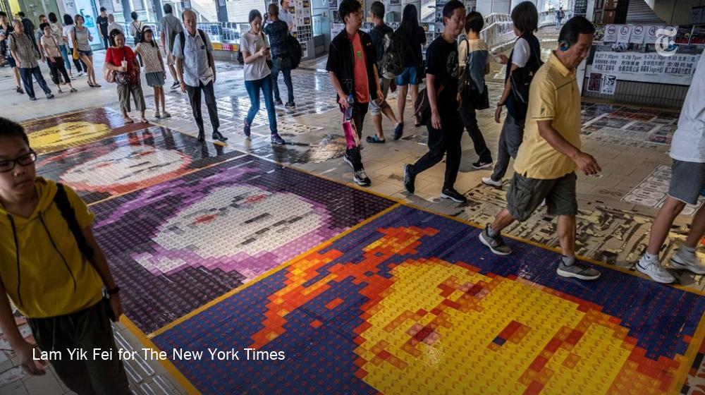 :speech_balloon:评:25 :+1:赞:22 :globe_with_meridians:转:3  

[10月14日 13:30]    纽约时报中文网   @nytchinese    本土版自由女神像、讽刺官员的漫画、不断涌现的列侬墙......香港艺术家们将作品放在网上或人流密集的公共场所，使街头艺术和平面设计成为抗议运动的标志性特征。
艺术家们通常会匿名迅速创作，并将作品放在Reddit之类的网络论坛或人流密集的公共场所。 http://nyti.ms/35ALHcq   :speech_balloon:评:33 :+1:赞:87 :globe_with_meridians:转:26  

[10月14日 13:00]    BBC News 中文   @bbcchinese    香港媒体预计，《施政报告》将提出方法扩大征地，包括引用政府过去一直抗拒的《收回土地条例》，向私人开发商收地建屋。 https://bbc.in/2IKqQJG   :speech_balloon:评:21 :+1:赞:12 :globe_with_meridians:转:9  

[10月14日 13:00]    纽约时报中文网   @nytchinese    • 研究表明，业余爱好能够减轻生活压力，给人带来幸福感，并对健康有益。如何如何培养一种兴趣爱好，并在忙碌的生活中为它腾出时间？
• 肥胖患者与肠道健康：科学家发现，生活在肠道中数以万亿计的微生物群落，在体重增加和代谢疾病中起着重要作用。
更多简报内容： http://nyti.ms/32cUDCl   :speech_balloon:评:2 :+1:赞:8 :globe_with_meridians:转:4  

[10月14日 12:30]    纽约时报中文网   @nytchinese    习近平面临着香港街头的抗议活动，以及食品价格的大幅上涨等问题，后者可以通过进口美国食品来抑制；特朗普则急于把舆论焦点从弹劾调查和“电话门“上移开。
随着贸易战加重制造业和商业投资的焦虑，这两位领导人都面临着持续不断的负面经济消息。 http://nyti.ms/2OJHnl1   :speech_balloon:评:1 :+1:赞:6 :globe_with_meridians:转:2  

[10月14日 12:14]    凡賽堤/FORSETI   @FecharCCP    想看極權殺人恐怖組織的殺人，迫害華人真相的請看香港大紀元！
想看極權殺人恐怖組織爆料黑幕的去看郭文貴直播！
想看調侃，唱衰，分析極權殺人恐怖組織有關新聞的，
去看 年代向錢看（youtube)
他們相對比較專業，全面！  :speech_balloon:评:0 :+1:赞:5 :globe_with_meridians:转:3  

[10月14日 12:08]    GFHG SDKM   @zyx_yny    Crazy running dog https://twitter.com/wwkk27744741/status/1183325876001230850 …  :speech_balloon:评:0 :+1:赞:1 :globe_with_meridians:转:0  

[10月14日 12:07]    凡賽堤/FORSETI   @FecharCCP    儘管極權殺人恐怖組織控制的推特一直黑我的關注人數，我根本無所謂，因為為正義而發，為傳播真相而發，這是我的生活一部分！傳播真相才是最重要，無非也是一只小螞蟻而已！  :speech_balloon:评:1 :+1:赞:4 :globe_with_meridians:转:2  

[10月14日 12:00]    BBC News 中文   @bbcchinese    加拿大安大略省最近发生学校劳资纠纷，竟然可能影响联邦大选？ https://bbc.in/2ILWh6z   :speech_balloon:评:2 :+1:赞:14 :globe_with_meridians:转:5  

[10月14日 12:00]    纽约时报中文网   @nytchinese    突破人类极限：肯尼亚长跑运动员基普乔格在周六的维也纳马拉松赛中以1小时59分40秒的成绩完赛。这是马拉松历史上首次有人突破两小时关卡。
基普乔格是如何做到的？前体育记者做出分析。
更多简报内容： http://nyti.ms/32cUDCl   :speech_balloon:评:4 :+1:赞:9 :globe_with_meridians:转:2  

[10月14日 11:59]    凡賽堤/FORSETI   @FecharCCP    真正的良心媒體是不會刻意去追求關注度！而是注重及時傳播每一個突發事件及真相！如果一些自媒體有人養著，或者是真正為正義，為傳播真相而發，不需要靠廣告收入養活自己，他們完全沒有必要去研究觀眾的口味，傳播突發事件和跟踪新聞事件也許能迎來更多的觀眾！  :speech_balloon:评:1 :+1:赞:7 :globe_with_meridians:转:4  

[10月14日 11:53]    老司机   @h5lpykl7tp6jjop    【字幕對白】這位戴面罩青年好嘢 途經尖沙咀兩度被警截查據理力爭：我只有一個人警察說大話故意拘留我 錯誤引用《反蒙面法》  :speech_balloon:评:10 :+1:赞:185 :globe_with_meridians:转:111  

[10月14日 11:53]    新闻大吐槽   @TuCaoFakeNews    【字幕對白】這位戴面罩青年好嘢 途經尖沙咀兩度被警截查據理力爭：我只有一個人警察說大話故意拘留我 錯誤引用《反蒙面法》  :speech_balloon:评:10 :+1:赞:185 :globe_with_meridians:转:111  

[10月14日 11:52]    凡賽堤/FORSETI   @FecharCCP    香港大紀元才是真正的滅極權主義的先鋒！幾個月從未停止跟踪報導香港極權殺害港人的每一個畫面！向香港大紀元致敬並說聲謝謝！  :speech_balloon:评:13 :+1:赞:393 :globe_with_meridians:转:191  

[10月14日 11:51]    新闻大吐槽   @TuCaoFakeNews    港鐵員工爆料：破壞港鐵皆為港警 嫁禍示威者(組圖) http://dlvr.it/RG7WtR   :speech_balloon:评:12 :+1:赞:52 :globe_with_meridians:转:37  

[10月14日 11:40]    新闻大吐槽   @TuCaoFakeNews    中共禁NBA激怒美國 黑衣群眾紐約賽前抗議

週五晚，紐約支持香港和言論自由的民眾，在麥迪遜廣場花園前集會，抗議中共抵制NBA的無理作法，捍衛自由民主。

麥迪遜廣場花園前，身穿黑衣的抗議者喊著「支持香港」，舉著的標語上寫著「今日香港、明日世界」，呼籲NBA永遠不要屈服於獨裁者（Autocrats）。  :speech_balloon:评:4 :+1:赞:73 :globe_with_meridians:转:34  

[10月14日 11:30]    纽约时报中文网   @nytchinese    #图集【强台风“海贝斯”席卷日本】周末，日本遭受数十年来最强台风之一“海贝斯”袭击，导致至少35人死亡，15人失踪，100人受伤。
狂风呼啸、汹涌的海浪淹没建筑物、人员被困，救援行动仍在艰难进行中。
点击查看图集： http://nyti.ms/2B5GkUx  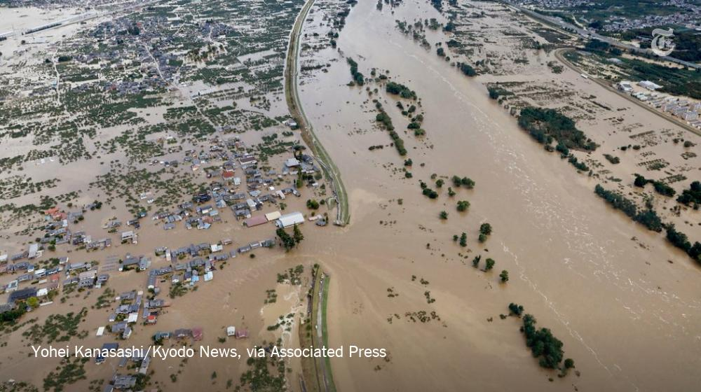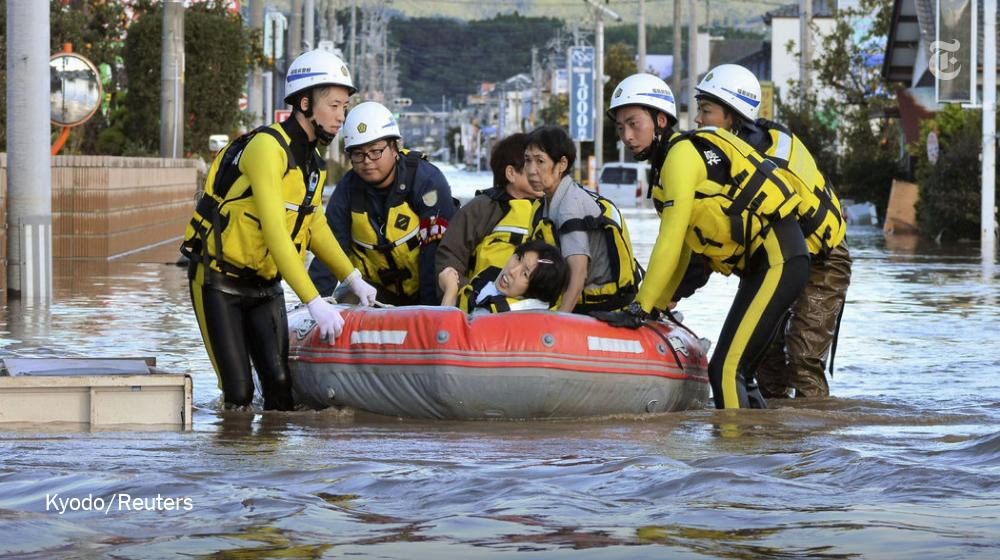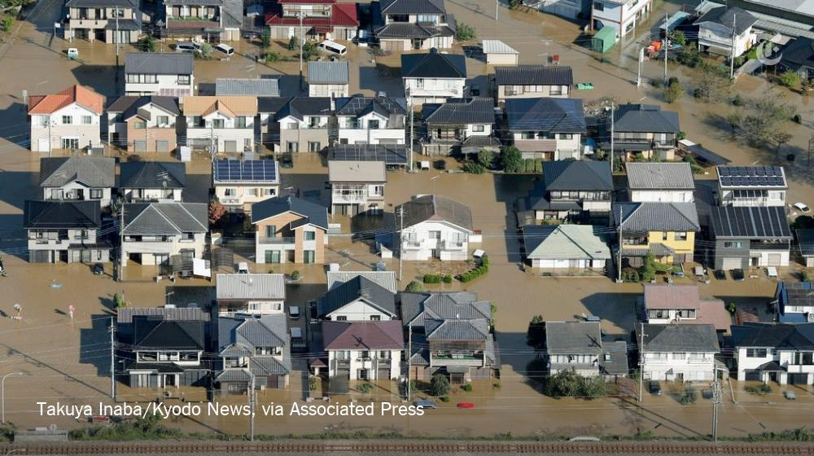 :speech_balloon:评:7 :+1:赞:17 :globe_with_meridians:转:8  

[10月14日 11:27]    凡賽堤/FORSETI   @FecharCCP    希望這些擁有原始照片和視頻的提供給死者家屬！

估計不用多久極權殺人恐怖組織要發動銷毀有關香港照片和視頻（包括所有媒體）的全球大規模行動了！  :speech_balloon:评:0 :+1:赞:1 :globe_with_meridians:转:0  

[10月14日 11:15]    新闻大吐槽   @TuCaoFakeNews    一群來自大陸的香港中文大學本科生，最近組成研究團隊，調查在香港反修例運動中，大陸在港留學生對事件的態度。結果發現，近30.6%的受訪者，贊同港府提出修訂《逃犯條例》，但有37.7%的受訪者不讚同。另有不到三成的受訪者持中立態度。約60%的大陸生，支持「成立獨立調查委員會」  :speech_balloon:评:0 :+1:赞:35 :globe_with_meridians:转:24  

[10月14日 11:12]    凡賽堤/FORSETI   @FecharCCP    這些香港每一個慘不忍睹的畫面和視頻，如果有正義自媒體和新聞一直跟踪報導，也許很多都可以活下來！無形中幫助和挽救多少香港人啊！！！

良心媒體不單要報導，傳播，應該還要跟踪事態的發展和結果！！！ 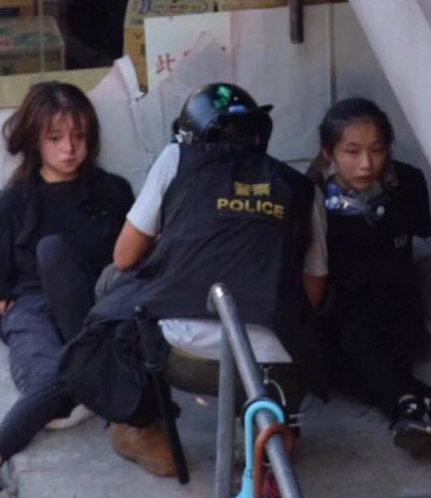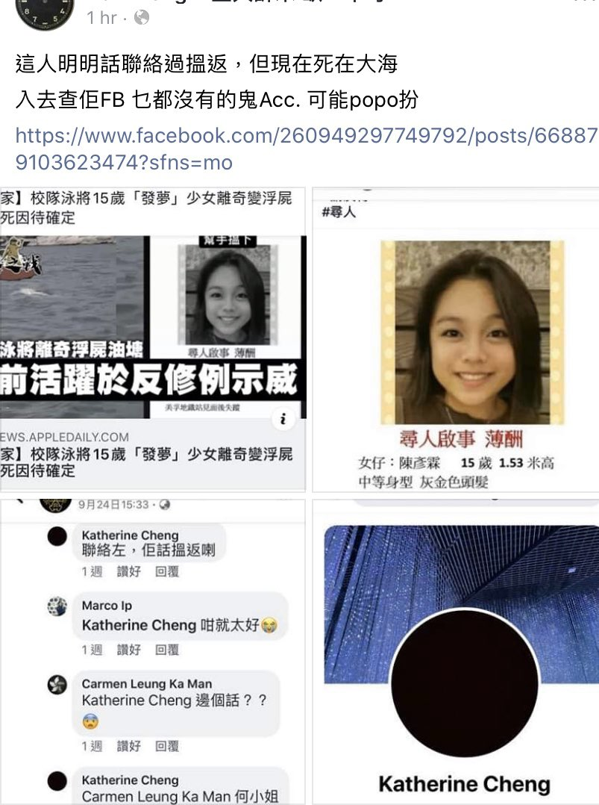 :speech_balloon:评:4 :+1:赞:16 :globe_with_meridians:转:14  

[10月14日 11:06]    凡賽堤/FORSETI   @FecharCCP    這些香港每一個慘不忍睹的畫面和視頻，如果有正義自媒體和新聞一直跟踪報導，也許很多都可以活下來！無形中幫助和挽救多少香港人啊！！！ https://twitter.com/FecharCCP/status/1182396469111865344 …  :speech_balloon:评:0 :+1:赞:5 :globe_with_meridians:转:7  

[10月14日 11:05]    凡賽堤/FORSETI   @FecharCCP    這些香港每一個慘不忍睹的畫面和視頻，如果有正義自媒體和新聞一直跟踪報導，也許很多都可以活下來！無形中幫助和挽救多少香港人啊！！！ https://twitter.com/FecharCCP/status/1183185353500512258 …  :speech_balloon:评:0 :+1:赞:4 :globe_with_meridians:转:4  

[10月14日 11:03]    凡賽堤/FORSETI   @FecharCCP    這些香港每一個慘不忍睹的畫面和視頻，如果有正義自媒體和新聞一直跟踪報導，也許很多都可以活下來！無形中幫助和挽救多少香港人啊！！！ https://twitter.com/FecharCCP/status/1182079492958883840 …  :speech_balloon:评:0 :+1:赞:0 :globe_with_meridians:转:2  

[10月14日 11:03]    凡賽堤/FORSETI   @FecharCCP    這些香港每一個慘不忍睹的畫面和視頻，如果有正義自媒體和新聞一直跟踪報導，也許很多都可以活下來！無形中幫助和挽救多少香港人啊！！！ https://twitter.com/FecharCCP/status/1183193159087640576 …  :speech_balloon:评:0 :+1:赞:0 :globe_with_meridians:转:1  

[10月14日 11:02]    凡賽堤/FORSETI   @FecharCCP    這些香港每一個慘不忍睹的畫面和視頻，如果有正義自媒體和新聞一直跟踪報導，也許很多都可以活下來！無形中幫助和挽救多少香港人啊！！！ https://twitter.com/FecharCCP/status/1182079900393582592 …  :speech_balloon:评:1 :+1:赞:1 :globe_with_meridians:转:2  

[10月14日 11:00]    凡賽堤/FORSETI   @FecharCCP    這些香港每一個慘不忍睹的畫面和視頻，如果有正義自媒體和新聞一直跟踪報導，也許很多都可以活下來！無形中幫助和挽救多少香港人啊！！！ https://twitter.com/FecharCCP/status/1182079392387911680 …  :speech_balloon:评:0 :+1:赞:1 :globe_with_meridians:转:2  

[10月14日 11:00]    纽约时报中文网   @nytchinese    • 日本周末遭受数十年来最强台风“海贝斯”袭击，致至少35人死亡，15人失踪，100人受伤；超过37万户家庭失去电力，1.5万户家庭停水。救援行动仍在进行中。
• 韩国民众举行大规模集会，要求深陷腐败指控的文在寅亲信、司法部长曹国下台。但也有许多人支持曹国。更多简报内容： http://nyti.ms/32cUDCl   :speech_balloon:评:8 :+1:赞:8 :globe_with_meridians:转:3  

[10月14日 10:57]    财经真相   @caijingxiang    又是银行券商、茅台的欢呼，50支撑起的股市不是牛市，是牛屎！  :speech_balloon:评:21 :+1:赞:143 :globe_with_meridians:转:16  

[10月14日 10:52]    新闻大吐槽   @TuCaoFakeNews    星光大道摺紙鶴 港版自由女神像登上獅子山

據《路透社》報導，週六，美國國會參議員克魯茲來到香港，要與香港特首林鄭月娥會面，被拒絕。克魯茲身穿黑色襯衣、黑色西裝，一身黑色裝扮，支持香港民眾的抗爭。

他認為，林鄭月娥取消會晤，展現出她是如此懼怕在香港街道上的示威民眾。  :speech_balloon:评:2 :+1:赞:63 :globe_with_meridians:转:30  

[10月14日 10:47]    凡賽堤/FORSETI   @FecharCCP    這些香港每一個慘不忍睹的畫面和視頻，如果有正義自媒體和新聞一直跟踪報導，也許很多都可以活下來！無形中幫助和挽救多少香港人啊！！！這幾個月來發現沒有幾家自媒體跟踪香港的黑警殘暴事件，都是說說一帶而過！ https://twitter.com/FecharCCP/status/1183188604132188161 …  :speech_balloon:评:0 :+1:赞:7 :globe_with_meridians:转:6  

[10月14日 10:46]    新闻大吐槽   @TuCaoFakeNews    1. 蒲文清遭軟禁 黃琦被變相剝奪辯護權判刑12年
2. 「長沙富能」程淵家屬再遭騷擾
3. 陝西訪民王小琴遭非法拘禁
4. 韋博英語欠款欠薪 家長員工一起維權  :speech_balloon:评:0 :+1:赞:15 :globe_with_meridians:转:8  

[10月14日 10:38]    凡賽堤/FORSETI   @FecharCCP    何韻詩！香港人的英雄，香港人的驕傲！幾個月來永不放棄，傳播香港事實真相，全世界有說！希望任何正義自媒體能跟進香港的每個暴力，每個被抓捕後的死亡信息真相傳播，這才是極權殺人恐怖組織真正害怕的武器！

希望全世界的華人正義媒體都拿6.9以來的香港事件說事。
保持跟踪報導！香港大紀元就是榜樣  :speech_balloon:评:2 :+1:赞:72 :globe_with_meridians:转:34  

[10月14日 10:26]    纽约时报中文网   @nytchinese    上周，中美达成一项初步贸易协议，内容包括中国购买美国农产品，采取其他几个有限的步骤开放国内经济，以换取美国放弃从本周开始上调关税的计划。
休战将有助于平息已给中美经济体造成相当大损失的贸易战，并将有助于特朗普及习近平在国内的动荡中取得胜利。 http://nyti.ms/2OJHnl1   :speech_balloon:评:9 :+1:赞:23 :globe_with_meridians:转:8  

[10月14日 10:26]    凡賽堤/FORSETI   @FecharCCP    希望所有正義自媒體能跟進香港幾個月被極權殺人組織殘暴的每個事件，香港人被殺那麼多人，一定要傳播真相，致於如何避開版權問題是自媒體應該智者見智的問題！但是我們渴望所有正義自媒體能盡量放大香港人被打死，打傷，大殘，被自殺，被跳樓，被棄屍，黑警暴力的畫面和視頻的傳播！才是真正傳播真相！ https://twitter.com/FecharCCP/status/1183188604132188161 …  :speech_balloon:评:7 :+1:赞:28 :globe_with_meridians:转:30  

[10月14日 10:15]    凡賽堤/FORSETI   @FecharCCP    路德已經和那些為民運一樣走上吹口泡和預言專家的道路！口口聲聲說是反CCP自媒體，從不著重報導跟進香港黑警的殘暴，示威者被殺，棄屍，大陸警方，軍方如何偽裝成香港黑警等一系列真正核心。卻把精力花在唱衰CCP，這跟那些欺民賊有什麼兩樣？  :speech_balloon:评:10 :+1:赞:21 :globe_with_meridians:转:4  

[10月14日 10:13]    GFHG SDKM   @zyx_yny    MTR is no longer serving the public. 
It is Military train #HKPoliceState #HKprotests https://twitter.com/realkyleolbert/status/1183507392903991302 …  :speech_balloon:评:0 :+1:赞:0 :globe_with_meridians:转:0  

[10月14日 10:03]    凡賽堤/FORSETI   @FecharCCP    希望有陳彥霖被黑警抓捕等所有相關的原始照片及視頻複製發送給陳彥霖家屬！希望死者家屬一定要向香港法院起訴！

同時希望那些所謂反CCP自媒體們能做幾期香港被自殺，棄屍，以及播放香港真相!  :speech_balloon:评:0 :+1:赞:2 :globe_with_meridians:转:1  

[10月14日 10:00]    BBC News 中文   @bbcchinese    美联社引述消防人员指，一名70多岁的女性被直升机救起时意外掉落死亡。 https://bbc.in/2OH7SHL   :speech_balloon:评:8 :+1:赞:38 :globe_with_meridians:转:11  

[10月14日 10:00]    纽约时报中文网   @nytchinese    周日，数千名蒙面抗议者在香港各地举行快闪集会。港警称，一名警员被抗议者用“锋利”物体刺伤颈部，行凶者当场被捕。
抗议者封锁道路、破坏地铁站，并冲击了中国银行一家分行、亲北京议员办公室，以及至少两家星巴克；警方发射了催泪瓦斯，并短暂用枪指向抗议者。更多简报内容： http://nyti.ms/32cUDCl   :speech_balloon:评:15 :+1:赞:8 :globe_with_meridians:转:4  

[10月14日 09:58]    GFHG SDKM   @zyx_yny    I know we are at war time, yet watching them having fun really put a silly smile on my face. It reminds me of how they sacrificed their youth to fight for something more valuable for all of us. #AntiMaskLaw #StandwithHK  :speech_balloon:评:0 :+1:赞:15 :globe_with_meridians:转:1  

[10月14日 09:29]    GFHG SDKM   @zyx_yny    Young Hong Kong protester says she’s willing to risk ten years in jail on rioting charges because “I can’t see Hong Kong having a future if the movement fails.” HT @60Minutes #HongKongProtests #StandWithHongKong  :speech_balloon:评:31 :+1:赞:487 :globe_with_meridians:转:356  

[10月14日 09:23]    财经真相   @caijingxiang    中国首个交易日人民币中间价较上日调升2点至7.0725，于是市场瞬间就明白了所谓的中美汇率协议，只是一个防止人民币跌的不要太快，根本不是日本广场协议式大规模升值，未来只是暂时维持震荡格局。另外，市场经过周末的冷静，越发的觉得这个所谓“deal”，忽悠成分太大，提前计价的有点过分了需要修正！ 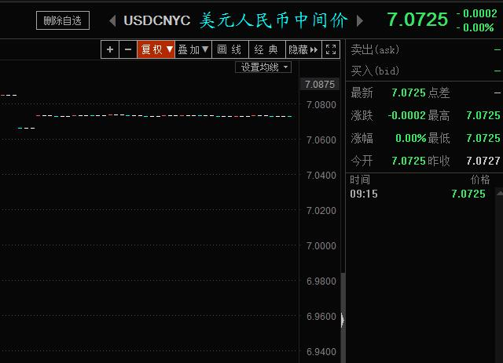 :speech_balloon:评:9 :+1:赞:90 :globe_with_meridians:转:18  

[10月14日 09:18]    BBC News 中文   @bbcchinese    他79岁，供认自己由1970年至2005年间谋杀93人。 https://bbc.in/2IMQeP2   :speech_balloon:评:18 :+1:赞:91 :globe_with_meridians:转:38  

[10月14日 09:14]    财经真相   @caijingxiang    经济日报：我国大豆需求量每年在1亿吨以上，80%以上的需求要通过进口来满足。国家粮油信息中心预计，2019年至2020年度（10月至次年9月）我国进口大豆8700万吨，同比增加400万吨，增幅4.8%，但仍低于2017年至2018年度9413万吨的历史高位。 有什么样的协议，就有什么样的需求，原来400万吨是这样来的！  :speech_balloon:评:6 :+1:赞:178 :globe_with_meridians:转:59  

[10月14日 08:56]    纽约时报中文网   @nytchinese    早安！今日重点新闻包括：
香港街头暴力升级；拜登之子辞任中企董事；习近平出访印度尼泊尔，欲向南亚施加影响力；贸易初步协议对中美领导人来说意味着什么；台风“海贝斯”重创日本……NYT简报带你速览今日要闻。 http://nyti.ms/32cUDCl   :speech_balloon:评:17 :+1:赞:56 :globe_with_meridians:转:12  

[10月14日 08:53]    财经真相   @caijingxiang    深圳网络安全与信息通报中心，公告称境外组织APT41黑客对TEAMVIEWER实施了网络攻击，并成功拿下TEAMVIEWER公司的后台管理系统！ 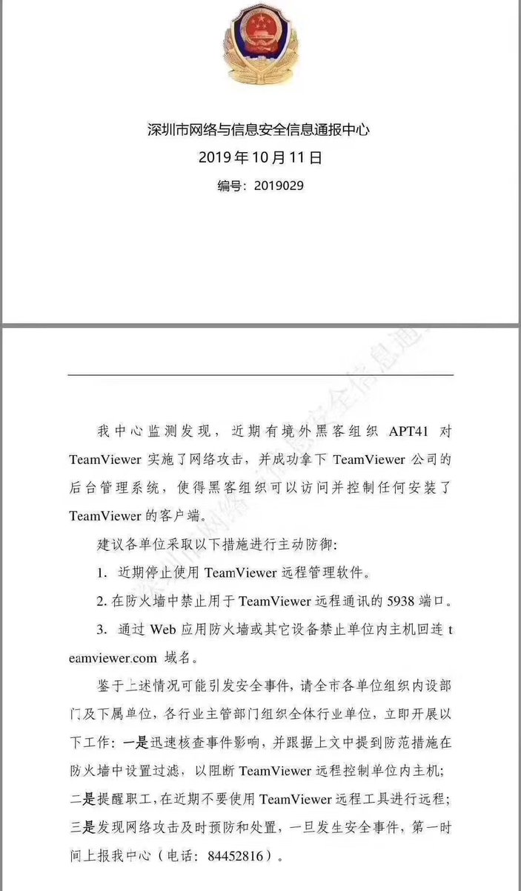 :speech_balloon:评:10 :+1:赞:58 :globe_with_meridians:转:18  

[10月14日 06:47]    GFHG SDKM   @zyx_yny    Thank you Senator Cruz and @FaceTheNation ! Please continue to #StandWithHongKong and pass S.1838 to protect HK and the free world.  :speech_balloon:评:2 :+1:赞:132 :globe_with_meridians:转:32  

[10月14日 05:04]    老司机   @h5lpykl7tp6jjop    没有个体的自尊，却有群体的自尊！人均没有的富裕，只有国家的富裕！明明大河的水是小河汇聚成的，但中国逻辑是大河有水小河满，大河无水小河干，先国家后个体，今天消灭百分之几的地主资本家，明天关押百分之几的右派，又整一部分黑五类，搞来搞去只有万分之一的官僚权贵发大财，你们还在爱国傻不傻？  :speech_balloon:评:4 :+1:赞:229 :globe_with_meridians:转:65  

[10月14日 01:03]    GFHG SDKM   @zyx_yny    He said what does it matter; us (China) killed someone in Our land.  Does U.S.A killed peoples too? Don’t they have gang here?? 

This is complete bullshit
#antichinazi #China #HongKongProtests #Canada
 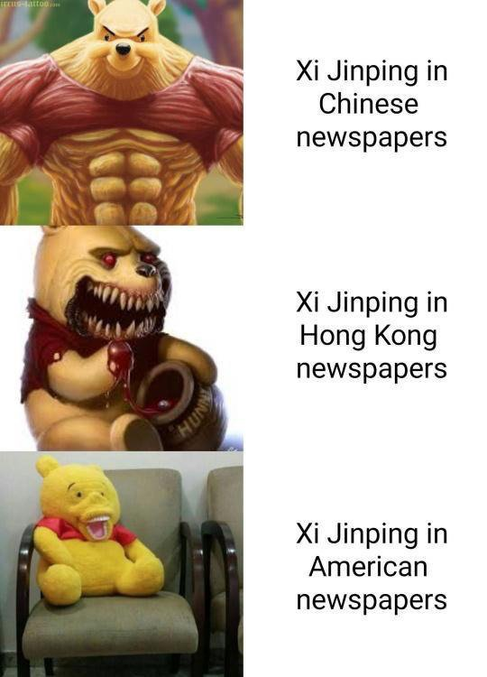 :speech_balloon:评:1 :+1:赞:15 :globe_with_meridians:转:14  

[10月14日 00:16]    GFHG SDKM   @zyx_yny    Please stay safe. #HongKongPolice do not know what you are. They are stupid https://twitter.com/HawleyMO/status/1183344431379779585 …  :speech_balloon:评:0 :+1:赞:3 :globe_with_meridians:转:1  

[10月14日 00:01]    老司机   @h5lpykl7tp6jjop    【共匪已經喪盡天良了!香港同胞們，你們已經退無可退!只有勇往直前了!】只因老人不摘口罩，几个黑警下重手，将老人家按在地上。
黑警越来越疯狂了，孩子、老人、女生，对弱者绝不手软  :speech_balloon:评:27 :+1:赞:263 :globe_with_meridians:转:211  

[10月13日 23:57]    GFHG SDKM   @zyx_yny    WTF were the #HKPolice doing? Where were they on 7.21 when gangsters beating citizens? Where were they when Fukiens used knife attacking pedestrians? They held hands, they hugged. Now they hunted down little girls and boys like this? #HKPoliceTerrorism #hongkongpolicebrutality  :speech_balloon:评:0 :+1:赞:13 :globe_with_meridians:转:2  

[10月13日 23:50]    凡賽堤/FORSETI   @FecharCCP    極權殺人恐怖組織根本沒有【人】和生命的概念，他們只有殺人與被殺理念！在他們的血液裡【人】和生命都不是東西，想殺就殺！  :speech_balloon:评:0 :+1:赞:2 :globe_with_meridians:转:0  

[10月13日 23:35]    凡賽堤/FORSETI   @FecharCCP    請將視頻編輯中英文，西班牙文，法文，日文向全世界瘋狂傳播！！！  :speech_balloon:评:0 :+1:赞:0 :globe_with_meridians:转:0  

[10月13日 23:34]    GFHG SDKM   @zyx_yny    Again, HKpolice just arrest people randomly in the shopping mall. No mercy. 

You still think it is safe in HK? it is absolutely in emergency state, HKPolice has unlimited power. 

I cannot believe this is HK.

#hkpolicebrutality
#PassHKHumanRightsAndDemocracyAct https://twitter.com/beancurdying/status/1183383474893254656 …  :speech_balloon:评:264 :+1:赞:2420 :globe_with_meridians:转:2106  

[10月13日 23:32]    老司机   @h5lpykl7tp6jjop    她没有戴口罩，没有装备，没有黑衣，她为什么被抓捕？

黑警鬼子还是中共鬼子？
抓花姑娘吗？

————-
坚挺的翻墙梯子@mrdoorvpn  http://mrdoor.info 
Mrdoor安卓版Google Play可下载  :speech_balloon:评:122 :+1:赞:812 :globe_with_meridians:转:644  

[10月13日 23:03]    GFHG SDKM   @zyx_yny    So the first question is: which version is Apple using with Tencent. The second question is: how much can Tencent learn about your overall browsing history from a collection of truncated hashes?  :speech_balloon:评:4 :+1:赞:175 :globe_with_meridians:转:28  

[10月13日 22:52]    GFHG SDKM   @zyx_yny    今次真 #圍爐
平時我好少做中文文宣，自己亦知道followers 唔多，不過我都好想同各位手足講一句:
玩得Twitter 既都知國際線好重要！
平日就好似日日夜夜做好多功課，而聽日集會就係大考咁，有美國議員黎同我地監場考！實地戰！

無理由無咗你！
#手足 #聽日見 #齊上齊落 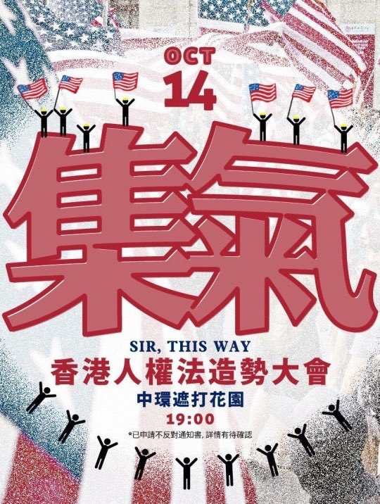 :speech_balloon:评:54 :+1:赞:899 :globe_with_meridians:转:512  

[10月13日 22:49]    GFHG SDKM   @zyx_yny    In Taipo #HongKong. Girl was screaming “don’t catch me!” Fxxk #HongKongPolice - she has no fear and no mask. How can she be a threat and needs to be tackled? #PoliceTerrorism #PoliceBrutality #FreeHongKong #SaveHongKong  :speech_balloon:评:424 :+1:赞:4286 :globe_with_meridians:转:4161  

[10月13日 22:40]    GFHG SDKM   @zyx_yny    Also, can we assume that only users configured in the Mainland China region are having their data sent to Tencent? That warning is pretty damn broad.  :speech_balloon:评:8 :+1:赞:256 :globe_with_meridians:转:31  

[10月13日 22:37]    GFHG SDKM   @zyx_yny    Wait, Apple is sending URLs to Tencent?!  https://reclaimthenet.org/apple-safari-ip-addresses-tencent/ …  :speech_balloon:评:264 :+1:赞:3483 :globe_with_meridians:转:3053  

[10月13日 22:11]    BBC News 中文   @bbcchinese    被形容为60多年来最强台风的“海贝思”席卷日本，已造成至少18人死亡。  :speech_balloon:评:86 :+1:赞:282 :globe_with_meridians:转:129  

[10月13日 21:21]    老司机   @h5lpykl7tp6jjop    遠方傳來捷報

【將軍澳 1940 】將軍澳有一名男子，被質疑是喬裝警察，它否認，市民要求他打開背囊檢查它又不給，遭圍毆後，頭破血流；之後有示威者展示他身上的物品，包括一枝伸縮棍。示威者之後將伸縮警棍掉入附近的坑渠，防暴警其後到場，嘗試拾回警棍，被圍毆的男子由白車送院。  :speech_balloon:评:52 :+1:赞:548 :globe_with_meridians:转:271  

[10月13日 20:58]    老司机   @h5lpykl7tp6jjop    广州又现楼歪歪？
中国银行的大牌子很显眼
是什么压垮了并不高大的办公楼？

————-
坚挺的翻墙梯子@mrdoorvpn  http://mrdoor.info 
Mrdoor安卓版Google Play可下载  :speech_balloon:评:29 :+1:赞:114 :globe_with_meridians:转:64  

[10月13日 20:16]    墙国铁拳现世报😷   @Socialistfist    附加  :speech_balloon:评:10 :+1:赞:92 :globe_with_meridians:转:21  

[10月13日 20:14]    墙国铁拳现世报😷   @Socialistfist    让战螂被铁拳后冷静一会儿，
他还是战螂

#社会主义铁拳  :speech_balloon:评:44 :+1:赞:295 :globe_with_meridians:转:79  

[10月13日 19:30]    GFHG SDKM   @zyx_yny    Chief executive office just release a notice with Chinese version only. 
The audience obviously is  CCP not  @tedcruz.
One of the paragraph said “Before foreign politicians make their speeches, please think twice.” 
How powerful you are, Carrie Lam.
     @SolomonYue 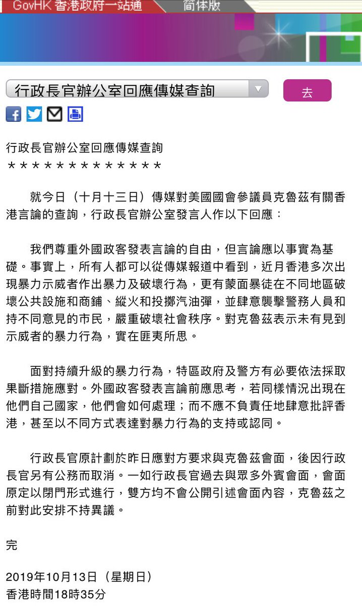 :speech_balloon:评:41 :+1:赞:224 :globe_with_meridians:转:166  

[10月13日 19:00]    纽约时报中文网   @nytchinese    #一周热门 #观点 习近平没有学好的中国历史课 http://nyti.ms/2Ozgsbx   :speech_balloon:评:211 :+1:赞:214 :globe_with_meridians:转:99  

[10月13日 18:28]    GFHG SDKM   @zyx_yny    True comment 
#HongKong do not need any stupid ordinance to maintain people’s loyalty 
#StandWithHongKong https://twitter.com/hksubtitled/status/1183231542014799873 …  :speech_balloon:评:0 :+1:赞:1 :globe_with_meridians:转:2  

[10月13日 18:21]    GFHG SDKM   @zyx_yny    Look, they can arrest and beat anyone they wanted. #HKPoliceTerrorism #HKPoliceState 
What’s the point of arresting a social worker with causal look? https://twitter.com/cityusucbc/status/1183313136868192257 …  :speech_balloon:评:0 :+1:赞:1 :globe_with_meridians:转:3  

[10月13日 18:16]    新闻大吐槽   @TuCaoFakeNews    12 Oct. They are “Police” without uniform & no warrant card. They pushed 2 boys on floor & used their knees to press 2 boys’ necks #hongkongpolice #hongkongprotest #HongKongPoliceBeatingCitizen #hongkongpolicebrutality #HongKongPoliceViolence #StandWithHongKong @SolomonYue  :speech_balloon:评:192 :+1:赞:2431 :globe_with_meridians:转:2868  

[10月13日 17:13]    老司机   @h5lpykl7tp6jjop    语言是交流的工具，必然是进步的时代化的，以权力的手段改为政治服务的目的都是幻想，一规范就僵死，没人喜欢官方语言，就象敏感词越来越多，丝毫没有防碍人们的交流，新生网络语言如泛澜的洪水反倒时不时让官方赶紧跟潮流，那些借此想打爱国大旗的喽啰只能让人看出来水平太低，低到水平线以下不予置评  :speech_balloon:评:0 :+1:赞:8 :globe_with_meridians:转:1  

[10月13日 17:12]    老司机   @h5lpykl7tp6jjop    #HK10月13日
CCP的暴徒們瘋狂抓捕香港的孩子們，歷史會銘記這些為自由而獻身的年輕人
@realDonaldTrump
@FLOTUS
@VP
@SecPompeo
@MariaBartiromo
@trish_regan
@robert_spalding
@SpeakerPelosi
@RepGallagher
@senatemajldr
@marcorubio
@SenSchumer
@RepMcGovern
@EsperDoD
@robertcobrien  :speech_balloon:评:22 :+1:赞:416 :globe_with_meridians:转:388  

[10月13日 17:00]    纽约时报中文网   @nytchinese    #一周热门 #时报专栏 与中国做生意，不能以卑躬屈膝为代价 http://nyti.ms/325LrQu   :speech_balloon:评:114 :+1:赞:164 :globe_with_meridians:转:41  

[10月13日 16:33]    老司机   @h5lpykl7tp6jjop    I will just pepper spray all of you, why not? I mean, I am wearing a mask and my number is not shown. Who would know it was me
#PoliceState #PoliceBrutality #StandWithHongKong #FreeHongKong  :speech_balloon:评:200 :+1:赞:2650 :globe_with_meridians:转:2475  

[10月13日 16:11]    财经真相   @caijingxiang    中东局势我不是很了解，但是有一点是很明白的，库尔德武装在抗击is时得到过大量美军武器，其部队战斗力相对强悍，怎么会这么快就被土耳其突破防线了？库尔德武装的武器供应不会是被伊拉克给切断了吧？ https://twitter.com/landofyelang/status/1183284746412969985 …  :speech_balloon:评:30 :+1:赞:84 :globe_with_meridians:转:20  

[10月13日 16:00]    纽约时报中文网   @nytchinese    #每日一词 Third rail指的是“为电动车辆的电机传导电流的金属轨道”，通常被称为“第三轨道”。
因第三轨道承载高电压，如果不慎接触，将触电甚至丧命，故该词也被用来指“常被政客规避的具有争议的问题”。 http://nyti.ms/33kw2Mo   :speech_balloon:评:3 :+1:赞:13 :globe_with_meridians:转:5  

[10月13日 15:45]    老司机   @h5lpykl7tp6jjop    #香港牛頭角玉蓮台附近10月13日 15：25 三位少女被捕 請廣傳
#SOSHongKong  :speech_balloon:评:127 :+1:赞:1930 :globe_with_meridians:转:2074  

[10月13日 15:13]    财经真相   @caijingxiang    本次会议标志着中美第一阶段贸易谈判的结束，第二阶段谈判的开始，由于中共在第一阶段已经正式购买了大量美国农产品，所以再永购买的方式将不会对川普产生任何吸引力，中共为此需要准备新的筹码才行（初步触及中共体制），预计中美第二阶段的较量将于11月底12月初正式拉开序幕！  :speech_balloon:评:7 :+1:赞:72 :globe_with_meridians:转:16  

[10月13日 15:00]    纽约时报中文网   @nytchinese    #一周热门 NBA“挺港”事件背后：国际公司在华“雷点”难料 http://nyti.ms/2Mwogbw   :speech_balloon:评:14 :+1:赞:31 :globe_with_meridians:转:9  

[10月13日 14:59]    财经真相   @caijingxiang    2019年11月16日至17日，APEC(亚洲太平洋经济合作组织) 第二十七次领导人非正式会议将在智利圣地亚哥举行。届时将有超过2万名来自中国、美国、日本、俄罗斯等21国的代表出席会议。由于中美第一阶段贸易协议将在哪里落实为文本内容，川普和习近平的签字仪式将成为本次会议的重点！  :speech_balloon:评:9 :+1:赞:114 :globe_with_meridians:转:35  

[10月13日 13:00]    纽约时报中文网   @nytchinese    #一周热门 #观点 当我亲临国庆70周年阅兵现场 http://nyti.ms/2OueBVb   :speech_balloon:评:24 :+1:赞:24 :globe_with_meridians:转:5  

[10月13日 12:24]    BBC News 中文   @bbcchinese    花卉是一门全球年产值达80亿美元的行业。花卉种植向赤道地区转移，给全球贸易和当地经济注入新鲜养分。 // 《世界制造》：花卉——传统产业老树新枝  https://bbc.in/2OEWHiD   :speech_balloon:评:12 :+1:赞:135 :globe_with_meridians:转:48  

[10月13日 12:00]    GFHG SDKM   @zyx_yny    The Lady Liberty to watch over Hong Kong on the Lion Rock! A group of volunteers, together with the creative team behind the statue overcame poor weather and brought  the “Goddess” to the mountain top to support the ongoing campaign against the tyranny in HK. 

#LadyLibertyHK  :speech_balloon:评:149 :+1:赞:4489 :globe_with_meridians:转:2771  

[10月13日 11:00]    纽约时报中文网   @nytchinese    #一周热门 《南方公园》在中国遭禁，发表“道歉”声明 http://nyti.ms/35lndUk   :speech_balloon:评:80 :+1:赞:154 :globe_with_meridians:转:43  

[10月13日 09:12]    老司机   @h5lpykl7tp6jjop    魔鬼在人間35

極權殺人恐怖組織正在用各種兇殘手段殺害我們的同胞....................................................................................................

注！直接打断左手  :speech_balloon:评:90 :+1:赞:763 :globe_with_meridians:转:770  

[10月13日 09:00]    纽约时报中文网   @nytchinese    #一周热门 #观点 直言不讳的NBA，在中国保持了沉默 http://nyti.ms/2IAinc1   :speech_balloon:评:55 :+1:赞:58 :globe_with_meridians:转:18  

[10月13日 09:00]    纽约时报中文网   @nytchinese    #一周热门 #观点 香港“禁蒙面法”揭露了林郑月娥的真面目 http://nyti.ms/2ocvBEZ   :speech_balloon:评:77 :+1:赞:163 :globe_with_meridians:转:47  

[10月13日 04:48]    老司机   @h5lpykl7tp6jjop    阅兵最遗憾的是，没有看到城管方队  :speech_balloon:评:104 :+1:赞:636 :globe_with_meridians:转:366  

[10月13日 01:32]    老司机   @h5lpykl7tp6jjop    財委會中民主議員舉起標語, 警暴未除, 仲點開會.
不滿會議將審議警察加薪撥款申請

給政府撥款, 那就是給香港市民送子彈 
#S  :speech_balloon:评:10 :+1:赞:162 :globe_with_meridians:转:88  

[10月13日 00:38]    老司机   @h5lpykl7tp6jjop    中共派香港黑警身份信息将成为永远的秘密，谁是凶手也将成迷。正是这种便利的身份条件，使得中共的黑警在香港街头成为行走的刽子手，可以肆无忌惮的所谓正常执法。

#SOSHK
#FreeHongKong
#StandwithHonKong  :speech_balloon:评:22 :+1:赞:170 :globe_with_meridians:转:110  

[10月12日 23:14]    财经真相   @caijingxiang    资管业的重磅深水炸弹，非标资产界定收紧超过预期！中共出台的任何金融政策都是以确保不出乱子为出发点，尤其是在经济逐渐下滑的情况下，更是惧怕金融失控，因此非标收紧超预期并不意外，况且还可以压低理财利率，这对大规模地方债发行有利，逐步控制国内所有财富是中共恐惧的必然结果！ 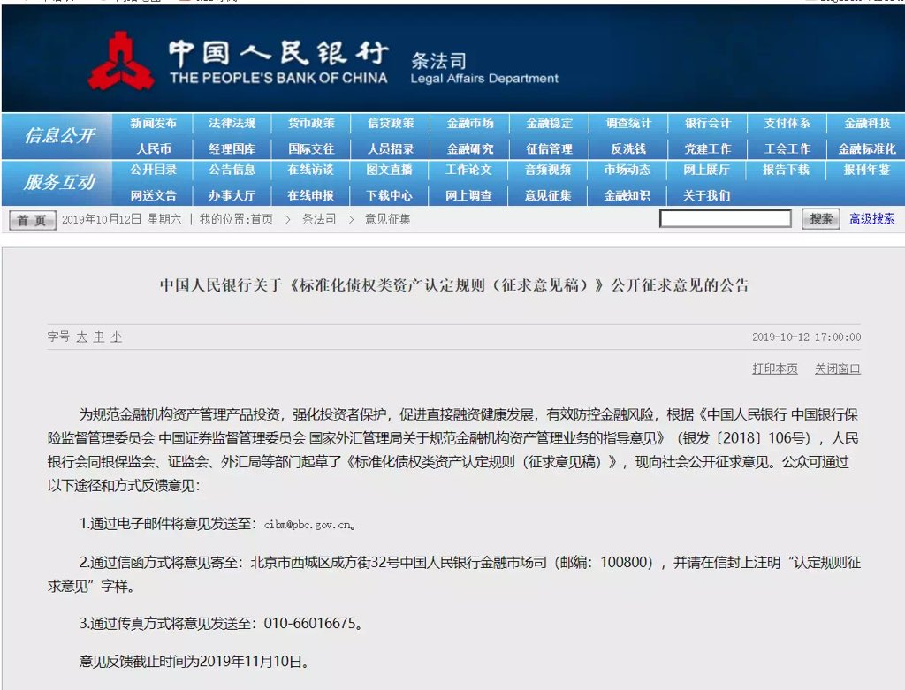 :speech_balloon:评:10 :+1:赞:147 :globe_with_meridians:转:46  

[10月12日 22:27]    BBC News 中文   @bbcchinese    中美贸易谈判关系到关税、农产品、知识产权、技术转让等等议题的同时，记者们还关心华为、香港和美国列的中国公司黑名单…… https://bbc.in/325DJpn   :speech_balloon:评:24 :+1:赞:60 :globe_with_meridians:转:25  

[10月12日 21:40]    BBC News 中文   @bbcchinese     中美第十三次贸易谈判达成阶段协议。美国总统特朗普说，“美中之间曾有过很多摩擦，但如今是场‘爱的聚会’”。 https://bbc.in/2MaofLp   :speech_balloon:评:18 :+1:赞:31 :globe_with_meridians:转:11  

[10月12日 20:00]    BBC News 中文   @bbcchinese    韩国K-pop天团BTS（防弹少年团）在沙特阿拉伯演出，引起人权团体批评是为该国洗白人权恶劣记录。大家怎么看？ https://bbc.in/2MyDPiF   :speech_balloon:评:17 :+1:赞:40 :globe_with_meridians:转:11  

[10月12日 19:08]    财经真相   @caijingxiang    来的太迟了！ https://twitter.com/solomonyue/status/1182931497415659521 …  :speech_balloon:评:30 :+1:赞:256 :globe_with_meridians:转:73  

[10月12日 19:06]    老司机   @h5lpykl7tp6jjop    看了这些从日本引进的词汇，还敢说这是你以为的中国话吗？  :speech_balloon:评:42 :+1:赞:636 :globe_with_meridians:转:317  

[10月12日 17:59]    墙国铁拳现世报😷   @Socialistfist    详细补充  :speech_balloon:评:32 :+1:赞:313 :globe_with_meridians:转:71  

[10月12日 17:55]    墙国铁拳现世报😷   @Socialistfist    好担心墙国既是粉红又是NBA球迷的精神健康  :speech_balloon:评:36 :+1:赞:495 :globe_with_meridians:转:106  

[10月12日 17:47]    墙国铁拳现世报😷   @Socialistfist    慈禧太后为什么要杀义和团？ ---百度知道
#社会主义铁拳  :speech_balloon:评:143 :+1:赞:1126 :globe_with_meridians:转:450  

[10月12日 17:09]    墙国铁拳现世报😷   @Socialistfist    网传后续，很多人都觉得这是反串，不过笑料倒是满满。  :speech_balloon:评:16 :+1:赞:127 :globe_with_meridians:转:27  

[10月12日 17:00]    BBC News 中文   @bbcchinese    【一周热点回顾】被列入的机构和公司若未得到美国政府许可，无法向美国公司购买产品。 https://bbc.in/2MvUp2T   :speech_balloon:评:45 :+1:赞:116 :globe_with_meridians:转:36  

[10月12日 15:00]    BBC News 中文   @bbcchinese    【一周热点回顾】蔡英文国庆演讲首次提到香港，表示一国两制的失灵导致香港社会处于脱序边缘。台湾将拒绝一国两制， 以民主自由走出自己的路。 https://bbc.in/2OGWTOr   :speech_balloon:评:129 :+1:赞:343 :globe_with_meridians:转:78  

[10月12日 14:02]    BBC News 中文   @bbcchinese    澳大利亚的土著医术也很博大精深。 // 抑郁症治疗：来自澳大利亚土著的六万年古方 https://bbc.in/2M9BtYP   :speech_balloon:评:29 :+1:赞:126 :globe_with_meridians:转:44  

[10月12日 13:51]    财经真相   @caijingxiang    10月11日，中兴通讯公告称，公司20亿元人民币中期票据和80亿元超短期融资券已获交易商协会注册通过。注册额度自通知书落款之日起2年内有效，可分期发行。目前中兴在银行间市场存续的永续中期票据60亿元，将于2020年1月面临发行人赎回选择权。这是华为发债300亿后，中兴也跟进发债100亿元！  :speech_balloon:评:9 :+1:赞:169 :globe_with_meridians:转:69  

[10月12日 13:47]    财经真相   @caijingxiang    继家乐福中国卖身苏宁之后，又一外资零售巨头退潮。

10月11日晚间，麦德龙集团、物美集团和多点Dmall联合宣布，物美就收购麦德龙中国控股权已与麦德龙集团签订最终协议。交易完成后，物美集团将在双方设立的合资公司中持有80%股份，麦德龙继续持有20%股份。此次交易总计19亿欧元（约21亿美元）  :speech_balloon:评:6 :+1:赞:171 :globe_with_meridians:转:62  

[10月12日 12:52]    财经真相   @caijingxiang    环球时报：香港暴力示威活动的背后总能看见外部势力助纣为虐的黑影幢幢。佩洛西、卢比奥等政客更是无视激进分子的暴力行径、频频施压港警。
但与之相反，特朗普并未对香港激进分子表达支持态度，甚至明确表示“香港问题应由中国自己处理”。随后，他遭到不少政客施压。  :speech_balloon:评:25 :+1:赞:98 :globe_with_meridians:转:23  

[10月12日 12:35]    老司机   @h5lpykl7tp6jjop      :speech_balloon:评:1 :+1:赞:0 :globe_with_meridians:转:0  

[10月12日 12:33]    老司机   @h5lpykl7tp6jjop    特朗普宣布中美达成首阶段贸易协议 或下月与习签署 https://youtu.be/N6RHrQoBAJc   :speech_balloon:评:3 :+1:赞:0 :globe_with_meridians:转:0  

[10月12日 12:30]    老司机   @h5lpykl7tp6jjop      :speech_balloon:评:0 :+1:赞:3 :globe_with_meridians:转:2  

[10月12日 12:07]    老司机   @h5lpykl7tp6jjop    美国国会的议员们：看到一个个香港年轻人的死亡名单，你们仍然不认为中共就是一个恐怖组织吗？中东的恐怖组织杀几个人质后，全世界都愤怒声讨，联合进行围剿。今天的香港，这么多的青年人仅仅是因为诉求民主和自由就被肆意暗杀，美国和西方世界能够一直这样忍心看着中共肆无忌惮地进行屠杀吗？——中铭  :speech_balloon:评:65 :+1:赞:560 :globe_with_meridians:转:296  

[10月12日 10:32]    BBC News 中文   @bbcchinese    过去一周，BBC News中文的这些故事受到关注，我们带您回顾本周。  // NBA和《南方公园》争议、香港禁蒙面法和本周更多好故事 https://bbc.in/2VA6c42   :speech_balloon:评:24 :+1:赞:156 :globe_with_meridians:转:52  

[10月12日 10:06]    财经真相   @caijingxiang    对，这次谈判中共等于是付出了所有人筹码，金融市场放开保证华尔街的利益，一但落成文本签字中共就不能再反悔，等到第二阶段谈判时，华尔街对川普的压力会大大降低，这就是川普的谈判策略！ https://twitter.com/seven_banannacc/status/1182838209933242368 …  :speech_balloon:评:68 :+1:赞:381 :globe_with_meridians:转:147  

[10月12日 09:43]    财经真相   @caijingxiang    班农说川普是个懂的运用杠杆的总统，微缩版的协议是为了更大的协议，第一阶段的deal，包含金融开放、汇率、买农产品这些不触及中共体制的内容。作为翘板这些在第二轮中不能再作为中共退让谈判筹码。第二阶段将直接涉及国企垄断补贴、互联网开放、强制技术转让、以及弹簧门、玻璃门等政体改革硬骨头！  :speech_balloon:评:135 :+1:赞:876 :globe_with_meridians:转:269  

[10月12日 07:54]    BBC News 中文   @bbcchinese    八集系列片《世界制造》为您讲述八件产品打造全球经济的故事。 https://bbc.in/2pgGOVe   :speech_balloon:评:3 :+1:赞:28 :globe_with_meridians:转:16  

[10月12日 07:31]    BBC News 中文   @bbcchinese    从NBA开始， BBC中文为您盘点十大最近踩上中国政治红线的跨国公司 https://bbc.in/316wJXW   :speech_balloon:评:48 :+1:赞:148 :globe_with_meridians:转:59  

[10月12日 04:20]    财经真相   @caijingxiang    班农说过，对川普的弹劾谘询将在感恩节前正式开始，这是中共为啥要五周时间的根本原因！ https://twitter.com/stephen_liuhuan/status/1182751627083735040 …  :speech_balloon:评:20 :+1:赞:207 :globe_with_meridians:转:66  

[10月12日 04:09]    财经真相   @caijingxiang    市场计价完毕，人民币开始回跌，股市小幅下跌黄金反弹！ https://twitter.com/caijingxiang/status/1182748170683478016 …  :speech_balloon:评:9 :+1:赞:86 :globe_with_meridians:转:23  

[10月12日 04:01]    财经真相   @caijingxiang    迷你协议内容：1.货币政策和汇率问题更加透明 2.技术转让问题得到进一步保障 3.中共同意购买400-500亿美元农产品 4.接下来五周落实协议 5.金融领域已经达成协议  本协议最核心点是五周时间，也就是有效期是五周！翻译水平有限各位自己看原文吧！  :speech_balloon:评:88 :+1:赞:397 :globe_with_meridians:转:194  

[10月11日 23:34]    墙国铁拳现世报😷   @Socialistfist    支持NBA的推友们抓紧了，马上投票就要结束了，别说党和人民没有给你机会啊  :speech_balloon:评:1 :+1:赞:45 :globe_with_meridians:转:2  

[10月11日 23:30]    墙国铁拳现世报😷   @Socialistfist    又爱又怕，唉

PS 本推第一个符合两个系列的推诞生了！
#社会主义铁拳
#战螂在推特  :speech_balloon:评:60 :+1:赞:586 :globe_with_meridians:转:150  

[10月11日 22:54]    GFHG SDKM   @zyx_yny    #HKprotests #香港人加油 #光復香港時代革命 #光復香港 #新加坡支持香港
#新加坡支持港民五大诉求 
最近有很多五毛网团冒充新加坡人在FB痛吗港人。

如果有新加坡人对你们无礼，我在此向港人说声对不起，我会进我所能向他们解释香港的情况。

请帮我retweet！,我们新加坡支持你，多谢香港手足们！  :speech_balloon:评:163 :+1:赞:1378 :globe_with_meridians:转:654  

[10月11日 22:52]    财经真相   @caijingxiang    这是典型的逻辑矛盾！ https://twitter.com/zerohedge/status/1182668476277760002 …  :speech_balloon:评:5 :+1:赞:18 :globe_with_meridians:转:3  

[10月11日 20:13]    墙国铁拳现世报😷   @Socialistfist    今天收到了很多推友投稿和 @ ，其中有一则是某精赵在17年发微博控诉未成年女儿被性侵一事。首先照例感谢各位踊跃投稿 
因为事发17年，涉及到未成年人且是性侵害，经考虑不发推防止不必要的网络暴力。
希望大家理解  :speech_balloon:评:31 :+1:赞:207 :globe_with_meridians:转:16  

[10月11日 19:20]    墙国铁拳现世报😷   @Socialistfist    推友们你有没有闻到一股恶臭
为两地遇难者祈福  :speech_balloon:评:36 :+1:赞:314 :globe_with_meridians:转:49  

[10月11日 01:54]    墙国铁拳现世报😷   @Socialistfist    为契合推文主题小编特别推出投稿指南。
#社会主义铁拳 指某精赵在各平台（如微博贴吧）公开发布地爱党国言论和被铁拳截图，两者可为新后或并列关系。至少两张截图

#战螂在推特  是一个分享战螂在推特上的反价值观魔幻言行的品鉴系列，要求宽松符合条件即可。  :speech_balloon:评:8 :+1:赞:74 :globe_with_meridians:转:5  

[10月11日 01:41]    墙国铁拳现世报😷   @Socialistfist    这个月里，我们一起回顾了历史上的铁拳，我们还有幸请到了墙内粉红兔兔@zzyyzoe ，并把她打造成推特网红。
，还搞了让大家心服口服的民主投票，最后新系列#战螂在推特 也获得大家良好反响。  :speech_balloon:评:8 :+1:赞:112 :globe_with_meridians:转:4  

[10月11日 01:39]    墙国铁拳现世报😷   @Socialistfist    9月11日开办的墙国铁拳现世报, 今天满月了！多谢一个月来各位看官捧场，感谢大家的转发点赞评论三连。还要特别感谢给小编投稿的各位，是你们让这个推坚持活跃下去 
大家的热情，让小编受宠若惊。
（更正8000+推友）  :speech_balloon:评:22 :+1:赞:444 :globe_with_meridians:转:35  

[10月10日 22:22]    墙国铁拳现世报😷   @Socialistfist    突然爱国，突然强拆
#社会主义铁拳 https://twitter.com/rtiomn/status/1182294052466614272 …  :speech_balloon:评:99 :+1:赞:617 :globe_with_meridians:转:143  

[10月10日 17:44]    墙国铁拳现世报😷   @Socialistfist    全推特最纯净的推 https://twitter.com/zSP8IcFxk8kpaJv/status/1182229009410641920 …  :speech_balloon:评:24 :+1:赞:300 :globe_with_meridians:转:25  

[10月10日 17:28]    墙国铁拳现世报😷   @Socialistfist    你们看看这些假爱国者，竟然为了房子威胁国家，上街游行。
#社会主义铁拳  :speech_balloon:评:79 :+1:赞:534 :globe_with_meridians:转:163  

[10月10日 17:15]    墙国铁拳现世报😷   @Socialistfist    突然来了很多香港选民，你们投完票可以去何议员那里继续投票  :speech_balloon:评:10 :+1:赞:107 :globe_with_meridians:转:8  

[10月10日 09:51]    凡賽堤/FORSETI   @FecharCCP    70年來我們已經失去八千萬同胞，八千萬中都是同胞的親人，祖輩，父輩，親人，朋友！今天的700萬香港人也都是我們的親人，未來同胞的祖輩，父輩，親人，朋友！我們何其悲哀啊！！！！！！！！！！！！！！！！！！！！！！！！！！！！  :speech_balloon:评:16 :+1:赞:264 :globe_with_meridians:转:132  

[10月09日 23:15]    墙国铁拳现世报😷   @Socialistfist    中国突然取消了NBA投票选项 https://twitter.com/VOAChinese/status/1181942149064998912 …  :speech_balloon:评:2 :+1:赞:56 :globe_with_meridians:转:2  

[10月09日 23:14]    新闻大吐槽   @TuCaoFakeNews    这下暴雪要哭了，
其射击游戏「守望先锋」的预告片里，一个中国女孩角色被高手给P了，改成了一个支持反送中的香港女孩！

是时候全民抵制暴雪了，请在墙内广传此影片！  :speech_balloon:评:120 :+1:赞:3322 :globe_with_meridians:转:1611  

[10月09日 11:46]    墙国铁拳现世报😷   @Socialistfist    8:00 上贴吧讨论，贴吧被封
9:00 豆瓣瓜组组cp，组被解散号被封
10:00 微博质问来去之间，期间言论被收集于@Socialistfist 
11:00 连vpn上pornhub
11:05 撸完骂几句女优丑
12:00 起点yy小说，穿越之我是希特勒
1:00am 睡觉，醒来又是斗志满满的一天呢  :speech_balloon:评:6 :+1:赞:137 :globe_with_meridians:转:22  

[10月09日 00:47]    GFHG SDKM   @zyx_yny    "Son, when you grow up
You will be the savior of the broken
The beaten, and the damned?"
Please watch this powerful mv #HongKongProtester #hkprotests 
香港反送中護法戰爭(Hong Kong Defensive War 2019)：Welcome To The Black Parade  https://youtu.be/0yXTHODE24Q  via @YouTube  :speech_balloon:评:3 :+1:赞:15 :globe_with_meridians:转:4  

[10月05日 09:33]    凡賽堤/FORSETI   @FecharCCP    呼籲請求共同挖掘所有有關香港發生的事，越全面越好，不同角度，越多越好，包括被暗地抓捕的人員，特別是CCP 派出的各種偽裝身份，包括變身變裝行兇的一點一滴都要挖掘出來，把CCP 的邪惡下三濫手段的真相毫無保留的曝光在全世界面前！世界公知公義才能真正挽救和保護香港人！希望懂視頻編輯配上中英文 https://twitter.com/hjjohnson17/status/1178969916499746816 …  :speech_balloon:评:5 :+1:赞:16 :globe_with_meridians:转:9  

[09月06日 19:03]    财经真相   @caijingxiang    本次降准总计是释放增量资金9000亿，但是提前下发的2020年地方债最高为1.85万亿，降准释放的资金只够新一轮刺激的一半，剩下的资金将会从现有社会存量来补充，这在一定程度收紧了金融系统的流动性；不过和以往一样，央行的降准刺激措施依然是打着“中小企业”的名义下调的!连接 https://www.youtube.com/watch?v=Usp9LIngNl0&feature=youtu.be …  :speech_balloon:评:20 :+1:赞:239 :globe_with_meridians:转:79  

[03月13日 08:10]    老司机   @h5lpykl7tp6jjop    批评是批评家天生的使命！他们只感知对错，信奉真理，指出真相不吐不快，不在意权势和群众的喜好，从批评里不可能获得任何好处，但批评家愚直不改。在中国几乎所有人都讨厌批评家，喜欢阴谋家，因为他们只说好听的！可是就因为中国的批评家太少，中国几乎看不到未来和希望！  :speech_balloon:评:78 :+1:赞:173 :globe_with_meridians:转:40  

[01月10日 13:30]    纽约时报中文网   @nytchinese    每年一月，《纽约时报》​​会选出52个年度旅游目的地。将举办冬奥会的中国崇礼、炫目奢华的香港、日本濑户内各岛皆入选。
新的一年，你计划好要去哪里旅行了吗？ http://nyti.ms/2Tz9N06   :speech_balloon:评:282 :+1:赞:372 :globe_with_meridians:转:195  

