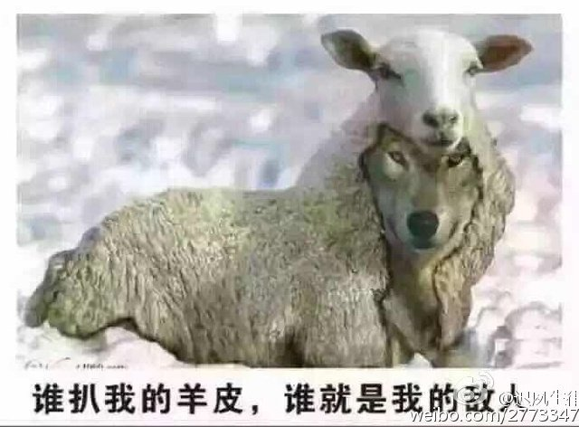
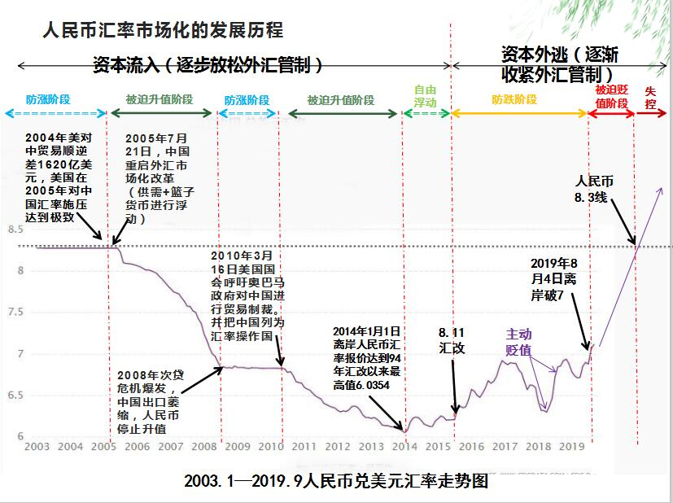
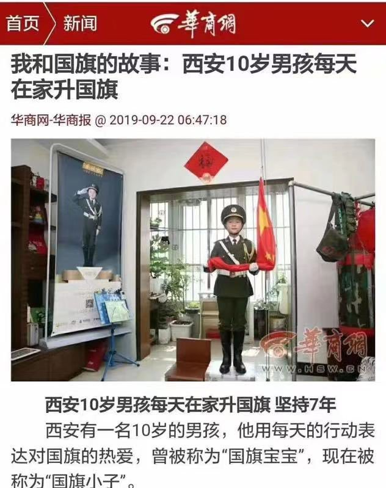
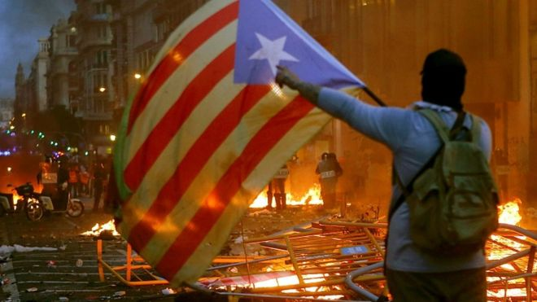
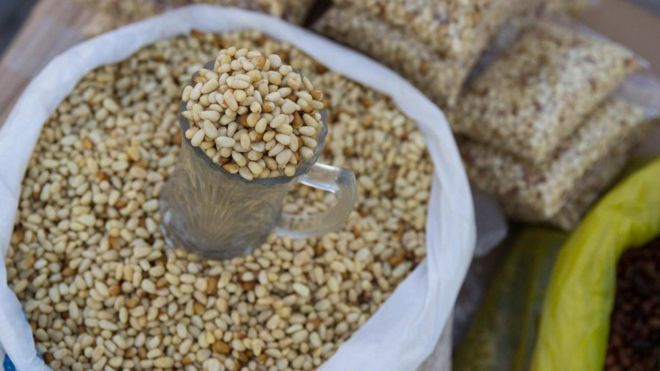
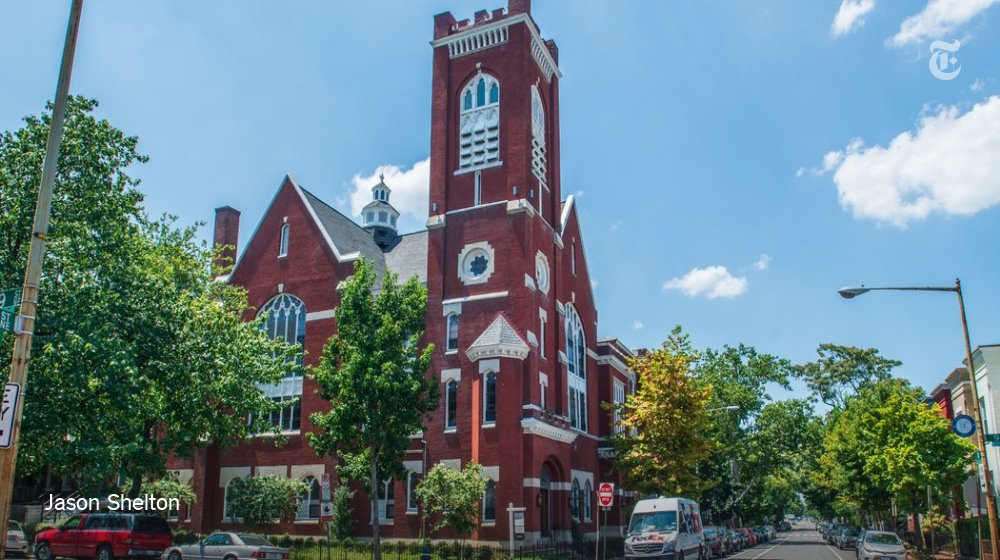
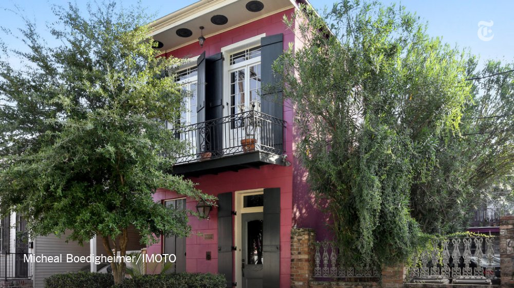

[10月22日 12:44]    新闻大吐槽   @TuCaoFakeNews    伟大的2019 https://twitter.com/TuCaoFakeNews/status/1186263913848958982 …  :speech_balloon:评:0 :+1:赞:4 :globe_with_meridians:转:2  

[10月22日 12:42]    新闻大吐槽   @TuCaoFakeNews    优秀的年轻人。 https://twitter.com/TuCaoFakeNews/status/1186401484356780032 …  :speech_balloon:评:0 :+1:赞:7 :globe_with_meridians:转:1  

[10月22日 12:41]    新闻大吐槽   @TuCaoFakeNews      :speech_balloon:评:0 :+1:赞:8 :globe_with_meridians:转:4  

[10月22日 12:39]    新闻大吐槽   @TuCaoFakeNews    前幾年還提供過無牆WIFI給參會者使用，即便是遊客也可以通過認證來直接使用還網絡。既然以前可以提供這種特別的網絡線路，今年也完全可以做到一模一樣，理論來說根本不需要翻牆。
  不過法翻牆錦標賽這個說法確實挺搞笑的 https://twitter.com/TuCaoFakeNews/status/1186443477032157184 …  :speech_balloon:评:0 :+1:赞:4 :globe_with_meridians:转:2  

[10月22日 12:37]    新闻大吐槽   @TuCaoFakeNews    多好的孩子 https://twitter.com/tucaofakenews/status/1186436144390496256 …  :speech_balloon:评:0 :+1:赞:1 :globe_with_meridians:转:1  

[10月22日 12:37]    新闻大吐槽   @TuCaoFakeNews    这些孩子引领时代，谁人不放心？！ https://twitter.com/tucaofakenews/status/1186401484356780032 …  :speech_balloon:评:0 :+1:赞:4 :globe_with_meridians:转:1  

[10月22日 12:35]    新闻大吐槽   @TuCaoFakeNews    完了，完了。习大大的敌人已经上至白发古稀，下至10岁的娃娃。民主制度下的小孩谈吐和强国的小孩差距好大  :speech_balloon:评:0 :+1:赞:3 :globe_with_meridians:转:1  

[10月22日 12:35]    新闻大吐槽   @TuCaoFakeNews    香港在培養人才
中國在培養奴才
香港年輕人站着抵抗
中國年輕人還在跪拜

可以比嗎？  :speech_balloon:评:0 :+1:赞:2 :globe_with_meridians:转:1  

[10月22日 12:32]    新闻大吐槽   @TuCaoFakeNews    願主基督保守你，這小朋友嬴了我整個世界。你比我更有智慧，比我更有勇氣。  :speech_balloon:评:0 :+1:赞:1 :globe_with_meridians:转:1  

[10月22日 12:31]    新闻大吐槽   @TuCaoFakeNews    啊哈哈哈 https://twitter.com/tucaofakenews/status/1186278336693096450 …  :speech_balloon:评:0 :+1:赞:2 :globe_with_meridians:转:1  

[10月22日 12:30]    纽约时报中文网   @nytchinese    在香港，曾经在国际化的社交圈很少见到的象征国家身份的旗帜和歌曲，正变得越来越常见。越来越多的人转向了一种更封闭、更强烈、更狭隘也更具对抗性的身份。香港人和中国人这两种长期互补的身份，突然间变得互不相容。 https://nyti.ms/2J8gzqZ   :speech_balloon:评:13 :+1:赞:19 :globe_with_meridians:转:7  

[10月22日 12:29]    新闻大吐槽   @TuCaoFakeNews    一顆純真的良心  :speech_balloon:评:0 :+1:赞:1 :globe_with_meridians:转:1  

[10月22日 12:26]    新闻大吐槽   @TuCaoFakeNews    勇敢 正直 能辯別是非，為小朋友喝彩。 https://twitter.com/tucaofakenews/status/1186436144390496256 …  :speech_balloon:评:0 :+1:赞:5 :globe_with_meridians:转:2  

[10月22日 12:24]    新闻大吐槽   @TuCaoFakeNews    這是真的香港警察。他們擁有人性的善良。他們知道自己是香港人。而我們看到的那些「香港警察」其實是中共派來的魔鬼！ https://twitter.com/tucaofakenews/status/1186069161966850048 …  :speech_balloon:评:0 :+1:赞:7 :globe_with_meridians:转:4  

[10月22日 12:06]    新闻大吐槽   @TuCaoFakeNews    brave little boy, i love you and please be safe  :speech_balloon:评:0 :+1:赞:2 :globe_with_meridians:转:1  

[10月22日 12:04]    新闻大吐槽   @TuCaoFakeNews    昨天我收到一个聋子邀请我去演唱会，今天又受到一个瞎子邀请我去博物馆展览会。我不知道应该说这是很恶心还是很可笑。  :speech_balloon:评:0 :+1:赞:7 :globe_with_meridians:转:2  

[10月22日 12:00]    新闻大吐槽   @TuCaoFakeNews    很不错的一个小男子汉 https://twitter.com/tucaofakenews/status/1186436144390496256 …  :speech_balloon:评:0 :+1:赞:2 :globe_with_meridians:转:2  

[10月22日 12:00]    新闻大吐槽   @TuCaoFakeNews    小朋友小心、今天打不贏、明天再來吧、、thank you young man  https://twitter.com/tucaofakenews/status/1186436144390496256 …  :speech_balloon:评:0 :+1:赞:1 :globe_with_meridians:转:1  

[10月22日 12:00]    纽约时报中文网   @nytchinese    据加拿大广播公司报道，加拿大总理贾斯汀·特鲁多预计将赢得第二个任期。对特鲁多来说，这场胜利是对他个人的辩护。他曾面临欺侮前司法部长（一名土著女性）的指控，并在竞选后期曝出年轻时“扮黑脸“和”扮棕脸“的杀伤性丑闻。 https://nyti.ms/2P9vVzs   :speech_balloon:评:2 :+1:赞:8 :globe_with_meridians:转:1  

[10月22日 12:00]    纽约时报中文网   @nytchinese    智慧生活
• 秋日保湿面膜推荐：时报旗下评测网站Wirecutter测试了九款最畅销的面膜，评测员们给出了他们的使用体验和推荐。
• 用洗衣机清洗帆布鞋？你也可以。不过首先要准备一些小工具；然后解开鞋带；跟着我们的指南稍作清理后，就可以扔进洗衣机了！
更多简报内容： https://nyti.ms/33Nh69J   :speech_balloon:评:2 :+1:赞:0 :globe_with_meridians:转:0  

[10月22日 11:59]    新闻大吐槽   @TuCaoFakeNews    旺角10.20之夜 這批衝刺跑的警察接連有人跌倒 有點搞笑  :speech_balloon:评:2 :+1:赞:23 :globe_with_meridians:转:15  

[10月22日 11:39]    财经真相   @caijingxiang    人民币汇率市场化改革真正起始点，始于2004年美国第一次就汇率问题向中国施压，此后人民币开启了近十年的缓慢上涨之路，中共对外汇管控总体上越来越宽松，直到2015年“811”汇改，触发中国资本大规模的外逃，中共对外汇管制重新回归收紧，这标志着人民币汇率市场逐步的终止。油管 https://www.youtube.com/watch?v=2DQjjc3als8&feature=youtu.be …  :speech_balloon:评:4 :+1:赞:83 :globe_with_meridians:转:30  

[10月22日 11:30]    纽约时报中文网   @nytchinese    文在寅任内最大的危机始于一篇发表于10年前的论文。人们发现，法务部长官曹国的女儿在高中时就以第一作者身份在一篇学术论文上署名，引发造假质疑，并掀起大规模的抗议活动，最终迫使曹国辞职，总统文在寅道歉。 https://nyti.ms/2N3Acl4   :speech_balloon:评:8 :+1:赞:20 :globe_with_meridians:转:10  

[10月22日 11:00]    纽约时报中文网   @nytchinese    Facebook周一宣布，该公司移除了四个由国家支持的竞选宣传活动，其中三个来自伊朗，另一个来自俄罗斯，这是该公司为2020年美国大选打击虚假信息采取的最新举措。今年以来，Facebook已删除了数十个类似的竞选活动。
更多简报内容： https://nyti.ms/33Nh69J   :speech_balloon:评:74 :+1:赞:10 :globe_with_meridians:转:3  

[10月22日 10:17]    财经真相   @caijingxiang    最新猪肉行情：猪肉价格再次迎来大涨，想做腊肉无望！  :speech_balloon:评:18 :+1:赞:116 :globe_with_meridians:转:42  

[10月22日 10:03]    新闻大吐槽   @TuCaoFakeNews    香港11岁男孩 VS 大陆10岁男孩  https://twitter.com/TuCaoFakeNews/status/1186436144390496256 …  :speech_balloon:评:7 :+1:赞:50 :globe_with_meridians:转:30  

[10月22日 10:00]    BBC News 中文   @bbcchinese    中国人正在疯狂购买毕加索画作，日本和韩国也大量展出毕加索作品。到底是什么让毕加索的作品在亚洲产生了共鸣？
 https://bbc.in/35SnuOB   :speech_balloon:评:31 :+1:赞:27 :globe_with_meridians:转:11  

[10月22日 10:00]    纽约时报中文网   @nytchinese    脱欧最新进展：英国议会今日将就首相约翰逊的脱欧协议进行再次表决。如其计划获通过，政府将提出加快立法的时间表，旨在三天内获得议会批准，为10月31日脱欧扫清道路；如果议会否决，首相的反对者可能会提出修正案，例如举行公投或将英国留在欧洲关税同盟内。
更多简报内容： https://nyti.ms/33Nh69J   :speech_balloon:评:3 :+1:赞:5 :globe_with_meridians:转:1  

[10月22日 09:40]    纽约时报中文网   @nytchinese    ‘One Country, Two Nationalisms’: The Identity Crisis Behind Hong Kong’s Turmoil. Will Canada Forgive Justin Trudeau? The Tenacity of Chinese Communism. How do you say "phantasmagoria" in Chinese? Follow NYTChinese briefing @nytchinese https://cn.nytimes.com/morning-brief/20191022/hong-kong-identity-canada-election/ …  :speech_balloon:评:3 :+1:赞:7 :globe_with_meridians:转:1  

[10月22日 08:59]    纽约时报中文网   @nytchinese    早安！今日重点新闻包括：
香港人身份认同巨变；聚焦加拿大大选；元朗袭击事件满三个月，警方出动催泪弹驱散抗议者；土耳其寻求拥核；澳大利亚报纸联手抗议政府收紧新闻自由；内塔尼亚胡组阁失败……NYT简报带你速览今日要闻。 https://nyti.ms/33Nh69J   :speech_balloon:评:34 :+1:赞:25 :globe_with_meridians:转:8  

[10月22日 08:59]    BBC News 中文   @bbcchinese    克里特岛抵抗运动重创了德军士气，可能是希特勒入侵苏联失败的原因之一。
 https://bbc.in/2pIZ75i   :speech_balloon:评:6 :+1:赞:22 :globe_with_meridians:转:6  

[10月22日 08:29]    BBC News 中文   @bbcchinese    约翰逊拿回伦敦的“新协议”提交议会投票，要求一再遭拒命运未卜。面对英国首相同时发来的自打嘴巴的两封信，欧盟只能做壁上观。
 https://bbc.in/2MWUgWi   :speech_balloon:评:9 :+1:赞:7 :globe_with_meridians:转:3  

[10月22日 08:16]    新闻大吐槽   @TuCaoFakeNews    11岁男孩在路边大哭，引来了记者，询问得知原来妈妈是亲共蓝丝，让他备受压力，可他小小年纪坚定站在抗争者这边，觉得支持谁是个良心问题！因为老师教了警察是维护法纪的，可现在警察在做什么?
这时暴警察奔袭而来，打断了不正式的采访，男孩迅速蹬车离开，留下担心的记者阿姨  :speech_balloon:评:65 :+1:赞:740 :globe_with_meridians:转:344  

[10月22日 07:59]    BBC News 中文   @bbcchinese    一名香港示威领袖人物遭袭之后，使当地少数族群成为新聚焦点；一些少数族群成员以实际行动显示团结。
 https://bbc.in/35TEYKu   :speech_balloon:评:30 :+1:赞:40 :globe_with_meridians:转:12  

[10月22日 07:30]    BBC News 中文   @bbcchinese    2019年遭遇多事之秋，世界多处同时发生了严重不满执政当局的大规模民众抗议活动。在巴塞罗那、智利、黎巴嫩和香港等地，都出现街头骚乱活动。这是否是全球化下出现的一个蝴蝶效应？
 https://bbc.in/32zRk8P   :speech_balloon:评:92 :+1:赞:111 :globe_with_meridians:转:48  

[10月22日 06:59]    BBC News 中文   @bbcchinese    松子是蒙古北方针叶林的特产，也是蒙古极为普遍的零食，就像爆米花或薯片一样，美味可口，一袋接着一袋，吃了令人上瘾。
 https://bbc.in/2qyxmgr   :speech_balloon:评:14 :+1:赞:60 :globe_with_meridians:转:11  

[10月22日 06:48]    老司机   @h5lpykl7tp6jjop    什么规则在中国人眼里都是小菜一碟，北京女在美与警察超速飙车被撞停，反而不服想反告警察，一句我没听见警笛说得好轻松！  :speech_balloon:评:7 :+1:赞:27 :globe_with_meridians:转:13  

[10月22日 06:30]    BBC News 中文   @bbcchinese    15、16世纪的水手、学者和旅行家们，把古老的书籍和地图当作旅行指南，用来导航和探索世界。
 https://bbc.in/2J8LmDS   :speech_balloon:评:1 :+1:赞:26 :globe_with_meridians:转:11  

[10月22日 00:07]    老司机   @h5lpykl7tp6jjop      :speech_balloon:评:0 :+1:赞:3 :globe_with_meridians:转:4  

[10月21日 22:19]    BBC News 中文   @bbcchinese    四年前，总理特鲁多（Justin Trudeau）以充满年轻活力的形象与带进步主义色彩的政策取得压倒性胜利。然而，在经历诸多政治丑闻之后，谋求连任的他与所在的自由党面临严峻挑战。 https://bbc.in/2BvoxWR   :speech_balloon:评:7 :+1:赞:16 :globe_with_meridians:转:9  

[10月21日 22:06]    墙国铁拳现世报😷   @Socialistfist    @remonwangxt 辣椒老师是否可以作为新漫画创意  :speech_balloon:评:0 :+1:赞:18 :globe_with_meridians:转:0  

[10月21日 21:32]    BBC News 中文   @bbcchinese    要是知道癌症最初什么模样，就有可能将它消灭在初始阶段。但有谁见过刚露头的癌？ https://bbc.in/2MzfOsZ   :speech_balloon:评:8 :+1:赞:74 :globe_with_meridians:转:34  

[10月21日 21:20]    老司机   @h5lpykl7tp6jjop    谁在玩栽贓嫁禍？发推前请先GOOGLE一下，有视频有真相。  :speech_balloon:评:3 :+1:赞:19 :globe_with_meridians:转:12  

[10月21日 21:17]    墙国铁拳现世报😷   @Socialistfist    补图  :speech_balloon:评:4 :+1:赞:57 :globe_with_meridians:转:11  

[10月21日 21:00]    纽约时报中文网   @nytchinese    根据最新的研究和民意调查，香港爆发持续数月的抗议活动，或许不仅是由于北京方面的过火行为，也是因为香港身份认同本身的巨变。 https://nyti.ms/2J8gzqZ   :speech_balloon:评:145 :+1:赞:210 :globe_with_meridians:转:72  

[10月21日 20:37]    墙国铁拳现世报😷   @Socialistfist    前香港印度协会主席曾经出现在支持香港警察的最前线。近日被高压水枪喷过后，出现在谴责香港警察的最前线
高压水枪的蓝色物质具有刺激性成分，会使人睁不开眼，咳嗽不止，并容易被警察辨识抓捕。

#社会主义铁拳
#社会主义特别行政区铁拳  :speech_balloon:评:36 :+1:赞:288 :globe_with_meridians:转:107  

[10月21日 20:01]    BBC News 中文   @bbcchinese    “感情还是在香港，我每天在手机上看『反送中』新闻。”在台湾生活约6个月的林荣基，人在台湾，心却仍紧系香港。 https://bbc.in/2Mzq3h0   :speech_balloon:评:23 :+1:赞:51 :globe_with_meridians:转:16  

[10月21日 20:00]    纽约时报中文网   @nytchinese    害怕被捕、害怕死去，香港抗议者写下“遗书” https://nyti.ms/2P6suJy   :speech_balloon:评:50 :+1:赞:34 :globe_with_meridians:转:22  

[10月21日 19:31]    BBC News 中文   @bbcchinese    到底为何台湾拒绝陈同佳入境受审？ https://bbc.in/2p3IMZd   :speech_balloon:评:67 :+1:赞:94 :globe_with_meridians:转:38  

[10月21日 19:01]    BBC News 中文   @bbcchinese    几十年来，西班牙法西斯独裁政权领袖弗朗西斯科·佛朗哥将军一直被葬在“烈士谷”。可是这个地方已经变成一个极右派群体的圣地，这令很多西班牙人不满。 https://bbc.in/2P7uIbx   :speech_balloon:评:9 :+1:赞:30 :globe_with_meridians:转:14  

[10月21日 19:00]    纽约时报中文网   @nytchinese    自赵紫阳在天安门事件中下台以来，中国的新闻媒体、历史和网站上已经基本看不到他的名字。上周五，在去世近15年后，赵紫阳的安葬仪式在警方看守之下于北京安静地举行。赵紫阳的骨灰安葬在北京北郊的一个公墓，为其家人与中共有关部门关于骨灰安葬问题的纠纷画上了句号。 https://nyti.ms/2VXqIvM   :speech_balloon:评:12 :+1:赞:30 :globe_with_meridians:转:9  

[10月21日 18:30]    纽约时报中文网   @nytchinese    #观点 毛泽东统一国家、恢复民族自豪感的壮举，是许多中国人尊重其遗产的一个原因，也是中共持续垄断权力的合法性的一个来源。
不过，使中共得以维持在中国的权力，这并不是唯一的原因。 https://nyti.ms/33PsaTH   :speech_balloon:评:196 :+1:赞:254 :globe_with_meridians:转:95  

[10月21日 18:16]    墙国铁拳现世报😷   @Socialistfist    有热心推友创立的电报群，同步更新的推特内容，喜欢用电报的可以关注
感谢这位推友的无私帮助 http://t.me/socialistfist   :speech_balloon:评:1 :+1:赞:40 :globe_with_meridians:转:7  

[10月21日 18:01]    BBC News 中文   @bbcchinese    火鸡是着火的鸡吗？袋鼠也可以理解为有手袋的老鼠吗？ https://bbc.in/2P3yOla   :speech_balloon:评:9 :+1:赞:16 :globe_with_meridians:转:5  

[10月21日 18:00]    纽约时报中文网   @nytchinese    尽管中国多年来一直限制比特币和其他加密货币在国内的使用，但北京对这个问题的兴趣由来已久。2017年，即使是在中国打击通过虚拟货币筹集资金的活动之后，中国官员们仍然会在演讲和文章中讨论政府控制的数字货币。Libra宣布后，中国也宣布它正在加紧行动。 https://nyti.ms/31upAkm   :speech_balloon:评:70 :+1:赞:18 :globe_with_meridians:转:6  

[10月21日 17:31]    老司机   @h5lpykl7tp6jjop    银行的工作人员面面相觑，不知如何作答。

这时，一个刚实习不久的小姑娘幽幽地说:”大爷，你把钱存我们银行这么长时间，银行工作人员给你看着钱，他们不用吃饭吗？难道饿得两眼发白给你看钱吗？隔三差五吃你一碗牛肉面也很正常的啊!”  :speech_balloon:评:5 :+1:赞:77 :globe_with_meridians:转:8  

[10月21日 17:29]    老司机   @h5lpykl7tp6jjop    一位大爷在银行发火说：

“十年前，牛肉面4元一碗，我在银行存了10000元，相当于存了2500碗牛肉面。现在，牛肉面都涨到10元了，我存的10000元连本带利你们才给我13500元，相当于只剩下了1350碗牛肉面！我就想知道另外的1150碗牛肉面去哪儿了？”  :speech_balloon:评:17 :+1:赞:218 :globe_with_meridians:转:55  

[10月21日 17:24]    墙国铁拳现世报😷   @Socialistfist    补充  :speech_balloon:评:4 :+1:赞:50 :globe_with_meridians:转:11  

[10月21日 17:23]    墙国铁拳现世报😷   @Socialistfist    自称在被房地产开发商骗取80万并且维权无果，患上抑郁症后。9月29后突然高频的在微博上关注香港局势。
发帖还债还是抑郁病发？

#社会主义铁拳  :speech_balloon:评:29 :+1:赞:170 :globe_with_meridians:转:65  

[10月21日 17:01]    BBC News 中文   @bbcchinese    科学界的主流观点认为，摄入太多的饱和脂肪存在胆固醇升高和罹患心脏病的风险。那为什么仍有报导鼓励人们多摄入饱和脂肪呢？ https://bbc.in/2N1iG0G   :speech_balloon:评:5 :+1:赞:37 :globe_with_meridians:转:15  

[10月21日 17:00]    纽约时报中文网   @nytchinese    “其实我好担心自己会死掉，见你们不到。”香港抗议者写给家人的信中写道，“我好担心你知道我死了会喊到崩溃。但我没办法不出来。”
随着香港暴力活动加剧，年轻的抗议者正在给亲朋好友写告别信，为被捕或被害做准备。他们称之为“遗书”。 https://nyti.ms/2P6suJy   :speech_balloon:评:70 :+1:赞:104 :globe_with_meridians:转:40  

[10月21日 16:30]    纽约时报中文网   @nytchinese    #图集 【在美国，75万美元能买到什么房？】手握75万美元，你能买到新奥尔良一座建于1836年的房子，或华盛顿一间由哥特复兴式教堂改建的公寓，也可以选择纽约上州一处占地六英亩的农舍。 https://nyti.ms/32yO7Gs   :speech_balloon:评:24 :+1:赞:27 :globe_with_meridians:转:7  

[10月21日 16:01]    BBC News 中文   @bbcchinese    西班牙法庭以煽动罪判处加泰罗尼亚独立运动领导人9到13年监禁。西班牙应对独立诉求为何不手软？ https://bbc.in/33I5uVk   :speech_balloon:评:113 :+1:赞:136 :globe_with_meridians:转:49  

[10月21日 16:00]    纽约时报中文网   @nytchinese    香港政局今日之矛盾在于，在北京控制之下的提名委员会或许已经不再可靠。大陆在香港影响力的基础正在被侵蚀。许多主要负责处理房地产交易的律师和会计师，都因引渡条例问题出乎意料地成了香港政府和北京的批评者。让亲北京阵营更加担忧他们可能在下个月的选举里失去议席。 https://nyti.ms/2MshxAp   :speech_balloon:评:41 :+1:赞:63 :globe_with_meridians:转:18  

[10月21日 15:59]    老司机   @h5lpykl7tp6jjop    无论你走到哪里，因为你说真话，而让党和国家形象受损，那么很容易就会有意外发生！这是现实生活存在的一个恐怖的现象！  :speech_balloon:评:0 :+1:赞:23 :globe_with_meridians:转:12  

[10月21日 15:00]    纽约时报中文网   @nytchinese    “你们找到这封信的时候，我可能已经被捕或遇害了。”
这是一名22岁的香港抗议者的家书开头，他担心这可能是自己给家人的最后一封信。像大多数在前线与警察对峙的年轻人一样，他害怕被捕，害怕死去。 https://nyti.ms/2P6suJy   :speech_balloon:评:155 :+1:赞:177 :globe_with_meridians:转:71  

[10月21日 14:57]    财经真相   @caijingxiang    国家电影局电影公映许可证，新电影《催眠•裁决》审核通过，好莱坞电影也要有这玩意儿吗？推友当中有知道的吗？  :speech_balloon:评:12 :+1:赞:66 :globe_with_meridians:转:20  

[10月21日 14:30]    纽约时报中文网   @nytchinese    对赵紫阳的家人来说，安葬仪式是纪念他的一个小小的胜利。赵紫阳于2005年1月去世，享年85岁。之后，中共有关部门想把他的骨灰放入一个官员的公墓，以便严加看管。但他的家人想有更多的控制权和瞻仰机会。于是，他的骨灰一直存放于他生前在北京市中心住过的四合院里。 https://nyti.ms/2VXqIvM   :speech_balloon:评:4 :+1:赞:24 :globe_with_meridians:转:5  

[10月21日 14:00]    BBC News 中文   @bbcchinese    你们国家的禁烟政策怎么样呢？ https://bbc.in/35PP4Mz   :speech_balloon:评:14 :+1:赞:11 :globe_with_meridians:转:4  

[10月21日 14:00]    纽约时报中文网   @nytchinese    自Facebook推出Libra计划以来，这家科技巨头进军金融业的尝试就遭遇了一连串的质疑。美联储表示对此“非常担心”。欧洲官员威胁要阻止该项目在欧洲大陆的推行。
而对中国来说，中国领导人认为，Libra有可能开启一个新的世界金融体系，一个可以撼动政府和央行传统权威的体系。 https://nyti.ms/31upAkm   :speech_balloon:评:2 :+1:赞:18 :globe_with_meridians:转:6  

[10月21日 13:30]    纽约时报中文网   @nytchinese    #观点 钱佳楠：经过多年教育培养，对我们来说，任何批评政府政策或质疑政府说法的人都是外国势力的“走狗”。
我们被困在这种花言巧语中。没有人想显得不爱国，所以在中国日益紧张的政治气候下，温和的爱国主义被压制，极端的爱国主义正在成为最响亮的声音。 https://nyti.ms/2J1rAdt   :speech_balloon:评:91 :+1:赞:307 :globe_with_meridians:转:113  

[10月21日 13:00]    BBC News 中文   @bbcchinese    在伦敦总部工作的BBC港人记者张英华（Helier Cheung），碰巧在这时回港摆喜宴，他有什么感受？ https://bbc.in/2BsfsOB   :speech_balloon:评:32 :+1:赞:101 :globe_with_meridians:转:33  

[10月21日 12:08]    财经真相   @caijingxiang    遵义市约谈早餐店涨价！  :speech_balloon:评:28 :+1:赞:165 :globe_with_meridians:转:59  

[10月21日 12:00]    BBC News 中文   @bbcchinese    “香港完蛋了！”林荣基感概香港变成“警察能随便打人”的地方，并担心“流血事件会不断发生，可能重演台湾的白色恐怖。” https://bbc.in/31zefPY   :speech_balloon:评:380 :+1:赞:551 :globe_with_meridians:转:182  

[10月21日 11:48]    财经真相   @caijingxiang    库德洛VS纳瓦罗 ！ https://twitter.com/chinesewsj/status/1186113880042418183 …  :speech_balloon:评:3 :+1:赞:25 :globe_with_meridians:转:8  

[10月21日 11:23]    BBC News 中文   @bbcchinese    【林荣基：香港已经等于大陆 打死都不回去】香港铜锣湾书店事件的主角林荣基已流亡台湾，年逾60的他生活得如何？ https://bbc.in/35REaWE   :speech_balloon:评:53 :+1:赞:80 :globe_with_meridians:转:37  

[10月21日 10:42]    老司机   @h5lpykl7tp6jjop    赵忠祥的书法，周小平的文章，吴京的电影，刘一秒的讲座，申大妈的正能量......以及快手、抖音、拼多多，都是这个时代的最典型的“标配”！

这不是大时代，也不是小时代，而是“二”时代！十三亿普罗大众，都在磕磕碰碰、结结巴巴地紧跟这个“二”时代，惟恐自己落伍了！  :speech_balloon:评:14 :+1:赞:205 :globe_with_meridians:转:69  

[10月21日 10:34]    财经真相   @caijingxiang    好莱坞如果开始反中共，其影响力是巨大的，时至今日中国大陆的小年轻不关心政治是常态，但是却很愿意为看电影翻墙！ https://twitter.com/USA_China_Talk/status/1186104831083208704 …  :speech_balloon:评:23 :+1:赞:595 :globe_with_meridians:转:135  

[10月21日 10:00]    BBC News 中文   @bbcchinese    告诉一位面包控，来看看世上最完美的法式面包。 https://bbc.in/31xRf42   :speech_balloon:评:7 :+1:赞:30 :globe_with_meridians:转:13  

[10月21日 09:28]    财经真相   @caijingxiang    以前经济快速发展时禁止农民用宅基地抵押贷款，导致农民没有原始资本被迫沦为“农民工”，现在产能严重过剩，央行印钞缺少抵押物时，他们终于放开政策，问题是现在农民贷款可以干啥赚钱？  :speech_balloon:评:22 :+1:赞:140 :globe_with_meridians:转:31  

[10月21日 09:06]    财经真相   @caijingxiang    当前中国广大农村地区，正在进行轰轰烈烈的宅基地测量申报活动，村委说这次测量目的是为了农民用宅基地作为抵押贷款，但是民间盛传一户一宅，多余的宅子会被政府收回，导致农民现在疯狂买砖盖房，分家上户口，种种乱象背后都是源于农民无恒产的恐惧，当然不排除中共借此寻找新的抵押物进行扩表印钞！ https://twitter.com/ReutersCN/status/1186082720386076672 …  :speech_balloon:评:20 :+1:赞:327 :globe_with_meridians:转:142  

[10月21日 09:04]    老司机   @h5lpykl7tp6jjop    黄鼠狼跟鸡说，把你下的蛋每个月给我几个，我帮你存着，等你老了不能下蛋了，我再还给你 ......
就这样，整个村里的鸡都按照约定把蛋给了黄鼠狼，
黄鼠狼就每天胡吃海喝 ......
鸡老了，想问黄鼠狼取回蛋的时候 ......
黄鼠狼又喝了一顿老母鸡汤。  :speech_balloon:评:17 :+1:赞:621 :globe_with_meridians:转:268  

[10月21日 08:45]    财经真相   @caijingxiang    市场原本预计英镑会在周一距离波动，谁知又是一次“西线无战事”，横盘走势估计会让很多国内定闹钟五点起床的交易员跌眼镜！  :speech_balloon:评:2 :+1:赞:36 :globe_with_meridians:转:3  

[10月21日 08:36]    财经真相   @caijingxiang    国资委：前三季度，中央企业收入累计实现营业收入22.1万亿元，同比增长5.3%；累计实现净利润10567亿元，同比增长7.4%；有效投资稳步增长，完成固定资产投资1.6万亿元，同比增长6.8%；研发投入快速增长，同比增长25%；资产负债率稳中有降，9月末中央企业平均资产负债率为65.7%，同比下降0.2个百分点。  :speech_balloon:评:10 :+1:赞:51 :globe_with_meridians:转:11  

[10月21日 05:03]    老司机   @h5lpykl7tp6jjop    马克思愚蠢之处就在于认为资本为了更多的利润，只有加大对工人的剥削，于是工人终于会革命，中共也继承了这种一根筋思维，认为帝国主义亡我之心不死，不是东风压了西风 就是西风压了东风，除了阴谋诡计它们不会让步，民主政治就是妥协的制度，这是他们不断发展壮大的原因，而强硬的中共必然亡于强硬！  :speech_balloon:评:4 :+1:赞:31 :globe_with_meridians:转:2  

[10月21日 04:25]    老司机   @h5lpykl7tp6jjop    中共当局在镇压香港人上是否意识到一个难题，即暴力大肆抓捕勇武派并不能让和理非的人们停止上街示威游行！而适得其反的是参加游行示威的人越来越多！那么除了让人们更加愤怒以外，能达到什么目的？除了证明自己无能为力什么也不能证明！这就是中共末期暴力愚蠢的结果，让人们知道除了推翻它们没有别的  :speech_balloon:评:0 :+1:赞:20 :globe_with_meridians:转:3  

[10月21日 03:20]    GFHG SDKM   @zyx_yny    Unrest continues unabated in Hong Kong as tens of thousands march on Rail Terminus
 https://ti.me/2BrzWH9   :speech_balloon:评:285 :+1:赞:3271 :globe_with_meridians:转:2326  

[10月21日 01:58]    老司机   @h5lpykl7tp6jjop    众志成城！ https://twitter.com/tucaofakenews/status/1185841289251569666 …  :speech_balloon:评:0 :+1:赞:19 :globe_with_meridians:转:6  

[10月21日 00:28]    老司机   @h5lpykl7tp6jjop    人有三个局限性 :

时间的局限性，故夏虫不可语冰；

空间的局限性，故井蛙不可语海；

认知的局限性，故凡夫不可语道。  :speech_balloon:评:20 :+1:赞:664 :globe_with_meridians:转:241  

[10月20日 23:21]    GFHG SDKM   @zyx_yny    A pigeon was affected by tear gas. The Hong Kong protesters used water to let it feel more comfort. #HongKongProtesters #HongKong #Love #animal  :speech_balloon:评:666 :+1:赞:15374 :globe_with_meridians:转:10571  

[10月20日 23:19]    老司机   @h5lpykl7tp6jjop    政府不愿意退出市场，非要把市场变成官场。所谓改革和转型，就是强化政府对市场的干预。中国没有真正意义上的公务员，都是市场管理员，充当着收费、开票、盖章的角色，实质就是权力的寻租。官场的逻辑是：没有政府主导的市场会变成赌场。而残酷的现实是：因为有了政府的介入，市场最终变成了火葬场。  :speech_balloon:评:7 :+1:赞:197 :globe_with_meridians:转:89  

[10月20日 23:06]    老司机   @h5lpykl7tp6jjop    香港没有失控
林郑失控了
香港没有失控
警察失控了
禁止游行
游行发生了
禁止蒙面
满大街蒙面
不是世界反了
而是你们背对着世界  :speech_balloon:评:57 :+1:赞:1814 :globe_with_meridians:转:642  

[10月20日 22:45]    老司机   @h5lpykl7tp6jjop    【#勇武港女】10月20日晚7點左右，在防暴警察與民眾對峙的彌敦道油麻地地段，一名矮小的紅衣年輕女子，一手拖鐵柱一手持鮮花，站在警方防線前，無懼向她發放的數枚催淚彈，呼籲警方不要再衝擊香港市民。  :speech_balloon:评:3 :+1:赞:41 :globe_with_meridians:转:19  

[10月20日 21:56]    GFHG SDKM   @zyx_yny    Police in #HongKong deliberately sprayed blue irritant liquid on Kowloon Mosque.

#China #HongKongProtests  :speech_balloon:评:162 :+1:赞:1415 :globe_with_meridians:转:1475  

[10月20日 21:37]    老司机   @h5lpykl7tp6jjop    A foreigner complained about the police action and was scolded by the police as "shame on your country" and then attacked passers-by and reporters with pepper spray
#HKPoliceTerrorism #HongKongProtests #HongKongRioters
#hkpolicebrutality  :speech_balloon:评:4 :+1:赞:56 :globe_with_meridians:转:46  

[10月20日 17:56]    GFHG SDKM   @zyx_yny    More people have shown up to clean the mosque.  For those wondering why #HKPolice deliberately targeted the mosque, look no further than how China treats Uyghurs in Xinjiang

#HongKong #HongKongProtests  :speech_balloon:评:91 :+1:赞:3207 :globe_with_meridians:转:2223  

[10月20日 17:56]    GFHG SDKM   @zyx_yny    Follow up: 
In times of trouble we see unity and love. https://twitter.com/pentanov/status/1185855642889641984?s=19 …  :speech_balloon:评:11 :+1:赞:612 :globe_with_meridians:转:449  

[10月20日 17:46]    GFHG SDKM   @zyx_yny    After @hkpoliceforce used water cannon filled with blue chemicals to attack Kowloon Mosque and Islamic Centre, HK people are now cleaning it.

#standwithhongkong #standwithhk #hkprotests #HKPoliceTerrorism #hkpolicebrutality #hkpolicestate  :speech_balloon:评:2 :+1:赞:6 :globe_with_meridians:转:11  

[10月20日 16:42]    GFHG SDKM   @zyx_yny    I hope to apologize to Muslims.
I am sorry that this sad situation has occurred in Hong Kong.
I am angry and sad about the actions of the Hong Kong police.
Can we help Muslims?
We really feel sorry.  :speech_balloon:评:283 :+1:赞:3948 :globe_with_meridians:转:3323  

[10月20日 16:38]    GFHG SDKM   @zyx_yny    #HKPF aim water cannon jets directly at a Muslim mosque during a protest today. Crowd consists of mostly journalists & several protestors. Absolutely unnecessary.

#HKGov has no respect for ppl from any religion, culture or background.

#5Nov4HK
#antichinazi
#StandWithHongKong  :speech_balloon:评:588 :+1:赞:7036 :globe_with_meridians:转:8477  

[10月20日 16:35]    GFHG SDKM   @zyx_yny    Passerby helping to clean the mosque after the huge blast of blue water from the cannon. Muslim bystanders here shocked and offended that they would do this to their place of worship. HK people comforting them  :speech_balloon:评:733 :+1:赞:14135 :globe_with_meridians:转:10936  

[10月20日 16:29]    GFHG SDKM   @zyx_yny    The Kowloon Mosque and Islamic Centre was attacked by Police water cannon filled with blue chemicals!

#FiveDemandsNotOneLess #StandWithHK #HongKongProtests  :speech_balloon:评:1301 :+1:赞:10260 :globe_with_meridians:转:11967  

[10月20日 16:26]    GFHG SDKM   @zyx_yny    #HKPolice assaults mosque with water cannon! It's INSANE!!! #StandWithHK #HKPoliceTerrorism #hkpolicebrutality #HKPoliceState  :speech_balloon:评:307 :+1:赞:5230 :globe_with_meridians:转:6014  

[10月20日 16:25]    GFHG SDKM   @zyx_yny    HK POLICE has no respect on the religious.  Shooting blue dyed water to the Islam sanctum. 
#PoliceBrutalitiy
#Islam
#HKPoliceTerrorism  :speech_balloon:评:237 :+1:赞:1738 :globe_with_meridians:转:1426  

[10月20日 16:20]    GFHG SDKM   @zyx_yny    Before VS after

Many #HongKongProtesters were outside  Kowloon Mosque and Islamic Centre, urging people to respect the premise and not damage the property.

Police just opened up with the water cannon on the Kowloon Mosque. 

#StandWithHongKong
#FreedomHK  :speech_balloon:评:922 :+1:赞:11602 :globe_with_meridians:转:12128  

[10月20日 14:04]    GFHG SDKM   @zyx_yny    hong kong loves catalans  :speech_balloon:评:0 :+1:赞:2 :globe_with_meridians:转:1  

[10月20日 12:40]    GFHG SDKM   @zyx_yny    "We're all Hongkongers. No difference."

Outside of Chungking Mansions, Southeast Asian were handing out water to pro-democracy protesters in support of their movement, stating that they're all Hongkongers and also want a democratic Hong Kong. 

#HongKongProstests #hongkong  :speech_balloon:评:102 :+1:赞:2643 :globe_with_meridians:转:1597  

[10月20日 11:28]    老司机   @h5lpykl7tp6jjop    香港最近有市民在葵涌家中被捕，理由是在网络上煽动别人参予抗争。

香港已迅速成为一个极度管制言论自由的地方。

市民除了为手机设立密码外，也应该立刻为SIM卡和云记忆亦设立密码，以防警察得到手机上网及通迅内容。  :speech_balloon:评:5 :+1:赞:33 :globe_with_meridians:转:25  

[10月20日 10:41]    老司机   @h5lpykl7tp6jjop    希望我的痛你能懂，醒醒吧，当那些为良知而发出的声音被击落，当周围一盏盏明灯被熄灭，你的黑夜，或许就要来临。  :speech_balloon:评:7 :+1:赞:186 :globe_with_meridians:转:91  

[10月20日 09:51]    财经真相   @caijingxiang    如果说谷歌、推特等媒体为了钱可能昧良心与中共勾兑的话，那么脸书就不是要不要脸的问题，而是他是不是“赵家人”的问题，因为成为该委会顾问就意味是中共“自家人”，这也是我从不敢用facebook的原因，香港学生现在竟然还用脸书发布运动信息，真是天真到家了！  :speech_balloon:评:22 :+1:赞:298 :globe_with_meridians:转:85  

[10月20日 09:33]    财经真相   @caijingxiang    扎女婿是清华管理学院顾问委员成员，该委员会成员包含了中共金融系统内几乎所有核心人物，由此可见扎女婿与中共的密切合作关系，他说了几句抖音海外扩张的话，就说扎女婿觉醒了，未免有点太天真！  :speech_balloon:评:8 :+1:赞:365 :globe_with_meridians:转:122  

[10月20日 07:59]    新闻大吐槽   @TuCaoFakeNews    油管up主PewDiePie是油管第一网红，有一亿粉丝，前几天他节目中，谈到了香港抗争和小熊维尼，被中共封杀。可他并不怂，又出来回怼！

作为第一网红，他不但会左右粉丝对中共的看法，还会带动众多中V、小V加入话题讨论，引发连锁效应！

中共是不是很后悔，早知道不惹他了！  :speech_balloon:评:116 :+1:赞:2903 :globe_with_meridians:转:1128  

[10月20日 06:29]    凡賽堤/FORSETI   @FecharCCP    【#共产罪恶】香港中文大学女生吴傲雪（Sonia）在哭诉被拘留期间，遭到港警性暴力之后，连日来收到多封恐吓信及短消息，威胁她若再出面发声，将绑架及轮奸她，信中甚至写明“施暴计划”。
10/18周五吴傲雪在记者会上，公布她收到的恐吓及骚扰信，这些信中，有不少是用简体字书写，被怀疑来自中国大陆。  :speech_balloon:评:30 :+1:赞:403 :globe_with_meridians:转:278  

[10月20日 06:04]    凡賽堤/FORSETI   @FecharCCP    魔鬼在人間39

極權殺人恐怖組織正在用各種兇殘手段殺害我們的同胞....................................................................................................

魔鬼的罪行！被刺殺，身處多刀，肚腸都跑出來！  :speech_balloon:评:1 :+1:赞:6 :globe_with_meridians:转:7  

[10月20日 06:02]    凡賽堤/FORSETI   @FecharCCP    魔鬼在人間39

極權殺人恐怖組織正在用各種兇殘手段殺害我們的同胞....................................................................................................

魔鬼的罪行！已被殺  :speech_balloon:评:0 :+1:赞:3 :globe_with_meridians:转:3  

[10月19日 22:29]    老司机   @h5lpykl7tp6jjop    台灣人「#不相信」
和平統一 一國兩制
【視訊一】  :speech_balloon:评:31 :+1:赞:526 :globe_with_meridians:转:270  

[10月19日 18:31]    GFHG SDKM   @zyx_yny    DISTURBING 
#Uyghur #Muslim in a torture device called a “Tiger Chair”

#Chinese Police officers sending a message to activists like myself: “Come and Save him if you can”

I want my followers and believers in free expression to send YOUR message to #China by commenting below  :speech_balloon:评:1735 :+1:赞:19057 :globe_with_meridians:转:29302  

[10月19日 11:10]    GFHG SDKM   @zyx_yny    Don’t forget 721. Gangster attacked protesters and citizens, police stepped aside. 

#721yuenlong
#StandWithHongKong
#HongKongProstests  :speech_balloon:评:30 :+1:赞:308 :globe_with_meridians:转:244  

[10月19日 10:36]    凡賽堤/FORSETI   @FecharCCP    極權殺人恐怖組織的兇殘超乎人類想像  :speech_balloon:评:0 :+1:赞:2 :globe_with_meridians:转:0  

[10月19日 10:34]    凡賽堤/FORSETI   @FecharCCP    魔鬼在人間39

極權殺人恐怖組織正在用各種兇殘手段殺害我們的同胞....................................................................................................

魔鬼的罪行！黑警群毆直接致命打頭的兇殘  :speech_balloon:评:3 :+1:赞:62 :globe_with_meridians:转:43  

[10月19日 10:31]    凡賽堤/FORSETI   @FecharCCP    魔鬼在人間39

極權殺人恐怖組織正在用各種兇殘手段殺害我們的同胞....................................................................................................

魔鬼的罪行！地鐵車廂暴打無辜港民  :speech_balloon:评:0 :+1:赞:27 :globe_with_meridians:转:25  

[10月19日 10:19]    财经真相   @caijingxiang    从涨价去库存，到六稳，再到三保，尽管尽量掩饰经济下滑，但是从这些官方用词里，也能感受到中国经济瑟瑟寒风！  :speech_balloon:评:23 :+1:赞:389 :globe_with_meridians:转:79  

[10月19日 08:43]    财经真相   @caijingxiang    这是真账号吗？怎么有点小孩斗嘴的感觉？这架势就是撕破脸的节奏啊！ https://twitter.com/usa_china_talk/status/1185160722440830976 …  :speech_balloon:评:20 :+1:赞:126 :globe_with_meridians:转:25  

[10月19日 08:03]    墙国铁拳现世报😷   @Socialistfist    她要是手抖@一个云南网警，是不是就进去了？  :speech_balloon:评:13 :+1:赞:73 :globe_with_meridians:转:11  

[10月19日 07:48]    墙国铁拳现世报😷   @Socialistfist    补图  :speech_balloon:评:4 :+1:赞:103 :globe_with_meridians:转:17  

[10月19日 07:47]    墙国铁拳现世报😷   @Socialistfist    赞美铁拳
#社会主义铁拳  :speech_balloon:评:75 :+1:赞:534 :globe_with_meridians:转:134  

[10月18日 23:16]    GFHG SDKM   @zyx_yny    Someone ask what can I do and How can I do to #StandWithHongKong , here are some suggestions.

Boycott services and products from China to undermine CCP influence in your home town.
Call you friend to join and take part in this activity.

#StandWithHongKong
#BoycottChina  :speech_balloon:评:129 :+1:赞:1317 :globe_with_meridians:转:891  

[10月18日 21:53]    凡賽堤/FORSETI   @FecharCCP    15歲香港少年 :「我不會因懼怕自己將來所受的刑罰而停下，我會用我的年輕作為阻止極權吞噬香港的本錢，再多的刑責也不能令我畏怯退縮。香港愛了我15年，就用我未來的15年換來抗爭的養分，我想在30歲完成刑滿出獄時，還會感受到這仍是我最愛的香港！我，誓不低頭。」 https://m.ntdtv.com/b5/2019/10/18/a102688460.html?fbclid=IwAR3lmWVhl4YLi2Vq-9FANGtFkUe3PCPZ-ip_W0weDP_fzGHDx-v6hrvmKuo …  :speech_balloon:评:16 :+1:赞:326 :globe_with_meridians:转:145  

[10月18日 21:35]    凡賽堤/FORSETI   @FecharCCP    唔该幫手forward出去,家人同朋友都搵唔到呢位手足，已失蹤四日.如果有消息請聯络90796504  :speech_balloon:评:1 :+1:赞:26 :globe_with_meridians:转:36  

[10月18日 20:52]    财经真相   @caijingxiang    本周六全世界金融市场都会紧盯英国议会，由于英国女王和约翰逊的坚持，届时无论是何种结果，英国都会在10月31日彻底脱欧。这是一次关乎英国国运的重大事件，我相信英国不会就此彻底沦落为一个三流国家，我轻仓持有一些英镑多单，为了确保安全，已经抽调所有子仓和备用资金至主力仓，天佑英国！  :speech_balloon:评:18 :+1:赞:178 :globe_with_meridians:转:18  

[10月18日 20:44]    财经真相   @caijingxiang    周六英国脱欧将迎来最后的投票，作为一个改变世界政治格局的重大政治事件，必将在国际金融市场掀起惊涛骇浪。今天很多外汇券商下发邮件告知下调英镑关联货币的杠杆，每当出现这种几十年一遇的重大行情时，一些交易员利用高杠杆，选择不同平台进行双向对冲下单，赢了拿钱走人，输了赖账，导致平台巨亏！  :speech_balloon:评:9 :+1:赞:172 :globe_with_meridians:转:40  

[10月18日 20:29]    GFHG SDKM   @zyx_yny    Beautiful

#HKprotests #hkpolicebrutality #killer #HongKongPolice #Hongkonger #HongKong #HKPoliceTerrorist #savehk  :speech_balloon:评:0 :+1:赞:9 :globe_with_meridians:转:2  

[10月18日 20:26]    GFHG SDKM   @zyx_yny    Masked chain in HK tonite
#HKprotests #HKprotesters #defenseccp  :speech_balloon:评:2 :+1:赞:20 :globe_with_meridians:转:7  

[10月18日 19:58]    财经真相   @caijingxiang    国内银行不知道什么时候开始有“外汇普及月”，提倡个人合理用汇！这是什么鬼？  :speech_balloon:评:35 :+1:赞:172 :globe_with_meridians:转:58  

[10月18日 14:37]    财经真相   @caijingxiang    在当前中国经济困境下，当局不会大规模人造牛市拉升股市，原因很简单，股市涨上去容易，跌下来难！大规模剧烈性的股市下跌稍有不慎就会引发连锁反应，危机整个脆弱的金融系统，所以在贸易战彻底未尘埃落定之前，维持股市震荡格局是金融维稳的必然要求！  :speech_balloon:评:12 :+1:赞:128 :globe_with_meridians:转:23  

[10月18日 14:23]    财经真相   @caijingxiang    今天GDP数据公布后市场对未来经济下滑担忧情绪加重，A股午后大幅下跌，前一段时间涨势凌厉的50权重股跌的最猛，我的空仓浮亏已经回血很多，现在股市已经计价完了中美贸易利好消息，任何轻度利空消息都会被用来当成股市回调的原因，根本原因依旧没有改变，3000点附近反复拉锯割韭菜！  :speech_balloon:评:10 :+1:赞:141 :globe_with_meridians:转:33  

[10月18日 10:04]    财经真相   @caijingxiang    国家统计局：第三季度中国GDP增长6%，低于市场预期的6.1%。这个数据可以说很讲党性！  :speech_balloon:评:46 :+1:赞:270 :globe_with_meridians:转:56  

[10月18日 02:32]    墙国铁拳现世报😷   @Socialistfist    “乐天滚粗中..........哎..警察同志您轻点”

#社会主义铁拳  :speech_balloon:评:48 :+1:赞:426 :globe_with_meridians:转:153  

[10月17日 21:00]    凡賽堤/FORSETI   @FecharCCP    極權殺人恐怖組織已經開始展開對海外的自媒體誘捕計劃！！！
以合作發展，收購，投資為誘餌，實則釣魚，騙取你的個人資料，實行威逼利誘！為他們傳播假信息，假圖片和視頻！ 接下來將會有巨量的假信息，假圖片和視頻出現在網絡！

目的！故意製造黑警被打死，打傷等來掩蓋真相！污衊文明正義的港人！ https://twitter.com/FecharCCP/status/1184815328418783234 …  :speech_balloon:评:0 :+1:赞:8 :globe_with_meridians:转:4  

[10月17日 20:56]    凡賽堤/FORSETI   @FecharCCP    香港街面的黑警90%都是大陸來的黑警，真正的香港警察的警服，警徽，裝備已經都被上繳！！！

現職警長梁兆祥編號33678，曾獲長期服務奬章，種種跡象，有理由相信日前被年輕人弄傷頸部的「中國籍男子」X並非梁兆祥本人 。  :speech_balloon:评:1 :+1:赞:38 :globe_with_meridians:转:33  

[10月17日 20:46]    凡賽堤/FORSETI   @FecharCCP    極權殺人恐怖組織已經開始展開對海外的自媒體誘捕計劃！！！

以合作發展，收購，投資為誘餌，實則釣魚，騙取你的個人資料，實行威逼利誘！

和極權殺人恐怖組織合作最終的下場就是死無葬身之地！！！ 他們永遠與良知，正義為敵！ https://twitter.com/FecharCCP/status/1184799556246085632 …  :speech_balloon:评:1 :+1:赞:2 :globe_with_meridians:转:2  

[10月17日 20:15]    凡賽堤/FORSETI   @FecharCCP    畫面內容
记者：为何不抗争，就失去一切？
黎智英：失去自由就失去一切。
记者：还有美妙的城市和繁荣。
黎智英：那适合某些“国人”，有躯壳无灵魂，只想赚钱和“好”的生活，不管政治、自由、人权、法治，只要吃，“享受”人生。
记者：为何这些不足够？
黎智英：我们是人，不是狗。  :speech_balloon:评:3 :+1:赞:66 :globe_with_meridians:转:22  

[10月17日 20:03]    凡賽堤/FORSETI   @FecharCCP    極權殺人恐怖組織正在用各種兇殘手段殺害我們的同胞....................................................................................................

注！ 極權殺人恐怖組織用邪惡手段試圖殺害岑子傑！  :speech_balloon:评:0 :+1:赞:5 :globe_with_meridians:转:2  

[10月17日 19:53]    凡賽堤/FORSETI   @FecharCCP    出現的CCTV裡，在電梯，和各個場面的假陳彥霖演員。
扮陳彥霖故意錄製網絡傳播！

目的！串改時間點，混謠試聽，毀滅殺人證據！
 
極權殺人恐怖組織的恐怖只有你想不到，沒有它們做不到的！

要消除我們內心恐懼就要消滅極權！
 
消滅極權，人人有責！！！  :speech_balloon:评:2 :+1:赞:45 :globe_with_meridians:转:31  

[10月17日 19:23]    凡賽堤/FORSETI   @FecharCCP    極權殺人恐怖組織把大陸的武警，公安偽裝成香港警察在香港濫殺，濫爆，濫捕！未來將會出現千千萬萬的岑子傑！
香港是不屈之城，正義之城！  :speech_balloon:评:17 :+1:赞:95 :globe_with_meridians:转:46  

[10月17日 19:04]    凡賽堤/FORSETI   @FecharCCP    一個極權流氓政府花納稅人的錢來圈養300萬殭屍死士在網路世界張牙舞爪恐嚇納稅人，威脅全人類！
他們都是活死人，他們的任務就是到處瘋咬！所以建議看到這場面，不必理會，因為他們只是魔鬼圈養的殭屍死士，說白了，就是活死人！！！！！5M  消滅極權，人人有責！  :speech_balloon:评:0 :+1:赞:8 :globe_with_meridians:转:3  

[10月17日 18:08]    墙国铁拳现世报😷   @Socialistfist     http://t.me/VoiceofPooh   :speech_balloon:评:0 :+1:赞:36 :globe_with_meridians:转:4  

[10月17日 18:06]    墙国铁拳现世报😷   @Socialistfist    本推由好友 维尼之声编辑部投稿
@VoiceofPooh
欢迎关注每日优质键政咨询  :speech_balloon:评:1 :+1:赞:58 :globe_with_meridians:转:0  

[10月17日 18:00]    墙国铁拳现世报😷   @Socialistfist    好玩的铁拳02 申请加你为好友！

#社会主义铁拳  :speech_balloon:评:36 :+1:赞:351 :globe_with_meridians:转:72  

[10月17日 17:23]    墙国铁拳现世报😷   @Socialistfist    后续 和 总结
1.大仙女在国内算是中产，满足现状
2  关心社会问题（云南，邻居强拆,李心草）
3. 强拆的是菜市场摊位且是邻居。 评论群里洗地说是违章建筑可以看看截图  :speech_balloon:评:28 :+1:赞:80 :globe_with_meridians:转:7  

[10月17日 11:09]    凡賽堤/FORSETI   @FecharCCP    同意回复！一個政府花納稅人的錢來圈養300萬殭屍死士在網路世界張牙舞爪恐嚇納稅人，威脅全人類！確實了不起！
他們都是活死人，他們的任務就是到處瘋咬！所以建議看到這場面，不必理會，因為他們只是魔鬼圈養的殭屍死士，說白了，就是活死人！！！！！5M  :speech_balloon:评:1 :+1:赞:6 :globe_with_meridians:转:1  

[10月17日 00:03]    墙国铁拳现世报😷   @Socialistfist    推友提供的与当事人私信  :speech_balloon:评:25 :+1:赞:153 :globe_with_meridians:转:23  

[10月16日 18:30]    凡賽堤/FORSETI   @FecharCCP    極權殺人恐怖組織正在用各種兇殘手段殺害我們的同胞..........

拯救港人，拯救華族，勢在必行！！！！！！！！

極權不滅全人類人人遭殃！！！ https://twitter.com/FecharCCP/status/1183188604132188161 …  :speech_balloon:评:0 :+1:赞:19 :globe_with_meridians:转:13  

[10月16日 18:25]    凡賽堤/FORSETI   @FecharCCP    何韻詩！黎智英！香港人的英雄，華人的驕傲！華人良知與正義的代表！幾個月來永不放棄，傳播香港事實真相，全世界遊說！有力促進美國國會全面通過（香港人權與民主法案）貢獻人物名單之一！
支持香港蘋果日報，壹新聞，大紀元！  :speech_balloon:评:51 :+1:赞:492 :globe_with_meridians:转:170  

[10月16日 18:16]    墙国铁拳现世报😷   @Socialistfist    你们这些护旗手动机不纯，小编很愤慨  :speech_balloon:评:36 :+1:赞:607 :globe_with_meridians:转:87  

[10月16日 17:44]    墙国铁拳现世报😷   @Socialistfist    你们以为 #社会主义铁拳  只是一个比喻？  :speech_balloon:评:208 :+1:赞:1031 :globe_with_meridians:转:362  

[10月16日 00:18]    墙国铁拳现世报😷   @Socialistfist    万fo新头像  :speech_balloon:评:29 :+1:赞:278 :globe_with_meridians:转:11  

[10月15日 23:03]    墙国铁拳现世报😷   @Socialistfist    新浪微博先关了评论区，后删除了该条微博。
本报不赞成任何形式网络暴力，也希望不要用你们的热情去唤醒楚门的世界。请大家让他做一个普通中国人  :speech_balloon:评:32 :+1:赞:253 :globe_with_meridians:转:42  

[10月15日 22:31]    凡賽堤/FORSETI   @FecharCCP    我們都是陳彥琳。一個15歲的小妹妹。極權卻對她如此殘忍。
願妳早日沉冤得雪
We are all Chan Yin Lam, a aged 15 kid in HK, who was slaughtered by the tyranny.  :speech_balloon:评:5 :+1:赞:160 :globe_with_meridians:转:113  

[10月15日 19:34]    墙国铁拳现世报😷   @Socialistfist    补充  :speech_balloon:评:13 :+1:赞:160 :globe_with_meridians:转:32  

[10月09日 00:47]    GFHG SDKM   @zyx_yny    "Son, when you grow up
You will be the savior of the broken
The beaten, and the damned?"
Please watch this powerful mv #HongKongProtester #hkprotests 
香港反送中護法戰爭(Hong Kong Defensive War 2019)：Welcome To The Black Parade  https://youtu.be/0yXTHODE24Q  via @YouTube  :speech_balloon:评:3 :+1:赞:14 :globe_with_meridians:转:3  

[10月05日 10:23]    老司机   @h5lpykl7tp6jjop    大家请在大陆传播！  :speech_balloon:评:157 :+1:赞:3960 :globe_with_meridians:转:2241  

[10月05日 09:33]    凡賽堤/FORSETI   @FecharCCP    呼籲請求共同挖掘所有有關香港發生的事，越全面越好，不同角度，越多越好，包括被暗地抓捕的人員，特別是CCP 派出的各種偽裝身份，包括變身變裝行兇的一點一滴都要挖掘出來，把CCP 的邪惡下三濫手段的真相毫無保留的曝光在全世界面前！世界公知公義才能真正挽救和保護香港人！希望懂視頻編輯配上中英文 https://twitter.com/hjjohnson17/status/1178969916499746816 …  :speech_balloon:评:11 :+1:赞:18 :globe_with_meridians:转:10  

[03月13日 08:10]    老司机   @h5lpykl7tp6jjop    批评是批评家天生的使命！他们只感知对错，信奉真理，指出真相不吐不快，不在意权势和群众的喜好，从批评里不可能获得任何好处，但批评家愚直不改。在中国几乎所有人都讨厌批评家，喜欢阴谋家，因为他们只说好听的！可是就因为中国的批评家太少，中国几乎看不到未来和希望！  :speech_balloon:评:81 :+1:赞:179 :globe_with_meridians:转:40  

[01月10日 13:30]    纽约时报中文网   @nytchinese    每年一月，《纽约时报》​​会选出52个年度旅游目的地。将举办冬奥会的中国崇礼、炫目奢华的香港、日本濑户内各岛皆入选。
新的一年，你计划好要去哪里旅行了吗？ http://nyti.ms/2Tz9N06   :speech_balloon:评:305 :+1:赞:379 :globe_with_meridians:转:196  

