[10月26日 07:00]    纽约时报中文网   @nytchinese    #一周热门 中国加密货币计划的强大盟友：“老大哥” http://nyti.ms/31sb0tK   :speech_balloon:评:0 :+1:赞:4 :globe_with_meridians:转:2  

[10月26日 06:30]    BBC News 中文   @bbcchinese    几十年来，意大利手提包一直是世上经典。面对中国廉价产品的竞争，“意大利制造”继续稳坐前排。
 https://bbc.in/2Pk6hrD  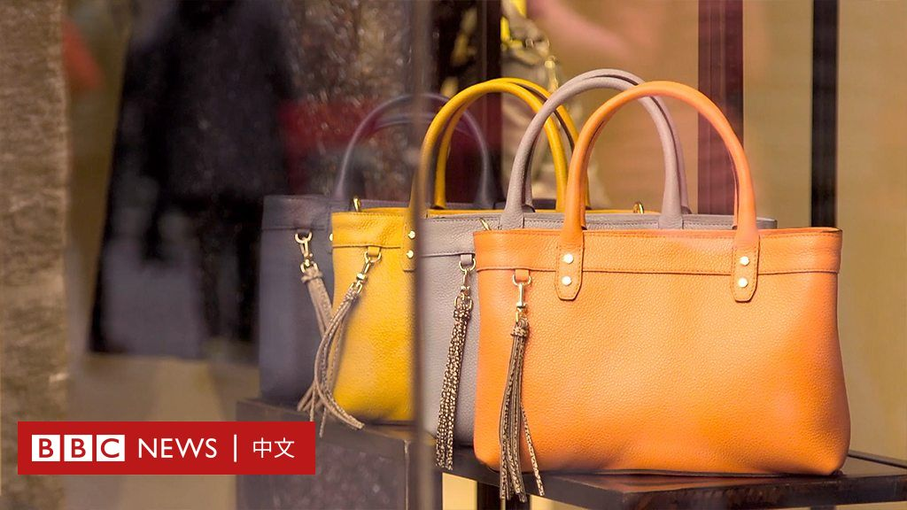 :speech_balloon:评:4 :+1:赞:8 :globe_with_meridians:转:6  

[10月26日 05:24]    老司机   @h5lpykl7tp6jjop    人民群众玩微博的遭遇：实名就实名吧，只要不删帖就行。然后变成了，删帖就删帖吧，只要不禁言就行。后来变成了，禁言就禁言吧，只要不销号就行。接着变成了，销号就销号吧，只要不抓人就行。如今变成了，抓人就抓人吧，只要不灭口就行。即将变成了，灭口就灭口吧，只要不灭门就行...
还有更低的要求吗  :speech_balloon:评:3 :+1:赞:41 :globe_with_meridians:转:21  

[10月26日 05:13]    老司机   @h5lpykl7tp6jjop    中共把哲学分成唯心主义和唯物主义，定义唯物主义正确，其它错误，把自己的观点定义为正确的唯物历史观，没有史实！简单化就是立场，所以抗战是共产党打胜的，美国是侵略者不管有没有侵吞过别人的领土，俄国人侵占再多领土也是朋友，杀人是镇压反革命，香港人游行是暴徒是港独，所以能和它们讲道理吗？  :speech_balloon:评:0 :+1:赞:4 :globe_with_meridians:转:1  

[10月26日 05:01]    新闻大吐槽   @TuCaoFakeNews    音乐声有点乱，你叫我们这提琴怎么拉？ https://twitter.com/TuCaoFakeNews/status/1187541870739505152 …  :speech_balloon:评:0 :+1:赞:5 :globe_with_meridians:转:2  

[10月26日 04:59]    新闻大吐槽   @TuCaoFakeNews    脸皮厚是党妈的遗传 https://twitter.com/tucaofakenews/status/1187822561612029952 …  :speech_balloon:评:0 :+1:赞:3 :globe_with_meridians:转:1  

[10月26日 04:57]    新闻大吐槽   @TuCaoFakeNews    麻木与无耻全展显在华春莹脸上，红匪最佳代表之一 https://twitter.com/tucaofakenews/status/1187822561612029952 …  :speech_balloon:评:1 :+1:赞:8 :globe_with_meridians:转:4  

[10月26日 04:55]    新闻大吐槽   @TuCaoFakeNews    由於看到有網友說來香港會去龍門冰室
在此給大家提供一點資料
真正香港人的龍門冰室只有圖中那五家
其他地區的是屬於福建幫的富臨集團（打人暴徒）
不要去錯喔^_^ 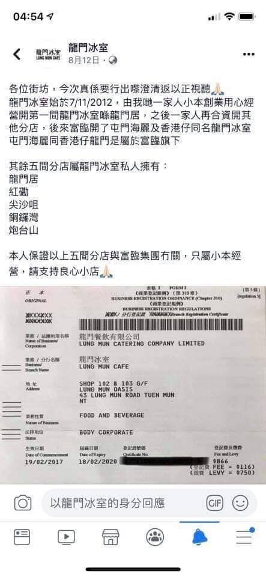 :speech_balloon:评:0 :+1:赞:8 :globe_with_meridians:转:6  

[10月26日 04:49]    新闻大吐槽   @TuCaoFakeNews    我想這一幕能載入人類反抗極權史冊 https://twitter.com/TuCaoFakeNews/status/1187816711635886080 …  :speech_balloon:评:0 :+1:赞:21 :globe_with_meridians:转:6  

[10月26日 04:43]    新闻大吐槽   @TuCaoFakeNews    香港人登上喜马拉雅了! https://twitter.com/TuCaoFakeNews/status/1187816711635886080 …  :speech_balloon:评:0 :+1:赞:10 :globe_with_meridians:转:1  

[10月26日 04:38]    新闻大吐槽   @TuCaoFakeNews    god bless HK https://twitter.com/TuCaoFakeNews/status/1187816711635886080 …  :speech_balloon:评:0 :+1:赞:10 :globe_with_meridians:转:2  

[10月26日 04:36]    新闻大吐槽   @TuCaoFakeNews    #FightForFreedom https://twitter.com/TuCaoFakeNews/status/1187568302165393408 …  :speech_balloon:评:0 :+1:赞:8 :globe_with_meridians:转:3  

[10月26日 04:19]    新闻大吐槽   @TuCaoFakeNews    全中國14億肉票至少有13億的斯德哥爾摩症！  :speech_balloon:评:1 :+1:赞:4 :globe_with_meridians:转:1  

[10月26日 03:42]    新闻大吐槽   @TuCaoFakeNews    港人将反抗的旗帜打到了珠穆朗玛峰顶！  :speech_balloon:评:8 :+1:赞:318 :globe_with_meridians:转:132  

[10月26日 01:00]    GFHG SDKM   @zyx_yny    A Hong Kong protestor was severely injured by pepper spray with unknown chemicals.
Source: Workercom@facebook

#HongKongProtesters #policestate #HKPolice  :speech_balloon:评:3 :+1:赞:15 :globe_with_meridians:转:13  

[10月26日 00:25]    老司机   @h5lpykl7tp6jjop    香港警察使用的是胡椒噴霧還是化學武器？

1.這個並不是藍色水，而是懷疑香港popo加了不明化學物質，狀似胡椒噴霧的不明化學物所造成的傷口，當場救護員亦話從未見過這種情況，不知是什麼物質。

2.看傷口表面好像沒有什麼，其實表面結殼好厚，在裡面還不停腐蝕，所以傷口其實好深。
#化學武器
#黑警 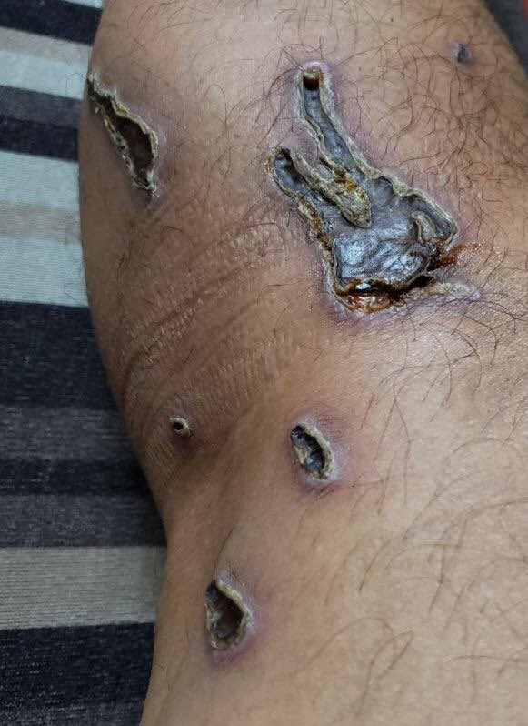 :speech_balloon:评:42 :+1:赞:245 :globe_with_meridians:转:242  

[10月26日 00:17]    GFHG SDKM   @zyx_yny    I will not forget#StandWithHongKong #StandWithHK https://twitter.com/we_hkers/status/1187406398834933760 …  :speech_balloon:评:1 :+1:赞:13 :globe_with_meridians:转:11  

[10月25日 23:35]    财经真相   @caijingxiang    莱特希泽周五在接受CNBC采访时说，中美即将敲定贸易协定的某些部分，并将在副部级别官员会上继续进行的讨论。消息公布离岸人民币扩大涨幅，涨破6.06关口，a50、道指us30短线上涨，黄金短线下跌！ 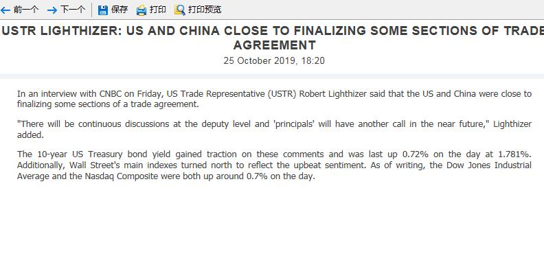 :speech_balloon:评:18 :+1:赞:57 :globe_with_meridians:转:12  

[10月25日 23:34]    BBC News 中文   @bbcchinese    【英国集装箱案：华人愤怒中悼念 跨国追查加紧进行】埃塞克斯郡警方陆续把39名死者移送医院，开展尸检与身份辨认工作。一些伦敦华人与难民关注团体举办烛光悼念晚会，促请英国尽力协助死者家属。 https://www.youtube.com/watch?v=VALSjHyhAG0 …  :speech_balloon:评:11 :+1:赞:30 :globe_with_meridians:转:7  

[10月25日 23:03]    新闻大吐槽   @TuCaoFakeNews    这才是香港! https://twitter.com/TuCaoFakeNews/status/1187647384940998661 …  :speech_balloon:评:0 :+1:赞:13 :globe_with_meridians:转:3  

[10月25日 23:00]    BBC News 中文   @bbcchinese    BBC联系到3名越南人的家属，他们担心他们的亲属可能在英国埃塞克斯发现的有39具移民尸体的拖车上。 https://www.bbc.com/zhongwen/simp/uk-50182847 …  :speech_balloon:评:23 :+1:赞:43 :globe_with_meridians:转:16  

[10月25日 22:24]    新闻大吐槽   @TuCaoFakeNews    建墻~墻國是專業的
#SouthPark https://twitter.com/TuCaoFakeNews/status/1187597800952844288 …  :speech_balloon:评:0 :+1:赞:8 :globe_with_meridians:转:6  

[10月25日 22:22]    新闻大吐槽   @TuCaoFakeNews    有些心中有墙 https://twitter.com/TuCaoFakeNews/status/1187597800952844288 …  :speech_balloon:评:0 :+1:赞:7 :globe_with_meridians:转:4  

[10月25日 22:13]    新闻大吐槽   @TuCaoFakeNews    呼籲大家都來
辱共！踩共！抗共！滅共！ https://twitter.com/tucaofakenews/status/1187597800952844288 …  :speech_balloon:评:0 :+1:赞:5 :globe_with_meridians:转:1  

[10月25日 22:10]    新闻大吐槽   @TuCaoFakeNews    好棒的创意！ https://twitter.com/TuCaoFakeNews/status/1187602387302637568 …  :speech_balloon:评:0 :+1:赞:6 :globe_with_meridians:转:2  

[10月25日 22:04]    新闻大吐槽   @TuCaoFakeNews    還有他  https://twitter.com/tucaofakenews/status/1187568302165393408 … 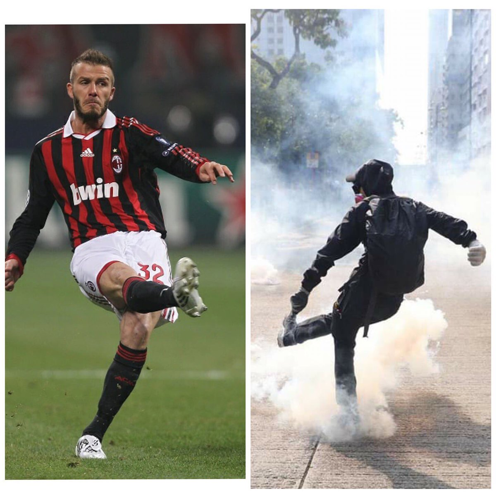 :speech_balloon:评:0 :+1:赞:6 :globe_with_meridians:转:3  

[10月25日 21:55]    BBC News 中文   @bbcchinese    英国集装箱惨案：中国称39人国籍“尚待确认” https://bbc.in/365I0vg   :speech_balloon:评:72 :+1:赞:95 :globe_with_meridians:转:31  

[10月25日 21:41]    新闻大吐槽   @TuCaoFakeNews    當人人都說要非暴力抗爭時，連自衛也變得像攻擊別人，他們只是個孩子啊！
我不會割蓆，即使運動注定被標籤，被唾棄，也要支持到底，搏盡無悔！
因為怯，我地就會輸成世！ https://twitter.com/tucaofakenews/status/1187568302165393408 …  :speech_balloon:评:0 :+1:赞:23 :globe_with_meridians:转:9  

[10月25日 21:30]    纽约时报中文网   @nytchinese    这项协议震惊了协议所涉的岛屿——图拉吉岛上的居民，有些人担心中国正在寻找机会在这里建立一个军事据点。
该协议的批评者对司法部长的决定表示欢迎，但警告说，中国森田和其他中国利益集团更可能将此视为暂时的挫折，而不是取消他们的计划。 http://nyti.ms/32NOSLM   :speech_balloon:评:3 :+1:赞:18 :globe_with_meridians:转:7  

[10月25日 21:29]    新闻大吐槽   @TuCaoFakeNews    得道者多助。 https://twitter.com/TuCaoFakeNews/status/1187446539976761344 …  :speech_balloon:评:0 :+1:赞:4 :globe_with_meridians:转:2  

[10月25日 21:21]    财经真相   @caijingxiang    昨天欧洲央行会议放鸽，同时约翰逊准备下周一进行大选，增添了脱欧的不确定性，另外，昨天美国9月耐用品订单等数据疲弱，推高了市场对下周美联储进一步降息的预期，这三种因素共同下，国际黄金价格连续两日大涨，也就是说在下周五美联储降息正式落地之前，黄金价格将会继续震荡偏上走高！ 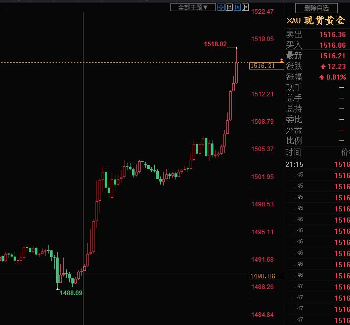 :speech_balloon:评:4 :+1:赞:58 :globe_with_meridians:转:12  

[10月25日 21:21]    新闻大吐槽   @TuCaoFakeNews    欺軟怕硬的玩意，一下就聳了！牆國文化！  :speech_balloon:评:0 :+1:赞:4 :globe_with_meridians:转:2  

[10月25日 21:14]    新闻大吐槽   @TuCaoFakeNews    这都是中共自己作的，没事找事，小事变大事  :speech_balloon:评:0 :+1:赞:1 :globe_with_meridians:转:1  

[10月25日 21:00]    纽约时报中文网   @nytchinese    因凡蒂诺小心翼翼地避免谈论中国的记录，而是对智利最近的抗议活动和黎巴嫩难民的困境表示担忧，后者有许多为躲避叙利亚内战逃到那里的人。
“FIFA的使命不是解决世界上的问题，”他说。“FIFA的使命是在全世界组织和发展足球。” http://nyti.ms/33X4VqI   :speech_balloon:评:15 :+1:赞:3 :globe_with_meridians:转:1  

[10月25日 20:55]    GFHG SDKM   @zyx_yny    Oops..... 
#HongKongProtests #HongKong #HongKongers #StandWithHK #hkpolicebrutality #HKPoliceTerrorism #hkpolicestate #BloodyCarrie  :speech_balloon:评:0 :+1:赞:5 :globe_with_meridians:转:3  

[10月25日 20:30]    纽约时报中文网   @nytchinese    这起惊天大案牵涉多个国家，但目前问题远多于答案。该车是在环绕大伦敦的主高速路上发现的，但它的注册地在保加利亚，从都柏林搭乘渡船而来，驾驶员是一名北爱尔兰男子，卡车拖载的集装箱由比利时来到英国。
调查此案的警方在周四的声明中称，“目前我们无法很快得到所有答案“。 http://nyti.ms/2ocFvWW   :speech_balloon:评:4 :+1:赞:10 :globe_with_meridians:转:3  

[10月25日 20:26]    财经真相   @caijingxiang    在中国学什么很重要！ 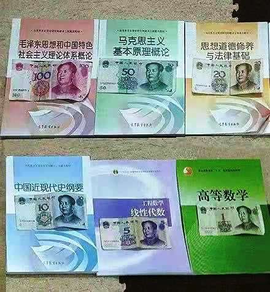 :speech_balloon:评:17 :+1:赞:341 :globe_with_meridians:转:98  

[10月25日 20:21]    墙国铁拳现世报😷   @Socialistfist    感谢提供的推友，原帖已经删除  :speech_balloon:评:0 :+1:赞:40 :globe_with_meridians:转:2  

[10月25日 20:18]    墙国铁拳现世报😷   @Socialistfist    哦， 原来不是正规军

#社会主义铁拳  :speech_balloon:评:24 :+1:赞:167 :globe_with_meridians:转:41  

[10月25日 20:00]    BBC News 中文   @bbcchinese    【香港示威：连侬墙的历史与由来】在香港“反送中”示威遍地开花的连侬墙，跟披头四有什么关系？ https://bbc.in/33ZFapR   :speech_balloon:评:4 :+1:赞:19 :globe_with_meridians:转:7  

[10月25日 19:49]    墙国铁拳现世报😷   @Socialistfist    补图  :speech_balloon:评:1 :+1:赞:36 :globe_with_meridians:转:5  

[10月25日 19:48]    墙国铁拳现世报😷   @Socialistfist    只是姓赵和赵家人，有本质区别

#社会主义铁拳  :speech_balloon:评:23 :+1:赞:189 :globe_with_meridians:转:61  

[10月25日 19:24]    财经真相   @caijingxiang    继10月23日国常会提出进一步做好稳外贸、稳外资工作，确定优化外汇管理措施，促进跨境贸易投资便利化后，10月25日，国家外汇管理局发布《国家外汇管理局关于进一步促进跨境贸易投资便利化的通知》落地具体的外汇管理优化措施。一切只宽进严出的外汇便利化都是耍流氓！ 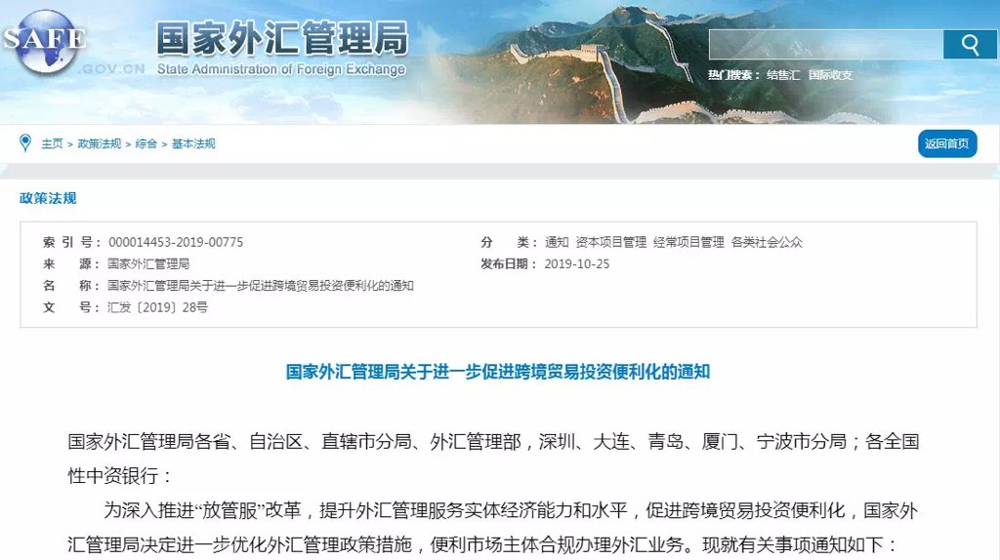 :speech_balloon:评:10 :+1:赞:168 :globe_with_meridians:转:46  

[10月25日 19:00]    纽约时报中文网   @nytchinese    近年来，国际足联因连续两届将世界杯主办权授予专制国家（2018年的俄罗斯和2022年的卡塔尔）而受到批评。该组织因此加强了对申办赛事国家的人权审查。
但在周四，国际足联主席因凡蒂诺宣布，2021年世俱杯的举办地将是中国——体育、金钱、政治和人权的一个令人不安的交汇点。 http://nyti.ms/33X4VqI   :speech_balloon:评:44 :+1:赞:78 :globe_with_meridians:转:26  

[10月25日 18:30]    纽约时报中文网   @nytchinese    所罗门群岛裁定中国森田集团租借某南太平洋岛屿的协议非法。所罗门群岛司法部长称，该协议缺乏重要细节，且侵犯政府权力，应当终止。
这意味着中国向南太平洋进军的行动遭遇重挫，或至少是延缓。批评者称，中国在该地区的其他投资也应受到审查。 http://nyti.ms/32NOSLM   :speech_balloon:评:15 :+1:赞:131 :globe_with_meridians:转:55  

[10月25日 18:23]    财经真相   @caijingxiang    香港出口连续下跌11个月，9月份跌幅进一步扩大。按照年计出口跌7.3%，进口跌10.3%，整体逆差3368亿港币。另外有一个很有意思的现象，从运输方式来看，香港空运在7月份下滑最严重，八九月份开始逐步减小，与此完全相反的是陆运，7月下滑较小，八九月份反而扩大！8月份香港陆运有什么事吗？ 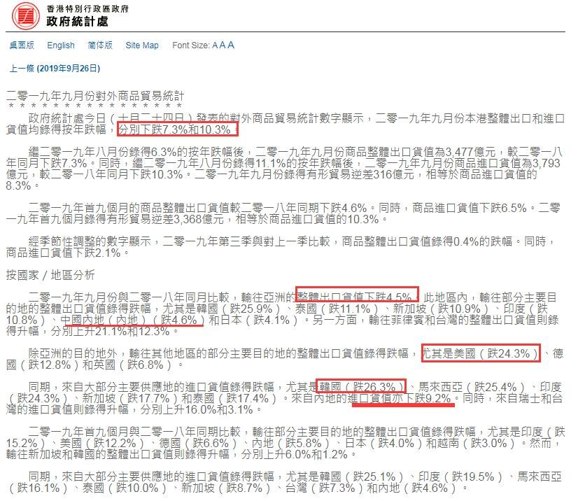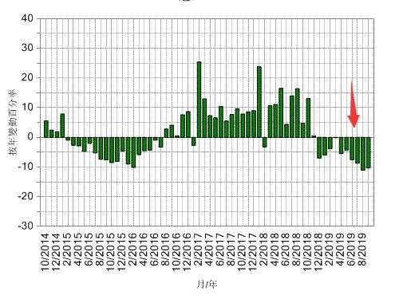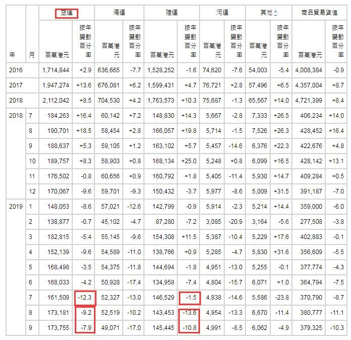 :speech_balloon:评:9 :+1:赞:105 :globe_with_meridians:转:39  

[10月25日 18:11]    老司机   @h5lpykl7tp6jjop    天朝城管要钱不顾人命！显示出大天朝执政新高度！ 开创罚没水平新篇章，历史将记录这个伟大的时刻，它体现了我们党和国家如何致富的细致入微的精釆细节，取之于民，永远不竭！  :speech_balloon:评:11 :+1:赞:46 :globe_with_meridians:转:29  

[10月25日 18:01]    BBC News 中文   @bbcchinese    当我们冒险登上木星和土星的卫星，在它们冰冻的表面下深入探索时，我们能找到新的生命形态吗？那又会是什么样子的？ https://bbc.in/2pKlEz1   :speech_balloon:评:7 :+1:赞:21 :globe_with_meridians:转:6  

[10月25日 18:00]    纽约时报中文网   @nytchinese    “北京正企图利用企业的贪婪影响美国公众舆论，胁迫美国企业，”彭斯说。
“太多的美国跨国公司屈从于中国金钱和市场的诱惑，不仅压制对中共的批评，甚至压制对美国价值观的肯定性表达。” http://nyti.ms/2MKoYD0   :speech_balloon:评:9 :+1:赞:32 :globe_with_meridians:转:4  

[10月25日 17:51]    纽约时报中文网   @nytchinese    当“深层政府”向特朗普展开“复仇”行动  http://nyti.ms/362aQg9 https://twitter.com/ccni/status/1187560501057900544 …  :speech_balloon:评:2 :+1:赞:5 :globe_with_meridians:转:2  

[10月25日 17:43]    纽约时报中文网   @nytchinese    更正：本文稍早时称“当局表示，死者均为中国公民“，应为“死者据信均为中国公民“。特此更正。 http://nyti.ms/2ocFvWW   :speech_balloon:评:40 :+1:赞:38 :globe_with_meridians:转:12  

[10月25日 17:34]    纽约时报中文网   @nytchinese    周三，在伦敦以东约25英里的一个集装箱冷藏车内发现39具尸体。伦敦当局表示，死者据信均为中国公民。但受害者身份及死亡原因尚未确定。警方确认卡车和集装箱从不同港口抵达英国，但目的地未明。目前只有卡车司机一人被列为嫌疑人。
本文盘点了迄今我们对本案已知和未知的地方。 http://nyti.ms/2ocFvWW   :speech_balloon:评:14 :+1:赞:37 :globe_with_meridians:转:15  

[10月25日 17:19]    财经真相   @caijingxiang    大连副市长：大连银行业不良率达7%，将设地方AMC（不良资产管理公司） 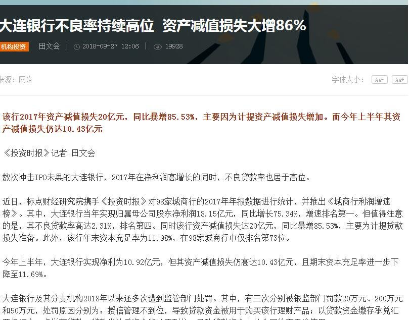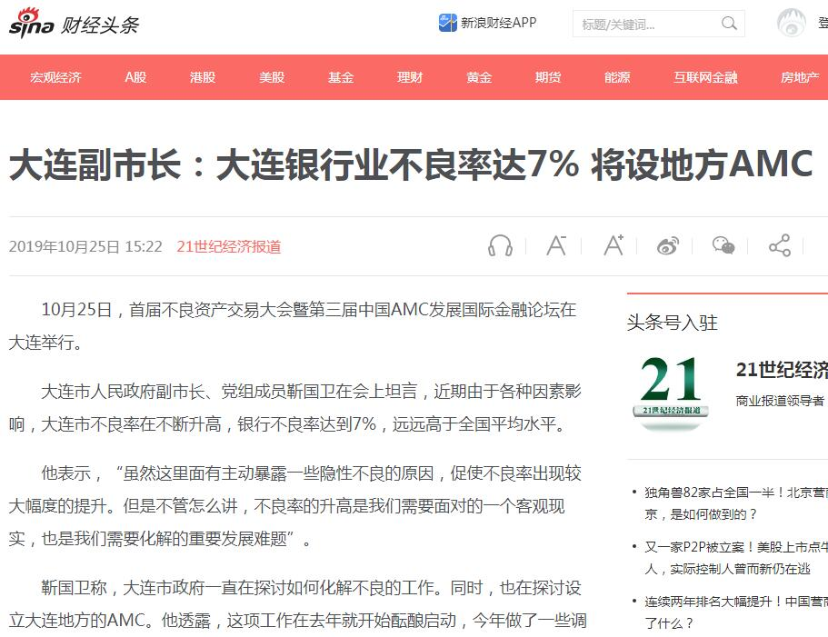 :speech_balloon:评:10 :+1:赞:95 :globe_with_meridians:转:37  

[10月25日 17:05]    纽约时报中文网   @nytchinese    彭斯周四批评美国公司为了保住中国市场，压制支持民主、自由价值观的言论。彭斯说，美国公司应该在与中国做生意的时候坚持美国的原则。
彭斯以在一次政策演讲中指责耐克“把良知抛在了脑后”，批评NBA球队所有人和球员打压对香港民主运动的支持，从而“站在了中国共产党的一边”。 http://nyti.ms/2MKoYD0   :speech_balloon:评:34 :+1:赞:113 :globe_with_meridians:转:32  

[10月25日 17:01]    GFHG SDKM   @zyx_yny    等睇警方開記者會飲「藍水」

警隊曾稱水跑車嘅顔色水為食用色素，對人體冇害，係可飲用食水
依家化驗就揭發，所謂嘅顏色水裡面係含有黏合劑或混有害催淚溶液
 #香港原創 #香港插圖 #香港插畫 #畫 #落書き #マンガ #イラスト #日本留学 #夢叶 #插畫 #漫畫 #四人頭 #手繪#文宣收集處 #文宣組  :speech_balloon:评:7 :+1:赞:147 :globe_with_meridians:转:79  

[10月25日 16:58]    老司机   @h5lpykl7tp6jjop    看文明国家对待生命尊重的态度，再看看同胞对待手足的态度，你们还爱这样的国家，是不是脑残？ 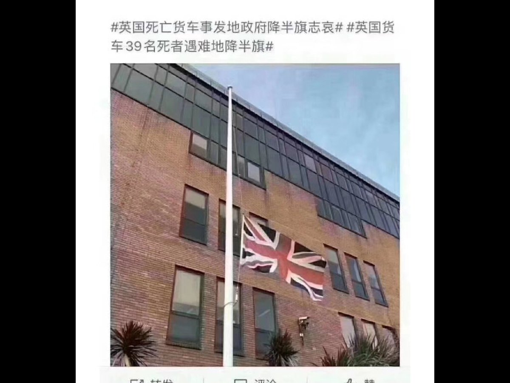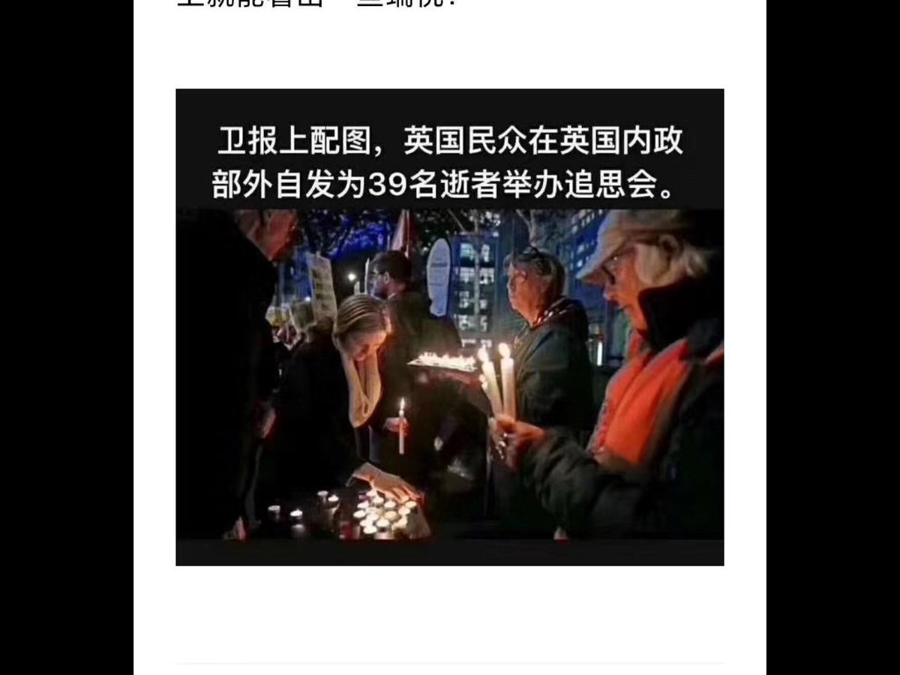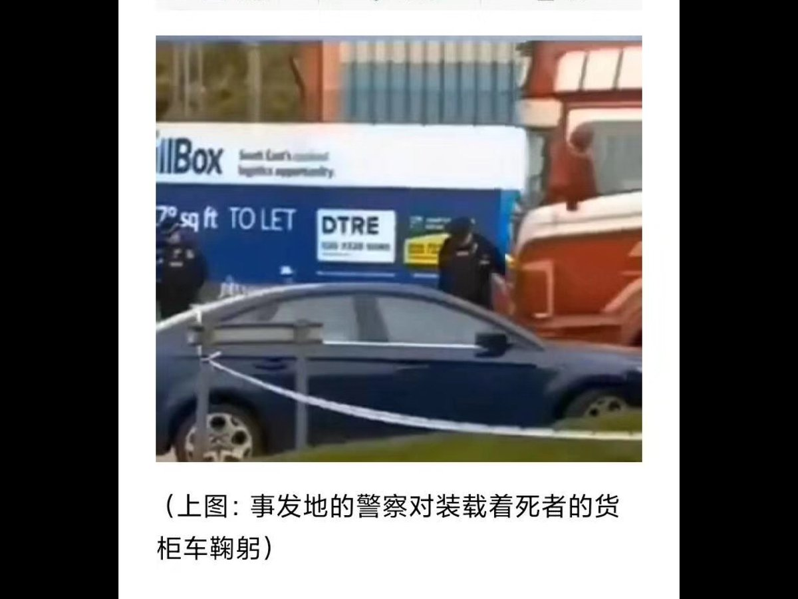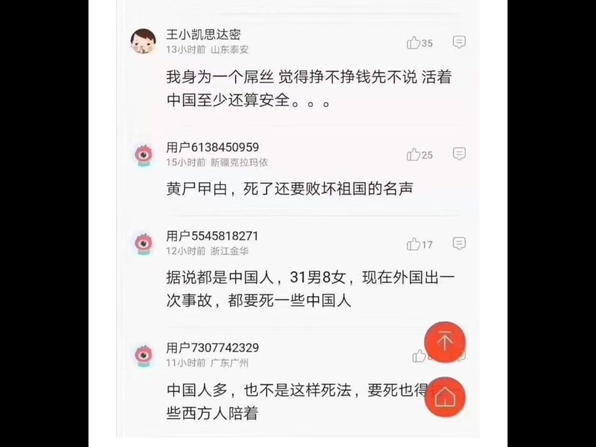 :speech_balloon:评:2 :+1:赞:17 :globe_with_meridians:转:12  

[10月25日 16:30]    纽约时报中文网   @nytchinese    这起惊天大案牵涉多个国家，但目前问题远多于答案。该车是在环绕大伦敦的主高速路上发现的，但它的注册地在保加利亚，从都柏林搭乘渡船而来，驾驶员是一名北爱尔兰男子，卡车拖载的集装箱由比利时来到英国。
调查此案的警方在周四的声明中称，“目前我们无法很快得到所有答案”。 http://nyti.ms/2ocFvWW   :speech_balloon:评:8 :+1:赞:17 :globe_with_meridians:转:7  

[10月25日 16:14]    墙国铁拳现世报😷   @Socialistfist    翻face比翻book还快  :speech_balloon:评:2 :+1:赞:32 :globe_with_meridians:转:8  

[10月25日 16:13]    老司机   @h5lpykl7tp6jjop    好文转发 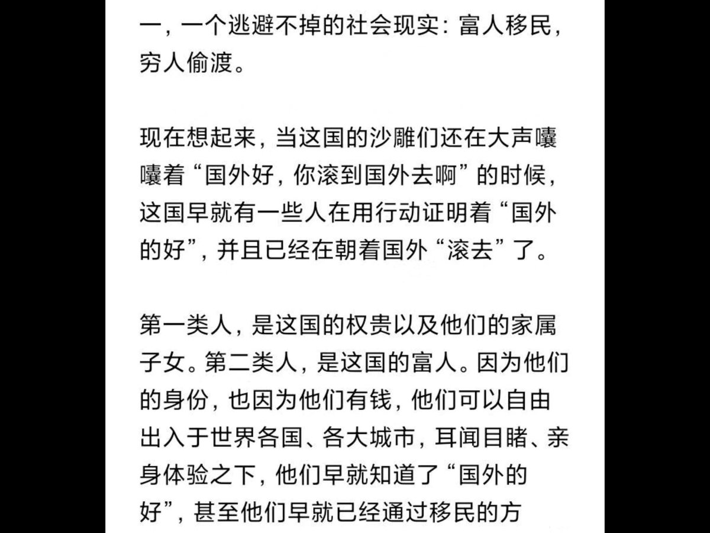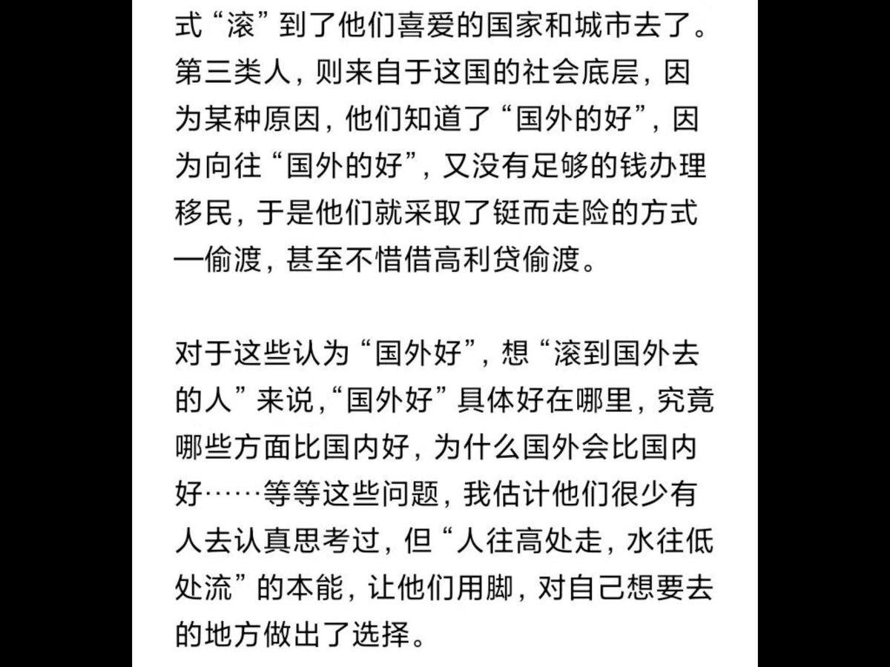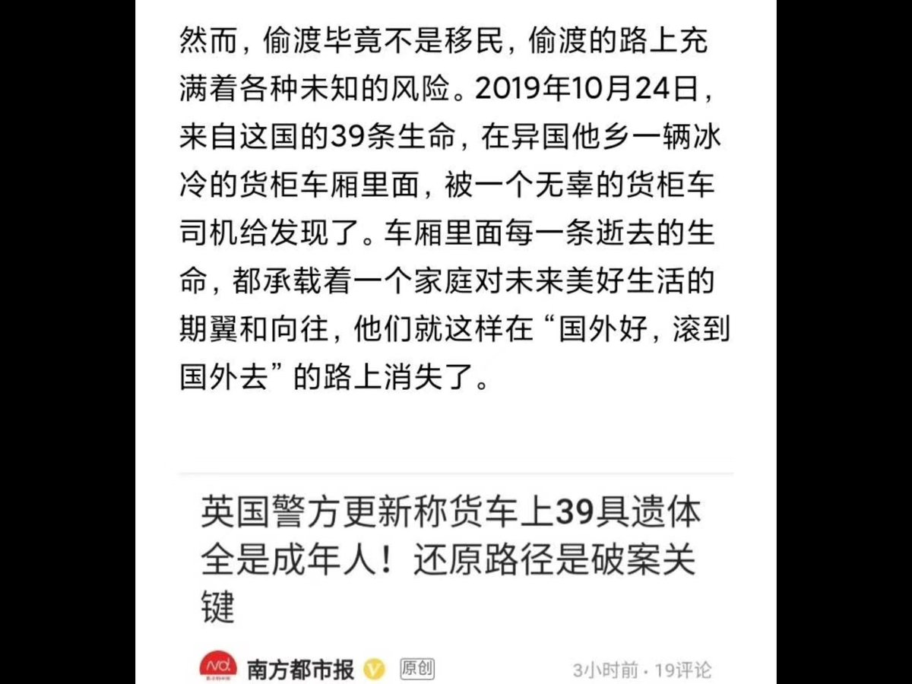 :speech_balloon:评:2 :+1:赞:16 :globe_with_meridians:转:10  

[10月25日 16:00]    纽约时报中文网   @nytchinese    事实上，“深层政府”这一阴谋论概念正是在特朗普执政时期被“发扬光大”。
上台伊始，特朗普就对政府表现出了很大敌意，他不相信情报人员，把从政府各机构派往白宫的官员称为“奥巴马的人”。如今这场职业官员眼里的“因果报应”，在特朗普看来，似乎仅印证了自己被“政治迫害”的想法。 http://nyti.ms/362aQg9   :speech_balloon:评:2 :+1:赞:6 :globe_with_meridians:转:1  

[10月25日 15:41]    纽约时报中文网   @nytchinese    #观点 别再要求女人更自信，让男人谦卑一点  http://nyti.ms/31I5nb9 https://twitter.com/ccni/status/1187546013168480257 …  :speech_balloon:评:0 :+1:赞:10 :globe_with_meridians:转:0  

[10月25日 15:30]    纽约时报中文网   @nytchinese    对她的拘留引发了人权团体的担忧，他们一直谴责习近平掌权后广泛打压异议人士的行动。
“这只能说明中国当局有多害怕，”倡导组织人权观察中国部研究员王亚秋说。“他们害怕香港的抗议活动可能激发对大陆政府的挑战，害怕任何表达自由民主思想的人都是对共产党统治的威胁。” http://nyti.ms/33YZPKF   :speech_balloon:评:3 :+1:赞:31 :globe_with_meridians:转:5  

[10月25日 15:11]    老司机   @h5lpykl7tp6jjop    世界上最装B的三件事：

1、啃老族在豪华KTV里含泪演唱: “烛光里的妈妈，你的眼里为何噙着泪花……”
2、移民的人哽咽着演唱: "我和我的祖国，一刻也不能分割……"
3、官员深情地说: 我们的工作是为人民服务。  :speech_balloon:评:10 :+1:赞:517 :globe_with_meridians:转:174  

[10月25日 15:01]    BBC News 中文   @bbcchinese    高敬文指出，习近平必然想要通过这次机会展现他握有控制权，而这种全会最大的意义在于动员北京、各省以及军队的各级领导知悉中共领导层的重要任务，“让大家都有共识，并且支持领导层的决定”。 https://bbc.in/32JBto0   :speech_balloon:评:14 :+1:赞:29 :globe_with_meridians:转:9  

[10月25日 15:00]    纽约时报中文网   @nytchinese    在中国山东，拉菲旗下的瓏岱酒庄推出了首款2017年份葡萄酒，售价2388元人民币。附近村民们称赞酒庄为当地带来了就业机会，还在节日期间向村民分发礼物。
但被问道是否会喝瓏岱葡萄酒时，“这酒比金子还贵！“一名村民称：“我连100元的酒都不会买。反正我也喝不出什么差别来。” http://nyti.ms/32PiJUc   :speech_balloon:评:4 :+1:赞:20 :globe_with_meridians:转:4  

[10月25日 14:58]    财经真相   @caijingxiang    美国农业部周四表示，民间出口商报告向中国出售了26.4万吨大豆，2019/20销售年度交付。目前全球最大的两个经济体有望达成部分贸易协议。 https://twitter.com/reuterscn/status/1187531006682849280 …  :speech_balloon:评:9 :+1:赞:33 :globe_with_meridians:转:10  

[10月25日 14:30]    纽约时报中文网   @nytchinese    #观点 我们不应该喋喋不休地让女人赶紧去满足男人的标准，而应该训练男人和男孩去追求女人的文化规范，并把这些规范作为默认的和值得追求的东西兜售给男人。
要更恭顺一些。要反思，要倾听，该道歉的地方要道歉。要以谦虚、谦卑和合作为目标，而不是吹嘘傲慢。 http://nyti.ms/31I5nb9   :speech_balloon:评:0 :+1:赞:10 :globe_with_meridians:转:7  

[10月25日 14:00]    BBC News 中文   @bbcchinese    【非洲顶尖大学教师如何诱导学生用性爱换取成绩】西非尼日利亚的顶尖院校里，有教职员要求与女学生发生性关系，以作为考试过关的条件。BBC“非洲之眼”栏目调查校园性骚扰议题长达一年，通过暗访拍摄视频证据。 https://www.youtube.com/watch?v=HVvCXGsaCDY …  :speech_balloon:评:11 :+1:赞:58 :globe_with_meridians:转:32  

[10月25日 13:30]    纽约时报中文网   @nytchinese    #观点 从2007年到2018年，中国企业在巴西投资了约580亿美元，涉及石油、矿产、大豆、电力、基础设施和技术等领域。去年，中国在巴西40%的投资来自中国国有企业，这意味着它们的决策能够深刻影响政治因素。
中国是时候承担责任、制止这场悲剧了。 http://nyti.ms/32EWRej   :speech_balloon:评:10 :+1:赞:15 :globe_with_meridians:转:8  

[10月25日 13:00]    纽约时报中文网   @nytchinese    知情人士透露，活动人士黄雪琴上周在广州被拘留，当局指控其“寻衅滋事“。现年31岁的她是中国“我也是“运动中的主要人物，最近还撰写了记录亲身参与香港“69”大游行的文章。
她是最新一位因支持香港抗议被捕的大陆公民，此前她曾被没收护照，家人也遭到骚扰。 http://nyti.ms/33YZPKF   :speech_balloon:评:46 :+1:赞:278 :globe_with_meridians:转:141  

[10月25日 12:52]    BBC News 中文   @bbcchinese    【美国副总统彭斯：香港的和平抗争者鼓舞了我们】彭斯向香港和平示威者喊话说：“我们请求你们留在非暴力示威的道路上”。 https://bbc.in/366qtmC   :speech_balloon:评:64 :+1:赞:137 :globe_with_meridians:转:33  

[10月25日 12:31]    BBC News 中文   @bbcchinese    林郑月娥和警务处副处长邓炳强先后给他打电话致歉，但他仍然批评警方做法“过份”。这位印度商人是何许人也？ https://bbc.in/32NePev   :speech_balloon:评:21 :+1:赞:65 :globe_with_meridians:转:22  

[10月25日 12:00]    BBC News 中文   @bbcchinese    学者认为，习近平想通过这机会展现他握有控制权，而这种全会最大的意义在于动员北京、各省以及军队的各级领导知悉中共领导层的重要任务。 https://bbc.in/2JkpkOM   :speech_balloon:评:20 :+1:赞:23 :globe_with_meridians:转:11  

[10月25日 11:54]    GFHG SDKM   @zyx_yny    So this just happened at the Shanghai food expo, food booths were setup for people to try, and uh, well, take a look...

A person from Europe said "I've been exhibiting in nearly 100 countries and have never seen anything like this, not even in Africa"  :speech_balloon:评:294 :+1:赞:1688 :globe_with_meridians:转:1004  

[10月25日 10:56]    财经真相   @caijingxiang    降价砸楼被抓！ 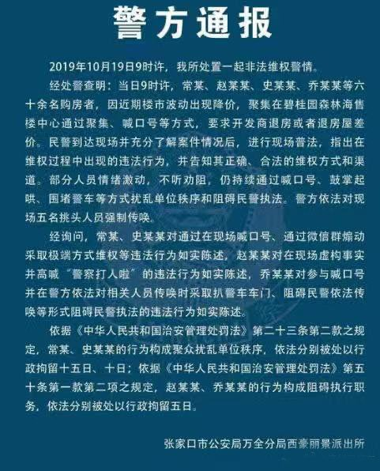 :speech_balloon:评:36 :+1:赞:186 :globe_with_meridians:转:84  

[10月25日 10:51]    老司机   @h5lpykl7tp6jjop    又中美人计
澳前情报官员Roger Uren上周在堪培拉被捕。Uren妻子为华人严瑞雪（Sheri Yan），她曾因贿赂时任联合国大会主席John Ashe而在美国被判入狱。Uren曾担任情报分析机构国家评估办公室助理主任，在2015年一次ASIO突袭行动期间在他堪培拉家中发现机密文件，他将面临30项未经授权处理文件的指控。  :speech_balloon:评:4 :+1:赞:44 :globe_with_meridians:转:24  

[10月25日 10:41]    财经真相   @caijingxiang    a50下跌趋势已经形成，临近年底各大机构都到了回笼资金的时候了，a股回跌一波是可以肯定的，只是不知道具体时间点，散户这个时候就不要往里冲了，无论你看上的股价有多低，千万不要冲进去抄底，最好是过完年再说！ 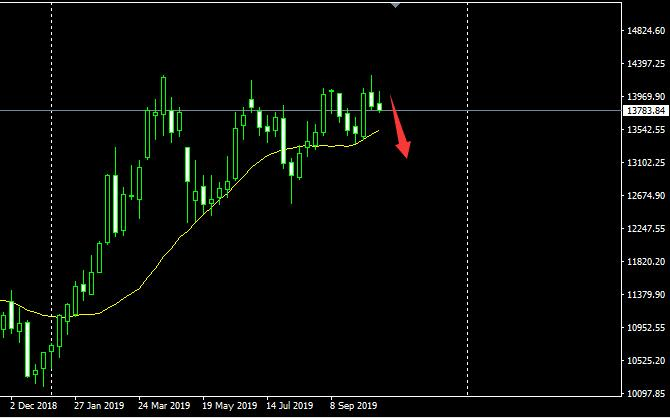 :speech_balloon:评:21 :+1:赞:101 :globe_with_meridians:转:24  

[10月25日 10:33]    GFHG SDKM   @zyx_yny    My interview with @matanevenoff, the legend who baited the cameraman with his #StandWithHongKong T-shirt during Dance Cam at the #Lakers/#Clippers game opening night in the #NBA

Thanks for showing HK your support Matan!
#HongKong #HongKongProtests  :speech_balloon:评:173 :+1:赞:2579 :globe_with_meridians:转:1271  

[10月25日 10:26]    GFHG SDKM   @zyx_yny    兄弟爬山 https://twitter.com/thkag_can/status/1187536917828648960 …  :speech_balloon:评:0 :+1:赞:1 :globe_with_meridians:转:0  

[10月25日 10:00]    BBC News 中文   @bbcchinese    英国警方证实，埃塞克斯郡集装箱藏尸案中的39名死者为中国公民，8女31男。首相约翰逊表示“震惊”。
 https://bbc.in/33XbppJ  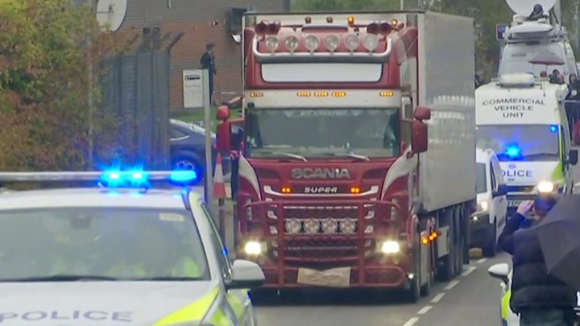 :speech_balloon:评:116 :+1:赞:87 :globe_with_meridians:转:63  

[10月25日 09:59]    财经真相   @caijingxiang    中国央行公开市场今日将进行300亿元人民币7天期逆回购操作,本周中国央行累计开展5900亿元逆回购操作，因累计有300亿元逆回购到期，本周实现净投放5600亿元，净投放量创下逾九个月新高。 金融系统资金缺口看样子达到了极限，不急，还没到年底清算日！ https://twitter.com/caijingxiang/status/1187179081873248258 …  :speech_balloon:评:7 :+1:赞:202 :globe_with_meridians:转:77  

[10月25日 09:48]    老司机   @h5lpykl7tp6jjop    昨夜中環齊唱《榮光歸香港》，氣氛不錯！
有幾名馬戲團演員穿著整齊，前來伴舞。  :speech_balloon:评:37 :+1:赞:990 :globe_with_meridians:转:397  

[10月25日 09:22]    纽约时报中文网   @nytchinese    China Holds #MeToo Activist Who Wrote About Hong Kong Protests. 39 Bodies Found in Truck Are Likely Chinese, U.K. Police Say. In China, FIFA’s Focus Is Soccer, Not Human Rights. Trump’s War on the ‘Deep State’ Turns Against Him. More @nytchinese https://cn.nytimes.com/morning-brief/20191025/truck-bodies-uk-chinese-metoo-hong-kong/ …  :speech_balloon:评:6 :+1:赞:6 :globe_with_meridians:转:5  

[10月25日 08:30]    GFHG SDKM   @zyx_yny    Kowloon Bay.  Citizens who would normally take MTR to work today are protesting by walking to work.  You can see the entire street from beginning to end is filled with people

Fighting for a good cause and getting exercise = win!

#HongKong #HongKongProtests  :speech_balloon:评:66 :+1:赞:2134 :globe_with_meridians:转:1256  

[10月25日 08:30]    BBC News 中文   @bbcchinese    澳大利亚维多利亚州政府在北京签署“一带一路”协议引起联邦政府质疑，中国海外大规模基建被认为施展“锐实力”，对西方构成挑战。
 https://bbc.in/340qAyi  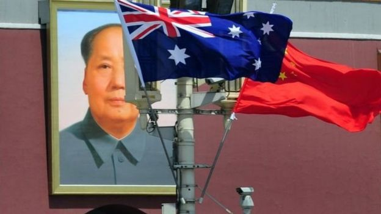 :speech_balloon:评:34 :+1:赞:49 :globe_with_meridians:转:25  

[10月25日 07:30]    BBC News 中文   @bbcchinese    BBC新闻国际版Tor 镜像页在“暗网”上线，以期突破新闻封锁和网络监控。
 https://bbc.in/31JZXMP   :speech_balloon:评:19 :+1:赞:203 :globe_with_meridians:转:72  

[10月25日 07:29]    GFHG SDKM   @zyx_yny    Singing is illegal in Hong kong now？！
this young man outside was forced to stop singing the HK anthem “Glory to Hong Kong”by HK police！
video from @ilovehkgers
#FreeHongKong #StandWithHongKong  :speech_balloon:评:131 :+1:赞:1851 :globe_with_meridians:转:1236  

[10月25日 07:28]    老司机   @h5lpykl7tp6jjop    A busker was performing #GloryToHongKong in Central last night. He was then surrounded and threatened by few police. 

Since when is there a ban for singing in #HongKong? #Hongkongers, resist! Or else this would happen real soon.

#WhiteTerror #PoliceState #HongKongProtests  :speech_balloon:评:254 :+1:赞:3917 :globe_with_meridians:转:3085  

[10月25日 07:03]    GFHG SDKM   @zyx_yny    3rd video in my eng sub series.  Chinese nationalist showing unconditional love for his country at a flower shop in Prince Edward.  Gotta admit, of all the arguments from the pro-China camp, his is the most convincing! 
#HongKong #HongKongProtests

Orig vid from @ajmm19923493  :speech_balloon:评:33 :+1:赞:233 :globe_with_meridians:转:177  

[10月25日 06:38]    GFHG SDKM   @zyx_yny    Hey everybody, I’m doing an AMA on Reddit right now. Feel free to ask any questions you may have wondered! Here’s the link -  https://www.reddit.com/r/AMA/comments/dmo3df/im_the_one_who_baited_the_clippers_with_the_hong/ … #hongkong 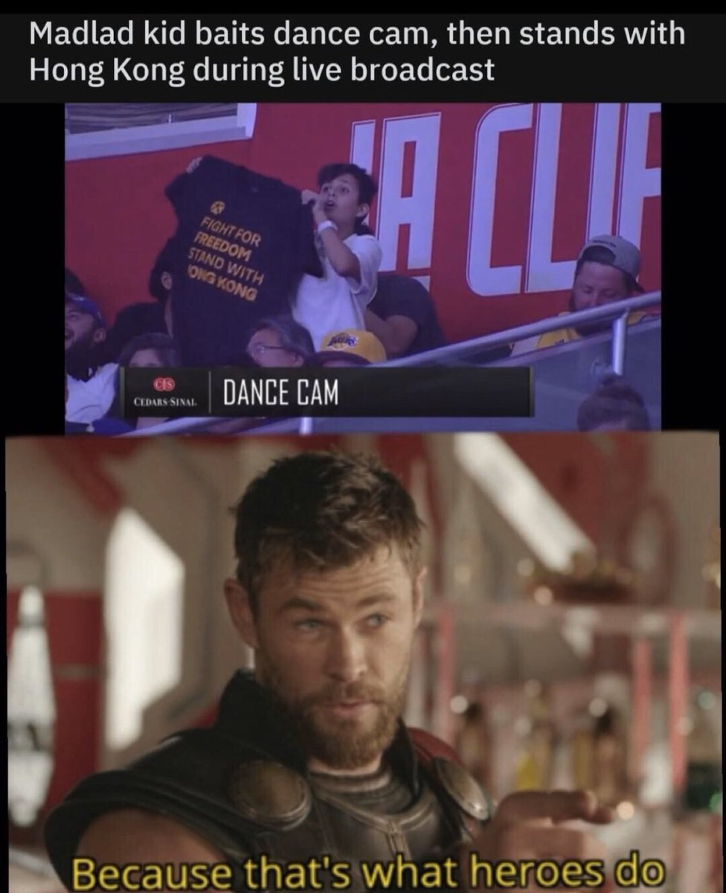 :speech_balloon:评:47 :+1:赞:484 :globe_with_meridians:转:137  

[10月25日 06:30]    BBC News 中文   @bbcchinese    彭斯定位中国为美国的“经济与战略对手”，但强调华盛顿并不希望与中国起冲突、或制约中国，只是谋求“公平竞争”。
 https://bbc.in/360pWmm   :speech_balloon:评:46 :+1:赞:49 :globe_with_meridians:转:12  

[10月25日 05:13]    老司机   @h5lpykl7tp6jjop    要说穷，它们满世界撒币，出钱请黑文盲来读大学，造军舰如下饺子，
要说富，它们抢百姓土地，连摆小摊卖水果蔬菜都抢，连骑电瓶车都不放过，
一个野蛮恐怖政权，一群愚昧懦弱的百姓，居然要指挥文明世界，
抵制世界各国，特别的自信，特别的牛逼，究竟是谁给它的胆子？马克思加上中国传统文化的精髓吗  :speech_balloon:评:9 :+1:赞:209 :globe_with_meridians:转:69  

[10月25日 04:50]    老司机   @h5lpykl7tp6jjop    中国十四亿人，每十四人中就有一个是排名全球前10％的富人？真的有这么多富人了？  :speech_balloon:评:2 :+1:赞:0 :globe_with_meridians:转:0  

[10月25日 04:10]    GFHG SDKM   @zyx_yny    Couldn't have said it better than @VP Pence today: "American corporations should stand up for American values here at home and around the world." 

Today and every day, I am proud to #StandWithHongKong  :speech_balloon:评:675 :+1:赞:5726 :globe_with_meridians:转:3134  

[10月25日 03:11]    新闻大吐槽   @TuCaoFakeNews    给抗争者提供免费餐的良心餐厅「龙门冰室」昨天被黑社会砸了，市民念这家餐厅的好，在店门口排起了长队，希望用自己的行动来支持有正义感的餐厅！

亲共的美心月饼被砸后，从未听说，有人自发为这家爱国店铺做点什么，看来所谓的爱国更多是谋私利而不顾公义，蓝丝是个伪命题  :speech_balloon:评:118 :+1:赞:3024 :globe_with_meridians:转:1165  

[10月25日 01:46]    老司机   @h5lpykl7tp6jjop    上中学的时候读《苛政猛于虎》，说孔子过泰山看见妇人哭坟，因父舅夫子均死于虎口却不离去，孔子叹：苛政猛于虎！二千多年了，中国苛政仍猛于虎，只是没有深山可躲，只得往外逃，2000年英国多佛港发现58人被闷死在偷渡的货柜车中，今天又是39人死在货柜车中！拚死外逃掙钱的中国多么强大多么富裕！  :speech_balloon:评:2 :+1:赞:26 :globe_with_meridians:转:12  

[10月25日 01:20]    GFHG SDKM   @zyx_yny    US Vice President @VP Mike Pence to #HongKongProtesters :

"To the millions in Hong Kong who have been peacefully demonstrating to protect your rights these past months, we stand with you. We are inspired by you."

Thank you @VP!

#FightForFreedom #StandWithHongKong  :speech_balloon:评:47 :+1:赞:1084 :globe_with_meridians:转:613  

[10月25日 00:57]    BBC News 中文   @bbcchinese    英国首相约翰逊表示，他将给予议员们更多时间辩论脱欧问题，但条件是他们必须同意在12月12日举行大选。
 https://bbc.in/361DC0r   :speech_balloon:评:1 :+1:赞:16 :globe_with_meridians:转:6  

[10月25日 00:29]    财经真相   @caijingxiang    彭斯演讲一句话总结：软硬兼施，最后通牒！  :speech_balloon:评:63 :+1:赞:844 :globe_with_meridians:转:112  

[10月25日 00:26]    凡賽堤/FORSETI   @FecharCCP    緊急找尋  :speech_balloon:评:0 :+1:赞:7 :globe_with_meridians:转:6  

[10月24日 23:58]    凡賽堤/FORSETI   @FecharCCP    何韻詩！香港女兒，華人的典範，華人21世紀的巾幗英雄，華人最完美的最值得華人崇拜的國際巨星！！！  :speech_balloon:评:64 :+1:赞:382 :globe_with_meridians:转:120  

[10月24日 23:55]    财经真相   @caijingxiang    伍德罗·威尔逊国际学者中心是世界排名前15的智库，该中心主要项目包括：历史与公共政策项目、冷战国际史项目、朝鲜国际文件研究项目。2011年，威尔逊中心与华东师范大学合作开展冷战史研究，并在威尔逊中心成立了“华东师大—威尔逊中心冷战研究美国工作室”。 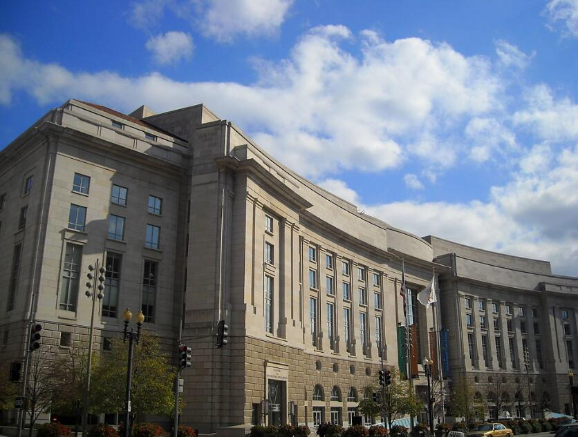 :speech_balloon:评:6 :+1:赞:46 :globe_with_meridians:转:22  

[10月24日 23:44]    凡賽堤/FORSETI   @FecharCCP    華人歷史上將永久記住這一刻，
2019年6月9日以來當香港人超過200萬人向政府提出訴求，
用最文明，最和平，最友好的方式遊行，而政府卻用最暴力，最兇殘，最卑鄙的手段僱傭黑社會組織和在職警察，以及大陸警察，武警，部隊喬裝成黑衣人在香港全社會進行大規模暗殺，暴打市民，破環公共設施等嫁禍給港人  :speech_balloon:评:13 :+1:赞:177 :globe_with_meridians:转:112  

[10月24日 23:39]    GFHG SDKM   @zyx_yny    International guidelines for use of water cannons have not been followed by #Hongkong police:
• Do not fire at close range
• Do not fire directly at ppl's bodies
• Allow sufficient time for ppl to disperse before firing
• Do not fire when no crowds are present
ALL VIOLATED https://twitter.com/wwkk27744741/status/1187384284530794496 …  :speech_balloon:评:12 :+1:赞:156 :globe_with_meridians:转:134  

[10月24日 21:26]    GFHG SDKM   @zyx_yny    佢地用我地國歌改加泰文唱
雖然我一個字都聽唔明但我好感動 眼濕濕

我有少少慚愧 人地支持我地支持到比人打 我地對今晚既集會仲咁大顧慮

#StandWithHK #FightForFreedom #FreedomFighter #FiveDemandsNotOneLess #Catalonia  :speech_balloon:评:29 :+1:赞:814 :globe_with_meridians:转:361  

[10月24日 21:14]    GFHG SDKM   @zyx_yny    Outside a #Catalonia's rally, some #China's nationalists were waving their flags.

They then JUMP KICKED a Catalan passerby holding slogan of "Liberate #HongKong. The revolution of our times." & tore it off. 

One of them attacked the journalist streaming the whole thing.

Rude.  :speech_balloon:评:62 :+1:赞:586 :globe_with_meridians:转:571  

[10月24日 20:05]    BBC News 中文   @bbcchinese    【世界上最长途的赛马活动蒙古德比】蒙古德比是世界上最长途的赛马活动。赛事全程1000公里，骑师每日骑行14小时，为期10天。有多少骑师能够完成整个赛事？ https://bbc.in/2JhXAKt   :speech_balloon:评:2 :+1:赞:15 :globe_with_meridians:转:3  

[10月24日 19:31]    BBC News 中文   @bbcchinese    “伊斯兰国”一直以利用Facebook、YouTube和Twitter平台散播资讯著称，不过这似乎是他们第一次利用抖音海外版TikTok。 https://bbc.in/33WmU0x   :speech_balloon:评:27 :+1:赞:65 :globe_with_meridians:转:16  

[10月24日 19:01]    BBC News 中文   @bbcchinese    中美贸易战影响数千亿美元商品，但全球贸易额超过25万亿美元，是直接受美国和中国关税影响产品价值的50倍以上。 https://bbc.in/2W8Xb2p   :speech_balloon:评:2 :+1:赞:18 :globe_with_meridians:转:6  

[10月24日 18:59]    墙国铁拳现世报😷   @Socialistfist    Facebook CEO 可能是目前为止吃到铁拳中身价最高的了。他学习中文，看习近平著作，到天安门跑步。
花了5年时间他和他的团队才弄明白中国“从来不让我们进入”。
#社会主义铁拳  :speech_balloon:评:77 :+1:赞:1135 :globe_with_meridians:转:390  

[10月24日 18:37]    GFHG SDKM   @zyx_yny    

I really like this #Shout4HK as we need to keep fighting

We have 5 demands and only one is fulfilled this week. The battle is still long!

#光復香港時代革命 #GFHGSDKM
#香港人加油 #HGYGY  :speech_balloon:评:123 :+1:赞:2819 :globe_with_meridians:转:1457  

[10月24日 18:07]    BBC News 中文   @bbcchinese    详细报道：英集装箱惨案39名死者“初步据信为中国公民” http://bbc.in/2PgnLoI   :speech_balloon:评:91 :+1:赞:135 :globe_with_meridians:转:74  

[10月24日 17:32]    墙国铁拳现世报😷   @Socialistfist    补图  :speech_balloon:评:12 :+1:赞:78 :globe_with_meridians:转:13  

[10月24日 17:31]    墙国铁拳现世报😷   @Socialistfist    发酵快半年的汉能讨薪事件波及到了开国大典总负责人外孙。
前脚祝福祖国母亲生日快乐，
后脚希望祖国母亲主持公道。

#社会主义铁拳  :speech_balloon:评:39 :+1:赞:311 :globe_with_meridians:转:113  

[10月24日 17:27]    老司机   @h5lpykl7tp6jjop    这究竟该相信那个数据，一会儿说中国有 l 亿富人？己超过美国？一会儿又说有5．6亿零存款，搞不懂你们究竟想说什么？大家分析分析！ 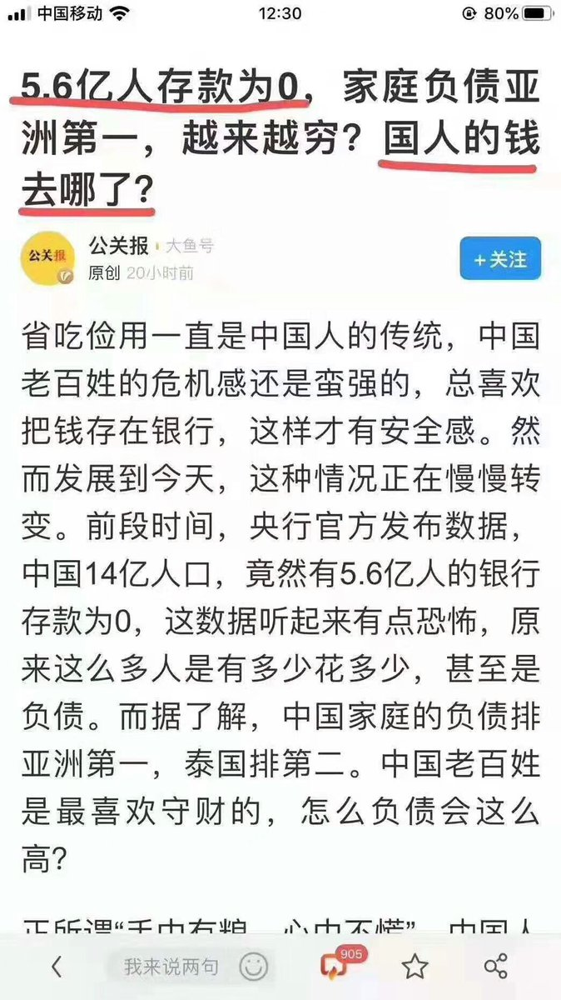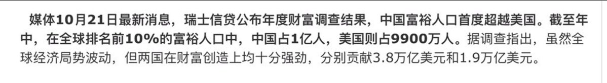 :speech_balloon:评:8 :+1:赞:24 :globe_with_meridians:转:12  

[10月24日 16:31]    老司机   @h5lpykl7tp6jjop    网恋女人毒性有多大？
七十岁澳洲老头受中国小三勾引，做下杀妻骗保惊人罪案，得手1．5亿澳元后罪情暴露，最终在阿德莱德机场警方将Peter正式拘捕！Peter手中正握着前往中国的机票，想来是准备去见聊骚网友了…在Peter的行李箱里，警方发现了一整箱避孕套，同时还有伟哥药物、性玩具和千奇百怪的内衣…  :speech_balloon:评:9 :+1:赞:44 :globe_with_meridians:转:23  

[10月24日 15:36]    老司机   @h5lpykl7tp6jjop    关于猪的讲话  :speech_balloon:评:1 :+1:赞:12 :globe_with_meridians:转:8  

[10月24日 14:57]    GFHG SDKM   @zyx_yny    【大陆留学生破坏加拿大某大学连侬墙】
【中共霸凌香港的缩影】
在加拿大一所大学里，一名大陆留学生破坏连侬墙，并对香港留学生动粗。在加拿大享有言论自由时，该名大陆留学生认为自己亦有“打人的权利”。
#小粉红
#连侬墙  :speech_balloon:评:427 :+1:赞:1404 :globe_with_meridians:转:869  

[10月24日 14:04]    老司机   @h5lpykl7tp6jjop     陳秋實：呼籲香港法律界，絕不能讓陳同佳離開香港！
基於保護管轄原則，香港對於陳同佳涉嫌殺人一案是有管轄權的，請香港法律界秉承法律良知，在捍衛香港司法主權的同時還死者一個公道。法律問題，請政客們走開。
 https://youtu.be/AiqgBh5qSTo   :speech_balloon:评:289 :+1:赞:2243 :globe_with_meridians:转:929  

[10月24日 14:00]    财经真相   @caijingxiang    人民网：废立之际谁是忠臣！  :speech_balloon:评:79 :+1:赞:347 :globe_with_meridians:转:134  

[10月24日 13:54]    财经真相   @caijingxiang    新华视点：中共中央政治局会议决定，中国共产党第十九届中央委员会第四次全体会议于10月28日至31日在北京召开。  :speech_balloon:评:28 :+1:赞:149 :globe_with_meridians:转:57  

[10月24日 12:40]    财经真相   @caijingxiang    如果购买比特币，要靠谱的渠道！  :speech_balloon:评:24 :+1:赞:46 :globe_with_meridians:转:5  

[10月24日 12:34]    GFHG SDKM   @zyx_yny    i've spoken to the hero kid in the video, his name is Matan and he's now on twitter @matanevenoff!

Matan says he and his family are Clippers season ticket holders, he's been on the Jumbotron many times and he wanted to do something to support HK. he doesn't expect to get back on  :speech_balloon:评:188 :+1:赞:4158 :globe_with_meridians:转:937  

[10月24日 11:24]    老司机   @h5lpykl7tp6jjop    警察10.20之夜在朗豪坊對出清場時 與一名老人發生交集  :speech_balloon:评:1 :+1:赞:36 :globe_with_meridians:转:27  

[10月24日 10:28]    凡賽堤/FORSETI   @FecharCCP    【連登尋人】張友恆，現居九龍城，8月31日有參加遊行，9月3日突然退出所有Whatsapp群組，已經失蹤1個多月，公司薪金也沒有領取。  :speech_balloon:评:11 :+1:赞:283 :globe_with_meridians:转:296  

[10月24日 09:28]    财经真相   @caijingxiang    中国央行今日开展600亿元逆回购操作，因今日无逆回购到期，当日实现净投放600亿元。加上2500亿MLF和其他逆回购操作，本周截至目前，中国央行公开市场累计净投放达5600亿元。  :speech_balloon:评:16 :+1:赞:187 :globe_with_meridians:转:52  

[10月24日 09:04]    凡賽堤/FORSETI   @FecharCCP    香港6.9以來出現人類文明社會史上的世界第一，
最文明的和平遊行世界第一
（井然有序，城市衛生等）
人口規模最大的遊行世界第一 
（203萬人遊行，總人口700-730萬）
遊行過程出現自發自願醫療救護人員世界首創！
香港人，給全世界的華人創下了歷史最偉大的榜樣！
香港人，給全世界華人未來帶來的希望  :speech_balloon:评:6 :+1:赞:76 :globe_with_meridians:转:52  

[10月24日 08:35]    凡賽堤/FORSETI   @FecharCCP    緊急找尋其家人和律師  :speech_balloon:评:0 :+1:赞:10 :globe_with_meridians:转:9  

[10月24日 07:32]    财经真相   @caijingxiang    当当网李国庆半夜大新闻,大陆新闻的舆论焦点有了！今天彭斯演讲有调料中和了！ 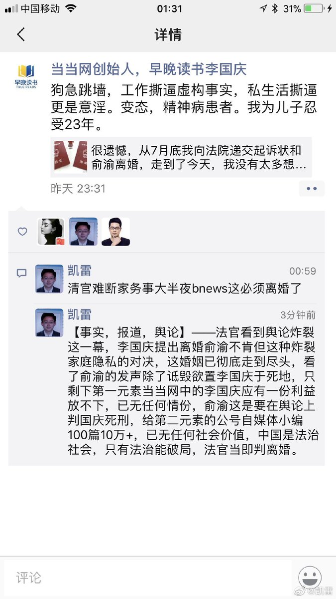 :speech_balloon:评:21 :+1:赞:113 :globe_with_meridians:转:24  

[10月24日 04:07]    老司机   @h5lpykl7tp6jjop    感谢这些香港有良心的医务人员，一直在秘密地治疗着受伤的抗议者，这是采访的一位地下医生，我加了中文字幕，谢谢你们。  :speech_balloon:评:68 :+1:赞:1630 :globe_with_meridians:转:908  

[10月24日 03:35]    GFHG SDKM   @zyx_yny    My costume for Halloween /Blizzcon came today!  :speech_balloon:评:59 :+1:赞:485 :globe_with_meridians:转:149  

[10月23日 21:44]    财经真相   @caijingxiang    新华社：国务院总理李克强20日下午在钓鱼台养源斋会见美国前财政部长保尔森。李克强积极评价保尔森基金会为推动中美关系发展，促进两国务实合作方面所做工作，希望基金会继续发挥中美友好的纽带作用，为促进中美关系健康稳定发展作出不懈努力。两个“赵家人”代表中美进行会谈！ 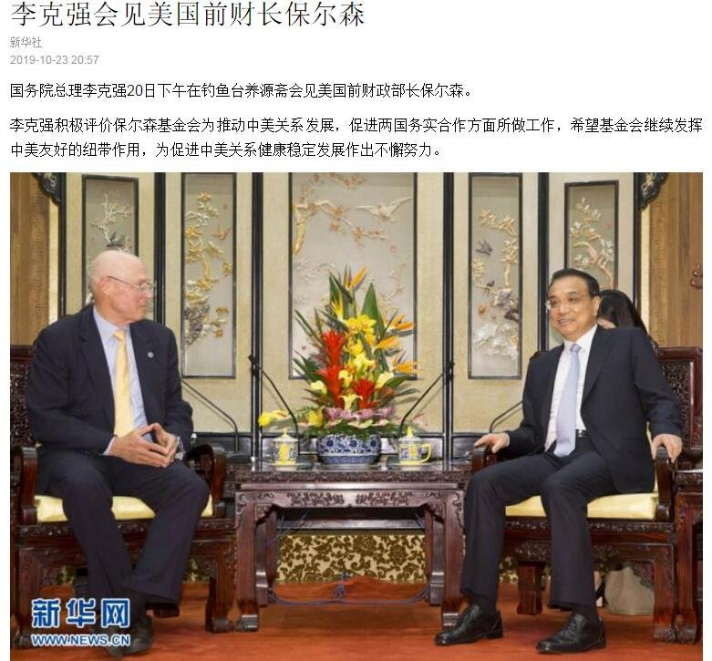 :speech_balloon:评:7 :+1:赞:74 :globe_with_meridians:转:15  

[10月23日 21:13]    财经真相   @caijingxiang    比特币第二轮崩盘中，上一波最低跌到3000美元，这一波怎么着也要跌到5000美元！  :speech_balloon:评:33 :+1:赞:155 :globe_with_meridians:转:36  

[10月23日 15:11]    财经真相   @caijingxiang    【推荐一个恶搞MV—你是我的习大大】我們不再怕美帝，每年都漲ＧＤＰ，中國有個偉大主席 
手機照片全是你，硬盤放的都是你，讓我們每天向你學習 
中華女兒非你不嫁因為你帥氣，外國勢力把你抹黑你都不生氣 
日本鬼子來了他們不敢放個屁，誰人罵你我就馬上操！他！媽！B https://www.youtube.com/watch?v=PCimU5x25ic …  :speech_balloon:评:23 :+1:赞:396 :globe_with_meridians:转:115  

[10月22日 20:13]    墙国铁拳现世报😷   @Socialistfist    網上有帖文指毛漢參與7月20日的守護香港集會，他澄清，幾個月前有人邀請他出席集會，他於台上是說希望香港恢復和平及希望政府了解年輕人多點。他強調自己不是「撐警」，稱現時才知道自己當時出席的場合是「撐警」集會，並說之後有其他「撐警」集會他都沒參加。
我相信他不是撐警～  :speech_balloon:评:5 :+1:赞:43 :globe_with_meridians:转:11  

[10月22日 17:59]    墙国铁拳现世报😷   @Socialistfist    补图  :speech_balloon:评:5 :+1:赞:112 :globe_with_meridians:转:13  

[10月22日 17:58]    墙国铁拳现世报😷   @Socialistfist    墙内一阵子狂喷  :speech_balloon:评:6 :+1:赞:64 :globe_with_meridians:转:12  

[10月22日 17:51]    墙国铁拳现世报😷   @Socialistfist    14年的战螂
15年的粉红
16年的愤青
17年的反贼
「我们终于还是成为了我们当初讨厌的人」

#社会主义铁拳  :speech_balloon:评:33 :+1:赞:362 :globe_with_meridians:转:114  

[10月22日 12:24]    老司机   @h5lpykl7tp6jjop    香港人太有才了精闢！

共產黨是什麼

如果把歷史還原他們是一幫士匪
如果把謊言拆穿他們是一幫騙子
如果把財產公開他們是一幫強盜
如果把帳目公開他們是一幫小偷
如果將他們的國籍公開他們全部是漢奸
如果把地圖打開他們是一幫賣國賊
如果將血腥運動揭開他們是種族滅絕屠夫
@realDonaldTrump 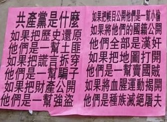 :speech_balloon:评:12 :+1:赞:383 :globe_with_meridians:转:206  

[10月21日 22:06]    墙国铁拳现世报😷   @Socialistfist    @remonwangxt 辣椒老师是否可以作为新漫画创意  :speech_balloon:评:1 :+1:赞:33 :globe_with_meridians:转:1  

[10月21日 21:17]    墙国铁拳现世报😷   @Socialistfist    补图  :speech_balloon:评:4 :+1:赞:75 :globe_with_meridians:转:13  

[10月21日 20:37]    墙国铁拳现世报😷   @Socialistfist    前香港印度协会主席曾经出现在支持香港警察的最前线。近日被高压水枪喷过后，出现在谴责香港警察的最前线
高压水枪的蓝色物质具有刺激性成分，会使人睁不开眼，咳嗽不止，并容易被警察辨识抓捕。

#社会主义铁拳
#社会主义特别行政区铁拳  :speech_balloon:评:41 :+1:赞:410 :globe_with_meridians:转:148  

[10月21日 18:16]    墙国铁拳现世报😷   @Socialistfist    有热心推友创立的电报群，同步更新的推特内容，喜欢用电报的可以关注
感谢这位推友的无私帮助 http://t.me/socialistfist   :speech_balloon:评:1 :+1:赞:46 :globe_with_meridians:转:8  

[10月21日 17:24]    墙国铁拳现世报😷   @Socialistfist    补充  :speech_balloon:评:4 :+1:赞:57 :globe_with_meridians:转:11  

[10月21日 17:23]    墙国铁拳现世报😷   @Socialistfist    自称在被房地产开发商骗取80万并且维权无果，患上抑郁症后。9月29后突然高频的在微博上关注香港局势。
发帖还债还是抑郁病发？

#社会主义铁拳  :speech_balloon:评:37 :+1:赞:194 :globe_with_meridians:转:70  

[10月20日 06:29]    凡賽堤/FORSETI   @FecharCCP    【#共产罪恶】香港中文大学女生吴傲雪（Sonia）在哭诉被拘留期间，遭到港警性暴力之后，连日来收到多封恐吓信及短消息，威胁她若再出面发声，将绑架及轮奸她，信中甚至写明“施暴计划”。
10/18周五吴傲雪在记者会上，公布她收到的恐吓及骚扰信，这些信中，有不少是用简体字书写，被怀疑来自中国大陆。  :speech_balloon:评:29 :+1:赞:405 :globe_with_meridians:转:280  

[10月20日 06:04]    凡賽堤/FORSETI   @FecharCCP    魔鬼在人間39

極權殺人恐怖組織正在用各種兇殘手段殺害我們的同胞....................................................................................................

魔鬼的罪行！被刺殺，身處多刀，肚腸都跑出來！  :speech_balloon:评:1 :+1:赞:7 :globe_with_meridians:转:8  

[10月20日 06:02]    凡賽堤/FORSETI   @FecharCCP    魔鬼在人間39

極權殺人恐怖組織正在用各種兇殘手段殺害我們的同胞....................................................................................................

魔鬼的罪行！已被殺  :speech_balloon:评:0 :+1:赞:4 :globe_with_meridians:转:4  

[10月19日 10:36]    凡賽堤/FORSETI   @FecharCCP    極權殺人恐怖組織的兇殘超乎人類想像  :speech_balloon:评:0 :+1:赞:2 :globe_with_meridians:转:0  

[10月19日 10:34]    凡賽堤/FORSETI   @FecharCCP    魔鬼在人間39

極權殺人恐怖組織正在用各種兇殘手段殺害我們的同胞....................................................................................................

魔鬼的罪行！黑警群毆直接致命打頭的兇殘  :speech_balloon:评:3 :+1:赞:63 :globe_with_meridians:转:44  

[10月19日 10:31]    凡賽堤/FORSETI   @FecharCCP    魔鬼在人間39

極權殺人恐怖組織正在用各種兇殘手段殺害我們的同胞....................................................................................................

魔鬼的罪行！地鐵車廂暴打無辜港民  :speech_balloon:评:0 :+1:赞:27 :globe_with_meridians:转:25  

[10月19日 08:03]    墙国铁拳现世报😷   @Socialistfist    她要是手抖@一个云南网警，是不是就进去了？  :speech_balloon:评:13 :+1:赞:76 :globe_with_meridians:转:11  

[10月19日 07:48]    墙国铁拳现世报😷   @Socialistfist    补图  :speech_balloon:评:4 :+1:赞:105 :globe_with_meridians:转:18  

[10月18日 21:53]    凡賽堤/FORSETI   @FecharCCP    15歲香港少年 :「我不會因懼怕自己將來所受的刑罰而停下，我會用我的年輕作為阻止極權吞噬香港的本錢，再多的刑責也不能令我畏怯退縮。香港愛了我15年，就用我未來的15年換來抗爭的養分，我想在30歲完成刑滿出獄時，還會感受到這仍是我最愛的香港！我，誓不低頭。」 https://m.ntdtv.com/b5/2019/10/18/a102688460.html?fbclid=IwAR3lmWVhl4YLi2Vq-9FANGtFkUe3PCPZ-ip_W0weDP_fzGHDx-v6hrvmKuo …  :speech_balloon:评:16 :+1:赞:326 :globe_with_meridians:转:144  

[10月18日 21:35]    凡賽堤/FORSETI   @FecharCCP    唔该幫手forward出去,家人同朋友都搵唔到呢位手足，已失蹤四日.如果有消息請聯络90796504  :speech_balloon:评:1 :+1:赞:26 :globe_with_meridians:转:36  

[10月17日 21:00]    凡賽堤/FORSETI   @FecharCCP    極權殺人恐怖組織已經開始展開對海外的自媒體誘捕計劃！！！
以合作發展，收購，投資為誘餌，實則釣魚，騙取你的個人資料，實行威逼利誘！為他們傳播假信息，假圖片和視頻！ 接下來將會有巨量的假信息，假圖片和視頻出現在網絡！

目的！故意製造黑警被打死，打傷等來掩蓋真相！污衊文明正義的港人！ https://twitter.com/FecharCCP/status/1184815328418783234 …  :speech_balloon:评:0 :+1:赞:8 :globe_with_meridians:转:4  

[10月17日 20:56]    凡賽堤/FORSETI   @FecharCCP    香港街面的黑警90%都是大陸來的黑警，真正的香港警察的警服，警徽，裝備已經都被上繳！！！

現職警長梁兆祥編號33678，曾獲長期服務奬章，種種跡象，有理由相信日前被年輕人弄傷頸部的「中國籍男子」X並非梁兆祥本人 。  :speech_balloon:评:1 :+1:赞:38 :globe_with_meridians:转:33  

[10月17日 20:46]    凡賽堤/FORSETI   @FecharCCP    極權殺人恐怖組織已經開始展開對海外的自媒體誘捕計劃！！！

以合作發展，收購，投資為誘餌，實則釣魚，騙取你的個人資料，實行威逼利誘！

和極權殺人恐怖組織合作最終的下場就是死無葬身之地！！！ 他們永遠與良知，正義為敵！ https://twitter.com/FecharCCP/status/1184799556246085632 …  :speech_balloon:评:1 :+1:赞:2 :globe_with_meridians:转:2  

[10月17日 20:15]    凡賽堤/FORSETI   @FecharCCP    畫面內容
记者：为何不抗争，就失去一切？
黎智英：失去自由就失去一切。
记者：还有美妙的城市和繁荣。
黎智英：那适合某些“国人”，有躯壳无灵魂，只想赚钱和“好”的生活，不管政治、自由、人权、法治，只要吃，“享受”人生。
记者：为何这些不足够？
黎智英：我们是人，不是狗。  :speech_balloon:评:3 :+1:赞:65 :globe_with_meridians:转:22  

[10月17日 20:03]    凡賽堤/FORSETI   @FecharCCP    極權殺人恐怖組織正在用各種兇殘手段殺害我們的同胞....................................................................................................

注！ 極權殺人恐怖組織用邪惡手段試圖殺害岑子傑！  :speech_balloon:评:0 :+1:赞:6 :globe_with_meridians:转:3  

[10月17日 19:53]    凡賽堤/FORSETI   @FecharCCP    出現的CCTV裡，在電梯，和各個場面的假陳彥霖演員。
扮陳彥霖故意錄製網絡傳播！

目的！串改時間點，混謠試聽，毀滅殺人證據！
 
極權殺人恐怖組織的恐怖只有你想不到，沒有它們做不到的！

要消除我們內心恐懼就要消滅極權！
 
消滅極權，人人有責！！！  :speech_balloon:评:2 :+1:赞:48 :globe_with_meridians:转:33  

[10月09日 00:47]    GFHG SDKM   @zyx_yny    "Son, when you grow up
You will be the savior of the broken
The beaten, and the damned?"
Please watch this powerful mv #HongKongProtester #hkprotests 
香港反送中護法戰爭(Hong Kong Defensive War 2019)：Welcome To The Black Parade  https://youtu.be/0yXTHODE24Q  via @YouTube  :speech_balloon:评:3 :+1:赞:16 :globe_with_meridians:转:4  

[10月05日 09:33]    凡賽堤/FORSETI   @FecharCCP    呼籲請求共同挖掘所有有關香港發生的事，越全面越好，不同角度，越多越好，包括被暗地抓捕的人員，特別是CCP 派出的各種偽裝身份，包括變身變裝行兇的一點一滴都要挖掘出來，把CCP 的邪惡下三濫手段的真相毫無保留的曝光在全世界面前！世界公知公義才能真正挽救和保護香港人！希望懂視頻編輯配上中英文 https://twitter.com/hjjohnson17/status/1178969916499746816 …  :speech_balloon:评:11 :+1:赞:19 :globe_with_meridians:转:10  

[03月13日 08:10]    老司机   @h5lpykl7tp6jjop    批评是批评家天生的使命！他们只感知对错，信奉真理，指出真相不吐不快，不在意权势和群众的喜好，从批评里不可能获得任何好处，但批评家愚直不改。在中国几乎所有人都讨厌批评家，喜欢阴谋家，因为他们只说好听的！可是就因为中国的批评家太少，中国几乎看不到未来和希望！  :speech_balloon:评:83 :+1:赞:184 :globe_with_meridians:转:40  

[01月10日 13:30]    纽约时报中文网   @nytchinese    每年一月，《纽约时报》​​会选出52个年度旅游目的地。将举办冬奥会的中国崇礼、炫目奢华的香港、日本濑户内各岛皆入选。
新的一年，你计划好要去哪里旅行了吗？ http://nyti.ms/2Tz9N06   :speech_balloon:评:308 :+1:赞:383 :globe_with_meridians:转:198  

