[11月22日 12:33]    财经真相   @caijingxiang    中国的年轻工人没有任何话语权，劳务诈骗在中国遍地开花，但是你却根本看不到任何新闻报道，每次看新闻说“用工荒”各种专家学者乱分析；从不提劳务外派这一最核心根源，对于绝大多数普通工人来说，脏、累、苦都还可以忍受，但是绝对无法忍受承诺的奖金被中介和工厂诈骗利用劳务外派诈骗！  :speech_balloon:评:1 :+1:赞:20 :globe_with_meridians:转:3  

[11月22日 12:25]    财经真相   @caijingxiang    中介与厂方演的双簧戏可以时每天都在上演，他们就像吸血鬼一样，吸食工人们的血汗钱，但是大部分年轻工人对此除了忍让以外没有任何办法，因为换一家也一样，他们唯一希望的就是下一家中介不是那么黑，正是这种制度诈骗才导致很多年轻人不愿意进厂，越是诈骗工厂越是找不到人，然后成本提高恶性循环！  :speech_balloon:评:2 :+1:赞:7 :globe_with_meridians:转:4  

[11月22日 12:19]    财经真相   @caijingxiang    劳务外派是中国同工不同酬的制度根源，工厂借助人力中介巧妙的把工人法律赋予的各种福利全部推拖干净，而且中介还会在发工资时以各种理由进行克扣。一工人说富士康入厂前承诺干满90天会给600元奖金，但是在最后三天却与中介合伙将员工故意外调到郑州，且不给任何路费，变相逼你离职！  :speech_balloon:评:4 :+1:赞:23 :globe_with_meridians:转:6  

[11月22日 12:06]    财经真相   @caijingxiang    这里大部分工厂时薪是20元，一天八小时就是160元；所有进厂的普工都是根劳动中介签的合同，他们属于劳务外派，其工资由中介发而不是工厂，也就是说他们在法律上是中介的员工，除了接受工厂管理外，出任何事情都和工厂没有关系，更不要说工厂的各种福利！  :speech_balloon:评:3 :+1:赞:32 :globe_with_meridians:转:6  

[11月22日 12:01]    BBC News 中文   @bbcchinese    泛民主派乘着近月示威浪潮，推出比往届更多的大量候选人参加竞争，令建制派阵营在这次选举受到巨大挑战。 https://bbc.in/2Oxpe8h   :speech_balloon:评:8 :+1:赞:17 :globe_with_meridians:转:6  

[11月22日 12:00]    纽约时报中文网   @nytchinese    • 菲律宾总统杜特地下令，全面禁止在公共场合吸电子烟。他还呼吁警方和军方帮助实施这一禁令，逮捕胆敢违反禁令之人。
• 泰国与老挝边境周四发生6.1级地震，震源深度10公里。泰国清迈震感明显，曼谷高层建筑出现摇晃。当晚该地区再现两起中级地震。
更多简报内容： http://nyti.ms/2OA0EUk   :speech_balloon:评:1 :+1:赞:1 :globe_with_meridians:转:0  

[11月22日 11:57]    财经真相   @caijingxiang    自从日本纪录片将三和曝光后，深圳加强了对三和人力资源市场的管理，出了设置栅栏外门禁刷身份证才能进；富士康在外人眼里是血汗工厂，但是相比其他工厂来说依旧是很多工人的首选，因为它的加班工资制度是最健全的；这里一份蛋炒饭才6元，几乎是全深圳最便宜的！ 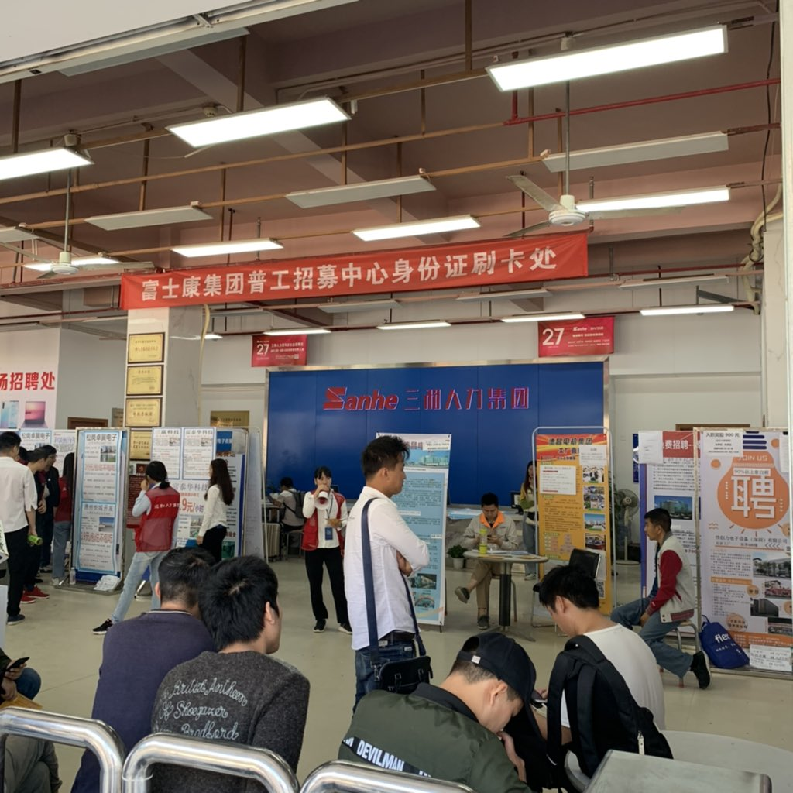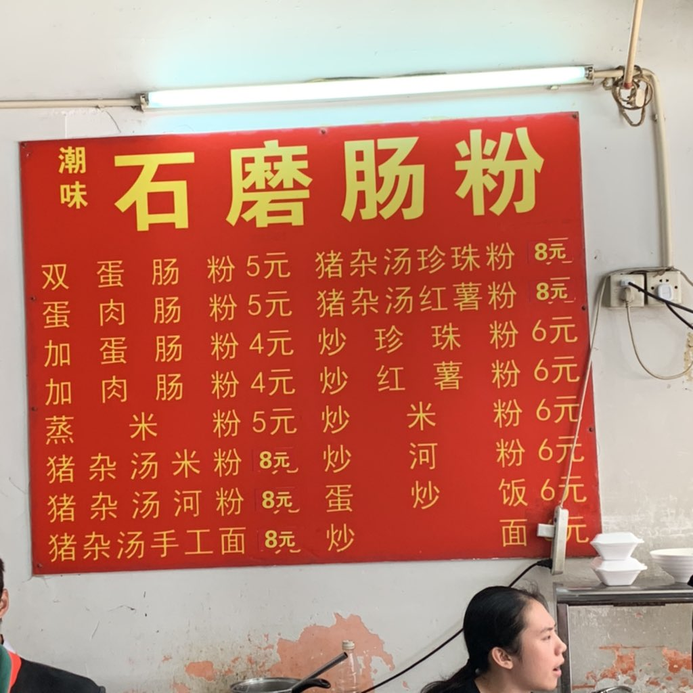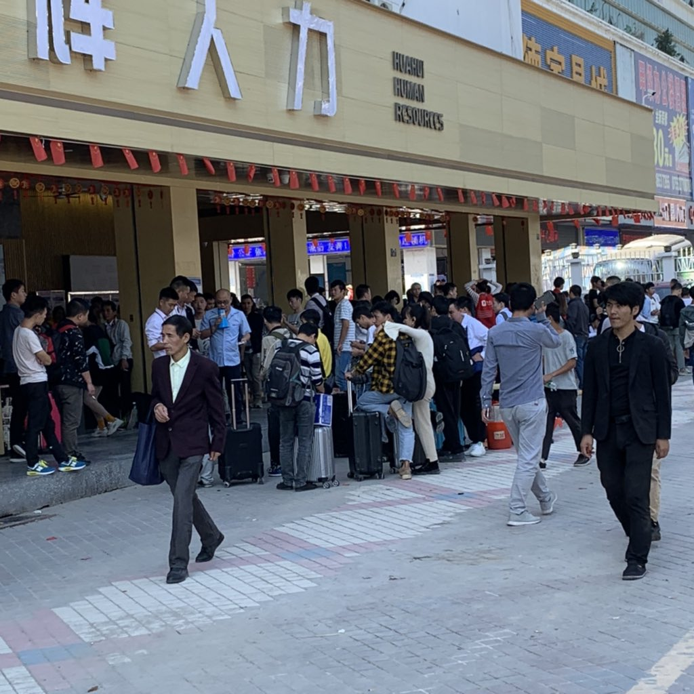 :speech_balloon:评:6 :+1:赞:66 :globe_with_meridians:转:18  

[11月22日 11:32]    BBC News 中文   @bbcchinese    BBC中文记者深入香港理大校园，跟留守者交谈，纪录下所见所闻。 https://bbc.in/2OcRHBv   :speech_balloon:评:24 :+1:赞:38 :globe_with_meridians:转:16  

[11月22日 11:30]    纽约时报中文网   @nytchinese    中美最终将解决他们在关税问题上的分歧，甚至可能达成一项让双方都说自己赢了的协议。
但美国前财长保尔森认为，别让这种结局蒙骗了。即使这两大经济体握手言和，它们之间的关系也可能变得更糟糕。保尔森说，危险在于，两国之间的敌意已将“军事视角和思想并入到经济政策中来”。 http://nyti.ms/2QFrUn1   :speech_balloon:评:11 :+1:赞:32 :globe_with_meridians:转:11  

[11月22日 11:00]    纽约时报中文网   @nytchinese    以色列总理内塔尼亚胡被正式起诉，他被控受贿、欺诈和背信罪。尽管法律规定并未要求其下台，但鉴于他已两次组阁失败，相关刑事诉讼可能会让他难以继续掌权。
这是以色列首次对现任总理提起诉讼，可能将加剧该国的政治瘫痪。
更多简报内容： http://nyti.ms/2OA0EUk   :speech_balloon:评:2 :+1:赞:5 :globe_with_meridians:转:1  

[11月22日 10:55]    纽约时报中文网   @nytchinese    北京警告可能干预香港司法裁决 http://nyti.ms/2D1mKcL https://twitter.com/stevenleemyers/status/1197145323568685057 …  :speech_balloon:评:7 :+1:赞:4 :globe_with_meridians:转:1  

[11月22日 10:51]    老司机   @h5lpykl7tp6jjop    而且你们玩女人用公权力用公款，别人用自己的钱，谁无耻？谁不道德？你们敢开放网络让信息言论自由吗？不准别人说话，自己大方厥词，也只有在中国这个几千年愚民社会你们这么肆无忌惮！在民主自由的社会你们就是一群流氓无赖，别以为你们敲诈人民搞到大笔钱财就想冒充上等人，即使穿上名牌也是强盗！呸  :speech_balloon:评:1 :+1:赞:20 :globe_with_meridians:转:4  

[11月22日 10:50]    纽约时报中文网   @nytchinese    简报：北京谴责香港人权法案；“新疆文件”说明什么  http://nyti.ms/2OA0EUk https://twitter.com/ccni/status/1197703791904198656 …  :speech_balloon:评:7 :+1:赞:4 :globe_with_meridians:转:1  

[11月22日 10:38]    财经真相   @caijingxiang    我已经不想看这样侮辱智商的新闻！ https://twitter.com/reuterscn/status/1197705163089367041 …  :speech_balloon:评:20 :+1:赞:114 :globe_with_meridians:转:22  

[11月22日 10:30]    纽约时报中文网   @nytchinese    《牛津词典》将climate emergency（气候紧急状态）列为2019年年度词汇。
它是从同环境有关的词汇候选名单中选出的，其中还包括climate action（气候行动）、climate denial（否认气候变化）、eco-anxiety（生态焦虑）、extinction（灭绝）和flight shame（飞行羞辱）。 http://nyti.ms/2O8MCtA   :speech_balloon:评:1 :+1:赞:10 :globe_with_meridians:转:4  

[11月22日 10:24]    老司机   @h5lpykl7tp6jjop    为中共做事没有申报，被判刑。祝贺 https://twitter.com/ttingxiao/status/1197693786366726144 …  :speech_balloon:评:11 :+1:赞:108 :globe_with_meridians:转:51  

[11月22日 10:19]    老司机   @h5lpykl7tp6jjop    掌握国家专政工具满世界安装摄像头，窥探别人隐私作为迫害反对者的手段，是最无耻下流的流氓行为，人民要求公平正义，你攻击别人私生活不检点，请问你们大批当官亿万贪污情妇上百你共产党引咎辞职下台了吗？你们居然动用国家机器挑剔个人行为，那什么人才可以质疑你们呢？有完人吗？你们是完人？呸！  :speech_balloon:评:4 :+1:赞:46 :globe_with_meridians:转:12  

[11月22日 09:53]    老司机   @h5lpykl7tp6jjop    爱国级别多，开始容易后面难，小粉红自己看看能不能有个好结果？ 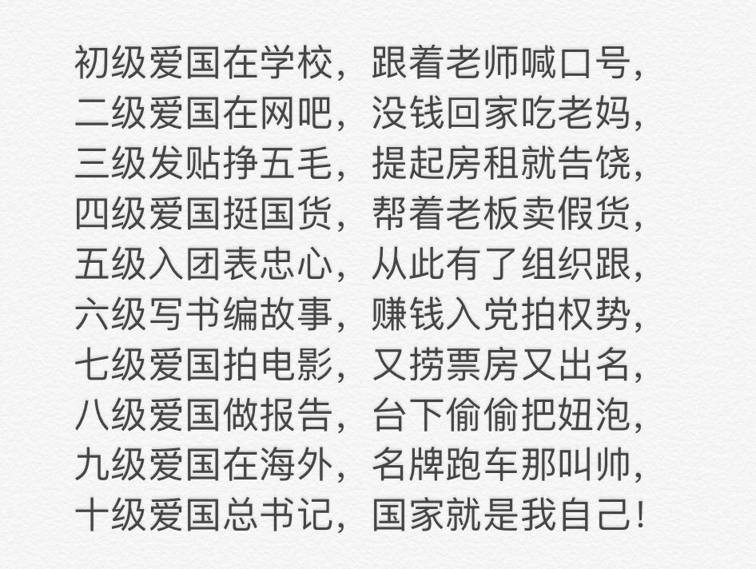 :speech_balloon:评:1 :+1:赞:20 :globe_with_meridians:转:4  

[11月22日 09:52]    纽约时报中文网   @nytchinese    早安！今日重点新闻包括：
北京谴责香港人权法案；“新疆文件”说明什么；美国前财长谈中美关系；以色列总理内塔尼亚胡被正式起诉；盘点英国王室百年丑闻；白宫前俄罗斯问题专家称乌克兰干预2016年大选是“虚构叙事”；泰国老挝边境周四发生6.1级地震……NYT简报带你速览今日要闻。 http://nyti.ms/2OA0EUk   :speech_balloon:评:9 :+1:赞:27 :globe_with_meridians:转:9  

[11月22日 07:40]    BBC News 中文   @bbcchinese    2019年10月，国际咨询公司麦肯锡曾发表报告有这样的结论：亚洲世纪已经到来。 果真如此，更为重要的问题是，中、美会如何相处和应对？ https://bbc.in/337I0bD   :speech_balloon:评:16 :+1:赞:18 :globe_with_meridians:转:6  

[11月22日 07:19]    BBC News 中文   @bbcchinese    玻利维亚变天对此有何影响呢？ https://bbc.in/2KJTxr7   :speech_balloon:评:6 :+1:赞:25 :globe_with_meridians:转:9  

[11月22日 03:07]    老司机   @h5lpykl7tp6jjop    @穿閲視界 
【约瑟夫法则】一个名字叫约瑟夫的奥地利人强奸了自己的女儿，在法庭上约瑟夫理直气壮的说："这是我家的事，你们不得干涉我的家庭事务，我家的事不用你们插手？我拒绝法律对我的审判！"
后来人们把这个无耻的辩驳叫做"约瑟夫法则"！  :speech_balloon:评:20 :+1:赞:454 :globe_with_meridians:转:264  

[11月22日 00:17]    老司机   @h5lpykl7tp6jjop    「辭職的女警」邱汶珊，BBC專訪。  :speech_balloon:评:4 :+1:赞:94 :globe_with_meridians:转:66  

[11月21日 21:51]    BBC News 中文   @bbcchinese    在英驻港总领馆前雇员郑文杰接受BBC访问，讲述自己被深圳警方拘留时“遭受酷刑”后，中国官方媒体今天发布视频，显示郑文杰“出入会所”及认罪画面，并指不存在刑讯逼供情况。 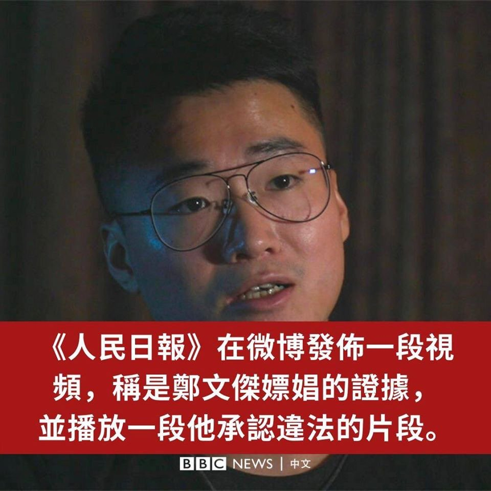 :speech_balloon:评:484 :+1:赞:471 :globe_with_meridians:转:156  

[11月21日 21:45]    BBC News 中文   @bbcchinese    望子成龙的家长们，或许你能从中受到一些启发？ https://bbc.in/35iCdRO   :speech_balloon:评:7 :+1:赞:33 :globe_with_meridians:转:12  

[11月21日 21:40]    财经真相   @caijingxiang    美国前财政部长亨利·保尔森在21日举行的“创新经济论坛”上说，当前中国和美国“脱钩”压力有所加大，越来越多军事领域的“零和思维”被运用到了商业领域。中美“脱钩”将给双方和世界带来诸多风险。 保尔森们为中共做的最后努力！ 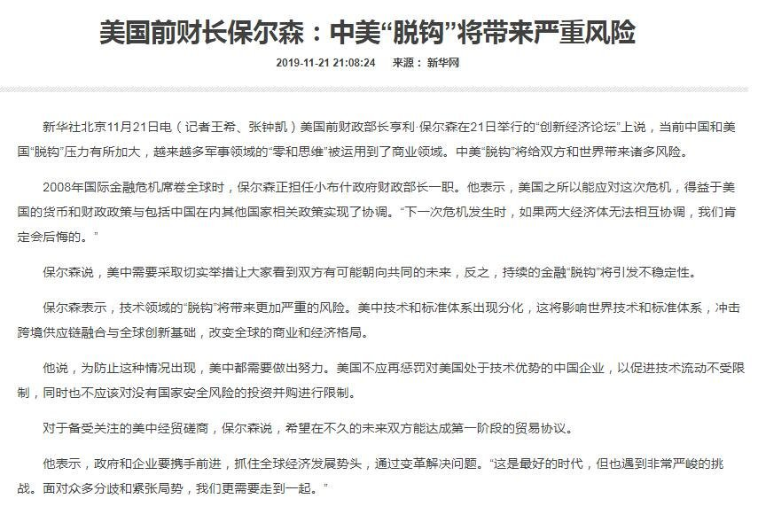 :speech_balloon:评:9 :+1:赞:96 :globe_with_meridians:转:25  

[11月21日 21:37]    财经真相   @caijingxiang    一旦港币脱钩，金融市场各大券商和外汇交易平台都会降低港币杠杆，甚至个别平台连人民币杠杆也会降低，如果杠杆降低到1:5，一手人民币空仓就需要缴纳保证金20000美元，如此一来大部分散户都将失去做空人民币的机会，各位交易员要做好准备，川普签署法案是分分钟钟的事！ https://twitter.com/Jkylebass/status/1197493554098163712 …  :speech_balloon:评:20 :+1:赞:367 :globe_with_meridians:转:174  

[11月21日 21:01]    老司机   @h5lpykl7tp6jjop    #自由伊朗

副主席先生，感谢您与伊朗人民并肩作战。毛拉们无情地向人们开火，有报道称有251人被杀，3,700多人受伤。互联网已关闭down.请提供互联网连接。 #Internet4Iran https://twitter.com/heshmatalavi/status/1197404848645398528 …  :speech_balloon:评:2 :+1:赞:38 :globe_with_meridians:转:19  

[11月21日 21:00]    纽约时报中文网   @nytchinese    全国人大常务委员会发言人臧铁伟在裁决后发表的一份声明中表示，推翻蒙面禁令“严重削弱”香港政府“依法应有的管治权”。他还说，这项裁决不符合《基本法》的规定。
该立法机关还没有打算推翻这一裁决。不过，它强烈暗示，国家安全问题应该由北京来决定，而不是由法院来决定。 http://nyti.ms/2D1mKcL   :speech_balloon:评:70 :+1:赞:17 :globe_with_meridians:转:4  

[11月21日 20:30]    纽约时报中文网   @nytchinese    艺术家刘虹表示，地方政府最初对9件作品表达了关切，其中包括一幅1993年的自画像，作品取材于她在“文革“末期的一张照片，照片中年轻的她背着步枪；另一幅作品是1988年的《七上八下》。
“也许他们觉得这是对中国现状的评价，“刘虹说。 http://nyti.ms/2OwaLt5   :speech_balloon:评:13 :+1:赞:25 :globe_with_meridians:转:5  

[11月21日 20:09]    财经真相   @caijingxiang    不知道会有多少皮包公司要注销，目前深圳中介开一家香港公司还要很多钱，很快这项业务就没有那么吸引人了！ https://twitter.com/dw_chinese/status/1197483577765699584 …  :speech_balloon:评:2 :+1:赞:93 :globe_with_meridians:转:19  

[11月21日 20:00]    纽约时报中文网   @nytchinese    #观点 泄露的文件强调了中国共产党的庞大权力：党可以逮捕成千上万的人，无限期地拘禁他们，同时让其他公民保持沉默，迫使官员服从。但它们也暗示了它的弱点。
官员们不仅在暗中抵制高层施加的政策——现在，他们还泄露了这些能证明有罪的文件。 http://nyti.ms/37t0O8r   :speech_balloon:评:12 :+1:赞:51 :globe_with_meridians:转:23  

[11月21日 19:34]    老司机   @h5lpykl7tp6jjop    造爱国谣言的又来了！
我国自主研发的天行一号航速48节！终于让美国也尝尝被技术封锁的滋味了，全球仅中国能造！
谷歌一搜！
加拿大海军1968年7月23日服役的布拉多尔号是是曾经世界上跑得最快的军舰。该艇的最高航速63节  :speech_balloon:评:6 :+1:赞:74 :globe_with_meridians:转:28  

[11月21日 19:00]    BBC News 中文   @bbcchinese    除学术生涯外，他还作为专家证人在法庭作证，甚至还曾在美国国会参议院委员会的听证会作证。 https://bbc.in/2CZEuFw   :speech_balloon:评:15 :+1:赞:37 :globe_with_meridians:转:10  

[11月21日 19:00]    纽约时报中文网   @nytchinese    周三，美国驻欧盟大使桑德兰在众议院情报委员会最新的弹劾调查听证会上发表了爆炸性证词。
在开场陈词中，桑德兰直接提及特朗普政府成员——包括特朗普本人——参与了向乌克兰施压的活动，要求对特朗普的政治对手展开调查。
本文盘点了桑德兰证词的一些要点： http://nyti.ms/2QCbhsk   :speech_balloon:评:4 :+1:赞:8 :globe_with_meridians:转:3  

[11月21日 18:30]    财经真相   @caijingxiang    《华尔街日报》记者魏玲玲、窦伊娃援引知情人士报道，中国首席代表已邀请美国贸易代表当面进行会谈！这两个华人记者是什么情况？  :speech_balloon:评:10 :+1:赞:66 :globe_with_meridians:转:6  

[11月21日 18:30]    纽约时报中文网   @nytchinese    本周，中国全国人民代表大会警告，如有必要，将动用其权力推翻香港的司法裁决，这可能会进一步加剧香港的紧张局势。此前，香港高院作出裁决，推翻了蒙面禁令。
尽管中国官员加大了对抗议者的谴责，但到目前，他们基本上把解决危机的任务交给港府。如今北京的耐心似乎正在耗尽。 http://nyti.ms/2D1mKcL   :speech_balloon:评:77 :+1:赞:199 :globe_with_meridians:转:87  

[11月21日 18:21]    财经真相   @caijingxiang    中国拟邀请美国进一步就第一阶段贸易进行磋商，消息公布后，人民币短线上涨，黄金下跌！  :speech_balloon:评:44 :+1:赞:144 :globe_with_meridians:转:16  

[11月21日 18:00]    BBC News 中文   @bbcchinese    津巴布韦近日公布外国援助数字显示，中国向该国提供363万美元，但中国却驳斥称其提供了1.36亿美元，相差近40倍。批评者认为当局试图绕过议会，积累外债。 https://bbc.in/2r7VYgh   :speech_balloon:评:85 :+1:赞:312 :globe_with_meridians:转:160  

[11月21日 18:00]    纽约时报中文网   @nytchinese    在政府的反对下，北京尤伦斯当代艺术中心取消了原定于下月举办的艺术家刘虹的个展，该展览具有强烈社会和历史主题。展览取消之际，中国对公民社会的打压力度加大，中美关系升温。
该中心负责人致信作品出借方说，在与当地文化部门交涉后，画廊本月接到将不会拿到批文的通知。 http://nyti.ms/2OwaLt5   :speech_balloon:评:18 :+1:赞:75 :globe_with_meridians:转:27  

[11月21日 17:59]    老司机   @h5lpykl7tp6jjop    非洲猪队友抱怨出大秘密！
都说了非洲人智商太低，典型的猪队友！信不信下回1分钱都不给你！
喂！还是援助我吧，援助我10亿美元，哪怕我只得到了10万美元，我都不会往外面说！ 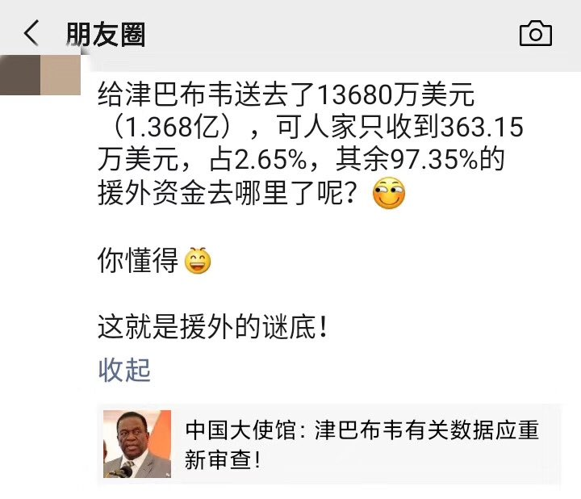 :speech_balloon:评:0 :+1:赞:35 :globe_with_meridians:转:25  

[11月21日 17:53]    老司机   @h5lpykl7tp6jjop     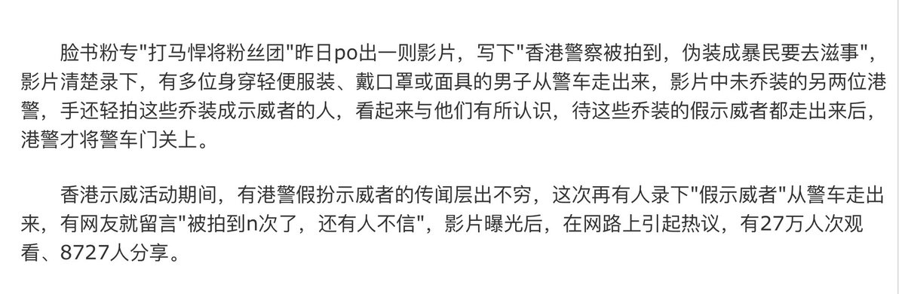 :speech_balloon:评:0 :+1:赞:6 :globe_with_meridians:转:2  

[11月21日 17:51]    老司机   @h5lpykl7tp6jjop    铁证如山！ https://youtu.be/5710y4o0QKw   :speech_balloon:评:1 :+1:赞:5 :globe_with_meridians:转:4  

[11月21日 17:30]    纽约时报中文网   @nytchinese    #图集【纽约城里藏着这些小可爱】喝汽水的浣熊、吃薯条的麻雀、啄披萨的鸽子、叼着老鼠的野猫......在纽约城里，你能见到比你想象中多得多的野生动物。
点击查看图集： http://nyti.ms/2qlMwWJ  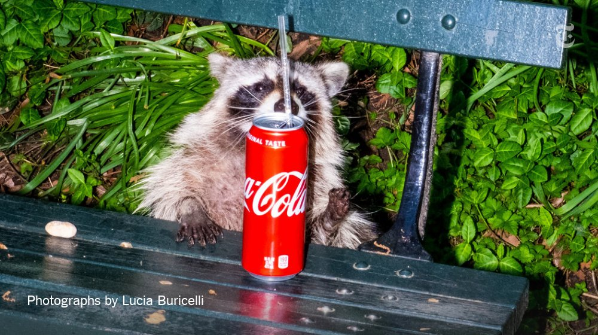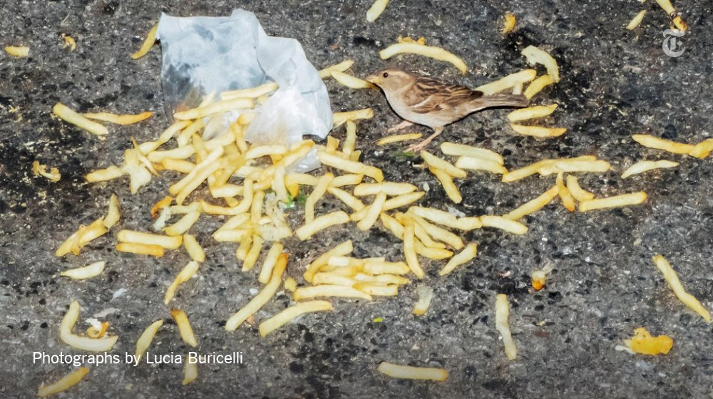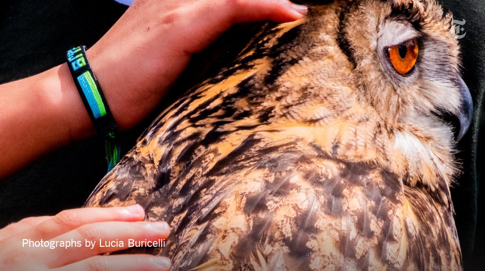 :speech_balloon:评:9 :+1:赞:18 :globe_with_meridians:转:4  

[11月21日 17:08]    老司机   @h5lpykl7tp6jjop    因为当年的绯闻，有人写出一本小说，因为这本小说，绑架书店老板，为了抓人方便弄了一个条例，因为一个条例弄出一场示威，为了不准示威，采取大力镇压，镇压未见成效，开始开枪杀人，因为开枪杀人，引起美国立法，因为美国立法于是江山不稳！

一个为了颜面的故事引发蝴蝶效应！从此改变铁打的江山！  :speech_balloon:评:111 :+1:赞:1943 :globe_with_meridians:转:627  

[11月21日 17:05]    老司机   @h5lpykl7tp6jjop    #香港 【 #懷疑警察殺人 】
警方抓到一個小朋友後，因發洩不滿把小妹妹丟進路軌，小妹妹大聲呼叫一聲之後就完全沒有動靜，極有可能因此而死亡
#請廣傳
#香港年青人正在被軍警大規模屠殺
#SOSHongKong
#HongKongPoliceState  :speech_balloon:评:98 :+1:赞:767 :globe_with_meridians:转:917  

[11月21日 17:02]    BBC News 中文   @bbcchinese    一条人民币1000多元的Lolita洋裙，转手就可以卖近5000元。中国年轻人都爱炒卖些什么？ https://bbc.in/35jrnv1   :speech_balloon:评:47 :+1:赞:87 :globe_with_meridians:转:18  

[11月21日 17:00]    纽约时报中文网   @nytchinese    #观点 近日泄露给《纽约时报》的文件不仅揭示了中国共产党新疆政策的依据和执行情况。它们还打开了一扇窗，表明中国如今如何运转，无论是在党国体制的顶层还是更接近底层。
这揭示了中共的两个特点：它的可怕权力和它的根本弱点。 http://nyti.ms/37t0O8r   :speech_balloon:评:54 :+1:赞:285 :globe_with_meridians:转:116  

[11月21日 16:32]    纽约时报中文网   @nytchinese    如果由特朗普签署成为法律，该法案还将要求国务院每年审查它在贸易方面给予香港的特别自治地位。
这一地位与中国大陆的关系是分开的，撤销这一地位将意味着美国与香港之间的贸易条件变得不那么有利。 http://nyti.ms/2XysMet   :speech_balloon:评:22 :+1:赞:45 :globe_with_meridians:转:15  

[11月21日 16:32]    老司机   @h5lpykl7tp6jjop    好文分享：好家伙！今天的朋友圈，竟然被一张废纸刷了屏！ 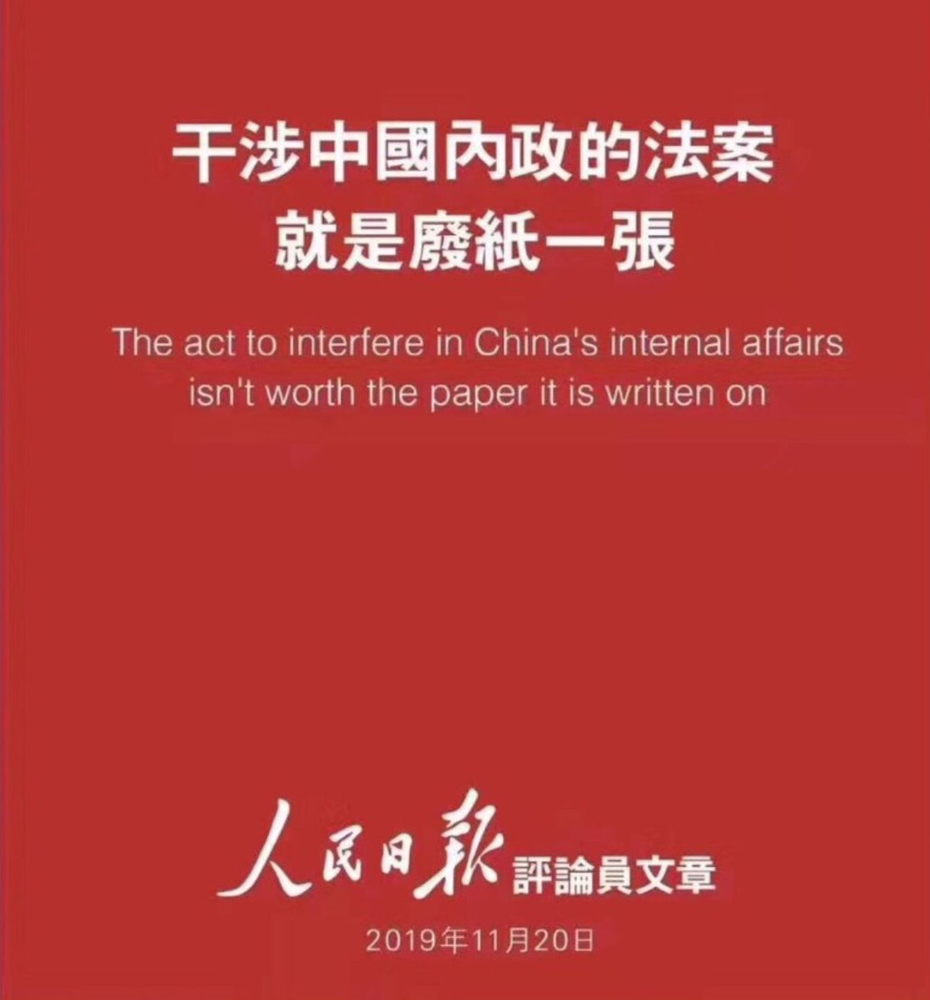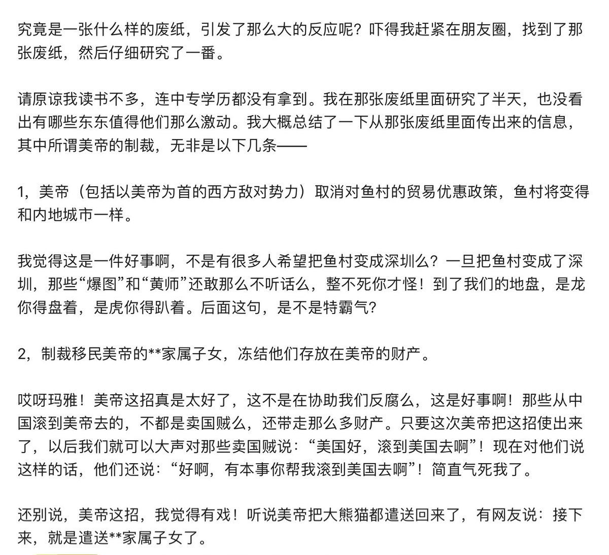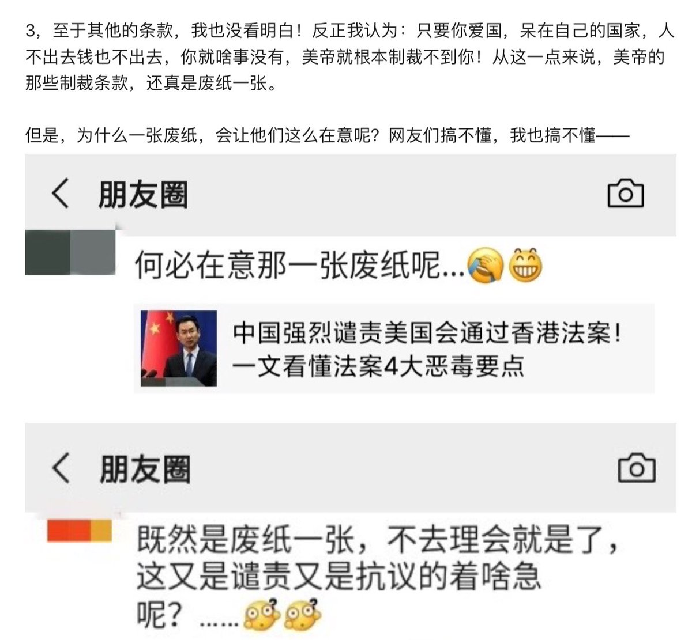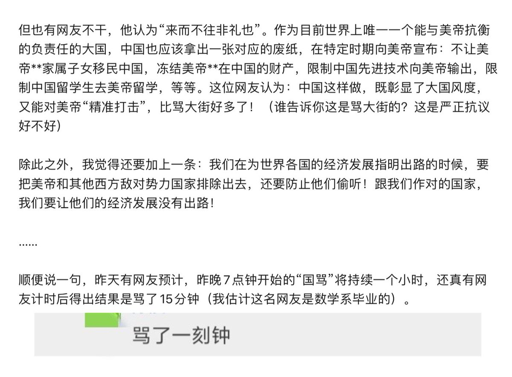 :speech_balloon:评:11 :+1:赞:203 :globe_with_meridians:转:79  

[11月21日 16:01]    BBC News 中文   @bbcchinese    安吉拉·凯丽（Angela Kelly）在她的《硬币另一面：女王、侍女和衣橱》（The Other Side of the Coin: The Queen, The Dresser and the Wardrobe ）一书中，披露了多年任女王御前侍女的岁月里，她看到的不为公众所知的女王的另一面。 https://bbc.in/2pB57gU   :speech_balloon:评:6 :+1:赞:18 :globe_with_meridians:转:7  

[11月21日 16:00]    纽约时报中文网   @nytchinese    手机濒临没电令人抓狂，眼前的公共充电站堪称救星。但美国检察官最近发出警告，提醒你最好三思而后行。调查发现，从机场的USB充电座到酒店的USB端口——当你连接手机的那一刻，黑客可能就已经在等着了。
他们可以借此读取和导出你的数据，包括你的密码，甚至可以对设备上锁。 http://nyti.ms/2XwbgaT   :speech_balloon:评:15 :+1:赞:75 :globe_with_meridians:转:40  

[11月21日 15:30]    纽约时报中文网   @nytchinese    参选金球奖时，《别告诉她》被认定为外语片，并且神秘晦涩的规则限制了影片去争取最佳喜剧和故事片奖。奥斯卡奖没有这方面的规定，但是由于电影是在美国制作，学院没有将王璐璐的影片归为国际长片竞逐者。
在电影业日益全球化的背景下，这样的规定会显得随意且与现实格格不入。 http://nyti.ms/2XsQ6KI   :speech_balloon:评:0 :+1:赞:10 :globe_with_meridians:转:3  

[11月21日 15:00]    纽约时报中文网   @nytchinese    《纽约时报》今日头版 https://twitter.com/ccni/status/1197407314619158529 …  :speech_balloon:评:0 :+1:赞:4 :globe_with_meridians:转:0  

[11月21日 14:51]    纽约时报中文网   @nytchinese    根据郑文杰的描述，他被绑在一把铁椅上进行审讯。过程中，秘密警察一直在向郑文杰施压，要求提供有关他的角色，以及英国和中国大陆人在警方称之为“暴乱”的抗议活动中所扮演的角色。
郑文杰说，在拘留期间，他大部分时间被单独监禁。在暴力威胁下，他承认自己嫖娼。 http://nyti.ms/37oc0Df   :speech_balloon:评:89 :+1:赞:104 :globe_with_meridians:转:43  

[11月21日 13:58]    GFHG SDKM   @zyx_yny    On #PolyU being the end game, this OL says it is 100% not the end game.  She says what we saw happened to the students at Poly, the way they were brutally treated by #HKPolice, there's no way HKers will forget.  We will keep on fighting!

#StandWithHongKong #HongKongProtests  :speech_balloon:评:98 :+1:赞:2246 :globe_with_meridians:转:1424  

[11月21日 13:16]    财经真相   @caijingxiang    香港特区政府：香港特区政府与国家商务部同意在《内地与香港关于建立更紧密经贸关系的安排》（《安排》）框架下进一步提升内地服务贸易对香港的开放水平。2004年中共为了控制在香港市场的人民币，就是通过这个紧密协议实现的，现在进一步推进开放，本质就是彻底将香港同化为内陆一个城市！  :speech_balloon:评:10 :+1:赞:153 :globe_with_meridians:转:44  

[11月21日 13:00]    BBC News 中文   @bbcchinese    BBC中文的调查发现，撑警联署数字的增长存在诸多疑点，有分析质疑组织者可能使用电脑程式自我复制联署。 https://bbc.in/35n5zPi   :speech_balloon:评:468 :+1:赞:1163 :globe_with_meridians:转:594  

[11月21日 12:23]    财经真相   @caijingxiang    目前该政策还处于建议阶段，未来一但成为美国法律，这将彻底斩断中共权贵借助中国上市公司洗钱通道，对各大家族构成致命打击！  :speech_balloon:评:6 :+1:赞:165 :globe_with_meridians:转:23  

[11月21日 12:20]    财经真相   @caijingxiang    重磅：美中经济安全审查委员会(USCC)于11月14日向国会提交，在这份2019年度对华战略竞争建议报告中，该组织提出了总计38条政策建议。其中，涉及证券市场的内容包括国会应颁布法律，禁止采用可变利益实体（Variable Interest Entities，VIE）架构的中国公司在美上市，引起广泛关注。  :speech_balloon:评:11 :+1:赞:273 :globe_with_meridians:转:119  

[11月21日 12:05]    BBC News 中文   @bbcchinese    非洲猪瘟让中国猪肉价格持续上涨，猪肉对中国人的生活到底有多重要？BBC记者前往广西南宁，和一个经营猪肉生意的家庭吃了顿饭。  :speech_balloon:评:70 :+1:赞:154 :globe_with_meridians:转:66  

[11月21日 11:50]    GFHG SDKM   @zyx_yny    We were in front of the Diet Members’ Office Building.

We will keep fighting with you, HKers
We will keep spreading what's happening in HK

You are not alone  :speech_balloon:评:320 :+1:赞:3083 :globe_with_meridians:转:1820  

[11月21日 10:00]    BBC News 中文   @bbcchinese    圣经记载的诺亚大洪水是地中海海水流入黑海所造成的？黑海海洋考古工程发现的古希腊沉船也许能够解开谜团。 https://bbc.in/2KBY5ju   :speech_balloon:评:6 :+1:赞:27 :globe_with_meridians:转:11  

[11月21日 09:59]    BBC News 中文   @bbcchinese    被中国大陆指因嫖娼而被拘留的英国驻港领馆前雇员郑文杰接受BBC独家专访，称遭到“国保”虐待，还在遭关押的地方看到很多香港人。 https://www.youtube.com/watch?v=kjdA43B5ACw …  :speech_balloon:评:277 :+1:赞:271 :globe_with_meridians:转:102  

[11月21日 09:48]    财经真相   @caijingxiang    据传农村宅基地测量工作将于今年年底前完成，明年五一前完成登记，也就是说中共新一轮大折腾最快将于明年下半年开始，但愿那是中国已经变天！  :speech_balloon:评:47 :+1:赞:309 :globe_with_meridians:转:88  

[11月21日 09:41]    BBC News 中文   @bbcchinese    美国参议院通过《香港人权和民主法案》，对于特朗普而言是一把“双刃剑”，可能给他更多筹码向中国要价，也可能破坏中国达成协议的意愿。 https://bbc.in/2OtOITW   :speech_balloon:评:78 :+1:赞:175 :globe_with_meridians:转:56  

[11月21日 09:26]    财经真相   @caijingxiang    北京时间21日凌晨，美联储公布的10月政策会议记录显示，所有与会者都认为负利率目前在美国并不是有吸引力的货币政策工具。美联储官员在同意今年第三次降息后按兵不动的同时，强调美国经济仍面临很高风险。在美联储公布最近一次政策会议的纪要之后，交易员维持对美联储在2020年第三季度末之前降息的预期  :speech_balloon:评:1 :+1:赞:40 :globe_with_meridians:转:4  

[11月21日 08:42]    财经真相   @caijingxiang    人民币在悄悄地贬值，香港法案通过以后，市场对中美贸易谈判乐观情绪逐渐消失，人民币空头贬值压力再次聚集，这一波7.2不是终点！  :speech_balloon:评:43 :+1:赞:819 :globe_with_meridians:转:183  

[11月21日 07:44]    BBC News 中文   @bbcchinese    这栋17世纪的房产的命运一直是一个漫长的争议的主题。 https://bbc.in/2D5Gwnq   :speech_balloon:评:0 :+1:赞:18 :globe_with_meridians:转:9  

[11月21日 07:12]    BBC News 中文   @bbcchinese    俄罗斯干预民主政治的问题已经成为大西洋两岸具有潜在爆炸性的政治消息。 https://bbc.in/2OzfiLx   :speech_balloon:评:29 :+1:赞:44 :globe_with_meridians:转:12  

[11月21日 06:52]    BBC News 中文   @bbcchinese    有些美食在吃之前一定要处理得当，否则不但危险，还可能致人于死地。 https://bbc.in/33615en   :speech_balloon:评:3 :+1:赞:25 :globe_with_meridians:转:13  

[11月21日 04:06]    老司机   @h5lpykl7tp6jjop    香港回归终于全面大陆化，东方之珠在中共手上成为火球！  :speech_balloon:评:0 :+1:赞:21 :globe_with_meridians:转:7  

[11月21日 01:39]    老司机   @h5lpykl7tp6jjop    层层转包在天朝不是笑话！  :speech_balloon:评:0 :+1:赞:51 :globe_with_meridians:转:35  

[11月21日 00:57]    GFHG SDKM   @zyx_yny    Yesterday’s passage of the #HongKong Human Rights & Democracy Act was a good day in the struggle to resist totalitarian #China & its bid for domination. But it was not the last day. We have a long road ahead to protect our jobs, our workers & our security.  :speech_balloon:评:1550 :+1:赞:15348 :globe_with_meridians:转:10006  

[11月21日 00:12]    墙国铁拳现世报😷   @Socialistfist      :speech_balloon:评:5 :+1:赞:180 :globe_with_meridians:转:26  

[11月21日 00:07]    墙国铁拳现世报😷   @Socialistfist    评论区的孙笑川们开始了一贯的颠倒黑白，全过程视频在此 https://twitter.com/hkwuliff/status/1193726052184387584?s=09 …  :speech_balloon:评:7 :+1:赞:132 :globe_with_meridians:转:28  

[11月20日 23:56]    墙国铁拳现世报😷   @Socialistfist    双十一当天，因为目睹正在跟拍的香港警察往女儿所在楼发射催泪弹，哭的撕心裂肺的hk01记者（亲中媒体）之事，被传到墙内变成了“ 反华媒体记者女儿被催泪弹”，微博评论区中粉红战螂瞬间高潮。
不知该记者和其同事看到了该有如何反应
#社会主义铁拳
#社会主义特别行政区铁拳  :speech_balloon:评:91 :+1:赞:878 :globe_with_meridians:转:356  

[11月20日 23:16]    财经真相   @caijingxiang    2019年出生人口预估约1100万，较2018年1523万再次断崖！按照这个趋势，几年内人口就会负增长！  :speech_balloon:评:78 :+1:赞:406 :globe_with_meridians:转:151  

[11月20日 22:24]    老司机   @h5lpykl7tp6jjop    CCAV代表伊朗人民喜迎油价上涨， 别不相信你的耳朵  
"伊朗民众走上街头，支持政府调控油价，以渡过经济危机。"  :speech_balloon:评:264 :+1:赞:1701 :globe_with_meridians:转:798  

[11月20日 22:15]    BBC News 中文   @bbcchinese    美国经济学者和决策者迷信自由市场，认为不需要政府干涉，市场本身足以有效地驱动创新。相比之下，中国的技术官僚则不受这种争论束缚，他们只在乎什么在实际中有效。 https://bbc.in/2OoNIAw   :speech_balloon:评:56 :+1:赞:50 :globe_with_meridians:转:15  

[11月20日 21:56]    GFHG SDKM   @zyx_yny    The first day that schools resumed, #hkpolice deliberately targeted high school students to stop and search for no reason. As many #hongkongers suggest, being young becomes a crime as #China and #HKGov are totally out of reach of the whole city.  :speech_balloon:评:240 :+1:赞:5363 :globe_with_meridians:转:5812  

[11月20日 21:14]    BBC News 中文   @bbcchinese    具体可以学什么？美国面前有哪些挑战？听听专家怎样说。 https://bbc.in/2OsYdmq   :speech_balloon:评:34 :+1:赞:34 :globe_with_meridians:转:8  

[11月20日 14:09]    老司机   @h5lpykl7tp6jjop    与内地真的不一样！他们太勇敢了！国内8964以后还敢这样吗？  :speech_balloon:评:84 :+1:赞:1946 :globe_with_meridians:转:697  

[11月20日 13:57]    财经真相   @caijingxiang    恩，应该在这问题上明确声明，关于理工大学生里有领导亲属的传言，是别有用心之人的谣言，恶意中伤抹黑国家领导人，其用心极为险恶！建议官媒照此发表声明以正视听！  :speech_balloon:评:2 :+1:赞:177 :globe_with_meridians:转:24  

[11月20日 13:45]    财经真相   @caijingxiang    看了一下，墙内关于的事大都是颠倒黑白的宣传，各种帮腔的自媒体以及V们都提到了理工大的事，但是关于朱孙女也在学校里的事，没有任何人敢说，哪怕是颠倒黑白的宣传都不敢，似乎根本就没有这件事！以前任消息他们都会反驳，唯独这件事让他们讳莫如深！  :speech_balloon:评:47 :+1:赞:723 :globe_with_meridians:转:195  

[11月20日 12:36]    老司机   @h5lpykl7tp6jjop    Tin Shui Wai #HongKong: #HongKongProtesters were delaying MTR service. A group of pro-Beijing men grabbed a high school girl into the train and beat her up. 

This is the violence that Carrie Lam, her puppet gov’t and terrorist #Police will never condemn. 

#HongKongProtest  :speech_balloon:评:328 :+1:赞:3575 :globe_with_meridians:转:4695  

[11月20日 11:43]    老司机   @h5lpykl7tp6jjop    中国共产党PLA  使用AR-15步枪及SIG516半自动突击步枪扫射，对理大学生进行大屠杀！！！  :speech_balloon:评:95 :+1:赞:856 :globe_with_meridians:转:886  

[11月19日 19:20]    墙国铁拳现世报😷   @Socialistfist    腾讯铁拳，重锤出击  :speech_balloon:评:33 :+1:赞:282 :globe_with_meridians:转:69  

[11月19日 15:33]    GFHG SDKM   @zyx_yny    The tyranny forced us live as middle age warrior  :speech_balloon:评:1 :+1:赞:50 :globe_with_meridians:转:19  

[11月19日 14:41]    GFHG SDKM   @zyx_yny    This scene is no longer only appearing in movies. It’s happening in our reality.

Escaping from death. 

She’s not a #stuntman, she’s just a normal citizen, normal student.

#StandWithHongKong
#Dramaislife
#Lifeisdrama
#PolyUHongKong  :speech_balloon:评:87 :+1:赞:1537 :globe_with_meridians:转:1474  

[11月18日 23:48]    墙国铁拳现世报😷   @Socialistfist    腾讯也是扔了一个战术式社会主义核弹吗  :speech_balloon:评:81 :+1:赞:624 :globe_with_meridians:转:131  

[11月18日 21:23]    墙国铁拳现世报😷   @Socialistfist    曾经推特中文圈最后一片净土还是被污染了
如果您想要批量屏蔽某些账号，建议大家参考转推内容。
如果您只是追求“眼不见心不烦”， 可以参考下图，选择设置-高级过滤-隐藏通知
推特世界归于宁静  https://twitter.com/keepcnsecurity/status/1195607211940040705 …  :speech_balloon:评:65 :+1:赞:115 :globe_with_meridians:转:40  

[11月18日 20:34]    墙国铁拳现世报😷   @Socialistfist    这小伙还是个文案人才，手动滑稽  :speech_balloon:评:23 :+1:赞:366 :globe_with_meridians:转:42  

[11月18日 20:13]    墙国铁拳现世报😷   @Socialistfist    推特做不到的事情，腾讯却做到了

#战螂在推特
#社会主义铁拳  :speech_balloon:评:252 :+1:赞:1835 :globe_with_meridians:转:531  

[11月18日 10:41]    GFHG SDKM   @zyx_yny    With students in Hong-Kong who are blocking the streets to bring economic pressure on China to ensure democratic freedoms in HK! #StandWithHongKong @Andychanhotin @FreedomHKG @Stand_with_HK @hk_watch @HKWORLDCITY #HongKongProtests @joshuawongcf #Freedom  :speech_balloon:评:28 :+1:赞:708 :globe_with_meridians:转:555  

[11月18日 09:41]    GFHG SDKM   @zyx_yny    Trans
"About 200 #PolyU students tried to escape in the direction of Hunghom. Not sure if they made it or not. Hope all managed to escape." https://twitter.com/meilong15/status/1196240402988187648 …  :speech_balloon:评:7 :+1:赞:44 :globe_with_meridians:转:41  

[11月18日 09:32]    GFHG SDKM   @zyx_yny    Stop using #PolyU Wifi for god’s sake.
#HongKongProtests https://twitter.com/hengyanlo/status/1196156883679055872 …  :speech_balloon:评:4 :+1:赞:111 :globe_with_meridians:转:120  

[11月18日 08:54]    GFHG SDKM   @zyx_yny    08:30 students tried to leave #PolyU but #HongKong #Police continued to tear gas them, forcing them to return inside. This is in contradiction to what Poly U President JC Teng said, that cops have agreed to let students leave peacefully. 
@cityusucbc
#PoliceBrutality  :speech_balloon:评:55 :+1:赞:843 :globe_with_meridians:转:1062  

[11月18日 08:50]    GFHG SDKM   @zyx_yny    #PolyU protesters eventually retreat after driving the police back in the face of whizzing rubber bullets and gas pellets. They’re mostly inside the campus again. Police showing no mercy #HK #HongKongProtests #StandWithHongKong  :speech_balloon:评:266 :+1:赞:4918 :globe_with_meridians:转:5383  

[11月18日 08:45]    GFHG SDKM   @zyx_yny    The #HKPolice threatening to shoot press, first-aid as they were attempting to cross the road. This is on the perimeter of #PolyU and some civilians who came here to support the protesters still inside have been injured and/or arrested at the TST east fountain across this road.  :speech_balloon:评:25 :+1:赞:616 :globe_with_meridians:转:827  

[11月18日 08:38]    GFHG SDKM   @zyx_yny    Protestors are trying to escape from Hong Kong Polytechnic University, but HK Police fire tear gas to force them back IN. HK Police have given up any pretense that they try to de-escalate and disperse. Instead, it is evident that their intention is to attack, arrest, and punish. https://twitter.com/JessiePang0125/status/1196224442491396097 …  :speech_balloon:评:34 :+1:赞:996 :globe_with_meridians:转:1151  

[11月18日 08:06]    GFHG SDKM   @zyx_yny    this is the same shameful #PolyU head who refused to shake hands with students wearing a mask during graduation ceremony. Still the same shameful head who escaped the clashes and shrinked his duty for the whole of the clash that lasts for days. https://twitter.com/nytmay/status/1196202338102341633 …  :speech_balloon:评:58 :+1:赞:789 :globe_with_meridians:转:652  

[11月18日 06:02]    GFHG SDKM   @zyx_yny    Around 30 minutes ago at 05:30AM, #HKPolice have entered #PolyU campus. At least 3 protestors subdued, 1 seen with blood all over face during arrest

#PolyU #PolyUMassacre #PolyUSOS
#SOSHK #HongKong #StandwithHK
Vid via Telegram  :speech_balloon:评:47 :+1:赞:1614 :globe_with_meridians:转:2264  

[11月18日 05:16]    GFHG SDKM   @zyx_yny    

They are still fighting! 

#SOSPolyU
#HKPoliceState  :speech_balloon:评:175 :+1:赞:3566 :globe_with_meridians:转:3252  

[11月18日 02:48]    GFHG SDKM   @zyx_yny    [PolyU frontliner's last words?]

"If very unfortunately I die in Kowloon today, even though history may just remember me as a number, I hope HKers will remember all of our deeds, stay angry & rational & turn our revenge chants into reality."

#SOSHK

OP: https://lihkg.com/thread/1731186/page/1 …  :speech_balloon:评:110 :+1:赞:2125 :globe_with_meridians:转:1997  

[11月18日 01:32]    GFHG SDKM   @zyx_yny    “It is fxxking mad!” People with their cars in Tsim Sha Tsui hoping to support #PolyU students (but were stuck due to roadblocks) received tear gas treatment from #HongKong police. Lots of swearing. Video circulated online. #HongKongProtests  :speech_balloon:评:81 :+1:赞:1419 :globe_with_meridians:转:1592  

[11月18日 01:12]    GFHG SDKM   @zyx_yny    Old friend, world renowned photographer, Stephen Boitano, sharing his concerns on escalated police violence in Hk. Please  pray it is a very dangerous situation. #StandWithHongKong #HongKongProtests @FreedomHKG @Stand_with_HK @HKWORLDCITY @hk_watch @Andychanhotin @Andychanhotin  :speech_balloon:评:701 :+1:赞:9588 :globe_with_meridians:转:9713  

[11月18日 00:41]    墙国铁拳现世报😷   @Socialistfist    推荐一些启发小编开办《墙国铁拳现世报》的parody或自媒体推号：
中国民调@PollChina 
新蛤社@XinHaNewsAgency
推特小红旗@Xhnsoc__Redflag
共青团中央 (学习小组）@CPCYouthLeague
乳透社@Ruters0615 
胡锡进（流亡）@HuXijin_huaiqiu
LIFETIME 視界@LifetimeUSCN
不分先后，欢迎推荐后续补充  :speech_balloon:评:13 :+1:赞:160 :globe_with_meridians:转:26  

[11月17日 23:42]    GFHG SDKM   @zyx_yny    Members of Guarding Our Kids, formed by mothers and fathers, decided to stay with #PolyU students who were trapped in the campus: We won't leave our 'kids' behind. We will safeguard this place. We want everyone here can go home. #HongKongProtesters  :speech_balloon:评:632 :+1:赞:10609 :globe_with_meridians:转:9918  

[11月16日 18:05]    墙国铁拳现世报😷   @Socialistfist    小编要郑重警告刘女士，国家是有寻衅滋事和煽动颠覆这些国民待遇的。

#社会主义铁拳  :speech_balloon:评:96 :+1:赞:731 :globe_with_meridians:转:211  

[11月15日 08:24]    墙国铁拳现世报😷   @Socialistfist    小编认为本月最佳铁拳，滋磁不滋磁啊？  :speech_balloon:评:38 :+1:赞:775 :globe_with_meridians:转:44  

[11月15日 08:21]    墙国铁拳现世报😷   @Socialistfist    面对大陆的善意，台大教授自信的进去了---亲中学者 施正屏
#社会主义铁拳  :speech_balloon:评:187 :+1:赞:1889 :globe_with_meridians:转:826  

[11月15日 01:03]    墙国铁拳现世报😷   @Socialistfist    那必须和兄弟你平分啊，猪肉价格这么高  https://twitter.com/Dofuralanmingo/status/1194993538292826114 …  :speech_balloon:评:18 :+1:赞:227 :globe_with_meridians:转:11  

[11月14日 19:09]    墙国铁拳现世报😷   @Socialistfist    北京废青，危言耸听

#社会主义铁拳  :speech_balloon:评:64 :+1:赞:650 :globe_with_meridians:转:166  

[11月14日 18:36]    财经真相   @caijingxiang    中共基建没有钱，很多网友简单的认为开动印钞机就行，这其实是大错特错，中共央行印的每一分钱，都必须有对应的相应的价值才行，否则就是无锚印钞，汇率崩盘！过去20年央行印钞都是以债务为基础的。比如，房奴的房贷，当房奴申请贷款时，本质是向央行抵押了自己未来30年的劳动力。 https://twitter.com/aspeltuo8/status/1194923278646816768 …  :speech_balloon:评:64 :+1:赞:778 :globe_with_meridians:转:275  

[11月14日 01:30]    墙国铁拳现世报😷   @Socialistfist    支持言论自由不受侵害 https://twitter.com/keepcnsecurity/status/1194633823964631046 …  :speech_balloon:评:8 :+1:赞:124 :globe_with_meridians:转:32  

[11月13日 18:38]    墙国铁拳现世报😷   @Socialistfist    一天二更，快夸我。
最近推友投稿质量很高，再次感谢！  :speech_balloon:评:19 :+1:赞:230 :globe_with_meridians:转:4  

[11月13日 18:38]    墙国铁拳现世报😷   @Socialistfist    祝这位推友早日康复

#战螂在推特  :speech_balloon:评:26 :+1:赞:281 :globe_with_meridians:转:52  

[11月13日 18:15]    墙国铁拳现世报😷   @Socialistfist    卧床狙击手

#社会主义铁拳  :speech_balloon:评:114 :+1:赞:739 :globe_with_meridians:转:184  

[11月12日 19:22]    墙国铁拳现世报😷   @Socialistfist    从2018年9月到现在频繁微博维权，神奇的是，小编就是没看出来他举报的贪污腐败是什么内容  :speech_balloon:评:4 :+1:赞:158 :globe_with_meridians:转:11  

[11月12日 07:22]    凡賽堤/FORSETI   @FecharCCP    11日早在西湾河开枪射伤示威者的港警关家荣身份被起底，其担任家教会主席的德望学校师生、家长及校友发起联署要求解除其在该校的职务。其两个女儿在该校就读。另有消息指，关家荣受过“大陆警察部门”特殊培训。下面这个小视频，足以解释这场血案的真相：这是流氓国家自上而下有计划的谋杀。  :speech_balloon:评:21 :+1:赞:266 :globe_with_meridians:转:177  

[11月12日 07:14]    凡賽堤/FORSETI   @FecharCCP    救救悲慘的香港 #HKSOS

香港黑警拔槍亂殺港民！已多人中槍和死亡！

天滅極權！  :speech_balloon:评:3 :+1:赞:15 :globe_with_meridians:转:12  

[11月12日 07:11]    凡賽堤/FORSETI   @FecharCCP    11.11 香港殺人魔家庭資料！
全世界通緝這殺人魔全家！  :speech_balloon:评:48 :+1:赞:14 :globe_with_meridians:转:12  

[11月12日 07:07]    凡賽堤/FORSETI   @FecharCCP    救救悲慘的香港 #HKSOS

香港黑警拔槍亂殺港民！已多人中槍和死亡！  :speech_balloon:评:3 :+1:赞:9 :globe_with_meridians:转:8  

[11月12日 06:57]    凡賽堤/FORSETI   @FecharCCP    天滅流氓政權！！！CCP極權殺人恐怖組織正在用各種兇殘手段屠殺我們的同胞...................

看看這些大陸的黑警（公安，武警，士兵裝扮成香港警察）是如何沒有人性的屠殺香港學生！！！

天滅流氓政權！！！天滅CCP！！！  :speech_balloon:评:1 :+1:赞:22 :globe_with_meridians:转:24  

[11月12日 06:42]    凡賽堤/FORSETI   @FecharCCP    天滅流氓政權！！！CCP極權殺人恐怖組織正在用各種兇殘手段殺害我們的同胞...................

看看這些大陸的黑警（公安，武警，士兵裝扮成香港警察）是如何沒有人性的屠殺香港學生！！！

那個小年輕不知道是休克還是已經死亡！

天滅流氓政權！！！天滅CCP！！！  :speech_balloon:评:34 :+1:赞:22 :globe_with_meridians:转:21  

[11月12日 06:25]    凡賽堤/FORSETI   @FecharCCP    坐水凳（英語：waterboarding）是水刑的一種，做法是將受害人固定其雙手雙腳，在頭部放上布後持續澆水。如此會讓受害人產生溺水的錯覺而心生恐懼。雖然坐水凳不在身上留下可辨識的傷痕，但受害人在過程中會因為嗆到水甚至吸入性肺炎而受傷害。另外有些人因此導致心理方面的傷害，是酷刑的一種。  :speech_balloon:评:1 :+1:赞:37 :globe_with_meridians:转:33  

[11月05日 04:28]    凡賽堤/FORSETI   @FecharCCP    急救香港  #HKSOS！！！

天滅流氓政權！！！極權殺人恐怖組織正在用各種兇殘手段殺害我們的同胞..................................................

流氓政權的極權殺人恐怖組織蓄意謀殺香港年輕人！（13）

被暴力制服的年輕人已經休克，還殘暴折斷手！

兇殘，殘暴手段令人髮指到已經超越納粹！  :speech_balloon:评:0 :+1:赞:3 :globe_with_meridians:转:12  

[11月05日 04:25]    凡賽堤/FORSETI   @FecharCCP    急救香港  #HKSOS！！！

天滅流氓政權！！！極權殺人恐怖組織正在用各種兇殘手段殺害我們的同胞..................................................

流氓政權的極權殺人恐怖組織蓄意謀殺香港年輕人！（12）
兇殘，殘暴手段令人髮指到已經超越納粹！
天滅流氓政權！！！  :speech_balloon:评:1 :+1:赞:8 :globe_with_meridians:转:9  

[11月05日 04:24]    凡賽堤/FORSETI   @FecharCCP    急救香港  #HKSOS！！！

天滅流氓政權！！！極權殺人恐怖組織正在用各種兇殘手段殺害我們的同胞..................................................

流氓政權的極權殺人恐怖組織蓄意謀殺香港年輕人！（11）
兇殘，殘暴手段令人髮指到已經超越納粹！
天滅流氓政權！！！  :speech_balloon:评:0 :+1:赞:50 :globe_with_meridians:转:46  

[11月05日 04:23]    凡賽堤/FORSETI   @FecharCCP    急救香港  #HKSOS！！！

天滅流氓政權！！！極權殺人恐怖組織正在用各種兇殘手段殺害我們的同胞..................................................

流氓政權的極權殺人恐怖組織蓄意謀殺香港年輕人！（10）
兇殘，殘暴手段令人髮指到已經超越納粹！
天滅流氓政權！！！  :speech_balloon:评:0 :+1:赞:3 :globe_with_meridians:转:5  

[11月05日 04:19]    凡賽堤/FORSETI   @FecharCCP    急救香港  #HKSOS！！！

天滅流氓政權！！！極權殺人恐怖組織正在用各種兇殘手段殺害我們的同胞..................................................

流氓政權的極權殺人恐怖組織蓄意謀殺香港年輕人！（9）
兇殘，殘暴手段令人髮指到已經超越納粹！
天滅流氓政權！！！  :speech_balloon:评:1 :+1:赞:5 :globe_with_meridians:转:7  

[11月05日 04:16]    凡賽堤/FORSETI   @FecharCCP    急救香港  #HKSOS！！！

天滅流氓政權！！！極權殺人恐怖組織正在用各種兇殘手段殺害我們的同胞..................................................

流氓政權的極權殺人恐怖組織蓄意謀殺香港年輕人！（8）
兇殘，殘暴手段令人髮指到已經超越納粹！
天滅流氓政權！！！  :speech_balloon:评:1 :+1:赞:44 :globe_with_meridians:转:56  

[11月05日 04:13]    凡賽堤/FORSETI   @FecharCCP    急救香港SOS！！！

天滅流氓政權！！！極權殺人恐怖組織正在用各種兇殘手段殺害我們的同胞..................................................

流氓政權的極權殺人恐怖組織蓄意謀殺香港年輕人！（7）
兇殘，殘暴手段令人髮指到已經超越納粹！
天滅流氓政權！！！  :speech_balloon:评:3 :+1:赞:12 :globe_with_meridians:转:21  

[11月05日 04:10]    凡賽堤/FORSETI   @FecharCCP    急救香港SOS！！！

天滅流氓政權！！！極權殺人恐怖組織正在用各種兇殘手段殺害我們的同胞..................................................

流氓政權的極權殺人恐怖組織蓄意謀殺香港年輕人！（6）
兇殘，殘暴手段令人髮指到已經超越納粹！
天滅流氓政權！！！  :speech_balloon:评:1 :+1:赞:39 :globe_with_meridians:转:41  

[11月05日 04:07]    凡賽堤/FORSETI   @FecharCCP    急救香港SOS！！！

天滅流氓政權！！！極權殺人恐怖組織正在用各種兇殘手段殺害我們的同胞..................................................

流氓政權的極權殺人恐怖組織蓄意謀殺香港年輕人！（5）
兇殘，殘暴手段令人髮指到已經超越納粹！
天滅流氓政權！！！  :speech_balloon:评:0 :+1:赞:2 :globe_with_meridians:转:0  

[11月05日 04:06]    凡賽堤/FORSETI   @FecharCCP    急救香港SOS！！！

天滅流氓政權！！！極權殺人恐怖組織正在用各種兇殘手段殺害我們的同胞..................................................

流氓政權的極權殺人恐怖組織蓄意謀殺香港年輕人！（3）
兇殘，殘暴手段令人髮指到已經超越納粹！
天滅流氓政權！！！  :speech_balloon:评:1 :+1:赞:10 :globe_with_meridians:转:15  

[11月05日 04:05]    凡賽堤/FORSETI   @FecharCCP    急救香港SOS！！！

天滅流氓政權！！！極權殺人恐怖組織正在用各種兇殘手段殺害我們的同胞..................................................

流氓政權的極權殺人恐怖組織蓄意謀殺香港不同意見的議員！（2）

兇殘，殘暴手段令人髮指到已經超越納粹！
天滅流氓政權！！！  :speech_balloon:评:0 :+1:赞:3 :globe_with_meridians:转:3  

[11月05日 04:04]    凡賽堤/FORSETI   @FecharCCP    急救香港SOS！！！

天滅流氓政權！！！極權殺人恐怖組織正在用各種兇殘手段殺害我們的同胞..................................................

流氓政權的極權殺人恐怖組織蓄意謀殺香港年輕人！（1）
兇殘，殘暴手段令人髮指到已經超越納粹！
天滅流氓政權！！！  :speech_balloon:评:1 :+1:赞:8 :globe_with_meridians:转:7  

[11月03日 08:23]    凡賽堤/FORSETI   @FecharCCP    他們不配稱警察，他們是納粹的狗！魔鬼般的瘋狗！

極權殺人恐怖組織正在用各種兇殘手段殺害我們的同胞..................................................

滅絕人性對待老人  :speech_balloon:评:4 :+1:赞:44 :globe_with_meridians:转:43  

[10月09日 00:47]    GFHG SDKM   @zyx_yny    "Son, when you grow up
You will be the savior of the broken
The beaten, and the damned?"
Please watch this powerful mv #HongKongProtester #hkprotests 
香港反送中護法戰爭(Hong Kong Defensive War 2019)：Welcome To The Black Parade  https://youtu.be/0yXTHODE24Q  via @YouTube  :speech_balloon:评:4 :+1:赞:20 :globe_with_meridians:转:8  

[10月05日 09:33]    凡賽堤/FORSETI   @FecharCCP    呼籲請求共同挖掘所有有關香港發生的事，越全面越好，不同角度，越多越好，包括被暗地抓捕的人員，特別是CCP 派出的各種偽裝身份，包括變身變裝行兇的一點一滴都要挖掘出來，把CCP 的邪惡下三濫手段的真相毫無保留的曝光在全世界面前！世界公知公義才能真正挽救和保護香港人！希望懂視頻編輯配上中英文 https://twitter.com/hjjohnson17/status/1178969916499746816 …  :speech_balloon:评:20 :+1:赞:22 :globe_with_meridians:转:13  

[03月13日 08:10]    老司机   @h5lpykl7tp6jjop    批评是批评家天生的使命！他们只感知对错，信奉真理，指出真相不吐不快，不在意权势和群众的喜好，从批评里不可能获得任何好处，但批评家愚直不改。在中国几乎所有人都讨厌批评家，喜欢阴谋家，因为他们只说好听的！可是就因为中国的批评家太少，中国几乎看不到未来和希望！  :speech_balloon:评:97 :+1:赞:219 :globe_with_meridians:转:44  

