[11月15日 14:52]    新闻大吐槽   @TuCaoFakeNews    啥叫良知  :speech_balloon:评:0 :+1:赞:1 :globe_with_meridians:转:1  

[11月15日 14:49]    新闻大吐槽   @TuCaoFakeNews    鼠疫加油。无论如何鼠疫一定要带走邪恶的人  :speech_balloon:评:0 :+1:赞:6 :globe_with_meridians:转:2  

[11月15日 14:45]    新闻大吐槽   @TuCaoFakeNews    他的意思是反港独，反双普选，你们搞错了！ https://twitter.com/tucaofakenews/status/1195209614968545280 …  :speech_balloon:评:0 :+1:赞:4 :globe_with_meridians:转:2  

[11月15日 14:43]    新闻大吐槽   @TuCaoFakeNews    一口锅炖牛肉，炖差不多一个小时（可以多做一些，两天之内可以反复加热），另起一口锅，煮十分钟的面，煮好捞出，牛肉加上汤淋在面上，喝汤吃面，身子骨倍棒，牛肉还扛饿。
炖牛肉的调料是肉桂、香叶、花椒、肉蔻、草果、香砂、白芷、白扣。
调料不好获取，单用前三种也行。 https://twitter.com/TuCaoFakeNews/status/1195036243421089792 …  :speech_balloon:评:1 :+1:赞:5 :globe_with_meridians:转:2  

[11月15日 14:34]    新闻大吐槽   @TuCaoFakeNews    這幫黑狗無賴！ https://twitter.com/tucaofakenews/status/1195202476988719105 …  :speech_balloon:评:0 :+1:赞:6 :globe_with_meridians:转:2  

[11月15日 14:32]    新闻大吐槽   @TuCaoFakeNews    感動! https://twitter.com/TuCaoFakeNews/status/1194921796279009281 …  :speech_balloon:评:0 :+1:赞:3 :globe_with_meridians:转:1  

[11月15日 14:31]    新闻大吐槽   @TuCaoFakeNews    #HongKongers #HongKongPoliceTerrorism #hongkongpolicebrutality https://twitter.com/tucaofakenews/status/1195214111757369346 …  :speech_balloon:评:0 :+1:赞:6 :globe_with_meridians:转:2  

[11月15日 14:27]    新闻大吐槽   @TuCaoFakeNews    流泪！香港起来抗争，决不能让魔鬼把香港变成另一个新疆！ https://twitter.com/tucaofakenews/status/1195118702259138560 …  :speech_balloon:评:1 :+1:赞:17 :globe_with_meridians:转:4  

[11月15日 14:26]    纽约时报中文网   @nytchinese    考拉本已濒危，澳大利亚近期灾难性的大火让它们陷入危机。数十只考拉从阴燃的树木和余灰中获救，但它们的瓜子和皮毛被烧伤。
作为澳大利亚的国家标志，考拉的困境也引发了环保人士和科学家对澳大利亚生态系统和生物多样性的担忧。 http://nyti.ms/357ejJg   :speech_balloon:评:3 :+1:赞:12 :globe_with_meridians:转:4  

[11月15日 14:15]    新闻大吐槽   @TuCaoFakeNews    無論「老鼠夾」夾過多少只「老鼠」，總是有一些天真的不長記性繼續上當 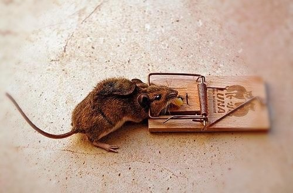 :speech_balloon:评:0 :+1:赞:4 :globe_with_meridians:转:1  

[11月15日 14:14]    财经真相   @caijingxiang    李大霄近五年的各种底！“现在已经是婴儿底，你们可以打我的脸了”！  :speech_balloon:评:7 :+1:赞:33 :globe_with_meridians:转:14  

[11月15日 14:13]    新闻大吐槽   @TuCaoFakeNews    淚水都流哂出嚟  :speech_balloon:评:0 :+1:赞:3 :globe_with_meridians:转:2  

[11月15日 14:13]    新闻大吐槽   @TuCaoFakeNews    对了，有please又可苦用fuck off
牛乸閪黄皮樹、不相搭  :speech_balloon:评:0 :+1:赞:3 :globe_with_meridians:转:1  

[11月15日 14:11]    新闻大吐槽   @TuCaoFakeNews    艹，我一个老爷们又掉眼泪 https://twitter.com/TuCaoFakeNews/status/1195118702259138560 …  :speech_balloon:评:0 :+1:赞:9 :globe_with_meridians:转:2  

[11月15日 14:06]    新闻大吐槽   @TuCaoFakeNews    保障人的基本生存权利，这是每个政府的基本义务。也就在你们这些脑子被洗残了的货色眼里，那会成为功绩。  :speech_balloon:评:0 :+1:赞:3 :globe_with_meridians:转:1  

[11月15日 14:06]    财经真相   @caijingxiang    14日，俄罗斯金融媒体RBC报道，金砖国家正在建立金砖国家之间的单一支付系统，也就是创建“金砖国家”的加密货币！  :speech_balloon:评:9 :+1:赞:40 :globe_with_meridians:转:20  

[11月15日 14:06]    新闻大吐槽   @TuCaoFakeNews    大陆人被无神论和进化论还有封建传统文化加上中共谎言迷惑制造假象混淆视听，可怜的大陆人已经吃进去太多太多的毒素，它们怕死不敢说真话，但是不怕下地狱敢做任何邪恶之事！  :speech_balloon:评:1 :+1:赞:4 :globe_with_meridians:转:1  

[11月15日 14:05]    新闻大吐槽   @TuCaoFakeNews    At PolyU in #HongKong, young protesters who probably have never prepared a single meal, now busy running a professional kitchen to feed fellow protesters.

A rare scene that can make you laugh amidst all the chaos and violence caused by escalating police brutality. https://twitter.com/tucaofakenews/status/1195036243421089792 …  :speech_balloon:评:0 :+1:赞:8 :globe_with_meridians:转:3  

[11月15日 14:00]    新闻大吐槽   @TuCaoFakeNews    凡是对生活有思考，有独立思想的人，绝对不会开口成脏！

大陆这位朋友也是一样，逻辑清晰的说出了自己对香港当下的看法！ https://twitter.com/cntg404/status/1195216355261181954 …  :speech_balloon:评:2 :+1:赞:10 :globe_with_meridians:转:3  

[11月15日 13:59]    新闻大吐槽   @TuCaoFakeNews    大陸公安的手法 他們在故意施行恐怖 恐嚇香港人 不要再出來  大陸人都是這麼被馴服的  :speech_balloon:评:5 :+1:赞:6 :globe_with_meridians:转:1  

[11月15日 13:58]    新闻大吐槽   @TuCaoFakeNews    内地军警学了点粤语，学了点英语上香港炫耀，在老外面前露馅了 https://twitter.com/tucaofakenews/status/1195167986769752064 …  :speech_balloon:评:0 :+1:赞:10 :globe_with_meridians:转:8  

[11月15日 13:45]    新闻大吐槽   @TuCaoFakeNews    来自大陆的声音 https://youtu.be/J1VbyTZt_xs   :speech_balloon:评:1 :+1:赞:10 :globe_with_meridians:转:4  

[11月15日 13:44]    老司机   @h5lpykl7tp6jjop    敘利亞男足贏了中國國足，教練急壞了，沖入休息室給每個隊員一個大耳光：老子說了不能贏中國隊的。
敘利亞球員滿臉無辜的說：是他們自己要踢進自己的球門。
敘利亞教練說：那也不行，那更要給中國人面子，大米是他們給的，錢是他們給的，連我們打仗的槍支彈藥都是他們給的，你們竟這樣落中國人的臉？！  :speech_balloon:评:10 :+1:赞:113 :globe_with_meridians:转:67  

[11月15日 13:28]    老司机   @h5lpykl7tp6jjop    Holy shit!  King's Road is completely packed to the brim with protesters.  At this rate they're going to have to occupy that tram.  And what's with all the dress shirts?  It's casual Friday!

#StandWithHongKong #HongKongProtests  :speech_balloon:评:18 :+1:赞:784 :globe_with_meridians:转:538  

[11月15日 13:00]    纽约时报中文网   @nytchinese    周四，带着弓箭的抗议者加固了他们在大学校园里修建的类似围墙的防御工事，以抵御和香港警方的冲突。一名70岁的老者头部受伤、不治身亡，当局表示他可能是被扔出的砖头击中的。
习近平也对香港的抗议活动发表了迄今最严厉的公开评论，称中国支持香港警方“严正执法”。 http://nyti.ms/33SVvwY   :speech_balloon:评:32 :+1:赞:18 :globe_with_meridians:转:5  

[11月15日 12:34]    老司机   @h5lpykl7tp6jjop    从古至今中国的统治者都把心思用在折腾老百姓身上，穷折腾几千年还是一穷二白，所谓的驭民之术并不能使其强大。而西方搞工商业，发展贸易，工业革命，科技发展最终改变了人类命运！只有中国人对奴役同类有极大兴趣，它们永远不理解平等公平的真实意义，该跪谁，谁跪我是它们唯一衡量人际关系的标准！  :speech_balloon:评:1 :+1:赞:30 :globe_with_meridians:转:9  

[11月15日 12:30]    纽约时报中文网   @nytchinese    随着骚乱升级，香港已发生巨变。抗议风暴颠覆了其作为世界级交通、金融都会高效有序的形象，经济陷入衰退，政府失去民心，邻里之间也出现了对立，学术环境和社会氛围也蒙上阴影。
一些伤口在短期内恐怕难以愈合。 http://nyti.ms/33NyHi1   :speech_balloon:评:36 :+1:赞:88 :globe_with_meridians:转:39  

[11月15日 12:28]    BBC News 中文   @bbcchinese    其中一个可能是，中国的钢铁并非在全世界都受欢迎？ https://www.bbc.com/zhongwen/simp/business-50416457 …  :speech_balloon:评:56 :+1:赞:30 :globe_with_meridians:转:9  

[11月15日 12:00]    纽约时报中文网   @nytchinese    #每日一词 Bait-and-switch 软银向初创企业巨额注资引发连锁效应。这些企业用激励措施来吸引承包商，但在没得到预期回报后又踢走他们。时报记者认为这就像一种“bait-and-switch”。这个词的意思是指以廉价商品、促销等招徕顾客，再引诱他们为高价商品买单的策略。更多简报内容： http://nyti.ms/2Kme599   :speech_balloon:评:2 :+1:赞:0 :globe_with_meridians:转:0  

[11月15日 11:57]    BBC News 中文   @bbcchinese    宋楚瑜在参选宣言中比喻自己是金庸小说中武术最高的隐士“独孤求败”，表明此次参选不在于求胜，但希望够带动民心及社会改变。 https://www.bbc.com/zhongwen/simp/chinese-news-50417297 …  :speech_balloon:评:36 :+1:赞:20 :globe_with_meridians:转:2  

[11月15日 11:35]    纽约时报中文网   @nytchinese    今年6月开始的“反送中”和平抗议已演变成持续的混乱。
抗议者想要什么？为什么示威演变成了暴力？最后会如何收场？本文做出整理： http://nyti.ms/354YBhH   :speech_balloon:评:15 :+1:赞:17 :globe_with_meridians:转:2  

[11月15日 11:00]    纽约时报中文网   @nytchinese    • 新数据显示，贸易战压力下，中国经济增长不容乐观；尽管工业产值和零售额都有所增长，但远低于预期。日本是仅次于中美的第三大经济体，但其消费放缓，出口直线下降，同样面临日益迫近的经济问题。
• 朝鲜表示美国寻求进一步对话，但称其为“争取时间的诡计”。更多简报内容： http://nyti.ms/2Kme599   :speech_balloon:评:3 :+1:赞:5 :globe_with_meridians:转:0  

[11月15日 10:30]    纽约时报中文网   @nytchinese    数年里，中国成功地运用其日益增长的经济实力，追回了一些据说是从圆明园掠夺的文物。国有的中国保利集团从外国所有者手中买下或收回了几个青铜兽首，让它们回到中国。
周三，中国国家文物局宣布，又发现了一个青铜兽首，并将它与其他回归文物放一起，在中国国家博物馆展出。 http://nyti.ms/352eLIB   :speech_balloon:评:9 :+1:赞:5 :globe_with_meridians:转:1  

[11月15日 10:13]    纽约时报中文网   @nytchinese    简报：习近平回应香港局势；拯救澳大利亚考拉  http://nyti.ms/2Kme599 https://twitter.com/ccni/status/1195156753933119488 …  :speech_balloon:评:5 :+1:赞:8 :globe_with_meridians:转:3  

[11月15日 09:56]    财经真相   @caijingxiang    高息储蓄产品不属于中共三种不赔的范围！  :speech_balloon:评:8 :+1:赞:46 :globe_with_meridians:转:22  

[11月15日 09:47]    纽约时报中文网   @nytchinese    早安！今日重点新闻包括：
习近平回应香港局势；拯救澳大利亚考拉；加州高中校园爆发枪击案；佩洛西称“特朗普电话门”为“贿赂行为”；亚洲主要经济体增长放缓；印尼发生7.1级强震，一度发布海啸预警……NYT简报带你速览今日要闻。 http://nyti.ms/2Kme599   :speech_balloon:评:11 :+1:赞:19 :globe_with_meridians:转:3  

[11月15日 09:43]    财经真相   @caijingxiang    库德洛称美国正制定减税计划,将在特朗普的第二个总统任期实施.该消息对美股短期内构成巨大支撑，美股不断创新高！  :speech_balloon:评:6 :+1:赞:93 :globe_with_meridians:转:35  

[11月15日 09:25]    新闻大吐槽   @TuCaoFakeNews    香港律政司长伦敦被示威者包围 混乱中跌倒

香港律政司司长郑若骅，14日出席英国伦敦举办的活动时，一度被示威者包围，混乱中跌倒，有人指骂她是“杀人犯”。

律政司司长郑若骅、保安局局长李家超和香港特首林郑月娥，被指是修订香港《逃犯条例》（也称《送中条例》）的主要责任人。  :speech_balloon:评:5 :+1:赞:101 :globe_with_meridians:转:49  

[11月15日 09:02]    财经真相   @caijingxiang    周五亚盘刚开始，美國國家經濟顧問庫德洛最新表示，“我們正接近與中國達成一項貿易協定”。庫德洛並指出，與中國的會談一直非常有建設性。消息公布后美股再度创新高、日元、黄金短线下跌，离岸人民币转涨！又是周五固定利好，这个“传说”中的第一阶段协议已经被说了N次，最扯淡的是每次市场都计价！  :speech_balloon:评:28 :+1:赞:161 :globe_with_meridians:转:31  

[11月15日 08:24]    墙国铁拳现世报😷   @Socialistfist    小编认为本月最佳铁拳，滋磁不滋磁啊？  :speech_balloon:评:24 :+1:赞:461 :globe_with_meridians:转:30  

[11月15日 08:21]    墙国铁拳现世报😷   @Socialistfist    面对大陆的善意，台大教授自信的进去了---亲中学者 施正屏
#社会主义铁拳  :speech_balloon:评:108 :+1:赞:1015 :globe_with_meridians:转:467  

[11月15日 07:59]    BBC News 中文   @bbcchinese    德国德累斯顿称其存在极右势力的严重问题，宣布进入“纳粹紧急状态”，折射欧洲对极端主义思潮的担忧。 https://bbc.in/33O5cwt   :speech_balloon:评:34 :+1:赞:42 :globe_with_meridians:转:13  

[11月15日 07:31]    BBC News 中文   @bbcchinese    美国可能无法阻挡中国经济崛起，只有中国自己失误才能阻挡这个进程。习近平治下中国有可能走上勃列日涅夫的老路。 https://bbc.in/374sHnh   :speech_balloon:评:197 :+1:赞:335 :globe_with_meridians:转:117  

[11月15日 07:00]    BBC News 中文   @bbcchinese    美中人工智能大比拼将会出现怎样的结局，或许只有AI才能预测...... https://bbc.in/2rNkALP   :speech_balloon:评:3 :+1:赞:17 :globe_with_meridians:转:6  

[11月15日 04:21]    老司机   @h5lpykl7tp6jjop    香港发展今天的地步实际上就是中共不遵守承诺，破坏两制修例引起民众反对，独裁霸道的它们在大陆横行七十年从不让步造成今天后果，文明的政府善于听取民意，民众一有反对意见立即让步，结果社会稳定人民幸福。暴政很威风不退让，代替却巨大，不学会让步就只有你死我活一条路！中共一直在这条死路上狂奔  :speech_balloon:评:2 :+1:赞:51 :globe_with_meridians:转:10  

[11月15日 03:27]    老司机   @h5lpykl7tp6jjop    中共法西斯在香港进行战爭！它们用大陆军警冒充港警，滥捕青年，实弹射杀学生，公然进攻中文大学，大量派遣暗探特务，制造混乱，嫁祸于人，把所有无耻手段都统统使出来了！香港到了开埠以来最黑暗的时候，沉痛之后只有愤慨！也许这是你们最后的疯狂阶段，你们灭亡时刻就要来临，全世界的人们都在看着！  :speech_balloon:评:2 :+1:赞:68 :globe_with_meridians:转:24  

[11月15日 02:02]    老司机   @h5lpykl7tp6jjop    2019年11月12日 香港中文大学“攻防战” 实录（一）

同一天，还有其他几所香港大学，也被中共军警围攻！

中产主义 邪恶魔爪 已伸进 香港校园 ！

#SOS
#国际社会救救香港的孩子  :speech_balloon:评:6 :+1:赞:89 :globe_with_meridians:转:54  

[11月15日 01:30]    老司机   @h5lpykl7tp6jjop    【中大保衞戰】
2號橋之役，苦戰15小時，血肉之軀抵擋逾2000發子彈。

致敬——HK勇士！  :speech_balloon:评:10 :+1:赞:199 :globe_with_meridians:转:124  

[11月15日 01:03]    墙国铁拳现世报😷   @Socialistfist    那必须和兄弟你平分啊，猪肉价格这么高  https://twitter.com/Dofuralanmingo/status/1194993538292826114 …  :speech_balloon:评:13 :+1:赞:168 :globe_with_meridians:转:8  

[11月15日 00:37]    GFHG SDKM   @zyx_yny    Hilarious fact  https://twitter.com/waynedupreeshow/status/1194925479465275393 …  :speech_balloon:评:0 :+1:赞:0 :globe_with_meridians:转:0  

[11月15日 00:32]    GFHG SDKM   @zyx_yny    “Rioters” calling it a day in #HongKong, and got on #Police car so they could head back to police station and logged in their overtime hours. 

#HongKongProtests #FreeHongKong #PoliceState #PoliceBrutality  :speech_balloon:评:64 :+1:赞:850 :globe_with_meridians:转:868  

[11月15日 00:14]    GFHG SDKM   @zyx_yny    Your friendly HKPF 1114.
Fire service putting out a fire? No problem, we'll tear gas you cockroaches.  :speech_balloon:评:95 :+1:赞:1579 :globe_with_meridians:转:1614  

[11月14日 23:50]    GFHG SDKM   @zyx_yny    I was encouraged by a productive conversation with @MarcoRubio yesterday on legislation to further help the people of Hong Kong. The Senate needs to stand with Hong Kong and I hope we can take action soon.  :speech_balloon:评:8429 :+1:赞:33960 :globe_with_meridians:转:22196  

[11月14日 23:40]    BBC News 中文   @bbcchinese    黎巴嫩使用WhatsApp的社交媒体用户每月要交税？！黎巴嫩使用WhatsApp的社交媒体用户每月要交税？！ https://bbc.in/2KiJrgI   :speech_balloon:评:5 :+1:赞:32 :globe_with_meridians:转:10  

[11月14日 23:00]    GFHG SDKM   @zyx_yny    "I fear for my close family members in China."

Members of the Uighur community in Norway say they're being harassed by automated calls from the Chinese embassy  https://aje.io/dgu5y  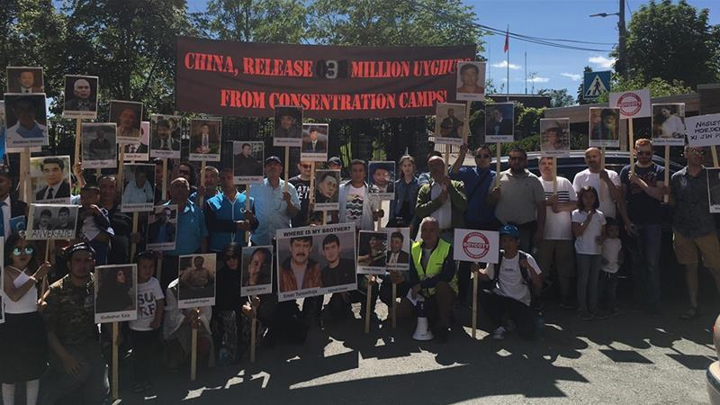 :speech_balloon:评:3 :+1:赞:87 :globe_with_meridians:转:76  

[11月14日 22:52]    GFHG SDKM   @zyx_yny    #HKPoliceBrutality has no limit. Intentionally beating victims on the head is the norm! #HKPoliceTerrorism The world must #StandWithHongKong or this will truly become a genocide!  :speech_balloon:评:132 :+1:赞:2254 :globe_with_meridians:转:2427  

[11月14日 21:03]    GFHG SDKM   @zyx_yny    What happened in #HongKong on 12 November?

The documentary clip recorded the #CUHK students defended from the attack of riot police although the riot police were out of control and non-stop firing of tear gas. 

 https://youtu.be/pjKlKzFBtF8 
#HongKongProstests  :speech_balloon:评:13 :+1:赞:352 :globe_with_meridians:转:353  

[11月14日 21:00]    纽约时报中文网   @nytchinese    #时报专栏 当iPad刚推出的时候，人们对它最大的批评是，它只是更大的手机；然而，到了今天，这正是我喜欢它的原因。
虽然花的时间比乔布斯预期的要长，但过去十年里，手机基本已扼杀了电脑。而要想完成工作，现在只需要一款大屏手机，苹果叫它iPad。 http://nyti.ms/2CItf4f   :speech_balloon:评:18 :+1:赞:49 :globe_with_meridians:转:15  

[11月14日 20:43]    老司机   @h5lpykl7tp6jjop    车是警车，人却是“暴徒”，“暴徒”们还熟门熟路，不需要警察押送，自己登车，自己关门！还能有比香港警察更无耻的吗？香港之乱香港之暴，源于警方的堕落！再次说明：绝对的权力绝对的腐败！支持港警的都是青光眼，只看到表面的混乱，看不到混乱后面的黑手是政府掌握了绝对权力  :speech_balloon:评:77 :+1:赞:1040 :globe_with_meridians:转:668  

[11月14日 20:00]    纽约时报中文网   @nytchinese    在雅典的第二天，希腊国家主席帕夫洛普洛斯请求习近平“支持帕特农神庙雕塑回归方面的努力”。
“我不仅支持你们，我们还应共同努力，”习近平的回复在希腊的电视台上播放。“由于历史原因，中希两国都有大量珍贵文物流失海外，双方可以加强合作，使这些文物能尽早回到自己的祖国。” http://nyti.ms/352eLIB   :speech_balloon:评:73 :+1:赞:53 :globe_with_meridians:转:6  

[11月14日 19:48]    GFHG SDKM   @zyx_yny    Hey! In case there are some foreigners or people don’t know what’s happening in #HongKong 
Please check this out @ashacuthbert 
(This Is Not) Hong Kong 11.11  https://youtu.be/3ck-iAwIyC0  via @YouTube  :speech_balloon:评:0 :+1:赞:4 :globe_with_meridians:转:3  

[11月14日 19:18]    财经真相   @caijingxiang    这种财富游戏，体现在央行层面，就是无法继续扩表，有价值的印钞已经没有了，现在甚至连农村宅基地和农田都允许抵押贷款，央行如果想继续扩大印钞，除了以高利息忽悠洋韭菜进来外，还有一条办法就是以行政命令，直接掠夺还未欠债的中产阶级，当这波掠夺完后，就只剩下无锚印钞一条路了！也是炼狱之路！  :speech_balloon:评:18 :+1:赞:220 :globe_with_meridians:转:57  

[11月14日 19:10]    财经真相   @caijingxiang    现在中共统治的危机根源是，央行想继续印钞，但是却找不到足够多的“承债人”，14亿底层屁民，通过过去20年加入WTO在血汗工厂赚的那几个铜板，已经被高房价掠夺的差不多了，政府财政收支也到了难以为继的地步；能够赚钱的基建项目也建的差不多了，剩下的都是亏钱的亏钱买卖，如果继续搞，财政根本罩不住  :speech_balloon:评:6 :+1:赞:216 :globe_with_meridians:转:46  

[11月14日 19:09]    墙国铁拳现世报😷   @Socialistfist    北京废青，危言耸听

#社会主义铁拳  :speech_balloon:评:50 :+1:赞:503 :globe_with_meridians:转:133  

[11月14日 19:02]    财经真相   @caijingxiang    中共权贵对中国人统治本质就是财富掠夺，这一最本质的游戏规则始终没有改变。只是统治方法变的更加高明，掠财方式更加隐蔽。以前是挂着刺刀直接强制征收，现在则是以金融变现殖民掠夺。这也是高干二代们大部分都玩金融根源。  :speech_balloon:评:2 :+1:赞:146 :globe_with_meridians:转:35  

[11月14日 19:00]    纽约时报中文网   @nytchinese    #摩登情爱 我们打了一个又一个回合，不是带着不惜一切代价赢得胜利的那种令人肾上腺素飙升的决心，而是带着不希望结束的耐心与控制：不希望夏天结束，不希望儿子的童年结束，不希望这场比赛结束，永远。
我们来回击球。我觉得丈夫的击球姿态有些优雅了，我觉得我也有些优雅了。 http://nyti.ms/2NLE8sw   :speech_balloon:评:2 :+1:赞:5 :globe_with_meridians:转:3  

[11月14日 18:57]    财经真相   @caijingxiang    还有参与大规模基建投标的私人企业，大多数是和中共权贵密切相关的人，他们在承接项目时虚高报价，这里面的差价本质也是偷14亿国民的财富。再如修路，一条高速路的修建，其资金来源自然是商业银行，商行加点利息后最后找央行借钱，最后的还款方式就是是该高速路的收费，也就是通过该路的车主最后买单！  :speech_balloon:评:2 :+1:赞:119 :globe_with_meridians:转:22  

[11月14日 18:51]    财经真相   @caijingxiang    中共热衷于基建，因为基建贷款抵押的是政府财政税收，而税收最终买单人是全体国民，到最后是全体14亿国民为基建贷款买单。每一轮基建高潮，都会对应央行大规模放水，本质上是中共偷偷把14亿人的劳动力抵押给了央行。在基建过程中，中共各级官员可以吃回扣，贪污偷工减料，这一过程就是偷盗国民的劳动力  :speech_balloon:评:3 :+1:赞:177 :globe_with_meridians:转:35  

[11月14日 18:44]    财经真相   @caijingxiang    正是这30年的劳动力才赋予了央行印出的房贷价值，这些代表劳动力的钞票投放到市场后才能够被金融体系接受。央行印钞的过程可以说就是寻找债主的过程，只有有人愿意以自己的劳动力或者财产抵押替央行平白无故印钞的钞票买单，这笔新增印钞才会被世人接受；  :speech_balloon:评:10 :+1:赞:126 :globe_with_meridians:转:25  

[11月14日 18:36]    财经真相   @caijingxiang    中共基建没有钱，很多网友简单的认为开动印钞机就行，这其实是大错特错，中共央行印的每一分钱，都必须有对应的相应的价值才行，否则就是无锚印钞，汇率崩盘！过去20年央行印钞都是以债务为基础的。比如，房奴的房贷，当房奴申请贷款时，本质是向央行抵押了自己未来30年的劳动力。 https://twitter.com/aspeltuo8/status/1194923278646816768 …  :speech_balloon:评:46 :+1:赞:649 :globe_with_meridians:转:241  

[11月14日 18:31]    BBC News 中文   @bbcchinese    全球人口约75亿，而脸书在半年内删除的假账户就有32亿。为什么会有这么多假账户？ https://bbc.in/2XeTYii   :speech_balloon:评:81 :+1:赞:252 :globe_with_meridians:转:57  

[11月14日 18:30]    纽约时报中文网   @nytchinese    在宇宙飞船或博物馆里触摸月球岩石是一回事；摘掉手套，让自己暴露在太空的真空中是另一回事。在科幻小说里，可怕的事情降临在这些宇航员身上：他们的血液沸腾蒸发，内脏被吸出来。
但摘掉一只手套未必会立刻致命。 http://nyti.ms/2rJc7ZV   :speech_balloon:评:2 :+1:赞:6 :globe_with_meridians:转:2  

[11月14日 18:26]    财经真相   @caijingxiang    中共《外管局关于完善银行间债券市场境外机构投资者外汇风险管理有关问题的通知（征求意见稿）》公开征求意见的公告。中国债券市场利率目前普遍相对于欧美国家要高，这对华尔街来说很有吸引力，中共现在不计一切代价放开债券购买，一是以高利息忽悠外资进来缓解外汇短缺。二是绑票这些购买的外资 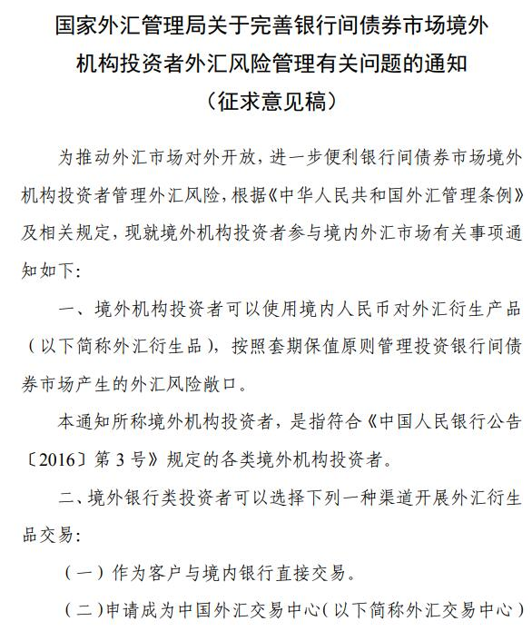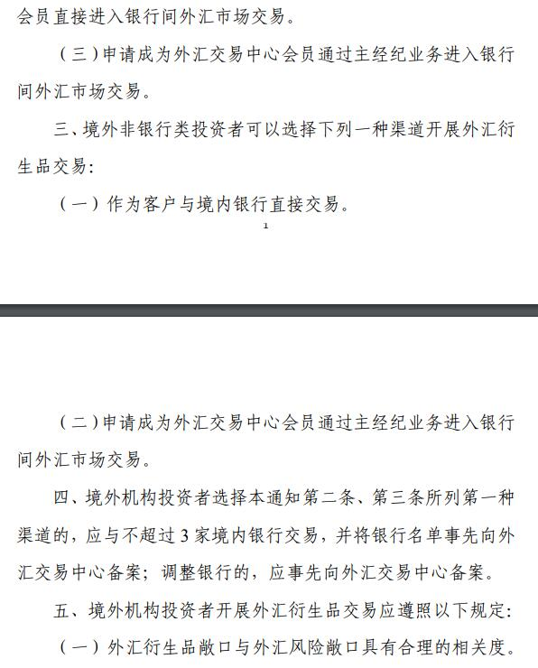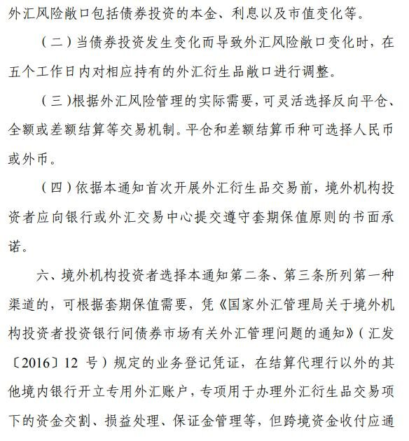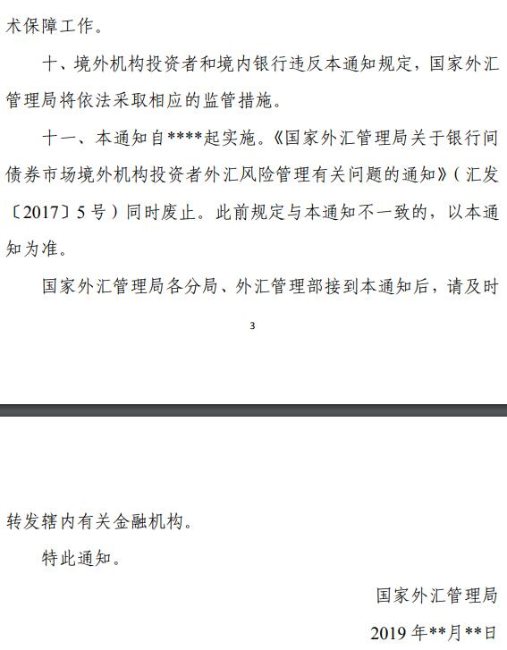 :speech_balloon:评:9 :+1:赞:90 :globe_with_meridians:转:45  

[11月14日 18:00]    纽约时报中文网   @nytchinese    自6月开始的香港大规模抗议已演变成一场持续不断的混乱，一些抗议者支持以暴力行为回应警方的暴力手法。抗议者同港府似乎存在难以解决的分歧，而且几乎没有迹象表明双方会让步。
本文简要介绍局面如何发展到今天这个地步，以及为何双方的暴力都在升级。 http://nyti.ms/354YBhH   :speech_balloon:评:82 :+1:赞:141 :globe_with_meridians:转:64  

[11月14日 17:30]    纽约时报中文网   @nytchinese    1973年的听证会没有华丽的开场画面，只有庄严的定音鼓声中宣读的一份参议院决议。没有聒噪的新闻编辑室讨论组，没有倒计时时钟，没有社媒标签。只有一间安静的听证室里的证词，两名轻声细语的主持人坐在办公桌前，试图弄清楚总统知道什么，什么时候知道，及民主是否仍然有效。 http://nyti.ms/2KfOpe6   :speech_balloon:评:3 :+1:赞:11 :globe_with_meridians:转:3  

[11月14日 17:01]    BBC News 中文   @bbcchinese    香港社会动荡加剧之际，阿里巴巴启动在港交所上市的计划，最多可能筹得134亿美元，将成为香港九年来最大规模IPO集资，或将提振因贸易战和社会动荡而低迷的香港股市。 https://bbc.in/2CE1s51   :speech_balloon:评:41 :+1:赞:76 :globe_with_meridians:转:30  

[11月14日 17:00]    纽约时报中文网   @nytchinese    周二，习近平在对希腊进行首次国事访问期间，表达了对归还帕特农神庙文物的支持。
习近平的支持只是中国与希腊关系日益密切的体现之一，在为期两天的访问中，两国领导人签署了16项新协议，中国还承诺继续增加投资，以深化在欧洲影响力。 http://nyti.ms/352eLIB   :speech_balloon:评:8 :+1:赞:18 :globe_with_meridians:转:2  

[11月14日 16:30]    纽约时报中文网   @nytchinese    自人类50年前登陆月球以来，已有12个人在月球上行走过，但从来没有人直接触碰过月球表面。
那些宇航员离开着陆器的时候都穿着太空服。从来没有人站在月球上脱下过手套或靴子。如果能亲手摸到月球，那会是种什么感觉？ https://nyti.ms/2rJc7ZV   :speech_balloon:评:16 :+1:赞:31 :globe_with_meridians:转:12  

[11月14日 16:00]    纽约时报中文网   @nytchinese    #图集【濑户内海艺术寻宝之旅】《纽约时报》“52个地方”旅行者@sebmodak最近到访了濑户内群岛，那里正在举行每三年一次的艺术盛会，艺术家们从当地的文化和地理中汲取灵感，而艺术正使衰落的渔村重焕活力。
点击查看图集： http://nyti.ms/377qEiq  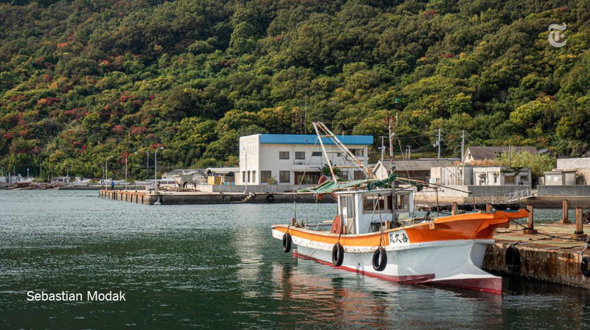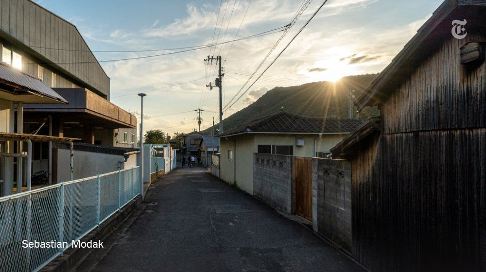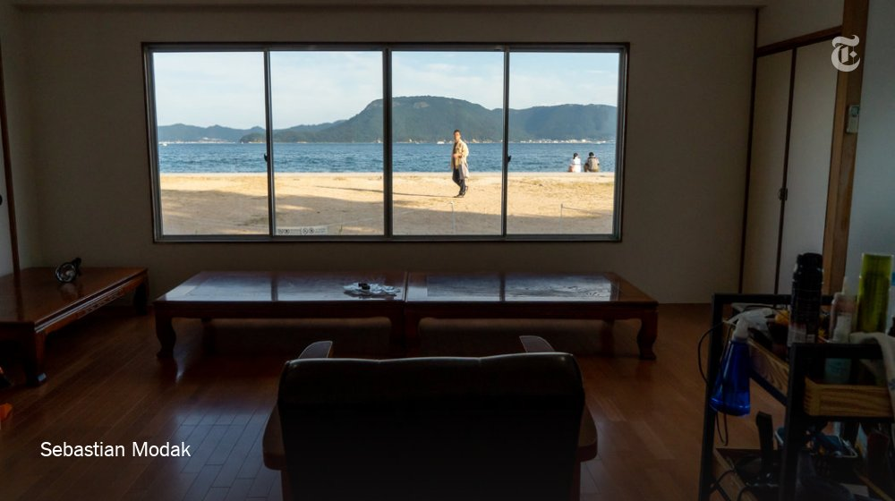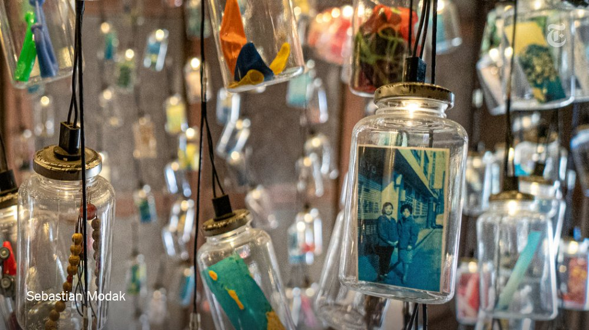 :speech_balloon:评:4 :+1:赞:8 :globe_with_meridians:转:0  

[11月14日 15:01]    BBC News 中文   @bbcchinese    韩国济州岛的海女下海捕捞新鲜海产，并以独特的方法料理美味海鲜，这是一间真正由海女经营的“平大里海胆面屋”。 https://bbc.in/34VAdyQ   :speech_balloon:评:3 :+1:赞:32 :globe_with_meridians:转:12  

[11月14日 14:30]    纽约时报中文网   @nytchinese    #摩登情爱 选择流浪街头是一种慢性自杀。很多人在自我毁灭的过程中都不大会去想，孩子可能也会受到牵连。也许DJ的母亲知道她要自我毁灭，所以才想确保她的孩子不会受到伤害。
她选择我们成为他的家长、和他一起生活，哪怕把他交给别人令她心碎。 http://nyti.ms/2picNEM   :speech_balloon:评:4 :+1:赞:15 :globe_with_meridians:转:2  

[11月14日 14:07]    老司机   @h5lpykl7tp6jjop    喝点马尿就把自己当领导了，还要特殊服务，大胆！  :speech_balloon:评:1 :+1:赞:5 :globe_with_meridians:转:2  

[11月14日 14:01]    BBC News 中文   @bbcchinese    曾经因为战争而被遗弃，黑人女孩打破刻板印象，成为芭蕾舞蹈演员。她是怎样做到的？  :speech_balloon:评:13 :+1:赞:113 :globe_with_meridians:转:25  

[11月14日 14:00]    纽约时报中文网   @nytchinese    #摩登情爱 婚姻就像网球赛，虽然我们仍然好胜，但当对方打出精彩的一球时，我们会觉得非常自豪。输掉比赛时，我们并不憎恨胜者。我们仍然为胜利而战，但现在我们可以为对方感到高兴。
我们都努力让比赛多持续一段时间，通过让对方发挥优势，找到彼此的最佳感觉。 http://nyti.ms/2NLE8sw   :speech_balloon:评:59 :+1:赞:19 :globe_with_meridians:转:8  

[11月14日 13:25]    老司机   @h5lpykl7tp6jjop    善于钻空子的年轻中国人，毁了自己人生！  :speech_balloon:评:1 :+1:赞:14 :globe_with_meridians:转:5  

[11月14日 13:01]    BBC News 中文   @bbcchinese    针对美国总统特朗普的弹劾调查公开听证会星期三（11月13日）揭开帷幕，弹劾程序将会怎样走？ https://bbc.in/2qSdYei   :speech_balloon:评:8 :+1:赞:24 :globe_with_meridians:转:6  

[11月14日 12:55]    GFHG SDKM   @zyx_yny    Pro beijing thugs are attacking young protesters in HongKong！ 
those scums and the police are partying together to “stabilize” the city.
black and white are totally upside down.
#StandWithHongKong
#FreedomHongKong  :speech_balloon:评:68 :+1:赞:1485 :globe_with_meridians:转:1616  

[11月14日 12:34]    GFHG SDKM   @zyx_yny    (This Is Not) Hong Kong
 https://youtu.be/3ck-iAwIyC0 
-
#HongKongProtest  :speech_balloon:评:2 :+1:赞:22 :globe_with_meridians:转:20  

[11月14日 12:22]    GFHG SDKM   @zyx_yny    A black-clad #HongKongProtester was just beaten by dozens of pro-Beijing supporters with metal rods in Sheung Shui this morning.  :speech_balloon:评:572 :+1:赞:10213 :globe_with_meridians:转:11203  

[11月14日 12:15]    GFHG SDKM   @zyx_yny      :speech_balloon:评:449 :+1:赞:5624 :globe_with_meridians:转:2836  

[11月14日 12:01]    BBC News 中文   @bbcchinese    中美之间的博弈不仅在于贸易领域——经济、国防、文化和科技，无一不是战场。美国到底想从中国那里得到什么？美国要的最终结局是什么？ https://bbc.in/2qTXra4   :speech_balloon:评:48 :+1:赞:43 :globe_with_meridians:转:18  

[11月14日 11:01]    BBC News 中文   @bbcchinese    有人权团体批评，新疆的维吾尔族人正受到迫害，他们被强迫从事劳动。许多品牌都被认为从新疆地区间接采购棉花产品。 https://bbc.in/375WEmH   :speech_balloon:评:512 :+1:赞:229 :globe_with_meridians:转:102  

[11月14日 10:07]    财经真相   @caijingxiang    中国固定投资增速创下了自1998年以来最低增速，中国这个大工地，热火朝天的忙了20年后终于开始冷清下来，原因无他—没钱！  :speech_balloon:评:18 :+1:赞:290 :globe_with_meridians:转:83  

[11月14日 09:19]    老司机   @h5lpykl7tp6jjop    心痛不已！又走一個。這是海鮮貨櫃車？ 港人真的要改变抗争策略了，如组织武装力量、成立秘密组织等！擒贼先擒王  :speech_balloon:评:46 :+1:赞:418 :globe_with_meridians:转:305  

[11月14日 08:20]    BBC News 中文   @bbcchinese    中国古代教育儿童的启蒙教材《三字经》的前六个字就是“人之初，性本善”。顾名思义，指人刚出生的时候，每个人的本性都是善良的。 https://bbc.in/2Xmao8N   :speech_balloon:评:45 :+1:赞:65 :globe_with_meridians:转:25  

[11月14日 07:59]    BBC News 中文   @bbcchinese    2019年10月，在斯德哥尔摩一个晚上就发生了3起爆炸案，震惊的瑞典居民也许没意识到该国一年里发生了百起爆炸。 https://bbc.in/32GoN0x   :speech_balloon:评:18 :+1:赞:32 :globe_with_meridians:转:24  

[11月14日 07:24]    BBC News 中文   @bbcchinese    三天来，示威者不断与尝试拆除路障的警察发生冲突，警方在各冲突现场发射橡皮子弹、催泪弹等驱散示威者，示威者以砖头和汽油弹还击。 https://bbc.in/2rJTDIV   :speech_balloon:评:130 :+1:赞:132 :globe_with_meridians:转:40  

[11月14日 06:57]    BBC News 中文   @bbcchinese    在这场极具特氏风格的演讲中，他维持一贯口风，批评中国是偷走美国工作岗位和财富的盗贼，但把主要矛头指向此前的美国政府不作为。 https://bbc.in/2CIjgvO   :speech_balloon:评:23 :+1:赞:63 :globe_with_meridians:转:18  

[11月14日 05:59]    BBC News 中文   @bbcchinese    美国专家认为，美国的军事优势的基础并非维持庞大的常备军，而是高科技武器系统。如果中国在关键技术领域取得成功，那么美国军事实力就可能要落后。 https://bbc.in/2qdqsNR   :speech_balloon:评:12 :+1:赞:31 :globe_with_meridians:转:9  

[11月14日 05:06]    老司机   @h5lpykl7tp6jjop    這的確不是港普，是普通話  :speech_balloon:评:148 :+1:赞:1320 :globe_with_meridians:转:1044  

[11月14日 01:30]    墙国铁拳现世报😷   @Socialistfist    支持言论自由不受侵害 https://twitter.com/keepcnsecurity/status/1194633823964631046 …  :speech_balloon:评:6 :+1:赞:108 :globe_with_meridians:转:29  

[11月14日 01:27]    老司机   @h5lpykl7tp6jjop    手足
你安息啦
我地會幫你行落去

唔殺曬每一個黑社會同黑警
我地唔會停  :speech_balloon:评:125 :+1:赞:687 :globe_with_meridians:转:422  

[11月14日 00:46]    GFHG SDKM   @zyx_yny    What #HongKong people are facing from police?
香港人正面臨警察的什麼問題？
#HongKongProtest  :speech_balloon:评:25 :+1:赞:744 :globe_with_meridians:转:765  

[11月14日 00:23]    GFHG SDKM   @zyx_yny    13 Nov 2019 22:16 [中字][ENG-SUB]

A #CLA soldier in Kowloon East Barrack loaded his #gun twice to threaten public outside the fence. The barrack is right next to Baptist University #HKBU

浸會大學旁，#解放軍 九龍東軍營有軍人以 #槍械 指嚇聚集的示威者，並將槍械上膛

#HongKong  :speech_balloon:评:91 :+1:赞:1871 :globe_with_meridians:转:2255  

[11月14日 00:20]    老司机   @h5lpykl7tp6jjop    黑警鬼子正在拆砖抛砖
扔到哪儿呢？
视频1  :speech_balloon:评:3 :+1:赞:31 :globe_with_meridians:转:42  

[11月13日 23:23]    财经真相   @caijingxiang    以前要说灭中共，有人说它可以牵制苏联，还有人说它会继续改革，更有人说它太强大短期内不会，唯有法轮功微弱的喊了20年“天灭中共”，结果香港人一笑了之，连传单都不接。今天世人心态已经彻底改变！当海内外所有人的希望达成共识时就程了趋势，剩下就是如何以最小的代价灭共！  :speech_balloon:评:25 :+1:赞:411 :globe_with_meridians:转:92  

[11月13日 23:08]    财经真相   @caijingxiang    香港抗争到今天，最大的影响就是，华人圈幻想中共改革或者改良的人彻底失望了，西方说中共会改革的熊猫派不敢再发声了，灭共以及如何减少中共倒台带来冲击，开始摆上桌面！这在过去70年里都不曾有过的！  :speech_balloon:评:49 :+1:赞:995 :globe_with_meridians:转:237  

[11月13日 22:53]    BBC News 中文   @bbcchinese    14世纪时，鼠疫横扫欧洲，夺走三分之一人的生命。时过境迁...... https://bbc.in/34VwMZ0   :speech_balloon:评:95 :+1:赞:195 :globe_with_meridians:转:91  

[11月13日 22:49]    GFHG SDKM   @zyx_yny    13 Nov 2019

#HKPoliceTerrorists directly fired tear gas canister into a residential flat in Lucky Plaza, Shatin, smashing a window in the process.

催淚彈殼射上沙田好運中心居民家中

#香港脱法警察 が催涙ガスを乱射して、沙田（サーティン）ラッキープラザの住宅を直撃した 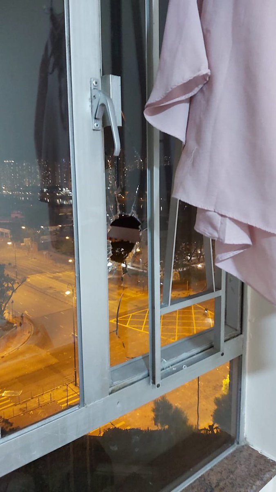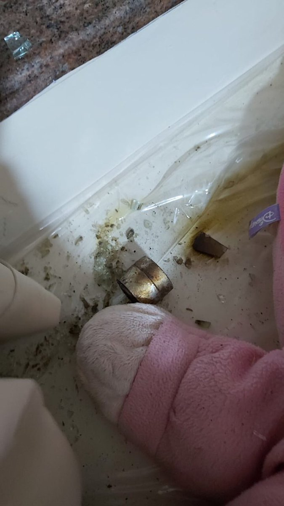 :speech_balloon:评:29 :+1:赞:642 :globe_with_meridians:转:908  

[11月13日 22:21]    老司机   @h5lpykl7tp6jjop    廣傳!
原來「碎砖陣」是水炮车克星！

水炮车被困碎砖阵，曾嘗试用水炮清理，地上碎砖，但不成功！

整队人为保护水炮车，全部停下！  :speech_balloon:评:61 :+1:赞:1095 :globe_with_meridians:转:682  

[11月13日 21:33]    GFHG SDKM   @zyx_yny    None of us should suffer from the fear of #HKPoliceTerrorism 
How can it be the end? https://twitter.com/soon_eddy/status/1194476050647941121 …  :speech_balloon:评:0 :+1:赞:1 :globe_with_meridians:转:2  

[11月13日 21:05]    GFHG SDKM   @zyx_yny    Wt happened?!  :speech_balloon:评:65 :+1:赞:692 :globe_with_meridians:转:787  

[11月13日 21:03]    GFHG SDKM   @zyx_yny    Notes by older folks at TKO carpark where student Chow fell, atoning for political indifference:
"Lok, you'd always been such a good kid. I so regret not having stood w/you & fought alongside you! Pls forgive me. Neutral just means pro-Beijing. I really got it now! I'm so sorry!" https://twitter.com/TY_hker/status/1194596305403670528 …  :speech_balloon:评:1 :+1:赞:29 :globe_with_meridians:转:27  

[11月13日 20:28]    财经真相   @caijingxiang    中国国内首个合法商用VPN来了！关于中共官办VPN，我最近正在收集资料，准备做一期视频，来撩开中国神秘防火长城的运作方式！  :speech_balloon:评:95 :+1:赞:466 :globe_with_meridians:转:163  

[11月13日 20:25]    BBC News 中文   @bbcchinese    升级的暴力行动或立场之争让许多大陆和台湾学生开始担忧自身安危，寻求离开香港。也有学生表示会继续留下来。 https://bbc.in/2pj98GM   :speech_balloon:评:68 :+1:赞:121 :globe_with_meridians:转:52  

[11月13日 19:55]    财经真相   @caijingxiang    11月12日，伦敦证券交易所集团（以下简称“伦交所集团”）首席执行官David Schwimmer一行4人到访中央结算公司。看来香港交易所收购事并没结束，搞不好还有下文！  :speech_balloon:评:11 :+1:赞:74 :globe_with_meridians:转:35  

[11月13日 19:32]    GFHG SDKM   @zyx_yny    WTF holding hostages for passage of movement #HKPolice they are clearly the #HKPoliceTerrorists 

Are you watching @senatemajldr @SenRubioPress  :speech_balloon:评:345 :+1:赞:3608 :globe_with_meridians:转:4066  

[11月13日 18:38]    墙国铁拳现世报😷   @Socialistfist    一天二更，快夸我。
最近推友投稿质量很高，再次感谢！  :speech_balloon:评:15 :+1:赞:196 :globe_with_meridians:转:4  

[11月13日 18:38]    墙国铁拳现世报😷   @Socialistfist    祝这位推友早日康复

#战螂在推特  :speech_balloon:评:22 :+1:赞:231 :globe_with_meridians:转:45  

[11月13日 18:15]    老司机   @h5lpykl7tp6jjop    卧床狙击手

#社会主义铁拳  :speech_balloon:评:112 :+1:赞:689 :globe_with_meridians:转:177  

[11月13日 18:15]    墙国铁拳现世报😷   @Socialistfist    卧床狙击手

#社会主义铁拳  :speech_balloon:评:112 :+1:赞:689 :globe_with_meridians:转:177  

[11月13日 17:57]    老司机   @h5lpykl7tp6jjop    很多到了西方国家的中国人和这头已经自由的驴一模一样！  :speech_balloon:评:95 :+1:赞:1488 :globe_with_meridians:转:603  

[11月13日 17:37]    老司机   @h5lpykl7tp6jjop    当国家由一个神经病掌握以后，人民倒霉就是必然的结果！
不要以为不可能，仔细想想中国人为什么活得这么憋屈？  :speech_balloon:评:8 :+1:赞:63 :globe_with_meridians:转:27  

[11月13日 17:36]    新闻大吐槽   @TuCaoFakeNews    这个拿电锯的抗争者，爸爸是警察，他身处矛盾中，精神要崩溃了！他说自己是狗仔，讲黑警死全家，没关系；
而手足们搂住他安慰道：你是勇武，你还有良心！

是啊，面对邪恶，选择良心，还是选择利益？真是艰难的抉择！
这个世界要是没有邪恶多好，家庭就不会碎裂了！  :speech_balloon:评:153 :+1:赞:2428 :globe_with_meridians:转:1232  

[11月13日 16:45]    财经真相   @caijingxiang    知道这些有啥用？这是个及其致命的问题，以利益引导法，对我周边的人影响很大，他们现实过的都不太好，生活没有一丝希望，麻木、无趣，简直像木头一样活着。每当我说到中国社会巨变，国有企业私有化带来的巨大创业机遇时，总能让这些木头兴奋一天，他们还经常把我的“荒唐说法”讲给更多人听！  :speech_balloon:评:9 :+1:赞:114 :globe_with_meridians:转:10  

[11月13日 16:33]    财经真相   @caijingxiang    就算是知道这些有什么用？每当话题聊到这个时候，我就说关心这些能赚钱，或许还可以改变命运，因为中共倒台时人民币剧烈贬值，可以用杠杆做空赚大钱。整个中国的财富分配会被洗牌，你现在没关系、没人脉、没资本根本翻不了身，但是机遇是给有准备的人，你现在关心这些，才能在未来巨变时抓到机遇！  :speech_balloon:评:29 :+1:赞:282 :globe_with_meridians:转:49  

[11月13日 12:46]    GFHG SDKM   @zyx_yny    傳出去

文宣注意
如果你facebook貼以下相 你個post係會自動disable share function （自己睇自己仲有share制 但朋友睇你已經無左）
Fb已自動過濾天安門2.0呢張相
所以國際線強攻呢張
大家做多少少 save張相 再自己貼係fb twitter 遍地開花 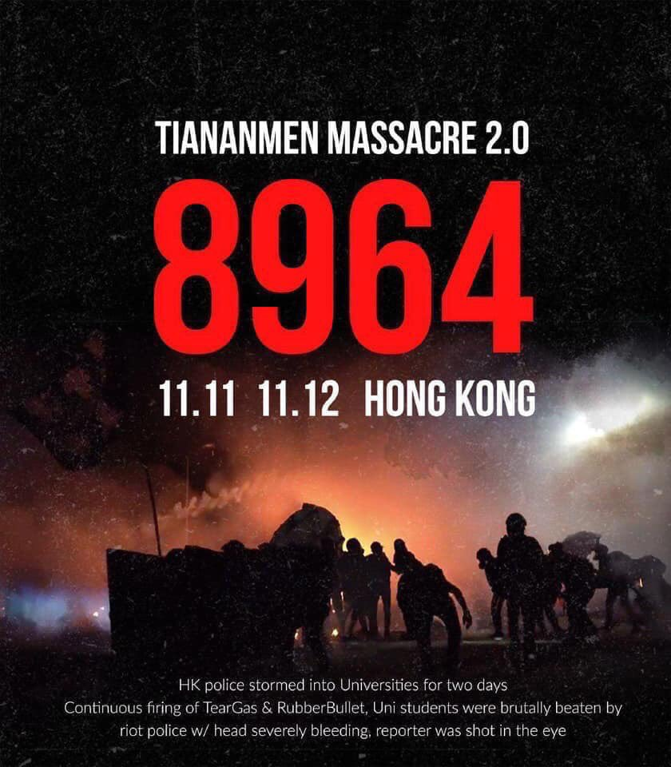 :speech_balloon:评:18 :+1:赞:586 :globe_with_meridians:转:627  

[11月13日 12:40]    老司机   @h5lpykl7tp6jjop    港警仍围在中大，企图进入校园，但一直被校方拒绝。很多记者排成人墙，堵在进入中大的路上。
港警为何对重大这么执着？搜索一下中大，发现，中大竟然是香港的互联网交换中心所在地！港警进攻中大真正目的是控制香港的互联网！一旦得逞，港人通讯将被控制，对抗争极为不利！  :speech_balloon:评:10 :+1:赞:74 :globe_with_meridians:转:40  

[11月13日 12:30]    纽约时报中文网   @nytchinese    继周一警察向示威者开枪、一名责骂示威者的人遭纵火之后，香港周二再度陷入混乱。
抗议者在校园内纵火、丢掷汽油弹，而防暴警察则试图用催泪瓦斯和水炮将他们击退。
这里是周二抗议活动的一些照片： http://nyti.ms/2pd93nT   :speech_balloon:评:388 :+1:赞:195 :globe_with_meridians:转:92  

[11月12日 19:22]    墙国铁拳现世报😷   @Socialistfist    从2018年9月到现在频繁微博维权，神奇的是，小编就是没看出来他举报的贪污腐败是什么内容  :speech_balloon:评:4 :+1:赞:141 :globe_with_meridians:转:10  

[11月12日 19:20]    墙国铁拳现世报😷   @Socialistfist    宝贝别哭

#社会主义铁拳  :speech_balloon:评:34 :+1:赞:342 :globe_with_meridians:转:79  

[11月12日 07:22]    凡賽堤/FORSETI   @FecharCCP    11日早在西湾河开枪射伤示威者的港警关家荣身份被起底，其担任家教会主席的德望学校师生、家长及校友发起联署要求解除其在该校的职务。其两个女儿在该校就读。另有消息指，关家荣受过“大陆警察部门”特殊培训。下面这个小视频，足以解释这场血案的真相：这是流氓国家自上而下有计划的谋杀。  :speech_balloon:评:20 :+1:赞:264 :globe_with_meridians:转:174  

[11月12日 07:14]    凡賽堤/FORSETI   @FecharCCP    救救悲慘的香港 #HKSOS

香港黑警拔槍亂殺港民！已多人中槍和死亡！

天滅極權！  :speech_balloon:评:1 :+1:赞:10 :globe_with_meridians:转:8  

[11月12日 07:11]    凡賽堤/FORSETI   @FecharCCP    11.11 香港殺人魔家庭資料！
全世界通緝這殺人魔全家！  :speech_balloon:评:49 :+1:赞:13 :globe_with_meridians:转:10  

[11月12日 07:07]    凡賽堤/FORSETI   @FecharCCP    救救悲慘的香港 #HKSOS

香港黑警拔槍亂殺港民！已多人中槍和死亡！  :speech_balloon:评:0 :+1:赞:9 :globe_with_meridians:转:6  

[11月12日 06:57]    凡賽堤/FORSETI   @FecharCCP    天滅流氓政權！！！CCP極權殺人恐怖組織正在用各種兇殘手段屠殺我們的同胞...................

看看這些大陸的黑警（公安，武警，士兵裝扮成香港警察）是如何沒有人性的屠殺香港學生！！！

天滅流氓政權！！！天滅CCP！！！  :speech_balloon:评:1 :+1:赞:21 :globe_with_meridians:转:21  

[11月12日 06:42]    凡賽堤/FORSETI   @FecharCCP    天滅流氓政權！！！CCP極權殺人恐怖組織正在用各種兇殘手段殺害我們的同胞...................

看看這些大陸的黑警（公安，武警，士兵裝扮成香港警察）是如何沒有人性的屠殺香港學生！！！

那個小年輕不知道是休克還是已經死亡！

天滅流氓政權！！！天滅CCP！！！  :speech_balloon:评:34 :+1:赞:19 :globe_with_meridians:转:16  

[11月12日 06:25]    凡賽堤/FORSETI   @FecharCCP    坐水凳（英語：waterboarding）是水刑的一種，做法是將受害人固定其雙手雙腳，在頭部放上布後持續澆水。如此會讓受害人產生溺水的錯覺而心生恐懼。雖然坐水凳不在身上留下可辨識的傷痕，但受害人在過程中會因為嗆到水甚至吸入性肺炎而受傷害。另外有些人因此導致心理方面的傷害，是酷刑的一種。  :speech_balloon:评:0 :+1:赞:35 :globe_with_meridians:转:32  

[11月11日 23:01]    墙国铁拳现世报😷   @Socialistfist    所有推文内容来自于公开的网络社交媒体。
年轻人还是需要学习一个
毕竟too young  https://twitter.com/muxiawenyuzi/status/1193888039799574528 …  :speech_balloon:评:11 :+1:赞:164 :globe_with_meridians:转:14  

[11月11日 17:21]    墙国铁拳现世报😷   @Socialistfist      :speech_balloon:评:19 :+1:赞:97 :globe_with_meridians:转:9  

[11月11日 17:19]    墙国铁拳现世报😷   @Socialistfist    在吗？我微博被封了，可以聊聊吗？

#社会主义铁拳
#战螂在推特  :speech_balloon:评:29 :+1:赞:299 :globe_with_meridians:转:59  

[11月10日 22:23]    墙国铁拳现世报😷   @Socialistfist    5. 因投稿较多且具体事件有时效性，也许会延迟发布您的投稿，希望能够理解。对于一些重复投稿的或者不符合主题的投稿，也许不会被采用。
6. 最佳投稿途径是发送私信，@ 本推会被其他通知挤掉
7. 如果您有好的内容，欢迎使用 #社会主义铁拳 和 #社會主義鐵拳，简繁双体的tag。符合内容的推文会给予转推  :speech_balloon:评:0 :+1:赞:55 :globe_with_meridians:转:6  

[11月10日 22:18]    墙国铁拳现世报😷   @Socialistfist    1. 为避免潜在视奸号盗取IP，不接受含有网站链接的投稿
2. 社会主义铁拳相关主题内容应当是，个体或集体有赞美言论后被社会主义政权铁拳的事例。自然灾害或非社会主义政权皆不算是#社会主义铁拳
3. 本推主题明确统一，不接受除了铁拳现世报以外的爆料或投稿
4. 推荐使用多张截图和文字相配合的投稿方式  :speech_balloon:评:1 :+1:赞:86 :globe_with_meridians:转:10  

[11月10日 22:14]    墙国铁拳现世报😷   @Socialistfist    感谢所有新关注的推友和所有开推以来一路的老朋友。
本推的成长离不开所有积极投稿的热心推友，再次表示特别感谢。为了明确投稿规范，特别发此推做出说明。  :speech_balloon:评:5 :+1:赞:111 :globe_with_meridians:转:11  

[11月10日 16:50]    老司机   @h5lpykl7tp6jjop    最新消息爆出：黑警强奸15岁女生，致其堕胎~
市民们愤怒无比，大喊强奸犯！
很多中老年人也加入了声讨黑警的人群~

情势越是危急，香港人就越团结，太感动了！真值得大陆人好好学习  :speech_balloon:评:149 :+1:赞:2430 :globe_with_meridians:转:1288  

[11月09日 20:44]    墙国铁拳现世报😷   @Socialistfist    删了重发是因为小编是强迫症，之前推有一个重复字。  :speech_balloon:评:3 :+1:赞:147 :globe_with_meridians:转:3  

[11月09日 20:43]    墙国铁拳现世报😷   @Socialistfist    孩子，这次你让祖国爸爸失望了

#社会主义铁拳  :speech_balloon:评:88 :+1:赞:759 :globe_with_meridians:转:231  

[11月08日 21:45]    墙国铁拳现世报😷   @Socialistfist    补充  :speech_balloon:评:27 :+1:赞:144 :globe_with_meridians:转:16  

[11月08日 21:36]    墙国铁拳现世报😷   @Socialistfist    考虑拿日元明年去日本花呀？  :speech_balloon:评:18 :+1:赞:120 :globe_with_meridians:转:12  

[11月05日 04:28]    凡賽堤/FORSETI   @FecharCCP    急救香港  #HKSOS！！！

天滅流氓政權！！！極權殺人恐怖組織正在用各種兇殘手段殺害我們的同胞..................................................

流氓政權的極權殺人恐怖組織蓄意謀殺香港年輕人！（13）

被暴力制服的年輕人已經休克，還殘暴折斷手！

兇殘，殘暴手段令人髮指到已經超越納粹！  :speech_balloon:评:0 :+1:赞:3 :globe_with_meridians:转:10  

[11月05日 04:25]    凡賽堤/FORSETI   @FecharCCP    急救香港  #HKSOS！！！

天滅流氓政權！！！極權殺人恐怖組織正在用各種兇殘手段殺害我們的同胞..................................................

流氓政權的極權殺人恐怖組織蓄意謀殺香港年輕人！（12）
兇殘，殘暴手段令人髮指到已經超越納粹！
天滅流氓政權！！！  :speech_balloon:评:1 :+1:赞:8 :globe_with_meridians:转:9  

[11月05日 04:24]    凡賽堤/FORSETI   @FecharCCP    急救香港  #HKSOS！！！

天滅流氓政權！！！極權殺人恐怖組織正在用各種兇殘手段殺害我們的同胞..................................................

流氓政權的極權殺人恐怖組織蓄意謀殺香港年輕人！（11）
兇殘，殘暴手段令人髮指到已經超越納粹！
天滅流氓政權！！！  :speech_balloon:评:0 :+1:赞:50 :globe_with_meridians:转:47  

[11月05日 04:23]    凡賽堤/FORSETI   @FecharCCP    急救香港  #HKSOS！！！

天滅流氓政權！！！極權殺人恐怖組織正在用各種兇殘手段殺害我們的同胞..................................................

流氓政權的極權殺人恐怖組織蓄意謀殺香港年輕人！（10）
兇殘，殘暴手段令人髮指到已經超越納粹！
天滅流氓政權！！！  :speech_balloon:评:0 :+1:赞:3 :globe_with_meridians:转:5  

[11月05日 04:19]    凡賽堤/FORSETI   @FecharCCP    急救香港  #HKSOS！！！

天滅流氓政權！！！極權殺人恐怖組織正在用各種兇殘手段殺害我們的同胞..................................................

流氓政權的極權殺人恐怖組織蓄意謀殺香港年輕人！（9）
兇殘，殘暴手段令人髮指到已經超越納粹！
天滅流氓政權！！！  :speech_balloon:评:1 :+1:赞:5 :globe_with_meridians:转:7  

[11月05日 04:16]    凡賽堤/FORSETI   @FecharCCP    急救香港  #HKSOS！！！

天滅流氓政權！！！極權殺人恐怖組織正在用各種兇殘手段殺害我們的同胞..................................................

流氓政權的極權殺人恐怖組織蓄意謀殺香港年輕人！（8）
兇殘，殘暴手段令人髮指到已經超越納粹！
天滅流氓政權！！！  :speech_balloon:评:1 :+1:赞:44 :globe_with_meridians:转:56  

[11月05日 04:13]    凡賽堤/FORSETI   @FecharCCP    急救香港SOS！！！

天滅流氓政權！！！極權殺人恐怖組織正在用各種兇殘手段殺害我們的同胞..................................................

流氓政權的極權殺人恐怖組織蓄意謀殺香港年輕人！（7）
兇殘，殘暴手段令人髮指到已經超越納粹！
天滅流氓政權！！！  :speech_balloon:评:3 :+1:赞:13 :globe_with_meridians:转:21  

[11月05日 04:10]    凡賽堤/FORSETI   @FecharCCP    急救香港SOS！！！

天滅流氓政權！！！極權殺人恐怖組織正在用各種兇殘手段殺害我們的同胞..................................................

流氓政權的極權殺人恐怖組織蓄意謀殺香港年輕人！（6）
兇殘，殘暴手段令人髮指到已經超越納粹！
天滅流氓政權！！！  :speech_balloon:评:1 :+1:赞:39 :globe_with_meridians:转:41  

[11月05日 04:07]    凡賽堤/FORSETI   @FecharCCP    急救香港SOS！！！

天滅流氓政權！！！極權殺人恐怖組織正在用各種兇殘手段殺害我們的同胞..................................................

流氓政權的極權殺人恐怖組織蓄意謀殺香港年輕人！（5）
兇殘，殘暴手段令人髮指到已經超越納粹！
天滅流氓政權！！！  :speech_balloon:评:0 :+1:赞:2 :globe_with_meridians:转:0  

[11月05日 04:06]    凡賽堤/FORSETI   @FecharCCP    急救香港SOS！！！

天滅流氓政權！！！極權殺人恐怖組織正在用各種兇殘手段殺害我們的同胞..................................................

流氓政權的極權殺人恐怖組織蓄意謀殺香港年輕人！（3）
兇殘，殘暴手段令人髮指到已經超越納粹！
天滅流氓政權！！！  :speech_balloon:评:1 :+1:赞:10 :globe_with_meridians:转:15  

[11月05日 04:05]    凡賽堤/FORSETI   @FecharCCP    急救香港SOS！！！

天滅流氓政權！！！極權殺人恐怖組織正在用各種兇殘手段殺害我們的同胞..................................................

流氓政權的極權殺人恐怖組織蓄意謀殺香港不同意見的議員！（2）

兇殘，殘暴手段令人髮指到已經超越納粹！
天滅流氓政權！！！  :speech_balloon:评:0 :+1:赞:3 :globe_with_meridians:转:3  

[11月05日 04:04]    凡賽堤/FORSETI   @FecharCCP    急救香港SOS！！！

天滅流氓政權！！！極權殺人恐怖組織正在用各種兇殘手段殺害我們的同胞..................................................

流氓政權的極權殺人恐怖組織蓄意謀殺香港年輕人！（1）
兇殘，殘暴手段令人髮指到已經超越納粹！
天滅流氓政權！！！  :speech_balloon:评:1 :+1:赞:8 :globe_with_meridians:转:7  

[11月03日 08:23]    凡賽堤/FORSETI   @FecharCCP    他們不配稱警察，他們是納粹的狗！魔鬼般的瘋狗！

極權殺人恐怖組織正在用各種兇殘手段殺害我們的同胞..................................................

滅絕人性對待老人  :speech_balloon:评:4 :+1:赞:45 :globe_with_meridians:转:43  

[10月09日 00:47]    GFHG SDKM   @zyx_yny    "Son, when you grow up
You will be the savior of the broken
The beaten, and the damned?"
Please watch this powerful mv #HongKongProtester #hkprotests 
香港反送中護法戰爭(Hong Kong Defensive War 2019)：Welcome To The Black Parade  https://youtu.be/0yXTHODE24Q  via @YouTube  :speech_balloon:评:3 :+1:赞:20 :globe_with_meridians:转:8  

[10月05日 09:33]    凡賽堤/FORSETI   @FecharCCP    呼籲請求共同挖掘所有有關香港發生的事，越全面越好，不同角度，越多越好，包括被暗地抓捕的人員，特別是CCP 派出的各種偽裝身份，包括變身變裝行兇的一點一滴都要挖掘出來，把CCP 的邪惡下三濫手段的真相毫無保留的曝光在全世界面前！世界公知公義才能真正挽救和保護香港人！希望懂視頻編輯配上中英文 https://twitter.com/hjjohnson17/status/1178969916499746816 …  :speech_balloon:评:19 :+1:赞:20 :globe_with_meridians:转:12  

[03月13日 08:10]    老司机   @h5lpykl7tp6jjop    批评是批评家天生的使命！他们只感知对错，信奉真理，指出真相不吐不快，不在意权势和群众的喜好，从批评里不可能获得任何好处，但批评家愚直不改。在中国几乎所有人都讨厌批评家，喜欢阴谋家，因为他们只说好听的！可是就因为中国的批评家太少，中国几乎看不到未来和希望！  :speech_balloon:评:86 :+1:赞:207 :globe_with_meridians:转:41  

