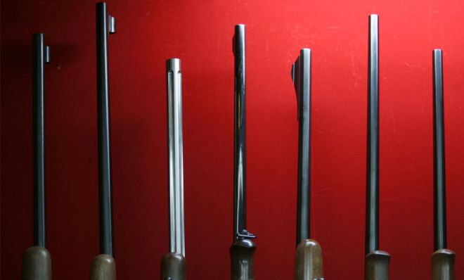
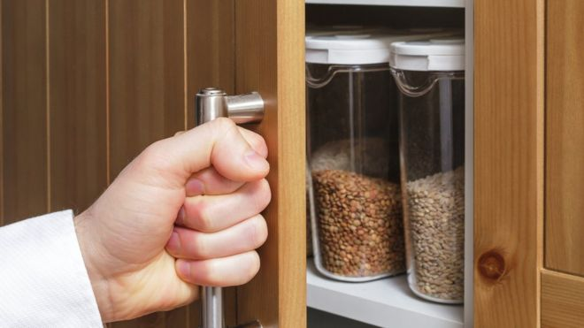
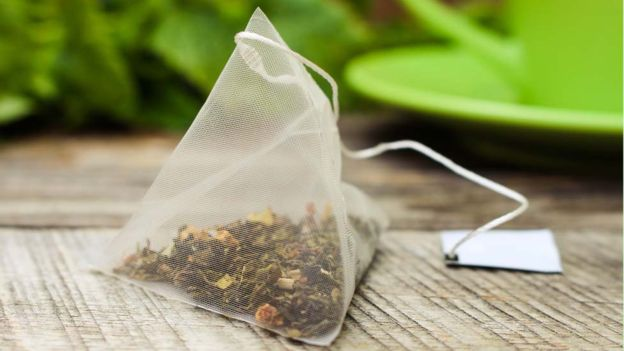
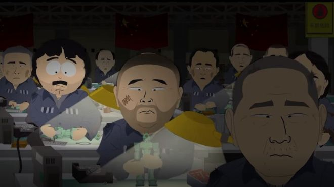
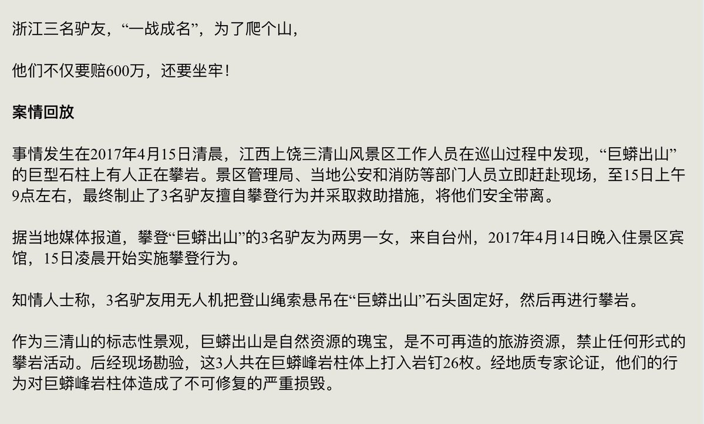
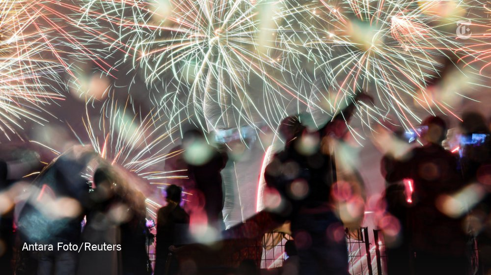
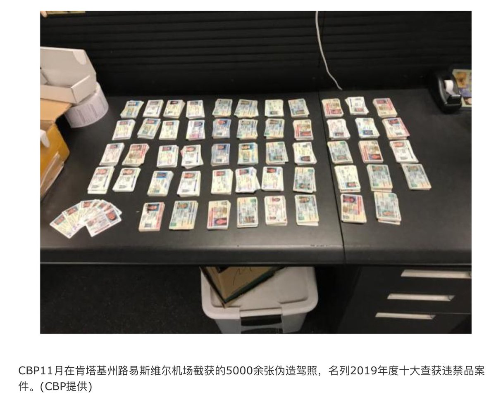
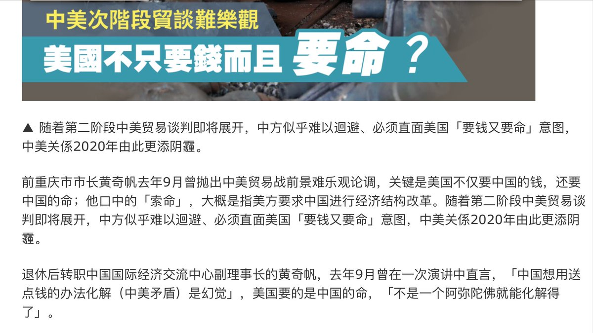
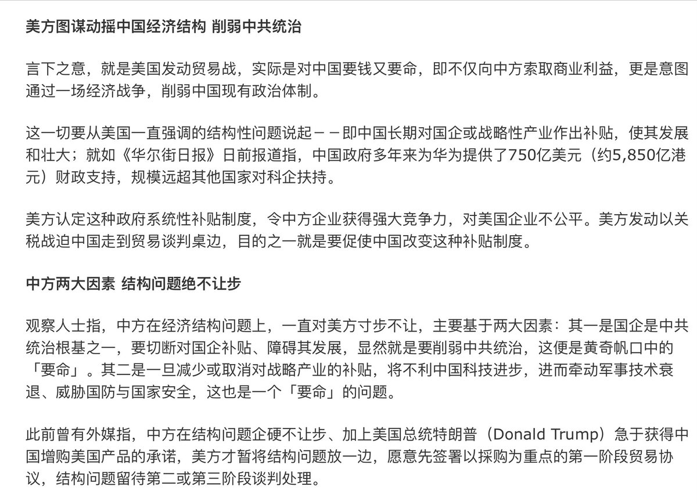
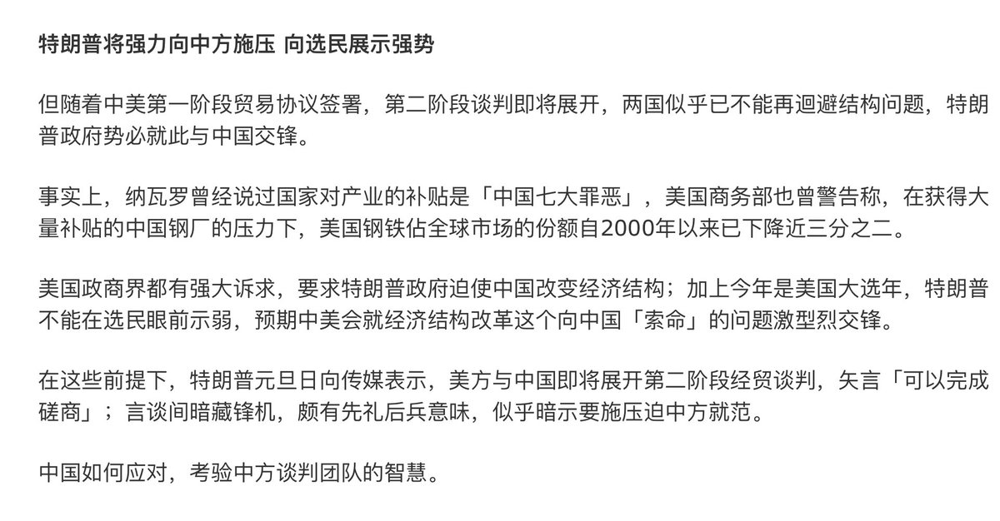

[01月03日 07:49]    新闻大吐槽   @TuCaoFakeNews    再过两个月，就又能看到类似的喜剧啦  :speech_balloon:评:0 :+1:赞:1 :globe_with_meridians:转:1  

[01月03日 07:47]    新闻大吐槽   @TuCaoFakeNews    無知之過  :speech_balloon:评:0 :+1:赞:1 :globe_with_meridians:转:1  

[01月03日 07:45]    新闻大吐槽   @TuCaoFakeNews    不是吧，是首朝鲜军歌，中文听起来好像在唱，金正恩捅。前几年我还见到过……现在应该给毙了。  :speech_balloon:评:0 :+1:赞:1 :globe_with_meridians:转:1  

[01月03日 07:44]    新闻大吐槽   @TuCaoFakeNews     PK N.Korea  :speech_balloon:评:0 :+1:赞:1 :globe_with_meridians:转:1  

[01月03日 07:39]    新闻大吐槽   @TuCaoFakeNews    看他最后那亲自走路的样子，应该离死不远了  :speech_balloon:评:1 :+1:赞:2 :globe_with_meridians:转:1  

[01月03日 07:39]    新闻大吐槽   @TuCaoFakeNews    人民代表涉嫌辱党——靠！ 党的领导！

虽然低级红，但在党的领导下，村长们干劲会更足，盘剥会更烈，村民要捂好自己的钱包了！  :speech_balloon:评:2 :+1:赞:7 :globe_with_meridians:转:4  

[01月03日 07:35]    新闻大吐槽   @TuCaoFakeNews    他们也觉得自己没脸见人  :speech_balloon:评:0 :+1:赞:1 :globe_with_meridians:转:1  

[01月03日 07:33]    新闻大吐槽   @TuCaoFakeNews    苍天还有眼吗？
观后感：
1.你双手捧着选票就欠一个下跪；
2.谁让你代表了沂蒙山区的100多万老百姓！
3.看到“习近平”三个字立马高潮，可见权力就是春药！
4.全票通过？娘子同志，你要有枪杆子做背书你也是“全票”通过，这世界上还有金正恩也是全票通过
5.那个男狗的干劲在于可以把贪污受贿进行到底！ https://twitter.com/tucaofakenews/status/1212854946267156480 …  :speech_balloon:评:0 :+1:赞:5 :globe_with_meridians:转:2  

[01月03日 07:32]    BBC News 中文   @bbcchinese    消息人士说，“沪伦通”计划受到政治因素影响而被中断，目前还不清楚何时能够恢复。 https://bbc.in/37tE7A9   :speech_balloon:评:4 :+1:赞:9 :globe_with_meridians:转:2  

[01月03日 07:32]    新闻大吐槽   @TuCaoFakeNews    都蒙着脸拍屁照啊  :speech_balloon:评:1 :+1:赞:1 :globe_with_meridians:转:1  

[01月03日 07:32]    新闻大吐槽   @TuCaoFakeNews    這事兒擱五六年前估計大家假裝看不見，現在…，哎！ https://twitter.com/TuCaoFakeNews/status/1212836408118796288 …  :speech_balloon:评:0 :+1:赞:4 :globe_with_meridians:转:2  

[01月03日 07:30]    新闻大吐槽   @TuCaoFakeNews    恍如大夢初醒回到了四十多年前的西朝鮮  :speech_balloon:评:0 :+1:赞:1 :globe_with_meridians:转:1  

[01月03日 07:27]    新闻大吐槽   @TuCaoFakeNews    看到这位老区女士在党的领导下过得那么好
应该感到十分欣慰
这种人生如果能推广到每个中国人
该有多美妙！
只有这样才能体现天朝的优越性  :speech_balloon:评:2 :+1:赞:2 :globe_with_meridians:转:1  

[01月03日 07:23]    新闻大吐槽   @TuCaoFakeNews    第二位男代表更喜感 https://twitter.com/tucaofakenews/status/1212854946267156480 …  :speech_balloon:评:1 :+1:赞:2 :globe_with_meridians:转:2  

[01月03日 07:18]    新闻大吐槽   @TuCaoFakeNews    名副其实的黑警  :speech_balloon:评:0 :+1:赞:1 :globe_with_meridians:转:1  

[01月03日 06:49]    新闻大吐槽   @TuCaoFakeNews    没紧紧地捂在胸口上？不够忠诚  :speech_balloon:评:0 :+1:赞:2 :globe_with_meridians:转:1  

[01月03日 06:47]    新闻大吐槽   @TuCaoFakeNews    你代表沂蒙老区去北京卖叉，看着我早晨吃的饭都吐掉了。 https://twitter.com/tucaofakenews/status/1212854946267156480 …  :speech_balloon:评:0 :+1:赞:2 :globe_with_meridians:转:1  

[01月03日 06:47]    新闻大吐槽   @TuCaoFakeNews    這種照片，以後拿出來看連自己都不知道自己站哪裡，拍來有甚麼意義呢？
#DisbandHKPolice #黑警 #港警暴力 #香港警察の暴行 #ISIS #HKPoliceTerrorists #HKPoliceBrutality #HKPoliceTerrorism
#5DemandsNot1Less #光復香港
#AntiCCP #antichinazi https://twitter.com/tucaofakenews/status/1212848683428958208 …  :speech_balloon:评:1 :+1:赞:1 :globe_with_meridians:转:1  

[01月03日 06:45]    新闻大吐槽   @TuCaoFakeNews    集中营，赤裸裸乳华，应该对中国政府公布他们的讲话  :speech_balloon:评:0 :+1:赞:3 :globe_with_meridians:转:1  

[01月03日 06:44]    新闻大吐槽   @TuCaoFakeNews    儿童时期读过一个故事：有个贪婪的商人听说有个岛上都是三个眼的人，于是上岛想抓几个三个眼的人回来去展览赚大钱，结果自己到了岛上是个异类，被抓进岛上的动物园展览了 https://twitter.com/tucaofakenews/status/1212836408118796288 …  :speech_balloon:评:1 :+1:赞:14 :globe_with_meridians:转:4  

[01月03日 00:59]    BBC News 中文   @bbcchinese    英国人平均吃饭开支占家庭开支的8%，中国人开支占25%以上。英国食品价格为何能这么便宜？
 https://bbc.in/36lTZ7G   :speech_balloon:评:75 :+1:赞:84 :globe_with_meridians:转:32  

[01月03日 00:30]    BBC News 中文   @bbcchinese    英国巨石阵在过去60多年都是缺少了一块，长达一米的柱心被取出后不见了。没人知道它去了哪里，直到参与过挖掘工作、现年89岁的罗伯特·菲利普斯（Robert Phillips）决定将其归还。
 https://bbc.in/2QjWKRE   :speech_balloon:评:3 :+1:赞:32 :globe_with_meridians:转:7  

[01月02日 23:59]    BBC News 中文   @bbcchinese    日本是枪支犯罪率垫底儿的国家之一；2014年日本仅有6人枪下丧命，美国却是33599人！东瀛岛国枪声鲜闻，秘诀是……
 https://bbc.in/2QFis1m   :speech_balloon:评:25 :+1:赞:46 :globe_with_meridians:转:27  

[01月02日 23:30]    BBC News 中文   @bbcchinese    如果你有意进行“低碳饮食”，这篇文章或许能给你更多发现。
 https://bbc.in/2SS6rIm   :speech_balloon:评:0 :+1:赞:17 :globe_with_meridians:转:9  

[01月02日 23:06]    墙国铁拳现世报😷   @Socialistfist    最新更新  :speech_balloon:评:26 :+1:赞:198 :globe_with_meridians:转:55  

[01月02日 22:59]    BBC News 中文   @bbcchinese    现代人的生活追求快节奏，喝茶习惯用袋装的茶包，既养生，又方便。 但是最新研究发现茶包中的惊人秘密。
 https://bbc.in/2SNx69o   :speech_balloon:评:7 :+1:赞:35 :globe_with_meridians:转:17  

[01月02日 22:30]    BBC News 中文   @bbcchinese    这算不算是一种自问自答呢？
 https://bbc.in/35eea67   :speech_balloon:评:24 :+1:赞:61 :globe_with_meridians:转:12  

[01月02日 22:18]    GFHG SDKM   @zyx_yny    求下大家帶口罩  :speech_balloon:评:1 :+1:赞:50 :globe_with_meridians:转:7  

[01月02日 22:01]    GFHG SDKM   @zyx_yny    昨日言い忘れましたが、あけましておめでとうございます

2020年は、目標や夢がたくさん叶う年になりますように。

この数年間で日本のファッションやコスメが大好きになりました。憧れの日本のファッション誌の取材を受けたい！という夢も、いつか叶うといいな。

2020年もよろしくお願いします。  :speech_balloon:评:399 :+1:赞:14942 :globe_with_meridians:转:2456  

[01月02日 21:59]    BBC News 中文   @bbcchinese    “有些人说维尼长得像中国国家主席，于是现在我们在中国就是不合法了。”这些《衰仔乐园》（南方公园）的对白，惹怒了一些人。
 https://bbc.in/2Qih6e3   :speech_balloon:评:30 :+1:赞:173 :globe_with_meridians:转:65  

[01月02日 21:30]    BBC News 中文   @bbcchinese    以前，床垫推销员帕吉特除了参加派对和追女孩，对其它事情都漠不关心。有一晚，他在一家卡拉OK吧外被两名男子袭击，从此，他眼中的世界完全改变，他再看不到曲线……
 https://bbc.in/36jkrii   :speech_balloon:评:2 :+1:赞:12 :globe_with_meridians:转:7  

[01月02日 21:04]    GFHG SDKM   @zyx_yny    "Hong Kong is a great world city, a major international financial and trading centre, and an important gateway to China and the rest of Asia. It would be a tragedy if it loses this role and gains a reputation for repression." https://www.christiantoday.com/article/religious-leaders-dignitaries-call-on-hong-kong-chief-executive-carrie-lam-to-stop-police-brutality/133948.htm …  :speech_balloon:评:67 :+1:赞:1110 :globe_with_meridians:转:1028  

[01月02日 20:47]    新闻大吐槽   @TuCaoFakeNews    某些政黨的良心連劫匪都不如  :speech_balloon:评:10 :+1:赞:107 :globe_with_meridians:转:70  

[01月02日 20:15]    BBC News 中文   @bbcchinese    如果，你的新年愿望是能找到一个理想的爱人，那为何不试试交友APP？说不定，下一个幸运者就是你呢！ https://bbc.in/2Qip2vR   :speech_balloon:评:11 :+1:赞:30 :globe_with_meridians:转:9  

[01月02日 20:01]    BBC News 中文   @bbcchinese    【不做“大哥”几十年：男儿身的少女心事】一位想变性的中国老人的故事。 https://bbc.in/2sztdKv   :speech_balloon:评:6 :+1:赞:7 :globe_with_meridians:转:5  

[01月02日 19:53]    GFHG SDKM   @zyx_yny    您国！抱拳了！  :speech_balloon:评:21 :+1:赞:264 :globe_with_meridians:转:66  

[01月02日 19:52]    老司机   @h5lpykl7tp6jjop    29日晚间，美军第394远征部队的数架F-15E战机从约旦起飞，猛烈袭击了伊拉克西北荒漠中的伊朗军事基地。
伊朗革命卫队军发言人确认，其驻扎伊叙边境的主力部队第45、46旅司令部遭美军炸毁。在16名伊朗武装人员死者中，竟包括伊朗系武装第45旅“真主旅”指挥官阿布阿里.哈扎里少将和他的副手、第1团团长。  :speech_balloon:评:7 :+1:赞:104 :globe_with_meridians:转:31  

[01月02日 19:00]    BBC News 中文   @bbcchinese    新年伊始，中国“央妈”宣布降准，向市场释放8000亿元，对于2020年的中国经济而言，这一举措意味着什么？ https://bbc.in/35ilApc   :speech_balloon:评:37 :+1:赞:96 :globe_with_meridians:转:39  

[01月02日 18:30]    BBC News 中文   @bbcchinese    专家认为中国大陆和香港的防疫措施都有进步，预计疫情变成与2003年非典型肺炎一样严重的机会很微。 https://bbc.in/36cVTHP   :speech_balloon:评:21 :+1:赞:67 :globe_with_meridians:转:30  

[01月02日 18:14]    老司机   @h5lpykl7tp6jjop    中共喜欢开门红，今年的开门红是上海重庆两场大火加一场血案！
“时日曷丧，予及汝皆亡”，2020年的第一起凶杀案
文/久菜
2020/01/02

年末，北京的杨文医生被患者家属孙文斌割喉的血腥场景，还未从人们的脑海里面彻底消散，2020年元月01日，江苏省仪征市发生的一起凶杀案又在微信朋友圈里面广为传播。  :speech_balloon:评:8 :+1:赞:54 :globe_with_meridians:转:28  

[01月02日 18:02]    BBC News 中文   @bbcchinese    【教皇方济各给拉他过去的女信众“打手板”】感觉好像看见教皇的脸着火了似的⋯⋯   :speech_balloon:评:100 :+1:赞:326 :globe_with_meridians:转:116  

[01月02日 18:00]    纽约时报中文网   @nytchinese    从智能家居到5G网络升级，从升温的可穿戴设备市场到流媒体革命，在2020年和未来的十年中，这些趋势可能会发展得更快，从而进一步改变我们的生活。 http://nyti.ms/2MNM4bQ   :speech_balloon:评:1 :+1:赞:18 :globe_with_meridians:转:12  

[01月02日 17:23]    纽约时报中文网   @nytchinese    癌症研究员郑灶松承认打算将窃取的样品带回中山大学并以自己的名字发表研究结果。
检方怀疑中国政府也参与其中。美国正大规模调查科学家涉嫌盗窃知识产权的案件。 http://nyti.ms/2QK9HmO   :speech_balloon:评:104 :+1:赞:196 :globe_with_meridians:转:100  

[01月02日 17:13]    财经真相   @caijingxiang    欧元权重上升，美元权重下降，另外由于CFETS人民币汇率指数是由贸易加权编制，本质是代表与中国贸易进出口变化，下调美元权重，代表了中美贸易在下滑，欧盟与中国贸易权重上升！  :speech_balloon:评:5 :+1:赞:78 :globe_with_meridians:转:13  

[01月02日 17:07]    财经真相   @caijingxiang    中汇交公告：为进一步增强CFETS人民币汇率指数货币篮子代表性，中国外汇交易中心计划根据《CFETS人民币汇率指数货币篮子调整规则》（中汇交公告〔2016〕81号），调整CFETS人民币汇率指数货币篮子的权重以及BIS货币篮子人民币汇率指数的货币篮子和权重。新版指数自2020年1月1日起生效。  :speech_balloon:评:8 :+1:赞:61 :globe_with_meridians:转:20  

[01月02日 16:00]    BBC News 中文   @bbcchinese    BBC秘密调查被许多从非洲被诱骗到印度卖淫的女性  :speech_balloon:评:6 :+1:赞:42 :globe_with_meridians:转:10  

[01月02日 15:58]    纽约时报中文网   @nytchinese    台湾军方称，在周四一场例行飞行中，一架军用直升飞机在山坡上坠毁，造成包括台湾军队参谋总长在内的八人死亡。
这架黑鹰直升机共载有13人，包括军方总参谋长、空军上将沈一鸣。军方称，直升机于上午8点前离开位于台北的松山机场，飞往台湾东北部的宜兰县执行任务。 http://nyti.ms/39sGJAp   :speech_balloon:评:77 :+1:赞:178 :globe_with_meridians:转:85  

[01月02日 15:20]    BBC News 中文   @bbcchinese    台湾空军一架黑鹰直升机，1月2日在新北市乌来山区发生迫降意外，机上8人无生命迹象，5人生还。 https://bbc.in/2Qg6MTL   :speech_balloon:评:143 :+1:赞:234 :globe_with_meridians:转:88  

[01月02日 15:15]    纽约时报中文网   @nytchinese    周二，特朗普表示，美中将于1月15日在白宫签署一项“非常大而且全面”的贸易协议，不过没有公布协议的具体细节。
此举将巩固两国耗时近两年谈判达成的第一阶段协议，使世界最大的两个经济体正式实现贸易休战。 http://nyti.ms/39yPPeD   :speech_balloon:评:8 :+1:赞:15 :globe_with_meridians:转:8  

[01月02日 15:12]    老司机   @h5lpykl7tp6jjop    被抓的小偷田某说，原本计划着偷个几万块就差不多了，而当撬开保险箱时，被眼前的现金给惊呆了，但是他并不敢拿太多，于是剪开了十万一捆的现金，拿走了其中的三万。准备回去的时候，他想起还有二十来万的欠款，又拿了两大捆，一大捆是十万，又拿了四小捆，一共24万，他心想说做坏人不能做得太绝。  :speech_balloon:评:2 :+1:赞:45 :globe_with_meridians:转:6  

[01月02日 15:12]    老司机   @h5lpykl7tp6jjop    饥寒起盗心盗亦有道！窃贼撬开保险箱120万只拿27万:做坏人不能太绝！

杭州市发生一起盗窃案，财务室里装有120万元现金的保险箱被人撬开，大量现金被盗。企业在保险箱里放了120万的现金，10万元一捆，一共12捆。窃贼只拿走了其中的27万元，现场还遗留下来93万元现金，其中一捆10万的现金还是特地剪开的  :speech_balloon:评:8 :+1:赞:90 :globe_with_meridians:转:25  

[01月02日 15:02]    BBC News 中文   @bbcchinese    如果娱乐性大麻在台湾合法化，那将会是亚洲第一。 https://bbc.in/35lyKSt   :speech_balloon:评:67 :+1:赞:80 :globe_with_meridians:转:19  

[01月02日 15:00]    老司机   @h5lpykl7tp6jjop    港共黑警可恶至极：元旦被警方批准的100多万人的大游行，恶警竟然在闹市无差别拘捕几百上千群众，就连假日到铜锣湾闹市的行人也一并拘捕……  :speech_balloon:评:20 :+1:赞:234 :globe_with_meridians:转:177  

[01月02日 14:45]    老司机   @h5lpykl7tp6jjop    大胆驴友爬国家的巨蟒山，获犯故意损毁名胜古迹罪！  :speech_balloon:评:2 :+1:赞:9 :globe_with_meridians:转:3  

[01月02日 14:35]    老司机   @h5lpykl7tp6jjop    中国人来了！泰国惊魂!大象载中国游客狂奔 全家老小6人受伤！

12月29日泰国清迈的一家大象营体验骑象活动，四头大象载着中国游客缓缓前进。途径一条河流时，一头大象突然开始"暴走"，甩下了背上的骑师，第一头大象开始暴走后，其他三头大象也撒开腿"疯跑"向着丛林深处绝尘而去，数人受伤，原因不明！  :speech_balloon:评:2 :+1:赞:5 :globe_with_meridians:转:1  

[01月02日 14:12]    老司机   @h5lpykl7tp6jjop    最关键的是它们拦路抢劫一年收入5000亿，居然还说亏了4000多亿！钱到哪儿去了？  :speech_balloon:评:0 :+1:赞:58 :globe_with_meridians:转:5  

[01月02日 14:03]    老司机   @h5lpykl7tp6jjop    中国人有大一统的愿望，𨚫没有容人的肚量，既然没有容人的肚量，哪来大一统的方向？大一统既然没有方向，何必强迫自己幻想？又丢不掉大一统幻想，就只有怪自己是个天棒！  :speech_balloon:评:1 :+1:赞:27 :globe_with_meridians:转:5  

[01月02日 14:02]    BBC News 中文   @bbcchinese    运动成瘾也是一种病  :speech_balloon:评:16 :+1:赞:117 :globe_with_meridians:转:39  

[01月02日 14:00]    纽约时报中文网   @nytchinese    中国央行将存款准备金率下调0.5个百分点，向金融系统注资。
尽管有迹象表明经济放缓情况有所缓解，但面临企业借贷增加和贸易战打击，北京仍对经济前景感到担忧。 http://nyti.ms/2tr77d5   :speech_balloon:评:22 :+1:赞:20 :globe_with_meridians:转:5  

[01月02日 13:30]    纽约时报中文网   @nytchinese    随着运动进入新的一年，其势头已变得不确定。抗议者是否有继续与政府抗争的耐性或意愿、运动是否会继续得到公众的支持，仍有待观察。
政府已多次表示，不会向抗议者要求更大程度民主的诉求妥协。 http://nyti.ms/2sDUMCu   :speech_balloon:评:5 :+1:赞:24 :globe_with_meridians:转:11  

[01月02日 13:00]    纽约时报中文网   @nytchinese    #每日一词 PUA，把妹达人。PUA是pickup artist的缩写，既指使用心理控制等残酷手段追求女性的男人，又指他的操纵技巧。
在中国，对PUA的培训成了一门生意，一些男性更把教学内容奉为“圣经”。
更多简报内容： http://nyti.ms/2QF7DfA   :speech_balloon:评:0 :+1:赞:11 :globe_with_meridians:转:6  

[01月02日 12:30]    GFHG SDKM   @zyx_yny    WATCH: Police in Hong Kong rip the goggles off of lawmaker Ted Hui Chi-fung in an attempt to pepper spray him during a #NewYear's Day rally #HongKongProtests #香港  :speech_balloon:评:182 :+1:赞:2101 :globe_with_meridians:转:2002  

[01月02日 12:30]    纽约时报中文网   @nytchinese    #图集【2020跨年夜，看世界如何迎接新年】从北京到纽约，从里约热内卢的海滩到悉尼港大桥，五彩缤纷的烟火、彩带和灯光表演装点了跨年夜的天空。
我们抓住了世界各地的人们庆祝新年到来的欢乐瞬间，这里是一份图集： http://nyti.ms/2ZI7trQ   :speech_balloon:评:3 :+1:赞:15 :globe_with_meridians:转:2  

[01月02日 12:00]    纽约时报中文网   @nytchinese    以色列总理内塔尼亚胡就腐败指控寻求国会豁免，这一请求可能将使针对他的刑事案件推迟数月。
以色列两个月后即将面临大选，批评人士称，内塔尼亚胡这一罕见而有争议的举措违反了法律面前人人平等的原则。
更多简报内容： http://nyti.ms/2QF7DfA   :speech_balloon:评:0 :+1:赞:4 :globe_with_meridians:转:3  

[01月02日 11:57]    老司机   @h5lpykl7tp6jjop    zhuxueken:2019年12月24日平安不平安，港共黑警與港人血海深仇，終將有一天遭清算，我不信作惡者们可以逃脫反人道殺人罪證。“天網恢恢 疏而不漏”，只是此時沒到時候，清算那天等報應！ …  :speech_balloon:评:3 :+1:赞:21 :globe_with_meridians:转:5  

[01月02日 11:50]    老司机   @h5lpykl7tp6jjop    这还只是高速收费，还要加上汽油人工运费，这物流成本太吓人了。  :speech_balloon:评:2 :+1:赞:38 :globe_with_meridians:转:5  

[01月02日 11:30]    纽约时报中文网   @nytchinese    新年伊始，香港抗议者像他们在过去一年中大部分时间所做的一样：走上街头。
新年当天的和平游行，在几小时内演变成暴力冲突。防暴警察动用了高压水枪和胡椒喷雾。抗议者用雨伞和铺路石修建路障，还破坏了香港主要银行汇丰银行的至少两家分支机构。 http://nyti.ms/2sDUMCu   :speech_balloon:评:105 :+1:赞:157 :globe_with_meridians:转:59  

[01月02日 11:04]    财经真相   @caijingxiang    2019年深圳辖区一般公共预算收入达9424.2亿元，增长3.5%。其中，中央级收入5651亿元，增长1.6%；地方级收入3773.2亿元，增长6.5%；中央与地方收入结构为60∶40。地方级收入中，税收收入3067.7亿元，增长5.7%；非税收入705.5亿元，增长10.4%。2019年深圳市一般公共预算支出4551亿元，增长6.2%。  :speech_balloon:评:8 :+1:赞:97 :globe_with_meridians:转:26  

[01月02日 11:00]    BBC News 中文   @bbcchinese    球鞋曾经仅作运动用途，但从1960年代起，球鞋征服了音乐、时尚设计和流行文化，一跃成为价值数十亿美元的时尚产业。 https://bbc.in/2QwsZvu   :speech_balloon:评:7 :+1:赞:45 :globe_with_meridians:转:15  

[01月02日 11:00]    纽约时报中文网   @nytchinese    朝鲜重启核威胁：金正恩周三宣布，朝鲜自行暂停核武器试验的做法已经结束。
但在发出扩大朝鲜核能力威胁的同时，他也表现出了极大的谨慎，称其计划可能会根据“美国未来的态度”进行调整。
更多简报内容： http://nyti.ms/2QF7DfA   :speech_balloon:评:0 :+1:赞:7 :globe_with_meridians:转:6  

[01月02日 10:57]    财经真相   @caijingxiang    港币在2019年最后一天，隔夜利率达到了最高点4.56226%，新年一过，港币流动性紧张将会缓解！  :speech_balloon:评:1 :+1:赞:35 :globe_with_meridians:转:6  

[01月02日 10:30]    BBC News 中文   @bbcchinese    很多人会在新年一月作出关于未来人生的重大决定，但有证据表明，人生重大的决定最好还是留到温暖的月份再做。 https://bbc.in/2tiXBZE   :speech_balloon:评:3 :+1:赞:67 :globe_with_meridians:转:18  

[01月02日 10:30]    纽约时报中文网   @nytchinese    中国如何将新疆穆斯林少数民族改造为工人大军  http://nyti.ms/2QF7DfA https://twitter.com/austinramzy/status/1211881203550191616 …  :speech_balloon:评:38 :+1:赞:18 :globe_with_meridians:转:6  

[01月02日 10:07]    纽约时报中文网   @nytchinese    早安！今日重点新闻包括：
聚焦中国新疆劳工项目；香港元旦大游行；中国央行全面降准释放逾8000亿元资金；特朗普称中美将于1月15日签署贸易协议；全球跨年图片大赏；朝鲜重启核威胁；以色列总理内塔尼亚胡就腐败指控寻求国会豁免……NYT简报带你速览今日要闻。 http://nyti.ms/2QF7DfA   :speech_balloon:评:30 :+1:赞:50 :globe_with_meridians:转:23  

[01月02日 09:57]    GFHG SDKM   @zyx_yny    洗腦的人没有興趣看完video，不要用太長的片，有些照片震撼力也很強  :speech_balloon:评:1 :+1:赞:12 :globe_with_meridians:转:6  

[01月02日 09:26]    老司机   @h5lpykl7tp6jjop    恩施到南阳500多公里，载货最多5吨，平均下来一公斤3．66元，价值高的货物还可以，日用品，农付产品怎么办？  :speech_balloon:评:7 :+1:赞:57 :globe_with_meridians:转:8  

[01月02日 08:11]    老司机   @h5lpykl7tp6jjop    这是要让物价疯涨的第一步吗！2020第一劫！
湖北恩施到南阳，4.2米兰牌货车总重量不到7吨，收费一万八千三百一十元，这是打劫吗！  :speech_balloon:评:66 :+1:赞:668 :globe_with_meridians:转:348  

[01月02日 04:22]    老司机   @h5lpykl7tp6jjop    不愧造假大国！
美国海关10大没收名单 ，中国占两席。
5900张来自中国伪造驾照
1万4800双、市值超过220万元的中国伪造耐吉球鞋  :speech_balloon:评:0 :+1:赞:21 :globe_with_meridians:转:11  

[01月02日 03:57]    老司机   @h5lpykl7tp6jjop    特朗普要钱又要命！中美第二阶段贸易谈判难乐观  :speech_balloon:评:0 :+1:赞:8 :globe_with_meridians:转:4  

[01月02日 03:42]    老司机   @h5lpykl7tp6jjop    重庆一小区大火:从楼底烧到楼顶 现场浓烟冲天

2020年1月1日，有网友称，重庆渝北区加州城市花园小区发生火灾。据现场视频显示，起火建筑系一栋高层建筑，有十几层都可见明火。  :speech_balloon:评:1 :+1:赞:4 :globe_with_meridians:转:1  

[01月02日 03:19]    GFHG SDKM   @zyx_yny    Honoured to be among 40 signatories of this important and timely Open Letter to Carrie Lam: end police brutality against peaceful Hongkongers NOW!
#StandWithHongKong https://twitter.com/hk_watch/status/1212040663757443073 …  :speech_balloon:评:361 :+1:赞:2348 :globe_with_meridians:转:2010  

[01月02日 02:47]    老司机   @h5lpykl7tp6jjop    香港警察让一对老夫妻在紅燈时过馬路，并威胁说：「你不過，我就抓你」「不过马路，非法集結」。
是警察精神错乱了，还是给社会制造混乱？
視頻來源 #逆权运动  :speech_balloon:评:41 :+1:赞:386 :globe_with_meridians:转:255  

[01月02日 00:49]    老司机   @h5lpykl7tp6jjop    103万，久违的百万级游行，发生在新年第一天！  :speech_balloon:评:68 :+1:赞:2409 :globe_with_meridians:转:1035  

[01月02日 00:49]    新闻大吐槽   @TuCaoFakeNews    103万，久违的百万级游行，发生在新年第一天！  :speech_balloon:评:68 :+1:赞:2409 :globe_with_meridians:转:1035  

[01月01日 22:48]    财经真相   @caijingxiang    首都高速的重点词语是“按照全国统一部署”，说明本次调整是全国性的，并非只是北京一地，从今天实际情况来看，货车收费翻倍，并不是交通部此前所说的“收费水平将降低”，这种欺诈性的新闻，让很多司机来不及准备，导致最近一系列的货运亏损，可以预见的是，接下来整个货运成本都会涨价，通胀又多了一把火  :speech_balloon:评:8 :+1:赞:242 :globe_with_meridians:转:61  

[01月01日 22:44]    财经真相   @caijingxiang    首都高速：1月1日起全国统一取消高速公路省界收费站，实现电子不停车快速通行。届时，北京市将按照全国统一部署，执行新的车型分类标准及高速公路收费标准，实行精确收费。早在12月12日交通部就就行专门的新闻发布会，说货车收费标准将改为按车轴数收费，收费水平将降低！然而今天货车涨价翻倍。  :speech_balloon:评:33 :+1:赞:247 :globe_with_meridians:转:101  

[01月01日 22:15]    财经真相   @caijingxiang    李小鹏指挥，今天高速公路全面涨价，现在知道为啥要强制安装ETC了，他们很清楚，新闻不进行任何报道，目的就是认为中国老百姓会先抗议，最后默认！  :speech_balloon:评:133 :+1:赞:811 :globe_with_meridians:转:382  

[01月01日 22:05]    财经真相   @caijingxiang    不会再有第三阶段的贸易协议了，第二次就包含了剩下的全部条款，川普太极拳打的了纯火炉青！ https://twitter.com/GlobalHimalaya/status/1212351434433294336 …  :speech_balloon:评:9 :+1:赞:344 :globe_with_meridians:转:97  

[01月01日 21:54]    财经真相   @caijingxiang    哦？？真的吗？ https://twitter.com/CYC1982/status/1212363602536976384 …  :speech_balloon:评:8 :+1:赞:50 :globe_with_meridians:转:2  

[01月01日 21:22]    GFHG SDKM   @zyx_yny    #HongKongPolice #PepperSpray 
1 Jan 2020
Near Sogo, Causeway Bay, #HongKongProtesters 
Source: ynhk  :speech_balloon:评:95 :+1:赞:1011 :globe_with_meridians:转:1159  

[01月01日 18:25]    财经真相   @caijingxiang    临近年底事多，一不留神央行正式降准了，本次降准是0.5个百分点，不及市场此前预期的1个百分点，释放永久性资金8000多亿元，这点流动性并不能完全弥补1月份的资金缺口，估计接下来央行还会继续进行逆回购和MLF操作，补充剩余的资金欠缺。市场“买预期卖事实”，明天股市高开低走！汇率继续围绕7震荡！  :speech_balloon:评:19 :+1:赞:177 :globe_with_meridians:转:40  

[01月01日 18:23]    GFHG SDKM   @zyx_yny    #HKPoliceTerrorists in action again. Nowadays with a mask and weapon you can play both terrorists and #HKPolice , in fact there is no boundary already.  :speech_balloon:评:170 :+1:赞:2085 :globe_with_meridians:转:2336  

[01月01日 17:00]    纽约时报中文网   @nytchinese    1999年，新千年开始的时候，人们陷入了争吵。争议的中心是海军天文台，其时间的计算会影响政府卫星和iPhone等等。
一名天文学家说，该机构的立场是新千年始于2001年1月1日。因为天文台使用了约简儒略日来计算时间。天文学家和大地测量学家使用这个约简系统来研究地球的大小。 http://nyti.ms/2u8R8RD   :speech_balloon:评:6 :+1:赞:14 :globe_with_meridians:转:5  

[01月01日 16:00]    纽约时报中文网   @nytchinese    八种方法，在2020年对自己更好一点 http://nyti.ms/35exksC   :speech_balloon:评:1 :+1:赞:14 :globe_with_meridians:转:7  

[01月01日 14:48]    纽约时报中文网   @nytchinese    为巩固对这个少数民族约占人口一半地区的控制，习近平发起了大规模行动。
这些劳工项目代表了该行动的一条日益扩展的战线。它们和已关押了100多万维吾尔人和哈萨克人的教化营一样，对政府的社会再造战略至关重要。 http://nyti.ms/36iShUU   :speech_balloon:评:14 :+1:赞:27 :globe_with_meridians:转:11  

[01月01日 14:09]    老司机   @h5lpykl7tp6jjop    别致的新年献辞！  :speech_balloon:评:1 :+1:赞:26 :globe_with_meridians:转:10  

[01月01日 11:24]    老司机   @h5lpykl7tp6jjop    有人问我三个人被困在沙漠最先要干啥，
我说找水，她严肃的告诉我说我错了，首先应该成立黨支部。  :speech_balloon:评:14 :+1:赞:282 :globe_with_meridians:转:83  

[01月01日 10:27]    财经真相   @caijingxiang    中国央行：创新和完善宏观调控，稳健的货币政策要灵活适度，运用多种货币政策工具，保持流动性合理充裕，保持广义货币M2和社会融资规模增速与国内生产总值名义增速相匹配，不搞“大水漫灌”，保持物价水平总体稳定。  :speech_balloon:评:9 :+1:赞:96 :globe_with_meridians:转:19  

[01月01日 03:27]    墙国铁拳现世报😷   @Socialistfist    对这一届推友，小编是很满意的
再次感谢2019年大力支持和帮助的推友们  :speech_balloon:评:6 :+1:赞:242 :globe_with_meridians:转:34  

[12月31日 22:58]    墙国铁拳现世报😷   @Socialistfist    墙国铁拳现世报 恭祝各位推友
新年平安喜乐，铁拳不锤！  :speech_balloon:评:26 :+1:赞:755 :globe_with_meridians:转:123  

[12月31日 22:47]    财经真相   @caijingxiang    2月14号是情人节，这将是中美“最后的甜蜜”，这一天距离节后正式上班刚好一周，再过一周时间的准备，就到了双方开始履约的时间了。同时也是第二阶段谈判的开始，此时再过两周就是中共“两会”，川普在这个时候再度访华，明显是给北京最后的施压，中共必须在两会上启动全面结构性改革！  :speech_balloon:评:14 :+1:赞:123 :globe_with_meridians:转:26  

[12月31日 22:45]    纽约时报中文网   @nytchinese    Our story about the Chow brothers and the New York City taxi industry has been translated into Chinese, thanks to @NYTChinese. Here's the link for sharing:  https://cn.nytimes.com/usa/20191226/nyc-taxi-suicides/ …https://twitter.com/ccni/status/1211841047149580290 …  :speech_balloon:评:0 :+1:赞:13 :globe_with_meridians:转:7  

[12月31日 22:35]    财经真相   @caijingxiang    市场已经彻底提前“计价”第一阶段协议，即使真签字，人民币也涨动力，接下来就是看第二阶段谈判，第二阶段双方将进入深水区，而且第一阶段贸易协议也到了开始落实的时候了；按照双方此前约定，15号签字，美国正式降关税将在30天后，也就是在情人节（2月14号）那天生效！看样子是让中共过好最后一个年！ https://twitter.com/realDonaldTrump/status/1212014713808273410 …  :speech_balloon:评:30 :+1:赞:191 :globe_with_meridians:转:45  

[12月31日 19:30]    纽约时报中文网   @nytchinese    《纽约时报》2019年最受欢迎的100篇文章 http://nyti.ms/2SF7Emp   :speech_balloon:评:1 :+1:赞:17 :globe_with_meridians:转:12  

[12月31日 19:25]    财经真相   @caijingxiang    话说深圳、珠海两地，由于靠近港澳，边境有很多换外汇的窗口，美元、英镑、欧元、日元、澳元、加元等等主流货币都可以换随时换!  :speech_balloon:评:12 :+1:赞:162 :globe_with_meridians:转:27  

[12月31日 19:07]    财经真相   @caijingxiang    再过几个小时就新年了，对于新年，我只想说，各位又有五万美元的额度可以换了，赶紧的！  :speech_balloon:评:83 :+1:赞:1092 :globe_with_meridians:转:147  

[12月31日 19:00]    纽约时报中文网   @nytchinese    2019年又到了末尾，随着时间的飞速流逝，人们很容易忘记照顾自己。
今年，时报“智慧生活”栏目发布了许多围绕着自我接受和自我关怀展开的小故事。以下便是能让你在2020年对自己更好一点的八个小方法。 http://nyti.ms/35exksC   :speech_balloon:评:3 :+1:赞:39 :globe_with_meridians:转:24  

[12月31日 18:30]    纽约时报中文网   @nytchinese    #时报专栏 在世界仍存在许多问题的情况下，欢呼进步似乎不得体、存在误导或产生适得其反的效果。此外，这些数字也存在争议，而且，2019年的数字是推断出来的。
但我担心，对世界现状的深度悲观让人麻痹，而不是增强人们的力量；过度悲观不仅让人感到绝望，也让人感到无助。 http://nyti.ms/2F4OnTq   :speech_balloon:评:2 :+1:赞:7 :globe_with_meridians:转:1  

[12月31日 10:53]    GFHG SDKM   @zyx_yny    藍店認證: 葵涌工業街2-8號力豐工業大廈 Rhe Kitchen 

要容納咁多人仲要得2間餐廳(網民報料)，唯一選擇得呢間私房菜，同樣有大圓枱，同樣有第三張既屏風

仲捉你唔到2020年睇你捱到幾耐
歡迎轉發 #藍店  :speech_balloon:评:20 :+1:赞:206 :globe_with_meridians:转:203  

[12月31日 08:41]    GFHG SDKM   @zyx_yny    This was how Joycelyn Chau, an unarmed young woman, was brutally arrested by a gang of riot police this summer. She'd gone on to win a District Council seat & is due to formally commence duty on 1Jan

She's just been told she is to be charged with assaulting these police officers https://twitter.com/UncleRay_NDJ/status/1211621739978866689 …  :speech_balloon:评:91 :+1:赞:1003 :globe_with_meridians:转:1284  

[12月31日 01:29]    财经真相   @caijingxiang    纳瓦罗在福克斯新闻记者追问该报道是否属实时表示，这个问题最好由莱特希泽和特朗普总统回答。他说：“永远不要相信匿名消息来源的报道。听特朗普总统或莱特希泽的。”纳瓦罗还表示，他不认为这一协议还会出现任何困难。此外，这份86页长的协议除了包含有关保护知识产权的内容外，还有强制技术转让！ https://twitter.com/caijingxiang/status/1211682476533223426 …  :speech_balloon:评:9 :+1:赞:142 :globe_with_meridians:转:53  

[12月31日 01:06]    GFHG SDKM   @zyx_yny    猶豫要不要加上這兩個 hashtags: #老竇教仔 #老母教仔

好吧，就當我沒寫哦。別駡

那個，courtesy matters. 跟外國政要致謝，盡量不要用thanks 或 thxx. 這也不算 rude，但過度 casual，少了一份誠意，甚至給人一種 over familiar 的感覺。好似你與對方多年深交，一起泡吧，一起泡妞，一起泡澡的那種  :speech_balloon:评:5 :+1:赞:103 :globe_with_meridians:转:48  

[12月31日 00:28]    GFHG SDKM   @zyx_yny    Just one day or two before the new year, #PoliceBrutality never stops. A pregnant lady was badly treated by #hkpolice in Tin Shui Wai and forced to kneel on the ground. She terribly threw up, but #police kept scolding at her. #policestatehk  :speech_balloon:评:989 :+1:赞:9096 :globe_with_meridians:转:11354  

[12月31日 00:16]    财经真相   @caijingxiang    《南华早报》引述消息人士的话说，华盛顿方面此前已经向中方发出了邀请，刘鹤也已接受。报道指，刘鹤将在周六率团前往华盛顿，而中方团队预计会在美国滞留数日，直至下周中旬。截至目前，美国白宫和贸易代表办公室等尚未就这一消息予以回应。 川普不是说要习来签字吗？中方刘签字，美方川普签字？  :speech_balloon:评:31 :+1:赞:156 :globe_with_meridians:转:44  

[12月30日 16:14]    财经真相   @caijingxiang    2020年中国高息美元债务明年三月份将到达高峰！  :speech_balloon:评:11 :+1:赞:238 :globe_with_meridians:转:95  

[12月30日 11:17]    财经真相   @caijingxiang    当地时间12月29日晚间，美国军方对活跃在伊拉克和叙利亚境内的一民兵组织“人民动员组织”发动空袭。美国国防部声称，此举是对该组织“近期对伊拉克北部一处美军基地进行袭击的报复”。 受此消息影响，黄金在避险情绪助推下，升破1515美元，加上美元走弱，黄金短期难以回调！  :speech_balloon:评:3 :+1:赞:104 :globe_with_meridians:转:24  

[12月30日 10:58]    财经真相   @caijingxiang    美元走弱，这对人民币汇率构成一定支撑，在中美第一阶段签字的预期下，人民币汇率会继续小幅追随欧元升值，估计又会有信仰不坚定的人，卖美元换回人民币了！ https://twitter.com/caijingxiang/status/1211480438604062721 …  :speech_balloon:评:8 :+1:赞:74 :globe_with_meridians:转:13  

[12月29日 01:29]    凡賽堤/FORSETI   @FecharCCP    ----你見過幾十個穿制服的圍毆性侵一個小女生嗎？------

極權恐怖組織的殺人犯警2019年12月份的納粹暴行（19）

我們都是歷史的見證者！

時代革命，消滅極權，CCP 不能代表中國，CCP 不能代表中國人！

----感謝此視頻的原創作者！  :speech_balloon:评:2 :+1:赞:70 :globe_with_meridians:转:66  

[12月29日 01:09]    凡賽堤/FORSETI   @FecharCCP    極權恐怖組織的殺人犯警的納粹暴行（圖1）

---黑警犯警強姦警暴警殺人警非法執法濫捕香港小青年，學生，兒童！

我們都是歷史的見證者！

時代革命，消滅極權，CCP 不能代表中國，CCP 不能代表中國人！

----感謝此視頻的原創作者！  :speech_balloon:评:0 :+1:赞:16 :globe_with_meridians:转:17  

[12月29日 00:48]    凡賽堤/FORSETI   @FecharCCP    你認同一個政府稱呼人類為蟑螂？
你認同一個政府稱呼手無寸鐵的在校學生為暴徒？
你認同一個政府僱傭黑社會團伙肆意毆打市民？
你認同一個政府動用部隊武警毆打，殘殺市民？
你認同警察部隊武警殺人後高樓拋屍？
你認同警察部隊武警輪姦少女後殺人大海拋屍？
你認同....幾個月就陸續殺死近萬名學生？  :speech_balloon:评:23 :+1:赞:366 :globe_with_meridians:转:277  

[12月29日 00:25]    凡賽堤/FORSETI   @FecharCCP    ----你見過幾十個穿制服的圍毆暴打一個正常市民嗎？------

極權恐怖組織的殺人犯警2019年12月份的納粹暴行（17）-

我們都是歷史的見證者！

時代革命，消滅極權，CCP 不能代表中國，CCP 不能代表中國人！

----感謝此視頻的原創作者！  :speech_balloon:评:1 :+1:赞:58 :globe_with_meridians:转:48  

[12月29日 00:20]    凡賽堤/FORSETI   @FecharCCP    ----你見過穿制服的這種殘暴手段？------

極權恐怖組織的殺人犯警2019年12月份的納粹暴行（18）-

我們都是歷史的見證者！

時代革命，消滅極權，CCP 不能代表中國，CCP 不能代表中國人！

----感謝此視頻的原創作者！  :speech_balloon:评:1 :+1:赞:80 :globe_with_meridians:转:90  

[12月28日 23:56]    凡賽堤/FORSETI   @FecharCCP    極權恐怖組織的殺人犯警2019年12月份的納粹暴行（17）-

----殘暴打頭------

我們都是歷史的見證者！

時代革命，消滅極權，CCP 不能代表中國，CCP 不能代表中國人！

----感謝此視頻的原創作者！  :speech_balloon:评:14 :+1:赞:172 :globe_with_meridians:转:164  

[12月28日 07:54]    凡賽堤/FORSETI   @FecharCCP    我們不可停止，我們將無限循環傳播香港的全方位被CCP極權組織殘暴殺害的種種真相視頻和畫面，永不停止！！！！！！！！！！！！！！！！！！！！！！！！！！！！！！！！！！！！！！！！！！！！！！！！！！！！！！！！！！！！！！！！！！！！！！！！！！！！！！！！！！！ https://twitter.com/FecharCCP/status/1207809972341559296 …  :speech_balloon:评:1 :+1:赞:40 :globe_with_meridians:转:29  

[12月28日 07:52]    凡賽堤/FORSETI   @FecharCCP    極權恐怖組織的殺人犯警2019年12月份的納粹暴行（16）

我們都是歷史的見證者！

時代革命，消滅極權，CCP 不能代表中國，CCP 不能代表中國人！

----感謝此視頻的原創作者！  :speech_balloon:评:1 :+1:赞:89 :globe_with_meridians:转:98  

[12月28日 07:44]    凡賽堤/FORSETI   @FecharCCP    極權恐怖組織的殺人犯警2019年12月份的納粹暴行（15）

---黑警犯警強姦警暴警殺人警非法執法濫捕香港小青年，學生，兒童！

我們都是歷史的見證者！

時代革命，消滅極權，CCP 不能代表中國，CCP 不能代表中國人！

----感謝此視頻的原創作者！  :speech_balloon:评:2 :+1:赞:31 :globe_with_meridians:转:42  

[12月28日 07:37]    凡賽堤/FORSETI   @FecharCCP    極權恐怖組織的殺人犯警2019年12月份的納粹暴行（14）

---黑警犯警強姦警暴警殺人警非法執法濫捕香港小青年，學生，兒童！

我們都是歷史的見證者！

時代革命，消滅極權，CCP 不能代表中國，CCP 不能代表中國人！

----感謝此視頻的原創作者！  :speech_balloon:评:8 :+1:赞:134 :globe_with_meridians:转:166  

[12月28日 07:09]    墙国铁拳现世报😷   @Socialistfist    最新人造铁拳
未知原因，微博用户“青游记” 已经在此类P图内“被代言” 了好几回了，小编在这里表示慰问。  :speech_balloon:评:9 :+1:赞:46 :globe_with_meridians:转:3  

[12月28日 07:08]    凡賽堤/FORSETI   @FecharCCP    極權恐怖組織的殺人犯警2019年12月份的納粹暴行（13）

---黑警犯警強姦警暴警殺人警非法執法濫捕香港小青年，學生，兒童！

我們都是歷史的見證者！

時代革命，消滅極權，光復華族，人人有責！

----感謝此視頻的原創作者！  :speech_balloon:评:0 :+1:赞:9 :globe_with_meridians:转:14  

[12月28日 06:55]    凡賽堤/FORSETI   @FecharCCP    極權恐怖組織的殺人犯警2019年12月份的納粹暴行（12）

---黑警犯警強姦警暴警殺人警非法執法濫捕香港小青年，學生，兒童！

我們都是歷史的見證者！

時代革命，消滅極權，光復華族，人人有責！

----感謝此視頻的原創作者！  :speech_balloon:评:2 :+1:赞:48 :globe_with_meridians:转:45  

[12月28日 06:50]    凡賽堤/FORSETI   @FecharCCP    極權恐怖組織的殺人犯警2019年12月份的納粹暴行（11）
---她們都是正常走在街上的學生而已！

我們都是歷史的見證者！

時代革命，消滅極權，光復華族，人人有責！

----感謝此視頻的正義原創作者！  :speech_balloon:评:3 :+1:赞:79 :globe_with_meridians:转:61  

[12月28日 06:42]    凡賽堤/FORSETI   @FecharCCP    極權恐怖組織的殺人犯警2019年12月份的納粹暴行（10）

我們都是歷史的見證者！

時代革命，消滅極權，光復華族，人人有責！

----感謝此視頻的正義原創作者！  :speech_balloon:评:0 :+1:赞:4 :globe_with_meridians:转:3  

[12月28日 06:36]    凡賽堤/FORSETI   @FecharCCP    極權恐怖組織的殺人犯警2019年12月份的納粹暴行（9）

我們都是歷史的見證者！

時代革命，消滅極權，光復華族，人人有責！

----感謝此視頻的正義原創作者！  :speech_balloon:评:2 :+1:赞:11 :globe_with_meridians:转:11  

[12月28日 06:35]    凡賽堤/FORSETI   @FecharCCP    極權恐怖組織的殺人犯警2019年12月份的納粹暴行（7）

我們都是歷史的見證者！

時代革命，消滅極權，光復華族，人人有責！

----感謝此視頻的正義原創作者！  :speech_balloon:评:0 :+1:赞:50 :globe_with_meridians:转:37  

[12月28日 06:34]    凡賽堤/FORSETI   @FecharCCP    極權恐怖組織的殺人犯警2019年12月份的納粹暴行（8）

我們都是歷史的見證者！

時代革命，消滅極權，光復華族，人人有責！

----感謝此視頻的正義原創作者！  :speech_balloon:评:5 :+1:赞:152 :globe_with_meridians:转:172  

[12月28日 06:32]    凡賽堤/FORSETI   @FecharCCP    極權恐怖組織的殺人犯警2019年12月份的納粹暴行（6）

我們都是歷史的見證者！

時代革命，消滅極權，光復華族，人人有責！

----感謝此視頻的正義原創作者！  :speech_balloon:评:0 :+1:赞:6 :globe_with_meridians:转:9  

[12月28日 06:31]    凡賽堤/FORSETI   @FecharCCP    極權恐怖組織的殺人犯警2019年12月份的納粹暴行（5）

我們都是歷史的見證者！

時代革命，消滅極權，光復華族，人人有責！

----感謝此視頻的正義原創作者！  :speech_balloon:评:37 :+1:赞:588 :globe_with_meridians:转:607  

[12月27日 17:52]    墙国铁拳现世报😷   @Socialistfist    据推友提供的截图显示，@minzhutiequan 不幸被举报生效推特铁拳，虽然小编一直没有觉得此人在推上言行违反过相关条例。  :speech_balloon:评:27 :+1:赞:216 :globe_with_meridians:转:19  

[12月27日 02:04]    墙国铁拳现世报😷   @Socialistfist    高光时刻  :speech_balloon:评:22 :+1:赞:162 :globe_with_meridians:转:17  

[12月26日 23:22]    墙国铁拳现世报😷   @Socialistfist    @minzhutiequan  :speech_balloon:评:8 :+1:赞:70 :globe_with_meridians:转:2  

[12月26日 23:18]    墙国铁拳现世报😷   @Socialistfist    寻人启事  :speech_balloon:评:87 :+1:赞:471 :globe_with_meridians:转:83  

[12月25日 19:01]    墙国铁拳现世报😷   @Socialistfist    今天是12月25日，墙国铁拳现世报编辑部全体祝各位推友圣诞快乐，心想事成，也要祝各位粉蚷战螂剩蛋快乐！  :speech_balloon:评:13 :+1:赞:261 :globe_with_meridians:转:11  

[12月25日 10:13]    GFHG SDKM   @zyx_yny    #HongKongPolice Fire #TearGas Cannisters From Rooftop of the Police Station
~12:30am, 25 Dec 2019
Tsim Sha Tsui (TST) police station, #HKProtesters 
Source: RTHK  :speech_balloon:评:19 :+1:赞:534 :globe_with_meridians:转:637  

[12月25日 02:17]    GFHG SDKM   @zyx_yny    Corrupt regime ..Hong Kong is dying Hong Kong people will not forget these hatreds.  :speech_balloon:评:6 :+1:赞:90 :globe_with_meridians:转:117  

[12月25日 00:27]    GFHG SDKM   @zyx_yny    This boy was just walking past at the Harbour City with a mask on, but was severely beaten by the mad dog @hkpoliceforce aiming at his head.

#HongKongPoliceTerrorists #hongkongpolicebrutality #HongKongProstests #HongKongPoliceState #China_is_terroris #SOSHK https://twitter.com/nanalai/status/1209448858406637569 …  :speech_balloon:评:3 :+1:赞:67 :globe_with_meridians:转:84  

[12月25日 00:18]    GFHG SDKM   @zyx_yny    Can’t help but think, looking at these pictures of Christmas Eve in #HongKong, that the birth Christians celebrate tomorrow is a rebuke and a challenge to tyrants everywhere #StandWithHongKong https://twitter.com/jeffreychngo/status/1209452932095258625 …  :speech_balloon:评:1582 :+1:赞:15772 :globe_with_meridians:转:12362  

[12月24日 23:55]    GFHG SDKM   @zyx_yny    #HKPoliceTerrorists opened fire at protestors from atop buildings, breaking guidelines and endangering civilians’ lives. People may get headshot and killed. 

#PoliceBrutality  :speech_balloon:评:185 :+1:赞:2960 :globe_with_meridians:转:3378  

[12月24日 20:01]    墙国铁拳现世报😷   @Socialistfist    感谢广大推友的对上一推的热烈反响和支持。
收到疑似有推友上微博围观评论而遭到喝茶的报告
小编请大家注意网络键政的安全，也不鼓励大家反串留言。  :speech_balloon:评:14 :+1:赞:171 :globe_with_meridians:转:18  

[12月24日 10:23]    墙国铁拳现世报😷   @Socialistfist    附行政复议书  :speech_balloon:评:2 :+1:赞:83 :globe_with_meridians:转:8  

[12月24日 10:18]    墙国铁拳现世报😷   @Socialistfist    ”海口市琼山区龙塘政府自2019年2月开始在没有任何法定证据的前提下，连续三次对香世界庄园下达强制拆除和限期拆除，其中行政复议三次，两次被法院撤销拆除令，第三次复议还在等待结果期间直接无批文强拆……要知道，没有法院批准的拆除令的强拆属于严重违法行为！”

摘自：  http://blog.sina.cn/dpool/blog/s/blog_725524e60102zq6u.html?ref=weibocard&from=109C195010&wm=9847_0002&weiboauthoruid=1918182630 …https://twitter.com/minzhutiequan/status/1209266528006234113 …  :speech_balloon:评:28 :+1:赞:185 :globe_with_meridians:转:28  

[12月23日 18:08]    墙国铁拳现世报😷   @Socialistfist    补充香世界庄园负责人朋友圈  :speech_balloon:评:13 :+1:赞:289 :globe_with_meridians:转:83  

[12月23日 18:05]    墙国铁拳现世报😷   @Socialistfist    媒体报道  :speech_balloon:评:10 :+1:赞:152 :globe_with_meridians:转:28  

[12月23日 18:04]    墙国铁拳现世报😷   @Socialistfist    补充强拆视频  :speech_balloon:评:12 :+1:赞:219 :globe_with_meridians:转:47  

[12月23日 18:03]    墙国铁拳现世报😷   @Socialistfist    美国驻广州总领事说：香世界庄园是一个很酷的地方！
海口政府官员说：并没有。

海口市十多年企业，百号员工，一天化为乌有
#社会主义铁拳  :speech_balloon:评:159 :+1:赞:1360 :globe_with_meridians:转:581  

[12月23日 16:07]    GFHG SDKM   @zyx_yny    Crime of Violence Hong Kong Police Links
香港警察16項國際罪行已經翻譯20種語言
阿拉伯語 –  https://youtu.be/3ATOcsLBuFY 
中文語言 - https://youtu.be/o-mRxwDgWWs 
荷蘭語 - https://youtu.be/fJAZXpwLvjA 
英語 - https://youtu.be/GioMow5iemo 
法語 - https://youtu.be/ANYh58MtjIc 
德語 -https://youtu.be/Im6sTcDJWhE   :speech_balloon:评:31 :+1:赞:960 :globe_with_meridians:转:992  

[12月23日 00:03]    财经真相   @caijingxiang    本轮通胀是由猪肉上涨引发的，其他商品并未同步大涨，这是典型的“机构性通胀”，目前来看对中国金融系统冲击有限，央行不会为此进行加息，甚至会继续降息。比起吃不起猪肉，明年经济继续下滑带来的失业，更让中共金融系统决策者感到棘手！ https://www.youtube.com/watch?v=Ru5vTNydrSg&lc=z22rsvu4wk31cff3cacdp430qwmpwwda5apw1lcqf0tw03c010c …  :speech_balloon:评:13 :+1:赞:186 :globe_with_meridians:转:47  

[12月21日 20:36]    墙国铁拳现世报😷   @Socialistfist    爱党鄙视链

#战螂在推特  :speech_balloon:评:46 :+1:赞:478 :globe_with_meridians:转:95  

[12月20日 22:48]    墙国铁拳现世报😷   @Socialistfist    “每当回到现实生活中，梦立刻被击得粉碎”
网络文学作家 罗霸道发帖称父母辛苦养鱼和邻居的鸭子被人河中投毒毒死，血本无归。警察和当地畜牧水产踢皮球。经历这些种种，罗霸道发文感慨，自己在现实生活中霸道不起来。

#社会主义铁拳  :speech_balloon:评:53 :+1:赞:491 :globe_with_meridians:转:142  

[12月20日 22:03]    墙国铁拳现世报😷   @Socialistfist    经验教训告诉我们，孙笑川们翻墙爱党的后果就是腾讯推特一起封号
因投稿人要求厚码
#社会主义铁拳  :speech_balloon:评:34 :+1:赞:470 :globe_with_meridians:转:97  

[12月20日 07:25]    凡賽堤/FORSETI   @FecharCCP    我們不可停止，我們將無限循環傳播香港的全方位被CCP極權組織殘暴殺害的種種真相視頻和畫面，永不停止！！！！！！！！！！！！！！！！！！！！！！！！！！！！！！！！！！！！！！！！！！！！！！！！！！！！！！！！！！！！！！！！！！！！！！！！！！！！！！！！！！！  :speech_balloon:评:33 :+1:赞:626 :globe_with_meridians:转:677  

[11月24日 08:10]    凡賽堤/FORSETI   @FecharCCP    呼籲請求共同挖掘所有有關香港發生的事，越全面越好，不同角度，越多越好，包括被暗地抓捕的人員，特別是CCP 派出的各種偽裝身份，包括變身變裝行兇的一點一滴都要挖掘出來，把CCP 的邪惡下三濫手段的真相毫無保留的曝光在全世界面前！世界公知公義才能真正挽救和保護香港人！希望懂視頻編輯配上中英文  :speech_balloon:评:6 :+1:赞:28 :globe_with_meridians:转:22  

[10月09日 00:47]    GFHG SDKM   @zyx_yny    "Son, when you grow up
You will be the savior of the broken
The beaten, and the damned?"
Please watch this powerful mv #HongKongProtester #hkprotests 
香港反送中護法戰爭(Hong Kong Defensive War 2019)：Welcome To The Black Parade  https://youtu.be/0yXTHODE24Q  via @YouTube  :speech_balloon:评:4 :+1:赞:20 :globe_with_meridians:转:8  

[03月13日 08:10]    老司机   @h5lpykl7tp6jjop    批评是批评家天生的使命！他们只感知对错，信奉真理，指出真相不吐不快，不在意权势和群众的喜好，从批评里不可能获得任何好处，但批评家愚直不改。在中国几乎所有人都讨厌批评家，喜欢阴谋家，因为他们只说好听的！可是就因为中国的批评家太少，中国几乎看不到未来和希望！  :speech_balloon:评:112 :+1:赞:284 :globe_with_meridians:转:60  

