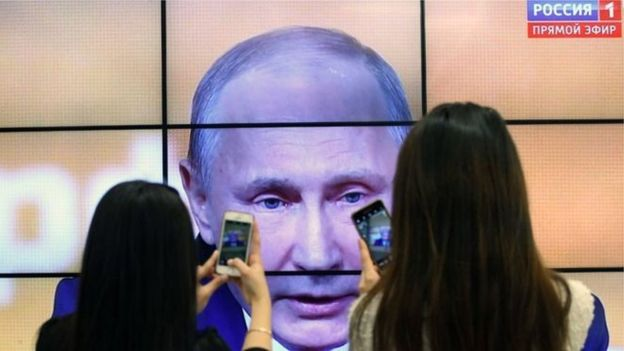
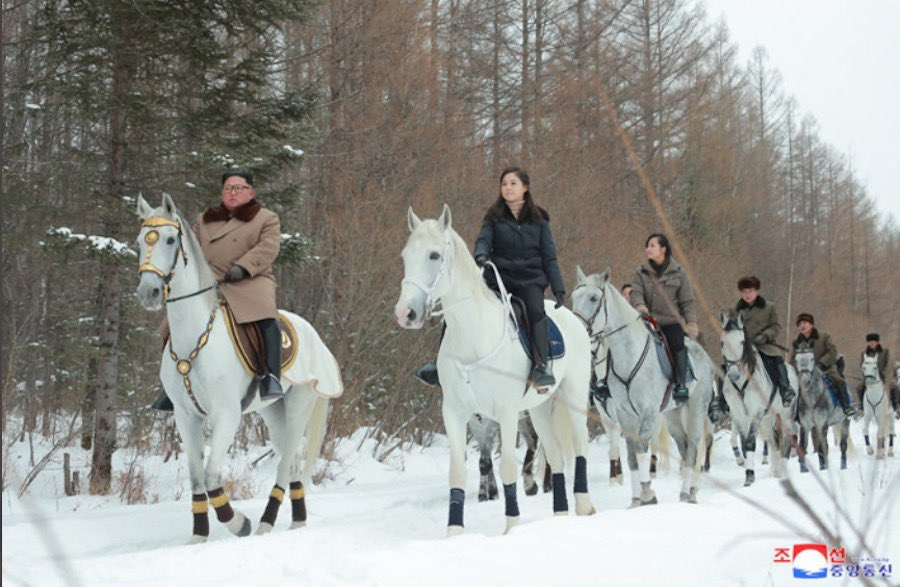
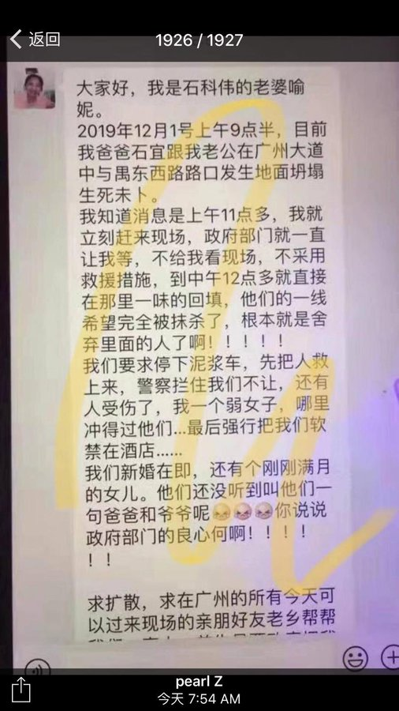
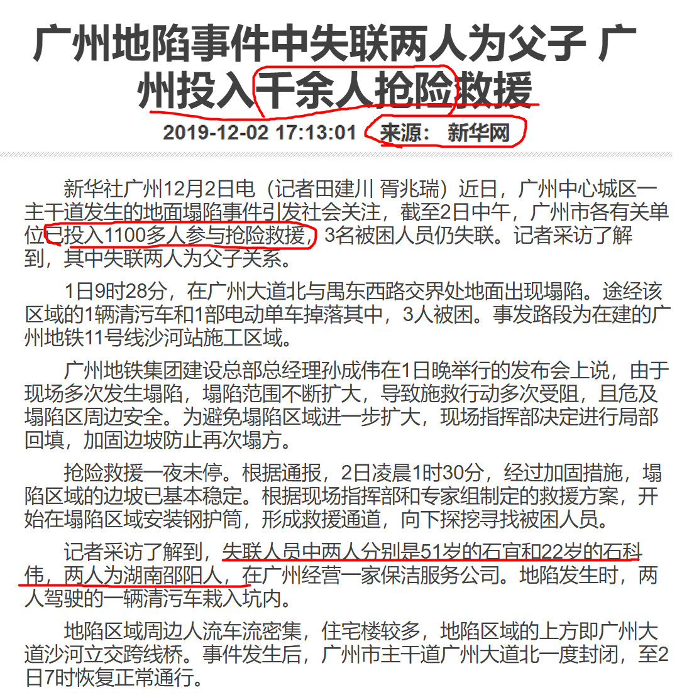
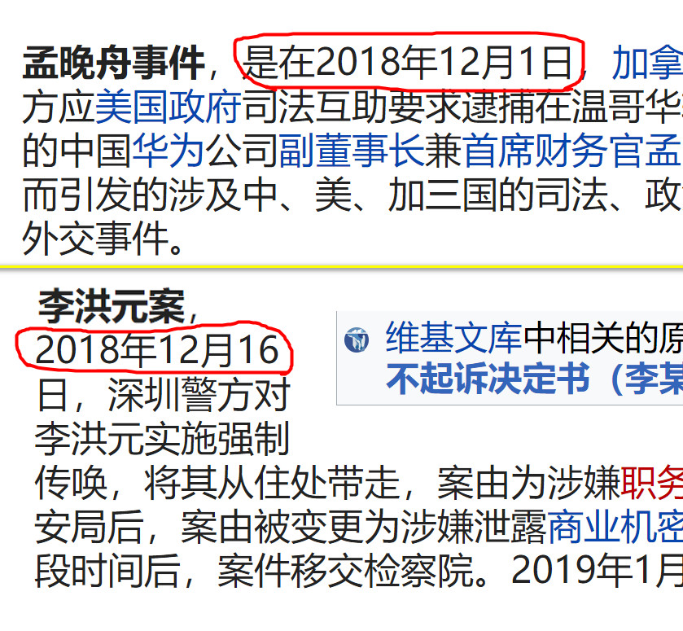
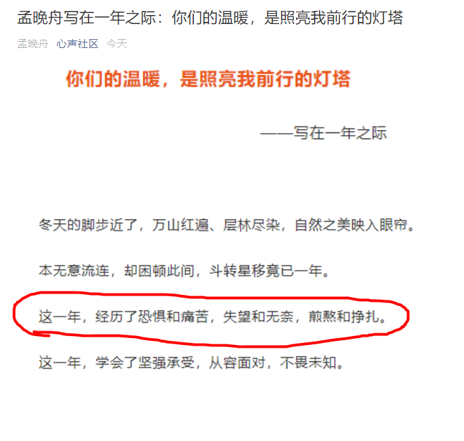
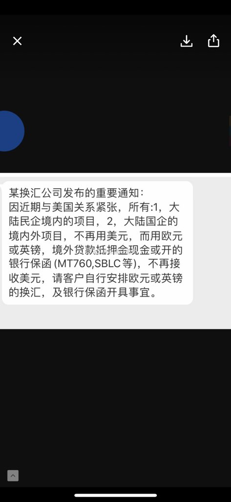
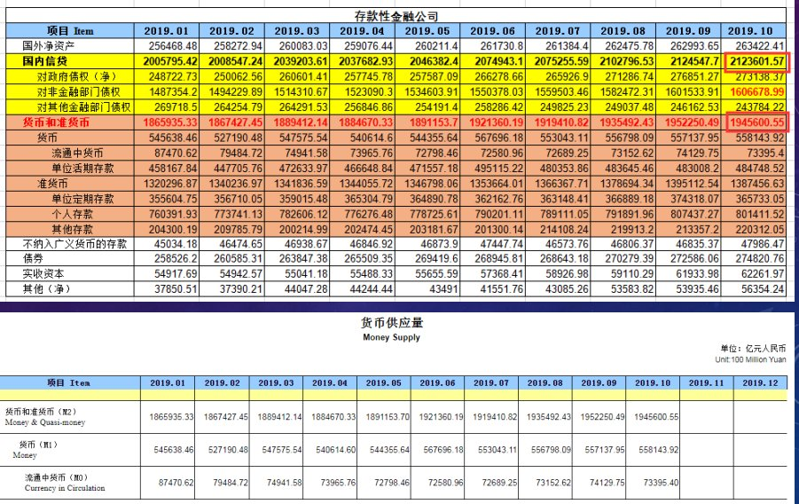
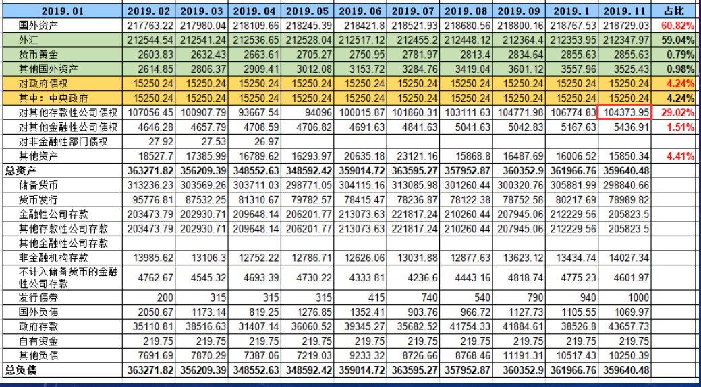

[12月05日 19:01]    纽约时报中文网   @nytchinese    《爷爷，我想念你》的叙述者探讨了她对祖父的感情，虽然素未谋面，但她了解到，祖父长着一个像她叔叔一样的鼻子，还会用各种声音讲故事，从狮子到云朵无所不包。
欢迎查看其他入选的年度最佳童书： http://nyti.ms/2DYSDn7   :speech_balloon:评:1 :+1:赞:4 :globe_with_meridians:转:0  

[12月05日 18:31]    BBC News 中文   @bbcchinese    “华为是一家中国公司，这是他们唯一的借口，”华为公司代表称。他还指美国方面的做法属于用行政手段干预市场，违背美国宪法，华为除上诉外“别无选择”。 https://bbc.in/2YnerCe   :speech_balloon:评:17 :+1:赞:23 :globe_with_meridians:转:3  

[12月05日 18:01]    BBC News 中文   @bbcchinese    加拿大总理杜鲁多在北约峰会站立闲聊时怀疑取笑特朗普，被传媒摄录下来引起特朗普反唇相讥。 这些情况其实也曾在各国领袖身上出现。BBC News 中文为大家盘点5个政治尴尬时刻。 https://bbc.in/362YLq9   :speech_balloon:评:4 :+1:赞:19 :globe_with_meridians:转:4  

[12月05日 17:57]    财经真相   @caijingxiang    央行印出来的货币，必须要有“价值”，没有价值的货币是没人要的！确保印出来的货币有价值是央行的主要职能之一！
在中国央行的主要任务就是给政府.国企以及权贵企业发钱，却用14亿百姓的财富做抵押，以此来给新印的钞票提供价值！ https://youtu.be/HDDCAS4we4E   :speech_balloon:评:5 :+1:赞:86 :globe_with_meridians:转:30  

[12月05日 17:32]    BBC News 中文   @bbcchinese    出身草根、參選前毫無政治聯繫的陳梓維擊敗了建制派政治明星葉傲冬，被香港網民稱作現代版的「大衛打敗哥利亞」故事。 https://bbc.in/38cVAhN   :speech_balloon:评:24 :+1:赞:65 :globe_with_meridians:转:13  

[12月05日 17:00]    纽约时报中文网   @nytchinese    #图集【干旱、洪水、热浪……气候变化加速危及全球】干旱、洪水、再一次干旱、再一次洪水......几十年来，政府短视的政策使数以百万计的印度人生活在恶劣的气候环境中。这些图片记录下了印度面临的困境。
点击查看图集： http://nyti.ms/2sN5xlI   :speech_balloon:评:1 :+1:赞:9 :globe_with_meridians:转:1  

[12月05日 16:30]    纽约时报中文网   @nytchinese    #新新世界 华为是如何在中国失去民心的？  http://nyti.ms/2RhpGKV  by @LiYuan6https://twitter.com/LiYuan6/status/1202177852357038080 …  :speech_balloon:评:11 :+1:赞:9 :globe_with_meridians:转:4  

[12月05日 16:00]    纽约时报中文网   @nytchinese    “我们中的许多人，完全超负荷，总是有压力。”权威色彩公司潘通最近提及了焦虑情绪。潘通称，在如今这个不稳定的时代，“经典蓝”可以满足人们对可靠、稳定基础的渴望。
这一新出炉的年度色彩真的能帮助人们感觉更好吗？还是只是促进消费的噱头？ http://nyti.ms/2PbfZuK   :speech_balloon:评:4 :+1:赞:21 :globe_with_meridians:转:7  

[12月05日 15:30]    纽约时报中文网   @nytchinese    新加坡樟宜机场是一个主题公园，也是一座未来主义逍遥宫，是罕有的会吸引你留下来的机场。
当机场本身就是引人入胜的旅游目的地时，旅客会有什么样的经历呢？ http://nyti.ms/360CBF9   :speech_balloon:评:1 :+1:赞:14 :globe_with_meridians:转:1  

[12月05日 15:11]    老司机   @h5lpykl7tp6jjop    天赋无法阻挡，給农民小伙儿点个赞！  :speech_balloon:评:3 :+1:赞:121 :globe_with_meridians:转:36  

[12月05日 15:00]    纽约时报中文网   @nytchinese    这本第一夫人传记，告诉你有关梅拉尼娅的6件事  http://nyti.ms/2rR8zEX https://twitter.com/ccni/status/1202410071491317760 …  :speech_balloon:评:0 :+1:赞:2 :globe_with_meridians:转:0  

[12月05日 14:41]    老司机   @h5lpykl7tp6jjop    网络上最新的华为流行语：工作996，辞职251，讨论404。  :speech_balloon:评:2 :+1:赞:11 :globe_with_meridians:转:2  

[12月05日 14:34]    新闻大吐槽   @TuCaoFakeNews    香港抗争者的记录已经全国联网，电子时代的邪恶档案制度，记下香港人的“黑”材料！

据这位大律师说，2个月前，一位香港抗争者在街头被滥捕，他没有犯罪，所以也并没有被起诉 ，并很快被释放。

结果当他2月后去澳门时，竟然被拒入境！  :speech_balloon:评:15 :+1:赞:208 :globe_with_meridians:转:128  

[12月05日 14:34]    新闻大吐槽   @TuCaoFakeNews    香港抗争者的记录已经全国联网，电子时代的邪恶档案制度，记下香港人的“黑”材料！

据这位大律师说，2个月前，一位香港抗争者在街头被滥捕，他没有犯罪，所以也并没有被起诉 ，并很快被释放。

结果当他2月后去澳门时，竟然被拒入境！  :speech_balloon:评:15 :+1:赞:208 :globe_with_meridians:转:128  

[12月05日 14:30]    纽约时报中文网   @nytchinese    时报儿童读物编辑精心挑选了本年度最值得一读的25本儿童绘本和青少年书籍，其中有童话冒险，也有现实故事。中国绘本作家金晓婧的《爷爷，我想念你》上榜。 http://nyti.ms/2DYSDn7   :speech_balloon:评:2 :+1:赞:34 :globe_with_meridians:转:11  

[12月05日 14:15]    BBC News 中文   @bbcchinese    一张印度贫穷女孩在教室外偷偷听课的照片，在网上竟然引起了一场小风波。  :speech_balloon:评:21 :+1:赞:178 :globe_with_meridians:转:51  

[12月05日 14:01]    BBC News 中文   @bbcchinese    在平等、幸福排行榜上常年位居前茅的丹麦，却因性暴力泛滥挨批。难道，受害人没有反抗就不该算强奸？ https://bbc.in/33RFrL7   :speech_balloon:评:17 :+1:赞:36 :globe_with_meridians:转:7  

[12月05日 14:00]    纽约时报中文网   @nytchinese    #新新世界 社交媒体上的愤怒显示出中国中产阶级成员的不安全感，他们从未经历经济衰退，一直以为自己比低收入的农民工得到了更多保护。一些人说他们在李洪元身上看到自己。
 “打破了广大中产‘我学习优秀，一心工作，不问世事’就能被国家善待的中国梦，”一位博主在微博上写道。 http://nyti.ms/2RhpGKV   :speech_balloon:评:13 :+1:赞:40 :globe_with_meridians:转:16  

[12月05日 13:55]    老司机   @h5lpykl7tp6jjop    惡警無處不在  :speech_balloon:评:2 :+1:赞:51 :globe_with_meridians:转:47  

[12月05日 13:30]    纽约时报中文网   @nytchinese    FCC上月投票禁止美国电信公司使用联邦补贴从华为和中兴购买设备。华为产品在美国销售因此受阻，该公司称此举违反了美国宪法。
华为正向FCC发起法律挑战。这是这家备受困扰的公司回击全球监管机构和批评人士的最新举措。 http://nyti.ms/2DNXs2g   :speech_balloon:评:9 :+1:赞:24 :globe_with_meridians:转:7  

[12月05日 13:20]    纽约时报中文网   @nytchinese    #观点 一场与中国的新冷战已经开始  http://nyti.ms/2OKD9sY https://twitter.com/ccni/status/1202409252960325632 …  :speech_balloon:评:7 :+1:赞:9 :globe_with_meridians:转:8  

[12月05日 13:00]    纽约时报中文网   @nytchinese    #每日一词 Armageddon，世界末日。学者弗格森撰文称，一场中美新冷战已经开始。这次冷战不同于美苏冷战时期“接近世界末日的体验”(near-Armageddon experiences)，意识形态的对抗已体现在各个方面。Armageddon是圣经中善恶对决的最终、末日审判的地点。
更多简报内容： http://nyti.ms/2DN1rMM   :speech_balloon:评:4 :+1:赞:22 :globe_with_meridians:转:5  

[12月05日 12:30]    纽约时报中文网   @nytchinese    #新新世界 当孟晚舟过着光鲜的拘禁生活时，华为前员工李洪元遭公司指控敲诈勒索，被关押251天。许多中国中产阶级担心李洪元的遭遇可能发生在自己身上。
华为在中国被视为国内技术行业皇冠上的明珠。但李洪元案引发的反弹，表明中国人对华为有了不满情绪。by @LiYuan6 http://nyti.ms/2RhpGKV   :speech_balloon:评:126 :+1:赞:316 :globe_with_meridians:转:125  

[12月05日 12:00]    纽约时报中文网   @nytchinese    气候变化正在加剧：全球逐渐变暖，海平面上升速度加快，冰川以从未预料到的速度融化，更多城市面临洪水威胁。
世界气象组织周二发布了全球气候状况年度报告，该组织秘书长表示，“情况正越变越糟”。
更多简报内容： http://nyti.ms/2DN1rMM   :speech_balloon:评:61 :+1:赞:12 :globe_with_meridians:转:4  

[12月05日 11:16]    新闻大吐槽   @TuCaoFakeNews    台湾男子把香港一幕幕可歌可泣的抗争画面用乐高积木重现：

831太子站列车上在黑警棍下痛哭的情侣，
721白衣人对市民无差别的攻击，
交通警当街开枪杀人，
从桥上用吊索逃出生天，
天桥上喊香港人加油的小男孩。

感慨香港人的坚持与付出，他说自己将来也会用生命保卫台湾  :speech_balloon:评:20 :+1:赞:391 :globe_with_meridians:转:192  

[12月05日 11:16]    新闻大吐槽   @TuCaoFakeNews    台湾男子把香港一幕幕可歌可泣的抗争画面用乐高积木重现：

831太子站列车上在黑警棍下痛哭的情侣，
721白衣人对市民无差别的攻击，
交通警当街开枪杀人，
从桥上用吊索逃出生天，
天桥上喊香港人加油的小男孩。

感慨香港人的坚持与付出，他说自己将来也会用生命保卫台湾  :speech_balloon:评:20 :+1:赞:391 :globe_with_meridians:转:192  

[12月05日 11:00]    BBC News 中文   @bbcchinese    普京周一（12月2日）签署法律，允许俄罗斯政府有权将记者，博客作者，甚至社交媒体用户当作“外国代理人”，对2017年的俄罗斯法律作了进一步补充。
 https://bbc.in/2P90TG6   :speech_balloon:评:9 :+1:赞:35 :globe_with_meridians:转:15  

[12月05日 11:00]    纽约时报中文网   @nytchinese    美国众议院通过维吾尔人权法案引发中国反弹。该法案在周二的投票中获得压倒性支持，但在送交特朗普签署前还需得到参议院批准。
中国外交部发言人华春莹在一份声明中说，新疆事务纯属中国内政，并敦促美国纠正错误，阻止该法案成为法律。
更多简报内容： http://nyti.ms/2DN1rMM   :speech_balloon:评:14 :+1:赞:15 :globe_with_meridians:转:4  

[12月05日 10:56]    新闻大吐槽   @TuCaoFakeNews    大陆移民香港的婆婆：“我父亲就是共产党，我不怕讲的，帮共产党打天下，没有好下场！”
虽然嘴上说不怕，手却在不停的扶口罩，还是能看出当年留下的恐怖烙印！
然而已经66岁的她，豁出去也要讲真话：“港共是最恐怖的政权，8964军队都没有攻占大学！”  :speech_balloon:评:36 :+1:赞:739 :globe_with_meridians:转:357  

[12月05日 10:56]    新闻大吐槽   @TuCaoFakeNews    大陆移民香港的婆婆：“我父亲就是共产党，我不怕讲的，帮共产党打天下，没有好下场！”
虽然嘴上说不怕，手却在不停的扶口罩，还是能看出当年留下的恐怖烙印！
然而已经66岁的她，豁出去也要讲真话：“港共是最恐怖的政权，8964军队都没有攻占大学！”  :speech_balloon:评:36 :+1:赞:739 :globe_with_meridians:转:357  

[12月05日 10:36]    BBC News 中文   @bbcchinese    熟睡中的海豹一脸萌样、躲避海豹捕食的企鹅飞越水面，还有河马咬死幼崽的照片，都是今年“野生动物摄影奖”的作品。 https://bbc.in/2DMkl6k   :speech_balloon:评:2 :+1:赞:25 :globe_with_meridians:转:11  

[12月05日 10:32]    凡賽堤/FORSETI   @FecharCCP    行动起来！！！ 為川普發聲！！！
FOX直播国会对川普总统的弹劾案youtube，
呼籲全球正義人士都请去点踩
维护川普的尊严发出正義的声音聲援川普！！！ https://www.youtube.com/watch?v=ogmWHENgSTQ …  :speech_balloon:评:0 :+1:赞:3 :globe_with_meridians:转:1  

[12月05日 10:30]    纽约时报中文网   @nytchinese    在被参天大树环绕的花园里漫步、在“天空之网”体验高空行走、品尝米其林级美食、观看音乐瀑布表演......
新加坡的樟宜机场属于罕有的会吸引你留下来的机场。当机场本身就是引人入胜的旅游目的地，等待也是一种美好。 http://nyti.ms/360CBF9   :speech_balloon:评:10 :+1:赞:58 :globe_with_meridians:转:24  

[12月05日 10:29]    纽约时报中文网   @nytchinese    简报：华为如何在华失去民心；美众议院通过新疆人权法案  http://nyti.ms/2DN1rMM https://twitter.com/ccni/status/1202408217134940160 …  :speech_balloon:评:14 :+1:赞:18 :globe_with_meridians:转:6  

[12月05日 09:56]    纽约时报中文网   @nytchinese    早安！今日重点新闻包括：
华为如何在华失去民心；美众议院通过新疆人权法案；世界气象组织警告全球气候变化加剧；德国驱逐两名俄罗斯外交官；朝中社再发布金正恩骑马登圣山照片；沙特阿美终迎上市； 《纽约时报》年度最佳剧集……NYT简报带你速览今日要闻。 http://nyti.ms/2DN1rMM   :speech_balloon:评:47 :+1:赞:58 :globe_with_meridians:转:16  

[12月05日 09:25]    新闻大吐槽   @TuCaoFakeNews    台湾馆长质问陈小春：“香港人的小孩，被打，被消失，你陈小春的小孩是小孩，香港人的小孩不是小孩吗？”

他认为陈小春既然是护旗手，支持港警，又是中共官方的一员，就应该把小孩留在大陆读书！而不是送到台湾来~  :speech_balloon:评:30 :+1:赞:661 :globe_with_meridians:转:233  

[12月05日 09:24]    BBC News 中文   @bbcchinese    中共高层栗战书赞扬澳门“全面凖确实施《基本法》”之余，要求香港“很好地领会”中央精神。 https://bbc.in/2rYhUuw   :speech_balloon:评:20 :+1:赞:35 :globe_with_meridians:转:12  

[12月05日 08:26]    老司机   @h5lpykl7tp6jjop    我对我们盘丝洞里的小愤青们说：你们不用见了什么不公平就愤怒就巴拉巴拉，冷静一点，理性一点，因为在这片神奇的土地上，所有的不公平最后都能公平的落在每一个人头上。  :speech_balloon:评:10 :+1:赞:212 :globe_with_meridians:转:41  

[12月05日 08:25]    BBC News 中文   @bbcchinese    多方专家认为，朝鲜所暗示的“圣诞礼物”，很可能是某种形式的武器试验或导弹发射。 https://bbc.in/2YiQyvB   :speech_balloon:评:31 :+1:赞:74 :globe_with_meridians:转:15  

[12月05日 07:50]    新闻大吐槽   @TuCaoFakeNews    再让你为所欲为！ https://twitter.com/caojitw/status/1202374355482624000 …  :speech_balloon:评:1 :+1:赞:24 :globe_with_meridians:转:7  

[12月05日 07:48]    BBC News 中文   @bbcchinese    到底是谁投下了那一张反对票？ https://bbc.in/367U12r   :speech_balloon:评:130 :+1:赞:196 :globe_with_meridians:转:56  

[12月05日 07:18]    BBC News 中文   @bbcchinese    有关事件也引发中国舆论对目前中国有严重缺陷的拘押制度与基本人权的反思。 https://bbc.in/2sLWf9A   :speech_balloon:评:83 :+1:赞:336 :globe_with_meridians:转:136  

[12月05日 06:26]    墙国铁拳现世报😷   @Socialistfist    为了实地考察并认真调研总书记任内打击腐败取得的骄人成绩，王立民书记主动要求到狱中体验贪腐分子的日常
什么是学者的钻研精神，小编哭了，你呢？

#社会主义铁拳  :speech_balloon:评:19 :+1:赞:292 :globe_with_meridians:转:72  

[12月05日 05:34]    新闻大吐槽   @TuCaoFakeNews    压垮白马的王子
手下的马都不敢比他的马白！白的估计也要图灰  :speech_balloon:评:38 :+1:赞:160 :globe_with_meridians:转:32  

[12月05日 05:34]    新闻大吐槽   @TuCaoFakeNews    压垮白马的王子
手下的马都不敢比他的马白！白的估计也要图灰  :speech_balloon:评:38 :+1:赞:160 :globe_with_meridians:转:32  

[12月05日 05:22]    新闻大吐槽   @TuCaoFakeNews    联航竟然不与本国警察一起合谋，用勒索罪把他抓起来，实在是太弱鸡了 https://twitter.com/h1300062810/status/1202251853125300224 …  :speech_balloon:评:6 :+1:赞:187 :globe_with_meridians:转:56  

[12月05日 05:22]    新闻大吐槽   @TuCaoFakeNews    联航竟然不与本国警察一起合谋，用勒索罪把他抓起来，实在是太弱鸡了 https://twitter.com/h1300062810/status/1202251853125300224 …  :speech_balloon:评:6 :+1:赞:187 :globe_with_meridians:转:56  

[12月04日 22:59]    BBC News 中文   @bbcchinese    许多艺术家将自己的作品视为生命，甚至为艺术献身。而发生在加拿大女艺术家吉莉安•格恩瑟身上的事情似乎真的让她为自己的作品而献身了。 https://bbc.in/3511jF2   :speech_balloon:评:10 :+1:赞:63 :globe_with_meridians:转:23  

[12月04日 22:07]    财经真相   @caijingxiang    日本又拍了一个中国现状的纪录片《光棍儿》，为啥中国现实深刻的事都是日本人拍，中国的媒体难道只会歌功颂德，厉害了我的国！  :speech_balloon:评:51 :+1:赞:504 :globe_with_meridians:转:149  

[12月04日 21:59]    BBC News 中文   @bbcchinese    最新实验显示，狗狗能判断出某人是否可信。一旦它认为某人不可信，它就会……忽略此人提供的线索。
 https://bbc.in/2OMI4JW   :speech_balloon:评:25 :+1:赞:102 :globe_with_meridians:转:26  

[12月04日 21:06]    BBC News 中文   @bbcchinese    BBC所做的一项调查显示，英国超过三分之一的年轻女性在性生活中经历不同程度的性暴力，有些甚至身亡，不容忽视。 https://bbc.in/2sMJrzT   :speech_balloon:评:40 :+1:赞:73 :globe_with_meridians:转:24  

[12月04日 21:03]    老司机   @h5lpykl7tp6jjop    (转）研究传媒人员经过调查，发现当前大陆民众每天获取新闻信息渠道，已经发生根本性变化。其中75.25%来源于微信群，39.02%来源于抖音，26.61%来源于今日头条，20.03%来源于微博。信息来自传统纸媒的0.68%；来自电视的6.56%（只有老人还看电视）；其他渠道占到4.24%（例如饭局、会议、家庭、街头闲谈）  :speech_balloon:评:22 :+1:赞:255 :globe_with_meridians:转:143  

[12月04日 20:37]    GFHG SDKM   @zyx_yny    喂喂，香港嘅bb睇落嚟

澳洲設立committee，探討是否有必要頒佈Magnitsky. 可以開始寫信lobby袋鼠囯喔。They accept submissions now

好擔心。區選舉和HKHRDA頒佈后，大家有哋散漫有哋唔focus喎。還有人開始屌來屌去...

bb, come back! 依家有嘢做囖

利申：信還沒寫，不過澳洲list做完一半了 https://twitter.com/NSWHongkongers/status/1202151090399006720 …  :speech_balloon:评:8 :+1:赞:310 :globe_with_meridians:转:196  

[12月04日 20:19]    新闻大吐槽   @TuCaoFakeNews    港共官员：烧烤产生二噁英远高于催泪弹！
目前不宜公开催泪弹成分，因要避免影响警方的行动能力！

潜台词：调查！调查！给你们派发福利还不知足？！
又如典故新译：百姓无烧烤充饥，何不食催泪弹？  :speech_balloon:评:41 :+1:赞:305 :globe_with_meridians:转:166  

[12月04日 20:19]    新闻大吐槽   @TuCaoFakeNews    港共官员：烧烤产生二噁英远高于催泪弹！
目前不宜公开催泪弹成分，因要避免影响警方的行动能力！

潜台词：调查！调查！给你们派发福利还不知足？！
又如典故新译：百姓无烧烤充饥，何不食催泪弹？  :speech_balloon:评:41 :+1:赞:305 :globe_with_meridians:转:166  

[12月04日 20:06]    财经真相   @caijingxiang    学到了一个新的英文单词“overtake”意味“颠覆”！  :speech_balloon:评:34 :+1:赞:351 :globe_with_meridians:转:87  

[12月04日 20:01]    BBC News 中文   @bbcchinese    【同性恋和异性恋一同庆祝 犹太人性少数节日巴特米瓦】犹太人性少数节日巴特米瓦，在庆典中会有打扮突出的舞蹈员表演。当舞蹈员在街上时，途人都在注视他，觉得不被接纳。 https://bbc.in/2LlitFY   :speech_balloon:评:4 :+1:赞:25 :globe_with_meridians:转:5  

[12月04日 19:06]    BBC News 中文   @bbcchinese    台湾中國國民黨副主席郝龙斌赴香港为韩国瑜造势，為何低調？ https://bbc.in/2PgFUkC   :speech_balloon:评:7 :+1:赞:18 :globe_with_meridians:转:6  

[12月04日 18:30]    纽约时报中文网   @nytchinese    时报影评人@ManohlaDargis 和@aoscott的十年十佳电影清单 http://nyti.ms/35TOfl9   :speech_balloon:评:4 :+1:赞:4 :globe_with_meridians:转:4  

[12月04日 18:06]    财经真相   @caijingxiang    胡锡进“我预计中美接下来几小时内公布达成协议”，这条推特太扯淡，更扯淡的是市场竟然“计价”了！ https://twitter.com/HuXijin_GT/status/1202162573212209154 …  :speech_balloon:评:74 :+1:赞:289 :globe_with_meridians:转:40  

[12月04日 17:43]    新闻大吐槽   @TuCaoFakeNews    除了客观上，警察有很多大陆公安冒充，消防员都是香港本地人，导致的区别之外；
我们还要检讨共党的机制在把人搞坏，以及其邪恶的洗脑术  :speech_balloon:评:5 :+1:赞:88 :globe_with_meridians:转:15  

[12月04日 17:30]    纽约时报中文网   @nytchinese    《解放，梅拉尼娅》没对书名中的逗号做解释，也没对特朗普13岁儿子巴伦进行任何讨论，仅把他当成影响其母亲做决定的一个因素。（贝内特写道，“我不认为出生在公众人物家庭的孩子理应成为公众密切关注的对象。”）
但这本书确实能让我们深入了解第一夫人的生活、想法和人际关系。 http://nyti.ms/2rR8zEX   :speech_balloon:评:3 :+1:赞:3 :globe_with_meridians:转:1  

[12月04日 17:01]    BBC News 中文   @bbcchinese    中国在近四次评估当中有三次排在首位，这说明了什么？ https://bbc.in/2rSzwrQ   :speech_balloon:评:168 :+1:赞:162 :globe_with_meridians:转:51  

[12月04日 17:00]    纽约时报中文网   @nytchinese    美国众议院情报委员会周二发布了一份弹劾报告，总结了迄今为止的弹劾调查，指责特朗普试图在明年总统竞选中寻求乌克兰的帮助，并通过掩盖事实来阻碍国会的调查。
以下是该报告的五个要点： http://nyti.ms/365cdd1   :speech_balloon:评:5 :+1:赞:24 :globe_with_meridians:转:6  

[12月04日 16:35]    新闻大吐槽   @TuCaoFakeNews    据说孟晚舟自己说，她正在加拿大悠哉悠哉的进行油画创作！
你觉得她应该画一幅什么主题的油画？  :speech_balloon:评:13 :+1:赞:37 :globe_with_meridians:转:8  

[12月04日 16:29]    新闻大吐槽   @TuCaoFakeNews    TikTok又在美国撞墙，一加州女生状告TikTok侵犯个人隐私！
因TikTok未经用户许可就偷偷用相册里的剪辑生成视频  :speech_balloon:评:17 :+1:赞:404 :globe_with_meridians:转:176  

[12月04日 15:01]    BBC News 中文   @bbcchinese    当韩星具荷拉被男友偷偷拍下视频的时候，具荷拉公开发起反抗，试图寻求公义，而为此她在网络上受到大量恶意攻击。最后具荷拉去世，警方称其为自杀。

珍惜生命，自杀不能解决问题，生命一定可以找到出路。若须谘商或相关协助，请电：
中国大陆（+86）：防自杀热线4001619995 https://bbc.in/2P971yg   :speech_balloon:评:26 :+1:赞:112 :globe_with_meridians:转:36  

[12月04日 14:01]    BBC News 中文   @bbcchinese    投出唯一反对票的是肯塔基州共和党众议院马希，他在香港人权法案上也投下了唯一的反对票。他认为美国没有做好制裁中国的准备。 https://bbc.in/2YdaLmp   :speech_balloon:评:178 :+1:赞:722 :globe_with_meridians:转:268  

[12月04日 13:40]    老司机   @h5lpykl7tp6jjop    一个老外对我说，你们中国人就是死脑筋，大一统干什么，分裂有什么不好？一下变成十个八个国家，在联合国投票一下多那么多票，有什么不好？我鼻涕泡都笑出来了！这种逆向思维中国人还真没有！  :speech_balloon:评:36 :+1:赞:472 :globe_with_meridians:转:86  

[12月04日 13:33]    老司机   @h5lpykl7tp6jjop    中国人常常自夸聪明，古有三十六计，今有厚黑学。其实西方的一句谚语始终没有学会：打不过对方就干脆加入对方。设想如果自建国以来就不与美国为敌，就不会有韩战，不会遭制裁几十年，不会饿死几千万，不会文革，也就不存在改开，不会在国际上混成孤家寡人，坏就坏在总想另立山头当老大又没有这个本事上  :speech_balloon:评:6 :+1:赞:43 :globe_with_meridians:转:20  

[12月04日 13:05]    老司机   @h5lpykl7tp6jjop    1882年美国签署了排华法案，137年过去了，中国人真有本事，让美国又签下了两个有关针对中国香港和新疆的法案，全世界没有任何国家有此殊荣！我就不明白为什么中国就这么特别呢？要说美国对中国不好？从退还庚子赔款到抗日战争的大量援助支持，还让进WTO赚到钱，怎么这么讨人嫌呢，天朝真是个特殊群体？  :speech_balloon:评:37 :+1:赞:558 :globe_with_meridians:转:132  

[12月04日 13:02]    BBC News 中文   @bbcchinese    在美国指控已故亿万富豪爱泼斯坦性虐待的数名女性说，英国安德鲁王子亲眼目睹了一些人在这名富豪性侵者家中接受按摩。 https://bbc.in/2RjhZDQ   :speech_balloon:评:19 :+1:赞:26 :globe_with_meridians:转:6  

[12月04日 12:36]    老司机   @h5lpykl7tp6jjop    中国人炼丹几千年也没出一个化学家，木匠干了几千年还是超不过鲁班，中医问症几千年也跳不出黄帝内经，哲学几千年不如春秋诸子百家，都二十一世纪科技大爆炸时代了，还向外输出孔子学院！面对祖宗羞也羞死了，现代生存需求那一样东西不是从别国偷学得来？每天说作为中国人无比自豪，不知道在自豪什么？  :speech_balloon:评:58 :+1:赞:1120 :globe_with_meridians:转:306  

[12月04日 12:05]    老司机   @h5lpykl7tp6jjop    常常看到大陆的年轻人，找工作没有自信，追女孩没有胆量，学知识没有兴趣，一干活没有耐心，可一旦提起中国，忽然就有自信，一说起黄段子兴趣大到不行，一提起对外开战忽然就有胆量，一玩起游戏一下就有耐心了，就这样它们居然敢说香港上街爭民主自由的青年们是废青！真是不知身己废，隔墙犹自嗨！  :speech_balloon:评:87 :+1:赞:1944 :globe_with_meridians:转:527  

[12月04日 11:41]    老司机   @h5lpykl7tp6jjop    科学解释：为什么越是无知的人越自信？
随着阅历的增长，我们越懂得这样一个道理——不要和笨蛋争论。
因为，有科学研究证明：笨蛋是真的意识不到自己是笨蛋。
在幽默感、文字能力和逻辑能力上最欠缺的那部分人总是高估自己：当他们实际得分只有12%时，却认为自己的得分在60%以上！这就是“达克效应”。  :speech_balloon:评:7 :+1:赞:205 :globe_with_meridians:转:117  

[12月04日 09:46]    财经真相   @caijingxiang    一条被忽视的重磅新闻！12月3日，全国市域社会治理现代化工作会议在北京京西宾馆召开，面向全国、所有地市都有机会参与的市域社会治理现代化试点工作，第一期从2020年至2022年。会议指针对社会矛盾形成、演变特点，关键是要发挥体制优势，推动关口前移、重心下移，努力使市域成为社会矛盾的“终点站”。  :speech_balloon:评:62 :+1:赞:333 :globe_with_meridians:转:171  

[12月04日 09:29]    财经真相   @caijingxiang    隔夜全球市场暴跌，而贸易战受害最大的中国，今天开盘a50竟然还小幅涨，现在已经不是护盘的问题了，因为散户已经被暴跌市场吓跑了，现在是谁护盘呢？  :speech_balloon:评:56 :+1:赞:499 :globe_with_meridians:转:86  

[12月04日 08:19]    老司机   @h5lpykl7tp6jjop    突发新闻：美国国会《维吾尔人权政策法案》，通过了！！！  :speech_balloon:评:213 :+1:赞:3880 :globe_with_meridians:转:1249  

[12月04日 05:39]    新闻大吐槽   @TuCaoFakeNews    昨晚，很多市民在一处连侬墙下摆上蜡烛，纪念周梓乐同学。

可破坏者报警说有火灾风险，随后消防员被派来现场。

消防员虽然接到命令不得不执行，可从他们小心翼翼，轻灭蜡烛的动作上看得出，他们对为自由牺牲的英灵，抱有尊重！  :speech_balloon:评:75 :+1:赞:2040 :globe_with_meridians:转:775  

[12月04日 05:39]    新闻大吐槽   @TuCaoFakeNews    昨晚，很多市民在一处连侬墙下摆上蜡烛，纪念周梓乐同学。

可破坏者报警说有火灾风险，随后消防员被派来现场。

消防员虽然接到命令不得不执行，可从他们小心翼翼，轻灭蜡烛的动作上看得出，他们对为自由牺牲的英灵，抱有尊重！  :speech_balloon:评:75 :+1:赞:2040 :globe_with_meridians:转:775  

[12月03日 18:59]    墙国铁拳现世报😷   @Socialistfist    两位推友匿名私信回应  :speech_balloon:评:12 :+1:赞:125 :globe_with_meridians:转:13  

[12月03日 18:58]    墙国铁拳现世报😷   @Socialistfist    党员推友后续来信  :speech_balloon:评:10 :+1:赞:55 :globe_with_meridians:转:4  

[12月03日 18:32]    财经真相   @caijingxiang    CNBC：川普说最好2020年大选结果出来后再达成协议，该消息让离岸人民币瞬间暴走！  :speech_balloon:评:20 :+1:赞:339 :globe_with_meridians:转:102  

[12月03日 18:28]    财经真相   @caijingxiang    消息公布后，离岸人民币扩大跌幅，黄金、日元跳涨！开始了！ https://twitter.com/CNBC/status/1201809520751783936 …  :speech_balloon:评:19 :+1:赞:555 :globe_with_meridians:转:148  

[12月03日 18:22]    墙国铁拳现世报😷   @Socialistfist    曾经中国最年轻的省区首府市市长之一
坚决支持铁腕新疆政策，党内仕途看好
到头来也是落个 “生活奢靡，贪图享乐，道德败坏，搞权色交易”的无期徒刑
刚从俄罗斯和副总理韩正考察回来,就被从首都机场带走。  :speech_balloon:评:34 :+1:赞:436 :globe_with_meridians:转:136  

[12月03日 16:58]    老司机   @h5lpykl7tp6jjop    街头惊现"喪盡天良，還我器官……"条幅！生活在这样一个国家，别说你去保护家人和财产，你连自已的器官和小命都保不住，随时被活摘被消失……这样的社会不推倒重来，还有啥活头？  :speech_balloon:评:16 :+1:赞:541 :globe_with_meridians:转:319  

[12月03日 12:45]    老司机   @h5lpykl7tp6jjop    好文分享：

“爱国人士”的困惑：不是说中国已成大赢家吗？  :speech_balloon:评:2 :+1:赞:67 :globe_with_meridians:转:26  

[12月03日 12:35]    新闻大吐槽   @TuCaoFakeNews    从湖南来广州务工的老石骑着电单车，载着要奉子成婚的儿子骑行在街上，突然地面凹陷，他们跌入了深坑！然而等待他们的不是救援，而是狠心的回填，借口是害怕更大的地陷发生！

儿媳喻妮亲眼目睹一切，而新华网报道却称投入千人抢救，只字不提回填；
现在，抱着1月大女儿，她不知如何给亲人举办葬礼！  :speech_balloon:评:113 :+1:赞:1022 :globe_with_meridians:转:758  

[12月03日 12:26]    老司机   @h5lpykl7tp6jjop    南博万呀，南博万呀，多么流弊地南博万！偶们唱歌，偶们跳舞，介么多地南博万！  :speech_balloon:评:9 :+1:赞:208 :globe_with_meridians:转:121  

[12月03日 10:35]    财经真相   @caijingxiang    海航控股同意公司与以国开行为牵头行及代理行，以中国进出口银行、中国银行等为初始贷款人组成的银团签署《海航控股2019 年流动资金贷款联合授信项目人民币资金银团贷款合同》，向银团申请贷款共计40亿元（8 家银行各提供5亿元）。贷款期限为3年，前2年为宽限期。贷款利率为固定利率，即年利率4.75%。  :speech_balloon:评:23 :+1:赞:157 :globe_with_meridians:转:42  

[12月03日 10:10]    新闻大吐槽   @TuCaoFakeNews    去年，孟晚舟在加国被捕15天后，李洪元在深圳被捕！2个几乎同时发生的牢狱之灾，却充满了对比与讽刺！

昨天是孟晚舟被捕一周年，一年里，她时装、豪车、豪宅，过的如明星一般，却矫情发文称：经历了恐惧和痛苦，失望和无奈，煎熬和挣扎~

可知李这一年经历了什么？

制造痛苦的人，总嫌自己痛苦太多  :speech_balloon:评:48 :+1:赞:988 :globe_with_meridians:转:433  

[12月03日 08:23]    老司机   @h5lpykl7tp6jjop    好消息！

中共国各地方银行全面跌破发行价，目前有20多家上市银行面临破产。  :speech_balloon:评:84 :+1:赞:1135 :globe_with_meridians:转:502  

[12月03日 04:58]    老司机   @h5lpykl7tp6jjop    全球还有三分之二的人民没有得到解放哦！要不要去比尔盖茨家推销一下社保呀？既然专业搞传销就该全世界都铺开嘛，气魄还不够大！  :speech_balloon:评:3 :+1:赞:43 :globe_with_meridians:转:2  

[12月03日 04:57]    老司机   @h5lpykl7tp6jjop    @听字多一点 
1967年夏  裹着红卫兵战旗的重庆武斗的一派死难者的尸体  :speech_balloon:评:6 :+1:赞:40 :globe_with_meridians:转:25  

[12月03日 00:55]    墙国铁拳现世报😷   @Socialistfist    一位推友的来信
欢迎理性讨论  :speech_balloon:评:194 :+1:赞:299 :globe_with_meridians:转:29  

[12月03日 00:02]    财经真相   @caijingxiang    罗斯说如果12月15号前，中美达不成第一阶段的协议，将提高关税!消息公布日元、黄金避险资产上涨，美股跳水，恐慌指数VIX短线走高，离岸人民币小幅走低！  :speech_balloon:评:10 :+1:赞:220 :globe_with_meridians:转:63  

[12月02日 23:05]    财经真相   @caijingxiang    华为正式回应：“支持李洪元运用法律武器”，语气可以说霸气外露，这样的语气不是冲李洪元去的，他只是一个小棋子，而是回应故意让新闻不时蹦出来的那帮人，这些人的能力不容小觑，他们完全可以在不断删新闻的背景下，继续让虎嗅网大胆的发新闻，而且还操控整个微博热点，甚至通过外交系统“借美国人的刀” https://twitter.com/caijingxiang/status/1201075431123763200 …  :speech_balloon:评:8 :+1:赞:126 :globe_with_meridians:转:40  

[12月02日 23:05]    墙国铁拳现世报😷   @Socialistfist    补充  :speech_balloon:评:8 :+1:赞:256 :globe_with_meridians:转:57  

[12月02日 22:53]    墙国铁拳现世报😷   @Socialistfist    华为251事件在微博上引起热烈讨论，不少贸易战时脑热购买华为手机的粉红一夜间大有幡然醒悟之感。
爱国爱党情怀还能消费多久？
#社会主义铁拳  :speech_balloon:评:74 :+1:赞:866 :globe_with_meridians:转:293  

[12月02日 22:35]    财经真相   @caijingxiang    来猜猜，“枪杆子”对“钱袋子、刀把子、海外大外宣以及外交系统，这胜算有多大？ https://twitter.com/caijingxiang/status/1201507785998946306 …  :speech_balloon:评:20 :+1:赞:181 :globe_with_meridians:转:29  

[12月02日 22:25]    财经真相   @caijingxiang    习近平主席令新闻联播前被临时取消，如果这事属实，那将是北京高层的一场重大地震！  :speech_balloon:评:136 :+1:赞:967 :globe_with_meridians:转:183  

[12月02日 21:28]    财经真相   @caijingxiang    这个是算的政治账，不是经济账，试想如果俄罗斯换成美国，现在香港法案通过背景下，这样一条输气管道岂不成了制裁对象！ https://twitter.com/RFA_Chinese/status/1201490172203827212 …  :speech_balloon:评:10 :+1:赞:40 :globe_with_meridians:转:10  

[12月02日 20:11]    老司机   @h5lpykl7tp6jjop    RT "Two female Hongkongers sing "glory to Hong Kong" on the street. See how people responses. I Can't stop crying." [This video has no English subtitles, we believe there is no need to add them.] #StandWithHK https://twitter.com/feichi1978/status/1201142329710534657 …  :speech_balloon:评:1 :+1:赞:55 :globe_with_meridians:转:25  

[12月02日 19:38]    财经真相   @caijingxiang    网传不知真假，求证！  :speech_balloon:评:20 :+1:赞:78 :globe_with_meridians:转:14  

[12月02日 18:40]    财经真相   @caijingxiang    要声明的是，本人水平有限，真的看不懂央行的资产负债表，不知是否有哪位高人，能够用人听得懂的话，把这里面的道理简单说明一下！  :speech_balloon:评:20 :+1:赞:101 :globe_with_meridians:转:10  

[12月02日 18:38]    财经真相   @caijingxiang    商业银行接受的贷款超过其存款时，一般有两个办法补充其缺口，一个是找其他银行借款，这个被称之为同业拆借，另一个就是找央行借，因为只有央行才能印钞，找央行借体现在央行负债表上就是“对其他存款性公司债权”，截止10月份央行对全体中国商业银行放贷总共是10.43万亿，这点钱根本对不上缺口！  :speech_balloon:评:5 :+1:赞:120 :globe_with_meridians:转:23  

[12月02日 18:33]    财经真相   @caijingxiang    我们都知道商业银行最主要的业务就是吸收存款，然后加点利息放出贷款，自己是不能印钞的，只有央行才行。根据央行公布的数据，2019年10月中国商行存款（准货币）为138.74万亿，但是放出的信贷却高达212.36万亿，这多出来的73.62万亿是哪来的？即使全体货币m2也就194.56万亿，也是不够！  :speech_balloon:评:38 :+1:赞:408 :globe_with_meridians:转:181  

[12月02日 15:36]    财经真相   @caijingxiang    中国外交部：针对美方执意将所谓“香港人权与民主法案”签署成法的无理行为，中国政府决定：自即日起，暂停审批美军舰机赴港休整申请，同时对美国国家民主基金会等非政府组织实施制裁。 美国民主基金会制裁？有人会因此丢掉饭碗吗？  :speech_balloon:评:64 :+1:赞:515 :globe_with_meridians:转:108  

[12月02日 13:37]    财经真相   @caijingxiang    随着黄淮以南地区的快速升温，来自印度洋地区的暖湿气流活跃度增强，其输送水汽的能力要比12月、1月时要强很多，在冷暖空气激烈碰撞下，往往会带来大范围的降雪，这也是黄淮、华北地区2月份降雪比一年当中任何时候都大的原因。另外降雪也延缓了这些地区春季到来步伐，导致春季比其他季节都短！  :speech_balloon:评:1 :+1:赞:37 :globe_with_meridians:转:8  

[12月02日 08:45]    墙国铁拳现世报😷   @Socialistfist    请各位推友注意上推安全 https://twitter.com/keepcnsecurity/status/1201167265804087296 …  :speech_balloon:评:3 :+1:赞:76 :globe_with_meridians:转:18  

[12月01日 18:05]    老司机   @h5lpykl7tp6jjop    网传:昨天，广元市交警在朝天门附近拦路执法，拦截收缴摩的，29岁摩的司机吴某持刀捅伤三名交警！  :speech_balloon:评:42 :+1:赞:285 :globe_with_meridians:转:136  

[12月01日 09:33]    墙国铁拳现世报😷   @Socialistfist    没想到昨天上了墙内头条的这位可怜人，也是社会主义铁拳击的受害人；

@Socialistfist  :speech_balloon:评:67 :+1:赞:428 :globe_with_meridians:转:103  

[11月30日 21:18]    墙国铁拳现世报😷   @Socialistfist    粉蚷战螂被小编挂以后，一个嘴硬的都没有。  :speech_balloon:评:25 :+1:赞:177 :globe_with_meridians:转:9  

[11月30日 08:30]    凡賽堤/FORSETI   @FecharCCP    CCP極權恐怖組織把人民的血汗錢都用在的網絡維穩上了，圈養了人類獨一無二的，人數達千萬的流氓殭屍網絡水軍，谷歌所有集團企業已經淪為CCP極權恐怖組織重要維穩工具了，從2018年google搜索郭文貴的8百萬到現在的360萬，郭媒體從2019年初的18000的全球排名到現在的27669排名，極權不滅，養老永無望！  :speech_balloon:评:0 :+1:赞:10 :globe_with_meridians:转:8  

[11月30日 07:23]    凡賽堤/FORSETI   @FecharCCP    推翻共产党！全民抗议！全民起义！唱响国际歌！起来不愿做奴隶的人们！起来全中国受苦受难的中华儿女！ https://twitter.com/breakup1984/status/1200411445940211714 …  :speech_balloon:评:0 :+1:赞:21 :globe_with_meridians:转:11  

[11月30日 07:19]    凡賽堤/FORSETI   @FecharCCP    人類史上最殘暴的CCP極權殺人恐怖組織正在用各種兇殘手段屠殺我們的同胞...................

CCP極權殺人恐怖組織在香港發射數以萬計的疑似帶有生化武器成份的非標準催淚彈，足以影響三代人的致癌可能！

CCP極權殺人恐怖組織在自己的土地上投放劇毒催淚彈意圖謀殺我們黃色種族同胞！  :speech_balloon:评:2 :+1:赞:29 :globe_with_meridians:转:24  

[11月30日 05:58]    凡賽堤/FORSETI   @FecharCCP    中共催泪弹成分化验结果出炉：山埃毒，也叫氰化钾，爆表！这已经不是镇压抗议者，而是赤裸裸的谋杀，包括对抗议者的生育都会造成影响！  https://twitter.com/SolomonYue/status/1200445644613140480 …  :speech_balloon:评:12 :+1:赞:293 :globe_with_meridians:转:252  

[11月30日 01:48]    墙国铁拳现世报😷   @Socialistfist    好一句“打得好”，但如果所有香港人都和他們一樣幸災樂禍，咁香港就真正被同化了  :speech_balloon:评:4 :+1:赞:103 :globe_with_meridians:转:8  

[11月30日 01:13]    墙国铁拳现世报😷   @Socialistfist    有推友说最近铁拳不够劲
小编一如既往地欢迎大家踊跃投稿
但有时候，无铁拳胜过假铁拳  :speech_balloon:评:7 :+1:赞:162 :globe_with_meridians:转:4  

[11月30日 01:09]    墙国铁拳现世报😷   @Socialistfist    补图  :speech_balloon:评:9 :+1:赞:137 :globe_with_meridians:转:22  

[11月30日 01:08]    墙国铁拳现世报😷   @Socialistfist    “打得好”

#社会主义铁拳  :speech_balloon:评:27 :+1:赞:251 :globe_with_meridians:转:58  

[11月30日 00:40]    墙国铁拳现世报😷   @Socialistfist    吼啊！ 
小编举双手赞同，一定滋磁捧场
不过要严正说明，我们是 社会主义 的生产者，我们只是 社会主义 的搬运工 https://twitter.com/Ray27809561/status/1196838238771531776 …  :speech_balloon:评:22 :+1:赞:270 :globe_with_meridians:转:28  

[11月29日 18:12]    墙国铁拳现世报😷   @Socialistfist    评论区一览  :speech_balloon:评:20 :+1:赞:303 :globe_with_meridians:转:54  

[11月29日 18:08]    墙国铁拳现世报😷   @Socialistfist    一个中国人没有被逼到绝路，谁想和石头撞。

#社会主义铁拳  :speech_balloon:评:140 :+1:赞:945 :globe_with_meridians:转:354  

[11月28日 08:19]    凡賽堤/FORSETI   @FecharCCP    幾個月來據不完全統計，CCP極權發動的黑警非法濫捕香港學生孩子以萬人計算，用各種兇殘手段屠殺的幾千人！

讓我們極度關注，傳播香港真相，盡可能的向全世界媒體以各種語言傳播，讓全世界的人看清CCP極權殺人恐怖組織納粹真相，才能真正的減少這些被非法秘密抓捕的香港學生孩子被殺害！天佑香港人！  :speech_balloon:评:44 :+1:赞:198 :globe_with_meridians:转:147  

[11月28日 08:06]    凡賽堤/FORSETI   @FecharCCP    幾個月以來，香港700萬人共同見證了CCP反人類的慘無人道的殘暴罪行！！！

這是千千萬萬的像這麼小的小朋友都親眼見證了CCP反人類的慘無人道的殘暴罪行！！！

天滅CCP！！！天滅極權！！！  :speech_balloon:评:0 :+1:赞:21 :globe_with_meridians:转:8  

[11月28日 07:48]    凡賽堤/FORSETI   @FecharCCP    美國總統川普宣布他已签署
《香港人权与民主法案》

《香港人权与民主法案》已經成功列入美國的法律！
期望美國能執行《香港人权与民主法案》對香港的黑警和淋症夜蛾進行制裁！  :speech_balloon:评:6 :+1:赞:36 :globe_with_meridians:转:19  

[11月28日 00:29]    墙国铁拳现世报😷   @Socialistfist    那两个字不会写
阿钟哥请你jiayou学中文
#战螂在推特  :speech_balloon:评:48 :+1:赞:285 :globe_with_meridians:转:42  

[11月27日 23:41]    墙国铁拳现世报😷   @Socialistfist    一个美国人向俄国人解释为什么说美国是一个真正言论自由的国家。
美国人说：“我可以走到白宫前，高喊让里根下地狱！”
俄国人很不以为然：“你这算什么，我也可以走到红场上高喊，让里根下地狱”！ https://twitter.com/jiayoubiss/status/1199703307943600128 …  :speech_balloon:评:24 :+1:赞:712 :globe_with_meridians:转:116  

[11月27日 22:46]    墙国铁拳现世报😷   @Socialistfist    哪里不自由？

#社会主义铁拳  :speech_balloon:评:42 :+1:赞:683 :globe_with_meridians:转:141  

[11月26日 01:01]    GFHG SDKM   @zyx_yny    Heading back to London. 

Thank you #HK for letting us share in your unforgettable victory.

香港人, 加油   :speech_balloon:评:2678 :+1:赞:21507 :globe_with_meridians:转:10189  

[11月24日 12:46]    GFHG SDKM   @zyx_yny    Very good to take some time@our from election observation to tell #JuniusHo in person that I was responsible for the revocation of his honorary doctorate from @AngliaRuskin #Sorrynotsorry  :speech_balloon:评:6939 :+1:赞:46296 :globe_with_meridians:转:27847  

[11月24日 08:10]    凡賽堤/FORSETI   @FecharCCP    呼籲請求共同挖掘所有有關香港發生的事，越全面越好，不同角度，越多越好，包括被暗地抓捕的人員，特別是CCP 派出的各種偽裝身份，包括變身變裝行兇的一點一滴都要挖掘出來，把CCP 的邪惡下三濫手段的真相毫無保留的曝光在全世界面前！世界公知公義才能真正挽救和保護香港人！希望懂視頻編輯配上中英文  :speech_balloon:评:3 :+1:赞:21 :globe_with_meridians:转:18  

[11月24日 08:07]    凡賽堤/FORSETI   @FecharCCP    人類史上最殘暴的CCP極權殺人恐怖組織正在用各種兇殘手段屠殺我們的同胞...................

CCP極權殺人恐怖組織超級納粹！超級殘暴！超級流氓！

人類到了全面消滅CCP極權殺人恐怖組織的時代！  :speech_balloon:评:5 :+1:赞:44 :globe_with_meridians:转:50  

[11月24日 08:04]    凡賽堤/FORSETI   @FecharCCP    人類史上最殘暴的CCP極權殺人恐怖組織正在用各種兇殘手段屠殺我們的同胞...................

CCP極權殺人恐怖組織超級納粹！  :speech_balloon:评:1 :+1:赞:41 :globe_with_meridians:转:34  

[11月24日 07:57]    凡賽堤/FORSETI   @FecharCCP    人類史上最殘暴的CCP極權殺人恐怖組織正在用各種兇殘手段屠殺我們的同胞...................

CCP極權殺人恐怖組織超級納粹！  :speech_balloon:评:6 :+1:赞:182 :globe_with_meridians:转:160  

[11月24日 07:37]    凡賽堤/FORSETI   @FecharCCP    人類史上最殘暴的CCP極權殺人恐怖組織正在用各種兇殘手段屠殺我們的同胞...................  :speech_balloon:评:1 :+1:赞:13 :globe_with_meridians:转:15  

[11月24日 07:28]    凡賽堤/FORSETI   @FecharCCP    CCP極權殺人恐怖組織正在用各種兇殘手段屠殺我們的同胞...................

視頻是CCP極權殺人恐怖組織在人流密集區投放巨量的不合格（不具國際標準）的化學毒氣催淚瓦斯彈 毒害我們的同胞！  :speech_balloon:评:0 :+1:赞:8 :globe_with_meridians:转:4  

[11月23日 11:14]    凡賽堤/FORSETI   @FecharCCP    CCP極權殺人恐怖組織是全人類的公敵！
呼籲全世界正道主義合力消滅CCP！
呼籲全世界人民看清楚CCP反人類的慘無人道的殘暴罪行！！！

消滅CCP是全世界全人類的當前最緊急任務！！！

視頻是CCP瘋狂屠殺香港學生畫面之一  :speech_balloon:评:4 :+1:赞:10 :globe_with_meridians:转:15  

[11月23日 11:08]    凡賽堤/FORSETI   @FecharCCP    凡是罔顧香港事實在推特和youtube上支持CCP和香港黑警的五毛必死全家，有朝一日必死於CCP的殺人恐怖組織之下，起底五毛祖宗十八代世代不得為人！  :speech_balloon:评:3 :+1:赞:6 :globe_with_meridians:转:1  

[11月23日 11:02]    凡賽堤/FORSETI   @FecharCCP    CCP極權殺人恐怖組織是全人類的公敵！
呼籲全世界正道主義合力消滅CCP！
呼籲全世界人民看清楚CCP反人類的慘無人道的殘暴罪行！！！

消滅CCP是全世界全人類的當前最緊急任務！！！

視頻是深夜被CCP黑警暗殺的少女！  :speech_balloon:评:1 :+1:赞:6 :globe_with_meridians:转:12  

[11月23日 10:59]    凡賽堤/FORSETI   @FecharCCP    CCP極權殺人恐怖組織是全人類的公敵！
呼籲全世界正道主義合力消滅CCP！
呼籲全世界人民看清楚CCP反人類的慘無人道的殘暴罪行！！！

消滅CCP是全世界全人類的當前最緊急任務！！！

視頻是被CCP瘋狂屠殺射中頭部身亡的香港學生  :speech_balloon:评:2 :+1:赞:4 :globe_with_meridians:转:9  

[11月23日 10:55]    凡賽堤/FORSETI   @FecharCCP    CCP極權殺人恐怖組織是全人類的公敵！
呼籲全世界正道主義合力消滅CCP！
呼籲全世界人民看清楚CCP反人類的慘無人道的殘暴罪行！！！

消滅CCP是全世界全人類的當前最緊急任務！！！

視頻是CCP瘋狂屠殺香港學生畫面之一  :speech_balloon:评:2 :+1:赞:14 :globe_with_meridians:转:13  

[11月23日 10:52]    凡賽堤/FORSETI   @FecharCCP    CCP極權殺人恐怖組織是全人類的公敵！
呼籲全世界正道主義合力消滅CCP！
呼籲全世界人民看清楚CCP反人類的慘無人道的殘暴罪行！！！

消滅CCP是全世界全人類的當前最緊急任務！！！

據報導已被發現2537宗屍體，失踪近萬人！  :speech_balloon:评:0 :+1:赞:4 :globe_with_meridians:转:0  

[11月21日 13:58]    GFHG SDKM   @zyx_yny    On #PolyU being the end game, this OL says it is 100% not the end game.  She says what we saw happened to the students at Poly, the way they were brutally treated by #HKPolice, there's no way HKers will forget.  We will keep on fighting!

#StandWithHongKong #HongKongProtests  :speech_balloon:评:104 :+1:赞:2404 :globe_with_meridians:转:1560  

[11月21日 11:50]    GFHG SDKM   @zyx_yny    We were in front of the Diet Members’ Office Building.

We will keep fighting with you, HKers
We will keep spreading what's happening in HK

You are not alone  :speech_balloon:评:371 :+1:赞:3561 :globe_with_meridians:转:2141  

[11月21日 00:57]    GFHG SDKM   @zyx_yny    Yesterday’s passage of the #HongKong Human Rights & Democracy Act was a good day in the struggle to resist totalitarian #China & its bid for domination. But it was not the last day. We have a long road ahead to protect our jobs, our workers & our security.  :speech_balloon:评:1653 :+1:赞:16299 :globe_with_meridians:转:10796  

[11月20日 21:56]    GFHG SDKM   @zyx_yny    The first day that schools resumed, #hkpolice deliberately targeted high school students to stop and search for no reason. As many #hongkongers suggest, being young becomes a crime as #China and #HKGov are totally out of reach of the whole city.  :speech_balloon:评:262 :+1:赞:5610 :globe_with_meridians:转:6216  

[11月19日 15:33]    GFHG SDKM   @zyx_yny    The tyranny forced us live as middle age warrior  :speech_balloon:评:1 :+1:赞:48 :globe_with_meridians:转:19  

[11月19日 14:41]    GFHG SDKM   @zyx_yny    This scene is no longer only appearing in movies. It’s happening in our reality.

Escaping from death. 

She’s not a #stuntman, she’s just a normal citizen, normal student.

#StandWithHongKong
#Dramaislife
#Lifeisdrama
#PolyUHongKong  :speech_balloon:评:87 :+1:赞:1522 :globe_with_meridians:转:1479  

[11月18日 10:41]    GFHG SDKM   @zyx_yny    With students in Hong-Kong who are blocking the streets to bring economic pressure on China to ensure democratic freedoms in HK! #StandWithHongKong @Andychanhotin @FreedomHKG @Stand_with_HK @hk_watch @HKWORLDCITY #HongKongProtests @joshuawongcf #Freedom  :speech_balloon:评:28 :+1:赞:703 :globe_with_meridians:转:558  

[11月18日 09:32]    GFHG SDKM   @zyx_yny    Stop using #PolyU Wifi for god’s sake.
#HongKongProtests https://twitter.com/hengyanlo/status/1196156883679055872 …  :speech_balloon:评:4 :+1:赞:108 :globe_with_meridians:转:120  

[11月18日 08:54]    GFHG SDKM   @zyx_yny    08:30 students tried to leave #PolyU but #HongKong #Police continued to tear gas them, forcing them to return inside. This is in contradiction to what Poly U President JC Teng said, that cops have agreed to let students leave peacefully. 
@cityusucbc
#PoliceBrutality  :speech_balloon:评:55 :+1:赞:834 :globe_with_meridians:转:1062  

[11月18日 08:50]    GFHG SDKM   @zyx_yny    #PolyU protesters eventually retreat after driving the police back in the face of whizzing rubber bullets and gas pellets. They’re mostly inside the campus again. Police showing no mercy #HK #HongKongProtests #StandWithHongKong  :speech_balloon:评:266 :+1:赞:4912 :globe_with_meridians:转:5424  

[11月18日 08:45]    GFHG SDKM   @zyx_yny    The #HKPolice threatening to shoot press, first-aid as they were attempting to cross the road. This is on the perimeter of #PolyU and some civilians who came here to support the protesters still inside have been injured and/or arrested at the TST east fountain across this road.  :speech_balloon:评:25 :+1:赞:612 :globe_with_meridians:转:831  

[11月18日 08:38]    GFHG SDKM   @zyx_yny    Protestors are trying to escape from Hong Kong Polytechnic University, but HK Police fire tear gas to force them back IN. HK Police have given up any pretense that they try to de-escalate and disperse. Instead, it is evident that their intention is to attack, arrest, and punish. https://twitter.com/JessiePang0125/status/1196224442491396097 …  :speech_balloon:评:34 :+1:赞:987 :globe_with_meridians:转:1152  

[11月18日 08:06]    GFHG SDKM   @zyx_yny    this is the same shameful #PolyU head who refused to shake hands with students wearing a mask during graduation ceremony. Still the same shameful head who escaped the clashes and shrinked his duty for the whole of the clash that lasts for days. https://twitter.com/nytmay/status/1196202338102341633 …  :speech_balloon:评:58 :+1:赞:783 :globe_with_meridians:转:655  

[11月18日 06:02]    GFHG SDKM   @zyx_yny    Around 30 minutes ago at 05:30AM, #HKPolice have entered #PolyU campus. At least 3 protestors subdued, 1 seen with blood all over face during arrest

#PolyU #PolyUMassacre #PolyUSOS
#SOSHK #HongKong #StandwithHK
Vid via Telegram  :speech_balloon:评:47 :+1:赞:1609 :globe_with_meridians:转:2286  

[11月18日 05:16]    GFHG SDKM   @zyx_yny    

They are still fighting! 

#SOSPolyU
#HKPoliceState  :speech_balloon:评:181 :+1:赞:3588 :globe_with_meridians:转:3295  

[11月18日 01:32]    GFHG SDKM   @zyx_yny    “It is fxxking mad!” People with their cars in Tsim Sha Tsui hoping to support #PolyU students (but were stuck due to roadblocks) received tear gas treatment from #HongKong police. Lots of swearing. Video circulated online. #HongKongProtests  :speech_balloon:评:81 :+1:赞:1410 :globe_with_meridians:转:1600  

[11月17日 23:42]    GFHG SDKM   @zyx_yny    Members of Guarding Our Kids, formed by mothers and fathers, decided to stay with #PolyU students who were trapped in the campus: We won't leave our 'kids' behind. We will safeguard this place. We want everyone here can go home. #HongKongProtesters  :speech_balloon:评:632 :+1:赞:10609 :globe_with_meridians:转:9999  

[11月14日 18:36]    财经真相   @caijingxiang    中共基建没有钱，很多网友简单的认为开动印钞机就行，这其实是大错特错，中共央行印的每一分钱，都必须有对应的相应的价值才行，否则就是无锚印钞，汇率崩盘！过去20年央行印钞都是以债务为基础的。比如，房奴的房贷，当房奴申请贷款时，本质是向央行抵押了自己未来30年的劳动力。 https://twitter.com/aspeltuo8/status/1194923278646816768 …  :speech_balloon:评:77 :+1:赞:831 :globe_with_meridians:转:301  

[10月09日 00:47]    GFHG SDKM   @zyx_yny    "Son, when you grow up
You will be the savior of the broken
The beaten, and the damned?"
Please watch this powerful mv #HongKongProtester #hkprotests 
香港反送中護法戰爭(Hong Kong Defensive War 2019)：Welcome To The Black Parade  https://youtu.be/0yXTHODE24Q  via @YouTube  :speech_balloon:评:4 :+1:赞:21 :globe_with_meridians:转:8  

[03月13日 08:10]    老司机   @h5lpykl7tp6jjop    批评是批评家天生的使命！他们只感知对错，信奉真理，指出真相不吐不快，不在意权势和群众的喜好，从批评里不可能获得任何好处，但批评家愚直不改。在中国几乎所有人都讨厌批评家，喜欢阴谋家，因为他们只说好听的！可是就因为中国的批评家太少，中国几乎看不到未来和希望！  :speech_balloon:评:100 :+1:赞:240 :globe_with_meridians:转:48  

