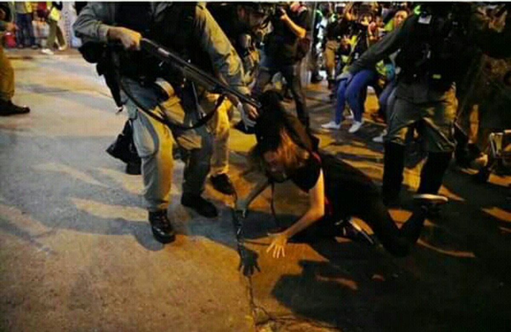
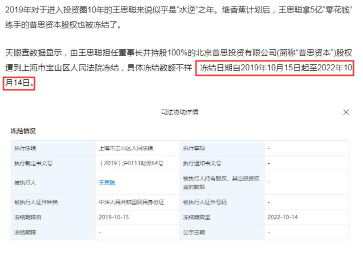

[11月02日 22:07]    BBC News 中文   @bbcchinese    【香港示威：警察驱赶维园集会 示威者游走多区】港岛区多处出现警民冲突，示威者投掷汽油弹和纵火，警察则发射催泪弹。 https://bbc.in/2oB0T8u   :speech_balloon:评:1 :+1:赞:1 :globe_with_meridians:转:0  

[11月02日 21:00]    纽约时报中文网   @nytchinese    #一周热门 #时报专栏 特朗普和扎克伯格们会把美国玩坏的 http://nyti.ms/2JDsNbc   :speech_balloon:评:5 :+1:赞:8 :globe_with_meridians:转:1  

[11月02日 20:15]    新闻大吐槽   @TuCaoFakeNews    还有签证审批时要看社交媒体记录。这可就够这俩大傻吃一壶的  :speech_balloon:评:0 :+1:赞:10 :globe_with_meridians:转:2  

[11月02日 20:14]    新闻大吐槽   @TuCaoFakeNews    小粉红这是要断了天朝癌症病患者的后路啊  :speech_balloon:评:0 :+1:赞:3 :globe_with_meridians:转:1  

[11月02日 20:01]    新闻大吐槽   @TuCaoFakeNews    有没有习近平的厕所革命篇  :speech_balloon:评:0 :+1:赞:3 :globe_with_meridians:转:1  

[11月02日 19:59]    新闻大吐槽   @TuCaoFakeNews    Right. This is what happening in New Zealand now. What I am saying is when those ChiNazi students doing the same thing in Canada, we should do something to stop them. There is NO place for ChiNazi in this country to protect their national flag.  :speech_balloon:评:0 :+1:赞:5 :globe_with_meridians:转:2  

[11月02日 19:55]    新闻大吐槽   @TuCaoFakeNews    SB
長期踢正步容易傷腦
因為技術再怎麼好
腳後跟還是會用力著地

成功嶺以及之後當兵在關東橋新訓中心時
也被迫踢了好一陣子 https://twitter.com/TuCaoFakeNews/status/1190509799177220096?s=19 …  :speech_balloon:评:0 :+1:赞:2 :globe_with_meridians:转:3  

[11月02日 19:47]    新闻大吐槽   @TuCaoFakeNews    Where is here?New zealand or China?I cannot belive here is Auckland.Why are Chinese troops on the streets of Auckland? Has New Zealand become a special administrative region of China?haha,New zealand should be called New zealand province,China.
National party,no zuo no dai. https://twitter.com/TuCaoFakeNews/status/1190509799177220096 …  :speech_balloon:评:2 :+1:赞:5 :globe_with_meridians:转:3  

[11月02日 19:44]    新闻大吐槽   @TuCaoFakeNews    暴警失控槍指市民頭部威嚇
暴警將參加萬聖節慶祝的女市民先強行拉著行去封鎖線內，後用槍指著市民頭部，威嚇市民
facebook 奶共狂要求delete 這張相  :speech_balloon:评:1 :+1:赞:19 :globe_with_meridians:转:9  

[11月02日 19:43]    新闻大吐槽   @TuCaoFakeNews    這個傢伙很有名，去年模仿金正恩  :speech_balloon:评:1 :+1:赞:8 :globe_with_meridians:转:1  

[11月02日 19:39]    新闻大吐槽   @TuCaoFakeNews    中国实际上一场仗也不敢打…最怕的其实是别人来打他～实际实力 一场仗就露馅。他们只敢对老百姓厉害，因为老百姓手里没枪。  :speech_balloon:评:3 :+1:赞:21 :globe_with_meridians:转:3  

[11月02日 19:36]    新闻大吐槽   @TuCaoFakeNews    @zhanyoutongmeng
@hNeBHUlLJhBbwFH
@Today__China
@RXDSv1EwYcmq0cU
@chenmezhisheng
@TG6UlUmEtXFNRNH
@TuCaoFakeNews
@VOAChinese
@Mrdoorvpn
@goldenp11462989
@CCP_is_devil

黑警又想恐嚇19歲被扣留少女, 信唔信拉你去新屋嶺 https://hk.news.appledaily.com/breaking/realtime/article/20191101/60222013?utm_campaign=hkad_social_hk.nextmedia&utm_medium=social&utm_source=telegram …  :speech_balloon:评:0 :+1:赞:2 :globe_with_meridians:转:5  

[11月02日 19:33]    财经真相   @caijingxiang    今日感慨：当万达交出了“万”，还能“达”吗？当恒大失去了“恒”，还能“大”吗？当福耀割掉了“福”，还能“耀”吗？待续…… https://twitter.com/caijingxiang/status/1190589325848694786 …  :speech_balloon:评:6 :+1:赞:61 :globe_with_meridians:转:16  

[11月02日 19:32]    新闻大吐槽   @TuCaoFakeNews    這是要為新西蘭特別行政區的成立做準備嗎？還有叫什麼新西蘭，要起一個中國特色的名字，那就叫「新鄉」吧！  :speech_balloon:评:1 :+1:赞:3 :globe_with_meridians:转:1  

[11月02日 19:30]    新闻大吐槽   @TuCaoFakeNews    第一感觉像纳粹 https://twitter.com/tucaofakenews/status/1190586481036812288 …  :speech_balloon:评:1 :+1:赞:9 :globe_with_meridians:转:1  

[11月02日 19:29]    新闻大吐槽   @TuCaoFakeNews    海軍儀仗隊先去買奶粉去了？  :speech_balloon:评:1 :+1:赞:6 :globe_with_meridians:转:1  

[11月02日 19:28]    新闻大吐槽   @TuCaoFakeNews    小红粉们行动起来，拿出抵制NBA的劲头，抵制印货，印度有什么可抵制的，好像是仿制药  :speech_balloon:评:2 :+1:赞:2 :globe_with_meridians:转:1  

[11月02日 19:28]    新闻大吐槽   @TuCaoFakeNews    赤納粹嘔嘔嘔嘔嘔嘔  :speech_balloon:评:0 :+1:赞:6 :globe_with_meridians:转:1  

[11月02日 19:25]    新闻大吐槽   @TuCaoFakeNews    hahahahaha https://twitter.com/tucaofakenews/status/1190397688908369920 …  :speech_balloon:评:0 :+1:赞:7 :globe_with_meridians:转:1  

[11月02日 19:21]    新闻大吐槽   @TuCaoFakeNews    這是中國新西蘭省嗎？  :speech_balloon:评:0 :+1:赞:6 :globe_with_meridians:转:1  

[11月02日 19:20]    新闻大吐槽   @TuCaoFakeNews    无夏之年（1815年印尼坦博拉火山爆发的影响）
 https://zh.m.wikipedia.org/zh-cn/%E7%84%A1%E5%A4%8F%E4%B9%8B%E5%B9%B4 …  :speech_balloon:评:0 :+1:赞:1 :globe_with_meridians:转:1  

[11月02日 19:20]    新闻大吐槽   @TuCaoFakeNews    Disrespectful action in #NewZealand 
Some #Chinese dress up like soldiers and #marching in #NewZealand, showing the love of your country is not like this, my dear. https://twitter.com/TuCaoFakeNews/status/1190586481036812288 …  :speech_balloon:评:3 :+1:赞:6 :globe_with_meridians:转:3  

[11月02日 19:19]    财经真相   @caijingxiang    国民老公的微博！  :speech_balloon:评:13 :+1:赞:38 :globe_with_meridians:转:8  

[11月02日 19:09]    财经真相   @caijingxiang    盛世明星赛富商，乱世戏子逃饥荒！一心只盼有戏拍，不闻香港成战场！  :speech_balloon:评:3 :+1:赞:127 :globe_with_meridians:转:15  

[11月02日 19:03]    财经真相   @caijingxiang    国内很多明星都在抱怨没戏拍可拍，这个其实也可以理解，很多演员都是吃青春饭的，天天在家闲着很容易“过气”，尤其那些还未捞够的新人最焦虑。以前很多烂戏卖出天价，其背后是资本有“洗钱”需求，现在政治从严，经济处于实质性衰退的背景下，地主家日子也不好过，自然也就没人在戏子身上再挥金如土了！  :speech_balloon:评:12 :+1:赞:150 :globe_with_meridians:转:32  

[11月02日 19:00]    纽约时报中文网   @nytchinese    #一周热门 #影评 《摩登情爱》：良莠不齐但时显魅力 http://nyti.ms/2MZ6eQD   :speech_balloon:评:5 :+1:赞:6 :globe_with_meridians:转:1  

[11月02日 18:46]    BBC News 中文   @bbcchinese    香港警方根据《公安条例》，即场停止两个事前获得警方不反对通知书的集会。 https://bbc.in/2N82xYC   :speech_balloon:评:25 :+1:赞:43 :globe_with_meridians:转:23  

[11月02日 18:36]    老司机   @h5lpykl7tp6jjop    11.2日下午，香港许多提名的区议会普通选举候选人在v Park进行晋升，但其中一名不知什么原因竟被恶警暴力逮捕。  :speech_balloon:评:7 :+1:赞:60 :globe_with_meridians:转:45  

[11月02日 18:26]    墙国铁拳现世报😷   @Socialistfist    如此猖狂, 举报头像来一波？  :speech_balloon:评:3 :+1:赞:42 :globe_with_meridians:转:4  

[11月02日 18:12]    墙国铁拳现世报😷   @Socialistfist    P1 头像煽动颠覆
P2 韭菜谈奴性  :speech_balloon:评:9 :+1:赞:60 :globe_with_meridians:转:7  

[11月02日 18:06]    墙国铁拳现世报😷   @Socialistfist    别人家被强拆，可以接受
别人家被强拆，自己被拔了网线，是万万不能接受的

#社会主义铁拳  :speech_balloon:评:21 :+1:赞:171 :globe_with_meridians:转:42  

[11月02日 17:56]    老司机   @h5lpykl7tp6jjop    大陆人民生活水平不断提高！一片回锅肉要40元，台湾同胞你们吃得起吗？
近日，一份《连山回锅肉创始人代木儿菜谱》引发网友热议，菜谱中，精品晾竿回锅肉（10片）标价为400元。“什么肉这么贵？”“400元一份的回锅肉，要吃出西餐的感觉。”不少网友对这份菜品的价格产生质疑。店家回应肉价都涨到58一斤。  :speech_balloon:评:1 :+1:赞:9 :globe_with_meridians:转:5  

[11月02日 17:51]    BBC News 中文   @bbcchinese    香港展开第22周的示威，警察在铜锣湾闹市向示威者发射多枚催泪弹。  :speech_balloon:评:33 :+1:赞:114 :globe_with_meridians:转:69  

[11月02日 17:03]    BBC News 中文   @bbcchinese    香港有人发起“求援国际，坚守自治”集会，并在维园举行，不过不获警方批准。警察其后发射催泪弹驱赶集会人士。  :speech_balloon:评:45 :+1:赞:82 :globe_with_meridians:转:35  

[11月02日 17:00]    纽约时报中文网   @nytchinese    #一周热门 卷入中美冲突，顶尖古典乐团取消中国巡演 http://nyti.ms/2BWquvF   :speech_balloon:评:12 :+1:赞:15 :globe_with_meridians:转:2  

[11月02日 16:35]    财经真相   @caijingxiang    福耀玻璃董事长曹德旺在经济参考报《其实我想说》栏目中表示，年轻精英们一路风险不断，钱应该更多用在自己身上。而他的钱就像赘肉，要给它一块一块地切掉，他有能力也不怕痛。 老曹这觉悟很高啊，党国会就此放过他吗？  :speech_balloon:评:11 :+1:赞:122 :globe_with_meridians:转:21  

[11月02日 15:52]    财经真相   @caijingxiang    疯狂的讽刺，今日就成了现实！ https://twitter.com/mrdoorvpn/status/1190506974418325505 …  :speech_balloon:评:7 :+1:赞:224 :globe_with_meridians:转:86  

[11月02日 15:30]    BBC News 中文   @bbcchinese    英国埃塞克斯郡警方宣布，就目前的调查结果来看，他们相信埃塞克斯郡集装箱藏尸案中的39名遇难者全部为越南公民。 https://www.bbc.com/zhongwen/simp/world-50272480 …  :speech_balloon:评:80 :+1:赞:91 :globe_with_meridians:转:46  

[11月02日 15:00]    BBC News 中文   @bbcchinese    刚刚过去的一周，BBC中文以下新闻内容受到读者的关注。如果你错过了它们，BBC中文带你一一回顾。 https://bbc.in/2JIUKhZ   :speech_balloon:评:12 :+1:赞:10 :globe_with_meridians:转:3  

[11月02日 15:00]    纽约时报中文网   @nytchinese    #一周热门 #NYTOverlooked “流浪作家”三毛：撒哈拉、爱情和死亡 http://nyti.ms/2WjzBjA   :speech_balloon:评:8 :+1:赞:22 :globe_with_meridians:转:9  

[11月02日 13:00]    纽约时报中文网   @nytchinese    #一周热门 #书评 参与塑造现代中国的宋氏三姐妹 http://nyti.ms/2Nr96Ez   :speech_balloon:评:2 :+1:赞:20 :globe_with_meridians:转:9  

[11月02日 12:34]    BBC News 中文   @bbcchinese    刚刚过去的一周，BBC中文以下新闻内容受到读者的关注。如果你错过了它们，BBC中文带你一一回顾。 https://bbc.in/2PF9KRC   :speech_balloon:评:10 :+1:赞:18 :globe_with_meridians:转:7  

[11月02日 12:32]    BBC News 中文   @bbcchinese    在科威特的大街上开车转一圈，你看不到这些女人。她们被剥夺了基本权利，被人藏在门后无法离开，还有可能被卖给出价最高的人。 https://bbc.in/2JImAuO   :speech_balloon:评:13 :+1:赞:59 :globe_with_meridians:转:31  

[11月02日 12:00]    纽约时报中文网   @nytchinese    如何利用风水旺财转运、如何在36小时内玩转清迈……每周，我们为读者推荐《纽约时报》一些轻松有趣、兼具实用性和指导性的文章，与你共同探索一种更优质、更聪明、更充实的生活方式。
以下是本周的智慧生活精选： http://nyti.ms/36xS1lo   :speech_balloon:评:3 :+1:赞:13 :globe_with_meridians:转:4  

[11月02日 11:00]    纽约时报中文网   @nytchinese    #一周热门 #观点 平壤的复古科幻建筑 http://nyti.ms/2PoRwUB   :speech_balloon:评:4 :+1:赞:10 :globe_with_meridians:转:4  

[11月02日 10:42]    BBC News 中文   @bbcchinese    英国埃塞克斯警方说，在集装箱惨案中发现的39名遇难者全部为越南人，推翻了此前其认定是中国人的结论。警方称，其正在与越南政府和“多个在英国和越南的家庭保持直接联系”。 https://www.bbc.com/zhongwen/simp/uk-50182847 …  :speech_balloon:评:268 :+1:赞:237 :globe_with_meridians:转:135  

[11月02日 09:39]    财经真相   @caijingxiang    王思聪旗下普思资本股权遭冻结，王健林听说被弄进去2个月，还瘦了十几斤！！！  :speech_balloon:评:64 :+1:赞:488 :globe_with_meridians:转:205  

[11月02日 09:00]    BBC News 中文   @bbcchinese    【一周热点重温】一名出柜的台湾同志军人说：“国高中时就常被骂娘炮，会很难过。但我知道越表现出难过的样子，他们越觉得你好欺负，所以为了不服输，我就会在体能上锻炼自己。” https://bbc.in/34kUaPe   :speech_balloon:评:21 :+1:赞:57 :globe_with_meridians:转:11  

[11月02日 09:00]    纽约时报中文网   @nytchinese    #一周热门 拒绝身份政治的“局外人”杨安泽 http://nyti.ms/2MSFMbc   :speech_balloon:评:3 :+1:赞:7 :globe_with_meridians:转:0  

[11月02日 08:01]    BBC News 中文   @bbcchinese    普京自己曾说，克格勃特工是“具有特殊品质、特殊信念和特殊性格的人”。那他年轻时的老板是怎样评价他的呢？ https://bbc.in/2poDMyE   :speech_balloon:评:14 :+1:赞:54 :globe_with_meridians:转:21  

[11月02日 07:31]    BBC News 中文   @bbcchinese    印度在印控克什米尔正式成立“拉达克中央直辖区”，拉达克因西藏因素令问题错综复杂，也加剧了中印边界摩擦的风险。 https://bbc.in/2JI9627   :speech_balloon:评:23 :+1:赞:21 :globe_with_meridians:转:11  

[11月02日 07:01]    BBC News 中文   @bbcchinese    就医时，她身高只有1.35米，体重只有40多斤......她的故事，折射出怎样的社会现状？ https://bbc.in/2C4bhsD   :speech_balloon:评:301 :+1:赞:556 :globe_with_meridians:转:259  

[11月02日 07:00]    纽约时报中文网   @nytchinese    #一周热门 香港街头暴力升级，抗议者试探中国底线 http://nyti.ms/2BKxRX0   :speech_balloon:评:40 :+1:赞:33 :globe_with_meridians:转:9  

[11月02日 06:38]    新闻大吐槽   @TuCaoFakeNews    保镖开道，维尼熊扭着妖娆的身段，不停的抛出飞吻

要说鬼节，还是日本人会玩  :speech_balloon:评:99 :+1:赞:2852 :globe_with_meridians:转:1006  

[11月02日 05:00]    纽约时报中文网   @nytchinese    #一周热门 华盛顿vs.华尔街：中国投资引发美国政商界对立 http://nyti.ms/2Woe9Km   :speech_balloon:评:5 :+1:赞:3 :globe_with_meridians:转:0  

[11月02日 04:59]    老司机   @h5lpykl7tp6jjop    刚唱了我是共产党的一个兵就接着唱爱在加拿大，你妈的两张嘴皮翻得太快了！  :speech_balloon:评:3 :+1:赞:13 :globe_with_meridians:转:1  

[11月02日 04:27]    老司机   @h5lpykl7tp6jjop    说中国人不守秩序，他们跪在地上维权排得整整齐齐，说他们守秩序，他们冲红灯抢猪肉绝对不会排队，说他们不讲规则，他们人人连潜规则都搞得懂，说他们守规则，他们不卖门票连老虎都不怕，翻马路栏杆被夹死也愿意！说他们胆子小，做毒食品毐酒毒菜没怕过，说他们胆子大，整死他们不敢喊打倒共产党！  :speech_balloon:评:43 :+1:赞:900 :globe_with_meridians:转:284  

[11月02日 02:36]    老司机   @h5lpykl7tp6jjop    〖11.1香港美少女又被抓〗一個弱靚女，你們用得著一堆解放軍圍著嗎？你們啥意思，流氓地痞？！這麼小的孩子，她是暴徒嗎？忍不住要罵人了，你們是他媽的娘養的嗎，畜生！  :speech_balloon:评:133 :+1:赞:1192 :globe_with_meridians:转:715  

[11月02日 02:04]    老司机   @h5lpykl7tp6jjop    转自微信：这是安徽律师吕先三的孩子，吕先三律师因为代理案件，今天被合肥中院以诈骗罪判处有期徒刑12年，吕及家人喊冤不止。这样的图片，令人悲伤。  :speech_balloon:评:12 :+1:赞:162 :globe_with_meridians:转:85  

[11月02日 00:36]    老司机   @h5lpykl7tp6jjop    Is heart broken with this little girl, when we will stop the lives like that
Source from FB
#HKPoliceState #HKPoliceBrutality #HKPoliceTerrorism #HKHumanRightsandDemocracyAct  :speech_balloon:评:134 :+1:赞:1440 :globe_with_meridians:转:1381  

[11月02日 00:30]    BBC News 中文   @bbcchinese    中国近年来一直在大力建设太阳能农场，但离完全放弃煤炭依然还有漫漫长路。  :speech_balloon:评:35 :+1:赞:60 :globe_with_meridians:转:18  

[11月01日 22:25]    BBC News 中文   @bbcchinese    那天，七万人走上街头，向当权者说不。要求民主、反对暴力的示威，成为他们追求自由道路上的里程碑。之后，越来越多的人鼓起勇气加入抗议示威。大潮势不可挡...... https://bbc.in/2N9SClD   :speech_balloon:评:159 :+1:赞:640 :globe_with_meridians:转:206  

[11月01日 21:30]    纽约时报中文网   @nytchinese    “我们的责任是保证纯粹的学习环境，”一名“学生信息员”说，“保证教授们遵守规定。”
“人人自危了，“一名因批评习近平喜欢的口号而被学生举报、随后被开除的教授说。“怎么会进步呢，“他问，“发明创造怎么会出现呢？” http://nyti.ms/2PzncGG   :speech_balloon:评:12 :+1:赞:66 :globe_with_meridians:转:21  

[11月01日 21:06]    老司机   @h5lpykl7tp6jjop    究竟誰殺死了她! 警方: 死因無可疑? 袁靜儀?  :speech_balloon:评:296 :+1:赞:2099 :globe_with_meridians:转:2021  

[11月01日 21:00]    纽约时报中文网   @nytchinese    元朗袭击事件发生五天后，数万名抗议者聚集到该地区。防暴警察为驱散人群发射了多枚催泪瓦斯。
几个月后，这个工人阶层居住的社区在夕阳下一片平静。 http://nyti.ms/2C1oQJu   :speech_balloon:评:5 :+1:赞:8 :globe_with_meridians:转:4  

[11月01日 20:24]    BBC News 中文   @bbcchinese    “滥杀无辜” 、“被消失” 这些通常让人联想起恐怖活动的用词，如今被人权组织用来形容在阿富汗的亲政府武装，而这些武装被指是由美国中央情报局（CIA）训练、提供武器和资金。 https://bbc.in/34nSPXQ   :speech_balloon:评:13 :+1:赞:35 :globe_with_meridians:转:14  

[11月01日 20:00]    纽约时报中文网   @nytchinese    几个月来，民主党人一直抵制这样的投票，但面对一致反对的共和党人，他们这次强行通过了决议，只有两名民主党人背弃政党立场投了反对票。
这一投票结果预示了即将到来的斗争：随着民主党人在公众面前陈明其弹劾的理由，两党都将进入一个未知的领域，美国的政治格局也将被重塑。 http://nyti.ms/3213pT7   :speech_balloon:评:3 :+1:赞:16 :globe_with_meridians:转:6  

[11月01日 19:31]    墙国铁拳现世报😷   @Socialistfist    掐指一算，已经是两周了。希望兔兔可以被善待  :speech_balloon:评:13 :+1:赞:98 :globe_with_meridians:转:12  

[11月01日 19:16]    财经真相   @caijingxiang    美国驻华大使微信公众号，今天发布的蓬佩奥国务卿在哈德逊研究所的讲话，改文链接被微信以网页包含违法或违规内容，被多人投诉为由封杀，彭斯在弗雷德里克·马勒克纪念讲座发表讲话也无法打开，其他文章链接正常，均可打开阅读！  :speech_balloon:评:35 :+1:赞:363 :globe_with_meridians:转:179  

[11月01日 19:00]    BBC News 中文   @bbcchinese    “勾引术”教练在网上销售课程，教导其他男性如何尽快地引诱女性上床。这已是一项百万英镑的产业。 https://bbc.in/2N6GYIb   :speech_balloon:评:10 :+1:赞:53 :globe_with_meridians:转:28  

[11月01日 19:00]    纽约时报中文网   @nytchinese    #图集【在美国，220万美元能买到什么房？】手握220万美元，你能买到乔治亚洲罗马一座建于19世纪晚期的木匠哥特式房屋，或马萨诸塞州牛顿的世纪中期现代主义住宅，也可以选择纽约州上奈克市的新乔治亚风格房屋。
点击查看图集： http://nyti.ms/339X49q   :speech_balloon:评:5 :+1:赞:26 :globe_with_meridians:转:5  

[11月01日 18:46]    财经真相   @caijingxiang    再补充一个问题，外资可以自由汇出，是仅限于美国企业，还是所有外资？如果只是美资，有效期是仅限于最近签署第一阶段协议的时候、还是永远自由出入？  :speech_balloon:评:10 :+1:赞:104 :globe_with_meridians:转:7  

[11月01日 18:42]    财经真相   @caijingxiang    你就想问问是司法部权利大？还是外汇管理局大？谁说的话最管用？  :speech_balloon:评:4 :+1:赞:106 :globe_with_meridians:转:11  

[11月01日 18:40]    财经真相   @caijingxiang    司法部就《中华人民共和国外商投资法实施条例》公开征求意见：外国投资者在中国境内的出资、利润、资本收益、资产处置所得、知识产权许可使用费、依法获得的补偿或者赔偿、清算所得等，可以依法以人民币或者外汇自由汇入、汇出，任何单位和个人不得违法对币种、数额以及汇入、汇出的频次等进行限制。  :speech_balloon:评:43 :+1:赞:187 :globe_with_meridians:转:53  

[11月01日 18:00]    BBC News 中文   @bbcchinese    针对网上教人制作汽油弹和鼓吹攻击警察的言论，香港法院颁令禁止网上煽动暴力言论，建制派说这有阻吓性作用，但民主派担心这是香港禁网的先兆。 https://bbc.in/2N3gXJJ   :speech_balloon:评:56 :+1:赞:103 :globe_with_meridians:转:31  

[11月01日 17:52]    纽约时报中文网   @nytchinese    中国大学正在部署学生对教师进行监督，越来越多的“学生信息员”密切关注着教授的思想观点。他们既是学生又是间谍，其任务是帮助铲除对习近平和共产党有不忠迹象的教师。
这场大规模行动的目的是消除异议，把大学变成党的根据地。至今已有十几名教授遭举报后被开除或处罚。 http://nyti.ms/2PzncGG   :speech_balloon:评:129 :+1:赞:582 :globe_with_meridians:转:343  

[11月01日 17:39]    墙国铁拳现世报😷   @Socialistfist    可惜北京的青天习老爷不玩微博

#社会主义铁拳  :speech_balloon:评:24 :+1:赞:237 :globe_with_meridians:转:54  

[11月01日 17:00]    纽约时报中文网   @nytchinese    周四晚上，警察和抗议者之间形成了紧张的对峙。官员们很快宣布这次集会非法，并采取了几乎史无前例的步骤，下令立即疏散该地区。
晚些时候，该地区被封锁，可以看到一名装扮成白雪公主的狂欢者在催泪瓦斯中咳嗽，游客们还在自拍。当晚，抗议者和警察在城市各处发生了多起冲突。 http://nyti.ms/36lKF4c   :speech_balloon:评:1 :+1:赞:16 :globe_with_meridians:转:8  

[11月01日 16:30]    纽约时报中文网   @nytchinese    周四，美国众议院投票支持了由民主党人主导的特朗普弹劾调查，这一行动为调查开启了一个关键的公开阶段，也凸显了调查背后的政治两极分化。
此次投票以232票赞成、196票反对通过了决议，为鲜有先例的弹劾程序设定了规则。在2020年大选前，此程序势必将是整个国家关注的焦点。 http://nyti.ms/3213pT7   :speech_balloon:评:8 :+1:赞:45 :globe_with_meridians:转:16  

[11月01日 16:21]    老司机   @h5lpykl7tp6jjop    令人難過  :speech_balloon:评:68 :+1:赞:713 :globe_with_meridians:转:711  

[11月01日 16:00]    纽约时报中文网   @nytchinese    四中全会召开之际，中国正努力应对与特朗普政府之间的贸易战，以及经济增长的显著放缓。
公报未提及这些问题，但其中一条表明，习近平和他的同事感到风险挑战已经增加。公报称，领导层经受了“国内外风险挑战明显增多的复杂局面”。 http://nyti.ms/34ufNwT   :speech_balloon:评:8 :+1:赞:16 :globe_with_meridians:转:5  

[11月01日 15:50]    老司机   @h5lpykl7tp6jjop    #Hongkong10月31日
記住CCP在香港的暴行這哪裡是在執法這就是公開耍流氓的證據
#HongKongPolice 一名黑察正在對一名柔弱的女性進行性騷擾，另一位黑警把她的雙腿張開！
他們抓住了她並把她的襯衫一直拉到露出她的胸罩！
@FLOTUS
@VP
@SecPompeo
@MariaBartiromo
@trish_regan
@robert_spalding  :speech_balloon:评:50 :+1:赞:436 :globe_with_meridians:转:421  

[11月01日 15:37]    纽约时报中文网   @nytchinese    持续近五个月的抗议活动沉重打击香港经济，贸易战和全球经济放缓也加剧了经济萎缩。
本周抗议活动仍在继续，示威者在万圣节挑战当局的禁蒙面法，再次引发警民冲突。 http://nyti.ms/36lKF4c   :speech_balloon:评:10 :+1:赞:66 :globe_with_meridians:转:28  

[11月01日 15:08]    新闻大吐槽   @TuCaoFakeNews    马来人普遍信回教，印度人不爱吃肉，进口猪肉制品也只有华人吃，马来华人普遍亲垬，他们要是得了猪瘟就是自做自受  :speech_balloon:评:3 :+1:赞:24 :globe_with_meridians:转:2  

[11月01日 15:00]    纽约时报中文网   @nytchinese    数十万人在湾仔等香港一些主要商业区游行，表达他们对引渡法案修例的愤怒。6月9日的示威活动事实上是今年抗议活动的开始，也是香港历史上规模最大的示威活动之一。
大多数时候，这片社区是购物和夜生活的中心。 http://nyti.ms/2C1oQJu   :speech_balloon:评:22 :+1:赞:27 :globe_with_meridians:转:9  

[11月01日 14:31]    BBC News 中文   @bbcchinese    巴基斯坦一列火车发生严重火灾，造成73人死亡，反映出巴国的交通基础设施存在的种种问题。
 https://bbc.in/2q954sN   :speech_balloon:评:8 :+1:赞:17 :globe_with_meridians:转:8  

[11月01日 14:00]    BBC News 中文   @bbcchinese    随着气候变暖，考古学家发现珍贵的史前文物正在从高山冰原中融化分解，他们在与时间赛跑，抢救这些“冰冻的文物”。 https://bbc.in/36jILB6   :speech_balloon:评:5 :+1:赞:43 :globe_with_meridians:转:18  

[11月01日 12:06]    GFHG SDKM   @zyx_yny    Reporters need to ask @hkpoliceforce what NTS T2-3, Pln Cdr mean or correspond to. https://twitter.com/Liz86719814/status/1190100361119354880 …  :speech_balloon:评:216 :+1:赞:1844 :globe_with_meridians:转:1298  

[11月01日 12:04]    GFHG SDKM   @zyx_yny    Shotgun pointed at protester head  :speech_balloon:评:41 :+1:赞:672 :globe_with_meridians:转:782  

[11月01日 11:57]    GFHG SDKM   @zyx_yny    The Halloween gift hk govr. give us.
What’s next step?Block our right to use internet?Block all the social networks?
Hong Kong > Block Kong 
How many negative name of Hong Kong can we build which inspire by hk govr.
#4Corners #SOSHK #hkprotest #FightForFreedom #StandwithHongKong  :speech_balloon:评:1 :+1:赞:23 :globe_with_meridians:转:13  

[11月01日 09:50]    财经真相   @caijingxiang    根据CEPA要求，中共央行正式宣布为在香港办理个人人民币存款、兑换、银行卡和汇款业务的银行提供清算安排，随后中银香港被指定为人民币在香港的结算行，其他香港银行的人民币业务必须找中银香港做最后的结算，同时接受中银香港的协议，但是该协议成为中共对香港金融的长臂管辖，自此香港金融彻底沦落  :speech_balloon:评:4 :+1:赞:195 :globe_with_meridians:转:75  

[11月01日 09:42]    财经真相   @caijingxiang    【快讯】央行称将于11月7日（下周四）在香港发行200亿元人民币三个月央票，及100亿元人民币一年期央票。 人民币在香港扩张最初始于1993年央行颁布的人民币出入境条例，最终全面形成是基于2003年6月大陆与香港签署的《内地与香港关于建立更紧密经贸关系的安排》（CEPA）  :speech_balloon:评:2 :+1:赞:139 :globe_with_meridians:转:52  

[11月01日 08:35]    老司机   @h5lpykl7tp6jjop    全国楼市降价潮：最高直降10000元/㎡，广州两天降6千/㎡！武汉直降8千/㎡！合肥最高降4536元/㎡！  :speech_balloon:评:2 :+1:赞:45 :globe_with_meridians:转:20  

[11月01日 08:21]    老司机   @h5lpykl7tp6jjop    在中国人中每个人骄傲自大都会遭到批评鄙视，一但提起群体就必须骄傲自大反之则会遭到批评鄙视！这是什么逻辑？这就是中国逻辑！每一个没有尊严的人合在一起就成了尊严心极强的群体，这种现象全世界只有中国会出现，可中国人一点不觉奇怪，反而认为很正常，所以中国人说你不正常，那恭喜你，你是正常人  :speech_balloon:评:4 :+1:赞:176 :globe_with_meridians:转:47  

[11月01日 08:03]    GFHG SDKM   @zyx_yny    不好意思，小熊維尼（プーさん）让一下下
涩谷的万圣节
Shibuya gets out of control on Halloween.

すみません、くまのプーさん通ります！！
ハロウィンの渋谷はやばい。。
   :speech_balloon:评:54 :+1:赞:1575 :globe_with_meridians:转:898  

[11月01日 08:00]    GFHG SDKM   @zyx_yny    Hong Kong latest:
- Police scuffle with protesters and party-goers on Halloween
- Beijing signals tougher security measures are coming
- Court injunction bans internet posts that incite or encourage violence https://bloom.bg/2Py1jaK   :speech_balloon:评:252 :+1:赞:2378 :globe_with_meridians:转:2099  

[11月01日 07:52]    GFHG SDKM   @zyx_yny    一位男士不畏警察的强光照射，坐在警署外指骂有枪有炮，就是没有良心、良知。他还向警察怒吼，香港人不怕死，警察可以用真枪射杀他。  :speech_balloon:评:13 :+1:赞:108 :globe_with_meridians:转:52  

[11月01日 07:50]    GFHG SDKM   @zyx_yny    The brutality by the police towards protestors in #HongKong is deplorable.

Communist China and President Xi have turned Hong Kong into a police state. The US continues to #StandwithHongKong & will aid their fight for human rights in any way we can! https://twitter.com/hkchrislau/status/1189887609553604609 …  :speech_balloon:评:636 :+1:赞:4904 :globe_with_meridians:转:3850  

[11月01日 01:11]    GFHG SDKM   @zyx_yny    They are neither cleaning that place nor doing anything meaningful at all. https://twitter.com/fktws/status/1189892960524984320 …  :speech_balloon:评:0 :+1:赞:0 :globe_with_meridians:转:0  

[11月01日 00:38]    财经真相   @caijingxiang    美元货币体系终结者——数字货币  :speech_balloon:评:44 :+1:赞:135 :globe_with_meridians:转:33  

[11月01日 00:30]    GFHG SDKM   @zyx_yny    Hong Kong police arrested a foreign lady who was celebrating Halloween in ​​Lan Kwai Fong. The police pushed down the lady. She shouted for help from BBC, CNN and kept yelling "I need my wallet”. She asked to call the US consulate. 
Source: Editorial Board, CityU SU
@SolomonYue  :speech_balloon:评:28 :+1:赞:917 :globe_with_meridians:转:895  

[11月01日 00:24]    财经真相   @caijingxiang    美元根本无法脱钩比特币，因为它从未就“挂钩过”，都是场外交易，所以才可以为非法交易提供洗钱！ https://twitter.com/seanchen_new/status/1189940816560582659 …  :speech_balloon:评:9 :+1:赞:51 :globe_with_meridians:转:8  

[11月01日 00:18]    财经真相   @caijingxiang    那些说夸张的人，究竟懂不懂世界贸易体系？如果夸张，习近平会亲自开会学习区域块链？  :speech_balloon:评:21 :+1:赞:60 :globe_with_meridians:转:10  

[11月01日 00:17]    财经真相   @caijingxiang    美国人看样子要重新构建一种新的货币结算体系了！  :speech_balloon:评:9 :+1:赞:69 :globe_with_meridians:转:9  

[11月01日 00:15]    财经真相   @caijingxiang    中共发行的数字货币究竟目的是什么？答案是毁灭全世界，摧毁美元世界霸权，进而摧毁世界贸易体系，再摧毁世界经济，最终将世界变成人间炼狱！  :speech_balloon:评:100 :+1:赞:459 :globe_with_meridians:转:219  

[10月31日 23:44]    GFHG SDKM   @zyx_yny    #HKPolice makes an arrest and tells reporters they're too close and that they should be filming people throwing stuff instead.  None of the reporters saw anyone throw anything and call him out on his BS.  Why are we not surprised?

#StandWithHongKong #HongKongProtests  :speech_balloon:评:26 :+1:赞:434 :globe_with_meridians:转:416  

[10月31日 23:23]    财经真相   @caijingxiang    美国民主党关于对特朗普进行弹劾调查的下一步行动在美国众议院扫清了程序性障碍! https://twitter.com/caijingxiang/status/1189503583399448576 …  :speech_balloon:评:8 :+1:赞:40 :globe_with_meridians:转:6  

[10月31日 23:08]    GFHG SDKM   @zyx_yny    An elderly woman bled heavily after got shot at her leg by a tear gas canister fired by #HKPoliceTerrorists  :speech_balloon:评:159 :+1:赞:2891 :globe_with_meridians:转:3204  

[10月31日 23:05]    GFHG SDKM   @zyx_yny    In #MongKok, a #police officer pepper sprayed a passerby right at his face, the police claimed that "he has given warnings"
Credit - 35cbc.clarius@ig
#HongKongRioters #PoliceBrutality #PoliceState #StandWithHongKong #FreeHongKong  :speech_balloon:评:16 :+1:赞:261 :globe_with_meridians:转:255  

[10月31日 23:03]    老司机   @h5lpykl7tp6jjop    An elderly got shot by teargas with blood all over the floor....

【旺角即時】一名婆婆被催淚彈射中腳部並大量流血。  :speech_balloon:评:74 :+1:赞:1130 :globe_with_meridians:转:1351  

[10月31日 22:43]    老司机   @h5lpykl7tp6jjop    這不叫黑警？
那你給他們一個更合適的稱呼！

#StandwithHK  :speech_balloon:评:80 :+1:赞:330 :globe_with_meridians:转:308  

[10月31日 22:26]    GFHG SDKM   @zyx_yny    Just got tear gassed. Happy Halloween from Hong Kong.  :speech_balloon:评:2715 :+1:赞:8488 :globe_with_meridians:转:5560  

[10月31日 21:57]    GFHG SDKM   @zyx_yny    Now cosplaying is de facto banned in #HongKong. #HKPoliceTerrorists will beat you up even though you just cosplay as the #mistressofevil  on #halloween2019  :speech_balloon:评:179 :+1:赞:2718 :globe_with_meridians:转:2594  

[10月31日 21:45]    GFHG SDKM   @zyx_yny    今夜の #渋谷 で、香港を応援する中国人が過激な中国人に襲われました
#halloween2019 #StandwiththePooh #StandWithHongKong #HongKongProtests #香港 #香港デモ #ハロウィン #shibuya #習近平 #仮面　#プーさん #ディズニー #暴力  :speech_balloon:评:76 :+1:赞:1394 :globe_with_meridians:转:1119  

[10月31日 21:12]    GFHG SDKM   @zyx_yny    #Police Officers desecrate the memorial hall set up for the deceased and victims of #policebrutality next to #PrinceEdward Station
Source -  https://t.me/guardiansofhongkong/9465 …
#PoliceState #StandWithHongKong #FreeHongKong #HongKongRioters  :speech_balloon:评:118 :+1:赞:1386 :globe_with_meridians:转:1482  

[10月31日 21:11]    GFHG SDKM   @zyx_yny    China has now 3-5 million Muslims in CONCENTRATION CAMPS. Subjecting them to TORTURE. Women are being GANG RAPED. Children are being SEPARATED from their parents. HARVESTING THEIR ORGANS!

China wants you to be silent. 

PLEASE DON'T BE SILENT

RETWEET   :speech_balloon:评:374 :+1:赞:27364 :globe_with_meridians:转:43972  

[10月31日 19:55]    财经真相   @caijingxiang    重磅：美国国务卿蓬佩奥本周三在保守派智库纽约哈德逊研究所发表演讲时表示，中共政权正在谋求主导世界的权力，因此必须要予以正面反抗。
蓬佩奥在演讲中说，美国一直非常珍视与中国人民之间的友谊，但是中共政府与中国人民并非一回事。"这算是美国政府在职高官，第一次明确中共政府与中国两回事！ https://twitter.com/dw_chinese/status/1189872143036604416 …  :speech_balloon:评:18 :+1:赞:561 :globe_with_meridians:转:211  

[10月31日 19:20]    老司机   @h5lpykl7tp6jjop    当兵的退伍回乡走投无路只有上访，红后代移民加拿大爱国歌曲大演唱，加拿大中共解放军退伍军人协会成立，演唱歌曲说明身在曹营心在汉呢，还是怀念特权，只恨不能随身移呢？  :speech_balloon:评:21 :+1:赞:48 :globe_with_meridians:转:25  

[10月31日 18:21]    老司机   @h5lpykl7tp6jjop    认识的人越来越多，但是我越来越喜欢狗！  :speech_balloon:评:3 :+1:赞:12 :globe_with_meridians:转:4  

[10月31日 17:56]    墙国铁拳现世报😷   @Socialistfist    就当是给祖国母亲的生日礼物了~

#社会主义铁拳  :speech_balloon:评:29 :+1:赞:342 :globe_with_meridians:转:67  

[10月31日 17:55]    老司机   @h5lpykl7tp6jjop    杀毒软件里有理财
听歌软件里有购物
聊天软件里有视频
支付软件里有社交
天气软件里有新闻
地图软件里有外卖
搜索引擎里卖假药
浏览器里有小游戏
这就是国内互联网现状，每个毒瘤软件都想要整个互联网，把用户当成猪，争相圈到自家猪圈里给用户喂屎。
我尽可能拒绝使用国内软件和服务，因为我不想吃屎  :speech_balloon:评:50 :+1:赞:1312 :globe_with_meridians:转:483  

[10月31日 15:41]    老司机   @h5lpykl7tp6jjop    终于暴露中共才是华为背后的大老板！
任正非：华为交班已完成多年 我只是中间的“傀儡”  :speech_balloon:评:3 :+1:赞:39 :globe_with_meridians:转:25  

[10月31日 13:12]    GFHG SDKM   @zyx_yny    @EnzoMazak @SpeakerPelosi @SenAlexander
Here's Cantonese lesson 
#hkpolice 
"清算 us?With water?Silly vxxxxa!"
清算(punish) spilt into two are "wash" and "count",which 清 literally is related to water.
 
Without punishment on them ANOTHER "Tuen Mun's Halloween" surely comes.  :speech_balloon:评:4 :+1:赞:72 :globe_with_meridians:转:55  

[10月31日 12:02]    GFHG SDKM   @zyx_yny    A group of Uyghur activists and allies protested at the Capital One Arena during the Wizards vs Rocket Game today 

One Chinese man comes and says “Your mom’s dead”

Video from Hazel Sahin

#NBA #StopChina #FreeHongKong #FreeEastTurkestan #GoogleUyghur  :speech_balloon:评:117 :+1:赞:1648 :globe_with_meridians:转:1115  

[10月31日 08:58]    GFHG SDKM   @zyx_yny    From HK01: CCTV footages of #PrinceEdward station on August 31
One of the footage shows police officers chasing citizens at 10:56pm. Another one involves footage of 2 CCTV at platform 4, they only state "Video Loss" or "No Video"
 https://www.hk01.com/%E7%A4%BE%E6%9C%83%E6%96%B0%E8%81%9E/392301/8-31%E5%A4%AA%E5%AD%90%E7%AB%99%E8%A1%9D%E7%AA%81-%E6%B8%AF%E9%90%B5cctv%E7%89%87%E6%AE%B5%E9%A6%96%E6%9B%9D%E5%85%89-%E9%80%9F%E9%BE%8D%E5%B0%8F%E9%9A%8A%E6%8F%AE%E6%A3%8D%E8%BF%BD%E6%8D%95%E4%B9%98%E5%AE%A2 …  :speech_balloon:评:52 :+1:赞:939 :globe_with_meridians:转:923  

[10月31日 06:13]    墙国铁拳现世报😷   @Socialistfist    香港导演争当护旗手！
结果当他翻拍鹿鼎记时，剧本翻来覆去修改多次，中共还是不予批准！

护旗手就是要给党折磨的
@Socialistfist  :speech_balloon:评:66 :+1:赞:542 :globe_with_meridians:转:134  

[10月31日 05:38]    老司机   @h5lpykl7tp6jjop    一对情侣在街上跳了支舞，黑警没反应过来，直到人都走了半天，才意识到可能是被羞辱了，于是决定到饭店去捉捕人，呼啸着来到饭店，却遭女店长拒绝，于是黑警立即动粗，摔倒女店长，大摇大摆进店抓人！
剥夺跳舞自由！无证擅闯入私人领地！
引自推友@Tonyworld15  :speech_balloon:评:13 :+1:赞:352 :globe_with_meridians:转:316  

[10月31日 03:52]    老司机   @h5lpykl7tp6jjop    看过一张图片，老中医一边吊着盐水，一边摸脉给病人看病，非常和谐，病人迷信相信老中医，他们没有怀疑为什么老中医自己病了看西医，这就是爱国废民没有逻辑的思维！  :speech_balloon:评:1 :+1:赞:45 :globe_with_meridians:转:16  

[10月30日 20:19]    墙国铁拳现世报😷   @Socialistfist    大家投票踊跃，下周就从点赞数从多到少挑四个选吧
有什么建议 意见可以回复此推  :speech_balloon:评:3 :+1:赞:30 :globe_with_meridians:转:1  

[10月30日 20:17]    墙国铁拳现世报😷   @Socialistfist    后续  :speech_balloon:评:2 :+1:赞:25 :globe_with_meridians:转:1  

[10月30日 20:12]    墙国铁拳现世报😷   @Socialistfist    推友最喜爱“上周最佳铁拳” 评选活动
更多选项看后续  :speech_balloon:评:2 :+1:赞:75 :globe_with_meridians:转:16  

[10月30日 19:24]    墙国铁拳现世报😷   @Socialistfist    全文  :speech_balloon:评:2 :+1:赞:64 :globe_with_meridians:转:12  

[10月30日 19:24]    墙国铁拳现世报😷   @Socialistfist    收了几次精赵智商税就开始闹，成何体统？
原文已删，全文看后续

#社会主义铁拳  :speech_balloon:评:9 :+1:赞:244 :globe_with_meridians:转:69  

[10月29日 19:22]    墙国铁拳现世报😷   @Socialistfist    “哎呦.....太君别开枪.....”

#社会主义铁拳
#社会主义特别行政区铁拳  :speech_balloon:评:35 :+1:赞:440 :globe_with_meridians:转:135  

[10月28日 19:42]    墙国铁拳现世报😷   @Socialistfist    药房老板现时仍未回港，店员胡先生今日戴上口罩回店内用漂白水清洁，四名便衣警员到药房表示「唔好意思」，期望药房体谅，他坦言唯有接受道歉。
胡先生续指，估计损失约 1,000 元。他提到，昨晚蘗房已拉半闸，警方未有举起黑旗便施放催泪弹，形容警方是「乱咁射」，但需老板回港后才决定是否追究。  :speech_balloon:评:3 :+1:赞:61 :globe_with_meridians:转:10  

[10月28日 19:39]    墙国铁拳现世报😷   @Socialistfist    尖沙咀发起集会，演变成多处警民冲突，其中晚上警方施放的一枚催泪弹射入位于弥敦道的「明寅药房」，警方今早约4 名便衣警员到店舖道歉，向员工表示「唔好意思」。警员逗留约 2 分钟后离开，并无解释催泪弹射入药房的原因。  :speech_balloon:评:2 :+1:赞:60 :globe_with_meridians:转:7  

[10月28日 19:39]    墙国铁拳现世报😷   @Socialistfist    陈柏雄, 药房东主，在FB上撑警及赞同六四镇压嘅言论，包括他在10月5日发表「当年出坦克车，原来是最正确决定！」、10月8日称抗争者为「暴徒、垃圾废青、曱甴」，又称听到「兄弟、手足」令佢「作呕」。  :speech_balloon:评:2 :+1:赞:63 :globe_with_meridians:转:7  

[10月28日 19:38]    墙国铁拳现世报😷   @Socialistfist    铁拳是最好的决定

感谢香港推友，更多详情请看本推后续推文
#社会主义铁拳
#社会主义特别行政区铁拳  https://twitter.com/BeLightinHK/status/1188465234391883776 …  :speech_balloon:评:9 :+1:赞:147 :globe_with_meridians:转:44  

[10月28日 08:17]    凡賽堤/FORSETI   @FecharCCP    魔鬼在人間

極權殺人恐怖組織正在用各種兇殘手段殺害我們的同胞....................................................................................................

10月27日被極權殺人恐怖組織非法濫捕的香港年輕人已經超過200+ 人！  :speech_balloon:评:2 :+1:赞:25 :globe_with_meridians:转:19  

[10月28日 07:49]    凡賽堤/FORSETI   @FecharCCP    魔鬼在人間

極權殺人恐怖組織正在用各種兇殘手段殺害我們的同胞....................................................................................................

26日又有一10歲出頭的小孩被棄屍大海！  :speech_balloon:评:0 :+1:赞:16 :globe_with_meridians:转:14  

[10月28日 00:35]    凡賽堤/FORSETI   @FecharCCP    人類最恐怖的極權殺人恐怖組織！
警察蒙面公開殺人，毆打，暴打，非法濫捕，暗殺市民！

CCP的極權殺人恐怖組織比本拉登還恐怖一萬倍！

這是一個老人  :speech_balloon:评:1 :+1:赞:3 :globe_with_meridians:转:7  

[10月28日 00:20]    凡賽堤/FORSETI   @FecharCCP    人類最恐怖的極權殺人恐怖組織！
警察蒙面公開殺人，毆打，暴打，非法濫捕，暗殺市民！

CCP的極權殺人恐怖組織比本拉登還恐怖一萬倍！  :speech_balloon:评:4 :+1:赞:212 :globe_with_meridians:转:173  

[10月28日 00:11]    凡賽堤/FORSETI   @FecharCCP    人類最恐怖的極權殺人恐怖組織！
警察蒙面公開殺人，毆打，暴打，非法濫捕，暗殺市民！

CCP的極權殺人恐怖組織比本拉登還恐怖一萬倍！  :speech_balloon:评:6 :+1:赞:131 :globe_with_meridians:转:83  

[10月27日 23:59]    凡賽堤/FORSETI   @FecharCCP    人類最恐怖的極權殺人恐怖組織！
警察蒙面公開殺人，毆打，暴打，非法濫捕，暗殺市民！

已經被雙手反綁的學生，極權殺人恐怖組織還要把人往死裡整！全人類唯一一個最恐怖的極權殺人恐怖組織！  :speech_balloon:评:0 :+1:赞:8 :globe_with_meridians:转:9  

[10月27日 23:56]    凡賽堤/FORSETI   @FecharCCP    人類最恐怖的極權殺人恐怖組織！
警察蒙面公開殺人，毆打，暴打，非法濫捕，暗殺市民，  :speech_balloon:评:0 :+1:赞:12 :globe_with_meridians:转:13  

[10月27日 23:53]    凡賽堤/FORSETI   @FecharCCP    人類最恐怖的極權殺人恐怖組織！
警察蒙面公開殺人，毆打，暴打，非法濫捕，暗殺市民，  :speech_balloon:评:0 :+1:赞:9 :globe_with_meridians:转:4  

[10月27日 23:45]    凡賽堤/FORSETI   @FecharCCP    魔鬼的殺人罪行！

陳彥霖母女均被極權殺人恐怖組織殺害！  :speech_balloon:评:3 :+1:赞:36 :globe_with_meridians:转:31  

[10月27日 19:55]    墙国铁拳现世报😷   @Socialistfist    感谢众多推友投稿，感谢维尼之声的大力支持  :speech_balloon:评:1 :+1:赞:81 :globe_with_meridians:转:0  

[10月27日 19:54]    墙国铁拳现世报😷   @Socialistfist    不忘初心，牢记帮规
------镰刀斧头帮总舵主
#社会主义铁拳  :speech_balloon:评:18 :+1:赞:248 :globe_with_meridians:转:73  

[10月26日 19:08]    墙国铁拳现世报😷   @Socialistfist    生活在这个太平盛世
（除了村里恶霸从14年偷排污染超过30倍废物并在17年到维稳中心打人并且发出死亡威胁以外）
 感恩！

#社会主义铁拳
长文警告  :speech_balloon:评:38 :+1:赞:329 :globe_with_meridians:转:92  

[10月25日 00:26]    凡賽堤/FORSETI   @FecharCCP    緊急找尋  :speech_balloon:评:0 :+1:赞:6 :globe_with_meridians:转:5  

[10月24日 23:58]    凡賽堤/FORSETI   @FecharCCP    何韻詩！香港女兒，華人的典範，華人21世紀的巾幗英雄，華人最完美的最值得華人崇拜的國際巨星！！！  :speech_balloon:评:66 :+1:赞:415 :globe_with_meridians:转:130  

[10月24日 23:44]    凡賽堤/FORSETI   @FecharCCP    華人歷史上將永久記住這一刻，
2019年6月9日以來當香港人超過200萬人向政府提出訴求，
用最文明，最和平，最友好的方式遊行，而政府卻用最暴力，最兇殘，最卑鄙的手段僱傭黑社會組織和在職警察，以及大陸警察，武警，部隊喬裝成黑衣人在香港全社會進行大規模暗殺，暴打市民，破環公共設施等嫁禍給港人  :speech_balloon:评:20 :+1:赞:183 :globe_with_meridians:转:115  

[10月24日 10:28]    凡賽堤/FORSETI   @FecharCCP    【連登尋人】張友恆，現居九龍城，8月31日有參加遊行，9月3日突然退出所有Whatsapp群組，已經失蹤1個多月，公司薪金也沒有領取。  :speech_balloon:评:11 :+1:赞:277 :globe_with_meridians:转:293  

[10月24日 09:04]    凡賽堤/FORSETI   @FecharCCP    香港6.9以來出現人類文明社會史上的世界第一，
最文明的和平遊行世界第一
（井然有序，城市衛生等）
人口規模最大的遊行世界第一 
（203萬人遊行，總人口700-730萬）
遊行過程出現自發自願醫療救護人員世界首創！
香港人，給全世界的華人創下了歷史最偉大的榜樣！
香港人，給全世界華人未來帶來的希望  :speech_balloon:评:4 :+1:赞:74 :globe_with_meridians:转:51  

[10月24日 08:35]    凡賽堤/FORSETI   @FecharCCP    緊急找尋其家人和律師  :speech_balloon:评:0 :+1:赞:9 :globe_with_meridians:转:8  

[10月20日 06:29]    凡賽堤/FORSETI   @FecharCCP    【#共产罪恶】香港中文大学女生吴傲雪（Sonia）在哭诉被拘留期间，遭到港警性暴力之后，连日来收到多封恐吓信及短消息，威胁她若再出面发声，将绑架及轮奸她，信中甚至写明“施暴计划”。
10/18周五吴傲雪在记者会上，公布她收到的恐吓及骚扰信，这些信中，有不少是用简体字书写，被怀疑来自中国大陆。  :speech_balloon:评:29 :+1:赞:404 :globe_with_meridians:转:278  

[10月20日 06:04]    凡賽堤/FORSETI   @FecharCCP    魔鬼在人間39

極權殺人恐怖組織正在用各種兇殘手段殺害我們的同胞....................................................................................................

魔鬼的罪行！被刺殺，身處多刀，肚腸都跑出來！  :speech_balloon:评:1 :+1:赞:6 :globe_with_meridians:转:7  

[10月20日 06:02]    凡賽堤/FORSETI   @FecharCCP    魔鬼在人間39

極權殺人恐怖組織正在用各種兇殘手段殺害我們的同胞....................................................................................................

魔鬼的罪行！已被殺  :speech_balloon:评:0 :+1:赞:3 :globe_with_meridians:转:3  

[10月19日 10:36]    凡賽堤/FORSETI   @FecharCCP    極權殺人恐怖組織的兇殘超乎人類想像  :speech_balloon:评:0 :+1:赞:2 :globe_with_meridians:转:0  

[10月19日 10:34]    凡賽堤/FORSETI   @FecharCCP    魔鬼在人間39

極權殺人恐怖組織正在用各種兇殘手段殺害我們的同胞....................................................................................................

魔鬼的罪行！黑警群毆直接致命打頭的兇殘  :speech_balloon:评:3 :+1:赞:62 :globe_with_meridians:转:43  

[10月09日 00:47]    GFHG SDKM   @zyx_yny    "Son, when you grow up
You will be the savior of the broken
The beaten, and the damned?"
Please watch this powerful mv #HongKongProtester #hkprotests 
香港反送中護法戰爭(Hong Kong Defensive War 2019)：Welcome To The Black Parade  https://youtu.be/0yXTHODE24Q  via @YouTube  :speech_balloon:评:3 :+1:赞:17 :globe_with_meridians:转:4  

[10月05日 09:33]    凡賽堤/FORSETI   @FecharCCP    呼籲請求共同挖掘所有有關香港發生的事，越全面越好，不同角度，越多越好，包括被暗地抓捕的人員，特別是CCP 派出的各種偽裝身份，包括變身變裝行兇的一點一滴都要挖掘出來，把CCP 的邪惡下三濫手段的真相毫無保留的曝光在全世界面前！世界公知公義才能真正挽救和保護香港人！希望懂視頻編輯配上中英文 https://twitter.com/hjjohnson17/status/1178969916499746816 …  :speech_balloon:评:13 :+1:赞:20 :globe_with_meridians:转:10  

[03月13日 08:10]    老司机   @h5lpykl7tp6jjop    批评是批评家天生的使命！他们只感知对错，信奉真理，指出真相不吐不快，不在意权势和群众的喜好，从批评里不可能获得任何好处，但批评家愚直不改。在中国几乎所有人都讨厌批评家，喜欢阴谋家，因为他们只说好听的！可是就因为中国的批评家太少，中国几乎看不到未来和希望！  :speech_balloon:评:85 :+1:赞:194 :globe_with_meridians:转:41  

