[12月15日 23:21]    BBC News 中文   @bbcchinese    【台湾大选：为何“芒果干”成了2020台湾总统选战关键字？】“芒果干”三个字近期成为台湾总统选战的关键词汇。该词在网络上讨论声量高，许多政治人物也经常将它挂在嘴边。 https://www.youtube.com/watch?v=_ROywrBIy58 …  :speech_balloon:评:4 :+1:赞:13 :globe_with_meridians:转:0  

[12月15日 21:59]    BBC News 中文   @bbcchinese    她们同年同月同日生，一起长大，吃同样的饭，穿同样的衣，直到15岁上学时一直在同一教室坐同一排。现在姐妹们就要出嫁了，婚礼定在：同年同月同日！ https://bbc.in/35o1BGx   :speech_balloon:评:3 :+1:赞:22 :globe_with_meridians:转:5  

[12月15日 21:36]    BBC News 中文   @bbcchinese    效力英超阿森纳球队的德国球星梅苏特·厄齐尔（Mesut Özil）在社交平台上的言论，因涉及敏感的新疆穆斯林问题，使他本人以及球队卷入中国的舆论漩涡。 https://bbc.in/35oKMuT   :speech_balloon:评:83 :+1:赞:170 :globe_with_meridians:转:58  

[12月15日 21:24]    纽约时报中文网   @nytchinese    #一周热门 图片中的2019年 http://nyti.ms/2PDzfBq   :speech_balloon:评:7 :+1:赞:17 :globe_with_meridians:转:2  

[12月15日 20:00]    纽约时报中文网   @nytchinese    #一周热门 #新新世界 她指控刘强东强奸，然后成了中国互联网的靶子 http://nyti.ms/2sm2yk0   :speech_balloon:评:34 :+1:赞:48 :globe_with_meridians:转:16  

[12月15日 19:13]    新闻大吐槽   @TuCaoFakeNews    反送中半年以来，我们看见过：
在香港街头高歌《愿荣光归香港》的意大利歌唱家；
来了解831太子站惨案的韩国影星；
在理工大学守护学生的美国牧师；
还有因给港人免费煮咖啡而备受黑警骚扰的日本小伙~

如果这些人就是中共口中的敌对势力，那么与这些人为敌，就是与一切信奉自由与仁爱的人为敌！  :speech_balloon:评:2 :+1:赞:121 :globe_with_meridians:转:46  

[12月15日 19:13]    新闻大吐槽   @TuCaoFakeNews    反送中半年以来，我们看见过：
在香港街头高歌《愿荣光归香港》的意大利歌唱家；
来了解831太子站惨案的韩国影星；
在理工大学守护学生的美国牧师；
还有因给港人免费煮咖啡而备受黑警骚扰的日本小伙~

如果这些人就是中共口中的敌对势力，那么与这些人为敌，就是与一切信奉自由与仁爱的人为敌！  :speech_balloon:评:2 :+1:赞:121 :globe_with_meridians:转:46  

[12月15日 18:43]    新闻大吐槽   @TuCaoFakeNews    被香港抗争者的不屈精神感动，日本小伙飘洋过海，到香港街头给抗争者提供免费咖啡，可黑警处处阻挠，动不动就要盘查他，搞得他狼狈不堪~

日式咖啡一杯
自由精神百倍
帮煮帮倒免费
妒警心生暗鬼
纯打油  :speech_balloon:评:31 :+1:赞:618 :globe_with_meridians:转:254  

[12月15日 18:43]    新闻大吐槽   @TuCaoFakeNews    被香港抗争者的不屈精神感动，日本小伙飘洋过海，到香港街头给抗争者提供免费咖啡，可黑警处处阻挠，动不动就要盘查他，搞得他狼狈不堪~

日式咖啡一杯
自由精神百倍
帮煮帮倒免费
妒警心生暗鬼
纯打油  :speech_balloon:评:31 :+1:赞:618 :globe_with_meridians:转:254  

[12月15日 16:59]    老司机   @h5lpykl7tp6jjop    细思起来李子柒这小女子太不简单，除了会她父母都未必会的古早家常饮食做法，还会竹匠木工，药膳，古法美容用品制作，古法制酱油及各种调料，会做毛笔，古墨，还会所有农活及山地生活经验，她大约三十岁左右吧，比我七十岁老头干过工农商学加移民的经历还丰富，对于造假，看来大家己经熟视无睹习惯了！  :speech_balloon:评:35 :+1:赞:152 :globe_with_meridians:转:29  

[12月15日 16:43]    新闻大吐槽   @TuCaoFakeNews    有朋友问，这几天好安静，香港的抗争停下来了吗？
我说不会的，不信你看这个，半小时之前的事情~
抗争者分散成小队，在不同的地点出击！  :speech_balloon:评:12 :+1:赞:357 :globe_with_meridians:转:154  

[12月15日 16:43]    新闻大吐槽   @TuCaoFakeNews    有朋友问，这几天好安静，香港的抗争停下来了吗？
我说不会的，不信你看这个，半小时之前的事情~
抗争者分散成小队，在不同的地点出击！  :speech_balloon:评:12 :+1:赞:357 :globe_with_meridians:转:154  

[12月15日 16:34]    老司机   @h5lpykl7tp6jjop    港共恶警今日大批进入商场抓人、打人，被激怒的市民包圍瘋警並聲討其暴力行為，瘋警隨即向人群和記者群舉起警棍、施放胡椒噴霧并射中記者  :speech_balloon:评:10 :+1:赞:137 :globe_with_meridians:转:131  

[12月15日 16:12]    纽约时报中文网   @nytchinese    #一周热门 借贷狂潮重压中国金融系统，企业无力偿还债务 http://nyti.ms/34ezOHd   :speech_balloon:评:18 :+1:赞:89 :globe_with_meridians:转:36  

[12月15日 14:48]    老司机   @h5lpykl7tp6jjop    美丽的画面和真实的故事，一比就知道谁更感人！ 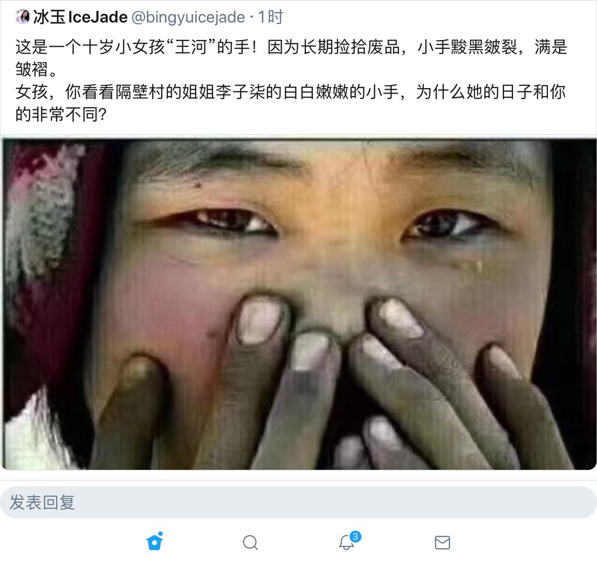 :speech_balloon:评:0 :+1:赞:9 :globe_with_meridians:转:2  

[12月15日 14:02]    纽约时报中文网   @nytchinese    #一周热门 AirPods Pro测评：“可听”时代的最佳选择 http://nyti.ms/35a5dM5   :speech_balloon:评:3 :+1:赞:9 :globe_with_meridians:转:0  

[12月15日 13:02]    BBC News 中文   @bbcchinese    【一周热点回顾】你有兴趣进去住一住吗？  :speech_balloon:评:10 :+1:赞:74 :globe_with_meridians:转:16  

[12月15日 13:01]    新闻大吐槽   @TuCaoFakeNews    狼振英昨天刚被脸书禁言，还是没学乖，又谈论起了汉奸问题，这事不扒一扒，真是对不起最会卖国的中共~

历史上，中共为讨好俄爹，出卖领土，把我大中华美丽秋海棠版图撸成炸毛鸡~
而就在前几个月拉达克被印度正式纳入版图，中共也没有任何实际行动制止~

狼大人再哪壶不开提哪壶，早晚也被大陆禁言！  :speech_balloon:评:16 :+1:赞:126 :globe_with_meridians:转:69  

[12月15日 13:01]    新闻大吐槽   @TuCaoFakeNews    狼振英昨天刚被脸书禁言，还是没学乖，又谈论起了汉奸问题，这事不扒一扒，真是对不起最会卖国的中共~

历史上，中共为讨好俄爹，出卖领土，把我大中华美丽秋海棠版图撸成炸毛鸡~
而就在前几个月拉达克被印度正式纳入版图，中共也没有任何实际行动制止~

狼大人再哪壶不开提哪壶，早晚也被大陆禁言！  :speech_balloon:评:16 :+1:赞:126 :globe_with_meridians:转:69  

[12月15日 13:00]    纽约时报中文网   @nytchinese    #新新世界 性骚扰和性侵犯在中国很普遍，精英人物几乎不受监督。在这类亿万富翁中，刘强东是知名度最高的人之一。
他喜欢讲述自己和家人以前的苦日子，娶了21岁的学生、网红章泽天让他变得更加出名。 http://nyti.ms/2sm2yk0   :speech_balloon:评:18 :+1:赞:20 :globe_with_meridians:转:3  

[12月15日 12:37]    墙国铁拳现世报😷   @Socialistfist    #铁拳砸死小粉红

某新闻传播专业大学生，打算于思政课讨论“西方媒体在报道大型事件中的双标”，为此开设了微信讨论组交换素材与思路，但因为发言触及过多敏感词，惨遭微信封号，目前正在微博伸冤。

一场成功的“谁说我国没有言论自由”行为艺术表演。  :speech_balloon:评:69 :+1:赞:715 :globe_with_meridians:转:251  

[12月15日 12:20]    财经真相   @caijingxiang    海南要升级为中央特区，谁决定的？该不会是某些一边干着女星，一边卖官的混蛋商量的吧？  :speech_balloon:评:105 :+1:赞:533 :globe_with_meridians:转:162  

[12月15日 12:19]    新闻大吐槽   @TuCaoFakeNews    ：我这半年的猫砂掌又白练了！但机会有的是，吾必取而代之！  :speech_balloon:评:0 :+1:赞:4 :globe_with_meridians:转:1  

[12月15日 12:12]    纽约时报中文网   @nytchinese    #一周热门 独立调查权力有限，香港监警会外国专家组辞职 http://nyti.ms/2PFcf4K   :speech_balloon:评:13 :+1:赞:57 :globe_with_meridians:转:23  

[12月15日 11:54]    财经真相   @caijingxiang    在中国如果公司经营不下去的时候，没有什么问题是卖房不能解决的！  :speech_balloon:评:17 :+1:赞:158 :globe_with_meridians:转:28  

[12月15日 11:49]    新闻大吐槽   @TuCaoFakeNews    打个油：
商鞅住店无印信，
周兴入瓮苦自寻；
送中推手被送中，
作法自毙有传人！ https://twitter.com/TuCaoFakeNews/status/1206013502604763136 …  :speech_balloon:评:5 :+1:赞:88 :globe_with_meridians:转:28  

[12月15日 11:49]    新闻大吐槽   @TuCaoFakeNews    打个油：
商鞅住店无印信，
周兴入瓮苦自寻；
送中推手被送中，
作法自毙有传人！ https://twitter.com/TuCaoFakeNews/status/1206013502604763136 …  :speech_balloon:评:5 :+1:赞:88 :globe_with_meridians:转:28  

[12月15日 11:48]    财经真相   @caijingxiang    灵隐寺：12月13日，某媒体称：“12月18日—19日，天风证券将在上海召开展望2020年度策略会，而在下周五上午，天风策略会将会'移步'灵隐寺，接待人为灵隐寺主持方丈……”对此，灵隐寺郑重声明：“券商基金年终祈福”活动与本寺无任何关系，本寺从未委托或授权任何单位或个人开展与此相关的活动。  :speech_balloon:评:3 :+1:赞:40 :globe_with_meridians:转:9  

[12月15日 11:48]    老司机   @h5lpykl7tp6jjop    春暖菊花处处开  :speech_balloon:评:2 :+1:赞:10 :globe_with_meridians:转:1  

[12月15日 11:20]    老司机   @h5lpykl7tp6jjop    就怕在荒郊野外晒入定了，给色狼碰上！  :speech_balloon:评:2 :+1:赞:5 :globe_with_meridians:转:0  

[12月15日 11:01]    老司机   @h5lpykl7tp6jjop    看到中国人洗脑理论这么赚钱，这个老外也学会了，还创造性地发明了一种新的晒太阳的方法，“菊花日光浴”字如其名，这是一种最新型的保健养生方法，据说每天将菊花暴露在阳光底下晒个30秒钟，就等于穿上衣服晒了一整天太阳的效果。 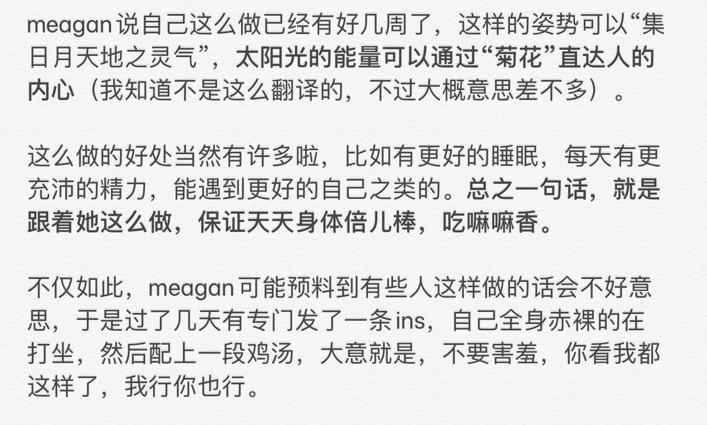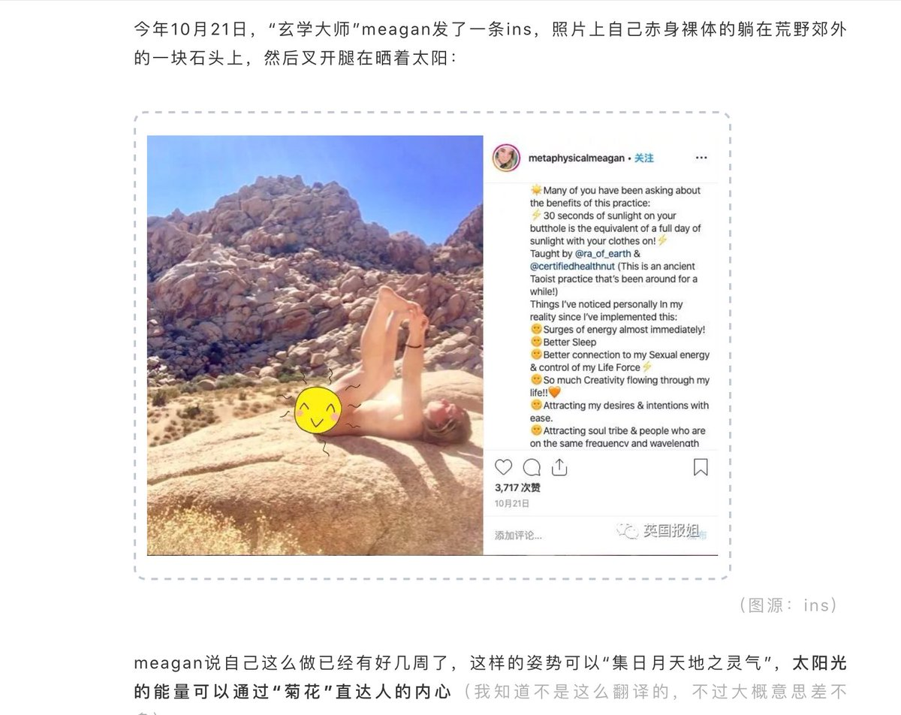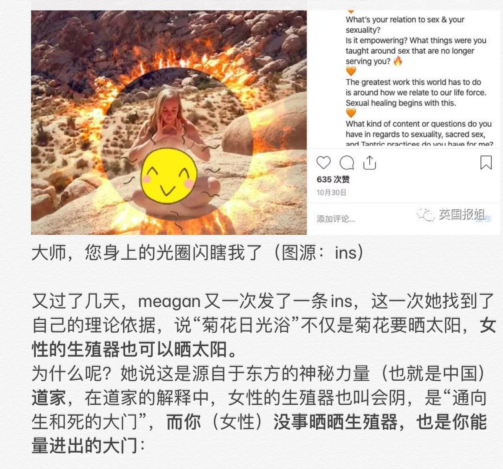 :speech_balloon:评:5 :+1:赞:20 :globe_with_meridians:转:7  

[12月15日 11:00]    BBC News 中文   @bbcchinese    【一周热点回顾】爱沙尼亚没有大型补习社，孩子也七岁才进小学，但是成为亚洲以外PISA考核排名最高的国家。  :speech_balloon:评:14 :+1:赞:157 :globe_with_meridians:转:55  

[12月15日 10:54]    新闻大吐槽   @TuCaoFakeNews    党媒记者和华大妈一问一答演双簧~

党媒妓者：美国媒体对中国不公，CGTN新疆反恐纪录片被Youtube下架，而且《纽约时报》记者还把香港暴徒称作“支持民主的活动分子”

华大妈：美国一些媒体没有恪守最基本的新闻报道准则，也失去了最起码的社会公德和责任！

网民：能否开放油管，我们想去谴责美帝媒体！  :speech_balloon:评:52 :+1:赞:286 :globe_with_meridians:转:87  

[12月15日 10:54]    新闻大吐槽   @TuCaoFakeNews    党媒记者和华大妈一问一答演双簧~

党媒妓者：美国媒体对中国不公，CGTN新疆反恐纪录片被Youtube下架，而且《纽约时报》记者还把香港暴徒称作“支持民主的活动分子”

华大妈：美国一些媒体没有恪守最基本的新闻报道准则，也失去了最起码的社会公德和责任！

网民：能否开放油管，我们想去谴责美帝媒体！  :speech_balloon:评:52 :+1:赞:286 :globe_with_meridians:转:87  

[12月15日 10:16]    老司机   @h5lpykl7tp6jjop    这位科学家一不小心漏嘴又暴露了历史真相！  :speech_balloon:评:4 :+1:赞:274 :globe_with_meridians:转:160  

[12月15日 10:10]    纽约时报中文网   @nytchinese    #一周热门 2019年中国监禁记者人数全球最多 http://nyti.ms/36s6Yoi   :speech_balloon:评:46 :+1:赞:140 :globe_with_meridians:转:58  

[12月15日 10:02]    新闻大吐槽   @TuCaoFakeNews    王户猫一边给狗大大作心脏按摩，一边安慰道：这协议不得不签啊，咱们早就定好，以拖待变不是吗？您千万不可动气啊！
（可这猫心里想：丫心脏支架怎么还不脱落？）  :speech_balloon:评:7 :+1:赞:102 :globe_with_meridians:转:39  

[12月15日 10:02]    新闻大吐槽   @TuCaoFakeNews    王户猫一边给狗大大作心脏按摩，一边安慰道：这协议不得不签啊，咱们早就定好，以拖待变不是吗？您千万不可动气啊！
（可这猫心里想：丫心脏支架怎么还不脱落？）  :speech_balloon:评:7 :+1:赞:102 :globe_with_meridians:转:39  

[12月15日 09:32]    新闻大吐槽   @TuCaoFakeNews    只是她这么不忠诚，在北京体检时，是否被共党植入芯片，就不可知了~  :speech_balloon:评:0 :+1:赞:35 :globe_with_meridians:转:3  

[12月15日 08:50]    新闻大吐槽   @TuCaoFakeNews    香港律政司长鄭若驊借口受伤手术康复，赖在英国不回港，被大使刘晓明亲自押解送中！

有传言说，北京担心这个垮脸大妈在手术时被军情六处植入窃听芯片，所以把大妈弄到北京作详细体检~

推行送中的罪魁被第一个送中，还被共党体检羞辱，不知她作何感受~心情不好，垮脸会加速~  :speech_balloon:评:27 :+1:赞:304 :globe_with_meridians:转:142  

[12月15日 08:31]    老司机   @h5lpykl7tp6jjop    行走在黄河源头：亚洲水塔快成亚洲沙漠了

黄河从上世纪70年代前后开始出现季节性断流，1997年断流达200多天，为历时最长的断流。

 https://www.wenxuecity.com/news/2019/12/14/8946699.html … 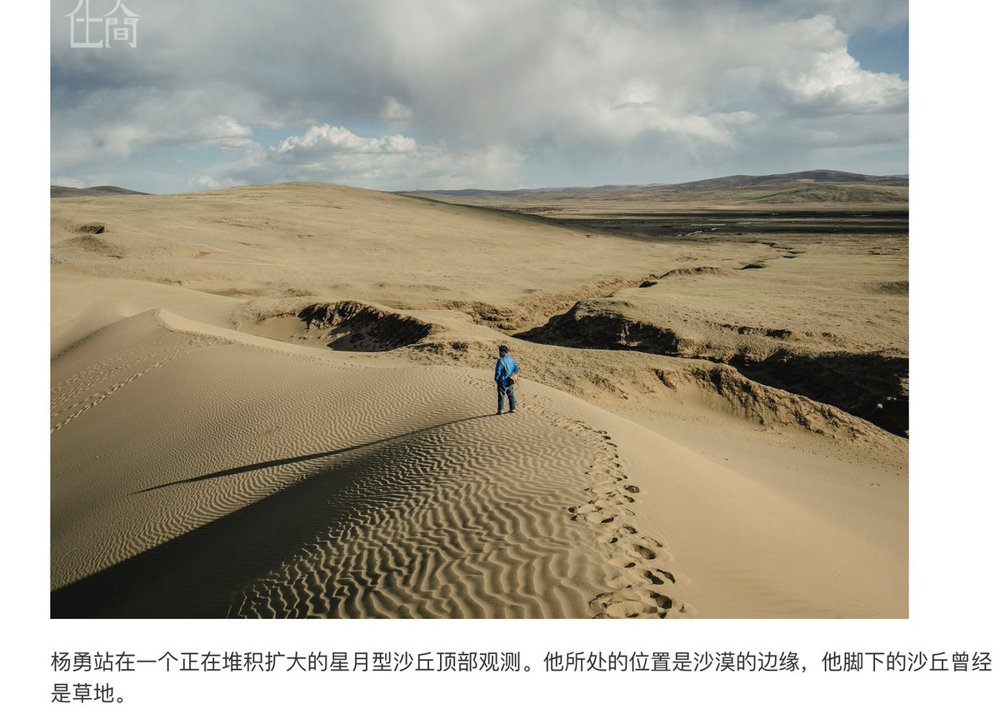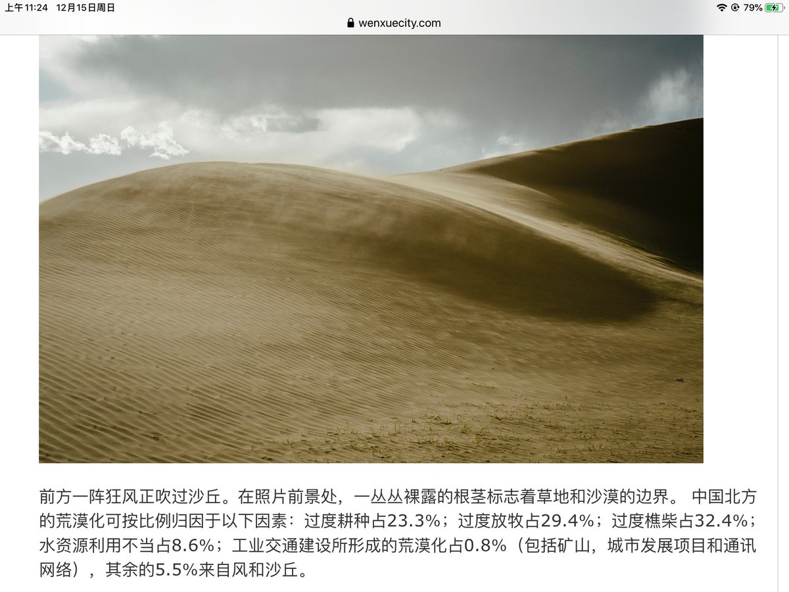 :speech_balloon:评:0 :+1:赞:2 :globe_with_meridians:转:2  

[12月15日 08:20]    老司机   @h5lpykl7tp6jjop    敏感文件曝光后 新疆政府严加信息控制 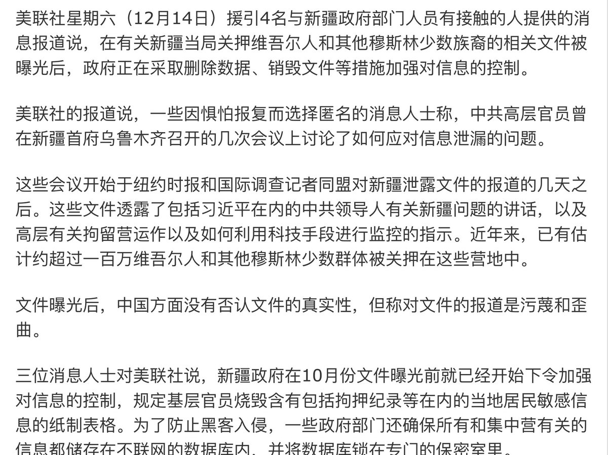 :speech_balloon:评:0 :+1:赞:7 :globe_with_meridians:转:6  

[12月15日 08:20]    新闻大吐槽   @TuCaoFakeNews    反送中开始以来，黑警加班6个月，与正常年份相比，平均每人多赚8万6千港币~
曾经最佳的亚洲警队，良心就值这个价？看来真不是钱能解释的现象，一个邪恶体制对人的败坏，速度超乎想象  :speech_balloon:评:23 :+1:赞:340 :globe_with_meridians:转:229  

[12月15日 08:18]    老司机   @h5lpykl7tp6jjop    41家民企收归国有 打土豪分田地换一种方式进行！ 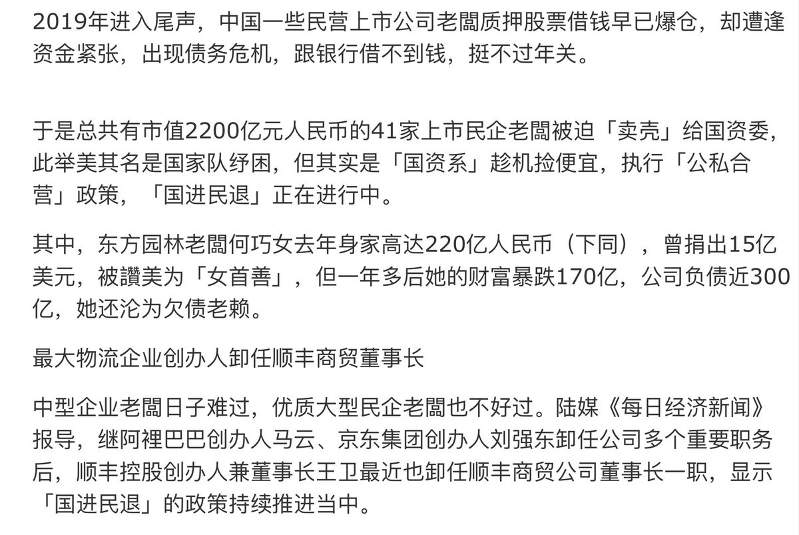 :speech_balloon:评:1 :+1:赞:12 :globe_with_meridians:转:9  

[12月15日 08:15]    老司机   @h5lpykl7tp6jjop    瑞典国会多位议员要求将中国驻瑞大使驱逐出境 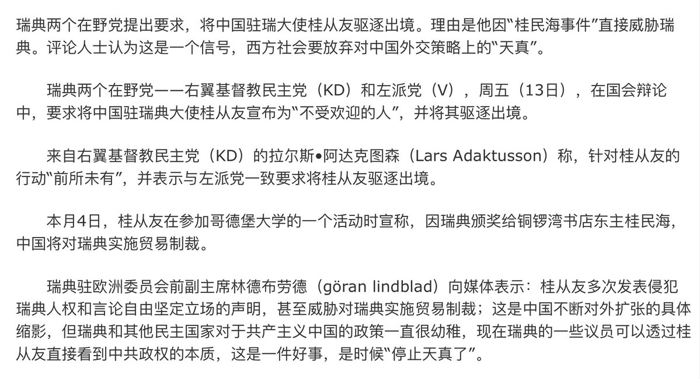 :speech_balloon:评:3 :+1:赞:55 :globe_with_meridians:转:21  

[12月15日 08:10]    纽约时报中文网   @nytchinese    #一周热门 #观点 凯恩斯是如何预见纳粹德国崛起的 http://nyti.ms/2YAFcDa   :speech_balloon:评:5 :+1:赞:58 :globe_with_meridians:转:27  

[12月15日 07:50]    老司机   @h5lpykl7tp6jjop     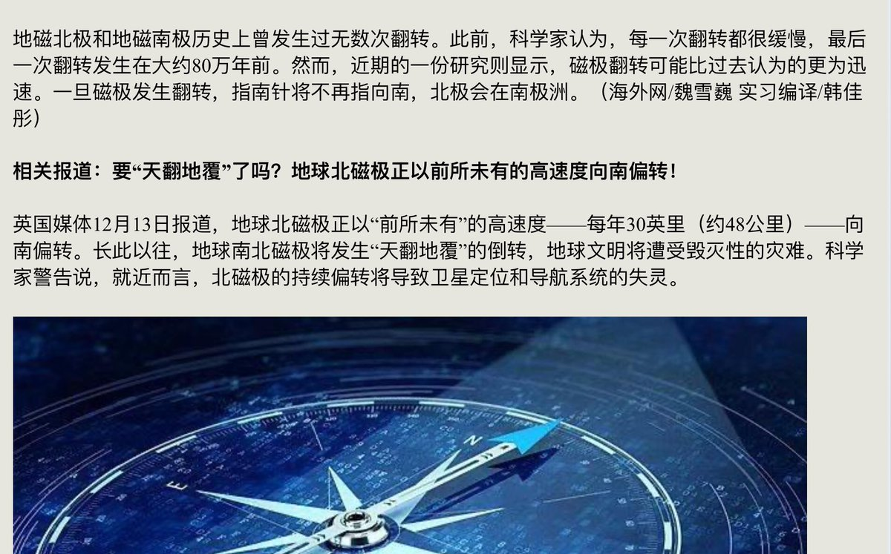 :speech_balloon:评:0 :+1:赞:2 :globe_with_meridians:转:0  

[12月15日 07:44]    老司机   @h5lpykl7tp6jjop    南北磁极将互换?大洪水来临？沧海变桑田？人类文明还有多久？

今年科学家发现地磁北极正以极快的速度从北极圈向俄罗斯的西伯利亚移动，目前已经跨过了国际日期变更线。本周，英国地质调查局（BGS）和美国国家环境信息中心也证实了这一消息。  :speech_balloon:评:12 :+1:赞:42 :globe_with_meridians:转:16  

[12月15日 07:28]    老司机   @h5lpykl7tp6jjop    强拆在即，一大坨黑压压中共鬼子集结!  :speech_balloon:评:16 :+1:赞:79 :globe_with_meridians:转:61  

[12月15日 07:23]    老司机   @h5lpykl7tp6jjop    白毛女算什么！最近人气网红花姐被套路贷逼死！
你在网上一句话说错都会被抓，而套路贷却可以大行其事！
这就是穷人救星共产党的天下发生的事情！
什么半夜鸡叫逼人还债的黄世仁和共产党相比太小儿科！ 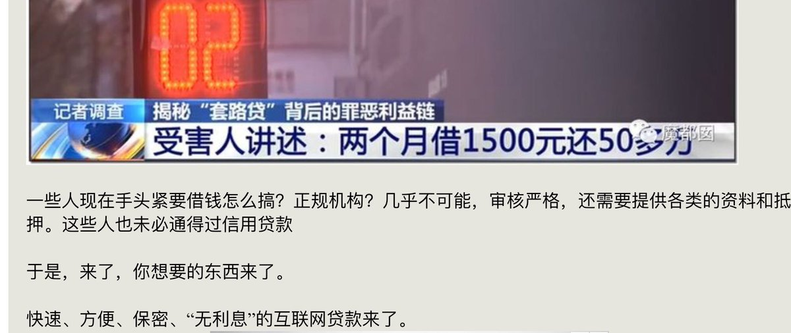 :speech_balloon:评:2 :+1:赞:19 :globe_with_meridians:转:8  

[12月15日 07:02]    老司机   @h5lpykl7tp6jjop    离开中国就赚不到钱？4000亿赌局赢了!嘲笑李嘉诚的人被啪啪打脸！
亚洲首富李嘉诚从中国撤离之后，就将宝押在了英国及欧洲身上。根据不完全统计，李嘉诚在英国的投资布局早在15年前就已开始，到现在投资总额已经超过了4000亿港元。如今脱欧以成定局，英镑大涨，哪些嘲笑李的人现在应该后悔跑慢了吧。  :speech_balloon:评:2 :+1:赞:88 :globe_with_meridians:转:25  

[12月15日 06:53]    老司机   @h5lpykl7tp6jjop    克里米亚问题联合国的投票结果，让此前的所谓公投变成了毫无意义。而克里米亚归属俄罗斯的计划也彻底泡汤了。从此次投票结果不难看出，即便中俄都投出了反对票，但是依然难改美国在国际上的号召力，毕竟这63票的作用还是很大的。 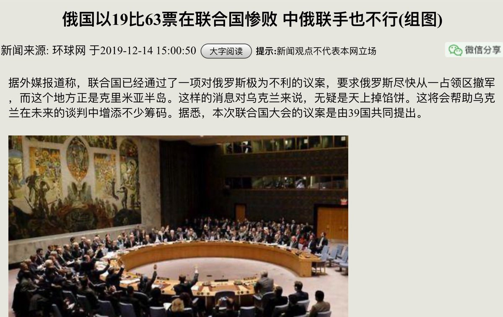 :speech_balloon:评:1 :+1:赞:41 :globe_with_meridians:转:15  

[12月15日 06:42]    老司机   @h5lpykl7tp6jjop    已经纳入大外宣了。  :speech_balloon:评:2 :+1:赞:2 :globe_with_meridians:转:0  

[12月15日 05:15]    老司机   @h5lpykl7tp6jjop    十年树木 百年树人，一树十获者，木也；一树百获者，人也。
这就是中国人的教育理念，把人当果树，定性以后终身不变，只管收获，所以只出照本宣科的木头脑袋，真正的教育是培养每个人对世界的认识和理解，掌握学习的方法，能举一反三应对一切变化的能力，所以红后代留学生见有人反共就急晕头只会骂秽语  :speech_balloon:评:1 :+1:赞:17 :globe_with_meridians:转:4  

[12月15日 03:18]    老司机   @h5lpykl7tp6jjop    歷史是不是總是很驚人的相似？四姨太應該看看這個視頻。  :speech_balloon:评:1 :+1:赞:41 :globe_with_meridians:转:14  

[12月15日 02:39]    GFHG SDKM   @zyx_yny    This Muslim man was just released from a concentration in china 

"He could barely walk by himself. He doesn't recognize anyone in his family and gets frightened by every little movement of people around him"

There are nearly 3 Million Muslim in concentration camps in China   :speech_balloon:评:1124 :+1:赞:53532 :globe_with_meridians:转:43573  

[12月15日 00:52]    BBC News 中文   @bbcchinese    金正恩进行核试验，用意何在，是想给美国总统特朗普一个圣诞礼物？ https://bbc.in/2snOKFI   :speech_balloon:评:67 :+1:赞:192 :globe_with_meridians:转:39  

[12月14日 23:47]    新闻大吐槽   @TuCaoFakeNews    任你上蹿下跳，只要抓紧关税的狗绳，老中医即可淡然处之！
象征性降低一点关税，等于松松狗绳，狗跑不了。

对不起，我侮辱二哈了  :speech_balloon:评:18 :+1:赞:388 :globe_with_meridians:转:90  

[12月14日 23:24]    墙国铁拳现世报😷   @Socialistfist    “生而为国人，边早就选了”
当初NBA风波的爱国表态，提到在国家尊严前不值一提。
鼠绘汉化网因侵犯海贼王版权疑似被哔哩哔哩上海公司举报，现已经跨省批捕
NBA目前在中国照旧正常播出

#社会主义铁拳  :speech_balloon:评:43 :+1:赞:700 :globe_with_meridians:转:169  

[12月14日 22:38]    新闻大吐槽   @TuCaoFakeNews    据报，大陆社交网站在疯传一个帖子，帖子包含对华为历年造成的冤案进行独立调查等八条诉求，并称“八大诉求，缺一不可！”

港人半年抗争课没白上，大陆聪明人从中看出门道了！反噬总是从最不义的华为开始，让人很欣慰！

华为是中共缩影，一个方法针对华为有效，针对共党也应该有效，坐看党和华为割席！  :speech_balloon:评:5 :+1:赞:160 :globe_with_meridians:转:58  

[12月14日 22:11]    GFHG SDKM   @zyx_yny    My 2020 New Year resolution is to free both Hong Kong & China by defeating the New Evil Empire. Happy New Year! https://twitter.com/bohsiuming/status/1205845620851785735 …  :speech_balloon:评:395 :+1:赞:4447 :globe_with_meridians:转:2105  

[12月14日 20:05]    纽约时报中文网   @nytchinese    #一周热门 #转折点 盘点2019年22件第一次发生的事 http://nyti.ms/2PAtZ1g   :speech_balloon:评:6 :+1:赞:15 :globe_with_meridians:转:6  

[12月14日 19:00]    财经真相   @caijingxiang    特朗普上台前，中国依旧是资本流入国，这一时期如何逼迫中共放开管制，好让美企也能在中国分一杯羹是中美贸易纠纷的核心；无论是纳瓦罗这样的美国智库，还是特朗普竞选承诺，都是围绕的如何“进中国”来开展的，但是这个思维到今天就完全不合时宜，中国已经成为资本外流国，如何“出中国”必须要摆到桌面上  :speech_balloon:评:10 :+1:赞:186 :globe_with_meridians:转:34  

[12月14日 18:31]    财经真相   @caijingxiang    中共对外资企业实行外汇管制，是最大的贸易不公平，你连以前投资的钱都拿不回来，扯什么其他谈判就是胡扯！这点莱特希泽不知道吗？美国企业难道没有跟他沟通过吗？问题是中共权贵不可能把吃进肚子的美元吐出来，给美企撤退，考虑明白这一层，你就会明白贸易谈判从一开始就破裂了！  :speech_balloon:评:11 :+1:赞:261 :globe_with_meridians:转:63  

[12月14日 18:30]    纽约时报中文网   @nytchinese    #新新世界 当Liu Jingyao在她的公寓楼大堂作自我介绍时，我没认出她来。这是种难以言表的感觉。
整整一年，她的照片在中国互联网上铺天盖地。和几千万中国人一样，我一遍又一遍地看着她在这座大楼里被拍下的监控录像。我本以为自己已经知道她长什么样。 http://nyti.ms/2sm2yk0   :speech_balloon:评:13 :+1:赞:26 :globe_with_meridians:转:6  

[12月14日 18:22]    财经真相   @caijingxiang    中美贸易谈判最核心的议题不是技术盗窃、知识产权、网络攻击、国企补贴等等，而是金融资本的全面开放，尤其是在华投资和利润如何顺利撤出，农产品购买之所以成为谈判焦点，归根结底还是“钱”，这也是为啥区区500亿美元就这么显眼的原因！如果放开美资外汇管制，那将是多少个500亿呢？  :speech_balloon:评:29 :+1:赞:397 :globe_with_meridians:转:90  

[12月14日 18:07]    BBC News 中文   @bbcchinese    中美分别于12月13日宣布，双方已就贸易谈判达成第一阶段协议。虽然协议尚未正式签署，但两方各自公布了协议的重要内容。 https://bbc.in/34hL99q   :speech_balloon:评:19 :+1:赞:81 :globe_with_meridians:转:22  

[12月14日 18:06]    纽约时报中文网   @nytchinese    #一周热门 相隔72年，一对奥斯维辛恋人最后的重逢 http://nyti.ms/2RFu86f   :speech_balloon:评:4 :+1:赞:30 :globe_with_meridians:转:4  

[12月14日 16:57]    BBC News 中文   @bbcchinese    鸡蛋可以预防流感吗？  :speech_balloon:评:3 :+1:赞:58 :globe_with_meridians:转:17  

[12月14日 16:19]    财经真相   @caijingxiang    据朝中社今日报道，朝鲜国防科学院发言人发表谈话称，当地时间13日晚上10点41分至48分，朝鲜在西海卫星发射场再次进行重大试验。该发言人称，朝鲜近期取得的国防科研成果，将进一步夯实朝鲜的战略核战争遏制力。  :speech_balloon:评:17 :+1:赞:90 :globe_with_meridians:转:12  

[12月14日 16:10]    纽约时报中文网   @nytchinese    #一周热门 中国反击针对新疆拘禁营的国际批评 http://nyti.ms/2P5JwqL   :speech_balloon:评:37 :+1:赞:21 :globe_with_meridians:转:10  

[12月14日 15:02]    BBC News 中文   @bbcchinese    【一周热点回顾】糖会吸走伤口上的水分，而细菌需要水分才能繁殖，没有了细菌，伤口便能更快愈合。 https://bbc.in/2M1ikrB   :speech_balloon:评:16 :+1:赞:178 :globe_with_meridians:转:71  

[12月14日 14:02]    纽约时报中文网   @nytchinese    #一周热门 #观点 骗倒我姥姥的迷人诈骗犯 http://nyti.ms/3483QMq   :speech_balloon:评:4 :+1:赞:12 :globe_with_meridians:转:3  

[12月14日 12:10]    纽约时报中文网   @nytchinese    #一周热门 逃离香港：“反送中”抗议者在台湾寻求庇护 http://nyti.ms/2RAhOEu   :speech_balloon:评:39 :+1:赞:83 :globe_with_meridians:转:32  

[12月14日 10:09]    GFHG SDKM   @zyx_yny    #HKPoliceTerrorists has fired nearly 16,000 #TearGas rounds  during the six months of pro-#democracyforhk #HongKongProtests  :speech_balloon:评:12 :+1:赞:276 :globe_with_meridians:转:257  

[12月14日 10:01]    纽约时报中文网   @nytchinese    #一周热门 “我已经说出了一切”：新疆拘禁营文件报料者发声 http://nyti.ms/2P5tRb7   :speech_balloon:评:40 :+1:赞:84 :globe_with_meridians:转:28  

[12月14日 09:01]    BBC News 中文   @bbcchinese    【一周热点回顾】香港民阵在周日（12月8日）发起游行，直至当日入夜，仍有大批市民在街上。  :speech_balloon:评:51 :+1:赞:201 :globe_with_meridians:转:44  

[12月14日 08:05]    纽约时报中文网   @nytchinese    #一周热门 我的姥姥斗大麻：当华裔家长出头抗争 http://nyti.ms/2RxkZfX   :speech_balloon:评:6 :+1:赞:20 :globe_with_meridians:转:4  

[12月14日 07:27]    BBC News 中文   @bbcchinese    BBC为你盘点世界几大著名活火山景点，看看火山旅游的风险以及对游客的致命吸引力何在？ https://bbc.in/2EhZHva   :speech_balloon:评:0 :+1:赞:10 :globe_with_meridians:转:4  

[12月14日 07:06]    BBC News 中文   @bbcchinese    这艘核潜艇使印度这个世界人口最多的国家跻身具有“三位一体”核打击能力的国家。 https://bbc.in/2LUwsTf   :speech_balloon:评:53 :+1:赞:152 :globe_with_meridians:转:43  

[12月14日 03:21]    GFHG SDKM   @zyx_yny    #HongKongers & #HongKong #StandwithUyghurs 

To free #Uyghurs in #EastTurkistan, Chinese Communist Party of #China which violates #HumanRights needs to end. 

#BoycottChina  :speech_balloon:评:2 :+1:赞:94 :globe_with_meridians:转:14  

[12月14日 01:42]    GFHG SDKM   @zyx_yny    Support  :speech_balloon:评:6 :+1:赞:185 :globe_with_meridians:转:19  

[12月14日 01:01]    财经真相   @caijingxiang    第一阶段协议背后的数字博弈：15号即将生效的1600亿美元25%的关税，算下来就是400亿美元税收；将9月份1200亿美元15%的关税降7.5%，就是等于少征收90亿美元关税，两者总计是490亿美元。刚好就是中国采购500亿美元农产品！  :speech_balloon:评:78 :+1:赞:805 :globe_with_meridians:转:251  

[12月14日 00:28]    财经真相   @caijingxiang    1.关税原来说是取消3600亿的一半，现在只是1200亿的一半，没有假消息公布的好；2.利好出尽，获利了结；3.对比双方公告内容存在差异很多，引发市场担忧情绪！ https://twitter.com/QingLucky/status/1205524315807969281 …  :speech_balloon:评:12 :+1:赞:162 :globe_with_meridians:转:51  

[12月14日 00:21]    财经真相   @caijingxiang    中美第一阶段协议公告差异：1.美方公布包含强制执行机制，中方没有！2.中方公告说同意分阶段降低关税，美方公告里没有！3.美方公告中方承诺会购买大量农产品，中方公告中没有，且新闻发布会上故意混淆说，美方也会购买中国农产品！4.下一阶段，中方强调需要进行校对、翻译、商量时间（拖），美方没有！  :speech_balloon:评:106 :+1:赞:1387 :globe_with_meridians:转:763  

[12月14日 00:10]    BBC News 中文   @bbcchinese    在中国召开发布会的同时，美国总统特朗普也发推文证实两国达成了第一阶段贸易协议。 https://www.bbc.com/zhongwen/simp/chinese-news-50787171 …  :speech_balloon:评:31 :+1:赞:120 :globe_with_meridians:转:48  

[12月13日 23:50]    财经真相   @caijingxiang    人民币浮盈的平仓，浮亏的继续持有，暂时不在新建人民币空仓！  :speech_balloon:评:8 :+1:赞:56 :globe_with_meridians:转:5  

[12月13日 23:47]    财经真相   @caijingxiang    发布会结束了，市场一头雾水，没有方向，除了知道达成了传说中的“deal”外，现在的问题，比发布会前还多，人民币停留在7附近，没有波动！第二阶段协议是立即开始，还是中共的看第一阶段的情况？执行机制是什么？如果中共不执行第一阶段的协议会受到那些处罚？发布会故意让彭博提问在打谁的脸？  :speech_balloon:评:38 :+1:赞:300 :globe_with_meridians:转:71  

[12月13日 23:28]    BBC News 中文   @bbcchinese    中国在当地时间周五深夜突然召开记者会，宣布中美已就外界高度关注的两国经贸第一阶段协议达成一致。
 https://bbc.in/2EbkxMy   :speech_balloon:评:27 :+1:赞:106 :globe_with_meridians:转:43  

[12月13日 22:30]    BBC News 中文   @bbcchinese    全套英式早餐的吸引力究竟在哪里呢？有人说，全套英式早餐中大量的胆固醇和热量对付再糟糕的宿醉也不在话下，吃完后直接扛到晚餐也不成问题。 
 https://bbc.in/2PFWZVn   :speech_balloon:评:19 :+1:赞:50 :globe_with_meridians:转:9  

[12月13日 22:26]    财经真相   @caijingxiang    昨天很多交易员被假新闻搞得“崩溃”，尤其是信仰中共国运的交易员，不仅是亏钱的割肉痛，更多的是对中共得到喘息的“信仰动摇的痛心”，最难熬的一天渡过了，活着真好，亏钱几万美元，依然很高兴，接下来还会赚回来，最重要的是中共的“国运”已定！华夏幸甚！中国幸甚！  :speech_balloon:评:67 :+1:赞:615 :globe_with_meridians:转:77  

[12月13日 22:17]    GFHG SDKM   @zyx_yny    警察の鎮圧行動の中、原因不明の転落死で亡くなった周梓樂くん。

これは周くんのお父さんからの手紙。

//君がまだ母親のお腹にいたあの頃に、私たちはすでに君に「樂樂」という名前を付けることを決めたんだ。
君が一生楽しく笑顔で過ごせますように、と願って。//

是非、全文もご一読ください。  :speech_balloon:评:19 :+1:赞:939 :globe_with_meridians:转:727  

[12月13日 22:13]    财经真相   @caijingxiang    华尔街日报、彭博这一波大忽悠，把做空交易者给提前割了韭菜，现在到了真正割韭菜的时候了！ https://twitter.com/realDonaldTrump/status/1205489214546235393 …  :speech_balloon:评:37 :+1:赞:323 :globe_with_meridians:转:68  

[12月13日 22:11]    财经真相   @caijingxiang    没有刘鹤！ https://twitter.com/caolei1/status/1205487048259325952 …  :speech_balloon:评:18 :+1:赞:77 :globe_with_meridians:转:18  

[12月13日 21:59]    BBC News 中文   @bbcchinese    喝茶已经成为英国文化中不可或缺的一部分，但事实上，英国人酷爱喝茶其实是受到一位葡萄牙女性的影响。
 https://bbc.in/2PgQpG0   :speech_balloon:评:12 :+1:赞:44 :globe_with_meridians:转:14  

[12月13日 21:25]    BBC News 中文   @bbcchinese    英国媒体宣称，鲍里斯·约翰逊（Boris Johnson）冒险一搏的竞选策略得到了“令人惊叹的”巨大回报，而这主要归功于绝大部分公众接受了他的竞选口号：完成脱欧这件事。
 https://bbc.in/2rLywWG   :speech_balloon:评:7 :+1:赞:31 :globe_with_meridians:转:10  

[12月13日 20:45]    BBC News 中文   @bbcchinese    英国大选后崭新的局面 https://bbc.in/2LSzxmV   :speech_balloon:评:5 :+1:赞:22 :globe_with_meridians:转:6  

[12月13日 20:13]    GFHG SDKM   @zyx_yny    日本政府が来年、習近平国家主席を国賓として招くことについて、私は強く反対しています。

これはあくまで一人の香港人としての個人的な意見ですが、日本の皆さんに読んでほしいです。→  :speech_balloon:评:658 :+1:赞:20862 :globe_with_meridians:转:9510  

[12月13日 20:03]    BBC News 中文   @bbcchinese    “花朵告诉我们生命很短暂，我们要快乐地生活。”婚礼花艺师卡尔帕纳如是说。  :speech_balloon:评:0 :+1:赞:39 :globe_with_meridians:转:9  

[12月13日 20:00]    纽约时报中文网   @nytchinese    在过去十年间，千禧一代的父母们不得不更绞尽脑汁，才能找到寓意美好、独特又让人感到新鲜的名字。
于是他们打开词典，找到某种花朵Violet、一种美德Justice，甚至皇室名称Queen，又或者求助于神话、传说和宗教。还有一些人干脆自己发明新名字。 http://nyti.ms/2EfUST8   :speech_balloon:评:3 :+1:赞:10 :globe_with_meridians:转:8  

[12月13日 19:54]    墙国铁拳现世报😷   @Socialistfist    啧啧啧

#战螂在推特 2  :speech_balloon:评:22 :+1:赞:124 :globe_with_meridians:转:22  

[12月13日 19:45]    财经真相   @caijingxiang    2015年特朗普再次新著《伤残美国：如何再次伟大》在此书中他陈述了自己对非法移民问题的立场，主张进行严格控制来缓和美国福利开支压力；同时反对伊拉克战争；对于这些主张他直言坦率，吸引媒体关注，而不是以往的政客表演！实事上早在2013年特朗普花费100万美元对进军白宫进行可行性研究！  :speech_balloon:评:2 :+1:赞:99 :globe_with_meridians:转:13  

[12月13日 19:36]    财经真相   @caijingxiang    为了让美国再次伟大，特朗普的开出的药方是：令欧佩克失去石油定价权；逼迫中国从事真正的公平贸易，以便给美国带来就业；设法减少债务又不损害正常福利；消除奥巴马医改和经济政策！今天他做到几条呢？  :speech_balloon:评:8 :+1:赞:151 :globe_with_meridians:转:25  

[12月13日 19:32]    财经真相   @caijingxiang    2011年在奥巴马在白宫记者协会年度晚宴上奚落特朗普后，特朗普于当年出版了一本新书《此时应强硬：让美国再成为第一》，在书中他直言奥巴马是美国的“灾难”，对奥巴马到世界各地为美国所作所为四处道歉感到不满，他写道：现在的美国工作机会紧缺，财富紧缺，毫无尊严，看上去就是一个失败国家！  :speech_balloon:评:20 :+1:赞:362 :globe_with_meridians:转:85  

[12月13日 19:21]    纽约时报中文网   @nytchinese    有趣的是，仅仅一星期后，当我告诉姥姥我计划参加支持核能源的游行，希望和她聊聊有关环保的政治话题时，她马上就拒绝我。
“哎呀，你千万不能参与政治。浪费时间。你应该专心学习。参加游行太危险了。”她对自己参加政治活动感到很骄傲，但轮到我她就不高兴。 http://nyti.ms/2RxkZfX   :speech_balloon:评:3 :+1:赞:13 :globe_with_meridians:转:3  

[12月13日 19:00]    纽约时报中文网   @nytchinese    《我的镜头》描述了中国广阔大地上各式各样的中国人的生活——从乡村放牧的马匹到雾霾笼罩的城市里戴着口罩的男人；从礼拜的穆斯林到昏暗的庆祝活动。
差异展现在热闹的片尾，一位拿着吉他的歌手在热闹的餐厅里表演，却始终未得到食客的注意力。 http://nyti.ms/34fNly3   :speech_balloon:评:66 :+1:赞:22 :globe_with_meridians:转:6  

[12月13日 18:50]    GFHG SDKM   @zyx_yny    #HayırlıCumalarDoğuTürkistan   :speech_balloon:评:13226 :+1:赞:125266 :globe_with_meridians:转:46166  

[12月13日 18:28]    纽约时报中文网   @nytchinese    #新新世界 Liu Jingyao指控了中国最有权势的精英人物之一，结果被许多人称为荡妇、妓女、骗子和拜金女等。
这种羞辱规模之大、程度之强，体现了中国社会对待敢于直言性侵的女性的态度。 by @liyuan6 http://nyti.ms/2sm2yk0   :speech_balloon:评:400 :+1:赞:749 :globe_with_meridians:转:346  

[12月13日 18:00]    BBC News 中文   @bbcchinese    选举结果有助英国打破三年来的脱欧僵局，但在国际大环境下，英国与中国未来的关系却蒙上不确定性。 https://bbc.in/34cS1Vj   :speech_balloon:评:33 :+1:赞:65 :globe_with_meridians:转:24  

[12月13日 13:58]    GFHG SDKM   @zyx_yny    永不遺忘，常在心中，他們的付出，將會留給世世代代，香港多謝有你才會有未来，香港史書會有手足的勇敢，輝煌的事件。  :speech_balloon:评:52 :+1:赞:834 :globe_with_meridians:转:528  

[12月13日 11:46]    新闻大吐槽   @TuCaoFakeNews    港人很喜欢吃日式牛丼饭，但他们就是忍住不去吃吉野家！
因为吉野家解雇了为反送中发声的员工，主动替港共迫害香港人！

直到这家叫做SUKIYA的同类日料店开张，香港人排起长队准备大快朵颐。

不知道吉野家看到这大长队作何感想？
“矮马，没人吃，今天的牛肉又要臭了”  :speech_balloon:评:162 :+1:赞:2372 :globe_with_meridians:转:904  

[12月13日 11:19]    GFHG SDKM   @zyx_yny    Can't believe Commissar Lamb is rewarding @hkpoliceforce human rights abuse & brutality. https://twitter.com/Kaman13032369/status/1205325571070124037 …  :speech_balloon:评:444 :+1:赞:4979 :globe_with_meridians:转:3952  

[12月13日 10:17]    财经真相   @caijingxiang    人民币又出现封底购汇，如果明天白宫公布达成协议，人民币会出现获利了结，跌到7附近，如果15号关税继续加征，人民币要上演千里大跌幅,到时结果出来后再追空不迟！  :speech_balloon:评:40 :+1:赞:279 :globe_with_meridians:转:62  

[12月13日 08:14]    财经真相   @caijingxiang    市场“买预期、卖事实”，目前人民币涨幅甚至计价了，削减现有关税，而不是仅仅是15号的关税。消息鱼龙混杂，路透社、彭博所有消息全部引用“匿名消息人士”，如果取消15号关税有可能，但是取消现有关税，这事怎么看都不靠谱，目前中共退让仅仅是再次承诺购买500亿农产品，这个结果怎么看都是中共的胜利！  :speech_balloon:评:51 :+1:赞:259 :globe_with_meridians:转:49  

[12月12日 21:43]    墙国铁拳现世报😷   @Socialistfist    感谢近几日投稿的推友！  :speech_balloon:评:0 :+1:赞:63 :globe_with_meridians:转:1  

[12月12日 21:42]    墙国铁拳现世报😷   @Socialistfist    红色精神流传一次一百万

#社会主义铁拳  :speech_balloon:评:41 :+1:赞:468 :globe_with_meridians:转:127  

[12月12日 20:11]    墙国铁拳现世报😷   @Socialistfist    补充  :speech_balloon:评:0 :+1:赞:53 :globe_with_meridians:转:11  

[12月12日 20:06]    墙国铁拳现世报😷   @Socialistfist    基层腐败，中央英明 -----某战螂

#社会主义铁拳  :speech_balloon:评:27 :+1:赞:335 :globe_with_meridians:转:72  

[12月12日 16:51]    GFHG SDKM   @zyx_yny    Japanese retail brand MUJI was sued by fake "MUJI" copycat in #China (right) for copyright dispute and the fake MUJI won the court case.

The genuine MUJI has to pay the fake one US$85k for their "financial loss" and apologize due to "copyright infringement"

China = Fantasy Land  :speech_balloon:评:144 :+1:赞:1406 :globe_with_meridians:转:1273  

[12月12日 16:35]    GFHG SDKM   @zyx_yny    He comes all the way from Japan, bring coffee with him to give Hong Kong people a free cup. “I come to give some warmth to you guys, I know what happened” he said 

#StandWithHongKong  :speech_balloon:评:157 :+1:赞:3926 :globe_with_meridians:转:2066  

[12月12日 13:43]    GFHG SDKM   @zyx_yny    今日、すき家の香港店がオープンしました。昨日の夜から長い行列ができました（笑）

親中派企業が経営している香港吉野家を多くの香港人がボイコットしている今、すき家は多分大人気になると思いますw

#香港 #すき家  :speech_balloon:评:443 :+1:赞:23337 :globe_with_meridians:转:7559  

[12月10日 22:10]    墙国铁拳现世报😷   @Socialistfist    “警察说要对我用喷雾剂了”

#社会主义铁拳  :speech_balloon:评:47 :+1:赞:762 :globe_with_meridians:转:178  

[12月10日 02:24]    墙国铁拳现世报😷   @Socialistfist    不了解铁拳的老朋友兔兔是谁的请看这里 https://twitter.com/Socialistfist/status/1175057744858161159?s=19 …  :speech_balloon:评:8 :+1:赞:88 :globe_with_meridians:转:17  

[12月10日 02:15]    墙国铁拳现世报😷   @Socialistfist    另外点名批评的还有新加坡人李连杰和我们的老朋友兔兔 @zzyyzoe 最喜爱的  加拿大人吴亦凡  :speech_balloon:评:10 :+1:赞:137 :globe_with_meridians:转:16  

[12月10日 02:13]    墙国铁拳现世报😷   @Socialistfist    美籍刘亦菲一直以来就因为其国籍问题在墙国招致非议。在今年8月14日微博撑港警后让不少粉红对她国籍的质疑消停不少。没过多久，鹤岗网警就在12月5日发短片手撕刘亦菲
为了同时拥有人民币和美国护照，真乃里外不是人
#社会主义铁拳  :speech_balloon:评:30 :+1:赞:411 :globe_with_meridians:转:115  

[12月09日 09:57]    墙国铁拳现世报😷   @Socialistfist    孙夕庆博士已申请“开庭次数最多的刑事案件”的吉尼斯纪录，并已被受理。
小编为孙博士在遇到如此不公后还能保留如此幽默感点赞  :speech_balloon:评:6 :+1:赞:423 :globe_with_meridians:转:87  

[12月09日 09:47]    墙国铁拳现世报😷   @Socialistfist    2014年，两位清华留美博士，都选择回国创业报效国家。
一位是在2015年被羁押就已经长达17个月并再无下文的“千人计划”专家 李港
另一位是被羁押1277天并经历114次庭审的孙夕庆。
#社会主义铁拳  :speech_balloon:评:74 :+1:赞:850 :globe_with_meridians:转:358  

[12月09日 01:21]    墙国铁拳现世报😷   @Socialistfist    高级黑还是低级红？  :speech_balloon:评:12 :+1:赞:60 :globe_with_meridians:转:5  

[12月09日 01:20]    墙国铁拳现世报😷   @Socialistfist    民主铁拳现世报是高级黑还是低级红？
请您参与投票！  :speech_balloon:评:43 :+1:赞:230 :globe_with_meridians:转:26  

[12月07日 02:58]    墙国铁拳现世报😷   @Socialistfist    如果您对本推内容有什么想说的并且希望被匿名看到，可以私信小编！
这两位推友如果互相欣赏彼此观点，小编可以介绍认识  :speech_balloon:评:4 :+1:赞:42 :globe_with_meridians:转:1  

[12月07日 02:55]    墙国铁拳现世报😷   @Socialistfist    推友们大家好，首先必须承认最近铁拳推没有之前的数量和质量，向各位关注本推的推友致歉。
再次感谢大家的投稿，如果您的投稿符合本推的投稿标准，小编会陆续给您安排发布
受之前 #现世报读者来信 启发而创立的新系列，这次刊登两位年纪相仿中港的推友对墙内现象的感言，小编认为这样的交流很有意义。  :speech_balloon:评:27 :+1:赞:270 :globe_with_meridians:转:38  

[12月06日 23:15]    墙国铁拳现世报😷   @Socialistfist    有感而发  :speech_balloon:评:4 :+1:赞:209 :globe_with_meridians:转:11  

[12月06日 21:21]    墙国铁拳现世报😷   @Socialistfist    滋磁！ https://twitter.com/minzhutiequan/status/1202745105754419200 …  :speech_balloon:评:36 :+1:赞:223 :globe_with_meridians:转:21  

[12月05日 22:24]    墙国铁拳现世报😷   @Socialistfist    推特魔幻剧场  :speech_balloon:评:15 :+1:赞:131 :globe_with_meridians:转:11  

[12月04日 20:37]    GFHG SDKM   @zyx_yny    喂喂，香港嘅bb睇落嚟

澳洲設立committee，探討是否有必要頒佈Magnitsky. 可以開始寫信lobby袋鼠囯喔。They accept submissions now

好擔心。區選舉和HKHRDA頒佈后，大家有哋散漫有哋唔focus喎。還有人開始屌來屌去...

bb, come back! 依家有嘢做囖

利申：信還沒寫，不過澳洲list做完一半了 https://twitter.com/NSWHongkongers/status/1202151090399006720 …  :speech_balloon:评:9 :+1:赞:327 :globe_with_meridians:转:203  

[11月26日 01:01]    GFHG SDKM   @zyx_yny    Heading back to London. 

Thank you #HK for letting us share in your unforgettable victory.

香港人, 加油   :speech_balloon:评:2681 :+1:赞:21528 :globe_with_meridians:转:10213  

[11月24日 12:46]    GFHG SDKM   @zyx_yny    Very good to take some time@our from election observation to tell #JuniusHo in person that I was responsible for the revocation of his honorary doctorate from @AngliaRuskin #Sorrynotsorry  :speech_balloon:评:6943 :+1:赞:46314 :globe_with_meridians:转:27881  

[11月24日 08:10]    凡賽堤/FORSETI   @FecharCCP    呼籲請求共同挖掘所有有關香港發生的事，越全面越好，不同角度，越多越好，包括被暗地抓捕的人員，特別是CCP 派出的各種偽裝身份，包括變身變裝行兇的一點一滴都要挖掘出來，把CCP 的邪惡下三濫手段的真相毫無保留的曝光在全世界面前！世界公知公義才能真正挽救和保護香港人！希望懂視頻編輯配上中英文  :speech_balloon:评:3 :+1:赞:22 :globe_with_meridians:转:19  

[11月23日 10:13]    凡賽堤/FORSETI   @FecharCCP    CCP極權殺人恐怖組織正在用各種兇殘手段屠殺我們的同胞...................
CCP極權殺人恐怖組織是全人類的公敵！呼籲全世界正道主義合力消滅CCP！

圖為被殺害的陳彥霖母女！  :speech_balloon:评:0 :+1:赞:9 :globe_with_meridians:转:12  

[11月21日 13:58]    GFHG SDKM   @zyx_yny    On #PolyU being the end game, this OL says it is 100% not the end game.  She says what we saw happened to the students at Poly, the way they were brutally treated by #HKPolice, there's no way HKers will forget.  We will keep on fighting!

#StandWithHongKong #HongKongProtests  :speech_balloon:评:104 :+1:赞:2405 :globe_with_meridians:转:1561  

[11月21日 11:50]    GFHG SDKM   @zyx_yny    We were in front of the Diet Members’ Office Building.

We will keep fighting with you, HKers
We will keep spreading what's happening in HK

You are not alone  :speech_balloon:评:371 :+1:赞:3557 :globe_with_meridians:转:2142  

[11月21日 00:57]    GFHG SDKM   @zyx_yny    Yesterday’s passage of the #HongKong Human Rights & Democracy Act was a good day in the struggle to resist totalitarian #China & its bid for domination. But it was not the last day. We have a long road ahead to protect our jobs, our workers & our security.  :speech_balloon:评:1651 :+1:赞:16310 :globe_with_meridians:转:10809  

[11月20日 21:56]    GFHG SDKM   @zyx_yny    The first day that schools resumed, #hkpolice deliberately targeted high school students to stop and search for no reason. As many #hongkongers suggest, being young becomes a crime as #China and #HKGov are totally out of reach of the whole city.  :speech_balloon:评:262 :+1:赞:5610 :globe_with_meridians:转:6220  

[11月14日 18:36]    财经真相   @caijingxiang    中共基建没有钱，很多网友简单的认为开动印钞机就行，这其实是大错特错，中共央行印的每一分钱，都必须有对应的相应的价值才行，否则就是无锚印钞，汇率崩盘！过去20年央行印钞都是以债务为基础的。比如，房奴的房贷，当房奴申请贷款时，本质是向央行抵押了自己未来30年的劳动力。 https://twitter.com/aspeltuo8/status/1194923278646816768 …  :speech_balloon:评:83 :+1:赞:897 :globe_with_meridians:转:315  

[11月12日 07:22]    凡賽堤/FORSETI   @FecharCCP    11日早在西湾河开枪射伤示威者的港警关家荣身份被起底，其担任家教会主席的德望学校师生、家长及校友发起联署要求解除其在该校的职务。其两个女儿在该校就读。另有消息指，关家荣受过“大陆警察部门”特殊培训。下面这个小视频，足以解释这场血案的真相：这是流氓国家自上而下有计划的谋杀。  :speech_balloon:评:22 :+1:赞:260 :globe_with_meridians:转:179  

[11月05日 04:28]    凡賽堤/FORSETI   @FecharCCP    急救香港  #HKSOS！！！

天滅流氓政權！！！極權殺人恐怖組織正在用各種兇殘手段殺害我們的同胞..................................................

流氓政權的極權殺人恐怖組織蓄意謀殺香港年輕人！（13）

被暴力制服的年輕人已經休克，還殘暴折斷手！

兇殘，殘暴手段令人髮指到已經超越納粹！  :speech_balloon:评:1 :+1:赞:7 :globe_with_meridians:转:18  

[11月05日 04:24]    凡賽堤/FORSETI   @FecharCCP    急救香港  #HKSOS！！！

天滅流氓政權！！！極權殺人恐怖組織正在用各種兇殘手段殺害我們的同胞..................................................

流氓政權的極權殺人恐怖組織蓄意謀殺香港年輕人！（11）
兇殘，殘暴手段令人髮指到已經超越納粹！
天滅流氓政權！！！  :speech_balloon:评:0 :+1:赞:51 :globe_with_meridians:转:49  

[11月05日 04:23]    凡賽堤/FORSETI   @FecharCCP    急救香港  #HKSOS！！！

天滅流氓政權！！！極權殺人恐怖組織正在用各種兇殘手段殺害我們的同胞..................................................

流氓政權的極權殺人恐怖組織蓄意謀殺香港年輕人！（10）
兇殘，殘暴手段令人髮指到已經超越納粹！
天滅流氓政權！！！  :speech_balloon:评:0 :+1:赞:4 :globe_with_meridians:转:8  

[11月05日 04:16]    凡賽堤/FORSETI   @FecharCCP    急救香港  #HKSOS！！！

天滅流氓政權！！！極權殺人恐怖組織正在用各種兇殘手段殺害我們的同胞..................................................

流氓政權的極權殺人恐怖組織蓄意謀殺香港年輕人！（8）
兇殘，殘暴手段令人髮指到已經超越納粹！
天滅流氓政權！！！  :speech_balloon:评:1 :+1:赞:45 :globe_with_meridians:转:56  

[11月05日 04:13]    凡賽堤/FORSETI   @FecharCCP    急救香港SOS！！！

天滅流氓政權！！！極權殺人恐怖組織正在用各種兇殘手段殺害我們的同胞..................................................

流氓政權的極權殺人恐怖組織蓄意謀殺香港年輕人！（7）
兇殘，殘暴手段令人髮指到已經超越納粹！
天滅流氓政權！！！  :speech_balloon:评:4 :+1:赞:13 :globe_with_meridians:转:23  

[11月05日 04:06]    凡賽堤/FORSETI   @FecharCCP    急救香港SOS！！！

天滅流氓政權！！！極權殺人恐怖組織正在用各種兇殘手段殺害我們的同胞..................................................

流氓政權的極權殺人恐怖組織蓄意謀殺香港年輕人！（3）
兇殘，殘暴手段令人髮指到已經超越納粹！
天滅流氓政權！！！  :speech_balloon:评:2 :+1:赞:11 :globe_with_meridians:转:18  

[10月28日 00:20]    凡賽堤/FORSETI   @FecharCCP    人類最恐怖的極權殺人恐怖組織！
警察蒙面公開殺人，毆打，暴打，非法濫捕，暗殺市民！

CCP的極權殺人恐怖組織比本拉登還恐怖一萬倍！  :speech_balloon:评:6 :+1:赞:207 :globe_with_meridians:转:169  

[10月27日 23:59]    凡賽堤/FORSETI   @FecharCCP    人類最恐怖的極權殺人恐怖組織！
警察蒙面公開殺人，毆打，暴打，非法濫捕，暗殺市民！

已經被雙手反綁的學生，極權殺人恐怖組織還要把人往死裡整！全人類唯一一個最恐怖的極權殺人恐怖組織！  :speech_balloon:评:0 :+1:赞:11 :globe_with_meridians:转:13  

[10月19日 10:34]    凡賽堤/FORSETI   @FecharCCP    魔鬼在人間39

極權殺人恐怖組織正在用各種兇殘手段殺害我們的同胞....................................................................................................

魔鬼的罪行！黑警群毆直接致命打頭的兇殘  :speech_balloon:评:3 :+1:赞:65 :globe_with_meridians:转:47  

[10月16日 18:30]    凡賽堤/FORSETI   @FecharCCP    極權殺人恐怖組織正在用各種兇殘手段殺害我們的同胞..........

拯救港人，拯救華族，勢在必行！！！！！！！！

極權不滅全人類人人遭殃！！！ https://twitter.com/FecharCCP/status/1183188604132188161 …  :speech_balloon:评:0 :+1:赞:20 :globe_with_meridians:转:16  

[10月15日 02:01]    凡賽堤/FORSETI   @FecharCCP    緊急提醒！

未來將有極權恐怖組織偽裝成各種各樣的所謂正義人士要求高價購買自6.9以來香港黑警殺人等犯罪證據，呼籲要提高一千萬的警惕和小心，別把自己的命給賣力！極權殺人恐怖組織從來不會讓有證據的人活在這個世界上！！！ https://twitter.com/FecharCCP/status/1183188604132188161 …  :speech_balloon:评:3 :+1:赞:44 :globe_with_meridians:转:41  

[10月15日 01:24]    凡賽堤/FORSETI   @FecharCCP    美國西方國家用70年為大陸人開啟民智，結果反被吞噬！某些海外華人聲稱是為大陸人開啟民智！ 把自己封為比上帝還高的聖人，卻把眼睛盯著榮耀！但是卻不明白，千千萬萬正義的小螞蟻才是真正為大陸人開啟民智先鋒！
因為他們把極權殺人恐怖組織在香港犯下的種種罪行的真相向全世界和大陸傳播！良知無國界  :speech_balloon:评:3 :+1:赞:18 :globe_with_meridians:转:8  

[10月15日 00:36]    凡賽堤/FORSETI   @FecharCCP    總覺得現在的海外華人口口聲聲說反極權CCP，把美國的白宮演變成CCP的信訪局，然後他們也變成了美國政府的白宮，總統的“代言人“或“爆料們“，說難聽的是皮條客，靠這樣就能滅CCP？一點殺傷力都沒有，無非也是譁眾取寵吸引眼球，浪費時間轉移了核心，6.9香港返送中以來，這麼大的事件，香港如此悲慘！（1 https://twitter.com/FecharCCP/status/1183188604132188161 …  :speech_balloon:评:1 :+1:赞:9 :globe_with_meridians:转:4  

[10月14日 11:02]    凡賽堤/FORSETI   @FecharCCP    這些香港每一個慘不忍睹的畫面和視頻，如果有正義自媒體和新聞一直跟踪報導，也許很多都可以活下來！無形中幫助和挽救多少香港人啊！！！ https://twitter.com/FecharCCP/status/1182079900393582592 …  :speech_balloon:评:1 :+1:赞:8 :globe_with_meridians:转:10  

[10月14日 11:00]    凡賽堤/FORSETI   @FecharCCP    這些香港每一個慘不忍睹的畫面和視頻，如果有正義自媒體和新聞一直跟踪報導，也許很多都可以活下來！無形中幫助和挽救多少香港人啊！！！ https://twitter.com/FecharCCP/status/1182079392387911680 …  :speech_balloon:评:0 :+1:赞:3 :globe_with_meridians:转:4  

[10月14日 10:26]    凡賽堤/FORSETI   @FecharCCP    希望所有正義自媒體能跟進香港幾個月被極權殺人組織殘暴的每個事件，香港人被殺那麼多人，一定要傳播真相，致於如何避開版權問題是自媒體應該智者見智的問題！但是我們渴望所有正義自媒體能盡量放大香港人被打死，打傷，大殘，被自殺，被跳樓，被棄屍，黑警暴力的畫面和視頻的傳播！才是真正傳播真相！ https://twitter.com/FecharCCP/status/1183188604132188161 …  :speech_balloon:评:10 :+1:赞:41 :globe_with_meridians:转:43  

[10月13日 09:12]    凡賽堤/FORSETI   @FecharCCP    魔鬼在人間35

極權殺人恐怖組織正在用各種兇殘手段殺害我們的同胞....................................................................................................

注！直接打断左手  :speech_balloon:评:114 :+1:赞:978 :globe_with_meridians:转:967  

[10月10日 07:44]    凡賽堤/FORSETI   @FecharCCP    悲慘的香港5 ，看到這一幕幕屍體，我們是悲痛？是無助？還是哭泣？是憤怒？ 面對強權，我們該如何？

（聲明！圖片來源均來自網絡媒體，如有侵權，立即刪除）  :speech_balloon:评:52 :+1:赞:419 :globe_with_meridians:转:330  

[10月09日 00:47]    GFHG SDKM   @zyx_yny    "Son, when you grow up
You will be the savior of the broken
The beaten, and the damned?"
Please watch this powerful mv #HongKongProtester #hkprotests 
香港反送中護法戰爭(Hong Kong Defensive War 2019)：Welcome To The Black Parade  https://youtu.be/0yXTHODE24Q  via @YouTube  :speech_balloon:评:4 :+1:赞:21 :globe_with_meridians:转:8  

[03月13日 08:10]    老司机   @h5lpykl7tp6jjop    批评是批评家天生的使命！他们只感知对错，信奉真理，指出真相不吐不快，不在意权势和群众的喜好，从批评里不可能获得任何好处，但批评家愚直不改。在中国几乎所有人都讨厌批评家，喜欢阴谋家，因为他们只说好听的！可是就因为中国的批评家太少，中国几乎看不到未来和希望！  :speech_balloon:评:105 :+1:赞:259 :globe_with_meridians:转:53  

