[10月24日 14:00]    财经真相   @caijingxiang    人民网：废立之际谁是忠臣！  :speech_balloon:评:4 :+1:赞:12 :globe_with_meridians:转:5  

[10月24日 14:00]    BBC News 中文   @bbcchinese    “他们也不知道，原来大陆人也有支持这场运动的，不是所有人都是『小粉红』。” https://bbc.in/33YcsWw   :speech_balloon:评:2 :+1:赞:11 :globe_with_meridians:转:3  

[10月24日 14:00]    纽约时报中文网   @nytchinese    在傅立民看来，《香港人权与民主法案》并不会给北京带来太大压力，它的意图是确保香港能维持“一国两制”——这符合美国的利益；但一些美国官员需要明白“沉默是金”的道理。在谈到NBA事件时，他认为中美双方都自以为是，但中国需要适应这样一个事实：宽宏大量比敏感多疑好处更大。 https://nyti.ms/2pOZJ9C   :speech_balloon:评:1 :+1:赞:0 :globe_with_meridians:转:0  

[10月24日 13:54]    财经真相   @caijingxiang    新华视点：中共中央政治局会议决定，中国共产党第十九届中央委员会第四次全体会议于10月28日至31日在北京召开。  :speech_balloon:评:6 :+1:赞:10 :globe_with_meridians:转:6  

[10月24日 13:20]    新闻大吐槽   @TuCaoFakeNews    Mei用冷冻枪帮港女筑起冰墙！ 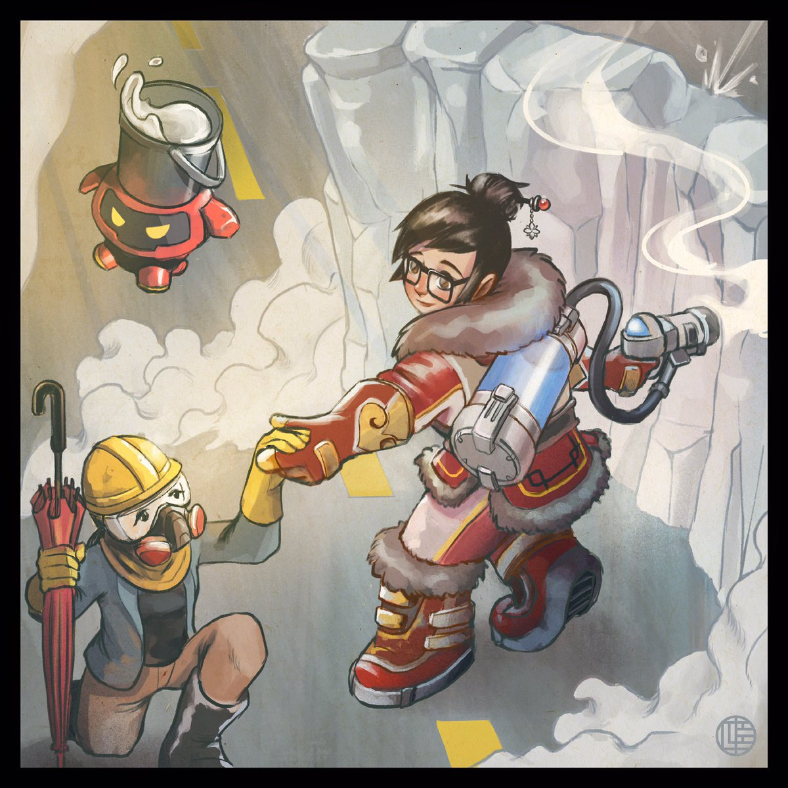 :speech_balloon:评:1 :+1:赞:12 :globe_with_meridians:转:4  

[10月24日 13:03]    BBC News 中文   @bbcchinese    1916年墨西哥革命家比利亚率军入侵美国南部边陲小镇，近百年后墨西哥马队再次跨越边界，但不是入侵而是纪念游行。 https://bbc.in/2BAnZyX   :speech_balloon:评:1 :+1:赞:7 :globe_with_meridians:转:1  

[10月24日 13:00]    纽约时报中文网   @nytchinese    今日食谱：烤肠、甜葡萄和醋蘸洋葱的绝妙搭配。
更多简报内容： https://nyti.ms/2qFZtdF   :speech_balloon:评:0 :+1:赞:4 :globe_with_meridians:转:0  

[10月24日 12:58]    新闻大吐槽   @TuCaoFakeNews     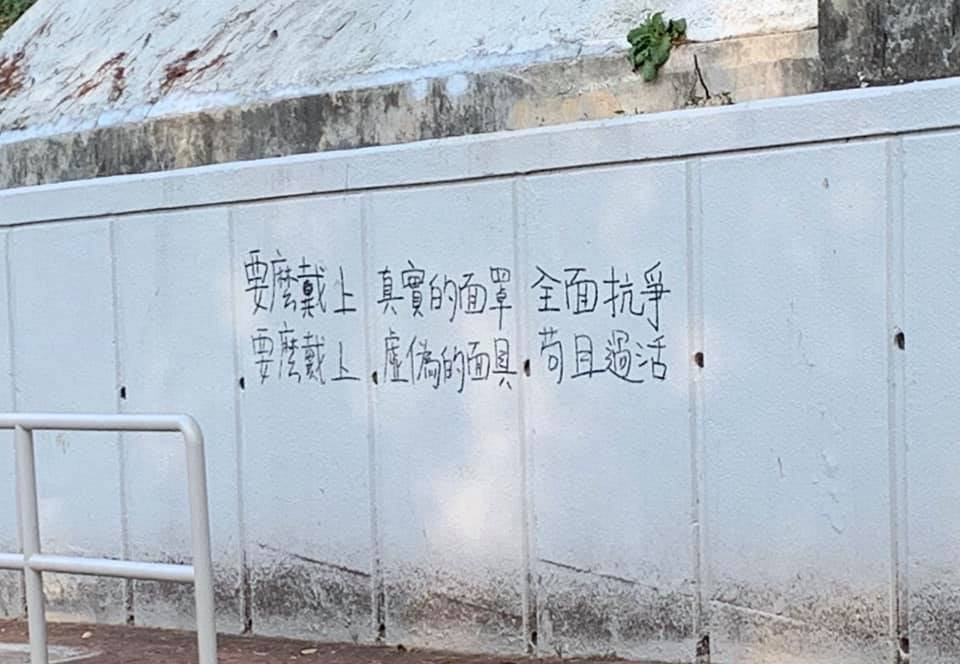 :speech_balloon:评:1 :+1:赞:61 :globe_with_meridians:转:16  

[10月24日 12:55]    新闻大吐槽   @TuCaoFakeNews    Chinazi 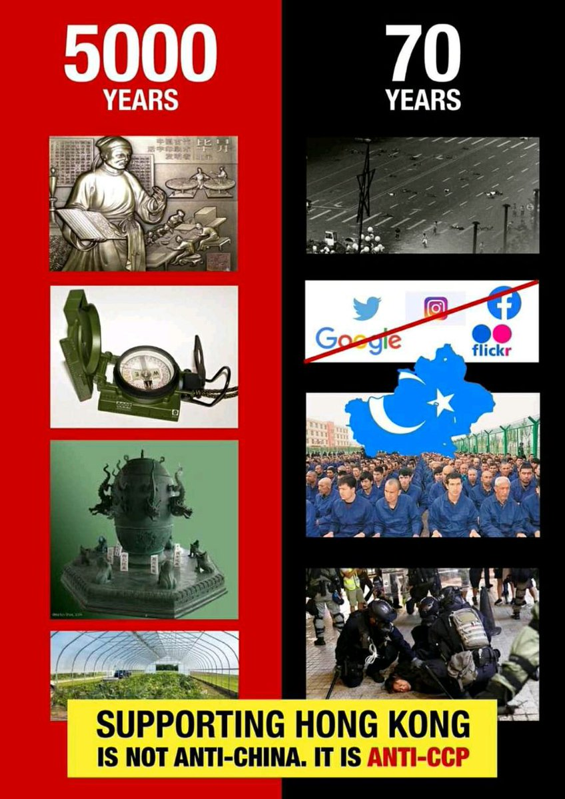 :speech_balloon:评:0 :+1:赞:9 :globe_with_meridians:转:4  

[10月24日 12:49]    新闻大吐槽   @TuCaoFakeNews    哈哈哈，NBA导播要被小盆友玩坏了  :speech_balloon:评:1 :+1:赞:2 :globe_with_meridians:转:1  

[10月24日 12:40]    财经真相   @caijingxiang    如果购买比特币，要靠谱的渠道！  :speech_balloon:评:16 :+1:赞:25 :globe_with_meridians:转:2  

[10月24日 12:35]    新闻大吐槽   @TuCaoFakeNews    中共对传统文化及宗教信仰的破坏
中国传统文化以儒释道为跟，在不同时期的历史发展中遭到了不同程度的迫害。只有中共三教齐灭。
中共建政后，发起了几十场政治运动，不过有一条主线，那就是对传统文化，包括对宗教信仰的破坏，是一直贯穿始终。  http://shorturl.at/BKV12 
http://shorturl.at/auTWY   :speech_balloon:评:0 :+1:赞:5 :globe_with_meridians:转:6  

[10月24日 12:30]    纽约时报中文网   @nytchinese    #每日一词 lynching
美国总统特朗普周二发推称，民主党对他的弹劾调查是“一场私刑”(a lynching)。由于“lynching”一词让人联想起从1800年代到1968年期间长达数十年的白人暴民谋杀黑人的种族主义历史，特朗普的这一用词选择掀起了一场舆论风暴。 https://nyti.ms/2MHQnG0   :speech_balloon:评:5 :+1:赞:10 :globe_with_meridians:转:3  

[10月24日 12:15]    BBC News 中文   @bbcchinese    英国首相约翰逊表示“震惊”，并说必须把幕后黑手追寻到底。 https://bbc.in/31GjE80   :speech_balloon:评:5 :+1:赞:20 :globe_with_meridians:转:5  

[10月24日 12:00]    纽约时报中文网   @nytchinese    #智慧生活 警惕“无症状”的心脏病发作：人们总是认为心脏病发作是明显而极度痛苦的，但事实并非如此，数百万人曾经历过“无痛型心肌梗塞”，而这种情况相比典型的心梗发作来的更加危险。医生建议，高风险人士应定期接受检查，以防延误治疗。
更多简报内容： https://nyti.ms/2qFZtdF   :speech_balloon:评:1 :+1:赞:7 :globe_with_meridians:转:0  

[10月24日 11:59]    BBC News 中文   @bbcchinese    英格兰东南部一个工业园区内一辆货柜车箱内发现39具尸体，警方正在辨识死者身份，货柜车司机涉嫌谋杀已被拘捕。 https://bbc.in/2pQnz5a   :speech_balloon:评:15 :+1:赞:41 :globe_with_meridians:转:9  

[10月24日 11:50]    新闻大吐槽   @TuCaoFakeNews    这里人英语水平一听就知道谁高级谁低等。香港人沉着冷静说了do your research, 中国留学生像个野狗就是不做research才导致的当今的局面：人肉翻了墙，大脑还在墙里面，喊着you hurt people，语无伦次。脑子里认定了眼前的港人都是港独。宛如一个弱智。  :speech_balloon:评:0 :+1:赞:18 :globe_with_meridians:转:3  

[10月24日 11:49]    新闻大吐槽   @TuCaoFakeNews    士兵用催泪弹让人落泪，但你可以用良知和信念让他也落泪！

视频是黎巴嫩200万人示威现场，一名被抗争者精神所感染的维稳士兵！  :speech_balloon:评:1 :+1:赞:82 :globe_with_meridians:转:33  

[10月24日 11:34]    新闻大吐槽   @TuCaoFakeNews    《濤哥侃封神》「第一回 紂王女媧宮進香」網開一面 湯德至亦（第一集）
 https://www.youtube.com/watch?v=lDZC1nNRZIo&list=PLQKc8QoelnZQKQx9cAYMK5cV1AWGcyUPe&index=2&t=0s … 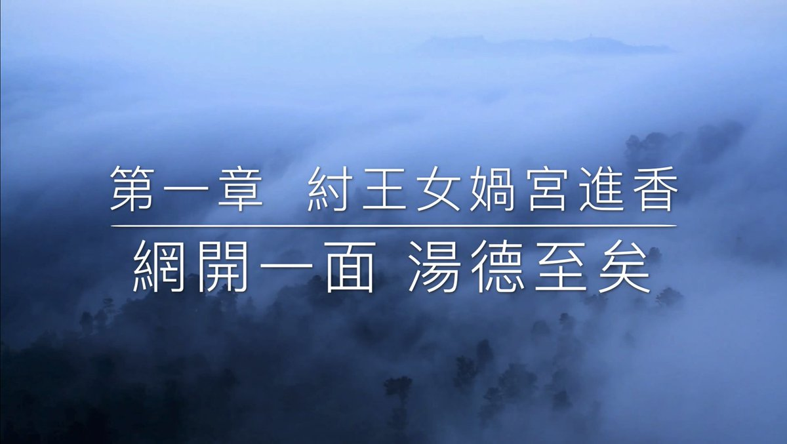 :speech_balloon:评:1 :+1:赞:16 :globe_with_meridians:转:7  

[10月24日 11:33]    纽约时报中文网   @nytchinese    特朗普总统和他的许多高级顾问已将中国的技术野心视为对国家安全的威胁，希望限制美国销往海外的技术类型。但相关计划遭到了特朗普政府内部一些人的强烈反对，他们认为，限制太多可能会适得其反，并损害美国的工业。 https://nyti.ms/32IGXiY   :speech_balloon:评:10 :+1:赞:23 :globe_with_meridians:转:6  

[10月24日 11:24]    老司机   @h5lpykl7tp6jjop    警察10.20之夜在朗豪坊對出清場時 與一名老人發生交集  :speech_balloon:评:1 :+1:赞:23 :globe_with_meridians:转:17  

[10月24日 11:16]    新闻大吐槽   @TuCaoFakeNews    最近在Youtube上擁有超過1億訂閱量，據稱是全球最紅的Youtuber的「#PewDiePie」，因為在上週發布的影片中，談論到香港目前的局勢，諷刺中共「禁不起批評」而遭到中國國內全網封殺，成為了中共封殺名單上的最新成員。發新影片回嗆：早料到了  :speech_balloon:评:1 :+1:赞:43 :globe_with_meridians:转:17  

[10月24日 11:00]    纽约时报中文网   @nytchinese    • 据报道，金正恩在视察朝韩两国共同经营的金刚山观光区时，批评了金刚山共建这一“前任的错误政策”。
• 狮航空难调查结果：印尼国家运输安全委员会表示，空难是由波音737 Max飞机的系统性设计缺陷引起的，而机组人员的失误又加剧了这一缺陷。
更多简报内容： https://nyti.ms/2qFZtdF   :speech_balloon:评:1 :+1:赞:0 :globe_with_meridians:转:0  

[10月24日 10:44]    新闻大吐槽   @TuCaoFakeNews    香港在97年后的黑社会全部都是听共产党的，不听话的都被赶跑了，许家屯夫妻俩，一个收买资本家，一个收编黑社会，收买资本家给钱赚，收编黑社会直接派广州部队特战小分队硬打，所以香港现在的黑社会就是中共的马仔。  :speech_balloon:评:2 :+1:赞:34 :globe_with_meridians:转:12  

[10月24日 10:35]    新闻大吐槽   @TuCaoFakeNews    中國留學生為你的祖國爭光不在世界各國丟人現眼好嘛  就繼續鬧吧！這樣共匪倒台更快  https://twitter.com/TuCaoFakeNews/status/1187158242184482818 …  :speech_balloon:评:0 :+1:赞:11 :globe_with_meridians:转:3  

[10月24日 10:35]    新闻大吐槽   @TuCaoFakeNews     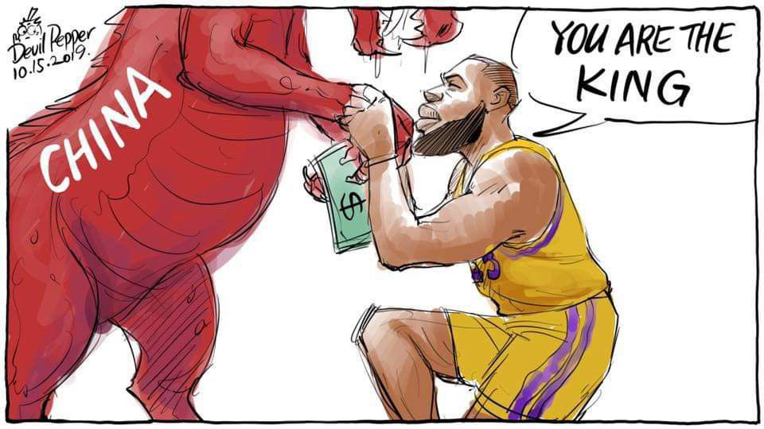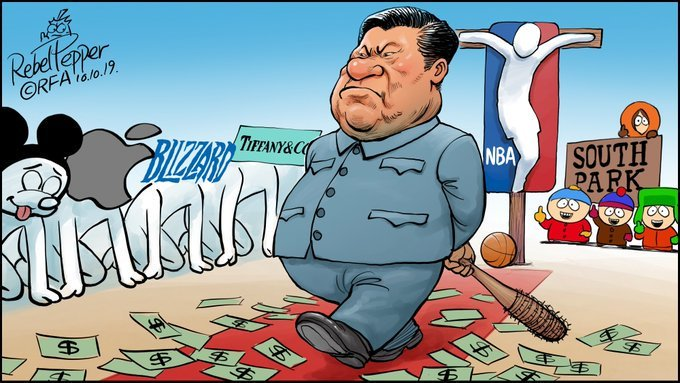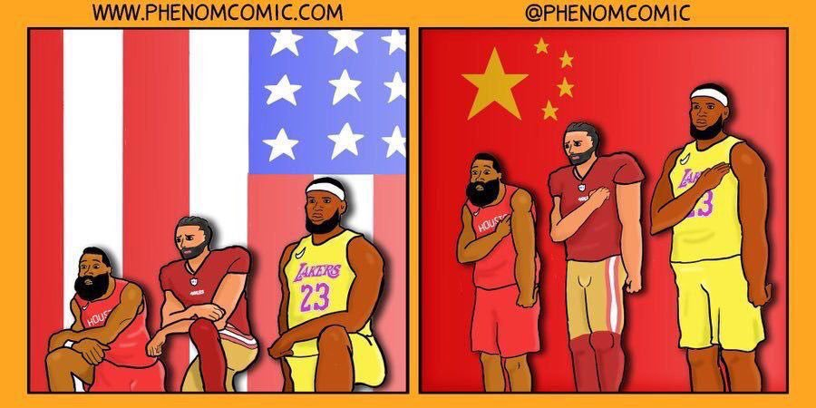 :speech_balloon:评:1 :+1:赞:20 :globe_with_meridians:转:8  

[10月24日 10:34]    新闻大吐槽   @TuCaoFakeNews    五毛狗小粉紅什麼滴在那裡 https://twitter.com/tucaofakenews/status/1187088846300663808 …  :speech_balloon:评:1 :+1:赞:21 :globe_with_meridians:转:7  

[10月24日 10:30]    纽约时报中文网   @nytchinese    从《香港人权与民主法案》到美国对中国外交官设限，日益紧张的中美关系似乎变得更糟糕了。对此，美国资深外交官傅立民(Chas Freeman)认为中美双方都应该保持克制，不可放纵于情绪。他近日接受了纽约时报中文网的访问，对香港乱局、NBA争议下的中美关系发表了自己的看法。 https://nyti.ms/2pOZJ9C   :speech_balloon:评:33 :+1:赞:56 :globe_with_meridians:转:10  

[10月24日 10:28]    新闻大吐槽   @TuCaoFakeNews    【連登尋人】張友恆，現居九龍城，8月31日有參加遊行，9月3日突然退出所有Whatsapp群組，已經失蹤1個多月，公司薪金也沒有領取。  :speech_balloon:评:4 :+1:赞:67 :globe_with_meridians:转:90  

[10月24日 10:27]    新闻大吐槽   @TuCaoFakeNews    林鄭月娥下台？謠言與真相；華春瑩的“別有用心”者是誰？五大訴求的變化看香港反送中進入民主運動階段（江峰漫談20191023第57期）  https://youtu.be/bEOO6Xd_IjM  來自 @YouTube  :speech_balloon:评:7 :+1:赞:69 :globe_with_meridians:转:28  

[10月24日 10:00]    BBC News 中文   @bbcchinese    你想到这些城市旅游吗？小心有可能精神病发作！ https://bbc.in/2JePd2p   :speech_balloon:评:7 :+1:赞:21 :globe_with_meridians:转:5  

[10月24日 10:00]    纽约时报中文网   @nytchinese    • 英国脱欧最新进展：周二，英国议会否决了首相约翰逊的脱欧时间表，这迫使欧盟领导人第三次考虑延后脱欧日期。
• 谷歌宣称实现量子计算突破：谷歌宣布其量子计算器能够在3分20秒内完成世界上最强大的超级计算机花费10000年才能完成的计算量。
更多简报内容： https://nyti.ms/2qFZtdF   :speech_balloon:评:0 :+1:赞:5 :globe_with_meridians:转:2  

[10月24日 09:59]    新闻大吐槽   @TuCaoFakeNews    黎巴嫩200万人上街抗议政府。维稳的军人哭了，示威群众安慰他不要哭。 https://twitter.com/dystopia992/status/1187034110071459840 …  :speech_balloon:评:43 :+1:赞:650 :globe_with_meridians:转:257  

[10月24日 09:51]    新闻大吐槽   @TuCaoFakeNews    我还能说什么呢 https://twitter.com/TuCaoFakeNews/status/1187091212240482305 …  :speech_balloon:评:0 :+1:赞:4 :globe_with_meridians:转:1  

[10月24日 09:30]    纽约时报中文网   @nytchinese    Trump Officials Battle Over Plan to Keep Technology Out of Chinese Hands. Hong Kong Frees Murder Suspect Whose Case Led to Protests. From Chile to Lebanon, Protests Flare Over Wallet Issues. How to say "lynching" in Chinese? Find out @nytchinese https://cn.nytimes.com/morning-brief/20191024/trump-technology-china-hong-kong-brexit/ …  :speech_balloon:评:2 :+1:赞:14 :globe_with_meridians:转:4  

[10月24日 09:30]    纽约时报中文网   @nytchinese    周三，涉嫌谋杀女友的陈同佳出狱，并表示将向台湾自首。然而，与香港的政治危机一样，陈同佳案距离了结还很遥远。
目前，港台就具体条件争论不休，分歧根源在于主权问题。台湾抱怨香港缺少合作，港府则敦促对方勿将“简单的问题复杂化“。 https://nyti.ms/2JeTz9D   :speech_balloon:评:4 :+1:赞:12 :globe_with_meridians:转:3  

[10月24日 09:28]    财经真相   @caijingxiang    中国央行今日开展600亿元逆回购操作，因今日无逆回购到期，当日实现净投放600亿元。加上2500亿MLF和其他逆回购操作，本周截至目前，中国央行公开市场累计净投放达5600亿元。  :speech_balloon:评:13 :+1:赞:116 :globe_with_meridians:转:26  

[10月24日 09:21]    新闻大吐槽   @TuCaoFakeNews    建自由 光輝 香堂
黎明來到 要光復 這香堂  :speech_balloon:评:8 :+1:赞:74 :globe_with_meridians:转:25  

[10月24日 09:06]    纽约时报中文网   @nytchinese    早安！今日重点新闻包括：
美国限制中国获取技术；抗议浪潮席卷全球；美国外交元老谈香港局势与中美关系；港台就陈同佳案争论难休；英国脱欧或再延期；谷歌宣称实现量子计算突破；英国一卡车内发现39具尸体……简报带你速览今日要闻。 https://nyti.ms/2qFZtdF   :speech_balloon:评:9 :+1:赞:57 :globe_with_meridians:转:16  

[10月24日 09:04]    凡賽堤/FORSETI   @FecharCCP    香港6.9以來出現人類文明社會史上的世界第一，
最文明的和平遊行世界第一
（井然有序，城市衛生等）
人口規模最大的遊行世界第一 
（203萬人遊行，總人口700-730萬）
遊行過程出現自發自願醫療救護人員世界首創！
香港人，給全世界的華人創下了歷史最偉大的榜樣！
香港人，給全世界華人未來帶來的希望  :speech_balloon:评:4 :+1:赞:37 :globe_with_meridians:转:23  

[10月24日 08:35]    凡賽堤/FORSETI   @FecharCCP    緊急找尋其家人和律師  :speech_balloon:评:0 :+1:赞:4 :globe_with_meridians:转:6  

[10月24日 08:30]    BBC News 中文   @bbcchinese    北京香山论坛落下帷幕。虽然会议气氛总体友好，但台湾和南海问题依然是一个讨论焦点。中美如何管控冲突风险？
 https://bbc.in/2N8v3bn   :speech_balloon:评:11 :+1:赞:12 :globe_with_meridians:转:0  

[10月24日 07:52]    老司机   @h5lpykl7tp6jjop    撑港人抗争的龍門冰室，昨天被黑社会砸了！
不用猜也知道，十有八九又是何君尧这些烂人在捣鬼~

同样是砸铺：
勇武是反抗极权，直面不公；
而官黑勾结，是依仗极权，维持不公！

总之，一次失败的浑水摸鱼、穿帮的cosplay，香港光复后，都将入罪~  :speech_balloon:评:25 :+1:赞:194 :globe_with_meridians:转:110  

[10月24日 07:32]    财经真相   @caijingxiang    当当网李国庆半夜大新闻,大陆新闻的舆论焦点有了！今天彭斯演讲有调料中和了！  :speech_balloon:评:20 :+1:赞:92 :globe_with_meridians:转:21  

[10月24日 07:30]    BBC News 中文   @bbcchinese    俄非峰会被认为是莫斯科非洲政策的转折点，标志俄罗斯将重返非洲大陆，与中国和西方展开竞争。
 https://bbc.in/31GtDKv  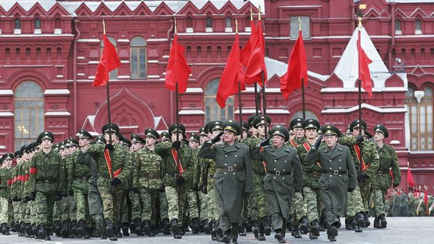 :speech_balloon:评:6 :+1:赞:18 :globe_with_meridians:转:6  

[10月24日 06:30]    BBC News 中文   @bbcchinese    英格兰被旅游指南《孤独星球》列为2020年世界第二位最佳旅游地区和国家。BBC告诉你为什么。
 https://bbc.in/32IfC0m   :speech_balloon:评:7 :+1:赞:30 :globe_with_meridians:转:11  

[10月24日 04:57]    老司机   @h5lpykl7tp6jjop    毛贼给中共留下来的不是什么狗屁革命理论，而是最恐怖的中共的组织系统！它把所有中国人密不透风的监控起来，每个人都受到威胁和恐吓，它们随时可以取消你的所有的生存权利，你无法反抗，因为这会连累你的家人朋友，它们秘密建立档案资料记录你的言行举止，一直跟踪到你死也不销毁，所以中国人不敢反抗  :speech_balloon:评:1 :+1:赞:42 :globe_with_meridians:转:4  

[10月24日 04:07]    老司机   @h5lpykl7tp6jjop    感谢这些香港有良心的医务人员，一直在秘密地治疗着受伤的抗议者，这是采访的一位地下医生，我加了中文字幕，谢谢你们。  :speech_balloon:评:33 :+1:赞:830 :globe_with_meridians:转:476  

[10月24日 04:04]    老司机   @h5lpykl7tp6jjop    早有今天这么痛快，何必惹出这么多麻烦！五分钟能解决的事情，搞了五个月！死了这么多人，抓了这么多人！惹出天大的祸！谁来解决现在这么多大问题！这就是猪头治国的毛病，开始拍胸口，然后拍脑袋，最后拍屁股！ 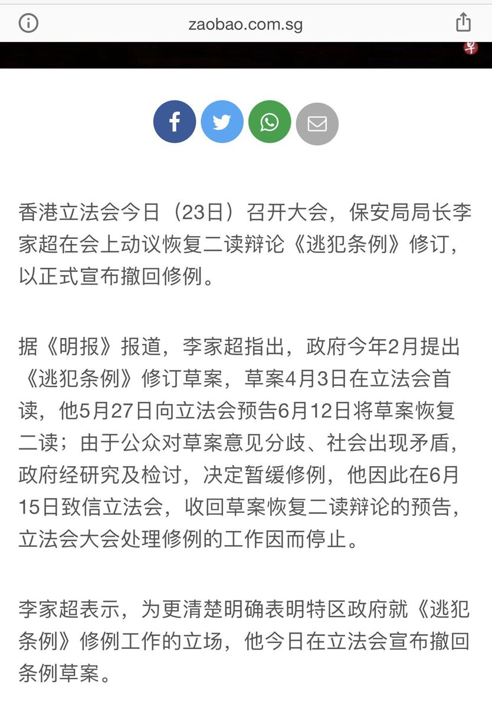 :speech_balloon:评:1 :+1:赞:20 :globe_with_meridians:转:6  

[10月24日 03:39]    老司机   @h5lpykl7tp6jjop    天朝太奇葩，竟然在地铁里逼着女士卸妆！官方说是浓妆太惊悚，会造成恐慌！
如此说，女士们最好都打扮成ccav女主持一般「端庄」的样子，社会就和谐了！
以后化妆术这种东西必须国家垄断，无论是烟熏妆，还是政治化妆！  :speech_balloon:评:30 :+1:赞:143 :globe_with_meridians:转:83  

[10月24日 03:12]    新闻大吐槽   @TuCaoFakeNews    英国上议院将在24日讨论，是否给予340万持有BNO护照的香港人”第二公民身份”。

视频为昨晚香港民众在英国总领馆前人链请愿！希望曾经的宗主国以实际行动支持港人！

「君不正臣投外国」如果相关法案通过，一半香港人就成了英国人，一半香港又「回归」英国了，拭目以待  :speech_balloon:评:53 :+1:赞:818 :globe_with_meridians:转:334  

[10月23日 21:59]    BBC News 中文   @bbcchinese    进太空执行任务，男女都可胜任，但女性是否需要为此付出和承受更多？ https://bbc.in/2BCGhj6   :speech_balloon:评:2 :+1:赞:17 :globe_with_meridians:转:3  

[10月23日 21:44]    财经真相   @caijingxiang    新华社：国务院总理李克强20日下午在钓鱼台养源斋会见美国前财政部长保尔森。李克强积极评价保尔森基金会为推动中美关系发展，促进两国务实合作方面所做工作，希望基金会继续发挥中美友好的纽带作用，为促进中美关系健康稳定发展作出不懈努力。两个“赵家人”代表中美进行会谈！  :speech_balloon:评:7 :+1:赞:67 :globe_with_meridians:转:15  

[10月23日 21:13]    财经真相   @caijingxiang    比特币第二轮崩盘中，上一波最低跌到3000美元，这一波怎么着也要跌到5000美元！  :speech_balloon:评:32 :+1:赞:148 :globe_with_meridians:转:35  

[10月23日 21:01]    BBC News 中文   @bbcchinese    睡觉前一个小时远离手机荧幕，你做得到吗？ https://bbc.in/2PbiSxe   :speech_balloon:评:15 :+1:赞:75 :globe_with_meridians:转:19  

[10月23日 21:00]    纽约时报中文网   @nytchinese    美国驻乌克兰最高外交官的证词显示，特朗普总统搁置了对乌克兰至关重要的安全援助，并拒绝与该国领导人在白宫会晤，直到他同意对美国前副总统拜登及其他政治对手进行调查。这里是泰勒证词的几个关键要点。 https://nyti.ms/2JfNLNa   :speech_balloon:评:5 :+1:赞:28 :globe_with_meridians:转:16  

[10月23日 20:41]    BBC News 中文   @bbcchinese    偷渡客梦断英伦悲剧重演？距伦敦不到一小时车程的一个工业园，一辆白色货柜车里赫然横着39具尸体。 https://bbc.in/32Fknb3   :speech_balloon:评:32 :+1:赞:82 :globe_with_meridians:转:46  

[10月23日 20:01]    BBC News 中文   @bbcchinese    【新能源走进铁路 英国“氢气火车”样板下线测试】1825年，世上首条采用蒸汽机车牵引的铁路在英国通车。此后，铁路大致发展成电力驱动与柴油驱动两大主流。“氢气火车”无需依靠高压电缆供电，但也不燃烧柴油，实现零排放。 https://bbc.in/33PgBvI   :speech_balloon:评:13 :+1:赞:28 :globe_with_meridians:转:7  

[10月23日 19:30]    纽约时报中文网   @nytchinese    2018年9月，特朗普政府中的一名官员以匿名形式发表在时报发表观点文章。该官员在文中表示，作为特朗普政府中的一名抵抗者，他将竭尽全力阻止特朗普那些糟糕的议程，维护民主体制，直到特朗普下台。这名官员将于将于下月出版一本新书。这里是他当时发表的文章： https://nyti.ms/33T8aQ3   :speech_balloon:评:18 :+1:赞:46 :globe_with_meridians:转:18  

[10月23日 19:25]    GFHG SDKM   @zyx_yny    唔止ban鳩你Twitter account
香港人直情想ban咗你成個人 ban鳩你成個人生啊 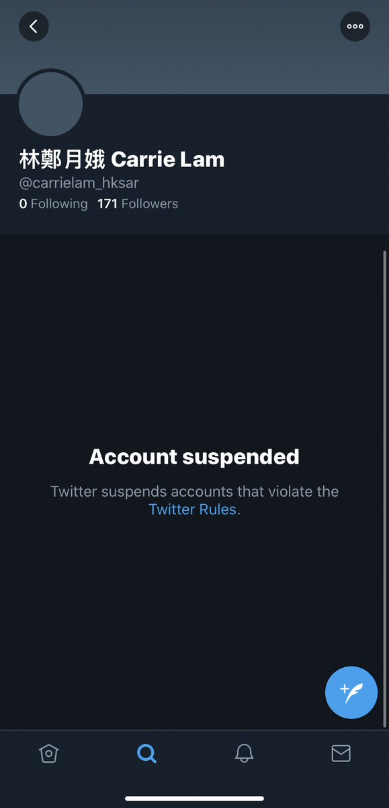 :speech_balloon:评:0 :+1:赞:0 :globe_with_meridians:转:0  

[10月23日 19:14]    GFHG SDKM   @zyx_yny    Dear : 

Only a photo can't tell how beautiful #HongKong is.

Thanks for the magician like producer to demonstrate such impressive views of our home

Full video:  https://youtu.be/gYO1uk7vIcc  by TimeLab Pro

#香港の写真を何の説明もなく上げてみる #HongKongProtest  :speech_balloon:评:8 :+1:赞:265 :globe_with_meridians:转:141  

[10月23日 19:03]    BBC News 中文   @bbcchinese    从黎巴嫩到香港，从智利到西班牙，全世界都有人在进行街头抗议，他们的共通之处是什么？ https://bbc.in/35VuSca   :speech_balloon:评:123 :+1:赞:148 :globe_with_meridians:转:51  

[10月23日 19:00]    纽约时报中文网   @nytchinese    #观点 本周，巴西总统将会见习近平，作为抗击全球变暖的领导者，中国应当利用其影响力制止这场生态悲剧。
中国大豆和牛肉的需求促使巴西农民放火烧荒、砍伐森林，这是亚马孙生态系统被破坏的因素之一。中国是时候承担责任、制止这场悲剧了。 https://nyti.ms/32EWRej   :speech_balloon:评:551 :+1:赞:286 :globe_with_meridians:转:90  

[10月23日 18:01]    BBC News 中文   @bbcchinese    当“少花钱多办事”的美国遇上“多花钱办大事”的中国，联合国这两大会费贡献国，究竟谁的套路更奏效？ https://bbc.in/2pI19mw   :speech_balloon:评:45 :+1:赞:47 :globe_with_meridians:转:10  

[10月23日 18:00]    纽约时报中文网   @nytchinese    就目前而言，就日本天皇登基仪式的花费问题，尽管存在一些批评声，但仍比较温和，这部分是因为皇室在日本仍受人爱戴。但从长期来看，日本皇室面临着一个更大的生存威胁：皇室的继承人不多了。
在现任天皇之后，继承人只剩下他53岁的弟弟文仁亲王和文仁亲王13岁的儿子悠仁亲王。 https://nyti.ms/2pNe868   :speech_balloon:评:11 :+1:赞:32 :globe_with_meridians:转:10  

[10月23日 17:34]    BBC News 中文   @bbcchinese    泰国国王宣布剥夺贵妃诗妮娜·披拉萨甘娅妮（Sineenat Wongvajirapakdi）王室封号一事，引发全球关注。诗妮娜在7月才被授予王室配偶头衔，但王室公告指其“对国王行为不当和不忠”。 https://bbc.in/35VY6aQ   :speech_balloon:评:13 :+1:赞:33 :globe_with_meridians:转:11  

[10月23日 17:24]    纽约时报中文网   @nytchinese    美国驻乌克兰最高外交官威廉·泰勒的证词显示，特朗普扣留对乌援助与其调查政治对手的要求有“直接联系”，民主党人称这为迄今为止对总统最具破坏力的弹劾证词。 https://nyti.ms/2JfNLNa   :speech_balloon:评:7 :+1:赞:14 :globe_with_meridians:转:6  

[10月23日 17:22]    老司机   @h5lpykl7tp6jjop    这是搞什么鬼！ 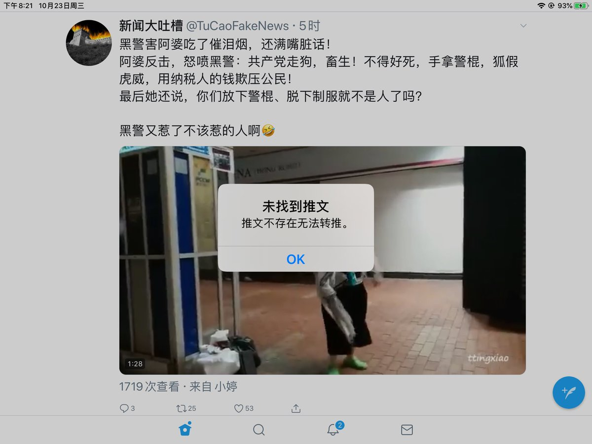 :speech_balloon:评:0 :+1:赞:3 :globe_with_meridians:转:0  

[10月23日 17:00]    纽约时报中文网   @nytchinese    研究人员说，中国黑客的攻击在过去三年来变得更加先进，主要针对的是中国的少数民族和他们在其他国家的侨民。
“中国人首先用他们最好的工具对付自己的人民，因为他们最害怕的就是自己的人民，”前美国政府官员詹姆斯·A·刘易斯说。“然后他们才会把这些工具用于外国目标。” https://nyti.ms/31GzgIV   :speech_balloon:评:29 :+1:赞:66 :globe_with_meridians:转:24  

[10月23日 16:40]    新闻大吐槽   @TuCaoFakeNews    NBA现场，小朋友镜头前上演「图穷匕见」

NBA暂停时，有直播观众跳舞的特写环节，小朋友在洛杉矶快船队的球衣后边，藏了一件挺香港的Tshirt！先跳舞把镜头吸引过来，然后立刻切换球衣！策略高明！

可以看到转播方还是怂了，看到涉及中共不喜欢的议题，立刻把镜头挪开  :speech_balloon:评:30 :+1:赞:936 :globe_with_meridians:转:346  

[10月23日 16:30]    纽约时报中文网   @nytchinese    #图集 【智利爆发大规模暴力抗议活动】智利历来被视为拉丁美洲最繁荣和稳定的国家之一，目前却处于动荡状态。上周五，该国首都圣地亚哥因地铁加价引发民众示威。几天之内，全国各地都发生了暴力抗议活动。 https://nyti.ms/35Ztp4I  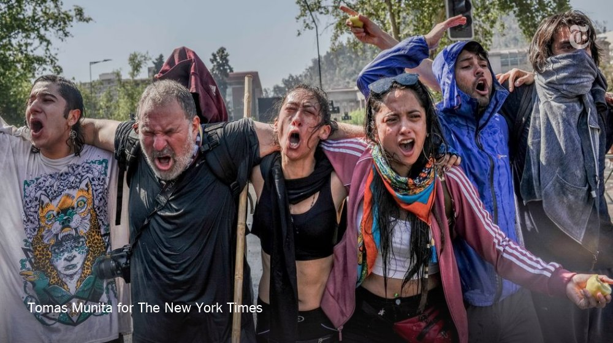 :speech_balloon:评:11 :+1:赞:19 :globe_with_meridians:转:9  

[10月23日 16:01]    BBC News 中文   @bbcchinese    一条人民币1000多元的Lolita洋裙，转手就可以卖近5000元。中国年轻人都爱炒卖些什么？ https://bbc.in/2PcGEc8   :speech_balloon:评:23 :+1:赞:104 :globe_with_meridians:转:39  

[10月23日 16:00]    纽约时报中文网   @nytchinese    “你的理想退休金额是多少？”你能带着500万美元退休吗？2000万美元呢？
对于普通人来说，这似乎符合理想退休金额的标准，但对于许多亿万富翁来说，这个金额并不存在。“对于很多人来说，他们就是停不下来。他们从资本主义中获得了卓越的意义。没了钱他们还能有什么？” https://nyti.ms/32ygJj0   :speech_balloon:评:11 :+1:赞:20 :globe_with_meridians:转:7  

[10月23日 15:39]    老司机   @h5lpykl7tp6jjop     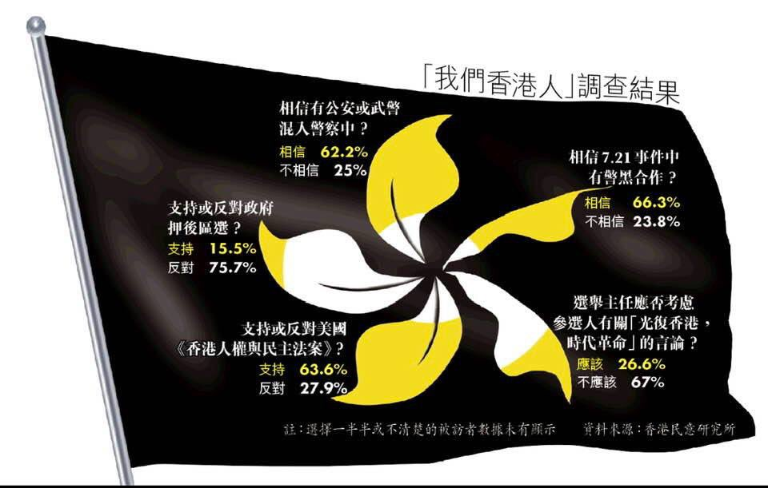 :speech_balloon:评:0 :+1:赞:7 :globe_with_meridians:转:5  

[10月23日 15:30]    纽约时报中文网   @nytchinese    #每日一词 根据韦氏词典，posthumous意为“死后的、身后的”，常用来形容父亲去世后出生的，如posthumous child（遗腹子）；或作者去世后发表的，如posthumous work（死后发表的作品）。 https://nyti.ms/31B86Tp   :speech_balloon:评:1 :+1:赞:6 :globe_with_meridians:转:3  

[10月23日 15:13]    老司机   @h5lpykl7tp6jjop    稅率第一、稅种第一、稅收第一，油價世界第一高，过路费世界第一多，又沒有实行免費医疗、免費教育、国家養老，你他媽告诉我们財政沒錢？

第一次听說全國財政吃緊
是很正常的現象。（转）  :speech_balloon:评:36 :+1:赞:348 :globe_with_meridians:转:222  

[10月23日 15:11]    财经真相   @caijingxiang    【推荐一个恶搞MV—你是我的习大大】我們不再怕美帝，每年都漲ＧＤＰ，中國有個偉大主席 
手機照片全是你，硬盤放的都是你，讓我們每天向你學習 
中華女兒非你不嫁因為你帥氣，外國勢力把你抹黑你都不生氣 
日本鬼子來了他們不敢放個屁，誰人罵你我就馬上操！他！媽！B https://www.youtube.com/watch?v=PCimU5x25ic …  :speech_balloon:评:22 :+1:赞:376 :globe_with_meridians:转:110  

[10月23日 15:01]    BBC News 中文   @bbcchinese    引发香港数月“反送中”抗议的台湾杀人案嫌犯陈同佳，向被害女友及香港民众鞠躬道歉，港府预计将在议会正式撤回修例。 https://bbc.in/33ThAen   :speech_balloon:评:45 :+1:赞:81 :globe_with_meridians:转:28  

[10月23日 14:15]    老司机   @h5lpykl7tp6jjop    无论你有多么热爱祖国，祖国都会用粉拳擂到你心口痛！好消息来了，小粉红们热情的歌吧！ 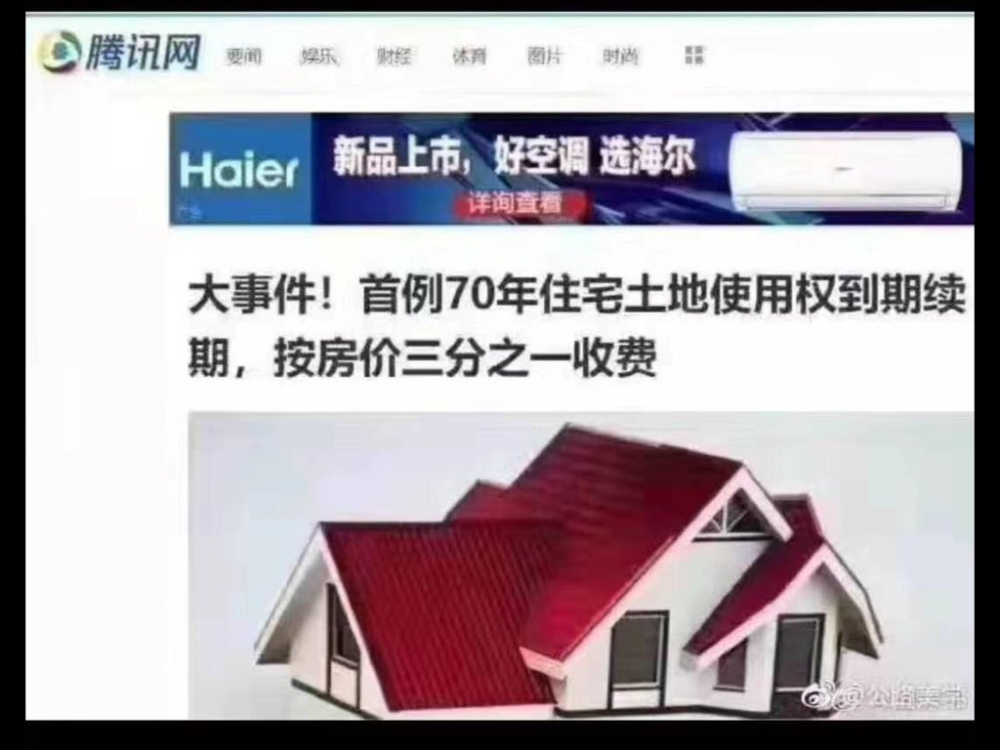 :speech_balloon:评:47 :+1:赞:262 :globe_with_meridians:转:103  

[10月23日 14:05]    老司机   @h5lpykl7tp6jjop    和塔里班交流学习灭佛经验，猪习要当三教合一的棈神领袖！四川最长石刻卧佛遭毁 百余佛像消失！ 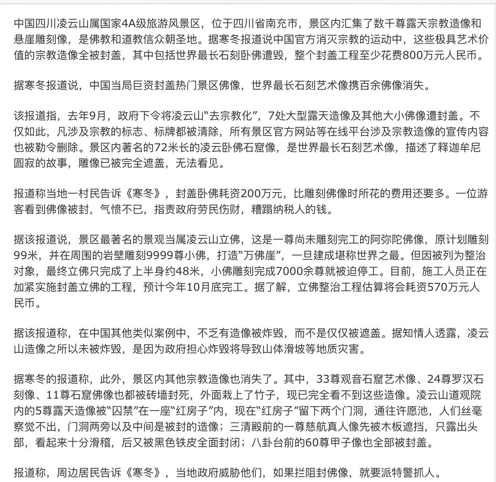 :speech_balloon:评:4 :+1:赞:16 :globe_with_meridians:转:9  

[10月23日 13:06]    GFHG SDKM   @zyx_yny    Our beautiful team who made the miracle happen. Thank you the organizers, contributors, volunteers... every single one  We Love HK. We Fight Together. 
#StandWithHongKong #TheNorth #NBATwitter  #nba  #Raptors #Toronto #nbaopeningnight #SupportHongKong #HongKongProtests 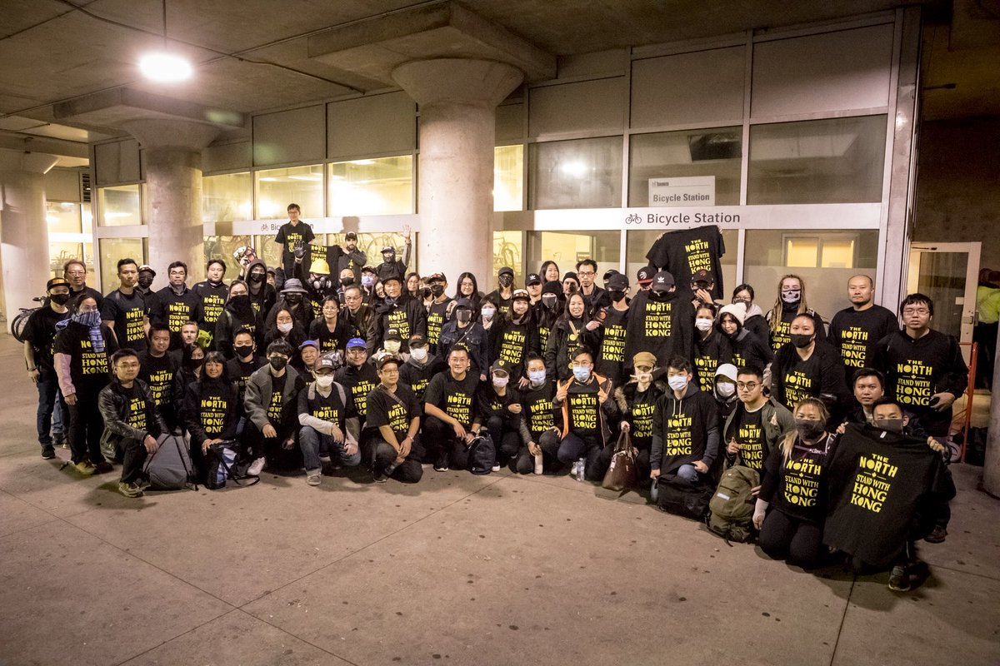 :speech_balloon:评:748 :+1:赞:5331 :globe_with_meridians:转:3079  

[10月23日 12:26]    GFHG SDKM   @zyx_yny    the best clip to start the NBA season is this kid baiting the broadcast into flashing a "Fight for freedom stand with Hong Kong" sign on TV and then the cameraman pans away  :speech_balloon:评:1832 :+1:赞:215060 :globe_with_meridians:转:57722  

[10月23日 11:00]    BBC News 中文   @bbcchinese    加拿大大选结果出炉，现任总理特鲁多获得连任。四张图帶你看懂加国大选： https://bbc.in/2JakXWo   :speech_balloon:评:13 :+1:赞:72 :globe_with_meridians:转:15  

[10月23日 10:00]    BBC News 中文   @bbcchinese    英国首相约翰逊的脱欧法案终于在议会表决中成功过关。但是脱欧时间表被否决。约翰逊寻求提前举行大选？
 https://bbc.in/33LAJ1U   :speech_balloon:评:3 :+1:赞:16 :globe_with_meridians:转:4  

[10月23日 08:44]    GFHG SDKM   @zyx_yny    在中国没有一个人是安全的，共产党的治理体制就是一部黑暗残酷的绞肉机。 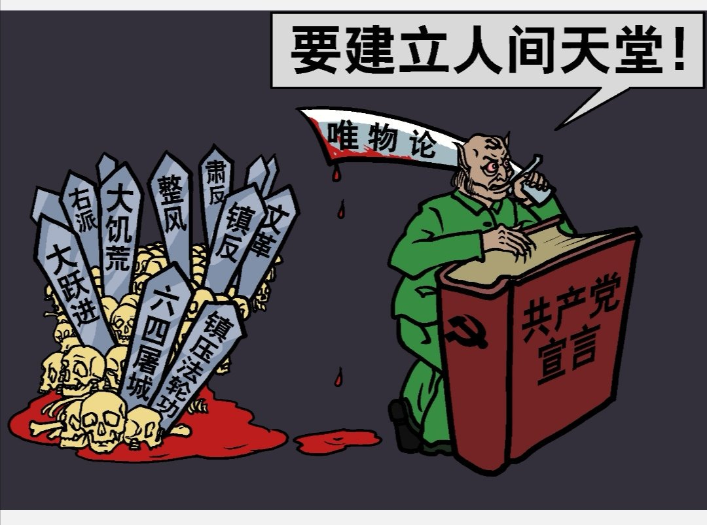 :speech_balloon:评:7 :+1:赞:99 :globe_with_meridians:转:30  

[10月23日 08:30]    BBC News 中文   @bbcchinese    香港政府凌晨发稿，拒绝台湾政府要求派员赴港押解陈同佳，并指台方跨境执法，不尊重香港司法管辖权。
 https://bbc.in/2Phg6q6   :speech_balloon:评:80 :+1:赞:85 :globe_with_meridians:转:34  

[10月23日 08:23]    财经真相   @caijingxiang    北京成为外汇消耗最多地区是可以理解，因为中国外汇花费最多的就是政府，尤其是货物贸易采购达到-1730.72亿美元，但是最让人难以理解的是上海，服务贸易逆差比货物逆差还多，是不是可以理解为上海才是中国资本外逃最大的地区！最后还有一个规律，那就是每当中美贸易缓和时，银行结售汇就会转为正！  :speech_balloon:评:6 :+1:赞:145 :globe_with_meridians:转:46  

[10月23日 08:17]    财经真相   @caijingxiang    2019年1-8月银行结售汇-447.48亿美元，经常项目-438.69 
亿，其中货物贸易1111.66亿，服务贸易-1,331.77亿，收益和经常转移-218.58亿；就地区来看，北京是中国外汇逆差最大的地区达到-2098亿，上海以-1083.27位居第二位；外汇顺差最大来源地分别是浙江967.46、江苏850.77、广东
563.11、福建163.84 。  :speech_balloon:评:14 :+1:赞:281 :globe_with_meridians:转:144  

[10月23日 08:17]    老司机   @h5lpykl7tp6jjop    數十名喬裝警打砸縱火後，被記者追踪逃入廁所企圖換裝，傳媒在廁所包圍，防暴趕至將廁所包圍並保護這些打砸縱火的歹徒安全離開，並沒有拘捕，而是保護，記者追拍並問這群歹徒是否警員並喬裝黑衣市民，他們從廁所走出，己脫去了黑衣換上普通衣服。  :speech_balloon:评:46 :+1:赞:1096 :globe_with_meridians:转:886  

[10月23日 08:07]    老司机   @h5lpykl7tp6jjop    明居正：台湾人需要明确的反共意识，看清谁是最大敌人

蓝营最大敌不是绿
绿营最大敌不是蓝
只有共同的最大敌——红...
明年选举
谁不反共谁就会落选

美国对中国无恶意，但对中共有
中国不是美国的敌人，但中共是美国的敌人
中共仍是台湾的敌人，还是自由世界的敌人...  :speech_balloon:评:24 :+1:赞:559 :globe_with_meridians:转:257  

[10月23日 07:03]    财经真相   @caijingxiang    美国众议院投票推动立法，要求空壳公司披露所有者信息并更新反洗钱规定。  :speech_balloon:评:7 :+1:赞:303 :globe_with_meridians:转:75  

[10月23日 01:49]    老司机   @h5lpykl7tp6jjop    @侯安扬HF 
三个以下情妇叫生活腐化，三个以上情妇叫生活糜烂。 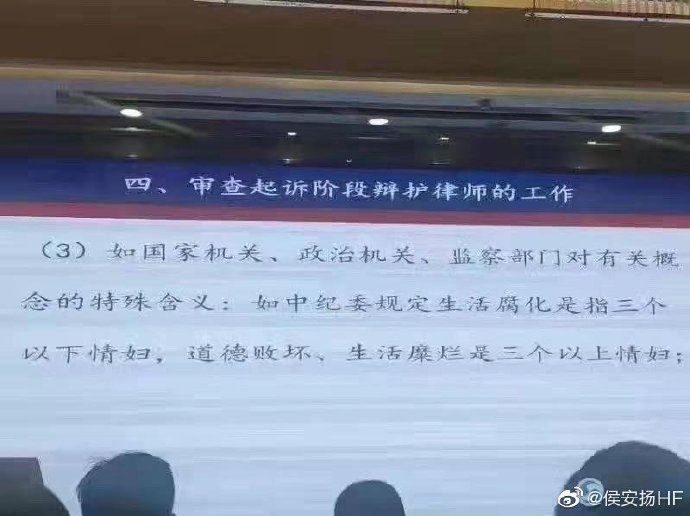 :speech_balloon:评:4 :+1:赞:71 :globe_with_meridians:转:51  

[10月23日 00:57]    GFHG SDKM   @zyx_yny    「主人，我好辛苦，好驚呀．．．」
＂Master,  I feel uncomfortable and scared.＂

#香港 #HongKong #HongKongprotests #HKPoliceBrutality #Animal #Dog #AnimalAbuse #AnimalRights #HKPoliceTerrorism #SaveTheDogs #StandWithHongKong #policedog 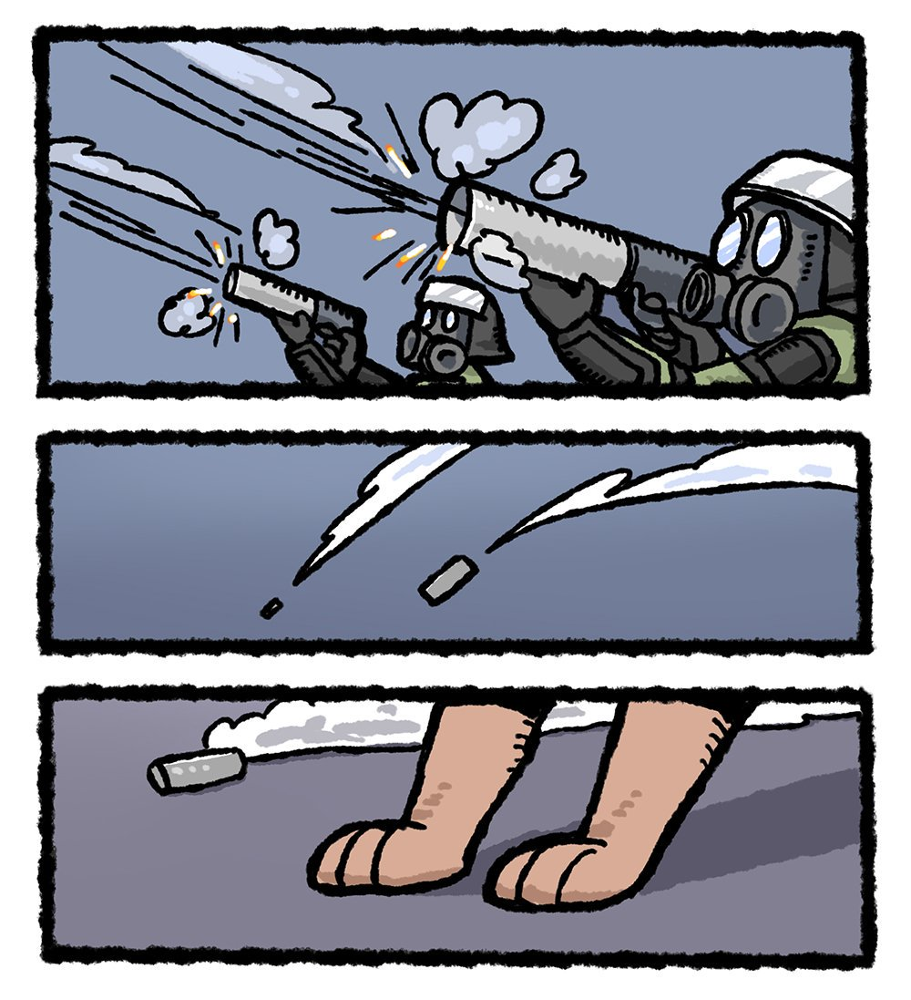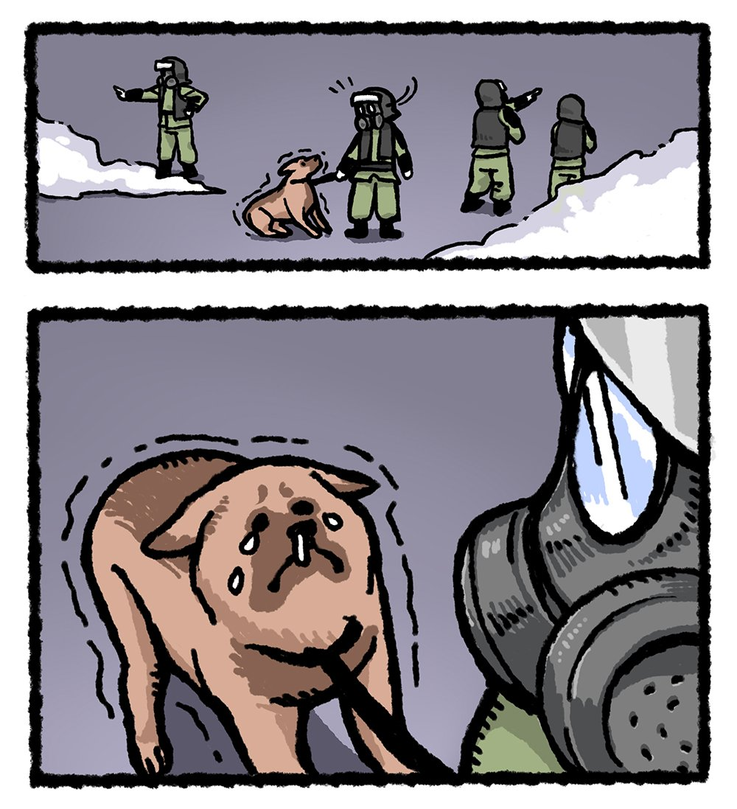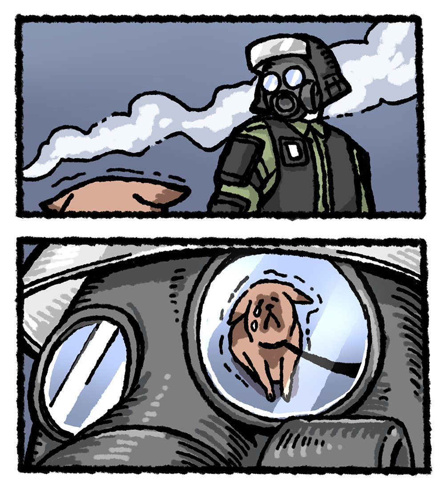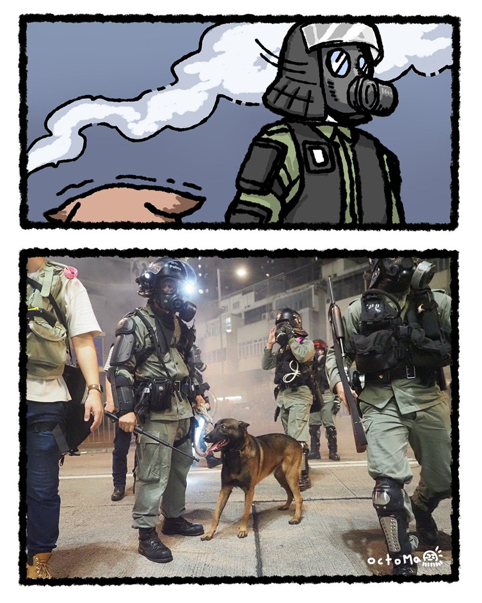 :speech_balloon:评:72 :+1:赞:1424 :globe_with_meridians:转:1288  

[10月22日 20:13]    墙国铁拳现世报😷   @Socialistfist    網上有帖文指毛漢參與7月20日的守護香港集會，他澄清，幾個月前有人邀請他出席集會，他於台上是說希望香港恢復和平及希望政府了解年輕人多點。他強調自己不是「撐警」，稱現時才知道自己當時出席的場合是「撐警」集會，並說之後有其他「撐警」集會他都沒參加。
我相信他不是撐警～  :speech_balloon:评:4 :+1:赞:32 :globe_with_meridians:转:10  

[10月22日 17:59]    墙国铁拳现世报😷   @Socialistfist    补图  :speech_balloon:评:4 :+1:赞:106 :globe_with_meridians:转:13  

[10月22日 17:58]    墙国铁拳现世报😷   @Socialistfist    墙内一阵子狂喷  :speech_balloon:评:6 :+1:赞:51 :globe_with_meridians:转:9  

[10月22日 17:51]    墙国铁拳现世报😷   @Socialistfist    14年的战螂
15年的粉红
16年的愤青
17年的反贼
「我们终于还是成为了我们当初讨厌的人」

#社会主义铁拳  :speech_balloon:评:32 :+1:赞:345 :globe_with_meridians:转:110  

[10月22日 17:34]    财经真相   @caijingxiang    中国商务部：美商务部日前发布公告，称将自10月31日起对中国3000亿美元加征关税清单产品启动排除程序。如果排除申请得到批准，自2019年9月1日起已经加征的关税可以追溯返还。该消息公布后离岸人民币汇率几无波动！  :speech_balloon:评:29 :+1:赞:229 :globe_with_meridians:转:63  

[10月22日 16:41]    老司机   @h5lpykl7tp6jjop    【关注香港】10月21日 晚21:00左右，示威者张嘉琪（音）被黑警粗暴对待，被扯出内衣不算。突然，众目睽睽之下，男性黑警伸手抚摸女孩臀部？那么关小黑屋后会发生什么！！！请广传救人。  :speech_balloon:评:2 :+1:赞:20 :globe_with_meridians:转:16  

[10月22日 15:36]    GFHG SDKM   @zyx_yny    尊重係中國人應有既素質，而香港人更需要一個識尊重人、尊重宗教既特首。
從小圈子選舉揀左林鄭咁無素質既人做特首就知制度有問題，解決方法只有真普選。

光復香港 時代革命
五大訴求 決一不可  :speech_balloon:评:2 :+1:赞:101 :globe_with_meridians:转:15  

[10月22日 14:35]    老司机   @h5lpykl7tp6jjop    好惊人！要吓尿全部地球人！  :speech_balloon:评:4 :+1:赞:16 :globe_with_meridians:转:7  

[10月22日 12:24]    老司机   @h5lpykl7tp6jjop    香港人太有才了精闢！

共產黨是什麼

如果把歷史還原他們是一幫士匪
如果把謊言拆穿他們是一幫騙子
如果把財產公開他們是一幫強盜
如果把帳目公開他們是一幫小偷
如果將他們的國籍公開他們全部是漢奸
如果把地圖打開他們是一幫賣國賊
如果將血腥運動揭開他們是種族滅絕屠夫
@realDonaldTrump  :speech_balloon:评:9 :+1:赞:287 :globe_with_meridians:转:156  

[10月22日 10:17]    财经真相   @caijingxiang    最新猪肉行情：猪肉价格再次迎来大涨，想做腊肉无望！  :speech_balloon:评:53 :+1:赞:288 :globe_with_meridians:转:100  

[10月22日 04:35]    GFHG SDKM   @zyx_yny    Thank you so much to wonderful #HKers in London! We are going to fill the Public Gallery in the House of Lords  
So really sorry to latecomers but *we can’t fit any more people*. If we try we’ll be taken to the Tower of London! @hk_watch @Stand_with_HK @nathanlawkc https://twitter.com/lukedepulford/status/1185846937259560961 …  :speech_balloon:评:72 :+1:赞:812 :globe_with_meridians:转:372  

[10月21日 23:32]    老司机   @h5lpykl7tp6jjop    【1021元朗】
警察粗口‘D'市民，一女子回罵：你老婆被人’D'，一玻璃心警察隨即發癲。

看來說到他的痛處！  :speech_balloon:评:134 :+1:赞:1315 :globe_with_meridians:转:740  

[10月21日 22:06]    墙国铁拳现世报😷   @Socialistfist    @remonwangxt 辣椒老师是否可以作为新漫画创意  :speech_balloon:评:1 :+1:赞:29 :globe_with_meridians:转:0  

[10月21日 21:17]    墙国铁拳现世报😷   @Socialistfist    补图  :speech_balloon:评:4 :+1:赞:74 :globe_with_meridians:转:13  

[10月21日 21:16]    老司机   @h5lpykl7tp6jjop    战记：邓两只猫与习一只鼠。黑白猫的生命力与习一人独尊的死亡力。白猫黑猫抓住老鼠就是好猫，这句话是中国四十年富强的基石。一句俗话成中共走向普世的基础理论。习几年折腾完中共家底，只能靠镇压维持国体。现在中国人无疑怀念邓两只猫，可门外就是满国的军警脸监鼠辈横行。希望中国走向绝望中国。 https://twitter.com/5xyxh/status/1186104350403366912 …  :speech_balloon:评:1 :+1:赞:47 :globe_with_meridians:转:26  

[10月21日 20:37]    墙国铁拳现世报😷   @Socialistfist    前香港印度协会主席曾经出现在支持香港警察的最前线。近日被高压水枪喷过后，出现在谴责香港警察的最前线
高压水枪的蓝色物质具有刺激性成分，会使人睁不开眼，咳嗽不止，并容易被警察辨识抓捕。

#社会主义铁拳
#社会主义特别行政区铁拳  :speech_balloon:评:41 :+1:赞:385 :globe_with_meridians:转:141  

[10月21日 18:16]    墙国铁拳现世报😷   @Socialistfist    有热心推友创立的电报群，同步更新的推特内容，喜欢用电报的可以关注
感谢这位推友的无私帮助 http://t.me/socialistfist   :speech_balloon:评:1 :+1:赞:44 :globe_with_meridians:转:7  

[10月21日 17:24]    墙国铁拳现世报😷   @Socialistfist    补充  :speech_balloon:评:4 :+1:赞:56 :globe_with_meridians:转:11  

[10月21日 17:23]    墙国铁拳现世报😷   @Socialistfist    自称在被房地产开发商骗取80万并且维权无果，患上抑郁症后。9月29后突然高频的在微博上关注香港局势。
发帖还债还是抑郁病发？

#社会主义铁拳  :speech_balloon:评:37 :+1:赞:191 :globe_with_meridians:转:71  

[10月21日 14:57]    财经真相   @caijingxiang    国家电影局电影公映许可证，新电影《催眠•裁决》审核通过，好莱坞电影也要有这玩意儿吗？推友当中有知道的吗？  :speech_balloon:评:12 :+1:赞:73 :globe_with_meridians:转:22  

[10月21日 12:08]    财经真相   @caijingxiang    遵义市约谈早餐店涨价！  :speech_balloon:评:27 :+1:赞:178 :globe_with_meridians:转:66  

[10月21日 11:48]    财经真相   @caijingxiang    库德洛VS纳瓦罗 ！ https://twitter.com/ChineseWSJ/status/1186113880042418183 …  :speech_balloon:评:3 :+1:赞:30 :globe_with_meridians:转:8  

[10月21日 10:34]    财经真相   @caijingxiang    好莱坞如果开始反中共，其影响力是巨大的，时至今日中国大陆的小年轻不关心政治是常态，但是却很愿意为看电影翻墙！ https://twitter.com/USA_China_Talk/status/1186104831083208704 …  :speech_balloon:评:24 :+1:赞:617 :globe_with_meridians:转:139  

[10月21日 09:57]    GFHG SDKM   @zyx_yny    中国內地網民支持攻擊清真寺
認為警方不應道歉
建議香港實施新疆「再教育營」

Chinese mainlander support the water canon attack on kowloon mosque by #HKPolice  :speech_balloon:评:381 :+1:赞:3599 :globe_with_meridians:转:3530  

[10月21日 09:28]    财经真相   @caijingxiang    以前经济快速发展时禁止农民用宅基地抵押贷款，导致农民没有原始资本被迫沦为“农民工”，现在产能严重过剩，央行印钞缺少抵押物时，他们终于放开政策，问题是现在农民贷款可以干啥赚钱？  :speech_balloon:评:24 :+1:赞:145 :globe_with_meridians:转:31  

[10月21日 09:06]    财经真相   @caijingxiang    当前中国广大农村地区，正在进行轰轰烈烈的宅基地测量申报活动，村委说这次测量目的是为了农民用宅基地作为抵押贷款，但是民间盛传一户一宅，多余的宅子会被政府收回，导致农民现在疯狂买砖盖房，分家上户口，种种乱象背后都是源于农民无恒产的恐惧，当然不排除中共借此寻找新的抵押物进行扩表印钞！ https://twitter.com/ReutersCN/status/1186082720386076672 …  :speech_balloon:评:20 :+1:赞:339 :globe_with_meridians:转:147  

[10月21日 08:45]    财经真相   @caijingxiang    市场原本预计英镑会在周一距离波动，谁知又是一次“西线无战事”，横盘走势估计会让很多国内定闹钟五点起床的交易员跌眼镜！  :speech_balloon:评:2 :+1:赞:37 :globe_with_meridians:转:3  

[10月21日 03:20]    GFHG SDKM   @zyx_yny    Unrest continues unabated in Hong Kong as tens of thousands march on Rail Terminus
 https://ti.me/2BrzWH9   :speech_balloon:评:292 :+1:赞:3474 :globe_with_meridians:转:2459  

[10月20日 23:21]    GFHG SDKM   @zyx_yny    A pigeon was affected by tear gas. The Hong Kong protesters used water to let it feel more comfort. #HongKongProtesters #HongKong #Love #animal  :speech_balloon:评:698 :+1:赞:16315 :globe_with_meridians:转:11256  

[10月20日 21:56]    GFHG SDKM   @zyx_yny    Police in #HongKong deliberately sprayed blue irritant liquid on Kowloon Mosque.

#China #HongKongProtests  :speech_balloon:评:161 :+1:赞:1464 :globe_with_meridians:转:1552  

[10月20日 17:56]    GFHG SDKM   @zyx_yny    Follow up: 
In times of trouble we see unity and love. https://twitter.com/pentanov/status/1185855642889641984?s=19 …  :speech_balloon:评:11 :+1:赞:632 :globe_with_meridians:转:469  

[10月20日 16:45]    GFHG SDKM   @zyx_yny    Where can we get some of these t-shirts in the UK (as worn below by @nathanlawkc)? I know many friends of #HongKong who want one ahead of Thursday’s debate. Parliament will be v busy this week! https://twitter.com/nathanlawkc/status/1185410763315470336 …  :speech_balloon:评:8 :+1:赞:193 :globe_with_meridians:转:89  

[10月20日 16:42]    GFHG SDKM   @zyx_yny    I hope to apologize to Muslims.
I am sorry that this sad situation has occurred in Hong Kong.
I am angry and sad about the actions of the Hong Kong police.
Can we help Muslims?
We really feel sorry.  :speech_balloon:评:283 :+1:赞:4011 :globe_with_meridians:转:3406  

[10月20日 16:38]    GFHG SDKM   @zyx_yny    #HKPF aim water cannon jets directly at a Muslim mosque during a protest today. Crowd consists of mostly journalists & several protestors. Absolutely unnecessary.

#HKGov has no respect for ppl from any religion, culture or background.

#5Nov4HK
#antichinazi
#StandWithHongKong  :speech_balloon:评:589 :+1:赞:7247 :globe_with_meridians:转:8756  

[10月20日 16:26]    GFHG SDKM   @zyx_yny    #HKPolice assaults mosque with water cannon! It's INSANE!!! #StandWithHK #HKPoliceTerrorism #hkpolicebrutality #HKPoliceState  :speech_balloon:评:307 :+1:赞:5418 :globe_with_meridians:转:6243  

[10月20日 16:25]    GFHG SDKM   @zyx_yny    HK POLICE has no respect on the religious.  Shooting blue dyed water to the Islam sanctum. 
#PoliceBrutalitiy
#Islam
#HKPoliceTerrorism  :speech_balloon:评:237 :+1:赞:1766 :globe_with_meridians:转:1463  

[10月20日 07:59]    新闻大吐槽   @TuCaoFakeNews    油管up主PewDiePie是油管第一网红，有一亿粉丝，前几天他节目中，谈到了香港抗争和小熊维尼，被中共封杀。可他并不怂，又出来回怼！

作为第一网红，他不但会左右粉丝对中共的看法，还会带动众多中V、小V加入话题讨论，引发连锁效应！

中共是不是很后悔，早知道不惹他了！  :speech_balloon:评:120 :+1:赞:2954 :globe_with_meridians:转:1160  

[10月20日 06:29]    凡賽堤/FORSETI   @FecharCCP    【#共产罪恶】香港中文大学女生吴傲雪（Sonia）在哭诉被拘留期间，遭到港警性暴力之后，连日来收到多封恐吓信及短消息，威胁她若再出面发声，将绑架及轮奸她，信中甚至写明“施暴计划”。
10/18周五吴傲雪在记者会上，公布她收到的恐吓及骚扰信，这些信中，有不少是用简体字书写，被怀疑来自中国大陆。  :speech_balloon:评:29 :+1:赞:405 :globe_with_meridians:转:278  

[10月20日 06:04]    凡賽堤/FORSETI   @FecharCCP    魔鬼在人間39

極權殺人恐怖組織正在用各種兇殘手段殺害我們的同胞....................................................................................................

魔鬼的罪行！被刺殺，身處多刀，肚腸都跑出來！  :speech_balloon:评:1 :+1:赞:6 :globe_with_meridians:转:7  

[10月20日 06:02]    凡賽堤/FORSETI   @FecharCCP    魔鬼在人間39

極權殺人恐怖組織正在用各種兇殘手段殺害我們的同胞....................................................................................................

魔鬼的罪行！已被殺  :speech_balloon:评:0 :+1:赞:3 :globe_with_meridians:转:3  

[10月19日 11:10]    GFHG SDKM   @zyx_yny    Don’t forget 721. Gangster attacked protesters and citizens, police stepped aside. 

#721yuenlong
#StandWithHongKong
#HongKongProstests  :speech_balloon:评:30 :+1:赞:311 :globe_with_meridians:转:251  

[10月19日 10:36]    凡賽堤/FORSETI   @FecharCCP    極權殺人恐怖組織的兇殘超乎人類想像  :speech_balloon:评:0 :+1:赞:2 :globe_with_meridians:转:0  

[10月19日 10:34]    凡賽堤/FORSETI   @FecharCCP    魔鬼在人間39

極權殺人恐怖組織正在用各種兇殘手段殺害我們的同胞....................................................................................................

魔鬼的罪行！黑警群毆直接致命打頭的兇殘  :speech_balloon:评:3 :+1:赞:62 :globe_with_meridians:转:43  

[10月19日 10:31]    凡賽堤/FORSETI   @FecharCCP    魔鬼在人間39

極權殺人恐怖組織正在用各種兇殘手段殺害我們的同胞....................................................................................................

魔鬼的罪行！地鐵車廂暴打無辜港民  :speech_balloon:评:0 :+1:赞:27 :globe_with_meridians:转:25  

[10月19日 08:03]    墙国铁拳现世报😷   @Socialistfist    她要是手抖@一个云南网警，是不是就进去了？  :speech_balloon:评:13 :+1:赞:76 :globe_with_meridians:转:11  

[10月19日 07:48]    墙国铁拳现世报😷   @Socialistfist    补图  :speech_balloon:评:4 :+1:赞:105 :globe_with_meridians:转:17  

[10月19日 07:47]    墙国铁拳现世报😷   @Socialistfist    赞美铁拳
#社会主义铁拳  :speech_balloon:评:76 :+1:赞:538 :globe_with_meridians:转:138  

[10月18日 23:16]    GFHG SDKM   @zyx_yny    Someone ask what can I do and How can I do to #StandWithHongKong , here are some suggestions.

Boycott services and products from China to undermine CCP influence in your home town.
Call you friend to join and take part in this activity.

#StandWithHongKong
#BoycottChina  :speech_balloon:评:129 :+1:赞:1333 :globe_with_meridians:转:905  

[10月18日 21:53]    凡賽堤/FORSETI   @FecharCCP    15歲香港少年 :「我不會因懼怕自己將來所受的刑罰而停下，我會用我的年輕作為阻止極權吞噬香港的本錢，再多的刑責也不能令我畏怯退縮。香港愛了我15年，就用我未來的15年換來抗爭的養分，我想在30歲完成刑滿出獄時，還會感受到這仍是我最愛的香港！我，誓不低頭。」 https://m.ntdtv.com/b5/2019/10/18/a102688460.html?fbclid=IwAR3lmWVhl4YLi2Vq-9FANGtFkUe3PCPZ-ip_W0weDP_fzGHDx-v6hrvmKuo …  :speech_balloon:评:16 :+1:赞:327 :globe_with_meridians:转:145  

[10月18日 21:35]    凡賽堤/FORSETI   @FecharCCP    唔该幫手forward出去,家人同朋友都搵唔到呢位手足，已失蹤四日.如果有消息請聯络90796504  :speech_balloon:评:1 :+1:赞:26 :globe_with_meridians:转:36  

[10月18日 02:32]    墙国铁拳现世报😷   @Socialistfist    “乐天滚粗中..........哎..警察同志您轻点”

#社会主义铁拳  :speech_balloon:评:50 :+1:赞:428 :globe_with_meridians:转:154  

[10月17日 21:00]    凡賽堤/FORSETI   @FecharCCP    極權殺人恐怖組織已經開始展開對海外的自媒體誘捕計劃！！！
以合作發展，收購，投資為誘餌，實則釣魚，騙取你的個人資料，實行威逼利誘！為他們傳播假信息，假圖片和視頻！ 接下來將會有巨量的假信息，假圖片和視頻出現在網絡！

目的！故意製造黑警被打死，打傷等來掩蓋真相！污衊文明正義的港人！ https://twitter.com/FecharCCP/status/1184815328418783234 …  :speech_balloon:评:0 :+1:赞:8 :globe_with_meridians:转:4  

[10月17日 20:56]    凡賽堤/FORSETI   @FecharCCP    香港街面的黑警90%都是大陸來的黑警，真正的香港警察的警服，警徽，裝備已經都被上繳！！！

現職警長梁兆祥編號33678，曾獲長期服務奬章，種種跡象，有理由相信日前被年輕人弄傷頸部的「中國籍男子」X並非梁兆祥本人 。  :speech_balloon:评:1 :+1:赞:38 :globe_with_meridians:转:33  

[10月17日 20:46]    凡賽堤/FORSETI   @FecharCCP    極權殺人恐怖組織已經開始展開對海外的自媒體誘捕計劃！！！

以合作發展，收購，投資為誘餌，實則釣魚，騙取你的個人資料，實行威逼利誘！

和極權殺人恐怖組織合作最終的下場就是死無葬身之地！！！ 他們永遠與良知，正義為敵！ https://twitter.com/FecharCCP/status/1184799556246085632 …  :speech_balloon:评:1 :+1:赞:2 :globe_with_meridians:转:2  

[10月17日 20:15]    凡賽堤/FORSETI   @FecharCCP    畫面內容
记者：为何不抗争，就失去一切？
黎智英：失去自由就失去一切。
记者：还有美妙的城市和繁荣。
黎智英：那适合某些“国人”，有躯壳无灵魂，只想赚钱和“好”的生活，不管政治、自由、人权、法治，只要吃，“享受”人生。
记者：为何这些不足够？
黎智英：我们是人，不是狗。  :speech_balloon:评:3 :+1:赞:66 :globe_with_meridians:转:22  

[10月17日 20:03]    凡賽堤/FORSETI   @FecharCCP    極權殺人恐怖組織正在用各種兇殘手段殺害我們的同胞....................................................................................................

注！ 極權殺人恐怖組織用邪惡手段試圖殺害岑子傑！  :speech_balloon:评:0 :+1:赞:5 :globe_with_meridians:转:2  

[10月17日 19:53]    凡賽堤/FORSETI   @FecharCCP    出現的CCTV裡，在電梯，和各個場面的假陳彥霖演員。
扮陳彥霖故意錄製網絡傳播！

目的！串改時間點，混謠試聽，毀滅殺人證據！
 
極權殺人恐怖組織的恐怖只有你想不到，沒有它們做不到的！

要消除我們內心恐懼就要消滅極權！
 
消滅極權，人人有責！！！  :speech_balloon:评:2 :+1:赞:48 :globe_with_meridians:转:33  

[10月17日 19:23]    凡賽堤/FORSETI   @FecharCCP    極權殺人恐怖組織把大陸的武警，公安偽裝成香港警察在香港濫殺，濫爆，濫捕！未來將會出現千千萬萬的岑子傑！
香港是不屈之城，正義之城！  :speech_balloon:评:17 :+1:赞:97 :globe_with_meridians:转:47  

[10月17日 19:04]    凡賽堤/FORSETI   @FecharCCP    一個極權流氓政府花納稅人的錢來圈養300萬殭屍死士在網路世界張牙舞爪恐嚇納稅人，威脅全人類！
他們都是活死人，他們的任務就是到處瘋咬！所以建議看到這場面，不必理會，因為他們只是魔鬼圈養的殭屍死士，說白了，就是活死人！！！！！5M  消滅極權，人人有責！  :speech_balloon:评:0 :+1:赞:8 :globe_with_meridians:转:3  

[10月17日 18:08]    墙国铁拳现世报😷   @Socialistfist     http://t.me/VoiceofPooh   :speech_balloon:评:0 :+1:赞:36 :globe_with_meridians:转:5  

[10月17日 18:06]    墙国铁拳现世报😷   @Socialistfist    本推由好友 维尼之声编辑部投稿
@VoiceofPooh
欢迎关注每日优质键政咨询  :speech_balloon:评:1 :+1:赞:58 :globe_with_meridians:转:0  

[10月17日 18:00]    墙国铁拳现世报😷   @Socialistfist    好玩的铁拳02 申请加你为好友！

#社会主义铁拳  :speech_balloon:评:36 :+1:赞:357 :globe_with_meridians:转:73  

[10月17日 17:23]    墙国铁拳现世报😷   @Socialistfist    后续 和 总结
1.大仙女在国内算是中产，满足现状
2  关心社会问题（云南，邻居强拆,李心草）
3. 强拆的是菜市场摊位且是邻居。 评论群里洗地说是违章建筑可以看看截图  :speech_balloon:评:28 :+1:赞:82 :globe_with_meridians:转:7  

[10月17日 11:09]    凡賽堤/FORSETI   @FecharCCP    同意回复！一個政府花納稅人的錢來圈養300萬殭屍死士在網路世界張牙舞爪恐嚇納稅人，威脅全人類！確實了不起！
他們都是活死人，他們的任務就是到處瘋咬！所以建議看到這場面，不必理會，因為他們只是魔鬼圈養的殭屍死士，說白了，就是活死人！！！！！5M  :speech_balloon:评:1 :+1:赞:6 :globe_with_meridians:转:1  

[10月17日 00:03]    墙国铁拳现世报😷   @Socialistfist    推友提供的与当事人私信  :speech_balloon:评:25 :+1:赞:153 :globe_with_meridians:转:23  

[10月16日 18:30]    凡賽堤/FORSETI   @FecharCCP    極權殺人恐怖組織正在用各種兇殘手段殺害我們的同胞..........

拯救港人，拯救華族，勢在必行！！！！！！！！

極權不滅全人類人人遭殃！！！ https://twitter.com/FecharCCP/status/1183188604132188161 …  :speech_balloon:评:0 :+1:赞:19 :globe_with_meridians:转:13  

[10月16日 18:16]    墙国铁拳现世报😷   @Socialistfist    你们这些护旗手动机不纯，小编很愤慨  :speech_balloon:评:36 :+1:赞:608 :globe_with_meridians:转:87  

[10月14日 08:07]    老司机   @h5lpykl7tp6jjop    30年前
歐美對中國：我不會要求你維護人權、言論自由與民主法治；我們來談生意。

30年後
中國對歐美：我要求你放棄維護人權、言論自由與民主法治，我們才能繼續做生意。 https://cn.nytimes.com/books/20131114/tc14architecture/zh-hant/ …  :speech_balloon:评:2 :+1:赞:221 :globe_with_meridians:转:101  

[10月09日 00:47]    GFHG SDKM   @zyx_yny    "Son, when you grow up
You will be the savior of the broken
The beaten, and the damned?"
Please watch this powerful mv #HongKongProtester #hkprotests 
香港反送中護法戰爭(Hong Kong Defensive War 2019)：Welcome To The Black Parade  https://youtu.be/0yXTHODE24Q  via @YouTube  :speech_balloon:评:3 :+1:赞:14 :globe_with_meridians:转:4  

[10月05日 09:33]    凡賽堤/FORSETI   @FecharCCP    呼籲請求共同挖掘所有有關香港發生的事，越全面越好，不同角度，越多越好，包括被暗地抓捕的人員，特別是CCP 派出的各種偽裝身份，包括變身變裝行兇的一點一滴都要挖掘出來，把CCP 的邪惡下三濫手段的真相毫無保留的曝光在全世界面前！世界公知公義才能真正挽救和保護香港人！希望懂視頻編輯配上中英文 https://twitter.com/hjjohnson17/status/1178969916499746816 …  :speech_balloon:评:11 :+1:赞:18 :globe_with_meridians:转:10  

[03月13日 08:10]    老司机   @h5lpykl7tp6jjop    批评是批评家天生的使命！他们只感知对错，信奉真理，指出真相不吐不快，不在意权势和群众的喜好，从批评里不可能获得任何好处，但批评家愚直不改。在中国几乎所有人都讨厌批评家，喜欢阴谋家，因为他们只说好听的！可是就因为中国的批评家太少，中国几乎看不到未来和希望！  :speech_balloon:评:83 :+1:赞:182 :globe_with_meridians:转:40  

[01月10日 13:30]    纽约时报中文网   @nytchinese    每年一月，《纽约时报》​​会选出52个年度旅游目的地。将举办冬奥会的中国崇礼、炫目奢华的香港、日本濑户内各岛皆入选。
新的一年，你计划好要去哪里旅行了吗？ http://nyti.ms/2Tz9N06   :speech_balloon:评:306 :+1:赞:381 :globe_with_meridians:转:198  

