[11月18日 20:35]    BBC News 中文   @bbcchinese    【中国农民“接管”了俄罗斯远东？】俄罗斯远东地区近年来不断涌入的中国人。他们大多数人都从事农业工作，尽管部分地区的法律明令禁止移民从事类似活动。俄罗斯一项调查显示，超过三分之一的受访者认为中国的对俄政策是“扩张”；但也有人认为，如果中国人离开，这里将沦为荒地。 https://www.youtube.com/watch?v=PScF4x8QMoo …  :speech_balloon:评:0 :+1:赞:0 :globe_with_meridians:转:1  

[11月18日 20:34]    墙国铁拳现世报😷   @Socialistfist    这小伙还是个文案人才，手动滑稽 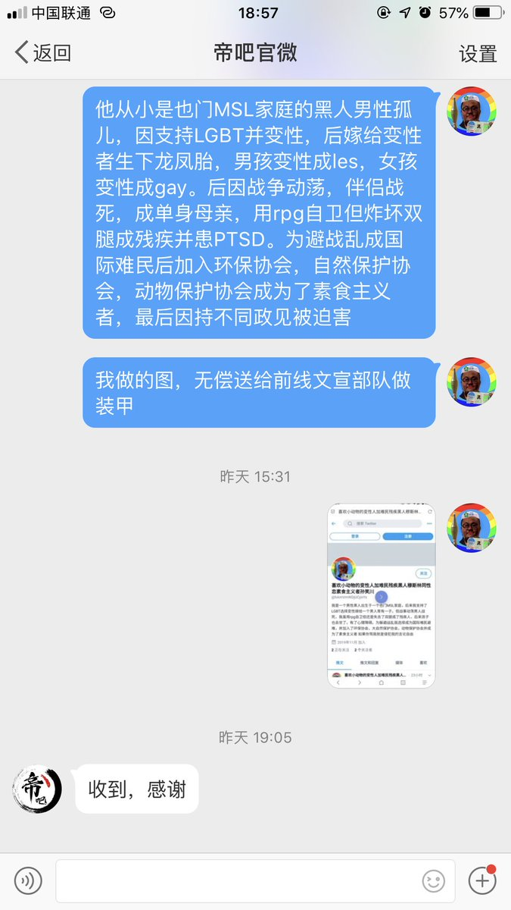 :speech_balloon:评:0 :+1:赞:5 :globe_with_meridians:转:1  

[11月18日 20:23]    新闻大吐槽   @TuCaoFakeNews    被黑警围困在一个天台上，大陆交换生喊出了中国人的时代最强音！「#光复香港，#时代革命！」  https://twitter.com/tucaofakenews/status/1196341135649542144 … 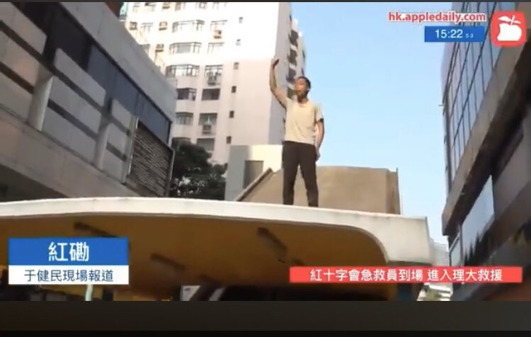 :speech_balloon:评:0 :+1:赞:10 :globe_with_meridians:转:4  

[11月18日 20:23]    新闻大吐槽   @TuCaoFakeNews    这是屠杀 https://twitter.com/tucaofakenews/status/1196399712439390208 …  :speech_balloon:评:0 :+1:赞:11 :globe_with_meridians:转:3  

[11月18日 20:23]    新闻大吐槽   @TuCaoFakeNews    武装暴徒！最邪恶的就是它们身后的主子。 https://twitter.com/tucaofakenews/status/1196399712439390208 …  :speech_balloon:评:0 :+1:赞:5 :globe_with_meridians:转:6  

[11月18日 20:23]    新闻大吐槽   @TuCaoFakeNews    这是在杀人!致人于死地！  :speech_balloon:评:0 :+1:赞:4 :globe_with_meridians:转:1  

[11月18日 20:22]    新闻大吐槽   @TuCaoFakeNews     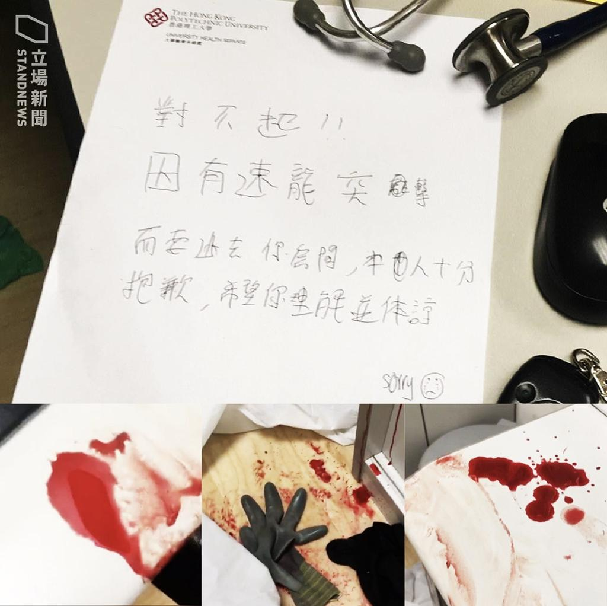 :speech_balloon:评:0 :+1:赞:4 :globe_with_meridians:转:1  

[11月18日 20:19]    新闻大吐槽   @TuCaoFakeNews     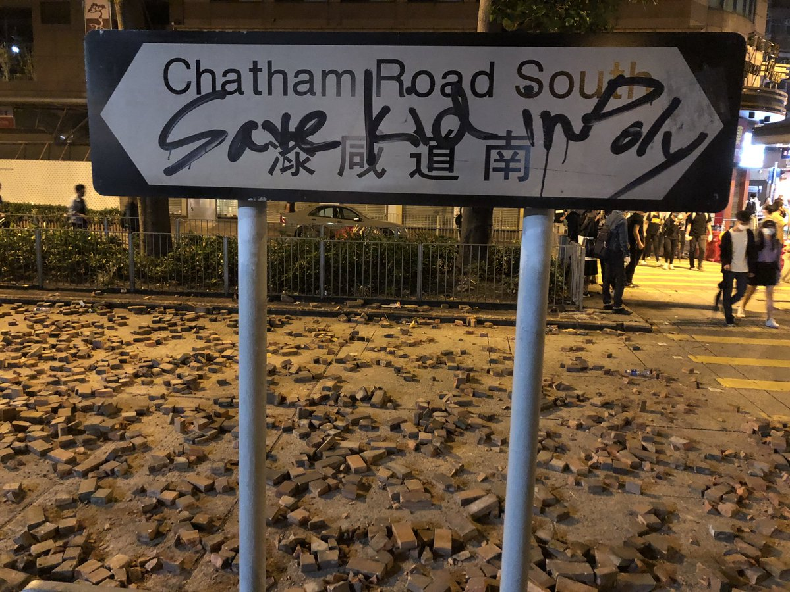 :speech_balloon:评:0 :+1:赞:7 :globe_with_meridians:转:1  

[11月18日 20:13]    墙国铁拳现世报😷   @Socialistfist    推特做不到的事情，腾讯却做到了

#战螂在推特
#社会主义铁拳 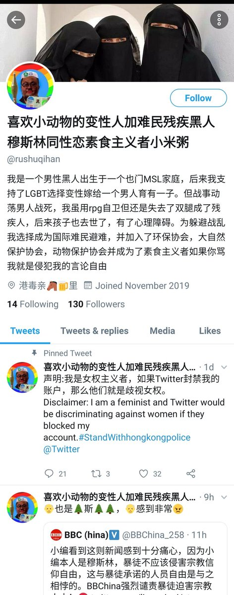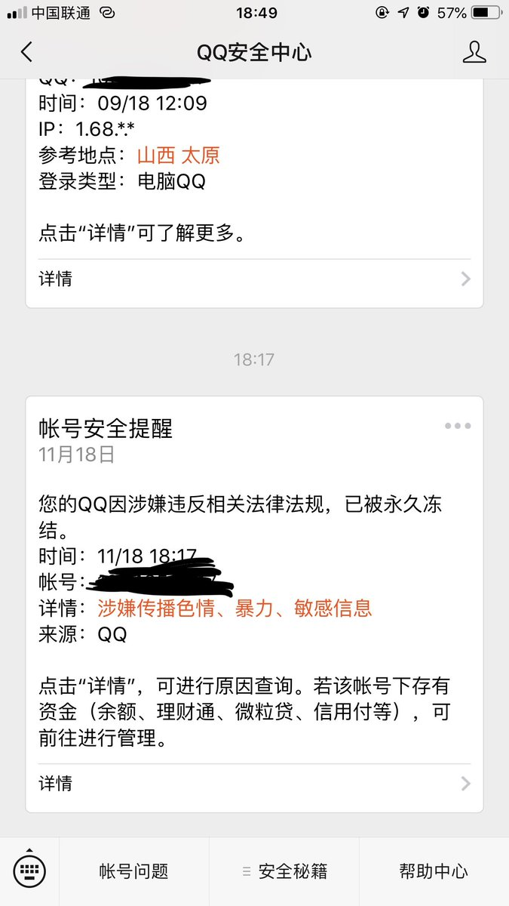 :speech_balloon:评:37 :+1:赞:198 :globe_with_meridians:转:50  

[11月18日 20:13]    新闻大吐槽   @TuCaoFakeNews    推特做不到的事情，腾讯却做到了

#战螂在推特
#社会主义铁拳  :speech_balloon:评:37 :+1:赞:204 :globe_with_meridians:转:52  

[11月18日 20:10]    新闻大吐槽   @TuCaoFakeNews    只要在没有被中共控制的领域
总还是可能有正义和公理的！  :speech_balloon:评:0 :+1:赞:4 :globe_with_meridians:转:1  

[11月18日 20:08]    新闻大吐槽   @TuCaoFakeNews    同学已经明显失去意识，黑警却凶狠的踩同学的头   :speech_balloon:评:5 :+1:赞:70 :globe_with_meridians:转:74  

[11月18日 20:06]    新闻大吐槽   @TuCaoFakeNews    昨天假惺惺不请自来搬砖，今天用枪指着你的头？是不是同一批人？ 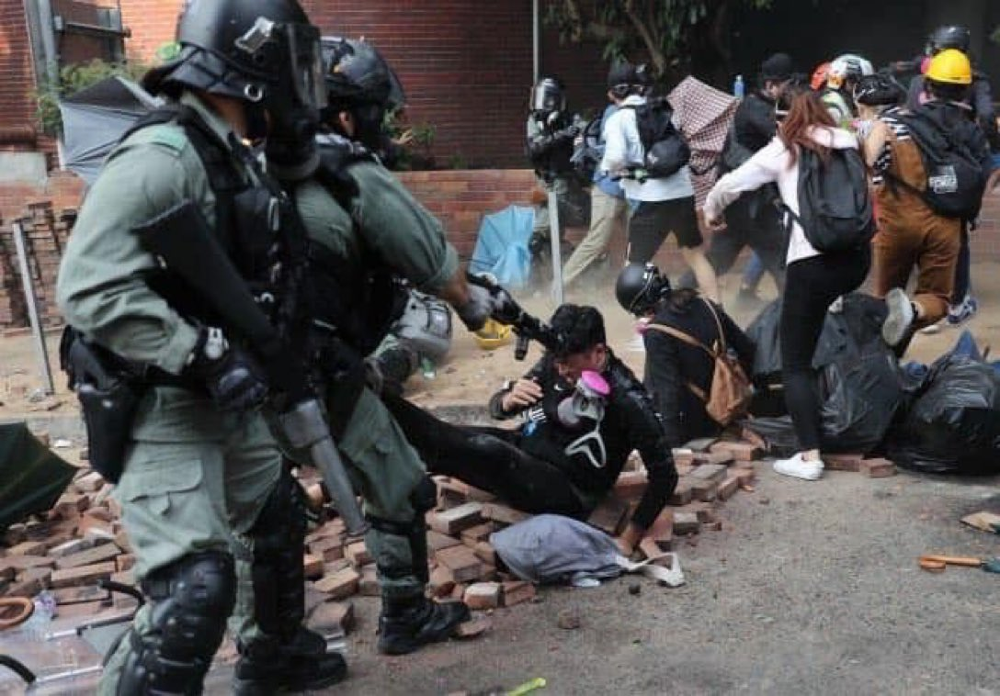 :speech_balloon:评:1 :+1:赞:33 :globe_with_meridians:转:13  

[11月18日 20:02]    新闻大吐槽   @TuCaoFakeNews     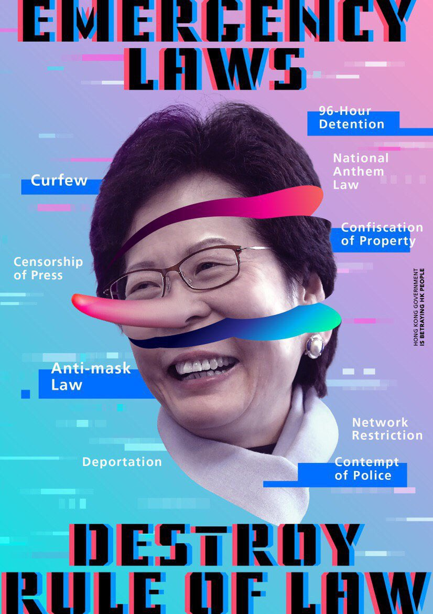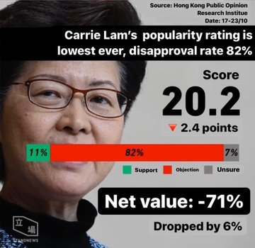 :speech_balloon:评:1 :+1:赞:3 :globe_with_meridians:转:2  

[11月18日 20:02]    新闻大吐槽   @TuCaoFakeNews    夜幕下，几千个和平市民在向理工大学所在的尖沙咀集结，他们今天喊的口号是：救学生，救理大！

已经是第二夜了，希望学生们可以平安得救  :speech_balloon:评:1 :+1:赞:79 :globe_with_meridians:转:56  

[11月18日 20:00]    新闻大吐槽   @TuCaoFakeNews    围死这帮pla https://twitter.com/TuCaoFakeNews/status/1196121934045437952 …  :speech_balloon:评:0 :+1:赞:7 :globe_with_meridians:转:4  

[11月18日 19:40]    新闻大吐槽   @TuCaoFakeNews    学会了自己和平集会抗议，而不是胡乱搅局杂场子，非法干扰别人集会，这也是一个进步。
希望他们回国后，继续这个成果，领导或参与各种和平集会。  :speech_balloon:评:0 :+1:赞:4 :globe_with_meridians:转:2  

[11月18日 19:36]    新闻大吐槽   @TuCaoFakeNews    没被洗脑的，很难得 https://twitter.com/tucaofakenews/status/1196341135649542144 …  :speech_balloon:评:0 :+1:赞:23 :globe_with_meridians:转:9  

[11月18日 19:30]    纽约时报中文网   @nytchinese    美国对TikTok收购案展开调查之际，TikTok负责人朱骏试图缓解华盛顿的担忧。他稱TikTok不会进行内容审查，不与中国共享用户数据。
即使TikTo有白纸黑字的原则，但如果习近平亲自要求朱骏撤下一段视频或交出用户数据，结果会怎样？“我会拒绝他，“朱骏说。 http://nyti.ms/33ZeNAN   :speech_balloon:评:60 :+1:赞:47 :globe_with_meridians:转:20  

[11月18日 19:28]    新闻大吐槽   @TuCaoFakeNews    哎应该喊打倒邪教共产党！这样让大陆人也好香港人也好，知道谁才是是这一切罪恶的根源。 https://twitter.com/tucaofakenews/status/1196341135649542144 …  :speech_balloon:评:1 :+1:赞:18 :globe_with_meridians:转:7  

[11月18日 19:26]    新闻大吐槽   @TuCaoFakeNews    #新疆 #再教育營 出現在香港了。
The #Xinjiang #Reeducation Camp appeared in Hong Kong. https://twitter.com/tucaofakenews/status/1196323540414255104 …  :speech_balloon:评:0 :+1:赞:7 :globe_with_meridians:转:2  

[11月18日 19:25]    新闻大吐槽   @TuCaoFakeNews    被逮捕的学生正在被火车运走，不知道目的地！很多人在询问他们的姓名，以免被消失~
不禁联想到新疆人被批量运送到集中营的场景~ https://twitter.com/TuCaoFakeNews/status/1196323540414255104 …  :speech_balloon:评:0 :+1:赞:13 :globe_with_meridians:转:6  

[11月18日 19:00]    纽约时报中文网   @nytchinese    泄露文件揭示中国如何组织对穆斯林大规模拘禁 http://nyti.ms/2KIKAi3   :speech_balloon:评:3 :+1:赞:12 :globe_with_meridians:转:6  

[11月18日 18:30]    纽约时报中文网   @nytchinese    欢迎阅读香港抗议相关报道：
• 香港高院裁定蒙面禁令违反《基本法》 http://nyti.ms/2XuXANm 
• 校园燃烧之后，香港内地生的疏离、绝望与分歧http://nyti.ms/2NTBhh5 
• 走进抗议冲突前线的香港大学校园http://nyti.ms/2rUdIw6 
• 观点：法律还能拯救香港吗？http://nyti.ms/2qorAOz   :speech_balloon:评:14 :+1:赞:30 :globe_with_meridians:转:14  

[11月18日 18:00]    纽约时报中文网   @nytchinese    《纽约时报》今日头版 https://twitter.com/photojournalism/status/1196252836398452739 …  :speech_balloon:评:4 :+1:赞:28 :globe_with_meridians:转:13  

[11月18日 18:00]    BBC News 中文   @bbcchinese    牌坊几乎是世界各地唐人街的标志。不过，但为何纽约唐人街没有牌坊？ https://bbc.in/2KtVOqi   :speech_balloon:评:5 :+1:赞:27 :globe_with_meridians:转:8  

[11月18日 17:42]    新闻大吐槽   @TuCaoFakeNews    願榮光歸香港台語版》台灣《撐香港，要自由》 演唱會 自由廣場  :speech_balloon:评:10 :+1:赞:139 :globe_with_meridians:转:61  

[11月18日 17:31]    老司机   @h5lpykl7tp6jjop    学生上街示威你们说违法，难道在学校也违法吗？香港警察攻打大学校和入室抢劫杀人有什么分别？看看一个个柔弱的小女孩被缚，一个个武装到牙齿的军警，这样画面还需要说明吗？暴徒是谁？暴政是谁？历史的审判绝不会错过今天残酷！你们暴力手段是罪行！是罪证！是让你们将来被绞死的绳索！那一天很快到来 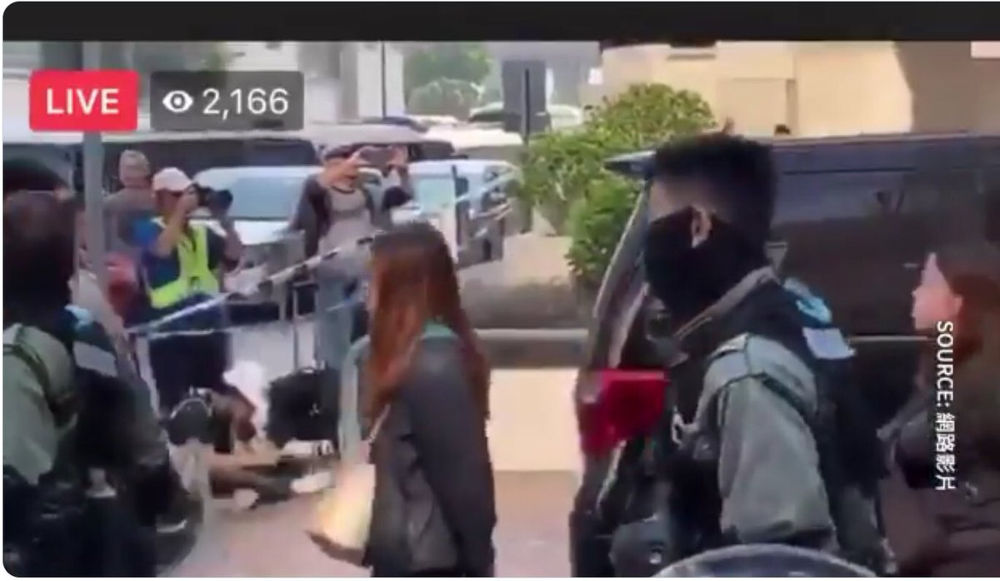 :speech_balloon:评:0 :+1:赞:15 :globe_with_meridians:转:7  

[11月18日 17:02]    纽约时报中文网   @nytchinese    "有些时候会觉得很尴尬，就是感觉我自己在中国和香港之间像夹缝一样，一方面我又不属于中国的那种，又不认同中国这边；在香港这边的话，我又是内地生，因为是内地人，所以就会觉得在夹缝当中的感觉。“ http://nyti.ms/2NTBhh5   :speech_balloon:评:66 :+1:赞:15 :globe_with_meridians:转:2  

[11月18日 17:00]    BBC News 中文   @bbcchinese    蔡英文与韩国瑜针对香港“反送中”抗议的态度与说词转变，牵引大选走向。 https://bbc.in/37hPLPi   :speech_balloon:评:17 :+1:赞:24 :globe_with_meridians:转:8  

[11月18日 16:30]    纽约时报中文网   @nytchinese    这次泄密事件意味着中国内部对镇压行动的不满比以前知道的要多。
这些文件是一位要求匿名的中国政界人士泄露出来的，该人表示，希望文件的披露能防止包括习近平在内的中共领导人逃脱他们对大规模拘禁应受的责备。 http://nyti.ms/2KIKAi3   :speech_balloon:评:15 :+1:赞:38 :globe_with_meridians:转:22  

[11月18日 16:11]    老司机   @h5lpykl7tp6jjop    香港情势危急说明了中共嗜血本性不改！和美国贸易谈判能忽弄就忽弄，经济形势不好只有加大政治高压，以恐怖手段威嚇所有人，一面在大陆吹嘘大国崛起蒙骗百姓，实际上手忙脚乱，大厦将倾!它们已经没有长远规划，即将沉船过一时算一时，所以香港同学们需要冷静应对，打了就跑，跑了又打，游击战为上！  :speech_balloon:评:0 :+1:赞:32 :globe_with_meridians:转:10  

[11月18日 16:00]    BBC News 中文   @bbcchinese    刚刚过去的一周，BBC中文以下新闻内容受到读者的关注。如果你错过了它们，BBC中文带你一一回顾。 https://bbc.in/2KwxQLj   :speech_balloon:评:5 :+1:赞:11 :globe_with_meridians:转:9  

[11月18日 16:00]    纽约时报中文网   @nytchinese    #观点 余若薇：如果香港法官做出的决定，在中国当局眼里具有不受欢迎的政治影响的话，全国人大常委会总能推翻这个决定，因为香港小宪法《基本法》的最终解释权属于全国人大常委会。
我们不要低估许多香港法官近年来在处理高度敏感、极具政治敏感性的案件时所面临的巨大压力。 http://nyti.ms/2qorAOz   :speech_balloon:评:12 :+1:赞:43 :globe_with_meridians:转:23  

[11月18日 15:53]    老司机   @h5lpykl7tp6jjop    中国人，无论你在哪里，都不能钻出钱的屁股眼！ 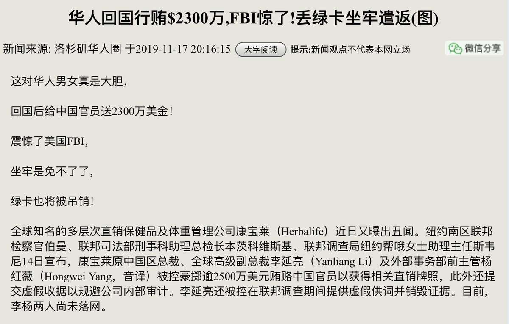 :speech_balloon:评:1 :+1:赞:2 :globe_with_meridians:转:1  

[11月18日 15:50]    老司机   @h5lpykl7tp6jjop    Burst into tears, parents of #Polystudents knelt and begged #hkpolice to let their kids go. But #police just heartlessly warned the parents not to provoke them. #Tianamen2019
  :speech_balloon:评:529 :+1:赞:5548 :globe_with_meridians:转:6603  

[11月18日 15:42]    老司机   @h5lpykl7tp6jjop    理大保衛戰過後，11月18日今早一排女抗爭者被捕的畫面，再度令人震驚.  :speech_balloon:评:37 :+1:赞:332 :globe_with_meridians:转:368  

[11月18日 15:30]    纽约时报中文网   @nytchinese    “我知道这非常极端和危险。我会把射箭作为最后的手段，用来保护理工大学的人，保护香港人。这真是太极端了。”一名17岁的高中生、射箭爱好者说。
“我没想到我会亲手混合这些化学物质，但我是来学习的，”一名19岁的香港理工大学学生说，她身边都是塑料漏斗、卷好的毛巾和玻璃瓶。 http://nyti.ms/2rUdIw6   :speech_balloon:评:34 :+1:赞:31 :globe_with_meridians:转:12  

[11月18日 15:00]    BBC News 中文   @bbcchinese    她的爱犬去世时，老板让她放两天假来悼念离世的宠物。“丧宠假”会成为主流吗？ https://bbc.in/2Ok1yE7   :speech_balloon:评:15 :+1:赞:36 :globe_with_meridians:转:9  

[11月18日 15:00]    纽约时报中文网   @nytchinese    “（我和香港人的）相异之处是，我没有希望，但不认同揽炒。我理解勇武，但不认同放火烧店铺。但我的接受度也在改变吧，以前我也不能认同烧地铁、私了，但现在都接受了。还有一点就是，我有很深的绝望。大概在内地长大，太熟悉那套游戏规则、那种压抑的感觉。“ http://nyti.ms/2NTBhh5   :speech_balloon:评:30 :+1:赞:59 :globe_with_meridians:转:20  

[11月18日 14:39]    纽约时报中文网   @nytchinese    在香港的大学校园里，学生及其支持者正以越发复杂的方式为对抗警察做准备：建造燃烧瓶生产线，安装使用头盔发射物体的弹射器，建造灰泥砖墙或竹栅栏。
周二，中大遭到防暴警察连续发射催泪瓦斯和刺激性液体的轰击，校园变得像战场。学生们说，他们被迫以更激进的方式保护自己。 http://nyti.ms/2rUdIw6   :speech_balloon:评:36 :+1:赞:107 :globe_with_meridians:转:39  

[11月18日 14:16]    纽约时报中文网   @nytchinese    香港高院周一裁定，禁止在公共场合蒙面的禁令违反《基本法》。法院在裁决中表示，这项禁令太过模糊，而且危及立法会的立法能力。这一判決对港府而言是一次打击。 http://nyti.ms/2XuXANm   :speech_balloon:评:11 :+1:赞:41 :globe_with_meridians:转:16  

[11月18日 14:15]    BBC News 中文   @bbcchinese    BBC中文网以多媒体直播理工大学冲突情况。 https://bbc.in/2r59d1q   :speech_balloon:评:58 :+1:赞:144 :globe_with_meridians:转:62  

[11月18日 14:00]    BBC News 中文   @bbcchinese    对外行人来说，苏格兰威士忌似乎有种神秘感，这种神秘形象正是威士忌成功的原因之一，但也是一种精神上的自我束缚。 https://bbc.in/2OpsYc3   :speech_balloon:评:6 :+1:赞:8 :globe_with_meridians:转:4  

[11月18日 14:00]    纽约时报中文网   @nytchinese    香港医院管理局表示，至少38人在周日的冲突中受伤。此前一名警察被箭射中，示威者还点燃了一辆警车。周一，警方在理大附近逮捕了数十人。
至少五百名抗议者仍在校园内，此前，警方用橡皮子弹和催泪瓦斯阻止其离开。这显然违背了该校校长滕锦光所说的与警方达成的临时休战协议。 http://nyti.ms/2XuXANm   :speech_balloon:评:13 :+1:赞:29 :globe_with_meridians:转:18  

[11月18日 13:34]    纽约时报中文网   @nytchinese    #观点 当人们敦促我用法律手段帮助抗议者时，我既宽慰又沮丧。即使政府和立法会让我们失望，香港人仍信任我们的法官。但我担心他们会失望。
认为少数律师和法官能够捍卫香港法治的想法是幼稚的。法治曾是香港的骄傲，但当政府不尊重公平竞争、自由和民主时，它不可能继续存在。 http://nyti.ms/2qorAOz   :speech_balloon:评:62 :+1:赞:204 :globe_with_meridians:转:102  

[11月18日 13:22]    老司机   @h5lpykl7tp6jjop    【广东出现大批南下防暴军车】
香港局势紧张，周一(18日)上午，从广州到深圳高速公路上，出现了过百辆防暴军车，包括防暴用的装甲车，车队深圳方向行使  :speech_balloon:评:109 :+1:赞:735 :globe_with_meridians:转:592  

[11月18日 13:18]    老司机   @h5lpykl7tp6jjop    刚刚，伊朗革命群众已不在乎油价，开始烧毁伊斯兰宗教领袖的画像……伊朗是个什叶派国家，跟阿拉伯那些逊尼派穆斯林是世仇
伊朗人这次的抗议源自汽油涨价，然而涨幅并不高难以作重点，于是示威迅速转为了对神权共和制的讨伐，许多人拿出让伊朗重新伟大的标语，这至少证明伊朗人民上推特是非常的自由。 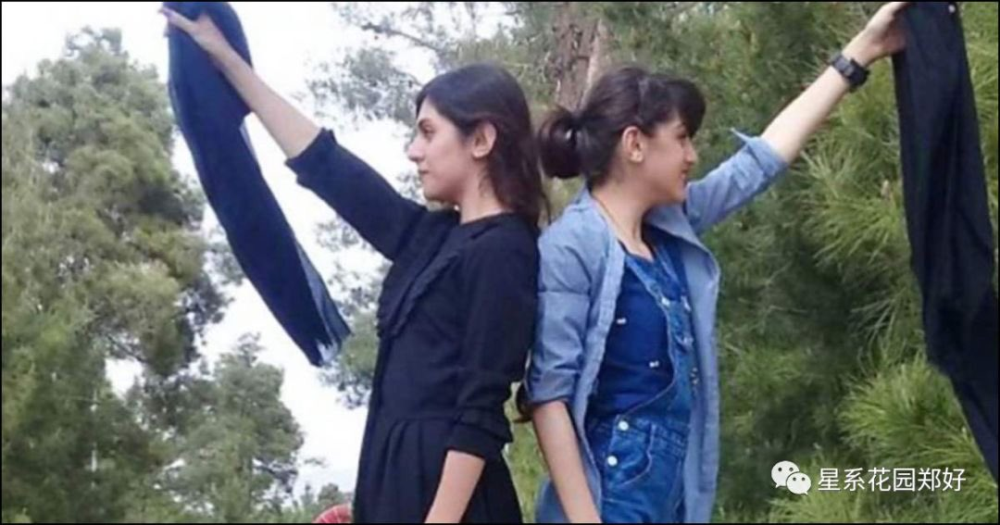 :speech_balloon:评:4 :+1:赞:65 :globe_with_meridians:转:28  

[11月18日 13:00]    BBC News 中文   @bbcchinese    南极主权属于谁的？多年前在南极发现的人类遗骨有可能或改变南极未来的命运。 https://bbc.in/2CMXcAa   :speech_balloon:评:20 :+1:赞:53 :globe_with_meridians:转:12  

[11月18日 13:00]    纽约时报中文网   @nytchinese    #每日一词 Labyrinth，迷宫。《纽约时报杂志》记者探寻了埃尔多安治下的信息审查制度：在网上寻找真实已不容易，土耳其审查者更让它变成了迷宫(censors make it a labyrinth)。Labyrinth在希腊神话中指囚禁牛头人身怪物的建筑，现指迷宫、曲径、令人迷惑的东西。更多简报内容： http://nyti.ms/2KwkGO8   :speech_balloon:评:4 :+1:赞:20 :globe_with_meridians:转:6  

[11月18日 12:30]    纽约时报中文网   @nytchinese    抗议活动突然改变了一些内地生的学习与日常生活，也打乱了一些人在香港的未来规划。许多曾渴望留下工作的内地生如今已不再乐观。
近几个月以来，他们经常发现自己处在夹缝之中，但大多数人试图与街头运动保持距离，较少在与当地人谈论此事为自身立场发声。 http://nyti.ms/2NTBhh5   :speech_balloon:评:2 :+1:赞:10 :globe_with_meridians:转:4  

[11月18日 12:19]    老司机   @h5lpykl7tp6jjop    Two of them who are wanna to help #polyU were captured by the riot police at YMT ytd. They were kept beating by the police by the batons at the dark alley. The reporters were not allowed to approach. #HKPoliceMurderers
#HKPoliceBrutality   :speech_balloon:评:7 :+1:赞:267 :globe_with_meridians:转:345  

[11月18日 12:02]    BBC News 中文   @bbcchinese    美国众议院对总统特朗普的弹劾调查继续推进。前美国驻乌克兰大使约瓦诺维奇作证时，特朗普实时发表推文，两人展开隔空辩论。 https://bbc.in/2KuTNu8   :speech_balloon:评:14 :+1:赞:38 :globe_with_meridians:转:16  

[11月18日 12:00]    纽约时报中文网   @nytchinese    英国安德鲁王子谈及与爱泼斯坦交往，震惊民众。在接受BBC采访时，安德鲁王子试图解释自己与金融家、性犯罪者爱泼斯坦的友谊。但在追问中，他无法就自己与一名女孩的合照做出回应。
该女子自称被爱泼斯坦提供给他，并指控他存在不当性行为。 
更多简报内容： http://nyti.ms/2KwkGO8   :speech_balloon:评:5 :+1:赞:9 :globe_with_meridians:转:4  

[11月18日 11:34]    纽约时报中文网   @nytchinese    在大学校园里发生的冲突是持续数月的抗议活动中最具破坏性的一周的高潮。在此期间，全球的关注点都集中在亲民主活动人士日渐绝望的情绪和警方日益激进的镇压行动上。
这一迹象表明，随着香港准备在本月晚些时候举行区议会选举，冲突正变得更加暴力。 http://nyti.ms/2XuXANm   :speech_balloon:评:8 :+1:赞:26 :globe_with_meridians:转:7  

[11月18日 11:00]    纽约时报中文网   @nytchinese    周一，在香港理工大学内，数百名抗议者与防暴警察爆发了抗议活动持续半年以来最激烈的对抗。活动人士用汽油弹和弓箭武装，警察已对该校进行了长达一天的围攻。
当天早些时候，警方试图冲入校园主入口并展开逮捕。但占领者用数十枚汽油弹进行反击，并将路障点燃，迫使警方撤退。 http://nyti.ms/2XuXANm   :speech_balloon:评:47 :+1:赞:84 :globe_with_meridians:转:38  

[11月18日 10:52]    BBC News 中文   @bbcchinese    理大学生校董李傲然指，校内大部份救护人员已被警方拘捕，无足够资源处理伤者，形容理大正面对反修例运动“最大的人道灾难”。 https://bbc.in/2rUdiFZ   :speech_balloon:评:306 :+1:赞:1154 :globe_with_meridians:转:885  

[11月18日 10:41]    GFHG SDKM   @zyx_yny    With students in Hong-Kong who are blocking the streets to bring economic pressure on China to ensure democratic freedoms in HK! #StandWithHongKong @Andychanhotin @FreedomHKG @Stand_with_HK @hk_watch @HKWORLDCITY #HongKongProtests @joshuawongcf #Freedom  :speech_balloon:评:27 :+1:赞:672 :globe_with_meridians:转:515  

[11月18日 10:30]    纽约时报中文网   @nytchinese    香港抗议中的警民冲突持续激化，陆港矛盾不断加深，如今，香港大学里的内地生群体也被卷入了这场风暴。上周，大批内地学生离开香港、回到大陆。
身处于风暴之中的他们大多害怕发声，几名愿意分享其观点和担忧的学生讲述了他们对现况的观察，以及处在夹缝中的感受。 http://nyti.ms/2NTBhh5   :speech_balloon:评:54 :+1:赞:120 :globe_with_meridians:转:55  

[11月18日 10:19]    老司机   @h5lpykl7tp6jjop    中共港共指使香港恶警不断突破人类底线，居然偷梁换柱地利用救死扶伤的救护车押送被捕的学生。他们的卑劣行径被发现后激起了民愤，愤怒的民众用砖块问候他们，后来被恶警开枪驱散。  :speech_balloon:评:9 :+1:赞:323 :globe_with_meridians:转:186  

[11月18日 10:12]    BBC News 中文   @bbcchinese    在香港中环上班的金融才俊，也许不会想到，有一天他们会迎着催泪弹出门买午餐。 https://bbc.in/33Ua0R0   :speech_balloon:评:308 :+1:赞:437 :globe_with_meridians:转:220  

[11月18日 10:07]    财经真相   @caijingxiang    中国央行下调7天期逆回购利率5个基点至2.5%，这是央行在猪肉推动通胀走高背景下，再度小幅降息！没办法临近年底压力实在太大，先来一口缓缓，就一口，而且是小剂量的那种，保证是最后一次！  :speech_balloon:评:11 :+1:赞:138 :globe_with_meridians:转:23  

[11月18日 09:59]    纽约时报中文网   @nytchinese    早安！今日重点新闻包括：
文件揭示中国如何拘禁穆斯林；香港抗议者与警察在理工大学爆发激烈对抗，警方一度试图强攻校园；香港内地生的疏离、绝望与分歧；亲北京家族成员赢得斯里兰卡大选；安德鲁王子谈与爱泼斯坦交往……NYT简报带你速览今日要闻。 http://nyti.ms/2KwkGO8   :speech_balloon:评:62 :+1:赞:137 :globe_with_meridians:转:53  

[11月18日 09:41]    GFHG SDKM   @zyx_yny    Trans
"About 200 #PolyU students tried to escape in the direction of Hunghom. Not sure if they made it or not. Hope all managed to escape." https://twitter.com/meilong15/status/1196240402988187648 …  :speech_balloon:评:7 :+1:赞:44 :globe_with_meridians:转:40  

[11月18日 09:40]    BBC News 中文   @bbcchinese    你知道吗，原来塑料袋起初是一项环保的工具！ https://www.youtube.com/watch?v=lYov-B7UC5k …  :speech_balloon:评:14 :+1:赞:11 :globe_with_meridians:转:4  

[11月18日 09:32]    GFHG SDKM   @zyx_yny    Stop using #PolyU Wifi for god’s sake.
#HongKongProtests https://twitter.com/hengyanlo/status/1196156883679055872 …  :speech_balloon:评:3 :+1:赞:113 :globe_with_meridians:转:119  

[11月18日 09:23]    财经真相   @caijingxiang    因油价上涨爆发的抗议活动愈加激烈，截止刚刚过去的周末，伊朗国内抗议活动已蔓延至上百座城镇。而与此同时，当地时间17日，伊朗最高领袖哈梅内伊表示支持油价上涨，同时他还呼吁政府防止其他商品价格上涨。并将国内抗议归咎于伊朗的“外敌”，称蓄意破坏和纵火是流氓所为，不是伊朗的人民所为；  :speech_balloon:评:20 :+1:赞:239 :globe_with_meridians:转:60  

[11月18日 08:56]    GFHG SDKM   @zyx_yny    The people of Hong Kong are right to stand up to Communist China and fight for freedom. 

We hear your cries for democracy and are doing our part to hold China accountable for their acts of violence against protestors. 

Thank you @marcorubio @SenatorRisch for your leadership.  :speech_balloon:评:1609 :+1:赞:13659 :globe_with_meridians:转:11465  

[11月18日 08:54]    GFHG SDKM   @zyx_yny    08:30 students tried to leave #PolyU but #HongKong #Police continued to tear gas them, forcing them to return inside. This is in contradiction to what Poly U President JC Teng said, that cops have agreed to let students leave peacefully. 
@cityusucbc
#PoliceBrutality  :speech_balloon:评:52 :+1:赞:796 :globe_with_meridians:转:994  

[11月18日 08:50]    GFHG SDKM   @zyx_yny    #PolyU protesters eventually retreat after driving the police back in the face of whizzing rubber bullets and gas pellets. They’re mostly inside the campus again. Police showing no mercy #HK #HongKongProtests #StandWithHongKong  :speech_balloon:评:246 :+1:赞:4598 :globe_with_meridians:转:5062  

[11月18日 08:45]    GFHG SDKM   @zyx_yny    The #HKPolice threatening to shoot press, first-aid as they were attempting to cross the road. This is on the perimeter of #PolyU and some civilians who came here to support the protesters still inside have been injured and/or arrested at the TST east fountain across this road.  :speech_balloon:评:23 :+1:赞:575 :globe_with_meridians:转:783  

[11月18日 08:38]    GFHG SDKM   @zyx_yny    Protestors are trying to escape from Hong Kong Polytechnic University, but HK Police fire tear gas to force them back IN. HK Police have given up any pretense that they try to de-escalate and disperse. Instead, it is evident that their intention is to attack, arrest, and punish. https://twitter.com/JessiePang0125/status/1196224442491396097 …  :speech_balloon:评:33 :+1:赞:937 :globe_with_meridians:转:1078  

[11月18日 08:06]    GFHG SDKM   @zyx_yny    this is the same shameful #PolyU head who refused to shake hands with students wearing a mask during graduation ceremony. Still the same shameful head who escaped the clashes and shrinked his duty for the whole of the clash that lasts for days. https://twitter.com/nytmay/status/1196202338102341633 …  :speech_balloon:评:52 :+1:赞:725 :globe_with_meridians:转:589  

[11月18日 07:36]    GFHG SDKM   @zyx_yny    At 530am, #HKPoliceTerriorists suddenly attacked the #PolyU campus and arrested some students.

Wherever #HKPolice goes, there will be a war zone. 

This is not a movie scene. This is an university campus and now is set on fire. 

Plz save them. 
#SOSHK  :speech_balloon:评:150 :+1:赞:3409 :globe_with_meridians:转:3708  

[11月18日 06:42]    GFHG SDKM   @zyx_yny    needs to recall U.S. Ambassador Branstad for @hkpoliceforce assault onPolyU & committing crimes against humanity. https://twitter.com/LIHKGPicks/status/1196138147945431040 …  :speech_balloon:评:1034 :+1:赞:11293 :globe_with_meridians:转:10561  

[11月18日 06:02]    GFHG SDKM   @zyx_yny    Around 30 minutes ago at 05:30AM, #HKPolice have entered #PolyU campus. At least 3 protestors subdued, 1 seen with blood all over face during arrest

#PolyU #PolyUMassacre #PolyUSOS
#SOSHK #HongKong #StandwithHK
Vid via Telegram  :speech_balloon:评:43 :+1:赞:1460 :globe_with_meridians:转:2056  

[11月18日 05:16]    GFHG SDKM   @zyx_yny    

They are still fighting! 

#SOSPolyU
#HKPoliceState 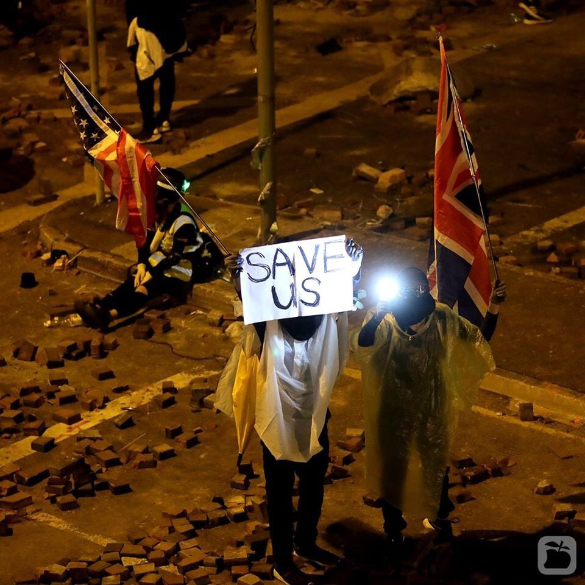 :speech_balloon:评:136 :+1:赞:2885 :globe_with_meridians:转:2600  

[11月18日 05:07]    老司机   @h5lpykl7tp6jjop    为何理工大学门口有这么多车？一部分是响应网络上的号召，前来搭救学生，更多司机是希望堵住路，防止黑警增援！

当黑警用强光手电筒照射车主，想驱赶他们，车主们纹丝不动，长按喇叭，发出愤怒的长鸣。

民间力量的增援，远比黑警的增援更迅速，也更有效，天明胜负仍未分  :speech_balloon:评:115 :+1:赞:2264 :globe_with_meridians:转:1387  

[11月18日 05:07]    新闻大吐槽   @TuCaoFakeNews    为何理工大学门口有这么多车？一部分是响应网络上的号召，前来搭救学生，更多司机是希望堵住路，防止黑警增援！

当黑警用强光手电筒照射车主，想驱赶他们，车主们纹丝不动，长按喇叭，发出愤怒的长鸣。

民间力量的增援，远比黑警的增援更迅速，也更有效，天明胜负仍未分  :speech_balloon:评:115 :+1:赞:2264 :globe_with_meridians:转:1387  

[11月18日 04:53]    老司机   @h5lpykl7tp6jjop    黑警藏在救护车里，突放冷枪！
造成局面混乱！  :speech_balloon:评:20 :+1:赞:314 :globe_with_meridians:转:270  

[11月18日 04:46]    老司机   @h5lpykl7tp6jjop    香港黑警藏在救護車裡等著抓受傷的學生！堪比納粹！喪心病狂！  :speech_balloon:评:209 :+1:赞:1462 :globe_with_meridians:转:1268  

[11月18日 04:31]    老司机   @h5lpykl7tp6jjop    日本第一任天皇就是徐福!中国拿出十大铁证，请问怎么解释遗传基因？

最先将徐福与日本联系在一起的是清代学者黄遵宪,1950年我国学者卫挺生在香港出版了《徐福入日本建国考》全面论证了徐福与神武天皇的神秘联系,综合起来,有十点符合。 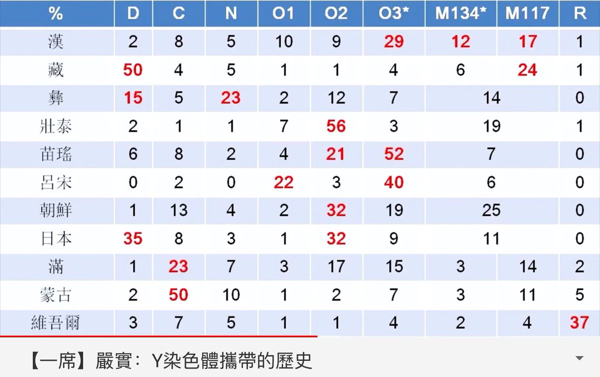 :speech_balloon:评:4 :+1:赞:7 :globe_with_meridians:转:3  

[11月18日 04:21]    老司机   @h5lpykl7tp6jjop    過街老鼠  :speech_balloon:评:140 :+1:赞:1344 :globe_with_meridians:转:758  

[11月18日 03:59]    老司机   @h5lpykl7tp6jjop    智利民众反政府示威奇招 雷射光笔打下无人机
智利反政府示威，就有大批示威者，同步使用雷射光笔，对准照射一架政府无人机，没想到这架无人机，还真的感应失灵，失控坠地，只见夜空中，好几道绿色光束，全都对准一个点，没过多久，这台无人机，真的慢慢失控往下降，最后坠落地面，现场民众响起一阵欢呼  :speech_balloon:评:0 :+1:赞:43 :globe_with_meridians:转:7  

[11月18日 03:50]    老司机   @h5lpykl7tp6jjop    口头上狠，肚子却咕咕叫，
美国农业部的周度出口销售报告显示，截至11月7日当周，中国买家订购了760,527吨美国大豆。美国出口商还向中国付运了693,527吨大豆。
中国是本周美国大豆的最大买家，占周销售总量125.6万吨的61%。美国通常是秋季向中国出口大豆最多的国家，这段时间农民收割大豆，供应充足。  :speech_balloon:评:0 :+1:赞:11 :globe_with_meridians:转:2  

[11月18日 03:43]    老司机   @h5lpykl7tp6jjop    香港最新民调：暴力升级，当局难辞其咎 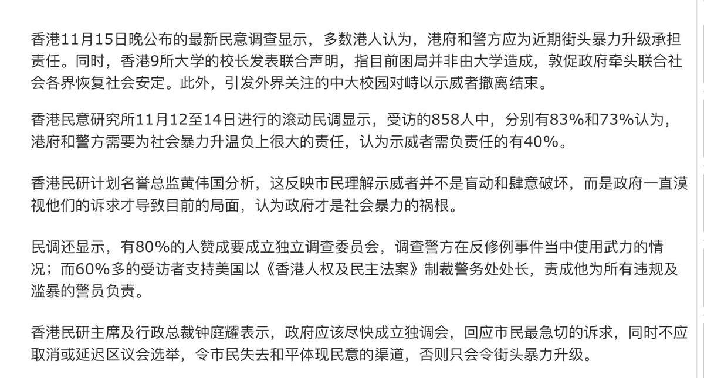 :speech_balloon:评:0 :+1:赞:5 :globe_with_meridians:转:2  

[11月18日 03:23]    GFHG SDKM   @zyx_yny    Trans
"I'm a first aider on site at #PolyU. Lots of casualties. Don't know if they could hang on until 6am. No enough ice, no doctors around. Many people fired by water cannon have hypothermia." https://twitter.com/ChingyeeWong3/status/1196145895290458113 …  :speech_balloon:评:24 :+1:赞:812 :globe_with_meridians:转:1007  

[11月18日 02:48]    GFHG SDKM   @zyx_yny    [PolyU frontliner's last words?]

"If very unfortunately I die in Kowloon today, even though history may just remember me as a number, I hope HKers will remember all of our deeds, stay angry & rational & turn our revenge chants into reality."

#SOSHK

OP: https://lihkg.com/thread/1731186/page/1 …  :speech_balloon:评:96 :+1:赞:1917 :globe_with_meridians:转:1775  

[11月18日 02:39]    老司机   @h5lpykl7tp6jjop    11月17日星期日抗议者在香港理工大学与警察对峙，用弓箭和燃烧瓶阻止警方进入校园。警方发出严厉的警告称“理工大学一带的暴力行为已达暴乱程度“，并警告任何协助者都可能”犯暴动罪”。香港学校已停课多日，包括理工大学在内有5所大学被示威者占领。 https://www.voachinese.com/a/hong-kong-protesters-bows-arrows-hong-kong-polytechnic-university-riots-20191117/5169408.html …  :speech_balloon:评:68 :+1:赞:212 :globe_with_meridians:转:114  

[11月18日 01:32]    GFHG SDKM   @zyx_yny    “It is fxxking mad!” People with their cars in Tsim Sha Tsui hoping to support #PolyU students (but were stuck due to roadblocks) received tear gas treatment from #HongKong police. Lots of swearing. Video circulated online. #HongKongProtests  :speech_balloon:评:80 :+1:赞:1390 :globe_with_meridians:转:1565  

[11月18日 01:23]    BBC News 中文   @bbcchinese    11月17日，香港理工大学附近全日不断爆发冲突。晚上时分，校园附近有行人天桥起火，期间曾传出爆炸声，而警方一辆装甲车被汽油弹击中起火。 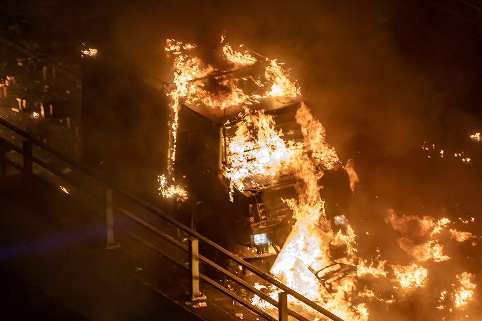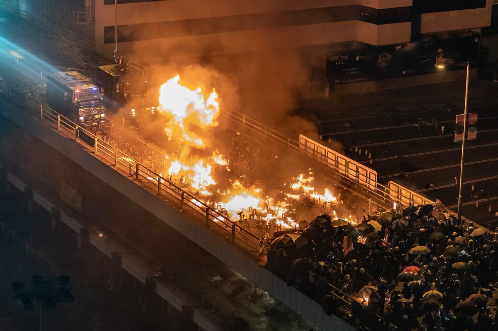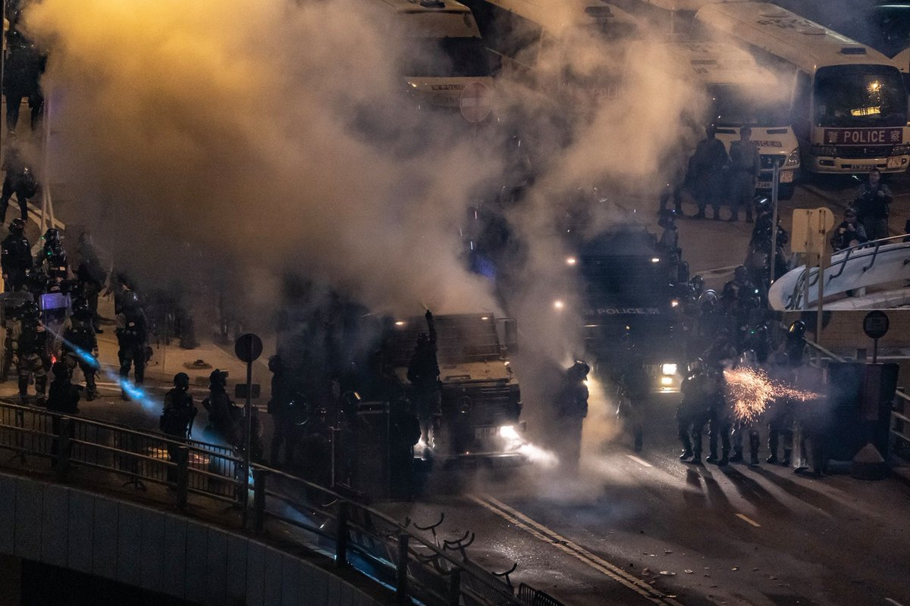 :speech_balloon:评:139 :+1:赞:371 :globe_with_meridians:转:162  

[11月18日 01:12]    GFHG SDKM   @zyx_yny    Old friend, world renowned photographer, Stephen Boitano, sharing his concerns on escalated police violence in Hk. Please  pray it is a very dangerous situation. #StandWithHongKong #HongKongProtests @FreedomHKG @Stand_with_HK @HKWORLDCITY @hk_watch @Andychanhotin @Andychanhotin  :speech_balloon:评:675 :+1:赞:8800 :globe_with_meridians:转:8821  

[11月18日 00:41]    墙国铁拳现世报😷   @Socialistfist    推荐一些启发小编开办《墙国铁拳现世报》的parody或自媒体推号：
中国民调@PollChina 
新蛤社@XinHaNewsAgency
推特小红旗@Xhnsoc__Redflag
共青团中央 (学习小组）@CPCYouthLeague
乳透社@Ruters0615 
胡锡进（流亡）@HuXijin_huaiqiu
LIFETIME 視界@LifetimeUSCN
不分先后，欢迎推荐后续补充  :speech_balloon:评:9 :+1:赞:123 :globe_with_meridians:转:20  

[11月18日 00:20]    GFHG SDKM   @zyx_yny    And today I present to you the most ridiculous oxymoron: “necessary minimum force” and “live ammunition” https://twitter.com/rthk_enews/status/1196099679408144386 …  :speech_balloon:评:35 :+1:赞:1019 :globe_with_meridians:转:852  

[11月17日 23:42]    GFHG SDKM   @zyx_yny    Members of Guarding Our Kids, formed by mothers and fathers, decided to stay with #PolyU students who were trapped in the campus: We won't leave our 'kids' behind. We will safeguard this place. We want everyone here can go home. #HongKongProtesters  :speech_balloon:评:622 :+1:赞:10293 :globe_with_meridians:转:9620  

[11月17日 23:21]    老司机   @h5lpykl7tp6jjop    很多可憐的弱者喜歡把自己和強者、勝利者綁在一起，為強者歡呼鼓吹~就比如有一段時間國內非常流行的網絡口號【看到祖國這麼流氓，我就放心了！】【祖國變成列強的感覺真爽！】然而現實中，我們普通百姓，淪為受害者的概率遠遠高於成為強者、勝利者~你歌頌強者，那當你受害時，誰來幫你呢？  :speech_balloon:评:171 :+1:赞:1663 :globe_with_meridians:转:580  

[11月17日 19:52]    GFHG SDKM   @zyx_yny    The regime and the #HongKongPolice has put nearly ALL Hongkongers in danger, regardless of what side you stand on.

#HongKongProtest
#SOSHongKong
@SolomonYue
@marcorubio 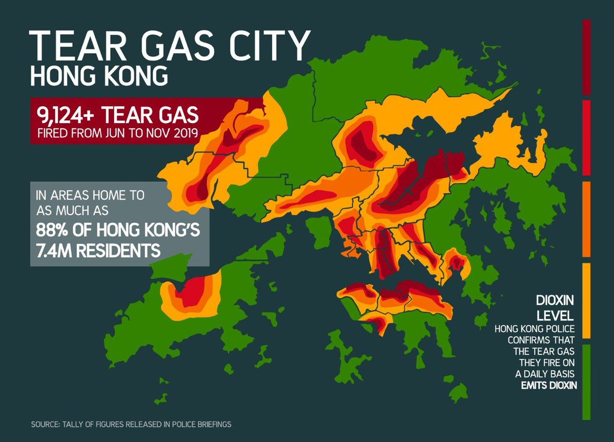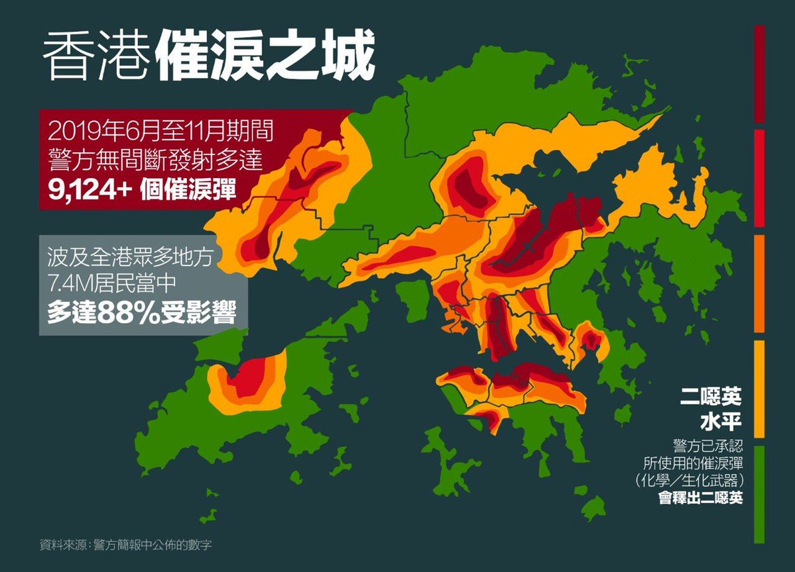 :speech_balloon:评:4 :+1:赞:233 :globe_with_meridians:转:275  

[11月17日 19:25]    财经真相   @caijingxiang    11月15日下午，山东省委常委、青岛市委书记王清宪：“谁不敢支持民营经济，就是对自己做到“亲”“清”政商关系没有信心，就是对自己的党性没有信心。”  :speech_balloon:评:27 :+1:赞:145 :globe_with_meridians:转:29  

[11月17日 19:18]    BBC News 中文   @bbcchinese    “解放军出来，是告诉大家，虽然现在不需要解放军介入香港示威，但不代表没有可能性。”有香港学者分析说。 https://trib.al/p816ndT   :speech_balloon:评:192 :+1:赞:295 :globe_with_meridians:转:95  

[11月17日 18:58]    老司机   @h5lpykl7tp6jjop    這位香港議員郭榮鏗
在質詢時態度明確正義凜然
如果政治人物都如他眼睛雪亮》人民會多了幸福少了痛  :speech_balloon:评:9 :+1:赞:174 :globe_with_meridians:转:89  

[11月17日 17:19]    BBC News 中文   @bbcchinese    中国留学生说，如果你不了解中国或者香港就没有资格在这个问题上发言。但有的韩国学生不这么认为。 https://trib.al/3K0Y9sV   :speech_balloon:评:380 :+1:赞:641 :globe_with_meridians:转:248  

[11月17日 15:02]    BBC News 中文   @bbcchinese    【一周热点回顾】据报有中国人在内的26名富豪投资者及家属的护照被塞浦路斯政府收回。 https://bbc.in/2NQoNGY   :speech_balloon:评:20 :+1:赞:141 :globe_with_meridians:转:55  

[11月17日 13:53]    BBC News 中文   @bbcchinese    中国每年产生超过两亿吨城市垃圾，西安最大填埋场比原计划提前了25年被装满，当地开始寻求其它方式处理垃圾。 https://trib.al/ZfE6omO   :speech_balloon:评:66 :+1:赞:134 :globe_with_meridians:转:50  

[11月17日 13:02]    BBC News 中文   @bbcchinese    【一周热点回顾】中央出台16项“惠港”新政策，香港居民可以不受限到大湾区城市买楼。这些措施能能否缓解香港激烈的抗争运动，你怎么看？ https://bbc.in/2CIrnZk   :speech_balloon:评:93 :+1:赞:48 :globe_with_meridians:转:24  

[11月17日 11:02]    BBC News 中文   @bbcchinese    【一周热点回顾】围绕女性性器官存在和流传着许多误解。美国妇产科医生珍·冈特（Dr.Jen Gunter)在北美行医25年。她的新书《阴道圣经》（The Virginal Bible）为女性提供许多实用性建议，在这里我们为你总结5条。 https://bbc.in/32M3UAV   :speech_balloon:评:12 :+1:赞:67 :globe_with_meridians:转:34  

[11月17日 09:00]    BBC News 中文   @bbcchinese    【一周热点回顾】为什么这些国家的污染比世界制造大国——中国的情况还要严重呢？ https://bbc.in/2Xn6zjt   :speech_balloon:评:59 :+1:赞:44 :globe_with_meridians:转:17  

[11月16日 18:18]    财经真相   @caijingxiang    现在距离12月15号,还有四周时间，如果下周结束之前，双方再不公布两国具体签协议是具体时间表，基本上宣布本轮谈判再次破裂，因为目前双方元首根本没有会面的时间表，所谓伦敦峰会还只是停留在媒体猜测层面，没有得到官方确认，库德罗周五表示，第一阶段协议签订不需要双方元首会面签字，就是铺垫！  :speech_balloon:评:2 :+1:赞:85 :globe_with_meridians:转:19  

[11月16日 18:11]    财经真相   @caijingxiang    美国总统特朗普上周五在白宫对记者表示，他尚未决定取消已经加征的对华关税。
随后，特朗普上周六在马里兰州安德鲁斯联合基地表示，美中两国贸易谈判取得很好的进展。但是慢，“对我来说太慢”。特朗普对记者表示，谈判进行顺利。不过，他也强调，愿意达成协议，但是协议必须符合美方设想。  :speech_balloon:评:7 :+1:赞:100 :globe_with_meridians:转:16  

[11月16日 18:05]    墙国铁拳现世报😷   @Socialistfist    小编要郑重警告刘女士，国家是有寻衅滋事和煽动颠覆这些国民待遇的。

#社会主义铁拳  :speech_balloon:评:90 :+1:赞:693 :globe_with_meridians:转:206  

[11月16日 13:30]    新闻大吐槽   @TuCaoFakeNews    先是普通五毛 温和派粉红 下体升级人 各种迫真米军 阿拉伯银行家，接着是帝吧网友 饭juan女孩 爱支彩虹，现在又来了一群抽象骡子，你们支那真有意思，和动物园一样  :speech_balloon:评:58 :+1:赞:484 :globe_with_meridians:转:61  

[11月16日 10:25]    财经真相   @caijingxiang    中国人民银行：按照“因城施策”的基本原则，落实房地产长效管理机制，不将房地产作为短期刺激经济的手段。如果真心控制房价，十年前就做了，现在不是想怎样控制房价，而是已经无力放更多的货币，继续推高房价；如果还能再大涨一波，也就不会有现在的财政赤字、中小银行遭到挤兑的困境了！  :speech_balloon:评:4 :+1:赞:78 :globe_with_meridians:转:17  

[11月16日 10:19]    财经真相   @caijingxiang    中国人民银行：正确看待央行资产负债表规模变化；当前，中国仍实施常态货币政策，法定准备金率是使用的主要政策工具之一。虽然中国人民银行资产规模增长放缓甚至可能下降，但降准放松了流动性约束，增大了货币创造能力，与国外央行量化宽松结束后一度进行的“缩表”有本质区别。找不到足够的抵押物！  :speech_balloon:评:6 :+1:赞:84 :globe_with_meridians:转:21  

[11月16日 10:12]    财经真相   @caijingxiang    发改委副秘书长高杲16日透露，根据全国PPP监测服务平台数据，截至11月初，各地正在推进的PPP项目近7000个，总投资约9万亿元人民币。其中城市基础设施、农林水利、社会事业、交通运输、生态环保五大领域占全部项目个数和总投资规模比重均接近90%。  :speech_balloon:评:2 :+1:赞:65 :globe_with_meridians:转:17  

[11月16日 10:05]    财经真相   @caijingxiang    这次规模应该会超过以往，国内的小心！  :speech_balloon:评:34 :+1:赞:355 :globe_with_meridians:转:171  

[11月15日 16:28]    财经真相   @caijingxiang    随着贸易战的深入，华强北也受到了巨大冲击，特朗普不断上调的关税尚不足以构成致命伤害，真正的要命之处是美国终结的国际邮费优惠，对于一个手机壳来说，其单价还不如国际邮费贵，一但邮费优惠终结，其价格优势也将不复存在！  :speech_balloon:评:7 :+1:赞:135 :globe_with_meridians:转:18  

[11月15日 16:11]    财经真相   @caijingxiang    深圳之所以成为中国的创业之都，大部分归功于华强北，年轻的大学生不需要关系、资金，只需要一个网店，然后在华强北上千家工厂店里询价、穿梭，尽可能的找到最低批发价，以及最便宜的发快递方式，你就可以实现创业了。当然这里面也充满着心酸，正是中国权贵不屑于多繁琐低回报，才给了屌丝逆袭狭缝！  :speech_balloon:评:5 :+1:赞:148 :globe_with_meridians:转:23  

[11月15日 16:00]    财经真相   @caijingxiang    在过去20年里， 华强北是中国底层屌丝最容易创业逆袭的地方，在这里只要你足够勤奋，吃苦耐劳，善于在细微之处发现商机，你就可以实现人生逆袭，完全摆脱不上班就饿死的宿命！在炎炎夏日里一个人连夜就把八吨充电宝发往全国各地的类似故事每天都在上演！  :speech_balloon:评:4 :+1:赞:83 :globe_with_meridians:转:9  

[11月15日 15:51]    财经真相   @caijingxiang    华强北与香港一河之隔，这里东亚最大的手机配件集散地，它的货物远销世界，很多东南亚、香港、印度等地的商人都在此批发货物。每天都有大量香港店主乘坐地铁来此进货，可以说香港所有3c产品，都来自华强北以及依附它的几千家小工厂！持续的抗争运动已经开始波及到这里的产业链！  :speech_balloon:评:15 :+1:赞:168 :globe_with_meridians:转:42  

[11月15日 14:14]    财经真相   @caijingxiang    李大霄近五年的各种底！“现在已经是婴儿底，你们可以打我的脸了”！  :speech_balloon:评:22 :+1:赞:127 :globe_with_meridians:转:42  

[11月15日 14:06]    财经真相   @caijingxiang    14日，俄罗斯金融媒体RBC报道，金砖国家正在建立金砖国家之间的单一支付系统，也就是创建“金砖国家”的加密货币！  :speech_balloon:评:24 :+1:赞:208 :globe_with_meridians:转:64  

[11月15日 09:56]    财经真相   @caijingxiang    高息储蓄产品不属于中共三种不赔的范围！  :speech_balloon:评:10 :+1:赞:64 :globe_with_meridians:转:25  

[11月15日 09:43]    财经真相   @caijingxiang    库德洛称美国正制定减税计划,将在特朗普的第二个总统任期实施.该消息对美股短期内构成巨大支撑，美股不断创新高！  :speech_balloon:评:6 :+1:赞:114 :globe_with_meridians:转:41  

[11月15日 09:02]    财经真相   @caijingxiang    周五亚盘刚开始，美國國家經濟顧問庫德洛最新表示，“我們正接近與中國達成一項貿易協定”。庫德洛並指出，與中國的會談一直非常有建設性。消息公布后美股再度创新高、日元、黄金短线下跌，离岸人民币转涨！又是周五固定利好，这个“传说”中的第一阶段协议已经被说了N次，最扯淡的是每次市场都计价！  :speech_balloon:评:31 :+1:赞:259 :globe_with_meridians:转:59  

[11月15日 08:24]    墙国铁拳现世报😷   @Socialistfist    小编认为本月最佳铁拳，滋磁不滋磁啊？  :speech_balloon:评:37 :+1:赞:752 :globe_with_meridians:转:45  

[11月15日 08:21]    墙国铁拳现世报😷   @Socialistfist    面对大陆的善意，台大教授自信的进去了---亲中学者 施正屏
#社会主义铁拳  :speech_balloon:评:186 :+1:赞:1821 :globe_with_meridians:转:811  

[11月15日 01:03]    墙国铁拳现世报😷   @Socialistfist    那必须和兄弟你平分啊，猪肉价格这么高  https://twitter.com/Dofuralanmingo/status/1194993538292826114 …  :speech_balloon:评:17 :+1:赞:208 :globe_with_meridians:转:11  

[11月14日 19:18]    财经真相   @caijingxiang    这种财富游戏，体现在央行层面，就是无法继续扩表，有价值的印钞已经没有了，现在甚至连农村宅基地和农田都允许抵押贷款，央行如果想继续扩大印钞，除了以高利息忽悠洋韭菜进来外，还有一条办法就是以行政命令，直接掠夺还未欠债的中产阶级，当这波掠夺完后，就只剩下无锚印钞一条路了！也是炼狱之路！  :speech_balloon:评:19 :+1:赞:246 :globe_with_meridians:转:59  

[11月14日 19:10]    财经真相   @caijingxiang    现在中共统治的危机根源是，央行想继续印钞，但是却找不到足够多的“承债人”，14亿底层屁民，通过过去20年加入WTO在血汗工厂赚的那几个铜板，已经被高房价掠夺的差不多了，政府财政收支也到了难以为继的地步；能够赚钱的基建项目也建的差不多了，剩下的都是亏钱的亏钱买卖，如果继续搞，财政根本罩不住  :speech_balloon:评:6 :+1:赞:234 :globe_with_meridians:转:49  

[11月14日 19:09]    墙国铁拳现世报😷   @Socialistfist    北京废青，危言耸听

#社会主义铁拳  :speech_balloon:评:62 :+1:赞:623 :globe_with_meridians:转:164  

[11月14日 18:36]    财经真相   @caijingxiang    中共基建没有钱，很多网友简单的认为开动印钞机就行，这其实是大错特错，中共央行印的每一分钱，都必须有对应的相应的价值才行，否则就是无锚印钞，汇率崩盘！过去20年央行印钞都是以债务为基础的。比如，房奴的房贷，当房奴申请贷款时，本质是向央行抵押了自己未来30年的劳动力。 https://twitter.com/aspeltuo8/status/1194923278646816768 …  :speech_balloon:评:52 :+1:赞:726 :globe_with_meridians:转:266  

[11月14日 01:30]    墙国铁拳现世报😷   @Socialistfist    支持言论自由不受侵害 https://twitter.com/keepcnsecurity/status/1194633823964631046 …  :speech_balloon:评:8 :+1:赞:118 :globe_with_meridians:转:32  

[11月13日 18:38]    墙国铁拳现世报😷   @Socialistfist    一天二更，快夸我。
最近推友投稿质量很高，再次感谢！  :speech_balloon:评:19 :+1:赞:219 :globe_with_meridians:转:4  

[11月13日 18:38]    墙国铁拳现世报😷   @Socialistfist    祝这位推友早日康复

#战螂在推特  :speech_balloon:评:25 :+1:赞:268 :globe_with_meridians:转:53  

[11月13日 18:15]    墙国铁拳现世报😷   @Socialistfist    卧床狙击手

#社会主义铁拳  :speech_balloon:评:113 :+1:赞:724 :globe_with_meridians:转:183  

[11月12日 19:22]    墙国铁拳现世报😷   @Socialistfist    从2018年9月到现在频繁微博维权，神奇的是，小编就是没看出来他举报的贪污腐败是什么内容  :speech_balloon:评:4 :+1:赞:149 :globe_with_meridians:转:11  

[11月12日 19:20]    墙国铁拳现世报😷   @Socialistfist    宝贝别哭

#社会主义铁拳  :speech_balloon:评:34 :+1:赞:358 :globe_with_meridians:转:81  

[11月12日 07:22]    凡賽堤/FORSETI   @FecharCCP    11日早在西湾河开枪射伤示威者的港警关家荣身份被起底，其担任家教会主席的德望学校师生、家长及校友发起联署要求解除其在该校的职务。其两个女儿在该校就读。另有消息指，关家荣受过“大陆警察部门”特殊培训。下面这个小视频，足以解释这场血案的真相：这是流氓国家自上而下有计划的谋杀。  :speech_balloon:评:20 :+1:赞:264 :globe_with_meridians:转:174  

[11月12日 07:14]    凡賽堤/FORSETI   @FecharCCP    救救悲慘的香港 #HKSOS

香港黑警拔槍亂殺港民！已多人中槍和死亡！

天滅極權！  :speech_balloon:评:2 :+1:赞:11 :globe_with_meridians:转:8  

[11月12日 07:11]    凡賽堤/FORSETI   @FecharCCP    11.11 香港殺人魔家庭資料！
全世界通緝這殺人魔全家！  :speech_balloon:评:49 :+1:赞:13 :globe_with_meridians:转:10  

[11月12日 07:07]    凡賽堤/FORSETI   @FecharCCP    救救悲慘的香港 #HKSOS

香港黑警拔槍亂殺港民！已多人中槍和死亡！  :speech_balloon:评:1 :+1:赞:9 :globe_with_meridians:转:6  

[11月12日 06:57]    凡賽堤/FORSETI   @FecharCCP    天滅流氓政權！！！CCP極權殺人恐怖組織正在用各種兇殘手段屠殺我們的同胞...................

看看這些大陸的黑警（公安，武警，士兵裝扮成香港警察）是如何沒有人性的屠殺香港學生！！！

天滅流氓政權！！！天滅CCP！！！  :speech_balloon:评:1 :+1:赞:21 :globe_with_meridians:转:21  

[11月12日 06:42]    凡賽堤/FORSETI   @FecharCCP    天滅流氓政權！！！CCP極權殺人恐怖組織正在用各種兇殘手段殺害我們的同胞...................

看看這些大陸的黑警（公安，武警，士兵裝扮成香港警察）是如何沒有人性的屠殺香港學生！！！

那個小年輕不知道是休克還是已經死亡！

天滅流氓政權！！！天滅CCP！！！  :speech_balloon:评:34 :+1:赞:19 :globe_with_meridians:转:16  

[11月12日 06:25]    凡賽堤/FORSETI   @FecharCCP    坐水凳（英語：waterboarding）是水刑的一種，做法是將受害人固定其雙手雙腳，在頭部放上布後持續澆水。如此會讓受害人產生溺水的錯覺而心生恐懼。雖然坐水凳不在身上留下可辨識的傷痕，但受害人在過程中會因為嗆到水甚至吸入性肺炎而受傷害。另外有些人因此導致心理方面的傷害，是酷刑的一種。  :speech_balloon:评:1 :+1:赞:37 :globe_with_meridians:转:33  

[11月11日 23:01]    墙国铁拳现世报😷   @Socialistfist    所有推文内容来自于公开的网络社交媒体。
年轻人还是需要学习一个
毕竟too young  https://twitter.com/muxiawenyuzi/status/1193888039799574528 …  :speech_balloon:评:11 :+1:赞:163 :globe_with_meridians:转:14  

[11月11日 17:21]    墙国铁拳现世报😷   @Socialistfist      :speech_balloon:评:19 :+1:赞:99 :globe_with_meridians:转:9  

[11月11日 17:19]    墙国铁拳现世报😷   @Socialistfist    在吗？我微博被封了，可以聊聊吗？

#社会主义铁拳
#战螂在推特  :speech_balloon:评:31 :+1:赞:303 :globe_with_meridians:转:60  

[11月10日 22:23]    墙国铁拳现世报😷   @Socialistfist    5. 因投稿较多且具体事件有时效性，也许会延迟发布您的投稿，希望能够理解。对于一些重复投稿的或者不符合主题的投稿，也许不会被采用。
6. 最佳投稿途径是发送私信，@ 本推会被其他通知挤掉
7. 如果您有好的内容，欢迎使用 #社会主义铁拳 和 #社會主義鐵拳，简繁双体的tag。符合内容的推文会给予转推  :speech_balloon:评:0 :+1:赞:59 :globe_with_meridians:转:7  

[11月10日 22:18]    墙国铁拳现世报😷   @Socialistfist    1. 为避免潜在视奸号盗取IP，不接受含有网站链接的投稿
2. 社会主义铁拳相关主题内容应当是，个体或集体有赞美言论后被社会主义政权铁拳的事例。自然灾害或非社会主义政权皆不算是#社会主义铁拳
3. 本推主题明确统一，不接受除了铁拳现世报以外的爆料或投稿
4. 推荐使用多张截图和文字相配合的投稿方式  :speech_balloon:评:1 :+1:赞:92 :globe_with_meridians:转:11  

[11月10日 22:14]    墙国铁拳现世报😷   @Socialistfist    感谢所有新关注的推友和所有开推以来一路的老朋友。
本推的成长离不开所有积极投稿的热心推友，再次表示特别感谢。为了明确投稿规范，特别发此推做出说明。  :speech_balloon:评:5 :+1:赞:114 :globe_with_meridians:转:13  

[11月05日 04:28]    凡賽堤/FORSETI   @FecharCCP    急救香港  #HKSOS！！！

天滅流氓政權！！！極權殺人恐怖組織正在用各種兇殘手段殺害我們的同胞..................................................

流氓政權的極權殺人恐怖組織蓄意謀殺香港年輕人！（13）

被暴力制服的年輕人已經休克，還殘暴折斷手！

兇殘，殘暴手段令人髮指到已經超越納粹！  :speech_balloon:评:0 :+1:赞:3 :globe_with_meridians:转:10  

[11月05日 04:25]    凡賽堤/FORSETI   @FecharCCP    急救香港  #HKSOS！！！

天滅流氓政權！！！極權殺人恐怖組織正在用各種兇殘手段殺害我們的同胞..................................................

流氓政權的極權殺人恐怖組織蓄意謀殺香港年輕人！（12）
兇殘，殘暴手段令人髮指到已經超越納粹！
天滅流氓政權！！！  :speech_balloon:评:1 :+1:赞:8 :globe_with_meridians:转:9  

[11月05日 04:24]    凡賽堤/FORSETI   @FecharCCP    急救香港  #HKSOS！！！

天滅流氓政權！！！極權殺人恐怖組織正在用各種兇殘手段殺害我們的同胞..................................................

流氓政權的極權殺人恐怖組織蓄意謀殺香港年輕人！（11）
兇殘，殘暴手段令人髮指到已經超越納粹！
天滅流氓政權！！！  :speech_balloon:评:0 :+1:赞:49 :globe_with_meridians:转:46  

[11月05日 04:23]    凡賽堤/FORSETI   @FecharCCP    急救香港  #HKSOS！！！

天滅流氓政權！！！極權殺人恐怖組織正在用各種兇殘手段殺害我們的同胞..................................................

流氓政權的極權殺人恐怖組織蓄意謀殺香港年輕人！（10）
兇殘，殘暴手段令人髮指到已經超越納粹！
天滅流氓政權！！！  :speech_balloon:评:0 :+1:赞:3 :globe_with_meridians:转:5  

[11月05日 04:19]    凡賽堤/FORSETI   @FecharCCP    急救香港  #HKSOS！！！

天滅流氓政權！！！極權殺人恐怖組織正在用各種兇殘手段殺害我們的同胞..................................................

流氓政權的極權殺人恐怖組織蓄意謀殺香港年輕人！（9）
兇殘，殘暴手段令人髮指到已經超越納粹！
天滅流氓政權！！！  :speech_balloon:评:1 :+1:赞:5 :globe_with_meridians:转:7  

[11月05日 04:16]    凡賽堤/FORSETI   @FecharCCP    急救香港  #HKSOS！！！

天滅流氓政權！！！極權殺人恐怖組織正在用各種兇殘手段殺害我們的同胞..................................................

流氓政權的極權殺人恐怖組織蓄意謀殺香港年輕人！（8）
兇殘，殘暴手段令人髮指到已經超越納粹！
天滅流氓政權！！！  :speech_balloon:评:1 :+1:赞:43 :globe_with_meridians:转:55  

[11月05日 04:13]    凡賽堤/FORSETI   @FecharCCP    急救香港SOS！！！

天滅流氓政權！！！極權殺人恐怖組織正在用各種兇殘手段殺害我們的同胞..................................................

流氓政權的極權殺人恐怖組織蓄意謀殺香港年輕人！（7）
兇殘，殘暴手段令人髮指到已經超越納粹！
天滅流氓政權！！！  :speech_balloon:评:3 :+1:赞:13 :globe_with_meridians:转:21  

[11月05日 04:10]    凡賽堤/FORSETI   @FecharCCP    急救香港SOS！！！

天滅流氓政權！！！極權殺人恐怖組織正在用各種兇殘手段殺害我們的同胞..................................................

流氓政權的極權殺人恐怖組織蓄意謀殺香港年輕人！（6）
兇殘，殘暴手段令人髮指到已經超越納粹！
天滅流氓政權！！！  :speech_balloon:评:1 :+1:赞:38 :globe_with_meridians:转:40  

[11月05日 04:07]    凡賽堤/FORSETI   @FecharCCP    急救香港SOS！！！

天滅流氓政權！！！極權殺人恐怖組織正在用各種兇殘手段殺害我們的同胞..................................................

流氓政權的極權殺人恐怖組織蓄意謀殺香港年輕人！（5）
兇殘，殘暴手段令人髮指到已經超越納粹！
天滅流氓政權！！！  :speech_balloon:评:0 :+1:赞:2 :globe_with_meridians:转:0  

[11月05日 04:06]    凡賽堤/FORSETI   @FecharCCP    急救香港SOS！！！

天滅流氓政權！！！極權殺人恐怖組織正在用各種兇殘手段殺害我們的同胞..................................................

流氓政權的極權殺人恐怖組織蓄意謀殺香港年輕人！（3）
兇殘，殘暴手段令人髮指到已經超越納粹！
天滅流氓政權！！！  :speech_balloon:评:1 :+1:赞:10 :globe_with_meridians:转:15  

[11月05日 04:05]    凡賽堤/FORSETI   @FecharCCP    急救香港SOS！！！

天滅流氓政權！！！極權殺人恐怖組織正在用各種兇殘手段殺害我們的同胞..................................................

流氓政權的極權殺人恐怖組織蓄意謀殺香港不同意見的議員！（2）

兇殘，殘暴手段令人髮指到已經超越納粹！
天滅流氓政權！！！  :speech_balloon:评:0 :+1:赞:3 :globe_with_meridians:转:3  

[11月05日 04:04]    凡賽堤/FORSETI   @FecharCCP    急救香港SOS！！！

天滅流氓政權！！！極權殺人恐怖組織正在用各種兇殘手段殺害我們的同胞..................................................

流氓政權的極權殺人恐怖組織蓄意謀殺香港年輕人！（1）
兇殘，殘暴手段令人髮指到已經超越納粹！
天滅流氓政權！！！  :speech_balloon:评:1 :+1:赞:8 :globe_with_meridians:转:7  

[11月03日 08:23]    凡賽堤/FORSETI   @FecharCCP    他們不配稱警察，他們是納粹的狗！魔鬼般的瘋狗！

極權殺人恐怖組織正在用各種兇殘手段殺害我們的同胞..................................................

滅絕人性對待老人  :speech_balloon:评:4 :+1:赞:45 :globe_with_meridians:转:43  

[10月09日 00:47]    GFHG SDKM   @zyx_yny    "Son, when you grow up
You will be the savior of the broken
The beaten, and the damned?"
Please watch this powerful mv #HongKongProtester #hkprotests 
香港反送中護法戰爭(Hong Kong Defensive War 2019)：Welcome To The Black Parade  https://youtu.be/0yXTHODE24Q  via @YouTube  :speech_balloon:评:4 :+1:赞:20 :globe_with_meridians:转:8  

[10月05日 09:33]    凡賽堤/FORSETI   @FecharCCP    呼籲請求共同挖掘所有有關香港發生的事，越全面越好，不同角度，越多越好，包括被暗地抓捕的人員，特別是CCP 派出的各種偽裝身份，包括變身變裝行兇的一點一滴都要挖掘出來，把CCP 的邪惡下三濫手段的真相毫無保留的曝光在全世界面前！世界公知公義才能真正挽救和保護香港人！希望懂視頻編輯配上中英文 https://twitter.com/hjjohnson17/status/1178969916499746816 …  :speech_balloon:评:20 :+1:赞:21 :globe_with_meridians:转:12  

[03月13日 08:10]    老司机   @h5lpykl7tp6jjop    批评是批评家天生的使命！他们只感知对错，信奉真理，指出真相不吐不快，不在意权势和群众的喜好，从批评里不可能获得任何好处，但批评家愚直不改。在中国几乎所有人都讨厌批评家，喜欢阴谋家，因为他们只说好听的！可是就因为中国的批评家太少，中国几乎看不到未来和希望！  :speech_balloon:评:91 :+1:赞:214 :globe_with_meridians:转:43  

