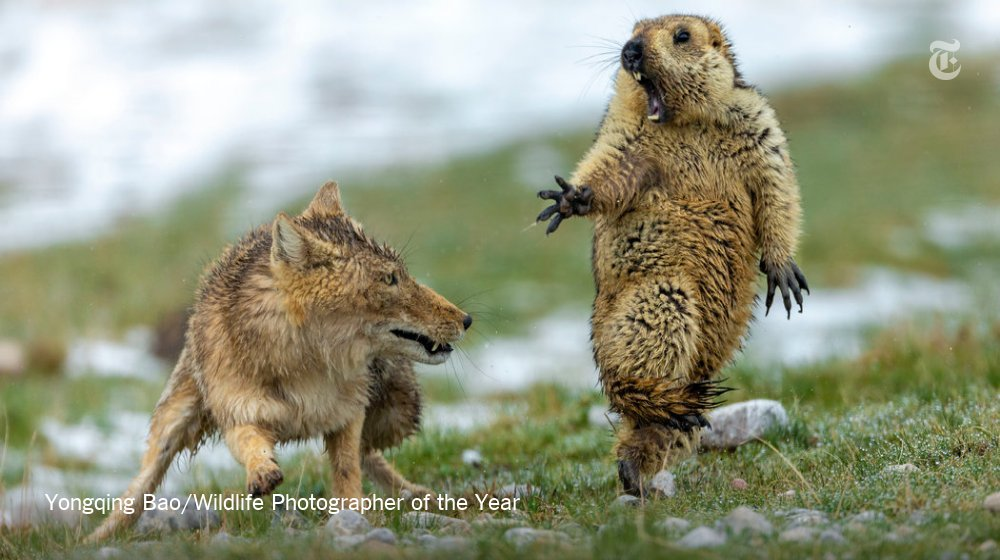
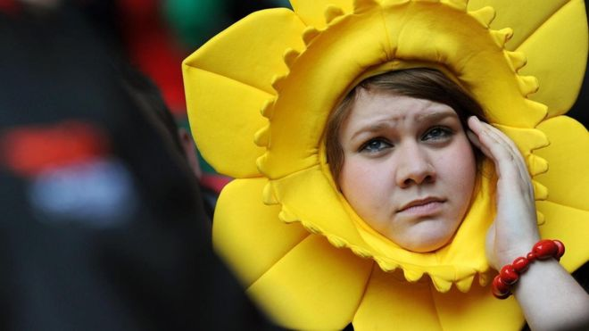
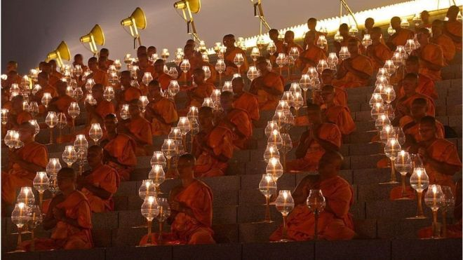
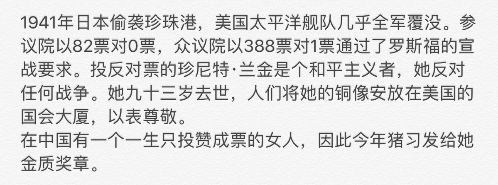

[10月17日 23:44]    新闻大吐槽   @TuCaoFakeNews    太吓人了，这么多癌症吗？ https://twitter.com/tucaofakenews/status/1184852877216321538 …  :speech_balloon:评:1 :+1:赞:2 :globe_with_meridians:转:2  

[10月17日 23:41]    新闻大吐槽   @TuCaoFakeNews    手法和匪共國如出一轍，當初雷洋被警察打死後 給了家屬巨額賠償和房產後 家屬也被要求噤聲了！ https://twitter.com/tucaofakenews/status/1184854137994792960 …  :speech_balloon:评:0 :+1:赞:5 :globe_with_meridians:转:3  

[10月17日 23:37]    新闻大吐槽   @TuCaoFakeNews    失去女兒還不想為女兒伸冤? 一個正常媽媽會這樣嗎?  :speech_balloon:评:0 :+1:赞:2 :globe_with_meridians:转:1  

[10月17日 23:35]    新闻大吐槽   @TuCaoFakeNews    Malaysian workers demand wages owed by Chinese developers. https://twitter.com/TuCaoFakeNews/status/1184841894729256960 …  :speech_balloon:评:1 :+1:赞:5 :globe_with_meridians:转:3  

[10月17日 23:35]    新闻大吐槽   @TuCaoFakeNews    親媽幹不出這事！  :speech_balloon:评:0 :+1:赞:5 :globe_with_meridians:转:1  

[10月17日 23:34]    新闻大吐槽   @TuCaoFakeNews    港共連合的PR工作永遠都做得onon99，愈做愈令人不信任。身邊有些四五十歲的藍色港仔，看了這報導反而心寒了。  :speech_balloon:评:0 :+1:赞:1 :globe_with_meridians:转:1  

[10月17日 23:32]    新闻大吐槽   @TuCaoFakeNews    什么样的社会才会让一个失去女儿的母亲变成这样？  :speech_balloon:评:1 :+1:赞:4 :globe_with_meridians:转:1  

[10月17日 23:30]    新闻大吐槽   @TuCaoFakeNews    真滴 我们一不输出革命 二不输出贫穷 我们只输出豆腐渣工程和讨薪欠薪 https://twitter.com/TuCaoFakeNews/status/1184841894729256960 …  :speech_balloon:评:0 :+1:赞:6 :globe_with_meridians:转:3  

[10月17日 23:30]    新闻大吐槽   @TuCaoFakeNews    失去女儿，不是追讨真相，向媒体求援，反而要求媒体闭嘴，少说话！配合港共维稳

她真的是陈彦霖的妈妈？  :speech_balloon:评:16 :+1:赞:17 :globe_with_meridians:转:14  

[10月17日 23:25]    新闻大吐槽   @TuCaoFakeNews    当听到「中国站起来了！」，有些人激动的流泪，有些人则在肿瘤医院门口的长队里，一边排队一边流泪！

这是一个以摧垮生存环境、透支百姓健康为代价，换来的“强大”国家！  :speech_balloon:评:0 :+1:赞:8 :globe_with_meridians:转:3  

[10月17日 23:19]    新闻大吐槽   @TuCaoFakeNews    终于，实实在在的大国特色文化输出到国外了，嘿嘿，棒棒哒！  :speech_balloon:评:0 :+1:赞:2 :globe_with_meridians:转:1  

[10月17日 23:13]    新闻大吐槽   @TuCaoFakeNews    James现在在美国这边就是双重标注的代言人。  :speech_balloon:评:0 :+1:赞:1 :globe_with_meridians:转:1  

[10月17日 23:12]    新闻大吐槽   @TuCaoFakeNews    人民日报这么搞风险也是很大，万一詹姆斯突然反水，人日怎么下台！何况他本来说的也没什么。  :speech_balloon:评:0 :+1:赞:3 :globe_with_meridians:转:1  

[10月17日 23:07]    新闻大吐槽   @TuCaoFakeNews    凡是装有国产社交APP都有这个可能，微信是100%，一手资料知道原生安卓系统手机，只装微信，在推特反共，被喝茶。  :speech_balloon:评:2 :+1:赞:2 :globe_with_meridians:转:1  

[10月17日 23:06]    新闻大吐槽   @TuCaoFakeNews    This mostly happens when dealing with a proletariat rogue. https://twitter.com/TuCaoFakeNews/status/1184841894729256960 …  :speech_balloon:评:0 :+1:赞:2 :globe_with_meridians:转:3  

[10月17日 23:05]    新闻大吐槽   @TuCaoFakeNews    詹姆斯舔共的腥臭言论在美国引起一片嘘声，人民日报却如获至宝，闻着味儿，就把詹姆斯树成了抨击美国双重标准的典型！
如推友所说：詹姆斯现在已经晋升为“中国人民的老朋友”了！和穆加贝，卡扎菲，卡斯特罗并列！  :speech_balloon:评:5 :+1:赞:23 :globe_with_meridians:转:8  

[10月17日 22:50]    新闻大吐槽   @TuCaoFakeNews    澄清：這兩隻其實是香港一個網上討論平台「連登」（即是這次運動常用的討論區）的icon：連登狗和連登豬，簡稱連狗、連豬。  :speech_balloon:评:1 :+1:赞:3 :globe_with_meridians:转:1  

[10月17日 22:35]    财经真相   @caijingxiang    中国海关通知，最新香港（头盔、雨伞、迷彩服、消毒水）四类敏感产品，如要报关退税，暂时不接！  :speech_balloon:评:9 :+1:赞:69 :globe_with_meridians:转:32  

[10月17日 21:00]    凡賽堤/FORSETI   @FecharCCP    極權殺人恐怖組織已經開始展開對海外的自媒體誘捕計劃！！！
以合作發展，收購，投資為誘餌，實則釣魚，騙取你的個人資料，實行威逼利誘！為他們傳播假信息，假圖片和視頻！ 接下來將會有巨量的假信息，假圖片和視頻出現在網絡！

目的！故意製造黑警被打死，打傷等來掩蓋真相！污衊文明正義的港人！ https://twitter.com/FecharCCP/status/1184815328418783234 …  :speech_balloon:评:0 :+1:赞:4 :globe_with_meridians:转:4  

[10月17日 21:00]    纽约时报中文网   @nytchinese    杜导正：赵紫阳和我的交往：痛定思痛，改弦更张 https://nyti.ms/35AGSzL   :speech_balloon:评:1 :+1:赞:28 :globe_with_meridians:转:8  

[10月17日 20:56]    凡賽堤/FORSETI   @FecharCCP    香港街面的黑警90%都是大陸來的黑警，真正的香港警察的警服，警徽，裝備已經都被上繳！！！

現職警長梁兆祥編號33678，曾獲長期服務奬章，種種跡象，有理由相信日前被年輕人弄傷頸部的「中國籍男子」X並非梁兆祥本人 。  :speech_balloon:评:1 :+1:赞:21 :globe_with_meridians:转:19  

[10月17日 20:55]    新闻大吐槽   @TuCaoFakeNews    美參議員會晤港政界及社運人士 商討第二階段制裁名單及策略  :speech_balloon:评:0 :+1:赞:19 :globe_with_meridians:转:22  

[10月17日 20:46]    凡賽堤/FORSETI   @FecharCCP    極權殺人恐怖組織已經開始展開對海外的自媒體誘捕計劃！！！

以合作發展，收購，投資為誘餌，實則釣魚，騙取你的個人資料，實行威逼利誘！

和極權殺人恐怖組織合作最終的下場就是死無葬身之地！！！ 他們永遠與良知，正義為敵！ https://twitter.com/FecharCCP/status/1184799556246085632 …  :speech_balloon:评:1 :+1:赞:1 :globe_with_meridians:转:2  

[10月17日 20:44]    新闻大吐槽   @TuCaoFakeNews    发蒙面照声援香港 湖北罗少华被拘7天

香港政府实施《禁蒙面法》镇压示威者后，很多大陆民众自发的以拍蒙面照片的方式支持香港民主运动，但继吉林辽源公民王颢达发蒙面照声援香港被中共警方抓捕后，日前又传出湖北宜昌公民罗少华因发布蒙面照被警方拘留7天。  :speech_balloon:评:1 :+1:赞:33 :globe_with_meridians:转:29  

[10月17日 20:31]    新闻大吐槽   @TuCaoFakeNews    港刀刺警颈案疑点多 分析：再现乔装警

早前有香港学生刺伤一名身穿警察制服人士，被控“有意图而伤人罪”，受伤者姓名以英文字母代替。时事评论员潘东凯认为，那名被刺伤的并非香港警察，所以用较轻罪名控告伤人者，以及隐去受伤者姓名，希望低调带过。  :speech_balloon:评:1 :+1:赞:23 :globe_with_meridians:转:21  

[10月17日 20:30]    纽约时报中文网   @nytchinese    尽管特朗普提出了11月中旬在全球领导人峰会上与习近平签署协议的想法，但协议尚未敲定，分析人士称，仍有很多情况可以让这份脆弱的协议崩溃，就像5月所发生的那样。 https://nyti.ms/35JVWuL   :speech_balloon:评:5 :+1:赞:13 :globe_with_meridians:转:4  

[10月17日 20:15]    凡賽堤/FORSETI   @FecharCCP    畫面內容
记者：为何不抗争，就失去一切？
黎智英：失去自由就失去一切。
记者：还有美妙的城市和繁荣。
黎智英：那适合某些“国人”，有躯壳无灵魂，只想赚钱和“好”的生活，不管政治、自由、人权、法治，只要吃，“享受”人生。
记者：为何这些不足够？
黎智英：我们是人，不是狗。  :speech_balloon:评:3 :+1:赞:26 :globe_with_meridians:转:10  

[10月17日 20:14]    财经真相   @caijingxiang    商务部：在回答中美经贸磋商相关问题时，新闻发言人高峰介绍，目前，中美双方正在加紧磋商，争取就协议文本进行落实。高峰强调，中方始终认为，合作是两国最好选择，也是解决问题的唯一正确选择，双方取得阶段性成果，有利于消除不确定性，恢复市场信心，对于稳定全球经济形势具有非常重要的意义。  :speech_balloon:评:7 :+1:赞:40 :globe_with_meridians:转:10  

[10月17日 20:03]    凡賽堤/FORSETI   @FecharCCP    極權殺人恐怖組織正在用各種兇殘手段殺害我們的同胞....................................................................................................

注！ 極權殺人恐怖組織用邪惡手段試圖殺害岑子傑！  :speech_balloon:评:0 :+1:赞:3 :globe_with_meridians:转:1  

[10月17日 20:00]    BBC News 中文   @bbcchinese    【Solomon Yue：香港示威浪潮中的意外网红】一个共和党人成为了香港示威者间的网红，他自己怎么想呢？（结尾有彩蛋） https://bbc.in/2OUhYFp   :speech_balloon:评:10 :+1:赞:38 :globe_with_meridians:转:9  

[10月17日 20:00]    纽约时报中文网   @nytchinese    金正恩从不缺明显摆拍的宣传照，但如今，他加入了“马背上的世界领导人”的行列。
周三，朝鲜官方新闻机构发布了金正恩骑在马上的照片。照片中，骑着白色骏马穿过白雪覆盖的田野，在尘土飞扬的树林间疾驰，朝鲜官方媒体称，金正恩的眼里“充满高贵的光辉”。 https://nyti.ms/2nWNCHc   :speech_balloon:评:36 :+1:赞:38 :globe_with_meridians:转:8  

[10月17日 19:53]    凡賽堤/FORSETI   @FecharCCP    出現的CCTV裡，在電梯，和各個場面的假陳彥霖演員。
扮陳彥霖故意錄製網絡傳播！

目的！串改時間點，混謠試聽，毀滅殺人證據！
 
極權殺人恐怖組織的恐怖只有你想不到，沒有它們做不到的！

要消除我們內心恐懼就要消滅極權！
 
消滅極權，人人有責！！！  :speech_balloon:评:0 :+1:赞:26 :globe_with_meridians:转:23  

[10月17日 19:30]    BBC News 中文   @bbcchinese    “请问这张地图上为什么没有出现中国台湾？”这个问题，涉事迪奥员工的回答“越描越黑”。 https://bbc.in/32nR38L   :speech_balloon:评:37 :+1:赞:42 :globe_with_meridians:转:16  

[10月17日 19:30]    纽约时报中文网   @nytchinese    美国国务院官员表示，此次限制中国外交官的一个目的，是让中国放宽对美国外交官行动的限制。据表示，美国外交官通常需要获得北京中方官员的许可，才能前往各省参加官方会议或访问机构。该官员表示，称美国曾就这些规定向中国政府申诉过，但毫无效果。 https://nyti.ms/2qj4Oax   :speech_balloon:评:12 :+1:赞:87 :globe_with_meridians:转:31  

[10月17日 19:23]    凡賽堤/FORSETI   @FecharCCP    極權殺人恐怖組織把大陸的武警，公安偽裝成香港警察在香港濫殺，濫爆，濫捕！未來將會出現千千萬萬的岑子傑！
香港是不屈之城，正義之城！  :speech_balloon:评:3 :+1:赞:22 :globe_with_meridians:转:7  

[10月17日 19:07]    BBC News 中文   @bbcchinese    中国数以万计的记者将参加一场全国性的在线考试，以测试他们对党的政策及主席习近平的忠诚度。 https://bbc.in/2VNWZp7   :speech_balloon:评:94 :+1:赞:395 :globe_with_meridians:转:195  

[10月17日 19:04]    凡賽堤/FORSETI   @FecharCCP    一個極權流氓政府花納稅人的錢來圈養300萬殭屍死士在網路世界張牙舞爪恐嚇納稅人，威脅全人類！
他們都是活死人，他們的任務就是到處瘋咬！所以建議看到這場面，不必理會，因為他們只是魔鬼圈養的殭屍死士，說白了，就是活死人！！！！！5M  消滅極權，人人有責！  :speech_balloon:评:0 :+1:赞:8 :globe_with_meridians:转:3  

[10月17日 19:00]    纽约时报中文网   @nytchinese    杜导正：“六四”后，中共中央几次派人找紫阳谈话。王任重说，只要你能做出深刻检查，可以保留政治局委员的职务。紫阳拒绝了。第二次，中央几位要人说，只要你表个态，做个检查，可以保留中央委员的职务。紫阳又拒绝了。这样，紫阳就被软禁起来，成了“国家的囚徒”。 https://nyti.ms/35AGSzL   :speech_balloon:评:6 :+1:赞:34 :globe_with_meridians:转:14  

[10月17日 18:11]    BBC News 中文   @bbcchinese    这张在中国祁连山上拍到的照片看起来可能类似“搞笑对白”，但实际是一只狐狸向土拨鼠发动攻击的生死瞬间。中国摄影师鲍永清为了拍摄这张照片，在青藏高原上躲藏盯梢好几个小时，凭此在2019年度野生动物摄影师大赛获胜。 https://bbc.in/2nWhN1a   :speech_balloon:评:11 :+1:赞:157 :globe_with_meridians:转:53  

[10月17日 18:08]    墙国铁拳现世报😷   @Socialistfist     http://t.me/VoiceofPooh   :speech_balloon:评:0 :+1:赞:21 :globe_with_meridians:转:3  

[10月17日 18:06]    墙国铁拳现世报😷   @Socialistfist    本推由好友 维尼之声编辑部投稿
@VoiceofPooh
欢迎关注每日优质键政咨询  :speech_balloon:评:1 :+1:赞:30 :globe_with_meridians:转:0  

[10月17日 18:00]    墙国铁拳现世报😷   @Socialistfist    好玩的铁拳02 申请加你为好友！

#社会主义铁拳  :speech_balloon:评:22 :+1:赞:191 :globe_with_meridians:转:37  

[10月17日 18:00]    纽约时报中文网   @nytchinese    特朗普称，他的关税可以带来谈判资本，促使中国、墨西哥、日本和其他国家做出贸易让步。但这些收获是有代价的。特朗普的关税提高了企业的价格，切断了全球供应链，给企业带来了严重的不确定性。这种痛苦已经蔓延到美国和中国以外，加剧了全球经济的放缓，特别是在欧洲。 https://nyti.ms/35JVWuL   :speech_balloon:评:13 :+1:赞:50 :globe_with_meridians:转:11  

[10月17日 17:53]    BBC News 中文   @bbcchinese    欧盟峰会在即，英国首相约翰逊表示，英国与欧盟就脱欧协议达成一致。
 https://bbc.in/2VOq8At   :speech_balloon:评:16 :+1:赞:34 :globe_with_meridians:转:15  

[10月17日 17:30]    纽约时报中文网   @nytchinese    南太平洋地区自然资源丰富，中国在该地区的投资已经引发美国和澳大利亚的担忧，这两个国家担心这些项目可能会给北京提供一个机会，为从舰队、飞机，到中国自己的全球定位系统等提供军事立足点。如今，中国企业获得所罗门群岛的图拉吉岛独家开发权的消息，进一步引发外界担忧。 https://nyti.ms/2MlpNC1   :speech_balloon:评:23 :+1:赞:20 :globe_with_meridians:转:11  

[10月17日 17:23]    墙国铁拳现世报😷   @Socialistfist    后续 和 总结
1.大仙女在国内算是中产，满足现状
2  关心社会问题（云南，邻居强拆,李心草）
3. 强拆的是菜市场摊位且是邻居。 评论群里洗地说是违章建筑可以看看截图  :speech_balloon:评:21 :+1:赞:27 :globe_with_meridians:转:4  

[10月17日 17:01]    老司机   @h5lpykl7tp6jjop    你想了解早期的中共，就去参加传销组织，人人被灌入远大理想的目标，艰苦朴素被囚禁的生活，神秘单线联系的上级领导。中期的中共就象朝鲜，半饥半饱却斗志昂扬要解放全人类！最近的中共就象大清末年，一边搞洋务运动一边坚持中国特色一边抓乱党！  :speech_balloon:评:2 :+1:赞:113 :globe_with_meridians:转:39  

[10月17日 17:01]    BBC News 中文   @bbcchinese    美国国务院高级官员表示，中国外交官参加会议不需获得批准，只需要提前通知美国国务院。而在美国的中国外交官需要获得中方批准，并且经常被拒绝。 https://bbc.in/2MmayZF   :speech_balloon:评:31 :+1:赞:133 :globe_with_meridians:转:34  

[10月17日 17:00]    纽约时报中文网   @nytchinese    “六四”以后，赵紫阳遭到软禁，杜导正敦促他口述历史、留给后人。在杜导正看来，他们那辈人，经历得太多，教训也太多了。而纪念赵紫阳，也是纪念他们经历过的那段历史。 https://nyti.ms/35AGSzL   :speech_balloon:评:1 :+1:赞:26 :globe_with_meridians:转:9  

[10月17日 16:00]    BBC News 中文   @bbcchinese    鲍彤曾对BBC中文记者说，民间自发纪念赵紫阳的活动，不应被视为非法行为。 https://bbc.in/2BkNDYx   :speech_balloon:评:17 :+1:赞:45 :globe_with_meridians:转:10  

[10月17日 16:00]    纽约时报中文网   @nytchinese    当中国一个企业将所罗门群岛的图拉吉岛租下的消息传开后，愤怒情绪很快在这个人口1000出头的岛上爆发了。“大家真的很害怕中国有可能把这个岛变成一个军事基地，”一名当地人说。“这才是人们真正害怕的事情——不然他们为什么要把整座岛都租下来呢？” https://nyti.ms/2MlpNC1   :speech_balloon:评:125 :+1:赞:245 :globe_with_meridians:转:129  

[10月17日 15:30]    纽约时报中文网   @nytchinese    尽管中美两国的贸易休战可能暂时缓和了世界上最大的两个经济体之间的紧张关系。但特朗普的贸易政策造成的损害，将继续给全球经济带来压力。 https://nyti.ms/35JVWuL   :speech_balloon:评:15 :+1:赞:24 :globe_with_meridians:转:6  

[10月17日 15:25]    纽约时报中文网   @nytchinese    杜导正：”我们这辈人，经历得太多了，教训也太多了。最大的教训是，什么时候也不能丢掉独立思考，要坚持实事求是。纪念他，也是纪念我们经历过的那段历史。” 赵紫阳百年诞辰，他的老友们在诺大的国找不到一个地方发纪念他的文章，他的传记要在台湾出版…… https://cn.nytimes.com/opinion/20191017/zhao-ziyang-anniversary-daozheng-du/ …  :speech_balloon:评:7 :+1:赞:105 :globe_with_meridians:转:33  

[10月17日 15:00]    BBC News 中文   @bbcchinese    今日是中共前总书记赵紫阳100岁冥寿。他曾承诺“民主治港”，然而他无法目睹香港今天的局面。 https://bbc.in/31nGwcq   :speech_balloon:评:40 :+1:赞:121 :globe_with_meridians:转:33  

[10月17日 15:00]    纽约时报中文网   @nytchinese    在赵紫阳百年诞辰之际，他的老部下、老朋友、《炎黄春秋》前社长杜导正于时报发表中文观点文章。
本文口述而成，杜导正回忆了与赵紫阳的交往，尤其是八十年代经历的风雨，包括创办新闻出版署时赵紫阳的被动与消极，以及在邓力群和胡乔木发动的“清除精神污染”运动上两人的分歧。 https://nyti.ms/35AGSzL   :speech_balloon:评:13 :+1:赞:147 :globe_with_meridians:转:57  

[10月17日 14:11]    纽约时报中文网   @nytchinese    #图集 【野生动物摄影大奖：土拨鼠的“生死时刻”】2019年度野生动物摄影大赛结果揭晓。中国摄影师鲍永清因拍下藏狐袭击土拨鼠的作品《瞬间》获得年度大奖；14岁的新西兰摄影师Cruz Erdmann因拍摄莱氏拟乌贼的作品《夜光》获得年度青年野生动物摄影师奖。 https://nyti.ms/2MTS8yK   :speech_balloon:评:2 :+1:赞:73 :globe_with_meridians:转:25  

[10月17日 14:00]    BBC News 中文   @bbcchinese    今日是中共前总书记赵紫阳100岁冥寿。 https://bbc.in/2OPQmBf   :speech_balloon:评:70 :+1:赞:656 :globe_with_meridians:转:216  

[10月17日 13:33]    财经真相   @caijingxiang    针对10月16日DIOR迪奥人事部员工在校园宣讲会的PPT中播放错误地图事件，DIOR今天（17日）凌晨2时许在官方微博发布声明称，公司深表歉意，这是一个不代表公司立场的员工个人失当行为，已着手认真调查，并承诺予以严肃处理。声明还称，DIOR始终尊重并维护一个中国的原则，严格维护中国的主权及领土完整  :speech_balloon:评:11 :+1:赞:77 :globe_with_meridians:转:36  

[10月17日 13:30]    纽约时报中文网   @nytchinese    美国国务院周三称，美国已开始要求中国外交官在计划与地方或州官员，以及教育和研究机构举行任何会晤之前，都要事先通知美国国务院。国务院一名高级官员表示，此举是对中国政府对美国驻华外交官规定的回应。 https://nyti.ms/2qj4Oax   :speech_balloon:评:37 :+1:赞:354 :globe_with_meridians:转:114  

[10月17日 13:00]    BBC News 中文   @bbcchinese    主角忍不住说了一句：“You don't listen, do you?”（你没有听我说，是不是？）。有香港抗议者认为这也是他们想对政府说的。 https://bbc.in/2VMVkA9   :speech_balloon:评:137 :+1:赞:431 :globe_with_meridians:转:131  

[10月17日 13:00]    纽约时报中文网   @nytchinese    今日食谱：熏火腿黄油意面，15分钟完成餐馆级美味。
更多简报内容： https://nyti.ms/2Bg3Iyr   :speech_balloon:评:0 :+1:赞:9 :globe_with_meridians:转:3  

[10月17日 12:30]    纽约时报中文网   @nytchinese    图拉吉岛曾是英国和日本前后主宰太平洋地区时的战略总部。二战前，它一度是所罗门群岛的首府。现在，它就要落入中国人手中了。
根据时报获得的一项秘密协议，中国森田集团已经获得整座岛屿及周边地区的独家开发权。这份长达75年的可续租约震惊了当地居民，美国官员也感到担忧。 https://nyti.ms/2MlpNC1   :speech_balloon:评:68 :+1:赞:129 :globe_with_meridians:转:70  

[10月17日 12:00]    纽约时报中文网   @nytchinese    金正恩骑白马登白头山：朝中社周三发布了一组金正恩骑马驰骋在白头山上的宣传照片。此前，金正恩曾在做出重大决定之前拜访过这座金氏王朝的“圣山”，这引发了人们的猜测，这组照片可能预示着朝鲜对美国政策的转变。更多简报内容： https://nyti.ms/2Bg3Iyr   :speech_balloon:评:2 :+1:赞:9 :globe_with_meridians:转:1  

[10月17日 11:27]    财经真相   @caijingxiang    学习小组就是放风的，下周是大概率！ https://twitter.com/caolei1/status/1184670260869267458 …  :speech_balloon:评:18 :+1:赞:77 :globe_with_meridians:转:13  

[10月17日 11:23]    财经真相   @caijingxiang    我想赚RMB！
很好，跪下！ https://twitter.com/cusonlo/status/1184468378724925441 …  :speech_balloon:评:16 :+1:赞:640 :globe_with_meridians:转:216  

[10月17日 11:09]    凡賽堤/FORSETI   @FecharCCP    同意回复！一個政府花納稅人的錢來圈養300萬殭屍死士在網路世界張牙舞爪恐嚇納稅人，威脅全人類！確實了不起！
他們都是活死人，他們的任務就是到處瘋咬！所以建議看到這場面，不必理會，因為他們只是魔鬼圈養的殭屍死士，說白了，就是活死人！！！！！5M  :speech_balloon:评:1 :+1:赞:6 :globe_with_meridians:转:1  

[10月17日 11:00]    BBC News 中文   @bbcchinese    “越来越多人知道，行政长官一个比一个差，原因是行政长官都是北京选定的，不对香港人民负责。”美国圣母大学政治学系助理教授许田波说。 https://bbc.in/2BeInWm   :speech_balloon:评:249 :+1:赞:642 :globe_with_meridians:转:228  

[10月17日 11:00]    纽约时报中文网   @nytchinese    中国对美国众议院通过《香港人权与民主法案》发出谴责，称该法案充分暴露了美方一些人“破坏香港繁荣稳定的险恶用心”。同一天晚间，香港民间人权阵线召集人岑子杰在旺角被人用锤子袭击。目前尚不清楚背后主使者是谁。
更多简报内容： https://nyti.ms/2Bg3Iyr   :speech_balloon:评:5 :+1:赞:7 :globe_with_meridians:转:4  

[10月17日 10:48]    老司机   @h5lpykl7tp6jjop      :speech_balloon:评:0 :+1:赞:2 :globe_with_meridians:转:0  

[10月17日 10:15]    纽约时报中文网   @nytchinese    对林郑月娥来说，周三的年度施政报告发表原本是个提出愿景、带领香港走出困境的机会。但当民主派议员拿出修改过的显示她双手沾满鲜血的照片、在会场对其大声斥责时，现场演变成了一场政治斗争。林郑被迫两度离场，最后只得通过视频发表报告。更多简报内容： https://nyti.ms/2Bg3Iyr   :speech_balloon:评:3 :+1:赞:11 :globe_with_meridians:转:4  

[10月17日 10:00]    BBC News 中文   @bbcchinese    原来，美国早就“深挖洞、广积粮”了。 https://bbc.in/2qdl390   :speech_balloon:评:18 :+1:赞:58 :globe_with_meridians:转:22  

[10月17日 09:28]    纽约时报中文网   @nytchinese    早安！今日重点新闻包括：
林郑月娥发表施政报告受阻挠；旧友回忆赵紫阳；中国谴责美国众议院通过《香港人权与民主法案》；香港民阵召集人岑子杰被人袭击；华为销售增长复苏；朝中社发布金正恩骑马照片……NYT简报带你速览今日要闻。 https://nyti.ms/2Bg3Iyr   :speech_balloon:评:15 :+1:赞:32 :globe_with_meridians:转:6  

[10月17日 09:05]    老司机   @h5lpykl7tp6jjop    来，晒晒工资吧！
到底人家把自己的工资晒出来了，
你们呢？敢拿出来晒的是什么？  :speech_balloon:评:8 :+1:赞:19 :globe_with_meridians:转:14  

[10月17日 09:05]    BBC News 中文   @bbcchinese    《新华社》早前发文，指香港最突出的问题是住屋；林郑月娥在报告中花大量篇幅讲解政府相关政策。 https://bbc.in/2oNxsAf   :speech_balloon:评:37 :+1:赞:26 :globe_with_meridians:转:7  

[10月17日 07:02]    BBC News 中文   @bbcchinese    新移民到了一个陌生新国家， 人生地不熟，语言不通，无疑给生活带来不便。也许，语言能难倒大人，但对孩子来说却是小事一桩，因此许多孩子自然成了新移民家庭里的小翻译。 https://bbc.in/2IXclCB   :speech_balloon:评:9 :+1:赞:124 :globe_with_meridians:转:33  

[10月17日 06:39]    BBC News 中文   @bbcchinese    过去金正恩上白头山后，确实采取了一些影响整个国家甚至东北亚地区重大行动。但这次会发生什么？ https://bbc.in/35BzmEB   :speech_balloon:评:26 :+1:赞:39 :globe_with_meridians:转:15  

[10月17日 05:09]    老司机   @h5lpykl7tp6jjop    丧失主权不一定是恶果，清朝海关自从聘请洋人赫德管理后成为唯一清廉的政府部门，而获得主权南非从非洲钻石变成石头！  :speech_balloon:评:3 :+1:赞:44 :globe_with_meridians:转:14  

[10月17日 04:55]    老司机   @h5lpykl7tp6jjop    香港建制派，從屬中聯辦而不是香港人，無民意，一半人零票當選立法會議員，卻能把持香港立法會，整天黑白顛倒，完全服從中聯辦，在香港天怨人怒。這種虛假民主、一國兩制的獨裁造就今天的光復香港時代革命運動。泛民議員陳淑莊在立法會揭穿建制派的醜惡面目，建制派逃出議會廳  :speech_balloon:评:19 :+1:赞:688 :globe_with_meridians:转:325  

[10月17日 03:14]    BBC News 中文   @bbcchinese    事发于香港时间晚7时许。流传在社交媒体上的照片显示，岑子杰在遇铁槌袭击后上半身染满血迹，伤势严重。 https://bbc.in/2VOTVsB   :speech_balloon:评:108 :+1:赞:113 :globe_with_meridians:转:71  

[10月17日 00:19]    老司机   @h5lpykl7tp6jjop    把饮水倒掉看着是小事，但说明这些黑警是仇恨抗议，仇恨抗议者，甚至仇恨市民和记者的。他们与警察维持秩序的职能毫不相干，他们是时刻想着破坏与抗议者相关的人和事的。 https://twitter.com/GtW4e/status/1184369269070393344 …  :speech_balloon:评:4 :+1:赞:116 :globe_with_meridians:转:69  

[10月17日 00:03]    墙国铁拳现世报😷   @Socialistfist    推友提供的与当事人私信  :speech_balloon:评:22 :+1:赞:138 :globe_with_meridians:转:19  

[10月16日 23:14]    老司机   @h5lpykl7tp6jjop    不知哪里冒出来的一群衣冠不整其貌不扬的土匪兵：共匪占领军里的杂牌军，土鳖警长。大家看看，他们象不象穿上港警服的城管。  :speech_balloon:评:21 :+1:赞:179 :globe_with_meridians:转:131  

[10月16日 22:59]    BBC News 中文   @bbcchinese    飞速发展的社交媒体在心理学家间引发了激烈争论：今天的年轻人究竟是更倾向于以自我为中心，还是更关注集体？
 https://bbc.in/33BSiS2   :speech_balloon:评:7 :+1:赞:22 :globe_with_meridians:转:15  

[10月16日 22:30]    BBC News 中文   @bbcchinese    BBC推出2019年全球最有影响力的巾帼百名女性。今年的巾帼百名提出的一个问题是：如果世界由女性来主管，未来将会是怎样的？我们为你介绍上榜的3位华人女性：
 https://bbc.in/2OSFa6X   :speech_balloon:评:8 :+1:赞:22 :globe_with_meridians:转:6  

[10月16日 22:05]    财经真相   @caijingxiang    香港的秘密，中共两股力量在香港！  :speech_balloon:评:52 :+1:赞:599 :globe_with_meridians:转:318  

[10月16日 21:59]    BBC News 中文   @bbcchinese    “佛系青年”成为中国年青人最新的标签，你了解什么是“佛系青年”吗？
 https://bbc.in/2BiYEcW   :speech_balloon:评:44 :+1:赞:35 :globe_with_meridians:转:10  

[10月16日 21:30]    BBC News 中文   @bbcchinese    世俗诱惑无所不在，僧袍足以与纱帽媲美。花和尚、坏和尚、假和尚干过哪些坏事？ 迷迷糊糊地去信佛行吗？
 https://bbc.in/33vj7qO   :speech_balloon:评:12 :+1:赞:11 :globe_with_meridians:转:8  

[10月16日 21:26]    老司机   @h5lpykl7tp6jjop    中國共產黨  :speech_balloon:评:247 :+1:赞:845 :globe_with_meridians:转:788  

[10月16日 21:19]    老司机   @h5lpykl7tp6jjop    警察竟踩到犯罪现场的血迹！太不专业，看来警察把精力都用在研究如何犯罪上了，业务能力肯定就荒废了！

血迹是民间人权阵线召集人岑子杰留下的，在晚七点左右，他在这里被一群人殴打！

殴打岑子杰的人必然是亲共者，或直接受中共指使的人，警察肯定不敢查  :speech_balloon:评:31 :+1:赞:488 :globe_with_meridians:转:241  

[10月16日 20:37]    老司机   @h5lpykl7tp6jjop    You FUCKING moron. 
Are you fucking kidding us @hkpoliceforce ??? Is that your professionally trained officers ???  :speech_balloon:评:287 :+1:赞:2780 :globe_with_meridians:转:2321  

[10月16日 20:20]    老司机   @h5lpykl7tp6jjop    民间人权阵线召集人岑子杰10月16日晚在九龙旺角遇袭，伤势严重被送医。行凶者是4名蒙面人。此前，岑子杰曾与友人在旺角吃午饭遇袭，友人为保护他受伤。  :speech_balloon:评:168 :+1:赞:1055 :globe_with_meridians:转:588  

[10月16日 18:30]    凡賽堤/FORSETI   @FecharCCP    極權殺人恐怖組織正在用各種兇殘手段殺害我們的同胞..........

拯救港人，拯救華族，勢在必行！！！！！！！！

極權不滅全人類人人遭殃！！！ https://twitter.com/FecharCCP/status/1183188604132188161 …  :speech_balloon:评:0 :+1:赞:18 :globe_with_meridians:转:12  

[10月16日 18:25]    凡賽堤/FORSETI   @FecharCCP    何韻詩！黎智英！香港人的英雄，華人的驕傲！華人良知與正義的代表！幾個月來永不放棄，傳播香港事實真相，全世界遊說！有力促進美國國會全面通過（香港人權與民主法案）貢獻人物名單之一！
支持香港蘋果日報，壹新聞，大紀元！  :speech_balloon:评:47 :+1:赞:485 :globe_with_meridians:转:169  

[10月16日 18:16]    墙国铁拳现世报😷   @Socialistfist    你们这些护旗手动机不纯，小编很愤慨  :speech_balloon:评:35 :+1:赞:576 :globe_with_meridians:转:84  

[10月16日 17:56]    老司机   @h5lpykl7tp6jjop    女子穿霖霖件衫褲，扮她在校內赤腳走，因為穿不了對鞋！霖霖在校內10樓遇害!  :speech_balloon:评:28 :+1:赞:436 :globe_with_meridians:转:295  

[10月16日 17:44]    墙国铁拳现世报😷   @Socialistfist    你们以为 #社会主义铁拳  只是一个比喻？  :speech_balloon:评:202 :+1:赞:963 :globe_with_meridians:转:341  

[10月16日 16:59]    老司机   @h5lpykl7tp6jjop    有人说，你把中国从古至今说得一团漆黑，中国没有一个好的年代一个好的地区吗？我说有啊，民国时期的租界！经济繁荣，交通便利，秩序良好，有能力都往那里去，又不要签证，连共产党开会都去那里。
可是那里不是中国人在管理！
和中国人讨论问题麻烦就在这儿，一个问题总会变成另外一个问题！  :speech_balloon:评:11 :+1:赞:294 :globe_with_meridians:转:69  

[10月16日 16:26]    老司机   @h5lpykl7tp6jjop    【陳彥霖】
可能這個白箱裝的就是彥霖妹妹

以下是推測：
「16最後一面」
「16/17被抓」
「17將軍澳狗屋女子慘叫」
「17/18白箱棄屍」
「19偽造陳彥霖在世證據」（內附影片）

疑雲重重！
個人認為：只陳彥霖一案，就足以需要成立獨立調查委員會。  :speech_balloon:评:23 :+1:赞:473 :globe_with_meridians:转:379  

[10月16日 16:25]    老司机   @h5lpykl7tp6jjop    中美爱国方式的不同，结果居然一样！  :speech_balloon:评:3 :+1:赞:38 :globe_with_meridians:转:9  

[10月16日 14:09]    老司机   @h5lpykl7tp6jjop    【关注香港】中国时间2019年10月16日香港观塘翠屏南午夜大约12点45分，附近有人拍到更完整片段，他们抬着空床上去，然后又装着物品下来并且是五个人才能抬起来，是什么东西那么沉需要五个人？他们抬出来的是什么？关注！  :speech_balloon:评:22 :+1:赞:174 :globe_with_meridians:转:117  

[10月16日 13:42]    老司机   @h5lpykl7tp6jjop    10.16日林郑月娥两次作施政报告被赶下去，最终没有做成报告，最后新闻发布是正义的香港议员，感动！  :speech_balloon:评:10 :+1:赞:181 :globe_with_meridians:转:90  

[10月16日 10:09]    财经真相   @caijingxiang    根据克尔瑞的报告，9月份95家典型房企的融资总额为1124.48亿，环比上升45.3%，同比上升17.2%。融资成本也再上台阶，今年前三季度，房企债券类融资成本6.88%，较2018年全年上升了0.67个百分点。截至10月8日，年内房企美元融资533.6亿美元，同比上涨50%。虽然各种政策收紧，但房企美元融资仍刷新历史纪录  :speech_balloon:评:12 :+1:赞:112 :globe_with_meridians:转:29  

[10月16日 09:55]    财经真相   @caijingxiang    受到放开外资保险和银行条例消息的刺激，今天中国保险和银行板块大涨，这是一个很有意思的现象，正常情况下放开外资进来，这会对国内的这些企业构成竞争压力，但是今天他们的股票却大涨，这里面的逻辑是什么？  :speech_balloon:评:119 :+1:赞:276 :globe_with_meridians:转:83  

[10月16日 09:47]    财经真相   @caijingxiang    中国外交部：我们对美国国会众议院执意通过所谓“香港人权与民主法案”表示强烈愤慨和坚决反对。香港是中国的香港，香港事务纯属中国内政，不容任何外部势力干预。我们奉劝美方认清形势，悬崖勒马，立即停止推动审议有关涉港法案，立即停止插手香港事务、干涉中国内政。  :speech_balloon:评:96 :+1:赞:294 :globe_with_meridians:转:124  

[10月16日 09:38]    财经真相   @caijingxiang    受中国扬言报复美国通过的《香港人权法案》消息刺激，a股开盘后，离岸人民币扩大跌幅，跌破7.1关口！  :speech_balloon:评:21 :+1:赞:381 :globe_with_meridians:转:85  

[10月16日 00:18]    墙国铁拳现世报😷   @Socialistfist    万fo新头像  :speech_balloon:评:29 :+1:赞:271 :globe_with_meridians:转:12  

[10月15日 23:03]    墙国铁拳现世报😷   @Socialistfist    新浪微博先关了评论区，后删除了该条微博。
本报不赞成任何形式网络暴力，也希望不要用你们的热情去唤醒楚门的世界。请大家让他做一个普通中国人  :speech_balloon:评:34 :+1:赞:242 :globe_with_meridians:转:40  

[10月15日 22:31]    凡賽堤/FORSETI   @FecharCCP    我們都是陳彥琳。一個15歲的小妹妹。極權卻對她如此殘忍。
願妳早日沉冤得雪
We are all Chan Yin Lam, a aged 15 kid in HK, who was slaughtered by the tyranny.  :speech_balloon:评:5 :+1:赞:163 :globe_with_meridians:转:114  

[10月15日 19:55]    老司机   @h5lpykl7tp6jjop    报告猪席有人图谋篡位，小小校领导也有皇帝瘾，竟然让学生跪下喊万岁……  :speech_balloon:评:22 :+1:赞:139 :globe_with_meridians:转:79  

[10月15日 19:34]    墙国铁拳现世报😷   @Socialistfist    补充  :speech_balloon:评:11 :+1:赞:152 :globe_with_meridians:转:28  

[10月15日 19:32]    墙国铁拳现世报😷   @Socialistfist    大仙女：请出动我们的部队
当地拆迁办： 好的

#社会主义铁拳  :speech_balloon:评:134 :+1:赞:1134 :globe_with_meridians:转:329  

[10月15日 19:17]    财经真相   @caijingxiang    也就是即使川普连任，也等不到中国邮费上涨的时刻？对吗？ https://twitter.com/voacantonese/status/1184064898478665730 …  :speech_balloon:评:9 :+1:赞:88 :globe_with_meridians:转:20  

[10月15日 19:14]    财经真相   @caijingxiang    美国的人权法案为啥这么慢？ https://twitter.com/hongkon84458416/status/1183900371602825218 …  :speech_balloon:评:21 :+1:赞:110 :globe_with_meridians:转:27  

[10月15日 16:53]    墙国铁拳现世报😷   @Socialistfist    我去，微博上有多少潜伏的推友  :speech_balloon:评:18 :+1:赞:160 :globe_with_meridians:转:17  

[10月15日 15:29]    老司机   @h5lpykl7tp6jjop    每个关注香港事态的人应该好好看这个视频。解释了为什么现在有很多香港人被暗杀、抛尸，被自杀。  :speech_balloon:评:39 :+1:赞:384 :globe_with_meridians:转:297  

[10月15日 15:15]    财经真相   @caijingxiang    加入WTO时的承诺今天在贸易战和华尔街敲诈下，今天终于开始有点放松了，但是中国老百姓想把钱存进外资银行依然存在门槛，每笔最低不少于50万人民币的定期存钱，至于外汇要继续控制！  :speech_balloon:评:36 :+1:赞:301 :globe_with_meridians:转:72  

[10月15日 15:08]    财经真相   @caijingxiang    重磅！国务院关于修改〈中华人民共和国外资保险公司管理条例〉和〈中华人民共和国外资银行管理条例〉的决定，外国银行可以在中华人民共和国境内同时设立外商独资银行和外国银行分行，或者同时设立中外合资银行和外国银行分行。外国银行分行可以吸收中国境内公民每笔不少于50万元人民币的定期存款。  :speech_balloon:评:93 :+1:赞:441 :globe_with_meridians:转:223  

[10月15日 13:43]    老司机   @h5lpykl7tp6jjop    二百万人上街反抗被说成暴徒，他们暴在哪里？打死警察啦？打残警察啦？而警方做了什么呢！一天发射催泪弹1400发，使用布袋弹、橡皮子弹、空爆催泪弹，共匪占领军铁膝疯狂滥捕示威者，重手暴打不死即伤，派大量黑警假扮示威者，纵火打人，专门捕抓少女，他们才是暴徒。

香港人民有自己认同，绝不屈服。  :speech_balloon:评:62 :+1:赞:1065 :globe_with_meridians:转:515  

[10月15日 09:50]    财经真相   @caijingxiang    美港电讯15日讯，花旗集团目前正计划在中国建立一家全资证券子公司。知情人士表示，这家银行可能会专注于经纪和期货交易，同时扩大其在中国的托管服务。摩根大通（JPM.N）和高盛（GS.N）也在寻求在中国建立证券公司。 美国农民能不能卖出大豆给中共重要吗？不重要！只要华尔街的利益得到维护就行！  :speech_balloon:评:26 :+1:赞:419 :globe_with_meridians:转:128  

[10月15日 09:45]    财经真相   @caijingxiang    国家统计局：从环比看，CPI上涨0.9%，食品中，猪肉供应偏紧，价格继续上涨19.7%，涨幅比上月回落3.4个百分点，影响CPI上涨约0.65个百分点。  :speech_balloon:评:3 :+1:赞:62 :globe_with_meridians:转:14  

[10月15日 09:43]    财经真相   @caijingxiang    2019年9月份居民消费价格同比上涨3.0%,工业生产者出厂价格同比下降1.2%,物价涨工业生产下降，这就是典型的“滞胀”！  :speech_balloon:评:9 :+1:赞:253 :globe_with_meridians:转:76  

[10月15日 08:49]    凡賽堤/FORSETI   @FecharCCP    希望陳彥霖家屬決不能放棄，任何金錢都無法和一個活生生的生命兌換！拿起法律武器！極權殺人恐怖組織殺害太多香港人，他們正在製造任何被害的正常死亡假象和消滅所有證據！極權殺人恐怖組織的恐怖只有人想不到的，沒有他們做不到！！！！！！！！  :speech_balloon:评:0 :+1:赞:1 :globe_with_meridians:转:0  

[10月15日 08:44]    凡賽堤/FORSETI   @FecharCCP    這是15歲游泳健將陳彥霖小女孩被殺害前出來逛街的自拍視頻！她還在自我解嘲穿成這樣不可能被定為暴徒！
拍攝時間未能確定，這是被抓捕前還是抓捕後？
她被抓捕過，抓捕時間？如果被釋放一定有本人和家長簽名的依據，所以這視頻的時間很重要，如果是抓捕前的，那是極權殺人恐怖組織故意放出來掩蓋罪行  :speech_balloon:评:1 :+1:赞:19 :globe_with_meridians:转:12  

[10月15日 02:46]    凡賽堤/FORSETI   @FecharCCP    正義小螞蟻！傳播英文，西文，法文，德文，日文，著重描述，殘暴行為和手段，來自大陸的黑警，被施暴對象為學生，小孩，女孩 ，老人   傳播真相目的，激發西方人的憤怒！  :speech_balloon:评:1 :+1:赞:5 :globe_with_meridians:转:8  

[10月15日 02:14]    凡賽堤/FORSETI   @FecharCCP    6.9以來我就呼籲香港人要把每一個在香港街上的任何穿著警服的人臉全部清除的影片下來，不知道有沒有傳到在香港的正義人士，如果有，那些照片將是舉證黑警違法入境香港執法的鐵證，他們不知道殺害了多少香港同胞！  :speech_balloon:评:0 :+1:赞:8 :globe_with_meridians:转:6  

[10月15日 02:01]    凡賽堤/FORSETI   @FecharCCP    緊急提醒！

未來將有極權恐怖組織偽裝成各種各樣的所謂正義人士要求高價購買自6.9以來香港黑警殺人等犯罪證據，呼籲要提高一千萬的警惕和小心，別把自己的命給賣力！極權殺人恐怖組織從來不會讓有證據的人活在這個世界上！！！ https://twitter.com/FecharCCP/status/1183188604132188161 …  :speech_balloon:评:3 :+1:赞:46 :globe_with_meridians:转:43  

[10月15日 01:48]    凡賽堤/FORSETI   @FecharCCP    良知與正義沒有國界，沒有人種之分！！！

讓我們把極權殺人恐怖組織所犯下的種種反人類罪行的真相傳播給全人類知道！
用最殘暴最血腥最沒人性的那些畫面和視頻真相來喚醒人類的良知與公義和同情吧！ https://twitter.com/FecharCCP/status/1183193159087640576 …  :speech_balloon:评:2 :+1:赞:14 :globe_with_meridians:转:6  

[10月15日 01:43]    凡賽堤/FORSETI   @FecharCCP    極權恐怖組織正在屠殺我們的同胞....

拯救港人，拯救華族，勢在必行！！！

擁有良知與正義小螞蟻們！良知與正義沒有國界，沒有人種之分！！！讓我們把極權殺人恐怖組織所犯下的種種反人類罪行的真相傳播給全人類知道！用最殘暴最血腥最沒人性的那些畫面和視頻真相來喚醒人類的良知與公義和同情吧！  :speech_balloon:评:4 :+1:赞:132 :globe_with_meridians:转:118  

[10月15日 01:24]    凡賽堤/FORSETI   @FecharCCP    美國西方國家用70年為大陸人開啟民智，結果反被吞噬！某些海外華人聲稱是為大陸人開啟民智！ 把自己封為比上帝還高的聖人，卻把眼睛盯著榮耀！但是卻不明白，千千萬萬正義的小螞蟻才是真正為大陸人開啟民智先鋒！
因為他們把極權殺人恐怖組織在香港犯下的種種罪行的真相向全世界和大陸傳播！良知無國界  :speech_balloon:评:3 :+1:赞:15 :globe_with_meridians:转:5  

[10月15日 00:01]    墙国铁拳现世报😷   @Socialistfist    通知 经推友集思广益，现已删除 “种花家的爱国红小将” 的转推。  :speech_balloon:评:2 :+1:赞:60 :globe_with_meridians:转:2  

[10月14日 20:44]    墙国铁拳现世报😷   @Socialistfist    图片源通过谷歌识图可以知道这个微博内容是伪造的。其中有“保安”的图片事件至少发生在2018年6月以前。虽然是另外一个铁拳现世报的故事，但是没有必要为了黑而抹黑。正确的姿势至少应该是摆事实才能讲道理。另外个人非常厌恶抵制这个伪造微博的人的做法。新闻源 https://www.bannedbook.org/bnews/zh-tw/weiquan/qunti/20180610/955337.html …  :speech_balloon:评:0 :+1:赞:72 :globe_with_meridians:转:8  

[10月14日 19:55]    墙国铁拳现世报😷   @Socialistfist    欢迎举证  :speech_balloon:评:5 :+1:赞:30 :globe_with_meridians:转:1  

[10月14日 19:28]    墙国铁拳现世报😷   @Socialistfist    推上流传的这张截图，很多推油都给我发了，微博上查不到这个号。
鉴于之前流传的反串P图号也查不到微博，大家智者见智

#社会主义铁拳？  :speech_balloon:评:30 :+1:赞:205 :globe_with_meridians:转:44  

[10月14日 18:47]    墙国铁拳现世报😷   @Socialistfist    不好这个护旗手要反

#社会主义铁拳  :speech_balloon:评:249 :+1:赞:1969 :globe_with_meridians:转:667  

[10月14日 17:27]    财经真相   @caijingxiang    呵呵，这才刚过一天就要变卦了？消息一经公布，离岸人民币、a50急搓，黄金短线冲高！ https://twitter.com/zerohedge/status/1183674272402890752 …  :speech_balloon:评:59 :+1:赞:598 :globe_with_meridians:转:173  

[10月14日 14:27]    财经真相   @caijingxiang    尤其是高盛赚的手抽筋，当时中方对接人就是王73，其他几家银行也是！这才是真正的卖国贼，从未见过一个国内外专家提出过质疑！ https://twitter.com/ccp5464/status/1183282408415584258 …  :speech_balloon:评:14 :+1:赞:273 :globe_with_meridians:转:104  

[10月14日 10:57]    财经真相   @caijingxiang    又是银行券商、茅台的欢呼，50支撑起的股市不是牛市，是牛屎！  :speech_balloon:评:23 :+1:赞:169 :globe_with_meridians:转:21  

[10月13日 20:16]    墙国铁拳现世报😷   @Socialistfist    附加  :speech_balloon:评:12 :+1:赞:111 :globe_with_meridians:转:23  

[10月13日 20:14]    墙国铁拳现世报😷   @Socialistfist    让战螂被铁拳后冷静一会儿，
他还是战螂

#社会主义铁拳  :speech_balloon:评:49 :+1:赞:342 :globe_with_meridians:转:90  

[10月12日 17:59]    墙国铁拳现世报😷   @Socialistfist    详细补充  :speech_balloon:评:35 :+1:赞:334 :globe_with_meridians:转:77  

[10月09日 23:14]    新闻大吐槽   @TuCaoFakeNews    这下暴雪要哭了，
其射击游戏「守望先锋」的预告片里，一个中国女孩角色被高手给P了，改成了一个支持反送中的香港女孩！

是时候全民抵制暴雪了，请在墙内广传此影片！  :speech_balloon:评:128 :+1:赞:3356 :globe_with_meridians:转:1628  

[10月05日 09:33]    凡賽堤/FORSETI   @FecharCCP    呼籲請求共同挖掘所有有關香港發生的事，越全面越好，不同角度，越多越好，包括被暗地抓捕的人員，特別是CCP 派出的各種偽裝身份，包括變身變裝行兇的一點一滴都要挖掘出來，把CCP 的邪惡下三濫手段的真相毫無保留的曝光在全世界面前！世界公知公義才能真正挽救和保護香港人！希望懂視頻編輯配上中英文 https://twitter.com/hjjohnson17/status/1178969916499746816 …  :speech_balloon:评:9 :+1:赞:16 :globe_with_meridians:转:9  

[09月06日 19:03]    财经真相   @caijingxiang    本次降准总计是释放增量资金9000亿，但是提前下发的2020年地方债最高为1.85万亿，降准释放的资金只够新一轮刺激的一半，剩下的资金将会从现有社会存量来补充，这在一定程度收紧了金融系统的流动性；不过和以往一样，央行的降准刺激措施依然是打着“中小企业”的名义下调的!连接 https://www.youtube.com/watch?v=Usp9LIngNl0&feature=youtu.be …  :speech_balloon:评:21 :+1:赞:243 :globe_with_meridians:转:80  

[03月13日 08:10]    老司机   @h5lpykl7tp6jjop    批评是批评家天生的使命！他们只感知对错，信奉真理，指出真相不吐不快，不在意权势和群众的喜好，从批评里不可能获得任何好处，但批评家愚直不改。在中国几乎所有人都讨厌批评家，喜欢阴谋家，因为他们只说好听的！可是就因为中国的批评家太少，中国几乎看不到未来和希望！  :speech_balloon:评:80 :+1:赞:175 :globe_with_meridians:转:40  

[01月10日 13:30]    纽约时报中文网   @nytchinese    每年一月，《纽约时报》​​会选出52个年度旅游目的地。将举办冬奥会的中国崇礼、炫目奢华的香港、日本濑户内各岛皆入选。
新的一年，你计划好要去哪里旅行了吗？ http://nyti.ms/2Tz9N06   :speech_balloon:评:286 :+1:赞:375 :globe_with_meridians:转:196  

