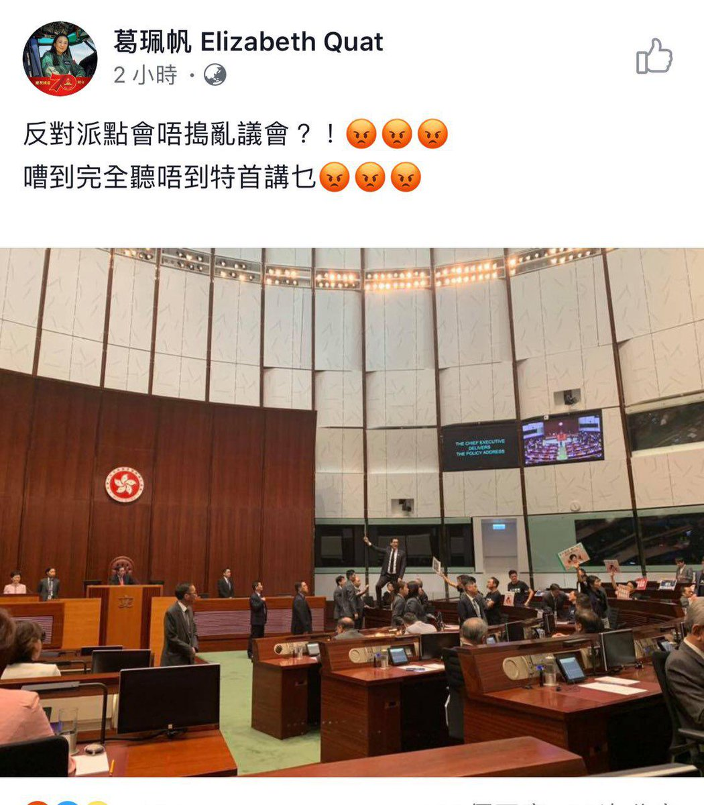
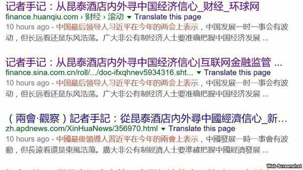
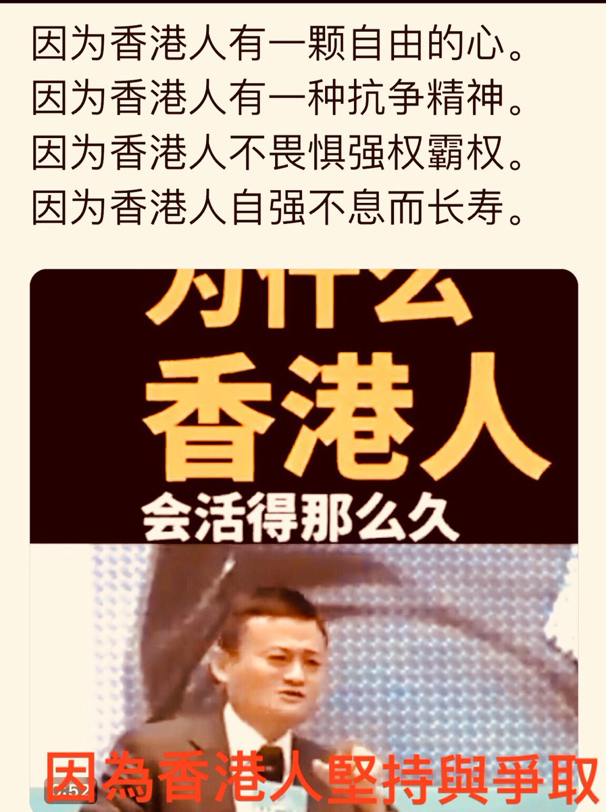
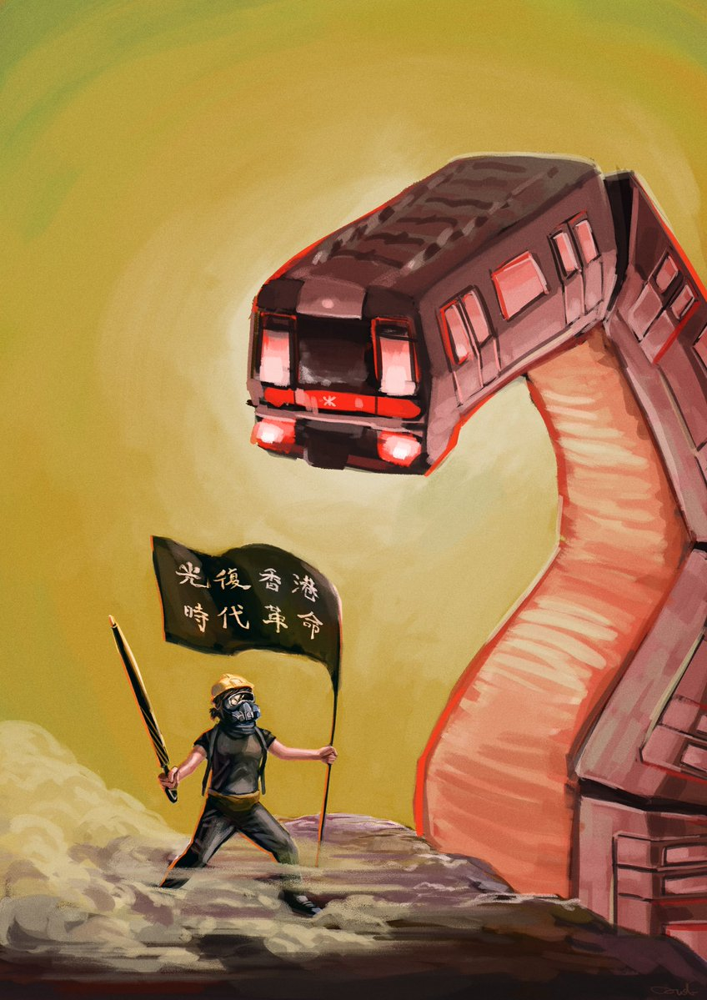

[10月16日 16:25]    老司机   @h5lpykl7tp6jjop    中美爱国方式的不同，结果居然一样！  :speech_balloon:评:0 :+1:赞:2 :globe_with_meridians:转:0  

[10月16日 16:22]    新闻大吐槽   @TuCaoFakeNews    @zhanyoutongmeng
@hNeBHUlLJhBbwFH
@Today__China
@RXDSv1EwYcmq0cU
@chenmezhisheng
@TG6UlUmEtXFNRNH
@TuCaoFakeNews
@VOAChinese
@Mrdoorvpn
@goldenp11462989
@CCP_is_devil
 
林病火上加油, 不停挑釁市民興黑警對立
追究責任, 追究左黑警先講野拉妳 https://news.rthk.hk/rthk/ch/component/k2/1486530-20191016.htm?spTabChangeable=0 …  :speech_balloon:评:0 :+1:赞:1 :globe_with_meridians:转:1  

[10月16日 16:19]    新闻大吐槽   @TuCaoFakeNews    蹭饭就低调点，可见人品跟智商也成正比  :speech_balloon:评:0 :+1:赞:1 :globe_with_meridians:转:1  

[10月16日 16:00]    纽约时报中文网   @nytchinese    香港抗议者正在把他们眼中一些公司“亲中”的公司记录下来，然后在移动应用程序和网站上传播。星巴克和吉野家因为拥有它们在香港特许经营权的公司而多次成为攻击目标，而《魔兽世界》的开发商动视暴雪则因试图审查一名支持民主的香港玩家而遭到了抵制。 https://nyti.ms/2qdwLjX   :speech_balloon:评:7 :+1:赞:15 :globe_with_meridians:转:5  

[10月16日 15:30]    纽约时报中文网   @nytchinese    #时报专栏 @DouthatNYT：越来越多的人意识到，原本希望打通两国市场和供应链的所谓“中美共同体”，产生了与美国战略家们预期相反的结果。美国不但没能向中国输出自由主义理念，反而强化了北京的社会控制政策，让极权主义波及自由世界。这两种趋势出现的关键，就是互联网。 https://nyti.ms/2BhSJop   :speech_balloon:评:10 :+1:赞:38 :globe_with_meridians:转:7  

[10月16日 15:01]    BBC News 中文   @bbcchinese    香港特首林郑月娥周三（10月16日）以录影片段发表新一份《施政报告》，是香港主权移交以来，行政长官第一次无法在立法会会议厅发表报告。 https://bbc.in/2ORICyo   :speech_balloon:评:10 :+1:赞:38 :globe_with_meridians:转:11  

[10月16日 15:00]    纽约时报中文网   @nytchinese    中国研究人员发现，空气污染和流产风险之间存在显著的相关性。北京师范大学教授、这篇研究论文的第一作者张立强表示，这类流产对于准父母“尤为痛苦”，他们往往数日或数周后才发现。他还表示，这类流产没有得到充分研究，这也是研究人员予以关注的部分原因所在。 https://nyti.ms/2ITOtj6   :speech_balloon:评:8 :+1:赞:23 :globe_with_meridians:转:21  

[10月16日 14:33]    新闻大吐槽   @TuCaoFakeNews    @zhanyoutongmeng
@hNeBHUlLJhBbwFH
@Today__China
@RXDSv1EwYcmq0cU
@chenmezhisheng
@TG6UlUmEtXFNRNH
@TuCaoFakeNews
@VOAChinese
@Mrdoorvpn
@goldenp11462989
@CCP_is_devil 
假博士聽不到主子訓話就發皮氣  :speech_balloon:评:0 :+1:赞:1 :globe_with_meridians:转:2  

[10月16日 14:30]    纽约时报中文网   @nytchinese    宗凤鸣：“邓小平曾指出，那几年（指赵紫阳主持工作时期），中国经济是上了一个台阶的。于是，社会上有传言，说又要启用赵紫阳了。对于这种传言，赵紫阳很肯定地对我说：这是不可能的事。他说，邓虽然对这个江李领导班子不满意，但为了‘六四’，还是觉着维持江李体制不变为好。“ https://nyti.ms/2MMl37A   :speech_balloon:评:4 :+1:赞:28 :globe_with_meridians:转:7  

[10月16日 14:18]    新闻大吐槽   @TuCaoFakeNews    Shame https://twitter.com/tucaofakenews/status/1184341196891516930 …  :speech_balloon:评:0 :+1:赞:11 :globe_with_meridians:转:5  

[10月16日 14:12]    新闻大吐槽   @TuCaoFakeNews    内地大爷大妈更是如此不要脸，上车林黛玉，下车方世玉  :speech_balloon:评:3 :+1:赞:22 :globe_with_meridians:转:2  

[10月16日 14:10]    新闻大吐槽   @TuCaoFakeNews    可真不要脸，赶都赶不走，死皮赖脸。  :speech_balloon:评:1 :+1:赞:27 :globe_with_meridians:转:2  

[10月16日 14:09]    老司机   @h5lpykl7tp6jjop    【关注香港】中国时间2019年10月16日香港观塘翠屏南午夜大约12点45分，附近有人拍到更完整片段，他们抬着空床上去，然后又装着物品下来并且是五个人才能抬起来，是什么东西那么沉需要五个人？他们抬出来的是什么？关注！  :speech_balloon:评:12 :+1:赞:55 :globe_with_meridians:转:30  

[10月16日 14:04]    新闻大吐槽   @TuCaoFakeNews    愛國也不忘蹭頓免費晚餐  :speech_balloon:评:0 :+1:赞:14 :globe_with_meridians:转:2  

[10月16日 14:00]    纽约时报中文网   @nytchinese    阅读中文版：德银中国生意经：赠送高官奢侈礼物、雇佣权贵亲属  https://nyti.ms/2ITnynr https://twitter.com/ccni/status/1184120826544545792 …  :speech_balloon:评:3 :+1:赞:8 :globe_with_meridians:转:2  

[10月16日 13:42]    老司机   @h5lpykl7tp6jjop    10.16日林郑月娥两次作施政报告被赶下去，最终没有做成报告，最后新闻发布是正义的香港议员，感动！  :speech_balloon:评:3 :+1:赞:81 :globe_with_meridians:转:40  

[10月16日 13:41]    新闻大吐槽   @TuCaoFakeNews    说这种话的就是一个渣子。 https://twitter.com/TuCaoFakeNews/status/1184048596980600833 …  :speech_balloon:评:1 :+1:赞:14 :globe_with_meridians:转:2  

[10月16日 13:38]    新闻大吐槽   @TuCaoFakeNews    亲共的 都是些贪生怕死 喜欢贪小便宜 混吃等死 苟且偷生的垃圾  :speech_balloon:评:1 :+1:赞:27 :globe_with_meridians:转:2  

[10月16日 13:38]    新闻大吐槽   @TuCaoFakeNews    中國特色  :speech_balloon:评:0 :+1:赞:14 :globe_with_meridians:转:2  

[10月16日 13:37]    新闻大吐槽   @TuCaoFakeNews    以利相交，利盡則散；以心相交，能成其遠。  :speech_balloon:评:0 :+1:赞:12 :globe_with_meridians:转:3  

[10月16日 13:36]    新闻大吐槽   @TuCaoFakeNews    这是龙门冰室。他们一直支持年轻人  :speech_balloon:评:0 :+1:赞:25 :globe_with_meridians:转:3  

[10月16日 13:31]    新闻大吐槽   @TuCaoFakeNews    一位餐厅老板支持抗争者，给抗争学生提供免费餐饮，可一个支持北京的大妈也带着女儿来蹭饭，吃饭时口中还出言不逊，老板怒了，把她们请了出去！

但大妈和女儿还是蹭饭成功，只因老板希望她赶紧离开，饭钱都不要了。

亲共者的见利忘义在轻财重义的老板面前，显得如此龌龊  :speech_balloon:评:38 :+1:赞:397 :globe_with_meridians:转:180  

[10月16日 13:31]    新闻大吐槽   @TuCaoFakeNews    一位餐厅老板支持抗争者，给抗争学生提供免费餐饮，可一个支持北京的大妈也带着女儿来蹭饭，吃饭时口中还出言不逊，老板怒了，把她们请了出去！

但大妈和女儿还是蹭饭成功，只因老板希望她赶紧离开，饭钱都不要了。

亲共者的见利忘义在轻财重义的老板面前，显得如此龌龊  :speech_balloon:评:38 :+1:赞:397 :globe_with_meridians:转:180  

[10月16日 13:30]    纽约时报中文网   @nytchinese    #每日一词 Panopticon
曾被颂扬为伟大解放者的互联网，如今却被揭露出另一种本质——苏联梦寐以求的监控机器，诱惑民众拿个人隐私换取娱乐和消遣。对于跨国企业纷纷迫于压力屈从中国的现象，时报专栏作者Ross Douthat直指互联网成为了一个“圆形监狱”（Panopticon）。 https://nyti.ms/2ITK4g2   :speech_balloon:评:17 :+1:赞:133 :globe_with_meridians:转:65  

[10月16日 13:14]    新闻大吐槽   @TuCaoFakeNews    今日份政治段子(150)
新华社将习近平称“中国最后领导人”！
并且在多个网站转载了这篇通稿过后才发现，随后新华社删除了该文章并开除了涉事主编，但通过搜索引擎的网页快照功能仍可看到。
据悉，涉事主编李凯在新华社工作已20余年，从未申请入党。  :speech_balloon:评:9 :+1:赞:126 :globe_with_meridians:转:36  

[10月16日 13:00]    纽约时报中文网   @nytchinese    今日食谱：葱香葡萄烤鸡腿，皮脆肉嫩，果香四溢。
更多简报内容： https://nyti.ms/2ITPNCp   :speech_balloon:评:1 :+1:赞:17 :globe_with_meridians:转:6  

[10月16日 12:58]    新闻大吐槽   @TuCaoFakeNews    至少香港还有一点新闻自由可以讲自己想说的，可以告诉世人事情的真相；可是几百万的维吾尔人无辜的被消失了
维吾尔人的李嘉诚，维吾尔人的张学友，刘德华都被关进去；想象那些让香港是香港的那些精英们系统性的被消灭掉；香港还会是那个香港吗？
维吾尔人面对的就是那样一个情况
希望香港好好守住教育 https://twitter.com/tucaofakenews/status/1183920308568219653 …  :speech_balloon:评:2 :+1:赞:25 :globe_with_meridians:转:7  

[10月16日 12:42]    老司机   @h5lpykl7tp6jjop    教授粗鲁在妓院被妈咪一顿教训，转自网络有删减  :speech_balloon:评:1 :+1:赞:17 :globe_with_meridians:转:4  

[10月16日 12:41]    新闻大吐槽   @TuCaoFakeNews      :speech_balloon:评:1 :+1:赞:8 :globe_with_meridians:转:1  

[10月16日 12:30]    纽约时报中文网   @nytchinese    星巴克、吉野家和动视暴雪本来似乎与香港抗议毫不相干。但对香港的一些民主派抗议者以及他们越来越多的全球支持者来说，无论对错，这些公司都被视为专制中共的同情者，因此是抵制甚至破坏的正当合理目标。 https://nyti.ms/2qdwLjX   :speech_balloon:评:31 :+1:赞:42 :globe_with_meridians:转:10  

[10月16日 12:00]    BBC News 中文   @bbcchinese    法案的通过被视为美国政府回应香港近期示威浪潮的重要一步。 https://bbc.in/2oBv0wQ   :speech_balloon:评:125 :+1:赞:207 :globe_with_meridians:转:53  

[10月16日 12:00]    纽约时报中文网   @nytchinese    • 谷歌发布Pixel 4和Pixel 4 XL智能手机，两款机型均配备“计算拍照”功能——利用算法、人工智能和特殊传感器使图像看起来更加专业。
• “摩登情爱”15周年：时报于2006年推出的这一专栏一直备受读者欢迎。在15岁生日之际，我们精选出了一系列“经典”的情感故事。
更多简报内容： https://nyti.ms/2ITPNCp   :speech_balloon:评:0 :+1:赞:4 :globe_with_meridians:转:5  

[10月16日 11:50]    新闻大吐槽   @TuCaoFakeNews    我觉得应该给她放一个习维尼手持大棒的投影  :speech_balloon:评:1 :+1:赞:15 :globe_with_meridians:转:1  

[10月16日 11:48]    新闻大吐槽   @TuCaoFakeNews    民主派的立法会议员，用手持投影灯，把五大诉求，缺一不可的字幕，投射到正在发言的林郑月娥身上!  :speech_balloon:评:11 :+1:赞:188 :globe_with_meridians:转:63  

[10月16日 11:30]    纽约时报中文网   @nytchinese    “赵紫阳曾对我说，邓小平的信条，是党的领导权绝对不能动摇，是党的权力绝对不能分享。这怎么能使中国转向民主政治呢？”
作为赵紫阳的生前挚友，宗凤鸣在赵紫阳因“六四”下台并被软禁后，记下了与老战友的上百次谈话。在赵紫阳百年诞辰之际，我们发表了宗凤鸣在生前接受的采访。 https://nyti.ms/2MMl37A   :speech_balloon:评:52 :+1:赞:427 :globe_with_meridians:转:176  

[10月16日 11:00]    纽约时报中文网   @nytchinese    • 聚焦特朗普“电话门”：总统私人律师朱利安尼向乌克兰施压的行为曾令时任国家安全顾问博尔顿感到震惊。
• 俄罗斯力军队挺进叙利亚北部：俄罗斯周二表示，该国部队正在美军撤离后的叙利亚领土上巡逻。特朗普突然撤军的决定为土耳其入侵扫清了道路。
更多简报内容： https://nyti.ms/2ITPNCp   :speech_balloon:评:2 :+1:赞:2 :globe_with_meridians:转:1  

[10月16日 10:30]    纽约时报中文网   @nytchinese    调查显示，为了打开中国市场，德意志银行向能接触到政治人物的顾问支付巨款，给包括江泽民、温家宝、王岐山在内的政坛高官大手笔送礼，并大举招聘中共高级领导人的家人，如栗战书、汪洋和刘云山的子女等。 https://nyti.ms/2ITnynr   :speech_balloon:评:39 :+1:赞:209 :globe_with_meridians:转:102  

[10月16日 10:09]    财经真相   @caijingxiang    根据克尔瑞的报告，9月份95家典型房企的融资总额为1124.48亿，环比上升45.3%，同比上升17.2%。融资成本也再上台阶，今年前三季度，房企债券类融资成本6.88%，较2018年全年上升了0.67个百分点。截至10月8日，年内房企美元融资533.6亿美元，同比上涨50%。虽然各种政策收紧，但房企美元融资仍刷新历史纪录  :speech_balloon:评:7 :+1:赞:68 :globe_with_meridians:转:17  

[10月16日 10:05]    新闻大吐槽   @TuCaoFakeNews    勇者斗党铁！  :speech_balloon:评:4 :+1:赞:59 :globe_with_meridians:转:15  

[10月16日 10:00]    BBC News 中文   @bbcchinese    这个马桶名为“美国”（America），用18K金打造而成，价值一百万英镑。 https://bbc.in/2VJfzyA   :speech_balloon:评:20 :+1:赞:51 :globe_with_meridians:转:14  

[10月16日 10:00]    纽约时报中文网   @nytchinese    • 中美合拍动画电影《雪人奇缘》因出现南海“九段线”在越南被停映。片中出现的“九段线”是中国在南海的主权主张标识。
• 拜登之子亨特接受专访，坦承家庭背景是自己被任命为外国公司董事会成员的重要原因，但他否认特朗普关于其父从事不法行为的指控。
更多简报内容： https://nyti.ms/2ITPNCp   :speech_balloon:评:4 :+1:赞:9 :globe_with_meridians:转:1  

[10月16日 09:55]    财经真相   @caijingxiang    受到放开外资保险和银行条例消息的刺激，今天中国保险和银行板块大涨，这是一个很有意思的现象，正常情况下放开外资进来，这会对国内的这些企业构成竞争压力，但是今天他们的股票却大涨，这里面的逻辑是什么？  :speech_balloon:评:89 :+1:赞:171 :globe_with_meridians:转:49  

[10月16日 09:47]    财经真相   @caijingxiang    中国外交部：我们对美国国会众议院执意通过所谓“香港人权与民主法案”表示强烈愤慨和坚决反对。香港是中国的香港，香港事务纯属中国内政，不容任何外部势力干预。我们奉劝美方认清形势，悬崖勒马，立即停止推动审议有关涉港法案，立即停止插手香港事务、干涉中国内政。  :speech_balloon:评:79 :+1:赞:212 :globe_with_meridians:转:95  

[10月16日 09:38]    财经真相   @caijingxiang    受中国扬言报复美国通过的《香港人权法案》消息刺激，a股开盘后，离岸人民币扩大跌幅，跌破7.1关口！  :speech_balloon:评:17 :+1:赞:239 :globe_with_meridians:转:58  

[10月16日 09:36]    BBC News 中文   @bbcchinese    BBC带你走进三个著名古堡，探究其中的主人和工作人员如何看待自己有别于人的日常生活。 https://bbc.in/2ITTYy5   :speech_balloon:评:1 :+1:赞:16 :globe_with_meridians:转:9  

[10月16日 09:13]    纽约时报中文网   @nytchinese    Inside a Brazen Scheme to Woo China: Gifts, Golf and a $4,254 Wine. Hong Kong Protesters Are Targeting Starbucks. Apple Could Be Next. Live updates from the debate. How do you say "panopticon" in Chinese? Follow us @nytchinese https://cn.nytimes.com/morning-brief/20191016/deutsche-bank-china-democratic-debate/ …  :speech_balloon:评:2 :+1:赞:10 :globe_with_meridians:转:2  

[10月16日 08:56]    纽约时报中文网   @nytchinese    早安！今日重点新闻包括：
德银中国生意经；聚焦美国民主党初选辩论；香港抗议向商业领域蔓延；球星詹姆斯就NBA“挺港风波”发言惹争议；动画电影《雪人奇缘》因出现南海“九段线”在越南被停映……NYT简报带你速览今日要闻。
更多简报内容： https://nyti.ms/2ITPNCp   :speech_balloon:评:9 :+1:赞:21 :globe_with_meridians:转:2  

[10月16日 07:55]    BBC News 中文   @bbcchinese    远在欧洲伊比利亚半岛上的西班牙周一（10月14日）对倡导加泰罗尼亚独立公投的9名领导者判以重刑，罪名包括“煽动分裂、挪用公款、以及拒不服从”。 https://bbc.in/33A5WVM   :speech_balloon:评:55 :+1:赞:103 :globe_with_meridians:转:31  

[10月16日 07:11]    BBC News 中文   @bbcchinese    一场前所未有的大台风中的东北亚政治来往，反映出中日两国关系经历多年波折后的什么趋势？ https://bbc.in/2IUGYbz   :speech_balloon:评:7 :+1:赞:15 :globe_with_meridians:转:7  

[10月16日 06:50]    BBC News 中文   @bbcchinese    BBC中东事务编辑伯温（Jeremy Bowen）指出，叙利亚战争8年改变了中东势力版图，而美国宣布撤军，７天就改变了叙利亚战局，中东面临新的转折点。 https://bbc.in/2BbkTRY   :speech_balloon:评:7 :+1:赞:29 :globe_with_meridians:转:12  

[10月16日 04:51]    老司机   @h5lpykl7tp6jjop    德意志银行行贿中国！他们在中国瞄准最高层，通过送礼建立人脉，从而获取巨大利益，中国的高官们在这场德意志银行进军中，从前朝江泽民、温家宝，刘云山到当朝的中共常委栗战书、汪洋，国家副主席王岐山，或者本人或者亲属都被银弹击中。“一百多名共产党主政权贵的亲戚受雇于该银行”  :speech_balloon:评:2 :+1:赞:66 :globe_with_meridians:转:43  

[10月16日 00:18]    墙国铁拳现世报😷   @Socialistfist    万fo新头像  :speech_balloon:评:24 :+1:赞:213 :globe_with_meridians:转:9  

[10月15日 23:19]    老司机   @h5lpykl7tp6jjop    阅兵最遗憾的是:没有看到城管方队。  :speech_balloon:评:31 :+1:赞:142 :globe_with_meridians:转:92  

[10月15日 23:03]    墙国铁拳现世报😷   @Socialistfist    新浪微博先关了评论区，后删除了该条微博。
本报不赞成任何形式网络暴力，也希望不要用你们的热情去唤醒楚门的世界。请大家让他做一个普通中国人  :speech_balloon:评:27 :+1:赞:155 :globe_with_meridians:转:26  

[10月15日 22:31]    凡賽堤/FORSETI   @FecharCCP    我們都是陳彥琳。一個15歲的小妹妹。極權卻對她如此殘忍。
願妳早日沉冤得雪
We are all Chan Yin Lam, a aged 15 kid in HK, who was slaughtered by the tyranny.  :speech_balloon:评:5 :+1:赞:136 :globe_with_meridians:转:101  

[10月15日 22:30]    BBC News 中文   @bbcchinese    社交媒体会让抑郁症更加严重，还是能拯救抑郁症患者？曾经萌生自杀念头的本文作者雷利，和你分享他自己的真实故事。
 https://bbc.in/2MglCHE   :speech_balloon:评:4 :+1:赞:25 :globe_with_meridians:转:11  

[10月15日 21:59]    BBC News 中文   @bbcchinese    你是否想要拥有幸福快乐却不知如何做到？耶鲁大学教授桑托斯告诉你5个方法，帮助你变得更幸福更快乐。
 https://bbc.in/2nLP3bd   :speech_balloon:评:1 :+1:赞:24 :globe_with_meridians:转:16  

[10月15日 21:31]    BBC News 中文   @bbcchinese    英国广播公司BBC专访美国空军战争学院张晓明博士，从他的著作回顾1979年邓小平发起中越战争的得失。
 https://bbc.in/2ppM20Y   :speech_balloon:评:11 :+1:赞:31 :globe_with_meridians:转:12  

[10月15日 21:06]    老司机   @h5lpykl7tp6jjop    就算上帝站在我面前，我也会怀疑一下它是不是cosplay(一)  :speech_balloon:评:41 :+1:赞:600 :globe_with_meridians:转:309  

[10月15日 21:00]    纽约时报中文网   @nytchinese    据时报调查，为了在中国获得生意，德意志银行向能接触政治人物的中国顾问支付了数百万美元，雇用了执政的中共几十名亲属，并给温家宝、江泽民等政治精英成员赠送了大量奢侈礼物。
这里是全文报道的6大要点： https://nyti.ms/2ITf2oz   :speech_balloon:评:61 :+1:赞:344 :globe_with_meridians:转:193  

[10月15日 20:59]    BBC News 中文   @bbcchinese    现代人们生活越来越离不开社交媒体，我们是否过度使用社交媒体，而牺牲了心理和身体健康，并浪费宝贵的时间？
 https://bbc.in/2oMwKmG   :speech_balloon:评:3 :+1:赞:16 :globe_with_meridians:转:9  

[10月15日 20:31]    BBC News 中文   @bbcchinese    湖人队当家球星勒布朗·詹姆斯一向比较敢言，这次到底说了什么？ https://bbc.in/2MkwfJT   :speech_balloon:评:91 :+1:赞:118 :globe_with_meridians:转:37  

[10月15日 20:03]    纽约时报中文网   @nytchinese    送给江泽民的一只水晶老虎、给温家宝的一匹水晶马，刘云山、汪洋在内等高官的子女、亲戚得到雇佣……
根据包含电子报表、电子邮件、高管采访的文字记录和内部调查报告在内的银行机密文件，时报调查发现，为了获得在中国的业务，德意志银行不惜向中国的政治精英讨好、行贿。 https://nyti.ms/2ITnynr   :speech_balloon:评:147 :+1:赞:1185 :globe_with_meridians:转:661  

[10月15日 19:55]    老司机   @h5lpykl7tp6jjop    报告猪席有人图谋篡位，小小校领导也有皇帝瘾，竟然让学生跪下喊万岁……  :speech_balloon:评:14 :+1:赞:86 :globe_with_meridians:转:51  

[10月15日 19:34]    墙国铁拳现世报😷   @Socialistfist    补充  :speech_balloon:评:8 :+1:赞:115 :globe_with_meridians:转:20  

[10月15日 19:32]    墙国铁拳现世报😷   @Socialistfist    大仙女：请出动我们的部队
当地拆迁办： 好的

#社会主义铁拳  :speech_balloon:评:113 :+1:赞:920 :globe_with_meridians:转:276  

[10月15日 19:18]    老司机   @h5lpykl7tp6jjop    人民网又在撒谎，6块钱二两肉能做这么一大碗肉丸？老百姓的生活还停留在2个人在出租屋里面吃6块钱肉就感觉到很满足的阶段……这是富裕吗，这是强大吗，还在吹，还在编，还在骗！  :speech_balloon:评:33 :+1:赞:133 :globe_with_meridians:转:53  

[10月15日 19:17]    财经真相   @caijingxiang    也就是即使川普连任，也等不到中国邮费上涨的时刻？对吗？ https://twitter.com/voacantonese/status/1184064898478665730 …  :speech_balloon:评:9 :+1:赞:84 :globe_with_meridians:转:19  

[10月15日 19:14]    财经真相   @caijingxiang    美国的人权法案为啥这么慢？ https://twitter.com/hongkon84458416/status/1183900371602825218 …  :speech_balloon:评:21 :+1:赞:107 :globe_with_meridians:转:24  

[10月15日 19:00]    纽约时报中文网   @nytchinese    曾经只是用雨伞来挡雨和抵御催泪瓦斯的抗议者，最近越来越多地开始使用砖头、人行道铺路石、刀和汽油弹。暴力事件不断增加的另一个迹象是，一名示威者周日刺伤了一名警员的脖子。另一方面，自从6月示威活动开始以来，警察也升级了所使用的火力。 https://nyti.ms/32r30e1   :speech_balloon:评:118 :+1:赞:78 :globe_with_meridians:转:29  

[10月15日 18:01]    BBC News 中文   @bbcchinese    K-pop 女明星雪莉（Sulli）10月14号过世，终年25岁。雪莉生前以直言不讳, 身体自主的言行赢得赞赏，也惹来韩国社会严酷的网络霸凌。
祝愿她一路好走！ https://bbc.in/2VJOw64   :speech_balloon:评:33 :+1:赞:142 :globe_with_meridians:转:41  

[10月15日 18:00]    纽约时报中文网   @nytchinese    对于该地区能否消耗老挝希望生产的全部电能，科学家们持怀疑态度。但这并没有阻止中国工程师、企业家和建筑工人涌入老挝。在中国水电的南乌江梯级电站工地，岩壁上悬挂的巨大红色横幅宣告着中老社会主义兄弟情谊的重要性。横幅上只有中文。工地上基本没有老挝工人。 https://nyti.ms/33xhh8Q   :speech_balloon:评:25 :+1:赞:24 :globe_with_meridians:转:5  

[10月15日 17:40]    BBC News 中文   @bbcchinese    英国女王伊丽莎白二世在议会发表演讲，称英国的要务是在10月31日脱离欧盟。 https://bbc.in/2VK0M6O   :speech_balloon:评:16 :+1:赞:44 :globe_with_meridians:转:7  

[10月15日 17:10]    老司机   @h5lpykl7tp6jjop    【陳彥霖】
片中女子大喊：便衣整天跟蹤她。
幾乎已經可以確定她就是15歲死者陳彥霖。（內附圖片）

大家幫手找片中的幾位便衣警。  :speech_balloon:评:135 :+1:赞:1974 :globe_with_meridians:转:1682  

[10月15日 17:00]    纽约时报中文网   @nytchinese    在10月1日开始的中国黄金周期间，在香港迪士尼乐园各游乐设施的等候队伍破天荒得短。通常挤满购物者的购物中心关闭了数天。城里最贵的餐馆提供了很大的折扣优惠，但依然食客寥寥。在香港抗议一事上，在看不到出路的店家和企业高管中，一种明显恐慌的情绪正在蔓延。 https://nyti.ms/2VI4nlE   :speech_balloon:评:29 :+1:赞:64 :globe_with_meridians:转:14  

[10月15日 16:53]    墙国铁拳现世报😷   @Socialistfist    我去，微博上有多少潜伏的推友  :speech_balloon:评:14 :+1:赞:147 :globe_with_meridians:转:16  

[10月15日 15:29]    老司机   @h5lpykl7tp6jjop    每个关注香港事态的人应该好好看这个视频。解释了为什么现在有很多香港人被暗杀、抛尸，被自杀。  :speech_balloon:评:36 :+1:赞:344 :globe_with_meridians:转:275  

[10月15日 15:15]    财经真相   @caijingxiang    加入WTO时的承诺今天在贸易战和华尔街敲诈下，今天终于开始有点放松了，但是中国老百姓想把钱存进外资银行依然存在门槛，每笔最低不少于50万人民币的定期存钱，至于外汇要继续控制！  :speech_balloon:评:36 :+1:赞:292 :globe_with_meridians:转:73  

[10月15日 15:09]    BBC News 中文   @bbcchinese    中美合拍动画片《雪人奇缘》中的南海地图展示了中国主张南海权益的“九段线”，而遭越南当局下令停止放映。 https://bbc.in/2IRg2cF   :speech_balloon:评:37 :+1:赞:99 :globe_with_meridians:转:37  

[10月15日 15:08]    财经真相   @caijingxiang    重磅！国务院关于修改〈中华人民共和国外资保险公司管理条例〉和〈中华人民共和国外资银行管理条例〉的决定，外国银行可以在中华人民共和国境内同时设立外商独资银行和外国银行分行，或者同时设立中外合资银行和外国银行分行。外国银行分行可以吸收中国境内公民每笔不少于50万元人民币的定期存款。  :speech_balloon:评:93 :+1:赞:437 :globe_with_meridians:转:217  

[10月15日 15:00]    BBC News 中文   @bbcchinese    “勾引术”教练在网上销售课程，教导其他男性如何尽快地引诱女性上床。这已是一项百万英镑的产业。 https://bbc.in/2MGkfB5   :speech_balloon:评:27 :+1:赞:193 :globe_with_meridians:转:68  

[10月15日 14:07]    老司机   @h5lpykl7tp6jjop    李心草被猥亵后抛尸江里，其室友任梦燊父亲是红河警察队长任剑波！ 把同宿舍的同学领到酒吧破处，同学不从，被三个畜生打死。昆明警察当局不予立案！

 https://chinanewscenter.com/archives/14788   :speech_balloon:评:8 :+1:赞:65 :globe_with_meridians:转:56  

[10月15日 13:42]    老司机   @h5lpykl7tp6jjop    全裸女浮尸案背后：近几月浮尸数是10年总和 6大疑点
详细分析暴露中共在香港操纵黑警秘密杀害反抗民众！  :speech_balloon:评:3 :+1:赞:12 :globe_with_meridians:转:11  

[10月15日 10:30]    老司机   @h5lpykl7tp6jjop    和平理性非暴力的抗议是印度甘地用来对抗英国人的，这种方法对流氓暴政无效！它们嗜血成性，只要能达到目的亿万人生命都可以作为代价，老人小孩孕妇都可以不顾忌的抓！不能不用其他方法对抗黑警了！明争不过可以暗斗，吃不成牛肉鼓上出气！  :speech_balloon:评:3 :+1:赞:41 :globe_with_meridians:转:6  

[10月15日 10:00]    BBC News 中文   @bbcchinese    BBC发现，西欧国家非常不愿意接收疑似“伊斯兰国”成员的拘留者，然而近年许多加入该组织的外国人已回归家园。 https://bbc.in/2Mj9Bl7   :speech_balloon:评:25 :+1:赞:37 :globe_with_meridians:转:16  

[10月15日 09:50]    财经真相   @caijingxiang    美港电讯15日讯，花旗集团目前正计划在中国建立一家全资证券子公司。知情人士表示，这家银行可能会专注于经纪和期货交易，同时扩大其在中国的托管服务。摩根大通（JPM.N）和高盛（GS.N）也在寻求在中国建立证券公司。 美国农民能不能卖出大豆给中共重要吗？不重要！只要华尔街的利益得到维护就行！  :speech_balloon:评:26 :+1:赞:414 :globe_with_meridians:转:130  

[10月15日 09:45]    财经真相   @caijingxiang    国家统计局：从环比看，CPI上涨0.9%，食品中，猪肉供应偏紧，价格继续上涨19.7%，涨幅比上月回落3.4个百分点，影响CPI上涨约0.65个百分点。  :speech_balloon:评:3 :+1:赞:62 :globe_with_meridians:转:14  

[10月15日 09:43]    财经真相   @caijingxiang    2019年9月份居民消费价格同比上涨3.0%,工业生产者出厂价格同比下降1.2%,物价涨工业生产下降，这就是典型的“滞胀”！  :speech_balloon:评:9 :+1:赞:249 :globe_with_meridians:转:75  

[10月15日 09:33]    BBC News 中文   @bbcchinese    “吉野家”、“星巴克”、“元气寿司”、“一芳水果茶”等耳熟能详的品牌，为什么成为抗议者的攻击目标？ https://bbc.in/2Ba2OUg   :speech_balloon:评:192 :+1:赞:253 :globe_with_meridians:转:102  

[10月15日 09:18]    老司机   @h5lpykl7tp6jjop    “为了生存，一个个的家庭四分五裂，游走他乡，疲于奔命；精神和肉体在苦苦煎熬中呻吟，人性正被一天天的扭曲！而那些留守的儿童，少了家庭的温暖，父母的呵护，一个个养成孤僻、自卑的性格；感情上更显得脆弱、冲动易怒，由此引发了诸多的社会问题，更加剧了底层贫困的轮回.......”  :speech_balloon:评:12 :+1:赞:122 :globe_with_meridians:转:68  

[10月15日 09:10]    老司机   @h5lpykl7tp6jjop    这就是那位被中国共产党奸杀后又抛尸海上的香港15岁女孩，生前视频  :speech_balloon:评:270 :+1:赞:1778 :globe_with_meridians:转:852  

[10月15日 08:49]    凡賽堤/FORSETI   @FecharCCP    希望陳彥霖家屬決不能放棄，任何金錢都無法和一個活生生的生命兌換！拿起法律武器！極權殺人恐怖組織殺害太多香港人，他們正在製造任何被害的正常死亡假象和消滅所有證據！極權殺人恐怖組織的恐怖只有人想不到的，沒有他們做不到！！！！！！！！  :speech_balloon:评:0 :+1:赞:1 :globe_with_meridians:转:0  

[10月15日 08:44]    凡賽堤/FORSETI   @FecharCCP    這是15歲游泳健將陳彥霖小女孩被殺害前出來逛街的自拍視頻！她還在自我解嘲穿成這樣不可能被定為暴徒！
拍攝時間未能確定，這是被抓捕前還是抓捕後？
她被抓捕過，抓捕時間？如果被釋放一定有本人和家長簽名的依據，所以這視頻的時間很重要，如果是抓捕前的，那是極權殺人恐怖組織故意放出來掩蓋罪行  :speech_balloon:评:1 :+1:赞:18 :globe_with_meridians:转:12  

[10月15日 08:11]    BBC News 中文   @bbcchinese    美国财长姆努钦周一在接受美国媒体访问时表示，若两国在12月15日前不达成最终贸易协议，美国将对1560亿中国进口产品征收关税。他的谨慎措辞，似乎与上周五总统特朗普的乐观形成鲜明对比。 https://bbc.in/32gFZu4   :speech_balloon:评:42 :+1:赞:210 :globe_with_meridians:转:73  

[10月15日 07:31]    BBC News 中文   @bbcchinese    “巴格达就像一个定时炸弹，看上去平静无害，但突然之间就会爆发。” https://bbc.in/31dWUfm   :speech_balloon:评:9 :+1:赞:19 :globe_with_meridians:转:12  

[10月15日 07:16]    老司机   @h5lpykl7tp6jjop    暴力「執法」
#FreeHongKong
#HongKongProtest  :speech_balloon:评:22 :+1:赞:171 :globe_with_meridians:转:167  

[10月15日 02:46]    凡賽堤/FORSETI   @FecharCCP    正義小螞蟻！傳播英文，西文，法文，德文，日文，著重描述，殘暴行為和手段，來自大陸的黑警，被施暴對象為學生，小孩，女孩 ，老人   傳播真相目的，激發西方人的憤怒！  :speech_balloon:评:1 :+1:赞:5 :globe_with_meridians:转:7  

[10月15日 02:17]    老司机   @h5lpykl7tp6jjop    便衣警察被抗议者追打。不想看到这样的场景，但这个场景反映香港警民对立、对抗、敌视，已上升到了危险境地。林郑月娥政府足以反思！为避免更多港人流血，她应该辞职。  :speech_balloon:评:56 :+1:赞:334 :globe_with_meridians:转:120  

[10月15日 02:14]    凡賽堤/FORSETI   @FecharCCP    6.9以來我就呼籲香港人要把每一個在香港街上的任何穿著警服的人臉全部清除的影片下來，不知道有沒有傳到在香港的正義人士，如果有，那些照片將是舉證黑警違法入境香港執法的鐵證，他們不知道殺害了多少香港同胞！  :speech_balloon:评:0 :+1:赞:8 :globe_with_meridians:转:6  

[10月15日 02:01]    凡賽堤/FORSETI   @FecharCCP    緊急提醒！

未來將有極權恐怖組織偽裝成各種各樣的所謂正義人士要求高價購買自6.9以來香港黑警殺人等犯罪證據，呼籲要提高一千萬的警惕和小心，別把自己的命給賣力！極權殺人恐怖組織從來不會讓有證據的人活在這個世界上！！！ https://twitter.com/FecharCCP/status/1183188604132188161 …  :speech_balloon:评:3 :+1:赞:45 :globe_with_meridians:转:42  

[10月15日 01:48]    凡賽堤/FORSETI   @FecharCCP    良知與正義沒有國界，沒有人種之分！！！

讓我們把極權殺人恐怖組織所犯下的種種反人類罪行的真相傳播給全人類知道！
用最殘暴最血腥最沒人性的那些畫面和視頻真相來喚醒人類的良知與公義和同情吧！ https://twitter.com/FecharCCP/status/1183193159087640576 …  :speech_balloon:评:2 :+1:赞:14 :globe_with_meridians:转:6  

[10月15日 01:43]    凡賽堤/FORSETI   @FecharCCP    極權恐怖組織正在屠殺我們的同胞....

拯救港人，拯救華族，勢在必行！！！

擁有良知與正義小螞蟻們！良知與正義沒有國界，沒有人種之分！！！讓我們把極權殺人恐怖組織所犯下的種種反人類罪行的真相傳播給全人類知道！用最殘暴最血腥最沒人性的那些畫面和視頻真相來喚醒人類的良知與公義和同情吧！  :speech_balloon:评:4 :+1:赞:133 :globe_with_meridians:转:119  

[10月15日 01:24]    凡賽堤/FORSETI   @FecharCCP    美國西方國家用70年為大陸人開啟民智，結果反被吞噬！某些海外華人聲稱是為大陸人開啟民智！ 把自己封為比上帝還高的聖人，卻把眼睛盯著榮耀！但是卻不明白，千千萬萬正義的小螞蟻才是真正為大陸人開啟民智先鋒！
因為他們把極權殺人恐怖組織在香港犯下的種種罪行的真相向全世界和大陸傳播！良知無國界  :speech_balloon:评:3 :+1:赞:15 :globe_with_meridians:转:5  

[10月15日 00:44]    老司机   @h5lpykl7tp6jjop    暗杀、抛尸、性虐待，

阴招吓不怕香港人！

看遮打花园的灯海  :speech_balloon:评:38 :+1:赞:1265 :globe_with_meridians:转:580  

[10月15日 00:42]    凡賽堤/FORSETI   @FecharCCP    海外的眾多號稱良知與正義的自媒體，天天喊口號滅CCP的自媒體，除了香港大紀元，香港蘋果日報意外，有幾個自媒體持續跟踪報導的每一個事件，如此震驚全世界的香港事件，那些自媒體卻把觀眾的目光引導到了哪裡？這不是在幫極權殺人恐怖組織的大忙？ 如果每個自媒體，全面跟踪報導，這將影響力變成幾倍啊  :speech_balloon:评:0 :+1:赞:5 :globe_with_meridians:转:0  

[10月15日 00:36]    凡賽堤/FORSETI   @FecharCCP    總覺得現在的海外華人口口聲聲說反極權CCP，把美國的白宮演變成CCP的信訪局，然後他們也變成了美國政府的白宮，總統的“代言人“或“爆料們“，說難聽的是皮條客，靠這樣就能滅CCP？一點殺傷力都沒有，無非也是譁眾取寵吸引眼球，浪費時間轉移了核心，6.9香港返送中以來，這麼大的事件，香港如此悲慘！（1 https://twitter.com/FecharCCP/status/1183188604132188161 …  :speech_balloon:评:1 :+1:赞:7 :globe_with_meridians:转:4  

[10月15日 00:20]    凡賽堤/FORSETI   @FecharCCP    以前也是不認同法輪功！但是看到他們在反對極權殺人恐怖組織幾十年的一如既往的奮鬥，這次香港的返送中事件大紀元的記者都一直在前線報導，確實令人感動！  :speech_balloon:评:1 :+1:赞:22 :globe_with_meridians:转:4  

[10月15日 00:20]    凡賽堤/FORSETI   @FecharCCP    以前也是不認同法輪功！但是看到他們在反對極權殺人恐怖組織幾十年的一如既往的奮鬥，這次香港的返送中事件大紀元的記者都一直在前線報導，確實令人感動！  :speech_balloon:评:0 :+1:赞:10 :globe_with_meridians:转:1  

[10月15日 00:01]    墙国铁拳现世报😷   @Socialistfist    通知 经推友集思广益，现已删除 “种花家的爱国红小将” 的转推。  :speech_balloon:评:2 :+1:赞:55 :globe_with_meridians:转:2  

[10月14日 20:51]    老司机   @h5lpykl7tp6jjop    快点，我等不及了，领导在等着我切磋 https://twitter.com/jingui_zhu/status/1183561565200506880 …  :speech_balloon:评:31 :+1:赞:125 :globe_with_meridians:转:50  

[10月14日 20:44]    墙国铁拳现世报😷   @Socialistfist    图片源通过谷歌识图可以知道这个微博内容是伪造的。其中有“保安”的图片事件至少发生在2018年6月以前。虽然是另外一个铁拳现世报的故事，但是没有必要为了黑而抹黑。正确的姿势至少应该是摆事实才能讲道理。另外个人非常厌恶抵制这个伪造微博的人的做法。新闻源 https://www.bannedbook.org/bnews/zh-tw/weiquan/qunti/20180610/955337.html …  :speech_balloon:评:0 :+1:赞:63 :globe_with_meridians:转:8  

[10月14日 19:55]    墙国铁拳现世报😷   @Socialistfist    欢迎举证  :speech_balloon:评:5 :+1:赞:29 :globe_with_meridians:转:1  

[10月14日 19:28]    墙国铁拳现世报😷   @Socialistfist    推上流传的这张截图，很多推油都给我发了，微博上查不到这个号。
鉴于之前流传的反串P图号也查不到微博，大家智者见智

#社会主义铁拳？  :speech_balloon:评:28 :+1:赞:199 :globe_with_meridians:转:41  

[10月14日 18:47]    墙国铁拳现世报😷   @Socialistfist    不好这个护旗手要反

#社会主义铁拳  :speech_balloon:评:245 :+1:赞:1910 :globe_with_meridians:转:649  

[10月14日 17:27]    财经真相   @caijingxiang    呵呵，这才刚过一天就要变卦了？消息一经公布，离岸人民币、a50急搓，黄金短线冲高！ https://twitter.com/zerohedge/status/1183674272402890752 …  :speech_balloon:评:58 :+1:赞:600 :globe_with_meridians:转:174  

[10月14日 14:27]    财经真相   @caijingxiang    尤其是高盛赚的手抽筋，当时中方对接人就是王73，其他几家银行也是！这才是真正的卖国贼，从未见过一个国内外专家提出过质疑！ https://twitter.com/ccp5464/status/1183282408415584258 …  :speech_balloon:评:14 :+1:赞:273 :globe_with_meridians:转:104  

[10月14日 12:14]    凡賽堤/FORSETI   @FecharCCP    想看極權殺人恐怖組織的殺人，迫害華人真相的請看香港大紀元！
想看極權殺人恐怖組織爆料黑幕的去看郭文貴直播！
想看調侃，唱衰，分析極權殺人恐怖組織有關新聞的，
去看 年代向錢看（youtube)
他們相對比較專業，全面！  :speech_balloon:评:2 :+1:赞:18 :globe_with_meridians:转:4  

[10月14日 12:07]    凡賽堤/FORSETI   @FecharCCP    儘管極權殺人恐怖組織控制的推特一直黑我的關注人數，我根本無所謂，因為為正義而發，為傳播真相而發，這是我的生活一部分！傳播真相才是最重要，無非也是一只小螞蟻而已！  :speech_balloon:评:1 :+1:赞:17 :globe_with_meridians:转:4  

[10月14日 11:59]    凡賽堤/FORSETI   @FecharCCP    真正的良心媒體是不會刻意去追求關注度！而是注重及時傳播每一個突發事件及真相！如果一些自媒體有人養著，或者是真正為正義，為傳播真相而發，不需要靠廣告收入養活自己，他們完全沒有必要去研究觀眾的口味，傳播突發事件和跟踪新聞事件也許能迎來更多的觀眾！  :speech_balloon:评:2 :+1:赞:27 :globe_with_meridians:转:7  

[10月14日 11:52]    凡賽堤/FORSETI   @FecharCCP    香港大紀元才是真正的滅極權主義的先鋒！幾個月從未停止跟踪報導香港極權殺害港人的每一個畫面！向香港大紀元致敬並說聲謝謝！  :speech_balloon:评:44 :+1:赞:1189 :globe_with_meridians:转:559  

[10月14日 11:27]    凡賽堤/FORSETI   @FecharCCP    希望這些擁有原始照片和視頻的提供給死者家屬！

估計不用多久極權殺人恐怖組織要發動銷毀有關香港照片和視頻（包括所有媒體）的全球大規模行動了！  :speech_balloon:评:0 :+1:赞:1 :globe_with_meridians:转:0  

[10月14日 11:12]    凡賽堤/FORSETI   @FecharCCP    這些香港每一個慘不忍睹的畫面和視頻，如果有正義自媒體和新聞一直跟踪報導，也許很多都可以活下來！無形中幫助和挽救多少香港人啊！！！

良心媒體不單要報導，傳播，應該還要跟踪事態的發展和結果！！！  :speech_balloon:评:4 :+1:赞:19 :globe_with_meridians:转:15  

[10月14日 10:57]    财经真相   @caijingxiang    又是银行券商、茅台的欢呼，50支撑起的股市不是牛市，是牛屎！  :speech_balloon:评:23 :+1:赞:168 :globe_with_meridians:转:21  

[10月14日 09:23]    财经真相   @caijingxiang    中国首个交易日人民币中间价较上日调升2点至7.0725，于是市场瞬间就明白了所谓的中美汇率协议，只是一个防止人民币跌的不要太快，根本不是日本广场协议式大规模升值，未来只是暂时维持震荡格局。另外，市场经过周末的冷静，越发的觉得这个所谓“deal”，忽悠成分太大，提前计价的有点过分了需要修正！  :speech_balloon:评:10 :+1:赞:110 :globe_with_meridians:转:23  

[10月14日 09:14]    财经真相   @caijingxiang    经济日报：我国大豆需求量每年在1亿吨以上，80%以上的需求要通过进口来满足。国家粮油信息中心预计，2019年至2020年度（10月至次年9月）我国进口大豆8700万吨，同比增加400万吨，增幅4.8%，但仍低于2017年至2018年度9413万吨的历史高位。 有什么样的协议，就有什么样的需求，原来400万吨是这样来的！  :speech_balloon:评:7 :+1:赞:226 :globe_with_meridians:转:66  

[10月14日 08:53]    财经真相   @caijingxiang    深圳网络安全与信息通报中心，公告称境外组织APT41黑客对TEAMVIEWER实施了网络攻击，并成功拿下TEAMVIEWER公司的后台管理系统！  :speech_balloon:评:9 :+1:赞:70 :globe_with_meridians:转:21  

[10月13日 20:16]    墙国铁拳现世报😷   @Socialistfist    附加  :speech_balloon:评:12 :+1:赞:108 :globe_with_meridians:转:23  

[10月13日 20:14]    墙国铁拳现世报😷   @Socialistfist    让战螂被铁拳后冷静一会儿，
他还是战螂

#社会主义铁拳  :speech_balloon:评:48 :+1:赞:331 :globe_with_meridians:转:88  

[10月13日 16:11]    财经真相   @caijingxiang    中东局势我不是很了解，但是有一点是很明白的，库尔德武装在抗击is时得到过大量美军武器，其部队战斗力相对强悍，怎么会这么快就被土耳其突破防线了？库尔德武装的武器供应不会是被伊拉克给切断了吧？ https://twitter.com/landofyelang/status/1183284746412969985 …  :speech_balloon:评:30 :+1:赞:90 :globe_with_meridians:转:20  

[10月13日 15:13]    财经真相   @caijingxiang    本次会议标志着中美第一阶段贸易谈判的结束，第二阶段谈判的开始，由于中共在第一阶段已经正式购买了大量美国农产品，所以再永购买的方式将不会对川普产生任何吸引力，中共为此需要准备新的筹码才行（初步触及中共体制），预计中美第二阶段的较量将于11月底12月初正式拉开序幕！  :speech_balloon:评:7 :+1:赞:74 :globe_with_meridians:转:16  

[10月13日 14:59]    财经真相   @caijingxiang    2019年11月16日至17日，APEC(亚洲太平洋经济合作组织) 第二十七次领导人非正式会议将在智利圣地亚哥举行。届时将有超过2万名来自中国、美国、日本、俄罗斯等21国的代表出席会议。由于中美第一阶段贸易协议将在哪里落实为文本内容，川普和习近平的签字仪式将成为本次会议的重点！  :speech_balloon:评:9 :+1:赞:116 :globe_with_meridians:转:36  

[10月12日 17:59]    墙国铁拳现世报😷   @Socialistfist    详细补充  :speech_balloon:评:35 :+1:赞:331 :globe_with_meridians:转:77  

[10月12日 17:55]    墙国铁拳现世报😷   @Socialistfist    好担心墙国既是粉红又是NBA球迷的精神健康  :speech_balloon:评:38 :+1:赞:518 :globe_with_meridians:转:110  

[10月12日 17:47]    墙国铁拳现世报😷   @Socialistfist    慈禧太后为什么要杀义和团？ ---百度知道
#社会主义铁拳  :speech_balloon:评:147 :+1:赞:1158 :globe_with_meridians:转:464  

[10月11日 23:34]    墙国铁拳现世报😷   @Socialistfist    支持NBA的推友们抓紧了，马上投票就要结束了，别说党和人民没有给你机会啊  :speech_balloon:评:1 :+1:赞:53 :globe_with_meridians:转:2  

[10月11日 23:30]    墙国铁拳现世报😷   @Socialistfist    又爱又怕，唉

PS 本推第一个符合两个系列的推诞生了！
#社会主义铁拳
#战螂在推特  :speech_balloon:评:61 :+1:赞:596 :globe_with_meridians:转:151  

[10月11日 20:13]    墙国铁拳现世报😷   @Socialistfist    今天收到了很多推友投稿和 @ ，其中有一则是某精赵在17年发微博控诉未成年女儿被性侵一事。首先照例感谢各位踊跃投稿 
因为事发17年，涉及到未成年人且是性侵害，经考虑不发推防止不必要的网络暴力。
希望大家理解  :speech_balloon:评:33 :+1:赞:219 :globe_with_meridians:转:17  

[10月11日 19:20]    墙国铁拳现世报😷   @Socialistfist    推友们你有没有闻到一股恶臭
为两地遇难者祈福  :speech_balloon:评:36 :+1:赞:323 :globe_with_meridians:转:49  

[10月11日 01:54]    墙国铁拳现世报😷   @Socialistfist    为契合推文主题小编特别推出投稿指南。
#社会主义铁拳 指某精赵在各平台（如微博贴吧）公开发布地爱党国言论和被铁拳截图，两者可为新后或并列关系。至少两张截图

#战螂在推特  是一个分享战螂在推特上的反价值观魔幻言行的品鉴系列，要求宽松符合条件即可。  :speech_balloon:评:8 :+1:赞:76 :globe_with_meridians:转:6  

[10月10日 09:51]    凡賽堤/FORSETI   @FecharCCP    70年來我們已經失去八千萬同胞，八千萬中都是同胞的親人，祖輩，父輩，親人，朋友！今天的700萬香港人也都是我們的親人，未來同胞的祖輩，父輩，親人，朋友！我們何其悲哀啊！！！！！！！！！！！！！！！！！！！！！！！！！！！！  :speech_balloon:评:17 :+1:赞:270 :globe_with_meridians:转:132  

[10月09日 23:14]    新闻大吐槽   @TuCaoFakeNews    这下暴雪要哭了，
其射击游戏「守望先锋」的预告片里，一个中国女孩角色被高手给P了，改成了一个支持反送中的香港女孩！

是时候全民抵制暴雪了，请在墙内广传此影片！  :speech_balloon:评:126 :+1:赞:3341 :globe_with_meridians:转:1613  

[10月05日 09:33]    凡賽堤/FORSETI   @FecharCCP    呼籲請求共同挖掘所有有關香港發生的事，越全面越好，不同角度，越多越好，包括被暗地抓捕的人員，特別是CCP 派出的各種偽裝身份，包括變身變裝行兇的一點一滴都要挖掘出來，把CCP 的邪惡下三濫手段的真相毫無保留的曝光在全世界面前！世界公知公義才能真正挽救和保護香港人！希望懂視頻編輯配上中英文 https://twitter.com/hjjohnson17/status/1178969916499746816 …  :speech_balloon:评:8 :+1:赞:16 :globe_with_meridians:转:9  

[09月06日 19:03]    财经真相   @caijingxiang    本次降准总计是释放增量资金9000亿，但是提前下发的2020年地方债最高为1.85万亿，降准释放的资金只够新一轮刺激的一半，剩下的资金将会从现有社会存量来补充，这在一定程度收紧了金融系统的流动性；不过和以往一样，央行的降准刺激措施依然是打着“中小企业”的名义下调的!连接 https://www.youtube.com/watch?v=Usp9LIngNl0&feature=youtu.be …  :speech_balloon:评:20 :+1:赞:241 :globe_with_meridians:转:80  

[03月13日 08:10]    老司机   @h5lpykl7tp6jjop    批评是批评家天生的使命！他们只感知对错，信奉真理，指出真相不吐不快，不在意权势和群众的喜好，从批评里不可能获得任何好处，但批评家愚直不改。在中国几乎所有人都讨厌批评家，喜欢阴谋家，因为他们只说好听的！可是就因为中国的批评家太少，中国几乎看不到未来和希望！  :speech_balloon:评:78 :+1:赞:174 :globe_with_meridians:转:40  

[01月10日 13:30]    纽约时报中文网   @nytchinese    每年一月，《纽约时报》​​会选出52个年度旅游目的地。将举办冬奥会的中国崇礼、炫目奢华的香港、日本濑户内各岛皆入选。
新的一年，你计划好要去哪里旅行了吗？ http://nyti.ms/2Tz9N06   :speech_balloon:评:284 :+1:赞:375 :globe_with_meridians:转:195  

