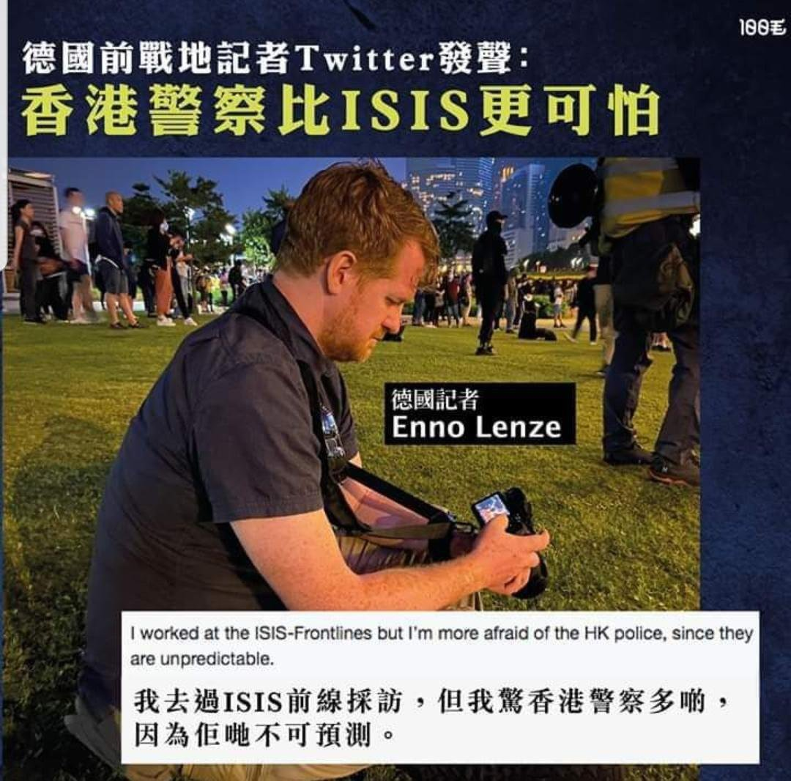
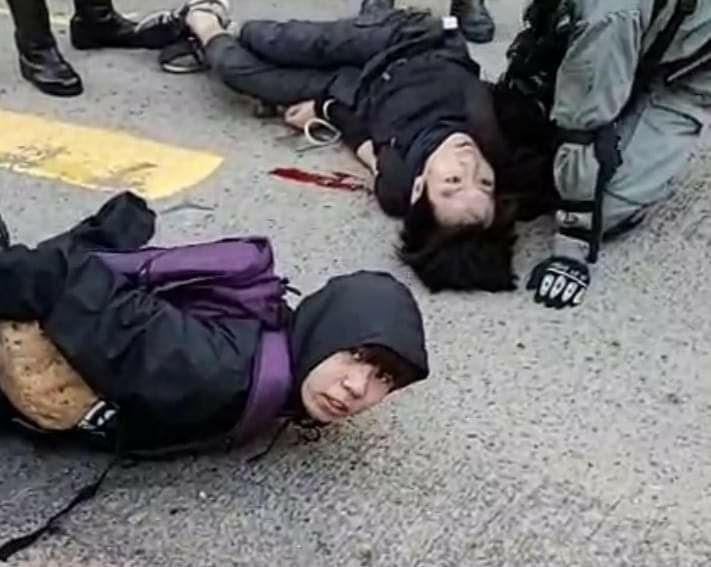
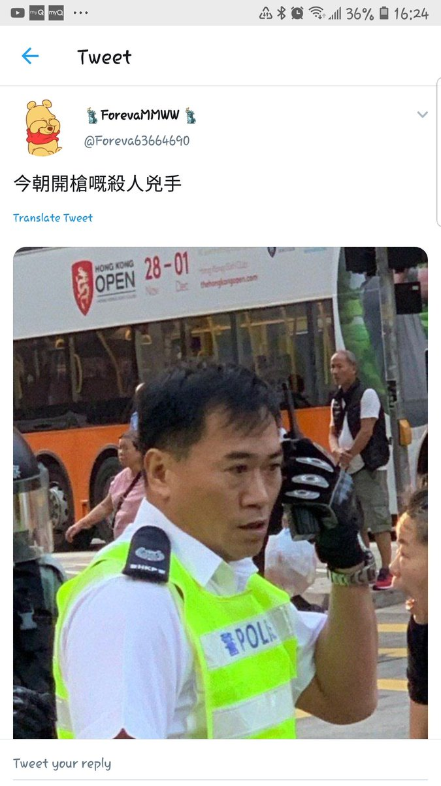
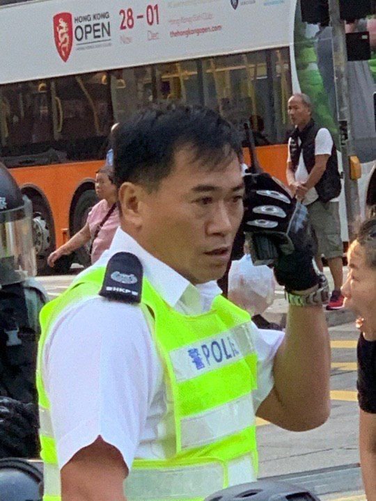
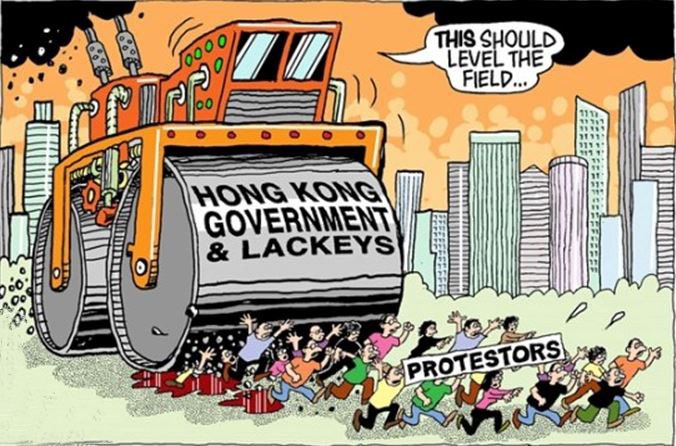
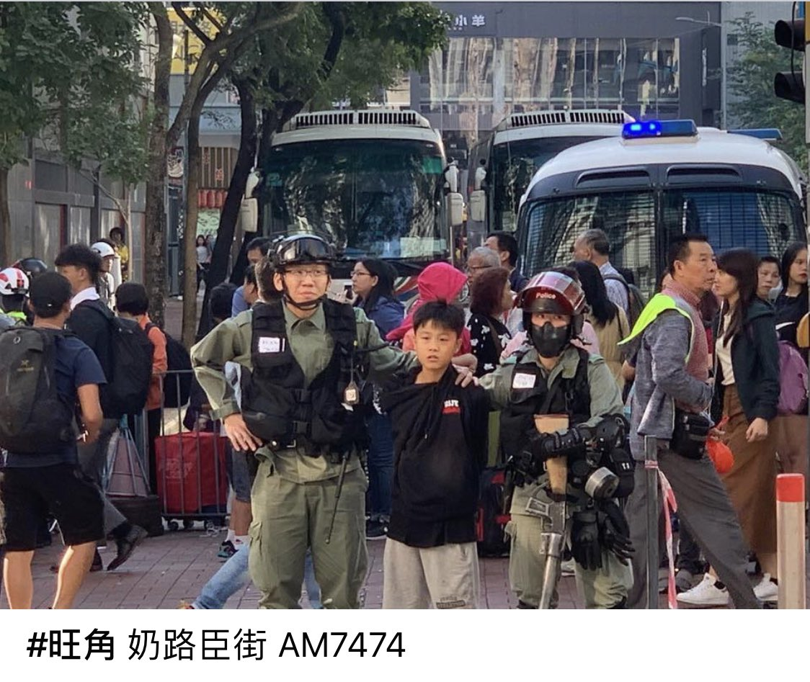
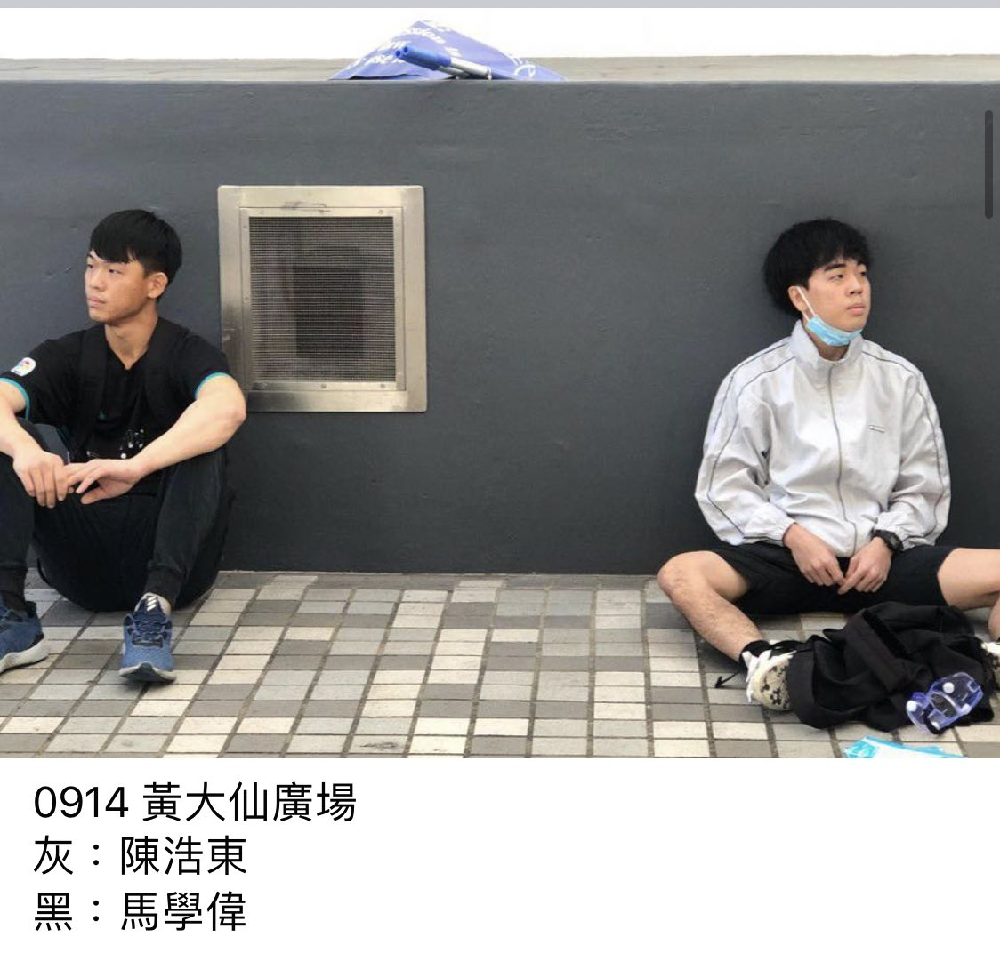
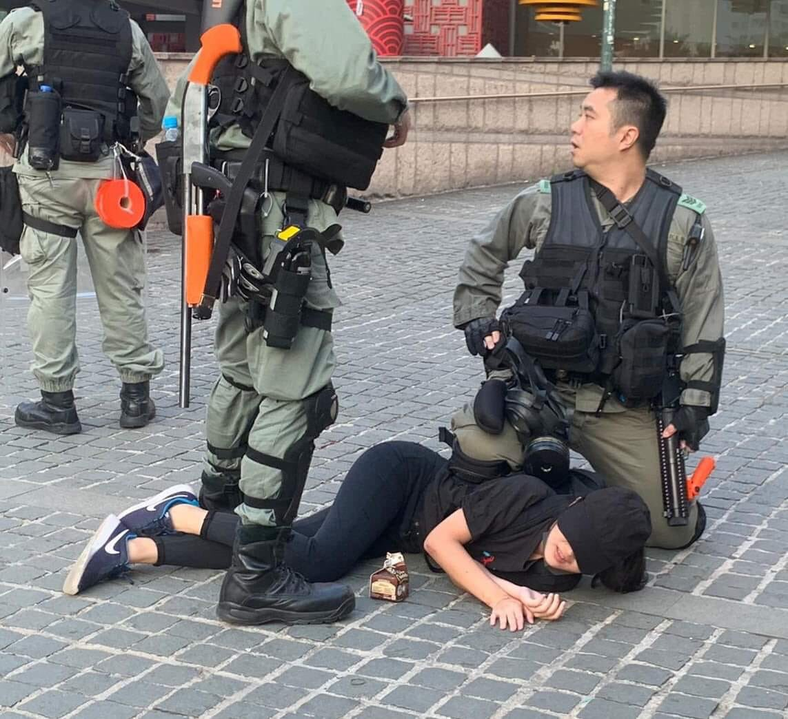
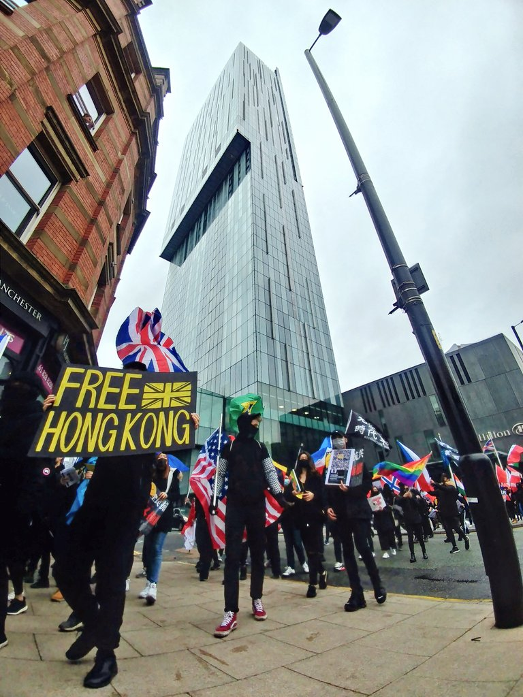
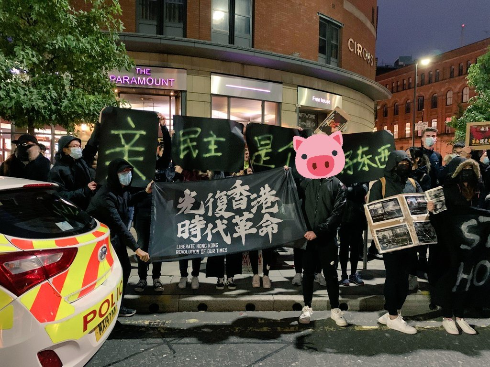

[11月11日 14:12]    财经真相   @caijingxiang    记得有个官员说过一句很经典的话“没有坏账，哪来那么多富人”，就是直接点出了中国银行游戏的本质。穷人要想贷款只能是“消费性质的”，这就是“房贷、车贷”，其他原始资本积累性质的贷款，是坚决被禁止的。而富人、官员、权贵则不然，他们贷款或者打着政府名义免抵押物要求，或者凭借权利直接贷款！  :speech_balloon:评:0 :+1:赞:18 :globe_with_meridians:转:8  

[11月11日 14:02]    财经真相   @caijingxiang    银行的新增存款不但停止增加，甚至开始减少，这个时候如果再赶上“春节”用钱高峰，银行就没有钱去应对储户提现要求，最终引发挤兑，银行破产！  :speech_balloon:评:2 :+1:赞:13 :globe_with_meridians:转:3  

[11月11日 14:00]    新闻大吐槽   @TuCaoFakeNews    是2个人被打倒，视频7”, 11”  :speech_balloon:评:0 :+1:赞:1 :globe_with_meridians:转:1  

[11月11日 14:00]    财经真相   @caijingxiang    票据贷如果只借一次也就罢了，关键是很多权贵，不但票据（欠条）到期后不还钱，反而再开一张票据，又拿走了一笔贷款，如此反复操作下去，银行的窟窿越来越大。以往经济好的时候，银行的存款也是不断的增加，比如从10块增加的20块，银行还可以勉强维持下去，直到中美贸易打的鸡飞狗跳，经济实质性的下滑  :speech_balloon:评:1 :+1:赞:10 :globe_with_meridians:转:4  

[11月11日 14:00]    纽约时报中文网   @nytchinese    特朗普上周表示，他尚未同意取消对中国商品加征的任何关税，如果中美达成协议，他不会取消对价值3600亿美元商品加征的全部关税。
据信白宫顾问正在就此产生分歧，鹰派人士呼吁保留关税，继续向中国施压。 http://nyti.ms/36X2Uxp   :speech_balloon:评:4 :+1:赞:2 :globe_with_meridians:转:1  

[11月11日 13:57]    新闻大吐槽   @TuCaoFakeNews    不要作無謂的犧牲。  :speech_balloon:评:0 :+1:赞:2 :globe_with_meridians:转:1  

[11月11日 13:55]    财经真相   @caijingxiang    因此中国的银行存款大部分是被国企和政府拿走，另一个就是房贷，这些几乎占据了中国银行贷款的8成以上，而这些要么是很难还款，要么就是根本不想换，由此造成银行资金连长期紧张，除了上面这些方面外，某些地方政府或者权贵企业干脆任何抵押物都不提供，直接给张欠条，就把钱贷走了，这就票据贷！  :speech_balloon:评:2 :+1:赞:13 :globe_with_meridians:转:6  

[11月11日 13:54]    BBC News 中文   @bbcchinese    【香港西湾河开枪：警察以实弹近距离击中黑衣人】这是香港反《逃犯条例》修订案示威爆发以来，第三起警察真枪实弹打伤示威者的事件。BBC中文以影片还原了事发经过。 https://bbc.in/2rpJ6lI   :speech_balloon:评:42 :+1:赞:32 :globe_with_meridians:转:24  

[11月11日 13:50]    财经真相   @caijingxiang    房贷、车贷等割老百姓韭菜性质的贷款，却管比较宽松，一般只要能够提供稳定工作证明就可以“放贷”，不要提供抵押物，但是其他性质的贷款则必须提供足量的抵押物，这也是中国中小企业贷款难、融资贵的核心根源。不过贷款对于国企而言却不是个事，因为国企本质是有政府背书，而且出事后银行一般免于追责！  :speech_balloon:评:3 :+1:赞:19 :globe_with_meridians:转:6  

[11月11日 13:49]    GFHG SDKM   @zyx_yny    #HKPoliceTerrorism #HKpolice do not allow people go out for lunch? https://twitter.com/thecantonesegod/status/1193765652365840385 …  :speech_balloon:评:0 :+1:赞:0 :globe_with_meridians:转:1  

[11月11日 13:44]    财经真相   @caijingxiang    银行最大借贷是6块，与总存款10块有一个比率，被称为存贷比，这在国际银行界都有严格规定；出借的6块中，确定不能还的钱，就是通常所说的坏账，坏账与总资本也有一个比率，被称坏账率，坏账率根据巴塞尔协议也有严格限制，不得超过规定！在中国从银行贷款都严格的抵押物要求，因此普通百姓一般都拿不到  :speech_balloon:评:1 :+1:赞:21 :globe_with_meridians:转:7  

[11月11日 13:41]    GFHG SDKM   @zyx_yny    Tear gas in Central, Hong Kong, No.3 financial centre in the world  :speech_balloon:评:7 :+1:赞:164 :globe_with_meridians:转:230  

[11月11日 13:36]    财经真相   @caijingxiang    平时银行手里的2块足够应对社会的取现，但是如果碰到春节，现金需求量大时，比如春节需求4块，银行2块就不够用，这时银行一般可以其他银行或者保险公司等金融机构借款，这被称为“同业拆借”，如果同业的钱也不够用，就只能找央行要回那笔“存款保证金”，央行一般会根据大数据分析缺口来定额度这就是降准  :speech_balloon:评:2 :+1:赞:35 :globe_with_meridians:转:11  

[11月11日 13:32]    新闻大吐槽   @TuCaoFakeNews    繼續證明它們已經不是同類！
要比ISIS更可怕的紅色基因感染群體
它們是正常人類法制文明下的殺人犯強姦犯！

它們也很清楚這點

成立獨立調查隊是不可能的，罪犯不會束手就擒，否則監獄和執法機關就不會產生，它們的存在就不可能讓真正的法制能公正制裁罪惡  :speech_balloon:评:1 :+1:赞:17 :globe_with_meridians:转:9  

[11月11日 13:32]    新闻大吐槽   @TuCaoFakeNews    所有的港警，包括到外來到港港警，以及開槍和施暴的港警，中共一定是有記錄在案的，只要中共倒臺，必然會拉他們出來墊背。 https://twitter.com/TuCaoFakeNews/status/1193598386533830656 …  :speech_balloon:评:0 :+1:赞:14 :globe_with_meridians:转:4  

[11月11日 13:30]    纽约时报中文网   @nytchinese    儿童性虐待图片在大肆流传，科技公司未能有效制止传播，到底哪里出了错？
时报调查发现，尽管平台已经禁止在网上发布这些文件，但搜索引擎、社交网络和云存储中仍充斥着犯罪分子可以利用的空白。对受害者来说，她们的痛苦被永久保存在互联网上。
更多简报内容： http://nyti.ms/2Nxuw4h   :speech_balloon:评:3 :+1:赞:4 :globe_with_meridians:转:2  

[11月11日 13:28]    财经真相   @caijingxiang    “钱荒”首先要弄清楚是哪个地方缺钱，临近春节最缺钱的就是银行。银行才是真正的“货币蓄水池”，银行本质就是钱的中介，一边吸收存款，另一边加点利息把收来的存款贷出去。正常情况下银行吸收了10块，只能贷出6块，2块交个央行保管，这比钱被称为存款保证金，剩下2元，作为手头现金流应对日常所需！  :speech_balloon:评:2 :+1:赞:73 :globe_with_meridians:转:28  

[11月11日 13:22]    新闻大吐槽   @TuCaoFakeNews     https://twitter.com/tucaofakenews/status/1193687461416718336 …  :speech_balloon:评:0 :+1:赞:4 :globe_with_meridians:转:1  

[11月11日 13:22]    新闻大吐槽   @TuCaoFakeNews    好難過呀  :speech_balloon:评:0 :+1:赞:2 :globe_with_meridians:转:1  

[11月11日 13:20]    BBC News 中文   @bbcchinese    这是自香港反对《逃犯条例》修订案示威今年6月爆发以来，第三次警察真枪实弹打伤示威者的事件。 https://bbc.in/36TQNRq   :speech_balloon:评:78 :+1:赞:75 :globe_with_meridians:转:57  

[11月11日 13:19]    新闻大吐槽   @TuCaoFakeNews    這是港警故意殺人了。 https://twitter.com/TuCaoFakeNews/status/1193685197398499328 …  :speech_balloon:评:1 :+1:赞:8 :globe_with_meridians:转:1  

[11月11日 13:16]    新闻大吐槽   @TuCaoFakeNews    城管在香港 https://twitter.com/TuCaoFakeNews/status/1193605436999553024 …  :speech_balloon:评:1 :+1:赞:5 :globe_with_meridians:转:3  

[11月11日 13:14]    GFHG SDKM   @zyx_yny    Disgrace, complete and utter sham. Fuck the govt to hell #StandWithHongKong #asiasworldcity #bantercity  :speech_balloon:评:11 :+1:赞:227 :globe_with_meridians:转:244  

[11月11日 13:08]    新闻大吐槽   @TuCaoFakeNews    #HKPoliceTerrorists https://twitter.com/tucaofakenews/status/1193605436999553024 …  :speech_balloon:评:0 :+1:赞:2 :globe_with_meridians:转:3  

[11月11日 13:04]    新闻大吐槽   @TuCaoFakeNews    中共魔鬼  :speech_balloon:评:0 :+1:赞:4 :globe_with_meridians:转:1  

[11月11日 13:00]    纽约时报中文网   @nytchinese    #每日一词 Distemper，政治混乱。 时报专栏作者布鲁尼写道，特朗普可能认为狗是愚蠢的，因为它们服从命令，而特朗普本人偏爱不服从的姿态，更钟意“政治上的动荡(distemper)”。
他在这里使用了双关，distemper意为政治混乱，同时还有狗瘟的意思。
更多简报内容： http://nyti.ms/2Nxuw4h   :speech_balloon:评:2 :+1:赞:3 :globe_with_meridians:转:0  

[11月11日 12:55]    新闻大吐槽   @TuCaoFakeNews    不要说高智商人群，它们连和正常人都没法相处。而且政府不是用来管理的，政府是雇佣来服务的，是被管的。  :speech_balloon:评:0 :+1:赞:5 :globe_with_meridians:转:3  

[11月11日 12:51]    新闻大吐槽   @TuCaoFakeNews    中共培养了一帮没脑子的杀人机器。  :speech_balloon:评:1 :+1:赞:3 :globe_with_meridians:转:1  

[11月11日 12:34]    新闻大吐槽   @TuCaoFakeNews    氣到說不岀話來。
根本就是蓄意謀殺！ https://twitter.com/tucaofakenews/status/1193685197398499328 …  :speech_balloon:评:1 :+1:赞:30 :globe_with_meridians:转:5  

[11月11日 12:30]    纽约时报中文网   @nytchinese    #观点 习近平为制度重建和改造党国端出了国家治理现代化这盘大菜，然此菜虽冠以“现代化”的名号，可此现代化非彼现代化，习再怎么提治理现代化，他心目中的现代化跟人们一般认为的现代化是两个概念和价值体系，中共革命党的本质在推进国家治理体系现代化的过程中是不可改变的。 http://nyti.ms/2ObRZaz   :speech_balloon:评:12 :+1:赞:37 :globe_with_meridians:转:18  

[11月11日 12:25]    新闻大吐槽   @TuCaoFakeNews    哪一位纳粹党卫军觉得自己不是为了德国、没有功劳呢？  :speech_balloon:评:1 :+1:赞:9 :globe_with_meridians:转:4  

[11月11日 12:18]    新闻大吐槽   @TuCaoFakeNews      :speech_balloon:评:0 :+1:赞:9 :globe_with_meridians:转:6  

[11月11日 12:05]    GFHG SDKM   @zyx_yny    DC, this is today's @hkpoliceforce shooter.  :speech_balloon:评:100 :+1:赞:602 :globe_with_meridians:转:471  

[11月11日 12:00]    纽约时报中文网   @nytchinese    引领韩国保守派复兴的民粹主义牧师：63岁的长老会牧师全光焄已成为韩国政坛一股不可忽视的力量，他以上帝、爱国主义和家庭价值观为名，带头向文在寅发起攻击，指责后者正在“共产化”韩国，是“朝鲜的主要间谍”。
更多简报内容： http://nyti.ms/2Nxuw4h   :speech_balloon:评:1 :+1:赞:11 :globe_with_meridians:转:6  

[11月11日 11:55]    GFHG SDKM   @zyx_yny    The shooter is NOT a @hkpoliceforce riot cop. He fired 3 times. I also saw 2 protesters got shot & went down. Are those 2 protesters still alive? We must put them in our prayers. https://twitter.com/jooeysiiu/status/1193694093236264962 …  :speech_balloon:评:435 :+1:赞:2942 :globe_with_meridians:转:2761  

[11月11日 11:45]    GFHG SDKM   @zyx_yny    Did any reporter capture the shooter's special call sign? https://twitter.com/r_caretaker/status/1193687707043524610 …  :speech_balloon:评:311 :+1:赞:2077 :globe_with_meridians:转:2147  

[11月11日 11:44]    新闻大吐槽   @TuCaoFakeNews    中秋节，还是和美的一家，如今，女儿浮尸海上，母亲成了街边枯骨！ https://twitter.com/CHANfong12/status/1193714126750502912 …  :speech_balloon:评:10 :+1:赞:95 :globe_with_meridians:转:81  

[11月11日 11:43]    GFHG SDKM   @zyx_yny    実弾が撃たれた現場とは違う別のデモ現場では、交通警察が故意にバイクでデモ隊を轢こうとしました。若者を殺そうとしていました。  :speech_balloon:评:355 :+1:赞:10813 :globe_with_meridians:转:9446  

[11月11日 11:34]    纽约时报中文网   @nytchinese    视频显示，周一早间，一名香港警察向一名反政府抗议者开枪。抗议者在被近距离射中后倒地，随后出现神志不清的情况。
在香港已因最近参加抗议活动的一名学生死亡一事而情势紧张之际，这一事件可能会使事态进一步升级。 http://nyti.ms/2p5hmCa   :speech_balloon:评:97 :+1:赞:84 :globe_with_meridians:转:62  

[11月11日 11:27]    GFHG SDKM   @zyx_yny    Leader McConnell, the situation in HK is alarming

We’re only fighting for the freedom you now enjoy but the govt tried to kill us.

Any delay to HKHRDA means more injuries or deaths.

We knew you repeatedly voiced support for HK. Pls help us in action & bring the bill to a vote.  :speech_balloon:评:6 :+1:赞:464 :globe_with_meridians:转:263  

[11月11日 11:11]    新闻大吐槽   @TuCaoFakeNews    越南也是社会主义国家，一记社会主义长拳，打得国际巨星措手不及 https://twitter.com/SelinaJin1/status/1193590223277625344 …  :speech_balloon:评:2 :+1:赞:50 :globe_with_meridians:转:13  

[11月11日 11:05]    GFHG SDKM   @zyx_yny    The #HongKong Police are out of control & escalating the level of violence against unarmed people. @realDonaldTrump should not remain silent while the situation worsens. https://www.hongkongfp.com/2019/11/11/breaking-hong-kong-police-shoot-protester-live-round-sai-wan-ho/ …  :speech_balloon:评:672 :+1:赞:5010 :globe_with_meridians:转:4994  

[11月11日 11:05]    GFHG SDKM   @zyx_yny    RT to tell @SenateMajldr McConnell: bring the bipartisan Hong Kong Human Rights & Democracy Act to the Senate Floor this week! #HongKongProtests #StandWithHongKong  :speech_balloon:评:2392 :+1:赞:13430 :globe_with_meridians:转:14479  

[11月11日 11:00]    纽约时报中文网   @nytchinese    • 致命火灾肆虐澳大利亚东海岸地区，已造成三人死亡、数十人受伤并摧毁了至少150幢房屋。火情预计本周将威胁悉尼。
• 沙特阿美IPO在即，12月5日宣布最终股价。其IPO可能创下史上最高记录、超过阿里IPO时筹集的近220亿美元，但仍可能低于沙特王储萨勒曼的预期。更多简报内容： http://nyti.ms/2Nxuw4h   :speech_balloon:评:1 :+1:赞:2 :globe_with_meridians:转:0  

[11月11日 10:30]    纽约时报中文网   @nytchinese    #观点 四中全会通过的决定标志着习近平迎来他在中国执政的第二季，正式开启党国统治的升级版。他进一步强化了个人对党的掌控和党对国家与人民的掌控，并准备向西方反向输送价值观。
我不清楚如何破解这个党国体系的升级版，但任何“完美极权”总有脆弱的一环。 http://nyti.ms/2ObRZaz   :speech_balloon:评:25 :+1:赞:36 :globe_with_meridians:转:18  

[11月11日 10:20]    纽约时报中文网   @nytchinese    简报：视频显示港警向抗议者开枪；中国债务问题有多严重 http://nyti.ms/2Nxuw4h https://twitter.com/ccni/status/1193714126817808389 …  :speech_balloon:评:9 :+1:赞:10 :globe_with_meridians:转:9  

[11月11日 10:08]    GFHG SDKM   @zyx_yny    一直畫正面嘅畫，但呢個禮拜真係正面唔到。也許香港早已腐爛不堪，但作為畫撚，我會繼續。Have been trying to spread positive thinking by drawing, but I really can’t stay positive this week. Can’t imagine how rotten HK has been. Though distressed, I will #StandWithHongKong forever.  :speech_balloon:评:1 :+1:赞:56 :globe_with_meridians:转:51  

[11月11日 10:02]    新闻大吐槽   @TuCaoFakeNews    認人，幫佢哋搵家長  :speech_balloon:评:6 :+1:赞:71 :globe_with_meridians:转:130  

[11月11日 10:01]    纽约时报中文网   @nytchinese    早安！今日重点新闻包括：
视频显示港警向抗议者开枪；中国债务问题有多严重；特朗普否认将全面取消对华关税；阿里重启赴港上市计划；致命火灾肆虐澳大利亚；纪念柏林墙倒塌30周年；儿童性虐图片传播谁之过；引领韩国保守派复兴的民粹主义牧师……NYT简报带你速览今日要闻。 http://nyti.ms/2Nxuw4h   :speech_balloon:评:31 :+1:赞:52 :globe_with_meridians:转:20  

[11月11日 09:31]    新闻大吐槽   @TuCaoFakeNews    科大曾同学认为，香港变成如今局面，是因共产党只懂得强硬手段，不懂如何管制高智商人群！
太对了，就跟大陆无处不在的党委书记一样，专业狗屁不通，只懂与民为敌

收买论被他驳斥的体无完肤，他认为只认钱的价值观是肤浅的，他们是为了民主自由的理念，89薪火在香港！  :speech_balloon:评:26 :+1:赞:389 :globe_with_meridians:转:188  

[11月11日 09:20]    GFHG SDKM   @zyx_yny    中大傳出槍聲。（9：18 AM）

#黎明行動  :speech_balloon:评:17 :+1:赞:251 :globe_with_meridians:转:280  

[11月11日 09:16]    GFHG SDKM   @zyx_yny    葵芳武裝恐怖份子駕車瘋狂撞人前片段，可見示威者並無任何衝擊意圖。  :speech_balloon:评:14 :+1:赞:250 :globe_with_meridians:转:280  

[11月11日 08:47]    GFHG SDKM   @zyx_yny    #HKPoliceState dehumanizing Hk citizen.. Calling ppl as “cockroach”.
This is the BAD RESULT... they shoot live to youngsters like shooting a dead subjest.. Life threaten? i didnt see it at all
@HawleyMO #SOSHK  :speech_balloon:评:2 :+1:赞:44 :globe_with_meridians:转:50  

[11月11日 08:47]    GFHG SDKM   @zyx_yny    Drinking chocolate milk is a crime.
早上約七時，黃大仙廣場附近，防暴警察把一名女子制伏在地，地上有一盒紙朱古力奶。
At around 7AM, near Wong Tai Sin Square, riot police tackled this lady. On the ground is a carton of chocolate milk.
From: Facebook (Discover Real Hong Kong)  :speech_balloon:评:6 :+1:赞:97 :globe_with_meridians:转:127  

[11月11日 08:44]    BBC News 中文   @bbcchinese    几张图告诉你中国和美国的“金融切割”没那么简单。 https://www.bbc.com/zhongwen/simp/world-49965106 …  :speech_balloon:评:5 :+1:赞:44 :globe_with_meridians:转:21  

[11月11日 07:50]    GFHG SDKM   @zyx_yny    A lesson to tyrants everywhere on the power of faith, hope, and courage. Beijing, pay attention #StandWithHongKong  :speech_balloon:评:38 :+1:赞:272 :globe_with_meridians:转:144  

[11月11日 05:08]    GFHG SDKM   @zyx_yny    香港黑警幾時會失控到周街殺人？

#HongKongProtests
#HongKongPoliceTerrorism
#StandwithHK  :speech_balloon:评:31 :+1:赞:225 :globe_with_meridians:转:256  

[11月11日 02:36]    新闻大吐槽   @TuCaoFakeNews    老伯寥寥数语后，原本狂躁的黑警一下就安静下来。

「要認清中共極權思想，中共大官都跳樓死，何況你平民百姓，你殺人以為有功勞啊？！」

老伯说的是澳门中联办主任郑晓松，他和王志民同等级别。  :speech_balloon:评:21 :+1:赞:208 :globe_with_meridians:转:112  

[11月11日 00:45]    GFHG SDKM   @zyx_yny    然後他們笑了，因為他們知道手上有權力有槍就可以為所欲為。

沒有白警，只有恐怖分子。
#HKPoliceTerrorism  :speech_balloon:评:0 :+1:赞:17 :globe_with_meridians:转:10  

[11月10日 23:54]    GFHG SDKM   @zyx_yny    We may lost another life tonight ! Festival Walk Shopping mall , riot police in private property AGAIN without warrant!#PoliceBrutality ⁦@SolomonYue⁩ ⁦@CommonsForeign⁩ ⁦@tariqahmadbt⁩ ⁦@StateDept⁩ ⁦@marcorubio⁩ ⁦@lukedepulford⁩ ⁦⁦  :speech_balloon:评:23 :+1:赞:445 :globe_with_meridians:转:543  

[11月10日 23:00]    纽约时报中文网   @nytchinese    #一周热门 #观点 基努·里维斯的绯闻女友告诉我们的事 http://nyti.ms/2rqv4jY   :speech_balloon:评:7 :+1:赞:15 :globe_with_meridians:转:5  

[11月10日 22:23]    墙国铁拳现世报😷   @Socialistfist    5. 因投稿较多且具体事件有时效性，也许会延迟发布您的投稿，希望能够理解。对于一些重复投稿的或者不符合主题的投稿，也许不会被采用。
6. 最佳投稿途径是发送私信，@ 本推会被其他通知挤掉
7. 如果您有好的内容，欢迎使用 #社会主义铁拳 和 #社會主義鐵拳，简繁双体的tag。符合内容的推文会给予转推  :speech_balloon:评:0 :+1:赞:33 :globe_with_meridians:转:4  

[11月10日 22:18]    墙国铁拳现世报😷   @Socialistfist    1. 为避免潜在视奸号盗取IP，不接受含有网站链接的投稿
2. 社会主义铁拳相关主题内容应当是，个体或集体有赞美言论后被社会主义政权铁拳的事例。自然灾害或非社会主义政权皆不算是#社会主义铁拳
3. 本推主题明确统一，不接受除了铁拳现世报以外的爆料或投稿
4. 推荐使用多张截图和文字相配合的投稿方式  :speech_balloon:评:1 :+1:赞:57 :globe_with_meridians:转:8  

[11月10日 22:14]    墙国铁拳现世报😷   @Socialistfist    感谢所有新关注的推友和所有开推以来一路的老朋友。
本推的成长离不开所有积极投稿的热心推友，再次表示特别感谢。为了明确投稿规范，特别发此推做出说明。  :speech_balloon:评:5 :+1:赞:80 :globe_with_meridians:转:8  

[11月10日 21:07]    老司机   @h5lpykl7tp6jjop    剛刚：这阵仗像极了大陆解放军攻打香港，看起来特别地荒唐可笑！竟然用这阵仗对付手无寸铁的民众、自已的骨肉同胞？你们也真不要逼脸！  :speech_balloon:评:168 :+1:赞:987 :globe_with_meridians:转:660  

[11月10日 21:00]    纽约时报中文网   @nytchinese    #一周热门 是时候让《蒙娜丽莎》离开卢浮宫了 http://nyti.ms/33sWuE2   :speech_balloon:评:6 :+1:赞:7 :globe_with_meridians:转:4  

[11月10日 20:31]    GFHG SDKM   @zyx_yny    我哋係一群住喺英國曼城嘅香港人由運動開始到依家舉辦過 #聲援香港人 同爭取 #BNO平權 嘅遊行, 集會, 活動
希望手足可以Follow我哋個Twitter, 加強我哋做文宣時嘅影響力
多謝大家
#光復香港時代革命 #國際戰線
#手足互科 #手足科勞 #FollowBackHongKong #FollowBackHK  :speech_balloon:评:52 :+1:赞:800 :globe_with_meridians:转:529  

[11月10日 20:00]    BBC News 中文   @bbcchinese    【贸易战：为何美国将中国当成死对头？】保守派智库美国传统基金会的专家成斌说：“越来越多企业认识到，与中国合作最终不一定能赚钱，甚至可能要倒赔”。 https://bbc.in/2Nw9YZR   :speech_balloon:评:52 :+1:赞:68 :globe_with_meridians:转:24  

[11月10日 19:00]    纽约时报中文网   @nytchinese    #一周热门 中国数字货币政策转向，区块链重获北京垂青 http://nyti.ms/33rTszU   :speech_balloon:评:3 :+1:赞:5 :globe_with_meridians:转:5  

[11月10日 18:56]    BBC News 中文   @bbcchinese    中国国务院港澳办主任张晓明周六发文指，香港未完成23条立法是近年“港独”不断加剧的主要原因之一。 https://bbc.in/2X5RlPJ   :speech_balloon:评:112 :+1:赞:93 :globe_with_meridians:转:49  

[11月10日 17:22]    老司机   @h5lpykl7tp6jjop    8年获得科研经费补贴15亿元。最终还是破产了！
国企为主的政策主导下，自主研发口号让领导开心，大笔一挥，
山东常林集团，一家拥有“国家重点实验室”和“山东省重点实验室”的企业，多次名列"中国机械工业百强"榜单，可现实残酷骗局终于现相：  :speech_balloon:评:8 :+1:赞:102 :globe_with_meridians:转:64  

[11月10日 17:00]    BBC News 中文   @bbcchinese    77岁的布隆伯格创立彭博集团，以555亿美元财富排福布斯富豪榜第九位，2001年至2013年担任纽约市长。他的顾问说，他能够胜过特朗普。 https://bbc.in/32wixs2   :speech_balloon:评:44 :+1:赞:51 :globe_with_meridians:转:20  

[11月10日 17:00]    纽约时报中文网   @nytchinese    #一周热门 #时报专栏 为什么特朗普恨你的狗 http://nyti.ms/2NT44Rw   :speech_balloon:评:12 :+1:赞:7 :globe_with_meridians:转:3  

[11月10日 16:50]    新闻大吐槽   @TuCaoFakeNews    最新消息爆出：黑警强奸15岁女生，致其堕胎~
市民们愤怒无比，大喊强奸犯！
很多中老年人也加入了声讨黑警的人群~

情势越是危急，香港人就越团结，太感动了！真值得大陆人好好学习  :speech_balloon:评:118 :+1:赞:2224 :globe_with_meridians:转:1189  

[11月10日 15:55]    财经真相   @caijingxiang    有人说我做的前三季度财政不全，没有算上土地出让金，因为那个才是地方政府收入的大头，好吧，补充一下，1-9月全国政府性基金预算收入53163亿元，其中中央收入3086亿元，地方收入50077亿元。支出方面，全国是61768亿元，中央支出1838亿元，地方支出59930亿元。基金赤字全国为-8675亿，地方为-9853亿！  :speech_balloon:评:8 :+1:赞:235 :globe_with_meridians:转:77  

[11月10日 15:01]    BBC News 中文   @bbcchinese    【一周热点重温】这张在中国祁连山上拍到的照片看起来可能类似“搞笑对白”，但实际是一只狐狸向土拨鼠发动攻击的生死瞬间。中国摄影师鲍永清为了拍摄这张照片，在青藏高原上躲藏盯梢好几个小时，凭此在2019年度野生动物摄影师大赛获胜。 https://bbc.in/2X1FTVh   :speech_balloon:评:12 :+1:赞:182 :globe_with_meridians:转:34  

[11月10日 15:00]    纽约时报中文网   @nytchinese    #一周热门 中国试图清理积弊深重的银行系统 http://nyti.ms/32rps5U   :speech_balloon:评:6 :+1:赞:47 :globe_with_meridians:转:14  

[11月10日 14:47]    老司机   @h5lpykl7tp6jjop    转发网络笑话：做一个有思想的废青！

大清早被银行的催债电话吵醒，顿时对着电话怒骂：都跟你说了多少遍了，那个贷款合同已经是历史文件了，不具有现实意义了！并且我自己挣的钱，还不还，不由你这个外人说三道四！骂完后我很解气的挂掉了电话，回到床上继续做起了中国梦。  :speech_balloon:评:6 :+1:赞:425 :globe_with_meridians:转:123  

[11月10日 14:36]    老司机   @h5lpykl7tp6jjop    中国如何渗透台湾大选 调查发现某管道恐为入口
大陆穷百姓艰难求生，中共把钱用来打水飘！  :speech_balloon:评:0 :+1:赞:11 :globe_with_meridians:转:4  

[11月10日 14:00]    纽约时报中文网   @nytchinese    #一周热门 #观点 你能为解决气候变化做些什么？从穿衣做起 http://nyti.ms/2CdlbIt   :speech_balloon:评:8 :+1:赞:11 :globe_with_meridians:转:2  

[11月10日 13:01]    BBC News 中文   @bbcchinese    【一周热点重温】虽然世界贸易组织(WTO) 这一裁决涉及的36亿美元，与中美贸易战所涉及的数千亿美元相比显得数额很小，然而世贸组织这一裁决却颇有象征意义。 https://bbc.in/33wuqzr   :speech_balloon:评:13 :+1:赞:37 :globe_with_meridians:转:9  

[11月10日 13:00]    纽约时报中文网   @nytchinese    #一周热门 面对“双11”狂欢，美国公司的谨慎和不安 http://nyti.ms/2WS3GXK   :speech_balloon:评:11 :+1:赞:17 :globe_with_meridians:转:7  

[11月10日 12:00]    纽约时报中文网   @nytchinese    #一周热门 2019年《纽约时报》/纽约公共图书馆最佳儿童绘本 http://nyti.ms/2oRMwNg   :speech_balloon:评:0 :+1:赞:17 :globe_with_meridians:转:8  

[11月10日 11:30]    BBC News 中文   @bbcchinese    【一周热点重温】何君尧的声明称：“今早是香港区议会选举上黑色的一天”。 https://bbc.in/2X3gGKg   :speech_balloon:评:39 :+1:赞:29 :globe_with_meridians:转:9  

[11月10日 11:00]    纽约时报中文网   @nytchinese    #一周热门 #观点 当“老大哥”已经不够吓人 http://nyti.ms/2NjJw5Q   :speech_balloon:评:8 :+1:赞:24 :globe_with_meridians:转:15  

[11月10日 10:00]    纽约时报中文网   @nytchinese    #一周热门 中国颁布新规，限制未成年人玩游戏 http://nyti.ms/2PV2PUw   :speech_balloon:评:33 :+1:赞:44 :globe_with_meridians:转:9  

[11月10日 09:01]    BBC News 中文   @bbcchinese    【一周热点重温】中国《中央电视台》主播录制视频宣传中国对台举措，并喊话“湾湾回家吧”。这样有没有拉拢到你的心？ https://bbc.in/2NtN1GH   :speech_balloon:评:199 :+1:赞:112 :globe_with_meridians:转:31  

[11月10日 08:57]    财经真相   @caijingxiang    以往临近年底地方政府财政有盈余的都会进行突击花钱，这在客观因素上带动了部分消费，但是今年这种场景估计也就只有上海才会出现了。赤字最大的河南省到年底时还要补各种拖欠，扩大的7000亿的地方是大概率事件，听说目前河南的交警查违章很勤奋，在此提醒各位有车族，快过年了，防火、防盗、防交警！  :speech_balloon:评:11 :+1:赞:212 :globe_with_meridians:转:53  

[11月10日 08:34]    财经真相   @caijingxiang    整理了一下前三季度中国各地方一般财政收入数据，各位可以和半年度数据进行对比一下。另外还有几个地方数据没有找到支出数据，欢迎各位补充！  :speech_balloon:评:29 :+1:赞:283 :globe_with_meridians:转:139  

[11月10日 08:13]    BBC News 中文   @bbcchinese    我们很多人都学过一门外语，然后在简历上声称自己说得很流利，一个善意的小谎言怎么会让我们丢掉工作呢？ https://bbc.in/2NxvIF2   :speech_balloon:评:11 :+1:赞:44 :globe_with_meridians:转:17  

[11月10日 05:28]    老司机   @h5lpykl7tp6jjop    中共不同于苏共，它比苏共除了狂妄自大以外还卑鄙无耻得多很多，每当危及生存之时它都可以断尾求生， 历界总书记大多数没有好下场，别看今天香港警匪在中共黑手下威风，可以预见香港打手的未来，一旦国际国内形势对中共不利，中共为了求存你们就是中共的代价，蜥蜴的尾巴，拉清单清算的日子等着你们！  :speech_balloon:评:0 :+1:赞:53 :globe_with_meridians:转:15  

[11月10日 05:07]    老司机   @h5lpykl7tp6jjop      :speech_balloon:评:0 :+1:赞:3 :globe_with_meridians:转:2  

[11月10日 05:07]    老司机   @h5lpykl7tp6jjop      :speech_balloon:评:1 :+1:赞:3 :globe_with_meridians:转:3  

[11月10日 05:06]    老司机   @h5lpykl7tp6jjop    柏林墙倒掉三十年，今天的香港是当年的柏林！  :speech_balloon:评:1 :+1:赞:10 :globe_with_meridians:转:3  

[11月09日 23:45]    BBC News 中文   @bbcchinese    大批香港人在添马公园亮起灯光，悼念于周五（8日）离世的22岁科大学生周梓乐。  :speech_balloon:评:147 :+1:赞:949 :globe_with_meridians:转:349  

[11月09日 21:49]    BBC News 中文   @bbcchinese    【柏林围墙倒塌30年：它是如何建成的？】让我们用3分钟告诉你柏林围墙的历史缘由。 https://bbc.in/2CthezG   :speech_balloon:评:9 :+1:赞:60 :globe_with_meridians:转:25  

[11月09日 21:10]    老司机   @h5lpykl7tp6jjop    2019年11月9日，上海宝山区蕰川路物流园区爆炸  :speech_balloon:评:13 :+1:赞:161 :globe_with_meridians:转:90  

[11月09日 20:44]    墙国铁拳现世报😷   @Socialistfist    删了重发是因为小编是强迫症，之前推有一个重复字。  :speech_balloon:评:3 :+1:赞:131 :globe_with_meridians:转:3  

[11月09日 20:44]    BBC News 中文   @bbcchinese    【周梓乐离世：韩国人首尔集会悼念周同学 促政府支持香港人】集会的主办方指，韩国军政府独裁时期，国际社会也向韩国民主运动表示支持，因此现在韩国政府也不应在香港议题上沉默。 https://bbc.in/2NZY0GW   :speech_balloon:评:81 :+1:赞:396 :globe_with_meridians:转:155  

[11月09日 20:43]    墙国铁拳现世报😷   @Socialistfist    孩子，这次你让祖国爸爸失望了

#社会主义铁拳  :speech_balloon:评:83 :+1:赞:714 :globe_with_meridians:转:215  

[11月09日 18:00]    BBC News 中文   @bbcchinese    柏林墙倒塌30周年纪念日前夕，美国务卿蓬佩奥访问德国发表演讲，警告西方世界应警惕中国与俄罗斯，是否在宣布第二次冷战的爆发？ https://bbc.in/2WXEWgE   :speech_balloon:评:90 :+1:赞:305 :globe_with_meridians:转:107  

[11月09日 17:00]    BBC News 中文   @bbcchinese    你认为哪一则新闻最重要呢？ https://bbc.in/33wxdIT   :speech_balloon:评:37 :+1:赞:16 :globe_with_meridians:转:8  

[11月09日 16:00]    BBC News 中文   @bbcchinese    中美的紧张关系涉及的是比贸易更深的层面，BBC驻美国记者在华盛顿访问过的人当中，没有一个认为上月签订的框架协议能带来多少改变。 https://bbc.in/2NuWOfD   :speech_balloon:评:24 :+1:赞:37 :globe_with_meridians:转:14  

[11月09日 15:01]    BBC News 中文   @bbcchinese    【一周热点重温】香港示威抗议活动周日在太古城中心再度发生流血事件，至少有4人遭到持刀攻击者刺伤，区议员赵家贤还被咬掉部分耳朵。 https://bbc.in/2K5Ra1I   :speech_balloon:评:23 :+1:赞:61 :globe_with_meridians:转:27  

[11月09日 13:01]    BBC News 中文   @bbcchinese    【一周热点重温】所有尸体的腹部都有一道细小的剖口，像手术刀切口一样利落精准。心和肝都不见了。这是谁干的？怎么干的？ https://bbc.in/2NR2wYp   :speech_balloon:评:12 :+1:赞:46 :globe_with_meridians:转:15  

[11月09日 11:01]    BBC News 中文   @bbcchinese    【一周热点重温】就医时，她身高只有1.35米，体重只有40多斤......她的故事，折射出怎样的社会现状？ https://bbc.in/2K4cogd   :speech_balloon:评:118 :+1:赞:143 :globe_with_meridians:转:69  

[11月09日 10:56]    财经真相   @caijingxiang    马鞍山托底楼市，发文规定楼盘跌幅不能超过10%！  :speech_balloon:评:37 :+1:赞:340 :globe_with_meridians:转:157  

[11月09日 10:49]    财经真相   @caijingxiang    浮亏大约6万多美元，这种涨幅从一开始就有预防，爆仓线压在6.8，减仓后到6.6 https://twitter.com/Blackstonefund/status/1192989400117862400 …  :speech_balloon:评:46 :+1:赞:101 :globe_with_meridians:转:10  

[11月09日 10:47]    老司机   @h5lpykl7tp6jjop    上亿人听过他的演讲 陈秋实：被枪毙也无悔
美国之音采访文字时录，

 https://www.wenxuecity.com/news/2019/11/08/8836866.html …  :speech_balloon:评:1 :+1:赞:2 :globe_with_meridians:转:0  

[11月09日 10:29]    老司机   @h5lpykl7tp6jjop    惊！传崔永元遭半软禁超半年 无可奈何
偷税七亿的人没事，曝光的人倒晦了，依法治国？  :speech_balloon:评:3 :+1:赞:59 :globe_with_meridians:转:29  

[11月09日 10:12]    老司机   @h5lpykl7tp6jjop    企业倒闭潮来临：中国设逾90个破产法庭

美中贸易战重挫中国经济，加之中国企业债台高筑，引发企业倒闭潮。美媒披露，中共官方为防止经济硬着陆，罕见容许中国公司以美国式破产方式倒闭，大陆现有超过90个破产法庭，仅2018年就有1.9万家企业申请破产。  :speech_balloon:评:1 :+1:赞:20 :globe_with_meridians:转:8  

[11月09日 10:01]    老司机   @h5lpykl7tp6jjop    肉类储备严重不足 中国拟解除进口美国禽肉限制

在决定恢复对加拿大猪肉牛肉进口后，中国正研究开始实施新的措施——解除美国禽肉对华出口限制。

　　7日，据新华社消息，中国海关总署和农业农村部正在研究解除美国禽肉对华出口限制事宜。  :speech_balloon:评:1 :+1:赞:3 :globe_with_meridians:转:1  

[11月09日 09:48]    老司机   @h5lpykl7tp6jjop    评人民日报：何君尧遇刺事件是有政治目的的谋杀

说得真好！近半年来有目的政治谋杀官方有一个人死吗？这位何姓议员被刺后五小时才去医院手术，谋杀的剧本不太严谨吧！
而大陆军人暗渡陈仓冒名顶替香港警察，打杀了多少香港人，强奸了多少小女生，海上不明浮尸超过十年总和，这不叫有政治目的的谋杀？  :speech_balloon:评:2 :+1:赞:58 :globe_with_meridians:转:16  

[11月09日 09:35]    财经真相   @caijingxiang    其中，猪肉价格上涨20.1%，涨幅比上月扩大0.4个百分点，影响CPI上涨约0.79个百分点，占CPI环比总涨幅的近九成。  :speech_balloon:评:12 :+1:赞:59 :globe_with_meridians:转:6  

[11月09日 09:35]    老司机   @h5lpykl7tp6jjop    好文转发：
美国人坦言： "在上海活着,才叫活着"！

朝鲜崔龙浩  :speech_balloon:评:3 :+1:赞:16 :globe_with_meridians:转:7  

[11月09日 09:34]    财经真相   @caijingxiang    刚刚中共官方公布的10月年率为3.8%，超过市场预期的3.3%，ppi年率为-1.6%，典型的“滞胀”！ https://twitter.com/caijingxiang/status/1192717156858744833 …  :speech_balloon:评:8 :+1:赞:133 :globe_with_meridians:转:46  

[11月09日 04:44]    老司机   @h5lpykl7tp6jjop    有些国家（以色列），哪怕一只鸟儿挂在高压线上，它都可以出动直升机进行挽救！
有些国家（***），哪怕它的国民看不起病跳楼自杀，它却依然无动于衷！  :speech_balloon:评:19 :+1:赞:664 :globe_with_meridians:转:260  

[11月08日 23:05]    财经真相   @caijingxiang    川大爷的推特辟谣减掉现有关税，瞬间金融市场鸡飞狗跳，黄金大涨8美元，离岸人民币再度跌破7！美股转跌1  :speech_balloon:评:46 :+1:赞:649 :globe_with_meridians:转:146  

[11月08日 21:45]    墙国铁拳现世报😷   @Socialistfist    补充  :speech_balloon:评:26 :+1:赞:128 :globe_with_meridians:转:13  

[11月08日 21:36]    墙国铁拳现世报😷   @Socialistfist    考虑拿日元明年去日本花呀？  :speech_balloon:评:17 :+1:赞:107 :globe_with_meridians:转:10  

[11月08日 21:32]    老司机   @h5lpykl7tp6jjop    RT「這個世界到底多瘋狂」

這張照片裡警察打開了他的車門，瞄準記者擊發並且射出了子彈。

他對著鏡頭射擊，完全不在意記者並不是示威者，記者也對警察的人身安全無慮，香港警察只是嗜血，只是憑自己的喜好任意殺人。
（續）  :speech_balloon:评:10 :+1:赞:311 :globe_with_meridians:转:187  

[11月08日 21:29]    墙国铁拳现世报😷   @Socialistfist    没聊上三句，就被B了。
想和粉红战螂谈心太难了  :speech_balloon:评:13 :+1:赞:109 :globe_with_meridians:转:6  

[11月08日 21:12]    墙国铁拳现世报😷   @Socialistfist      :speech_balloon:评:4 :+1:赞:56 :globe_with_meridians:转:6  

[11月08日 21:07]    墙国铁拳现世报😷   @Socialistfist    噗嗤，您可能搞错了。小编从来都是坚定支持中国特色社会主义的（铁拳）  https://twitter.com/kanade_ash/status/1192783549474099200 …  :speech_balloon:评:21 :+1:赞:115 :globe_with_meridians:转:15  

[11月08日 20:24]    财经真相   @caijingxiang    黄金跌破1460，深度回调持续中，基本面两大利空：一个是中美贸易乐观虚假信息；二是美联储已经停止降息！ https://twitter.com/caijingxiang/status/1188734283260874752 …  :speech_balloon:评:13 :+1:赞:103 :globe_with_meridians:转:31  

[11月08日 20:17]    墙国铁拳现世报😷   @Socialistfist    感谢 @OLLieGuo 的投稿和其他推友的推送和补充  :speech_balloon:评:1 :+1:赞:78 :globe_with_meridians:转:1  

[11月08日 20:16]    墙国铁拳现世报😷   @Socialistfist    被战术核导弹式铁拳砸到的韭菜开始发生了变异
#社会主义铁拳
#战螂在推特  :speech_balloon:评:108 :+1:赞:628 :globe_with_meridians:转:185  

[11月08日 20:04]    财经真相   @caijingxiang    美国驻华大使馆发了，美国国家药物管制政策办公室就中国起诉和判决芬太尼贩运者和生产者声明！  :speech_balloon:评:3 :+1:赞:58 :globe_with_meridians:转:21  

[11月08日 19:41]    财经真相   @caijingxiang    就是这歌逻辑，投其所好，用股市上涨收买川普！你看只要同意中国的要求，减免现行关税股市就会天天创新高，如果你继续加税，股市立马暴跌！ https://twitter.com/qinzhubipashui/status/1192767901549228034 …  :speech_balloon:评:19 :+1:赞:133 :globe_with_meridians:转:33  

[11月08日 19:32]    财经真相   @caijingxiang    市场最能反应真相，这是金融行业的名言，但是现在的市场却很扯淡，中美两国绝大多数人都认为不可能达成协议，所有的利好都是假消息，偏偏市场就按照假消息计价，尤其是华尔街还把美股不断创新高，这与以往按照美国经济数据计价完全不同，无论中美经济数据多差，都抵不过一个中美贸易利好消息！  :speech_balloon:评:14 :+1:赞:123 :globe_with_meridians:转:15  

[11月08日 16:16]    老司机   @h5lpykl7tp6jjop    人民军队属于党，
全党听从党中央，
中央都服总书记，
党总书记是皇上，
书记自小看书多，
大海掀翻小池塘，
满朝文武藏绿卡，
半壁江山养美娘，
有钱非洲去撒币，
没钱各地倒银行，
半边脸笑骗台湾，
暗中派兵杀香港，
谈判川普吊胃口，
不管肉价天天涨，
景山那稞老槐树，
就是皇上的下场！  :speech_balloon:评:10 :+1:赞:417 :globe_with_meridians:转:107  

[11月08日 13:21]    老司机   @h5lpykl7tp6jjop    起底变态杀人犯  :speech_balloon:评:1 :+1:赞:7 :globe_with_meridians:转:8  

[11月08日 11:02]    老司机   @h5lpykl7tp6jjop    張志新被割喉、李九蓮与林昭被虐死、遇羅克們被槍決，這些公开的殘酷迫害经過开放改革的＂反思＂，他們做惡不是有所收斂，而是采用更隱蔽的方式，殺人手段更毒辣。如劉曉波盰癌死、曹順利不明不白死等。
中共及其打手林鄭不用對話，而用殺人暴行強力而血腥地對待港人，說明它與人民不共戴天，是死敵！ https://twitter.com/anna12112124/status/1192632878611488768 …  :speech_balloon:评:9 :+1:赞:278 :globe_with_meridians:转:137  

[11月08日 00:58]    墙国铁拳现世报😷   @Socialistfist    彻底翻了 https://twitter.com/tdtw/status/1192485721698897920 …  :speech_balloon:评:24 :+1:赞:549 :globe_with_meridians:转:105  

[11月07日 20:16]    墙国铁拳现世报😷   @Socialistfist    官媒已经意识到翻船，已经控评  :speech_balloon:评:7 :+1:赞:213 :globe_with_meridians:转:16  

[11月07日 18:46]    墙国铁拳现世报😷   @Socialistfist    往期的铁拳都是精确制导战斧
这次的铁拳像是战术型核导弹 https://twitter.com/zhanglucy88/status/1192387643977265152 …  :speech_balloon:评:67 :+1:赞:533 :globe_with_meridians:转:172  

[11月07日 18:37]    墙国铁拳现世报😷   @Socialistfist    门面有价，国旗无价。
丢了门面，得了国旗，
万能的推友们你们说说，她是不是赚了？
图二原微博已经被删
#社会主义铁拳  :speech_balloon:评:47 :+1:赞:433 :globe_with_meridians:转:108  

[11月07日 17:06]    墙国铁拳现世报😷   @Socialistfist    #社会主义铁拳  https://twitter.com/anebubucho/status/1192294894385025024 …  :speech_balloon:评:13 :+1:赞:144 :globe_with_meridians:转:29  

[11月07日 15:19]    墙国铁拳现世报😷   @Socialistfist    #社会主义铁拳就是好呀就是好

中央今日宣布放开香港人在大湾区的购房条件，取消工作社保等限制。

护旗手闻讯，哀鸿遍野，如丧考妣。

本条推文链意在展示社会主义铁拳之下神州大地一片生灵涂炭的景象，共计二十多张截图，请大家随意享用，有助于排解郁闷，恢复一天好心情。  :speech_balloon:评:318 :+1:赞:1869 :globe_with_meridians:转:795  

[11月06日 23:33]    墙国铁拳现世报😷   @Socialistfist    补图  :speech_balloon:评:6 :+1:赞:103 :globe_with_meridians:转:14  

[11月06日 23:33]    墙国铁拳现世报😷   @Socialistfist    研究表明，养猪场播放 「我和我的祖国」等爱国歌曲能有效提升肉质和食用者的爱国情操。
但由于猪肉肉价上涨，不少小粉红出现了营养不良，思想滑坡的不良现象。

#社会主义铁拳  :speech_balloon:评:36 :+1:赞:307 :globe_with_meridians:转:76  

[11月05日 04:28]    凡賽堤/FORSETI   @FecharCCP    急救香港  #HKSOS！！！

天滅流氓政權！！！極權殺人恐怖組織正在用各種兇殘手段殺害我們的同胞..................................................

流氓政權的極權殺人恐怖組織蓄意謀殺香港年輕人！（13）

被暴力制服的年輕人已經休克，還殘暴折斷手！

兇殘，殘暴手段令人髮指到已經超越納粹！  :speech_balloon:评:0 :+1:赞:3 :globe_with_meridians:转:11  

[11月05日 04:25]    凡賽堤/FORSETI   @FecharCCP    急救香港  #HKSOS！！！

天滅流氓政權！！！極權殺人恐怖組織正在用各種兇殘手段殺害我們的同胞..................................................

流氓政權的極權殺人恐怖組織蓄意謀殺香港年輕人！（12）
兇殘，殘暴手段令人髮指到已經超越納粹！
天滅流氓政權！！！  :speech_balloon:评:1 :+1:赞:8 :globe_with_meridians:转:9  

[11月05日 04:24]    凡賽堤/FORSETI   @FecharCCP    急救香港  #HKSOS！！！

天滅流氓政權！！！極權殺人恐怖組織正在用各種兇殘手段殺害我們的同胞..................................................

流氓政權的極權殺人恐怖組織蓄意謀殺香港年輕人！（11）
兇殘，殘暴手段令人髮指到已經超越納粹！
天滅流氓政權！！！  :speech_balloon:评:0 :+1:赞:51 :globe_with_meridians:转:47  

[11月05日 04:23]    凡賽堤/FORSETI   @FecharCCP    急救香港  #HKSOS！！！

天滅流氓政權！！！極權殺人恐怖組織正在用各種兇殘手段殺害我們的同胞..................................................

流氓政權的極權殺人恐怖組織蓄意謀殺香港年輕人！（10）
兇殘，殘暴手段令人髮指到已經超越納粹！
天滅流氓政權！！！  :speech_balloon:评:0 :+1:赞:4 :globe_with_meridians:转:5  

[11月05日 04:19]    凡賽堤/FORSETI   @FecharCCP    急救香港  #HKSOS！！！

天滅流氓政權！！！極權殺人恐怖組織正在用各種兇殘手段殺害我們的同胞..................................................

流氓政權的極權殺人恐怖組織蓄意謀殺香港年輕人！（9）
兇殘，殘暴手段令人髮指到已經超越納粹！
天滅流氓政權！！！  :speech_balloon:评:1 :+1:赞:6 :globe_with_meridians:转:7  

[11月05日 04:16]    凡賽堤/FORSETI   @FecharCCP    急救香港  #HKSOS！！！

天滅流氓政權！！！極權殺人恐怖組織正在用各種兇殘手段殺害我們的同胞..................................................

流氓政權的極權殺人恐怖組織蓄意謀殺香港年輕人！（8）
兇殘，殘暴手段令人髮指到已經超越納粹！
天滅流氓政權！！！  :speech_balloon:评:1 :+1:赞:44 :globe_with_meridians:转:57  

[11月05日 04:13]    凡賽堤/FORSETI   @FecharCCP    急救香港SOS！！！

天滅流氓政權！！！極權殺人恐怖組織正在用各種兇殘手段殺害我們的同胞..................................................

流氓政權的極權殺人恐怖組織蓄意謀殺香港年輕人！（7）
兇殘，殘暴手段令人髮指到已經超越納粹！
天滅流氓政權！！！  :speech_balloon:评:2 :+1:赞:14 :globe_with_meridians:转:20  

[11月05日 04:10]    凡賽堤/FORSETI   @FecharCCP    急救香港SOS！！！

天滅流氓政權！！！極權殺人恐怖組織正在用各種兇殘手段殺害我們的同胞..................................................

流氓政權的極權殺人恐怖組織蓄意謀殺香港年輕人！（6）
兇殘，殘暴手段令人髮指到已經超越納粹！
天滅流氓政權！！！  :speech_balloon:评:1 :+1:赞:40 :globe_with_meridians:转:41  

[11月05日 04:07]    凡賽堤/FORSETI   @FecharCCP    急救香港SOS！！！

天滅流氓政權！！！極權殺人恐怖組織正在用各種兇殘手段殺害我們的同胞..................................................

流氓政權的極權殺人恐怖組織蓄意謀殺香港年輕人！（5）
兇殘，殘暴手段令人髮指到已經超越納粹！
天滅流氓政權！！！  :speech_balloon:评:0 :+1:赞:2 :globe_with_meridians:转:0  

[11月05日 04:06]    凡賽堤/FORSETI   @FecharCCP    急救香港SOS！！！

天滅流氓政權！！！極權殺人恐怖組織正在用各種兇殘手段殺害我們的同胞..................................................

流氓政權的極權殺人恐怖組織蓄意謀殺香港年輕人！（3）
兇殘，殘暴手段令人髮指到已經超越納粹！
天滅流氓政權！！！  :speech_balloon:评:1 :+1:赞:10 :globe_with_meridians:转:15  

[11月05日 04:05]    凡賽堤/FORSETI   @FecharCCP    急救香港SOS！！！

天滅流氓政權！！！極權殺人恐怖組織正在用各種兇殘手段殺害我們的同胞..................................................

流氓政權的極權殺人恐怖組織蓄意謀殺香港不同意見的議員！（2）

兇殘，殘暴手段令人髮指到已經超越納粹！
天滅流氓政權！！！  :speech_balloon:评:0 :+1:赞:3 :globe_with_meridians:转:3  

[11月05日 04:04]    凡賽堤/FORSETI   @FecharCCP    急救香港SOS！！！

天滅流氓政權！！！極權殺人恐怖組織正在用各種兇殘手段殺害我們的同胞..................................................

流氓政權的極權殺人恐怖組織蓄意謀殺香港年輕人！（1）
兇殘，殘暴手段令人髮指到已經超越納粹！
天滅流氓政權！！！  :speech_balloon:评:1 :+1:赞:8 :globe_with_meridians:转:7  

[11月03日 08:23]    凡賽堤/FORSETI   @FecharCCP    他們不配稱警察，他們是納粹的狗！魔鬼般的瘋狗！

極權殺人恐怖組織正在用各種兇殘手段殺害我們的同胞..................................................

滅絕人性對待老人  :speech_balloon:评:4 :+1:赞:45 :globe_with_meridians:转:44  

[11月03日 08:16]    凡賽堤/FORSETI   @FecharCCP    他們不配稱警察，他們是納粹的狗！魔鬼般的瘋狗！

極權殺人恐怖組織正在用各種兇殘手段殺害我們的同胞..................................................

無辜港民被納粹的狗打破頭！  :speech_balloon:评:1 :+1:赞:5 :globe_with_meridians:转:4  

[11月03日 08:12]    凡賽堤/FORSETI   @FecharCCP    他們不配稱警察，他們是納粹的狗！魔鬼般的瘋狗！

極權殺人恐怖組織正在用各種兇殘手段殺害我們的同胞..................................................

我們唯一能救她們的就是瘋狂轉發，讓全世界都知道！才有可能不會極權殺人恐怖組織暗殺，被墜樓，被自殺，被棄屍！  :speech_balloon:评:0 :+1:赞:6 :globe_with_meridians:转:6  

[11月03日 08:05]    凡賽堤/FORSETI   @FecharCCP    他們不配稱警察，他們是納粹的狗！魔鬼般的瘋狗！

極權殺人恐怖組織正在用各種兇殘手段殺害我們的同胞..................................................

我們唯一能救她們的就是瘋狂轉發，讓全世界都知道！才有可能不會極權殺人恐怖組織暗殺，被墜樓，被自殺，被棄屍！  :speech_balloon:评:4 :+1:赞:29 :globe_with_meridians:转:29  

[11月03日 07:58]    凡賽堤/FORSETI   @FecharCCP    極權殺人恐怖組織正在用各種兇殘手段殺害我們的同胞..................................................

我們唯一能救她們的就是瘋狂轉發，讓全世界都知道！才有可能不會極權殺人恐怖組織暗殺，被墜樓，被自殺，被棄屍！  :speech_balloon:评:0 :+1:赞:2 :globe_with_meridians:转:5  

[11月03日 07:45]    凡賽堤/FORSETI   @FecharCCP    極權殺人恐怖組織正在用各種兇殘手段殺害我們的同胞..................................................

我們唯一能救她們的就是瘋狂轉發，讓全世界都知道！才有可能不會極權殺人恐怖組織暗殺，被墜樓，被自殺，被棄屍！  :speech_balloon:评:18 :+1:赞:579 :globe_with_meridians:转:626  

[11月03日 07:44]    凡賽堤/FORSETI   @FecharCCP    極權殺人恐怖組織正在用各種兇殘手段殺害我們的同胞..................................................

我們唯一能救她們的就是瘋狂轉發，讓全世界都知道！才有可能不會極權殺人恐怖組織暗殺，被墜樓，被自殺，被棄屍！  :speech_balloon:评:33 :+1:赞:659 :globe_with_meridians:转:806  

[11月03日 07:36]    凡賽堤/FORSETI   @FecharCCP    極權殺人恐怖組織正在用各種兇殘手段殺害我們的同胞..................................................

大陸軍警蒙面扮港民  :speech_balloon:评:2 :+1:赞:147 :globe_with_meridians:转:151  

[11月01日 00:15]    财经真相   @caijingxiang    中共发行的数字货币究竟目的是什么？答案是毁灭全世界，摧毁美元世界霸权，进而摧毁世界贸易体系，再摧毁世界经济，最终将世界变成人间炼狱！  :speech_balloon:评:125 :+1:赞:533 :globe_with_meridians:转:245  

[10月09日 00:47]    GFHG SDKM   @zyx_yny    "Son, when you grow up
You will be the savior of the broken
The beaten, and the damned?"
Please watch this powerful mv #HongKongProtester #hkprotests 
香港反送中護法戰爭(Hong Kong Defensive War 2019)：Welcome To The Black Parade  https://youtu.be/0yXTHODE24Q  via @YouTube  :speech_balloon:评:3 :+1:赞:17 :globe_with_meridians:转:4  

[10月05日 09:33]    凡賽堤/FORSETI   @FecharCCP    呼籲請求共同挖掘所有有關香港發生的事，越全面越好，不同角度，越多越好，包括被暗地抓捕的人員，特別是CCP 派出的各種偽裝身份，包括變身變裝行兇的一點一滴都要挖掘出來，把CCP 的邪惡下三濫手段的真相毫無保留的曝光在全世界面前！世界公知公義才能真正挽救和保護香港人！希望懂視頻編輯配上中英文 https://twitter.com/hjjohnson17/status/1178969916499746816 …  :speech_balloon:评:15 :+1:赞:20 :globe_with_meridians:转:12  

[03月13日 08:10]    老司机   @h5lpykl7tp6jjop    批评是批评家天生的使命！他们只感知对错，信奉真理，指出真相不吐不快，不在意权势和群众的喜好，从批评里不可能获得任何好处，但批评家愚直不改。在中国几乎所有人都讨厌批评家，喜欢阴谋家，因为他们只说好听的！可是就因为中国的批评家太少，中国几乎看不到未来和希望！  :speech_balloon:评:86 :+1:赞:203 :globe_with_meridians:转:41  

