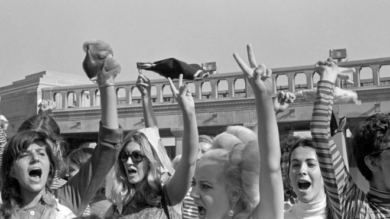
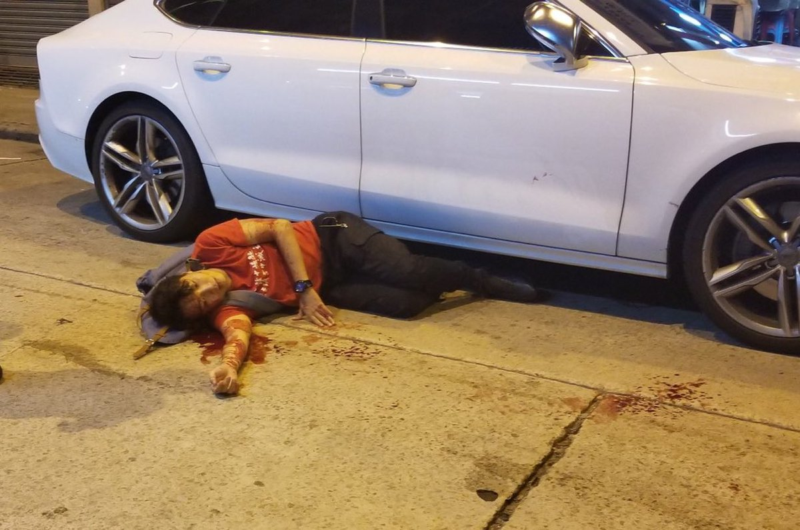
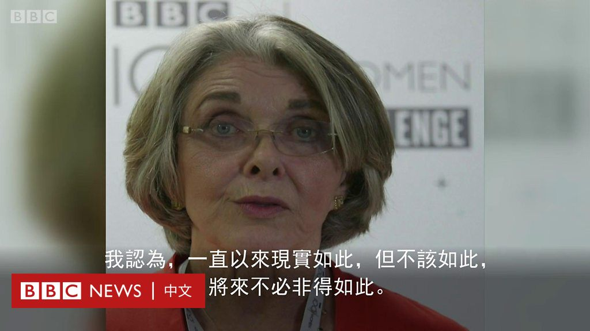
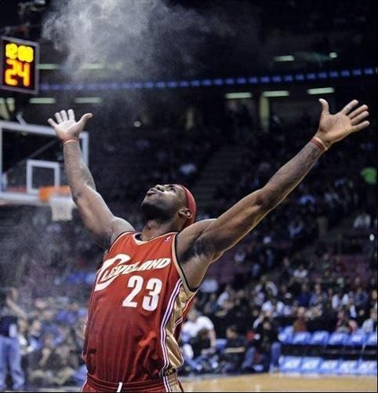
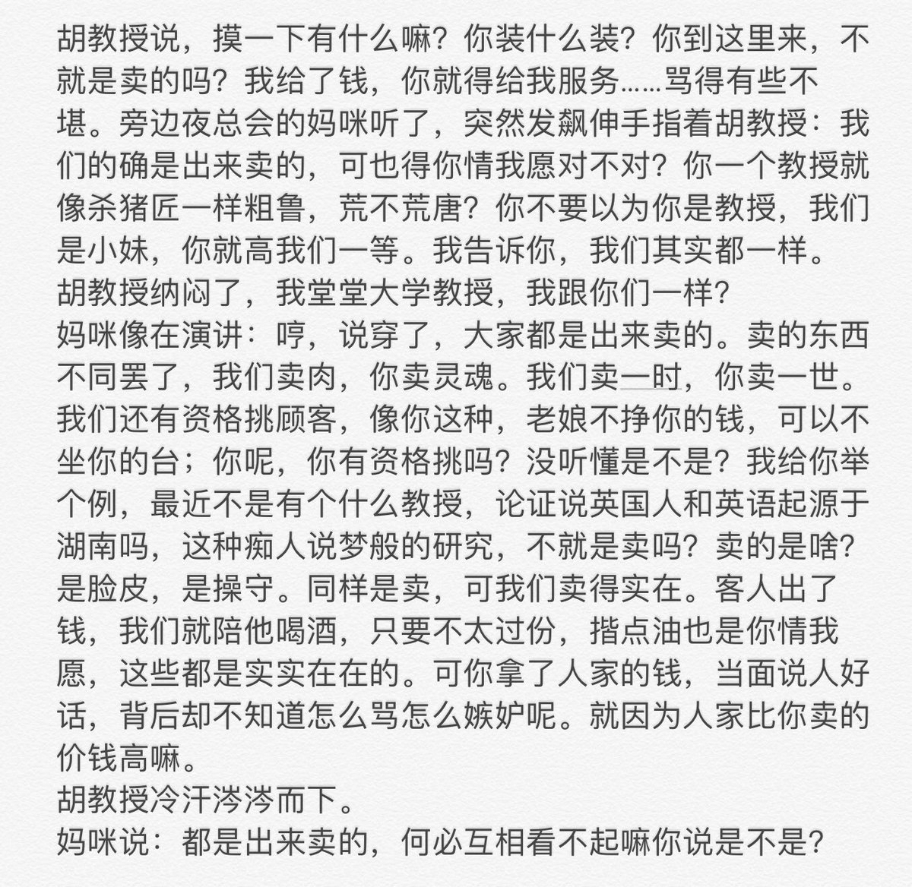

[10月16日 21:30]    BBC News 中文   @bbcchinese    世俗诱惑无所不在，僧袍足以与纱帽媲美。花和尚、坏和尚、假和尚干过哪些坏事？ 迷迷糊糊地去信佛行吗？
 https://bbc.in/33vj7qO   :speech_balloon:评:1 :+1:赞:0 :globe_with_meridians:转:0  

[10月16日 21:30]    纽约时报中文网   @nytchinese    宗凤鸣：紫阳不只一次地对我说，“中国不转向民主政治，是违背世界潮流的，是违背人心的”。他还说，“民主的旗帜，我们党不去高举，就会被别人夺去”；“我们迟早要走这一条路，我们与其被动地走，不如自觉地走”。 https://nyti.ms/2MMl37A   :speech_balloon:评:0 :+1:赞:2 :globe_with_meridians:转:2  

[10月16日 21:24]    新闻大吐槽   @TuCaoFakeNews    这位大妈掌握了中美贸易谈判的精髓  :speech_balloon:评:0 :+1:赞:1 :globe_with_meridians:转:1  

[10月16日 21:22]    新闻大吐槽   @TuCaoFakeNews    呵呵，根本不是專業不專業的問題，而是擺明了不會查，所以根本沒必要謹慎的對待犯罪現場  :speech_balloon:评:0 :+1:赞:8 :globe_with_meridians:转:3  

[10月16日 21:21]    新闻大吐槽   @TuCaoFakeNews    這才是專業，故意攪渾，而不繼續追查。  :speech_balloon:评:0 :+1:赞:7 :globe_with_meridians:转:2  

[10月16日 21:19]    新闻大吐槽   @TuCaoFakeNews    警察竟踩到犯罪现场的血迹！太不专业，看来警察把精力都用在研究如何犯罪上了，业务能力肯定就荒废了！

血迹是民间人权阵线召集人岑子杰留下的，在晚七点左右，他在这里被一群人殴打！

殴打岑子杰的人必然是亲共者，或直接受中共指使的人，警察肯定不敢查  :speech_balloon:评:5 :+1:赞:27 :globe_with_meridians:转:28  

[10月16日 21:04]    新闻大吐槽   @TuCaoFakeNews    据说，勒布朗仗着自己是NBA第一人的身份，给联盟和肖华施压，逼他们惩罚莫雷！

詹姆斯才是NBA里的米老鼠呀 https://twitter.com/realsaavedra/status/1184188206926843904 …  :speech_balloon:评:1 :+1:赞:14 :globe_with_meridians:转:6  

[10月16日 21:00]    新闻大吐槽   @TuCaoFakeNews    猪八戒骑马倒打一耙  :speech_balloon:评:0 :+1:赞:1 :globe_with_meridians:转:1  

[10月16日 21:00]    纽约时报中文网   @nytchinese    过去10年来，中国对空气污染的健康担忧迅速加剧。近期一项研究表明，空气污染与认知能力下降之间存在联系。另一些研究表明，中国的空气污染每年导致多达100万人过早死亡。新的发现可能会使北京方面控制这个问题的努力更加紧迫。 https://nyti.ms/2ITOtj6   :speech_balloon:评:5 :+1:赞:4 :globe_with_meridians:转:2  

[10月16日 20:59]    BBC News 中文   @bbcchinese    “我记得有一个女青年解开胸罩，从衬衫下面取出，然后把它扔到桶里，赢得一片欢呼。”
 https://bbc.in/2oAj2U9   :speech_balloon:评:1 :+1:赞:16 :globe_with_meridians:转:3  

[10月16日 20:58]    新闻大吐槽   @TuCaoFakeNews    中共搞錯了 讓人們站起來反對他們的不是這幾個組織者 而是人們心中的良知 他們無法把所有善良的人消滅  :speech_balloon:评:0 :+1:赞:5 :globe_with_meridians:转:3  

[10月16日 20:51]    新闻大吐槽   @TuCaoFakeNews    不管你是否有大台，共匪的目的就是恐嚇，恐嚇所有抗暴者不要站出來！流氓本性  :speech_balloon:评:0 :+1:赞:2 :globe_with_meridians:转:1  

[10月16日 20:48]    新闻大吐槽   @TuCaoFakeNews    众议院过法案了，急了。  :speech_balloon:评:1 :+1:赞:3 :globe_with_meridians:转:2  

[10月16日 20:47]    新闻大吐槽   @TuCaoFakeNews    应该组织自卫队保护他们。流氓政府是没有底线的。  :speech_balloon:评:1 :+1:赞:5 :globe_with_meridians:转:1  

[10月16日 20:46]    新闻大吐槽   @TuCaoFakeNews    明着动不了，暗地里下毒手。嗯，这很支共  :speech_balloon:评:0 :+1:赞:4 :globe_with_meridians:转:1  

[10月16日 20:44]    新闻大吐槽   @TuCaoFakeNews    纠正：是正在筹备十月20日的活动，不是29日  :speech_balloon:评:0 :+1:赞:5 :globe_with_meridians:转:0  

[10月16日 20:44]    新闻大吐槽   @TuCaoFakeNews      :speech_balloon:评:0 :+1:赞:2 :globe_with_meridians:转:2  

[10月16日 20:43]    新闻大吐槽   @TuCaoFakeNews    看来中共根本找不到幕后大台，才又回头来暴力恐吓台面上明摆着的组织者！问题是这些组织者并不是领导者，也不是大台，恐吓是不起作用的！活动不会受影响！

希望岑同学安好！  :speech_balloon:评:4 :+1:赞:37 :globe_with_meridians:转:8  

[10月16日 20:41]    新闻大吐槽   @TuCaoFakeNews    这母女好low啊
这饭又不是为她们准备的
怎么吃得下去
不怕得胃病吗？ https://twitter.com/TuCaoFakeNews/status/1184341196891516930 …  :speech_balloon:评:2 :+1:赞:3 :globe_with_meridians:转:3  

[10月16日 20:37]    新闻大吐槽   @TuCaoFakeNews    突发！岑子杰遇袭，岑是民间人权阵线组织的召集人，目前该组织正在筹备本周日（10月29日）的抗议活动！此前200万人的活动也是此组织召集的。

这是岑子杰第二次遇袭，8月29他曾被人在一家餐厅用铁棍攻击！  :speech_balloon:评:16 :+1:赞:57 :globe_with_meridians:转:40  

[10月16日 20:30]    BBC News 中文   @bbcchinese    “玻璃屋顶”（“玻璃天花板”）这个词汇和概念已经有40年历史了。发现这个问题并发明这个词给它命名的是她——玛丽琳·洛登。
 https://bbc.in/33zXYvF   :speech_balloon:评:1 :+1:赞:5 :globe_with_meridians:转:4  

[10月16日 20:30]    纽约时报中文网   @nytchinese    在评论莫雷“挺港”事件时，勒布朗·詹姆斯的言论引发轩然大波。
他不仅表示莫雷“对当前情况不够了解”，还表示“当你不为他人着想，只想着自己的时候，负面影响就会产生”。此番言论令他在美国国内备受谴责，有批评者指责他懦弱、虚伪。在香港，抗议者烧毁了詹姆斯的球衣。 https://nyti.ms/2P27pQL   :speech_balloon:评:31 :+1:赞:77 :globe_with_meridians:转:31  

[10月16日 20:25]    新闻大吐槽   @TuCaoFakeNews    人但凡要点脸面，有点良知，怎么会支持中共？ https://twitter.com/TuCaoFakeNews/status/1184341196891516930 …  :speech_balloon:评:0 :+1:赞:30 :globe_with_meridians:转:2  

[10月16日 20:05]    BBC News 中文   @bbcchinese    【美國眾議院通過《香港人權與民主法案》，下一步何去何從？】 https://bbc.in/2VVGiZ3   :speech_balloon:评:12 :+1:赞:8 :globe_with_meridians:转:5  

[10月16日 20:00]    纽约时报中文网   @nytchinese    #观点 澳大利亚前总理陆克文等10多位各国前领导人在时报联名发表文章，呼吁中美尽快达成实质性贸易协议。他们表示，口头协议仅仅是第一步。如不能最终结束贸易战，发达和新兴经济体明年的衰退风险将大大增加。中国的短期增长前景也将遭到严重破坏。 https://nyti.ms/2Mm8Ojk   :speech_balloon:评:25 :+1:赞:16 :globe_with_meridians:转:8  

[10月16日 19:30]    纽约时报中文网   @nytchinese    宗凤鸣：赵紫阳曾提出，在党的最高层不设总书记，实行中央常委轮流坐庄，一人一票。紫阳说，这样做的目的就是要防止党的最高领导人走上个人专政的道路，防止他包办一切、个人决定重大问题。 https://nyti.ms/2MMl37A   :speech_balloon:评:8 :+1:赞:44 :globe_with_meridians:转:23  

[10月16日 19:18]    新闻大吐槽   @TuCaoFakeNews    如果你的iphone升级到了ios13，就要小心了，你的隐私很可能被偷偷传送给腾讯！  :speech_balloon:评:12 :+1:赞:102 :globe_with_meridians:转:64  

[10月16日 19:08]    BBC News 中文   @bbcchinese    由香港示威引发的NBA与中国对垒战事未平硝烟再起，顶尖球星Lebron James 就莫雷事件发声，招徕一片批评。 https://bbc.in/2MJkfk1   :speech_balloon:评:48 :+1:赞:74 :globe_with_meridians:转:31  

[10月16日 19:00]    纽约时报中文网   @nytchinese    上周五，美国官员表示将与中国合作，在未来几周内完成一项两国间的初步协议，并希望在11月中旬特朗普和习近平出席在智利举行的全球领导人峰会时签署协议。
这份协议都有哪些具体内容？这里是我们目前所了解的： https://nyti.ms/2MiKbUl   :speech_balloon:评:7 :+1:赞:15 :globe_with_meridians:转:5  

[10月16日 18:44]    新闻大吐槽   @TuCaoFakeNews    昨天，香港球迷带上勒布朗的面具，cosplay了他经典的撒镁粉动作，只不过镁粉换成了rmb，5毛钱撒了一地~

有才，这个球迷同时怼了三个对象：1. 勒布朗 2. 五毛 3. 蒙面法；
堪称一石三鸟！！  :speech_balloon:评:6 :+1:赞:64 :globe_with_meridians:转:25  

[10月16日 18:30]    凡賽堤/FORSETI   @FecharCCP    極權殺人恐怖組織正在用各種兇殘手段殺害我們的同胞..........

拯救港人，拯救華族，勢在必行！！！！！！！！

極權不滅全人類人人遭殃！！！ https://twitter.com/FecharCCP/status/1183188604132188161 …  :speech_balloon:评:0 :+1:赞:4 :globe_with_meridians:转:3  

[10月16日 18:30]    纽约时报中文网   @nytchinese    #时报专栏 @DouthatNYT：上世纪九十年代，美国也曾担忧日本实力过强，而现在，一些恐华人士可能高估了中国经济模式的内在动力及其增长的持久性。
你可以在认为中国有点外强中干的同时，也可以相信对美国人来说，培养恐惧中国的心理是件好事。 https://nyti.ms/2BhSJop   :speech_balloon:评:49 :+1:赞:58 :globe_with_meridians:转:21  

[10月16日 18:25]    凡賽堤/FORSETI   @FecharCCP    何韻詩！黎智英！香港人的英雄，華人的驕傲！華人良知與正義的代表！幾個月來永不放棄，傳播香港事實真相，全世界遊說！有力促進美國國會全面通過（香港人權與民主法案）貢獻人物名單之一！
支持香港蘋果日報，壹新聞，大紀元！  :speech_balloon:评:5 :+1:赞:94 :globe_with_meridians:转:43  

[10月16日 18:16]    墙国铁拳现世报😷   @Socialistfist    你们这些护旗手动机不纯，小编很愤慨  :speech_balloon:评:22 :+1:赞:244 :globe_with_meridians:转:34  

[10月16日 18:08]    BBC News 中文   @bbcchinese    中国领导人习近平在访问尼泊尔之际发出严厉警告说：“任何人企图在中国任何地区搞分裂，结果只能是粉身碎骨。” https://bbc.in/33CHt21   :speech_balloon:评:42 :+1:赞:65 :globe_with_meridians:转:23  

[10月16日 18:00]    纽约时报中文网   @nytchinese    随着香港活动人士越来越多地转向破坏和抵制的做法，一些公司变得愈发脆弱。香港作为自由资本主义中心，以及世界上最友好的商业环境之一的声誉已受到损害。如今，清洁工经常要在窗户被打破的商店里清扫碎玻璃。在闪闪发光的摩天大楼的阴影下，也经常看到关闭的商店门上的涂鸦。 https://nyti.ms/2qdwLjX   :speech_balloon:评:15 :+1:赞:23 :globe_with_meridians:转:5  

[10月16日 17:44]    墙国铁拳现世报😷   @Socialistfist    你们以为 #社会主义铁拳  只是一个比喻？  :speech_balloon:评:89 :+1:赞:340 :globe_with_meridians:转:120  

[10月16日 17:01]    BBC News 中文   @bbcchinese    安祖莲娜·祖莉的真女人标准，你同意吗？ https://bbc.in/2VMoxeD   :speech_balloon:评:5 :+1:赞:40 :globe_with_meridians:转:2  

[10月16日 17:00]    纽约时报中文网   @nytchinese    宗凤鸣：紫阳说，他原先只想在国务院总理任上把经济改革搞下去，并不想当总书记；后来不得已接受了这个职务。当时，在高层中有一帮老人跳出来批胡耀邦搞“自由化“。另外，在社会上也掀起了一股批“自由化“的逆流。紫阳说，在这种情况下，由别人来接替胡耀邦，还不如由他来接替。 https://nyti.ms/2MMl37A   :speech_balloon:评:4 :+1:赞:28 :globe_with_meridians:转:16  

[10月16日 17:00]    纽约时报中文网   @nytchinese    该研究利用2009年至2017年北京超过25万名孕妇的临床记录，评估了她们暴露于来自工业、家庭、汽车和卡车的空气污染的情况。其中，妊娠头三个月经历过期流产的有17497人，占6.8%。考虑到各方面的差异，研究人员发现，“在所有人群中，孕妇接触每种空气污染物都与流产风险相关。” https://nyti.ms/2ITOtj6   :speech_balloon:评:1 :+1:赞:6 :globe_with_meridians:转:7  

[10月16日 16:59]    老司机   @h5lpykl7tp6jjop    有人说，你把中国从古至今说得一团漆黑，中国没有一个好的年代一个好的地区吗？我说有啊，民国时期的租界！经济繁荣，交通便利，秩序良好，有能力都往那里去，又不要签证，连共产党开会都去那里。
可是那里不是中国人在管理！
和中国人讨论问题麻烦就在这儿，一个问题总会变成另外一个问题！  :speech_balloon:评:6 :+1:赞:84 :globe_with_meridians:转:22  

[10月16日 16:30]    纽约时报中文网   @nytchinese    对于“第一阶段”美中协议，特朗普不仅称这是一部“宏大的”协定，还表示这是迄今为止签署的“最大的合同”。
尽管这笔交易似乎会增加中国对农产品的购买，并让其他一些企业更多进入中国市场。但这项“原则上的协议”范围有限，确切的细节也尚未以书面形式确定。 https://nyti.ms/2MiKbUl   :speech_balloon:评:7 :+1:赞:13 :globe_with_meridians:转:3  

[10月16日 16:25]    老司机   @h5lpykl7tp6jjop    中美爱国方式的不同，结果居然一样！  :speech_balloon:评:3 :+1:赞:30 :globe_with_meridians:转:6  

[10月16日 16:00]    纽约时报中文网   @nytchinese    香港抗议者正在把他们眼中一些公司“亲中”的公司记录下来，然后在移动应用程序和网站上传播。星巴克和吉野家因为拥有它们在香港特许经营权的公司而多次成为攻击目标，而《魔兽世界》的开发商动视暴雪则因试图审查一名支持民主的香港玩家而遭到了抵制。 https://nyti.ms/2qdwLjX   :speech_balloon:评:30 :+1:赞:61 :globe_with_meridians:转:20  

[10月16日 15:30]    纽约时报中文网   @nytchinese    #时报专栏 @DouthatNYT：越来越多的人意识到，原本希望打通两国市场和供应链的所谓“中美共同体”，产生了与美国战略家们预期相反的结果。美国不但没能向中国输出自由主义理念，反而强化了北京的社会控制政策，让极权主义波及自由世界。这两种趋势出现的关键，就是互联网。 https://nyti.ms/2BhSJop   :speech_balloon:评:34 :+1:赞:150 :globe_with_meridians:转:52  

[10月16日 15:01]    BBC News 中文   @bbcchinese    香港特首林郑月娥周三（10月16日）以录影片段发表新一份《施政报告》，是香港主权移交以来，行政长官第一次无法在立法会会议厅发表报告。 https://bbc.in/2ORICyo   :speech_balloon:评:16 :+1:赞:60 :globe_with_meridians:转:18  

[10月16日 15:00]    纽约时报中文网   @nytchinese    中国研究人员发现，空气污染和流产风险之间存在显著的相关性。北京师范大学教授、这篇研究论文的第一作者张立强表示，这类流产对于准父母“尤为痛苦”，他们往往数日或数周后才发现。他还表示，这类流产没有得到充分研究，这也是研究人员予以关注的部分原因所在。 https://nyti.ms/2ITOtj6   :speech_balloon:评:18 :+1:赞:52 :globe_with_meridians:转:33  

[10月16日 14:30]    纽约时报中文网   @nytchinese    宗凤鸣：“邓小平曾指出，那几年（指赵紫阳主持工作时期），中国经济是上了一个台阶的。于是，社会上有传言，说又要启用赵紫阳了。对于这种传言，赵紫阳很肯定地对我说：这是不可能的事。他说，邓虽然对这个江李领导班子不满意，但为了‘六四’，还是觉着维持江李体制不变为好。“ https://nyti.ms/2MMl37A   :speech_balloon:评:6 :+1:赞:47 :globe_with_meridians:转:9  

[10月16日 14:09]    老司机   @h5lpykl7tp6jjop    【关注香港】中国时间2019年10月16日香港观塘翠屏南午夜大约12点45分，附近有人拍到更完整片段，他们抬着空床上去，然后又装着物品下来并且是五个人才能抬起来，是什么东西那么沉需要五个人？他们抬出来的是什么？关注！  :speech_balloon:评:18 :+1:赞:109 :globe_with_meridians:转:73  

[10月16日 14:00]    纽约时报中文网   @nytchinese    阅读中文版：德银中国生意经：赠送高官奢侈礼物、雇佣权贵亲属  https://nyti.ms/2ITnynr https://twitter.com/ccni/status/1184120826544545792 …  :speech_balloon:评:3 :+1:赞:10 :globe_with_meridians:转:3  

[10月16日 13:42]    老司机   @h5lpykl7tp6jjop    10.16日林郑月娥两次作施政报告被赶下去，最终没有做成报告，最后新闻发布是正义的香港议员，感动！  :speech_balloon:评:7 :+1:赞:126 :globe_with_meridians:转:68  

[10月16日 13:30]    纽约时报中文网   @nytchinese    #每日一词 Panopticon
曾被颂扬为伟大解放者的互联网，如今却被揭露出另一种本质——苏联梦寐以求的监控机器，诱惑民众拿个人隐私换取娱乐和消遣。对于跨国企业纷纷迫于压力屈从中国的现象，时报专栏作者Ross Douthat直指互联网成为了一个“圆形监狱”（Panopticon）。 https://nyti.ms/2ITK4g2   :speech_balloon:评:25 :+1:赞:212 :globe_with_meridians:转:102  

[10月16日 13:00]    纽约时报中文网   @nytchinese    今日食谱：葱香葡萄烤鸡腿，皮脆肉嫩，果香四溢。
更多简报内容： https://nyti.ms/2ITPNCp   :speech_balloon:评:1 :+1:赞:17 :globe_with_meridians:转:6  

[10月16日 12:42]    老司机   @h5lpykl7tp6jjop    教授粗鲁在妓院被妈咪一顿教训，转自网络有删减  :speech_balloon:评:1 :+1:赞:19 :globe_with_meridians:转:5  

[10月16日 12:30]    纽约时报中文网   @nytchinese    星巴克、吉野家和动视暴雪本来似乎与香港抗议毫不相干。但对香港的一些民主派抗议者以及他们越来越多的全球支持者来说，无论对错，这些公司都被视为专制中共的同情者，因此是抵制甚至破坏的正当合理目标。 https://nyti.ms/2qdwLjX   :speech_balloon:评:37 :+1:赞:54 :globe_with_meridians:转:13  

[10月16日 12:00]    BBC News 中文   @bbcchinese    法案的通过被视为美国政府回应香港近期示威浪潮的重要一步。 https://bbc.in/2oBv0wQ   :speech_balloon:评:171 :+1:赞:386 :globe_with_meridians:转:104  

[10月16日 12:00]    纽约时报中文网   @nytchinese    • 谷歌发布Pixel 4和Pixel 4 XL智能手机，两款机型均配备“计算拍照”功能——利用算法、人工智能和特殊传感器使图像看起来更加专业。
• “摩登情爱”15周年：时报于2006年推出的这一专栏一直备受读者欢迎。在15岁生日之际，我们精选出了一系列“经典”的情感故事。
更多简报内容： https://nyti.ms/2ITPNCp   :speech_balloon:评:0 :+1:赞:5 :globe_with_meridians:转:5  

[10月16日 10:09]    财经真相   @caijingxiang    根据克尔瑞的报告，9月份95家典型房企的融资总额为1124.48亿，环比上升45.3%，同比上升17.2%。融资成本也再上台阶，今年前三季度，房企债券类融资成本6.88%，较2018年全年上升了0.67个百分点。截至10月8日，年内房企美元融资533.6亿美元，同比上涨50%。虽然各种政策收紧，但房企美元融资仍刷新历史纪录  :speech_balloon:评:8 :+1:赞:82 :globe_with_meridians:转:22  

[10月16日 10:00]    BBC News 中文   @bbcchinese    这个马桶名为“美国”（America），用18K金打造而成，价值一百万英镑。 https://bbc.in/2VJfzyA   :speech_balloon:评:23 :+1:赞:58 :globe_with_meridians:转:15  

[10月16日 09:55]    财经真相   @caijingxiang    受到放开外资保险和银行条例消息的刺激，今天中国保险和银行板块大涨，这是一个很有意思的现象，正常情况下放开外资进来，这会对国内的这些企业构成竞争压力，但是今天他们的股票却大涨，这里面的逻辑是什么？  :speech_balloon:评:105 :+1:赞:216 :globe_with_meridians:转:65  

[10月16日 09:47]    财经真相   @caijingxiang    中国外交部：我们对美国国会众议院执意通过所谓“香港人权与民主法案”表示强烈愤慨和坚决反对。香港是中国的香港，香港事务纯属中国内政，不容任何外部势力干预。我们奉劝美方认清形势，悬崖勒马，立即停止推动审议有关涉港法案，立即停止插手香港事务、干涉中国内政。  :speech_balloon:评:90 :+1:赞:258 :globe_with_meridians:转:113  

[10月16日 09:38]    财经真相   @caijingxiang    受中国扬言报复美国通过的《香港人权法案》消息刺激，a股开盘后，离岸人民币扩大跌幅，跌破7.1关口！  :speech_balloon:评:19 :+1:赞:306 :globe_with_meridians:转:76  

[10月16日 09:36]    BBC News 中文   @bbcchinese    BBC带你走进三个著名古堡，探究其中的主人和工作人员如何看待自己有别于人的日常生活。 https://bbc.in/2ITTYy5   :speech_balloon:评:1 :+1:赞:20 :globe_with_meridians:转:11  

[10月16日 07:55]    BBC News 中文   @bbcchinese    远在欧洲伊比利亚半岛上的西班牙周一（10月14日）对倡导加泰罗尼亚独立公投的9名领导者判以重刑，罪名包括“煽动分裂、挪用公款、以及拒不服从”。 https://bbc.in/33A5WVM   :speech_balloon:评:65 :+1:赞:123 :globe_with_meridians:转:36  

[10月16日 07:11]    BBC News 中文   @bbcchinese    一场前所未有的大台风中的东北亚政治来往，反映出中日两国关系经历多年波折后的什么趋势？ https://bbc.in/2IUGYbz   :speech_balloon:评:7 :+1:赞:16 :globe_with_meridians:转:8  

[10月16日 06:50]    BBC News 中文   @bbcchinese    BBC中东事务编辑伯温（Jeremy Bowen）指出，叙利亚战争8年改变了中东势力版图，而美国宣布撤军，７天就改变了叙利亚战局，中东面临新的转折点。 https://bbc.in/2BbkTRY   :speech_balloon:评:7 :+1:赞:34 :globe_with_meridians:转:14  

[10月16日 04:51]    老司机   @h5lpykl7tp6jjop    德意志银行行贿中国！他们在中国瞄准最高层，通过送礼建立人脉，从而获取巨大利益，中国的高官们在这场德意志银行进军中，从前朝江泽民、温家宝，刘云山到当朝的中共常委栗战书、汪洋，国家副主席王岐山，或者本人或者亲属都被银弹击中。“一百多名共产党主政权贵的亲戚受雇于该银行”  :speech_balloon:评:2 :+1:赞:69 :globe_with_meridians:转:47  

[10月16日 02:39]    新闻大吐槽   @TuCaoFakeNews    Thank you, Morey!
Fight for free!

在别人身处困境时，你可能只是说了一句打气的话！
对他们却是巨大的鼓舞！香港球迷念莫雷的好！  :speech_balloon:评:10 :+1:赞:625 :globe_with_meridians:转:227  

[10月16日 00:18]    墙国铁拳现世报😷   @Socialistfist    万fo新头像  :speech_balloon:评:28 :+1:赞:246 :globe_with_meridians:转:10  

[10月15日 23:19]    老司机   @h5lpykl7tp6jjop    阅兵最遗憾的是:没有看到城管方队。  :speech_balloon:评:43 :+1:赞:216 :globe_with_meridians:转:134  

[10月15日 23:03]    墙国铁拳现世报😷   @Socialistfist    新浪微博先关了评论区，后删除了该条微博。
本报不赞成任何形式网络暴力，也希望不要用你们的热情去唤醒楚门的世界。请大家让他做一个普通中国人  :speech_balloon:评:28 :+1:赞:164 :globe_with_meridians:转:26  

[10月15日 22:31]    凡賽堤/FORSETI   @FecharCCP    我們都是陳彥琳。一個15歲的小妹妹。極權卻對她如此殘忍。
願妳早日沉冤得雪
We are all Chan Yin Lam, a aged 15 kid in HK, who was slaughtered by the tyranny.  :speech_balloon:评:5 :+1:赞:153 :globe_with_meridians:转:111  

[10月15日 22:30]    BBC News 中文   @bbcchinese    社交媒体会让抑郁症更加严重，还是能拯救抑郁症患者？曾经萌生自杀念头的本文作者雷利，和你分享他自己的真实故事。
 https://bbc.in/2MglCHE   :speech_balloon:评:4 :+1:赞:25 :globe_with_meridians:转:13  

[10月15日 21:59]    BBC News 中文   @bbcchinese    你是否想要拥有幸福快乐却不知如何做到？耶鲁大学教授桑托斯告诉你5个方法，帮助你变得更幸福更快乐。
 https://bbc.in/2nLP3bd   :speech_balloon:评:1 :+1:赞:26 :globe_with_meridians:转:17  

[10月15日 21:31]    BBC News 中文   @bbcchinese    英国广播公司BBC专访美国空军战争学院张晓明博士，从他的著作回顾1979年邓小平发起中越战争的得失。
 https://bbc.in/2ppM20Y   :speech_balloon:评:11 :+1:赞:34 :globe_with_meridians:转:13  

[10月15日 21:06]    老司机   @h5lpykl7tp6jjop    就算上帝站在我面前，我也会怀疑一下它是不是cosplay(一)  :speech_balloon:评:43 :+1:赞:660 :globe_with_meridians:转:344  

[10月15日 20:59]    BBC News 中文   @bbcchinese    现代人们生活越来越离不开社交媒体，我们是否过度使用社交媒体，而牺牲了心理和身体健康，并浪费宝贵的时间？
 https://bbc.in/2oMwKmG   :speech_balloon:评:3 :+1:赞:18 :globe_with_meridians:转:10  

[10月15日 20:31]    BBC News 中文   @bbcchinese    湖人队当家球星勒布朗·詹姆斯一向比较敢言，这次到底说了什么？ https://bbc.in/2MkwfJT   :speech_balloon:评:94 :+1:赞:121 :globe_with_meridians:转:40  

[10月15日 19:55]    老司机   @h5lpykl7tp6jjop    报告猪席有人图谋篡位，小小校领导也有皇帝瘾，竟然让学生跪下喊万岁……  :speech_balloon:评:19 :+1:赞:118 :globe_with_meridians:转:65  

[10月15日 19:34]    墙国铁拳现世报😷   @Socialistfist    补充  :speech_balloon:评:8 :+1:赞:121 :globe_with_meridians:转:21  

[10月15日 19:32]    墙国铁拳现世报😷   @Socialistfist    大仙女：请出动我们的部队
当地拆迁办： 好的

#社会主义铁拳  :speech_balloon:评:123 :+1:赞:1013 :globe_with_meridians:转:298  

[10月15日 19:18]    老司机   @h5lpykl7tp6jjop    人民网又在撒谎，6块钱二两肉能做这么一大碗肉丸？老百姓的生活还停留在2个人在出租屋里面吃6块钱肉就感觉到很满足的阶段……这是富裕吗，这是强大吗，还在吹，还在编，还在骗！  :speech_balloon:评:43 :+1:赞:159 :globe_with_meridians:转:60  

[10月15日 19:17]    财经真相   @caijingxiang    也就是即使川普连任，也等不到中国邮费上涨的时刻？对吗？ https://twitter.com/voacantonese/status/1184064898478665730 …  :speech_balloon:评:9 :+1:赞:85 :globe_with_meridians:转:19  

[10月15日 19:14]    财经真相   @caijingxiang    美国的人权法案为啥这么慢？ https://twitter.com/hongkon84458416/status/1183900371602825218 …  :speech_balloon:评:21 :+1:赞:107 :globe_with_meridians:转:24  

[10月15日 18:01]    BBC News 中文   @bbcchinese    K-pop 女明星雪莉（Sulli）10月14号过世，终年25岁。雪莉生前以直言不讳, 身体自主的言行赢得赞赏，也惹来韩国社会严酷的网络霸凌。
祝愿她一路好走！ https://bbc.in/2VJOw64   :speech_balloon:评:33 :+1:赞:148 :globe_with_meridians:转:42  

[10月15日 17:10]    老司机   @h5lpykl7tp6jjop    【陳彥霖】
片中女子大喊：便衣整天跟蹤她。
幾乎已經可以確定她就是15歲死者陳彥霖。（內附圖片）

大家幫手找片中的幾位便衣警。  :speech_balloon:评:142 :+1:赞:2106 :globe_with_meridians:转:1776  

[10月15日 16:53]    墙国铁拳现世报😷   @Socialistfist    我去，微博上有多少潜伏的推友  :speech_balloon:评:17 :+1:赞:150 :globe_with_meridians:转:16  

[10月15日 15:29]    老司机   @h5lpykl7tp6jjop    每个关注香港事态的人应该好好看这个视频。解释了为什么现在有很多香港人被暗杀、抛尸，被自杀。  :speech_balloon:评:36 :+1:赞:364 :globe_with_meridians:转:288  

[10月15日 15:15]    财经真相   @caijingxiang    加入WTO时的承诺今天在贸易战和华尔街敲诈下，今天终于开始有点放松了，但是中国老百姓想把钱存进外资银行依然存在门槛，每笔最低不少于50万人民币的定期存钱，至于外汇要继续控制！  :speech_balloon:评:36 :+1:赞:295 :globe_with_meridians:转:73  

[10月15日 15:08]    财经真相   @caijingxiang    重磅！国务院关于修改〈中华人民共和国外资保险公司管理条例〉和〈中华人民共和国外资银行管理条例〉的决定，外国银行可以在中华人民共和国境内同时设立外商独资银行和外国银行分行，或者同时设立中外合资银行和外国银行分行。外国银行分行可以吸收中国境内公民每笔不少于50万元人民币的定期存款。  :speech_balloon:评:92 :+1:赞:435 :globe_with_meridians:转:216  

[10月15日 14:07]    老司机   @h5lpykl7tp6jjop    李心草被猥亵后抛尸江里，其室友任梦燊父亲是红河警察队长任剑波！ 把同宿舍的同学领到酒吧破处，同学不从，被三个畜生打死。昆明警察当局不予立案！

 https://chinanewscenter.com/archives/14788   :speech_balloon:评:8 :+1:赞:69 :globe_with_meridians:转:58  

[10月15日 13:42]    老司机   @h5lpykl7tp6jjop    全裸女浮尸案背后：近几月浮尸数是10年总和 6大疑点
详细分析暴露中共在香港操纵黑警秘密杀害反抗民众！  :speech_balloon:评:3 :+1:赞:12 :globe_with_meridians:转:11  

[10月15日 09:50]    财经真相   @caijingxiang    美港电讯15日讯，花旗集团目前正计划在中国建立一家全资证券子公司。知情人士表示，这家银行可能会专注于经纪和期货交易，同时扩大其在中国的托管服务。摩根大通（JPM.N）和高盛（GS.N）也在寻求在中国建立证券公司。 美国农民能不能卖出大豆给中共重要吗？不重要！只要华尔街的利益得到维护就行！  :speech_balloon:评:26 :+1:赞:415 :globe_with_meridians:转:129  

[10月15日 09:45]    财经真相   @caijingxiang    国家统计局：从环比看，CPI上涨0.9%，食品中，猪肉供应偏紧，价格继续上涨19.7%，涨幅比上月回落3.4个百分点，影响CPI上涨约0.65个百分点。  :speech_balloon:评:3 :+1:赞:61 :globe_with_meridians:转:13  

[10月15日 09:43]    财经真相   @caijingxiang    2019年9月份居民消费价格同比上涨3.0%,工业生产者出厂价格同比下降1.2%,物价涨工业生产下降，这就是典型的“滞胀”！  :speech_balloon:评:9 :+1:赞:252 :globe_with_meridians:转:74  

[10月15日 09:18]    老司机   @h5lpykl7tp6jjop    “为了生存，一个个的家庭四分五裂，游走他乡，疲于奔命；精神和肉体在苦苦煎熬中呻吟，人性正被一天天的扭曲！而那些留守的儿童，少了家庭的温暖，父母的呵护，一个个养成孤僻、自卑的性格；感情上更显得脆弱、冲动易怒，由此引发了诸多的社会问题，更加剧了底层贫困的轮回.......”  :speech_balloon:评:12 :+1:赞:124 :globe_with_meridians:转:69  

[10月15日 09:10]    老司机   @h5lpykl7tp6jjop    这就是那位被中国共产党奸杀后又抛尸海上的香港15岁女孩，生前视频  :speech_balloon:评:280 :+1:赞:1825 :globe_with_meridians:转:869  

[10月15日 08:49]    凡賽堤/FORSETI   @FecharCCP    希望陳彥霖家屬決不能放棄，任何金錢都無法和一個活生生的生命兌換！拿起法律武器！極權殺人恐怖組織殺害太多香港人，他們正在製造任何被害的正常死亡假象和消滅所有證據！極權殺人恐怖組織的恐怖只有人想不到的，沒有他們做不到！！！！！！！！  :speech_balloon:评:0 :+1:赞:1 :globe_with_meridians:转:0  

[10月15日 08:44]    凡賽堤/FORSETI   @FecharCCP    這是15歲游泳健將陳彥霖小女孩被殺害前出來逛街的自拍視頻！她還在自我解嘲穿成這樣不可能被定為暴徒！
拍攝時間未能確定，這是被抓捕前還是抓捕後？
她被抓捕過，抓捕時間？如果被釋放一定有本人和家長簽名的依據，所以這視頻的時間很重要，如果是抓捕前的，那是極權殺人恐怖組織故意放出來掩蓋罪行  :speech_balloon:评:1 :+1:赞:18 :globe_with_meridians:转:12  

[10月15日 07:16]    老司机   @h5lpykl7tp6jjop    暴力「執法」
#FreeHongKong
#HongKongProtest  :speech_balloon:评:22 :+1:赞:174 :globe_with_meridians:转:168  

[10月15日 02:46]    凡賽堤/FORSETI   @FecharCCP    正義小螞蟻！傳播英文，西文，法文，德文，日文，著重描述，殘暴行為和手段，來自大陸的黑警，被施暴對象為學生，小孩，女孩 ，老人   傳播真相目的，激發西方人的憤怒！  :speech_balloon:评:1 :+1:赞:5 :globe_with_meridians:转:8  

[10月15日 02:17]    老司机   @h5lpykl7tp6jjop    便衣警察被抗议者追打。不想看到这样的场景，但这个场景反映香港警民对立、对抗、敌视，已上升到了危险境地。林郑月娥政府足以反思！为避免更多港人流血，她应该辞职。  :speech_balloon:评:56 :+1:赞:338 :globe_with_meridians:转:121  

[10月15日 02:14]    凡賽堤/FORSETI   @FecharCCP    6.9以來我就呼籲香港人要把每一個在香港街上的任何穿著警服的人臉全部清除的影片下來，不知道有沒有傳到在香港的正義人士，如果有，那些照片將是舉證黑警違法入境香港執法的鐵證，他們不知道殺害了多少香港同胞！  :speech_balloon:评:0 :+1:赞:8 :globe_with_meridians:转:6  

[10月15日 02:01]    凡賽堤/FORSETI   @FecharCCP    緊急提醒！

未來將有極權恐怖組織偽裝成各種各樣的所謂正義人士要求高價購買自6.9以來香港黑警殺人等犯罪證據，呼籲要提高一千萬的警惕和小心，別把自己的命給賣力！極權殺人恐怖組織從來不會讓有證據的人活在這個世界上！！！ https://twitter.com/FecharCCP/status/1183188604132188161 …  :speech_balloon:评:3 :+1:赞:46 :globe_with_meridians:转:43  

[10月15日 01:48]    凡賽堤/FORSETI   @FecharCCP    良知與正義沒有國界，沒有人種之分！！！

讓我們把極權殺人恐怖組織所犯下的種種反人類罪行的真相傳播給全人類知道！
用最殘暴最血腥最沒人性的那些畫面和視頻真相來喚醒人類的良知與公義和同情吧！ https://twitter.com/FecharCCP/status/1183193159087640576 …  :speech_balloon:评:2 :+1:赞:14 :globe_with_meridians:转:6  

[10月15日 01:43]    凡賽堤/FORSETI   @FecharCCP    極權恐怖組織正在屠殺我們的同胞....

拯救港人，拯救華族，勢在必行！！！

擁有良知與正義小螞蟻們！良知與正義沒有國界，沒有人種之分！！！讓我們把極權殺人恐怖組織所犯下的種種反人類罪行的真相傳播給全人類知道！用最殘暴最血腥最沒人性的那些畫面和視頻真相來喚醒人類的良知與公義和同情吧！  :speech_balloon:评:4 :+1:赞:132 :globe_with_meridians:转:118  

[10月15日 01:24]    凡賽堤/FORSETI   @FecharCCP    美國西方國家用70年為大陸人開啟民智，結果反被吞噬！某些海外華人聲稱是為大陸人開啟民智！ 把自己封為比上帝還高的聖人，卻把眼睛盯著榮耀！但是卻不明白，千千萬萬正義的小螞蟻才是真正為大陸人開啟民智先鋒！
因為他們把極權殺人恐怖組織在香港犯下的種種罪行的真相向全世界和大陸傳播！良知無國界  :speech_balloon:评:3 :+1:赞:15 :globe_with_meridians:转:5  

[10月15日 00:44]    老司机   @h5lpykl7tp6jjop    暗杀、抛尸、性虐待，

阴招吓不怕香港人！

看遮打花园的灯海  :speech_balloon:评:38 :+1:赞:1265 :globe_with_meridians:转:583  

[10月15日 00:42]    凡賽堤/FORSETI   @FecharCCP    海外的眾多號稱良知與正義的自媒體，天天喊口號滅CCP的自媒體，除了香港大紀元，香港蘋果日報意外，有幾個自媒體持續跟踪報導的每一個事件，如此震驚全世界的香港事件，那些自媒體卻把觀眾的目光引導到了哪裡？這不是在幫極權殺人恐怖組織的大忙？ 如果每個自媒體，全面跟踪報導，這將影響力變成幾倍啊  :speech_balloon:评:0 :+1:赞:5 :globe_with_meridians:转:0  

[10月15日 00:36]    凡賽堤/FORSETI   @FecharCCP    總覺得現在的海外華人口口聲聲說反極權CCP，把美國的白宮演變成CCP的信訪局，然後他們也變成了美國政府的白宮，總統的“代言人“或“爆料們“，說難聽的是皮條客，靠這樣就能滅CCP？一點殺傷力都沒有，無非也是譁眾取寵吸引眼球，浪費時間轉移了核心，6.9香港返送中以來，這麼大的事件，香港如此悲慘！（1 https://twitter.com/FecharCCP/status/1183188604132188161 …  :speech_balloon:评:1 :+1:赞:7 :globe_with_meridians:转:4  

[10月15日 00:20]    凡賽堤/FORSETI   @FecharCCP    以前也是不認同法輪功！但是看到他們在反對極權殺人恐怖組織幾十年的一如既往的奮鬥，這次香港的返送中事件大紀元的記者都一直在前線報導，確實令人感動！  :speech_balloon:评:1 :+1:赞:22 :globe_with_meridians:转:4  

[10月15日 00:20]    凡賽堤/FORSETI   @FecharCCP    以前也是不認同法輪功！但是看到他們在反對極權殺人恐怖組織幾十年的一如既往的奮鬥，這次香港的返送中事件大紀元的記者都一直在前線報導，確實令人感動！  :speech_balloon:评:0 :+1:赞:10 :globe_with_meridians:转:1  

[10月15日 00:01]    墙国铁拳现世报😷   @Socialistfist    通知 经推友集思广益，现已删除 “种花家的爱国红小将” 的转推。  :speech_balloon:评:2 :+1:赞:56 :globe_with_meridians:转:2  

[10月14日 20:51]    老司机   @h5lpykl7tp6jjop    快点，我等不及了，领导在等着我切磋 https://twitter.com/jingui_zhu/status/1183561565200506880 …  :speech_balloon:评:31 :+1:赞:127 :globe_with_meridians:转:50  

[10月14日 20:44]    墙国铁拳现世报😷   @Socialistfist    图片源通过谷歌识图可以知道这个微博内容是伪造的。其中有“保安”的图片事件至少发生在2018年6月以前。虽然是另外一个铁拳现世报的故事，但是没有必要为了黑而抹黑。正确的姿势至少应该是摆事实才能讲道理。另外个人非常厌恶抵制这个伪造微博的人的做法。新闻源 https://www.bannedbook.org/bnews/zh-tw/weiquan/qunti/20180610/955337.html …  :speech_balloon:评:0 :+1:赞:65 :globe_with_meridians:转:8  

[10月14日 19:55]    墙国铁拳现世报😷   @Socialistfist    欢迎举证  :speech_balloon:评:5 :+1:赞:29 :globe_with_meridians:转:1  

[10月14日 19:28]    墙国铁拳现世报😷   @Socialistfist    推上流传的这张截图，很多推油都给我发了，微博上查不到这个号。
鉴于之前流传的反串P图号也查不到微博，大家智者见智

#社会主义铁拳？  :speech_balloon:评:28 :+1:赞:203 :globe_with_meridians:转:44  

[10月14日 18:47]    墙国铁拳现世报😷   @Socialistfist    不好这个护旗手要反

#社会主义铁拳  :speech_balloon:评:247 :+1:赞:1915 :globe_with_meridians:转:652  

[10月14日 17:27]    财经真相   @caijingxiang    呵呵，这才刚过一天就要变卦了？消息一经公布，离岸人民币、a50急搓，黄金短线冲高！ https://twitter.com/zerohedge/status/1183674272402890752 …  :speech_balloon:评:58 :+1:赞:598 :globe_with_meridians:转:173  

[10月14日 14:27]    财经真相   @caijingxiang    尤其是高盛赚的手抽筋，当时中方对接人就是王73，其他几家银行也是！这才是真正的卖国贼，从未见过一个国内外专家提出过质疑！ https://twitter.com/ccp5464/status/1183282408415584258 …  :speech_balloon:评:14 :+1:赞:273 :globe_with_meridians:转:104  

[10月14日 12:14]    凡賽堤/FORSETI   @FecharCCP    想看極權殺人恐怖組織的殺人，迫害華人真相的請看香港大紀元！
想看極權殺人恐怖組織爆料黑幕的去看郭文貴直播！
想看調侃，唱衰，分析極權殺人恐怖組織有關新聞的，
去看 年代向錢看（youtube)
他們相對比較專業，全面！  :speech_balloon:评:2 :+1:赞:17 :globe_with_meridians:转:4  

[10月14日 12:07]    凡賽堤/FORSETI   @FecharCCP    儘管極權殺人恐怖組織控制的推特一直黑我的關注人數，我根本無所謂，因為為正義而發，為傳播真相而發，這是我的生活一部分！傳播真相才是最重要，無非也是一只小螞蟻而已！  :speech_balloon:评:1 :+1:赞:16 :globe_with_meridians:转:4  

[10月14日 11:59]    凡賽堤/FORSETI   @FecharCCP    真正的良心媒體是不會刻意去追求關注度！而是注重及時傳播每一個突發事件及真相！如果一些自媒體有人養著，或者是真正為正義，為傳播真相而發，不需要靠廣告收入養活自己，他們完全沒有必要去研究觀眾的口味，傳播突發事件和跟踪新聞事件也許能迎來更多的觀眾！  :speech_balloon:评:2 :+1:赞:26 :globe_with_meridians:转:7  

[10月14日 11:52]    凡賽堤/FORSETI   @FecharCCP    香港大紀元才是真正的滅極權主義的先鋒！幾個月從未停止跟踪報導香港極權殺害港人的每一個畫面！向香港大紀元致敬並說聲謝謝！  :speech_balloon:评:44 :+1:赞:1189 :globe_with_meridians:转:560  

[10月14日 11:27]    凡賽堤/FORSETI   @FecharCCP    希望這些擁有原始照片和視頻的提供給死者家屬！

估計不用多久極權殺人恐怖組織要發動銷毀有關香港照片和視頻（包括所有媒體）的全球大規模行動了！  :speech_balloon:评:0 :+1:赞:1 :globe_with_meridians:转:0  

[10月14日 10:57]    财经真相   @caijingxiang    又是银行券商、茅台的欢呼，50支撑起的股市不是牛市，是牛屎！  :speech_balloon:评:23 :+1:赞:169 :globe_with_meridians:转:21  

[10月14日 09:23]    财经真相   @caijingxiang    中国首个交易日人民币中间价较上日调升2点至7.0725，于是市场瞬间就明白了所谓的中美汇率协议，只是一个防止人民币跌的不要太快，根本不是日本广场协议式大规模升值，未来只是暂时维持震荡格局。另外，市场经过周末的冷静，越发的觉得这个所谓“deal”，忽悠成分太大，提前计价的有点过分了需要修正！  :speech_balloon:评:10 :+1:赞:109 :globe_with_meridians:转:23  

[10月14日 09:14]    财经真相   @caijingxiang    经济日报：我国大豆需求量每年在1亿吨以上，80%以上的需求要通过进口来满足。国家粮油信息中心预计，2019年至2020年度（10月至次年9月）我国进口大豆8700万吨，同比增加400万吨，增幅4.8%，但仍低于2017年至2018年度9413万吨的历史高位。 有什么样的协议，就有什么样的需求，原来400万吨是这样来的！  :speech_balloon:评:7 :+1:赞:224 :globe_with_meridians:转:65  

[10月14日 08:53]    财经真相   @caijingxiang    深圳网络安全与信息通报中心，公告称境外组织APT41黑客对TEAMVIEWER实施了网络攻击，并成功拿下TEAMVIEWER公司的后台管理系统！  :speech_balloon:评:9 :+1:赞:70 :globe_with_meridians:转:21  

[10月13日 20:16]    墙国铁拳现世报😷   @Socialistfist    附加  :speech_balloon:评:12 :+1:赞:107 :globe_with_meridians:转:22  

[10月13日 20:14]    墙国铁拳现世报😷   @Socialistfist    让战螂被铁拳后冷静一会儿，
他还是战螂

#社会主义铁拳  :speech_balloon:评:48 :+1:赞:331 :globe_with_meridians:转:87  

[10月13日 16:11]    财经真相   @caijingxiang    中东局势我不是很了解，但是有一点是很明白的，库尔德武装在抗击is时得到过大量美军武器，其部队战斗力相对强悍，怎么会这么快就被土耳其突破防线了？库尔德武装的武器供应不会是被伊拉克给切断了吧？ https://twitter.com/landofyelang/status/1183284746412969985 …  :speech_balloon:评:30 :+1:赞:90 :globe_with_meridians:转:20  

[10月13日 15:13]    财经真相   @caijingxiang    本次会议标志着中美第一阶段贸易谈判的结束，第二阶段谈判的开始，由于中共在第一阶段已经正式购买了大量美国农产品，所以再永购买的方式将不会对川普产生任何吸引力，中共为此需要准备新的筹码才行（初步触及中共体制），预计中美第二阶段的较量将于11月底12月初正式拉开序幕！  :speech_balloon:评:7 :+1:赞:74 :globe_with_meridians:转:16  

[10月13日 14:59]    财经真相   @caijingxiang    2019年11月16日至17日，APEC(亚洲太平洋经济合作组织) 第二十七次领导人非正式会议将在智利圣地亚哥举行。届时将有超过2万名来自中国、美国、日本、俄罗斯等21国的代表出席会议。由于中美第一阶段贸易协议将在哪里落实为文本内容，川普和习近平的签字仪式将成为本次会议的重点！  :speech_balloon:评:9 :+1:赞:117 :globe_with_meridians:转:36  

[10月12日 17:59]    墙国铁拳现世报😷   @Socialistfist    详细补充  :speech_balloon:评:35 :+1:赞:332 :globe_with_meridians:转:76  

[10月12日 17:55]    墙国铁拳现世报😷   @Socialistfist    好担心墙国既是粉红又是NBA球迷的精神健康  :speech_balloon:评:38 :+1:赞:521 :globe_with_meridians:转:111  

[10月12日 17:47]    墙国铁拳现世报😷   @Socialistfist    慈禧太后为什么要杀义和团？ ---百度知道
#社会主义铁拳  :speech_balloon:评:147 :+1:赞:1159 :globe_with_meridians:转:464  

[10月11日 23:34]    墙国铁拳现世报😷   @Socialistfist    支持NBA的推友们抓紧了，马上投票就要结束了，别说党和人民没有给你机会啊  :speech_balloon:评:1 :+1:赞:53 :globe_with_meridians:转:2  

[10月11日 23:30]    墙国铁拳现世报😷   @Socialistfist    又爱又怕，唉

PS 本推第一个符合两个系列的推诞生了！
#社会主义铁拳
#战螂在推特  :speech_balloon:评:61 :+1:赞:596 :globe_with_meridians:转:150  

[10月11日 20:13]    墙国铁拳现世报😷   @Socialistfist    今天收到了很多推友投稿和 @ ，其中有一则是某精赵在17年发微博控诉未成年女儿被性侵一事。首先照例感谢各位踊跃投稿 
因为事发17年，涉及到未成年人且是性侵害，经考虑不发推防止不必要的网络暴力。
希望大家理解  :speech_balloon:评:33 :+1:赞:218 :globe_with_meridians:转:17  

[10月09日 23:14]    新闻大吐槽   @TuCaoFakeNews    这下暴雪要哭了，
其射击游戏「守望先锋」的预告片里，一个中国女孩角色被高手给P了，改成了一个支持反送中的香港女孩！

是时候全民抵制暴雪了，请在墙内广传此影片！  :speech_balloon:评:126 :+1:赞:3345 :globe_with_meridians:转:1617  

[10月05日 09:33]    凡賽堤/FORSETI   @FecharCCP    呼籲請求共同挖掘所有有關香港發生的事，越全面越好，不同角度，越多越好，包括被暗地抓捕的人員，特別是CCP 派出的各種偽裝身份，包括變身變裝行兇的一點一滴都要挖掘出來，把CCP 的邪惡下三濫手段的真相毫無保留的曝光在全世界面前！世界公知公義才能真正挽救和保護香港人！希望懂視頻編輯配上中英文 https://twitter.com/hjjohnson17/status/1178969916499746816 …  :speech_balloon:评:8 :+1:赞:16 :globe_with_meridians:转:10  

[09月06日 19:03]    财经真相   @caijingxiang    本次降准总计是释放增量资金9000亿，但是提前下发的2020年地方债最高为1.85万亿，降准释放的资金只够新一轮刺激的一半，剩下的资金将会从现有社会存量来补充，这在一定程度收紧了金融系统的流动性；不过和以往一样，央行的降准刺激措施依然是打着“中小企业”的名义下调的!连接 https://www.youtube.com/watch?v=Usp9LIngNl0&feature=youtu.be …  :speech_balloon:评:20 :+1:赞:242 :globe_with_meridians:转:80  

[03月13日 08:10]    老司机   @h5lpykl7tp6jjop    批评是批评家天生的使命！他们只感知对错，信奉真理，指出真相不吐不快，不在意权势和群众的喜好，从批评里不可能获得任何好处，但批评家愚直不改。在中国几乎所有人都讨厌批评家，喜欢阴谋家，因为他们只说好听的！可是就因为中国的批评家太少，中国几乎看不到未来和希望！  :speech_balloon:评:78 :+1:赞:174 :globe_with_meridians:转:40  

[01月10日 13:30]    纽约时报中文网   @nytchinese    每年一月，《纽约时报》​​会选出52个年度旅游目的地。将举办冬奥会的中国崇礼、炫目奢华的香港、日本濑户内各岛皆入选。
新的一年，你计划好要去哪里旅行了吗？ http://nyti.ms/2Tz9N06   :speech_balloon:评:284 :+1:赞:375 :globe_with_meridians:转:195  

