[01月05日 06:12]    新闻大吐槽   @TuCaoFakeNews    During a protest march on 1/1/2020, police threw teargas canisters at peaceful protesters.  Couple dozen youngsters not afraid of #HongKongPoliceTerrorists came running w/ umbrellas in hand formed a defense line protecting citizens against police brutality 
#HongKongProtesters https://twitter.com/TuCaoFakeNews/status/1213556245551992832 …  :speech_balloon:评:0 :+1:赞:2 :globe_with_meridians:转:1  

[01月05日 06:07]    新闻大吐槽   @TuCaoFakeNews    发钱爱党都不干，还花钱？  :speech_balloon:评:0 :+1:赞:1 :globe_with_meridians:转:1  

[01月05日 06:00]    新闻大吐槽   @TuCaoFakeNews    @abcnews
#hkpf again deployed tear gas directly into the crowd. The black-suited so called ‘rioter’ as police claimed, instead of fleeing the scene in fear of arrest, rush to the police frontline, forming umbrella canopy, attempting to block further TG attack. https://twitter.com/tucaofakenews/status/1213556245551992832 …  :speech_balloon:评:0 :+1:赞:3 :globe_with_meridians:转:1  

[01月05日 05:55]    新闻大吐槽   @TuCaoFakeNews    这美好的一幕，必将与中共爪牙的残暴，铭刻在人类的悲剧史上。 https://twitter.com/tucaofakenews/status/1213556245551992832 …  :speech_balloon:评:0 :+1:赞:5 :globe_with_meridians:转:2  

[01月05日 05:53]    新闻大吐槽   @TuCaoFakeNews    别人是不是一按手机，你捡到的也得飞回去？  :speech_balloon:评:1 :+1:赞:1 :globe_with_meridians:转:1  

[01月05日 05:36]    新闻大吐槽   @TuCaoFakeNews    學生們早把死甩在腦後！政府吓破了胆！無人機都用上了！看看我們的勇敢派讓共匪绞尽腦汁！寢室难安！我們的勇敢派個個是战士、而且是手無寸鐵的战士人才難得啊勇士們好好保護自己盡一切可能不能被抓！匪警冲上來、路邊有什麼拿什麼必須反抗、邊打邊逃  :speech_balloon:评:0 :+1:赞:4 :globe_with_meridians:转:2  

[01月05日 05:32]    新闻大吐槽   @TuCaoFakeNews     https://twitter.com/TuCaoFakeNews/status/1213556245551992832?s=09 …  :speech_balloon:评:0 :+1:赞:2 :globe_with_meridians:转:1  

[01月05日 05:27]    新闻大吐槽   @TuCaoFakeNews    他们在被抓的400人里面吗？  :speech_balloon:评:0 :+1:赞:2 :globe_with_meridians:转:1  

[01月05日 05:19]    新闻大吐槽   @TuCaoFakeNews    大吐槽也用了初心这个词不忘初心本来是个很好的词，它教育我们应该像刚出生的婴孩一样，要向善，要保有人类最初的情感。在性本恶的中共国，这个词被庆包宗说出来，竟然成了贬义词。
感谢香港人，让我们大陆人学到了性本善的基本概念，我们的传单正在印制，我们的油漆正在努力地喷洒，我们都要坚持住  :speech_balloon:评:1 :+1:赞:5 :globe_with_meridians:转:1  

[01月05日 05:12]    新闻大吐槽   @TuCaoFakeNews    这段视频记录香港人民勇敢和邪恶独裁斗争到底决心。 https://twitter.com/TuCaoFakeNews/status/1213556245551992832 …  :speech_balloon:评:0 :+1:赞:8 :globe_with_meridians:转:2  

[01月05日 05:10]    新闻大吐槽   @TuCaoFakeNews    勇敢的年轻人！感动勇武派新中国的英雄们祝福你们平安 https://twitter.com/TuCaoFakeNews/status/1213556245551992832 …  :speech_balloon:评:0 :+1:赞:5 :globe_with_meridians:转:3  

[01月05日 05:06]    新闻大吐槽   @TuCaoFakeNews    感動淚奔 https://twitter.com/TuCaoFakeNews/status/1213556245551992832 …  :speech_balloon:评:0 :+1:赞:4 :globe_with_meridians:转:2  

[01月05日 05:05]    新闻大吐槽   @TuCaoFakeNews    加油香港！消灭CCP https://twitter.com/TuCaoFakeNews/status/1213556245551992832 …  :speech_balloon:评:1 :+1:赞:12 :globe_with_meridians:转:1  

[01月05日 04:55]    新闻大吐槽   @TuCaoFakeNews    #HongKongProtesters
#StandWithHongKong
#HongKongPoliceTerrorism https://twitter.com/TuCaoFakeNews/status/1213556245551992832 …  :speech_balloon:评:0 :+1:赞:8 :globe_with_meridians:转:4  

[01月05日 04:54]    新闻大吐槽   @TuCaoFakeNews    川普在海湖莊園舉行了新年派對
記者問：新年的願望是什麼？
總統夫人脫口而出：世界和平
川普當即阻止：不能說

第二天即獵殺了蘇萊曼尼
以及五個軍事據點

這才叫【雖遠必誅】痛快 https://twitter.com/TuCaoFakeNews/status/1213561816279736328 …  :speech_balloon:评:0 :+1:赞:12 :globe_with_meridians:转:1  

[01月05日 04:47]    新闻大吐槽   @TuCaoFakeNews    #五大訴求缺一不可
#香港加油
#核爆都唔割
#FightForFreedomStandWithHongKong
#HongKongProtesters https://twitter.com/TuCaoFakeNews/status/1213556245551992832 …  :speech_balloon:评:0 :+1:赞:4 :globe_with_meridians:转:3  

[01月05日 04:44]    新闻大吐槽   @TuCaoFakeNews    香港继续感动震撼世界！ https://twitter.com/tucaofakenews/status/1213556245551992832 …  :speech_balloon:评:0 :+1:赞:7 :globe_with_meridians:转:4  

[01月05日 04:44]    新闻大吐槽   @TuCaoFakeNews    谢安故作镇定？ https://twitter.com/bannedebook/status/1213558223619280896 …  :speech_balloon:评:0 :+1:赞:1 :globe_with_meridians:转:0  

[01月05日 04:42]    新闻大吐槽   @TuCaoFakeNews    可见勇武派根本不是暴力，而是在警方的暴力之下保护！ https://twitter.com/TuCaoFakeNews/status/1213556245551992832 …  :speech_balloon:评:0 :+1:赞:12 :globe_with_meridians:转:4  

[01月05日 03:55]    老司机   @h5lpykl7tp6jjop    野火连烧三月 澳大利亚的鸟开始学消防车叫了 https://youtu.be/zHzs-mlDXMY   :speech_balloon:评:0 :+1:赞:4 :globe_with_meridians:转:3  

[01月05日 03:33]    新闻大吐槽   @TuCaoFakeNews    中共解决中国中小银行和地方政府债务，能让他们运行下去的办法 ......  :speech_balloon:评:10 :+1:赞:128 :globe_with_meridians:转:48  

[01月05日 01:31]    BBC News 中文   @bbcchinese    第二次世界大战，是人类历史上最血腥、死亡人数最多的战争：共有超过7千万人丧生。二战结束后，美国军方却得出了一个让人难以置信的惊人结论：杀得不够。或者换句话说：没有足够的美军士兵大开杀戮。这番话，传到美国华盛顿，将军们都听进去了......
 https://bbc.in/2SRIa5p  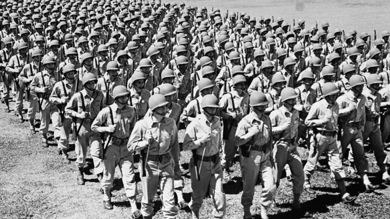 :speech_balloon:评:26 :+1:赞:40 :globe_with_meridians:转:17  

[01月05日 00:59]    BBC News 中文   @bbcchinese    70多年前的世界首富、大英帝国印度一王公的后人在英国赢得一场官司，获准继承3500万英镑遗产。
 https://bbc.in/39GVShi  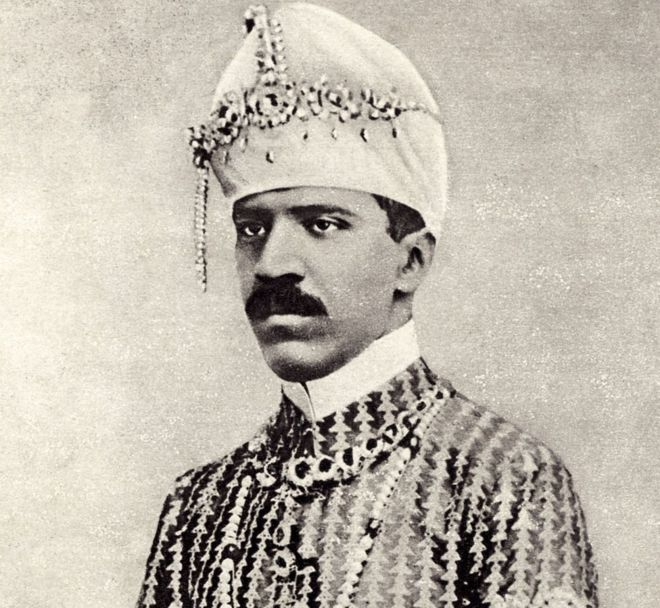 :speech_balloon:评:1 :+1:赞:15 :globe_with_meridians:转:6  

[01月05日 00:30]    BBC News 中文   @bbcchinese    许多英语童谣都有着源远流长的历史。不止如此，许多童谣的主题还暗藏一些黑暗肮脏的一面，包括宗教迫害和淫秽内容。
 https://bbc.in/39DctCP  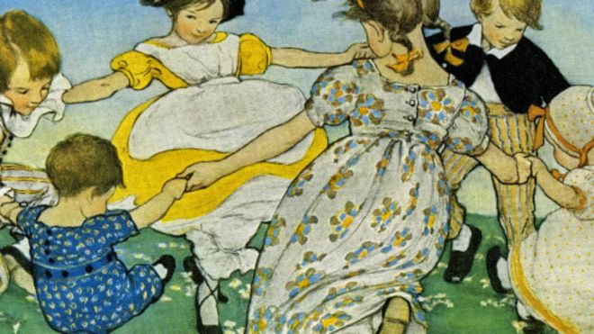 :speech_balloon:评:10 :+1:赞:42 :globe_with_meridians:转:13  

[01月04日 23:56]    BBC News 中文   @bbcchinese    癌症最初什么模样，要是知道，就有可能将它消灭在初始阶段。但有谁见过刚露头的癌？
 https://bbc.in/2ZNhiFc  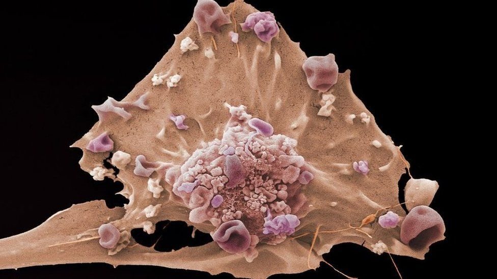 :speech_balloon:评:0 :+1:赞:26 :globe_with_meridians:转:9  

[01月04日 22:40]    BBC News 中文   @bbcchinese    分析人士表示，虽然第一阶段协议并没有真正解决造成中美贸易逆差的根本性问题，但眼看大选在即，这一协议会对特朗普开年的选战有帮助。 https://bbc.in/2MJcStC   :speech_balloon:评:18 :+1:赞:37 :globe_with_meridians:转:4  

[01月04日 21:00]    纽约时报中文网   @nytchinese    #一周热门 新年伊始，香港抗议者重回街头 http://nyti.ms/2sDUMCu   :speech_balloon:评:23 :+1:赞:62 :globe_with_meridians:转:16  

[01月04日 19:03]    BBC News 中文   @bbcchinese    “渡假穿泳衣被骂性交易？”
“结婚也要被骂，不结婚也要被骂？”
BBC中文对话台湾立委候选人赖品妤、黄韵涵，看两大党最年轻女性如何在困境中参政。 https://bbc.in/2MObg1S   :speech_balloon:评:1 :+1:赞:43 :globe_with_meridians:转:9  

[01月04日 19:00]    纽约时报中文网   @nytchinese    #一周热门 华为公布2019年业绩：增长稳健，强调“共克时艰” http://nyti.ms/2MIbveu   :speech_balloon:评:10 :+1:赞:17 :globe_with_meridians:转:2  

[01月04日 17:22]    老司机   @h5lpykl7tp6jjop    强者除恶是高难度定点清除，流氓的报复只有耍无赖伤及无辜！ 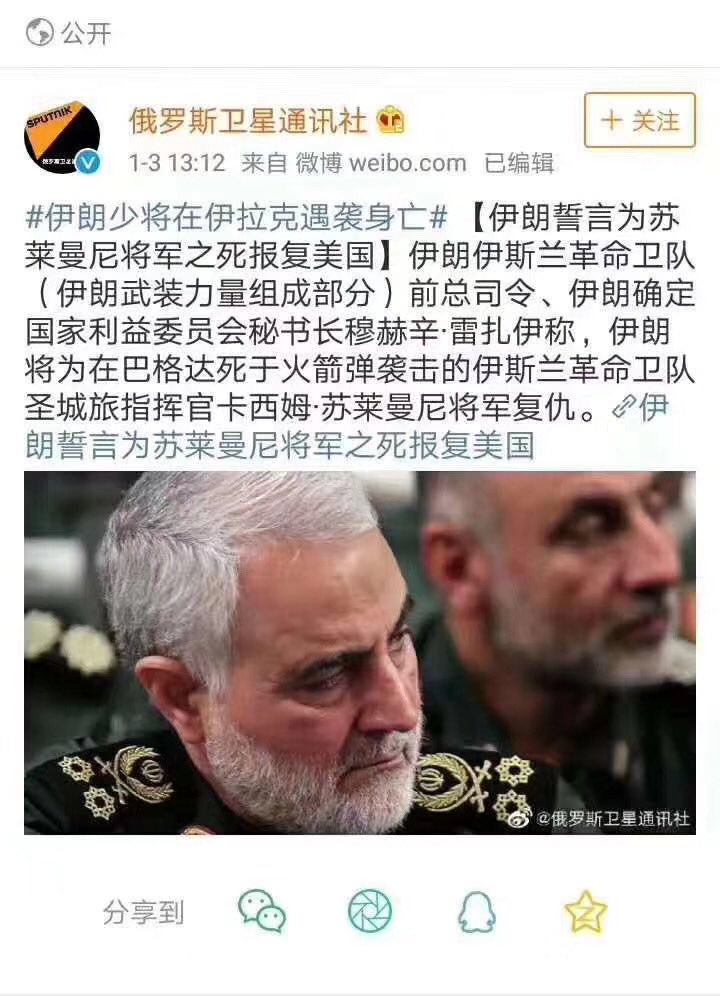 :speech_balloon:评:0 :+1:赞:14 :globe_with_meridians:转:1  

[01月04日 17:11]    老司机   @h5lpykl7tp6jjop    伊拉克巴格达再遭美军空袭 伊拉克国家电视台报道，在伊朗伊斯兰革命卫队高级将领苏莱马尼等人遭美国空袭身亡后，当地时间3日晚间，首都巴格达再次遭到美军空袭。据一名伊拉克军方消息人士称，美国空袭了巴格达北部的塔季地区，当地驻扎有什叶派民兵武装“人民动员组织”。空袭造成6人死亡，另有3人重伤。  :speech_balloon:评:0 :+1:赞:16 :globe_with_meridians:转:2  

[01月04日 17:08]    老司机   @h5lpykl7tp6jjop    俄中伊邪恶轴心刚成立，伊老三的武装头目就被炸死，全世界一片叫好声，最令人惊讶的是精准打击象伽玛刀切癌一样！老大老二惊得目瞪口呆！伊老三气得发羊癫疯！金三胖在一边也真的吓尿了，也不说要送大礼包了，摸下肥头真的还经不起炸！说半天美国才是真老虎，一旦发威，独裁者没一个逃得掉！  :speech_balloon:评:12 :+1:赞:522 :globe_with_meridians:转:115  

[01月04日 17:00]    纽约时报中文网   @nytchinese    #一周热门 《纽约时报》2019年最受欢迎的100篇文章 http://nyti.ms/2SF7Emp   :speech_balloon:评:3 :+1:赞:20 :globe_with_meridians:转:11  

[01月04日 16:28]    BBC News 中文   @bbcchinese    美国击毙伊朗二号人物会带来什么后果 https://bbc.in/36mcrx2   :speech_balloon:评:120 :+1:赞:162 :globe_with_meridians:转:43  

[01月04日 15:41]    老司机   @h5lpykl7tp6jjop    面对卡西姆苏·莱曼尼的挑衅，川普总统没有废话，给他剩下一截戴红宝石的手臂！
血淋淋的事实告诉某些人，吹牛逼是要付出代价的！  :speech_balloon:评:18 :+1:赞:249 :globe_with_meridians:转:92  

[01月04日 15:33]    财经真相   @caijingxiang    新做的一期视频，详细讲解LPR利率前因后果，尤其是报价挂钩MLF操作的流程，世人只关心LPR对房贷影响，却忽略了MLF一年期利率报价的走势，MLF一年期利率从最初的3%，一直涨到3.3%，直到去年11月份挂钩LPR利率才降低5个基点，房贷选择浮动利率真的会比较优惠吗？  :speech_balloon:评:17 :+1:赞:142 :globe_with_meridians:转:44  

[01月04日 15:20]    凡賽堤/FORSETI   @FecharCCP    他們穿著人民生產的制服，叫著人民的名義，卻只殺害同胞和出賣國土的極權殺人組織！
2020！消滅極權！！！  :speech_balloon:评:2 :+1:赞:3 :globe_with_meridians:转:6  

[01月04日 15:16]    凡賽堤/FORSETI   @FecharCCP    他們穿著人民生產的制服，叫著人民的名義，卻只殺害同胞和出賣國土的極權殺人組織！
2020！消滅極權！！！  :speech_balloon:评:4 :+1:赞:215 :globe_with_meridians:转:137  

[01月04日 15:01]    凡賽堤/FORSETI   @FecharCCP    我們看到了真相，見證了CCP的假，醜，惡的納粹嘴臉！  :speech_balloon:评:0 :+1:赞:17 :globe_with_meridians:转:17  

[01月04日 15:00]    纽约时报中文网   @nytchinese    #一周热门 #观点 2020年，中国还会出现“灰犀牛”事件吗？ http://nyti.ms/39njnvV   :speech_balloon:评:92 :+1:赞:44 :globe_with_meridians:转:19  

[01月04日 14:57]    凡賽堤/FORSETI   @FecharCCP    2020！消滅殺人政權，為70年來以各種手段名義冤死的近億華人同胞昭雪！！！

2020！時代革命，光復華族，消滅極權，人人有責！！！  :speech_balloon:评:0 :+1:赞:13 :globe_with_meridians:转:3  

[01月04日 14:47]    凡賽堤/FORSETI   @FecharCCP    極權恐怖組織騙取70年政權，殺死千萬地主富豪，近億人同胞，他們公開殺人，防火，強姦，現在更是公開搶劫！

我們看到了真相，見證了CCP的假，醜，惡的納粹嘴臉！

2020！時代革命，光復華族，消滅極權，人人有責！！！  :speech_balloon:评:1 :+1:赞:58 :globe_with_meridians:转:34  

[01月04日 13:57]    BBC News 中文   @bbcchinese    香港反政府抗议活动已经进行了6个月，香港人正在以一种前所未有的方式展示自己的艺术才华和创意。 https://bbc.in/2FfM1Bl   :speech_balloon:评:63 :+1:赞:266 :globe_with_meridians:转:92  

[01月04日 13:29]    BBC News 中文   @bbcchinese    东京奥运：禁止这面旗帜的呼声为何仍然高涨 https://bbc.in/37wYpsH   :speech_balloon:评:57 :+1:赞:90 :globe_with_meridians:转:28  

[01月04日 13:00]    纽约时报中文网   @nytchinese    #一周热门 #时报专栏 香港街头的“无限战争” http://nyti.ms/39nIMFG   :speech_balloon:评:76 :+1:赞:23 :globe_with_meridians:转:6  

[01月04日 12:49]    BBC News 中文   @bbcchinese    伊朗军事指挥官被击毙、台湾参谋总长坠机身亡与本周更多好故事 https://bbc.in/2uk6RNP   :speech_balloon:评:114 :+1:赞:118 :globe_with_meridians:转:27  

[01月04日 12:33]    财经真相   @caijingxiang    一个很有趣的问题，如果中国的央行成了被告，而且还输了官司，这对金融市场产生什么影响呢？一国央行输了官司这在人类历史上也算是前无古人了！  :speech_balloon:评:60 :+1:赞:654 :globe_with_meridians:转:141  

[01月04日 12:00]    纽约时报中文网   @nytchinese    减少添加糖并不意味着你要完全摆脱甜食。如果你采用的日常标准饮食是无添加糖的全食，那么你仍然会从天然糖中摄取大约10％的卡路里。
一旦你控制了添加糖的量，偶尔的巧克力或甜品就不会使你前功尽弃。 http://nyti.ms/39zA9Ii   :speech_balloon:评:17 :+1:赞:15 :globe_with_meridians:转:9  

[01月04日 11:00]    BBC News 中文   @bbcchinese    【一周热点回顾】台湾总统蔡英文力所推的《反渗透法》主要是防范境外敌对势力，像中国政府对台湾民主政治运作及影响选举，如介入公民投票、总统大选、对政府机构游说。 https://bbc.in/39wRZvp   :speech_balloon:评:26 :+1:赞:83 :globe_with_meridians:转:26  

[01月04日 09:00]    BBC News 中文   @bbcchinese    【一周热点回顾】蔡英文发表2020年元旦谈话，除了重提香港为例，说明台湾无法接受一国两制，因为民主与威权无法同存一个国家。 https://bbc.in/35fFXDh   :speech_balloon:评:38 :+1:赞:176 :globe_with_meridians:转:36  

[01月04日 09:00]    纽约时报中文网   @nytchinese    #一周热门 #新新世界 “捕猎”女性、鼓励自杀：PUA背后，中国的性别不平等 http://nyti.ms/39nJAuf   :speech_balloon:评:41 :+1:赞:66 :globe_with_meridians:转:30  

[01月04日 08:44]    老司机   @h5lpykl7tp6jjop    现在中共以国家的名义共产，明抢！冯仑被退休了，冯仑说我这是民营企业，退休金八千元。  :speech_balloon:评:16 :+1:赞:256 :globe_with_meridians:转:183  

[01月04日 08:28]    BBC News 中文   @bbcchinese    BBC中文访问美中伊关系专家，分析北京将在此轮冲突中扮演何种角色。 https://bbc.in/2MRlwWQ   :speech_balloon:评:36 :+1:赞:58 :globe_with_meridians:转:37  

[01月04日 07:34]    新闻大吐槽   @TuCaoFakeNews    川普真是言必信 行必果，竞选时他就说过：谁敢对平民下手，我就把他屎炸出来！他们因为我这句话批评我，我才不在乎呢！  :speech_balloon:评:49 :+1:赞:1322 :globe_with_meridians:转:470  

[01月04日 07:00]    纽约时报中文网   @nytchinese    #一周热门 新的十年到底从哪天开始？ http://nyti.ms/2u8R8RD   :speech_balloon:评:1 :+1:赞:4 :globe_with_meridians:转:1  

[01月04日 01:30]    BBC News 中文   @bbcchinese    “为了城市文明，请穿好你的上衣！”在夏季的热浪下，中国多地政府将目光放到了中年男性露出的肚子上。
 https://bbc.in/2QJ2qUc ? 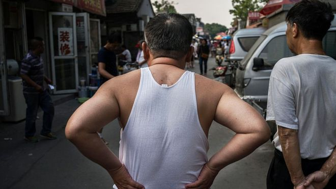 :speech_balloon:评:80 :+1:赞:56 :globe_with_meridians:转:13  

[01月04日 00:59]    BBC News 中文   @bbcchinese    有钱的外国人来了，只要肯花钱，几乎什么都能买得到，包括男孩子......BBC记者亲访探长、受害人和服刑的西方“游客”。
 https://bbc.in/2ZPytFT  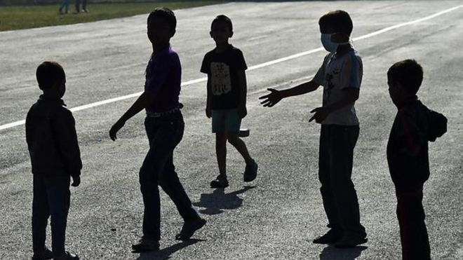 :speech_balloon:评:4 :+1:赞:19 :globe_with_meridians:转:9  

[01月04日 00:30]    BBC News 中文   @bbcchinese    青春期遭遇的情绪波动和压力会塑造大脑，决定你将来成为什么样的人。
 https://bbc.in/2SPBEfC   :speech_balloon:评:2 :+1:赞:32 :globe_with_meridians:转:17  

[01月04日 00:20]    财经真相   @caijingxiang    第三次世界大战，正在推特上酝酿！ https://twitter.com/zerohedge/status/1213131660448927744 …  :speech_balloon:评:13 :+1:赞:159 :globe_with_meridians:转:21  

[01月03日 23:59]    BBC News 中文   @bbcchinese    这是一个被历史尘封已久的故事。 200多年前的乾隆年间，广州青年黄亚东来到英国。他的人生定格在一幅油画上......
 https://bbc.in/2SOnATt  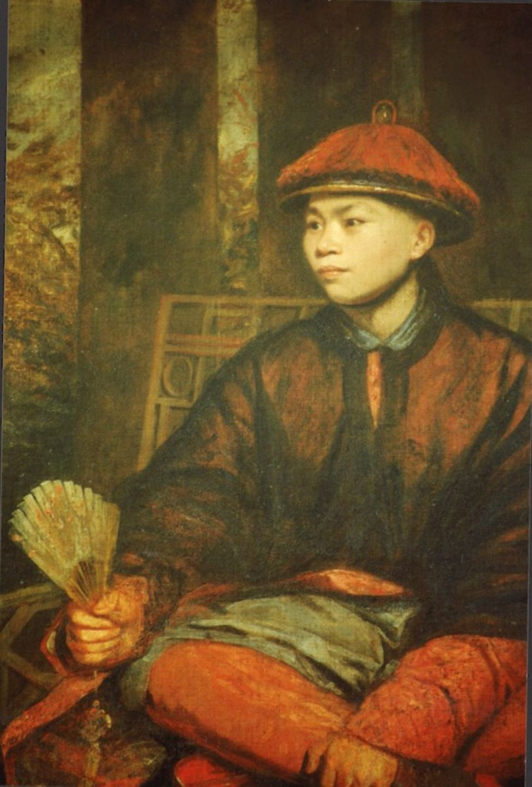 :speech_balloon:评:7 :+1:赞:131 :globe_with_meridians:转:49  

[01月03日 23:59]    BBC News 中文   @bbcchinese    神秘怀孕，难以置信？孩子生下来，我WhatsApp妈妈。她反问：可是，你今天早上还没怀孕啊？
 https://bbc.in/2ZUxq7W  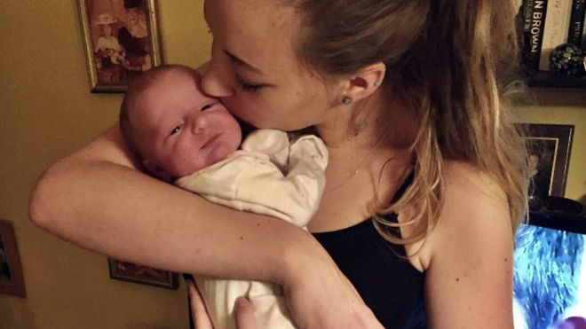 :speech_balloon:评:1 :+1:赞:17 :globe_with_meridians:转:3  

[01月03日 23:56]    墙国铁拳现世报😷   @Socialistfist    特别感谢投稿和为小编解答粤语白话文词汇的香港推友！  :speech_balloon:评:0 :+1:赞:74 :globe_with_meridians:转:3  

[01月03日 23:54]    墙国铁拳现世报😷   @Socialistfist    元旦当天铜锣湾被捕的近300人中，包括了一位［深蓝丝，小粉红］的54岁的汽修店伙计，其老板从事发时的直播画面中看到其在一旁［吃花生］看戏时因未带身份证警察逮捕。
老板希望探监送药，称自己伙计身体不佳需要心脏，肝脏药物，但被拒绝。

#社会主义铁拳
#社会主义特别行政区铁拳  :speech_balloon:评:25 :+1:赞:408 :globe_with_meridians:转:115  

[01月03日 23:30]    BBC News 中文   @bbcchinese    一种令人惊奇的有效技巧可提高人们短期和长期记忆，从学生到阿尔茨海默病患者人人都可从中受益，而且方法非常简单。
 https://bbc.in/2FdQB33  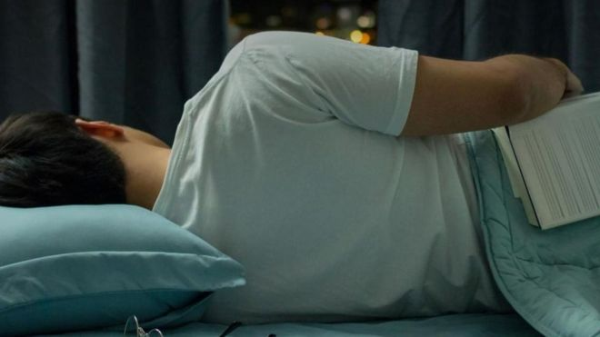 :speech_balloon:评:4 :+1:赞:149 :globe_with_meridians:转:100  

[01月03日 22:59]    BBC News 中文   @bbcchinese    英国最近一次的调查发现，人们做爱次数与日递减，特别是已婚夫妇性爱次数下降幅度最大，原因何在？
 https://bbc.in/37pp0YG   :speech_balloon:评:33 :+1:赞:71 :globe_with_meridians:转:29  

[01月03日 22:00]    纽约时报中文网   @nytchinese    检方在要求不保释郑灶松的动议中表示，郑灶松的盗窃行为“并非孤立事件”。“
相反，这似乎是一起有组织的犯罪，很可能有中国政府的参与，因为在同一个实验室工作的另外两名中国公民也盗窃了生物材料，并将它们偷运出美国。 http://nyti.ms/2QK9HmO   :speech_balloon:评:18 :+1:赞:42 :globe_with_meridians:转:21  

[01月03日 21:30]    纽约时报中文网   @nytchinese    自去年12月下旬一名美国承包商在伊拉克死亡后，两国关系极速恶化。
地区分析人士称，伊朗领导人很可能将苏莱曼尼被杀视为战争行为。美国官员已为伊朗潜在的报复性袭击做好准备，可能包括针对美国利益和盟友的网络攻击和恐怖主义行为。 http://nyti.ms/2QKfEjD   :speech_balloon:评:14 :+1:赞:39 :globe_with_meridians:转:10  

[01月03日 20:56]    纽约时报中文网   @nytchinese    数月的政治动荡使香港从一个充满希望的城市变成了充满怀疑和幻灭的地方，也改变了城市居民的生活。买房和生育的计划被推迟，亲情和友情出现紧张，一些人则在考虑离开。
“我不知道这场冲突要怎么结束，”一名香港人说，“所以我的未来和香港的未来一样，是不可预测的。” http://nyti.ms/2sIsNl6   :speech_balloon:评:138 :+1:赞:147 :globe_with_meridians:转:58  

[01月03日 17:42]    财经真相   @caijingxiang    中东局势一下子火了，黄金一飞冲天，大有脱离地球引力的架势，以色列货币新谢克尔也开始跌跌不休，中东很热闹！  :speech_balloon:评:17 :+1:赞:374 :globe_with_meridians:转:59  

[01月03日 17:42]    纽约时报中文网   @nytchinese    无论你是瘦还是胖，减少饮食中的糖分都可以令你获益。
控糖并不意味着节食和剥夺自己喜欢吃的东西，也无需计算卡路里或减少脂肪，时报的7天减糖挑战将告诉你怎么做。 http://nyti.ms/39zA9Ii   :speech_balloon:评:24 :+1:赞:75 :globe_with_meridians:转:48  

[01月03日 16:50]    老司机   @h5lpykl7tp6jjop    人民医院什么时候才能救人民？ 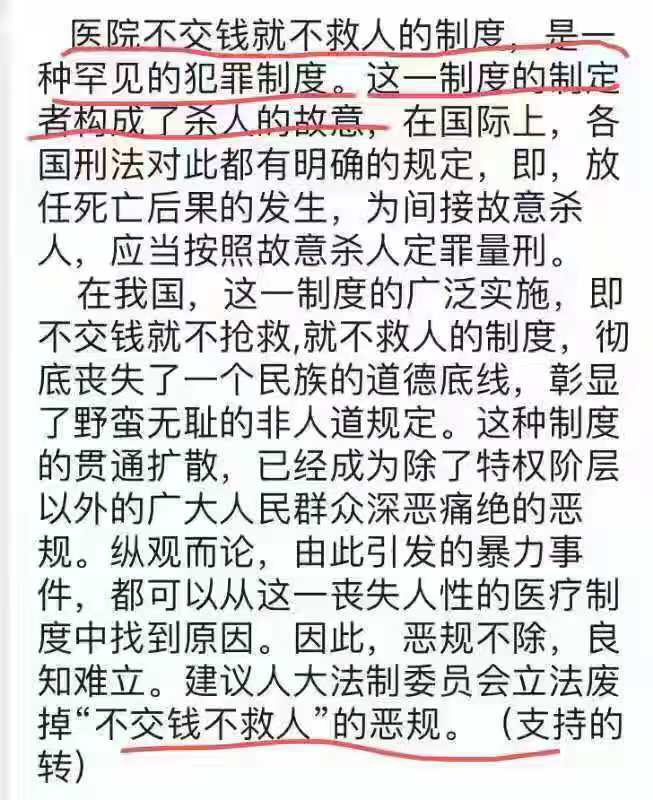 :speech_balloon:评:17 :+1:赞:171 :globe_with_meridians:转:95  

[01月03日 15:30]    纽约时报中文网   @nytchinese    #图集【在美国，75万美元能买到什么房？】手握75万美元，你能买到密西西比州牛津市一座全新小木屋，或密苏里州堪萨斯城的一处建于1967年的现代风格房屋，也可以选择亚利桑那州塞多纳可欣赏到红岩的三居室。
点击查看图集： http://nyti.ms/37zWiEG  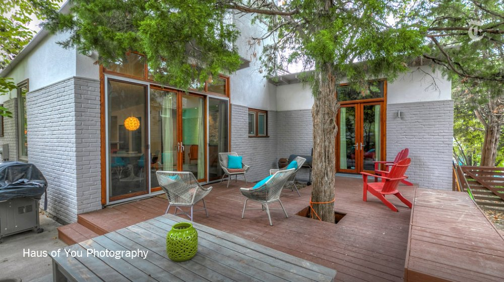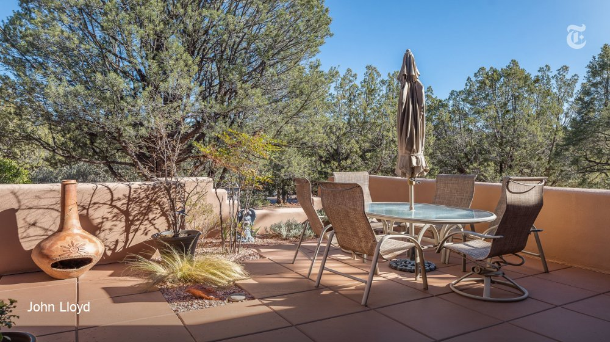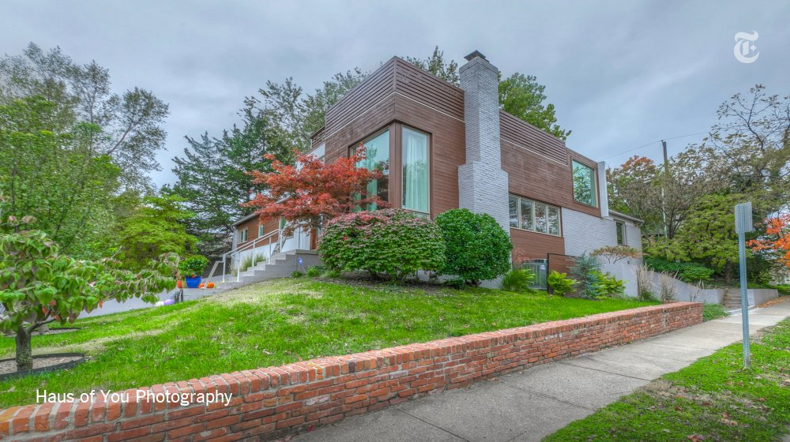 :speech_balloon:评:21 :+1:赞:31 :globe_with_meridians:转:5  

[01月03日 15:17]    财经真相   @caijingxiang    外交部：中方一贯反对在国际关系中使用武力。我们敦促有关各方，特别是美方要保持冷静克制，避免紧张局势进一步升级。（人民日报） 吓坏了！  :speech_balloon:评:151 :+1:赞:1095 :globe_with_meridians:转:176  

[01月03日 15:11]    老司机   @h5lpykl7tp6jjop    医患关系的死结！无解！  :speech_balloon:评:2 :+1:赞:50 :globe_with_meridians:转:18  

[01月03日 15:00]    纽约时报中文网   @nytchinese    #观点 政府声称，“非洲猪瘟疫情得到有效控制”。由于猪肉严重短缺，政府已开始吸引一些农民重新开始养猪。在我兄弟的村子外，一个曾确定要拆除的大型养猪场，在政府提供了大量补贴和低息贷款后，已恢复使用。
但像我兄弟这样经营小养猪场的人就没有这么幸运了。 http://nyti.ms/37xgB5C   :speech_balloon:评:1 :+1:赞:14 :globe_with_meridians:转:8  

[01月03日 14:20]    纽约时报中文网   @nytchinese    是什么引起火灾？大火有多大？到目前为止造成的损害有多大？谁在救火？气候变化是罪魁祸首吗？天气如何影响火灾？
本文解释了澳大利亚的火灾为何会如此严重： http://nyti.ms/2SMP5wH   :speech_balloon:评:5 :+1:赞:4 :globe_with_meridians:转:2  

[01月03日 13:46]    纽约时报中文网   @nytchinese    美国官员称，伊朗革命卫队指挥官周五凌晨在特朗普授权的一次在巴格达国际机场发起的无人机空袭中丧生。
苏莱曼尼被杀对伊朗的军事及其民族自豪感是一个惊人的打击，也是特朗普与德黑兰之间紧张对抗的严重升级。 http://nyti.ms/2QKfEjD   :speech_balloon:评:96 :+1:赞:391 :globe_with_meridians:转:116  

[01月03日 13:30]    纽约时报中文网   @nytchinese    在下周的CES展会上，被称为5G的下一代蜂窝技术以令人难以置信的速度传输数据，预计它将作为最重要的话题之一登上中央舞台。
我们还可能会看到智能家居的进化，如冰箱、电视和吸尘器等物联网电器将更加无缝地协同工作——并减少了对人工操作的需要。 http://nyti.ms/2MNM4bQ   :speech_balloon:评:1 :+1:赞:12 :globe_with_meridians:转:5  

[01月03日 13:07]    老司机   @h5lpykl7tp6jjop    “中国淡水鱼之王”长江白鲟灭绝!未跨入2020年
什么时候共产邪魔灭绝，中国人才有救！ 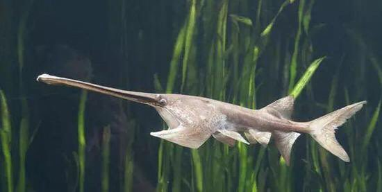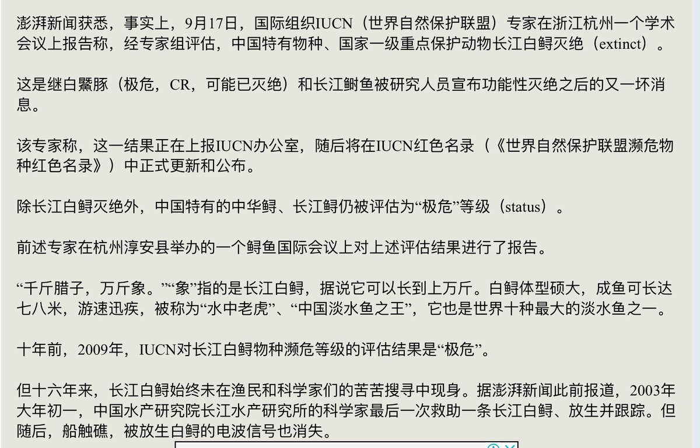 :speech_balloon:评:1 :+1:赞:8 :globe_with_meridians:转:3  

[01月03日 13:00]    老司机   @h5lpykl7tp6jjop    不同的国家别样的风景：澳洲总理看望受灾民众反被骂:握手遭拒 被骂滚开  :speech_balloon:评:0 :+1:赞:25 :globe_with_meridians:转:8  

[01月03日 13:00]    纽约时报中文网   @nytchinese    #每日一词 Lame duck，跛脚鸭。香港抗议至今已有半年，时报专栏作者科恩认为，这场“街头战争”远未结束。潘多拉的盒子已被打开，冒出来的精灵叫自由。而政治上的“跛脚鸭”林郑月娥已经乏力，疲于应对。
Lame duck意为跛脚鸭，也可指弱者或能力、成就等落后的人。更多简报内容： http://nyti.ms/2QjVttS   :speech_balloon:评:6 :+1:赞:10 :globe_with_meridians:转:3  

[01月03日 12:43]    老司机   @h5lpykl7tp6jjop    外媒: “泼墨女孩”董瑶琼出院 前后已判若两人 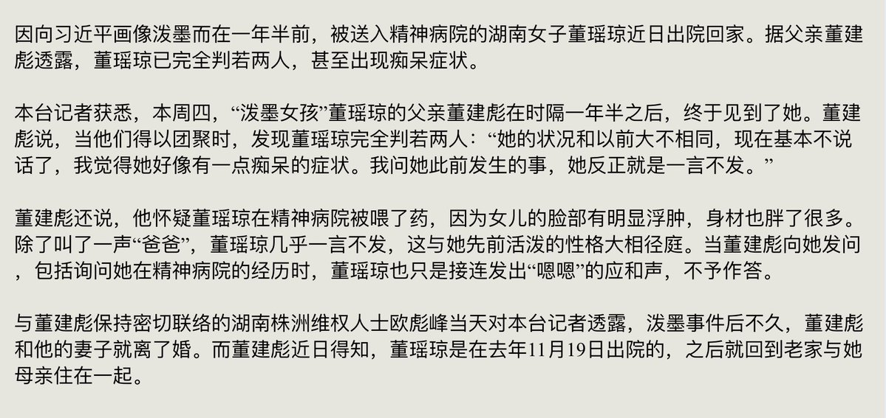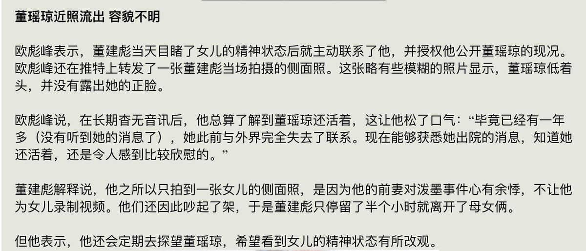 :speech_balloon:评:0 :+1:赞:27 :globe_with_meridians:转:15  

[01月03日 12:30]    纽约时报中文网   @nytchinese    这是澳洲史上最严重的火灾季之一，造成至少15人丧生，约4万平方公里土地过火，近1000座房屋被摧毁。创纪录的高温、持续的干旱和强风共同造就了灾难性的火灾。
在澳大利亚，炎热、干燥的环境助长大火，这并不是什么新鲜事。以下是这次火灾季节如此可怕的原因。 http://nyti.ms/2SMP5wH   :speech_balloon:评:19 :+1:赞:55 :globe_with_meridians:转:26  

[01月03日 12:11]    老司机   @h5lpykl7tp6jjop    分蛋糕的人说它养活了做蛋糕的人！这是什么逻辑？  :speech_balloon:评:59 :+1:赞:535 :globe_with_meridians:转:191  

[01月03日 12:00]    纽约时报中文网   @nytchinese    印度警察被指虐待穆斯林。随着新公民法抗议转向暴力，有关警察滥权的指控也层出不穷。在穆斯林居民最多的北方邦，至少有19人在抗议活动中丧生。
时报采访了30多名当地人，他们说，警察破门入室、偷钱，还威胁强奸妇女。
更多简报内容： http://nyti.ms/2QjVttS   :speech_balloon:评:2 :+1:赞:5 :globe_with_meridians:转:4  

[01月03日 11:04]    财经真相   @caijingxiang    这是一个很有趣的事，伊朗拿着中共的美元，去跟美军开干，而华尔街用美军养老金给购买中共主权债，以此来给中共输血！游戏规则就是这么简单，美军用自己的养老金，杀自己！  :speech_balloon:评:29 :+1:赞:423 :globe_with_meridians:转:121  

[01月03日 10:48]    财经真相   @caijingxiang    缺的美元，都用在了邪恶轴心国上了!美国完全可以把伊朗变成中国的出血口，直到像苏联在阿富汗那样，流尽最后一点血！ https://twitter.com/LandofYelang/status/1212928069322674178 …  :speech_balloon:评:9 :+1:赞:439 :globe_with_meridians:转:122  

[01月03日 10:25]    老司机   @h5lpykl7tp6jjop    自己没出息的人往往只有拚命吹嘘祖先很不得了，当年被日本人打得无法招架，就编造四大发明，结果还是靠美国人救了自己！然而二战结束七十多年了，日本人不论社会文明科技各方面仍然遥遥领先，中国还在维稳，还在扶贫，还在吹牛，还在个人崇拜，还是愚不可及，只有一样提高，就是骗子的技术空前的提高！  :speech_balloon:评:11 :+1:赞:379 :globe_with_meridians:转:88  

[01月03日 09:36]    老司机   @h5lpykl7tp6jjop    抗美援朝打“赢”了，把白头山割给朝鲜一半；抗美援越打“赢”了，海疆线从十一段变成了九段；中印战争打“赢”了，藏南9万平方公里归了印度；中越海战打“赢”了，两年丢了49个岛；珍宝岛打“赢”了，中方承认了满清签订的所有不平等条约。这些战争姑且都算是打“赢”了吧…… https://twitter.com/zgwsjftw/status/1212383476227264512 …  :speech_balloon:评:22 :+1:赞:573 :globe_with_meridians:转:242  

[01月02日 23:06]    墙国铁拳现世报😷   @Socialistfist    最新更新  :speech_balloon:评:31 :+1:赞:319 :globe_with_meridians:转:91  

[01月02日 22:18]    GFHG SDKM   @zyx_yny    求下大家帶口罩  :speech_balloon:评:1 :+1:赞:92 :globe_with_meridians:转:13  

[01月02日 22:01]    GFHG SDKM   @zyx_yny    昨日言い忘れましたが、あけましておめでとうございます

2020年は、目標や夢がたくさん叶う年になりますように。

この数年間で日本のファッションやコスメが大好きになりました。憧れの日本のファッション誌の取材を受けたい！という夢も、いつか叶うといいな。

2020年もよろしくお願いします。  :speech_balloon:评:648 :+1:赞:25725 :globe_with_meridians:转:4131  

[01月02日 21:04]    GFHG SDKM   @zyx_yny    "Hong Kong is a great world city, a major international financial and trading centre, and an important gateway to China and the rest of Asia. It would be a tragedy if it loses this role and gains a reputation for repression." https://www.christiantoday.com/article/religious-leaders-dignitaries-call-on-hong-kong-chief-executive-carrie-lam-to-stop-police-brutality/133948.htm …  :speech_balloon:评:116 :+1:赞:1990 :globe_with_meridians:转:1840  

[01月02日 19:53]    GFHG SDKM   @zyx_yny    您国！抱拳了！  :speech_balloon:评:28 :+1:赞:369 :globe_with_meridians:转:87  

[01月02日 19:52]    老司机   @h5lpykl7tp6jjop    29日晚间，美军第394远征部队的数架F-15E战机从约旦起飞，猛烈袭击了伊拉克西北荒漠中的伊朗军事基地。
伊朗革命卫队军发言人确认，其驻扎伊叙边境的主力部队第45、46旅司令部遭美军炸毁。在16名伊朗武装人员死者中，竟包括伊朗系武装第45旅“真主旅”指挥官阿布阿里.哈扎里少将和他的副手、第1团团长。  :speech_balloon:评:8 :+1:赞:136 :globe_with_meridians:转:38  

[01月02日 19:38]    老司机   @h5lpykl7tp6jjop    That look dad has when he realizes where his university money is going.  :speech_balloon:评:69 :+1:赞:946 :globe_with_meridians:转:353  

[01月02日 18:14]    老司机   @h5lpykl7tp6jjop    中共喜欢开门红，今年的开门红是上海重庆两场大火加一场血案！
“时日曷丧，予及汝皆亡”，2020年的第一起凶杀案
文/久菜
2020/01/02

年末，北京的杨文医生被患者家属孙文斌割喉的血腥场景，还未从人们的脑海里面彻底消散，2020年元月01日，江苏省仪征市发生的一起凶杀案又在微信朋友圈里面广为传播。 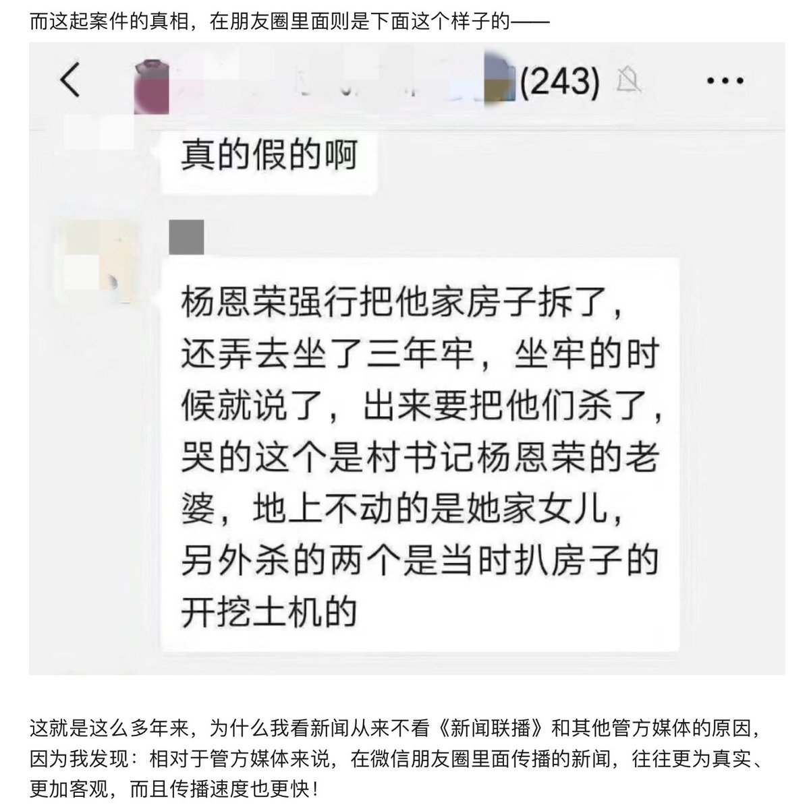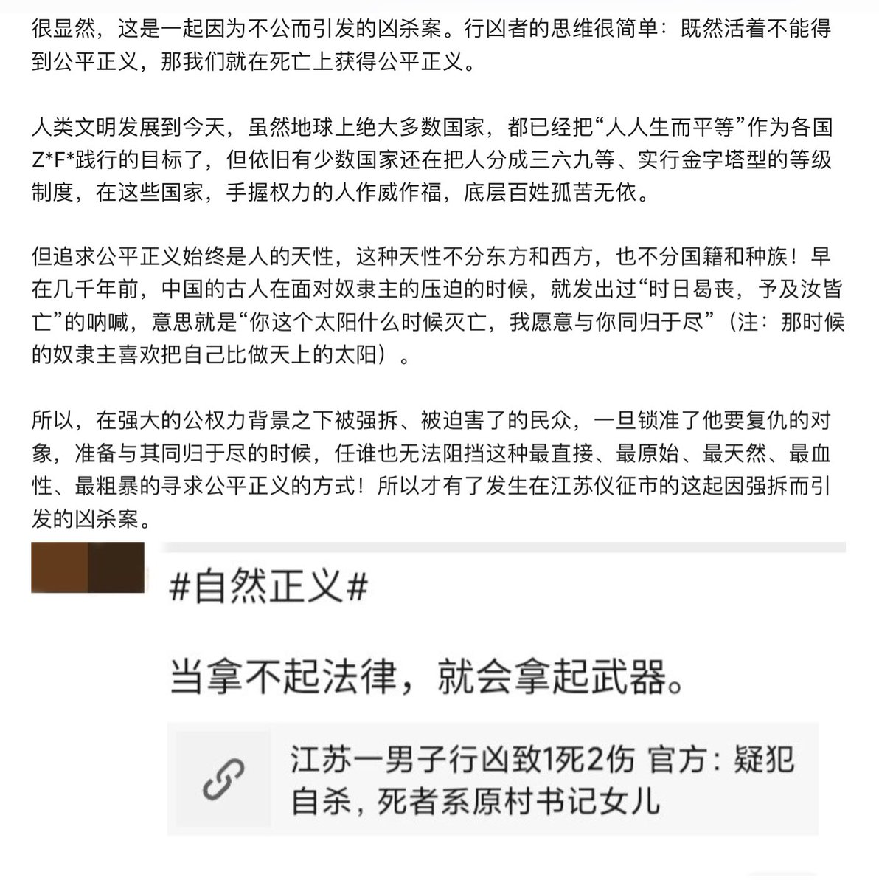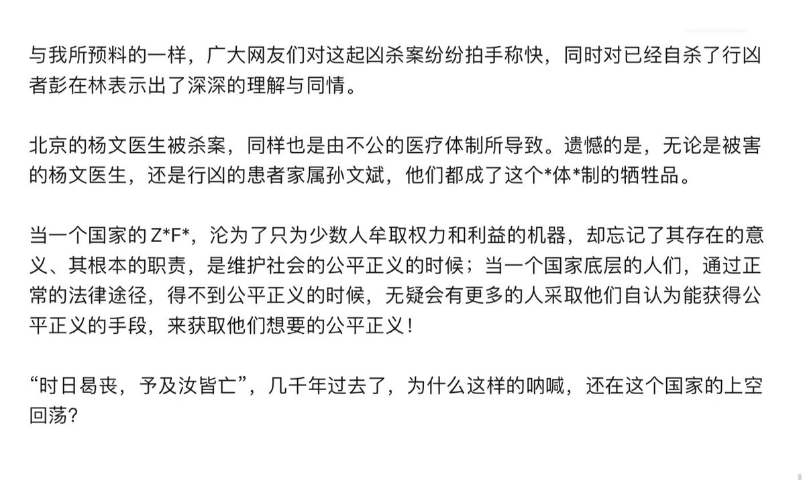 :speech_balloon:评:8 :+1:赞:66 :globe_with_meridians:转:32  

[01月02日 17:13]    财经真相   @caijingxiang    欧元权重上升，美元权重下降，另外由于CFETS人民币汇率指数是由贸易加权编制，本质是代表与中国贸易进出口变化，下调美元权重，代表了中美贸易在下滑，欧盟与中国贸易权重上升！  :speech_balloon:评:4 :+1:赞:91 :globe_with_meridians:转:14  

[01月02日 17:07]    财经真相   @caijingxiang    中汇交公告：为进一步增强CFETS人民币汇率指数货币篮子代表性，中国外汇交易中心计划根据《CFETS人民币汇率指数货币篮子调整规则》（中汇交公告〔2016〕81号），调整CFETS人民币汇率指数货币篮子的权重以及BIS货币篮子人民币汇率指数的货币篮子和权重。新版指数自2020年1月1日起生效。  :speech_balloon:评:7 :+1:赞:73 :globe_with_meridians:转:21  

[01月02日 15:12]    老司机   @h5lpykl7tp6jjop    被抓的小偷田某说，原本计划着偷个几万块就差不多了，而当撬开保险箱时，被眼前的现金给惊呆了，但是他并不敢拿太多，于是剪开了十万一捆的现金，拿走了其中的三万。准备回去的时候，他想起还有二十来万的欠款，又拿了两大捆，一大捆是十万，又拿了四小捆，一共24万，他心想说做坏人不能做得太绝。  :speech_balloon:评:2 :+1:赞:58 :globe_with_meridians:转:6  

[01月02日 15:12]    老司机   @h5lpykl7tp6jjop    饥寒起盗心盗亦有道！窃贼撬开保险箱120万只拿27万:做坏人不能太绝！

杭州市发生一起盗窃案，财务室里装有120万元现金的保险箱被人撬开，大量现金被盗。企业在保险箱里放了120万的现金，10万元一捆，一共12捆。窃贼只拿走了其中的27万元，现场还遗留下来93万元现金，其中一捆10万的现金还是特地剪开的  :speech_balloon:评:8 :+1:赞:129 :globe_with_meridians:转:30  

[01月02日 15:00]    老司机   @h5lpykl7tp6jjop    港共黑警可恶至极：元旦被警方批准的100多万人的大游行，恶警竟然在闹市无差别拘捕几百上千群众，就连假日到铜锣湾闹市的行人也一并拘捕……  :speech_balloon:评:24 :+1:赞:273 :globe_with_meridians:转:208  

[01月02日 12:30]    GFHG SDKM   @zyx_yny    WATCH: Police in Hong Kong rip the goggles off of lawmaker Ted Hui Chi-fung in an attempt to pepper spray him during a #NewYear's Day rally #HongKongProtests #香港  :speech_balloon:评:202 :+1:赞:2448 :globe_with_meridians:转:2320  

[01月02日 11:04]    财经真相   @caijingxiang    2019年深圳辖区一般公共预算收入达9424.2亿元，增长3.5%。其中，中央级收入5651亿元，增长1.6%；地方级收入3773.2亿元，增长6.5%；中央与地方收入结构为60∶40。地方级收入中，税收收入3067.7亿元，增长5.7%；非税收入705.5亿元，增长10.4%。2019年深圳市一般公共预算支出4551亿元，增长6.2%。  :speech_balloon:评:8 :+1:赞:110 :globe_with_meridians:转:30  

[01月02日 10:57]    财经真相   @caijingxiang    港币在2019年最后一天，隔夜利率达到了最高点4.56226%，新年一过，港币流动性紧张将会缓解！ 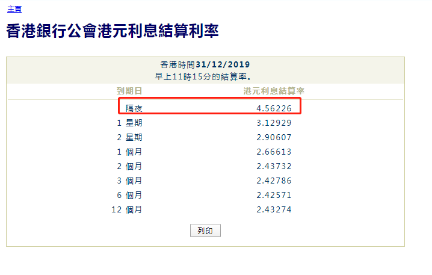 :speech_balloon:评:1 :+1:赞:41 :globe_with_meridians:转:6  

[01月02日 09:57]    GFHG SDKM   @zyx_yny    洗腦的人没有興趣看完video，不要用太長的片，有些照片震撼力也很強  :speech_balloon:评:1 :+1:赞:16 :globe_with_meridians:转:6  

[01月02日 03:19]    GFHG SDKM   @zyx_yny    Honoured to be among 40 signatories of this important and timely Open Letter to Carrie Lam: end police brutality against peaceful Hongkongers NOW!
#StandWithHongKong https://twitter.com/hk_watch/status/1212040663757443073 …  :speech_balloon:评:372 :+1:赞:2533 :globe_with_meridians:转:2158  

[01月01日 22:48]    财经真相   @caijingxiang    首都高速的重点词语是“按照全国统一部署”，说明本次调整是全国性的，并非只是北京一地，从今天实际情况来看，货车收费翻倍，并不是交通部此前所说的“收费水平将降低”，这种欺诈性的新闻，让很多司机来不及准备，导致最近一系列的货运亏损，可以预见的是，接下来整个货运成本都会涨价，通胀又多了一把火  :speech_balloon:评:8 :+1:赞:251 :globe_with_meridians:转:63  

[01月01日 22:44]    财经真相   @caijingxiang    首都高速：1月1日起全国统一取消高速公路省界收费站，实现电子不停车快速通行。届时，北京市将按照全国统一部署，执行新的车型分类标准及高速公路收费标准，实行精确收费。早在12月12日交通部就就行专门的新闻发布会，说货车收费标准将改为按车轴数收费，收费水平将降低！然而今天货车涨价翻倍。 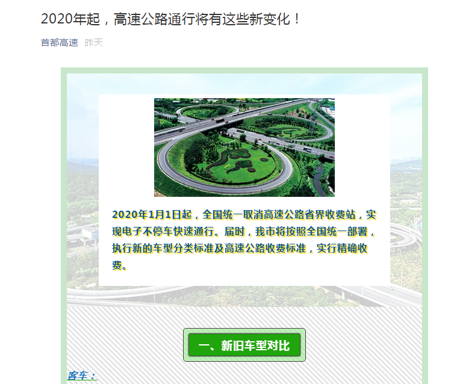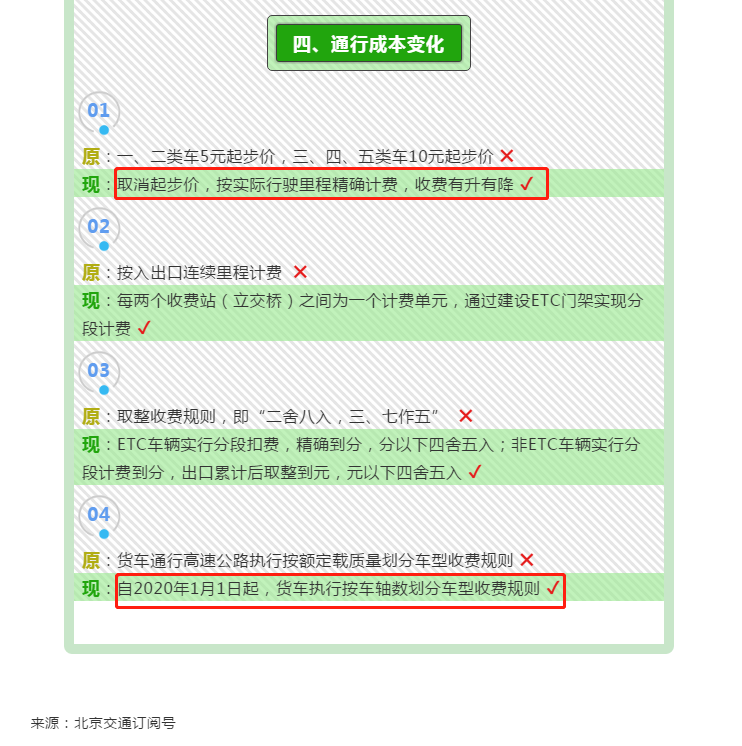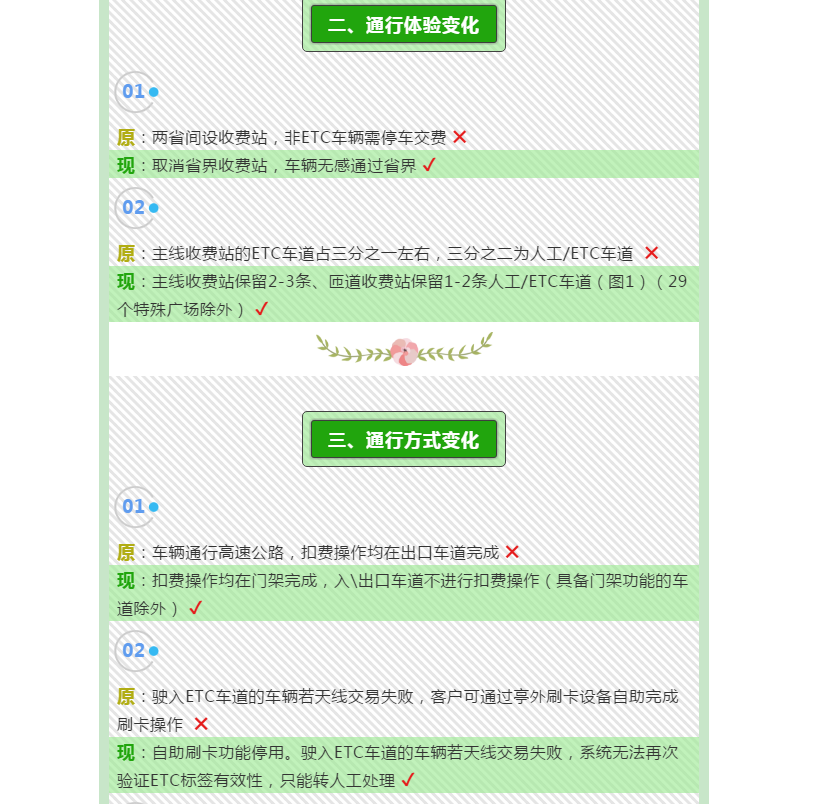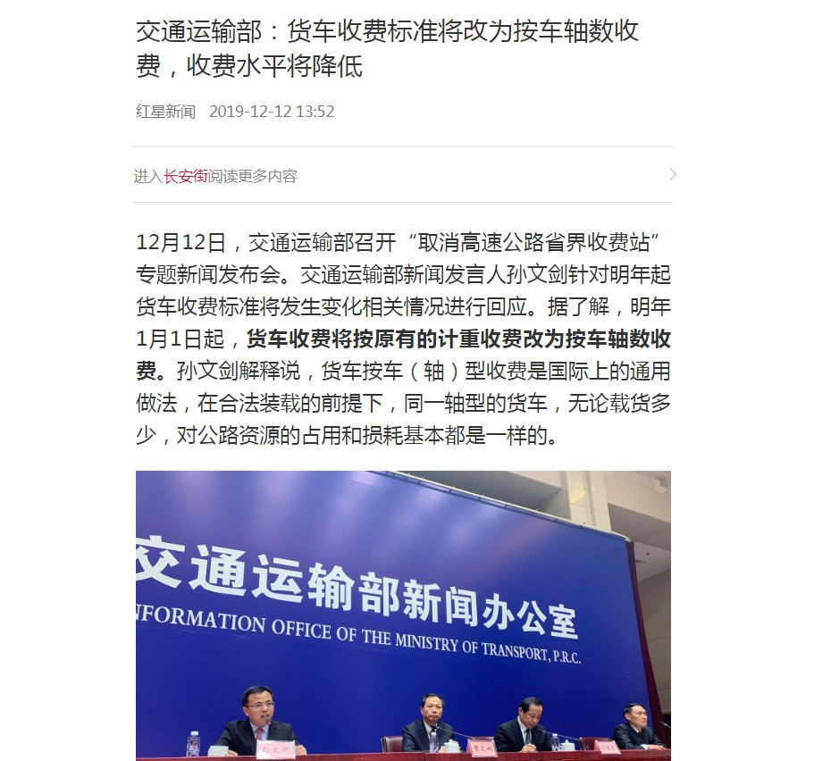 :speech_balloon:评:34 :+1:赞:265 :globe_with_meridians:转:107  

[01月01日 22:15]    财经真相   @caijingxiang    李小鹏指挥，今天高速公路全面涨价，现在知道为啥要强制安装ETC了，他们很清楚，新闻不进行任何报道，目的就是认为中国老百姓会先抗议，最后默认！ 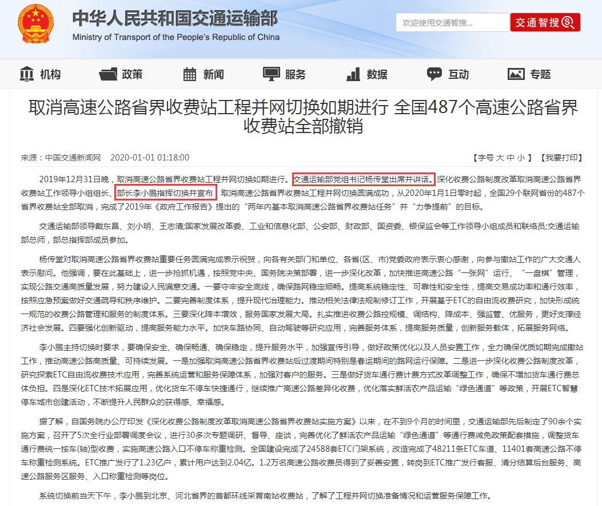 :speech_balloon:评:152 :+1:赞:858 :globe_with_meridians:转:395  

[01月01日 22:05]    财经真相   @caijingxiang    不会再有第三阶段的贸易协议了，第二次就包含了剩下的全部条款，川普太极拳打的了纯火炉青！ https://twitter.com/GlobalHimalaya/status/1212351434433294336 …  :speech_balloon:评:9 :+1:赞:357 :globe_with_meridians:转:99  

[01月01日 21:54]    财经真相   @caijingxiang    哦？？真的吗？ https://twitter.com/CYC1982/status/1212363602536976384 …  :speech_balloon:评:8 :+1:赞:51 :globe_with_meridians:转:2  

[01月01日 21:22]    GFHG SDKM   @zyx_yny    #HongKongPolice #PepperSpray 
1 Jan 2020
Near Sogo, Causeway Bay, #HongKongProtesters 
Source: ynhk  :speech_balloon:评:96 :+1:赞:1027 :globe_with_meridians:转:1176  

[01月01日 18:25]    财经真相   @caijingxiang    临近年底事多，一不留神央行正式降准了，本次降准是0.5个百分点，不及市场此前预期的1个百分点，释放永久性资金8000多亿元，这点流动性并不能完全弥补1月份的资金缺口，估计接下来央行还会继续进行逆回购和MLF操作，补充剩余的资金欠缺。市场“买预期卖事实”，明天股市高开低走！汇率继续围绕7震荡！ 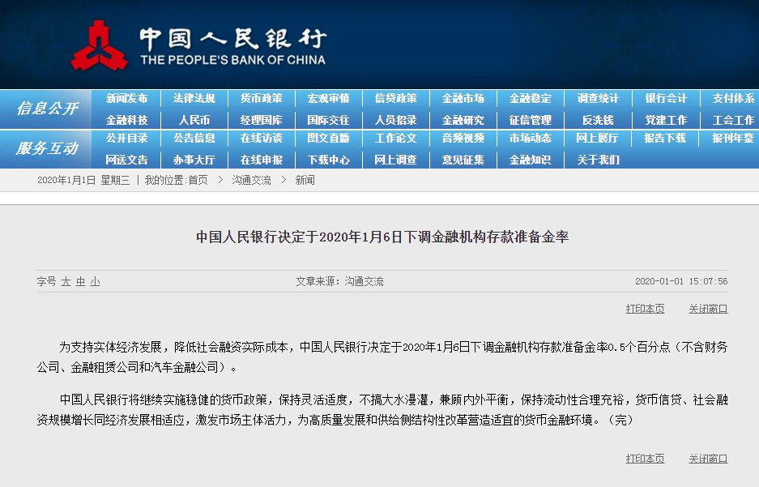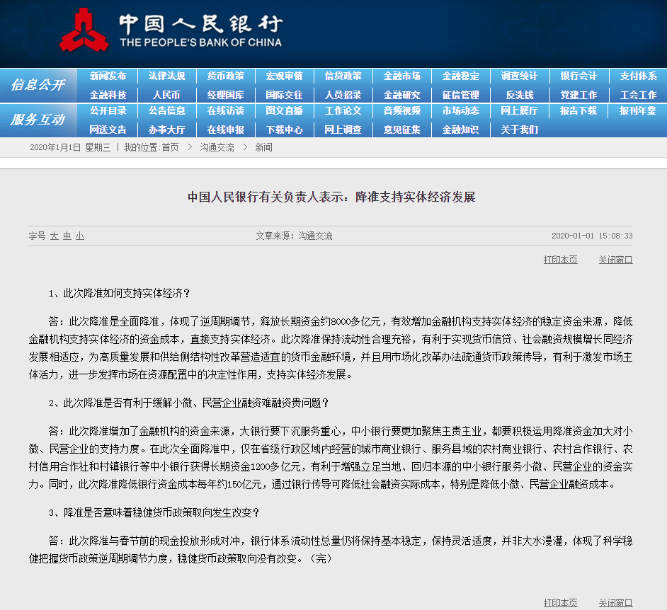 :speech_balloon:评:20 :+1:赞:183 :globe_with_meridians:转:41  

[01月01日 18:23]    GFHG SDKM   @zyx_yny    #HKPoliceTerrorists in action again. Nowadays with a mask and weapon you can play both terrorists and #HKPolice , in fact there is no boundary already.  :speech_balloon:评:171 :+1:赞:2132 :globe_with_meridians:转:2401  

[01月01日 10:27]    财经真相   @caijingxiang    中国央行：创新和完善宏观调控，稳健的货币政策要灵活适度，运用多种货币政策工具，保持流动性合理充裕，保持广义货币M2和社会融资规模增速与国内生产总值名义增速相匹配，不搞“大水漫灌”，保持物价水平总体稳定。  :speech_balloon:评:10 :+1:赞:98 :globe_with_meridians:转:19  

[01月01日 03:27]    墙国铁拳现世报😷   @Socialistfist    对这一届推友，小编是很满意的
再次感谢2019年大力支持和帮助的推友们  :speech_balloon:评:6 :+1:赞:245 :globe_with_meridians:转:33  

[12月31日 22:58]    墙国铁拳现世报😷   @Socialistfist    墙国铁拳现世报 恭祝各位推友
新年平安喜乐，铁拳不锤！  :speech_balloon:评:27 :+1:赞:767 :globe_with_meridians:转:122  

[12月31日 22:47]    财经真相   @caijingxiang    2月14号是情人节，这将是中美“最后的甜蜜”，这一天距离节后正式上班刚好一周，再过一周时间的准备，就到了双方开始履约的时间了。同时也是第二阶段谈判的开始，此时再过两周就是中共“两会”，川普在这个时候再度访华，明显是给北京最后的施压，中共必须在两会上启动全面结构性改革！  :speech_balloon:评:13 :+1:赞:123 :globe_with_meridians:转:26  

[12月31日 22:35]    财经真相   @caijingxiang    市场已经彻底提前“计价”第一阶段协议，即使真签字，人民币也涨动力，接下来就是看第二阶段谈判，第二阶段双方将进入深水区，而且第一阶段贸易协议也到了开始落实的时候了；按照双方此前约定，15号签字，美国正式降关税将在30天后，也就是在情人节（2月14号）那天生效！看样子是让中共过好最后一个年！ https://twitter.com/realDonaldTrump/status/1212014713808273410 …  :speech_balloon:评:30 :+1:赞:194 :globe_with_meridians:转:45  

[12月31日 10:53]    GFHG SDKM   @zyx_yny    藍店認證: 葵涌工業街2-8號力豐工業大廈 Rhe Kitchen 

要容納咁多人仲要得2間餐廳(網民報料)，唯一選擇得呢間私房菜，同樣有大圓枱，同樣有第三張既屏風

仲捉你唔到2020年睇你捱到幾耐
歡迎轉發 #藍店  :speech_balloon:评:20 :+1:赞:206 :globe_with_meridians:转:202  

[12月31日 10:34]    凡賽堤/FORSETI   @FecharCCP    细思极恐的面具之后1：
细思真名(中国护照名字)叫做 LinZheng Pan, 应该是中文同音的拼音，比如：潘林正，潘临郑。
潘林正，有两个孩子。
潘林正，前天的所谓直播，完全就是砸郭热线。  :speech_balloon:评:145 :+1:赞:862 :globe_with_meridians:转:397  

[12月31日 08:41]    GFHG SDKM   @zyx_yny    This was how Joycelyn Chau, an unarmed young woman, was brutally arrested by a gang of riot police this summer. She'd gone on to win a District Council seat & is due to formally commence duty on 1Jan

She's just been told she is to be charged with assaulting these police officers https://twitter.com/UncleRay_NDJ/status/1211621739978866689 …  :speech_balloon:评:91 :+1:赞:1009 :globe_with_meridians:转:1291  

[12月31日 01:06]    GFHG SDKM   @zyx_yny    猶豫要不要加上這兩個 hashtags: #老竇教仔 #老母教仔

好吧，就當我沒寫哦。別駡

那個，courtesy matters. 跟外國政要致謝，盡量不要用thanks 或 thxx. 這也不算 rude，但過度 casual，少了一份誠意，甚至給人一種 over familiar 的感覺。好似你與對方多年深交，一起泡吧，一起泡妞，一起泡澡的那種  :speech_balloon:评:5 :+1:赞:103 :globe_with_meridians:转:48  

[12月31日 00:28]    GFHG SDKM   @zyx_yny    Just one day or two before the new year, #PoliceBrutality never stops. A pregnant lady was badly treated by #hkpolice in Tin Shui Wai and forced to kneel on the ground. She terribly threw up, but #police kept scolding at her. #policestatehk  :speech_balloon:评:1003 :+1:赞:9247 :globe_with_meridians:转:11511  

[12月29日 01:29]    凡賽堤/FORSETI   @FecharCCP    ----你見過幾十個穿制服的圍毆性侵一個小女生嗎？------

極權恐怖組織的殺人犯警2019年12月份的納粹暴行（19）

我們都是歷史的見證者！

時代革命，消滅極權，CCP 不能代表中國，CCP 不能代表中國人！

----感謝此視頻的原創作者！  :speech_balloon:评:2 :+1:赞:70 :globe_with_meridians:转:66  

[12月29日 01:09]    凡賽堤/FORSETI   @FecharCCP    極權恐怖組織的殺人犯警的納粹暴行（圖1）

---黑警犯警強姦警暴警殺人警非法執法濫捕香港小青年，學生，兒童！

我們都是歷史的見證者！

時代革命，消滅極權，CCP 不能代表中國，CCP 不能代表中國人！

----感謝此視頻的原創作者！  :speech_balloon:评:0 :+1:赞:16 :globe_with_meridians:转:17  

[12月29日 00:48]    凡賽堤/FORSETI   @FecharCCP    你認同一個政府稱呼人類為蟑螂？
你認同一個政府稱呼手無寸鐵的在校學生為暴徒？
你認同一個政府僱傭黑社會團伙肆意毆打市民？
你認同一個政府動用部隊武警毆打，殘殺市民？
你認同警察部隊武警殺人後高樓拋屍？
你認同警察部隊武警輪姦少女後殺人大海拋屍？
你認同....幾個月就陸續殺死近萬名學生？  :speech_balloon:评:23 :+1:赞:365 :globe_with_meridians:转:277  

[12月29日 00:25]    凡賽堤/FORSETI   @FecharCCP    ----你見過幾十個穿制服的圍毆暴打一個正常市民嗎？------

極權恐怖組織的殺人犯警2019年12月份的納粹暴行（17）-

我們都是歷史的見證者！

時代革命，消滅極權，CCP 不能代表中國，CCP 不能代表中國人！

----感謝此視頻的原創作者！  :speech_balloon:评:1 :+1:赞:58 :globe_with_meridians:转:48  

[12月29日 00:20]    凡賽堤/FORSETI   @FecharCCP    ----你見過穿制服的這種殘暴手段？------

極權恐怖組織的殺人犯警2019年12月份的納粹暴行（18）-

我們都是歷史的見證者！

時代革命，消滅極權，CCP 不能代表中國，CCP 不能代表中國人！

----感謝此視頻的原創作者！  :speech_balloon:评:1 :+1:赞:80 :globe_with_meridians:转:90  

[12月28日 23:56]    凡賽堤/FORSETI   @FecharCCP    極權恐怖組織的殺人犯警2019年12月份的納粹暴行（17）-

----殘暴打頭------

我們都是歷史的見證者！

時代革命，消滅極權，CCP 不能代表中國，CCP 不能代表中國人！

----感謝此視頻的原創作者！  :speech_balloon:评:14 :+1:赞:173 :globe_with_meridians:转:166  

[12月28日 07:54]    凡賽堤/FORSETI   @FecharCCP    我們不可停止，我們將無限循環傳播香港的全方位被CCP極權組織殘暴殺害的種種真相視頻和畫面，永不停止！！！！！！！！！！！！！！！！！！！！！！！！！！！！！！！！！！！！！！！！！！！！！！！！！！！！！！！！！！！！！！！！！！！！！！！！！！！！！！！！！！！ https://twitter.com/FecharCCP/status/1207809972341559296 …  :speech_balloon:评:1 :+1:赞:40 :globe_with_meridians:转:29  

[12月28日 07:52]    凡賽堤/FORSETI   @FecharCCP    極權恐怖組織的殺人犯警2019年12月份的納粹暴行（16）

我們都是歷史的見證者！

時代革命，消滅極權，CCP 不能代表中國，CCP 不能代表中國人！

----感謝此視頻的原創作者！  :speech_balloon:评:1 :+1:赞:89 :globe_with_meridians:转:98  

[12月28日 07:44]    凡賽堤/FORSETI   @FecharCCP    極權恐怖組織的殺人犯警2019年12月份的納粹暴行（15）

---黑警犯警強姦警暴警殺人警非法執法濫捕香港小青年，學生，兒童！

我們都是歷史的見證者！

時代革命，消滅極權，CCP 不能代表中國，CCP 不能代表中國人！

----感謝此視頻的原創作者！  :speech_balloon:评:2 :+1:赞:31 :globe_with_meridians:转:42  

[12月28日 07:37]    凡賽堤/FORSETI   @FecharCCP    極權恐怖組織的殺人犯警2019年12月份的納粹暴行（14）

---黑警犯警強姦警暴警殺人警非法執法濫捕香港小青年，學生，兒童！

我們都是歷史的見證者！

時代革命，消滅極權，CCP 不能代表中國，CCP 不能代表中國人！

----感謝此視頻的原創作者！  :speech_balloon:评:8 :+1:赞:134 :globe_with_meridians:转:165  

[12月28日 07:09]    墙国铁拳现世报😷   @Socialistfist    最新人造铁拳
未知原因，微博用户“青游记” 已经在此类P图内“被代言” 了好几回了，小编在这里表示慰问。  :speech_balloon:评:9 :+1:赞:46 :globe_with_meridians:转:4  

[12月28日 07:08]    凡賽堤/FORSETI   @FecharCCP    極權恐怖組織的殺人犯警2019年12月份的納粹暴行（13）

---黑警犯警強姦警暴警殺人警非法執法濫捕香港小青年，學生，兒童！

我們都是歷史的見證者！

時代革命，消滅極權，光復華族，人人有責！

----感謝此視頻的原創作者！  :speech_balloon:评:0 :+1:赞:9 :globe_with_meridians:转:14  

[12月28日 06:55]    凡賽堤/FORSETI   @FecharCCP    極權恐怖組織的殺人犯警2019年12月份的納粹暴行（12）

---黑警犯警強姦警暴警殺人警非法執法濫捕香港小青年，學生，兒童！

我們都是歷史的見證者！

時代革命，消滅極權，光復華族，人人有責！

----感謝此視頻的原創作者！  :speech_balloon:评:2 :+1:赞:48 :globe_with_meridians:转:45  

[12月28日 06:50]    凡賽堤/FORSETI   @FecharCCP    極權恐怖組織的殺人犯警2019年12月份的納粹暴行（11）
---她們都是正常走在街上的學生而已！

我們都是歷史的見證者！

時代革命，消滅極權，光復華族，人人有責！

----感謝此視頻的正義原創作者！  :speech_balloon:评:3 :+1:赞:80 :globe_with_meridians:转:61  

[12月27日 17:52]    墙国铁拳现世报😷   @Socialistfist    据推友提供的截图显示，@minzhutiequan 不幸被举报生效推特铁拳，虽然小编一直没有觉得此人在推上言行违反过相关条例。  :speech_balloon:评:27 :+1:赞:217 :globe_with_meridians:转:19  

[12月27日 02:04]    墙国铁拳现世报😷   @Socialistfist    高光时刻  :speech_balloon:评:22 :+1:赞:162 :globe_with_meridians:转:17  

[12月26日 23:22]    墙国铁拳现世报😷   @Socialistfist    @minzhutiequan  :speech_balloon:评:9 :+1:赞:71 :globe_with_meridians:转:2  

[12月26日 23:18]    墙国铁拳现世报😷   @Socialistfist    寻人启事  :speech_balloon:评:87 :+1:赞:470 :globe_with_meridians:转:83  

[12月25日 19:01]    墙国铁拳现世报😷   @Socialistfist    今天是12月25日，墙国铁拳现世报编辑部全体祝各位推友圣诞快乐，心想事成，也要祝各位粉蚷战螂剩蛋快乐！  :speech_balloon:评:13 :+1:赞:265 :globe_with_meridians:转:11  

[12月25日 10:13]    GFHG SDKM   @zyx_yny    #HongKongPolice Fire #TearGas Cannisters From Rooftop of the Police Station
~12:30am, 25 Dec 2019
Tsim Sha Tsui (TST) police station, #HKProtesters 
Source: RTHK  :speech_balloon:评:19 :+1:赞:534 :globe_with_meridians:转:638  

[12月25日 02:17]    GFHG SDKM   @zyx_yny    Corrupt regime ..Hong Kong is dying Hong Kong people will not forget these hatreds.  :speech_balloon:评:6 :+1:赞:90 :globe_with_meridians:转:117  

[12月25日 00:27]    GFHG SDKM   @zyx_yny    This boy was just walking past at the Harbour City with a mask on, but was severely beaten by the mad dog @hkpoliceforce aiming at his head.

#HongKongPoliceTerrorists #hongkongpolicebrutality #HongKongProstests #HongKongPoliceState #China_is_terroris #SOSHK https://twitter.com/nanalai/status/1209448858406637569 …  :speech_balloon:评:3 :+1:赞:67 :globe_with_meridians:转:84  

[12月25日 00:18]    GFHG SDKM   @zyx_yny    Can’t help but think, looking at these pictures of Christmas Eve in #HongKong, that the birth Christians celebrate tomorrow is a rebuke and a challenge to tyrants everywhere #StandWithHongKong https://twitter.com/jeffreychngo/status/1209452932095258625 …  :speech_balloon:评:1582 :+1:赞:15788 :globe_with_meridians:转:12374  

[12月24日 23:55]    GFHG SDKM   @zyx_yny    #HKPoliceTerrorists opened fire at protestors from atop buildings, breaking guidelines and endangering civilians’ lives. People may get headshot and killed. 

#PoliceBrutality  :speech_balloon:评:185 :+1:赞:2959 :globe_with_meridians:转:3385  

[12月24日 20:01]    墙国铁拳现世报😷   @Socialistfist    感谢广大推友的对上一推的热烈反响和支持。
收到疑似有推友上微博围观评论而遭到喝茶的报告
小编请大家注意网络键政的安全，也不鼓励大家反串留言。  :speech_balloon:评:14 :+1:赞:169 :globe_with_meridians:转:18  

[12月24日 10:23]    墙国铁拳现世报😷   @Socialistfist    附行政复议书  :speech_balloon:评:2 :+1:赞:82 :globe_with_meridians:转:8  

[12月24日 10:18]    墙国铁拳现世报😷   @Socialistfist    ”海口市琼山区龙塘政府自2019年2月开始在没有任何法定证据的前提下，连续三次对香世界庄园下达强制拆除和限期拆除，其中行政复议三次，两次被法院撤销拆除令，第三次复议还在等待结果期间直接无批文强拆……要知道，没有法院批准的拆除令的强拆属于严重违法行为！”

摘自：  http://blog.sina.cn/dpool/blog/s/blog_725524e60102zq6u.html?ref=weibocard&from=109C195010&wm=9847_0002&weiboauthoruid=1918182630 …https://twitter.com/minzhutiequan/status/1209266528006234113 …  :speech_balloon:评:28 :+1:赞:185 :globe_with_meridians:转:29  

[12月23日 18:08]    墙国铁拳现世报😷   @Socialistfist    补充香世界庄园负责人朋友圈  :speech_balloon:评:14 :+1:赞:316 :globe_with_meridians:转:89  

[12月23日 18:05]    墙国铁拳现世报😷   @Socialistfist    媒体报道  :speech_balloon:评:10 :+1:赞:156 :globe_with_meridians:转:27  

[12月23日 18:04]    墙国铁拳现世报😷   @Socialistfist    补充强拆视频  :speech_balloon:评:12 :+1:赞:220 :globe_with_meridians:转:47  

[12月23日 18:03]    墙国铁拳现世报😷   @Socialistfist    美国驻广州总领事说：香世界庄园是一个很酷的地方！
海口政府官员说：并没有。

海口市十多年企业，百号员工，一天化为乌有
#社会主义铁拳  :speech_balloon:评:158 :+1:赞:1399 :globe_with_meridians:转:596  

[12月23日 16:07]    GFHG SDKM   @zyx_yny    Crime of Violence Hong Kong Police Links
香港警察16項國際罪行已經翻譯20種語言
阿拉伯語 –  https://youtu.be/3ATOcsLBuFY 
中文語言 - https://youtu.be/o-mRxwDgWWs 
荷蘭語 - https://youtu.be/fJAZXpwLvjA 
英語 - https://youtu.be/GioMow5iemo 
法語 - https://youtu.be/ANYh58MtjIc 
德語 -https://youtu.be/Im6sTcDJWhE   :speech_balloon:评:31 :+1:赞:960 :globe_with_meridians:转:992  

[12月23日 00:03]    财经真相   @caijingxiang    本轮通胀是由猪肉上涨引发的，其他商品并未同步大涨，这是典型的“机构性通胀”，目前来看对中国金融系统冲击有限，央行不会为此进行加息，甚至会继续降息。比起吃不起猪肉，明年经济继续下滑带来的失业，更让中共金融系统决策者感到棘手！ https://www.youtube.com/watch?v=Ru5vTNydrSg&lc=z22rsvu4wk31cff3cacdp430qwmpwwda5apw1lcqf0tw03c010c …  :speech_balloon:评:13 :+1:赞:191 :globe_with_meridians:转:47  

[12月21日 20:36]    墙国铁拳现世报😷   @Socialistfist    爱党鄙视链

#战螂在推特  :speech_balloon:评:46 :+1:赞:480 :globe_with_meridians:转:94  

[12月20日 22:48]    墙国铁拳现世报😷   @Socialistfist    “每当回到现实生活中，梦立刻被击得粉碎”
网络文学作家 罗霸道发帖称父母辛苦养鱼和邻居的鸭子被人河中投毒毒死，血本无归。警察和当地畜牧水产踢皮球。经历这些种种，罗霸道发文感慨，自己在现实生活中霸道不起来。

#社会主义铁拳  :speech_balloon:评:52 :+1:赞:491 :globe_with_meridians:转:142  

[12月20日 07:25]    凡賽堤/FORSETI   @FecharCCP    我們不可停止，我們將無限循環傳播香港的全方位被CCP極權組織殘暴殺害的種種真相視頻和畫面，永不停止！！！！！！！！！！！！！！！！！！！！！！！！！！！！！！！！！！！！！！！！！！！！！！！！！！！！！！！！！！！！！！！！！！！！！！！！！！！！！！！！！！！  :speech_balloon:评:33 :+1:赞:621 :globe_with_meridians:转:676  

[11月24日 08:10]    凡賽堤/FORSETI   @FecharCCP    呼籲請求共同挖掘所有有關香港發生的事，越全面越好，不同角度，越多越好，包括被暗地抓捕的人員，特別是CCP 派出的各種偽裝身份，包括變身變裝行兇的一點一滴都要挖掘出來，把CCP 的邪惡下三濫手段的真相毫無保留的曝光在全世界面前！世界公知公義才能真正挽救和保護香港人！希望懂視頻編輯配上中英文  :speech_balloon:评:6 :+1:赞:30 :globe_with_meridians:转:23  

[10月09日 00:47]    GFHG SDKM   @zyx_yny    "Son, when you grow up
You will be the savior of the broken
The beaten, and the damned?"
Please watch this powerful mv #HongKongProtester #hkprotests 
香港反送中護法戰爭(Hong Kong Defensive War 2019)：Welcome To The Black Parade  https://youtu.be/0yXTHODE24Q  via @YouTube  :speech_balloon:评:4 :+1:赞:20 :globe_with_meridians:转:8  

[03月13日 08:10]    老司机   @h5lpykl7tp6jjop    批评是批评家天生的使命！他们只感知对错，信奉真理，指出真相不吐不快，不在意权势和群众的喜好，从批评里不可能获得任何好处，但批评家愚直不改。在中国几乎所有人都讨厌批评家，喜欢阴谋家，因为他们只说好听的！可是就因为中国的批评家太少，中国几乎看不到未来和希望！  :speech_balloon:评:113 :+1:赞:287 :globe_with_meridians:转:60  

