[01月08日 03:39]    老司机   @h5lpykl7tp6jjop    美国航母逼近波斯湾 伊朗怂了?称将重新遵守核协议

而在美伊关系紧张加剧之际，美国军方公布了其在阿拉伯海海域展开行动的最新影像。最新消息称，巴格达机场美军空袭杀死苏莱曼尼事件发生后，“杜鲁门”号航母已经抵达阿曼湾。 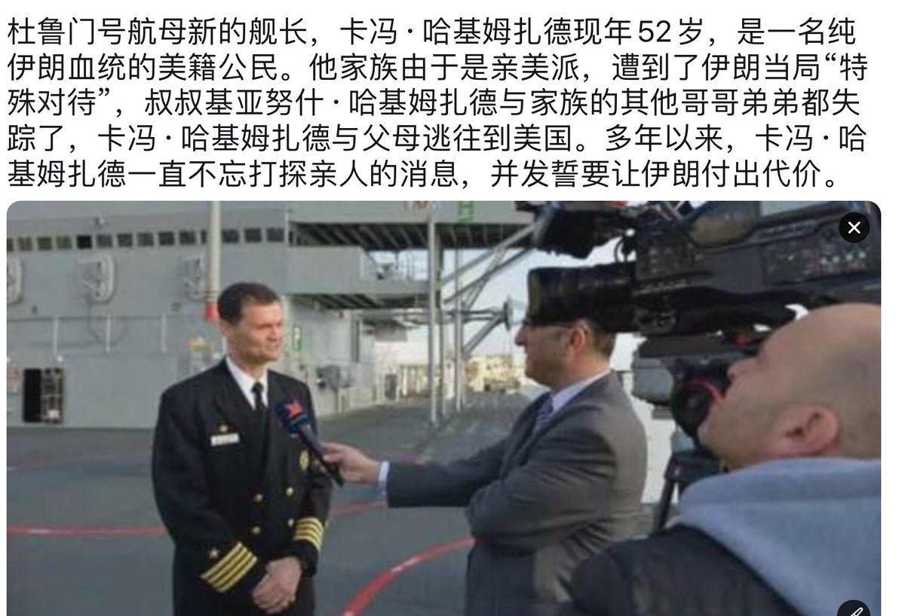 :speech_balloon:评:0 :+1:赞:0 :globe_with_meridians:转:0  

[01月08日 03:29]    老司机   @h5lpykl7tp6jjop    说不怕是假的，所以采取预防措施了，管不管用另说。 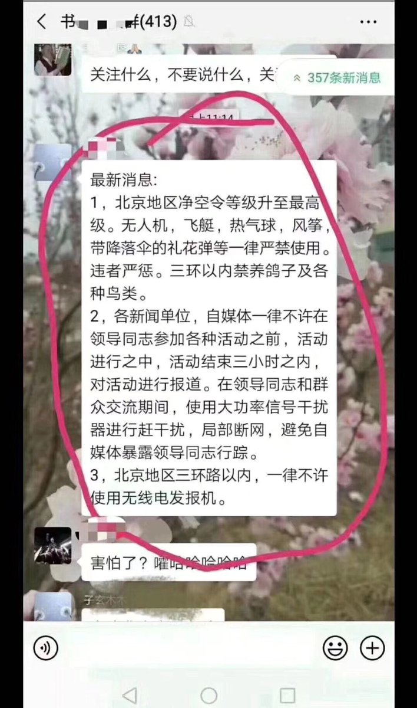 :speech_balloon:评:1 :+1:赞:1 :globe_with_meridians:转:0  

[01月08日 03:26]    老司机   @h5lpykl7tp6jjop    爱国骗子：你们要是真恨美国就给他伍元钱！ 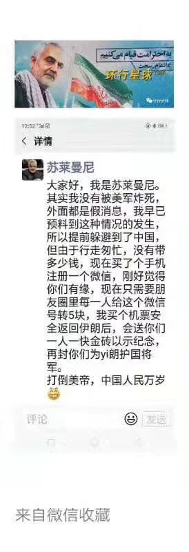 :speech_balloon:评:0 :+1:赞:2 :globe_with_meridians:转:1  

[01月08日 03:21]    老司机   @h5lpykl7tp6jjop    听到伊朗军头被点杀，专家们赶紧给各位腿肚子发抖的领导们说：安了，不用怕！ 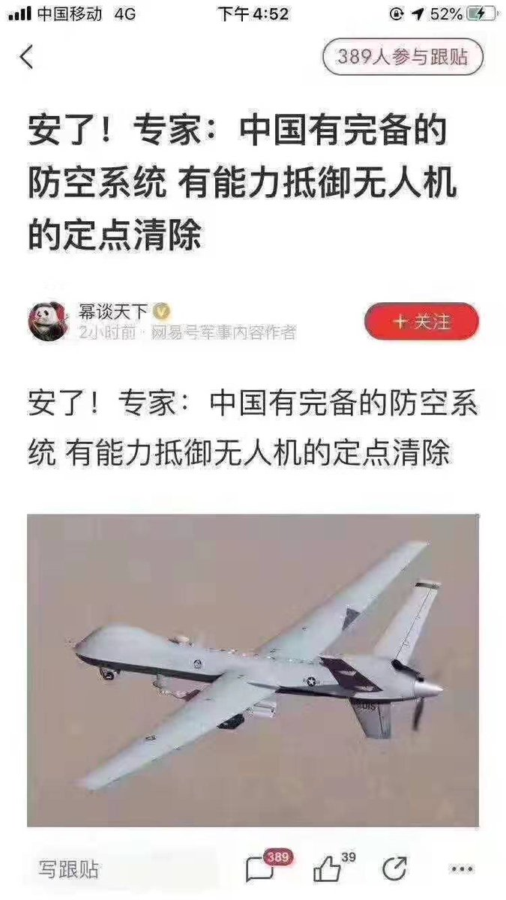 :speech_balloon:评:0 :+1:赞:1 :globe_with_meridians:转:1  

[01月08日 03:15]    老司机   @h5lpykl7tp6jjop    为什么恐怖分子不去惹以色列？因为每惹一次的后果就是死一个头目！ 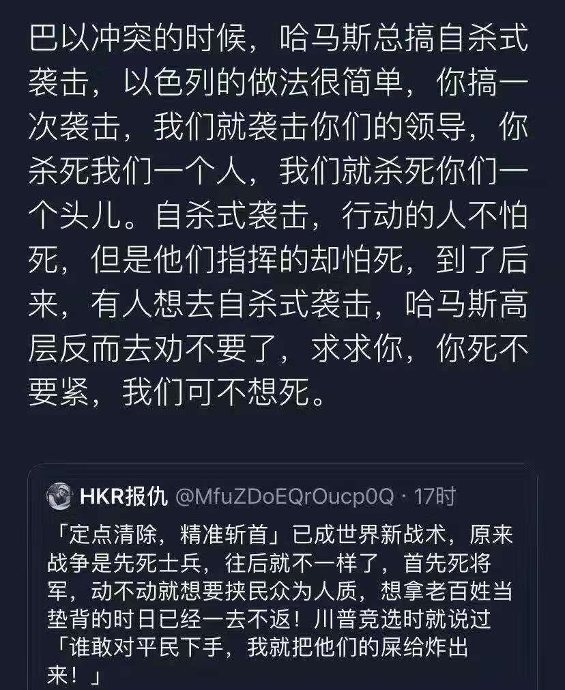 :speech_balloon:评:0 :+1:赞:17 :globe_with_meridians:转:9  

[01月08日 03:06]    老司机   @h5lpykl7tp6jjop    吓尿了？究竟谁是无能的表现？ 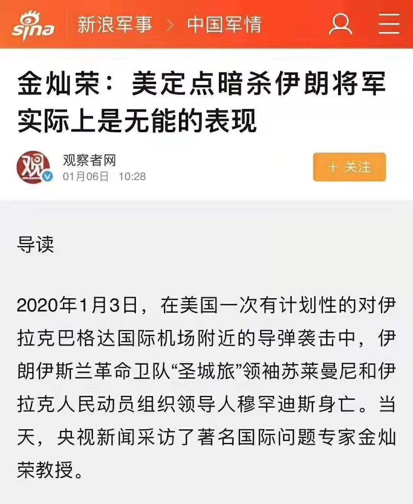 :speech_balloon:评:0 :+1:赞:1 :globe_with_meridians:转:0  

[01月08日 02:52]    老司机   @h5lpykl7tp6jjop    英国攻击核潜艇进入中东，美英撕裂伊朗大战一触即发！ 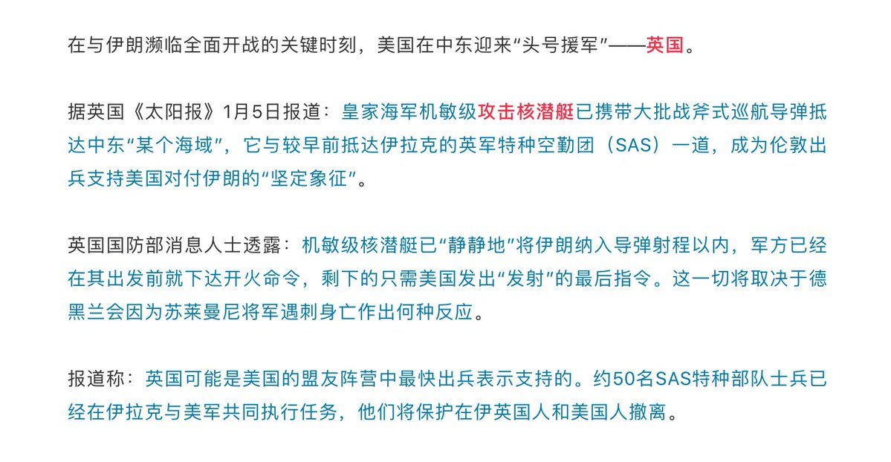 :speech_balloon:评:2 :+1:赞:14 :globe_with_meridians:转:9  

[01月08日 02:29]    新闻大吐槽   @TuCaoFakeNews    可怜的孩子！ https://twitter.com/tucaofakenews/status/1214288281434640384 …  :speech_balloon:评:1 :+1:赞:7 :globe_with_meridians:转:2  

[01月08日 01:47]    新闻大吐槽   @TuCaoFakeNews    有言论自由，没有言论后的自由  :speech_balloon:评:0 :+1:赞:1 :globe_with_meridians:转:1  

[01月08日 01:10]    财经真相   @caijingxiang    如果夜里走路碰到这玩意儿，一定会让我相信世界上有鬼了！ https://twitter.com/zonephysics/status/1214273386760884225 …  :speech_balloon:评:12 :+1:赞:41 :globe_with_meridians:转:18  

[01月08日 00:41]    新闻大吐槽   @TuCaoFakeNews    港人超在意台湾大选：守住你们的民主自由

2020的总统与立委选举，各阵营最后冲刺。而经历超过半年反送中抗争的香港人，十分关注台湾选举，并呼吁台湾人要珍惜民主与投票权，站出来投票。  :speech_balloon:评:1 :+1:赞:31 :globe_with_meridians:转:16  

[01月08日 00:34]    新闻大吐槽   @TuCaoFakeNews    港中环快闪 大陆留学生及日本人声援

大陆留学生Alex：“放眼看现在的中国，有这样的自由吗？言论的自由有吗？没有，如果有言论自由的话，法轮功就会存在，而不会消失；香港人就可以说自己想说的话，而不用担心被报复。我认为人有免于恐惧的自由，和言论的自由，是非常基本的，作为自然人所应有的自由。  :speech_balloon:评:4 :+1:赞:78 :globe_with_meridians:转:39  

[01月08日 00:32]    新闻大吐槽   @TuCaoFakeNews    可見恐怖分子和獨裁政權對社會和人民造成的傷害有多麼巨大，即使是死了，都要拖走一些人為他陪葬。  :speech_balloon:评:0 :+1:赞:4 :globe_with_meridians:转:2  

[01月08日 00:23]    新闻大吐槽   @TuCaoFakeNews    「假新聞、滲透媒體」 外媒關注中共干預台灣大選

這週六的總統和立委大選，受到國際媒體和智庫關注。澳洲智庫今天刊登文章，指出中共透過影響台灣媒體和社團，滲透台灣，目的在於破壞台灣民主。另外，《紐約時報》則觀察到，中共透過社群媒體，干預台灣大選。  :speech_balloon:评:3 :+1:赞:26 :globe_with_meridians:转:15  

[01月07日 23:52]    BBC News 中文   @bbcchinese    美国妇产科医生Dr Jen Gunter的《阴道圣经》一出版就在数个国家成为畅销书，书中有许多实用建议...... https://bbc.in/2N5R8s1   :speech_balloon:评:7 :+1:赞:45 :globe_with_meridians:转:29  

[01月07日 23:20]    BBC News 中文   @bbcchinese    人跳出了火坑，背上刺青依旧：她的是对皮条客表忠心，她的是两个魔鬼在性交......被迫卖淫的创伤怎样抚平？人生如何揭开新篇章？ https://bbc.in/35zlrO6   :speech_balloon:评:8 :+1:赞:24 :globe_with_meridians:转:7  

[01月07日 22:50]    BBC News 中文   @bbcchinese    它让你欢喜让你忧，只因为，它是你海枯石烂心不变的永远…… https://bbc.in/2N2Tiss   :speech_balloon:评:1 :+1:赞:22 :globe_with_meridians:转:12  

[01月07日 22:22]    BBC News 中文   @bbcchinese    （精选回顾）美国伊朗紧张升级，石油再成关注重点。不过，美国早就“深挖洞、广积粮”了。 https://bbc.in/35tN4IA   :speech_balloon:评:17 :+1:赞:39 :globe_with_meridians:转:14  

[01月07日 22:07]    新闻大吐槽   @TuCaoFakeNews    西方说的Reaper是这个意思，直接翻译成死神更准确  :speech_balloon:评:1 :+1:赞:5 :globe_with_meridians:转:2  

[01月07日 22:05]    财经真相   @caijingxiang    环球时报说中国不急于达成协议，股市小幅小跌，人民币缩小涨幅，现在市场除了计价彭博、路透社、CNBC、南华早报，现在还要再加一个环球时报！ https://twitter.com/zerohedge/status/1214547886916149259 …  :speech_balloon:评:11 :+1:赞:71 :globe_with_meridians:转:15  

[01月07日 22:03]    新闻大吐槽   @TuCaoFakeNews    完了，凑不齐8000万美元了，川普身价暴跌几十块  :speech_balloon:评:0 :+1:赞:3 :globe_with_meridians:转:2  

[01月07日 22:02]    新闻大吐槽   @TuCaoFakeNews    我还以为4,50岁了呢, 竟然是90后  :speech_balloon:评:0 :+1:赞:4 :globe_with_meridians:转:1  

[01月07日 21:41]    新闻大吐槽   @TuCaoFakeNews    送葬变陪葬hhhhh https://twitter.com/TuCaoFakeNews/status/1214517791283269632 …  :speech_balloon:评:0 :+1:赞:11 :globe_with_meridians:转:3  

[01月07日 21:39]    财经真相   @caijingxiang    美国11月贸易逆差431亿美元，比市场预期的438亿美元要低，创下了三年新低，这也是特朗普当选以来最低！ https://twitter.com/zerohedge/status/1214541317235236864 …  :speech_balloon:评:5 :+1:赞:122 :globe_with_meridians:转:19  

[01月07日 21:32]    新闻大吐槽   @TuCaoFakeNews    其实这只是虚伪者用来闭壮胆的摆拍而已，举国谈不上，确实如你说的虚假场景，朗几千万人口，就这么些千把人来摆拍谈何举国。香港7百万人上街2百万人，中共都可以无耻地说是少数人。  :speech_balloon:评:0 :+1:赞:3 :globe_with_meridians:转:2  

[01月07日 21:18]    财经真相   @caijingxiang    下周三（15号）是川普给的签字时间，南华早报说刘鹤将于下周一（13号）动身前往美国，如果中共真的要签字，最迟12号就会官媒发布消息（周日晚上之前），也就是说中美是否真签字，只需再等待四天半的时间就会得到答案！  :speech_balloon:评:14 :+1:赞:73 :globe_with_meridians:转:14  

[01月07日 21:15]    新闻大吐槽   @TuCaoFakeNews    这种“举国哀悼独裁者”的场景是虚假的，是极权制造的虚假历史场景，哀悼者不过是这个场景中的活道具。  :speech_balloon:评:1 :+1:赞:5 :globe_with_meridians:转:1  

[01月07日 21:05]    财经真相   @caijingxiang    去年12月13日，双方在新关税生效前公告达成文本，随后莱特希泽在媒体上说，具体细节会在接下来几周内公布出来，然后三周过去了，具体细节依然没有公布出来，市场似乎已经忘了找莱特希泽询问具体的细节了，下周三如果正式签字，那么具体细节会公布出来吗？  :speech_balloon:评:5 :+1:赞:66 :globe_with_meridians:转:9  

[01月07日 21:02]    新闻大吐槽   @TuCaoFakeNews    在一个独裁专制残暴政权神权统治的国家，这种哀悼是虚伪的，其中很多是被迫的，很多已经习惯从众保命的，真正是发自内心来哀悼的，大概没有几个，甚至可能除了其少部份亲人外，可能就根本没有人真心哀悼。 https://twitter.com/TuCaoFakeNews/status/1214527421598187520 …  :speech_balloon:评:3 :+1:赞:18 :globe_with_meridians:转:4  

[01月07日 20:58]    财经真相   @caijingxiang    于是中美从10月口头达成一致，到拟定具体文本出来（12月15日）就花了两个月，如果不是关税生效日期临近估计会继续拖；接下来仅仅一个翻译又是一个月，so，川习两人写完十几个字母以及三个汉字估计又要花上一周时间！  :speech_balloon:评:5 :+1:赞:37 :globe_with_meridians:转:10  

[01月07日 20:52]    财经真相   @caijingxiang    去年十月中美双方说已经达成第一阶段的协议，媒体报道说要在11月16日的智利峰会签字，峰会取消后，媒体又引用知情人说会在12月初英国峰会签字，直到12月15日关税生效前，双方公告说已经原则问题达成一致，就剩下翻译，莱特希泽在媒体上说会在1月第一周签字，后来特朗普又说1月15号举行签字仪式！  :speech_balloon:评:13 :+1:赞:96 :globe_with_meridians:转:25  

[01月07日 20:49]    新闻大吐槽   @TuCaoFakeNews    不能这么说，一边走路一边打耳光人又那么多，很难避免  :speech_balloon:评:0 :+1:赞:3 :globe_with_meridians:转:1  

[01月07日 20:47]    墙国铁拳现世报😷   @Socialistfist    编辑部用CIA发的工资给推特充了红钻会员，嘛事没有。
希望友人mingze殿下早日解锁 https://twitter.com/BiliBili_BackUp/status/1214334827454877696 …  :speech_balloon:评:1 :+1:赞:34 :globe_with_meridians:转:2  

[01月07日 20:45]    新闻大吐槽   @TuCaoFakeNews    为了悼念这次踩踏事件和声讨美国，伊朗群众再次聚集，又发发声踩踏事件，再次聚集......。半年后，伊朗全灭。  :speech_balloon:评:0 :+1:赞:9 :globe_with_meridians:转:2  

[01月07日 20:41]    新闻大吐槽   @TuCaoFakeNews    戒指哥被斩首，伊朗官方召集民众进行了百万人级别的送葬仪式，可突然发生了踩踏事件，造成众多死伤。

如果戒指哥的残躯又被自己的人民践踏了一遍，我只能说这是天罚！ 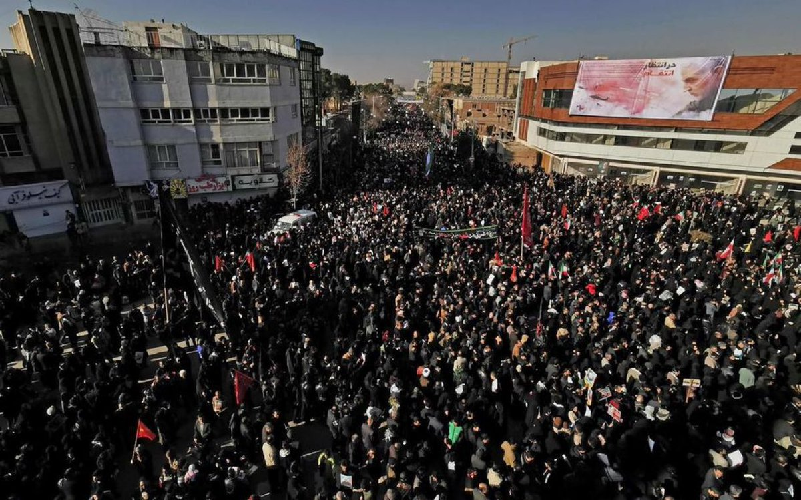 :speech_balloon:评:9 :+1:赞:83 :globe_with_meridians:转:15  

[01月07日 20:35]    墙国铁拳现世报😷   @Socialistfist    央视指导微博访民，依法起诉  :speech_balloon:评:4 :+1:赞:50 :globe_with_meridians:转:5  

[01月07日 20:34]    墙国铁拳现世报😷   @Socialistfist    补充 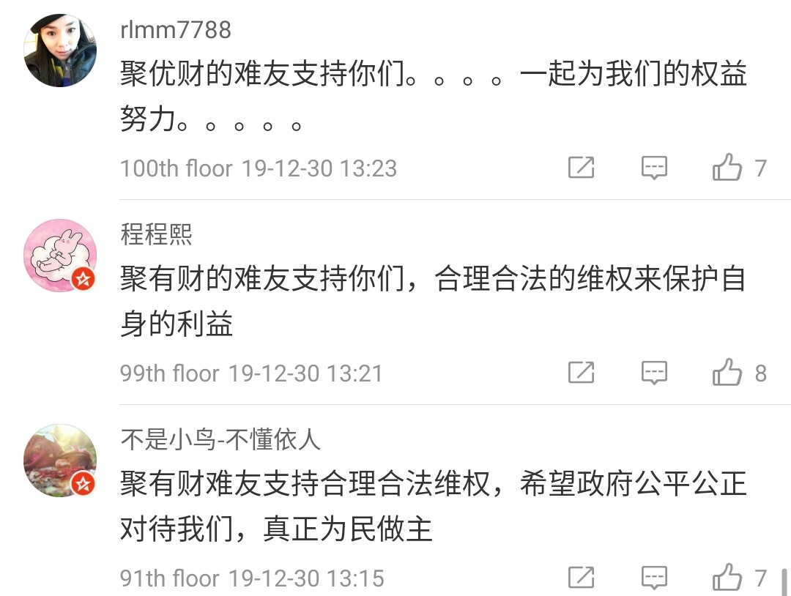 :speech_balloon:评:3 :+1:赞:32 :globe_with_meridians:转:3  

[01月07日 20:32]    墙国铁拳现世报😷   @Socialistfist    杭州当地其他事件的受害者抱团取暖 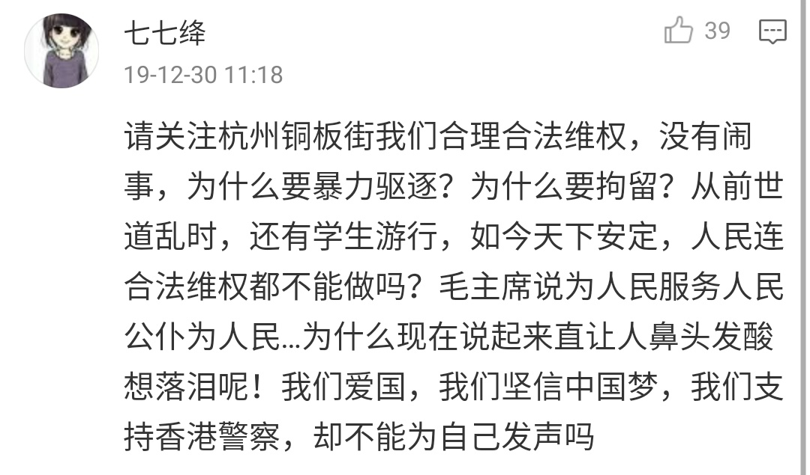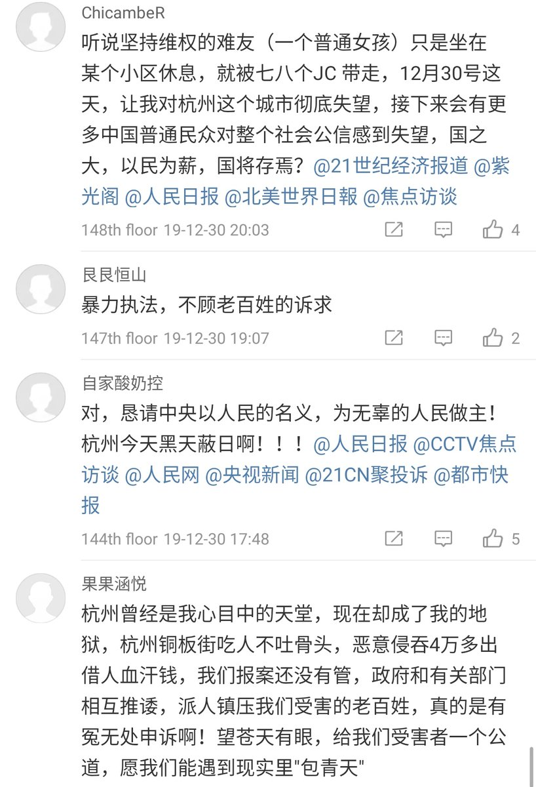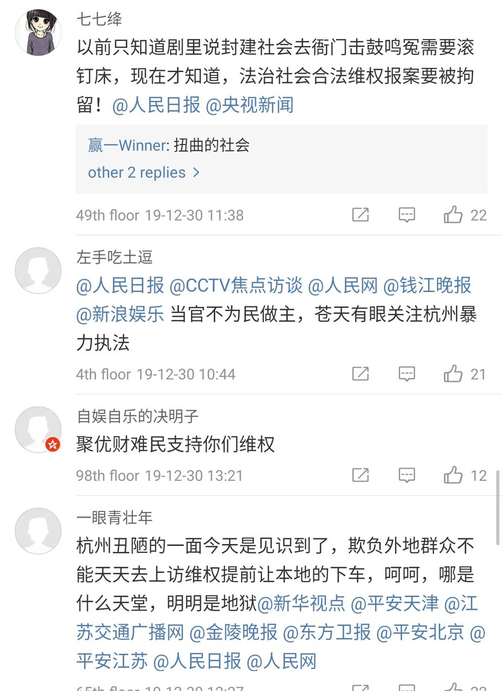 :speech_balloon:评:10 :+1:赞:50 :globe_with_meridians:转:10  

[01月07日 20:31]    新闻大吐槽   @TuCaoFakeNews    49年轻的共产党，我记得有一本书叫「半个世纪前共产党的庄严承诺」垬给人们画了一个很大的饼，欺骗了当时素质不高的大多数中国人，等发现是谎言后已经来不及了，反右，文革，64等，到今天香港人还在流血，你觉得中华民族的人贪生怕死过，只是现在言论被剥削了，加上科技维稳大数据等，或许得等个时机吧  :speech_balloon:评:0 :+1:赞:8 :globe_with_meridians:转:1  

[01月07日 20:31]    BBC News 中文   @bbcchinese    美国硅谷一直被认为是世界的创新基地。但如今，一批诞生于中国的科技产品开始领跑全球。中国究竟在哪些科技领域取得了进展和突破？ BBC《Click》节目组最近走访中国，寻访这个国家与众不同的科技创新，看看它们为何让矽谷都感到紧张？ https://bbc.in/37JGQ90   :speech_balloon:评:16 :+1:赞:33 :globe_with_meridians:转:12  

[01月07日 20:25]    墙国铁拳现世报😷   @Socialistfist    如何发微博维权？请看标准范文。
1.祝福领导，支持党国。
2. 表达作为墙国人的墙裂自豪感。
3. 长篇诉苦，疯狂@官媒。
4. 表示理解领导维稳的用心良苦。
5. 搬出毛主席语录，为人民服务。

#社会主义铁拳 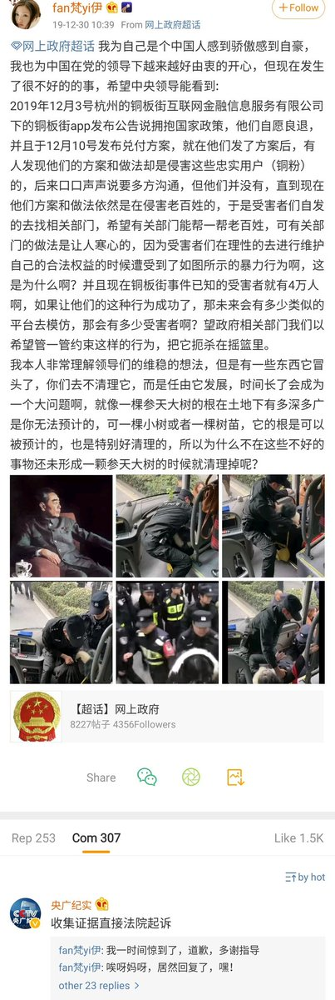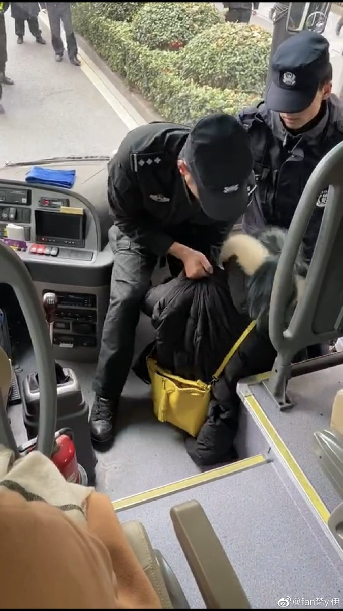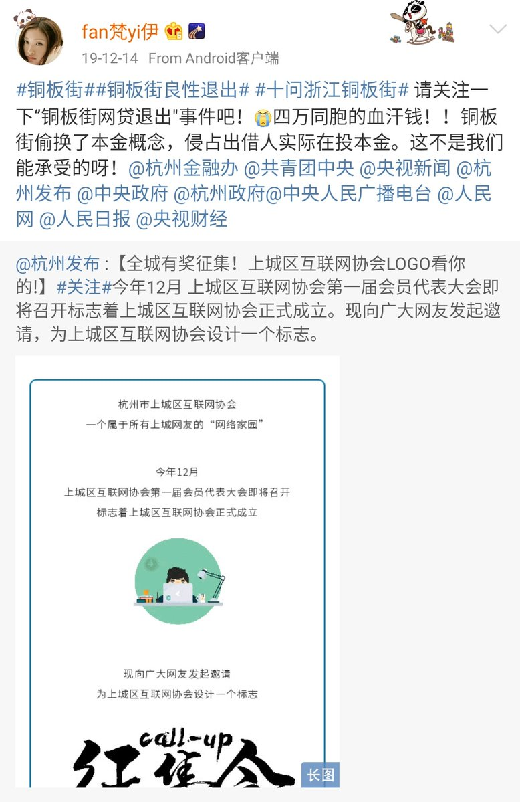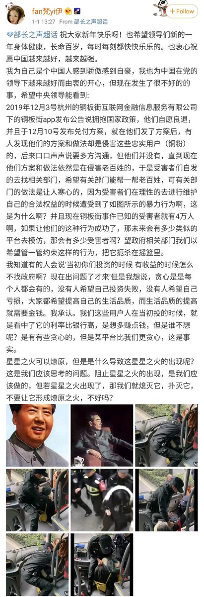 :speech_balloon:评:34 :+1:赞:298 :globe_with_meridians:转:90  

[01月07日 20:07]    新闻大吐槽   @TuCaoFakeNews    送终和反送中，就是不一样 https://twitter.com/17760704id/status/1214514658469502976 …  :speech_balloon:评:1 :+1:赞:33 :globe_with_meridians:转:7  

[01月07日 20:03]    新闻大吐槽   @TuCaoFakeNews    香港搞了N次比你们大的游行，也没出现如此严重的踩踏事故，零星2次还是警方开车撞人和假装开真枪导致的。

可见独立清醒的民众，与盲从于集权的民众，有天壤之别 https://twitter.com/shiweijueye0307/status/1214514190037090304 …  :speech_balloon:评:15 :+1:赞:257 :globe_with_meridians:转:84  

[01月07日 20:00]    BBC News 中文   @bbcchinese    熟睡中的海豹一脸萌样、躲避海豹捕食的企鹅飞越水面，还有河马咬死幼崽的照片，都是今年“野生动物摄影奖”的作品。 https://bbc.in/2N0jKTG   :speech_balloon:评:1 :+1:赞:20 :globe_with_meridians:转:7  

[01月07日 19:30]    纽约时报中文网   @nytchinese    松本与7-11的斗争使他在日本名声大噪，长期以来，这个国家一直饱受一种繁重的、有时甚至致命的工作文化的困扰。
政府数据显示，2018年有246起与住院或死亡有关的索赔被归咎于过度工作。官方表示，零售业是最大的来源之一。另有568名员工因与工作相关的劳累而自杀。 http://nyti.ms/2QTUKhL   :speech_balloon:评:73 :+1:赞:41 :globe_with_meridians:转:11  

[01月07日 19:24]    老司机   @h5lpykl7tp6jjop     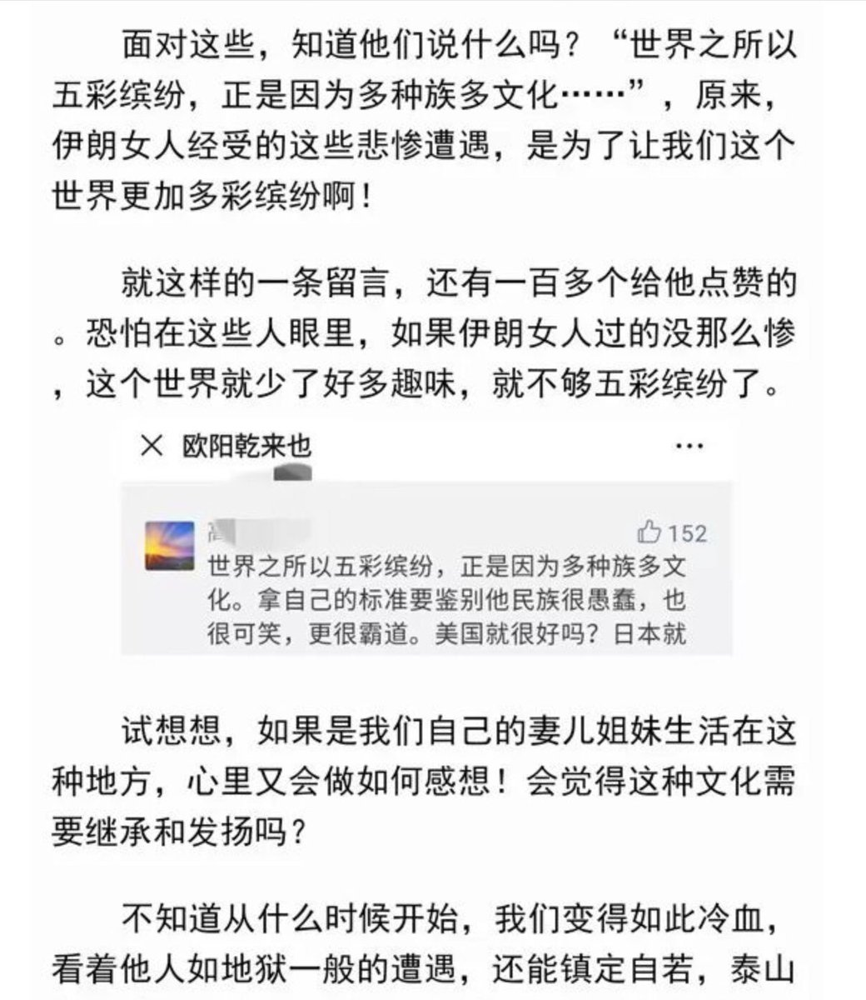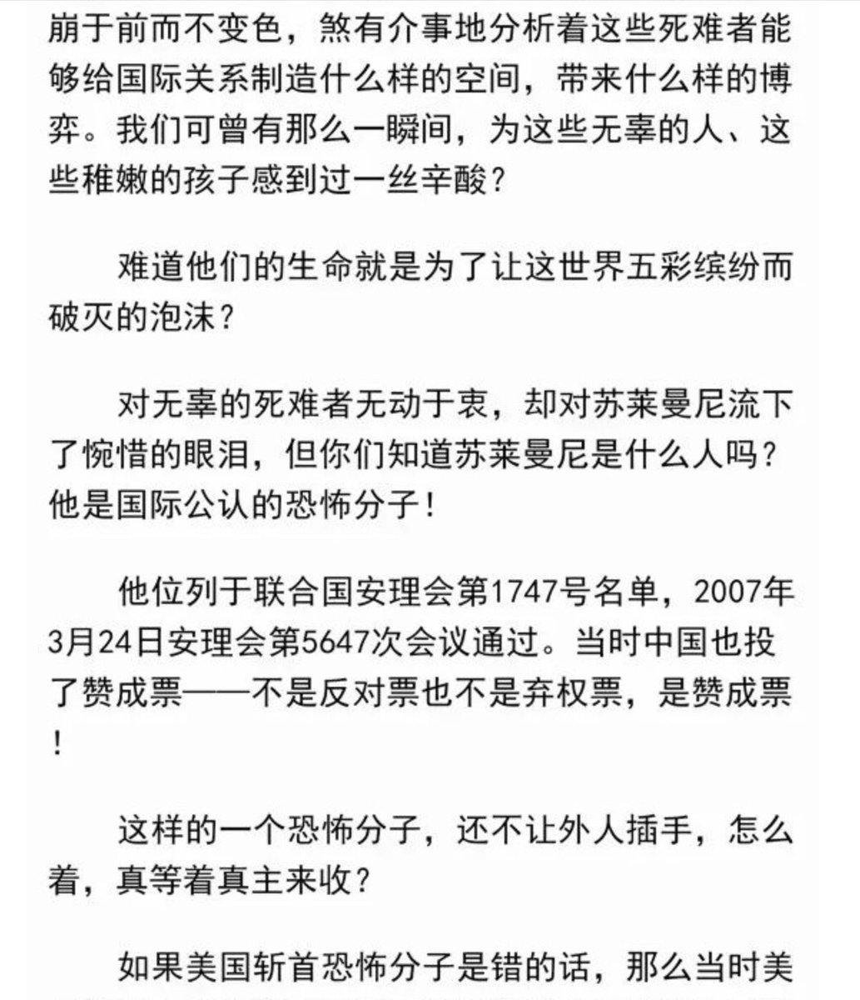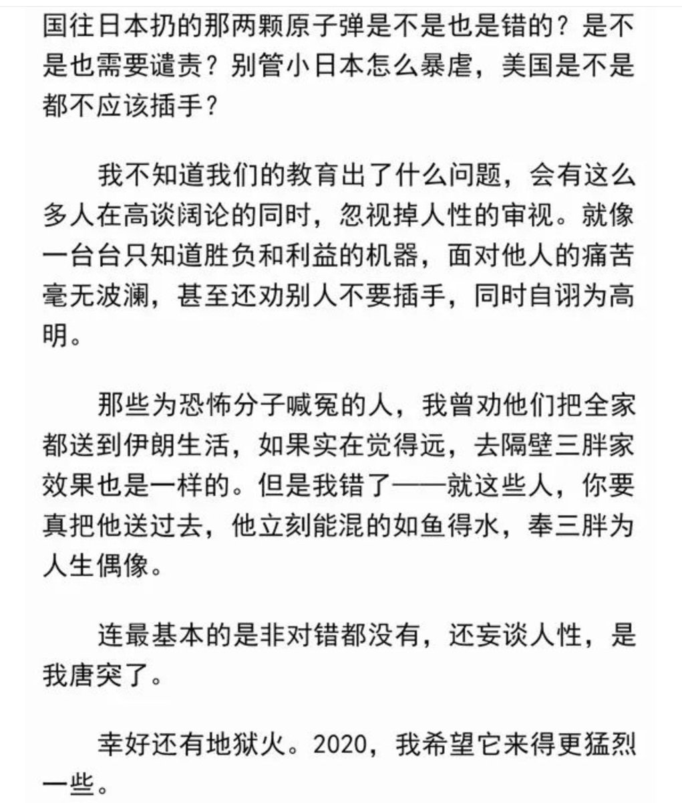 :speech_balloon:评:1 :+1:赞:10 :globe_with_meridians:转:4  

[01月07日 19:24]    老司机   @h5lpykl7tp6jjop    转发好文：
为恐怖分子喊冤，还有人性吗？

博士学者云集的  海外博士学者圈  今天
因为一篇没被推送出来的小文，又被禁言半个月，想哭....
太多好文被删，防失联或看更多私享好文，建议关注以下公众号“大师好嗨哟” 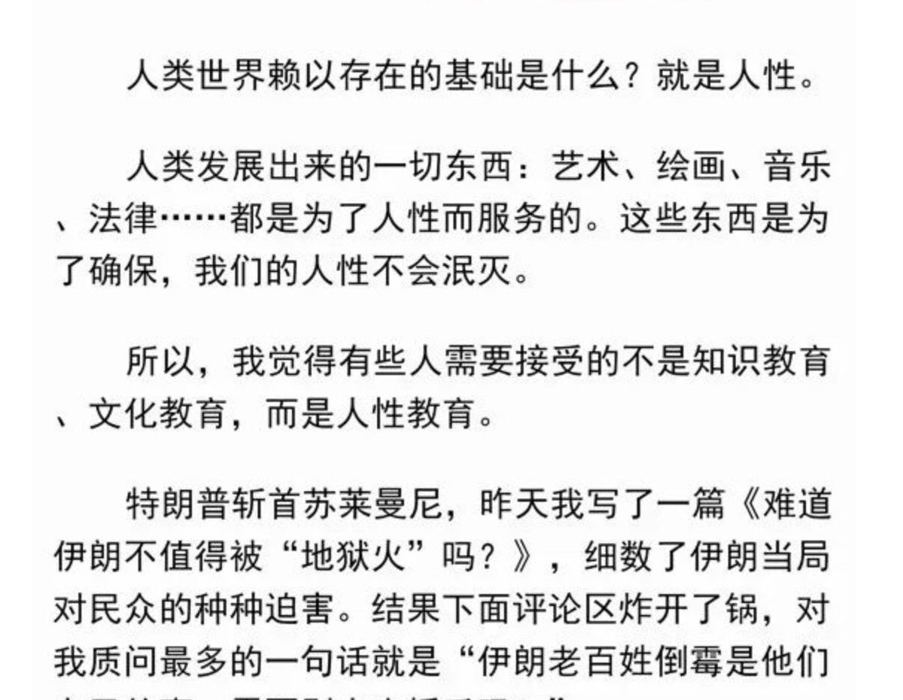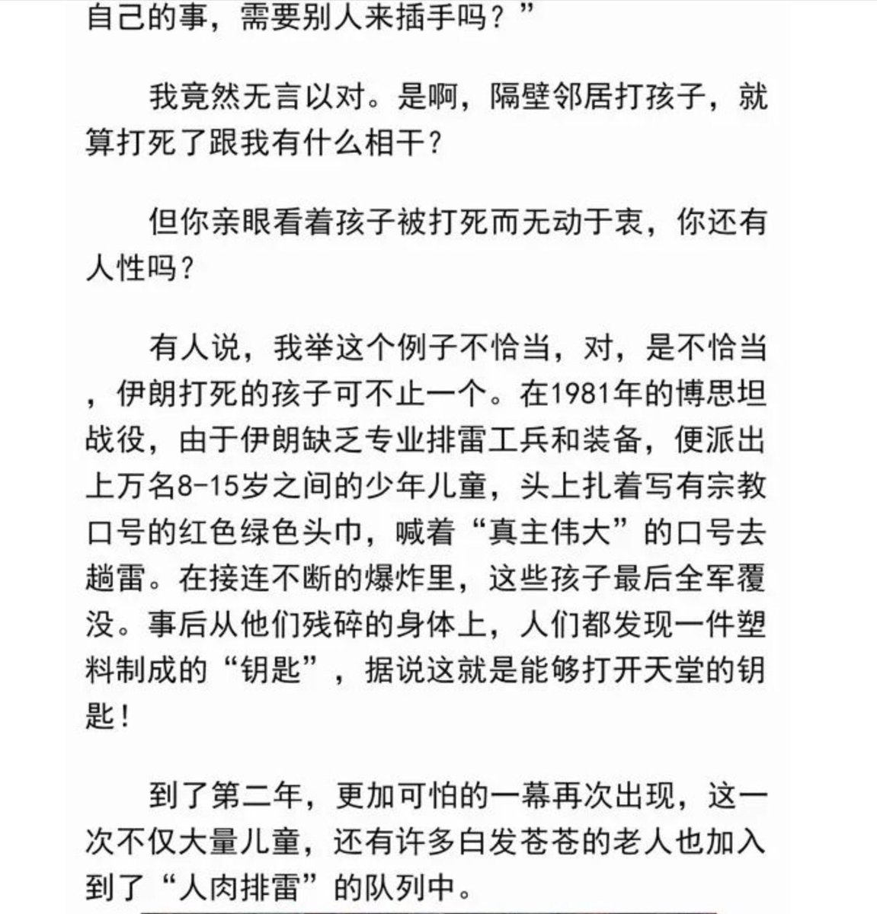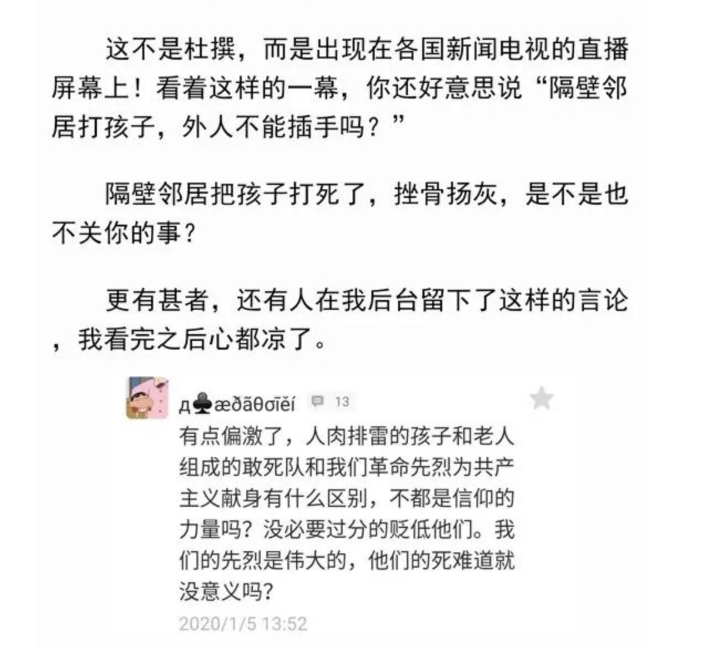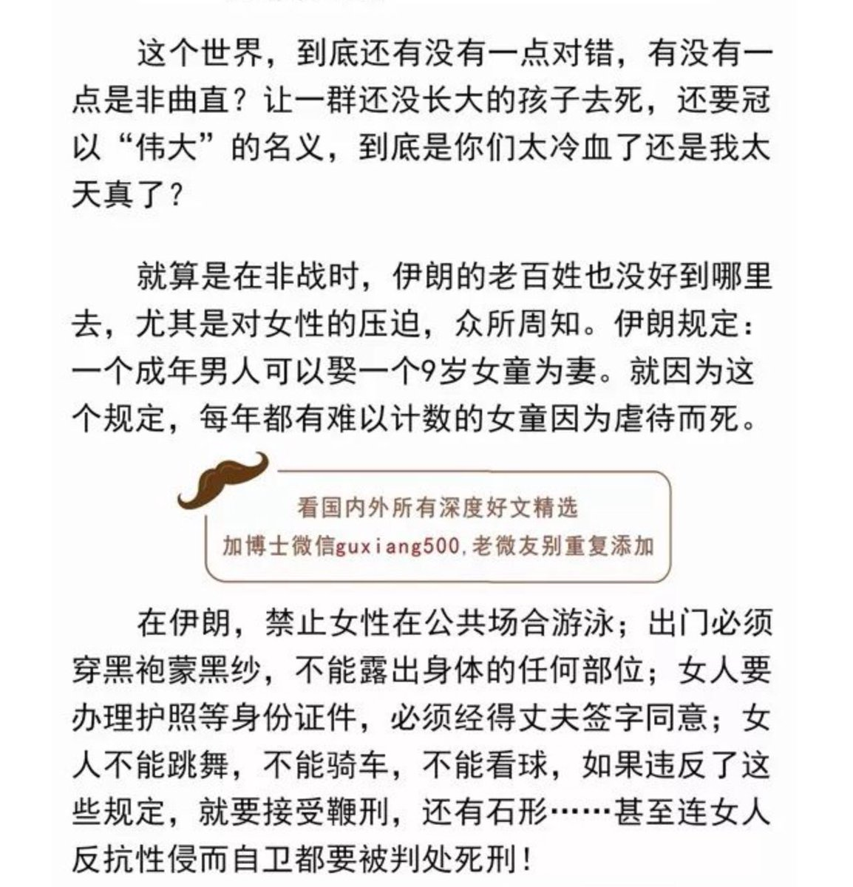 :speech_balloon:评:1 :+1:赞:55 :globe_with_meridians:转:25  

[01月07日 19:23]    新闻大吐槽   @TuCaoFakeNews    那些拼命讲述本民族所谓的“劣根性”的人，他们是操纵者，他们的目的是让你陷入虚无，开始转向逃避，让你放弃一切反抗的精神。他们所讲述的“劣根性”很大程度上只是人类的基本心理弱点，是全人类共有的，是需要通过教育和实践努力去克服的东西，而非哪个民族国家所独有的。 https://www.iyouport.org/%e6%91%86%e8%84%b1%e6%93%8d%e7%ba%b5%e5%92%8c%e5%ae%a3%e4%bc%a0%ef%bc%9a28%e4%b8%aa%e9%95%bf%e6%9c%9f%e6%8a%80%e5%b7%a7/ …  :speech_balloon:评:0 :+1:赞:22 :globe_with_meridians:转:14  

[01月07日 19:15]    老司机   @h5lpykl7tp6jjop    同样是富人差异咋这么大呢？
一个让人无法想象的富人是川普。这个百亿身家的家伙，不喝酒，不吸烟，只喜欢吃汉堡，喝可乐。他的钱都干什么用呢？
看看我们为人民服务的官员，百亿算什么，拥有千亿万亿多的是，老婆上百住一个小区，小孩都叫爸爸，多牛呵！ 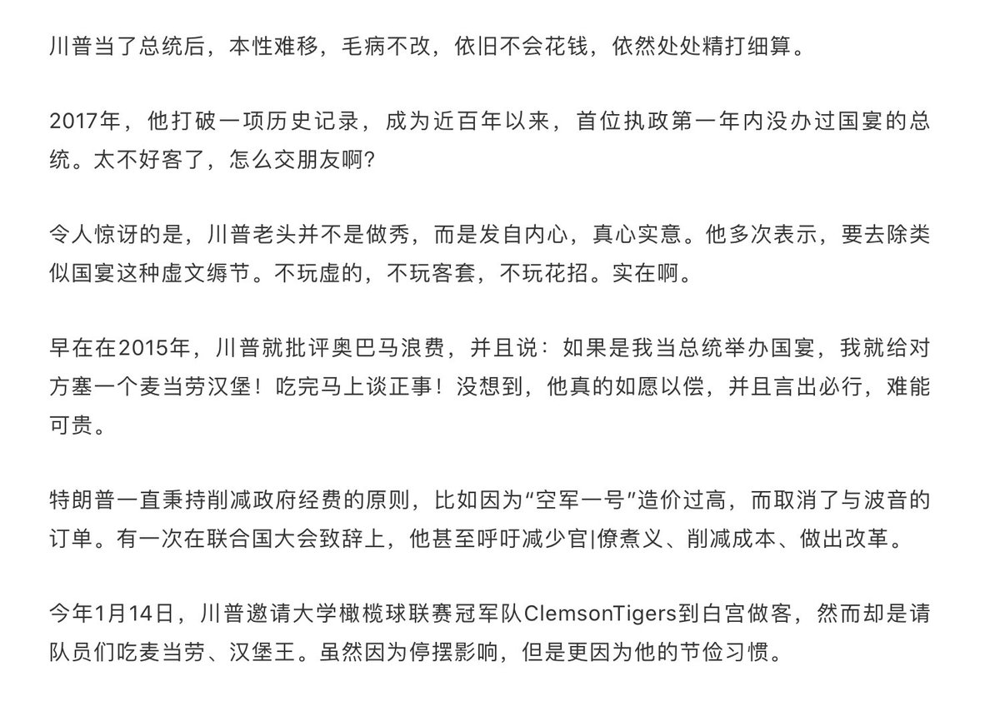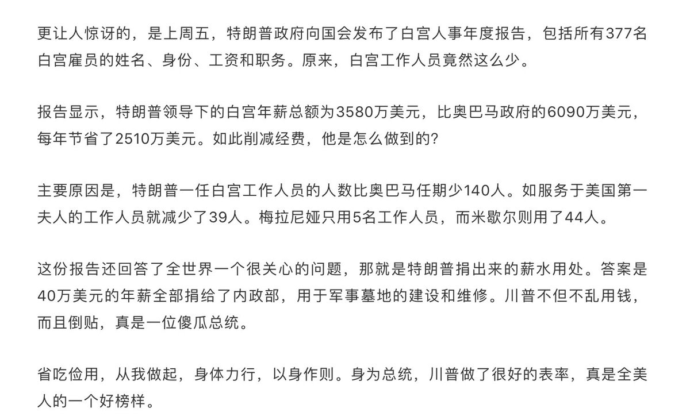 :speech_balloon:评:1 :+1:赞:38 :globe_with_meridians:转:18  

[01月07日 19:00]    BBC News 中文   @bbcchinese    根据国际法，针对文化遗址的军事袭击被视为“战争罪”。 https://bbc.in/2R5honN   :speech_balloon:评:59 :+1:赞:158 :globe_with_meridians:转:37  

[01月07日 19:00]    纽约时报中文网   @nytchinese    台湾社交媒体上流传的谣言和谎言实在太多，以至于很难分辨它们是来自台湾还是中国，是来自私人煽动者还是政府机构。
今年5月，台湾国家安全局就大陆推动的台湾不实信息发布了一份悲观的评估，敦促“全政府”和“全社会”做出回应。 http://nyti.ms/2T29b6e   :speech_balloon:评:12 :+1:赞:17 :globe_with_meridians:转:3  

[01月07日 18:30]    纽约时报中文网   @nytchinese    比克特表示，这项政策不会延伸至搞笑模仿或讽刺作品，也不适用为省略或改变语序而编辑的视频。
比克特称，所有上传的视频仍将受到Facebook事实核查系统的制约。与事实不符的内容将出现在动态消息中不那么显眼的位置，并被标记为虚假信息。 http://nyti.ms/2tzEpqM   :speech_balloon:评:3 :+1:赞:5 :globe_with_meridians:转:0  

[01月07日 18:00]    BBC News 中文   @bbcchinese    港澳台继续严格防止疫情扩散，香港政府宣布，将会授权卫生官员将怀疑与武汉不明肺炎有关的患者强制隔离。 https://bbc.in/35At07v   :speech_balloon:评:12 :+1:赞:73 :globe_with_meridians:转:31  

[01月07日 18:00]    纽约时报中文网   @nytchinese    日本便利店行业要求必须每周7天、每天24小时、全年365天无休营业。店主松本在元旦关店一天后，7-11连锁店的母公司终止了他的专营权。他决定与这种工作文化斗争到底。
“我要把店开下去，为了我和全国其他的店主，”57岁的松本说。 http://nyti.ms/2QTUKhL   :speech_balloon:评:37 :+1:赞:262 :globe_with_meridians:转:55  

[01月07日 17:33]    纽约时报中文网   @nytchinese    在台湾准备迎来本周的重大选举之际，官员和研究人员担心，中国正在尝试利用社交媒体影响选民。
他们担心，在岛上喧闹的民主体制之下，这是很容易做到的，因为这里的新闻周期很快，选民们已被大量虚假或充满党派偏见的信息淹没。 http://nyti.ms/2T29b6e   :speech_balloon:评:53 :+1:赞:82 :globe_with_meridians:转:32  

[01月07日 17:29]    财经真相   @caijingxiang    人民币今天涨了400点，涨破6.93，年前结汇在今天终于爆发了出来，技术上已经对6.9爆仓线构成威胁，我准备追加保证金，继续持有空仓！  :speech_balloon:评:66 :+1:赞:384 :globe_with_meridians:转:55  

[01月07日 17:09]    老司机   @h5lpykl7tp6jjop    一名美军就可以轻松押送大群伊拉克俘虏  :speech_balloon:评:3 :+1:赞:36 :globe_with_meridians:转:8  

[01月07日 17:05]    老司机   @h5lpykl7tp6jjop    独裁者一直以拥有多少炮灰而猖狂，其实一旦开战，情况比预想的就差太远了！当年美军攻打伊拉克，开创了五个士兵俘虏了一个团两千多的伊拉克军队！真的，这不是笑话！ 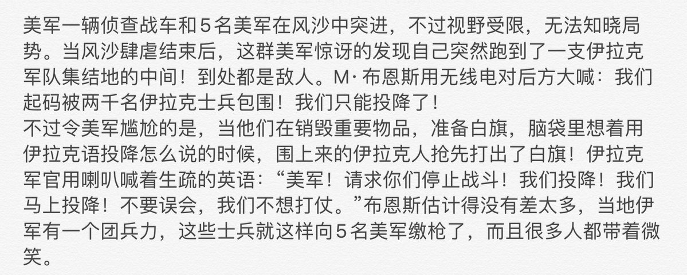 :speech_balloon:评:14 :+1:赞:222 :globe_with_meridians:转:90  

[01月07日 17:00]    BBC News 中文   @bbcchinese    香港“反送中”抗议半年来，记者与警察的关系每况愈下。记者多次指控在示威现场遭遇警员辱骂和暴力对待，而警察则指记者常常逗留在示威者与警察中间，阻碍他们执行公务。 https://bbc.in/35tlACL   :speech_balloon:评:48 :+1:赞:76 :globe_with_meridians:转:33  

[01月07日 15:40]    纽约时报中文网   @nytchinese    Facebook周一表示，将禁止在其平台上播放被“深伪”技术重度篡改的视频。
周一晚上，该公司全球政策管理副总裁比克特在一篇博客文章中表示，Facebook将删除被这项人工智能技术改动过的视频，如果其“有可能误导他人认为视频中的人说了他们实际上没有说的话”。 http://nyti.ms/2tzEpqM   :speech_balloon:评:6 :+1:赞:40 :globe_with_meridians:转:18  

[01月07日 15:05]    纽约时报中文网   @nytchinese    周围地区的卫生部门已迅速作出反应。据香港卫生部门称，在香港，有21名最近几周去过武汉的人在12月31日至周一中午期间留院。
有关官员表示，他们将在国际机场安装更多的热成像系统，对来自武汉的乘客进行监测。他们还在高铁站增加人手，检查体温。 http://nyti.ms/2T9Wsi7   :speech_balloon:评:1 :+1:赞:12 :globe_with_meridians:转:5  

[01月07日 15:02]    BBC News 中文   @bbcchinese    白天，他是谈吐文雅、出入学堂，面带微笑的一介书生。夜幕下，他则成为英国历史上恶迹最多的强奸犯。（警告：本文含有有关性侵犯犯罪的内容。） https://bbc.in/2s1Sj4z   :speech_balloon:评:21 :+1:赞:83 :globe_with_meridians:转:46  

[01月07日 14:42]    老司机   @h5lpykl7tp6jjop    高科技和宗教信徒之间无法交流，当精准打击点杀伊朗将军之后
伊朗外长仍然还是在秀众多的信徒，他告诉川普：你的一生中，你见过这样的人山人海吗？

川普只好用52架F35同时起飞来回答。

中世纪政教合一和信息爆炸时代真的上千年的差距！  :speech_balloon:评:2 :+1:赞:42 :globe_with_meridians:转:10  

[01月07日 14:30]    纽约时报中文网   @nytchinese    #观点 为了评估杀害苏莱曼尼将军的后果，我们必须了解，如果伊朗在这次挑衅面前退却，伊朗政权将无法承受内部的分歧或维持在该地区的强大地位。
对于伊朗最高领导人哈梅内伊来说，做出强有力的回应至关重要。 http://nyti.ms/2Fp4IT8   :speech_balloon:评:7 :+1:赞:8 :globe_with_meridians:转:4  

[01月07日 14:30]    纽约时报中文网   @nytchinese    对于由女性导演或有关女性的电影来说，今年的金球奖是个小年。《别告诉她》的导演王子逸和所有其他女性导演都没有得到导演类提名。
“是你给了我这个机会，这个一生难得的机会，你教给我很多东西，”奥卡菲娜对王子逸说。“仅仅是和你一起拍摄这部电影，就已经非常美妙了。” http://nyti.ms/37ILpjW   :speech_balloon:评:1 :+1:赞:5 :globe_with_meridians:转:1  

[01月07日 14:23]    老司机   @h5lpykl7tp6jjop    52架F35大象漫步，何等壮观！  :speech_balloon:评:0 :+1:赞:8 :globe_with_meridians:转:1  

[01月07日 14:09]    老司机   @h5lpykl7tp6jjop    加国点名中国孕妇:生完孩子不给钱！医疗不堪重负 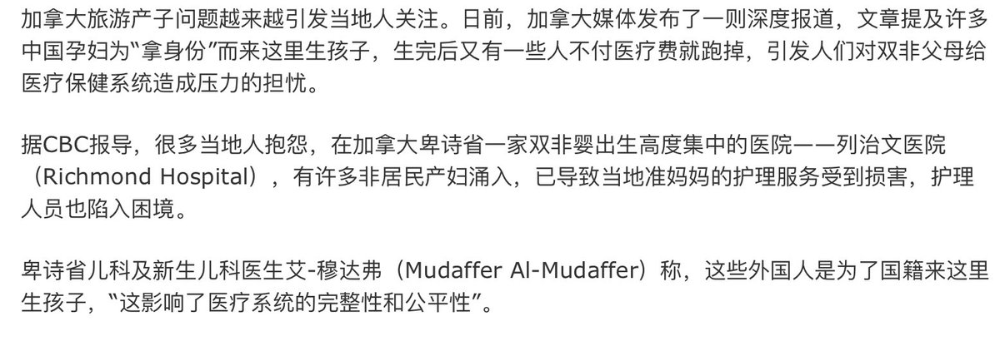 :speech_balloon:评:3 :+1:赞:18 :globe_with_meridians:转:7  

[01月07日 14:00]    BBC News 中文   @bbcchinese    西班牙的房租涨幅速度是工资的 12 倍，年轻人平均收入的一半以上都花在房租上，在一个挣钱不易但生活花费却很高的国家，要生存就不得不放弃某些东西。 https://bbc.in/2QqkTFW   :speech_balloon:评:22 :+1:赞:72 :globe_with_meridians:转:26  

[01月07日 14:00]    纽约时报中文网   @nytchinese    武汉市卫生健康委员会称，新疾病的症状包括高烧、呼吸困难和肺部病变。尚无死亡病例，但有7例重症患者。市政府称已经排除SARS、中东呼吸综合征、禽流感等病原。当局遏制了有关病情爆发的讨论。
春节将近，中国将有数千万人流动迁徙，政府敦促公众警惕发烧等类似肺炎的症状。 http://nyti.ms/2T9Wsi7   :speech_balloon:评:13 :+1:赞:58 :globe_with_meridians:转:39  

[01月07日 13:30]    纽约时报中文网   @nytchinese    #观点 可以说，为苏莱曼尼将军举行的规模空前的哀悼是伊朗的首个报复行动。
这一次，在特朗普总统威胁要打击伊朗并摧毁其文化遗产地点的推文面前，我不必去幻想打击发生的后一天出现的团结。这个国家已为哀悼聚在一起。它已经团结起来了。 http://nyti.ms/2s0rwp7   :speech_balloon:评:111 :+1:赞:66 :globe_with_meridians:转:32  

[01月07日 13:00]    BBC News 中文   @bbcchinese    世界各地大规模野火灾难最近频发，危害巨大。如果不巧被野火围困，人是跑不过火的，那我们应该具备哪些基本防火和逃生知识？ https://bbc.in/2ZWbrgI   :speech_balloon:评:20 :+1:赞:54 :globe_with_meridians:转:40  

[01月07日 13:00]    纽约时报中文网   @nytchinese    #每日一词 Flabbergasted，大吃一惊的。关于刺杀苏莱曼尼背后的决策意图，时报记者写道，当特朗普作出“最极端”的选择时，高级军事官员“目瞪口呆”(flabbergasted)，并开始担心伊朗报复的可能。
该词原型为动词flabbergast，意为令人哑然失色，指彻底惊讶或迷惑。更多简报内容： http://nyti.ms/39UvroK   :speech_balloon:评:0 :+1:赞:4 :globe_with_meridians:转:2  

[01月07日 12:35]    老司机   @h5lpykl7tp6jjop    美军秀肌肉,52架F-35同时升空演习，谁更心惊？

1月6日，美国防部宣布，美国空军当天进行了一场“F-35A作战能量演习”，犹他州希尔空军基地的空军388联队和419预备役联队的52架F-35战斗机同时升空实施演练。在美国轰炸伊朗导致中东局势紧张的情况下，这次演习显然具有某种展示军事实力的意味。 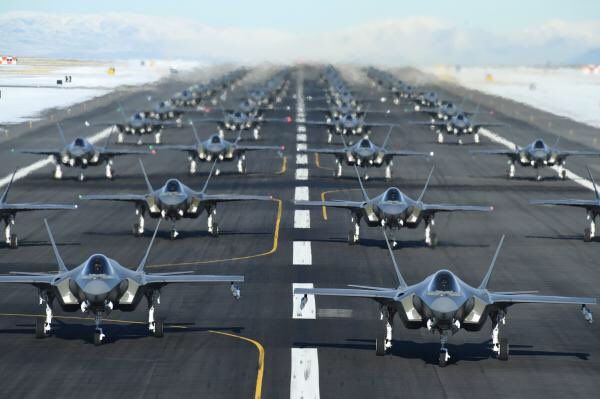 :speech_balloon:评:7 :+1:赞:77 :globe_with_meridians:转:25  

[01月07日 12:30]    纽约时报中文网   @nytchinese    周日晚上，奥卡菲娜凭借其在《别告诉她》中的角色，成为首位获得金球奖音乐/喜剧片最佳女主角的亚裔美国女性。
“如果我落魄了，我们可以卖掉这个，”在获奖发言中，奥卡菲娜一边把她的奖杯高高举起，一边说。“所以这很棒。” http://nyti.ms/37ILpjW   :speech_balloon:评:7 :+1:赞:88 :globe_with_meridians:转:17  

[01月07日 12:00]    纽约时报中文网   @nytchinese    • 卡洛斯·戈恩逃亡之路细节浮出水面。据报道，在戈恩爬进一个箱子躲避机场安检之前，他坐上了一辆开往大阪的公共火车。
• 尼赫鲁大学遭数十名蒙面男子袭击后，印度各地爆发示威活动。据信至少有42人在冲突中受伤，其中一些人伤势严重。
更多简报内容： http://nyti.ms/39UvroK   :speech_balloon:评:69 :+1:赞:8 :globe_with_meridians:转:3  

[01月07日 11:30]    纽约时报中文网   @nytchinese    塞纳河上的37座桥为这条河和巴黎提供了建筑瑰宝、历史细节和其浪漫史的源头。
每一座桥都有自己的故事、构造和性格，将这个城市的历史和建筑如马赛克一般拼接起来。 http://nyti.ms/37Ezeo6   :speech_balloon:评:3 :+1:赞:46 :globe_with_meridians:转:10  

[01月07日 11:00]    BBC News 中文   @bbcchinese    自2019年末开始，中国公安在多个地区拘留或传讯了十几名律师和公民运动人士。此次抓捕是2015年“709”事件之后对这一群体最大规模的打压。 https://bbc.in/2QtKZb9   :speech_balloon:评:45 :+1:赞:204 :globe_with_meridians:转:90  

[01月07日 11:00]    纽约时报中文网   @nytchinese    澳大利亚大火持续蔓延，向农村地区延伸。过去十年这些城镇的扩张使更多人面临受灾风险。虽然浓烟阻碍了搜救，但小雨和凉风已使火情有所缓解。
新西兰、加拿大和美国均已派出援助人员。总理莫里森表示，将在未来两年投入20亿澳元进行灾后重建。
更多简报内容： http://nyti.ms/39UvroK   :speech_balloon:评:4 :+1:赞:3 :globe_with_meridians:转:2  

[01月07日 10:33]    老司机   @h5lpykl7tp6jjop    【天下邪恶如出一辙】苏莱曼尼是个裸官，女儿是美国籍！
财产家眷都在美国，却号召伊朗人民反美！  :speech_balloon:评:27 :+1:赞:156 :globe_with_meridians:转:76  

[01月07日 10:05]    纽约时报中文网   @nytchinese    早安！今日重点新闻包括：
台湾选前虚假信息战；武汉肺炎病例激增；伊朗哀悼苏莱曼尼并誓言向美国报复；博尔顿称愿在特朗普弹劾审判中作证；澳大利亚大火向农村地区延伸；卡洛斯·戈恩逃亡之路细节浮出水面……NYT简报带你速览今日要闻。 http://nyti.ms/39UvroK   :speech_balloon:评:29 :+1:赞:42 :globe_with_meridians:转:8  

[01月07日 10:01]    BBC News 中文   @bbcchinese    美国刺杀伊朗将军符合国际法吗？联合国有何立场？美伊之间剑拔弩张，一旦局势恶化会演变为第三次世界大战吗？BBC记者解答美伊对峙的七大关键问题。 https://bbc.in/37KQqsi   :speech_balloon:评:54 :+1:赞:74 :globe_with_meridians:转:40  

[01月07日 09:17]    财经真相   @caijingxiang    中方在中美第一阶段经贸协议中承诺大幅度增加农产品进口。官方并披露，协议实施后，中国会从美国进口一部分小麦、玉米、大米。外界非常关注具体数字，此前并有猜测玉米进口配额会提高甚至放开。1月4日，中美经贸谈判成员、中农办副主任韩俊向财新记者确认，三大主粮进口配额不会调整。（财新）  :speech_balloon:评:20 :+1:赞:150 :globe_with_meridians:转:41  

[01月07日 09:00]    BBC News 中文   @bbcchinese    《伊索寓言》里乌鸦填石头喝水的故事不只是想象，乌鸦的智力程度可能远比人类所想的还要高。 https://bbc.in/2SXyYN4   :speech_balloon:评:9 :+1:赞:59 :globe_with_meridians:转:27  

[01月07日 06:50]    老司机   @h5lpykl7tp6jjop    突发新闻： 中国驻伊拉克大使张涛，刚刚在伊拉克总理马哈迪见面时说：” 中国愿意为伊拉克提供军事援助”。  :speech_balloon:评:15 :+1:赞:127 :globe_with_meridians:转:45  

[01月07日 05:03]    老司机   @h5lpykl7tp6jjop    含泪转发：中国数学天才之死！
他解开了世界性数学难题，
但却留下了一道更难的现实问题给我们：
为什么会出现“寇克曼系列”的悲剧？
为什么会有英才早逝的遗憾？
为什么要以死亡的方式，
才让人们记住了他的名字？
这是一道在中国太难的题，  :speech_balloon:评:7 :+1:赞:199 :globe_with_meridians:转:96  

[01月07日 02:39]    老司机   @h5lpykl7tp6jjop    阻止人民發聲，不給人民申冤，一個被恐怖分子統治啲國家。推翻邪惡政權！  :speech_balloon:评:52 :+1:赞:832 :globe_with_meridians:转:489  

[01月07日 00:59]    BBC News 中文   @bbcchinese    从你进入房间的第一刻开始，人们就已经对你的印象打分，要如何提升自己的魅力，建立更好的人际关系，让自己更受人欢迎？
 https://bbc.in/2FlnPgZ   :speech_balloon:评:5 :+1:赞:47 :globe_with_meridians:转:31  

[01月07日 00:30]    BBC News 中文   @bbcchinese    想当年，里根把美国称作“山巅城”：言为师行为范，举世景仰。看现在，谁还把特朗普的美国看作世界榜样？她怎么走到的这一步？
 https://bbc.in/2SWkBIE   :speech_balloon:评:141 :+1:赞:123 :globe_with_meridians:转:41  

[01月06日 23:59]    BBC News 中文   @bbcchinese    解密文件显示，美国在上世纪60年代支持印尼军方镇压和屠杀。印尼军方以毛泽东指使印尼共产党策划政变为由迫害华人。
 https://bbc.in/2QWdYUi   :speech_balloon:评:53 :+1:赞:169 :globe_with_meridians:转:80  

[01月06日 23:30]    BBC News 中文   @bbcchinese    伊朗宗教领袖霍梅尼1979年领导伊斯兰革命推翻巴列维王朝统治，伊朗女性的生活发生巨变。
 https://bbc.in/2Qt9Iww   :speech_balloon:评:22 :+1:赞:82 :globe_with_meridians:转:41  

[01月06日 23:23]    财经真相   @caijingxiang    1月6日，财政部公告称，放开外商独资、中外合资、外国银行分行加入地方政府债券承销团的资格限制。
截至目前，已有富邦华一银行（台资）加入宁波市、重庆市政府债券承销团，东亚银行（中国）（港资）加入天津市、广东省政府债券承销团，德意志银行（中国）（德资）加入青岛市政府债券承销团。  :speech_balloon:评:38 :+1:赞:253 :globe_with_meridians:转:76  

[01月06日 22:59]    BBC News 中文   @bbcchinese    他可能真是传说中的北欧侏儒：身材瘦小，一身黑衣。我向他打招呼，但他却跑掉了，似乎比我还害怕……
 https://bbc.in/2unEwpK   :speech_balloon:评:3 :+1:赞:21 :globe_with_meridians:转:3  

[01月06日 21:23]    墙国铁拳现世报😷   @Socialistfist    #社会主义铁拳  https://twitter.com/MingZe_suki/status/1213666088044490753 …  :speech_balloon:评:12 :+1:赞:192 :globe_with_meridians:转:43  

[01月06日 21:00]    财经真相   @caijingxiang    往年春节前一段时间客盘会有一波刚性的结汇需求，但从今年的情况看，结汇并不多，“现在有点担心市场整体的预期跟事实之间有预期差，以前预期人民币会小升，今年可能不升反贬。” 市场都不傻，尤其是中美这次协议！  :speech_balloon:评:6 :+1:赞:89 :globe_with_meridians:转:16  

[01月06日 18:00]    纽约时报中文网   @nytchinese    #观点 美国最好为与伊朗的战争做好准备。全面冲突未必会发生，但其可能性比几十年来任何时候都高。
尽管特朗普常公开表示想要避免与伊朗开战并退出中东军事纷争，但他下令击毙苏莱曼尼和伊朗支持的武装组织的伊拉克领导人，让两国锁定在危险升级的轨道上，或导致更广泛的战争。 http://nyti.ms/2Fp4IT8   :speech_balloon:评:68 :+1:赞:87 :globe_with_meridians:转:41  

[01月06日 17:30]    纽约时报中文网   @nytchinese    五角大楼称，“使用TikTok应用程序存在潜在风险”，并建议雇员采取几项预防措施来保护个人信息。国防部说，防止“不期行动者”获取个人信息的最简单方法是删除该应用。
“这样做不会阻止可能已经陷入危险的信息被传播，但可能会阻止更多的信息被收集，”五角大楼的信息说。 http://nyti.ms/2QMV5Da   :speech_balloon:评:11 :+1:赞:52 :globe_with_meridians:转:19  

[01月06日 17:00]    纽约时报中文网   @nytchinese    据美国国防部和政府官员称，12月28日，特朗普最初拒绝了杀死苏莱曼尼的方案，而是授权对伊朗支持的什叶派民兵组织发动空袭。
几天后，特朗普看到伊朗支持的袭击美国驻巴格达大使馆的画面后，感到非常愤怒。
周四晚些时候，总统转向了极端的选择。五角大楼高层对此大吃一惊。 http://nyti.ms/39CmccF   :speech_balloon:评:80 :+1:赞:296 :globe_with_meridians:转:108  

[01月06日 11:55]    财经真相   @caijingxiang    市场消息：美国众议院将对战争权力法决议进行投票，目的是限制美国总统特朗普在伊朗问题上的权力。PS：美国战争权力法规定美国总统在派出军队前的48小时内必须通知美国国会，未经过国会授权或者宣战的军事行动不得在当地停留超过60天，到期后于30天内撤离。  :speech_balloon:评:36 :+1:赞:323 :globe_with_meridians:转:83  

[01月06日 10:18]    GFHG SDKM   @zyx_yny    #HongKongPolice baton & pepper spray
5 Jan 2020
Footbridge near Sheung Shui Centre, #HongKongProtests 
Cr. USP United Social Press 社媒  https://www.facebook.com/UnitedSocialPress/videos/608855149868858 …  :speech_balloon:评:6 :+1:赞:99 :globe_with_meridians:转:113  

[01月06日 09:29]    财经真相   @caijingxiang    周一亚洲盘现货黄金暴涨至1588美元，创下了2013.4月以来最高点，那一年黄金暴跌，引来了“中国大妈”疯狂抢购黄金热。随后被套了整整7年！  :speech_balloon:评:25 :+1:赞:169 :globe_with_meridians:转:32  

[01月06日 06:51]    新闻大吐槽   @TuCaoFakeNews    勇武派充满活力的热舞后，是一段以爆演女孩为主题的悲情的舞蹈。刚柔相济，感动人心！

原来，香港遗失已久的真正文艺范，散落在民间，潜藏在抗争者的血液里，，艺术之花一经自由之心的浇灌，就立刻盛开绽放！  :speech_balloon:评:83 :+1:赞:1670 :globe_with_meridians:转:808  

[01月06日 06:51]    GFHG SDKM   @zyx_yny    勇武派充满活力的热舞后，是一段以爆演女孩为主题的悲情的舞蹈。刚柔相济，感动人心！

原来，香港遗失已久的真正文艺范，散落在民间，潜藏在抗争者的血液里，，艺术之花一经自由之心的浇灌，就立刻盛开绽放！  :speech_balloon:评:83 :+1:赞:1670 :globe_with_meridians:转:808  

[01月06日 00:28]    财经真相   @caijingxiang    从6号开始到8号，河南、山东两地将经历今年以来最大范围的一场降雪，根据欧洲EC模式，这两地将出现及其罕见的积雪，部分地区将达到40-50厘米，寿光地区也将出现15厘米厚的积雪，这对当地蔬菜大棚构成严重威胁。不过美国GFS模式由于气温稍微较高，降雨概率大于降雪，积雪会较小，我们拭目以待吧！  :speech_balloon:评:9 :+1:赞:152 :globe_with_meridians:转:24  

[01月05日 21:05]    财经真相   @caijingxiang    据伊朗迈赫尔通讯社报道，当地时间1月5日，伊朗外交部发言人阿巴斯·穆萨维向外界表示，5日晚伊朗政府将举行一次重要会议，讨论并最终决定减少履行伊核协议第五阶段的具体措施。（央视新闻）  :speech_balloon:评:14 :+1:赞:105 :globe_with_meridians:转:28  

[01月05日 16:40]    GFHG SDKM   @zyx_yny    [1606 Sheung Shui] Friendly #HongKongPolice escorted alleged Chinese smugglers to leave the protest area.

Arrest? Batons blows to the head? Pepper spray? Tear gas?

None of the above.

To #HongKongPolice, #HongKong locals are just second-class citizens.

#HongKongProtests  https://twitter.com/Mugisalty/status/1213735706553540612 …  :speech_balloon:评:48 :+1:赞:741 :globe_with_meridians:转:902  

[01月05日 15:55]    GFHG SDKM   @zyx_yny    Someone says to #HKPolice this is a pedestrian walkway.  Check out his reply
#StandWithHongKong #HongKongProtests  :speech_balloon:评:151 :+1:赞:2078 :globe_with_meridians:转:2265  

[01月05日 11:41]    财经真相   @caijingxiang    预测一下，上半年LPR利率会追随MLF降低几次，8月31日所谓协商日期一结束，LPR利率立刻停止下降，未来全面性通胀一上来，立刻定向加息（LPR），跟中共玩P民永远都是韭菜，墙内吹捧浮动利率时，你就该反着来准没错！ https://twitter.com/caijingxiang/status/1213664873395056642 …  :speech_balloon:评:13 :+1:赞:118 :globe_with_meridians:转:23  

[01月05日 11:33]    财经真相   @caijingxiang    所谓未来继续降息，甚至实行负利率，纯粹是胡扯！现在中国属于资本外逃国，必须要维持高利差才行，尤其是对美国基准利率，日本负利率，但是国际一旦风吹草动，日元就升值，瑞士负利率，全世界的贪官照样存瑞士银行，中国别说负利率就是低利率，老人就会排队挤兑银行！  :speech_balloon:评:21 :+1:赞:351 :globe_with_meridians:转:59  

[01月05日 11:11]    财经真相   @caijingxiang    这就注定了锚定MLF利率的LPR未来降息空间十分有限，个人猜测就3%是下限，超过这个值，央行要么下调基准存款利率，要么整个商行承担降息亏损；反之，中国未来发生通货膨胀的概率极大，尤其是汇率崩盘后带来的“通胀死亡螺旋”，逼迫新政府必须加息，采用浮动房贷利率，等于是把自己未来压倒赌桌上！  :speech_balloon:评:10 :+1:赞:87 :globe_with_meridians:转:22  

[01月05日 11:06]    财经真相   @caijingxiang    商行通过MLF从央行借贷资金3.69万亿，最高峰时也就5.38万亿，这部分资金是锚定MLF利率，MLF降息仅能够降低这部分资金成本；但是高达一百万亿的社会存款商行依旧按照基准存款利率支付利息，如果LPR利率追随MLF降息，但是基准存款利率不降，则整个商业银行全面亏损倒闭。 https://www.youtube.com/watch?v=UA4x0oxVBCE …  :speech_balloon:评:7 :+1:赞:134 :globe_with_meridians:转:51  

[01月05日 09:56]    GFHG SDKM   @zyx_yny    我最期待的畫面出現了！
支爆冚家剷！ https://www.ntdtv.com/b5/2020/01/02/a102743724.html …  :speech_balloon:评:68 :+1:赞:1242 :globe_with_meridians:转:540  

[01月05日 08:13]    GFHG SDKM   @zyx_yny    一个澳洲记者结束在中国的工作，搬家回国，可她带不走儿子心爱的地球仪夜灯，因为搬家公司对地球仪进行了审查，搬家公司的主管说：台湾是中国的一部分，而你这个地球仪上，台北字体大小竟然和北京一样！

显然，两个首都是他不能接受的！

搬家公司都管的这么宽 https://www.smh.com.au/world/asia/the-long-arm-of-authoritarian-china-reached-into-my-seven-year-old-s-bedroom-20191228-p53nbz.html …  :speech_balloon:评:88 :+1:赞:1167 :globe_with_meridians:转:552  

[01月04日 15:33]    财经真相   @caijingxiang    新做的一期视频，详细讲解LPR利率前因后果，尤其是报价挂钩MLF操作的流程，世人只关心LPR对房贷影响，却忽略了MLF一年期利率报价的走势，MLF一年期利率从最初的3%，一直涨到3.3%，直到去年11月份挂钩LPR利率才降低5个基点，房贷选择浮动利率真的会比较优惠吗？  :speech_balloon:评:16 :+1:赞:174 :globe_with_meridians:转:54  

[01月04日 15:20]    凡賽堤/FORSETI   @FecharCCP    他們穿著人民生產的制服，叫著人民的名義，卻只殺害同胞和出賣國土的極權殺人組織！
2020！消滅極權！！！  :speech_balloon:评:2 :+1:赞:4 :globe_with_meridians:转:8  

[01月04日 15:16]    凡賽堤/FORSETI   @FecharCCP    他們穿著人民生產的制服，叫著人民的名義，卻只殺害同胞和出賣國土的極權殺人組織！
2020！消滅極權！！！  :speech_balloon:评:4 :+1:赞:279 :globe_with_meridians:转:185  

[01月04日 15:01]    凡賽堤/FORSETI   @FecharCCP    我們看到了真相，見證了CCP的假，醜，惡的納粹嘴臉！  :speech_balloon:评:0 :+1:赞:20 :globe_with_meridians:转:22  

[01月04日 14:57]    凡賽堤/FORSETI   @FecharCCP    2020！消滅殺人政權，為70年來以各種手段名義冤死的近億華人同胞昭雪！！！

2020！時代革命，光復華族，消滅極權，人人有責！！！  :speech_balloon:评:0 :+1:赞:15 :globe_with_meridians:转:6  

[01月04日 14:47]    凡賽堤/FORSETI   @FecharCCP    極權恐怖組織騙取70年政權，殺死千萬地主富豪，近億人同胞，他們公開殺人，防火，強姦，現在更是公開搶劫！

我們看到了真相，見證了CCP的假，醜，惡的納粹嘴臉！

2020！時代革命，光復華族，消滅極權，人人有責！！！  :speech_balloon:评:1 :+1:赞:66 :globe_with_meridians:转:39  

[01月03日 23:56]    墙国铁拳现世报😷   @Socialistfist    特别感谢投稿和为小编解答粤语白话文词汇的香港推友！  :speech_balloon:评:0 :+1:赞:89 :globe_with_meridians:转:3  

[01月03日 23:54]    墙国铁拳现世报😷   @Socialistfist    元旦当天铜锣湾被捕的近300人中，包括了一位［深蓝丝，小粉红］的54岁的汽修店伙计，其老板从事发时的直播画面中看到其在一旁［吃花生］看戏时因未带身份证警察逮捕。
老板希望探监送药，称自己伙计身体不佳需要心脏，肝脏药物，但被拒绝。

#社会主义铁拳
#社会主义特别行政区铁拳  :speech_balloon:评:27 :+1:赞:453 :globe_with_meridians:转:129  

[01月02日 23:06]    墙国铁拳现世报😷   @Socialistfist    最新更新  :speech_balloon:评:33 :+1:赞:331 :globe_with_meridians:转:94  

[01月02日 22:18]    GFHG SDKM   @zyx_yny    求下大家帶口罩  :speech_balloon:评:1 :+1:赞:92 :globe_with_meridians:转:13  

[01月02日 22:01]    GFHG SDKM   @zyx_yny    昨日言い忘れましたが、あけましておめでとうございます

2020年は、目標や夢がたくさん叶う年になりますように。

この数年間で日本のファッションやコスメが大好きになりました。憧れの日本のファッション誌の取材を受けたい！という夢も、いつか叶うといいな。

2020年もよろしくお願いします。  :speech_balloon:评:661 :+1:赞:26412 :globe_with_meridians:转:4267  

[01月02日 21:04]    GFHG SDKM   @zyx_yny    "Hong Kong is a great world city, a major international financial and trading centre, and an important gateway to China and the rest of Asia. It would be a tragedy if it loses this role and gains a reputation for repression." https://www.christiantoday.com/article/religious-leaders-dignitaries-call-on-hong-kong-chief-executive-carrie-lam-to-stop-police-brutality/133948.htm …  :speech_balloon:评:118 :+1:赞:2007 :globe_with_meridians:转:1855  

[01月02日 19:53]    GFHG SDKM   @zyx_yny    您国！抱拳了！  :speech_balloon:评:28 :+1:赞:368 :globe_with_meridians:转:86  

[01月02日 12:30]    GFHG SDKM   @zyx_yny    WATCH: Police in Hong Kong rip the goggles off of lawmaker Ted Hui Chi-fung in an attempt to pepper spray him during a #NewYear's Day rally #HongKongProtests #香港  :speech_balloon:评:201 :+1:赞:2457 :globe_with_meridians:转:2329  

[01月02日 09:57]    GFHG SDKM   @zyx_yny    洗腦的人没有興趣看完video，不要用太長的片，有些照片震撼力也很強  :speech_balloon:评:1 :+1:赞:16 :globe_with_meridians:转:6  

[01月02日 03:19]    GFHG SDKM   @zyx_yny    Honoured to be among 40 signatories of this important and timely Open Letter to Carrie Lam: end police brutality against peaceful Hongkongers NOW!
#StandWithHongKong https://twitter.com/hk_watch/status/1212040663757443073 …  :speech_balloon:评:373 :+1:赞:2549 :globe_with_meridians:转:2166  

[01月01日 21:22]    GFHG SDKM   @zyx_yny    #HongKongPolice #PepperSpray 
1 Jan 2020
Near Sogo, Causeway Bay, #HongKongProtesters 
Source: ynhk  :speech_balloon:评:96 :+1:赞:1030 :globe_with_meridians:转:1181  

[01月01日 18:23]    GFHG SDKM   @zyx_yny    #HKPoliceTerrorists in action again. Nowadays with a mask and weapon you can play both terrorists and #HKPolice , in fact there is no boundary already.  :speech_balloon:评:173 :+1:赞:2146 :globe_with_meridians:转:2417  

[01月01日 03:27]    墙国铁拳现世报😷   @Socialistfist    对这一届推友，小编是很满意的
再次感谢2019年大力支持和帮助的推友们  :speech_balloon:评:6 :+1:赞:254 :globe_with_meridians:转:33  

[12月31日 22:58]    墙国铁拳现世报😷   @Socialistfist    墙国铁拳现世报 恭祝各位推友
新年平安喜乐，铁拳不锤！  :speech_balloon:评:27 :+1:赞:772 :globe_with_meridians:转:121  

[12月31日 10:53]    GFHG SDKM   @zyx_yny    藍店認證: 葵涌工業街2-8號力豐工業大廈 Rhe Kitchen 

要容納咁多人仲要得2間餐廳(網民報料)，唯一選擇得呢間私房菜，同樣有大圓枱，同樣有第三張既屏風

仲捉你唔到2020年睇你捱到幾耐
歡迎轉發 #藍店  :speech_balloon:评:20 :+1:赞:205 :globe_with_meridians:转:202  

[12月31日 10:34]    凡賽堤/FORSETI   @FecharCCP    细思极恐的面具之后1：
细思真名(中国护照名字)叫做 LinZheng Pan, 应该是中文同音的拼音，比如：潘林正，潘临郑。
潘林正，有两个孩子。
潘林正，前天的所谓直播，完全就是砸郭热线。  :speech_balloon:评:147 :+1:赞:913 :globe_with_meridians:转:416  

[12月31日 08:41]    GFHG SDKM   @zyx_yny    This was how Joycelyn Chau, an unarmed young woman, was brutally arrested by a gang of riot police this summer. She'd gone on to win a District Council seat & is due to formally commence duty on 1Jan

She's just been told she is to be charged with assaulting these police officers https://twitter.com/UncleRay_NDJ/status/1211621739978866689 …  :speech_balloon:评:91 :+1:赞:1012 :globe_with_meridians:转:1295  

[12月31日 01:06]    GFHG SDKM   @zyx_yny    猶豫要不要加上這兩個 hashtags: #老竇教仔 #老母教仔

好吧，就當我沒寫哦。別駡

那個，courtesy matters. 跟外國政要致謝，盡量不要用thanks 或 thxx. 這也不算 rude，但過度 casual，少了一份誠意，甚至給人一種 over familiar 的感覺。好似你與對方多年深交，一起泡吧，一起泡妞，一起泡澡的那種  :speech_balloon:评:5 :+1:赞:103 :globe_with_meridians:转:48  

[12月31日 00:28]    GFHG SDKM   @zyx_yny    Just one day or two before the new year, #PoliceBrutality never stops. A pregnant lady was badly treated by #hkpolice in Tin Shui Wai and forced to kneel on the ground. She terribly threw up, but #police kept scolding at her. #policestatehk  :speech_balloon:评:1009 :+1:赞:9372 :globe_with_meridians:转:11659  

[12月29日 01:29]    凡賽堤/FORSETI   @FecharCCP    ----你見過幾十個穿制服的圍毆性侵一個小女生嗎？------

極權恐怖組織的殺人犯警2019年12月份的納粹暴行（19）

我們都是歷史的見證者！

時代革命，消滅極權，CCP 不能代表中國，CCP 不能代表中國人！

----感謝此視頻的原創作者！  :speech_balloon:评:2 :+1:赞:70 :globe_with_meridians:转:66  

[12月29日 01:09]    凡賽堤/FORSETI   @FecharCCP    極權恐怖組織的殺人犯警的納粹暴行（圖1）

---黑警犯警強姦警暴警殺人警非法執法濫捕香港小青年，學生，兒童！

我們都是歷史的見證者！

時代革命，消滅極權，CCP 不能代表中國，CCP 不能代表中國人！

----感謝此視頻的原創作者！  :speech_balloon:评:0 :+1:赞:16 :globe_with_meridians:转:17  

[12月29日 00:48]    凡賽堤/FORSETI   @FecharCCP    你認同一個政府稱呼人類為蟑螂？
你認同一個政府稱呼手無寸鐵的在校學生為暴徒？
你認同一個政府僱傭黑社會團伙肆意毆打市民？
你認同一個政府動用部隊武警毆打，殘殺市民？
你認同警察部隊武警殺人後高樓拋屍？
你認同警察部隊武警輪姦少女後殺人大海拋屍？
你認同....幾個月就陸續殺死近萬名學生？  :speech_balloon:评:23 :+1:赞:365 :globe_with_meridians:转:276  

[12月29日 00:25]    凡賽堤/FORSETI   @FecharCCP    ----你見過幾十個穿制服的圍毆暴打一個正常市民嗎？------

極權恐怖組織的殺人犯警2019年12月份的納粹暴行（17）-

我們都是歷史的見證者！

時代革命，消滅極權，CCP 不能代表中國，CCP 不能代表中國人！

----感謝此視頻的原創作者！  :speech_balloon:评:1 :+1:赞:58 :globe_with_meridians:转:48  

[12月29日 00:20]    凡賽堤/FORSETI   @FecharCCP    ----你見過穿制服的這種殘暴手段？------

極權恐怖組織的殺人犯警2019年12月份的納粹暴行（18）-

我們都是歷史的見證者！

時代革命，消滅極權，CCP 不能代表中國，CCP 不能代表中國人！

----感謝此視頻的原創作者！  :speech_balloon:评:1 :+1:赞:80 :globe_with_meridians:转:90  

[12月28日 23:56]    凡賽堤/FORSETI   @FecharCCP    極權恐怖組織的殺人犯警2019年12月份的納粹暴行（17）-

----殘暴打頭------

我們都是歷史的見證者！

時代革命，消滅極權，CCP 不能代表中國，CCP 不能代表中國人！

----感謝此視頻的原創作者！  :speech_balloon:评:14 :+1:赞:171 :globe_with_meridians:转:165  

[12月28日 07:54]    凡賽堤/FORSETI   @FecharCCP    我們不可停止，我們將無限循環傳播香港的全方位被CCP極權組織殘暴殺害的種種真相視頻和畫面，永不停止！！！！！！！！！！！！！！！！！！！！！！！！！！！！！！！！！！！！！！！！！！！！！！！！！！！！！！！！！！！！！！！！！！！！！！！！！！！！！！！！！！！ https://twitter.com/FecharCCP/status/1207809972341559296 …  :speech_balloon:评:1 :+1:赞:40 :globe_with_meridians:转:29  

[12月28日 07:52]    凡賽堤/FORSETI   @FecharCCP    極權恐怖組織的殺人犯警2019年12月份的納粹暴行（16）

我們都是歷史的見證者！

時代革命，消滅極權，CCP 不能代表中國，CCP 不能代表中國人！

----感謝此視頻的原創作者！  :speech_balloon:评:1 :+1:赞:89 :globe_with_meridians:转:97  

[12月28日 07:44]    凡賽堤/FORSETI   @FecharCCP    極權恐怖組織的殺人犯警2019年12月份的納粹暴行（15）

---黑警犯警強姦警暴警殺人警非法執法濫捕香港小青年，學生，兒童！

我們都是歷史的見證者！

時代革命，消滅極權，CCP 不能代表中國，CCP 不能代表中國人！

----感謝此視頻的原創作者！  :speech_balloon:评:2 :+1:赞:31 :globe_with_meridians:转:42  

[12月28日 07:37]    凡賽堤/FORSETI   @FecharCCP    極權恐怖組織的殺人犯警2019年12月份的納粹暴行（14）

---黑警犯警強姦警暴警殺人警非法執法濫捕香港小青年，學生，兒童！

我們都是歷史的見證者！

時代革命，消滅極權，CCP 不能代表中國，CCP 不能代表中國人！

----感謝此視頻的原創作者！  :speech_balloon:评:8 :+1:赞:134 :globe_with_meridians:转:165  

[12月28日 07:09]    墙国铁拳现世报😷   @Socialistfist    最新人造铁拳
未知原因，微博用户“青游记” 已经在此类P图内“被代言” 了好几回了，小编在这里表示慰问。  :speech_balloon:评:9 :+1:赞:49 :globe_with_meridians:转:4  

[12月28日 07:08]    凡賽堤/FORSETI   @FecharCCP    極權恐怖組織的殺人犯警2019年12月份的納粹暴行（13）

---黑警犯警強姦警暴警殺人警非法執法濫捕香港小青年，學生，兒童！

我們都是歷史的見證者！

時代革命，消滅極權，光復華族，人人有責！

----感謝此視頻的原創作者！  :speech_balloon:评:0 :+1:赞:9 :globe_with_meridians:转:14  

[12月28日 06:55]    凡賽堤/FORSETI   @FecharCCP    極權恐怖組織的殺人犯警2019年12月份的納粹暴行（12）

---黑警犯警強姦警暴警殺人警非法執法濫捕香港小青年，學生，兒童！

我們都是歷史的見證者！

時代革命，消滅極權，光復華族，人人有責！

----感謝此視頻的原創作者！  :speech_balloon:评:2 :+1:赞:48 :globe_with_meridians:转:44  

[12月28日 06:50]    凡賽堤/FORSETI   @FecharCCP    極權恐怖組織的殺人犯警2019年12月份的納粹暴行（11）
---她們都是正常走在街上的學生而已！

我們都是歷史的見證者！

時代革命，消滅極權，光復華族，人人有責！

----感謝此視頻的正義原創作者！  :speech_balloon:评:3 :+1:赞:80 :globe_with_meridians:转:60  

[12月27日 17:52]    墙国铁拳现世报😷   @Socialistfist    据推友提供的截图显示，@minzhutiequan 不幸被举报生效推特铁拳，虽然小编一直没有觉得此人在推上言行违反过相关条例。  :speech_balloon:评:29 :+1:赞:219 :globe_with_meridians:转:19  

[12月27日 02:04]    墙国铁拳现世报😷   @Socialistfist    高光时刻  :speech_balloon:评:22 :+1:赞:163 :globe_with_meridians:转:17  

[12月26日 23:22]    墙国铁拳现世报😷   @Socialistfist    @minzhutiequan  :speech_balloon:评:9 :+1:赞:70 :globe_with_meridians:转:2  

[12月26日 23:18]    墙国铁拳现世报😷   @Socialistfist    寻人启事  :speech_balloon:评:87 :+1:赞:474 :globe_with_meridians:转:82  

[12月25日 19:01]    墙国铁拳现世报😷   @Socialistfist    今天是12月25日，墙国铁拳现世报编辑部全体祝各位推友圣诞快乐，心想事成，也要祝各位粉蚷战螂剩蛋快乐！  :speech_balloon:评:13 :+1:赞:267 :globe_with_meridians:转:11  

[12月25日 02:17]    GFHG SDKM   @zyx_yny    Corrupt regime ..Hong Kong is dying Hong Kong people will not forget these hatreds.  :speech_balloon:评:6 :+1:赞:91 :globe_with_meridians:转:118  

[12月24日 20:01]    墙国铁拳现世报😷   @Socialistfist    感谢广大推友的对上一推的热烈反响和支持。
收到疑似有推友上微博围观评论而遭到喝茶的报告
小编请大家注意网络键政的安全，也不鼓励大家反串留言。  :speech_balloon:评:14 :+1:赞:169 :globe_with_meridians:转:18  

[12月24日 10:23]    墙国铁拳现世报😷   @Socialistfist    附行政复议书  :speech_balloon:评:2 :+1:赞:82 :globe_with_meridians:转:9  

[12月24日 10:18]    墙国铁拳现世报😷   @Socialistfist    ”海口市琼山区龙塘政府自2019年2月开始在没有任何法定证据的前提下，连续三次对香世界庄园下达强制拆除和限期拆除，其中行政复议三次，两次被法院撤销拆除令，第三次复议还在等待结果期间直接无批文强拆……要知道，没有法院批准的拆除令的强拆属于严重违法行为！”

摘自：  http://blog.sina.cn/dpool/blog/s/blog_725524e60102zq6u.html?ref=weibocard&from=109C195010&wm=9847_0002&weiboauthoruid=1918182630 … https://twitter.com/minzhutiequan/status/1209266528006234113 …  :speech_balloon:评:28 :+1:赞:183 :globe_with_meridians:转:29  

[12月20日 07:25]    凡賽堤/FORSETI   @FecharCCP    我們不可停止，我們將無限循環傳播香港的全方位被CCP極權組織殘暴殺害的種種真相視頻和畫面，永不停止！！！！！！！！！！！！！！！！！！！！！！！！！！！！！！！！！！！！！！！！！！！！！！！！！！！！！！！！！！！！！！！！！！！！！！！！！！！！！！！！！！！  :speech_balloon:评:33 :+1:赞:624 :globe_with_meridians:转:676  

[11月24日 08:10]    凡賽堤/FORSETI   @FecharCCP    呼籲請求共同挖掘所有有關香港發生的事，越全面越好，不同角度，越多越好，包括被暗地抓捕的人員，特別是CCP 派出的各種偽裝身份，包括變身變裝行兇的一點一滴都要挖掘出來，把CCP 的邪惡下三濫手段的真相毫無保留的曝光在全世界面前！世界公知公義才能真正挽救和保護香港人！希望懂視頻編輯配上中英文  :speech_balloon:评:6 :+1:赞:31 :globe_with_meridians:转:24  

[10月09日 00:47]    GFHG SDKM   @zyx_yny    "Son, when you grow up
You will be the savior of the broken
The beaten, and the damned?"
Please watch this powerful mv #HongKongProtester #hkprotests 
香港反送中護法戰爭(Hong Kong Defensive War 2019)：Welcome To The Black Parade  https://youtu.be/0yXTHODE24Q  via @YouTube  :speech_balloon:评:4 :+1:赞:20 :globe_with_meridians:转:8  

[03月13日 08:10]    老司机   @h5lpykl7tp6jjop    批评是批评家天生的使命！他们只感知对错，信奉真理，指出真相不吐不快，不在意权势和群众的喜好，从批评里不可能获得任何好处，但批评家愚直不改。在中国几乎所有人都讨厌批评家，喜欢阴谋家，因为他们只说好听的！可是就因为中国的批评家太少，中国几乎看不到未来和希望！  :speech_balloon:评:115 :+1:赞:285 :globe_with_meridians:转:59  

