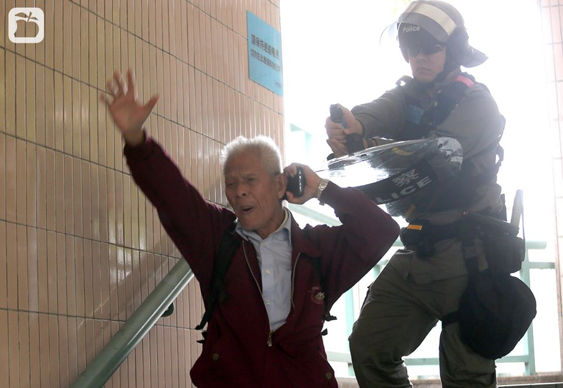
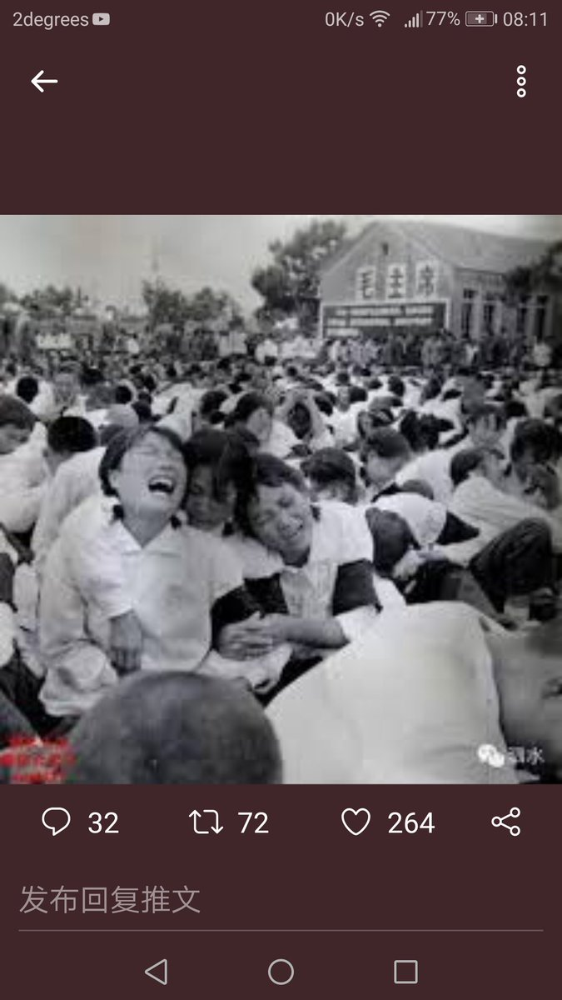
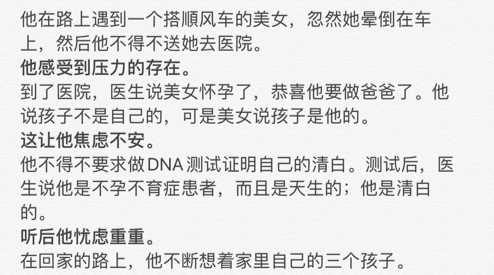

[01月06日 07:11]    新闻大吐槽   @TuCaoFakeNews    Dance of HK protestors 

@marcorubio @andrewklavan @VP @SenTedCruz @realDonaldTrump @GOPLeader @DennisPrager @SecretaryCarson @MarshaBlackburn @newtgingrich @benshapiro @TuckerCarlson @senatemajldr @Heritage @RandPaul @seanhannity https://twitter.com/tucaofakenews/status/1213956268743749632 …  :speech_balloon:评:0 :+1:赞:2 :globe_with_meridians:转:1  

[01月06日 07:06]    新闻大吐槽   @TuCaoFakeNews    phoenix TV is part of communist China #freehongkong  :speech_balloon:评:0 :+1:赞:1 :globe_with_meridians:转:1  

[01月06日 07:06]    新闻大吐槽   @TuCaoFakeNews    香港这些年轻人真是让人佩服不已。推特上至今还骂香港黑衣人是暴徒的得是何等的智障脑残! https://twitter.com/TuCaoFakeNews/status/1213956268743749632 …  :speech_balloon:评:0 :+1:赞:4 :globe_with_meridians:转:1  

[01月06日 07:05]    新闻大吐槽   @TuCaoFakeNews    听起来是波斯语  :speech_balloon:评:0 :+1:赞:1 :globe_with_meridians:转:1  

[01月06日 07:01]    新闻大吐槽   @TuCaoFakeNews    香港文藝復興2019 https://twitter.com/TuCaoFakeNews/status/1213956268743749632 …  :speech_balloon:评:0 :+1:赞:3 :globe_with_meridians:转:1  

[01月06日 07:00]    新闻大吐槽   @TuCaoFakeNews    笑死 https://twitter.com/g_jin_orz/status/1213773878234796034 …  :speech_balloon:评:0 :+1:赞:5 :globe_with_meridians:转:1  

[01月06日 06:54]    新闻大吐槽   @TuCaoFakeNews    好酷！！帅！！！勇武派，加油！ https://twitter.com/TuCaoFakeNews/status/1213956268743749632 …  :speech_balloon:评:0 :+1:赞:11 :globe_with_meridians:转:5  

[01月06日 06:53]    新闻大吐槽   @TuCaoFakeNews    made in China？  :speech_balloon:评:2 :+1:赞:10 :globe_with_meridians:转:6  

[01月06日 06:51]    新闻大吐槽   @TuCaoFakeNews    勇武派充满活力的热舞后，是一段以爆演女孩为主题的悲情的舞蹈。刚柔相济，感动人心！

原来，香港遗失已久的真正文艺范，散落在民间，潜藏在抗争者的血液里，，艺术之花一经自由之心的浇灌，就立刻盛开绽放！  :speech_balloon:评:3 :+1:赞:61 :globe_with_meridians:转:32  

[01月06日 06:47]    新闻大吐槽   @TuCaoFakeNews    这个王某看着细皮嫩肉的，但是她的表情和动作太恶心了，看见这样的就讨厌，恶心，丑  :speech_balloon:评:0 :+1:赞:3 :globe_with_meridians:转:1  

[01月06日 06:45]    新闻大吐槽   @TuCaoFakeNews    因为中共支持恐怖分子，才叫华为/孟晚舟暗中与伊朗交易了十多年。 https://twitter.com/tucaofakenews/status/1213940041321312256 …  :speech_balloon:评:0 :+1:赞:3 :globe_with_meridians:转:1  

[01月06日 06:42]    新闻大吐槽   @TuCaoFakeNews    Hahaha, Take that Bitch! 王冰汝做个采访一脸苦大仇深，革命小将风采尽现。作为记者连最基本的客观中立都做不到, 预设立场提问, 毫无专业精神。提问磕磕巴巴，露怯又蠢。 奥尔塔格斯气场强大，沉着冷静老练， 一张口秒杀王冰汝。  :speech_balloon:评:1 :+1:赞:4 :globe_with_meridians:转:1  

[01月06日 06:26]    新闻大吐槽   @TuCaoFakeNews     https://twitter.com/tucaofakenews/status/1213946061166800898 …  :speech_balloon:评:0 :+1:赞:2 :globe_with_meridians:转:1  

[01月06日 06:22]    新闻大吐槽   @TuCaoFakeNews     https://twitter.com/tucaofakenews/status/1213845746706857984 …  :speech_balloon:评:0 :+1:赞:1 :globe_with_meridians:转:1  

[01月06日 06:20]    新闻大吐槽   @TuCaoFakeNews    五大訴求，缺一不可
  我們會記住這一刻  :speech_balloon:评:0 :+1:赞:4 :globe_with_meridians:转:2  

[01月06日 06:12]    新闻大吐槽   @TuCaoFakeNews    銀髮族的信念  :speech_balloon:评:1 :+1:赞:3 :globe_with_meridians:转:1  

[01月06日 06:05]    新闻大吐槽   @TuCaoFakeNews      :speech_balloon:评:1 :+1:赞:1 :globe_with_meridians:转:1  

[01月06日 06:02]    新闻大吐槽   @TuCaoFakeNews    現在已無差別捉捕示威行動，黑警首領最想阻擋傳媒，說記者黑記是示威者扮，加以驅趕推撞，也出現過被打，記者越少方便用更狠手段壓場  :speech_balloon:评:0 :+1:赞:1 :globe_with_meridians:转:1  

[01月06日 06:00]    新闻大吐槽   @TuCaoFakeNews    凤凰卫视就是央视香港派出机构  :speech_balloon:评:0 :+1:赞:2 :globe_with_meridians:转:1  

[01月06日 06:00]    新闻大吐槽   @TuCaoFakeNews    这个是凤凰卫视，冒充港媒的党媒。  :speech_balloon:评:0 :+1:赞:2 :globe_with_meridians:转:1  

[01月06日 05:33]    老司机   @h5lpykl7tp6jjop    精准打击一下击溃了刚拜完把子三个难兄难弟，老大一声不吭，老二怯喏喏说不能用武力嘛，老三只好大叫：收了回扣的再不出声，要曝光了！  :speech_balloon:评:4 :+1:赞:46 :globe_with_meridians:转:21  

[01月06日 05:26]    老司机   @h5lpykl7tp6jjop    别忽悠了！你们还是研究一下必须力保哪十二个人吧！  :speech_balloon:评:2 :+1:赞:28 :globe_with_meridians:转:7  

[01月06日 05:01]    老司机   @h5lpykl7tp6jjop    胡编的评论说明了什么？三个刚拜把子的兄弟怂了！撤漂！
美伊如果全面开战，中国将再获20年发展机遇期？  :speech_balloon:评:2 :+1:赞:3 :globe_with_meridians:转:2  

[01月06日 04:45]    老司机   @h5lpykl7tp6jjop    杀了伊朗将军 整个世界都在颤抖！
各大报刊评论观点不一  :speech_balloon:评:0 :+1:赞:1 :globe_with_meridians:转:2  

[01月06日 04:36]    老司机   @h5lpykl7tp6jjop    谁说祸不单行福无双至？夫妇赢下200万镑巨奖 3天后 更大的奇迹发生了！  :speech_balloon:评:1 :+1:赞:11 :globe_with_meridians:转:4  

[01月06日 04:30]    老司机   @h5lpykl7tp6jjop    香港著名填词人林夕曾多次发声、甚至创作歌词表达支持“反修例”，疑因此遭到内地连环“封杀”，超过3000首由林夕填词的作品，稍早已在部分音乐网下架。上海东方卫视播放跨年节目《梦圆东方2020东方卫视跨年盛典》时，艺人王凯演唱由林夕填词的张国荣经典歌曲《我》，但歌曲资料中作词人一栏却写成“佚名”。  :speech_balloon:评:2 :+1:赞:32 :globe_with_meridians:转:11  

[01月06日 00:28]    财经真相   @caijingxiang    从6号开始到8号，河南、山东两地将经历今年以来最大范围的一场降雪，根据欧洲EC模式，这两地将出现及其罕见的积雪，部分地区将达到40-50厘米，寿光地区也将出现15厘米厚的积雪，这对当地蔬菜大棚构成严重威胁。不过美国GFS模式由于气温稍微较高，降雨概率大于降雪，积雪会较小，我们拭目以待吧！  :speech_balloon:评:6 :+1:赞:73 :globe_with_meridians:转:14  

[01月05日 21:05]    财经真相   @caijingxiang    据伊朗迈赫尔通讯社报道，当地时间1月5日，伊朗外交部发言人阿巴斯·穆萨维向外界表示，5日晚伊朗政府将举行一次重要会议，讨论并最终决定减少履行伊核协议第五阶段的具体措施。（央视新闻）  :speech_balloon:评:16 :+1:赞:82 :globe_with_meridians:转:23  

[01月05日 19:00]    纽约时报中文网   @nytchinese    #一周热门 新疆镇压行动中的维吾尔族儿童 http://nyti.ms/39oknA0   :speech_balloon:评:76 :+1:赞:52 :globe_with_meridians:转:22  

[01月05日 18:36]    老司机   @h5lpykl7tp6jjop    人与自然界的关系有关理论很多，至少都认识到不是主仆关系，但在素食主义和肉食主义之间还是存在很大空间，包括科学和文明。肉食主义不能宣扬血腥有理，素食主义不能说肉食有罪，文明就是远离野蛮的过程！西方人吃肉但是不准杀生，有专业从业人员，中国人从小习惯看见杀生，网上流传太多恐怖视频！罪过  :speech_balloon:评:2 :+1:赞:15 :globe_with_meridians:转:3  

[01月05日 18:10]    BBC News 中文   @bbcchinese    “北京对香港的舆情反应总是慢一个月左右，把握不住时机” https://bbc.in/2FpR4yU   :speech_balloon:评:66 :+1:赞:175 :globe_with_meridians:转:80  

[01月05日 17:49]    老司机   @h5lpykl7tp6jjop    面对一头猪，屠夫商人想到价值，厨子饕餮看到美味，文人看到愚蠢懒惰，洁癖看到肮脏，宠物癖看到可爱，动物学家看到的是品种，画家看到的是色彩……  :speech_balloon:评:3 :+1:赞:21 :globe_with_meridians:转:1  

[01月05日 17:19]    老司机   @h5lpykl7tp6jjop    我可以袭击任何平民，你们不能袭击我的将军！
我可以随时攻击你们，你们不能无预警打击我！
我们从来都是这样干，你们不是讲 程序公平吗？
杀你们是真主的旨意，你不去死又不信 那咋办？
你们说我是恐怖分子，你们不是一样恐怖手段 ？
在邪恶和善良决斗时，只有良知才是公平的裁判！
所以你有良知吗？  :speech_balloon:评:10 :+1:赞:362 :globe_with_meridians:转:117  

[01月05日 17:00]    纽约时报中文网   @nytchinese    #一周热门 八种方法，在2020年对自己更好一点 http://nyti.ms/35exksC   :speech_balloon:评:65 :+1:赞:31 :globe_with_meridians:转:14  

[01月05日 16:40]    GFHG SDKM   @zyx_yny    [1606 Sheung Shui] Friendly #HongKongPolice escorted alleged Chinese smugglers to leave the protest area.

Arrest? Batons blows to the head? Pepper spray? Tear gas?

None of the above.

To #HongKongPolice, #HongKong locals are just second-class citizens.

#HongKongProtests  https://twitter.com/Mugisalty/status/1213735706553540612 …  :speech_balloon:评:40 :+1:赞:593 :globe_with_meridians:转:746  

[01月05日 15:55]    GFHG SDKM   @zyx_yny    Someone says to #HKPolice this is a pedestrian walkway.  Check out his reply
#StandWithHongKong #HongKongProtests  :speech_balloon:评:123 :+1:赞:1531 :globe_with_meridians:转:1678  

[01月05日 15:00]    纽约时报中文网   @nytchinese    #一周热门 中国如何将新疆穆斯林少数民族改造为工人大军 http://nyti.ms/2QF7DfA   :speech_balloon:评:55 :+1:赞:59 :globe_with_meridians:转:36  

[01月05日 13:00]    纽约时报中文网   @nytchinese    #一周热门 中国科学家涉嫌窃取美医学实验室样品 http://nyti.ms/2QK9HmO   :speech_balloon:评:28 :+1:赞:53 :globe_with_meridians:转:24  

[01月05日 12:59]    老司机   @h5lpykl7tp6jjop    一个外国小孩眼中的《新华字典》， 引人深思

有一天晚上，小约翰很有兴致地说要自学中文，他一会儿翻《成语词典》学成语，一会儿翻《新华字典》掌握字义，正这么翻着，突然，他冲着我大声喊：“陈老师，为什么‘猪’的解释是这样的？太不可思议了！”  :speech_balloon:评:23 :+1:赞:176 :globe_with_meridians:转:87  

[01月05日 12:50]    老司机   @h5lpykl7tp6jjop    退休金涨5％，老王的包子却少了！  :speech_balloon:评:0 :+1:赞:27 :globe_with_meridians:转:11  

[01月05日 11:41]    财经真相   @caijingxiang    预测一下，上半年LPR利率会追随MLF降低几次，8月31日所谓协商日期一结束，LPR利率立刻停止下降，未来全面性通胀一上来，立刻定向加息（LPR），跟中共玩P民永远都是韭菜，墙内吹捧浮动利率时，你就该反着来准没错！ https://twitter.com/caijingxiang/status/1213664873395056642 …  :speech_balloon:评:10 :+1:赞:104 :globe_with_meridians:转:21  

[01月05日 11:33]    财经真相   @caijingxiang    所谓未来继续降息，甚至实行负利率，纯粹是胡扯！现在中国属于资本外逃国，必须要维持高利差才行，尤其是对美国基准利率，日本负利率，但是国际一旦风吹草动，日元就升值，瑞士负利率，全世界的贪官照样存瑞士银行，中国别说负利率就是低利率，老人就会排队挤兑银行！  :speech_balloon:评:21 :+1:赞:315 :globe_with_meridians:转:57  

[01月05日 11:11]    财经真相   @caijingxiang    这就注定了锚定MLF利率的LPR未来降息空间十分有限，个人猜测就3%是下限，超过这个值，央行要么下调基准存款利率，要么整个商行承担降息亏损；反之，中国未来发生通货膨胀的概率极大，尤其是汇率崩盘后带来的“通胀死亡螺旋”，逼迫新政府必须加息，采用浮动房贷利率，等于是把自己未来压倒赌桌上！  :speech_balloon:评:11 :+1:赞:76 :globe_with_meridians:转:21  

[01月05日 11:06]    财经真相   @caijingxiang    商行通过MLF从央行借贷资金3.69万亿，最高峰时也就5.38万亿，这部分资金是锚定MLF利率，MLF降息仅能够降低这部分资金成本；但是高达一百万亿的社会存款商行依旧按照基准存款利率支付利息，如果LPR利率追随MLF降息，但是基准存款利率不降，则整个商业银行全面亏损倒闭。 https://www.youtube.com/watch?v=UA4x0oxVBCE …  :speech_balloon:评:7 :+1:赞:123 :globe_with_meridians:转:49  

[01月05日 11:04]    老司机   @h5lpykl7tp6jjop    经过事后调查证实，确实是什叶派“人民动员力量”武装成员，最终导致6名身亡3名重伤，而这6名身亡当中有1名，是扎伊迪旅秘书长霍拉萨尼，其余则是身边亲信人物，很显然一下子再损失6名重要人物，让伊拉克什叶派“人民动员力量”元气大损，加上前几天损失两名指挥官，伊朗阵营如今士气非常低下。  :speech_balloon:评:0 :+1:赞:25 :globe_with_meridians:转:2  

[01月05日 11:01]    BBC News 中文   @bbcchinese    【一周热点回顾】BBC采访了多位卷入香港示威的人士，回忆他们在这场示威中的情感体验——那些愤怒、悲伤、寂寞、恐惧的脸孔以及背后的故事。 https://bbc.in/2sFKtxC   :speech_balloon:评:81 :+1:赞:212 :globe_with_meridians:转:67  

[01月05日 11:00]    纽约时报中文网   @nytchinese    #一周热门 #观点 为何全球1/4生猪会在一年之内死亡 http://nyti.ms/37xgB5C   :speech_balloon:评:13 :+1:赞:27 :globe_with_meridians:转:10  

[01月05日 10:00]    BBC News 中文   @bbcchinese    【不做“大哥”几十年：男儿身的少女心事】自从小时候起，刘培麟就一直渴望成为一个女人，但是直到40多岁时才开始穿着女装。 https://bbc.in/2ujsE8d   :speech_balloon:评:6 :+1:赞:18 :globe_with_meridians:转:8  

[01月05日 09:53]    老司机   @h5lpykl7tp6jjop    全球新闻媒体都在报道美国这次袭击伊朗军头苏莱曼尼事件，这次高科技精准打击说明一个大问题，几千年以来独裁者利用人民当炮灰的无耻战法从此以后不灵了，忽悠洗脑也不灵了，什么红卫兵，小粉红，朝阳大妈喊破嗓子都没用！再多的托也拦不住空中闪电剁老千的手！先进要淘汰落后不以人的意志为转移！  :speech_balloon:评:4 :+1:赞:185 :globe_with_meridians:转:38  

[01月05日 09:09]    老司机   @h5lpykl7tp6jjop    切实可行的大项目！  :speech_balloon:评:0 :+1:赞:7 :globe_with_meridians:转:0  

[01月05日 09:04]    老司机   @h5lpykl7tp6jjop    压力山大！跌荡起伏的人生让你悲喜交加！你能承受之重吗？  :speech_balloon:评:5 :+1:赞:44 :globe_with_meridians:转:7  

[01月05日 09:01]    BBC News 中文   @bbcchinese    【一周热点回顾】台湾空军一架黑鹰直升机，1月2日在新北市乌来山区发生迫降意外，机上8人无生命迹象，5人生还。 https://bbc.in/2FhS8VO   :speech_balloon:评:20 :+1:赞:14 :globe_with_meridians:转:6  

[01月05日 09:00]    纽约时报中文网   @nytchinese    #一周热门 中国人对海参的无穷胃口导致物种危机 http://nyti.ms/2F9XyCc   :speech_balloon:评:127 :+1:赞:92 :globe_with_meridians:转:38  

[01月05日 08:13]    GFHG SDKM   @zyx_yny    一个澳洲记者结束在中国的工作，搬家回国，可她带不走儿子心爱的地球仪夜灯，因为搬家公司对地球仪进行了审查，搬家公司的主管说：台湾是中国的一部分，而你这个地球仪上，台北字体大小竟然和北京一样！

显然，两个首都是他不能接受的！

搬家公司都管的这么宽 https://www.smh.com.au/world/asia/the-long-arm-of-authoritarian-china-reached-into-my-seven-year-old-s-bedroom-20191228-p53nbz.html …  :speech_balloon:评:82 :+1:赞:1114 :globe_with_meridians:转:526  

[01月05日 07:00]    BBC News 中文   @bbcchinese    【非洲女性站起来：回顾2019年改变社会的女士】在2019年，不少非洲女性改变了社会，你知道她们的名字吗？ https://bbc.in/35kzsiN   :speech_balloon:评:2 :+1:赞:9 :globe_with_meridians:转:4  

[01月05日 07:00]    纽约时报中文网   @nytchinese    #一周热门 六个问题，了解澳大利亚火灾为何如此严重 http://nyti.ms/2SMP5wH   :speech_balloon:评:15 :+1:赞:22 :globe_with_meridians:转:10  

[01月05日 04:22]    新闻大吐槽   @TuCaoFakeNews    元旦游行时，有无人机录下了下面一幕：

无耻黑警向正在游行的人群扔催泪弹，人群四散，而仔细看，十几个黑衣少年不但没有退却，反而在集结，他们在警车前方打开雨伞，一字排开，形成防线！

保护民众为己任，黑衣人初心不变，哪怕抗争已历经半年，哪怕监狱已经塞满，感动  :speech_balloon:评:77 :+1:赞:1560 :globe_with_meridians:转:837  

[01月05日 03:55]    老司机   @h5lpykl7tp6jjop    野火连烧三月 澳大利亚的鸟开始学消防车叫了 https://youtu.be/zHzs-mlDXMY   :speech_balloon:评:0 :+1:赞:12 :globe_with_meridians:转:3  

[01月05日 03:33]    老司机   @h5lpykl7tp6jjop    中共解决中国中小银行和地方政府债务，能让他们运行下去的办法 ......  :speech_balloon:评:117 :+1:赞:2356 :globe_with_meridians:转:804  

[01月05日 01:31]    BBC News 中文   @bbcchinese    第二次世界大战，是人类历史上最血腥、死亡人数最多的战争：共有超过7千万人丧生。二战结束后，美国军方却得出了一个让人难以置信的惊人结论：杀得不够。或者换句话说：没有足够的美军士兵大开杀戮。这番话，传到美国华盛顿，将军们都听进去了......
 https://bbc.in/2SRIa5p   :speech_balloon:评:97 :+1:赞:172 :globe_with_meridians:转:59  

[01月05日 00:59]    BBC News 中文   @bbcchinese    70多年前的世界首富、大英帝国印度一王公的后人在英国赢得一场官司，获准继承3500万英镑遗产。
 https://bbc.in/39GVShi   :speech_balloon:评:3 :+1:赞:34 :globe_with_meridians:转:6  

[01月05日 00:30]    BBC News 中文   @bbcchinese    许多英语童谣都有着源远流长的历史。不止如此，许多童谣的主题还暗藏一些黑暗肮脏的一面，包括宗教迫害和淫秽内容。
 https://bbc.in/39DctCP   :speech_balloon:评:14 :+1:赞:87 :globe_with_meridians:转:32  

[01月04日 23:56]    BBC News 中文   @bbcchinese    癌症最初什么模样，要是知道，就有可能将它消灭在初始阶段。但有谁见过刚露头的癌？
 https://bbc.in/2ZNhiFc   :speech_balloon:评:0 :+1:赞:37 :globe_with_meridians:转:14  

[01月04日 22:40]    BBC News 中文   @bbcchinese    分析人士表示，虽然第一阶段协议并没有真正解决造成中美贸易逆差的根本性问题，但眼看大选在即，这一协议会对特朗普开年的选战有帮助。 https://bbc.in/2MJcStC   :speech_balloon:评:21 :+1:赞:51 :globe_with_meridians:转:18  

[01月04日 21:00]    纽约时报中文网   @nytchinese    #一周热门 新年伊始，香港抗议者重回街头 http://nyti.ms/2sDUMCu   :speech_balloon:评:32 :+1:赞:94 :globe_with_meridians:转:24  

[01月04日 19:03]    BBC News 中文   @bbcchinese    “渡假穿泳衣被骂性交易？”
“结婚也要被骂，不结婚也要被骂？”
BBC中文对话台湾立委候选人赖品妤、黄韵涵，看两大党最年轻女性如何在困境中参政。 https://bbc.in/2MObg1S   :speech_balloon:评:2 :+1:赞:50 :globe_with_meridians:转:10  

[01月04日 19:00]    纽约时报中文网   @nytchinese    #一周热门 华为公布2019年业绩：增长稳健，强调“共克时艰” http://nyti.ms/2MIbveu   :speech_balloon:评:28 :+1:赞:24 :globe_with_meridians:转:2  

[01月04日 17:22]    老司机   @h5lpykl7tp6jjop    强者除恶是高难度定点清除，流氓的报复只有耍无赖伤及无辜！  :speech_balloon:评:0 :+1:赞:15 :globe_with_meridians:转:1  

[01月04日 17:00]    纽约时报中文网   @nytchinese    #一周热门 《纽约时报》2019年最受欢迎的100篇文章 http://nyti.ms/2SF7Emp   :speech_balloon:评:3 :+1:赞:25 :globe_with_meridians:转:11  

[01月04日 16:28]    BBC News 中文   @bbcchinese    美国击毙伊朗二号人物会带来什么后果 https://bbc.in/36mcrx2   :speech_balloon:评:139 :+1:赞:212 :globe_with_meridians:转:54  

[01月04日 15:33]    财经真相   @caijingxiang    新做的一期视频，详细讲解LPR利率前因后果，尤其是报价挂钩MLF操作的流程，世人只关心LPR对房贷影响，却忽略了MLF一年期利率报价的走势，MLF一年期利率从最初的3%，一直涨到3.3%，直到去年11月份挂钩LPR利率才降低5个基点，房贷选择浮动利率真的会比较优惠吗？  :speech_balloon:评:17 :+1:赞:169 :globe_with_meridians:转:51  

[01月04日 15:20]    凡賽堤/FORSETI   @FecharCCP    他們穿著人民生產的制服，叫著人民的名義，卻只殺害同胞和出賣國土的極權殺人組織！
2020！消滅極權！！！  :speech_balloon:评:2 :+1:赞:4 :globe_with_meridians:转:7  

[01月04日 15:16]    凡賽堤/FORSETI   @FecharCCP    他們穿著人民生產的制服，叫著人民的名義，卻只殺害同胞和出賣國土的極權殺人組織！
2020！消滅極權！！！  :speech_balloon:评:4 :+1:赞:276 :globe_with_meridians:转:182  

[01月04日 15:01]    凡賽堤/FORSETI   @FecharCCP    我們看到了真相，見證了CCP的假，醜，惡的納粹嘴臉！  :speech_balloon:评:0 :+1:赞:20 :globe_with_meridians:转:21  

[01月04日 15:00]    纽约时报中文网   @nytchinese    #一周热门 #观点 2020年，中国还会出现“灰犀牛”事件吗？ http://nyti.ms/39njnvV   :speech_balloon:评:97 :+1:赞:48 :globe_with_meridians:转:18  

[01月04日 14:57]    凡賽堤/FORSETI   @FecharCCP    2020！消滅殺人政權，為70年來以各種手段名義冤死的近億華人同胞昭雪！！！

2020！時代革命，光復華族，消滅極權，人人有責！！！  :speech_balloon:评:0 :+1:赞:15 :globe_with_meridians:转:5  

[01月04日 14:47]    凡賽堤/FORSETI   @FecharCCP    極權恐怖組織騙取70年政權，殺死千萬地主富豪，近億人同胞，他們公開殺人，防火，強姦，現在更是公開搶劫！

我們看到了真相，見證了CCP的假，醜，惡的納粹嘴臉！

2020！時代革命，光復華族，消滅極權，人人有責！！！  :speech_balloon:评:1 :+1:赞:66 :globe_with_meridians:转:40  

[01月04日 13:57]    BBC News 中文   @bbcchinese    香港反政府抗议活动已经进行了6个月，香港人正在以一种前所未有的方式展示自己的艺术才华和创意。 https://bbc.in/2FfM1Bl   :speech_balloon:评:77 :+1:赞:347 :globe_with_meridians:转:119  

[01月04日 13:29]    BBC News 中文   @bbcchinese    东京奥运：禁止这面旗帜的呼声为何仍然高涨 https://bbc.in/37wYpsH   :speech_balloon:评:62 :+1:赞:100 :globe_with_meridians:转:27  

[01月04日 13:00]    纽约时报中文网   @nytchinese    #一周热门 #时报专栏 香港街头的“无限战争” http://nyti.ms/39nIMFG   :speech_balloon:评:79 :+1:赞:26 :globe_with_meridians:转:6  

[01月04日 12:49]    BBC News 中文   @bbcchinese    伊朗军事指挥官被击毙、台湾参谋总长坠机身亡与本周更多好故事 https://bbc.in/2uk6RNP   :speech_balloon:评:139 :+1:赞:151 :globe_with_meridians:转:32  

[01月04日 12:33]    财经真相   @caijingxiang    一个很有趣的问题，如果中国的央行成了被告，而且还输了官司，这对金融市场产生什么影响呢？一国央行输了官司这在人类历史上也算是前无古人了！  :speech_balloon:评:69 :+1:赞:755 :globe_with_meridians:转:159  

[01月04日 12:00]    纽约时报中文网   @nytchinese    减少添加糖并不意味着你要完全摆脱甜食。如果你采用的日常标准饮食是无添加糖的全食，那么你仍然会从天然糖中摄取大约10％的卡路里。
一旦你控制了添加糖的量，偶尔的巧克力或甜品就不会使你前功尽弃。 http://nyti.ms/39zA9Ii   :speech_balloon:评:17 :+1:赞:16 :globe_with_meridians:转:9  

[01月04日 11:00]    BBC News 中文   @bbcchinese    【一周热点回顾】台湾总统蔡英文力所推的《反渗透法》主要是防范境外敌对势力，像中国政府对台湾民主政治运作及影响选举，如介入公民投票、总统大选、对政府机构游说。 https://bbc.in/39wRZvp   :speech_balloon:评:34 :+1:赞:86 :globe_with_meridians:转:25  

[01月04日 09:00]    BBC News 中文   @bbcchinese    【一周热点回顾】蔡英文发表2020年元旦谈话，除了重提香港为例，说明台湾无法接受一国两制，因为民主与威权无法同存一个国家。 https://bbc.in/35fFXDh   :speech_balloon:评:38 :+1:赞:182 :globe_with_meridians:转:36  

[01月04日 09:00]    纽约时报中文网   @nytchinese    #一周热门 #新新世界 “捕猎”女性、鼓励自杀：PUA背后，中国的性别不平等 http://nyti.ms/39nJAuf   :speech_balloon:评:46 :+1:赞:70 :globe_with_meridians:转:33  

[01月04日 08:44]    老司机   @h5lpykl7tp6jjop    现在中共以国家的名义共产，明抢！冯仑被退休了，冯仑说我这是民营企业，退休金八千元。  :speech_balloon:评:36 :+1:赞:568 :globe_with_meridians:转:371  

[01月04日 08:28]    BBC News 中文   @bbcchinese    BBC中文访问美中伊关系专家，分析北京将在此轮冲突中扮演何种角色。 https://bbc.in/2MRlwWQ   :speech_balloon:评:39 :+1:赞:62 :globe_with_meridians:转:38  

[01月04日 07:00]    纽约时报中文网   @nytchinese    #一周热门 新的十年到底从哪天开始？ http://nyti.ms/2u8R8RD   :speech_balloon:评:1 :+1:赞:4 :globe_with_meridians:转:1  

[01月04日 01:30]    BBC News 中文   @bbcchinese    “为了城市文明，请穿好你的上衣！”在夏季的热浪下，中国多地政府将目光放到了中年男性露出的肚子上。
 https://bbc.in/2QJ2qUc ?  :speech_balloon:评:83 :+1:赞:58 :globe_with_meridians:转:13  

[01月04日 00:59]    BBC News 中文   @bbcchinese    有钱的外国人来了，只要肯花钱，几乎什么都能买得到，包括男孩子......BBC记者亲访探长、受害人和服刑的西方“游客”。
 https://bbc.in/2ZPytFT   :speech_balloon:评:4 :+1:赞:19 :globe_with_meridians:转:9  

[01月04日 00:20]    财经真相   @caijingxiang    第三次世界大战，正在推特上酝酿！ https://twitter.com/zerohedge/status/1213131660448927744 …  :speech_balloon:评:14 :+1:赞:163 :globe_with_meridians:转:21  

[01月03日 23:56]    墙国铁拳现世报😷   @Socialistfist    特别感谢投稿和为小编解答粤语白话文词汇的香港推友！  :speech_balloon:评:0 :+1:赞:81 :globe_with_meridians:转:3  

[01月03日 23:54]    墙国铁拳现世报😷   @Socialistfist    元旦当天铜锣湾被捕的近300人中，包括了一位［深蓝丝，小粉红］的54岁的汽修店伙计，其老板从事发时的直播画面中看到其在一旁［吃花生］看戏时因未带身份证警察逮捕。
老板希望探监送药，称自己伙计身体不佳需要心脏，肝脏药物，但被拒绝。

#社会主义铁拳
#社会主义特别行政区铁拳  :speech_balloon:评:25 :+1:赞:432 :globe_with_meridians:转:123  

[01月03日 22:00]    纽约时报中文网   @nytchinese    检方在要求不保释郑灶松的动议中表示，郑灶松的盗窃行为“并非孤立事件”。“
相反，这似乎是一起有组织的犯罪，很可能有中国政府的参与，因为在同一个实验室工作的另外两名中国公民也盗窃了生物材料，并将它们偷运出美国。 http://nyti.ms/2QK9HmO   :speech_balloon:评:18 :+1:赞:44 :globe_with_meridians:转:21  

[01月03日 21:30]    纽约时报中文网   @nytchinese    自去年12月下旬一名美国承包商在伊拉克死亡后，两国关系极速恶化。
地区分析人士称，伊朗领导人很可能将苏莱曼尼被杀视为战争行为。美国官员已为伊朗潜在的报复性袭击做好准备，可能包括针对美国利益和盟友的网络攻击和恐怖主义行为。 http://nyti.ms/2QKfEjD   :speech_balloon:评:15 :+1:赞:39 :globe_with_meridians:转:10  

[01月03日 20:56]    纽约时报中文网   @nytchinese    数月的政治动荡使香港从一个充满希望的城市变成了充满怀疑和幻灭的地方，也改变了城市居民的生活。买房和生育的计划被推迟，亲情和友情出现紧张，一些人则在考虑离开。
“我不知道这场冲突要怎么结束，”一名香港人说，“所以我的未来和香港的未来一样，是不可预测的。” http://nyti.ms/2sIsNl6   :speech_balloon:评:144 :+1:赞:150 :globe_with_meridians:转:59  

[01月03日 17:42]    财经真相   @caijingxiang    中东局势一下子火了，黄金一飞冲天，大有脱离地球引力的架势，以色列货币新谢克尔也开始跌跌不休，中东很热闹！  :speech_balloon:评:17 :+1:赞:380 :globe_with_meridians:转:59  

[01月03日 17:42]    纽约时报中文网   @nytchinese    无论你是瘦还是胖，减少饮食中的糖分都可以令你获益。
控糖并不意味着节食和剥夺自己喜欢吃的东西，也无需计算卡路里或减少脂肪，时报的7天减糖挑战将告诉你怎么做。 http://nyti.ms/39zA9Ii   :speech_balloon:评:25 :+1:赞:77 :globe_with_meridians:转:48  

[01月03日 15:30]    纽约时报中文网   @nytchinese    #图集【在美国，75万美元能买到什么房？】手握75万美元，你能买到密西西比州牛津市一座全新小木屋，或密苏里州堪萨斯城的一处建于1967年的现代风格房屋，也可以选择亚利桑那州塞多纳可欣赏到红岩的三居室。
点击查看图集： http://nyti.ms/37zWiEG   :speech_balloon:评:21 :+1:赞:31 :globe_with_meridians:转:5  

[01月03日 15:17]    财经真相   @caijingxiang    外交部：中方一贯反对在国际关系中使用武力。我们敦促有关各方，特别是美方要保持冷静克制，避免紧张局势进一步升级。（人民日报） 吓坏了！  :speech_balloon:评:150 :+1:赞:1100 :globe_with_meridians:转:173  

[01月03日 11:04]    财经真相   @caijingxiang    这是一个很有趣的事，伊朗拿着中共的美元，去跟美军开干，而华尔街用美军养老金给购买中共主权债，以此来给中共输血！游戏规则就是这么简单，美军用自己的养老金，杀自己！  :speech_balloon:评:29 :+1:赞:431 :globe_with_meridians:转:122  

[01月03日 10:48]    财经真相   @caijingxiang    缺的美元，都用在了邪恶轴心国上了!美国完全可以把伊朗变成中国的出血口，直到像苏联在阿富汗那样，流尽最后一点血！ https://twitter.com/LandofYelang/status/1212928069322674178 …  :speech_balloon:评:9 :+1:赞:441 :globe_with_meridians:转:121  

[01月02日 23:06]    墙国铁拳现世报😷   @Socialistfist    最新更新  :speech_balloon:评:31 :+1:赞:322 :globe_with_meridians:转:92  

[01月02日 22:18]    GFHG SDKM   @zyx_yny    求下大家帶口罩  :speech_balloon:评:1 :+1:赞:92 :globe_with_meridians:转:13  

[01月02日 22:01]    GFHG SDKM   @zyx_yny    昨日言い忘れましたが、あけましておめでとうございます

2020年は、目標や夢がたくさん叶う年になりますように。

この数年間で日本のファッションやコスメが大好きになりました。憧れの日本のファッション誌の取材を受けたい！という夢も、いつか叶うといいな。

2020年もよろしくお願いします。  :speech_balloon:评:656 :+1:赞:26137 :globe_with_meridians:转:4211  

[01月02日 21:04]    GFHG SDKM   @zyx_yny    "Hong Kong is a great world city, a major international financial and trading centre, and an important gateway to China and the rest of Asia. It would be a tragedy if it loses this role and gains a reputation for repression." https://www.christiantoday.com/article/religious-leaders-dignitaries-call-on-hong-kong-chief-executive-carrie-lam-to-stop-police-brutality/133948.htm …  :speech_balloon:评:117 :+1:赞:2004 :globe_with_meridians:转:1852  

[01月02日 19:53]    GFHG SDKM   @zyx_yny    您国！抱拳了！  :speech_balloon:评:28 :+1:赞:367 :globe_with_meridians:转:86  

[01月02日 17:13]    财经真相   @caijingxiang    欧元权重上升，美元权重下降，另外由于CFETS人民币汇率指数是由贸易加权编制，本质是代表与中国贸易进出口变化，下调美元权重，代表了中美贸易在下滑，欧盟与中国贸易权重上升！  :speech_balloon:评:4 :+1:赞:90 :globe_with_meridians:转:14  

[01月02日 17:07]    财经真相   @caijingxiang    中汇交公告：为进一步增强CFETS人民币汇率指数货币篮子代表性，中国外汇交易中心计划根据《CFETS人民币汇率指数货币篮子调整规则》（中汇交公告〔2016〕81号），调整CFETS人民币汇率指数货币篮子的权重以及BIS货币篮子人民币汇率指数的货币篮子和权重。新版指数自2020年1月1日起生效。  :speech_balloon:评:7 :+1:赞:72 :globe_with_meridians:转:22  

[01月02日 12:30]    GFHG SDKM   @zyx_yny    WATCH: Police in Hong Kong rip the goggles off of lawmaker Ted Hui Chi-fung in an attempt to pepper spray him during a #NewYear's Day rally #HongKongProtests #香港  :speech_balloon:评:201 :+1:赞:2455 :globe_with_meridians:转:2326  

[01月02日 11:04]    财经真相   @caijingxiang    2019年深圳辖区一般公共预算收入达9424.2亿元，增长3.5%。其中，中央级收入5651亿元，增长1.6%；地方级收入3773.2亿元，增长6.5%；中央与地方收入结构为60∶40。地方级收入中，税收收入3067.7亿元，增长5.7%；非税收入705.5亿元，增长10.4%。2019年深圳市一般公共预算支出4551亿元，增长6.2%。  :speech_balloon:评:8 :+1:赞:111 :globe_with_meridians:转:30  

[01月02日 10:57]    财经真相   @caijingxiang    港币在2019年最后一天，隔夜利率达到了最高点4.56226%，新年一过，港币流动性紧张将会缓解！  :speech_balloon:评:1 :+1:赞:41 :globe_with_meridians:转:6  

[01月02日 09:57]    GFHG SDKM   @zyx_yny    洗腦的人没有興趣看完video，不要用太長的片，有些照片震撼力也很強  :speech_balloon:评:1 :+1:赞:16 :globe_with_meridians:转:6  

[01月02日 03:19]    GFHG SDKM   @zyx_yny    Honoured to be among 40 signatories of this important and timely Open Letter to Carrie Lam: end police brutality against peaceful Hongkongers NOW!
#StandWithHongKong https://twitter.com/hk_watch/status/1212040663757443073 …  :speech_balloon:评:373 :+1:赞:2543 :globe_with_meridians:转:2164  

[01月01日 22:48]    财经真相   @caijingxiang    首都高速的重点词语是“按照全国统一部署”，说明本次调整是全国性的，并非只是北京一地，从今天实际情况来看，货车收费翻倍，并不是交通部此前所说的“收费水平将降低”，这种欺诈性的新闻，让很多司机来不及准备，导致最近一系列的货运亏损，可以预见的是，接下来整个货运成本都会涨价，通胀又多了一把火  :speech_balloon:评:8 :+1:赞:250 :globe_with_meridians:转:60  

[01月01日 22:44]    财经真相   @caijingxiang    首都高速：1月1日起全国统一取消高速公路省界收费站，实现电子不停车快速通行。届时，北京市将按照全国统一部署，执行新的车型分类标准及高速公路收费标准，实行精确收费。早在12月12日交通部就就行专门的新闻发布会，说货车收费标准将改为按车轴数收费，收费水平将降低！然而今天货车涨价翻倍。  :speech_balloon:评:34 :+1:赞:262 :globe_with_meridians:转:106  

[01月01日 22:15]    财经真相   @caijingxiang    李小鹏指挥，今天高速公路全面涨价，现在知道为啥要强制安装ETC了，他们很清楚，新闻不进行任何报道，目的就是认为中国老百姓会先抗议，最后默认！  :speech_balloon:评:154 :+1:赞:861 :globe_with_meridians:转:394  

[01月01日 21:22]    GFHG SDKM   @zyx_yny    #HongKongPolice #PepperSpray 
1 Jan 2020
Near Sogo, Causeway Bay, #HongKongProtesters 
Source: ynhk  :speech_balloon:评:96 :+1:赞:1031 :globe_with_meridians:转:1182  

[01月01日 18:23]    GFHG SDKM   @zyx_yny    #HKPoliceTerrorists in action again. Nowadays with a mask and weapon you can play both terrorists and #HKPolice , in fact there is no boundary already.  :speech_balloon:评:172 :+1:赞:2139 :globe_with_meridians:转:2409  

[01月01日 09:54]    老司机   @h5lpykl7tp6jjop    2012年班加西美国大使的尸体被拖来拖去的画面传遍全世界，这是民主党造就的美国的耻辱  :speech_balloon:评:24 :+1:赞:304 :globe_with_meridians:转:189  

[01月01日 03:27]    墙国铁拳现世报😷   @Socialistfist    对这一届推友，小编是很满意的
再次感谢2019年大力支持和帮助的推友们  :speech_balloon:评:6 :+1:赞:247 :globe_with_meridians:转:33  

[12月31日 22:58]    墙国铁拳现世报😷   @Socialistfist    墙国铁拳现世报 恭祝各位推友
新年平安喜乐，铁拳不锤！  :speech_balloon:评:27 :+1:赞:768 :globe_with_meridians:转:121  

[12月31日 10:53]    GFHG SDKM   @zyx_yny    藍店認證: 葵涌工業街2-8號力豐工業大廈 Rhe Kitchen 

要容納咁多人仲要得2間餐廳(網民報料)，唯一選擇得呢間私房菜，同樣有大圓枱，同樣有第三張既屏風

仲捉你唔到2020年睇你捱到幾耐
歡迎轉發 #藍店  :speech_balloon:评:20 :+1:赞:205 :globe_with_meridians:转:202  

[12月31日 10:34]    凡賽堤/FORSETI   @FecharCCP    细思极恐的面具之后1：
细思真名(中国护照名字)叫做 LinZheng Pan, 应该是中文同音的拼音，比如：潘林正，潘临郑。
潘林正，有两个孩子。
潘林正，前天的所谓直播，完全就是砸郭热线。  :speech_balloon:评:147 :+1:赞:900 :globe_with_meridians:转:411  

[12月31日 08:41]    GFHG SDKM   @zyx_yny    This was how Joycelyn Chau, an unarmed young woman, was brutally arrested by a gang of riot police this summer. She'd gone on to win a District Council seat & is due to formally commence duty on 1Jan

She's just been told she is to be charged with assaulting these police officers https://twitter.com/UncleRay_NDJ/status/1211621739978866689 …  :speech_balloon:评:91 :+1:赞:1012 :globe_with_meridians:转:1295  

[12月31日 01:06]    GFHG SDKM   @zyx_yny    猶豫要不要加上這兩個 hashtags: #老竇教仔 #老母教仔

好吧，就當我沒寫哦。別駡

那個，courtesy matters. 跟外國政要致謝，盡量不要用thanks 或 thxx. 這也不算 rude，但過度 casual，少了一份誠意，甚至給人一種 over familiar 的感覺。好似你與對方多年深交，一起泡吧，一起泡妞，一起泡澡的那種  :speech_balloon:评:5 :+1:赞:103 :globe_with_meridians:转:48  

[12月31日 00:28]    GFHG SDKM   @zyx_yny    Just one day or two before the new year, #PoliceBrutality never stops. A pregnant lady was badly treated by #hkpolice in Tin Shui Wai and forced to kneel on the ground. She terribly threw up, but #police kept scolding at her. #policestatehk  :speech_balloon:评:1006 :+1:赞:9326 :globe_with_meridians:转:11616  

[12月29日 01:29]    凡賽堤/FORSETI   @FecharCCP    ----你見過幾十個穿制服的圍毆性侵一個小女生嗎？------

極權恐怖組織的殺人犯警2019年12月份的納粹暴行（19）

我們都是歷史的見證者！

時代革命，消滅極權，CCP 不能代表中國，CCP 不能代表中國人！

----感謝此視頻的原創作者！  :speech_balloon:评:2 :+1:赞:70 :globe_with_meridians:转:66  

[12月29日 01:09]    凡賽堤/FORSETI   @FecharCCP    極權恐怖組織的殺人犯警的納粹暴行（圖1）

---黑警犯警強姦警暴警殺人警非法執法濫捕香港小青年，學生，兒童！

我們都是歷史的見證者！

時代革命，消滅極權，CCP 不能代表中國，CCP 不能代表中國人！

----感謝此視頻的原創作者！  :speech_balloon:评:0 :+1:赞:16 :globe_with_meridians:转:17  

[12月29日 00:48]    凡賽堤/FORSETI   @FecharCCP    你認同一個政府稱呼人類為蟑螂？
你認同一個政府稱呼手無寸鐵的在校學生為暴徒？
你認同一個政府僱傭黑社會團伙肆意毆打市民？
你認同一個政府動用部隊武警毆打，殘殺市民？
你認同警察部隊武警殺人後高樓拋屍？
你認同警察部隊武警輪姦少女後殺人大海拋屍？
你認同....幾個月就陸續殺死近萬名學生？  :speech_balloon:评:23 :+1:赞:365 :globe_with_meridians:转:276  

[12月29日 00:25]    凡賽堤/FORSETI   @FecharCCP    ----你見過幾十個穿制服的圍毆暴打一個正常市民嗎？------

極權恐怖組織的殺人犯警2019年12月份的納粹暴行（17）-

我們都是歷史的見證者！

時代革命，消滅極權，CCP 不能代表中國，CCP 不能代表中國人！

----感謝此視頻的原創作者！  :speech_balloon:评:1 :+1:赞:57 :globe_with_meridians:转:47  

[12月29日 00:20]    凡賽堤/FORSETI   @FecharCCP    ----你見過穿制服的這種殘暴手段？------

極權恐怖組織的殺人犯警2019年12月份的納粹暴行（18）-

我們都是歷史的見證者！

時代革命，消滅極權，CCP 不能代表中國，CCP 不能代表中國人！

----感謝此視頻的原創作者！  :speech_balloon:评:1 :+1:赞:80 :globe_with_meridians:转:90  

[12月28日 23:56]    凡賽堤/FORSETI   @FecharCCP    極權恐怖組織的殺人犯警2019年12月份的納粹暴行（17）-

----殘暴打頭------

我們都是歷史的見證者！

時代革命，消滅極權，CCP 不能代表中國，CCP 不能代表中國人！

----感謝此視頻的原創作者！  :speech_balloon:评:14 :+1:赞:172 :globe_with_meridians:转:165  

[12月28日 07:54]    凡賽堤/FORSETI   @FecharCCP    我們不可停止，我們將無限循環傳播香港的全方位被CCP極權組織殘暴殺害的種種真相視頻和畫面，永不停止！！！！！！！！！！！！！！！！！！！！！！！！！！！！！！！！！！！！！！！！！！！！！！！！！！！！！！！！！！！！！！！！！！！！！！！！！！！！！！！！！！！ https://twitter.com/FecharCCP/status/1207809972341559296 …  :speech_balloon:评:1 :+1:赞:40 :globe_with_meridians:转:29  

[12月28日 07:52]    凡賽堤/FORSETI   @FecharCCP    極權恐怖組織的殺人犯警2019年12月份的納粹暴行（16）

我們都是歷史的見證者！

時代革命，消滅極權，CCP 不能代表中國，CCP 不能代表中國人！

----感謝此視頻的原創作者！  :speech_balloon:评:1 :+1:赞:89 :globe_with_meridians:转:97  

[12月28日 07:44]    凡賽堤/FORSETI   @FecharCCP    極權恐怖組織的殺人犯警2019年12月份的納粹暴行（15）

---黑警犯警強姦警暴警殺人警非法執法濫捕香港小青年，學生，兒童！

我們都是歷史的見證者！

時代革命，消滅極權，CCP 不能代表中國，CCP 不能代表中國人！

----感謝此視頻的原創作者！  :speech_balloon:评:2 :+1:赞:30 :globe_with_meridians:转:41  

[12月28日 07:37]    凡賽堤/FORSETI   @FecharCCP    極權恐怖組織的殺人犯警2019年12月份的納粹暴行（14）

---黑警犯警強姦警暴警殺人警非法執法濫捕香港小青年，學生，兒童！

我們都是歷史的見證者！

時代革命，消滅極權，CCP 不能代表中國，CCP 不能代表中國人！

----感謝此視頻的原創作者！  :speech_balloon:评:8 :+1:赞:134 :globe_with_meridians:转:165  

[12月28日 07:09]    墙国铁拳现世报😷   @Socialistfist    最新人造铁拳
未知原因，微博用户“青游记” 已经在此类P图内“被代言” 了好几回了，小编在这里表示慰问。  :speech_balloon:评:9 :+1:赞:46 :globe_with_meridians:转:4  

[12月28日 07:08]    凡賽堤/FORSETI   @FecharCCP    極權恐怖組織的殺人犯警2019年12月份的納粹暴行（13）

---黑警犯警強姦警暴警殺人警非法執法濫捕香港小青年，學生，兒童！

我們都是歷史的見證者！

時代革命，消滅極權，光復華族，人人有責！

----感謝此視頻的原創作者！  :speech_balloon:评:0 :+1:赞:9 :globe_with_meridians:转:14  

[12月28日 06:55]    凡賽堤/FORSETI   @FecharCCP    極權恐怖組織的殺人犯警2019年12月份的納粹暴行（12）

---黑警犯警強姦警暴警殺人警非法執法濫捕香港小青年，學生，兒童！

我們都是歷史的見證者！

時代革命，消滅極權，光復華族，人人有責！

----感謝此視頻的原創作者！  :speech_balloon:评:2 :+1:赞:48 :globe_with_meridians:转:44  

[12月28日 06:50]    凡賽堤/FORSETI   @FecharCCP    極權恐怖組織的殺人犯警2019年12月份的納粹暴行（11）
---她們都是正常走在街上的學生而已！

我們都是歷史的見證者！

時代革命，消滅極權，光復華族，人人有責！

----感謝此視頻的正義原創作者！  :speech_balloon:评:3 :+1:赞:80 :globe_with_meridians:转:61  

[12月27日 17:52]    墙国铁拳现世报😷   @Socialistfist    据推友提供的截图显示，@minzhutiequan 不幸被举报生效推特铁拳，虽然小编一直没有觉得此人在推上言行违反过相关条例。  :speech_balloon:评:28 :+1:赞:218 :globe_with_meridians:转:19  

[12月27日 02:04]    墙国铁拳现世报😷   @Socialistfist    高光时刻  :speech_balloon:评:22 :+1:赞:162 :globe_with_meridians:转:17  

[12月26日 23:22]    墙国铁拳现世报😷   @Socialistfist    @minzhutiequan  :speech_balloon:评:9 :+1:赞:70 :globe_with_meridians:转:2  

[12月26日 23:18]    墙国铁拳现世报😷   @Socialistfist    寻人启事  :speech_balloon:评:87 :+1:赞:470 :globe_with_meridians:转:82  

[12月25日 19:01]    墙国铁拳现世报😷   @Socialistfist    今天是12月25日，墙国铁拳现世报编辑部全体祝各位推友圣诞快乐，心想事成，也要祝各位粉蚷战螂剩蛋快乐！  :speech_balloon:评:13 :+1:赞:265 :globe_with_meridians:转:11  

[12月25日 02:17]    GFHG SDKM   @zyx_yny    Corrupt regime ..Hong Kong is dying Hong Kong people will not forget these hatreds.  :speech_balloon:评:6 :+1:赞:91 :globe_with_meridians:转:118  

[12月25日 00:27]    GFHG SDKM   @zyx_yny    This boy was just walking past at the Harbour City with a mask on, but was severely beaten by the mad dog @hkpoliceforce aiming at his head.

#HongKongPoliceTerrorists #hongkongpolicebrutality #HongKongProstests #HongKongPoliceState #China_is_terroris #SOSHK https://twitter.com/nanalai/status/1209448858406637569 …  :speech_balloon:评:3 :+1:赞:67 :globe_with_meridians:转:84  

[12月25日 00:18]    GFHG SDKM   @zyx_yny    Can’t help but think, looking at these pictures of Christmas Eve in #HongKong, that the birth Christians celebrate tomorrow is a rebuke and a challenge to tyrants everywhere #StandWithHongKong https://twitter.com/jeffreychngo/status/1209452932095258625 …  :speech_balloon:评:1583 :+1:赞:15787 :globe_with_meridians:转:12374  

[12月24日 20:01]    墙国铁拳现世报😷   @Socialistfist    感谢广大推友的对上一推的热烈反响和支持。
收到疑似有推友上微博围观评论而遭到喝茶的报告
小编请大家注意网络键政的安全，也不鼓励大家反串留言。  :speech_balloon:评:14 :+1:赞:169 :globe_with_meridians:转:18  

[12月24日 10:23]    墙国铁拳现世报😷   @Socialistfist    附行政复议书  :speech_balloon:评:2 :+1:赞:82 :globe_with_meridians:转:8  

[12月24日 10:18]    墙国铁拳现世报😷   @Socialistfist    ”海口市琼山区龙塘政府自2019年2月开始在没有任何法定证据的前提下，连续三次对香世界庄园下达强制拆除和限期拆除，其中行政复议三次，两次被法院撤销拆除令，第三次复议还在等待结果期间直接无批文强拆……要知道，没有法院批准的拆除令的强拆属于严重违法行为！”

摘自：  http://blog.sina.cn/dpool/blog/s/blog_725524e60102zq6u.html?ref=weibocard&from=109C195010&wm=9847_0002&weiboauthoruid=1918182630 … https://twitter.com/minzhutiequan/status/1209266528006234113 …  :speech_balloon:评:28 :+1:赞:184 :globe_with_meridians:转:29  

[12月23日 18:08]    墙国铁拳现世报😷   @Socialistfist    补充香世界庄园负责人朋友圈  :speech_balloon:评:14 :+1:赞:319 :globe_with_meridians:转:90  

[12月23日 18:05]    墙国铁拳现世报😷   @Socialistfist    媒体报道  :speech_balloon:评:10 :+1:赞:157 :globe_with_meridians:转:27  

[12月23日 18:04]    墙国铁拳现世报😷   @Socialistfist    补充强拆视频  :speech_balloon:评:12 :+1:赞:221 :globe_with_meridians:转:47  

[12月23日 18:03]    墙国铁拳现世报😷   @Socialistfist    美国驻广州总领事说：香世界庄园是一个很酷的地方！
海口政府官员说：并没有。

海口市十多年企业，百号员工，一天化为乌有
#社会主义铁拳  :speech_balloon:评:159 :+1:赞:1399 :globe_with_meridians:转:596  

[12月23日 16:07]    GFHG SDKM   @zyx_yny    Crime of Violence Hong Kong Police Links
香港警察16項國際罪行已經翻譯20種語言
阿拉伯語 –  https://youtu.be/3ATOcsLBuFY 
中文語言 - https://youtu.be/o-mRxwDgWWs 
荷蘭語 - https://youtu.be/fJAZXpwLvjA 
英語 - https://youtu.be/GioMow5iemo 
法語 - https://youtu.be/ANYh58MtjIc 
德語 -https://youtu.be/Im6sTcDJWhE   :speech_balloon:评:31 :+1:赞:961 :globe_with_meridians:转:994  

[12月21日 20:36]    墙国铁拳现世报😷   @Socialistfist    爱党鄙视链

#战螂在推特  :speech_balloon:评:46 :+1:赞:480 :globe_with_meridians:转:94  

[12月20日 22:48]    墙国铁拳现世报😷   @Socialistfist    “每当回到现实生活中，梦立刻被击得粉碎”
网络文学作家 罗霸道发帖称父母辛苦养鱼和邻居的鸭子被人河中投毒毒死，血本无归。警察和当地畜牧水产踢皮球。经历这些种种，罗霸道发文感慨，自己在现实生活中霸道不起来。

#社会主义铁拳  :speech_balloon:评:52 :+1:赞:490 :globe_with_meridians:转:142  

[12月20日 07:25]    凡賽堤/FORSETI   @FecharCCP    我們不可停止，我們將無限循環傳播香港的全方位被CCP極權組織殘暴殺害的種種真相視頻和畫面，永不停止！！！！！！！！！！！！！！！！！！！！！！！！！！！！！！！！！！！！！！！！！！！！！！！！！！！！！！！！！！！！！！！！！！！！！！！！！！！！！！！！！！！  :speech_balloon:评:33 :+1:赞:621 :globe_with_meridians:转:675  

[11月24日 08:10]    凡賽堤/FORSETI   @FecharCCP    呼籲請求共同挖掘所有有關香港發生的事，越全面越好，不同角度，越多越好，包括被暗地抓捕的人員，特別是CCP 派出的各種偽裝身份，包括變身變裝行兇的一點一滴都要挖掘出來，把CCP 的邪惡下三濫手段的真相毫無保留的曝光在全世界面前！世界公知公義才能真正挽救和保護香港人！希望懂視頻編輯配上中英文  :speech_balloon:评:6 :+1:赞:30 :globe_with_meridians:转:23  

[10月09日 00:47]    GFHG SDKM   @zyx_yny    "Son, when you grow up
You will be the savior of the broken
The beaten, and the damned?"
Please watch this powerful mv #HongKongProtester #hkprotests 
香港反送中護法戰爭(Hong Kong Defensive War 2019)：Welcome To The Black Parade  https://youtu.be/0yXTHODE24Q  via @YouTube  :speech_balloon:评:4 :+1:赞:20 :globe_with_meridians:转:8  

[03月13日 08:10]    老司机   @h5lpykl7tp6jjop    批评是批评家天生的使命！他们只感知对错，信奉真理，指出真相不吐不快，不在意权势和群众的喜好，从批评里不可能获得任何好处，但批评家愚直不改。在中国几乎所有人都讨厌批评家，喜欢阴谋家，因为他们只说好听的！可是就因为中国的批评家太少，中国几乎看不到未来和希望！  :speech_balloon:评:115 :+1:赞:287 :globe_with_meridians:转:60  

