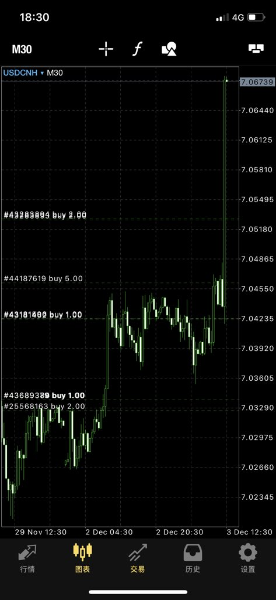

[12月05日 07:18]    BBC News 中文   @bbcchinese    有关事件也引发中国舆论对目前中国有严重缺陷的拘押制度与基本人权的反思。 https://bbc.in/2sLWf9A   :speech_balloon:评:15 :+1:赞:23 :globe_with_meridians:转:10  

[12月05日 06:26]    墙国铁拳现世报😷   @Socialistfist    为了实地考察并认真调研总书记任内打击腐败取得的骄人成绩，王立民书记主动要求到狱中体验贪腐分子的日常
什么是学者的钻研精神，小编哭了，你呢？

#社会主义铁拳  :speech_balloon:评:5 :+1:赞:61 :globe_with_meridians:转:18  

[12月05日 05:34]    新闻大吐槽   @TuCaoFakeNews    压垮白马的王子
手下的马都不敢比他的马白！白的估计也要图灰  :speech_balloon:评:5 :+1:赞:35 :globe_with_meridians:转:3  

[12月05日 05:22]    新闻大吐槽   @TuCaoFakeNews    联航竟然不与本国警察一起合谋，用勒索罪把他抓起来，实在是太弱鸡了 https://twitter.com/h1300062810/status/1202251853125300224 …  :speech_balloon:评:1 :+1:赞:42 :globe_with_meridians:转:12  

[12月04日 22:59]    BBC News 中文   @bbcchinese    许多艺术家将自己的作品视为生命，甚至为艺术献身。而发生在加拿大女艺术家吉莉安•格恩瑟身上的事情似乎真的让她为自己的作品而献身了。 https://bbc.in/3511jF2   :speech_balloon:评:9 :+1:赞:51 :globe_with_meridians:转:19  

[12月04日 22:07]    财经真相   @caijingxiang    日本又拍了一个中国现状的纪录片《光棍儿》，为啥中国现实深刻的事都是日本人拍，中国的媒体难道只会歌功颂德，厉害了我的国！  :speech_balloon:评:37 :+1:赞:319 :globe_with_meridians:转:102  

[12月04日 21:59]    BBC News 中文   @bbcchinese    最新实验显示，狗狗能判断出某人是否可信。一旦它认为某人不可信，它就会……忽略此人提供的线索。
 https://bbc.in/2OMI4JW   :speech_balloon:评:19 :+1:赞:83 :globe_with_meridians:转:21  

[12月04日 21:06]    BBC News 中文   @bbcchinese    BBC所做的一项调查显示，英国超过三分之一的年轻女性在性生活中经历不同程度的性暴力，有些甚至身亡，不容忽视。 https://bbc.in/2sMJrzT   :speech_balloon:评:22 :+1:赞:60 :globe_with_meridians:转:24  

[12月04日 20:19]    新闻大吐槽   @TuCaoFakeNews    港共官员：烧烤产生二噁英远高于催泪弹！
目前不宜公开催泪弹成分，因要避免影响警方的行动能力！

潜台词：调查！调查！给你们派发福利还不知足？！
又如典故新译：百姓无烧烤充饥，何不食催泪弹？  :speech_balloon:评:27 :+1:赞:231 :globe_with_meridians:转:112  

[12月04日 20:19]    新闻大吐槽   @TuCaoFakeNews    港共官员：烧烤产生二噁英远高于催泪弹！
目前不宜公开催泪弹成分，因要避免影响警方的行动能力！

潜台词：调查！调查！给你们派发福利还不知足？！
又如典故新译：百姓无烧烤充饥，何不食催泪弹？  :speech_balloon:评:27 :+1:赞:231 :globe_with_meridians:转:112  

[12月04日 20:06]    财经真相   @caijingxiang    学到了一个新的英文单词“overtake”意味“颠覆”！  :speech_balloon:评:29 :+1:赞:276 :globe_with_meridians:转:71  

[12月04日 20:01]    BBC News 中文   @bbcchinese    【同性恋和异性恋一同庆祝 犹太人性少数节日巴特米瓦】犹太人性少数节日巴特米瓦，在庆典中会有打扮突出的舞蹈员表演。当舞蹈员在街上时，途人都在注视他，觉得不被接纳。 https://bbc.in/2LlitFY   :speech_balloon:评:4 :+1:赞:22 :globe_with_meridians:转:5  

[12月04日 19:06]    BBC News 中文   @bbcchinese    台湾中國國民黨副主席郝龙斌赴香港为韩国瑜造势，為何低調？ https://bbc.in/2PgFUkC   :speech_balloon:评:6 :+1:赞:16 :globe_with_meridians:转:6  

[12月04日 18:30]    纽约时报中文网   @nytchinese    时报影评人@ManohlaDargis 和@aoscott的十年十佳电影清单 http://nyti.ms/35TOfl9   :speech_balloon:评:4 :+1:赞:3 :globe_with_meridians:转:4  

[12月04日 18:06]    财经真相   @caijingxiang    胡锡进“我预计中美接下来几小时内公布达成协议”，这条推特太扯淡，更扯淡的是市场竟然“计价”了！ https://twitter.com/HuXijin_GT/status/1202162573212209154 …  :speech_balloon:评:73 :+1:赞:233 :globe_with_meridians:转:36  

[12月04日 17:43]    新闻大吐槽   @TuCaoFakeNews    除了客观上，警察有很多大陆公安冒充，消防员都是香港本地人，导致的区别之外；
我们还要检讨共党的机制在把人搞坏，以及其邪恶的洗脑术  :speech_balloon:评:5 :+1:赞:78 :globe_with_meridians:转:14  

[12月04日 17:30]    纽约时报中文网   @nytchinese    《解放，梅拉尼娅》没对书名中的逗号做解释，也没对特朗普13岁儿子巴伦进行任何讨论，仅把他当成影响其母亲做决定的一个因素。（贝内特写道，“我不认为出生在公众人物家庭的孩子理应成为公众密切关注的对象。”）
但这本书确实能让我们深入了解第一夫人的生活、想法和人际关系。 http://nyti.ms/2rR8zEX   :speech_balloon:评:3 :+1:赞:3 :globe_with_meridians:转:1  

[12月04日 17:01]    BBC News 中文   @bbcchinese    中国在近四次评估当中有三次排在首位，这说明了什么？ https://bbc.in/2rSzwrQ   :speech_balloon:评:122 :+1:赞:135 :globe_with_meridians:转:41  

[12月04日 17:00]    纽约时报中文网   @nytchinese    美国众议院情报委员会周二发布了一份弹劾报告，总结了迄今为止的弹劾调查，指责特朗普试图在明年总统竞选中寻求乌克兰的帮助，并通过掩盖事实来阻碍国会的调查。
以下是该报告的五个要点： http://nyti.ms/365cdd1   :speech_balloon:评:5 :+1:赞:21 :globe_with_meridians:转:6  

[12月04日 16:35]    新闻大吐槽   @TuCaoFakeNews    据说孟晚舟自己说，她正在加拿大悠哉悠哉的进行油画创作！
你觉得她应该画一幅什么主题的油画？  :speech_balloon:评:12 :+1:赞:35 :globe_with_meridians:转:8  

[12月04日 16:35]    新闻大吐槽   @TuCaoFakeNews    据说孟晚舟自己说，她正在加拿大悠哉悠哉的进行油画创作！
你觉得她应该画一幅什么主题的油画？  :speech_balloon:评:12 :+1:赞:35 :globe_with_meridians:转:8  

[12月04日 16:30]    纽约时报中文网   @nytchinese    特朗普称将对法国某些出口商品征收最高100%的关税，这是他的政府在周一结束的一项正式贸易调查中提出的。这是为了回应法国针对在线经济活动征收的新税，该新税将打击亚马逊和Facebook等美国巨头。
特朗普政府已威胁采取类似行动，回应意大利、土耳其和奥地利推进的数字服务税。 http://nyti.ms/34MTva9   :speech_balloon:评:4 :+1:赞:13 :globe_with_meridians:转:3  

[12月04日 16:29]    新闻大吐槽   @TuCaoFakeNews    TikTok又在美国撞墙，一加州女生状告TikTok侵犯个人隐私！
因TikTok未经用户许可就偷偷用相册里的剪辑生成视频  :speech_balloon:评:13 :+1:赞:349 :globe_with_meridians:转:151  

[12月04日 16:29]    新闻大吐槽   @TuCaoFakeNews    TikTok又在美国撞墙，一加州女生状告TikTok侵犯个人隐私！
因TikTok未经用户许可就偷偷用相册里的剪辑生成视频  :speech_balloon:评:13 :+1:赞:349 :globe_with_meridians:转:151  

[12月04日 16:00]    纽约时报中文网   @nytchinese    #观点 中国预计也会利用台湾政治的软肋：掌权者和支持者的互惠网络。虽然这些网络如今已不像在台湾威权统治时期那么重要，但它们继续听任社区领导人。
社交媒体平台是另一个关键战场：台湾近90%的人口活跃在社交媒体平台上，传统新闻媒体也曾在没核实的情况下转发过虚假帖子。 http://nyti.ms/2Y9wBXQ   :speech_balloon:评:4 :+1:赞:9 :globe_with_meridians:转:5  

[12月04日 15:30]    纽约时报中文网   @nytchinese    随着有关他去世的报道传开，成千上万的粉丝周二在车璌河Instagram照片下发表评论。一人写道：“很遗憾我们在2019年又失去了一个人。”
车仁河的去世正值两位著名K-pop女星去世不久之后——雪莉和具荷拉在相隔六周的时间里相继结束了自己的生命，暴露了成为K-pop偶像痛苦的一面。 http://nyti.ms/2DGozw3   :speech_balloon:评:0 :+1:赞:1 :globe_with_meridians:转:1  

[12月04日 15:01]    BBC News 中文   @bbcchinese    当韩星具荷拉被男友偷偷拍下视频的时候，具荷拉公开发起反抗，试图寻求公义，而为此她在网络上受到大量恶意攻击。最后具荷拉去世，警方称其为自杀。

珍惜生命，自杀不能解决问题，生命一定可以找到出路。若须谘商或相关协助，请电：
中国大陆（+86）：防自杀热线4001619995 https://bbc.in/2P971yg   :speech_balloon:评:23 :+1:赞:104 :globe_with_meridians:转:32  

[12月04日 15:00]    纽约时报中文网   @nytchinese    《伦敦生活》、《大祸临头》、《继承之战》、《副总统》、《记录进行时》......时报剧评人选出了2019年度的最佳剧集和优质的完结剧集，其中亦不乏跨国制作的剧集，这里是一份清单： http://nyti.ms/2r0lvZf   :speech_balloon:评:3 :+1:赞:22 :globe_with_meridians:转:9  

[12月04日 14:30]    纽约时报中文网   @nytchinese    科技产品送礼指南：如何避免踩雷 by @bxchen http://nyti.ms/33LMWDj   :speech_balloon:评:1 :+1:赞:5 :globe_with_meridians:转:1  

[12月04日 14:11]    纽约时报中文网   @nytchinese    “在某种程度上，我想要等到选举之后再与中国达成贸易协定，“特朗普在与北约秘书长会晤时表示。“但他们要现在就达成协定，我们会考虑协定是不是合适。必须合适才行。”
他还对北约盟国发出关税威胁。欧美股市应声下跌。分析认为，拖延对华贸易协议可以给特朗普带来政治利益。 http://nyti.ms/34MTva9   :speech_balloon:评:16 :+1:赞:76 :globe_with_meridians:转:22  

[12月04日 14:01]    BBC News 中文   @bbcchinese    投出唯一反对票的是肯塔基州共和党众议院马希，他在香港人权法案上也投下了唯一的反对票。他认为美国没有做好制裁中国的准备。 https://bbc.in/2YdaLmp   :speech_balloon:评:165 :+1:赞:633 :globe_with_meridians:转:231  

[12月04日 14:00]    纽约时报中文网   @nytchinese    #观点 2019年不是1949年。70年前签署的北大西洋公约是为了对抗苏联的野心；没有人将采取类似措施来遏制中国的野心。
我预计这场新冷战会变得更冷，即使特朗普试图通过与中国达成贸易协议的形式来解冻。特朗普可能是制造这场大寒潮的催化剂，但冷战不是他可以想停就停的事情。 http://nyti.ms/2OKD9sY   :speech_balloon:评:11 :+1:赞:40 :globe_with_meridians:转:19  

[12月04日 13:40]    老司机   @h5lpykl7tp6jjop    一个老外对我说，你们中国人就是死脑筋，大一统干什么，分裂有什么不好？一下变成十个八个国家，在联合国投票一下多那么多票，有什么不好？我鼻涕泡都笑出来了！这种逆向思维中国人还真没有！  :speech_balloon:评:27 :+1:赞:358 :globe_with_meridians:转:63  

[12月04日 13:33]    老司机   @h5lpykl7tp6jjop    中国人常常自夸聪明，古有三十六计，今有厚黑学。其实西方的一句谚语始终没有学会：打不过对方就干脆加入对方。设想如果自建国以来就不与美国为敌，就不会有韩战，不会遭制裁几十年，不会饿死几千万，不会文革，也就不存在改开，不会在国际上混成孤家寡人，坏就坏在总想另立山头当老大又没有这个本事上  :speech_balloon:评:5 :+1:赞:37 :globe_with_meridians:转:18  

[12月04日 13:30]    纽约时报中文网   @nytchinese    “梅拉尼娅是特朗普生活轨道里唯一一个可以甩开他的手也不会受到惩罚的人，”白宫记者贝内特写道。“她是唯一一个能当着他的面说出自己想法的人。” 
梅拉尼娅与特朗普分房而居；她与伊万卡关系微妙；她的穿衣打扮皆有深意……贝内特在传记中分享了对第一夫人生活的观察和看法。 http://nyti.ms/2rR8zEX   :speech_balloon:评:12 :+1:赞:36 :globe_with_meridians:转:8  

[12月04日 13:08]    新闻大吐槽   @TuCaoFakeNews    赤裸裸的威胁！
大红龙的羽翼下，只有中国人的枯骨！ https://twitter.com/PDChinese/status/1201954674510839808 …  :speech_balloon:评:12 :+1:赞:64 :globe_with_meridians:转:15  

[12月04日 13:05]    老司机   @h5lpykl7tp6jjop    1882年美国签署了排华法案，137年过去了，中国人真有本事，让美国又签下了两个有关针对中国香港和新疆的法案，全世界没有任何国家有此殊荣！我就不明白为什么中国就这么特别呢？要说美国对中国不好？从退还庚子赔款到抗日战争的大量援助支持，还让进WTO赚到钱，怎么这么讨人嫌呢，天朝真是个特殊群体？  :speech_balloon:评:26 :+1:赞:367 :globe_with_meridians:转:96  

[12月04日 13:02]    BBC News 中文   @bbcchinese    在美国指控已故亿万富豪爱泼斯坦性虐待的数名女性说，英国安德鲁王子亲眼目睹了一些人在这名富豪性侵者家中接受按摩。 https://bbc.in/2RjhZDQ   :speech_balloon:评:15 :+1:赞:24 :globe_with_meridians:转:6  

[12月04日 13:00]    纽约时报中文网   @nytchinese    #每日一词 naysayer，反对者、爱唱反调的人。香港三支中资股闪崩背后，市场监管存在的历史问题进一步显现。
时报报道指出，现有的规定压制了那些反对者(naysayers)，他们本可能制止容易上当或过于踊跃的投资者。多重因素作用下，香港市场泡沫不断扩大。
更多简报内容： http://nyti.ms/2RjHx3B   :speech_balloon:评:4 :+1:赞:8 :globe_with_meridians:转:0  

[12月04日 12:36]    老司机   @h5lpykl7tp6jjop    中国人炼丹几千年也没出一个化学家，木匠干了几千年还是超不过鲁班，中医问症几千年也跳不出黄帝内经，哲学几千年不如春秋诸子百家，都二十一世纪科技大爆炸时代了，还向外输出孔子学院！面对祖宗羞也羞死了，现代生存需求那一样东西不是从别国偷学得来？每天说作为中国人无比自豪，不知道在自豪什么？  :speech_balloon:评:42 :+1:赞:824 :globe_with_meridians:转:215  

[12月04日 12:30]    纽约时报中文网   @nytchinese    27岁的韩国演员车璌河去世，他是韩国不到两个月内去世的第三名年轻艺人。他最近刚刚参演了新电视剧集《有瑕疵的人们》。
车璌河的死因和被发现地点尚不清楚。其所属的经济公司发表声明，并告诫人们不要猜测他去世的具体情况。 http://nyti.ms/2DGozw3   :speech_balloon:评:3 :+1:赞:13 :globe_with_meridians:转:2  

[12月04日 12:05]    老司机   @h5lpykl7tp6jjop    常常看到大陆的年轻人，找工作没有自信，追女孩没有胆量，学知识没有兴趣，一干活没有耐心，可一旦提起中国，忽然就有自信，一说起黄段子兴趣大到不行，一提起对外开战忽然就有胆量，一玩起游戏一下就有耐心了，就这样它们居然敢说香港上街爭民主自由的青年们是废青！真是不知身己废，隔墙犹自嗨！  :speech_balloon:评:60 :+1:赞:1563 :globe_with_meridians:转:423  

[12月04日 12:02]    BBC News 中文   @bbcchinese    许多北约的支持者一直坚持认为这个组织是历史上最卓有成效的军事组织，而近年来组织内一些主要成员如美国、法国和土耳其都对它提出批评，还出现内讧局面，再加上英国脱欧，北约70大寿如此低调，就显得耐人寻味。 https://bbc.in/2OKJqoy   :speech_balloon:评:35 :+1:赞:70 :globe_with_meridians:转:19  

[12月04日 12:00]    纽约时报中文网   @nytchinese    全球污染程度可视化：2015年，全球约有420万人死于污染，其中大多集中在东亚和南亚。还有数百万人因呼吸不干净的空气而生病。时报编制了一张图表，显示了世界各地不同城市的污染情况。
北京在实施污染控制后，空气质量有所改善，但距离“蓝天标准”仍有很大距离。更多简报内容： http://nyti.ms/2RjHx3B   :speech_balloon:评:3 :+1:赞:12 :globe_with_meridians:转:2  

[12月04日 11:41]    老司机   @h5lpykl7tp6jjop    科学解释：为什么越是无知的人越自信？
随着阅历的增长，我们越懂得这样一个道理——不要和笨蛋争论。
因为，有科学研究证明：笨蛋是真的意识不到自己是笨蛋。
在幽默感、文字能力和逻辑能力上最欠缺的那部分人总是高估自己：当他们实际得分只有12%时，却认为自己的得分在60%以上！这就是“达克效应”。  :speech_balloon:评:7 :+1:赞:195 :globe_with_meridians:转:110  

[12月04日 11:30]    纽约时报中文网   @nytchinese    #观点 中美冲突以贸易战开始，双方在关税问题上针锋相对，同时对美国的贸易逆差和中国的知识产权盗窃问题争论不休，如今迅速演变为一系列其他方面的冲突。
技术战、意识形态对抗和迫在眉睫的货币战。第二次冷战已经开始。 http://nyti.ms/2OKD9sY   :speech_balloon:评:47 :+1:赞:277 :globe_with_meridians:转:115  

[12月04日 11:07]    纽约时报中文网   @nytchinese    朝鲜兜售新度假村，试图削弱联合国制裁影响。该国官方媒体周二报道称，金正恩出席了中朝边境附近三池渊郡一家新度假村的剪彩仪式。
朝鲜正在努力吸引外国游客，以打通为数不多的硬通货来源之一。
更多简报内容： http://nyti.ms/2RjHx3B   :speech_balloon:评:1 :+1:赞:3 :globe_with_meridians:转:4  

[12月04日 10:47]    BBC News 中文   @bbcchinese    俄罗斯总统普京签署新法律扩大在媒体中划定“外国代理”的范围。俄罗斯同美国展开针锋相对的信息战，与此同时中美间的媒体指责也有增无减。 https://bbc.in/34NwgN4   :speech_balloon:评:7 :+1:赞:17 :globe_with_meridians:转:6  

[12月04日 10:30]    纽约时报中文网   @nytchinese    越来越多的科学家和人权活动家表示，中国政府正在利用国际科学界的开放性，将人类基因组研究用于可疑目的。
中国已经在探索用人脸识别技术将人按民族进行分类。它还研究如何用DNA分别一个人是否是维吾尔族。 http://nyti.ms/34KH5Q7   :speech_balloon:评:14 :+1:赞:32 :globe_with_meridians:转:9  

[12月04日 10:29]    纽约时报中文网   @nytchinese    简报：中国收集维吾尔人DNA；特朗普称中美谈判或推迟 http://nyti.ms/2RjHx3B https://twitter.com/ccni/status/1202045637447036934 …  :speech_balloon:评:4 :+1:赞:8 :globe_with_meridians:转:2  

[12月04日 09:52]    纽约时报中文网   @nytchinese    早安！今日重点新闻包括：
中国收集维吾尔人DNA； 特朗普暗示中美贸易谈判或推迟，引发市场动荡；北约纪念成立70周年，特朗普与马克龙分歧不断；美众议院情报委员会发布弹劾调查报告；全球污染程度可视化地图……NYT简报带你速览今日要闻。 http://nyti.ms/2RjHx3B   :speech_balloon:评:13 :+1:赞:49 :globe_with_meridians:转:19  

[12月04日 09:46]    财经真相   @caijingxiang    一条被忽视的重磅新闻！12月3日，全国市域社会治理现代化工作会议在北京京西宾馆召开，面向全国、所有地市都有机会参与的市域社会治理现代化试点工作，第一期从2020年至2022年。会议指针对社会矛盾形成、演变特点，关键是要发挥体制优势，推动关口前移、重心下移，努力使市域成为社会矛盾的“终点站”。  :speech_balloon:评:60 :+1:赞:324 :globe_with_meridians:转:166  

[12月04日 09:30]    纽约时报中文网   @nytchinese    不知名的品牌的电源配件、“智能”厨房设备、便宜的平板电脑、没人光顾的商店礼品卡……我们归纳了通常会被作为礼物的最糟糕的科技产品，同时推荐更优质的替代选择。
这份指南防止你购买最终会被扔到垃圾堆里的礼物，引导你购买会给至亲之人带来欣喜的礼物。 http://nyti.ms/33LMWDj   :speech_balloon:评:4 :+1:赞:25 :globe_with_meridians:转:10  

[12月04日 09:29]    财经真相   @caijingxiang    隔夜全球市场暴跌，而贸易战受害最大的中国，今天开盘a50竟然还小幅涨，现在已经不是护盘的问题了，因为散户已经被暴跌市场吓跑了，现在是谁护盘呢？  :speech_balloon:评:56 :+1:赞:481 :globe_with_meridians:转:81  

[12月04日 09:27]    新闻大吐槽   @TuCaoFakeNews    这些人的生命被剥夺了多少个251天？ https://twitter.com/truthmediachn/status/1201647231868252160 …  :speech_balloon:评:4 :+1:赞:51 :globe_with_meridians:转:34  

[12月04日 09:27]    新闻大吐槽   @TuCaoFakeNews    这些人的生命被剥夺了多少个251天？ https://twitter.com/truthmediachn/status/1201647231868252160 …  :speech_balloon:评:4 :+1:赞:51 :globe_with_meridians:转:34  

[12月04日 09:17]    新闻大吐槽   @TuCaoFakeNews    共产党来之前的香港警察 VS 共党来之后的香港警察  :speech_balloon:评:18 :+1:赞:398 :globe_with_meridians:转:200  

[12月04日 09:17]    新闻大吐槽   @TuCaoFakeNews    共产党来之前的香港警察 VS 共党来之后的香港警察  :speech_balloon:评:18 :+1:赞:398 :globe_with_meridians:转:200  

[12月04日 09:06]    新闻大吐槽   @TuCaoFakeNews    现在知道为什么那天香港站台上，镜头要躲开着火男子2秒钟了吧？

因为能迅速扑灭身上火焰的手法是很专业的！一旦拍到就穿帮！ https://twitter.com/cindywei2017/status/1201931583273480197 …  :speech_balloon:评:4 :+1:赞:162 :globe_with_meridians:转:103  

[12月04日 09:06]    新闻大吐槽   @TuCaoFakeNews    现在知道为什么那天香港站台上，镜头要躲开着火男子2秒钟了吧？

因为能迅速扑灭身上火焰的手法是很专业的！一旦拍到就穿帮！ https://twitter.com/cindywei2017/status/1201931583273480197 …  :speech_balloon:评:4 :+1:赞:162 :globe_with_meridians:转:103  

[12月04日 08:19]    老司机   @h5lpykl7tp6jjop    突发新闻：美国国会《维吾尔人权政策法案》，通过了！！！  :speech_balloon:评:206 :+1:赞:3809 :globe_with_meridians:转:1232  

[12月04日 06:23]    新闻大吐槽   @TuCaoFakeNews    端正的五官，大大的眼睛，印尼记者年轻时也一定是个美女，可一朝遭到警暴，右眼永久失明，可能终生要与眼罩为伴。

而港府拒绝她对警方提起的公诉，阻止正义的伸张，她好似走上与天朝一样的漫漫上访路！

依仗黑警，罩着黑警，人民就得不到公平  :speech_balloon:评:30 :+1:赞:700 :globe_with_meridians:转:395  

[12月04日 05:39]    新闻大吐槽   @TuCaoFakeNews    昨晚，很多市民在一处连侬墙下摆上蜡烛，纪念周梓乐同学。

可破坏者报警说有火灾风险，随后消防员被派来现场。

消防员虽然接到命令不得不执行，可从他们小心翼翼，轻灭蜡烛的动作上看得出，他们对为自由牺牲的英灵，抱有尊重！  :speech_balloon:评:70 :+1:赞:1960 :globe_with_meridians:转:743  

[12月04日 05:39]    新闻大吐槽   @TuCaoFakeNews    昨晚，很多市民在一处连侬墙下摆上蜡烛，纪念周梓乐同学。

可破坏者报警说有火灾风险，随后消防员被派来现场。

消防员虽然接到命令不得不执行，可从他们小心翼翼，轻灭蜡烛的动作上看得出，他们对为自由牺牲的英灵，抱有尊重！  :speech_balloon:评:70 :+1:赞:1960 :globe_with_meridians:转:743  

[12月03日 23:30]    BBC News 中文   @bbcchinese    每天清晨，当位于哥伦比亚与委内瑞拉边境的西蒙玻利瓦尔大桥的围栏被缓缓移开，通宵排队的委內瑞拉民众就像冲出起跑线的运动员一样涌向大桥。 https://www.bbc.com/zhongwen/resources/idt-sh/venezuela_bridge_chinese …  :speech_balloon:评:5 :+1:赞:23 :globe_with_meridians:转:10  

[12月03日 22:59]    BBC News 中文   @bbcchinese    二战爆发前纳粹在奥地利加紧迫害犹太人，妈妈只身逃亡英国，为什么把14岁的儿子留在维也纳？他后来经历了什么？ https://bbc.in/33Nauro   :speech_balloon:评:0 :+1:赞:72 :globe_with_meridians:转:35  

[12月03日 21:59]    BBC News 中文   @bbcchinese    当放射科医生用探头对凖法威尔的肚子开始检查时，眼里充满惊恐。与此同时，躺在检查床的法威尔也开始恐慌，感觉大事不好。 https://bbc.in/2RfSqDS   :speech_balloon:评:35 :+1:赞:61 :globe_with_meridians:转:21  

[12月03日 20:59]    BBC News 中文   @bbcchinese    许多人到日本的第一印象是非常干净。街面上很难找到垃圾桶仍垃圾。日本一尘不染的秘诀到底是什么呢？ https://bbc.in/2OHRqGO   :speech_balloon:评:43 :+1:赞:270 :globe_with_meridians:转:84  

[12月03日 20:05]    BBC News 中文   @bbcchinese    【香港示威：香港人的身份认同危机】香港因反对修订《逃犯条例》引发的抗议浪潮已经持续近六个月。

这期间，暴力冲突不断升级，香港社会严重撕裂：示威者和警察之间的冲撞越来越激烈；大陆人和香港人之间的对立越来越明显；甚至，家庭成员之间也因立场差异最终反目。 https://bbc.in/2Y6ETzB   :speech_balloon:评:51 :+1:赞:80 :globe_with_meridians:转:21  

[12月03日 19:01]    BBC News 中文   @bbcchinese    电影《送我上青云》在公映引起关注，被称为中国近年来最重要的女性电影。导演滕丛丛尝试跳出中国电影对女性的刻板印象，聚焦都市独立女性和她们面对的人生迷茫，不再只是周旋在婆媳或妯娌关系中。 https://bbc.in/2rav9bz   :speech_balloon:评:15 :+1:赞:33 :globe_with_meridians:转:13  

[12月03日 18:59]    墙国铁拳现世报😷   @Socialistfist    两位推友匿名私信回应  :speech_balloon:评:12 :+1:赞:120 :globe_with_meridians:转:14  

[12月03日 18:58]    墙国铁拳现世报😷   @Socialistfist    党员推友后续来信  :speech_balloon:评:10 :+1:赞:53 :globe_with_meridians:转:4  

[12月03日 18:32]    财经真相   @caijingxiang    CNBC：川普说最好2020年大选结果出来后再达成协议，该消息让离岸人民币瞬间暴走！  :speech_balloon:评:20 :+1:赞:337 :globe_with_meridians:转:102  

[12月03日 18:28]    财经真相   @caijingxiang    消息公布后，离岸人民币扩大跌幅，黄金、日元跳涨！开始了！ https://twitter.com/cnbc/status/1201809520751783936 …  :speech_balloon:评:19 :+1:赞:556 :globe_with_meridians:转:148  

[12月03日 18:22]    墙国铁拳现世报😷   @Socialistfist    曾经中国最年轻的省区首府市市长之一
坚决支持铁腕新疆政策，党内仕途看好
到头来也是落个 “生活奢靡，贪图享乐，道德败坏，搞权色交易”的无期徒刑
刚从俄罗斯和副总理韩正考察回来,就被从首都机场带走。  :speech_balloon:评:34 :+1:赞:428 :globe_with_meridians:转:136  

[12月03日 17:01]    BBC News 中文   @bbcchinese    香港航空财政困难消息传出多天后，母公司海航集团近日宣布获得贷款，但能否让这家香港少数非国泰系的公司延续业务仍是未知数。 https://bbc.in/2RgIlWX   :speech_balloon:评:15 :+1:赞:27 :globe_with_meridians:转:12  

[12月03日 16:58]    老司机   @h5lpykl7tp6jjop    街头惊现"喪盡天良，還我器官……"条幅！生活在这样一个国家，别说你去保护家人和财产，你连自已的器官和小命都保不住，随时被活摘被消失……这样的社会不推倒重来，还有啥活头？  :speech_balloon:评:15 :+1:赞:525 :globe_with_meridians:转:312  

[12月03日 16:36]    BBC News 中文   @bbcchinese    《华尔街日报》说，这个价值550亿美元的天然气管道项目是俄中伙伴关系的证明，对美国的经济和战略影响构成挑战。 https://bbc.in/2DLsM1v   :speech_balloon:评:51 :+1:赞:52 :globe_with_meridians:转:18  

[12月03日 12:45]    老司机   @h5lpykl7tp6jjop    好文分享：

“爱国人士”的困惑：不是说中国已成大赢家吗？  :speech_balloon:评:2 :+1:赞:67 :globe_with_meridians:转:26  

[12月03日 12:35]    新闻大吐槽   @TuCaoFakeNews    从湖南来广州务工的老石骑着电单车，载着要奉子成婚的儿子骑行在街上，突然地面凹陷，他们跌入了深坑！然而等待他们的不是救援，而是狠心的回填，借口是害怕更大的地陷发生！

儿媳喻妮亲眼目睹一切，而新华网报道却称投入千人抢救，只字不提回填；
现在，抱着1月大女儿，她不知如何给亲人举办葬礼！  :speech_balloon:评:111 :+1:赞:1004 :globe_with_meridians:转:746  

[12月03日 12:26]    老司机   @h5lpykl7tp6jjop    南博万呀，南博万呀，多么流弊地南博万！偶们唱歌，偶们跳舞，介么多地南博万！  :speech_balloon:评:9 :+1:赞:204 :globe_with_meridians:转:118  

[12月03日 10:35]    财经真相   @caijingxiang    海航控股同意公司与以国开行为牵头行及代理行，以中国进出口银行、中国银行等为初始贷款人组成的银团签署《海航控股2019 年流动资金贷款联合授信项目人民币资金银团贷款合同》，向银团申请贷款共计40亿元（8 家银行各提供5亿元）。贷款期限为3年，前2年为宽限期。贷款利率为固定利率，即年利率4.75%。  :speech_balloon:评:23 :+1:赞:157 :globe_with_meridians:转:42  

[12月03日 10:10]    新闻大吐槽   @TuCaoFakeNews    去年，孟晚舟在加国被捕15天后，李洪元在深圳被捕！2个几乎同时发生的牢狱之灾，却充满了对比与讽刺！

昨天是孟晚舟被捕一周年，一年里，她时装、豪车、豪宅，过的如明星一般，却矫情发文称：经历了恐惧和痛苦，失望和无奈，煎熬和挣扎~

可知李这一年经历了什么？

制造痛苦的人，总嫌自己痛苦太多  :speech_balloon:评:47 :+1:赞:977 :globe_with_meridians:转:429  

[12月03日 08:23]    老司机   @h5lpykl7tp6jjop    好消息！

中共国各地方银行全面跌破发行价，目前有20多家上市银行面临破产。  :speech_balloon:评:82 :+1:赞:1111 :globe_with_meridians:转:489  

[12月03日 04:58]    老司机   @h5lpykl7tp6jjop    全球还有三分之二的人民没有得到解放哦！要不要去比尔盖茨家推销一下社保呀？既然专业搞传销就该全世界都铺开嘛，气魄还不够大！  :speech_balloon:评:3 :+1:赞:42 :globe_with_meridians:转:2  

[12月03日 04:57]    老司机   @h5lpykl7tp6jjop    @听字多一点 
1967年夏  裹着红卫兵战旗的重庆武斗的一派死难者的尸体  :speech_balloon:评:6 :+1:赞:38 :globe_with_meridians:转:25  

[12月03日 00:55]    墙国铁拳现世报😷   @Socialistfist    一位推友的来信
欢迎理性讨论  :speech_balloon:评:194 :+1:赞:296 :globe_with_meridians:转:29  

[12月03日 00:02]    财经真相   @caijingxiang    罗斯说如果12月15号前，中美达不成第一阶段的协议，将提高关税!消息公布日元、黄金避险资产上涨，美股跳水，恐慌指数VIX短线走高，离岸人民币小幅走低！  :speech_balloon:评:10 :+1:赞:220 :globe_with_meridians:转:63  

[12月02日 23:05]    财经真相   @caijingxiang    华为正式回应：“支持李洪元运用法律武器”，语气可以说霸气外露，这样的语气不是冲李洪元去的，他只是一个小棋子，而是回应故意让新闻不时蹦出来的那帮人，这些人的能力不容小觑，他们完全可以在不断删新闻的背景下，继续让虎嗅网大胆的发新闻，而且还操控整个微博热点，甚至通过外交系统“借美国人的刀” https://twitter.com/caijingxiang/status/1201075431123763200 …  :speech_balloon:评:8 :+1:赞:126 :globe_with_meridians:转:40  

[12月02日 23:05]    墙国铁拳现世报😷   @Socialistfist    补充  :speech_balloon:评:8 :+1:赞:256 :globe_with_meridians:转:57  

[12月02日 22:53]    墙国铁拳现世报😷   @Socialistfist    华为251事件在微博上引起热烈讨论，不少贸易战时脑热购买华为手机的粉红一夜间大有幡然醒悟之感。
爱国爱党情怀还能消费多久？
#社会主义铁拳  :speech_balloon:评:74 :+1:赞:858 :globe_with_meridians:转:292  

[12月02日 22:35]    财经真相   @caijingxiang    来猜猜，“枪杆子”对“钱袋子、刀把子、海外大外宣以及外交系统，这胜算有多大？ https://twitter.com/caijingxiang/status/1201507785998946306 …  :speech_balloon:评:20 :+1:赞:181 :globe_with_meridians:转:29  

[12月02日 22:25]    财经真相   @caijingxiang    习近平主席令新闻联播前被临时取消，如果这事属实，那将是北京高层的一场重大地震！  :speech_balloon:评:135 :+1:赞:965 :globe_with_meridians:转:183  

[12月02日 21:28]    财经真相   @caijingxiang    这个是算的政治账，不是经济账，试想如果俄罗斯换成美国，现在香港法案通过背景下，这样一条输气管道岂不成了制裁对象！ https://twitter.com/RFA_Chinese/status/1201490172203827212 …  :speech_balloon:评:10 :+1:赞:40 :globe_with_meridians:转:10  

[12月02日 20:11]    老司机   @h5lpykl7tp6jjop    RT "Two female Hongkongers sing "glory to Hong Kong" on the street. See how people responses. I Can't stop crying." [This video has no English subtitles, we believe there is no need to add them.] #StandWithHK https://twitter.com/feichi1978/status/1201142329710534657 …  :speech_balloon:评:1 :+1:赞:55 :globe_with_meridians:转:25  

[12月02日 19:38]    财经真相   @caijingxiang    网传不知真假，求证！  :speech_balloon:评:20 :+1:赞:78 :globe_with_meridians:转:14  

[12月02日 18:40]    财经真相   @caijingxiang    要声明的是，本人水平有限，真的看不懂央行的资产负债表，不知是否有哪位高人，能够用人听得懂的话，把这里面的道理简单说明一下！  :speech_balloon:评:21 :+1:赞:101 :globe_with_meridians:转:10  

[12月02日 18:38]    财经真相   @caijingxiang    商业银行接受的贷款超过其存款时，一般有两个办法补充其缺口，一个是找其他银行借款，这个被称之为同业拆借，另一个就是找央行借，因为只有央行才能印钞，找央行借体现在央行负债表上就是“对其他存款性公司债权”，截止10月份央行对全体中国商业银行放贷总共是10.43万亿，这点钱根本对不上缺口！  :speech_balloon:评:5 :+1:赞:120 :globe_with_meridians:转:23  

[12月02日 18:33]    财经真相   @caijingxiang    我们都知道商业银行最主要的业务就是吸收存款，然后加点利息放出贷款，自己是不能印钞的，只有央行才行。根据央行公布的数据，2019年10月中国商行存款（准货币）为138.74万亿，但是放出的信贷却高达212.36万亿，这多出来的73.62万亿是哪来的？即使全体货币m2也就194.56万亿，也是不够！  :speech_balloon:评:38 :+1:赞:407 :globe_with_meridians:转:180  

[12月02日 15:36]    财经真相   @caijingxiang    中国外交部：针对美方执意将所谓“香港人权与民主法案”签署成法的无理行为，中国政府决定：自即日起，暂停审批美军舰机赴港休整申请，同时对美国国家民主基金会等非政府组织实施制裁。 美国民主基金会制裁？有人会因此丢掉饭碗吗？  :speech_balloon:评:64 :+1:赞:513 :globe_with_meridians:转:108  

[12月02日 14:14]    老司机   @h5lpykl7tp6jjop    睁着眼睛说瞎话，闭着眼睛也一样，反正都是瞎话！  :speech_balloon:评:3 :+1:赞:42 :globe_with_meridians:转:18  

[12月02日 13:37]    财经真相   @caijingxiang    随着黄淮以南地区的快速升温，来自印度洋地区的暖湿气流活跃度增强，其输送水汽的能力要比12月、1月时要强很多，在冷暖空气激烈碰撞下，往往会带来大范围的降雪，这也是黄淮、华北地区2月份降雪比一年当中任何时候都大的原因。另外降雪也延缓了这些地区春季到来步伐，导致春季比其他季节都短！  :speech_balloon:评:1 :+1:赞:37 :globe_with_meridians:转:8  

[12月02日 13:26]    财经真相   @caijingxiang    倒春寒不仅是北美的独有天气特征，以中国为核心的东亚地区也很常见，只是时间上稍微有点晚，一般是发生在二月至三月上旬，这时中国南部地区开始步入春季，气温逐渐升温，但是在蒙古和西伯利亚地区由于被积雪覆盖，气温回升较慢，南北气温差价达到一定程度，就会引发冷空气南下，形成倒春寒！  :speech_balloon:评:4 :+1:赞:64 :globe_with_meridians:转:14  

[12月02日 12:59]    老司机   @h5lpykl7tp6jjop    重庆轻轨桥断了！断是断了，但不能说是断了，因为官方媒体的说法是叫“垂直错位"！不要脸也要改成停止面子工程吗？  :speech_balloon:评:178 :+1:赞:2446 :globe_with_meridians:转:1258  

[12月02日 11:40]    老司机   @h5lpykl7tp6jjop    广东雨伞运动？听不清喊的什么口号。  :speech_balloon:评:97 :+1:赞:1320 :globe_with_meridians:转:523  

[12月02日 10:29]    老司机   @h5lpykl7tp6jjop    一个老外说，中国没有真正的爱国者！只看见一群想捞好处的家伙和傻子！从流行清宫戏就可以看出，它们很容易习惯任何占领者，不是也把成吉思汗当成自己的英雄一样崇拜吗？从逻辑上看当初日本只是没有成功占领中国，如果日本人成功了，若干年以后它们一样跪拜天皇！它们就是一群奴才，只崇拜强权！我无语  :speech_balloon:评:11 :+1:赞:195 :globe_with_meridians:转:46  

[12月02日 10:12]    老司机   @h5lpykl7tp6jjop    中共官媒每天开口闭口就是党和国家，任何有点常识的人都知道，国家大过一党，所谓党不过就是一小撮臭味相投的人的组织，中国汉字解释，从尚从黑，本义：非公开、暗地里、私下，实际就是黑社会一样的东西！所以被人叫镰刀斧头帮，很确切！靠阴谋诡计耍流氓武力抢夺国家政权的一帮土匪不能称之为国家！  :speech_balloon:评:0 :+1:赞:34 :globe_with_meridians:转:6  

[12月02日 08:45]    墙国铁拳现世报😷   @Socialistfist    请各位推友注意上推安全 https://twitter.com/keepcnsecurity/status/1201167265804087296 …  :speech_balloon:评:3 :+1:赞:76 :globe_with_meridians:转:18  

[12月01日 18:05]    老司机   @h5lpykl7tp6jjop    网传:昨天，广元市交警在朝天门附近拦路执法，拦截收缴摩的，29岁摩的司机吴某持刀捅伤三名交警！  :speech_balloon:评:42 :+1:赞:284 :globe_with_meridians:转:136  

[12月01日 09:33]    墙国铁拳现世报😷   @Socialistfist    没想到昨天上了墙内头条的这位可怜人，也是社会主义铁拳击的受害人；

@Socialistfist  :speech_balloon:评:67 :+1:赞:428 :globe_with_meridians:转:103  

[11月30日 21:18]    墙国铁拳现世报😷   @Socialistfist    粉蚷战螂被小编挂以后，一个嘴硬的都没有。  :speech_balloon:评:26 :+1:赞:178 :globe_with_meridians:转:9  

[11月30日 08:30]    凡賽堤/FORSETI   @FecharCCP    CCP極權恐怖組織把人民的血汗錢都用在的網絡維穩上了，圈養了人類獨一無二的，人數達千萬的流氓殭屍網絡水軍，谷歌所有集團企業已經淪為CCP極權恐怖組織重要維穩工具了，從2018年google搜索郭文貴的8百萬到現在的360萬，郭媒體從2019年初的18000的全球排名到現在的27669排名，極權不滅，養老永無望！  :speech_balloon:评:0 :+1:赞:10 :globe_with_meridians:转:8  

[11月30日 07:23]    凡賽堤/FORSETI   @FecharCCP    推翻共产党！全民抗议！全民起义！唱响国际歌！起来不愿做奴隶的人们！起来全中国受苦受难的中华儿女！ https://twitter.com/breakup1984/status/1200411445940211714 …  :speech_balloon:评:0 :+1:赞:21 :globe_with_meridians:转:11  

[11月30日 07:19]    凡賽堤/FORSETI   @FecharCCP    人類史上最殘暴的CCP極權殺人恐怖組織正在用各種兇殘手段屠殺我們的同胞...................

CCP極權殺人恐怖組織在香港發射數以萬計的疑似帶有生化武器成份的非標準催淚彈，足以影響三代人的致癌可能！

CCP極權殺人恐怖組織在自己的土地上投放劇毒催淚彈意圖謀殺我們黃色種族同胞！  :speech_balloon:评:2 :+1:赞:29 :globe_with_meridians:转:24  

[11月30日 05:58]    凡賽堤/FORSETI   @FecharCCP    中共催泪弹成分化验结果出炉：山埃毒，也叫氰化钾，爆表！这已经不是镇压抗议者，而是赤裸裸的谋杀，包括对抗议者的生育都会造成影响！  https://twitter.com/SolomonYue/status/1200445644613140480 …  :speech_balloon:评:12 :+1:赞:293 :globe_with_meridians:转:252  

[11月30日 01:48]    墙国铁拳现世报😷   @Socialistfist    好一句“打得好”，但如果所有香港人都和他們一樣幸災樂禍，咁香港就真正被同化了  :speech_balloon:评:4 :+1:赞:102 :globe_with_meridians:转:8  

[11月30日 01:13]    墙国铁拳现世报😷   @Socialistfist    有推友说最近铁拳不够劲
小编一如既往地欢迎大家踊跃投稿
但有时候，无铁拳胜过假铁拳  :speech_balloon:评:7 :+1:赞:161 :globe_with_meridians:转:4  

[11月30日 01:09]    墙国铁拳现世报😷   @Socialistfist    补图  :speech_balloon:评:9 :+1:赞:137 :globe_with_meridians:转:22  

[11月30日 01:08]    墙国铁拳现世报😷   @Socialistfist    “打得好”

#社会主义铁拳  :speech_balloon:评:27 :+1:赞:251 :globe_with_meridians:转:58  

[11月30日 00:40]    墙国铁拳现世报😷   @Socialistfist    吼啊！ 
小编举双手赞同，一定滋磁捧场
不过要严正说明，我们是 社会主义 的生产者，我们只是 社会主义 的搬运工 https://twitter.com/Ray27809561/status/1196838238771531776 …  :speech_balloon:评:23 :+1:赞:270 :globe_with_meridians:转:28  

[11月29日 18:12]    墙国铁拳现世报😷   @Socialistfist    评论区一览  :speech_balloon:评:20 :+1:赞:302 :globe_with_meridians:转:54  

[11月29日 18:08]    墙国铁拳现世报😷   @Socialistfist    一个中国人没有被逼到绝路，谁想和石头撞。

#社会主义铁拳  :speech_balloon:评:140 :+1:赞:947 :globe_with_meridians:转:356  

[11月28日 08:19]    凡賽堤/FORSETI   @FecharCCP    幾個月來據不完全統計，CCP極權發動的黑警非法濫捕香港學生孩子以萬人計算，用各種兇殘手段屠殺的幾千人！

讓我們極度關注，傳播香港真相，盡可能的向全世界媒體以各種語言傳播，讓全世界的人看清CCP極權殺人恐怖組織納粹真相，才能真正的減少這些被非法秘密抓捕的香港學生孩子被殺害！天佑香港人！  :speech_balloon:评:44 :+1:赞:198 :globe_with_meridians:转:146  

[11月28日 08:06]    凡賽堤/FORSETI   @FecharCCP    幾個月以來，香港700萬人共同見證了CCP反人類的慘無人道的殘暴罪行！！！

這是千千萬萬的像這麼小的小朋友都親眼見證了CCP反人類的慘無人道的殘暴罪行！！！

天滅CCP！！！天滅極權！！！  :speech_balloon:评:0 :+1:赞:21 :globe_with_meridians:转:8  

[11月28日 07:48]    凡賽堤/FORSETI   @FecharCCP    美國總統川普宣布他已签署
《香港人权与民主法案》

《香港人权与民主法案》已經成功列入美國的法律！
期望美國能執行《香港人权与民主法案》對香港的黑警和淋症夜蛾進行制裁！  :speech_balloon:评:6 :+1:赞:36 :globe_with_meridians:转:19  

[11月28日 00:29]    墙国铁拳现世报😷   @Socialistfist    那两个字不会写
阿钟哥请你jiayou学中文
#战螂在推特  :speech_balloon:评:48 :+1:赞:285 :globe_with_meridians:转:41  

[11月27日 23:41]    墙国铁拳现世报😷   @Socialistfist    一个美国人向俄国人解释为什么说美国是一个真正言论自由的国家。
美国人说：“我可以走到白宫前，高喊让里根下地狱！”
俄国人很不以为然：“你这算什么，我也可以走到红场上高喊，让里根下地狱”！ https://twitter.com/jiayoubiss/status/1199703307943600128 …  :speech_balloon:评:24 :+1:赞:711 :globe_with_meridians:转:116  

[11月27日 22:46]    墙国铁拳现世报😷   @Socialistfist    哪里不自由？

#社会主义铁拳  :speech_balloon:评:42 :+1:赞:682 :globe_with_meridians:转:141  

[11月26日 01:01]    GFHG SDKM   @zyx_yny    Heading back to London. 

Thank you #HK for letting us share in your unforgettable victory.

香港人, 加油   :speech_balloon:评:2678 :+1:赞:21498 :globe_with_meridians:转:10175  

[11月24日 12:46]    GFHG SDKM   @zyx_yny    Very good to take some time@our from election observation to tell #JuniusHo in person that I was responsible for the revocation of his honorary doctorate from @AngliaRuskin #Sorrynotsorry  :speech_balloon:评:6939 :+1:赞:46271 :globe_with_meridians:转:27826  

[11月24日 08:10]    凡賽堤/FORSETI   @FecharCCP    呼籲請求共同挖掘所有有關香港發生的事，越全面越好，不同角度，越多越好，包括被暗地抓捕的人員，特別是CCP 派出的各種偽裝身份，包括變身變裝行兇的一點一滴都要挖掘出來，把CCP 的邪惡下三濫手段的真相毫無保留的曝光在全世界面前！世界公知公義才能真正挽救和保護香港人！希望懂視頻編輯配上中英文  :speech_balloon:评:3 :+1:赞:21 :globe_with_meridians:转:18  

[11月24日 08:07]    凡賽堤/FORSETI   @FecharCCP    人類史上最殘暴的CCP極權殺人恐怖組織正在用各種兇殘手段屠殺我們的同胞...................

CCP極權殺人恐怖組織超級納粹！超級殘暴！超級流氓！

人類到了全面消滅CCP極權殺人恐怖組織的時代！  :speech_balloon:评:5 :+1:赞:44 :globe_with_meridians:转:51  

[11月24日 08:04]    凡賽堤/FORSETI   @FecharCCP    人類史上最殘暴的CCP極權殺人恐怖組織正在用各種兇殘手段屠殺我們的同胞...................

CCP極權殺人恐怖組織超級納粹！  :speech_balloon:评:1 :+1:赞:41 :globe_with_meridians:转:34  

[11月24日 07:57]    凡賽堤/FORSETI   @FecharCCP    人類史上最殘暴的CCP極權殺人恐怖組織正在用各種兇殘手段屠殺我們的同胞...................

CCP極權殺人恐怖組織超級納粹！  :speech_balloon:评:6 :+1:赞:182 :globe_with_meridians:转:160  

[11月24日 07:37]    凡賽堤/FORSETI   @FecharCCP    人類史上最殘暴的CCP極權殺人恐怖組織正在用各種兇殘手段屠殺我們的同胞...................  :speech_balloon:评:1 :+1:赞:13 :globe_with_meridians:转:15  

[11月24日 07:28]    凡賽堤/FORSETI   @FecharCCP    CCP極權殺人恐怖組織正在用各種兇殘手段屠殺我們的同胞...................

視頻是CCP極權殺人恐怖組織在人流密集區投放巨量的不合格（不具國際標準）的化學毒氣催淚瓦斯彈 毒害我們的同胞！  :speech_balloon:评:0 :+1:赞:8 :globe_with_meridians:转:4  

[11月23日 11:14]    凡賽堤/FORSETI   @FecharCCP    CCP極權殺人恐怖組織是全人類的公敵！
呼籲全世界正道主義合力消滅CCP！
呼籲全世界人民看清楚CCP反人類的慘無人道的殘暴罪行！！！

消滅CCP是全世界全人類的當前最緊急任務！！！

視頻是CCP瘋狂屠殺香港學生畫面之一  :speech_balloon:评:4 :+1:赞:10 :globe_with_meridians:转:15  

[11月23日 11:08]    凡賽堤/FORSETI   @FecharCCP    凡是罔顧香港事實在推特和youtube上支持CCP和香港黑警的五毛必死全家，有朝一日必死於CCP的殺人恐怖組織之下，起底五毛祖宗十八代世代不得為人！  :speech_balloon:评:4 :+1:赞:6 :globe_with_meridians:转:1  

[11月23日 11:02]    凡賽堤/FORSETI   @FecharCCP    CCP極權殺人恐怖組織是全人類的公敵！
呼籲全世界正道主義合力消滅CCP！
呼籲全世界人民看清楚CCP反人類的慘無人道的殘暴罪行！！！

消滅CCP是全世界全人類的當前最緊急任務！！！

視頻是深夜被CCP黑警暗殺的少女！  :speech_balloon:评:1 :+1:赞:6 :globe_with_meridians:转:12  

[11月23日 10:59]    凡賽堤/FORSETI   @FecharCCP    CCP極權殺人恐怖組織是全人類的公敵！
呼籲全世界正道主義合力消滅CCP！
呼籲全世界人民看清楚CCP反人類的慘無人道的殘暴罪行！！！

消滅CCP是全世界全人類的當前最緊急任務！！！

視頻是被CCP瘋狂屠殺射中頭部身亡的香港學生  :speech_balloon:评:2 :+1:赞:4 :globe_with_meridians:转:9  

[11月23日 10:55]    凡賽堤/FORSETI   @FecharCCP    CCP極權殺人恐怖組織是全人類的公敵！
呼籲全世界正道主義合力消滅CCP！
呼籲全世界人民看清楚CCP反人類的慘無人道的殘暴罪行！！！

消滅CCP是全世界全人類的當前最緊急任務！！！

視頻是CCP瘋狂屠殺香港學生畫面之一  :speech_balloon:评:2 :+1:赞:14 :globe_with_meridians:转:13  

[11月23日 10:52]    凡賽堤/FORSETI   @FecharCCP    CCP極權殺人恐怖組織是全人類的公敵！
呼籲全世界正道主義合力消滅CCP！
呼籲全世界人民看清楚CCP反人類的慘無人道的殘暴罪行！！！

消滅CCP是全世界全人類的當前最緊急任務！！！

據報導已被發現2537宗屍體，失踪近萬人！  :speech_balloon:评:0 :+1:赞:4 :globe_with_meridians:转:0  

[11月23日 10:46]    凡賽堤/FORSETI   @FecharCCP    CCP極權殺人恐怖組織正在用各種兇殘手段屠殺我們的同胞...................
CCP極權殺人恐怖組織是全人類的公敵！
呼籲全世界正道主義合力消滅CCP！
呼籲全世界人民看清楚CCP反人類的慘無人道的殘暴罪行！！！

消滅CCP是全世界全人類的當前最緊急任務！！！

視頻是被非法抓捕的學生李俊希"(同音)！  :speech_balloon:评:0 :+1:赞:9 :globe_with_meridians:转:4  

[11月21日 13:58]    GFHG SDKM   @zyx_yny    On #PolyU being the end game, this OL says it is 100% not the end game.  She says what we saw happened to the students at Poly, the way they were brutally treated by #HKPolice, there's no way HKers will forget.  We will keep on fighting!

#StandWithHongKong #HongKongProtests  :speech_balloon:评:104 :+1:赞:2404 :globe_with_meridians:转:1560  

[11月21日 11:50]    GFHG SDKM   @zyx_yny    We were in front of the Diet Members’ Office Building.

We will keep fighting with you, HKers
We will keep spreading what's happening in HK

You are not alone  :speech_balloon:评:371 :+1:赞:3563 :globe_with_meridians:转:2140  

[11月21日 00:57]    GFHG SDKM   @zyx_yny    Yesterday’s passage of the #HongKong Human Rights & Democracy Act was a good day in the struggle to resist totalitarian #China & its bid for domination. But it was not the last day. We have a long road ahead to protect our jobs, our workers & our security.  :speech_balloon:评:1653 :+1:赞:16295 :globe_with_meridians:转:10788  

[11月20日 21:56]    GFHG SDKM   @zyx_yny    The first day that schools resumed, #hkpolice deliberately targeted high school students to stop and search for no reason. As many #hongkongers suggest, being young becomes a crime as #China and #HKGov are totally out of reach of the whole city.  :speech_balloon:评:262 :+1:赞:5608 :globe_with_meridians:转:6206  

[11月19日 15:33]    GFHG SDKM   @zyx_yny    The tyranny forced us live as middle age warrior  :speech_balloon:评:1 :+1:赞:48 :globe_with_meridians:转:19  

[11月19日 14:41]    GFHG SDKM   @zyx_yny    This scene is no longer only appearing in movies. It’s happening in our reality.

Escaping from death. 

She’s not a #stuntman, she’s just a normal citizen, normal student.

#StandWithHongKong
#Dramaislife
#Lifeisdrama
#PolyUHongKong  :speech_balloon:评:87 :+1:赞:1522 :globe_with_meridians:转:1479  

[11月18日 10:41]    GFHG SDKM   @zyx_yny    With students in Hong-Kong who are blocking the streets to bring economic pressure on China to ensure democratic freedoms in HK! #StandWithHongKong @Andychanhotin @FreedomHKG @Stand_with_HK @hk_watch @HKWORLDCITY #HongKongProtests @joshuawongcf #Freedom  :speech_balloon:评:28 :+1:赞:702 :globe_with_meridians:转:557  

[11月18日 09:32]    GFHG SDKM   @zyx_yny    Stop using #PolyU Wifi for god’s sake.
#HongKongProtests https://twitter.com/hengyanlo/status/1196156883679055872 …  :speech_balloon:评:4 :+1:赞:108 :globe_with_meridians:转:120  

[11月18日 08:54]    GFHG SDKM   @zyx_yny    08:30 students tried to leave #PolyU but #HongKong #Police continued to tear gas them, forcing them to return inside. This is in contradiction to what Poly U President JC Teng said, that cops have agreed to let students leave peacefully. 
@cityusucbc
#PoliceBrutality  :speech_balloon:评:55 :+1:赞:834 :globe_with_meridians:转:1062  

[11月18日 08:50]    GFHG SDKM   @zyx_yny    #PolyU protesters eventually retreat after driving the police back in the face of whizzing rubber bullets and gas pellets. They’re mostly inside the campus again. Police showing no mercy #HK #HongKongProtests #StandWithHongKong  :speech_balloon:评:266 :+1:赞:4910 :globe_with_meridians:转:5422  

[11月18日 08:45]    GFHG SDKM   @zyx_yny    The #HKPolice threatening to shoot press, first-aid as they were attempting to cross the road. This is on the perimeter of #PolyU and some civilians who came here to support the protesters still inside have been injured and/or arrested at the TST east fountain across this road.  :speech_balloon:评:25 :+1:赞:612 :globe_with_meridians:转:831  

[11月18日 08:38]    GFHG SDKM   @zyx_yny    Protestors are trying to escape from Hong Kong Polytechnic University, but HK Police fire tear gas to force them back IN. HK Police have given up any pretense that they try to de-escalate and disperse. Instead, it is evident that their intention is to attack, arrest, and punish. https://twitter.com/JessiePang0125/status/1196224442491396097 …  :speech_balloon:评:34 :+1:赞:988 :globe_with_meridians:转:1154  

[11月18日 08:06]    GFHG SDKM   @zyx_yny    this is the same shameful #PolyU head who refused to shake hands with students wearing a mask during graduation ceremony. Still the same shameful head who escaped the clashes and shrinked his duty for the whole of the clash that lasts for days. https://twitter.com/nytmay/status/1196202338102341633 …  :speech_balloon:评:58 :+1:赞:783 :globe_with_meridians:转:655  

[11月18日 06:02]    GFHG SDKM   @zyx_yny    Around 30 minutes ago at 05:30AM, #HKPolice have entered #PolyU campus. At least 3 protestors subdued, 1 seen with blood all over face during arrest

#PolyU #PolyUMassacre #PolyUSOS
#SOSHK #HongKong #StandwithHK
Vid via Telegram  :speech_balloon:评:47 :+1:赞:1609 :globe_with_meridians:转:2285  

[11月18日 05:16]    GFHG SDKM   @zyx_yny    

They are still fighting! 

#SOSPolyU
#HKPoliceState  :speech_balloon:评:181 :+1:赞:3587 :globe_with_meridians:转:3293  

[11月18日 02:48]    GFHG SDKM   @zyx_yny    [PolyU frontliner's last words?]

"If very unfortunately I die in Kowloon today, even though history may just remember me as a number, I hope HKers will remember all of our deeds, stay angry & rational & turn our revenge chants into reality."

#SOSHK

OP: https://lihkg.com/thread/1731186/page/1 …  :speech_balloon:评:110 :+1:赞:2129 :globe_with_meridians:转:2026  

[11月18日 01:32]    GFHG SDKM   @zyx_yny    “It is fxxking mad!” People with their cars in Tsim Sha Tsui hoping to support #PolyU students (but were stuck due to roadblocks) received tear gas treatment from #HongKong police. Lots of swearing. Video circulated online. #HongKongProtests  :speech_balloon:评:81 :+1:赞:1408 :globe_with_meridians:转:1598  

[11月17日 23:42]    GFHG SDKM   @zyx_yny    Members of Guarding Our Kids, formed by mothers and fathers, decided to stay with #PolyU students who were trapped in the campus: We won't leave our 'kids' behind. We will safeguard this place. We want everyone here can go home. #HongKongProtesters  :speech_balloon:评:632 :+1:赞:10600 :globe_with_meridians:转:9988  

[11月14日 18:36]    财经真相   @caijingxiang    中共基建没有钱，很多网友简单的认为开动印钞机就行，这其实是大错特错，中共央行印的每一分钱，都必须有对应的相应的价值才行，否则就是无锚印钞，汇率崩盘！过去20年央行印钞都是以债务为基础的。比如，房奴的房贷，当房奴申请贷款时，本质是向央行抵押了自己未来30年的劳动力。 https://twitter.com/aspeltuo8/status/1194923278646816768 …  :speech_balloon:评:77 :+1:赞:830 :globe_with_meridians:转:301  

[10月09日 00:47]    GFHG SDKM   @zyx_yny    "Son, when you grow up
You will be the savior of the broken
The beaten, and the damned?"
Please watch this powerful mv #HongKongProtester #hkprotests 
香港反送中護法戰爭(Hong Kong Defensive War 2019)：Welcome To The Black Parade  https://youtu.be/0yXTHODE24Q  via @YouTube  :speech_balloon:评:4 :+1:赞:21 :globe_with_meridians:转:8  

[03月13日 08:10]    老司机   @h5lpykl7tp6jjop    批评是批评家天生的使命！他们只感知对错，信奉真理，指出真相不吐不快，不在意权势和群众的喜好，从批评里不可能获得任何好处，但批评家愚直不改。在中国几乎所有人都讨厌批评家，喜欢阴谋家，因为他们只说好听的！可是就因为中国的批评家太少，中国几乎看不到未来和希望！  :speech_balloon:评:99 :+1:赞:238 :globe_with_meridians:转:48  

