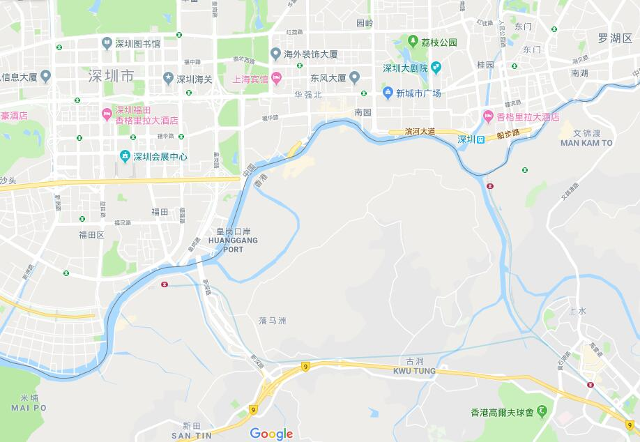

[10月09日 21:09] @h5lpykl7tp6jjop 中国人有一种特别的心理，哪怕在独裁暴政制下仍然相信自己的运气，别人冤案被打被骗是他们运气不好，你看他们在赌场里疯狂下注，不怕各种陷阱圈套十赌九输仍然相信有机会能赢，对这种执迷不悟的人群，任何理性的劝导都无用，他们就是输红眼的赌徒，绝不会戒赌，只想继续下注翻本，所以就继续投机中共！  :speech_balloon:评:2 :+1:赞:31 :globe_with_meridians:转:2  

[10月09日 15:08] @caijingxiang 香港资本外逃，从2017年年初肖建华被抓就已经开始了，这也是2017年年初那波高峰的原因，此后资本外逃就没有停止过，始终停留在最高峰，我做的YouTube视频《港币危机真正根源——被掩盖的红色恐慌指数（red vix）》 https://www.youtube.com/watch?v=7wHu4BAMzxI&t=2s …  有详细讲解，零对冲这个图各位可以对比一下！https://twitter.com/zerohedge/status/1181947916770058240 …  :speech_balloon:评:1 :+1:赞:132 :globe_with_meridians:转:43  

[10月09日 12:35] @iyouport_news 手机号码是万恶之源。的确完全不需要物理接触，也能使用简单的密码重置实现入侵 ——和你同乘电梯就行了。

最近，杰克·多尔西自己的帐户被劫持，比其他任何警告都更有效地宣传了这种验证方法的弱点。 https://www.forbes.com/sites/zakdoffman/2019/10/07/fbi-issues-surprise-cyber-attack-warningurges-new-precautions/#77e04cea7efb …

推特应该重新思考这个问题。

期待IYP的攻击演示。所有演示都在提醒安全意识https://twitter.com/iyouport_news/status/1181899766193541120 …  :speech_balloon:评:0 :+1:赞:18 :globe_with_meridians:转:10  

[10月09日 12:30] @nytchinese “和NBA一样，我们欢迎中国的审查进入我们的家园与内心，”《南方公园》的剧创在一则开玩笑的声明写道。
“我们也爱钱胜过自由与民主。习近平一点都不像小熊维尼。” http://nyti.ms/35lndUk   :speech_balloon:评:9 :+1:赞:167 :globe_with_meridians:转:34  

[10月09日 11:58] @h5lpykl7tp6jjop 那時她是那麼的無助，我差點落淚。看到這個視頻，心裡有無限的痛與怒！勢單力薄的女孩單獨面對4條惡犬！萬幸最後喊出了姓名。
我願以最高的敬意獻於這位英勇的港女 
記住她  :speech_balloon:评:6 :+1:赞:428 :globe_with_meridians:转:299  

[10月09日 11:50] @iyouport_news 7/ 鉴于包括中国在内的很多国家政府都可以使用恶意密码重置功能+拦截手机短信以获得入侵及识别真实身份的优势，我们强烈建议社交媒体平台*至少*允许谷歌身份验证器的使用。

IYP将详细解释恶意密码重置攻击，根本不需要没收你的设备 —— 不需要物理接触你的设备 —— 也能实现同样目的的攻击。  :speech_balloon:评:0 :+1:赞:11 :globe_with_meridians:转:3  

[10月09日 11:45] @caijingxiang 对火箭队的讨论在中国已经达到文革的地步！  :speech_balloon:评:52 :+1:赞:383 :globe_with_meridians:转:151  

[10月09日 11:30] @nytchinese 在信阳，许多居民将饥荒归咎于不忠诚的地方官员，尤其是信阳市委书记路宪文，他被指控隐瞒了不断增加的死亡人数。
大多数研究过这场饥荒和其他动乱的中国学者对毛泽东不那么宽容。隐瞒这场愈演愈烈的灾难的当地官员承受着巨大的压力，不敢冒险惹怒毛泽东。 http://nyti.ms/2ATdO8o   :speech_balloon:评:17 :+1:赞:41 :globe_with_meridians:转:18  

[10月09日 10:52] @nytchinese #观点 “最觉醒的职业体育联盟“是NBA建立起的声誉和品牌，其总裁肖华认为发表“政治言论“是球员“在联盟中的绝对权利“。
但在中国面前，肖华和NBA可耻地保持了沉默。 http://nyti.ms/2IAinc1   :speech_balloon:评:102 :+1:赞:156 :globe_with_meridians:转:62  

[10月09日 10:36] @h5lpykl7tp6jjop 不论大官还是小民，一言不合上意，下课！
中国早已全面进入文革升级版时代！
日前，中共证监会原主席刘士余被连降四级。官方通报指他公开发表不当言论，但通报未具体说明原由。据一位近期来自中国的访问学者披露，刘士余下台的真实的原因是他在清华大学透露出习近平要搞国家牛市、慢牛，结果带来了疯牛  :speech_balloon:评:3 :+1:赞:136 :globe_with_meridians:转:45  

[10月09日 10:22] @h5lpykl7tp6jjop 爱国挺共后遗症！这下入你们爱国的意愿了，回去吧！  :speech_balloon:评:2 :+1:赞:28 :globe_with_meridians:转:7  

[10月09日 09:29] @h5lpykl7tp6jjop   :speech_balloon:评:0 :+1:赞:3 :globe_with_meridians:转:1  

[10月09日 09:25] @h5lpykl7tp6jjop 大家自己看看属于哪一种家庭，马上就要 全面进入小康生活时代  :speech_balloon:评:7 :+1:赞:33 :globe_with_meridians:转:15  

[10月09日 05:42] @caijingxiang 胡锡进：NBA需要付出代价，但停止与它合作无需成为一种风潮。本来想搬起石头砸一下NBA给美国人看看支持香港的下场，但是搬起来后发现美国民意气势汹汹，大有跟你干到底的样子，于是中共彻底怂了，陪着笑脸朝自己脚砸去！  :speech_balloon:评:64 :+1:赞:1399 :globe_with_meridians:转:290  

[10月09日 02:27] @caijingxiang 听说杀猪时，猪会怪怪的等待被杀，那是因为它没有感觉到疼，当刀子割破喉咙时，它就会拼尽一切进行反抗！  :speech_balloon:评:12 :+1:赞:139 :globe_with_meridians:转:29  

[10月09日 02:04] @caijingxiang 最近中共的审查制度导致的各种抵制效果明显，比如它成功的把著名财经博客“零对冲”变成了一个政治号，以前五毛总是攻击我，一个财经号天天发政治内容！恩，现在你们可以攻击零对冲了！ https://twitter.com/zerohedge/status/1181742329788600320 …  :speech_balloon:评:6 :+1:赞:179 :globe_with_meridians:转:33  

[10月08日 22:40] @h5lpykl7tp6jjop #HKprotester gradually entered a coma, but #PoliceTerrorism still pressed his neck with and shouted to him shut your mouth up and go fk yourself.
That’s a so-call their “professional” and “conscience standard” why so different .  :speech_balloon:评:18 :+1:赞:331 :globe_with_meridians:转:429  

[10月08日 15:31] @caijingxiang 商务部新闻发言人就美商务部将28家中国实体列入出口管制“实体清单”发表谈话，中方强烈敦促美方立即停止在涉疆问题上说三道四，停止干涉中国内政的错误行径，尽快将相关中国实体移出“实体清单”。中方也将采取一切必要措施，坚决维护中方自身利益。  :speech_balloon:评:35 :+1:赞:222 :globe_with_meridians:转:80  

[10月08日 10:28] @caijingxiang 南华早报刚刚报道称，中国代表团将缩短在美国逗留时间，消息公布后离岸人民币急挫，黄金小幅上涨，a50扩大跌幅！自从贸易战爆发后，影响到金融市场计价的媒体最多的是彭博社，其次是路透社，再次就是这个被马云收购的南华早报！  :speech_balloon:评:40 :+1:赞:551 :globe_with_meridians:转:181  

[10月08日 09:51] @h5lpykl7tp6jjop 叫几个朋友...抓黑衣女子...
拉上车随便玩...
记得拍片...
惩罚蟑螂..
警察也在做..

「警告」推上熱門 女手足一定要小心
 https://lih.kg/1638282 
- 分享自 #LIHKG 討論區

#chinazi
#HKprotests
#香港デモ
#香港加油
#香港人反抗
#StandwithHK
#StandWithHongKong
#一切都是刚刚开始
#MeToo  :speech_balloon:评:19 :+1:赞:111 :globe_with_meridians:转:110  

[10月08日 04:31] @caijingxiang 【重磅】天眼查数据显示，2019年9月29日百度云计算技术（北京）有限公司管理架构发生变更，百度创始人李彦宏卸任执行董事。同时，刘辉卸任总经理一职，新增崔珊珊为总经理、执行董事。另外，百度云计算技术（北京）有限公司的法定代表人也发生变更，刘辉退出，由崔珊珊接任。 下一个！  :speech_balloon:评:24 :+1:赞:495 :globe_with_meridians:转:235  

[10月08日 03:41] @caijingxiang 海康威视高级副总裁黄方红，强烈反对美国把公司纳入实体清单，这个决定没有事实根据，呼吁美国政府本着公平、公正、无歧视的原则，重新进行审视，将海康威视移出实体清单。
北京旷视科技有限公司8日公告称，关于今天美国商务部在没有任何事实根据情况下将旷视列入实体清单，我们对这一决定表示强烈抗议  :speech_balloon:评:46 :+1:赞:218 :globe_with_meridians:转:77  

[10月08日 03:21] @caijingxiang 国庆假期首个交易日，中国股市大涨，离岸人民币小涨，完全不理会香港局势的恶化，也不计价美国对28家公安局制裁，更不在乎川普所说的“全面deal与部分deal差异”，甚至9月财新中国服务业PMI降至七个月新低也完全没有任何影响，所有的利空消息都不如国庆大阅兵打鸡血的利好！  :speech_balloon:评:74 :+1:赞:178 :globe_with_meridians:转:55  

[10月08日 03:14] @caijingxiang 土耳其总统埃尔多安不顾川普总统警告，毅然对叙利亚境内的库尔德武装进行打击，消息公布后，土耳其里拉跳贬！  :speech_balloon:评:8 :+1:赞:94 :globe_with_meridians:转:25  

[10月07日 12:08] @caijingxiang 怎么做才算是努力？上学时所有人都告诉你，好好学习就是努力！进入社会后，好好工作就是努力！到了中年后发现，很多钻营取巧、溜须拍马、坑蒙拐骗的人，在讲自己美化版本的努力获取成功之道！临到快死时，努力希望自己下辈子投胎成为官二代、红二代！努力究竟是什么？一个没有人能够回答对问题！ https://twitter.com/caijingxiang/status/1181174592062124033 …  :speech_balloon:评:38 :+1:赞:376 :globe_with_meridians:转:105  

[10月07日 11:49] @caijingxiang 一个女生滔滔不绝的跟她男友说，你不努力就会怎样，怎样！
男孩反问道：不要告诉我要不要努力，请告诉我怎么做才是努力？
女生缓缓的说“比如好好工作”
男孩：你确定好好工作就是努力？就可以赚到钱买房和你结婚？
女生不说话了！
后来她告诉别人分手的原因，是因为男生没有上进心，不努力！  :speech_balloon:评:77 :+1:赞:768 :globe_with_meridians:转:184  

[10月07日 01:26] @caijingxiang 预料之中的事，人民币已经准备好雄赳赳气昂昂跨过7.2！ https://twitter.com/chinesewsj/status/1181011338803470342 …  :speech_balloon:评:25 :+1:赞:407 :globe_with_meridians:转:129  

[10月05日 18:08] @caijingxiang Denuclearization Talks Between North Korea And The US Collapse  https://www.zerohedge.com/geopolitical/denuclearization-talks-between-north-korea-and-us-collapse …  :speech_balloon:评:27 :+1:赞:132 :globe_with_meridians:转:84  

[10月05日 17:36] @caijingxiang 猜测成为现实！贝莱德！ https://twitter.com/ShinRa_ElectPow/status/1160871960034721794 …  :speech_balloon:评:10 :+1:赞:129 :globe_with_meridians:转:38  

[10月05日 16:55] @caijingxiang 汇丰银行在香港拥有崇高地位，是香港三大授权发钞行之首（汇丰、渣打、中银香港），现时汇丰的港元纸币发行量占全港流通纸币的63%以上。当前香港危机达到临界点，外界对港币联系汇率崩盘不断感到担忧，如果说香港金融陷入危机的话，汇丰控股必将遭到巨大打击，贝莱德此时增持股份明显违背常理！ https://twitter.com/caijingxiang/status/1180522876488699905 …  :speech_balloon:评:27 :+1:赞:442 :globe_with_meridians:转:172  

[10月05日 16:39] @caijingxiang 10月4日，根据汇丰控股披露，贝莱德于9月30日斥资45.45港亿元增持，持股比例增至7.32%，成为汇丰控股最大单一股东，超越平安集团7.01%持股比例。贝莱德前身与黑石渊源很深，同时在中国业务规模极大，而黑石与中共关系更加复杂，汇丰银行在香港值此关键时刻大股东变动绝非巧合，这让人想起前期高管变动  :speech_balloon:评:9 :+1:赞:142 :globe_with_meridians:转:70  

[10月05日 12:51] @caijingxiang 深圳与香港陆路口岸一共六个，从东到西分别是沙头角、文锦渡、罗湖、皇岗、福田、深圳湾。其中罗湖口岸只通铁路，福田口岸通铁路和公路，但汽车不能直接过关。其余均为公路口岸。水路口岸两个，蛇口码头、福永码头。不知道今天地铁北段（香港北部地铁为地上运行）是不是真的全部都停了！  :speech_balloon:评:12 :+1:赞:118 :globe_with_meridians:转:39  

[10月05日 05:27] @caijingxiang 昔日大公报说经济法不管多少条统统无效，不知道今天大公报的嘴是咋评论紧急法的？  :speech_balloon:评:14 :+1:赞:276 :globe_with_meridians:转:122  

[09月06日 11:03] @caijingxiang 本次降准总计是释放增量资金9000亿，但是提前下发的2020年地方债最高为1.85万亿，降准释放的资金只够新一轮刺激的一半，剩下的资金将会从现有社会存量来补充，这在一定程度收紧了金融系统的流动性；不过和以往一样，央行的降准刺激措施依然是打着“中小企业”的名义下调的!连接 https://www.youtube.com/watch?v=Usp9LIngNl0&feature=youtu.be …  :speech_balloon:评:20 :+1:赞:232 :globe_with_meridians:转:77  

[08月14日 03:44] @iyouport_news 2个分类知识*新*列表已在互联网开放；浏览无需登录。

如果您不知道该搜什么知识，这些列表会有帮助。

它们是工具箱和装甲，当您能熟练使用这些知识时，就能获得想要的成功。

#IYP <新版>列表1 - 29个栏目： https://docs.google.com/document/d/1zHDRsb7BtR05ILg3F3rhAxBAcD9PJpbBwpGXPaAPP9w/edit?usp=sharing …  

列表2:- 17个栏目: https://docs.google.com/document/d/1tmU2VmsdHRo79NniIM85yWJrS-A_GIhku_0yXZOg8Fk/edit?usp=sharing …  :speech_balloon:评:0 :+1:赞:59 :globe_with_meridians:转:17  

[03月13日 00:10] @h5lpykl7tp6jjop 批评是批评家天生的使命！他们只感知对错，信奉真理，指出真相不吐不快，不在意权势和群众的喜好，从批评里不可能获得任何好处，但批评家愚直不改。在中国几乎所有人都讨厌批评家，喜欢阴谋家，因为他们只说好听的！可是就因为中国的批评家太少，中国几乎看不到未来和希望！  :speech_balloon:评:75 :+1:赞:164 :globe_with_meridians:转:41  

[01月10日 05:30] @nytchinese 每年一月，《纽约时报》​​会选出52个年度旅游目的地。将举办冬奥会的中国崇礼、炫目奢华的香港、日本濑户内各岛皆入选。
新的一年，你计划好要去哪里旅行了吗？ http://nyti.ms/2Tz9N06   :speech_balloon:评:275 :+1:赞:370 :globe_with_meridians:转:191  

[10月10日 02:00] @nytchinese 土耳其发动叙利亚攻势，向该国东北部派遣战机和军队，以清剿一个库尔德民兵组织，后者是美国打击伊斯兰国的重要盟友。
特朗普曾对土耳其的行动表示默许，但行动展开后又称其是“一个坏主意”，并重申他反对“无意义的战争”。
更多简报内容： http://nyti.ms/2OzDhMj   :speech_balloon:评:1 :+1:赞:0 :globe_with_meridians:转:0  

[10月10日 01:48] @caijingxiang 离岸人民币从7.1680到7.0999，短短一个小时近700点！  :speech_balloon:评:18 :+1:赞:31 :globe_with_meridians:转:7  

[10月10日 01:10] @caijingxiang 这两天市场被媒体忽悠惨了，来回割肉，不过现在加大农产品采购，说明中共还是玩的买买买的套路，不准备全面达成协议。双方第一次接触将很重要，也就是说北京时间10号21:00至11号凌晨5点，将是决定本轮会谈最后时间，各位交易员做好准备，暴风雨要来了！ https://twitter.com/LoneCapital/status/1182096813882372097 …  :speech_balloon:评:14 :+1:赞:53 :globe_with_meridians:转:28  

[10月09日 21:09] @h5lpykl7tp6jjop 中国人有一种特别的心理，哪怕在独裁暴政制下仍然相信自己的运气，别人冤案被打被骗是他们运气不好，你看他们在赌场里疯狂下注，不怕各种陷阱圈套十赌九输仍然相信有机会能赢，对这种执迷不悟的人群，任何理性的劝导都无用，他们就是输红眼的赌徒，绝不会戒赌，只想继续下注翻本，所以就继续投机中共！  :speech_balloon:评:2 :+1:赞:40 :globe_with_meridians:转:5  

[10月09日 15:08] @caijingxiang 香港资本外逃，从2017年年初肖建华被抓就已经开始了，这也是2017年年初那波高峰的原因，此后资本外逃就没有停止过，始终停留在最高峰，我做的YouTube视频《港币危机真正根源——被掩盖的红色恐慌指数（red vix）》 https://www.youtube.com/watch?v=7wHu4BAMzxI&t=2s …  有详细讲解，零对冲这个图各位可以对比一下！https://twitter.com/zerohedge/status/1181947916770058240 …  :speech_balloon:评:1 :+1:赞:154 :globe_with_meridians:转:52  

[10月09日 12:35] @iyouport_news 手机号码是万恶之源。的确完全不需要物理接触，也能使用简单的密码重置实现入侵 ——和你同乘电梯就行了。

最近，杰克·多尔西自己的帐户被劫持，比其他任何警告都更有效地宣传了这种验证方法的弱点。 https://www.forbes.com/sites/zakdoffman/2019/10/07/fbi-issues-surprise-cyber-attack-warningurges-new-precautions/#77e04cea7efb …

推特应该重新思考这个问题。

期待IYP的攻击演示。所有演示都在提醒安全意识https://twitter.com/iyouport_news/status/1181899766193541120 …  :speech_balloon:评:0 :+1:赞:18 :globe_with_meridians:转:10  

[10月09日 11:58] @h5lpykl7tp6jjop 那時她是那麼的無助，我差點落淚。看到這個視頻，心裡有無限的痛與怒！勢單力薄的女孩單獨面對4條惡犬！萬幸最後喊出了姓名。
我願以最高的敬意獻於這位英勇的港女 
記住她  :speech_balloon:评:7 :+1:赞:490 :globe_with_meridians:转:339  

[10月09日 11:50] @iyouport_news 7/ 鉴于包括中国在内的很多国家政府都可以使用恶意密码重置功能+拦截手机短信以获得入侵及识别真实身份的优势，我们强烈建议社交媒体平台*至少*允许谷歌身份验证器的使用。

IYP将详细解释恶意密码重置攻击，根本不需要没收你的设备 —— 不需要物理接触你的设备 —— 也能实现同样目的的攻击。  :speech_balloon:评:0 :+1:赞:11 :globe_with_meridians:转:3  

[10月09日 11:45] @caijingxiang 对火箭队的讨论在中国已经达到文革的地步！  :speech_balloon:评:52 :+1:赞:416 :globe_with_meridians:转:160  

[10月09日 10:36] @h5lpykl7tp6jjop 不论大官还是小民，一言不合上意，下课！
中国早已全面进入文革升级版时代！
日前，中共证监会原主席刘士余被连降四级。官方通报指他公开发表不当言论，但通报未具体说明原由。据一位近期来自中国的访问学者披露，刘士余下台的真实的原因是他在清华大学透露出习近平要搞国家牛市、慢牛，结果带来了疯牛  :speech_balloon:评:3 :+1:赞:153 :globe_with_meridians:转:48  

[10月09日 10:22] @h5lpykl7tp6jjop 爱国挺共后遗症！这下入你们爱国的意愿了，回去吧！  :speech_balloon:评:2 :+1:赞:28 :globe_with_meridians:转:7  

[10月09日 09:29] @h5lpykl7tp6jjop   :speech_balloon:评:0 :+1:赞:3 :globe_with_meridians:转:1  

[10月09日 09:25] @h5lpykl7tp6jjop 大家自己看看属于哪一种家庭，马上就要 全面进入小康生活时代  :speech_balloon:评:7 :+1:赞:33 :globe_with_meridians:转:15  

[10月09日 05:42] @caijingxiang 胡锡进：NBA需要付出代价，但停止与它合作无需成为一种风潮。本来想搬起石头砸一下NBA给美国人看看支持香港的下场，但是搬起来后发现美国民意气势汹汹，大有跟你干到底的样子，于是中共彻底怂了，陪着笑脸朝自己脚砸去！  :speech_balloon:评:69 :+1:赞:1460 :globe_with_meridians:转:304  

[10月09日 02:27] @caijingxiang 听说杀猪时，猪会怪怪的等待被杀，那是因为它没有感觉到疼，当刀子割破喉咙时，它就会拼尽一切进行反抗！  :speech_balloon:评:12 :+1:赞:142 :globe_with_meridians:转:30  

[10月09日 02:04] @caijingxiang 最近中共的审查制度导致的各种抵制效果明显，比如它成功的把著名财经博客“零对冲”变成了一个政治号，以前五毛总是攻击我，一个财经号天天发政治内容！恩，现在你们可以攻击零对冲了！ https://twitter.com/zerohedge/status/1181742329788600320 …  :speech_balloon:评:6 :+1:赞:179 :globe_with_meridians:转:34  

[10月08日 22:40] @h5lpykl7tp6jjop #HKprotester gradually entered a coma, but #PoliceTerrorism still pressed his neck with and shouted to him shut your mouth up and go fk yourself.
That’s a so-call their “professional” and “conscience standard” why so different .  :speech_balloon:评:18 :+1:赞:333 :globe_with_meridians:转:429  

[10月08日 15:31] @caijingxiang 商务部新闻发言人就美商务部将28家中国实体列入出口管制“实体清单”发表谈话，中方强烈敦促美方立即停止在涉疆问题上说三道四，停止干涉中国内政的错误行径，尽快将相关中国实体移出“实体清单”。中方也将采取一切必要措施，坚决维护中方自身利益。  :speech_balloon:评:35 :+1:赞:222 :globe_with_meridians:转:81  

[10月08日 10:28] @caijingxiang 南华早报刚刚报道称，中国代表团将缩短在美国逗留时间，消息公布后离岸人民币急挫，黄金小幅上涨，a50扩大跌幅！自从贸易战爆发后，影响到金融市场计价的媒体最多的是彭博社，其次是路透社，再次就是这个被马云收购的南华早报！  :speech_balloon:评:40 :+1:赞:554 :globe_with_meridians:转:182  

[10月08日 09:51] @h5lpykl7tp6jjop 叫几个朋友...抓黑衣女子...
拉上车随便玩...
记得拍片...
惩罚蟑螂..
警察也在做..

「警告」推上熱門 女手足一定要小心
 https://lih.kg/1638282 
- 分享自 #LIHKG 討論區

#chinazi
#HKprotests
#香港デモ
#香港加油
#香港人反抗
#StandwithHK
#StandWithHongKong
#一切都是刚刚开始
#MeToo  :speech_balloon:评:19 :+1:赞:111 :globe_with_meridians:转:109  

[10月08日 04:31] @caijingxiang 【重磅】天眼查数据显示，2019年9月29日百度云计算技术（北京）有限公司管理架构发生变更，百度创始人李彦宏卸任执行董事。同时，刘辉卸任总经理一职，新增崔珊珊为总经理、执行董事。另外，百度云计算技术（北京）有限公司的法定代表人也发生变更，刘辉退出，由崔珊珊接任。 下一个！  :speech_balloon:评:24 :+1:赞:495 :globe_with_meridians:转:236  

[10月08日 03:41] @caijingxiang 海康威视高级副总裁黄方红，强烈反对美国把公司纳入实体清单，这个决定没有事实根据，呼吁美国政府本着公平、公正、无歧视的原则，重新进行审视，将海康威视移出实体清单。
北京旷视科技有限公司8日公告称，关于今天美国商务部在没有任何事实根据情况下将旷视列入实体清单，我们对这一决定表示强烈抗议  :speech_balloon:评:47 :+1:赞:220 :globe_with_meridians:转:79  

[10月08日 03:21] @caijingxiang 国庆假期首个交易日，中国股市大涨，离岸人民币小涨，完全不理会香港局势的恶化，也不计价美国对28家公安局制裁，更不在乎川普所说的“全面deal与部分deal差异”，甚至9月财新中国服务业PMI降至七个月新低也完全没有任何影响，所有的利空消息都不如国庆大阅兵打鸡血的利好！  :speech_balloon:评:74 :+1:赞:180 :globe_with_meridians:转:57  

[10月08日 03:14] @caijingxiang 土耳其总统埃尔多安不顾川普总统警告，毅然对叙利亚境内的库尔德武装进行打击，消息公布后，土耳其里拉跳贬！  :speech_balloon:评:8 :+1:赞:96 :globe_with_meridians:转:26  

[10月07日 12:08] @caijingxiang 怎么做才算是努力？上学时所有人都告诉你，好好学习就是努力！进入社会后，好好工作就是努力！到了中年后发现，很多钻营取巧、溜须拍马、坑蒙拐骗的人，在讲自己美化版本的努力获取成功之道！临到快死时，努力希望自己下辈子投胎成为官二代、红二代！努力究竟是什么？一个没有人能够回答对问题！ https://twitter.com/caijingxiang/status/1181174592062124033 …  :speech_balloon:评:38 :+1:赞:376 :globe_with_meridians:转:105  

[10月07日 11:49] @caijingxiang 一个女生滔滔不绝的跟她男友说，你不努力就会怎样，怎样！
男孩反问道：不要告诉我要不要努力，请告诉我怎么做才是努力？
女生缓缓的说“比如好好工作”
男孩：你确定好好工作就是努力？就可以赚到钱买房和你结婚？
女生不说话了！
后来她告诉别人分手的原因，是因为男生没有上进心，不努力！  :speech_balloon:评:77 :+1:赞:769 :globe_with_meridians:转:184  

[10月07日 01:26] @caijingxiang 预料之中的事，人民币已经准备好雄赳赳气昂昂跨过7.2！ https://twitter.com/chinesewsj/status/1181011338803470342 …  :speech_balloon:评:25 :+1:赞:407 :globe_with_meridians:转:129  

[10月05日 18:08] @caijingxiang Denuclearization Talks Between North Korea And The US Collapse  https://www.zerohedge.com/geopolitical/denuclearization-talks-between-north-korea-and-us-collapse …  :speech_balloon:评:27 :+1:赞:132 :globe_with_meridians:转:84  

[10月05日 17:36] @caijingxiang 猜测成为现实！贝莱德！ https://twitter.com/ShinRa_ElectPow/status/1160871960034721794 …  :speech_balloon:评:10 :+1:赞:129 :globe_with_meridians:转:38  

[10月05日 16:55] @caijingxiang 汇丰银行在香港拥有崇高地位，是香港三大授权发钞行之首（汇丰、渣打、中银香港），现时汇丰的港元纸币发行量占全港流通纸币的63%以上。当前香港危机达到临界点，外界对港币联系汇率崩盘不断感到担忧，如果说香港金融陷入危机的话，汇丰控股必将遭到巨大打击，贝莱德此时增持股份明显违背常理！ https://twitter.com/caijingxiang/status/1180522876488699905 …  :speech_balloon:评:27 :+1:赞:440 :globe_with_meridians:转:171  

[10月05日 16:39] @caijingxiang 10月4日，根据汇丰控股披露，贝莱德于9月30日斥资45.45港亿元增持，持股比例增至7.32%，成为汇丰控股最大单一股东，超越平安集团7.01%持股比例。贝莱德前身与黑石渊源很深，同时在中国业务规模极大，而黑石与中共关系更加复杂，汇丰银行在香港值此关键时刻大股东变动绝非巧合，这让人想起前期高管变动  :speech_balloon:评:9 :+1:赞:142 :globe_with_meridians:转:70  

[09月06日 11:03] @caijingxiang 本次降准总计是释放增量资金9000亿，但是提前下发的2020年地方债最高为1.85万亿，降准释放的资金只够新一轮刺激的一半，剩下的资金将会从现有社会存量来补充，这在一定程度收紧了金融系统的流动性；不过和以往一样，央行的降准刺激措施依然是打着“中小企业”的名义下调的!连接 https://www.youtube.com/watch?v=Usp9LIngNl0&feature=youtu.be …  :speech_balloon:评:20 :+1:赞:232 :globe_with_meridians:转:77  

[08月14日 03:44] @iyouport_news 2个分类知识*新*列表已在互联网开放；浏览无需登录。

如果您不知道该搜什么知识，这些列表会有帮助。

它们是工具箱和装甲，当您能熟练使用这些知识时，就能获得想要的成功。

#IYP <新版>列表1 - 29个栏目： https://docs.google.com/document/d/1zHDRsb7BtR05ILg3F3rhAxBAcD9PJpbBwpGXPaAPP9w/edit?usp=sharing …  

列表2:- 17个栏目: https://docs.google.com/document/d/1tmU2VmsdHRo79NniIM85yWJrS-A_GIhku_0yXZOg8Fk/edit?usp=sharing …  :speech_balloon:评:0 :+1:赞:59 :globe_with_meridians:转:17  

[03月13日 00:10] @h5lpykl7tp6jjop 批评是批评家天生的使命！他们只感知对错，信奉真理，指出真相不吐不快，不在意权势和群众的喜好，从批评里不可能获得任何好处，但批评家愚直不改。在中国几乎所有人都讨厌批评家，喜欢阴谋家，因为他们只说好听的！可是就因为中国的批评家太少，中国几乎看不到未来和希望！  :speech_balloon:评:75 :+1:赞:165 :globe_with_meridians:转:41  

[01月10日 05:30] @nytchinese 每年一月，《纽约时报》​​会选出52个年度旅游目的地。将举办冬奥会的中国崇礼、炫目奢华的香港、日本濑户内各岛皆入选。
新的一年，你计划好要去哪里旅行了吗？ http://nyti.ms/2Tz9N06   :speech_balloon:评:275 :+1:赞:371 :globe_with_meridians:转:191  

[10月10日 02:00]    纽约时报中文网 @nytchinese    土耳其发动叙利亚攻势，向该国东北部派遣战机和军队，以清剿一个库尔德民兵组织，后者是美国打击伊斯兰国的重要盟友。
特朗普曾对土耳其的行动表示默许，但行动展开后又称其是“一个坏主意”，并重申他反对“无意义的战争”。
更多简报内容： http://nyti.ms/2OzDhMj   :speech_balloon:评:1 :+1:赞:1 :globe_with_meridians:转:0  

[10月10日 01:48]    财经真相 @caijingxiang    离岸人民币从7.1680到7.0999，短短一个小时近700点！  :speech_balloon:评:20 :+1:赞:38 :globe_with_meridians:转:7  

[10月10日 01:10]    财经真相 @caijingxiang    这两天市场被媒体忽悠惨了，来回割肉，不过现在加大农产品采购，说明中共还是玩的买买买的套路，不准备全面达成协议。双方第一次接触将很重要，也就是说北京时间10号21:00至11号凌晨5点，将是决定本轮会谈最后时间，各位交易员做好准备，暴风雨要来了！ https://twitter.com/LoneCapital/status/1182096813882372097 …  :speech_balloon:评:14 :+1:赞:56 :globe_with_meridians:转:28  

[10月09日 21:09]    老司机 @h5lpykl7tp6jjop    中国人有一种特别的心理，哪怕在独裁暴政制下仍然相信自己的运气，别人冤案被打被骗是他们运气不好，你看他们在赌场里疯狂下注，不怕各种陷阱圈套十赌九输仍然相信有机会能赢，对这种执迷不悟的人群，任何理性的劝导都无用，他们就是输红眼的赌徒，绝不会戒赌，只想继续下注翻本，所以就继续投机中共！  :speech_balloon:评:2 :+1:赞:40 :globe_with_meridians:转:5  

[10月09日 15:15]    墙国铁拳现世报😷 @Socialistfist    中国突然取消了NBA投票选项 https://twitter.com/VOAChinese/status/1181942149064998912 …  :speech_balloon:评:2 :+1:赞:35 :globe_with_meridians:转:3  

[10月09日 15:08]    财经真相 @caijingxiang    香港资本外逃，从2017年年初肖建华被抓就已经开始了，这也是2017年年初那波高峰的原因，此后资本外逃就没有停止过，始终停留在最高峰，我做的YouTube视频《港币危机真正根源——被掩盖的红色恐慌指数（red vix）》 https://www.youtube.com/watch?v=7wHu4BAMzxI&t=2s …  有详细讲解，零对冲这个图各位可以对比一下！https://twitter.com/zerohedge/status/1181947916770058240 …  :speech_balloon:评:1 :+1:赞:155 :globe_with_meridians:转:52  

[10月09日 14:56]    墙国铁拳现世报😷 @Socialistfist    后后续，王老师已销号，推出推特  :speech_balloon:评:7 :+1:赞:44 :globe_with_meridians:转:3  

[10月09日 12:35]    iyouport @iyouport_news    手机号码是万恶之源。的确完全不需要物理接触，也能使用简单的密码重置实现入侵 ——和你同乘电梯就行了。

最近，杰克·多尔西自己的帐户被劫持，比其他任何警告都更有效地宣传了这种验证方法的弱点。 https://www.forbes.com/sites/zakdoffman/2019/10/07/fbi-issues-surprise-cyber-attack-warningurges-new-precautions/#77e04cea7efb …

推特应该重新思考这个问题。

期待IYP的攻击演示。所有演示都在提醒安全意识https://twitter.com/iyouport_news/status/1181899766193541120 …  :speech_balloon:评:0 :+1:赞:18 :globe_with_meridians:转:10  

[10月09日 11:58]    老司机 @h5lpykl7tp6jjop    那時她是那麼的無助，我差點落淚。看到這個視頻，心裡有無限的痛與怒！勢單力薄的女孩單獨面對4條惡犬！萬幸最後喊出了姓名。
我願以最高的敬意獻於這位英勇的港女 
記住她  :speech_balloon:评:7 :+1:赞:490 :globe_with_meridians:转:341  

[10月09日 11:50]    iyouport @iyouport_news    7/ 鉴于包括中国在内的很多国家政府都可以使用恶意密码重置功能+拦截手机短信以获得入侵及识别真实身份的优势，我们强烈建议社交媒体平台*至少*允许谷歌身份验证器的使用。

IYP将详细解释恶意密码重置攻击，根本不需要没收你的设备 —— 不需要物理接触你的设备 —— 也能实现同样目的的攻击。  :speech_balloon:评:0 :+1:赞:11 :globe_with_meridians:转:3  

[10月09日 11:45]    财经真相 @caijingxiang    对火箭队的讨论在中国已经达到文革的地步！  :speech_balloon:评:52 :+1:赞:418 :globe_with_meridians:转:160  

[10月09日 11:03]    墙国铁拳现世报😷 @Socialistfist    如果让您自由选择收看NBA或者CBA中的一种，你会选择看哪个篮球联赛？  :speech_balloon:评:126 :+1:赞:618 :globe_with_meridians:转:111  

[10月09日 10:36]    老司机 @h5lpykl7tp6jjop    不论大官还是小民，一言不合上意，下课！
中国早已全面进入文革升级版时代！
日前，中共证监会原主席刘士余被连降四级。官方通报指他公开发表不当言论，但通报未具体说明原由。据一位近期来自中国的访问学者披露，刘士余下台的真实的原因是他在清华大学透露出习近平要搞国家牛市、慢牛，结果带来了疯牛  :speech_balloon:评:3 :+1:赞:154 :globe_with_meridians:转:48  

[10月09日 10:22]    老司机 @h5lpykl7tp6jjop    爱国挺共后遗症！这下入你们爱国的意愿了，回去吧！  :speech_balloon:评:2 :+1:赞:28 :globe_with_meridians:转:7  

[10月09日 09:29]    老司机 @h5lpykl7tp6jjop      :speech_balloon:评:0 :+1:赞:3 :globe_with_meridians:转:1  

[10月09日 09:25]    老司机 @h5lpykl7tp6jjop    大家自己看看属于哪一种家庭，马上就要 全面进入小康生活时代  :speech_balloon:评:7 :+1:赞:33 :globe_with_meridians:转:15  

[10月09日 05:42]    财经真相 @caijingxiang    胡锡进：NBA需要付出代价，但停止与它合作无需成为一种风潮。本来想搬起石头砸一下NBA给美国人看看支持香港的下场，但是搬起来后发现美国民意气势汹汹，大有跟你干到底的样子，于是中共彻底怂了，陪着笑脸朝自己脚砸去！  :speech_balloon:评:69 :+1:赞:1460 :globe_with_meridians:转:304  

[10月09日 03:46]    墙国铁拳现世报😷 @Socialistfist    8:00 上贴吧讨论，贴吧被封
9:00 豆瓣瓜组组cp，组被解散号被封
10:00 微博质问来去之间，期间言论被收集于@Socialistfist 
11:00 连vpn上pornhub
11:05 撸完骂几句女优丑
12:00 起点yy小说，穿越之我是希特勒
1:00am 睡觉，醒来又是斗志满满的一天呢  :speech_balloon:评:4 :+1:赞:78 :globe_with_meridians:转:12  

[10月09日 02:27]    财经真相 @caijingxiang    听说杀猪时，猪会怪怪的等待被杀，那是因为它没有感觉到疼，当刀子割破喉咙时，它就会拼尽一切进行反抗！  :speech_balloon:评:12 :+1:赞:143 :globe_with_meridians:转:30  

[10月09日 02:04]    财经真相 @caijingxiang    最近中共的审查制度导致的各种抵制效果明显，比如它成功的把著名财经博客“零对冲”变成了一个政治号，以前五毛总是攻击我，一个财经号天天发政治内容！恩，现在你们可以攻击零对冲了！ https://twitter.com/zerohedge/status/1181742329788600320 …  :speech_balloon:评:6 :+1:赞:179 :globe_with_meridians:转:34  

[10月08日 22:40]    老司机 @h5lpykl7tp6jjop    #HKprotester gradually entered a coma, but #PoliceTerrorism still pressed his neck with and shouted to him shut your mouth up and go fk yourself.
That’s a so-call their “professional” and “conscience standard” why so different .  :speech_balloon:评:18 :+1:赞:334 :globe_with_meridians:转:430  

[10月08日 15:31]    财经真相 @caijingxiang    商务部新闻发言人就美商务部将28家中国实体列入出口管制“实体清单”发表谈话，中方强烈敦促美方立即停止在涉疆问题上说三道四，停止干涉中国内政的错误行径，尽快将相关中国实体移出“实体清单”。中方也将采取一切必要措施，坚决维护中方自身利益。  :speech_balloon:评:35 :+1:赞:222 :globe_with_meridians:转:81  

[10月08日 10:28]    财经真相 @caijingxiang    南华早报刚刚报道称，中国代表团将缩短在美国逗留时间，消息公布后离岸人民币急挫，黄金小幅上涨，a50扩大跌幅！自从贸易战爆发后，影响到金融市场计价的媒体最多的是彭博社，其次是路透社，再次就是这个被马云收购的南华早报！  :speech_balloon:评:40 :+1:赞:554 :globe_with_meridians:转:182  

[10月08日 09:51]    老司机 @h5lpykl7tp6jjop    叫几个朋友...抓黑衣女子...
拉上车随便玩...
记得拍片...
惩罚蟑螂..
警察也在做..

「警告」推上熱門 女手足一定要小心
 https://lih.kg/1638282 
- 分享自 #LIHKG 討論區

#chinazi
#HKprotests
#香港デモ
#香港加油
#香港人反抗
#StandwithHK
#StandWithHongKong
#一切都是刚刚开始
#MeToo  :speech_balloon:评:19 :+1:赞:111 :globe_with_meridians:转:109  

[10月08日 04:31]    财经真相 @caijingxiang    【重磅】天眼查数据显示，2019年9月29日百度云计算技术（北京）有限公司管理架构发生变更，百度创始人李彦宏卸任执行董事。同时，刘辉卸任总经理一职，新增崔珊珊为总经理、执行董事。另外，百度云计算技术（北京）有限公司的法定代表人也发生变更，刘辉退出，由崔珊珊接任。 下一个！  :speech_balloon:评:24 :+1:赞:495 :globe_with_meridians:转:236  

[10月08日 03:41]    财经真相 @caijingxiang    海康威视高级副总裁黄方红，强烈反对美国把公司纳入实体清单，这个决定没有事实根据，呼吁美国政府本着公平、公正、无歧视的原则，重新进行审视，将海康威视移出实体清单。
北京旷视科技有限公司8日公告称，关于今天美国商务部在没有任何事实根据情况下将旷视列入实体清单，我们对这一决定表示强烈抗议  :speech_balloon:评:47 :+1:赞:220 :globe_with_meridians:转:79  

[10月08日 03:21]    财经真相 @caijingxiang    国庆假期首个交易日，中国股市大涨，离岸人民币小涨，完全不理会香港局势的恶化，也不计价美国对28家公安局制裁，更不在乎川普所说的“全面deal与部分deal差异”，甚至9月财新中国服务业PMI降至七个月新低也完全没有任何影响，所有的利空消息都不如国庆大阅兵打鸡血的利好！  :speech_balloon:评:74 :+1:赞:180 :globe_with_meridians:转:57  

[10月08日 03:14]    财经真相 @caijingxiang    土耳其总统埃尔多安不顾川普总统警告，毅然对叙利亚境内的库尔德武装进行打击，消息公布后，土耳其里拉跳贬！  :speech_balloon:评:8 :+1:赞:96 :globe_with_meridians:转:26  

[10月07日 12:08]    财经真相 @caijingxiang    怎么做才算是努力？上学时所有人都告诉你，好好学习就是努力！进入社会后，好好工作就是努力！到了中年后发现，很多钻营取巧、溜须拍马、坑蒙拐骗的人，在讲自己美化版本的努力获取成功之道！临到快死时，努力希望自己下辈子投胎成为官二代、红二代！努力究竟是什么？一个没有人能够回答对问题！ https://twitter.com/caijingxiang/status/1181174592062124033 …  :speech_balloon:评:38 :+1:赞:376 :globe_with_meridians:转:105  

[10月07日 11:49]    财经真相 @caijingxiang    一个女生滔滔不绝的跟她男友说，你不努力就会怎样，怎样！
男孩反问道：不要告诉我要不要努力，请告诉我怎么做才是努力？
女生缓缓的说“比如好好工作”
男孩：你确定好好工作就是努力？就可以赚到钱买房和你结婚？
女生不说话了！
后来她告诉别人分手的原因，是因为男生没有上进心，不努力！  :speech_balloon:评:77 :+1:赞:769 :globe_with_meridians:转:184  

[10月07日 01:26]    财经真相 @caijingxiang    预料之中的事，人民币已经准备好雄赳赳气昂昂跨过7.2！ https://twitter.com/chinesewsj/status/1181011338803470342 …  :speech_balloon:评:25 :+1:赞:407 :globe_with_meridians:转:129  

[10月05日 18:08]    财经真相 @caijingxiang    Denuclearization Talks Between North Korea And The US Collapse  https://www.zerohedge.com/geopolitical/denuclearization-talks-between-north-korea-and-us-collapse …  :speech_balloon:评:27 :+1:赞:132 :globe_with_meridians:转:84  

[10月05日 17:36]    财经真相 @caijingxiang    猜测成为现实！贝莱德！ https://twitter.com/ShinRa_ElectPow/status/1160871960034721794 …  :speech_balloon:评:10 :+1:赞:129 :globe_with_meridians:转:38  

[10月05日 16:55]    财经真相 @caijingxiang    汇丰银行在香港拥有崇高地位，是香港三大授权发钞行之首（汇丰、渣打、中银香港），现时汇丰的港元纸币发行量占全港流通纸币的63%以上。当前香港危机达到临界点，外界对港币联系汇率崩盘不断感到担忧，如果说香港金融陷入危机的话，汇丰控股必将遭到巨大打击，贝莱德此时增持股份明显违背常理！ https://twitter.com/caijingxiang/status/1180522876488699905 …  :speech_balloon:评:27 :+1:赞:440 :globe_with_meridians:转:171  

[10月05日 16:39]    财经真相 @caijingxiang    10月4日，根据汇丰控股披露，贝莱德于9月30日斥资45.45港亿元增持，持股比例增至7.32%，成为汇丰控股最大单一股东，超越平安集团7.01%持股比例。贝莱德前身与黑石渊源很深，同时在中国业务规模极大，而黑石与中共关系更加复杂，汇丰银行在香港值此关键时刻大股东变动绝非巧合，这让人想起前期高管变动  :speech_balloon:评:9 :+1:赞:142 :globe_with_meridians:转:70  

[09月06日 11:03]    财经真相 @caijingxiang    本次降准总计是释放增量资金9000亿，但是提前下发的2020年地方债最高为1.85万亿，降准释放的资金只够新一轮刺激的一半，剩下的资金将会从现有社会存量来补充，这在一定程度收紧了金融系统的流动性；不过和以往一样，央行的降准刺激措施依然是打着“中小企业”的名义下调的!连接 https://www.youtube.com/watch?v=Usp9LIngNl0&feature=youtu.be …  :speech_balloon:评:20 :+1:赞:232 :globe_with_meridians:转:77  

[08月14日 03:44]    iyouport @iyouport_news    2个分类知识*新*列表已在互联网开放；浏览无需登录。

如果您不知道该搜什么知识，这些列表会有帮助。

它们是工具箱和装甲，当您能熟练使用这些知识时，就能获得想要的成功。

#IYP <新版>列表1 - 29个栏目： https://docs.google.com/document/d/1zHDRsb7BtR05ILg3F3rhAxBAcD9PJpbBwpGXPaAPP9w/edit?usp=sharing …  

列表2:- 17个栏目: https://docs.google.com/document/d/1tmU2VmsdHRo79NniIM85yWJrS-A_GIhku_0yXZOg8Fk/edit?usp=sharing …  :speech_balloon:评:0 :+1:赞:59 :globe_with_meridians:转:17  

[03月13日 00:10]    老司机 @h5lpykl7tp6jjop    批评是批评家天生的使命！他们只感知对错，信奉真理，指出真相不吐不快，不在意权势和群众的喜好，从批评里不可能获得任何好处，但批评家愚直不改。在中国几乎所有人都讨厌批评家，喜欢阴谋家，因为他们只说好听的！可是就因为中国的批评家太少，中国几乎看不到未来和希望！  :speech_balloon:评:75 :+1:赞:165 :globe_with_meridians:转:41  

[01月10日 05:30]    纽约时报中文网 @nytchinese    每年一月，《纽约时报》​​会选出52个年度旅游目的地。将举办冬奥会的中国崇礼、炫目奢华的香港、日本濑户内各岛皆入选。
新的一年，你计划好要去哪里旅行了吗？ http://nyti.ms/2Tz9N06   :speech_balloon:评:275 :+1:赞:371 :globe_with_meridians:转:191  

[10月10日 02:00]    纽约时报中文网 @nytchinese    土耳其发动叙利亚攻势，向该国东北部派遣战机和军队，以清剿一个库尔德民兵组织，后者是美国打击伊斯兰国的重要盟友。
特朗普曾对土耳其的行动表示默许，但行动展开后又称其是“一个坏主意”，并重申他反对“无意义的战争”。
更多简报内容： http://nyti.ms/2OzDhMj   :speech_balloon:评:1 :+1:赞:1 :globe_with_meridians:转:0  

[10月10日 01:48]    财经真相 @caijingxiang    离岸人民币从7.1680到7.0999，短短一个小时近700点！  :speech_balloon:评:22 :+1:赞:40 :globe_with_meridians:转:8  

[10月10日 01:10]    财经真相 @caijingxiang    这两天市场被媒体忽悠惨了，来回割肉，不过现在加大农产品采购，说明中共还是玩的买买买的套路，不准备全面达成协议。双方第一次接触将很重要，也就是说北京时间10号21:00至11号凌晨5点，将是决定本轮会谈最后时间，各位交易员做好准备，暴风雨要来了！ https://twitter.com/LoneCapital/status/1182096813882372097 …  :speech_balloon:评:14 :+1:赞:57 :globe_with_meridians:转:28  

[10月09日 21:09]    老司机 @h5lpykl7tp6jjop    中国人有一种特别的心理，哪怕在独裁暴政制下仍然相信自己的运气，别人冤案被打被骗是他们运气不好，你看他们在赌场里疯狂下注，不怕各种陷阱圈套十赌九输仍然相信有机会能赢，对这种执迷不悟的人群，任何理性的劝导都无用，他们就是输红眼的赌徒，绝不会戒赌，只想继续下注翻本，所以就继续投机中共！  :speech_balloon:评:2 :+1:赞:41 :globe_with_meridians:转:5  

[10月09日 15:15]    墙国铁拳现世报😷 @Socialistfist    中国突然取消了NBA投票选项 https://twitter.com/VOAChinese/status/1181942149064998912 …  :speech_balloon:评:2 :+1:赞:35 :globe_with_meridians:转:3  

[10月09日 15:08]    财经真相 @caijingxiang    香港资本外逃，从2017年年初肖建华被抓就已经开始了，这也是2017年年初那波高峰的原因，此后资本外逃就没有停止过，始终停留在最高峰，我做的YouTube视频《港币危机真正根源——被掩盖的红色恐慌指数（red vix）》 https://www.youtube.com/watch?v=7wHu4BAMzxI&t=2s …  有详细讲解，零对冲这个图各位可以对比一下！https://twitter.com/zerohedge/status/1181947916770058240 …  :speech_balloon:评:1 :+1:赞:155 :globe_with_meridians:转:52  

[10月09日 14:56]    墙国铁拳现世报😷 @Socialistfist    后后续，王老师已销号，推出推特  :speech_balloon:评:7 :+1:赞:44 :globe_with_meridians:转:3  

[10月09日 12:35]    iyouport @iyouport_news    手机号码是万恶之源。的确完全不需要物理接触，也能使用简单的密码重置实现入侵 ——和你同乘电梯就行了。

最近，杰克·多尔西自己的帐户被劫持，比其他任何警告都更有效地宣传了这种验证方法的弱点。 https://www.forbes.com/sites/zakdoffman/2019/10/07/fbi-issues-surprise-cyber-attack-warningurges-new-precautions/#77e04cea7efb …

推特应该重新思考这个问题。

期待IYP的攻击演示。所有演示都在提醒安全意识https://twitter.com/iyouport_news/status/1181899766193541120 …  :speech_balloon:评:0 :+1:赞:18 :globe_with_meridians:转:10  

[10月09日 11:58]    老司机 @h5lpykl7tp6jjop    那時她是那麼的無助，我差點落淚。看到這個視頻，心裡有無限的痛與怒！勢單力薄的女孩單獨面對4條惡犬！萬幸最後喊出了姓名。
我願以最高的敬意獻於這位英勇的港女 
記住她  :speech_balloon:评:7 :+1:赞:493 :globe_with_meridians:转:342  

[10月09日 11:50]    iyouport @iyouport_news    7/ 鉴于包括中国在内的很多国家政府都可以使用恶意密码重置功能+拦截手机短信以获得入侵及识别真实身份的优势，我们强烈建议社交媒体平台*至少*允许谷歌身份验证器的使用。

IYP将详细解释恶意密码重置攻击，根本不需要没收你的设备 —— 不需要物理接触你的设备 —— 也能实现同样目的的攻击。  :speech_balloon:评:0 :+1:赞:11 :globe_with_meridians:转:3  

[10月09日 11:45]    财经真相 @caijingxiang    对火箭队的讨论在中国已经达到文革的地步！  :speech_balloon:评:52 :+1:赞:418 :globe_with_meridians:转:160  

[10月09日 11:03]    墙国铁拳现世报😷 @Socialistfist    如果让您自由选择收看NBA或者CBA中的一种，你会选择看哪个篮球联赛？  :speech_balloon:评:126 :+1:赞:619 :globe_with_meridians:转:111  

[10月09日 10:36]    老司机 @h5lpykl7tp6jjop    不论大官还是小民，一言不合上意，下课！
中国早已全面进入文革升级版时代！
日前，中共证监会原主席刘士余被连降四级。官方通报指他公开发表不当言论，但通报未具体说明原由。据一位近期来自中国的访问学者披露，刘士余下台的真实的原因是他在清华大学透露出习近平要搞国家牛市、慢牛，结果带来了疯牛  :speech_balloon:评:3 :+1:赞:155 :globe_with_meridians:转:48  

[10月09日 10:22]    老司机 @h5lpykl7tp6jjop    爱国挺共后遗症！这下入你们爱国的意愿了，回去吧！  :speech_balloon:评:2 :+1:赞:28 :globe_with_meridians:转:7  

[10月09日 09:29]    老司机 @h5lpykl7tp6jjop      :speech_balloon:评:0 :+1:赞:3 :globe_with_meridians:转:1  

[10月09日 09:25]    老司机 @h5lpykl7tp6jjop    大家自己看看属于哪一种家庭，马上就要 全面进入小康生活时代  :speech_balloon:评:7 :+1:赞:33 :globe_with_meridians:转:15  

[10月09日 05:42]    财经真相 @caijingxiang    胡锡进：NBA需要付出代价，但停止与它合作无需成为一种风潮。本来想搬起石头砸一下NBA给美国人看看支持香港的下场，但是搬起来后发现美国民意气势汹汹，大有跟你干到底的样子，于是中共彻底怂了，陪着笑脸朝自己脚砸去！  :speech_balloon:评:69 :+1:赞:1462 :globe_with_meridians:转:305  

[10月09日 03:46]    墙国铁拳现世报😷 @Socialistfist    8:00 上贴吧讨论，贴吧被封
9:00 豆瓣瓜组组cp，组被解散号被封
10:00 微博质问来去之间，期间言论被收集于@Socialistfist 
11:00 连vpn上pornhub
11:05 撸完骂几句女优丑
12:00 起点yy小说，穿越之我是希特勒
1:00am 睡觉，醒来又是斗志满满的一天呢  :speech_balloon:评:4 :+1:赞:78 :globe_with_meridians:转:12  

[10月09日 02:27]    财经真相 @caijingxiang    听说杀猪时，猪会怪怪的等待被杀，那是因为它没有感觉到疼，当刀子割破喉咙时，它就会拼尽一切进行反抗！  :speech_balloon:评:12 :+1:赞:143 :globe_with_meridians:转:30  

[10月09日 02:04]    财经真相 @caijingxiang    最近中共的审查制度导致的各种抵制效果明显，比如它成功的把著名财经博客“零对冲”变成了一个政治号，以前五毛总是攻击我，一个财经号天天发政治内容！恩，现在你们可以攻击零对冲了！ https://twitter.com/zerohedge/status/1181742329788600320 …  :speech_balloon:评:6 :+1:赞:179 :globe_with_meridians:转:34  

[10月08日 22:40]    老司机 @h5lpykl7tp6jjop    #HKprotester gradually entered a coma, but #PoliceTerrorism still pressed his neck with and shouted to him shut your mouth up and go fk yourself.
That’s a so-call their “professional” and “conscience standard” why so different .  :speech_balloon:评:18 :+1:赞:334 :globe_with_meridians:转:430  

[10月08日 15:31]    财经真相 @caijingxiang    商务部新闻发言人就美商务部将28家中国实体列入出口管制“实体清单”发表谈话，中方强烈敦促美方立即停止在涉疆问题上说三道四，停止干涉中国内政的错误行径，尽快将相关中国实体移出“实体清单”。中方也将采取一切必要措施，坚决维护中方自身利益。  :speech_balloon:评:35 :+1:赞:222 :globe_with_meridians:转:81  

[10月08日 10:28]    财经真相 @caijingxiang    南华早报刚刚报道称，中国代表团将缩短在美国逗留时间，消息公布后离岸人民币急挫，黄金小幅上涨，a50扩大跌幅！自从贸易战爆发后，影响到金融市场计价的媒体最多的是彭博社，其次是路透社，再次就是这个被马云收购的南华早报！  :speech_balloon:评:40 :+1:赞:554 :globe_with_meridians:转:182  

[10月08日 09:51]    老司机 @h5lpykl7tp6jjop    叫几个朋友...抓黑衣女子...
拉上车随便玩...
记得拍片...
惩罚蟑螂..
警察也在做..

「警告」推上熱門 女手足一定要小心
 https://lih.kg/1638282 
- 分享自 #LIHKG 討論區

#chinazi
#HKprotests
#香港デモ
#香港加油
#香港人反抗
#StandwithHK
#StandWithHongKong
#一切都是刚刚开始
#MeToo  :speech_balloon:评:19 :+1:赞:111 :globe_with_meridians:转:109  

[10月08日 04:31]    财经真相 @caijingxiang    【重磅】天眼查数据显示，2019年9月29日百度云计算技术（北京）有限公司管理架构发生变更，百度创始人李彦宏卸任执行董事。同时，刘辉卸任总经理一职，新增崔珊珊为总经理、执行董事。另外，百度云计算技术（北京）有限公司的法定代表人也发生变更，刘辉退出，由崔珊珊接任。 下一个！  :speech_balloon:评:24 :+1:赞:495 :globe_with_meridians:转:236  

[10月08日 03:41]    财经真相 @caijingxiang    海康威视高级副总裁黄方红，强烈反对美国把公司纳入实体清单，这个决定没有事实根据，呼吁美国政府本着公平、公正、无歧视的原则，重新进行审视，将海康威视移出实体清单。
北京旷视科技有限公司8日公告称，关于今天美国商务部在没有任何事实根据情况下将旷视列入实体清单，我们对这一决定表示强烈抗议  :speech_balloon:评:47 :+1:赞:220 :globe_with_meridians:转:79  

[10月08日 03:21]    财经真相 @caijingxiang    国庆假期首个交易日，中国股市大涨，离岸人民币小涨，完全不理会香港局势的恶化，也不计价美国对28家公安局制裁，更不在乎川普所说的“全面deal与部分deal差异”，甚至9月财新中国服务业PMI降至七个月新低也完全没有任何影响，所有的利空消息都不如国庆大阅兵打鸡血的利好！  :speech_balloon:评:74 :+1:赞:180 :globe_with_meridians:转:57  

[10月08日 03:14]    财经真相 @caijingxiang    土耳其总统埃尔多安不顾川普总统警告，毅然对叙利亚境内的库尔德武装进行打击，消息公布后，土耳其里拉跳贬！  :speech_balloon:评:8 :+1:赞:96 :globe_with_meridians:转:26  

[10月07日 12:08]    财经真相 @caijingxiang    怎么做才算是努力？上学时所有人都告诉你，好好学习就是努力！进入社会后，好好工作就是努力！到了中年后发现，很多钻营取巧、溜须拍马、坑蒙拐骗的人，在讲自己美化版本的努力获取成功之道！临到快死时，努力希望自己下辈子投胎成为官二代、红二代！努力究竟是什么？一个没有人能够回答对问题！ https://twitter.com/caijingxiang/status/1181174592062124033 …  :speech_balloon:评:38 :+1:赞:376 :globe_with_meridians:转:105  

[10月07日 11:49]    财经真相 @caijingxiang    一个女生滔滔不绝的跟她男友说，你不努力就会怎样，怎样！
男孩反问道：不要告诉我要不要努力，请告诉我怎么做才是努力？
女生缓缓的说“比如好好工作”
男孩：你确定好好工作就是努力？就可以赚到钱买房和你结婚？
女生不说话了！
后来她告诉别人分手的原因，是因为男生没有上进心，不努力！  :speech_balloon:评:77 :+1:赞:770 :globe_with_meridians:转:184  

[10月07日 01:26]    财经真相 @caijingxiang    预料之中的事，人民币已经准备好雄赳赳气昂昂跨过7.2！ https://twitter.com/chinesewsj/status/1181011338803470342 …  :speech_balloon:评:25 :+1:赞:407 :globe_with_meridians:转:129  

[10月05日 18:08]    财经真相 @caijingxiang    Denuclearization Talks Between North Korea And The US Collapse  https://www.zerohedge.com/geopolitical/denuclearization-talks-between-north-korea-and-us-collapse …  :speech_balloon:评:27 :+1:赞:132 :globe_with_meridians:转:84  

[10月05日 17:36]    财经真相 @caijingxiang    猜测成为现实！贝莱德！ https://twitter.com/ShinRa_ElectPow/status/1160871960034721794 …  :speech_balloon:评:10 :+1:赞:129 :globe_with_meridians:转:38  

[10月05日 16:55]    财经真相 @caijingxiang    汇丰银行在香港拥有崇高地位，是香港三大授权发钞行之首（汇丰、渣打、中银香港），现时汇丰的港元纸币发行量占全港流通纸币的63%以上。当前香港危机达到临界点，外界对港币联系汇率崩盘不断感到担忧，如果说香港金融陷入危机的话，汇丰控股必将遭到巨大打击，贝莱德此时增持股份明显违背常理！ https://twitter.com/caijingxiang/status/1180522876488699905 …  :speech_balloon:评:27 :+1:赞:440 :globe_with_meridians:转:171  

[10月05日 16:39]    财经真相 @caijingxiang    10月4日，根据汇丰控股披露，贝莱德于9月30日斥资45.45港亿元增持，持股比例增至7.32%，成为汇丰控股最大单一股东，超越平安集团7.01%持股比例。贝莱德前身与黑石渊源很深，同时在中国业务规模极大，而黑石与中共关系更加复杂，汇丰银行在香港值此关键时刻大股东变动绝非巧合，这让人想起前期高管变动  :speech_balloon:评:9 :+1:赞:142 :globe_with_meridians:转:70  

[09月06日 11:03]    财经真相 @caijingxiang    本次降准总计是释放增量资金9000亿，但是提前下发的2020年地方债最高为1.85万亿，降准释放的资金只够新一轮刺激的一半，剩下的资金将会从现有社会存量来补充，这在一定程度收紧了金融系统的流动性；不过和以往一样，央行的降准刺激措施依然是打着“中小企业”的名义下调的!连接 https://www.youtube.com/watch?v=Usp9LIngNl0&feature=youtu.be …  :speech_balloon:评:20 :+1:赞:232 :globe_with_meridians:转:77  

[08月14日 03:44]    iyouport @iyouport_news    2个分类知识*新*列表已在互联网开放；浏览无需登录。

如果您不知道该搜什么知识，这些列表会有帮助。

它们是工具箱和装甲，当您能熟练使用这些知识时，就能获得想要的成功。

#IYP <新版>列表1 - 29个栏目： https://docs.google.com/document/d/1zHDRsb7BtR05ILg3F3rhAxBAcD9PJpbBwpGXPaAPP9w/edit?usp=sharing …  

列表2:- 17个栏目: https://docs.google.com/document/d/1tmU2VmsdHRo79NniIM85yWJrS-A_GIhku_0yXZOg8Fk/edit?usp=sharing …  :speech_balloon:评:0 :+1:赞:59 :globe_with_meridians:转:17  

[03月13日 00:10]    老司机 @h5lpykl7tp6jjop    批评是批评家天生的使命！他们只感知对错，信奉真理，指出真相不吐不快，不在意权势和群众的喜好，从批评里不可能获得任何好处，但批评家愚直不改。在中国几乎所有人都讨厌批评家，喜欢阴谋家，因为他们只说好听的！可是就因为中国的批评家太少，中国几乎看不到未来和希望！  :speech_balloon:评:75 :+1:赞:165 :globe_with_meridians:转:41  

[01月10日 05:30]    纽约时报中文网 @nytchinese    每年一月，《纽约时报》​​会选出52个年度旅游目的地。将举办冬奥会的中国崇礼、炫目奢华的香港、日本濑户内各岛皆入选。
新的一年，你计划好要去哪里旅行了吗？ http://nyti.ms/2Tz9N06   :speech_balloon:评:275 :+1:赞:371 :globe_with_meridians:转:191  

