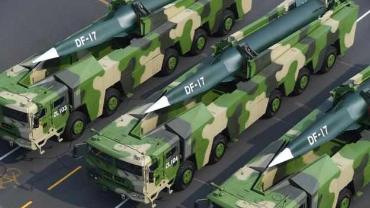
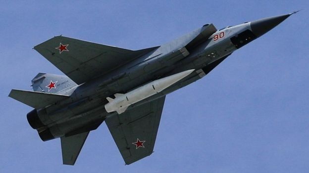
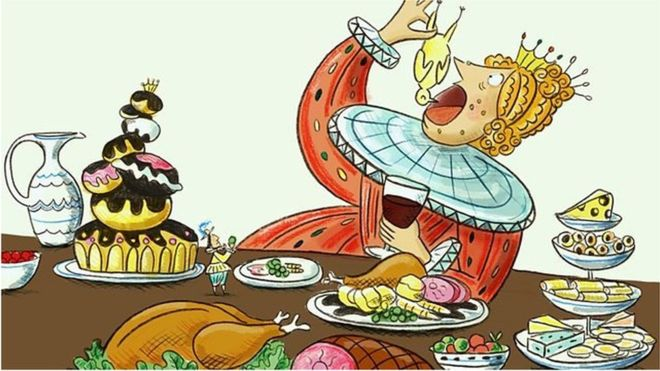
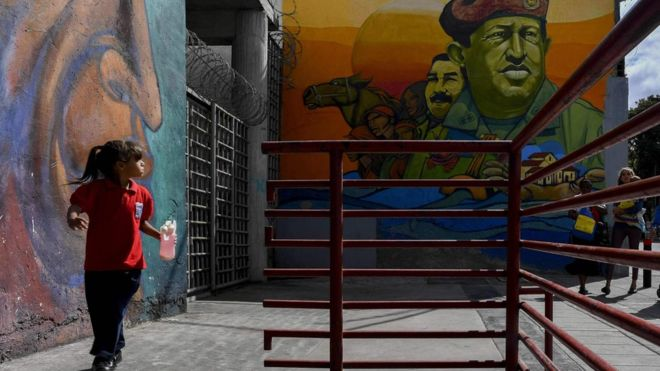
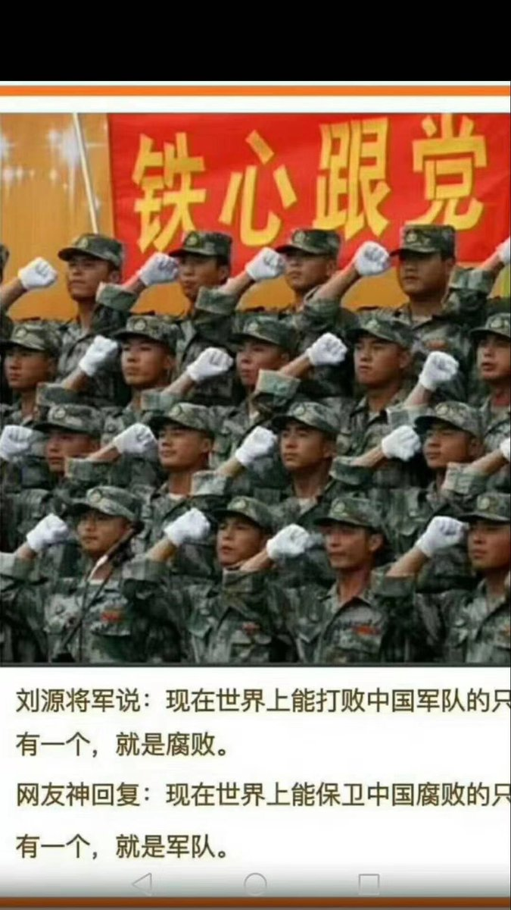

[12月27日 14:30]    纽约时报中文网   @nytchinese    三年来，首席贸易顾问纳瓦罗一直是特朗普的贸易斗士。他利用特朗普对全球化的蔑视，煽动其保护主义本能，鼓励他与中国展开惩罚性的贸易战。即使中美已经达成初步贸易协议，他仍在寻找对抗中国的方法。 https://nyti.ms/2PZrqHt   :speech_balloon:评:5 :+1:赞:9 :globe_with_meridians:转:3  

[12月27日 14:01]    BBC News 中文   @bbcchinese    【2019年热点回顾】说到不被国际承认但却真实存在的“事实国家”，人口2300万的台湾绝对是最大的一个，但你知道欧洲还有这3个不被承认的国家吗？ https://bbc.in/2Zu3cZj   :speech_balloon:评:39 :+1:赞:48 :globe_with_meridians:转:18  

[12月27日 14:00]    纽约时报中文网   @nytchinese    #每日一词 Bumpy，坎坷的。英国女王伊丽莎白二世的公开声明往往避免争议或细节，但她在圣诞致辞中承认，英国经历了“坎坷”的一年。Bumpy一词原型为bump，后者有肿块、颠簸之意，故加上形容词后缀，bumpy表示崎岖不平的、困难重重的。
更多简报内容： https://nyti.ms/2PWX5cB   :speech_balloon:评:1 :+1:赞:6 :globe_with_meridians:转:2  

[12月27日 13:30]    纽约时报中文网   @nytchinese    #图集 【亚洲各地天空现“火环”日食奇景】周四下午开始，新月从太阳前面经过，部分遮住了太阳，在其边缘留下一圈光。这一奇特的天文现象在亚洲和中东地区吸引了大量的观测者。
点击查看图集： https://nyti.ms/2Q2XL0l   :speech_balloon:评:3 :+1:赞:26 :globe_with_meridians:转:13  

[12月27日 13:01]    BBC News 中文   @bbcchinese    【2019年热点回顾】你可能知道异性恋、同性恋以及双性恋。但你听说过无性恋吗？他们是怎样一群人，又过着什么样的生活呢？ https://bbc.in/35V4QFI   :speech_balloon:评:2 :+1:赞:14 :globe_with_meridians:转:6  

[12月27日 13:00]    纽约时报中文网   @nytchinese    #时报专栏 这个十年的标志是年轻人对旧秩序的强烈敌意。在他们看来，自由主义国际秩序没有维护和平，而是榨干我们的血汗。资本主义没有使国家富裕，而是让富人更富有。硅谷没有从事技术创新，而是挖掘我们的数据。
这也是民粹主义右翼崛起的原因。 https://nyti.ms/37gE4aL   :speech_balloon:评:2 :+1:赞:7 :globe_with_meridians:转:4  

[12月27日 12:01]    BBC News 中文   @bbcchinese    【2019年热点回顾】伦敦一位居民周末在自家后院晒太阳，突然一具冻僵男尸从天而降，砸到他身边一米地方，血浆四溅。 https://bbc.in/2sTVT0L   :speech_balloon:评:8 :+1:赞:47 :globe_with_meridians:转:19  

[12月27日 12:00]    纽约时报中文网   @nytchinese    耶稣是个同性恋？巴西一制作公司因拍摄相关影片遇袭。三名蒙面歹徒在平安夜投掷燃烧弹，并发布视频表示对此负责。尽管未造成人员伤亡，但在该片中饰演耶稣的演员表示，这起袭击开创了一个令人不安的先例。
更多简报内容： https://nyti.ms/2PWX5cB   :speech_balloon:评:3 :+1:赞:9 :globe_with_meridians:转:2  

[12月27日 11:30]    纽约时报中文网   @nytchinese    中国最著名的“#我也是”诽谤诉讼案莫过于刘强东起诉两名博主对他强奸指控的评论。未受到控罪的刘强东要求赔偿43.6万美元。
去年，弦子指控央视主持人朱军在2014年对她进行性侵犯，朱军对弦子提起诽谤诉讼，称她的指控是“公然捏造和恶意传播”，并要求赔偿约9.5万美元的损失。 https://nyti.ms/2MvA4LH   :speech_balloon:评:0 :+1:赞:9 :globe_with_meridians:转:5  

[12月27日 11:01]    BBC News 中文   @bbcchinese    【2019年热点回顾】住五星级酒店、穿名牌时装、出席上流社会派对、乘坐私人飞机等。这对她来说是家常便饭，只是这位名媛其实并不存在。 https://bbc.in/2Mlooes   :speech_balloon:评:7 :+1:赞:18 :globe_with_meridians:转:14  

[12月27日 11:00]    纽约时报中文网   @nytchinese    #时报专栏 2010年代是属于千禧一代的十年。年轻人对旧秩序和社会现状怀抱敌意和愤怒，他们的技术发明、迁徙、疾病和道德信念从根本上改变了这个十年。 https://nyti.ms/37gE4aL   :speech_balloon:评:2 :+1:赞:20 :globe_with_meridians:转:10  

[12月27日 10:30]    BBC News 中文   @bbcchinese    文化大革命已经过去了50年，一名普通知识分子回忆当年的岁月和生活。除了早请示晚汇报，谈恋爱和结婚又是怎样的情形呢？
 https://bbc.in/2QkKfUr   :speech_balloon:评:26 :+1:赞:62 :globe_with_meridians:转:40  

[12月27日 10:30]    纽约时报中文网   @nytchinese    选举在即，中国首艘国产航母“山东舰”通过台湾海峡。台湾将于1月11日举行总统选举，一位熟悉台湾安全规划的高级官员表示，中国此举意在“通过展示军事实力，恐吓不听话的选民。”
更多简报内容： https://nyti.ms/2PWX5cB   :speech_balloon:评:5 :+1:赞:3 :globe_with_meridians:转:2  

[12月27日 10:21]    财经真相   @caijingxiang    中国股市今天涨疯了，看样子今天下午收盘后，中共要宣布降准了！  :speech_balloon:评:38 :+1:赞:156 :globe_with_meridians:转:24  

[12月27日 10:01]    BBC News 中文   @bbcchinese    【2019年热点回顾】一张女性的肌肉结构图在网上引发一场讨论，很多网民对女性结构图乳腺组织的外表感到意外。 https://bbc.in/2MEcdtB   :speech_balloon:评:9 :+1:赞:66 :globe_with_meridians:转:27  

[12月27日 09:59]    BBC News 中文   @bbcchinese    1958年大跃进，为了迎合毛泽东的冒进心态，全国掀起了浮夸风，引发3年大饥荒，造成饿死2000万到3000万人的惨剧。
 https://bbc.in/35XxSnT   :speech_balloon:评:131 :+1:赞:320 :globe_with_meridians:转:134  

[12月27日 09:58]    纽约时报中文网   @nytchinese    早安！今日重点新闻包括：
中国“我也是”女性困境；山东舰航母驶入台湾海峡；揭秘贸易战美方鹰派斗士；亚洲各地出现“火环”日食；中国公园里的“黄昏恋”；菲律宾遭台风袭击；内塔尼亚胡赢得党内领导人选举……NYT简报带你速览今日要闻。 https://nyti.ms/2PWX5cB   :speech_balloon:评:2 :+1:赞:24 :globe_with_meridians:转:6  

[12月27日 09:53]    老司机   @h5lpykl7tp6jjop    奇怪的中国历史逻辑，一会儿仇恨满清因为它亡了中国，一会儿又仇恨洋人它们烧了大清的圆明园，一会儿清庭剧火爆皇阿玛叫得亲热，一迭声奴才该死，一会儿甲午海战败了又切齿痛恨痛恨日本人！恨蒙元亡宋，成吉思汗踏平欧州又傲骄要死，为打内战歼灭蒋欢呼，又说台海要统一是一家人，神经分裂症都不够形容  :speech_balloon:评:8 :+1:赞:224 :globe_with_meridians:转:72  

[12月27日 09:50]    BBC News 中文   @bbcchinese    在中国蓬勃兴起的偶像与粉丝经济之下，越来越多的年轻孩子选择成为娱乐公司的练习生。 https://bbc.in/39g3pn9   :speech_balloon:评:6 :+1:赞:25 :globe_with_meridians:转:7  

[12月27日 09:31]    BBC News 中文   @bbcchinese     以诚待客是日本的一种生活方式。感冒的人会戴上医学口罩，避免传染他人。开始建筑工程前，人们会把洗衣粉装在礼品盒里向邻居赠送，因为建筑粉尘不可避免会弄脏邻居的衣服，所以他们送洗衣粉以示歉意。 【这是世界上最讲礼貌的国家吗？】
 https://bbc.in/2EVSL7e   :speech_balloon:评:37 :+1:赞:121 :globe_with_meridians:转:29  

[12月27日 09:16]    BBC News 中文   @bbcchinese    中国外交官2019年集体登陆推特，反映公共外交新策略。 https://bbc.in/2Su7j68   :speech_balloon:评:55 :+1:赞:123 :globe_with_meridians:转:64  

[12月27日 08:30]    BBC News 中文   @bbcchinese    有科学家正在研究，将细胞逆转为年轻时的状态，60岁接受治疗时，人们能够回到30岁的状态，这是否过于科幻？
 https://bbc.in/35ZjlIu   :speech_balloon:评:16 :+1:赞:41 :globe_with_meridians:转:22  

[12月27日 07:59]    BBC News 中文   @bbcchinese    无论身处世界何处，探索一座新城市可以是一件有挑战性的事。但文中这五座城市比其它城市宜居得多。  :speech_balloon:评:5 :+1:赞:16 :globe_with_meridians:转:5  

[12月27日 07:30]    BBC News 中文   @bbcchinese    他是破解“勒索软件”高手，网民心中的英雄、黑客团伙的死敌；他隐名埋姓、离群索居、疾病缠身... https://bbc.in/2t4MRxI   :speech_balloon:评:3 :+1:赞:43 :globe_with_meridians:转:21  

[12月27日 04:52]    新闻大吐槽   @TuCaoFakeNews    韩国瑜植发四阶段  :speech_balloon:评:58 :+1:赞:642 :globe_with_meridians:转:165  

[12月27日 04:52]    新闻大吐槽   @TuCaoFakeNews    韩国瑜植发四阶段  :speech_balloon:评:58 :+1:赞:642 :globe_with_meridians:转:165  

[12月27日 04:51]    老司机   @h5lpykl7tp6jjop    一直觉得台湾的政治人物很搞笑，纠结于一个或两个中国，搞政治和血缘有毛关系？政治制度才是关键！邻居说和你是一个祖宗，你就纠结，它是强盗流氓都不重要了吗？更可鄙的是一些人听说它们有钱了发达了，口涎直往下滴，仿佛能沾点光，连当初怎么被赶到台湾的历史都忘了！还要点脸皮不？两辈人都想被强奸  :speech_balloon:评:2 :+1:赞:65 :globe_with_meridians:转:20  

[12月27日 02:04]    墙国铁拳现世报😷   @Socialistfist    高光时刻  :speech_balloon:评:17 :+1:赞:100 :globe_with_meridians:转:11  

[12月27日 01:39]    BBC News 中文   @bbcchinese    中国大力发展高度机密的尖端武器，迅速提升军事技术也受到美国关注。前国防部副部长，战略专家罗伯特·沃克（Robert O. Work）认为这些武器可能包括定向能武器，太空武器，电磁轨道炮，高能微波武器，甚至更奇异的武器。 https://bbc.in/2QkD0vJ   :speech_balloon:评:36 :+1:赞:56 :globe_with_meridians:转:14  

[12月27日 01:16]    BBC News 中文   @bbcchinese    由米格-31战斗机携带的“匕首”（Kinzhal）高超音速导弹已经于去年服役。普京说这种导弹能够以10倍音速飞行，射程达2000公里，具有携带核弹头的能力。 https://bbc.in/2QiNagB   :speech_balloon:评:4 :+1:赞:15 :globe_with_meridians:转:8  

[12月26日 23:59]    BBC News 中文   @bbcchinese    口音可以反映一个人的社会背景和人的偏见，尽管说的内容一样，不同的口音可能会让听者产生不同的感受，甚至影响信任度。
 https://bbc.in/2SyxnN8   :speech_balloon:评:7 :+1:赞:48 :globe_with_meridians:转:19  

[12月26日 23:31]    BBC News 中文   @bbcchinese    美剧《欲望都市》出人意料地在日本、新加坡、中国这些保守国家取得了共鸣，甚至有了《欢乐颂》这样的本地版本。
 https://bbc.in/2ERVZZd   :speech_balloon:评:9 :+1:赞:13 :globe_with_meridians:转:3  

[12月26日 23:30]    BBC News 中文   @bbcchinese    1961年，苏联试验了一颗威力巨大的核弹，它的毁灭性如此强大，以至于根本无法在战场上使用。
 https://bbc.in/2tNSaC5   :speech_balloon:评:11 :+1:赞:63 :globe_with_meridians:转:21  

[12月26日 23:22]    墙国铁拳现世报😷   @Socialistfist    @minzhutiequan  :speech_balloon:评:8 :+1:赞:57 :globe_with_meridians:转:1  

[12月26日 23:18]    墙国铁拳现世报😷   @Socialistfist    寻人启事  :speech_balloon:评:73 :+1:赞:362 :globe_with_meridians:转:73  

[12月26日 22:59]    BBC News 中文   @bbcchinese    吃货福音！这些食材是科学家考证、评选出来的。其中（第八名）让华人严重纠结。看一看，你有没有大吃一惊？ 【知识篇：世界上最有营养的10种食材】
 https://bbc.in/2MrI7ZR   :speech_balloon:评:7 :+1:赞:46 :globe_with_meridians:转:39  

[12月26日 22:30]    BBC News 中文   @bbcchinese    拜年时不想被问到工资或什么时候结婚生小孩吗？好好的跟长辈们聊一下国家大事吧！ #聊之前建议自己先阅读 【委内瑞拉危机：七张图帮你梳理头绪】
 https://bbc.in/2rxCeDq   :speech_balloon:评:6 :+1:赞:18 :globe_with_meridians:转:11  

[12月26日 21:49]    财经真相   @caijingxiang    明年是鼠年，一个中国公司年会的特别节目，竟然弄了一条黄金蟒蛇表演！话说生肖鼠的克星应该是蛇啊！北京怎么捕杀起狗来了？  :speech_balloon:评:23 :+1:赞:94 :globe_with_meridians:转:10  

[12月26日 21:00]    纽约时报中文网   @nytchinese    中国政府已经颁布了禁止性骚扰的法律，但并未给出定义。执法情况很糟。诽谤法有利于原告，而更大的举证责任落在了受害者身上。如果没能举证，会被认为是存在“主观过错”。 https://nyti.ms/2MvA4LH   :speech_balloon:评:8 :+1:赞:18 :globe_with_meridians:转:7  

[12月26日 20:30]    纽约时报中文网   @nytchinese    近十年来，健身科学反复关注的一个问题是，运动能否及如何改变衰老过程，研究结果普遍表明，运动确实在许多方面影响衰老。
在最近的各种研究中，在分子层面上，经常运动的老年人的肌肉、免疫系统、血细胞甚至皮肤的生理年龄比久坐不动的人小。 https://nyti.ms/363ZQPa   :speech_balloon:评:0 :+1:赞:30 :globe_with_meridians:转:23  

[12月26日 20:00]    纽约时报中文网   @nytchinese    一个人自杀的原因可能永远无从得知。但朋友们认为，肯尼被贷款和网约车服务的竞争压垮了。
纽约市无视不良贷款行为，允许优步和Lyft侵蚀出租车司机的地盘，因此，他们认为，肯尼把出租车停在市长官邸两个街区外的地方并不是巧合。 https://nyti.ms/2MweNl7   :speech_balloon:评:0 :+1:赞:10 :globe_with_meridians:转:2  

[12月26日 19:30]    纽约时报中文网   @nytchinese    老年人相亲市场里不乏一些中国特有的择偶标准。比如，在这个罹患癌症可能导致破产的国家，养老金和医疗保险可以增加吸引力。再比如，丧偶的比离婚的受欢迎。一些人解释说，这是因为前者的情感负担较少。 https://nyti.ms/361eqXu   :speech_balloon:评:3 :+1:赞:10 :globe_with_meridians:转:1  

[12月26日 19:00]    纽约时报中文网   @nytchinese    “#我也是”运动鼓舞了中国女性公开反抗性骚扰，但越来越多的男性使用诽谤诉讼来反击指控，许多女性因此感到犹豫。当局也压制了相关讨论，因为担心这会引发社会运动。 https://nyti.ms/2MvA4LH   :speech_balloon:评:9 :+1:赞:58 :globe_with_meridians:转:24  

[12月26日 18:53]    老司机   @h5lpykl7tp6jjop    香港旺角圣诞节12.25:
中国共产党纳粹 非法检查3位手无寸铁的女孩子！
HongKong12.25 Christmas Day：
The CCP’Nazis illegally inspected three defenseless girls!  :speech_balloon:评:19 :+1:赞:206 :globe_with_meridians:转:220  

[12月26日 18:30]    纽约时报中文网   @nytchinese    在执照勋章价格飞涨的时期，肯尼和哥哥理查德都贷款买下了出租车运营许可证。当勋章价格超过100万美元时，两兄弟的妻子哀求他们把勋章卖了。
“我不害怕，”理查德回忆肯尼当时说。“你怕吗？”
“不，”理查德说。“我信任这座城市。”
不久，执照勋章的泡沫破裂了。 https://nyti.ms/2MweNl7   :speech_balloon:评:3 :+1:赞:7 :globe_with_meridians:转:2  

[12月26日 18:00]    纽约时报中文网   @nytchinese    尽管受到公众的反对，日本国会仍在2016年将赌场赌博合法化，但对其进行了重大限制。
NHK报道称，秋元司曾于去12月前往中国深圳，会见了 http://500.com 的代表。几个月后，他会见了北海道一个村庄的官员，http://500.com 公司希望在那里开发一个度假村。https://nyti.ms/35Z7DNR   :speech_balloon:评:0 :+1:赞:9 :globe_with_meridians:转:3  

[12月26日 17:30]    纽约时报中文网   @nytchinese    散步可以促进创造力、一分钟的锻炼是足够的、衰老是可以改善的、一只肥狗可能是最好的锻炼动力……我们总结了过去十年来健身运动中持续出现的主题、发现和意外。 https://nyti.ms/363ZQPa   :speech_balloon:评:2 :+1:赞:132 :globe_with_meridians:转:64  

[12月26日 17:00]    纽约时报中文网   @nytchinese    十几年来，纽约出租车行业领导者人为地抬高了许可证的价格，并且引导购买者背上无力偿还的剥削性贷款。
勋章价格在2014年底开始暴跌，成千上万的执照勋章持有者背负着巨额贷款。已有超过950人申请破产。多人自杀身亡，缅甸移民肯尼就是其中之一。 https://nyti.ms/2MweNl7   :speech_balloon:评:16 :+1:赞:72 :globe_with_meridians:转:38  

[12月26日 16:57]    老司机   @h5lpykl7tp6jjop    警告！警告！最新敏感词 ！来了！
网友发问如何清洗“细颈瓶”被删帖！
近期有从事化工研究的网友提问"如何彻底清洗细颈瓶？
竟被系统判定"违反互联网相关法律法规"并下架，推测是因"细颈瓶"与"习近平"读音相近所致。
如果发打烂细颈瓶的贴小心坐牢！  :speech_balloon:评:57 :+1:赞:559 :globe_with_meridians:转:199  

[12月26日 16:30]    纽约时报中文网   @nytchinese    在北京，老年人选择去菖蒲河和天坛。在西南城市重庆的洪崖洞公园有一个“相亲角”。在北方城市西安，老年居民每周三和周六聚集在革命公园。
“这种聚会方式很实用，”纽约大学全球健康与老龄化研究负责人吴蓓说。“在公园里，你可以增加成功相亲的机会。” https://nyti.ms/361eqXu   :speech_balloon:评:3 :+1:赞:15 :globe_with_meridians:转:1  

[12月26日 16:22]    老司机   @h5lpykl7tp6jjop    港共恶警在香港滥捕滥抓，竟然抓到冒充示威者的自已人！  :speech_balloon:评:43 :+1:赞:566 :globe_with_meridians:转:368  

[12月26日 16:03]    老司机   @h5lpykl7tp6jjop    反正都是股民的钱，这就是韭菜的宿命！  :speech_balloon:评:1 :+1:赞:7 :globe_with_meridians:转:0  

[12月26日 15:00]    纽约时报中文网   @nytchinese    日本众议员秋元司被指接受希望参与该国博彩业建设的公司贿赂，收取了价值370万日元的现金和其他礼物。媒体报道称，该公司为从事在线体育博彩的中企 http://500.com 。秋元司否认参与不法行为，并退出了自民党。https://nyti.ms/35Z7DNR   :speech_balloon:评:7 :+1:赞:29 :globe_with_meridians:转:8  

[12月26日 14:37]    老司机   @h5lpykl7tp6jjop    给脑残定性：  :speech_balloon:评:2 :+1:赞:65 :globe_with_meridians:转:28  

[12月26日 14:26]    老司机   @h5lpykl7tp6jjop    有＂点＂大，点成占了，人老没用呵！报歉！  :speech_balloon:评:3 :+1:赞:2 :globe_with_meridians:转:0  

[12月26日 14:22]    老司机   @h5lpykl7tp6jjop    又抓住一个为祖国做间谍的专家！
袜子里藏生物样本回国 中国男子美国机场被逮捕
中国研究人员郑凿松（Zaosong Zheng，音译）12月9日在波士顿的一个国际机场准备搭机返回北京时被捕。海关在郑的行李箱中的袜子内发现了21小瓶棕色液体。郑涉嫌窃取美国实验室的生物样本。  :speech_balloon:评:2 :+1:赞:47 :globe_with_meridians:转:24  

[12月26日 14:10]    老司机   @h5lpykl7tp6jjop    这个圣诞礼物有占大！全世界第一！价值约589.98亿元。

贵州茅台无偿划转4%股份给贵州国资。

原因是什么弄不懂，看不明白，专家还没有出来解释，估计解释

了也听不明白！一个无限神奇的国度！  :speech_balloon:评:8 :+1:赞:84 :globe_with_meridians:转:31  

[12月26日 13:50]    新闻大吐槽   @TuCaoFakeNews    这个被红三代强暴的女孩，受到的不只是身体上的折磨！还被置于无人可信的恐怖氛围~
红三代不但雇凶切掉她主张报警朋友的手指，当她走投无路，投靠前男友时，红三代还能联系到她的前男友，关掉她的避风港，导致女孩彻底崩溃，让她认为世界上已无人可以相信  :speech_balloon:评:72 :+1:赞:901 :globe_with_meridians:转:539  

[12月26日 13:50]    新闻大吐槽   @TuCaoFakeNews    这个被红三代强暴的女孩，受到的不只是身体上的折磨！还被置于无人可信的恐怖氛围~
红三代不但雇凶切掉她主张报警朋友的手指，当她走投无路，投靠前男友时，红三代还能联系到她的前男友，关掉她的避风港，导致女孩彻底崩溃，让她认为世界上已无人可以相信  :speech_balloon:评:72 :+1:赞:901 :globe_with_meridians:转:539  

[12月26日 13:38]    新闻大吐槽   @TuCaoFakeNews    最近影视业萧条，毛泽东的特型演员估计日子也不好过！
被村民雇来做兼职，村民的爸妈都是被毛的运动搞死的~
所以，特型演员要想赚到钱，就必须走起奸臣的步态，飞跪给枉死者谢罪~
 https://twitter.com/i/status/1210058026889048065/video/1 …  :speech_balloon:评:26 :+1:赞:607 :globe_with_meridians:转:214  

[12月26日 13:38]    新闻大吐槽   @TuCaoFakeNews    最近影视业萧条，毛泽东的特型演员估计日子也不好过！
被村民雇来做兼职，村民的爸妈都是被毛的运动搞死的~
所以，特型演员要想赚到钱，就必须走起奸臣的步态，飞跪给枉死者谢罪~
 https://twitter.com/i/status/1210058026889048065/video/1 …  :speech_balloon:评:26 :+1:赞:607 :globe_with_meridians:转:214  

[12月26日 12:30]    老司机   @h5lpykl7tp6jjop    来看一下有关＂东方红＂的考证，有意思得紧……  :speech_balloon:评:5 :+1:赞:92 :globe_with_meridians:转:38  

[12月26日 12:11]    财经真相   @caijingxiang    在岸人民币20年走势图，从防涨横盘=》被迫升值=》主动贬值=》短暂自由浮动=》市场推动下跌=》防跌=》市场推动上涨=》贸易战爆发下跌=》防跌=》被迫破7=》被迫贬值=》8.3线失守 失控、崩盘！  :speech_balloon:评:22 :+1:赞:263 :globe_with_meridians:转:84  

[12月26日 12:00]    新闻大吐槽   @TuCaoFakeNews    又怂一次！
上次新唐人记者问他：“您是否认为中共没有介入台湾选举？您是否会呼吁中共不要干预台湾选举呢？”
韩国瑜也是顾左右而言他，不直接回答问题 https://twitter.com/OttoHuang120/status/1210042489479913472 …  :speech_balloon:评:4 :+1:赞:55 :globe_with_meridians:转:16  

[12月26日 12:00]    新闻大吐槽   @TuCaoFakeNews    又怂一次！
上次新唐人记者问他：“您是否认为中共没有介入台湾选举？您是否会呼吁中共不要干预台湾选举呢？”
韩国瑜也是顾左右而言他，不直接回答问题 https://twitter.com/OttoHuang120/status/1210042489479913472 …  :speech_balloon:评:4 :+1:赞:55 :globe_with_meridians:转:16  

[12月26日 09:49]    财经真相   @caijingxiang    今天离岸人民币涨破6.99关口，本轮升值是由在岸人民币汇率带动的，临近年底国内企业必须要结汇换取人民币进行资金周转，这真是中共现在最需要的，但是这种涨势并不会持久，随着元旦一过，新的购汇需求上升，人民币还会继续贬值到7附近，如果1月初中美不能正式签字，则新一轮贬值就会到来！  :speech_balloon:评:19 :+1:赞:398 :globe_with_meridians:转:81  

[12月26日 07:08]    新闻大吐槽   @TuCaoFakeNews    这个套路如果都可以，
要是高俅投胎来台湾选总统，岂不是十拿九稳？  :speech_balloon:评:0 :+1:赞:32 :globe_with_meridians:转:3  

[12月26日 07:08]    新闻大吐槽   @TuCaoFakeNews    这个套路如果都可以，
要是高俅投胎来台湾选总统，岂不是十拿九稳？  :speech_balloon:评:0 :+1:赞:32 :globe_with_meridians:转:3  

[12月26日 06:42]    新闻大吐槽   @TuCaoFakeNews    韩国瑜为了讨好年轻人，在网红节目上用膝盖走路，笑翻网络~
印象中一些农村老太太，闲来无事，用这招取乐，韩国瑜是怎么学会的？再有类似的，可能就是京戏里武丑的动作~
这倒是很符合韩国瑜丑角的身份，不过已经被忽悠够了的台湾年轻人不会吃这套，鸡鸣狗盗终是鸡鸣狗盗
  :speech_balloon:评:54 :+1:赞:284 :globe_with_meridians:转:72  

[12月26日 06:42]    新闻大吐槽   @TuCaoFakeNews    韩国瑜为了讨好年轻人，在网红节目上用膝盖走路，笑翻网络~
印象中一些农村老太太，闲来无事，用这招取乐，韩国瑜是怎么学会的？再有类似的，可能就是京戏里武丑的动作~
这倒是很符合韩国瑜丑角的身份，不过已经被忽悠够了的台湾年轻人不会吃这套，鸡鸣狗盗终是鸡鸣狗盗
  :speech_balloon:评:54 :+1:赞:284 :globe_with_meridians:转:72  

[12月25日 22:41]    财经真相   @caijingxiang    有些细节是需要认真推敲，看一下日历就明白，莱特希泽把签字日期定在1月第一周是经过精心挑选的，如果下周不签字，双方最长可以延长10天，而且必须公布具体的签字日期，如果延长超过10天，基本上意味着第一阶段贸易协议彻底谈崩。因为春节过后，二月份距离3月3日的人大会比较近，几乎很难纳入立法程序  :speech_balloon:评:22 :+1:赞:250 :globe_with_meridians:转:77  

[12月25日 22:25]    财经真相   @caijingxiang    如果下周不能就第一阶段协议正式签字，那么随着春节的临近，中共在春节前签字的概率就会大大降低；如果是春节以后再正式签字，那么距离三月的两会比较近，协议中“结构性”变革必然牵扯到“立法”，两会是立法的关键。结论就是：如果春节前第一阶段协议不签字，则中美就会彻底谈判破裂！因为后续时间不够！  :speech_balloon:评:22 :+1:赞:219 :globe_with_meridians:转:42  

[12月25日 22:19]    财经真相   @caijingxiang    美国人正过圣诞节，原本说金三胖会送一份“圣诞大礼”，结果三胖软了，反到是中国放了一个巨浪三，这种射程一万公里的潜射核导弹，从渤海发射经北极完全可以覆盖整个美国。另外今天外交部说，中美正就第一阶段经贸协议签署具体安排保持密切沟通，按理说本次不应该公布具体的签字日期吗？莱特希泽要打脸了  :speech_balloon:评:20 :+1:赞:300 :globe_with_meridians:转:75  

[12月25日 19:01]    墙国铁拳现世报😷   @Socialistfist    今天是12月25日，墙国铁拳现世报编辑部全体祝各位推友圣诞快乐，心想事成，也要祝各位粉蚷战螂剩蛋快乐！  :speech_balloon:评:13 :+1:赞:240 :globe_with_meridians:转:11  

[12月25日 15:30]    新闻大吐槽   @TuCaoFakeNews    影片是川普当年参演喜剧《小鬼当家》的一幕，而且这个镜头就是在川普的酒店里取的景，富丽堂皇！

尽管那年川普已经46岁，但在神的眼里恐怕还是一个小鬼，除了神，没有人知道他将如影片的名字暗示的一般，于25年后当了美利坚的家！  :speech_balloon:评:36 :+1:赞:1288 :globe_with_meridians:转:465  

[12月25日 15:30]    新闻大吐槽   @TuCaoFakeNews    影片是川普当年参演喜剧《小鬼当家》的一幕，而且这个镜头就是在川普的酒店里取的景，富丽堂皇！

尽管那年川普已经46岁，但在神的眼里恐怕还是一个小鬼，除了神，没有人知道他将如影片的名字暗示的一般，于25年后当了美利坚的家！  :speech_balloon:评:36 :+1:赞:1288 :globe_with_meridians:转:465  

[12月25日 15:11]    新闻大吐槽   @TuCaoFakeNews    记得中共把从迪拜抓到的台湾诈骗集团弄到CCTV搞电视认罪，现在大陆人在国外搞诈骗被遣返，一定也要同等对待，不要双标哦！ https://twitter.com/dzjsqy/status/1209709988442071040 …  :speech_balloon:评:0 :+1:赞:18 :globe_with_meridians:转:9  

[12月25日 15:11]    新闻大吐槽   @TuCaoFakeNews    记得中共把从迪拜抓到的台湾诈骗集团弄到CCTV搞电视认罪，现在大陆人在国外搞诈骗被遣返，一定也要同等对待，不要双标哦！ https://twitter.com/dzjsqy/status/1209709988442071040 …  :speech_balloon:评:0 :+1:赞:18 :globe_with_meridians:转:9  

[12月25日 14:59]    新闻大吐槽   @TuCaoFakeNews    我有一根烟管鱼，我从来也不骑
有一天我心血来潮骑着去赶集！

大家圣诞快乐  :speech_balloon:评:9 :+1:赞:181 :globe_with_meridians:转:50  

[12月25日 14:59]    新闻大吐槽   @TuCaoFakeNews    我有一根烟管鱼，我从来也不骑
有一天我心血来潮骑着去赶集！

大家圣诞快乐  :speech_balloon:评:9 :+1:赞:181 :globe_with_meridians:转:50  

[12月25日 14:01]    老司机   @h5lpykl7tp6jjop    从李子柒的大火可以看出， 有人很希望你忘记残酷的现实社会，去迷恋视频里小姐姐的《桃花源》
转发好文：别在幻想人间乐土了，那是人间悲剧！
启示录 节选  :speech_balloon:评:1 :+1:赞:44 :globe_with_meridians:转:17  

[12月25日 13:25]    老司机   @h5lpykl7tp6jjop    澳洲大贪官落马！数额惊人！
周一法庭宣布：澳大利亚前议长 Peter Slipper 在2010年担任联邦议员时滥用纳税人补贴，公款搭乘出租车对首都堪培拉的酒庄进行了游览，滥用公款总计954澳元【约合5498人民币】，滥用纳税人补贴罪名成立，面临最高５年有期徒刑，并失去领取议员每年15万澳元的退休金的资格！  :speech_balloon:评:68 :+1:赞:884 :globe_with_meridians:转:313  

[12月25日 13:04]    财经真相   @caijingxiang    国务院：各地区要第一时间处置因规模性失业引发的群体性突发事件！  :speech_balloon:评:28 :+1:赞:427 :globe_with_meridians:转:174  

[12月25日 12:00]    新闻大吐槽   @TuCaoFakeNews    整理了近期有关“北大教授”的新闻，发现其实有两种北大教授：

一种是良知尚存的教授，他们的声音在墙内几乎听不到，即便有机会说话，也只能旁敲侧击，否则就会被和谐；

另一种就是良知无存的叫兽~他们名利双收，大行其道！  :speech_balloon:评:13 :+1:赞:166 :globe_with_meridians:转:92  

[12月25日 10:13]    GFHG SDKM   @zyx_yny    #HongKongPolice Fire #TearGas Cannisters From Rooftop of the Police Station
~12:30am, 25 Dec 2019
Tsim Sha Tsui (TST) police station, #HKProtesters 
Source: RTHK  :speech_balloon:评:19 :+1:赞:534 :globe_with_meridians:转:635  

[12月25日 09:42]    财经真相   @caijingxiang    为啥党国不过圣诞节？因为苏联在这一天灰飞烟灭！  :speech_balloon:评:86 :+1:赞:1622 :globe_with_meridians:转:495  

[12月25日 08:34]    老司机   @h5lpykl7tp6jjop    大陆的观众能分清谁是暴徒吗？ https://twitter.com/Snowyy51621511/status/1209477386879651840 …  :speech_balloon:评:1 :+1:赞:8 :globe_with_meridians:转:5  

[12月25日 08:27]    新闻大吐槽   @TuCaoFakeNews    意大利男高音的歌声越来越美！技艺随着无私的付出而提升！商场的天井成了巨大扩音器，自由之声从最底层直冲顶层，在整个商场中共鸣！  :speech_balloon:评:24 :+1:赞:1057 :globe_with_meridians:转:415  

[12月25日 08:27]    新闻大吐槽   @TuCaoFakeNews    意大利男高音的歌声越来越美！技艺随着无私的付出而提升！商场的天井成了巨大扩音器，自由之声从最底层直冲顶层，在整个商场中共鸣！  :speech_balloon:评:24 :+1:赞:1057 :globe_with_meridians:转:415  

[12月25日 08:01]    老司机   @h5lpykl7tp6jjop    当年说自己是穷人队伍帮穷人翻身的人，后来都住京城皇宫里和大城市里面，老婆二奶子女干脆都住国外豪宅里，老革命根据地的人七十年过去了，还需要扶贫，2020年许诺进入小康的时间只剩几天，结果扶贫又变成了封锅灶！强拆仍然还在强拆！
历史在缓慢流淌，三千多年过去了，花岗石般的脑袋还不开窍！  :speech_balloon:评:13 :+1:赞:342 :globe_with_meridians:转:94  

[12月25日 07:40]    老司机   @h5lpykl7tp6jjop      :speech_balloon:评:7 :+1:赞:88 :globe_with_meridians:转:41  

[12月25日 04:44]    老司机   @h5lpykl7tp6jjop    圣诞快乐！  :speech_balloon:评:1 :+1:赞:62 :globe_with_meridians:转:9  

[12月25日 04:41]    老司机   @h5lpykl7tp6jjop    流氓逻辑：只准我建孔子学院！不准老百姓过圣诞！
转发好文：写在平安夜  :speech_balloon:评:7 :+1:赞:223 :globe_with_meridians:转:78  

[12月25日 04:12]    GFHG SDKM   @zyx_yny    #ChristmasEve2019HongKong  :speech_balloon:评:6 :+1:赞:136 :globe_with_meridians:转:175  

[12月25日 03:30]    老司机   @h5lpykl7tp6jjop    If this is not #PoliceBrutality I seriously don’t know what is. 

This is what #HongKongers have to put up with on Christmas Eve, at Mong Kok #HongKong. 

Video from Hong Kong Citizen Media FB  :speech_balloon:评:101 :+1:赞:1522 :globe_with_meridians:转:1855  

[12月25日 02:17]    GFHG SDKM   @zyx_yny    Corrupt regime ..Hong Kong is dying Hong Kong people will not forget these hatreds.  :speech_balloon:评:6 :+1:赞:92 :globe_with_meridians:转:119  

[12月25日 00:37]    财经真相   @caijingxiang    伦敦12月23日libor美元隔夜拆借利率报1.5345%，港币比美元拆解利率高：2.90393%-1.5345%=1.36943%，说明港币比美元更紧俏，但是这种利率倒挂不会持续很久，一月内港币拆解利率将会重新跌破1%！  :speech_balloon:评:2 :+1:赞:38 :globe_with_meridians:转:3  

[12月25日 00:30]    财经真相   @caijingxiang    港币今天隔夜拆借利率达到2.90393%，创新几个月的新高，港币拆解利率高于美元，再过几天就元旦了，新年一过，港币资金流动趋紧的情况就会得到改善，港币拆解利率很快就会回落，届时港币重新跌回弱势上方，现在港币真的是个不错的做空位置。  :speech_balloon:评:1 :+1:赞:85 :globe_with_meridians:转:15  

[12月25日 00:27]    GFHG SDKM   @zyx_yny    This boy was just walking past at the Harbour City with a mask on, but was severely beaten by the mad dog @hkpoliceforce aiming at his head.

#HongKongPoliceTerrorists #hongkongpolicebrutality #HongKongProstests #HongKongPoliceState #China_is_terroris #SOSHK https://twitter.com/nanalai/status/1209448858406637569 …  :speech_balloon:评:3 :+1:赞:68 :globe_with_meridians:转:84  

[12月25日 00:19]    财经真相   @caijingxiang    各位圣诞快乐！  :speech_balloon:评:27 :+1:赞:265 :globe_with_meridians:转:2  

[12月25日 00:18]    GFHG SDKM   @zyx_yny    Can’t help but think, looking at these pictures of Christmas Eve in #HongKong, that the birth Christians celebrate tomorrow is a rebuke and a challenge to tyrants everywhere #StandWithHongKong https://twitter.com/jeffreychngo/status/1209452932095258625 …  :speech_balloon:评:1541 :+1:赞:15408 :globe_with_meridians:转:12040  

[12月24日 23:55]    GFHG SDKM   @zyx_yny    #HKPoliceTerrorists opened fire at protestors from atop buildings, breaking guidelines and endangering civilians’ lives. People may get headshot and killed. 

#PoliceBrutality  :speech_balloon:评:183 :+1:赞:2917 :globe_with_meridians:转:3320  

[12月24日 20:01]    墙国铁拳现世报😷   @Socialistfist    感谢广大推友的对上一推的热烈反响和支持。
收到疑似有推友上微博围观评论而遭到喝茶的报告
小编请大家注意网络键政的安全，也不鼓励大家反串留言。  :speech_balloon:评:14 :+1:赞:168 :globe_with_meridians:转:18  

[12月24日 10:37]    财经真相   @caijingxiang    黄金“春节攻势”持续中，重回1500美元，然后再哪里震荡一段时间是大概率事件。本轮黄金明显受到了，美股不断创新高的压制，中美第一阶段协议，也大大削弱了黄金的涨势，接下来中国央行降准消息公布后，黄金会冲向本轮最高峰，我们拭目以待吧！  :speech_balloon:评:6 :+1:赞:87 :globe_with_meridians:转:13  

[12月24日 10:23]    墙国铁拳现世报😷   @Socialistfist    附行政复议书  :speech_balloon:评:4 :+1:赞:82 :globe_with_meridians:转:8  

[12月24日 10:18]    墙国铁拳现世报😷   @Socialistfist    ”海口市琼山区龙塘政府自2019年2月开始在没有任何法定证据的前提下，连续三次对香世界庄园下达强制拆除和限期拆除，其中行政复议三次，两次被法院撤销拆除令，第三次复议还在等待结果期间直接无批文强拆……要知道，没有法院批准的拆除令的强拆属于严重违法行为！”

摘自：  http://blog.sina.cn/dpool/blog/s/blog_725524e60102zq6u.html?ref=weibocard&from=109C195010&wm=9847_0002&weiboauthoruid=1918182630 … https://twitter.com/minzhutiequan/status/1209266528006234113 …  :speech_balloon:评:28 :+1:赞:184 :globe_with_meridians:转:28  

[12月24日 09:24]    财经真相   @caijingxiang    李克强：进一步研究降准和定向降准、再贷款和再贴现！ 降准100点已经在路上，2.8万亿的资金缺口只能这么补了，具体时间点，要么本周五27号，要么下周五（1月3号）！a50估计会涨一波！  :speech_balloon:评:18 :+1:赞:215 :globe_with_meridians:转:58  

[12月24日 00:00]    财经真相   @caijingxiang    社会主义铁拳，不知道会不会砸醒？祖国强大了，就没人救你了！  :speech_balloon:评:73 :+1:赞:734 :globe_with_meridians:转:213  

[12月23日 19:50]    财经真相   @caijingxiang    明天就是平安夜了，三胖传说中的“圣诞礼物”是不是也该送到了！我要不要轻仓做点黄金准备一下呢？  :speech_balloon:评:23 :+1:赞:143 :globe_with_meridians:转:19  

[12月23日 19:23]    财经真相   @caijingxiang    人大常委会：居住期限满或者居住权人死亡，居住权消失，应及时办理注销登记！  :speech_balloon:评:78 :+1:赞:327 :globe_with_meridians:转:158  

[12月23日 18:08]    墙国铁拳现世报😷   @Socialistfist    补充香世界庄园负责人朋友圈  :speech_balloon:评:11 :+1:赞:240 :globe_with_meridians:转:68  

[12月23日 18:05]    墙国铁拳现世报😷   @Socialistfist    媒体报道  :speech_balloon:评:10 :+1:赞:148 :globe_with_meridians:转:26  

[12月23日 18:04]    墙国铁拳现世报😷   @Socialistfist    补充强拆视频  :speech_balloon:评:11 :+1:赞:204 :globe_with_meridians:转:42  

[12月23日 18:03]    墙国铁拳现世报😷   @Socialistfist    美国驻广州总领事说：香世界庄园是一个很酷的地方！
海口政府官员说：并没有。

海口市十多年企业，百号员工，一天化为乌有
#社会主义铁拳  :speech_balloon:评:153 :+1:赞:1280 :globe_with_meridians:转:549  

[12月23日 16:07]    GFHG SDKM   @zyx_yny    Crime of Violence Hong Kong Police Links
香港警察16項國際罪行已經翻譯20種語言
阿拉伯語 –  https://youtu.be/3ATOcsLBuFY 
中文語言 - https://youtu.be/o-mRxwDgWWs 
荷蘭語 - https://youtu.be/fJAZXpwLvjA 
英語 - https://youtu.be/GioMow5iemo 
法語 - https://youtu.be/ANYh58MtjIc 
德語 -https://youtu.be/Im6sTcDJWhE   :speech_balloon:评:29 :+1:赞:955 :globe_with_meridians:转:983  

[12月23日 10:11]    财经真相   @caijingxiang    截至12月13日，国债累计发行约4.03万亿元人民币，地方债券累计发行4.34万亿元，其中，新增债券、再融资债券、置换债券分别发行3.03万亿元、1.15万亿元、0.16万亿元。新增债券中，一般债券、专项债券分别发行0.9万亿元、2.13万亿元。两者相加超过8万亿，还不计算三大政策性银行！  :speech_balloon:评:10 :+1:赞:165 :globe_with_meridians:转:66  

[12月23日 02:27]    老司机   @h5lpykl7tp6jjop    I am always ready to speculate on the worst of CCP, but the actual despicable crimes far exceed my speculations!  :speech_balloon:评:2 :+1:赞:20 :globe_with_meridians:转:19  

[12月23日 00:03]    财经真相   @caijingxiang    本轮通胀是由猪肉上涨引发的，其他商品并未同步大涨，这是典型的“机构性通胀”，目前来看对中国金融系统冲击有限，央行不会为此进行加息，甚至会继续降息。比起吃不起猪肉，明年经济继续下滑带来的失业，更让中共金融系统决策者感到棘手！ https://www.youtube.com/watch?v=Ru5vTNydrSg&lc=z22rsvu4wk31cff3cacdp430qwmpwwda5apw1lcqf0tw03c010c …  :speech_balloon:评:13 :+1:赞:174 :globe_with_meridians:转:43  

[12月22日 23:22]    财经真相   @caijingxiang    12月21日，南方日报记者从广东省地方金融监督管理局获悉，在粤港澳大湾区建设的大背景下，广东将在支持澳门打造中国—葡语国家金融服务平台、推进跨境融资租赁业务开展、不断拓宽跨境合作通道、支持澳门机构参与发起设立粤港澳大湾区国际商业银行、支持两地保险机构合作开发保险产品等多方面进行合作。  :speech_balloon:评:23 :+1:赞:122 :globe_with_meridians:转:21  

[12月22日 09:45]    凡賽堤/FORSETI   @FecharCCP    護臺！！！ 救港！！！救疆！！！

台灣人正在醒過來！！！全球華人正在醒過來..........
我們不是旁觀者，我們不是評論員，
我們都是當事人，我們都是見證著！
因為我們都是華族的一員！！！

讓我們一起消滅極權吧！

時代革命，光復華族！

------------原視頻來自台灣自由時報！  :speech_balloon:评:2 :+1:赞:49 :globe_with_meridians:转:22  

[12月22日 09:17]    凡賽堤/FORSETI   @FecharCCP    海外的華族台灣同胞！
台灣正在經歷歷史的變革，此時此刻的台灣正處於生死攸關時刻，台灣未來的命運取決你們手中神聖的全票！
呼籲海外的所有台灣同胞回家投票！
只有國民黨滅亡台灣的未來才有希望！！！

----感謝此視頻的原創作者！  :speech_balloon:评:0 :+1:赞:16 :globe_with_meridians:转:9  

[12月22日 08:55]    凡賽堤/FORSETI   @FecharCCP    極權恐怖組織的殺人犯警試圖用身體和盾擋住拍攝者的視頻！但是它們擋不住700萬正義香港人所有的見證著！
擋不住全球華人和全人類正義的良知！！！
時代革命，消滅極權，光復華族，人人有責！

----感謝此視頻的正義原創作者！  :speech_balloon:评:8 :+1:赞:117 :globe_with_meridians:转:115  

[12月22日 08:46]    凡賽堤/FORSETI   @FecharCCP    浮屍，墜樓，被輪姦，被自殺........一直沒有停止過！

CCP極權殺人恐怖組織正在用各種兇殘手段屠殺我們的同胞...................
CCP極權殺人恐怖組織是全人類的公敵！
呼籲全世界正道主義合力消滅CCP！
呼籲全世界人民看清楚CCP反人類的慘無人道的殘暴罪行！！！  :speech_balloon:评:5 :+1:赞:10 :globe_with_meridians:转:13  

[12月22日 08:35]    凡賽堤/FORSETI   @FecharCCP    正在美國白宮網站請願取消2022北京冬奧會，想法是不錯，不過美國政府可以干預奧運會，但是奧運會不是美國說的算！支持一下也無妨！

Ask the International Olympics Commission & Corporate Sponsors to relocate or cancel the Beijing 2022 Winter Olympics  https://petitions.whitehouse.gov/petition/ask-international-olympics-commission-corporate-sponsors-relocate-or-cancel-beijing-2022-winter-olympics …  :speech_balloon:评:0 :+1:赞:2 :globe_with_meridians:转:1  

[12月22日 08:26]    凡賽堤/FORSETI   @FecharCCP    台灣人正在醒過來！！！全球華人正在醒過來..........
我們不是旁觀者，我們不是評論員，
我們都是當事人，我們都是見證著！
因為我們都是華族的一員！！！

讓我們一起消滅極權吧！

時代革命，光復華族！

------------原視頻來自台灣自由時報！  :speech_balloon:评:0 :+1:赞:13 :globe_with_meridians:转:7  

[12月22日 07:42]    凡賽堤/FORSETI   @FecharCCP    台灣人正在醒過來！！！全球華人正在醒過來..........
讓我們一起消滅極權吧！時代革命，光復華族！

2020將是告別華人歷史的極權統治的新的一年！！！

本人非此視頻的原創！非常感謝此視頻的原創作者！！！  :speech_balloon:评:2 :+1:赞:123 :globe_with_meridians:转:47  

[12月22日 07:34]    凡賽堤/FORSETI   @FecharCCP    感謝此視頻的原始上傳作者！  :speech_balloon:评:0 :+1:赞:4 :globe_with_meridians:转:0  

[12月22日 07:28]    凡賽堤/FORSETI   @FecharCCP    台灣人正在醒過來！！！全球華人正在醒過來..........
讓我們一起消滅極權吧！時代革命，光復華族！  :speech_balloon:评:1 :+1:赞:107 :globe_with_meridians:转:45  

[12月21日 20:36]    墙国铁拳现世报😷   @Socialistfist    爱党鄙视链

#战螂在推特  :speech_balloon:评:46 :+1:赞:477 :globe_with_meridians:转:94  

[12月21日 12:31]    凡賽堤/FORSETI   @FecharCCP    国内男子当街殴打儿童，行为令人发指！周围经过的路人选择无视！这就是自夸治安最好的第二大经济体！  :speech_balloon:评:266 :+1:赞:723 :globe_with_meridians:转:672  

[12月20日 22:48]    墙国铁拳现世报😷   @Socialistfist    “每当回到现实生活中，梦立刻被击得粉碎”
网络文学作家 罗霸道发帖称父母辛苦养鱼和邻居的鸭子被人河中投毒毒死，血本无归。警察和当地畜牧水产踢皮球。经历这些种种，罗霸道发文感慨，自己在现实生活中霸道不起来。

#社会主义铁拳  :speech_balloon:评:53 :+1:赞:492 :globe_with_meridians:转:144  

[12月20日 22:03]    墙国铁拳现世报😷   @Socialistfist    经验教训告诉我们，孙笑川们翻墙爱党的后果就是腾讯推特一起封号
因投稿人要求厚码
#社会主义铁拳  :speech_balloon:评:33 :+1:赞:467 :globe_with_meridians:转:101  

[12月20日 09:10]    凡賽堤/FORSETI   @FecharCCP    浮屍，墜樓，被輪姦，被自殺........一直沒有停止過！
都是我們族人，同胞，親人，朋友......我們還是束手無助！！！ CCP極權在70年間已經有不完全統計的上億華人被以各種手段，莫須有罪名殺害，今天每天都還在發生！
我們怎麼辦？隨時隨刻將在你的親人，朋友身邊發生！！！怎麼辦？  :speech_balloon:评:19 :+1:赞:99 :globe_with_meridians:转:100  

[12月20日 08:08]    凡賽堤/FORSETI   @FecharCCP    時代革命，消滅極權，光復中華，人人有責！！！  :speech_balloon:评:0 :+1:赞:3 :globe_with_meridians:转:0  

[12月20日 07:59]    凡賽堤/FORSETI   @FecharCCP    在科技與文明的新時代，每個華人全部行駛歷史賦予華人的新的神聖使命----時代革命，消滅極權，光復中華！！！  :speech_balloon:评:3 :+1:赞:25 :globe_with_meridians:转:16  

[12月20日 07:48]    凡賽堤/FORSETI   @FecharCCP    CCP極權挾14億華人以令世界70年，聲討與消滅CCP極權的時代已經來了，讓我們一起學習香港人永不屈服的正義精神！！！ 全面傳播香港的危機真相來喚醒14億人的良知！
讓我們一起向全世界發出震撼人類歷史的全民聲討消滅CCP極權組織的聲音！！！永不屈服！！！永不停止！！  :speech_balloon:评:5 :+1:赞:123 :globe_with_meridians:转:79  

[12月20日 07:35]    凡賽堤/FORSETI   @FecharCCP    期望全世界正義之人每個人全面收集整理香港6.9以來的所有視頻，畫面加以時間，事件說明，中英文製作宣傳片，紀錄片，保存並向全世界社交媒體傳播！永不停止！！！ https://twitter.com/FecharCCP/status/1198065532991410177 …  :speech_balloon:评:1 :+1:赞:29 :globe_with_meridians:转:21  

[12月20日 07:25]    凡賽堤/FORSETI   @FecharCCP    我們不可停止，我們將無限循環傳播香港的全方位被CCP極權組織殘暴殺害的種種真相視頻和畫面，永不停止！！！！！！！！！！！！！！！！！！！！！！！！！！！！！！！！！！！！！！！！！！！！！！！！！！！！！！！！！！！！！！！！！！！！！！！！！！！！！！！！！！！  :speech_balloon:评:32 :+1:赞:621 :globe_with_meridians:转:667  

[12月20日 07:21]    凡賽堤/FORSETI   @FecharCCP    我們不可停止，我們將無限循環傳播香港的全方位被CCP極權組織殘暴殺害的種種真相視頻和畫面，永不停止！！！！！！！！！！！！！！！！！！！！！！！！！！！！！！！！！！！！！！！！！！！！！！！！！！！！！！！！！！！！！！！！！！！！！！！！！！！！！！！！！！！  :speech_balloon:评:0 :+1:赞:6 :globe_with_meridians:转:3  

[12月20日 07:18]    凡賽堤/FORSETI   @FecharCCP    我們不可停止，我們將無限循環傳播香港的全方位被CCP極權組織殘暴殺害的種種真相視頻和畫面，永不停止！！！！！！！！！！！！！！！！！！！！！！！！！！！！！！！！！！！！！！！！！！！！！！！！！！！！！！！！！！！！！！！！！！！！！！！！！！！！！！！！！！！ https://twitter.com/FecharCCP/status/1198392652863021056 …  :speech_balloon:评:0 :+1:赞:14 :globe_with_meridians:转:12  

[12月19日 01:55]    墙国铁拳现世报😷   @Socialistfist    后续申明  :speech_balloon:评:17 :+1:赞:128 :globe_with_meridians:转:20  

[12月18日 19:54]    墙国铁拳现世报😷   @Socialistfist    根据网上来源显示抚顺生猪肉价在每公斤30元左右。由此得出花千芳母亲一个月可以购买猪肉6.7公斤左右  :speech_balloon:评:11 :+1:赞:68 :globe_with_meridians:转:8  

[12月18日 19:19]    墙国铁拳现世报😷   @Socialistfist    目前花千芳已经意识到评论翻车已经删除该条微博
小编建议花千芳可以从此把简介改成： 我们的征途是星辰大海和妈妈的养老证  :speech_balloon:评:9 :+1:赞:275 :globe_with_meridians:转:32  

[12月18日 18:42]    墙国铁拳现世报😷   @Socialistfist    #社会主义铁拳 https://twitter.com/zhanglucy88/status/1207234309737697280 …  :speech_balloon:评:32 :+1:赞:373 :globe_with_meridians:转:98  

[12月17日 23:13]    墙国铁拳现世报😷   @Socialistfist      :speech_balloon:评:9 :+1:赞:59 :globe_with_meridians:转:6  

[12月15日 02:39]    GFHG SDKM   @zyx_yny    This Muslim man was just released from a concentration in china 

"He could barely walk by himself. He doesn't recognize anyone in his family and gets frightened by every little movement of people around him"

There are nearly 3 Million Muslim in concentration camps in China   :speech_balloon:评:1492 :+1:赞:75232 :globe_with_meridians:转:62071  

[12月14日 22:11]    GFHG SDKM   @zyx_yny    My 2020 New Year resolution is to free both Hong Kong & China by defeating the New Evil Empire. Happy New Year! https://twitter.com/bohsiuming/status/1205845620851785735 …  :speech_balloon:评:423 :+1:赞:4889 :globe_with_meridians:转:2359  

[12月14日 10:09]    GFHG SDKM   @zyx_yny    #HKPoliceTerrorists has fired nearly 16,000 #TearGas rounds  during the six months of pro-#democracyforhk #HongKongProtests  :speech_balloon:评:12 :+1:赞:279 :globe_with_meridians:转:263  

[12月14日 03:21]    GFHG SDKM   @zyx_yny    #HongKongers & #HongKong #StandwithUyghurs 

To free #Uyghurs in #EastTurkistan, Chinese Communist Party of #China which violates #HumanRights needs to end. 

#BoycottChina  :speech_balloon:评:2 :+1:赞:129 :globe_with_meridians:转:21  

[12月14日 01:42]    GFHG SDKM   @zyx_yny    Support  :speech_balloon:评:7 :+1:赞:406 :globe_with_meridians:转:54  

[12月13日 22:17]    GFHG SDKM   @zyx_yny    警察の鎮圧行動の中、原因不明の転落死で亡くなった周梓樂くん。

これは周くんのお父さんからの手紙。

//君がまだ母親のお腹にいたあの頃に、私たちはすでに君に「樂樂」という名前を付けることを決めたんだ。
君が一生楽しく笑顔で過ごせますように、と願って。//

是非、全文もご一読ください。  :speech_balloon:评:18 :+1:赞:1008 :globe_with_meridians:转:778  

[12月13日 20:13]    GFHG SDKM   @zyx_yny    日本政府が来年、習近平国家主席を国賓として招くことについて、私は強く反対しています。

これはあくまで一人の香港人としての個人的な意見ですが、日本の皆さんに読んでほしいです。→  :speech_balloon:评:745 :+1:赞:22421 :globe_with_meridians:转:10413  

[12月13日 18:50]    GFHG SDKM   @zyx_yny    #HayırlıCumalarDoğuTürkistan   :speech_balloon:评:20076 :+1:赞:222954 :globe_with_meridians:转:104626  

[12月13日 13:58]    GFHG SDKM   @zyx_yny    永不遺忘，常在心中，他們的付出，將會留給世世代代，香港多謝有你才會有未来，香港史書會有手足的勇敢，輝煌的事件。  :speech_balloon:评:52 :+1:赞:844 :globe_with_meridians:转:535  

[12月13日 11:19]    GFHG SDKM   @zyx_yny    Can't believe Commissar Lamb is rewarding @hkpoliceforce human rights abuse & brutality. https://twitter.com/Kaman13032369/status/1205325571070124037 …  :speech_balloon:评:449 :+1:赞:5144 :globe_with_meridians:转:4114  

[12月12日 16:51]    GFHG SDKM   @zyx_yny    Japanese retail brand MUJI was sued by fake "MUJI" copycat in #China (right) for copyright dispute and the fake MUJI won the court case.

The genuine MUJI has to pay the fake one US$85k for their "financial loss" and apologize due to "copyright infringement"

China = Fantasy Land  :speech_balloon:评:151 :+1:赞:1461 :globe_with_meridians:转:1313  

[12月12日 16:35]    GFHG SDKM   @zyx_yny    He comes all the way from Japan, bring coffee with him to give Hong Kong people a free cup. “I come to give some warmth to you guys, I know what happened” he said 

#StandWithHongKong  :speech_balloon:评:162 :+1:赞:4041 :globe_with_meridians:转:2110  

[12月12日 13:43]    GFHG SDKM   @zyx_yny    今日、すき家の香港店がオープンしました。昨日の夜から長い行列ができました（笑）

親中派企業が経営している香港吉野家を多くの香港人がボイコットしている今、すき家は多分大人気になると思いますw

#香港 #すき家  :speech_balloon:评:452 :+1:赞:23900 :globe_with_meridians:转:7800  

[11月24日 08:10]    凡賽堤/FORSETI   @FecharCCP    呼籲請求共同挖掘所有有關香港發生的事，越全面越好，不同角度，越多越好，包括被暗地抓捕的人員，特別是CCP 派出的各種偽裝身份，包括變身變裝行兇的一點一滴都要挖掘出來，把CCP 的邪惡下三濫手段的真相毫無保留的曝光在全世界面前！世界公知公義才能真正挽救和保護香港人！希望懂視頻編輯配上中英文  :speech_balloon:评:4 :+1:赞:25 :globe_with_meridians:转:22  

[11月23日 10:46]    凡賽堤/FORSETI   @FecharCCP    CCP極權殺人恐怖組織正在用各種兇殘手段屠殺我們的同胞...................
CCP極權殺人恐怖組織是全人類的公敵！
呼籲全世界正道主義合力消滅CCP！
呼籲全世界人民看清楚CCP反人類的慘無人道的殘暴罪行！！！

消滅CCP是全世界全人類的當前最緊急任務！！！

視頻是被非法抓捕的學生李俊希"(同音)！  :speech_balloon:评:0 :+1:赞:12 :globe_with_meridians:转:8  

[10月09日 00:47]    GFHG SDKM   @zyx_yny    "Son, when you grow up
You will be the savior of the broken
The beaten, and the damned?"
Please watch this powerful mv #HongKongProtester #hkprotests 
香港反送中護法戰爭(Hong Kong Defensive War 2019)：Welcome To The Black Parade  https://youtu.be/0yXTHODE24Q  via @YouTube  :speech_balloon:评:4 :+1:赞:21 :globe_with_meridians:转:8  

[10月07日 02:44]    凡賽堤/FORSETI   @FecharCCP    這是繼毛之後第一個出現統治最歹毒，最凶狠，最狡詐，最血腥，最無情，最恐怖的社會！ https://twitter.com/ylokware/status/1180804846468788224 …  :speech_balloon:评:1 :+1:赞:7 :globe_with_meridians:转:4  

[03月13日 08:10]    老司机   @h5lpykl7tp6jjop    批评是批评家天生的使命！他们只感知对错，信奉真理，指出真相不吐不快，不在意权势和群众的喜好，从批评里不可能获得任何好处，但批评家愚直不改。在中国几乎所有人都讨厌批评家，喜欢阴谋家，因为他们只说好听的！可是就因为中国的批评家太少，中国几乎看不到未来和希望！  :speech_balloon:评:107 :+1:赞:275 :globe_with_meridians:转:58  

