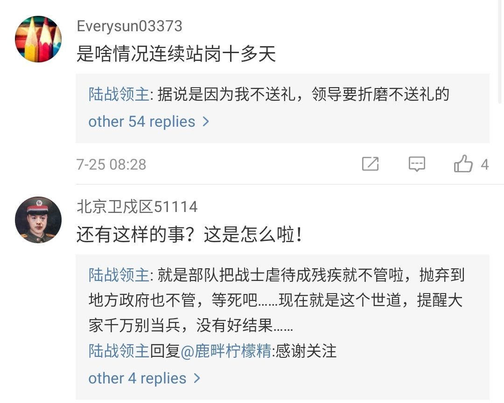

[12月17日 23:59]    BBC News 中文   @bbcchinese    吃得多，自然卡路里总量就多，继而长胖。但什么使我们进食过多呢？除了贪吃之外是否还有其它原因？
 https://bbc.in/2tthzRx   :speech_balloon:评:2 :+1:赞:11 :globe_with_meridians:转:5  

[12月17日 23:31]    BBC News 中文   @bbcchinese    狗耳朵里出了川普，果冻豆上惊现王妃，为什么？别以为只有你才会认人，看看这个“厉害了我的羊”，再试试你能不能打败机器。 https://bbc.in/2EsW2dQ   :speech_balloon:评:3 :+1:赞:5 :globe_with_meridians:转:1  

[12月17日 23:13]    墙国铁拳现世报😷   @Socialistfist      :speech_balloon:评:3 :+1:赞:16 :globe_with_meridians:转:2  

[12月17日 23:13]    墙国铁拳现世报😷   @Socialistfist    注意到他使用日文，这个老哥真是猜不透他  :speech_balloon:评:8 :+1:赞:37 :globe_with_meridians:转:1  

[12月17日 22:59]    BBC News 中文   @bbcchinese    圣诞节已经变成了商家与消费者的盛宴，狐狸成为圣诞主角，也怪不得狐狸精。 https://bbc.in/2YVuMy8   :speech_balloon:评:3 :+1:赞:8 :globe_with_meridians:转:1  

[12月17日 22:30]    BBC News 中文   @bbcchinese    以前，床垫推销员帕吉特除了参加派对和追女孩，对其它事情都漠不关心。然而，一个灾难性的夜晚永远地改变了他。 https://bbc.in/2ttACv5   :speech_balloon:评:0 :+1:赞:16 :globe_with_meridians:转:12  

[12月17日 21:59]    BBC News 中文   @bbcchinese    荷兰飞行员海斯特在驾机长途飞行过程中，从驾驶舱拍摄下空中时而诡秘时而壮丽的景象。 https://bbc.in/36JfcIv   :speech_balloon:评:2 :+1:赞:23 :globe_with_meridians:转:6  

[12月17日 21:53]    墙国铁拳现世报😷   @Socialistfist    补充  :speech_balloon:评:8 :+1:赞:47 :globe_with_meridians:转:3  

[12月17日 21:36]    墙国铁拳现世报😷   @Socialistfist    习近平主席想要知道你的坐标

#战螂在推特 https://twitter.com/minzhutiequan/status/1206795300255387648 …  :speech_balloon:评:21 :+1:赞:139 :globe_with_meridians:转:8  

[12月17日 21:30]    BBC News 中文   @bbcchinese    俄罗斯飞行员大量外流，中国是主要目的地，令俄罗斯政府机构和各大航空公司深感头痛。
 https://bbc.in/2EpGIyT   :speech_balloon:评:5 :+1:赞:19 :globe_with_meridians:转:10  

[12月17日 21:29]    墙国铁拳现世报😷   @Socialistfist    声明：小编在推友提醒后把推文删除了，原因请见配图。与之前其他人不同，他的措辞实属现行网络舆论管制下的无奈。  :speech_balloon:评:19 :+1:赞:184 :globe_with_meridians:转:48  

[12月17日 20:57]    BBC News 中文   @bbcchinese    亚历克斯是一名年轻、英俊，聪明又讨人喜欢的英国男孩。然而，他却选择在年仅23岁时自杀，结束了自己本应美好的生命。这一切都是因为一次不成功的阴茎包皮环切术。
 https://bbc.in/2Pv36gs   :speech_balloon:评:9 :+1:赞:26 :globe_with_meridians:转:5  

[12月17日 20:30]    纽约时报中文网   @nytchinese    #时报专栏 我们的竞争对手懂得了不用惧怕我们。就像朝鲜人一边奉承特朗普一边制造核武器一样，中国人也摸清了特朗普有几斤几两。
他们现在知道了特朗普雷声大雨点小，而且在用政治上会给他带来伤害的方式对付他时，他会退缩。by @paulkrugman  :speech_balloon:评:7 :+1:赞:33 :globe_with_meridians:转:9  

[12月17日 20:00]    BBC News 中文   @bbcchinese    中国第一艘国产航母山东舰交付海军，中国领导人习近平亲自出席交接入列仪式。山东舰标志着中国海军空中打击力量得到进一步提升。
 https://bbc.in/35FvGBD   :speech_balloon:评:88 :+1:赞:120 :globe_with_meridians:转:26  

[12月17日 19:41]    财经真相   @caijingxiang    2018年专项债余额（7.39万亿）就已经超过了政府性基金收入（7.14万亿）的规模！专项债以前高益完全可以靠土地财政收入填补，现在土地财政收入也不行了，必须要找别的办法解决！  :speech_balloon:评:11 :+1:赞:86 :globe_with_meridians:转:18  

[12月17日 19:34]    财经真相   @caijingxiang    政府债券流动性不足，翻译成人话就是说，政府债券没人买，而且购买人多数为银行机构，市场机构太聪明，不要！所以必须换个名字“特别国债”，继续忽悠！  :speech_balloon:评:20 :+1:赞:296 :globe_with_meridians:转:117  

[12月17日 19:33]    新闻大吐槽   @TuCaoFakeNews    貌似是在做睫毛，其实在位新疆鸣不平；
貌似是在做蛋糕，其实蛋糕上写的是光复香港
这样下去TikTok在美国是玩不下去了!  :speech_balloon:评:26 :+1:赞:761 :globe_with_meridians:转:302  

[12月17日 19:31]    BBC News 中文   @bbcchinese    香港示威浪潮至今持续超过六个月，官方表示被捕人数超过6000人，是1967年香港左派发起的“六七暴动”后最多人被捕的社会运动。 https://bbc.in/2PvKTiE   :speech_balloon:评:40 :+1:赞:110 :globe_with_meridians:转:62  

[12月17日 19:25]    墙国铁拳现世报😷   @Socialistfist    律师函警告  :speech_balloon:评:10 :+1:赞:74 :globe_with_meridians:转:4  

[12月17日 19:01]    BBC News 中文   @bbcchinese    作为华语地区最重要的选举之一，这次大选不仅关系台湾政治版图，也会深远影响台湾与周边地区的关系。 https://bbc.in/2sz6UEm   :speech_balloon:评:33 :+1:赞:103 :globe_with_meridians:转:30  

[12月17日 18:36]    BBC News 中文   @bbcchinese    最近北欧国家芬兰推选出世界上最年轻的女总理——34岁的桑娜·马林（Sanna Marin），竟然惹恼了南方邻国爱沙尼亚的一个政客。 https://bbc.in/2tjMM9A   :speech_balloon:评:3 :+1:赞:25 :globe_with_meridians:转:11  

[12月17日 18:19]    老司机   @h5lpykl7tp6jjop    猪价催生河南新首富：身家1174亿，反超王健林！
牧原股份股价大涨，秦英林家族在 2019 年福布斯内地富豪榜上，反超众多来自互联网、地产和零售行业的明星企业家。这些被反超的 " 大佬 " 包括融创孙宏斌、京东刘强东、苏宁张近东、龙湖吴亚军、小米雷军、万达王健林、百度李彦宏和字节跳动张一鸣等人。  :speech_balloon:评:8 :+1:赞:40 :globe_with_meridians:转:11  

[12月17日 18:05]    老司机   @h5lpykl7tp6jjop    海关与人民网打起来了！
因为所处的立场不同，人民网是宣传机构只能报好消息，海关总署必须如实反应情况，甚至把困难说大一点，造成这种明显的不一致，海关数据来自海关总署官方海关发布。搜航网引用数据没有错，而且图也没有PS，只不过很巧妙地只引用了一半数据，非常巧妙。  :speech_balloon:评:1 :+1:赞:39 :globe_with_meridians:转:18  

[12月17日 18:01]    BBC News 中文   @bbcchinese    比利时男孩劳伦特·西蒙斯（Laurent Simons）原本希望创下9岁大学毕业的世界纪录，但梦想难以实现，他已经从就读的荷兰大学退学。 https://bbc.in/35qgDvg   :speech_balloon:评:5 :+1:赞:25 :globe_with_meridians:转:13  

[12月17日 18:00]    纽约时报中文网   @nytchinese    “搞关系听起来太负面，”其中一名大会讲者菲利普斯说。
“在我看来，那就像是一群秃顶白男在一间破酒店里卖保险。但事实上，群体意识对加速实现目标至关重要。我们必须互相交谈，交换意见，交流经验，与人打交道，这样我们才能确保每个人都能得到应得的回报。成功就是这样的。” http://nyti.ms/38KeWL7   :speech_balloon:评:1 :+1:赞:8 :globe_with_meridians:转:1  

[12月17日 17:14]    纽约时报中文网   @nytchinese    #时报专栏 贸易战鲜有胜利者。但有时会有失败者。而且特朗普绝对是个失败者。特朗普基本上可以说是在宣告胜利后仓皇撤退。他被宏伟的妄想所蒙蔽，他的贸易战略里没有一项像承诺的那样起效。
这场贸易战没有实现任何目标，但它成功地让美国再次筋疲力竭。 http://nyti.ms/38Ogpjy   :speech_balloon:评:167 :+1:赞:196 :globe_with_meridians:转:74  

[12月17日 16:01]    BBC News 中文   @bbcchinese    中国国家主席习近平到澳门出席治权移交20周年纪念活动之际，有香港居民经港珠澳大桥前往澳门时被中国大陆公安扣查的消息，引起各界忧虑。而大桥在兴建时亦引发不少争议，包括超支及延误问题。 https://bbc.in/2POt1i6   :speech_balloon:评:60 :+1:赞:106 :globe_with_meridians:转:44  

[12月17日 15:30]    纽约时报中文网   @nytchinese    上一次已知的驱逐涉嫌从事间谍活动的中国外交官是在1987年。
经过近一年的行动，FBI在华盛顿中国城一家餐馆里抓获了两名外交官中的一名，他们试图从一名秘密为FBI工作的人那里接受该外交官认为属于机密的国家安全局文件。 http://nyti.ms/2PVCtAn   :speech_balloon:评:2 :+1:赞:12 :globe_with_meridians:转:5  

[12月17日 15:02]    BBC News 中文   @bbcchinese    失聪宝宝戴上助听器的那一刻，感觉“就像灯被打开了一样”。  :speech_balloon:评:32 :+1:赞:715 :globe_with_meridians:转:172  

[12月17日 15:00]    纽约时报中文网   @nytchinese    《嘉人》杂志的“力量之旅”是专为女性举办的商务会议。在36个小时的过程中，可能只有5个小时用来睡觉，200位企业家、高管和投资者飞越美国，结识、合作并将资金投入于彼此的想法。
她们在空中建立人脉、进行社交，也享受Spa按摩和奢华赠品。 http://nyti.ms/38KeWL7   :speech_balloon:评:3 :+1:赞:19 :globe_with_meridians:转:5  

[12月17日 14:57]    新闻大吐槽   @TuCaoFakeNews    据说是一两年以前就用的包装，能坚持不换也可以点个赞  :speech_balloon:评:1 :+1:赞:32 :globe_with_meridians:转:0  

[12月17日 14:38]    老司机   @h5lpykl7tp6jjop    澳洲珠宝店被抢，员工：我精神受创，请赔我27万！
法官：批准！
事发忽然，一个顾客忽然伸手抢夺Nicole手中的项链！她紧紧抓住项链，男子双手更加用力拉断项链并成功逃离！她的手受伤，鲜血直流，更糟糕的是她精神从此变得紧张焦虑，会恐慌发作再也没法从事销售工作。
这事在中国她怕要赔钱丢工作吧！  :speech_balloon:评:4 :+1:赞:60 :globe_with_meridians:转:22  

[12月17日 14:30]    纽约时报中文网   @nytchinese    在港府公布的一段视频中，李克强对林郑月娥说，“你带领特区政府竭尽全力维护社会稳定。”
“这些工作都是迎难而上，”李克强说。“中央政府对你和特区行政区政府所作的努力是充分肯定的。”李克强补充道，香港还没有走出困境。他呼吁林郑月娥继续努力，“依法止暴制乱，恢复秩序”。 http://nyti.ms/2tkX757   :speech_balloon:评:4 :+1:赞:11 :globe_with_meridians:转:3  

[12月17日 14:24]    新闻大吐槽   @TuCaoFakeNews    李嘉诚旗下的屈臣氏矿泉水瓶身上写着“为香港学生打气” https://twitter.com/jim97147570/status/1206746541446164480 …  :speech_balloon:评:22 :+1:赞:745 :globe_with_meridians:转:217  

[12月17日 14:24]    新闻大吐槽   @TuCaoFakeNews    李嘉诚旗下的屈臣氏矿泉水瓶身上写着“为香港学生打气” https://twitter.com/jim97147570/status/1206746541446164480 …  :speech_balloon:评:22 :+1:赞:745 :globe_with_meridians:转:217  

[12月17日 14:18]    老司机   @h5lpykl7tp6jjop    刚刚悉尼Townhall车站突发惨烈事故！中国老大爷踩空，被火车碾断双腿！本应该站在一米黄线之外候车，估计习惯抢位置的习惯害了他，在列车即将进站那一刻，60岁的他脚步不稳掉下铁轨，众人抢救不及，双腿被多次碾压，恐怕只能截肢。现场惊悚吓坏乘客！部分火车大延误！  :speech_balloon:评:8 :+1:赞:43 :globe_with_meridians:转:5  

[12月17日 14:02]    BBC News 中文   @bbcchinese    1959年瑞典人图林发明塑料袋是为了环保! 只是事与愿违...  :speech_balloon:评:16 :+1:赞:160 :globe_with_meridians:转:82  

[12月17日 14:01]    纽约时报中文网   @nytchinese    #图集【云：大自然最美的诗歌】成立于2005年的赏云协会拥有两万多名会员，他们每天都会发布来自世界各地的天空照片。
他们欣赏云的形状、观察云的变化、举办有关云的讲座，在他们眼里，云是科学，也是艺术。
点击查看图集： http://nyti.ms/2EnPPA7   :speech_balloon:评:3 :+1:赞:34 :globe_with_meridians:转:13  

[12月17日 13:35]    纽约时报中文网   @nytchinese    周一，中国谴责美国今秋秘密驱逐两名涉嫌从事间谍活动的中国外交官，并要求撤销这一行动。这是三十多年来首次有涉嫌从事间谍活动的中国外交官遭驱逐。
知情人士称这两人与他们的妻子开车穿过弗吉尼亚的一个军事基地外围后被拘，该基地内有一栋建筑是海军突击队海豹六队的总部。 http://nyti.ms/2PVCtAn   :speech_balloon:评:6 :+1:赞:42 :globe_with_meridians:转:19  

[12月17日 13:03]    BBC News 中文   @bbcchinese    她的皮肤看上去像鱼一样。但在这对夫妇内心中，她是天使。  :speech_balloon:评:23 :+1:赞:248 :globe_with_meridians:转:44  

[12月17日 13:00]    纽约时报中文网   @nytchinese    #每日一词 beauty pageant，选美大赛。上周六，当来自牙买加的托尼-安·辛格摘得世界小姐桂冠时，一个历史性的分水岭出现了：这是黑人女性首次同时获得五项世界顶级选美比赛的冠军。Pageant意为盛会、华丽的露天表演，也可直接用来表示选美。
更多简报内容： http://nyti.ms/2PPtDUE   :speech_balloon:评:0 :+1:赞:3 :globe_with_meridians:转:3  

[12月17日 12:36]    老司机   @h5lpykl7tp6jjop    转发图片  :speech_balloon:评:1 :+1:赞:24 :globe_with_meridians:转:16  

[12月17日 12:33]    老司机   @h5lpykl7tp6jjop    今日金句：在中国什么都有红线，除了道德。  :speech_balloon:评:6 :+1:赞:67 :globe_with_meridians:转:13  

[12月17日 12:09]    新闻大吐槽   @TuCaoFakeNews    先是香港问题引发抵制NBA，然后新疆问题引发抵制英超。

不过这次党媒学乖了，宁愿挨了这一闷棍，不像对待NBA事件那样开动宣传机器狂轰滥炸。

将来，闷棍会越来越多，粉红们却会被党妈冷处理，看来只有继续装睡才是共党苟延残喘的唯一法子 https://www.soundofhope.org/post/322231   :speech_balloon:评:2 :+1:赞:107 :globe_with_meridians:转:33  

[12月17日 12:09]    新闻大吐槽   @TuCaoFakeNews    先是香港问题引发抵制NBA，然后新疆问题引发抵制英超。

不过这次党媒学乖了，宁愿挨了这一闷棍，不像对待NBA事件那样开动宣传机器狂轰滥炸。

将来，闷棍会越来越多，粉红们却会被党妈冷处理，看来只有继续装睡才是共党苟延残喘的唯一法子 https://www.soundofhope.org/post/322231   :speech_balloon:评:2 :+1:赞:107 :globe_with_meridians:转:33  

[12月17日 12:00]    纽约时报中文网   @nytchinese    1994年的经典老歌登上Billboard单曲榜榜首：玛丽亚·凯莉的《All I Want for Christmas Is You》完成了有史以来最长的登顶之旅。
这是60年来首度有圣诞歌曲再次拿下Billboard百大单曲榜第一。
更多简报内容： http://nyti.ms/2PPtDUE   :speech_balloon:评:1 :+1:赞:7 :globe_with_meridians:转:3  

[12月17日 11:31]    老司机   @h5lpykl7tp6jjop    一方水土养一方土匪！  :speech_balloon:评:1 :+1:赞:18 :globe_with_meridians:转:0  

[12月17日 11:30]    纽约时报中文网   @nytchinese    林郑月娥周末至周一在北京述职。尽管抗议活动持续不断、建制派区议会选举大败，习近平和李克强仍对林郑表示支持。
习近平称赞她在香港回归来“局面最为严峻复杂的一年”里所展现出的“勇气和担当”。他还对抗议者发出警告，强调北京“维护国家主权、安全、发展利益的决心坚定不移”。 http://nyti.ms/2tkX757   :speech_balloon:评:25 :+1:赞:39 :globe_with_meridians:转:5  

[12月17日 11:00]    BBC News 中文   @bbcchinese    香港“反送中”示威者希望打造“黄色经济圈”，支援被捕人士和抗衡中国的“红色资本”，但中国大陆市场庞大，亦可以透过不同方式向香港企业施压，这个经济圈会否只成为短暂的风潮？还是香港示威者已准备好的长期抗争？ https://bbc.in/35peDn0   :speech_balloon:评:74 :+1:赞:138 :globe_with_meridians:转:49  

[12月17日 11:00]    纽约时报中文网   @nytchinese    波音宣布将于明年1月暂停生产737 Max。这一机型在两起空难造成近350人死亡后已被停飞九个月。
波音的决定可能会影响到全国各地的供应商，并对美国经济造成冲击。
更多简报内容： http://nyti.ms/2PPtDUE   :speech_balloon:评:0 :+1:赞:3 :globe_with_meridians:转:2  

[12月17日 10:30]    纽约时报中文网   @nytchinese    虽然近些年来一些外国名人和公司似乎是无意间冒犯了中国人的敏感，但毫无疑问，厄齐尔的措辞是字斟句酌的结果。
他把新疆称为“东突厥斯坦”，这是呼吁自治的维吾尔人所使用的叫法，对于很多中国人来说这是火上浇油。 http://nyti.ms/2Ejk7Uj   :speech_balloon:评:88 :+1:赞:36 :globe_with_meridians:转:6  

[12月17日 10:00]    BBC News 中文   @bbcchinese    网红钟明轩、“波特王”先后发布与蔡英文的合作影片，却因内容涉及政治议题，“波特王”遭中国合作厂商解约，引起轩然大波。 https://bbc.in/36LGbDd   :speech_balloon:评:175 :+1:赞:364 :globe_with_meridians:转:122  

[12月17日 09:48]    纽约时报中文网   @nytchinese    早安！今日重点新闻包括：
林郑月娥北京述职获力挺；波音将暂时停产737 Max；美众院司法委员会报告称特朗普“叛国”；印度新公民法案引发多地暴力抗议；英国首相约翰逊向BBC“开火”；美国特使警告朝鲜不要进行武器测试……NYT简报带你速览今日要闻。 http://nyti.ms/2PPtDUE   :speech_balloon:评:21 :+1:赞:45 :globe_with_meridians:转:10  

[12月17日 09:30]    纽约时报中文网   @nytchinese    #观点 秦家骢：习先生，一个民主的香港对你有益 http://nyti.ms/2Po6wkV   :speech_balloon:评:22 :+1:赞:20 :globe_with_meridians:转:4  

[12月17日 09:26]    老司机   @h5lpykl7tp6jjop    有人总想以成各种组织来反共，对此持悲观态度。中共靠地下组织起家，深黯组织能发挥的作用，所以它们一直在成立各种特务组织，公开的秘密的功能齐全，层层叠叠，不计其数，再加上中国人见风使舵的遗传性，所向披靡，无所不能，但成功于此失败也于此，它必死于派系斗争，开支巨大，结构拥肿，贪污漏洞！  :speech_balloon:评:1 :+1:赞:15 :globe_with_meridians:转:6  

[12月17日 08:59]    BBC News 中文   @bbcchinese    英国保守党大选胜利后，首相约翰逊承诺大刀阔斧改革，将经济振兴计划列入其首要施政任务。
 https://bbc.in/2S4SFlD   :speech_balloon:评:1 :+1:赞:16 :globe_with_meridians:转:8  

[12月17日 07:59]    BBC News 中文   @bbcchinese    中国留学生已经成为英国海外留学生中的最大群体。但西方对这一留学群体的特点却了解的极其有限。英美教育专家为你解读...
 https://bbc.in/2Ep5qzg   :speech_balloon:评:37 :+1:赞:59 :globe_with_meridians:转:28  

[12月16日 21:30]    纽约时报中文网   @nytchinese    #观点 如果中国政府澄清关于2047年后香港将何去何从的立场，并接受港人在成为中华民族不可分割的一部分同时，希望当家作主的愿望，那么对你来说，就会是一个双赢局面：不仅在香港，在台湾也是如此。
而眼下，在这两个值得珍视的地方，你正在失去民心。 http://nyti.ms/2Po6wkV   :speech_balloon:评:17 :+1:赞:24 :globe_with_meridians:转:1  

[12月16日 21:00]    纽约时报中文网   @nytchinese    贸易战带来的不确定性似乎也对美国和全球经济造成了重大损失，特别是对商业投资的抑制。
特朗普和他的顾问们指出，创纪录的低失业率、强劲的股市和高涨的消费者信心证明，贸易战几乎没有产生负面影响。
但经济学者认为，如果没有贸易战，美国的经济增长会更强劲。 http://nyti.ms/2RRKtVH   :speech_balloon:评:15 :+1:赞:7 :globe_with_meridians:转:3  

[12月16日 20:46]    老司机   @h5lpykl7tp6jjop      :speech_balloon:评:1 :+1:赞:9 :globe_with_meridians:转:4  

[12月16日 20:46]    老司机   @h5lpykl7tp6jjop    妙文转发：一起来温习那些令你虎躯一震的新名词  :speech_balloon:评:10 :+1:赞:96 :globe_with_meridians:转:42  

[12月16日 20:00]    纽约时报中文网   @nytchinese    #新新世界 我问Liu Jingyao，她觉得中国有多少新闻用户相信自己。“肯定没有30%，“她有点沮丧地说，“最多10%。”
“但我要真是仙人跳，为什么要带着一个男人在楼里转来转去找了15分钟？而且他是刘强东，谁能知道他会做出这种事情？” http://nyti.ms/2sm2yk0   :speech_balloon:评:36 :+1:赞:36 :globe_with_meridians:转:12  

[12月16日 19:30]    纽约时报中文网   @nytchinese    美国十年来最受欢迎的名字 http://nyti.ms/2EfUST8   :speech_balloon:评:4 :+1:赞:8 :globe_with_meridians:转:2  

[12月16日 19:25]    墙国铁拳现世报😷   @Socialistfist    评论区表情包大赏？  :speech_balloon:评:13 :+1:赞:169 :globe_with_meridians:转:10  

[12月16日 19:17]    墙国铁拳现世报😷   @Socialistfist    任职于长春一汽公司的戛戛
每当遇到生活中的烦心事，总会回到家，一个人坐在沙发上，打开音响，调大音量, 循环播放 天赋事变的rap
［hey！democracy...] 
听着听着，戛戛就睡了过去，嘴角划出一道微笑，在中国梦里的她不再被世俗纷扰
晚安中国

#社会主义铁拳  :speech_balloon:评:73 :+1:赞:656 :globe_with_meridians:转:182  

[12月16日 19:00]    纽约时报中文网   @nytchinese    #新新世界 Liu Jingyao说，事实证明自己还是比一开始想像得更坚强。没错，她说自己患上了创后应激障碍，有时有自杀的倾向。但她仍决心继续诉讼。
她有时会在脑海中想象当初应该如何用不同的方式应对。“如果当时知道自己可以忍受这么多，”她说，“肯定不会犹豫报警的。” http://nyti.ms/2sm2yk0   :speech_balloon:评:7 :+1:赞:11 :globe_with_meridians:转:3  

[12月16日 17:03]    财经真相   @caijingxiang    第十九届四中全会精神！ https://twitter.com/landofyelang/status/1206481839906418688 …  :speech_balloon:评:22 :+1:赞:342 :globe_with_meridians:转:162  

[12月16日 15:01]    老司机   @h5lpykl7tp6jjop    基督教从唐朝就传入中国，到今天也没有得到大发展，共教传入中国一百年就融汇几千年的传统，生长发展成如今盘根错节的庞大怪物，这是土壤气候生态环境适合的结果，共产主义的幽灵为什么在欧洲游荡一个多世纪无法生根呢？一到中国就蓬勃发展，席卷大陆，这难道没有原因吗？看看哪些红老兵疯魔的样子！唉  :speech_balloon:评:73 :+1:赞:588 :globe_with_meridians:转:134  

[12月16日 14:49]    老司机   @h5lpykl7tp6jjop    每五个地球人里就有一个是中国人；
每五个中国人里就有一个是精神病。  :speech_balloon:评:15 :+1:赞:165 :globe_with_meridians:转:67  

[12月16日 10:54]    老司机   @h5lpykl7tp6jjop    一位老知识分子对我说：其实中国人是最容易统治的，是最好说话的，只要共产党稍微改变一点点，百姓就感恩戴德，可是它们总是加压加压，不让人活……说罢长叹，中国的知识分子一直盼望明君，盼望清官，希望给明君当马前卒，肝脑涂地，鞠躬尽瘁，可是连这样机会也没有，大多都抱憾终身，含冤入罪屈辱而亡  :speech_balloon:评:17 :+1:赞:149 :globe_with_meridians:转:43  

[12月16日 09:51]    老司机   @h5lpykl7tp6jjop    这个抖音还可以转发  :speech_balloon:评:2 :+1:赞:239 :globe_with_meridians:转:128  

[12月16日 03:57]    老司机   @h5lpykl7tp6jjop    祸不单行!俄国航母失火后 又搞沉一艘潜艇，老毛子的粗旷有的一瞥
俄罗斯PD-16浮船坞15日沉没，一艘在坞内维修的B-380号潜艇侧翻。B-380号常规潜艇水下排水量超过3700吨，配备了鱼雷、水雷等武器。塔斯社报道称，这艘潜艇不属于黑海舰队，是一艘未完成建造的潜艇。  :speech_balloon:评:1 :+1:赞:42 :globe_with_meridians:转:13  

[12月16日 03:23]    老司机   @h5lpykl7tp6jjop    这个地方居然孔雀成灾，大陆网友又要羡慕了
继外来小龙虾泛滥成灾、走私水獭成灾、野猪繁殖成灾之后，日本冲绳县的宫古岛上又出现了“孔雀成灾”的现象。据了解，这是一种外来的印度孔雀，虽然形态优雅，但作为杂食性动物，孔雀食量很大，同时又缺少天敌，繁殖能力强，成为了这座小岛的“不速之客”。  :speech_balloon:评:7 :+1:赞:12 :globe_with_meridians:转:3  

[12月16日 03:12]    老司机   @h5lpykl7tp6jjop    相比中国警察背摔婴儿美国警察太逊了
纽约警察暴力执法强抢婴儿,母亲获赔62万美元，今年2月，纽约市议会向她公开道歉。8月，海德利起诉市政府并要求赔偿。周五（13日）纽约市政府表示双方达成和解，将赔偿她62.5万美元。  https://r.sinaimg.cn/large/article/1305cb9b870917bbe63fac2d69eb65b5.jpg …  :speech_balloon:评:1 :+1:赞:14 :globe_with_meridians:转:7  

[12月16日 02:57]    老司机   @h5lpykl7tp6jjop    被祕密驱逐 中国外交官喊冤：是迷路不是刺探情报！

美国政府今年秋天祕密驱逐中国大陆驻美大使馆两名外交官，因为他们开车到维吉尼亚州一个祕密军事基地。这是美国1987年驱逐两名大陆大使馆职员以来，首次驱逐涉嫌刺探情报的大陆外交官。这件事显示美国政府现在对大陆疑似刺探情报的行为更加强硬。  :speech_balloon:评:8 :+1:赞:64 :globe_with_meridians:转:13  

[12月15日 19:13]    新闻大吐槽   @TuCaoFakeNews    反送中半年以来，我们看见过：
在香港街头高歌《愿荣光归香港》的意大利歌唱家；
来了解831太子站惨案的韩国影星；
在理工大学守护学生的美国牧师；
还有因给港人免费煮咖啡而备受黑警骚扰的日本小伙~

如果这些人就是中共口中的敌对势力，那么与这些人为敌，就是与一切信奉自由与仁爱的人为敌！  :speech_balloon:评:3 :+1:赞:184 :globe_with_meridians:转:81  

[12月15日 19:13]    新闻大吐槽   @TuCaoFakeNews    反送中半年以来，我们看见过：
在香港街头高歌《愿荣光归香港》的意大利歌唱家；
来了解831太子站惨案的韩国影星；
在理工大学守护学生的美国牧师；
还有因给港人免费煮咖啡而备受黑警骚扰的日本小伙~

如果这些人就是中共口中的敌对势力，那么与这些人为敌，就是与一切信奉自由与仁爱的人为敌！  :speech_balloon:评:3 :+1:赞:184 :globe_with_meridians:转:81  

[12月15日 18:43]    新闻大吐槽   @TuCaoFakeNews    被香港抗争者的不屈精神感动，日本小伙飘洋过海，到香港街头给抗争者提供免费咖啡，可黑警处处阻挠，动不动就要盘查他，搞得他狼狈不堪~

日式咖啡一杯
自由精神百倍
帮煮帮倒免费
妒警心生暗鬼
纯打油  :speech_balloon:评:56 :+1:赞:1221 :globe_with_meridians:转:472  

[12月15日 18:43]    新闻大吐槽   @TuCaoFakeNews    被香港抗争者的不屈精神感动，日本小伙飘洋过海，到香港街头给抗争者提供免费咖啡，可黑警处处阻挠，动不动就要盘查他，搞得他狼狈不堪~

日式咖啡一杯
自由精神百倍
帮煮帮倒免费
妒警心生暗鬼
纯打油  :speech_balloon:评:56 :+1:赞:1221 :globe_with_meridians:转:472  

[12月15日 17:56]    老司机   @h5lpykl7tp6jjop    12.15 長槍上膛
今日下午3時，有防暴警員在九龍灣德福花園與在場人士發生爭執，期間警員企圖開槍，被同僚阻止。

#黑警謀殺市民
#HKPoliceTerrorism
#HKpolicebrutality
#HKPoliceState
#FightForFreedom
#StandWithHongKong
#HongKongProtests
#SOSHK  :speech_balloon:评:39 :+1:赞:516 :globe_with_meridians:转:578  

[12月15日 16:43]    新闻大吐槽   @TuCaoFakeNews    有朋友问，这几天好安静，香港的抗争停下来了吗？
我说不会的，不信你看这个，半小时之前的事情~
抗争者分散成小队，在不同的地点出击！  :speech_balloon:评:15 :+1:赞:501 :globe_with_meridians:转:230  

[12月15日 16:43]    新闻大吐槽   @TuCaoFakeNews    有朋友问，这几天好安静，香港的抗争停下来了吗？
我说不会的，不信你看这个，半小时之前的事情~
抗争者分散成小队，在不同的地点出击！  :speech_balloon:评:15 :+1:赞:501 :globe_with_meridians:转:230  

[12月15日 16:34]    老司机   @h5lpykl7tp6jjop    港共恶警今日大批进入商场抓人、打人，被激怒的市民包圍瘋警並聲討其暴力行為，瘋警隨即向人群和記者群舉起警棍、施放胡椒噴霧并射中記者  :speech_balloon:评:16 :+1:赞:193 :globe_with_meridians:转:181  

[12月15日 13:01]    新闻大吐槽   @TuCaoFakeNews    狼振英昨天刚被脸书禁言，还是没学乖，又谈论起了汉奸问题，这事不扒一扒，真是对不起最会卖国的中共~

历史上，中共为讨好俄爹，出卖领土，把我大中华美丽秋海棠版图撸成炸毛鸡~
而就在前几个月拉达克被印度正式纳入版图，中共也没有任何实际行动制止~

狼大人再哪壶不开提哪壶，早晚也被大陆禁言！  :speech_balloon:评:21 :+1:赞:165 :globe_with_meridians:转:81  

[12月15日 13:01]    新闻大吐槽   @TuCaoFakeNews    狼振英昨天刚被脸书禁言，还是没学乖，又谈论起了汉奸问题，这事不扒一扒，真是对不起最会卖国的中共~

历史上，中共为讨好俄爹，出卖领土，把我大中华美丽秋海棠版图撸成炸毛鸡~
而就在前几个月拉达克被印度正式纳入版图，中共也没有任何实际行动制止~

狼大人再哪壶不开提哪壶，早晚也被大陆禁言！  :speech_balloon:评:21 :+1:赞:165 :globe_with_meridians:转:81  

[12月15日 12:37]    墙国铁拳现世报😷   @Socialistfist    #铁拳砸死小粉红

某新闻传播专业大学生，打算于思政课讨论“西方媒体在报道大型事件中的双标”，为此开设了微信讨论组交换素材与思路，但因为发言触及过多敏感词，惨遭微信封号，目前正在微博伸冤。

一场成功的“谁说我国没有言论自由”行为艺术表演。  :speech_balloon:评:88 :+1:赞:1014 :globe_with_meridians:转:351  

[12月15日 12:20]    财经真相   @caijingxiang    海南要升级为中央特区，谁决定的？该不会是某些一边干着女星，一边卖官的混蛋商量的吧？  :speech_balloon:评:124 :+1:赞:675 :globe_with_meridians:转:195  

[12月15日 12:19]    新闻大吐槽   @TuCaoFakeNews    ：我这半年的猫砂掌又白练了！但机会有的是，吾必取而代之！  :speech_balloon:评:0 :+1:赞:4 :globe_with_meridians:转:1  

[12月15日 11:54]    财经真相   @caijingxiang    在中国如果公司经营不下去的时候，没有什么问题是卖房不能解决的！  :speech_balloon:评:17 :+1:赞:185 :globe_with_meridians:转:30  

[12月15日 11:49]    新闻大吐槽   @TuCaoFakeNews    打个油：
商鞅住店无印信，
周兴入瓮苦自寻；
送中推手被送中，
作法自毙有传人！ https://twitter.com/TuCaoFakeNews/status/1206013502604763136 …  :speech_balloon:评:6 :+1:赞:92 :globe_with_meridians:转:32  

[12月15日 11:48]    财经真相   @caijingxiang    灵隐寺：12月13日，某媒体称：“12月18日—19日，天风证券将在上海召开展望2020年度策略会，而在下周五上午，天风策略会将会'移步'灵隐寺，接待人为灵隐寺主持方丈……”对此，灵隐寺郑重声明：“券商基金年终祈福”活动与本寺无任何关系，本寺从未委托或授权任何单位或个人开展与此相关的活动。  :speech_balloon:评:6 :+1:赞:59 :globe_with_meridians:转:12  

[12月15日 10:54]    新闻大吐槽   @TuCaoFakeNews    党媒记者和华大妈一问一答演双簧~

党媒妓者：美国媒体对中国不公，CGTN新疆反恐纪录片被Youtube下架，而且《纽约时报》记者还把香港暴徒称作“支持民主的活动分子”

华大妈：美国一些媒体没有恪守最基本的新闻报道准则，也失去了最起码的社会公德和责任！

网民：能否开放油管，我们想去谴责美帝媒体！  :speech_balloon:评:69 :+1:赞:394 :globe_with_meridians:转:116  

[12月15日 10:02]    新闻大吐槽   @TuCaoFakeNews    王户猫一边给狗大大作心脏按摩，一边安慰道：这协议不得不签啊，咱们早就定好，以拖待变不是吗？您千万不可动气啊！
（可这猫心里想：丫心脏支架怎么还不脱落？）  :speech_balloon:评:9 :+1:赞:115 :globe_with_meridians:转:47  

[12月15日 08:50]    新闻大吐槽   @TuCaoFakeNews    香港律政司长鄭若驊借口受伤手术康复，赖在英国不回港，被大使刘晓明亲自押解送中！

有传言说，北京担心这个垮脸大妈在手术时被军情六处植入窃听芯片，所以把大妈弄到北京作详细体检~

推行送中的罪魁被第一个送中，还被共党体检羞辱，不知她作何感受~心情不好，垮脸会加速~  :speech_balloon:评:30 :+1:赞:367 :globe_with_meridians:转:168  

[12月15日 08:20]    新闻大吐槽   @TuCaoFakeNews    反送中开始以来，黑警加班6个月，与正常年份相比，平均每人多赚8万6千港币~
曾经最佳的亚洲警队，良心就值这个价？看来真不是钱能解释的现象，一个邪恶体制对人的败坏，速度超乎想象  :speech_balloon:评:25 :+1:赞:388 :globe_with_meridians:转:268  

[12月15日 02:39]    GFHG SDKM   @zyx_yny    This Muslim man was just released from a concentration in china 

"He could barely walk by himself. He doesn't recognize anyone in his family and gets frightened by every little movement of people around him"

There are nearly 3 Million Muslim in concentration camps in China   :speech_balloon:评:1448 :+1:赞:73852 :globe_with_meridians:转:60666  

[12月14日 23:24]    墙国铁拳现世报😷   @Socialistfist    “生而为国人，边早就选了”
当初NBA风波的爱国表态，提到在国家尊严前不值一提。
鼠绘汉化网因侵犯海贼王版权疑似被哔哩哔哩上海公司举报，现已经跨省批捕
NBA目前在中国照旧正常播出

#社会主义铁拳  :speech_balloon:评:48 :+1:赞:750 :globe_with_meridians:转:183  

[12月14日 22:11]    GFHG SDKM   @zyx_yny    My 2020 New Year resolution is to free both Hong Kong & China by defeating the New Evil Empire. Happy New Year! https://twitter.com/bohsiuming/status/1205845620851785735 …  :speech_balloon:评:420 :+1:赞:4833 :globe_with_meridians:转:2320  

[12月14日 19:00]    财经真相   @caijingxiang    特朗普上台前，中国依旧是资本流入国，这一时期如何逼迫中共放开管制，好让美企也能在中国分一杯羹是中美贸易纠纷的核心；无论是纳瓦罗这样的美国智库，还是特朗普竞选承诺，都是围绕的如何“进中国”来开展的，但是这个思维到今天就完全不合时宜，中国已经成为资本外流国，如何“出中国”必须要摆到桌面上  :speech_balloon:评:12 :+1:赞:194 :globe_with_meridians:转:35  

[12月14日 18:31]    财经真相   @caijingxiang    中共对外资企业实行外汇管制，是最大的贸易不公平，你连以前投资的钱都拿不回来，扯什么其他谈判就是胡扯！这点莱特希泽不知道吗？美国企业难道没有跟他沟通过吗？问题是中共权贵不可能把吃进肚子的美元吐出来，给美企撤退，考虑明白这一层，你就会明白贸易谈判从一开始就破裂了！  :speech_balloon:评:10 :+1:赞:272 :globe_with_meridians:转:66  

[12月14日 18:22]    财经真相   @caijingxiang    中美贸易谈判最核心的议题不是技术盗窃、知识产权、网络攻击、国企补贴等等，而是金融资本的全面开放，尤其是在华投资和利润如何顺利撤出，农产品购买之所以成为谈判焦点，归根结底还是“钱”，这也是为啥区区500亿美元就这么显眼的原因！如果放开美资外汇管制，那将是多少个500亿呢？  :speech_balloon:评:28 :+1:赞:418 :globe_with_meridians:转:96  

[12月14日 16:19]    财经真相   @caijingxiang    据朝中社今日报道，朝鲜国防科学院发言人发表谈话称，当地时间13日晚上10点41分至48分，朝鲜在西海卫星发射场再次进行重大试验。该发言人称，朝鲜近期取得的国防科研成果，将进一步夯实朝鲜的战略核战争遏制力。  :speech_balloon:评:17 :+1:赞:94 :globe_with_meridians:转:12  

[12月14日 10:09]    GFHG SDKM   @zyx_yny    #HKPoliceTerrorists has fired nearly 16,000 #TearGas rounds  during the six months of pro-#democracyforhk #HongKongProtests  :speech_balloon:评:12 :+1:赞:279 :globe_with_meridians:转:260  

[12月14日 03:21]    GFHG SDKM   @zyx_yny    #HongKongers & #HongKong #StandwithUyghurs 

To free #Uyghurs in #EastTurkistan, Chinese Communist Party of #China which violates #HumanRights needs to end. 

#BoycottChina  :speech_balloon:评:2 :+1:赞:108 :globe_with_meridians:转:18  

[12月14日 01:42]    GFHG SDKM   @zyx_yny    Support  :speech_balloon:评:6 :+1:赞:274 :globe_with_meridians:转:33  

[12月14日 01:01]    财经真相   @caijingxiang    第一阶段协议背后的数字博弈：15号即将生效的1600亿美元25%的关税，算下来就是400亿美元税收；将9月份1200亿美元15%的关税降7.5%，就是等于少征收90亿美元关税，两者总计是490亿美元。刚好就是中国采购500亿美元农产品！  :speech_balloon:评:79 :+1:赞:812 :globe_with_meridians:转:251  

[12月14日 00:28]    财经真相   @caijingxiang    1.关税原来说是取消3600亿的一半，现在只是1200亿的一半，没有假消息公布的好；2.利好出尽，获利了结；3.对比双方公告内容存在差异很多，引发市场担忧情绪！ https://twitter.com/QingLucky/status/1205524315807969281 …  :speech_balloon:评:12 :+1:赞:164 :globe_with_meridians:转:51  

[12月14日 00:21]    财经真相   @caijingxiang    中美第一阶段协议公告差异：1.美方公布包含强制执行机制，中方没有！2.中方公告说同意分阶段降低关税，美方公告里没有！3.美方公告中方承诺会购买大量农产品，中方公告中没有，且新闻发布会上故意混淆说，美方也会购买中国农产品！4.下一阶段，中方强调需要进行校对、翻译、商量时间（拖），美方没有！  :speech_balloon:评:108 :+1:赞:1408 :globe_with_meridians:转:776  

[12月13日 23:50]    财经真相   @caijingxiang    人民币浮盈的平仓，浮亏的继续持有，暂时不在新建人民币空仓！  :speech_balloon:评:8 :+1:赞:56 :globe_with_meridians:转:5  

[12月13日 23:47]    财经真相   @caijingxiang    发布会结束了，市场一头雾水，没有方向，除了知道达成了传说中的“deal”外，现在的问题，比发布会前还多，人民币停留在7附近，没有波动！第二阶段协议是立即开始，还是中共的看第一阶段的情况？执行机制是什么？如果中共不执行第一阶段的协议会受到那些处罚？发布会故意让彭博提问在打谁的脸？  :speech_balloon:评:38 :+1:赞:302 :globe_with_meridians:转:71  

[12月13日 22:26]    财经真相   @caijingxiang    昨天很多交易员被假新闻搞得“崩溃”，尤其是信仰中共国运的交易员，不仅是亏钱的割肉痛，更多的是对中共得到喘息的“信仰动摇的痛心”，最难熬的一天渡过了，活着真好，亏钱几万美元，依然很高兴，接下来还会赚回来，最重要的是中共的“国运”已定！华夏幸甚！中国幸甚！  :speech_balloon:评:67 :+1:赞:615 :globe_with_meridians:转:77  

[12月13日 22:17]    GFHG SDKM   @zyx_yny    警察の鎮圧行動の中、原因不明の転落死で亡くなった周梓樂くん。

これは周くんのお父さんからの手紙。

//君がまだ母親のお腹にいたあの頃に、私たちはすでに君に「樂樂」という名前を付けることを決めたんだ。
君が一生楽しく笑顔で過ごせますように、と願って。//

是非、全文もご一読ください。  :speech_balloon:评:19 :+1:赞:972 :globe_with_meridians:转:746  

[12月13日 22:13]    财经真相   @caijingxiang    华尔街日报、彭博这一波大忽悠，把做空交易者给提前割了韭菜，现在到了真正割韭菜的时候了！ https://twitter.com/realDonaldTrump/status/1205489214546235393 …  :speech_balloon:评:37 :+1:赞:322 :globe_with_meridians:转:68  

[12月13日 22:11]    财经真相   @caijingxiang    没有刘鹤！ https://twitter.com/caolei1/status/1205487048259325952 …  :speech_balloon:评:17 :+1:赞:77 :globe_with_meridians:转:18  

[12月13日 20:13]    GFHG SDKM   @zyx_yny    日本政府が来年、習近平国家主席を国賓として招くことについて、私は強く反対しています。

これはあくまで一人の香港人としての個人的な意見ですが、日本の皆さんに読んでほしいです。→  :speech_balloon:评:701 :+1:赞:21511 :globe_with_meridians:转:9851  

[12月13日 19:54]    墙国铁拳现世报😷   @Socialistfist    啧啧啧

#战螂在推特 2  :speech_balloon:评:22 :+1:赞:130 :globe_with_meridians:转:24  

[12月13日 19:45]    财经真相   @caijingxiang    2015年特朗普再次新著《伤残美国：如何再次伟大》在此书中他陈述了自己对非法移民问题的立场，主张进行严格控制来缓和美国福利开支压力；同时反对伊拉克战争；对于这些主张他直言坦率，吸引媒体关注，而不是以往的政客表演！实事上早在2013年特朗普花费100万美元对进军白宫进行可行性研究！  :speech_balloon:评:2 :+1:赞:100 :globe_with_meridians:转:13  

[12月13日 19:36]    财经真相   @caijingxiang    为了让美国再次伟大，特朗普的开出的药方是：令欧佩克失去石油定价权；逼迫中国从事真正的公平贸易，以便给美国带来就业；设法减少债务又不损害正常福利；消除奥巴马医改和经济政策！今天他做到几条呢？  :speech_balloon:评:8 :+1:赞:151 :globe_with_meridians:转:25  

[12月13日 18:50]    GFHG SDKM   @zyx_yny    #HayırlıCumalarDoğuTürkistan   :speech_balloon:评:16254 :+1:赞:162042 :globe_with_meridians:转:66022  

[12月13日 13:58]    GFHG SDKM   @zyx_yny    永不遺忘，常在心中，他們的付出，將會留給世世代代，香港多謝有你才會有未来，香港史書會有手足的勇敢，輝煌的事件。  :speech_balloon:评:52 :+1:赞:837 :globe_with_meridians:转:531  

[12月13日 11:46]    新闻大吐槽   @TuCaoFakeNews    港人很喜欢吃日式牛丼饭，但他们就是忍住不去吃吉野家！
因为吉野家解雇了为反送中发声的员工，主动替港共迫害香港人！

直到这家叫做SUKIYA的同类日料店开张，香港人排起长队准备大快朵颐。

不知道吉野家看到这大长队作何感想？
“矮马，没人吃，今天的牛肉又要臭了”  :speech_balloon:评:165 :+1:赞:2400 :globe_with_meridians:转:913  

[12月13日 11:19]    GFHG SDKM   @zyx_yny    Can't believe Commissar Lamb is rewarding @hkpoliceforce human rights abuse & brutality. https://twitter.com/Kaman13032369/status/1205325571070124037 …  :speech_balloon:评:446 :+1:赞:5074 :globe_with_meridians:转:4040  

[12月12日 21:43]    墙国铁拳现世报😷   @Socialistfist    感谢近几日投稿的推友！  :speech_balloon:评:0 :+1:赞:65 :globe_with_meridians:转:1  

[12月12日 21:42]    墙国铁拳现世报😷   @Socialistfist    红色精神流传一次一百万

#社会主义铁拳  :speech_balloon:评:41 :+1:赞:471 :globe_with_meridians:转:127  

[12月12日 20:11]    墙国铁拳现世报😷   @Socialistfist    补充  :speech_balloon:评:0 :+1:赞:55 :globe_with_meridians:转:11  

[12月12日 20:06]    墙国铁拳现世报😷   @Socialistfist    基层腐败，中央英明 -----某战螂

#社会主义铁拳  :speech_balloon:评:27 :+1:赞:337 :globe_with_meridians:转:73  

[12月12日 16:51]    GFHG SDKM   @zyx_yny    Japanese retail brand MUJI was sued by fake "MUJI" copycat in #China (right) for copyright dispute and the fake MUJI won the court case.

The genuine MUJI has to pay the fake one US$85k for their "financial loss" and apologize due to "copyright infringement"

China = Fantasy Land  :speech_balloon:评:147 :+1:赞:1426 :globe_with_meridians:转:1281  

[12月12日 16:35]    GFHG SDKM   @zyx_yny    He comes all the way from Japan, bring coffee with him to give Hong Kong people a free cup. “I come to give some warmth to you guys, I know what happened” he said 

#StandWithHongKong  :speech_balloon:评:162 :+1:赞:4038 :globe_with_meridians:转:2109  

[12月12日 13:43]    GFHG SDKM   @zyx_yny    今日、すき家の香港店がオープンしました。昨日の夜から長い行列ができました（笑）

親中派企業が経営している香港吉野家を多くの香港人がボイコットしている今、すき家は多分大人気になると思いますw

#香港 #すき家  :speech_balloon:评:448 :+1:赞:23585 :globe_with_meridians:转:7659  

[12月10日 22:10]    墙国铁拳现世报😷   @Socialistfist    “警察说要对我用喷雾剂了”

#社会主义铁拳  :speech_balloon:评:47 :+1:赞:769 :globe_with_meridians:转:180  

[12月10日 02:24]    墙国铁拳现世报😷   @Socialistfist    不了解铁拳的老朋友兔兔是谁的请看这里 https://twitter.com/Socialistfist/status/1175057744858161159?s=19 …  :speech_balloon:评:8 :+1:赞:88 :globe_with_meridians:转:17  

[12月10日 02:15]    墙国铁拳现世报😷   @Socialistfist    另外点名批评的还有新加坡人李连杰和我们的老朋友兔兔 @zzyyzoe 最喜爱的  加拿大人吴亦凡  :speech_balloon:评:10 :+1:赞:137 :globe_with_meridians:转:15  

[12月10日 02:13]    墙国铁拳现世报😷   @Socialistfist    美籍刘亦菲一直以来就因为其国籍问题在墙国招致非议。在今年8月14日微博撑港警后让不少粉红对她国籍的质疑消停不少。没过多久，鹤岗网警就在12月5日发短片手撕刘亦菲
为了同时拥有人民币和美国护照，真乃里外不是人
#社会主义铁拳  :speech_balloon:评:31 :+1:赞:414 :globe_with_meridians:转:116  

[12月09日 09:57]    墙国铁拳现世报😷   @Socialistfist    孙夕庆博士已申请“开庭次数最多的刑事案件”的吉尼斯纪录，并已被受理。
小编为孙博士在遇到如此不公后还能保留如此幽默感点赞  :speech_balloon:评:6 :+1:赞:426 :globe_with_meridians:转:87  

[12月04日 20:37]    GFHG SDKM   @zyx_yny    喂喂，香港嘅bb睇落嚟

澳洲設立committee，探討是否有必要頒佈Magnitsky. 可以開始寫信lobby袋鼠囯喔。They accept submissions now

好擔心。區選舉和HKHRDA頒佈后，大家有哋散漫有哋唔focus喎。還有人開始屌來屌去...

bb, come back! 依家有嘢做囖

利申：信還沒寫，不過澳洲list做完一半了 https://twitter.com/NSWHongkongers/status/1202151090399006720 …  :speech_balloon:评:9 :+1:赞:320 :globe_with_meridians:转:201  

[11月26日 01:01]    GFHG SDKM   @zyx_yny    Heading back to London. 

Thank you #HK for letting us share in your unforgettable victory.

香港人, 加油   :speech_balloon:评:2681 :+1:赞:21515 :globe_with_meridians:转:10204  

[11月24日 12:46]    GFHG SDKM   @zyx_yny    Very good to take some time@our from election observation to tell #JuniusHo in person that I was responsible for the revocation of his honorary doctorate from @AngliaRuskin #Sorrynotsorry  :speech_balloon:评:6943 :+1:赞:46279 :globe_with_meridians:转:27863  

[11月24日 08:10]    凡賽堤/FORSETI   @FecharCCP    呼籲請求共同挖掘所有有關香港發生的事，越全面越好，不同角度，越多越好，包括被暗地抓捕的人員，特別是CCP 派出的各種偽裝身份，包括變身變裝行兇的一點一滴都要挖掘出來，把CCP 的邪惡下三濫手段的真相毫無保留的曝光在全世界面前！世界公知公義才能真正挽救和保護香港人！希望懂視頻編輯配上中英文  :speech_balloon:评:3 :+1:赞:22 :globe_with_meridians:转:19  

[11月23日 10:13]    凡賽堤/FORSETI   @FecharCCP    CCP極權殺人恐怖組織正在用各種兇殘手段屠殺我們的同胞...................
CCP極權殺人恐怖組織是全人類的公敵！呼籲全世界正道主義合力消滅CCP！

圖為被殺害的陳彥霖母女！  :speech_balloon:评:0 :+1:赞:9 :globe_with_meridians:转:12  

[11月21日 13:58]    GFHG SDKM   @zyx_yny    On #PolyU being the end game, this OL says it is 100% not the end game.  She says what we saw happened to the students at Poly, the way they were brutally treated by #HKPolice, there's no way HKers will forget.  We will keep on fighting!

#StandWithHongKong #HongKongProtests  :speech_balloon:评:104 :+1:赞:2401 :globe_with_meridians:转:1558  

[11月21日 11:50]    GFHG SDKM   @zyx_yny    We were in front of the Diet Members’ Office Building.

We will keep fighting with you, HKers
We will keep spreading what's happening in HK

You are not alone  :speech_balloon:评:370 :+1:赞:3553 :globe_with_meridians:转:2136  

[11月21日 00:57]    GFHG SDKM   @zyx_yny    Yesterday’s passage of the #HongKong Human Rights & Democracy Act was a good day in the struggle to resist totalitarian #China & its bid for domination. But it was not the last day. We have a long road ahead to protect our jobs, our workers & our security.  :speech_balloon:评:1651 :+1:赞:16298 :globe_with_meridians:转:10798  

[11月20日 21:56]    GFHG SDKM   @zyx_yny    The first day that schools resumed, #hkpolice deliberately targeted high school students to stop and search for no reason. As many #hongkongers suggest, being young becomes a crime as #China and #HKGov are totally out of reach of the whole city.  :speech_balloon:评:262 :+1:赞:5607 :globe_with_meridians:转:6214  

[11月14日 18:36]    财经真相   @caijingxiang    中共基建没有钱，很多网友简单的认为开动印钞机就行，这其实是大错特错，中共央行印的每一分钱，都必须有对应的相应的价值才行，否则就是无锚印钞，汇率崩盘！过去20年央行印钞都是以债务为基础的。比如，房奴的房贷，当房奴申请贷款时，本质是向央行抵押了自己未来30年的劳动力。 https://twitter.com/aspeltuo8/status/1194923278646816768 …  :speech_balloon:评:84 :+1:赞:898 :globe_with_meridians:转:315  

[11月12日 07:22]    凡賽堤/FORSETI   @FecharCCP    11日早在西湾河开枪射伤示威者的港警关家荣身份被起底，其担任家教会主席的德望学校师生、家长及校友发起联署要求解除其在该校的职务。其两个女儿在该校就读。另有消息指，关家荣受过“大陆警察部门”特殊培训。下面这个小视频，足以解释这场血案的真相：这是流氓国家自上而下有计划的谋杀。  :speech_balloon:评:22 :+1:赞:260 :globe_with_meridians:转:177  

[11月05日 04:28]    凡賽堤/FORSETI   @FecharCCP    急救香港  #HKSOS！！！

天滅流氓政權！！！極權殺人恐怖組織正在用各種兇殘手段殺害我們的同胞..................................................

流氓政權的極權殺人恐怖組織蓄意謀殺香港年輕人！（13）

被暴力制服的年輕人已經休克，還殘暴折斷手！

兇殘，殘暴手段令人髮指到已經超越納粹！  :speech_balloon:评:1 :+1:赞:7 :globe_with_meridians:转:18  

[11月05日 04:24]    凡賽堤/FORSETI   @FecharCCP    急救香港  #HKSOS！！！

天滅流氓政權！！！極權殺人恐怖組織正在用各種兇殘手段殺害我們的同胞..................................................

流氓政權的極權殺人恐怖組織蓄意謀殺香港年輕人！（11）
兇殘，殘暴手段令人髮指到已經超越納粹！
天滅流氓政權！！！  :speech_balloon:评:0 :+1:赞:51 :globe_with_meridians:转:49  

[11月05日 04:23]    凡賽堤/FORSETI   @FecharCCP    急救香港  #HKSOS！！！

天滅流氓政權！！！極權殺人恐怖組織正在用各種兇殘手段殺害我們的同胞..................................................

流氓政權的極權殺人恐怖組織蓄意謀殺香港年輕人！（10）
兇殘，殘暴手段令人髮指到已經超越納粹！
天滅流氓政權！！！  :speech_balloon:评:0 :+1:赞:4 :globe_with_meridians:转:8  

[11月05日 04:16]    凡賽堤/FORSETI   @FecharCCP    急救香港  #HKSOS！！！

天滅流氓政權！！！極權殺人恐怖組織正在用各種兇殘手段殺害我們的同胞..................................................

流氓政權的極權殺人恐怖組織蓄意謀殺香港年輕人！（8）
兇殘，殘暴手段令人髮指到已經超越納粹！
天滅流氓政權！！！  :speech_balloon:评:1 :+1:赞:45 :globe_with_meridians:转:56  

[11月05日 04:13]    凡賽堤/FORSETI   @FecharCCP    急救香港SOS！！！

天滅流氓政權！！！極權殺人恐怖組織正在用各種兇殘手段殺害我們的同胞..................................................

流氓政權的極權殺人恐怖組織蓄意謀殺香港年輕人！（7）
兇殘，殘暴手段令人髮指到已經超越納粹！
天滅流氓政權！！！  :speech_balloon:评:4 :+1:赞:13 :globe_with_meridians:转:23  

[11月05日 04:06]    凡賽堤/FORSETI   @FecharCCP    急救香港SOS！！！

天滅流氓政權！！！極權殺人恐怖組織正在用各種兇殘手段殺害我們的同胞..................................................

流氓政權的極權殺人恐怖組織蓄意謀殺香港年輕人！（3）
兇殘，殘暴手段令人髮指到已經超越納粹！
天滅流氓政權！！！  :speech_balloon:评:2 :+1:赞:11 :globe_with_meridians:转:18  

[10月28日 00:20]    凡賽堤/FORSETI   @FecharCCP    人類最恐怖的極權殺人恐怖組織！
警察蒙面公開殺人，毆打，暴打，非法濫捕，暗殺市民！

CCP的極權殺人恐怖組織比本拉登還恐怖一萬倍！  :speech_balloon:评:6 :+1:赞:207 :globe_with_meridians:转:168  

[10月27日 23:59]    凡賽堤/FORSETI   @FecharCCP    人類最恐怖的極權殺人恐怖組織！
警察蒙面公開殺人，毆打，暴打，非法濫捕，暗殺市民！

已經被雙手反綁的學生，極權殺人恐怖組織還要把人往死裡整！全人類唯一一個最恐怖的極權殺人恐怖組織！  :speech_balloon:评:0 :+1:赞:11 :globe_with_meridians:转:13  

[10月19日 10:34]    凡賽堤/FORSETI   @FecharCCP    魔鬼在人間39

極權殺人恐怖組織正在用各種兇殘手段殺害我們的同胞....................................................................................................

魔鬼的罪行！黑警群毆直接致命打頭的兇殘  :speech_balloon:评:3 :+1:赞:65 :globe_with_meridians:转:47  

[10月16日 18:30]    凡賽堤/FORSETI   @FecharCCP    極權殺人恐怖組織正在用各種兇殘手段殺害我們的同胞..........

拯救港人，拯救華族，勢在必行！！！！！！！！

極權不滅全人類人人遭殃！！！ https://twitter.com/FecharCCP/status/1183188604132188161 …  :speech_balloon:评:0 :+1:赞:20 :globe_with_meridians:转:16  

[10月15日 02:01]    凡賽堤/FORSETI   @FecharCCP    緊急提醒！

未來將有極權恐怖組織偽裝成各種各樣的所謂正義人士要求高價購買自6.9以來香港黑警殺人等犯罪證據，呼籲要提高一千萬的警惕和小心，別把自己的命給賣力！極權殺人恐怖組織從來不會讓有證據的人活在這個世界上！！！ https://twitter.com/FecharCCP/status/1183188604132188161 …  :speech_balloon:评:3 :+1:赞:44 :globe_with_meridians:转:41  

[10月15日 01:24]    凡賽堤/FORSETI   @FecharCCP    美國西方國家用70年為大陸人開啟民智，結果反被吞噬！某些海外華人聲稱是為大陸人開啟民智！ 把自己封為比上帝還高的聖人，卻把眼睛盯著榮耀！但是卻不明白，千千萬萬正義的小螞蟻才是真正為大陸人開啟民智先鋒！
因為他們把極權殺人恐怖組織在香港犯下的種種罪行的真相向全世界和大陸傳播！良知無國界  :speech_balloon:评:3 :+1:赞:18 :globe_with_meridians:转:8  

[10月15日 00:36]    凡賽堤/FORSETI   @FecharCCP    總覺得現在的海外華人口口聲聲說反極權CCP，把美國的白宮演變成CCP的信訪局，然後他們也變成了美國政府的白宮，總統的“代言人“或“爆料們“，說難聽的是皮條客，靠這樣就能滅CCP？一點殺傷力都沒有，無非也是譁眾取寵吸引眼球，浪費時間轉移了核心，6.9香港返送中以來，這麼大的事件，香港如此悲慘！（1 https://twitter.com/FecharCCP/status/1183188604132188161 …  :speech_balloon:评:1 :+1:赞:9 :globe_with_meridians:转:4  

[10月14日 11:02]    凡賽堤/FORSETI   @FecharCCP    這些香港每一個慘不忍睹的畫面和視頻，如果有正義自媒體和新聞一直跟踪報導，也許很多都可以活下來！無形中幫助和挽救多少香港人啊！！！ https://twitter.com/FecharCCP/status/1182079900393582592 …  :speech_balloon:评:1 :+1:赞:8 :globe_with_meridians:转:10  

[10月14日 11:00]    凡賽堤/FORSETI   @FecharCCP    這些香港每一個慘不忍睹的畫面和視頻，如果有正義自媒體和新聞一直跟踪報導，也許很多都可以活下來！無形中幫助和挽救多少香港人啊！！！ https://twitter.com/FecharCCP/status/1182079392387911680 …  :speech_balloon:评:0 :+1:赞:3 :globe_with_meridians:转:4  

[10月14日 10:26]    凡賽堤/FORSETI   @FecharCCP    希望所有正義自媒體能跟進香港幾個月被極權殺人組織殘暴的每個事件，香港人被殺那麼多人，一定要傳播真相，致於如何避開版權問題是自媒體應該智者見智的問題！但是我們渴望所有正義自媒體能盡量放大香港人被打死，打傷，大殘，被自殺，被跳樓，被棄屍，黑警暴力的畫面和視頻的傳播！才是真正傳播真相！ https://twitter.com/FecharCCP/status/1183188604132188161 …  :speech_balloon:评:10 :+1:赞:41 :globe_with_meridians:转:43  

[10月13日 09:12]    凡賽堤/FORSETI   @FecharCCP    魔鬼在人間35

極權殺人恐怖組織正在用各種兇殘手段殺害我們的同胞....................................................................................................

注！直接打断左手  :speech_balloon:评:114 :+1:赞:978 :globe_with_meridians:转:964  

[10月10日 07:44]    凡賽堤/FORSETI   @FecharCCP    悲慘的香港5 ，看到這一幕幕屍體，我們是悲痛？是無助？還是哭泣？是憤怒？ 面對強權，我們該如何？

（聲明！圖片來源均來自網絡媒體，如有侵權，立即刪除）  :speech_balloon:评:52 :+1:赞:418 :globe_with_meridians:转:328  

[10月09日 00:47]    GFHG SDKM   @zyx_yny    "Son, when you grow up
You will be the savior of the broken
The beaten, and the damned?"
Please watch this powerful mv #HongKongProtester #hkprotests 
香港反送中護法戰爭(Hong Kong Defensive War 2019)：Welcome To The Black Parade  https://youtu.be/0yXTHODE24Q  via @YouTube  :speech_balloon:评:4 :+1:赞:21 :globe_with_meridians:转:8  

[03月13日 08:10]    老司机   @h5lpykl7tp6jjop    批评是批评家天生的使命！他们只感知对错，信奉真理，指出真相不吐不快，不在意权势和群众的喜好，从批评里不可能获得任何好处，但批评家愚直不改。在中国几乎所有人都讨厌批评家，喜欢阴谋家，因为他们只说好听的！可是就因为中国的批评家太少，中国几乎看不到未来和希望！  :speech_balloon:评:106 :+1:赞:258 :globe_with_meridians:转:53  

