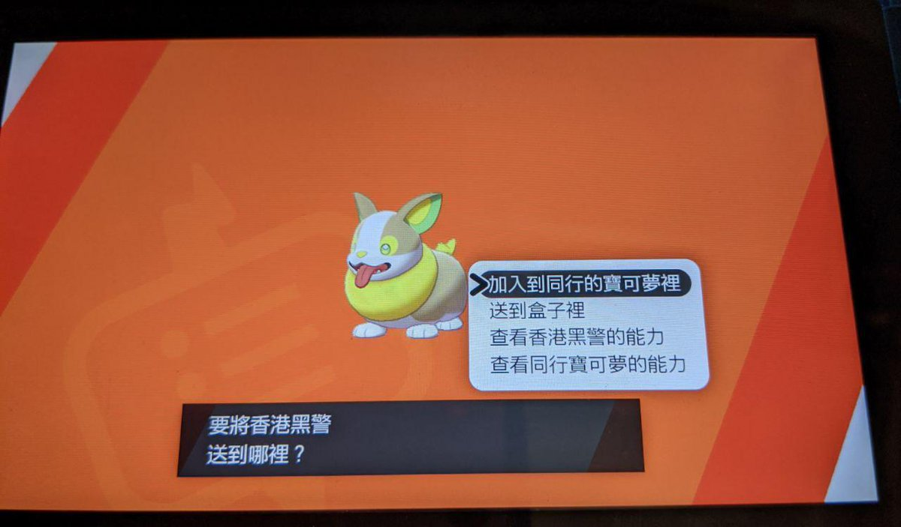
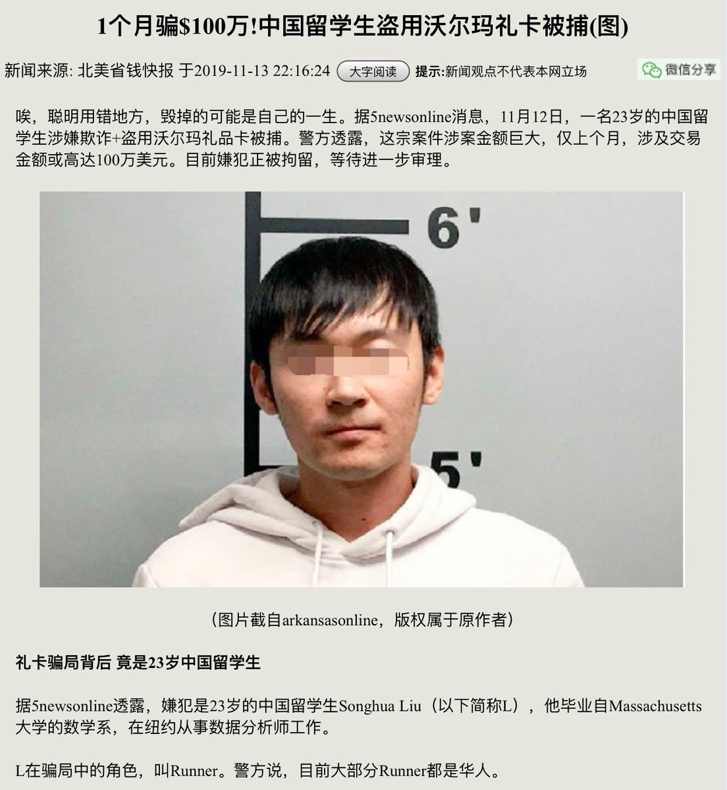
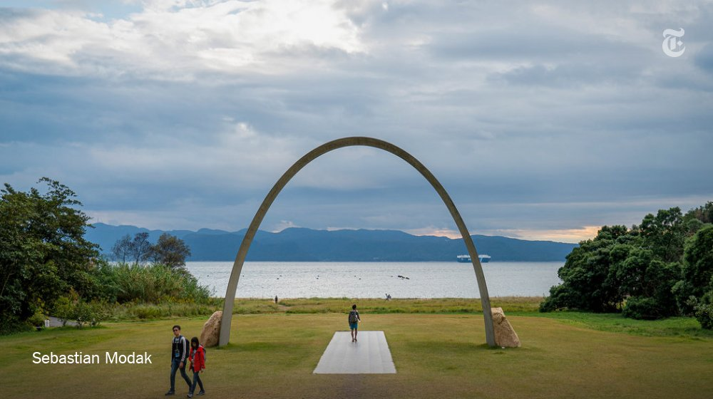

[11月14日 20:00]    纽约时报中文网   @nytchinese    在雅典的第二天，希腊国家主席帕夫洛普洛斯请求习近平“支持帕特农神庙雕塑回归方面的努力”。
“我不仅支持你们，我们还应共同努力，”习近平的回复在希腊的电视台上播放。“由于历史原因，中希两国都有大量珍贵文物流失海外，双方可以加强合作，使这些文物能尽早回到自己的祖国。” http://nyti.ms/352eLIB   :speech_balloon:评:3 :+1:赞:11 :globe_with_meridians:转:0  

[11月14日 19:54]    新闻大吐槽   @TuCaoFakeNews    哎 给我真的吃不下 还不知道明天会不会活着 走在路上会不会突然被人一刀割喉 但是能和这样一群志同道合的人 为了同样的价值观一起去死 我也愿意 至少比现在这样丧尸一样活着好  :speech_balloon:评:1 :+1:赞:7 :globe_with_meridians:转:3  

[11月14日 19:53]    新闻大吐槽   @TuCaoFakeNews    什么叫众志成城？这就叫众志成城！CCP看到估计会恐惧到尿失禁 https://twitter.com/TuCaoFakeNews/status/1194921796279009281 …  :speech_balloon:评:2 :+1:赞:33 :globe_with_meridians:转:10  

[11月14日 19:51]    新闻大吐槽   @TuCaoFakeNews    在家没家教走出国门还装逼，欠揍，让二鬼子教育一下中国鬼子。  :speech_balloon:评:0 :+1:赞:9 :globe_with_meridians:转:1  

[11月14日 19:48]    GFHG SDKM   @zyx_yny    Hey! In case there are some foreigners or people don’t know what’s happening in #HongKong 
Please check this out @ashacuthbert 
(This Is Not) Hong Kong 11.11  https://youtu.be/3ck-iAwIyC0  via @YouTube  :speech_balloon:评:0 :+1:赞:2 :globe_with_meridians:转:2  

[11月14日 19:47]    新闻大吐槽   @TuCaoFakeNews    我也与父母政见不同，一个人孤独的前行很多年。  :speech_balloon:评:1 :+1:赞:8 :globe_with_meridians:转:1  

[11月14日 19:47]    新闻大吐槽   @TuCaoFakeNews    中大学生在维护正义，
理应得到正义的支持。
没有防卫过当，只有执法过当，
黑警所谓执法已经变成公开虐杀。 https://twitter.com/tucaofakenews/status/1194921796279009281 …  :speech_balloon:评:0 :+1:赞:24 :globe_with_meridians:转:14  

[11月14日 19:47]    新闻大吐槽   @TuCaoFakeNews    哪個是世界人民心中的邪惡軸心國，不言而喻了  :speech_balloon:评:0 :+1:赞:4 :globe_with_meridians:转:1  

[11月14日 19:46]    新闻大吐槽   @TuCaoFakeNews    心痛 其实父母哪有不爱自己的孩子的 爱是自私的 父母只希望自己的孩子能平安 保佑所有香港的有为年轻人平安 圆主保佑他们平安  :speech_balloon:评:0 :+1:赞:5 :globe_with_meridians:转:1  

[11月14日 19:46]    新闻大吐槽   @TuCaoFakeNews    韓國男性基本上都當過兵，如果真正上戰場怎麼樣不敢說，但是對付粉紅流氓無賴是綽綽有餘  :speech_balloon:评:1 :+1:赞:32 :globe_with_meridians:转:1  

[11月14日 19:41]    新闻大吐槽   @TuCaoFakeNews    这就是民心啊…… https://twitter.com/TuCaoFakeNews/status/1194921796279009281 …  :speech_balloon:评:2 :+1:赞:13 :globe_with_meridians:转:3  

[11月14日 19:40]    新闻大吐槽   @TuCaoFakeNews    帶著耳機聽著絕望的哭聲，自己也在流眼淚，我在中秋夜因為跟父母的政見不同大吵一架後，我自己關在房間裡也哭了，我預料到他們會不理解，但是我沒想到他們會如此的不理解，甚至還說要報警抓我，那一夜過後，我感覺自己更加堅如磐石去參與這場革命，拯救愚昧拯救被洗腦的國人，只能推翻巨牆，直面真相。  :speech_balloon:评:4 :+1:赞:34 :globe_with_meridians:转:5  

[11月14日 19:34]    新闻大吐槽   @TuCaoFakeNews    看到这样的民意基础，两个字：共产党危矣！！！  :speech_balloon:评:1 :+1:赞:13 :globe_with_meridians:转:1  

[11月14日 19:33]    新闻大吐槽   @TuCaoFakeNews    @TuCaoFakeNews 有新遊戲玩了  :speech_balloon:评:0 :+1:赞:1 :globe_with_meridians:转:1  

[11月14日 19:32]    新闻大吐槽   @TuCaoFakeNews    應有盡有
#SOSHK #StandWithHongKong #StandWithHK #香港人加油 #香港加油 #反送中 #AntiELAB #NoExtraditionToChina #FreedomHK #HongKongProtests #HongKong #HK https://twitter.com/TuCaoFakeNews/status/1194921796279009281 …  :speech_balloon:评:0 :+1:赞:7 :globe_with_meridians:转:1  

[11月14日 19:31]    新闻大吐槽   @TuCaoFakeNews    抱抱，别难过。如果不是因为他们是这样的，你们今天也不会要冒着生命危险去争自由。谢谢你们，因为未来你们的子女不会像今天的你们那样痛哭和不解，他们会以你们为荣！  :speech_balloon:评:0 :+1:赞:6 :globe_with_meridians:转:1  

[11月14日 19:28]    新闻大吐槽   @TuCaoFakeNews    我迫不及待的想看看小粉红挨打的视频和图片了  :speech_balloon:评:0 :+1:赞:14 :globe_with_meridians:转:1  

[11月14日 19:26]    新闻大吐槽   @TuCaoFakeNews    求視頻，求照片！  :speech_balloon:评:0 :+1:赞:1 :globe_with_meridians:转:1  

[11月14日 19:25]    新闻大吐槽   @TuCaoFakeNews    孩子别哭，我们理解你。但是一定要保重自己好吗？好好活着！共惨党它没几天了！  :speech_balloon:评:0 :+1:赞:9 :globe_with_meridians:转:1  

[11月14日 19:21]    新闻大吐槽   @TuCaoFakeNews    我和這位通話的青年也有相似的經歷，我也無數次無語問蒼天“為什麼我的家人是這樣的”。  :speech_balloon:评:1 :+1:赞:6 :globe_with_meridians:转:1  

[11月14日 19:18]    财经真相   @caijingxiang    这种财富游戏，体现在央行层面，就是无法继续扩表，有价值的印钞已经没有了，现在甚至连农村宅基地和农田都允许抵押贷款，央行如果想继续扩大印钞，除了以高利息忽悠洋韭菜进来外，还有一条办法就是以行政命令，直接掠夺还未欠债的中产阶级，当这波掠夺完后，就只剩下无锚印钞一条路了！也是炼狱之路！  :speech_balloon:评:9 :+1:赞:72 :globe_with_meridians:转:30  

[11月14日 19:10]    财经真相   @caijingxiang    现在中共统治的危机根源是，央行想继续印钞，但是却找不到足够多的“承债人”，14亿底层屁民，通过过去20年加入WTO在血汗工厂赚的那几个铜板，已经被高房价掠夺的差不多了，政府财政收支也到了难以为继的地步；能够赚钱的基建项目也建的差不多了，剩下的都是亏钱的亏钱买卖，如果继续搞，财政根本罩不住  :speech_balloon:评:5 :+1:赞:88 :globe_with_meridians:转:22  

[11月14日 19:09]    墙国铁拳现世报😷   @Socialistfist    北京废青，危言耸听

#社会主义铁拳  :speech_balloon:评:26 :+1:赞:184 :globe_with_meridians:转:37  

[11月14日 19:02]    财经真相   @caijingxiang    中共权贵对中国人统治本质就是财富掠夺，这一最本质的游戏规则始终没有改变。只是统治方法变的更加高明，掠财方式更加隐蔽。以前是挂着刺刀直接强制征收，现在则是以金融变现殖民掠夺。这也是高干二代们大部分都玩金融根源。  :speech_balloon:评:2 :+1:赞:64 :globe_with_meridians:转:21  

[11月14日 19:01]    新闻大吐槽   @TuCaoFakeNews    香港人是非常支持大學生們的！
這是香港理工大學 不是科技大學  :speech_balloon:评:3 :+1:赞:17 :globe_with_meridians:转:1  

[11月14日 19:00]    纽约时报中文网   @nytchinese    #摩登情爱 我们打了一个又一个回合，不是带着不惜一切代价赢得胜利的那种令人肾上腺素飙升的决心，而是带着不希望结束的耐心与控制：不希望夏天结束，不希望儿子的童年结束，不希望这场比赛结束，永远。
我们来回击球。我觉得丈夫的击球姿态有些优雅了，我觉得我也有些优雅了。 http://nyti.ms/2NLE8sw   :speech_balloon:评:1 :+1:赞:3 :globe_with_meridians:转:1  

[11月14日 18:57]    财经真相   @caijingxiang    还有参与大规模基建投标的私人企业，大多数是和中共权贵密切相关的人，他们在承接项目时虚高报价，这里面的差价本质也是偷14亿国民的财富。再如修路，一条高速路的修建，其资金来源自然是商业银行，商行加点利息后最后找央行借钱，最后的还款方式就是是该高速路的收费，也就是通过该路的车主最后买单！  :speech_balloon:评:2 :+1:赞:53 :globe_with_meridians:转:13  

[11月14日 18:51]    财经真相   @caijingxiang    中共热衷于基建，因为基建贷款抵押的是政府财政税收，而税收最终买单人是全体国民，到最后是全体14亿国民为基建贷款买单。每一轮基建高潮，都会对应央行大规模放水，本质上是中共偷偷把14亿人的劳动力抵押给了央行。在基建过程中，中共各级官员可以吃回扣，贪污偷工减料，这一过程就是偷盗国民的劳动力  :speech_balloon:评:3 :+1:赞:78 :globe_with_meridians:转:18  

[11月14日 18:44]    财经真相   @caijingxiang    正是这30年的劳动力才赋予了央行印出的房贷价值，这些代表劳动力的钞票投放到市场后才能够被金融体系接受。央行印钞的过程可以说就是寻找债主的过程，只有有人愿意以自己的劳动力或者财产抵押替央行平白无故印钞的钞票买单，这笔新增印钞才会被世人接受；  :speech_balloon:评:10 :+1:赞:57 :globe_with_meridians:转:15  

[11月14日 18:36]    财经真相   @caijingxiang    中共基建没有钱，很多网友简单的认为开动印钞机就行，这其实是大错特错，中共央行印的每一分钱，都必须有对应的相应的价值才行，否则就是无锚印钞，汇率崩盘！过去20年央行印钞都是以债务为基础的。比如，房奴的房贷，当房奴申请贷款时，本质是向央行抵押了自己未来30年的劳动力。 https://twitter.com/aspeltuo8/status/1194923278646816768 …  :speech_balloon:评:20 :+1:赞:227 :globe_with_meridians:转:83  

[11月14日 18:31]    BBC News 中文   @bbcchinese    全球人口约75亿，而脸书在半年内删除的假账户就有32亿。为什么会有这么多假账户？ https://bbc.in/2XeTYii   :speech_balloon:评:40 :+1:赞:97 :globe_with_meridians:转:20  

[11月14日 18:30]    纽约时报中文网   @nytchinese    在宇宙飞船或博物馆里触摸月球岩石是一回事；摘掉手套，让自己暴露在太空的真空中是另一回事。在科幻小说里，可怕的事情降临在这些宇航员身上：他们的血液沸腾蒸发，内脏被吸出来。
但摘掉一只手套未必会立刻致命。 http://nyti.ms/2rJc7ZV   :speech_balloon:评:1 :+1:赞:5 :globe_with_meridians:转:1  

[11月14日 18:26]    财经真相   @caijingxiang    中共《外管局关于完善银行间债券市场境外机构投资者外汇风险管理有关问题的通知（征求意见稿）》公开征求意见的公告。中国债券市场利率目前普遍相对于欧美国家要高，这对华尔街来说很有吸引力，中共现在不计一切代价放开债券购买，一是以高利息忽悠外资进来缓解外汇短缺。二是绑票这些购买的外资  :speech_balloon:评:6 :+1:赞:50 :globe_with_meridians:转:24  

[11月14日 18:19]    新闻大吐槽   @TuCaoFakeNews    要儲備黃豆啊，綠豆啊，撒到地上，那些警察的硬底鞋一踩就打滑，摔得他們狗吃屎。  :speech_balloon:评:7 :+1:赞:39 :globe_with_meridians:转:6  

[11月14日 18:00]    纽约时报中文网   @nytchinese    自6月开始的香港大规模抗议已演变成一场持续不断的混乱，一些抗议者支持以暴力行为回应警方的暴力手法。抗议者同港府似乎存在难以解决的分歧，而且几乎没有迹象表明双方会让步。
本文简要介绍局面如何发展到今天这个地步，以及为何双方的暴力都在升级。 http://nyti.ms/354YBhH   :speech_balloon:评:33 :+1:赞:38 :globe_with_meridians:转:18  

[11月14日 17:30]    纽约时报中文网   @nytchinese    1973年的听证会没有华丽的开场画面，只有庄严的定音鼓声中宣读的一份参议院决议。没有聒噪的新闻编辑室讨论组，没有倒计时时钟，没有社媒标签。只有一间安静的听证室里的证词，两名轻声细语的主持人坐在办公桌前，试图弄清楚总统知道什么，什么时候知道，及民主是否仍然有效。 http://nyti.ms/2KfOpe6   :speech_balloon:评:2 :+1:赞:8 :globe_with_meridians:转:1  

[11月14日 17:01]    BBC News 中文   @bbcchinese    香港社会动荡加剧之际，阿里巴巴启动在港交所上市的计划，最多可能筹得134亿美元，将成为香港九年来最大规模IPO集资，或将提振因贸易战和社会动荡而低迷的香港股市。 https://bbc.in/2CE1s51   :speech_balloon:评:21 :+1:赞:47 :globe_with_meridians:转:16  

[11月14日 17:00]    纽约时报中文网   @nytchinese    周二，习近平在对希腊进行首次国事访问期间，表达了对归还帕特农神庙文物的支持。
习近平的支持只是中国与希腊关系日益密切的体现之一，在为期两天的访问中，两国领导人签署了16项新协议，中国还承诺继续增加投资，以深化在欧洲影响力。 http://nyti.ms/352eLIB   :speech_balloon:评:3 :+1:赞:7 :globe_with_meridians:转:1  

[11月14日 16:30]    纽约时报中文网   @nytchinese    自人类50年前登陆月球以来，已有12个人在月球上行走过，但从来没有人直接触碰过月球表面。
那些宇航员离开着陆器的时候都穿着太空服。从来没有人站在月球上脱下过手套或靴子。如果能亲手摸到月球，那会是种什么感觉？ https://nyti.ms/2rJc7ZV   :speech_balloon:评:11 :+1:赞:25 :globe_with_meridians:转:9  

[11月14日 16:00]    纽约时报中文网   @nytchinese    #图集【濑户内海艺术寻宝之旅】《纽约时报》“52个地方”旅行者@sebmodak最近到访了濑户内群岛，那里正在举行每三年一次的艺术盛会，艺术家们从当地的文化和地理中汲取灵感，而艺术正使衰落的渔村重焕活力。
点击查看图集： http://nyti.ms/377qEiq   :speech_balloon:评:4 :+1:赞:5 :globe_with_meridians:转:0  

[11月14日 15:01]    BBC News 中文   @bbcchinese    韩国济州岛的海女下海捕捞新鲜海产，并以独特的方法料理美味海鲜，这是一间真正由海女经营的“平大里海胆面屋”。 https://bbc.in/34VAdyQ   :speech_balloon:评:1 :+1:赞:24 :globe_with_meridians:转:7  

[11月14日 14:30]    纽约时报中文网   @nytchinese    #摩登情爱 选择流浪街头是一种慢性自杀。很多人在自我毁灭的过程中都不大会去想，孩子可能也会受到牵连。也许DJ的母亲知道她要自我毁灭，所以才想确保她的孩子不会受到伤害。
她选择我们成为他的家长、和他一起生活，哪怕把他交给别人令她心碎。 http://nyti.ms/2picNEM   :speech_balloon:评:4 :+1:赞:12 :globe_with_meridians:转:2  

[11月14日 14:07]    老司机   @h5lpykl7tp6jjop    喝点马尿就把自己当领导了，还要特殊服务，大胆！  :speech_balloon:评:1 :+1:赞:5 :globe_with_meridians:转:2  

[11月14日 14:01]    BBC News 中文   @bbcchinese    曾经因为战争而被遗弃，黑人女孩打破刻板印象，成为芭蕾舞蹈演员。她是怎样做到的？  :speech_balloon:评:10 :+1:赞:89 :globe_with_meridians:转:13  

[11月14日 14:00]    纽约时报中文网   @nytchinese    #摩登情爱 婚姻就像网球赛，虽然我们仍然好胜，但当对方打出精彩的一球时，我们会觉得非常自豪。输掉比赛时，我们并不憎恨胜者。我们仍然为胜利而战，但现在我们可以为对方感到高兴。
我们都努力让比赛多持续一段时间，通过让对方发挥优势，找到彼此的最佳感觉。 http://nyti.ms/2NLE8sw   :speech_balloon:评:60 :+1:赞:13 :globe_with_meridians:转:6  

[11月14日 13:30]    纽约时报中文网   @nytchinese    充满危险的情况使警方在周三组织了一次疏散行动，将数十名来自中国大陆的学生撤离到深圳，那里的酒店为他们提供免费住房。
在港大就读的一名研究生说，他和其他大陆学生仍觉得在校园比在街上更安全。他说，许多学生不会公开表达支持北京的观点，而且有时避免大声说普通话。 http://nyti.ms/2CJyu3H   :speech_balloon:评:13 :+1:赞:22 :globe_with_meridians:转:6  

[11月14日 13:25]    老司机   @h5lpykl7tp6jjop    善于钻空子的年轻中国人，毁了自己人生！  :speech_balloon:评:1 :+1:赞:8 :globe_with_meridians:转:2  

[11月14日 13:01]    BBC News 中文   @bbcchinese    针对美国总统特朗普的弹劾调查公开听证会星期三（11月13日）揭开帷幕，弹劾程序将会怎样走？ https://bbc.in/2qSdYei   :speech_balloon:评:8 :+1:赞:17 :globe_with_meridians:转:3  

[11月14日 13:00]    纽约时报中文网   @nytchinese    #每日一词 Whodunit 在爱达荷州北部的一家公共图书馆，有人一直在藏书——特别是关于持枪权和批评特朗普的书。时报以“Whodunit in the Library”（图书馆里的悬疑故事）为题对此进行了报道。Whodunit一词由who done it（谁干的）缩合而成，意为侦探或悬疑类故事。更多简报内容： http://nyti.ms/2Odt3iy   :speech_balloon:评:5 :+1:赞:5 :globe_with_meridians:转:2  

[11月14日 12:55]    GFHG SDKM   @zyx_yny    Pro beijing thugs are attacking young protesters in HongKong！ 
those scums and the police are partying together to “stabilize” the city.
black and white are totally upside down.
#StandWithHongKong
#FreedomHongKong  :speech_balloon:评:55 :+1:赞:862 :globe_with_meridians:转:924  

[11月14日 12:30]    纽约时报中文网   @nytchinese    “老师上课的时候，如果因为上边有摄像头，下边学生手动手机就录音、就摄像、就偷拍，那心理就不踏实、不安。讲课像念书，念书就安全，但这样的话，课怎么上好呢，人人自危、人人都怕，所以中国的学生，如果这样教，怎么能出人才？为什么说诺贝尔奖获得者与中国人口不成比例？” http://nyti.ms/2CGn3tm   :speech_balloon:评:8 :+1:赞:36 :globe_with_meridians:转:13  

[11月14日 12:22]    GFHG SDKM   @zyx_yny    A black-clad #HongKongProtester was just beaten by dozens of pro-Beijing supporters with metal rods in Sheung Shui this morning.  :speech_balloon:评:414 :+1:赞:5820 :globe_with_meridians:转:6456  

[11月14日 12:01]    BBC News 中文   @bbcchinese    中美之间的博弈不仅在于贸易领域——经济、国防、文化和科技，无一不是战场。美国到底想从中国那里得到什么？美国要的最终结局是什么？ https://bbc.in/2qTXra4   :speech_balloon:评:38 :+1:赞:36 :globe_with_meridians:转:17  

[11月14日 12:00]    纽约时报中文网   @nytchinese    今日图片：直岛李禹焕美术馆外的雕塑。时报“52个地方”旅行者@sebmodak前往日本濑户内群岛参加三年一度的艺术盛会，这一活动为当地日渐衰落的渔村注入了新的活力。
更多简报内容： http://nyti.ms/2Odt3iy   :speech_balloon:评:0 :+1:赞:6 :globe_with_meridians:转:1  

[11月14日 11:30]    纽约时报中文网   @nytchinese    本周，香港警方在与学生长达数小时的对峙中，打破了不入校园这条不成文的规矩。在香港几所大学里，身穿黑衣的学生们面对防暴警察设起临时路障，并投掷砖块。警方首次向校园发射了非致命的发射物。
大学校园曾经是处于运动核心的学生的避难所，本周已变成了被围困的中世纪城堡。 http://nyti.ms/2CJyu3H   :speech_balloon:评:85 :+1:赞:197 :globe_with_meridians:转:102  

[11月14日 11:01]    BBC News 中文   @bbcchinese    有人权团体批评，新疆的维吾尔族人正受到迫害，他们被强迫从事劳动。许多品牌都被认为从新疆地区间接采购棉花产品。 https://bbc.in/375WEmH   :speech_balloon:评:305 :+1:赞:168 :globe_with_meridians:转:73  

[11月14日 11:00]    纽约时报中文网   @nytchinese    特朗普弹劾调查公开听证会首日：美国驻乌最高外交官泰勒表示，他被告知，特朗普更关心对拜登的调查，而非乌克兰。国务院高级官员肯特证实，总统的私人律师主导了“出于政治动机的调查”。听证会中，两党分歧继续扩大。美国驻乌前大使将在周五公开作证。
更多简报内容： http://nyti.ms/2Odt3iy   :speech_balloon:评:1 :+1:赞:0 :globe_with_meridians:转:0  

[11月14日 10:07]    财经真相   @caijingxiang    中国固定投资增速创下了自1998年以来最低增速，中国这个大工地，热火朝天的忙了20年后终于开始冷清下来，原因无他—没钱！  :speech_balloon:评:14 :+1:赞:244 :globe_with_meridians:转:65  

[11月14日 10:06]    纽约时报中文网   @nytchinese    北京确诊两例肺鼠疫病例，民众担忧疫情蔓延  http://nyti.ms/32E8DVb https://twitter.com/ccni/status/1194585292495294465 …  :speech_balloon:评:7 :+1:赞:15 :globe_with_meridians:转:6  

[11月14日 09:59]    纽约时报中文网   @nytchinese    早安！今日重点新闻包括：
香港大学校园变战场 ；特朗普弹劾调查听证会首日；习近平支持希腊收回帕特农神庙文物；威尼斯再遭水淹； “微信模式“会成为美国互联网的未来吗；全球温室气体排放量或继续上升……NYT简报带你速览今日要闻。 http://nyti.ms/2Odt3iy   :speech_balloon:评:14 :+1:赞:15 :globe_with_meridians:转:2  

[11月14日 09:19]    老司机   @h5lpykl7tp6jjop    心痛不已！又走一個。這是海鮮貨櫃車？ 港人真的要改变抗争策略了，如组织武装力量、成立秘密组织等！擒贼先擒王  :speech_balloon:评:37 :+1:赞:345 :globe_with_meridians:转:258  

[11月14日 08:30]    纽约时报中文网   @nytchinese    某种程度上，对听证会进行水门式重播的主张虽然值得赞赏，却也是在表达一种重回1973年的希望：也就是我们可以重拾那种共同的关注和信任。
这并不是说今年的听证会将没有效果，或不会改变人们的想法。而是它们不会是一种集体经历。 http://nyti.ms/2KfOpe6   :speech_balloon:评:2 :+1:赞:5 :globe_with_meridians:转:5  

[11月14日 08:20]    BBC News 中文   @bbcchinese    中国古代教育儿童的启蒙教材《三字经》的前六个字就是“人之初，性本善”。顾名思义，指人刚出生的时候，每个人的本性都是善良的。 https://bbc.in/2Xmao8N   :speech_balloon:评:40 :+1:赞:50 :globe_with_meridians:转:23  

[11月14日 07:59]    BBC News 中文   @bbcchinese    2019年10月，在斯德哥尔摩一个晚上就发生了3起爆炸案，震惊的瑞典居民也许没意识到该国一年里发生了百起爆炸。 https://bbc.in/32GoN0x   :speech_balloon:评:16 :+1:赞:30 :globe_with_meridians:转:21  

[11月14日 07:24]    BBC News 中文   @bbcchinese    三天来，示威者不断与尝试拆除路障的警察发生冲突，警方在各冲突现场发射橡皮子弹、催泪弹等驱散示威者，示威者以砖头和汽油弹还击。 https://bbc.in/2rJTDIV   :speech_balloon:评:107 :+1:赞:111 :globe_with_meridians:转:36  

[11月14日 06:57]    BBC News 中文   @bbcchinese    在这场极具特氏风格的演讲中，他维持一贯口风，批评中国是偷走美国工作岗位和财富的盗贼，但把主要矛头指向此前的美国政府不作为。 https://bbc.in/2CIjgvO   :speech_balloon:评:21 :+1:赞:59 :globe_with_meridians:转:16  

[11月14日 05:59]    BBC News 中文   @bbcchinese    美国专家认为，美国的军事优势的基础并非维持庞大的常备军，而是高科技武器系统。如果中国在关键技术领域取得成功，那么美国军事实力就可能要落后。 https://bbc.in/2qdqsNR   :speech_balloon:评:10 :+1:赞:28 :globe_with_meridians:转:7  

[11月14日 01:30]    墙国铁拳现世报😷   @Socialistfist    支持言论自由不受侵害 https://twitter.com/keepcnsecurity/status/1194633823964631046 …  :speech_balloon:评:4 :+1:赞:98 :globe_with_meridians:转:26  

[11月14日 00:46]    GFHG SDKM   @zyx_yny    What #HongKong people are facing from police?
香港人正面臨警察的什麼問題？
#HongKongProtest  :speech_balloon:评:21 :+1:赞:548 :globe_with_meridians:转:581  

[11月14日 00:23]    GFHG SDKM   @zyx_yny    13 Nov 2019 22:16 [中字][ENG-SUB]

A #CLA soldier in Kowloon East Barrack loaded his #gun twice to threaten public outside the fence. The barrack is right next to Baptist University #HKBU

浸會大學旁，#解放軍 九龍東軍營有軍人以 #槍械 指嚇聚集的示威者，並將槍械上膛

#HongKong  :speech_balloon:评:72 :+1:赞:1562 :globe_with_meridians:转:1917  

[11月14日 00:20]    老司机   @h5lpykl7tp6jjop    黑警鬼子正在拆砖抛砖
扔到哪儿呢？
视频1  :speech_balloon:评:3 :+1:赞:32 :globe_with_meridians:转:40  

[11月13日 23:23]    财经真相   @caijingxiang    以前要说灭中共，有人说它可以牵制苏联，还有人说它会继续改革，更有人说它太强大短期内不会，唯有法轮功微弱的喊了20年“天灭中共”，结果香港人一笑了之，连传单都不接。今天世人心态已经彻底改变！当海内外所有人的希望达成共识时就程了趋势，剩下就是如何以最小的代价灭共！  :speech_balloon:评:24 :+1:赞:393 :globe_with_meridians:转:88  

[11月13日 23:08]    财经真相   @caijingxiang    香港抗争到今天，最大的影响就是，华人圈幻想中共改革或者改良的人彻底失望了，西方说中共会改革的熊猫派不敢再发声了，灭共以及如何减少中共倒台带来冲击，开始摆上桌面！这在过去70年里都不曾有过的！  :speech_balloon:评:44 :+1:赞:920 :globe_with_meridians:转:228  

[11月13日 22:53]    BBC News 中文   @bbcchinese    14世纪时，鼠疫横扫欧洲，夺走三分之一人的生命。时过境迁...... https://bbc.in/34VwMZ0   :speech_balloon:评:86 :+1:赞:183 :globe_with_meridians:转:85  

[11月13日 22:49]    GFHG SDKM   @zyx_yny    13 Nov 2019

#HKPoliceTerrorists directly fired tear gas canister into a residential flat in Lucky Plaza, Shatin, smashing a window in the process.

催淚彈殼射上沙田好運中心居民家中

#香港脱法警察 が催涙ガスを乱射して、沙田（サーティン）ラッキープラザの住宅を直撃した  :speech_balloon:评:29 :+1:赞:630 :globe_with_meridians:转:883  

[11月13日 22:21]    老司机   @h5lpykl7tp6jjop    廣傳!
原來「碎砖陣」是水炮车克星！

水炮车被困碎砖阵，曾嘗试用水炮清理，地上碎砖，但不成功！

整队人为保护水炮车，全部停下！  :speech_balloon:评:56 :+1:赞:998 :globe_with_meridians:转:635  

[11月13日 21:45]    纽约时报中文网   @nytchinese    尤盛东：“我说过这样的话：能量(energy)，这是一个物理学名词，是标量，有大小和强弱，它不是矢量(vector)，所以也就没有方向，’正能量‘的说法是不科学的。我告诫学生，以后谁要在作业上、试卷上写‘正能量’，我就打错扣分，这样无疑也就犯忌了。” http://nyti.ms/2CGn3tm   :speech_balloon:评:33 :+1:赞:99 :globe_with_meridians:转:41  

[11月13日 21:33]    GFHG SDKM   @zyx_yny    None of us should suffer from the fear of #HKPoliceTerrorism 
How can it be the end? https://twitter.com/soon_eddy/status/1194476050647941121 …  :speech_balloon:评:0 :+1:赞:1 :globe_with_meridians:转:2  

[11月13日 21:05]    GFHG SDKM   @zyx_yny    Wt happened?!  :speech_balloon:评:57 :+1:赞:628 :globe_with_meridians:转:709  

[11月13日 21:03]    GFHG SDKM   @zyx_yny    Notes by older folks at TKO carpark where student Chow fell, atoning for political indifference:
"Lok, you'd always been such a good kid. I so regret not having stood w/you & fought alongside you! Pls forgive me. Neutral just means pro-Beijing. I really got it now! I'm so sorry!" https://twitter.com/TY_hker/status/1194596305403670528 …  :speech_balloon:评:1 :+1:赞:29 :globe_with_meridians:转:27  

[11月13日 20:28]    财经真相   @caijingxiang    中国国内首个合法商用VPN来了！关于中共官办VPN，我最近正在收集资料，准备做一期视频，来撩开中国神秘防火长城的运作方式！  :speech_balloon:评:88 :+1:赞:434 :globe_with_meridians:转:152  

[11月13日 20:25]    BBC News 中文   @bbcchinese    升级的暴力行动或立场之争让许多大陆和台湾学生开始担忧自身安危，寻求离开香港。也有学生表示会继续留下来。 https://bbc.in/2pj98GM   :speech_balloon:评:66 :+1:赞:119 :globe_with_meridians:转:50  

[11月13日 20:00]    BBC News 中文   @bbcchinese    “我听到一声（狼的）嚎叫，但我知道日本狼在明治时代就灭绝了。”于是他花50年搜寻日本狼。 https://bbc.in/2qKpQzg   :speech_balloon:评:7 :+1:赞:32 :globe_with_meridians:转:6  

[11月13日 19:55]    财经真相   @caijingxiang    11月12日，伦敦证券交易所集团（以下简称“伦交所集团”）首席执行官David Schwimmer一行4人到访中央结算公司。看来香港交易所收购事并没结束，搞不好还有下文！  :speech_balloon:评:11 :+1:赞:74 :globe_with_meridians:转:35  

[11月13日 19:32]    GFHG SDKM   @zyx_yny    WTF holding hostages for passage of movement #HKPolice they are clearly the #HKPoliceTerrorists 

Are you watching @senatemajldr @SenRubioPress  :speech_balloon:评:333 :+1:赞:3404 :globe_with_meridians:转:3821  

[11月13日 19:00]    BBC News 中文   @bbcchinese    张善政说，找回“善良政治”、“下架蔡英文”、“科技兴国”，是他愿意出来担任韩国瑜副手的原因。然而韩国瑜常常语出惊人，张善政常替他打圆场，被民进党人讥为“张善后”。 https://bbc.in/2CG7x0M   :speech_balloon:评:19 :+1:赞:15 :globe_with_meridians:转:7  

[11月13日 18:38]    墙国铁拳现世报😷   @Socialistfist    一天二更，快夸我。
最近推友投稿质量很高，再次感谢！  :speech_balloon:评:14 :+1:赞:176 :globe_with_meridians:转:4  

[11月13日 18:38]    墙国铁拳现世报😷   @Socialistfist    祝这位推友早日康复

#战螂在推特  :speech_balloon:评:21 :+1:赞:219 :globe_with_meridians:转:41  

[11月13日 18:31]    BBC News 中文   @bbcchinese    香港中文大学校内多处黑烟四起，示威者与防暴警察在校内二号桥对峙。有示威者向警方投掷砖头、汽油弹等物体。警方发射催泪弹、橡胶子弹，并用水炮车发射蓝色催泪剂驱散人群。校长段崇智和前校长沈祖尧先后到场调停，均遭遇催泪弹。到底发生了什么？为何冲突进入校园？ https://bbc.in/2Kitl6I   :speech_balloon:评:236 :+1:赞:481 :globe_with_meridians:转:268  

[11月13日 18:15]    老司机   @h5lpykl7tp6jjop    卧床狙击手

#社会主义铁拳  :speech_balloon:评:107 :+1:赞:660 :globe_with_meridians:转:171  

[11月13日 18:15]    墙国铁拳现世报😷   @Socialistfist    卧床狙击手

#社会主义铁拳  :speech_balloon:评:107 :+1:赞:660 :globe_with_meridians:转:171  

[11月13日 17:57]    老司机   @h5lpykl7tp6jjop    很多到了西方国家的中国人和这头已经自由的驴一模一样！  :speech_balloon:评:86 :+1:赞:1385 :globe_with_meridians:转:560  

[11月13日 17:37]    老司机   @h5lpykl7tp6jjop    当国家由一个神经病掌握以后，人民倒霉就是必然的结果！
不要以为不可能，仔细想想中国人为什么活得这么憋屈？  :speech_balloon:评:8 :+1:赞:60 :globe_with_meridians:转:26  

[11月13日 17:36]    新闻大吐槽   @TuCaoFakeNews    这个拿电锯的抗争者，爸爸是警察，他身处矛盾中，精神要崩溃了！他说自己是狗仔，讲黑警死全家，没关系；
而手足们搂住他安慰道：你是勇武，你还有良心！

是啊，面对邪恶，选择良心，还是选择利益？真是艰难的抉择！
这个世界要是没有邪恶多好，家庭就不会碎裂了！  :speech_balloon:评:135 :+1:赞:2326 :globe_with_meridians:转:1191  

[11月13日 17:00]    BBC News 中文   @bbcchinese    周一和周二，香港多家大学变成“战场”，有学生指责警方攻击代表自由意志的大学；香港警方强调可以在校园内执法，强调行动并非“攻入校园”。 https://bbc.in/351m0QP   :speech_balloon:评:110 :+1:赞:154 :globe_with_meridians:转:69  

[11月13日 16:45]    财经真相   @caijingxiang    知道这些有啥用？这是个及其致命的问题，以利益引导法，对我周边的人影响很大，他们现实过的都不太好，生活没有一丝希望，麻木、无趣，简直像木头一样活着。每当我说到中国社会巨变，国有企业私有化带来的巨大创业机遇时，总能让这些木头兴奋一天，他们还经常把我的“荒唐说法”讲给更多人听！  :speech_balloon:评:9 :+1:赞:111 :globe_with_meridians:转:9  

[11月13日 16:44]    GFHG SDKM   @zyx_yny    A young man holding a chainsaw walked to a large crowd, sobbed & confessed he’s a son of police. He yelled "All police families deserve to die!". Protesters hugged & comforted him, saying he has conscience & he’s part of the group, the #Hongkongers 

Source:HKUST Editorial Board  :speech_balloon:评:199 :+1:赞:3169 :globe_with_meridians:转:2411  

[11月13日 16:33]    财经真相   @caijingxiang    就算是知道这些有什么用？每当话题聊到这个时候，我就说关心这些能赚钱，或许还可以改变命运，因为中共倒台时人民币剧烈贬值，可以用杠杆做空赚大钱。整个中国的财富分配会被洗牌，你现在没关系、没人脉、没资本根本翻不了身，但是机遇是给有准备的人，你现在关心这些，才能在未来巨变时抓到机遇！  :speech_balloon:评:30 :+1:赞:267 :globe_with_meridians:转:46  

[11月13日 16:16]    财经真相   @caijingxiang    对于不炒股的朋友，他们最关心的另一个话题是“楼市”，每当他们说某个朋友买房赚钱时，我总会来一句，如果买房真的赚钱，那中国14亿人干脆都买房，每个都赚一百万，大家都成了富人，中国也就没有穷人了，大家都不用天天上班，不用在工厂加班，多好啊，赶紧买吧！这么简单逻辑，直接把他的兴奋劲头搞没了  :speech_balloon:评:19 :+1:赞:188 :globe_with_meridians:转:29  

[11月13日 16:06]    财经真相   @caijingxiang    墙内有个朋友谈到中美贸易战时说，中国现在太强大了，美国人嫉妒要故意打压咱们国家，中国绝对不能屈服。我直接怼了一句“卖国贼太多”，一定会投降，领导子女和资产都在美国，你觉得中共敢跟美国玩真的吗？此话直接把他给说泄气了！  :speech_balloon:评:15 :+1:赞:255 :globe_with_meridians:转:39  

[11月13日 16:00]    BBC News 中文   @bbcchinese    中国网红刘世超坚持称，自己不是酗酒者。他还表示，自己豪饮后身体也没有任何不适。但医生却不这么看。 https://bbc.in/379FWDg   :speech_balloon:评:30 :+1:赞:41 :globe_with_meridians:转:13  

[11月13日 15:55]    财经真相   @caijingxiang    慢慢的他们开始把我当成大神，很多人甚至专门找我询问关于贸易战的事，以及对于行情的预判，在赚钱的引导下，他们开始慢慢接受了真相，也有人主动学习翻墙的办法，我为此专门花钱搭建了一些翻墙节点免费供他们使用，每当他们告诉我说自己的价值观简直被颠倒过来时，心中总有一种自豪感！  :speech_balloon:评:17 :+1:赞:227 :globe_with_meridians:转:18  

[11月13日 15:54]    GFHG SDKM   @zyx_yny    Canteen in CUHK closed, so protesters use the kitchen and cooknfor everyone else.  :speech_balloon:评:61 :+1:赞:1294 :globe_with_meridians:转:768  

[11月13日 15:51]    GFHG SDKM   @zyx_yny    We've met with WA @PattyMurray @SenatorCantwell in the past months but still not heard of any response yet after sending 1000+ @Postcard4HKHRDA & signatures to support #HKHRDA 

There is no time to waste, bring this bill on to Senate floor for vote. #SOSHK https://twitter.com/seariousforhkg/status/1189854641028100096?s=19 …  :speech_balloon:评:14 :+1:赞:120 :globe_with_meridians:转:88  

[11月13日 15:49]    财经真相   @caijingxiang    可能是由于我是金融行业的缘故吧，过去两年中美贸易争端引发的汇率、股市剧烈波动，由于国内新闻屏蔽了贸易战的消息，每当发生巨大波动时，很多人都来问我原因，我就借机把整个事情的前因后果都讲了一下，并且预判人民币会破7，中美不会达成全面协议，后来这些预判都得到验证，很多人都赚了钱！  :speech_balloon:评:5 :+1:赞:152 :globe_with_meridians:转:12  

[11月13日 15:44]    财经真相   @caijingxiang    我最初传播真相时就被很多国内朋友认为太极端，大多数时候他们都会善意的说，这些事你自己知道就好，不要跟别人说，更多的时候干脆跟你说，知道这些有什么用？你又能改变什么呢？咱就是草民一个别天天张口就说国家大事，会让人笑话！  :speech_balloon:评:9 :+1:赞:120 :globe_with_meridians:转:17  

[11月13日 15:39]    GFHG SDKM   @zyx_yny    2356 tear gas in campus #HKPoliceTerrorism https://twitter.com/ttingxiao/status/1194450296639877120 …  :speech_balloon:评:1 :+1:赞:3 :globe_with_meridians:转:5  

[11月13日 15:04]    GFHG SDKM   @zyx_yny    Going home from school is illegal assembly, 
parents take the kid to ride the bike is illegal assembly, 
forming #HumanChain is illegal assembly, 
having bubble tea on the street is disorder in public.

How far is this ridiculousness could go, #HongKong police?

#CivilRights  https://twitter.com/woppa1woppa/status/1194506515786256384 …  :speech_balloon:评:2 :+1:赞:27 :globe_with_meridians:转:24  

[11月13日 15:00]    BBC News 中文   @bbcchinese    她说，“如果你想活下去，就握一下我的手。”这时，生命垂危的他已经陷入幻觉、自以为变成了一条蛇。他想活，但蛇没有手...... https://bbc.in/372A5zi   :speech_balloon:评:7 :+1:赞:51 :globe_with_meridians:转:17  

[11月13日 14:43]    GFHG SDKM   @zyx_yny    This happened in Sheung Shui & apparently a group of pro-#Beijing people clashed with anti-Govt protesters #HongKong #HongKongProtests  :speech_balloon:评:63 :+1:赞:214 :globe_with_meridians:转:222  

[11月13日 14:33]    GFHG SDKM   @zyx_yny    A man confronts police, saying in English: "You, commander, bring disgrace to the uniform you are wearing." Two officers warn him in Cantonese not to incite the crowd

Video: SCMP/Chris Lau  :speech_balloon:评:86 :+1:赞:1139 :globe_with_meridians:转:874  

[11月13日 12:46]    GFHG SDKM   @zyx_yny    傳出去

文宣注意
如果你facebook貼以下相 你個post係會自動disable share function （自己睇自己仲有share制 但朋友睇你已經無左）
Fb已自動過濾天安門2.0呢張相
所以國際線強攻呢張
大家做多少少 save張相 再自己貼係fb twitter 遍地開花  :speech_balloon:评:15 :+1:赞:549 :globe_with_meridians:转:583  

[11月13日 12:40]    老司机   @h5lpykl7tp6jjop    港警仍围在中大，企图进入校园，但一直被校方拒绝。很多记者排成人墙，堵在进入中大的路上。
港警为何对重大这么执着？搜索一下中大，发现，中大竟然是香港的互联网交换中心所在地！港警进攻中大真正目的是控制香港的互联网！一旦得逞，港人通讯将被控制，对抗争极为不利！  :speech_balloon:评:9 :+1:赞:71 :globe_with_meridians:转:40  

[11月13日 12:35]    老司机   @h5lpykl7tp6jjop    香港中大战役，令人想到斯巴达三百勇士，而该校碧秋楼管理的计算机系统，就是香港国际互联网的温泉关，有99%数据经过此地。中大学生就像列奥尼达的三百勇士，利用校园地形优势，以血肉之躯抵挡住了数量装备上远超他们的黑警军长达两天，其宁为玉碎不为瓦全的勇气惊天地泣鬼神！  :speech_balloon:评:23 :+1:赞:527 :globe_with_meridians:转:241  

[11月13日 12:30]    纽约时报中文网   @nytchinese    继周一警察向示威者开枪、一名责骂示威者的人遭纵火之后，香港周二再度陷入混乱。
抗议者在校园内纵火、丢掷汽油弹，而防暴警察则试图用催泪瓦斯和水炮将他们击退。
这里是周二抗议活动的一些照片： http://nyti.ms/2pd93nT   :speech_balloon:评:345 :+1:赞:183 :globe_with_meridians:转:81  

[11月13日 11:47]    GFHG SDKM   @zyx_yny    今天是11/13
顺便一提、香港政府及黒警策動8/31太子恐怖襲擊、我很烦人

August 31 Hong Kong Police Terrorist Attack at Station I'm persistent.
Chinese can't be silent and pretend to not be watching this development.
I will keep saying for hundreds of years.  :speech_balloon:评:39 :+1:赞:820 :globe_with_meridians:转:803  

[11月13日 04:49]    老司机   @h5lpykl7tp6jjop    捧着书偷睡的学生和辛勤看书至疲倦睡着了的学生看起来一样，只有想弄清真相的人才会知道真相！  :speech_balloon:评:0 :+1:赞:34 :globe_with_meridians:转:18  

[11月13日 02:07]    老司机   @h5lpykl7tp6jjop    “我不會自殺，性格樂觀”

这是抗争香港青年被捕前
一定要记得说的话，
因为被自杀
是黑警滥杀无辜所用的拙劣手段。 https://twitter.com/kj88tcfyikagblx/status/1194301046140497925 …  :speech_balloon:评:4 :+1:赞:59 :globe_with_meridians:转:33  

[11月12日 23:05]    老司机   @h5lpykl7tp6jjop    战火纷飞，硝烟迷漫，这里不是遥远的叙利亚战场，而是香港中文大学的校园。中共恶警从下午开始攻打校园，催泪弹和橡皮子弹不停地向学生们发射。
共产党曾经对香港人承诺：马照跑，舞照跳，一国两制的政策五十年不变。结果他们接手香港以后，香港人的面包没了，牛奶没了，现在连自由也没了。  :speech_balloon:评:112 :+1:赞:1009 :globe_with_meridians:转:580  

[11月12日 20:32]    老司机   @h5lpykl7tp6jjop    知道所有真相，了解，思考過， 自己怎麼想最清楚。
最怕的是，永遠不看真相的人  :speech_balloon:评:2 :+1:赞:10 :globe_with_meridians:转:8  

[11月12日 20:03]    老司机   @h5lpykl7tp6jjop      :speech_balloon:评:11 :+1:赞:156 :globe_with_meridians:转:45  

[11月12日 19:22]    墙国铁拳现世报😷   @Socialistfist    从2018年9月到现在频繁微博维权，神奇的是，小编就是没看出来他举报的贪污腐败是什么内容  :speech_balloon:评:4 :+1:赞:137 :globe_with_meridians:转:10  

[11月12日 19:20]    墙国铁拳现世报😷   @Socialistfist    宝贝别哭

#社会主义铁拳  :speech_balloon:评:34 :+1:赞:335 :globe_with_meridians:转:80  

[11月12日 14:46]    老司机   @h5lpykl7tp6jjop    今天，当勇武派出现在市中心商业区的时候，受到了英雄一般的热烈欢迎。
而此前，林郑月娥称：「抗争者是人民的敌人」  :speech_balloon:评:181 :+1:赞:2923 :globe_with_meridians:转:1424  

[11月12日 13:36]    老司机   @h5lpykl7tp6jjop    黑警再次突破底线，坏事做绝，竟然殴打孕妇。
没人性！恐怖输出  :speech_balloon:评:88 :+1:赞:626 :globe_with_meridians:转:501  

[11月12日 10:36]    老司机   @h5lpykl7tp6jjop    什么最重要？信息自由排第一！  :speech_balloon:评:5 :+1:赞:122 :globe_with_meridians:转:45  

[11月12日 07:22]    凡賽堤/FORSETI   @FecharCCP    11日早在西湾河开枪射伤示威者的港警关家荣身份被起底，其担任家教会主席的德望学校师生、家长及校友发起联署要求解除其在该校的职务。其两个女儿在该校就读。另有消息指，关家荣受过“大陆警察部门”特殊培训。下面这个小视频，足以解释这场血案的真相：这是流氓国家自上而下有计划的谋杀。  :speech_balloon:评:20 :+1:赞:264 :globe_with_meridians:转:174  

[11月12日 07:14]    凡賽堤/FORSETI   @FecharCCP    救救悲慘的香港 #HKSOS

香港黑警拔槍亂殺港民！已多人中槍和死亡！

天滅極權！  :speech_balloon:评:1 :+1:赞:10 :globe_with_meridians:转:8  

[11月12日 07:11]    凡賽堤/FORSETI   @FecharCCP    11.11 香港殺人魔家庭資料！
全世界通緝這殺人魔全家！  :speech_balloon:评:47 :+1:赞:13 :globe_with_meridians:转:10  

[11月12日 07:07]    凡賽堤/FORSETI   @FecharCCP    救救悲慘的香港 #HKSOS

香港黑警拔槍亂殺港民！已多人中槍和死亡！  :speech_balloon:评:0 :+1:赞:8 :globe_with_meridians:转:6  

[11月12日 06:57]    凡賽堤/FORSETI   @FecharCCP    天滅流氓政權！！！CCP極權殺人恐怖組織正在用各種兇殘手段屠殺我們的同胞...................

看看這些大陸的黑警（公安，武警，士兵裝扮成香港警察）是如何沒有人性的屠殺香港學生！！！

天滅流氓政權！！！天滅CCP！！！  :speech_balloon:评:1 :+1:赞:21 :globe_with_meridians:转:21  

[11月12日 06:42]    凡賽堤/FORSETI   @FecharCCP    天滅流氓政權！！！CCP極權殺人恐怖組織正在用各種兇殘手段殺害我們的同胞...................

看看這些大陸的黑警（公安，武警，士兵裝扮成香港警察）是如何沒有人性的屠殺香港學生！！！

那個小年輕不知道是休克還是已經死亡！

天滅流氓政權！！！天滅CCP！！！  :speech_balloon:评:34 :+1:赞:19 :globe_with_meridians:转:16  

[11月12日 06:25]    凡賽堤/FORSETI   @FecharCCP    坐水凳（英語：waterboarding）是水刑的一種，做法是將受害人固定其雙手雙腳，在頭部放上布後持續澆水。如此會讓受害人產生溺水的錯覺而心生恐懼。雖然坐水凳不在身上留下可辨識的傷痕，但受害人在過程中會因為嗆到水甚至吸入性肺炎而受傷害。另外有些人因此導致心理方面的傷害，是酷刑的一種。  :speech_balloon:评:0 :+1:赞:35 :globe_with_meridians:转:32  

[11月11日 23:01]    墙国铁拳现世报😷   @Socialistfist    所有推文内容来自于公开的网络社交媒体。
年轻人还是需要学习一个
毕竟too young  https://twitter.com/muxiawenyuzi/status/1193888039799574528 …  :speech_balloon:评:11 :+1:赞:163 :globe_with_meridians:转:14  

[11月11日 17:21]    墙国铁拳现世报😷   @Socialistfist      :speech_balloon:评:19 :+1:赞:96 :globe_with_meridians:转:9  

[11月11日 17:19]    墙国铁拳现世报😷   @Socialistfist    在吗？我微博被封了，可以聊聊吗？

#社会主义铁拳
#战螂在推特  :speech_balloon:评:30 :+1:赞:297 :globe_with_meridians:转:58  

[11月10日 22:23]    墙国铁拳现世报😷   @Socialistfist    5. 因投稿较多且具体事件有时效性，也许会延迟发布您的投稿，希望能够理解。对于一些重复投稿的或者不符合主题的投稿，也许不会被采用。
6. 最佳投稿途径是发送私信，@ 本推会被其他通知挤掉
7. 如果您有好的内容，欢迎使用 #社会主义铁拳 和 #社會主義鐵拳，简繁双体的tag。符合内容的推文会给予转推  :speech_balloon:评:0 :+1:赞:54 :globe_with_meridians:转:6  

[11月10日 22:18]    墙国铁拳现世报😷   @Socialistfist    1. 为避免潜在视奸号盗取IP，不接受含有网站链接的投稿
2. 社会主义铁拳相关主题内容应当是，个体或集体有赞美言论后被社会主义政权铁拳的事例。自然灾害或非社会主义政权皆不算是#社会主义铁拳
3. 本推主题明确统一，不接受除了铁拳现世报以外的爆料或投稿
4. 推荐使用多张截图和文字相配合的投稿方式  :speech_balloon:评:1 :+1:赞:85 :globe_with_meridians:转:10  

[11月10日 22:14]    墙国铁拳现世报😷   @Socialistfist    感谢所有新关注的推友和所有开推以来一路的老朋友。
本推的成长离不开所有积极投稿的热心推友，再次表示特别感谢。为了明确投稿规范，特别发此推做出说明。  :speech_balloon:评:5 :+1:赞:111 :globe_with_meridians:转:11  

[11月10日 16:50]    老司机   @h5lpykl7tp6jjop    最新消息爆出：黑警强奸15岁女生，致其堕胎~
市民们愤怒无比，大喊强奸犯！
很多中老年人也加入了声讨黑警的人群~

情势越是危急，香港人就越团结，太感动了！真值得大陆人好好学习  :speech_balloon:评:148 :+1:赞:2433 :globe_with_meridians:转:1285  

[11月09日 20:44]    墙国铁拳现世报😷   @Socialistfist    删了重发是因为小编是强迫症，之前推有一个重复字。  :speech_balloon:评:3 :+1:赞:146 :globe_with_meridians:转:3  

[11月09日 20:43]    墙国铁拳现世报😷   @Socialistfist    孩子，这次你让祖国爸爸失望了

#社会主义铁拳  :speech_balloon:评:90 :+1:赞:758 :globe_with_meridians:转:227  

[11月08日 21:45]    墙国铁拳现世报😷   @Socialistfist    补充  :speech_balloon:评:27 :+1:赞:143 :globe_with_meridians:转:15  

[11月08日 21:36]    墙国铁拳现世报😷   @Socialistfist    考虑拿日元明年去日本花呀？  :speech_balloon:评:18 :+1:赞:119 :globe_with_meridians:转:12  

[11月08日 21:29]    墙国铁拳现世报😷   @Socialistfist    没聊上三句，就被B了。
想和粉红战螂谈心太难了  :speech_balloon:评:14 :+1:赞:117 :globe_with_meridians:转:6  

[11月08日 21:12]    墙国铁拳现世报😷   @Socialistfist      :speech_balloon:评:4 :+1:赞:61 :globe_with_meridians:转:6  

[11月08日 21:07]    墙国铁拳现世报😷   @Socialistfist    噗嗤，您可能搞错了。小编从来都是坚定支持中国特色社会主义的（铁拳）  https://twitter.com/kanade_ash/status/1192783549474099200 …  :speech_balloon:评:21 :+1:赞:121 :globe_with_meridians:转:15  

[11月07日 22:41]    老司机   @h5lpykl7tp6jjop    苏联解体前用匿名信的方式警告恶警和官吏不要与人民为敌，然后，对恶警和贪官污吏进行了定点清除（暗杀） 【共杀掉五万多贪官污吏】后来，当百性走向街头时，警察保持了中立，有效的奠定了苏联解体的民意基础。对无法无天，残暴恶劣的昏官恶警对他们以牙还牙，甚至取他们的脑袋，是唯一正确的方式！  :speech_balloon:评:42 :+1:赞:409 :globe_with_meridians:转:211  

[11月05日 04:28]    凡賽堤/FORSETI   @FecharCCP    急救香港  #HKSOS！！！

天滅流氓政權！！！極權殺人恐怖組織正在用各種兇殘手段殺害我們的同胞..................................................

流氓政權的極權殺人恐怖組織蓄意謀殺香港年輕人！（13）

被暴力制服的年輕人已經休克，還殘暴折斷手！

兇殘，殘暴手段令人髮指到已經超越納粹！  :speech_balloon:评:0 :+1:赞:3 :globe_with_meridians:转:10  

[11月05日 04:25]    凡賽堤/FORSETI   @FecharCCP    急救香港  #HKSOS！！！

天滅流氓政權！！！極權殺人恐怖組織正在用各種兇殘手段殺害我們的同胞..................................................

流氓政權的極權殺人恐怖組織蓄意謀殺香港年輕人！（12）
兇殘，殘暴手段令人髮指到已經超越納粹！
天滅流氓政權！！！  :speech_balloon:评:1 :+1:赞:8 :globe_with_meridians:转:9  

[11月05日 04:24]    凡賽堤/FORSETI   @FecharCCP    急救香港  #HKSOS！！！

天滅流氓政權！！！極權殺人恐怖組織正在用各種兇殘手段殺害我們的同胞..................................................

流氓政權的極權殺人恐怖組織蓄意謀殺香港年輕人！（11）
兇殘，殘暴手段令人髮指到已經超越納粹！
天滅流氓政權！！！  :speech_balloon:评:0 :+1:赞:50 :globe_with_meridians:转:47  

[11月05日 04:23]    凡賽堤/FORSETI   @FecharCCP    急救香港  #HKSOS！！！

天滅流氓政權！！！極權殺人恐怖組織正在用各種兇殘手段殺害我們的同胞..................................................

流氓政權的極權殺人恐怖組織蓄意謀殺香港年輕人！（10）
兇殘，殘暴手段令人髮指到已經超越納粹！
天滅流氓政權！！！  :speech_balloon:评:0 :+1:赞:3 :globe_with_meridians:转:5  

[11月05日 04:19]    凡賽堤/FORSETI   @FecharCCP    急救香港  #HKSOS！！！

天滅流氓政權！！！極權殺人恐怖組織正在用各種兇殘手段殺害我們的同胞..................................................

流氓政權的極權殺人恐怖組織蓄意謀殺香港年輕人！（9）
兇殘，殘暴手段令人髮指到已經超越納粹！
天滅流氓政權！！！  :speech_balloon:评:1 :+1:赞:5 :globe_with_meridians:转:7  

[11月05日 04:16]    凡賽堤/FORSETI   @FecharCCP    急救香港  #HKSOS！！！

天滅流氓政權！！！極權殺人恐怖組織正在用各種兇殘手段殺害我們的同胞..................................................

流氓政權的極權殺人恐怖組織蓄意謀殺香港年輕人！（8）
兇殘，殘暴手段令人髮指到已經超越納粹！
天滅流氓政權！！！  :speech_balloon:评:1 :+1:赞:43 :globe_with_meridians:转:55  

[11月05日 04:13]    凡賽堤/FORSETI   @FecharCCP    急救香港SOS！！！

天滅流氓政權！！！極權殺人恐怖組織正在用各種兇殘手段殺害我們的同胞..................................................

流氓政權的極權殺人恐怖組織蓄意謀殺香港年輕人！（7）
兇殘，殘暴手段令人髮指到已經超越納粹！
天滅流氓政權！！！  :speech_balloon:评:3 :+1:赞:13 :globe_with_meridians:转:21  

[11月05日 04:10]    凡賽堤/FORSETI   @FecharCCP    急救香港SOS！！！

天滅流氓政權！！！極權殺人恐怖組織正在用各種兇殘手段殺害我們的同胞..................................................

流氓政權的極權殺人恐怖組織蓄意謀殺香港年輕人！（6）
兇殘，殘暴手段令人髮指到已經超越納粹！
天滅流氓政權！！！  :speech_balloon:评:1 :+1:赞:39 :globe_with_meridians:转:41  

[11月05日 04:07]    凡賽堤/FORSETI   @FecharCCP    急救香港SOS！！！

天滅流氓政權！！！極權殺人恐怖組織正在用各種兇殘手段殺害我們的同胞..................................................

流氓政權的極權殺人恐怖組織蓄意謀殺香港年輕人！（5）
兇殘，殘暴手段令人髮指到已經超越納粹！
天滅流氓政權！！！  :speech_balloon:评:0 :+1:赞:2 :globe_with_meridians:转:0  

[11月05日 04:06]    凡賽堤/FORSETI   @FecharCCP    急救香港SOS！！！

天滅流氓政權！！！極權殺人恐怖組織正在用各種兇殘手段殺害我們的同胞..................................................

流氓政權的極權殺人恐怖組織蓄意謀殺香港年輕人！（3）
兇殘，殘暴手段令人髮指到已經超越納粹！
天滅流氓政權！！！  :speech_balloon:评:1 :+1:赞:10 :globe_with_meridians:转:15  

[11月05日 04:05]    凡賽堤/FORSETI   @FecharCCP    急救香港SOS！！！

天滅流氓政權！！！極權殺人恐怖組織正在用各種兇殘手段殺害我們的同胞..................................................

流氓政權的極權殺人恐怖組織蓄意謀殺香港不同意見的議員！（2）

兇殘，殘暴手段令人髮指到已經超越納粹！
天滅流氓政權！！！  :speech_balloon:评:0 :+1:赞:3 :globe_with_meridians:转:3  

[11月05日 04:04]    凡賽堤/FORSETI   @FecharCCP    急救香港SOS！！！

天滅流氓政權！！！極權殺人恐怖組織正在用各種兇殘手段殺害我們的同胞..................................................

流氓政權的極權殺人恐怖組織蓄意謀殺香港年輕人！（1）
兇殘，殘暴手段令人髮指到已經超越納粹！
天滅流氓政權！！！  :speech_balloon:评:1 :+1:赞:7 :globe_with_meridians:转:7  

[11月03日 08:23]    凡賽堤/FORSETI   @FecharCCP    他們不配稱警察，他們是納粹的狗！魔鬼般的瘋狗！

極權殺人恐怖組織正在用各種兇殘手段殺害我們的同胞..................................................

滅絕人性對待老人  :speech_balloon:评:4 :+1:赞:45 :globe_with_meridians:转:43  

[10月31日 18:40]    GFHG SDKM   @zyx_yny    Thank you @SenatorCantwell & her staffer in meeting with us WA constituents to discuss #HKHumanRightsandDemocracyAct, WE NEED YOUR SUPPORT!  :speech_balloon:评:5 :+1:赞:37 :globe_with_meridians:转:23  

[10月09日 00:47]    GFHG SDKM   @zyx_yny    "Son, when you grow up
You will be the savior of the broken
The beaten, and the damned?"
Please watch this powerful mv #HongKongProtester #hkprotests 
香港反送中護法戰爭(Hong Kong Defensive War 2019)：Welcome To The Black Parade  https://youtu.be/0yXTHODE24Q  via @YouTube  :speech_balloon:评:3 :+1:赞:20 :globe_with_meridians:转:8  

[10月05日 09:33]    凡賽堤/FORSETI   @FecharCCP    呼籲請求共同挖掘所有有關香港發生的事，越全面越好，不同角度，越多越好，包括被暗地抓捕的人員，特別是CCP 派出的各種偽裝身份，包括變身變裝行兇的一點一滴都要挖掘出來，把CCP 的邪惡下三濫手段的真相毫無保留的曝光在全世界面前！世界公知公義才能真正挽救和保護香港人！希望懂視頻編輯配上中英文 https://twitter.com/hjjohnson17/status/1178969916499746816 …  :speech_balloon:评:18 :+1:赞:20 :globe_with_meridians:转:12  

[03月13日 08:10]    老司机   @h5lpykl7tp6jjop    批评是批评家天生的使命！他们只感知对错，信奉真理，指出真相不吐不快，不在意权势和群众的喜好，从批评里不可能获得任何好处，但批评家愚直不改。在中国几乎所有人都讨厌批评家，喜欢阴谋家，因为他们只说好听的！可是就因为中国的批评家太少，中国几乎看不到未来和希望！  :speech_balloon:评:86 :+1:赞:206 :globe_with_meridians:转:41  

