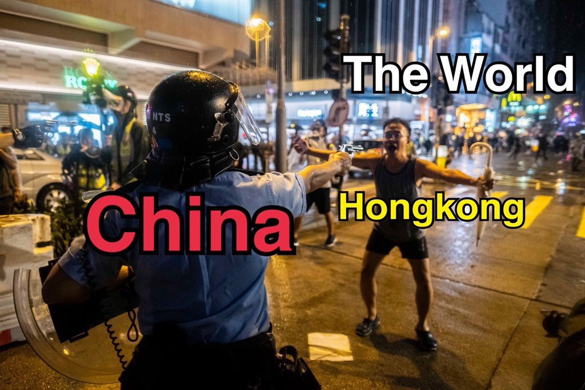
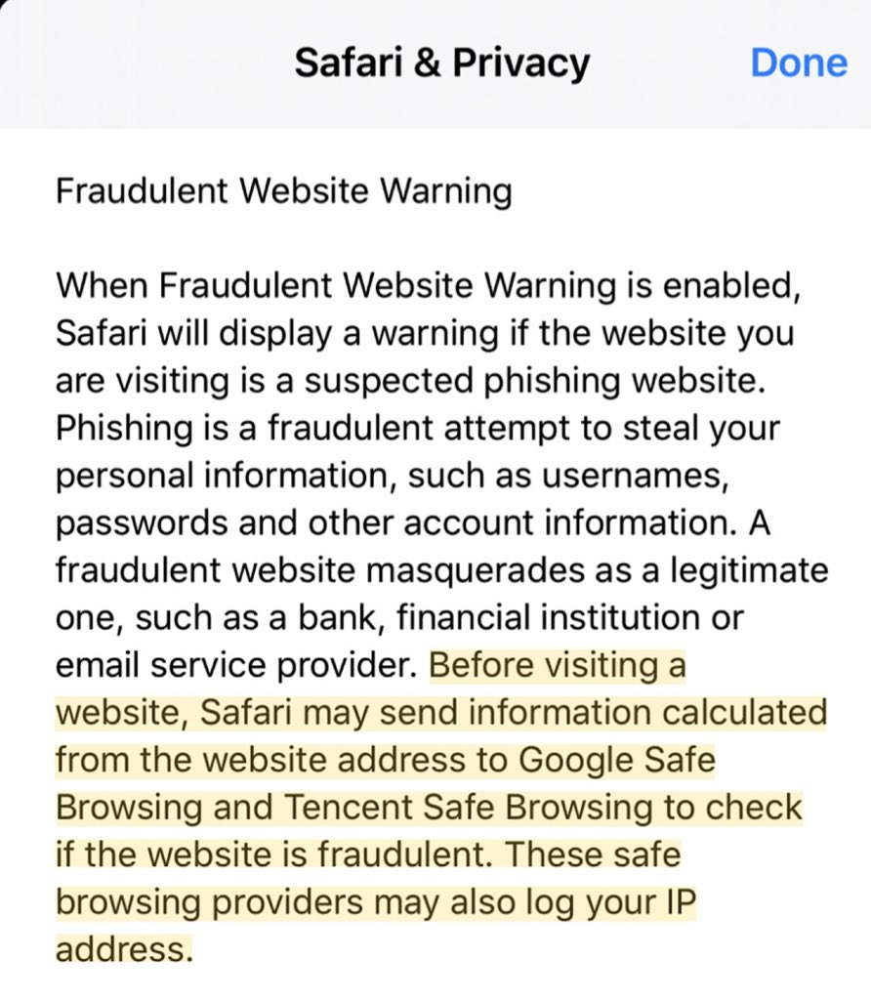

[10月14日 14:00]    BBC News 中文   @bbcchinese    持有太平洋岛国瓦努阿图的护照可自由进入欧洲国家，受到很多中国人青睐。为中国人办护照，已成为该国最大收入来源。 https://bbc.in/2q7Gfxb   :speech_balloon:评:4 :+1:赞:12 :globe_with_meridians:转:8  

[10月14日 14:00]    纽约时报中文网   @nytchinese    图中这些波普风格的林郑月娥贴画，是为了让行人过桥到青衣一座火车站时将它踩在脚下。
 http://nyti.ms/35ALHcq   :speech_balloon:评:2 :+1:赞:3 :globe_with_meridians:转:0  

[10月14日 13:30]    纽约时报中文网   @nytchinese    本土版自由女神像、讽刺官员的漫画、不断涌现的列侬墙......香港艺术家们将作品放在网上或人流密集的公共场所，使街头艺术和平面设计成为抗议运动的标志性特征。
艺术家们通常会匿名迅速创作，并将作品放在Reddit之类的网络论坛或人流密集的公共场所。 http://nyti.ms/35ALHcq   :speech_balloon:评:11 :+1:赞:32 :globe_with_meridians:转:11  

[10月14日 13:00]    BBC News 中文   @bbcchinese    香港媒体预计，《施政报告》将提出方法扩大征地，包括引用政府过去一直抗拒的《收回土地条例》，向私人开发商收地建屋。 https://bbc.in/2IKqQJG   :speech_balloon:评:12 :+1:赞:7 :globe_with_meridians:转:6  

[10月14日 13:00]    纽约时报中文网   @nytchinese    • 研究表明，业余爱好能够减轻生活压力，给人带来幸福感，并对健康有益。如何如何培养一种兴趣爱好，并在忙碌的生活中为它腾出时间？
• 肥胖患者与肠道健康：科学家发现，生活在肠道中数以万亿计的微生物群落，在体重增加和代谢疾病中起着重要作用。
更多简报内容： http://nyti.ms/32cUDCl   :speech_balloon:评:0 :+1:赞:7 :globe_with_meridians:转:2  

[10月14日 12:30]    纽约时报中文网   @nytchinese    习近平面临着香港街头的抗议活动，以及食品价格的大幅上涨等问题，后者可以通过进口美国食品来抑制；特朗普则急于把舆论焦点从弹劾调查和“电话门“上移开。
随着贸易战加重制造业和商业投资的焦虑，这两位领导人都面临着持续不断的负面经济消息。 http://nyti.ms/2OJHnl1   :speech_balloon:评:1 :+1:赞:6 :globe_with_meridians:转:2  

[10月14日 12:14]    凡賽堤/FORSETI   @FecharCCP    想看極權殺人恐怖組織的殺人，迫害華人真相的請看香港大紀元！
想看極權殺人恐怖組織爆料黑幕的去看郭文貴直播！
想看調侃，唱衰，分析極權殺人恐怖組織有關新聞的，
去看 年代向錢看（youtube)
他們相對比較專業，全面！  :speech_balloon:评:0 :+1:赞:2 :globe_with_meridians:转:1  

[10月14日 12:08]    GFHG SDKM   @zyx_yny    Crazy running dog https://twitter.com/wwkk27744741/status/1183325876001230850 …  :speech_balloon:评:0 :+1:赞:1 :globe_with_meridians:转:0  

[10月14日 12:07]    凡賽堤/FORSETI   @FecharCCP    儘管極權殺人恐怖組織控制的推特一直黑我的關注人數，我根本無所謂，因為為正義而發，為傳播真相而發，這是我的生活一部分！傳播真相才是最重要，無非也是一只小螞蟻而已！  :speech_balloon:评:0 :+1:赞:1 :globe_with_meridians:转:1  

[10月14日 12:00]    BBC News 中文   @bbcchinese    加拿大安大略省最近发生学校劳资纠纷，竟然可能影响联邦大选？ https://bbc.in/2ILWh6z   :speech_balloon:评:2 :+1:赞:12 :globe_with_meridians:转:4  

[10月14日 12:00]    纽约时报中文网   @nytchinese    突破人类极限：肯尼亚长跑运动员基普乔格在周六的维也纳马拉松赛中以1小时59分40秒的成绩完赛。这是马拉松历史上首次有人突破两小时关卡。
基普乔格是如何做到的？前体育记者做出分析。
更多简报内容： http://nyti.ms/32cUDCl   :speech_balloon:评:3 :+1:赞:7 :globe_with_meridians:转:1  

[10月14日 11:59]    凡賽堤/FORSETI   @FecharCCP    真正的良心媒體是不會刻意去追求關注度！而是注重及時傳播每一個突發事件及真相！如果一些自媒體有人養著，或者是真正為正義，為傳播真相而發，不需要靠廣告收入養活自己，他們完全沒有必要去研究觀眾的口味，傳播突發事件和跟踪新聞事件也許能迎來更多的觀眾！  :speech_balloon:评:0 :+1:赞:1 :globe_with_meridians:转:1  

[10月14日 11:52]    凡賽堤/FORSETI   @FecharCCP    香港大紀元才是真正的滅極權主義的先鋒！幾個月從未停止跟踪報導香港極權殺害港人的每一個畫面！向香港大紀元致敬並說聲謝謝！  :speech_balloon:评:6 :+1:赞:86 :globe_with_meridians:转:55  

[10月14日 11:30]    纽约时报中文网   @nytchinese    #图集【强台风“海贝斯”席卷日本】周末，日本遭受数十年来最强台风之一“海贝斯”袭击，导致至少35人死亡，15人失踪，100人受伤。
狂风呼啸、汹涌的海浪淹没建筑物、人员被困，救援行动仍在艰难进行中。
点击查看图集： http://nyti.ms/2B5GkUx   :speech_balloon:评:6 :+1:赞:15 :globe_with_meridians:转:8  

[10月14日 11:27]    凡賽堤/FORSETI   @FecharCCP    希望這些擁有原始照片和視頻的提供給死者家屬！

估計不用多久極權殺人恐怖組織要發動銷毀有關香港照片和視頻（包括所有媒體）的全球大規模行動了！  :speech_balloon:评:0 :+1:赞:1 :globe_with_meridians:转:0  

[10月14日 11:12]    凡賽堤/FORSETI   @FecharCCP    這些香港每一個慘不忍睹的畫面和視頻，如果有正義自媒體和新聞一直跟踪報導，也許很多都可以活下來！無形中幫助和挽救多少香港人啊！！！

良心媒體不單要報導，傳播，應該還要跟踪事態的發展和結果！！！  :speech_balloon:评:2 :+1:赞:12 :globe_with_meridians:转:13  

[10月14日 11:06]    凡賽堤/FORSETI   @FecharCCP    這些香港每一個慘不忍睹的畫面和視頻，如果有正義自媒體和新聞一直跟踪報導，也許很多都可以活下來！無形中幫助和挽救多少香港人啊！！！ https://twitter.com/FecharCCP/status/1182396469111865344 …  :speech_balloon:评:0 :+1:赞:5 :globe_with_meridians:转:6  

[10月14日 11:05]    凡賽堤/FORSETI   @FecharCCP    這些香港每一個慘不忍睹的畫面和視頻，如果有正義自媒體和新聞一直跟踪報導，也許很多都可以活下來！無形中幫助和挽救多少香港人啊！！！ https://twitter.com/FecharCCP/status/1183185353500512258 …  :speech_balloon:评:0 :+1:赞:3 :globe_with_meridians:转:3  

[10月14日 11:03]    凡賽堤/FORSETI   @FecharCCP    這些香港每一個慘不忍睹的畫面和視頻，如果有正義自媒體和新聞一直跟踪報導，也許很多都可以活下來！無形中幫助和挽救多少香港人啊！！！ https://twitter.com/FecharCCP/status/1182079492958883840 …  :speech_balloon:评:0 :+1:赞:0 :globe_with_meridians:转:1  

[10月14日 11:03]    凡賽堤/FORSETI   @FecharCCP    這些香港每一個慘不忍睹的畫面和視頻，如果有正義自媒體和新聞一直跟踪報導，也許很多都可以活下來！無形中幫助和挽救多少香港人啊！！！ https://twitter.com/FecharCCP/status/1183193159087640576 …  :speech_balloon:评:0 :+1:赞:0 :globe_with_meridians:转:1  

[10月14日 11:02]    凡賽堤/FORSETI   @FecharCCP    這些香港每一個慘不忍睹的畫面和視頻，如果有正義自媒體和新聞一直跟踪報導，也許很多都可以活下來！無形中幫助和挽救多少香港人啊！！！ https://twitter.com/FecharCCP/status/1182079900393582592 …  :speech_balloon:评:1 :+1:赞:1 :globe_with_meridians:转:2  

[10月14日 11:00]    凡賽堤/FORSETI   @FecharCCP    這些香港每一個慘不忍睹的畫面和視頻，如果有正義自媒體和新聞一直跟踪報導，也許很多都可以活下來！無形中幫助和挽救多少香港人啊！！！ https://twitter.com/FecharCCP/status/1182079392387911680 …  :speech_balloon:评:0 :+1:赞:1 :globe_with_meridians:转:1  

[10月14日 11:00]    纽约时报中文网   @nytchinese    • 日本周末遭受数十年来最强台风“海贝斯”袭击，致至少35人死亡，15人失踪，100人受伤；超过37万户家庭失去电力，1.5万户家庭停水。救援行动仍在进行中。
• 韩国民众举行大规模集会，要求深陷腐败指控的文在寅亲信、司法部长曹国下台。但也有许多人支持曹国。更多简报内容： http://nyti.ms/32cUDCl   :speech_balloon:评:4 :+1:赞:7 :globe_with_meridians:转:2  

[10月14日 10:57]    财经真相   @caijingxiang    又是银行券商、茅台的欢呼，50支撑起的股市不是牛市，是牛屎！  :speech_balloon:评:19 :+1:赞:95 :globe_with_meridians:转:10  

[10月14日 10:47]    凡賽堤/FORSETI   @FecharCCP    這些香港每一個慘不忍睹的畫面和視頻，如果有正義自媒體和新聞一直跟踪報導，也許很多都可以活下來！無形中幫助和挽救多少香港人啊！！！這幾個月來發現沒有幾家自媒體跟踪香港的黑警殘暴事件，都是說說一帶而過！ https://twitter.com/FecharCCP/status/1183188604132188161 …  :speech_balloon:评:0 :+1:赞:7 :globe_with_meridians:转:5  

[10月14日 10:38]    凡賽堤/FORSETI   @FecharCCP    何韻詩！香港人的英雄，香港人的驕傲！幾個月來永不放棄，傳播香港事實真相，全世界有說！希望任何正義自媒體能跟進香港的每個暴力，每個被抓捕後的死亡信息真相傳播，這才是極權殺人恐怖組織真正害怕的武器！

希望全世界的華人正義媒體都拿6.9以來的香港事件說事。
保持跟踪報導！香港大紀元就是榜樣  :speech_balloon:评:1 :+1:赞:44 :globe_with_meridians:转:22  

[10月14日 10:26]    纽约时报中文网   @nytchinese    上周，中美达成一项初步贸易协议，内容包括中国购买美国农产品，采取其他几个有限的步骤开放国内经济，以换取美国放弃从本周开始上调关税的计划。
休战将有助于平息已给中美经济体造成相当大损失的贸易战，并将有助于特朗普及习近平在国内的动荡中取得胜利。 http://nyti.ms/2OJHnl1   :speech_balloon:评:7 :+1:赞:21 :globe_with_meridians:转:7  

[10月14日 10:26]    凡賽堤/FORSETI   @FecharCCP    希望所有正義自媒體能跟進香港幾個月被極權殺人組織殘暴的每個事件，香港人被殺那麼多人，一定要傳播真相，致於如何避開版權問題是自媒體應該智者見智的問題！但是我們渴望所有正義自媒體能盡量放大香港人被打死，打傷，大殘，被自殺，被跳樓，被棄屍，黑警暴力的畫面和視頻的傳播！才是真正傳播真相！ https://twitter.com/FecharCCP/status/1183188604132188161 …  :speech_balloon:评:3 :+1:赞:17 :globe_with_meridians:转:16  

[10月14日 10:15]    凡賽堤/FORSETI   @FecharCCP    路德已經和那些為民運一樣走上吹口泡和預言專家的道路！口口聲聲說是反CCP自媒體，從不著重報導跟進香港黑警的殘暴，示威者被殺，棄屍，大陸警方，軍方如何偽裝成香港黑警等一系列真正核心。卻把精力花在唱衰CCP，這跟那些欺民賊有什麼兩樣？  :speech_balloon:评:10 :+1:赞:12 :globe_with_meridians:转:4  

[10月14日 10:13]    GFHG SDKM   @zyx_yny    MTR is no longer serving the public. 
It is Military train #HKPoliceState #HKprotests https://twitter.com/realkyleolbert/status/1183507392903991302 …  :speech_balloon:评:0 :+1:赞:0 :globe_with_meridians:转:0  

[10月14日 10:03]    凡賽堤/FORSETI   @FecharCCP    希望有陳彥霖被黑警抓捕等所有相關的原始照片及視頻複製發送給陳彥霖家屬！希望死者家屬一定要向香港法院起訴！

同時希望那些所謂反CCP自媒體們能做幾期香港被自殺，棄屍，以及播放香港真相!  :speech_balloon:评:0 :+1:赞:2 :globe_with_meridians:转:1  

[10月14日 10:00]    BBC News 中文   @bbcchinese    美联社引述消防人员指，一名70多岁的女性被直升机救起时意外掉落死亡。 https://bbc.in/2OH7SHL   :speech_balloon:评:6 :+1:赞:35 :globe_with_meridians:转:10  

[10月14日 10:00]    纽约时报中文网   @nytchinese    周日，数千名蒙面抗议者在香港各地举行快闪集会。港警称，一名警员被抗议者用“锋利”物体刺伤颈部，行凶者当场被捕。
抗议者封锁道路、破坏地铁站，并冲击了中国银行一家分行、亲北京议员办公室，以及至少两家星巴克；警方发射了催泪瓦斯，并短暂用枪指向抗议者。更多简报内容： http://nyti.ms/32cUDCl   :speech_balloon:评:7 :+1:赞:6 :globe_with_meridians:转:3  

[10月14日 09:58]    GFHG SDKM   @zyx_yny    I know we are at war time, yet watching them having fun really put a silly smile on my face. It reminds me of how they sacrificed their youth to fight for something more valuable for all of us. #AntiMaskLaw #StandwithHK  :speech_balloon:评:0 :+1:赞:7 :globe_with_meridians:转:1  

[10月14日 09:29]    GFHG SDKM   @zyx_yny    Young Hong Kong protester says she’s willing to risk ten years in jail on rioting charges because “I can’t see Hong Kong having a future if the movement fails.” HT @60Minutes #HongKongProtests #StandWithHongKong  :speech_balloon:评:13 :+1:赞:141 :globe_with_meridians:转:118  

[10月14日 09:23]    财经真相   @caijingxiang    中国首个交易日人民币中间价较上日调升2点至7.0725，于是市场瞬间就明白了所谓的中美汇率协议，只是一个防止人民币跌的不要太快，根本不是日本广场协议式大规模升值，未来只是暂时维持震荡格局。另外，市场经过周末的冷静，越发的觉得这个所谓“deal”，忽悠成分太大，提前计价的有点过分了需要修正！  :speech_balloon:评:8 :+1:赞:76 :globe_with_meridians:转:15  

[10月14日 09:18]    BBC News 中文   @bbcchinese    他79岁，供认自己由1970年至2005年间谋杀93人。 https://bbc.in/2IMQeP2   :speech_balloon:评:17 :+1:赞:74 :globe_with_meridians:转:33  

[10月14日 09:14]    财经真相   @caijingxiang    经济日报：我国大豆需求量每年在1亿吨以上，80%以上的需求要通过进口来满足。国家粮油信息中心预计，2019年至2020年度（10月至次年9月）我国进口大豆8700万吨，同比增加400万吨，增幅4.8%，但仍低于2017年至2018年度9413万吨的历史高位。 有什么样的协议，就有什么样的需求，原来400万吨是这样来的！  :speech_balloon:评:5 :+1:赞:154 :globe_with_meridians:转:53  

[10月14日 08:56]    纽约时报中文网   @nytchinese    早安！今日重点新闻包括：
香港街头暴力升级；拜登之子辞任中企董事；习近平出访印度尼泊尔，欲向南亚施加影响力；贸易初步协议对中美领导人来说意味着什么；台风“海贝斯”重创日本……NYT简报带你速览今日要闻。 http://nyti.ms/32cUDCl   :speech_balloon:评:15 :+1:赞:52 :globe_with_meridians:转:11  

[10月14日 08:53]    财经真相   @caijingxiang    深圳网络安全与信息通报中心，公告称境外组织APT41黑客对TEAMVIEWER实施了网络攻击，并成功拿下TEAMVIEWER公司的后台管理系统！  :speech_balloon:评:10 :+1:赞:49 :globe_with_meridians:转:16  

[10月14日 06:47]    GFHG SDKM   @zyx_yny    Thank you Senator Cruz and @FaceTheNation ! Please continue to #StandWithHongKong and pass S.1838 to protect HK and the free world.  :speech_balloon:评:1 :+1:赞:127 :globe_with_meridians:转:32  

[10月14日 05:04]    老司机   @h5lpykl7tp6jjop    没有个体的自尊，却有群体的自尊！人均没有的富裕，只有国家的富裕！明明大河的水是小河汇聚成的，但中国逻辑是大河有水小河满，大河无水小河干，先国家后个体，今天消灭百分之几的地主资本家，明天关押百分之几的右派，又整一部分黑五类，搞来搞去只有万分之一的官僚权贵发大财，你们还在爱国傻不傻？  :speech_balloon:评:4 :+1:赞:167 :globe_with_meridians:转:52  

[10月14日 04:11]    新闻大吐槽   @TuCaoFakeNews    时尚之都的米兰人支持香港人
#StandWithHongKong
#antitotalitarianism
#FreeHongKong  :speech_balloon:评:0 :+1:赞:6 :globe_with_meridians:转:2  

[10月14日 01:03]    GFHG SDKM   @zyx_yny    He said what does it matter; us (China) killed someone in Our land.  Does U.S.A killed peoples too? Don’t they have gang here?? 

This is complete bullshit
#antichinazi #China #HongKongProtests #Canada
  :speech_balloon:评:1 :+1:赞:13 :globe_with_meridians:转:12  

[10月14日 00:23]    新闻大吐槽   @TuCaoFakeNews    总觉得香港执行任务的警察越来越多的是大陆来的特警。这些人讲普通话/东北话是一会事儿，更重要的是他们对香港居民有着一种出自嫉妒而来的"阶级仇，地域恨"。如果我们回想毛泽东发动雇工贫农斗地主绅士，利用南下农村背景的军人整肃上海"十里洋场"，我们就可以想象发生在香港的下手狠毒和残忍。  :speech_balloon:评:105 :+1:赞:1013 :globe_with_meridians:转:284  

[10月14日 00:16]    GFHG SDKM   @zyx_yny    Please stay safe. #HongKongPolice do not know what you are. They are stupid https://twitter.com/HawleyMO/status/1183344431379779585 …  :speech_balloon:评:0 :+1:赞:3 :globe_with_meridians:转:1  

[10月14日 00:05]    新闻大吐槽   @TuCaoFakeNews    为什么我要支持勇武派?

勇武派是真正的仁者勇者!

因为已有有多青年被警方拘捕后不明不白地死去，尸体被抛下高楼，河里，海里 ...

警方不是在维护秩序，而是在屠杀，暗杀!

勇武派是在用自己的生命拯救同伴的生命，勇武派是真正的仁者勇者! https://twitter.com/TuCaoFakeNews/status/1183334485514846208 …  :speech_balloon:评:4 :+1:赞:66 :globe_with_meridians:转:12  

[10月13日 23:57]    GFHG SDKM   @zyx_yny    WTF were the #HKPolice doing? Where were they on 7.21 when gangsters beating citizens? Where were they when Fukiens used knife attacking pedestrians? They held hands, they hugged. Now they hunted down little girls and boys like this? #HKPoliceTerrorism #hongkongpolicebrutality  :speech_balloon:评:0 :+1:赞:12 :globe_with_meridians:转:1  

[10月13日 23:50]    凡賽堤/FORSETI   @FecharCCP    極權殺人恐怖組織根本沒有【人】和生命的概念，他們只有殺人與被殺理念！在他們的血液裡【人】和生命都不是東西，想殺就殺！  :speech_balloon:评:0 :+1:赞:2 :globe_with_meridians:转:0  

[10月13日 23:35]    凡賽堤/FORSETI   @FecharCCP    請將視頻編輯中英文，西班牙文，法文，日文向全世界瘋狂傳播！！！  :speech_balloon:评:0 :+1:赞:0 :globe_with_meridians:转:0  

[10月13日 23:34]    GFHG SDKM   @zyx_yny    Again, HKpolice just arrest people randomly in the shopping mall. No mercy. 

You still think it is safe in HK? it is absolutely in emergency state, HKPolice has unlimited power. 

I cannot believe this is HK.

#hkpolicebrutality
#PassHKHumanRightsAndDemocracyAct https://twitter.com/beancurdying/status/1183383474893254656 …  :speech_balloon:评:210 :+1:赞:1848 :globe_with_meridians:转:1548  

[10月13日 23:03]    GFHG SDKM   @zyx_yny    So the first question is: which version is Apple using with Tencent. The second question is: how much can Tencent learn about your overall browsing history from a collection of truncated hashes?  :speech_balloon:评:4 :+1:赞:149 :globe_with_meridians:转:24  

[10月13日 22:52]    GFHG SDKM   @zyx_yny    今次真 #圍爐
平時我好少做中文文宣，自己亦知道followers 唔多，不過我都好想同各位手足講一句:
玩得Twitter 既都知國際線好重要！
平日就好似日日夜夜做好多功課，而聽日集會就係大考咁，有美國議員黎同我地監場考！實地戰！

無理由無咗你！
#手足 #聽日見 #齊上齊落  :speech_balloon:评:47 :+1:赞:766 :globe_with_meridians:转:447  

[10月13日 22:49]    GFHG SDKM   @zyx_yny    In Taipo #HongKong. Girl was screaming “don’t catch me!” Fxxk #HongKongPolice - she has no fear and no mask. How can she be a threat and needs to be tackled? #PoliceTerrorism #PoliceBrutality #FreeHongKong #SaveHongKong  :speech_balloon:评:387 :+1:赞:3842 :globe_with_meridians:转:3710  

[10月13日 22:40]    GFHG SDKM   @zyx_yny    Also, can we assume that only users configured in the Mainland China region are having their data sent to Tencent? That warning is pretty damn broad.  :speech_balloon:评:8 :+1:赞:219 :globe_with_meridians:转:27  

[10月13日 22:37]    GFHG SDKM   @zyx_yny    Wait, Apple is sending URLs to Tencent?!  https://reclaimthenet.org/apple-safari-ip-addresses-tencent/ …  :speech_balloon:评:204 :+1:赞:2894 :globe_with_meridians:转:2518  

[10月13日 22:11]    BBC News 中文   @bbcchinese    被形容为60多年来最强台风的“海贝思”席卷日本，已造成至少18人死亡。  :speech_balloon:评:77 :+1:赞:265 :globe_with_meridians:转:119  

[10月13日 21:12]    新闻大吐槽   @TuCaoFakeNews    他也有女兒呀！他！想沒想到淪陷的香港，他的女兒也會面臨和那些15歲被強姦、被浮屍的美麗少女的命運？  :speech_balloon:评:1 :+1:赞:14 :globe_with_meridians:转:3  

[10月13日 21:12]    新闻大吐槽   @TuCaoFakeNews    太有喜感鸟 https://twitter.com/tucaofakenews/status/1183364435286478848 …  :speech_balloon:评:1 :+1:赞:49 :globe_with_meridians:转:4  

[10月13日 21:09]    新闻大吐槽   @TuCaoFakeNews    香港年輕人才是這個時代的英雄！未來的希望！ https://twitter.com/TuCaoFakeNews/status/1183348890914807808 …  :speech_balloon:评:4 :+1:赞:75 :globe_with_meridians:转:23  

[10月13日 21:09]    新闻大吐槽   @TuCaoFakeNews    Please help the kids in Hong Kong! Mr. @BorisJohnson , you are heartless! It's shameful for you not to do anything to help Hong Kong ppl!  @realDonaldTrump @VP @SecPompeo @marcorubio @SenToddYoung @tedcruz @mbachelet @SenSchumer @senatemajldr @GOPLeader @bbcchinese @BBCBreaking https://twitter.com/TuCaoFakeNews/status/1183348890914807808 …  :speech_balloon:评:0 :+1:赞:12 :globe_with_meridians:转:8  

[10月13日 21:07]    新闻大吐槽   @TuCaoFakeNews    自从这个视频之后，我每次看到关于香港的视频都忍不住流泪！香港人感动天，感动地，怎么就推倒不了你！可恨的魔共，究竟还要摧残香港到什么程度？  :speech_balloon:评:4 :+1:赞:60 :globe_with_meridians:转:4  

[10月13日 21:04]    新闻大吐槽   @TuCaoFakeNews    黑警装备好防高，这一脚踢不掉多少血  :speech_balloon:评:1 :+1:赞:14 :globe_with_meridians:转:1  

[10月13日 21:02]    新闻大吐槽   @TuCaoFakeNews    如果這個老人是我爸，這些狗警慘了，他們不是我爸的對手，打到他們半死  :speech_balloon:评:4 :+1:赞:12 :globe_with_meridians:转:1  

[10月13日 21:00]    新闻大吐槽   @TuCaoFakeNews    请曝光29268名警務人員名单，香港警察已经是维护独裁专制的帮凶
Hong Kong police are already an accomplice in maintaining dictatorship
昨晚，一个年轻人被两个黑警堵在墙角殴打，这时一个大姐看不下去了，她勇敢上前，求黑警停手，可黑警的回应是对她大吼，并将她赶走！

了不起的女士 https://twitter.com/tucaofakenews/status/1183209114144399361 …  :speech_balloon:评:3 :+1:赞:58 :globe_with_meridians:转:26  

[10月13日 20:59]    新闻大吐槽   @TuCaoFakeNews    原來魔獸是這些黑警的形容詞  :speech_balloon:评:0 :+1:赞:3 :globe_with_meridians:转:1  

[10月13日 20:50]    新闻大吐槽   @TuCaoFakeNews    五大诉求，缺一不可！

把领导人头像挂在脸上，是表达一种欢迎，参见印度的欢迎仪式  :speech_balloon:评:14 :+1:赞:167 :globe_with_meridians:转:52  

[10月13日 20:16]    墙国铁拳现世报😷   @Socialistfist    附加  :speech_balloon:评:9 :+1:赞:87 :globe_with_meridians:转:16  

[10月13日 20:14]    墙国铁拳现世报😷   @Socialistfist    让战螂被铁拳后冷静一会儿，
他还是战螂

#社会主义铁拳  :speech_balloon:评:38 :+1:赞:275 :globe_with_meridians:转:67  

[10月13日 20:14]    新闻大吐槽   @TuCaoFakeNews    让战螂被铁拳后冷静一会儿，
他还是战螂

#社会主义铁拳  :speech_balloon:评:38 :+1:赞:275 :globe_with_meridians:转:67  

[10月13日 19:48]    新闻大吐槽   @TuCaoFakeNews    小孩子的话就是简单而有穿透力，一边哭一边诉说的他，愿意为家而战，愿意用生命去抗争三十年，只是为了避免在2047成为奴隶的命运！  :speech_balloon:评:57 :+1:赞:1038 :globe_with_meridians:转:521  

[10月13日 19:30]    GFHG SDKM   @zyx_yny    Chief executive office just release a notice with Chinese version only. 
The audience obviously is  CCP not  @tedcruz.
One of the paragraph said “Before foreign politicians make their speeches, please think twice.” 
How powerful you are, Carrie Lam.
     @SolomonYue  :speech_balloon:评:35 :+1:赞:198 :globe_with_meridians:转:149  

[10月13日 19:25]    新闻大吐槽   @TuCaoFakeNews    一名女社工为了保护被黑警按在地上的孩子，大声问他，你的全名是什么？不料竟激怒了黑警，一群人大呼小叫，将一个弱女子推远！
不让问姓名，是方便你们谋杀吗？  :speech_balloon:评:16 :+1:赞:276 :globe_with_meridians:转:239  

[10月13日 19:20]    新闻大吐槽   @TuCaoFakeNews    只因老人不摘口罩，几个黑警下重手，将老人家按在地上。
黑警越来越疯狂了，孩子、老人、女生，对弱者绝不手软  :speech_balloon:评:161 :+1:赞:1436 :globe_with_meridians:转:1041  

[10月13日 19:16]    新闻大吐槽   @TuCaoFakeNews    用真枪威胁，已经变成了日常！
面对正在设置路障的抗争者，黑警下车第一件事就是拔枪！
已经完全不遵守任何条例与规范了  :speech_balloon:评:18 :+1:赞:173 :globe_with_meridians:转:127  

[10月13日 19:00]    纽约时报中文网   @nytchinese    #一周热门 #观点 习近平没有学好的中国历史课 http://nyti.ms/2Ozgsbx   :speech_balloon:评:196 :+1:赞:193 :globe_with_meridians:转:91  

[10月13日 18:51]    新闻大吐槽   @TuCaoFakeNews    虽然be water ，但别忘了，这可是李小龙的哲理！需要时水也是威力强大的，看勇武派飞起一脚，踢倒黑警，救出手足！

很欣赏勇武派为保护别人而战的义气！

不过，黑警受到重击，站起来却没有一丝受伤的样子，装备的差距太悬殊，所以勇武们还是避免正面冲突为妙，保存实力！  :speech_balloon:评:54 :+1:赞:538 :globe_with_meridians:转:160  

[10月13日 18:28]    GFHG SDKM   @zyx_yny    True comment 
#HongKong do not need any stupid ordinance to maintain people’s loyalty 
#StandWithHongKong https://twitter.com/hksubtitled/status/1183231542014799873 …  :speech_balloon:评:0 :+1:赞:1 :globe_with_meridians:转:2  

[10月13日 18:21]    GFHG SDKM   @zyx_yny    Look, they can arrest and beat anyone they wanted. #HKPoliceTerrorism #HKPoliceState 
What’s the point of arresting a social worker with causal look? https://twitter.com/cityusucbc/status/1183313136868192257 …  :speech_balloon:评:0 :+1:赞:1 :globe_with_meridians:转:3  

[10月13日 18:15]    GFHG SDKM   @zyx_yny    They can rob, rape or even murder. They are unidentified. They can quibble about what they did because of #HKPoliceTerrorism 
They can blame #HKprotesters for all the crimes. They can scapegoat protesters. https://twitter.com/jaytobb/status/1183301763987697664 …  :speech_balloon:评:0 :+1:赞:2 :globe_with_meridians:转:4  

[10月13日 18:10]    新闻大吐槽   @TuCaoFakeNews    82岁的黄老伯是“守护孩子”的一员，
6个月来他一直穿梭在抗争第一线，曾被警察推倒，也曾被喷胡椒水，还曾在“和你飞”活动中，举起手杖，阻挡警察的冲击；他说：「80几岁了，还怕什么被捕？」誓要把余热献给香港的未来！
摩西举起手杖，可以让岩石流水，老伯举起手杖，却感化不了冥顽不灵的黑警和港府！  :speech_balloon:评:16 :+1:赞:490 :globe_with_meridians:转:216  

[10月13日 17:13]    老司机   @h5lpykl7tp6jjop    语言是交流的工具，必然是进步的时代化的，以权力的手段改为政治服务的目的都是幻想，一规范就僵死，没人喜欢官方语言，就象敏感词越来越多，丝毫没有防碍人们的交流，新生网络语言如泛澜的洪水反倒时不时让官方赶紧跟潮流，那些借此想打爱国大旗的喽啰只能让人看出来水平太低，低到水平线以下不予置评  :speech_balloon:评:0 :+1:赞:8 :globe_with_meridians:转:1  

[10月13日 17:12]    老司机   @h5lpykl7tp6jjop    #HK10月13日
CCP的暴徒們瘋狂抓捕香港的孩子們，歷史會銘記這些為自由而獻身的年輕人
@realDonaldTrump
@FLOTUS
@VP
@SecPompeo
@MariaBartiromo
@trish_regan
@robert_spalding
@SpeakerPelosi
@RepGallagher
@senatemajldr
@marcorubio
@SenSchumer
@RepMcGovern
@EsperDoD
@robertcobrien  :speech_balloon:评:16 :+1:赞:404 :globe_with_meridians:转:374  

[10月13日 17:00]    纽约时报中文网   @nytchinese    #一周热门 #时报专栏 与中国做生意，不能以卑躬屈膝为代价 http://nyti.ms/325LrQu   :speech_balloon:评:104 :+1:赞:155 :globe_with_meridians:转:39  

[10月13日 16:33]    老司机   @h5lpykl7tp6jjop    I will just pepper spray all of you, why not? I mean, I am wearing a mask and my number is not shown. Who would know it was me
#PoliceState #PoliceBrutality #StandWithHongKong #FreeHongKong  :speech_balloon:评:186 :+1:赞:2490 :globe_with_meridians:转:2302  

[10月13日 16:11]    财经真相   @caijingxiang    中东局势我不是很了解，但是有一点是很明白的，库尔德武装在抗击is时得到过大量美军武器，其部队战斗力相对强悍，怎么会这么快就被土耳其突破防线了？库尔德武装的武器供应不会是被伊拉克给切断了吧？ https://twitter.com/landofyelang/status/1183284746412969985 …  :speech_balloon:评:30 :+1:赞:81 :globe_with_meridians:转:20  

[10月13日 16:00]    纽约时报中文网   @nytchinese    #每日一词 Third rail指的是“为电动车辆的电机传导电流的金属轨道”，通常被称为“第三轨道”。
因第三轨道承载高电压，如果不慎接触，将触电甚至丧命，故该词也被用来指“常被政客规避的具有争议的问题”。 http://nyti.ms/33kw2Mo   :speech_balloon:评:3 :+1:赞:13 :globe_with_meridians:转:5  

[10月13日 15:45]    老司机   @h5lpykl7tp6jjop    #香港牛頭角玉蓮台附近10月13日 15：25 三位少女被捕 請廣傳
#SOSHongKong  :speech_balloon:评:121 :+1:赞:1855 :globe_with_meridians:转:2019  

[10月13日 15:13]    财经真相   @caijingxiang    本次会议标志着中美第一阶段贸易谈判的结束，第二阶段谈判的开始，由于中共在第一阶段已经正式购买了大量美国农产品，所以再永购买的方式将不会对川普产生任何吸引力，中共为此需要准备新的筹码才行（初步触及中共体制），预计中美第二阶段的较量将于11月底12月初正式拉开序幕！  :speech_balloon:评:7 :+1:赞:71 :globe_with_meridians:转:15  

[10月13日 15:00]    纽约时报中文网   @nytchinese    #一周热门 NBA“挺港”事件背后：国际公司在华“雷点”难料 http://nyti.ms/2Mwogbw   :speech_balloon:评:14 :+1:赞:30 :globe_with_meridians:转:9  

[10月13日 14:59]    财经真相   @caijingxiang    2019年11月16日至17日，APEC(亚洲太平洋经济合作组织) 第二十七次领导人非正式会议将在智利圣地亚哥举行。届时将有超过2万名来自中国、美国、日本、俄罗斯等21国的代表出席会议。由于中美第一阶段贸易协议将在哪里落实为文本内容，川普和习近平的签字仪式将成为本次会议的重点！  :speech_balloon:评:9 :+1:赞:113 :globe_with_meridians:转:35  

[10月13日 13:00]    纽约时报中文网   @nytchinese    #一周热门 #观点 当我亲临国庆70周年阅兵现场 http://nyti.ms/2OueBVb   :speech_balloon:评:24 :+1:赞:24 :globe_with_meridians:转:5  

[10月13日 12:24]    BBC News 中文   @bbcchinese    花卉是一门全球年产值达80亿美元的行业。花卉种植向赤道地区转移，给全球贸易和当地经济注入新鲜养分。 // 《世界制造》：花卉——传统产业老树新枝  https://bbc.in/2OEWHiD   :speech_balloon:评:12 :+1:赞:134 :globe_with_meridians:转:46  

[10月13日 12:00]    GFHG SDKM   @zyx_yny    The Lady Liberty to watch over Hong Kong on the Lion Rock! A group of volunteers, together with the creative team behind the statue overcame poor weather and brought  the “Goddess” to the mountain top to support the ongoing campaign against the tyranny in HK. 

#LadyLibertyHK  :speech_balloon:评:142 :+1:赞:4302 :globe_with_meridians:转:2625  

[10月13日 11:00]    纽约时报中文网   @nytchinese    #一周热门 《南方公园》在中国遭禁，发表“道歉”声明 http://nyti.ms/35lndUk   :speech_balloon:评:79 :+1:赞:151 :globe_with_meridians:转:43  

[10月13日 09:12]    老司机   @h5lpykl7tp6jjop    魔鬼在人間35

極權殺人恐怖組織正在用各種兇殘手段殺害我們的同胞....................................................................................................

注！直接打断左手  :speech_balloon:评:77 :+1:赞:690 :globe_with_meridians:转:717  

[10月13日 09:00]    纽约时报中文网   @nytchinese    #一周热门 #观点 直言不讳的NBA，在中国保持了沉默 http://nyti.ms/2IAinc1   :speech_balloon:评:55 :+1:赞:58 :globe_with_meridians:转:18  

[10月13日 09:00]    纽约时报中文网   @nytchinese    #一周热门 #观点 香港“禁蒙面法”揭露了林郑月娥的真面目 http://nyti.ms/2ocvBEZ   :speech_balloon:评:77 :+1:赞:160 :globe_with_meridians:转:46  

[10月13日 07:00]    纽约时报中文网   @nytchinese    #一周热门 #新新世界 社交媒体时代，中国政府如何让年轻人变得爱国 http://nyti.ms/2ATH3rH   :speech_balloon:评:158 :+1:赞:255 :globe_with_meridians:转:131  

[10月13日 04:48]    老司机   @h5lpykl7tp6jjop    阅兵最遗憾的是，没有看到城管方队  :speech_balloon:评:104 :+1:赞:615 :globe_with_meridians:转:352  

[10月13日 01:32]    老司机   @h5lpykl7tp6jjop    財委會中民主議員舉起標語, 警暴未除, 仲點開會.
不滿會議將審議警察加薪撥款申請

給政府撥款, 那就是給香港市民送子彈 
#S  :speech_balloon:评:10 :+1:赞:160 :globe_with_meridians:转:87  

[10月13日 00:38]    老司机   @h5lpykl7tp6jjop    中共派香港黑警身份信息将成为永远的秘密，谁是凶手也将成迷。正是这种便利的身份条件，使得中共的黑警在香港街头成为行走的刽子手，可以肆无忌惮的所谓正常执法。

#SOSHK
#FreeHongKong
#StandwithHonKong  :speech_balloon:评:21 :+1:赞:169 :globe_with_meridians:转:109  

[10月12日 23:14]    财经真相   @caijingxiang    资管业的重磅深水炸弹，非标资产界定收紧超过预期！中共出台的任何金融政策都是以确保不出乱子为出发点，尤其是在经济逐渐下滑的情况下，更是惧怕金融失控，因此非标收紧超预期并不意外，况且还可以压低理财利率，这对大规模地方债发行有利，逐步控制国内所有财富是中共恐惧的必然结果！  :speech_balloon:评:10 :+1:赞:147 :globe_with_meridians:转:46  

[10月12日 22:27]    BBC News 中文   @bbcchinese    中美贸易谈判关系到关税、农产品、知识产权、技术转让等等议题的同时，记者们还关心华为、香港和美国列的中国公司黑名单…… https://bbc.in/325DJpn   :speech_balloon:评:21 :+1:赞:60 :globe_with_meridians:转:25  

[10月12日 21:40]    BBC News 中文   @bbcchinese     中美第十三次贸易谈判达成阶段协议。美国总统特朗普说，“美中之间曾有过很多摩擦，但如今是场‘爱的聚会’”。 https://bbc.in/2MaofLp   :speech_balloon:评:18 :+1:赞:31 :globe_with_meridians:转:11  

[10月12日 21:00]    纽约时报中文网   @nytchinese    #新新世界  共产党按一下爱国的按钮，大家就都像僵尸一样起来共同反对外国势力，不管是日本还是NBA。”受到香港抗议启发的创作歌手杨洋说。
“他们不问为什么反对这些事情，事实上，他们很多人非常喜欢日本和NBA。” http://nyti.ms/2pZzgGv   :speech_balloon:评:531 :+1:赞:919 :globe_with_meridians:转:278  

[10月12日 20:00]    BBC News 中文   @bbcchinese    韩国K-pop天团BTS（防弹少年团）在沙特阿拉伯演出，引起人权团体批评是为该国洗白人权恶劣记录。大家怎么看？ https://bbc.in/2MyDPiF   :speech_balloon:评:17 :+1:赞:40 :globe_with_meridians:转:11  

[10月12日 19:08]    财经真相   @caijingxiang    来的太迟了！ https://twitter.com/solomonyue/status/1182931497415659521 …  :speech_balloon:评:30 :+1:赞:254 :globe_with_meridians:转:72  

[10月12日 19:06]    老司机   @h5lpykl7tp6jjop    看了这些从日本引进的词汇，还敢说这是你以为的中国话吗？  :speech_balloon:评:42 :+1:赞:636 :globe_with_meridians:转:317  

[10月12日 17:59]    墙国铁拳现世报😷   @Socialistfist    详细补充  :speech_balloon:评:32 :+1:赞:313 :globe_with_meridians:转:71  

[10月12日 17:55]    墙国铁拳现世报😷   @Socialistfist    好担心墙国既是粉红又是NBA球迷的精神健康  :speech_balloon:评:35 :+1:赞:494 :globe_with_meridians:转:105  

[10月12日 17:47]    墙国铁拳现世报😷   @Socialistfist    慈禧太后为什么要杀义和团？ ---百度知道
#社会主义铁拳  :speech_balloon:评:142 :+1:赞:1120 :globe_with_meridians:转:449  

[10月12日 17:09]    墙国铁拳现世报😷   @Socialistfist    网传后续，很多人都觉得这是反串，不过笑料倒是满满。  :speech_balloon:评:16 :+1:赞:125 :globe_with_meridians:转:25  

[10月12日 17:00]    BBC News 中文   @bbcchinese    【一周热点回顾】被列入的机构和公司若未得到美国政府许可，无法向美国公司购买产品。 https://bbc.in/2MvUp2T   :speech_balloon:评:42 :+1:赞:115 :globe_with_meridians:转:36  

[10月12日 15:00]    BBC News 中文   @bbcchinese    【一周热点回顾】蔡英文国庆演讲首次提到香港，表示一国两制的失灵导致香港社会处于脱序边缘。台湾将拒绝一国两制， 以民主自由走出自己的路。 https://bbc.in/2OGWTOr   :speech_balloon:评:128 :+1:赞:339 :globe_with_meridians:转:78  

[10月12日 14:02]    BBC News 中文   @bbcchinese    澳大利亚的土著医术也很博大精深。 // 抑郁症治疗：来自澳大利亚土著的六万年古方 https://bbc.in/2M9BtYP   :speech_balloon:评:29 :+1:赞:125 :globe_with_meridians:转:43  

[10月12日 13:51]    财经真相   @caijingxiang    10月11日，中兴通讯公告称，公司20亿元人民币中期票据和80亿元超短期融资券已获交易商协会注册通过。注册额度自通知书落款之日起2年内有效，可分期发行。目前中兴在银行间市场存续的永续中期票据60亿元，将于2020年1月面临发行人赎回选择权。这是华为发债300亿后，中兴也跟进发债100亿元！  :speech_balloon:评:9 :+1:赞:170 :globe_with_meridians:转:69  

[10月12日 13:47]    财经真相   @caijingxiang    继家乐福中国卖身苏宁之后，又一外资零售巨头退潮。

10月11日晚间，麦德龙集团、物美集团和多点Dmall联合宣布，物美就收购麦德龙中国控股权已与麦德龙集团签订最终协议。交易完成后，物美集团将在双方设立的合资公司中持有80%股份，麦德龙继续持有20%股份。此次交易总计19亿欧元（约21亿美元）  :speech_balloon:评:6 :+1:赞:172 :globe_with_meridians:转:63  

[10月12日 12:52]    财经真相   @caijingxiang    环球时报：香港暴力示威活动的背后总能看见外部势力助纣为虐的黑影幢幢。佩洛西、卢比奥等政客更是无视激进分子的暴力行径、频频施压港警。
但与之相反，特朗普并未对香港激进分子表达支持态度，甚至明确表示“香港问题应由中国自己处理”。随后，他遭到不少政客施压。  :speech_balloon:评:25 :+1:赞:99 :globe_with_meridians:转:23  

[10月12日 12:35]    老司机   @h5lpykl7tp6jjop      :speech_balloon:评:1 :+1:赞:0 :globe_with_meridians:转:0  

[10月12日 12:33]    老司机   @h5lpykl7tp6jjop    特朗普宣布中美达成首阶段贸易协议 或下月与习签署 https://youtu.be/N6RHrQoBAJc   :speech_balloon:评:3 :+1:赞:0 :globe_with_meridians:转:0  

[10月12日 12:30]    老司机   @h5lpykl7tp6jjop      :speech_balloon:评:0 :+1:赞:3 :globe_with_meridians:转:2  

[10月12日 12:28]    老司机   @h5lpykl7tp6jjop    贵州女退休教授转港示威图片 被脱光衣服拘武警基地
中国政府现在对于真相传播到了严防捂嘴不准出声的危机关头！
它们知道垮台的后果，滔天的罪恶要清算，已经惊恐到疯狂了！  :speech_balloon:评:7 :+1:赞:18 :globe_with_meridians:转:9  

[10月12日 12:07]    老司机   @h5lpykl7tp6jjop    美国国会的议员们：看到一个个香港年轻人的死亡名单，你们仍然不认为中共就是一个恐怖组织吗？中东的恐怖组织杀几个人质后，全世界都愤怒声讨，联合进行围剿。今天的香港，这么多的青年人仅仅是因为诉求民主和自由就被肆意暗杀，美国和西方世界能够一直这样忍心看着中共肆无忌惮地进行屠杀吗？——中铭  :speech_balloon:评:65 :+1:赞:557 :globe_with_meridians:转:294  

[10月12日 11:24]    老司机   @h5lpykl7tp6jjop    爱国主义在中国仿佛是最能提升民心统一团结的行动，当然不能与利益关连，只能空喊，否则你叫各人回家把进口商品电器全砸了试试能不能成？把在国外留学工作移民的子女叫得回来？现在去日本旅游，看NBA兰球的事都弄的现丑了，所以这个花活只能玩玩，骗儍子可以骗别人可以，骗自己都不行，你真的爱国？  :speech_balloon:评:1 :+1:赞:18 :globe_with_meridians:转:5  

[10月12日 11:13]    老司机   @h5lpykl7tp6jjop    中国近10年垮了50座桥 据不完全统计，如果大桥的垮塌确实是因为超载引起的，那么是因为中国桥梁的设计承重过低，还是超载太猖獗？专家估计独墩柱承载弯曲路段在设计上有问题，大部分桥塌有设计上的隐忧，但这个体制下不好下断言。另外超载的确也是非常严重现象。好了，说了半天桥垮了，原因太复杂，扯  :speech_balloon:评:9 :+1:赞:93 :globe_with_meridians:转:31  

[10月12日 10:32]    BBC News 中文   @bbcchinese    过去一周，BBC News中文的这些故事受到关注，我们带您回顾本周。  // NBA和《南方公园》争议、香港禁蒙面法和本周更多好故事 https://bbc.in/2VA6c42   :speech_balloon:评:24 :+1:赞:154 :globe_with_meridians:转:52  

[10月12日 10:06]    财经真相   @caijingxiang    对，这次谈判中共等于是付出了所有人筹码，金融市场放开保证华尔街的利益，一但落成文本签字中共就不能再反悔，等到第二阶段谈判时，华尔街对川普的压力会大大降低，这就是川普的谈判策略！ https://twitter.com/seven_banannacc/status/1182838209933242368 …  :speech_balloon:评:68 :+1:赞:382 :globe_with_meridians:转:147  

[10月12日 09:43]    财经真相   @caijingxiang    班农说川普是个懂的运用杠杆的总统，微缩版的协议是为了更大的协议，第一阶段的deal，包含金融开放、汇率、买农产品这些不触及中共体制的内容。作为翘板这些在第二轮中不能再作为中共退让谈判筹码。第二阶段将直接涉及国企垄断补贴、互联网开放、强制技术转让、以及弹簧门、玻璃门等政体改革硬骨头！  :speech_balloon:评:135 :+1:赞:877 :globe_with_meridians:转:271  

[10月12日 07:54]    BBC News 中文   @bbcchinese    八集系列片《世界制造》为您讲述八件产品打造全球经济的故事。 https://bbc.in/2pgGOVe   :speech_balloon:评:3 :+1:赞:28 :globe_with_meridians:转:16  

[10月12日 07:31]    BBC News 中文   @bbcchinese    从NBA开始， BBC中文为您盘点十大最近踩上中国政治红线的跨国公司 https://bbc.in/316wJXW   :speech_balloon:评:48 :+1:赞:148 :globe_with_meridians:转:58  

[10月12日 07:10]    BBC News 中文   @bbcchinese    他坚称，冷战就从未结束过，而现在只是用不同的方法进行战斗。 https://bbc.in/319g9H5   :speech_balloon:评:5 :+1:赞:57 :globe_with_meridians:转:25  

[10月12日 06:33]    老司机   @h5lpykl7tp6jjop    这个车挂党徽的货车司机，被交警处罚时，
为表对党对领袖的忠心，竟然当着交警的面，跳起忠字舞。
但是警察可不惯着他的毛病，处罚的超级狠，
竟然以精神不正常为由，吊消了他的驾照。
这真是个悲伤的故事，爱国贼们要引以为戒…  :speech_balloon:评:54 :+1:赞:428 :globe_with_meridians:转:176  

[10月12日 06:13]    BBC News 中文   @bbcchinese    特朗普表示，最终的协议文本会在未来的五周内完成。下月，他可能将在智利与中国国家主席习近平会面。 https://bbc.in/2VB9fcq   :speech_balloon:评:44 :+1:赞:81 :globe_with_meridians:转:29  

[10月12日 04:20]    财经真相   @caijingxiang    班农说过，对川普的弹劾谘询将在感恩节前正式开始，这是中共为啥要五周时间的根本原因！ https://twitter.com/stephen_liuhuan/status/1182751627083735040 …  :speech_balloon:评:20 :+1:赞:208 :globe_with_meridians:转:66  

[10月12日 04:09]    财经真相   @caijingxiang    市场计价完毕，人民币开始回跌，股市小幅下跌黄金反弹！ https://twitter.com/caijingxiang/status/1182748170683478016 …  :speech_balloon:评:9 :+1:赞:87 :globe_with_meridians:转:23  

[10月12日 04:01]    财经真相   @caijingxiang    迷你协议内容：1.货币政策和汇率问题更加透明 2.技术转让问题得到进一步保障 3.中共同意购买400-500亿美元农产品 4.接下来五周落实协议 5.金融领域已经达成协议  本协议最核心点是五周时间，也就是有效期是五周！翻译水平有限各位自己看原文吧！  :speech_balloon:评:88 :+1:赞:397 :globe_with_meridians:转:196  

[10月12日 02:18]    老司机   @h5lpykl7tp6jjop    【关注香港】10月11日：不自由，毋宁死！革命直到最后一人！走过四个月，是政府主动突破我们的恐惧。我们十分明白有死的风险，但我们不会退缩，退缩的话这场运动就会输！抗争继续！香港人！加油  :speech_balloon:评:12 :+1:赞:298 :globe_with_meridians:转:145  

[10月11日 23:34]    墙国铁拳现世报😷   @Socialistfist    支持NBA的推友们抓紧了，马上投票就要结束了，别说党和人民没有给你机会啊  :speech_balloon:评:1 :+1:赞:45 :globe_with_meridians:转:2  

[10月11日 23:30]    墙国铁拳现世报😷   @Socialistfist    又爱又怕，唉

PS 本推第一个符合两个系列的推诞生了！
#社会主义铁拳
#战螂在推特  :speech_balloon:评:60 :+1:赞:585 :globe_with_meridians:转:150  

[10月11日 23:18]    老司机   @h5lpykl7tp6jjop    11 Oct Whampoa #HKPolice “u motherfucker. *spray* Go away. *spray* Arrest the motherfucker. Arrest him arrest him arrest him.” #HongKongPolice #HKPoliceTerrorism #hkpolicebrutality #HKPoliceTerrorists #HKprotests #hongkong #hk #StandwithHonKong #StandwithHK  :speech_balloon:评:269 :+1:赞:1966 :globe_with_meridians:转:2023  

[10月11日 22:54]    GFHG SDKM   @zyx_yny    #HKprotests #香港人加油 #光復香港時代革命 #光復香港 #新加坡支持香港
#新加坡支持港民五大诉求 
最近有很多五毛网团冒充新加坡人在FB痛吗港人。

如果有新加坡人对你们无礼，我在此向港人说声对不起，我会进我所能向他们解释香港的情况。

请帮我retweet！,我们新加坡支持你，多谢香港手足们！  :speech_balloon:评:161 :+1:赞:1369 :globe_with_meridians:转:649  

[10月11日 22:52]    财经真相   @caijingxiang    这是典型的逻辑矛盾！ https://twitter.com/zerohedge/status/1182668476277760002 …  :speech_balloon:评:5 :+1:赞:18 :globe_with_meridians:转:3  

[10月11日 22:30]    BBC News 中文   @bbcchinese    清华马克思主义学院副教授吕嘉被学生举报，成为近期第二位被调查的清华老师。大陆告密风气渐起引发“文革返潮”担忧。
 https://bbc.in/2pc5ttR   :speech_balloon:评:88 :+1:赞:226 :globe_with_meridians:转:118  

[10月11日 21:53]    BBC News 中文   @bbcchinese    习近平与莫迪同样面对着国内经济呆滞，这亚洲两大国家的领导人能否排除万难达成任何共识，备受关注。
 https://bbc.in/2OBwIZo   :speech_balloon:评:42 :+1:赞:33 :globe_with_meridians:转:9  

[10月11日 21:49]    财经真相   @caijingxiang    昨天爱尔兰和英国就脱欧问题举行磋商，会后双方都发表了乐观的言论，市场猜测爱尔兰有可能就边界问题松口，从而大大降低了英国硬脱欧的风险，受此乐观预期影响英镑今天飙升200点，同时叠加中美贸易谈判缓和信息，全球股市暴涨，黄金一度跌破1480关口，风险资产全面回归，全球股市都在买买买！  :speech_balloon:评:3 :+1:赞:120 :globe_with_meridians:转:21  

[10月11日 20:13]    墙国铁拳现世报😷   @Socialistfist    今天收到了很多推友投稿和 @ ，其中有一则是某精赵在17年发微博控诉未成年女儿被性侵一事。首先照例感谢各位踊跃投稿 
因为事发17年，涉及到未成年人且是性侵害，经考虑不发推防止不必要的网络暴力。
希望大家理解  :speech_balloon:评:30 :+1:赞:208 :globe_with_meridians:转:16  

[10月11日 19:20]    墙国铁拳现世报😷   @Socialistfist    推友们你有没有闻到一股恶臭
为两地遇难者祈福  :speech_balloon:评:36 :+1:赞:315 :globe_with_meridians:转:50  

[10月11日 16:16]    财经真相   @caijingxiang    关于汇率协议将会大幅推动人民币升值纯粹是“大忽悠”，现在中国和当年日本面临的情况完全不一样，日本当年是创新大国，且拥有民主政体保证财富安全，而且日元已经成为世界主流货币被纳入其他国家储备货币，这些今天中共能比吗？中共走回头路资本跑都来不及还有傻瓜去投资？ https://twitter.com/bbcchinese/status/1182566793396793344 …  :speech_balloon:评:30 :+1:赞:372 :globe_with_meridians:转:89  

[10月11日 01:54]    墙国铁拳现世报😷   @Socialistfist    为契合推文主题小编特别推出投稿指南。
#社会主义铁拳 指某精赵在各平台（如微博贴吧）公开发布地爱党国言论和被铁拳截图，两者可为新后或并列关系。至少两张截图

#战螂在推特  是一个分享战螂在推特上的反价值观魔幻言行的品鉴系列，要求宽松符合条件即可。  :speech_balloon:评:8 :+1:赞:74 :globe_with_meridians:转:5  

[10月11日 01:41]    墙国铁拳现世报😷   @Socialistfist    这个月里，我们一起回顾了历史上的铁拳，我们还有幸请到了墙内粉红兔兔@zzyyzoe ，并把她打造成推特网红。
，还搞了让大家心服口服的民主投票，最后新系列#战螂在推特 也获得大家良好反响。  :speech_balloon:评:8 :+1:赞:112 :globe_with_meridians:转:4  

[10月11日 01:39]    墙国铁拳现世报😷   @Socialistfist    9月11日开办的墙国铁拳现世报, 今天满月了！多谢一个月来各位看官捧场，感谢大家的转发点赞评论三连。还要特别感谢给小编投稿的各位，是你们让这个推坚持活跃下去 
大家的热情，让小编受宠若惊。
（更正8000+推友）  :speech_balloon:评:22 :+1:赞:445 :globe_with_meridians:转:35  

[10月10日 22:22]    墙国铁拳现世报😷   @Socialistfist    突然爱国，突然强拆
#社会主义铁拳 https://twitter.com/rtiomn/status/1182294052466614272 …  :speech_balloon:评:99 :+1:赞:617 :globe_with_meridians:转:143  

[10月10日 17:44]    墙国铁拳现世报😷   @Socialistfist    全推特最纯净的推 https://twitter.com/zSP8IcFxk8kpaJv/status/1182229009410641920 …  :speech_balloon:评:24 :+1:赞:299 :globe_with_meridians:转:25  

[10月10日 17:28]    墙国铁拳现世报😷   @Socialistfist    你们看看这些假爱国者，竟然为了房子威胁国家，上街游行。
#社会主义铁拳  :speech_balloon:评:79 :+1:赞:535 :globe_with_meridians:转:163  

[10月10日 17:15]    墙国铁拳现世报😷   @Socialistfist    突然来了很多香港选民，你们投完票可以去何议员那里继续投票  :speech_balloon:评:10 :+1:赞:107 :globe_with_meridians:转:8  

[10月10日 09:51]    凡賽堤/FORSETI   @FecharCCP    70年來我們已經失去八千萬同胞，八千萬中都是同胞的親人，祖輩，父輩，親人，朋友！今天的700萬香港人也都是我們的親人，未來同胞的祖輩，父輩，親人，朋友！我們何其悲哀啊！！！！！！！！！！！！！！！！！！！！！！！！！！！！  :speech_balloon:评:14 :+1:赞:252 :globe_with_meridians:转:130  

[10月09日 23:15]    墙国铁拳现世报😷   @Socialistfist    中国突然取消了NBA投票选项 https://twitter.com/VOAChinese/status/1181942149064998912 …  :speech_balloon:评:2 :+1:赞:56 :globe_with_meridians:转:2  

[10月09日 23:14]    新闻大吐槽   @TuCaoFakeNews    这下暴雪要哭了，
其射击游戏「守望先锋」的预告片里，一个中国女孩角色被高手给P了，改成了一个支持反送中的香港女孩！

是时候全民抵制暴雪了，请在墙内广传此影片！  :speech_balloon:评:118 :+1:赞:3321 :globe_with_meridians:转:1611  

[10月09日 22:56]    墙国铁拳现世报😷   @Socialistfist    后后续，王老师已销号，推出推特  :speech_balloon:评:11 :+1:赞:68 :globe_with_meridians:转:4  

[10月09日 11:46]    墙国铁拳现世报😷   @Socialistfist    8:00 上贴吧讨论，贴吧被封
9:00 豆瓣瓜组组cp，组被解散号被封
10:00 微博质问来去之间，期间言论被收集于@Socialistfist 
11:00 连vpn上pornhub
11:05 撸完骂几句女优丑
12:00 起点yy小说，穿越之我是希特勒
1:00am 睡觉，醒来又是斗志满满的一天呢  :speech_balloon:评:6 :+1:赞:137 :globe_with_meridians:转:22  

[10月09日 00:47]    GFHG SDKM   @zyx_yny    "Son, when you grow up
You will be the savior of the broken
The beaten, and the damned?"
Please watch this powerful mv #HongKongProtester #hkprotests 
香港反送中護法戰爭(Hong Kong Defensive War 2019)：Welcome To The Black Parade  https://youtu.be/0yXTHODE24Q  via @YouTube  :speech_balloon:评:3 :+1:赞:16 :globe_with_meridians:转:4  

[10月05日 09:33]    凡賽堤/FORSETI   @FecharCCP    呼籲請求共同挖掘所有有關香港發生的事，越全面越好，不同角度，越多越好，包括被暗地抓捕的人員，特別是CCP 派出的各種偽裝身份，包括變身變裝行兇的一點一滴都要挖掘出來，把CCP 的邪惡下三濫手段的真相毫無保留的曝光在全世界面前！世界公知公義才能真正挽救和保護香港人！希望懂視頻編輯配上中英文 https://twitter.com/hjjohnson17/status/1178969916499746816 …  :speech_balloon:评:5 :+1:赞:17 :globe_with_meridians:转:10  

[09月06日 19:03]    财经真相   @caijingxiang    本次降准总计是释放增量资金9000亿，但是提前下发的2020年地方债最高为1.85万亿，降准释放的资金只够新一轮刺激的一半，剩下的资金将会从现有社会存量来补充，这在一定程度收紧了金融系统的流动性；不过和以往一样，央行的降准刺激措施依然是打着“中小企业”的名义下调的!连接 https://www.youtube.com/watch?v=Usp9LIngNl0&feature=youtu.be …  :speech_balloon:评:20 :+1:赞:240 :globe_with_meridians:转:79  

[03月13日 08:10]    老司机   @h5lpykl7tp6jjop    批评是批评家天生的使命！他们只感知对错，信奉真理，指出真相不吐不快，不在意权势和群众的喜好，从批评里不可能获得任何好处，但批评家愚直不改。在中国几乎所有人都讨厌批评家，喜欢阴谋家，因为他们只说好听的！可是就因为中国的批评家太少，中国几乎看不到未来和希望！  :speech_balloon:评:78 :+1:赞:173 :globe_with_meridians:转:42  

[01月10日 13:30]    纽约时报中文网   @nytchinese    每年一月，《纽约时报》​​会选出52个年度旅游目的地。将举办冬奥会的中国崇礼、炫目奢华的香港、日本濑户内各岛皆入选。
新的一年，你计划好要去哪里旅行了吗？ http://nyti.ms/2Tz9N06   :speech_balloon:评:281 :+1:赞:374 :globe_with_meridians:转:195  

