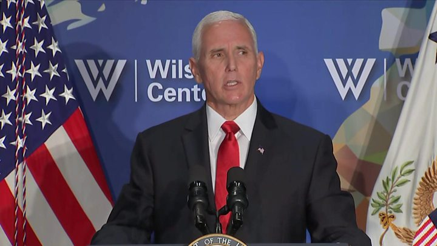
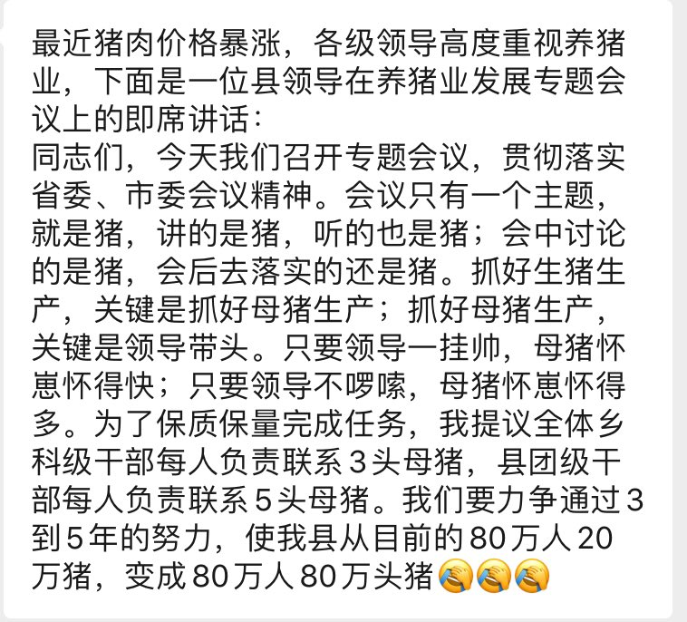

[10月25日 15:11]    老司机   @h5lpykl7tp6jjop    世界上最装B的三件事：

1、啃老族在豪华KTV里含泪演唱: “烛光里的妈妈，你的眼里为何噙着泪花……”
2、移民的人哽咽着演唱: "我和我的祖国，一刻也不能分割……"
3、官员深情地说: 我们的工作是为人民服务。  :speech_balloon:评:0 :+1:赞:3 :globe_with_meridians:转:1  

[10月25日 15:01]    BBC News 中文   @bbcchinese    高敬文指出，习近平必然想要通过这次机会展现他握有控制权，而这种全会最大的意义在于动员北京、各省以及军队的各级领导知悉中共领导层的重要任务，“让大家都有共识，并且支持领导层的决定”。 https://bbc.in/32JBto0   :speech_balloon:评:1 :+1:赞:5 :globe_with_meridians:转:0  

[10月25日 15:00]    新闻大吐槽   @TuCaoFakeNews    香港以前是，現在仍然是大中華區域少數幾個可以進行（原創）文化輸出的地區。這得充分益於其高度自治、思想自由、資訊開放…
與此同時，香港人要捍衛的無非也就是這些東西。
無此，則香港不稱其為香港，與東莞、惠州無異。  :speech_balloon:评:1 :+1:赞:2 :globe_with_meridians:转:1  

[10月25日 15:00]    纽约时报中文网   @nytchinese    在中国山东，拉菲旗下的瓏岱酒庄推出了首款2017年份葡萄酒，售价2388元人民币。附近村民们称赞酒庄为当地带来了就业机会，还在节日期间向村民分发礼物。
但被问道是否会喝瓏岱葡萄酒时，“这酒比金子还贵！“一名村民称：“我连100元的酒都不会买。反正我也喝不出什么差别来。” http://nyti.ms/32PiJUc   :speech_balloon:评:3 :+1:赞:1 :globe_with_meridians:转:0  

[10月25日 14:59]    新闻大吐槽   @TuCaoFakeNews    既能辱共，又能发财！两全其美，何乐不为！
辱共产党，世界潮流，共党灭亡，大势所趋！ https://twitter.com/TuCaoFakeNews/status/1187602387302637568 …  :speech_balloon:评:0 :+1:赞:2 :globe_with_meridians:转:1  

[10月25日 14:59]    新闻大吐槽   @TuCaoFakeNews    香港人の催涙弾対策はすでにカタルーニャに輸出したか。。。 https://twitter.com/TuCaoFakeNews/status/1187616849510322176 …  :speech_balloon:评:0 :+1:赞:3 :globe_with_meridians:转:1  

[10月25日 14:59]    新闻大吐槽   @TuCaoFakeNews     https://twitter.com/TuCaoFakeNews/status/1187616849510322176 …  :speech_balloon:评:0 :+1:赞:5 :globe_with_meridians:转:1  

[10月25日 14:58]    财经真相   @caijingxiang    美国农业部周四表示，民间出口商报告向中国出售了26.4万吨大豆，2019/20销售年度交付。目前全球最大的两个经济体有望达成部分贸易协议。 https://twitter.com/reuterscn/status/1187531006682849280 …  :speech_balloon:评:3 :+1:赞:5 :globe_with_meridians:转:0  

[10月25日 14:56]    新闻大吐槽   @TuCaoFakeNews    カタルーニャ人と香港人が国際連帯するのも自然な流れか。 https://dot.asahi.com/aera/2017101700042.html …https://twitter.com/TuCaoFakeNews/status/1187616849510322176 …  :speech_balloon:评:0 :+1:赞:4 :globe_with_meridians:转:3  

[10月25日 14:54]    新闻大吐槽   @TuCaoFakeNews     https://twitter.com/TuCaoFakeNews/status/1187538374468358145 …  :speech_balloon:评:0 :+1:赞:1 :globe_with_meridians:转:1  

[10月25日 14:53]    新闻大吐槽   @TuCaoFakeNews    留名等看西班牙譴責外國勢力（香港）干預加泰內政 https://twitter.com/tucaofakenews/status/1187616849510322176 …  :speech_balloon:评:1 :+1:赞:8 :globe_with_meridians:转:2  

[10月25日 14:53]    新闻大吐槽   @TuCaoFakeNews    So proud of being HKer!!!
We are always creative!!!

#hkprotests
#standwithhongkong https://twitter.com/TuCaoFakeNews/status/1187616849510322176 …  :speech_balloon:评:0 :+1:赞:2 :globe_with_meridians:转:1  

[10月25日 14:53]    新闻大吐槽   @TuCaoFakeNews    发动蓝丝排队去吃'爱国"甜品？

吃个豆腐脑，却要1500港元的出场费，党妈虽然壕，但也不是凯子。  :speech_balloon:评:0 :+1:赞:2 :globe_with_meridians:转:1  

[10月25日 14:52]    新闻大吐槽   @TuCaoFakeNews    #香港 #HongKong #StandWithHongKong #FightForFreedom #AgainViolence #反对暴力
支持香港，传播香港真相 https://twitter.com/TuCaoFakeNews/status/1187539078360616960 …  :speech_balloon:评:0 :+1:赞:4 :globe_with_meridians:转:3  

[10月25日 14:51]    新闻大吐槽   @TuCaoFakeNews    香港人真係好癡線

#HongKongProtesters
#HKprotesters #HongKong
#StandWithHongKong
#FiveDemandsNotOneLess https://twitter.com/TuCaoFakeNews/status/1187602387302637568 …  :speech_balloon:评:0 :+1:赞:2 :globe_with_meridians:转:1  

[10月25日 14:50]    新闻大吐槽   @TuCaoFakeNews    哈哈哈，香港人出口游行抗争技术！  :speech_balloon:评:1 :+1:赞:2 :globe_with_meridians:转:1  

[10月25日 14:47]    新闻大吐槽   @TuCaoFakeNews    Hongkong style. https://twitter.com/TuCaoFakeNews/status/1187616849510322176 …  :speech_balloon:评:0 :+1:赞:1 :globe_with_meridians:转:1  

[10月25日 14:43]    新闻大吐槽   @TuCaoFakeNews    Protesting in Hong Kong shouldn't be a game to others. 

But I like this idea of dedication to HKer.
#香港人反抗  :speech_balloon:评:0 :+1:赞:1 :globe_with_meridians:转:1  

[10月25日 14:43]    新闻大吐槽   @TuCaoFakeNews    香港帶領世界對付催淚彈 https://twitter.com/tucaofakenews/status/1187616849510322176 …  :speech_balloon:评:0 :+1:赞:13 :globe_with_meridians:转:3  

[10月25日 14:43]    新闻大吐槽   @TuCaoFakeNews    一一早不掉晚不掉，偏偏纪念土共70的活动时掉？跟裤子质量和指挥家天天都在侍弄的裤子皮带有关系吗？别说他上台表演要谨慎对待，就你自己的裤子掉过吗？还是人家想借此机会告诉大家：回国真操蛋，啥事都黑暗！无胆做抗争，掉裤搞写真！吹拉弹唱70年，裤子都特么掉了，还得特么继续撑呢.... https://twitter.com/TuCaoFakeNews/status/1187541870739505152 …  :speech_balloon:评:1 :+1:赞:3 :globe_with_meridians:转:1  

[10月25日 14:42]    新闻大吐槽   @TuCaoFakeNews    Fuck the Ccp!get away from hk...  :speech_balloon:评:0 :+1:赞:2 :globe_with_meridians:转:1  

[10月25日 14:41]    新闻大吐槽   @TuCaoFakeNews    Artists and writers are always among the first to die under fascist regimes. NEVER underestimate the power of art. https://twitter.com/tucaofakenews/status/1187538374468358145 …  :speech_balloon:评:0 :+1:赞:4 :globe_with_meridians:转:1  

[10月25日 14:39]    新闻大吐槽   @TuCaoFakeNews    BEAUTIFUL song but shameful HK police  :speech_balloon:评:0 :+1:赞:1 :globe_with_meridians:转:1  

[10月25日 14:35]    新闻大吐槽   @TuCaoFakeNews    香港浴火重生  :speech_balloon:评:0 :+1:赞:5 :globe_with_meridians:转:1  

[10月25日 14:30]    纽约时报中文网   @nytchinese    #观点 我们不应该喋喋不休地让女人赶紧去满足男人的标准，而应该训练男人和男孩去追求女人的文化规范，并把这些规范作为默认的和值得追求的东西兜售给男人。
要更恭顺一些。要反思，要倾听，该道歉的地方要道歉。要以谦虚、谦卑和合作为目标，而不是吹嘘傲慢。 http://nyti.ms/31I5nb9   :speech_balloon:评:0 :+1:赞:5 :globe_with_meridians:转:4  

[10月25日 14:00]    BBC News 中文   @bbcchinese    【非洲顶尖大学教师如何诱导学生用性爱换取成绩】西非尼日利亚的顶尖院校里，有教职员要求与女学生发生性关系，以作为考试过关的条件。BBC“非洲之眼”栏目调查校园性骚扰议题长达一年，通过暗访拍摄视频证据。 https://www.youtube.com/watch?v=HVvCXGsaCDY …  :speech_balloon:评:11 :+1:赞:26 :globe_with_meridians:转:16  

[10月25日 14:00]    纽约时报中文网   @nytchinese    周三，在伦敦以东约25英里的一个集装箱冷藏车内发现39具尸体。伦敦当局表示，死者均为中国公民。但受害者身份及死亡原因尚未确定。警方确认卡车和集装箱从不同港口抵达英国，但目的地未明。目前只有卡车司机一人被列为嫌疑人。
本文盘点了迄今我们对本案已知和未知的地方。 http://nyti.ms/2ocFvWW   :speech_balloon:评:15 :+1:赞:23 :globe_with_meridians:转:9  

[10月25日 13:30]    纽约时报中文网   @nytchinese    #观点 从2007年到2018年，中国企业在巴西投资了约580亿美元，涉及石油、矿产、大豆、电力、基础设施和技术等领域。去年，中国在巴西40%的投资来自中国国有企业，这意味着它们的决策能够深刻影响政治因素。
中国是时候承担责任、制止这场悲剧了。 http://nyti.ms/32EWRej   :speech_balloon:评:9 :+1:赞:10 :globe_with_meridians:转:6  

[10月25日 13:00]    纽约时报中文网   @nytchinese    知情人士透露，活动人士黄雪琴上周在广州被拘留，当局指控其“寻衅滋事“。现年31岁的她是中国“我也是“运动中的主要人物，最近还撰写了记录亲身参与香港“69”大游行的文章。
她是最新一位因支持香港抗议被捕的大陆公民，此前她曾被没收护照，家人也遭到骚扰。 http://nyti.ms/33YZPKF   :speech_balloon:评:18 :+1:赞:83 :globe_with_meridians:转:26  

[10月25日 12:52]    BBC News 中文   @bbcchinese    【美国副总统彭斯：香港的和平抗争者鼓舞了我们】彭斯向香港和平示威者喊话说：“我们请求你们留在非暴力示威的道路上”。 https://bbc.in/366qtmC   :speech_balloon:评:37 :+1:赞:59 :globe_with_meridians:转:16  

[10月25日 12:31]    BBC News 中文   @bbcchinese    林郑月娥和警务处副处长邓炳强先后给他打电话致歉，但他仍然批评警方做法“过份”。这位印度商人是何许人也？ https://bbc.in/32NePev   :speech_balloon:评:15 :+1:赞:40 :globe_with_meridians:转:9  

[10月25日 12:30]    纽约时报中文网   @nytchinese    一位曼哈顿女子与大楼门房之间的友谊、一名躁郁症患者的艰难恋爱、一场以被送到急救室而终结的约会……根据《纽约时报》“摩登情爱”专栏改编的单元剧《Modern Love》近期播出。想看看这些故事的作者本人是如何用文字描绘自己的经历的？你可以先浏览中文网的“摩登情爱”专栏。 https://nyti.ms/2JivTBk   :speech_balloon:评:1 :+1:赞:10 :globe_with_meridians:转:2  

[10月25日 12:00]    BBC News 中文   @bbcchinese    学者认为，习近平想通过这机会展现他握有控制权，而这种全会最大的意义在于动员北京、各省以及军队的各级领导知悉中共领导层的重要任务。 https://bbc.in/2JkpkOM   :speech_balloon:评:16 :+1:赞:20 :globe_with_meridians:转:7  

[10月25日 12:00]    纽约时报中文网   @nytchinese    今日图片：世界最大的巴克拉纳帆船赛即将开幕，大量帆船在里雅斯特湾港口聚集。但今年，参赛者们面临着一个陌生的挑战：没有风。
更多简报内容： http://nyti.ms/2BHeSwt   :speech_balloon:评:2 :+1:赞:17 :globe_with_meridians:转:3  

[10月25日 11:54]    GFHG SDKM   @zyx_yny    So this just happened at the Shanghai food expo, food booths were setup for people to try, and uh, well, take a look...

A person from Europe said "I've been exhibiting in nearly 100 countries and have never seen anything like this, not even in Africa"  :speech_balloon:评:111 :+1:赞:447 :globe_with_meridians:转:287  

[10月25日 11:30]    纽约时报中文网   @nytchinese    在习近平的反腐运动下，奢侈消费受到抑制已经有好几年的时间，葡萄酒的销售所受打击尤其严重。对于外国企业来说，另一个挑战是中国消费者日益高涨的民族主义情绪。
但酒庄拉菲正在试图借用这种爱国主义情绪，推出一款由中国人为主的团队酿造的中国葡萄酒。 http://nyti.ms/32PiJUc   :speech_balloon:评:23 :+1:赞:35 :globe_with_meridians:转:16  

[10月25日 11:00]    纽约时报中文网   @nytchinese    • 特朗普表示，在美国努力促成下，土耳其已同意在叙利亚东北部永久停火。他还宣布美国将解除对土耳其的制裁，但仍有小规模驻军将留在叙利亚。
• 周四，西班牙独裁者弗朗哥灵柩被从马德里的“烈士谷”陵园迁出。人们指责迁墓之举是在大选前分裂保守派和左翼阵营。更多简报内容： http://nyti.ms/2BHeSwt   :speech_balloon:评:1 :+1:赞:4 :globe_with_meridians:转:0  

[10月25日 10:56]    财经真相   @caijingxiang    降价砸楼被抓！  :speech_balloon:评:25 :+1:赞:103 :globe_with_meridians:转:40  

[10月25日 10:51]    老司机   @h5lpykl7tp6jjop    又中美人计
澳前情报官员Roger Uren上周在堪培拉被捕。Uren妻子为华人严瑞雪（Sheri Yan），她曾因贿赂时任联合国大会主席John Ashe而在美国被判入狱。Uren曾担任情报分析机构国家评估办公室助理主任，在2015年一次ASIO突袭行动期间在他堪培拉家中发现机密文件，他将面临30项未经授权处理文件的指控。  :speech_balloon:评:1 :+1:赞:15 :globe_with_meridians:转:7  

[10月25日 10:41]    财经真相   @caijingxiang    a50下跌趋势已经形成，临近年底各大机构都到了回笼资金的时候了，a股回跌一波是可以肯定的，只是不知道具体时间点，散户这个时候就不要往里冲了，无论你看上的股价有多低，千万不要冲进去抄底，最好是过完年再说！  :speech_balloon:评:16 :+1:赞:74 :globe_with_meridians:转:22  

[10月25日 10:33]    GFHG SDKM   @zyx_yny    My interview with @matanevenoff, the legend who baited the cameraman with his #StandWithHongKong T-shirt during Dance Cam at the #Lakers/#Clippers game opening night in the #NBA

Thanks for showing HK your support Matan!
#HongKong #HongKongProtests  :speech_balloon:评:94 :+1:赞:1148 :globe_with_meridians:转:574  

[10月25日 10:30]    纽约时报中文网   @nytchinese    曾经，那些自认为只是忠心为两党政府效力的公职人员被一个深陷怀疑论和阴谋论的总统诋毁、排挤或被迫离职。现在，他们突然有机会用自己掌握的内情大声发言。
“经历这么多诋毁、污蔑和贬低，我想你们现在看到的是一些复仇，这并不是被设计的，而是机会使然，”康诺利说。 http://nyti.ms/362aQg9   :speech_balloon:评:1 :+1:赞:3 :globe_with_meridians:转:0  

[10月25日 10:26]    GFHG SDKM   @zyx_yny    兄弟爬山 https://twitter.com/thkag_can/status/1187536917828648960 …  :speech_balloon:评:0 :+1:赞:1 :globe_with_meridians:转:0  

[10月25日 10:00]    BBC News 中文   @bbcchinese    英国警方证实，埃塞克斯郡集装箱藏尸案中的39名死者为中国公民，8女31男。首相约翰逊表示“震惊”。
 https://bbc.in/33XbppJ   :speech_balloon:评:37 :+1:赞:50 :globe_with_meridians:转:35  

[10月25日 10:00]    纽约时报中文网   @nytchinese    英国首相鲍里斯·约翰逊寻求在12月12日提前举行大选，以打破目前的政治僵局，并将脱欧命运再次交给选民决定。
预计他将在下周一向议会提交议案，但目前反对党工党对提前大选态度冷淡，约翰逊可能很难获得至少三分之二议员的支持。
更多简报内容： http://nyti.ms/2BHeSwt   :speech_balloon:评:0 :+1:赞:4 :globe_with_meridians:转:2  

[10月25日 09:59]    财经真相   @caijingxiang    中国央行公开市场今日将进行300亿元人民币7天期逆回购操作,本周中国央行累计开展5900亿元逆回购操作，因累计有300亿元逆回购到期，本周实现净投放5600亿元，净投放量创下逾九个月新高。 金融系统资金缺口看样子达到了极限，不急，还没到年底清算日！ https://twitter.com/caijingxiang/status/1187179081873248258 …  :speech_balloon:评:6 :+1:赞:144 :globe_with_meridians:转:60  

[10月25日 09:31]    纽约时报中文网   @nytchinese    一场特朗普与他口中的“深层政府”之间的斗争已经展开。多名前任与现任官员反抗了白宫阻止与众议院弹劾调查人员合作的企图，他们提供的证据，在很大程度上证实了匿名检举人的说法，并引出了弹劾调查的重要证词。
在民主党众议员杰康诺利看来，这场斗争在某种程度上是一场“复仇”。 http://nyti.ms/362aQg9   :speech_balloon:评:6 :+1:赞:15 :globe_with_meridians:转:14  

[10月25日 09:03]    纽约时报中文网   @nytchinese    早安！今日重点新闻包括：
英卡车惨案死者系中国籍；女权记者疑被拘；国际足联在中国避谈人权；英国首相寻求提前大选；“深层政府”向特朗普“复仇”……NYT简报带你速览今日要闻。 http://nyti.ms/2BHeSwt   :speech_balloon:评:12 :+1:赞:33 :globe_with_meridians:转:7  

[10月25日 08:30]    GFHG SDKM   @zyx_yny    Kowloon Bay.  Citizens who would normally take MTR to work today are protesting by walking to work.  You can see the entire street from beginning to end is filled with people

Fighting for a good cause and getting exercise = win!

#HongKong #HongKongProtests  :speech_balloon:评:49 :+1:赞:1205 :globe_with_meridians:转:724  

[10月25日 08:30]    BBC News 中文   @bbcchinese    澳大利亚维多利亚州政府在北京签署“一带一路”协议引起联邦政府质疑，中国海外大规模基建被认为施展“锐实力”，对西方构成挑战。
 https://bbc.in/340qAyi   :speech_balloon:评:29 :+1:赞:39 :globe_with_meridians:转:19  

[10月25日 08:17]    纽约时报中文网   @nytchinese    #ModernLove 从沙发摔到马提尼酒杯上，割破一根主血管，失血量危急，这种事你是什么时候也不愿意碰上的。而我，偏偏就在一场约会中遇上了。
去年春天，我和一个巴西姑娘第四次约会的时候发生了这件事，还进了急救室。令我意想不到的是，这却成了美好的六小时。 https://nyti.ms/2BINVII   :speech_balloon:评:5 :+1:赞:19 :globe_with_meridians:转:6  

[10月25日 07:30]    BBC News 中文   @bbcchinese    BBC新闻国际版Tor 镜像页在“暗网”上线，以期突破新闻封锁和网络监控。
 https://bbc.in/31JZXMP   :speech_balloon:评:15 :+1:赞:170 :globe_with_meridians:转:55  

[10月25日 07:29]    GFHG SDKM   @zyx_yny    Singing is illegal in Hong kong now？！
this young man outside was forced to stop singing the HK anthem “Glory to Hong Kong”by HK police！
video from @ilovehkgers
#FreeHongKong #StandWithHongKong  :speech_balloon:评:77 :+1:赞:907 :globe_with_meridians:转:626  

[10月25日 07:28]    老司机   @h5lpykl7tp6jjop    A busker was performing #GloryToHongKong in Central last night. He was then surrounded and threatened by few police. 

Since when is there a ban for singing in #HongKong? #Hongkongers, resist! Or else this would happen real soon.

#WhiteTerror #PoliceState #HongKongProtests  :speech_balloon:评:149 :+1:赞:2198 :globe_with_meridians:转:1788  

[10月25日 07:03]    GFHG SDKM   @zyx_yny    3rd video in my eng sub series.  Chinese nationalist showing unconditional love for his country at a flower shop in Prince Edward.  Gotta admit, of all the arguments from the pro-China camp, his is the most convincing! 
#HongKong #HongKongProtests

Orig vid from @ajmm19923493  :speech_balloon:评:24 :+1:赞:178 :globe_with_meridians:转:134  

[10月25日 06:38]    GFHG SDKM   @zyx_yny    Hey everybody, I’m doing an AMA on Reddit right now. Feel free to ask any questions you may have wondered! Here’s the link -  https://www.reddit.com/r/AMA/comments/dmo3df/im_the_one_who_baited_the_clippers_with_the_hong/ … #hongkong  :speech_balloon:评:27 :+1:赞:266 :globe_with_meridians:转:70  

[10月25日 06:30]    BBC News 中文   @bbcchinese    彭斯定位中国为美国的“经济与战略对手”，但强调华盛顿并不希望与中国起冲突、或制约中国，只是谋求“公平竞争”。
 https://bbc.in/360pWmm   :speech_balloon:评:39 :+1:赞:41 :globe_with_meridians:转:11  

[10月25日 05:13]    老司机   @h5lpykl7tp6jjop    要说穷，它们满世界撒币，出钱请黑文盲来读大学，造军舰如下饺子，
要说富，它们抢百姓土地，连摆小摊卖水果蔬菜都抢，连骑电瓶车都不放过，
一个野蛮恐怖政权，一群愚昧懦弱的百姓，居然要指挥文明世界，
抵制世界各国，特别的自信，特别的牛逼，究竟是谁给它的胆子？马克思加上中国传统文化的精髓吗  :speech_balloon:评:9 :+1:赞:161 :globe_with_meridians:转:58  

[10月25日 04:50]    老司机   @h5lpykl7tp6jjop    中国十四亿人，每十四人中就有一个是排名全球前10％的富人？真的有这么多富人了？  :speech_balloon:评:2 :+1:赞:0 :globe_with_meridians:转:0  

[10月25日 04:10]    GFHG SDKM   @zyx_yny    Couldn't have said it better than @VP Pence today: "American corporations should stand up for American values here at home and around the world." 

Today and every day, I am proud to #StandWithHongKong  :speech_balloon:评:351 :+1:赞:2580 :globe_with_meridians:转:1377  

[10月25日 03:11]    新闻大吐槽   @TuCaoFakeNews    给抗争者提供免费餐的良心餐厅「龙门冰室」昨天被黑社会砸了，市民念这家餐厅的好，在店门口排起了长队，希望用自己的行动来支持有正义感的餐厅！

亲共的美心月饼被砸后，从未听说，有人自发为这家爱国店铺做点什么，看来所谓的爱国更多是谋私利而不顾公义，蓝丝是个伪命题  :speech_balloon:评:92 :+1:赞:2154 :globe_with_meridians:转:796  

[10月25日 01:46]    老司机   @h5lpykl7tp6jjop    上中学的时候读《苛政猛于虎》，说孔子过泰山看见妇人哭坟，因父舅夫子均死于虎口却不离去，孔子叹：苛政猛于虎！二千多年了，中国苛政仍猛于虎，只是没有深山可躲，只得往外逃，2000年英国多佛港发现58人被闷死在偷渡的货柜车中，今天又是39人死在货柜车中！拚死外逃掙钱的中国多么强大多么富裕！  :speech_balloon:评:2 :+1:赞:23 :globe_with_meridians:转:11  

[10月25日 01:20]    GFHG SDKM   @zyx_yny    US Vice President @VP Mike Pence to #HongKongProtesters :

"To the millions in Hong Kong who have been peacefully demonstrating to protect your rights these past months, we stand with you. We are inspired by you."

Thank you @VP!

#FightForFreedom #StandWithHongKong  :speech_balloon:评:40 :+1:赞:844 :globe_with_meridians:转:501  

[10月25日 00:57]    BBC News 中文   @bbcchinese    英国首相约翰逊表示，他将给予议员们更多时间辩论脱欧问题，但条件是他们必须同意在12月12日举行大选。
 https://bbc.in/361DC0r   :speech_balloon:评:1 :+1:赞:15 :globe_with_meridians:转:6  

[10月25日 00:29]    财经真相   @caijingxiang    彭斯演讲一句话总结：软硬兼施，最后通牒！  :speech_balloon:评:58 :+1:赞:740 :globe_with_meridians:转:104  

[10月25日 00:26]    凡賽堤/FORSETI   @FecharCCP    緊急找尋  :speech_balloon:评:0 :+1:赞:6 :globe_with_meridians:转:5  

[10月24日 23:58]    凡賽堤/FORSETI   @FecharCCP    何韻詩！香港女兒，華人的典範，華人21世紀的巾幗英雄，華人最完美的最值得華人崇拜的國際巨星！！！  :speech_balloon:评:47 :+1:赞:188 :globe_with_meridians:转:61  

[10月24日 23:55]    财经真相   @caijingxiang    伍德罗·威尔逊国际学者中心是世界排名前15的智库，该中心主要项目包括：历史与公共政策项目、冷战国际史项目、朝鲜国际文件研究项目。2011年，威尔逊中心与华东师范大学合作开展冷战史研究，并在威尔逊中心成立了“华东师大—威尔逊中心冷战研究美国工作室”。  :speech_balloon:评:6 :+1:赞:43 :globe_with_meridians:转:21  

[10月24日 23:44]    凡賽堤/FORSETI   @FecharCCP    華人歷史上將永久記住這一刻，
2019年6月9日以來當香港人超過200萬人向政府提出訴求，
用最文明，最和平，最友好的方式遊行，而政府卻用最暴力，最兇殘，最卑鄙的手段僱傭黑社會組織和在職警察，以及大陸警察，武警，部隊喬裝成黑衣人在香港全社會進行大規模暗殺，暴打市民，破環公共設施等嫁禍給港人  :speech_balloon:评:8 :+1:赞:151 :globe_with_meridians:转:96  

[10月24日 23:39]    GFHG SDKM   @zyx_yny    International guidelines for use of water cannons have not been followed by #Hongkong police:
• Do not fire at close range
• Do not fire directly at ppl's bodies
• Allow sufficient time for ppl to disperse before firing
• Do not fire when no crowds are present
ALL VIOLATED https://twitter.com/wwkk27744741/status/1187384284530794496 …  :speech_balloon:评:10 :+1:赞:123 :globe_with_meridians:转:107  

[10月24日 23:18]    GFHG SDKM   @zyx_yny    A young man singing #願榮光歸香港 in #Central but the #HongKongPolice yelled at him and stopped him singing that song. I don't think that young man has done wrong to sing in the public?! 
#StandWithHK
#StandWithHongKong  :speech_balloon:评:105 :+1:赞:1118 :globe_with_meridians:转:898  

[10月24日 21:26]    GFHG SDKM   @zyx_yny    佢地用我地國歌改加泰文唱
雖然我一個字都聽唔明但我好感動 眼濕濕

我有少少慚愧 人地支持我地支持到比人打 我地對今晚既集會仲咁大顧慮

#StandWithHK #FightForFreedom #FreedomFighter #FiveDemandsNotOneLess #Catalonia  :speech_balloon:评:23 :+1:赞:715 :globe_with_meridians:转:320  

[10月24日 21:14]    GFHG SDKM   @zyx_yny    Outside a #Catalonia's rally, some #China's nationalists were waving their flags.

They then JUMP KICKED a Catalan passerby holding slogan of "Liberate #HongKong. The revolution of our times." & tore it off. 

One of them attacked the journalist streaming the whole thing.

Rude.  :speech_balloon:评:58 :+1:赞:506 :globe_with_meridians:转:495  

[10月24日 21:12]    GFHG SDKM   @zyx_yny    JUST IN:
[Barcelona] Chinese with Five-starred Red Flags snatched a signage written "Liberate Hong Kong, the revolution of our times" (光復香港，時代革命) from a Catalan woman who supports the Hong Kong protests.

They tore her signage apart and attempted to kick her.

#Chinazi  :speech_balloon:评:109 :+1:赞:912 :globe_with_meridians:转:809  

[10月24日 21:00]    纽约时报中文网   @nytchinese    美国外交元老谈香港：中美双方都自以为是 https://nyti.ms/2pOZJ9C   :speech_balloon:评:21 :+1:赞:33 :globe_with_meridians:转:17  

[10月24日 20:26]    GFHG SDKM   @zyx_yny    WOW. 

Republican or Democrat, we shouldn’t let #China’s thuggish, #OrganHarvesting, #ConcentrationCamp-building, #HumanRights-violating, IP stealing, trade cheating Communist regime talk about @SpeakerPelosi — or ANY other American leader — this way. https://twitter.com/globaltimesnews/status/1187341782687707142 …  :speech_balloon:评:119 :+1:赞:852 :globe_with_meridians:转:505  

[10月24日 20:25]    GFHG SDKM   @zyx_yny    Catalans are singing "Glory To Hong Kong" in front of Chinese Consulate-General in Barcelona in the "Catalonia-Hong Kong Solidaritat Amb Hong Kong" Assembly. Thank you so much! #StandWithHongKong #StandUpForCatalonia  :speech_balloon:评:120 :+1:赞:3031 :globe_with_meridians:转:1655  

[10月24日 20:05]    BBC News 中文   @bbcchinese    【世界上最长途的赛马活动蒙古德比】蒙古德比是世界上最长途的赛马活动。赛事全程1000公里，骑师每日骑行14小时，为期10天。有多少骑师能够完成整个赛事？ https://bbc.in/2JhXAKt   :speech_balloon:评:2 :+1:赞:15 :globe_with_meridians:转:3  

[10月24日 20:00]    纽约时报中文网   @nytchinese    通过研究这些遭遇动荡的国家，专家发现了一种更深层次的模式：在民主让人感到失望、腐败问题严重、少数阶级挥霍而年轻人生活贫困的国家，反对精英阶级的呼喊声会比通常更大。 https://nyti.ms/2oiisu0   :speech_balloon:评:16 :+1:赞:18 :globe_with_meridians:转:4  

[10月24日 19:31]    BBC News 中文   @bbcchinese    “伊斯兰国”一直以利用Facebook、YouTube和Twitter平台散播资讯著称，不过这似乎是他们第一次利用抖音海外版TikTok。 https://bbc.in/33WmU0x   :speech_balloon:评:25 :+1:赞:62 :globe_with_meridians:转:15  

[10月24日 19:30]    纽约时报中文网   @nytchinese    傅立民：香港的和平示威者现在不是在捍卫民主，而是要求更多的民主，要求香港的权贵阶级和当局多加考虑普通民众的问题。但随着对抗不断升级，讨论已经变得不可能。
暴力示威者不应该受到外国同情。他们没有捍卫“港人治港”的原则，而是在引致“港人灭港”。 https://nyti.ms/2pOZJ9C   :speech_balloon:评:13 :+1:赞:12 :globe_with_meridians:转:4  

[10月24日 19:19]    纽约时报中文网   @nytchinese    更新：英国警方周四表示，39名死者据信均为中国公民，其中八人为女性，31人为男性。 http://nyti.ms/2Jjbdcv   :speech_balloon:评:16 :+1:赞:36 :globe_with_meridians:转:24  

[10月24日 19:01]    BBC News 中文   @bbcchinese    中美贸易战影响数千亿美元商品，但全球贸易额超过25万亿美元，是直接受美国和中国关税影响产品价值的50倍以上。 https://bbc.in/2W8Xb2p   :speech_balloon:评:2 :+1:赞:17 :globe_with_meridians:转:5  

[10月24日 19:00]    纽约时报中文网   @nytchinese    部分特朗普政府官员以及美国工商界和科学界的不少人坚称，针对中国过于严格的限制带来的危险是将研究推向海外，从而削弱当初为美国带来技术优势的工商业。中国批评人士则说，北京是必须解决的重大安全威胁。 https://nyti.ms/32IGXiY   :speech_balloon:评:12 :+1:赞:26 :globe_with_meridians:转:5  

[10月24日 18:59]    墙国铁拳现世报😷   @Socialistfist    Facebook CEO 可能是目前为止吃到铁拳中身价最高的了。他学习中文，看习近平著作，到天安门跑步。
花了5年时间他和他的团队才弄明白中国“从来不让我们进入”。
#社会主义铁拳  :speech_balloon:评:71 :+1:赞:1020 :globe_with_meridians:转:317  

[10月24日 18:30]    纽约时报中文网   @nytchinese    美国资深外交官傅立民：大陆对火箭队总经理言论的反应是一种中国式政治正确的实例，过于敏感、没习惯新财富和强大的中国人试图对那些使用“敏感词”的人下主观判断，将之视为“搞小动作”。中国很难适应这样一个事实：作为一个曾经令人敬畏的大国，宽宏大量比敏感多疑的好处更大。 https://nyti.ms/2pOZJ9C   :speech_balloon:评:6 :+1:赞:20 :globe_with_meridians:转:7  

[10月24日 18:07]    BBC News 中文   @bbcchinese    详细报道：英集装箱惨案39名死者“初步据信为中国公民” http://bbc.in/2PgnLoI   :speech_balloon:评:58 :+1:赞:111 :globe_with_meridians:转:69  

[10月24日 18:04]    BBC News 中文   @bbcchinese    据了解，英国埃塞克斯郡集装箱藏尸案中的39名死者，初步相信为中国公民。  :speech_balloon:评:185 :+1:赞:319 :globe_with_meridians:转:174  

[10月24日 17:32]    墙国铁拳现世报😷   @Socialistfist    补图  :speech_balloon:评:12 :+1:赞:77 :globe_with_meridians:转:13  

[10月24日 17:31]    墙国铁拳现世报😷   @Socialistfist    发酵快半年的汉能讨薪事件波及到了开国大典总负责人外孙。
前脚祝福祖国母亲生日快乐，
后脚希望祖国母亲主持公道。

#社会主义铁拳  :speech_balloon:评:39 :+1:赞:296 :globe_with_meridians:转:110  

[10月24日 17:27]    老司机   @h5lpykl7tp6jjop    这究竟该相信那个数据，一会儿说中国有 l 亿富人？己超过美国？一会儿又说有5．6亿零存款，搞不懂你们究竟想说什么？大家分析分析！  :speech_balloon:评:7 :+1:赞:21 :globe_with_meridians:转:10  

[10月24日 17:01]    BBC News 中文   @bbcchinese    石虎是台湾动物保育的明星！牠的濒临绝种如何象征台湾环境危机呢？科技又怎么介入呢？ https://bbc.in/2WbbC5O   :speech_balloon:评:5 :+1:赞:33 :globe_with_meridians:转:14  

[10月24日 16:31]    老司机   @h5lpykl7tp6jjop    网恋女人毒性有多大？
七十岁澳洲老头受中国小三勾引，做下杀妻骗保惊人罪案，得手1．5亿澳元后罪情暴露，最终在阿德莱德机场警方将Peter正式拘捕！Peter手中正握着前往中国的机票，想来是准备去见聊骚网友了…在Peter的行李箱里，警方发现了一整箱避孕套，同时还有伟哥药物、性玩具和千奇百怪的内衣…  :speech_balloon:评:9 :+1:赞:43 :globe_with_meridians:转:21  

[10月24日 16:01]    BBC News 中文   @bbcchinese    警方最新调查显示，在伦敦附近发现载有39具尸体的集装箱可能不是来自保加利亚，卡车拖车也并非一同入境。 https://bbc.in/36aWQ3U   :speech_balloon:评:15 :+1:赞:28 :globe_with_meridians:转:8  

[10月24日 15:36]    老司机   @h5lpykl7tp6jjop    关于猪的讲话  :speech_balloon:评:1 :+1:赞:12 :globe_with_meridians:转:8  

[10月24日 15:31]    BBC News 中文   @bbcchinese    “他们也不知道，原来大陆人也有支持这场运动的，不是所有人都是『小粉红』。” https://bbc.in/363LazB   :speech_balloon:评:293 :+1:赞:561 :globe_with_meridians:转:156  

[10月24日 15:00]    BBC News 中文   @bbcchinese    如果欧盟确认将英国脱欧日期延迟到2020年新年，英国首相约翰逊表示将寻求提前大选。 https://bbc.in/31IeSqG   :speech_balloon:评:3 :+1:赞:22 :globe_with_meridians:转:8  

[10月24日 14:57]    GFHG SDKM   @zyx_yny    【大陆留学生破坏加拿大某大学连侬墙】
【中共霸凌香港的缩影】
在加拿大一所大学里，一名大陆留学生破坏连侬墙，并对香港留学生动粗。在加拿大享有言论自由时，该名大陆留学生认为自己亦有“打人的权利”。
#小粉红
#连侬墙  :speech_balloon:评:390 :+1:赞:1253 :globe_with_meridians:转:760  

[10月24日 14:04]    老司机   @h5lpykl7tp6jjop     陳秋實：呼籲香港法律界，絕不能讓陳同佳離開香港！
基於保護管轄原則，香港對於陳同佳涉嫌殺人一案是有管轄權的，請香港法律界秉承法律良知，在捍衛香港司法主權的同時還死者一個公道。法律問題，請政客們走開。
 https://youtu.be/AiqgBh5qSTo   :speech_balloon:评:273 :+1:赞:2078 :globe_with_meridians:转:856  

[10月24日 14:04]    GFHG SDKM   @zyx_yny     陳秋實：呼籲香港法律界，絕不能讓陳同佳離開香港！
基於保護管轄原則，香港對於陳同佳涉嫌殺人一案是有管轄權的，請香港法律界秉承法律良知，在捍衛香港司法主權的同時還死者一個公道。法律問題，請政客們走開。
 https://youtu.be/AiqgBh5qSTo   :speech_balloon:评:273 :+1:赞:2078 :globe_with_meridians:转:856  

[10月24日 14:00]    财经真相   @caijingxiang    人民网：废立之际谁是忠臣！  :speech_balloon:评:78 :+1:赞:340 :globe_with_meridians:转:131  

[10月24日 13:54]    财经真相   @caijingxiang    新华视点：中共中央政治局会议决定，中国共产党第十九届中央委员会第四次全体会议于10月28日至31日在北京召开。  :speech_balloon:评:27 :+1:赞:145 :globe_with_meridians:转:56  

[10月24日 13:03]    BBC News 中文   @bbcchinese    1916年墨西哥革命家比利亚率军入侵美国南部边陲小镇，近百年后墨西哥马队再次跨越边界，但不是入侵而是纪念游行。 https://bbc.in/2BAnZyX   :speech_balloon:评:3 :+1:赞:16 :globe_with_meridians:转:4  

[10月24日 12:40]    财经真相   @caijingxiang    如果购买比特币，要靠谱的渠道！  :speech_balloon:评:24 :+1:赞:45 :globe_with_meridians:转:5  

[10月24日 12:34]    GFHG SDKM   @zyx_yny    i've spoken to the hero kid in the video, his name is Matan and he's now on twitter @matanevenoff!

Matan says he and his family are Clippers season ticket holders, he's been on the Jumbotron many times and he wanted to do something to support HK. he doesn't expect to get back on  :speech_balloon:评:183 :+1:赞:3987 :globe_with_meridians:转:896  

[10月24日 11:24]    老司机   @h5lpykl7tp6jjop    警察10.20之夜在朗豪坊對出清場時 與一名老人發生交集  :speech_balloon:评:1 :+1:赞:35 :globe_with_meridians:转:26  

[10月24日 10:28]    凡賽堤/FORSETI   @FecharCCP    【連登尋人】張友恆，現居九龍城，8月31日有參加遊行，9月3日突然退出所有Whatsapp群組，已經失蹤1個多月，公司薪金也沒有領取。  :speech_balloon:评:11 :+1:赞:274 :globe_with_meridians:转:289  

[10月24日 09:28]    财经真相   @caijingxiang    中国央行今日开展600亿元逆回购操作，因今日无逆回购到期，当日实现净投放600亿元。加上2500亿MLF和其他逆回购操作，本周截至目前，中国央行公开市场累计净投放达5600亿元。  :speech_balloon:评:16 :+1:赞:186 :globe_with_meridians:转:51  

[10月24日 09:04]    凡賽堤/FORSETI   @FecharCCP    香港6.9以來出現人類文明社會史上的世界第一，
最文明的和平遊行世界第一
（井然有序，城市衛生等）
人口規模最大的遊行世界第一 
（203萬人遊行，總人口700-730萬）
遊行過程出現自發自願醫療救護人員世界首創！
香港人，給全世界的華人創下了歷史最偉大的榜樣！
香港人，給全世界華人未來帶來的希望  :speech_balloon:评:6 :+1:赞:74 :globe_with_meridians:转:50  

[10月24日 08:35]    凡賽堤/FORSETI   @FecharCCP    緊急找尋其家人和律師  :speech_balloon:评:0 :+1:赞:6 :globe_with_meridians:转:8  

[10月24日 07:52]    老司机   @h5lpykl7tp6jjop    撑港人抗争的龍門冰室，昨天被黑社会砸了！
不用猜也知道，十有八九又是何君尧这些烂人在捣鬼~

同样是砸铺：
勇武是反抗极权，直面不公；
而官黑勾结，是依仗极权，维持不公！

总之，一次失败的浑水摸鱼、穿帮的cosplay，香港光复后，都将入罪~  :speech_balloon:评:29 :+1:赞:334 :globe_with_meridians:转:190  

[10月24日 07:51]    GFHG SDKM   @zyx_yny    John Quincy Adams: Wherever the standard of freedom is unfurled, there will be America’s prayers, there will be America’s benedictions, there will be America’s heart. Today, that place is Hong Kong #StandWithHK  :speech_balloon:评:1326 :+1:赞:8808 :globe_with_meridians:转:4949  

[10月24日 07:32]    财经真相   @caijingxiang    当当网李国庆半夜大新闻,大陆新闻的舆论焦点有了！今天彭斯演讲有调料中和了！  :speech_balloon:评:21 :+1:赞:111 :globe_with_meridians:转:24  

[10月24日 04:57]    老司机   @h5lpykl7tp6jjop    毛贼给中共留下来的不是什么狗屁革命理论，而是最恐怖的中共的组织系统！它把所有中国人密不透风的监控起来，每个人都受到威胁和恐吓，它们随时可以取消你的所有的生存权利，你无法反抗，因为这会连累你的家人朋友，它们秘密建立档案资料记录你的言行举止，一直跟踪到你死也不销毁，所以中国人不敢反抗  :speech_balloon:评:1 :+1:赞:60 :globe_with_meridians:转:10  

[10月24日 04:07]    老司机   @h5lpykl7tp6jjop    感谢这些香港有良心的医务人员，一直在秘密地治疗着受伤的抗议者，这是采访的一位地下医生，我加了中文字幕，谢谢你们。  :speech_balloon:评:67 :+1:赞:1576 :globe_with_meridians:转:882  

[10月24日 04:04]    老司机   @h5lpykl7tp6jjop    早有今天这么痛快，何必惹出这么多麻烦！五分钟能解决的事情，搞了五个月！死了这么多人，抓了这么多人！惹出天大的祸！谁来解决现在这么多大问题！这就是猪头治国的毛病，开始拍胸口，然后拍脑袋，最后拍屁股！  :speech_balloon:评:1 :+1:赞:21 :globe_with_meridians:转:8  

[10月24日 03:39]    老司机   @h5lpykl7tp6jjop    天朝太奇葩，竟然在地铁里逼着女士卸妆！官方说是浓妆太惊悚，会造成恐慌！
如此说，女士们最好都打扮成ccav女主持一般「端庄」的样子，社会就和谐了！
以后化妆术这种东西必须国家垄断，无论是烟熏妆，还是政治化妆！  :speech_balloon:评:41 :+1:赞:197 :globe_with_meridians:转:109  

[10月23日 21:44]    财经真相   @caijingxiang    新华社：国务院总理李克强20日下午在钓鱼台养源斋会见美国前财政部长保尔森。李克强积极评价保尔森基金会为推动中美关系发展，促进两国务实合作方面所做工作，希望基金会继续发挥中美友好的纽带作用，为促进中美关系健康稳定发展作出不懈努力。两个“赵家人”代表中美进行会谈！  :speech_balloon:评:7 :+1:赞:73 :globe_with_meridians:转:15  

[10月23日 21:13]    财经真相   @caijingxiang    比特币第二轮崩盘中，上一波最低跌到3000美元，这一波怎么着也要跌到5000美元！  :speech_balloon:评:33 :+1:赞:155 :globe_with_meridians:转:35  

[10月23日 15:11]    财经真相   @caijingxiang    【推荐一个恶搞MV—你是我的习大大】我們不再怕美帝，每年都漲ＧＤＰ，中國有個偉大主席 
手機照片全是你，硬盤放的都是你，讓我們每天向你學習 
中華女兒非你不嫁因為你帥氣，外國勢力把你抹黑你都不生氣 
日本鬼子來了他們不敢放個屁，誰人罵你我就馬上操！他！媽！B https://www.youtube.com/watch?v=PCimU5x25ic …  :speech_balloon:评:23 :+1:赞:395 :globe_with_meridians:转:115  

[10月23日 08:23]    财经真相   @caijingxiang    北京成为外汇消耗最多地区是可以理解，因为中国外汇花费最多的就是政府，尤其是货物贸易采购达到-1730.72亿美元，但是最让人难以理解的是上海，服务贸易逆差比货物逆差还多，是不是可以理解为上海才是中国资本外逃最大的地区！最后还有一个规律，那就是每当中美贸易缓和时，银行结售汇就会转为正！  :speech_balloon:评:6 :+1:赞:152 :globe_with_meridians:转:48  

[10月23日 08:17]    财经真相   @caijingxiang    2019年1-8月银行结售汇-447.48亿美元，经常项目-438.69 
亿，其中货物贸易1111.66亿，服务贸易-1,331.77亿，收益和经常转移-218.58亿；就地区来看，北京是中国外汇逆差最大的地区达到-2098亿，上海以-1083.27位居第二位；外汇顺差最大来源地分别是浙江967.46、江苏850.77、广东
563.11、福建163.84 。  :speech_balloon:评:14 :+1:赞:287 :globe_with_meridians:转:147  

[10月23日 08:17]    老司机   @h5lpykl7tp6jjop    數十名喬裝警打砸縱火後，被記者追踪逃入廁所企圖換裝，傳媒在廁所包圍，防暴趕至將廁所包圍並保護這些打砸縱火的歹徒安全離開，並沒有拘捕，而是保護，記者追拍並問這群歹徒是否警員並喬裝黑衣市民，他們從廁所走出，己脫去了黑衣換上普通衣服。  :speech_balloon:评:62 :+1:赞:1317 :globe_with_meridians:转:1071  

[10月23日 08:07]    老司机   @h5lpykl7tp6jjop    明居正：台湾人需要明确的反共意识，看清谁是最大敌人

蓝营最大敌不是绿
绿营最大敌不是蓝
只有共同的最大敌——红...
明年选举
谁不反共谁就会落选

美国对中国无恶意，但对中共有
中国不是美国的敌人，但中共是美国的敌人
中共仍是台湾的敌人，还是自由世界的敌人...  :speech_balloon:评:26 :+1:赞:591 :globe_with_meridians:转:267  

[10月23日 07:03]    财经真相   @caijingxiang    美国众议院投票推动立法，要求空壳公司披露所有者信息并更新反洗钱规定。  :speech_balloon:评:7 :+1:赞:306 :globe_with_meridians:转:75  

[10月22日 20:13]    墙国铁拳现世报😷   @Socialistfist    網上有帖文指毛漢參與7月20日的守護香港集會，他澄清，幾個月前有人邀請他出席集會，他於台上是說希望香港恢復和平及希望政府了解年輕人多點。他強調自己不是「撐警」，稱現時才知道自己當時出席的場合是「撐警」集會，並說之後有其他「撐警」集會他都沒參加。
我相信他不是撐警～  :speech_balloon:评:5 :+1:赞:41 :globe_with_meridians:转:10  

[10月22日 17:59]    墙国铁拳现世报😷   @Socialistfist    补图  :speech_balloon:评:5 :+1:赞:112 :globe_with_meridians:转:13  

[10月22日 17:58]    墙国铁拳现世报😷   @Socialistfist    墙内一阵子狂喷  :speech_balloon:评:6 :+1:赞:62 :globe_with_meridians:转:12  

[10月22日 17:51]    墙国铁拳现世报😷   @Socialistfist    14年的战螂
15年的粉红
16年的愤青
17年的反贼
「我们终于还是成为了我们当初讨厌的人」

#社会主义铁拳  :speech_balloon:评:32 :+1:赞:355 :globe_with_meridians:转:112  

[10月22日 17:34]    财经真相   @caijingxiang    中国商务部：美商务部日前发布公告，称将自10月31日起对中国3000亿美元加征关税清单产品启动排除程序。如果排除申请得到批准，自2019年9月1日起已经加征的关税可以追溯返还。该消息公布后离岸人民币汇率几无波动！  :speech_balloon:评:29 :+1:赞:231 :globe_with_meridians:转:63  

[10月22日 12:24]    老司机   @h5lpykl7tp6jjop    香港人太有才了精闢！

共產黨是什麼

如果把歷史還原他們是一幫士匪
如果把謊言拆穿他們是一幫騙子
如果把財產公開他們是一幫強盜
如果把帳目公開他們是一幫小偷
如果將他們的國籍公開他們全部是漢奸
如果把地圖打開他們是一幫賣國賊
如果將血腥運動揭開他們是種族滅絕屠夫
@realDonaldTrump  :speech_balloon:评:12 :+1:赞:379 :globe_with_meridians:转:205  

[10月22日 10:17]    财经真相   @caijingxiang    最新猪肉行情：猪肉价格再次迎来大涨，想做腊肉无望！  :speech_balloon:评:53 :+1:赞:291 :globe_with_meridians:转:100  

[10月21日 22:06]    墙国铁拳现世报😷   @Socialistfist    @remonwangxt 辣椒老师是否可以作为新漫画创意  :speech_balloon:评:1 :+1:赞:31 :globe_with_meridians:转:0  

[10月21日 21:17]    墙国铁拳现世报😷   @Socialistfist    补图  :speech_balloon:评:4 :+1:赞:75 :globe_with_meridians:转:13  

[10月21日 20:37]    墙国铁拳现世报😷   @Socialistfist    前香港印度协会主席曾经出现在支持香港警察的最前线。近日被高压水枪喷过后，出现在谴责香港警察的最前线
高压水枪的蓝色物质具有刺激性成分，会使人睁不开眼，咳嗽不止，并容易被警察辨识抓捕。

#社会主义铁拳
#社会主义特别行政区铁拳  :speech_balloon:评:42 :+1:赞:402 :globe_with_meridians:转:144  

[10月21日 18:16]    墙国铁拳现世报😷   @Socialistfist    有热心推友创立的电报群，同步更新的推特内容，喜欢用电报的可以关注
感谢这位推友的无私帮助 http://t.me/socialistfist   :speech_balloon:评:1 :+1:赞:45 :globe_with_meridians:转:7  

[10月21日 17:24]    墙国铁拳现世报😷   @Socialistfist    补充  :speech_balloon:评:4 :+1:赞:56 :globe_with_meridians:转:11  

[10月21日 17:23]    墙国铁拳现世报😷   @Socialistfist    自称在被房地产开发商骗取80万并且维权无果，患上抑郁症后。9月29后突然高频的在微博上关注香港局势。
发帖还债还是抑郁病发？

#社会主义铁拳  :speech_balloon:评:37 :+1:赞:193 :globe_with_meridians:转:71  

[10月21日 14:57]    财经真相   @caijingxiang    国家电影局电影公映许可证，新电影《催眠•裁决》审核通过，好莱坞电影也要有这玩意儿吗？推友当中有知道的吗？  :speech_balloon:评:12 :+1:赞:73 :globe_with_meridians:转:22  

[10月20日 06:29]    凡賽堤/FORSETI   @FecharCCP    【#共产罪恶】香港中文大学女生吴傲雪（Sonia）在哭诉被拘留期间，遭到港警性暴力之后，连日来收到多封恐吓信及短消息，威胁她若再出面发声，将绑架及轮奸她，信中甚至写明“施暴计划”。
10/18周五吴傲雪在记者会上，公布她收到的恐吓及骚扰信，这些信中，有不少是用简体字书写，被怀疑来自中国大陆。  :speech_balloon:评:29 :+1:赞:403 :globe_with_meridians:转:278  

[10月20日 06:04]    凡賽堤/FORSETI   @FecharCCP    魔鬼在人間39

極權殺人恐怖組織正在用各種兇殘手段殺害我們的同胞....................................................................................................

魔鬼的罪行！被刺殺，身處多刀，肚腸都跑出來！  :speech_balloon:评:1 :+1:赞:6 :globe_with_meridians:转:7  

[10月20日 06:02]    凡賽堤/FORSETI   @FecharCCP    魔鬼在人間39

極權殺人恐怖組織正在用各種兇殘手段殺害我們的同胞....................................................................................................

魔鬼的罪行！已被殺  :speech_balloon:评:0 :+1:赞:3 :globe_with_meridians:转:3  

[10月19日 10:36]    凡賽堤/FORSETI   @FecharCCP    極權殺人恐怖組織的兇殘超乎人類想像  :speech_balloon:评:0 :+1:赞:2 :globe_with_meridians:转:0  

[10月19日 10:34]    凡賽堤/FORSETI   @FecharCCP    魔鬼在人間39

極權殺人恐怖組織正在用各種兇殘手段殺害我們的同胞....................................................................................................

魔鬼的罪行！黑警群毆直接致命打頭的兇殘  :speech_balloon:评:3 :+1:赞:62 :globe_with_meridians:转:43  

[10月19日 10:31]    凡賽堤/FORSETI   @FecharCCP    魔鬼在人間39

極權殺人恐怖組織正在用各種兇殘手段殺害我們的同胞....................................................................................................

魔鬼的罪行！地鐵車廂暴打無辜港民  :speech_balloon:评:0 :+1:赞:27 :globe_with_meridians:转:25  

[10月19日 08:03]    墙国铁拳现世报😷   @Socialistfist    她要是手抖@一个云南网警，是不是就进去了？  :speech_balloon:评:13 :+1:赞:75 :globe_with_meridians:转:11  

[10月19日 07:48]    墙国铁拳现世报😷   @Socialistfist    补图  :speech_balloon:评:4 :+1:赞:106 :globe_with_meridians:转:18  

[10月19日 07:47]    墙国铁拳现世报😷   @Socialistfist    赞美铁拳
#社会主义铁拳  :speech_balloon:评:76 :+1:赞:547 :globe_with_meridians:转:140  

[10月18日 21:53]    凡賽堤/FORSETI   @FecharCCP    15歲香港少年 :「我不會因懼怕自己將來所受的刑罰而停下，我會用我的年輕作為阻止極權吞噬香港的本錢，再多的刑責也不能令我畏怯退縮。香港愛了我15年，就用我未來的15年換來抗爭的養分，我想在30歲完成刑滿出獄時，還會感受到這仍是我最愛的香港！我，誓不低頭。」 https://m.ntdtv.com/b5/2019/10/18/a102688460.html?fbclid=IwAR3lmWVhl4YLi2Vq-9FANGtFkUe3PCPZ-ip_W0weDP_fzGHDx-v6hrvmKuo …  :speech_balloon:评:16 :+1:赞:325 :globe_with_meridians:转:143  

[10月18日 21:35]    凡賽堤/FORSETI   @FecharCCP    唔该幫手forward出去,家人同朋友都搵唔到呢位手足，已失蹤四日.如果有消息請聯络90796504  :speech_balloon:评:1 :+1:赞:26 :globe_with_meridians:转:36  

[10月18日 02:32]    墙国铁拳现世报😷   @Socialistfist    “乐天滚粗中..........哎..警察同志您轻点”

#社会主义铁拳  :speech_balloon:评:52 :+1:赞:426 :globe_with_meridians:转:153  

[10月17日 21:00]    凡賽堤/FORSETI   @FecharCCP    極權殺人恐怖組織已經開始展開對海外的自媒體誘捕計劃！！！
以合作發展，收購，投資為誘餌，實則釣魚，騙取你的個人資料，實行威逼利誘！為他們傳播假信息，假圖片和視頻！ 接下來將會有巨量的假信息，假圖片和視頻出現在網絡！

目的！故意製造黑警被打死，打傷等來掩蓋真相！污衊文明正義的港人！ https://twitter.com/FecharCCP/status/1184815328418783234 …  :speech_balloon:评:0 :+1:赞:8 :globe_with_meridians:转:4  

[10月17日 20:56]    凡賽堤/FORSETI   @FecharCCP    香港街面的黑警90%都是大陸來的黑警，真正的香港警察的警服，警徽，裝備已經都被上繳！！！

現職警長梁兆祥編號33678，曾獲長期服務奬章，種種跡象，有理由相信日前被年輕人弄傷頸部的「中國籍男子」X並非梁兆祥本人 。  :speech_balloon:评:1 :+1:赞:38 :globe_with_meridians:转:33  

[10月17日 20:46]    凡賽堤/FORSETI   @FecharCCP    極權殺人恐怖組織已經開始展開對海外的自媒體誘捕計劃！！！

以合作發展，收購，投資為誘餌，實則釣魚，騙取你的個人資料，實行威逼利誘！

和極權殺人恐怖組織合作最終的下場就是死無葬身之地！！！ 他們永遠與良知，正義為敵！ https://twitter.com/FecharCCP/status/1184799556246085632 …  :speech_balloon:评:1 :+1:赞:2 :globe_with_meridians:转:2  

[10月17日 20:15]    凡賽堤/FORSETI   @FecharCCP    畫面內容
记者：为何不抗争，就失去一切？
黎智英：失去自由就失去一切。
记者：还有美妙的城市和繁荣。
黎智英：那适合某些“国人”，有躯壳无灵魂，只想赚钱和“好”的生活，不管政治、自由、人权、法治，只要吃，“享受”人生。
记者：为何这些不足够？
黎智英：我们是人，不是狗。  :speech_balloon:评:3 :+1:赞:66 :globe_with_meridians:转:22  

[10月17日 20:03]    凡賽堤/FORSETI   @FecharCCP    極權殺人恐怖組織正在用各種兇殘手段殺害我們的同胞....................................................................................................

注！ 極權殺人恐怖組織用邪惡手段試圖殺害岑子傑！  :speech_balloon:评:0 :+1:赞:5 :globe_with_meridians:转:2  

[10月17日 19:53]    凡賽堤/FORSETI   @FecharCCP    出現的CCTV裡，在電梯，和各個場面的假陳彥霖演員。
扮陳彥霖故意錄製網絡傳播！

目的！串改時間點，混謠試聽，毀滅殺人證據！
 
極權殺人恐怖組織的恐怖只有你想不到，沒有它們做不到的！

要消除我們內心恐懼就要消滅極權！
 
消滅極權，人人有責！！！  :speech_balloon:评:2 :+1:赞:48 :globe_with_meridians:转:33  

[10月17日 18:08]    墙国铁拳现世报😷   @Socialistfist     http://t.me/VoiceofPooh   :speech_balloon:评:0 :+1:赞:36 :globe_with_meridians:转:5  

[10月17日 18:06]    墙国铁拳现世报😷   @Socialistfist    本推由好友 维尼之声编辑部投稿
@VoiceofPooh
欢迎关注每日优质键政咨询  :speech_balloon:评:1 :+1:赞:58 :globe_with_meridians:转:0  

[10月17日 18:00]    墙国铁拳现世报😷   @Socialistfist    好玩的铁拳02 申请加你为好友！

#社会主义铁拳  :speech_balloon:评:36 :+1:赞:358 :globe_with_meridians:转:74  

[10月14日 08:07]    老司机   @h5lpykl7tp6jjop    30年前
歐美對中國：我不會要求你維護人權、言論自由與民主法治；我們來談生意。

30年後
中國對歐美：我要求你放棄維護人權、言論自由與民主法治，我們才能繼續做生意。 https://cn.nytimes.com/books/20131114/tc14architecture/zh-hant/ …  :speech_balloon:评:2 :+1:赞:222 :globe_with_meridians:转:102  

[10月09日 00:47]    GFHG SDKM   @zyx_yny    "Son, when you grow up
You will be the savior of the broken
The beaten, and the damned?"
Please watch this powerful mv #HongKongProtester #hkprotests 
香港反送中護法戰爭(Hong Kong Defensive War 2019)：Welcome To The Black Parade  https://youtu.be/0yXTHODE24Q  via @YouTube  :speech_balloon:评:3 :+1:赞:14 :globe_with_meridians:转:4  

[10月05日 09:33]    凡賽堤/FORSETI   @FecharCCP    呼籲請求共同挖掘所有有關香港發生的事，越全面越好，不同角度，越多越好，包括被暗地抓捕的人員，特別是CCP 派出的各種偽裝身份，包括變身變裝行兇的一點一滴都要挖掘出來，把CCP 的邪惡下三濫手段的真相毫無保留的曝光在全世界面前！世界公知公義才能真正挽救和保護香港人！希望懂視頻編輯配上中英文 https://twitter.com/hjjohnson17/status/1178969916499746816 …  :speech_balloon:评:11 :+1:赞:17 :globe_with_meridians:转:10  

[03月13日 08:10]    老司机   @h5lpykl7tp6jjop    批评是批评家天生的使命！他们只感知对错，信奉真理，指出真相不吐不快，不在意权势和群众的喜好，从批评里不可能获得任何好处，但批评家愚直不改。在中国几乎所有人都讨厌批评家，喜欢阴谋家，因为他们只说好听的！可是就因为中国的批评家太少，中国几乎看不到未来和希望！  :speech_balloon:评:83 :+1:赞:182 :globe_with_meridians:转:40  

[01月10日 13:30]    纽约时报中文网   @nytchinese    每年一月，《纽约时报》​​会选出52个年度旅游目的地。将举办冬奥会的中国崇礼、炫目奢华的香港、日本濑户内各岛皆入选。
新的一年，你计划好要去哪里旅行了吗？ http://nyti.ms/2Tz9N06   :speech_balloon:评:308 :+1:赞:382 :globe_with_meridians:转:198  

