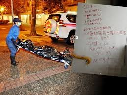
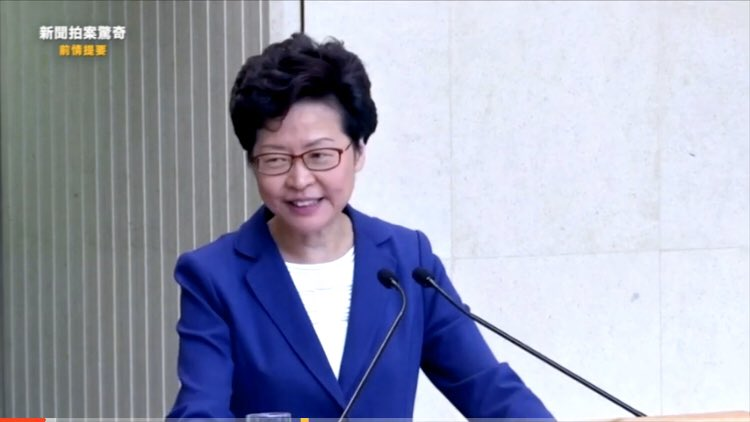

[10月10日 22:22]    墙国铁拳现世报😷   @Socialistfist    突然爱国，突然强拆
#社会主义铁拳 https://twitter.com/rtiomn/status/1182294052466614272 …  :speech_balloon:评:3 :+1:赞:13 :globe_with_meridians:转:2  

[10月10日 21:59]    BBC News 中文   @bbcchinese    根据世界卫生组织（WHO）数据，韩国是世界上自杀率最高的地区之一。而在韩国首都首尔，有一支自杀救援队，队员许正旭（音）表示，救人成功时他们会感到有意义，但失败时也会沮丧。
 https://bbc.in/2MsMX8C   :speech_balloon:评:7 :+1:赞:19 :globe_with_meridians:转:5  

[10月10日 21:30]    BBC News 中文   @bbcchinese    年轻人不愿意结婚，新生儿出生率降低，人口老龄化日益严重。最新数据显示，地球上老人比幼儿多。这是什么概念？这些娃娃长大后将面对怎样的世界？
 https://bbc.in/2MxVdEt   :speech_balloon:评:4 :+1:赞:10 :globe_with_meridians:转:2  

[10月10日 21:00]    纽约时报中文网   @nytchinese    #观点 至于中美贸易谈判的下一步以及如何处理香港问题，四中全会或许会讨论，但除非在此期间发生重大事件足以改变对问题的定性，如香港暴力抗争显著升级，形成新的共识和处理方式的可能性也很小。 http://nyti.ms/2p8XJsq   :speech_balloon:评:5 :+1:赞:4 :globe_with_meridians:转:2  

[10月10日 20:59]    BBC News 中文   @bbcchinese    你是左脑型还是右脑型？人类只是用十分之一的大脑，这些你可能都不陌生，但关键是这里有多少真相呢？
 https://bbc.in/2pawPjW   :speech_balloon:评:3 :+1:赞:12 :globe_with_meridians:转:9  

[10月10日 20:00]    BBC News 中文   @bbcchinese    【柏林牆倒下30年：走進蘇聯遺留在德國的共產主義痕跡】BBC记者带大家走进这座见证共产主义的建筑。 https://bbc.in/2p7CszD   :speech_balloon:评:8 :+1:赞:25 :globe_with_meridians:转:12  

[10月10日 19:35]    GFHG SDKM   @zyx_yny    #黃店 #每日一無聊吹水tweet 
又懲罰！！
好感動啊戴口罩入去送嘢飲同雞翼  :speech_balloon:评:11 :+1:赞:72 :globe_with_meridians:转:12  

[10月10日 19:30]    新闻大吐槽   @TuCaoFakeNews    是一套，就是戴反了  :speech_balloon:评:1 :+1:赞:3 :globe_with_meridians:转:1  

[10月10日 19:30]    纽约时报中文网   @nytchinese    在以往经济放缓时期，中国消费者一直在消费。但如今，随着经济陷入低迷，他们宁愿把钱存在银行。
这一转变不仅将在全球产生影响，也将对中国领导层构成直接挑战。 http://nyti.ms/2p7RdlR   :speech_balloon:评:24 :+1:赞:42 :globe_with_meridians:转:21  

[10月10日 19:29]    新闻大吐槽   @TuCaoFakeNews    青岛大姨官方装备  :speech_balloon:评:0 :+1:赞:1 :globe_with_meridians:转:1  

[10月10日 19:29]    新闻大吐槽   @TuCaoFakeNews    不可高估警察的良知，我想可能是NBA的事搞大了，所以它们暂时收敛  :speech_balloon:评:0 :+1:赞:18 :globe_with_meridians:转:1  

[10月10日 19:28]    新闻大吐槽   @TuCaoFakeNews    给三亿美国人洗脑这个巨大的工作要提上共产党的日事议程了。  :speech_balloon:评:0 :+1:赞:17 :globe_with_meridians:转:1  

[10月10日 19:25]    新闻大吐槽   @TuCaoFakeNews    这有同款  :speech_balloon:评:2 :+1:赞:32 :globe_with_meridians:转:4  

[10月10日 19:25]    新闻大吐槽   @TuCaoFakeNews      :speech_balloon:评:0 :+1:赞:13 :globe_with_meridians:转:4  

[10月10日 19:24]    新闻大吐槽   @TuCaoFakeNews    这是应验了我之前发的吗 https://twitter.com/BRANLEE404/status/1181066288816246784?s=19 …  :speech_balloon:评:2 :+1:赞:19 :globe_with_meridians:转:2  

[10月10日 19:23]    新闻大吐槽   @TuCaoFakeNews    口罩設計師：林鄭月鵝⋯這口罩的設計靈感來源於「開襠褲」罩著狗嘴，還可以嚇唬人！  :speech_balloon:评:0 :+1:赞:11 :globe_with_meridians:转:1  

[10月10日 19:22]    新闻大吐槽   @TuCaoFakeNews      :speech_balloon:评:0 :+1:赞:1 :globe_with_meridians:转:1  

[10月10日 19:19]    新闻大吐槽   @TuCaoFakeNews    国内喊万岁的是战友
国外喊打的也是战友
听起来怪怪的
但觉得确实存在某种联系
万岁声越大
骂声也就越大 https://twitter.com/tucaofakenews/status/1182247404931710976 …  :speech_balloon:评:0 :+1:赞:6 :globe_with_meridians:转:1  

[10月10日 19:19]    新闻大吐槽   @TuCaoFakeNews    尼们拼什么嘲笑人家叠这么好的被子？有本事尼也叠一个  :speech_balloon:评:1 :+1:赞:4 :globe_with_meridians:转:1  

[10月10日 19:01]    BBC News 中文   @bbcchinese    中美贸易战继续！美国列出中国AI芯片公司的黑名单，包含创立于香港中大的商汤科技（SenseTime），以及CCTV公司的海康威视。大家怎么看？ https://bbc.in/33b871M   :speech_balloon:评:20 :+1:赞:78 :globe_with_meridians:转:31  

[10月10日 18:56]    新闻大吐槽   @TuCaoFakeNews    可惜粉蛆五毛们分不清党国之别  :speech_balloon:评:1 :+1:赞:5 :globe_with_meridians:转:1  

[10月10日 18:54]    GFHG SDKM   @zyx_yny    學到嘢 https://twitter.com/kiloloyc/status/1181993416327974912 …  :speech_balloon:评:0 :+1:赞:0 :globe_with_meridians:转:1  

[10月10日 18:41]    新闻大吐槽   @TuCaoFakeNews    傍晚，有几十位市民聚集在海港城附近，很多人手举中华民国国旗，庆祝中华民国国庆，彰显港人爱中国，不爱共党！

现场有警察戒备，也有不少人戴着口罩，但警察并没有对戴口罩的人进行拘捕，看来是很难执行的一个胡闹法令。  :speech_balloon:评:15 :+1:赞:242 :globe_with_meridians:转:133  

[10月10日 18:39]    GFHG SDKM   @zyx_yny    Justice died https://twitter.com/hongkongfp/status/1182206203977490434 …  :speech_balloon:评:0 :+1:赞:1 :globe_with_meridians:转:1  

[10月10日 18:23]    纽约时报中文网   @nytchinese    #每日一词 在火箭队总经理莫雷一则支持香港抗议者的推文将NBA推上风口浪尖后，篮网队总经理、阿里巴巴联合创始人蔡崇信公开就此事发声。
据时报报道，他在声明中将抗议者的行为称为“分裂运动”，并说香港是中国的“a third-rail issue”。 http://nyti.ms/33kw2Mo   :speech_balloon:评:20 :+1:赞:24 :globe_with_meridians:转:6  

[10月10日 18:13]    纽约时报中文网   @nytchinese    #时报专栏 在过去的半个世纪里，中国实现了迅猛的经济增长，使数亿民众摆脱了贫困。但是，中共政权并不需要用放松控制来换取发展。
一个更为黑暗的事实正浮现出来：中国的经济奇迹不仅没有解放中国人民。现在，它还经常走出国门，腐蚀我们其他人。 http://nyti.ms/325LrQu   :speech_balloon:评:290 :+1:赞:679 :globe_with_meridians:转:249  

[10月10日 18:13]    纽约时报中文网   @nytchinese    Chinese Media’s Attacks on Apple and N.B.A. Help Inflame Nationalism. See Chinese translation and bilingual version @nytchinese @HernandezJavier https://cn.nytimes.com/china/20191010/china-apple-nba-hong-kong/ …  :speech_balloon:评:3 :+1:赞:13 :globe_with_meridians:转:4  

[10月10日 18:01]    BBC News 中文   @bbcchinese    美国金门大桥是全球最热门的自杀地，过去20年，有1700人在这里自杀。而两位警官分别在这里救下轻生的人。 https://bbc.in/2IBkkVK   :speech_balloon:评:14 :+1:赞:43 :globe_with_meridians:转:11  

[10月10日 17:54]    老司机   @h5lpykl7tp6jjop    天天骂小日本，瞧不起小日本，结果人家19年拿19个诺贝尔奖！中国人牛皮吹得大，实际上比别人差得越来越远，未来更是堪忧  :speech_balloon:评:10 :+1:赞:78 :globe_with_meridians:转:22  

[10月10日 17:44]    墙国铁拳现世报😷   @Socialistfist    全推特最纯净的推 https://twitter.com/zSP8IcFxk8kpaJv/status/1182229009410641920 …  :speech_balloon:评:16 :+1:赞:161 :globe_with_meridians:转:13  

[10月10日 17:40]    新闻大吐槽   @TuCaoFakeNews    哈哈!一个莫雷还不够，千万个莫雷又来了!  :speech_balloon:评:1 :+1:赞:16 :globe_with_meridians:转:3  

[10月10日 17:30]    纽约时报中文网   @nytchinese    #观点 中共为70年大庆所做的各项准备让外界看到，习近平依然牢牢掌控着权力。
很有可能，习会以坚持和完善社会主义制度之名（这也是全会的议程之一，而且是和治理现代化捆绑在一起的），把强化党的集中统一领导和习的统治作为推进中国治理现代化的一项内容。 http://nyti.ms/2p8XJsq   :speech_balloon:评:4 :+1:赞:5 :globe_with_meridians:转:3  

[10月10日 17:28]    墙国铁拳现世报😷   @Socialistfist    你们看看这些假爱国者，竟然为了房子威胁国家，上街游行。
#社会主义铁拳  :speech_balloon:评:56 :+1:赞:297 :globe_with_meridians:转:82  

[10月10日 17:15]    墙国铁拳现世报😷   @Socialistfist    突然来了很多香港选民，你们投完票可以去何议员那里继续投票  :speech_balloon:评:5 :+1:赞:36 :globe_with_meridians:转:4  

[10月10日 17:10]    GFHG SDKM   @zyx_yny    咁多位手足，美國戰線已經着晒火！Blizzard單嘢已經越燒越大，外國唔少YouTuber都因為呢件事開始出片議論香港發生緊嘅事。希望以下內容可以幫到手足文宣。  :speech_balloon:评:17 :+1:赞:689 :globe_with_meridians:转:388  

[10月10日 17:01]    BBC News 中文   @bbcchinese    蔡英文国庆演讲首次提到香港，表示一国两制的失灵导致香港社会处于脱序边缘。台湾将拒绝一国两制， 以民主自由走出自己的路。 https://bbc.in/2VyjyOj   :speech_balloon:评:168 :+1:赞:566 :globe_with_meridians:转:132  

[10月10日 17:00]    纽约时报中文网   @nytchinese    分析人士表示，中国媒体日益强硬的语气，是为了配合北京在国内煽动民族主义、恐吓跨国公司追随党的路线。
在中国和美国努力达成贸易协议之际，这场口水战也反映了一场更广泛的地缘政治斗争。 http://nyti.ms/2AZGMUa   :speech_balloon:评:23 :+1:赞:37 :globe_with_meridians:转:11  

[10月10日 16:30]    纽约时报中文网   @nytchinese    #观点 在习近平的领导下，中国正在积极地努力消除国内的文化和政治多样性，这种多样性是中华人民共和国以前朝代的遗产。
习近平对政治和文化同质化的不切实际的梦想，不仅与中国传统的多元化做法背道而驰。他的同化主义也激发了中共一直希望避免的不稳定。 http://nyti.ms/2Ozgsbx   :speech_balloon:评:76 :+1:赞:186 :globe_with_meridians:转:57  

[10月10日 16:00]    纽约时报中文网   @nytchinese    当中国的猪肉供应不足时，北京会动用“战略猪肉储备“。这听起来像是全国各地的秘密地窖里有堆积成山的香肠、培根和排骨。但具体情况有些出入。
如今，猪瘟让中国的猪肉价格飞涨，政府一直在动用储备增加对消费者的供应。究竟这项“战略猪肉储备“制度是什么？又是如何运作的？ http://nyti.ms/2pTr62m   :speech_balloon:评:19 :+1:赞:62 :globe_with_meridians:转:32  

[10月10日 15:41]    GFHG SDKM   @zyx_yny    #HongKong #police arrested 3 teenagers, who were not even wearing mask. Passerby tried to ask for names, officer responded, "Knock it off!(收皮啦你)"
Officer: there are three! Enough to do the arrest!
Note: HK law - 3 or more persons can be an unlawful assembly
Source-Apple Daily  :speech_balloon:评:139 :+1:赞:1401 :globe_with_meridians:转:1402  

[10月10日 15:36]    新闻大吐槽   @TuCaoFakeNews    白人不愧是人类的希望，人类素质的天花板，甩那些舔支的黑人球星一百条街  :speech_balloon:评:4 :+1:赞:23 :globe_with_meridians:转:3  

[10月10日 15:31]    纽约时报中文网   @nytchinese    《人民日报》将矛头对准苹果，指责它提供 http://HKmap.live 这款允许抗议者追踪警察行动的应用，为香港的“暴徒“”护航“。苹果宣布，已将http://HKmap.live 从应用商店中删除。
随着中国试图遏制香港的示威活动，官媒越来越多地抨击外国企业，指责它们助长抗议活动。http://nyti.ms/2AZGMUa   :speech_balloon:评:49 :+1:赞:105 :globe_with_meridians:转:46  

[10月10日 15:29]    新闻大吐槽   @TuCaoFakeNews    我去，还真的是这样。  :speech_balloon:评:0 :+1:赞:4 :globe_with_meridians:转:1  

[10月10日 15:14]    GFHG SDKM   @zyx_yny    #雙10 #黃店 #香港人
大家記得今日去懲罰黃店啦  :speech_balloon:评:0 :+1:赞:8 :globe_with_meridians:转:1  

[10月10日 15:01]    BBC News 中文   @bbcchinese    当你想买一件货品时，你能否分辨出是环境告诉你想买，还是真正自己想买？ https://bbc.in/33hKAfC   :speech_balloon:评:1 :+1:赞:42 :globe_with_meridians:转:18  

[10月10日 14:30]    纽约时报中文网   @nytchinese    #观点 邓聿文：中共要转型成为现代化的执政党，首先需要民主化，允许不同派系的公开存在并相互竞争，将目前只有集中而无民主的“民主集中制”变成民主制，允许和提倡思想自由和思想争鸣，不搞一言堂，党和党的领导人要真正做到在国家宪法和法律下活动，不能有超越法律的特权。 http://nyti.ms/2p8XJsq   :speech_balloon:评:16 :+1:赞:33 :globe_with_meridians:转:10  

[10月10日 14:07]    GFHG SDKM   @zyx_yny    Pro-Beijing spread msg to catch teens and rape them as punishment. From the message, the sender claimed that he has tried to kidnap young gals even present of #HKPolice . Be careful,  is in #hkpolicestate https://twitter.com/jordanhk4/status/1182056430817300483 …  :speech_balloon:评:0 :+1:赞:3 :globe_with_meridians:转:1  

[10月10日 14:01]    BBC News 中文   @bbcchinese    子瑜在2016年在韓國的電視節目中揮舞台灣的青天白日旗，也遭遇中國方面的抵制。當時周子瑜隸屬的韓國經紀公司隨後發佈她的道歉視頻，與《南方公園》的處理手法大不同。 https://bbc.in/30Yuy8N   :speech_balloon:评:18 :+1:赞:53 :globe_with_meridians:转:16  

[10月10日 14:00]    纽约时报中文网   @nytchinese    动视暴雪表示，吴伟聪违反了一项竞争规则——即禁止玩家有任何“破坏自己的声誉、冒犯部分公众或某些公众群体，或损害暴雪形象”的行为。
在台湾《炉石传说》流媒体播放的赛后采访中，吴伟聪戴上香港抗议者常戴的防护装备弹道护目镜和防毒面具，用普通话疾呼“光复香港、时代革命”。 http://nyti.ms/2q2ssYT   :speech_balloon:评:25 :+1:赞:54 :globe_with_meridians:转:16  

[10月10日 13:44]    GFHG SDKM   @zyx_yny    #followbackhongkong 
用twitter文宣咗一排 但係followers都仲未過300
可摸耳理下我  :speech_balloon:评:58 :+1:赞:150 :globe_with_meridians:转:46  

[10月10日 13:38]    财经真相   @caijingxiang    唐纳德·J·特朗普的大作《The way to  the top》，中文名《颠覆之路》！  :speech_balloon:评:16 :+1:赞:95 :globe_with_meridians:转:19  

[10月10日 13:30]    纽约时报中文网   @nytchinese    #观点 长期以来关于中国的一般认知是，美国对中国的接触和投资将不可避免地带来这个国家的政治自由化，这一点显然没能得到证明。
这也是萧华本人在谈论“篮球外交”的可能性时所坚持的老生常谈。 http://nyti.ms/2IAinc1   :speech_balloon:评:47 :+1:赞:48 :globe_with_meridians:转:15  

[10月10日 13:18]    GFHG SDKM   @zyx_yny    #每日一無聊吹水tweet #香港人
話說有人整咗條回血mv俾大家

 https://youtu.be/0yXTHODE24Q 
熱血 可能會導致流馬尿 請小心  :speech_balloon:评:0 :+1:赞:0 :globe_with_meridians:转:0  

[10月10日 13:13]    GFHG SDKM   @zyx_yny     https://twitter.com/enzomazak/status/1182019452721758208 …  :speech_balloon:评:0 :+1:赞:0 :globe_with_meridians:转:0  

[10月10日 13:00]    纽约时报中文网   @nytchinese    #观点 四中全会究竟能改变什么？邓聿文判断，习近平应已感知到党内外对其领导能力的不满，或将有限放松集权程度，甚至轻描淡写地做一点自我批评；但会上不会出现对习近平的公开指责，他仍牢牢掌控着权力。 http://nyti.ms/2p8XJsq   :speech_balloon:评:19 :+1:赞:22 :globe_with_meridians:转:10  

[10月10日 12:58]    新闻大吐槽   @TuCaoFakeNews      :speech_balloon:评:0 :+1:赞:36 :globe_with_meridians:转:10  

[10月10日 12:53]    GFHG SDKM   @zyx_yny    Is it just a feeling that @apple acts quick when it is about repression of #People by dictatorship like #Chinazi and slow down when its about protecting the #data|s of their Customers? with #Apple #StandWithHongKong #followbackhongkong #SteveJobs #rip #staysafe #hongkong  https://twitter.com/nytimes/status/1182145379330088960 …  :speech_balloon:评:3 :+1:赞:32 :globe_with_meridians:转:18  

[10月10日 12:50]    新闻大吐槽   @TuCaoFakeNews    这就很nice了，垬的那些破事终于人尽皆知了  :speech_balloon:评:0 :+1:赞:16 :globe_with_meridians:转:1  

[10月10日 12:43]    新闻大吐槽   @TuCaoFakeNews    胡锡进们做了HKer没做到的事。  :speech_balloon:评:1 :+1:赞:12 :globe_with_meridians:转:1  

[10月10日 12:37]    GFHG SDKM   @zyx_yny    我見到好多新加入Twitter既手足係所羅門啲推文都用緊Mr.
但係當你睇到我哩篇廢文就唔好再用啦
因為佢有話過政敵先會叫佢Mr. 如果大家想稱呼佢可以用NCM Yue
見到唔該幫手retweet  :speech_balloon:评:23 :+1:赞:607 :globe_with_meridians:转:477  

[10月10日 12:31]    GFHG SDKM   @zyx_yny    It seems #Disney block Winnie the Pooh in Hong Kong Disney website. We cannot search Winnie the Poon in Disney characters. But if you use VPN and change IP to US , you can find pooh again 
Website link :  https://disney.com.hk/characters/ 
#WinnieThePooh #Disneyland #kowtow #China  :speech_balloon:评:0 :+1:赞:5 :globe_with_meridians:转:7  

[10月10日 12:30]    纽约时报中文网   @nytchinese    香港电竞职业选手吴伟聪因在现场直播时声援香港抗议活动，而遭暴雪停赛一年，奖金也被取消。玩家在社交媒体和论坛上愤怒发帖，政界人士则认为这是中国在世界范围内严厉打压言论又一令人不安的迹象。
民主党参议员怀登表示，动视暴雪已表明“它愿意为取悦中国共产党而羞辱自己”。 http://nyti.ms/2q2ssYT   :speech_balloon:评:118 :+1:赞:365 :globe_with_meridians:转:146  

[10月10日 12:03]    老司机   @h5lpykl7tp6jjop    浦志強：深圳同学发来一张墙报，说是深圳民治街道办事处的文宣。但愿，这不是真的。 ​​​
哎，一地的書啊！  :speech_balloon:评:36 :+1:赞:254 :globe_with_meridians:转:115  

[10月10日 12:03]    新闻大吐槽   @TuCaoFakeNews    赶快把这个转去国内，让他们抵制的更激烈一些：）  :speech_balloon:评:0 :+1:赞:36 :globe_with_meridians:转:2  

[10月10日 12:00]    纽约时报中文网   @nytchinese    • 关注美国2020年大选：民主党参选人、前副总统拜登宣称，特朗普总统应该被弹劾，因其“违反了就职誓言，背叛了这个国家，做出了可以被弹劾的行为”。
• 德国一间犹太教堂遭持枪者袭击，致2死2伤。凶手试图直播作案过程，其作案手法与新西兰基督城枪击案相似。更多简报内容： http://nyti.ms/2OzDhMj   :speech_balloon:评:4 :+1:赞:9 :globe_with_meridians:转:2  

[10月10日 11:30]    纽约时报中文网   @nytchinese    #观点 在“十一”阅兵式和群众游行过后，中共将在近日召开十九届四中全会。从这次四中全会的议题来看，习近平再次意识到治理现代化的重要性。
但时评家邓聿文认为，中共难以成为现代化的执政党，因为现代化的基础是自由民主和法治等精神内核，而中共对权力的垄断本质与之相悖。 http://nyti.ms/2p8XJsq   :speech_balloon:评:61 :+1:赞:159 :globe_with_meridians:转:34  

[10月10日 11:13]    BBC News 中文   @bbcchinese    “梅花、梅花满天下⋯⋯”这歌声在香港响起来  :speech_balloon:评:342 :+1:赞:1935 :globe_with_meridians:转:596  

[10月10日 11:00]    纽约时报中文网   @nytchinese    认识他的人都说，他是“礼貌而谦逊的绅士”，是“诚实的人”，是“朋友和兄弟”。郭全是纽约唐人街居民熟悉的流浪汉，他在上周发生的针对流浪汉的袭击事件中被打死。
在纽约，流浪群体不见得会受到鄙夷，而是可成为社区的固定成员，甚至得到四邻照顾。郭全就是这种人。更多简报内容： http://nyti.ms/2OzDhMj   :speech_balloon:评:2 :+1:赞:3 :globe_with_meridians:转:0  

[10月10日 10:30]    纽约时报中文网   @nytchinese    #观点 莫雷的推文虽很快被删，却在中国疯传，那里赞助商和球迷做出了迅猛而愤怒的回应。
但NBA向中国敏感议题屈膝的速度之快却相当惊人——如萧华曾夸耀的，这个联盟所引以为豪的，是“一种义务感、社会责任感、对重要问题直言不讳的愿望”。 http://nyti.ms/2IAinc1   :speech_balloon:评:65 :+1:赞:106 :globe_with_meridians:转:40  

[10月10日 10:19]    凡賽堤/FORSETI   @FecharCCP    悲慘的香港6 ，看到這一幕幕屍體，我們是悲痛？是無助？還是哭泣？是憤怒？ 面對強權，我們該如何？

（聲明！圖片來源均來自網絡媒體，如有侵權，立即刪除）  :speech_balloon:评:0 :+1:赞:4 :globe_with_meridians:转:2  

[10月10日 10:17]    凡賽堤/FORSETI   @FecharCCP    悲慘的香港6 ，看到這一幕幕屍體，我們是悲痛？是無助？還是哭泣？是憤怒？ 面對強權，我們該如何？

（聲明！圖片來源均來自網絡媒體，如有侵權，立即刪除）  :speech_balloon:评:0 :+1:赞:4 :globe_with_meridians:转:4  

[10月10日 10:04]    GFHG SDKM   @zyx_yny    Guys, please help retweet.

Almost 120 days pasted, 721 terrorist attack arrested 6 people.  This video also explain a lot why we need to protect ourselves.

A lot more people in the world don't know what happened, spare 20 mintues a hv a look. https://www.youtube.com/watch?v=zpkFRsSo30o …  :speech_balloon:评:1 :+1:赞:86 :globe_with_meridians:转:96  

[10月10日 10:00]    BBC News 中文   @bbcchinese    香港发生“97以来最大危机”。舆论不断浮现一个问题——新加坡是否会就此超过香港，取代其亚洲金融中心地位？ https://bbc.in/33s5Uzh   :speech_balloon:评:67 :+1:赞:88 :globe_with_meridians:转:22  

[10月10日 10:00]    纽约时报中文网   @nytchinese    土耳其发动叙利亚攻势，向该国东北部派遣战机和军队，以清剿一个库尔德民兵组织，后者是美国打击伊斯兰国的重要盟友。
特朗普曾对土耳其的行动表示默许，但行动展开后又称其是“一个坏主意”，并重申他反对“无意义的战争”。
更多简报内容： http://nyti.ms/2OzDhMj   :speech_balloon:评:3 :+1:赞:5 :globe_with_meridians:转:0  

[10月10日 09:55]    凡賽堤/FORSETI   @FecharCCP    同樣的愛國，卻有不同的定義，歷史要求你選邊站！！！！！！！！！！！！！！！！！！！！！  :speech_balloon:评:0 :+1:赞:8 :globe_with_meridians:转:0  

[10月10日 09:51]    凡賽堤/FORSETI   @FecharCCP    70年來我們已經失去八千萬同胞，八千萬中都是同胞的親人，祖輩，父輩，親人，朋友！今天的700萬香港人也都是我們的親人，未來同胞的祖輩，父輩，親人，朋友！我們何其悲哀啊！！！！！！！！！！！！！！！！！！！！！！！！！！！！  :speech_balloon:评:5 :+1:赞:103 :globe_with_meridians:转:69  

[10月10日 09:48]    财经真相   @caijingxiang    离岸人民币从7.1680到7.0999，短短一个小时近700点！  :speech_balloon:评:73 :+1:赞:269 :globe_with_meridians:转:71  

[10月10日 09:32]    BBC News 中文   @bbcchinese    美国遏制中国成为AI领头羊，最终可能刺激中共降低中国科技对外国的依赖。 https://bbc.in/32exXSc   :speech_balloon:评:71 :+1:赞:57 :globe_with_meridians:转:26  

[10月10日 09:10]    财经真相   @caijingxiang    这两天市场被媒体忽悠惨了，来回割肉，不过现在加大农产品采购，说明中共还是玩的买买买的套路，不准备全面达成协议。双方第一次接触将很重要，也就是说北京时间10号21:00至11号凌晨5点，将是决定本轮会谈最后时间，各位交易员做好准备，暴风雨要来了！ https://twitter.com/LoneCapital/status/1182096813882372097 …  :speech_balloon:评:20 :+1:赞:217 :globe_with_meridians:转:93  

[10月10日 08:52]    凡賽堤/FORSETI   @FecharCCP    上帝賦予人有神聖的生命權和尊嚴，但是極權者卻把人定義為蟑螂，定義為蟲類！我們任由壓迫，打壓，暴打，抓捕，暗殺，活摘器官，公開槍殺，打殘，沒收財產，沒有土地擁有權，強拆，強搶，任由宰割，卻不由我們反抗！我們在哭泣！！！我們祈禱上帝庇佑！！！我們祈求世界同情和可憐！！！！！！！！！！ https://twitter.com/FecharCCP/status/1182095164417937410 …  :speech_balloon:评:0 :+1:赞:6 :globe_with_meridians:转:6  

[10月10日 08:47]    凡賽堤/FORSETI   @FecharCCP    上帝賦予人有神聖的生命權和尊嚴，但是極權者卻把人定義為蟑螂，定義為蟲類！我們任由壓迫，打壓，暴打，抓捕，暗殺，活摘器官，公開槍殺，打殘，沒收財產，沒有土地擁有權，強拆，強搶，任由宰割，卻不由我們反抗！我們在哭泣！！！！！！！！！！！！！！我們祈禱上帝庇佑！！！！！！！！！！！！！  :speech_balloon:评:0 :+1:赞:11 :globe_with_meridians:转:7  

[10月10日 08:25]    凡賽堤/FORSETI   @FecharCCP    香港人已經向全世界發誓每個人都愛惜生命，絕不自殺！
但是每個畫面都太恐怖了！全人類最恐怖的以國家名義，以政府名義公開殺人，實行暗殺！全人類最恐怖的殺人組織！人神共憤啊！！！！！！！！！！
天佑香港人！天佑香港人！！！！！！！！！！！！！！！！！！！！！！！！  :speech_balloon:评:19 :+1:赞:324 :globe_with_meridians:转:289  

[10月10日 08:13]    BBC News 中文   @bbcchinese    土耳其总统埃尔多安表示，这场攻势旨在库尔德人控制的区域建立一个“安全区”，重新安置目前居住在土耳其的叙利亚难民。许多观察人士将此次中东局势的升级怪罪于特朗普，说他“出卖盟友”。 https://bbc.in/2MmTHos   :speech_balloon:评:25 :+1:赞:44 :globe_with_meridians:转:8  

[10月10日 07:58]    老司机   @h5lpykl7tp6jjop    悲催的小粉红，你的饭碗呢？  :speech_balloon:评:59 :+1:赞:332 :globe_with_meridians:转:99  

[10月10日 07:47]    凡賽堤/FORSETI   @FecharCCP    悲慘的香港10 ，看到這一幕幕屍體，我們是悲痛？是無助？還是哭泣？是憤怒？ 面對強權，我們該如何？

（聲明！圖片來源均來自網絡媒體，如有侵權，立即刪除）  :speech_balloon:评:0 :+1:赞:5 :globe_with_meridians:转:3  

[10月10日 07:46]    凡賽堤/FORSETI   @FecharCCP    悲慘的香港9 ，看到這一幕幕屍體，我們是悲痛？是無助？還是哭泣？是憤怒？ 面對強權，我們該如何？

（聲明！圖片來源均來自網絡媒體，如有侵權，立即刪除）  :speech_balloon:评:0 :+1:赞:4 :globe_with_meridians:转:2  

[10月10日 07:46]    凡賽堤/FORSETI   @FecharCCP    悲慘的香港8 ，看到這一幕幕屍體，我們是悲痛？是無助？還是哭泣？是憤怒？ 面對強權，我們該如何？

（聲明！圖片來源均來自網絡媒體，如有侵權，立即刪除）  :speech_balloon:评:0 :+1:赞:11 :globe_with_meridians:转:11  

[10月10日 07:45]    凡賽堤/FORSETI   @FecharCCP    悲慘的香港7 ，看到這一幕幕屍體，我們是悲痛？是無助？還是哭泣？是憤怒？ 面對強權，我們該如何？

（聲明！圖片來源均來自網絡媒體，如有侵權，立即刪除）  :speech_balloon:评:1 :+1:赞:6 :globe_with_meridians:转:4  

[10月10日 07:44]    凡賽堤/FORSETI   @FecharCCP    悲慘的香港5 ，看到這一幕幕屍體，我們是悲痛？是無助？還是哭泣？是憤怒？ 面對強權，我們該如何？

（聲明！圖片來源均來自網絡媒體，如有侵權，立即刪除）  :speech_balloon:评:12 :+1:赞:75 :globe_with_meridians:转:71  

[10月10日 07:44]    凡賽堤/FORSETI   @FecharCCP    悲慘的香港4 ，看到這一幕幕屍體，我們是悲痛？是無助？還是哭泣？是憤怒？ 面對強權，我們該如何？

（聲明！圖片來源均來自網絡媒體，如有侵權，立即刪除）  :speech_balloon:评:0 :+1:赞:2 :globe_with_meridians:转:1  

[10月10日 07:43]    凡賽堤/FORSETI   @FecharCCP    悲慘的香港3 ，看到這一幕幕屍體，我們是悲痛？是無助？還是哭泣？是憤怒？ 面對強權，我們該如何？

（聲明！圖片來源均來自網絡媒體，如有侵權，立即刪除）  :speech_balloon:评:0 :+1:赞:2 :globe_with_meridians:转:2  

[10月10日 07:43]    凡賽堤/FORSETI   @FecharCCP    悲慘的香港2 ，看到這一幕幕屍體，我們是悲痛？是無助？還是哭泣？是憤怒？ 面對強權，我們該如何？

（聲明！圖片來源均來自網絡媒體，如有侵權，立即刪除）  :speech_balloon:评:0 :+1:赞:3 :globe_with_meridians:转:3  

[10月10日 07:43]    凡賽堤/FORSETI   @FecharCCP    悲慘的香港1 ，看到這一幕幕屍體，我們是悲痛？是無助？還是哭泣？是憤怒？ 面對強權，我們該如何？

（聲明！圖片來源均來自網絡媒體，如有侵權，立即刪除）  :speech_balloon:评:2 :+1:赞:14 :globe_with_meridians:转:11  

[10月10日 07:40]    BBC News 中文   @bbcchinese    被迫与人类共处的野生动物们，在短短的时间内适应了环境，完成了它们以往可能需要数百万年才能出现的演变。 https://bbc.in/2p4kSMO   :speech_balloon:评:8 :+1:赞:37 :globe_with_meridians:转:14  

[10月10日 07:35]    GFHG SDKM   @zyx_yny    CENSORSHIP OF HK @Disney
Now, #WinnieThePooh is unable to be searched on Disney Web with HK ip. (Still normally found via Japanese VPN)

#StandWithHongKong #hongkong #FreeHK  :speech_balloon:评:85 :+1:赞:839 :globe_with_meridians:转:708  

[10月10日 07:34]    GFHG SDKM   @zyx_yny    Let’s see the list:

Pro-freedom:
South Park 
Red Bull
Slam Dunk

Pro-China:
NBA
Tiffany & Co

Anyone else? https://twitter.com/hkdimsum1/status/1181785798531850240 …  :speech_balloon:评:3 :+1:赞:12 :globe_with_meridians:转:5  

[10月10日 07:12]    老司机   @h5lpykl7tp6jjop    太恐怖了，300多个孩子被冻起来准备运输去贩卖器官！ CCP不灭，天理何在！  :speech_balloon:评:133 :+1:赞:391 :globe_with_meridians:转:276  

[10月10日 06:13]    BBC News 中文   @bbcchinese    中国有句很有名的政治口号：“文艺为政治服务”。外界可能没有料到的是，如今体育也要为政治服务了。 https://bbc.in/2Mt7AkX   :speech_balloon:评:304 :+1:赞:406 :globe_with_meridians:转:115  

[10月10日 05:09]    老司机   @h5lpykl7tp6jjop    中国人有一种特别的心理，哪怕在独裁暴政制下仍然相信自己的运气，别人冤案被打被骗是他们运气不好，你看他们在赌场里疯狂下注，不怕各种陷阱圈套十赌九输仍然相信有机会能赢，对这种执迷不悟的人群，任何理性的劝导都无用，他们就是输红眼的赌徒，绝不会戒赌，只想继续下注翻本，所以就继续投机中共！  :speech_balloon:评:4 :+1:赞:73 :globe_with_meridians:转:16  

[10月10日 00:51]    GFHG SDKM   @zyx_yny    一起加油  大家注意安全，我们面对的是史无前例的疯狂恶魔， 一起和它斗智斗勇。  :speech_balloon:评:0 :+1:赞:204 :globe_with_meridians:转:7  

[10月09日 23:15]    墙国铁拳现世报😷   @Socialistfist    中国突然取消了NBA投票选项 https://twitter.com/VOAChinese/status/1181942149064998912 …  :speech_balloon:评:2 :+1:赞:42 :globe_with_meridians:转:3  

[10月09日 23:14]    老司机   @h5lpykl7tp6jjop    这下暴雪要哭了，
其射击游戏「守望先锋」的预告片里，一个中国女孩角色被高手给P了，改成了一个支持反送中的香港女孩！

是时候全民抵制暴雪了，请在墙内广传此影片！  :speech_balloon:评:98 :+1:赞:2961 :globe_with_meridians:转:1441  

[10月09日 23:14]    新闻大吐槽   @TuCaoFakeNews    这下暴雪要哭了，
其射击游戏「守望先锋」的预告片里，一个中国女孩角色被高手给P了，改成了一个支持反送中的香港女孩！

是时候全民抵制暴雪了，请在墙内广传此影片！  :speech_balloon:评:98 :+1:赞:2961 :globe_with_meridians:转:1441  

[10月09日 23:08]    财经真相   @caijingxiang    香港资本外逃，从2017年年初肖建华被抓就已经开始了，这也是2017年年初那波高峰的原因，此后资本外逃就没有停止过，始终停留在最高峰，我做的YouTube视频《港币危机真正根源——被掩盖的红色恐慌指数（red vix）》 https://www.youtube.com/watch?v=7wHu4BAMzxI&t=2s …  有详细讲解，零对冲这个图各位可以对比一下！https://twitter.com/zerohedge/status/1181947916770058240 …  :speech_balloon:评:3 :+1:赞:192 :globe_with_meridians:转:66  

[10月09日 22:56]    墙国铁拳现世报😷   @Socialistfist    后后续，王老师已销号，推出推特  :speech_balloon:评:8 :+1:赞:54 :globe_with_meridians:转:4  

[10月09日 22:41]    GFHG SDKM   @zyx_yny    幫我推下share下好冇？
用咗好多心血整嘅文宣嚟
Full version去YouTube search “penny lam - save Hong Kong”
#followbackhongkong #香港
#香港デモ #香港人加油 #香港人反抗  :speech_balloon:评:134 :+1:赞:2495 :globe_with_meridians:转:2129  

[10月09日 22:40]    BBC News 中文   @bbcchinese    我们总认为城市是最不健康的居住地，乡村田园最宜居。但研究结果让你大感意外？
 https://bbc.in/2IAdrny   :speech_balloon:评:4 :+1:赞:24 :globe_with_meridians:转:12  

[10月09日 22:05]    BBC News 中文   @bbcchinese    未来的历史学家在回顾“人类世”（Anthropocene）时，可能会认为当代具有划时代意义的技术不是电脑，而是椅子，它们对人类的身体有很大影响。
 https://bbc.in/3218UlI   :speech_balloon:评:4 :+1:赞:34 :globe_with_meridians:转:11  

[10月09日 21:33]    GFHG SDKM   @zyx_yny    Yesterday, security at NBA Headquarters threatened me with arrest and tried to throw me off a public sidewalk. Sadly, not only is the NBA refusing to condemn China, they’re starting to act like them also. #HongKongProtest ⁦@Andychanhotin⁩ ⁦@mschlapp⁩ #HongKong  :speech_balloon:评:372 :+1:赞:2900 :globe_with_meridians:转:1515  

[10月09日 21:30]    BBC News 中文   @bbcchinese    在外语学习上，我们倾向认为，孩子才是最擅长的。但可能并非如此。成年人学外语，其实有很多额外优势。
 https://bbc.in/35lxS16   :speech_balloon:评:6 :+1:赞:59 :globe_with_meridians:转:27  

[10月09日 20:59]    BBC News 中文   @bbcchinese    这个迅速老龄化的国家正在采取历史性措施，降低外国劳工进入门槛。近30%外劳来自中国。
 https://bbc.in/2p9netD   :speech_balloon:评:17 :+1:赞:67 :globe_with_meridians:转:17  

[10月09日 20:30]    BBC News 中文   @bbcchinese    自2018年美国总统特朗普开启贸易战以来，中美贸易战已经两年之久，到2019年10月至今不见结束的迹象。中美贸易战，是如何一步步升温并形成持久战的？
 https://bbc.in/313goDf   :speech_balloon:评:15 :+1:赞:12 :globe_with_meridians:转:5  

[10月09日 19:58]    老司机   @h5lpykl7tp6jjop    那時她是那麼的無助，我差點落淚。看到這個視頻，心裡有無限的痛與怒！勢單力薄的女孩單獨面對4條惡犬！萬幸最後喊出了姓名。
我願以最高的敬意獻於這位英勇的港女 
記住她  :speech_balloon:评:13 :+1:赞:638 :globe_with_meridians:转:426  

[10月09日 19:45]    财经真相   @caijingxiang    对火箭队的讨论在中国已经达到文革的地步！  :speech_balloon:评:52 :+1:赞:467 :globe_with_meridians:转:181  

[10月09日 19:05]    墙国铁拳现世报😷   @Socialistfist    CBA目前领先，NBA加油呀！  :speech_balloon:评:6 :+1:赞:349 :globe_with_meridians:转:3  

[10月09日 19:03]    墙国铁拳现世报😷   @Socialistfist      :speech_balloon:评:12 :+1:赞:232 :globe_with_meridians:转:24  

[10月09日 19:03]    墙国铁拳现世报😷   @Socialistfist    如果让您自由选择收看NBA或者CBA中的一种，你会选择看哪个篮球联赛？  :speech_balloon:评:239 :+1:赞:1164 :globe_with_meridians:转:235  

[10月09日 18:50]    墙国铁拳现世报😷   @Socialistfist    失业人员互相取暖  :speech_balloon:评:10 :+1:赞:160 :globe_with_meridians:转:39  

[10月09日 18:40]    墙国铁拳现世报😷   @Socialistfist    辛苦做ppt-放假看阿中哥哥-第一天上班被告知失业-回家刷李易峰做饭圈女孩
资本主义铁拳？
ps，上万nba从业者瑟瑟发抖  :speech_balloon:评:35 :+1:赞:368 :globe_with_meridians:转:89  

[10月09日 18:36]    老司机   @h5lpykl7tp6jjop    不论大官还是小民，一言不合上意，下课！
中国早已全面进入文革升级版时代！
日前，中共证监会原主席刘士余被连降四级。官方通报指他公开发表不当言论，但通报未具体说明原由。据一位近期来自中国的访问学者披露，刘士余下台的真实的原因是他在清华大学透露出习近平要搞国家牛市、慢牛，结果带来了疯牛  :speech_balloon:评:3 :+1:赞:189 :globe_with_meridians:转:62  

[10月09日 18:22]    老司机   @h5lpykl7tp6jjop    爱国挺共后遗症！这下入你们爱国的意愿了，回去吧！  :speech_balloon:评:2 :+1:赞:29 :globe_with_meridians:转:7  

[10月09日 17:29]    老司机   @h5lpykl7tp6jjop      :speech_balloon:评:0 :+1:赞:3 :globe_with_meridians:转:1  

[10月09日 17:25]    老司机   @h5lpykl7tp6jjop    大家自己看看属于哪一种家庭，马上就要 全面进入小康生活时代  :speech_balloon:评:11 :+1:赞:33 :globe_with_meridians:转:15  

[10月09日 16:25]    老司机   @h5lpykl7tp6jjop      :speech_balloon:评:1 :+1:赞:6 :globe_with_meridians:转:0  

[10月09日 16:24]    老司机   @h5lpykl7tp6jjop    推友们注意这个李方可能是假的！共产党特务利用他的账号骗我发蒙面照片和家人的资料，我在澳洲也不怕，反正都七十岁了能让共产党费尽心机来让我成仁也不在乎，大家小心！共产党马上就要垮台，疯狂到最后一刻来了！  :speech_balloon:评:14 :+1:赞:67 :globe_with_meridians:转:10  

[10月09日 13:42]    财经真相   @caijingxiang    胡锡进：NBA需要付出代价，但停止与它合作无需成为一种风潮。本来想搬起石头砸一下NBA给美国人看看支持香港的下场，但是搬起来后发现美国民意气势汹汹，大有跟你干到底的样子，于是中共彻底怂了，陪着笑脸朝自己脚砸去！  :speech_balloon:评:70 :+1:赞:1568 :globe_with_meridians:转:328  

[10月09日 13:24]    老司机   @h5lpykl7tp6jjop    加油干吧，同志们，留下给你们抵制的已经不多啦！  :speech_balloon:评:2 :+1:赞:41 :globe_with_meridians:转:17  

[10月09日 13:04]    老司机   @h5lpykl7tp6jjop    从小培养远大理想，结果都是洗脑，只有她知道这才是现实生活！你不是红二代理想个屁！  :speech_balloon:评:3 :+1:赞:53 :globe_with_meridians:转:27  

[10月09日 13:00]    老司机   @h5lpykl7tp6jjop    当香港又一抗争者被跳海，尸首刚被捞起，使被跳楼、被吊颈，被跳海、被分尸人数急剧增至近45人！

香港人的特首林郑月娥展露自信的笑容，在记者会告诉港人若香港发生更多暴乱，请北京发兵会成为其中一个迭项！  :speech_balloon:评:21 :+1:赞:69 :globe_with_meridians:转:60  

[10月09日 11:46]    墙国铁拳现世报😷   @Socialistfist    8:00 上贴吧讨论，贴吧被封
9:00 豆瓣瓜组组cp，组被解散号被封
10:00 微博质问来去之间，期间言论被收集于@Socialistfist 
11:00 连vpn上pornhub
11:05 撸完骂几句女优丑
12:00 起点yy小说，穿越之我是希特勒
1:00am 睡觉，醒来又是斗志满满的一天呢  :speech_balloon:评:6 :+1:赞:106 :globe_with_meridians:转:17  

[10月09日 10:27]    财经真相   @caijingxiang    听说杀猪时，猪会怪怪的等待被杀，那是因为它没有感觉到疼，当刀子割破喉咙时，它就会拼尽一切进行反抗！  :speech_balloon:评:12 :+1:赞:152 :globe_with_meridians:转:35  

[10月09日 10:04]    财经真相   @caijingxiang    最近中共的审查制度导致的各种抵制效果明显，比如它成功的把著名财经博客“零对冲”变成了一个政治号，以前五毛总是攻击我，一个财经号天天发政治内容！恩，现在你们可以攻击零对冲了！ https://twitter.com/zerohedge/status/1181742329788600320 …  :speech_balloon:评:6 :+1:赞:185 :globe_with_meridians:转:35  

[10月09日 08:31]    凡賽堤/FORSETI   @FecharCCP    香港人已經向全世界發誓每個人都愛惜生命，絕不自殺！
但是每個畫面都太恐怖了！全人類最恐怖的以國家名義，以政府名義公開殺人，實行暗殺！全人類最恐怖的殺人組織！人神共憤啊！！！！！！！！！！
天佑香港人！天佑香港人！！！！！！！！！！！！！！！！！！！！！！！！ https://twitter.com/ariahychen/status/1178907988007911424 …  :speech_balloon:评:0 :+1:赞:3 :globe_with_meridians:转:0  

[10月09日 08:30]    凡賽堤/FORSETI   @FecharCCP    香港人已經向全世界發誓每個人都愛惜生命，絕不自殺！
但是每個畫面都太恐怖了！全人類最恐怖的以國家名義，以政府名義公開殺人，實行暗殺！全人類最恐怖的殺人組織！人神共憤啊！！！！！！！！！！
天佑香港人！天佑香港人！！！！！！！！！！！！！！！！！！！！！！！！ https://twitter.com/baoguangtv/status/1179078524415557633 …  :speech_balloon:评:0 :+1:赞:1 :globe_with_meridians:转:1  

[10月09日 08:29]    凡賽堤/FORSETI   @FecharCCP    香港人已經向全世界發誓每個人都愛惜生命，絕不自殺！
但是每個畫面都太恐怖了！全人類最恐怖的以國家名義，以政府名義公開殺人，實行暗殺！全人類最恐怖的殺人組織！人神共憤啊！！！！！！！！！！
天佑香港人！天佑香港人！！！！！！！！！！！！！！！！！！！！！！！！ https://twitter.com/baoguangtv/status/1179792413327413248 …  :speech_balloon:评:0 :+1:赞:15 :globe_with_meridians:转:9  

[10月09日 08:28]    凡賽堤/FORSETI   @FecharCCP    香港人已經向全世界發誓每個人都愛惜生命，絕不自殺！
但是每個畫面都太恐怖了！全人類最恐怖的以國家名義，以政府名義公開殺人，實行暗殺！全人類最恐怖的殺人組織！人神共憤啊！！！！！！！！！！
天佑香港人！天佑香港人！！！！！！！！！！！！！！！！！！！！！！！！ https://twitter.com/baoguangtv/status/1181658707882496000 …  :speech_balloon:评:1 :+1:赞:32 :globe_with_meridians:转:17  

[10月09日 06:40]    老司机   @h5lpykl7tp6jjop    #HKprotester gradually entered a coma, but #PoliceTerrorism still pressed his neck with and shouted to him shut your mouth up and go fk yourself.
That’s a so-call their “professional” and “conscience standard” why so different .  :speech_balloon:评:18 :+1:赞:354 :globe_with_meridians:转:456  

[10月09日 00:47]    GFHG SDKM   @zyx_yny    "Son, when you grow up
You will be the savior of the broken
The beaten, and the damned?"
Please watch this powerful mv #HongKongProtester #hkprotests 
香港反送中護法戰爭(Hong Kong Defensive War 2019)：Welcome To The Black Parade  https://youtu.be/0yXTHODE24Q  via @YouTube  :speech_balloon:评:2 :+1:赞:7 :globe_with_meridians:转:1  

[10月09日 00:41]    墙国铁拳现世报😷   @Socialistfist    如果说美国是世界警察，中国就是世界网警。
这一波操作美国人完全理解不了  :speech_balloon:评:5 :+1:赞:345 :globe_with_meridians:转:33  

[10月08日 23:31]    财经真相   @caijingxiang    商务部新闻发言人就美商务部将28家中国实体列入出口管制“实体清单”发表谈话，中方强烈敦促美方立即停止在涉疆问题上说三道四，停止干涉中国内政的错误行径，尽快将相关中国实体移出“实体清单”。中方也将采取一切必要措施，坚决维护中方自身利益。  :speech_balloon:评:34 :+1:赞:226 :globe_with_meridians:转:82  

[10月08日 23:07]    墙国铁拳现世报😷   @Socialistfist    16-19年不完全“辱华”品牌与机构名单  :speech_balloon:评:66 :+1:赞:561 :globe_with_meridians:转:230  

[10月08日 18:28]    财经真相   @caijingxiang    南华早报刚刚报道称，中国代表团将缩短在美国逗留时间，消息公布后离岸人民币急挫，黄金小幅上涨，a50扩大跌幅！自从贸易战爆发后，影响到金融市场计价的媒体最多的是彭博社，其次是路透社，再次就是这个被马云收购的南华早报！  :speech_balloon:评:39 :+1:赞:564 :globe_with_meridians:转:185  

[10月08日 18:08]    老司机   @h5lpykl7tp6jjop    又有浮屍，又係全黑，真係忍唔住喊，感覺係後生女來，，點解要咁樣對待，真係犯都唔會咁樣對待，一係咪坐10年，天琦都坐緊啦，有咩需要去到要殺人？？？有咩仇口要去到咁？就只係因為反共？呢個殺人政權同埋班狗，真係永遠勢不兩立！！！！ #chinazi #HongKongProtest  :speech_balloon:评:282 :+1:赞:1388 :globe_with_meridians:转:1141  

[10月08日 17:51]    老司机   @h5lpykl7tp6jjop    叫几个朋友...抓黑衣女子...
拉上车随便玩...
记得拍片...
惩罚蟑螂..
警察也在做..

「警告」推上熱門 女手足一定要小心
 https://lih.kg/1638282 
- 分享自 #LIHKG 討論區

#chinazi
#HKprotests
#香港デモ
#香港加油
#香港人反抗
#StandwithHK
#StandWithHongKong
#一切都是刚刚开始
#MeToo  :speech_balloon:评:19 :+1:赞:113 :globe_with_meridians:转:111  

[10月08日 17:28]    墙国铁拳现世报😷   @Socialistfist    续
ps谢谢投稿的推友  :speech_balloon:评:7 :+1:赞:138 :globe_with_meridians:转:16  

[10月08日 17:27]    墙国铁拳现世报😷   @Socialistfist    国庆献礼混剪视频被B站删除
当事人：“爱国爱的我难受”  :speech_balloon:评:32 :+1:赞:294 :globe_with_meridians:转:67  

[10月08日 16:24]    墙国铁拳现世报😷   @Socialistfist    理想极度肥胖，现实营养不良@Socialistfist  :speech_balloon:评:19 :+1:赞:137 :globe_with_meridians:转:38  

[10月08日 12:31]    财经真相   @caijingxiang    【重磅】天眼查数据显示，2019年9月29日百度云计算技术（北京）有限公司管理架构发生变更，百度创始人李彦宏卸任执行董事。同时，刘辉卸任总经理一职，新增崔珊珊为总经理、执行董事。另外，百度云计算技术（北京）有限公司的法定代表人也发生变更，刘辉退出，由崔珊珊接任。 下一个！  :speech_balloon:评:24 :+1:赞:500 :globe_with_meridians:转:240  

[10月08日 11:41]    财经真相   @caijingxiang    海康威视高级副总裁黄方红，强烈反对美国把公司纳入实体清单，这个决定没有事实根据，呼吁美国政府本着公平、公正、无歧视的原则，重新进行审视，将海康威视移出实体清单。
北京旷视科技有限公司8日公告称，关于今天美国商务部在没有任何事实根据情况下将旷视列入实体清单，我们对这一决定表示强烈抗议  :speech_balloon:评:47 :+1:赞:221 :globe_with_meridians:转:80  

[10月08日 11:21]    财经真相   @caijingxiang    国庆假期首个交易日，中国股市大涨，离岸人民币小涨，完全不理会香港局势的恶化，也不计价美国对28家公安局制裁，更不在乎川普所说的“全面deal与部分deal差异”，甚至9月财新中国服务业PMI降至七个月新低也完全没有任何影响，所有的利空消息都不如国庆大阅兵打鸡血的利好！  :speech_balloon:评:73 :+1:赞:181 :globe_with_meridians:转:59  

[10月08日 11:14]    财经真相   @caijingxiang    土耳其总统埃尔多安不顾川普总统警告，毅然对叙利亚境内的库尔德武装进行打击，消息公布后，土耳其里拉跳贬！  :speech_balloon:评:8 :+1:赞:95 :globe_with_meridians:转:27  

[10月08日 09:36]    墙国铁拳现世报😷   @Socialistfist    不愧是野兽，遭受重拳还不被KO  :speech_balloon:评:23 :+1:赞:174 :globe_with_meridians:转:24  

[10月08日 08:04]    老司机   @h5lpykl7tp6jjop    急診室醫生發聲  :speech_balloon:评:28 :+1:赞:973 :globe_with_meridians:转:890  

[10月08日 01:59]    墙国铁拳现世报😷   @Socialistfist    我的确很放心 你乌合之众的智商 https://twitter.com/kMAduL6XzvDBG2W/status/1181236888822145024 …  :speech_balloon:评:16 :+1:赞:139 :globe_with_meridians:转:6  

[10月07日 21:14]    墙国铁拳现世报😷   @Socialistfist    真是一朵共产主义奇葩
#战螂在推特  :speech_balloon:评:103 :+1:赞:471 :globe_with_meridians:转:109  

[10月07日 20:08]    财经真相   @caijingxiang    怎么做才算是努力？上学时所有人都告诉你，好好学习就是努力！进入社会后，好好工作就是努力！到了中年后发现，很多钻营取巧、溜须拍马、坑蒙拐骗的人，在讲自己美化版本的努力获取成功之道！临到快死时，努力希望自己下辈子投胎成为官二代、红二代！努力究竟是什么？一个没有人能够回答对问题！ https://twitter.com/caijingxiang/status/1181174592062124033 …  :speech_balloon:评:38 :+1:赞:379 :globe_with_meridians:转:106  

[10月07日 19:49]    财经真相   @caijingxiang    一个女生滔滔不绝的跟她男友说，你不努力就会怎样，怎样！
男孩反问道：不要告诉我要不要努力，请告诉我怎么做才是努力？
女生缓缓的说“比如好好工作”
男孩：你确定好好工作就是努力？就可以赚到钱买房和你结婚？
女生不说话了！
后来她告诉别人分手的原因，是因为男生没有上进心，不努力！  :speech_balloon:评:79 :+1:赞:774 :globe_with_meridians:转:186  

[10月07日 09:26]    财经真相   @caijingxiang    预料之中的事，人民币已经准备好雄赳赳气昂昂跨过7.2！ https://twitter.com/chinesewsj/status/1181011338803470342 …  :speech_balloon:评:25 :+1:赞:409 :globe_with_meridians:转:130  

[10月06日 02:08]    财经真相   @caijingxiang    Denuclearization Talks Between North Korea And The US Collapse  https://www.zerohedge.com/geopolitical/denuclearization-talks-between-north-korea-and-us-collapse …  :speech_balloon:评:26 :+1:赞:131 :globe_with_meridians:转:84  

[10月06日 01:36]    财经真相   @caijingxiang    猜测成为现实！贝莱德！ https://twitter.com/ShinRa_ElectPow/status/1160871960034721794 …  :speech_balloon:评:10 :+1:赞:129 :globe_with_meridians:转:38  

[10月06日 00:55]    财经真相   @caijingxiang    汇丰银行在香港拥有崇高地位，是香港三大授权发钞行之首（汇丰、渣打、中银香港），现时汇丰的港元纸币发行量占全港流通纸币的63%以上。当前香港危机达到临界点，外界对港币联系汇率崩盘不断感到担忧，如果说香港金融陷入危机的话，汇丰控股必将遭到巨大打击，贝莱德此时增持股份明显违背常理！ https://twitter.com/caijingxiang/status/1180522876488699905 …  :speech_balloon:评:27 :+1:赞:441 :globe_with_meridians:转:173  

[10月05日 09:33]    凡賽堤/FORSETI   @FecharCCP    呼籲請求共同挖掘所有有關香港發生的事，越全面越好，不同角度，越多越好，包括被暗地抓捕的人員，特別是CCP 派出的各種偽裝身份，包括變身變裝行兇的一點一滴都要挖掘出來，把CCP 的邪惡下三濫手段的真相毫無保留的曝光在全世界面前！世界公知公義才能真正挽救和保護香港人！希望懂視頻編輯配上中英文 https://twitter.com/hjjohnson17/status/1178969916499746816 …  :speech_balloon:评:1 :+1:赞:1 :globe_with_meridians:转:0  

[10月04日 04:57]    GFHG SDKM   @zyx_yny    Hate to blatantly ask for $, but we really need $ for hosting cost. Sadly, #HK government arrested many admin of protest discussion group so we cannot risk providing a bank account. Please donate to our BTC wallet if you want to support us!
BTC: 32nyYPj6jx6e4LeCcYMvYPSjfivx38b3o3  :speech_balloon:评:94 :+1:赞:356 :globe_with_meridians:转:215  

[09月06日 19:03]    财经真相   @caijingxiang    本次降准总计是释放增量资金9000亿，但是提前下发的2020年地方债最高为1.85万亿，降准释放的资金只够新一轮刺激的一半，剩下的资金将会从现有社会存量来补充，这在一定程度收紧了金融系统的流动性；不过和以往一样，央行的降准刺激措施依然是打着“中小企业”的名义下调的!连接 https://www.youtube.com/watch?v=Usp9LIngNl0&feature=youtu.be …  :speech_balloon:评:20 :+1:赞:233 :globe_with_meridians:转:78  

[03月13日 08:10]    老司机   @h5lpykl7tp6jjop    批评是批评家天生的使命！他们只感知对错，信奉真理，指出真相不吐不快，不在意权势和群众的喜好，从批评里不可能获得任何好处，但批评家愚直不改。在中国几乎所有人都讨厌批评家，喜欢阴谋家，因为他们只说好听的！可是就因为中国的批评家太少，中国几乎看不到未来和希望！  :speech_balloon:评:76 :+1:赞:167 :globe_with_meridians:转:41  

[01月10日 13:30]    纽约时报中文网   @nytchinese    每年一月，《纽约时报》​​会选出52个年度旅游目的地。将举办冬奥会的中国崇礼、炫目奢华的香港、日本濑户内各岛皆入选。
新的一年，你计划好要去哪里旅行了吗？ http://nyti.ms/2Tz9N06   :speech_balloon:评:278 :+1:赞:371 :globe_with_meridians:转:193  

