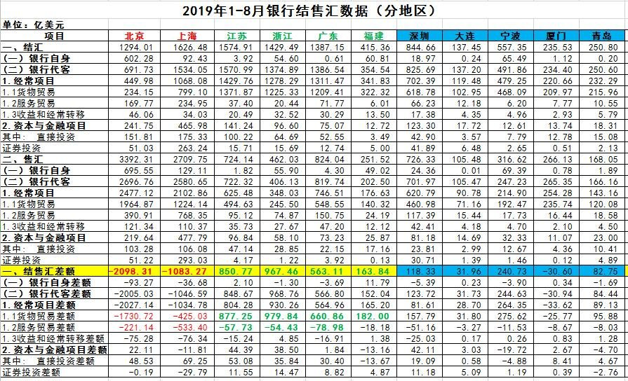

[10月23日 11:30]    纽约时报中文网   @nytchinese    在宣布继位仪式过去六个月后，周二，日本新天皇德仁参加了另一个登基仪式。这一次，他穿着橙色丝绸长袍，登上了宝座。
为什么这两个仪式之间有这么长的时间间隔？天皇宝座、大典服饰有何玄机？时报记者为你详解登基仪式的诸多细节。 https://nyti.ms/2pNe868   :speech_balloon:评:0 :+1:赞:7 :globe_with_meridians:转:2  

[10月23日 11:22]    新闻大吐槽   @TuCaoFakeNews    NBA余波未停：
大鲨鱼奥尼尔：中共不应该告诉我们做什么，而我们也不能告诉他们做什么，这是底线

对等原则搞来搞去，最后只能是分手，彻底脱钩  :speech_balloon:评:2 :+1:赞:35 :globe_with_meridians:转:17  

[10月23日 11:00]    BBC News 中文   @bbcchinese    加拿大大选结果出炉，现任总理特鲁多获得连任。四张图帶你看懂加国大选： https://bbc.in/2JakXWo   :speech_balloon:评:6 :+1:赞:17 :globe_with_meridians:转:4  

[10月23日 11:00]    纽约时报中文网   @nytchinese    • 去年在《纽约时报》匿名发表观点文章的特朗普政府官员将于下月出版一本书。
• 软银接手WeWork：软银已在WeWork上投资了约105亿美元，现在，它将不得不再次向该公司注资数十亿美元。
更多简报内容： https://nyti.ms/2BBjd4o   :speech_balloon:评:0 :+1:赞:0 :globe_with_meridians:转:0  

[10月23日 10:42]    新闻大吐槽   @TuCaoFakeNews    气质完全不同，日本天皇像个老实巴交的普通人，习近平看起来却是个满脸横肉的村干部  :speech_balloon:评:0 :+1:赞:9 :globe_with_meridians:转:1  

[10月23日 10:16]    新闻大吐槽   @TuCaoFakeNews    给你改改  :speech_balloon:评:2 :+1:赞:12 :globe_with_meridians:转:1  

[10月23日 10:00]    BBC News 中文   @bbcchinese    英国首相约翰逊的脱欧法案终于在议会表决中成功过关。但是脱欧时间表被否决。约翰逊寻求提前举行大选？
 https://bbc.in/33LAJ1U   :speech_balloon:评:0 :+1:赞:7 :globe_with_meridians:转:3  

[10月23日 10:00]    纽约时报中文网   @nytchinese    脱欧最新进展：英国议会周二举行了两次投票表决，先是通过了首相约翰逊的脱欧法案，接着否决了他提出的脱欧时间表，即在10月31日的最后期限之前迅速进行必要的立法。现在，欧盟必须决定是否准许英国再次延期。
更多简报内容： https://nyti.ms/2BBjd4o   :speech_balloon:评:2 :+1:赞:3 :globe_with_meridians:转:2  

[10月23日 09:25]    纽约时报中文网   @nytchinese    China Sharpens Hacking to Hound Its Minorities, Far and Wide. Naruhito’s Enthronement: Hasn’t Japan Done This Already? Ukraine Envoy Testifies Trump Linked Military Aid to Investigations.  How to say "posthumous" in Chinese? For more follow us @nytchinese https://cn.nytimes.com/morning-brief/20191023/china-hackers-ethnic-minorities-japan-emperor-naruhito/ …  :speech_balloon:评:1 :+1:赞:7 :globe_with_meridians:转:6  

[10月23日 09:20]    新闻大吐槽   @TuCaoFakeNews    你伤害了一亿三千万日本人民的感情，严重辱日，必须下跪磕头认错道歉剖腹自杀，否则，你国企业将禁止在大日本所属领土上营业  :speech_balloon:评:1 :+1:赞:18 :globe_with_meridians:转:2  

[10月23日 09:12]    新闻大吐槽   @TuCaoFakeNews    韭菜好不容易长肥了  :speech_balloon:评:0 :+1:赞:1 :globe_with_meridians:转:1  

[10月23日 09:10]    新闻大吐槽   @TuCaoFakeNews    说明香港的教育是成功的，年轻的一代是具备独立思考和明辨是非的能力的。  :speech_balloon:评:0 :+1:赞:9 :globe_with_meridians:转:1  

[10月23日 09:03]    纽约时报中文网   @nytchinese    早安！今日重点新闻包括：
中国黑客行动升级；日本天皇德仁登基；美外交官证实特朗普以对乌克兰援助换取政治调查；英国议会通过脱欧协议但否决时间表；波音商用飞机部门负责人将离职；耐克CEO将卸任……简报带你速览今日要闻。 https://nyti.ms/2BBjd4o   :speech_balloon:评:2 :+1:赞:8 :globe_with_meridians:转:3  

[10月23日 08:30]    BBC News 中文   @bbcchinese    香港政府凌晨发稿，拒绝台湾政府要求派员赴港押解陈同佳，并指台方跨境执法，不尊重香港司法管辖权。
 https://bbc.in/2Phg6q6   :speech_balloon:评:53 :+1:赞:45 :globe_with_meridians:转:22  

[10月23日 08:23]    财经真相   @caijingxiang    北京成为外汇消耗最多地区是可以理解，因为中国外汇花费最多的就是政府，尤其是货物贸易采购达到-1730.72亿美元，但是最让人难以理解的是上海，服务贸易逆差比货物逆差还多，是不是可以理解为上海才是中国资本外逃最大的地区！最后还有一个规律，那就是每当中美贸易缓和时，银行结售汇就会转为正！  :speech_balloon:评:1 :+1:赞:86 :globe_with_meridians:转:26  

[10月23日 08:17]    财经真相   @caijingxiang    2019年1-8月银行结售汇-447.48亿美元，经常项目-438.69 
亿，其中货物贸易1111.66亿，服务贸易-1,331.77亿，收益和经常转移-218.58亿；就地区来看，北京是中国外汇逆差最大的地区达到-2098亿，上海以-1083.27位居第二位；外汇顺差最大来源地分别是浙江967.46、江苏850.77、广东
563.11、福建163.84 。  :speech_balloon:评:10 :+1:赞:137 :globe_with_meridians:转:81  

[10月23日 08:10]    新闻大吐槽   @TuCaoFakeNews    像不像？只是脑袋大了一号  :speech_balloon:评:12 :+1:赞:38 :globe_with_meridians:转:3  

[10月23日 08:10]    新闻大吐槽   @TuCaoFakeNews    像不像？只是脑袋大了一号  :speech_balloon:评:12 :+1:赞:38 :globe_with_meridians:转:3  

[10月23日 07:30]    BBC News 中文   @bbcchinese    人们常常羡慕王侯将相、达官贵人的生活，却不知在华丽富足的外表下，这个圈子的人们也可能会经历其艰难时刻。
 https://bbc.in/2o52pPY   :speech_balloon:评:16 :+1:赞:33 :globe_with_meridians:转:5  

[10月23日 07:21]    新闻大吐槽   @TuCaoFakeNews    中共的立法机构，就像个兵工厂，整天没事就琢磨如何给中共的维稳提供趁手的兵器，所以基本上都是超前研制出来预备着。但有个例外，就是法轮功，事前没有看准这个群体，事中和事后同样看不明白这个群体，一直没搞出真正适合法轮功的法律武器，所以卑鄙无耻撕下面具打压为法轮功辩护的律师，即709迫害。  :speech_balloon:评:0 :+1:赞:5 :globe_with_meridians:转:2  

[10月23日 07:10]    新闻大吐槽   @TuCaoFakeNews    中山陵，台湾游客杨汉杰。  :speech_balloon:评:0 :+1:赞:7 :globe_with_meridians:转:4  

[10月23日 07:03]    财经真相   @caijingxiang    美国众议院投票推动立法，要求空壳公司披露所有者信息并更新反洗钱规定。  :speech_balloon:评:5 :+1:赞:155 :globe_with_meridians:转:41  

[10月23日 06:30]    BBC News 中文   @bbcchinese    英国研究人员发现，每年在空气污染指数较高的日子里，医院接收的突发心脏病、中风以及急性哮喘病人的数量就会上升。
 https://bbc.in/2Pa7ull   :speech_balloon:评:2 :+1:赞:18 :globe_with_meridians:转:8  

[10月23日 05:37]    新闻大吐槽   @TuCaoFakeNews    铁民：香港反送中运动给人类带来的巨大收获之一，是使中共的邪恶本质得以暴露得淋漓尽致，让全世界进一步看清中共的丑恶嘴脸及魔鬼本性

一个拥有法治传统的香港，仅仅因为有市民抗议活动，只用了三个月，就变成了失去一切监督的武装人员可以强奸、酷刑和秘密杀人的人间地狱  :speech_balloon:评:16 :+1:赞:66 :globe_with_meridians:转:29  

[10月23日 05:03]    新闻大吐槽   @TuCaoFakeNews    中共的法律是多如牛毛但从不真正执行：中上层有纪律，中下层走关系。只有到了它要整人的时候，它随便从法律武器库中摸出一两件就让你家破人亡，它的法律，是干这个用的。  :speech_balloon:评:4 :+1:赞:26 :globe_with_meridians:转:3  

[10月23日 04:04]    新闻大吐槽   @TuCaoFakeNews    I am looking forward what will happen.... https://twitter.com/TuCaoFakeNews/status/1186400602898649088?s=20 …  :speech_balloon:评:1 :+1:赞:5 :globe_with_meridians:转:3  

[10月23日 03:58]    新闻大吐槽   @TuCaoFakeNews    当年，昌平算是北京城区内很偏远的郊区县，很多创业公司都选择租用郊区Loft当公司办公地址，的确性价比很高，但是没想到区区几年，郊区就变成了市区。外加小产权就是没产权。导致现在政府要拆的话一点法律求助的可能都没有，因为妥妥的都是违建。  :speech_balloon:评:3 :+1:赞:4 :globe_with_meridians:转:2  

[10月23日 03:44]    新闻大吐槽   @TuCaoFakeNews     https://twitter.com/tucaofakenews/status/1186436144390496256?s=21 …  :speech_balloon:评:1 :+1:赞:3 :globe_with_meridians:转:1  

[10月23日 03:36]    新闻大吐槽   @TuCaoFakeNews    聽到這個孩子一番慷慨激昴的說話後，我也哭了，是因為感動而哭。試問，香港社會有如此強烈正義感和如此清晰是非觀的年輕一代，共魔怎麼可能會征服得了香港？！分明就是痴心妄想！  :speech_balloon:评:0 :+1:赞:12 :globe_with_meridians:转:1  

[10月23日 03:35]    新闻大吐槽   @TuCaoFakeNews    看着真揪心，这个所谓的"祖国"，什么都管，连女人的子宫都不放过，可该管的医疗养老等等却什么都不管。  :speech_balloon:评:37 :+1:赞:272 :globe_with_meridians:转:133  

[10月23日 03:03]    BBC News 中文   @bbcchinese    英国首相约翰逊的脱欧法案终于在议会表决中成功过关。但是脱欧时间表被否决。约翰逊寻求提前举行大选？
 https://bbc.in/2MBWefE   :speech_balloon:评:1 :+1:赞:13 :globe_with_meridians:转:8  

[10月23日 02:59]    新闻大吐槽   @TuCaoFakeNews    不如喊「光复香堂，时代革命」，
诉求不解决，就一直喊 https://twitter.com/dajiyuan/status/1186530240262074368 …  :speech_balloon:评:6 :+1:赞:32 :globe_with_meridians:转:8  

[10月23日 01:48]    BBC News 中文   @bbcchinese    香港政府当地时间23日凌晨发稿，拒绝台湾政府去函要求派员赴港押解陈同佳，并指台方跨境执法，不尊重香港司法管辖权。台湾陆委会发言人邱垂正对此表示，若陈嫌逃亡、串证等，港府须负全责。
 https://bbc.in/2MDMO3q   :speech_balloon:评:62 :+1:赞:94 :globe_with_meridians:转:52  

[10月22日 23:45]    BBC News 中文   @bbcchinese    截至BBC中文发稿，香港政府暂时未有回应。台陆委会副主委兼发言人邱垂正周二晚间呼吁港府负起责任。 https://bbc.in/2o7ECyV   :speech_balloon:评:12 :+1:赞:53 :globe_with_meridians:转:8  

[10月22日 22:00]    纽约时报中文网   @nytchinese    我女儿七周大的时候在中国宜兴的一座桥上被人发现时，她的毛衣上别着一张纸条。
我一直以为，让我的女儿找到亲生父母的，找回血脉和根源的唯一希望就是那张纸条。于是，在一次中国旅行中，我们踏上了去宜兴的路。 https://nyti.ms/2MCAeSb   :speech_balloon:评:4 :+1:赞:78 :globe_with_meridians:转:37  

[10月22日 21:00]    纽约时报中文网   @nytchinese    蒂姆·库克的身家估计在数亿美元，他说自己每天凌晨3点45分起床；埃隆·马斯克身家约230亿美元，他把自己每周120小时的“疯狂”工作时间调至更“好对付”的80或90小时，还觉得这是一种胜利。
多年来的研究表明，富人的工作时间更长，社交时间更少。许多普通人想知道：为什么会这样？ https://nyti.ms/32ygJj0   :speech_balloon:评:20 :+1:赞:170 :globe_with_meridians:转:76  

[10月22日 20:13]    墙国铁拳现世报😷   @Socialistfist    網上有帖文指毛漢參與7月20日的守護香港集會，他澄清，幾個月前有人邀請他出席集會，他於台上是說希望香港恢復和平及希望政府了解年輕人多點。他強調自己不是「撐警」，稱現時才知道自己當時出席的場合是「撐警」集會，並說之後有其他「撐警」集會他都沒參加。
我相信他不是撐警～  :speech_balloon:评:4 :+1:赞:30 :globe_with_meridians:转:9  

[10月22日 20:02]    BBC News 中文   @bbcchinese    【如厕新境界！原来你一直的坐姿都是错的】你知道吗？你一直以来如厕的坐姿都可能是错的，让我们告诉你原因。 https://bbc.in/2N3Hp4x   :speech_balloon:评:7 :+1:赞:21 :globe_with_meridians:转:14  

[10月22日 20:00]    纽约时报中文网   @nytchinese    过去三年，中国政府支持的黑客行动以有选择的攻击取代了此前漫无目的的行动。中国的黑客建立了一个新的技术武器库，比如对iPhone和安卓软件进行精密的黑客攻击，不再局限于电子邮件攻击和其他较基础的手段。主要针对的则是中国的少数民族和这些少数民族在其他国家的侨民。 https://nyti.ms/31GzgIV   :speech_balloon:评:38 :+1:赞:141 :globe_with_meridians:转:69  

[10月22日 19:01]    BBC News 中文   @bbcchinese    泰国王室上演现实版“宫斗剧”，泰国国王册封新贵妃不足三个月，剥夺其全部封号。 https://bbc.in/2p2jACl   :speech_balloon:评:16 :+1:赞:88 :globe_with_meridians:转:28  

[10月22日 19:00]    纽约时报中文网   @nytchinese    #观点 中共会以秩序、民族荣光和所谓“中国特色社会主义”的代言人自居，以此作为其统治的依据。它究竟是什么性质、人们是否真的相信都不重要。重要的是，这种形式的社会主义会强迫人们服从。而只要党依然掌权，国家对精神和知识生活的控制，将阻止人们找到任何可行的替代方案。 https://nyti.ms/33PsaTH   :speech_balloon:评:44 :+1:赞:84 :globe_with_meridians:转:22  

[10月22日 18:31]    BBC News 中文   @bbcchinese    加泰罗尼亚人也高喊：“我们要像香港那样做一次。” https://bbc.in/2pGyT3x   :speech_balloon:评:129 :+1:赞:573 :globe_with_meridians:转:144  

[10月22日 18:00]    BBC News 中文   @bbcchinese    摩洛哥的司机怎么跟警察斗法？ https://bbc.in/2N4rz9M   :speech_balloon:评:0 :+1:赞:10 :globe_with_meridians:转:4  

[10月22日 18:00]    纽约时报中文网   @nytchinese    特鲁多精心打造的形象今年开始出现裂痕。他的前总检察长、前司法部长王州迪向他发起指控，称特鲁多在如何处理针对一家大型工程公司的刑事腐败案件上对她不当施压。当竞选活动开始时，特鲁多似乎已从争议中恢复元气。但随后他打扮成棕脸和黑脸的照片出现了，让他再度陷入争议。 https://nyti.ms/2P9vVzs   :speech_balloon:评:0 :+1:赞:5 :globe_with_meridians:转:0  

[10月22日 17:59]    墙国铁拳现世报😷   @Socialistfist    补图  :speech_balloon:评:2 :+1:赞:88 :globe_with_meridians:转:11  

[10月22日 17:58]    墙国铁拳现世报😷   @Socialistfist    墙内一阵子狂喷  :speech_balloon:评:6 :+1:赞:44 :globe_with_meridians:转:9  

[10月22日 17:51]    墙国铁拳现世报😷   @Socialistfist    14年的战螂
15年的粉红
16年的愤青
17年的反贼
「我们终于还是成为了我们当初讨厌的人」

#社会主义铁拳  :speech_balloon:评:26 :+1:赞:305 :globe_with_meridians:转:93  

[10月22日 17:34]    财经真相   @caijingxiang    中国商务部：美商务部日前发布公告，称将自10月31日起对中国3000亿美元加征关税清单产品启动排除程序。如果排除申请得到批准，自2019年9月1日起已经加征的关税可以追溯返还。该消息公布后离岸人民币汇率几无波动！  :speech_balloon:评:29 :+1:赞:209 :globe_with_meridians:转:62  

[10月22日 17:30]    纽约时报中文网   @nytchinese    #观点 我是个杀死婴儿的人。
我的女儿被诊断出严重的脑部异常后，我和丈夫选择结束她的生命，而不是给她一个充满痛苦与折磨的人生。比起被告知你的孩子将会受苦，然后被剥夺任何保护她的能力，它是否不那么野蛮？ https://nyti.ms/33QFuqT   :speech_balloon:评:13 :+1:赞:39 :globe_with_meridians:转:5  

[10月22日 17:01]    BBC News 中文   @bbcchinese    除了金正恩的白马照外，还有什么政客照片也备受瞩目？ https://bbc.in/2W2Gohc   :speech_balloon:评:15 :+1:赞:36 :globe_with_meridians:转:11  

[10月22日 17:00]    纽约时报中文网   @nytchinese    在韩国，白领60多岁时的工资和职称往往可以根据他们上了哪所大学来预测。在好大学占个位置的竞争是从幼儿园开始的，除了每月花费巨额请家教，有关系的家庭常常会用一些可疑的策略让子女进入最好的大学。 https://nyti.ms/2N3Acl4   :speech_balloon:评:11 :+1:赞:24 :globe_with_meridians:转:8  

[10月22日 16:41]    老司机   @h5lpykl7tp6jjop    【关注香港】10月21日 晚21:00左右，示威者张嘉琪（音）被黑警粗暴对待，被扯出内衣不算。突然，众目睽睽之下，男性黑警伸手抚摸女孩臀部？那么关小黑屋后会发生什么！！！请广传救人。  :speech_balloon:评:2 :+1:赞:19 :globe_with_meridians:转:15  

[10月22日 16:01]    BBC News 中文   @bbcchinese    10月22日，日本举行日本天皇登基大典“即位礼正殿之仪”。在这新旧交替之年，被首相安倍晋三称为巨大历史转折点。 https://bbc.in/2W9LCrO   :speech_balloon:评:7 :+1:赞:94 :globe_with_meridians:转:20  

[10月22日 16:00]    纽约时报中文网   @nytchinese    尽管香港看上去团结，但调查显示，香港居民对文化上的外来者越来越不信任，种族、年龄和阶层的分化也越来越严重。当地人说，许多家庭因政治分歧而分裂。在抗议活动中，混战爆发的频率越来越高。 https://nyti.ms/2J8gzqZ   :speech_balloon:评:27 :+1:赞:81 :globe_with_meridians:转:25  

[10月22日 15:36]    GFHG SDKM   @zyx_yny    尊重係中國人應有既素質，而香港人更需要一個識尊重人、尊重宗教既特首。
從小圈子選舉揀左林鄭咁無素質既人做特首就知制度有問題，解決方法只有真普選。

光復香港 時代革命
五大訴求 決一不可  :speech_balloon:评:2 :+1:赞:99 :globe_with_meridians:转:15  

[10月22日 15:30]    纽约时报中文网   @nytchinese    特鲁多可能因为一个缺乏明星影响力的竞争对手而受益：保守党领袖安德鲁·希尔。希尔在竞选中把重点放在特鲁多的人品上——称他是一个“总是戴着面具”的“骗子”——而不是除了减税之外，为这个国家提出他自己定义的愿景。 https://nyti.ms/2P9vVzs   :speech_balloon:评:1 :+1:赞:8 :globe_with_meridians:转:0  

[10月22日 15:12]    BBC News 中文   @bbcchinese    2024年巴黎奥运会及残奥会的标志面世了！一个简单的图案，将奥运金牌、圣火及代表自由与理性的法国国家象征——玛丽安娜（Marianne）——集于一体。  :speech_balloon:评:10 :+1:赞:106 :globe_with_meridians:转:23  

[10月22日 15:00]    纽约时报中文网   @nytchinese    为什么香港抗议僵局难解？这里是来自时报记者的一份分析。 https://nyti.ms/2MshxAp   :speech_balloon:评:12 :+1:赞:17 :globe_with_meridians:转:6  

[10月22日 14:35]    老司机   @h5lpykl7tp6jjop    好惊人！要吓尿全部地球人！  :speech_balloon:评:4 :+1:赞:15 :globe_with_meridians:转:6  

[10月22日 14:30]    纽约时报中文网   @nytchinese    随着文在寅一直努力应对经济疲弱和许多年轻人缺乏就业机会的问题，这一丑闻已成为其总统任期内最大的尴尬。该丑闻尤其激起了人们对精英家庭“金汤匙”子女的愤怒，这些子女能顺利地进入一流大学，找到轻松的工作，让他们的“土汤匙”同龄人在韩国困难重重的经济中苦苦挣扎。 https://nyti.ms/2N3Acl4   :speech_balloon:评:0 :+1:赞:21 :globe_with_meridians:转:8  

[10月22日 14:00]    纽约时报中文网   @nytchinese    #每日一词 phantasmagoria
继引发弹劾调查的美乌领导人“电话门”之后，特朗普总统再次因为G7峰会选址争议被批滥权。时报专栏作家布鲁尼指出，特朗普政府展现出的“phantasmagoria”（变幻无常）毫不掩饰地展示了它的腐败。 https://nyti.ms/31AT5Ru   :speech_balloon:评:4 :+1:赞:12 :globe_with_meridians:转:1  

[10月22日 13:30]    纽约时报中文网   @nytchinese    #观点 尽管毛泽东不仅曾将矛头指向他所谓的“阶级敌人”，还发动了多达200万人被害的文化大革命。但他统一国家、恢复民族自豪感的壮举，仍让许多中国人尊重他的遗产，中共持续垄断权力的合法性也得以持续到今天，这是为什么？
学者马毅仁(Ian Buruma)给出了他的看法。 https://nyti.ms/33PsaTH   :speech_balloon:评:81 :+1:赞:181 :globe_with_meridians:转:72  

[10月22日 13:11]    老司机   @h5lpykl7tp6jjop    黎明何時來到？！  :speech_balloon:评:44 :+1:赞:310 :globe_with_meridians:转:251  

[10月22日 13:00]    BBC News 中文   @bbcchinese    一名香港高级警官对BBC说，他们是唯一可以在这关头保护香港的人，只有警方有能力令这个城市不会陷于混乱和破坏。 https://bbc.in/2W07o15   :speech_balloon:评:241 :+1:赞:304 :globe_with_meridians:转:68  

[10月22日 13:00]    纽约时报中文网   @nytchinese    今日食谱：经典苹果派，难忘好滋味。
更多简报内容： https://nyti.ms/33Nh69J   :speech_balloon:评:0 :+1:赞:5 :globe_with_meridians:转:0  

[10月22日 12:30]    纽约时报中文网   @nytchinese    在香港，曾经在国际化的社交圈很少见到的象征国家身份的旗帜和歌曲，正变得越来越常见。越来越多的人转向了一种更封闭、更强烈、更狭隘也更具对抗性的身份。香港人和中国人这两种长期互补的身份，突然间变得互不相容。 https://nyti.ms/2J8gzqZ   :speech_balloon:评:50 :+1:赞:196 :globe_with_meridians:转:57  

[10月22日 10:17]    财经真相   @caijingxiang    最新猪肉行情：猪肉价格再次迎来大涨，想做腊肉无望！  :speech_balloon:评:50 :+1:赞:282 :globe_with_meridians:转:97  

[10月22日 10:00]    BBC News 中文   @bbcchinese    中国人正在疯狂购买毕加索画作，日本和韩国也大量展出毕加索作品。到底是什么让毕加索的作品在亚洲产生了共鸣？
 https://bbc.in/35SnuOB   :speech_balloon:评:40 :+1:赞:41 :globe_with_meridians:转:13  

[10月22日 08:59]    BBC News 中文   @bbcchinese    克里特岛抵抗运动重创了德军士气，可能是希特勒入侵苏联失败的原因之一。
 https://bbc.in/2pIZ75i   :speech_balloon:评:7 :+1:赞:25 :globe_with_meridians:转:8  

[10月22日 08:29]    BBC News 中文   @bbcchinese    约翰逊拿回伦敦的“新协议”提交议会投票，要求一再遭拒命运未卜。面对英国首相同时发来的自打嘴巴的两封信，欧盟只能做壁上观。
 https://bbc.in/2MWUgWi   :speech_balloon:评:10 :+1:赞:7 :globe_with_meridians:转:3  

[10月22日 07:59]    BBC News 中文   @bbcchinese    一名香港示威领袖人物遭袭之后，使当地少数族群成为新聚焦点；一些少数族群成员以实际行动显示团结。
 https://bbc.in/35TEYKu   :speech_balloon:评:35 :+1:赞:52 :globe_with_meridians:转:17  

[10月22日 06:48]    老司机   @h5lpykl7tp6jjop    什么规则在中国人眼里都是小菜一碟，北京女在美与警察超速飙车被撞停，反而不服想反告警察，一句我没听见警笛说得好轻松！  :speech_balloon:评:19 :+1:赞:63 :globe_with_meridians:转:26  

[10月22日 00:07]    老司机   @h5lpykl7tp6jjop      :speech_balloon:评:0 :+1:赞:3 :globe_with_meridians:转:4  

[10月21日 23:32]    老司机   @h5lpykl7tp6jjop    【1021元朗】
警察粗口‘D'市民，一女子回罵：你老婆被人’D'，一玻璃心警察隨即發癲。

看來說到他的痛處！  :speech_balloon:评:134 :+1:赞:1302 :globe_with_meridians:转:737  

[10月21日 22:06]    墙国铁拳现世报😷   @Socialistfist    @remonwangxt 辣椒老师是否可以作为新漫画创意  :speech_balloon:评:1 :+1:赞:29 :globe_with_meridians:转:0  

[10月21日 21:20]    老司机   @h5lpykl7tp6jjop    谁在玩栽贓嫁禍？发推前请先GOOGLE一下，有视频有真相。  :speech_balloon:评:4 :+1:赞:20 :globe_with_meridians:转:12  

[10月21日 21:17]    墙国铁拳现世报😷   @Socialistfist    补图  :speech_balloon:评:4 :+1:赞:72 :globe_with_meridians:转:13  

[10月21日 21:16]    老司机   @h5lpykl7tp6jjop    战记：邓两只猫与习一只鼠。黑白猫的生命力与习一人独尊的死亡力。白猫黑猫抓住老鼠就是好猫，这句话是中国四十年富强的基石。一句俗话成中共走向普世的基础理论。习几年折腾完中共家底，只能靠镇压维持国体。现在中国人无疑怀念邓两只猫，可门外就是满国的军警脸监鼠辈横行。希望中国走向绝望中国。 https://twitter.com/5xyxh/status/1186104350403366912 …  :speech_balloon:评:1 :+1:赞:47 :globe_with_meridians:转:26  

[10月21日 20:37]    墙国铁拳现世报😷   @Socialistfist    前香港印度协会主席曾经出现在支持香港警察的最前线。近日被高压水枪喷过后，出现在谴责香港警察的最前线
高压水枪的蓝色物质具有刺激性成分，会使人睁不开眼，咳嗽不止，并容易被警察辨识抓捕。

#社会主义铁拳
#社会主义特别行政区铁拳  :speech_balloon:评:41 :+1:赞:369 :globe_with_meridians:转:136  

[10月21日 18:16]    墙国铁拳现世报😷   @Socialistfist    有热心推友创立的电报群，同步更新的推特内容，喜欢用电报的可以关注
感谢这位推友的无私帮助 http://t.me/socialistfist   :speech_balloon:评:1 :+1:赞:44 :globe_with_meridians:转:7  

[10月21日 17:31]    老司机   @h5lpykl7tp6jjop    银行的工作人员面面相觑，不知如何作答。

这时，一个刚实习不久的小姑娘幽幽地说:”大爷，你把钱存我们银行这么长时间，银行工作人员给你看着钱，他们不用吃饭吗？难道饿得两眼发白给你看钱吗？隔三差五吃你一碗牛肉面也很正常的啊!”  :speech_balloon:评:5 :+1:赞:97 :globe_with_meridians:转:10  

[10月21日 17:29]    老司机   @h5lpykl7tp6jjop    一位大爷在银行发火说：

“十年前，牛肉面4元一碗，我在银行存了10000元，相当于存了2500碗牛肉面。现在，牛肉面都涨到10元了，我存的10000元连本带利你们才给我13500元，相当于只剩下了1350碗牛肉面！我就想知道另外的1150碗牛肉面去哪儿了？”  :speech_balloon:评:23 :+1:赞:277 :globe_with_meridians:转:78  

[10月21日 17:24]    墙国铁拳现世报😷   @Socialistfist    补充  :speech_balloon:评:4 :+1:赞:54 :globe_with_meridians:转:11  

[10月21日 17:23]    墙国铁拳现世报😷   @Socialistfist    自称在被房地产开发商骗取80万并且维权无果，患上抑郁症后。9月29后突然高频的在微博上关注香港局势。
发帖还债还是抑郁病发？

#社会主义铁拳  :speech_balloon:评:36 :+1:赞:187 :globe_with_meridians:转:69  

[10月21日 15:59]    老司机   @h5lpykl7tp6jjop    无论你走到哪里，因为你说真话，而让党和国家形象受损，那么很容易就会有意外发生！这是现实生活存在的一个恐怖的现象！  :speech_balloon:评:0 :+1:赞:24 :globe_with_meridians:转:12  

[10月21日 14:57]    财经真相   @caijingxiang    国家电影局电影公映许可证，新电影《催眠•裁决》审核通过，好莱坞电影也要有这玩意儿吗？推友当中有知道的吗？  :speech_balloon:评:12 :+1:赞:70 :globe_with_meridians:转:22  

[10月21日 12:08]    财经真相   @caijingxiang    遵义市约谈早餐店涨价！  :speech_balloon:评:27 :+1:赞:175 :globe_with_meridians:转:66  

[10月21日 11:48]    财经真相   @caijingxiang    库德洛VS纳瓦罗 ！ https://twitter.com/chinesewsj/status/1186113880042418183 …  :speech_balloon:评:3 :+1:赞:28 :globe_with_meridians:转:8  

[10月21日 10:42]    老司机   @h5lpykl7tp6jjop    赵忠祥的书法，周小平的文章，吴京的电影，刘一秒的讲座，申大妈的正能量......以及快手、抖音、拼多多，都是这个时代的最典型的“标配”！

这不是大时代，也不是小时代，而是“二”时代！十三亿普罗大众，都在磕磕碰碰、结结巴巴地紧跟这个“二”时代，惟恐自己落伍了！  :speech_balloon:评:16 :+1:赞:218 :globe_with_meridians:转:74  

[10月21日 10:34]    财经真相   @caijingxiang    好莱坞如果开始反中共，其影响力是巨大的，时至今日中国大陆的小年轻不关心政治是常态，但是却很愿意为看电影翻墙！ https://twitter.com/USA_China_Talk/status/1186104831083208704 …  :speech_balloon:评:24 :+1:赞:608 :globe_with_meridians:转:139  

[10月21日 09:57]    GFHG SDKM   @zyx_yny    中国內地網民支持攻擊清真寺
認為警方不應道歉
建議香港實施新疆「再教育營」

Chinese mainlander support the water canon attack on kowloon mosque by #HKPolice  :speech_balloon:评:377 :+1:赞:3519 :globe_with_meridians:转:3464  

[10月21日 09:28]    财经真相   @caijingxiang    以前经济快速发展时禁止农民用宅基地抵押贷款，导致农民没有原始资本被迫沦为“农民工”，现在产能严重过剩，央行印钞缺少抵押物时，他们终于放开政策，问题是现在农民贷款可以干啥赚钱？  :speech_balloon:评:23 :+1:赞:143 :globe_with_meridians:转:31  

[10月21日 09:06]    财经真相   @caijingxiang    当前中国广大农村地区，正在进行轰轰烈烈的宅基地测量申报活动，村委说这次测量目的是为了农民用宅基地作为抵押贷款，但是民间盛传一户一宅，多余的宅子会被政府收回，导致农民现在疯狂买砖盖房，分家上户口，种种乱象背后都是源于农民无恒产的恐惧，当然不排除中共借此寻找新的抵押物进行扩表印钞！ https://twitter.com/ReutersCN/status/1186082720386076672 …  :speech_balloon:评:20 :+1:赞:334 :globe_with_meridians:转:145  

[10月21日 09:04]    老司机   @h5lpykl7tp6jjop    黄鼠狼跟鸡说，把你下的蛋每个月给我几个，我帮你存着，等你老了不能下蛋了，我再还给你 ......
就这样，整个村里的鸡都按照约定把蛋给了黄鼠狼，
黄鼠狼就每天胡吃海喝 ......
鸡老了，想问黄鼠狼取回蛋的时候 ......
黄鼠狼又喝了一顿老母鸡汤。  :speech_balloon:评:18 :+1:赞:661 :globe_with_meridians:转:282  

[10月21日 08:45]    财经真相   @caijingxiang    市场原本预计英镑会在周一距离波动，谁知又是一次“西线无战事”，横盘走势估计会让很多国内定闹钟五点起床的交易员跌眼镜！  :speech_balloon:评:2 :+1:赞:37 :globe_with_meridians:转:3  

[10月21日 08:36]    财经真相   @caijingxiang    国资委：前三季度，中央企业收入累计实现营业收入22.1万亿元，同比增长5.3%；累计实现净利润10567亿元，同比增长7.4%；有效投资稳步增长，完成固定资产投资1.6万亿元，同比增长6.8%；研发投入快速增长，同比增长25%；资产负债率稳中有降，9月末中央企业平均资产负债率为65.7%，同比下降0.2个百分点。  :speech_balloon:评:10 :+1:赞:52 :globe_with_meridians:转:11  

[10月21日 05:03]    老司机   @h5lpykl7tp6jjop    马克思愚蠢之处就在于认为资本为了更多的利润，只有加大对工人的剥削，于是工人终于会革命，中共也继承了这种一根筋思维，认为帝国主义亡我之心不死，不是东风压了西风 就是西风压了东风，除了阴谋诡计它们不会让步，民主政治就是妥协的制度，这是他们不断发展壮大的原因，而强硬的中共必然亡于强硬！  :speech_balloon:评:4 :+1:赞:31 :globe_with_meridians:转:2  

[10月21日 04:25]    老司机   @h5lpykl7tp6jjop    中共当局在镇压香港人上是否意识到一个难题，即暴力大肆抓捕勇武派并不能让和理非的人们停止上街示威游行！而适得其反的是参加游行示威的人越来越多！那么除了让人们更加愤怒以外，能达到什么目的？除了证明自己无能为力什么也不能证明！这就是中共末期暴力愚蠢的结果，让人们知道除了推翻它们没有别的  :speech_balloon:评:0 :+1:赞:20 :globe_with_meridians:转:3  

[10月21日 03:20]    GFHG SDKM   @zyx_yny    Unrest continues unabated in Hong Kong as tens of thousands march on Rail Terminus
 https://ti.me/2BrzWH9   :speech_balloon:评:289 :+1:赞:3429 :globe_with_meridians:转:2429  

[10月21日 01:58]    老司机   @h5lpykl7tp6jjop    众志成城！ https://twitter.com/tucaofakenews/status/1185841289251569666 …  :speech_balloon:评:0 :+1:赞:19 :globe_with_meridians:转:6  

[10月21日 00:28]    老司机   @h5lpykl7tp6jjop    人有三个局限性 :

时间的局限性，故夏虫不可语冰；

空间的局限性，故井蛙不可语海；

认知的局限性，故凡夫不可语道。  :speech_balloon:评:22 :+1:赞:687 :globe_with_meridians:转:252  

[10月20日 23:21]    GFHG SDKM   @zyx_yny    A pigeon was affected by tear gas. The Hong Kong protesters used water to let it feel more comfort. #HongKongProtesters #HongKong #Love #animal  :speech_balloon:评:682 :+1:赞:16071 :globe_with_meridians:转:11052  

[10月20日 21:56]    GFHG SDKM   @zyx_yny    Police in #HongKong deliberately sprayed blue irritant liquid on Kowloon Mosque.

#China #HongKongProtests  :speech_balloon:评:161 :+1:赞:1445 :globe_with_meridians:转:1527  

[10月20日 17:56]    GFHG SDKM   @zyx_yny    More people have shown up to clean the mosque.  For those wondering why #HKPolice deliberately targeted the mosque, look no further than how China treats Uyghurs in Xinjiang

#HongKong #HongKongProtests  :speech_balloon:评:91 :+1:赞:3237 :globe_with_meridians:转:2254  

[10月20日 17:56]    GFHG SDKM   @zyx_yny    Follow up: 
In times of trouble we see unity and love. https://twitter.com/pentanov/status/1185855642889641984?s=19 …  :speech_balloon:评:11 :+1:赞:628 :globe_with_meridians:转:466  

[10月20日 17:46]    GFHG SDKM   @zyx_yny    After @hkpoliceforce used water cannon filled with blue chemicals to attack Kowloon Mosque and Islamic Centre, HK people are now cleaning it.

#standwithhongkong #standwithhk #hkprotests #HKPoliceTerrorism #hkpolicebrutality #hkpolicestate  :speech_balloon:评:2 :+1:赞:6 :globe_with_meridians:转:12  

[10月20日 16:42]    GFHG SDKM   @zyx_yny    I hope to apologize to Muslims.
I am sorry that this sad situation has occurred in Hong Kong.
I am angry and sad about the actions of the Hong Kong police.
Can we help Muslims?
We really feel sorry.  :speech_balloon:评:283 :+1:赞:3998 :globe_with_meridians:转:3395  

[10月20日 16:38]    GFHG SDKM   @zyx_yny    #HKPF aim water cannon jets directly at a Muslim mosque during a protest today. Crowd consists of mostly journalists & several protestors. Absolutely unnecessary.

#HKGov has no respect for ppl from any religion, culture or background.

#5Nov4HK
#antichinazi
#StandWithHongKong  :speech_balloon:评:589 :+1:赞:7164 :globe_with_meridians:转:8642  

[10月20日 16:35]    GFHG SDKM   @zyx_yny    Passerby helping to clean the mosque after the huge blast of blue water from the cannon. Muslim bystanders here shocked and offended that they would do this to their place of worship. HK people comforting them  :speech_balloon:评:743 :+1:赞:14357 :globe_with_meridians:转:11112  

[10月20日 16:29]    GFHG SDKM   @zyx_yny    The Kowloon Mosque and Islamic Centre was attacked by Police water cannon filled with blue chemicals!

#FiveDemandsNotOneLess #StandWithHK #HongKongProtests  :speech_balloon:评:1304 :+1:赞:10379 :globe_with_meridians:转:12121  

[10月20日 16:26]    GFHG SDKM   @zyx_yny    #HKPolice assaults mosque with water cannon! It's INSANE!!! #StandWithHK #HKPoliceTerrorism #hkpolicebrutality #HKPoliceState  :speech_balloon:评:307 :+1:赞:5352 :globe_with_meridians:转:6156  

[10月20日 16:25]    GFHG SDKM   @zyx_yny    HK POLICE has no respect on the religious.  Shooting blue dyed water to the Islam sanctum. 
#PoliceBrutalitiy
#Islam
#HKPoliceTerrorism  :speech_balloon:评:237 :+1:赞:1763 :globe_with_meridians:转:1454  

[10月20日 16:20]    GFHG SDKM   @zyx_yny    Before VS after

Many #HongKongProtesters were outside  Kowloon Mosque and Islamic Centre, urging people to respect the premise and not damage the property.

Police just opened up with the water cannon on the Kowloon Mosque. 

#StandWithHongKong
#FreedomHK  :speech_balloon:评:925 :+1:赞:11759 :globe_with_meridians:转:12319  

[10月20日 14:04]    GFHG SDKM   @zyx_yny    hong kong loves catalans  :speech_balloon:评:0 :+1:赞:2 :globe_with_meridians:转:2  

[10月20日 12:40]    GFHG SDKM   @zyx_yny    "We're all Hongkongers. No difference."

Outside of Chungking Mansions, Southeast Asian were handing out water to pro-democracy protesters in support of their movement, stating that they're all Hongkongers and also want a democratic Hong Kong. 

#HongKongProstests #hongkong  :speech_balloon:评:102 :+1:赞:2681 :globe_with_meridians:转:1633  

[10月20日 11:28]    老司机   @h5lpykl7tp6jjop    香港最近有市民在葵涌家中被捕，理由是在网络上煽动别人参予抗争。

香港已迅速成为一个极度管制言论自由的地方。

市民除了为手机设立密码外，也应该立刻为SIM卡和云记忆亦设立密码，以防警察得到手机上网及通迅内容。  :speech_balloon:评:5 :+1:赞:34 :globe_with_meridians:转:25  

[10月20日 09:51]    财经真相   @caijingxiang    如果说谷歌、推特等媒体为了钱可能昧良心与中共勾兑的话，那么脸书就不是要不要脸的问题，而是他是不是“赵家人”的问题，因为成为该委会顾问就意味是中共“自家人”，这也是我从不敢用facebook的原因，香港学生现在竟然还用脸书发布运动信息，真是天真到家了！  :speech_balloon:评:20 :+1:赞:299 :globe_with_meridians:转:86  

[10月20日 09:33]    财经真相   @caijingxiang    扎女婿是清华管理学院顾问委员成员，该委员会成员包含了中共金融系统内几乎所有核心人物，由此可见扎女婿与中共的密切合作关系，他说了几句抖音海外扩张的话，就说扎女婿觉醒了，未免有点太天真！  :speech_balloon:评:8 :+1:赞:368 :globe_with_meridians:转:123  

[10月20日 07:59]    新闻大吐槽   @TuCaoFakeNews    油管up主PewDiePie是油管第一网红，有一亿粉丝，前几天他节目中，谈到了香港抗争和小熊维尼，被中共封杀。可他并不怂，又出来回怼！

作为第一网红，他不但会左右粉丝对中共的看法，还会带动众多中V、小V加入话题讨论，引发连锁效应！

中共是不是很后悔，早知道不惹他了！  :speech_balloon:评:116 :+1:赞:2927 :globe_with_meridians:转:1137  

[10月20日 06:29]    凡賽堤/FORSETI   @FecharCCP    【#共产罪恶】香港中文大学女生吴傲雪（Sonia）在哭诉被拘留期间，遭到港警性暴力之后，连日来收到多封恐吓信及短消息，威胁她若再出面发声，将绑架及轮奸她，信中甚至写明“施暴计划”。
10/18周五吴傲雪在记者会上，公布她收到的恐吓及骚扰信，这些信中，有不少是用简体字书写，被怀疑来自中国大陆。  :speech_balloon:评:29 :+1:赞:405 :globe_with_meridians:转:279  

[10月20日 06:04]    凡賽堤/FORSETI   @FecharCCP    魔鬼在人間39

極權殺人恐怖組織正在用各種兇殘手段殺害我們的同胞....................................................................................................

魔鬼的罪行！被刺殺，身處多刀，肚腸都跑出來！  :speech_balloon:评:1 :+1:赞:6 :globe_with_meridians:转:7  

[10月20日 06:02]    凡賽堤/FORSETI   @FecharCCP    魔鬼在人間39

極權殺人恐怖組織正在用各種兇殘手段殺害我們的同胞....................................................................................................

魔鬼的罪行！已被殺  :speech_balloon:评:0 :+1:赞:3 :globe_with_meridians:转:3  

[10月19日 22:29]    老司机   @h5lpykl7tp6jjop    台灣人「#不相信」
和平統一 一國兩制
【視訊一】  :speech_balloon:评:31 :+1:赞:528 :globe_with_meridians:转:271  

[10月19日 18:31]    GFHG SDKM   @zyx_yny    DISTURBING 
#Uyghur #Muslim in a torture device called a “Tiger Chair”

#Chinese Police officers sending a message to activists like myself: “Come and Save him if you can”

I want my followers and believers in free expression to send YOUR message to #China by commenting below  :speech_balloon:评:1744 :+1:赞:19200 :globe_with_meridians:转:29469  

[10月19日 11:10]    GFHG SDKM   @zyx_yny    Don’t forget 721. Gangster attacked protesters and citizens, police stepped aside. 

#721yuenlong
#StandWithHongKong
#HongKongProstests  :speech_balloon:评:30 :+1:赞:310 :globe_with_meridians:转:250  

[10月19日 10:36]    凡賽堤/FORSETI   @FecharCCP    極權殺人恐怖組織的兇殘超乎人類想像  :speech_balloon:评:0 :+1:赞:2 :globe_with_meridians:转:0  

[10月19日 10:34]    凡賽堤/FORSETI   @FecharCCP    魔鬼在人間39

極權殺人恐怖組織正在用各種兇殘手段殺害我們的同胞....................................................................................................

魔鬼的罪行！黑警群毆直接致命打頭的兇殘  :speech_balloon:评:3 :+1:赞:62 :globe_with_meridians:转:43  

[10月19日 10:31]    凡賽堤/FORSETI   @FecharCCP    魔鬼在人間39

極權殺人恐怖組織正在用各種兇殘手段殺害我們的同胞....................................................................................................

魔鬼的罪行！地鐵車廂暴打無辜港民  :speech_balloon:评:0 :+1:赞:27 :globe_with_meridians:转:25  

[10月19日 10:19]    财经真相   @caijingxiang    从涨价去库存，到六稳，再到三保，尽管尽量掩饰经济下滑，但是从这些官方用词里，也能感受到中国经济瑟瑟寒风！  :speech_balloon:评:23 :+1:赞:390 :globe_with_meridians:转:80  

[10月19日 08:43]    财经真相   @caijingxiang    这是真账号吗？怎么有点小孩斗嘴的感觉？这架势就是撕破脸的节奏啊！ https://twitter.com/usa_china_talk/status/1185160722440830976 …  :speech_balloon:评:20 :+1:赞:127 :globe_with_meridians:转:25  

[10月19日 08:03]    墙国铁拳现世报😷   @Socialistfist    她要是手抖@一个云南网警，是不是就进去了？  :speech_balloon:评:13 :+1:赞:76 :globe_with_meridians:转:11  

[10月19日 07:48]    墙国铁拳现世报😷   @Socialistfist    补图  :speech_balloon:评:4 :+1:赞:103 :globe_with_meridians:转:17  

[10月19日 07:47]    墙国铁拳现世报😷   @Socialistfist    赞美铁拳
#社会主义铁拳  :speech_balloon:评:76 :+1:赞:538 :globe_with_meridians:转:136  

[10月18日 23:16]    GFHG SDKM   @zyx_yny    Someone ask what can I do and How can I do to #StandWithHongKong , here are some suggestions.

Boycott services and products from China to undermine CCP influence in your home town.
Call you friend to join and take part in this activity.

#StandWithHongKong
#BoycottChina  :speech_balloon:评:129 :+1:赞:1326 :globe_with_meridians:转:895  

[10月18日 21:53]    凡賽堤/FORSETI   @FecharCCP    15歲香港少年 :「我不會因懼怕自己將來所受的刑罰而停下，我會用我的年輕作為阻止極權吞噬香港的本錢，再多的刑責也不能令我畏怯退縮。香港愛了我15年，就用我未來的15年換來抗爭的養分，我想在30歲完成刑滿出獄時，還會感受到這仍是我最愛的香港！我，誓不低頭。」 https://m.ntdtv.com/b5/2019/10/18/a102688460.html?fbclid=IwAR3lmWVhl4YLi2Vq-9FANGtFkUe3PCPZ-ip_W0weDP_fzGHDx-v6hrvmKuo …  :speech_balloon:评:16 :+1:赞:326 :globe_with_meridians:转:145  

[10月18日 21:35]    凡賽堤/FORSETI   @FecharCCP    唔该幫手forward出去,家人同朋友都搵唔到呢位手足，已失蹤四日.如果有消息請聯络90796504  :speech_balloon:评:1 :+1:赞:26 :globe_with_meridians:转:36  

[10月18日 20:52]    财经真相   @caijingxiang    本周六全世界金融市场都会紧盯英国议会，由于英国女王和约翰逊的坚持，届时无论是何种结果，英国都会在10月31日彻底脱欧。这是一次关乎英国国运的重大事件，我相信英国不会就此彻底沦落为一个三流国家，我轻仓持有一些英镑多单，为了确保安全，已经抽调所有子仓和备用资金至主力仓，天佑英国！  :speech_balloon:评:18 :+1:赞:177 :globe_with_meridians:转:18  

[10月18日 20:44]    财经真相   @caijingxiang    周六英国脱欧将迎来最后的投票，作为一个改变世界政治格局的重大政治事件，必将在国际金融市场掀起惊涛骇浪。今天很多外汇券商下发邮件告知下调英镑关联货币的杠杆，每当出现这种几十年一遇的重大行情时，一些交易员利用高杠杆，选择不同平台进行双向对冲下单，赢了拿钱走人，输了赖账，导致平台巨亏！  :speech_balloon:评:9 :+1:赞:172 :globe_with_meridians:转:40  

[10月18日 19:58]    财经真相   @caijingxiang    国内银行不知道什么时候开始有“外汇普及月”，提倡个人合理用汇！这是什么鬼？  :speech_balloon:评:35 :+1:赞:172 :globe_with_meridians:转:58  

[10月18日 02:32]    墙国铁拳现世报😷   @Socialistfist    “乐天滚粗中..........哎..警察同志您轻点”

#社会主义铁拳  :speech_balloon:评:49 :+1:赞:428 :globe_with_meridians:转:153  

[10月17日 21:00]    凡賽堤/FORSETI   @FecharCCP    極權殺人恐怖組織已經開始展開對海外的自媒體誘捕計劃！！！
以合作發展，收購，投資為誘餌，實則釣魚，騙取你的個人資料，實行威逼利誘！為他們傳播假信息，假圖片和視頻！ 接下來將會有巨量的假信息，假圖片和視頻出現在網絡！

目的！故意製造黑警被打死，打傷等來掩蓋真相！污衊文明正義的港人！ https://twitter.com/FecharCCP/status/1184815328418783234 …  :speech_balloon:评:0 :+1:赞:8 :globe_with_meridians:转:4  

[10月17日 20:56]    凡賽堤/FORSETI   @FecharCCP    香港街面的黑警90%都是大陸來的黑警，真正的香港警察的警服，警徽，裝備已經都被上繳！！！

現職警長梁兆祥編號33678，曾獲長期服務奬章，種種跡象，有理由相信日前被年輕人弄傷頸部的「中國籍男子」X並非梁兆祥本人 。  :speech_balloon:评:1 :+1:赞:38 :globe_with_meridians:转:33  

[10月17日 20:46]    凡賽堤/FORSETI   @FecharCCP    極權殺人恐怖組織已經開始展開對海外的自媒體誘捕計劃！！！

以合作發展，收購，投資為誘餌，實則釣魚，騙取你的個人資料，實行威逼利誘！

和極權殺人恐怖組織合作最終的下場就是死無葬身之地！！！ 他們永遠與良知，正義為敵！ https://twitter.com/FecharCCP/status/1184799556246085632 …  :speech_balloon:评:1 :+1:赞:2 :globe_with_meridians:转:2  

[10月17日 20:15]    凡賽堤/FORSETI   @FecharCCP    畫面內容
记者：为何不抗争，就失去一切？
黎智英：失去自由就失去一切。
记者：还有美妙的城市和繁荣。
黎智英：那适合某些“国人”，有躯壳无灵魂，只想赚钱和“好”的生活，不管政治、自由、人权、法治，只要吃，“享受”人生。
记者：为何这些不足够？
黎智英：我们是人，不是狗。  :speech_balloon:评:3 :+1:赞:66 :globe_with_meridians:转:22  

[10月17日 20:03]    凡賽堤/FORSETI   @FecharCCP    極權殺人恐怖組織正在用各種兇殘手段殺害我們的同胞....................................................................................................

注！ 極權殺人恐怖組織用邪惡手段試圖殺害岑子傑！  :speech_balloon:评:0 :+1:赞:5 :globe_with_meridians:转:2  

[10月17日 19:53]    凡賽堤/FORSETI   @FecharCCP    出現的CCTV裡，在電梯，和各個場面的假陳彥霖演員。
扮陳彥霖故意錄製網絡傳播！

目的！串改時間點，混謠試聽，毀滅殺人證據！
 
極權殺人恐怖組織的恐怖只有你想不到，沒有它們做不到的！

要消除我們內心恐懼就要消滅極權！
 
消滅極權，人人有責！！！  :speech_balloon:评:2 :+1:赞:47 :globe_with_meridians:转:32  

[10月17日 19:23]    凡賽堤/FORSETI   @FecharCCP    極權殺人恐怖組織把大陸的武警，公安偽裝成香港警察在香港濫殺，濫爆，濫捕！未來將會出現千千萬萬的岑子傑！
香港是不屈之城，正義之城！  :speech_balloon:评:17 :+1:赞:96 :globe_with_meridians:转:47  

[10月17日 19:04]    凡賽堤/FORSETI   @FecharCCP    一個極權流氓政府花納稅人的錢來圈養300萬殭屍死士在網路世界張牙舞爪恐嚇納稅人，威脅全人類！
他們都是活死人，他們的任務就是到處瘋咬！所以建議看到這場面，不必理會，因為他們只是魔鬼圈養的殭屍死士，說白了，就是活死人！！！！！5M  消滅極權，人人有責！  :speech_balloon:评:0 :+1:赞:8 :globe_with_meridians:转:3  

[10月17日 18:08]    墙国铁拳现世报😷   @Socialistfist     http://t.me/VoiceofPooh   :speech_balloon:评:0 :+1:赞:36 :globe_with_meridians:转:5  

[10月17日 18:06]    墙国铁拳现世报😷   @Socialistfist    本推由好友 维尼之声编辑部投稿
@VoiceofPooh
欢迎关注每日优质键政咨询  :speech_balloon:评:1 :+1:赞:58 :globe_with_meridians:转:0  

[10月17日 18:00]    墙国铁拳现世报😷   @Socialistfist    好玩的铁拳02 申请加你为好友！

#社会主义铁拳  :speech_balloon:评:36 :+1:赞:356 :globe_with_meridians:转:72  

[10月17日 17:23]    墙国铁拳现世报😷   @Socialistfist    后续 和 总结
1.大仙女在国内算是中产，满足现状
2  关心社会问题（云南，邻居强拆,李心草）
3. 强拆的是菜市场摊位且是邻居。 评论群里洗地说是违章建筑可以看看截图  :speech_balloon:评:28 :+1:赞:81 :globe_with_meridians:转:7  

[10月17日 11:09]    凡賽堤/FORSETI   @FecharCCP    同意回复！一個政府花納稅人的錢來圈養300萬殭屍死士在網路世界張牙舞爪恐嚇納稅人，威脅全人類！確實了不起！
他們都是活死人，他們的任務就是到處瘋咬！所以建議看到這場面，不必理會，因為他們只是魔鬼圈養的殭屍死士，說白了，就是活死人！！！！！5M  :speech_balloon:评:1 :+1:赞:6 :globe_with_meridians:转:1  

[10月17日 00:03]    墙国铁拳现世报😷   @Socialistfist    推友提供的与当事人私信  :speech_balloon:评:25 :+1:赞:153 :globe_with_meridians:转:23  

[10月16日 18:30]    凡賽堤/FORSETI   @FecharCCP    極權殺人恐怖組織正在用各種兇殘手段殺害我們的同胞..........

拯救港人，拯救華族，勢在必行！！！！！！！！

極權不滅全人類人人遭殃！！！ https://twitter.com/FecharCCP/status/1183188604132188161 …  :speech_balloon:评:0 :+1:赞:19 :globe_with_meridians:转:13  

[10月16日 18:25]    凡賽堤/FORSETI   @FecharCCP    何韻詩！黎智英！香港人的英雄，華人的驕傲！華人良知與正義的代表！幾個月來永不放棄，傳播香港事實真相，全世界遊說！有力促進美國國會全面通過（香港人權與民主法案）貢獻人物名單之一！
支持香港蘋果日報，壹新聞，大紀元！  :speech_balloon:评:51 :+1:赞:491 :globe_with_meridians:转:171  

[10月16日 18:16]    墙国铁拳现世报😷   @Socialistfist    你们这些护旗手动机不纯，小编很愤慨  :speech_balloon:评:36 :+1:赞:608 :globe_with_meridians:转:87  

[10月15日 22:31]    凡賽堤/FORSETI   @FecharCCP    我們都是陳彥琳。一個15歲的小妹妹。極權卻對她如此殘忍。
願妳早日沉冤得雪
We are all Chan Yin Lam, a aged 15 kid in HK, who was slaughtered by the tyranny.  :speech_balloon:评:5 :+1:赞:160 :globe_with_meridians:转:114  

[10月09日 00:47]    GFHG SDKM   @zyx_yny    "Son, when you grow up
You will be the savior of the broken
The beaten, and the damned?"
Please watch this powerful mv #HongKongProtester #hkprotests 
香港反送中護法戰爭(Hong Kong Defensive War 2019)：Welcome To The Black Parade  https://youtu.be/0yXTHODE24Q  via @YouTube  :speech_balloon:评:3 :+1:赞:14 :globe_with_meridians:转:4  

[10月05日 10:23]    老司机   @h5lpykl7tp6jjop    大家请在大陆传播！  :speech_balloon:评:157 :+1:赞:3960 :globe_with_meridians:转:2246  

[10月05日 09:33]    凡賽堤/FORSETI   @FecharCCP    呼籲請求共同挖掘所有有關香港發生的事，越全面越好，不同角度，越多越好，包括被暗地抓捕的人員，特別是CCP 派出的各種偽裝身份，包括變身變裝行兇的一點一滴都要挖掘出來，把CCP 的邪惡下三濫手段的真相毫無保留的曝光在全世界面前！世界公知公義才能真正挽救和保護香港人！希望懂視頻編輯配上中英文 https://twitter.com/hjjohnson17/status/1178969916499746816 …  :speech_balloon:评:11 :+1:赞:18 :globe_with_meridians:转:10  

[09月15日 12:57]    新闻大吐槽   @TuCaoFakeNews    【漫談黨文化——對生命的漠視】

有人說中國人的冷漠來自於「黨文化」，那麼黨文化它到底是什麼，它跟我們現在的每一個人有什麼關係，受黨文化影響的中國人和未受黨文化影響的西方人，在心態上有什麼不同呢？  :speech_balloon:评:5 :+1:赞:22 :globe_with_meridians:转:23  

[07月07日 01:40]    新闻大吐槽   @TuCaoFakeNews    2016年香港
【七一遊行】11歲小學生神回應七一上街 怒斥梁振英唔得掂  :speech_balloon:评:47 :+1:赞:674 :globe_with_meridians:转:270  

[03月13日 08:10]    老司机   @h5lpykl7tp6jjop    批评是批评家天生的使命！他们只感知对错，信奉真理，指出真相不吐不快，不在意权势和群众的喜好，从批评里不可能获得任何好处，但批评家愚直不改。在中国几乎所有人都讨厌批评家，喜欢阴谋家，因为他们只说好听的！可是就因为中国的批评家太少，中国几乎看不到未来和希望！  :speech_balloon:评:81 :+1:赞:180 :globe_with_meridians:转:40  

[01月10日 13:30]    纽约时报中文网   @nytchinese    每年一月，《纽约时报》​​会选出52个年度旅游目的地。将举办冬奥会的中国崇礼、炫目奢华的香港、日本濑户内各岛皆入选。
新的一年，你计划好要去哪里旅行了吗？ http://nyti.ms/2Tz9N06   :speech_balloon:评:305 :+1:赞:379 :globe_with_meridians:转:198  

