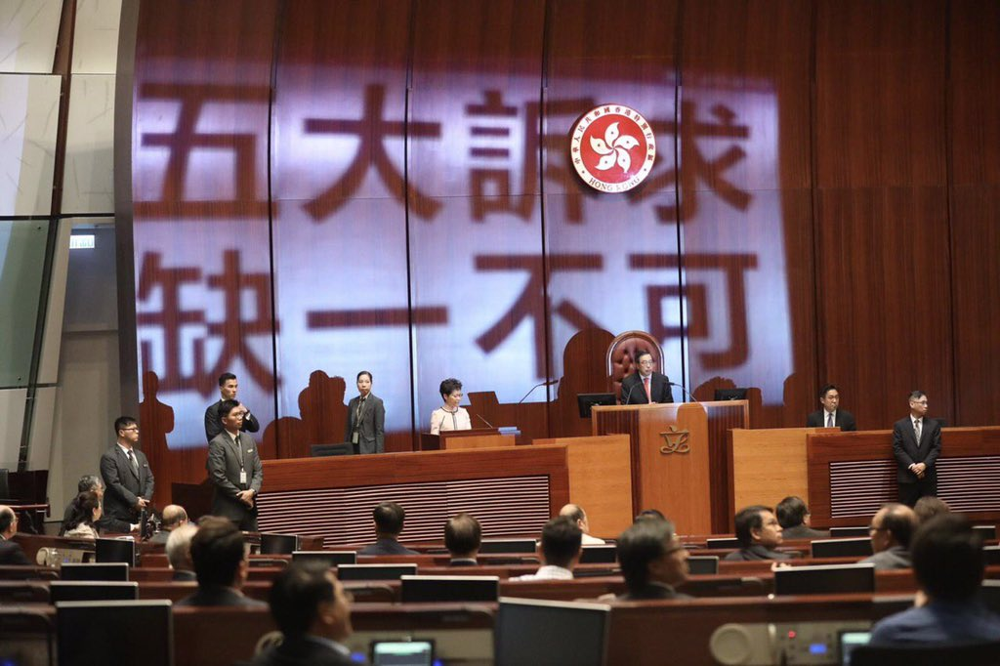
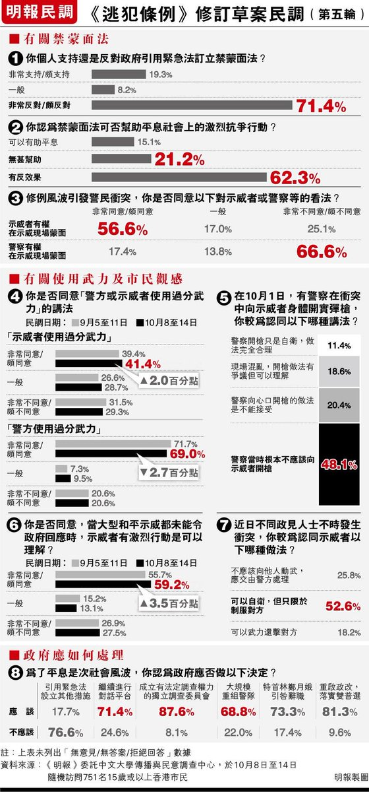
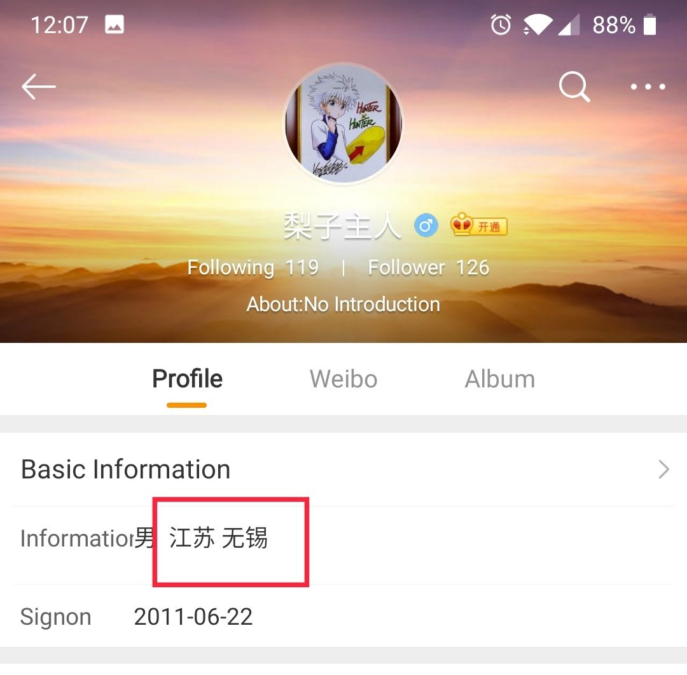

[10月16日 11:53]    新闻大吐槽   @TuCaoFakeNews      :speech_balloon:评:0 :+1:赞:7 :globe_with_meridians:转:3  

[10月16日 11:50]    新闻大吐槽   @TuCaoFakeNews    我觉得应该给她放一个习维尼手持大棒的投影  :speech_balloon:评:0 :+1:赞:3 :globe_with_meridians:转:0  

[10月16日 11:48]    新闻大吐槽   @TuCaoFakeNews    民主派的立法会议员，用手持投影灯，把五大诉求，缺一不可的字幕，投射到正在发言的林郑月娥身上!  :speech_balloon:评:2 :+1:赞:13 :globe_with_meridians:转:5  

[10月16日 11:30]    纽约时报中文网   @nytchinese    “赵紫阳曾对我说，邓小平的信条，是党的领导权绝对不能动摇，是党的权力绝对不能分享。这怎么能使中国转向民主政治呢？”
作为赵紫阳的生前挚友，宗凤鸣在赵紫阳因“六四”下台并被软禁后，记下了与老战友的上百次谈话。在赵紫阳百年诞辰之际，我们发表了宗凤鸣在生前接受的采访。 https://nyti.ms/2MMl37A   :speech_balloon:评:14 :+1:赞:74 :globe_with_meridians:转:35  

[10月16日 11:00]    纽约时报中文网   @nytchinese    • 聚焦特朗普“电话门”：总统私人律师朱利安尼向乌克兰施压的行为曾令时任国家安全顾问博尔顿感到震惊。
• 俄罗斯力军队挺进叙利亚北部：俄罗斯周二表示，该国部队正在美军撤离后的叙利亚领土上巡逻。特朗普突然撤军的决定为土耳其入侵扫清了道路。
更多简报内容： https://nyti.ms/2ITPNCp   :speech_balloon:评:2 :+1:赞:0 :globe_with_meridians:转:1  

[10月16日 10:30]    纽约时报中文网   @nytchinese    调查显示，为了打开中国市场，德意志银行向能接触到政治人物的顾问支付巨款，给包括江泽民、温家宝、王岐山在内的政坛高官大手笔送礼，并大举招聘中共高级领导人的家人，如栗战书、汪洋和刘云山的子女等。 https://nyti.ms/2ITnynr   :speech_balloon:评:21 :+1:赞:92 :globe_with_meridians:转:50  

[10月16日 10:21]    新闻大吐槽   @TuCaoFakeNews    三生结孽缘
四海遗笑谈  :speech_balloon:评:0 :+1:赞:2 :globe_with_meridians:转:1  

[10月16日 10:19]    新闻大吐槽   @TuCaoFakeNews    所谓借钱只是替父受贿罢了
出借方大多是自愿借巴不得借
发生出借方起诉，大概率是其父不得势了，要吃瘪，这些人就跳出来所谓墙倒众人推  :speech_balloon:评:1 :+1:赞:3 :globe_with_meridians:转:1  

[10月16日 10:09]    财经真相   @caijingxiang    根据克尔瑞的报告，9月份95家典型房企的融资总额为1124.48亿，环比上升45.3%，同比上升17.2%。融资成本也再上台阶，今年前三季度，房企债券类融资成本6.88%，较2018年全年上升了0.67个百分点。截至10月8日，年内房企美元融资533.6亿美元，同比上涨50%。虽然各种政策收紧，但房企美元融资仍刷新历史纪录  :speech_balloon:评:7 :+1:赞:43 :globe_with_meridians:转:12  

[10月16日 10:08]    新闻大吐槽   @TuCaoFakeNews    妈的，民（骗）不和官（骗）斗  :speech_balloon:评:0 :+1:赞:3 :globe_with_meridians:转:1  

[10月16日 10:06]    新闻大吐槽   @TuCaoFakeNews      :speech_balloon:评:0 :+1:赞:5 :globe_with_meridians:转:2  

[10月16日 10:05]    新闻大吐槽   @TuCaoFakeNews    勇者斗党铁！  :speech_balloon:评:2 :+1:赞:38 :globe_with_meridians:转:12  

[10月16日 10:03]    新闻大吐槽   @TuCaoFakeNews      :speech_balloon:评:0 :+1:赞:6 :globe_with_meridians:转:3  

[10月16日 10:00]    新闻大吐槽   @TuCaoFakeNews    中共对NBA前倨后恭 爱国小粉红尴尬

NBA事件在中国突然转向，中宣部勒令不再炒作，腾讯悄悄恢复了NBA赛事转播。而带着标语去深圳季前赛抗议的所谓爱国民众则被警方约谈。被官方煽动起抵制NBA的小粉红们，陷入尴尬境地。

澳洲学者张小刚：“这些小粉红们被中共这样的玩耍几次，他们会慢慢的有所思考。”  :speech_balloon:评:3 :+1:赞:24 :globe_with_meridians:转:10  

[10月16日 10:00]    BBC News 中文   @bbcchinese    这个马桶名为“美国”（America），用18K金打造而成，价值一百万英镑。 https://bbc.in/2VJfzyA   :speech_balloon:评:12 :+1:赞:33 :globe_with_meridians:转:12  

[10月16日 10:00]    纽约时报中文网   @nytchinese    • 中美合拍动画电影《雪人奇缘》因出现南海“九段线”在越南被停映。片中出现的“九段线”是中国在南海的主权主张标识。
• 拜登之子亨特接受专访，坦承家庭背景是自己被任命为外国公司董事会成员的重要原因，但他否认特朗普关于其父从事不法行为的指控。
更多简报内容： https://nyti.ms/2ITPNCp   :speech_balloon:评:4 :+1:赞:7 :globe_with_meridians:转:1  

[10月16日 09:55]    财经真相   @caijingxiang    受到放开外资保险和银行条例消息的刺激，今天中国保险和银行板块大涨，这是一个很有意思的现象，正常情况下放开外资进来，这会对国内的这些企业构成竞争压力，但是今天他们的股票却大涨，这里面的逻辑是什么？  :speech_balloon:评:59 :+1:赞:97 :globe_with_meridians:转:33  

[10月16日 09:55]    新闻大吐槽   @TuCaoFakeNews    強盜遇見拐子手 https://twitter.com/tucaofakenews/status/1184283684167270401 …  :speech_balloon:评:0 :+1:赞:3 :globe_with_meridians:转:1  

[10月16日 09:47]    财经真相   @caijingxiang    中国外交部：我们对美国国会众议院执意通过所谓“香港人权与民主法案”表示强烈愤慨和坚决反对。香港是中国的香港，香港事务纯属中国内政，不容任何外部势力干预。我们奉劝美方认清形势，悬崖勒马，立即停止推动审议有关涉港法案，立即停止插手香港事务、干涉中国内政。  :speech_balloon:评:44 :+1:赞:122 :globe_with_meridians:转:56  

[10月16日 09:46]    新闻大吐槽   @TuCaoFakeNews    一对奇葩果
两副坏心肠  :speech_balloon:评:1 :+1:赞:10 :globe_with_meridians:转:1  

[10月16日 09:43]    新闻大吐槽   @TuCaoFakeNews    男子因女子是副市长千金与其闪婚，望借助岳父势力，捞取好处，虽然女子身份不假，但她其实是一个惯骗，已经利用借钱手段骗了很多男人的钱财，但这个男子被骗最久，也是唯一结婚的；女子婚内出轨，又跟别的男人“借”钱，370万的欠条上留下了男子名字

两人都心怀不轨，可官二代的棋高一招，党员家风使然  :speech_balloon:评:9 :+1:赞:58 :globe_with_meridians:转:27  

[10月16日 09:38]    财经真相   @caijingxiang    受中国扬言报复美国通过的《香港人权法案》消息刺激，a股开盘后，离岸人民币扩大跌幅，跌破7.1关口！  :speech_balloon:评:13 :+1:赞:133 :globe_with_meridians:转:27  

[10月16日 09:36]    BBC News 中文   @bbcchinese    BBC带你走进三个著名古堡，探究其中的主人和工作人员如何看待自己有别于人的日常生活。 https://bbc.in/2ITTYy5   :speech_balloon:评:1 :+1:赞:13 :globe_with_meridians:转:6  

[10月16日 09:13]    纽约时报中文网   @nytchinese    Inside a Brazen Scheme to Woo China: Gifts, Golf and a $4,254 Wine. Hong Kong Protesters Are Targeting Starbucks. Apple Could Be Next. Live updates from the debate. How do you say "panopticon" in Chinese? Follow us @nytchinese https://cn.nytimes.com/morning-brief/20191016/deutsche-bank-china-democratic-debate/ …  :speech_balloon:评:2 :+1:赞:8 :globe_with_meridians:转:2  

[10月16日 08:56]    纽约时报中文网   @nytchinese    早安！今日重点新闻包括：
德银中国生意经；聚焦美国民主党初选辩论；香港抗议向商业领域蔓延；球星詹姆斯就NBA“挺港风波”发言惹争议；动画电影《雪人奇缘》因出现南海“九段线”在越南被停映……NYT简报带你速览今日要闻。
更多简报内容： https://nyti.ms/2ITPNCp   :speech_balloon:评:4 :+1:赞:11 :globe_with_meridians:转:2  

[10月16日 07:55]    BBC News 中文   @bbcchinese    远在欧洲伊比利亚半岛上的西班牙周一（10月14日）对倡导加泰罗尼亚独立公投的9名领导者判以重刑，罪名包括“煽动分裂、挪用公款、以及拒不服从”。 https://bbc.in/33A5WVM   :speech_balloon:评:35 :+1:赞:66 :globe_with_meridians:转:24  

[10月16日 07:52]    新闻大吐槽   @TuCaoFakeNews    对于警察被割颈的案件，墙内媒体故意营造如下印象：
1.当事人许添力的姐姐曾在2016年向警察扔玻璃杯，所以暴力是遗传的；
2.受伤警察还住在ICU，意即还没脱离危险，很惨
3.犯罪的就是许添力，香港学校竟然不开除他！香港学校包庇凶手，香港教育体制出了问题；

刻意营造的印象和真相可能完全不同(接图)  :speech_balloon:评:18 :+1:赞:83 :globe_with_meridians:转:49  

[10月16日 07:35]    新闻大吐槽   @TuCaoFakeNews    【#共产罪近日，香港一名市民因为声援反送中遭中资公司解雇。他表示，香港在言论自由等各方面整个已经变调了，香港人需要抗争和得到世界的支持，中共暴政一定会垮台。据透露，这家公司是利用香港人拿到的牌照，说这是香港公司，实际上是中国大陆公司在后边来运作。  :speech_balloon:评:6 :+1:赞:43 :globe_with_meridians:转:34  

[10月16日 07:11]    BBC News 中文   @bbcchinese    一场前所未有的大台风中的东北亚政治来往，反映出中日两国关系经历多年波折后的什么趋势？ https://bbc.in/2IUGYbz   :speech_balloon:评:6 :+1:赞:14 :globe_with_meridians:转:7  

[10月16日 06:50]    BBC News 中文   @bbcchinese    BBC中东事务编辑伯温（Jeremy Bowen）指出，叙利亚战争8年改变了中东势力版图，而美国宣布撤军，７天就改变了叙利亚战局，中东面临新的转折点。 https://bbc.in/2BbkTRY   :speech_balloon:评:6 :+1:赞:27 :globe_with_meridians:转:12  

[10月16日 06:20]    新闻大吐槽   @TuCaoFakeNews    大腿因为勒布朗的舔共言论和他闹翻了！
他对勒布朗说：好吧，说出来，说去中共他娘的！

勒布朗舍不得中国的生意，无奈没有大腿就没有总冠军，只能妥协，跟着小声嘟囔了一句！

据说这就是接下来的剧本  :speech_balloon:评:1 :+1:赞:96 :globe_with_meridians:转:40  

[10月16日 04:51]    老司机   @h5lpykl7tp6jjop    德意志银行行贿中国！他们在中国瞄准最高层，通过送礼建立人脉，从而获取巨大利益，中国的高官们在这场德意志银行进军中，从前朝江泽民、温家宝，刘云山到当朝的中共常委栗战书、汪洋，国家副主席王岐山，或者本人或者亲属都被银弹击中。“一百多名共产党主政权贵的亲戚受雇于该银行”  :speech_balloon:评:2 :+1:赞:61 :globe_with_meridians:转:40  

[10月16日 03:06]    新闻大吐槽   @TuCaoFakeNews    角色球员坎特是土耳其人，他因为公开反对土耳其政府已经被土耳其通缉。

他听闻勒布朗说“莫雷是被误导，且伤害了很多人的感情”时，他坐不住了，他发推列举了自己被土耳其政府打击的种种遭遇，最后总结：自由不是免费的！

亦即——在中共的金钱和自由之间，NBA大佬们无法骑墙，只能选一个！

刮目相看！ https://twitter.com/epochtimeschina/status/1184156998432104448 …  :speech_balloon:评:4 :+1:赞:90 :globe_with_meridians:转:42  

[10月16日 00:18]    墙国铁拳现世报😷   @Socialistfist    万fo新头像  :speech_balloon:评:18 :+1:赞:170 :globe_with_meridians:转:8  

[10月15日 23:03]    墙国铁拳现世报😷   @Socialistfist    新浪微博先关了评论区，后删除了该条微博。
本报不赞成任何形式网络暴力，也希望不要用你们的热情去唤醒楚门的世界。请大家让他做一个普通中国人  :speech_balloon:评:27 :+1:赞:138 :globe_with_meridians:转:24  

[10月15日 22:31]    凡賽堤/FORSETI   @FecharCCP    我們都是陳彥琳。一個15歲的小妹妹。極權卻對她如此殘忍。
願妳早日沉冤得雪
We are all Chan Yin Lam, a aged 15 kid in HK, who was slaughtered by the tyranny.  :speech_balloon:评:3 :+1:赞:115 :globe_with_meridians:转:89  

[10月15日 22:30]    BBC News 中文   @bbcchinese    社交媒体会让抑郁症更加严重，还是能拯救抑郁症患者？曾经萌生自杀念头的本文作者雷利，和你分享他自己的真实故事。
 https://bbc.in/2MglCHE   :speech_balloon:评:3 :+1:赞:23 :globe_with_meridians:转:11  

[10月15日 21:59]    BBC News 中文   @bbcchinese    你是否想要拥有幸福快乐却不知如何做到？耶鲁大学教授桑托斯告诉你5个方法，帮助你变得更幸福更快乐。
 https://bbc.in/2nLP3bd   :speech_balloon:评:1 :+1:赞:23 :globe_with_meridians:转:16  

[10月15日 21:31]    BBC News 中文   @bbcchinese    英国广播公司BBC专访美国空军战争学院张晓明博士，从他的著作回顾1979年邓小平发起中越战争的得失。
 https://bbc.in/2ppM20Y   :speech_balloon:评:9 :+1:赞:30 :globe_with_meridians:转:11  

[10月15日 21:07]    墙国铁拳现世报😷   @Socialistfist    对于这种抗拒社会主义建设的，我觉得我们的部队，该出手还是要敢于出手，要有亮剑精神。不能因为一颗老鼠屎，就耽误了我们社会主义建设全面小康社会的节奏。
尤其是一些打着红旗反红旗的所谓小粉红，本质就是低级红高级黑，要特别注意打倒，不能放纵。为了自己一点私利就阻碍发展的，更需要打击！  :speech_balloon:评:0 :+1:赞:100 :globe_with_meridians:转:19  

[10月15日 21:00]    纽约时报中文网   @nytchinese    据时报调查，为了在中国获得生意，德意志银行向能接触政治人物的中国顾问支付了数百万美元，雇用了执政的中共几十名亲属，并给温家宝、江泽民等政治精英成员赠送了大量奢侈礼物。
这里是全文报道的6大要点： https://nyti.ms/2ITf2oz   :speech_balloon:评:57 :+1:赞:318 :globe_with_meridians:转:186  

[10月15日 20:59]    BBC News 中文   @bbcchinese    现代人们生活越来越离不开社交媒体，我们是否过度使用社交媒体，而牺牲了心理和身体健康，并浪费宝贵的时间？
 https://bbc.in/2oMwKmG   :speech_balloon:评:3 :+1:赞:16 :globe_with_meridians:转:9  

[10月15日 20:31]    BBC News 中文   @bbcchinese    湖人队当家球星勒布朗·詹姆斯一向比较敢言，这次到底说了什么？ https://bbc.in/2MkwfJT   :speech_balloon:评:85 :+1:赞:110 :globe_with_meridians:转:35  

[10月15日 20:03]    纽约时报中文网   @nytchinese    送给江泽民的一只水晶老虎、给温家宝的一匹水晶马，刘云山、汪洋在内等高官的子女、亲戚得到雇佣……
根据包含电子报表、电子邮件、高管采访的文字记录和内部调查报告在内的银行机密文件，时报调查发现，为了获得在中国的业务，德意志银行不惜向中国的政治精英讨好、行贿。 https://nyti.ms/2ITnynr   :speech_balloon:评:128 :+1:赞:1085 :globe_with_meridians:转:607  

[10月15日 19:34]    墙国铁拳现世报😷   @Socialistfist    补充  :speech_balloon:评:9 :+1:赞:97 :globe_with_meridians:转:17  

[10月15日 19:32]    墙国铁拳现世报😷   @Socialistfist    大仙女：请出动我们的部队
当地拆迁办： 好的

#社会主义铁拳  :speech_balloon:评:98 :+1:赞:758 :globe_with_meridians:转:228  

[10月15日 19:32]    新闻大吐槽   @TuCaoFakeNews    大仙女：请出动我们的部队
当地拆迁办： 好的

#社会主义铁拳  :speech_balloon:评:98 :+1:赞:758 :globe_with_meridians:转:228  

[10月15日 19:18]    老司机   @h5lpykl7tp6jjop    人民网又在撒谎，6块钱二两肉能做这么一大碗肉丸？老百姓的生活还停留在2个人在出租屋里面吃6块钱肉就感觉到很满足的阶段……这是富裕吗，这是强大吗，还在吹，还在编，还在骗！  :speech_balloon:评:24 :+1:赞:112 :globe_with_meridians:转:45  

[10月15日 19:17]    财经真相   @caijingxiang    也就是即使川普连任，也等不到中国邮费上涨的时刻？对吗？ https://twitter.com/voacantonese/status/1184064898478665730 …  :speech_balloon:评:8 :+1:赞:80 :globe_with_meridians:转:19  

[10月15日 19:14]    财经真相   @caijingxiang    美国的人权法案为啥这么慢？ https://twitter.com/hongkon84458416/status/1183900371602825218 …  :speech_balloon:评:22 :+1:赞:104 :globe_with_meridians:转:24  

[10月15日 19:00]    纽约时报中文网   @nytchinese    曾经只是用雨伞来挡雨和抵御催泪瓦斯的抗议者，最近越来越多地开始使用砖头、人行道铺路石、刀和汽油弹。暴力事件不断增加的另一个迹象是，一名示威者周日刺伤了一名警员的脖子。另一方面，自从6月示威活动开始以来，警察也升级了所使用的火力。 https://nyti.ms/32r30e1   :speech_balloon:评:113 :+1:赞:71 :globe_with_meridians:转:28  

[10月15日 18:01]    BBC News 中文   @bbcchinese    K-pop 女明星雪莉（Sulli）10月14号过世，终年25岁。雪莉生前以直言不讳, 身体自主的言行赢得赞赏，也惹来韩国社会严酷的网络霸凌。
祝愿她一路好走！ https://bbc.in/2VJOw64   :speech_balloon:评:33 :+1:赞:136 :globe_with_meridians:转:39  

[10月15日 18:00]    纽约时报中文网   @nytchinese    对于该地区能否消耗老挝希望生产的全部电能，科学家们持怀疑态度。但这并没有阻止中国工程师、企业家和建筑工人涌入老挝。在中国水电的南乌江梯级电站工地，岩壁上悬挂的巨大红色横幅宣告着中老社会主义兄弟情谊的重要性。横幅上只有中文。工地上基本没有老挝工人。 https://nyti.ms/33xhh8Q   :speech_balloon:评:25 :+1:赞:23 :globe_with_meridians:转:5  

[10月15日 17:40]    BBC News 中文   @bbcchinese    英国女王伊丽莎白二世在议会发表演讲，称英国的要务是在10月31日脱离欧盟。 https://bbc.in/2VK0M6O   :speech_balloon:评:16 :+1:赞:42 :globe_with_meridians:转:5  

[10月15日 17:10]    老司机   @h5lpykl7tp6jjop    【陳彥霖】
片中女子大喊：便衣整天跟蹤她。
幾乎已經可以確定她就是15歲死者陳彥霖。（內附圖片）

大家幫手找片中的幾位便衣警。  :speech_balloon:评:124 :+1:赞:1794 :globe_with_meridians:转:1535  

[10月15日 17:00]    纽约时报中文网   @nytchinese    在10月1日开始的中国黄金周期间，在香港迪士尼乐园各游乐设施的等候队伍破天荒得短。通常挤满购物者的购物中心关闭了数天。城里最贵的餐馆提供了很大的折扣优惠，但依然食客寥寥。在香港抗议一事上，在看不到出路的店家和企业高管中，一种明显恐慌的情绪正在蔓延。 https://nyti.ms/2VI4nlE   :speech_balloon:评:27 :+1:赞:61 :globe_with_meridians:转:13  

[10月15日 16:53]    墙国铁拳现世报😷   @Socialistfist    我去，微博上有多少潜伏的推友  :speech_balloon:评:14 :+1:赞:137 :globe_with_meridians:转:16  

[10月15日 16:00]    纽约时报中文网   @nytchinese    在近年来一例又一例事件中，美国高管纷纷让他们的言论和产品屈从于中国的要求。所得的回报是可以继续触及中国顾客；代价则可能是美国作为言论自由象征的可信度遭到侵蚀。 https://nyti.ms/2pnVmSI   :speech_balloon:评:25 :+1:赞:38 :globe_with_meridians:转:13  

[10月15日 15:15]    财经真相   @caijingxiang    加入WTO时的承诺今天在贸易战和华尔街敲诈下，今天终于开始有点放松了，但是中国老百姓想把钱存进外资银行依然存在门槛，每笔最低不少于50万人民币的定期存钱，至于外汇要继续控制！  :speech_balloon:评:36 :+1:赞:287 :globe_with_meridians:转:73  

[10月15日 15:09]    BBC News 中文   @bbcchinese    中美合拍动画片《雪人奇缘》中的南海地图展示了中国主张南海权益的“九段线”，而遭越南当局下令停止放映。 https://bbc.in/2IRg2cF   :speech_balloon:评:37 :+1:赞:97 :globe_with_meridians:转:37  

[10月15日 15:08]    财经真相   @caijingxiang    重磅！国务院关于修改〈中华人民共和国外资保险公司管理条例〉和〈中华人民共和国外资银行管理条例〉的决定，外国银行可以在中华人民共和国境内同时设立外商独资银行和外国银行分行，或者同时设立中外合资银行和外国银行分行。外国银行分行可以吸收中国境内公民每笔不少于50万元人民币的定期存款。  :speech_balloon:评:92 :+1:赞:422 :globe_with_meridians:转:211  

[10月15日 15:00]    BBC News 中文   @bbcchinese    “勾引术”教练在网上销售课程，教导其他男性如何尽快地引诱女性上床。这已是一项百万英镑的产业。 https://bbc.in/2MGkfB5   :speech_balloon:评:27 :+1:赞:186 :globe_with_meridians:转:67  

[10月15日 15:00]    纽约时报中文网   @nytchinese    作为世界上仅存的几个共产主义政权之一，老挝政府已经在湄公河及其支流上的140多座大坝项目上签了字。贫穷且地处内陆的老挝下的赌注是，到2025年，水力发电将成为该国最大的赚钱机器。而建设这些大坝的资金，则是从中国借来的。 https://nyti.ms/33xhh8Q   :speech_balloon:评:41 :+1:赞:93 :globe_with_meridians:转:51  

[10月15日 14:30]    纽约时报中文网   @nytchinese    香港警方周一表示，一枚自制炸弹在周日的暴力抗议活动中被引爆。
据通报，爆炸装置被隐藏在旺角地区一处灌木丛中，当一辆警车经过附近时被手机激活引爆。爆炸没有造成任何损害或人员伤亡，但这是在持续数周的香港冲突中，此类设备首次被使用。 https://nyti.ms/32r30e1   :speech_balloon:评:45 :+1:赞:59 :globe_with_meridians:转:23  

[10月15日 14:07]    老司机   @h5lpykl7tp6jjop    李心草被猥亵后抛尸江里，其室友任梦燊父亲是红河警察队长任剑波！ 把同宿舍的同学领到酒吧破处，同学不从，被三个畜生打死。昆明警察当局不予立案！

 https://chinanewscenter.com/archives/14788   :speech_balloon:评:8 :+1:赞:59 :globe_with_meridians:转:54  

[10月15日 14:00]    纽约时报中文网   @nytchinese    习近平面临着香港街头的暴力抗议活动，以及食品价格的大幅上涨；特朗普急于把话题从弹劾调查等一系列问题上转移开来。随着贸易战僵持，这两位领导人都面临着持续不断的负面经济消息。
在这样的背景下，上周五，双方都认为一个部分协议比没有强，取得了达成一项初步协议的共识。 https://nyti.ms/2IQvUvY   :speech_balloon:评:11 :+1:赞:14 :globe_with_meridians:转:11  

[10月15日 13:42]    老司机   @h5lpykl7tp6jjop    全裸女浮尸案背后：近几月浮尸数是10年总和 6大疑点
详细分析暴露中共在香港操纵黑警秘密杀害反抗民众！  :speech_balloon:评:3 :+1:赞:12 :globe_with_meridians:转:11  

[10月15日 13:30]    纽约时报中文网   @nytchinese    29岁的杨洋生活在中国大陆，当他受到香港示威活动的启发，写了一首关于自由的歌，并把它上传到网上。被审查者删除后，他向家人抱怨。
家人并没有表示同情。“你怎么会支持香港？你怎么反华？”母亲威胁要和他断绝关系。今年8月，杨洋前往日本旅行之前，父亲说希望儿子死在那里。 https://nyti.ms/2IQXqKa   :speech_balloon:评:484 :+1:赞:1166 :globe_with_meridians:转:473  

[10月15日 13:00]    纽约时报中文网   @nytchinese    今日食谱：奶酪通心粉，简单、温暖、治愈。
更多简报内容： https://nyti.ms/33u8hRY   :speech_balloon:评:2 :+1:赞:5 :globe_with_meridians:转:0  

[10月15日 12:30]    纽约时报中文网   @nytchinese    在老挝北部一个与世隔绝的小村，一个“拆”字悄然出现在了房屋、学校和寺庙的墙上。
这个当地没人认识的汉字就此概括了湄公河沿岸数百个社区的命运：为了给中国建造的水坝工程让路，村庄被拆除，居民被迫离开世代居住的河流，湄公河下游国家的渔业和农业也将受到影响。 https://nyti.ms/33xhh8Q   :speech_balloon:评:90 :+1:赞:169 :globe_with_meridians:转:80  

[10月15日 12:00]    纽约时报中文网   @nytchinese    • 韩流明星雪莉离世：警方称，这名25岁的著名演员、歌手及女团f(x)前成员周一被发现在家中死亡。
• 诺贝尔经济学奖揭晓：Abhijit Banerjee、Esther Duflo和Michael Kremer三名教授因在减轻贫困方面做出的实验性工作而获奖。
更多简报内容： https://nyti.ms/33u8hRY   :speech_balloon:评:5 :+1:赞:8 :globe_with_meridians:转:2  

[10月15日 11:30]    纽约时报中文网   @nytchinese    #每日一词 Henchmen
在乌克兰“电话门”事件推动下，特朗普总统正在遭遇弹劾调查。而在特朗普的身后，有一大群为其通力合作的人。这些henchmen（亲信）不仅为达目的不择手段，还试图模糊、扰乱乃至阻碍将外界对这位总统的审视。 https://nyti.ms/2MfD9zJ   :speech_balloon:评:13 :+1:赞:38 :globe_with_meridians:转:12  

[10月15日 10:30]    老司机   @h5lpykl7tp6jjop    和平理性非暴力的抗议是印度甘地用来对抗英国人的，这种方法对流氓暴政无效！它们嗜血成性，只要能达到目的亿万人生命都可以作为代价，老人小孩孕妇都可以不顾忌的抓！不能不用其他方法对抗黑警了！明争不过可以暗斗，吃不成牛肉鼓上出气！  :speech_balloon:评:3 :+1:赞:41 :globe_with_meridians:转:6  

[10月15日 10:00]    BBC News 中文   @bbcchinese    BBC发现，西欧国家非常不愿意接收疑似“伊斯兰国”成员的拘留者，然而近年许多加入该组织的外国人已回归家园。 https://bbc.in/2Mj9Bl7   :speech_balloon:评:25 :+1:赞:37 :globe_with_meridians:转:16  

[10月15日 09:50]    财经真相   @caijingxiang    美港电讯15日讯，花旗集团目前正计划在中国建立一家全资证券子公司。知情人士表示，这家银行可能会专注于经纪和期货交易，同时扩大其在中国的托管服务。摩根大通（JPM.N）和高盛（GS.N）也在寻求在中国建立证券公司。 美国农民能不能卖出大豆给中共重要吗？不重要！只要华尔街的利益得到维护就行！  :speech_balloon:评:27 :+1:赞:410 :globe_with_meridians:转:128  

[10月15日 09:49]    新闻大吐槽   @TuCaoFakeNews    火箭隊球迷店主
製作撐莫雷T恤衫

美國休斯頓的一位店主，把美國職籃NBA火箭隊總經理莫雷，支持香港的推文，印製在T恤上，表達對偶像和自由的支持。  :speech_balloon:评:3 :+1:赞:159 :globe_with_meridians:转:92  

[10月15日 09:45]    财经真相   @caijingxiang    国家统计局：从环比看，CPI上涨0.9%，食品中，猪肉供应偏紧，价格继续上涨19.7%，涨幅比上月回落3.4个百分点，影响CPI上涨约0.65个百分点。  :speech_balloon:评:3 :+1:赞:61 :globe_with_meridians:转:13  

[10月15日 09:43]    财经真相   @caijingxiang    2019年9月份居民消费价格同比上涨3.0%,工业生产者出厂价格同比下降1.2%,物价涨工业生产下降，这就是典型的“滞胀”！  :speech_balloon:评:9 :+1:赞:246 :globe_with_meridians:转:72  

[10月15日 09:33]    BBC News 中文   @bbcchinese    “吉野家”、“星巴克”、“元气寿司”、“一芳水果茶”等耳熟能详的品牌，为什么成为抗议者的攻击目标？ https://bbc.in/2Ba2OUg   :speech_balloon:评:186 :+1:赞:252 :globe_with_meridians:转:103  

[10月15日 09:18]    老司机   @h5lpykl7tp6jjop    “为了生存，一个个的家庭四分五裂，游走他乡，疲于奔命；精神和肉体在苦苦煎熬中呻吟，人性正被一天天的扭曲！而那些留守的儿童，少了家庭的温暖，父母的呵护，一个个养成孤僻、自卑的性格；感情上更显得脆弱、冲动易怒，由此引发了诸多的社会问题，更加剧了底层贫困的轮回.......”  :speech_balloon:评:12 :+1:赞:119 :globe_with_meridians:转:66  

[10月15日 09:10]    老司机   @h5lpykl7tp6jjop    这就是那位被中国共产党奸杀后又抛尸海上的香港15岁女孩，生前视频  :speech_balloon:评:250 :+1:赞:1704 :globe_with_meridians:转:825  

[10月15日 08:49]    凡賽堤/FORSETI   @FecharCCP    希望陳彥霖家屬決不能放棄，任何金錢都無法和一個活生生的生命兌換！拿起法律武器！極權殺人恐怖組織殺害太多香港人，他們正在製造任何被害的正常死亡假象和消滅所有證據！極權殺人恐怖組織的恐怖只有人想不到的，沒有他們做不到！！！！！！！！  :speech_balloon:评:0 :+1:赞:1 :globe_with_meridians:转:0  

[10月15日 08:44]    凡賽堤/FORSETI   @FecharCCP    這是15歲游泳健將陳彥霖小女孩被殺害前出來逛街的自拍視頻！她還在自我解嘲穿成這樣不可能被定為暴徒！
拍攝時間未能確定，這是被抓捕前還是抓捕後？
她被抓捕過，抓捕時間？如果被釋放一定有本人和家長簽名的依據，所以這視頻的時間很重要，如果是抓捕前的，那是極權殺人恐怖組織故意放出來掩蓋罪行  :speech_balloon:评:1 :+1:赞:19 :globe_with_meridians:转:12  

[10月15日 08:11]    BBC News 中文   @bbcchinese    美国财长姆努钦周一在接受美国媒体访问时表示，若两国在12月15日前不达成最终贸易协议，美国将对1560亿中国进口产品征收关税。他的谨慎措辞，似乎与上周五总统特朗普的乐观形成鲜明对比。 https://bbc.in/32gFZu4   :speech_balloon:评:42 :+1:赞:208 :globe_with_meridians:转:72  

[10月15日 07:31]    BBC News 中文   @bbcchinese    “巴格达就像一个定时炸弹，看上去平静无害，但突然之间就会爆发。” https://bbc.in/31dWUfm   :speech_balloon:评:9 :+1:赞:19 :globe_with_meridians:转:12  

[10月15日 07:16]    老司机   @h5lpykl7tp6jjop    暴力「執法」
#FreeHongKong
#HongKongProtest  :speech_balloon:评:21 :+1:赞:170 :globe_with_meridians:转:168  

[10月15日 07:08]    BBC News 中文   @bbcchinese    BBC安全事务记者弗兰克·加德纳（Frank Gardner）为你梳理了沙特的旅游热点，并提醒游客一些在沙特不能做的事情。 https://bbc.in/2oy9yZA   :speech_balloon:评:14 :+1:赞:33 :globe_with_meridians:转:8  

[10月15日 05:08]    老司机   @h5lpykl7tp6jjop    英国臭名昭著的恋童癖、最残忍的罪犯Richard Huckle，在服刑近三年后在监狱里被人捅死了！这个伪装支教的罪犯在2016年被捕前在长达12年的时间里，性侵、强奸、虐待了200名马来西亚儿童。最终被判了22次无期徒刑。
可是今天在中共管制下的香港，黑警公然满大街抓小姑娘，然后性侵投海，还有天理吗？  :speech_balloon:评:21 :+1:赞:381 :globe_with_meridians:转:110  

[10月15日 02:46]    凡賽堤/FORSETI   @FecharCCP    正義小螞蟻！傳播英文，西文，法文，德文，日文，著重描述，殘暴行為和手段，來自大陸的黑警，被施暴對象為學生，小孩，女孩 ，老人   傳播真相目的，激發西方人的憤怒！  :speech_balloon:评:1 :+1:赞:5 :globe_with_meridians:转:7  

[10月15日 02:17]    老司机   @h5lpykl7tp6jjop    便衣警察被抗议者追打。不想看到这样的场景，但这个场景反映香港警民对立、对抗、敌视，已上升到了危险境地。林郑月娥政府足以反思！为避免更多港人流血，她应该辞职。  :speech_balloon:评:55 :+1:赞:331 :globe_with_meridians:转:119  

[10月15日 02:14]    凡賽堤/FORSETI   @FecharCCP    6.9以來我就呼籲香港人要把每一個在香港街上的任何穿著警服的人臉全部清除的影片下來，不知道有沒有傳到在香港的正義人士，如果有，那些照片將是舉證黑警違法入境香港執法的鐵證，他們不知道殺害了多少香港同胞！  :speech_balloon:评:0 :+1:赞:8 :globe_with_meridians:转:6  

[10月15日 02:01]    凡賽堤/FORSETI   @FecharCCP    緊急提醒！

未來將有極權恐怖組織偽裝成各種各樣的所謂正義人士要求高價購買自6.9以來香港黑警殺人等犯罪證據，呼籲要提高一千萬的警惕和小心，別把自己的命給賣力！極權殺人恐怖組織從來不會讓有證據的人活在這個世界上！！！ https://twitter.com/FecharCCP/status/1183188604132188161 …  :speech_balloon:评:3 :+1:赞:43 :globe_with_meridians:转:40  

[10月15日 01:48]    凡賽堤/FORSETI   @FecharCCP    良知與正義沒有國界，沒有人種之分！！！

讓我們把極權殺人恐怖組織所犯下的種種反人類罪行的真相傳播給全人類知道！
用最殘暴最血腥最沒人性的那些畫面和視頻真相來喚醒人類的良知與公義和同情吧！ https://twitter.com/FecharCCP/status/1183193159087640576 …  :speech_balloon:评:2 :+1:赞:14 :globe_with_meridians:转:6  

[10月15日 01:43]    凡賽堤/FORSETI   @FecharCCP    極權恐怖組織正在屠殺我們的同胞....

拯救港人，拯救華族，勢在必行！！！

擁有良知與正義小螞蟻們！良知與正義沒有國界，沒有人種之分！！！讓我們把極權殺人恐怖組織所犯下的種種反人類罪行的真相傳播給全人類知道！用最殘暴最血腥最沒人性的那些畫面和視頻真相來喚醒人類的良知與公義和同情吧！  :speech_balloon:评:4 :+1:赞:132 :globe_with_meridians:转:118  

[10月15日 01:24]    凡賽堤/FORSETI   @FecharCCP    美國西方國家用70年為大陸人開啟民智，結果反被吞噬！某些海外華人聲稱是為大陸人開啟民智！ 把自己封為比上帝還高的聖人，卻把眼睛盯著榮耀！但是卻不明白，千千萬萬正義的小螞蟻才是真正為大陸人開啟民智先鋒！
因為他們把極權殺人恐怖組織在香港犯下的種種罪行的真相向全世界和大陸傳播！良知無國界  :speech_balloon:评:3 :+1:赞:15 :globe_with_meridians:转:5  

[10月15日 00:44]    老司机   @h5lpykl7tp6jjop    暗杀、抛尸、性虐待，

阴招吓不怕香港人！

看遮打花园的灯海  :speech_balloon:评:38 :+1:赞:1260 :globe_with_meridians:转:580  

[10月15日 00:42]    凡賽堤/FORSETI   @FecharCCP    海外的眾多號稱良知與正義的自媒體，天天喊口號滅CCP的自媒體，除了香港大紀元，香港蘋果日報意外，有幾個自媒體持續跟踪報導的每一個事件，如此震驚全世界的香港事件，那些自媒體卻把觀眾的目光引導到了哪裡？這不是在幫極權殺人恐怖組織的大忙？ 如果每個自媒體，全面跟踪報導，這將影響力變成幾倍啊  :speech_balloon:评:0 :+1:赞:5 :globe_with_meridians:转:0  

[10月15日 00:36]    凡賽堤/FORSETI   @FecharCCP    總覺得現在的海外華人口口聲聲說反極權CCP，把美國的白宮演變成CCP的信訪局，然後他們也變成了美國政府的白宮，總統的“代言人“或“爆料們“，說難聽的是皮條客，靠這樣就能滅CCP？一點殺傷力都沒有，無非也是譁眾取寵吸引眼球，浪費時間轉移了核心，6.9香港返送中以來，這麼大的事件，香港如此悲慘！（1 https://twitter.com/FecharCCP/status/1183188604132188161 …  :speech_balloon:评:1 :+1:赞:7 :globe_with_meridians:转:4  

[10月15日 00:20]    凡賽堤/FORSETI   @FecharCCP    以前也是不認同法輪功！但是看到他們在反對極權殺人恐怖組織幾十年的一如既往的奮鬥，這次香港的返送中事件大紀元的記者都一直在前線報導，確實令人感動！  :speech_balloon:评:1 :+1:赞:22 :globe_with_meridians:转:4  

[10月15日 00:20]    凡賽堤/FORSETI   @FecharCCP    以前也是不認同法輪功！但是看到他們在反對極權殺人恐怖組織幾十年的一如既往的奮鬥，這次香港的返送中事件大紀元的記者都一直在前線報導，確實令人感動！  :speech_balloon:评:0 :+1:赞:10 :globe_with_meridians:转:1  

[10月15日 00:01]    墙国铁拳现世报😷   @Socialistfist    通知 经推友集思广益，现已删除 “种花家的爱国红小将” 的转推。  :speech_balloon:评:2 :+1:赞:55 :globe_with_meridians:转:2  

[10月14日 22:59]    BBC News 中文   @bbcchinese    孤独并不像大多数人想的那样。一项名为“BBC孤独实验”的调查，得出五个出人意料的发现。
 https://bbc.in/2nJtSGO   :speech_balloon:评:0 :+1:赞:35 :globe_with_meridians:转:19  

[10月14日 20:51]    老司机   @h5lpykl7tp6jjop    快点，我等不及了，领导在等着我切磋 https://twitter.com/jingui_zhu/status/1183561565200506880 …  :speech_balloon:评:30 :+1:赞:121 :globe_with_meridians:转:50  

[10月14日 20:44]    墙国铁拳现世报😷   @Socialistfist    图片源通过谷歌识图可以知道这个微博内容是伪造的。其中有“保安”的图片事件至少发生在2018年6月以前。虽然是另外一个铁拳现世报的故事，但是没有必要为了黑而抹黑。正确的姿势至少应该是摆事实才能讲道理。另外个人非常厌恶抵制这个伪造微博的人的做法。新闻源 https://www.bannedbook.org/bnews/zh-tw/weiquan/qunti/20180610/955337.html …  :speech_balloon:评:0 :+1:赞:57 :globe_with_meridians:转:7  

[10月14日 19:55]    墙国铁拳现世报😷   @Socialistfist    欢迎举证  :speech_balloon:评:5 :+1:赞:28 :globe_with_meridians:转:1  

[10月14日 19:28]    墙国铁拳现世报😷   @Socialistfist    推上流传的这张截图，很多推油都给我发了，微博上查不到这个号。
鉴于之前流传的反串P图号也查不到微博，大家智者见智

#社会主义铁拳？  :speech_balloon:评:28 :+1:赞:195 :globe_with_meridians:转:39  

[10月14日 18:47]    墙国铁拳现世报😷   @Socialistfist    不好这个护旗手要反

#社会主义铁拳  :speech_balloon:评:245 :+1:赞:1881 :globe_with_meridians:转:636  

[10月14日 17:27]    财经真相   @caijingxiang    呵呵，这才刚过一天就要变卦了？消息一经公布，离岸人民币、a50急搓，黄金短线冲高！ https://twitter.com/zerohedge/status/1183674272402890752 …  :speech_balloon:评:58 :+1:赞:598 :globe_with_meridians:转:173  

[10月14日 14:27]    财经真相   @caijingxiang    尤其是高盛赚的手抽筋，当时中方对接人就是王73，其他几家银行也是！这才是真正的卖国贼，从未见过一个国内外专家提出过质疑！ https://twitter.com/ccp5464/status/1183282408415584258 …  :speech_balloon:评:14 :+1:赞:271 :globe_with_meridians:转:103  

[10月14日 14:22]    老司机   @h5lpykl7tp6jjop    Today 13:15 at Tai Po, #HongKong. A photo that shows #HongKongPolice, a cop’s Van, a truck, and what seems like a body. Last night, a lot of people were arrested in Tai Po. I am fear more “unsuspicious suicides” are on their way. #hkpolicebrutality #BloodyCarrie #FreeHongKong  :speech_balloon:评:35 :+1:赞:387 :globe_with_meridians:转:480  

[10月14日 12:14]    凡賽堤/FORSETI   @FecharCCP    想看極權殺人恐怖組織的殺人，迫害華人真相的請看香港大紀元！
想看極權殺人恐怖組織爆料黑幕的去看郭文貴直播！
想看調侃，唱衰，分析極權殺人恐怖組織有關新聞的，
去看 年代向錢看（youtube)
他們相對比較專業，全面！  :speech_balloon:评:2 :+1:赞:18 :globe_with_meridians:转:4  

[10月14日 12:07]    凡賽堤/FORSETI   @FecharCCP    儘管極權殺人恐怖組織控制的推特一直黑我的關注人數，我根本無所謂，因為為正義而發，為傳播真相而發，這是我的生活一部分！傳播真相才是最重要，無非也是一只小螞蟻而已！  :speech_balloon:评:1 :+1:赞:17 :globe_with_meridians:转:4  

[10月14日 11:59]    凡賽堤/FORSETI   @FecharCCP    真正的良心媒體是不會刻意去追求關注度！而是注重及時傳播每一個突發事件及真相！如果一些自媒體有人養著，或者是真正為正義，為傳播真相而發，不需要靠廣告收入養活自己，他們完全沒有必要去研究觀眾的口味，傳播突發事件和跟踪新聞事件也許能迎來更多的觀眾！  :speech_balloon:评:2 :+1:赞:27 :globe_with_meridians:转:7  

[10月14日 11:53]    老司机   @h5lpykl7tp6jjop    【字幕對白】這位戴面罩青年好嘢 途經尖沙咀兩度被警截查據理力爭：我只有一個人警察說大話故意拘留我 錯誤引用《反蒙面法》  :speech_balloon:评:26 :+1:赞:483 :globe_with_meridians:转:302  

[10月14日 11:52]    凡賽堤/FORSETI   @FecharCCP    香港大紀元才是真正的滅極權主義的先鋒！幾個月從未停止跟踪報導香港極權殺害港人的每一個畫面！向香港大紀元致敬並說聲謝謝！  :speech_balloon:评:44 :+1:赞:1189 :globe_with_meridians:转:558  

[10月14日 11:27]    凡賽堤/FORSETI   @FecharCCP    希望這些擁有原始照片和視頻的提供給死者家屬！

估計不用多久極權殺人恐怖組織要發動銷毀有關香港照片和視頻（包括所有媒體）的全球大規模行動了！  :speech_balloon:评:0 :+1:赞:1 :globe_with_meridians:转:0  

[10月14日 11:12]    凡賽堤/FORSETI   @FecharCCP    這些香港每一個慘不忍睹的畫面和視頻，如果有正義自媒體和新聞一直跟踪報導，也許很多都可以活下來！無形中幫助和挽救多少香港人啊！！！

良心媒體不單要報導，傳播，應該還要跟踪事態的發展和結果！！！  :speech_balloon:评:4 :+1:赞:19 :globe_with_meridians:转:15  

[10月14日 10:57]    财经真相   @caijingxiang    又是银行券商、茅台的欢呼，50支撑起的股市不是牛市，是牛屎！  :speech_balloon:评:23 :+1:赞:166 :globe_with_meridians:转:20  

[10月14日 09:23]    财经真相   @caijingxiang    中国首个交易日人民币中间价较上日调升2点至7.0725，于是市场瞬间就明白了所谓的中美汇率协议，只是一个防止人民币跌的不要太快，根本不是日本广场协议式大规模升值，未来只是暂时维持震荡格局。另外，市场经过周末的冷静，越发的觉得这个所谓“deal”，忽悠成分太大，提前计价的有点过分了需要修正！  :speech_balloon:评:10 :+1:赞:110 :globe_with_meridians:转:23  

[10月14日 09:14]    财经真相   @caijingxiang    经济日报：我国大豆需求量每年在1亿吨以上，80%以上的需求要通过进口来满足。国家粮油信息中心预计，2019年至2020年度（10月至次年9月）我国进口大豆8700万吨，同比增加400万吨，增幅4.8%，但仍低于2017年至2018年度9413万吨的历史高位。 有什么样的协议，就有什么样的需求，原来400万吨是这样来的！  :speech_balloon:评:7 :+1:赞:225 :globe_with_meridians:转:65  

[10月14日 08:53]    财经真相   @caijingxiang    深圳网络安全与信息通报中心，公告称境外组织APT41黑客对TEAMVIEWER实施了网络攻击，并成功拿下TEAMVIEWER公司的后台管理系统！  :speech_balloon:评:9 :+1:赞:69 :globe_with_meridians:转:21  

[10月14日 05:04]    老司机   @h5lpykl7tp6jjop    没有个体的自尊，却有群体的自尊！人均没有的富裕，只有国家的富裕！明明大河的水是小河汇聚成的，但中国逻辑是大河有水小河满，大河无水小河干，先国家后个体，今天消灭百分之几的地主资本家，明天关押百分之几的右派，又整一部分黑五类，搞来搞去只有万分之一的官僚权贵发大财，你们还在爱国傻不傻？  :speech_balloon:评:7 :+1:赞:354 :globe_with_meridians:转:89  

[10月14日 00:01]    老司机   @h5lpykl7tp6jjop    【共匪已經喪盡天良了!香港同胞們，你們已經退無可退!只有勇往直前了!】只因老人不摘口罩，几个黑警下重手，将老人家按在地上。
黑警越来越疯狂了，孩子、老人、女生，对弱者绝不手软  :speech_balloon:评:32 :+1:赞:349 :globe_with_meridians:转:267  

[10月13日 23:32]    老司机   @h5lpykl7tp6jjop    她没有戴口罩，没有装备，没有黑衣，她为什么被抓捕？

黑警鬼子还是中共鬼子？
抓花姑娘吗？

————-
坚挺的翻墙梯子@mrdoorvpn  http://mrdoor.info 
Mrdoor安卓版Google Play可下载  :speech_balloon:评:156 :+1:赞:993 :globe_with_meridians:转:788  

[10月13日 21:21]    老司机   @h5lpykl7tp6jjop    遠方傳來捷報

【將軍澳 1940 】將軍澳有一名男子，被質疑是喬裝警察，它否認，市民要求他打開背囊檢查它又不給，遭圍毆後，頭破血流；之後有示威者展示他身上的物品，包括一枝伸縮棍。示威者之後將伸縮警棍掉入附近的坑渠，防暴警其後到場，嘗試拾回警棍，被圍毆的男子由白車送院。  :speech_balloon:评:59 :+1:赞:637 :globe_with_meridians:转:318  

[10月13日 20:58]    老司机   @h5lpykl7tp6jjop    广州又现楼歪歪？
中国银行的大牌子很显眼
是什么压垮了并不高大的办公楼？

————-
坚挺的翻墙梯子@mrdoorvpn  http://mrdoor.info 
Mrdoor安卓版Google Play可下载  :speech_balloon:评:36 :+1:赞:132 :globe_with_meridians:转:75  

[10月13日 20:16]    墙国铁拳现世报😷   @Socialistfist    附加  :speech_balloon:评:12 :+1:赞:107 :globe_with_meridians:转:23  

[10月13日 20:14]    墙国铁拳现世报😷   @Socialistfist    让战螂被铁拳后冷静一会儿，
他还是战螂

#社会主义铁拳  :speech_balloon:评:48 :+1:赞:328 :globe_with_meridians:转:88  

[10月13日 16:11]    财经真相   @caijingxiang    中东局势我不是很了解，但是有一点是很明白的，库尔德武装在抗击is时得到过大量美军武器，其部队战斗力相对强悍，怎么会这么快就被土耳其突破防线了？库尔德武装的武器供应不会是被伊拉克给切断了吧？ https://twitter.com/landofyelang/status/1183284746412969985 …  :speech_balloon:评:30 :+1:赞:89 :globe_with_meridians:转:19  

[10月13日 15:13]    财经真相   @caijingxiang    本次会议标志着中美第一阶段贸易谈判的结束，第二阶段谈判的开始，由于中共在第一阶段已经正式购买了大量美国农产品，所以再永购买的方式将不会对川普产生任何吸引力，中共为此需要准备新的筹码才行（初步触及中共体制），预计中美第二阶段的较量将于11月底12月初正式拉开序幕！  :speech_balloon:评:7 :+1:赞:74 :globe_with_meridians:转:16  

[10月13日 14:59]    财经真相   @caijingxiang    2019年11月16日至17日，APEC(亚洲太平洋经济合作组织) 第二十七次领导人非正式会议将在智利圣地亚哥举行。届时将有超过2万名来自中国、美国、日本、俄罗斯等21国的代表出席会议。由于中美第一阶段贸易协议将在哪里落实为文本内容，川普和习近平的签字仪式将成为本次会议的重点！  :speech_balloon:评:9 :+1:赞:116 :globe_with_meridians:转:36  

[10月13日 13:21]    新闻大吐槽   @TuCaoFakeNews    香港12岁的学生说：中国的法律就是不合理，还经常会针对不喜欢共产党的人，所以如果共产党掌权我们香港，就会变得很恐怖了。家里都会有一些担心，被警察捉到后都会很恐怖的，我会和他说我有罢课的自由。  :speech_balloon:评:28 :+1:赞:336 :globe_with_meridians:转:150  

[10月12日 17:59]    墙国铁拳现世报😷   @Socialistfist    详细补充  :speech_balloon:评:35 :+1:赞:331 :globe_with_meridians:转:78  

[10月12日 17:55]    墙国铁拳现世报😷   @Socialistfist    好担心墙国既是粉红又是NBA球迷的精神健康  :speech_balloon:评:38 :+1:赞:513 :globe_with_meridians:转:109  

[10月12日 17:47]    墙国铁拳现世报😷   @Socialistfist    慈禧太后为什么要杀义和团？ ---百度知道
#社会主义铁拳  :speech_balloon:评:146 :+1:赞:1157 :globe_with_meridians:转:462  

[10月11日 23:34]    墙国铁拳现世报😷   @Socialistfist    支持NBA的推友们抓紧了，马上投票就要结束了，别说党和人民没有给你机会啊  :speech_balloon:评:1 :+1:赞:52 :globe_with_meridians:转:2  

[10月11日 23:30]    墙国铁拳现世报😷   @Socialistfist    又爱又怕，唉

PS 本推第一个符合两个系列的推诞生了！
#社会主义铁拳
#战螂在推特  :speech_balloon:评:61 :+1:赞:592 :globe_with_meridians:转:151  

[10月11日 20:13]    墙国铁拳现世报😷   @Socialistfist    今天收到了很多推友投稿和 @ ，其中有一则是某精赵在17年发微博控诉未成年女儿被性侵一事。首先照例感谢各位踊跃投稿 
因为事发17年，涉及到未成年人且是性侵害，经考虑不发推防止不必要的网络暴力。
希望大家理解  :speech_balloon:评:33 :+1:赞:218 :globe_with_meridians:转:16  

[10月11日 19:20]    墙国铁拳现世报😷   @Socialistfist    推友们你有没有闻到一股恶臭
为两地遇难者祈福  :speech_balloon:评:36 :+1:赞:320 :globe_with_meridians:转:48  

[10月10日 09:51]    凡賽堤/FORSETI   @FecharCCP    70年來我們已經失去八千萬同胞，八千萬中都是同胞的親人，祖輩，父輩，親人，朋友！今天的700萬香港人也都是我們的親人，未來同胞的祖輩，父輩，親人，朋友！我們何其悲哀啊！！！！！！！！！！！！！！！！！！！！！！！！！！！！  :speech_balloon:评:17 :+1:赞:270 :globe_with_meridians:转:132  

[10月09日 23:14]    新闻大吐槽   @TuCaoFakeNews    这下暴雪要哭了，
其射击游戏「守望先锋」的预告片里，一个中国女孩角色被高手给P了，改成了一个支持反送中的香港女孩！

是时候全民抵制暴雪了，请在墙内广传此影片！  :speech_balloon:评:125 :+1:赞:3343 :globe_with_meridians:转:1616  

[10月05日 09:33]    凡賽堤/FORSETI   @FecharCCP    呼籲請求共同挖掘所有有關香港發生的事，越全面越好，不同角度，越多越好，包括被暗地抓捕的人員，特別是CCP 派出的各種偽裝身份，包括變身變裝行兇的一點一滴都要挖掘出來，把CCP 的邪惡下三濫手段的真相毫無保留的曝光在全世界面前！世界公知公義才能真正挽救和保護香港人！希望懂視頻編輯配上中英文 https://twitter.com/hjjohnson17/status/1178969916499746816 …  :speech_balloon:评:8 :+1:赞:16 :globe_with_meridians:转:9  

[09月06日 19:03]    财经真相   @caijingxiang    本次降准总计是释放增量资金9000亿，但是提前下发的2020年地方债最高为1.85万亿，降准释放的资金只够新一轮刺激的一半，剩下的资金将会从现有社会存量来补充，这在一定程度收紧了金融系统的流动性；不过和以往一样，央行的降准刺激措施依然是打着“中小企业”的名义下调的!连接 https://www.youtube.com/watch?v=Usp9LIngNl0&feature=youtu.be …  :speech_balloon:评:20 :+1:赞:241 :globe_with_meridians:转:80  

[03月13日 08:10]    老司机   @h5lpykl7tp6jjop    批评是批评家天生的使命！他们只感知对错，信奉真理，指出真相不吐不快，不在意权势和群众的喜好，从批评里不可能获得任何好处，但批评家愚直不改。在中国几乎所有人都讨厌批评家，喜欢阴谋家，因为他们只说好听的！可是就因为中国的批评家太少，中国几乎看不到未来和希望！  :speech_balloon:评:78 :+1:赞:174 :globe_with_meridians:转:40  

[01月10日 13:30]    纽约时报中文网   @nytchinese    每年一月，《纽约时报》​​会选出52个年度旅游目的地。将举办冬奥会的中国崇礼、炫目奢华的香港、日本濑户内各岛皆入选。
新的一年，你计划好要去哪里旅行了吗？ http://nyti.ms/2Tz9N06   :speech_balloon:评:284 :+1:赞:375 :globe_with_meridians:转:195  

