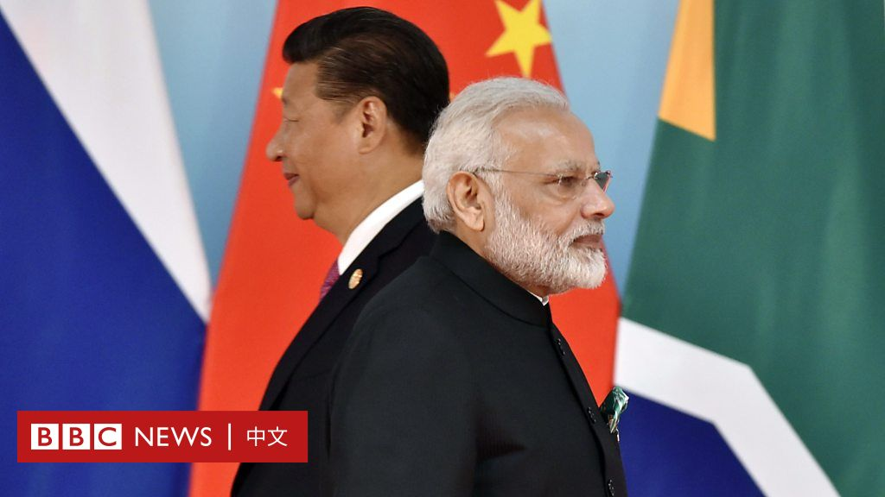
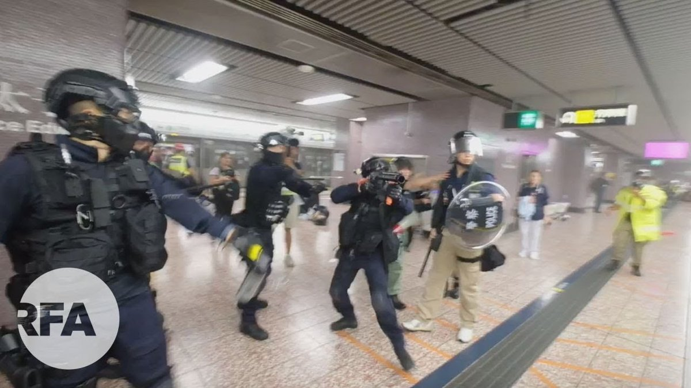

[10月12日 10:12]    新闻大吐槽   @TuCaoFakeNews    告密算什麼。
下一步就是用銅頭皮帶打，剃陰陽頭。
中共党文化要培養的就是這樣的接班人。  :speech_balloon:评:0 :+1:赞:1 :globe_with_meridians:转:1  

[10月12日 10:06]    财经真相   @caijingxiang    对，这次谈判中共等于是付出了所有人筹码，金融市场放开保证华尔街的利益，一但落成文本签字中共就不能再反悔，等到第二阶段谈判时，华尔街对川普的压力会大大降低，这就是川普的谈判策略！ https://twitter.com/seven_banannacc/status/1182838209933242368 …  :speech_balloon:评:16 :+1:赞:40 :globe_with_meridians:转:13  

[10月12日 10:04]    新闻大吐槽   @TuCaoFakeNews    Shameless https://twitter.com/TuCaoFakeNews/status/1182701980067614720 …  :speech_balloon:评:0 :+1:赞:2 :globe_with_meridians:转:1  

[10月12日 09:57]    纽约时报中文网   @nytchinese    习近平周五对印度进行短暂访问，并将与莫迪会晤。中印既是邻国，也是战略对手。两国都拥有核武器，两国关系也一如既往地复杂。
习近平和莫迪都是两国几十年来产生的最具影响力的领导人，两人都有着超乎寻常的个性。但彼此之间，他们别无选择，只能倾听。 http://nyti.ms/33gwDP4   :speech_balloon:评:6 :+1:赞:8 :globe_with_meridians:转:4  

[10月12日 09:57]    新闻大吐槽   @TuCaoFakeNews    NBA事件后续还在发酵，美国朝野不分党派抗议中共借助市场的力量打压言论自由。原先有大批对政治冷漠的美国民众，开始关注香港问题，他们认为美国人有权表达对香港民主和人权的支持。  :speech_balloon:评:0 :+1:赞:9 :globe_with_meridians:转:2  

[10月12日 09:56]    新闻大吐槽   @TuCaoFakeNews    我都以為係 p 圖， 真是國際高級黑  :speech_balloon:评:0 :+1:赞:2 :globe_with_meridians:转:1  

[10月12日 09:52]    新闻大吐槽   @TuCaoFakeNews    我想告诉他，监狱也很稳定！  :speech_balloon:评:0 :+1:赞:3 :globe_with_meridians:转:1  

[10月12日 09:49]    新闻大吐槽   @TuCaoFakeNews    笑死，全世界都在嘲笑中國，五毛們敵人很多喔~  :speech_balloon:评:0 :+1:赞:3 :globe_with_meridians:转:1  

[10月12日 09:47]    新闻大吐槽   @TuCaoFakeNews    好像做個交易，我要畫個圖，把月球都畫給中國，估計能收多少錢？  :speech_balloon:评:0 :+1:赞:2 :globe_with_meridians:转:2  

[10月12日 09:43]    财经真相   @caijingxiang    班农说川普是个懂的运用杠杆的总统，微缩版的协议是为了更大的协议，第一阶段的deal，包含金融开放、汇率、买农产品这些不触及中共体制的内容。作为翘板这些在第二轮中不能再作为中共退让谈判筹码。第二阶段将直接涉及国企垄断补贴、互联网开放、强制技术转让、以及弹簧门、玻璃门等政体改革硬骨头！  :speech_balloon:评:34 :+1:赞:113 :globe_with_meridians:转:41  

[10月12日 09:42]    新闻大吐槽   @TuCaoFakeNews    昨天没注意看以为是谁P图逗包子玩呢，没想到竟然是真的，哈哈  :speech_balloon:评:1 :+1:赞:5 :globe_with_meridians:转:2  

[10月12日 09:18]    新闻大吐槽   @TuCaoFakeNews    告密学生禁拿奖学金 陆教授赵士林获赞

中国大陆高校近年来不断发生告密事件。中央民族大学哲学与宗教学院退休教授赵士林，日前发声明表示，对老师进行政治告密的学生，以后不能获取自己出资数十万元设立的“士林奖学金”。不少人为赵士林的举动和勇气点赞。  :speech_balloon:评:1 :+1:赞:28 :globe_with_meridians:转:16  

[10月12日 09:02]    新闻大吐槽   @TuCaoFakeNews    【防暴濫捕】網民問：為什麼總是抓女孩？！  :speech_balloon:评:5 :+1:赞:34 :globe_with_meridians:转:28  

[10月12日 09:01]    新闻大吐槽   @TuCaoFakeNews    维权动态

1 .福建归侨何观娇被关精神病院
2 .深圳网约车司机聚集 要求退车
3 .江苏建工集团拖欠工资 工人讨薪
4 .西安网约车司机抗议公司以租代购行骗  :speech_balloon:评:0 :+1:赞:5 :globe_with_meridians:转:2  

[10月12日 08:55]    新闻大吐槽   @TuCaoFakeNews    持续大规模关闭车站 港铁成中共党铁?

4个月的反送中抗争中，香港地铁因多次配合警方的抓捕行动，被港人讽刺是“中共党铁”，日前，因港人反蒙面法的抗议活动持续不断，港铁再次大规模关闭车站，并提早停止服务，外界指控“党铁卖港”，刻意制造恐慌，并配合港府打压示威者。  :speech_balloon:评:2 :+1:赞:8 :globe_with_meridians:转:9  

[10月12日 08:47]    新闻大吐槽   @TuCaoFakeNews    甘源佳声明退团说：翻了墙之后，发现我所生活在的国家，共产党满口谎言。香港事件也是，让我非常愤怒。声明退出中共组织。  :speech_balloon:评:2 :+1:赞:15 :globe_with_meridians:转:10  

[10月12日 08:37]    新闻大吐槽   @TuCaoFakeNews    美机构：中共用AI技术猎捕强奸杀害港人

美国一家名为The AI Organization的人工智能研究机构，10月6号在网站上刊登一篇文章，说中共正在用人工智能的面部识别技术，在香港搜寻年轻人，用来抓捕、强奸和所谓的自杀。  :speech_balloon:评:1 :+1:赞:13 :globe_with_meridians:转:13  

[10月12日 08:29]    新闻大吐槽   @TuCaoFakeNews    谎称餐巾 中国$200万假Nike洛杉矶被查

美国海关和边境保护局周三宣布，当局在洛杉矶查获了一批来自中国的假耐克（Nike）球鞋，金额超过两百万美元。当局还表示，涉案嫌犯为了逃开检查，竟然谎称货物是餐巾。  :speech_balloon:评:1 :+1:赞:19 :globe_with_meridians:转:11  

[10月12日 08:10]    新闻大吐槽   @TuCaoFakeNews    香港喊口号的小女孩长大成人后，肯定不会变成下面一样的奴才女！所以小女孩和她的父母都做出的是正确选择！

相反那些已经接受幼儿园升血旗仪式的香港家长，你们的子女变成奴才的机率就大大增加了！

被政治搞时，必须发声反抗，才能免于被搞的命运！  :speech_balloon:评:11 :+1:赞:48 :globe_with_meridians:转:9  

[10月12日 08:02]    新闻大吐槽   @TuCaoFakeNews    NBA事件逆转 中共降温 美议员提法律反制

NBA事件出现逆转，中共试图给事件降温，但美国政界民间开始聚焦中共霸凌，并提出以法律对抗中共对美国企业施加政治影响力。今年首场“NBA中国大陆赛”10号照常在上海举行。当天场内满座，球迷不时为球星欢呼喝采，没有爆发激烈抗议场面。  :speech_balloon:评:2 :+1:赞:37 :globe_with_meridians:转:29  

[10月12日 07:54]    BBC News 中文   @bbcchinese    八集系列片《世界制造》为您讲述八件产品打造全球经济的故事。 https://bbc.in/2pgGOVe   :speech_balloon:评:0 :+1:赞:21 :globe_with_meridians:转:9  

[10月12日 07:31]    BBC News 中文   @bbcchinese    从NBA开始， BBC中文为您盘点十大最近踩上中国政治红线的跨国公司 https://bbc.in/316wJXW   :speech_balloon:评:26 :+1:赞:66 :globe_with_meridians:转:29  

[10月12日 07:15]    新闻大吐槽   @TuCaoFakeNews      :speech_balloon:评:0 :+1:赞:2 :globe_with_meridians:转:1  

[10月12日 07:10]    BBC News 中文   @bbcchinese    他坚称，冷战就从未结束过，而现在只是用不同的方法进行战斗。 https://bbc.in/319g9H5   :speech_balloon:评:2 :+1:赞:33 :globe_with_meridians:转:12  

[10月12日 06:50]    新闻大吐槽   @TuCaoFakeNews      :speech_balloon:评:0 :+1:赞:2 :globe_with_meridians:转:1  

[10月12日 06:13]    BBC News 中文   @bbcchinese    特朗普表示，最终的协议文本会在未来的五周内完成。下月，他可能将在智利与中国国家主席习近平会面。 https://bbc.in/2VB9fcq   :speech_balloon:评:25 :+1:赞:49 :globe_with_meridians:转:18  

[10月12日 04:20]    财经真相   @caijingxiang    班农说过，对川普的弹劾谘询将在感恩节前正式开始，这是中共为啥要五周时间的根本原因！ https://twitter.com/stephen_liuhuan/status/1182751627083735040 …  :speech_balloon:评:18 :+1:赞:158 :globe_with_meridians:转:55  

[10月12日 04:09]    财经真相   @caijingxiang    市场计价完毕，人民币开始回跌，股市小幅下跌黄金反弹！ https://twitter.com/caijingxiang/status/1182748170683478016 …  :speech_balloon:评:9 :+1:赞:61 :globe_with_meridians:转:16  

[10月12日 04:01]    财经真相   @caijingxiang    迷你协议内容：1.货币政策和汇率问题更加透明 2.技术转让问题得到进一步保障 3.中共同意购买400-500亿美元农产品 4.接下来五周落实协议 5.金融领域已经达成协议  本协议最核心点是五周时间，也就是有效期是五周！翻译水平有限各位自己看原文吧！  :speech_balloon:评:76 :+1:赞:270 :globe_with_meridians:转:145  

[10月12日 02:18]    老司机   @h5lpykl7tp6jjop    【关注香港】10月11日：不自由，毋宁死！革命直到最后一人！走过四个月，是政府主动突破我们的恐惧。我们十分明白有死的风险，但我们不会退缩，退缩的话这场运动就会输！抗争继续！香港人！加油  :speech_balloon:评:7 :+1:赞:159 :globe_with_meridians:转:82  

[10月12日 01:04]    GFHG SDKM   @zyx_yny    Hello NCM Yue,

Are you aware of this article of alleged CCP-approved rape and murder of HK teens, using Chinese AI and surveillance technology? https://theaiorganization.com/artificial-intelligence-with-facial-recognition-hunts-hongkong-youth-for-capture-rape-so-called-suicide/ …  :speech_balloon:评:0 :+1:赞:8 :globe_with_meridians:转:6  

[10月12日 01:04]    GFHG SDKM   @zyx_yny    The whole bridge was burnt to an ash. But I’m quite sure #HKPolice will find no suspicious circumstances in that case. :) #hkprotest #LennonWall https://twitter.com/hongkongfp/status/1181744626421518336 …  :speech_balloon:评:1 :+1:赞:2 :globe_with_meridians:转:2  

[10月12日 01:02]    GFHG SDKM   @zyx_yny    Who’s next to kowtow to #CCPChina for money？ https://twitter.com/hkdailytimes852/status/1182650881855983616 …  :speech_balloon:评:0 :+1:赞:4 :globe_with_meridians:转:2  

[10月12日 00:59]    GFHG SDKM   @zyx_yny    An auntie said to #HKPolice, even Japanese Imperial Army at the old time won’t catch so many children...... https://twitter.com/joshuawongcf/status/1182655025975365632 …  :speech_balloon:评:0 :+1:赞:1 :globe_with_meridians:转:1  

[10月12日 00:47]    GFHG SDKM   @zyx_yny    This commander isn’t the first time losing its control over the operation. You can see other popo can still hold them temper except that keep-spraying commander https://twitter.com/hkpolics/status/1182676907885654018 …  :speech_balloon:评:1 :+1:赞:10 :globe_with_meridians:转:7  

[10月12日 00:43]    GFHG SDKM   @zyx_yny    Can’t imagine they are the future of #China 
Oh no, that’s actually makes sense...
#chinazi https://twitter.com/hiroshiman18/status/1182566652438646784 …  :speech_balloon:评:2 :+1:赞:4 :globe_with_meridians:转:1  

[10月11日 23:34]    墙国铁拳现世报😷   @Socialistfist    支持NBA的推友们抓紧了，马上投票就要结束了，别说党和人民没有给你机会啊  :speech_balloon:评:1 :+1:赞:29 :globe_with_meridians:转:2  

[10月11日 23:33]    GFHG SDKM   @zyx_yny    Spontaneous mourning of the 15-year-old girl whose body was discovered in the sea on Oct 10. RIP
 https://www.facebook.com/groups/hkincident/permalink/2317418885051977/ …  :speech_balloon:评:0 :+1:赞:9 :globe_with_meridians:转:8  

[10月11日 23:30]    墙国铁拳现世报😷   @Socialistfist    又爱又怕，唉

PS 本推第一个符合两个系列的推诞生了！
#社会主义铁拳
#战螂在推特  :speech_balloon:评:44 :+1:赞:393 :globe_with_meridians:转:89  

[10月11日 22:52]    财经真相   @caijingxiang    这是典型的逻辑矛盾！ https://twitter.com/zerohedge/status/1182668476277760002 …  :speech_balloon:评:5 :+1:赞:14 :globe_with_meridians:转:3  

[10月11日 22:30]    BBC News 中文   @bbcchinese    清华马克思主义学院副教授吕嘉被学生举报，成为近期第二位被调查的清华老师。大陆告密风气渐起引发“文革返潮”担忧。
 https://bbc.in/2pc5ttR   :speech_balloon:评:64 :+1:赞:183 :globe_with_meridians:转:94  

[10月11日 21:53]    BBC News 中文   @bbcchinese    习近平与莫迪同样面对着国内经济呆滞，这亚洲两大国家的领导人能否排除万难达成任何共识，备受关注。
 https://bbc.in/2OBwIZo   :speech_balloon:评:36 :+1:赞:26 :globe_with_meridians:转:8  

[10月11日 21:49]    财经真相   @caijingxiang    昨天爱尔兰和英国就脱欧问题举行磋商，会后双方都发表了乐观的言论，市场猜测爱尔兰有可能就边界问题松口，从而大大降低了英国硬脱欧的风险，受此乐观预期影响英镑今天飙升200点，同时叠加中美贸易谈判缓和信息，全球股市暴涨，黄金一度跌破1480关口，风险资产全面回归，全球股市都在买买买！  :speech_balloon:评:2 :+1:赞:111 :globe_with_meridians:转:21  

[10月11日 21:30]    纽约时报中文网   @nytchinese    #时报专栏 首先，我们应把中国封锁国外新闻网站和社交媒体平台作为贸易问题向世界贸易组织提出申诉。第二步，是增加对互联网规避技术公司的投资，帮助中国百姓翻越防火长城，阅读未经审查的新闻。第三，美国的情报界应该搜集关于习近平家族的腐败情况，查出他们如何聚敛财富。 http://nyti.ms/2M5PgzC   :speech_balloon:评:52 :+1:赞:141 :globe_with_meridians:转:45  

[10月11日 20:30]    纽约时报中文网   @nytchinese    “追星可以，“一名大学生说，“但是我们不能以丢了祖国的尊严为代价。”
“”而且我们还有CBA（中国篮球职业联赛）呢，“另一人说，“当然没那么好看。” http://nyti.ms/33gz9Vo   :speech_balloon:评:9 :+1:赞:13 :globe_with_meridians:转:3  

[10月11日 20:19]    GFHG SDKM   @zyx_yny    So sorry for all the victims... https://twitter.com/realkyleolbert/status/1182630827668185094 …  :speech_balloon:评:0 :+1:赞:3 :globe_with_meridians:转:1  

[10月11日 20:16]    GFHG SDKM   @zyx_yny    ...
nothing more to say about #HKPoliceTerrorism #FreeHK https://twitter.com/ericwan2/status/1182593369471537154 …  :speech_balloon:评:0 :+1:赞:0 :globe_with_meridians:转:0  

[10月11日 20:13]    墙国铁拳现世报😷   @Socialistfist    今天收到了很多推友投稿和 @ ，其中有一则是某精赵在17年发微博控诉未成年女儿被性侵一事。首先照例感谢各位踊跃投稿 
因为事发17年，涉及到未成年人且是性侵害，经考虑不发推防止不必要的网络暴力。
希望大家理解  :speech_balloon:评:26 :+1:赞:175 :globe_with_meridians:转:15  

[10月11日 20:11]    BBC News 中文   @bbcchinese    中国国家主席习近平今天前往印度，与总统莫迪举行非正式会晤。在见面地点金奈的一间学校内，有约2000名学生戴上习近平的面具，为正式在机场进行的欢迎仪式作采排。  :speech_balloon:评:252 :+1:赞:719 :globe_with_meridians:转:291  

[10月11日 20:00]    BBC News 中文   @bbcchinese    【什么样的“外国人”可以为中国队踢世界杯？】首次有外国脸孔的球员代表中国参战世界杯预选赛，到底“归化球员”是如何“炼成”的？ https://bbc.in/2Mu6fdS   :speech_balloon:评:11 :+1:赞:9 :globe_with_meridians:转:0  

[10月11日 19:31]    BBC News 中文   @bbcchinese    苹果本周下架香港示威者常用的地图APP:  http://HKmap.live  引发讨论，称软件对港警安全造成危险。大家怎么看？https://bbc.in/2nB16rN   :speech_balloon:评:99 :+1:赞:53 :globe_with_meridians:转:17  

[10月11日 19:30]    纽约时报中文网   @nytchinese    #图集 【“我们在战火中”：一份阿富汗战争口述史】在美国入侵阿富汗的18年间，当地人都过着怎样的生活？阿富汗人民讲述了自己的故事。
“我们在战火中，但尽管有战争和杀戮，我们仍在努力继续过生活，”一名当地人说。
点击查看图集： http://nyti.ms/2AZ4ccp   :speech_balloon:评:15 :+1:赞:10 :globe_with_meridians:转:3  

[10月11日 19:29]    BBC News 中文   @bbcchinese    中国江苏省无锡市发生一起高架桥侧翻事故，包括一名男子及一对母女在内的三人死亡。罹难女童仅有5岁。  :speech_balloon:评:59 :+1:赞:102 :globe_with_meridians:转:44  

[10月11日 19:25]    BBC News 中文   @bbcchinese    时代不同了，一切皆可以成为商品，包括国籍和护照。但前提是你需要有钱，有很多的钱。 https://bbc.in/2VyAOmB   :speech_balloon:评:8 :+1:赞:105 :globe_with_meridians:转:40  

[10月11日 19:20]    墙国铁拳现世报😷   @Socialistfist    推友们你有没有闻到一股恶臭
为两地遇难者祈福  :speech_balloon:评:33 :+1:赞:264 :globe_with_meridians:转:48  

[10月11日 19:16]    GFHG SDKM   @zyx_yny    昨日、ある香港中文大学の学生が校長先生の前で、自分が逮捕されたあと警察に性的暴行を受けたと告白しました。その学生は警察署への連行後、男性警官に胸を触られ、20人以上の男性警官の前で衣服を上げられたと訴えました。彼女が自分の経験を告発したあと、親中派から中傷電話がたくさん来ています。  :speech_balloon:评:348 :+1:赞:17881 :globe_with_meridians:转:11847  

[10月11日 19:05]    GFHG SDKM   @zyx_yny    Tysm wish you all the best my dear. https://twitter.com/helphkinfo/status/1182545224645644288 …  :speech_balloon:评:0 :+1:赞:2 :globe_with_meridians:转:1  

[10月11日 19:01]    BBC News 中文   @bbcchinese    马钊指出，美国政界对香港局势的反应比较谨慎。无论是总统本人、国务卿、还是议员，都只是在“民主”层面支持抗议者，但是并没有支持抗议示威活动中出现的暴力倾向，更没有回应“香港独立”的政治诉求。 https://bbc.in/2OzsBgC   :speech_balloon:评:72 :+1:赞:101 :globe_with_meridians:转:34  

[10月11日 18:58]    GFHG SDKM   @zyx_yny    NO we cannot accept that. 
The more one tries to hide, the more one is exposed... #MeToo #HKprotests https://twitter.com/AvengingDark/status/1182598341856612353 …  :speech_balloon:评:0 :+1:赞:4 :globe_with_meridians:转:3  

[10月11日 18:55]    GFHG SDKM   @zyx_yny    NAKED Body...... https://twitter.com/badiucao/status/1182606419972915201 …  :speech_balloon:评:0 :+1:赞:0 :globe_with_meridians:转:2  

[10月11日 18:33]    老司机   @h5lpykl7tp6jjop    再看看正在洗脑的韭菜苗，真是让和珅自叹不如！  :speech_balloon:评:0 :+1:赞:18 :globe_with_meridians:转:6  

[10月11日 18:32]    GFHG SDKM   @zyx_yny    幾個月黎不斷發Po,retweet, report五毛，但follower人數少得可憐，而家PO tweet直頭冇人理，有冇手足可以follow同幫我rt上300?

自問英文ok,可多線文宣！

#FollowBackHongKong
#StandwithHK  :speech_balloon:评:126 :+1:赞:670 :globe_with_meridians:转:292  

[10月11日 18:30]    纽约时报中文网   @nytchinese    相关争论很快从微博10大热门榜单消失。当局没有取消上海的NBA季前赛。《环球时报》也不再煽动对那条推文的民粹主义愤怒情绪。
“我想这个问题会逐步降温——《环球时报》不会刻意让它保持热度，”该报总编胡锡进在回复置评邮件时称。“我也希望美国方面不要采取任何举动让它升级。” http://nyti.ms/2IGIspK   :speech_balloon:评:14 :+1:赞:77 :globe_with_meridians:转:26  

[10月11日 18:10]    老司机   @h5lpykl7tp6jjop    省部级官员退休后一年的福利收入，这还不包括退休金级别待遇以及暗收入，看看差距，私营老板自己比较！  :speech_balloon:评:4 :+1:赞:23 :globe_with_meridians:转:12  

[10月11日 18:06]    GFHG SDKM   @zyx_yny    If we burn, you burn with us!
怒火已燎原
如果我們毀滅，你們也會跟我們同歸於盡
-
Let’s join @freetoberhk2019 !
#ontungc #StandwithHonKong #freetoberhk2019 #inktober2019 #HongKongProtests #HongKongProtesters #FreeHongKong #fire  :speech_balloon:评:45 :+1:赞:993 :globe_with_meridians:转:490  

[10月11日 18:01]    BBC News 中文   @bbcchinese    如果在美国股市交易的中国公司“被除牌”，哪些投资者要割肉？ https://bbc.in/35oupih   :speech_balloon:评:13 :+1:赞:41 :globe_with_meridians:转:15  

[10月11日 18:00]    纽约时报中文网   @nytchinese    #图集【在美国，22.5万美元能买到什么房？】手握22.5万美元，你能买到缅因州里士满的一座1870年代小屋，或是弗吉尼亚州诺福克改建仓库中的公寓，也可以选择西弗吉尼亚州费尔蒙一座建于1927年的都铎复兴式房屋。
点击查看图集： http://nyti.ms/2B2HDU1   :speech_balloon:评:10 :+1:赞:27 :globe_with_meridians:转:8  

[10月11日 17:58]    老司机   @h5lpykl7tp6jjop      :speech_balloon:评:1 :+1:赞:40 :globe_with_meridians:转:20  

[10月11日 17:54]    GFHG SDKM   @zyx_yny    Apple Daily was told the deceased 15-year-old girl on its front page this morning was cremated yesterday

This is a very sad story, first and foremost because of the tragic loss of life, but also because we will be drowning in rumours again for some time https://hk.news.appledaily.com/local/realtime/article/20191011/60142396 …  :speech_balloon:评:204 :+1:赞:1681 :globe_with_meridians:转:1271  

[10月11日 17:33]    新闻大吐槽   @TuCaoFakeNews    无锡这帮官员知道出大事啦！直接毁灭罪证！拆掉塌下来高架桥，现场数不清的工程车辆在毁尸灭迹，场面震撼!  :speech_balloon:评:206 :+1:赞:1503 :globe_with_meridians:转:964  

[10月11日 17:31]    老司机   @h5lpykl7tp6jjop    说中国人懒惰，肯定许多人不同意，但是说他们思想上懒惰就是实情了，从来总是随大流，一窝蜂，跟风成习惯，懒于思辩，总是圣人说古人曰，领袖指东就东指西就西，还特别对有独立思想看法的人恨之入骨，称为叛徒汉奸，于是不东倒就西歪，好比一艘大船航行不能保持平衡，所以几千年来一直赶不上文明的潮流  :speech_balloon:评:5 :+1:赞:93 :globe_with_meridians:转:24  

[10月11日 17:30]    纽约时报中文网   @nytchinese    篮球曾将中美两大经济体联合起来。在这种被称为“中美共同体“的紧密关系中，篮球成为最鲜明的象征；如今，它却可能推动两国的疏离。
周四，洛杉矶湖人队和布鲁克林篮网队的比赛在上海展开，这无疑是NBA历史上最有地缘政治意义的表演赛。一些中国球迷说出了他们的想法。 http://nyti.ms/33gz9Vo   :speech_balloon:评:33 :+1:赞:71 :globe_with_meridians:转:19  

[10月11日 17:07]    GFHG SDKM   @zyx_yny    関係ないなんてことはない
#StandwithHK  :speech_balloon:评:3 :+1:赞:69 :globe_with_meridians:转:39  

[10月11日 17:00]    纽约时报中文网   @nytchinese    最近几周，美国官员们举行了会议，讨论如果当前这一轮谈判不能解决政府的主要关切，还可以采取哪些措施。
特朗普的高级经济顾问们在公开场合淡化了这些讨论；讨论的焦点是加强对在美国证券交易所上市的中国公司的审查，以及限制政府运营的退休基金对中国的直接风险敞口。 http://nyti.ms/2AYIHIJ   :speech_balloon:评:4 :+1:赞:10 :globe_with_meridians:转:4  

[10月11日 16:37]    老司机   @h5lpykl7tp6jjop    目前全世界最先进的直升机是美国的S97，速度才407公里，最大起飞重量才五吨，这个怪东西且不说发动机涵道效率低，就这7吨重量怎么能达到650公里的高速，骗子连起码的常识都不具备，又是个亩产十万斤的牛皮！也不怕风大歪嘴巴！  :speech_balloon:评:1 :+1:赞:20 :globe_with_meridians:转:3  

[10月11日 16:30]    纽约时报中文网   @nytchinese    #时报专栏 别等到中国抓捕小熊维尼时再行动 by @NickKristof  http://nyti.ms/2M5PgzC https://twitter.com/ccni/status/1182562066151817216 …  :speech_balloon:评:8 :+1:赞:14 :globe_with_meridians:转:5  

[10月11日 16:24]    纽约时报中文网   @nytchinese    每日一词：Third-rail issue
踩到“第三轨道”的NBA  http://nyti.ms/33kw2Mo https://twitter.com/ccni/status/1182464379436130304 …  :speech_balloon:评:1 :+1:赞:4 :globe_with_meridians:转:1  

[10月11日 16:16]    财经真相   @caijingxiang    关于汇率协议将会大幅推动人民币升值纯粹是“大忽悠”，现在中国和当年日本面临的情况完全不一样，日本当年是创新大国，且拥有民主政体保证财富安全，而且日元已经成为世界主流货币被纳入其他国家储备货币，这些今天中共能比吗？中共走回头路资本跑都来不及还有傻瓜去投资？ https://twitter.com/bbcchinese/status/1182566793396793344 …  :speech_balloon:评:30 :+1:赞:350 :globe_with_meridians:转:86  

[10月11日 16:01]    BBC News 中文   @bbcchinese    中美双方或有可能就汇率和版权保护等问题达成“初步成果”协议。外界忧虑汇率协议对中国不利，并以上世纪80年代美日贸易战的广场协议作对比。 https://bbc.in/2pextNG   :speech_balloon:评:27 :+1:赞:85 :globe_with_meridians:转:38  

[10月11日 16:00]    纽约时报中文网   @nytchinese    中美贸易谈判于周四重启，人们对达成有限协议的期待越来越大。美国官员正在考虑或给北京带来更多经济痛苦的选项，来迫使中国改变使美企处于不利地位的规则。
知情者称，处于考虑中的这些想法将使白宫的谈判工具选择从关税转向限制中国进入美国市场，并对中企实施更严格的审查。 http://nyti.ms/2AYIHIJ   :speech_balloon:评:77 :+1:赞:45 :globe_with_meridians:转:17  

[10月11日 15:59]    财经真相   @caijingxiang    人民币刚涨了不到一千点，一堆人留言问我是不是爆仓了，很抱歉让你们失望了！这种仓位想爆仓除非让中国出口企业死光！还有中美即使达成协议，无非只是取消新加关税，已经加征会继续维持，这就注定人民币不惧大幅上涨，更何况双方焦点只是达成部分协议，一个大骗局而已！  :speech_balloon:评:45 :+1:赞:243 :globe_with_meridians:转:52  

[10月11日 15:30]    纽约时报中文网   @nytchinese    #时报专栏 习近平对网络、宗教、香港示威者，甚至维尼熊的焦虑突出了他缺乏安全感。习近平好像害怕真实信息会渗透到中国国内产生同温层效应，破坏“习大大”的形象，让宣传部门建立起的个人崇拜功亏一篑。
我们可以利用习近平的恐惧来换取筹码，也许还能稍微削弱中国的民族主义。 http://nyti.ms/2M5PgzC   :speech_balloon:评:62 :+1:赞:177 :globe_with_meridians:转:33  

[10月11日 15:01]    BBC News 中文   @bbcchinese    实验显示，狗狗能判断出某人是否可信。一旦牠认为某人不可信，它就会……忽略此人提供的线索。 https://bbc.in/2IGOVRy   :speech_balloon:评:11 :+1:赞:46 :globe_with_meridians:转:17  

[10月11日 14:39]    老司机   @h5lpykl7tp6jjop    曾经我以为，共匪是亚洲做大做强的ISIS；后来翻了一些年份和历史，我才发现：ISIS才是中东地区的共匪。 https://twitter.com/guppydong/status/1182351804002000897 …  :speech_balloon:评:2 :+1:赞:28 :globe_with_meridians:转:15  

[10月11日 14:30]    纽约时报中文网   @nytchinese    #时报专栏 对于中国暴政的蔓延，我们有一些小理由感到乐观。两党对NBA最初向中国道歉的愤怒，确实表明美国立法者不愿让中国为所欲为。
特朗普政府还做了一件聪明的事，将8家中国监控技术公司和几个警察部门列入黑名单，禁止它们与美国公司进行交易。 http://nyti.ms/325LrQu   :speech_balloon:评:20 :+1:赞:29 :globe_with_meridians:转:9  

[10月11日 14:09]    纽约时报中文网   @nytchinese    NBA“挺港”事件背后：国际公司在华“雷点”难料  http://nyti.ms/2Mwogbw https://twitter.com/ccni/status/1182240120943996928 …  :speech_balloon:评:10 :+1:赞:14 :globe_with_meridians:转:3  

[10月11日 14:01]    BBC News 中文   @bbcchinese    激进组织所谓的“伊斯兰国”在伊拉克摩苏尔炸毁奈比尤努斯清真寺，竟意外发现了距今3000年的亚述王朝宫殿。故事从这里开始 https://bbc.in/326b4Az   :speech_balloon:评:11 :+1:赞:147 :globe_with_meridians:转:62  

[10月11日 13:30]    纽约时报中文网   @nytchinese    “战略猪肉储备“制度建立于1970年代末，中国正要开始摆脱经济困境之时。毛泽东政府自50年代起一直设立粮食、盐和糖的紧急储备，作为计划经济的一部分。
随着中国引入市场改革，储备成为控制价格波动的手段，并且不仅有猪肉，也有牛肉、鸡肉和羊肉。 http://nyti.ms/2pTr62m   :speech_balloon:评:5 :+1:赞:19 :globe_with_meridians:转:8  

[10月11日 13:15]    GFHG SDKM   @zyx_yny    I stand with you guys. I can’t do much. And I’m sorry for the idiots here that are letting you down. But they are the minority, but there are plenty like me here in the US that want the best and freedom for you. #FreeHongKong #FreeHK  :speech_balloon:评:322 :+1:赞:1496 :globe_with_meridians:转:659  

[10月11日 13:00]    BBC News 中文   @bbcchinese    人类留在月球上的东西总重量超过200吨，包括了圣经，以及高尔夫球…… https://bbc.in/2q5F6GF   :speech_balloon:评:9 :+1:赞:53 :globe_with_meridians:转:16  

[10月11日 13:00]    纽约时报中文网   @nytchinese    #时报专栏 如果美国公司继续低头，有一天或许“习大大“会来敲门，要求我们交出小熊维尼怎么办？我们会不情愿地交出它吗？
当像习近平这样的独裁者欺凌自己的国民，我们无能为力，但是我们不应让他扼杀我们在自己国家的讨论。我们应该起来反抗中国的霸凌。 http://nyti.ms/2M5PgzC   :speech_balloon:评:346 :+1:赞:1819 :globe_with_meridians:转:611  

[10月11日 12:52]    老司机   @h5lpykl7tp6jjop    吓尿美国日本的军事科技新牛皮：中国UFO武装直升机亮相引发轰动 造型如飞碟，吓没吓尿考外我不知道，就这一个纸糊的壳倒是把老夫笑尿了！10月10日，第五届中国天津国际直升机博览会在天津滨海新区空港经济区中航直升机产业基地内举行。外形酷似飞碟的“超级大白鲨”武装直升机在会上对外展出。  :speech_balloon:评:30 :+1:赞:47 :globe_with_meridians:转:19  

[10月11日 12:30]    纽约时报中文网   @nytchinese    中国突然采取行动，试图平息对NBA的公愤，因为北京担心，煽动民族主义愤怒情绪的言论正在损害中国的利益和其在全世界的形象。知情者称，官媒突然被要求低调处理相关新闻。
分析称，北京担心，相关争议可能会影响正在进行的贸易谈判，增加国际社会抵制2022年北京冬奥会的风险。 http://nyti.ms/2IGIspK   :speech_balloon:评:244 :+1:赞:1124 :globe_with_meridians:转:467  

[10月11日 12:23]    老司机   @h5lpykl7tp6jjop    一国两制统一台湾的梦越来越没有可能！
台湾青少年国家认同调查: 维持现状 反对统一  :speech_balloon:评:1 :+1:赞:10 :globe_with_meridians:转:1  

[10月11日 12:00]    纽约时报中文网   @nytchinese    今日食谱：棉花糖布朗尼，双重口感，美味加倍。
更多简报内容： http://nyti.ms/2ovPtmw   :speech_balloon:评:2 :+1:赞:6 :globe_with_meridians:转:0  

[10月11日 11:53]    老司机   @h5lpykl7tp6jjop    你知道中國奇跡嗎？昨天晚上一座橋垮塌了，早上起來，垮塌的橋不見了！不見了！！  :speech_balloon:评:164 :+1:赞:1150 :globe_with_meridians:转:686  

[10月11日 11:30]    纽约时报中文网   @nytchinese    #观点 中共建国之初，曾承认并借鉴了清朝用灵活方式对待多元化和主权的传统。但多年来，尤其是习近平上台以来，中共已放弃了相对宽容的传统，加强了民族同化主义和政治僵化。如今，中共不再颂扬各文化的独特性，而是越发推崇一种叫“中华”的统一文化，这是种泛中国的身份认同。 http://nyti.ms/2Ozgsbx   :speech_balloon:评:24 :+1:赞:28 :globe_with_meridians:转:7  

[10月11日 11:00]    BBC News 中文   @bbcchinese    香港“反送中”运动，令中国大陆封杀了多少品牌？  :speech_balloon:评:187 :+1:赞:437 :globe_with_meridians:转:169  

[10月11日 11:00]    纽约时报中文网   @nytchinese    “特朗普电话门”最新进展：两名乌克兰裔美国商人在机场离境时被捕。他们被控参与向乌克兰施压的活动，并帮助安排特朗普私人律师朱利安尼与乌克兰政界人士建立联系等。
乌克兰总统泽伦斯基再度声明，称其不曾被特朗普“勒索”。
更多简报内容： http://nyti.ms/2ovPtmw   :speech_balloon:评:6 :+1:赞:3 :globe_with_meridians:转:2  

[10月11日 10:39]    财经真相   @caijingxiang    川普已经明确表态必须是个全面deal，不是部分或者缩小版的，这是中共本次最想争取的结果，中共为此抛出其他各种条件诱惑川普，就看川普如何衡量；如果达成协议，最后签字人必须是习，因此即使双方发表了公告，在习正式签字之前，依然充满各种变数，比如，回国后的刘鹤突然被抓！  :speech_balloon:评:55 :+1:赞:259 :globe_with_meridians:转:50  

[10月11日 10:32]    财经真相   @caijingxiang    贸易谈判到目前为止真假消息漫天飞，从第一天谈判情况来看，双方没有仅仅谈判几个小时就宣布破裂，这本身就是一个利好信号，这也是人民币继续上涨的根源；双方明天继续谈判，刘鹤需要把第一天勾兑情况向北京报告，北京开会后告知刘结果，因此明天才是最关键时刻，在这之前一切都是假消息！  :speech_balloon:评:23 :+1:赞:330 :globe_with_meridians:转:79  

[10月11日 09:53]    BBC News 中文   @bbcchinese    原来黑松露是这样采出来的！ https://bbc.in/326EfDE   :speech_balloon:评:5 :+1:赞:52 :globe_with_meridians:转:20  

[10月11日 09:07]    老司机   @h5lpykl7tp6jjop    几十年了大陆和台湾都说对方要垮，结果一直没有应验，今年终于兑现了大陆国庆台湾桥垮了，台湾国庆大陆桥也垮了，老天爷做这个示范究竟要告诉我人们什么？真他妈搞不懂！  :speech_balloon:评:5 :+1:赞:38 :globe_with_meridians:转:5  

[10月11日 08:51]    凡賽堤/FORSETI   @FecharCCP    魔鬼在人間29
極權殺人恐怖組織正在用各種兇殘手段殺害我們的同胞..........

15歲游泳健將發夢彥林被棄屍大海，離奇死亡！

上帝啊，祈求你開眼把，看看極權殺人恐怖組織在人類大地上所犯下的種種反人類的罪行吧！！！！！！！！！！！！！！！！！！！！！！！！  :speech_balloon:评:15 :+1:赞:271 :globe_with_meridians:转:186  

[10月11日 08:15]    BBC News 中文   @bbcchinese    ER始于2018年的英国，属于社会政治运动，传承的公民不服从（公民抗命）传统精髓却由来已久。 https://bbc.in/2M4gOVJ   :speech_balloon:评:15 :+1:赞:20 :globe_with_meridians:转:9  

[10月11日 07:42]    老司机   @h5lpykl7tp6jjop    香港中文大学同学听了一位女同学泣诉被捕后曾遭性侵和酷刑心痛如绞，抱头痛哭！！谁来救救香港这些未成年孩子和花季少女？难道都眼瞎了良心被狗吃了吗？性侵女示威者的狗警岂能只是谴责？应该绳之以法！！！  :speech_balloon:评:197 :+1:赞:1253 :globe_with_meridians:转:614  

[10月11日 06:40]    凡賽堤/FORSETI   @FecharCCP    魔鬼在人間27
極權殺人恐怖組織正在用各種兇殘手段殺害我們的同胞..........

他們大部份都才8歲，10歲，12歲，16歲，17歲的香港小學生，中學生被暴打，被抓捕！上帝啊，祈求你開眼把，看看極權殺人恐怖組織在人類大地上所犯下的種種反人類的罪行吧！！！！！！！！！！！！！！！！！！！！！！！！  :speech_balloon:评:1 :+1:赞:18 :globe_with_meridians:转:15  

[10月11日 06:06]    凡賽堤/FORSETI   @FecharCCP    極權殺人恐怖組織正在用各種兇殘手段殺害我們的同胞.......... https://twitter.com/FecharCCP/status/1182089689588736001 …  :speech_balloon:评:1 :+1:赞:8 :globe_with_meridians:转:7  

[10月11日 06:06]    凡賽堤/FORSETI   @FecharCCP    極權殺人恐怖組織正在用各種兇殘手段殺害我們的同胞.......... https://twitter.com/FecharCCP/status/1182079070210859010 …  :speech_balloon:评:2 :+1:赞:7 :globe_with_meridians:转:7  

[10月11日 06:06]    凡賽堤/FORSETI   @FecharCCP    極權殺人恐怖組織正在用各種兇殘手段殺害我們的同胞.......... https://twitter.com/FecharCCP/status/1182079157443928064 …  :speech_balloon:评:0 :+1:赞:5 :globe_with_meridians:转:6  

[10月11日 06:06]    凡賽堤/FORSETI   @FecharCCP    極權殺人恐怖組織正在用各種兇殘手段殺害我們的同胞.......... https://twitter.com/FecharCCP/status/1182079248024121344 …  :speech_balloon:评:0 :+1:赞:5 :globe_with_meridians:转:6  

[10月11日 06:06]    凡賽堤/FORSETI   @FecharCCP    極權殺人恐怖組織正在用各種兇殘手段殺害我們的同胞.......... https://twitter.com/FecharCCP/status/1182079392387911680 …  :speech_balloon:评:0 :+1:赞:8 :globe_with_meridians:转:7  

[10月11日 06:06]    凡賽堤/FORSETI   @FecharCCP    極權殺人恐怖組織正在用各種兇殘手段殺害我們的同胞.......... https://twitter.com/FecharCCP/status/1182079492958883840 …  :speech_balloon:评:0 :+1:赞:2 :globe_with_meridians:转:2  

[10月11日 06:05]    凡賽堤/FORSETI   @FecharCCP    極權殺人恐怖組織正在用各種兇殘手段殺害我們的同胞.......... https://twitter.com/FecharCCP/status/1182079697460633600 …  :speech_balloon:评:0 :+1:赞:2 :globe_with_meridians:转:0  

[10月11日 06:05]    凡賽堤/FORSETI   @FecharCCP    極權殺人恐怖組織正在用各種兇殘手段殺害我們的同胞.......... https://twitter.com/FecharCCP/status/1182079805044543488 …  :speech_balloon:评:0 :+1:赞:12 :globe_with_meridians:转:5  

[10月11日 06:05]    凡賽堤/FORSETI   @FecharCCP    極權殺人恐怖組織正在用各種兇殘手段殺害我們的同胞.......... https://twitter.com/FecharCCP/status/1182079900393582592 …  :speech_balloon:评:0 :+1:赞:2 :globe_with_meridians:转:2  

[10月11日 06:05]    凡賽堤/FORSETI   @FecharCCP    極權殺人恐怖組織正在用各種兇殘手段殺害我們的同胞.......... https://twitter.com/FecharCCP/status/1182080070007046146 …  :speech_balloon:评:0 :+1:赞:2 :globe_with_meridians:转:1  

[10月11日 06:04]    凡賽堤/FORSETI   @FecharCCP    極權殺人恐怖組織正在用各種兇殘手段殺害我們的同胞.......... https://twitter.com/FecharCCP/status/1182359771447382016 …  :speech_balloon:评:0 :+1:赞:0 :globe_with_meridians:转:0  

[10月11日 06:04]    凡賽堤/FORSETI   @FecharCCP    極權殺人恐怖組織正在用各種兇殘手段殺害我們的同胞.......... https://twitter.com/FecharCCP/status/1182367617799131142 …  :speech_balloon:评:0 :+1:赞:2 :globe_with_meridians:转:1  

[10月11日 06:01]    凡賽堤/FORSETI   @FecharCCP    魔鬼在人間26
極權殺人恐怖組織正在用各種兇殘手段殺害我們的同胞..........

他們大部份都才8歲，10歲，12歲，16歲，17歲的香港小學生，中學生被暴打，被抓捕！上帝啊，祈求你開眼把，看看極權殺人恐怖組織在人類大地上所犯下的種種反人類的罪行吧！！！！！！！！！！！！！！！！！！！！！！！！  :speech_balloon:评:0 :+1:赞:2 :globe_with_meridians:转:2  

[10月11日 06:01]    凡賽堤/FORSETI   @FecharCCP    魔鬼在人間25
極權殺人恐怖組織正在用各種兇殘手段殺害我們的同胞..........

他們大部份都才8歲，10歲，12歲，16歲，17歲的香港小學生，中學生被暴打，被抓捕！上帝啊，祈求你開眼把，看看極權殺人恐怖組織在人類大地上所犯下的種種反人類的罪行吧！！！！！！！！！！！！！！！！！！！！！！！！  :speech_balloon:评:0 :+1:赞:2 :globe_with_meridians:转:0  

[10月11日 06:00]    凡賽堤/FORSETI   @FecharCCP    魔鬼在人間24
極權殺人恐怖組織正在用各種兇殘手段殺害我們的同胞..........

他們大部份都才8歲，10歲，12歲，16歲，17歲的香港小學生，中學生被暴打，被抓捕！上帝啊，祈求你開眼把，看看極權殺人恐怖組織在人類大地上所犯下的種種反人類的罪行吧！！！！！！！！！！！！！！！！！！！！！！！！  :speech_balloon:评:0 :+1:赞:2 :globe_with_meridians:转:1  

[10月11日 06:00]    凡賽堤/FORSETI   @FecharCCP    魔鬼在人間23
極權殺人恐怖組織正在用各種兇殘手段殺害我們的同胞..........

他們大部份都才8歲，10歲，12歲，16歲，17歲的香港小學生，中學生被暴打，被抓捕！上帝啊，祈求你開眼把，看看極權殺人恐怖組織在人類大地上所犯下的種種反人類的罪行吧！！！！！！！！！！！！！！！！！！！！！！！！  :speech_balloon:评:0 :+1:赞:2 :globe_with_meridians:转:0  

[10月11日 05:59]    凡賽堤/FORSETI   @FecharCCP    魔鬼在人間22
極權殺人恐怖組織正在用各種兇殘手段殺害我們的同胞..........

他們大部份都才8歲，10歲，12歲，16歲，17歲的香港小學生，中學生被暴打，被抓捕！上帝啊，祈求你開眼把，看看極權殺人恐怖組織在人類大地上所犯下的種種反人類的罪行吧！！！！！！！！！！！！！！！！！！！！！！！！  :speech_balloon:评:0 :+1:赞:2 :globe_with_meridians:转:1  

[10月11日 05:58]    凡賽堤/FORSETI   @FecharCCP    魔鬼在人間21
極權殺人恐怖組織正在用各種兇殘手段殺害我們的同胞..........

他們大部份都才8歲，10歲，12歲，16歲，17歲的香港小學生，中學生被暴打，被抓捕！上帝啊，祈求你開眼把，看看極權殺人恐怖組織在人類大地上所犯下的種種反人類的罪行吧！！！！！！！！！！！！！！！！！！！！！！！！  :speech_balloon:评:0 :+1:赞:2 :globe_with_meridians:转:0  

[10月11日 05:15]    老司机   @h5lpykl7tp6jjop    沉船计划早已开始，它们忙着捞取最后一张钞票，废民还在拼命帮它们数钱，还在拼命爱不属于自己的赵国！  :speech_balloon:评:3 :+1:赞:65 :globe_with_meridians:转:45  

[10月11日 05:02]    老司机   @h5lpykl7tp6jjop    尽管当年三赔真廉价，至今仍然感激党的照顾，老一代三赔小姐爱国真心话  :speech_balloon:评:14 :+1:赞:164 :globe_with_meridians:转:58  

[10月11日 04:58]    老司机   @h5lpykl7tp6jjop      :speech_balloon:评:3 :+1:赞:27 :globe_with_meridians:转:13  

[10月11日 01:54]    墙国铁拳现世报😷   @Socialistfist    为契合推文主题小编特别推出投稿指南。
#社会主义铁拳 指某精赵在各平台（如微博贴吧）公开发布地爱党国言论和被铁拳截图，两者可为新后或并列关系。至少两张截图

#战螂在推特  是一个分享战螂在推特上的反价值观魔幻言行的品鉴系列，要求宽松符合条件即可。  :speech_balloon:评:8 :+1:赞:70 :globe_with_meridians:转:5  

[10月11日 01:41]    墙国铁拳现世报😷   @Socialistfist    这个月里，我们一起回顾了历史上的铁拳，我们还有幸请到了墙内粉红兔兔@zzyyzoe ，并把她打造成推特网红。
，还搞了让大家心服口服的民主投票，最后新系列#战螂在推特 也获得大家良好反响。  :speech_balloon:评:8 :+1:赞:106 :globe_with_meridians:转:4  

[10月11日 01:39]    墙国铁拳现世报😷   @Socialistfist    9月11日开办的墙国铁拳现世报, 今天满月了！多谢一个月来各位看官捧场，感谢大家的转发点赞评论三连。还要特别感谢给小编投稿的各位，是你们让这个推坚持活跃下去 
大家的热情，让小编受宠若惊。
（更正8000+推友）  :speech_balloon:评:23 :+1:赞:422 :globe_with_meridians:转:35  

[10月11日 01:16]    GFHG SDKM   @zyx_yny    This is the #CCP world we live in now. WAKE UP!

A Sydney #gamingstartup has been hit by a concerted #cyberattack after it offered to support a professional gamer banned from his sport for endorsing #HongKong #democracyprotests. https://www.smh.com.au/business/companies/sydney-startup-under-fire-online-for-supporting-pro-hong-kong-protest-gamer-20191009-p52z2g.html …  :speech_balloon:评:107 :+1:赞:1246 :globe_with_meridians:转:1015  

[10月10日 22:45]    老司机   @h5lpykl7tp6jjop    令人发指：香港中大女學生除口罩親述示威者於新屋嶺黑房內被警察性侵、性暴力、虐打！  :speech_balloon:评:102 :+1:赞:666 :globe_with_meridians:转:356  

[10月10日 22:22]    墙国铁拳现世报😷   @Socialistfist    突然爱国，突然强拆
#社会主义铁拳 https://twitter.com/rtiomn/status/1182294052466614272 …  :speech_balloon:评:89 :+1:赞:549 :globe_with_meridians:转:129  

[10月10日 22:20]    老司机   @h5lpykl7tp6jjop    国内刷屏！无锡豆腐渣桥梁垮塌，很多车被压扁，死伤惨重！官方说大车是空车，禁止报道死亡人数！现场信号被屏蔽，先解决掉提问题的人。假如垮塌的桥下还有幸存者，他们怎样和外界联系？  :speech_balloon:评:438 :+1:赞:1774 :globe_with_meridians:转:1004  

[10月10日 22:12]    老司机   @h5lpykl7tp6jjop    封杀我是你的职责，坚持表达是我的权利，秋实先生加油（二）  :speech_balloon:评:52 :+1:赞:1219 :globe_with_meridians:转:435  

[10月10日 22:01]    老司机   @h5lpykl7tp6jjop    黃埔後代在上海淞滬抗戰公園舉青天白日旗被警察帶走  :speech_balloon:评:26 :+1:赞:155 :globe_with_meridians:转:75  

[10月10日 17:44]    墙国铁拳现世报😷   @Socialistfist    全推特最纯净的推 https://twitter.com/zSP8IcFxk8kpaJv/status/1182229009410641920 …  :speech_balloon:评:23 :+1:赞:283 :globe_with_meridians:转:25  

[10月10日 17:28]    墙国铁拳现世报😷   @Socialistfist    你们看看这些假爱国者，竟然为了房子威胁国家，上街游行。
#社会主义铁拳  :speech_balloon:评:78 :+1:赞:517 :globe_with_meridians:转:162  

[10月10日 17:15]    墙国铁拳现世报😷   @Socialistfist    突然来了很多香港选民，你们投完票可以去何议员那里继续投票  :speech_balloon:评:10 :+1:赞:97 :globe_with_meridians:转:6  

[10月10日 13:38]    财经真相   @caijingxiang    唐纳德·J·特朗普的大作《The way to  the top》，中文名《颠覆之路》！  :speech_balloon:评:15 :+1:赞:116 :globe_with_meridians:转:27  

[10月10日 11:32]    GFHG SDKM   @zyx_yny      :speech_balloon:评:2 :+1:赞:326 :globe_with_meridians:转:42  

[10月10日 09:48]    财经真相   @caijingxiang    离岸人民币从7.1680到7.0999，短短一个小时近700点！  :speech_balloon:评:76 :+1:赞:316 :globe_with_meridians:转:84  

[10月10日 09:10]    财经真相   @caijingxiang    这两天市场被媒体忽悠惨了，来回割肉，不过现在加大农产品采购，说明中共还是玩的买买买的套路，不准备全面达成协议。双方第一次接触将很重要，也就是说北京时间10号21:00至11号凌晨5点，将是决定本轮会谈最后时间，各位交易员做好准备，暴风雨要来了！ https://twitter.com/LoneCapital/status/1182096813882372097 …  :speech_balloon:评:22 :+1:赞:248 :globe_with_meridians:转:107  

[10月10日 07:44]    老司机   @h5lpykl7tp6jjop    悲慘的香港5 ，看到這一幕幕屍體，我們是悲痛？是無助？還是哭泣？是憤怒？ 面對強權，我們該如何？

（聲明！圖片來源均來自網絡媒體，如有侵權，立即刪除）  :speech_balloon:评:30 :+1:赞:297 :globe_with_meridians:转:251  

[10月09日 23:15]    墙国铁拳现世报😷   @Socialistfist    中国突然取消了NBA投票选项 https://twitter.com/VOAChinese/status/1181942149064998912 …  :speech_balloon:评:2 :+1:赞:52 :globe_with_meridians:转:3  

[10月09日 23:14]    新闻大吐槽   @TuCaoFakeNews    这下暴雪要哭了，
其射击游戏「守望先锋」的预告片里，一个中国女孩角色被高手给P了，改成了一个支持反送中的香港女孩！

是时候全民抵制暴雪了，请在墙内广传此影片！  :speech_balloon:评:112 :+1:赞:3222 :globe_with_meridians:转:1558  

[10月09日 23:08]    财经真相   @caijingxiang    香港资本外逃，从2017年年初肖建华被抓就已经开始了，这也是2017年年初那波高峰的原因，此后资本外逃就没有停止过，始终停留在最高峰，我做的YouTube视频《港币危机真正根源——被掩盖的红色恐慌指数（red vix）》 https://www.youtube.com/watch?v=7wHu4BAMzxI&t=2s …  有详细讲解，零对冲这个图各位可以对比一下！https://twitter.com/zerohedge/status/1181947916770058240 …  :speech_balloon:评:3 :+1:赞:199 :globe_with_meridians:转:68  

[10月09日 22:56]    墙国铁拳现世报😷   @Socialistfist    后后续，王老师已销号，推出推特  :speech_balloon:评:11 :+1:赞:61 :globe_with_meridians:转:4  

[10月09日 19:45]    财经真相   @caijingxiang    对火箭队的讨论在中国已经达到文革的地步！  :speech_balloon:评:54 :+1:赞:476 :globe_with_meridians:转:182  

[10月09日 19:05]    墙国铁拳现世报😷   @Socialistfist    CBA目前领先，NBA加油呀！  :speech_balloon:评:7 :+1:赞:446 :globe_with_meridians:转:4  

[10月09日 19:03]    墙国铁拳现世报😷   @Socialistfist      :speech_balloon:评:13 :+1:赞:297 :globe_with_meridians:转:34  

[10月09日 19:03]    墙国铁拳现世报😷   @Socialistfist    如果让您自由选择收看NBA或者CBA中的一种，你会选择看哪个篮球联赛？  :speech_balloon:评:307 :+1:赞:1594 :globe_with_meridians:转:328  

[10月09日 18:50]    墙国铁拳现世报😷   @Socialistfist    失业人员互相取暖  :speech_balloon:评:10 :+1:赞:172 :globe_with_meridians:转:42  

[10月09日 18:40]    墙国铁拳现世报😷   @Socialistfist    辛苦做ppt-放假看阿中哥哥-第一天上班被告知失业-回家刷李易峰做饭圈女孩
资本主义铁拳？
ps，上万nba从业者瑟瑟发抖  :speech_balloon:评:37 :+1:赞:385 :globe_with_meridians:转:96  

[10月09日 13:42]    财经真相   @caijingxiang    胡锡进：NBA需要付出代价，但停止与它合作无需成为一种风潮。本来想搬起石头砸一下NBA给美国人看看支持香港的下场，但是搬起来后发现美国民意气势汹汹，大有跟你干到底的样子，于是中共彻底怂了，陪着笑脸朝自己脚砸去！  :speech_balloon:评:73 :+1:赞:1594 :globe_with_meridians:转:332  

[10月09日 11:46]    墙国铁拳现世报😷   @Socialistfist    8:00 上贴吧讨论，贴吧被封
9:00 豆瓣瓜组组cp，组被解散号被封
10:00 微博质问来去之间，期间言论被收集于@Socialistfist 
11:00 连vpn上pornhub
11:05 撸完骂几句女优丑
12:00 起点yy小说，穿越之我是希特勒
1:00am 睡觉，醒来又是斗志满满的一天呢  :speech_balloon:评:6 :+1:赞:126 :globe_with_meridians:转:22  

[10月09日 10:27]    财经真相   @caijingxiang    听说杀猪时，猪会怪怪的等待被杀，那是因为它没有感觉到疼，当刀子割破喉咙时，它就会拼尽一切进行反抗！  :speech_balloon:评:12 :+1:赞:155 :globe_with_meridians:转:38  

[10月09日 10:04]    财经真相   @caijingxiang    最近中共的审查制度导致的各种抵制效果明显，比如它成功的把著名财经博客“零对冲”变成了一个政治号，以前五毛总是攻击我，一个财经号天天发政治内容！恩，现在你们可以攻击零对冲了！ https://twitter.com/zerohedge/status/1181742329788600320 …  :speech_balloon:评:6 :+1:赞:186 :globe_with_meridians:转:35  

[10月09日 00:47]    GFHG SDKM   @zyx_yny    "Son, when you grow up
You will be the savior of the broken
The beaten, and the damned?"
Please watch this powerful mv #HongKongProtester #hkprotests 
香港反送中護法戰爭(Hong Kong Defensive War 2019)：Welcome To The Black Parade  https://youtu.be/0yXTHODE24Q  via @YouTube  :speech_balloon:评:2 :+1:赞:15 :globe_with_meridians:转:4  

[10月09日 00:41]    墙国铁拳现世报😷   @Socialistfist    如果说美国是世界警察，中国就是世界网警。
这一波操作美国人完全理解不了  :speech_balloon:评:4 :+1:赞:361 :globe_with_meridians:转:34  

[10月08日 23:31]    财经真相   @caijingxiang    商务部新闻发言人就美商务部将28家中国实体列入出口管制“实体清单”发表谈话，中方强烈敦促美方立即停止在涉疆问题上说三道四，停止干涉中国内政的错误行径，尽快将相关中国实体移出“实体清单”。中方也将采取一切必要措施，坚决维护中方自身利益。  :speech_balloon:评:34 :+1:赞:228 :globe_with_meridians:转:82  

[10月05日 09:33]    凡賽堤/FORSETI   @FecharCCP    呼籲請求共同挖掘所有有關香港發生的事，越全面越好，不同角度，越多越好，包括被暗地抓捕的人員，特別是CCP 派出的各種偽裝身份，包括變身變裝行兇的一點一滴都要挖掘出來，把CCP 的邪惡下三濫手段的真相毫無保留的曝光在全世界面前！世界公知公義才能真正挽救和保護香港人！希望懂視頻編輯配上中英文 https://twitter.com/hjjohnson17/status/1178969916499746816 …  :speech_balloon:评:2 :+1:赞:3 :globe_with_meridians:转:2  

[09月06日 19:03]    财经真相   @caijingxiang    本次降准总计是释放增量资金9000亿，但是提前下发的2020年地方债最高为1.85万亿，降准释放的资金只够新一轮刺激的一半，剩下的资金将会从现有社会存量来补充，这在一定程度收紧了金融系统的流动性；不过和以往一样，央行的降准刺激措施依然是打着“中小企业”的名义下调的!连接 https://www.youtube.com/watch?v=Usp9LIngNl0&feature=youtu.be …  :speech_balloon:评:20 :+1:赞:237 :globe_with_meridians:转:78  

[03月13日 08:10]    老司机   @h5lpykl7tp6jjop    批评是批评家天生的使命！他们只感知对错，信奉真理，指出真相不吐不快，不在意权势和群众的喜好，从批评里不可能获得任何好处，但批评家愚直不改。在中国几乎所有人都讨厌批评家，喜欢阴谋家，因为他们只说好听的！可是就因为中国的批评家太少，中国几乎看不到未来和希望！  :speech_balloon:评:76 :+1:赞:170 :globe_with_meridians:转:41  

[01月10日 13:30]    纽约时报中文网   @nytchinese    每年一月，《纽约时报》​​会选出52个年度旅游目的地。将举办冬奥会的中国崇礼、炫目奢华的香港、日本濑户内各岛皆入选。
新的一年，你计划好要去哪里旅行了吗？ http://nyti.ms/2Tz9N06   :speech_balloon:评:277 :+1:赞:372 :globe_with_meridians:转:191  

