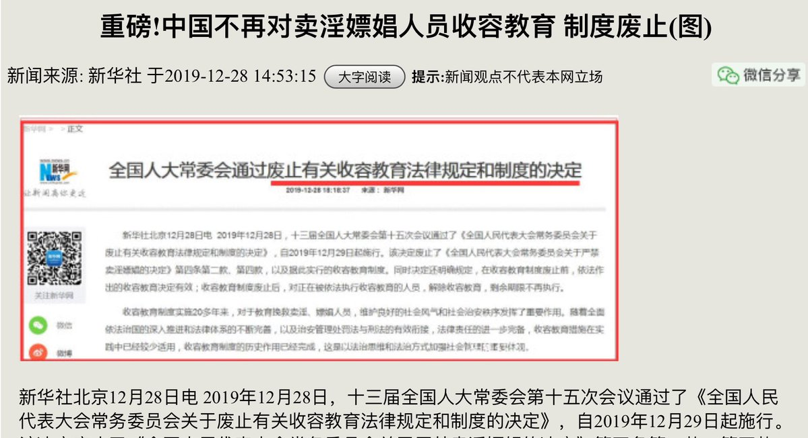

[12月30日 19:01]    BBC News 中文   @bbcchinese    “一旦有百万用户就会有百种赚钱的方式，一旦拥有一亿用户，就会有一万种赚钱的方式。” https://bbc.in/354Pf4Z   :speech_balloon:评:0 :+1:赞:4 :globe_with_meridians:转:2  

[12月30日 18:47]    新闻大吐槽   @TuCaoFakeNews    三胖肝颤的背后，西朝鲜是否也肝颤？恐怕是大概率事件  :speech_balloon:评:1 :+1:赞:9 :globe_with_meridians:转:0  

[12月30日 18:31]    BBC News 中文   @bbcchinese    桑伯格曾经十分抑郁，开始参加社会运动后性格变得开朗，但他担心女儿所受到的批评，也担心外界对她的恨意。 https://bbc.in/2ti9Sxf   :speech_balloon:评:9 :+1:赞:14 :globe_with_meridians:转:6  

[12月30日 18:30]    纽约时报中文网   @nytchinese    #观点 2019年，中美在对抗中走过艰难一年。
不仅贸易战和科技战大打出手，贸易谈判一拖再拖，在人权、香港、新疆、台湾和南海等问题上，美国全面向中国发难，中国则对美反击。这种状况在明年不可能得到改善，两国会继续在上述领域展开较量。 http://nyti.ms/39njnvV   :speech_balloon:评:0 :+1:赞:5 :globe_with_meridians:转:2  

[12月30日 18:16]    新闻大吐槽   @TuCaoFakeNews    愚蠢的人类正在森林里庆祝生日~
这时杀出一只荡猿！共产了他们的蛋糕！
不得不承认，这是一只有朴素阶级意识的猿，一只追求低级趣味的荡猿  :speech_balloon:评:1 :+1:赞:18 :globe_with_meridians:转:3  

[12月30日 18:12]    新闻大吐槽   @TuCaoFakeNews    这个武器太厉害了！
传统导弹加了一个大疆无人机的成本，就能把天空变成发射平台，让定点清除变得如游戏一般简单！
三胖估计是肝颤了，猫起来不露头  :speech_balloon:评:10 :+1:赞:62 :globe_with_meridians:转:29  

[12月30日 18:06]    老司机   @h5lpykl7tp6jjop    牛皮吹破，“过紧日子”已成中共口头禅 北京大力压缩支出

本周末刚刚闭幕的中国全国财政工作会议上传出，中国下一年度还要过紧日子。据中国财政部周五发出的新闻稿称，要大力压缩一般性支出，不必要的项目支出要坚决取消，新增项目要从严控制。
怪不得卖淫嫖娼都不收容只罚款了，城管警察任务加重要忙死  :speech_balloon:评:4 :+1:赞:14 :globe_with_meridians:转:4  

[12月30日 18:02]    BBC News 中文   @bbcchinese    贺建奎的几笔改动，震惊国际科学界以至于人类学界。 https://bbc.in/2SBgPUP   :speech_balloon:评:12 :+1:赞:40 :globe_with_meridians:转:16  

[12月30日 18:00]    纽约时报中文网   @nytchinese    #新新世界 “你把最美好的东西（童贞）奉献给了另一个人，我这里，什么都不剩。“、”你为我怀一个孩子，然后去把他打掉。“……
今年10月，收到这些来自男友的信息的北大女学生试图自杀。此后被宣布脑死。她的悲剧引发了对PUA(pickup artist)的关注和对两性不平等的反思。 http://nyti.ms/39nJAuf   :speech_balloon:评:12 :+1:赞:25 :globe_with_meridians:转:8  

[12月30日 17:30]    纽约时报中文网   @nytchinese    有些人权问题比其他人权问题更能赢得两党的支持。对华鹰派人士在国会和政府中的势力都在增长，越来越多的美国人把中国视为威胁。
尽管副总统彭斯和国务卿庞皮欧都批评过中国迫害穆斯林的做法，但特朗普一直没有表态。 http://nyti.ms/39kPkVA   :speech_balloon:评:6 :+1:赞:11 :globe_with_meridians:转:3  

[12月30日 17:00]    纽约时报中文网   @nytchinese    政府声明显示，中国一家秘密法庭以煽动颠覆国家政权和非法经营等罪名，对知名基督教人士王怡判处九年徒刑。
王怡牧师是中国地下教会秋雨圣约教会的创始人，去年12月，他和100多名教会成员一起被拘留。这是当局对未在国家登记的教堂、清真寺和寺庙的打击行动的一部分。 http://nyti.ms/2F6mtGI   :speech_balloon:评:89 :+1:赞:63 :globe_with_meridians:转:52  

[12月30日 16:48]    BBC News 中文   @bbcchinese    有香港的校长表示，香港示威风波是政治问题，不是教育问题，质疑港府近月发表针对学校的言论，是想寻找“代罪羔羊”。 https://bbc.in/2SE9aVO   :speech_balloon:评:56 :+1:赞:179 :globe_with_meridians:转:64  

[12月30日 16:30]    纽约时报中文网   @nytchinese    #观点 邓聿文：尽管2020年中国很可能迎来一个相对平静之年，但挑战依旧艰巨。当然，任何预测都是有偏差的。
但有一点似乎可以肯定，习近平执政第二季中国已进入崛起下半程，能否重回崛起强势，是个未知数。 http://nyti.ms/39njnvV   :speech_balloon:评:9 :+1:赞:9 :globe_with_meridians:转:4  

[12月30日 16:14]    财经真相   @caijingxiang    2020年中国高息美元债务明年三月份将到达高峰！  :speech_balloon:评:6 :+1:赞:90 :globe_with_meridians:转:37  

[12月30日 16:13]    纽约时报中文网   @nytchinese    周一，中国一家法院以“非法行医“罪名判处贺建奎三年有期徒刑。贺建奎此前因宣称自己创造了世界首例基因编辑婴儿而震惊了科学界。
深圳一家法院称，贺建奎在招募丈夫感染HIV、而妻子健康的夫妻时，伪造了伦理委员会的批准文件。 http://nyti.ms/2SBafxK   :speech_balloon:评:16 :+1:赞:60 :globe_with_meridians:转:35  

[12月30日 16:13]    新闻大吐槽   @TuCaoFakeNews    我觉得社会主义铁拳终有一天会找上他的门  :speech_balloon:评:0 :+1:赞:34 :globe_with_meridians:转:0  

[12月30日 15:45]    新闻大吐槽   @TuCaoFakeNews    洋五毛网红在中国淘金的方法就是使劲夸中国，如何方便，如何先进，离开滴滴、美团简直活不了！顺便贬低一下母国，满足一下天朝愤青的强国情怀。

最后再反驳一下国际社会对中国没自由、没人权的批评，交个投名状，就可以和南方公园的主角一样，杀死维尼熊，在中国发大财！  :speech_balloon:评:45 :+1:赞:133 :globe_with_meridians:转:41  

[12月30日 15:45]    新闻大吐槽   @TuCaoFakeNews    洋五毛网红在中国淘金的方法就是使劲夸中国，如何方便，如何先进，离开滴滴、美团简直活不了！顺便贬低一下母国，满足一下天朝愤青的强国情怀。

最后再反驳一下国际社会对中国没自由、没人权的批评，交个投名状，就可以和南方公园的主角一样，杀死维尼熊，在中国发大财！  :speech_balloon:评:45 :+1:赞:133 :globe_with_meridians:转:41  

[12月30日 15:21]    纽约时报中文网   @nytchinese    新疆镇压行动中的维吾尔族儿童 http://nyti.ms/39oknA0 https://twitter.com/photojournalism/status/1211154336631255040 …  :speech_balloon:评:6 :+1:赞:14 :globe_with_meridians:转:8  

[12月30日 15:14]    纽约时报中文网   @nytchinese    “我最担心的是，中国政府正在教育他仇恨自己的父母和维吾尔文化。”一名维族人说。
他表示自己很高兴能在一段视频中看到自己失踪的儿子，并知道他是安全的。这让他松了口气，但也让他笼罩在绝望之中。 http://nyti.ms/39oknA0   :speech_balloon:评:31 :+1:赞:26 :globe_with_meridians:转:11  

[12月30日 15:01]    BBC News 中文   @bbcchinese    中国独山县每年收入不足人民币10亿，县委原书记潘志立却举债投资打造大型景区，被免职时留下400亿债务，这会否是中国经济的缩影？ https://bbc.in/2snh0Zt   :speech_balloon:评:69 :+1:赞:207 :globe_with_meridians:转:80  

[12月30日 14:01]    BBC News 中文   @bbcchinese    【2019年热点回顾】苏格兰的一家动物救援中心，用睫毛刷为小动物梳出温暖感情   :speech_balloon:评:4 :+1:赞:56 :globe_with_meridians:转:11  

[12月30日 14:00]    纽约时报中文网   @nytchinese    #观点 2020年比起动荡不安的2019年，反有可能显得相对平静，原因在于，在趋势转换期，各种力量的博弈总以剧烈的方式表现出来，就好像两种不同方向的水流激烈碰撞产生的浪花，在大的战略趋势形成后，短期不可能逆转，因此各方会按此趋势调整政策，博弈对抗的程度会有所缓和。 http://nyti.ms/39njnvV   :speech_balloon:评:5 :+1:赞:8 :globe_with_meridians:转:4  

[12月30日 13:30]    纽约时报中文网   @nytchinese    中国对少数民族的大规模拘禁已引起全球愤怒，当局还同时推进一项针对新疆儿童的行动。
政府资料显示，已有近50万名儿童被送往寄宿学校。
政府将这些学校说成是一种脱贫的办法，但设立这些学校的目的还包括让孩子在很小的时候就接受融入社会的思想灌输，让他们远离家庭的影响。 http://nyti.ms/39oknA0   :speech_balloon:评:129 :+1:赞:145 :globe_with_meridians:转:97  

[12月30日 13:01]    BBC News 中文   @bbcchinese    【2019年热点回顾】日前与台湾总统蔡英文合作拍片的钟明轩接受BBC中文专访，谈年轻人、谈政治。  :speech_balloon:评:25 :+1:赞:46 :globe_with_meridians:转:15  

[12月30日 13:00]    纽约时报中文网   @nytchinese    #每日一词 Disillusion，幻灭。Stephens总结了年轻人主导的这十年。在他看来，这是使幻想破灭的十年(decade of disillusion)，年轻人对社会现状感到愤怒，他们的技术发明和道德信念等从根本上改变了这个十年。Disillusion意为摆脱幻想、使醒悟、幻灭。更多简报内容： http://nyti.ms/2th7B5O   :speech_balloon:评:2 :+1:赞:3 :globe_with_meridians:转:1  

[12月30日 12:30]    纽约时报中文网   @nytchinese    美国共和党人和民主党人展现出罕见的团结，正计划迫使特朗普在中国人权问题上采取更积极的立场。
他们准备以不可能被否决的绝大多数票通过一项名为《维吾尔人权政策法案》立法，制裁将100多万穆斯林关进拘禁营的中国官员。 http://nyti.ms/39kPkVA   :speech_balloon:评:50 :+1:赞:135 :globe_with_meridians:转:57  

[12月30日 12:01]    BBC News 中文   @bbcchinese    【2019年热点回顾】北欧国家芬兰34岁的桑娜·马林周宣誓就职，成为世界上最年轻的总理。  :speech_balloon:评:28 :+1:赞:266 :globe_with_meridians:转:87  

[12月30日 12:00]    纽约时报中文网   @nytchinese    朝鲜召开劳动党七届五中全会，引发对重启武器试验的担忧。
随着朝鲜设定的在12月31日前与美国重启谈判的最后期限将近，分析人士警告称，金正恩可能会终止暂停远程导弹和核武器试验的承诺。
更多简报内容： http://nyti.ms/2th7B5O   :speech_balloon:评:1 :+1:赞:5 :globe_with_meridians:转:3  

[12月30日 11:30]    纽约时报中文网   @nytchinese    #观点 今年中国所面临的内忧外患的艰难状况超出想像。这一年最大的灰犀牛事件没出现在中美贸易谈判以及国内经济中，而是出现在香港。
从面临的战略环境以及人们对未来的信心看，2019年是中国自八九六四后在内政外交上最艰辛的一年。2020年，灰犀牛蹲在哪里？ http://nyti.ms/39njnvV   :speech_balloon:评:79 :+1:赞:109 :globe_with_meridians:转:39  

[12月30日 11:17]    财经真相   @caijingxiang    当地时间12月29日晚间，美国军方对活跃在伊拉克和叙利亚境内的一民兵组织“人民动员组织”发动空袭。美国国防部声称，此举是对该组织“近期对伊拉克北部一处美军基地进行袭击的报复”。 受此消息影响，黄金在避险情绪助推下，升破1515美元，加上美元走弱，黄金短期难以回调！  :speech_balloon:评:3 :+1:赞:79 :globe_with_meridians:转:16  

[12月30日 11:01]    BBC News 中文   @bbcchinese    【2019年热点回顾】对于一位伤残人士，要靠自己养活孩子，并不是一件容易的事。
在孟加拉的这一台黄包车，成就了一个自力更生的故事。  :speech_balloon:评:12 :+1:赞:103 :globe_with_meridians:转:25  

[12月30日 11:00]    纽约时报中文网   @nytchinese    蔡英文称台湾民主正受到中国威胁。在与国民党候选人韩国瑜和亲民党候选人宋楚瑜的总统选举电视辩论中，蔡英文再次提出这番论调。
数月以来，蔡在民调中保持领先，这一定程度上反映了台湾民众对香港“反送中”抗议的回应。
更多简报内容： http://nyti.ms/2th7B5O   :speech_balloon:评:10 :+1:赞:13 :globe_with_meridians:转:3  

[12月30日 10:58]    财经真相   @caijingxiang    美元走弱，这对人民币汇率构成一定支撑，在中美第一阶段签字的预期下，人民币汇率会继续小幅追随欧元升值，估计又会有信仰不坚定的人，卖美元换回人民币了！ https://twitter.com/caijingxiang/status/1211480438604062721 …  :speech_balloon:评:7 :+1:赞:58 :globe_with_meridians:转:12  

[12月30日 10:53]    财经真相   @caijingxiang    欧元今天涨破阻力1.1200关口，技术上走势显示，欧元继续上升趋势很强，这就意味着美元指数在未来一段时间会继续走弱！  :speech_balloon:评:4 :+1:赞:40 :globe_with_meridians:转:7  

[12月30日 10:49]    财经真相   @caijingxiang    香港返送中一来，港币与美元隔夜利差走势，与港币与美元汇率走势图，大致一致，港币流动性被控制的很严格！  :speech_balloon:评:2 :+1:赞:22 :globe_with_meridians:转:5  

[12月30日 10:19]    新闻大吐槽   @TuCaoFakeNews    韩国瑜在北京混迹9年，资本论学的挺好，昨日和蔡英文辩论时，竟然把蔡英文选情大涨，归因于“剥削香港学生的价值”！还质问小英为香港做了什么。反观韩自己，此前每每有媒体问及香港反送中，他都三缄其口~

相比之下，半年来，蔡英文在香港人受到中共/港共不公对待时，每次都替抗争者发声！  :speech_balloon:评:70 :+1:赞:550 :globe_with_meridians:转:176  

[12月30日 10:19]    新闻大吐槽   @TuCaoFakeNews    韩国瑜在北京混迹9年，资本论学的挺好，昨日和蔡英文辩论时，竟然把蔡英文选情大涨，归因于“剥削香港学生的价值”！还质问小英为香港做了什么。反观韩自己，此前每每有媒体问及香港反送中，他都三缄其口~

相比之下，半年来，蔡英文在香港人受到中共/港共不公对待时，每次都替抗争者发声！  :speech_balloon:评:70 :+1:赞:550 :globe_with_meridians:转:176  

[12月30日 10:16]    纽约时报中文网   @nytchinese    早安！今日重点新闻包括：
新疆镇压运动中的穆斯林儿童；聚焦台湾总统大选辩论；美国国会迫使特朗普对中国人权问题采取行动；美国图书在中国出版受阻；学者邓聿文研判2020年中国政经危机……NYT简报带你速览今日要闻。 http://nyti.ms/2th7B5O   :speech_balloon:评:33 :+1:赞:37 :globe_with_meridians:转:15  

[12月30日 10:01]    BBC News 中文   @bbcchinese    【2019年热点回顾】Sam Rogers做了一套喷射飞行服（jet suit）。他说飞起来就像做了漫威动画里面的英雄。

（來自 BBC East Midlands）  :speech_balloon:评:26 :+1:赞:422 :globe_with_meridians:转:156  

[12月30日 09:51]    财经真相   @caijingxiang    据齐鲁晚报官方APP报道，2019年起在济南行政区域内就业的全日制本科及以上学历应届高校毕业生，可申请办理“泉城人才交通卡”，并于2020年1月1日起享受免费乘坐市内公交、地铁的政策。济南公交集团和轨道交通集团将于12月30日起，启动“泉城人才交通卡”的预售和办理工作。 不是人才，而是韭菜！  :speech_balloon:评:16 :+1:赞:72 :globe_with_meridians:转:13  

[12月30日 07:59]    纽约时报中文网   @nytchinese    一周没有发推了，纽约时报中文网今天的文章，对2020年的预测。我认为，再过2天来到的2020年有黑天鹅事件，但不会有灰犀牛的出现。因为所谓灰犀牛，指的是没有预料到的风险投资概率，凡是预料到的，就不是灰犀牛事件。明年最大变数会在台海，但由法理台独而引发战争的概率极低。 https://cn.nytimes.com/opinion/20191230/dengyuwen-2020-prediction/?_ga=2.74333073.203816131.1577663280-1921281383.1568123280 …  :speech_balloon:评:31 :+1:赞:34 :globe_with_meridians:转:14  

[12月30日 07:02]    BBC News 中文   @bbcchinese    中国国防部周四表示，中国、伊朗、俄罗斯在本周五举行联合军事演习，演习地点在印度洋北部的阿曼湾。演习将持续四天。这是三国40年来首次举行联合军演。 https://bbc.in/2Q9FQVL   :speech_balloon:评:56 :+1:赞:127 :globe_with_meridians:转:37  

[12月30日 04:19]    老司机   @h5lpykl7tp6jjop    终身学习的路上收到的成绩单，加油！  :speech_balloon:评:0 :+1:赞:5 :globe_with_meridians:转:0  

[12月30日 04:01]    老司机   @h5lpykl7tp6jjop    圣诞节都过完了，金正恩称要送美国的“圣诞大礼”到底在哪儿呢？  :speech_balloon:评:1 :+1:赞:6 :globe_with_meridians:转:1  

[12月30日 03:56]    老司机   @h5lpykl7tp6jjop    在北美，名导贾樟柯遭遇戏剧性一刻的年轻“爱国者”（节选）
作者  贾樟柯
 https://www.wenxuecity.com/news/2019/12/28/8978619.html …
女生对我轻蔑地一笑，说道：是啊！为了祖国的尊严，我们当然不应该描述那些人的情况。  :speech_balloon:评:0 :+1:赞:24 :globe_with_meridians:转:9  

[12月30日 02:44]    老司机   @h5lpykl7tp6jjop    官方通报 习近平首次获封“人民领袖”称号
败光了人民的钱，欠下几万亿的债务，搞一堆烂摊子一带一路，雄安新区，海南自由贸易试验区等，和美国贸易战打得经济全面溃败，这倒好，摆着一大堆无法解决的问题不顾，居然忙着往自己头上加冕！这位中共末代皇帝在走向煤山古槐的路上还不忘多加一顶帽子！奇葩！  :speech_balloon:评:6 :+1:赞:191 :globe_with_meridians:转:43  

[12月30日 02:05]    老司机   @h5lpykl7tp6jjop    九十一岁志願军老兵卖鞋垫，把日子过成了诗！  :speech_balloon:评:27 :+1:赞:288 :globe_with_meridians:转:138  

[12月30日 02:00]    老司机   @h5lpykl7tp6jjop    近日，美国科学家又宣布一项重大科技突破：借助光声断层成像技术，实时控制纳米机器人，让它们准确抵达人体某个部位（比如肠癌病人的肠道肿瘤处），进而让纳米机器人实现药物递送，或进行智能微手术。

 https://mp.weixin.qq.com/s/3p-NrTb7-1kdOGYpPLj6rQ …  :speech_balloon:评:0 :+1:赞:35 :globe_with_meridians:转:13  

[12月29日 23:00]    BBC News 中文   @bbcchinese    哈萨克斯坦空难：飞机升空一分钟后坠毁 ，至少15人罹难 https://bbc.in/2EYUubK   :speech_balloon:评:3 :+1:赞:16 :globe_with_meridians:转:5  

[12月29日 22:15]    BBC News 中文   @bbcchinese    【台湾大选：总统选举辩论金句精华】“你为什么不问我初恋几岁？为什么不问我结婚前谈过几次恋爱？要不要问我几岁之前还是处男？” https://bbc.in/2Q3UrSm   :speech_balloon:评:42 :+1:赞:95 :globe_with_meridians:转:39  

[12月29日 22:12]    新闻大吐槽   @TuCaoFakeNews    苹果日报（还有大纪元）是香港仅剩的讲真话的报纸，然而在韩国瑜口中，苹果日报成了造谣媒体、八卦媒体。完全一副共党外交部发言人的嘴脸！耿爽来见你新同事

总统候选人是公众人物，有可能将行使国家权力，媒体聚焦其私生活，完全必要，私德不检点，将来就可能公器私用。  :speech_balloon:评:41 :+1:赞:365 :globe_with_meridians:转:117  

[12月29日 22:12]    新闻大吐槽   @TuCaoFakeNews    苹果日报（还有大纪元）是香港仅剩的讲真话的报纸，然而在韩国瑜口中，苹果日报成了造谣媒体、八卦媒体。完全一副共党外交部发言人的嘴脸！耿爽来见你新同事

总统候选人是公众人物，有可能将行使国家权力，媒体聚焦其私生活，完全必要，私德不检点，将来就可能公器私用。  :speech_balloon:评:41 :+1:赞:365 :globe_with_meridians:转:117  

[12月29日 22:04]    新闻大吐槽   @TuCaoFakeNews    金门距离厦门只有10公里，两地同风同俗。
然而，当金门人上街表达对政府不满时，他们完全不必担心警棍和催泪弹，反而官员要准备好下台了。

相对比，07年厦门千人上街反对兴建px毒化工厂，被中共官方定为非法，而且还被秋后算账。

你们说，湾湾是不是有病，才会希望享受和大陆同等的待遇 https://twitter.com/ttingxiao/status/1211284029439299587 …  :speech_balloon:评:9 :+1:赞:190 :globe_with_meridians:转:69  

[12月29日 22:04]    新闻大吐槽   @TuCaoFakeNews    金门距离厦门只有10公里，两地同风同俗。
然而，当金门人上街表达对政府不满时，他们完全不必担心警棍和催泪弹，反而官员要准备好下台了。

相对比，07年厦门千人上街反对兴建px毒化工厂，被中共官方定为非法，而且还被秋后算账。

你们说，湾湾是不是有病，才会希望享受和大陆同等的待遇 https://twitter.com/ttingxiao/status/1211284029439299587 …  :speech_balloon:评:9 :+1:赞:190 :globe_with_meridians:转:69  

[12月29日 21:59]    BBC News 中文   @bbcchinese    普京在权坛巅峰整整20年。没有人在俄国掌权时间比这更长，包括斯大林。
 https://bbc.in/2tb3yaX   :speech_balloon:评:52 :+1:赞:149 :globe_with_meridians:转:48  

[12月29日 21:25]    新闻大吐槽   @TuCaoFakeNews    还能不能让人安静的喝杯啤酒了？谁能把这个熊孩子从酒吧扔出去？？？我请他喝一杯！  :speech_balloon:评:6 :+1:赞:112 :globe_with_meridians:转:61  

[12月29日 21:00]    新闻大吐槽   @TuCaoFakeNews    眼盲心却亮！
盲人律師陸小姐用竖笛吹响《願榮光歸香港》，赢得市民一片掌声！她说：黑警不如开枪射我，反正我眼盲~

这话真是让人伤感，不禁想起了在抗争中被夺走眼睛的爆眼少女和印尼记者~

把残疾人逼上街头的暴政！  :speech_balloon:评:20 :+1:赞:1205 :globe_with_meridians:转:561  

[12月29日 21:00]    新闻大吐槽   @TuCaoFakeNews    眼盲心却亮！
盲人律師陸小姐用竖笛吹响《願榮光歸香港》，赢得市民一片掌声！她说：黑警不如开枪射我，反正我眼盲~

这话真是让人伤感，不禁想起了在抗争中被夺走眼睛的爆眼少女和印尼记者~

把残疾人逼上街头的暴政！  :speech_balloon:评:20 :+1:赞:1205 :globe_with_meridians:转:561  

[12月29日 20:59]    财经真相   @caijingxiang    中国央行公布了存量房贷利率挂钩LPR的办法，这种方式短期内不会对存量房贷产生太大影响。由市场都预期会降息，所以大部分人都选择浮动加点，但是如果猪肉引发的通胀预期在，明年LPR利率很难降低甚至还会存在上涨的可能。同时由于房贷已经还基准利率“脱钩”，接下来基准利率降息也不会减少房奴还贷成本。  :speech_balloon:评:15 :+1:赞:164 :globe_with_meridians:转:50  

[12月29日 20:59]    BBC News 中文   @bbcchinese    2019年即将过去，BBC中文为您回顾一些值得关注的国际事务。 https://bbc.in/2F4PCC9   :speech_balloon:评:0 :+1:赞:8 :globe_with_meridians:转:5  

[12月29日 18:27]    老司机   @h5lpykl7tp6jjop    澳洲老房子几十年上百年的砖边角都仍然割手，硬度没变，街道旁两三米跨度的遮雨棚直接用工字钢膨胀锣栓就固定了，上面铺玻璃好重，也不怕垮，质量真的不一样！  :speech_balloon:评:0 :+1:赞:9 :globe_with_meridians:转:1  

[12月29日 17:55]    老司机   @h5lpykl7tp6jjop    拘留罚款并未取消，只是不收容半年一年的了，真的是耽误罚款。  :speech_balloon:评:1 :+1:赞:27 :globe_with_meridians:转:0  

[12月29日 17:19]    BBC News 中文   @bbcchinese    有时装企业表示，希望业界在2030年售卖的衣物可以百分百使用循环再造物料。  :speech_balloon:评:7 :+1:赞:77 :globe_with_meridians:转:25  

[12月29日 17:00]    纽约时报中文网   @nytchinese    #一周热门 #时报专栏 年轻人主导的这十年 http://nyti.ms/37gE4aL   :speech_balloon:评:3 :+1:赞:14 :globe_with_meridians:转:3  

[12月29日 15:49]    老司机   @h5lpykl7tp6jjop    萧山化工厂大爆炸！宛如火山爆发，连消防员都吓的逃跑，太吓人了！  :speech_balloon:评:87 :+1:赞:895 :globe_with_meridians:转:489  

[12月29日 15:35]    BBC News 中文   @bbcchinese    台湾总统选举电视辩论正在直播，立即收看三位候选人的激烈辩论！ https://bbc.in/39ln1pT   :speech_balloon:评:22 :+1:赞:58 :globe_with_meridians:转:13  

[12月29日 15:30]    新闻大吐槽   @TuCaoFakeNews    共党座上宾们，这几天纷纷跳出来反对“反渗透法” https://twitter.com/Leetasizan/status/1210874936362848256 …  :speech_balloon:评:12 :+1:赞:56 :globe_with_meridians:转:21  

[12月29日 15:00]    纽约时报中文网   @nytchinese    #一周热门 天价执照泡沫破灭之后：一名纽约出租车司机的死亡 http://nyti.ms/2MweNl7   :speech_balloon:评:79 :+1:赞:27 :globe_with_meridians:转:25  

[12月29日 14:34]    新闻大吐槽   @TuCaoFakeNews    读串行了 https://twitter.com/catcarterpi/status/1211121598121443329 …  :speech_balloon:评:31 :+1:赞:278 :globe_with_meridians:转:79  

[12月29日 13:38]    老司机   @h5lpykl7tp6jjop    爆！中国不再对卖淫嫖娼人员收容教育，制度废止！
网友回复：收容教育，等于歇业，其实耽误了警察罚款！  :speech_balloon:评:28 :+1:赞:114 :globe_with_meridians:转:38  

[12月29日 13:26]    老司机   @h5lpykl7tp6jjop    爆！内蒙警察枪杀两副局长 政府急封杀消息

对此，林业宾馆职员证实，该宾馆房间确实都被林业系统的人员占用，不能对外接待。但被问及森林警察局血案一事，职员立即挂断电话。

　　截止发稿前，地方政府及相关部门都未作出回应。  :speech_balloon:评:1 :+1:赞:47 :globe_with_meridians:转:17  

[12月29日 12:39]    新闻大吐槽   @TuCaoFakeNews    实锤了，驻港部队，至少有三个不是男儿 https://twitter.com/TuCaoFakeNews/status/1211066168250777600 …  :speech_balloon:评:7 :+1:赞:42 :globe_with_meridians:转:5  

[12月29日 09:36]    老司机   @h5lpykl7tp6jjop    有个怪人说：杀人是无路可走时的绝境，但杀的人多了，就从死路趟出一条路来，越杀得多路就越走越宽！你看胡泽东为碗面一块钱杀人判死缓，毛泽东杀了几千万人结果当太祖，亿万人敬仰！
胡子比不上毛多呀！
不禁哑然失笑！  :speech_balloon:评:3 :+1:赞:38 :globe_with_meridians:转:13  

[12月29日 08:18]    老司机   @h5lpykl7tp6jjop    从满清倒台以后，周围百姓，北洋政府的驻军，一直到五十年代圆明园都是无主状态，北京大学，清华大学，北京工艺美术厂等很多单位都盗运过许多圆明园建筑木石。  :speech_balloon:评:1 :+1:赞:18 :globe_with_meridians:转:2  

[12月29日 07:40]    老司机   @h5lpykl7tp6jjop    台湾大选热火朝天！看得大陆网友心痒难耐，党的喉舌坐不住了采访了驻美大使崔田凯，崔说：台湾选举是中国台湾省地方选举！
意思是：别看隔壁的人在吃肉，那是我家的亲戚，按辈份归我们管，即便吃肉也是我们家的人在吃肉！
网友回复：能不能把台湾省的经验推广到全国？
可见人人都在想让为啥不能吃肉？  :speech_balloon:评:23 :+1:赞:443 :globe_with_meridians:转:104  

[12月29日 05:14]    老司机   @h5lpykl7tp6jjop    禁言的效果：
因为墙上写画得乱七八糟从重新粉刷墙壁后，写上了严禁乱写乱画！旁边有人题字：你为什么可以写？又有人写上：你们都在乱写，后来就多了：说别人乱写的自己就在乱写！你没有写吗？这些字怎么上去的？我是在说你们乱写才写上去的……  :speech_balloon:评:0 :+1:赞:33 :globe_with_meridians:转:4  

[12月29日 04:17]    新闻大吐槽   @TuCaoFakeNews    小英：中国没民主，却批评台湾开民主倒车，忘了自己连车都没有！

他们用金钱介入我们的选举，用假讯息误导我们的民众，用退伍军人的关系收买情报，甚至还有将军涉案被判刑，他们用台湾的言论自由，为没有言论自由的中国擦脂抹粉；用台湾民主制度来破坏我们的民主制度！

包子：我们有社会主义倒车啊！  :speech_balloon:评:39 :+1:赞:825 :globe_with_meridians:转:287  

[12月29日 02:14]    新闻大吐槽   @TuCaoFakeNews    搜查市民时，一个黑警对一位女士上下其手，正好被记者拍到，勇敢的记者大声喊出“摸够了没有？”
结果就这一句话，一下就刺激到一个黑警，他立刻疯狂起来大骂记者“蟑螂”~
幸好还有警察没疯，他们立刻把这个黑警拉开  :speech_balloon:评:29 :+1:赞:589 :globe_with_meridians:转:432  

[12月29日 01:29]    凡賽堤/FORSETI   @FecharCCP    ----你見過幾十個穿制服的圍毆性侵一個小女生嗎？------

極權恐怖組織的殺人犯警2019年12月份的納粹暴行（19）

我們都是歷史的見證者！

時代革命，消滅極權，CCP 不能代表中國，CCP 不能代表中國人！

----感謝此視頻的原創作者！  :speech_balloon:评:1 :+1:赞:70 :globe_with_meridians:转:64  

[12月29日 01:09]    凡賽堤/FORSETI   @FecharCCP    極權恐怖組織的殺人犯警的納粹暴行（圖1）

---黑警犯警強姦警暴警殺人警非法執法濫捕香港小青年，學生，兒童！

我們都是歷史的見證者！

時代革命，消滅極權，CCP 不能代表中國，CCP 不能代表中國人！

----感謝此視頻的原創作者！  :speech_balloon:评:0 :+1:赞:16 :globe_with_meridians:转:17  

[12月29日 00:48]    凡賽堤/FORSETI   @FecharCCP    你認同一個政府稱呼人類為蟑螂？
你認同一個政府稱呼手無寸鐵的在校學生為暴徒？
你認同一個政府僱傭黑社會團伙肆意毆打市民？
你認同一個政府動用部隊武警毆打，殘殺市民？
你認同警察部隊武警殺人後高樓拋屍？
你認同警察部隊武警輪姦少女後殺人大海拋屍？
你認同....幾個月就陸續殺死近萬名學生？  :speech_balloon:评:22 :+1:赞:362 :globe_with_meridians:转:274  

[12月29日 00:25]    凡賽堤/FORSETI   @FecharCCP    ----你見過幾十個穿制服的圍毆暴打一個正常市民嗎？------

極權恐怖組織的殺人犯警2019年12月份的納粹暴行（17）-

我們都是歷史的見證者！

時代革命，消滅極權，CCP 不能代表中國，CCP 不能代表中國人！

----感謝此視頻的原創作者！  :speech_balloon:评:1 :+1:赞:58 :globe_with_meridians:转:48  

[12月29日 00:20]    凡賽堤/FORSETI   @FecharCCP    ----你見過穿制服的這種殘暴手段？------

極權恐怖組織的殺人犯警2019年12月份的納粹暴行（18）-

我們都是歷史的見證者！

時代革命，消滅極權，CCP 不能代表中國，CCP 不能代表中國人！

----感謝此視頻的原創作者！  :speech_balloon:评:1 :+1:赞:79 :globe_with_meridians:转:88  

[12月28日 23:56]    凡賽堤/FORSETI   @FecharCCP    極權恐怖組織的殺人犯警2019年12月份的納粹暴行（17）-

----殘暴打頭------

我們都是歷史的見證者！

時代革命，消滅極權，CCP 不能代表中國，CCP 不能代表中國人！

----感謝此視頻的原創作者！  :speech_balloon:评:14 :+1:赞:171 :globe_with_meridians:转:164  

[12月28日 21:30]    BBC News 中文   @bbcchinese    我们解构一下华为手机的主板，有多少部分来自美国公司……
 https://bbc.in/364AxfR   :speech_balloon:评:112 :+1:赞:314 :globe_with_meridians:转:139  

[12月28日 20:42]    BBC News 中文   @bbcchinese    世界上有很多潮湿的地方（例如大雨后你的房间） 但全世界最湿的地方究竟是哪里？
 https://bbc.in/354rE4u   :speech_balloon:评:14 :+1:赞:43 :globe_with_meridians:转:9  

[12月28日 16:23]    BBC News 中文   @bbcchinese    人们认为日本是尖端数码高科技的前沿阵地，但其实日本仍有人默默怀念早已过时的模拟信息技术，比如胶片相机。 https://bbc.in/2SAlqGW   :speech_balloon:评:9 :+1:赞:86 :globe_with_meridians:转:20  

[12月28日 14:43]    老司机   @h5lpykl7tp6jjop      :speech_balloon:评:3 :+1:赞:97 :globe_with_meridians:转:33  

[12月28日 14:43]    老司机   @h5lpykl7tp6jjop    好文转发：

我特么今天就告诉你圆明园到底是谁毁的！

农夫论坛  昨天  :speech_balloon:评:17 :+1:赞:470 :globe_with_meridians:转:269  

[12月28日 12:13]    老司机   @h5lpykl7tp6jjop    现在的中国社会犹如一口高压锅，基层政府部门，警察城管，都是加柴添火的，宣传部门是堵排气孔的，习草包是总瓢把子，往左往右开都是炸，无法掌控！六个稳也好八个稳也好，都没用！什么时候炸？天知道！  :speech_balloon:评:8 :+1:赞:124 :globe_with_meridians:转:22  

[12月28日 11:24]    老司机   @h5lpykl7tp6jjop    坏消息不断传出，这年还过不过了？  :speech_balloon:评:3 :+1:赞:20 :globe_with_meridians:转:7  

[12月28日 09:18]    财经真相   @caijingxiang    【重磅】中共央行：发布通知，2020年1月1日前金融机构已发放的和已签订合同但未发放的参考贷款基准利率定价的浮动利率贷款（不包括公积金个人住房贷款）。自2020年1月1日起，各金融机构不得签订参考贷款基准利率定价的浮动利率贷款合同。  :speech_balloon:评:69 :+1:赞:270 :globe_with_meridians:转:99  

[12月28日 07:54]    凡賽堤/FORSETI   @FecharCCP    我們不可停止，我們將無限循環傳播香港的全方位被CCP極權組織殘暴殺害的種種真相視頻和畫面，永不停止！！！！！！！！！！！！！！！！！！！！！！！！！！！！！！！！！！！！！！！！！！！！！！！！！！！！！！！！！！！！！！！！！！！！！！！！！！！！！！！！！！！ https://twitter.com/FecharCCP/status/1207809972341559296 …  :speech_balloon:评:1 :+1:赞:41 :globe_with_meridians:转:29  

[12月28日 07:52]    凡賽堤/FORSETI   @FecharCCP    極權恐怖組織的殺人犯警2019年12月份的納粹暴行（16）

我們都是歷史的見證者！

時代革命，消滅極權，CCP 不能代表中國，CCP 不能代表中國人！

----感謝此視頻的原創作者！  :speech_balloon:评:1 :+1:赞:88 :globe_with_meridians:转:99  

[12月28日 07:44]    凡賽堤/FORSETI   @FecharCCP    極權恐怖組織的殺人犯警2019年12月份的納粹暴行（15）

---黑警犯警強姦警暴警殺人警非法執法濫捕香港小青年，學生，兒童！

我們都是歷史的見證者！

時代革命，消滅極權，CCP 不能代表中國，CCP 不能代表中國人！

----感謝此視頻的原創作者！  :speech_balloon:评:2 :+1:赞:31 :globe_with_meridians:转:43  

[12月28日 07:37]    凡賽堤/FORSETI   @FecharCCP    極權恐怖組織的殺人犯警2019年12月份的納粹暴行（14）

---黑警犯警強姦警暴警殺人警非法執法濫捕香港小青年，學生，兒童！

我們都是歷史的見證者！

時代革命，消滅極權，CCP 不能代表中國，CCP 不能代表中國人！

----感謝此視頻的原創作者！  :speech_balloon:评:6 :+1:赞:132 :globe_with_meridians:转:165  

[12月28日 07:09]    墙国铁拳现世报😷   @Socialistfist    最新人造铁拳
未知原因，微博用户“青游记” 已经在此类P图内“被代言” 了好几回了，小编在这里表示慰问。  :speech_balloon:评:8 :+1:赞:39 :globe_with_meridians:转:3  

[12月28日 07:08]    凡賽堤/FORSETI   @FecharCCP    極權恐怖組織的殺人犯警2019年12月份的納粹暴行（13）

---黑警犯警強姦警暴警殺人警非法執法濫捕香港小青年，學生，兒童！

我們都是歷史的見證者！

時代革命，消滅極權，光復華族，人人有責！

----感謝此視頻的原創作者！  :speech_balloon:评:0 :+1:赞:9 :globe_with_meridians:转:14  

[12月28日 06:55]    凡賽堤/FORSETI   @FecharCCP    極權恐怖組織的殺人犯警2019年12月份的納粹暴行（12）

---黑警犯警強姦警暴警殺人警非法執法濫捕香港小青年，學生，兒童！

我們都是歷史的見證者！

時代革命，消滅極權，光復華族，人人有責！

----感謝此視頻的原創作者！  :speech_balloon:评:2 :+1:赞:48 :globe_with_meridians:转:46  

[12月28日 06:50]    凡賽堤/FORSETI   @FecharCCP    極權恐怖組織的殺人犯警2019年12月份的納粹暴行（11）
---她們都是正常走在街上的學生而已！

我們都是歷史的見證者！

時代革命，消滅極權，光復華族，人人有責！

----感謝此視頻的正義原創作者！  :speech_balloon:评:3 :+1:赞:80 :globe_with_meridians:转:63  

[12月28日 06:42]    凡賽堤/FORSETI   @FecharCCP    極權恐怖組織的殺人犯警2019年12月份的納粹暴行（10）

我們都是歷史的見證者！

時代革命，消滅極權，光復華族，人人有責！

----感謝此視頻的正義原創作者！  :speech_balloon:评:0 :+1:赞:4 :globe_with_meridians:转:3  

[12月28日 06:36]    凡賽堤/FORSETI   @FecharCCP    極權恐怖組織的殺人犯警2019年12月份的納粹暴行（9）

我們都是歷史的見證者！

時代革命，消滅極權，光復華族，人人有責！

----感謝此視頻的正義原創作者！  :speech_balloon:评:2 :+1:赞:10 :globe_with_meridians:转:10  

[12月28日 06:35]    凡賽堤/FORSETI   @FecharCCP    極權恐怖組織的殺人犯警2019年12月份的納粹暴行（7）

我們都是歷史的見證者！

時代革命，消滅極權，光復華族，人人有責！

----感謝此視頻的正義原創作者！  :speech_balloon:评:0 :+1:赞:50 :globe_with_meridians:转:37  

[12月28日 06:34]    凡賽堤/FORSETI   @FecharCCP    極權恐怖組織的殺人犯警2019年12月份的納粹暴行（8）

我們都是歷史的見證者！

時代革命，消滅極權，光復華族，人人有責！

----感謝此視頻的正義原創作者！  :speech_balloon:评:5 :+1:赞:154 :globe_with_meridians:转:173  

[12月28日 06:32]    凡賽堤/FORSETI   @FecharCCP    極權恐怖組織的殺人犯警2019年12月份的納粹暴行（6）

我們都是歷史的見證者！

時代革命，消滅極權，光復華族，人人有責！

----感謝此視頻的正義原創作者！  :speech_balloon:评:0 :+1:赞:6 :globe_with_meridians:转:9  

[12月28日 06:31]    凡賽堤/FORSETI   @FecharCCP    極權恐怖組織的殺人犯警2019年12月份的納粹暴行（5）

我們都是歷史的見證者！

時代革命，消滅極權，光復華族，人人有責！

----感謝此視頻的正義原創作者！  :speech_balloon:评:36 :+1:赞:565 :globe_with_meridians:转:583  

[12月27日 17:52]    墙国铁拳现世报😷   @Socialistfist    据推友提供的截图显示，@minzhutiequan 不幸被举报生效推特铁拳，虽然小编一直没有觉得此人在推上言行违反过相关条例。  :speech_balloon:评:26 :+1:赞:202 :globe_with_meridians:转:18  

[12月27日 15:25]    财经真相   @caijingxiang    一个替罪，竟然可以抵消千亿烂账，这些都是谁拿走？死缓罪说明一切，如果直接判死刑，就会杀鸡儆猴，恐慌情绪就会弥漫整个银行体系，以后所有银行主管都会捂紧钱袋子，中共权贵们的空头票据就很难从银行弄到钱了，等于是给自己找麻烦。弄个死缓监狱里照样包养女人，给大家都留个台阶下！ https://twitter.com/reuterscn/status/1210150046353764352 …  :speech_balloon:评:9 :+1:赞:323 :globe_with_meridians:转:110  

[12月27日 10:21]    财经真相   @caijingxiang    中国股市今天涨疯了，看样子今天下午收盘后，中共要宣布降准了！  :speech_balloon:评:65 :+1:赞:296 :globe_with_meridians:转:40  

[12月27日 02:04]    墙国铁拳现世报😷   @Socialistfist    高光时刻  :speech_balloon:评:21 :+1:赞:155 :globe_with_meridians:转:17  

[12月26日 23:22]    墙国铁拳现世报😷   @Socialistfist    @minzhutiequan  :speech_balloon:评:8 :+1:赞:67 :globe_with_meridians:转:2  

[12月26日 23:18]    墙国铁拳现世报😷   @Socialistfist    寻人启事  :speech_balloon:评:84 :+1:赞:465 :globe_with_meridians:转:84  

[12月26日 23:10]    纽约时报中文网   @nytchinese    Incredible news: @ccni and the team at @nytchinese translated the article I wrote with @qdbui. https://cn.nytimes.com/usa/20191226/chinese-restaurants-closing-upward-mobility-second-generation/ …  :speech_balloon:评:0 :+1:赞:28 :globe_with_meridians:转:8  

[12月26日 21:49]    财经真相   @caijingxiang    明年是鼠年，一个中国公司年会的特别节目，竟然弄了一条黄金蟒蛇表演！话说生肖鼠的克星应该是蛇啊！北京怎么捕杀起狗来了？  :speech_balloon:评:23 :+1:赞:113 :globe_with_meridians:转:13  

[12月26日 12:11]    财经真相   @caijingxiang    在岸人民币20年走势图，从防涨横盘=》被迫升值=》主动贬值=》短暂自由浮动=》市场推动下跌=》防跌=》市场推动上涨=》贸易战爆发下跌=》防跌=》被迫破7=》被迫贬值=》8.3线失守 失控、崩盘！  :speech_balloon:评:22 :+1:赞:272 :globe_with_meridians:转:88  

[12月26日 09:49]    财经真相   @caijingxiang    今天离岸人民币涨破6.99关口，本轮升值是由在岸人民币汇率带动的，临近年底国内企业必须要结汇换取人民币进行资金周转，这真是中共现在最需要的，但是这种涨势并不会持久，随着元旦一过，新的购汇需求上升，人民币还会继续贬值到7附近，如果1月初中美不能正式签字，则新一轮贬值就会到来！  :speech_balloon:评:19 :+1:赞:412 :globe_with_meridians:转:82  

[12月25日 22:41]    财经真相   @caijingxiang    有些细节是需要认真推敲，看一下日历就明白，莱特希泽把签字日期定在1月第一周是经过精心挑选的，如果下周不签字，双方最长可以延长10天，而且必须公布具体的签字日期，如果延长超过10天，基本上意味着第一阶段贸易协议彻底谈崩。因为春节过后，二月份距离3月3日的人大会比较近，几乎很难纳入立法程序  :speech_balloon:评:22 :+1:赞:252 :globe_with_meridians:转:77  

[12月25日 22:25]    财经真相   @caijingxiang    如果下周不能就第一阶段协议正式签字，那么随着春节的临近，中共在春节前签字的概率就会大大降低；如果是春节以后再正式签字，那么距离三月的两会比较近，协议中“结构性”变革必然牵扯到“立法”，两会是立法的关键。结论就是：如果春节前第一阶段协议不签字，则中美就会彻底谈判破裂！因为后续时间不够！  :speech_balloon:评:22 :+1:赞:218 :globe_with_meridians:转:41  

[12月25日 22:19]    财经真相   @caijingxiang    美国人正过圣诞节，原本说金三胖会送一份“圣诞大礼”，结果三胖软了，反到是中国放了一个巨浪三，这种射程一万公里的潜射核导弹，从渤海发射经北极完全可以覆盖整个美国。另外今天外交部说，中美正就第一阶段经贸协议签署具体安排保持密切沟通，按理说本次不应该公布具体的签字日期吗？莱特希泽要打脸了  :speech_balloon:评:21 :+1:赞:301 :globe_with_meridians:转:75  

[12月25日 19:01]    墙国铁拳现世报😷   @Socialistfist    今天是12月25日，墙国铁拳现世报编辑部全体祝各位推友圣诞快乐，心想事成，也要祝各位粉蚷战螂剩蛋快乐！  :speech_balloon:评:13 :+1:赞:255 :globe_with_meridians:转:12  

[12月25日 13:04]    财经真相   @caijingxiang    国务院：各地区要第一时间处置因规模性失业引发的群体性突发事件！  :speech_balloon:评:28 :+1:赞:426 :globe_with_meridians:转:173  

[12月25日 10:13]    GFHG SDKM   @zyx_yny    #HongKongPolice Fire #TearGas Cannisters From Rooftop of the Police Station
~12:30am, 25 Dec 2019
Tsim Sha Tsui (TST) police station, #HKProtesters 
Source: RTHK  :speech_balloon:评:19 :+1:赞:536 :globe_with_meridians:转:638  

[12月25日 09:42]    财经真相   @caijingxiang    为啥党国不过圣诞节？因为苏联在这一天灰飞烟灭！  :speech_balloon:评:88 :+1:赞:1633 :globe_with_meridians:转:496  

[12月25日 04:12]    GFHG SDKM   @zyx_yny    #ChristmasEve2019HongKong  :speech_balloon:评:6 :+1:赞:136 :globe_with_meridians:转:175  

[12月25日 02:17]    GFHG SDKM   @zyx_yny    Corrupt regime ..Hong Kong is dying Hong Kong people will not forget these hatreds.  :speech_balloon:评:6 :+1:赞:91 :globe_with_meridians:转:118  

[12月25日 00:37]    财经真相   @caijingxiang    伦敦12月23日libor美元隔夜拆借利率报1.5345%，港币比美元拆解利率高：2.90393%-1.5345%=1.36943%，说明港币比美元更紧俏，但是这种利率倒挂不会持续很久，一月内港币拆解利率将会重新跌破1%！  :speech_balloon:评:2 :+1:赞:38 :globe_with_meridians:转:3  

[12月25日 00:30]    财经真相   @caijingxiang    港币今天隔夜拆借利率达到2.90393%，创新几个月的新高，港币拆解利率高于美元，再过几天就元旦了，新年一过，港币资金流动趋紧的情况就会得到改善，港币拆解利率很快就会回落，届时港币重新跌回弱势上方，现在港币真的是个不错的做空位置。  :speech_balloon:评:1 :+1:赞:86 :globe_with_meridians:转:15  

[12月25日 00:27]    GFHG SDKM   @zyx_yny    This boy was just walking past at the Harbour City with a mask on, but was severely beaten by the mad dog @hkpoliceforce aiming at his head.

#HongKongPoliceTerrorists #hongkongpolicebrutality #HongKongProstests #HongKongPoliceState #China_is_terroris #SOSHK https://twitter.com/nanalai/status/1209448858406637569 …  :speech_balloon:评:3 :+1:赞:68 :globe_with_meridians:转:84  

[12月25日 00:18]    GFHG SDKM   @zyx_yny    Can’t help but think, looking at these pictures of Christmas Eve in #HongKong, that the birth Christians celebrate tomorrow is a rebuke and a challenge to tyrants everywhere #StandWithHongKong https://twitter.com/jeffreychngo/status/1209452932095258625 …  :speech_balloon:评:1574 :+1:赞:15680 :globe_with_meridians:转:12274  

[12月24日 23:55]    GFHG SDKM   @zyx_yny    #HKPoliceTerrorists opened fire at protestors from atop buildings, breaking guidelines and endangering civilians’ lives. People may get headshot and killed. 

#PoliceBrutality  :speech_balloon:评:183 :+1:赞:2954 :globe_with_meridians:转:3371  

[12月24日 20:01]    墙国铁拳现世报😷   @Socialistfist    感谢广大推友的对上一推的热烈反响和支持。
收到疑似有推友上微博围观评论而遭到喝茶的报告
小编请大家注意网络键政的安全，也不鼓励大家反串留言。  :speech_balloon:评:14 :+1:赞:172 :globe_with_meridians:转:18  

[12月24日 10:23]    墙国铁拳现世报😷   @Socialistfist    附行政复议书  :speech_balloon:评:3 :+1:赞:81 :globe_with_meridians:转:8  

[12月24日 10:18]    墙国铁拳现世报😷   @Socialistfist    ”海口市琼山区龙塘政府自2019年2月开始在没有任何法定证据的前提下，连续三次对香世界庄园下达强制拆除和限期拆除，其中行政复议三次，两次被法院撤销拆除令，第三次复议还在等待结果期间直接无批文强拆……要知道，没有法院批准的拆除令的强拆属于严重违法行为！”

摘自：  http://blog.sina.cn/dpool/blog/s/blog_725524e60102zq6u.html?ref=weibocard&from=109C195010&wm=9847_0002&weiboauthoruid=1918182630 …https://twitter.com/minzhutiequan/status/1209266528006234113 …  :speech_balloon:评:28 :+1:赞:183 :globe_with_meridians:转:28  

[12月23日 18:08]    墙国铁拳现世报😷   @Socialistfist    补充香世界庄园负责人朋友圈  :speech_balloon:评:11 :+1:赞:242 :globe_with_meridians:转:68  

[12月23日 18:05]    墙国铁拳现世报😷   @Socialistfist    媒体报道  :speech_balloon:评:10 :+1:赞:148 :globe_with_meridians:转:26  

[12月23日 18:04]    墙国铁拳现世报😷   @Socialistfist    补充强拆视频  :speech_balloon:评:11 :+1:赞:208 :globe_with_meridians:转:42  

[12月23日 18:03]    墙国铁拳现世报😷   @Socialistfist    美国驻广州总领事说：香世界庄园是一个很酷的地方！
海口政府官员说：并没有。

海口市十多年企业，百号员工，一天化为乌有
#社会主义铁拳  :speech_balloon:评:152 :+1:赞:1291 :globe_with_meridians:转:545  

[12月23日 16:07]    GFHG SDKM   @zyx_yny    Crime of Violence Hong Kong Police Links
香港警察16項國際罪行已經翻譯20種語言
阿拉伯語 –  https://youtu.be/3ATOcsLBuFY 
中文語言 - https://youtu.be/o-mRxwDgWWs 
荷蘭語 - https://youtu.be/fJAZXpwLvjA 
英語 - https://youtu.be/GioMow5iemo 
法語 - https://youtu.be/ANYh58MtjIc 
德語 -https://youtu.be/Im6sTcDJWhE   :speech_balloon:评:31 :+1:赞:960 :globe_with_meridians:转:991  

[12月23日 00:03]    财经真相   @caijingxiang    本轮通胀是由猪肉上涨引发的，其他商品并未同步大涨，这是典型的“机构性通胀”，目前来看对中国金融系统冲击有限，央行不会为此进行加息，甚至会继续降息。比起吃不起猪肉，明年经济继续下滑带来的失业，更让中共金融系统决策者感到棘手！ https://www.youtube.com/watch?v=Ru5vTNydrSg&lc=z22rsvu4wk31cff3cacdp430qwmpwwda5apw1lcqf0tw03c010c …  :speech_balloon:评:13 :+1:赞:180 :globe_with_meridians:转:45  

[12月21日 20:36]    墙国铁拳现世报😷   @Socialistfist    爱党鄙视链

#战螂在推特  :speech_balloon:评:46 :+1:赞:477 :globe_with_meridians:转:94  

[12月20日 22:48]    墙国铁拳现世报😷   @Socialistfist    “每当回到现实生活中，梦立刻被击得粉碎”
网络文学作家 罗霸道发帖称父母辛苦养鱼和邻居的鸭子被人河中投毒毒死，血本无归。警察和当地畜牧水产踢皮球。经历这些种种，罗霸道发文感慨，自己在现实生活中霸道不起来。

#社会主义铁拳  :speech_balloon:评:53 :+1:赞:492 :globe_with_meridians:转:142  

[12月20日 22:03]    墙国铁拳现世报😷   @Socialistfist    经验教训告诉我们，孙笑川们翻墙爱党的后果就是腾讯推特一起封号
因投稿人要求厚码
#社会主义铁拳  :speech_balloon:评:34 :+1:赞:469 :globe_with_meridians:转:98  

[12月20日 07:25]    凡賽堤/FORSETI   @FecharCCP    我們不可停止，我們將無限循環傳播香港的全方位被CCP極權組織殘暴殺害的種種真相視頻和畫面，永不停止！！！！！！！！！！！！！！！！！！！！！！！！！！！！！！！！！！！！！！！！！！！！！！！！！！！！！！！！！！！！！！！！！！！！！！！！！！！！！！！！！！！  :speech_balloon:评:33 :+1:赞:624 :globe_with_meridians:转:677  

[12月19日 01:55]    墙国铁拳现世报😷   @Socialistfist    后续申明  :speech_balloon:评:17 :+1:赞:128 :globe_with_meridians:转:20  

[12月18日 19:54]    墙国铁拳现世报😷   @Socialistfist    根据网上来源显示抚顺生猪肉价在每公斤30元左右。由此得出花千芳母亲一个月可以购买猪肉6.7公斤左右  :speech_balloon:评:12 :+1:赞:68 :globe_with_meridians:转:8  

[12月18日 19:19]    墙国铁拳现世报😷   @Socialistfist    目前花千芳已经意识到评论翻车已经删除该条微博
小编建议花千芳可以从此把简介改成： 我们的征途是星辰大海和妈妈的养老证  :speech_balloon:评:9 :+1:赞:274 :globe_with_meridians:转:32  

[12月15日 02:39]    GFHG SDKM   @zyx_yny    This Muslim man was just released from a concentration in china 

"He could barely walk by himself. He doesn't recognize anyone in his family and gets frightened by every little movement of people around him"

There are nearly 3 Million Muslim in concentration camps in China   :speech_balloon:评:1496 :+1:赞:75331 :globe_with_meridians:转:62143  

[12月14日 22:11]    GFHG SDKM   @zyx_yny    My 2020 New Year resolution is to free both Hong Kong & China by defeating the New Evil Empire. Happy New Year! https://twitter.com/bohsiuming/status/1205845620851785735 …  :speech_balloon:评:423 :+1:赞:4894 :globe_with_meridians:转:2364  

[12月14日 10:09]    GFHG SDKM   @zyx_yny    #HKPoliceTerrorists has fired nearly 16,000 #TearGas rounds  during the six months of pro-#democracyforhk #HongKongProtests  :speech_balloon:评:12 :+1:赞:278 :globe_with_meridians:转:262  

[12月14日 03:21]    GFHG SDKM   @zyx_yny    #HongKongers & #HongKong #StandwithUyghurs 

To free #Uyghurs in #EastTurkistan, Chinese Communist Party of #China which violates #HumanRights needs to end. 

#BoycottChina  :speech_balloon:评:2 :+1:赞:129 :globe_with_meridians:转:21  

[12月14日 01:42]    GFHG SDKM   @zyx_yny    Support  :speech_balloon:评:6 :+1:赞:405 :globe_with_meridians:转:54  

[12月13日 22:17]    GFHG SDKM   @zyx_yny    警察の鎮圧行動の中、原因不明の転落死で亡くなった周梓樂くん。

これは周くんのお父さんからの手紙。

//君がまだ母親のお腹にいたあの頃に、私たちはすでに君に「樂樂」という名前を付けることを決めたんだ。
君が一生楽しく笑顔で過ごせますように、と願って。//

是非、全文もご一読ください。  :speech_balloon:评:18 :+1:赞:1017 :globe_with_meridians:转:785  

[12月13日 20:13]    GFHG SDKM   @zyx_yny    日本政府が来年、習近平国家主席を国賓として招くことについて、私は強く反対しています。

これはあくまで一人の香港人としての個人的な意見ですが、日本の皆さんに読んでほしいです。→  :speech_balloon:评:744 :+1:赞:22490 :globe_with_meridians:转:10450  

[12月13日 18:50]    GFHG SDKM   @zyx_yny    #HayırlıCumalarDoğuTürkistan   :speech_balloon:评:20196 :+1:赞:224143 :globe_with_meridians:转:105001  

[12月13日 13:58]    GFHG SDKM   @zyx_yny    永不遺忘，常在心中，他們的付出，將會留給世世代代，香港多謝有你才會有未来，香港史書會有手足的勇敢，輝煌的事件。  :speech_balloon:评:52 :+1:赞:839 :globe_with_meridians:转:532  

[12月13日 11:19]    GFHG SDKM   @zyx_yny    Can't believe Commissar Lamb is rewarding @hkpoliceforce human rights abuse & brutality. https://twitter.com/Kaman13032369/status/1205325571070124037 …  :speech_balloon:评:449 :+1:赞:5145 :globe_with_meridians:转:4122  

[12月12日 16:51]    GFHG SDKM   @zyx_yny    Japanese retail brand MUJI was sued by fake "MUJI" copycat in #China (right) for copyright dispute and the fake MUJI won the court case.

The genuine MUJI has to pay the fake one US$85k for their "financial loss" and apologize due to "copyright infringement"

China = Fantasy Land  :speech_balloon:评:151 :+1:赞:1457 :globe_with_meridians:转:1313  

[12月12日 16:35]    GFHG SDKM   @zyx_yny    He comes all the way from Japan, bring coffee with him to give Hong Kong people a free cup. “I come to give some warmth to you guys, I know what happened” he said 

#StandWithHongKong  :speech_balloon:评:162 :+1:赞:4040 :globe_with_meridians:转:2109  

[12月12日 13:43]    GFHG SDKM   @zyx_yny    今日、すき家の香港店がオープンしました。昨日の夜から長い行列ができました（笑）

親中派企業が経営している香港吉野家を多くの香港人がボイコットしている今、すき家は多分大人気になると思いますw

#香港 #すき家  :speech_balloon:评:452 :+1:赞:23948 :globe_with_meridians:转:7817  

[11月24日 08:10]    凡賽堤/FORSETI   @FecharCCP    呼籲請求共同挖掘所有有關香港發生的事，越全面越好，不同角度，越多越好，包括被暗地抓捕的人員，特別是CCP 派出的各種偽裝身份，包括變身變裝行兇的一點一滴都要挖掘出來，把CCP 的邪惡下三濫手段的真相毫無保留的曝光在全世界面前！世界公知公義才能真正挽救和保護香港人！希望懂視頻編輯配上中英文  :speech_balloon:评:6 :+1:赞:28 :globe_with_meridians:转:22  

[10月09日 00:47]    GFHG SDKM   @zyx_yny    "Son, when you grow up
You will be the savior of the broken
The beaten, and the damned?"
Please watch this powerful mv #HongKongProtester #hkprotests 
香港反送中護法戰爭(Hong Kong Defensive War 2019)：Welcome To The Black Parade  https://youtu.be/0yXTHODE24Q  via @YouTube  :speech_balloon:评:4 :+1:赞:21 :globe_with_meridians:转:8  

[03月13日 08:10]    老司机   @h5lpykl7tp6jjop    批评是批评家天生的使命！他们只感知对错，信奉真理，指出真相不吐不快，不在意权势和群众的喜好，从批评里不可能获得任何好处，但批评家愚直不改。在中国几乎所有人都讨厌批评家，喜欢阴谋家，因为他们只说好听的！可是就因为中国的批评家太少，中国几乎看不到未来和希望！  :speech_balloon:评:109 :+1:赞:279 :globe_with_meridians:转:58  

