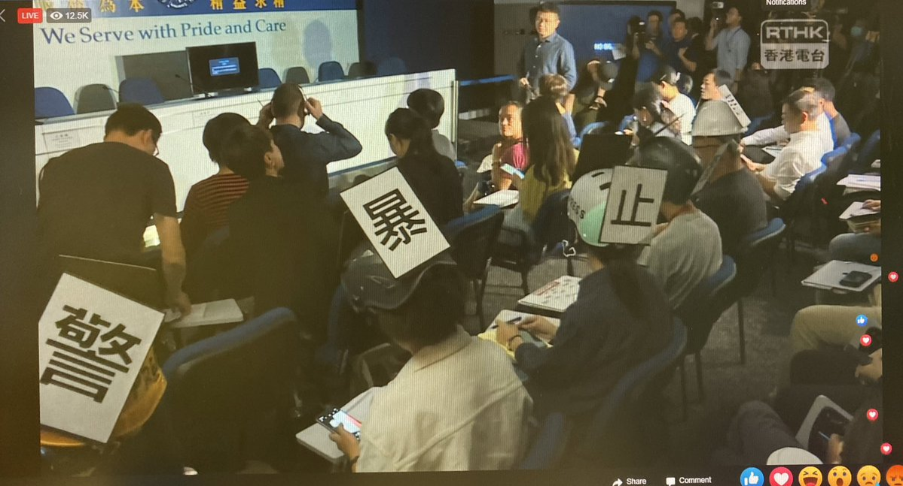
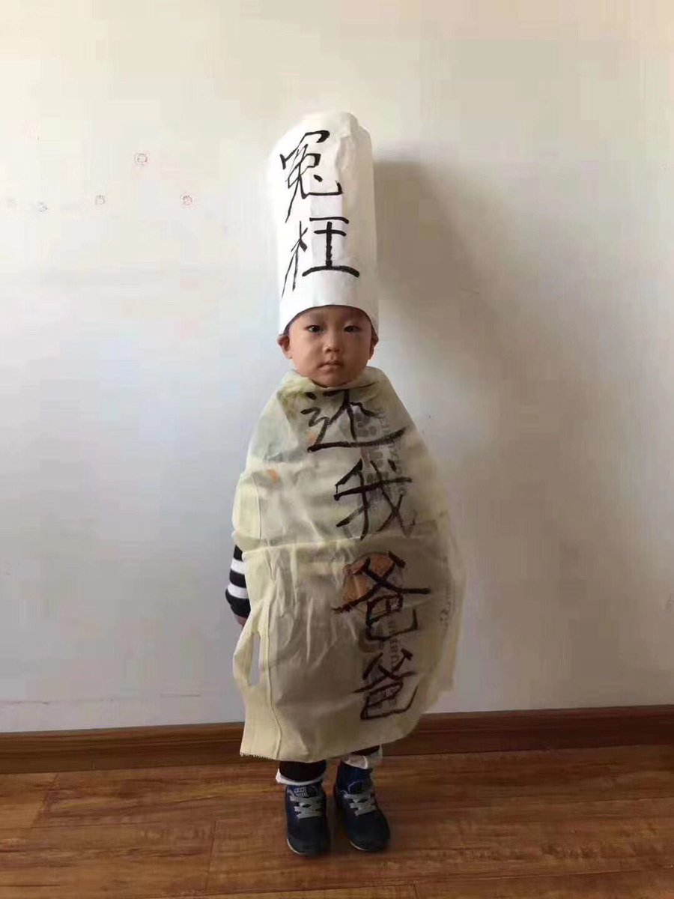

[11月04日 21:30]    纽约时报中文网   @nytchinese    如果说香港抗议者唱出了一首塞壬之歌，那么一些美国官员和议员也做出了应和，积极表达他们对这项事业的承诺。
尽管如此，亦有美国官员表示，美国需要仔细权衡。美国人的更多介入，可能会给北京提供更多宣传弹药，把这场民主运动描绘成一场由外国势力煽动起来的运动。 http://nyti.ms/2Ndg4hQ   :speech_balloon:评:0 :+1:赞:0 :globe_with_meridians:转:0  

[11月04日 21:19]    纽约时报中文网   @nytchinese    消息称美国对TikTok展开国家安全审查  http://nyti.ms/2JOcxnV https://twitter.com/ccni/status/1191272673315188737 …  :speech_balloon:评:2 :+1:赞:3 :globe_with_meridians:转:2  

[11月04日 21:19]    新闻大吐槽   @TuCaoFakeNews    墙国总说外媒戴有色眼镜，看看他们自己是怎么表现的。可笑  :speech_balloon:评:0 :+1:赞:2 :globe_with_meridians:转:1  

[11月04日 21:10]    BBC News 中文   @bbcchinese    双方是自愿的，CEO离婚后独身也是自由的。但是，一个是老板，一个是下属，谈恋爱就坏了公司的规矩。 https://bbc.in/2NeVL3t   :speech_balloon:评:1 :+1:赞:13 :globe_with_meridians:转:2  

[11月04日 20:53]    纽约时报中文网   @nytchinese    中国高校用“学生信息员”监督教师、消除异议  http://nyti.ms/2PzncGG https://twitter.com/ccni/status/1191273988648882176 …  :speech_balloon:评:3 :+1:赞:6 :globe_with_meridians:转:1  

[11月04日 20:52]    纽约时报中文网   @nytchinese    一些香港抗议者把美国视为民主的象征，并希望能将美国拉进他们的运动，让特朗普政府向北京施压。
但对华盛顿而言，如何介入是一个潜在的政策困境，北京可能以美国的干预为由传播“幕后黑手”等阴谋论。 http://nyti.ms/2Ndg4hQ   :speech_balloon:评:21 :+1:赞:35 :globe_with_meridians:转:15  

[11月04日 20:46]    新闻大吐槽   @TuCaoFakeNews    再後來，甚至會沒有沉默的自由。我們不能走到那一步。  :speech_balloon:评:0 :+1:赞:1 :globe_with_meridians:转:1  

[11月04日 20:01]    BBC News 中文   @bbcchinese    【溺亡者搜索队：他走遍全球 将孩子的遗体送回家属】他组成溺亡者搜索队，走遍全球，将孩子的遗体送回家属。 https://bbc.in/2oPeRE4   :speech_balloon:评:1 :+1:赞:10 :globe_with_meridians:转:1  

[11月04日 19:22]    新闻大吐槽   @TuCaoFakeNews    中共人沒有進化過。  :speech_balloon:评:0 :+1:赞:3 :globe_with_meridians:转:1  

[11月04日 19:21]    新闻大吐槽   @TuCaoFakeNews    香港特衰政府已经向全球公告，这里已经没有任何新闻自由!  :speech_balloon:评:0 :+1:赞:5 :globe_with_meridians:转:2  

[11月04日 18:54]    新闻大吐槽   @TuCaoFakeNews    只有深圳卫视《直播港澳台》有香港新华社正大门全景镜头，但是，驱逐共匪字样打上了厚厚的马赛克！  :speech_balloon:评:1 :+1:赞:2 :globe_with_meridians:转:2  

[11月04日 18:29]    新闻大吐槽   @TuCaoFakeNews    黑警摔倒還引發一片歡呼！  :speech_balloon:评:0 :+1:赞:2 :globe_with_meridians:转:1  

[11月04日 18:29]    新闻大吐槽   @TuCaoFakeNews    哈哈哈哈  https://twitter.com/TuCaoFakeNews/status/1190397688908369920 …  :speech_balloon:评:0 :+1:赞:5 :globe_with_meridians:转:3  

[11月04日 18:24]    新闻大吐槽   @TuCaoFakeNews    即是變相承認自己濫暴和滿口謊言  :speech_balloon:评:0 :+1:赞:4 :globe_with_meridians:转:1  

[11月04日 18:03]    新闻大吐槽   @TuCaoFakeNews    香港人有表达的自由，警察当局的威胁就是犯法，就是耍流氓。 https://twitter.com/TuCaoFakeNews/status/1191279478913171456 …  :speech_balloon:评:0 :+1:赞:2 :globe_with_meridians:转:1  

[11月04日 18:01]    BBC News 中文   @bbcchinese    绰号“普京大厨”的俄罗斯富商普里高津，由于涉嫌干预美国大选，美国政府正加大对其个人和生意的制裁。 https://bbc.in/2NPWcAz   :speech_balloon:评:4 :+1:赞:26 :globe_with_meridians:转:6  

[11月04日 18:00]    纽约时报中文网   @nytchinese    由于担心人口萎缩和老龄化，中国领导人鼓励女性“家庭事业两手抓”。然而，一些职业女性在怀孕或生子后面临歧视，甚至被迫离开公司；无视劳动法的雇主却基本上很少受到惩罚。
一些中国女性正在对雇主提起诉讼和寻求仲裁，她们称雇主无视让母亲留在工作场所的法律。 http://nyti.ms/34vltX4   :speech_balloon:评:13 :+1:赞:29 :globe_with_meridians:转:15  

[11月04日 17:54]    老司机   @h5lpykl7tp6jjop    今年过年不吃肉啊，不吃肉啊不吃肉！吃肉滚到美国去啊，美国去啊美国去……
好文转发，有删减，文/豆府  :speech_balloon:评:1 :+1:赞:22 :globe_with_meridians:转:10  

[11月04日 17:41]    新闻大吐槽   @TuCaoFakeNews    记者集体杯葛警谎记者会，以后只报道民间记者会的声音吧 https://twitter.com/TuCaoFakeNews/status/1191279478913171456 …  :speech_balloon:评:0 :+1:赞:1 :globe_with_meridians:转:0  

[11月04日 17:32]    新闻大吐槽   @TuCaoFakeNews    港府、警方拒絕獨立調查本身無異於昭告全世界：
我們是有問題的，經不起查的，有違法有黑箱有人命。
反之你怕什麼？假的一查還能變真的不成？
我們很難想象，如果美國政府為平息社會抗議與黑手黨合作暴打市民、上百名抗議者莫名死亡會是什麼結果。
如此治理水平談何構建人類命運共同體，簡直就是個笑話 https://twitter.com/tucaofakenews/status/1191279478913171456 …  :speech_balloon:评:0 :+1:赞:12 :globe_with_meridians:转:6  

[11月04日 17:31]    新闻大吐槽   @TuCaoFakeNews    哼，一派胡言！一派胡言！  :speech_balloon:评:1 :+1:赞:8 :globe_with_meridians:转:5  

[11月04日 17:30]    纽约时报中文网   @nytchinese    争论的焦点是，美国指责中国向本国企业提供补贴，以便它们能够在海外以更低廉的价格销售商品。为了阻止数十种低成本的中国产品充斥美国市场，美国对这些产品征收了“反倾销税”。
该案不属于目前中美贸易战的一部分，但可能使两国关系进一步复杂化。 http://nyti.ms/2NChGR9   :speech_balloon:评:1 :+1:赞:6 :globe_with_meridians:转:1  

[11月04日 17:28]    新闻大吐槽   @TuCaoFakeNews    不本来不认识介个人，然而华为非要警告他反而帮他火了  :speech_balloon:评:1 :+1:赞:0 :globe_with_meridians:转:1  

[11月04日 17:25]    新闻大吐槽   @TuCaoFakeNews    香港是越来越独裁了  :speech_balloon:评:1 :+1:赞:6 :globe_with_meridians:转:1  

[11月04日 17:08]    新闻大吐槽   @TuCaoFakeNews    香港警察的罪恶丑行如此清晰的暴露于媒体聚光灯之下 https://twitter.com/TuCaoFakeNews/status/1191044422810529792 …  :speech_balloon:评:0 :+1:赞:11 :globe_with_meridians:转:12  

[11月04日 17:07]    新闻大吐槽   @TuCaoFakeNews      :speech_balloon:评:0 :+1:赞:2 :globe_with_meridians:转:1  

[11月04日 17:04]    新闻大吐槽   @TuCaoFakeNews    “中国之治？...... https://twitter.com/tucaofakenews/status/1191279478913171456 …  :speech_balloon:评:0 :+1:赞:10 :globe_with_meridians:转:4  

[11月04日 17:03]    新闻大吐槽   @TuCaoFakeNews    所有有助于极权控制的技术，中共都应用的贼快。科技进步完全被用于建造天朝这个大监狱了。真是日了狗～  :speech_balloon:评:1 :+1:赞:7 :globe_with_meridians:转:1  

[11月04日 17:02]    新闻大吐槽   @TuCaoFakeNews    记者在警方的新闻发布会上带上标有「查警暴，止警謊 」的头盔，被要求退场，并威胁要取消他们的记者证！

反对的自由，以前有，以后估计就没有了  :speech_balloon:评:16 :+1:赞:299 :globe_with_meridians:转:183  

[11月04日 17:02]    新闻大吐槽   @TuCaoFakeNews    记者在警方的新闻发布会上带上标有「查警暴，止警謊 」的头盔，被要求退场，并威胁要取消他们的记者证！

反对的自由，以前有，以后估计就没有了  :speech_balloon:评:16 :+1:赞:299 :globe_with_meridians:转:183  

[11月04日 17:00]    BBC News 中文   @bbcchinese    中国国家主席习近平11月2日在上海考察时首次提出“全过程民主”，引起各种猜测和讨论。 https://bbc.in/2NQ25xF   :speech_balloon:评:107 :+1:赞:112 :globe_with_meridians:转:49  

[11月04日 16:00]    纽约时报中文网   @nytchinese    爱情是人类永恒的话题。纽约时报中文网从时报“摩登情爱”专栏中挑选出最受欢迎的情感类文章，编辑成册。今年10月，该专栏的一些故事被改编成单元剧，并在亚马逊平台上播出。
这里有爱情保鲜的秘方，也有如何抚平创伤的诀窍；这里有爱情中的真实、愉悦和痛苦，有关于“爱”的一切。 http://amzn.to/36xnPXm   :speech_balloon:评:0 :+1:赞:7 :globe_with_meridians:转:4  

[11月04日 15:30]    纽约时报中文网   @nytchinese    中国禁止许多外国公司在它国内的网络上公开存在，但开发出尖端技术产品的中国公司正在世界各地越来越受欢迎。
许多议员和特朗普政府官员将这一趋势视为对美国的国家安全和经济的威胁，为了阻止中国公司获取美国的数据和技术，他们已经设置了许多障碍。 http://nyti.ms/2JOcxnV   :speech_balloon:评:12 :+1:赞:32 :globe_with_meridians:转:20  

[11月04日 15:18]    纽约时报中文网   @nytchinese    WTO上周五允许中国对价值达36亿美元的美国商品实施制裁，这一决定可能将进一步激起特朗普政府对该组织的反感。
这项诉讼源于奥巴马执政期间40多种中国商品被强征关税，WTO认为美国的征税方式不符合其规则。 http://nyti.ms/2NChGR9   :speech_balloon:评:15 :+1:赞:28 :globe_with_meridians:转:15  

[11月04日 15:01]    BBC News 中文   @bbcchinese    24岁的吴花燕五年来每天只能吃白饭拌糟辣椒而导致营养不良，因为她还要照顾患病的弟弟。 https://bbc.in/2oNcmSG   :speech_balloon:评:64 :+1:赞:155 :globe_with_meridians:转:67  

[11月04日 14:00]    纽约时报中文网   @nytchinese    上周五发布的公告措辞模糊不清，关于该公告能否成为有效禁令以及是否将被执行的问题目前尚且存疑。
“中国目前尚无法律法规禁止在线销售电子烟，”中国电子商会电子烟行业委员会会长欧俊彪说。他还表示，他认为监管人员担心会失去销售电子烟带来的税收流。 http://nyti.ms/2WDqTg8   :speech_balloon:评:3 :+1:赞:3 :globe_with_meridians:转:1  

[11月04日 13:33]    财经真相   @caijingxiang    猪肉涨了，鸡肉也要涨了！  :speech_balloon:评:38 :+1:赞:132 :globe_with_meridians:转:43  

[11月04日 13:30]    纽约时报中文网   @nytchinese    • 新研究显示，白天多走几步的人，晚上睡得更好；无论我们是否进行高强度锻炼，积极的身体活动都会给我们的睡眠质量带来积极影响。 
• 厨房太小、杂物太多？我们测试了数十件储物工具，这几样高性价比的趁手好物让你在小空间里也能有大发挥。
更多一周智慧生活内容： http://nyti.ms/36xS1lo   :speech_balloon:评:1 :+1:赞:5 :globe_with_meridians:转:3  

[11月04日 13:01]    BBC News 中文   @bbcchinese    根据民意调查，孟晚舟及加拿大前外交官康明凯等分别遭加国及中国拘捕，造成两国外交裂痕，加拿大公众对中国忧虑加剧，但出乎意料地，他们依然愿意跟中国维持多个层面上的接触。 https://bbc.in/2Nb0hjx   :speech_balloon:评:19 :+1:赞:32 :globe_with_meridians:转:9  

[11月04日 13:00]    纽约时报中文网   @nytchinese    #每日一词 Diptych，对比照、双连画。香港抗议活动几乎在每周末都以冲突、回归平静、再次爆发冲突的节奏重复上演。摄影师林亦非用“对比照”(diptych)的方式展示了香港居民定期经历的反差。Diptych源于古代的双折书写板，现在常被用来指双连画、对比照。
更多简报内容： http://nyti.ms/33dsw6L   :speech_balloon:评:4 :+1:赞:0 :globe_with_meridians:转:1  

[11月04日 12:34]    BBC News 中文   @bbcchinese    这款智能泳镜让你实时知道时间、泳速、水深、心跳。  :speech_balloon:评:3 :+1:赞:60 :globe_with_meridians:转:27  

[11月04日 12:30]    纽约时报中文网   @nytchinese    上周五，中国国家烟草专卖局、国家市场监督管理总局发布通告，称为保护未成年人身心健康，敦促电子烟制造商和销售商关闭与电子烟营销和销售有关的网站。
对于一个在全球都面临审查的行业来说，此举或意味着中国市场的大门被关闭。 http://nyti.ms/2WDqTg8   :speech_balloon:评:23 :+1:赞:30 :globe_with_meridians:转:20  

[11月04日 12:00]    纽约时报中文网   @nytchinese    英国卡车惨案39名偷渡客被确认为越南籍，他们经历了什么？这是一段通风不良、缺氧的旅程，走私者称其为“二氧化碳”之路。
尽管过程艰辛、充满暴力，每年仍有成千上万的越南人偷渡到欧洲。
更多简报内容： http://nyti.ms/33dsw6L   :speech_balloon:评:7 :+1:赞:4 :globe_with_meridians:转:2  

[11月04日 11:37]    GFHG SDKM   @zyx_yny    That’s disgusting how HongKong police connived the Chinese man biting off other’s ear. But they torture some innocent people... https://twitter.com/demosisto/status/1191051238495834114 …  :speech_balloon:评:0 :+1:赞:1 :globe_with_meridians:转:3  

[11月04日 11:34]    GFHG SDKM   @zyx_yny    Just in: Local paper @mingpaocom confirms that this first-aid volunteer is a freshman from Hong Kong Shue Yan University. Holding a certificate in first aid, he was amply performing his duties on Nov 2, says the student union. He is in stable condition. Photo from @cityusucbc  :speech_balloon:评:5 :+1:赞:151 :globe_with_meridians:转:114  

[11月04日 11:33]    纽约时报中文网   @nytchinese    消息人士称美国政府正在审核两年前字节跳动收购 http://Musical.ly 的交易，后者是TikTok的前身。
知情者表示，国会议员对TikTok在美国的影响力日益增长表示担忧后，外国在美投资委员会正在审核这笔交易。其中一人透露，美国政府已掌握了该应用程序向中国发送数据的证据。http://nyti.ms/2JOcxnV   :speech_balloon:评:40 :+1:赞:136 :globe_with_meridians:转:59  

[11月04日 11:00]    纽约时报中文网   @nytchinese    周日，香港抗议者挤满一家购物中心，与警方对峙。冲突之中，一名男子持刀砍伤数人，并咬伤一名议员的耳朵。
此前一天，数千名抗议者在维园举行“选举集会“。随后冲突转向暴力，警察再度发射催泪瓦斯，抗议者则首次将目标对准新华社的驻港办公室。
更多简报内容： http://nyti.ms/33dsw6L   :speech_balloon:评:67 :+1:赞:8 :globe_with_meridians:转:4  

[11月04日 10:30]    纽约时报中文网   @nytchinese    根据大学发布的公告，在习近平的领导下，许多大学现在每班任命一名学生监督员。学生必须经过申请成为信息员，许多学校只接受党员或能够证明自己持有“正确”政治观点的人。
信息员说，一些学生认为自己的任务涵盖广泛，他们不仅关注教授在课堂上说了什么，还关注教授的私人生活。 http://nyti.ms/2PzncGG   :speech_balloon:评:12 :+1:赞:26 :globe_with_meridians:转:13  

[11月04日 10:28]    GFHG SDKM   @zyx_yny    A human Ear Necklace ——  #CarrieLam’s new jewelry delivered from last night‘s pro Beijing attack. 
An ear，several eyes and dozens of young lives of HongKong protesters are all in her bloody collection.
Enough is enough！
#HongKongProtests #StandWithHongKong  :speech_balloon:评:35 :+1:赞:562 :globe_with_meridians:转:417  

[11月04日 10:26]    GFHG SDKM   @zyx_yny    Facebook have blocked the share function of photos that reflects the fact of #HKPoliceTerrorists
#StandWithHongKong  :speech_balloon:评:2 :+1:赞:16 :globe_with_meridians:转:24  

[11月04日 10:25]    纽约时报中文网   @nytchinese    Hong Kong Protests: Police Face Off With Demonstrators After Election Rally. TikTok Said to Be Under National Security Review. W.T.O. Allows China to Impose Trade Sanctions on U.S. Goods. How to say "diptych" in Chinese? Follow us @nytchinese https://cn.nytimes.com/morning-brief/20191104/hong-kong-trump-twitter/ …  :speech_balloon:评:1 :+1:赞:13 :globe_with_meridians:转:10  

[11月04日 10:09]    纽约时报中文网   @nytchinese    早安！今日重点新闻包括：
香港骚乱中男子持刀伤人；特朗普如何“推特治国”；美国就抖音收购案进行国安调查；WTO批准中国对美国商品实施贸易制裁；中国禁止在线销售电子烟；阿里巴巴销售额增长超预期；沙特国有石油巨头沙特阿美启动IPO……NYT简报带你速览今日要闻。 http://nyti.ms/33dsw6L   :speech_balloon:评:20 :+1:赞:36 :globe_with_meridians:转:13  

[11月04日 09:40]    GFHG SDKM   @zyx_yny    Facebook is trying to delete the photo, cover the crime of Hk police!  
#HKPoliceTerrorists  :speech_balloon:评:0 :+1:赞:16 :globe_with_meridians:转:26  

[11月04日 09:21]    BBC News 中文   @bbcchinese    澳洲有不少难民和寻求庇护的人希望建立新生活。BBC在澳洲的特约记者周志强说，来自中国的寻求庇护者也不少。 https://bbc.in/2C9Z5qi   :speech_balloon:评:49 :+1:赞:69 :globe_with_meridians:转:23  

[11月04日 06:57]    财经真相   @caijingxiang    据香港特区政府网站消息，11月5日，特首林郑月娥将出席第二届上海进博会，晚上则转往北京，次日上午将与国务院副总理韩正举行会见，下午出席粤港澳大湾区建设领导小组第三次全体会议。  :speech_balloon:评:6 :+1:赞:89 :globe_with_meridians:转:22  

[11月04日 06:39]    财经真相   @caijingxiang    陶然笔记：即使第一阶段协议也应该体现中国核心要求！  :speech_balloon:评:9 :+1:赞:21 :globe_with_meridians:转:0  

[11月04日 03:05]    GFHG SDKM   @zyx_yny    #HKPoliceTerrorists suddenly stormed a public housing estate in Tseung Kwan O at midnight and fired tear gas at residents out of no reason. A passerby fell from a 3-storey carpark when dodging teargas, and now suffered from severe internal bleeding. #PoliceState #PoliceBrutality  :speech_balloon:评:46 :+1:赞:832 :globe_with_meridians:转:1000  

[11月04日 02:58]    GFHG SDKM   @zyx_yny    香港天天在死人，世界人民眼睁睁看着却毫无办法？这是人类的奇耻大辱！  :speech_balloon:评:1 :+1:赞:32 :globe_with_meridians:转:13  

[11月04日 02:42]    BBC News 中文   @bbcchinese    香港示威抗议活动周日在太古城中心再度发生流血事件，至少有4人遭到持刀攻击者刺伤，区议员赵家贤还被咬掉部分耳朵。 https://bbc.in/2pB3M9O   :speech_balloon:评:125 :+1:赞:329 :globe_with_meridians:转:206  

[11月04日 01:18]    GFHG SDKM   @zyx_yny    革命要成功，需勇武和理非的配合和默契！沙田新城市廣場被捕捉到的這一慕是五個月來難得一見的鏡頭。一手足挣脫畜警束縛，畜警不甘急追，於電光火石間（2秒），一位義士迅速上前，冷不防伸腳一絆，畜警即失平衡，來記惡狗搶屎。這是戰友間的默契，被追的手兄未必知道他今晚能回家是因為那位智勇義士。  :speech_balloon:评:76 :+1:赞:1715 :globe_with_meridians:转:740  

[11月04日 01:06]    GFHG SDKM   @zyx_yny    #HongKong riot police now ignored the law. They entered private property (Tai Po Center) w/o Search Warrant.

#HongKongers have no private properties now, riot police& CCP can collect your properties when they want. Investors should bear in mind about that.

#HKPoliceState  :speech_balloon:评:61 :+1:赞:1324 :globe_with_meridians:转:1468  

[11月04日 00:32]    GFHG SDKM   @zyx_yny    “Is it just me, or is it getting crazier out there?”
「是否只得我一個，或是外面的世界變得瘋狂？」

在這城市，我也分不清楚了。  :speech_balloon:评:24 :+1:赞:708 :globe_with_meridians:转:574  

[11月04日 00:13]    GFHG SDKM   @zyx_yny    We have witnessed @hkpoliceforce human rights abuse & brutality for 22 weeks. @STcom's puff piece below WON'T save it fromsanctions.  https://www.straitstimes.com/asia/east-asia/hong-kong-policeman-who-fired-his-gun-now-faces-death-threats …https://twitter.com/charlesmok/status/1191018392372727809 …  :speech_balloon:评:170 :+1:赞:2099 :globe_with_meridians:转:1500  

[11月04日 00:12]    老司机   @h5lpykl7tp6jjop    雖然畫面會令你不適，但我們要認清事件真相必須認清太古大陸口音兇徒短刀刺傷四人的殘忍事實，刀刀致命，該男子頸部被刺如刺中大動脈會失血致死，到發文前一小時，兩人危殆兩人嚴重。但是，無線新聞只字沒有報道兇徒斬人及咬斷趙家賢議員耳朵的事件，而斷章取義片面報道兇徒被群眾制服毆打的画面  :speech_balloon:评:14 :+1:赞:253 :globe_with_meridians:转:277  

[11月03日 23:57]    BBC News 中文   @bbcchinese    澳大利亚东海岸日前发生丛林大火，数百只考拉可能葬身火海。一只小考拉幸运逃过一劫，被救援人员送到救护中心，取名“灯芯绒保罗”。  :speech_balloon:评:13 :+1:赞:104 :globe_with_meridians:转:34  

[11月03日 23:31]    财经真相   @caijingxiang    根据最新美国气象预计，从10号开始，北美大陆将会迎来下半年来最强冷空，这股寒潮国境后，五大湖地区气温将会骤降，芝加哥地区在14号将会降至零下20度；目前美国天然气期货还未完全计价！  :speech_balloon:评:9 :+1:赞:82 :globe_with_meridians:转:29  

[11月03日 22:02]    财经真相   @caijingxiang    新华微评：我们走的是一条中国特色社会主义政治发展道路，人民民主是一种全过程的民主”。“全过程”民主的真谛就在于有事好商量，众人的事情由众人商量，通过充分商量找到全社会意愿和要求的最大公约数，从而有效解决问题，实现人民当家作主、管理国家社会各项事务的民主权利。  :speech_balloon:评:61 :+1:赞:88 :globe_with_meridians:转:33  

[11月03日 21:56]    GFHG SDKM   @zyx_yny    The murderer kept smiling since he knows he won't be charged in this Police State.  :speech_balloon:评:13 :+1:赞:89 :globe_with_meridians:转:65  

[11月03日 21:22]    BBC News 中文   @bbcchinese    一位專家建議創建密碼可以很創意，比如用你喜歡的一首歌詞的每個首字母。一位专家建议创建密码可以很创意，比如用你喜欢的一首歌词的每个首字母。 https://bbc.in/2NBRI03   :speech_balloon:评:3 :+1:赞:36 :globe_with_meridians:转:18  

[11月03日 21:00]    纽约时报中文网   @nytchinese    #一周热门 #时报专栏 我们所知的那个加州完了 http://nyti.ms/2BYCwor   :speech_balloon:评:31 :+1:赞:59 :globe_with_meridians:转:22  

[11月03日 20:58]    GFHG SDKM   @zyx_yny     #BREAKING: Graphic Warning!

Dr Andrew Chiu, district councillor’s EAR was brutally BITTEN OFF — can you see the #smirking face of the Pro-#Beijing Attacker!!!?

#crazyHongKong #HongKongProtests #HongKong #antichinazi #chinazi  :speech_balloon:评:2 :+1:赞:52 :globe_with_meridians:转:52  

[11月03日 20:48]    GFHG SDKM   @zyx_yny    #HongKong - a knife-wielding Pro-#Beijing supporter brutally BITES OFF part of a district councillor's EAR after argument over politics.

Brave bystanders caught him before he tried to escape.

— “Is it just me, or is it getting #CRAZIER out there?”
#HongKongProtests #香港デモ  :speech_balloon:评:15 :+1:赞:287 :globe_with_meridians:转:302  

[11月03日 20:04]    GFHG SDKM   @zyx_yny    My close colleague Dr Andrew Chiu was assaulted in his constituency, Taikoo Plaza. His left ear was brutally halved. I strongly condemn these violent attacks especially targeting election candidates.  :speech_balloon:评:973 :+1:赞:12099 :globe_with_meridians:转:12448  

[11月03日 20:00]    BBC News 中文   @bbcchinese    【海豚如何治愈这群身体残障的小孩子？】海豚是人类的好朋友。 https://bbc.in/2C5kBMN   :speech_balloon:评:3 :+1:赞:15 :globe_with_meridians:转:6  

[11月03日 19:57]    GFHG SDKM   @zyx_yny    Did @hkpoliceforce arrest them? https://twitter.com/jesuisabc/status/1190960537242234881 …  :speech_balloon:评:1261 :+1:赞:5785 :globe_with_meridians:转:5513  

[11月03日 18:05]    GFHG SDKM   @zyx_yny    An election candidate was arrested and tortured yesterday. How can we accept atrocity like this happening in HK?
(Source: RFA)  :speech_balloon:评:858 :+1:赞:13924 :globe_with_meridians:转:14436  

[11月03日 17:49]    GFHG SDKM   @zyx_yny    NCM Yue 教大家點樣遊説議員做香港人權民主法案 co-sponsor
主要係形容
官逼民反（唔俾和平集會）、
黑警濫暴（建議手足俾埋相同影片證據）、
操控選舉（DQ 黃之鋒、拉區議會候選人）

每日都發生太多荒謬、難過既事
如果今個會期過唔到要等下年
我哋冇咁多時間
前線做咗好多, 文宣都要發力 https://twitter.com/solomonyue/status/1190667854162599937 …  :speech_balloon:评:11 :+1:赞:341 :globe_with_meridians:转:267  

[11月03日 17:40]    GFHG SDKM   @zyx_yny    我来自新加坡。我们一向来对港警十分敬佩。这是因为TVB和警匪港剧的影响。但现实中的popo却让我大吃一惊。
我对hkpopo感到彻底失望。如果你还有人性，你应该退伍。popo 在保护的不是港民而是中共中央。popo正在摧毁民主人权和年轻人的未来。
#HKprotests #HKPoliceState #HKPolice #光复香港时代革  :speech_balloon:评:122 :+1:赞:1239 :globe_with_meridians:转:447  

[11月03日 17:17]    BBC News 中文   @bbcchinese    无车之城：到底有什么好处，又有哪些争议 https://bbc.in/2JLNu4R   :speech_balloon:评:8 :+1:赞:32 :globe_with_meridians:转:9  

[11月03日 16:36]    BBC News 中文   @bbcchinese    中共十九届四中全会闭幕，北京如何处理香港问题出现新动向。你怎么看？相关新闻： https://bbc.in/2PGEvWs   :speech_balloon:评:33 :+1:赞:18 :globe_with_meridians:转:5  

[11月03日 16:04]    BBC News 中文   @bbcchinese    随着中国雄心勃勃的“一带一路”计划向南亚延伸，尼泊尔现在似乎成了中印两国扩大地区影响的必争之地。 https://bbc.in/2JJ64Lc   :speech_balloon:评:18 :+1:赞:42 :globe_with_meridians:转:9  

[11月03日 14:54]    老司机   @h5lpykl7tp6jjop    如果中共及其红后代在海外肆意猖狂下去，排华事件 未必不会再次发生！
发生在1965年的印尼排华事件，就是由中共输出革命失败所引起，造成印尼华人大量被杀，前后死亡300万，这个话题至今为止一直是印尼的禁忌话题，即使到今天仍然极度敏感。  :speech_balloon:评:5 :+1:赞:146 :globe_with_meridians:转:82  

[11月03日 14:21]    BBC News 中文   @bbcchinese    在日本最偏远的温泉体验“赤裸关系” https://bbc.in/2NcUc69   :speech_balloon:评:3 :+1:赞:33 :globe_with_meridians:转:19  

[11月03日 14:00]    BBC News 中文   @bbcchinese    近几个月来，中国和美国一直在争夺全球科技行业的领导地位，中国科技巨头华为成为了两国科技角力的旋涡中心。 https://bbc.in/36nMNbT   :speech_balloon:评:37 :+1:赞:57 :globe_with_meridians:转:16  

[11月03日 13:00]    BBC News 中文   @bbcchinese    BBC阿拉伯语在科威特进行的一项调查发现，有人在黑市上买卖家佣，而这项买卖可以通过谷歌应用商店、苹果商店提供的应用程序，以及在脸书旗下的Instagram上由算法推动的话题标签来实现。 https://bbc.in/2qfs74W   :speech_balloon:评:6 :+1:赞:35 :globe_with_meridians:转:13  

[11月03日 12:19]    GFHG SDKM   @zyx_yny    congrats https://twitter.com/wbyeats1865/status/1190554802381451264 …  :speech_balloon:评:0 :+1:赞:1 :globe_with_meridians:转:0  

[11月03日 12:12]    BBC News 中文   @bbcchinese    【新华社香港分社遭破坏】《环球时报》社评称：“新华社带有象徵性意义，暴徒们破坏新华社既是对香港法治的挑衅，也是对中央和内地的挑衅。”
相关新闻： https://bbc.in/2JHKc2M   :speech_balloon:评:98 :+1:赞:94 :globe_with_meridians:转:25  

[11月03日 12:00]    BBC News 中文   @bbcchinese    【在妓院出生，11岁开始接待客人 孟加拉妓女的惨痛人生】世界上，很多人身不由己。 https://bbc.in/2PFfk6P   :speech_balloon:评:12 :+1:赞:27 :globe_with_meridians:转:15  

[11月03日 10:45]    老司机   @h5lpykl7tp6jjop    它們指鹿為馬、它們顛倒黑白、它們混淆視聽、它們底線盡毀、它們厚顏無恥、它們愚人洗腦.......
美國物價低廉穩定利國利民，卻在它們的嘴裡說成「如坐針氈」的慘狀，難道象牆國家一斤豬肉賣幾十元才好？！  :speech_balloon:评:30 :+1:赞:184 :globe_with_meridians:转:81  

[11月03日 10:36]    老司机   @h5lpykl7tp6jjop    这孩子，怎么不能领会贸易战的重要意义呢？这家大人把视频发到网上要考虑影响呀，如果转发上了500，可以直接拘留的啊！要以国家大局为重，不要只考虑个人小家，再过几天就进入全面小康社会了！继续坚持！没有肉是暂时的，前途是光明的，共产主义就在明天！  :speech_balloon:评:4 :+1:赞:97 :globe_with_meridians:转:40  

[11月03日 10:19]    老司机   @h5lpykl7tp6jjop    香港警队完全丧失英国管理下百年来的荣誉！除自身的败类外一大批中共军警混入其中，一个个色中饿鬼，人面豺狼进入香港花花世界，看到年轻女性兽性大发，身穿制服形同野兽，辣手摧花不堪入目，香港今天竟变成原始社会！共产党兽行逆天，古今中外无耻之极，言语不能形容之肮脏！镜头无法录全之下流！呸！  :speech_balloon:评:1 :+1:赞:52 :globe_with_meridians:转:14  

[11月03日 09:58]    老司机   @h5lpykl7tp6jjop    强烈要求该同志升任中国银监会担任一把手！  :speech_balloon:评:5 :+1:赞:10 :globe_with_meridians:转:4  

[11月03日 08:46]    老司机   @h5lpykl7tp6jjop    一个把多快好省写进宪法里的国家，一个贪多图快要好又要省的族群，有什么能阻止他们急功近利的发财欲望？不管黑猫白猫的理论，造就了今天假货横行，骗技高超 ，偷窃不耻，笑贫不笑娼的无良社会，只求升官发财，不计手段下流，胜者为王，不顾天良，披人皮只作为抢窃的面具，这样的国家和民族还有救吗？  :speech_balloon:评:6 :+1:赞:97 :globe_with_meridians:转:29  

[11月03日 08:23]    凡賽堤/FORSETI   @FecharCCP    他們不配稱警察，他們是納粹的狗！魔鬼般的瘋狗！

極權殺人恐怖組織正在用各種兇殘手段殺害我們的同胞..................................................

滅絕人性對待老人  :speech_balloon:评:4 :+1:赞:44 :globe_with_meridians:转:42  

[11月03日 08:16]    凡賽堤/FORSETI   @FecharCCP    他們不配稱警察，他們是納粹的狗！魔鬼般的瘋狗！

極權殺人恐怖組織正在用各種兇殘手段殺害我們的同胞..................................................

無辜港民被納粹的狗打破頭！  :speech_balloon:评:1 :+1:赞:4 :globe_with_meridians:转:3  

[11月03日 08:12]    凡賽堤/FORSETI   @FecharCCP    他們不配稱警察，他們是納粹的狗！魔鬼般的瘋狗！

極權殺人恐怖組織正在用各種兇殘手段殺害我們的同胞..................................................

我們唯一能救她們的就是瘋狂轉發，讓全世界都知道！才有可能不會極權殺人恐怖組織暗殺，被墜樓，被自殺，被棄屍！  :speech_balloon:评:0 :+1:赞:6 :globe_with_meridians:转:6  

[11月03日 08:05]    凡賽堤/FORSETI   @FecharCCP    他們不配稱警察，他們是納粹的狗！魔鬼般的瘋狗！

極權殺人恐怖組織正在用各種兇殘手段殺害我們的同胞..................................................

我們唯一能救她們的就是瘋狂轉發，讓全世界都知道！才有可能不會極權殺人恐怖組織暗殺，被墜樓，被自殺，被棄屍！  :speech_balloon:评:4 :+1:赞:29 :globe_with_meridians:转:28  

[11月03日 07:58]    凡賽堤/FORSETI   @FecharCCP    極權殺人恐怖組織正在用各種兇殘手段殺害我們的同胞..................................................

我們唯一能救她們的就是瘋狂轉發，讓全世界都知道！才有可能不會極權殺人恐怖組織暗殺，被墜樓，被自殺，被棄屍！  :speech_balloon:评:0 :+1:赞:2 :globe_with_meridians:转:5  

[11月03日 07:45]    凡賽堤/FORSETI   @FecharCCP    極權殺人恐怖組織正在用各種兇殘手段殺害我們的同胞..................................................

我們唯一能救她們的就是瘋狂轉發，讓全世界都知道！才有可能不會極權殺人恐怖組織暗殺，被墜樓，被自殺，被棄屍！  :speech_balloon:评:16 :+1:赞:560 :globe_with_meridians:转:615  

[11月03日 07:44]    凡賽堤/FORSETI   @FecharCCP    極權殺人恐怖組織正在用各種兇殘手段殺害我們的同胞..................................................

我們唯一能救她們的就是瘋狂轉發，讓全世界都知道！才有可能不會極權殺人恐怖組織暗殺，被墜樓，被自殺，被棄屍！  :speech_balloon:评:30 :+1:赞:620 :globe_with_meridians:转:755  

[11月03日 07:36]    凡賽堤/FORSETI   @FecharCCP    極權殺人恐怖組織正在用各種兇殘手段殺害我們的同胞..................................................

大陸軍警蒙面扮港民  :speech_balloon:评:2 :+1:赞:143 :globe_with_meridians:转:148  

[11月03日 07:32]    凡賽堤/FORSETI   @FecharCCP    極權殺人恐怖組織正在用各種兇殘手段殺害我們的同胞..................................................

我們唯一能救她們的就是瘋狂轉發，讓全世界都知道！才有可能不會極權殺人恐怖組織暗殺，被墜樓，被自殺，被棄屍！  :speech_balloon:评:0 :+1:赞:3 :globe_with_meridians:转:5  

[11月03日 07:24]    凡賽堤/FORSETI   @FecharCCP    魔鬼在人間

極權殺人恐怖組織正在用各種兇殘手段殺害我們的同胞..................................................

極權殺人恐怖組織在香港兇殘粗暴非法濫捕港民同胞！  :speech_balloon:评:14 :+1:赞:8 :globe_with_meridians:转:7  

[11月03日 07:09]    凡賽堤/FORSETI   @FecharCCP    魔鬼在人間

極權殺人恐怖組織正在用各種兇殘手段殺害我們的同胞..................................................

我們唯一能救她們的就是瘋狂轉發，讓全世界都知道！才有可能不會極權殺人恐怖組織暗殺，被墜樓，被自殺，被棄屍！  :speech_balloon:评:1 :+1:赞:61 :globe_with_meridians:转:76  

[11月02日 23:38]    老司机   @h5lpykl7tp6jjop    人民唯一能保護自己的兩樣東西：選票和槍。失去了這些就等於隨時會失去生命！  :speech_balloon:评:40 :+1:赞:615 :globe_with_meridians:转:341  

[11月02日 22:35]    墙国铁拳现世报😷   @Socialistfist    小编谨代表墙国铁拳现世报读者欢迎您来推特。
看来上次强拆不但把你村邻居房子拆了，还把你的防火墙也给拆了嘛 https://twitter.com/Xiuxianlu/status/1190623728545062912 …  :speech_balloon:评:8 :+1:赞:140 :globe_with_meridians:转:16  

[11月02日 19:09]    财经真相   @caijingxiang    盛世明星赛富商，乱世戏子逃饥荒！一心只盼有戏拍，不闻香港成战场！  :speech_balloon:评:6 :+1:赞:280 :globe_with_meridians:转:28  

[11月02日 19:03]    财经真相   @caijingxiang    国内很多明星都在抱怨没戏拍可拍，这个其实也可以理解，很多演员都是吃青春饭的，天天在家闲着很容易“过气”，尤其那些还未捞够的新人最焦虑。以前很多烂戏卖出天价，其背后是资本有“洗钱”需求，现在政治从严，经济处于实质性衰退的背景下，地主家日子也不好过，自然也就没人在戏子身上再挥金如土了！  :speech_balloon:评:24 :+1:赞:445 :globe_with_meridians:转:89  

[11月02日 18:26]    墙国铁拳现世报😷   @Socialistfist    如此猖狂, 举报头像来一波？  :speech_balloon:评:3 :+1:赞:82 :globe_with_meridians:转:6  

[11月02日 18:12]    墙国铁拳现世报😷   @Socialistfist    P1 头像煽动颠覆
P2 韭菜谈奴性  :speech_balloon:评:9 :+1:赞:115 :globe_with_meridians:转:14  

[11月02日 18:06]    墙国铁拳现世报😷   @Socialistfist    别人家被强拆，可以接受
别人家被强拆，自己被拔了网线，是万万不能接受的

#社会主义铁拳  :speech_balloon:评:35 :+1:赞:330 :globe_with_meridians:转:88  

[11月02日 17:56]    老司机   @h5lpykl7tp6jjop    大陆人民生活水平不断提高！一片回锅肉要40元，台湾同胞你们吃得起吗？
近日，一份《连山回锅肉创始人代木儿菜谱》引发网友热议，菜谱中，精品晾竿回锅肉（10片）标价为400元。“什么肉这么贵？”“400元一份的回锅肉，要吃出西餐的感觉。”不少网友对这份菜品的价格产生质疑。店家回应肉价都涨到58一斤。  :speech_balloon:评:1 :+1:赞:12 :globe_with_meridians:转:7  

[11月02日 16:35]    财经真相   @caijingxiang    福耀玻璃董事长曹德旺在经济参考报《其实我想说》栏目中表示，年轻精英们一路风险不断，钱应该更多用在自己身上。而他的钱就像赘肉，要给它一块一块地切掉，他有能力也不怕痛。 老曹这觉悟很高啊，党国会就此放过他吗？  :speech_balloon:评:18 :+1:赞:178 :globe_with_meridians:转:31  

[11月02日 15:52]    财经真相   @caijingxiang    疯狂的讽刺，今日就成了现实！ https://twitter.com/mrdoorvpn/status/1190506974418325505 …  :speech_balloon:评:17 :+1:赞:424 :globe_with_meridians:转:172  

[11月02日 14:53]    老司机   @h5lpykl7tp6jjop    Checking...屯門建新村  :speech_balloon:评:19 :+1:赞:95 :globe_with_meridians:转:123  

[11月02日 06:38]    新闻大吐槽   @TuCaoFakeNews    保镖开道，维尼熊扭着妖娆的身段，不停的抛出飞吻

要说鬼节，还是日本人会玩  :speech_balloon:评:108 :+1:赞:3395 :globe_with_meridians:转:1204  

[11月02日 04:59]    老司机   @h5lpykl7tp6jjop    刚唱了我是共产党的一个兵就接着唱爱在加拿大，你妈的两张嘴皮翻得太快了！  :speech_balloon:评:3 :+1:赞:14 :globe_with_meridians:转:1  

[11月02日 04:27]    老司机   @h5lpykl7tp6jjop    说中国人不守秩序，他们跪在地上维权排得整整齐齐，说他们守秩序，他们冲红灯抢猪肉绝对不会排队，说他们不讲规则，他们人人连潜规则都搞得懂，说他们守规则，他们不卖门票连老虎都不怕，翻马路栏杆被夹死也愿意！说他们胆子小，做毒食品毐酒毒菜没怕过，说他们胆子大，整死他们不敢喊打倒共产党！  :speech_balloon:评:48 :+1:赞:1071 :globe_with_meridians:转:335  

[11月02日 02:36]    老司机   @h5lpykl7tp6jjop    〖11.1香港美少女又被抓〗一個弱靚女，你們用得著一堆解放軍圍著嗎？你們啥意思，流氓地痞？！這麼小的孩子，她是暴徒嗎？忍不住要罵人了，你們是他媽的娘養的嗎，畜生！  :speech_balloon:评:160 :+1:赞:1431 :globe_with_meridians:转:874  

[11月02日 02:04]    老司机   @h5lpykl7tp6jjop    转自微信：这是安徽律师吕先三的孩子，吕先三律师因为代理案件，今天被合肥中院以诈骗罪判处有期徒刑12年，吕及家人喊冤不止。这样的图片，令人悲伤。  :speech_balloon:评:12 :+1:赞:186 :globe_with_meridians:转:102  

[11月02日 00:36]    老司机   @h5lpykl7tp6jjop    Is heart broken with this little girl, when we will stop the lives like that
Source from FB
#HKPoliceState #HKPoliceBrutality #HKPoliceTerrorism #HKHumanRightsandDemocracyAct  :speech_balloon:评:169 :+1:赞:1631 :globe_with_meridians:转:1575  

[11月01日 21:06]    老司机   @h5lpykl7tp6jjop    究竟誰殺死了她! 警方: 死因無可疑? 袁靜儀?  :speech_balloon:评:314 :+1:赞:2399 :globe_with_meridians:转:2240  

[11月01日 19:31]    墙国铁拳现世报😷   @Socialistfist    掐指一算，已经是两周了。希望兔兔可以被善待  :speech_balloon:评:13 :+1:赞:104 :globe_with_meridians:转:12  

[11月01日 19:16]    财经真相   @caijingxiang    美国驻华大使微信公众号，今天发布的蓬佩奥国务卿在哈德逊研究所的讲话，改文链接被微信以网页包含违法或违规内容，被多人投诉为由封杀，彭斯在弗雷德里克·马勒克纪念讲座发表讲话也无法打开，其他文章链接正常，均可打开阅读！  :speech_balloon:评:35 :+1:赞:382 :globe_with_meridians:转:189  

[11月01日 18:46]    财经真相   @caijingxiang    再补充一个问题，外资可以自由汇出，是仅限于美国企业，还是所有外资？如果只是美资，有效期是仅限于最近签署第一阶段协议的时候、还是永远自由出入？  :speech_balloon:评:10 :+1:赞:109 :globe_with_meridians:转:7  

[11月01日 18:42]    财经真相   @caijingxiang    你就想问问是司法部权利大？还是外汇管理局大？谁说的话最管用？  :speech_balloon:评:4 :+1:赞:108 :globe_with_meridians:转:11  

[11月01日 18:40]    财经真相   @caijingxiang    司法部就《中华人民共和国外商投资法实施条例》公开征求意见：外国投资者在中国境内的出资、利润、资本收益、资产处置所得、知识产权许可使用费、依法获得的补偿或者赔偿、清算所得等，可以依法以人民币或者外汇自由汇入、汇出，任何单位和个人不得违法对币种、数额以及汇入、汇出的频次等进行限制。  :speech_balloon:评:47 :+1:赞:196 :globe_with_meridians:转:56  

[11月01日 17:52]    纽约时报中文网   @nytchinese    中国大学正在部署学生对教师进行监督，越来越多的“学生信息员”密切关注着教授的思想观点。他们既是学生又是间谍，其任务是帮助铲除对习近平和共产党有不忠迹象的教师。
这场大规模行动的目的是消除异议，把大学变成党的根据地。至今已有十几名教授遭举报后被开除或处罚。 http://nyti.ms/2PzncGG   :speech_balloon:评:171 :+1:赞:683 :globe_with_meridians:转:402  

[11月01日 17:39]    墙国铁拳现世报😷   @Socialistfist    可惜北京的青天习老爷不玩微博

#社会主义铁拳  :speech_balloon:评:23 :+1:赞:251 :globe_with_meridians:转:57  

[11月01日 16:21]    老司机   @h5lpykl7tp6jjop    令人難過  :speech_balloon:评:124 :+1:赞:1387 :globe_with_meridians:转:1295  

[11月01日 15:50]    老司机   @h5lpykl7tp6jjop    #Hongkong10月31日
記住CCP在香港的暴行這哪裡是在執法這就是公開耍流氓的證據
#HongKongPolice 一名黑察正在對一名柔弱的女性進行性騷擾，另一位黑警把她的雙腿張開！
他們抓住了她並把她的襯衫一直拉到露出她的胸罩！
@FLOTUS
@VP
@SecPompeo
@MariaBartiromo
@trish_regan
@robert_spalding  :speech_balloon:评:53 :+1:赞:449 :globe_with_meridians:转:431  

[11月01日 09:50]    财经真相   @caijingxiang    根据CEPA要求，中共央行正式宣布为在香港办理个人人民币存款、兑换、银行卡和汇款业务的银行提供清算安排，随后中银香港被指定为人民币在香港的结算行，其他香港银行的人民币业务必须找中银香港做最后的结算，同时接受中银香港的协议，但是该协议成为中共对香港金融的长臂管辖，自此香港金融彻底沦落  :speech_balloon:评:4 :+1:赞:199 :globe_with_meridians:转:75  

[11月01日 09:42]    财经真相   @caijingxiang    【快讯】央行称将于11月7日（下周四）在香港发行200亿元人民币三个月央票，及100亿元人民币一年期央票。 人民币在香港扩张最初始于1993年央行颁布的人民币出入境条例，最终全面形成是基于2003年6月大陆与香港签署的《内地与香港关于建立更紧密经贸关系的安排》（CEPA）  :speech_balloon:评:2 :+1:赞:141 :globe_with_meridians:转:52  

[11月01日 00:38]    财经真相   @caijingxiang    美元货币体系终结者——数字货币  :speech_balloon:评:46 :+1:赞:140 :globe_with_meridians:转:37  

[11月01日 00:24]    财经真相   @caijingxiang    美元根本无法脱钩比特币，因为它从未就“挂钩过”，都是场外交易，所以才可以为非法交易提供洗钱！ https://twitter.com/seanchen_new/status/1189940816560582659 …  :speech_balloon:评:9 :+1:赞:52 :globe_with_meridians:转:9  

[11月01日 00:18]    财经真相   @caijingxiang    那些说夸张的人，究竟懂不懂世界贸易体系？如果夸张，习近平会亲自开会学习区域块链？  :speech_balloon:评:21 :+1:赞:61 :globe_with_meridians:转:10  

[11月01日 00:17]    财经真相   @caijingxiang    美国人看样子要重新构建一种新的货币结算体系了！  :speech_balloon:评:9 :+1:赞:69 :globe_with_meridians:转:9  

[11月01日 00:15]    财经真相   @caijingxiang    中共发行的数字货币究竟目的是什么？答案是毁灭全世界，摧毁美元世界霸权，进而摧毁世界贸易体系，再摧毁世界经济，最终将世界变成人间炼狱！  :speech_balloon:评:110 :+1:赞:481 :globe_with_meridians:转:227  

[10月31日 17:56]    墙国铁拳现世报😷   @Socialistfist    就当是给祖国母亲的生日礼物了~

#社会主义铁拳  :speech_balloon:评:29 :+1:赞:346 :globe_with_meridians:转:67  

[10月31日 17:55]    老司机   @h5lpykl7tp6jjop    杀毒软件里有理财
听歌软件里有购物
聊天软件里有视频
支付软件里有社交
天气软件里有新闻
地图软件里有外卖
搜索引擎里卖假药
浏览器里有小游戏
这就是国内互联网现状，每个毒瘤软件都想要整个互联网，把用户当成猪，争相圈到自家猪圈里给用户喂屎。
我尽可能拒绝使用国内软件和服务，因为我不想吃屎  :speech_balloon:评:51 :+1:赞:1363 :globe_with_meridians:转:497  

[10月31日 06:13]    墙国铁拳现世报😷   @Socialistfist    香港导演争当护旗手！
结果当他翻拍鹿鼎记时，剧本翻来覆去修改多次，中共还是不予批准！

护旗手就是要给党折磨的
@Socialistfist  :speech_balloon:评:66 :+1:赞:545 :globe_with_meridians:转:135  

[10月30日 20:19]    墙国铁拳现世报😷   @Socialistfist    大家投票踊跃，下周就从点赞数从多到少挑四个选吧
有什么建议 意见可以回复此推  :speech_balloon:评:3 :+1:赞:31 :globe_with_meridians:转:1  

[10月30日 20:17]    墙国铁拳现世报😷   @Socialistfist    后续  :speech_balloon:评:2 :+1:赞:26 :globe_with_meridians:转:1  

[10月30日 20:12]    墙国铁拳现世报😷   @Socialistfist    推友最喜爱“上周最佳铁拳” 评选活动
更多选项看后续  :speech_balloon:评:2 :+1:赞:75 :globe_with_meridians:转:16  

[10月30日 19:24]    墙国铁拳现世报😷   @Socialistfist    全文  :speech_balloon:评:2 :+1:赞:66 :globe_with_meridians:转:12  

[10月30日 19:24]    墙国铁拳现世报😷   @Socialistfist    收了几次精赵智商税就开始闹，成何体统？
原文已删，全文看后续

#社会主义铁拳  :speech_balloon:评:9 :+1:赞:252 :globe_with_meridians:转:71  

[10月29日 19:22]    墙国铁拳现世报😷   @Socialistfist    “哎呦.....太君别开枪.....”

#社会主义铁拳
#社会主义特别行政区铁拳  :speech_balloon:评:35 :+1:赞:440 :globe_with_meridians:转:135  

[10月28日 19:42]    墙国铁拳现世报😷   @Socialistfist    药房老板现时仍未回港，店员胡先生今日戴上口罩回店内用漂白水清洁，四名便衣警员到药房表示「唔好意思」，期望药房体谅，他坦言唯有接受道歉。
胡先生续指，估计损失约 1,000 元。他提到，昨晚蘗房已拉半闸，警方未有举起黑旗便施放催泪弹，形容警方是「乱咁射」，但需老板回港后才决定是否追究。  :speech_balloon:评:3 :+1:赞:61 :globe_with_meridians:转:10  

[10月28日 19:39]    墙国铁拳现世报😷   @Socialistfist    尖沙咀发起集会，演变成多处警民冲突，其中晚上警方施放的一枚催泪弹射入位于弥敦道的「明寅药房」，警方今早约4 名便衣警员到店舖道歉，向员工表示「唔好意思」。警员逗留约 2 分钟后离开，并无解释催泪弹射入药房的原因。  :speech_balloon:评:2 :+1:赞:59 :globe_with_meridians:转:7  

[10月28日 19:39]    墙国铁拳现世报😷   @Socialistfist    陈柏雄, 药房东主，在FB上撑警及赞同六四镇压嘅言论，包括他在10月5日发表「当年出坦克车，原来是最正确决定！」、10月8日称抗争者为「暴徒、垃圾废青、曱甴」，又称听到「兄弟、手足」令佢「作呕」。  :speech_balloon:评:2 :+1:赞:63 :globe_with_meridians:转:7  

[10月28日 19:38]    墙国铁拳现世报😷   @Socialistfist    铁拳是最好的决定

感谢香港推友，更多详情请看本推后续推文
#社会主义铁拳
#社会主义特别行政区铁拳  https://twitter.com/BeLightinHK/status/1188465234391883776 …  :speech_balloon:评:9 :+1:赞:147 :globe_with_meridians:转:44  

[10月28日 08:17]    凡賽堤/FORSETI   @FecharCCP    魔鬼在人間

極權殺人恐怖組織正在用各種兇殘手段殺害我們的同胞....................................................................................................

10月27日被極權殺人恐怖組織非法濫捕的香港年輕人已經超過200+ 人！  :speech_balloon:评:2 :+1:赞:25 :globe_with_meridians:转:19  

[10月28日 07:49]    凡賽堤/FORSETI   @FecharCCP    魔鬼在人間

極權殺人恐怖組織正在用各種兇殘手段殺害我們的同胞....................................................................................................

26日又有一10歲出頭的小孩被棄屍大海！  :speech_balloon:评:0 :+1:赞:16 :globe_with_meridians:转:15  

[10月28日 00:35]    凡賽堤/FORSETI   @FecharCCP    人類最恐怖的極權殺人恐怖組織！
警察蒙面公開殺人，毆打，暴打，非法濫捕，暗殺市民！

CCP的極權殺人恐怖組織比本拉登還恐怖一萬倍！

這是一個老人  :speech_balloon:评:1 :+1:赞:3 :globe_with_meridians:转:8  

[10月28日 00:20]    凡賽堤/FORSETI   @FecharCCP    人類最恐怖的極權殺人恐怖組織！
警察蒙面公開殺人，毆打，暴打，非法濫捕，暗殺市民！

CCP的極權殺人恐怖組織比本拉登還恐怖一萬倍！  :speech_balloon:评:4 :+1:赞:213 :globe_with_meridians:转:172  

[10月28日 00:11]    凡賽堤/FORSETI   @FecharCCP    人類最恐怖的極權殺人恐怖組織！
警察蒙面公開殺人，毆打，暴打，非法濫捕，暗殺市民！

CCP的極權殺人恐怖組織比本拉登還恐怖一萬倍！  :speech_balloon:评:6 :+1:赞:132 :globe_with_meridians:转:83  

[10月27日 23:59]    凡賽堤/FORSETI   @FecharCCP    人類最恐怖的極權殺人恐怖組織！
警察蒙面公開殺人，毆打，暴打，非法濫捕，暗殺市民！

已經被雙手反綁的學生，極權殺人恐怖組織還要把人往死裡整！全人類唯一一個最恐怖的極權殺人恐怖組織！  :speech_balloon:评:0 :+1:赞:8 :globe_with_meridians:转:9  

[10月27日 23:56]    凡賽堤/FORSETI   @FecharCCP    人類最恐怖的極權殺人恐怖組織！
警察蒙面公開殺人，毆打，暴打，非法濫捕，暗殺市民，  :speech_balloon:评:0 :+1:赞:12 :globe_with_meridians:转:13  

[10月27日 23:53]    凡賽堤/FORSETI   @FecharCCP    人類最恐怖的極權殺人恐怖組織！
警察蒙面公開殺人，毆打，暴打，非法濫捕，暗殺市民，  :speech_balloon:评:0 :+1:赞:9 :globe_with_meridians:转:4  

[10月27日 23:45]    凡賽堤/FORSETI   @FecharCCP    魔鬼的殺人罪行！

陳彥霖母女均被極權殺人恐怖組織殺害！  :speech_balloon:评:3 :+1:赞:36 :globe_with_meridians:转:32  

[10月27日 19:55]    墙国铁拳现世报😷   @Socialistfist    感谢众多推友投稿，感谢维尼之声的大力支持  :speech_balloon:评:1 :+1:赞:80 :globe_with_meridians:转:0  

[10月27日 19:54]    墙国铁拳现世报😷   @Socialistfist    不忘初心，牢记帮规
------镰刀斧头帮总舵主
#社会主义铁拳  :speech_balloon:评:18 :+1:赞:249 :globe_with_meridians:转:73  

[10月09日 00:47]    GFHG SDKM   @zyx_yny    "Son, when you grow up
You will be the savior of the broken
The beaten, and the damned?"
Please watch this powerful mv #HongKongProtester #hkprotests 
香港反送中護法戰爭(Hong Kong Defensive War 2019)：Welcome To The Black Parade  https://youtu.be/0yXTHODE24Q  via @YouTube  :speech_balloon:评:3 :+1:赞:17 :globe_with_meridians:转:4  

[10月05日 09:33]    凡賽堤/FORSETI   @FecharCCP    呼籲請求共同挖掘所有有關香港發生的事，越全面越好，不同角度，越多越好，包括被暗地抓捕的人員，特別是CCP 派出的各種偽裝身份，包括變身變裝行兇的一點一滴都要挖掘出來，把CCP 的邪惡下三濫手段的真相毫無保留的曝光在全世界面前！世界公知公義才能真正挽救和保護香港人！希望懂視頻編輯配上中英文 https://twitter.com/hjjohnson17/status/1178969916499746816 …  :speech_balloon:评:13 :+1:赞:20 :globe_with_meridians:转:10  

[03月13日 08:10]    老司机   @h5lpykl7tp6jjop    批评是批评家天生的使命！他们只感知对错，信奉真理，指出真相不吐不快，不在意权势和群众的喜好，从批评里不可能获得任何好处，但批评家愚直不改。在中国几乎所有人都讨厌批评家，喜欢阴谋家，因为他们只说好听的！可是就因为中国的批评家太少，中国几乎看不到未来和希望！  :speech_balloon:评:86 :+1:赞:197 :globe_with_meridians:转:41  

