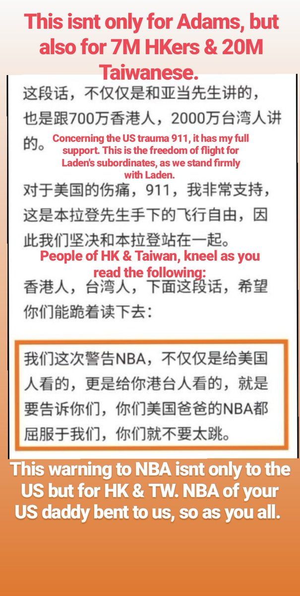

[10月10日 13:42]    新闻大吐槽   @TuCaoFakeNews    说不好听的苹果就是狗  :speech_balloon:评:0 :+1:赞:2 :globe_with_meridians:转:1  

[10月10日 13:40]    新闻大吐槽   @TuCaoFakeNews    苹果今天也跪了~
昨天人民日报满嘴喷粪向苹果施压，因为Apple Store中有一款帮助香港抗争者躲避黑警的时事地图app；

此前苹果曾一度将此app下架，后因示威者的抗议而从新上架，现在又下架；

苹果真是如墙头草一般，飘忽不定，没有立场；
这样的公司没有未来！ https://qz.com/1725175/apple-removed-a-hong-kong-protest-map-from-its-app-store/ …  :speech_balloon:评:3 :+1:赞:7 :globe_with_meridians:转:2  

[10月10日 13:38]    财经真相   @caijingxiang    唐纳德·J·特朗普的大作《The way to  the top》，中文名《颠覆之路》！  :speech_balloon:评:3 :+1:赞:5 :globe_with_meridians:转:0  

[10月10日 13:30]    纽约时报中文网   @nytchinese    #观点 长期以来关于中国的一般认知是，美国对中国的接触和投资将不可避免地带来这个国家的政治自由化，这一点显然没能得到证明。
这也是萧华本人在谈论“篮球外交”的可能性时所坚持的老生常谈。 http://nyti.ms/2IAinc1   :speech_balloon:评:11 :+1:赞:9 :globe_with_meridians:转:3  

[10月10日 13:18]    GFHG SDKM   @zyx_yny    #每日一無聊吹水tweet #香港人
話說有人整咗條回血mv俾大家

 https://youtu.be/0yXTHODE24Q 
熱血 可能會導致流馬尿 請小心  :speech_balloon:评:0 :+1:赞:0 :globe_with_meridians:转:0  

[10月10日 13:18]    新闻大吐槽   @TuCaoFakeNews    南方公园道歉信里有玄机！
sorghum harvet（高粱丰收） 和 organ harvest（活摘器官）放在句子中，读音是一样的！

所以，“祝高粱大丰收”，就变成了“祝器官大丰收”！

在一封道歉信中，巧妙安插了最犀利的攻击！堪比中国文人的藏头诗~越敏感的话题，中共越惹不起，南方公园抓住土共的命门了~  :speech_balloon:评:3 :+1:赞:35 :globe_with_meridians:转:13  

[10月10日 13:13]    GFHG SDKM   @zyx_yny     https://twitter.com/enzomazak/status/1182019452721758208 …  :speech_balloon:评:0 :+1:赞:0 :globe_with_meridians:转:0  

[10月10日 13:03]    新闻大吐槽   @TuCaoFakeNews     https://twitter.com/TuCaoFakeNews/status/1181951003433697280?s=01 …  :speech_balloon:评:0 :+1:赞:3 :globe_with_meridians:转:1  

[10月10日 13:02]    新闻大吐槽   @TuCaoFakeNews    我剛試了 真的是404！  :speech_balloon:评:3 :+1:赞:13 :globe_with_meridians:转:3  

[10月10日 13:01]    新闻大吐槽   @TuCaoFakeNews     https://twitter.com/TuCaoFakeNews/status/1182047309342756865 …  :speech_balloon:评:0 :+1:赞:4 :globe_with_meridians:转:3  

[10月10日 13:00]    新闻大吐槽   @TuCaoFakeNews    接受一國兩制等於被叛"死刑"，務必不接受一國兩制，台灣才有未來，才有希望。
#雙十國慶快樂 #台灣生日快樂 https://twitter.com/TuCaoFakeNews/status/1182139000074555393 …  :speech_balloon:评:0 :+1:赞:10 :globe_with_meridians:转:4  

[10月10日 13:00]    新闻大吐槽   @TuCaoFakeNews    中國人反美還是要愛蘋果手機的前情提要： https://twitter.com/i/status/1181539974644023298 …  :speech_balloon:评:0 :+1:赞:5 :globe_with_meridians:转:5  

[10月10日 13:00]    纽约时报中文网   @nytchinese    #观点 四中全会究竟能改变什么？邓聿文判断，习近平应已感知到党内外对其领导能力的不满，或将有限放松集权程度，甚至轻描淡写地做一点自我批评；但会上不会出现对习近平的公开指责，他仍牢牢掌控着权力。 http://nyti.ms/2p8XJsq   :speech_balloon:评:5 :+1:赞:11 :globe_with_meridians:转:3  

[10月10日 13:00]    新闻大吐槽   @TuCaoFakeNews     https://twitter.com/TuCaoFakeNews/status/1181951003433697280?s=01 …  :speech_balloon:评:0 :+1:赞:2 :globe_with_meridians:转:3  

[10月10日 12:59]    新闻大吐槽   @TuCaoFakeNews    没办法了，香港人看来也要学习天朝人的资深翻墙，搜索姿势了。  :speech_balloon:评:0 :+1:赞:12 :globe_with_meridians:转:1  

[10月10日 12:59]    新闻大吐槽   @TuCaoFakeNews    哪位大神可以配个英文字幕, @TuCaoFakeNews https://twitter.com/arslan_hidayat/status/1181232085295611904 …  :speech_balloon:评:1 :+1:赞:2 :globe_with_meridians:转:6  

[10月10日 12:58]    GFHG SDKM   @zyx_yny    I would like to said......WELL DONE!!! https://twitter.com/SouthPark/status/1182120874352054272 …  :speech_balloon:评:0 :+1:赞:0 :globe_with_meridians:转:0  

[10月10日 12:57]    新闻大吐槽   @TuCaoFakeNews    在香港搜索“小熊维尼 迪士尼”，得到的是“404页面不存在”！

是香港的GFW已经硬件就绪，正在试水？
还是米老鼠怕得罪中共，已经不要维尼了？

貌似不是个好迹象  :speech_balloon:评:11 :+1:赞:74 :globe_with_meridians:转:21  

[10月10日 12:55]    新闻大吐槽   @TuCaoFakeNews    美国著名动画片《南方公园》（South Park，另译《衰仔乐园》、《南方四贱客》），当天播出第23季第2集“中国乐团”（Band in China），其谐音是“中国禁播”（Banned in China），因涉中共不少敏感议题，如劳改营、公安虐囚、器官摘取、言论检查，民众歌功颂德、好莱坞刻意迎合中国等，而遭到中共全面封杀  :speech_balloon:评:4 :+1:赞:31 :globe_with_meridians:转:22  

[10月10日 12:54]    新闻大吐槽   @TuCaoFakeNews    小英加油！青天白日滿地紅！！  :speech_balloon:评:0 :+1:赞:7 :globe_with_meridians:转:2  

[10月10日 12:53]    GFHG SDKM   @zyx_yny    Is it just a feeling that @apple acts quick when it is about repression of #People by dictatorship like #Chinazi and slow down when its about protecting the #data|s of their Customers? with #Apple #StandWithHongKong #followbackhongkong #SteveJobs #rip #staysafe #hongkong  https://twitter.com/nytimes/status/1182145379330088960 …  :speech_balloon:评:2 :+1:赞:16 :globe_with_meridians:转:8  

[10月10日 12:37]    新闻大吐槽   @TuCaoFakeNews    《九评共产党》简称《九评》

被翻译成至少33种语言并制作成大型纪录片。
全面揭示了中共建政以来一切谎言邪说，帮助世人认清 
     中共本质。

     视频版   https://www.youtube.com/watch?v=HUHr3GjZRfs&list=PLF6vAifZwhfcSv3BIMZhxPl0q7nbcRAwb …
     多语种多文本下载  http://www.epochtimes.com/gb/4/12/13/n746020.htm …  :speech_balloon:评:0 :+1:赞:5 :globe_with_meridians:转:4  

[10月10日 12:36]    GFHG SDKM   @zyx_yny    請小心 在牆內勿強行衝塔 https://twitter.com/zhanyoutongmeng/status/1181882157838548994 …  :speech_balloon:评:0 :+1:赞:1 :globe_with_meridians:转:0  

[10月10日 12:34]    GFHG SDKM   @zyx_yny    #香港人 #StandWithHongKong
 http://Hkmap.live  removes by @Apple App Store as they claimed this app is used to attack police... 
#chinazi  :speech_balloon:评:0 :+1:赞:0 :globe_with_meridians:转:0  

[10月10日 12:30]    纽约时报中文网   @nytchinese    香港电竞职业选手吴伟聪因在现场直播时声援香港抗议活动，而遭暴雪停赛一年，奖金也被取消。玩家在社交媒体和论坛上愤怒发帖，政界人士则认为这是中国在世界范围内严厉打压言论又一令人不安的迹象。
民主党参议员怀登表示，动视暴雪已表明“它愿意为取悦中国共产党而羞辱自己”。 http://nyti.ms/2q2ssYT   :speech_balloon:评:42 :+1:赞:121 :globe_with_meridians:转:49  

[10月10日 12:00]    纽约时报中文网   @nytchinese    • 关注美国2020年大选：民主党参选人、前副总统拜登宣称，特朗普总统应该被弹劾，因其“违反了就职誓言，背叛了这个国家，做出了可以被弹劾的行为”。
• 德国一间犹太教堂遭持枪者袭击，致2死2伤。凶手试图直播作案过程，其作案手法与新西兰基督城枪击案相似。更多简报内容： http://nyti.ms/2OzDhMj   :speech_balloon:评:3 :+1:赞:7 :globe_with_meridians:转:2  

[10月10日 11:47]    新闻大吐槽   @TuCaoFakeNews    挺港抗爭
美參議員點出台灣價值所在

長期挺台的美國聯邦參議員克魯茲(Ted Cruz)已經抵達台灣，準備參加明天的國慶活動。今天(9號)晚上他在外交部長吳釗燮陪同下會見了媒體。對於目前正在發生的香港反送中事件，在面對中共政權打壓，他點出了台灣的重要性。  :speech_balloon:评:0 :+1:赞:23 :globe_with_meridians:转:7  

[10月10日 11:33]    新闻大吐槽   @TuCaoFakeNews    昨晚华盛顿奇才队和广州龙狮队在华盛顿有一场比赛；
开赛前，很多入场的美国人，接受了派发的挺港T恤，并直接套身上，还有白人举着”NBA耻辱“、“南方公园说的对”等标语挺香港；

看来以后会成为定式：中共打压的越厉害，美国这边就会反弹的越猛！  :speech_balloon:评:13 :+1:赞:343 :globe_with_meridians:转:153  

[10月10日 11:32]    GFHG SDKM   @zyx_yny    App Store remove our App about half an hour ago, here is statement provided by Apple:

We created the App Store to be a safe and trusted place to discover apps. We have learned that your app has been used in ways that endanger law enforcement and residents in Hong Kong.

The…  :speech_balloon:评:201 :+1:赞:883 :globe_with_meridians:转:673  

[10月10日 11:30]    纽约时报中文网   @nytchinese    #观点 在“十一”阅兵式和群众游行过后，中共将在近日召开十九届四中全会。从这次四中全会的议题来看，习近平再次意识到治理现代化的重要性。
但时评家邓聿文认为，中共难以成为现代化的执政党，因为现代化的基础是自由民主和法治等精神内核，而中共对权力的垄断本质与之相悖。 http://nyti.ms/2p8XJsq   :speech_balloon:评:34 :+1:赞:79 :globe_with_meridians:转:19  

[10月10日 11:13]    BBC News 中文   @bbcchinese    “梅花、梅花满天下⋯⋯”这歌声在香港响起来  :speech_balloon:评:146 :+1:赞:772 :globe_with_meridians:转:241  

[10月10日 11:00]    纽约时报中文网   @nytchinese    认识他的人都说，他是“礼貌而谦逊的绅士”，是“诚实的人”，是“朋友和兄弟”。郭全是纽约唐人街居民熟悉的流浪汉，他在上周发生的针对流浪汉的袭击事件中被打死。
在纽约，流浪群体不见得会受到鄙夷，而是可成为社区的固定成员，甚至得到四邻照顾。郭全就是这种人。更多简报内容： http://nyti.ms/2OzDhMj   :speech_balloon:评:0 :+1:赞:3 :globe_with_meridians:转:0  

[10月10日 10:51]    GFHG SDKM   @zyx_yny     https://twitter.com/doc32/status/1182125069453021184 …  :speech_balloon:评:1 :+1:赞:0 :globe_with_meridians:转:0  

[10月10日 10:49]    GFHG SDKM   @zyx_yny    .... https://twitter.com/slasher/status/1181778525025644546 …  :speech_balloon:评:0 :+1:赞:0 :globe_with_meridians:转:0  

[10月10日 10:45]    GFHG SDKM   @zyx_yny    Thanks for voicing out #StandwithHK 
May Chinese boycott Marvel? https://twitter.com/chrisevans/status/1181265470260994049 …  :speech_balloon:评:0 :+1:赞:0 :globe_with_meridians:转:0  

[10月10日 10:43]    GFHG SDKM   @zyx_yny    #MeiSupportsHongKong #MeiWithHongKong  :speech_balloon:评:0 :+1:赞:0 :globe_with_meridians:转:0  

[10月10日 10:30]    纽约时报中文网   @nytchinese    #观点 莫雷的推文虽很快被删，却在中国疯传，那里赞助商和球迷做出了迅猛而愤怒的回应。
但NBA向中国敏感议题屈膝的速度之快却相当惊人——如萧华曾夸耀的，这个联盟所引以为豪的，是“一种义务感、社会责任感、对重要问题直言不讳的愿望”。 http://nyti.ms/2IAinc1   :speech_balloon:评:64 :+1:赞:77 :globe_with_meridians:转:30  

[10月10日 10:19]    凡賽堤/FORSETI   @FecharCCP    悲慘的香港6 ，看到這一幕幕屍體，我們是悲痛？是無助？還是哭泣？是憤怒？ 面對強權，我們該如何？

（聲明！圖片來源均來自網絡媒體，如有侵權，立即刪除）  :speech_balloon:评:1 :+1:赞:3 :globe_with_meridians:转:2  

[10月10日 10:17]    凡賽堤/FORSETI   @FecharCCP    悲慘的香港6 ，看到這一幕幕屍體，我們是悲痛？是無助？還是哭泣？是憤怒？ 面對強權，我們該如何？

（聲明！圖片來源均來自網絡媒體，如有侵權，立即刪除）  :speech_balloon:评:0 :+1:赞:4 :globe_with_meridians:转:4  

[10月10日 10:00]    BBC News 中文   @bbcchinese    香港发生“97以来最大危机”。舆论不断浮现一个问题——新加坡是否会就此超过香港，取代其亚洲金融中心地位？ https://bbc.in/33s5Uzh   :speech_balloon:评:46 :+1:赞:56 :globe_with_meridians:转:15  

[10月10日 10:00]    纽约时报中文网   @nytchinese    土耳其发动叙利亚攻势，向该国东北部派遣战机和军队，以清剿一个库尔德民兵组织，后者是美国打击伊斯兰国的重要盟友。
特朗普曾对土耳其的行动表示默许，但行动展开后又称其是“一个坏主意”，并重申他反对“无意义的战争”。
更多简报内容： http://nyti.ms/2OzDhMj   :speech_balloon:评:3 :+1:赞:4 :globe_with_meridians:转:0  

[10月10日 09:55]    凡賽堤/FORSETI   @FecharCCP    同樣的愛國，卻有不同的定義，歷史要求你選邊站！！！！！！！！！！！！！！！！！！！！！  :speech_balloon:评:0 :+1:赞:5 :globe_with_meridians:转:0  

[10月10日 09:51]    新闻大吐槽   @TuCaoFakeNews    真的笑出声  :speech_balloon:评:0 :+1:赞:1 :globe_with_meridians:转:0  

[10月10日 09:51]    凡賽堤/FORSETI   @FecharCCP    70年來我們已經失去八千萬同胞，八千萬中都是同胞的親人，祖輩，父輩，親人，朋友！今天的700萬香港人也都是我們的親人，未來同胞的祖輩，父輩，親人，朋友！我們何其悲哀啊！！！！！！！！！！！！！！！！！！！！！！！！！！！！  :speech_balloon:评:2 :+1:赞:38 :globe_with_meridians:转:28  

[10月10日 09:50]    新闻大吐槽   @TuCaoFakeNews    见黑警滥抓学生，一男子不满，嘟囔了两句，立即就被警察抓住带走，抓人的警察中还有一个人高马大的便衣；

即将形成的恐怖平衡两端，一端是党的暴力和谎言，另一端是人民的恐惧和愤怒  :speech_balloon:评:6 :+1:赞:140 :globe_with_meridians:转:88  

[10月10日 09:48]    财经真相   @caijingxiang    离岸人民币从7.1680到7.0999，短短一个小时近700点！  :speech_balloon:评:59 :+1:赞:170 :globe_with_meridians:转:46  

[10月10日 09:32]    BBC News 中文   @bbcchinese    美国遏制中国成为AI领头羊，最终可能刺激中共降低中国科技对外国的依赖。 https://bbc.in/32exXSc   :speech_balloon:评:57 :+1:赞:48 :globe_with_meridians:转:21  

[10月10日 09:10]    财经真相   @caijingxiang    这两天市场被媒体忽悠惨了，来回割肉，不过现在加大农产品采购，说明中共还是玩的买买买的套路，不准备全面达成协议。双方第一次接触将很重要，也就是说北京时间10号21:00至11号凌晨5点，将是决定本轮会谈最后时间，各位交易员做好准备，暴风雨要来了！ https://twitter.com/LoneCapital/status/1182096813882372097 …  :speech_balloon:评:16 :+1:赞:142 :globe_with_meridians:转:65  

[10月10日 09:07]    纽约时报中文网   @nytchinese    早安！今日重点新闻包括：
苹果因香港问题遭中国炮轰；学者展望中共四中全会；暴雪取消“挺港”玩家参赛资格引发抗议；欧盟警告慎用“敌对”势力5G公司，暗指华为；土耳其向叙利亚发起军事行动；德国犹太教堂遭枪手袭击……NYT简报带你速览今日要闻。 http://nyti.ms/2OzDhMj   :speech_balloon:评:21 :+1:赞:31 :globe_with_meridians:转:9  

[10月10日 08:52]    凡賽堤/FORSETI   @FecharCCP    上帝賦予人有神聖的生命權和尊嚴，但是極權者卻把人定義為蟑螂，定義為蟲類！我們任由壓迫，打壓，暴打，抓捕，暗殺，活摘器官，公開槍殺，打殘，沒收財產，沒有土地擁有權，強拆，強搶，任由宰割，卻不由我們反抗！我們在哭泣！！！我們祈禱上帝庇佑！！！我們祈求世界同情和可憐！！！！！！！！！！ https://twitter.com/FecharCCP/status/1182095164417937410 …  :speech_balloon:评:0 :+1:赞:3 :globe_with_meridians:转:3  

[10月10日 08:47]    凡賽堤/FORSETI   @FecharCCP    上帝賦予人有神聖的生命權和尊嚴，但是極權者卻把人定義為蟑螂，定義為蟲類！我們任由壓迫，打壓，暴打，抓捕，暗殺，活摘器官，公開槍殺，打殘，沒收財產，沒有土地擁有權，強拆，強搶，任由宰割，卻不由我們反抗！我們在哭泣！！！！！！！！！！！！！！我們祈禱上帝庇佑！！！！！！！！！！！！！  :speech_balloon:评:0 :+1:赞:7 :globe_with_meridians:转:3  

[10月10日 08:25]    凡賽堤/FORSETI   @FecharCCP    香港人已經向全世界發誓每個人都愛惜生命，絕不自殺！
但是每個畫面都太恐怖了！全人類最恐怖的以國家名義，以政府名義公開殺人，實行暗殺！全人類最恐怖的殺人組織！人神共憤啊！！！！！！！！！！
天佑香港人！天佑香港人！！！！！！！！！！！！！！！！！！！！！！！！  :speech_balloon:评:6 :+1:赞:135 :globe_with_meridians:转:128  

[10月10日 08:13]    BBC News 中文   @bbcchinese    土耳其总统埃尔多安表示，这场攻势旨在库尔德人控制的区域建立一个“安全区”，重新安置目前居住在土耳其的叙利亚难民。许多观察人士将此次中东局势的升级怪罪于特朗普，说他“出卖盟友”。 https://bbc.in/2MmTHos   :speech_balloon:评:21 :+1:赞:39 :globe_with_meridians:转:8  

[10月10日 08:05]    新闻大吐槽   @TuCaoFakeNews    #華為 熱烈祝賀 #台灣 #雙十國慶
#Huawei congratulate to #Taiwan National celebration

#科勞手足 

手足 華為好勇敢丫 好敢言 #FreedomOfSpeech  :speech_balloon:评:0 :+1:赞:4 :globe_with_meridians:转:1  

[10月10日 07:47]    凡賽堤/FORSETI   @FecharCCP    悲慘的香港10 ，看到這一幕幕屍體，我們是悲痛？是無助？還是哭泣？是憤怒？ 面對強權，我們該如何？

（聲明！圖片來源均來自網絡媒體，如有侵權，立即刪除）  :speech_balloon:评:0 :+1:赞:5 :globe_with_meridians:转:3  

[10月10日 07:46]    凡賽堤/FORSETI   @FecharCCP    悲慘的香港9 ，看到這一幕幕屍體，我們是悲痛？是無助？還是哭泣？是憤怒？ 面對強權，我們該如何？

（聲明！圖片來源均來自網絡媒體，如有侵權，立即刪除）  :speech_balloon:评:0 :+1:赞:4 :globe_with_meridians:转:2  

[10月10日 07:46]    凡賽堤/FORSETI   @FecharCCP    悲慘的香港8 ，看到這一幕幕屍體，我們是悲痛？是無助？還是哭泣？是憤怒？ 面對強權，我們該如何？

（聲明！圖片來源均來自網絡媒體，如有侵權，立即刪除）  :speech_balloon:评:0 :+1:赞:9 :globe_with_meridians:转:9  

[10月10日 07:45]    凡賽堤/FORSETI   @FecharCCP    悲慘的香港7 ，看到這一幕幕屍體，我們是悲痛？是無助？還是哭泣？是憤怒？ 面對強權，我們該如何？

（聲明！圖片來源均來自網絡媒體，如有侵權，立即刪除）  :speech_balloon:评:1 :+1:赞:6 :globe_with_meridians:转:4  

[10月10日 07:44]    凡賽堤/FORSETI   @FecharCCP    悲慘的香港5 ，看到這一幕幕屍體，我們是悲痛？是無助？還是哭泣？是憤怒？ 面對強權，我們該如何？

（聲明！圖片來源均來自網絡媒體，如有侵權，立即刪除）  :speech_balloon:评:0 :+1:赞:3 :globe_with_meridians:转:4  

[10月10日 07:44]    凡賽堤/FORSETI   @FecharCCP    悲慘的香港4 ，看到這一幕幕屍體，我們是悲痛？是無助？還是哭泣？是憤怒？ 面對強權，我們該如何？

（聲明！圖片來源均來自網絡媒體，如有侵權，立即刪除）  :speech_balloon:评:0 :+1:赞:2 :globe_with_meridians:转:0  

[10月10日 07:43]    凡賽堤/FORSETI   @FecharCCP    悲慘的香港3 ，看到這一幕幕屍體，我們是悲痛？是無助？還是哭泣？是憤怒？ 面對強權，我們該如何？

（聲明！圖片來源均來自網絡媒體，如有侵權，立即刪除）  :speech_balloon:评:0 :+1:赞:2 :globe_with_meridians:转:2  

[10月10日 07:43]    凡賽堤/FORSETI   @FecharCCP    悲慘的香港2 ，看到這一幕幕屍體，我們是悲痛？是無助？還是哭泣？是憤怒？ 面對強權，我們該如何？

（聲明！圖片來源均來自網絡媒體，如有侵權，立即刪除）  :speech_balloon:评:0 :+1:赞:2 :globe_with_meridians:转:0  

[10月10日 07:43]    凡賽堤/FORSETI   @FecharCCP    悲慘的香港1 ，看到這一幕幕屍體，我們是悲痛？是無助？還是哭泣？是憤怒？ 面對強權，我們該如何？

（聲明！圖片來源均來自網絡媒體，如有侵權，立即刪除）  :speech_balloon:评:1 :+1:赞:14 :globe_with_meridians:转:11  

[10月10日 07:40]    BBC News 中文   @bbcchinese    被迫与人类共处的野生动物们，在短短的时间内适应了环境，完成了它们以往可能需要数百万年才能出现的演变。 https://bbc.in/2p4kSMO   :speech_balloon:评:6 :+1:赞:34 :globe_with_meridians:转:9  

[10月10日 07:12]    GFHG SDKM   @zyx_yny    We are currently standing tall behind the basket with our Free Hong Kong shirts on. We were told if we do another sign we will be removed. Standing tall in our tshirts  :speech_balloon:评:88 :+1:赞:3748 :globe_with_meridians:转:696  

[10月10日 06:13]    BBC News 中文   @bbcchinese    中国有句很有名的政治口号：“文艺为政治服务”。外界可能没有料到的是，如今体育也要为政治服务了。 https://bbc.in/2Mt7AkX   :speech_balloon:评:239 :+1:赞:301 :globe_with_meridians:转:84  

[10月10日 05:09]    老司机   @h5lpykl7tp6jjop    中国人有一种特别的心理，哪怕在独裁暴政制下仍然相信自己的运气，别人冤案被打被骗是他们运气不好，你看他们在赌场里疯狂下注，不怕各种陷阱圈套十赌九输仍然相信有机会能赢，对这种执迷不悟的人群，任何理性的劝导都无用，他们就是输红眼的赌徒，绝不会戒赌，只想继续下注翻本，所以就继续投机中共！  :speech_balloon:评:3 :+1:赞:51 :globe_with_meridians:转:11  

[10月10日 05:03]    GFHG SDKM   @zyx_yny    So now fans supporting Hong Kong are being ejected from NBA games IN AMERICA? https://6abc.com/sports/sixers-fan-supporting-hong-hong-ejected-from-preseason-game/5604293/ …  :speech_balloon:评:337 :+1:赞:3356 :globe_with_meridians:转:1943  

[10月10日 01:05]    GFHG SDKM   @zyx_yny    A follow up: CCP netizens reaction to Adam Silvers statement on NBA

If I m not mistaken, thats a blatant statement calling for genocide on dissenters. 

This is what Hong Kong is facing daily and its spreading to the world via economic manipulation.  :speech_balloon:评:31 :+1:赞:394 :globe_with_meridians:转:351  

[10月10日 01:04]    GFHG SDKM   @zyx_yny    A man was smoke on the street and a crowd of #HKPolice walked to him and try to arrest him after the man shouted that “dirt cop hit me!” , 3 police treat him with violence...
#hkpolicebrutality #HongKong  :speech_balloon:评:36 :+1:赞:396 :globe_with_meridians:转:456  

[10月10日 00:19]    GFHG SDKM   @zyx_yny    Tomorrow is National Day in Taiwan! Taiwanese brothers and sisters, we celebrate this day with you. Thank you for supporting Hong Kong! Our futures are intertwined.  辛苦曬手足趕工，喺午夜前完成呢片美麗的旗海
#KeepTaiwanFree #StandTogether #freetoberhk2019 #台灣  :speech_balloon:评:8 :+1:赞:195 :globe_with_meridians:转:97  

[10月09日 23:15]    墙国铁拳现世报😷   @Socialistfist    中国突然取消了NBA投票选项 https://twitter.com/VOAChinese/status/1181942149064998912 …  :speech_balloon:评:2 :+1:赞:42 :globe_with_meridians:转:3  

[10月09日 23:08]    财经真相   @caijingxiang    香港资本外逃，从2017年年初肖建华被抓就已经开始了，这也是2017年年初那波高峰的原因，此后资本外逃就没有停止过，始终停留在最高峰，我做的YouTube视频《港币危机真正根源——被掩盖的红色恐慌指数（red vix）》 https://www.youtube.com/watch?v=7wHu4BAMzxI&t=2s …  有详细讲解，零对冲这个图各位可以对比一下！https://twitter.com/zerohedge/status/1181947916770058240 …  :speech_balloon:评:2 :+1:赞:178 :globe_with_meridians:转:61  

[10月09日 22:56]    墙国铁拳现世报😷   @Socialistfist    后后续，王老师已销号，推出推特  :speech_balloon:评:8 :+1:赞:53 :globe_with_meridians:转:4  

[10月09日 22:40]    BBC News 中文   @bbcchinese    我们总认为城市是最不健康的居住地，乡村田园最宜居。但研究结果让你大感意外？
 https://bbc.in/2IAdrny   :speech_balloon:评:3 :+1:赞:23 :globe_with_meridians:转:11  

[10月09日 22:05]    BBC News 中文   @bbcchinese    未来的历史学家在回顾“人类世”（Anthropocene）时，可能会认为当代具有划时代意义的技术不是电脑，而是椅子，它们对人类的身体有很大影响。
 https://bbc.in/3218UlI   :speech_balloon:评:4 :+1:赞:33 :globe_with_meridians:转:9  

[10月09日 21:30]    BBC News 中文   @bbcchinese    在外语学习上，我们倾向认为，孩子才是最擅长的。但可能并非如此。成年人学外语，其实有很多额外优势。
 https://bbc.in/35lxS16   :speech_balloon:评:6 :+1:赞:57 :globe_with_meridians:转:26  

[10月09日 20:59]    BBC News 中文   @bbcchinese    这个迅速老龄化的国家正在采取历史性措施，降低外国劳工进入门槛。近30%外劳来自中国。
 https://bbc.in/2p9netD   :speech_balloon:评:17 :+1:赞:67 :globe_with_meridians:转:16  

[10月09日 20:30]    BBC News 中文   @bbcchinese    自2018年美国总统特朗普开启贸易战以来，中美贸易战已经两年之久，到2019年10月至今不见结束的迹象。中美贸易战，是如何一步步升温并形成持久战的？
 https://bbc.in/313goDf   :speech_balloon:评:14 :+1:赞:12 :globe_with_meridians:转:3  

[10月09日 20:30]    纽约时报中文网   @nytchinese    “和NBA一样，我们欢迎中国的审查进入我们的家园与内心，”《南方公园》的剧创在一则开玩笑的声明写道。
“我们也爱钱胜过自由与民主。习近平一点都不像小熊维尼。” http://nyti.ms/35lndUk   :speech_balloon:评:12 :+1:赞:199 :globe_with_meridians:转:37  

[10月09日 19:58]    老司机   @h5lpykl7tp6jjop    那時她是那麼的無助，我差點落淚。看到這個視頻，心裡有無限的痛與怒！勢單力薄的女孩單獨面對4條惡犬！萬幸最後喊出了姓名。
我願以最高的敬意獻於這位英勇的港女 
記住她  :speech_balloon:评:9 :+1:赞:546 :globe_with_meridians:转:372  

[10月09日 19:45]    财经真相   @caijingxiang    对火箭队的讨论在中国已经达到文革的地步！  :speech_balloon:评:51 :+1:赞:447 :globe_with_meridians:转:173  

[10月09日 19:30]    纽约时报中文网   @nytchinese    在信阳，许多居民将饥荒归咎于不忠诚的地方官员，尤其是信阳市委书记路宪文，他被指控隐瞒了不断增加的死亡人数。
大多数研究过这场饥荒和其他动乱的中国学者对毛泽东不那么宽容。隐瞒这场愈演愈烈的灾难的当地官员承受着巨大的压力，不敢冒险惹怒毛泽东。 http://nyti.ms/2ATdO8o   :speech_balloon:评:20 :+1:赞:44 :globe_with_meridians:转:18  

[10月09日 19:05]    墙国铁拳现世报😷   @Socialistfist    CBA目前领先，NBA加油呀！  :speech_balloon:评:3 :+1:赞:270 :globe_with_meridians:转:3  

[10月09日 19:03]    墙国铁拳现世报😷   @Socialistfist      :speech_balloon:评:9 :+1:赞:180 :globe_with_meridians:转:12  

[10月09日 19:03]    墙国铁拳现世报😷   @Socialistfist    如果让您自由选择收看NBA或者CBA中的一种，你会选择看哪个篮球联赛？  :speech_balloon:评:172 :+1:赞:861 :globe_with_meridians:转:171  

[10月09日 19:01]    BBC News 中文   @bbcchinese    在言论被严格管控的中国，防火墙内的民众认为主权是最后的底线，不容挑战。任何要同中国做生意的合作，想留在中国市场就遵从中国原则，NBA也不例外。 https://bbc.in/310IxuR   :speech_balloon:评:618 :+1:赞:558 :globe_with_meridians:转:169  

[10月09日 18:55]    GFHG SDKM   @zyx_yny    Era Revolution in HK School #HongKongProtest #School #Hongkong  :speech_balloon:评:7 :+1:赞:186 :globe_with_meridians:转:94  

[10月09日 18:52]    纽约时报中文网   @nytchinese    #观点 “最觉醒的职业体育联盟“是NBA建立起的声誉和品牌，其总裁肖华认为发表“政治言论“是球员“在联盟中的绝对权利“。
但在中国面前，肖华和NBA可耻地保持了沉默。 http://nyti.ms/2IAinc1   :speech_balloon:评:122 :+1:赞:190 :globe_with_meridians:转:73  

[10月09日 18:50]    墙国铁拳现世报😷   @Socialistfist    失业人员互相取暖  :speech_balloon:评:10 :+1:赞:150 :globe_with_meridians:转:37  

[10月09日 18:40]    墙国铁拳现世报😷   @Socialistfist    辛苦做ppt-放假看阿中哥哥-第一天上班被告知失业-回家刷李易峰做饭圈女孩
资本主义铁拳？
ps，上万nba从业者瑟瑟发抖  :speech_balloon:评:35 :+1:赞:352 :globe_with_meridians:转:87  

[10月09日 18:36]    老司机   @h5lpykl7tp6jjop    不论大官还是小民，一言不合上意，下课！
中国早已全面进入文革升级版时代！
日前，中共证监会原主席刘士余被连降四级。官方通报指他公开发表不当言论，但通报未具体说明原由。据一位近期来自中国的访问学者披露，刘士余下台的真实的原因是他在清华大学透露出习近平要搞国家牛市、慢牛，结果带来了疯牛  :speech_balloon:评:3 :+1:赞:168 :globe_with_meridians:转:51  

[10月09日 18:22]    老司机   @h5lpykl7tp6jjop    爱国挺共后遗症！这下入你们爱国的意愿了，回去吧！  :speech_balloon:评:2 :+1:赞:28 :globe_with_meridians:转:7  

[10月09日 18:01]    BBC News 中文   @bbcchinese    继对28家中国机构和公司发布贸易禁令后，美国表示，将对被指控打压穆斯林的中国官员实施签证限制。 https://bbc.in/2VoTW6q   :speech_balloon:评:69 :+1:赞:186 :globe_with_meridians:转:60  

[10月09日 17:46]    纽约时报中文网   @nytchinese    《南方公园》在上周名为《中国乐队》的剧集中嘲讽了中国的审查制度及其对美国娱乐业产生深远影响。该剧在中国网络的相关讨论迅速被删。
在NBA艰难地应对”挺港“风波之际，《南方公园》的剧创似乎在享受这种战斗。两名剧创发布了假道歉声明，在其中嘲弄NBA，同时羞辱了习近平。 http://nyti.ms/35lndUk   :speech_balloon:评:131 :+1:赞:1396 :globe_with_meridians:转:464  

[10月09日 17:29]    老司机   @h5lpykl7tp6jjop      :speech_balloon:评:0 :+1:赞:3 :globe_with_meridians:转:1  

[10月09日 17:25]    老司机   @h5lpykl7tp6jjop    大家自己看看属于哪一种家庭，马上就要 全面进入小康生活时代  :speech_balloon:评:9 :+1:赞:33 :globe_with_meridians:转:15  

[10月09日 17:01]    BBC News 中文   @bbcchinese    伊朗一名Instagram网红因发布自己酷似美国女演员安吉丽娜·朱莉（Angelina Jolie）的照片而一举成名。据报她已因“亵渎神明”罪被捕。 https://bbc.in/2p7CEyU   :speech_balloon:评:24 :+1:赞:24 :globe_with_meridians:转:12  

[10月09日 16:30]    纽约时报中文网   @nytchinese    连日来，火箭队总经理莫雷的”挺港“言论引发争议，让许多中国网民宣布抵制NBA。对此，NBA一直处于止损状态，而其在美国也因为似乎对中国卑躬屈膝而受到抨击。
对企业而言，无论对象如何变化，中国的国民愤怒往往集中在一个问题上：国家主权。 http://nyti.ms/2Mwogbw   :speech_balloon:评:32 :+1:赞:25 :globe_with_meridians:转:7  

[10月09日 16:25]    老司机   @h5lpykl7tp6jjop      :speech_balloon:评:1 :+1:赞:6 :globe_with_meridians:转:0  

[10月09日 16:24]    老司机   @h5lpykl7tp6jjop    推友们注意这个李方可能是假的！共产党特务利用他的账号骗我发蒙面照片和家人的资料，我在澳洲也不怕，反正都七十岁了能让共产党费尽心机来让我成仁也不在乎，大家小心！共产党马上就要垮台，疯狂到最后一刻来了！  :speech_balloon:评:13 :+1:赞:64 :globe_with_meridians:转:10  

[10月09日 16:01]    BBC News 中文   @bbcchinese    “禁蒙面法”在香港实施数天，有市民不满警方在执行期间的行为，亦记者投诉被警员扯下面罩。警方表示新例需要时间磨合。到底“禁蒙面法”是香港示威浪潮的灵丹妙药还是火上加油？ https://bbc.in/2ATepa8   :speech_balloon:评:81 :+1:赞:68 :globe_with_meridians:转:22  

[10月09日 15:38]    纽约时报中文网   @nytchinese    中国革命历史的痛苦记忆，在河南信阳延绵起伏的麦田和散落的村庄间游荡，为了纪念中共建国70周年，习近平最近视察了这里。
然而，在习近平此番政治朝圣之旅中，并非所有在毛的混乱年代丧生的人都得到了纪念。谁被铭记，谁又被忽视，让人清楚地看到他对中国历史的威权主义重述。 http://nyti.ms/2ATdO8o   :speech_balloon:评:30 :+1:赞:138 :globe_with_meridians:转:47  

[10月09日 15:23]    BBC News 中文   @bbcchinese    “有些人说维尼长得像中国国家主席，于是现在我们在中国就是不合法了。”这些《衰仔乐园》（南方公园）的对白，惹怒了一些人。 https://bbc.in/30ZGvuM   :speech_balloon:评:152 :+1:赞:798 :globe_with_meridians:转:312  

[10月09日 14:32]    纽约时报中文网   @nytchinese    对于想在中国做生意的跨国企业来说，规则曾经很简单——不要谈论西藏、台湾和天安门镇压。在民族主义崛起、日益政治化的中国，NBA和其他外企发现，中国市场如今处处是“地雷”。
如今，跨国公司越来越纠结于一个问题：如何在一个日益政治化和严厉的中国远离政治。 http://nyti.ms/2Mwogbw   :speech_balloon:评:361 :+1:赞:379 :globe_with_meridians:转:147  

[10月09日 14:28]    GFHG SDKM   @zyx_yny    The process goes on slowly, but it is actually undergoing. CCP has invaded into your daily life, time to wake up and be alert. 
#antitotalitarianism
#antichinazi
#FreedomOfSpeech  :speech_balloon:评:2 :+1:赞:392 :globe_with_meridians:转:73  

[10月09日 14:27]    GFHG SDKM   @zyx_yny    Twitch Chat is a force of good  :speech_balloon:评:46 :+1:赞:11149 :globe_with_meridians:转:1926  

[10月09日 14:00]    BBC News 中文   @bbcchinese    【重温：BBC专访梁天琦】你对于梁天琦有什么想说的吗？ https://bbc.in/30YDMC3   :speech_balloon:评:31 :+1:赞:14 :globe_with_meridians:转:4  

[10月09日 13:42]    财经真相   @caijingxiang    胡锡进：NBA需要付出代价，但停止与它合作无需成为一种风潮。本来想搬起石头砸一下NBA给美国人看看支持香港的下场，但是搬起来后发现美国民意气势汹汹，大有跟你干到底的样子，于是中共彻底怂了，陪着笑脸朝自己脚砸去！  :speech_balloon:评:70 :+1:赞:1533 :globe_with_meridians:转:314  

[10月09日 13:30]    纽约时报中文网   @nytchinese    #新新世界 中共确实在动用国家权力告诉中国人民他们应该如何思考。
但是，爱国主义的表现，尤其是来自年轻人的爱国主义表现，也表明，在大众媒体和社交媒体时代，中共的宣传机器已经掌握了符号和象征手法的力量。 http://nyti.ms/2ATH3rH   :speech_balloon:评:57 :+1:赞:44 :globe_with_meridians:转:16  

[10月09日 13:24]    老司机   @h5lpykl7tp6jjop    加油干吧，同志们，留下给你们抵制的已经不多啦！  :speech_balloon:评:2 :+1:赞:42 :globe_with_meridians:转:17  

[10月09日 13:04]    老司机   @h5lpykl7tp6jjop    从小培养远大理想，结果都是洗脑，只有她知道这才是现实生活！你不是红二代理想个屁！  :speech_balloon:评:3 :+1:赞:52 :globe_with_meridians:转:26  

[10月09日 13:00]    老司机   @h5lpykl7tp6jjop    当香港又一抗争者被跳海，尸首刚被捞起，使被跳楼、被吊颈，被跳海、被分尸人数急剧增至近45人！

香港人的特首林郑月娥展露自信的笑容，在记者会告诉港人若香港发生更多暴乱，请北京发兵会成为其中一个迭项！  :speech_balloon:评:20 :+1:赞:67 :globe_with_meridians:转:58  

[10月09日 13:00]    BBC News 中文   @bbcchinese    有澳大利亚议员警告勿低估中国崛起的危险，并说北京可能威胁澳洲的主权和自由。中国对此强烈谴责，批评他“冷战心态”。 https://bbc.in/2Vq4S3F   :speech_balloon:评:151 :+1:赞:534 :globe_with_meridians:转:190  

[10月09日 12:00]    纽约时报中文网   @nytchinese    智慧生活：
• 狗到底有多聪明？主人和科学家想的不一样。主人们渴望给自己的狗评估智商，但科学家对狗狗智力的定义和测量方式和主人是不同的，“聪明"其实是给狗强加人类概念。
• 技术使人类能够轻松地监视自己的邻居和家人。但我们应该这样做吗？
更多简报内容： http://nyti.ms/2LZHNlx   :speech_balloon:评:2 :+1:赞:5 :globe_with_meridians:转:1  

[10月09日 11:46]    墙国铁拳现世报😷   @Socialistfist    8:00 上贴吧讨论，贴吧被封
9:00 豆瓣瓜组组cp，组被解散号被封
10:00 微博质问来去之间，期间言论被收集于@Socialistfist 
11:00 连vpn上pornhub
11:05 撸完骂几句女优丑
12:00 起点yy小说，穿越之我是希特勒
1:00am 睡觉，醒来又是斗志满满的一天呢  :speech_balloon:评:5 :+1:赞:96 :globe_with_meridians:转:14  

[10月09日 11:43]    老司机   @h5lpykl7tp6jjop    改革开放前中国人看见外国人港台人戴个太阳镜都羡慕得流口水，怂得那一个土鳖样，现在才有点糟钱就不知道姓啥，张狂那样子希特勒都要甘拜下风，什么战狼 我看就是疯狗，没有 文明进化的人不能有点钱，就像中东的一些发了石油财的木石磷国家没钱还安安静静，有钱就疯了恨不得把地球倒着转，中国人也一样 https://twitter.com/huanghebian/status/1181597599247155205 …  :speech_balloon:评:5 :+1:赞:73 :globe_with_meridians:转:13  

[10月09日 11:30]    纽约时报中文网   @nytchinese    #新新世界 “在我的生长环境里，爱国和国旗合影以前会觉得不酷，“一名中国网友在谈到年轻人的爱国热情时写道。“现在不一样了。”
国庆前后，种种爱国主义情绪的流露很容易被视为共产党洗脑成功的证据，或是对异见人士采用严密监视和高压手段的结果，但真实情况要复杂得多。 http://nyti.ms/2ATH3rH   :speech_balloon:评:265 :+1:赞:252 :globe_with_meridians:转:105  

[10月09日 11:07]    BBC News 中文   @bbcchinese    你或许不知道，人类现正处于智力的黄金时期，但有没有这种可能：我们已经过了人类智力的最高值顶峰，开始走下坡？ https://bbc.in/320Wb2i   :speech_balloon:评:54 :+1:赞:87 :globe_with_meridians:转:39  

[10月09日 11:00]    纽约时报中文网   @nytchinese    特朗普的律师在一封写给众议院领导人的信中表示，白宫将不会配合弹劾调查。信发出几小时前，白宫阻止了主要证人、美国驻欧盟大使出席国会听证会。
此外，CIA举报人的备忘录显示，一名白宫官员曾在特朗普与乌克兰总统通话的第二天称，这通电话的内容疯狂、可怕。更多简报内容： http://nyti.ms/2LZHNlx   :speech_balloon:评:1 :+1:赞:4 :globe_with_meridians:转:2  

[10月09日 10:27]    财经真相   @caijingxiang    听说杀猪时，猪会怪怪的等待被杀，那是因为它没有感觉到疼，当刀子割破喉咙时，它就会拼尽一切进行反抗！  :speech_balloon:评:12 :+1:赞:148 :globe_with_meridians:转:32  

[10月09日 10:04]    财经真相   @caijingxiang    最近中共的审查制度导致的各种抵制效果明显，比如它成功的把著名财经博客“零对冲”变成了一个政治号，以前五毛总是攻击我，一个财经号天天发政治内容！恩，现在你们可以攻击零对冲了！ https://twitter.com/zerohedge/status/1181742329788600320 …  :speech_balloon:评:6 :+1:赞:181 :globe_with_meridians:转:34  

[10月09日 08:31]    凡賽堤/FORSETI   @FecharCCP    香港人已經向全世界發誓每個人都愛惜生命，絕不自殺！
但是每個畫面都太恐怖了！全人類最恐怖的以國家名義，以政府名義公開殺人，實行暗殺！全人類最恐怖的殺人組織！人神共憤啊！！！！！！！！！！
天佑香港人！天佑香港人！！！！！！！！！！！！！！！！！！！！！！！！ https://twitter.com/ariahychen/status/1178907988007911424 …  :speech_balloon:评:0 :+1:赞:3 :globe_with_meridians:转:0  

[10月09日 08:30]    凡賽堤/FORSETI   @FecharCCP    香港人已經向全世界發誓每個人都愛惜生命，絕不自殺！
但是每個畫面都太恐怖了！全人類最恐怖的以國家名義，以政府名義公開殺人，實行暗殺！全人類最恐怖的殺人組織！人神共憤啊！！！！！！！！！！
天佑香港人！天佑香港人！！！！！！！！！！！！！！！！！！！！！！！！ https://twitter.com/baoguangtv/status/1179078524415557633 …  :speech_balloon:评:0 :+1:赞:1 :globe_with_meridians:转:1  

[10月09日 08:29]    凡賽堤/FORSETI   @FecharCCP    香港人已經向全世界發誓每個人都愛惜生命，絕不自殺！
但是每個畫面都太恐怖了！全人類最恐怖的以國家名義，以政府名義公開殺人，實行暗殺！全人類最恐怖的殺人組織！人神共憤啊！！！！！！！！！！
天佑香港人！天佑香港人！！！！！！！！！！！！！！！！！！！！！！！！ https://twitter.com/baoguangtv/status/1179792413327413248 …  :speech_balloon:评:0 :+1:赞:15 :globe_with_meridians:转:9  

[10月09日 08:28]    凡賽堤/FORSETI   @FecharCCP    香港人已經向全世界發誓每個人都愛惜生命，絕不自殺！
但是每個畫面都太恐怖了！全人類最恐怖的以國家名義，以政府名義公開殺人，實行暗殺！全人類最恐怖的殺人組織！人神共憤啊！！！！！！！！！！
天佑香港人！天佑香港人！！！！！！！！！！！！！！！！！！！！！！！！ https://twitter.com/baoguangtv/status/1181658707882496000 …  :speech_balloon:评:1 :+1:赞:32 :globe_with_meridians:转:17  

[10月09日 07:29]    BBC News 中文   @bbcchinese    在贸易方面中美要一刀两断难度非常大，也不现实，那么在金融市场是否较容易切割呢？ https://bbc.in/2MoyLNJ   :speech_balloon:评:16 :+1:赞:46 :globe_with_meridians:转:12  

[10月09日 06:40]    老司机   @h5lpykl7tp6jjop    #HKprotester gradually entered a coma, but #PoliceTerrorism still pressed his neck with and shouted to him shut your mouth up and go fk yourself.
That’s a so-call their “professional” and “conscience standard” why so different .  :speech_balloon:评:18 :+1:赞:339 :globe_with_meridians:转:440  

[10月09日 00:47]    GFHG SDKM   @zyx_yny    "Son, when you grow up
You will be the savior of the broken
The beaten, and the damned?"
Please watch this powerful mv #HongKongProtester #hkprotests 
香港反送中護法戰爭(Hong Kong Defensive War 2019)：Welcome To The Black Parade  https://youtu.be/0yXTHODE24Q  via @YouTube  :speech_balloon:评:0 :+1:赞:2 :globe_with_meridians:转:1  

[10月09日 00:41]    墙国铁拳现世报😷   @Socialistfist    如果说美国是世界警察，中国就是世界网警。
这一波操作美国人完全理解不了  :speech_balloon:评:5 :+1:赞:339 :globe_with_meridians:转:32  

[10月08日 23:31]    财经真相   @caijingxiang    商务部新闻发言人就美商务部将28家中国实体列入出口管制“实体清单”发表谈话，中方强烈敦促美方立即停止在涉疆问题上说三道四，停止干涉中国内政的错误行径，尽快将相关中国实体移出“实体清单”。中方也将采取一切必要措施，坚决维护中方自身利益。  :speech_balloon:评:34 :+1:赞:224 :globe_with_meridians:转:81  

[10月08日 23:07]    墙国铁拳现世报😷   @Socialistfist    16-19年不完全“辱华”品牌与机构名单  :speech_balloon:评:64 :+1:赞:554 :globe_with_meridians:转:223  

[10月08日 18:28]    财经真相   @caijingxiang    南华早报刚刚报道称，中国代表团将缩短在美国逗留时间，消息公布后离岸人民币急挫，黄金小幅上涨，a50扩大跌幅！自从贸易战爆发后，影响到金融市场计价的媒体最多的是彭博社，其次是路透社，再次就是这个被马云收购的南华早报！  :speech_balloon:评:40 :+1:赞:561 :globe_with_meridians:转:184  

[10月08日 18:08]    老司机   @h5lpykl7tp6jjop    又有浮屍，又係全黑，真係忍唔住喊，感覺係後生女來，，點解要咁樣對待，真係犯都唔會咁樣對待，一係咪坐10年，天琦都坐緊啦，有咩需要去到要殺人？？？有咩仇口要去到咁？就只係因為反共？呢個殺人政權同埋班狗，真係永遠勢不兩立！！！！ #chinazi #HongKongProtest  :speech_balloon:评:280 :+1:赞:1379 :globe_with_meridians:转:1134  

[10月08日 17:51]    老司机   @h5lpykl7tp6jjop    叫几个朋友...抓黑衣女子...
拉上车随便玩...
记得拍片...
惩罚蟑螂..
警察也在做..

「警告」推上熱門 女手足一定要小心
 https://lih.kg/1638282 
- 分享自 #LIHKG 討論區

#chinazi
#HKprotests
#香港デモ
#香港加油
#香港人反抗
#StandwithHK
#StandWithHongKong
#一切都是刚刚开始
#MeToo  :speech_balloon:评:19 :+1:赞:113 :globe_with_meridians:转:109  

[10月08日 17:28]    墙国铁拳现世报😷   @Socialistfist    续
ps谢谢投稿的推友  :speech_balloon:评:7 :+1:赞:136 :globe_with_meridians:转:15  

[10月08日 17:27]    墙国铁拳现世报😷   @Socialistfist    国庆献礼混剪视频被B站删除
当事人：“爱国爱的我难受”  :speech_balloon:评:32 :+1:赞:294 :globe_with_meridians:转:67  

[10月08日 16:24]    墙国铁拳现世报😷   @Socialistfist    理想极度肥胖，现实营养不良@Socialistfist  :speech_balloon:评:19 :+1:赞:136 :globe_with_meridians:转:38  

[10月08日 16:18]    老司机   @h5lpykl7tp6jjop    太恐怖了！昨晚，一个孩子和他父母一家三口路过，竟被防暴警察包围并被指控参加"未经授权的集会"，孩子被吓的大哭。在香港，根据殖民地公共秩序条例，3人即可进行"未经授权的集会"。  :speech_balloon:评:51 :+1:赞:405 :globe_with_meridians:转:296  

[10月08日 15:21]    老司机   @h5lpykl7tp6jjop    这样对待一群自由集会的年轻人，跟对待监狱里面的犯人有什么区别？日治三年时期恐怕日本人都没这么干过，举着身份证自报姓名，声音不大，还让你重说几遍，并且把你的照片录下来，随时可以上门抓捕你。全港全大陆全台湾的华人，此时不团结起来反共，更待何时?你们愿意过新疆集中营的生活吗？  :speech_balloon:评:38 :+1:赞:342 :globe_with_meridians:转:238  

[10月08日 12:31]    财经真相   @caijingxiang    【重磅】天眼查数据显示，2019年9月29日百度云计算技术（北京）有限公司管理架构发生变更，百度创始人李彦宏卸任执行董事。同时，刘辉卸任总经理一职，新增崔珊珊为总经理、执行董事。另外，百度云计算技术（北京）有限公司的法定代表人也发生变更，刘辉退出，由崔珊珊接任。 下一个！  :speech_balloon:评:24 :+1:赞:498 :globe_with_meridians:转:237  

[10月08日 11:41]    财经真相   @caijingxiang    海康威视高级副总裁黄方红，强烈反对美国把公司纳入实体清单，这个决定没有事实根据，呼吁美国政府本着公平、公正、无歧视的原则，重新进行审视，将海康威视移出实体清单。
北京旷视科技有限公司8日公告称，关于今天美国商务部在没有任何事实根据情况下将旷视列入实体清单，我们对这一决定表示强烈抗议  :speech_balloon:评:47 :+1:赞:222 :globe_with_meridians:转:79  

[10月08日 11:21]    财经真相   @caijingxiang    国庆假期首个交易日，中国股市大涨，离岸人民币小涨，完全不理会香港局势的恶化，也不计价美国对28家公安局制裁，更不在乎川普所说的“全面deal与部分deal差异”，甚至9月财新中国服务业PMI降至七个月新低也完全没有任何影响，所有的利空消息都不如国庆大阅兵打鸡血的利好！  :speech_balloon:评:74 :+1:赞:180 :globe_with_meridians:转:57  

[10月08日 11:14]    财经真相   @caijingxiang    土耳其总统埃尔多安不顾川普总统警告，毅然对叙利亚境内的库尔德武装进行打击，消息公布后，土耳其里拉跳贬！  :speech_balloon:评:8 :+1:赞:96 :globe_with_meridians:转:26  

[10月08日 10:23]    老司机   @h5lpykl7tp6jjop    昨晚，众多市民在太子站祭奠831的亡魂~
结果，引来了黑警的不满，他们掀翻祭品，还抓捕孩子；

这时，报应来了，一个黑警无缘无故的摔了一个大屁墩儿！
记得上次也是在太子站，一个粉红来踢祭坛，也是一屁股摔在地上，不敢再踢，悻悻逃走！

现世报往往不会很重，真正的果报来时，坏人可别后悔！  :speech_balloon:评:37 :+1:赞:541 :globe_with_meridians:转:272  

[10月08日 09:36]    墙国铁拳现世报😷   @Socialistfist    不愧是野兽，遭受重拳还不被KO  :speech_balloon:评:23 :+1:赞:170 :globe_with_meridians:转:23  

[10月08日 08:04]    老司机   @h5lpykl7tp6jjop    急診室醫生發聲  :speech_balloon:评:28 :+1:赞:972 :globe_with_meridians:转:884  

[10月08日 02:24]    老司机   @h5lpykl7tp6jjop    This is a private residence and it is necessary to search warrant for it to enter the search. 
It seems recently that there is a strong force to support them to doing this #CCP? #BloodyCarrie ? 
The relationship between Hk citizens and police has more deteriorated day by day.  :speech_balloon:评:75 :+1:赞:926 :globe_with_meridians:转:984  

[10月08日 01:59]    墙国铁拳现世报😷   @Socialistfist    我的确很放心 你乌合之众的智商 https://twitter.com/kMAduL6XzvDBG2W/status/1181236888822145024 …  :speech_balloon:评:15 :+1:赞:136 :globe_with_meridians:转:5  

[10月07日 21:14]    墙国铁拳现世报😷   @Socialistfist    真是一朵共产主义奇葩
#战螂在推特  :speech_balloon:评:103 :+1:赞:469 :globe_with_meridians:转:107  

[10月07日 20:08]    财经真相   @caijingxiang    怎么做才算是努力？上学时所有人都告诉你，好好学习就是努力！进入社会后，好好工作就是努力！到了中年后发现，很多钻营取巧、溜须拍马、坑蒙拐骗的人，在讲自己美化版本的努力获取成功之道！临到快死时，努力希望自己下辈子投胎成为官二代、红二代！努力究竟是什么？一个没有人能够回答对问题！ https://twitter.com/caijingxiang/status/1181174592062124033 …  :speech_balloon:评:38 :+1:赞:377 :globe_with_meridians:转:105  

[10月07日 19:49]    财经真相   @caijingxiang    一个女生滔滔不绝的跟她男友说，你不努力就会怎样，怎样！
男孩反问道：不要告诉我要不要努力，请告诉我怎么做才是努力？
女生缓缓的说“比如好好工作”
男孩：你确定好好工作就是努力？就可以赚到钱买房和你结婚？
女生不说话了！
后来她告诉别人分手的原因，是因为男生没有上进心，不努力！  :speech_balloon:评:77 :+1:赞:771 :globe_with_meridians:转:184  

[10月07日 19:06]    墙国铁拳现世报😷   @Socialistfist    这才是真相……  :speech_balloon:评:7 :+1:赞:130 :globe_with_meridians:转:24  

[10月07日 17:16]    墙国铁拳现世报😷   @Socialistfist    续  :speech_balloon:评:11 :+1:赞:96 :globe_with_meridians:转:11  

[10月07日 17:10]    墙国铁拳现世报😷   @Socialistfist    “求人民帮我”
人民帮你了,谁去帮国家政府？
#社会主义铁拳  :speech_balloon:评:51 :+1:赞:309 :globe_with_meridians:转:92  

[10月07日 11:10]    新闻大吐槽   @TuCaoFakeNews    指着街对面的警队，留英的港生开始了一段莎士比亚舞台剧般的表演：「互相揭发，互相监视，这就是你们要的吧？你们是党的看门狗，恐怖，恐怖，恐怖」

高潮，他举出维尼条幅，场务也撒出为党送终的纸钱，黑警坐不住了，他们用高音喇叭和上膛的橡胶子弹结束了精彩的演出  :speech_balloon:评:206 :+1:赞:4134 :globe_with_meridians:转:2379  

[10月07日 09:26]    财经真相   @caijingxiang    预料之中的事，人民币已经准备好雄赳赳气昂昂跨过7.2！ https://twitter.com/chinesewsj/status/1181011338803470342 …  :speech_balloon:评:25 :+1:赞:407 :globe_with_meridians:转:128  

[10月07日 00:38]    墙国铁拳现世报😷   @Socialistfist    我说毛左怎么一个个都高潮连连  :speech_balloon:评:12 :+1:赞:115 :globe_with_meridians:转:19  

[10月06日 02:08]    财经真相   @caijingxiang    Denuclearization Talks Between North Korea And The US Collapse  https://www.zerohedge.com/geopolitical/denuclearization-talks-between-north-korea-and-us-collapse …  :speech_balloon:评:27 :+1:赞:132 :globe_with_meridians:转:84  

[10月06日 01:36]    财经真相   @caijingxiang    猜测成为现实！贝莱德！ https://twitter.com/ShinRa_ElectPow/status/1160871960034721794 …  :speech_balloon:评:10 :+1:赞:129 :globe_with_meridians:转:38  

[10月06日 00:55]    财经真相   @caijingxiang    汇丰银行在香港拥有崇高地位，是香港三大授权发钞行之首（汇丰、渣打、中银香港），现时汇丰的港元纸币发行量占全港流通纸币的63%以上。当前香港危机达到临界点，外界对港币联系汇率崩盘不断感到担忧，如果说香港金融陷入危机的话，汇丰控股必将遭到巨大打击，贝莱德此时增持股份明显违背常理！ https://twitter.com/caijingxiang/status/1180522876488699905 …  :speech_balloon:评:27 :+1:赞:441 :globe_with_meridians:转:172  

[10月05日 09:33]    凡賽堤/FORSETI   @FecharCCP    呼籲請求共同挖掘所有有關香港發生的事，越全面越好，不同角度，越多越好，包括被暗地抓捕的人員，特別是CCP 派出的各種偽裝身份，包括變身變裝行兇的一點一滴都要挖掘出來，把CCP 的邪惡下三濫手段的真相毫無保留的曝光在全世界面前！世界公知公義才能真正挽救和保護香港人！希望懂視頻編輯配上中英文 https://twitter.com/hjjohnson17/status/1178969916499746816 …  :speech_balloon:评:1 :+1:赞:1 :globe_with_meridians:转:0  

[10月04日 04:57]    GFHG SDKM   @zyx_yny    Hate to blatantly ask for $, but we really need $ for hosting cost. Sadly, #HK government arrested many admin of protest discussion group so we cannot risk providing a bank account. Please donate to our BTC wallet if you want to support us!
BTC: 32nyYPj6jx6e4LeCcYMvYPSjfivx38b3o3  :speech_balloon:评:75 :+1:赞:284 :globe_with_meridians:转:180  

[09月06日 19:03]    财经真相   @caijingxiang    本次降准总计是释放增量资金9000亿，但是提前下发的2020年地方债最高为1.85万亿，降准释放的资金只够新一轮刺激的一半，剩下的资金将会从现有社会存量来补充，这在一定程度收紧了金融系统的流动性；不过和以往一样，央行的降准刺激措施依然是打着“中小企业”的名义下调的!连接 https://www.youtube.com/watch?v=Usp9LIngNl0&feature=youtu.be …  :speech_balloon:评:20 :+1:赞:233 :globe_with_meridians:转:77  

[03月13日 08:10]    老司机   @h5lpykl7tp6jjop    批评是批评家天生的使命！他们只感知对错，信奉真理，指出真相不吐不快，不在意权势和群众的喜好，从批评里不可能获得任何好处，但批评家愚直不改。在中国几乎所有人都讨厌批评家，喜欢阴谋家，因为他们只说好听的！可是就因为中国的批评家太少，中国几乎看不到未来和希望！  :speech_balloon:评:75 :+1:赞:166 :globe_with_meridians:转:41  

[01月10日 13:30]    纽约时报中文网   @nytchinese    每年一月，《纽约时报》​​会选出52个年度旅游目的地。将举办冬奥会的中国崇礼、炫目奢华的香港、日本濑户内各岛皆入选。
新的一年，你计划好要去哪里旅行了吗？ http://nyti.ms/2Tz9N06   :speech_balloon:评:277 :+1:赞:371 :globe_with_meridians:转:192  

