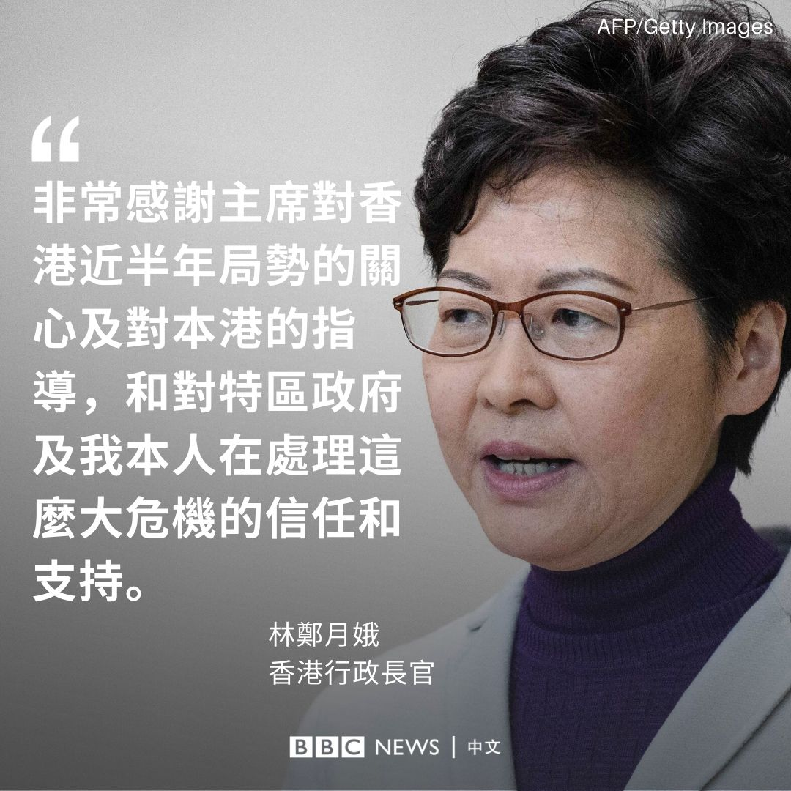
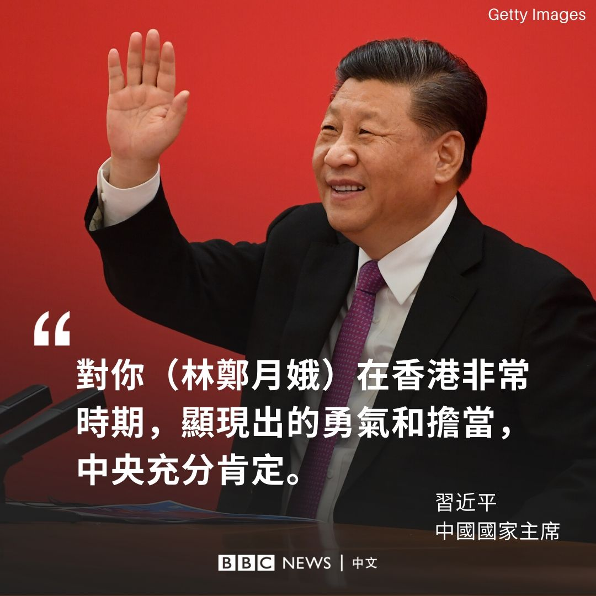
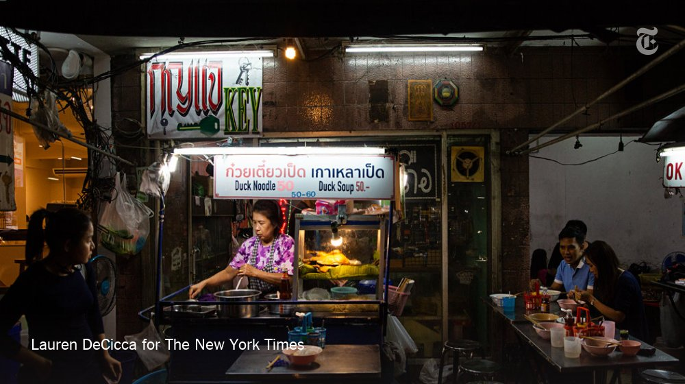
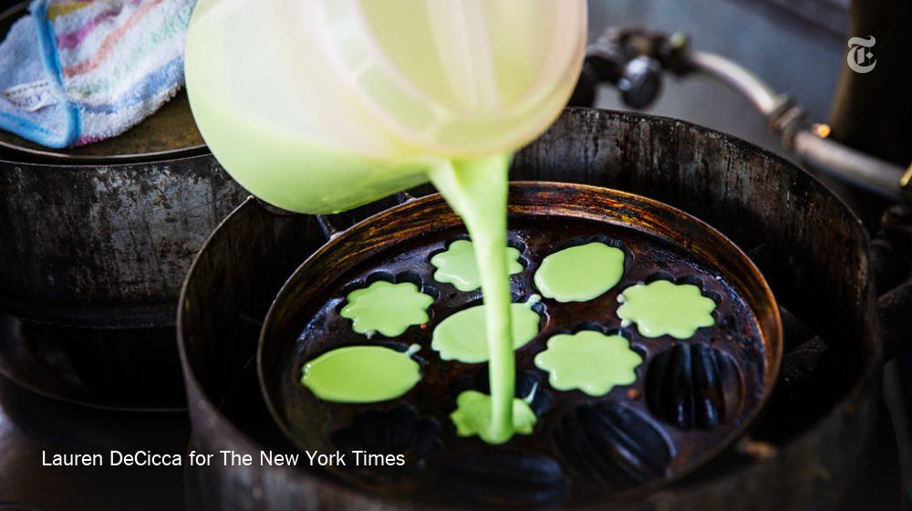
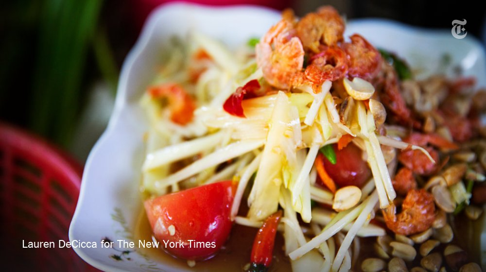
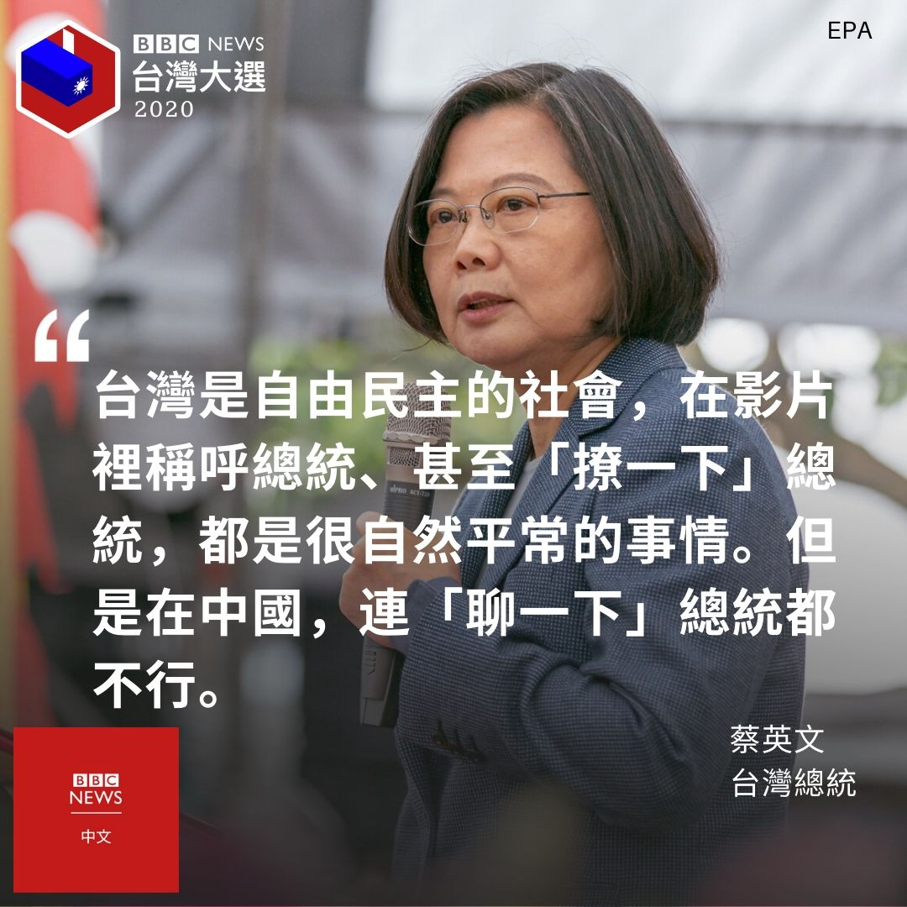
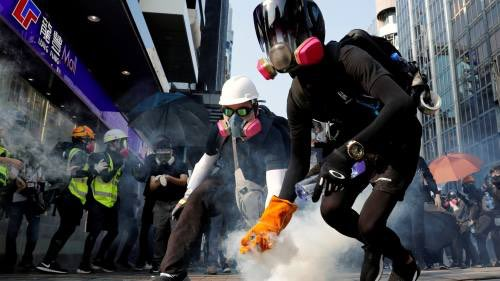
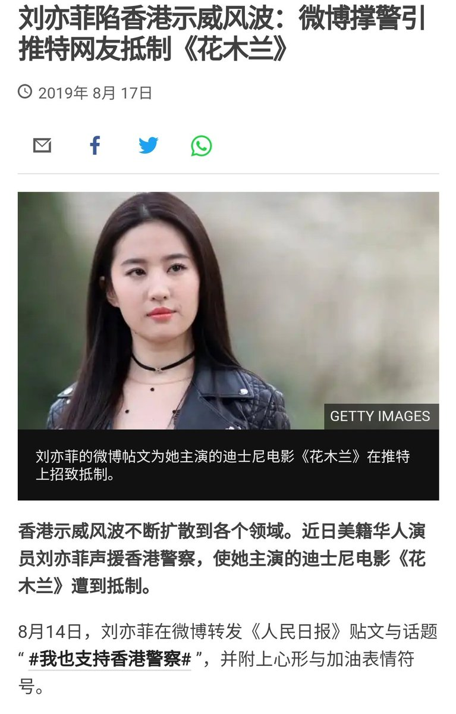

[12月16日 22:22]    BBC News 中文   @bbcchinese    在英超球队阿森纳效力的梅苏特·厄齐尔在社交媒体上发声涉及中国新疆问题，点燃了互联网的舆论。 https://www.bbc.com/zhongwen/simp/world-50807442 …  :speech_balloon:评:27 :+1:赞:71 :globe_with_meridians:转:19  

[12月16日 21:30]    纽约时报中文网   @nytchinese    #观点 如果中国政府澄清关于2047年后香港将何去何从的立场，并接受港人在成为中华民族不可分割的一部分同时，希望当家作主的愿望，那么对你来说，就会是一个双赢局面：不仅在香港，在台湾也是如此。
而眼下，在这两个值得珍视的地方，你正在失去民心。 http://nyti.ms/2Po6wkV   :speech_balloon:评:15 :+1:赞:21 :globe_with_meridians:转:0  

[12月16日 21:00]    纽约时报中文网   @nytchinese    贸易战带来的不确定性似乎也对美国和全球经济造成了重大损失，特别是对商业投资的抑制。
特朗普和他的顾问们指出，创纪录的低失业率、强劲的股市和高涨的消费者信心证明，贸易战几乎没有产生负面影响。
但经济学者认为，如果没有贸易战，美国的经济增长会更强劲。 http://nyti.ms/2RRKtVH   :speech_balloon:评:12 :+1:赞:5 :globe_with_meridians:转:2  

[12月16日 20:46]    老司机   @h5lpykl7tp6jjop      :speech_balloon:评:1 :+1:赞:5 :globe_with_meridians:转:1  

[12月16日 20:46]    老司机   @h5lpykl7tp6jjop    妙文转发：一起来温习那些令你虎躯一震的新名词  :speech_balloon:评:4 :+1:赞:46 :globe_with_meridians:转:22  

[12月16日 20:01]    BBC News 中文   @bbcchinese    “残疾的缺陷反而能帮助别人，这个事实看来很神奇。”患有视障的医学触觉检查员有比常人更敏锐的触觉，能更及时地为妇女察觉乳癌征兆。

（警告：本片含少量裸露镜头）  :speech_balloon:评:3 :+1:赞:59 :globe_with_meridians:转:15  

[12月16日 20:00]    纽约时报中文网   @nytchinese    #新新世界 我问Liu Jingyao，她觉得中国有多少新闻用户相信自己。“肯定没有30%，“她有点沮丧地说，“最多10%。”
“但我要真是仙人跳，为什么要带着一个男人在楼里转来转去找了15分钟？而且他是刘强东，谁能知道他会做出这种事情？” http://nyti.ms/2sm2yk0   :speech_balloon:评:21 :+1:赞:26 :globe_with_meridians:转:8  

[12月16日 19:31]    BBC News 中文   @bbcchinese    它让你欢喜让你忧，只因为，它是你海枯石烂心不变的永远…… https://bbc.in/2PtosuR   :speech_balloon:评:4 :+1:赞:19 :globe_with_meridians:转:15  

[12月16日 19:30]    纽约时报中文网   @nytchinese    美国十年来最受欢迎的名字 http://nyti.ms/2EfUST8   :speech_balloon:评:1 :+1:赞:6 :globe_with_meridians:转:1  

[12月16日 19:25]    墙国铁拳现世报😷   @Socialistfist    评论区表情包大赏？  :speech_balloon:评:7 :+1:赞:88 :globe_with_meridians:转:8  

[12月16日 19:17]    墙国铁拳现世报😷   @Socialistfist    任职于长春一汽公司的戛戛
每当遇到生活中的烦心事，总会回到家，一个人坐在沙发上，打开音响，调大音量, 循环播放 天赋事变的rap
［hey！democracy...] 
听着听着，戛戛就睡了过去，嘴角划出一道微笑，在中国梦里的她不再被世俗纷扰
晚安中国

#社会主义铁拳  :speech_balloon:评:39 :+1:赞:358 :globe_with_meridians:转:109  

[12月16日 19:01]    BBC News 中文   @bbcchinese    习近平说，“今年是香港回归祖国以来局面最为严峻复杂的一年”，林郑月娥能够坚守“一国两制”原则底线，在香港非常时期，“显现出的勇气和担当，中央是充分肯定”。 https://bbc.in/2S2KnKG   :speech_balloon:评:51 :+1:赞:67 :globe_with_meridians:转:22  

[12月16日 19:00]    纽约时报中文网   @nytchinese    #新新世界 Liu Jingyao说，事实证明自己还是比一开始想像得更坚强。没错，她说自己患上了创后应激障碍，有时有自杀的倾向。但她仍决心继续诉讼。
她有时会在脑海中想象当初应该如何用不同的方式应对。“如果当时知道自己可以忍受这么多，”她说，“肯定不会犹豫报警的。” http://nyti.ms/2sm2yk0   :speech_balloon:评:7 :+1:赞:10 :globe_with_meridians:转:3  

[12月16日 18:22]    BBC News 中文   @bbcchinese    英国大选保守党获胜，似乎解决了脱欧前景明朗化问题，但也为苏格兰独立努力注入新动力，重新复活了2014年苏格兰独立公投前出现的防务难题，即英国核威慑何去何从的问题。 https://bbc.in/36J8Rg7   :speech_balloon:评:22 :+1:赞:30 :globe_with_meridians:转:8  

[12月16日 18:01]    BBC News 中文   @bbcchinese    珠海当局确认早前在大桥一个检查站拘捕一名香港男子，但做法被质疑违反兴建大桥时中港澳之间的相关协议。 https://bbc.in/2POfBCT   :speech_balloon:评:35 :+1:赞:92 :globe_with_meridians:转:46  

[12月16日 18:00]    纽约时报中文网   @nytchinese    华盛顿和北京均未对外公布9月发生的驱逐事件，该事件已加剧了特朗普政府的担忧，即随着两国越来越深陷地缘政治和经济竞争之中，中国正在扩大在美间谍活动。
美国情报官员说，中国构成的谍报威胁比其他任何国家都大。 http://nyti.ms/2S2D6Lf   :speech_balloon:评:3 :+1:赞:13 :globe_with_meridians:转:8  

[12月16日 17:30]    纽约时报中文网   @nytchinese    #观点 秦家骢：回到你希望统一台湾的雄心壮志上来，中国在“一国两制”问题上的立场一直是，只要统一，无论社会、经济还是政治，都没必要变。
香港和澳门的情况就是这样，台湾大抵也是如此。台湾人民经过几十年不断求索，民主得之不易，说服他们放弃，是不大可能发生的事情。 http://nyti.ms/2Po6wkV   :speech_balloon:评:14 :+1:赞:34 :globe_with_meridians:转:5  

[12月16日 17:15]    BBC News 中文   @bbcchinese    中国国家主席习近平在中南海接见赴京述职的香港行政长官林郑月娥，重申中央将继续坚定支持她带领香港特区政府依法施政。林郑月娥则感谢习近平的指导。  :speech_balloon:评:49 :+1:赞:64 :globe_with_meridians:转:20  

[12月16日 17:03]    财经真相   @caijingxiang    第十九届四中全会精神！ https://twitter.com/landofyelang/status/1206481839906418688 …  :speech_balloon:评:20 :+1:赞:242 :globe_with_meridians:转:112  

[12月16日 17:01]    BBC News 中文   @bbcchinese    为何中国大陆说在香港抗议的背后总是看到“外国干预的邪恶之手”？ https://bbc.in/2YQe7vQ   :speech_balloon:评:185 :+1:赞:213 :globe_with_meridians:转:82  

[12月16日 17:00]    纽约时报中文网   @nytchinese    知情人士透露，在两名中国使馆官员驱车驶入弗吉尼亚州一个敏感的军事基地后，美国政府于今年秋天将他们秘密驱逐。此举似乎是30多年来首次有涉嫌间谍行为的中国外交官遭到驱逐。
六位了解驱逐事件的人士说，美国官员认为，至少有一名中国官员是在外交身份掩护下行动的情报官员。 http://nyti.ms/2S2D6Lf   :speech_balloon:评:10 :+1:赞:82 :globe_with_meridians:转:34  

[12月16日 16:53]    BBC News 中文   @bbcchinese    中国国家主席习近平在中南海接见赴京述职的香港行政长官林郑月娥。习近平说，今年是香港回归祖国以来局面最为严峻复杂的一年，面对各种困难和压力。他赞扬林郑月娥坚守一国两制原则底线、依法施政、恪尽职守，做了大量艰苦工作。（图片来自习近平在另一场合的画面）  :speech_balloon:评:10 :+1:赞:27 :globe_with_meridians:转:14  

[12月16日 16:00]    BBC News 中文   @bbcchinese    位于南美洲的法属圭亚那有一座欧洲火箭发射场，来这里度假可以探索热带雨林，享受艳阳和沙滩，还有……观看难得一见的火箭发射升空。 https://bbc.in/2YI4UWq   :speech_balloon:评:1 :+1:赞:17 :globe_with_meridians:转:6  

[12月16日 15:01]    BBC News 中文   @bbcchinese    美国无人机上月在叙利亚被击落，华盛顿指责莫斯科。评论说利比亚成中东新角力场，擦枪走火有引发大战的危险。 https://bbc.in/2PouUmz   :speech_balloon:评:16 :+1:赞:36 :globe_with_meridians:转:19  

[12月16日 15:01]    老司机   @h5lpykl7tp6jjop    基督教从唐朝就传入中国，到今天也没有得到大发展，共教传入中国一百年就融汇几千年的传统，生长发展成如今盘根错节的庞大怪物，这是土壤气候生态环境适合的结果，共产主义的幽灵为什么在欧洲游荡一个多世纪无法生根呢？一到中国就蓬勃发展，席卷大陆，这难道没有原因吗？看看哪些红老兵疯魔的样子！唉  :speech_balloon:评:28 :+1:赞:262 :globe_with_meridians:转:71  

[12月16日 15:00]    纽约时报中文网   @nytchinese    特朗普政府官员预测，新宣布的对华贸易协议将给美国经济带来巨大收益，但在激烈贸易战中所遭受的经济损失将难以弥补。
特朗普为迫使中国接受协议而征收的关税，及其不可预测的贸易方式都使美国付出了巨大代价。 http://nyti.ms/2RRKtVH   :speech_balloon:评:49 :+1:赞:52 :globe_with_meridians:转:20  

[12月16日 14:30]    纽约时报中文网   @nytchinese    #图集【曼谷，街头美食天堂】这座城市的规划者更喜欢标准整洁的曼谷，那里有空调、购物中心和适合发在Instagram上的咖啡馆。但那里没有的脏乱和吵闹，却是曼谷街头美食小摊无可取代的市井味道。
点击查看图集： http://nyti.ms/2PNktrH   :speech_balloon:评:0 :+1:赞:9 :globe_with_meridians:转:4  

[12月16日 14:00]    纽约时报中文网   @nytchinese    初步协议的达成可能会让已经被削弱的中国温和派进一步边缘化，他们希望北京放松对国内经济的控制。
西方经济学家警告，臃肿的国有企业正在拖累中国经济，吸走本应流向私营企业的资金和注意力。北京加强控制也可能使美国公司在中国做生意变得更加困难。 http://nyti.ms/2PRvCHU   :speech_balloon:评:13 :+1:赞:31 :globe_with_meridians:转:11  

[12月16日 14:00]    BBC News 中文   @bbcchinese    梅森夫妇一手建造了地下色情王国，但他们试图向自己的孩子掩盖真相。 https://bbc.in/36F1wys   :speech_balloon:评:7 :+1:赞:29 :globe_with_meridians:转:10  

[12月16日 13:31]    BBC News 中文   @bbcchinese    台湾总统蔡英文与当地网红“波特王”拍了一条网片，但“波特王”指中国大陆的合作方要求，不能在影片内容出现“总统”两个字，最终并跟“波特王”解除合作关系。  :speech_balloon:评:171 :+1:赞:1059 :globe_with_meridians:转:361  

[12月16日 13:30]    纽约时报中文网   @nytchinese    #观点 秦家骢：如果中国政府能够确认“一国两制”的确没有最后期限，也许并不会消除人们的恐惧或让抗议运动平息，但它会是一个开始，是建立信任和迈向谈判的基础。
的确，这样的承诺可以帮助人们恢复对香港未来的信心，不仅对香港民众如此，对外国投资者亦如此。 http://nyti.ms/2Po6wkV   :speech_balloon:评:16 :+1:赞:18 :globe_with_meridians:转:7  

[12月16日 13:01]    BBC News 中文   @bbcchinese    英国大选保守党获胜，似乎刚刚解决脱欧前景明朗化问题，却又给苏格兰独立注入新动力，使英国海基核威慑蒙上阴影。 https://bbc.in/2PSZJie   :speech_balloon:评:24 :+1:赞:29 :globe_with_meridians:转:8  

[12月16日 13:00]    纽约时报中文网   @nytchinese    #每日一词 hairy，惊险的、棘手的。报道称，中企借方今年已出现近2百亿美元的债务违约，这被中国信贷专家李国宜称为“hairy”。
该词原意是“多毛的”，由于人们常用“汗毛都竖起来了”(hair-raising)来形容惊险、紧张，该词渐渐发展出后面的含义。
更多简报内容： http://nyti.ms/2Q1rk15   :speech_balloon:评:3 :+1:赞:10 :globe_with_meridians:转:3  

[12月16日 12:30]    纽约时报中文网   @nytchinese    德国足球明星厄齐尔有土耳其血统，他在社交媒体上把新疆称呼“东突厥斯坦”，谴责中国大规模拘禁穆斯林，并呼吁穆斯林世界不再对此保持沉默。
这番言论在中国网络上掀起了愤怒浪潮。 http://nyti.ms/2Ejk7Uj   :speech_balloon:评:56 :+1:赞:141 :globe_with_meridians:转:44  

[12月16日 12:00]    纽约时报中文网   @nytchinese    联合国气候大会落幕，预期成果落空。包括美国在内的污染大国甚至阻止了一项鼓励各国加强减排的协议，并将一项关于国际碳交易规则的协议推迟到明年。
这被广泛谴责为四分之一个世纪以来最糟糕的气候谈判结果之一，联合国秘书长古特雷斯对此直呼“失望”。
更多简报内容： http://nyti.ms/2Q1rk15   :speech_balloon:评:3 :+1:赞:6 :globe_with_meridians:转:1  

[12月16日 11:30]    纽约时报中文网   @nytchinese    特朗普在贸易战上的首次退却，把胜利送给了中国的强硬派。这可能会导致一场更持久、更棘手的贸易战，以及中国对经济改革的强硬抵制。
从本质上讲，贸易战打了一年半后，中国似乎找到了一个制胜的策略：保持强硬，让特朗普政府自己与自己谈判。 http://nyti.ms/2PRvCHU   :speech_balloon:评:162 :+1:赞:316 :globe_with_meridians:转:119  

[12月16日 11:01]    BBC News 中文   @bbcchinese    台湾总统大选：“外省第三代”的选择与认同意味着台湾社会的什么变化呢？ https://bbc.in/2sxYOMs   :speech_balloon:评:29 :+1:赞:72 :globe_with_meridians:转:27  

[12月16日 11:00]    纽约时报中文网   @nytchinese    香港特首林郑月娥前往北京述职，预计今天将与习近平会面。外界猜测，北京此番或下达指示，要求香港内阁改组。
此前一天，香港抗议者再次前往商场游行；另一批示威者则向警方表示了支持。这些相互竞争的集会暴露了香港社会的巨大鸿沟。
更多简报内容： http://nyti.ms/2Q1rk15   :speech_balloon:评:7 :+1:赞:9 :globe_with_meridians:转:3  

[12月16日 10:54]    老司机   @h5lpykl7tp6jjop    一位老知识分子对我说：其实中国人是最容易统治的，是最好说话的，只要共产党稍微改变一点点，百姓就感恩戴德，可是它们总是加压加压，不让人活……说罢长叹，中国的知识分子一直盼望明君，盼望清官，希望给明君当马前卒，肝脑涂地，鞠躬尽瘁，可是连这样机会也没有，大多都抱憾终身，含冤入罪屈辱而亡  :speech_balloon:评:15 :+1:赞:117 :globe_with_meridians:转:33  

[12月16日 10:28]    纽约时报中文网   @nytchinese    #观点 资深媒体人秦家骢在致习近平的公开信中写道，习近平应该反思过去一年“一国两制”原则所遭受的重创，并对一些误解加以澄清，这些误解造成香港持续的动荡，也让统一在台湾越来越不得人心。 
秦家骢指出，为缓解两地民众的不满与恐慌，中央在几件事情上是可以大有作为的。 http://nyti.ms/2Po6wkV   :speech_balloon:评:110 :+1:赞:208 :globe_with_meridians:转:79  

[12月16日 10:00]    BBC News 中文   @bbcchinese    很多专家站在美国立场上认为，刚刚签署的第一阶段中美贸易协议的赢家是中国，而非美国。 https://bbc.in/2EhyicL   :speech_balloon:评:187 :+1:赞:269 :globe_with_meridians:转:101  

[12月16日 09:51]    老司机   @h5lpykl7tp6jjop    这个抖音还可以转发  :speech_balloon:评:2 :+1:赞:198 :globe_with_meridians:转:108  

[12月16日 09:50]    纽约时报中文网   @nytchinese    早安！今日重点新闻包括：
德国球星厄齐尔涉新疆言论引争议；美国秘密驱逐涉嫌从事间谍活动的中国官员；中美达成第一阶段贸易协议；林郑月娥前往北京述职；美国朝鲜问题特使抵达韩国；观点：习先生，一个民主的香港对你有益……NYT简报带你速览今日要闻。 http://nyti.ms/2Q1rk15   :speech_balloon:评:11 :+1:赞:29 :globe_with_meridians:转:8  

[12月16日 09:00]    纽约时报中文网   @nytchinese    #新新世界 那天Liu Jingyao受邀参加晚宴，她是在场唯一的志愿者和女性。一名男子指示她坐在刘强东身边。聚会的成员至少27次举杯敬酒，她喝了19次。
晚宴后，刘强东和Liu Jingyao去了她的公寓。几小时后，一个朋友报警说她遭到强奸。刘强东的发言人否认了这一说法。 http://nyti.ms/2sm2yk0   :speech_balloon:评:39 :+1:赞:45 :globe_with_meridians:转:12  

[12月16日 03:57]    老司机   @h5lpykl7tp6jjop    祸不单行!俄国航母失火后 又搞沉一艘潜艇，老毛子的粗旷有的一瞥
俄罗斯PD-16浮船坞15日沉没，一艘在坞内维修的B-380号潜艇侧翻。B-380号常规潜艇水下排水量超过3700吨，配备了鱼雷、水雷等武器。塔斯社报道称，这艘潜艇不属于黑海舰队，是一艘未完成建造的潜艇。  :speech_balloon:评:1 :+1:赞:42 :globe_with_meridians:转:13  

[12月16日 03:23]    老司机   @h5lpykl7tp6jjop    这个地方居然孔雀成灾，大陆网友又要羡慕了
继外来小龙虾泛滥成灾、走私水獭成灾、野猪繁殖成灾之后，日本冲绳县的宫古岛上又出现了“孔雀成灾”的现象。据了解，这是一种外来的印度孔雀，虽然形态优雅，但作为杂食性动物，孔雀食量很大，同时又缺少天敌，繁殖能力强，成为了这座小岛的“不速之客”。  :speech_balloon:评:6 :+1:赞:12 :globe_with_meridians:转:3  

[12月16日 03:12]    老司机   @h5lpykl7tp6jjop    相比中国警察背摔婴儿美国警察太逊了
纽约警察暴力执法强抢婴儿,母亲获赔62万美元，今年2月，纽约市议会向她公开道歉。8月，海德利起诉市政府并要求赔偿。周五（13日）纽约市政府表示双方达成和解，将赔偿她62.5万美元。  https://r.sinaimg.cn/large/article/1305cb9b870917bbe63fac2d69eb65b5.jpg …  :speech_balloon:评:1 :+1:赞:14 :globe_with_meridians:转:7  

[12月16日 02:57]    老司机   @h5lpykl7tp6jjop    被祕密驱逐 中国外交官喊冤：是迷路不是刺探情报！

美国政府今年秋天祕密驱逐中国大陆驻美大使馆两名外交官，因为他们开车到维吉尼亚州一个祕密军事基地。这是美国1987年驱逐两名大陆大使馆职员以来，首次驱逐涉嫌刺探情报的大陆外交官。这件事显示美国政府现在对大陆疑似刺探情报的行为更加强硬。  :speech_balloon:评:8 :+1:赞:61 :globe_with_meridians:转:13  

[12月15日 23:21]    BBC News 中文   @bbcchinese    【台湾大选：为何“芒果干”成了2020台湾总统选战关键字？】“芒果干”三个字近期成为台湾总统选战的关键词汇。该词在网络上讨论声量高，许多政治人物也经常将它挂在嘴边。 https://www.youtube.com/watch?v=_ROywrBIy58 …  :speech_balloon:评:21 :+1:赞:25 :globe_with_meridians:转:3  

[12月15日 21:59]    BBC News 中文   @bbcchinese    她们同年同月同日生，一起长大，吃同样的饭，穿同样的衣，直到15岁上学时一直在同一教室坐同一排。现在姐妹们就要出嫁了，婚礼定在：同年同月同日！ https://bbc.in/35o1BGx   :speech_balloon:评:6 :+1:赞:39 :globe_with_meridians:转:10  

[12月15日 21:36]    BBC News 中文   @bbcchinese    效力英超阿森纳球队的德国球星梅苏特·厄齐尔（Mesut Özil）在社交平台上的言论，因涉及敏感的新疆穆斯林问题，使他本人以及球队卷入中国的舆论漩涡。 https://bbc.in/35oKMuT   :speech_balloon:评:191 :+1:赞:448 :globe_with_meridians:转:166  

[12月15日 19:13]    新闻大吐槽   @TuCaoFakeNews    反送中半年以来，我们看见过：
在香港街头高歌《愿荣光归香港》的意大利歌唱家；
来了解831太子站惨案的韩国影星；
在理工大学守护学生的美国牧师；
还有因给港人免费煮咖啡而备受黑警骚扰的日本小伙~

如果这些人就是中共口中的敌对势力，那么与这些人为敌，就是与一切信奉自由与仁爱的人为敌！  :speech_balloon:评:3 :+1:赞:183 :globe_with_meridians:转:80  

[12月15日 19:13]    新闻大吐槽   @TuCaoFakeNews    反送中半年以来，我们看见过：
在香港街头高歌《愿荣光归香港》的意大利歌唱家；
来了解831太子站惨案的韩国影星；
在理工大学守护学生的美国牧师；
还有因给港人免费煮咖啡而备受黑警骚扰的日本小伙~

如果这些人就是中共口中的敌对势力，那么与这些人为敌，就是与一切信奉自由与仁爱的人为敌！  :speech_balloon:评:3 :+1:赞:183 :globe_with_meridians:转:80  

[12月15日 18:43]    新闻大吐槽   @TuCaoFakeNews    被香港抗争者的不屈精神感动，日本小伙飘洋过海，到香港街头给抗争者提供免费咖啡，可黑警处处阻挠，动不动就要盘查他，搞得他狼狈不堪~

日式咖啡一杯
自由精神百倍
帮煮帮倒免费
妒警心生暗鬼
纯打油  :speech_balloon:评:54 :+1:赞:1181 :globe_with_meridians:转:463  

[12月15日 18:43]    新闻大吐槽   @TuCaoFakeNews    被香港抗争者的不屈精神感动，日本小伙飘洋过海，到香港街头给抗争者提供免费咖啡，可黑警处处阻挠，动不动就要盘查他，搞得他狼狈不堪~

日式咖啡一杯
自由精神百倍
帮煮帮倒免费
妒警心生暗鬼
纯打油  :speech_balloon:评:54 :+1:赞:1181 :globe_with_meridians:转:463  

[12月15日 17:56]    老司机   @h5lpykl7tp6jjop    12.15 長槍上膛
今日下午3時，有防暴警員在九龍灣德福花園與在場人士發生爭執，期間警員企圖開槍，被同僚阻止。

#黑警謀殺市民
#HKPoliceTerrorism
#HKpolicebrutality
#HKPoliceState
#FightForFreedom
#StandWithHongKong
#HongKongProtests
#SOSHK  :speech_balloon:评:39 :+1:赞:502 :globe_with_meridians:转:561  

[12月15日 16:59]    老司机   @h5lpykl7tp6jjop    细思起来李子柒这小女子太不简单，除了会她父母都未必会的古早家常饮食做法，还会竹匠木工，药膳，古法美容用品制作，古法制酱油及各种调料，会做毛笔，古墨，还会所有农活及山地生活经验，她大约三十岁左右吧，比我七十岁老头干过工农商学加移民的经历还丰富，对于造假，看来大家己经熟视无睹习惯了！  :speech_balloon:评:87 :+1:赞:397 :globe_with_meridians:转:74  

[12月15日 16:43]    新闻大吐槽   @TuCaoFakeNews    有朋友问，这几天好安静，香港的抗争停下来了吗？
我说不会的，不信你看这个，半小时之前的事情~
抗争者分散成小队，在不同的地点出击！  :speech_balloon:评:15 :+1:赞:496 :globe_with_meridians:转:228  

[12月15日 16:43]    新闻大吐槽   @TuCaoFakeNews    有朋友问，这几天好安静，香港的抗争停下来了吗？
我说不会的，不信你看这个，半小时之前的事情~
抗争者分散成小队，在不同的地点出击！  :speech_balloon:评:15 :+1:赞:496 :globe_with_meridians:转:228  

[12月15日 16:34]    老司机   @h5lpykl7tp6jjop    港共恶警今日大批进入商场抓人、打人，被激怒的市民包圍瘋警並聲討其暴力行為，瘋警隨即向人群和記者群舉起警棍、施放胡椒噴霧并射中記者  :speech_balloon:评:16 :+1:赞:193 :globe_with_meridians:转:178  

[12月15日 14:48]    老司机   @h5lpykl7tp6jjop    美丽的画面和真实的故事，一比就知道谁更感人！  :speech_balloon:评:0 :+1:赞:10 :globe_with_meridians:转:2  

[12月15日 13:02]    BBC News 中文   @bbcchinese    【一周热点回顾】你有兴趣进去住一住吗？  :speech_balloon:评:11 :+1:赞:84 :globe_with_meridians:转:18  

[12月15日 13:01]    新闻大吐槽   @TuCaoFakeNews    狼振英昨天刚被脸书禁言，还是没学乖，又谈论起了汉奸问题，这事不扒一扒，真是对不起最会卖国的中共~

历史上，中共为讨好俄爹，出卖领土，把我大中华美丽秋海棠版图撸成炸毛鸡~
而就在前几个月拉达克被印度正式纳入版图，中共也没有任何实际行动制止~

狼大人再哪壶不开提哪壶，早晚也被大陆禁言！  :speech_balloon:评:21 :+1:赞:160 :globe_with_meridians:转:80  

[12月15日 13:01]    新闻大吐槽   @TuCaoFakeNews    狼振英昨天刚被脸书禁言，还是没学乖，又谈论起了汉奸问题，这事不扒一扒，真是对不起最会卖国的中共~

历史上，中共为讨好俄爹，出卖领土，把我大中华美丽秋海棠版图撸成炸毛鸡~
而就在前几个月拉达克被印度正式纳入版图，中共也没有任何实际行动制止~

狼大人再哪壶不开提哪壶，早晚也被大陆禁言！  :speech_balloon:评:21 :+1:赞:160 :globe_with_meridians:转:80  

[12月15日 12:37]    墙国铁拳现世报😷   @Socialistfist    #铁拳砸死小粉红

某新闻传播专业大学生，打算于思政课讨论“西方媒体在报道大型事件中的双标”，为此开设了微信讨论组交换素材与思路，但因为发言触及过多敏感词，惨遭微信封号，目前正在微博伸冤。

一场成功的“谁说我国没有言论自由”行为艺术表演。  :speech_balloon:评:87 :+1:赞:984 :globe_with_meridians:转:342  

[12月15日 12:20]    财经真相   @caijingxiang    海南要升级为中央特区，谁决定的？该不会是某些一边干着女星，一边卖官的混蛋商量的吧？  :speech_balloon:评:120 :+1:赞:663 :globe_with_meridians:转:193  

[12月15日 12:19]    新闻大吐槽   @TuCaoFakeNews    ：我这半年的猫砂掌又白练了！但机会有的是，吾必取而代之！  :speech_balloon:评:0 :+1:赞:4 :globe_with_meridians:转:1  

[12月15日 11:54]    财经真相   @caijingxiang    在中国如果公司经营不下去的时候，没有什么问题是卖房不能解决的！  :speech_balloon:评:17 :+1:赞:186 :globe_with_meridians:转:31  

[12月15日 11:49]    新闻大吐槽   @TuCaoFakeNews    打个油：
商鞅住店无印信，
周兴入瓮苦自寻；
送中推手被送中，
作法自毙有传人！ https://twitter.com/TuCaoFakeNews/status/1206013502604763136 …  :speech_balloon:评:6 :+1:赞:92 :globe_with_meridians:转:30  

[12月15日 11:49]    新闻大吐槽   @TuCaoFakeNews    打个油：
商鞅住店无印信，
周兴入瓮苦自寻；
送中推手被送中，
作法自毙有传人！ https://twitter.com/TuCaoFakeNews/status/1206013502604763136 …  :speech_balloon:评:6 :+1:赞:92 :globe_with_meridians:转:30  

[12月15日 11:48]    财经真相   @caijingxiang    灵隐寺：12月13日，某媒体称：“12月18日—19日，天风证券将在上海召开展望2020年度策略会，而在下周五上午，天风策略会将会'移步'灵隐寺，接待人为灵隐寺主持方丈……”对此，灵隐寺郑重声明：“券商基金年终祈福”活动与本寺无任何关系，本寺从未委托或授权任何单位或个人开展与此相关的活动。  :speech_balloon:评:6 :+1:赞:57 :globe_with_meridians:转:13  

[12月15日 11:48]    老司机   @h5lpykl7tp6jjop    春暖菊花处处开  :speech_balloon:评:2 :+1:赞:10 :globe_with_meridians:转:1  

[12月15日 11:20]    老司机   @h5lpykl7tp6jjop    就怕在荒郊野外晒入定了，给色狼碰上！  :speech_balloon:评:2 :+1:赞:5 :globe_with_meridians:转:0  

[12月15日 11:01]    老司机   @h5lpykl7tp6jjop    看到中国人洗脑理论这么赚钱，这个老外也学会了，还创造性地发明了一种新的晒太阳的方法，“菊花日光浴”字如其名，这是一种最新型的保健养生方法，据说每天将菊花暴露在阳光底下晒个30秒钟，就等于穿上衣服晒了一整天太阳的效果。  :speech_balloon:评:5 :+1:赞:19 :globe_with_meridians:转:7  

[12月15日 10:54]    新闻大吐槽   @TuCaoFakeNews    党媒记者和华大妈一问一答演双簧~

党媒妓者：美国媒体对中国不公，CGTN新疆反恐纪录片被Youtube下架，而且《纽约时报》记者还把香港暴徒称作“支持民主的活动分子”

华大妈：美国一些媒体没有恪守最基本的新闻报道准则，也失去了最起码的社会公德和责任！

网民：能否开放油管，我们想去谴责美帝媒体！  :speech_balloon:评:67 :+1:赞:385 :globe_with_meridians:转:114  

[12月15日 10:54]    新闻大吐槽   @TuCaoFakeNews    党媒记者和华大妈一问一答演双簧~

党媒妓者：美国媒体对中国不公，CGTN新疆反恐纪录片被Youtube下架，而且《纽约时报》记者还把香港暴徒称作“支持民主的活动分子”

华大妈：美国一些媒体没有恪守最基本的新闻报道准则，也失去了最起码的社会公德和责任！

网民：能否开放油管，我们想去谴责美帝媒体！  :speech_balloon:评:67 :+1:赞:385 :globe_with_meridians:转:114  

[12月15日 10:16]    老司机   @h5lpykl7tp6jjop    这位科学家一不小心漏嘴又暴露了历史真相！  :speech_balloon:评:7 :+1:赞:353 :globe_with_meridians:转:206  

[12月15日 10:02]    新闻大吐槽   @TuCaoFakeNews    王户猫一边给狗大大作心脏按摩，一边安慰道：这协议不得不签啊，咱们早就定好，以拖待变不是吗？您千万不可动气啊！
（可这猫心里想：丫心脏支架怎么还不脱落？）  :speech_balloon:评:9 :+1:赞:115 :globe_with_meridians:转:47  

[12月15日 10:02]    新闻大吐槽   @TuCaoFakeNews    王户猫一边给狗大大作心脏按摩，一边安慰道：这协议不得不签啊，咱们早就定好，以拖待变不是吗？您千万不可动气啊！
（可这猫心里想：丫心脏支架怎么还不脱落？）  :speech_balloon:评:9 :+1:赞:115 :globe_with_meridians:转:47  

[12月15日 09:32]    新闻大吐槽   @TuCaoFakeNews    只是她这么不忠诚，在北京体检时，是否被共党植入芯片，就不可知了~  :speech_balloon:评:0 :+1:赞:38 :globe_with_meridians:转:3  

[12月15日 08:50]    新闻大吐槽   @TuCaoFakeNews    香港律政司长鄭若驊借口受伤手术康复，赖在英国不回港，被大使刘晓明亲自押解送中！

有传言说，北京担心这个垮脸大妈在手术时被军情六处植入窃听芯片，所以把大妈弄到北京作详细体检~

推行送中的罪魁被第一个送中，还被共党体检羞辱，不知她作何感受~心情不好，垮脸会加速~  :speech_balloon:评:30 :+1:赞:362 :globe_with_meridians:转:168  

[12月15日 08:31]    老司机   @h5lpykl7tp6jjop    行走在黄河源头：亚洲水塔快成亚洲沙漠了

黄河从上世纪70年代前后开始出现季节性断流，1997年断流达200多天，为历时最长的断流。

 https://www.wenxuecity.com/news/2019/12/14/8946699.html …  :speech_balloon:评:0 :+1:赞:2 :globe_with_meridians:转:2  

[12月15日 08:20]    老司机   @h5lpykl7tp6jjop    敏感文件曝光后 新疆政府严加信息控制  :speech_balloon:评:0 :+1:赞:7 :globe_with_meridians:转:6  

[12月15日 08:20]    新闻大吐槽   @TuCaoFakeNews    反送中开始以来，黑警加班6个月，与正常年份相比，平均每人多赚8万6千港币~
曾经最佳的亚洲警队，良心就值这个价？看来真不是钱能解释的现象，一个邪恶体制对人的败坏，速度超乎想象  :speech_balloon:评:25 :+1:赞:379 :globe_with_meridians:转:259  

[12月15日 03:18]    老司机   @h5lpykl7tp6jjop    歷史是不是總是很驚人的相似？四姨太應該看看這個視頻。  :speech_balloon:评:1 :+1:赞:43 :globe_with_meridians:转:17  

[12月15日 02:39]    GFHG SDKM   @zyx_yny    This Muslim man was just released from a concentration in china 

"He could barely walk by himself. He doesn't recognize anyone in his family and gets frightened by every little movement of people around him"

There are nearly 3 Million Muslim in concentration camps in China   :speech_balloon:评:1409 :+1:赞:71934 :globe_with_meridians:转:58749  

[12月14日 23:47]    新闻大吐槽   @TuCaoFakeNews    任你上蹿下跳，只要抓紧关税的狗绳，老中医即可淡然处之！
象征性降低一点关税，等于松松狗绳，狗跑不了。

对不起，我侮辱二哈了  :speech_balloon:评:19 :+1:赞:398 :globe_with_meridians:转:95  

[12月14日 23:24]    墙国铁拳现世报😷   @Socialistfist    “生而为国人，边早就选了”
当初NBA风波的爱国表态，提到在国家尊严前不值一提。
鼠绘汉化网因侵犯海贼王版权疑似被哔哩哔哩上海公司举报，现已经跨省批捕
NBA目前在中国照旧正常播出

#社会主义铁拳  :speech_balloon:评:44 :+1:赞:735 :globe_with_meridians:转:179  

[12月14日 22:38]    新闻大吐槽   @TuCaoFakeNews    据报，大陆社交网站在疯传一个帖子，帖子包含对华为历年造成的冤案进行独立调查等八条诉求，并称“八大诉求，缺一不可！”

港人半年抗争课没白上，大陆聪明人从中看出门道了！反噬总是从最不义的华为开始，让人很欣慰！

华为是中共缩影，一个方法针对华为有效，针对共党也应该有效，坐看党和华为割席！  :speech_balloon:评:5 :+1:赞:161 :globe_with_meridians:转:60  

[12月14日 22:11]    GFHG SDKM   @zyx_yny    My 2020 New Year resolution is to free both Hong Kong & China by defeating the New Evil Empire. Happy New Year! https://twitter.com/bohsiuming/status/1205845620851785735 …  :speech_balloon:评:415 :+1:赞:4769 :globe_with_meridians:转:2273  

[12月14日 19:00]    财经真相   @caijingxiang    特朗普上台前，中国依旧是资本流入国，这一时期如何逼迫中共放开管制，好让美企也能在中国分一杯羹是中美贸易纠纷的核心；无论是纳瓦罗这样的美国智库，还是特朗普竞选承诺，都是围绕的如何“进中国”来开展的，但是这个思维到今天就完全不合时宜，中国已经成为资本外流国，如何“出中国”必须要摆到桌面上  :speech_balloon:评:11 :+1:赞:190 :globe_with_meridians:转:35  

[12月14日 18:31]    财经真相   @caijingxiang    中共对外资企业实行外汇管制，是最大的贸易不公平，你连以前投资的钱都拿不回来，扯什么其他谈判就是胡扯！这点莱特希泽不知道吗？美国企业难道没有跟他沟通过吗？问题是中共权贵不可能把吃进肚子的美元吐出来，给美企撤退，考虑明白这一层，你就会明白贸易谈判从一开始就破裂了！  :speech_balloon:评:11 :+1:赞:269 :globe_with_meridians:转:67  

[12月14日 18:22]    财经真相   @caijingxiang    中美贸易谈判最核心的议题不是技术盗窃、知识产权、网络攻击、国企补贴等等，而是金融资本的全面开放，尤其是在华投资和利润如何顺利撤出，农产品购买之所以成为谈判焦点，归根结底还是“钱”，这也是为啥区区500亿美元就这么显眼的原因！如果放开美资外汇管制，那将是多少个500亿呢？  :speech_balloon:评:29 :+1:赞:412 :globe_with_meridians:转:95  

[12月14日 16:19]    财经真相   @caijingxiang    据朝中社今日报道，朝鲜国防科学院发言人发表谈话称，当地时间13日晚上10点41分至48分，朝鲜在西海卫星发射场再次进行重大试验。该发言人称，朝鲜近期取得的国防科研成果，将进一步夯实朝鲜的战略核战争遏制力。  :speech_balloon:评:17 :+1:赞:93 :globe_with_meridians:转:12  

[12月14日 10:09]    GFHG SDKM   @zyx_yny    #HKPoliceTerrorists has fired nearly 16,000 #TearGas rounds  during the six months of pro-#democracyforhk #HongKongProtests  :speech_balloon:评:12 :+1:赞:278 :globe_with_meridians:转:259  

[12月14日 03:21]    GFHG SDKM   @zyx_yny    #HongKongers & #HongKong #StandwithUyghurs 

To free #Uyghurs in #EastTurkistan, Chinese Communist Party of #China which violates #HumanRights needs to end. 

#BoycottChina  :speech_balloon:评:2 :+1:赞:100 :globe_with_meridians:转:15  

[12月14日 01:42]    GFHG SDKM   @zyx_yny    Support  :speech_balloon:评:6 :+1:赞:227 :globe_with_meridians:转:24  

[12月14日 01:01]    财经真相   @caijingxiang    第一阶段协议背后的数字博弈：15号即将生效的1600亿美元25%的关税，算下来就是400亿美元税收；将9月份1200亿美元15%的关税降7.5%，就是等于少征收90亿美元关税，两者总计是490亿美元。刚好就是中国采购500亿美元农产品！  :speech_balloon:评:79 :+1:赞:807 :globe_with_meridians:转:252  

[12月14日 00:28]    财经真相   @caijingxiang    1.关税原来说是取消3600亿的一半，现在只是1200亿的一半，没有假消息公布的好；2.利好出尽，获利了结；3.对比双方公告内容存在差异很多，引发市场担忧情绪！ https://twitter.com/QingLucky/status/1205524315807969281 …  :speech_balloon:评:12 :+1:赞:164 :globe_with_meridians:转:51  

[12月14日 00:21]    财经真相   @caijingxiang    中美第一阶段协议公告差异：1.美方公布包含强制执行机制，中方没有！2.中方公告说同意分阶段降低关税，美方公告里没有！3.美方公告中方承诺会购买大量农产品，中方公告中没有，且新闻发布会上故意混淆说，美方也会购买中国农产品！4.下一阶段，中方强调需要进行校对、翻译、商量时间（拖），美方没有！  :speech_balloon:评:107 :+1:赞:1402 :globe_with_meridians:转:775  

[12月13日 23:50]    财经真相   @caijingxiang    人民币浮盈的平仓，浮亏的继续持有，暂时不在新建人民币空仓！  :speech_balloon:评:8 :+1:赞:56 :globe_with_meridians:转:5  

[12月13日 23:47]    财经真相   @caijingxiang    发布会结束了，市场一头雾水，没有方向，除了知道达成了传说中的“deal”外，现在的问题，比发布会前还多，人民币停留在7附近，没有波动！第二阶段协议是立即开始，还是中共的看第一阶段的情况？执行机制是什么？如果中共不执行第一阶段的协议会受到那些处罚？发布会故意让彭博提问在打谁的脸？  :speech_balloon:评:38 :+1:赞:301 :globe_with_meridians:转:71  

[12月13日 22:26]    财经真相   @caijingxiang    昨天很多交易员被假新闻搞得“崩溃”，尤其是信仰中共国运的交易员，不仅是亏钱的割肉痛，更多的是对中共得到喘息的“信仰动摇的痛心”，最难熬的一天渡过了，活着真好，亏钱几万美元，依然很高兴，接下来还会赚回来，最重要的是中共的“国运”已定！华夏幸甚！中国幸甚！  :speech_balloon:评:67 :+1:赞:614 :globe_with_meridians:转:78  

[12月13日 22:17]    GFHG SDKM   @zyx_yny    警察の鎮圧行動の中、原因不明の転落死で亡くなった周梓樂くん。

これは周くんのお父さんからの手紙。

//君がまだ母親のお腹にいたあの頃に、私たちはすでに君に「樂樂」という名前を付けることを決めたんだ。
君が一生楽しく笑顔で過ごせますように、と願って。//

是非、全文もご一読ください。  :speech_balloon:评:19 :+1:赞:964 :globe_with_meridians:转:740  

[12月13日 22:13]    财经真相   @caijingxiang    华尔街日报、彭博这一波大忽悠，把做空交易者给提前割了韭菜，现在到了真正割韭菜的时候了！ https://twitter.com/realDonaldTrump/status/1205489214546235393 …  :speech_balloon:评:37 :+1:赞:323 :globe_with_meridians:转:68  

[12月13日 22:11]    财经真相   @caijingxiang    没有刘鹤！ https://twitter.com/caolei1/status/1205487048259325952 …  :speech_balloon:评:17 :+1:赞:77 :globe_with_meridians:转:18  

[12月13日 20:13]    GFHG SDKM   @zyx_yny    日本政府が来年、習近平国家主席を国賓として招くことについて、私は強く反対しています。

これはあくまで一人の香港人としての個人的な意見ですが、日本の皆さんに読んでほしいです。→  :speech_balloon:评:685 :+1:赞:21335 :globe_with_meridians:转:9767  

[12月13日 19:54]    墙国铁拳现世报😷   @Socialistfist    啧啧啧

#战螂在推特 2  :speech_balloon:评:22 :+1:赞:125 :globe_with_meridians:转:23  

[12月13日 19:45]    财经真相   @caijingxiang    2015年特朗普再次新著《伤残美国：如何再次伟大》在此书中他陈述了自己对非法移民问题的立场，主张进行严格控制来缓和美国福利开支压力；同时反对伊拉克战争；对于这些主张他直言坦率，吸引媒体关注，而不是以往的政客表演！实事上早在2013年特朗普花费100万美元对进军白宫进行可行性研究！  :speech_balloon:评:2 :+1:赞:99 :globe_with_meridians:转:13  

[12月13日 19:36]    财经真相   @caijingxiang    为了让美国再次伟大，特朗普的开出的药方是：令欧佩克失去石油定价权；逼迫中国从事真正的公平贸易，以便给美国带来就业；设法减少债务又不损害正常福利；消除奥巴马医改和经济政策！今天他做到几条呢？  :speech_balloon:评:8 :+1:赞:151 :globe_with_meridians:转:25  

[12月13日 19:32]    财经真相   @caijingxiang    2011年在奥巴马在白宫记者协会年度晚宴上奚落特朗普后，特朗普于当年出版了一本新书《此时应强硬：让美国再成为第一》，在书中他直言奥巴马是美国的“灾难”，对奥巴马到世界各地为美国所作所为四处道歉感到不满，他写道：现在的美国工作机会紧缺，财富紧缺，毫无尊严，看上去就是一个失败国家！  :speech_balloon:评:20 :+1:赞:363 :globe_with_meridians:转:85  

[12月13日 18:50]    GFHG SDKM   @zyx_yny    #HayırlıCumalarDoğuTürkistan   :speech_balloon:评:15161 :+1:赞:150610 :globe_with_meridians:转:60160  

[12月13日 13:58]    GFHG SDKM   @zyx_yny    永不遺忘，常在心中，他們的付出，將會留給世世代代，香港多謝有你才會有未来，香港史書會有手足的勇敢，輝煌的事件。  :speech_balloon:评:52 :+1:赞:837 :globe_with_meridians:转:532  

[12月13日 11:46]    新闻大吐槽   @TuCaoFakeNews    港人很喜欢吃日式牛丼饭，但他们就是忍住不去吃吉野家！
因为吉野家解雇了为反送中发声的员工，主动替港共迫害香港人！

直到这家叫做SUKIYA的同类日料店开张，香港人排起长队准备大快朵颐。

不知道吉野家看到这大长队作何感想？
“矮马，没人吃，今天的牛肉又要臭了”  :speech_balloon:评:162 :+1:赞:2386 :globe_with_meridians:转:908  

[12月13日 11:19]    GFHG SDKM   @zyx_yny    Can't believe Commissar Lamb is rewarding @hkpoliceforce human rights abuse & brutality. https://twitter.com/Kaman13032369/status/1205325571070124037 …  :speech_balloon:评:445 :+1:赞:5048 :globe_with_meridians:转:4018  

[12月13日 10:17]    财经真相   @caijingxiang    人民币又出现封底购汇，如果明天白宫公布达成协议，人民币会出现获利了结，跌到7附近，如果15号关税继续加征，人民币要上演千里大跌幅,到时结果出来后再追空不迟！  :speech_balloon:评:37 :+1:赞:278 :globe_with_meridians:转:62  

[12月12日 21:43]    墙国铁拳现世报😷   @Socialistfist    感谢近几日投稿的推友！  :speech_balloon:评:0 :+1:赞:64 :globe_with_meridians:转:1  

[12月12日 21:42]    墙国铁拳现世报😷   @Socialistfist    红色精神流传一次一百万

#社会主义铁拳  :speech_balloon:评:41 :+1:赞:469 :globe_with_meridians:转:127  

[12月12日 20:11]    墙国铁拳现世报😷   @Socialistfist    补充  :speech_balloon:评:0 :+1:赞:54 :globe_with_meridians:转:11  

[12月12日 20:06]    墙国铁拳现世报😷   @Socialistfist    基层腐败，中央英明 -----某战螂

#社会主义铁拳  :speech_balloon:评:27 :+1:赞:334 :globe_with_meridians:转:73  

[12月12日 16:51]    GFHG SDKM   @zyx_yny    Japanese retail brand MUJI was sued by fake "MUJI" copycat in #China (right) for copyright dispute and the fake MUJI won the court case.

The genuine MUJI has to pay the fake one US$85k for their "financial loss" and apologize due to "copyright infringement"

China = Fantasy Land  :speech_balloon:评:146 :+1:赞:1418 :globe_with_meridians:转:1278  

[12月12日 16:35]    GFHG SDKM   @zyx_yny    He comes all the way from Japan, bring coffee with him to give Hong Kong people a free cup. “I come to give some warmth to you guys, I know what happened” he said 

#StandWithHongKong  :speech_balloon:评:161 :+1:赞:4015 :globe_with_meridians:转:2104  

[12月12日 13:43]    GFHG SDKM   @zyx_yny    今日、すき家の香港店がオープンしました。昨日の夜から長い行列ができました（笑）

親中派企業が経営している香港吉野家を多くの香港人がボイコットしている今、すき家は多分大人気になると思いますw

#香港 #すき家  :speech_balloon:评:444 :+1:赞:23488 :globe_with_meridians:转:7614  

[12月10日 22:10]    墙国铁拳现世报😷   @Socialistfist    “警察说要对我用喷雾剂了”

#社会主义铁拳  :speech_balloon:评:47 :+1:赞:765 :globe_with_meridians:转:179  

[12月10日 02:24]    墙国铁拳现世报😷   @Socialistfist    不了解铁拳的老朋友兔兔是谁的请看这里 https://twitter.com/Socialistfist/status/1175057744858161159?s=19 …  :speech_balloon:评:8 :+1:赞:88 :globe_with_meridians:转:17  

[12月10日 02:15]    墙国铁拳现世报😷   @Socialistfist    另外点名批评的还有新加坡人李连杰和我们的老朋友兔兔 @zzyyzoe 最喜爱的  加拿大人吴亦凡  :speech_balloon:评:9 :+1:赞:138 :globe_with_meridians:转:15  

[12月10日 02:13]    墙国铁拳现世报😷   @Socialistfist    美籍刘亦菲一直以来就因为其国籍问题在墙国招致非议。在今年8月14日微博撑港警后让不少粉红对她国籍的质疑消停不少。没过多久，鹤岗网警就在12月5日发短片手撕刘亦菲
为了同时拥有人民币和美国护照，真乃里外不是人
#社会主义铁拳  :speech_balloon:评:30 :+1:赞:413 :globe_with_meridians:转:115  

[12月09日 09:57]    墙国铁拳现世报😷   @Socialistfist    孙夕庆博士已申请“开庭次数最多的刑事案件”的吉尼斯纪录，并已被受理。
小编为孙博士在遇到如此不公后还能保留如此幽默感点赞  :speech_balloon:评:6 :+1:赞:423 :globe_with_meridians:转:87  

[12月09日 09:47]    墙国铁拳现世报😷   @Socialistfist    2014年，两位清华留美博士，都选择回国创业报效国家。
一位是在2015年被羁押就已经长达17个月并再无下文的“千人计划”专家 李港
另一位是被羁押1277天并经历114次庭审的孙夕庆。
#社会主义铁拳  :speech_balloon:评:74 :+1:赞:850 :globe_with_meridians:转:359  

[12月09日 01:21]    墙国铁拳现世报😷   @Socialistfist    高级黑还是低级红？  :speech_balloon:评:12 :+1:赞:60 :globe_with_meridians:转:5  

[12月09日 01:20]    墙国铁拳现世报😷   @Socialistfist    民主铁拳现世报是高级黑还是低级红？
请您参与投票！  :speech_balloon:评:43 :+1:赞:229 :globe_with_meridians:转:26  

[12月07日 02:58]    墙国铁拳现世报😷   @Socialistfist    如果您对本推内容有什么想说的并且希望被匿名看到，可以私信小编！
这两位推友如果互相欣赏彼此观点，小编可以介绍认识  :speech_balloon:评:4 :+1:赞:42 :globe_with_meridians:转:1  

[12月07日 02:55]    墙国铁拳现世报😷   @Socialistfist    推友们大家好，首先必须承认最近铁拳推没有之前的数量和质量，向各位关注本推的推友致歉。
再次感谢大家的投稿，如果您的投稿符合本推的投稿标准，小编会陆续给您安排发布
受之前 #现世报读者来信 启发而创立的新系列，这次刊登两位年纪相仿中港的推友对墙内现象的感言，小编认为这样的交流很有意义。  :speech_balloon:评:27 :+1:赞:270 :globe_with_meridians:转:38  

[12月06日 23:15]    墙国铁拳现世报😷   @Socialistfist    有感而发  :speech_balloon:评:4 :+1:赞:209 :globe_with_meridians:转:11  

[12月04日 20:37]    GFHG SDKM   @zyx_yny    喂喂，香港嘅bb睇落嚟

澳洲設立committee，探討是否有必要頒佈Magnitsky. 可以開始寫信lobby袋鼠囯喔。They accept submissions now

好擔心。區選舉和HKHRDA頒佈后，大家有哋散漫有哋唔focus喎。還有人開始屌來屌去...

bb, come back! 依家有嘢做囖

利申：信還沒寫，不過澳洲list做完一半了 https://twitter.com/NSWHongkongers/status/1202151090399006720 …  :speech_balloon:评:9 :+1:赞:321 :globe_with_meridians:转:202  

[11月26日 01:01]    GFHG SDKM   @zyx_yny    Heading back to London. 

Thank you #HK for letting us share in your unforgettable victory.

香港人, 加油   :speech_balloon:评:2681 :+1:赞:21525 :globe_with_meridians:转:10212  

[11月24日 12:46]    GFHG SDKM   @zyx_yny    Very good to take some time@our from election observation to tell #JuniusHo in person that I was responsible for the revocation of his honorary doctorate from @AngliaRuskin #Sorrynotsorry  :speech_balloon:评:6943 :+1:赞:46291 :globe_with_meridians:转:27873  

[11月24日 08:10]    凡賽堤/FORSETI   @FecharCCP    呼籲請求共同挖掘所有有關香港發生的事，越全面越好，不同角度，越多越好，包括被暗地抓捕的人員，特別是CCP 派出的各種偽裝身份，包括變身變裝行兇的一點一滴都要挖掘出來，把CCP 的邪惡下三濫手段的真相毫無保留的曝光在全世界面前！世界公知公義才能真正挽救和保護香港人！希望懂視頻編輯配上中英文  :speech_balloon:评:3 :+1:赞:22 :globe_with_meridians:转:19  

[11月23日 10:13]    凡賽堤/FORSETI   @FecharCCP    CCP極權殺人恐怖組織正在用各種兇殘手段屠殺我們的同胞...................
CCP極權殺人恐怖組織是全人類的公敵！呼籲全世界正道主義合力消滅CCP！

圖為被殺害的陳彥霖母女！  :speech_balloon:评:0 :+1:赞:9 :globe_with_meridians:转:12  

[11月21日 13:58]    GFHG SDKM   @zyx_yny    On #PolyU being the end game, this OL says it is 100% not the end game.  She says what we saw happened to the students at Poly, the way they were brutally treated by #HKPolice, there's no way HKers will forget.  We will keep on fighting!

#StandWithHongKong #HongKongProtests  :speech_balloon:评:104 :+1:赞:2404 :globe_with_meridians:转:1560  

[11月21日 11:50]    GFHG SDKM   @zyx_yny    We were in front of the Diet Members’ Office Building.

We will keep fighting with you, HKers
We will keep spreading what's happening in HK

You are not alone  :speech_balloon:评:370 :+1:赞:3553 :globe_with_meridians:转:2138  

[11月21日 00:57]    GFHG SDKM   @zyx_yny    Yesterday’s passage of the #HongKong Human Rights & Democracy Act was a good day in the struggle to resist totalitarian #China & its bid for domination. But it was not the last day. We have a long road ahead to protect our jobs, our workers & our security.  :speech_balloon:评:1651 :+1:赞:16308 :globe_with_meridians:转:10806  

[11月20日 21:56]    GFHG SDKM   @zyx_yny    The first day that schools resumed, #hkpolice deliberately targeted high school students to stop and search for no reason. As many #hongkongers suggest, being young becomes a crime as #China and #HKGov are totally out of reach of the whole city.  :speech_balloon:评:262 :+1:赞:5609 :globe_with_meridians:转:6219  

[11月14日 18:36]    财经真相   @caijingxiang    中共基建没有钱，很多网友简单的认为开动印钞机就行，这其实是大错特错，中共央行印的每一分钱，都必须有对应的相应的价值才行，否则就是无锚印钞，汇率崩盘！过去20年央行印钞都是以债务为基础的。比如，房奴的房贷，当房奴申请贷款时，本质是向央行抵押了自己未来30年的劳动力。 https://twitter.com/aspeltuo8/status/1194923278646816768 …  :speech_balloon:评:84 :+1:赞:896 :globe_with_meridians:转:315  

[11月12日 07:22]    凡賽堤/FORSETI   @FecharCCP    11日早在西湾河开枪射伤示威者的港警关家荣身份被起底，其担任家教会主席的德望学校师生、家长及校友发起联署要求解除其在该校的职务。其两个女儿在该校就读。另有消息指，关家荣受过“大陆警察部门”特殊培训。下面这个小视频，足以解释这场血案的真相：这是流氓国家自上而下有计划的谋杀。  :speech_balloon:评:22 :+1:赞:260 :globe_with_meridians:转:178  

[11月05日 04:28]    凡賽堤/FORSETI   @FecharCCP    急救香港  #HKSOS！！！

天滅流氓政權！！！極權殺人恐怖組織正在用各種兇殘手段殺害我們的同胞..................................................

流氓政權的極權殺人恐怖組織蓄意謀殺香港年輕人！（13）

被暴力制服的年輕人已經休克，還殘暴折斷手！

兇殘，殘暴手段令人髮指到已經超越納粹！  :speech_balloon:评:1 :+1:赞:7 :globe_with_meridians:转:18  

[11月05日 04:24]    凡賽堤/FORSETI   @FecharCCP    急救香港  #HKSOS！！！

天滅流氓政權！！！極權殺人恐怖組織正在用各種兇殘手段殺害我們的同胞..................................................

流氓政權的極權殺人恐怖組織蓄意謀殺香港年輕人！（11）
兇殘，殘暴手段令人髮指到已經超越納粹！
天滅流氓政權！！！  :speech_balloon:评:0 :+1:赞:51 :globe_with_meridians:转:49  

[11月05日 04:23]    凡賽堤/FORSETI   @FecharCCP    急救香港  #HKSOS！！！

天滅流氓政權！！！極權殺人恐怖組織正在用各種兇殘手段殺害我們的同胞..................................................

流氓政權的極權殺人恐怖組織蓄意謀殺香港年輕人！（10）
兇殘，殘暴手段令人髮指到已經超越納粹！
天滅流氓政權！！！  :speech_balloon:评:0 :+1:赞:4 :globe_with_meridians:转:8  

[11月05日 04:16]    凡賽堤/FORSETI   @FecharCCP    急救香港  #HKSOS！！！

天滅流氓政權！！！極權殺人恐怖組織正在用各種兇殘手段殺害我們的同胞..................................................

流氓政權的極權殺人恐怖組織蓄意謀殺香港年輕人！（8）
兇殘，殘暴手段令人髮指到已經超越納粹！
天滅流氓政權！！！  :speech_balloon:评:1 :+1:赞:45 :globe_with_meridians:转:56  

[11月05日 04:13]    凡賽堤/FORSETI   @FecharCCP    急救香港SOS！！！

天滅流氓政權！！！極權殺人恐怖組織正在用各種兇殘手段殺害我們的同胞..................................................

流氓政權的極權殺人恐怖組織蓄意謀殺香港年輕人！（7）
兇殘，殘暴手段令人髮指到已經超越納粹！
天滅流氓政權！！！  :speech_balloon:评:4 :+1:赞:13 :globe_with_meridians:转:23  

[11月05日 04:06]    凡賽堤/FORSETI   @FecharCCP    急救香港SOS！！！

天滅流氓政權！！！極權殺人恐怖組織正在用各種兇殘手段殺害我們的同胞..................................................

流氓政權的極權殺人恐怖組織蓄意謀殺香港年輕人！（3）
兇殘，殘暴手段令人髮指到已經超越納粹！
天滅流氓政權！！！  :speech_balloon:评:2 :+1:赞:11 :globe_with_meridians:转:18  

[10月28日 00:20]    凡賽堤/FORSETI   @FecharCCP    人類最恐怖的極權殺人恐怖組織！
警察蒙面公開殺人，毆打，暴打，非法濫捕，暗殺市民！

CCP的極權殺人恐怖組織比本拉登還恐怖一萬倍！  :speech_balloon:评:6 :+1:赞:207 :globe_with_meridians:转:168  

[10月27日 23:59]    凡賽堤/FORSETI   @FecharCCP    人類最恐怖的極權殺人恐怖組織！
警察蒙面公開殺人，毆打，暴打，非法濫捕，暗殺市民！

已經被雙手反綁的學生，極權殺人恐怖組織還要把人往死裡整！全人類唯一一個最恐怖的極權殺人恐怖組織！  :speech_balloon:评:0 :+1:赞:11 :globe_with_meridians:转:13  

[10月19日 10:34]    凡賽堤/FORSETI   @FecharCCP    魔鬼在人間39

極權殺人恐怖組織正在用各種兇殘手段殺害我們的同胞....................................................................................................

魔鬼的罪行！黑警群毆直接致命打頭的兇殘  :speech_balloon:评:3 :+1:赞:65 :globe_with_meridians:转:47  

[10月16日 18:30]    凡賽堤/FORSETI   @FecharCCP    極權殺人恐怖組織正在用各種兇殘手段殺害我們的同胞..........

拯救港人，拯救華族，勢在必行！！！！！！！！

極權不滅全人類人人遭殃！！！ https://twitter.com/FecharCCP/status/1183188604132188161 …  :speech_balloon:评:0 :+1:赞:20 :globe_with_meridians:转:16  

[10月15日 02:01]    凡賽堤/FORSETI   @FecharCCP    緊急提醒！

未來將有極權恐怖組織偽裝成各種各樣的所謂正義人士要求高價購買自6.9以來香港黑警殺人等犯罪證據，呼籲要提高一千萬的警惕和小心，別把自己的命給賣力！極權殺人恐怖組織從來不會讓有證據的人活在這個世界上！！！ https://twitter.com/FecharCCP/status/1183188604132188161 …  :speech_balloon:评:3 :+1:赞:44 :globe_with_meridians:转:41  

[10月15日 01:24]    凡賽堤/FORSETI   @FecharCCP    美國西方國家用70年為大陸人開啟民智，結果反被吞噬！某些海外華人聲稱是為大陸人開啟民智！ 把自己封為比上帝還高的聖人，卻把眼睛盯著榮耀！但是卻不明白，千千萬萬正義的小螞蟻才是真正為大陸人開啟民智先鋒！
因為他們把極權殺人恐怖組織在香港犯下的種種罪行的真相向全世界和大陸傳播！良知無國界  :speech_balloon:评:3 :+1:赞:18 :globe_with_meridians:转:8  

[10月15日 00:36]    凡賽堤/FORSETI   @FecharCCP    總覺得現在的海外華人口口聲聲說反極權CCP，把美國的白宮演變成CCP的信訪局，然後他們也變成了美國政府的白宮，總統的“代言人“或“爆料們“，說難聽的是皮條客，靠這樣就能滅CCP？一點殺傷力都沒有，無非也是譁眾取寵吸引眼球，浪費時間轉移了核心，6.9香港返送中以來，這麼大的事件，香港如此悲慘！（1 https://twitter.com/FecharCCP/status/1183188604132188161 …  :speech_balloon:评:1 :+1:赞:9 :globe_with_meridians:转:4  

[10月14日 11:02]    凡賽堤/FORSETI   @FecharCCP    這些香港每一個慘不忍睹的畫面和視頻，如果有正義自媒體和新聞一直跟踪報導，也許很多都可以活下來！無形中幫助和挽救多少香港人啊！！！ https://twitter.com/FecharCCP/status/1182079900393582592 …  :speech_balloon:评:1 :+1:赞:8 :globe_with_meridians:转:10  

[10月14日 11:00]    凡賽堤/FORSETI   @FecharCCP    這些香港每一個慘不忍睹的畫面和視頻，如果有正義自媒體和新聞一直跟踪報導，也許很多都可以活下來！無形中幫助和挽救多少香港人啊！！！ https://twitter.com/FecharCCP/status/1182079392387911680 …  :speech_balloon:评:0 :+1:赞:3 :globe_with_meridians:转:4  

[10月14日 10:26]    凡賽堤/FORSETI   @FecharCCP    希望所有正義自媒體能跟進香港幾個月被極權殺人組織殘暴的每個事件，香港人被殺那麼多人，一定要傳播真相，致於如何避開版權問題是自媒體應該智者見智的問題！但是我們渴望所有正義自媒體能盡量放大香港人被打死，打傷，大殘，被自殺，被跳樓，被棄屍，黑警暴力的畫面和視頻的傳播！才是真正傳播真相！ https://twitter.com/FecharCCP/status/1183188604132188161 …  :speech_balloon:评:10 :+1:赞:41 :globe_with_meridians:转:43  

[10月13日 09:12]    凡賽堤/FORSETI   @FecharCCP    魔鬼在人間35

極權殺人恐怖組織正在用各種兇殘手段殺害我們的同胞....................................................................................................

注！直接打断左手  :speech_balloon:评:114 :+1:赞:978 :globe_with_meridians:转:964  

[10月10日 07:44]    凡賽堤/FORSETI   @FecharCCP    悲慘的香港5 ，看到這一幕幕屍體，我們是悲痛？是無助？還是哭泣？是憤怒？ 面對強權，我們該如何？

（聲明！圖片來源均來自網絡媒體，如有侵權，立即刪除）  :speech_balloon:评:52 :+1:赞:419 :globe_with_meridians:转:330  

[10月09日 00:47]    GFHG SDKM   @zyx_yny    "Son, when you grow up
You will be the savior of the broken
The beaten, and the damned?"
Please watch this powerful mv #HongKongProtester #hkprotests 
香港反送中護法戰爭(Hong Kong Defensive War 2019)：Welcome To The Black Parade  https://youtu.be/0yXTHODE24Q  via @YouTube  :speech_balloon:评:4 :+1:赞:21 :globe_with_meridians:转:8  

[03月13日 08:10]    老司机   @h5lpykl7tp6jjop    批评是批评家天生的使命！他们只感知对错，信奉真理，指出真相不吐不快，不在意权势和群众的喜好，从批评里不可能获得任何好处，但批评家愚直不改。在中国几乎所有人都讨厌批评家，喜欢阴谋家，因为他们只说好听的！可是就因为中国的批评家太少，中国几乎看不到未来和希望！  :speech_balloon:评:106 :+1:赞:259 :globe_with_meridians:转:53  

