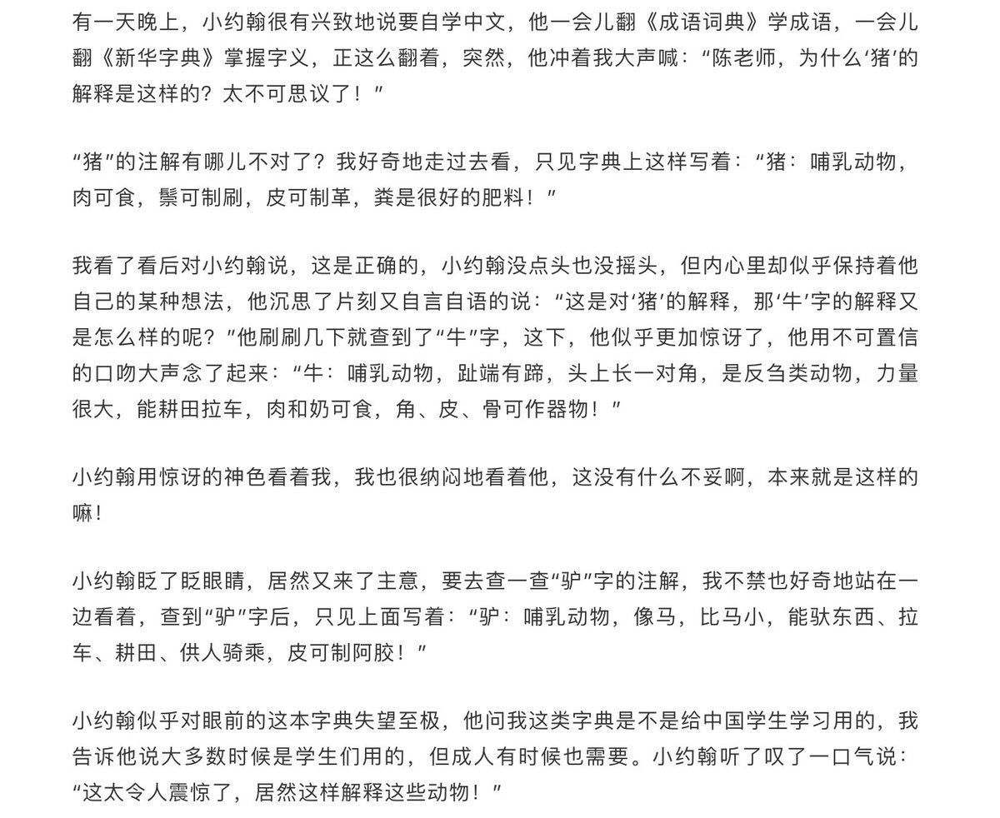
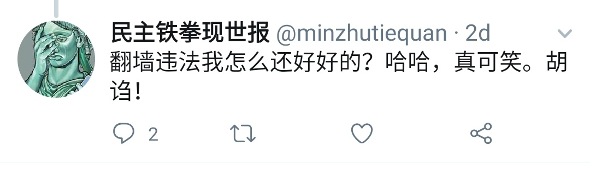

[01月07日 07:11]    新闻大吐槽   @TuCaoFakeNews    稍早，戒指哥的女儿对川普隔空喊话，非常硬气！

只是隔天就被查出，她竟然是美国籍！原来戒指哥也想学某强国，让家人打入美帝内部，自己悠哉悠哉当个裸官！可太迟了！

事到如今，戒指哥女儿应尽快放弃美国籍，否则对美国不忠，对其父不孝  :speech_balloon:评:0 :+1:赞:3 :globe_with_meridians:转:0  

[01月07日 07:09]    新闻大吐槽   @TuCaoFakeNews    哈哈！就好像那首歌：《小蘋果》那樣！一個搗蛋份子，就會造成世界大戰！ https://youtu.be/l6GdPJQafXA   :speech_balloon:评:0 :+1:赞:1 :globe_with_meridians:转:1  

[01月07日 07:00]    新闻大吐槽   @TuCaoFakeNews    中國時報已經不是當初那個中立的、熱血衝去採訪六四的報紙了，現在是名副其實的「中國」時報呢。  :speech_balloon:评:0 :+1:赞:1 :globe_with_meridians:转:1  

[01月07日 07:00]    新闻大吐槽   @TuCaoFakeNews    当初腊肉挂机，很多人都会哭，原因是不哭会受到迫害  :speech_balloon:评:0 :+1:赞:1 :globe_with_meridians:转:1  

[01月07日 07:00]    新闻大吐槽   @TuCaoFakeNews    Tiktok已沦为中共國的喉舌了。我用了兩天，一聽被中共插手了就立馬刪了。只要是中共搞的或插手了的就盡量不用。特別是可有可無的東西。  :speech_balloon:评:0 :+1:赞:1 :globe_with_meridians:转:1  

[01月07日 06:59]    新闻大吐槽   @TuCaoFakeNews    果然，两腿颤抖，且频率甚高，若不堪寒冬。
这厮当个村官都不够格。经几十年逆淘汰，中共也只有这类货上阵，丢眼现世哪。  :speech_balloon:评:0 :+1:赞:3 :globe_with_meridians:转:2  

[01月07日 06:54]    新闻大吐槽   @TuCaoFakeNews    專制國家都是相同的 https://twitter.com/tucaofakenews/status/1214288281434640384 …  :speech_balloon:评:0 :+1:赞:7 :globe_with_meridians:转:3  

[01月07日 06:42]    新闻大吐槽   @TuCaoFakeNews    幸虧得台灣太陽花學生奮戰，否則馬鷹犬的服貿協議一早把台灣賣了。  :speech_balloon:评:0 :+1:赞:2 :globe_with_meridians:转:1  

[01月07日 06:34]    新闻大吐槽   @TuCaoFakeNews    OMG https://twitter.com/TuCaoFakeNews/status/1214149905695985665 …  :speech_balloon:评:0 :+1:赞:1 :globe_with_meridians:转:1  

[01月07日 06:32]    新闻大吐槽   @TuCaoFakeNews    毛腊肉2.0 https://twitter.com/tucaofakenews/status/1214288281434640384 …  :speech_balloon:评:0 :+1:赞:2 :globe_with_meridians:转:1  

[01月07日 06:28]    新闻大吐槽   @TuCaoFakeNews    想当年读高中时上台发言还会腿发抖，为此责备自己多年，觉得自己太无能。今天见人家官至省书记了，同样也发抖，甚为安慰。  :speech_balloon:评:1 :+1:赞:4 :globe_with_meridians:转:1  

[01月07日 06:22]    新闻大吐槽   @TuCaoFakeNews    三胖传授监督集体哭 https://twitter.com/tucaofakenews/status/1214288281434640384 …  :speech_balloon:评:0 :+1:赞:1 :globe_with_meridians:转:2  

[01月07日 06:20]    新闻大吐槽   @TuCaoFakeNews    【香港デモ】第39章。着任挨拶

中国からの監督トップの挨拶。初回は、手のひら見せたが、五大訴求を表すと揶揄された

ここでは、握り拳。記者は、握られた拳を見て、常に震えている？ことを発見したと。いったん年末に65歳で引退し、顧問就任したところからの急遽登板に、健康案ずるつぶやきも https://twitter.com/tucaofakenews/status/1214278197816086528 …  :speech_balloon:评:0 :+1:赞:1 :globe_with_meridians:转:2  

[01月07日 06:17]    新闻大吐槽   @TuCaoFakeNews    陳毅是個好同志！
我黨的外交工作，也是我黨的宣傳工作，要不斷提醒六億五千萬人民 —— 
    如果美軍打進中國，人民公社天堂般的幸福生活就會毀於一旦，人民就會回到“耕者有其田”的悲慘世界，吃二遍苦、受二茬罪！ https://twitter.com/TuCaoFakeNews/status/1214149905695985665 …  :speech_balloon:评:0 :+1:赞:2 :globe_with_meridians:转:3  

[01月07日 05:30]    新闻大吐槽   @TuCaoFakeNews    中国本土的官员从有秘书开始，从来都是坐着，站着也只是念稿…这个骆惠宁已经是矮个子中的大将军了。  :speech_balloon:评:0 :+1:赞:1 :globe_with_meridians:转:1  

[01月07日 05:26]    新闻大吐槽   @TuCaoFakeNews    老毛死的时候同学老师都在哭，倒没有人检查谁没哭。我那时候就很佩服那些哭的很伤心的，因为我实在哭不出来，就使劲拿手揉眼睛  :speech_balloon:评:1 :+1:赞:3 :globe_with_meridians:转:1  

[01月07日 05:07]    新闻大吐槽   @TuCaoFakeNews    forcing people/kids to cry for the death of somebody powerful huh? north korea... https://twitter.com/TuCaoFakeNews/status/1214288281434640384 …  :speech_balloon:评:0 :+1:赞:1 :globe_with_meridians:转:1  

[01月07日 05:05]    新闻大吐槽   @TuCaoFakeNews    这种事情也曾经发生在中国人身上，中国人不要忘记啊！ https://twitter.com/TuCaoFakeNews/status/1214288281434640384 …  :speech_balloon:评:1 :+1:赞:5 :globe_with_meridians:转:3  

[01月07日 05:03]    老司机   @h5lpykl7tp6jjop    含泪转发：中国数学天才之死！
他解开了世界性数学难题，
但却留下了一道更难的现实问题给我们：
为什么会出现“寇克曼系列”的悲剧？
为什么会有英才早逝的遗憾？
为什么要以死亡的方式，
才让人们记住了他的名字？
这是一道在中国太难的题，  :speech_balloon:评:3 :+1:赞:35 :globe_with_meridians:转:22  

[01月07日 04:57]    新闻大吐槽   @TuCaoFakeNews    当年中共在学校“忆苦思甜”，揭露所谓地主的罪行的时候也是这样，一堆孩子脸上抹着口水在“哭”。  :speech_balloon:评:0 :+1:赞:6 :globe_with_meridians:转:1  

[01月07日 04:51]    新闻大吐槽   @TuCaoFakeNews    伊朗学校逼着孩子为戒指哥之死哭泣，而且有人在走动巡视，看谁没认真哭  :speech_balloon:评:16 :+1:赞:83 :globe_with_meridians:转:56  

[01月07日 00:59]    BBC News 中文   @bbcchinese    从你进入房间的第一刻开始，人们就已经对你的印象打分，要如何提升自己的魅力，建立更好的人际关系，让自己更受人欢迎？
 https://bbc.in/2FlnPgZ   :speech_balloon:评:3 :+1:赞:27 :globe_with_meridians:转:15  

[01月07日 00:30]    BBC News 中文   @bbcchinese    想当年，里根把美国称作“山巅城”：言为师行为范，举世景仰。看现在，谁还把特朗普的美国看作世界榜样？她怎么走到的这一步？
 https://bbc.in/2SWkBIE   :speech_balloon:评:52 :+1:赞:33 :globe_with_meridians:转:15  

[01月06日 23:59]    BBC News 中文   @bbcchinese    解密文件显示，美国在上世纪60年代支持印尼军方镇压和屠杀。印尼军方以毛泽东指使印尼共产党策划政变为由迫害华人。
 https://bbc.in/2QWdYUi   :speech_balloon:评:20 :+1:赞:65 :globe_with_meridians:转:39  

[01月06日 23:30]    BBC News 中文   @bbcchinese    伊朗宗教领袖霍梅尼1979年领导伊斯兰革命推翻巴列维王朝统治，伊朗女性的生活发生巨变。
 https://bbc.in/2Qt9Iww   :speech_balloon:评:15 :+1:赞:57 :globe_with_meridians:转:28  

[01月06日 23:23]    财经真相   @caijingxiang    1月6日，财政部公告称，放开外商独资、中外合资、外国银行分行加入地方政府债券承销团的资格限制。
截至目前，已有富邦华一银行（台资）加入宁波市、重庆市政府债券承销团，东亚银行（中国）（港资）加入天津市、广东省政府债券承销团，德意志银行（中国）（德资）加入青岛市政府债券承销团。  :speech_balloon:评:26 :+1:赞:144 :globe_with_meridians:转:38  

[01月06日 22:59]    BBC News 中文   @bbcchinese    他可能真是传说中的北欧侏儒：身材瘦小，一身黑衣。我向他打招呼，但他却跑掉了，似乎比我还害怕……
 https://bbc.in/2unEwpK   :speech_balloon:评:3 :+1:赞:20 :globe_with_meridians:转:3  

[01月06日 22:30]    BBC News 中文   @bbcchinese    那个久远的年代，那个强大中国影响西方的历史，精致地留在了这幅油画中，供后人抚今追昔、感慨万千......
 https://bbc.in/2MXgvwg   :speech_balloon:评:16 :+1:赞:61 :globe_with_meridians:转:29  

[01月06日 21:59]    BBC News 中文   @bbcchinese    习近平通篇强调“爱国主义”和“党的领导”，淡化五四运动倡导的对“民主和科学”的追求。有学者批评指出，这种讲法与五四精神背道而驰。 https://bbc.in/35uAE2U   :speech_balloon:评:74 :+1:赞:194 :globe_with_meridians:转:54  

[01月06日 21:30]    BBC News 中文   @bbcchinese    纳粹统治时期，黑白混血儿和黑人过着怎样的生活？被强迫绝育的他苦涩地解嘲，“也好，不想孩子受我那样的羞辱.....”
 https://bbc.in/2ZV2Lap   :speech_balloon:评:3 :+1:赞:16 :globe_with_meridians:转:7  

[01月06日 21:23]    墙国铁拳现世报😷   @Socialistfist    #社会主义铁拳  https://twitter.com/MingZe_suki/status/1213666088044490753 …  :speech_balloon:评:11 :+1:赞:157 :globe_with_meridians:转:35  

[01月06日 21:01]    BBC News 中文   @bbcchinese    一眼看全本届金球奖获奖名单。 https://bbc.in/36p4yXI   :speech_balloon:评:3 :+1:赞:16 :globe_with_meridians:转:7  

[01月06日 21:00]    财经真相   @caijingxiang    往年春节前一段时间客盘会有一波刚性的结汇需求，但从今年的情况看，结汇并不多，“现在有点担心市场整体的预期跟事实之间有预期差，以前预期人民币会小升，今年可能不升反贬。” 市场都不傻，尤其是中美这次协议！  :speech_balloon:评:4 :+1:赞:72 :globe_with_meridians:转:13  

[01月06日 20:59]    BBC News 中文   @bbcchinese    奥匈帝国的王储弗兰西斯·斐迪南大公及其妻子在波斯尼亚的萨拉热窝被塞尔维亚的民族主义者加夫里洛·普林齐普刺杀。这引发了6个星期后第一次大战的爆发。行刺事件后，奥匈帝国在德国的支持下向塞尔维亚发最后通牒，并不久随即宣战，导致长达4年、波及世界的一次大战。
 https://bbc.in/2sQs7dt   :speech_balloon:评:18 :+1:赞:28 :globe_with_meridians:转:14  

[01月06日 20:32]    BBC News 中文   @bbcchinese    中国上月月底爆发的“不明原因肺炎”目前已排除“非典型肺炎”，但病因和病源仍在调查中。香港“肺炎”担心卷土重来，港府提升应对级别为严重，每日更新病例情况；而中国武汉只隔离疑似病人，关闭涉事海鲜市场。是香港反应过度，还是中国应对措施做得不够？ https://bbc.in/2Fq7CHi   :speech_balloon:评:18 :+1:赞:75 :globe_with_meridians:转:35  

[01月06日 20:00]    BBC News 中文   @bbcchinese    你相信有外星人吗？理由是…… https://bbc.in/2ZTV1p0   :speech_balloon:评:19 :+1:赞:51 :globe_with_meridians:转:16  

[01月06日 19:09]    BBC News 中文   @bbcchinese    中美角力日益激化，引发两国即将“脱钩”的忧虑。最近中国电动车制造商比亚迪被卷入风波中。美国国会去年通过《国防授权法案》，并经总统签署生效。法案将禁止使用政府资金购买中国公司制造的火车、地铁、巴士等公共交通设施。 https://bbc.in/2QuX3cq   :speech_balloon:评:8 :+1:赞:29 :globe_with_meridians:转:10  

[01月06日 18:59]    BBC News 中文   @bbcchinese    伊凡娜既是翻译，又是学者和记者。这张照片摄于1968年，当时她只有19岁。那年，苏联军队的坦克开进了捷克斯洛伐克。
 https://bbc.in/2sHqqPF   :speech_balloon:评:4 :+1:赞:31 :globe_with_meridians:转:11  

[01月06日 18:00]    BBC News 中文   @bbcchinese    一些分析认为，受美国的压力，北京政府对香港无法强硬，但也有意见认为骆惠宁没有港澳工作经验，让他可以完全按北京的指示行事。 https://bbc.in/36ueaQT   :speech_balloon:评:32 :+1:赞:47 :globe_with_meridians:转:15  

[01月06日 18:00]    纽约时报中文网   @nytchinese    #观点 美国最好为与伊朗的战争做好准备。全面冲突未必会发生，但其可能性比几十年来任何时候都高。
尽管特朗普常公开表示想要避免与伊朗开战并退出中东军事纷争，但他下令击毙苏莱曼尼和伊朗支持的武装组织的伊拉克领导人，让两国锁定在危险升级的轨道上，或导致更广泛的战争。 http://nyti.ms/2Fp4IT8   :speech_balloon:评:44 :+1:赞:55 :globe_with_meridians:转:28  

[01月06日 17:30]    纽约时报中文网   @nytchinese    五角大楼称，“使用TikTok应用程序存在潜在风险”，并建议雇员采取几项预防措施来保护个人信息。国防部说，防止“不期行动者”获取个人信息的最简单方法是删除该应用。
“这样做不会阻止可能已经陷入危险的信息被传播，但可能会阻止更多的信息被收集，”五角大楼的信息说。 http://nyti.ms/2QMV5Da   :speech_balloon:评:8 :+1:赞:42 :globe_with_meridians:转:13  

[01月06日 17:00]    BBC News 中文   @bbcchinese    苏联摄影作品展展示了既是政治宣传，又是艺术试验的系列照片，凸显了苏联新闻图片和历史真像之间模糊不清的界限。 https://bbc.in/35qSOmb   :speech_balloon:评:2 :+1:赞:71 :globe_with_meridians:转:33  

[01月06日 17:00]    纽约时报中文网   @nytchinese    据美国国防部和政府官员称，12月28日，特朗普最初拒绝了杀死苏莱曼尼的方案，而是授权对伊朗支持的什叶派民兵组织发动空袭。
几天后，特朗普看到伊朗支持的袭击美国驻巴格达大使馆的画面后，感到非常愤怒。
周四晚些时候，总统转向了极端的选择。五角大楼高层对此大吃一惊。 http://nyti.ms/39CmccF   :speech_balloon:评:62 :+1:赞:227 :globe_with_meridians:转:95  

[01月06日 16:30]    纽约时报中文网   @nytchinese    #图集 【2019时报风尚之选】今天的美国是孤独的、不平等、令人担忧的。但我们的生活仍然在继续，我们关心工作、爱情生活、爱好和最爱的流媒体节目。
时报时尚版摄影师用镜头记录下了属于2019年的魔幻时刻、焦虑和转变。点击查看图集： http://nyti.ms/2Qp6cTA   :speech_balloon:评:5 :+1:赞:12 :globe_with_meridians:转:5  

[01月06日 16:01]    BBC News 中文   @bbcchinese    为何这些阿富汗少年要带枪上学?  :speech_balloon:评:65 :+1:赞:170 :globe_with_meridians:转:58  

[01月06日 16:00]    纽约时报中文网   @nytchinese    伊朗政府于周日表示，它将放弃“核协议的最终限制”，这项国际协议旨在阻止伊朗发展核武器。伊朗政府的声明说，伊朗的核项目将不再受该协议的任何限制，包括铀的浓缩、生产、研究和扩大。
但伊朗也称，若取消经济制裁并保证其利益，伊朗将继续与国际原子能机构合作并重返核协议。 http://nyti.ms/2sRglPV   :speech_balloon:评:13 :+1:赞:10 :globe_with_meridians:转:4  

[01月06日 15:01]    BBC News 中文   @bbcchinese    经历上个周末之后，美国与伊朗再次来到战争边缘。 https://bbc.in/2rTP7HY   :speech_balloon:评:18 :+1:赞:46 :globe_with_meridians:转:13  

[01月06日 15:00]    纽约时报中文网   @nytchinese    王志民职业生涯的大部分时间都与香港事务有关，与那里的商界和政界精英有着数十年的密切合作。
但他未能预料到去年春天修改《逃犯条例》的提案会引发广泛的、迅速高涨的敌意，让他在香港和北京招致广泛批评。 http://nyti.ms/37Bw4S0   :speech_balloon:评:72 :+1:赞:10 :globe_with_meridians:转:1  

[01月06日 14:30]    纽约时报中文网   @nytchinese    五角大楼警告：所有军人的智能手机都要删除TikTok。现在，美国几大军种正在听从国防部上月发布的建议，禁止在政府配发的智能手机上使用中国人拥有的这款广受欢迎的社交媒体应用。
有些人甚至强烈劝阻武装部队人员不要在他们的个人电子设备上安装TikTok。 http://nyti.ms/2QMV5Da   :speech_balloon:评:129 :+1:赞:522 :globe_with_meridians:转:168  

[01月06日 14:00]    纽约时报中文网   @nytchinese    2020年金球奖获奖名单出炉：华金·菲尼克斯凭借《小丑》获剧情片最佳男主角奖；奉俊昊的《寄生虫》当选最佳外语片。《继承之战》和《伦敦生活》分获剧情类和音乐/喜剧类最佳剧集奖……欢迎查看完整名单： http://nyti.ms/2SWLmws   :speech_balloon:评:3 :+1:赞:27 :globe_with_meridians:转:14  

[01月06日 13:36]    老司机   @h5lpykl7tp6jjop    说中国人聪明，偏偏不接受西方文明，死脑筋和西方国家从鸦片战爭一直对抗到今天还在贸易战上不死不休！

说日本人死脑筋，人家没有遭遇鸦片战爭，马上就明治维新，聪明的脱亚入欧，从此以后发达得不要不要的！

所以说中国人聪明从来没用对地方，总是那壶不开提那壶！  :speech_balloon:评:18 :+1:赞:248 :globe_with_meridians:转:46  

[01月06日 13:30]    纽约时报中文网   @nytchinese    #每日一词 Creative ambiguity，创造性模糊。对于北京的香港困境，时报专栏作者科恩认为，“一国两制”是只有在“创造性的含糊”中才起作用的方法。
Creative ambiguity一般用于政治语境，指那些具有想象空间的模糊名词，“九二共识”就被认为是其中一例。
更多简报内容： http://nyti.ms/39GXgAK   :speech_balloon:评:23 :+1:赞:8 :globe_with_meridians:转:2  

[01月06日 13:07]    老司机   @h5lpykl7tp6jjop    在国际上不承认文明有先进和落后之分，谈到国内马上就说把处在农奴制度的西藏人民解放了，问题是亚马逊热带雨林的土著人也好西藏人也好，别人自己过日子，没有去和文明发达国家去争老大，没有叫嚣大国崛起，没有怕落后就会挨打，你一个国内拼命维稳，还在扶贫的孬货，喊打美帝七十年了，头上长疱不消么  :speech_balloon:评:0 :+1:赞:40 :globe_with_meridians:转:11  

[01月06日 12:36]    纽约时报中文网   @nytchinese    奥卡菲娜获喜剧类电影最佳女主角奖；布拉德·皮特获电影类最佳男配角奖；奥利维娅·科尔曼获剧情类剧集最佳女主角奖；奉俊昊的《寄生虫》获最佳外语片奖；艾伦·德詹尼丝获卡罗尔·博内特电视类终身成就奖……
欢迎关注2020年金球奖颁奖礼现场： http://nyti.ms/2ZU1Dnr   :speech_balloon:评:1 :+1:赞:23 :globe_with_meridians:转:4  

[01月06日 12:30]    纽约时报中文网   @nytchinese    周日，美国暗杀伊朗高级将领苏莱曼尼的行为在中东以及其他地区引发了涟漪效应。
特朗普表示暗杀苏莱曼尼是为了防止战争。但到目前为止，它引发了一系列后果：伊朗政府表示将放弃“核协议的最终限制”；伊拉克议员投票决定要求美军结束在该国的驻扎。 http://nyti.ms/2sRglPV   :speech_balloon:评:50 :+1:赞:58 :globe_with_meridians:转:16  

[01月06日 12:15]    老司机   @h5lpykl7tp6jjop    对川普点杀联合国点名的恐怖分子头目行动是否正义质疑者，忘记了一个最基本的事实，就是恐怖分子从来没有遵守过国际准则，它们连不伤及无辜平民的最基本道义都不遵守，消灭恐怖分子的机会稍纵即逝，程序上美国总统有紧急状态下执行该项行动的权力，国会可以检查过程是否违法，没有可能失控的可能！  :speech_balloon:评:2 :+1:赞:84 :globe_with_meridians:转:14  

[01月06日 12:00]    纽约时报中文网   @nytchinese    卡洛斯·戈恩逃离后，日本司法体系引发全球关注。戈恩表示，自己并非逃避法律制裁，而是“逃脱了不公正和政治迫害”。
日本官员反驳称该国司法程序公平且公开，谴责戈恩弃保潜逃，表示将展开调查、加强对离境程序的监管。
更多简报内容： http://nyti.ms/39GXgAK   :speech_balloon:评:2 :+1:赞:7 :globe_with_meridians:转:1  

[01月06日 11:55]    财经真相   @caijingxiang    市场消息：美国众议院将对战争权力法决议进行投票，目的是限制美国总统特朗普在伊朗问题上的权力。PS：美国战争权力法规定美国总统在派出军队前的48小时内必须通知美国国会，未经过国会授权或者宣战的军事行动不得在当地停留超过60天，到期后于30天内撤离。  :speech_balloon:评:34 :+1:赞:297 :globe_with_meridians:转:73  

[01月06日 11:30]    纽约时报中文网   @nytchinese    在连月抗议和建制派选举失利后，周六晚，中国政府突然撤换了中央驻香港的最高代表王志民。
王志民的继任者骆惠宁曾担任过两个省的省委书记。习近平选择骆惠宁担任中央政府驻港代表，似乎看中的主要是他的政治忠诚，以及在棘手安全措施方面的经验，但他对香港几乎不了解。 http://nyti.ms/37Bw4S0   :speech_balloon:评:50 :+1:赞:66 :globe_with_meridians:转:18  

[01月06日 11:00]    BBC News 中文   @bbcchinese    中国电动车制造商比亚迪位于美国加州的工厂，成为了中美关系日趋紧张的晴雨表。 https://bbc.in/2QrV8W0   :speech_balloon:评:18 :+1:赞:44 :globe_with_meridians:转:9  

[01月06日 11:00]    纽约时报中文网   @nytchinese    “这不是丛林大火，这是原子弹”：澳大利亚大火继续肆虐，截至目前已有愈1200万英亩土地被烧毁。
由于严重干旱，预计火灾造成的破坏只会加剧。政府表示正大规模部署军队展开救援。
更多简报内容： http://nyti.ms/39GXgAK   :speech_balloon:评:10 :+1:赞:15 :globe_with_meridians:转:9  

[01月06日 10:30]    纽约时报中文网   @nytchinese    飞涨的房价、越来越少的就业机会和日益扩大的收入差距开始破坏这种形象。
香港大学教授及总监叶兆辉的研究显示，经济压力增加了人们的不快乐和抑郁情绪，但他说，现在很少有人把经济压力作为想要离开香港的主要原因。 http://nyti.ms/2sIsNl6   :speech_balloon:评:73 :+1:赞:35 :globe_with_meridians:转:14  

[01月06日 10:18]    GFHG SDKM   @zyx_yny    #HongKongPolice baton & pepper spray
5 Jan 2020
Footbridge near Sheung Shui Centre, #HongKongProtests 
Cr. USP United Social Press 社媒  https://www.facebook.com/UnitedSocialPress/videos/608855149868858 …  :speech_balloon:评:6 :+1:赞:91 :globe_with_meridians:转:104  

[01月06日 10:00]    BBC News 中文   @bbcchinese    从印度钦奈的清贫之家，到谷歌帝国掌门人的办公室，皮采47年的人生故事被称为“美国梦”的实例，也是印度在国际科技界的地位的明证。 https://bbc.in/35fz5pr   :speech_balloon:评:48 :+1:赞:239 :globe_with_meridians:转:76  

[01月06日 09:58]    纽约时报中文网   @nytchinese    早安！今日重点新闻包括：
伊朗宣布退出伊核协议；香港中联办换帅；五角大楼发出禁用TikTok警告；香港人的未来在哪里；韦恩斯坦案开庭；澳大利亚部署军队救火；波音爆新安全隐患；韦恩斯坦案开庭……NYT简报带你速览今日要闻。 http://nyti.ms/39GXgAK   :speech_balloon:评:29 :+1:赞:47 :globe_with_meridians:转:7  

[01月06日 09:29]    财经真相   @caijingxiang    周一亚洲盘现货黄金暴涨至1588美元，创下了2013.4月以来最高点，那一年黄金暴跌，引来了“中国大妈”疯狂抢购黄金热。随后被套了整整7年！  :speech_balloon:评:25 :+1:赞:162 :globe_with_meridians:转:30  

[01月06日 06:51]    新闻大吐槽   @TuCaoFakeNews    勇武派充满活力的热舞后，是一段以爆演女孩为主题的悲情的舞蹈。刚柔相济，感动人心！

原来，香港遗失已久的真正文艺范，散落在民间，潜藏在抗争者的血液里，，艺术之花一经自由之心的浇灌，就立刻盛开绽放！  :speech_balloon:评:75 :+1:赞:1583 :globe_with_meridians:转:758  

[01月06日 06:51]    GFHG SDKM   @zyx_yny    勇武派充满活力的热舞后，是一段以爆演女孩为主题的悲情的舞蹈。刚柔相济，感动人心！

原来，香港遗失已久的真正文艺范，散落在民间，潜藏在抗争者的血液里，，艺术之花一经自由之心的浇灌，就立刻盛开绽放！  :speech_balloon:评:75 :+1:赞:1583 :globe_with_meridians:转:758  

[01月06日 05:33]    老司机   @h5lpykl7tp6jjop    精准打击一下击溃了刚拜完把子三个难兄难弟，老大一声不吭，老二怯喏喏说不能用武力嘛，老三只好大叫：收了回扣的再不出声，要曝光了！  :speech_balloon:评:36 :+1:赞:394 :globe_with_meridians:转:147  

[01月06日 05:26]    老司机   @h5lpykl7tp6jjop    别忽悠了！你们还是研究一下必须力保哪十二个人吧！  :speech_balloon:评:6 :+1:赞:89 :globe_with_meridians:转:19  

[01月06日 05:01]    老司机   @h5lpykl7tp6jjop    胡编的评论说明了什么？三个刚拜把子的兄弟怂了！撤漂！
美伊如果全面开战，中国将再获20年发展机遇期？  :speech_balloon:评:2 :+1:赞:8 :globe_with_meridians:转:2  

[01月06日 04:45]    老司机   @h5lpykl7tp6jjop    杀了伊朗将军 整个世界都在颤抖！
各大报刊评论观点不一  :speech_balloon:评:0 :+1:赞:2 :globe_with_meridians:转:3  

[01月06日 04:36]    老司机   @h5lpykl7tp6jjop    谁说祸不单行福无双至？夫妇赢下200万镑巨奖 3天后 更大的奇迹发生了！  :speech_balloon:评:3 :+1:赞:43 :globe_with_meridians:转:8  

[01月06日 04:30]    老司机   @h5lpykl7tp6jjop    香港著名填词人林夕曾多次发声、甚至创作歌词表达支持“反修例”，疑因此遭到内地连环“封杀”，超过3000首由林夕填词的作品，稍早已在部分音乐网下架。上海东方卫视播放跨年节目《梦圆东方2020东方卫视跨年盛典》时，艺人王凯演唱由林夕填词的张国荣经典歌曲《我》，但歌曲资料中作词人一栏却写成“佚名”。  :speech_balloon:评:11 :+1:赞:126 :globe_with_meridians:转:39  

[01月06日 00:28]    财经真相   @caijingxiang    从6号开始到8号，河南、山东两地将经历今年以来最大范围的一场降雪，根据欧洲EC模式，这两地将出现及其罕见的积雪，部分地区将达到40-50厘米，寿光地区也将出现15厘米厚的积雪，这对当地蔬菜大棚构成严重威胁。不过美国GFS模式由于气温稍微较高，降雨概率大于降雪，积雪会较小，我们拭目以待吧！  :speech_balloon:评:8 :+1:赞:142 :globe_with_meridians:转:23  

[01月05日 21:05]    财经真相   @caijingxiang    据伊朗迈赫尔通讯社报道，当地时间1月5日，伊朗外交部发言人阿巴斯·穆萨维向外界表示，5日晚伊朗政府将举行一次重要会议，讨论并最终决定减少履行伊核协议第五阶段的具体措施。（央视新闻）  :speech_balloon:评:15 :+1:赞:102 :globe_with_meridians:转:28  

[01月05日 19:00]    纽约时报中文网   @nytchinese    #一周热门 新疆镇压行动中的维吾尔族儿童 http://nyti.ms/39oknA0   :speech_balloon:评:157 :+1:赞:86 :globe_with_meridians:转:37  

[01月05日 18:36]    老司机   @h5lpykl7tp6jjop    人与自然界的关系有关理论很多，至少都认识到不是主仆关系，但在素食主义和肉食主义之间还是存在很大空间，包括科学和文明。肉食主义不能宣扬血腥有理，素食主义不能说肉食有罪，文明就是远离野蛮的过程！西方人吃肉但是不准杀生，有专业从业人员，中国人从小习惯看见杀生，网上流传太多恐怖视频！罪过  :speech_balloon:评:2 :+1:赞:19 :globe_with_meridians:转:3  

[01月05日 17:49]    老司机   @h5lpykl7tp6jjop    面对一头猪，屠夫商人想到价值，厨子饕餮看到美味，文人看到愚蠢懒惰，洁癖看到肮脏，宠物癖看到可爱，动物学家看到的是品种，画家看到的是色彩……  :speech_balloon:评:3 :+1:赞:22 :globe_with_meridians:转:1  

[01月05日 17:19]    老司机   @h5lpykl7tp6jjop    我可以袭击任何平民，你们不能袭击我的将军！
我可以随时攻击你们，你们不能无预警打击我！
我们从来都是这样干，你们不是讲 程序公平吗？
杀你们是真主的旨意，你不去死又不信 那咋办？
你们说我是恐怖分子，你们不是一样恐怖手段 ？
在邪恶和善良决斗时，只有良知才是公平的裁判！
所以你有良知吗？  :speech_balloon:评:14 :+1:赞:511 :globe_with_meridians:转:148  

[01月05日 17:00]    纽约时报中文网   @nytchinese    #一周热门 八种方法，在2020年对自己更好一点 http://nyti.ms/35exksC   :speech_balloon:评:65 :+1:赞:39 :globe_with_meridians:转:16  

[01月05日 16:40]    GFHG SDKM   @zyx_yny    [1606 Sheung Shui] Friendly #HongKongPolice escorted alleged Chinese smugglers to leave the protest area.

Arrest? Batons blows to the head? Pepper spray? Tear gas?

None of the above.

To #HongKongPolice, #HongKong locals are just second-class citizens.

#HongKongProtests  https://twitter.com/Mugisalty/status/1213735706553540612 …  :speech_balloon:评:47 :+1:赞:735 :globe_with_meridians:转:898  

[01月05日 15:55]    GFHG SDKM   @zyx_yny    Someone says to #HKPolice this is a pedestrian walkway.  Check out his reply
#StandWithHongKong #HongKongProtests  :speech_balloon:评:147 :+1:赞:2001 :globe_with_meridians:转:2185  

[01月05日 15:00]    纽约时报中文网   @nytchinese    #一周热门 中国如何将新疆穆斯林少数民族改造为工人大军 http://nyti.ms/2QF7DfA   :speech_balloon:评:67 :+1:赞:71 :globe_with_meridians:转:41  

[01月05日 13:00]    纽约时报中文网   @nytchinese    #一周热门 中国科学家涉嫌窃取美医学实验室样品 http://nyti.ms/2QK9HmO   :speech_balloon:评:28 :+1:赞:56 :globe_with_meridians:转:25  

[01月05日 12:59]    老司机   @h5lpykl7tp6jjop    一个外国小孩眼中的《新华字典》， 引人深思

有一天晚上，小约翰很有兴致地说要自学中文，他一会儿翻《成语词典》学成语，一会儿翻《新华字典》掌握字义，正这么翻着，突然，他冲着我大声喊：“陈老师，为什么‘猪’的解释是这样的？太不可思议了！”  :speech_balloon:评:26 :+1:赞:206 :globe_with_meridians:转:104  

[01月05日 12:50]    老司机   @h5lpykl7tp6jjop    退休金涨5％，老王的包子却少了！  :speech_balloon:评:0 :+1:赞:33 :globe_with_meridians:转:13  

[01月05日 11:41]    财经真相   @caijingxiang    预测一下，上半年LPR利率会追随MLF降低几次，8月31日所谓协商日期一结束，LPR利率立刻停止下降，未来全面性通胀一上来，立刻定向加息（LPR），跟中共玩P民永远都是韭菜，墙内吹捧浮动利率时，你就该反着来准没错！ https://twitter.com/caijingxiang/status/1213664873395056642 …  :speech_balloon:评:12 :+1:赞:114 :globe_with_meridians:转:23  

[01月05日 11:33]    财经真相   @caijingxiang    所谓未来继续降息，甚至实行负利率，纯粹是胡扯！现在中国属于资本外逃国，必须要维持高利差才行，尤其是对美国基准利率，日本负利率，但是国际一旦风吹草动，日元就升值，瑞士负利率，全世界的贪官照样存瑞士银行，中国别说负利率就是低利率，老人就会排队挤兑银行！  :speech_balloon:评:22 :+1:赞:349 :globe_with_meridians:转:60  

[01月05日 11:11]    财经真相   @caijingxiang    这就注定了锚定MLF利率的LPR未来降息空间十分有限，个人猜测就3%是下限，超过这个值，央行要么下调基准存款利率，要么整个商行承担降息亏损；反之，中国未来发生通货膨胀的概率极大，尤其是汇率崩盘后带来的“通胀死亡螺旋”，逼迫新政府必须加息，采用浮动房贷利率，等于是把自己未来压倒赌桌上！  :speech_balloon:评:11 :+1:赞:83 :globe_with_meridians:转:22  

[01月05日 11:06]    财经真相   @caijingxiang    商行通过MLF从央行借贷资金3.69万亿，最高峰时也就5.38万亿，这部分资金是锚定MLF利率，MLF降息仅能够降低这部分资金成本；但是高达一百万亿的社会存款商行依旧按照基准存款利率支付利息，如果LPR利率追随MLF降息，但是基准存款利率不降，则整个商业银行全面亏损倒闭。 https://www.youtube.com/watch?v=UA4x0oxVBCE …  :speech_balloon:评:7 :+1:赞:130 :globe_with_meridians:转:51  

[01月05日 11:04]    老司机   @h5lpykl7tp6jjop    经过事后调查证实，确实是什叶派“人民动员力量”武装成员，最终导致6名身亡3名重伤，而这6名身亡当中有1名，是扎伊迪旅秘书长霍拉萨尼，其余则是身边亲信人物，很显然一下子再损失6名重要人物，让伊拉克什叶派“人民动员力量”元气大损，加上前几天损失两名指挥官，伊朗阵营如今士气非常低下。  :speech_balloon:评:0 :+1:赞:26 :globe_with_meridians:转:2  

[01月05日 09:56]    GFHG SDKM   @zyx_yny    我最期待的畫面出現了！
支爆冚家剷！ https://www.ntdtv.com/b5/2020/01/02/a102743724.html …  :speech_balloon:评:67 :+1:赞:1210 :globe_with_meridians:转:529  

[01月05日 09:53]    老司机   @h5lpykl7tp6jjop    全球新闻媒体都在报道美国这次袭击伊朗军头苏莱曼尼事件，这次高科技精准打击说明一个大问题，几千年以来独裁者利用人民当炮灰的无耻战法从此以后不灵了，忽悠洗脑也不灵了，什么红卫兵，小粉红，朝阳大妈喊破嗓子都没用！再多的托也拦不住空中闪电剁老千的手！先进要淘汰落后不以人的意志为转移！  :speech_balloon:评:4 :+1:赞:191 :globe_with_meridians:转:37  

[01月05日 09:09]    老司机   @h5lpykl7tp6jjop    切实可行的大项目！  :speech_balloon:评:0 :+1:赞:7 :globe_with_meridians:转:0  

[01月05日 08:13]    GFHG SDKM   @zyx_yny    一个澳洲记者结束在中国的工作，搬家回国，可她带不走儿子心爱的地球仪夜灯，因为搬家公司对地球仪进行了审查，搬家公司的主管说：台湾是中国的一部分，而你这个地球仪上，台北字体大小竟然和北京一样！

显然，两个首都是他不能接受的！

搬家公司都管的这么宽 https://www.smh.com.au/world/asia/the-long-arm-of-authoritarian-china-reached-into-my-seven-year-old-s-bedroom-20191228-p53nbz.html …  :speech_balloon:评:86 :+1:赞:1161 :globe_with_meridians:转:546  

[01月05日 03:33]    老司机   @h5lpykl7tp6jjop    中共解决中国中小银行和地方政府债务，能让他们运行下去的办法 ......  :speech_balloon:评:131 :+1:赞:2540 :globe_with_meridians:转:867  

[01月04日 15:33]    财经真相   @caijingxiang    新做的一期视频，详细讲解LPR利率前因后果，尤其是报价挂钩MLF操作的流程，世人只关心LPR对房贷影响，却忽略了MLF一年期利率报价的走势，MLF一年期利率从最初的3%，一直涨到3.3%，直到去年11月份挂钩LPR利率才降低5个基点，房贷选择浮动利率真的会比较优惠吗？  :speech_balloon:评:17 :+1:赞:172 :globe_with_meridians:转:54  

[01月04日 15:20]    凡賽堤/FORSETI   @FecharCCP    他們穿著人民生產的制服，叫著人民的名義，卻只殺害同胞和出賣國土的極權殺人組織！
2020！消滅極權！！！  :speech_balloon:评:2 :+1:赞:4 :globe_with_meridians:转:7  

[01月04日 15:16]    凡賽堤/FORSETI   @FecharCCP    他們穿著人民生產的制服，叫著人民的名義，卻只殺害同胞和出賣國土的極權殺人組織！
2020！消滅極權！！！  :speech_balloon:评:4 :+1:赞:277 :globe_with_meridians:转:183  

[01月04日 15:01]    凡賽堤/FORSETI   @FecharCCP    我們看到了真相，見證了CCP的假，醜，惡的納粹嘴臉！  :speech_balloon:评:0 :+1:赞:20 :globe_with_meridians:转:21  

[01月04日 14:57]    凡賽堤/FORSETI   @FecharCCP    2020！消滅殺人政權，為70年來以各種手段名義冤死的近億華人同胞昭雪！！！

2020！時代革命，光復華族，消滅極權，人人有責！！！  :speech_balloon:评:0 :+1:赞:15 :globe_with_meridians:转:5  

[01月04日 14:47]    凡賽堤/FORSETI   @FecharCCP    極權恐怖組織騙取70年政權，殺死千萬地主富豪，近億人同胞，他們公開殺人，防火，強姦，現在更是公開搶劫！

我們看到了真相，見證了CCP的假，醜，惡的納粹嘴臉！

2020！時代革命，光復華族，消滅極權，人人有責！！！  :speech_balloon:评:1 :+1:赞:66 :globe_with_meridians:转:39  

[01月04日 12:33]    财经真相   @caijingxiang    一个很有趣的问题，如果中国的央行成了被告，而且还输了官司，这对金融市场产生什么影响呢？一国央行输了官司这在人类历史上也算是前无古人了！  :speech_balloon:评:71 :+1:赞:760 :globe_with_meridians:转:161  

[01月04日 00:20]    财经真相   @caijingxiang    第三次世界大战，正在推特上酝酿！ https://twitter.com/zerohedge/status/1213131660448927744 …  :speech_balloon:评:14 :+1:赞:163 :globe_with_meridians:转:21  

[01月03日 23:56]    墙国铁拳现世报😷   @Socialistfist    特别感谢投稿和为小编解答粤语白话文词汇的香港推友！  :speech_balloon:评:0 :+1:赞:86 :globe_with_meridians:转:3  

[01月03日 23:54]    墙国铁拳现世报😷   @Socialistfist    元旦当天铜锣湾被捕的近300人中，包括了一位［深蓝丝，小粉红］的54岁的汽修店伙计，其老板从事发时的直播画面中看到其在一旁［吃花生］看戏时因未带身份证警察逮捕。
老板希望探监送药，称自己伙计身体不佳需要心脏，肝脏药物，但被拒绝。

#社会主义铁拳
#社会主义特别行政区铁拳  :speech_balloon:评:26 :+1:赞:440 :globe_with_meridians:转:123  

[01月03日 17:42]    财经真相   @caijingxiang    中东局势一下子火了，黄金一飞冲天，大有脱离地球引力的架势，以色列货币新谢克尔也开始跌跌不休，中东很热闹！  :speech_balloon:评:17 :+1:赞:379 :globe_with_meridians:转:59  

[01月03日 15:17]    财经真相   @caijingxiang    外交部：中方一贯反对在国际关系中使用武力。我们敦促有关各方，特别是美方要保持冷静克制，避免紧张局势进一步升级。（人民日报） 吓坏了！  :speech_balloon:评:152 :+1:赞:1104 :globe_with_meridians:转:173  

[01月03日 11:04]    财经真相   @caijingxiang    这是一个很有趣的事，伊朗拿着中共的美元，去跟美军开干，而华尔街用美军养老金给购买中共主权债，以此来给中共输血！游戏规则就是这么简单，美军用自己的养老金，杀自己！  :speech_balloon:评:29 :+1:赞:431 :globe_with_meridians:转:121  

[01月03日 10:48]    财经真相   @caijingxiang    缺的美元，都用在了邪恶轴心国上了!美国完全可以把伊朗变成中国的出血口，直到像苏联在阿富汗那样，流尽最后一点血！ https://twitter.com/LandofYelang/status/1212928069322674178 …  :speech_balloon:评:9 :+1:赞:442 :globe_with_meridians:转:121  

[01月02日 23:06]    墙国铁拳现世报😷   @Socialistfist    最新更新  :speech_balloon:评:33 :+1:赞:329 :globe_with_meridians:转:92  

[01月02日 22:18]    GFHG SDKM   @zyx_yny    求下大家帶口罩  :speech_balloon:评:1 :+1:赞:92 :globe_with_meridians:转:13  

[01月02日 22:01]    GFHG SDKM   @zyx_yny    昨日言い忘れましたが、あけましておめでとうございます

2020年は、目標や夢がたくさん叶う年になりますように。

この数年間で日本のファッションやコスメが大好きになりました。憧れの日本のファッション誌の取材を受けたい！という夢も、いつか叶うといいな。

2020年もよろしくお願いします。  :speech_balloon:评:658 :+1:赞:26286 :globe_with_meridians:转:4250  

[01月02日 21:04]    GFHG SDKM   @zyx_yny    "Hong Kong is a great world city, a major international financial and trading centre, and an important gateway to China and the rest of Asia. It would be a tragedy if it loses this role and gains a reputation for repression." https://www.christiantoday.com/article/religious-leaders-dignitaries-call-on-hong-kong-chief-executive-carrie-lam-to-stop-police-brutality/133948.htm …  :speech_balloon:评:118 :+1:赞:2007 :globe_with_meridians:转:1856  

[01月02日 19:53]    GFHG SDKM   @zyx_yny    您国！抱拳了！  :speech_balloon:评:28 :+1:赞:368 :globe_with_meridians:转:86  

[01月02日 17:13]    财经真相   @caijingxiang    欧元权重上升，美元权重下降，另外由于CFETS人民币汇率指数是由贸易加权编制，本质是代表与中国贸易进出口变化，下调美元权重，代表了中美贸易在下滑，欧盟与中国贸易权重上升！  :speech_balloon:评:4 :+1:赞:90 :globe_with_meridians:转:15  

[01月02日 17:07]    财经真相   @caijingxiang    中汇交公告：为进一步增强CFETS人民币汇率指数货币篮子代表性，中国外汇交易中心计划根据《CFETS人民币汇率指数货币篮子调整规则》（中汇交公告〔2016〕81号），调整CFETS人民币汇率指数货币篮子的权重以及BIS货币篮子人民币汇率指数的货币篮子和权重。新版指数自2020年1月1日起生效。  :speech_balloon:评:7 :+1:赞:72 :globe_with_meridians:转:22  

[01月02日 12:30]    GFHG SDKM   @zyx_yny    WATCH: Police in Hong Kong rip the goggles off of lawmaker Ted Hui Chi-fung in an attempt to pepper spray him during a #NewYear's Day rally #HongKongProtests #香港  :speech_balloon:评:201 :+1:赞:2454 :globe_with_meridians:转:2326  

[01月02日 11:04]    财经真相   @caijingxiang    2019年深圳辖区一般公共预算收入达9424.2亿元，增长3.5%。其中，中央级收入5651亿元，增长1.6%；地方级收入3773.2亿元，增长6.5%；中央与地方收入结构为60∶40。地方级收入中，税收收入3067.7亿元，增长5.7%；非税收入705.5亿元，增长10.4%。2019年深圳市一般公共预算支出4551亿元，增长6.2%。  :speech_balloon:评:8 :+1:赞:112 :globe_with_meridians:转:30  

[01月02日 09:57]    GFHG SDKM   @zyx_yny    洗腦的人没有興趣看完video，不要用太長的片，有些照片震撼力也很強  :speech_balloon:评:1 :+1:赞:16 :globe_with_meridians:转:6  

[01月02日 03:19]    GFHG SDKM   @zyx_yny    Honoured to be among 40 signatories of this important and timely Open Letter to Carrie Lam: end police brutality against peaceful Hongkongers NOW!
#StandWithHongKong https://twitter.com/hk_watch/status/1212040663757443073 …  :speech_balloon:评:373 :+1:赞:2548 :globe_with_meridians:转:2166  

[01月01日 21:22]    GFHG SDKM   @zyx_yny    #HongKongPolice #PepperSpray 
1 Jan 2020
Near Sogo, Causeway Bay, #HongKongProtesters 
Source: ynhk  :speech_balloon:评:96 :+1:赞:1030 :globe_with_meridians:转:1181  

[01月01日 18:23]    GFHG SDKM   @zyx_yny    #HKPoliceTerrorists in action again. Nowadays with a mask and weapon you can play both terrorists and #HKPolice , in fact there is no boundary already.  :speech_balloon:评:173 :+1:赞:2142 :globe_with_meridians:转:2412  

[01月01日 09:54]    老司机   @h5lpykl7tp6jjop    2012年班加西美国大使的尸体被拖来拖去的画面传遍全世界，这是民主党造就的美国的耻辱  :speech_balloon:评:25 :+1:赞:312 :globe_with_meridians:转:193  

[01月01日 03:27]    墙国铁拳现世报😷   @Socialistfist    对这一届推友，小编是很满意的
再次感谢2019年大力支持和帮助的推友们  :speech_balloon:评:6 :+1:赞:251 :globe_with_meridians:转:33  

[12月31日 22:58]    墙国铁拳现世报😷   @Socialistfist    墙国铁拳现世报 恭祝各位推友
新年平安喜乐，铁拳不锤！  :speech_balloon:评:27 :+1:赞:771 :globe_with_meridians:转:121  

[12月31日 10:53]    GFHG SDKM   @zyx_yny    藍店認證: 葵涌工業街2-8號力豐工業大廈 Rhe Kitchen 

要容納咁多人仲要得2間餐廳(網民報料)，唯一選擇得呢間私房菜，同樣有大圓枱，同樣有第三張既屏風

仲捉你唔到2020年睇你捱到幾耐
歡迎轉發 #藍店  :speech_balloon:评:20 :+1:赞:205 :globe_with_meridians:转:202  

[12月31日 10:34]    凡賽堤/FORSETI   @FecharCCP    细思极恐的面具之后1：
细思真名(中国护照名字)叫做 LinZheng Pan, 应该是中文同音的拼音，比如：潘林正，潘临郑。
潘林正，有两个孩子。
潘林正，前天的所谓直播，完全就是砸郭热线。  :speech_balloon:评:147 :+1:赞:909 :globe_with_meridians:转:414  

[12月31日 08:41]    GFHG SDKM   @zyx_yny    This was how Joycelyn Chau, an unarmed young woman, was brutally arrested by a gang of riot police this summer. She'd gone on to win a District Council seat & is due to formally commence duty on 1Jan

She's just been told she is to be charged with assaulting these police officers https://twitter.com/UncleRay_NDJ/status/1211621739978866689 …  :speech_balloon:评:91 :+1:赞:1012 :globe_with_meridians:转:1294  

[12月31日 01:06]    GFHG SDKM   @zyx_yny    猶豫要不要加上這兩個 hashtags: #老竇教仔 #老母教仔

好吧，就當我沒寫哦。別駡

那個，courtesy matters. 跟外國政要致謝，盡量不要用thanks 或 thxx. 這也不算 rude，但過度 casual，少了一份誠意，甚至給人一種 over familiar 的感覺。好似你與對方多年深交，一起泡吧，一起泡妞，一起泡澡的那種  :speech_balloon:评:5 :+1:赞:103 :globe_with_meridians:转:48  

[12月31日 00:28]    GFHG SDKM   @zyx_yny    Just one day or two before the new year, #PoliceBrutality never stops. A pregnant lady was badly treated by #hkpolice in Tin Shui Wai and forced to kneel on the ground. She terribly threw up, but #police kept scolding at her. #policestatehk  :speech_balloon:评:1008 :+1:赞:9362 :globe_with_meridians:转:11640  

[12月29日 01:29]    凡賽堤/FORSETI   @FecharCCP    ----你見過幾十個穿制服的圍毆性侵一個小女生嗎？------

極權恐怖組織的殺人犯警2019年12月份的納粹暴行（19）

我們都是歷史的見證者！

時代革命，消滅極權，CCP 不能代表中國，CCP 不能代表中國人！

----感謝此視頻的原創作者！  :speech_balloon:评:2 :+1:赞:70 :globe_with_meridians:转:66  

[12月29日 01:09]    凡賽堤/FORSETI   @FecharCCP    極權恐怖組織的殺人犯警的納粹暴行（圖1）

---黑警犯警強姦警暴警殺人警非法執法濫捕香港小青年，學生，兒童！

我們都是歷史的見證者！

時代革命，消滅極權，CCP 不能代表中國，CCP 不能代表中國人！

----感謝此視頻的原創作者！  :speech_balloon:评:0 :+1:赞:16 :globe_with_meridians:转:17  

[12月29日 00:48]    凡賽堤/FORSETI   @FecharCCP    你認同一個政府稱呼人類為蟑螂？
你認同一個政府稱呼手無寸鐵的在校學生為暴徒？
你認同一個政府僱傭黑社會團伙肆意毆打市民？
你認同一個政府動用部隊武警毆打，殘殺市民？
你認同警察部隊武警殺人後高樓拋屍？
你認同警察部隊武警輪姦少女後殺人大海拋屍？
你認同....幾個月就陸續殺死近萬名學生？  :speech_balloon:评:23 :+1:赞:365 :globe_with_meridians:转:276  

[12月29日 00:25]    凡賽堤/FORSETI   @FecharCCP    ----你見過幾十個穿制服的圍毆暴打一個正常市民嗎？------

極權恐怖組織的殺人犯警2019年12月份的納粹暴行（17）-

我們都是歷史的見證者！

時代革命，消滅極權，CCP 不能代表中國，CCP 不能代表中國人！

----感謝此視頻的原創作者！  :speech_balloon:评:1 :+1:赞:58 :globe_with_meridians:转:48  

[12月29日 00:20]    凡賽堤/FORSETI   @FecharCCP    ----你見過穿制服的這種殘暴手段？------

極權恐怖組織的殺人犯警2019年12月份的納粹暴行（18）-

我們都是歷史的見證者！

時代革命，消滅極權，CCP 不能代表中國，CCP 不能代表中國人！

----感謝此視頻的原創作者！  :speech_balloon:评:1 :+1:赞:80 :globe_with_meridians:转:90  

[12月28日 23:56]    凡賽堤/FORSETI   @FecharCCP    極權恐怖組織的殺人犯警2019年12月份的納粹暴行（17）-

----殘暴打頭------

我們都是歷史的見證者！

時代革命，消滅極權，CCP 不能代表中國，CCP 不能代表中國人！

----感謝此視頻的原創作者！  :speech_balloon:评:14 :+1:赞:171 :globe_with_meridians:转:165  

[12月28日 07:54]    凡賽堤/FORSETI   @FecharCCP    我們不可停止，我們將無限循環傳播香港的全方位被CCP極權組織殘暴殺害的種種真相視頻和畫面，永不停止！！！！！！！！！！！！！！！！！！！！！！！！！！！！！！！！！！！！！！！！！！！！！！！！！！！！！！！！！！！！！！！！！！！！！！！！！！！！！！！！！！！ https://twitter.com/FecharCCP/status/1207809972341559296 …  :speech_balloon:评:1 :+1:赞:40 :globe_with_meridians:转:29  

[12月28日 07:52]    凡賽堤/FORSETI   @FecharCCP    極權恐怖組織的殺人犯警2019年12月份的納粹暴行（16）

我們都是歷史的見證者！

時代革命，消滅極權，CCP 不能代表中國，CCP 不能代表中國人！

----感謝此視頻的原創作者！  :speech_balloon:评:1 :+1:赞:89 :globe_with_meridians:转:97  

[12月28日 07:44]    凡賽堤/FORSETI   @FecharCCP    極權恐怖組織的殺人犯警2019年12月份的納粹暴行（15）

---黑警犯警強姦警暴警殺人警非法執法濫捕香港小青年，學生，兒童！

我們都是歷史的見證者！

時代革命，消滅極權，CCP 不能代表中國，CCP 不能代表中國人！

----感謝此視頻的原創作者！  :speech_balloon:评:2 :+1:赞:31 :globe_with_meridians:转:42  

[12月28日 07:37]    凡賽堤/FORSETI   @FecharCCP    極權恐怖組織的殺人犯警2019年12月份的納粹暴行（14）

---黑警犯警強姦警暴警殺人警非法執法濫捕香港小青年，學生，兒童！

我們都是歷史的見證者！

時代革命，消滅極權，CCP 不能代表中國，CCP 不能代表中國人！

----感謝此視頻的原創作者！  :speech_balloon:评:8 :+1:赞:134 :globe_with_meridians:转:165  

[12月28日 07:09]    墙国铁拳现世报😷   @Socialistfist    最新人造铁拳
未知原因，微博用户“青游记” 已经在此类P图内“被代言” 了好几回了，小编在这里表示慰问。  :speech_balloon:评:9 :+1:赞:47 :globe_with_meridians:转:4  

[12月28日 07:08]    凡賽堤/FORSETI   @FecharCCP    極權恐怖組織的殺人犯警2019年12月份的納粹暴行（13）

---黑警犯警強姦警暴警殺人警非法執法濫捕香港小青年，學生，兒童！

我們都是歷史的見證者！

時代革命，消滅極權，光復華族，人人有責！

----感謝此視頻的原創作者！  :speech_balloon:评:0 :+1:赞:9 :globe_with_meridians:转:14  

[12月28日 06:55]    凡賽堤/FORSETI   @FecharCCP    極權恐怖組織的殺人犯警2019年12月份的納粹暴行（12）

---黑警犯警強姦警暴警殺人警非法執法濫捕香港小青年，學生，兒童！

我們都是歷史的見證者！

時代革命，消滅極權，光復華族，人人有責！

----感謝此視頻的原創作者！  :speech_balloon:评:2 :+1:赞:48 :globe_with_meridians:转:44  

[12月28日 06:50]    凡賽堤/FORSETI   @FecharCCP    極權恐怖組織的殺人犯警2019年12月份的納粹暴行（11）
---她們都是正常走在街上的學生而已！

我們都是歷史的見證者！

時代革命，消滅極權，光復華族，人人有責！

----感謝此視頻的正義原創作者！  :speech_balloon:评:3 :+1:赞:80 :globe_with_meridians:转:60  

[12月27日 17:52]    墙国铁拳现世报😷   @Socialistfist    据推友提供的截图显示，@minzhutiequan 不幸被举报生效推特铁拳，虽然小编一直没有觉得此人在推上言行违反过相关条例。  :speech_balloon:评:29 :+1:赞:219 :globe_with_meridians:转:19  

[12月27日 02:04]    墙国铁拳现世报😷   @Socialistfist    高光时刻  :speech_balloon:评:22 :+1:赞:162 :globe_with_meridians:转:17  

[12月26日 23:22]    墙国铁拳现世报😷   @Socialistfist    @minzhutiequan  :speech_balloon:评:9 :+1:赞:69 :globe_with_meridians:转:2  

[12月26日 23:18]    墙国铁拳现世报😷   @Socialistfist    寻人启事  :speech_balloon:评:87 :+1:赞:470 :globe_with_meridians:转:82  

[12月25日 19:01]    墙国铁拳现世报😷   @Socialistfist    今天是12月25日，墙国铁拳现世报编辑部全体祝各位推友圣诞快乐，心想事成，也要祝各位粉蚷战螂剩蛋快乐！  :speech_balloon:评:13 :+1:赞:265 :globe_with_meridians:转:11  

[12月25日 02:17]    GFHG SDKM   @zyx_yny    Corrupt regime ..Hong Kong is dying Hong Kong people will not forget these hatreds.  :speech_balloon:评:6 :+1:赞:91 :globe_with_meridians:转:118  

[12月24日 20:01]    墙国铁拳现世报😷   @Socialistfist    感谢广大推友的对上一推的热烈反响和支持。
收到疑似有推友上微博围观评论而遭到喝茶的报告
小编请大家注意网络键政的安全，也不鼓励大家反串留言。  :speech_balloon:评:14 :+1:赞:168 :globe_with_meridians:转:18  

[12月24日 10:23]    墙国铁拳现世报😷   @Socialistfist    附行政复议书  :speech_balloon:评:2 :+1:赞:82 :globe_with_meridians:转:9  

[12月24日 10:18]    墙国铁拳现世报😷   @Socialistfist    ”海口市琼山区龙塘政府自2019年2月开始在没有任何法定证据的前提下，连续三次对香世界庄园下达强制拆除和限期拆除，其中行政复议三次，两次被法院撤销拆除令，第三次复议还在等待结果期间直接无批文强拆……要知道，没有法院批准的拆除令的强拆属于严重违法行为！”

摘自：  http://blog.sina.cn/dpool/blog/s/blog_725524e60102zq6u.html?ref=weibocard&from=109C195010&wm=9847_0002&weiboauthoruid=1918182630 … https://twitter.com/minzhutiequan/status/1209266528006234113 …  :speech_balloon:评:28 :+1:赞:183 :globe_with_meridians:转:29  

[12月23日 18:08]    墙国铁拳现世报😷   @Socialistfist    补充香世界庄园负责人朋友圈  :speech_balloon:评:14 :+1:赞:321 :globe_with_meridians:转:89  

[12月23日 18:05]    墙国铁拳现世报😷   @Socialistfist    媒体报道  :speech_balloon:评:10 :+1:赞:159 :globe_with_meridians:转:27  

[12月23日 18:04]    墙国铁拳现世报😷   @Socialistfist    补充强拆视频  :speech_balloon:评:12 :+1:赞:224 :globe_with_meridians:转:47  

[12月23日 18:03]    墙国铁拳现世报😷   @Socialistfist    美国驻广州总领事说：香世界庄园是一个很酷的地方！
海口政府官员说：并没有。

海口市十多年企业，百号员工，一天化为乌有
#社会主义铁拳  :speech_balloon:评:159 :+1:赞:1403 :globe_with_meridians:转:595  

[12月21日 20:36]    墙国铁拳现世报😷   @Socialistfist    爱党鄙视链

#战螂在推特  :speech_balloon:评:46 :+1:赞:479 :globe_with_meridians:转:94  

[12月20日 07:25]    凡賽堤/FORSETI   @FecharCCP    我們不可停止，我們將無限循環傳播香港的全方位被CCP極權組織殘暴殺害的種種真相視頻和畫面，永不停止！！！！！！！！！！！！！！！！！！！！！！！！！！！！！！！！！！！！！！！！！！！！！！！！！！！！！！！！！！！！！！！！！！！！！！！！！！！！！！！！！！！  :speech_balloon:评:33 :+1:赞:623 :globe_with_meridians:转:676  

[11月24日 08:10]    凡賽堤/FORSETI   @FecharCCP    呼籲請求共同挖掘所有有關香港發生的事，越全面越好，不同角度，越多越好，包括被暗地抓捕的人員，特別是CCP 派出的各種偽裝身份，包括變身變裝行兇的一點一滴都要挖掘出來，把CCP 的邪惡下三濫手段的真相毫無保留的曝光在全世界面前！世界公知公義才能真正挽救和保護香港人！希望懂視頻編輯配上中英文  :speech_balloon:评:6 :+1:赞:30 :globe_with_meridians:转:23  

[10月09日 00:47]    GFHG SDKM   @zyx_yny    "Son, when you grow up
You will be the savior of the broken
The beaten, and the damned?"
Please watch this powerful mv #HongKongProtester #hkprotests 
香港反送中護法戰爭(Hong Kong Defensive War 2019)：Welcome To The Black Parade  https://youtu.be/0yXTHODE24Q  via @YouTube  :speech_balloon:评:4 :+1:赞:20 :globe_with_meridians:转:8  

[03月13日 08:10]    老司机   @h5lpykl7tp6jjop    批评是批评家天生的使命！他们只感知对错，信奉真理，指出真相不吐不快，不在意权势和群众的喜好，从批评里不可能获得任何好处，但批评家愚直不改。在中国几乎所有人都讨厌批评家，喜欢阴谋家，因为他们只说好听的！可是就因为中国的批评家太少，中国几乎看不到未来和希望！  :speech_balloon:评:115 :+1:赞:286 :globe_with_meridians:转:59  

