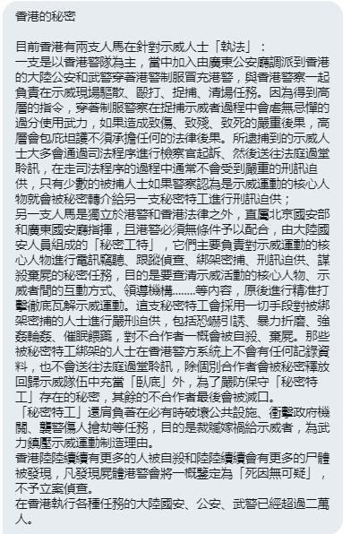

[10月21日 05:29]    新闻大吐槽   @TuCaoFakeNews     https://twitter.com/i/status/1186031609515896834 …  :speech_balloon:评:0 :+1:赞:1 :globe_with_meridians:转:1  

[10月21日 05:29]    新闻大吐槽   @TuCaoFakeNews    岑子杰被雇凶打伤，不能参加活动，可他的侯补有一大堆！看看这位青年才俊的口才和临场，一点也不逊色！香港优秀的年轻人多了去了！如需要，人人都是大台！这比没有大台更让共党恐惧吧！  :speech_balloon:评:0 :+1:赞:5 :globe_with_meridians:转:2  

[10月21日 05:22]    新闻大吐槽   @TuCaoFakeNews    这个不行  浓度还不如北京平时的雾霾  如果在北京使用  反而起到空气净化的作用  :speech_balloon:评:2 :+1:赞:2 :globe_with_meridians:转:1  

[10月21日 05:21]    新闻大吐槽   @TuCaoFakeNews    黑警：我是FBI，美国可以制裁我了
  :speech_balloon:评:2 :+1:赞:3 :globe_with_meridians:转:0  

[10月21日 05:14]    新闻大吐槽   @TuCaoFakeNews    惊险一幕！黑警把震爆弹直接丢到女记者头上爆炸！多亏带了头盔，不然后果不堪设想！

黑警太下流了  :speech_balloon:评:0 :+1:赞:16 :globe_with_meridians:转:9  

[10月21日 05:10]    新闻大吐槽   @TuCaoFakeNews    疯狂的小鸟，你要注意了，下次不要飞入暴警的催泪弹射程  :speech_balloon:评:0 :+1:赞:10 :globe_with_meridians:转:5  

[10月21日 05:03]    老司机   @h5lpykl7tp6jjop    马克思愚蠢之处就在于认为资本为了更多的利润，只有加大对工人的剥削，于是工人终于会革命，中共也继承了这种一根筋思维，认为帝国主义亡我之心不死，不是东风压了西风 就是西风压了东风，除了阴谋诡计它们不会让步，民主政治就是妥协的制度，这是他们不断发展壮大的原因，而强硬的中共必然亡于强硬！  :speech_balloon:评:3 :+1:赞:1 :globe_with_meridians:转:0  

[10月21日 04:56]    新闻大吐槽   @TuCaoFakeNews    智利也发起了示威，警车竟然可以喷毒烟，不知道是不是中共输出的？  :speech_balloon:评:1 :+1:赞:3 :globe_with_meridians:转:3  

[10月21日 04:54]    新闻大吐槽   @TuCaoFakeNews    富人怒了！他认为发生的这一切都是「官逼民反」！

看来中共再继续胡作非为下去，富翁们将纷纷化身柴进！  :speech_balloon:评:0 :+1:赞:22 :globe_with_meridians:转:7  

[10月21日 04:34]    新闻大吐槽   @TuCaoFakeNews    支持香港抗争的南亚裔香港人，据说是位喜剧演员！在香港土生土长！虽没上街，但在用自己的方式力挺抗争。
听他说流利的粤语，感觉很恍惚！
香港真是一个包容的国际城市，上个世纪，南亚裔除了去美国，香港是他们最好的选择了吧？  :speech_balloon:评:2 :+1:赞:40 :globe_with_meridians:转:16  

[10月21日 04:25]    老司机   @h5lpykl7tp6jjop    中共当局在镇压香港人上是否意识到一个难题，即暴力大肆抓捕勇武派并不能让和理非的人们停止上街示威游行！而适得其反的是参加游行示威的人越来越多！那么除了让人们更加愤怒以外，能达到什么目的？除了证明自己无能为力什么也不能证明！这就是中共末期暴力愚蠢的结果，让人们知道除了推翻它们没有别的  :speech_balloon:评:0 :+1:赞:8 :globe_with_meridians:转:0  

[10月21日 04:24]    新闻大吐槽   @TuCaoFakeNews    或許Pewds的力量不值得中共在意,但是中共忽略了Pewds背後相互連接的世界級網絡... https://twitter.com/TuCaoFakeNews/status/1185707181942771712 …  :speech_balloon:评:1 :+1:赞:11 :globe_with_meridians:转:2  

[10月21日 04:16]    新闻大吐槽   @TuCaoFakeNews    Everyone is giving their contribution. Not one less. Thank you this gentleman joining today protest.
#StandWithHongKong
#FreeHongKong
@SolomonYue
@tariqahmadbt https://twitter.com/TuCaoFakeNews/status/1185906731722788864 …  :speech_balloon:评:0 :+1:赞:4 :globe_with_meridians:转:1  

[10月21日 04:12]    新闻大吐槽   @TuCaoFakeNews    “等等我，我还没上车！”
黑警落单，跑步追车，
貌似不是第一次了  :speech_balloon:评:4 :+1:赞:16 :globe_with_meridians:转:6  

[10月21日 02:29]    新闻大吐槽   @TuCaoFakeNews    茅坑裡面欺騙自己人就算了，還跑到牆外去拉屎，只準有共產主義信仰的茅坑真不知道屎是臭的？ https://www.secretchina.com/news/b5/2018/11/19/876866.html …  :speech_balloon:评:1 :+1:赞:10 :globe_with_meridians:转:5  

[10月21日 01:58]    老司机   @h5lpykl7tp6jjop    众志成城！ https://twitter.com/tucaofakenews/status/1185841289251569666 …  :speech_balloon:评:0 :+1:赞:7 :globe_with_meridians:转:4  

[10月21日 01:33]    新闻大吐槽   @TuCaoFakeNews    哪里有这么文明的“暴徒”？ https://twitter.com/tucaofakenews/status/1185906012613558272 …  :speech_balloon:评:0 :+1:赞:6 :globe_with_meridians:转:3  

[10月21日 01:01]    新闻大吐槽   @TuCaoFakeNews    10.20九龍大遊行流水式遊行人潮

《願榮光歸香港》
捍自由 來齊集這裏 來全力抗對
勇氣 智慧 也 永不滅

祈求 民主 與自由 萬世都 不朽
我願 榮光 歸香港  :speech_balloon:评:2 :+1:赞:50 :globe_with_meridians:转:33  

[10月21日 00:54]    新闻大吐槽   @TuCaoFakeNews    赖清德访华府造势 美议员：中共怕民主

距离2020总统大选不到三个月﹐前行政院长赖清德﹐周六中午﹐在美国华府出席了“蔡英文总统连任华府后援会”举办的造势活动﹐为蔡英文辅选。  :speech_balloon:评:2 :+1:赞:27 :globe_with_meridians:转:16  

[10月21日 00:19]    新闻大吐槽   @TuCaoFakeNews    【勇武港女】10月20日晚7點左右，在防暴警察與民眾對峙的彌敦道油麻地地段，一名矮小的紅衣年輕女子，

她一手拖鐵柱一手持鮮花，站在警方防線前，無懼向她發放的數枚催淚彈，呼籲警方不要再衝擊香港市民。  :speech_balloon:评:3 :+1:赞:81 :globe_with_meridians:转:44  

[10月21日 00:11]    新闻大吐槽   @TuCaoFakeNews    【10.20九龍大遊行】 人龍物資線再度串接彌敦道，民眾接力送水，隨時調整隊形因應物資傳送需求。  :speech_balloon:评:0 :+1:赞:31 :globe_with_meridians:转:13  

[10月20日 23:19]    老司机   @h5lpykl7tp6jjop    政府不愿意退出市场，非要把市场变成官场。所谓改革和转型，就是强化政府对市场的干预。中国没有真正意义上的公务员，都是市场管理员，充当着收费、开票、盖章的角色，实质就是权力的寻租。官场的逻辑是：没有政府主导的市场会变成赌场。而残酷的现实是：因为有了政府的介入，市场最终变成了火葬场。  :speech_balloon:评:3 :+1:赞:74 :globe_with_meridians:转:35  

[10月20日 23:18]    BBC News 中文   @bbcchinese    尽管脱欧协议周六（19日）在议会遭遇重大挫折，但约翰逊政府发誓将继续在下周推动脱欧协议的通过，争取在10月31日完成脱欧。 https://bbc.in/2W7Tr1f   :speech_balloon:评:6 :+1:赞:20 :globe_with_meridians:转:5  

[10月20日 23:09]    新闻大吐槽   @TuCaoFakeNews    这个西人记者在问这些穿警服的人要警号。最后一个被呛的“警察”情急之下说出了“ask police", 暴露了自己不是警察。旁边的两位警察忍不住笑了，明显是在嘲笑这个假警察露馅了。很显然香港有些警察也鄙视中共在香港的胡作非为。  :speech_balloon:评:2 :+1:赞:59 :globe_with_meridians:转:24  

[10月20日 23:06]    老司机   @h5lpykl7tp6jjop    香港没有失控
林郑失控了
香港没有失控
警察失控了
禁止游行
游行发生了
禁止蒙面
满大街蒙面
不是世界反了
而是你们背对着世界  :speech_balloon:评:6 :+1:赞:291 :globe_with_meridians:转:124  

[10月20日 22:45]    老司机   @h5lpykl7tp6jjop    【#勇武港女】10月20日晚7點左右，在防暴警察與民眾對峙的彌敦道油麻地地段，一名矮小的紅衣年輕女子，一手拖鐵柱一手持鮮花，站在警方防線前，無懼向她發放的數枚催淚彈，呼籲警方不要再衝擊香港市民。  :speech_balloon:评:3 :+1:赞:31 :globe_with_meridians:转:13  

[10月20日 21:38]    新闻大吐槽   @TuCaoFakeNews    其實香港的青年人都很可愛
他們遇上不公義的事會發聲
他們做錯了會道歉
他們遇上要幫助的人要出手援助  :speech_balloon:评:0 :+1:赞:27 :globe_with_meridians:转:4  

[10月20日 21:37]    老司机   @h5lpykl7tp6jjop    A foreigner complained about the police action and was scolded by the police as "shame on your country" and then attacked passers-by and reporters with pepper spray
#HKPoliceTerrorism #HongKongProtests #HongKongRioters
#hkpolicebrutality  :speech_balloon:评:3 :+1:赞:39 :globe_with_meridians:转:33  

[10月20日 21:31]    BBC News 中文   @bbcchinese    如果有选择，你更愿意乘坐超长直飞吗？ https://bbc.in/2Bt0vvS   :speech_balloon:评:2 :+1:赞:25 :globe_with_meridians:转:5  

[10月20日 21:16]    BBC News 中文   @bbcchinese    【香港示威：清真寺被香港警察水炮车射中，闸口及地板染蓝】今日下午约4时，香港警察的水炮车途径弥敦道，以蓝色水向清真寺方向射击。当时清真寺外已经没有示威者，只有记者和十多名自发保护清真寺的市民。 https://bbc.in/33QS6hT   :speech_balloon:评:125 :+1:赞:187 :globe_with_meridians:转:121  

[10月20日 21:00]    纽约时报中文网   @nytchinese    #一周热门 #观点 台湾用数字技术创建更好的民主 https://nyti.ms/2BnzucW   :speech_balloon:评:14 :+1:赞:51 :globe_with_meridians:转:8  

[10月20日 20:00]    纽约时报中文网   @nytchinese    #一周热门 中美贸易休战，但全球经济会变好吗？ https://nyti.ms/35JVWuL   :speech_balloon:评:5 :+1:赞:6 :globe_with_meridians:转:4  

[10月20日 19:00]    纽约时报中文网   @nytchinese    #一周热门 #观点 赵紫阳和我的交往：痛定思痛，改弦更张 https://nyti.ms/35AGSzL   :speech_balloon:评:14 :+1:赞:28 :globe_with_meridians:转:7  

[10月20日 18:00]    纽约时报中文网   @nytchinese    #一周热门 美国出台新规，限制中国外交官行动 https://nyti.ms/2qj4Oax   :speech_balloon:评:24 :+1:赞:155 :globe_with_meridians:转:27  

[10月20日 17:56]    GFHG SDKM   @zyx_yny    More people have shown up to clean the mosque.  For those wondering why #HKPolice deliberately targeted the mosque, look no further than how China treats Uyghurs in Xinjiang

#HongKong #HongKongProtests  :speech_balloon:评:69 :+1:赞:2449 :globe_with_meridians:转:1732  

[10月20日 17:56]    GFHG SDKM   @zyx_yny    Follow up: 
In times of trouble we see unity and love. https://twitter.com/pentanov/status/1185855642889641984?s=19 …  :speech_balloon:评:10 :+1:赞:577 :globe_with_meridians:转:413  

[10月20日 17:46]    GFHG SDKM   @zyx_yny    After @hkpoliceforce used water cannon filled with blue chemicals to attack Kowloon Mosque and Islamic Centre, HK people are now cleaning it.

#standwithhongkong #standwithhk #hkprotests #HKPoliceTerrorism #hkpolicebrutality #hkpolicestate  :speech_balloon:评:2 :+1:赞:7 :globe_with_meridians:转:11  

[10月20日 17:00]    纽约时报中文网   @nytchinese    #一周热门 中国租下了太平洋一整座岛屿，它想做什么？ https://nyti.ms/2MlpNC1   :speech_balloon:评:84 :+1:赞:22 :globe_with_meridians:转:4  

[10月20日 16:42]    GFHG SDKM   @zyx_yny    I hope to apologize to Muslims.
I am sorry that this sad situation has occurred in Hong Kong.
I am angry and sad about the actions of the Hong Kong police.
Can we help Muslims?
We really feel sorry.  :speech_balloon:评:261 :+1:赞:3306 :globe_with_meridians:转:2732  

[10月20日 16:38]    GFHG SDKM   @zyx_yny    #HKPF aim water cannon jets directly at a Muslim mosque during a protest today. Crowd consists of mostly journalists & several protestors. Absolutely unnecessary.

#HKGov has no respect for ppl from any religion, culture or background.

#5Nov4HK
#antichinazi
#StandWithHongKong  :speech_balloon:评:536 :+1:赞:6227 :globe_with_meridians:转:7441  

[10月20日 16:35]    GFHG SDKM   @zyx_yny    Passerby helping to clean the mosque after the huge blast of blue water from the cannon. Muslim bystanders here shocked and offended that they would do this to their place of worship. HK people comforting them  :speech_balloon:评:593 :+1:赞:10470 :globe_with_meridians:转:8555  

[10月20日 16:29]    GFHG SDKM   @zyx_yny    The Kowloon Mosque and Islamic Centre was attacked by Police water cannon filled with blue chemicals!

#FiveDemandsNotOneLess #StandWithHK #HongKongProtests  :speech_balloon:评:1267 :+1:赞:9233 :globe_with_meridians:转:10873  

[10月20日 16:26]    GFHG SDKM   @zyx_yny    #HKPolice assaults mosque with water cannon! It's INSANE!!! #StandWithHK #HKPoliceTerrorism #hkpolicebrutality #HKPoliceState  :speech_balloon:评:272 :+1:赞:4478 :globe_with_meridians:转:5128  

[10月20日 16:25]    GFHG SDKM   @zyx_yny    HK POLICE has no respect on the religious.  Shooting blue dyed water to the Islam sanctum. 
#PoliceBrutalitiy
#Islam
#HKPoliceTerrorism  :speech_balloon:评:227 :+1:赞:1576 :globe_with_meridians:转:1322  

[10月20日 16:20]    GFHG SDKM   @zyx_yny    Before VS after

Many #HongKongProtesters were outside  Kowloon Mosque and Islamic Centre, urging people to respect the premise and not damage the property.

Police just opened up with the water cannon on the Kowloon Mosque. 

#StandWithHongKong
#FreedomHK  :speech_balloon:评:868 :+1:赞:10157 :globe_with_meridians:转:10780  

[10月20日 16:00]    纽约时报中文网   @nytchinese    #一周热门 NBA球星詹姆斯批评莫雷，引发愤怒浪潮 https://nyti.ms/2P27pQL   :speech_balloon:评:26 :+1:赞:79 :globe_with_meridians:转:22  

[10月20日 15:35]    老司机   @h5lpykl7tp6jjop    欧卅一位政治家也说过大意相同的话，人一旦站在权力的位置就自然会以统治者角度考虑问题，所以必须用三权分离，执政党和反对党互相监督，新闻自由等各方面制约权力者，没有监督的权力就是野兽，跟人类文明脱节，所以什么三个代表先进理论都统统是放屁！都是独裁暴君的遮羞布！  :speech_balloon:评:1 :+1:赞:23 :globe_with_meridians:转:8  

[10月20日 15:01]    BBC News 中文   @bbcchinese    【一周热点回顾】“勾引术”教练在网上销售课程，教导其他男性如何尽快地引诱女性上床。这已是一项百万英镑的产业。 https://bbc.in/2MXIsmS   :speech_balloon:评:10 :+1:赞:99 :globe_with_meridians:转:33  

[10月20日 15:00]    纽约时报中文网   @nytchinese    #一周热门 #观点 多国前领导人：中美应尽快达成实质性贸易协议 https://nyti.ms/2Mm8Ojk   :speech_balloon:评:11 :+1:赞:19 :globe_with_meridians:转:3  

[10月20日 14:58]    老司机   @h5lpykl7tp6jjop    佔據了尖沙嘴、油麻地、旺角、太子長長的彌敦道，已經全部是遊行隊伍！  :speech_balloon:评:1 :+1:赞:90 :globe_with_meridians:转:43  

[10月20日 14:18]    老司机   @h5lpykl7tp6jjop    文革前看过一篇姚文元写的杂文《赶电车的哲学》，大意说人们挤车的时候，没上去的骂车上的人不往里挪，一旦自己上去了就马上改变立场说挤不上了，下面的人不要再往上挤！这充分说明了当初中共革命无非是没挤上权力的车，一旦它挤上去了，什么为人民服务，民主政治都去它妈的，马上就与车下的人敌对 ！  :speech_balloon:评:6 :+1:赞:119 :globe_with_meridians:转:40  

[10月20日 14:04]    GFHG SDKM   @zyx_yny    hong kong loves catalans  :speech_balloon:评:0 :+1:赞:3 :globe_with_meridians:转:2  

[10月20日 14:01]    老司机   @h5lpykl7tp6jjop    四个月过去了，香港的人都抗争意志丝毫不减！
今天的违法抗命大游行，就是最好的说明！  :speech_balloon:评:31 :+1:赞:1226 :globe_with_meridians:转:453  

[10月20日 13:45]    老司机   @h5lpykl7tp6jjop    《永不消失的电波》是大陆最近翻拍的新洗脑片，中共大力宣传在上海做地下工作的电报员所谓的传奇故事，这位革命烈士在上海解放20天前牺牲，网友纷纷点赞，接着一条新闻是一个15岁的女孩被女同学以每月5000块介绍给44岁的男人包养，被母亲发现报警，说明了革命成功七十年，中国社会有了翻天覆地的变化？  :speech_balloon:评:4 :+1:赞:52 :globe_with_meridians:转:9  

[10月20日 13:29]    BBC News 中文   @bbcchinese     10月20日 #BBC時事一週 -  https://bbc.in/2P2Bv6A 
 Podcast - https://bbc.in/2P2BvDC 
 约翰逊“脱欧”工作再尝败仗
 特朗普信函给土耳其攻叙利亚问题添变数
 赵紫阳百岁冥寿　灵灰终入土为安
 专题：与Solomon Yue对话  :speech_balloon:评:7 :+1:赞:11 :globe_with_meridians:转:3  

[10月20日 13:01]    BBC News 中文   @bbcchinese    【一周热点回顾】经验丰富的航空乘客用“弃程”这个诀窍有时候能节省一大笔钱，但航空公司正在竭尽所能来彻底杜绝此一伎俩。 https://bbc.in/2VS1oqT   :speech_balloon:评:5 :+1:赞:25 :globe_with_meridians:转:16  

[10月20日 13:00]    纽约时报中文网   @nytchinese    #一周热门 软禁中的谈话：听赵紫阳谈改革 https://nyti.ms/2MMl37A   :speech_balloon:评:12 :+1:赞:36 :globe_with_meridians:转:7  

[10月20日 12:40]    GFHG SDKM   @zyx_yny    "We're all Hongkongers. No difference."

Outside of Chungking Mansions, Southeast Asian were handing out water to pro-democracy protesters in support of their movement, stating that they're all Hongkongers and also want a democratic Hong Kong. 

#HongKongProstests #hongkong  :speech_balloon:评:99 :+1:赞:2324 :globe_with_meridians:转:1380  

[10月20日 12:04]    老司机   @h5lpykl7tp6jjop    Two loudspeakers have been affixed to a sign post outside the Hong Kong Space Museum playing popular protest anthems including "Glory to Hong Kong" and "Do You Hear the People Sing," in anticipation of a mass unauthorised march from 1pm on Sunday.

#hongkong #hongkongprotests  :speech_balloon:评:27 :+1:赞:1589 :globe_with_meridians:转:775  

[10月20日 12:00]    纽约时报中文网   @nytchinese    #一周热门 #观点 中国的爱国主义如何塑造了一代人 https://nyti.ms/2J1rAdt   :speech_balloon:评:68 :+1:赞:99 :globe_with_meridians:转:23  

[10月20日 11:28]    老司机   @h5lpykl7tp6jjop    香港最近有市民在葵涌家中被捕，理由是在网络上煽动别人参予抗争。

香港已迅速成为一个极度管制言论自由的地方。

市民除了为手机设立密码外，也应该立刻为SIM卡和云记忆亦设立密码，以防警察得到手机上网及通迅内容。  :speech_balloon:评:5 :+1:赞:24 :globe_with_meridians:转:22  

[10月20日 11:01]    BBC News 中文   @bbcchinese    【一周热点回顾】中美贸易谈判关系到关税、农产品、知识产权、技术转让等等议题的同时，记者们还关心华为、香港、中国留学生和美国列的中国公司黑名单…… https://bbc.in/2nVTpN3   :speech_balloon:评:13 :+1:赞:26 :globe_with_meridians:转:9  

[10月20日 11:00]    纽约时报中文网   @nytchinese    #一周热门 中国研究称空气污染与流产风险显著相关 https://nyti.ms/2ITOtj6   :speech_balloon:评:19 :+1:赞:36 :globe_with_meridians:转:9  

[10月20日 10:41]    老司机   @h5lpykl7tp6jjop    希望我的痛你能懂，醒醒吧，当那些为良知而发出的声音被击落，当周围一盏盏明灯被熄灭，你的黑夜，或许就要来临。  :speech_balloon:评:6 :+1:赞:163 :globe_with_meridians:转:85  

[10月20日 09:51]    财经真相   @caijingxiang    如果说谷歌、推特等媒体为了钱可能昧良心与中共勾兑的话，那么脸书就不是要不要脸的问题，而是他是不是“赵家人”的问题，因为成为该委会顾问就意味是中共“自家人”，这也是我从不敢用facebook的原因，香港学生现在竟然还用脸书发布运动信息，真是天真到家了！  :speech_balloon:评:20 :+1:赞:272 :globe_with_meridians:转:80  

[10月20日 09:47]    老司机   @h5lpykl7tp6jjop    這位老外記者不信邪 親身逐一問中環站崗的「克警」為何沒有編號 有的警察差點忍不住爆粗 有的叫他自己問上頭警察（難道真的不是警察）。  :speech_balloon:评:17 :+1:赞:482 :globe_with_meridians:转:292  

[10月20日 09:46]    老司机   @h5lpykl7tp6jjop    男子没有超载，没有违反交通，竟被交警拦下骗去驾驶证索要100元钱，真是不要脸天下无敌！  :speech_balloon:评:41 :+1:赞:280 :globe_with_meridians:转:192  

[10月20日 09:33]    财经真相   @caijingxiang    扎女婿是清华管理学院顾问委员成员，该委员会成员包含了中共金融系统内几乎所有核心人物，由此可见扎女婿与中共的密切合作关系，他说了几句抖音海外扩张的话，就说扎女婿觉醒了，未免有点太天真！  :speech_balloon:评:8 :+1:赞:342 :globe_with_meridians:转:113  

[10月20日 09:01]    BBC News 中文   @bbcchinese    【一周热点回顾】塑料泛滥成灾之际，大自然化生出一个“神器”，帮助人类扫除环境恶魔。它到底是什么？ https://bbc.in/2IZ8nsW   :speech_balloon:评:4 :+1:赞:94 :globe_with_meridians:转:43  

[10月20日 09:00]    纽约时报中文网   @nytchinese    #一周热门 中美初步贸易协议有哪些具体内容？ https://nyti.ms/2MiKbUl   :speech_balloon:评:4 :+1:赞:19 :globe_with_meridians:转:6  

[10月20日 08:47]    老司机   @h5lpykl7tp6jjop    @迩東晨:所谓中国逻辑，其实是强词夺理，体现的是在权力的指挥棒任意圈定的话语权。
中国逻辑。
绕圈绕死你  :speech_balloon:评:11 :+1:赞:310 :globe_with_meridians:转:153  

[10月20日 07:59]    新闻大吐槽   @TuCaoFakeNews    油管up主PewDiePie是油管第一网红，有一亿粉丝，前几天他节目中，谈到了香港抗争和小熊维尼，被中共封杀。可他并不怂，又出来回怼！

作为第一网红，他不但会左右粉丝对中共的看法，还会带动众多中V、小V加入话题讨论，引发连锁效应！

中共是不是很后悔，早知道不惹他了！  :speech_balloon:评:100 :+1:赞:2610 :globe_with_meridians:转:1023  

[10月20日 06:29]    凡賽堤/FORSETI   @FecharCCP    【#共产罪恶】香港中文大学女生吴傲雪（Sonia）在哭诉被拘留期间，遭到港警性暴力之后，连日来收到多封恐吓信及短消息，威胁她若再出面发声，将绑架及轮奸她，信中甚至写明“施暴计划”。
10/18周五吴傲雪在记者会上，公布她收到的恐吓及骚扰信，这些信中，有不少是用简体字书写，被怀疑来自中国大陆。  :speech_balloon:评:23 :+1:赞:372 :globe_with_meridians:转:259  

[10月20日 06:04]    凡賽堤/FORSETI   @FecharCCP    魔鬼在人間39

極權殺人恐怖組織正在用各種兇殘手段殺害我們的同胞....................................................................................................

魔鬼的罪行！被刺殺，身處多刀，肚腸都跑出來！  :speech_balloon:评:1 :+1:赞:6 :globe_with_meridians:转:7  

[10月20日 06:02]    凡賽堤/FORSETI   @FecharCCP    魔鬼在人間39

極權殺人恐怖組織正在用各種兇殘手段殺害我們的同胞....................................................................................................

魔鬼的罪行！已被殺  :speech_balloon:评:0 :+1:赞:3 :globe_with_meridians:转:3  

[10月20日 02:59]    BBC News 中文   @bbcchinese    英国首相约翰逊好不容易跟欧盟达成的脱欧协议，又在英国议会搁浅。 https://bbc.in/2P49uLF   :speech_balloon:评:17 :+1:赞:30 :globe_with_meridians:转:12  

[10月20日 01:59]    BBC News 中文   @bbcchinese    蒙娜丽莎有个妹妹？ https://bbc.in/33F2hWy   :speech_balloon:评:2 :+1:赞:17 :globe_with_meridians:转:5  

[10月20日 01:00]    BBC News 中文   @bbcchinese    英国首相约翰逊好不容易跟欧盟达成的脱欧协议，又在英国议会搁浅  :speech_balloon:评:6 :+1:赞:38 :globe_with_meridians:转:17  

[10月19日 22:29]    老司机   @h5lpykl7tp6jjop    台灣人「#不相信」
和平統一 一國兩制
【視訊一】  :speech_balloon:评:28 :+1:赞:483 :globe_with_meridians:转:247  

[10月19日 22:23]    老司机   @h5lpykl7tp6jjop    天子脚下吃土，
不知道戏精平知道了会不会问：何不食肉糜？
以前吃土是個傳說，現在吃土是個事實，有人親眼見過這人，位置是北京建國路旁，
路人：能吃嗎？
答曰：不能吃，肚子餓的難受。
……
这是个老實人不敢偷不敢搶，敢偷敢搶的人也不是活成這樣！  :speech_balloon:评:32 :+1:赞:131 :globe_with_meridians:转:77  

[10月19日 21:30]    BBC News 中文   @bbcchinese    智利反地铁加价示威升级，总统皮涅拉宣布首都圣地亚哥进入紧急状态。  :speech_balloon:评:144 :+1:赞:333 :globe_with_meridians:转:114  

[10月19日 21:00]    BBC News 中文   @bbcchinese    台湾陆委会认为香港应自行追究陈同佳罪嫌，港府当前做法“刻意放弃司法管辖权、别具用心”。 // 港杀人嫌犯陈同佳愿赴台自首 再引司法角力 https://bbc.in/35PiKcP   :speech_balloon:评:60 :+1:赞:188 :globe_with_meridians:转:56  

[10月19日 21:00]    纽约时报中文网   @nytchinese    #一周热门 香港抗议者抵制星巴克，麦当劳会是下一个吗？ https://nyti.ms/2qdwLjX   :speech_balloon:评:117 :+1:赞:44 :globe_with_meridians:转:6  

[10月19日 20:00]    纽约时报中文网   @nytchinese    #一周热门 中国拘留两名美国人，加剧在华美国人不安情绪 https://nyti.ms/31qRUUW   :speech_balloon:评:60 :+1:赞:65 :globe_with_meridians:转:15  

[10月19日 19:00]    纽约时报中文网   @nytchinese    #一周热门 #时报专栏 对中国的恐惧是件好事 https://nyti.ms/2BhSJop   :speech_balloon:评:52 :+1:赞:125 :globe_with_meridians:转:28  

[10月19日 18:52]    BBC News 中文   @bbcchinese    【加泰罗尼亚示威︰独立领袖被判囚后，年青人如何看待示威浪潮】西班牙多名推动2017年加泰罗尼亚独立公投的领袖被判囚，当地示威者不满法院的决定，连续多天与警察爆发冲突。 https://www.youtube.com/watch?v=ItajpAYdwFs …  :speech_balloon:评:69 :+1:赞:59 :globe_with_meridians:转:16  

[10月19日 18:31]    GFHG SDKM   @zyx_yny    DISTURBING 
#Uyghur #Muslim in a torture device called a “Tiger Chair”

#Chinese Police officers sending a message to activists like myself: “Come and Save him if you can”

I want my followers and believers in free expression to send YOUR message to #China by commenting below  :speech_balloon:评:1677 :+1:赞:18148 :globe_with_meridians:转:27993  

[10月19日 18:00]    纽约时报中文网   @nytchinese    #一周热门 中国经济进一步放缓，第三季度GDP增长6% https://nyti.ms/2VRzLOG   :speech_balloon:评:23 :+1:赞:18 :globe_with_meridians:转:3  

[10月19日 17:37]    BBC News 中文   @bbcchinese    具有“读心术”的外骨骼装置，让四肢瘫痪的他也能行走  :speech_balloon:评:6 :+1:赞:191 :globe_with_meridians:转:59  

[10月19日 17:00]    BBC News 中文   @bbcchinese    【任晓媛：创建中国水污染地图的“90后”女学者】她在农村出身，后来在全球首屈一指的大学毕业，最终回到农村解决下一代的食水问题。  https://bbc.in/2VS5bVd  #100women @bbc100women  :speech_balloon:评:5 :+1:赞:63 :globe_with_meridians:转:17  

[10月19日 17:00]    纽约时报中文网   @nytchinese    #一周热门 6个要点，迅速了解德意志银行如何在中国做生意 https://nyti.ms/2ITf2oz   :speech_balloon:评:7 :+1:赞:37 :globe_with_meridians:转:15  

[10月19日 16:00]    纽约时报中文网   @nytchinese    #一周热门 香港抗议僵局难解，亲北京阵营陷入分歧 https://nyti.ms/2MshxAp   :speech_balloon:评:13 :+1:赞:30 :globe_with_meridians:转:3  

[10月19日 15:00]    BBC News 中文   @bbcchinese    【一周热点回顾】西班牙神经学会癫痫研究小组协调人洛佩兹告诉BBC：“这是一种非常罕见的癫痫，在所有癫痫类型中仅占0.2%。” https://bbc.in/2OV2elg   :speech_balloon:评:6 :+1:赞:44 :globe_with_meridians:转:9  

[10月19日 15:00]    纽约时报中文网   @nytchinese    #一周热门 德银中国生意经：赠送高官奢侈礼物、雇佣权贵亲属 https://nyti.ms/2ITnynr   :speech_balloon:评:12 :+1:赞:33 :globe_with_meridians:转:8  

[10月19日 14:02]    BBC News 中文   @bbcchinese     两幅《蒙娜丽莎》怎分辨？？  // 达芬奇的争议：“早期”蒙娜丽莎之谜 https://bbc.in/2J4lr0p   :speech_balloon:评:1 :+1:赞:22 :globe_with_meridians:转:7  

[10月19日 14:00]    纽约时报中文网   @nytchinese    #一周热门 中国加密货币计划的强大盟友：“老大哥” https://nyti.ms/31upAkm   :speech_balloon:评:3 :+1:赞:37 :globe_with_meridians:转:11  

[10月19日 13:00]    纽约时报中文网   @nytchinese    #一周热门 NBA遇上“铁拳”：美国软实力在中国遇挫 https://nyti.ms/2pnVmSI   :speech_balloon:评:14 :+1:赞:13 :globe_with_meridians:转:5  

[10月19日 12:10]    BBC News 中文   @bbcchinese    【一周热点回顾】香港抗议、中美贸易战……大家觉得谁在影响谁？ // 香港抗议、中美贸易战、赵紫阳骨灰安葬和本周更多好故事  https://bbc.in/2MSYVZt   :speech_balloon:评:30 :+1:赞:15 :globe_with_meridians:转:3  

[10月19日 11:10]    GFHG SDKM   @zyx_yny    Don’t forget 721. Gangster attacked protesters and citizens, police stepped aside. 

#721yuenlong
#StandWithHongKong
#HongKongProstests  :speech_balloon:评:30 :+1:赞:305 :globe_with_meridians:转:237  

[10月19日 11:00]    BBC News 中文   @bbcchinese    【一周热点回顾】11月前，中国的记者将参加一场考试，以测试他们对党的政策及主席习近平的忠诚度。 https://bbc.in/2BmZhC5   :speech_balloon:评:72 :+1:赞:149 :globe_with_meridians:转:61  

[10月19日 10:36]    凡賽堤/FORSETI   @FecharCCP    極權殺人恐怖組織的兇殘超乎人類想像  :speech_balloon:评:0 :+1:赞:2 :globe_with_meridians:转:0  

[10月19日 10:34]    凡賽堤/FORSETI   @FecharCCP    魔鬼在人間39

極權殺人恐怖組織正在用各種兇殘手段殺害我們的同胞....................................................................................................

魔鬼的罪行！黑警群毆直接致命打頭的兇殘  :speech_balloon:评:3 :+1:赞:62 :globe_with_meridians:转:43  

[10月19日 10:31]    凡賽堤/FORSETI   @FecharCCP    魔鬼在人間39

極權殺人恐怖組織正在用各種兇殘手段殺害我們的同胞....................................................................................................

魔鬼的罪行！地鐵車廂暴打無辜港民  :speech_balloon:评:0 :+1:赞:27 :globe_with_meridians:转:25  

[10月19日 10:19]    财经真相   @caijingxiang    从涨价去库存，到六稳，再到三保，尽管尽量掩饰经济下滑，但是从这些官方用词里，也能感受到中国经济瑟瑟寒风！  :speech_balloon:评:23 :+1:赞:380 :globe_with_meridians:转:77  

[10月19日 08:43]    财经真相   @caijingxiang    这是真账号吗？怎么有点小孩斗嘴的感觉？这架势就是撕破脸的节奏啊！ https://twitter.com/usa_china_talk/status/1185160722440830976 …  :speech_balloon:评:20 :+1:赞:120 :globe_with_meridians:转:24  

[10月19日 08:03]    墙国铁拳现世报😷   @Socialistfist    她要是手抖@一个云南网警，是不是就进去了？  :speech_balloon:评:10 :+1:赞:62 :globe_with_meridians:转:8  

[10月19日 07:48]    墙国铁拳现世报😷   @Socialistfist    补图  :speech_balloon:评:4 :+1:赞:94 :globe_with_meridians:转:16  

[10月19日 07:47]    墙国铁拳现世报😷   @Socialistfist    赞美铁拳
#社会主义铁拳  :speech_balloon:评:68 :+1:赞:510 :globe_with_meridians:转:124  

[10月18日 23:16]    GFHG SDKM   @zyx_yny    Someone ask what can I do and How can I do to #StandWithHongKong , here are some suggestions.

Boycott services and products from China to undermine CCP influence in your home town.
Call you friend to join and take part in this activity.

#StandWithHongKong
#BoycottChina  :speech_balloon:评:126 :+1:赞:1289 :globe_with_meridians:转:869  

[10月18日 21:53]    凡賽堤/FORSETI   @FecharCCP    15歲香港少年 :「我不會因懼怕自己將來所受的刑罰而停下，我會用我的年輕作為阻止極權吞噬香港的本錢，再多的刑責也不能令我畏怯退縮。香港愛了我15年，就用我未來的15年換來抗爭的養分，我想在30歲完成刑滿出獄時，還會感受到這仍是我最愛的香港！我，誓不低頭。」 https://m.ntdtv.com/b5/2019/10/18/a102688460.html?fbclid=IwAR3lmWVhl4YLi2Vq-9FANGtFkUe3PCPZ-ip_W0weDP_fzGHDx-v6hrvmKuo …  :speech_balloon:评:16 :+1:赞:323 :globe_with_meridians:转:143  

[10月18日 21:35]    凡賽堤/FORSETI   @FecharCCP    唔该幫手forward出去,家人同朋友都搵唔到呢位手足，已失蹤四日.如果有消息請聯络90796504  :speech_balloon:评:1 :+1:赞:27 :globe_with_meridians:转:37  

[10月18日 20:52]    财经真相   @caijingxiang    本周六全世界金融市场都会紧盯英国议会，由于英国女王和约翰逊的坚持，届时无论是何种结果，英国都会在10月31日彻底脱欧。这是一次关乎英国国运的重大事件，我相信英国不会就此彻底沦落为一个三流国家，我轻仓持有一些英镑多单，为了确保安全，已经抽调所有子仓和备用资金至主力仓，天佑英国！  :speech_balloon:评:18 :+1:赞:176 :globe_with_meridians:转:18  

[10月18日 20:44]    财经真相   @caijingxiang    周六英国脱欧将迎来最后的投票，作为一个改变世界政治格局的重大政治事件，必将在国际金融市场掀起惊涛骇浪。今天很多外汇券商下发邮件告知下调英镑关联货币的杠杆，每当出现这种几十年一遇的重大行情时，一些交易员利用高杠杆，选择不同平台进行双向对冲下单，赢了拿钱走人，输了赖账，导致平台巨亏！  :speech_balloon:评:9 :+1:赞:167 :globe_with_meridians:转:39  

[10月18日 20:31]    GFHG SDKM   @zyx_yny    Hong Kong way in Cheung Sha Wan this evening

#hongkong #HKprotests  :speech_balloon:评:1 :+1:赞:71 :globe_with_meridians:转:31  

[10月18日 20:29]    GFHG SDKM   @zyx_yny    Beautiful

#HKprotests #hkpolicebrutality #killer #HongKongPolice #Hongkonger #HongKong #HKPoliceTerrorist #savehk  :speech_balloon:评:0 :+1:赞:10 :globe_with_meridians:转:3  

[10月18日 20:26]    GFHG SDKM   @zyx_yny    Masked chain in HK tonite
#HKprotests #HKprotesters #defenseccp  :speech_balloon:评:2 :+1:赞:22 :globe_with_meridians:转:8  

[10月18日 19:58]    财经真相   @caijingxiang    国内银行不知道什么时候开始有“外汇普及月”，提倡个人合理用汇！这是什么鬼？  :speech_balloon:评:35 :+1:赞:170 :globe_with_meridians:转:57  

[10月18日 14:37]    财经真相   @caijingxiang    在当前中国经济困境下，当局不会大规模人造牛市拉升股市，原因很简单，股市涨上去容易，跌下来难！大规模剧烈性的股市下跌稍有不慎就会引发连锁反应，危机整个脆弱的金融系统，所以在贸易战彻底未尘埃落定之前，维持股市震荡格局是金融维稳的必然要求！  :speech_balloon:评:11 :+1:赞:127 :globe_with_meridians:转:23  

[10月18日 14:23]    财经真相   @caijingxiang    今天GDP数据公布后市场对未来经济下滑担忧情绪加重，A股午后大幅下跌，前一段时间涨势凌厉的50权重股跌的最猛，我的空仓浮亏已经回血很多，现在股市已经计价完了中美贸易利好消息，任何轻度利空消息都会被用来当成股市回调的原因，根本原因依旧没有改变，3000点附近反复拉锯割韭菜！  :speech_balloon:评:10 :+1:赞:139 :globe_with_meridians:转:32  

[10月18日 10:04]    财经真相   @caijingxiang    国家统计局：第三季度中国GDP增长6%，低于市场预期的6.1%。这个数据可以说很讲党性！  :speech_balloon:评:46 :+1:赞:268 :globe_with_meridians:转:54  

[10月18日 07:31]    财经真相   @caijingxiang    在这种背景中共讨论发行深圳特区币，准备让深圳地区只许“深圳币”流通，但是该方案遭到中资于香港的企业银行代强烈表反对，最终作罢！1985年11月，深圳成立了中国第一家外汇调剂中心，开始尝试放开外汇官方管制，随着外汇调剂在全国铺展开来，港币在中国扩张步伐才得到遏制，港元的流通比率也逐年下降。  :speech_balloon:评:3 :+1:赞:58 :globe_with_meridians:转:8  

[10月18日 07:24]    财经真相   @caijingxiang    由于使用港元可在深圳买到很多用人民币买不到的商品，又可以到香港沙头角边界购买各种名贵货物，因此港元在深圳备受青睐，人民币和外汇券则受到排挤。当时的黑市兑汇市场，最高可以100港元兑换55元人民币，较外汇牌价高出19.6元。港币对人民币形成“优币驱逐劣币”现象，中共害怕港币流行危机货币发行权  :speech_balloon:评:3 :+1:赞:81 :globe_with_meridians:转:13  

[10月18日 07:22]    财经真相   @caijingxiang    深圳币是深圳特区刚成立时官方拟发行的一种货币，由于当时香港商品不断流入深圳，香港人到深圳消费以至购买房产等皆多用港元，到深圳投资的港商亦多以港元发工资，深圳流通的港元随之不断增加，形成深圳同时有人民币、外汇券、港元三种货币流通的情况。  :speech_balloon:评:8 :+1:赞:157 :globe_with_meridians:转:41  

[10月18日 06:01]    GFHG SDKM   @zyx_yny    BREAKING: LeBron James Told the NBA to Punish Houston Rockets GM For Opposing Communist China...

RAISE YOUR HAND IF YOU THINK LEBRON NEEDS TO STAY OUT OF POLITICS... https://trendingpolitics.com/report-lebron-james-told-the-nba-to-punish-houston-rockets-gm-for-opposing-communist-china/?utm_source=swag&utm_medium=twitter …  :speech_balloon:评:725 :+1:赞:3816 :globe_with_meridians:转:1648  

[10月18日 02:32]    墙国铁拳现世报😷   @Socialistfist    “乐天滚粗中..........哎..警察同志您轻点”

#社会主义铁拳  :speech_balloon:评:47 :+1:赞:418 :globe_with_meridians:转:149  

[10月17日 22:35]    财经真相   @caijingxiang    中国海关通知，最新香港（头盔、雨伞、迷彩服、消毒水）四类敏感产品，如要报关退税，暂时不接！  :speech_balloon:评:15 :+1:赞:222 :globe_with_meridians:转:116  

[10月17日 21:12]    GFHG SDKM   @zyx_yny    #Shout4HK
#Hongkong 

我来自韩国
香港人加油
支持香港民主主义
五大诉求缺一不可  :speech_balloon:评:279 :+1:赞:2393 :globe_with_meridians:转:479  

[10月17日 21:00]    凡賽堤/FORSETI   @FecharCCP    極權殺人恐怖組織已經開始展開對海外的自媒體誘捕計劃！！！
以合作發展，收購，投資為誘餌，實則釣魚，騙取你的個人資料，實行威逼利誘！為他們傳播假信息，假圖片和視頻！ 接下來將會有巨量的假信息，假圖片和視頻出現在網絡！

目的！故意製造黑警被打死，打傷等來掩蓋真相！污衊文明正義的港人！ https://twitter.com/FecharCCP/status/1184815328418783234 …  :speech_balloon:评:0 :+1:赞:8 :globe_with_meridians:转:4  

[10月17日 20:56]    凡賽堤/FORSETI   @FecharCCP    香港街面的黑警90%都是大陸來的黑警，真正的香港警察的警服，警徽，裝備已經都被上繳！！！

現職警長梁兆祥編號33678，曾獲長期服務奬章，種種跡象，有理由相信日前被年輕人弄傷頸部的「中國籍男子」X並非梁兆祥本人 。  :speech_balloon:评:1 :+1:赞:38 :globe_with_meridians:转:33  

[10月17日 20:46]    凡賽堤/FORSETI   @FecharCCP    極權殺人恐怖組織已經開始展開對海外的自媒體誘捕計劃！！！

以合作發展，收購，投資為誘餌，實則釣魚，騙取你的個人資料，實行威逼利誘！

和極權殺人恐怖組織合作最終的下場就是死無葬身之地！！！ 他們永遠與良知，正義為敵！ https://twitter.com/FecharCCP/status/1184799556246085632 …  :speech_balloon:评:1 :+1:赞:2 :globe_with_meridians:转:2  

[10月17日 20:15]    凡賽堤/FORSETI   @FecharCCP    畫面內容
记者：为何不抗争，就失去一切？
黎智英：失去自由就失去一切。
记者：还有美妙的城市和繁荣。
黎智英：那适合某些“国人”，有躯壳无灵魂，只想赚钱和“好”的生活，不管政治、自由、人权、法治，只要吃，“享受”人生。
记者：为何这些不足够？
黎智英：我们是人，不是狗。  :speech_balloon:评:3 :+1:赞:66 :globe_with_meridians:转:22  

[10月17日 20:14]    财经真相   @caijingxiang    商务部：在回答中美经贸磋商相关问题时，新闻发言人高峰介绍，目前，中美双方正在加紧磋商，争取就协议文本进行落实。高峰强调，中方始终认为，合作是两国最好选择，也是解决问题的唯一正确选择，双方取得阶段性成果，有利于消除不确定性，恢复市场信心，对于稳定全球经济形势具有非常重要的意义。  :speech_balloon:评:8 :+1:赞:70 :globe_with_meridians:转:13  

[10月17日 20:03]    凡賽堤/FORSETI   @FecharCCP    極權殺人恐怖組織正在用各種兇殘手段殺害我們的同胞....................................................................................................

注！ 極權殺人恐怖組織用邪惡手段試圖殺害岑子傑！  :speech_balloon:评:0 :+1:赞:5 :globe_with_meridians:转:2  

[10月17日 19:53]    凡賽堤/FORSETI   @FecharCCP    出現的CCTV裡，在電梯，和各個場面的假陳彥霖演員。
扮陳彥霖故意錄製網絡傳播！

目的！串改時間點，混謠試聽，毀滅殺人證據！
 
極權殺人恐怖組織的恐怖只有你想不到，沒有它們做不到的！

要消除我們內心恐懼就要消滅極權！
 
消滅極權，人人有責！！！  :speech_balloon:评:2 :+1:赞:37 :globe_with_meridians:转:27  

[10月17日 19:23]    凡賽堤/FORSETI   @FecharCCP    極權殺人恐怖組織把大陸的武警，公安偽裝成香港警察在香港濫殺，濫爆，濫捕！未來將會出現千千萬萬的岑子傑！
香港是不屈之城，正義之城！  :speech_balloon:评:16 :+1:赞:96 :globe_with_meridians:转:47  

[10月17日 19:04]    凡賽堤/FORSETI   @FecharCCP    一個極權流氓政府花納稅人的錢來圈養300萬殭屍死士在網路世界張牙舞爪恐嚇納稅人，威脅全人類！
他們都是活死人，他們的任務就是到處瘋咬！所以建議看到這場面，不必理會，因為他們只是魔鬼圈養的殭屍死士，說白了，就是活死人！！！！！5M  消滅極權，人人有責！  :speech_balloon:评:0 :+1:赞:8 :globe_with_meridians:转:3  

[10月17日 18:08]    墙国铁拳现世报😷   @Socialistfist     http://t.me/VoiceofPooh   :speech_balloon:评:0 :+1:赞:34 :globe_with_meridians:转:4  

[10月17日 18:06]    墙国铁拳现世报😷   @Socialistfist    本推由好友 维尼之声编辑部投稿
@VoiceofPooh
欢迎关注每日优质键政咨询  :speech_balloon:评:1 :+1:赞:56 :globe_with_meridians:转:0  

[10月17日 18:00]    墙国铁拳现世报😷   @Socialistfist    好玩的铁拳02 申请加你为好友！

#社会主义铁拳  :speech_balloon:评:36 :+1:赞:345 :globe_with_meridians:转:72  

[10月17日 17:23]    墙国铁拳现世报😷   @Socialistfist    后续 和 总结
1.大仙女在国内算是中产，满足现状
2  关心社会问题（云南，邻居强拆,李心草）
3. 强拆的是菜市场摊位且是邻居。 评论群里洗地说是违章建筑可以看看截图  :speech_balloon:评:27 :+1:赞:74 :globe_with_meridians:转:6  

[10月17日 13:33]    财经真相   @caijingxiang    针对10月16日DIOR迪奥人事部员工在校园宣讲会的PPT中播放错误地图事件，DIOR今天（17日）凌晨2时许在官方微博发布声明称，公司深表歉意，这是一个不代表公司立场的员工个人失当行为，已着手认真调查，并承诺予以严肃处理。声明还称，DIOR始终尊重并维护一个中国的原则，严格维护中国的主权及领土完整  :speech_balloon:评:12 :+1:赞:87 :globe_with_meridians:转:38  

[10月17日 11:27]    财经真相   @caijingxiang    学习小组就是放风的，下周是大概率！ https://twitter.com/caolei1/status/1184670260869267458 …  :speech_balloon:评:18 :+1:赞:86 :globe_with_meridians:转:15  

[10月17日 11:23]    财经真相   @caijingxiang    我想赚RMB！
很好，跪下！ https://twitter.com/cusonlo/status/1184468378724925441 …  :speech_balloon:评:18 :+1:赞:755 :globe_with_meridians:转:262  

[10月17日 11:09]    凡賽堤/FORSETI   @FecharCCP    同意回复！一個政府花納稅人的錢來圈養300萬殭屍死士在網路世界張牙舞爪恐嚇納稅人，威脅全人類！確實了不起！
他們都是活死人，他們的任務就是到處瘋咬！所以建議看到這場面，不必理會，因為他們只是魔鬼圈養的殭屍死士，說白了，就是活死人！！！！！5M  :speech_balloon:评:1 :+1:赞:6 :globe_with_meridians:转:1  

[10月17日 00:03]    墙国铁拳现世报😷   @Socialistfist    推友提供的与当事人私信  :speech_balloon:评:24 :+1:赞:151 :globe_with_meridians:转:23  

[10月16日 22:05]    财经真相   @caijingxiang    香港的秘密，中共两股力量在香港！  :speech_balloon:评:58 :+1:赞:627 :globe_with_meridians:转:330  

[10月16日 18:30]    凡賽堤/FORSETI   @FecharCCP    極權殺人恐怖組織正在用各種兇殘手段殺害我們的同胞..........

拯救港人，拯救華族，勢在必行！！！！！！！！

極權不滅全人類人人遭殃！！！ https://twitter.com/FecharCCP/status/1183188604132188161 …  :speech_balloon:评:0 :+1:赞:19 :globe_with_meridians:转:13  

[10月16日 18:25]    凡賽堤/FORSETI   @FecharCCP    何韻詩！黎智英！香港人的英雄，華人的驕傲！華人良知與正義的代表！幾個月來永不放棄，傳播香港事實真相，全世界遊說！有力促進美國國會全面通過（香港人權與民主法案）貢獻人物名單之一！
支持香港蘋果日報，壹新聞，大紀元！  :speech_balloon:评:50 :+1:赞:489 :globe_with_meridians:转:169  

[10月16日 18:16]    墙国铁拳现世报😷   @Socialistfist    你们这些护旗手动机不纯，小编很愤慨  :speech_balloon:评:36 :+1:赞:603 :globe_with_meridians:转:87  

[10月16日 17:44]    墙国铁拳现世报😷   @Socialistfist    你们以为 #社会主义铁拳  只是一个比喻？  :speech_balloon:评:208 :+1:赞:1024 :globe_with_meridians:转:361  

[10月16日 10:09]    财经真相   @caijingxiang    根据克尔瑞的报告，9月份95家典型房企的融资总额为1124.48亿，环比上升45.3%，同比上升17.2%。融资成本也再上台阶，今年前三季度，房企债券类融资成本6.88%，较2018年全年上升了0.67个百分点。截至10月8日，年内房企美元融资533.6亿美元，同比上涨50%。虽然各种政策收紧，但房企美元融资仍刷新历史纪录  :speech_balloon:评:11 :+1:赞:113 :globe_with_meridians:转:30  

[10月16日 00:18]    墙国铁拳现世报😷   @Socialistfist    万fo新头像  :speech_balloon:评:29 :+1:赞:276 :globe_with_meridians:转:12  

[10月15日 23:03]    墙国铁拳现世报😷   @Socialistfist    新浪微博先关了评论区，后删除了该条微博。
本报不赞成任何形式网络暴力，也希望不要用你们的热情去唤醒楚门的世界。请大家让他做一个普通中国人  :speech_balloon:评:34 :+1:赞:251 :globe_with_meridians:转:42  

[10月15日 22:31]    凡賽堤/FORSETI   @FecharCCP    我們都是陳彥琳。一個15歲的小妹妹。極權卻對她如此殘忍。
願妳早日沉冤得雪
We are all Chan Yin Lam, a aged 15 kid in HK, who was slaughtered by the tyranny.  :speech_balloon:评:5 :+1:赞:160 :globe_with_meridians:转:113  

[10月15日 19:34]    墙国铁拳现世报😷   @Socialistfist    补充  :speech_balloon:评:12 :+1:赞:160 :globe_with_meridians:转:30  

[10月15日 19:32]    墙国铁拳现世报😷   @Socialistfist    大仙女：请出动我们的部队
当地拆迁办： 好的

#社会主义铁拳  :speech_balloon:评:134 :+1:赞:1211 :globe_with_meridians:转:351  

[10月15日 16:53]    墙国铁拳现世报😷   @Socialistfist    我去，微博上有多少潜伏的推友  :speech_balloon:评:18 :+1:赞:162 :globe_with_meridians:转:19  

[10月15日 00:01]    墙国铁拳现世报😷   @Socialistfist    通知 经推友集思广益，现已删除 “种花家的爱国红小将” 的转推。  :speech_balloon:评:2 :+1:赞:60 :globe_with_meridians:转:2  

[10月14日 20:44]    墙国铁拳现世报😷   @Socialistfist    图片源通过谷歌识图可以知道这个微博内容是伪造的。其中有“保安”的图片事件至少发生在2018年6月以前。虽然是另外一个铁拳现世报的故事，但是没有必要为了黑而抹黑。正确的姿势至少应该是摆事实才能讲道理。另外个人非常厌恶抵制这个伪造微博的人的做法。新闻源 https://www.bannedbook.org/bnews/zh-tw/weiquan/qunti/20180610/955337.html …  :speech_balloon:评:0 :+1:赞:72 :globe_with_meridians:转:8  

[10月14日 19:55]    墙国铁拳现世报😷   @Socialistfist    欢迎举证  :speech_balloon:评:5 :+1:赞:31 :globe_with_meridians:转:1  

[10月14日 19:28]    墙国铁拳现世报😷   @Socialistfist    推上流传的这张截图，很多推油都给我发了，微博上查不到这个号。
鉴于之前流传的反串P图号也查不到微博，大家智者见智

#社会主义铁拳？  :speech_balloon:评:31 :+1:赞:210 :globe_with_meridians:转:46  

[10月09日 00:47]    GFHG SDKM   @zyx_yny    "Son, when you grow up
You will be the savior of the broken
The beaten, and the damned?"
Please watch this powerful mv #HongKongProtester #hkprotests 
香港反送中護法戰爭(Hong Kong Defensive War 2019)：Welcome To The Black Parade  https://youtu.be/0yXTHODE24Q  via @YouTube  :speech_balloon:评:3 :+1:赞:15 :globe_with_meridians:转:4  

[10月05日 09:33]    凡賽堤/FORSETI   @FecharCCP    呼籲請求共同挖掘所有有關香港發生的事，越全面越好，不同角度，越多越好，包括被暗地抓捕的人員，特別是CCP 派出的各種偽裝身份，包括變身變裝行兇的一點一滴都要挖掘出來，把CCP 的邪惡下三濫手段的真相毫無保留的曝光在全世界面前！世界公知公義才能真正挽救和保護香港人！希望懂視頻編輯配上中英文 https://twitter.com/hjjohnson17/status/1178969916499746816 …  :speech_balloon:评:11 :+1:赞:18 :globe_with_meridians:转:10  

[09月06日 19:03]    财经真相   @caijingxiang    本次降准总计是释放增量资金9000亿，但是提前下发的2020年地方债最高为1.85万亿，降准释放的资金只够新一轮刺激的一半，剩下的资金将会从现有社会存量来补充，这在一定程度收紧了金融系统的流动性；不过和以往一样，央行的降准刺激措施依然是打着“中小企业”的名义下调的!连接 https://www.youtube.com/watch?v=Usp9LIngNl0&feature=youtu.be …  :speech_balloon:评:22 :+1:赞:243 :globe_with_meridians:转:80  

[03月13日 08:10]    老司机   @h5lpykl7tp6jjop    批评是批评家天生的使命！他们只感知对错，信奉真理，指出真相不吐不快，不在意权势和群众的喜好，从批评里不可能获得任何好处，但批评家愚直不改。在中国几乎所有人都讨厌批评家，喜欢阴谋家，因为他们只说好听的！可是就因为中国的批评家太少，中国几乎看不到未来和希望！  :speech_balloon:评:81 :+1:赞:177 :globe_with_meridians:转:40  

[01月10日 13:30]    纽约时报中文网   @nytchinese    每年一月，《纽约时报》​​会选出52个年度旅游目的地。将举办冬奥会的中国崇礼、炫目奢华的香港、日本濑户内各岛皆入选。
新的一年，你计划好要去哪里旅行了吗？ http://nyti.ms/2Tz9N06   :speech_balloon:评:303 :+1:赞:377 :globe_with_meridians:转:194  

