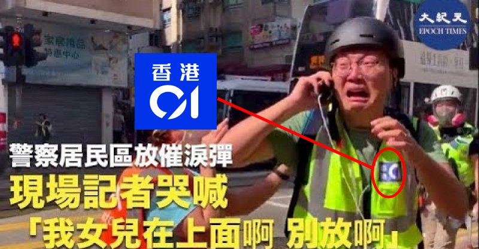

[11月25日 20:05]    BBC News 中文   @bbcchinese    【英国安德鲁王子性丑闻：我从未与爱泼斯坦贩运的女子发生性关系】安德鲁王子首次公开谈论曾与他有交情的爱泼斯坦当年的作为。在接受BBC专访时，安德鲁王子失口否认曾与爱泼斯坦性侵案中的指控者有关联。但是在此前专访后数天，安德鲁王子却停止了一切公务。 https://bbc.in/2DcNqr4   :speech_balloon:评:6 :+1:赞:12 :globe_with_meridians:转:2  

[11月25日 19:34]    老司机   @h5lpykl7tp6jjop    几个月来一直被悲伤和愤怒的情绪所影响，心有垒块郁堵，一夜之间香港区议会选举民主派大获全胜，笑到老泪纵横！民心向背诚不可欺！中共走狗有权有枪有钱又如何？丢脸丢大发了！这一小撮坏份子究竟是谁？这不一目了然吗？难坏了中共媒体，建制派输得这么惨，这祭文咋写呢？到底是谁在不明白真相呢？  :speech_balloon:评:2 :+1:赞:28 :globe_with_meridians:转:4  

[11月25日 19:01]    BBC News 中文   @bbcchinese    民主派候选人夺得更多区议员席位，是否意味着在特首选举中有更大话语权？香港目前的纷争局势能走向平息吗？ https://bbc.in/2KSLmsN   :speech_balloon:评:29 :+1:赞:42 :globe_with_meridians:转:8  

[11月25日 18:30]    老司机   @h5lpykl7tp6jjop    将来的评估人员又是一大肥缺，人人争送红包。  :speech_balloon:评:1 :+1:赞:15 :globe_with_meridians:转:0  

[11月25日 18:24]    老司机   @h5lpykl7tp6jjop    船沉之前要搜刮干净老百姓兜里每一块铜板！
财政部确定：房产税即将开征，按房屋评估价征收！
财政部部长肖捷日前谈及房地产税，明确未来的房地产税将按照房屋评估值征收。要按照“立法先行、充分授权、分步推进”的原则，推进房地产税立法和实施。  :speech_balloon:评:10 :+1:赞:63 :globe_with_meridians:转:27  

[11月25日 18:12]    老司机   @h5lpykl7tp6jjop    11.25 香港
前保安局长叶刘淑仪,如过街老鼠,竟然需要重兵保护,才能出门。
市民对她高呼"杀人犯"  :speech_balloon:评:1 :+1:赞:27 :globe_with_meridians:转:16  

[11月25日 18:01]    BBC News 中文   @bbcchinese    最近披露的一批文件显示，中国当局如何在新疆设立再教育营系统，对上百万维吾尔人进行“洗脑”。而中国驻英国大使将这些文件斥为假消息。 https://bbc.in/37xU9tK   :speech_balloon:评:47 :+1:赞:117 :globe_with_meridians:转:49  

[11月25日 17:45]    纽约时报中文网   @nytchinese    布拉格新市长贺吉普拒绝支持“一个中国”，最终解除了与北京的姐妹城市关系。“他要求我把台湾代表赶走，”贺吉普回忆去年一月的对峙。“我说，‘我不会赶走我们的客人。’”
一度处于蜜月期的中捷关系如今面临挑战，中国承诺的投资尚未实现，它的影响力已经令捷克人担忧。 http://nyti.ms/34eq6VU   :speech_balloon:评:15 :+1:赞:142 :globe_with_meridians:转:51  

[11月25日 17:18]    老司机   @h5lpykl7tp6jjop    像葉劉淑儀、鄭若驊、林鄭月娥這些中共走卒是真邪惡。
如果在中國生長的共卒親共，我們還可以顧念他們一生于黨化洗腦術中的教育背景，在憎惡之余心生一絲怜憫。
而這班人不同，她們生長于資訊自由社會，接受過最好的英式教育，對專制政體與民主政體認識清晰。她們卻甘為暴政之打手，自選一條道走到黑。 https://twitter.com/rfa_chinese/status/1198873809916321792 …  :speech_balloon:评:20 :+1:赞:146 :globe_with_meridians:转:49  

[11月25日 16:30]    纽约时报中文网   @nytchinese    许多积极参加最近抗议活动的区议会候选人胜选，这表明民众对民主运动的普遍支持已经稳固。一些人成为攻击的目标。其他人在抗议期间被卷入暴力冲突，有些人甚至被捕并被指控。
亲民主派候选人的胜利可能使他们在未来的政府组建中发挥更大的作用。 http://nyti.ms/2XIXVfd   :speech_balloon:评:4 :+1:赞:31 :globe_with_meridians:转:6  

[11月25日 16:01]    BBC News 中文   @bbcchinese    第56届金马奖11月23日登场，中国电影金鸡奖则一改过去9月举行的惯例，改为与金马奖同一天于厦门举行，加上中国下令大陆影人不得参加金马奖，使两项颁奖典礼充满浓浓政治味。 https://bbc.in/2KQ4xU4   :speech_balloon:评:38 :+1:赞:77 :globe_with_meridians:转:11  

[11月25日 16:00]    纽约时报中文网   @nytchinese    在300万选民参与投票的情况下，亲民主派候选人在452个选举席位中赢得了389个，大大超过了之前仅有的124个。亲政府派仅获得58个席位，相对此前的300个大幅减少。
对许多民主倡导人士而言，周日是这场运动的一个转折点。“香港人民有了非常深刻的觉醒，”香港公民党主席梁家杰说。 http://nyti.ms/2OfzzXm   :speech_balloon:评:70 :+1:赞:148 :globe_with_meridians:转:41  

[11月25日 15:13]    财经真相   @caijingxiang    人民日报发表关于香港去议会选举通告，嗯，仅仅只是通告，而且还是没有说明投票结果的通告，全文透露着无奈！如果这次中共造假舞弊赢得多数，那么现在的通稿到处都是“民意”，以及对一小撮暴徒不得民心的强烈愤慨！  :speech_balloon:评:39 :+1:赞:280 :globe_with_meridians:转:70  

[11月25日 14:55]    纽约时报中文网   @nytchinese    亲民主派候选人在周日的香港区议会选举中取得了惊人的胜利，投票人数创下纪录，生动表达了这座城市的愿望及其对中国政府的愤怒。
这是对北京及其香港盟友的有力谴责，投票人数（几乎占到合格选民的70%）表明，尽管抗议活动变得越来越暴力，公众仍在继续支持民主运动。 http://nyti.ms/2OfzzXm   :speech_balloon:评:88 :+1:赞:514 :globe_with_meridians:转:140  

[11月25日 14:36]    老司机   @h5lpykl7tp6jjop    那些说小王童鞋是骗子的出来走两步 https://twitter.com/jiongnasen/status/1198851139510259712 …  :speech_balloon:评:2 :+1:赞:36 :globe_with_meridians:转:8  

[11月25日 14:20]    墙国铁拳现世报😷   @Socialistfist    搬运一个来自微博的欢乐源泉，给墙内开票开了通宵，按时间倒序，他分别表演了：

1. 目瞪口呆
2. 伤心欲绝
3. 自欺欺人
4. 微博全部被删  :speech_balloon:评:145 :+1:赞:2096 :globe_with_meridians:转:753  

[11月25日 14:18]    老司机   @h5lpykl7tp6jjop    藍屍口中的選舉唔公平呢啲一定係老臨  :speech_balloon:评:119 :+1:赞:1805 :globe_with_meridians:转:820  

[11月25日 14:10]    纽约时报中文网   @nytchinese    《纽约时报》今日头版 https://twitter.com/austinramzy/status/1198804452397838342 …  :speech_balloon:评:18 :+1:赞:131 :globe_with_meridians:转:50  

[11月25日 14:01]    BBC News 中文   @bbcchinese    曾担任英国外交部香港事务部主任的皮特·里基茨勋爵（Lord Peter Ricketts）呼吁北京当局鼓励香港特首林政月娥对暴力双方进行“绝对不偏不倚的司法调查”。 https://bbc.in/2qH7Q9a   :speech_balloon:评:64 :+1:赞:192 :globe_with_meridians:转:56  

[11月25日 14:00]    纽约时报中文网   @nytchinese    “变节者”揭露中共干预港台政局细节，自称曾为中国间谍  http://nyti.ms/35vlmeW https://twitter.com/ccni/status/1198786958769709056 …  :speech_balloon:评:27 :+1:赞:30 :globe_with_meridians:转:14  

[11月25日 13:48]    纽约时报中文网   @nytchinese    香港区议会选举结果图表分析  http://nyti.ms/2XIXVfd https://twitter.com/kkrebeccalai/status/1198814320097972224 …  :speech_balloon:评:5 :+1:赞:18 :globe_with_meridians:转:4  

[11月25日 13:46]    财经真相   @caijingxiang    来猜猜看，香港法案川普会不会在自动生效的最后一天签署呢？ https://twitter.com/q7syrkosumosu/status/1198813739379654658 …  :speech_balloon:评:37 :+1:赞:136 :globe_with_meridians:转:26  

[11月25日 13:30]    纽约时报中文网   @nytchinese    “直白地说，他是一个傲慢、过誉、居高临下的恋童癖，”一名批评者说。
“我们是通过他的欲望感官，看到太平洋岛屿上那些黑色和棕色的身体的。但你如何改变叙事？你如何变换观看的方式？”一名画家说。 http://nyti.ms/2OKe1RK   :speech_balloon:评:1 :+1:赞:15 :globe_with_meridians:转:7  

[11月25日 13:09]    老司机   @h5lpykl7tp6jjop    《习近平与他的情人们》一书电子版(全文)  https://www.newhighlandvision.com/%e3%80%8a%e4%b9%a0%e8%bf%91%e5%b9%b3%e4%b8%8e%e4%bb%96%e7%9a%84%e6%83%85%e4%ba%ba%e4%bb%ac%e3%80%8b%e4%b8%80%e4%b9%a6%e7%94%b5%e5%ad%90%e7%89%88%e5%85%a8%e6%96%87/ … 来自 @新高地 New Highland Vision  :speech_balloon:评:5 :+1:赞:53 :globe_with_meridians:转:29  

[11月25日 13:00]    纽约时报中文网   @nytchinese    #每日一词 Climate emergency，牛津词典2019年度词汇“气候紧急状态”。今年的年度词汇是从一份全部与环境有关的词汇候选名单中选出的，包括“气候行动”(climate action)、“否认气候变化”(climate denial)等。
牛津词典编辑称，这反映出英语世界2019年真正关注的问题。 http://nyti.ms/34hGuoz   :speech_balloon:评:0 :+1:赞:7 :globe_with_meridians:转:1  

[11月25日 12:30]    纽约时报中文网   @nytchinese    这是香港区议会选举中首次出现每个席位均至少两个对立党派候选人的情况。在上一个选举周期（2015年）中，有68名候选人在没有对手的情况下参选。
今年也创下了400万登记选民的新纪录，其中39万是新登记选民。 http://nyti.ms/2XIXVfd   :speech_balloon:评:2 :+1:赞:41 :globe_with_meridians:转:16  

[11月25日 12:00]    纽约时报中文网   @nytchinese    波音坠机事件背后：被掩盖的狮航缺失。不到5个月内发生的两起致命事故把飞机制造商波音推上风口浪尖，而航空运营商狮航却逃过了类似的关注。
时报调查发现，该公司的安全隐患和明显疏失至少在一定程度上导致了其中一起失事。
更多简报内容： http://nyti.ms/34hGuoz   :speech_balloon:评:66 :+1:赞:14 :globe_with_meridians:转:2  

[11月25日 11:41]    纽约时报中文网   @nytchinese    在周日举行的香港地方区议会选举中，452个席位中的一半以上由亲北京派翻转至亲民主派。这一结果是一个令人惊叹的象征，反映了人们对今年席卷香港的抗议活动的支持。
这场选举的投票率也达到了自1999年香港开始举行区议会选举以来最高值。 http://nyti.ms/2XIXVfd   :speech_balloon:评:50 :+1:赞:335 :globe_with_meridians:转:123  

[11月25日 11:30]    纽约时报中文网   @nytchinese    上周五，特朗普拒绝承诺签署国会以压倒性多数通过的支持香港民主活动人士的法案，虽然他对抗议者表示支持，但也说习近平是“我的朋友”。
他还说，习近平之所以未对香港进行大规模镇压，是因为自己正在与北京谈判。“要不是因为我，香港早就完蛋了，用不了14分钟，”特朗普说。 http://nyti.ms/2OKjJTG   :speech_balloon:评:75 :+1:赞:117 :globe_with_meridians:转:43  

[11月25日 11:16]    财经真相   @caijingxiang    香港选举结果出来了，国内官媒如丧考妣，环球时报发文说，这次区议会选举，希望建制派不要灰心；国内关注香港局势的人，突然发现昔日“一小撮暴徒”，突然变成了“一大撮”，甚至是整个香港民意！  :speech_balloon:评:72 :+1:赞:1750 :globe_with_meridians:转:392  

[11月25日 11:00]    纽约时报中文网   @nytchinese    美国前特工李振成因向中国泄密被判19年监禁。检方文件显示，他从中获利超过84万美元。
李自1994年到2007年间曾为CIA工作，辞职后在香港开了一家烟草公司。据信，他的泄密导致了CIA数十名线人失踪、被监禁或死亡。
更多简报内容： http://nyti.ms/34hGuoz   :speech_balloon:评:9 :+1:赞:36 :globe_with_meridians:转:18  

[11月25日 10:33]    老司机   @h5lpykl7tp6jjop      :speech_balloon:评:0 :+1:赞:2 :globe_with_meridians:转:1  

[11月25日 10:30]    纽约时报中文网   @nytchinese    在公众对性别、种族和殖民日益敏感的时代，博物馆不得不重新评估高更的艺术遗产。
他与十三四岁的女孩发生性关系、将原住民称为“野蛮人”，他的艺术应该被抵制吗？ http://nyti.ms/2OKe1RK   :speech_balloon:评:18 :+1:赞:50 :globe_with_meridians:转:26  

[11月25日 10:24]    老司机   @h5lpykl7tp6jjop    选举说明了民心所向，下一步中共怎么办？难道学希特勒再搞一次国会纵火案？  :speech_balloon:评:1 :+1:赞:10 :globe_with_meridians:转:3  

[11月25日 10:20]    纽约时报中文网   @nytchinese    简报：泄露文件再揭新疆拘禁营内幕；聚焦香港区议会选举  http://nyti.ms/34hGuoz https://twitter.com/ccni/status/1198785831923793921 …  :speech_balloon:评:3 :+1:赞:11 :globe_with_meridians:转:3  

[11月25日 10:18]    BBC News 中文   @bbcchinese    历时15小时的香港区议会投票基本和平结束。在“反送中”运动持续下，地区政治版图变天。 https://bbc.in/2XHtXbA   :speech_balloon:评:46 :+1:赞:125 :globe_with_meridians:转:24  

[11月25日 10:02]    纽约时报中文网   @nytchinese    早安！今日重点新闻包括：
泄露文件再揭新疆拘禁营内幕；聚焦香港区议会选举；自称“变节者”揭露中共干预港台政局细节；特朗普拒绝承诺签署香港人权法案；纽约前市长布隆伯格正式参选美国总统；美国前特工李振成因向中国泄密被判19年监禁……NYT简报带你速览今日要闻。 http://nyti.ms/34hGuoz   :speech_balloon:评:12 :+1:赞:81 :globe_with_meridians:转:22  

[11月25日 09:59]    财经真相   @caijingxiang    游戏剧情模拟下的《权利的游戏》夜王率领的僵尸大军，南下进攻君临城，与瑟曦女王的大战，没想到画面制作的这么精美，一点都不比真实版的电视剧差！链接 https://www.youtube.com/watch?v=VfwlyN-8ZlQ …  :speech_balloon:评:3 :+1:赞:46 :globe_with_meridians:转:9  

[11月25日 09:04]    BBC News 中文   @bbcchinese    许多泛民主派当选人认为，结果反映香港市民强烈要求政府答应“五大诉求”，而建制派认为地区民生事务工作已经不能保证选情。 https://trib.al/9prZBd1   :speech_balloon:评:100 :+1:赞:390 :globe_with_meridians:转:121  

[11月25日 08:59]    BBC News 中文   @bbcchinese    北约成立七十年后，中国崛起被看作是北约面临的新威胁。美国国务卿蓬佩奥强调中国共产党的威胁，似乎要把北约的使命扩大到了亚洲。 https://bbc.in/2KP1Cuy   :speech_balloon:评:31 :+1:赞:93 :globe_with_meridians:转:25  

[11月25日 08:37]    财经真相   @caijingxiang    11月18日，刘强东卸任京东云计算有限公司总经理，助理张芳卸任法人代表！下一个！  :speech_balloon:评:19 :+1:赞:511 :globe_with_meridians:转:215  

[11月25日 07:37]    BBC News 中文   @bbcchinese    【香港区议会选举2019】晨光初露，多家媒体报道香港民主派已取得超过70%议席。  https://bbc.in/2rqixg9   :speech_balloon:评:246 :+1:赞:1022 :globe_with_meridians:转:346  

[11月25日 03:42]    BBC News 中文   @bbcchinese    【香港区议会选举2019】开票议席已过三分之一，非建制派大幅抛离亲政府阵营。  https://bbc.in/2OFbmsv   :speech_balloon:评:24 :+1:赞:117 :globe_with_meridians:转:33  

[11月25日 01:43]    BBC News 中文   @bbcchinese    【香港区议会选举2019】卷入元朗7.21袭击事件中的立法会议员何君尧承认在屯门连任区议员失败。 // @BBCChinese 继续图文直播香港选举点票情况！  https://bbc.in/2OeymzC   :speech_balloon:评:83 :+1:赞:318 :globe_with_meridians:转:75  

[11月25日 01:10]    BBC News 中文   @bbcchinese    【香港区议会选举2019】选举管理委员会主席冯骅法官公布，全日官方投票率为71.2%，创下香港普及选举以来最高纪录。 // @bbcchinese 继续图文直播香港选举点票情况！  https://bbc.in/37wF6R3   :speech_balloon:评:12 :+1:赞:171 :globe_with_meridians:转:107  

[11月25日 00:27]    BBC News 中文   @bbcchinese    香港区议会选举即将开票。绝大多数投票站于投票结束后当场点票，群众可依法入内监察点票过程。BBC News 中文正在多媒体直播： https://www.bbc.com/zhongwen/simp/live/chinese-news-50499342 …  :speech_balloon:评:15 :+1:赞:133 :globe_with_meridians:转:48  

[11月25日 00:04]    BBC News 中文   @bbcchinese    北京字节跳动科技有限公司是中国发展最快的初创企业。抖音在美国有2650万月活跃用户，其中60%的用户为16-24岁的青少年。 https://bbc.in/2OfgEvR   :speech_balloon:评:32 :+1:赞:115 :globe_with_meridians:转:45  

[11月24日 21:05]    纽约时报中文网   @nytchinese    持续关注香港区议会选举：到下午三时左右，离投票结束还有七个小时，完成投票的人数已达到四年前区议会选举同时段的两倍，投票率也达到了47.26%，已超过四年前选举的整体投票率。 https://nyti.ms/34dC4iw   :speech_balloon:评:57 :+1:赞:36 :globe_with_meridians:转:7  

[11月24日 21:00]    纽约时报中文网   @nytchinese    #一周热门 盘点奥斯卡热门角逐者，谁能成为最大赢家？ http://nyti.ms/2XvqZHg   :speech_balloon:评:12 :+1:赞:12 :globe_with_meridians:转:1  

[11月24日 20:53]    BBC News 中文   @bbcchinese    香港区议会选举的投票率破尽香港议会选举的纪录，民主派和建制派到底谁占优？  :speech_balloon:评:39 :+1:赞:171 :globe_with_meridians:转:65  

[11月24日 19:00]    纽约时报中文网   @nytchinese    #一周热门 触及审查红线，华裔美国艺术家北京展览被取消 http://nyti.ms/2OwaLt5   :speech_balloon:评:17 :+1:赞:72 :globe_with_meridians:转:23  

[11月24日 18:03]    老司机   @h5lpykl7tp6jjop      :speech_balloon:评:1 :+1:赞:15 :globe_with_meridians:转:5  

[11月24日 17:59]    老司机   @h5lpykl7tp6jjop    港警被告上国际法庭 逾50万人控告三大重罪  :speech_balloon:评:10 :+1:赞:192 :globe_with_meridians:转:68  

[11月24日 17:24]    BBC News 中文   @bbcchinese    香港区议会选举的各区票站外，罕有地出现长长的人龙排队，选民们怎么说呢？  :speech_balloon:评:54 :+1:赞:317 :globe_with_meridians:转:109  

[11月24日 17:00]    BBC News 中文   @bbcchinese    “若香港暴力一发不可收拾，中国会成为最终输家。”曾担任英国外交部香港事务部主任的皮特·里基茨勋爵（Lord Peter Ricketts）说。 https://bbc.in/2OKVfKi   :speech_balloon:评:136 :+1:赞:248 :globe_with_meridians:转:73  

[11月24日 16:56]    BBC News 中文   @bbcchinese    香港区议会选举正在进行。投票开始六小时，投票人数突破150万。香港最大建制派政党民建联在中午开始便宣布“全线告急”，而民主党主席胡志伟表示，现阶段社会撕裂，各自阵营支持者数目都会上升，单从投票率未必能分析胜算。 https://www.bbc.com/zhongwen/simp/live/chinese-news-50499342 …  :speech_balloon:评:33 :+1:赞:196 :globe_with_meridians:转:56  

[11月24日 16:00]    BBC News 中文   @bbcchinese    你认为哪一则新闻最重要？ https://bbc.in/2QLsi3q   :speech_balloon:评:103 :+1:赞:115 :globe_with_meridians:转:31  

[11月24日 15:01]    BBC News 中文   @bbcchinese    【一周热点回顾】BBC中文的调查发现，撑警联署数字的增长存在诸多疑点，有分析质疑组织者可能使用电脑程式自我复制联署。 https://bbc.in/37lTQ58   :speech_balloon:评:66 :+1:赞:148 :globe_with_meridians:转:37  

[11月24日 12:46]    GFHG SDKM   @zyx_yny    Very good to take some time@our from election observation to tell #JuniusHo in person that I was responsible for the revocation of his honorary doctorate from @AngliaRuskin #Sorrynotsorry  :speech_balloon:评:6738 :+1:赞:43790 :globe_with_meridians:转:26408  

[11月24日 08:10]    凡賽堤/FORSETI   @FecharCCP    呼籲請求共同挖掘所有有關香港發生的事，越全面越好，不同角度，越多越好，包括被暗地抓捕的人員，特別是CCP 派出的各種偽裝身份，包括變身變裝行兇的一點一滴都要挖掘出來，把CCP 的邪惡下三濫手段的真相毫無保留的曝光在全世界面前！世界公知公義才能真正挽救和保護香港人！希望懂視頻編輯配上中英文  :speech_balloon:评:1 :+1:赞:17 :globe_with_meridians:转:18  

[11月24日 08:07]    凡賽堤/FORSETI   @FecharCCP    人類史上最殘暴的CCP極權殺人恐怖組織正在用各種兇殘手段屠殺我們的同胞...................

CCP極權殺人恐怖組織超級納粹！超級殘暴！超級流氓！

人類到了全面消滅CCP極權殺人恐怖組織的時代！  :speech_balloon:评:5 :+1:赞:44 :globe_with_meridians:转:50  

[11月24日 08:04]    凡賽堤/FORSETI   @FecharCCP    人類史上最殘暴的CCP極權殺人恐怖組織正在用各種兇殘手段屠殺我們的同胞...................

CCP極權殺人恐怖組織超級納粹！  :speech_balloon:评:1 :+1:赞:41 :globe_with_meridians:转:35  

[11月24日 07:57]    凡賽堤/FORSETI   @FecharCCP    人類史上最殘暴的CCP極權殺人恐怖組織正在用各種兇殘手段屠殺我們的同胞...................

CCP極權殺人恐怖組織超級納粹！  :speech_balloon:评:7 :+1:赞:180 :globe_with_meridians:转:163  

[11月24日 07:37]    凡賽堤/FORSETI   @FecharCCP    人類史上最殘暴的CCP極權殺人恐怖組織正在用各種兇殘手段屠殺我們的同胞...................  :speech_balloon:评:1 :+1:赞:13 :globe_with_meridians:转:14  

[11月24日 07:28]    凡賽堤/FORSETI   @FecharCCP    CCP極權殺人恐怖組織正在用各種兇殘手段屠殺我們的同胞...................

視頻是CCP極權殺人恐怖組織在人流密集區投放巨量的不合格（不具國際標準）的化學毒氣催淚瓦斯彈 毒害我們的同胞！  :speech_balloon:评:0 :+1:赞:8 :globe_with_meridians:转:4  

[11月23日 22:09]    老司机   @h5lpykl7tp6jjop    当你为正‌义申辩时，往往不‌仅需‌要面对国家的暴力机器，还‌要面‌对无知愚‌民的狂欢和嘲‌讽！
          —— 伏尔泰  :speech_balloon:评:25 :+1:赞:1059 :globe_with_meridians:转:644  

[11月23日 21:27]    墙国铁拳现世报😷   @Socialistfist    #社会主义铁拳 https://twitter.com/big_ear_cat/status/1197861132364603401 …  :speech_balloon:评:8 :+1:赞:206 :globe_with_meridians:转:46  

[11月23日 18:37]    老司机   @h5lpykl7tp6jjop    当官专干缺德事！  :speech_balloon:评:6 :+1:赞:110 :globe_with_meridians:转:57  

[11月23日 18:23]    老司机   @h5lpykl7tp6jjop    2019年富豪们悄悄地走了，不带走云彩，只带走钱
 https://mp.weixin.qq.com/s/iO9IstE9xq4H4Zu7bR-_1w …  :speech_balloon:评:0 :+1:赞:10 :globe_with_meridians:转:2  

[11月23日 17:54]    老司机   @h5lpykl7tp6jjop    明天週日，由三家澳大利亞主流媒體聯合推出的九頻道《60分鐘》節目將爆料中共諜報人員王立強：綁架香港書商，干預台灣選舉，滲透香港大學，網絡攻擊自由世界，堪比諜報大片！ 
問：「為什麼你會選擇與澳大利亞政府合作？」
答：「因為決不能相信中共！」  :speech_balloon:评:111 :+1:赞:2473 :globe_with_meridians:转:1420  

[11月23日 17:46]    老司机   @h5lpykl7tp6jjop    香港某大厦外墙上的布告栏，民主派参选人的海报竟然被人撕掉，而亲共派候选人的海报却都原封不动，如果任由流氓破坏规则，选民连民主派的参选人是谁都不知道，民主派如何能胜选？

某些政党成立时是流氓起家，现在都建党近百年了，还是流氓行径，本性难改~  :speech_balloon:评:14 :+1:赞:87 :globe_with_meridians:转:45  

[11月23日 16:37]    财经真相   @caijingxiang    第二届彭博财经论坛在北京召开，美国前财政部长保尔森：要避免“脱钩的妄想”  :speech_balloon:评:26 :+1:赞:92 :globe_with_meridians:转:19  

[11月23日 16:20]    老司机   @h5lpykl7tp6jjop    这位推友“新闻大吐槽(找回推友)
 @tucaonews ”，自上推以来，尽力为香港抗争者宣传，为大陆抗争者呼吁，频繁与推友互动，绝非水号！他三万多粉丝的号突然被封，而且连申诉渠道都被关闭。
请推友重新关注！  :speech_balloon:评:15 :+1:赞:116 :globe_with_meridians:转:51  

[11月23日 12:26]    墙国铁拳现世报😷   @Socialistfist    辛辛苦苦咬文嚼字将近一年，揭露邪恶，为正义发声，可推特连解释都不解释，直接就给我封号了！而且close了我的申诉，只是冷冷一句，“你多次违反推特rules”，我觉得自己像是在面对另一个中宣部，连自我审查都不过关，不过我也看清一点：推特并不是按照良知/非良知，来实行奖惩的

我现在注册了新号，  :speech_balloon:评:166 :+1:赞:596 :globe_with_meridians:转:266  

[11月23日 11:51]    财经真相   @caijingxiang    必须要特别说明的，得年轻人者，得天下！粤币要想长远发展，必须动手挖沪币的墙角，千万别搞什么，广东是广东的天下，其他人统统滚蛋，甚至设置各种歧视排外政策，如果广东人未来正的选一帮这样的政客，等于是直接宣判粤币死亡！  :speech_balloon:评:19 :+1:赞:128 :globe_with_meridians:转:15  

[11月23日 11:32]    财经真相   @caijingxiang    甚至很多权贵主动“退赃”以换取政治和财产安全，这样可以在不引起全体富人恐慌的情况下，让富人成为最后债务承担者，这是沪币、粤币具有的无可比拟的优势，如果处理得当，未来两币超越日元、欧元完全不成问题，甚至有可能把美元霸主地位都给拉下马，当然这将是很久以后的事情了！  :speech_balloon:评:10 :+1:赞:46 :globe_with_meridians:转:8  

[11月23日 11:27]    财经真相   @caijingxiang    中共垮台给中国带来严重动荡，但是任何事情都是都两面性的，除了动荡这样的坏处，它也有有力的一面，那就是—通过对中共权贵有限度的“追脏”来出清一下中国的债务，追脏尽管会迎来权贵集团的抵制，但是却不会像“打土豪分田地”那样带来全体资本的恐慌，外资已经国内非权贵资本甚至可以借机“低价抄底”。  :speech_balloon:评:5 :+1:赞:78 :globe_with_meridians:转:11  

[11月23日 11:20]    财经真相   @caijingxiang    因此成为现在欧美国家的常态化，除了宽松货币还有一种就是共产主义式的“打土豪分田地”，用暴力革命强行让富人来买单，这种结果相比各位已经知道了，这也是特朗普不断强调美国坚决不搞社会主义的原因，但是这也导致美元债务长期无法出清，贫富差距进一步扩大，直到美元无力承受为止！  :speech_balloon:评:3 :+1:赞:23 :globe_with_meridians:转:2  

[11月23日 11:15]    财经真相   @caijingxiang    沪、粤两币谁能称霸中国，关键是看谁能最快、最彻底的出清债务。当今即使日元、欧元、美元也深陷债务泥潭不能自拔，不断宽松甚至负利率就是债务不断恶化的表现。债务是不能消灭的，只能进行转移，说白就是谁来最后买单的问题，宽松货币政策本质是一种全民买单政策，这种政策得罪人少，稀释财富于无形！  :speech_balloon:评:4 :+1:赞:23 :globe_with_meridians:转:4  

[11月23日 11:14]    凡賽堤/FORSETI   @FecharCCP    CCP極權殺人恐怖組織是全人類的公敵！
呼籲全世界正道主義合力消滅CCP！
呼籲全世界人民看清楚CCP反人類的慘無人道的殘暴罪行！！！

消滅CCP是全世界全人類的當前最緊急任務！！！

視頻是CCP瘋狂屠殺香港學生畫面之一  :speech_balloon:评:3 :+1:赞:10 :globe_with_meridians:转:15  

[11月23日 11:08]    凡賽堤/FORSETI   @FecharCCP    凡是罔顧香港事實在推特和youtube上支持CCP和香港黑警的五毛必死全家，有朝一日必死於CCP的殺人恐怖組織之下，起底五毛祖宗十八代世代不得為人！  :speech_balloon:评:3 :+1:赞:6 :globe_with_meridians:转:2  

[11月23日 11:06]    财经真相   @caijingxiang    沪币地域广、人口多，这既是它的优势也是它的劣势，俗话说得好，人多嘴杂，利益牵扯也多，其之间后果就是沪币政治体制在很长一段时间里都处于动荡之中；尤其是区域内，东北、关中、黄淮地区财政严重赤字，这是一个极大的政治遗留包袱，但是随着时间的推移，沪币克服困难后，发展后劲十足！  :speech_balloon:评:3 :+1:赞:17 :globe_with_meridians:转:1  

[11月23日 11:02]    凡賽堤/FORSETI   @FecharCCP    CCP極權殺人恐怖組織是全人類的公敵！
呼籲全世界正道主義合力消滅CCP！
呼籲全世界人民看清楚CCP反人類的慘無人道的殘暴罪行！！！

消滅CCP是全世界全人類的當前最緊急任務！！！

視頻是深夜被CCP黑警暗殺的少女！  :speech_balloon:评:1 :+1:赞:6 :globe_with_meridians:转:12  

[11月23日 11:01]    财经真相   @caijingxiang    两币谁强谁弱现在很难判断，粤币虽然地域小，但是对应的中共遗留债务也较少，区域经济发展差异也比沪币范围小，而且粤币还可以辐射整个东南亚，这些地方的人民币承兑者必然是粤币，如果粤币尽快出清中共遗留债务，政客之间少些利益之争，粤币有可能成为与日元一样的东亚强势货币，甚至可以超过日元！  :speech_balloon:评:2 :+1:赞:24 :globe_with_meridians:转:5  

[11月23日 10:59]    凡賽堤/FORSETI   @FecharCCP    CCP極權殺人恐怖組織是全人類的公敵！
呼籲全世界正道主義合力消滅CCP！
呼籲全世界人民看清楚CCP反人類的慘無人道的殘暴罪行！！！

消滅CCP是全世界全人類的當前最緊急任務！！！

視頻是被CCP瘋狂屠殺射中頭部身亡的香港學生  :speech_balloon:评:2 :+1:赞:5 :globe_with_meridians:转:9  

[11月23日 10:55]    凡賽堤/FORSETI   @FecharCCP    CCP極權殺人恐怖組織是全人類的公敵！
呼籲全世界正道主義合力消滅CCP！
呼籲全世界人民看清楚CCP反人類的慘無人道的殘暴罪行！！！

消滅CCP是全世界全人類的當前最緊急任務！！！

視頻是CCP瘋狂屠殺香港學生畫面之一  :speech_balloon:评:2 :+1:赞:15 :globe_with_meridians:转:13  

[11月23日 10:53]    财经真相   @caijingxiang    华北、东北、黄淮以及关中地区因地理位置纳入沪币范围是大概率事件，在这里实行联邦制是相对较好的方式；华南、云贵直接采用“粤币”为宜，包括港澳，这样便于当地经济长远发展；而四川、重庆、两湖则是粤币与沪币争夺之地。同时也是两币影响力强弱的标志！  :speech_balloon:评:6 :+1:赞:24 :globe_with_meridians:转:4  

[11月23日 10:52]    凡賽堤/FORSETI   @FecharCCP    CCP極權殺人恐怖組織是全人類的公敵！
呼籲全世界正道主義合力消滅CCP！
呼籲全世界人民看清楚CCP反人類的慘無人道的殘暴罪行！！！

消滅CCP是全世界全人類的當前最緊急任務！！！

據報導已被發現2537宗屍體，失踪近萬人！  :speech_balloon:评:0 :+1:赞:4 :globe_with_meridians:转:0  

[11月23日 10:46]    凡賽堤/FORSETI   @FecharCCP    CCP極權殺人恐怖組織正在用各種兇殘手段屠殺我們的同胞...................
CCP極權殺人恐怖組織是全人類的公敵！
呼籲全世界正道主義合力消滅CCP！
呼籲全世界人民看清楚CCP反人類的慘無人道的殘暴罪行！！！

消滅CCP是全世界全人類的當前最緊急任務！！！

視頻是被非法抓捕的學生李俊希"(同音)！  :speech_balloon:评:0 :+1:赞:9 :globe_with_meridians:转:4  

[11月23日 10:44]    财经真相   @caijingxiang    新疆实行的“疆币”，以及西藏的“藏币”直接可以划归为“垃圾货币”，因此为了当地百姓幸福而言，不建议两地独立搞自主货币，最好是选用沪币与粤币双币流通，当然这会削弱两地政客大权利，大概率会遭到他们的抵触！  :speech_balloon:评:2 :+1:赞:30 :globe_with_meridians:转:3  

[11月23日 10:43]    凡賽堤/FORSETI   @FecharCCP    CCP極權殺人恐怖組織正在用各種兇殘手段屠殺我們的同胞...................
CCP極權殺人恐怖組織是全人類的公敵！
呼籲全世界正道主義合力消滅CCP！
呼籲全世界人民看清楚CCP反人類的慘無人道的殘暴罪行！！！

消滅CCP是全世界全人類的當前最緊急任務！！！

視頻是近距離射殺香港理工大學學生的罪行  :speech_balloon:评:7 :+1:赞:47 :globe_with_meridians:转:20  

[11月23日 10:38]    财经真相   @caijingxiang    香港法案签署后，港币的消失是必然的，但是中共在大湾区的“深币”，极有可能随着政权的变更而“夭折”，而后随着去大一统的思想兴起，各地或独立自制或组建松散联邦，在这一过程中，以广东为核心的“粤币”，以及以上海为中心的“沪币”，将成为人民币崩盘后的两个强势货币！ https://twitter.com/rfa_chinese/status/1198005738225967105 …  :speech_balloon:评:52 :+1:赞:389 :globe_with_meridians:转:87  

[11月23日 10:36]    凡賽堤/FORSETI   @FecharCCP    CCP極權殺人恐怖組織正在用各種兇殘手段屠殺我們的同胞...................
CCP極權殺人恐怖組織是全人類的公敵！
呼籲全世界正道主義合力消滅CCP！
呼籲全世界人民看清楚CCP反人類的慘無人道的殘暴罪行！！！

消滅CCP是全世界全人類的當前最緊急任務！！！

視頻是CCP屠殺深夜香港理工大學的罪行之一  :speech_balloon:评:0 :+1:赞:4 :globe_with_meridians:转:1  

[11月23日 10:34]    凡賽堤/FORSETI   @FecharCCP    CCP極權殺人恐怖組織正在用各種兇殘手段屠殺我們的同胞...................
CCP極權殺人恐怖組織是全人類的公敵！
呼籲全世界正道主義合力消滅CCP！
呼籲全世界人民看清楚CCP反人類的慘無人道的殘暴罪行！！！

消滅CCP是全世界全人類的當前最緊急任務！！！

視頻是CCP屠殺深夜香港理工大學的罪行之一  :speech_balloon:评:20 :+1:赞:56 :globe_with_meridians:转:51  

[11月23日 10:29]    凡賽堤/FORSETI   @FecharCCP    CCP極權殺人恐怖組織正在用各種兇殘手段屠殺我們的同胞.............
CCP極權殺人恐怖組織是全人類的公敵！
呼籲全世界正道主義合力消滅CCP！
呼籲全世界人民看清楚CCP反人類的慘無人道的殘暴罪行！！！

消滅CCP是全世界全人類的當前最緊急任務！！！

視頻是被非法濫捕的數千名香港理工大學無辜學生  :speech_balloon:评:0 :+1:赞:5 :globe_with_meridians:转:5  

[11月23日 10:27]    凡賽堤/FORSETI   @FecharCCP    CCP極權殺人恐怖組織正在用各種兇殘手段屠殺我們的同胞...................
CCP極權殺人恐怖組織是全人類的公敵！
呼籲全世界正道主義合力消滅CCP！
呼籲全世界人民看清楚CCP反人類的慘無人道的殘暴罪行！！！

消滅CCP是全世界全人類的當前最緊急任務！！！

視頻是CCP下令屠殺香港理工大學的殘暴罪行  :speech_balloon:评:6 :+1:赞:49 :globe_with_meridians:转:38  

[11月23日 10:23]    凡賽堤/FORSETI   @FecharCCP    CCP極權殺人恐怖組織正在用各種兇殘手段屠殺我們的同胞...................
CCP極權殺人恐怖組織是全人類的公敵！
呼籲全世界正道主義合力消滅CCP！
呼籲全世界人民看清楚CCP反人類的慘無人道的殘暴罪行！！！

消滅CCP是全世界全人類的當前最緊急任務！！！  :speech_balloon:评:0 :+1:赞:12 :globe_with_meridians:转:4  

[11月23日 10:15]    凡賽堤/FORSETI   @FecharCCP    CCP極權殺人恐怖組織正在用各種兇殘手段屠殺我們的同胞...................
CCP極權殺人恐怖組織是全人類的公敵！呼籲全世界正道主義合力消滅CCP！

圖為被殺害的年輕少女！  :speech_balloon:评:0 :+1:赞:5 :globe_with_meridians:转:4  

[11月23日 07:53]    老司机   @h5lpykl7tp6jjop    国务院2009年文件在2020年把上海建成国际金融中心，还有不到两个月，人民币国际化影子都没有，如何建国际金融中心？ https://twitter.com/goodrick8964/status/1197997508430979072 …  :speech_balloon:评:48 :+1:赞:434 :globe_with_meridians:转:117  

[11月23日 00:30]    墙国铁拳现世报😷   @Socialistfist    另外一个造假的人造铁拳是这则，同样张冠李戴。

 https://boxun.com/news/gb/china/2018/06/201806100004.shtml …  :speech_balloon:评:4 :+1:赞:64 :globe_with_meridians:转:4  

[11月23日 00:27]    墙国铁拳现世报😷   @Socialistfist    有推友询问是否能证明假图
有趣的是这张假图的配图恰好是微博用户“被威胁强拆的鹤岗小市民” 一个本推曾经在10月19日发布过的铁拳现世报内容。如果你搜索“小市民”，你会看见他每日在微博刷屏式维权也未曾导致他的微博被和谐。然而这些人造铁拳却是无迹可循。  :speech_balloon:评:2 :+1:赞:67 :globe_with_meridians:转:6  

[11月23日 00:21]    财经真相   @caijingxiang    有人说是假消息，嗯，很有可能，我也从没有否认！但是它突然爆出来的时间点很重要，更重要的是中共官媒还公开辟谣，这就已经达到了它的目的，现在是假，继续紧逼，下次你确定我不敢真干吗？ https://twitter.com/caijingxiang/status/1197908949061619716 …  :speech_balloon:评:20 :+1:赞:99 :globe_with_meridians:转:13  

[11月23日 00:05]    财经真相   @caijingxiang    接下来美国人会怎么做呢？今天美国最顶层的人会很忙，核爆炸未必能够吓住他们，但有一点是很明确的，北京的这位实权人已经成了当今世界亘古未有的最危险人物！现在川普政府唯一能做的是稳住他，全面开战？斩首行动？内部分裂？各种方法都会摆出来，内部寻找替代人是最可行性的策略，下面是一场时间赛跑  :speech_balloon:评:24 :+1:赞:126 :globe_with_meridians:转:32  

[11月22日 23:55]    财经真相   @caijingxiang    南海核爆事件是大事来临前的征兆，这是一次警告，也是一次试探，更是一次威胁！这件事的制造者自然是中共军方，而且命令很有可能来自北京最高层。它警告的人自然是即将签署《香港人权与民主法案》的特朗普，以及正在北京进行最后斡旋的基辛格，它的爆炸声是在说“把我逼急了，大不了鱼死网破！”  https://twitter.com/greattankman/status/1197773109803139072 …  :speech_balloon:评:81 :+1:赞:156 :globe_with_meridians:转:56  

[11月22日 22:57]    财经真相   @caijingxiang    美国最近一系列经济数据都开始触底走强，这给了美联储12月暂停降息的理由，如果数据继续强劲，美联储不排除重新引导市场加息预期，甚至暂停启动的不是QE4的宽松！  :speech_balloon:评:6 :+1:赞:71 :globe_with_meridians:转:13  

[11月22日 19:14]    老司机   @h5lpykl7tp6jjop    60年前，有人要民主，他们变成了救星； 

50年前，有人要民主，他们变成了右派； 

40年前，有人要民主，他们变成反革命； 

30年前，有人要民主，他们变成了冤鬼； 

20年前，有人要民主，他们压成了肉饼； 

10年前，有人要民主，他们变成了囚犯； 

在今天，有人要民主，他们变成了汉奸……  :speech_balloon:评:5 :+1:赞:212 :globe_with_meridians:转:117  

[11月22日 19:06]    墙国铁拳现世报😷   @Socialistfist    这些人造铁拳固然有很高“观赏性”，但小编不赞同用这些截图去混淆视听。  :speech_balloon:评:14 :+1:赞:349 :globe_with_meridians:转:25  

[11月22日 18:59]    墙国铁拳现世报😷   @Socialistfist    近几日收到了大量推友投稿私信，都是关于图二图三内容，特发此推说明，就不一一私信回复解释了，请见谅。
图一是几个月前就发推讨论过的造假铁拳图。这些疑似假图的截图 
主要特征是“隔日”铁拳的戏剧效果和无迹可查的微博搜索信息。
投稿中有众多港台两地推友对微博不甚了解, 容易上当，请大家转发告知  :speech_balloon:评:33 :+1:赞:319 :globe_with_meridians:转:88  

[11月22日 17:31]    墙国铁拳现世报😷   @Socialistfist    #社会主义铁拳 https://twitter.com/RogerHPNg/status/1197778808503328768 …  :speech_balloon:评:5 :+1:赞:127 :globe_with_meridians:转:13  

[11月21日 13:58]    GFHG SDKM   @zyx_yny    On #PolyU being the end game, this OL says it is 100% not the end game.  She says what we saw happened to the students at Poly, the way they were brutally treated by #HKPolice, there's no way HKers will forget.  We will keep on fighting!

#StandWithHongKong #HongKongProtests  :speech_balloon:评:104 :+1:赞:2418 :globe_with_meridians:转:1555  

[11月21日 11:50]    GFHG SDKM   @zyx_yny    We were in front of the Diet Members’ Office Building.

We will keep fighting with you, HKers
We will keep spreading what's happening in HK

You are not alone  :speech_balloon:评:370 :+1:赞:3586 :globe_with_meridians:转:2125  

[11月21日 00:57]    GFHG SDKM   @zyx_yny    Yesterday’s passage of the #HongKong Human Rights & Democracy Act was a good day in the struggle to resist totalitarian #China & its bid for domination. But it was not the last day. We have a long road ahead to protect our jobs, our workers & our security.  :speech_balloon:评:1638 :+1:赞:16329 :globe_with_meridians:转:10698  

[11月21日 00:12]    墙国铁拳现世报😷   @Socialistfist      :speech_balloon:评:5 :+1:赞:200 :globe_with_meridians:转:28  

[11月21日 00:07]    墙国铁拳现世报😷   @Socialistfist    评论区的孙笑川们开始了一贯的颠倒黑白，全过程视频在此 https://twitter.com/hkwuliff/status/1193726052184387584?s=09 …  :speech_balloon:评:10 :+1:赞:154 :globe_with_meridians:转:30  

[11月20日 23:56]    墙国铁拳现世报😷   @Socialistfist    双十一当天，因为目睹正在跟拍的香港警察往女儿所在楼发射催泪弹，哭的撕心裂肺的hk01记者（亲中媒体）之事，被传到墙内变成了“ 反华媒体记者女儿被催泪弹”，微博评论区中粉红战螂瞬间高潮。
不知该记者和其同事看到了该有如何反应
#社会主义铁拳
#社会主义特别行政区铁拳  :speech_balloon:评:93 :+1:赞:929 :globe_with_meridians:转:376  

[11月20日 21:56]    GFHG SDKM   @zyx_yny    The first day that schools resumed, #hkpolice deliberately targeted high school students to stop and search for no reason. As many #hongkongers suggest, being young becomes a crime as #China and #HKGov are totally out of reach of the whole city.  :speech_balloon:评:259 :+1:赞:5619 :globe_with_meridians:转:6146  

[11月19日 19:20]    墙国铁拳现世报😷   @Socialistfist    腾讯铁拳，重锤出击  :speech_balloon:评:35 :+1:赞:299 :globe_with_meridians:转:72  

[11月19日 15:33]    GFHG SDKM   @zyx_yny    The tyranny forced us live as middle age warrior  :speech_balloon:评:1 :+1:赞:50 :globe_with_meridians:转:19  

[11月19日 14:41]    GFHG SDKM   @zyx_yny    This scene is no longer only appearing in movies. It’s happening in our reality.

Escaping from death. 

She’s not a #stuntman, she’s just a normal citizen, normal student.

#StandWithHongKong
#Dramaislife
#Lifeisdrama
#PolyUHongKong  :speech_balloon:评:87 :+1:赞:1541 :globe_with_meridians:转:1478  

[11月18日 23:48]    墙国铁拳现世报😷   @Socialistfist    腾讯也是扔了一个战术式社会主义核弹吗  :speech_balloon:评:83 :+1:赞:631 :globe_with_meridians:转:132  

[11月18日 21:23]    墙国铁拳现世报😷   @Socialistfist    曾经推特中文圈最后一片净土还是被污染了
如果您想要批量屏蔽某些账号，建议大家参考转推内容。
如果您只是追求“眼不见心不烦”， 可以参考下图，选择设置-高级过滤-隐藏通知
推特世界归于宁静  https://twitter.com/keepcnsecurity/status/1195607211940040705 …  :speech_balloon:评:65 :+1:赞:116 :globe_with_meridians:转:40  

[11月18日 20:34]    墙国铁拳现世报😷   @Socialistfist    这小伙还是个文案人才，手动滑稽  :speech_balloon:评:23 :+1:赞:367 :globe_with_meridians:转:42  

[11月18日 20:13]    墙国铁拳现世报😷   @Socialistfist    推特做不到的事情，腾讯却做到了

#战螂在推特
#社会主义铁拳  :speech_balloon:评:253 :+1:赞:1856 :globe_with_meridians:转:539  

[11月18日 14:12]    墙国铁拳现世报😷   @Socialistfist    三十年後又黃昏，再見刀兵校外陳。惜乎有民十三億，盡是為虎作倀人  :speech_balloon:评:7 :+1:赞:242 :globe_with_meridians:转:84  

[11月18日 10:41]    GFHG SDKM   @zyx_yny    With students in Hong-Kong who are blocking the streets to bring economic pressure on China to ensure democratic freedoms in HK! #StandWithHongKong @Andychanhotin @FreedomHKG @Stand_with_HK @hk_watch @HKWORLDCITY #HongKongProtests @joshuawongcf #Freedom  :speech_balloon:评:28 :+1:赞:711 :globe_with_meridians:转:560  

[11月18日 09:32]    GFHG SDKM   @zyx_yny    Stop using #PolyU Wifi for god’s sake.
#HongKongProtests https://twitter.com/hengyanlo/status/1196156883679055872 …  :speech_balloon:评:4 :+1:赞:111 :globe_with_meridians:转:121  

[11月18日 08:54]    GFHG SDKM   @zyx_yny    08:30 students tried to leave #PolyU but #HongKong #Police continued to tear gas them, forcing them to return inside. This is in contradiction to what Poly U President JC Teng said, that cops have agreed to let students leave peacefully. 
@cityusucbc
#PoliceBrutality  :speech_balloon:评:55 :+1:赞:846 :globe_with_meridians:转:1064  

[11月18日 08:50]    GFHG SDKM   @zyx_yny    #PolyU protesters eventually retreat after driving the police back in the face of whizzing rubber bullets and gas pellets. They’re mostly inside the campus again. Police showing no mercy #HK #HongKongProtests #StandWithHongKong  :speech_balloon:评:266 :+1:赞:4935 :globe_with_meridians:转:5406  

[11月18日 08:45]    GFHG SDKM   @zyx_yny    The #HKPolice threatening to shoot press, first-aid as they were attempting to cross the road. This is on the perimeter of #PolyU and some civilians who came here to support the protesters still inside have been injured and/or arrested at the TST east fountain across this road.  :speech_balloon:评:25 :+1:赞:617 :globe_with_meridians:转:833  

[11月18日 08:38]    GFHG SDKM   @zyx_yny    Protestors are trying to escape from Hong Kong Polytechnic University, but HK Police fire tear gas to force them back IN. HK Police have given up any pretense that they try to de-escalate and disperse. Instead, it is evident that their intention is to attack, arrest, and punish. https://twitter.com/JessiePang0125/status/1196224442491396097 …  :speech_balloon:评:34 :+1:赞:1000 :globe_with_meridians:转:1151  

[11月18日 08:06]    GFHG SDKM   @zyx_yny    this is the same shameful #PolyU head who refused to shake hands with students wearing a mask during graduation ceremony. Still the same shameful head who escaped the clashes and shrinked his duty for the whole of the clash that lasts for days. https://twitter.com/nytmay/status/1196202338102341633 …  :speech_balloon:评:58 :+1:赞:789 :globe_with_meridians:转:654  

[11月18日 06:02]    GFHG SDKM   @zyx_yny    Around 30 minutes ago at 05:30AM, #HKPolice have entered #PolyU campus. At least 3 protestors subdued, 1 seen with blood all over face during arrest

#PolyU #PolyUMassacre #PolyUSOS
#SOSHK #HongKong #StandwithHK
Vid via Telegram  :speech_balloon:评:47 :+1:赞:1624 :globe_with_meridians:转:2282  

[11月18日 05:16]    GFHG SDKM   @zyx_yny    

They are still fighting! 

#SOSPolyU
#HKPoliceState  :speech_balloon:评:181 :+1:赞:3599 :globe_with_meridians:转:3277  

[11月18日 02:48]    GFHG SDKM   @zyx_yny    [PolyU frontliner's last words?]

"If very unfortunately I die in Kowloon today, even though history may just remember me as a number, I hope HKers will remember all of our deeds, stay angry & rational & turn our revenge chants into reality."

#SOSHK

OP: https://lihkg.com/thread/1731186/page/1 …  :speech_balloon:评:110 :+1:赞:2146 :globe_with_meridians:转:2020  

[11月18日 01:32]    GFHG SDKM   @zyx_yny    “It is fxxking mad!” People with their cars in Tsim Sha Tsui hoping to support #PolyU students (but were stuck due to roadblocks) received tear gas treatment from #HongKong police. Lots of swearing. Video circulated online. #HongKongProtests  :speech_balloon:评:81 :+1:赞:1422 :globe_with_meridians:转:1590  

[11月18日 01:12]    GFHG SDKM   @zyx_yny    Old friend, world renowned photographer, Stephen Boitano, sharing his concerns on escalated police violence in Hk. Please  pray it is a very dangerous situation. #StandWithHongKong #HongKongProtests @FreedomHKG @Stand_with_HK @HKWORLDCITY @hk_watch @Andychanhotin @Andychanhotin  :speech_balloon:评:701 :+1:赞:9619 :globe_with_meridians:转:9777  

[11月18日 00:41]    墙国铁拳现世报😷   @Socialistfist    推荐一些启发小编开办《墙国铁拳现世报》的parody或自媒体推号：
中国民调@PollChina 
新蛤社@XinHaNewsAgency
推特小红旗@Xhnsoc__Redflag
共青团中央 (学习小组）@CPCYouthLeague
乳透社@Ruters0615 
胡锡进（流亡）@HuXijin_huaiqiu
LIFETIME 視界@LifetimeUSCN
不分先后，欢迎推荐后续补充  :speech_balloon:评:13 :+1:赞:163 :globe_with_meridians:转:30  

[11月17日 23:42]    GFHG SDKM   @zyx_yny    Members of Guarding Our Kids, formed by mothers and fathers, decided to stay with #PolyU students who were trapped in the campus: We won't leave our 'kids' behind. We will safeguard this place. We want everyone here can go home. #HongKongProtesters  :speech_balloon:评:632 :+1:赞:10634 :globe_with_meridians:转:9966  

[11月16日 18:05]    墙国铁拳现世报😷   @Socialistfist    小编要郑重警告刘女士，国家是有寻衅滋事和煽动颠覆这些国民待遇的。

#社会主义铁拳  :speech_balloon:评:96 :+1:赞:735 :globe_with_meridians:转:211  

[11月15日 08:24]    墙国铁拳现世报😷   @Socialistfist    小编认为本月最佳铁拳，滋磁不滋磁啊？  :speech_balloon:评:37 :+1:赞:775 :globe_with_meridians:转:45  

[11月14日 18:36]    财经真相   @caijingxiang    中共基建没有钱，很多网友简单的认为开动印钞机就行，这其实是大错特错，中共央行印的每一分钱，都必须有对应的相应的价值才行，否则就是无锚印钞，汇率崩盘！过去20年央行印钞都是以债务为基础的。比如，房奴的房贷，当房奴申请贷款时，本质是向央行抵押了自己未来30年的劳动力。 https://twitter.com/aspeltuo8/status/1194923278646816768 …  :speech_balloon:评:68 :+1:赞:796 :globe_with_meridians:转:282  

[10月09日 00:47]    GFHG SDKM   @zyx_yny    "Son, when you grow up
You will be the savior of the broken
The beaten, and the damned?"
Please watch this powerful mv #HongKongProtester #hkprotests 
香港反送中護法戰爭(Hong Kong Defensive War 2019)：Welcome To The Black Parade  https://youtu.be/0yXTHODE24Q  via @YouTube  :speech_balloon:评:4 :+1:赞:20 :globe_with_meridians:转:8  

[03月13日 08:10]    老司机   @h5lpykl7tp6jjop    批评是批评家天生的使命！他们只感知对错，信奉真理，指出真相不吐不快，不在意权势和群众的喜好，从批评里不可能获得任何好处，但批评家愚直不改。在中国几乎所有人都讨厌批评家，喜欢阴谋家，因为他们只说好听的！可是就因为中国的批评家太少，中国几乎看不到未来和希望！  :speech_balloon:评:98 :+1:赞:221 :globe_with_meridians:转:44  

