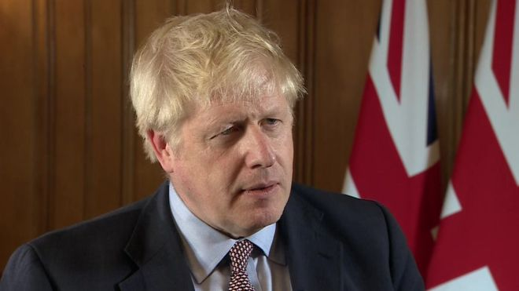
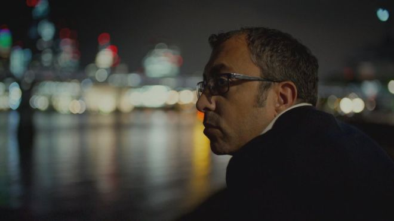
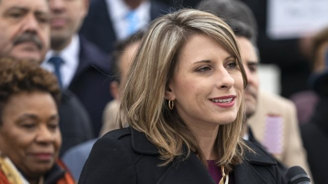

[10月29日 14:06]    新闻大吐槽   @TuCaoFakeNews    什麼都不能用，那幾千塊拿去做善事反而沒那麼氣。  :speech_balloon:评:0 :+1:赞:1 :globe_with_meridians:转:1  

[10月29日 14:05]    新闻大吐槽   @TuCaoFakeNews    做中國人真慘，死了都不讓家人去處理，等英國賠錢了可能又會敲詐勒索一番  :speech_balloon:评:0 :+1:赞:2 :globe_with_meridians:转:1  

[10月29日 13:48]    新闻大吐槽   @TuCaoFakeNews    华为早死  :speech_balloon:评:0 :+1:赞:1 :globe_with_meridians:转:1  

[10月29日 13:47]    新闻大吐槽   @TuCaoFakeNews    最新產品，可以打電話的板磚問世了！外帶手電筒功能，機身加載多款小遊戲，只要3899  :speech_balloon:评:2 :+1:赞:3 :globe_with_meridians:转:1  

[10月29日 13:42]    新闻大吐槽   @TuCaoFakeNews    墙国逻辑是，不能用你不会别用，用别的吗？B站，微信，微博，应用宝不好吗？  :speech_balloon:评:0 :+1:赞:4 :globe_with_meridians:转:2  

[10月29日 13:41]    新闻大吐槽   @TuCaoFakeNews    我愛台灣！台灣人 請小心選擇自己的未來！！ https://twitter.com/tucaofakenews/status/1188893431164264448 …  :speech_balloon:评:0 :+1:赞:6 :globe_with_meridians:转:1  

[10月29日 13:39]    新闻大吐槽   @TuCaoFakeNews    你們不是說光明正大嗎？幹嘛戴口罩?自由人權私隱你配嗎?! https://twitter.com/TuCaoFakeNews/status/1188893431164264448 …  :speech_balloon:评:1 :+1:赞:9 :globe_with_meridians:转:4  

[10月29日 13:37]    新闻大吐槽   @TuCaoFakeNews     https://twitter.com/tucaofakenews/status/1188893431164264448 …  :speech_balloon:评:0 :+1:赞:3 :globe_with_meridians:转:2  

[10月29日 13:37]    新闻大吐槽   @TuCaoFakeNews    王菲为祖国唱灵歌  :speech_balloon:评:0 :+1:赞:4 :globe_with_meridians:转:1  

[10月29日 13:35]    老司机   @h5lpykl7tp6jjop    怀念曾道吾老师！  :speech_balloon:评:1 :+1:赞:2 :globe_with_meridians:转:0  

[10月29日 13:27]    新闻大吐槽   @TuCaoFakeNews     https://twitter.com/tucaofakenews/status/1188970935493115905 …  :speech_balloon:评:0 :+1:赞:3 :globe_with_meridians:转:1  

[10月29日 13:26]    新闻大吐槽   @TuCaoFakeNews    中國不光輸出料理，輸出文化，輸出革命，現在連國罵都輸出。鏡頭最後一位白人小哥哥一句“CNMB"回懟小粉紅。

中共所謂的“世界命運共同體”漸漸有的成效。

中共你牛 https://twitter.com/TuCaoFakeNews/status/1188696072987660293 …  :speech_balloon:评:4 :+1:赞:6 :globe_with_meridians:转:2  

[10月29日 13:24]    新闻大吐槽   @TuCaoFakeNews    曾经我一直打算第一部5g手机买华为呢，现在，鬼才买。  :speech_balloon:评:0 :+1:赞:2 :globe_with_meridians:转:1  

[10月29日 13:16]    新闻大吐槽   @TuCaoFakeNews    配置相当不错的电脑也到不了这个价格，自以为买华为爱国，却不知被国给宰了一刀  :speech_balloon:评:0 :+1:赞:1 :globe_with_meridians:转:1  

[10月29日 13:15]    新闻大吐槽   @TuCaoFakeNews    发两百斤麦子，不抗完十里路不让走  :speech_balloon:评:1 :+1:赞:3 :globe_with_meridians:转:1  

[10月29日 13:13]    新闻大吐槽   @TuCaoFakeNews    应该劳动改造三年再遣返  :speech_balloon:评:2 :+1:赞:2 :globe_with_meridians:转:1  

[10月29日 13:01]    新闻大吐槽   @TuCaoFakeNews    不能用 https://twitter.com/TuCaoFakeNews/status/1188970935493115905 …  :speech_balloon:评:0 :+1:赞:2 :globe_with_meridians:转:2  

[10月29日 13:00]    BBC News 中文   @bbcchinese    黄之锋、周庭、罗冠聪等，都是香港知名的年轻政治领袖，不过他们都先后被政府取消议员或参选议员的资格。 https://bbc.in/2pciVhW   :speech_balloon:评:115 :+1:赞:106 :globe_with_meridians:转:68  

[10月29日 13:00]    纽约时报中文网   @nytchinese    伊斯兰国头目巴格达迪之死意味着什么？对恐怖组织ISIS来说，这不啻为一次重大挫折。但在那些曾经遭受苦难的人看来，这充其量也只能算是一种残酷的满足。
专家指出，这个依靠散布在世界各地的分支和同情者的组织仍然构成威胁。
更多简报内容： http://nyti.ms/2oqn15z   :speech_balloon:评:3 :+1:赞:5 :globe_with_meridians:转:1  

[10月29日 12:59]    新闻大吐槽   @TuCaoFakeNews    大疆稳定器没有，大疆集中营门票倒是有不少  :speech_balloon:评:0 :+1:赞:2 :globe_with_meridians:转:1  

[10月29日 12:59]    新闻大吐槽   @TuCaoFakeNews    怎麼沒給他手銬！這麼客氣哼  :speech_balloon:评:0 :+1:赞:6 :globe_with_meridians:转:1  

[10月29日 12:56]    新闻大吐槽   @TuCaoFakeNews    百度能不能用啊？ https://twitter.com/tucaofakenews/status/1188970935493115905 …  :speech_balloon:评:0 :+1:赞:5 :globe_with_meridians:转:2  

[10月29日 12:30]    纽约时报中文网   @nytchinese    批评人士称，下级官员承受着与最高领导人保持一致的巨大压力，这种压力剥夺了他们辩论、发现失误和改变做法的余地。
一些人提到，习近平今年早些时候误读了他能在贸易谈判中促使特朗普政府做出多大的让步，以及中国在香港的僵局。 http://nyti.ms/2BSOTT2   :speech_balloon:评:6 :+1:赞:13 :globe_with_meridians:转:5  

[10月29日 12:00]    纽约时报中文网   @nytchinese    #每日一词 Whimper “一路呜咽(whimpering)、哭喊、尖叫“，在宣布伊斯兰国头目死亡的电视演讲中，特朗普六次重复“whimpering“一词，并称巴格达迪“像狗一样死了”、“像懦夫一样死了”，这种夸张而具有挑衅意味的语言引发了质疑。
更多简报内容： http://nyti.ms/2oqn15z   :speech_balloon:评:10 :+1:赞:5 :globe_with_meridians:转:2  

[10月29日 11:39]    纽约时报中文网   @nytchinese    除了经济下行、中美贸易战和香港抗议等，习近平更担心潜藏的政治危险：失衡、分裂和不忠。他将利用四中全会进一步强化对党的控制，建立一座威权主义堡垒。
批评人士认为，习近平推动中央集权并不是治愈中国政策失误的良方，而是这些失误的主要原因之一。 http://nyti.ms/2BSOTT2   :speech_balloon:评:24 :+1:赞:61 :globe_with_meridians:转:23  

[10月29日 11:30]    BBC News 中文   @bbcchinese    你觉得特朗普的笑容代表了什么？  :speech_balloon:评:20 :+1:赞:34 :globe_with_meridians:转:11  

[10月29日 11:25]    新闻大吐槽   @TuCaoFakeNews    I become the only candidate banned from running in November’s District Council Election as Returning officer, Laura ARON ruled my nomination invalid this morning. It proved how Beijing manipulate the election with political cersorship and screening.  :speech_balloon:评:839 :+1:赞:8057 :globe_with_meridians:转:7170  

[10月29日 11:00]    纽约时报中文网   @nytchinese    英国卡车尸体案司机首次出庭：25岁的罗宾森面临过失杀人、串谋贩运人口、串谋协助非法移民和洗钱等罪名。
他周一通过视频连线出庭，报道称他没有被要求为自己抗辩，也未提出保释申请。本案将被移交至伦敦中央刑事法院，于11月继续审理。更多简报内容： http://nyti.ms/2oqn15z   :speech_balloon:评:5 :+1:赞:8 :globe_with_meridians:转:1  

[10月29日 10:46]    纽约时报中文网   @nytchinese    商界领袖和华尔街高管已经开始反击，说限制投资的努力构成了政府干预，可能会破坏金融市场的稳定。
他们说，当政策制定者开始切断中美之间的金融联系时，尚不清楚这种切断能做到什么程度。 http://nyti.ms/2Woe9Km   :speech_balloon:评:22 :+1:赞:8 :globe_with_meridians:转:3  

[10月29日 10:30]    BBC News 中文   @bbcchinese    英国首相约翰逊要求在12月12日举行大选动议遭议会投票否决，不过，他表示将再次就这个日期举行大选提出动议，希望闯关成功。约翰逊向议员们表示，“议会不能再继续绑架这个国家。”他说，议会已经“失去功能”。
 https://bbc.in/349ahiL   :speech_balloon:评:11 :+1:赞:26 :globe_with_meridians:转:6  

[10月29日 10:12]    财经真相   @caijingxiang    人民法院网站消息，截至10月27日，宣告破产的房企已经增加到408家。
这种趋势进入9月之后更加明显，房企“补血”力度加大。
根据克尔瑞地产研究发布的报告，9月份，有95家房企的融资总额为1124.48亿元，环比上升45.3%，同比上升17.2%。  :speech_balloon:评:5 :+1:赞:140 :globe_with_meridians:转:56  

[10月29日 10:03]    财经真相   @caijingxiang    昨天美国贸易办公室发布公告称，考虑延长针对中国340亿美元商品的关税豁免，改豁免原定12月28日结束！  :speech_balloon:评:12 :+1:赞:29 :globe_with_meridians:转:11  

[10月29日 10:00]    BBC News 中文   @bbcchinese    你认为这种状况会持续下去吗？  :speech_balloon:评:68 :+1:赞:196 :globe_with_meridians:转:52  

[10月29日 10:00]    纽约时报中文网   @nytchinese    • 英国脱欧再延期：欧盟同意将最新期限延至明年1月31日。随后，首相约翰逊发起在12月12日提前举行大选的动议，但遭到工党的阻击，以失败告终。
• 香港经济陷入衰退：香港财政司司长称，受抗议活动的打击，该地区经济已陷入衰退，且在今年内不太可能实现增长。更多简报内容： http://nyti.ms/2oqn15z   :speech_balloon:评:3 :+1:赞:6 :globe_with_meridians:转:2  

[10月29日 09:35]    纽约时报中文网   @nytchinese    “当中国向台湾推进时会发生什么？台积电将会怎样？”前英特尔高管、现为科技投资者的黛安·布莱恩特问道。“我们怎样才能摆脱这种困境？”
专家组建议联邦政府应对更多国内芯片生产进行补贴。但是，先进商业工厂的成本可能高达150亿美元，此外还有这些设施的其他经常性成本。 http://nyti.ms/32W14dq   :speech_balloon:评:4 :+1:赞:9 :globe_with_meridians:转:6  

[10月29日 09:30]    BBC News 中文   @bbcchinese    最近在英国发生的集装箱惨案，显示全球面临的非法移民问题日益突出。不同国家之间是如何鉴定非法移民身份呢？
 https://bbc.in/2BMFhJs   :speech_balloon:评:32 :+1:赞:15 :globe_with_meridians:转:6  

[10月29日 09:15]    财经真相   @caijingxiang    饭桶戴老板：认识一批币圈的，个个都是老司机。他们搞一个项目，通常要同时建两个群：一个项目群，一个维权群，里面都是同样一批人。前者在项目运作期间相互吹捧，讨论如何发财，后者在老板跑路之后相互通气，讨论如何追账。两个群都事先建好，反正都用得着，可谓是防范意识突出，风险理念先行。  :speech_balloon:评:15 :+1:赞:236 :globe_with_meridians:转:56  

[10月29日 09:03]    纽约时报中文网   @nytchinese    As China’s Troubles Simmer, Xi Reinforces His Political Firewall. Chinese Investment Pits Wall Street Against Washington. What Survivors of ISIS Carnage Say About al-Baghdadi’s Death. How to say "whimper" in Chinese? Follow us @nytchinese https://cn.nytimes.com/morning-brief/20191029/china-xi-jinping-communist-party-plenumhong-kong-recession/ …  :speech_balloon:评:4 :+1:赞:8 :globe_with_meridians:转:5  

[10月29日 08:58]    纽约时报中文网   @nytchinese    早安！今日重点新闻包括：
习近平在危机中召开四中全会；香港经济陷入衰退；中国投资引发美国政商界对立；英国脱欧再延期；卡车尸体案司机首次出庭；还原巴格达迪死亡现场；BBC再度被控男女薪酬不平等……NYT简报带你速览今日要闻。 http://nyti.ms/2oqn15z   :speech_balloon:评:27 :+1:赞:42 :globe_with_meridians:转:14  

[10月29日 08:30]    BBC News 中文   @bbcchinese    “如果你发现可疑的转账纪录，就应该报告给监管部门，而我们当时所发现的已经远不止可疑，”他说，“我的老板们不仅没有报告我告诉他们的那些犯罪行为，而是加以掩盖。”
 https://bbc.in/36dYZf1   :speech_balloon:评:0 :+1:赞:14 :globe_with_meridians:转:3  

[10月29日 08:08]    新闻大吐槽   @TuCaoFakeNews    10月份，华为Mate 30 Pro在马来西亚上市；价格3899令吉（约合6584rmb）~

一个马来西亚小哥，手贱买了一个，发现谷歌套件一个也不能用！肯定郁闷死了！那么贵  :speech_balloon:评:162 :+1:赞:1039 :globe_with_meridians:转:482  

[10月29日 07:30]    BBC News 中文   @bbcchinese    一名美国双性恋国会议员被指与下属有不当关系，她否认指控，但仍然决定辞职，同时批评有人把她的全裸照片上载到网络上，形容这种做法相等于把她的私人资料“武器化”，做法可怕。
 https://bbc.in/2PspnvY   :speech_balloon:评:9 :+1:赞:60 :globe_with_meridians:转:20  

[10月29日 05:14]    老司机   @h5lpykl7tp6jjop    公开和塔里班合作，现在又公开为isis站台，中共从秘密支持恐怖主义分子变为公开支持，而且以政府行为在香港指挥警察大肆执行恐怖行动殴打学生民众，抢劫女学生，抛尸海上，一个拥有国家机器的政权以恐怖主义联合恐怖分子对抗文明世界，美国还和它们贸易谈判，真是与虎谋皮！  :speech_balloon:评:13 :+1:赞:36 :globe_with_meridians:转:17  

[10月29日 04:32]    老司机   @h5lpykl7tp6jjop    击毙巴格达迪详细过程：直升机飞越地雷阵，机关炮击毙多名保镖  :speech_balloon:评:5 :+1:赞:88 :globe_with_meridians:转:29  

[10月29日 03:41]    BBC News 中文   @bbcchinese    英国首相约翰逊要求在12月12日举行大选动议遭议会投票否决，不过，他表示将再次就这个日期举行大选提出动议，希望闯关成功。
 https://bbc.in/36cc3S1   :speech_balloon:评:1 :+1:赞:16 :globe_with_meridians:转:1  

[10月28日 23:43]    BBC News 中文   @bbcchinese    这个悲剧发生在27年前的万圣节。 https://bbc.in/2BRLyUi   :speech_balloon:评:17 :+1:赞:81 :globe_with_meridians:转:30  

[10月28日 23:33]    财经真相   @caijingxiang    人民网评“解析区块链”时称，当前，区块链技术应用已延伸到数字金融、物联网、智能制造、供应链管理等多个领域。无论是出于维护公众安全考虑，还是着眼行业健康发展，都务须高度重视其管理问题。互联网不是法外之地，号称“去中心化”的区块链也不能成为法外之地，必须用好管好。  :speech_balloon:评:22 :+1:赞:145 :globe_with_meridians:转:44  

[10月28日 22:58]    老司机   @h5lpykl7tp6jjop    到底什么叫区块链？在天朝，区块链就是骗傻逼，脑残，弱智的一种噱头而已。 https://twitter.com/fangshimin/status/1188725605816102912 …  :speech_balloon:评:2 :+1:赞:33 :globe_with_meridians:转:18  

[10月28日 21:30]    BBC News 中文   @bbcchinese    又延期了。约翰逊首相不是说“宁可死在沟里也不延”吗？ https://bbc.in/2BQju3q   :speech_balloon:评:24 :+1:赞:29 :globe_with_meridians:转:11  

[10月28日 21:12]    BBC News 中文   @bbcchinese    死者到底是谁？来自哪个国家？为你介绍英国法医可能使用的五种查验办法。 https://bbc.in/32PrD42   :speech_balloon:评:67 :+1:赞:57 :globe_with_meridians:转:24  

[10月28日 21:00]    纽约时报中文网   @nytchinese    近年来，随着全球股市稳步走高，越来越多的投资者转向被动投资。
随着中国经济持续增长，指数提供商增加了中国股票的权重。此举对北京来说是一场胜利，可以将资金注入中国市场，并帮助提升中国企业及其货币人民币的国际形象。 http://nyti.ms/2Woe9Km   :speech_balloon:评:4 :+1:赞:11 :globe_with_meridians:转:3  

[10月28日 20:51]    财经真相   @caijingxiang    逢高空两手比特币，但愿能够赚够一个娶区块链女神的钱！  :speech_balloon:评:36 :+1:赞:119 :globe_with_meridians:转:23  

[10月28日 20:01]    BBC News 中文   @bbcchinese    【香港示威：什么是黄丝和蓝丝餐厅？】支持与反对示威的市民，各自光顾不同政治立场的食店，你怎么看这现象？ https://bbc.in/2NlW8s1   :speech_balloon:评:33 :+1:赞:34 :globe_with_meridians:转:13  

[10月28日 20:00]    纽约时报中文网   @nytchinese    美国一直在其最先进的武器中使用曾经只在本国生产的电子元件。芯片可以辅助坦克、飞机、火箭和舰船的导航、互相通讯，以及攻击敌方目标。
但许多芯片的国内生产线早已转移至国外，让人担心一旦国外出现政治或军事危机，供应会遭到中断。 http://nyti.ms/32W14dq   :speech_balloon:评:9 :+1:赞:28 :globe_with_meridians:转:12  

[10月28日 19:42]    墙国铁拳现世报😷   @Socialistfist    药房老板现时仍未回港，店员胡先生今日戴上口罩回店内用漂白水清洁，四名便衣警员到药房表示「唔好意思」，期望药房体谅，他坦言唯有接受道歉。
胡先生续指，估计损失约 1,000 元。他提到，昨晚蘗房已拉半闸，警方未有举起黑旗便施放催泪弹，形容警方是「乱咁射」，但需老板回港后才决定是否追究。  :speech_balloon:评:3 :+1:赞:44 :globe_with_meridians:转:8  

[10月28日 19:39]    墙国铁拳现世报😷   @Socialistfist    尖沙咀发起集会，演变成多处警民冲突，其中晚上警方施放的一枚催泪弹射入位于弥敦道的「明寅药房」，警方今早约4 名便衣警员到店舖道歉，向员工表示「唔好意思」。警员逗留约 2 分钟后离开，并无解释催泪弹射入药房的原因。  :speech_balloon:评:2 :+1:赞:44 :globe_with_meridians:转:6  

[10月28日 19:39]    墙国铁拳现世报😷   @Socialistfist    陈柏雄, 药房东主，在FB上撑警及赞同六四镇压嘅言论，包括他在10月5日发表「当年出坦克车，原来是最正确决定！」、10月8日称抗争者为「暴徒、垃圾废青、曱甴」，又称听到「兄弟、手足」令佢「作呕」。  :speech_balloon:评:1 :+1:赞:47 :globe_with_meridians:转:4  

[10月28日 19:38]    墙国铁拳现世报😷   @Socialistfist    铁拳是最好的决定

感谢香港推友，更多详情请看本推后续推文
#社会主义铁拳
#社会主义特别行政区铁拳  https://twitter.com/BeLightinHK/status/1188465234391883776 …  :speech_balloon:评:8 :+1:赞:115 :globe_with_meridians:转:31  

[10月28日 19:01]    BBC News 中文   @bbcchinese    所罗门群岛司法部长日前裁定中国的森田集团租借该国图拉吉岛的协议“非法”，尽管没有证据显示该公司与中国政府有直接关系。 https://bbc.in/2JoCXfO   :speech_balloon:评:19 :+1:赞:39 :globe_with_meridians:转:12  

[10月28日 18:49]    纽约时报中文网   @nytchinese    中美之间的竞争已扩散至两国的金融关系，导致华盛顿的安全事务鹰派与华尔街的投资者之间的对立。
特朗普政府官员和两党议员希望通过限制投资的方式阻止联邦雇员的退休基金流向中国公司，但商界领袖和华尔街称，限制投资构成了政府干预，可能会破坏金融市场的稳定。 http://nyti.ms/2Woe9Km   :speech_balloon:评:13 :+1:赞:36 :globe_with_meridians:转:18  

[10月28日 18:25]    财经真相   @caijingxiang    公司一愤青，感慨说：三女行，漂亮者必有男友焉，丑陋者必是灯泡也！悲夫，大学机会已过，注定光棍乎？话音刚落，办公室笑喷了，一轻薄男答曰：有钱，或可改变命运也！一女愤怒道：你们都要漂亮的，丑女就该直接守活寡吗？办公室安静了！  :speech_balloon:评:18 :+1:赞:121 :globe_with_meridians:转:15  

[10月28日 18:24]    老司机   @h5lpykl7tp6jjop    中国现在不是富了，是负了，负了一大批债！
未录完，实在太多。  :speech_balloon:评:32 :+1:赞:279 :globe_with_meridians:转:164  

[10月28日 18:21]    纽约时报中文网   @nytchinese    知情人士称，五角大楼官员鼓励芯片企业高管考虑在美国建造新的半导体生产线。他们称，如今美国愈发依赖海外（尤其是台湾的台积电）制造的芯片，随着中美关系持续紧张，一些人担心 ，在香港问题催化下，台湾供应商可能会被迫限产或停产。 http://nyti.ms/32W14dq   :speech_balloon:评:22 :+1:赞:111 :globe_with_meridians:转:43  

[10月28日 18:01]    BBC News 中文   @bbcchinese    6月爆发的香港“反送中”运动对一些在香港生活的大陆人来说是一场政治启蒙，令他们开始思考“我是谁”的身份认同问题。 https://bbc.in/2Nl0Vtw   :speech_balloon:评:257 :+1:赞:310 :globe_with_meridians:转:97  

[10月28日 17:51]    纽约时报中文网   @nytchinese    香港的领导人和警察已把示威者塑造为暴徒和暴力的自行执法者，试图在一线抗议者与更广泛的公众之间制造隔阂。
支持抗议运动目标的温和派人士对暴力表示越来越多的担忧，他们担心暴力行为正中北京的下怀，并削弱公众的支持。 http://nyti.ms/2BKxRX0   :speech_balloon:评:17 :+1:赞:13 :globe_with_meridians:转:5  

[10月28日 17:33]    财经真相   @caijingxiang    “幸福来得太突然？大家不相信中美就这么和好了，内生角度看，美元/人民币越低，客户越不结汇同时增加购汇，”一中资行交易员称。 都不是傻瓜，尤其是中国客户，大部分都是精英阶层，压根不信中共会“结构性改革”！ https://twitter.com/reuterscn/status/1188748290931728384 …  :speech_balloon:评:18 :+1:赞:241 :globe_with_meridians:转:73  

[10月28日 17:14]    BBC News 中文   @bbcchinese    英国营养基金会发表一份报告称，无论你年龄多大，如果能做出五种饮食改变，将有助于保护你的心脏免受心脏病和中风的威胁。 https://bbc.in/36bEGPg   :speech_balloon:评:3 :+1:赞:78 :globe_with_meridians:转:52  

[10月28日 16:34]    财经真相   @caijingxiang    本轮降息是美联储为了应对持续放缓的美国经济进行的“预防式降息”，并非真正意义的开启新一轮大规模货币宽松政策，正是这种在这种思维主导下，才导致美联储不情愿的降息。这也就注定了下一次重启降息将会相当遥远，也许只有等到美联储看到全面系统性的美国经济衰退。  :speech_balloon:评:1 :+1:赞:48 :globe_with_meridians:转:8  

[10月28日 16:28]    财经真相   @caijingxiang    本周四北京时间凌晨两点，美联储将进行本年度内第三次降息，市场料想这将是中期内最后一次降息，甚至不排除本轮降息就此终止。美联储会议将对未来采取按兵不动政策，黄金多头在基本面上将失去一大支撑，如果中美贸易谈判继续缓和，不排除黄金进行深度回调！  :speech_balloon:评:11 :+1:赞:96 :globe_with_meridians:转:19  

[10月28日 16:01]    BBC News 中文   @bbcchinese    2018年10月29日，印尼狮子航空一架波音737客机在起飞后坠毁，机上189人罹难。接近一年后，调查人员发布最终报告，称飞行员、维修人员和波音都存在失误。 https://bbc.in/36cw2QP   :speech_balloon:评:7 :+1:赞:33 :globe_with_meridians:转:12  

[10月28日 16:01]    纽约时报中文网   @nytchinese    香港抗议正将冲突与分歧带进美国各地的校园，并凸显出香港学生与来自中国大陆的同学之间的关系日益紧张。
大学官员面临着一项艰巨的任务，既要支持言论自由，又要避免疏远美国校园里最大的国际学生群体。 http://nyti.ms/2NhHulp   :speech_balloon:评:57 :+1:赞:137 :globe_with_meridians:转:58  

[10月28日 15:52]    老司机   @h5lpykl7tp6jjop    还提倡大家不吃肉，不给奸商赚钱的机会！可是当初不超生没给你们罚款的机会，如今老了养老咋办呢？你们连保证都不认账了！你们咋不把特供的机会让点给老百姓呢？  :speech_balloon:评:1 :+1:赞:7 :globe_with_meridians:转:0  

[10月28日 15:00]    纽约时报中文网   @nytchinese    如果让你列举几个有魅力的人，你会想起谁？也许是摇晃着马提尼酒杯的詹姆斯·邦德，或者是荧幕上妙语连珠的奥普拉·温弗瑞，也有人会说是大声说出“我有一个梦想”的马丁·路德·金......
到底是什么特质让这些魅力十足的人物如此受人爱戴呢？ http://nyti.ms/2pTyR8L   :speech_balloon:评:12 :+1:赞:29 :globe_with_meridians:转:18  

[10月28日 14:01]    BBC News 中文   @bbcchinese    特朗普将巴格达迪之死视为外交政策上的一大胜利，但这一结果能否给特朗普带来持久的政治利益？ https://bbc.in/2Pom0WH   :speech_balloon:评:6 :+1:赞:19 :globe_with_meridians:转:8  

[10月28日 14:00]    纽约时报中文网   @nytchinese    抗议者与当局陷入僵局，让人觉得这场运动似乎正越来越接近发生死亡的方向，甚至可能会导致中国军队的干预，这或进一步危及香港的公民自由。
抗议者说，因为政府不愿满足他们要求更多民主和调查警察行为的诉求，从而将他们逼向极端。当局认为，进一步的让步只会鼓励更多暴力。 http://nyti.ms/2BKxRX0   :speech_balloon:评:24 :+1:赞:22 :globe_with_meridians:转:8  

[10月28日 13:31]    BBC News 中文   @bbcchinese    香港警方水炮車這次避開了清真寺。  :speech_balloon:评:67 :+1:赞:143 :globe_with_meridians:转:65  

[10月28日 13:16]    纽约时报中文网   @nytchinese    阿布·贝克尔·巴格达迪如何从一个沉默寡言的阿訇变成ISIS头目？在这篇时报讣告里，你可以从昔日同学、邻居、ISIS受害者的叙述中找到线索。 https://twitter.com/nytimes/status/1188666720854204417 …  :speech_balloon:评:2 :+1:赞:18 :globe_with_meridians:转:4  

[10月28日 13:00]    BBC News 中文   @bbcchinese    中国已经成了柬埔寨的最大债权国，反华情绪源自哪里？ https://bbc.in/2JseLJH   :speech_balloon:评:91 :+1:赞:98 :globe_with_meridians:转:42  

[10月28日 13:00]    纽约时报中文网   @nytchinese    #每日一词 Pro-life还是pro-choice。面对堕胎，你是生命派还是选择派？在时报观点文章中，一位母亲讲述了亲手“杀死”自己孩子的故事。尽管她自认为是个生命派(pro-life)，但在胎儿被诊断出严重脑部异常后，她和丈夫最终做出了选择派(pro-choice)的决定。
更多简报内容： http://nyti.ms/36dVchJ   :speech_balloon:评:0 :+1:赞:7 :globe_with_meridians:转:4  

[10月28日 12:45]    老司机   @h5lpykl7tp6jjop    对于最近猪肉涨价农业部重拳出击，要严厉打击炒猪客！说猪肉上涨原因是囤肉赚钱的奸商作祟，造谣猪瘟，抬高肉价，和解放前四大家族行为一样恶劣，肉价马上就会降下来，视频无法转播，发几张截图，不过把目前形势和临近垮台的国民党时期相提并论，这感觉是不是非常相似呵？慌得一比？  :speech_balloon:评:5 :+1:赞:24 :globe_with_meridians:转:10  

[10月28日 12:30]    老司机   @h5lpykl7tp6jjop    你家的人活不下去，宁愿花钱偷渡，居然你没有责任，满屏都是英国人的责任，不是老说自己是负责任的大国吗？这脸不要得也太离谱了吧！  :speech_balloon:评:9 :+1:赞:19 :globe_with_meridians:转:2  

[10月28日 12:00]    BBC News 中文   @bbcchinese    政府想用楼房捆绑年轻人？ https://bbc.in/2pUWqOk   :speech_balloon:评:58 :+1:赞:54 :globe_with_meridians:转:26  

[10月28日 11:07]    老司机   @h5lpykl7tp6jjop    【循環論證謬誤】中國佛教協會會長：中國如果不是世界上最幸福的國家，怎麼會有那麼多人投胎到中國？~~嗯也可能是，我們上輩子造了什麼X  :speech_balloon:评:79 :+1:赞:1024 :globe_with_meridians:转:267  

[10月28日 09:54]    财经真相   @caijingxiang    猪肉价格上涨带来的通胀压力还未完全显现，最高峰出现的想两个月后的春节是不难猜测的，今年春节将是中国20年来最有记忆的一个！ https://twitter.com/caolei1/status/1188611532369711104 …  :speech_balloon:评:25 :+1:赞:365 :globe_with_meridians:转:112  

[10月28日 08:25]    老司机   @h5lpykl7tp6jjop    我想知道，下一个被斩首的邪恶组织头目会是谁？  :speech_balloon:评:39 :+1:赞:272 :globe_with_meridians:转:72  

[10月28日 08:17]    凡賽堤/FORSETI   @FecharCCP    魔鬼在人間

極權殺人恐怖組織正在用各種兇殘手段殺害我們的同胞....................................................................................................

10月27日被極權殺人恐怖組織非法濫捕的香港年輕人已經超過200+ 人！  :speech_balloon:评:1 :+1:赞:22 :globe_with_meridians:转:18  

[10月28日 07:49]    凡賽堤/FORSETI   @FecharCCP    魔鬼在人間

極權殺人恐怖組織正在用各種兇殘手段殺害我們的同胞....................................................................................................

26日又有一10歲出頭的小孩被棄屍大海！  :speech_balloon:评:0 :+1:赞:16 :globe_with_meridians:转:13  

[10月28日 04:29]    老司机   @h5lpykl7tp6jjop    香港孩子早熟参加示威爭自由！
大陆孩子早熟强奸女孩杀老师！ https://twitter.com/jamie_noir/status/1188376870502334466 …  :speech_balloon:评:1 :+1:赞:32 :globe_with_meridians:转:7  

[10月28日 04:23]    老司机   @h5lpykl7tp6jjop    英國港口卡車廂39名偷渡者凍死案最新進展：
越南已經認領，中共抓捕家屬。

20人為越南人家屬已報案，經越政府與英國方面溝通確認。

19人是福建省福清長樂人，中共指其給黨和國家抹黑，拒絕與英國協調。有當地人爆料稱，中共地方官員不僅拒絕家屬報案，而且逮捕約100人，防止與外媒記者接觸。转 https://twitter.com/japanaqi/status/1188174511209762816 …  :speech_balloon:评:95 :+1:赞:730 :globe_with_meridians:转:420  

[10月28日 00:35]    凡賽堤/FORSETI   @FecharCCP    人類最恐怖的極權殺人恐怖組織！
警察蒙面公開殺人，毆打，暴打，非法濫捕，暗殺市民！

CCP的極權殺人恐怖組織比本拉登還恐怖一萬倍！

這是一個老人  :speech_balloon:评:0 :+1:赞:3 :globe_with_meridians:转:7  

[10月28日 00:20]    凡賽堤/FORSETI   @FecharCCP    人類最恐怖的極權殺人恐怖組織！
警察蒙面公開殺人，毆打，暴打，非法濫捕，暗殺市民！

CCP的極權殺人恐怖組織比本拉登還恐怖一萬倍！  :speech_balloon:评:3 :+1:赞:208 :globe_with_meridians:转:170  

[10月28日 00:11]    凡賽堤/FORSETI   @FecharCCP    人類最恐怖的極權殺人恐怖組織！
警察蒙面公開殺人，毆打，暴打，非法濫捕，暗殺市民！

CCP的極權殺人恐怖組織比本拉登還恐怖一萬倍！  :speech_balloon:评:4 :+1:赞:130 :globe_with_meridians:转:83  

[10月27日 23:59]    凡賽堤/FORSETI   @FecharCCP    人類最恐怖的極權殺人恐怖組織！
警察蒙面公開殺人，毆打，暴打，非法濫捕，暗殺市民！

已經被雙手反綁的學生，極權殺人恐怖組織還要把人往死裡整！全人類唯一一個最恐怖的極權殺人恐怖組織！  :speech_balloon:评:0 :+1:赞:6 :globe_with_meridians:转:8  

[10月27日 23:56]    凡賽堤/FORSETI   @FecharCCP    人類最恐怖的極權殺人恐怖組織！
警察蒙面公開殺人，毆打，暴打，非法濫捕，暗殺市民，  :speech_balloon:评:0 :+1:赞:12 :globe_with_meridians:转:13  

[10月27日 23:53]    凡賽堤/FORSETI   @FecharCCP    人類最恐怖的極權殺人恐怖組織！
警察蒙面公開殺人，毆打，暴打，非法濫捕，暗殺市民，  :speech_balloon:评:0 :+1:赞:9 :globe_with_meridians:转:4  

[10月27日 23:45]    凡賽堤/FORSETI   @FecharCCP    魔鬼的殺人罪行！

陳彥霖母女均被極權殺人恐怖組織殺害！  :speech_balloon:评:3 :+1:赞:35 :globe_with_meridians:转:30  

[10月27日 22:59]    老司机   @h5lpykl7tp6jjop    猪肉价格失控  :speech_balloon:评:54 :+1:赞:371 :globe_with_meridians:转:167  

[10月27日 20:23]    老司机   @h5lpykl7tp6jjop    幹得好！
既然你們英文不行，那我說粵語好了。

重慶大廈老外用廣東話粗口‘D'警察。  :speech_balloon:评:45 :+1:赞:1226 :globe_with_meridians:转:546  

[10月27日 19:55]    墙国铁拳现世报😷   @Socialistfist    感谢众多推友投稿，感谢维尼之声的大力支持  :speech_balloon:评:0 :+1:赞:72 :globe_with_meridians:转:0  

[10月27日 19:54]    墙国铁拳现世报😷   @Socialistfist    不忘初心，牢记帮规
------镰刀斧头帮总舵主
#社会主义铁拳  :speech_balloon:评:16 :+1:赞:234 :globe_with_meridians:转:71  

[10月27日 19:19]    老司机   @h5lpykl7tp6jjop    【10月27日香港老伯痛斥大陆警察冒充港警】："我看著香港警察長大，尊敬了香港警察很多年，如今變成這樣！為什麼讓大陸公安混入警隊欺负港人？我們不服大陸公安 "  :speech_balloon:评:19 :+1:赞:494 :globe_with_meridians:转:215  

[10月27日 19:09]    老司机   @h5lpykl7tp6jjop    【10. 27追究警暴】10.27在尖沙咀追究警爆活動中，一位太太完全不怕眼前大陣仗的防暴警，不斷對警察用廣東話碎碎唸，旁邊的先生聽了笑著說：你要說國語。太太糾正「不是國語是普通話」 .  :speech_balloon:评:0 :+1:赞:46 :globe_with_meridians:转:25  

[10月27日 19:08]    老司机   @h5lpykl7tp6jjop     https://twitter.com/9ovvv/status/1188386074315198464 …  :speech_balloon:评:0 :+1:赞:2 :globe_with_meridians:转:2  

[10月27日 18:57]    老司机   @h5lpykl7tp6jjop    谁是暴徒?？
匪警!  :speech_balloon:评:16 :+1:赞:236 :globe_with_meridians:转:144  

[10月27日 17:14]    老司机   @h5lpykl7tp6jjop    This is great!!  Crowd erupts as the big screen TV on top of them starts playing video of #HKPolice and what they did

#HongKong #HongKongProtests  :speech_balloon:评:58 :+1:赞:1687 :globe_with_meridians:转:1160  

[10月27日 15:34]    老司机   @h5lpykl7tp6jjop    中共一直宣扬对敌斗争仇恨教育，从幼儿园就学扛枪消灭敌人，终于结出恶果，少年犯罪低龄化，15岁男孩砖头谋杀老师！鲜血飞溅！10秒狠砸9下！ 13岁男孩残杀性侵10岁女孩！事后若无其事轻松抖腿面对镜头，这些少年杀人魔因为年龄不够不负刑事责任，每天满大街城管警察暴力殴打民众做示范，这个社会能好吗  :speech_balloon:评:3 :+1:赞:82 :globe_with_meridians:转:28  

[10月27日 12:54]    财经真相   @caijingxiang    币圈的人来解释一下！所谓的去中心化！ https://twitter.com/zhanglucy88/status/1188308918759329794 …  :speech_balloon:评:48 :+1:赞:103 :globe_with_meridians:转:23  

[10月27日 10:47]    财经真相   @caijingxiang    新华社：《中华人民共和国密码法》已由中华人民共和国第十三届全国人民代表大会常务委员会第十四次会议于2019年10月26日通过，现予公布，自2020年1月1日起施行。  :speech_balloon:评:36 :+1:赞:123 :globe_with_meridians:转:52  

[10月27日 08:55]    财经真相   @caijingxiang    花那么多口水说虚拟货币，不是为了和币圈人抬杠，而是把这个所谓“专业”的技术撕开看看里面究竟是什么玩意儿。我最担心的就是中共以央行为后盾搞的虚拟币，如果它像支付宝一样给点红包优惠，引诱中国普通老百姓使用，他们完全可以做到的，这才是最恐怖的，一但中共倒台他们把数据存储一毁，就是地狱！  :speech_balloon:评:32 :+1:赞:184 :globe_with_meridians:转:53  

[10月27日 08:47]    财经真相   @caijingxiang    扎克伯格搞加密货币初心也是这样，他跑到国会忽悠的一大理由就是要和中国竞争，冠冕堂皇理由背后就是再复制一次中本聪的成功！中共央行搞虚拟币本意是无法封杀虚拟币金融骗局，干脆以国家之力自己搞个更大骗局，而且是第一个政府背书的骗局，这也是中共最无赖最不要脸点之处！  :speech_balloon:评:11 :+1:赞:175 :globe_with_meridians:转:37  

[10月27日 08:40]    财经真相   @caijingxiang    看一堆币圈人留言说我不懂装专家，这个有那么神秘吗？本质就是圈钱，如果说中本聪搞比特币初心还有点理想主义（打破政府货币垄断），那么后面再搞各种币就剩下圈钱一个目的，一针见血的评价：每个搞虚拟币的人，都有成为第二个中本聪的梦！就么简单，少装神弄鬼，别扯什么专业理想！  :speech_balloon:评:39 :+1:赞:335 :globe_with_meridians:转:59  

[10月26日 22:55]    财经真相   @caijingxiang    比特币买价与卖价，再同一时间围绕着市场报价，差价最大两千美元！  :speech_balloon:评:32 :+1:赞:53 :globe_with_meridians:转:12  

[10月26日 19:08]    墙国铁拳现世报😷   @Socialistfist    生活在这个太平盛世
（除了村里恶霸从14年偷排污染超过30倍废物并在17年到维稳中心打人并且发出死亡威胁以外）
 感恩！

#社会主义铁拳
长文警告  :speech_balloon:评:37 :+1:赞:321 :globe_with_meridians:转:89  

[10月26日 18:06]    财经真相   @caijingxiang    比特币接入暗网那一刻时，就已经不是理想主义者、极客、码农们能够控制的，是有庞大的力量介入了进去，比特币追随者只鼓吹比特币如何便利，却从不谈在暗网上的人口贩卖，甚至直播比特币打赏杀人，那一幕至今让我做噩梦！  :speech_balloon:评:74 :+1:赞:511 :globe_with_meridians:转:137  

[10月26日 17:46]    财经真相   @caijingxiang    该网站只面向匿名软件Tor的使用者，这就是著名的暗网（dark web），随后比特币交易量完全失控。中本聪也在这个时候彻底消失，再也没有人见他出现在网上。但是世人都猜测他手里拥有大量比特币，有人估算是总数的5%，这在今天完全可以算是富可敌国的天量财富！  :speech_balloon:评:6 :+1:赞:68 :globe_with_meridians:转:10  

[10月26日 17:40]    财经真相   @caijingxiang    2010年12月维基解密事件爆发，当时全世界支付机构迫于美国政府压力都拒绝为维基解密捐款，唯有比特币可以，比特币借此名扬世界。两个月后一些理想主义者决定测试比特币规避政府控制的能力，并创建了一个“丝绸之路”的网站，主要是类似亚马逊在线交易，出售一些不住政府控制范围内的非法商品！  :speech_balloon:评:2 :+1:赞:61 :globe_with_meridians:转:11  

[10月26日 17:32]    财经真相   @caijingxiang    2010年4月发生了一起著名事件，一个叫拉撕洛·汉耶滋的程序员用一万个比特币购买了两份披萨饼，这是比特币第一次真正意义上的有用价值购买商品。2010年7月，颇受欢迎的科技新闻聚合网站斜线点，在头版推出了这个有趣的故事，随后斜点应用程序下载飙升7倍，这是比特币第一次真正的成为公众新闻！  :speech_balloon:评:2 :+1:赞:26 :globe_with_meridians:转:5  

[10月26日 01:00]    GFHG SDKM   @zyx_yny    A Hong Kong protestor was severely injured by pepper spray with unknown chemicals.
Source: Workercom@facebook

#HongKongProtesters #policestate #HKPolice  :speech_balloon:评:3 :+1:赞:16 :globe_with_meridians:转:15  

[10月26日 00:17]    GFHG SDKM   @zyx_yny    I will not forget#StandWithHongKong #StandWithHK https://twitter.com/we_hkers/status/1187406398834933760 …  :speech_balloon:评:2 :+1:赞:22 :globe_with_meridians:转:17  

[10月25日 20:55]    GFHG SDKM   @zyx_yny    Oops..... 
#HongKongProtests #HongKong #HongKongers #StandWithHK #hkpolicebrutality #HKPoliceTerrorism #hkpolicestate #BloodyCarrie  :speech_balloon:评:0 :+1:赞:9 :globe_with_meridians:转:5  

[10月25日 20:21]    墙国铁拳现世报😷   @Socialistfist    感谢提供的推友，原帖已经删除  :speech_balloon:评:0 :+1:赞:89 :globe_with_meridians:转:2  

[10月25日 20:18]    墙国铁拳现世报😷   @Socialistfist    哦， 原来不是正规军

#社会主义铁拳  :speech_balloon:评:34 :+1:赞:299 :globe_with_meridians:转:73  

[10月25日 19:49]    墙国铁拳现世报😷   @Socialistfist    补图  :speech_balloon:评:1 :+1:赞:61 :globe_with_meridians:转:8  

[10月25日 19:48]    墙国铁拳现世报😷   @Socialistfist    只是姓赵和赵家人，有本质区别

#社会主义铁拳  :speech_balloon:评:32 :+1:赞:271 :globe_with_meridians:转:80  

[10月25日 17:01]    GFHG SDKM   @zyx_yny    等睇警方開記者會飲「藍水」

警隊曾稱水跑車嘅顔色水為食用色素，對人體冇害，係可飲用食水
依家化驗就揭發，所謂嘅顏色水裡面係含有黏合劑或混有害催淚溶液
 #香港原創 #香港插圖 #香港插畫 #畫 #落書き #マンガ #イラスト #日本留学 #夢叶 #插畫 #漫畫 #四人頭 #手繪#文宣收集處 #文宣組  :speech_balloon:评:10 :+1:赞:195 :globe_with_meridians:转:116  

[10月25日 16:14]    墙国铁拳现世报😷   @Socialistfist    翻face比翻book还快  :speech_balloon:评:3 :+1:赞:51 :globe_with_meridians:转:9  

[10月25日 11:54]    GFHG SDKM   @zyx_yny    So this just happened at the Shanghai food expo, food booths were setup for people to try, and uh, well, take a look...

A person from Europe said "I've been exhibiting in nearly 100 countries and have never seen anything like this, not even in Africa"  :speech_balloon:评:343 :+1:赞:2088 :globe_with_meridians:转:1268  

[10月25日 10:33]    GFHG SDKM   @zyx_yny    My interview with @matanevenoff, the legend who baited the cameraman with his #StandWithHongKong T-shirt during Dance Cam at the #Lakers/#Clippers game opening night in the #NBA

Thanks for showing HK your support Matan!
#HongKong #HongKongProtests  :speech_balloon:评:191 :+1:赞:3103 :globe_with_meridians:转:1538  

[10月25日 10:26]    GFHG SDKM   @zyx_yny    兄弟爬山 https://twitter.com/thkag_can/status/1187536917828648960 …  :speech_balloon:评:0 :+1:赞:1 :globe_with_meridians:转:0  

[10月25日 08:30]    GFHG SDKM   @zyx_yny    Kowloon Bay.  Citizens who would normally take MTR to work today are protesting by walking to work.  You can see the entire street from beginning to end is filled with people

Fighting for a good cause and getting exercise = win!

#HongKong #HongKongProtests  :speech_balloon:评:72 :+1:赞:2364 :globe_with_meridians:转:1374  

[10月25日 07:29]    GFHG SDKM   @zyx_yny    Singing is illegal in Hong kong now？！
this young man outside was forced to stop singing the HK anthem “Glory to Hong Kong”by HK police！
video from @ilovehkgers
#FreeHongKong #StandWithHongKong  :speech_balloon:评:151 :+1:赞:2123 :globe_with_meridians:转:1453  

[10月25日 07:03]    GFHG SDKM   @zyx_yny    3rd video in my eng sub series.  Chinese nationalist showing unconditional love for his country at a flower shop in Prince Edward.  Gotta admit, of all the arguments from the pro-China camp, his is the most convincing! 
#HongKong #HongKongProtests

Orig vid from @ajmm19923493  :speech_balloon:评:33 :+1:赞:229 :globe_with_meridians:转:175  

[10月25日 04:10]    GFHG SDKM   @zyx_yny    Couldn't have said it better than @VP Pence today: "American corporations should stand up for American values here at home and around the world." 

Today and every day, I am proud to #StandWithHongKong  :speech_balloon:评:901 :+1:赞:8278 :globe_with_meridians:转:4663  

[10月25日 01:20]    GFHG SDKM   @zyx_yny    US Vice President @VP Mike Pence to #HongKongProtesters :

"To the millions in Hong Kong who have been peacefully demonstrating to protect your rights these past months, we stand with you. We are inspired by you."

Thank you @VP!

#FightForFreedom #StandWithHongKong  :speech_balloon:评:49 :+1:赞:1103 :globe_with_meridians:转:623  

[10月25日 01:08]    GFHG SDKM   @zyx_yny      :speech_balloon:评:684 :+1:赞:4956 :globe_with_meridians:转:2649  

[10月25日 00:26]    凡賽堤/FORSETI   @FecharCCP    緊急找尋  :speech_balloon:评:0 :+1:赞:6 :globe_with_meridians:转:5  

[10月24日 23:58]    凡賽堤/FORSETI   @FecharCCP    何韻詩！香港女兒，華人的典範，華人21世紀的巾幗英雄，華人最完美的最值得華人崇拜的國際巨星！！！  :speech_balloon:评:66 :+1:赞:418 :globe_with_meridians:转:130  

[10月24日 23:44]    凡賽堤/FORSETI   @FecharCCP    華人歷史上將永久記住這一刻，
2019年6月9日以來當香港人超過200萬人向政府提出訴求，
用最文明，最和平，最友好的方式遊行，而政府卻用最暴力，最兇殘，最卑鄙的手段僱傭黑社會組織和在職警察，以及大陸警察，武警，部隊喬裝成黑衣人在香港全社會進行大規模暗殺，暴打市民，破環公共設施等嫁禍給港人  :speech_balloon:评:18 :+1:赞:182 :globe_with_meridians:转:113  

[10月24日 23:39]    GFHG SDKM   @zyx_yny    International guidelines for use of water cannons have not been followed by #Hongkong police:
• Do not fire at close range
• Do not fire directly at ppl's bodies
• Allow sufficient time for ppl to disperse before firing
• Do not fire when no crowds are present
ALL VIOLATED https://twitter.com/wwkk27744741/status/1187384284530794496 …  :speech_balloon:评:12 :+1:赞:157 :globe_with_meridians:转:135  

[10月24日 21:26]    GFHG SDKM   @zyx_yny    佢地用我地國歌改加泰文唱
雖然我一個字都聽唔明但我好感動 眼濕濕

我有少少慚愧 人地支持我地支持到比人打 我地對今晚既集會仲咁大顧慮

#StandWithHK #FightForFreedom #FreedomFighter #FiveDemandsNotOneLess #Catalonia  :speech_balloon:评:30 :+1:赞:811 :globe_with_meridians:转:362  

[10月24日 21:14]    GFHG SDKM   @zyx_yny    Outside a #Catalonia's rally, some #China's nationalists were waving their flags.

They then JUMP KICKED a Catalan passerby holding slogan of "Liberate #HongKong. The revolution of our times." & tore it off. 

One of them attacked the journalist streaming the whole thing.

Rude.  :speech_balloon:评:63 :+1:赞:583 :globe_with_meridians:转:571  

[10月24日 18:59]    墙国铁拳现世报😷   @Socialistfist    Facebook CEO 可能是目前为止吃到铁拳中身价最高的了。他学习中文，看习近平著作，到天安门跑步。
花了5年时间他和他的团队才弄明白中国“从来不让我们进入”。
#社会主义铁拳  :speech_balloon:评:83 :+1:赞:1227 :globe_with_meridians:转:421  

[10月24日 18:37]    GFHG SDKM   @zyx_yny    

I really like this #Shout4HK as we need to keep fighting

We have 5 demands and only one is fulfilled this week. The battle is still long!

#光復香港時代革命 #GFHGSDKM
#香港人加油 #HGYGY  :speech_balloon:评:130 :+1:赞:3114 :globe_with_meridians:转:1638  

[10月24日 17:32]    墙国铁拳现世报😷   @Socialistfist    补图  :speech_balloon:评:13 :+1:赞:88 :globe_with_meridians:转:17  

[10月24日 17:31]    墙国铁拳现世报😷   @Socialistfist    发酵快半年的汉能讨薪事件波及到了开国大典总负责人外孙。
前脚祝福祖国母亲生日快乐，
后脚希望祖国母亲主持公道。

#社会主义铁拳  :speech_balloon:评:37 :+1:赞:331 :globe_with_meridians:转:120  

[10月24日 14:57]    GFHG SDKM   @zyx_yny    【大陆留学生破坏加拿大某大学连侬墙】
【中共霸凌香港的缩影】
在加拿大一所大学里，一名大陆留学生破坏连侬墙，并对香港留学生动粗。在加拿大享有言论自由时，该名大陆留学生认为自己亦有“打人的权利”。
#小粉红
#连侬墙  :speech_balloon:评:477 :+1:赞:1524 :globe_with_meridians:转:939  

[10月24日 12:34]    GFHG SDKM   @zyx_yny    i've spoken to the hero kid in the video, his name is Matan and he's now on twitter @matanevenoff!

Matan says he and his family are Clippers season ticket holders, he's been on the Jumbotron many times and he wanted to do something to support HK. he doesn't expect to get back on  :speech_balloon:评:195 :+1:赞:4309 :globe_with_meridians:转:960  

[10月24日 10:28]    凡賽堤/FORSETI   @FecharCCP    【連登尋人】張友恆，現居九龍城，8月31日有參加遊行，9月3日突然退出所有Whatsapp群組，已經失蹤1個多月，公司薪金也沒有領取。  :speech_balloon:评:11 :+1:赞:278 :globe_with_meridians:转:296  

[10月24日 09:04]    凡賽堤/FORSETI   @FecharCCP    香港6.9以來出現人類文明社會史上的世界第一，
最文明的和平遊行世界第一
（井然有序，城市衛生等）
人口規模最大的遊行世界第一 
（203萬人遊行，總人口700-730萬）
遊行過程出現自發自願醫療救護人員世界首創！
香港人，給全世界的華人創下了歷史最偉大的榜樣！
香港人，給全世界華人未來帶來的希望  :speech_balloon:评:4 :+1:赞:74 :globe_with_meridians:转:51  

[10月24日 08:35]    凡賽堤/FORSETI   @FecharCCP    緊急找尋其家人和律師  :speech_balloon:评:0 :+1:赞:9 :globe_with_meridians:转:8  

[10月24日 03:35]    GFHG SDKM   @zyx_yny    My costume for Halloween /Blizzcon came today!  :speech_balloon:评:63 :+1:赞:494 :globe_with_meridians:转:155  

[10月22日 20:13]    墙国铁拳现世报😷   @Socialistfist    網上有帖文指毛漢參與7月20日的守護香港集會，他澄清，幾個月前有人邀請他出席集會，他於台上是說希望香港恢復和平及希望政府了解年輕人多點。他強調自己不是「撐警」，稱現時才知道自己當時出席的場合是「撐警」集會，並說之後有其他「撐警」集會他都沒參加。
我相信他不是撐警～  :speech_balloon:评:5 :+1:赞:51 :globe_with_meridians:转:11  

[10月22日 17:59]    墙国铁拳现世报😷   @Socialistfist    补图  :speech_balloon:评:4 :+1:赞:116 :globe_with_meridians:转:14  

[10月22日 17:58]    墙国铁拳现世报😷   @Socialistfist    墙内一阵子狂喷  :speech_balloon:评:5 :+1:赞:73 :globe_with_meridians:转:13  

[10月22日 17:51]    墙国铁拳现世报😷   @Socialistfist    14年的战螂
15年的粉红
16年的愤青
17年的反贼
「我们终于还是成为了我们当初讨厌的人」

#社会主义铁拳  :speech_balloon:评:33 :+1:赞:376 :globe_with_meridians:转:119  

[10月21日 22:06]    墙国铁拳现世报😷   @Socialistfist    @remonwangxt 辣椒老师是否可以作为新漫画创意  :speech_balloon:评:1 :+1:赞:37 :globe_with_meridians:转:1  

[10月20日 06:29]    凡賽堤/FORSETI   @FecharCCP    【#共产罪恶】香港中文大学女生吴傲雪（Sonia）在哭诉被拘留期间，遭到港警性暴力之后，连日来收到多封恐吓信及短消息，威胁她若再出面发声，将绑架及轮奸她，信中甚至写明“施暴计划”。
10/18周五吴傲雪在记者会上，公布她收到的恐吓及骚扰信，这些信中，有不少是用简体字书写，被怀疑来自中国大陆。  :speech_balloon:评:29 :+1:赞:403 :globe_with_meridians:转:278  

[10月20日 06:04]    凡賽堤/FORSETI   @FecharCCP    魔鬼在人間39

極權殺人恐怖組織正在用各種兇殘手段殺害我們的同胞....................................................................................................

魔鬼的罪行！被刺殺，身處多刀，肚腸都跑出來！  :speech_balloon:评:1 :+1:赞:6 :globe_with_meridians:转:7  

[10月20日 06:02]    凡賽堤/FORSETI   @FecharCCP    魔鬼在人間39

極權殺人恐怖組織正在用各種兇殘手段殺害我們的同胞....................................................................................................

魔鬼的罪行！已被殺  :speech_balloon:评:0 :+1:赞:3 :globe_with_meridians:转:3  

[10月19日 10:36]    凡賽堤/FORSETI   @FecharCCP    極權殺人恐怖組織的兇殘超乎人類想像  :speech_balloon:评:0 :+1:赞:2 :globe_with_meridians:转:0  

[10月19日 10:34]    凡賽堤/FORSETI   @FecharCCP    魔鬼在人間39

極權殺人恐怖組織正在用各種兇殘手段殺害我們的同胞....................................................................................................

魔鬼的罪行！黑警群毆直接致命打頭的兇殘  :speech_balloon:评:3 :+1:赞:62 :globe_with_meridians:转:43  

[10月09日 00:47]    GFHG SDKM   @zyx_yny    "Son, when you grow up
You will be the savior of the broken
The beaten, and the damned?"
Please watch this powerful mv #HongKongProtester #hkprotests 
香港反送中護法戰爭(Hong Kong Defensive War 2019)：Welcome To The Black Parade  https://youtu.be/0yXTHODE24Q  via @YouTube  :speech_balloon:评:3 :+1:赞:16 :globe_with_meridians:转:3  

[10月05日 09:33]    凡賽堤/FORSETI   @FecharCCP    呼籲請求共同挖掘所有有關香港發生的事，越全面越好，不同角度，越多越好，包括被暗地抓捕的人員，特別是CCP 派出的各種偽裝身份，包括變身變裝行兇的一點一滴都要挖掘出來，把CCP 的邪惡下三濫手段的真相毫無保留的曝光在全世界面前！世界公知公義才能真正挽救和保護香港人！希望懂視頻編輯配上中英文 https://twitter.com/hjjohnson17/status/1178969916499746816 …  :speech_balloon:评:13 :+1:赞:20 :globe_with_meridians:转:10  

[03月13日 08:10]    老司机   @h5lpykl7tp6jjop    批评是批评家天生的使命！他们只感知对错，信奉真理，指出真相不吐不快，不在意权势和群众的喜好，从批评里不可能获得任何好处，但批评家愚直不改。在中国几乎所有人都讨厌批评家，喜欢阴谋家，因为他们只说好听的！可是就因为中国的批评家太少，中国几乎看不到未来和希望！  :speech_balloon:评:83 :+1:赞:190 :globe_with_meridians:转:40  

[01月10日 13:30]    纽约时报中文网   @nytchinese    每年一月，《纽约时报》​​会选出52个年度旅游目的地。将举办冬奥会的中国崇礼、炫目奢华的香港、日本濑户内各岛皆入选。
新的一年，你计划好要去哪里旅行了吗？ http://nyti.ms/2Tz9N06   :speech_balloon:评:310 :+1:赞:386 :globe_with_meridians:转:199  

