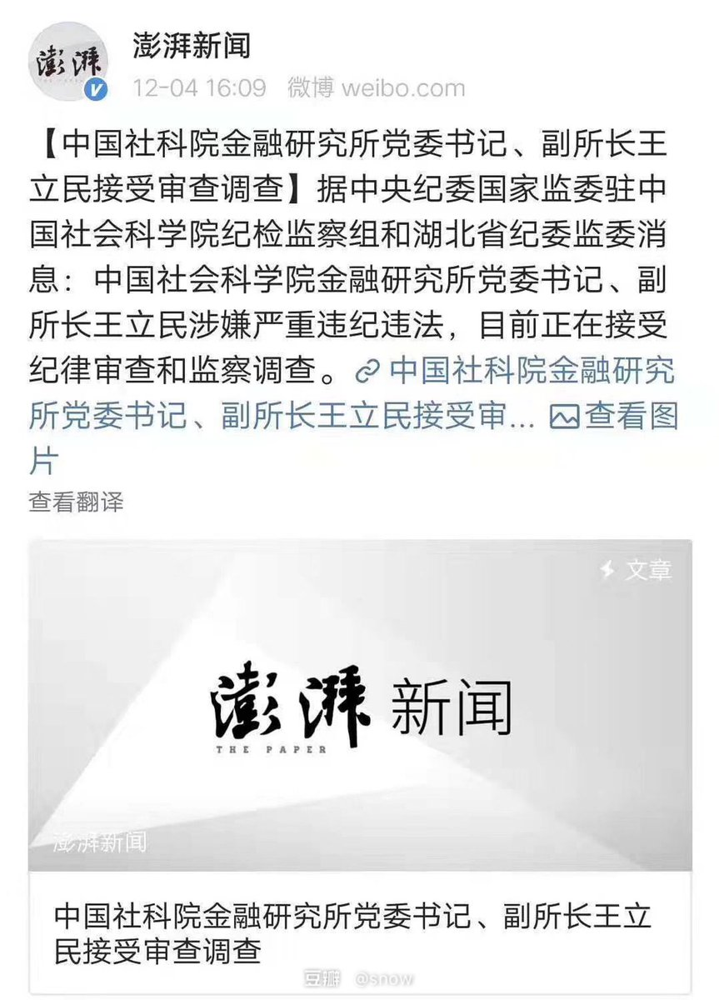

[12月09日 08:01]    BBC News 中文   @bbcchinese    BBC中文跟您回顾香港周日的“和理非”大型游行。  :speech_balloon:评:9 :+1:赞:28 :globe_with_meridians:转:17  

[12月09日 07:01]    BBC News 中文   @bbcchinese    这场由香港政府建议修订《逃犯条例》引起的示威浪潮至今已经持续半年，一些游行人士相信如果香港政府仍然拒绝回应要求，浪潮将会持续。 https://bbc.in/353AIY2   :speech_balloon:评:9 :+1:赞:72 :globe_with_meridians:转:15  

[12月09日 04:00]    纽约时报中文网   @nytchinese    #一周热门 这也许是地球上最可怕的地方，但有5G和一所很棒的学校 http://nyti.ms/2Ljg0M1   :speech_balloon:评:2 :+1:赞:15 :globe_with_meridians:转:8  

[12月09日 03:56]    凡賽堤/FORSETI   @FecharCCP    12.08國際人權日！  

百萬人以上的香港人展現出人類文明史上最和平，最文明，最理性，最有創意的方式向全世界發出最強的聲音！

香港人用行動向全世界，全人類證明了香港人是最民主的中華族群！

願榮光歸香港！祝福香港人！天佑香港人！

注，感謝大紀元的最前線視頻！  :speech_balloon:评:1 :+1:赞:111 :globe_with_meridians:转:56  

[12月09日 03:22]    凡賽堤/FORSETI   @FecharCCP    12.08國際人權日！  

人類文明史上最震撼的民主訴求盡在香港！

百萬人以上的香港人用最和平，最文明，最有創意的方式向全世界發出最強的聲音！

五大訴求，缺一不可！ 

願榮光歸香港！  :speech_balloon:评:0 :+1:赞:14 :globe_with_meridians:转:5  

[12月09日 03:16]    凡賽堤/FORSETI   @FecharCCP    12.08國際人權日！  

百萬人以上的香港人用最和平，最文明，最有創意的方式向全世界發出最強的聲音！

五大訴求，缺一不可！ 

願榮光歸香港！  :speech_balloon:评:3 :+1:赞:24 :globe_with_meridians:转:12  

[12月09日 03:13]    凡賽堤/FORSETI   @FecharCCP    12.08國際人權日！  願榮光歸香港！

百萬人以上的香港人用最和平，最文明，最有創意的方式向全世界發出最強的聲音！  :speech_balloon:评:1 :+1:赞:15 :globe_with_meridians:转:7  

[12月09日 03:11]    凡賽堤/FORSETI   @FecharCCP    12.08國際人權日！ 

百萬人以上的香港人向全世界發出最強的聲音！

願榮光歸香港！  :speech_balloon:评:0 :+1:赞:2 :globe_with_meridians:转:2  

[12月09日 02:49]    凡賽堤/FORSETI   @FecharCCP    12.08國際人權日！ 

百萬人以上的香港人向全世界發出最強的聲音！

願榮光歸香港！香港人是全世界華人的最好的歷史鏡子！

願CCP和所有盜國賊以及無知腦殘五毛粉在正義的歌聲中回到馬克思身邊！

願聽到香港人正義歌聲的大陸懦夫們站出來！  :speech_balloon:评:0 :+1:赞:8 :globe_with_meridians:转:3  

[12月09日 02:43]    凡賽堤/FORSETI   @FecharCCP    12.08國際人權日！
 百萬人以上的香港人向全世界發出最強的聲音！

香港人-中華民族的驕傲！  :speech_balloon:评:1 :+1:赞:22 :globe_with_meridians:转:10  

[12月09日 02:38]    凡賽堤/FORSETI   @FecharCCP    12.08國際人權日！ 百萬人以上的香港人向全世界發出最強的聲音！

全人類最文明最民主的香港族群，香港人是中華民族的民主典範！  :speech_balloon:评:0 :+1:赞:8 :globe_with_meridians:转:4  

[12月09日 02:38]    凡賽堤/FORSETI   @FecharCCP    全人類最文明最民主的香港族群，香港人是中華民族的民主典範！  :speech_balloon:评:2 :+1:赞:5 :globe_with_meridians:转:4  

[12月09日 02:20]    新闻大吐槽   @TuCaoFakeNews    sorry，可能造成了误解，后面的两点是我的话，不是美国大叔说的  :speech_balloon:评:2 :+1:赞:5 :globe_with_meridians:转:0  

[12月09日 02:00]    纽约时报中文网   @nytchinese    #一周热门 中国用DNA绘制维吾尔人面部图像 http://nyti.ms/34KH5Q7   :speech_balloon:评:5 :+1:赞:20 :globe_with_meridians:转:4  

[12月09日 01:34]    BBC News 中文   @bbcchinese    英国女子奥德丽·斯库曼在心脏骤停6个小时后生还，不是医学奇迹又是什么？但事情好像并不这么简单…… https://bbc.in/2DWkTqh   :speech_balloon:评:8 :+1:赞:75 :globe_with_meridians:转:36  

[12月09日 01:21]    墙国铁拳现世报😷   @Socialistfist    高级黑还是低级红？  :speech_balloon:评:9 :+1:赞:18 :globe_with_meridians:转:1  

[12月09日 01:20]    墙国铁拳现世报😷   @Socialistfist    民主铁拳现世报是高级黑还是低级红？
请您参与投票！  :speech_balloon:评:19 :+1:赞:83 :globe_with_meridians:转:6  

[12月09日 01:17]    新闻大吐槽   @TuCaoFakeNews    亲身参加游行的美国人认为，不只是香港人在失去自由， 美国人欧洲人也在慢慢失去自由！他来香港是见证历史，并成为其一部分！
其实，剥夺人类自由的恶势力无非就是两种：
1、共产中国势力的入侵
2、各国左派对自由理念的蚕食
这是一根毒藤上的两个瓜  :speech_balloon:评:22 :+1:赞:568 :globe_with_meridians:转:299  

[12月09日 01:17]    新闻大吐槽   @TuCaoFakeNews    亲身参加游行的美国人认为，不只是香港人在失去自由， 美国人欧洲人也在慢慢失去自由！他来香港是见证历史，并成为其一部分！
其实，剥夺人类自由的恶势力无非就是两种：
1、共产中国势力的入侵
2、各国左派对自由理念的蚕食
这是一根毒藤上的两个瓜  :speech_balloon:评:22 :+1:赞:568 :globe_with_meridians:转:299  

[12月09日 01:13]    新闻大吐槽   @TuCaoFakeNews    据民阵计算，今天的游行人数超80万！
半年过去了，游行还能维如此规模，历史罕见！

抗议民众喊出"驅除共黨，還我香港，打倒共產黨，還我自由港，释放被拘捕人士，天灭中共"等振聋发聩的时代先声！

历史大潮浩浩荡荡，无法阻挡！  :speech_balloon:评:2 :+1:赞:205 :globe_with_meridians:转:86  

[12月09日 01:13]    新闻大吐槽   @TuCaoFakeNews    据民阵计算，今天的游行人数超80万！
半年过去了，游行还能维如此规模，历史罕见！

抗议民众喊出"驅除共黨，還我香港，打倒共產黨，還我自由港，释放被拘捕人士，天灭中共"等振聋发聩的时代先声！

历史大潮浩浩荡荡，无法阻挡！  :speech_balloon:评:2 :+1:赞:205 :globe_with_meridians:转:86  

[12月09日 00:56]    新闻大吐槽   @TuCaoFakeNews    bbc拍的夜间灯海镜头，很漂亮！  :speech_balloon:评:2 :+1:赞:90 :globe_with_meridians:转:40  

[12月09日 00:56]    新闻大吐槽   @TuCaoFakeNews    bbc拍的夜间灯海镜头，很漂亮！  :speech_balloon:评:2 :+1:赞:90 :globe_with_meridians:转:40  

[12月09日 00:37]    老司机   @h5lpykl7tp6jjop    这就是邓炳强想出来的好办法！ https://twitter.com/manzhou19320301/status/1203680839814537216 …  :speech_balloon:评:15 :+1:赞:153 :globe_with_meridians:转:132  

[12月09日 00:37]    新闻大吐槽   @TuCaoFakeNews    这就是邓炳强想出来的好办法！ https://twitter.com/manzhou19320301/status/1203680839814537216 …  :speech_balloon:评:15 :+1:赞:153 :globe_with_meridians:转:132  

[12月09日 00:25]    纽约时报中文网   @nytchinese    #一周热门 #观点 中国已经失去了台湾 http://nyti.ms/2Y9wBXQ   :speech_balloon:评:67 :+1:赞:184 :globe_with_meridians:转:54  

[12月08日 22:30]    BBC News 中文   @bbcchinese    BBC中文以一篇文章跟你回顾今天发生在香港的大型示威活动。 https://bbc.in/352BCUO   :speech_balloon:评:8 :+1:赞:110 :globe_with_meridians:转:55  

[12月08日 22:12]    BBC News 中文   @bbcchinese    【香港示威：数以十万计市民再游行 晚间灯海闪耀】从清晨爬山至晚上的灯海，香港数以十万人再次延续了“反送中”运动。 https://bbc.in/2YqOIJ5   :speech_balloon:评:23 :+1:赞:120 :globe_with_meridians:转:32  

[12月08日 21:50]    老司机   @h5lpykl7tp6jjop    聊聊華為251事件，完整视频戳這裡 https://youtu.be/EiHAyCrM_qY   :speech_balloon:评:54 :+1:赞:521 :globe_with_meridians:转:132  

[12月08日 21:00]    纽约时报中文网   @nytchinese    #一周热门 《纽约时报》2019年度最佳剧集 http://nyti.ms/2r0lvZf   :speech_balloon:评:0 :+1:赞:17 :globe_with_meridians:转:5  

[12月08日 20:09]    新闻大吐槽   @TuCaoFakeNews    黑警又来搞笑，一边大喊大叫，一边说：“we’re very peaceful”  :speech_balloon:评:33 :+1:赞:303 :globe_with_meridians:转:140  

[12月08日 19:15]    新闻大吐槽   @TuCaoFakeNews    六月份游行时，街边义工派发的是冰凉贴！
而现在，街边义工已经在派发热敷贴~
体验了暑往寒来，又经历了世间冷暖，抗争者更理性，更坚定！  :speech_balloon:评:8 :+1:赞:603 :globe_with_meridians:转:198  

[12月08日 19:12]    BBC News 中文   @bbcchinese    香港遊行在入夜後仍然持續。  :speech_balloon:评:194 :+1:赞:3812 :globe_with_meridians:转:1720  

[12月08日 19:00]    纽约时报中文网   @nytchinese    #一周热门 孟晚舟发表公开信，回顾被捕这一年 http://nyti.ms/2LiFLvX   :speech_balloon:评:13 :+1:赞:18 :globe_with_meridians:转:1  

[12月08日 18:53]    新闻大吐槽   @TuCaoFakeNews    6个月前，他们曾为救护车让路！而今晚，他们为消防车让路！
历经打压，香港人并没有变，他们高素质，有序，又体谅别人，已经融入DNA！
随时准备帮助别人，哪怕他们自己还在困苦中艰难前行！

摩西也没能两次分开红海，而香港人做到了！  :speech_balloon:评:5 :+1:赞:388 :globe_with_meridians:转:156  

[12月08日 18:40]    新闻大吐槽   @TuCaoFakeNews    虽然人数众多，但为了让物资可以迅速的传递，人群中间让出一条物资专用通道！
让人想起6月份200万人游行时，救护车分开人群的一幕！  :speech_balloon:评:5 :+1:赞:290 :globe_with_meridians:转:126  

[12月08日 18:27]    新闻大吐槽   @TuCaoFakeNews    从高处看壮观的灯海！  :speech_balloon:评:9 :+1:赞:655 :globe_with_meridians:转:258  

[12月08日 18:20]    BBC News 中文   @bbcchinese    及至晚上六时，在游行起点的铜锣湾，仍有大批游行人士聚集。 https://bbc.in/351Bbdr   :speech_balloon:评:7 :+1:赞:125 :globe_with_meridians:转:41  

[12月08日 18:10]    新闻大吐槽   @TuCaoFakeNews    夜越暗，灯海越闪亮！  :speech_balloon:评:6 :+1:赞:346 :globe_with_meridians:转:162  

[12月08日 18:09]    新闻大吐槽   @TuCaoFakeNews    这个方阵特别幸运，他们的歌声有小小提琴手一路伴奏！  :speech_balloon:评:9 :+1:赞:410 :globe_with_meridians:转:142  

[12月08日 18:01]    BBC News 中文   @bbcchinese    上周五袭击美国佛罗里达海军基地的沙特枪手据报事先曾在晚餐时播放大规模枪击案的视频。 https://bbc.in/2RwaoSI   :speech_balloon:评:11 :+1:赞:21 :globe_with_meridians:转:8  

[12月08日 17:17]    BBC News 中文   @bbcchinese    从清晨到下午，香港的“反送中”运动再有大规模活动。  :speech_balloon:评:26 :+1:赞:350 :globe_with_meridians:转:145  

[12月08日 17:08]    新闻大吐槽   @TuCaoFakeNews    十分混乱！
人民纷纷抛弃独裁者，而很多圈子内的人，也不顾领袖形象，捡了好处，拔腿开溜！  :speech_balloon:评:34 :+1:赞:264 :globe_with_meridians:转:68  

[12月08日 17:07]    财经真相   @caijingxiang    朝鲜中央通讯社8日报道，朝鲜前一天在西海卫星发射场成功实施“一次非常重大的试验”。
　　报道说，朝鲜国防科学院7日下午实施这次重大试验，随后向朝鲜劳动党中央委员会汇报试验成功结果。朝方没有披露这次试验的具体内容，只是表示试验结果将在不久后“对改变朝鲜战略地位”发挥重大作用。  :speech_balloon:评:25 :+1:赞:147 :globe_with_meridians:转:38  

[12月08日 17:01]    BBC News 中文   @bbcchinese    刚刚过去的一周，BBC中文以下新闻内容受到读者的关注。如果你错过了它们，BBC中文带你一一回顾。 https://bbc.in/2YqP0Qd   :speech_balloon:评:9 :+1:赞:20 :globe_with_meridians:转:9  

[12月08日 17:00]    纽约时报中文网   @nytchinese    #一周热门  时报影评人的十年十佳电影清单 http://nyti.ms/35TOfl9   :speech_balloon:评:3 :+1:赞:12 :globe_with_meridians:转:6  

[12月08日 16:58]    新闻大吐槽   @TuCaoFakeNews    面对无耻的共党极权，香港人的不懈的抗争赢得了世人的尊重，有人权活动家小组特地从韩国飞来，现场支持香港人！
香港人也对他们的支持回报以最多的掌声  :speech_balloon:评:10 :+1:赞:458 :globe_with_meridians:转:164  

[12月08日 16:33]    新闻大吐槽   @TuCaoFakeNews    有人购买了日本草莓给游行的示威者分发！
想给苦涩中的抗争者带来一丝甜蜜！  :speech_balloon:评:16 :+1:赞:603 :globe_with_meridians:转:204  

[12月08日 16:29]    老司机   @h5lpykl7tp6jjop    ttingxiao:【112求援國際 維園大集會】防暴警從維園一路抓捕抗爭者到希慎廣場前，抗爭者快速四散，一名女抗爭者先被警察用警棍敲打再抓捕 . …  :speech_balloon:评:0 :+1:赞:9 :globe_with_meridians:转:6  

[12月08日 16:25]    新闻大吐槽   @TuCaoFakeNews    今天游行中示威者打出的三面黑旗！

昨日疆藏
近日香港
明日台湾

我看还要加上一面旗，“前日法轮功”！
因为镇压新疆西藏的手段，确确实实是从迫害法轮功中积累起来的！  :speech_balloon:评:16 :+1:赞:195 :globe_with_meridians:转:91  

[12月08日 16:16]    新闻大吐槽   @TuCaoFakeNews    口号声震天，楼宇都在颤抖！
还要展现多少次压倒性的民意，愚蠢的当政者才能醒悟？  :speech_balloon:评:96 :+1:赞:2690 :globe_with_meridians:转:1159  

[12月08日 16:15]    BBC News 中文   @bbcchinese    大批香港人正在港岛区游行，有游行人士的打扮别开生面。  :speech_balloon:评:139 :+1:赞:1422 :globe_with_meridians:转:542  

[12月08日 16:04]    老司机   @h5lpykl7tp6jjop    英国旗方阵经过！看看这气势！
然而这只是众多方阵之一  :speech_balloon:评:37 :+1:赞:884 :globe_with_meridians:转:328  

[12月08日 16:04]    新闻大吐槽   @TuCaoFakeNews    英国旗方阵经过！看看这气势！
然而这只是众多方阵之一  :speech_balloon:评:37 :+1:赞:884 :globe_with_meridians:转:328  

[12月08日 16:03]    老司机   @h5lpykl7tp6jjop    [LIVE] The crowd of protesters seems so large that the procession has barely moved since 3PM in Causeway Bay. 

#FreedomHK #FightForFreedom #StandwithHonKong #HumanRightsDay  :speech_balloon:评:5 :+1:赞:632 :globe_with_meridians:转:467  

[12月08日 16:02]    BBC News 中文   @bbcchinese    受访者中，57%担忧他们的个人行踪被记录，近50%担忧不法分子利用伪造信息实施诈骗或盗刷。 https://bbc.in/38lUssa   :speech_balloon:评:39 :+1:赞:60 :globe_with_meridians:转:21  

[12月08日 15:12]    BBC News 中文   @bbcchinese    即将过去的2019年全球爆发抗争浪潮，这五张面孔不该被我们遗忘。 https://bbc.in/2s2BSVi   :speech_balloon:评:35 :+1:赞:108 :globe_with_meridians:转:40  

[12月08日 15:00]    纽约时报中文网   @nytchinese    #一周热门 把转机变成度假，27小时畅游新加坡樟宜机场 http://nyti.ms/360CBF9   :speech_balloon:评:0 :+1:赞:22 :globe_with_meridians:转:10  

[12月08日 14:00]    BBC News 中文   @bbcchinese    公开考试获0分，独居㓥房几年的他，如何击败香港建制派明星当上区议员？ https://bbc.in/2PnQG8K   :speech_balloon:评:122 :+1:赞:204 :globe_with_meridians:转:42  

[12月08日 13:48]    BBC News 中文   @bbcchinese    根据科学家的计算，太阳最多大约还有50至60亿年的寿命。而科学家最近所发现的一个天文现象，为我们提供了太阳“寿终正寝”后未来的一瞥。 https://bbc.in/2YttgTR   :speech_balloon:评:14 :+1:赞:65 :globe_with_meridians:转:39  

[12月08日 13:32]    老司机   @h5lpykl7tp6jjop    客人虽然爬在身，我心仍是中国心，无论什么时候，都是中国人！ https://twitter.com/catcarterpi/status/1203508124012777472 …  :speech_balloon:评:0 :+1:赞:8 :globe_with_meridians:转:1  

[12月08日 13:20]    老司机   @h5lpykl7tp6jjop    墙国人民看到有关香港的新闻报道  :speech_balloon:评:1 :+1:赞:33 :globe_with_meridians:转:8  

[12月08日 13:09]    老司机   @h5lpykl7tp6jjop    包子夫人见丈夫近来愁眉苦脸，感觉大事不好，便轻车简从寻道观求签测字，一连数签都是下下签，胆颤心惊， 改测字，问测何事，答国事，何字？曰：共，答：大难己至，供已无人，洪已无水，人财两空！曰：非共乃公，答：更差！ 松己无木，空中画图！曰：非公乃工，答：完了，天下己断成两半只剩一半了！  :speech_balloon:评:1 :+1:赞:26 :globe_with_meridians:转:0  

[12月08日 13:00]    老司机   @h5lpykl7tp6jjop    共产党很恐怖，可是更恐怖的是给它帮忙的人之多才更恐怖！朝阳群众、西城大妈、海淀网友、丰台劝导队，东城守望者、石景山老街坊、顺义百姓……数都数不过来，有的给五毛，有的管饭，有的什么不给，发个红袖套就屁颠颠的来了，有人还巴望着启蒙，共振，就这点人还不够它们检举揭发的呢，还是让它们亡吧  :speech_balloon:评:3 :+1:赞:85 :globe_with_meridians:转:15  

[12月08日 13:00]    纽约时报中文网   @nytchinese    #一周热门 这本第一夫人传记，告诉你有关梅拉尼娅的6件事 http://nyti.ms/2rR8zEX   :speech_balloon:评:4 :+1:赞:10 :globe_with_meridians:转:1  

[12月08日 12:40]    老司机   @h5lpykl7tp6jjop    历史上的今天新疆克拉玛依因有人大声说了一句“同学们别动，让领导先走！”288名学生全部葬身火海被烧死。

今天全中国十四亿人还是没有动，领导们不仅先走，连它们的老婆儿女二奶情人都先走了！问题是留下来的人是怎么办呢？今年火也烧了，水也淹了，猪瘟鼠疫都来了，城管交警都很努力，领导感到压力大  :speech_balloon:评:10 :+1:赞:186 :globe_with_meridians:转:60  

[12月08日 11:00]    BBC News 中文   @bbcchinese    【一周热点回顾】中国外交部周一（2日）宣布，制裁包括总部设于美国的“人权观察”（Human Rights Watch）等非政府组织（NGO）。
“人权观察”回应说，对于中国政府鉴于他们在香港修例风波中的表现而要实施详情不明的“制裁”，表示遗憾。  :speech_balloon:评:35 :+1:赞:39 :globe_with_meridians:转:13  

[12月08日 11:00]    纽约时报中文网   @nytchinese    #一周热门 #观点 在中国的饭局上，女性如何生存？ http://nyti.ms/2R862AU   :speech_balloon:评:30 :+1:赞:88 :globe_with_meridians:转:26  

[12月08日 10:12]    BBC News 中文   @bbcchinese    在救援任务中需要帮忙吗？有这群“迷你猎豹”帮助你！  :speech_balloon:评:43 :+1:赞:365 :globe_with_meridians:转:141  

[12月08日 09:39]    老司机   @h5lpykl7tp6jjop    五毛说反对中国的没有一个好人，是的，他们必须是汉奸卖国贼，反革命，流氓诈骗犯，强奸犯，以及各种各样被政府处理过的犯罪分子，因为不这样中共就得化时间费脑筋去批判他们所说的道理，开始很简单，编一套说词，但是因为他们反驳，被指出的漏洞就越来越多，麻烦！干脆先定一个罪名电视上一播！完事！  :speech_balloon:评:2 :+1:赞:16 :globe_with_meridians:转:3  

[12月08日 07:00]    纽约时报中文网   @nytchinese    #一周热门 #观点 一场与中国的新冷战已经开始 http://nyti.ms/2OKD9sY   :speech_balloon:评:16 :+1:赞:71 :globe_with_meridians:转:20  

[12月08日 04:20]    老司机   @h5lpykl7tp6jjop    彭博:中共40年代接管上海盛极而衰 今天香港重蹈覆辙  :speech_balloon:评:3 :+1:赞:27 :globe_with_meridians:转:23  

[12月08日 01:51]    BBC News 中文   @bbcchinese    美国总统特朗普称，欢迎被伊朗以从事间谍活动为借口关押的华人王夕越获释。 https://www.bbc.com/zhongwen/simp/science-50700437 …  :speech_balloon:评:13 :+1:赞:212 :globe_with_meridians:转:69  

[12月08日 01:08]    财经真相   @caijingxiang    贸易战的另一条重磅消息，中国决定自2019年12月15日12时01分起，恢复对美国汽车及零部件加征关税！15号第一阶段协议看样是黄了！  :speech_balloon:评:120 :+1:赞:1099 :globe_with_meridians:转:399  

[12月08日 01:01]    财经真相   @caijingxiang    纽约时报9月份就报道过世界银行调查其贷款被用于新疆集中营的建设，但是该报道在当时并未引起特别关注！中国上次从世界银行申请贷款是2015年，按照世界银行规定，贷款国每五年才可以申请一次，中国此次申请贷款不足五年，明显违反这一规定，但是很有意思的事，媒体对此几乎没有任何报道，甚至还有删除  :speech_balloon:评:11 :+1:赞:275 :globe_with_meridians:转:141  

[12月08日 00:52]    财经真相   @caijingxiang    世界银行过去几十年究竟给中国放过多少贷款？究竟还了多少？又被挪用了多少？随着川普的推文引发的关注，媒体会跟进报道，以及深挖吗？  :speech_balloon:评:3 :+1:赞:137 :globe_with_meridians:转:53  

[12月08日 00:35]    BBC News 中文   @bbcchinese    马德里顶级美术馆世界名画被“篡改”后...... https://bbc.in/2ron6bo   :speech_balloon:评:2 :+1:赞:17 :globe_with_meridians:转:4  

[12月07日 22:56]    老司机   @h5lpykl7tp6jjop    今日大約12:45pm銅鑼灣F1出口，有一名外籍男士(相中右邊深藍衫)因看見有一名藍衫男子(相中左邊淺藍衫)和一名青年人發生糾纏，出手阻止。期間有人要求該藍衫男子出示委任證⋯⋯現在該名外籍男士已被拘捕並送至灣仔警署。  :speech_balloon:评:79 :+1:赞:1049 :globe_with_meridians:转:814  

[12月07日 21:34]    BBC News 中文   @bbcchinese    即将过去的2019年是全球抗议年。从香港到智利，再到伊朗、加泰罗尼亚，成千上万愤怒的人群在今年某一刻走上街头抗议。他们中的一些人，未必是运动中的领袖人物，却成了抗争的代言人。 https://www.bbc.com/zhongwen/simp/world-50697274 …  :speech_balloon:评:112 :+1:赞:717 :globe_with_meridians:转:289  

[12月07日 19:00]    纽约时报中文网   @nytchinese    #一周热门 5个问题，全面了解美国众议院弹劾报告 http://nyti.ms/365cdd1   :speech_balloon:评:9 :+1:赞:26 :globe_with_meridians:转:9  

[12月07日 18:47]    财经真相   @caijingxiang    12月7日上午，杨洁篪同美国国务卿蓬佩奥通电话。杨洁篪这个电话打的很是时候，不提贸易只对香港、新疆法案表示严重抗议，这是什么意思？  :speech_balloon:评:95 :+1:赞:362 :globe_with_meridians:转:101  

[12月07日 17:50]    老司机   @h5lpykl7tp6jjop    629名女孩遭卖至中国当新娘 巴铁无奈冷处理
与中共来往和魔鬼打交道没区别，最终会倒晦！  :speech_balloon:评:0 :+1:赞:14 :globe_with_meridians:转:3  

[12月07日 16:23]    老司机   @h5lpykl7tp6jjop    用纸板和少许水泥做成的水泥砖，你见过吗！  :speech_balloon:评:13 :+1:赞:109 :globe_with_meridians:转:76  

[12月07日 13:00]    纽约时报中文网   @nytchinese    #一周热门 这本第一夫人传记，告诉你有关梅拉尼娅的6件事 http://nyti.ms/2rR8zEX   :speech_balloon:评:0 :+1:赞:12 :globe_with_meridians:转:2  

[12月07日 12:00]    纽约时报中文网   @nytchinese    “我们被世界的精英掌控着，他们希望我们一直穷下去。“被工厂裁员的一名纺织工人说。
“我小时候，是共产党在保护工人，保护我们的社会阶层。现在，是联盟党在保护人民。” http://nyti.ms/2qr2FKm   :speech_balloon:评:4 :+1:赞:50 :globe_with_meridians:转:11  

[12月07日 11:53]    财经真相   @caijingxiang    市场希望通过德拉基的首秀，能够了解她执掌下的欧洲央行未来货币政策走向，尤其她是否会继续前任继续扮演“欧元杀手”的角色。另外本周五最后一个交易日结束前，中美能够达成协议，将会对市场走向产生决定性的影响。最后，随着圣诞节、新年的临近，黄金销售旺季的来临，黄金的新年攻势蓄势也将开始计价！  :speech_balloon:评:5 :+1:赞:46 :globe_with_meridians:转:8  

[12月07日 11:42]    财经真相   @caijingxiang    下周金融市场焦点比较多，尤其是（北京时间）周四，美联储、巴西、菲律宾、土耳其以及欧洲央行都将公布12月利率决议。对于美联储本次会议，市场普遍认为将按兵不动，除了利率点阵图外，并没有太多看点。反而真正的主角将是欧洲央行的新任掌门人“拉加德”，这是她就职以来的“首秀”！  :speech_balloon:评:6 :+1:赞:64 :globe_with_meridians:转:18  

[12月07日 11:00]    纽约时报中文网   @nytchinese    #一周热门 《纽约时报》2019年最佳童书 http://nyti.ms/2DYSDn7   :speech_balloon:评:1 :+1:赞:19 :globe_with_meridians:转:4  

[12月07日 10:06]    老司机   @h5lpykl7tp6jjop    改革春风吹满地，中国人民真争气。物质精神两手抓，魔幻现实人人夸。  :speech_balloon:评:69 :+1:赞:618 :globe_with_meridians:转:292  

[12月07日 09:42]    老司机   @h5lpykl7tp6jjop    当年陈毅当上海市长，搞公私合营逼得资本家跳楼，他每天都问部下今天有多少空降兵啦？意思是当天有多少跳楼的资本家。现在风水轮流转，共产党的书记们都在排队当空降兵了，陈毅在阴间也没料到吧！  :speech_balloon:评:6 :+1:赞:135 :globe_with_meridians:转:54  

[12月07日 09:00]    纽约时报中文网   @nytchinese    #一周热门 #新新世界 华为是如何在中国失去民心的？ http://nyti.ms/2RhpGKV   :speech_balloon:评:174 :+1:赞:298 :globe_with_meridians:转:77  

[12月07日 08:44]    老司机   @h5lpykl7tp6jjop    北大教授：谁要生5个孩子 应获1个免考进北大名额
从一人超生全村结扎！到谁能给党生娃，生上五个上北大！
中国的生育政策咋这么搞笑呢？你们把女人下面当水龙头吗？想关就关，想开就开！？  :speech_balloon:评:3 :+1:赞:42 :globe_with_meridians:转:18  

[12月07日 07:58]    老司机   @h5lpykl7tp6jjop    老外为了过河建桥二百多年来都很好，继续用，中国最伟大的改革开放设计师说，我们摸着石头过河！他的继承者都三四代了，摸石头上瘾，决定不过河了！于是中国人还要在水里继续泡很多年。  :speech_balloon:评:1 :+1:赞:41 :globe_with_meridians:转:9  

[12月07日 07:50]    老司机   @h5lpykl7tp6jjop    官媒，“捅雞”糧食生產創歷史新高。
同樣官媒，11月農作物絕收38.1千公頃，同比農作物受災面積增加315％。  :speech_balloon:评:2 :+1:赞:28 :globe_with_meridians:转:23  

[12月07日 07:00]    纽约时报中文网   @nytchinese    #一周热门 中国针对少数民族的基因研究引发科学界反弹 http://nyti.ms/2YgCZwA   :speech_balloon:评:8 :+1:赞:44 :globe_with_meridians:转:9  

[12月07日 02:58]    墙国铁拳现世报😷   @Socialistfist    如果您对本推内容有什么想说的并且希望被匿名看到，可以私信小编！
这两位推友如果互相欣赏彼此观点，小编可以介绍认识  :speech_balloon:评:4 :+1:赞:39 :globe_with_meridians:转:1  

[12月07日 02:55]    墙国铁拳现世报😷   @Socialistfist    推友们大家好，首先必须承认最近铁拳推没有之前的数量和质量，向各位关注本推的推友致歉。
再次感谢大家的投稿，如果您的投稿符合本推的投稿标准，小编会陆续给您安排发布
受之前 #现世报读者来信 启发而创立的新系列，这次刊登两位年纪相仿中港的推友对墙内现象的感言，小编认为这样的交流很有意义。  :speech_balloon:评:26 :+1:赞:262 :globe_with_meridians:转:39  

[12月06日 23:20]    财经真相   @caijingxiang    由于通用罢工结束，员工返回工作岗位，导致11月美国非农数据远超预期，降低了明年美国经济衰退的预期，同时也减少了美联储继续降息的预期，但是该数据由于是临时性的，后期还需要更多数据来佐证经济发展情况！  :speech_balloon:评:8 :+1:赞:136 :globe_with_meridians:转:12  

[12月06日 23:15]    墙国铁拳现世报😷   @Socialistfist    有感而发  :speech_balloon:评:4 :+1:赞:196 :globe_with_meridians:转:11  

[12月06日 22:35]    纽约时报中文网   @nytchinese    随着公众对移民的愤怒加剧，意大利极右翼政党联盟党迅速崛起。
但转变早在数十年前就已打下根基，许多纺织小城在与中国的竞争中日益衰败，急剧向右翼摇摆。许多劳动阶层人士认为，这是搞错了先后顺序：是左翼先抛弃了他们。 http://nyti.ms/2qr2FKm   :speech_balloon:评:25 :+1:赞:152 :globe_with_meridians:转:54  

[12月06日 21:21]    墙国铁拳现世报😷   @Socialistfist    滋磁！ https://twitter.com/minzhutiequan/status/1202745105754419200 …  :speech_balloon:评:36 :+1:赞:211 :globe_with_meridians:转:21  

[12月06日 17:45]    财经真相   @caijingxiang    环球时报社评：美国军舰敢访台湾？我军舰就直接驶入台湾港口！ 各位都截图保存，到时看看党国是否敢兑现今日的吹风!  :speech_balloon:评:75 :+1:赞:900 :globe_with_meridians:转:341  

[12月06日 17:00]    纽约时报中文网   @nytchinese    #观点 中国国有企业及名义上的私有企业进入美国资本市场几乎不受约束，包括在美国交易所上市，以及获得来自国家最大型退休基金的重大投资。
为什么美国退休基金要向帮助压迫人权、支持中国军队、可能搜集美国情报的中国企业投资呢？ http://nyti.ms/33RGb2H   :speech_balloon:评:174 :+1:赞:421 :globe_with_meridians:转:134  

[12月06日 16:30]    财经真相   @caijingxiang    最近中共在贸易上的语气明显软了许多，有种求饶的感觉，15号关税时间节点临近，还是希望用买来换时间，但这次川普不会再给机会！ https://twitter.com/caijingxiang/status/1202834120939696128 …  :speech_balloon:评:36 :+1:赞:251 :globe_with_meridians:转:50  

[12月06日 16:30]    纽约时报中文网   @nytchinese    《三体》的英语翻译刘宇昆研究这部小说混乱的时间轴，并建议把隐藏在故事中部的历史倒叙拉出来，变成小说的开头。
当刘宇昆把这个彻底的改变建议给小说作者刘慈欣时，他做好了遭到拒绝的准备。刘慈欣立即同意刘宇昆的建议。“我当初正是这么想的！“刘宇昆回想起刘慈欣这样说。 http://nyti.ms/2DNcl57   :speech_balloon:评:6 :+1:赞:24 :globe_with_meridians:转:9  

[12月06日 16:23]    财经真相   @caijingxiang    银保监会：现公布修订后的《中华人民共和国外资保险公司管理条例实施细则》，自公布之日起施行。银保监会：外国保险公司分公司成立后，外国保险公司不得以任何形式抽回营运资金。  :speech_balloon:评:48 :+1:赞:399 :globe_with_meridians:转:163  

[12月06日 16:09]    纽约时报中文网   @nytchinese    #图集【在美国，230万美元能买到什么房？】手握230万美元，你能买到位于费城一座建于1925年的石屋，或是新墨西哥州圣达菲的一座普韦布洛式房屋，也可以选择伊利诺伊州埃文斯顿的一处历史悠久的豪宅。
点击查看图集： http://nyti.ms/2OWDjxr   :speech_balloon:评:17 :+1:赞:36 :globe_with_meridians:转:4  

[12月06日 14:55]    财经真相   @caijingxiang    我都能想象的出该片配上《愿荣光归香港》的背景曲会是多么悲壮！  :speech_balloon:评:6 :+1:赞:63 :globe_with_meridians:转:4  

[12月06日 14:51]    财经真相   @caijingxiang    大外宣CGTN制作了一个新疆暴恐纪录片，向墙内老百姓洗脑，这种办法是恨有迷惑性！不过这种方式可以借鉴，香港示威这么久，确实需要一个制作精良的纪录片，把散碎的新闻事件连贯起来，既可以宣传香港真相，又可以快速帮助墙内被洗脑很深的国人，最好用多国语言制作，不知道有没有能人为香港办点实事！  :speech_balloon:评:38 :+1:赞:153 :globe_with_meridians:转:52  

[12月06日 14:16]    财经真相   @caijingxiang    国务院关税税则委员会办公室：中国企业自主通过市场化采购，自美进口一定数量商品。国务院关税税则委员会正在根据相关企业的申请，开展部分大豆、猪肉等商品排除工作，对排除范围内商品，采取不加征我对美301措施反制关税等排除措施。对排除范围内商品采购，企业自主商谈、自行进口、自负盈亏。  :speech_balloon:评:33 :+1:赞:224 :globe_with_meridians:转:69  

[12月06日 10:23]    财经真相   @caijingxiang    余额宝里面的钱到底有多少在账上？又被人挪用了多少？他们连银行都敢票据都敢不还，更何况一个公司？  :speech_balloon:评:41 :+1:赞:256 :globe_with_meridians:转:85  

[12月06日 09:59]    财经真相   @caijingxiang    中国央行今日开展3000亿MLF操作为一年期，利率为3.25%，与此前持平。本周，中国央行未开展逆回购操作，因本周无逆回购到期，因此本周实现零投放和零回笼。但央行本周开展3000亿元中期借贷便利（MLF）操作，另有1875亿元MLF到期。从全口径测算，本周实现净投放1125亿元人民币。  :speech_balloon:评:7 :+1:赞:39 :globe_with_meridians:转:8  

[12月06日 09:54]    财经真相   @caijingxiang    国有副大行密集平调！  :speech_balloon:评:10 :+1:赞:89 :globe_with_meridians:转:35  

[12月06日 09:49]    财经真相   @caijingxiang    最近中共高官频繁调动，同时各大银行副行长也调动频繁！  :speech_balloon:评:9 :+1:赞:108 :globe_with_meridians:转:31  

[12月05日 22:24]    墙国铁拳现世报😷   @Socialistfist    推特魔幻剧场  :speech_balloon:评:14 :+1:赞:127 :globe_with_meridians:转:10  

[12月05日 22:16]    墙国铁拳现世报😷   @Socialistfist    来认识一下党内的“王立” 家族
左起王立强，王立军，王立民，王立新
欢迎补充  :speech_balloon:评:17 :+1:赞:193 :globe_with_meridians:转:40  

[12月05日 20:13]    财经真相   @caijingxiang    今年以来不良资产包供给总体平稳，但结构上出现变化，体现在国有大行占比呈现下降趋势，区域性的城商行、农商行则出现上升，同时非银行金融机构不良资产供给亦持续增多。现在市、县域农商银行完全成为当地政府的提款机，这也是现在很多政府还能继续发工资的原因！罪恶啊！ https://twitter.com/reuterscn/status/1202551779633876994 …  :speech_balloon:评:8 :+1:赞:162 :globe_with_meridians:转:40  

[12月05日 17:57]    财经真相   @caijingxiang    央行印出来的货币，必须要有“价值”，没有价值的货币是没人要的！确保印出来的货币有价值是央行的主要职能之一！
在中国央行的主要任务就是给政府.国企以及权贵企业发钱，却用14亿百姓的财富做抵押，以此来给新印的钞票提供价值！ https://youtu.be/HDDCAS4we4E   :speech_balloon:评:14 :+1:赞:305 :globe_with_meridians:转:125  

[12月05日 10:32]    凡賽堤/FORSETI   @FecharCCP    行动起来！！！ 為川普發聲！！！
FOX直播国会对川普总统的弹劾案youtube，
呼籲全球正義人士都请去点踩
维护川普的尊严发出正義的声音聲援川普！！！ https://www.youtube.com/watch?v=ogmWHENgSTQ …  :speech_balloon:评:0 :+1:赞:9 :globe_with_meridians:转:5  

[12月05日 06:26]    墙国铁拳现世报😷   @Socialistfist    为了实地考察并认真调研总书记任内打击腐败取得的骄人成绩，王立民书记主动要求到狱中体验贪腐分子的日常
什么是学者的钻研精神，小编哭了，你呢？

#社会主义铁拳  :speech_balloon:评:21 :+1:赞:365 :globe_with_meridians:转:86  

[12月04日 20:37]    GFHG SDKM   @zyx_yny    喂喂，香港嘅bb睇落嚟

澳洲設立committee，探討是否有必要頒佈Magnitsky. 可以開始寫信lobby袋鼠囯喔。They accept submissions now

好擔心。區選舉和HKHRDA頒佈后，大家有哋散漫有哋唔focus喎。還有人開始屌來屌去...

bb, come back! 依家有嘢做囖

利申：信還沒寫，不過澳洲list做完一半了 https://twitter.com/NSWHongkongers/status/1202151090399006720 …  :speech_balloon:评:9 :+1:赞:323 :globe_with_meridians:转:204  

[12月03日 18:59]    墙国铁拳现世报😷   @Socialistfist    两位推友匿名私信回应  :speech_balloon:评:16 :+1:赞:161 :globe_with_meridians:转:22  

[12月03日 18:58]    墙国铁拳现世报😷   @Socialistfist    党员推友后续来信  :speech_balloon:评:11 :+1:赞:71 :globe_with_meridians:转:5  

[12月03日 18:22]    墙国铁拳现世报😷   @Socialistfist    曾经中国最年轻的省区首府市市长之一
坚决支持铁腕新疆政策，党内仕途看好
到头来也是落个 “生活奢靡，贪图享乐，道德败坏，搞权色交易”的无期徒刑
刚从俄罗斯和副总理韩正考察回来,就被从首都机场带走。  :speech_balloon:评:35 :+1:赞:451 :globe_with_meridians:转:141  

[12月03日 00:55]    墙国铁拳现世报😷   @Socialistfist    一位推友的来信
欢迎理性讨论  :speech_balloon:评:197 :+1:赞:312 :globe_with_meridians:转:30  

[12月02日 23:05]    墙国铁拳现世报😷   @Socialistfist    补充  :speech_balloon:评:10 :+1:赞:266 :globe_with_meridians:转:58  

[12月02日 22:53]    墙国铁拳现世报😷   @Socialistfist    华为251事件在微博上引起热烈讨论，不少贸易战时脑热购买华为手机的粉红一夜间大有幡然醒悟之感。
爱国爱党情怀还能消费多久？
#社会主义铁拳  :speech_balloon:评:76 :+1:赞:883 :globe_with_meridians:转:295  

[12月02日 08:45]    墙国铁拳现世报😷   @Socialistfist    请各位推友注意上推安全 https://twitter.com/keepcnsecurity/status/1201167265804087296 …  :speech_balloon:评:3 :+1:赞:77 :globe_with_meridians:转:19  

[12月01日 09:33]    墙国铁拳现世报😷   @Socialistfist    没想到昨天上了墙内头条的这位可怜人，也是社会主义铁拳击的受害人；

@Socialistfist  :speech_balloon:评:67 :+1:赞:435 :globe_with_meridians:转:103  

[11月30日 21:18]    墙国铁拳现世报😷   @Socialistfist    粉蚷战螂被小编挂以后，一个嘴硬的都没有。  :speech_balloon:评:25 :+1:赞:180 :globe_with_meridians:转:9  

[11月30日 08:30]    凡賽堤/FORSETI   @FecharCCP    CCP極權恐怖組織把人民的血汗錢都用在的網絡維穩上了，圈養了人類獨一無二的，人數達千萬的流氓殭屍網絡水軍，谷歌所有集團企業已經淪為CCP極權恐怖組織重要維穩工具了，從2018年google搜索郭文貴的8百萬到現在的360萬，郭媒體從2019年初的18000的全球排名到現在的27669排名，極權不滅，養老永無望！  :speech_balloon:评:1 :+1:赞:10 :globe_with_meridians:转:7  

[11月30日 07:23]    凡賽堤/FORSETI   @FecharCCP    推翻共产党！全民抗议！全民起义！唱响国际歌！起来不愿做奴隶的人们！起来全中国受苦受难的中华儿女！ https://twitter.com/breakup1984/status/1200411445940211714 …  :speech_balloon:评:0 :+1:赞:21 :globe_with_meridians:转:11  

[11月30日 07:19]    凡賽堤/FORSETI   @FecharCCP    人類史上最殘暴的CCP極權殺人恐怖組織正在用各種兇殘手段屠殺我們的同胞...................

CCP極權殺人恐怖組織在香港發射數以萬計的疑似帶有生化武器成份的非標準催淚彈，足以影響三代人的致癌可能！

CCP極權殺人恐怖組織在自己的土地上投放劇毒催淚彈意圖謀殺我們黃色種族同胞！  :speech_balloon:评:2 :+1:赞:29 :globe_with_meridians:转:24  

[11月30日 05:58]    凡賽堤/FORSETI   @FecharCCP    中共催泪弹成分化验结果出炉：山埃毒，也叫氰化钾，爆表！这已经不是镇压抗议者，而是赤裸裸的谋杀，包括对抗议者的生育都会造成影响！  https://twitter.com/SolomonYue/status/1200445644613140480 …  :speech_balloon:评:12 :+1:赞:293 :globe_with_meridians:转:252  

[11月30日 01:48]    墙国铁拳现世报😷   @Socialistfist    好一句“打得好”，但如果所有香港人都和他們一樣幸災樂禍，咁香港就真正被同化了  :speech_balloon:评:4 :+1:赞:107 :globe_with_meridians:转:7  

[11月30日 01:13]    墙国铁拳现世报😷   @Socialistfist    有推友说最近铁拳不够劲
小编一如既往地欢迎大家踊跃投稿
但有时候，无铁拳胜过假铁拳  :speech_balloon:评:7 :+1:赞:160 :globe_with_meridians:转:4  

[11月28日 08:19]    凡賽堤/FORSETI   @FecharCCP    幾個月來據不完全統計，CCP極權發動的黑警非法濫捕香港學生孩子以萬人計算，用各種兇殘手段屠殺的幾千人！

讓我們極度關注，傳播香港真相，盡可能的向全世界媒體以各種語言傳播，讓全世界的人看清CCP極權殺人恐怖組織納粹真相，才能真正的減少這些被非法秘密抓捕的香港學生孩子被殺害！天佑香港人！  :speech_balloon:评:44 :+1:赞:198 :globe_with_meridians:转:146  

[11月28日 08:06]    凡賽堤/FORSETI   @FecharCCP    幾個月以來，香港700萬人共同見證了CCP反人類的慘無人道的殘暴罪行！！！

這是千千萬萬的像這麼小的小朋友都親眼見證了CCP反人類的慘無人道的殘暴罪行！！！

天滅CCP！！！天滅極權！！！  :speech_balloon:评:0 :+1:赞:21 :globe_with_meridians:转:8  

[11月28日 07:48]    凡賽堤/FORSETI   @FecharCCP    美國總統川普宣布他已签署
《香港人权与民主法案》

《香港人权与民主法案》已經成功列入美國的法律！
期望美國能執行《香港人权与民主法案》對香港的黑警和淋症夜蛾進行制裁！  :speech_balloon:评:6 :+1:赞:36 :globe_with_meridians:转:18  

[11月26日 01:01]    GFHG SDKM   @zyx_yny    Heading back to London. 

Thank you #HK for letting us share in your unforgettable victory.

香港人, 加油   :speech_balloon:评:2680 :+1:赞:21522 :globe_with_meridians:转:10210  

[11月24日 12:46]    GFHG SDKM   @zyx_yny    Very good to take some time@our from election observation to tell #JuniusHo in person that I was responsible for the revocation of his honorary doctorate from @AngliaRuskin #Sorrynotsorry  :speech_balloon:评:6943 :+1:赞:46254 :globe_with_meridians:转:27885  

[11月24日 08:10]    凡賽堤/FORSETI   @FecharCCP    呼籲請求共同挖掘所有有關香港發生的事，越全面越好，不同角度，越多越好，包括被暗地抓捕的人員，特別是CCP 派出的各種偽裝身份，包括變身變裝行兇的一點一滴都要挖掘出來，把CCP 的邪惡下三濫手段的真相毫無保留的曝光在全世界面前！世界公知公義才能真正挽救和保護香港人！希望懂視頻編輯配上中英文  :speech_balloon:评:3 :+1:赞:21 :globe_with_meridians:转:18  

[11月24日 08:07]    凡賽堤/FORSETI   @FecharCCP    人類史上最殘暴的CCP極權殺人恐怖組織正在用各種兇殘手段屠殺我們的同胞...................

CCP極權殺人恐怖組織超級納粹！超級殘暴！超級流氓！

人類到了全面消滅CCP極權殺人恐怖組織的時代！  :speech_balloon:评:5 :+1:赞:45 :globe_with_meridians:转:51  

[11月24日 08:04]    凡賽堤/FORSETI   @FecharCCP    人類史上最殘暴的CCP極權殺人恐怖組織正在用各種兇殘手段屠殺我們的同胞...................

CCP極權殺人恐怖組織超級納粹！  :speech_balloon:评:1 :+1:赞:41 :globe_with_meridians:转:34  

[11月21日 13:58]    GFHG SDKM   @zyx_yny    On #PolyU being the end game, this OL says it is 100% not the end game.  She says what we saw happened to the students at Poly, the way they were brutally treated by #HKPolice, there's no way HKers will forget.  We will keep on fighting!

#StandWithHongKong #HongKongProtests  :speech_balloon:评:104 :+1:赞:2406 :globe_with_meridians:转:1563  

[11月21日 11:50]    GFHG SDKM   @zyx_yny    We were in front of the Diet Members’ Office Building.

We will keep fighting with you, HKers
We will keep spreading what's happening in HK

You are not alone  :speech_balloon:评:371 :+1:赞:3564 :globe_with_meridians:转:2146  

[11月21日 00:57]    GFHG SDKM   @zyx_yny    Yesterday’s passage of the #HongKong Human Rights & Democracy Act was a good day in the struggle to resist totalitarian #China & its bid for domination. But it was not the last day. We have a long road ahead to protect our jobs, our workers & our security.  :speech_balloon:评:1652 :+1:赞:16320 :globe_with_meridians:转:10808  

[11月20日 21:56]    GFHG SDKM   @zyx_yny    The first day that schools resumed, #hkpolice deliberately targeted high school students to stop and search for no reason. As many #hongkongers suggest, being young becomes a crime as #China and #HKGov are totally out of reach of the whole city.  :speech_balloon:评:262 :+1:赞:5621 :globe_with_meridians:转:6233  

[11月19日 15:33]    GFHG SDKM   @zyx_yny    The tyranny forced us live as middle age warrior  :speech_balloon:评:1 :+1:赞:48 :globe_with_meridians:转:19  

[11月19日 14:41]    GFHG SDKM   @zyx_yny    This scene is no longer only appearing in movies. It’s happening in our reality.

Escaping from death. 

She’s not a #stuntman, she’s just a normal citizen, normal student.

#StandWithHongKong
#Dramaislife
#Lifeisdrama
#PolyUHongKong  :speech_balloon:评:87 :+1:赞:1524 :globe_with_meridians:转:1480  

[11月18日 10:41]    GFHG SDKM   @zyx_yny    With students in Hong-Kong who are blocking the streets to bring economic pressure on China to ensure democratic freedoms in HK! #StandWithHongKong @Andychanhotin @FreedomHKG @Stand_with_HK @hk_watch @HKWORLDCITY #HongKongProtests @joshuawongcf #Freedom  :speech_balloon:评:28 :+1:赞:704 :globe_with_meridians:转:558  

[11月18日 09:32]    GFHG SDKM   @zyx_yny    Stop using #PolyU Wifi for god’s sake.
#HongKongProtests https://twitter.com/hengyanlo/status/1196156883679055872 …  :speech_balloon:评:4 :+1:赞:108 :globe_with_meridians:转:120  

[11月18日 08:54]    GFHG SDKM   @zyx_yny    08:30 students tried to leave #PolyU but #HongKong #Police continued to tear gas them, forcing them to return inside. This is in contradiction to what Poly U President JC Teng said, that cops have agreed to let students leave peacefully. 
@cityusucbc
#PoliceBrutality  :speech_balloon:评:55 :+1:赞:834 :globe_with_meridians:转:1060  

[11月18日 08:50]    GFHG SDKM   @zyx_yny    #PolyU protesters eventually retreat after driving the police back in the face of whizzing rubber bullets and gas pellets. They’re mostly inside the campus again. Police showing no mercy #HK #HongKongProtests #StandWithHongKong  :speech_balloon:评:266 :+1:赞:4919 :globe_with_meridians:转:5431  

[11月18日 08:45]    GFHG SDKM   @zyx_yny    The #HKPolice threatening to shoot press, first-aid as they were attempting to cross the road. This is on the perimeter of #PolyU and some civilians who came here to support the protesters still inside have been injured and/or arrested at the TST east fountain across this road.  :speech_balloon:评:25 :+1:赞:611 :globe_with_meridians:转:830  

[11月18日 08:38]    GFHG SDKM   @zyx_yny    Protestors are trying to escape from Hong Kong Polytechnic University, but HK Police fire tear gas to force them back IN. HK Police have given up any pretense that they try to de-escalate and disperse. Instead, it is evident that their intention is to attack, arrest, and punish. https://twitter.com/JessiePang0125/status/1196224442491396097 …  :speech_balloon:评:34 :+1:赞:989 :globe_with_meridians:转:1152  

[11月18日 08:06]    GFHG SDKM   @zyx_yny    this is the same shameful #PolyU head who refused to shake hands with students wearing a mask during graduation ceremony. Still the same shameful head who escaped the clashes and shrinked his duty for the whole of the clash that lasts for days. https://twitter.com/nytmay/status/1196202338102341633 …  :speech_balloon:评:58 :+1:赞:782 :globe_with_meridians:转:655  

[11月18日 06:02]    GFHG SDKM   @zyx_yny    Around 30 minutes ago at 05:30AM, #HKPolice have entered #PolyU campus. At least 3 protestors subdued, 1 seen with blood all over face during arrest

#PolyU #PolyUMassacre #PolyUSOS
#SOSHK #HongKong #StandwithHK
Vid via Telegram  :speech_balloon:评:47 :+1:赞:1610 :globe_with_meridians:转:2288  

[11月18日 05:16]    GFHG SDKM   @zyx_yny    

They are still fighting! 

#SOSPolyU
#HKPoliceState  :speech_balloon:评:181 :+1:赞:3592 :globe_with_meridians:转:3301  

[11月18日 01:32]    GFHG SDKM   @zyx_yny    “It is fxxking mad!” People with their cars in Tsim Sha Tsui hoping to support #PolyU students (but were stuck due to roadblocks) received tear gas treatment from #HongKong police. Lots of swearing. Video circulated online. #HongKongProtests  :speech_balloon:评:81 :+1:赞:1413 :globe_with_meridians:转:1600  

[11月17日 23:42]    GFHG SDKM   @zyx_yny    Members of Guarding Our Kids, formed by mothers and fathers, decided to stay with #PolyU students who were trapped in the campus: We won't leave our 'kids' behind. We will safeguard this place. We want everyone here can go home. #HongKongProtesters  :speech_balloon:评:632 :+1:赞:10608 :globe_with_meridians:转:10011  

[11月14日 18:36]    财经真相   @caijingxiang    中共基建没有钱，很多网友简单的认为开动印钞机就行，这其实是大错特错，中共央行印的每一分钱，都必须有对应的相应的价值才行，否则就是无锚印钞，汇率崩盘！过去20年央行印钞都是以债务为基础的。比如，房奴的房贷，当房奴申请贷款时，本质是向央行抵押了自己未来30年的劳动力。 https://twitter.com/aspeltuo8/status/1194923278646816768 …  :speech_balloon:评:82 :+1:赞:848 :globe_with_meridians:转:306  

[10月09日 00:47]    GFHG SDKM   @zyx_yny    "Son, when you grow up
You will be the savior of the broken
The beaten, and the damned?"
Please watch this powerful mv #HongKongProtester #hkprotests 
香港反送中護法戰爭(Hong Kong Defensive War 2019)：Welcome To The Black Parade  https://youtu.be/0yXTHODE24Q  via @YouTube  :speech_balloon:评:4 :+1:赞:21 :globe_with_meridians:转:8  

[03月13日 08:10]    老司机   @h5lpykl7tp6jjop    批评是批评家天生的使命！他们只感知对错，信奉真理，指出真相不吐不快，不在意权势和群众的喜好，从批评里不可能获得任何好处，但批评家愚直不改。在中国几乎所有人都讨厌批评家，喜欢阴谋家，因为他们只说好听的！可是就因为中国的批评家太少，中国几乎看不到未来和希望！  :speech_balloon:评:104 :+1:赞:248 :globe_with_meridians:转:50  

