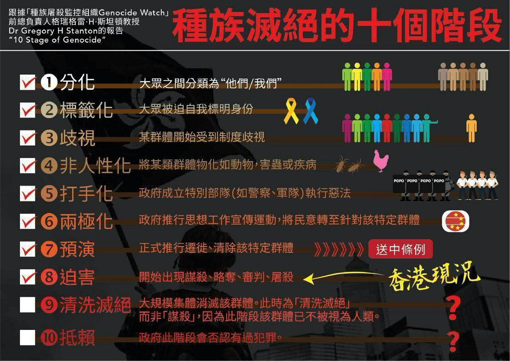
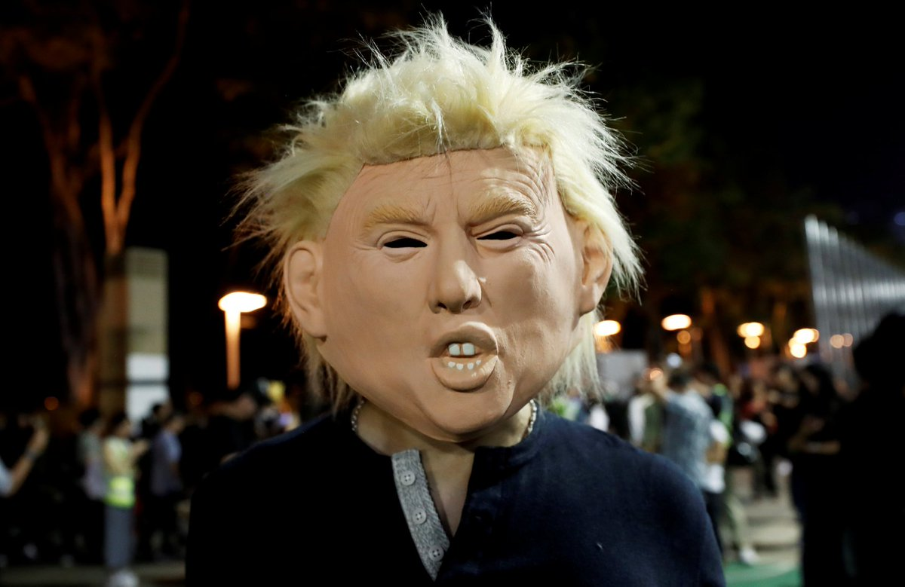
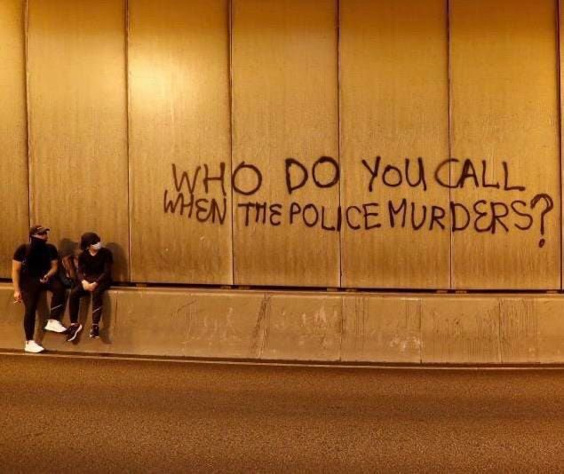
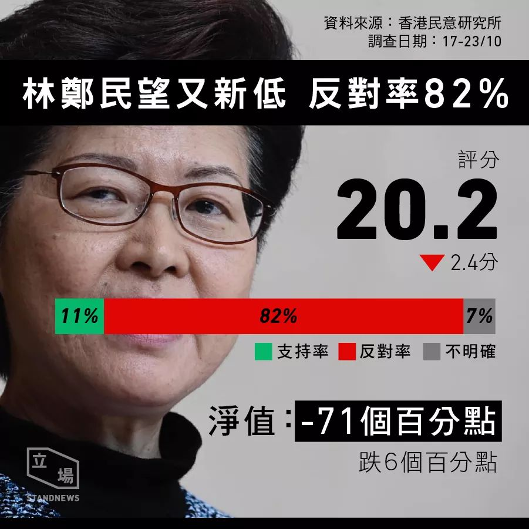

[11月01日 02:53]    新闻大吐槽   @TuCaoFakeNews    呵呵央企就不抱怨市场央企就不抱怨政策？央企老总要包二奶当然会和个体户老板一样先找梯子啊而且一样摔死不管啊。央企和个体户的差别就是前者吃亏了会有人出头摆平，比如你打胡锡进和打司马南一顿后果绝对不一样，不信你试试看？  :speech_balloon:评:0 :+1:赞:1 :globe_with_meridians:转:1  

[11月01日 02:52]    新闻大吐槽   @TuCaoFakeNews     https://twitter.com/i/status/1160923613563744258 …  :speech_balloon:评:0 :+1:赞:1 :globe_with_meridians:转:2  

[11月01日 02:50]    新闻大吐槽   @TuCaoFakeNews    美国公民天生自带盔甲！  :speech_balloon:评:0 :+1:赞:3 :globe_with_meridians:转:1  

[11月01日 02:47]    新闻大吐槽   @TuCaoFakeNews    南方公园鬼节篇！

王毅：哼！鬼节不带鬼面具，把我们主席的头像挂脸上是几个意思？你们辱华！

制作方：一派胡言！我们这是cosplay印度人对习主席的尊敬！  :speech_balloon:评:1 :+1:赞:20 :globe_with_meridians:转:3  

[11月01日 02:42]    新闻大吐槽   @TuCaoFakeNews    耿爽：無法確認此人是中國籍，望黎巴嫩警方繼續協助調查。（轉身就把此人的親屬好友通通抓起來封口）  :speech_balloon:评:0 :+1:赞:4 :globe_with_meridians:转:2  

[11月01日 02:41]    新闻大吐槽   @TuCaoFakeNews    對了，估計大家還沒忘記吧？前幾天被凍死的那39個人，中共當著世界人民的面，死活不想承認是它國人。這樣的中共，你喊破嗓，它都不認你啊…  :speech_balloon:评:0 :+1:赞:4 :globe_with_meridians:转:2  

[11月01日 02:39]    新闻大吐槽   @TuCaoFakeNews    让那些黑警碰一下我们美国公民试试  :speech_balloon:评:0 :+1:赞:2 :globe_with_meridians:转:1  

[11月01日 02:37]    新闻大吐槽   @TuCaoFakeNews    雖然這美國女演好大，但是也不禁想給他讚一個

然後那些警察好像都真的聽不懂這種簡單的英文...  :speech_balloon:评:1 :+1:赞:1 :globe_with_meridians:转:1  

[11月01日 02:28]    新闻大吐槽   @TuCaoFakeNews    试想任何一个Chinese在外国遇到类似遭遇，有底气大声喊自己是中国人吗？
  :speech_balloon:评:2 :+1:赞:4 :globe_with_meridians:转:3  

[11月01日 02:26]    新闻大吐槽   @TuCaoFakeNews    此刻的香港警察真是崇洋媚外，跟大陆一样也是看人执法遇到自己人那手段可是无所不总其极，这才是真正的辱华吧  :speech_balloon:评:0 :+1:赞:6 :globe_with_meridians:转:1  

[11月01日 01:11]    GFHG SDKM   @zyx_yny    They are neither cleaning that place nor doing anything meaningful at all. https://twitter.com/fktws/status/1189892960524984320 …  :speech_balloon:评:0 :+1:赞:0 :globe_with_meridians:转:0  

[11月01日 00:38]    财经真相   @caijingxiang    美元货币体系终结者——数字货币  :speech_balloon:评:21 :+1:赞:27 :globe_with_meridians:转:8  

[11月01日 00:30]    GFHG SDKM   @zyx_yny    Hong Kong police arrested a foreign lady who was celebrating Halloween in ​​Lan Kwai Fong. The police pushed down the lady. She shouted for help from BBC, CNN and kept yelling "I need my wallet”. She asked to call the US consulate. 
Source: Editorial Board, CityU SU
@SolomonYue  :speech_balloon:评:8 :+1:赞:221 :globe_with_meridians:转:221  

[11月01日 00:28]    GFHG SDKM   @zyx_yny    Did @hkpoliceforce say they'll use identification 4 each cop again the other day? If NOT,police leadership will be held responsible 4human rights violations under the Hong Kong Be Water Act's Global Magnitsky sanctions & freezing the assets provisions. Now Database All Abuses https://twitter.com/kiloloyc/status/1189939209500418048 …  :speech_balloon:评:142 :+1:赞:893 :globe_with_meridians:转:540  

[11月01日 00:24]    财经真相   @caijingxiang    美元根本无法脱钩比特币，因为它从未就“挂钩过”，都是场外交易，所以才可以为非法交易提供洗钱！ https://twitter.com/seanchen_new/status/1189940816560582659 …  :speech_balloon:评:2 :+1:赞:19 :globe_with_meridians:转:1  

[11月01日 00:18]    财经真相   @caijingxiang    那些说夸张的人，究竟懂不懂世界贸易体系？如果夸张，习近平会亲自开会学习区域块链？  :speech_balloon:评:10 :+1:赞:20 :globe_with_meridians:转:4  

[11月01日 00:17]    财经真相   @caijingxiang    美国人看样子要重新构建一种新的货币结算体系了！  :speech_balloon:评:3 :+1:赞:21 :globe_with_meridians:转:3  

[11月01日 00:15]    财经真相   @caijingxiang    中共发行的数字货币究竟目的是什么？答案是毁灭全世界，摧毁美元世界霸权，进而摧毁世界贸易体系，再摧毁世界经济，最终将世界变成人间炼狱！  :speech_balloon:评:35 :+1:赞:101 :globe_with_meridians:转:35  

[11月01日 00:13]    GFHG SDKM   @zyx_yny    Did anyone, including reporters get this @hkpoliceforce cop's ID number? Sens @HawleyMO/@SenRickScott/John Cornyn's the Hong Kong Be Water Act is designed to sanction this cop. https://twitter.com/j_punkman/status/1189936068499521536 …  :speech_balloon:评:460 :+1:赞:2114 :globe_with_meridians:转:1662  

[11月01日 00:09]    新闻大吐槽   @TuCaoFakeNews    孔子学院就是个笑话掩盖下的谍报站！逢年过节写点歪七扭八的毛笔字，唱几只不堪入耳的红歌，在一起包几个饺子，不能谈论任何有深度的问题，更不会触碰任何有深度的话题！极其无聊，没营养。  :speech_balloon:评:0 :+1:赞:3 :globe_with_meridians:转:2  

[10月31日 23:44]    GFHG SDKM   @zyx_yny    #HKPolice makes an arrest and tells reporters they're too close and that they should be filming people throwing stuff instead.  None of the reporters saw anyone throw anything and call him out on his BS.  Why are we not surprised?

#StandWithHongKong #HongKongProtests  :speech_balloon:评:13 :+1:赞:207 :globe_with_meridians:转:204  

[10月31日 23:35]    BBC News 中文   @bbcchinese    【香港示威：萬聖節市民集會 警察蘭桂坊附近射催淚彈】你的萬聖節又過得怎麼樣？ https://bbc.in/2Ww4ilF   :speech_balloon:评:4 :+1:赞:17 :globe_with_meridians:转:8  

[10月31日 23:23]    财经真相   @caijingxiang    美国民主党关于对特朗普进行弹劾调查的下一步行动在美国众议院扫清了程序性障碍! https://twitter.com/caijingxiang/status/1189503583399448576 …  :speech_balloon:评:7 :+1:赞:23 :globe_with_meridians:转:4  

[10月31日 22:43]    老司机   @h5lpykl7tp6jjop    這不叫黑警？
那你給他們一個更合適的稱呼！

#StandwithHK  :speech_balloon:评:26 :+1:赞:96 :globe_with_meridians:转:92  

[10月31日 22:33]    新闻大吐槽   @TuCaoFakeNews    再過不久就是直接在腦袋裡植入晶片了  :speech_balloon:评:0 :+1:赞:1 :globe_with_meridians:转:1  

[10月31日 22:30]    BBC News 中文   @bbcchinese    农民少，平均年龄67岁！耕地少，仅有一点还都种大米了。怎样确保国人吃饱吃好吃放心？日本想出哪些高明招数？ https://bbc.in/2NsNnMF   :speech_balloon:评:5 :+1:赞:37 :globe_with_meridians:转:10  

[10月31日 22:15]    纽约时报中文网   @nytchinese    #影评 在韩国，票房大片《寄生虫》加剧了关于经济不平等的讨论。它像是一个当代社会关系的寓言，成功地将幻想与现实结合起来，具有强烈的隐喻性和触目惊心的真实性。
不管是否能意识到，我们就真切地生活在奉俊昊的世界里。 http://nyti.ms/2q4xXX5   :speech_balloon:评:7 :+1:赞:41 :globe_with_meridians:转:16  

[10月31日 22:00]    BBC News 中文   @bbcchinese    四中全会是神秘的闭门会议，公报出来了，选定接班人、高层人事变动、香港局势……其中到底说了什么、没说什么？传达出怎样的信号？ https://bbc.in/34mrSDV   :speech_balloon:评:38 :+1:赞:73 :globe_with_meridians:转:26  

[10月31日 21:57]    GFHG SDKM   @zyx_yny    Now cosplaying is de facto banned in #HongKong. #HKPoliceTerrorists will beat you up even though you just cosplay as the #mistressofevil  on #halloween2019  :speech_balloon:评:119 :+1:赞:1410 :globe_with_meridians:转:1415  

[10月31日 21:56]    新闻大吐槽   @TuCaoFakeNews    种瓜得瓜， 种豆得豆 https://twitter.com/TuCaoFakeNews/status/1189864514906251264 …  :speech_balloon:评:0 :+1:赞:0 :globe_with_meridians:转:2  

[10月31日 21:44]    GFHG SDKM   @zyx_yny    In Central, riot policed lunched towards a heckling woman in a witch costume whilst pepper spraying journalists. The woman, who chanted "I'm an American" was taken away.  :speech_balloon:评:19 :+1:赞:227 :globe_with_meridians:转:229  

[10月31日 21:35]    GFHG SDKM   @zyx_yny    #HKPoliceTerrorists just point-blank pepper-sprayed a bystander who was asking where the police’s cordon line was. #PoliceBrutality #PoliceState #halloween2019 #LanKwaiFong  :speech_balloon:评:305 :+1:赞:2825 :globe_with_meridians:转:3027  

[10月31日 21:30]    纽约时报中文网   @nytchinese    越南的故事本该不是这样。在贸易增长的推动下，越南是世界上经济增长最快的国家之一，生活在贫困线下的人数已大幅下降。
但许多生活在最贫困地区的人缺乏接受良好教育的机会。虽然越南正在增加医疗和社会福利方面的支出，但许多人仍未享受到经济繁荣的好处。 http://nyti.ms/34cpAao   :speech_balloon:评:2 :+1:赞:9 :globe_with_meridians:转:8  

[10月31日 21:25]    BBC News 中文   @bbcchinese    【香港示威直播：萬聖節反對「禁蒙面法」遊行】BBC中文現場直播香港蘭桂坊的情況。 https://bbc.in/2PvbHjI   :speech_balloon:评:6 :+1:赞:17 :globe_with_meridians:转:8  

[10月31日 21:25]    新闻大吐槽   @TuCaoFakeNews    香港1860年開埠至今，150多年來贏得世界美譽無數。
東方之珠、亞洲四小龍、國際都市、金融中心、航運中心、自由貿易區、最安全城市、國際競爭力城市......
共產黨統治22年就變成現在這個樣！
中共之惡，無以復加！ https://twitter.com/tucaofakenews/status/1189723314299666432 …  :speech_balloon:评:0 :+1:赞:7 :globe_with_meridians:转:2  

[10月31日 21:13]    新闻大吐槽   @TuCaoFakeNews    歐洲的孔子學院太多了。 https://twitter.com/tucaofakenews/status/1189864514906251264 …  :speech_balloon:评:0 :+1:赞:1 :globe_with_meridians:转:1  

[10月31日 21:13]    GFHG SDKM   @zyx_yny    What happened in #HongKong on 31 Aug in the Prince Edward station?
Never forgive Never forget...
No one can imagine that how evil #HKPolice are. 
Please watch this video until the end.
#hkPoliceBrutalitiy #HKPoliceTerrorists  :speech_balloon:评:12 :+1:赞:320 :globe_with_meridians:转:390  

[10月31日 21:12]    GFHG SDKM   @zyx_yny    #Police Officers desecrate the memorial hall set up for the deceased and victims of #policebrutality next to #PrinceEdward Station
Source -  https://t.me/guardiansofhongkong/9465 …
#PoliceState #StandWithHongKong #FreeHongKong #HongKongRioters  :speech_balloon:评:95 :+1:赞:891 :globe_with_meridians:转:994  

[10月31日 21:12]    新闻大吐槽   @TuCaoFakeNews    貌似是搞歐洲（西歐）研究的，這一時半會兒去不了專業所在地，豈不是要了老命？
幫他打聽一下，現在轉專業還來得及不？  :speech_balloon:评:1 :+1:赞:1 :globe_with_meridians:转:1  

[10月31日 21:06]    BBC News 中文   @bbcchinese    今天是万圣夜，许多香港市民戴上面罩或化妆，在中环及太子站附近聚集。大批防暴警察在场戒备，并在太子发射催泪弹驱散集会者。  :speech_balloon:评:17 :+1:赞:72 :globe_with_meridians:转:40  

[10月31日 20:58]    新闻大吐槽   @TuCaoFakeNews    这就是日本制度优越的一点、日本交通罚款跟警察半点关系没有、钱直接去邮局交给国家作为税金，在中国交警还指望罚款发工资呢……  :speech_balloon:评:0 :+1:赞:2 :globe_with_meridians:转:2  

[10月31日 20:45]    新闻大吐槽   @TuCaoFakeNews    自由的党国 https://twitter.com/TuCaoFakeNews/status/1189666564427014144 …  :speech_balloon:评:0 :+1:赞:2 :globe_with_meridians:转:1  

[10月31日 20:30]    BBC News 中文   @bbcchinese    中国官员称，数字货币发行后，两个手机碰一碰，即使没有网络，也可以把一个人数字钱包里的数字货币，转给另一个人。 https://bbc.in/36p6GiO   :speech_balloon:评:31 :+1:赞:57 :globe_with_meridians:转:28  

[10月31日 20:30]    纽约时报中文网   @nytchinese    历史上，首里城曾被多次摧毁，最近的一次是在第二次世界大战的冲绳岛战役中。
此后，首里城被修复原貌，并于1992年作为公园重新开放。2000年，首里城被联合国教科文组织列为世界文化遗产。 http://nyti.ms/2PCblHZ   :speech_balloon:评:2 :+1:赞:8 :globe_with_meridians:转:3  

[10月31日 20:25]    纽约时报中文网   @nytchinese    英国卡车尸体案背后，贫困越南偷渡者的悲歌  http://nyti.ms/34cpAao https://twitter.com/ccni/status/1189852616471134208 …  :speech_balloon:评:0 :+1:赞:0 :globe_with_meridians:转:0  

[10月31日 20:00]    BBC News 中文   @bbcchinese    脸书最近宣布不会禁止政治广告，与推特的态度截然相反。 https://bbc.in/326Twnf   :speech_balloon:评:22 :+1:赞:92 :globe_with_meridians:转:33  

[10月31日 19:55]    财经真相   @caijingxiang    重磅：美国国务卿蓬佩奥本周三在保守派智库纽约哈德逊研究所发表演讲时表示，中共政权正在谋求主导世界的权力，因此必须要予以正面反抗。
蓬佩奥在演讲中说，美国一直非常珍视与中国人民之间的友谊，但是中共政府与中国人民并非一回事。"这算是美国政府在职高官，第一次明确中共政府与中国两回事！ https://twitter.com/dw_chinese/status/1189872143036604416 …  :speech_balloon:评:15 :+1:赞:377 :globe_with_meridians:转:139  

[10月31日 19:50]    财经真相   @caijingxiang    又是彭博新闻，中共四中全会刚结束，新闻通稿刚发出，贸易谈判滑消息就出来了，时间点掐的很讲政治，恰到好处！ https://twitter.com/economics/status/1189870935290961923 …  :speech_balloon:评:7 :+1:赞:79 :globe_with_meridians:转:24  

[10月31日 19:30]    纽约时报中文网   @nytchinese    #图集【旧时光里的纽约万圣节】身着奇装异服的人们、玩trick-or-treat的孩子们、街上的蝙蝠侠、莱娅公主和蜘蛛侠......时报历史图片记录下了上世纪6、70年代纽约的万圣节狂欢图景。
点击查看图集： http://nyti.ms/2NrdnIb   :speech_balloon:评:0 :+1:赞:9 :globe_with_meridians:转:1  

[10月31日 19:20]    老司机   @h5lpykl7tp6jjop    当兵的退伍回乡走投无路只有上访，红后代移民加拿大爱国歌曲大演唱，加拿大中共解放军退伍军人协会成立，演唱歌曲说明身在曹营心在汉呢，还是怀念特权，只恨不能随身移呢？  :speech_balloon:评:8 :+1:赞:20 :globe_with_meridians:转:12  

[10月31日 19:00]    纽约时报中文网   @nytchinese    #时报专栏 我对加州的爱深沉而真实。但最近，我对家乡的感情开始恶化。一种虚无主义已经潜入我的思维。我开始怀疑我们完蛋了。
火灾和停电不是天灾，而是我们选择忽视的人祸，它与一个更大的问题有关：我们无法可持续地生活。加州的人们要么改变这里的生活方式，要么只能离开。 http://nyti.ms/2BYCwor   :speech_balloon:评:18 :+1:赞:19 :globe_with_meridians:转:9  

[10月31日 18:51]    财经真相   @caijingxiang    四中全会总体一句话：不改、坚决不改！  :speech_balloon:评:84 :+1:赞:762 :globe_with_meridians:转:293  

[10月31日 18:49]    GFHG SDKM   @zyx_yny    我經台灣人acc轉發，警察會唔會上門打撚死我先？  :speech_balloon:评:13 :+1:赞:78 :globe_with_meridians:转:45  

[10月31日 18:30]    纽约时报中文网   @nytchinese    被禁止参加大多数课外活动、16%的人说曾被性骚扰……一项新调查披露了50年前耶鲁首批本科女生的校园经历。
她们的经历讲述了一个更大的故事：当白人男性主导的机构试图多元化时会发生什么。和许多有权力的地方一样，耶鲁允许女性入学，但并没有平等对待她们。 http://nyti.ms/2q6ZtmD   :speech_balloon:评:2 :+1:赞:15 :globe_with_meridians:转:8  

[10月31日 18:21]    老司机   @h5lpykl7tp6jjop    认识的人越来越多，但是我越来越喜欢狗！  :speech_balloon:评:2 :+1:赞:9 :globe_with_meridians:转:5  

[10月31日 18:00]    纽约时报中文网   @nytchinese    #时报专栏 @tomfriedman：共和党人现在有个明确选择：要么让宪法弹劾程序继续下去，要么攻击弹劾程序，即我们的立法和司法秩序。唉，大多数人似乎选择了后者。
通过攻击所有冒着巨大的职业风险挺身，给出不利特朗普的证词外交官、情报官员和公务员，他们是在攻击维护法规的人。 http://nyti.ms/2JDsNbc   :speech_balloon:评:6 :+1:赞:10 :globe_with_meridians:转:4  

[10月31日 17:56]    墙国铁拳现世报😷   @Socialistfist    就当是给祖国母亲的生日礼物了~

#社会主义铁拳  :speech_balloon:评:22 :+1:赞:259 :globe_with_meridians:转:51  

[10月31日 17:46]    GFHG SDKM   @zyx_yny    'Who do you call when the police murders?'

In Hong Kong  :speech_balloon:评:281 :+1:赞:8447 :globe_with_meridians:转:6142  

[10月31日 17:40]    新闻大吐槽   @TuCaoFakeNews    我认识的几个台湾人曾去广州做肾移植，十年前的事，两万多美金，只需一星期就可以做移植手术。我曾问过他们“如果需要死一个生命来得到你的活着？！他们居然说才不管别人的生死呢！还问如果是我怎么选择？我回答的是，宁愿选择死了也不会去做这样的移植手术，我是学佛的相信因果。  :speech_balloon:评:2 :+1:赞:20 :globe_with_meridians:转:8  

[10月31日 17:30]    BBC News 中文   @bbcchinese    香港第三季GDP预先估计数字，较去年同期下跌2.9%，是2009年以来，首次录得季度按年跌幅。学者认为，中美贸易战对香港经济影响更大，但示威活动加快了衰退的步伐。 https://bbc.in/34k6aAq   :speech_balloon:评:36 :+1:赞:83 :globe_with_meridians:转:21  

[10月31日 17:30]    纽约时报中文网   @nytchinese    在越南中北部一个饱受贫困和环境灾难之苦的地区，越南和英国政府正在共同努力，确定罹难者的身份。
据越南一家官方新闻机构报道，越南当局已收到了14个家庭的求助请求，这些家庭称亲人在英国失踪。越南总理阮春福也已经下令官员对越南公民被非法送往海外的情况展开调查。 http://nyti.ms/34cpAao   :speech_balloon:评:5 :+1:赞:8 :globe_with_meridians:转:4  

[10月31日 17:22]    GFHG SDKM   @zyx_yny    投票呀 我地輸緊呀 http://www.etnet.com.hk/mobile/tc/lifestyle/voting.php?id=1242 …  :speech_balloon:评:22 :+1:赞:183 :globe_with_meridians:转:177  

[10月31日 17:10]    财经真相   @caijingxiang    China said to be unwilling to budge on big structural changes！  :speech_balloon:评:4 :+1:赞:54 :globe_with_meridians:转:17  

[10月31日 17:09]    财经真相   @caijingxiang    快讯：中共称不可能进行结构性改革，消息一出黄金上涨，人民币短线下跌  :speech_balloon:评:39 :+1:赞:377 :globe_with_meridians:转:99  

[10月31日 17:00]    纽约时报中文网   @nytchinese    博尔顿的副手曾表示，博尔顿对特朗普向乌克兰施压的行为感到愤怒，并曾警告称，特朗普的私人律师、在电话门实践中起到主导作用的朱利安尼是“一颗会把所有人都炸死的手榴弹”。
但博尔顿是否将接受质询尚不确定，其律师表示，他“无意自愿出庭”。 http://nyti.ms/2pw9h9I   :speech_balloon:评:1 :+1:赞:5 :globe_with_meridians:转:0  

[10月31日 16:34]    BBC News 中文   @bbcchinese    【日本冲绳首里城大火：整座木制首里城几乎全部烧毁】#日本 #冲绳 #首里城 发生大火，整座木制的首里城，包括正殿、南殿和北殿几乎全部烧毁。那霸市消防局表示，大火烧了11小时，火势在当地时间下午扑灭。首里城于13世纪末兴建，2000年被联合国教科文组织列为世界文化遗产。 https://bbc.in/3331O0A   :speech_balloon:评:18 :+1:赞:17 :globe_with_meridians:转:9  

[10月31日 16:30]    纽约时报中文网   @nytchinese    周四，日本冲绳的世界文化遗产首里城的大部分建筑遭大火烧毁。首里城曾是从15世纪至19世纪存在的琉球王国的宫殿所在地，至今已有500多年的历史。
据当地官员和新闻报道称，大火中没有人员受伤。NHK称，大火烧毁了包括正殿在内的七座建筑物。 http://nyti.ms/2PCblHZ   :speech_balloon:评:33 :+1:赞:73 :globe_with_meridians:转:47  

[10月31日 16:09]    GFHG SDKM   @zyx_yny    Flashing strong light at someone’s face is how #Police maintain the law n safety in #HongKong now? When the man in suit asked the police for the police’s no.,the police replied provocatively“Look!Can’t you read you dickhead,here’s the no.”while there’s no no. on him. #PoliceState  :speech_balloon:评:97 :+1:赞:1829 :globe_with_meridians:转:1869  

[10月31日 16:00]    BBC News 中文   @bbcchinese    APEC峰会取消後，那中美贸易协定要去哪里签呢? https://bbc.in/2q8HEn4   :speech_balloon:评:27 :+1:赞:27 :globe_with_meridians:转:4  

[10月31日 16:00]    纽约时报中文网   @nytchinese    #时报专栏 政府、政界和商界知名人士的行为方式，极大破坏了民主制度的核心和规范，以致我们只能推测，他们觉得国家的稳定是既定事实——他们可对其滥用和加压，它不会坏。
他们错了。我们是会把美国玩坏的。无论是冷战、越战还是水门案期间，我都没像现在这样为我们的国家担忧。 http://nyti.ms/2JDsNbc   :speech_balloon:评:22 :+1:赞:28 :globe_with_meridians:转:13  

[10月31日 15:41]    老司机   @h5lpykl7tp6jjop    终于暴露中共才是华为背后的大老板！
任正非：华为交班已完成多年 我只是中间的“傀儡”  :speech_balloon:评:3 :+1:赞:31 :globe_with_meridians:转:21  

[10月31日 15:31]    BBC News 中文   @bbcchinese    【兰桂坊主席盛智文：如果几年便买到500呎楼 很多人不会上街】盛智文认为，如果港府能像新加坡一样给人民安居乐业，很多人会放弃上街。 https://bbc.in/2NswykX   :speech_balloon:评:65 :+1:赞:30 :globe_with_meridians:转:13  

[10月31日 15:30]    纽约时报中文网   @nytchinese    周三，众议院弹劾调查人员传召特朗普的前国家安全顾问约翰·博尔顿及另外两名白宫高级律师，要求他们下周就特朗普弹劾调查作证。
对调查人员来说，在美国外交事务中长期扮演重要角色的博尔顿可能是他们最想要质询的证人了。由于与特朗普的外交政策冲突，博尔顿于9月离开白宫。 http://nyti.ms/2pw9h9I   :speech_balloon:评:4 :+1:赞:13 :globe_with_meridians:转:0  

[10月31日 15:01]    BBC News 中文   @bbcchinese    一年一度的万圣节又来了，不论是大人或是小孩，都要装神弄鬼一番极尽吓人的本事，但你知道万圣节的由来吗？ https://bbc.in/2MTMugW   :speech_balloon:评:4 :+1:赞:24 :globe_with_meridians:转:9  

[10月31日 15:00]    纽约时报中文网   @nytchinese    #讣告 黄永砅敏锐地意识到，在一个新的“全球时代”，艺术正如何被用于加强和促进文化的刻板印象和等级制度，就像“西方”和“非西方”这些说法本身所体现的那样。
1987年，他把两本权威的艺术史书籍放进了洗衣机并展示了结果：一堆浸透了的纸浆，其中的具体文字和图像难以分辨。 http://nyti.ms/2pgzJ7t   :speech_balloon:评:0 :+1:赞:4 :globe_with_meridians:转:1  

[10月31日 14:30]    纽约时报中文网   @nytchinese    近年来，由于萨德系统引发的紧张关系，许多韩国艺人前往中国演出时遇到困难，中国对该系统极其愤怒，认为是对其自身安全的威胁。
伊士曼曾表示，尽管韩国学生被排除在外，仍将继续巡演。但在学生和校友强烈抗议，其中一些学生指责校方对中国卑躬屈膝后，校方改变了做法。 http://nyti.ms/2BWquvF   :speech_balloon:评:7 :+1:赞:18 :globe_with_meridians:转:4  

[10月31日 14:01]    BBC News 中文   @bbcchinese    1998年，全球有整整16%的热带珊瑚礁死亡，而到了2016年，全球70%的珊瑚礁遭到破坏，有些更是无法挽回的。人类到底还可以做什么？ https://bbc.in/2PwUeHw   :speech_balloon:评:17 :+1:赞:40 :globe_with_meridians:转:18  

[10月31日 14:00]    纽约时报中文网   @nytchinese    #每日一词  Yangocrat，杨主党。一些曾经支持特朗普的美国选民现在将自己称为“杨主党“(Yangocrat)——2020年总统参选人杨安泽的姓氏与民主党人英文Democrats后缀的结合。来自白人的狂热支持表明，杨安泽已成功地成为了一个淡化身份政治的“亚裔普通人“。
更多简报内容： http://nyti.ms/2q25tNv   :speech_balloon:评:2 :+1:赞:4 :globe_with_meridians:转:0  

[10月31日 13:48]    财经真相   @caijingxiang    潘石屹soho卖给了黑石集团和GIC，考虑到黑石的背景，这次报价应该会很低！  :speech_balloon:评:17 :+1:赞:201 :globe_with_meridians:转:52  

[10月31日 13:30]    纽约时报中文网   @nytchinese    祭桌已经摆好了。尽管英国当局仍未确认卡车尸体案39名死者的身份，但一些越南家庭已把听不到亲人的消息当作足够的证明，开始祭奠亲人。
在越南一些极度贫困的地区，穷人搭乘集装箱偷渡，寻找工作和未来。“如果电线杆有腿，它也会跑。”一名当地牧师说。 http://nyti.ms/34cpAao   :speech_balloon:评:34 :+1:赞:79 :globe_with_meridians:转:66  

[10月31日 13:12]    GFHG SDKM   @zyx_yny    @EnzoMazak @SpeakerPelosi @SenAlexander
Here's Cantonese lesson 
#hkpolice 
"清算 us?With water?Silly vxxxxa!"
清算(punish) spilt into two are "wash" and "count",which 清 literally is related to water.
 
Without punishment on them ANOTHER "Tuen Mun's Halloween" surely comes.  :speech_balloon:评:4 :+1:赞:59 :globe_with_meridians:转:44  

[10月31日 13:01]    BBC News 中文   @bbcchinese    国际慈善组织基督教救世军近日发布报告称，中国是2019年该组织在英国救助奴工的第3大原籍来源国。 https://bbc.in/34gDVCG   :speech_balloon:评:25 :+1:赞:56 :globe_with_meridians:转:19  

[10月31日 13:00]    纽约时报中文网   @nytchinese    陷入中美两国之间不断加剧的紧张关系的美国实体清单在扩大，任举几例：Nike、Apple、Gap和NBA。如今又增加了一个：来自纽约州的伊士曼爱乐乐团。
该乐团本周取消了原定的中国之行，此前乐团的三名韩国成员没能拿到签证，这显然是对韩国在2016年同意部署萨德系统的报复。 http://nyti.ms/2BWquvF   :speech_balloon:评:26 :+1:赞:112 :globe_with_meridians:转:43  

[10月31日 12:52]    GFHG SDKM   @zyx_yny    おととい発表された世論調査によると、キャリー・ラムの支持率は、香港が中国に返還されて以来の史上最低を記録しました。不支持率は82%、支持率はわずか11%。民主的制度のない社会では、政府への不支持が史上最高になっても、まだ残っていられるのです。信じれないくらい不合理です。  :speech_balloon:评:153 :+1:赞:8324 :globe_with_meridians:转:3863  

[10月31日 12:48]    财经真相   @caijingxiang    商务部新闻发言人声明：中美双方经贸团队一直保持密切沟通，目前磋商工作进展顺利。双方将按原计划继续推进磋商等各项工作。双方牵头人将于本周五再次通话。 中美贸易谈判现在是天天都有好消息，人民币也天天涨，静静的等待结果，看看究竟可以忽悠到什么时候！  :speech_balloon:评:20 :+1:赞:177 :globe_with_meridians:转:36  

[10月31日 12:30]    纽约时报中文网   @nytchinese    国际移民组织的约内斯科说，总的来说，研究表明，各国现在应该开始为更多居民在国内重新安置做好准备。
“我们一直试图敲响警钟，”约内斯科说。“我们知道它就要来了。”她还说，这种规模的人口流动在现代几乎没有先例。 http://nyti.ms/2JBzv1E   :speech_balloon:评:3 :+1:赞:13 :globe_with_meridians:转:4  

[10月31日 12:16]    GFHG SDKM   @zyx_yny    #Halloween 
今晚維園至蘭桂坊有面具之夜 無論黑警有咩行動 都希望可以令再上trending topic
#HKPolice  :speech_balloon:评:0 :+1:赞:2 :globe_with_meridians:转:8  

[10月31日 12:02]    GFHG SDKM   @zyx_yny    A group of Uyghur activists and allies protested at the Capital One Arena during the Wizards vs Rocket Game today 

One Chinese man comes and says “Your mom’s dead”

Video from Hazel Sahin

#NBA #StopChina #FreeHongKong #FreeEastTurkestan #GoogleUyghur  :speech_balloon:评:91 :+1:赞:1254 :globe_with_meridians:转:826  

[10月31日 12:01]    BBC News 中文   @bbcchinese    美国的狗说：“在我们国家，如果你一直犬吠不止，终究会有人听到你的，会给你肉吃”；波兰的狗问：“什么是肉啊？”；苏联的狗问：“什么是犬吠啊？”这些坊间流传的笑话，成为中情局当年解读苏联民情的资料。 https://bbc.in/2Nmzks8   :speech_balloon:评:76 :+1:赞:379 :globe_with_meridians:转:131  

[10月31日 12:00]    纽约时报中文网   @nytchinese    美联储年内第三次降息：在降息25个基点之际，美国经济继续显示出放缓迹象。本次调整几乎扭转了2018年所有的加息。
尽管全球制造业收紧，贸易也存在不确定性，但美联储暗示，它正在转向一种更有耐心的模式。
更多简报内容： http://nyti.ms/2q25tNv   :speech_balloon:评:2 :+1:赞:6 :globe_with_meridians:转:2  

[10月31日 11:31]    BBC News 中文   @bbcchinese    学习过程中，了解到立法会的构成最令张同学震撼。“它会让你发现，香港并没有民主，”他说，“我认为这是重要的概念，这也解释了好多香港的政策为什么没有民意授权也能过，政府有预谋地利用这个漏洞去通过一些东西。” https://bbc.in/36mTdrp   :speech_balloon:评:26 :+1:赞:84 :globe_with_meridians:转:24  

[10月31日 11:00]    BBC News 中文   @bbcchinese    這款遊戲你有興趣玩嗎？  :speech_balloon:评:214 :+1:赞:773 :globe_with_meridians:转:290  

[10月31日 10:31]    BBC News 中文   @bbcchinese    特朗普总统确认美国将退出联合国巴黎气候协议，这个举动将对美国外交，对中国和俄国产生什么影响？
 https://bbc.in/2PA0huP   :speech_balloon:评:18 :+1:赞:22 :globe_with_meridians:转:5  

[10月31日 10:24]    财经真相   @caijingxiang    据国务院新闻办公室10月31日消息，国务院新闻办公室定于2019年11月1日（星期五）上午10时举行中国共产党十九届四中全会新闻发布会，请中央宣传部、中央政策研究室、中央财经委员会办公室、全国人大常委会法工委、全国政协办公厅、司法部负责同志介绍有关情况，并答记者问。  :speech_balloon:评:8 :+1:赞:87 :globe_with_meridians:转:26  

[10月31日 09:51]    财经真相   @caijingxiang    CFETS人民币汇率指数和SDR货币篮子人民币汇率指数都创下了四年来新低。现在决策层在汇率操作上“骑虎难下”，如果让人民币跟随欧元等篮子货币上涨，则会对本来就已经不断出血的出口“雪上加霜”。如果不跟就会激发市场对人民币未来继续下跌的预期，一旦美元指数走强重新走强，市场做空人民币压力很逆转。  :speech_balloon:评:3 :+1:赞:91 :globe_with_meridians:转:27  

[10月31日 09:30]    BBC News 中文   @bbcchinese    未来世界，如果人工智能变得如此强大，可能会威胁人类生存。但他们是有意识地要摧毁人类，还是因为太胜任了呢？
 https://bbc.in/2BZA6pI   :speech_balloon:评:4 :+1:赞:15 :globe_with_meridians:转:8  

[10月31日 08:58]    GFHG SDKM   @zyx_yny    From HK01: CCTV footages of #PrinceEdward station on August 31
One of the footage shows police officers chasing citizens at 10:56pm. Another one involves footage of 2 CCTV at platform 4, they only state "Video Loss" or "No Video"
 https://www.hk01.com/%E7%A4%BE%E6%9C%83%E6%96%B0%E8%81%9E/392301/8-31%E5%A4%AA%E5%AD%90%E7%AB%99%E8%A1%9D%E7%AA%81-%E6%B8%AF%E9%90%B5cctv%E7%89%87%E6%AE%B5%E9%A6%96%E6%9B%9D%E5%85%89-%E9%80%9F%E9%BE%8D%E5%B0%8F%E9%9A%8A%E6%8F%AE%E6%A3%8D%E8%BF%BD%E6%8D%95%E4%B9%98%E5%AE%A2 …  :speech_balloon:评:49 :+1:赞:883 :globe_with_meridians:转:854  

[10月31日 08:30]    BBC News 中文   @bbcchinese    有些人为了方便记忆，干脆使用一码通，即所有帐户都使用同一个密码。这样做的危险是一旦一个密码被盗，所有账户都面临危险。
 https://bbc.in/2N21Ujo   :speech_balloon:评:3 :+1:赞:24 :globe_with_meridians:转:11  

[10月31日 08:22]    财经真相   @caijingxiang    美联储在利率声明中，删除了“采取相当程度维持扩张”的措词，包括鲍威尔强调美国经济“基本前景仍然是有利的 ”，“只要经济前景与我们保持一致，货币政策就是合适”，但是保留了经济发生变化时，改变想法的空间。正是这种保留想法，让市场重新计价12月份继续降息的预期，导致美元大跌，市场这次真的有点过  :speech_balloon:评:3 :+1:赞:70 :globe_with_meridians:转:11  

[10月31日 06:13]    墙国铁拳现世报😷   @Socialistfist    香港导演争当护旗手！
结果当他翻拍鹿鼎记时，剧本翻来覆去修改多次，中共还是不予批准！

护旗手就是要给党折磨的
@Socialistfist  :speech_balloon:评:63 :+1:赞:493 :globe_with_meridians:转:122  

[10月31日 05:38]    老司机   @h5lpykl7tp6jjop    一对情侣在街上跳了支舞，黑警没反应过来，直到人都走了半天，才意识到可能是被羞辱了，于是决定到饭店去捉捕人，呼啸着来到饭店，却遭女店长拒绝，于是黑警立即动粗，摔倒女店长，大摇大摆进店抓人！
剥夺跳舞自由！无证擅闯入私人领地！
引自推友@Tonyworld15  :speech_balloon:评:11 :+1:赞:325 :globe_with_meridians:转:298  

[10月31日 03:52]    老司机   @h5lpykl7tp6jjop    看过一张图片，老中医一边吊着盐水，一边摸脉给病人看病，非常和谐，病人迷信相信老中医，他们没有怀疑为什么老中医自己病了看西医，这就是爱国废民没有逻辑的思维！  :speech_balloon:评:0 :+1:赞:44 :globe_with_meridians:转:14  

[10月31日 03:39]    老司机   @h5lpykl7tp6jjop    涨了就是涨了，涨幅收窄？这样的把戏想骗老百姓不懂？  :speech_balloon:评:2 :+1:赞:26 :globe_with_meridians:转:12  

[10月31日 03:11]    老司机   @h5lpykl7tp6jjop    正式通过！参议院通过台北法案 强化台湾外交
台湾一天天好起来，中共一天天烂下去！  :speech_balloon:评:3 :+1:赞:56 :globe_with_meridians:转:18  

[10月31日 02:54]    老司机   @h5lpykl7tp6jjop    美国政府下令：要彻底清退华为和中兴
美国政府启动程序彻底清退美国境内的华为等中国通信设备。美国政府下令要求安装了中国通信设备的美国通信企业全面更换设备，预计达10亿美元更换费用将由美国政府用税金提供支援。美国还可能要求包括韩国在内的同盟国采取类似措施。中国官方谴责美国此种做法是霸凌  :speech_balloon:评:1 :+1:赞:169 :globe_with_meridians:转:39  

[10月31日 02:40]    老司机   @h5lpykl7tp6jjop    潘石屹也要跑？清仓国内资产 80亿美元卖办公楼  :speech_balloon:评:3 :+1:赞:40 :globe_with_meridians:转:20  

[10月31日 02:32]    老司机   @h5lpykl7tp6jjop    要注意的是注水的量，它隐藏在各项债务中，如果只看到当前的购买价值，就觉得不太适合，但是一旦发生信用崩溃，挤兑出现，大家就会看到有钱买不到东西，就像苏联崩溃时卢布2万兑一美元的情况。  :speech_balloon:评:0 :+1:赞:2 :globe_with_meridians:转:0  

[10月31日 01:18]    GFHG SDKM   @zyx_yny    齋聽唔睇片，猜猜我是誰？！
#HongKongPoliceState
#香港警察
#FightForFreedom  :speech_balloon:评:17 :+1:赞:167 :globe_with_meridians:转:132  

[10月31日 00:55]    财经真相   @caijingxiang    经济参考报头版：经济体制改革将继续全面推进，并引用“业内人士”的话说，在财税、金融和国企领域更多改革措施将推出，并引用中财院赵福昌话说，经济治理的核心和目标就是发挥市场在资源配置中的决定性作用 这种论调完全和习不是一个思路，党内“拥邓派”还再制造舆论！  :speech_balloon:评:14 :+1:赞:92 :globe_with_meridians:转:9  

[10月31日 00:00]    老司机   @h5lpykl7tp6jjop    #香港10月30日 23：20 #屯門 盈豐園有一男一女在一間食肆外跳舞引來防暴警不滿，該對男女走入一間食肆，女負責人拒絕警員入內蒙面警即時情緒失控，粗暴拉跌女負責人並闖入店內截查跳舞男女.蒙面警的失控濫權濫暴行為惹來街坊不滿，警員即指街坊非法集結舉藍旗警告  :speech_balloon:评:4 :+1:赞:52 :globe_with_meridians:转:46  

[10月30日 23:33]    财经真相   @caijingxiang    大陆所有官方、公司、外资网站都把台湾列入中共国的一个省，这就说明中共不灭台湾人幻想的真正安全就永远不存在，与其做缩头乌龟还不如反击，直接在台湾网上把大陆也列为“民国领土”，以彼之道还施彼身，有何不妥？  :speech_balloon:评:69 :+1:赞:540 :globe_with_meridians:转:79  

[10月30日 23:17]    财经真相   @caijingxiang    还有就是大陆人申请时，直接就是“广州联邦省、上海联邦省、香港等联邦概念”，等于是用“中华民国”概念联邦化，领域超过台湾进而扩大化，如此一来世界格局真的天翻复地了，如果台湾领导人真的做到，那对中华民族而言真是大功一件，需要极强的历史使命感才行！  :speech_balloon:评:46 :+1:赞:273 :globe_with_meridians:转:31  

[10月30日 23:09]    财经真相   @caijingxiang    我只是说允许大陆人申请护照，但是不放人去台湾，因为法理上大陆就是民国，大陆人完全可以留在大陆，这样大陆涌起“申请民国护照热潮”，这在人心是想当不错的“攻心术”，完全起到杀共诛心，台湾这需要一个网址，连张纸都不要浪费，就完全可以实现“反攻大陆”。  :speech_balloon:评:29 :+1:赞:312 :globe_with_meridians:转:44  

[10月30日 20:19]    墙国铁拳现世报😷   @Socialistfist    大家投票踊跃，下周就从点赞数从多到少挑四个选吧
有什么建议 意见可以回复此推  :speech_balloon:评:3 :+1:赞:27 :globe_with_meridians:转:1  

[10月30日 20:17]    墙国铁拳现世报😷   @Socialistfist    后续  :speech_balloon:评:2 :+1:赞:22 :globe_with_meridians:转:1  

[10月30日 20:12]    墙国铁拳现世报😷   @Socialistfist    推友最喜爱“上周最佳铁拳” 评选活动
更多选项看后续  :speech_balloon:评:2 :+1:赞:70 :globe_with_meridians:转:16  

[10月30日 19:24]    墙国铁拳现世报😷   @Socialistfist    全文  :speech_balloon:评:2 :+1:赞:61 :globe_with_meridians:转:12  

[10月30日 19:24]    墙国铁拳现世报😷   @Socialistfist    收了几次精赵智商税就开始闹，成何体统？
原文已删，全文看后续

#社会主义铁拳  :speech_balloon:评:9 :+1:赞:233 :globe_with_meridians:转:68  

[10月30日 14:21]    老司机   @h5lpykl7tp6jjop    究竟是富了，还是穷了？  :speech_balloon:评:18 :+1:赞:102 :globe_with_meridians:转:56  

[10月30日 11:47]    老司机   @h5lpykl7tp6jjop    事发：2019年10月23号云南曲靖市20岁女孩小寒，在某宾馆二楼被两名男子强行拉上楼！期间被掌掴！在房间内小寒被侮辱！小寒从4楼跳下！

有没有被性侵！  :speech_balloon:评:32 :+1:赞:375 :globe_with_meridians:转:361  

[10月30日 10:59]    老司机   @h5lpykl7tp6jjop    中国搞区块链、数字货币，真实目的是企图去美元中心化，但是不可能成功，因为中国最终还是需要用美元来购买石油和大宗物资，数字货币必须与美元或黄金挂钩，否则一文不值。也许唯一的结果是，不需要增印人民币了，也不需要印各种凭票供应的票据了，用数字货币，来延缓和掩盖中国经济的重大危机。  :speech_balloon:评:28 :+1:赞:206 :globe_with_meridians:转:87  

[10月30日 08:55]    老司机   @h5lpykl7tp6jjop    【爆炸新闻】厉害国完了，温州银行倒闭！数百民众围在银行前维权！  :speech_balloon:评:102 :+1:赞:1231 :globe_with_meridians:转:648  

[10月30日 08:37]    老司机   @h5lpykl7tp6jjop    之前推过 倒西瓜，倒菠萝，倒桃子，倒西红柿，倒枣子，倒桔子，倒葡萄，倒李子，现在轮到 倒青椒。
太不正常，共产党的国到底怎么了？  :speech_balloon:评:75 :+1:赞:535 :globe_with_meridians:转:296  

[10月30日 07:24]    老司机   @h5lpykl7tp6jjop    什么是中国特色？就是别人没有的你都有：商君书、诛九族、连坐制、等级制、裹小脚、三十六计、奴婢制、一妻多妾制、中央集权制、强拆、活摘、嫖宿、双轨制、潜规则、局域网、一国两制、计划生育、非法讨薪、恶意上访、单双号限行车辆等...... 
没有半点文明的影子，不知道中国人的民族自豪感从何而来？  :speech_balloon:评:69 :+1:赞:925 :globe_with_meridians:转:353  

[10月30日 02:45]    老司机   @h5lpykl7tp6jjop    十四亿个脑袋居然由一个猪头脑袋坐中央，控制全体的思想，指挥行动的对错，这是动物世界吗？不！已经是昆虫界，是蚂蚁窝！蚁民不会思想，只明白对错，一有违反，兵蚁立刻拼命撕咬，说错话，表错态，转错贴，轻则拘留，重则判刑，还要连累亲属，就这种形态，是一个崛起的历史悠久的古槐安大国，很厉害哦  :speech_balloon:评:10 :+1:赞:187 :globe_with_meridians:转:50  

[10月29日 22:35]    新闻大吐槽   @TuCaoFakeNews    盡快推出去，救人呀！
認清有無家人朋友相識免被失蹤
圖片全部20歲以下學生而且是絲打居多
賊婆港共政權自以為拉盡殺絕孩子可了事
告訴港共這代年青人是視死如歸抗暴政  :speech_balloon:评:26 :+1:赞:759 :globe_with_meridians:转:861  

[10月29日 22:20]    老司机   @h5lpykl7tp6jjop    美國佐治亞州的監獄開設了一個有爭議的項目。那就是請那些家長把他們教育不了的"熊孩子"們送到這裡，來個"一日游"。
看樣子，效果不錯。  :speech_balloon:评:15 :+1:赞:366 :globe_with_meridians:转:185  

[10月29日 19:22]    墙国铁拳现世报😷   @Socialistfist    “哎呦.....太君别开枪.....”

#社会主义铁拳
#社会主义特别行政区铁拳  :speech_balloon:评:33 :+1:赞:431 :globe_with_meridians:转:136  

[10月29日 08:08]    新闻大吐槽   @TuCaoFakeNews    10月份，华为Mate 30 Pro在马来西亚上市；价格3899令吉（约合6584rmb）~

一个马来西亚小哥，手贱买了一个，发现谷歌套件一个也不能用！肯定郁闷死了！那么贵  :speech_balloon:评:315 :+1:赞:2228 :globe_with_meridians:转:1047  

[10月28日 19:42]    墙国铁拳现世报😷   @Socialistfist    药房老板现时仍未回港，店员胡先生今日戴上口罩回店内用漂白水清洁，四名便衣警员到药房表示「唔好意思」，期望药房体谅，他坦言唯有接受道歉。
胡先生续指，估计损失约 1,000 元。他提到，昨晚蘗房已拉半闸，警方未有举起黑旗便施放催泪弹，形容警方是「乱咁射」，但需老板回港后才决定是否追究。  :speech_balloon:评:3 :+1:赞:59 :globe_with_meridians:转:10  

[10月28日 19:39]    墙国铁拳现世报😷   @Socialistfist    尖沙咀发起集会，演变成多处警民冲突，其中晚上警方施放的一枚催泪弹射入位于弥敦道的「明寅药房」，警方今早约4 名便衣警员到店舖道歉，向员工表示「唔好意思」。警员逗留约 2 分钟后离开，并无解释催泪弹射入药房的原因。  :speech_balloon:评:2 :+1:赞:59 :globe_with_meridians:转:7  

[10月28日 19:39]    墙国铁拳现世报😷   @Socialistfist    陈柏雄, 药房东主，在FB上撑警及赞同六四镇压嘅言论，包括他在10月5日发表「当年出坦克车，原来是最正确决定！」、10月8日称抗争者为「暴徒、垃圾废青、曱甴」，又称听到「兄弟、手足」令佢「作呕」。  :speech_balloon:评:2 :+1:赞:61 :globe_with_meridians:转:7  

[10月28日 19:38]    墙国铁拳现世报😷   @Socialistfist    铁拳是最好的决定

感谢香港推友，更多详情请看本推后续推文
#社会主义铁拳
#社会主义特别行政区铁拳  https://twitter.com/BeLightinHK/status/1188465234391883776 …  :speech_balloon:评:9 :+1:赞:143 :globe_with_meridians:转:44  

[10月28日 08:17]    凡賽堤/FORSETI   @FecharCCP    魔鬼在人間

極權殺人恐怖組織正在用各種兇殘手段殺害我們的同胞....................................................................................................

10月27日被極權殺人恐怖組織非法濫捕的香港年輕人已經超過200+ 人！  :speech_balloon:评:2 :+1:赞:25 :globe_with_meridians:转:19  

[10月28日 07:49]    凡賽堤/FORSETI   @FecharCCP    魔鬼在人間

極權殺人恐怖組織正在用各種兇殘手段殺害我們的同胞....................................................................................................

26日又有一10歲出頭的小孩被棄屍大海！  :speech_balloon:评:0 :+1:赞:16 :globe_with_meridians:转:14  

[10月28日 00:35]    凡賽堤/FORSETI   @FecharCCP    人類最恐怖的極權殺人恐怖組織！
警察蒙面公開殺人，毆打，暴打，非法濫捕，暗殺市民！

CCP的極權殺人恐怖組織比本拉登還恐怖一萬倍！

這是一個老人  :speech_balloon:评:1 :+1:赞:3 :globe_with_meridians:转:7  

[10月28日 00:20]    凡賽堤/FORSETI   @FecharCCP    人類最恐怖的極權殺人恐怖組織！
警察蒙面公開殺人，毆打，暴打，非法濫捕，暗殺市民！

CCP的極權殺人恐怖組織比本拉登還恐怖一萬倍！  :speech_balloon:评:4 :+1:赞:210 :globe_with_meridians:转:172  

[10月28日 00:11]    凡賽堤/FORSETI   @FecharCCP    人類最恐怖的極權殺人恐怖組織！
警察蒙面公開殺人，毆打，暴打，非法濫捕，暗殺市民！

CCP的極權殺人恐怖組織比本拉登還恐怖一萬倍！  :speech_balloon:评:5 :+1:赞:130 :globe_with_meridians:转:83  

[10月27日 23:59]    凡賽堤/FORSETI   @FecharCCP    人類最恐怖的極權殺人恐怖組織！
警察蒙面公開殺人，毆打，暴打，非法濫捕，暗殺市民！

已經被雙手反綁的學生，極權殺人恐怖組織還要把人往死裡整！全人類唯一一個最恐怖的極權殺人恐怖組織！  :speech_balloon:评:0 :+1:赞:8 :globe_with_meridians:转:9  

[10月27日 23:56]    凡賽堤/FORSETI   @FecharCCP    人類最恐怖的極權殺人恐怖組織！
警察蒙面公開殺人，毆打，暴打，非法濫捕，暗殺市民，  :speech_balloon:评:0 :+1:赞:12 :globe_with_meridians:转:13  

[10月27日 23:53]    凡賽堤/FORSETI   @FecharCCP    人類最恐怖的極權殺人恐怖組織！
警察蒙面公開殺人，毆打，暴打，非法濫捕，暗殺市民，  :speech_balloon:评:0 :+1:赞:9 :globe_with_meridians:转:4  

[10月27日 23:45]    凡賽堤/FORSETI   @FecharCCP    魔鬼的殺人罪行！

陳彥霖母女均被極權殺人恐怖組織殺害！  :speech_balloon:评:3 :+1:赞:36 :globe_with_meridians:转:31  

[10月27日 19:55]    墙国铁拳现世报😷   @Socialistfist    感谢众多推友投稿，感谢维尼之声的大力支持  :speech_balloon:评:1 :+1:赞:79 :globe_with_meridians:转:0  

[10月27日 19:54]    墙国铁拳现世报😷   @Socialistfist    不忘初心，牢记帮规
------镰刀斧头帮总舵主
#社会主义铁拳  :speech_balloon:评:19 :+1:赞:247 :globe_with_meridians:转:73  

[10月26日 19:08]    墙国铁拳现世报😷   @Socialistfist    生活在这个太平盛世
（除了村里恶霸从14年偷排污染超过30倍废物并在17年到维稳中心打人并且发出死亡威胁以外）
 感恩！

#社会主义铁拳
长文警告  :speech_balloon:评:39 :+1:赞:328 :globe_with_meridians:转:92  

[10月25日 20:21]    墙国铁拳现世报😷   @Socialistfist    感谢提供的推友，原帖已经删除  :speech_balloon:评:0 :+1:赞:92 :globe_with_meridians:转:2  

[10月25日 20:18]    墙国铁拳现世报😷   @Socialistfist    哦， 原来不是正规军

#社会主义铁拳  :speech_balloon:评:34 :+1:赞:309 :globe_with_meridians:转:75  

[10月25日 19:49]    墙国铁拳现世报😷   @Socialistfist    补图  :speech_balloon:评:1 :+1:赞:64 :globe_with_meridians:转:9  

[10月25日 19:48]    墙国铁拳现世报😷   @Socialistfist    只是姓赵和赵家人，有本质区别

#社会主义铁拳  :speech_balloon:评:32 :+1:赞:274 :globe_with_meridians:转:80  

[10月25日 16:14]    墙国铁拳现世报😷   @Socialistfist    翻face比翻book还快  :speech_balloon:评:3 :+1:赞:55 :globe_with_meridians:转:9  

[10月25日 00:26]    凡賽堤/FORSETI   @FecharCCP    緊急找尋  :speech_balloon:评:0 :+1:赞:6 :globe_with_meridians:转:5  

[10月24日 23:58]    凡賽堤/FORSETI   @FecharCCP    何韻詩！香港女兒，華人的典範，華人21世紀的巾幗英雄，華人最完美的最值得華人崇拜的國際巨星！！！  :speech_balloon:评:66 :+1:赞:416 :globe_with_meridians:转:130  

[10月24日 23:44]    凡賽堤/FORSETI   @FecharCCP    華人歷史上將永久記住這一刻，
2019年6月9日以來當香港人超過200萬人向政府提出訴求，
用最文明，最和平，最友好的方式遊行，而政府卻用最暴力，最兇殘，最卑鄙的手段僱傭黑社會組織和在職警察，以及大陸警察，武警，部隊喬裝成黑衣人在香港全社會進行大規模暗殺，暴打市民，破環公共設施等嫁禍給港人  :speech_balloon:评:20 :+1:赞:183 :globe_with_meridians:转:115  

[10月24日 10:28]    凡賽堤/FORSETI   @FecharCCP    【連登尋人】張友恆，現居九龍城，8月31日有參加遊行，9月3日突然退出所有Whatsapp群組，已經失蹤1個多月，公司薪金也沒有領取。  :speech_balloon:评:11 :+1:赞:279 :globe_with_meridians:转:294  

[10月24日 09:04]    凡賽堤/FORSETI   @FecharCCP    香港6.9以來出現人類文明社會史上的世界第一，
最文明的和平遊行世界第一
（井然有序，城市衛生等）
人口規模最大的遊行世界第一 
（203萬人遊行，總人口700-730萬）
遊行過程出現自發自願醫療救護人員世界首創！
香港人，給全世界的華人創下了歷史最偉大的榜樣！
香港人，給全世界華人未來帶來的希望  :speech_balloon:评:4 :+1:赞:74 :globe_with_meridians:转:51  

[10月24日 08:35]    凡賽堤/FORSETI   @FecharCCP    緊急找尋其家人和律師  :speech_balloon:评:0 :+1:赞:9 :globe_with_meridians:转:8  

[10月20日 06:29]    凡賽堤/FORSETI   @FecharCCP    【#共产罪恶】香港中文大学女生吴傲雪（Sonia）在哭诉被拘留期间，遭到港警性暴力之后，连日来收到多封恐吓信及短消息，威胁她若再出面发声，将绑架及轮奸她，信中甚至写明“施暴计划”。
10/18周五吴傲雪在记者会上，公布她收到的恐吓及骚扰信，这些信中，有不少是用简体字书写，被怀疑来自中国大陆。  :speech_balloon:评:29 :+1:赞:405 :globe_with_meridians:转:278  

[10月20日 06:04]    凡賽堤/FORSETI   @FecharCCP    魔鬼在人間39

極權殺人恐怖組織正在用各種兇殘手段殺害我們的同胞....................................................................................................

魔鬼的罪行！被刺殺，身處多刀，肚腸都跑出來！  :speech_balloon:评:1 :+1:赞:6 :globe_with_meridians:转:7  

[10月20日 06:02]    凡賽堤/FORSETI   @FecharCCP    魔鬼在人間39

極權殺人恐怖組織正在用各種兇殘手段殺害我們的同胞....................................................................................................

魔鬼的罪行！已被殺  :speech_balloon:评:0 :+1:赞:3 :globe_with_meridians:转:3  

[10月19日 10:36]    凡賽堤/FORSETI   @FecharCCP    極權殺人恐怖組織的兇殘超乎人類想像  :speech_balloon:评:0 :+1:赞:2 :globe_with_meridians:转:0  

[10月19日 10:34]    凡賽堤/FORSETI   @FecharCCP    魔鬼在人間39

極權殺人恐怖組織正在用各種兇殘手段殺害我們的同胞....................................................................................................

魔鬼的罪行！黑警群毆直接致命打頭的兇殘  :speech_balloon:评:3 :+1:赞:62 :globe_with_meridians:转:43  

[10月09日 00:47]    GFHG SDKM   @zyx_yny    "Son, when you grow up
You will be the savior of the broken
The beaten, and the damned?"
Please watch this powerful mv #HongKongProtester #hkprotests 
香港反送中護法戰爭(Hong Kong Defensive War 2019)：Welcome To The Black Parade  https://youtu.be/0yXTHODE24Q  via @YouTube  :speech_balloon:评:3 :+1:赞:17 :globe_with_meridians:转:4  

[10月05日 09:33]    凡賽堤/FORSETI   @FecharCCP    呼籲請求共同挖掘所有有關香港發生的事，越全面越好，不同角度，越多越好，包括被暗地抓捕的人員，特別是CCP 派出的各種偽裝身份，包括變身變裝行兇的一點一滴都要挖掘出來，把CCP 的邪惡下三濫手段的真相毫無保留的曝光在全世界面前！世界公知公義才能真正挽救和保護香港人！希望懂視頻編輯配上中英文 https://twitter.com/hjjohnson17/status/1178969916499746816 …  :speech_balloon:评:13 :+1:赞:20 :globe_with_meridians:转:10  

[03月13日 08:10]    老司机   @h5lpykl7tp6jjop    批评是批评家天生的使命！他们只感知对错，信奉真理，指出真相不吐不快，不在意权势和群众的喜好，从批评里不可能获得任何好处，但批评家愚直不改。在中国几乎所有人都讨厌批评家，喜欢阴谋家，因为他们只说好听的！可是就因为中国的批评家太少，中国几乎看不到未来和希望！  :speech_balloon:评:84 :+1:赞:192 :globe_with_meridians:转:40  

[01月10日 13:30]    纽约时报中文网   @nytchinese    每年一月，《纽约时报》​​会选出52个年度旅游目的地。将举办冬奥会的中国崇礼、炫目奢华的香港、日本濑户内各岛皆入选。
新的一年，你计划好要去哪里旅行了吗？ http://nyti.ms/2Tz9N06   :speech_balloon:评:311 :+1:赞:387 :globe_with_meridians:转:198  

