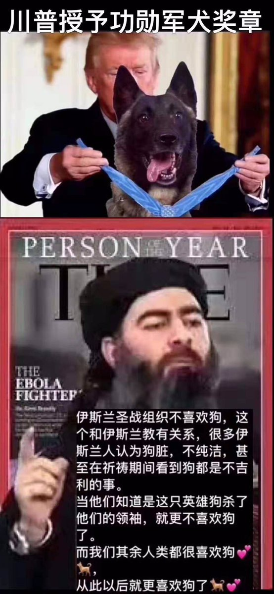
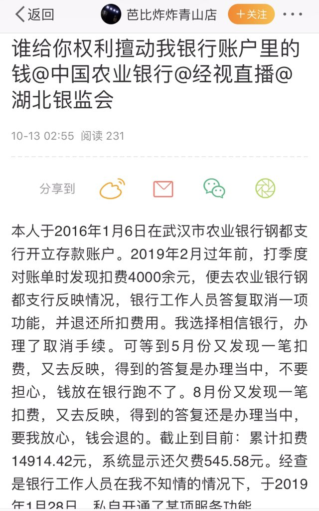
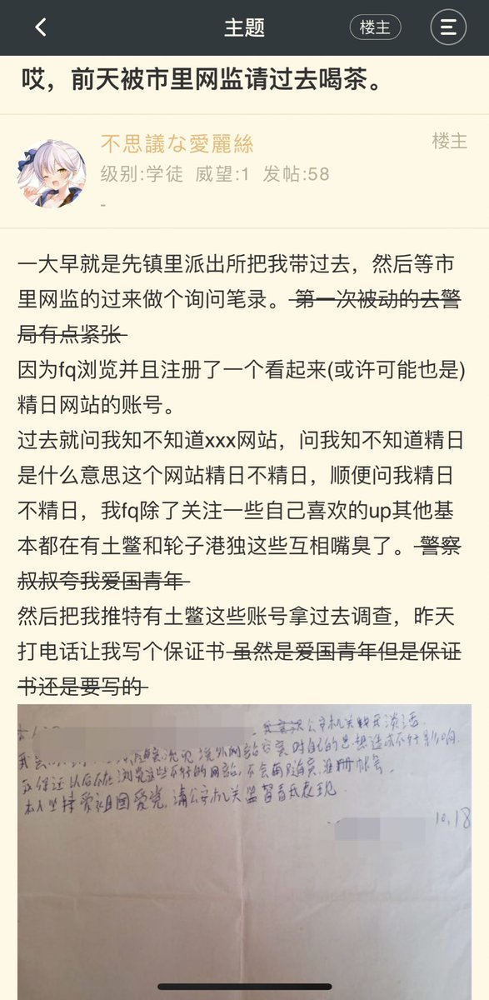

[11月01日 13:35]    新闻大吐槽   @TuCaoFakeNews    This Malaysian man used his own money to buy an #Huawei. He couldn't get google into his phone and the company gave him a method, in private. Shortly after, he cannot send nor receive SMS. So he made a video about it and now having received a warning from Huawei #BoycottChina https://twitter.com/TuCaoFakeNews/status/1190000916755148800 …  :speech_balloon:评:1 :+1:赞:3 :globe_with_meridians:转:1  

[11月01日 13:32]    新闻大吐槽   @TuCaoFakeNews     https://twitter.com/tucaofakenews/status/1190064342709850118 …  :speech_balloon:评:0 :+1:赞:1 :globe_with_meridians:转:1  

[11月01日 13:32]    新闻大吐槽   @TuCaoFakeNews    小哥不過是用事實說話而已。若是普通商家，通常的行為模式是立即解決消費者的問題以獲諒解；若是用威脅逼消費者閉嘴那只能說華為不是普通商家而是PLA。  :speech_balloon:评:0 :+1:赞:1 :globe_with_meridians:转:1  

[11月01日 13:29]    新闻大吐槽   @TuCaoFakeNews    笑出声 https://twitter.com/tucaofakenews/status/1190064342709850118 …  :speech_balloon:评:0 :+1:赞:3 :globe_with_meridians:转:1  

[11月01日 13:13]    新闻大吐槽   @TuCaoFakeNews    華為，你和你的主子一樣流氓。咱能不能學香港人，來一個全民抵制華為？ https://twitter.com/TuCaoFakeNews/status/1190000916755148800 …  :speech_balloon:评:0 :+1:赞:1 :globe_with_meridians:转:1  

[11月01日 13:10]    新闻大吐槽   @TuCaoFakeNews    华为这个企业就是党企啊，有什么好奇怪的，所以他们的作风和共产党一样嘛 https://twitter.com/TuCaoFakeNews/status/1190000916755148800 …  :speech_balloon:评:1 :+1:赞:4 :globe_with_meridians:转:2  

[11月01日 13:08]    新闻大吐槽   @TuCaoFakeNews    终于明白什么就流氓国家流氓企业了吧。但是你最好赶快来美帝，安全第一。 https://twitter.com/TuCaoFakeNews/status/1190000916755148800 …  :speech_balloon:评:0 :+1:赞:3 :globe_with_meridians:转:1  

[11月01日 13:00]    新闻大吐槽   @TuCaoFakeNews    华为？ https://twitter.com/tucaofakenews/status/1190000916755148800 …  :speech_balloon:评:0 :+1:赞:1 :globe_with_meridians:转:1  

[11月01日 13:00]    纽约时报中文网   @nytchinese    #每日一词 时报专栏作者弗里德曼提到美国有一个“愿意堕落到香蕉共和国(banana republic)治理水准的总统”。“香蕉共和国”是一种政治及经济体系的贬称，特指那些腐败问题严重、遭外国势力介入的国家，该词的由来是因为这种国家通常依赖香蕉等经济作物。
更多简报内容： http://nyti.ms/320ajZ3   :speech_balloon:评:1 :+1:赞:3 :globe_with_meridians:转:2  

[11月01日 12:51]    新闻大吐槽   @TuCaoFakeNews    不信邪（鞋），那就讓他們磨破腳吧。  :speech_balloon:评:0 :+1:赞:2 :globe_with_meridians:转:1  

[11月01日 12:50]    新闻大吐槽   @TuCaoFakeNews    手机只是它的一个小产品，还有很多大家不知道的大产品。  :speech_balloon:评:0 :+1:赞:6 :globe_with_meridians:转:1  

[11月01日 12:45]    新闻大吐槽   @TuCaoFakeNews    膩害了，我的華為 https://twitter.com/tucaofakenews/status/1190000916755148800 …  :speech_balloon:评:0 :+1:赞:4 :globe_with_meridians:转:4  

[11月01日 12:42]    新闻大吐槽   @TuCaoFakeNews    华为果然是共产党军工企业，黑社会手段比手机技术熟练多了，马来小哥已经被华为上门威胁  这算什么？ 看来孟晚舟的事情并没有让华为长教训！ https://twitter.com/tucaofakenews/status/1190000916755148800 …  :speech_balloon:评:1 :+1:赞:8 :globe_with_meridians:转:5  

[11月01日 12:39]    新闻大吐槽   @TuCaoFakeNews    秋叶测评吐槽Huawei Mate 20结果视频给华为锁了…  :speech_balloon:评:0 :+1:赞:3 :globe_with_meridians:转:1  

[11月01日 12:38]    新闻大吐槽   @TuCaoFakeNews    Winnie,where are u?
We miss u very much.  :speech_balloon:评:1 :+1:赞:2 :globe_with_meridians:转:1  

[11月01日 12:35]    新闻大吐槽   @TuCaoFakeNews    具有黑社会性质的民企  :speech_balloon:评:0 :+1:赞:2 :globe_with_meridians:转:1  

[11月01日 12:32]    新闻大吐槽   @TuCaoFakeNews    Why aiming head!!!???
#HKPoliceBrutality #ShameOnHKpolice #HKRioters #BloodyCrackdown
#StandWithHongKong
@HawleyMO @TuCaoFakeNews @benedictrogers https://twitter.com/DickyLeung12/status/1189947182071209985 …  :speech_balloon:评:0 :+1:赞:5 :globe_with_meridians:转:6  

[11月01日 12:32]    新闻大吐槽   @TuCaoFakeNews    华为是民企。。。哈哈哈。天大的笑话。一个民企敢这么威胁消费者？  :speech_balloon:评:2 :+1:赞:6 :globe_with_meridians:转:1  

[11月01日 12:30]    新闻大吐槽   @TuCaoFakeNews    現在在香港表明自己職業是警察，應該也交不到女友了  :speech_balloon:评:2 :+1:赞:9 :globe_with_meridians:转:1  

[11月01日 12:30]    纽约时报中文网   @nytchinese    香港抗议活动几乎每周都以熟悉的节奏上演：游行、警民冲突；然后行动结束，社区回归日常。
摄影师林亦非回到他曾经记录近几个月来的大规模集会和街头冲突的地方，从完全相同的观察点捕捉瞬间。他的对比照展示了这个香港居民现在定期经历的强烈反差。 http://nyti.ms/2C1oQJu   :speech_balloon:评:21 :+1:赞:38 :globe_with_meridians:转:17  

[11月01日 12:25]    新闻大吐槽   @TuCaoFakeNews    世界在转向，马来小哥不是最后一个小哥  :speech_balloon:评:0 :+1:赞:2 :globe_with_meridians:转:1  

[11月01日 12:06]    GFHG SDKM   @zyx_yny    Reporters need to ask @hkpoliceforce what NTS T2-3, Pln Cdr mean or correspond to. https://twitter.com/Liz86719814/status/1190100361119354880 …  :speech_balloon:评:79 :+1:赞:446 :globe_with_meridians:转:287  

[11月01日 12:04]    GFHG SDKM   @zyx_yny    Shotgun pointed at protester head  :speech_balloon:评:17 :+1:赞:172 :globe_with_meridians:转:191  

[11月01日 12:00]    BBC News 中文   @bbcchinese    艾米感觉老公似乎对她的一切都了如指掌，包括她和朋友的私下聊天内容，还有她的一切行踪，等到艾米最终发现真相时，心头一阵惊悚，几乎无法呼吸…… https://bbc.in/2BVmATQ   :speech_balloon:评:7 :+1:赞:12 :globe_with_meridians:转:6  

[11月01日 12:00]    纽约时报中文网   @nytchinese    • 巴基斯坦火车起火，导致70余人死亡。官员称，一列火车内的烹饪炉发生爆炸引发火情，三节满载乘客的车厢被大火吞噬。
• 朝鲜再次试射两枚短程导弹。这是自上月与美国在斯德哥尔摩的谈判陷入僵局以来，朝鲜首次进行导弹试射。
更多简报内容： http://nyti.ms/320ajZ3   :speech_balloon:评:1 :+1:赞:5 :globe_with_meridians:转:4  

[11月01日 11:30]    纽约时报中文网   @nytchinese    美国内政部周三宣布，除了正在被用于紧急情况的无人机外，将停飞其机队中所有中国制造、或含有中国制造零部件的无人机。
中国外交部批评，这一对中国公司的限制源于“冷战思维”，并呼吁华盛顿“为中国企业在美正常经营活动提供公平、公正和非歧视的环境”。 http://nyti.ms/2qXspOk   :speech_balloon:评:27 :+1:赞:140 :globe_with_meridians:转:59  

[11月01日 11:00]    BBC News 中文   @bbcchinese    人类在进化过程中曾丢失了许多“多余”器官。人类所丢失的某些东西，正是那些能让我们成为“超人”的东西。 https://bbc.in/2JEi5Bn   :speech_balloon:评:6 :+1:赞:42 :globe_with_meridians:转:14  

[11月01日 11:00]    纽约时报中文网   @nytchinese    伊斯兰国确认其头目死亡，并指定继任者。本周早些时候，特朗普宣布，巴格达迪在美军突袭行动中引爆炸弹背心自杀死亡。
但外界对伊斯兰国的新领导人几乎一无所知，包括他的真实身份。该组织还警告美国，不要太高兴。
更多简报内容： http://nyti.ms/320ajZ3   :speech_balloon:评:2 :+1:赞:6 :globe_with_meridians:转:2  

[11月01日 10:30]    纽约时报中文网   @nytchinese    #影评《寄生虫》兼有恐怖片、讽刺片和悲剧色彩，表现了韩国乃至世界各地阶级斗争的深刻教训。
现年50岁、拥有七部作品的导演奉俊昊将娱乐与社会意识结合在一起，从而激活电影虽已褪色但仍在坚持的民主承诺。 http://nyti.ms/2q4xXX5   :speech_balloon:评:5 :+1:赞:11 :globe_with_meridians:转:3  

[11月01日 10:11]    纽约时报中文网   @nytchinese    China Says It Will Roll Out ‘National Security’ Steps for HK. A Divided House Endorses Impeachment Inquiry. HK Falls Into Recession; Protesters Defy Mask Ban on Halloween. How to say "banana republic" in Chinese? Find out @nytchinese https://cn.nytimes.com/morning-brief/20191101/communist-party-plenary-us-chinese-made-drones/ …  :speech_balloon:评:2 :+1:赞:14 :globe_with_meridians:转:7  

[11月01日 10:06]    BBC News 中文   @bbcchinese    报告重申香港示威者的暴力行为不能接受，但同时强调各方必须进行“有意义”的对话。 https://bbc.in/34f7y7q   :speech_balloon:评:79 :+1:赞:59 :globe_with_meridians:转:19  

[11月01日 09:58]    新闻大吐槽   @TuCaoFakeNews    大姐“叶刘淑仪”和小妹“林郑月娥”当街开撕！  :speech_balloon:评:3 :+1:赞:112 :globe_with_meridians:转:43  

[11月01日 09:56]    纽约时报中文网   @nytchinese    早安！今日重点新闻包括：
四中全会公报解读；美国内政部下令停飞中国产无人机；香港经济正式陷入衰退；美众议院投票通过弹劾调查程序决议；巴基斯坦火车起火逾70人死亡……NYT简报带你速览今日要闻。 http://nyti.ms/320ajZ3   :speech_balloon:评:2 :+1:赞:19 :globe_with_meridians:转:6  

[11月01日 09:50]    财经真相   @caijingxiang    根据CEPA要求，中共央行正式宣布为在香港办理个人人民币存款、兑换、银行卡和汇款业务的银行提供清算安排，随后中银香港被指定为人民币在香港的结算行，其他香港银行的人民币业务必须找中银香港做最后的结算，同时接受中银香港的协议，但是该协议成为中共对香港金融的长臂管辖，自此香港金融彻底沦落  :speech_balloon:评:4 :+1:赞:120 :globe_with_meridians:转:51  

[11月01日 09:42]    财经真相   @caijingxiang    【快讯】央行称将于11月7日（下周四）在香港发行200亿元人民币三个月央票，及100亿元人民币一年期央票。 人民币在香港扩张最初始于1993年央行颁布的人民币出入境条例，最终全面形成是基于2003年6月大陆与香港签署的《内地与香港关于建立更紧密经贸关系的安排》（CEPA）  :speech_balloon:评:2 :+1:赞:90 :globe_with_meridians:转:36  

[11月01日 09:31]    BBC News 中文   @bbcchinese    随着中国雄心勃勃的“一带一路”计划向南亚延伸，尼泊尔-中国跨喜玛拉雅铁路提上日程，尼泊尔现在成了中印扩大地区影响的必争之地。
 https://bbc.in/2WxKPBe   :speech_balloon:评:10 :+1:赞:17 :globe_with_meridians:转:6  

[11月01日 09:30]    纽约时报中文网   @nytchinese    #时报专栏 @fmanjoo：我们许多问题的长期解决方案显而易见：为避免火灾、住房成本以及其他许多问题，加州人应该生活在一个更密集的区域。
我们应减少对汽车的依赖。我们应在基础设施——交通、电网、住房储备——的设计上更具包容性，以为多数人设计为目标，而不是为少数富人设计。 http://nyti.ms/2BYCwor   :speech_balloon:评:3 :+1:赞:6 :globe_with_meridians:转:2  

[11月01日 08:35]    老司机   @h5lpykl7tp6jjop    全国楼市降价潮：最高直降10000元/㎡，广州两天降6千/㎡！武汉直降8千/㎡！合肥最高降4536元/㎡！  :speech_balloon:评:0 :+1:赞:24 :globe_with_meridians:转:13  

[11月01日 08:21]    老司机   @h5lpykl7tp6jjop    在中国人中每个人骄傲自大都会遭到批评鄙视，一但提起群体就必须骄傲自大反之则会遭到批评鄙视！这是什么逻辑？这就是中国逻辑！每一个没有尊严的人合在一起就成了尊严心极强的群体，这种现象全世界只有中国会出现，可中国人一点不觉奇怪，反而认为很正常，所以中国人说你不正常，那恭喜你，你是正常人  :speech_balloon:评:2 :+1:赞:33 :globe_with_meridians:转:9  

[11月01日 08:03]    GFHG SDKM   @zyx_yny    不好意思，小熊維尼（プーさん）让一下下
涩谷的万圣节
Shibuya gets out of control on Halloween.

すみません、くまのプーさん通ります！！
ハロウィンの渋谷はやばい。。
   :speech_balloon:评:14 :+1:赞:171 :globe_with_meridians:转:107  

[11月01日 08:00]    GFHG SDKM   @zyx_yny    Hong Kong latest:
- Police scuffle with protesters and party-goers on Halloween
- Beijing signals tougher security measures are coming
- Court injunction bans internet posts that incite or encourage violence https://bloom.bg/2Py1jaK   :speech_balloon:评:137 :+1:赞:1058 :globe_with_meridians:转:955  

[11月01日 07:50]    GFHG SDKM   @zyx_yny    The brutality by the police towards protestors in #HongKong is deplorable.

Communist China and President Xi have turned Hong Kong into a police state. The US continues to #StandwithHongKong & will aid their fight for human rights in any way we can! https://twitter.com/hkchrislau/status/1189887609553604609 …  :speech_balloon:评:302 :+1:赞:1860 :globe_with_meridians:转:1373  

[11月01日 07:30]    BBC News 中文   @bbcchinese    许多现代女性面临家庭和事业之间的选择，更别提那些不孕症女性所面临的生育治疗和工作之间的压力和平衡。
 https://bbc.in/33gHGba   :speech_balloon:评:1 :+1:赞:6 :globe_with_meridians:转:5  

[11月01日 07:30]    纽约时报中文网   @nytchinese    “对耶鲁大学、国会或白宫这样的地方来说，只有当你打开大门，让女性首次进入时，争取平等的斗争才会开始，”一名历史学家说。“这需要制度的改变。” http://nyti.ms/2q6ZtmD   :speech_balloon:评:3 :+1:赞:10 :globe_with_meridians:转:1  

[11月01日 07:15]    BBC News 中文   @bbcchinese    有香港网民发起在万圣节晚上游行，向政府表达不满。大批市民在中环兰桂坊酒吧街一带聚集，其后警察发射催泪弹驱散。  :speech_balloon:评:52 :+1:赞:168 :globe_with_meridians:转:99  

[11月01日 01:11]    GFHG SDKM   @zyx_yny    They are neither cleaning that place nor doing anything meaningful at all. https://twitter.com/fktws/status/1189892960524984320 …  :speech_balloon:评:0 :+1:赞:0 :globe_with_meridians:转:0  

[11月01日 00:38]    财经真相   @caijingxiang    美元货币体系终结者——数字货币  :speech_balloon:评:42 :+1:赞:95 :globe_with_meridians:转:22  

[11月01日 00:30]    GFHG SDKM   @zyx_yny    Hong Kong police arrested a foreign lady who was celebrating Halloween in ​​Lan Kwai Fong. The police pushed down the lady. She shouted for help from BBC, CNN and kept yelling "I need my wallet”. She asked to call the US consulate. 
Source: Editorial Board, CityU SU
@SolomonYue  :speech_balloon:评:22 :+1:赞:675 :globe_with_meridians:转:658  

[11月01日 00:28]    GFHG SDKM   @zyx_yny    Did @hkpoliceforce say they'll use identification 4 each cop again the other day? If NOT,police leadership will be held responsible 4human rights violations under the Hong Kong Be Water Act's Global Magnitsky sanctions & freezing the assets provisions. Now Database All Abuses https://twitter.com/kiloloyc/status/1189939209500418048 …  :speech_balloon:评:223 :+1:赞:1895 :globe_with_meridians:转:1222  

[11月01日 00:24]    财经真相   @caijingxiang    美元根本无法脱钩比特币，因为它从未就“挂钩过”，都是场外交易，所以才可以为非法交易提供洗钱！ https://twitter.com/seanchen_new/status/1189940816560582659 …  :speech_balloon:评:8 :+1:赞:40 :globe_with_meridians:转:5  

[11月01日 00:18]    财经真相   @caijingxiang    那些说夸张的人，究竟懂不懂世界贸易体系？如果夸张，习近平会亲自开会学习区域块链？  :speech_balloon:评:20 :+1:赞:40 :globe_with_meridians:转:9  

[11月01日 00:17]    财经真相   @caijingxiang    美国人看样子要重新构建一种新的货币结算体系了！  :speech_balloon:评:5 :+1:赞:49 :globe_with_meridians:转:8  

[11月01日 00:15]    财经真相   @caijingxiang    中共发行的数字货币究竟目的是什么？答案是毁灭全世界，摧毁美元世界霸权，进而摧毁世界贸易体系，再摧毁世界经济，最终将世界变成人间炼狱！  :speech_balloon:评:72 :+1:赞:309 :globe_with_meridians:转:125  

[11月01日 00:13]    GFHG SDKM   @zyx_yny    Did anyone, including reporters get this @hkpoliceforce cop's ID number? Sens @HawleyMO/@SenRickScott/John Cornyn's the Hong Kong Be Water Act is designed to sanction this cop. https://twitter.com/j_punkman/status/1189936068499521536 …  :speech_balloon:评:936 :+1:赞:5285 :globe_with_meridians:转:4307  

[10月31日 23:44]    GFHG SDKM   @zyx_yny    #HKPolice makes an arrest and tells reporters they're too close and that they should be filming people throwing stuff instead.  None of the reporters saw anyone throw anything and call him out on his BS.  Why are we not surprised?

#StandWithHongKong #HongKongProtests  :speech_balloon:评:19 :+1:赞:369 :globe_with_meridians:转:355  

[10月31日 23:23]    财经真相   @caijingxiang    美国民主党关于对特朗普进行弹劾调查的下一步行动在美国众议院扫清了程序性障碍! https://twitter.com/caijingxiang/status/1189503583399448576 …  :speech_balloon:评:8 :+1:赞:33 :globe_with_meridians:转:4  

[10月31日 23:08]    GFHG SDKM   @zyx_yny    An elderly woman bled heavily after got shot at her leg by a tear gas canister fired by #HKPoliceTerrorists  :speech_balloon:评:140 :+1:赞:2352 :globe_with_meridians:转:2620  

[10月31日 23:03]    老司机   @h5lpykl7tp6jjop    An elderly got shot by teargas with blood all over the floor....

【旺角即時】一名婆婆被催淚彈射中腳部並大量流血。  :speech_balloon:评:64 :+1:赞:945 :globe_with_meridians:转:1152  

[10月31日 22:43]    老司机   @h5lpykl7tp6jjop    這不叫黑警？
那你給他們一個更合適的稱呼！

#StandwithHK  :speech_balloon:评:67 :+1:赞:259 :globe_with_meridians:转:248  

[10月31日 22:30]    BBC News 中文   @bbcchinese    农民少，平均年龄67岁！耕地少，仅有一点还都种大米了。怎样确保国人吃饱吃好吃放心？日本想出哪些高明招数？ https://bbc.in/2NsNnMF   :speech_balloon:评:11 :+1:赞:57 :globe_with_meridians:转:20  

[10月31日 22:15]    纽约时报中文网   @nytchinese    #影评 在韩国，票房大片《寄生虫》加剧了关于经济不平等的讨论。它像是一个当代社会关系的寓言，成功地将幻想与现实结合起来，具有强烈的隐喻性和触目惊心的真实性。
不管是否能意识到，我们就真切地生活在奉俊昊的世界里。 http://nyti.ms/2q4xXX5   :speech_balloon:评:8 :+1:赞:72 :globe_with_meridians:转:29  

[10月31日 22:00]    BBC News 中文   @bbcchinese    四中全会是神秘的闭门会议，公报出来了，选定接班人、高层人事变动、香港局势……其中到底说了什么、没说什么？传达出怎样的信号？ https://bbc.in/34mrSDV   :speech_balloon:评:54 :+1:赞:116 :globe_with_meridians:转:41  

[10月31日 21:57]    GFHG SDKM   @zyx_yny    Now cosplaying is de facto banned in #HongKong. #HKPoliceTerrorists will beat you up even though you just cosplay as the #mistressofevil  on #halloween2019  :speech_balloon:评:156 :+1:赞:2177 :globe_with_meridians:转:2095  

[10月31日 21:45]    GFHG SDKM   @zyx_yny    今夜の #渋谷 で、香港を応援する中国人が過激な中国人に襲われました
#halloween2019 #StandwiththePooh #StandWithHongKong #HongKongProtests #香港 #香港デモ #ハロウィン #shibuya #習近平 #仮面　#プーさん #ディズニー #暴力  :speech_balloon:评:58 :+1:赞:939 :globe_with_meridians:转:782  

[10月31日 21:44]    GFHG SDKM   @zyx_yny    In Central, riot policed lunched towards a heckling woman in a witch costume whilst pepper spraying journalists. The woman, who chanted "I'm an American" was taken away.  :speech_balloon:评:27 :+1:赞:311 :globe_with_meridians:转:300  

[10月31日 21:35]    GFHG SDKM   @zyx_yny    #HKPoliceTerrorists just point-blank pepper-sprayed a bystander who was asking where the police’s cordon line was. #PoliceBrutality #PoliceState #halloween2019 #LanKwaiFong  :speech_balloon:评:445 :+1:赞:4846 :globe_with_meridians:转:4958  

[10月31日 21:30]    纽约时报中文网   @nytchinese    越南的故事本该不是这样。在贸易增长的推动下，越南是世界上经济增长最快的国家之一，生活在贫困线下的人数已大幅下降。
但许多生活在最贫困地区的人缺乏接受良好教育的机会。虽然越南正在增加医疗和社会福利方面的支出，但许多人仍未享受到经济繁荣的好处。 http://nyti.ms/34cpAao   :speech_balloon:评:2 :+1:赞:15 :globe_with_meridians:转:9  

[10月31日 21:25]    BBC News 中文   @bbcchinese    【香港示威直播：萬聖節反對「禁蒙面法」遊行】BBC中文現場直播香港蘭桂坊的情況。 https://bbc.in/2PvbHjI   :speech_balloon:评:7 :+1:赞:24 :globe_with_meridians:转:13  

[10月31日 21:13]    GFHG SDKM   @zyx_yny    What happened in #HongKong on 31 Aug in the Prince Edward station?
Never forgive Never forget...
No one can imagine that how evil #HKPolice are. 
Please watch this video until the end.
#hkPoliceBrutalitiy #HKPoliceTerrorists  :speech_balloon:评:22 :+1:赞:550 :globe_with_meridians:转:676  

[10月31日 21:12]    GFHG SDKM   @zyx_yny    #Police Officers desecrate the memorial hall set up for the deceased and victims of #policebrutality next to #PrinceEdward Station
Source -  https://t.me/guardiansofhongkong/9465 …
#PoliceState #StandWithHongKong #FreeHongKong #HongKongRioters  :speech_balloon:评:112 :+1:赞:1229 :globe_with_meridians:转:1320  

[10月31日 21:06]    BBC News 中文   @bbcchinese    今天是万圣夜，许多香港市民戴上面罩或化妆，在中环及太子站附近聚集。大批防暴警察在场戒备，并在太子发射催泪弹驱散集会者。  :speech_balloon:评:21 :+1:赞:95 :globe_with_meridians:转:42  

[10月31日 20:30]    BBC News 中文   @bbcchinese    中国官员称，数字货币发行后，两个手机碰一碰，即使没有网络，也可以把一个人数字钱包里的数字货币，转给另一个人。 https://bbc.in/36p6GiO   :speech_balloon:评:50 :+1:赞:74 :globe_with_meridians:转:37  

[10月31日 20:30]    纽约时报中文网   @nytchinese    历史上，首里城曾被多次摧毁，最近的一次是在第二次世界大战的冲绳岛战役中。
此后，首里城被修复原貌，并于1992年作为公园重新开放。2000年，首里城被联合国教科文组织列为世界文化遗产。 http://nyti.ms/2PCblHZ   :speech_balloon:评:2 :+1:赞:9 :globe_with_meridians:转:4  

[10月31日 20:25]    纽约时报中文网   @nytchinese    英国卡车尸体案背后，贫困越南偷渡者的悲歌  http://nyti.ms/34cpAao https://twitter.com/ccni/status/1189852616471134208 …  :speech_balloon:评:0 :+1:赞:1 :globe_with_meridians:转:0  

[10月31日 20:00]    BBC News 中文   @bbcchinese    脸书最近宣布不会禁止政治广告，与推特的态度截然相反。 https://bbc.in/326Twnf   :speech_balloon:评:24 :+1:赞:123 :globe_with_meridians:转:43  

[10月31日 19:55]    财经真相   @caijingxiang    重磅：美国国务卿蓬佩奥本周三在保守派智库纽约哈德逊研究所发表演讲时表示，中共政权正在谋求主导世界的权力，因此必须要予以正面反抗。
蓬佩奥在演讲中说，美国一直非常珍视与中国人民之间的友谊，但是中共政府与中国人民并非一回事。"这算是美国政府在职高官，第一次明确中共政府与中国两回事！ https://twitter.com/dw_chinese/status/1189872143036604416 …  :speech_balloon:评:18 :+1:赞:518 :globe_with_meridians:转:201  

[10月31日 19:50]    财经真相   @caijingxiang    又是彭博新闻，中共四中全会刚结束，新闻通稿刚发出，贸易谈判滑消息就出来了，时间点掐的很讲政治，恰到好处！ https://twitter.com/economics/status/1189870935290961923 …  :speech_balloon:评:7 :+1:赞:96 :globe_with_meridians:转:27  

[10月31日 19:30]    纽约时报中文网   @nytchinese    #图集【旧时光里的纽约万圣节】身着奇装异服的人们、玩trick-or-treat的孩子们、街上的蝙蝠侠、莱娅公主和蜘蛛侠......时报历史图片记录下了上世纪6、70年代纽约的万圣节狂欢图景。
点击查看图集： http://nyti.ms/2NrdnIb   :speech_balloon:评:0 :+1:赞:11 :globe_with_meridians:转:1  

[10月31日 19:20]    老司机   @h5lpykl7tp6jjop    当兵的退伍回乡走投无路只有上访，红后代移民加拿大爱国歌曲大演唱，加拿大中共解放军退伍军人协会成立，演唱歌曲说明身在曹营心在汉呢，还是怀念特权，只恨不能随身移呢？  :speech_balloon:评:12 :+1:赞:30 :globe_with_meridians:转:17  

[10月31日 19:00]    纽约时报中文网   @nytchinese    #时报专栏 我对加州的爱深沉而真实。但最近，我对家乡的感情开始恶化。一种虚无主义已经潜入我的思维。我开始怀疑我们完蛋了。
火灾和停电不是天灾，而是我们选择忽视的人祸，它与一个更大的问题有关：我们无法可持续地生活。加州的人们要么改变这里的生活方式，要么只能离开。 http://nyti.ms/2BYCwor   :speech_balloon:评:23 :+1:赞:32 :globe_with_meridians:转:19  

[10月31日 18:51]    财经真相   @caijingxiang    四中全会总体一句话：不改、坚决不改！  :speech_balloon:评:98 :+1:赞:1031 :globe_with_meridians:转:407  

[10月31日 18:30]    纽约时报中文网   @nytchinese    被禁止参加大多数课外活动、16%的人说曾被性骚扰……一项新调查披露了50年前耶鲁首批本科女生的校园经历。
她们的经历讲述了一个更大的故事：当白人男性主导的机构试图多元化时会发生什么。和许多有权力的地方一样，耶鲁允许女性入学，但并没有平等对待她们。 http://nyti.ms/2q6ZtmD   :speech_balloon:评:10 :+1:赞:24 :globe_with_meridians:转:11  

[10月31日 18:21]    老司机   @h5lpykl7tp6jjop    认识的人越来越多，但是我越来越喜欢狗！  :speech_balloon:评:2 :+1:赞:10 :globe_with_meridians:转:5  

[10月31日 18:00]    纽约时报中文网   @nytchinese    #时报专栏 @tomfriedman：共和党人现在有个明确选择：要么让宪法弹劾程序继续下去，要么攻击弹劾程序，即我们的立法和司法秩序。唉，大多数人似乎选择了后者。
通过攻击所有冒着巨大的职业风险挺身，给出不利特朗普的证词外交官、情报官员和公务员，他们是在攻击维护法规的人。 http://nyti.ms/2JDsNbc   :speech_balloon:评:6 :+1:赞:11 :globe_with_meridians:转:6  

[10月31日 17:56]    墙国铁拳现世报😷   @Socialistfist    就当是给祖国母亲的生日礼物了~

#社会主义铁拳  :speech_balloon:评:27 :+1:赞:305 :globe_with_meridians:转:63  

[10月31日 17:30]    BBC News 中文   @bbcchinese    香港第三季GDP预先估计数字，较去年同期下跌2.9%，是2009年以来，首次录得季度按年跌幅。学者认为，中美贸易战对香港经济影响更大，但示威活动加快了衰退的步伐。 https://bbc.in/34k6aAq   :speech_balloon:评:41 :+1:赞:90 :globe_with_meridians:转:23  

[10月31日 17:30]    纽约时报中文网   @nytchinese    在越南中北部一个饱受贫困和环境灾难之苦的地区，越南和英国政府正在共同努力，确定罹难者的身份。
据越南一家官方新闻机构报道，越南当局已收到了14个家庭的求助请求，这些家庭称亲人在英国失踪。越南总理阮春福也已经下令官员对越南公民被非法送往海外的情况展开调查。 http://nyti.ms/34cpAao   :speech_balloon:评:5 :+1:赞:11 :globe_with_meridians:转:4  

[10月31日 17:10]    财经真相   @caijingxiang    China said to be unwilling to budge on big structural changes！  :speech_balloon:评:4 :+1:赞:65 :globe_with_meridians:转:24  

[10月31日 17:09]    财经真相   @caijingxiang    快讯：中共称不可能进行结构性改革，消息一出黄金上涨，人民币短线下跌  :speech_balloon:评:48 :+1:赞:497 :globe_with_meridians:转:124  

[10月31日 17:00]    纽约时报中文网   @nytchinese    博尔顿的副手曾表示，博尔顿对特朗普向乌克兰施压的行为感到愤怒，并曾警告称，特朗普的私人律师、在电话门实践中起到主导作用的朱利安尼是“一颗会把所有人都炸死的手榴弹”。
但博尔顿是否将接受质询尚不确定，其律师表示，他“无意自愿出庭”。 http://nyti.ms/2pw9h9I   :speech_balloon:评:1 :+1:赞:6 :globe_with_meridians:转:1  

[10月31日 16:34]    BBC News 中文   @bbcchinese    【日本冲绳首里城大火：整座木制首里城几乎全部烧毁】#日本 #冲绳 #首里城 发生大火，整座木制的首里城，包括正殿、南殿和北殿几乎全部烧毁。那霸市消防局表示，大火烧了11小时，火势在当地时间下午扑灭。首里城于13世纪末兴建，2000年被联合国教科文组织列为世界文化遗产。 https://bbc.in/3331O0A   :speech_balloon:评:17 :+1:赞:22 :globe_with_meridians:转:10  

[10月31日 16:00]    BBC News 中文   @bbcchinese    APEC峰会取消後，那中美贸易协定要去哪里签呢? https://bbc.in/2q8HEn4   :speech_balloon:评:28 :+1:赞:28 :globe_with_meridians:转:6  

[10月31日 15:41]    老司机   @h5lpykl7tp6jjop    终于暴露中共才是华为背后的大老板！
任正非：华为交班已完成多年 我只是中间的“傀儡”  :speech_balloon:评:3 :+1:赞:38 :globe_with_meridians:转:25  

[10月31日 15:31]    BBC News 中文   @bbcchinese    【兰桂坊主席盛智文：如果几年便买到500呎楼 很多人不会上街】盛智文认为，如果港府能像新加坡一样给人民安居乐业，很多人会放弃上街。 https://bbc.in/2NswykX   :speech_balloon:评:74 :+1:赞:34 :globe_with_meridians:转:14  

[10月31日 15:01]    BBC News 中文   @bbcchinese    一年一度的万圣节又来了，不论是大人或是小孩，都要装神弄鬼一番极尽吓人的本事，但你知道万圣节的由来吗？ https://bbc.in/2MTMugW   :speech_balloon:评:4 :+1:赞:27 :globe_with_meridians:转:9  

[10月31日 14:01]    BBC News 中文   @bbcchinese    1998年，全球有整整16%的热带珊瑚礁死亡，而到了2016年，全球70%的珊瑚礁遭到破坏，有些更是无法挽回的。人类到底还可以做什么？ https://bbc.in/2PwUeHw   :speech_balloon:评:19 :+1:赞:45 :globe_with_meridians:转:20  

[10月31日 13:48]    财经真相   @caijingxiang    潘石屹soho卖给了黑石集团和GIC，考虑到黑石的背景，这次报价应该会很低！  :speech_balloon:评:17 :+1:赞:235 :globe_with_meridians:转:59  

[10月31日 13:12]    GFHG SDKM   @zyx_yny    @EnzoMazak @SpeakerPelosi @SenAlexander
Here's Cantonese lesson 
#hkpolice 
"清算 us?With water?Silly vxxxxa!"
清算(punish) spilt into two are "wash" and "count",which 清 literally is related to water.
 
Without punishment on them ANOTHER "Tuen Mun's Halloween" surely comes.  :speech_balloon:评:4 :+1:赞:75 :globe_with_meridians:转:54  

[10月31日 13:01]    BBC News 中文   @bbcchinese    国际慈善组织基督教救世军近日发布报告称，中国是2019年该组织在英国救助奴工的第3大原籍来源国。 https://bbc.in/34gDVCG   :speech_balloon:评:27 :+1:赞:57 :globe_with_meridians:转:19  

[10月31日 12:48]    财经真相   @caijingxiang    商务部新闻发言人声明：中美双方经贸团队一直保持密切沟通，目前磋商工作进展顺利。双方将按原计划继续推进磋商等各项工作。双方牵头人将于本周五再次通话。 中美贸易谈判现在是天天都有好消息，人民币也天天涨，静静的等待结果，看看究竟可以忽悠到什么时候！  :speech_balloon:评:19 :+1:赞:196 :globe_with_meridians:转:40  

[10月31日 12:02]    GFHG SDKM   @zyx_yny    A group of Uyghur activists and allies protested at the Capital One Arena during the Wizards vs Rocket Game today 

One Chinese man comes and says “Your mom’s dead”

Video from Hazel Sahin

#NBA #StopChina #FreeHongKong #FreeEastTurkestan #GoogleUyghur  :speech_balloon:评:105 :+1:赞:1504 :globe_with_meridians:转:1005  

[10月31日 12:01]    BBC News 中文   @bbcchinese    美国的狗说：“在我们国家，如果你一直犬吠不止，终究会有人听到你的，会给你肉吃”；波兰的狗问：“什么是肉啊？”；苏联的狗问：“什么是犬吠啊？”这些坊间流传的笑话，成为中情局当年解读苏联民情的资料。 https://bbc.in/2Nmzks8   :speech_balloon:评:84 :+1:赞:424 :globe_with_meridians:转:140  

[10月31日 10:24]    财经真相   @caijingxiang    据国务院新闻办公室10月31日消息，国务院新闻办公室定于2019年11月1日（星期五）上午10时举行中国共产党十九届四中全会新闻发布会，请中央宣传部、中央政策研究室、中央财经委员会办公室、全国人大常委会法工委、全国政协办公厅、司法部负责同志介绍有关情况，并答记者问。  :speech_balloon:评:8 :+1:赞:91 :globe_with_meridians:转:27  

[10月31日 09:51]    财经真相   @caijingxiang    CFETS人民币汇率指数和SDR货币篮子人民币汇率指数都创下了四年来新低。现在决策层在汇率操作上“骑虎难下”，如果让人民币跟随欧元等篮子货币上涨，则会对本来就已经不断出血的出口“雪上加霜”。如果不跟就会激发市场对人民币未来继续下跌的预期，一旦美元指数走强重新走强，市场做空人民币压力很逆转。  :speech_balloon:评:3 :+1:赞:91 :globe_with_meridians:转:28  

[10月31日 08:58]    GFHG SDKM   @zyx_yny    From HK01: CCTV footages of #PrinceEdward station on August 31
One of the footage shows police officers chasing citizens at 10:56pm. Another one involves footage of 2 CCTV at platform 4, they only state "Video Loss" or "No Video"
 https://www.hk01.com/%E7%A4%BE%E6%9C%83%E6%96%B0%E8%81%9E/392301/8-31%E5%A4%AA%E5%AD%90%E7%AB%99%E8%A1%9D%E7%AA%81-%E6%B8%AF%E9%90%B5cctv%E7%89%87%E6%AE%B5%E9%A6%96%E6%9B%9D%E5%85%89-%E9%80%9F%E9%BE%8D%E5%B0%8F%E9%9A%8A%E6%8F%AE%E6%A3%8D%E8%BF%BD%E6%8D%95%E4%B9%98%E5%AE%A2 …  :speech_balloon:评:52 :+1:赞:927 :globe_with_meridians:转:895  

[10月31日 08:22]    财经真相   @caijingxiang    美联储在利率声明中，删除了“采取相当程度维持扩张”的措词，包括鲍威尔强调美国经济“基本前景仍然是有利的 ”，“只要经济前景与我们保持一致，货币政策就是合适”，但是保留了经济发生变化时，改变想法的空间。正是这种保留想法，让市场重新计价12月份继续降息的预期，导致美元大跌，市场这次真的有点过  :speech_balloon:评:3 :+1:赞:73 :globe_with_meridians:转:13  

[10月31日 06:13]    墙国铁拳现世报😷   @Socialistfist    香港导演争当护旗手！
结果当他翻拍鹿鼎记时，剧本翻来覆去修改多次，中共还是不予批准！

护旗手就是要给党折磨的
@Socialistfist  :speech_balloon:评:65 :+1:赞:521 :globe_with_meridians:转:127  

[10月31日 05:38]    老司机   @h5lpykl7tp6jjop    一对情侣在街上跳了支舞，黑警没反应过来，直到人都走了半天，才意识到可能是被羞辱了，于是决定到饭店去捉捕人，呼啸着来到饭店，却遭女店长拒绝，于是黑警立即动粗，摔倒女店长，大摇大摆进店抓人！
剥夺跳舞自由！无证擅闯入私人领地！
引自推友@Tonyworld15  :speech_balloon:评:12 :+1:赞:347 :globe_with_meridians:转:314  

[10月31日 03:52]    老司机   @h5lpykl7tp6jjop    看过一张图片，老中医一边吊着盐水，一边摸脉给病人看病，非常和谐，病人迷信相信老中医，他们没有怀疑为什么老中医自己病了看西医，这就是爱国废民没有逻辑的思维！  :speech_balloon:评:1 :+1:赞:45 :globe_with_meridians:转:16  

[10月31日 03:39]    老司机   @h5lpykl7tp6jjop    涨了就是涨了，涨幅收窄？这样的把戏想骗老百姓不懂？  :speech_balloon:评:2 :+1:赞:26 :globe_with_meridians:转:12  

[10月31日 03:11]    老司机   @h5lpykl7tp6jjop    正式通过！参议院通过台北法案 强化台湾外交
台湾一天天好起来，中共一天天烂下去！  :speech_balloon:评:3 :+1:赞:56 :globe_with_meridians:转:18  

[10月31日 02:54]    老司机   @h5lpykl7tp6jjop    美国政府下令：要彻底清退华为和中兴
美国政府启动程序彻底清退美国境内的华为等中国通信设备。美国政府下令要求安装了中国通信设备的美国通信企业全面更换设备，预计达10亿美元更换费用将由美国政府用税金提供支援。美国还可能要求包括韩国在内的同盟国采取类似措施。中国官方谴责美国此种做法是霸凌  :speech_balloon:评:1 :+1:赞:169 :globe_with_meridians:转:40  

[10月31日 02:40]    老司机   @h5lpykl7tp6jjop    潘石屹也要跑？清仓国内资产 80亿美元卖办公楼  :speech_balloon:评:3 :+1:赞:40 :globe_with_meridians:转:20  

[10月31日 02:32]    老司机   @h5lpykl7tp6jjop    要注意的是注水的量，它隐藏在各项债务中，如果只看到当前的购买价值，就觉得不太适合，但是一旦发生信用崩溃，挤兑出现，大家就会看到有钱买不到东西，就像苏联崩溃时卢布2万兑一美元的情况。  :speech_balloon:评:0 :+1:赞:2 :globe_with_meridians:转:0  

[10月31日 00:55]    财经真相   @caijingxiang    经济参考报头版：经济体制改革将继续全面推进，并引用“业内人士”的话说，在财税、金融和国企领域更多改革措施将推出，并引用中财院赵福昌话说，经济治理的核心和目标就是发挥市场在资源配置中的决定性作用 这种论调完全和习不是一个思路，党内“拥邓派”还再制造舆论！  :speech_balloon:评:14 :+1:赞:92 :globe_with_meridians:转:9  

[10月31日 00:00]    老司机   @h5lpykl7tp6jjop    #香港10月30日 23：20 #屯門 盈豐園有一男一女在一間食肆外跳舞引來防暴警不滿，該對男女走入一間食肆，女負責人拒絕警員入內蒙面警即時情緒失控，粗暴拉跌女負責人並闖入店內截查跳舞男女.蒙面警的失控濫權濫暴行為惹來街坊不滿，警員即指街坊非法集結舉藍旗警告  :speech_balloon:评:5 :+1:赞:53 :globe_with_meridians:转:47  

[10月30日 23:33]    财经真相   @caijingxiang    大陆所有官方、公司、外资网站都把台湾列入中共国的一个省，这就说明中共不灭台湾人幻想的真正安全就永远不存在，与其做缩头乌龟还不如反击，直接在台湾网上把大陆也列为“民国领土”，以彼之道还施彼身，有何不妥？  :speech_balloon:评:69 :+1:赞:547 :globe_with_meridians:转:82  

[10月30日 20:19]    墙国铁拳现世报😷   @Socialistfist    大家投票踊跃，下周就从点赞数从多到少挑四个选吧
有什么建议 意见可以回复此推  :speech_balloon:评:3 :+1:赞:30 :globe_with_meridians:转:1  

[10月30日 20:17]    墙国铁拳现世报😷   @Socialistfist    后续  :speech_balloon:评:2 :+1:赞:25 :globe_with_meridians:转:1  

[10月30日 20:12]    墙国铁拳现世报😷   @Socialistfist    推友最喜爱“上周最佳铁拳” 评选活动
更多选项看后续  :speech_balloon:评:2 :+1:赞:74 :globe_with_meridians:转:16  

[10月30日 19:24]    墙国铁拳现世报😷   @Socialistfist    全文  :speech_balloon:评:2 :+1:赞:60 :globe_with_meridians:转:12  

[10月30日 19:24]    墙国铁拳现世报😷   @Socialistfist    收了几次精赵智商税就开始闹，成何体统？
原文已删，全文看后续

#社会主义铁拳  :speech_balloon:评:9 :+1:赞:239 :globe_with_meridians:转:68  

[10月30日 11:47]    老司机   @h5lpykl7tp6jjop    事发：2019年10月23号云南曲靖市20岁女孩小寒，在某宾馆二楼被两名男子强行拉上楼！期间被掌掴！在房间内小寒被侮辱！小寒从4楼跳下！

有没有被性侵！  :speech_balloon:评:33 :+1:赞:385 :globe_with_meridians:转:368  

[10月30日 10:59]    老司机   @h5lpykl7tp6jjop    中国搞区块链、数字货币，真实目的是企图去美元中心化，但是不可能成功，因为中国最终还是需要用美元来购买石油和大宗物资，数字货币必须与美元或黄金挂钩，否则一文不值。也许唯一的结果是，不需要增印人民币了，也不需要印各种凭票供应的票据了，用数字货币，来延缓和掩盖中国经济的重大危机。  :speech_balloon:评:28 :+1:赞:211 :globe_with_meridians:转:90  

[10月30日 08:55]    老司机   @h5lpykl7tp6jjop    【爆炸新闻】厉害国完了，温州银行倒闭！数百民众围在银行前维权！  :speech_balloon:评:104 :+1:赞:1242 :globe_with_meridians:转:657  

[10月30日 07:24]    老司机   @h5lpykl7tp6jjop    什么是中国特色？就是别人没有的你都有：商君书、诛九族、连坐制、等级制、裹小脚、三十六计、奴婢制、一妻多妾制、中央集权制、强拆、活摘、嫖宿、双轨制、潜规则、局域网、一国两制、计划生育、非法讨薪、恶意上访、单双号限行车辆等...... 
没有半点文明的影子，不知道中国人的民族自豪感从何而来？  :speech_balloon:评:70 :+1:赞:927 :globe_with_meridians:转:354  

[10月29日 22:20]    老司机   @h5lpykl7tp6jjop    美國佐治亞州的監獄開設了一個有爭議的項目。那就是請那些家長把他們教育不了的"熊孩子"們送到這裡，來個"一日游"。
看樣子，效果不錯。  :speech_balloon:评:15 :+1:赞:367 :globe_with_meridians:转:185  

[10月29日 19:22]    墙国铁拳现世报😷   @Socialistfist    “哎呦.....太君别开枪.....”

#社会主义铁拳
#社会主义特别行政区铁拳  :speech_balloon:评:33 :+1:赞:434 :globe_with_meridians:转:136  

[10月29日 08:08]    新闻大吐槽   @TuCaoFakeNews    10月份，华为Mate 30 Pro在马来西亚上市；价格3899令吉（约合6584rmb）~

一个马来西亚小哥，手贱买了一个，发现谷歌套件一个也不能用！肯定郁闷死了！那么贵  :speech_balloon:评:317 :+1:赞:2244 :globe_with_meridians:转:1060  

[10月28日 19:42]    墙国铁拳现世报😷   @Socialistfist    药房老板现时仍未回港，店员胡先生今日戴上口罩回店内用漂白水清洁，四名便衣警员到药房表示「唔好意思」，期望药房体谅，他坦言唯有接受道歉。
胡先生续指，估计损失约 1,000 元。他提到，昨晚蘗房已拉半闸，警方未有举起黑旗便施放催泪弹，形容警方是「乱咁射」，但需老板回港后才决定是否追究。  :speech_balloon:评:3 :+1:赞:60 :globe_with_meridians:转:10  

[10月28日 19:39]    墙国铁拳现世报😷   @Socialistfist    尖沙咀发起集会，演变成多处警民冲突，其中晚上警方施放的一枚催泪弹射入位于弥敦道的「明寅药房」，警方今早约4 名便衣警员到店舖道歉，向员工表示「唔好意思」。警员逗留约 2 分钟后离开，并无解释催泪弹射入药房的原因。  :speech_balloon:评:2 :+1:赞:59 :globe_with_meridians:转:7  

[10月28日 19:39]    墙国铁拳现世报😷   @Socialistfist    陈柏雄, 药房东主，在FB上撑警及赞同六四镇压嘅言论，包括他在10月5日发表「当年出坦克车，原来是最正确决定！」、10月8日称抗争者为「暴徒、垃圾废青、曱甴」，又称听到「兄弟、手足」令佢「作呕」。  :speech_balloon:评:2 :+1:赞:62 :globe_with_meridians:转:7  

[10月28日 19:38]    墙国铁拳现世报😷   @Socialistfist    铁拳是最好的决定

感谢香港推友，更多详情请看本推后续推文
#社会主义铁拳
#社会主义特别行政区铁拳  https://twitter.com/BeLightinHK/status/1188465234391883776 …  :speech_balloon:评:9 :+1:赞:144 :globe_with_meridians:转:44  

[10月28日 08:17]    凡賽堤/FORSETI   @FecharCCP    魔鬼在人間

極權殺人恐怖組織正在用各種兇殘手段殺害我們的同胞....................................................................................................

10月27日被極權殺人恐怖組織非法濫捕的香港年輕人已經超過200+ 人！  :speech_balloon:评:2 :+1:赞:25 :globe_with_meridians:转:19  

[10月28日 07:49]    凡賽堤/FORSETI   @FecharCCP    魔鬼在人間

極權殺人恐怖組織正在用各種兇殘手段殺害我們的同胞....................................................................................................

26日又有一10歲出頭的小孩被棄屍大海！  :speech_balloon:评:0 :+1:赞:16 :globe_with_meridians:转:14  

[10月28日 00:35]    凡賽堤/FORSETI   @FecharCCP    人類最恐怖的極權殺人恐怖組織！
警察蒙面公開殺人，毆打，暴打，非法濫捕，暗殺市民！

CCP的極權殺人恐怖組織比本拉登還恐怖一萬倍！

這是一個老人  :speech_balloon:评:1 :+1:赞:3 :globe_with_meridians:转:7  

[10月28日 00:20]    凡賽堤/FORSETI   @FecharCCP    人類最恐怖的極權殺人恐怖組織！
警察蒙面公開殺人，毆打，暴打，非法濫捕，暗殺市民！

CCP的極權殺人恐怖組織比本拉登還恐怖一萬倍！  :speech_balloon:评:4 :+1:赞:211 :globe_with_meridians:转:172  

[10月28日 00:11]    凡賽堤/FORSETI   @FecharCCP    人類最恐怖的極權殺人恐怖組織！
警察蒙面公開殺人，毆打，暴打，非法濫捕，暗殺市民！

CCP的極權殺人恐怖組織比本拉登還恐怖一萬倍！  :speech_balloon:评:6 :+1:赞:131 :globe_with_meridians:转:83  

[10月27日 23:59]    凡賽堤/FORSETI   @FecharCCP    人類最恐怖的極權殺人恐怖組織！
警察蒙面公開殺人，毆打，暴打，非法濫捕，暗殺市民！

已經被雙手反綁的學生，極權殺人恐怖組織還要把人往死裡整！全人類唯一一個最恐怖的極權殺人恐怖組織！  :speech_balloon:评:0 :+1:赞:8 :globe_with_meridians:转:9  

[10月27日 23:56]    凡賽堤/FORSETI   @FecharCCP    人類最恐怖的極權殺人恐怖組織！
警察蒙面公開殺人，毆打，暴打，非法濫捕，暗殺市民，  :speech_balloon:评:0 :+1:赞:12 :globe_with_meridians:转:13  

[10月27日 23:53]    凡賽堤/FORSETI   @FecharCCP    人類最恐怖的極權殺人恐怖組織！
警察蒙面公開殺人，毆打，暴打，非法濫捕，暗殺市民，  :speech_balloon:评:0 :+1:赞:9 :globe_with_meridians:转:4  

[10月27日 23:45]    凡賽堤/FORSETI   @FecharCCP    魔鬼的殺人罪行！

陳彥霖母女均被極權殺人恐怖組織殺害！  :speech_balloon:评:3 :+1:赞:36 :globe_with_meridians:转:31  

[10月27日 19:55]    墙国铁拳现世报😷   @Socialistfist    感谢众多推友投稿，感谢维尼之声的大力支持  :speech_balloon:评:1 :+1:赞:79 :globe_with_meridians:转:0  

[10月27日 19:54]    墙国铁拳现世报😷   @Socialistfist    不忘初心，牢记帮规
------镰刀斧头帮总舵主
#社会主义铁拳  :speech_balloon:评:19 :+1:赞:246 :globe_with_meridians:转:73  

[10月26日 19:08]    墙国铁拳现世报😷   @Socialistfist    生活在这个太平盛世
（除了村里恶霸从14年偷排污染超过30倍废物并在17年到维稳中心打人并且发出死亡威胁以外）
 感恩！

#社会主义铁拳
长文警告  :speech_balloon:评:39 :+1:赞:328 :globe_with_meridians:转:92  

[10月25日 20:21]    墙国铁拳现世报😷   @Socialistfist    感谢提供的推友，原帖已经删除  :speech_balloon:评:0 :+1:赞:92 :globe_with_meridians:转:2  

[10月25日 20:18]    墙国铁拳现世报😷   @Socialistfist    哦， 原来不是正规军

#社会主义铁拳  :speech_balloon:评:34 :+1:赞:309 :globe_with_meridians:转:76  

[10月25日 19:49]    墙国铁拳现世报😷   @Socialistfist    补图  :speech_balloon:评:1 :+1:赞:63 :globe_with_meridians:转:9  

[10月25日 19:48]    墙国铁拳现世报😷   @Socialistfist    只是姓赵和赵家人，有本质区别

#社会主义铁拳  :speech_balloon:评:32 :+1:赞:276 :globe_with_meridians:转:80  

[10月25日 16:14]    墙国铁拳现世报😷   @Socialistfist    翻face比翻book还快  :speech_balloon:评:3 :+1:赞:57 :globe_with_meridians:转:9  

[10月25日 00:26]    凡賽堤/FORSETI   @FecharCCP    緊急找尋  :speech_balloon:评:0 :+1:赞:6 :globe_with_meridians:转:5  

[10月24日 23:58]    凡賽堤/FORSETI   @FecharCCP    何韻詩！香港女兒，華人的典範，華人21世紀的巾幗英雄，華人最完美的最值得華人崇拜的國際巨星！！！  :speech_balloon:评:66 :+1:赞:416 :globe_with_meridians:转:130  

[10月24日 23:44]    凡賽堤/FORSETI   @FecharCCP    華人歷史上將永久記住這一刻，
2019年6月9日以來當香港人超過200萬人向政府提出訴求，
用最文明，最和平，最友好的方式遊行，而政府卻用最暴力，最兇殘，最卑鄙的手段僱傭黑社會組織和在職警察，以及大陸警察，武警，部隊喬裝成黑衣人在香港全社會進行大規模暗殺，暴打市民，破環公共設施等嫁禍給港人  :speech_balloon:评:20 :+1:赞:183 :globe_with_meridians:转:115  

[10月24日 10:28]    凡賽堤/FORSETI   @FecharCCP    【連登尋人】張友恆，現居九龍城，8月31日有參加遊行，9月3日突然退出所有Whatsapp群組，已經失蹤1個多月，公司薪金也沒有領取。  :speech_balloon:评:11 :+1:赞:279 :globe_with_meridians:转:294  

[10月24日 09:04]    凡賽堤/FORSETI   @FecharCCP    香港6.9以來出現人類文明社會史上的世界第一，
最文明的和平遊行世界第一
（井然有序，城市衛生等）
人口規模最大的遊行世界第一 
（203萬人遊行，總人口700-730萬）
遊行過程出現自發自願醫療救護人員世界首創！
香港人，給全世界的華人創下了歷史最偉大的榜樣！
香港人，給全世界華人未來帶來的希望  :speech_balloon:评:4 :+1:赞:74 :globe_with_meridians:转:50  

[10月24日 08:35]    凡賽堤/FORSETI   @FecharCCP    緊急找尋其家人和律師  :speech_balloon:评:0 :+1:赞:9 :globe_with_meridians:转:8  

[10月20日 06:29]    凡賽堤/FORSETI   @FecharCCP    【#共产罪恶】香港中文大学女生吴傲雪（Sonia）在哭诉被拘留期间，遭到港警性暴力之后，连日来收到多封恐吓信及短消息，威胁她若再出面发声，将绑架及轮奸她，信中甚至写明“施暴计划”。
10/18周五吴傲雪在记者会上，公布她收到的恐吓及骚扰信，这些信中，有不少是用简体字书写，被怀疑来自中国大陆。  :speech_balloon:评:29 :+1:赞:405 :globe_with_meridians:转:278  

[10月20日 06:04]    凡賽堤/FORSETI   @FecharCCP    魔鬼在人間39

極權殺人恐怖組織正在用各種兇殘手段殺害我們的同胞....................................................................................................

魔鬼的罪行！被刺殺，身處多刀，肚腸都跑出來！  :speech_balloon:评:1 :+1:赞:6 :globe_with_meridians:转:7  

[10月20日 06:02]    凡賽堤/FORSETI   @FecharCCP    魔鬼在人間39

極權殺人恐怖組織正在用各種兇殘手段殺害我們的同胞....................................................................................................

魔鬼的罪行！已被殺  :speech_balloon:评:0 :+1:赞:3 :globe_with_meridians:转:3  

[10月19日 10:36]    凡賽堤/FORSETI   @FecharCCP    極權殺人恐怖組織的兇殘超乎人類想像  :speech_balloon:评:0 :+1:赞:2 :globe_with_meridians:转:0  

[10月19日 10:34]    凡賽堤/FORSETI   @FecharCCP    魔鬼在人間39

極權殺人恐怖組織正在用各種兇殘手段殺害我們的同胞....................................................................................................

魔鬼的罪行！黑警群毆直接致命打頭的兇殘  :speech_balloon:评:3 :+1:赞:62 :globe_with_meridians:转:43  

[10月09日 00:47]    GFHG SDKM   @zyx_yny    "Son, when you grow up
You will be the savior of the broken
The beaten, and the damned?"
Please watch this powerful mv #HongKongProtester #hkprotests 
香港反送中護法戰爭(Hong Kong Defensive War 2019)：Welcome To The Black Parade  https://youtu.be/0yXTHODE24Q  via @YouTube  :speech_balloon:评:3 :+1:赞:17 :globe_with_meridians:转:4  

[10月05日 09:33]    凡賽堤/FORSETI   @FecharCCP    呼籲請求共同挖掘所有有關香港發生的事，越全面越好，不同角度，越多越好，包括被暗地抓捕的人員，特別是CCP 派出的各種偽裝身份，包括變身變裝行兇的一點一滴都要挖掘出來，把CCP 的邪惡下三濫手段的真相毫無保留的曝光在全世界面前！世界公知公義才能真正挽救和保護香港人！希望懂視頻編輯配上中英文 https://twitter.com/hjjohnson17/status/1178969916499746816 …  :speech_balloon:评:13 :+1:赞:20 :globe_with_meridians:转:10  

[03月13日 08:10]    老司机   @h5lpykl7tp6jjop    批评是批评家天生的使命！他们只感知对错，信奉真理，指出真相不吐不快，不在意权势和群众的喜好，从批评里不可能获得任何好处，但批评家愚直不改。在中国几乎所有人都讨厌批评家，喜欢阴谋家，因为他们只说好听的！可是就因为中国的批评家太少，中国几乎看不到未来和希望！  :speech_balloon:评:84 :+1:赞:193 :globe_with_meridians:转:41  

[01月10日 13:30]    纽约时报中文网   @nytchinese    每年一月，《纽约时报》​​会选出52个年度旅游目的地。将举办冬奥会的中国崇礼、炫目奢华的香港、日本濑户内各岛皆入选。
新的一年，你计划好要去哪里旅行了吗？ http://nyti.ms/2Tz9N06   :speech_balloon:评:311 :+1:赞:388 :globe_with_meridians:转:198  

